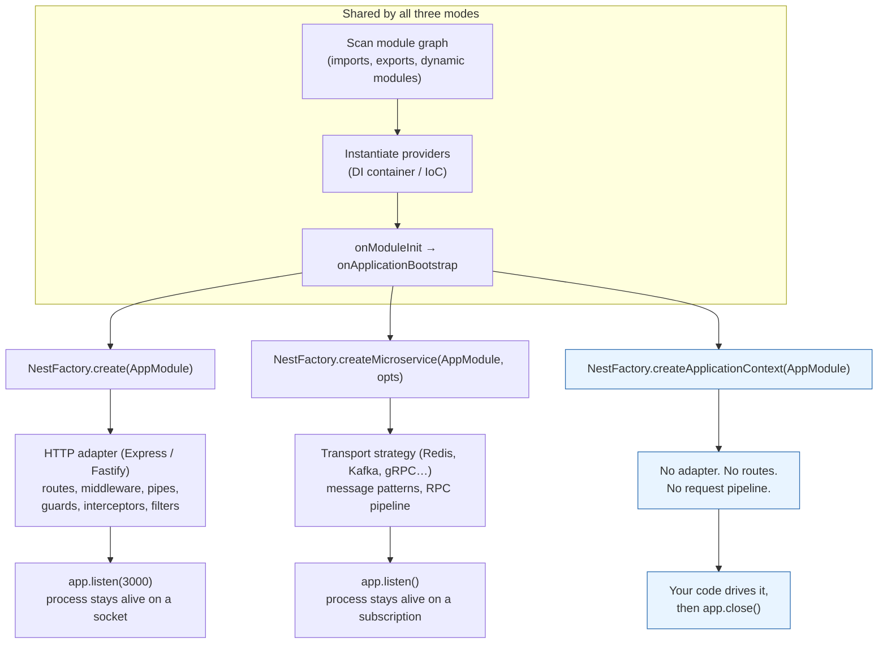

# Chapter 42 — Standalone Applications and Building CLIs

> **한눈에 보기**
> Nest는 HTTP 프레임워크가 아니라 DI 컨테이너를 가진 애플리케이션 프레임워크입니다.
> `NestFactory.createApplicationContext()`는 컨트롤러도 리스너도 없이 컨테이너만 부팅해,
> 시드 스크립트·마이그레이션·크론 워커·큐 전용 프로세스에서 서비스를 그대로 재사용하게 해 줍니다.
> 41장에서 배운 `ModuleRef`/`app.get()`의 조회 규칙이 여기서 실전이 되고,
> 그 위에 `nest-commander`로 서브커맨드와 대화형 프롬프트를 갖춘 진짜 CLI를 얹습니다.
> 마지막으로 REPL을 표준 디버깅 도구로 사용하는 방법을 다룹니다.

**What you will learn**

- What `NestFactory.createApplicationContext()` actually builds — and the precise list of Nest features that stop working because there is no HTTP adapter underneath.
- How `app.get()`, `app.resolve()`, and `app.select()` differ, why `{ strict: true }` exists, and how to reach a provider inside a *dynamic* module.
- How to make a one-off script exit cleanly, why a forgotten `app.close()` leaves your CI job hanging, and which lifecycle hooks still fire in a standalone context.
- How to split a `CoreModule` so that the HTTP API, a cron worker, and a queue consumer share exactly one wiring definition and differ only in their entry point.
- How to build a production CLI with `nest-commander`: `@Command`, `CommandRunner`, `@Option` parsers, `@SubCommand` trees, and `CommandFactory.run` with a real logger and error handler.
- How to prompt interactively with `@QuestionSet`/`@Question` and `InquirerService`, and how to test all of it with `CommandTestFactory` — including scripted answers.
- How to package the result as an installable binary (bin entry, shebang, build output), and how to use the REPL to inspect a container you cannot reach over HTTP.

**Why this matters**

Sooner or later every Nest codebase grows a directory called `scripts/`. Inside it are files that do things the API cannot: backfill a column across two million rows, re-index a search cluster, seed a demo tenant, rotate credentials, replay a day of failed webhooks. The first one is written with a raw `pg` client and a hand-rolled `dotenv` call, because "it's just a script." Six months later that directory contains four different ways of reading configuration, three different database connection strategies, and a copy of your pricing logic that has quietly drifted from the real one. The bug it eventually causes will not be in the script — it will be in the invoice it produced.

A standalone application context removes the excuse. `NestFactory.createApplicationContext(AppModule)` gives you the same container the HTTP server uses: the same `ConfigService` reading the same schema, the same TypeORM `DataSource` with the same pool settings, the same `PricingService` with the same rounding rules. What it does not give you is a port, a router, or a request pipeline — and understanding *why* those disappear (not just *that* they do) is the difference between a script that works and a script that mysteriously skips your global validation pipe.

The second half of this chapter takes the same container and puts a proper command-line interface on top of it. There is a real jump in quality between `node dist/scripts/backfill.js --from=2024-01-01` — where argument parsing is `process.argv[2].split('=')[1]` and a typo silently backfills from `NaN` — and a CLI where `--from` is declared, parsed, validated, documented in `--help`, and unit tested. `nest-commander` gets you there without leaving the programming model you already know: a command is an `@Injectable()` with decorated methods, so it can inject the same services as a controller.

---

## Three ways to bootstrap

Nest ships three factory methods, and they differ in exactly one dimension: what listens for work. Everything below the listener — module resolution, provider instantiation, dependency injection, lifecycle hooks, shutdown — is identical.



| | `create()` | `createMicroservice()` | `createApplicationContext()` |
|---|---|---|---|
| Returns | `INestApplication` | `INestMicroservice` | `INestApplicationContext` |
| DI container | ✅ | ✅ | ✅ |
| Lifecycle hooks | ✅ | ✅ | ✅ |
| Controllers instantiated | ✅ (routed) | ✅ (message-mapped) | ✅ (instantiated, unreachable) |
| Middleware | ✅ | ❌ | ❌ |
| Guards / pipes / interceptors / filters | ✅ | ✅ | ❌ |
| Keeps process alive by itself | ✅ | ✅ | ❌ |
| `enableShutdownHooks()` | ✅ | ✅ | ✅ |
| Typical use | REST/GraphQL API | broker consumer (Ch. 45) | scripts, workers, CLIs |

The third column is the subject of this chapter, and the one honest way to describe it is: **a standalone application is your dependency graph, awake, with nothing pointed at it.**

---

## `createApplicationContext()`: what you get and what you lose

```typescript title="scripts/report.ts"
import { NestFactory } from '@nestjs/core';
import { AppModule } from '../src/app.module';
import { ReportService } from '../src/reports/report.service';

async function bootstrap() {
  const app = await NestFactory.createApplicationContext(AppModule);

  const reports = app.get(ReportService);
  const csv = await reports.monthlyRevenue(new Date('2026-07-01'));
  process.stdout.write(csv);

  await app.close();
}

bootstrap();
```

That is the whole API surface for a simple script. `createApplicationContext` walks `AppModule`, resolves every import (including dynamic modules and `forRootAsync` factories that hit the network), instantiates every provider in dependency order, and runs `onModuleInit` and `onApplicationBootstrap`. By the time the promise resolves, your container is fully warm.

### The features that disappear, and why

The docs say HTTP-related features "are not available." The mechanism is worth stating precisely, because the failure is silent.

Guards, interceptors, pipes and filters are not properties of a provider. They are wrapped around a **handler** by the framework's *router* — `RouterExplorer` for HTTP, the microservice `ListenerController` for transports. That wrapper is what builds the `ExecutionContext` (Chapter 40), runs the enhancer chain, and only then calls your method. In a standalone context there is no router, so there is no wrapper, so:

```typescript
// WRONG — a common and expensive misunderstanding.
const app = await NestFactory.createApplicationContext(AppModule);
const controller = app.get(OrdersController);

// This calls the raw method. Your global ValidationPipe does NOT run.
// Your AuthGuard does NOT run. Your TransformInterceptor does NOT run.
// Your exception filter does NOT catch. Anything thrown is an unhandled
// rejection that kills the process.
await controller.create({ quantity: '-3' } as any);
```

```typescript
// RIGHT — talk to the service layer, which is where your business rules live.
const app = await NestFactory.createApplicationContext(AppModule);
const orders = app.get(OrdersService);
await orders.create({ quantity: -3 });   // throws your own domain error
```

This is one more argument for the rule stated back in [Chapter 5](../part1-beginner/05-providers-and-services.md): controllers are thin adapters over HTTP, and no invariant may live only in a controller or only in a pipe. A validation rule that exists solely as a `class-validator` decorator on a DTO does not exist for your CLI, your queue consumer, or your seeder. Put it in the service too.

Middleware is even more clear-cut: middleware is registered on the underlying Express/Fastify instance. No instance, no middleware. This is exactly why the `AsyncLocalStorage` seeding strategy you will meet in [Chapter 43](43-async-local-storage.md) has to be re-thought for workers.

### `logger` and `abortOnError`

`createApplicationContext` takes the same options object as `create`, minus the HTTP ones. Two matter constantly.

```typescript
const app = await NestFactory.createApplicationContext(AppModule, {
  // Silence the "InstanceLoader … dependencies initialized" banner.
  // For a CLI whose stdout is piped into another program, this is mandatory.
  logger: false,

  // Throw instead of calling process.exit(1) when the graph fails to build.
  abortOnError: false,
});
```

`logger` accepts four shapes, and choosing correctly is what makes a script usable in a pipeline:

| Value | Effect | Use when |
|---|---|---|
| omitted | default `ConsoleLogger`, all levels | interactive development |
| `false` | logging disabled entirely | CLI whose stdout is machine-read |
| `['error', 'warn']` | level filter on the default logger | cron jobs (keep failures visible) |
| a `LoggerService` instance | your own logger (Chapter 18) | production workers shipping JSON logs |

`abortOnError` is subtler and matters more than its documentation suggests. By default, if the DI graph cannot be built — a missing provider, a bad `forRootAsync` factory, a database that will not connect — Nest logs the error and calls `process.exit(1)`. For a server that is reasonable. For a script you are running inside a larger Node process, or a test, or a CLI that wants to print a friendly message, it is a disaster: you never get to run your own error handling.

```typescript
try {
  const app = await NestFactory.createApplicationContext(AppModule, {
    abortOnError: false,
  });
  // ...
} catch (err) {
  // Now you can actually react: print a hint, exit with a chosen code,
  // report to Sentry, whatever this tool should do.
  console.error(`Startup failed: ${(err as Error).message}`);
  process.exitCode = 78; // EX_CONFIG
}
```

There is also `bufferLogs: true`, which holds log messages until a custom logger is attached with `app.useLogger()` — useful when the logger itself is a provider inside the container.

---

## Retrieving providers: `get`, `resolve`, `select`

Chapter 41 covered `ModuleRef` in depth; `INestApplicationContext` exposes the same three operations at the top level, and they follow the same rules.

### `get()` — the whole-container query

```typescript
const tasks = app.get(TasksService);
const config = app.get(ConfigService);
const dataSource = app.get(DataSource);          // class token
const stripe = app.get<Stripe>('STRIPE_CLIENT'); // string token
const budget = app.get(BUDGET_OPTIONS);          // InjectionToken symbol
```

In its default (non-strict) mode, `get()` searches **every registered module**, not just the exports of the root module. That is deliberate and it is a genuine escape hatch: a script can reach a provider that is deliberately not exported for application code. Treat this power the way you treat reflection — convenient at the edges, corrosive in the middle of a codebase.

`get()` is synchronous and only returns **singleton** (`DEFAULT`-scoped) instances. If the token is request- or transient-scoped, it throws.

### `resolve()` — for scoped providers

```typescript
// A TRANSIENT or REQUEST scoped provider must be resolved, not fetched.
const worker = await app.resolve(TenantImporter);

// Two calls with no context id produce two different instances:
const a = await app.resolve(TenantImporter);
const b = await app.resolve(TenantImporter);
console.log(a === b); // false

// Share one sub-tree of instances by passing an explicit context id:
import { ContextIdFactory } from '@nestjs/core';

const contextId = ContextIdFactory.create();
const c = await app.resolve(TenantImporter, contextId);
const d = await app.resolve(TenantImporter, contextId);
console.log(c === d); // true
```

That `contextId` pattern is the standalone equivalent of "one request." When a batch job processes 500 tenants and each tenant needs its own request-scoped sub-graph, you create one context id per tenant, resolve the root of the sub-graph with it, and let the rest of the graph follow. See [Chapter 38](38-injection-scopes.md) for the cost model.

### `select()` and `{ strict: true }`

Strict mode says: *do not search the whole container; look only in the module I selected.*

```typescript
// Non-strict (default): root module is the starting point, search is global.
const tasks = app.get(TasksService);

// Strict: navigate to TasksModule first, then look only there.
const tasks = app.select(TasksModule).get(TasksService, { strict: true });
```

Why would you ever choose the more restrictive version? Because a large application can legitimately register **the same token in more than one module** — a `LOGGER` token per bounded context, a `DataSource` per database, a `CACHE` per feature. Non-strict `get()` returns whichever one the search finds first, which is an implementation detail you should not depend on. Strict selection makes the intent explicit and makes a refactor that removes the provider fail loudly instead of silently resolving the wrong one.

`select()` navigates **one level at a time** and only through modules that are actually imported by the currently selected module. To reach a provider three levels deep you chain:

```typescript
const svc = app
  .select(BillingModule)
  .select(InvoicingModule)
  .get(InvoiceNumberService, { strict: true });
```

### Selecting a *dynamic* module

This is the part that trips people up. A dynamic module is not a class — it is the object returned by `register()`/`forRoot()`. Two calls to `ConfigModule.register()` produce two different objects and, potentially, two different module instances. To select one, you must hold a reference to the exact object you imported:

```typescript title="src/app.module.ts"
import { Module } from '@nestjs/common';
import { ConfigModule } from './config/config.module';

// Export the reference so scripts can select it later.
export const dynamicConfigModule = ConfigModule.register({ folder: './config' });

@Module({
  imports: [dynamicConfigModule],
})
export class AppModule {}
```

```typescript title="scripts/dump-config.ts"
import { NestFactory } from '@nestjs/core';
import { AppModule, dynamicConfigModule } from '../src/app.module';
import { ConfigService } from '../src/config/config.service';

const app = await NestFactory.createApplicationContext(AppModule);
const config = app
  .select(dynamicConfigModule)
  .get(ConfigService, { strict: true });
```

Passing `ConfigModule` (the class) here throws `Nest could not select given module`, because the class itself was never registered — only the object it produced was. If exporting a module-level constant feels awkward, that is a signal: in most applications a dynamic module is registered once and non-strict `get()` is the right tool.

| Method | Sync? | Scopes | Search area |
|---|---|---|---|
| `get(token)` | yes | `DEFAULT` only | whole container |
| `get(token, { strict: true })` | yes | `DEFAULT` only | selected module only |
| `resolve(token, contextId?)` | no (Promise) | `TRANSIENT`, `REQUEST` | whole container (or selected, with `strict`) |
| `select(Module \| dynamicRef)` | yes | — | returns a new `INestApplicationContext` |

---

## Lifecycle in a standalone context

`await NestFactory.createApplicationContext(...)` already runs `onModuleInit` and `onApplicationBootstrap` for you — `init()` is called internally. You only call `app.init()` yourself in the rare case where you built the context with something that defers initialization (mainly in testing, where `Test.createTestingModule(...).compile()` gives you a module you may want to inspect before initializing).

The end of the script is where the real work is:

```typescript
async function bootstrap() {
  const app = await NestFactory.createApplicationContext(AppModule);
  try {
    await app.get(MigrationRunner).run();
  } finally {
    await app.close();   // ALWAYS in a finally
  }
}
bootstrap();
```

`app.close()` runs `onModuleDestroy` → `beforeApplicationShutdown` → `onApplicationShutdown`, in reverse dependency order ([Chapter 39](39-lifecycle-and-shutdown.md)). That is what closes the TypeORM pool, disconnects Redis, drains BullMQ workers, and flushes your logger.

**Skip it and your script hangs.** Not crashes — hangs. Node keeps the process alive while any handle is open, and an idle database pool is an open handle. In CI this shows up as a job that prints the correct output and then times out after ten minutes. Every standalone script needs `close()` on both the success and the failure path, which is why `try/finally` rather than a trailing statement.

For a long-running standalone worker (not a one-shot script) you additionally want OS signals wired in:

```typescript title="src/worker.ts"
async function bootstrap() {
  const app = await NestFactory.createApplicationContext(AppModule, {
    logger: ['log', 'warn', 'error'],
  });

  // SIGTERM/SIGINT now trigger the full shutdown sequence.
  app.enableShutdownHooks();

  // Nothing keeps this process alive except the work its providers started
  // (a BullMQ Worker, a cron scheduler, a broker subscription).
  await app.get(WorkerReadyService).announce();
}
bootstrap();
```

Note the asymmetry with an HTTP app: `listen()` keeps the event loop busy, so an HTTP process stays up on its own. A standalone context does not. If every provider is idle, Node exits — which is correct for a script and surprising for a worker. Something must hold a handle: a `@nestjs/schedule` cron job, a BullMQ `Worker`, an open socket. If nothing does, your "worker" starts, logs, and exits with code 0.

---

## Sharing a `CoreModule` between the API and the workers

The reason standalone contexts are worth learning is code reuse, and reuse only works if the module graph is designed for it. The mistake is to make `AppModule` the single root for everything: your cron worker then boots controllers, Swagger, Helmet, and the rate limiter it will never use — slower startup, more connections, more surface area.

Split the graph by *responsibility*, not by *entry point*:

```typescript title="src/core/core.module.ts"
import { Module, Global } from '@nestjs/common';
import { ConfigModule, ConfigService } from '@nestjs/config';
import { TypeOrmModule } from '@nestjs/typeorm';
import { validationSchema } from './env.validation';

@Global()
@Module({
  imports: [
    ConfigModule.forRoot({ isGlobal: true, validationSchema, cache: true }),
    TypeOrmModule.forRootAsync({
      inject: [ConfigService],
      useFactory: (config: ConfigService) => ({
        type: 'postgres',
        url: config.getOrThrow<string>('DATABASE_URL'),
        autoLoadEntities: true,
        // Never true outside local dev — a seeder that syncs schema is a
        // production incident waiting for a Friday.
        synchronize: false,
      }),
    }),
  ],
  exports: [ConfigModule, TypeOrmModule],
})
export class CoreModule {}
```

```typescript title="src/domain/orders/orders.module.ts"
@Module({
  imports: [TypeOrmModule.forFeature([Order, OrderLine])],
  providers: [OrdersService, PricingService],
  exports: [OrdersService, PricingService],   // no controller here
})
export class OrdersModule {}
```

Now the roots are thin and each entry point imports only what it needs:

```typescript title="src/app.module.ts (HTTP)"
@Module({
  imports: [CoreModule, OrdersModule, HealthModule],
  controllers: [OrdersController],           // HTTP-only concern
  providers: [{ provide: APP_PIPE, useClass: ValidationPipe }],
})
export class AppModule {}
```

```typescript title="src/worker.module.ts (queue consumer)"
@Module({
  imports: [
    CoreModule,
    OrdersModule,
    BullModule.forRootAsync({ /* … */ }),
    BullModule.registerQueue({ name: 'invoices' }),
  ],
  providers: [InvoiceProcessor],             // WorkerHost, see Chapter 35
})
export class WorkerModule {}
```

```typescript title="src/cli.module.ts (commands and scripts)"
@Module({
  imports: [CoreModule, OrdersModule],
  providers: [SeedCommand, BackfillCommand, ReindexCommand],
})
export class CliModule {}
```

Three roots, one definition of configuration and persistence, one definition of the order domain. When the pricing rule changes, it changes once. This structure also cooperates with [Chapter 54](54-monorepo-and-libraries.md) if you later split these into separate deployables.

The worker entry point is then four lines, and it deliberately uses `createApplicationContext` rather than `create` — the queue consumer described in [Chapter 35](../part2-intermediate/35-queues.md) needs no HTTP server at all:

```typescript title="src/worker.ts"
import { NestFactory } from '@nestjs/core';
import { WorkerModule } from './worker.module';

async function bootstrap() {
  const app = await NestFactory.createApplicationContext(WorkerModule);
  app.enableShutdownHooks();   // SIGTERM → BullMQ worker drains in-flight jobs
}
bootstrap();
```

> **Hint** — If you also want a `/health` endpoint on a worker (Kubernetes usually wants one), do not switch back to `createApplicationContext`'s HTTP sibling and drag in the whole API. Use a hybrid app or a second tiny `HealthModule` server — see [Chapter 57](57-advanced-http.md).

---

## From script to CLI: where `nest-commander` starts paying

A standalone script is fine when there is one thing to do and no arguments. The moment you have flags, subcommands, or more than three scripts, hand-rolled `process.argv` parsing becomes the bug source. `nest-commander` wraps [commander](https://github.com/tj/commander.js) in Nest's programming model: a command is an injectable class, so it gets your services by constructor injection, and its flags are declared with decorators.

> **⚠️ Notice** — `nest-commander` is a third-party package maintained by Jay McDoniel, not by the Nest core team. Report issues at `github.com/jmcdo29/nest-commander`.

```bash
$ npm i nest-commander
```

### A command is a class

Every command extends the abstract `CommandRunner`, which requires one method:

```typescript
run(passedParams: string[], options?: Record<string, any>): Promise<void>
```

`passedParams` receives the positional arguments that did not match a flag; `options` receives an object whose keys are the `name` of each `@Option` and whose values are whatever that option's handler returned.

```typescript title="src/cli/backfill.command.ts"
import { Command, CommandRunner, Option } from 'nest-commander';
import { Logger } from '@nestjs/common';
import { OrdersService } from '../domain/orders/orders.service';

interface BackfillOptions {
  from: Date;
  batch: number;
  dryRun: boolean;
}

@Command({
  name: 'backfill',
  description: 'Recompute denormalised order totals',
  arguments: '[tenant]',
  argsDescription: { tenant: 'Restrict the run to a single tenant slug' },
})
export class BackfillCommand extends CommandRunner {
  private readonly logger = new Logger(BackfillCommand.name);

  constructor(private readonly orders: OrdersService) {
    super();
  }

  async run(params: string[], options: BackfillOptions): Promise<void> {
    const [tenant] = params;

    const total = await this.orders.countForBackfill(options.from, tenant);
    this.logger.log(
      `${options.dryRun ? '[dry-run] ' : ''}${total} orders since ` +
        `${options.from.toISOString()} in batches of ${options.batch}`,
    );

    if (options.dryRun) return;

    for await (const batch of this.orders.streamForBackfill(options.from, options.batch, tenant)) {
      await this.orders.recomputeTotals(batch);
    }
  }

  @Option({
    flags: '-f, --from <date>',
    description: 'ISO date to start from',
    required: true,
  })
  parseFrom(value: string): Date {
    const date = new Date(value);
    // Throwing here fails the command before run() is entered.
    if (Number.isNaN(date.valueOf())) {
      throw new Error(`--from must be an ISO date, received "${value}"`);
    }
    return date;
  }

  @Option({
    flags: '-b, --batch <number>',
    description: 'Rows per transaction',
    defaultValue: 500,
  })
  parseBatch(value: string): number {
    const n = Number(value);
    if (!Number.isInteger(n) || n < 1 || n > 10_000) {
      throw new Error('--batch must be an integer between 1 and 10000');
    }
    return n;
  }

  @Option({
    flags: '--dry-run',
    description: 'Report what would change without writing',
  })
  parseDryRun(): boolean {
    return true;
  }
}
```

Three things in that listing carry the design:

1. **The option handler is the parser and the validator.** `parseFrom` converts `string` to `Date` and rejects garbage. By the time `run()` executes, `options.from` is a real `Date` — the same discipline as a Nest `ParseIntPipe`, just spelled differently. This is where `nest-commander` beats raw commander: your parsing lives on the class, is typed, and is unit-testable.
2. **A boolean flag's handler takes no value.** `--dry-run` has no `<value>` in its `flags` string, so commander sets it to `true` and your handler simply returns `true`. If the key is absent, `options.dryRun` is `undefined` — hence the `!== undefined` style checks you see in the official example rather than a plain truthiness test, which would mis-handle `--boolean false`.
3. **Injection is normal.** `OrdersService` arrives by constructor injection exactly as it would in a controller, provided `BackfillCommand` is in a module's `providers`.

### `@Option` reference

| Property | Type | Meaning |
|---|---|---|
| `flags` | `string` | Commander flag syntax: `-n, --number <value>` (required value), `[value]` (optional value), none (boolean) |
| `description` | `string` | Shown in `--help` |
| `required` | `boolean` | Command fails if the flag is absent |
| `defaultValue` | `unknown` | Used when the flag is absent; also shown in help |
| `name` | `string` | Override the key in the `options` object (defaults to the long flag, camel-cased) |
| `choices` | `string[] \| boolean` | Restrict accepted values (or defer to `@ChoicesFor`) |
| `env` | `string` | Fall back to this environment variable |
| `conflicts` | `string \| string[]` | Reject the run if these options are combined |
| `implies` | `Record<string, unknown>` | Set other options when this one is present |

### Registering and running

```typescript title="src/cli.module.ts"
import { Module } from '@nestjs/common';
import { CoreModule } from './core/core.module';
import { OrdersModule } from './domain/orders/orders.module';
import { BackfillCommand } from './cli/backfill.command';
import { SeedCommand } from './cli/seed.command';

@Module({
  imports: [CoreModule, OrdersModule],
  providers: [BackfillCommand, SeedCommand],
})
export class CliModule {}
```

```typescript title="src/cli.ts"
import { CommandFactory } from 'nest-commander';
import { CliModule } from './cli.module';

async function bootstrap() {
  await CommandFactory.run(CliModule, {
    // Nest's own logger is OFF by default under CommandFactory — a CLI that
    // prints "InstanceLoader dependencies initialized" is a broken CLI.
    // Keep errors, though: a silent failure is worse than a noisy one.
    logger: ['warn', 'error'],
    cliName: 'shopctl',
    errorHandler: (err) => {
      process.stderr.write(`${err.message}\n`);
      process.exit(1);
    },
    serviceErrorHandler: (err) => {
      // Thrown while building the DI graph (bad config, DB unreachable).
      process.stderr.write(`Startup failed: ${err.message}\n`);
      process.exit(78);
    },
  });
}

bootstrap();
```

`CommandFactory.run` calls `NestFactory.createApplicationContext` for you, parses `process.argv`, resolves the matching command, awaits `run()`, and then calls `app.close()`. You do not manage the lifecycle yourself — which also means you must not `process.exit()` inside `run()` on the happy path, or shutdown hooks never fire and your database pool is killed mid-flush.

Two variants are worth knowing:

- `CommandFactory.runWithoutClosing(CliModule, opts)` returns the `INestApplicationContext` and leaves it open — use it when the command starts something that must keep running (a watcher, a dev server) and you will close it yourself.
- The second argument may also be just a logger (`new MyLogger()` or `['error']`) instead of the full options object, which is the short form the official docs show.

---

## Sub-commands

Real CLIs are trees: `shopctl tenant create`, `shopctl tenant archive`. `nest-commander` models this with `@SubCommand`, which is `@Command` for a child, plus a `subCommands` array on the parent.

```typescript title="src/cli/tenant/create.subcommand.ts"
import { SubCommand, CommandRunner, Option } from 'nest-commander';
import { TenantService } from '../../domain/tenants/tenant.service';

@SubCommand({ name: 'create', description: 'Provision a new tenant' })
export class TenantCreateCommand extends CommandRunner {
  constructor(private readonly tenants: TenantService) {
    super();
  }

  async run(params: string[], options: { plan: string }): Promise<void> {
    const [slug] = params;
    if (!slug) {
      // Every CommandRunner has `this.command`, the underlying commander
      // Command instance. Use it for help output and exit codes.
      this.command.help({ error: true });
    }
    const tenant = await this.tenants.provision(slug, options.plan);
    process.stdout.write(`${tenant.id}\n`);
  }

  @Option({
    flags: '-p, --plan <plan>',
    description: 'Billing plan',
    defaultValue: 'starter',
    choices: ['starter', 'growth', 'enterprise'],
  })
  parsePlan(value: string): string {
    return value;
  }
}
```

```typescript title="src/cli/tenant/tenant.command.ts"
import { Command, CommandRunner } from 'nest-commander';
import { TenantCreateCommand } from './create.subcommand';
import { TenantArchiveCommand } from './archive.subcommand';

@Command({
  name: 'tenant',
  description: 'Tenant administration',
  subCommands: [TenantCreateCommand, TenantArchiveCommand],
})
export class TenantCommand extends CommandRunner {
  async run(): Promise<void> {
    // A parent with only sub-commands should print help, not do work.
    this.command.outputHelp();
  }
}
```

All three classes go in `providers`. Sub-commands are injectables like anything else.

Two related options on `@Command`:

- `options: { isDefault: true }` marks the command that runs when no command name is given (`shopctl --from=…` with no verb). Only one command may be default.
- `options: { hidden: true }` keeps a command out of `--help` — useful for internal or dangerous operations.

---

## Interactive prompts with `InquirerService`

A CLI that requires eleven flags is a CLI nobody uses correctly. `nest-commander` integrates Inquirer so that missing answers can be asked for, while still allowing full non-interactive use — which matters, because your CI must be able to run the same command without a TTY.

Questions are declared as a class:

```typescript title="src/cli/tenant/tenant.questions.ts"
import { QuestionSet, Question, ValidateFor, ChoicesFor } from 'nest-commander';
import { PlanService } from '../../domain/billing/plan.service';

@QuestionSet({ name: 'tenant-questions' })
export class TenantQuestions {
  constructor(private readonly plans: PlanService) {}

  @Question({
    name: 'slug',
    message: 'Tenant slug (lowercase, no spaces):',
    type: 'input',
  })
  parseSlug(value: string): string {
    return value.trim().toLowerCase();
  }

  @ValidateFor({ name: 'slug' })
  validateSlug(value: string): boolean | string {
    return /^[a-z0-9-]{3,32}$/.test(value) || 'Use 3–32 chars: a–z, 0–9, hyphen';
  }

  @Question({
    name: 'plan',
    message: 'Which plan?',
    type: 'list',
  })
  parsePlan(value: string): string {
    return value;
  }

  @ChoicesFor({ name: 'plan' })
  async planChoices(): Promise<string[]> {
    // Dependency injection works here too — choices can come from the database.
    return (await this.plans.listActive()).map((p) => p.code);
  }
}
```

And asked for only when the flag was not supplied:

```typescript
@SubCommand({ name: 'create' })
export class TenantCreateCommand extends CommandRunner {
  constructor(
    private readonly tenants: TenantService,
    private readonly inquirer: InquirerService,
  ) {
    super();
  }

  async run(params: string[], options: { slug?: string; plan?: string }) {
    // ask() fills in only the keys that are missing from the passed object,
    // so a fully-flagged invocation never prompts. This is the property that
    // keeps the command usable from CI.
    const answers = await this.inquirer.ask<{ slug: string; plan: string }>(
      'tenant-questions',
      { slug: params[0] ?? options.slug, plan: options.plan },
    );

    const tenant = await this.tenants.provision(answers.slug, answers.plan);
    process.stdout.write(`${tenant.id}\n`);
  }
}
```

Register `TenantQuestions` in `providers` alongside the commands. Other decorators in the same family: `@WhenFor` (conditionally skip a question), `@TransformFor` (post-process an answer), `@MessageFor`, `@DefaultFor` and `@FilterFor`.

> **⚠️ Notice** — Never prompt unconditionally. A command that blocks on a TTY prompt inside a cron container hangs forever and the pod is eventually OOM-killed with no useful log. Always accept every answer as a flag, and treat prompting as a convenience layer over the flags.

---

## Testing commands

`CommandTestFactory` is `Test.createTestingModule` for CLIs — it uses `@nestjs/testing` underneath, so `overrideProvider` works exactly as in [Chapter 31](../part2-intermediate/31-testing.md).

```typescript title="test/backfill.command.spec.ts"
import { CommandTestFactory } from 'nest-commander-testing';
import { TestingModule } from '@nestjs/testing';
import { CliModule } from '../src/cli.module';
import { OrdersService } from '../src/domain/orders/orders.service';

describe('backfill command', () => {
  let commandInstance: TestingModule;
  const orders = {
    countForBackfill: jest.fn().mockResolvedValue(12),
    streamForBackfill: jest.fn(),
    recomputeTotals: jest.fn(),
  };

  beforeEach(async () => {
    commandInstance = await CommandTestFactory.createTestingCommand({
      imports: [CliModule],
    })
      .overrideProvider(OrdersService)
      .useValue(orders)
      .compile();
  });

  it('does not write anything in dry-run mode', async () => {
    await CommandTestFactory.run(commandInstance, [
      'backfill',
      '--from', '2026-01-01',
      '--dry-run',
    ]);

    expect(orders.countForBackfill).toHaveBeenCalled();
    expect(orders.recomputeTotals).not.toHaveBeenCalled();
  });

  it('rejects a non-ISO --from', async () => {
    await expect(
      CommandTestFactory.run(commandInstance, ['backfill', '--from', 'yesterday']),
    ).rejects.toThrow(/ISO date/);
  });
});
```

For interactive commands, script the answers before running so the test never blocks:

```typescript
CommandTestFactory.setAnswers(['acme-inc', 'growth']);
await CommandTestFactory.run(commandInstance, ['tenant', 'create']);
```

Note the argument array: it excludes `node` and the script path — `CommandTestFactory.run` prepends those for you.

---

## Packaging the CLI

Three pieces turn `dist/cli.js` into a command your team can type.

**1. A shebang on the entry file.** TypeScript will not emit one for you, so put it at the very top of `src/cli.ts` — `tsc` preserves leading comments:

```typescript title="src/cli.ts"
#!/usr/bin/env node
import 'reflect-metadata';
import { CommandFactory } from 'nest-commander';
import { CliModule } from './cli.module';

CommandFactory.run(CliModule, { logger: ['warn', 'error'], cliName: 'shopctl' });
```

**2. A `bin` entry in `package.json`.**

```json title="package.json"
{
  "name": "@acme/shopctl",
  "version": "1.4.0",
  "bin": { "shopctl": "dist/cli.js" },
  "files": ["dist"],
  "scripts": {
    "build": "nest build",
    "cli": "nest start --entryFile cli",
    "cli:dev": "nest start --watch --entryFile cli"
  }
}
```

`npm i -g .` (or `npm link` during development) then puts `shopctl` on `PATH`. On POSIX systems npm sets the executable bit for files listed under `bin`; if you ship a tarball built on Windows, add `chmod +x dist/cli.js` to a `prepack` script.

**3. The build.** `nest build` compiles `src/**` to `dist/**` using the same `tsconfig` as the server, so `--entryFile cli` is all the CLI-specific configuration you need. Two practical notes:

- Decorators require `reflect-metadata`. The server imports it via `@nestjs/core`'s bootstrap path; add the explicit `import 'reflect-metadata'` at the top of the CLI entry to be safe under bundlers.
- If startup latency matters (a CLI that takes 2s to boot a database pool feels broken), consider splitting `CliModule` so heavy modules are lazily loaded with `LazyModuleLoader` ([Chapter 41](41-module-ref-discovery-lazy.md)) only inside commands that need them.

---

## The REPL as a debugging tool

A standalone context you can type into is a debugger. `@nestjs/core` exports `repl()`, which boots the container and drops you into a Node REPL with helper functions bound.

```typescript title="src/repl.ts"
import { repl } from '@nestjs/core';
import { AppModule } from './app.module';

async function bootstrap() {
  const replServer = await repl(AppModule);

  // Without this, arrow-up history is lost on every --watch reload.
  replServer.setupHistory('.nestjs_repl_history', (err) => {
    if (err) console.error(err);
  });
}
bootstrap();
```

```bash
$ npm run start -- --entryFile repl
# or, reloading on every save:
$ npm run start -- --watch --entryFile repl
```

```typescript
> get(AppService).getHello()
'Hello World!'

> orders = get(OrdersService)
OrdersService { repo: Repository {}, pricing: PricingService {} }

> await orders.findOne('ord_123')
Order { id: 'ord_123', total: 4200, … }

> methods(OrdersController)

Methods:
 ◻ create
 ◻ findAll
 ◻ findOne

> debug()

AppModule:
 - controllers:
  ◻ OrdersController
 - providers:
  ◻ OrdersService
  ◻ PricingService
```

| Function | Purpose | Signature |
|---|---|---|
| `debug` | list registered modules with their controllers and providers | `debug(moduleCls?: ClassRef \| string) => void` |
| `get` / `$` | retrieve an injectable or controller instance, or throw | `get(token: InjectionToken) => any` |
| `methods` | list public methods of a provider or controller | `methods(token: ClassRef \| string) => void` |
| `resolve` | resolve a transient or request-scoped instance | `resolve(token: InjectionToken, contextId: any) => Promise<any>` |
| `select` | navigate the module tree to a specific module context | `select(token: DynamicModule \| ClassRef) => INestApplicationContext` |
| `help` | list all of the above | `help() => void` |

`<fn>.help` prints one function's signature and description — for example `$.help` describes `get`.

The REPL is the fastest way to answer three recurring questions: *is this provider actually registered?* (`debug()`), *which instance does this token resolve to?* (`get(TOKEN)`), and *does this service behave the way I think against real data?* (call it). It beats adding a temporary debug endpoint, and unlike a unit test it runs against your real configuration. Use it when a CLI command misbehaves and you are not sure whether the bug is in the parsing or in the service.

> **⚠️ Notice** — The REPL boots your real container against whatever `NODE_ENV`/`DATABASE_URL` is in scope. Running `get(UserService).deleteAll()` against production is one shell history entry away. Never point a REPL at production credentials, and if you must, give it a read-only database role.

---

## Common mistakes

1. **The script prints the right output and never exits.**
   *Symptom:* CI job times out; locally you press Ctrl-C and assume it worked.
   *Cause:* no `app.close()`, so the TypeORM pool / Redis client keeps a handle open.
   *Fix:* `try { … } finally { await app.close(); }`. If it still hangs, something outside the container opened a handle — check for a stray `setInterval` or a client you constructed manually.

2. **Calling a controller from a script and expecting validation.**
   *Symptom:* the script writes rows the API would have rejected with a 400.
   *Cause:* pipes, guards and interceptors are applied by the HTTP router, which does not exist in a standalone context.
   *Fix:* call the service, and make sure the invariant lives in the service — not only in a DTO decorator.

3. **A long-running "worker" exits immediately with code 0.**
   *Symptom:* the container restarts in a loop; logs show a clean startup and nothing else.
   *Cause:* nothing in the container holds an open handle, so Node's event loop drains.
   *Fix:* make sure the worker actually starts something (a BullMQ `Worker`, a cron registration, a broker subscription). If it genuinely has nothing to hold, it is a script, not a worker — run it from a scheduler instead.

4. **`Nest could not select given module` when selecting a dynamic module.**
   *Symptom:* `app.select(ConfigModule)` throws even though `ConfigModule.register(...)` is imported.
   *Cause:* the class was never registered; the *object returned by* `register()` was.
   *Fix:* export the returned object as a constant and select that — or drop `strict` and use plain `app.get()`.

5. **`app.get()` on a request-scoped provider throws at startup.**
   *Symptom:* `… is marked as a scoped provider. Request and transient-scoped providers can't be used in combination with "get()" method.`
   *Cause:* `get()` only returns singletons.
   *Fix:* `await app.resolve(Token)`, and pass a shared `ContextIdFactory.create()` when several resolutions must share one sub-graph.

6. **A CLI whose stdout cannot be piped.**
   *Symptom:* `shopctl export | jq` fails because the JSON is preceded by Nest's startup banner.
   *Cause:* the default logger writes to stdout.
   *Fix:* `logger: false` or `['warn', 'error']` (which writes to stderr for errors), and write your payload with `process.stdout.write` rather than `console.log` when formatting matters.

7. **`process.exit(0)` at the end of a command.**
   *Symptom:* occasional lost writes; the last log line is missing.
   *Cause:* `process.exit` is immediate — pending flushes and shutdown hooks never run.
   *Fix:* let `CommandFactory` close the app. To signal failure, set `process.exitCode = 1` and return; Node exits with that code once the loop drains.

8. **A boolean option treated with plain truthiness.**
   *Symptom:* `--verbose false` still enables verbose output.
   *Cause:* the handler returned `true` regardless, or `if (options.verbose)` is true for the string `'false'`.
   *Fix:* for a tri-state flag use `flags: '-v, --verbose [bool]'` with `JSON.parse` as the parser and compare against `undefined`; for a simple switch use a valueless flag so the value is only ever `true` or absent.

---

## Putting it together

A single CLI binary that shares the API's container, seeds a tenant interactively, and exits with a meaningful status code.

```typescript title="src/cli/seed.command.ts"
import { Command, CommandRunner, Option, InquirerService } from 'nest-commander';
import { Logger } from '@nestjs/common';
import { DataSource } from 'typeorm';
import { TenantService } from '../domain/tenants/tenant.service';

interface SeedOptions {
  slug?: string;
  plan?: string;
  orders: number;
  yes: boolean;
}

@Command({
  name: 'seed',
  description: 'Create a demo tenant with sample orders',
  arguments: '[slug]',
})
export class SeedCommand extends CommandRunner {
  private readonly logger = new Logger('seed');

  constructor(
    private readonly tenants: TenantService,
    private readonly dataSource: DataSource,
    private readonly inquirer: InquirerService,
  ) {
    super();
  }

  async run(params: string[], options: SeedOptions): Promise<void> {
    if (process.env.NODE_ENV === 'production') {
      throw new Error('Refusing to seed a production database');
    }

    // Flags win; prompt only for what is missing and only when interactive.
    const needsPrompt = !options.yes && (!params[0] ?? !options.plan);
    const answers = needsPrompt
      ? await this.inquirer.ask<{ slug: string; plan: string }>('tenant-questions', {
          slug: params[0] ?? options.slug,
          plan: options.plan,
        })
      : { slug: params[0] ?? options.slug!, plan: options.plan ?? 'starter' };

    // One transaction: a half-seeded tenant is worse than none.
    await this.dataSource.transaction(async (manager) => {
      const tenant = await this.tenants.provisionWith(manager, answers.slug, answers.plan);
      await this.tenants.seedOrdersWith(manager, tenant, options.orders);
      this.logger.log(`Seeded ${answers.slug} (${tenant.id}) with ${options.orders} orders`);
    });
  }

  @Option({ flags: '-p, --plan <plan>', description: 'Billing plan', choices: ['starter', 'growth'] })
  parsePlan(value: string): string {
    return value;
  }

  @Option({ flags: '-o, --orders <count>', description: 'Sample orders to create', defaultValue: 25 })
  parseOrders(value: string): number {
    const n = Number(value);
    if (!Number.isInteger(n) || n < 0) throw new Error('--orders must be a non-negative integer');
    return n;
  }

  @Option({ flags: '-y, --yes', description: 'Never prompt; use defaults' })
  parseYes(): boolean {
    return true;
  }
}
```

```typescript title="src/cli.ts"
#!/usr/bin/env node
import 'reflect-metadata';
import { CommandFactory } from 'nest-commander';
import { CliModule } from './cli.module';

async function bootstrap() {
  await CommandFactory.run(CliModule, {
    cliName: 'shopctl',
    logger: ['warn', 'error'],
    errorHandler: (err) => {
      process.stderr.write(`shopctl: ${err.message}\n`);
      process.exitCode = 1;
    },
    serviceErrorHandler: (err) => {
      process.stderr.write(`shopctl: startup failed — ${err.message}\n`);
      process.exitCode = 78;
    },
  });
}

bootstrap();
```

```bash
# Fully non-interactive — safe for CI
$ shopctl seed acme-inc --plan growth --orders 100 --yes

# Interactive — prompts for slug and plan
$ shopctl seed

# Discoverable
$ shopctl --help
$ shopctl seed --help
```

The same `CliModule` imports the same `CoreModule` as `src/main.ts` and `src/worker.ts`. One configuration schema, one connection strategy, one domain layer — three entry points.

---

> **핵심 정리**
> - `NestFactory.createApplicationContext()`는 DI 컨테이너만 부팅합니다. 모듈 그래프·프로바이더 인스턴스화·라이프사이클 훅은 그대로지만, 라우터가 없으므로 미들웨어·파이프·가드·인터셉터·필터는 실행되지 않습니다.
> - 그래서 스크립트는 컨트롤러가 아니라 **서비스**를 호출해야 하고, 불변식은 DTO 데코레이터가 아니라 서비스에 있어야 합니다.
> - `get()`은 싱글턴만, 컨테이너 전체를 검색합니다. `resolve()`는 스코프 프로바이더용이며 `ContextIdFactory.create()`로 하위 그래프를 공유할 수 있습니다. `select(...).get(token, { strict: true })`는 같은 토큰이 여러 모듈에 있을 때 의도를 명시합니다.
> - 동적 모듈을 `select`하려면 클래스가 아니라 `register()`가 **반환한 객체**를 넘겨야 합니다.
> - 일회성 스크립트는 반드시 `try/finally`로 `app.close()`를 호출하세요. 빠뜨리면 커넥션 풀 핸들 때문에 프로세스가 종료되지 않고 CI가 타임아웃됩니다.
> - 장기 실행 워커는 스스로 살아 있지 않습니다. BullMQ Worker·크론·브로커 구독 같은 열린 핸들이 없으면 즉시 종료 코드 0으로 끝납니다. `enableShutdownHooks()`도 함께 켜세요.
> - `CoreModule`(설정·DB)과 도메인 모듈을 분리하고, HTTP·워커·CLI 세 개의 얇은 루트 모듈이 이를 재사용하는 구조가 표준입니다.
> - `nest-commander`의 커맨드는 `@Injectable`입니다. `@Option` 핸들러가 파서이자 검증기이며, 여기서 던진 예외는 `run()` 진입 전에 커맨드를 실패시킵니다.
> - `CommandFactory.run`은 컨텍스트 생성·파싱·`app.close()`를 대신합니다. 성공 경로에서 `process.exit()`를 부르지 마세요.
> - 대화형 프롬프트는 항상 플래그의 편의 계층이어야 합니다. TTY 없는 환경에서 무조건 묻는 CLI는 영원히 멈춥니다.
> - REPL(`repl(AppModule)`)은 `debug()`, `get()`/`$`, `methods()`, `resolve()`, `select()`로 컨테이너를 직접 조사하는 표준 디버깅 도구입니다.

> **연습 문제**
> 1. `createApplicationContext`로 부팅한 컨텍스트에서 컨트롤러를 `app.get()`으로 꺼내 메서드를 직접 호출했을 때, 전역 `ValidationPipe`가 동작하지 않는 이유를 프레임워크 내부 동작 관점에서 설명하세요.
> 2. `app.get(Token)`과 `app.select(SomeModule).get(Token, { strict: true })`가 서로 다른 인스턴스를 반환할 수 있는 구체적인 모듈 구성을 하나 만들고, 왜 그런지 설명하세요.
> 3. **직접 만들어 보라:** `CoreModule`(ConfigModule + TypeORM)을 분리하고, 이를 재사용하는 `AppModule`(HTTP), `WorkerModule`(BullMQ 컨슈머), `CliModule`(명령어) 세 개의 루트 모듈과 각각의 엔트리 파일을 작성하세요. 워커가 즉시 종료되지 않는 이유를 코드로 보여야 합니다.
> 4. **직접 만들어 보라:** `nest-commander`로 `user` 커맨드와 그 아래 `create`/`disable` 서브커맨드를 구현하세요. `--email`은 필수이며 형식 검증을, `--role`은 `choices`를 사용해야 합니다. 그리고 `CommandTestFactory`로 (a) 잘못된 이메일이 거부되는지, (b) `--role`이 없을 때 기본값이 적용되는지 두 가지 테스트를 작성하세요.
> 5. 위 4번 커맨드에 `@QuestionSet`/`@Question`으로 대화형 프롬프트를 추가하되, `--yes` 플래그가 있으면 절대 묻지 않도록 만드세요. 왜 이 보호 장치가 CI에서 필수인지 한 문단으로 설명하세요.
> 6. `app.close()`를 빠뜨린 시드 스크립트가 정확히 무엇 때문에 종료되지 않는지 조사하는 방법을 두 가지 이상 제시하세요. (힌트: `process._getActiveHandles()`, `why-is-node-running`)

**Next:** [Chapter 43 — AsyncLocalStorage and Request Context Propagation](43-async-local-storage.md) answers the question this chapter opened but did not close: when the request pipeline is gone — in a worker, a CLI, or a queue consumer — how do you still carry a tenant id, a user, and a correlation id through a call stack without threading them through every signature?
