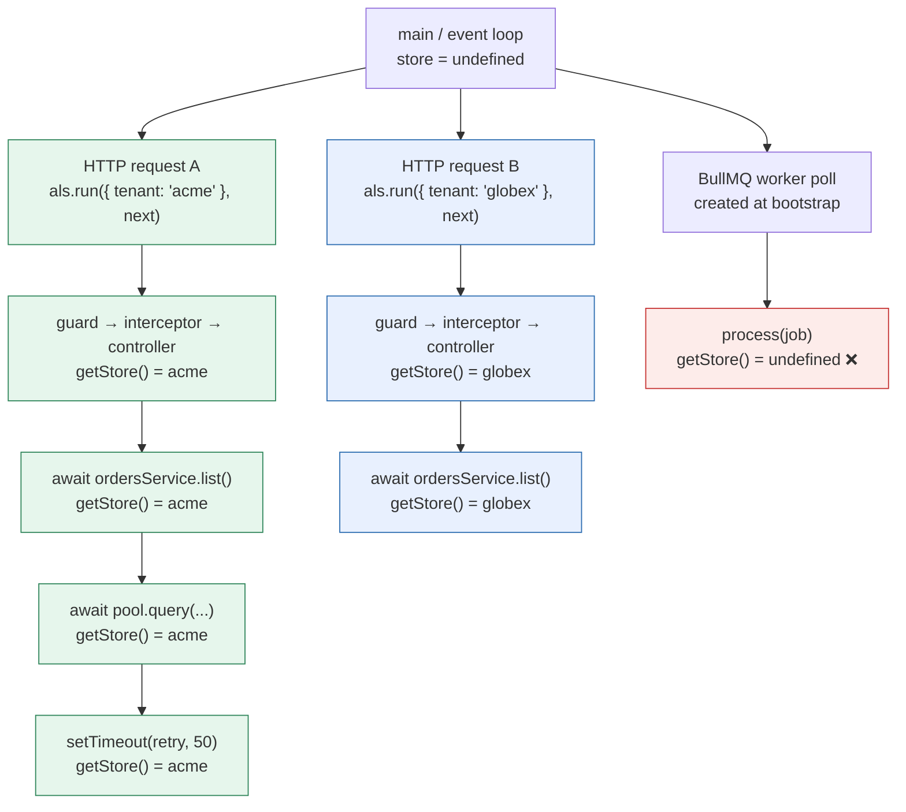
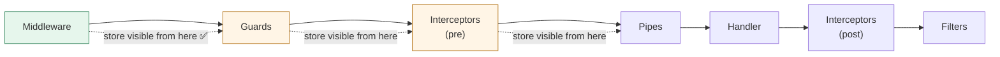

# Chapter 43 — AsyncLocalStorage and Request Context Propagation

> **한눈에 보기**
> 테넌트 ID, 사용자, 상관관계 ID처럼 "요청 전체가 알아야 하는 값"을 모든 함수 시그니처에
> 끼워 넣지 않고 전달하는 방법을 다룹니다. 전역 변수는 왜 틀렸고, 38장의 REQUEST 스코프
> 프로바이더는 왜 비싼지부터 시작해, Node의 `AsyncLocalStorage`가 비동기 리소스 그래프를
> 따라 store를 전파하는 **메커니즘**을 먼저 이해합니다. 그다음 미들웨어·가드·인터셉터 중
> 어디서 store를 심어야 하는지, `nestjs-cls`가 무엇을 대신해 주는지, 그리고 무엇보다
> **컨텍스트가 유실되는 지점들**(BullMQ 워커, 이벤트 이미터, 서드파티 콜백)을 정면으로 봅니다.

**What you will learn**

- Why "just pass it as a parameter" stops scaling at about the fourth layer, and why a module-level variable is not merely ugly but *incorrect* under concurrency.
- How `AsyncLocalStorage` actually propagates a store — the async resource graph, what `run()` does to it, and why `getStore()` is a lookup up that tree rather than a global read.
- Why `enterWith()` is the dangerous sibling of `run()`, what it leaks, and the two narrow cases where it is still the right call.
- How to build a typed `ClsService`-style provider yourself in about 40 lines, and where to seed it — middleware, guard, or interceptor — and what each choice costs you.
- A complete multi-tenant example where the tenant id reaches a repository filter without appearing in a single method signature, plus a correlation id wired into the logger from Chapter 18.
- The `nestjs-cls` API in production terms: `ClsModule.forRoot` options, `ClsService`, `@UseCls()`, proxy providers, and setup outside HTTP (microservices, GraphQL, queues).
- Every way context gets lost — queue workers, event emitters, connection-pool callbacks, memoised promises — and the diagnostic that tells you which one you hit.

**Why this matters**

Here is the shape of the problem, and it arrives in every application that grows past one customer.

You add multi-tenancy. Every query must be scoped to a tenant. The tenant comes from a header, so the controller has it. The controller calls `OrdersService.list()`, which calls `OrdersRepository.findAll()`, which calls a shared `QueryBuilderFactory`, which is also used by four other services. You now have three options, and the first two are the ones people actually pick.

**Option one: thread it through.** Add `tenantId: string` as the first parameter of `list()`, `findAll()`, and every method in `QueryBuilderFactory`. It works, and it is honest — the data dependency is visible in the types. It also produces a diff touching 140 files, and six months later someone adds a new repository method and forgets the parameter, and one customer sees another customer's orders. The failure mode of this approach is not a compiler error; it is a data breach that a code reviewer had to catch.

**Option two: a request-scoped provider.** Inject `REQUEST`, read the header, done. [Chapter 38](38-injection-scopes.md) explained the cost precisely: scope bubbles. The moment `QueryBuilderFactory` is request-scoped, every provider that injects it becomes request-scoped, and every provider that injects *those*, all the way up to the controller. You get a fresh instance graph per request — new object allocations, re-run constructors, and lost caches. For a leaf service that is fine. For something injected by half the application it is a measurable throughput regression, and it silently breaks anything that assumed singleton semantics (an in-memory cache, a connection, a counter).

**Option three: ambient context.** Store the tenant id somewhere that is *implicitly* associated with the current request, and let deep code read it without anyone passing it. That is what `AsyncLocalStorage` provides, and it is the only one of the three that costs neither a 140-file diff nor a scope cascade. Its price is different and real: the data dependency becomes invisible. A function's signature no longer tells you it needs a tenant. That is a genuine loss, and it is why the last third of this chapter is about the failure modes rather than the API.

---

## What Node actually does: the async resource graph

Most explanations of `AsyncLocalStorage` say "it's like thread-local storage." That is a useful analogy and a bad mental model, because it suggests a lookup table keyed by something. Nothing is keyed by anything. The mechanism is structural.

Node tracks every asynchronous operation as an **async resource**: a timer, a socket, a promise, a `fs` request, a `nextTick` callback. When a resource is created, Node records which resource was executing at the time — its *trigger*. The result is a tree, rebuilt continuously as your program runs.

`AsyncLocalStorage` attaches a store to a node in that tree. `getStore()` does not consult a global map; it asks "what store is associated with the async resource I am currently executing in, or the nearest ancestor that has one?" Since every async operation started inside a request is a descendant of that request's resource, every one of them sees the request's store — and a *sibling* request's resources are in a different subtree, so they see a different store or none at all.



Read the red node carefully, because it is the whole second half of this chapter. The BullMQ worker's polling loop was created at bootstrap, before any request existed. Every job it processes is a descendant of *that* resource, not of any request. `getStore()` there returns `undefined` — correctly, by the rules of the tree.

### The API, precisely

```typescript
import { AsyncLocalStorage } from 'node:async_hooks';

const als = new AsyncLocalStorage<{ tenantId: string }>();

// run(store, callback, ...args) — runs callback with `store` bound to the
// async resource created for this call, and returns callback's return value.
const result = als.run({ tenantId: 'acme' }, () => {
  console.log(als.getStore()?.tenantId);   // 'acme'
  return doWork();                          // everything inside sees 'acme'
});

console.log(als.getStore());               // undefined — we left the subtree

// getStore() — the current store, or undefined outside any run().
// exit(callback) — run callback with NO store (rarely needed).
// disable() — permanently disables the instance. Do not use in app code.
// enterWith(store) — see below. Sharp edge.

// Node ≥17.2: capture the current context and re-apply it later.
const bound = AsyncLocalStorage.bind(() => als.getStore());   // fn with context
const snapshot = AsyncLocalStorage.snapshot();                // (fn) => result
```

Note that `run()` is not async-aware in the way people expect: it does not await anything. It binds the store, calls your callback synchronously, and returns whatever the callback returned. If the callback returns a promise, the store remains visible for the whole promise chain — because those continuations are descendants — but `run` itself returns immediately with the promise. That is exactly what you want in middleware, where you call `run(store, () => next())`.

### `enterWith()` and why it is dangerous

`enterWith(store)` sets the store for the *current* async resource and everything that follows in it, with no scope and no exit:

```typescript
// Looks convenient:
app.use((req, res, next) => {
  als.enterWith({ tenantId: req.headers['x-tenant'] as string });
  next();
});
```

Two problems, both real.

**It has no end.** `run()` gives the store a bounded lifetime — the subtree of the callback. `enterWith()` mutates the context of the resource you happen to be in, and that resource may outlive your request. On an HTTP keep-alive connection, or inside a library that reuses an async resource across operations, the store you set for request A can still be visible when request B is handled on the same resource. You get the previous tenant's id. This is not a theoretical race; it is the single most common way ALS-based multi-tenancy leaks data.

**It is invisible to the caller.** Anything that calls into your code after `enterWith` silently inherits a context it did not ask for, including framework internals and other libraries' callbacks.

Use `run()`. The two legitimate uses of `enterWith` are (1) inside a `run()` already, to *replace* the store for the remainder of a well-understood synchronous block, and (2) at the very top of a worker process where the context genuinely is process-wide and never changes. `nestjs-cls` exposes it as `cls.enter()`/`cls.enterWith()` for exactly those cases, and its documentation carries the same warning.

---

## Building the store yourself

You will use a library in production, but implementing it once makes the library's options obvious. Start with the instance as a provider — the official recipe's shape, with types added.

```typescript title="src/als/als.module.ts"
import { Module, Global } from '@nestjs/common';
import { AsyncLocalStorage } from 'node:async_hooks';
import { RequestContext } from './request-context';

@Global()
@Module({
  providers: [
    {
      provide: AsyncLocalStorage,
      useValue: new AsyncLocalStorage<RequestContext>(),
    },
  ],
  exports: [AsyncLocalStorage],
})
export class AlsModule {}
```

```typescript title="src/als/request-context.ts"
export interface RequestContext {
  readonly correlationId: string;
  readonly tenantId: string;
  readonly userId?: string;
  /** Mutable bag for values discovered later in the request. */
  readonly extra: Map<string, unknown>;
}
```

Injecting the raw `AsyncLocalStorage` everywhere works, but it spreads `getStore()!.tenantId` — with a non-null assertion — across your codebase. Wrap it:

```typescript title="src/als/request-context.service.ts"
import { Injectable, Inject } from '@nestjs/common';
import { AsyncLocalStorage } from 'node:async_hooks';
import { RequestContext } from './request-context';

@Injectable()
export class RequestContextService {
  constructor(
    @Inject(AsyncLocalStorage)
    private readonly als: AsyncLocalStorage<RequestContext>,
  ) {}

  /** True when we are inside a seeded context. */
  isActive(): boolean {
    return this.als.getStore() !== undefined;
  }

  run<T>(context: RequestContext, fn: () => T): T {
    return this.als.run(context, fn);
  }

  /** Throws a clear error instead of returning undefined deep in a query. */
  get<K extends keyof RequestContext>(key: K): RequestContext[K] {
    const store = this.als.getStore();
    if (!store) {
      throw new Error(
        `RequestContext.${String(key)} was read outside of a request context. ` +
          `If this is a worker or a cron job, wrap the handler in run().`,
      );
    }
    return store[key];
  }

  /** For code that must tolerate absence (e.g. a logger). */
  peek<K extends keyof RequestContext>(key: K): RequestContext[K] | undefined {
    return this.als.getStore()?.[key];
  }
}
```

That `get()` is the single most valuable line in the file. The default failure of ambient context is `undefined` flowing silently into a `WHERE tenant_id = ?` clause. Throwing turns a data-leak bug into a stack trace that names the exact call site.

### Seeding from middleware

Middleware runs before everything else in the Nest request lifecycle ([Chapter 8](../part1-beginner/08-middleware.md)), so seeding there makes the store visible to guards, interceptors, pipes, the controller, and every service below.

```typescript title="src/als/context.middleware.ts"
import { Injectable, NestMiddleware, Inject } from '@nestjs/common';
import { AsyncLocalStorage } from 'node:async_hooks';
import { randomUUID } from 'node:crypto';
import type { Request, Response, NextFunction } from 'express';
import { RequestContext } from './request-context';

@Injectable()
export class ContextMiddleware implements NestMiddleware {
  constructor(
    @Inject(AsyncLocalStorage)
    private readonly als: AsyncLocalStorage<RequestContext>,
  ) {}

  use(req: Request, res: Response, next: NextFunction): void {
    const correlationId =
      (req.headers['x-correlation-id'] as string) ?? randomUUID();

    const store: RequestContext = {
      correlationId,
      tenantId: (req.headers['x-tenant-id'] as string) ?? 'public',
      extra: new Map(),
    };

    // Echo it back so a client can correlate its own logs.
    res.setHeader('x-correlation-id', correlationId);

    // run(), not enterWith(). The store lives exactly as long as `next()`
    // and everything it transitively triggers.
    this.als.run(store, () => next());
  }
}
```

```typescript title="src/app.module.ts"
@Module({
  imports: [AlsModule, OrdersModule],
})
export class AppModule implements NestModule {
  configure(consumer: MiddlewareConsumer) {
    // Express v5 / Nest 11 wildcard syntax.
    consumer.apply(ContextMiddleware).forRoutes('*path');
  }
}
```

> **Hint** — In Nest 11 with Express v5, route wildcards are named: `'*path'`, not the bare `'*'` of Express v4. Fastify uses `'(.*)'`. Getting this wrong means the middleware silently never runs, which presents as "getStore() is always undefined."

### Seeding from a guard or an interceptor instead — and the ordering trap

Middleware runs *before* guards, which means the store exists before authentication has happened. So the tenant id can only come from the raw request (a header, a subdomain), not from the authenticated principal — at middleware time, `req.user` does not exist yet.

The temptation is to seed from a guard or interceptor instead, after auth:



The rule is mechanical: **whatever seeds the store must `run()` the rest of the chain, and everything before it in the pipeline sees nothing.**

- **Guard.** A guard's `canActivate` returns a boolean; it does not wrap the downstream call. So a guard cannot `run()` around the handler — it can only `enterWith()`, with all the hazards above. `nestjs-cls` offers a `ClsGuard` and explicitly documents that it uses `enterWith` and is therefore the least safe of the three mount points. Use it only when you must read something a guard produces and you have no interceptor option.
- **Interceptor.** An interceptor *does* wrap the handler (`next.handle()`), so it can `run()` correctly. The cost: the store does not exist during guards, so a guard cannot log with the correlation id and cannot read the tenant.
- **Middleware.** Wraps everything, uses `run()` safely, but only has access to the raw request.

The design that actually works in production is **both**: seed in middleware with what the raw request gives you (correlation id, tenant from header/subdomain), and *enrich* from a guard or interceptor once identity is known.

```typescript title="src/auth/attach-user.interceptor.ts"
import { Injectable, NestInterceptor, ExecutionContext, CallHandler } from '@nestjs/common';
import { Observable } from 'rxjs';
import { RequestContextService } from '../als/request-context.service';

@Injectable()
export class AttachUserInterceptor implements NestInterceptor {
  constructor(private readonly ctx: RequestContextService) {}

  intercept(host: ExecutionContext, next: CallHandler): Observable<unknown> {
    const req = host.switchToHttp().getRequest();
    // The store object already exists (seeded by middleware); we mutate the
    // bag rather than calling run() again. No new context, no leak.
    if (req.user && this.ctx.isActive()) {
      this.ctx.get('extra').set('userId', req.user.id);
      this.ctx.get('extra').set('roles', req.user.roles);
    }
    return next.handle();
  }
}
```

This is why `RequestContext.extra` is a mutable `Map` while the identity fields are `readonly`: the store *object* is created once per request and never replaced, so mutation is safe and visible to everything in the subtree — including code that already captured a reference to it.

---

## Worked example: multi-tenancy without a parameter

The payoff. A repository that filters by tenant, with no tenant in any signature above it.

```typescript title="src/orders/orders.repository.ts"
import { Injectable } from '@nestjs/common';
import { InjectRepository } from '@nestjs/typeorm';
import { Repository } from 'typeorm';
import { Order } from './order.entity';
import { RequestContextService } from '../als/request-context.service';

@Injectable()
export class OrdersRepository {
  constructor(
    @InjectRepository(Order) private readonly repo: Repository<Order>,
    private readonly ctx: RequestContextService,
  ) {}

  /** Every query in this repository goes through here. That is the invariant. */
  private scoped() {
    return this.repo
      .createQueryBuilder('o')
      // Throws loudly if there is no context — never silently unscoped.
      .where('o.tenant_id = :tenantId', { tenantId: this.ctx.get('tenantId') });
  }

  findAll(): Promise<Order[]> {
    return this.scoped().orderBy('o.created_at', 'DESC').getMany();
  }

  findOne(id: string): Promise<Order | null> {
    return this.scoped().andWhere('o.id = :id', { id }).getOne();
  }

  async create(input: CreateOrderInput): Promise<Order> {
    const order = this.repo.create({ ...input, tenantId: this.ctx.get('tenantId') });
    return this.repo.save(order);
  }
}
```

```typescript title="src/orders/orders.service.ts"
@Injectable()
export class OrdersService {
  // Singleton. No REQUEST injection, no scope bubbling, no tenant parameter.
  constructor(private readonly orders: OrdersRepository) {}

  list(): Promise<Order[]> {
    return this.orders.findAll();
  }
}
```

```typescript title="src/orders/orders.controller.ts"
@Controller('orders')
export class OrdersController {
  constructor(private readonly orders: OrdersService) {}

  @Get()
  list() {
    return this.orders.list();   // tenant never mentioned
  }
}
```

Compare this against the request-scoped version from [Chapter 38](38-injection-scopes.md): there, `OrdersRepository` injecting `REQUEST` would force `OrdersService` and `OrdersController` to be re-instantiated per request. Here all three are singletons instantiated once at bootstrap, and the only per-request allocation is the store object itself.

Two disciplines make this safe rather than clever:

1. **One choke point.** Every query goes through `scoped()`. A repository method that builds its own query builder and forgets the filter is the bug this pattern invites. Enforce it in review, or better, with a database-level policy (Postgres row-level security keyed off a session variable you set from the same store).
2. **Fail loud.** `ctx.get()` throws when there is no context. A repository that returns *all* tenants' rows because the store was empty is the worst possible outcome, and it is exactly what `getStore()?.tenantId` gives you.

### Correlation ids in the logger

The other canonical use. [Chapter 18](../part2-intermediate/18-logging.md) built a custom logger; here it reads the correlation id ambiently, so no call site has to pass it.

```typescript title="src/logging/context-logger.service.ts"
import { Injectable, Scope, ConsoleLogger } from '@nestjs/common';
import { RequestContextService } from '../als/request-context.service';

@Injectable()   // DEFAULT scope — one instance, reads context per call
export class ContextLogger extends ConsoleLogger {
  constructor(private readonly ctx: RequestContextService) {
    super();
  }

  protected formatMessage(level: string, message: unknown): string {
    // peek(), not get(): a logger must never throw because it ran at bootstrap.
    const correlationId = this.ctx.peek('correlationId');
    const tenantId = this.ctx.peek('tenantId');

    return `${JSON.stringify({
      ts: new Date().toISOString(),
      level,
      correlationId,
      tenantId,
      msg: message,
    })}\n`;
  }
}
```

Note `peek` versus `get`. The rule: **business logic uses `get()` and fails loudly; cross-cutting infrastructure uses `peek()` and degrades.** A logger that throws during bootstrap because there is no request context is worse than a log line with a missing field.

With a structured logger (pino, winston) the same idea is a mixin:

```typescript
LoggerModule.forRoot({
  pinoHttp: {
    mixin: () => ({
      correlationId: contextService.peek('correlationId'),
      tenantId: contextService.peek('tenantId'),
    }),
  },
});
```

Now every log line in the application — including ones written by libraries through the Nest logger — carries the request's id, without a single `logger.log(msg, { correlationId })` call anywhere.

---

## `nestjs-cls`: the library you should actually use

Hand-rolling works, but you will rebuild the same six things: typed store, multiple mount points, id generation, request/response access, worker support, and testing helpers. `nestjs-cls` (CLS = *continuation-local storage*) is that, maintained.

> **⚠️ Notice** — `nestjs-cls` is a third-party package maintained by Papooch, not by the Nest core team. Issues go to `github.com/Papooch/nestjs-cls`.

```bash
$ npm i nestjs-cls
```

### `ClsModule.forRoot`

```typescript title="src/app.module.ts"
import { ClsModule } from 'nestjs-cls';

@Module({
  imports: [
    ClsModule.forRoot({
      global: true,          // ClsService available everywhere, no re-import
      middleware: {
        mount: true,         // auto-mount ClsMiddleware on all routes
        generateId: true,    // populate cls.getId()
        idGenerator: (req) => (req.headers['x-correlation-id'] as string) ?? randomUUID(),
        saveReq: true,       // store the Request under CLS_REQ (default true)
        saveRes: false,
        setup: (cls, req) => {
          cls.set('tenantId', req.headers['x-tenant-id'] ?? 'public');
        },
      },
    }),
  ],
})
export class AppModule {}
```

The three mount points are mutually exclusive alternatives, and the trade-off is the one analysed above:

| Mount point | Mechanism | Store available from | Safety |
|---|---|---|---|
| `middleware: { mount: true }` | `als.run()` around `next()` | before guards | ✅ safest — recommended for HTTP |
| `interceptor: { mount: true }` | `als.run()` around `next.handle()` | after guards, before handler | ✅ safe; use when you need post-auth data |
| `guard: { mount: true }` | `als.enterWith()` | inside guards | ⚠️ uses `enterWith`; use only if required |

There is also `ClsModule.forRootAsync({ inject, useFactory })` when the setup function needs a provider (a `ConfigService`, a tenant resolver hitting the database).

### `ClsService` and typing the store

```typescript title="src/cls/cls-store.ts"
import { ClsStore } from 'nestjs-cls';

export interface AppClsStore extends ClsStore {
  tenantId: string;
  userId?: string;
}
```

```typescript
@Injectable()
export class OrdersRepository {
  constructor(private readonly cls: ClsService<AppClsStore>) {}

  findAll() {
    const tenantId = this.cls.get('tenantId');   // typed + autocompleted
    // ...
  }
}
```

The `ClsService` surface, in the order you will need it:

| Member | Purpose |
|---|---|
| `get(key?)` | read a value; no key returns the whole store |
| `set(key, value)` | write a value into the active store |
| `has(key)` | presence check without a throw |
| `getId()` | the generated request id (needs `generateId: true`) |
| `isActive()` | is there a context at all? |
| `run(fn)` / `run(opts, fn)` | create a **new empty** context around `fn` |
| `runWith(store, fn)` | create a new context pre-populated with `store` |
| `enter()` / `enterWith(store)` | the `enterWith` variants — same hazards |
| `CLS_REQ`, `CLS_RES`, `CLS_ID` | built-in keys for the request, response, and id |

```typescript
const req = this.cls.get(CLS_REQ);   // the whole Request when saveReq is on
```

### `@UseCls()` — context for things that are not requests

This is the decorator that solves the red node in the diagram. `@UseCls()` wraps a method in a fresh CLS context, so a cron job, a queue processor, or an event listener gets a store of its own:

```typescript title="src/reports/nightly.service.ts"
import { Injectable } from '@nestjs/common';
import { Cron } from '@nestjs/schedule';
import { UseCls, ClsService } from 'nestjs-cls';
import { randomUUID } from 'node:crypto';

@Injectable()
export class NightlyReports {
  constructor(
    private readonly cls: ClsService<AppClsStore>,
    private readonly tenants: TenantService,
    private readonly reports: ReportService,
  ) {}

  @Cron('0 2 * * *')
  async run(): Promise<void> {
    for (const tenant of await this.tenants.listActive()) {
      // A fresh context per tenant. Everything below sees this tenant only.
      await this.cls.runWith(
        { tenantId: tenant.id, [CLS_ID]: randomUUID() },
        () => this.reports.buildFor(tenant),
      );
    }
  }

  // Equivalent declarative form for a single context per invocation:
  @UseCls({ generateId: true, setup: (cls) => cls.set('tenantId', 'system') })
  async vacuum(): Promise<void> {
    await this.reports.pruneOldSnapshots();
  }
}
```

Note the loop: `runWith` per tenant, not one context for the whole job. Contexts are cheap; correctness is not.

### Proxy providers

The most interesting feature, and the one that removes `ClsService` from your business code entirely. A proxy provider is a singleton-looking injectable whose property access is resolved from the current CLS context:

```typescript title="src/tenant/tenant-context.ts"
import { InjectableProxy } from 'nestjs-cls';

@InjectableProxy()
export class TenantContext {
  id: string;
  plan: string;

  constructor(private readonly tenants: TenantService) {}

  async init(tenantId: string) {
    const tenant = await this.tenants.byId(tenantId);
    this.id = tenant.id;
    this.plan = tenant.plan;
  }
}
```

```typescript
ClsModule.forFeature(TenantContext)   // register in the owning module
```

```typescript
@Injectable()
export class PricingService {
  // Looks like a normal singleton dependency. Actually resolves per context.
  constructor(private readonly tenant: TenantContext) {}

  discountFor(amount: number) {
    return this.tenant.plan === 'enterprise' ? amount * 0.8 : amount;
  }
}
```

`PricingService` has no idea CLS exists. It reads `this.tenant.plan` like an ordinary field. This gets you the ergonomics of request-scoped providers with none of the scope bubbling, and it is the strongest argument for the library over a hand-rolled service. The trade-off is that the indirection is now *completely* invisible — you cannot tell from `PricingService` that anything request-scoped is involved. Reserve proxy providers for a small number of genuinely ambient concepts (tenant, principal), never for general data passing.

### Beyond HTTP

`ClsModule` also mounts for other transports, because the setup is just "wrap the handler":

- **Microservices** ([Chapter 45](45-microservices-fundamentals.md)): use the interceptor mount, or `ClsInterceptor` registered with `APP_INTERCEPTOR`. Propagate the correlation id as a message header/metadata field and re-seed on the consumer side — the id must travel *in the message*, because the async resource graph does not cross a process boundary.
- **GraphQL** ([Chapter 50](50-graphql-fundamentals.md)): the middleware mount works because Apollo runs over HTTP, but note that a single HTTP request may resolve many fields; they are all in the same subtree, so one store per request is correct. For subscriptions over WebSockets, seed from the connection context instead.
- **WebSockets** ([Chapter 44](44-websockets.md)): each message handler needs its own context; use `@UseCls()` on the handler or a `ClsInterceptor` bound to the gateway.
- **Queues** ([Chapter 35](../part2-intermediate/35-queues.md)): covered next — this is the case that breaks silently.

### Testing

`ClsService` is an ordinary provider, so unit tests can mock it. For integration tests that use the real one, wrap the call:

```typescript title="test/orders.service.spec.ts"
describe('OrdersService', () => {
  let service: OrdersService;
  let cls: ClsService;

  beforeEach(async () => {
    const moduleRef = await Test.createTestingModule({
      // The static ClsModule provides ClsService without mounting anything.
      imports: [ClsModule],
      providers: [
        OrdersService,
        { provide: OrdersRepository, useValue: mockRepo },
      ],
    }).compile();

    service = moduleRef.get(OrdersService);
    cls = moduleRef.get(ClsService);
  });

  it('scopes to the active tenant', async () => {
    mockRepo.findAll.mockImplementation(() => [{ tenantId: cls.get('tenantId') }]);

    const result = await cls.runWith({ tenantId: 'acme' }, () => service.list());

    expect(result[0].tenantId).toBe('acme');
  });
});
```

If you forget the `runWith` wrapper, the test fails with your own "read outside of a request context" error rather than a confusing `undefined` — another argument for throwing in `get()`.

---

## Where context gets lost

Everything above works until it does not. These are the boundaries, in the order you will meet them.

### 1. Queue workers (the big one)

A BullMQ worker's processing loop was created at bootstrap. Jobs are its descendants; requests are not its ancestors. `cls.get('tenantId')` inside a processor returns `undefined` — or, with the throwing `get()`, an error, which is what you want.

The fix is not a trick; it is a protocol. **Context must be serialised into the job and re-established by the consumer.**

```typescript title="src/orders/orders.service.ts (producer)"
@Injectable()
export class OrdersService {
  constructor(
    @InjectQueue('invoices') private readonly queue: Queue,
    private readonly cls: ClsService<AppClsStore>,
  ) {}

  async requestInvoice(orderId: string) {
    await this.queue.add('generate', {
      orderId,
      // Explicitly carry the context across the process boundary.
      _ctx: {
        tenantId: this.cls.get('tenantId'),
        correlationId: this.cls.getId(),
      },
    });
  }
}
```

```typescript title="src/invoices/invoice.processor.ts (consumer)"
@Processor('invoices')
export class InvoiceProcessor extends WorkerHost {
  constructor(
    private readonly cls: ClsService<AppClsStore>,
    private readonly invoices: InvoiceService,
  ) {
    super();
  }

  async process(job: Job<{ orderId: string; _ctx: JobContext }>): Promise<void> {
    // Re-establish a context for this job. Everything below now works
    // exactly as it does in a request.
    await this.cls.runWith(
      { tenantId: job.data._ctx.tenantId, [CLS_ID]: job.data._ctx.correlationId },
      () => this.invoices.generate(job.data.orderId),
    );
  }
}
```

The correlation id surviving into the worker is worth the boilerplate on its own: a single id now links the HTTP request, the job, and everything the job logged. Consider a small producer wrapper so `_ctx` is added automatically and never forgotten.

### 2. Event emitters

`@nestjs/event-emitter` ([Chapter 34](../part2-intermediate/34-scheduling-and-events.md)) is subtler, because it *sometimes* works. A synchronous `emit()` invokes listeners inline, so they run in the emitter's context and see the store. The moment anything defers — `emitAsync` with a listener that was registered against a different resource, a listener that itself schedules work, or an emitter whose event is triggered by a timer created at bootstrap — the chain breaks.

Do not rely on the accident. Put the context in the event payload:

```typescript
// WRONG — works in a unit test, breaks under a deferred listener.
this.events.emit('order.created', { orderId });

// RIGHT — the event carries what its handlers need.
this.events.emit('order.created', {
  orderId,
  tenantId: this.cls.get('tenantId'),
  correlationId: this.cls.getId(),
});
```

### 3. Connection pools and third-party callbacks

Some clients acquire a connection from a pool created at bootstrap and invoke your callback from *that* resource rather than from the one that requested it. Native addons that hand work to a thread pool and call back through a shared queue do the same. Symptom: `getStore()` is defined before the library call and `undefined` inside the callback.

Diagnostic and fix:

```typescript
// Diagnose: is the store present on both sides of the boundary?
console.log('before', als.getStore() !== undefined);
legacyClient.query(sql, (err, rows) => {
  console.log('inside', als.getStore() !== undefined);   // false → lost here
});

// Fix: capture and re-apply the context explicitly (Node ≥ 17.2).
const bound = AsyncLocalStorage.bind((err, rows) => {
  console.log('inside', als.getStore() !== undefined);   // true
});
legacyClient.query(sql, bound);
```

`AsyncLocalStorage.snapshot()` is the general form: it returns a function that runs any callback in the context captured at snapshot time. Wrap the callback at the boundary, once, in an adapter — not at every call site.

### 4. Promises created outside the context

A memoised or cached promise is created once, in whatever context happened to be active first. Every later `await` of it resolves in *that* context's continuation, not yours:

```typescript
// WRONG — the first caller's tenant is baked into the shared promise.
private cached?: Promise<Config>;
getConfig() {
  this.cached ??= this.loadConfigForCurrentTenant();
  return this.cached;
}
```

Cache values, not context-dependent promises — and key the cache by the context value if it is context-dependent at all.

### 5. `process.nextTick`, timers, streams

These *do* propagate: `setTimeout`, `setInterval`, `setImmediate`, `process.nextTick`, promise continuations, and `EventEmitter` handlers invoked synchronously all keep the store. If context is lost across one of them, the cause is almost always #4 (a promise created elsewhere) rather than the primitive itself.

---

## Performance

The honest numbers, because ALS has an old reputation for being slow.

`AsyncLocalStorage` was historically built on `async_hooks`, which imposes a cost on *every* async resource creation in the process — not just the ones inside a context. That is where the "ALS is slow" folklore comes from, and on Node 12 it was justified. Since then the implementation has been rewritten around the promise hooks API and, in recent Node releases, around an `AsyncContextFrame` that propagates the context by copying a reference on continuation rather than by tracking every resource. On Node 20+ the overhead of an application-typical workload is in the low single-digit percent, and on Node 22+/24 it is smaller again.

Practical guidance:

1. **One `AsyncLocalStorage` instance per application, not per concern.** The cost scales with the number of instances. Put five values in one store rather than creating five stores.
2. **A store object per request is cheaper than a provider graph per request.** If you are choosing between ALS and request-scoped providers, ALS wins on allocation count, constructor invocations, and GC pressure — usually by a wide margin.
3. **Do not put large objects in the store.** The store is retained for the whole request subtree. A cached query result in the store is a memory leak with extra steps.
4. **Measure, do not assume.** If you suspect ALS, run with the store seeded but unread; the difference is the propagation cost, and it is usually not where your latency is.

The real cost of ALS is not CPU. It is the invisibility of the dependency — which is a maintenance cost, paid in code review.

---

## Common mistakes

1. **`getStore()` returns `undefined` on every request.**
   *Symptom:* the store is never there, even in the controller.
   *Cause:* the middleware never ran — usually the Express v5 wildcard (`'*'` instead of `'*path'`), or `forRoutes` scoped to a controller that is not the one being hit, or the middleware registered in a module that is not imported.
   *Fix:* log inside `use()` first to confirm it runs at all, then check the route pattern.

2. **A silent cross-tenant data leak.**
   *Symptom:* one customer occasionally sees another's rows.
   *Cause:* `enterWith()` in middleware or a guard, leaking a store across keep-alive requests — or a repository method that bypassed the scoped query builder.
   *Fix:* use `run()`; make every query go through one choke point; add row-level security as a backstop. This is the failure this chapter exists to prevent.

3. **Reading the store from a constructor.**
   *Symptom:* `undefined` (or your throw) at bootstrap.
   *Cause:* singleton constructors run once at startup, long before any request. `this.tenantId = ctx.get('tenantId')` in a constructor captures nothing.
   *Fix:* read the store inside methods, at call time. Never cache a context value on a singleton field.

4. **Scope bubbling reintroduced by accident.**
   *Symptom:* you adopted ALS to remove request scope, but throughput did not improve.
   *Cause:* one provider still injects `REQUEST`, and it is deep in a widely-used graph.
   *Fix:* search for `@Inject(REQUEST)` and `scope: Scope.REQUEST`. One remaining instance re-poisons everything above it.

5. **Context lost in a queue processor, papered over with a default.**
   *Symptom:* jobs run against the wrong tenant, or against `'public'`.
   *Cause:* `cls.get('tenantId') ?? 'public'` in a worker where there is no context.
   *Fix:* serialise the context into the job payload and `runWith` it in the processor. Never default a tenant id.

6. **The logger throws during bootstrap.**
   *Symptom:* the app crashes before listening, with your "read outside of a request context" error.
   *Cause:* the logger used `get()` instead of `peek()`.
   *Fix:* infrastructure degrades (`peek`), business logic fails loudly (`get`).

7. **Using the store as a general-purpose parameter bag.**
   *Symptom:* nobody can tell what a function needs; tests need eleven `cls.set` calls to pass.
   *Cause:* the "God object" the official docs warn about — every value that was mildly inconvenient to pass ended up in the store.
   *Fix:* limit the store to genuinely ambient, cross-cutting values: identity, tenant, correlation id, transaction handle, locale. Everything else is a parameter.

8. **Assuming the context crosses a network boundary.**
   *Symptom:* correlation ids are unique per service instead of shared across the trace.
   *Cause:* the async resource graph is per-process.
   *Fix:* propagate the id in headers/metadata on the way out and re-seed on the way in — the same protocol as the queue case. This is exactly what OpenTelemetry's context propagation does, and if you are already running OTel, reuse its propagators rather than inventing a second id.

---

## Putting it together

One request, one worker job, one id — end to end.

```typescript title="src/app.module.ts"
import { Module } from '@nestjs/common';
import { ClsModule, ClsService } from 'nestjs-cls';
import { BullModule } from '@nestjs/bullmq';
import { randomUUID } from 'node:crypto';
import type { Request } from 'express';
import { OrdersModule } from './orders/orders.module';

@Module({
  imports: [
    ClsModule.forRoot({
      global: true,
      middleware: {
        mount: true,
        generateId: true,
        idGenerator: (req: Request) =>
          (req.headers['x-correlation-id'] as string) ?? randomUUID(),
        setup: (cls, req: Request) => {
          const tenantId = req.headers['x-tenant-id'] as string | undefined;
          if (!tenantId) throw new BadRequestException('x-tenant-id is required');
          cls.set('tenantId', tenantId);
        },
      },
    }),
    BullModule.forRoot({ connection: { host: 'localhost', port: 6379 } }),
    BullModule.registerQueue({ name: 'invoices' }),
    OrdersModule,
  ],
})
export class AppModule {}
```

```typescript title="src/orders/orders.service.ts"
@Injectable()
export class OrdersService {
  constructor(
    private readonly repo: OrdersRepository,
    private readonly cls: ClsService<AppClsStore>,
    @InjectQueue('invoices') private readonly invoices: Queue,
    private readonly logger: Logger,
  ) {}

  async place(input: CreateOrderInput): Promise<Order> {
    // No tenantId parameter anywhere in this call chain.
    const order = await this.repo.create(input);

    this.logger.log(`order ${order.id} placed`);   // logger reads the id itself

    await this.invoices.add('generate', {
      orderId: order.id,
      _ctx: { tenantId: this.cls.get('tenantId'), correlationId: this.cls.getId() },
    });

    return order;
  }
}
```

```typescript title="src/invoices/invoice.processor.ts"
@Processor('invoices')
export class InvoiceProcessor extends WorkerHost {
  constructor(
    private readonly cls: ClsService<AppClsStore>,
    private readonly invoices: InvoiceService,
    private readonly logger: Logger,
  ) {
    super();
  }

  async process(job: Job<GenerateInvoiceJob>): Promise<void> {
    const { tenantId, correlationId } = job.data._ctx;

    await this.cls.runWith({ tenantId, [CLS_ID]: correlationId }, async () => {
      this.logger.log(`generating invoice for ${job.data.orderId}`);
      // InvoiceService → InvoiceRepository → scoped query builder.
      // The tenant filter applies, exactly as it does under HTTP.
      await this.invoices.generate(job.data.orderId);
    });
  }
}
```

```bash
# One request produces a trace you can actually follow:
$ curl -H 'x-tenant-id: acme' -H 'x-correlation-id: req-9f2c' \
       -d '{"sku":"ABC","qty":2}' localhost:3000/orders

{"ts":"…","level":"log","correlationId":"req-9f2c","tenantId":"acme","msg":"order ord_71 placed"}
{"ts":"…","level":"log","correlationId":"req-9f2c","tenantId":"acme","msg":"generating invoice for ord_71"}
#                        ↑ same id, different process
```

Two log lines, two processes, one id — and not one function signature in the domain layer mentions a tenant or a correlation id.

---

> **핵심 정리**
> - `AsyncLocalStorage`는 전역 맵이 아니라 **비동기 리소스 트리**입니다. `getStore()`는 현재 실행 중인 리소스에서 조상 방향으로 store를 찾습니다. 그래서 요청 간 격리가 자동으로 성립합니다.
> - `run(store, cb)`는 store의 수명을 콜백 서브트리로 한정합니다. `enterWith()`는 종료 지점이 없어 keep-alive 연결에서 다음 요청으로 store가 새어 나갈 수 있습니다. 기본은 항상 `run()`입니다.
> - 미들웨어에서 seeding하면 가드·인터셉터·핸들러 전부가 store를 봅니다. 인터셉터는 인증 이후 값을 담을 수 있지만 가드에서는 store가 없습니다. 실전 해법은 **미들웨어에서 심고 인터셉터에서 보강**하는 것입니다.
> - 비즈니스 로직의 `get()`은 컨텍스트가 없으면 **예외를 던져야** 합니다. `undefined`가 조용히 `WHERE tenant_id = ?`로 흘러가는 것이 최악입니다. 로거 같은 인프라만 `peek()`로 완만히 실패하세요.
> - REQUEST 스코프 대비 이점은 명확합니다. 스코프 버블링이 없고, 프로바이더 그래프가 요청마다 재생성되지 않으며, 할당은 store 객체 하나뿐입니다.
> - `nestjs-cls`는 `ClsModule.forRoot`의 세 가지 마운트 지점(middleware/interceptor/guard), 타입 지원(`ClsStore`), `getId()`, `CLS_REQ`, `@UseCls()`, 프록시 프로바이더를 제공합니다. 프록시 프로바이더는 비즈니스 코드에서 CLS 자체를 지워 줍니다.
> - 컨텍스트는 프로세스 경계를 넘지 않습니다. 큐·이벤트·마이크로서비스에서는 상관관계 ID와 테넌트를 **페이로드에 직렬화**하고 소비 측에서 `runWith`로 다시 세웁니다.
> - 콜백이 부트스트랩 시점 리소스에서 호출되는 서드파티 API는 `AsyncLocalStorage.bind()`/`snapshot()`으로 경계에서 한 번만 감싸세요.
> - 성능 부담은 Node 20+에서 실무상 무시할 수준입니다. 진짜 비용은 CPU가 아니라 **의존성이 시그니처에서 사라진다는 점**이며, 그래서 store에는 진짜 횡단 관심사(테넌트·주체·상관관계 ID·트랜잭션)만 담아야 합니다.

> **연습 문제**
> 1. `als.run()`과 `als.enterWith()`가 keep-alive 연결에서 서로 다르게 동작하는 이유를 비동기 리소스 트리 관점에서 설명하고, `enterWith`로 인해 테넌트가 섞이는 시나리오를 구체적으로 서술하세요.
> 2. 미들웨어에서 store를 심는 방식과 인터셉터에서 심는 방식 각각에 대해, "가드에서 상관관계 ID로 로그를 남길 수 있는가?"에 답하고 그 이유를 파이프라인 순서로 설명하세요.
> 3. **직접 만들어 보라:** `AsyncLocalStorage`를 직접 사용해 `RequestContextService`를 구현하되, `get()`은 컨텍스트가 없을 때 호출 위치를 알려 주는 메시지와 함께 예외를 던지고 `peek()`는 `undefined`를 반환하도록 하세요. 그리고 이 서비스를 사용하는 리포지토리에서 모든 쿼리가 단 하나의 `scoped()` 메서드를 거치도록 리팩터링하세요.
> 4. **직접 만들어 보라:** 요청 → BullMQ 잡 → 워커 로그까지 하나의 상관관계 ID가 이어지도록 프로듀서/컨슈머를 구현하세요. 프로듀서 쪽에서 `_ctx` 주입을 잊을 수 없도록 만드는 래퍼(또는 커스텀 `Queue` 프로바이더)까지 작성해 보세요.
> 5. `nestjs-cls`의 프록시 프로바이더(`@InjectableProxy`)를 사용해 `TenantContext`를 만들고, 이를 주입받는 `PricingService`가 CLS의 존재를 전혀 모르도록 하세요. 이 "완전한 비가시성"이 갖는 장점과 위험을 각각 한 문단으로 쓰세요.
> 6. 서드파티 콜백 API에서 컨텍스트가 유실되는지 판별하는 최소 재현 코드를 작성하고, `AsyncLocalStorage.bind()`로 고친 뒤 이 래핑을 "호출 지점마다"가 아니라 "경계에서 한 번"만 해야 하는 이유를 설명하세요.

**Next:** [Chapter 44 — WebSockets: Gateways, Adapters, and the Pipeline](44-websockets.md) moves to a transport where the request/response model breaks down entirely: a long-lived connection with many messages, where "the request context" has to be re-established per message and authentication happens once, at a handshake that guards never see.
