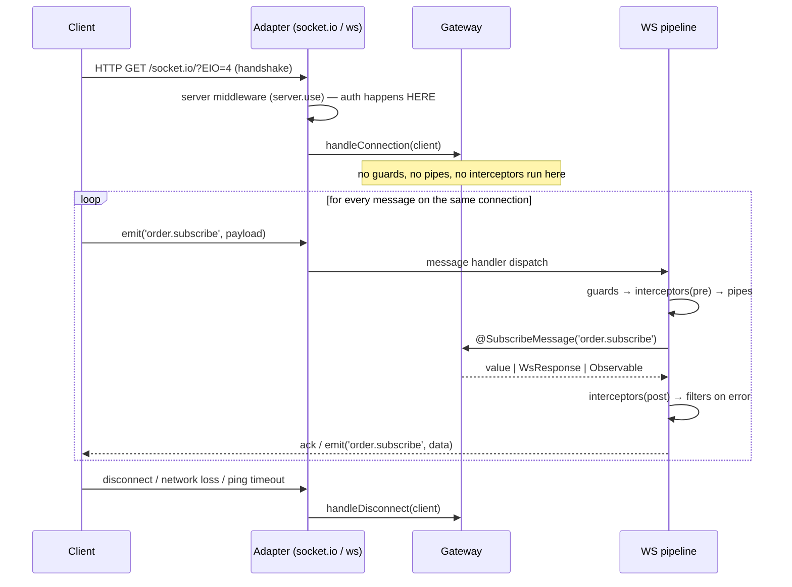
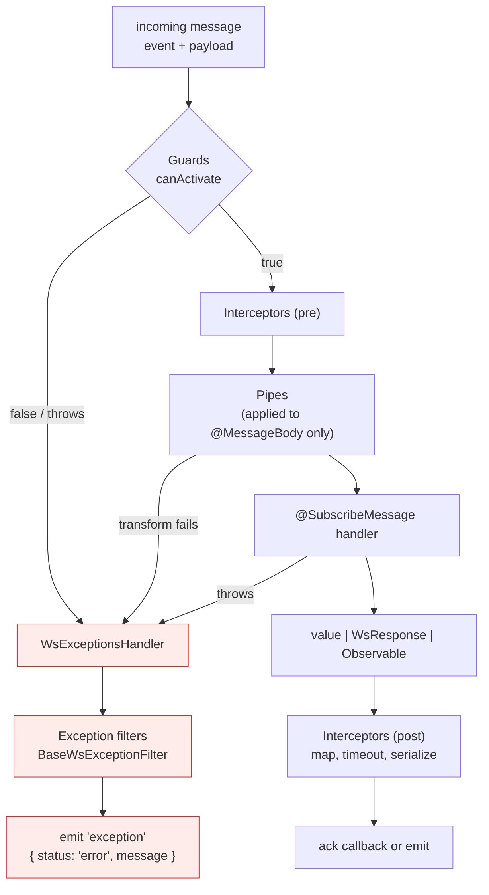

# Chapter 44 — WebSockets: Gateways, Adapters, and the Pipeline

> **한눈에 보기**
> 게이트웨이는 컨트롤러의 WebSocket 판이지만, 실행 모델은 근본적으로 다릅니다.
> 요청 하나가 아니라 **오래 사는 연결 하나**에 수천 개의 메시지가 흐르고,
> 인증은 핸드셰이크 시점에 단 한 번 일어나며 — 그 시점에는 가드가 실행되지 않습니다.
> 40장의 `ExecutionContext`가 여기서 `switchToWs()`로 실체화되고, 12장의 인터셉터·파이프·
> 필터가 그대로 재사용되지만 `HttpException`은 통하지 않습니다.
> 어댑터(socket.io / ws / 직접 구현), Redis를 통한 수평 확장, 스티키 세션과 백프레셔까지 다룹니다.

**What you will learn**

- How a gateway differs from a controller at the mechanism level: one connection, many messages, no per-message request object, and what that does to every enhancer you already know.
- Every `@WebSocketGateway()` option that matters — port, `namespace`, `path`, `transports`, `cors` — and why the gateway shares the HTTP server's port by default.
- The four ways a handler can answer a client (plain return, `WsResponse`, an `Observable` for many emissions, and an explicit `@Ack()` callback) and when each is correct.
- How to swap the transport: the default `IoAdapter`, the leaner `WsAdapter` from `@nestjs/platform-ws` with a custom `messageParser`, and how to write a `WebSocketAdapter` from scratch.
- How to scale gateways horizontally with `@socket.io/redis-adapter` — and why Redis alone is not enough without sticky sessions.
- Why `HttpException` does nothing in a gateway, what `WsException` actually emits on the wire, and how `BaseWsExceptionFilter` fits in.
- How to authenticate a handshake with JWT — including the fact that guards never run on connection, and the two correct places to put connection-time auth instead.
- How to test a gateway at both levels, and the operational limits that bite in production: sticky sessions, file-descriptor ceilings, heartbeats, and backpressure.

**Why this matters**

The first WebSocket feature in an application is usually harmless: a notification badge, a "someone is typing" indicator. It ships, it works locally, and it works in staging with three users. Then it goes to production behind a load balancer with four replicas, and three things happen within a week.

Users report that messages arrive "sometimes." That is the missing Redis adapter: a message emitted from replica 2 reaches only the sockets connected to replica 2, and the other three-quarters of your users see nothing. Then some clients cannot connect at all, retrying forever with a `400` on the polling endpoint — that is the missing sticky session, because socket.io's handshake spans multiple HTTP requests that must all land on the same instance. And finally a background job that emits to every connected client makes the process memory graph go vertical, because nobody thought about what happens when you write faster than a mobile client can read.

None of those are bugs in your handler. They are consequences of the transport, and the framework will not warn you about any of them. Nest's job is to make the *programming model* familiar — a gateway looks like a controller, injects like a provider, and reuses your pipes, guards, interceptors, and filters. Your job is to know where that familiarity is a lie: there is no request, the connection outlives every message, authentication happens in a place the pipeline does not cover, and back-pressure is yours to manage.

---

## The model: one connection, many messages

An HTTP controller handles a request that arrives, is processed, and ends. A gateway handles a **connection** that is established once and then carries an arbitrary number of messages in both directions for minutes or hours.



Three consequences follow from that picture, and every mistake later in this chapter traces back to one of them:

1. **Enhancers are bound to *message handlers*, not to the connection.** Guards, pipes, interceptors and filters run per message. The connection event is outside the pipeline entirely.
2. **There is no per-message request object.** `switchToWs()` gives you the client and the data, nothing else ([Chapter 40](40-execution-context.md)). Anything you want per message — a user, a tenant — must be attached to the socket at connect time and read from there.
3. **State lives on the socket.** `client.data` (socket.io) is your per-connection store. This is the WS equivalent of `req.user`, and it is the reason connection-time authentication matters so much.

---

## `@WebSocketGateway()`

A gateway is a class in a module's `providers` array. Nothing else registers it.

```typescript title="src/events/events.gateway.ts"
import {
  WebSocketGateway,
  WebSocketServer,
  SubscribeMessage,
  MessageBody,
  ConnectedSocket,
} from '@nestjs/websockets';
import { Server, Socket } from 'socket.io';

@WebSocketGateway({
  namespace: 'events',
  cors: { origin: ['https://app.example.com'], credentials: true },
})
export class EventsGateway {
  @WebSocketServer()
  server: Server;

  @SubscribeMessage('ping')
  handlePing(@MessageBody() data: string): string {
    return data;
  }
}
```

```typescript title="src/events/events.module.ts"
import { Module } from '@nestjs/common';
import { EventsGateway } from './events.gateway';

@Module({ providers: [EventsGateway] })
export class EventsModule {}
```

> **⚠️ Notice** — A gateway is not instantiated until it appears in the `providers` array of a module that is actually imported. A gateway file that exists but is never provided produces no error and no socket server — just silence.

```bash
$ npm i --save @nestjs/websockets @nestjs/platform-socket.io
```

### Ports, namespaces, and paths

By default a gateway attaches to the **same HTTP server** your REST API listens on. That is usually what you want: one port, one TLS certificate, one ingress rule. socket.io multiplexes by URL path (`/socket.io/` by default), so there is no conflict with your routes.

| Signature | Effect |
|---|---|
| `@WebSocketGateway()` | attaches to the HTTP server; default path `/socket.io` |
| `@WebSocketGateway(81)` | listens on its own port 81 |
| `@WebSocketGateway(81, { transports: ['websocket'] })` | own port, WebSocket transport only (no long-polling) |
| `@WebSocketGateway({ namespace: 'events' })` | shares the port, logical namespace `/events` |
| `@WebSocketGateway({ path: '/ws/chat' })` | shares the port, different URL path |

The option object is passed through to the socket.io `Server` constructor, so **every** socket.io server option is available:

| Option | Typical value | Why you care |
|---|---|---|
| `namespace` | `'events'` | logical channel; a client connects to `io('/events')` |
| `path` | `'/ws'` | URL path of the endpoint (not the same as namespace) |
| `transports` | `['websocket']` | disabling polling removes the sticky-session requirement — see scaling |
| `cors` | `{ origin: [...], credentials: true }` | **required** for browser clients on another origin; the HTTP `enableCors()` does not cover the socket.io endpoint |
| `pingInterval` / `pingTimeout` | `25000` / `20000` | how fast a dead connection is detected |
| `maxHttpBufferSize` | `1e6` | rejects oversized messages — a cheap DoS defence |
| `connectTimeout` | `45000` | how long an unfinished handshake is kept |
| `serveClient` | `false` | stop serving the client JS bundle from your server |
| `allowEIO3` | `true` | accept Engine.IO v3 clients (legacy socket.io 2.x) |

`namespace` and `path` are distinct and frequently confused. `path` is the HTTP endpoint (`/socket.io`); `namespace` is a logical channel *inside* that endpoint (`/events`). Two gateways with different namespaces share one socket connection under the hood; two gateways with different `path` values are two separate servers.

### `@WebSocketServer()`

```typescript
@WebSocketGateway()
export class EventsGateway {
  @WebSocketServer()
  server: Server;          // socket.io Server — no namespace configured
}

@WebSocketGateway({ namespace: 'chat' })
export class ChatGateway {
  @WebSocketServer()
  namespace: Namespace;    // a Namespace, because `namespace` was set
}
```

The decorator does not inject through DI — it assigns the property from metadata recorded by `@WebSocketGateway()` once the server is ready. Two consequences: the property is `undefined` inside the constructor, and its *type* changes depending on whether you set a namespace. Emitting to everyone is `server.emit(...)` in the first case and `namespace.emit(...)` in the second; the API is the same, the reach is not.

### Lifecycle hooks

| Interface | Method | Called with | When |
|---|---|---|---|
| `OnGatewayInit` | `afterInit(server)` | the native server instance | once, after the server is created |
| `OnGatewayConnection` | `handleConnection(client, ...args)` | the client socket (plus the raw upgrade request for `ws`) | on every new connection |
| `OnGatewayDisconnect` | `handleDisconnect(client)` | the client socket | on disconnect, for any reason |

```typescript
import {
  OnGatewayInit, OnGatewayConnection, OnGatewayDisconnect,
} from '@nestjs/websockets';

@WebSocketGateway({ namespace: 'events' })
export class EventsGateway
  implements OnGatewayInit, OnGatewayConnection, OnGatewayDisconnect
{
  private readonly logger = new Logger(EventsGateway.name);

  @WebSocketServer() server: Server;

  afterInit(server: Server) {
    // The one place to install transport-level middleware. See auth, below.
    this.logger.log('gateway initialised');
  }

  handleConnection(client: Socket) {
    this.logger.log(`connected ${client.id} (${this.server.sockets.size} total)`);
  }

  handleDisconnect(client: Socket) {
    // Always clean up here: presence records, room memberships, timers.
    this.logger.log(`disconnected ${client.id}`);
  }
}
```

`handleDisconnect` fires for *every* termination — clean close, browser tab closed, laptop lid shut, ping timeout. Treat it as the only reliable cleanup hook, and make it idempotent: on a flaky mobile network a client may reconnect before your cleanup finishes.

---

## Message handlers and the four ways to answer

```typescript
@SubscribeMessage('order.subscribe')
handleSubscribe(
  @MessageBody() data: SubscribeDto,
  @ConnectedSocket() client: Socket,
): void {
  client.join(`order:${data.orderId}`);
}
```

`@MessageBody()` extracts the payload; with an argument it extracts a property, exactly like `@Body('id')`:

```typescript
@SubscribeMessage('events')
handleEvent(@MessageBody('id') id: number): number {
  return id;   // id === messageBody.id
}
```

The decorator-free form works too and is what the underlying dispatcher actually passes:

```typescript
@SubscribeMessage('events')
handleEvent(client: Socket, data: string): string {
  return data;
}
```

Do not use it. Every unit test then has to construct a fake socket, and the parameter order is a silent trap when you refactor. Decorators cost nothing and document intent.

### Style 1 — return a value (implicit acknowledgement)

```typescript
@SubscribeMessage('events')
handleEvent(@MessageBody() data: string): string {
  return data;
}
```

The returned value is delivered to the client's **acknowledgement callback**:

```typescript
socket.emit('events', { name: 'Nest' }, (data) => console.log(data));
```

If the client emits without a callback, the value is discarded. Returning `undefined` (or simply not returning) sends nothing. Async methods work: the resolved value is sent when the promise settles.

### Style 2 — `WsResponse<T>` (a named event)

An acknowledgement is dispatched exactly once and is not supported by native WebSockets at all. To *emit* an event instead, return `{ event, data }`:

```typescript
import { WsResponse } from '@nestjs/websockets';

@SubscribeMessage('events')
handleEvent(@MessageBody() data: unknown): WsResponse<unknown> {
  return { event: 'events', data };
}
```

```typescript
socket.on('events', (data) => console.log(data));   // client listens
```

> **⚠️ Notice** — If your `data` relies on `ClassSerializerInterceptor` ([Chapter 16](../part2-intermediate/16-serialization.md)), return a **class instance** that implements `WsResponse`, not a plain object literal. The serializer ignores plain objects, so `@Exclude()` on a password field would not be applied and the field would go out on the wire.

### Style 3 — an `Observable` (many emissions)

Return an observable and Nest emits once per value until the stream completes. This is the natural fit for streaming progress or a live feed:

```typescript
import { from, Observable, interval } from 'rxjs';
import { map, take } from 'rxjs/operators';

@SubscribeMessage('events')
onEvent(@MessageBody() data: unknown): Observable<WsResponse<number>> {
  return from([1, 2, 3]).pipe(map((n) => ({ event: 'events', data: n })));
  // emits three separate 'events' messages
}

@SubscribeMessage('progress')
onProgress(): Observable<WsResponse<number>> {
  return interval(1000).pipe(
    take(10),
    map((tick) => ({ event: 'progress', data: (tick + 1) * 10 })),
  );
}
```

The subscription is tied to the message handler, not the connection. A long-lived observable keeps emitting even after the client disconnects unless you complete it — pair it with `takeUntil(disconnect$)` for anything unbounded.

### Style 4 — the explicit `@Ack()` callback

When you need control over *when* the acknowledgement fires (after a database write, not when the handler returns) inject the callback directly:

```typescript
import { Ack } from '@nestjs/websockets';

@SubscribeMessage('events')
handleEvent(
  @MessageBody() data: string,
  @Ack() ack: (response: { status: string; data: string }) => void,
) {
  ack({ status: 'received', data });
}
```

Without the decorator the callback arrives as the third positional argument.

| Style | Client-side API | Emissions | Use when |
|---|---|---|---|
| return a value | `emit(evt, data, cb)` | 1 (to the caller) | request/response over WS |
| `WsResponse` | `socket.on(evt, cb)` | 1 (named event) | the client listens by event name |
| `Observable<WsResponse>` | `socket.on(evt, cb)` | many | streaming, progress, feeds |
| `@Ack()` | `emit(evt, data, cb)` | 1, when you say | ack must be delayed or conditional |

### Emitting outside the handler

Broadcasting is a library concern, not a Nest one:

```typescript
@SubscribeMessage('order.place')
async place(@MessageBody() dto: PlaceOrderDto, @ConnectedSocket() client: Socket) {
  const order = await this.orders.place(dto);

  client.emit('order.accepted', order);                 // this client only
  client.to(`tenant:${dto.tenantId}`).emit('order.new', order);  // room, excluding sender
  this.server.to(`order:${order.id}`).emit('order.new', order);  // room, including sender
  this.server.emit('metrics', { orders: 1 });           // everyone in the namespace
}
```

One caveat the docs state plainly: values you push with `client.emit()` bypass interceptors. An interceptor wraps the handler's return stream; a manual emit is not in that stream. If you have a `TransformInterceptor` shaping responses, manual emits are not shaped.

Because the gateway is a provider, other services can inject it and emit from anywhere — a queue processor, a cron job, a domain event listener:

```typescript
@Injectable()
export class NotificationService {
  constructor(private readonly gateway: EventsGateway) {}

  notify(userId: string, payload: unknown) {
    this.gateway.server.to(`user:${userId}`).emit('notification', payload);
  }
}
```

Watch for circular dependencies if the gateway also injects that service — [Chapter 41](41-module-ref-discovery-lazy.md) covers `forwardRef` and the `ModuleRef` alternative.

### Multiple gateways

Nothing stops you having several. Split by bounded context, not by message:

```typescript
@WebSocketGateway({ namespace: 'chat' })  export class ChatGateway { /* … */ }
@WebSocketGateway({ namespace: 'presence' }) export class PresenceGateway { /* … */ }
```

Each namespace has its own rooms, its own middleware chain, and its own set of connected sockets — `server.emit()` in `ChatGateway` cannot reach a `PresenceGateway` client. From the browser, `io('/chat')` and `io('/presence')` reuse a single underlying transport connection, so extra namespaces are nearly free. Extra *ports* are not: each one is a separate listener, a separate firewall rule, and a separate TLS configuration.

---

## Adapters: choosing the transport

Gateways are platform-agnostic in the same way controllers are. `WebSocketAdapter` is the seam.

### The default: `IoAdapter`

Installed automatically with `@nestjs/platform-socket.io`. socket.io gives you namespaces, rooms, acknowledgements, automatic reconnection with backoff, and a polling fallback for networks that block WebSocket upgrades. It costs a non-standard wire protocol — clients must use a socket.io client, not a browser `WebSocket`.

### `WsAdapter` from `@nestjs/platform-ws`

```bash
$ npm i --save @nestjs/platform-ws
```

```typescript title="src/main.ts"
import { WsAdapter } from '@nestjs/platform-ws';

const app = await NestFactory.create(AppModule);
app.useWebSocketAdapter(new WsAdapter(app));
await app.listen(3000);
```

`ws` is a thin, fast, standards-compliant implementation. A plain browser `new WebSocket('wss://…')` can talk to it. You give up namespaces, rooms, acknowledgements, and reconnection — all of which become your problem.

> **Hint** — `ws` has no namespaces. Mount several gateways on different paths to approximate them: `@WebSocketGateway({ path: '/users' })`.

`WsAdapter` expects messages shaped `{ event: string, data: any }`. If your client speaks a different shape, supply a parser:

```typescript
const wsAdapter = new WsAdapter(app, {
  // Accept the compact [event, payload] tuple format.
  messageParser: (data) => {
    const [event, payload] = JSON.parse(data.toString());
    return { event, data: payload };
  },
});
app.useWebSocketAdapter(wsAdapter);

// or, after construction:
wsAdapter.setMessageParser((data) => { /* … */ });
```

| | `IoAdapter` (socket.io) | `WsAdapter` (ws) |
|---|---|---|
| Client | socket.io client required | any WebSocket client |
| Namespaces / rooms | ✅ | ❌ (paths only) |
| Acknowledgements | ✅ | ❌ |
| Auto-reconnect | ✅ | ❌ (implement it) |
| Polling fallback | ✅ | ❌ |
| Horizontal scaling | `@socket.io/redis-adapter` | build it yourself |
| Throughput / memory | good | better |
| Wire protocol | proprietary framing | raw frames |

Choose socket.io for browser-facing applications with rooms and presence. Choose `ws` for machine-to-machine feeds, high message rates, or non-JS clients.

### Writing a `WebSocketAdapter`

The interface is five methods:

| Method | Responsibility |
|---|---|
| `create(port, options)` | create the underlying server instance |
| `bindClientConnect(server, callback)` | invoke `callback` on every new connection |
| `bindClientDisconnect(client, callback)` | *(optional)* invoke `callback` on disconnect |
| `bindMessageHandlers(client, handlers, process)` | route incoming messages to the matching handler |
| `close(server)` | shut the server down |

Here is the shape, using `ws` for illustration (in real code, use the built-in `WsAdapter`):

```typescript title="src/adapters/ws-adapter.ts"
import * as WebSocket from 'ws';
import { WebSocketAdapter, INestApplicationContext } from '@nestjs/common';
import { MessageMappingProperties } from '@nestjs/websockets';
import { Observable, fromEvent, EMPTY } from 'rxjs';
import { mergeMap, filter } from 'rxjs/operators';

export class WsAdapter implements WebSocketAdapter {
  constructor(private app: INestApplicationContext) {}

  create(port: number, options: any = {}): any {
    return new WebSocket.Server({ port, ...options });
  }

  bindClientConnect(server: WebSocket.Server, callback: Function) {
    server.on('connection', callback);
  }

  bindMessageHandlers(
    client: WebSocket,
    handlers: MessageMappingProperties[],
    process: (data: any) => Observable<any>,
  ) {
    fromEvent(client, 'message')
      .pipe(
        mergeMap((data) => this.bindMessageHandler(data, handlers, process)),
        filter((result) => result),
      )
      .subscribe((response) => client.send(JSON.stringify(response)));
  }

  bindMessageHandler(
    buffer: any,
    handlers: MessageMappingProperties[],
    process: (data: any) => Observable<any>,
  ): Observable<any> {
    const message = JSON.parse(buffer.data);
    const messageHandler = handlers.find((h) => h.message === message.event);
    if (!messageHandler) {
      return EMPTY;   // unknown event: ignore
    }
    return process(messageHandler.callback(message.data));
  }

  close(server: WebSocket.Server) {
    server.close();
  }
}
```

The key is the `process` function Nest hands you. It is the pipeline: calling `process(result)` is what runs interceptors and turns the handler's return value into an observable stream. Skip it and you have silently disabled every interceptor and exception filter for that transport. `MessageMappingProperties` is `{ message, callback, methodName }` — the routing table Nest built from your `@SubscribeMessage` decorators.

Register it before `listen()`:

```typescript
const app = await NestFactory.create(AppModule);
app.useWebSocketAdapter(new WsAdapter(app));
await app.listen(3000);
```

`useWebSocketAdapter` must be called before the application initialises; afterwards, gateways are already bound to the old adapter.

### Scaling out: the Redis adapter

With four replicas, `server.emit()` reaches only the sockets connected to *that* process. The Redis adapter fixes it by publishing every emit to a Redis channel that all replicas subscribe to.

```bash
$ npm i --save redis socket.io @socket.io/redis-adapter
```

```typescript title="src/adapters/redis-io.adapter.ts"
import { IoAdapter } from '@nestjs/platform-socket.io';
import { ServerOptions } from 'socket.io';
import { createAdapter } from '@socket.io/redis-adapter';
import { createClient } from 'redis';

export class RedisIoAdapter extends IoAdapter {
  private adapterConstructor: ReturnType<typeof createAdapter>;

  async connectToRedis(): Promise<void> {
    const pubClient = createClient({ url: 'redis://localhost:6379' });
    const subClient = pubClient.duplicate();

    await Promise.all([pubClient.connect(), subClient.connect()]);

    this.adapterConstructor = createAdapter(pubClient, subClient);
  }

  createIOServer(port: number, options?: ServerOptions): any {
    const server = super.createIOServer(port, options);
    server.adapter(this.adapterConstructor);
    return server;
  }
}
```

```typescript title="src/main.ts"
const app = await NestFactory.create(AppModule);

const redisIoAdapter = new RedisIoAdapter(app);
await redisIoAdapter.connectToRedis();
app.useWebSocketAdapter(redisIoAdapter);

await app.listen(3000);
```

Two Redis clients are required because a client in subscribe mode cannot issue other commands — hence `pubClient.duplicate()`.

> **⚠️ Notice** — **Redis alone is not enough.** socket.io's handshake is several HTTP requests, and long-polling continues to use HTTP for the whole session. If those requests land on different instances you get `Session ID unknown` errors and clients that never connect. Either force `transports: ['websocket']` in the *client's* configuration (skipping polling entirely), or enable cookie-based sticky sessions in your load balancer. This is the single most common production WebSocket failure, and it looks like a random `400`.

The adapter also has to be overridden if you want socket.io server middleware for authentication — the next section shows how.

---

## The pipeline: pipes, guards, interceptors, filters

Everything from Part I applies, with one substitution and one hard boundary.

**The substitution:** throw `WsException`, not `HttpException`. **The boundary:** none of these run on connection.



### Pipes

Identical to HTTP pipes, applied **only to the `data` parameter** — validating or transforming the socket instance would be meaningless. Bind a `ValidationPipe` whose failures become `WsException`s:

```typescript
@UsePipes(
  new ValidationPipe({
    whitelist: true,
    transform: true,
    exceptionFactory: (errors) => new WsException(errors),
  }),
)
@SubscribeMessage('order.place')
place(@MessageBody() dto: PlaceOrderDto, @ConnectedSocket() client: Socket) {
  return this.orders.place(dto);
}
```

Without the `exceptionFactory`, `ValidationPipe` throws a `BadRequestException` — an `HttpException` — which the WS exception handler does not understand and reports as a generic internal error. Set it globally for gateways rather than repeating it:

```typescript
// Gateway-scoped, applied to every handler in the class.
@UsePipes(new ValidationPipe({ exceptionFactory: (e) => new WsException(e) }))
@WebSocketGateway({ namespace: 'orders' })
export class OrdersGateway { /* … */ }
```

### Guards

Also identical, with `WsException` instead of `HttpException`:

```typescript
@UseGuards(WsRolesGuard)
@SubscribeMessage('order.cancel')
cancel(@MessageBody() dto: CancelDto, @ConnectedSocket() client: Socket) { /* … */ }
```

Inside the guard, use `switchToWs()`:

```typescript
@Injectable()
export class WsRolesGuard implements CanActivate {
  constructor(private readonly reflector: Reflector) {}

  canActivate(context: ExecutionContext): boolean {
    const required = this.reflector.get<string[]>('roles', context.getHandler());
    if (!required) return true;

    const client = context.switchToWs().getClient<Socket>();
    const user = client.data.user;             // attached at handshake
    if (!user) throw new WsException('Unauthorized');

    return required.some((role) => user.roles.includes(role));
  }
}
```

A guard written to be transport-agnostic can serve both — check `context.getType()` and branch, as [Chapter 40](40-execution-context.md) describes.

### Interceptors

No differences at all. `@UseInterceptors(new TransformInterceptor())` on a method or on the gateway class. Note that `timeout()` and `catchError()` in an interceptor apply to the handler's stream, and that a `ClassSerializerInterceptor` needs a class instance to work on (see the `WsResponse` warning above).

### Exception filters and `WsException`

```typescript
throw new WsException('Invalid credentials.');
```

Nest emits an `exception` event to that client:

```json
{ "status": "error", "message": "Invalid credentials." }
```

`WsException` also accepts an object, which is what `exceptionFactory` passes for validation errors; the object becomes `message`.

**`HttpException` does not translate.** This is worth being precise about, because it is the most common gateway bug. `HttpException` carries a status code and is rendered by the *HTTP* exceptions handler, which is not in this pipeline. Throwing `NotFoundException` in a gateway handler does not produce a 404 — there is no response to put a status on. It reaches `BaseWsExceptionFilter`, which does not recognise it as a `WsException` and reports a generic internal error, losing your message. Any shared service that throws `HttpException` and is also called from a gateway needs a translating filter:

```typescript title="src/ws/ws-exception.filter.ts"
import { Catch, ArgumentsHost, HttpException } from '@nestjs/common';
import { BaseWsExceptionFilter, WsException } from '@nestjs/websockets';
import { Socket } from 'socket.io';

@Catch()
export class AllWsExceptionsFilter extends BaseWsExceptionFilter {
  catch(exception: unknown, host: ArgumentsHost) {
    // Translate HTTP exceptions thrown by shared services.
    if (exception instanceof HttpException) {
      const client = host.switchToWs().getClient<Socket>();
      client.emit('exception', {
        status: 'error',
        code: exception.getStatus(),
        message: exception.getResponse(),
      });
      return;
    }

    // Everything else: let the base filter handle it.
    super.catch(exception, host);
  }
}
```

```typescript
@UseFilters(new AllWsExceptionsFilter())
@WebSocketGateway({ namespace: 'orders' })
export class OrdersGateway { /* … */ }
```

You can register it globally with `APP_FILTER`, but then it also catches HTTP exceptions — branch on `host.getType()` if you do.

| Concern | HTTP | WebSocket |
|---|---|---|
| Error class | `HttpException` | `WsException` |
| Base filter | `BaseExceptionFilter` | `BaseWsExceptionFilter` |
| Client sees | status code + JSON body | `exception` event with `{ status, message }` |
| Context accessor | `host.switchToHttp()` | `host.switchToWs()` |
| Runs on connect | n/a | ❌ never |

---

## Authenticating the handshake

The problem, stated exactly: **guards do not run on connection.** Guards are bound to message handlers; `handleConnection` is invoked by the adapter before any handler exists. So a gateway decorated `@UseGuards(JwtWsGuard)` still accepts every TCP connection — the guard only rejects the first *message*. An unauthenticated client can hold a connection open indefinitely, which is a resource-exhaustion vector even if it can never send a valid message.

There are two correct places to authenticate, and one wrong one.

### The recommended approach: adapter-level middleware

socket.io middleware runs during the handshake, before `handleConnection`, and can reject the connection outright. Install it by extending `IoAdapter`:

```typescript title="src/adapters/authenticated-io.adapter.ts"
import { IoAdapter } from '@nestjs/platform-socket.io';
import { INestApplicationContext } from '@nestjs/common';
import { ServerOptions, Socket } from 'socket.io';
import { JwtService } from '@nestjs/jwt';
import { UsersService } from '../users/users.service';

export class AuthenticatedIoAdapter extends IoAdapter {
  private jwt: JwtService;
  private users: UsersService;

  constructor(private readonly app: INestApplicationContext) {
    super(app);
    // Pull services out of the container — the adapter is not a provider.
    this.jwt = app.get(JwtService);
    this.users = app.get(UsersService, { strict: false });
  }

  createIOServer(port: number, options?: ServerOptions): any {
    const server = super.createIOServer(port, options);

    server.use(async (socket: Socket, next: (err?: Error) => void) => {
      try {
        const token =
          socket.handshake.auth?.token ??
          (socket.handshake.headers.authorization as string)?.replace(/^Bearer /, '');

        if (!token) throw new Error('Missing token');

        const payload = await this.jwt.verifyAsync(token, {
          secret: process.env.JWT_SECRET,
        });
        const user = await this.users.findById(payload.sub);
        if (!user) throw new Error('Unknown user');

        // This is the WS equivalent of req.user. Guards read it later.
        socket.data.user = user;
        socket.data.tenantId = payload.tenantId;

        next();
      } catch (err) {
        // The client receives a connect_error and is never connected.
        next(new Error('Unauthorized'));
      }
    });

    return server;
  }
}
```

```typescript title="src/main.ts"
const app = await NestFactory.create(AppModule);
app.useWebSocketAdapter(new AuthenticatedIoAdapter(app));
await app.listen(3000);
```

Client side:

```typescript
const socket = io('https://api.example.com/events', {
  transports: ['websocket'],
  auth: { token: accessToken },          // NOT a query parameter — see below
});

socket.on('connect_error', (err) => {
  if (err.message === 'Unauthorized') redirectToLogin();
});
```

Why `auth` and not `?token=…`: query strings end up in access logs, proxy logs, and browser history. The `auth` object is sent in the handshake payload, not the URL.

### The simpler approach: authenticate in `handleConnection`

If you do not want a custom adapter, do it in the hook and disconnect on failure:

```typescript
async handleConnection(client: Socket) {
  try {
    const payload = await this.jwt.verifyAsync(extractToken(client));
    client.data.user = await this.users.findById(payload.sub);
    client.join(`user:${payload.sub}`);
    client.join(`tenant:${payload.tenantId}`);
  } catch {
    client.emit('exception', { status: 'error', message: 'Unauthorized' });
    client.disconnect(true);     // true = also close the underlying connection
  }
}
```

This is easier to read and test, and it is what most applications ship. The difference from the middleware approach is real but narrow: the connection *is* established before being torn down, so a flood of bad tokens costs you more than a flood rejected at handshake. Choose the adapter for public endpoints, the hook for internal ones.

### The wrong approach

Relying on `@UseGuards()` alone for connection security, or worse, checking a token inside every message handler. The first leaves connections open; the second re-verifies a JWT thousands of times per connection when you could have done it once.

### Token expiry on a long-lived connection

A JWT verified at handshake stays "valid" for the life of the socket, which may be hours after the token expires. Handle it explicitly:

```typescript
handleConnection(client: Socket) {
  const payload = /* … verify … */;
  const msUntilExpiry = payload.exp * 1000 - Date.now();

  const timer = setTimeout(() => {
    client.emit('token.expired');
    client.disconnect(true);
  }, msUntilExpiry);

  client.data.expiryTimer = timer;
}

handleDisconnect(client: Socket) {
  clearTimeout(client.data.expiryTimer);   // never leak the timer
}
```

Pair it with a `token.refresh` message handler that verifies a new token and resets the timer, so the client can stay connected across a refresh.

---

## Testing gateways

Two levels, and both are worth having.

**Unit: the gateway is a class.** Instantiate it through the testing module and call handlers directly.

```typescript title="test/events.gateway.spec.ts"
describe('EventsGateway', () => {
  let gateway: EventsGateway;
  const orders = { place: jest.fn() };

  beforeEach(async () => {
    const moduleRef = await Test.createTestingModule({
      providers: [EventsGateway, { provide: OrdersService, useValue: orders }],
    }).compile();

    gateway = moduleRef.get(EventsGateway);
    // @WebSocketServer() is populated by the framework, not DI — fake it.
    gateway.server = { emit: jest.fn(), to: jest.fn().mockReturnThis() } as any;
  });

  it('joins the order room on subscribe', () => {
    const client = { join: jest.fn(), data: {} } as unknown as Socket;
    gateway.handleSubscribe({ orderId: 'ord_1' }, client);
    expect(client.join).toHaveBeenCalledWith('order:ord_1');
  });
});
```

**End-to-end: a real client against a real server.** This is the only way to test the handshake, the adapter, and the pipeline together.

```typescript title="test/events.e2e-spec.ts"
import { io, Socket as ClientSocket } from 'socket.io-client';

describe('Events (e2e)', () => {
  let app: INestApplication;
  let client: ClientSocket;

  beforeAll(async () => {
    const moduleRef = await Test.createTestingModule({ imports: [AppModule] }).compile();
    app = moduleRef.createNestApplication();
    await app.listen(0);                             // ephemeral port
  });

  afterAll(async () => {
    client?.close();
    await app.close();
  });

  it('rejects a connection without a token', (done) => {
    client = io(`http://localhost:${app.getHttpServer().address().port}/events`, {
      transports: ['websocket'],
    });
    client.on('connect_error', (err) => {
      expect(err.message).toBe('Unauthorized');
      done();
    });
  });

  it('acknowledges a valid message', (done) => {
    client = io(url, { transports: ['websocket'], auth: { token: validToken } });
    client.emit('ping', 'hello', (ack: string) => {
      expect(ack).toBe('hello');
      done();
    });
  });
});
```

Two practical notes: always `client.close()` and `app.close()` in `afterAll` or Jest hangs on open handles, and always pass `transports: ['websocket']` in tests to skip the polling handshake and make failures deterministic.

---

## Scaling and operational limits

**Sticky sessions.** Covered above, and worth repeating because it is the number-one production failure. Either disable polling on the client or configure your load balancer for session affinity. On Kubernetes with an nginx ingress: `nginx.ingress.kubernetes.io/affinity: cookie`. Note that a rolling deploy breaks affinity by definition — clients must reconnect, so your client needs reconnection logic and your handlers need to tolerate a re-subscribe.

**Connection limits.** Each connection is a file descriptor plus per-socket buffers. The defaults will stop you long before memory does: raise `ulimit -n` in your container, and measure your actual per-connection memory (typically 10–40 KB for socket.io) before promising a number. Cap connections per user at the gateway if a bug in a client can open them in a loop.

**Heartbeats.** `pingInterval` and `pingTimeout` decide how quickly a vanished client is reaped. Defaults (25s/20s) mean up to 45 seconds of ghost connections holding rooms and presence records. Tighten them for presence-sensitive applications; loosen them for mobile clients on poor networks, where aggressive timeouts cause reconnect storms.

**Backpressure.** This is the one nobody plans for. If you emit faster than a client can consume, the data queues in your process:

```typescript
// WRONG — a slow client turns this into unbounded memory growth.
for (const row of millionsOfRows) {
  client.emit('row', row);
}
```

```typescript
// Better — check the outgoing buffer and stop feeding a client that is behind.
const MAX_BUFFER = 1_000_000; // bytes

for (const row of rows) {
  if (client.conn.transport.writable === false ||
      (client.conn as any).bufferedAmount > MAX_BUFFER) {
    client.emit('stream.paused', { reason: 'slow-consumer' });
    break;
  }
  client.emit('row', row);
  await sleep(0);   // yield to the event loop
}
```

With raw `ws`, `client.bufferedAmount` is the direct equivalent. For broadcast updates where staleness is fine, socket.io's `volatile` flag drops messages for clients that are not ready instead of queueing them:

```typescript
this.server.volatile.emit('metrics', snapshot);   // fine to lose
```

**Message size.** Set `maxHttpBufferSize` (default 1 MB). A gateway that accepts arbitrarily large payloads is a memory-exhaustion target.

---

## Common mistakes

1. **The gateway never starts.**
   *Symptom:* clients get a connection refused or a 404 on `/socket.io`; no error in the logs.
   *Cause:* the gateway class is not in any module's `providers` array, or the module is not imported.
   *Fix:* add it to `providers`. Gateways are not auto-discovered.

2. **Browser clients blocked by CORS.**
   *Symptom:* works from Postman, fails from the SPA with a CORS error on the polling request.
   *Cause:* `app.enableCors()` configures the HTTP layer; the socket.io endpoint has its own CORS settings.
   *Fix:* pass `cors: { origin: [...], credentials: true }` in `@WebSocketGateway()`.

3. **`this.server` is `undefined` in the constructor.**
   *Symptom:* `TypeError: Cannot read properties of undefined (reading 'emit')` at startup.
   *Cause:* `@WebSocketServer()` assigns the property after the server is created, which is after construction.
   *Fix:* use it from `afterInit()` or later, never in the constructor or a field initialiser.

4. **Throwing `HttpException` from a gateway handler.**
   *Symptom:* the client receives a generic internal error instead of your message.
   *Cause:* `HttpException` is not handled by the WS exceptions handler.
   *Fix:* throw `WsException`, or add a translating filter for shared services that throw HTTP exceptions.

5. **`ValidationPipe` errors arriving as internal errors.**
   *Symptom:* validation failures produce `{ status: 'error', message: 'Internal server error' }`.
   *Cause:* the default `exceptionFactory` produces `BadRequestException`.
   *Fix:* `new ValidationPipe({ exceptionFactory: (errors) => new WsException(errors) })`.

6. **Messages reaching only some users after scaling to multiple replicas.**
   *Symptom:* "sometimes it works" — in fact, it works exactly when sender and receiver share a replica.
   *Cause:* no Redis adapter; each process has its own set of sockets.
   *Fix:* `RedisIoAdapter`, plus sticky sessions or `transports: ['websocket']`.

7. **Random `400`s and clients that never connect, only in production.**
   *Symptom:* `Session ID unknown` in the logs.
   *Cause:* polling handshake requests hitting different instances.
   *Fix:* sticky sessions on the load balancer, or force the WebSocket transport client-side. Redis does not fix this.

8. **Assuming a guard protects the connection.**
   *Symptom:* unauthenticated sockets sit connected forever, consuming file descriptors.
   *Cause:* guards run per message, never on connect.
   *Fix:* authenticate in adapter middleware (`server.use`) or in `handleConnection` with `client.disconnect(true)`.

9. **Leaked state after disconnect.**
   *Symptom:* memory grows with connection churn; presence lists show users who left.
   *Cause:* timers, subscriptions, or map entries created on connect and never removed.
   *Fix:* mirror every allocation in `handleDisconnect`, and make it idempotent — it can fire during a reconnect race.

10. **A long-lived `Observable` handler that never completes.**
    *Symptom:* CPU and memory climb with every subscribe, even after clients leave.
    *Cause:* `interval()` returned from a handler with no completion condition.
    *Fix:* `takeUntil()` on a disconnect subject, and unsubscribe in `handleDisconnect`.

---

## Putting it together

An authenticated, tenant-scoped, horizontally scalable order-events gateway.

```typescript title="src/orders/orders.gateway.ts"
import {
  WebSocketGateway, WebSocketServer, SubscribeMessage,
  MessageBody, ConnectedSocket, OnGatewayConnection, OnGatewayDisconnect,
  WsException, WsResponse,
} from '@nestjs/websockets';
import { UseFilters, UseGuards, UsePipes, ValidationPipe, Logger } from '@nestjs/common';
import { Server, Socket } from 'socket.io';
import { Observable, Subject } from 'rxjs';
import { takeUntil, map } from 'rxjs/operators';
import { OrdersService } from './orders.service';
import { WsRolesGuard, Roles } from '../auth/ws-roles.guard';
import { AllWsExceptionsFilter } from '../ws/ws-exception.filter';
import { SubscribeOrderDto } from './dto/subscribe-order.dto';

@UseFilters(new AllWsExceptionsFilter())
@UsePipes(
  new ValidationPipe({
    whitelist: true,
    transform: true,
    exceptionFactory: (errors) => new WsException(errors),
  }),
)
@WebSocketGateway({
  namespace: 'orders',
  cors: { origin: ['https://app.example.com'], credentials: true },
  maxHttpBufferSize: 1e6,
  pingInterval: 20_000,
  pingTimeout: 15_000,
})
export class OrdersGateway implements OnGatewayConnection, OnGatewayDisconnect {
  private readonly logger = new Logger(OrdersGateway.name);
  private readonly disconnect$ = new Map<string, Subject<void>>();

  @WebSocketServer() server: Server;

  constructor(private readonly orders: OrdersService) {}

  // The AuthenticatedIoAdapter has already populated client.data.
  handleConnection(client: Socket) {
    const { user, tenantId } = client.data;
    client.join(`tenant:${tenantId}`);
    client.join(`user:${user.id}`);
    this.disconnect$.set(client.id, new Subject<void>());
    this.logger.log(`${user.id} connected to tenant ${tenantId}`);
  }

  handleDisconnect(client: Socket) {
    // Complete any streams this client started, then drop the entry.
    const subject = this.disconnect$.get(client.id);
    subject?.next();
    subject?.complete();
    this.disconnect$.delete(client.id);
  }

  /** Style 1: request/response over the ack callback. */
  @SubscribeMessage('order.subscribe')
  async subscribe(
    @MessageBody() dto: SubscribeOrderDto,
    @ConnectedSocket() client: Socket,
  ): Promise<{ ok: true }> {
    // Authorisation is per-message and per-resource; the handshake only
    // established *who* the user is, not *what* they may see.
    const order = await this.orders.findOne(dto.orderId, client.data.tenantId);
    if (!order) throw new WsException('Order not found');

    client.join(`order:${dto.orderId}`);
    return { ok: true };
  }

  /** Style 3: a bounded stream, torn down on disconnect. */
  @Roles('operator')
  @UseGuards(WsRolesGuard)
  @SubscribeMessage('order.watchQueue')
  watchQueue(@ConnectedSocket() client: Socket): Observable<WsResponse<QueueStat>> {
    return this.orders.queueStats$(client.data.tenantId).pipe(
      takeUntil(this.disconnect$.get(client.id)!),
      map((data) => ({ event: 'order.queue', data })),
    );
  }

  /** Called by domain code, a queue processor, or a cron job. */
  broadcastStatus(tenantId: string, orderId: string, status: string) {
    // Reaches clients on every replica, thanks to the Redis adapter.
    this.server
      .to(`order:${orderId}`)
      .emit('order.status', { orderId, status });
  }
}
```

```typescript title="src/main.ts"
import { NestFactory } from '@nestjs/core';
import { AppModule } from './app.module';
import { AuthenticatedIoAdapter } from './adapters/authenticated-io.adapter';

async function bootstrap() {
  const app = await NestFactory.create(AppModule);

  // One adapter that both authenticates the handshake and fans out via Redis.
  const adapter = new AuthenticatedIoAdapter(app);
  await adapter.connectToRedis();
  app.useWebSocketAdapter(adapter);

  app.enableShutdownHooks();
  await app.listen(3000);
}
bootstrap();
```

```typescript title="client.ts"
import { io } from 'socket.io-client';

const socket = io('https://api.example.com/orders', {
  transports: ['websocket'],        // no polling → no sticky-session requirement
  auth: { token: accessToken },
  reconnectionDelayMax: 10_000,
});

socket.on('connect_error', (e) => console.error('auth failed', e.message));
socket.on('exception', (e) => console.error('server error', e));
socket.on('order.status', (msg) => updateUi(msg));

socket.emit('order.subscribe', { orderId: 'ord_71' }, (ack) => console.log(ack));
```

Every layer of the chapter is present: the handshake authenticated once at the adapter, per-message authorisation by guard, validation translated into `WsException`, a bounded observable stream, a translating exception filter, Redis fan-out, and cleanup on disconnect.

---

> **핵심 정리**
> - 게이트웨이는 요청이 아니라 **연결**을 다룹니다. 가드·파이프·인터셉터·필터는 **메시지 핸들러**에 바인딩되며, `handleConnection`에는 하나도 적용되지 않습니다.
> - 게이트웨이는 반드시 모듈의 `providers`에 등록해야 인스턴스화됩니다. 등록하지 않으면 아무 오류 없이 조용히 동작하지 않습니다.
> - `@WebSocketGateway()`의 옵션 객체는 socket.io 서버 옵션 전체로 전달됩니다. 브라우저 클라이언트에는 `cors`가 별도로 필요하며, `app.enableCors()`는 socket.io 엔드포인트를 덮지 않습니다.
> - `@WebSocketServer()`는 DI가 아니라 메타데이터 기반 할당이므로 생성자에서는 `undefined`입니다. `namespace`를 지정하면 `Server`가 아니라 `Namespace`가 들어옵니다.
> - 응답은 네 가지입니다 — 값 반환(ack), `WsResponse`(이름 있는 이벤트), `Observable`(다중 발행), `@Ack()`(명시적 콜백). `client.emit()`으로 직접 보내면 인터셉터를 우회합니다.
> - 어댑터가 전송 계층입니다. socket.io는 네임스페이스·룸·ack·재연결을 주고, `@nestjs/platform-ws`는 표준 WebSocket 호환성과 성능을 줍니다. 직접 구현할 때는 Nest가 넘겨준 `process()`를 반드시 호출해야 인터셉터·필터가 동작합니다.
> - 수평 확장에는 `@socket.io/redis-adapter`가 필요하지만 **그것만으로는 부족합니다**. 폴링 핸드셰이크 때문에 스티키 세션이 필요하거나, 클라이언트에서 `transports: ['websocket']`로 폴링을 꺼야 합니다.
> - `HttpException`은 WS 파이프라인에서 번역되지 않습니다. `WsException`을 던지고, 공용 서비스가 던지는 HTTP 예외는 `BaseWsExceptionFilter`를 확장한 필터에서 변환하세요. `ValidationPipe`에는 `exceptionFactory`가 필수입니다.
> - 핸드셰이크 인증은 어댑터 미들웨어(`server.use`)나 `handleConnection` + `client.disconnect(true)`에서 합니다. 인증 결과는 `client.data`에 담고, 가드는 그 값을 읽습니다. 토큰 만료는 연결 수명과 별개이므로 명시적으로 처리해야 합니다.
> - 운영 한계를 미리 정하세요: 스티키 세션, 파일 디스크립터, `pingInterval`/`pingTimeout`, `maxHttpBufferSize`, 그리고 느린 소비자를 위한 백프레셔 처리(`bufferedAmount`, `volatile`).

> **연습 문제**
> 1. 가드가 연결 시점에 실행되지 않는 이유를 프레임워크의 바인딩 대상(핸들러 vs 연결) 관점에서 설명하고, 이로 인해 발생하는 구체적인 보안·자원 문제를 두 가지 서술하세요.
> 2. `namespace`와 `path`의 차이를 설명하고, 두 개의 게이트웨이를 (a) 서로 다른 네임스페이스로, (b) 서로 다른 포트로 나눴을 때의 운영상 차이를 비교하세요.
> 3. 값 반환, `WsResponse`, `Observable`, `@Ack()` 네 가지 응답 방식 각각에 대해 클라이언트가 어떤 코드로 수신해야 하는지 쓰고, 각각이 적절한 상황을 하나씩 제시하세요.
> 4. **직접 만들어 보라:** `IoAdapter`를 확장해 핸드셰이크에서 JWT를 검증하고 `client.data.user`를 채우는 어댑터와, 같은 어댑터 안에서 Redis 어댑터까지 설정하는 코드를 작성하세요. 그리고 `socket.io-client`로 (a) 토큰 없음 → `connect_error`, (b) 유효 토큰 → ack 수신을 검증하는 e2e 테스트를 작성하세요.
> 5. **직접 만들어 보라:** 공용 서비스가 던지는 `NotFoundException`을 WS 클라이언트에게 의미 있는 `exception` 이벤트로 변환하는 필터를 `BaseWsExceptionFilter`를 확장해 구현하고, `APP_FILTER`로 전역 등록했을 때 HTTP 요청에는 영향을 주지 않도록 `host.getType()`으로 분기하세요.
> 6. 레플리카 4개 환경에서 "메시지가 가끔만 도착한다"와 "일부 클라이언트가 아예 연결되지 않는다"는 두 증상의 원인이 서로 다름을 설명하고, 각각의 해결책과 그 해결책이 다른 증상은 고치지 못하는 이유를 쓰세요.
> 7. 느린 소비자에게 대량 데이터를 보낼 때 메모리가 증가하는 이유를 설명하고, `bufferedAmount` 확인과 `volatile` 발행 중 어느 쪽이 어떤 데이터에 적합한지 판단 기준을 제시하세요.

**Next:** [Chapter 45 — Microservices I: Fundamentals and Message Patterns](45-microservices-fundamentals.md) generalises what you just saw. A gateway is one transport bound to the same enhancer pipeline; microservices are the same idea over Redis, NATS, Kafka and gRPC, with `@MessagePattern` in place of `@SubscribeMessage` and a formal request/response versus event-based split.
