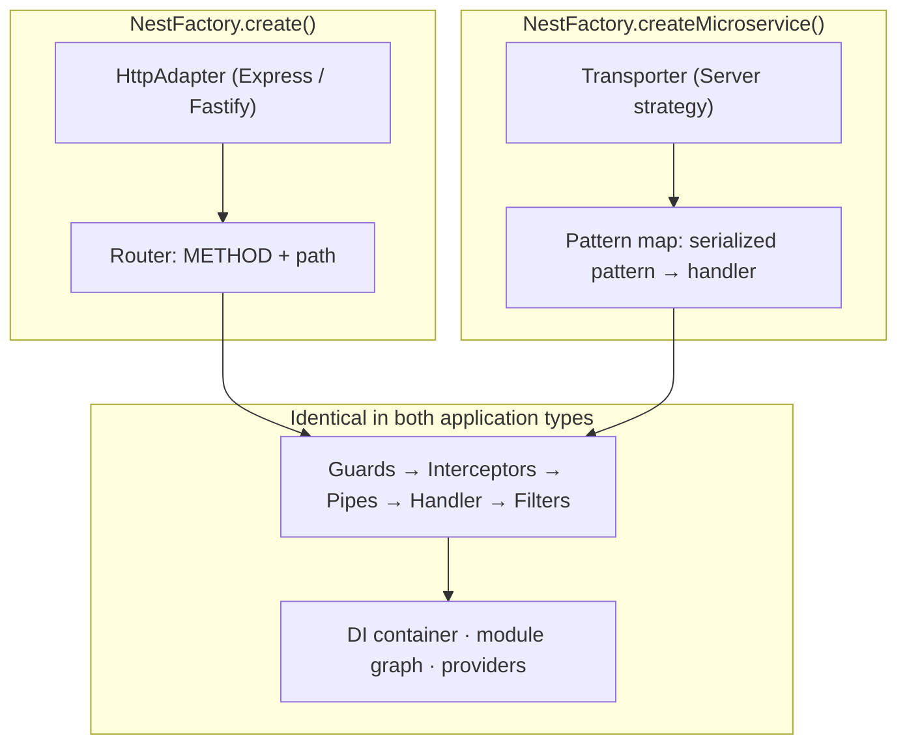
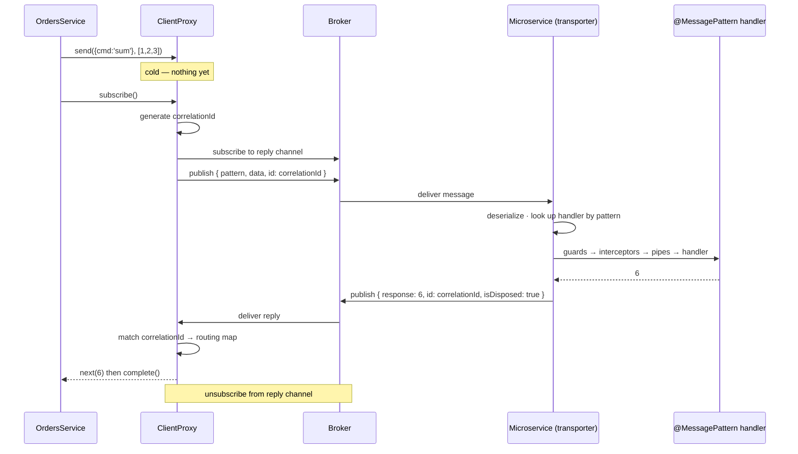

# Chapter 45 — Microservices I: Fundamentals and Message Patterns

> **한눈에 보기**
> Nest가 말하는 "마이크로서비스"는 배포 아키텍처가 아니라 **HTTP가 아닌 전송 계층 위에서
> 돌아가는 Nest 애플리케이션**입니다. 40장에서 본 `ExecutionContext`의 `switchToRpc()`가
> 바로 이 장의 무대입니다. 이 장은 `createMicroservice`, `@MessagePattern`과 `@EventPattern`,
> `ClientProxy`의 `send()`/`emit()`, 그리고 "구독하지 않으면 아무 일도 일어나지 않는"
> 콜드 옵저버블 함정을 다룹니다. 하이브리드 애플리케이션과 RPC 컨텍스트의
> 가드·파이프·인터셉터·필터 파이프라인까지 끝내면, 46~49장의 개별 트랜스포터는
> 옵션 표를 읽는 일에 가까워집니다.

**What you will learn**

- Why `@nestjs/microservices` is a *transport abstraction*, not an architecture — and why calling `createMicroservice` does not make your system distributed.
- How to bootstrap a microservice with `NestFactory.createMicroservice`, what the two members of `MicroserviceOptions` mean, and how `AsyncMicroserviceOptions` lets `ConfigService` decide the transport.
- The exact difference between `@MessagePattern` (request–response, two logical channels, correlation ids) and `@EventPattern` (fire-and-forget, one channel), and how to choose correctly the first time.
- Every way to obtain a `ClientProxy` — `ClientsModule.register`, `registerAsync`, `ClientProxyFactory`, `@Client()` — and which one to actually use in production.
- Why `send()` returns a **cold** Observable and `emit()` returns a **hot** one, and why forgetting to subscribe is the single most common Nest microservices bug.
- How to build a **hybrid application** that serves HTTP and one or more transports from a single process, and why global pipes and filters silently do not apply until you say `inheritAppConfig`.
- How guards, pipes, interceptors, and exception filters behave in the RPC context — `RpcException`, `BaseRpcExceptionFilter`, and what happens when you throw an `HttpException` into a message handler.

**Why this matters**

Here is a bug report you will eventually receive: "the order service never got the payment event, but the API returned 201 and there is nothing in the logs." You go looking. The producer's code reads `this.client.send({ cmd: 'charge' }, dto)` inside a controller method that returns something else entirely. The call is there, spelled correctly, pointed at a broker that is up. And no message was ever sent — because `send()` hands you a cold Observable and nobody subscribed to it. Nest did exactly what you asked; you asked for a description of a network call, not for the call.

That bug is a symptom of a deeper misunderstanding, and this chapter exists to remove it. `@nestjs/microservices` is not a framework for building distributed systems. It is a thin, transport-agnostic RPC and eventing layer with two verbs — `send` and `emit` — and a plug-in slot for a wire protocol. The word "microservice" in Nest means one narrow thing: **an application whose inbound transport is something other than HTTP**. A Nest microservice can be a single process talking to itself over TCP. A monolith can host three of them. Nothing about `createMicroservice` implies separate deployments, separate databases, or separate teams. Confusing the Nest feature with the architectural style leads people to split a codebase that had no business being split, and then to discover that they have replaced function calls with network calls that can time out, arrive twice, or arrive out of order.

The payoff of taking the abstraction on its own terms is real, though. Because Nest normalizes every transporter behind one client interface and one pair of decorators, the code in your controllers and services is *identical* whether messages travel over TCP, Redis Pub/Sub, NATS, RabbitMQ, or Kafka. You can prototype against TCP with zero infrastructure and swap `Transport.TCP` for `Transport.NATS` in one file when you need real fan-out. That portability is genuinely valuable — provided you understand which delivery guarantees the abstraction *cannot* give you, because they belong to the broker underneath. Chapters 46 through 49 cover each transporter's guarantees. This chapter covers everything that is the same across all of them.

The third reason this chapter matters: the request pipeline you learned in Part I still applies, but the *host* changed. In [Chapter 40](./40-execution-context.md) you saw `ArgumentsHost` and the `switchToHttp()` / `switchToRpc()` / `switchToWs()` fork. This is where `switchToRpc()` finally earns its keep. A guard written for HTTP that calls `context.switchToHttp().getRequest()` will get `undefined` in a message handler and throw a `TypeError` you will spend an afternoon on. Understanding the host-shape difference up front costs ten minutes.

---

## What Nest means by "microservice"

Start with the definition, because it is narrower than the word suggests:

> In Nest, a microservice is an application that uses a **transport layer other than HTTP**.

That is the whole thing. `NestFactory.create()` gives you an application whose entry points are HTTP routes, driven by an `HttpAdapter` around Express or Fastify. `NestFactory.createMicroservice()` gives you an application whose entry points are **message patterns**, driven by a `Server` implementation — a *transporter* — that knows how to pull messages off TCP sockets, a Redis channel, a Kafka topic, or an AMQP queue.

Everything else is unchanged. The module graph is the same. Dependency injection is the same. Providers, lifecycle hooks, dynamic modules, `ModuleRef` — all identical. Only the shape of "a request" changes, and with it the shape of the argument host.



Two consequences follow immediately, and both surprise people.

**First: message handlers live in controllers.** `@MessagePattern()` and `@EventPattern()` are only discovered on classes registered under a module's `controllers` array. Put one on a provider and Nest will silently ignore it — no error, no warning, just a handler that never fires. The mental model is consistent: a controller is *the boundary where external input enters your application*, regardless of what "external" means on the wire.

**Second: the transporter owns the semantics you actually care about.** Nest guarantees that `send()` on one side reaches a matching `@MessagePattern()` on the other side. It does not guarantee delivery, ordering, persistence, or at-most-once semantics — those are properties of Redis, or NATS, or Kafka. The abstraction is real and useful, but it is an abstraction over *addressing and serialization*, not over reliability.

### Installation

```bash
$ npm i --save @nestjs/microservices
```

The package ships no drivers. Each transporter requires its own client library, installed separately — `ioredis` for Redis, `mqtt` for MQTT, `nats` for NATS, `amqplib` plus `amqp-connection-manager` for RabbitMQ, `kafkajs` for Kafka, `@grpc/grpc-js` plus `@grpc/proto-loader` for gRPC. The only transporter with no extra dependency is TCP, which uses Node's built-in `net` module. That makes TCP the right choice for your first experiment and for local integration tests.

---

## Bootstrapping a microservice

```typescript title="main.ts"
import { NestFactory } from '@nestjs/core';
import { Transport, MicroserviceOptions } from '@nestjs/microservices';
import { AppModule } from './app.module';

async function bootstrap() {
  const app = await NestFactory.createMicroservice<MicroserviceOptions>(
    AppModule,
    {
      transport: Transport.TCP,
      options: { host: '0.0.0.0', port: 3001 },
    },
  );
  await app.listen();
}
bootstrap();
```

Note `app.listen()` takes no arguments. The address lives in `options`, not in the call, because "address" means something different for every transport — a port for TCP, a channel prefix for Redis, a queue name for RabbitMQ, a broker list for Kafka.

The second argument has exactly two meaningful members:

| Member | Meaning |
|---|---|
| `transport` | The transporter to use, from the `Transport` enum (for example `Transport.NATS`). Defaults to `Transport.TCP`. |
| `options` | A transporter-**specific** options object. Its shape changes completely per transporter. |

There is a third, `strategy`, which you use instead of `transport` when you supply a custom transporter class — the subject of [Chapter 49](./49-custom-transporters.md).

### TCP transporter options

TCP is the default and the only transporter documented in the basics chapter, so its options belong here. Every other transporter's table lives in the chapter that covers it.

| Option | Meaning |
|---|---|
| `host` | Connection hostname. |
| `port` | Connection port. |
| `retryAttempts` | Number of times to retry a message (default `0`). |
| `retryDelay` | Delay between retry attempts in ms (default `0`). |
| `serializer` | Custom serializer for outgoing messages. |
| `deserializer` | Custom deserializer for incoming messages. |
| `socketClass` | A custom socket extending `TcpSocket` (default `JsonSocket`). |
| `tlsOptions` | Node `tls` options — enables TLS over TCP. |

`serializer` and `deserializer` are the seam through which you change the wire format. The default `JsonSocket` frames each message as a length-prefixed JSON document. Replacing it lets you use MessagePack or protobuf over raw TCP without touching a single handler. That is also the mechanism [Chapter 47](./47-kafka.md) uses for Avro and Schema Registry.

### TLS over TCP

Once messages leave a private network, encrypt them. Nest wires `tlsOptions` straight through to Node's `tls` module.

```typescript title="main.ts"
import * as fs from 'node:fs';
import { NestFactory } from '@nestjs/core';
import { MicroserviceOptions, Transport } from '@nestjs/microservices';
import { AppModule } from './app.module';

async function bootstrap() {
  const key = fs.readFileSync('/etc/certs/server.key', 'utf8');
  const cert = fs.readFileSync('/etc/certs/server.crt', 'utf8');

  const app = await NestFactory.createMicroservice<MicroserviceOptions>(
    AppModule,
    {
      transport: Transport.TCP,
      options: { port: 3001, tlsOptions: { key, cert } },
    },
  );
  await app.listen();
}
bootstrap();
```

The client side supplies the CA that signed that certificate, so it can verify the server:

```typescript title="app.module.ts"
import * as fs from 'node:fs';
import { Module } from '@nestjs/common';
import { ClientsModule, Transport } from '@nestjs/microservices';

@Module({
  imports: [
    ClientsModule.register([
      {
        name: 'MATH_SERVICE',
        transport: Transport.TCP,
        options: {
          port: 3001,
          tlsOptions: {
            ca: [fs.readFileSync('/etc/certs/ca.crt', 'utf8')],
          },
        },
      },
    ]),
  ],
})
export class AppModule {}
```

Pass an array of CAs if several authorities are in play.

### Configuring the transport from `ConfigService`

A chicken-and-egg problem: you want broker URLs from configuration, but `createMicroservice` runs *before* the DI container exists, so you cannot inject `ConfigService`. `AsyncMicroserviceOptions` resolves it — Nest creates the container first, then calls your factory with injected dependencies, then starts the transporter.

```typescript title="main.ts"
import { NestFactory } from '@nestjs/core';
import { ConfigService } from '@nestjs/config';
import { AsyncMicroserviceOptions, Transport } from '@nestjs/microservices';
import { AppModule } from './app.module';

async function bootstrap() {
  const app = await NestFactory.createMicroservice<AsyncMicroserviceOptions>(
    AppModule,
    {
      useFactory: (config: ConfigService) => ({
        transport: Transport.TCP,
        options: {
          host: config.getOrThrow<string>('RPC_HOST'),
          port: config.getOrThrow<number>('RPC_PORT'),
        },
      }),
      inject: [ConfigService],
    },
  );
  await app.listen();
}
bootstrap();
```

Prefer this over reading `process.env` in `main.ts`. It keeps validation, defaults, and `.env` loading in one place — see [Chapter 17](../part2-intermediate/17-configuration.md).

---

## The transporter catalogue

Every built-in transporter is a member of the `Transport` enum. Learn the shape of the table now; the details come later.

| `Transport` | Driver package | Native style | Covered in |
|---|---|---|---|
| `TCP` | none (Node `net`) | request–response | this chapter |
| `REDIS` | `ioredis` | pub/sub, fan-out | [Chapter 46](./46-message-brokers.md) |
| `MQTT` | `mqtt` | pub/sub with QoS | [Chapter 46](./46-message-brokers.md) |
| `NATS` | `nats` | pub/sub + queue groups | [Chapter 46](./46-message-brokers.md) |
| `RMQ` | `amqplib`, `amqp-connection-manager` | durable queues, acks | [Chapter 46](./46-message-brokers.md) |
| `KAFKA` | `kafkajs` | partitioned log, consumer groups | [Chapter 47](./47-kafka.md) |
| `GRPC` | `@grpc/grpc-js`, `@grpc/proto-loader` | typed RPC, streaming | [Chapter 48](./48-grpc.md) |

Most transporters support both message styles, but they do not support them *equally well*. TCP and gRPC are request–response systems that emulate events. Kafka is a log that emulates request–response badly. Redis Pub/Sub has no persistence at all. When you pick a transporter you are picking a set of failure modes; the Nest API is only what hides the syntax differences.

---

## Message patterns and event patterns

A **pattern** is a plain value — a string, or a literal object — that both sides agree on. Nest serializes the pattern alongside the payload, and the receiving transporter uses it to look up a handler in a map built at bootstrap. That is the entire routing mechanism. `{ cmd: 'sum' }` on the client and `{ cmd: 'sum' }` on the server match because their serialized forms are equal.

> **Hint** — Object patterns are compared by their serialized form, and key order is part of that form in some transporters. `{ role: 'user', cmd: 'get' }` and `{ cmd: 'get', role: 'user' }` are not reliably the same pattern. Define patterns once, in a shared constants file, and import them on both sides. This single habit prevents a whole family of "handler never fires" bugs.

### Request–response with `@MessagePattern`

```typescript title="math.controller.ts"
import { Controller } from '@nestjs/common';
import { MessagePattern } from '@nestjs/microservices';

@Controller()
export class MathController {
  @MessagePattern({ cmd: 'sum' })
  accumulate(data: number[]): number {
    return (data || []).reduce((a, b) => a + b, 0);
  }
}
```

Note the empty `@Controller()` — there is no route prefix, because there are no routes.

Request–response requires **two logical channels**: one carrying the request, one carrying the reply. Some transports give you that for free (NATS has request–reply built in; gRPC is inherently bidirectional). For others Nest manufactures it — Redis derives a second channel by appending a suffix, Kafka needs a whole separate `.reply` topic, RabbitMQ uses a reply queue. That manufacturing is not free. It costs an extra subscription, extra broker traffic, and in Kafka's case extra topic administration.

The handler can be synchronous, `async`, or return an `Observable`:

```typescript title="math.controller.ts"
import { Controller } from '@nestjs/common';
import { MessagePattern } from '@nestjs/microservices';
import { Observable, from } from 'rxjs';

@Controller()
export class MathController {
  @MessagePattern({ cmd: 'sum' })
  async accumulate(data: number[]): Promise<number> {
    return (data || []).reduce((a, b) => a + b, 0);
  }

  @MessagePattern({ cmd: 'stream-primes' })
  streamPrimes(limit: number): Observable<number> {
    return from(sieve(limit)); // emits many values
  }
}
```

The `Observable` case is worth pausing on, because it is genuinely different from HTTP. When a handler returns a stream, Nest sends **one response message per emitted value**, followed by a completion marker. The client's `send()` Observable emits each of them in turn and then completes. That gives you server-streaming RPC over any transporter that supports request–response — useful for paginated exports or progress reporting, and the only place in the Nest microservices API where a single request legitimately produces many responses.

### Fire-and-forget with `@EventPattern`

```typescript title="notifications.controller.ts"
import { Controller } from '@nestjs/common';
import { EventPattern, Payload } from '@nestjs/microservices';

@Controller()
export class NotificationsController {
  @EventPattern('user_created')
  async handleUserCreated(@Payload() data: { id: string; email: string }) {
    await this.mailer.sendWelcome(data.email);
  }
}
```

No reply channel is created. The producer does not learn whether the handler succeeded, failed, or ran at all. In exchange you get lower latency, half the broker traffic, and — crucially — **fan-out**: multiple handlers, in the same process or across services, can subscribe to one event pattern, and all of them fire in parallel.

### Choosing between them

This is a design decision, not a syntax preference. The rule that has served me well:

> Use `@MessagePattern` when the **caller cannot proceed** without the answer. Use `@EventPattern` for everything else.

| | `@MessagePattern` / `send()` | `@EventPattern` / `emit()` |
|---|---|---|
| Channels | two (request + reply) | one |
| Caller learns of failure | yes, as an error on the Observable | no |
| Multiple subscribers | one logical responder | fan-out to all |
| Coupling | temporal — both must be up | none — producer fires and moves on |
| Natural fit | queries, validations, synchronous workflows | domain events, audit, cache invalidation, notifications |
| Cost under load | correlation state per in-flight call | none |

The failure mode of over-using `send()` is a distributed monolith: service A cannot serve a request unless B, C, and D are all healthy, so your availability is the *product* of four availabilities. The failure mode of over-using `emit()` is losing work silently, because nothing told the producer that the consumer crashed. Neither is free. Choose per call site, not per project.

---

## `@Payload`, `@Ctx`, and the context classes

A message handler receives two things: the data, and the transport-level metadata around it.

```typescript title="time.controller.ts"
import { Controller } from '@nestjs/common';
import { MessagePattern, Payload, Ctx, NatsContext } from '@nestjs/microservices';

@Controller()
export class TimeController {
  @MessagePattern('time.us.*')
  getDate(@Payload() data: unknown, @Ctx() context: NatsContext) {
    console.log(`Subject: ${context.getSubject()}`); // e.g. "time.us.east"
    return new Date().toLocaleTimeString();
  }
}
```

`@Payload()` also accepts a property key, exactly like `@Body('id')` does for HTTP: `@Payload('id') id: string` extracts one property from the incoming object.

> **Hint** — If a handler takes a single parameter and you omit the decorators, the first parameter is the payload. Once you add `@Ctx()`, decorate both parameters explicitly. Mixed decorated and undecorated parameters are a reliable way to receive `undefined` where you expected data.

`@Ctx()` injects a transporter-specific context object. There is no common base interface you should program against; the point of the class is to expose what only *that* transport knows.

| Context class | Transport | Representative methods |
|---|---|---|
| `TcpContext` | TCP | `getPattern()` |
| `RedisContext` | Redis | `getChannel()` |
| `MqttContext` | MQTT | `getTopic()`, `getPacket()` |
| `NatsContext` | NATS | `getSubject()`, `getHeaders()` |
| `RmqContext` | RabbitMQ | `getMessage()`, `getChannelRef()`, `getPattern()` |
| `KafkaContext` | Kafka | `getTopic()`, `getPartition()`, `getMessage()`, `getConsumer()`, `getHeartbeat()` |

Taking a dependency on a context class binds that handler to that transport. That is fine and often necessary — you cannot do manual RabbitMQ acknowledgement without `RmqContext` — but be deliberate. Keep transport-specific code in the controller and keep your services transport-agnostic, so the business logic remains portable and unit-testable.

---

## Getting a client: `ClientProxy`

The producer side is one class, `ClientProxy`, with a small surface:

| Method | Returns | Notes |
|---|---|---|
| `send(pattern, payload)` | **cold** `Observable<T>` | Nothing is sent until you subscribe. |
| `emit(pattern, payload)` | **hot** `Observable<void>` | Dispatched immediately, subscription optional. |
| `connect()` | `Promise<any>` | Force the connection early; rejects on failure. |
| `close()` | `void` | Tears down the underlying connection. |
| `status` | `Observable<Status>` | Driver-specific connection state stream. |
| `on(event, cb)` | `void` | Low-level driver events, for example `'error'`. |
| `unwrap<T>()` | `T` | The raw driver instance. Escape hatch. |

There are four ways to obtain one. Only two of them are good.

### `ClientsModule.register` — the default choice

```typescript title="app.module.ts"
import { Module } from '@nestjs/common';
import { ClientsModule, Transport } from '@nestjs/microservices';

@Module({
  imports: [
    ClientsModule.register([
      { name: 'MATH_SERVICE', transport: Transport.TCP, options: { port: 3001 } },
    ]),
  ],
})
export class AppModule {}
```

`name` is an **injection token** — any string or symbol. `transport` defaults to `Transport.TCP`. The `options` object is the same one `createMicroservice` takes.

```typescript title="orders.service.ts"
import { Inject, Injectable } from '@nestjs/common';
import { ClientProxy } from '@nestjs/microservices';

@Injectable()
export class OrdersService {
  constructor(@Inject('MATH_SERVICE') private readonly client: ClientProxy) {}
}
```

Note that `ClientsModule.register()` returns a dynamic module whose providers are scoped to the importing module. If three feature modules need the same client, either import `ClientsModule.register(...)` in each of them — creating three separate connections — or register it once in a shared module and re-export it. The second is almost always what you want; see [Chapter 37](./37-dynamic-modules.md).

### `ClientsModule.registerAsync` — when configuration is dynamic

```typescript title="app.module.ts"
ClientsModule.registerAsync([
  {
    imports: [ConfigModule],
    name: 'MATH_SERVICE',
    useFactory: (config: ConfigService) => ({
      transport: Transport.TCP,
      options: { host: config.getOrThrow('MATH_HOST'), port: config.getOrThrow('MATH_PORT') },
    }),
    inject: [ConfigService],
  },
]),
```

This is the production default. Hard-coded broker URLs are a deployment bug waiting to happen.

### `ClientProxyFactory` — when you need a custom provider

```typescript title="math.module.ts"
import { Module } from '@nestjs/common';
import { ClientProxyFactory } from '@nestjs/microservices';
import { ConfigService } from '@nestjs/config';

@Module({
  providers: [
    {
      provide: 'MATH_SERVICE',
      useFactory: (config: ConfigService) =>
        ClientProxyFactory.create(config.getMathSvcOptions()),
      inject: [ConfigService],
    },
  ],
  exports: ['MATH_SERVICE'],
})
export class MathModule {}
```

`registerAsync` is `ClientProxyFactory` with the boilerplate written for you. Reach for the factory directly when you need to wrap, decorate, or subclass the proxy — for instance to add tracing headers to every outgoing message.

### `@Client()` — avoid

```typescript title="orders.controller.ts"
@Client({ transport: Transport.TCP, options: { port: 3001 } })
private client: ClientProxy;
```

It works, and it is the shortest thing to type. It is also the wrong tool: the configuration is hard-coded at the class, the instance is not shared with anything else, and in tests you cannot replace it through the DI container — you have to reach into the instance and overwrite a property. The official docs say it is "not the preferred technique." Take that seriously and treat `@Client()` as a demo affordance.

### Lazy connection, and when to force it

`ClientProxy` is **lazy**. Constructing it opens nothing. The connection is established just before the first `send()` or `emit()`, then reused for the life of the process.

This is usually what you want — a service that never talks to the broker never opens a socket. But it moves the first connection failure from startup into the middle of a user request, where it becomes a 500 instead of a crashed container that your orchestrator would have restarted or refused to route traffic to. If a broker is a hard dependency, connect during bootstrap:

```typescript title="orders.service.ts"
import { Inject, Injectable, OnApplicationBootstrap, OnApplicationShutdown } from '@nestjs/common';
import { ClientProxy } from '@nestjs/microservices';

@Injectable()
export class OrdersService implements OnApplicationBootstrap, OnApplicationShutdown {
  constructor(@Inject('MATH_SERVICE') private readonly client: ClientProxy) {}

  async onApplicationBootstrap() {
    await this.client.connect(); // rejects if the broker is unreachable
  }

  async onApplicationShutdown() {
    await this.client.close();
  }
}
```

Pair `connect()` with `close()`. A `ClientProxy` that is never closed keeps a socket and, for some drivers, a reconnect timer alive — which is exactly how a Jest suite ends with "a worker process has failed to exit gracefully." See [Chapter 39](./39-lifecycle-and-shutdown.md) for the ordering guarantees of these hooks.

---

## Cold observables: the bug everyone writes once

`send()` returns a cold Observable. Cold means *the work is described, not started*. Subscription starts it.

```typescript
// WRONG — no message is ever sent.
@Post()
create(@Body() dto: CreateOrderDto) {
  this.client.send({ cmd: 'reserve_stock' }, dto); // return value discarded
  return { status: 'accepted' };
}
```

There is no error, no warning, no log line. The method returns 201 and the broker sees nothing. Three correct alternatives:

```typescript
// RIGHT (1) — return the Observable; Nest subscribes for you.
@Post()
create(@Body() dto: CreateOrderDto) {
  return this.client.send({ cmd: 'reserve_stock' }, dto);
}

// RIGHT (2) — await it, when you need the value.
@Post()
async create(@Body() dto: CreateOrderDto) {
  const reservation = await firstValueFrom(
    this.client.send({ cmd: 'reserve_stock' }, dto).pipe(timeout(5000)),
  );
  return { status: 'accepted', reservation };
}

// RIGHT (3) — you did not need a response at all; this is an event.
@Post()
create(@Body() dto: CreateOrderDto) {
  this.client.emit('order_created', dto); // hot: dispatched immediately
  return { status: 'accepted' };
}
```

`emit()` is deliberately different: it returns a **hot** Observable, and the proxy attempts delivery whether or not you subscribe. That asymmetry is not an inconsistency — it encodes intent. A request whose response nobody wants is almost certainly a mistake; an event nobody awaits is the normal case.

> **⚠️ Notice** — Use `firstValueFrom` from `rxjs`, not the deprecated `.toPromise()`. And note that `firstValueFrom` on a streaming handler gives you only the first emitted value, then unsubscribes. To collect a stream, use `lastValueFrom(obs.pipe(toArray()))`.

### Always add a timeout

A distributed call with no deadline is a hung request. RxJS gives you one operator:

```typescript
import { timeout, catchError } from 'rxjs/operators';
import { throwError } from 'rxjs';

return this.client.send<Reservation, CreateOrderDto>({ cmd: 'reserve_stock' }, dto).pipe(
  timeout(5000),
  catchError((err) => throwError(() => new ServiceUnavailableException('stock service'))),
);
```

Note that `timeout` unsubscribes locally. It does **not** cancel the remote work — the stock service still processes the message and still replies to a correlation id nobody is listening for. Idempotency on the receiving side is your responsibility, exactly as it was for queues in [Chapter 35](../part2-intermediate/35-queues.md).

---

## What happens on the wire

Understanding request–response mechanically explains most of its costs and quirks.



Four things to take from this picture.

**Correlation ids are how replies find their caller.** The proxy keeps an in-memory map from correlation id to callback. If your process restarts between publishing the request and receiving the reply, the map is gone and the reply is dropped — the caller sees a timeout, never an answer. There is no client-side durability here, and there is not meant to be.

**The reply payload carries a disposal flag.** That is how streaming works: intermediate responses arrive with `isDisposed: false` and Nest calls `next()`; the final one carries `isDisposed: true` and Nest calls `complete()` and removes the routing entry. When a handler throws, the reply carries an `err` field instead, and the client's Observable emits an error.

**Every in-flight request is state on the client.** Ten thousand concurrent `send()` calls means ten thousand entries in the routing map and, on some transports, ten thousand pending reply subscriptions. This is the concrete reason the docs advise event-based messaging where you can use it.

**Errors cross the boundary as data, not as exceptions.** The thrown object is serialized into the reply envelope and reconstructed as a plain error on the client. Stack traces do not survive. Custom error classes do not survive. What survives is whatever your exception filter chose to put in the envelope — which is the next section.

---

## The pipeline in the RPC context

Guards, interceptors, pipes, and exception filters all work in microservices. The enhancer classes are the same classes. Two things change: the *shape of the host*, and the *exception type*.

### `switchToRpc()`

In [Chapter 40](./40-execution-context.md) you met `ArgumentsHost`. In a message handler, `getType()` returns `'rpc'`, and `switchToRpc()` gives you:

- `getData<T>()` — the payload.
- `getContext<T>()` — the transporter context object (`RmqContext`, `KafkaContext`, …).

There is no request, no response, no headers unless the transport has them. A guard that assumes HTTP breaks:

```typescript title="auth.guard.ts"
// WRONG in an RPC handler — getRequest() returns undefined.
canActivate(context: ExecutionContext): boolean {
  const request = context.switchToHttp().getRequest();
  return !!request.headers.authorization; // TypeError
}
```

Write transport-aware enhancers instead:

```typescript title="auth.guard.ts"
import { CanActivate, ExecutionContext, Injectable } from '@nestjs/common';
import { RpcException } from '@nestjs/microservices';

@Injectable()
export class AuthGuard implements CanActivate {
  canActivate(context: ExecutionContext): boolean {
    if (context.getType() === 'http') {
      const req = context.switchToHttp().getRequest();
      return this.verify(req.headers.authorization);
    }
    // RPC: there is no header bag — the token travels in the payload
    const data = context.switchToRpc().getData<{ token?: string }>();
    if (!this.verify(data?.token)) {
      throw new RpcException('Unauthorized');
    }
    return true;
  }

  private verify(token?: string): boolean {
    return typeof token === 'string' && token.length > 0;
  }
}
```

Binding is unchanged — method-scoped or controller-scoped:

```typescript
@UseGuards(AuthGuard)
@MessagePattern({ cmd: 'sum' })
accumulate(data: number[]): number {
  return (data || []).reduce((a, b) => a + b, 0);
}
```

Interceptors need no adaptation at all when they only touch the call handler stream — a logging or timing interceptor written in [Chapter 12](../part1-beginner/12-interceptors.md) works verbatim:

```typescript
@UseInterceptors(new TransformInterceptor())
@MessagePattern({ cmd: 'sum' })
accumulate(data: number[]): number { /* ... */ }
```

### Pipes and validation

Pipes run on the payload exactly as they do on a DTO body. The one adjustment is the exception factory, so that validation failures become `RpcException` rather than `BadRequestException`:

```typescript
@UsePipes(
  new ValidationPipe({
    whitelist: true,
    transform: true,
    exceptionFactory: (errors) => new RpcException(errors),
  }),
)
@MessagePattern({ cmd: 'create_order' })
create(@Payload() dto: CreateOrderDto) { /* ... */ }
```

Without `exceptionFactory`, a validation failure throws an `HttpException` into an RPC pipeline. Nest will not crash, but the reply envelope carries an HTTP-shaped object with `statusCode` and `message` that means nothing to the caller — and if you have a `@Catch(HttpException)` filter registered globally for HTTP, it may or may not run depending on how the app was bootstrapped. Set the factory.

### `RpcException` and exception filters

The RPC equivalent of `HttpException`:

```typescript
throw new RpcException('Invalid credentials.');
```

Unhandled, Nest serializes it into the reply as:

```json
{
  "status": "error",
  "message": "Invalid credentials."
}
```

`RpcException` accepts a string or any object, and the object is passed through — which makes it the right place to put an application error code the caller can branch on:

```typescript
throw new RpcException({ code: 'INSUFFICIENT_STOCK', sku, available: 3 });
```

Microservice exception filters differ from HTTP filters in exactly one way: **`catch()` must return an `Observable`**.

```typescript title="rpc-exception.filter.ts"
import { Catch, ArgumentsHost, RpcExceptionFilter } from '@nestjs/common';
import { Observable, throwError } from 'rxjs';
import { RpcException } from '@nestjs/microservices';

@Catch(RpcException)
export class ExceptionFilter implements RpcExceptionFilter<RpcException> {
  catch(exception: RpcException, host: ArgumentsHost): Observable<any> {
    return throwError(() => exception.getError());
  }
}
```

Returning `throwError(...)` sends an error reply to the caller. Returning `of(fallbackValue)` sends a *successful* reply with your fallback — a legitimate technique for degrading gracefully, and one with no HTTP analogue.

To extend the built-in behaviour rather than replace it, subclass `BaseRpcExceptionFilter`:

```typescript title="all-exceptions.filter.ts"
import { Catch, ArgumentsHost, Logger } from '@nestjs/common';
import { BaseRpcExceptionFilter, KafkaContext } from '@nestjs/microservices';

@Catch()
export class AllExceptionsFilter extends BaseRpcExceptionFilter {
  private readonly logger = new Logger(AllExceptionsFilter.name);

  catch(exception: any, host: ArgumentsHost) {
    const ctx = host.switchToRpc();
    this.logger.error({
      pattern: (ctx.getContext() as any)?.getPattern?.(),
      data: ctx.getData(),
      error: exception?.message,
    });
    return super.catch(exception, host);
  }
}
```

> **⚠️ Notice** — Global microservice exception filters are **not** enabled by default in a hybrid application. `app.useGlobalFilters()` binds to the HTTP application; the microservice listeners you attach with `connectMicroservice()` do not inherit it unless you pass `inheritAppConfig: true`. This is the single most common reason a filter "does not work" in microservices.

### Exception-type mismatches

Three exception hierarchies exist — `HttpException`, `RpcException`, `WsException` — and they are not interchangeable. Mixing them produces silent misbehaviour rather than errors, so know the matrix:

| You throw | In an HTTP handler | In an RPC handler | In a WS handler |
|---|---|---|---|
| `HttpException` | correct — mapped to a status code | reply envelope contains an HTTP-shaped object; callers cannot branch on it | client sees an `exception` event with an odd shape |
| `RpcException` | escapes to the default filter → 500 | correct | not handled by the WS filter |
| `WsException` | 500 | not handled by the RPC filter | correct |

The practical rule: **the exception type must match the transport of the handler that throws it, not the transport of the code that raised the underlying problem.** A shared service used by both an HTTP controller and a message handler should throw a *domain* error — `InsufficientStockError` — and each boundary should translate it. That translation belongs in an exception filter, one per transport, and it is the cleanest place in the codebase to keep this discipline.

---

## Hybrid applications

A hybrid application listens on two or more sources at once — an HTTP server plus one or more transporters, or several transporters with no HTTP at all. This is by far the most common real-world topology, because it lets one deployable expose a REST API *and* consume events without splitting the process.

`createMicroservice` cannot do this: it creates exactly one listener. Instead, create a normal application and attach microservices to it.

```typescript title="main.ts"
import { NestFactory } from '@nestjs/core';
import { MicroserviceOptions, Transport } from '@nestjs/microservices';
import { AppModule } from './app.module';

async function bootstrap() {
  const app = await NestFactory.create(AppModule);

  app.connectMicroservice<MicroserviceOptions>({
    transport: Transport.TCP,
    options: { port: 3001 },
  });

  app.connectMicroservice<MicroserviceOptions>({
    transport: Transport.REDIS,
    options: { host: 'localhost', port: 6379 },
  });

  await app.startAllMicroservices();
  await app.listen(3000);
}
bootstrap();
```

`connectMicroservice()` returns the `INestMicroservice` instance, so you can subscribe to its `status` stream or call `unwrap()` on it. `startAllMicroservices()` starts every attached listener. `app.listen(port)` then starts the HTTP server.

> **Hint** — If the process serves no HTTP at all, call `await app.init()` instead of `app.listen()`. `init()` bootstraps the container and runs lifecycle hooks without binding a port. Using `listen()` "just to keep the process alive" occupies a port for no reason and confuses readiness probes.

### Routing patterns to a specific transport

When two transporters are attached, a bare `@MessagePattern('foo')` is registered on **both**. Sometimes that is what you want. When it is not, pass the transport as the second argument:

```typescript title="time.controller.ts"
import { Controller } from '@nestjs/common';
import { MessagePattern, Payload, Ctx, NatsContext, Transport } from '@nestjs/microservices';

@Controller()
export class TimeController {
  @MessagePattern('time.us.*', Transport.NATS)
  getDate(@Payload() data: unknown, @Ctx() context: NatsContext) {
    console.log(`Subject: ${context.getSubject()}`);
    return new Date().toLocaleTimeString();
  }

  @MessagePattern({ cmd: 'time.us' }, Transport.TCP)
  getTcpDate(@Payload() data: unknown) {
    return new Date().toLocaleTimeString();
  }
}
```

This also solves a typing problem: with the transport pinned, the `@Ctx()` type is unambiguous.

### `inheritAppConfig` — the setting you will forget

By default a hybrid application's microservice listeners inherit **none** of the global pipes, guards, interceptors, or filters you configured on the HTTP application. Your `ValidationPipe` does not validate message payloads. Your logging interceptor does not see RPC calls. Your global exception filter does not catch `RpcException`.

```typescript
const microservice = app.connectMicroservice<MicroserviceOptions>(
  { transport: Transport.TCP },
  { inheritAppConfig: true },
);
```

One flag, and the enhancers apply to both sides. Set it, then verify that the shared enhancers are actually transport-aware — an inherited HTTP-only guard will now run in the RPC context and throw the `TypeError` from the previous section. Inheriting configuration and writing transport-aware enhancers are two halves of the same job.

---

## The operational surface

Four APIs that the docs treat as footnotes and production treats as essential.

**`status`** — a driver-specific stream of connection states. TCP emits `connected` / `disconnected`; Redis, MQTT, and NATS add `reconnecting`; Kafka adds `rebalancing`, `crashed`, and `stopped`.

```typescript
this.client.status.subscribe((status: TcpStatus) => this.logger.log(`broker: ${status}`));
```

Feed this into your health indicator ([Chapter 56](./56-observability.md)) rather than reporting your service healthy while its broker connection is flapping.

**`on(event, cb)`** — raw driver events, most usefully `'error'`. Without this, driver errors go to the default handler and may be invisible.

```typescript
this.client.on('error', (err) => this.logger.error('client error', err));
server.on<TcpEvents>('error', (err) => this.logger.error('server error', err));
```

**`unwrap<T>()`** — the raw driver instance, for the rare case that Nest's abstraction cannot express what you need.

```typescript
const netServer = this.client.unwrap<import('node:net').Server>();
```

Reach for it consciously. Once you unwrap, you own the semantics.

**Request-scoped handlers and `RequestContext`** — if a handler or provider is `Scope.REQUEST` ([Chapter 38](./38-injection-scopes.md)), you can inject the message that triggered it:

```typescript
import { Injectable, Scope, Inject } from '@nestjs/common';
import { CONTEXT, RequestContext } from '@nestjs/microservices';

@Injectable({ scope: Scope.REQUEST })
export class TenantService {
  constructor(@Inject(CONTEXT) private readonly ctx: RequestContext) {}

  get tenantId(): string {
    return (this.ctx.data as { tenantId: string }).tenantId;
  }
}
```

`RequestContext` has two properties: `pattern` and `data`. Remember that request scope instantiates the provider and its whole dependency chain per message — a real cost at broker throughput. For propagating a correlation id or tenant without paying that cost, prefer `AsyncLocalStorage` ([Chapter 43](./43-async-local-storage.md)).

---

## Common mistakes

1. **Calling `send()` without subscribing.** *Symptom:* no message reaches the broker; no error anywhere. *Cause:* `send()` returns a cold Observable. *Fix:* return it from the handler, `await firstValueFrom(...)`, or switch to `emit()` if you never wanted a reply. Add an ESLint rule for floating promises and unused expressions to catch it mechanically.

2. **Putting `@MessagePattern` on a provider.** *Symptom:* the handler never fires, and the pattern does not appear in startup logs. *Cause:* Nest only scans classes listed in a module's `controllers` array for pattern handlers. *Fix:* move the class to `controllers` and inject the service into it.

3. **Mismatched object patterns.** *Symptom:* `send()` times out; the consumer logs nothing. *Cause:* key order or an extra key makes the serialized patterns unequal. *Fix:* export pattern constants from a shared library and import them on both sides. Never hand-type a pattern twice.

4. **Forgetting `inheritAppConfig` in a hybrid app.** *Symptom:* the global `ValidationPipe` validates HTTP bodies but message payloads arrive unvalidated; the global exception filter never catches an `RpcException`. *Cause:* microservice listeners do not inherit HTTP-app configuration by default. *Fix:* pass `{ inheritAppConfig: true }` as the second argument to `connectMicroservice()` — and make the shared enhancers transport-aware.

5. **Throwing `HttpException` from a message handler.** *Symptom:* the caller receives an object with `statusCode` and `message` that its error handling does not understand. *Cause:* the exception type does not match the transport. *Fix:* throw `RpcException`, or throw a domain error and translate it in a per-transport exception filter.

6. **HTTP-only guards reused in the RPC context.** *Symptom:* `TypeError: Cannot read properties of undefined (reading 'headers')` inside a guard. *Cause:* `switchToHttp().getRequest()` returns `undefined` when the host is RPC. *Fix:* branch on `context.getType()` and use `switchToRpc().getData()` / `.getContext()`.

7. **No timeout on `send()`.** *Symptom:* requests hang until the load balancer kills them; connections pile up; the process eventually stops accepting work. *Cause:* an RPC call with no deadline waits forever. *Fix:* `.pipe(timeout(ms))` on every `send()`, with a `catchError` that maps to a meaningful failure for the caller.

8. **Never calling `close()`.** *Symptom:* tests hang after passing; containers take the full grace period to shut down. *Cause:* an open socket and, for some drivers, a reconnect timer keep the event loop alive. *Fix:* call `client.close()` in `onApplicationShutdown`, and enable shutdown hooks with `app.enableShutdownHooks()`.

---

## Putting it together

A hybrid orders application: it serves HTTP, calls an inventory microservice with request–response, and publishes a domain event that any number of consumers may handle. It shows patterns as shared constants, transport-aware enhancers, timeouts, lifecycle-managed connections, and `inheritAppConfig`.

```typescript title="messaging/patterns.ts"
// The single source of truth for every pattern. Imported by both sides.
export const RESERVE_STOCK = { cmd: 'inventory.reserve' } as const;
export const ORDER_CREATED = 'order.created';
```

```typescript title="orders/orders.module.ts"
import { Module } from '@nestjs/common';
import { ConfigModule, ConfigService } from '@nestjs/config';
import { ClientsModule, Transport } from '@nestjs/microservices';
import { OrdersController } from './orders.controller';
import { OrdersService } from './orders.service';

@Module({
  imports: [
    ClientsModule.registerAsync([
      {
        name: 'INVENTORY',
        imports: [ConfigModule],
        inject: [ConfigService],
        useFactory: (config: ConfigService) => ({
          transport: Transport.TCP,
          options: {
            host: config.getOrThrow<string>('INVENTORY_HOST'),
            port: config.getOrThrow<number>('INVENTORY_PORT'),
          },
        }),
      },
    ]),
  ],
  controllers: [OrdersController],
  providers: [OrdersService],
})
export class OrdersModule {}
```

```typescript title="orders/orders.service.ts"
import {
  Inject, Injectable, Logger, OnApplicationBootstrap, OnApplicationShutdown,
  ServiceUnavailableException,
} from '@nestjs/common';
import { ClientProxy } from '@nestjs/microservices';
import { firstValueFrom, throwError } from 'rxjs';
import { catchError, timeout } from 'rxjs/operators';
import { RESERVE_STOCK, ORDER_CREATED } from '../messaging/patterns';

export interface Reservation { reservationId: string; sku: string; qty: number }

@Injectable()
export class OrdersService implements OnApplicationBootstrap, OnApplicationShutdown {
  private readonly logger = new Logger(OrdersService.name);

  constructor(@Inject('INVENTORY') private readonly inventory: ClientProxy) {}

  async onApplicationBootstrap() {
    await this.inventory.connect();
    this.inventory.on('error', (e) => this.logger.error('inventory client error', e));
    this.inventory.status.subscribe((s) => this.logger.log(`inventory: ${s}`));
  }

  async onApplicationShutdown() {
    await this.inventory.close();
  }

  async create(dto: { sku: string; qty: number; token: string }) {
    // Request-response: we cannot proceed without knowing stock was reserved.
    const reservation = await firstValueFrom(
      this.inventory.send<Reservation>(RESERVE_STOCK, dto).pipe(
        timeout(3000),
        catchError((err) =>
          throwError(() => new ServiceUnavailableException(`inventory: ${err.message}`)),
        ),
      ),
    );

    // Event: nobody needs to answer, and any number of services may care.
    this.inventory.emit(ORDER_CREATED, { ...reservation, at: new Date().toISOString() });

    return { status: 'accepted', reservation };
  }
}
```

```typescript title="inventory/inventory.controller.ts"
import { Controller, UseFilters, UsePipes, ValidationPipe } from '@nestjs/common';
import { MessagePattern, EventPattern, Payload, Ctx, TcpContext, RpcException } from '@nestjs/microservices';
import { RESERVE_STOCK, ORDER_CREATED } from '../messaging/patterns';
import { AllExceptionsFilter } from '../filters/all-exceptions.filter';
import { ReserveStockDto } from './reserve-stock.dto';

@Controller()
@UseFilters(new AllExceptionsFilter())
@UsePipes(new ValidationPipe({
  whitelist: true, transform: true,
  exceptionFactory: (errors) => new RpcException({ code: 'VALIDATION', errors }),
}))
export class InventoryController {
  @MessagePattern(RESERVE_STOCK)
  reserve(@Payload() dto: ReserveStockDto, @Ctx() ctx: TcpContext) {
    const available = this.stock.availableFor(dto.sku);
    if (available < dto.qty) {
      throw new RpcException({ code: 'INSUFFICIENT_STOCK', sku: dto.sku, available });
    }
    return this.stock.reserve(dto.sku, dto.qty); // { reservationId, sku, qty }
  }

  @EventPattern(ORDER_CREATED)
  async onOrderCreated(@Payload() data: { reservationId: string }) {
    // Fire-and-forget: idempotent, because at-least-once delivery is possible.
    await this.audit.recordOnce(data.reservationId, 'order.created');
  }
}
```

```typescript title="main.ts"
import { NestFactory } from '@nestjs/core';
import { ValidationPipe } from '@nestjs/common';
import { MicroserviceOptions, Transport } from '@nestjs/microservices';
import { AppModule } from './app.module';

async function bootstrap() {
  const app = await NestFactory.create(AppModule);
  app.useGlobalPipes(new ValidationPipe({ whitelist: true, transform: true }));
  app.enableShutdownHooks();

  const rpc = app.connectMicroservice<MicroserviceOptions>(
    { transport: Transport.TCP, options: { host: '0.0.0.0', port: 3001 } },
    { inheritAppConfig: true }, // without this, none of the globals above apply
  );
  rpc.status.subscribe((s) => console.log(`rpc listener: ${s}`));

  await app.startAllMicroservices();
  await app.listen(3000);
}
bootstrap();
```

Run it and change one line — `Transport.TCP` to `Transport.NATS`, with the matching `options` — in `main.ts` and in the module registration. Nothing in the controllers or services changes. That portability is the whole point of the abstraction, and the next three chapters are about what changes underneath when you flip that switch.

---

> **핵심 정리**
> - Nest의 "마이크로서비스"는 **HTTP가 아닌 전송 계층을 쓰는 애플리케이션**일 뿐입니다. 배포 아키텍처와는 무관하며, `createMicroservice`를 호출한다고 시스템이 분산되지는 않습니다.
> - `@MessagePattern`/`@EventPattern`은 **컨트롤러에서만** 동작합니다. 프로바이더에 붙이면 조용히 무시됩니다.
> - `send()`는 **콜드 옵저버블**이라 구독하기 전에는 아무것도 전송되지 않습니다. `emit()`은 핫이라 구독 없이도 즉시 발행됩니다. 이 비대칭은 의도를 인코딩한 설계입니다.
> - 요청-응답은 두 개의 논리 채널과 correlation id를 씁니다. 진행 중인 요청은 전부 클라이언트 메모리의 상태이므로, 프로세스가 재시작하면 응답은 유실됩니다.
> - 응답을 기다릴 필요가 없다면 이벤트를 쓰십시오. `send()` 남용은 가용성이 곱셈으로 떨어지는 분산 모놀리스를 만듭니다.
> - `ClientProxy`는 게으르게 연결합니다. 브로커가 필수 의존성이면 `OnApplicationBootstrap`에서 `connect()`하고 종료 시 `close()`하십시오.
> - RPC 컨텍스트에서는 `switchToRpc().getData()`/`getContext()`를 쓰고, `HttpException`이 아니라 `RpcException`을 던집니다. RPC 예외 필터의 `catch()`는 반드시 `Observable`을 반환해야 합니다.
> - 하이브리드 앱에서 글로벌 파이프·필터·가드는 기본적으로 상속되지 **않습니다**. `connectMicroservice(opts, { inheritAppConfig: true })`가 필요합니다.
> - 모든 `send()`에는 `timeout()`을 걸되, 타임아웃은 원격 작업을 취소하지 않는다는 사실을 기억하고 수신 측을 멱등하게 만드십시오.

> **연습 문제**
> 1. `@MessagePattern`을 프로바이더 클래스에 붙인 뒤 클라이언트에서 `send()`를 호출해 보십시오. 어떤 에러가 나는지, 왜 "핸들러 없음"이 아니라 타임아웃으로 나타나는지 설명하십시오.
> 2. `send()`를 호출하지만 구독하지 않는 컨트롤러를 작성하고, 브로커 로그로 메시지가 발행되지 않았음을 확인하십시오. 그 다음 세 가지 올바른 수정(반환, `firstValueFrom`, `emit`) 중 이 상황에 맞는 것을 고르고 이유를 쓰십시오.
> 3. HTTP와 TCP를 동시에 서비스하는 하이브리드 앱을 만들고, 전역 `ValidationPipe`가 메시지 페이로드에는 적용되지 않음을 실험으로 보이십시오. `inheritAppConfig: true`를 켠 뒤 무엇이 달라지는지 기록하십시오.
> 4. **직접 만들기:** `getType()`으로 HTTP와 RPC를 모두 처리하는 `AuthGuard`를 구현하십시오. HTTP에서는 `Authorization` 헤더를, RPC에서는 페이로드의 `token` 필드를 검사하고, 실패 시 각각 `UnauthorizedException`과 `RpcException`을 던져야 합니다.
> 5. **직접 만들기:** 도메인 에러 클래스 `InsufficientStockError`를 정의하고, 이를 HTTP에서는 409로, RPC에서는 `{ code: 'INSUFFICIENT_STOCK' }` 형태의 `RpcException`으로 변환하는 예외 필터 두 개를 작성하십시오. 서비스 코드에는 전송 계층 관련 코드가 한 줄도 없어야 합니다.
> 6. `Observable`을 반환하는 `@MessagePattern` 핸들러를 만들고, 클라이언트에서 `lastValueFrom(obs.pipe(toArray()))`로 전체 스트림을 수집하십시오. `firstValueFrom`을 썼을 때와 결과가 어떻게 다른지 설명하십시오.

**Next:** [Chapter 46](./46-message-brokers.md) takes the abstraction you just learned and puts four real brokers under it — Redis, MQTT, NATS, and RabbitMQ — comparing what each one actually guarantees about delivery, ordering, persistence, and backpressure, so you can pick a transport for reasons rather than by habit.
