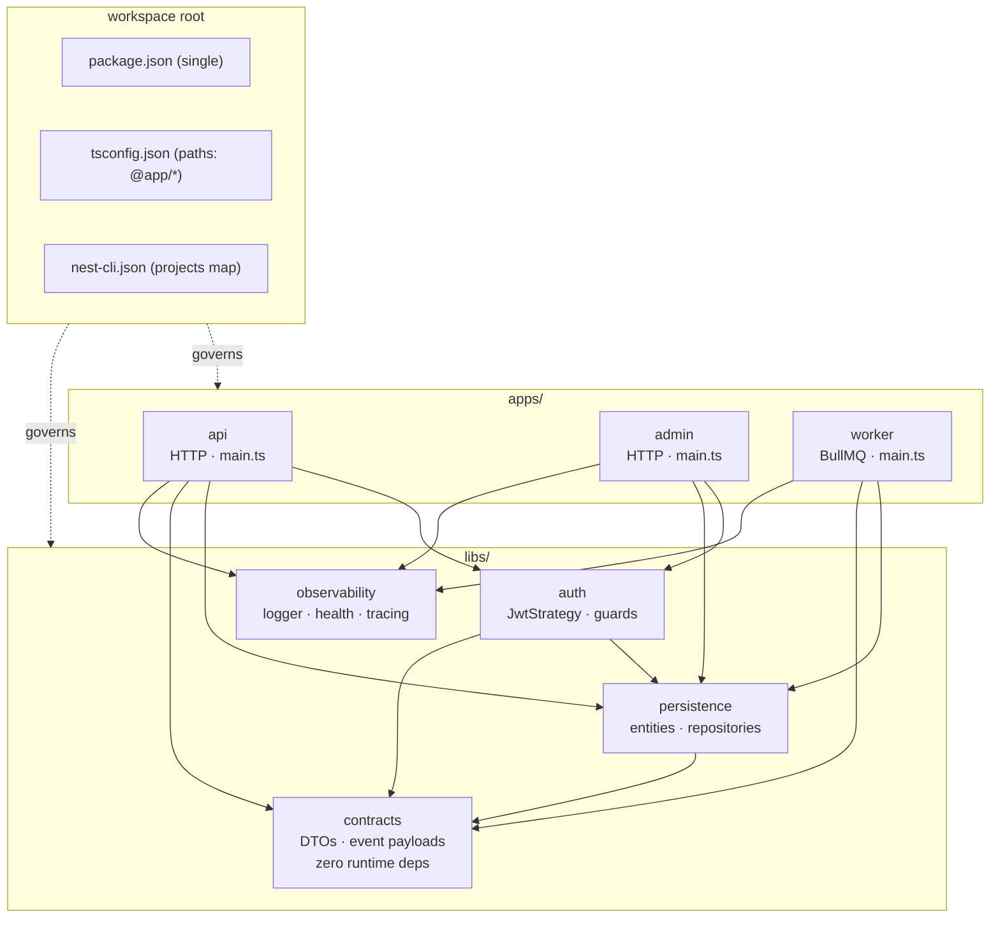

# Chapter 54 — Monorepos, Workspaces, and Publishable Libraries

> **한눈에 보기**
> 2장에서 만든 단일 프로젝트 구조(standard mode)는 앱이 하나일 때는 최적입니다. 그런데 앱이 둘,
> 셋으로 늘어나고 그 사이에 인증 모듈·DTO·이벤트 계약을 공유해야 하는 순간, 코드 복사와 git
> submodule과 사설 npm 레지스트리 중 무엇을 고를지가 팀의 개발 속도를 결정합니다. 이 장은 Nest CLI가
> 기본 제공하는 네 번째 선택지 — **monorepo mode** — 를 처음부터 끝까지 다룹니다. `nest generate
> app`이 프로젝트 구조를 어떻게 뒤집는지, `nest-cli.json`의 모든 키가 정확히 무엇을 제어하는지,
> `libs/`와 `@app/*` 경로 별칭이 어떻게 동작하는지, 그리고 사내 라이브러리를 npm에 공개 배포 가능한
> 패키지로 승격시킬 때 무엇이 달라지는지를 다룹니다. 마지막으로 Nest 내장 모노레포와 Nx/Turborepo의
> 트레이드오프, 그리고 모노레포에서 CI가 느려지지 않게 만드는 방법을 봅니다.

**What you will learn**

- What actually changes on disk and in `nest-cli.json` when a single-project workspace becomes a monorepo, and why the conversion fails on non-canonical project layouts.
- Every top-level and per-project key in `nest-cli.json` — `sourceRoot`, `monorepo`, `root`, `projects`, `compilerOptions`, `generateOptions` — and the precedence rules that decide which one wins.
- Why monorepo mode defaults to webpack while standard mode defaults to `tsc`, and when to override that default.
- How `nest g library` wires a `@app/*` TypeScript path alias, and why that alias is a *compile-time* fiction that webpack resolves and `tsc` output does not.
- The exact difference between a workspace library (`libs/`) and a publishable npm package, and the six things you must add to promote one to the other.
- How to design a library module that stays configurable for consumers without leaking its internals — `ConfigurableModuleBuilder`, and the discipline of a narrow public surface.
- How to share DTOs and event contracts between a monorepo's backend apps and an external client without shipping your service layer to the browser.
- When Nest's built-in monorepo is enough and when you should reach for Nx or Turborepo instead — with the concrete capability gaps that force the switch.

**Why this matters**

A team runs three Nest services: a public API, an internal admin API, and a worker that drains a queue. All three need the same JWT verification logic, the same `User` entity, and the same `OrderCreated` event payload. On day one someone copies `auth/` into all three repositories. Six weeks later the token audience claim changes. Two services are updated; the worker is not. It keeps accepting tokens minted for a decommissioned audience for another four months, until an auditor finds it. The root cause is not carelessness — it is that the cost of *changing shared code in three places* was higher than the cost of *not changing it*, and the structure made that so.

The opposite failure is just as common. A team reaches for a monorepo, puts everything in `libs/`, and ends up with a `libs/common` that every app imports and that changes on every ticket. Now every deploy rebuilds and redeploys all three services, CI takes 22 minutes, and nobody can reason about blast radius. A monorepo does not by itself give you modularity; it gives you a *place* to be modular, and removes the friction that was previously (accidentally) enforcing separation. You have to supply the discipline yourself.

There is also a build-mechanics failure that catches almost everyone once. A developer adds a library, imports it as `@app/shared`, runs `nest start` — it works. Then CI runs `nest build` with `"webpack": false`, and production crashes at startup with `Cannot find module '@app/shared'`. The alias existed only in `tsconfig.json`; `tsc` emitted the literal string `@app/shared` into the JavaScript, and Node has no idea what that is. Understanding *which* part of the toolchain resolves that alias is the difference between a five-minute fix and a day of guessing.

This chapter covers the mechanism first — what the CLI writes, what the compiler does, what Node sees at runtime — and then the architecture: what belongs in a library, what belongs in an app, and what belongs on npm.

## Two modes, one framework

Nest has exactly two ways of organizing code, and the choice affects **nothing except how projects are composed and how build artifacts are produced**. Controllers, providers, guards, microservice transports, GraphQL — every feature in this book behaves identically in either mode. That is worth stating plainly because teams often treat the decision as architectural when it is, in the Nest sense, purely a build-layout decision.

**Standard mode** is what `nest new` gives you: one application, one `src/`, one `package.json`, one `tsconfig.json`. It is the default and it is correct for the overwhelming majority of projects. If you have one deployable, stay here.

**Monorepo mode** treats your repository as a *workspace* containing multiple **projects**. A project is either an **application** (has a `main.ts`, can be started and deployed) or a **library** (no `main.ts`, cannot run alone, must be imported by an application). The workspace's structure lives in `nest-cli.json`. Monorepo mode automates the build coordination between projects, makes integration testing across services trivial, and lets you share project-wide artifacts — ESLint config, Prettier config, TypeScript settings, CI scripts — from a single root.

The key property is that **you can switch at any time**. There is no lock-in and no migration project. You start standard, and the day you need a second deployable you run one command. So do not agonize over the decision on day one; defer it until the benefit is concrete.

> **Hint** — The trigger for monorepo mode is *two deployables that share code*. Two deployables that share nothing are better off as two repositories. One deployable with good internal module boundaries needs neither.

## Converting a standard project into a monorepo

Start from a normal project:

```bash
$ nest new my-project
$ cd my-project
```

You now have the canonical layout:

```text
node_modules/
src/
  app.controller.ts
  app.module.ts
  app.service.ts
  main.ts
nest-cli.json
package.json
tsconfig.json
eslint.config.mjs
```

The conversion is a single command. **The act of adding a second project is what converts the workspace** — there is no `nest convert` and no flag:

```bash
$ nest generate app my-app
# short form: nest g app my-app
```

After this command the tree looks like this:

```text
apps/
  my-project/
    src/
      app.controller.ts
      app.module.ts
      app.service.ts
      main.ts
    tsconfig.app.json
  my-app/
    src/
      app.controller.ts
      app.module.ts
      app.service.ts
      main.ts
    tsconfig.app.json
nest-cli.json
package.json
tsconfig.json
eslint.config.mjs
```

Read carefully what happened:

1. The original `src/` moved to `apps/my-project/src/`. Your existing app is now a peer of the new one.
2. Each project got its own `tsconfig.app.json`, which `extends` the root `tsconfig.json` and sets the per-project `outDir` and `include`.
3. The root keeps **one** `package.json`, **one** `tsconfig.json`, **one** ESLint config, **one** `node_modules`. Application projects in a monorepo do *not* get their own `package.json`, `.prettierrc`, or lint config; they inherit the workspace's.
4. `my-project` was recorded as the **default project** in `nest-cli.json`.

> **⚠️ Notice** — The conversion only works for projects that follow the canonical Nest structure. The schematic physically relocates `src/` and `test/` into a folder under `apps/`. If you renamed `src/`, split it, or nested it, the conversion will fail or silently produce a broken layout. Fix your layout *before* converting, and commit first so you can `git reset --hard` if it goes wrong.

### The default project

Every workspace has one default project, and it should be an application. It is recorded by the top-level `"root"` key in `nest-cli.json`. Commands that take an optional project name use it when the name is omitted:

```bash
$ nest start              # starts my-project (the default)
$ nest start my-app       # starts my-app
$ nest build              # builds my-project
$ nest build my-app       # builds my-app
```

Because `npm run start:dev` in the generated `package.json` is just `nest start --watch` with no project name, **the default project silently absorbs every command you forget to qualify**. On a team, this is a real source of "it works on my machine": one developer's muscle memory runs `nest start` (the API), another's runs `nest start worker`. Consider deleting the bare scripts and replacing them with explicit per-project ones — see [Putting it together](#putting-it-together).

## The shape of a real workspace

A two-app toy monorepo teaches you the mechanics but not the layout. Here is a realistic one for the scenario from the chapter opening — a public API, an admin API, and a queue worker sharing auth, persistence, and contracts.



Two rules make this graph healthy and are worth adopting verbatim:

- **Libraries never import applications.** The arrows only point downward. If a library needs something from an app, that thing belongs in a library.
- **The dependency graph among libraries is acyclic and shallow.** `contracts` is a leaf with no Nest dependency at all — just types and validation decorators. Everything else may depend on it. Nothing depends on `observability` except apps and, deliberately, nothing else.

The `contracts` leaf is the highest-leverage library in most workspaces, and we return to it in [Shared DTOs and contracts](#shared-dtos-and-contracts).

## `nest-cli.json` in monorepo mode, in full

This file is the workspace manifest. The CLI maintains it for you, but you *will* edit it — for assets, for the SWC builder, for per-project overrides. Here is the file for the workspace above, with every relevant key present:

```json title="nest-cli.json"
{
  "$schema": "https://json.schemastore.org/nest-cli",
  "collection": "@nestjs/schematics",
  "sourceRoot": "apps/api/src",
  "monorepo": true,
  "root": "apps/api",
  "compilerOptions": {
    "webpack": true,
    "tsConfigPath": "apps/api/tsconfig.app.json",
    "deleteOutDir": true,
    "assets": ["**/*.graphql"],
    "watchAssets": true,
    "plugins": ["@nestjs/swagger"]
  },
  "generateOptions": {
    "spec": false
  },
  "projects": {
    "api": {
      "type": "application",
      "root": "apps/api",
      "entryFile": "main",
      "sourceRoot": "apps/api/src",
      "compilerOptions": {
        "tsConfigPath": "apps/api/tsconfig.app.json",
        "assets": [
          { "include": "i18n/**/*.json", "outDir": "dist/apps/api", "watchAssets": true }
        ]
      }
    },
    "admin": {
      "type": "application",
      "root": "apps/admin",
      "entryFile": "main",
      "sourceRoot": "apps/admin/src",
      "compilerOptions": {
        "tsConfigPath": "apps/admin/tsconfig.app.json"
      }
    },
    "worker": {
      "type": "application",
      "root": "apps/worker",
      "entryFile": "main",
      "sourceRoot": "apps/worker/src",
      "compilerOptions": {
        "tsConfigPath": "apps/worker/tsconfig.app.json",
        "webpack": false
      },
      "generateOptions": {
        "spec": { "service": true, "s": true }
      }
    },
    "contracts": {
      "type": "library",
      "root": "libs/contracts",
      "entryFile": "index",
      "sourceRoot": "libs/contracts/src",
      "compilerOptions": {
        "tsConfigPath": "libs/contracts/tsconfig.lib.json"
      }
    },
    "auth": {
      "type": "library",
      "root": "libs/auth",
      "entryFile": "index",
      "sourceRoot": "libs/auth/src",
      "compilerOptions": {
        "tsConfigPath": "libs/auth/tsconfig.lib.json"
      }
    }
  }
}
```

### Top-level keys

| Key | Type | Meaning |
|---|---|---|
| `collection` | string | The schematics collection used by `nest generate`. Effectively always `@nestjs/schematics`. Change only if you ship your own schematics. |
| `sourceRoot` | string | Source root of the single project (standard mode) or of the **default project** (monorepo mode). |
| `compilerOptions` | object | Options applied to any compilation — `nest build` and `nest start`, `tsc` or webpack or SWC. See the next table. |
| `generateOptions` | object | Defaults for `nest generate`. |
| `monorepo` | boolean | **Monorepo only.** Always `true`. Its presence is what puts the CLI in monorepo mode. |
| `root` | string | **Monorepo only.** Project root of the default project. |
| `projects` | object | **Monorepo only.** Map of project name → project metadata. |

### `compilerOptions`

These apply to every compilation step unless overridden per project.

| Property | Type | Description |
|---|---|---|
| `webpack` | boolean | `true` → webpack compiler; `false`/absent → `tsc`. **Default is `true` in monorepo mode and `false` in standard mode.** Deprecated in favour of `builder`. |
| `builder` | string \| object | Which builder to use: `"tsc"`, `"swc"`, or `"webpack"`. As an object: `{ "type": "swc", "options": { ... } }`. See [Chapter 55](55-performance-and-compilation.md). |
| `typeCheck` | boolean | Enables `tsc --noEmit` type checking alongside SWC when `builder` is `swc`. Default `false`. |
| `tsConfigPath` | string | **Monorepo only.** The `tsconfig` used when `nest build`/`nest start` runs without a project name (i.e. for the default project). |
| `webpackConfigPath` | string | Path to a webpack options file. Defaults to `webpack.config.js` in the root. |
| `deleteOutDir` | boolean | If `true`, wipe the compilation output directory before each compile. |
| `assets` | array | Non-TypeScript files to copy into the output on each full compile. Assets must live under `src/` or they will not be copied. Asset distribution does **not** run on incremental compiles in watch mode. |
| `watchAssets` | boolean | Watch **all** non-TypeScript assets. Setting this at the top level **overrides** any per-asset `watchAssets` setting. |
| `manualRestart` | boolean | Enables the `rs` shortcut to restart the server manually in watch mode. Default `false`. |

#### Assets in detail

The simple form is a list of glob strings:

```json
"assets": ["**/*.graphql", "**/*.hbs"],
"watchAssets": true
```

The object form gives per-entry control:

```json
"assets": [
  {
    "include": "**/*.graphql",
    "exclude": "**/omitted.graphql",
    "outDir": "dist/apps/api",
    "watchAssets": true
  }
]
```

- `include` — glob for files to copy.
- `exclude` — glob for files to skip from `include`.
- `outDir` — destination path relative to the workspace root. Defaults to the compiler's output directory.
- `watchAssets` — watch just these files.

In a monorepo the `outDir` matters more than in standard mode, because the compiler output for `api` lands in `dist/apps/api`, not `dist`. If you copy a template directory without specifying `outDir`, it can end up one level away from where `__dirname` resolves at runtime — the classic "works in dev, `ENOENT` in the container" bug.

### `generateOptions`

These set defaults for `nest generate`:

| Property | Type | Description |
|---|---|---|
| `spec` | boolean \| object | `true` (default) generates `.spec.ts` files; `false` suppresses them. As an object, keys are schematic names and values are booleans, giving per-schematic control. |
| `flat` | boolean | If `true`, all generate commands produce a flat structure (no per-component folder). |

```json
{ "generateOptions": { "spec": false } }
```

```json
{ "generateOptions": { "spec": { "service": false } } }
```

> **⚠️ Notice** — When `spec` is an object, the keys do **not** handle schematic aliases automatically. `{"service": false}` will not suppress the spec if you run `nest g s foo`. Specify both the full name and the alias:
>
> ```json
> { "generateOptions": { "spec": { "service": false, "s": false } } }
> ```

### Per-project overrides and precedence

Everything in `projects.<name>.compilerOptions` and `projects.<name>.generateOptions` overrides the global block, for that project only. In the manifest above, `worker` sets `"webpack": false` because it deploys as a plain `tsc` build, and re-enables service specs for itself.

The precedence order is fixed and worth memorising:

**CLI flags > project-specific options > global options.**

So `nest g service billing --spec` produces a spec even if both the project and the workspace disabled it.

### Project metadata

| Property | Values | Notes |
|---|---|---|
| `type` | `"application"` \| `"library"` | Determines how the build is driven. |
| `root` | string | Project root, e.g. `apps/api` or `libs/auth`. |
| `entryFile` | string | `"main"` for applications, `"index"` for libraries. |
| `sourceRoot` | string | `<root>/src`. |
| `compilerOptions.tsConfigPath` | string | `tsconfig.app.json` for apps, `tsconfig.lib.json` for libraries. |

You generally should not hand-edit `type`, `root`, `entryFile`, or `sourceRoot` — the CLI writes them and uses them to locate projects. The `compilerOptions` and `generateOptions` sub-objects are yours to tune.

## Choosing a compiler: webpack vs `tsc`

Monorepo mode defaults to webpack; standard mode defaults to `tsc`. The reason is that in a monorepo, an application pulls in code from `libs/` through path aliases, and webpack both resolves those aliases and **bundles everything into a single output file**. That single file is materially easier to containerise: one `main.js`, no relative-path surprises, no dependence on `tsconfig` path mapping at runtime.

With `tsc` the alias is *not* rewritten. `tsc` type-checks `import { UserDto } from '@app/contracts'` against the `paths` mapping and then emits `require("@app/contracts")` verbatim. Node resolves that against `node_modules` and finds nothing.

```typescript
// Source
import { AuthModule } from '@app/auth';

// tsc output (dist/apps/api/src/app.module.js)
const auth_1 = require("@app/auth");   // ← Node: Cannot find module '@app/auth'

// webpack output
// the module is inlined into the bundle; no runtime resolution needed
```

If you must use `tsc` in a monorepo — SWC users often do, and so do people who want per-file output for source-map fidelity — you need a runtime resolver. The two workable options:

```bash
# Option 1: rewrite the emitted paths after compilation
$ npm i -D tsc-alias
$ nest build worker && npx tsc-alias -p apps/worker/tsconfig.app.json

# Option 2: resolve at runtime
$ npm i tsconfig-paths
$ node -r tsconfig-paths/register dist/apps/worker/main.js
```

Prefer `tsc-alias`: it does the work at build time, so production has one fewer moving part. If you can accept a bundle, prefer webpack and skip the problem entirely.

To customise the webpack build, add `webpack.config.js` at the root. Nest passes you the default options, so extend rather than replace:

```javascript title="webpack.config.js"
module.exports = function (options) {
  return {
    ...options,
    externals: [], // bundle node_modules too — see below
  };
};
```

By default Nest marks `node_modules` as external (they are `require`d at runtime, not bundled). Setting `externals: []` bundles them, which produces a much larger but fully self-contained `main.js` — occasionally useful for tiny serverless images, usually not worth it. The plain-object form works too:

```javascript title="webpack.config.js"
module.exports = { externals: [] };
```

## Libraries

A **library** is a Nest project that cannot run on its own. It has no `main.ts`; it must be imported by an application for its code to execute. Built-in library support exists **only in monorepo mode** — a standard-mode project achieves the same thing with npm packages.

### Generating a library

```bash
$ nest g library auth
```

The schematic prompts for a prefix:

```text
? What prefix would you like to use for the library (default: @app)?
```

Accept `@app` unless you have a reason not to. (A good reason: you also publish some of these libraries to npm under a real scope, and you want the in-repo alias to match the published name — then use `@acme`.)

Libraries live under `libs/`, which Nest creates on first use:

```text
libs/
  auth/
    src/
      index.ts
      auth.module.ts
      auth.service.ts
    tsconfig.lib.json
```

Two differences from an application appear in `nest-cli.json`:

- `"type"` is `"library"`, not `"application"`.
- `"entryFile"` is `"index"`, not `"main"`.

Those two facts drive the build: a library exports its surface through `index.js`, so `index.ts` is the entry point rather than a bootstrap file.

Like applications, each library gets a `tsconfig.lib.json` extending the root config, which you may edit for library-specific compiler settings. You can compile a library on its own:

```bash
$ nest build auth
```

### The barrel file is the public API

The generated `index.ts` is not boilerplate — it is your library's **public API contract**. Everything you re-export there is something consumers may import and something you must not break casually. Everything you leave out is private.

```typescript title="libs/auth/src/index.ts"
// Public surface — consumers may depend on all of this.
export * from './auth.module';
export * from './guards/jwt-auth.guard';
export * from './guards/roles.guard';
export * from './decorators/current-user.decorator';
export * from './interfaces/auth-options.interface';

// Deliberately NOT exported:
//   ./strategies/jwt.strategy   — an implementation detail of AuthModule
//   ./auth.constants            — internal DI tokens
//   ./utils/clock               — test seam, not for consumers
```

Be strict about this. A `export * from './everything'` barrel means every internal refactor is a breaking change for someone.

### Path aliases

When you add a library, Nest updates the root `tsconfig.json`:

```json title="tsconfig.json"
{
  "compilerOptions": {
    "baseUrl": "./",
    "paths": {
      "@app/auth": ["libs/auth/src"],
      "@app/auth/*": ["libs/auth/src/*"],
      "@app/contracts": ["libs/contracts/src"],
      "@app/contracts/*": ["libs/contracts/src/*"]
    }
  }
}
```

Consuming it is unremarkable — a library module is just a module:

```typescript title="apps/api/src/app.module.ts"
import { Module } from '@nestjs/common';
import { AuthModule } from '@app/auth';
import { ContractsModule } from '@app/contracts';
import { AppController } from './app.controller';
import { AppService } from './app.service';

@Module({
  imports: [AuthModule.forRoot({ issuer: 'https://id.acme.io' }), ContractsModule],
  controllers: [AppController],
  providers: [AppService],
})
export class AppModule {}
```

The `@app/auth/*` wildcard entry lets consumers deep-import (`@app/auth/testing`). That is occasionally useful — a `testing` sub-entry with module mocks is a good pattern — but it also punches a hole through your barrel. If you want a strict surface, delete the wildcard `paths` entry and force everything through `index.ts`.

> **Hint** — Jest does not read `tsconfig` `paths`. Mirror them in `moduleNameMapper`, or your unit tests will fail to resolve `@app/*` even though the app builds:
>
> ```json
> "moduleNameMapper": {
>   "^@app/auth(|/.*)$": "<rootDir>/libs/auth/src/$1",
>   "^@app/contracts(|/.*)$": "<rootDir>/libs/contracts/src/$1"
> }
> ```

### Library or application?

| | Library (`libs/`) | Application (`apps/`) |
|---|---|---|
| Entry file | `index.ts` | `main.ts` |
| Can run standalone | No | Yes |
| `nest-cli.json` `type` | `library` | `application` |
| Deployed | No — bundled into consumers | Yes |
| Owns config/secrets | No — receives them | Yes — reads env |
| Owns `bootstrap()` | No | Yes |
| Typical content | Modules, providers, guards, DTOs | Composition root, HTTP surface, transport setup |

The line to hold: **an application decides, a library provides.** A library must never call `process.env` directly, never register a global filter, never assume it is running in an HTTP context. It exposes options; the application supplies them. The moment a library reads `process.env.DATABASE_URL`, you can no longer use it twice in the same workspace with different databases — and that is exactly the situation a monorepo creates.

## Designing a publishable Nest module

A library that only ever runs inside your workspace can be sloppy about configuration. A library that other teams — or the public — consume cannot be. The tool for that is `ConfigurableModuleBuilder`, covered fully in [Chapter 37 — Dynamic Modules and Configurable Module Builders](37-dynamic-modules.md). Here is the shape that a well-designed library module takes.

```typescript title="libs/auth/src/auth.module-definition.ts"
import { ConfigurableModuleBuilder } from '@nestjs/common';

export interface AuthModuleOptions {
  issuer: string;
  audience: string;
  jwksUri: string;
  /** Clock skew tolerance in seconds. Defaults to 30. */
  clockToleranceSec?: number;
}

export const {
  ConfigurableModuleClass,
  MODULE_OPTIONS_TOKEN,
  OPTIONS_TYPE,
  ASYNC_OPTIONS_TYPE,
} = new ConfigurableModuleBuilder<AuthModuleOptions>()
  .setClassMethodName('forRoot')
  .setExtras({ isGlobal: false }, (definition, extras) => ({
    ...definition,
    global: extras.isGlobal,
  }))
  .build();
```

```typescript title="libs/auth/src/auth.module.ts"
import { Module } from '@nestjs/common';
import { JwtStrategy } from './strategies/jwt.strategy';
import { JwtAuthGuard } from './guards/jwt-auth.guard';
import { RolesGuard } from './guards/roles.guard';
import { TokenVerifier } from './token-verifier.service';
import {
  ConfigurableModuleClass,
  ASYNC_OPTIONS_TYPE,
  OPTIONS_TYPE,
} from './auth.module-definition';

@Module({
  providers: [JwtStrategy, TokenVerifier, JwtAuthGuard, RolesGuard],
  // Export only what consumers legitimately need to inject or bind.
  exports: [JwtAuthGuard, RolesGuard, TokenVerifier],
})
export class AuthModule extends ConfigurableModuleClass {
  // Narrowing the inherited signatures gives consumers precise types.
  static forRoot(options: typeof OPTIONS_TYPE) {
    return super.forRoot(options);
  }

  static forRootAsync(options: typeof ASYNC_OPTIONS_TYPE) {
    return super.forRootAsync(options);
  }
}
```

Three design rules are encoded there, and all three matter more for a published package than for an internal one:

1. **`JwtStrategy` is provided but not exported.** It is how the module works, not what it offers. If it were exported, someone would inject it, and you could never replace Passport without a major version bump.
2. **`forRootAsync` exists from day one.** Consumers will want to read options from `ConfigService`. Adding async support later is a breaking change to your module's shape in practice, because people will have written `forRoot(hardcoded)` around it.
3. **Options are an interface with documented defaults**, not a loose `Record<string, unknown>`. The interface *is* your documentation, and TypeScript enforces it at every call site.

## Publishing a library to npm

An internal `libs/` library and a published npm package are different artifacts with different requirements. Promoting one to the other means adding six things.

### 1. A per-package `package.json`

The workspace has a single root `package.json`, but a published package needs its own manifest inside `libs/auth/`:

```json title="libs/auth/package.json"
{
  "name": "@acme/nest-auth",
  "version": "2.3.1",
  "description": "JWT authentication module for Acme Nest services",
  "license": "MIT",
  "main": "dist/index.js",
  "types": "dist/index.d.ts",
  "files": ["dist"],
  "sideEffects": false,
  "repository": {
    "type": "git",
    "url": "git+https://github.com/acme/platform.git",
    "directory": "libs/auth"
  },
  "publishConfig": { "access": "public" },
  "peerDependencies": {
    "@nestjs/common": "^11.0.0",
    "@nestjs/core": "^11.0.0",
    "reflect-metadata": "^0.2.0",
    "rxjs": "^7.8.0"
  },
  "dependencies": {
    "jose": "^5.9.6"
  },
  "devDependencies": {
    "@nestjs/common": "^11.0.0",
    "@nestjs/core": "^11.0.0",
    "typescript": "^5.7.0"
  },
  "scripts": {
    "build": "rimraf dist && tsc -p tsconfig.build.json",
    "prepublishOnly": "npm run build"
  }
}
```

### 2. Peer dependencies on `@nestjs/*` — always

This is the single most important line in the file, and the one most often got wrong.

`@nestjs/common` and `@nestjs/core` must be **peer** dependencies, never regular ones. Nest's DI container keys providers by class reference and by metadata attached via `reflect-metadata`. If your package installs its own nested copy of `@nestjs/common`, the consumer's application ends up with **two** `@nestjs/common` module instances. The `@Injectable()` decorator from your copy writes metadata that the consumer's `Reflector` cannot read.

The symptom is memorable: `Nest can't resolve dependencies of the XService (?)` — for a provider you can see, in a module you can see, exported correctly. The cause is duplicate framework instances, and no amount of staring at your module graph will reveal it.

The same applies to `reflect-metadata` (a *global* singleton by design — two copies means two metadata registries) and `rxjs` (`instanceof Observable` checks fail across copies).

The rule: **anything the consumer also imports directly goes in `peerDependencies` and in `devDependencies`.** `peerDependencies` declares the contract; `devDependencies` lets you build and test locally. Put in `dependencies` only things that are genuinely private to your implementation, like `jose` above.

Use permissive peer ranges (`^11.0.0`, not `11.0.3`). A narrow peer range forces every consumer into a lockstep upgrade and generates `ERESOLVE` noise for everyone.

### 3. A build that emits declarations

Webpack bundling is wrong for a published library — consumers want to tree-shake and to read your types. Compile with `tsc`, emit declarations, and emit source maps:

```json title="libs/auth/tsconfig.build.json"
{
  "extends": "../../tsconfig.json",
  "compilerOptions": {
    "rootDir": "./src",
    "outDir": "./dist",
    "declaration": true,
    "declarationMap": true,
    "sourceMap": true,
    "composite": false,
    "removeComments": false,
    "paths": {}
  },
  "include": ["src/**/*"],
  "exclude": ["**/*.spec.ts", "**/*.e2e-spec.ts", "dist"]
}
```

Note `"paths": {}`. This is essential and easy to miss. Your library sits inside a workspace with `@app/*` aliases configured; if the published build inherits them, you can accidentally compile an import of `@app/contracts` into a `require("@app/contracts")` that no consumer can resolve. A publishable library **must not import other workspace libraries by alias**. It either vendors what it needs, or depends on the sibling as a real npm package with its own version.

### 4. `files` or `.npmignore`

Control the tarball. The `files` allowlist in `package.json` is safer than `.npmignore` because it is a default-deny list — new source folders don't leak automatically. If you prefer `.npmignore`:

```text title="libs/auth/.npmignore"
src/
test/
tsconfig*.json
*.tsbuildinfo
*.spec.ts
*.e2e-spec.ts
.eslintrc*
eslint.config.mjs
coverage/
```

Verify before you publish, every time:

```bash
$ npm pack --dry-run
# or, to inspect the real tarball:
$ npm pack && tar -tzf acme-nest-auth-2.3.1.tgz
```

You are looking for two things: that `dist/index.js` and `dist/index.d.ts` are present, and that nothing under `src/` or any `.env` is.

### 5. Versioning

Follow semver, and be honest about what "breaking" means for a Nest module. It is broader than a changed function signature:

| Change | Semver bump | Why |
|---|---|---|
| New optional option in `forRoot` | minor | Additive. |
| New required option | **major** | Every consumer's call breaks. |
| Removing an `exports` entry | **major** | Someone was injecting it. |
| Changing an exported DI token's value | **major** | Silent runtime break, worse than a compile error. |
| Making a provider request-scoped | **major** | Scope bubbles up to every consumer — see [Chapter 38](38-injection-scopes.md). |
| Bumping a peer range's major | **major** | Forces a consumer upgrade. |
| Bug fix in a private service | patch | Not observable through the public surface. |

The trap is the third and fourth rows. Widening a token from a string to a symbol, or flipping a provider to `Scope.REQUEST`, is invisible in the diff and catastrophic downstream. Treat exported tokens and provider scopes as part of the API.

### 6. Publish mechanics

```bash
$ cd libs/auth
$ npm version minor            # bumps package.json, creates a git tag
$ npm publish                  # prepublishOnly runs the build
```

For an internal-only package, publish to a private registry and scope it:

```bash
$ npm publish --registry=https://npm.acme.internal --access restricted
```

> **Hint** — Before the first real publish, test the consumption path locally. `npm pack` in the library, then `npm i ../../libs/auth/acme-nest-auth-2.3.1.tgz` in a scratch app. This catches missing `files` entries and broken `main`/`types` paths that `npm link` hides, because `npm link` symlinks the source directory rather than the tarball.

## Shared DTOs and contracts

The most valuable library in most monorepos contains no Nest code at all. `libs/contracts` holds the shapes that cross a boundary: request/response DTOs, microservice message payloads, event definitions, and the enums both sides need.

```typescript title="libs/contracts/src/orders/order.events.ts"
export const ORDER_CREATED = 'order.created' as const;

export interface OrderCreatedEvent {
  readonly orderId: string;
  readonly customerId: string;
  readonly totalCents: number;
  readonly currency: 'USD' | 'EUR' | 'KRW';
  readonly occurredAt: string; // ISO-8601
}
```

```typescript title="libs/contracts/src/orders/create-order.dto.ts"
import { IsArray, IsISO4217CurrencyCode, IsInt, IsUUID, Min, ValidateNested } from 'class-validator';
import { Type } from 'class-transformer';

export class OrderLineDto {
  @IsUUID()
  sku!: string;

  @IsInt()
  @Min(1)
  quantity!: number;
}

export class CreateOrderDto {
  @IsUUID()
  customerId!: string;

  @IsISO4217CurrencyCode()
  currency!: string;

  @IsArray()
  @ValidateNested({ each: true })
  @Type(() => OrderLineDto)
  lines!: OrderLineDto[];
}
```

Both `api` (which validates incoming HTTP bodies) and `worker` (which consumes the event) import from `@app/contracts`. The compiler now enforces that a producer and a consumer agree — the failure mode from the chapter opening becomes a build error rather than a four-month silent bug.

### Sharing with a client outside the workspace

A browser client or a mobile app is not in your Nest workspace. There are three honest options, in increasing order of cost and quality:

| Approach | How | Best when |
|---|---|---|
| Generate from OpenAPI | `nest build` → serve `/api-json` → `openapi-typescript` in the client's CI | You already have Swagger set up (see [Chapter 29](../part2-intermediate/29-openapi-fundamentals.md)); the client is external or in another language |
| Publish `contracts` to npm | Promote `libs/contracts` to a published package, version it, consume it from the client repo | Client is TypeScript, teams are separate, you want explicit versioned coupling |
| Put the client in the workspace | `apps/web/` alongside the Nest apps; import `@app/contracts` directly | One team owns both sides and deploys them together |

Whichever you choose, keep `libs/contracts` free of runtime dependencies that a browser cannot take. `class-validator` decorators are fine (they are used by the server; the client only needs the types), but a `TypeORM` entity in `contracts` immediately drags `typeorm` into the client's bundle. Keep entities in `libs/persistence` and DTOs in `libs/contracts`, and never let the two merge.

## Nest's monorepo vs Nx and Turborepo

Nest's built-in monorepo is deliberately small. It solves *project layout and build coordination for Nest projects* and nothing else. Nx and Turborepo solve a bigger problem — the general polyglot monorepo — and cost more to operate.

| Capability | Nest CLI monorepo | Nx | Turborepo |
|---|---|---|---|
| Setup cost | One command, zero config | Generator + `nx.json` + plugins | `turbo.json` + per-package `package.json` |
| Package manager model | Single root `package.json` | Single root, or npm/pnpm workspaces | npm/pnpm/yarn workspaces (per-package manifests) |
| Task orchestration / topological build | No — you script it | Yes, first class | Yes, first class |
| Local build cache | No | Yes | Yes |
| Remote/shared cache | No | Yes (Nx Cloud or self-hosted) | Yes (Vercel or self-hosted) |
| "Affected projects" detection | No | Yes (`nx affected`, graph-aware) | Partial (`--filter=...[HEAD^1]`) |
| Dependency graph visualisation | Nest Devtools ([Chapter 56](56-observability.md)) — DI graph, not project graph | `nx graph` — project graph | `turbo run build --graph` |
| Code generators | Nest schematics | Nx generators (incl. Nest plugin) | None |
| Automated dependency updates of the tooling | No | `nx migrate` | No |
| Enforced module boundaries (lint rule) | No | Yes (`@nx/enforce-module-boundaries`) | No |
| Non-Node projects (Go, Rust, Python) | No | Yes | Yes |
| Frontend framework support | No | Yes (React, Angular, Vue…) | Yes (tool-agnostic) |

**The recommendation.** Start with the Nest CLI monorepo. It is free — you already have it — and it covers the case that actually matters early: two or three Nest services sharing libraries. Migrate when you hit one of these three walls, and not before:

1. **CI time.** Your pipeline rebuilds and retests everything on every commit and it now takes longer than your team's patience. Caching and affected-detection are the reason Nx and Turborepo exist.
2. **Non-Nest projects.** You want the React app, the design-system package, and the Go sidecar in the same repo with unified tasks.
3. **Boundary enforcement.** Your `libs/common` has become a junk drawer and code review is not stopping it. Nx's `enforce-module-boundaries` lint rule with tags (`scope:orders` may not import `scope:billing`) is the only mechanical fix.

Note that Nx has an official Nest plugin (`@nx/nest`), so the migration is not a rewrite; it wraps your existing structure. Turborepo, by contrast, expects real npm workspaces with per-package `package.json` files, which is a bigger structural change from Nest's single-manifest model.

## CI in a monorepo

The default monorepo CI pipeline is "build everything, test everything, deploy everything". It works until it doesn't, and the failure is gradual: 4 minutes, then 9, then 22, and then people stop running CI locally and start merging on hope.

### Affected-project builds without Nx

You can get most of the benefit with `git diff` and a mapping from changed paths to affected projects. The mapping must include the *transitive* library dependencies — that is the part people get wrong.

```bash title="scripts/affected.sh"
#!/usr/bin/env bash
set -euo pipefail

BASE="${1:-origin/main}"
CHANGED=$(git diff --name-only "$BASE"...HEAD)

# Anything touching the root toolchain invalidates everything.
if echo "$CHANGED" | grep -qE '^(package-lock\.json|tsconfig\.json|nest-cli\.json|Dockerfile)$'; then
  echo "api admin worker"; exit 0
fi

declare -A AFFECTED=()

# Direct app changes.
while read -r app; do
  [ -n "$app" ] && AFFECTED["$app"]=1
done < <(echo "$CHANGED" | sed -n 's#^apps/\([^/]*\)/.*#\1#p' | sort -u)

# Library changes fan out to their consumers (declare the edges once, here).
declare -A CONSUMERS=(
  [contracts]="api worker"
  [auth]="api admin"
  [persistence]="api admin worker"
  [observability]="api admin worker"
)
while read -r lib; do
  for app in ${CONSUMERS[$lib]:-}; do AFFECTED["$app"]=1; done
done < <(echo "$CHANGED" | sed -n 's#^libs/\([^/]*\)/.*#\1#p' | sort -u)

echo "${!AFFECTED[@]}"
```

```yaml title=".github/workflows/ci.yml"
name: CI
on:
  pull_request:
jobs:
  plan:
    runs-on: ubuntu-latest
    outputs:
      projects: ${{ steps.affected.outputs.projects }}
    steps:
      - uses: actions/checkout@v4
        with: { fetch-depth: 0 }
      - id: affected
        run: |
          LIST=$(./scripts/affected.sh origin/${{ github.base_ref }})
          JSON=$(printf '%s\n' $LIST | jq -R . | jq -sc .)
          echo "projects=$JSON" >> "$GITHUB_OUTPUT"

  build:
    needs: plan
    if: needs.plan.outputs.projects != '[]'
    runs-on: ubuntu-latest
    strategy:
      matrix:
        project: ${{ fromJson(needs.plan.outputs.projects) }}
    steps:
      - uses: actions/checkout@v4
      - uses: actions/setup-node@v4
        with: { node-version: '22', cache: 'npm' }
      - run: npm ci
      - run: npx nest build ${{ matrix.project }}
      - run: npx jest --selectProjects ${{ matrix.project }}
```

Two warnings about hand-rolled affected detection. First, the `CONSUMERS` map is duplicated knowledge — it will drift from the real import graph. Keep it next to `nest-cli.json` and review it whenever a library is added. Second, **never let affected-detection skip the final integration test suite on the main branch.** Use it to speed up PR feedback, not to reduce coverage before deploy.

### Docker layer caching

A monorepo Dockerfile that copies the whole repo before `npm ci` re-installs dependencies on every source change. Split the copy so the dependency layer is cached:

```dockerfile title="Dockerfile"
# syntax=docker/dockerfile:1.7
ARG PROJECT=api

# ---- deps: cached unless the lockfile changes ----
FROM node:22-alpine AS deps
WORKDIR /repo
COPY package.json package-lock.json ./
RUN --mount=type=cache,target=/root/.npm npm ci

# ---- build: only this project ----
FROM node:22-alpine AS build
ARG PROJECT
WORKDIR /repo
COPY --from=deps /repo/node_modules ./node_modules
COPY tsconfig.json nest-cli.json ./
COPY libs ./libs
COPY apps/${PROJECT} ./apps/${PROJECT}
RUN npx nest build ${PROJECT}

# ---- runtime: production deps only ----
FROM node:22-alpine AS runtime
ARG PROJECT
ENV NODE_ENV=production
WORKDIR /app
COPY package.json package-lock.json ./
RUN --mount=type=cache,target=/root/.npm npm ci --omit=dev
COPY --from=build /repo/dist/apps/${PROJECT} ./dist
CMD ["node", "dist/main.js"]
```

The important choices: the lockfile is copied alone so the `npm ci` layer survives source edits; only the target app's folder is copied (a change in `apps/admin` does not bust the `api` image); and because the monorepo builds with webpack, `dist/main.js` is a single bundle, so the runtime stage stays small.

Build one image per app from the same Dockerfile:

```bash
$ docker build --build-arg PROJECT=api    -t acme/api:$SHA .
$ docker build --build-arg PROJECT=worker -t acme/worker:$SHA .
```

## Common mistakes

1. **`Cannot find module '@app/shared'` in production, but dev works.**
   *Symptom:* the container exits immediately with a module-not-found for a path alias. *Cause:* the build used `tsc` (or SWC) instead of webpack, and neither rewrites `paths` aliases in the emitted JavaScript. *Fix:* either leave `"webpack": true` (the monorepo default), or run `tsc-alias` after the build, or start with `node -r tsconfig-paths/register`.

2. **Jest cannot resolve `@app/*` even though the app builds.**
   *Symptom:* `Cannot find module '@app/contracts' from 'apps/api/src/orders.service.spec.ts'`. *Cause:* Jest ignores `tsconfig` `paths`. *Fix:* add matching `moduleNameMapper` entries in the root Jest config; keep them in sync with `tsconfig.json` whenever you add a library.

3. **`Nest can't resolve dependencies` after installing your own published package.**
   *Symptom:* a provider that is clearly registered fails to resolve. *Cause:* `@nestjs/common`/`@nestjs/core`/`reflect-metadata` were declared as `dependencies` rather than `peerDependencies`, so the consumer has two copies of the framework and two metadata registries. *Fix:* move them to `peerDependencies` + `devDependencies`, republish, and have consumers run `npm ls @nestjs/common` to confirm a single instance.

4. **Assets missing at runtime in a monorepo (`ENOENT` on templates or `.graphql` files).**
   *Symptom:* works in `nest start`, fails in the container. *Cause:* the asset lives outside `src/` (assets are only copied from `src/`), or the per-project `outDir` was not set and the file landed in `dist/` instead of `dist/apps/api/`. *Fix:* move the asset under `src/` and set an explicit `outDir` in the project's `assets` entry.

5. **A schematic generated files into the wrong project.**
   *Symptom:* `nest g service billing` created `apps/api/src/billing/` when you meant the worker. *Cause:* no project name, so the CLI used the default project. *Fix:* always pass `-p`: `nest g service billing -p worker`. Remove the ambiguous bare `start`/`build` npm scripts too.

6. **`spec: { "service": false }` still generates specs.**
   *Symptom:* the option appears to be ignored. *Cause:* you invoked the alias (`nest g s`), and schematic aliases are not resolved for `generateOptions` keys. *Fix:* list both the name and the alias: `{ "service": false, "s": false }`.

7. **Converting a non-canonical project silently breaks the workspace.**
   *Symptom:* after `nest g app`, imports are broken and `src` is half-moved. *Cause:* the conversion schematic assumes a canonical `src/` + `test/` layout and relocates them mechanically. *Fix:* commit first; restore; normalise the layout; convert again.

8. **`libs/common` becomes a junk drawer that every app depends on.**
   *Symptom:* every PR touches `libs/common`, so every PR rebuilds and redeploys all services. *Cause:* a library named after its *location in the graph* rather than its *domain*. *Fix:* rename by capability — `contracts`, `auth`, `persistence`, `observability`. If you cannot name a library without using the word "common", "shared", or "utils", it should not exist yet.

## Putting it together

A complete, coherent slice of the workspace: a contracts library, an auth library with a configurable module, and an API app that consumes both — plus the scripts that keep project selection explicit.

```typescript title="libs/contracts/src/index.ts"
export * from './orders/create-order.dto';
export * from './orders/order.events';
```

```typescript title="libs/auth/src/guards/jwt-auth.guard.ts"
import { CanActivate, ExecutionContext, Inject, Injectable, UnauthorizedException } from '@nestjs/common';
import type { Request } from 'express';
import { MODULE_OPTIONS_TOKEN, AuthModuleOptions } from '../auth.module-definition';
import { TokenVerifier } from '../token-verifier.service';

@Injectable()
export class JwtAuthGuard implements CanActivate {
  constructor(
    private readonly verifier: TokenVerifier,
    @Inject(MODULE_OPTIONS_TOKEN) private readonly options: AuthModuleOptions,
  ) {}

  async canActivate(context: ExecutionContext): Promise<boolean> {
    const req = context.switchToHttp().getRequest<Request>();
    const raw = req.headers.authorization?.replace(/^Bearer\s+/i, '');
    if (!raw) throw new UnauthorizedException('Missing bearer token');

    const claims = await this.verifier.verify(raw, {
      issuer: this.options.issuer,
      audience: this.options.audience,
      clockToleranceSec: this.options.clockToleranceSec ?? 30,
    });

    (req as Request & { user?: unknown }).user = claims;
    return true;
  }
}
```

```typescript title="apps/api/src/app.module.ts"
import { Module } from '@nestjs/common';
import { ConfigModule, ConfigService } from '@nestjs/config';
import { APP_GUARD } from '@nestjs/core';
import { AuthModule, JwtAuthGuard } from '@app/auth';
import { OrdersModule } from './orders/orders.module';

@Module({
  imports: [
    ConfigModule.forRoot({ isGlobal: true }),
    // The APPLICATION supplies configuration; the LIBRARY never reads env itself.
    AuthModule.forRootAsync({
      imports: [ConfigModule],
      inject: [ConfigService],
      useFactory: (config: ConfigService) => ({
        issuer: config.getOrThrow<string>('AUTH_ISSUER'),
        audience: config.getOrThrow<string>('AUTH_AUDIENCE'),
        jwksUri: config.getOrThrow<string>('AUTH_JWKS_URI'),
      }),
    }),
    OrdersModule,
  ],
  providers: [{ provide: APP_GUARD, useClass: JwtAuthGuard }],
})
export class AppModule {}
```

```typescript title="apps/api/src/orders/orders.controller.ts"
import { Body, Controller, Post } from '@nestjs/common';
import { CreateOrderDto } from '@app/contracts';
import { OrdersService } from './orders.service';

@Controller('orders')
export class OrdersController {
  constructor(private readonly orders: OrdersService) {}

  @Post()
  create(@Body() dto: CreateOrderDto) {
    return this.orders.create(dto);
  }
}
```

```json title="package.json (scripts)"
{
  "scripts": {
    "build:api": "nest build api",
    "build:admin": "nest build admin",
    "build:worker": "nest build worker",
    "build:all": "npm run build:api && npm run build:admin && npm run build:worker",
    "start:api": "nest start api --watch",
    "start:worker": "nest start worker --watch",
    "test": "jest",
    "affected": "./scripts/affected.sh origin/main"
  }
}
```

Run it:

```bash
$ nest build api          # → dist/apps/api/main.js (single webpack bundle)
$ nest start api --watch  # dev loop for one project only
$ nest build auth         # compile the library on its own to type-check it
```

> **핵심 정리**
> - 표준 모드와 모노레포 모드의 유일한 차이는 **프로젝트 구성과 빌드 산출물**뿐입니다. 프레임워크 기능은 완전히 동일하며, 언제든 전환할 수 있으므로 1일차에 고민하지 마세요.
> - `nest generate app <name>`을 실행하는 **행위 자체가** 표준 구조를 모노레포로 변환합니다. `src/`가 `apps/<원래이름>/src/`로 이동하고, 프로젝트마다 `tsconfig.app.json`이 생기며, `package.json`·`tsconfig.json`·lint 설정은 루트에 하나만 남습니다.
> - 변환 스키매틱은 **정규 구조(canonical structure)** 를 전제합니다. `src/`·`test/` 배치가 표준이 아니면 실패하거나 조용히 깨집니다. 반드시 커밋 후 변환하세요.
> - `nest-cli.json`의 옵션 우선순위는 **CLI 플래그 > 프로젝트별 옵션 > 전역 옵션**입니다. `webpack`은 모노레포에서 기본 `true`, 표준 모드에서 기본 `false`입니다.
> - `@app/*` 경로 별칭은 **컴파일 타임 개념**입니다. webpack은 번들링하며 해소하지만 `tsc`는 `require("@app/...")`를 그대로 내보냅니다. `tsc`를 쓴다면 `tsc-alias` 또는 `tsconfig-paths`가 필수입니다.
> - 라이브러리는 `index.ts`가 엔트리(`entryFile: "index"`)이고 단독 실행이 불가능합니다. **애플리케이션은 결정하고, 라이브러리는 제공합니다** — 라이브러리가 `process.env`를 직접 읽는 순간 재사용성이 사라집니다.
> - npm 배포 시 `@nestjs/common`·`@nestjs/core`·`reflect-metadata`·`rxjs`는 **반드시 `peerDependencies`** 여야 합니다. 아니면 소비자 앱에 프레임워크 사본이 둘 생기고 `Nest can't resolve dependencies` 오류가 납니다.
> - 배포용 빌드는 webpack이 아니라 `tsc`로 하고 `declaration: true`, 그리고 `"paths": {}`로 워크스페이스 별칭 상속을 반드시 차단하세요.
> - DTO·이벤트 계약만 담은 의존성 없는 `libs/contracts`가 모노레포에서 가장 가치가 높습니다. 엔티티는 절대 여기에 넣지 마세요.
> - Nest 내장 모노레포로 시작하고, **CI 시간 / 비(非)Nest 프로젝트 / 경계 강제** 세 가지 벽 중 하나에 부딪힐 때만 Nx·Turborepo로 옮기세요.

> **연습 문제**
> 1. 표준 모드 프로젝트에서 `nest generate app worker`를 실행한 뒤, 변환 전후의 `nest-cli.json`을 `git diff`로 비교하세요. 새로 생긴 키가 정확히 몇 개이며 각각 무엇을 제어하는지 설명하세요.
> 2. `libs/contracts` 라이브러리를 만들고 `@app/contracts`로 앱에서 임포트한 뒤, `nest-cli.json`에서 해당 앱의 `compilerOptions.webpack`을 `false`로 바꿔 빌드·실행해 보세요. 어떤 오류가 나는지 확인하고, `tsc-alias`와 `tsconfig-paths` 두 방법으로 각각 고쳐 보세요. 두 해법의 트레이드오프를 3줄로 정리하세요.
> 3. **직접 만들어 보기.** `apps/api`, `apps/worker`, `libs/contracts`, `libs/auth`로 구성된 워크스페이스를 만드세요. `auth` 라이브러리는 `ConfigurableModuleBuilder`로 `forRoot`/`forRootAsync`를 모두 지원해야 하고, `index.ts`에서 가드와 옵션 인터페이스만 export하고 전략(strategy) 클래스는 숨겨야 합니다. 앱은 `ConfigService`로 옵션을 주입하세요.
> 4. **직접 만들어 보기.** 3번의 `libs/auth`를 npm 배포 가능한 패키지로 승격시키세요. 자체 `package.json`(peer dependencies 포함), `tsconfig.build.json`(`"paths": {}` 포함), `files` 허용 목록을 작성하고, `npm pack --dry-run`으로 tarball에 `src/`가 포함되지 않는지 검증하세요.
> 5. 이 장의 `affected.sh`를 여러분의 워크스페이스에 맞게 고쳐, `libs/contracts`만 수정한 커밋과 `apps/admin`만 수정한 커밋에서 각각 어떤 프로젝트 목록이 나오는지 확인하세요. `CONSUMERS` 맵이 실제 import 그래프와 어긋났을 때 발생할 수 있는 최악의 시나리오를 서술하세요.
> 6. Nest 내장 모노레포에서 Nx로 옮겨야 하는 세 가지 신호를 여러분 팀의 현재 상황에 비추어 평가하고, 지금 옮기는 것이 옳은지 아닌지 근거와 함께 판단하세요.

**Next:** Now that your workspace can build several applications from one repository, the question becomes how fast those builds are and how fast the resulting servers run — [Chapter 55 — Performance: Fastify, SWC, and Build Pipelines](55-performance-and-compilation.md) replaces both the HTTP platform and the compiler, and measures what each change is actually worth.
