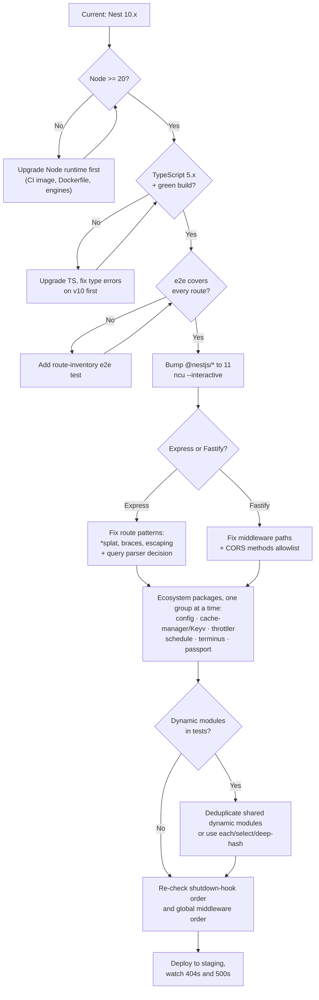

# Chapter 59 — Migrating to v11 and the Wider Ecosystem

> **한눈에 보기**
> 마지막 장입니다. 두 가지를 다룹니다. 첫째, **v10 → v11 마이그레이션 전체** — Express v5가
> 기본이 되면서 바뀐 라우트 매칭, 쿼리 파서, Fastify v5, 모듈 해석 알고리즘, 라이프사이클
> 훅 순서, `@nestjs/config`·`cache-manager`(Keyv)·`throttler`·`schedule`·Terminus·Passport의
> 변경점, 그리고 실제로 쓸 수 있는 체크리스트. 둘째, **생태계** — Compodoc으로 문서를
> 생성하는 법, Necord와 nest-commander 같은 커뮤니티 통합, 서드파티 패키지를 평가하는
> 기준, 공식 지원 채널. 마지막 절은 이 책이 끝난 뒤 어디로 갈지를 각 장으로 되짚어 줍니다.

**What you will learn**

- How to run a v10 → v11 upgrade as a controlled sequence rather than a big-bang `npm update` — and what to fix first.
- Every Express v5 route-matching change that will break a working v10 application, with the before/after for each.
- What silently changed underneath you: query-string parsing, module deduplication, lifecycle-hook ordering, middleware ordering, and `Reflector` return types.
- The per-package breaking changes in `@nestjs/config`, `@nestjs/cache-manager` (now Keyv), `@nestjs/throttler`, `@nestjs/schedule`, Terminus, and Passport — and the new `ConsoleLogger` JSON mode you probably want in production.
- How to find deprecations *before* an upgrade forces you to, using tooling rather than release notes alone.
- How to evaluate a third-party Nest module honestly, and which categories of the community ecosystem are safe bets versus maintenance risks.
- Where to go next — mapped back to specific chapters of this book.

**Why this matters**

There are two ways to arrive at a major-version upgrade. The first: your security scanner flags a transitive CVE, the fix is in a package that requires Nest 11, and you now have to upgrade a framework, a web server, and six ecosystem packages simultaneously, under time pressure, on a Friday. The second: you read the migration guide when it comes out, spend a day on a branch, and merge a boring PR.

The difference is not skill; it is whether you understood the changes as *mechanisms* rather than as a list. Take the headline change in v11: Express v5's route matcher. If you read it as "the wildcard syntax changed", you will `sed` your `*` to `*splat`, ship, and discover a week later that `@Get('users/*splat')` no longer matches `/users` — the exact route your mobile client calls. If you read it as "the matcher is now strict about what a parameter is, and an unnamed wildcard is no longer a parameter", you will also understand why braces exist, why `?` is gone, and why some punctuation now needs escaping. One reading survives the next release; the other does not.

The second half of this chapter is about a different kind of risk. Nest's community ecosystem is large and genuinely useful — there is a package for Discord bots, for CLIs, for CQRS extensions, for every ORM, for every observability vendor. Some of those packages are maintained by the core team, some by one person who has since changed jobs. Nothing in npm distinguishes them. Choosing wrongly is how a Nest 11 upgrade stalls for three months on a single unmaintained dependency that never got a compatible release. Learning to read those signals before you `npm i` is a durable engineering skill, and it is the last thing this book will teach you.

---

## Before you upgrade: making the change surveyable

An upgrade you cannot verify is a gamble. Three things go first, before a single dependency version changes.

**A green test suite that means something.** If your e2e tests only cover the happy path of three endpoints ([Chapter 31](../part2-intermediate/31-testing.md)), they will not catch a route-matching regression on the twelfth. The highest-value pre-upgrade investment is an e2e test that walks every registered route with a representative request. You can generate the list — Nest logs every mapped route at startup, and `app.getHttpServer()` plus your OpenAPI document ([Chapter 29](../part2-intermediate/29-openapi-fundamentals.md)) gives you a machine-readable inventory.

**A pinned, reproducible baseline.** Commit the lockfile, note the exact Node version, and confirm `npm ci` reproduces a working build from a clean checkout. If your current state is not reproducible, "it broke after the upgrade" is unprovable.

**A list of your deprecation debt.** Which brings us to the tooling.

### Finding deprecations before they find you

Release notes tell you what changed in the framework. They cannot tell you what *your* code uses. These four techniques can:

```bash
# 1. What is outdated, and by how much? Wanted vs latest shows the major gap.
$ npm outdated

# 2. Which packages have unmet or conflicting peer ranges? (The upgrade blockers.)
$ npm ls @nestjs/common @nestjs/core

# 3. Runtime deprecation warnings, with the stack trace that caused them.
$ node --trace-deprecation dist/main.js
$ node --throw-deprecation dist/main.js   # turn them into failures in CI

# 4. Security and maintenance signal.
$ npm audit
```

To that, add a lint rule that surfaces TypeScript's `@deprecated` JSDoc tag — `@typescript-eslint`'s `no-deprecated` rule (or the `eslint-plugin-deprecation` package on older setups) will flag every call into a deprecated framework API at lint time:

```json title=".eslintrc.json"
{
  "rules": {
    "@typescript-eslint/no-deprecated": "warn"
  }
}
```

This is the highest-leverage item in the list, because Nest marks APIs `@deprecated` for at least one major version before removing them. Turn the rule on today, and a future major upgrade becomes a list your editor already showed you. `HealthIndicator` and `HealthCheckError`, for example, are deprecated in v11 and scheduled for removal in the next major — that rule flags them now, not in a year.

Finally, upgrade dependencies with a tool rather than by hand. `npm-check-updates` is what the official guide recommends:

```bash
$ npx npm-check-updates --interactive --target latest
$ npm install
```

`--interactive` matters. Bumping every dependency in one commit produces a failure you cannot bisect. Upgrade the Nest scope first, verify, then the ecosystem packages one group at a time.



---

## Express v5: the change that will actually break you

Express v5 was released in 2024, stabilised in 2025, and is the **default** platform in NestJS 11. For most applications the upgrade is invisible. For any application with a wildcard route, an optional path segment, or a regex-flavoured pattern, it is not.

The path matcher was rewritten (a newer `path-to-regexp`) around a stricter model: **every dynamic segment must be a named parameter.** Everything else follows from that.

| v4 pattern | v5 equivalent | Note |
|---|---|---|
| `'users/*'` | `'users/*splat'` | Wildcards must be named; `splat` is just a name — `*wildcard` works too |
| `'users/*'` matching `/users` too | `'users/{*splat}'` | Braces make the group optional, so the bare parent path also matches |
| `'*'` (middleware, all routes) | `'{*splat}'` | Matches every path including the root |
| `'file.:ext?'` | `'file{.:ext}'` | `?` is gone; braces express optionality |
| `'/ab(cd)?e'` | escape or restructure | Regex characters are no longer supported in paths |
| `'/data(1)'` | `'/data\\(1\\)'` | `( ) [ ] ? + !` are reserved; escape with `\` |
| `:param` | `:param` or `:"odd-name"` | Names must be valid JS identifiers, or quoted |

Concretely:

```typescript title="files.controller.ts"
// v10 / Express v4 — no longer advisable in v5
@Get('users/*')
findAllV4() {
  // NestJS 11 auto-converts this to a valid Express v5 route, so it may still
  // work — but the conversion is a compatibility shim, not a contract.
  return 'legacy';
}

// v11 / Express v5 — explicit named wildcard
@Get('users/*splat')
findAll() {
  return 'matches /users/anything, but NOT /users';
}

// v11 — named wildcard in an optional group
@Get('users/{*splat}')
findAllIncludingRoot() {
  return 'matches /users AND /users/anything';
}
```

> **⚠️ Notice** — The difference between `*splat` and `{*splat}` is the single most common post-upgrade 404. `*splat` requires at least one path segment after the prefix; wrapping it in braces makes the whole group optional so the bare parent path matches too. If a route used to catch both, you need the braces.

Middleware paths follow the same rule ([Chapter 8](../part1-beginner/08-middleware.md)):

```typescript title="app.module.ts"
export class AppModule implements NestModule {
  configure(consumer: MiddlewareConsumer) {
    // v10:
    // consumer.apply(LoggerMiddleware).forRoutes('*');

    // v11 / Express v5:
    consumer.apply(LoggerMiddleware).forRoutes('{*splat}');
  }
}
```

Nest 11 converts legacy patterns automatically where it can, and that mercy is worth understanding correctly: it means your application probably boots and mostly works, which is exactly why the breakage shows up later as scattered 404s rather than as a startup crash. Fix the patterns deliberately rather than relying on the shim.

Note also that these matcher changes are **Express-only**. Fastify's route matching did not change in v5; the wildcard syntax you used before still works there, with one exception covered below.

### Query parameter parsing

This one changes behaviour without changing a line of your code, and it is easy to miss because it only affects *some* query strings.

Express v5 no longer uses the `qs` library by default. It uses the `simple` parser, which does not build nested objects or arrays. So:

```text
?filter[where][name]=John&filter[where][age]=30
?item[]=1&item[]=2
```

…which used to arrive as nested structures now arrive as flat keys with bracket characters in the names. Any controller doing `@Query('filter') filter: FilterDto` with a nested DTO will receive something it cannot validate — and, depending on your `ValidationPipe` settings, either a 400 for every previously-valid request or a silently empty filter.

To restore v4 behaviour:

```typescript title="main.ts"
import { NestFactory } from '@nestjs/core';
import { NestExpressApplication } from '@nestjs/platform-express';
import { AppModule } from './app.module';

async function bootstrap() {
  // The generic matters: `set` does not exist on a plain INestApplication.
  const app = await NestFactory.create<NestExpressApplication>(AppModule);
  app.set('query parser', 'extended');
  await app.listen(3000);
}
bootstrap();
```

My recommendation: set `extended` during the upgrade so nothing breaks, then decide separately whether you want nested query objects at all. They are a common source of injection-shaped bugs and of DTOs that cannot be expressed cleanly in OpenAPI. Flat, explicitly-named query parameters age better.

---

## Fastify v5

`@nestjs/platform-fastify` v11 supports Fastify v5. For most applications this is a non-event; two changes are worth checking.

**CORS methods are now an explicit allowlist.** By default only the CORS-safelisted methods are permitted. If your API uses `PUT`, `PATCH`, or `DELETE` cross-origin, name them:

```typescript title="main.ts"
const methods = ['GET', 'POST', 'PUT', 'PATCH', 'DELETE'];

const app = await NestFactory.create<NestFastifyApplication>(
  AppModule,
  new FastifyAdapter(),
  { cors: { methods } },
);

// or, equivalently
app.enableCors({ methods });
```

The failure mode is a browser preflight rejection that looks like a CORS misconfiguration on the client side — check this first if `DELETE` starts failing only in the browser.

**Middleware path matching now uses the current `path-to-regexp`.** The old catch-all `(.*)` is gone:

```typescript
// v10:
// .forRoutes('(.*)');

// v11:
.forRoutes('*splat');
```

Again, `splat` is an arbitrary name. And again, Nest converts the legacy form automatically where it can — fix it explicitly anyway.

---

## What changed inside the framework

Four core-behaviour changes require no code edits in most applications but will surprise you if you hit them.

### Module resolution and dynamic-module identity

In v10 and earlier, dynamic modules got an opaque key derived by hashing their dynamic metadata. Two `TypeOrmModule.forFeature([User])` calls in different modules hashed identically, so the registry deduplicated them into one node.

In v11, identity is **by object reference**. Two separate calls produce two distinct module instances. The change makes resolution faster and lighter for most applications, and it changes nothing at runtime for the common case — but it changes a lot for **integration tests**.

If a `TestingModule` graph contains a dynamic module registered from two places, you now get two instances of its providers, and `module.get(SomeService)` returns one of them — possibly not the one your code under test uses. Stubbing then appears to do nothing. Four options, in the order I would try them:

```typescript
// 1. Best: deduplicate at the source. Register once, share the reference.
export const OrmForUser = TypeOrmModule.forFeature([User]);
// ...then `imports: [OrmForUser]` everywhere.

// 2. Target a specific instance by its owning module.
const service = moduleRef.select(OrdersModule).get(PricingService);

// 3. Stub every instance at once.
const all = moduleRef.get(PricingService, { each: true }); // -> PricingService[]

// 4. Escape hatch: restore the v10 algorithm for this test.
const moduleRef = await Test.createTestingModule({ imports: [AppModule] },
  { moduleIdGeneratorAlgorithm: 'deep-hash' },
).compile();
```

Option 1 is the real fix and improves production code too — assigning a shared dynamic module to a constant makes the sharing explicit instead of accidental. Option 4 is a bridge, not a destination.

### Lifecycle hook order is now reversed on shutdown

Given the dependency chain `A -> B -> C` (A imports B imports C), initialisation runs deepest-first, as before:

```text
OnModuleInit:     C -> B -> A
```

Termination hooks now run in the **reverse** order:

```text
OnModuleDestroy / BeforeApplicationShutdown / OnApplicationShutdown:  A -> B -> C
```

This is the correct semantics — you tear down consumers before the things they consume — and it is what [Chapter 39](./39-lifecycle-and-shutdown.md) assumes throughout. It can, however, break a v10 codebase that accidentally depended on the old order, typically one that flushed a buffer in a low-level module and expected higher-level modules to have already stopped producing. Under the new order that expectation is finally *true*, so the usual outcome is a bug fixed rather than introduced. Global modules are treated as a dependency of everything: initialised first, destroyed last.

### Middleware registration order

Previously, middleware order followed a topological sort of the module graph, with global modules treated like any other. That produced inconsistent, hard-to-predict ordering.

From v11, **middleware registered in global modules runs first**, regardless of graph position. If you have a global module contributing a correlation-ID or logging middleware ([Chapter 43](./43-async-local-storage.md)), it now reliably precedes feature-module middleware — which is almost certainly what you intended. Check any place where you compensated for the old behaviour with a manual ordering hack.

### `Reflector` typing

Three improvements, all of which may surface as compile errors that are actually latent bugs ([Chapter 13](../part1-beginner/13-custom-decorators-and-lifecycle.md), [Chapter 25](../part2-intermediate/25-authorization.md)):

1. `getAllAndMerge` now returns an **object** rather than a single-element array when there is exactly one object-typed metadata entry. Code doing `result[0]` breaks; code doing `result.someKey` now works consistently.
2. `getAllAndOverride` is typed `T | undefined` instead of `T`. Every call site must handle "no metadata found" — which was always possible, and previously lied to you.
3. `ReflectableDecorator`'s transformed type argument is inferred correctly across all methods.

The idiomatic post-upgrade guard clause:

```typescript title="roles.guard.ts"
const requiredRoles = this.reflector.getAllAndOverride<Role[]>(ROLES_KEY, [
  context.getHandler(),
  context.getClass(),
]);

// v11: `requiredRoles` is `Role[] | undefined` — handle it.
if (!requiredRoles?.length) {
  return true; // no @Roles() on this route
}
```

---

## Ecosystem package changes

The framework is one dependency; the `@nestjs/*` satellites are where most upgrade time actually goes.

### `@nestjs/cache-manager` — now Keyv

`CacheModule` tracks the latest `cache-manager`, which migrated to [Keyv](https://keyv.org/) — a unified key-value interface with adapters per backend ([Chapter 27](../part2-intermediate/27-caching.md)).

```typescript
// v10 — no longer supported
CacheModule.registerAsync({
  useFactory: async () => {
    const store = await redisStore({ socket: { host: 'localhost', port: 6379 } });
    return { store };
  },
});
```

```typescript
// v11 — Keyv adapters, note the plural `stores`
import KeyvRedis from '@keyv/redis';

CacheModule.registerAsync({
  useFactory: () => ({
    stores: [new KeyvRedis('redis://localhost:6379')],
  }),
});
```

> **⚠️ Notice** — Keyv stores each entry as an object containing `value` and `expires`, e.g. `{"value":"yourData","expires":1678901234567}`. The Keyv API unwraps `value` for you, so application code is unaffected — but anything that reads the cache **outside** cache-manager (a dashboard, a debugging script, another service sharing the Redis keyspace) now sees a different payload shape, and data written by the previous version is not readable by the new one. Plan for a cold cache on the release that ships this, and make sure a cache miss is never a correctness problem.

### `@nestjs/config` v4 — precedence changed

The order in which `ConfigService#get` resolves a key was inverted ([Chapter 17](../part2-intermediate/17-configuration.md)). The new order is:

1. Internal configuration (namespaces from `registerAs`, custom config files)
2. Validated environment variables (when a validation schema is provided)
3. `process.env`

Previously environment variables won; now internal configuration does. If you relied on an env var overriding a value defined in a config factory — a very common pattern for per-environment tweaks — that override **silently stops working**. Audit every `registerAs` factory for keys that also exist in the environment.

Two option changes come with it: `ignoreEnvVars` is deprecated in favour of `validatePredefined` (set `false` to skip validating variables that were already in `process.env` before the module loaded — e.g. `PORT=3000 node main.js`), and a new `skipProcessEnv` prevents `ConfigService#get` from reading `process.env` at all, which is useful when you want configuration to be exclusively file- and schema-driven.

### `@nestjs/throttler`

The v11-era throttler configuration takes an **array** of named throttler definitions, and `ttl` is expressed in **milliseconds** rather than seconds ([Chapter 26](../part2-intermediate/26-web-security-hardening.md)). A configuration copied unchanged from a v10 codebase will therefore be a thousand times shorter than you intend — which reads in production as "rate limiting does nothing".

```typescript
// Older shape (seconds, single object)
// ThrottlerModule.forRoot({ ttl: 60, limit: 10 })

// Current shape: array, milliseconds, optionally named
ThrottlerModule.forRoot([
  { name: 'short', ttl: 1_000, limit: 3 },
  { name: 'long', ttl: 60_000, limit: 100 },
]);
```

```typescript
// Per-route overrides now take an object keyed by throttler name
@Throttle({ default: { limit: 5, ttl: 60_000 } })
@Get('search')
search() {}
```

And remember the deployment consequence from [Chapter 58](./58-deployment-and-serverless.md): the default in-memory storage multiplies your effective limit by the number of replicas. Use a shared storage adapter in production.

### `@nestjs/schedule`

The v11-era release tracks a newer `cron` library, which changes the objects you get back from `SchedulerRegistry` ([Chapter 34](../part2-intermediate/34-scheduling-and-events.md)). The practical items: `CronJob` instances are best constructed with the `CronJob.from({ cronTime, onTick, ... })` factory rather than the positional constructor, and `job.nextDate()` returns a Luxon `DateTime` rather than a `Date` — so code doing `job.nextDate().toISOString()` needs `.toISO()` or `.toJSDate()`. Anything that only uses `@Cron()` decorators is unaffected.

### Terminus — `HealthIndicatorService`

Custom health indicators have a new, better API ([Chapter 56](./56-observability.md)). The old base class:

```typescript
// Deprecated in v11, scheduled for removal in the next major
@Injectable()
export class DogHealthIndicator extends HealthIndicator {
  constructor(private readonly httpService: HttpService) {
    super();
  }

  async isHealthy(key: string) {
    try {
      const badboys = await this.getBadboys();
      const isHealthy = badboys.length === 0;
      const result = this.getStatus(key, isHealthy, { badboys: badboys.length });
      if (!isHealthy) {
        throw new HealthCheckError('Dog check failed', result);
      }
      return result;
    } catch (error) {
      throw new HealthCheckError('Dog check failed', this.getStatus(key, false));
    }
  }
}
```

The v11 replacement — no inheritance, no exception-as-control-flow, trivially unit-testable:

```typescript title="dog.health.ts"
import { Injectable } from '@nestjs/common';
import { HealthIndicatorService } from '@nestjs/terminus';
import { HttpService } from '@nestjs/axios';

@Injectable()
export class DogHealthIndicator {
  constructor(
    private readonly httpService: HttpService,
    private readonly healthIndicatorService: HealthIndicatorService,
  ) {}

  async isHealthy(key: string) {
    const indicator = this.healthIndicatorService.check(key);

    try {
      const badboys = await this.getBadboys();
      if (badboys.length > 0) {
        return indicator.down({ badboys: badboys.length });
      }
      return indicator.up();
    } catch {
      return indicator.down('Unable to retrieve dogs');
    }
  }

  private getBadboys(): Promise<Dog[]> {
    /* ... */
  }
}
```

`HealthIndicator` and `HealthCheckError` still work in v11 but are deprecated and will be removed next major — migrate now, while it is a mechanical change rather than an emergency. (This is exactly the class of item the `no-deprecated` lint rule surfaces for you.)

### Passport and sessions

`@nestjs/passport` itself changes little in v11 ([Chapters 23](../part2-intermediate/23-authentication.md) and [24](../part2-intermediate/24-passport-strategies.md)); the friction comes from the Express v5 shift underneath it. Session and auth middleware are exactly the packages most likely to have Express 4-only peer ranges. Before upgrading, check that `express-session`, `passport`, and any `connect-*` session store you use declare Express 5 support in their peer dependencies — `npm ls express` will show you whether two major versions ended up in your tree, which is the failure signature to watch for. Where a store has not been updated, that is your blocker, and it belongs on the pre-upgrade list rather than being discovered mid-migration.

### Logging: `ConsoleLogger` and JSON output

Not a breaking change, but the most immediately useful v11 addition for production ([Chapter 18](../part2-intermediate/18-logging.md)): `ConsoleLogger` is configurable via an options object, including structured JSON output.

```typescript title="main.ts"
import { ConsoleLogger, NestFactory } from '@nestjs/core';

const isProd = process.env.NODE_ENV === 'production';

const app = await NestFactory.create(AppModule, {
  logger: new ConsoleLogger({
    json: isProd,                        // one JSON object per line
    colors: !isProd,                     // ANSI colours only for humans
    prefix: 'OrdersAPI',                 // replaces the "Nest" prefix
    timestamp: true,
    logLevels: isProd ? ['error', 'warn', 'log'] : ['error', 'warn', 'log', 'debug', 'verbose'],
  }),
});
```

JSON mode is what makes framework logs usable in CloudWatch, Loki, or Datadog without a regex-based parser, and it is the single line I would add to every application deployed after an upgrade. Do it in the same PR: your migration will produce unfamiliar warnings, and you want them queryable.

### Runtime floors

**Node.js 20 or newer is required.** v16 reached end of life in September 2023 and v18's security support ended in April 2025, so v11 dropped both. Use the current LTS. Update three places together — your `Dockerfile` base image, your CI matrix, and `engines` in `package.json` ([Chapter 58](./58-deployment-and-serverless.md)) — because a mismatch between them is how "works in CI, crashes in production" happens.

**TypeScript 5.x** is the practical floor. Nest 11's type definitions use modern TS features, and the v11 project templates target TS 5. Upgrade TypeScript *before* Nest, on your existing v10 codebase, so that type errors from the compiler upgrade and behaviour changes from the framework upgrade arrive as two separate, diagnosable commits rather than one wall of red.

### The checklist

| # | Item | Applies to | How you find out you missed it |
|---|---|---|---|
| 1 | Node ≥ 20 in Dockerfile, CI, and `engines` | All | Boot failure, or subtle API differences |
| 2 | TypeScript 5.x, green `tsc --noEmit` on v10 first | All | Compile errors tangled with runtime ones |
| 3 | `ncu --interactive`, `@nestjs/*` first | All | Peer-dependency resolution failures |
| 4 | Named wildcards: `*splat`, `{*splat}` for root-inclusive | Express | 404 on previously-working routes |
| 5 | Escape `( ) [ ] ? + !` in paths; remove regex patterns | Express | Startup path-to-regexp error, or wrong matches |
| 6 | `forRoutes('{*splat}')` for catch-all middleware | Express | Middleware silently stops running |
| 7 | Decide on `app.set('query parser', 'extended')` | Express | Nested query DTOs fail validation |
| 8 | CORS `methods` allowlist | Fastify | Browser preflight failures on PUT/PATCH/DELETE |
| 9 | `forRoutes('*splat')` instead of `'(.*)'` | Fastify | Middleware silently stops running |
| 10 | Share dynamic modules by reference; fix affected tests | All | Stubs appear to have no effect |
| 11 | Re-verify shutdown ordering assumptions | All with hooks | Resources closed in an unexpected order |
| 12 | Handle `getAllAndOverride` returning `undefined` | All with metadata | Compile error (good) or wrong guard result |
| 13 | `stores: [new KeyvRedis(...)]` for cache | cache-manager | Boot failure; stale keys unreadable |
| 14 | Audit config precedence (internal now beats env) | `@nestjs/config` | An env override silently stops working |
| 15 | Throttler: array config, `ttl` in ms, object `@Throttle` | throttler | Limits 1000× too short |
| 16 | Scheduler: `CronJob.from`, Luxon `nextDate()` | schedule | Type errors, or wrong "next run" display |
| 17 | Migrate to `HealthIndicatorService` | terminus | Deprecation warnings now; breakage next major |
| 18 | Verify session/passport peer ranges against Express 5 | auth | Two `express` majors in the tree; odd runtime errors |
| 19 | Enable `ConsoleLogger({ json: true })` in production | All | Unparseable logs during the risky window |
| 20 | Staging soak: watch 404 rate and 5xx rate specifically | All | Route regressions that tests missed |

Items 4 through 9 are the ones that produce silent, partial breakage. Everything else fails loudly.

---

## Compodoc: documentation generated from your code

OpenAPI ([Chapters 29](../part2-intermediate/29-openapi-fundamentals.md) and [30](../part2-intermediate/30-openapi-advanced.md)) documents your *API* for consumers. Compodoc documents your *codebase* for developers: the module graph, every provider and its dependencies, controllers and their routes, interfaces, JSDoc, and a documentation-coverage score.

It was built for Angular, and it works on Nest because both use the same decorator-and-module structure.

```bash
$ npm i -D @compodoc/compodoc
$ npx @compodoc/compodoc -p tsconfig.json -s
```

`-p` points at a tsconfig, `-s` serves the result on `http://localhost:8080`. Prefer a dedicated tsconfig so that tests and build tooling do not end up in the docs:

```json title="tsconfig.doc.json"
{
  "extends": "./tsconfig.json",
  "include": ["src/**/*.ts"],
  "exclude": ["src/**/*.spec.ts", "src/**/*.e2e-spec.ts", "**/node_modules/**"]
}
```

A configuration file keeps the invocation short and reviewable:

```json title=".compodocrc.json"
{
  "tsconfig": "tsconfig.doc.json",
  "output": "docs",
  "name": "Orders API",
  "hideGenerator": true,
  "disableCoverage": false,
  "coverageTest": 70,
  "coverageTestThresholdFail": true,
  "theme": "material",
  "includes": "./docs-src",
  "includesName": "Guides"
}
```

```json title="package.json (scripts)"
{
  "scripts": {
    "docs": "compodoc -c .compodocrc.json",
    "docs:serve": "compodoc -c .compodocrc.json -s",
    "docs:check": "compodoc -c .compodocrc.json --silent"
  }
}
```

Two features earn their place in CI. **Coverage enforcement** (`coverageTest` plus `coverageTestThresholdFail`) makes the build fail when documentation coverage drops below a threshold, which turns "we should document our services" from an intention into a gate. And the **`includes` directory** lets you fold hand-written Markdown guides — architecture decisions, runbooks, onboarding — into the generated site, so there is one place to look rather than a wiki that drifts.

Publishing to GitHub Pages is a short workflow:

```yaml title=".github/workflows/docs.yml"
name: docs

on:
  push:
    branches: [main]

permissions:
  contents: read
  pages: write
  id-token: write

jobs:
  build-and-deploy:
    runs-on: ubuntu-latest
    environment:
      name: github-pages
    steps:
      - uses: actions/checkout@v4
      - uses: actions/setup-node@v4
        with:
          node-version: 22
          cache: npm
      - run: npm ci
      - run: npm run docs
      - uses: actions/configure-pages@v5
      - uses: actions/upload-pages-artifact@v3
        with:
          path: docs
      - uses: actions/deploy-pages@v4
```

An honest assessment: Compodoc's dependency graph view is genuinely useful on a codebase with thirty modules, and worth very little on one with five. Its output is only as good as your JSDoc. And it is not a substitute for OpenAPI — different audience, different artifact. Adopt it when onboarding cost is a real problem, and enforce coverage from day one, because retrofitting documentation to an undocumented codebase never happens.

Compodoc is an independent open-source project; contributions go to [its repository](https://github.com/compodoc/compodoc).

---

## The community ecosystem

Nest's decorator-and-module model is unusually easy to build on, which is why the community has produced integrations for domains the core team never targeted. Two are worth studying as *patterns*, not just as packages.

### Necord: Discord bots with Nest ergonomics

Necord maps Discord.js onto Nest's programming model. It is a third-party package, not maintained by the core team.

```bash
$ npm install necord discord.js
```

```typescript title="app.module.ts"
import { Module } from '@nestjs/common';
import { NecordModule } from 'necord';
import { IntentsBitField } from 'discord.js';
import { AppService } from './app.service';

@Module({
  imports: [
    NecordModule.forRoot({
      token: process.env.DISCORD_TOKEN,
      intents: [IntentsBitField.Flags.Guilds],
      development: [process.env.DISCORD_DEVELOPMENT_GUILD_ID],
    }),
  ],
  providers: [AppService],
})
export class AppModule {}
```

```typescript title="app.service.ts"
import { Injectable, Logger } from '@nestjs/common';
import { Context, ContextOf, On, Once } from 'necord';

@Injectable()
export class AppService {
  private readonly logger = new Logger(AppService.name);

  @Once('ready')
  onReady(@Context() [client]: ContextOf<'ready'>) {
    this.logger.log(`Bot logged in as ${client.user.username}`);
  }

  @On('warn')
  onWarn(@Context() [message]: ContextOf<'warn'>) {
    this.logger.warn(message);
  }
}
```

Look at what that code is doing structurally. `@Once`/`@On` are handler decorators discovered at bootstrap, exactly like `@MessagePattern` in [Chapter 45](./45-microservices-fundamentals.md). `@Context()` is a parameter decorator that injects a transport-shaped payload, exactly like `@Ctx()`. The classes are ordinary `@Injectable()` providers with full DI. This is the **custom transporter pattern** from [Chapter 49](./49-custom-transporters.md) applied to a non-HTTP, non-broker protocol — and recognising it means you can read any such integration quickly.

The rest of Necord's surface follows the same shape: `@SlashCommand` for application commands, with options declared as a DTO class using `@StringOption` and friends:

```typescript title="text.dto.ts"
import { StringOption } from 'necord';

export class TextDto {
  @StringOption({ name: 'text', description: 'Input your text here', required: true })
  text: string;
}
```

```typescript title="app.commands.ts"
import { Injectable } from '@nestjs/common';
import { Context, Options, SlashCommand, SlashCommandContext } from 'necord';
import { TextDto } from './text.dto';

@Injectable()
export class AppCommands {
  @SlashCommand({ name: 'length', description: 'Calculate the length of your text' })
  async onLength(
    @Context() [interaction]: SlashCommandContext,
    @Options() { text }: TextDto,
  ) {
    return interaction.reply({ content: `The length of your text is: ${text.length}` });
  }
}
```

The DTO-as-options idea maps directly onto everything you know from [Chapter 15](../part2-intermediate/15-validation-in-depth.md). Necord also covers `@UserCommand`/`@MessageCommand` context menus, `@Button`, `@StringSelect`, `@Modal`, and autocomplete via an `AutocompleteInterceptor` subclass — the last of which is, again, an ordinary Nest interceptor. Slash commands are registered automatically at login; global commands are cached by Discord for up to an hour, which is why the `development` guild option exists.

> **⚠️ Caution** — Text commands (`@TextCommand`) depend on message content, an intent that is restricted for verified bots and bots in more than 100 servers. Design around application commands.

### nest-commander: CLIs with the same container

Covered in depth in [Chapter 42](./42-standalone-and-cli-apps.md); mentioned here because it is the other canonical third-party integration and shows the same pattern from a different angle. `@Command()` classes extend `CommandRunner`, `@Option()` methods parse flags, `CommandFactory.run(AppModule)` replaces `NestFactory.create`, and `CommandTestFactory` mirrors `Test.createTestingModule` so your CLI is as testable as your API. It is a third-party package too; issues go to its own repository.

### A survey by category

An honest map of what exists, with maintenance signal. Packages under the `@nestjs/*` scope are maintained by the core team and track framework releases closely; everything else varies.

| Category | Core-team (`@nestjs/*`) | Notable community | Risk notes |
|---|---|---|---|
| Validation & transformation | — (integrates `class-validator`/`class-transformer`) | `nestjs-zod`, `zod` + custom pipes | class-validator is stable but slow-moving; Zod-based approaches are popular and generally well maintained |
| ORM / data | `@nestjs/typeorm`, `@nestjs/mongoose`, `@nestjs/sequelize` | `@mikro-orm/nestjs`, `nestjs-prisma` | MikroORM's integration is first-party to MikroORM; Prisma needs no wrapper — thin wrappers add risk without much value ([Ch. 22](../part2-intermediate/22-prisma.md)) |
| Auth | `@nestjs/passport`, `@nestjs/jwt` | `@casl/ability` (+ `nest-casl`), `nestjs-keycloak-admin`, Auth.js adapters | The core two are safe; identity-provider wrappers churn with vendor APIs |
| Config & secrets | `@nestjs/config` | `nestjs-config` (legacy), vendor secret-manager modules | Prefer the official module; most alternatives predate it |
| Caching / queues | `@nestjs/cache-manager`, `@nestjs/bullmq`, `@nestjs/bull` | `nestjs-redis`-style clients | Keyv adapters now cover most stores ([Ch. 27](../part2-intermediate/27-caching.md)) |
| Observability | `@nestjs/terminus`, `@nestjs/devtools-integration` | `@sentry/nestjs`, `nestjs-pino`, `nestjs-otel`, `@willsoto/nestjs-prometheus` | Vendor-maintained SDKs (Sentry, OTel) are the safer bets ([Ch. 56](./56-observability.md)) |
| API docs | `@nestjs/swagger` | Compodoc, `nestjs-zod` OpenAPI bridges | Official Swagger integration is the default |
| Transports & protocols | `@nestjs/microservices`, `@nestjs/websockets`, `@nestjs/graphql` | Necord, `nestjs-telegraf`, `@golevelup/nestjs-rabbitmq` | Community transports vary from excellent to abandoned; check the last release date |
| CQRS / architecture | `@nestjs/cqrs` | `@nestjs/event-emitter` (official), various event-sourcing kits | Event-sourcing libraries are the highest-churn category ([Ch. 53](./53-cqrs.md)) |
| Testing | `@nestjs/testing` | `@golevelup/ts-jest` (deep mocks), Testcontainers | Testcontainers is language-agnostic and very stable ([Ch. 31](../part2-intermediate/31-testing.md)) |
| CLI / tooling | `@nestjs/cli`, `@nestjs/schematics` | `nest-commander` | See [Chapter 42](./42-standalone-and-cli-apps.md) |

### How to evaluate a third-party Nest module

Before `npm i`, spend five minutes on this list. It has saved me far more time than it has cost.

1. **Is there a release compatible with your Nest major?** Check the peer-dependency range for `@nestjs/common`. A package whose peers stop at `^10` is a future upgrade blocker, no matter how good it is today.
2. **When was the last release, and the last commit?** A gap of more than a year on a package that wraps a fast-moving dependency is a warning. A gap on a stable, complete utility may be fine — "unmaintained" and "finished" look identical in npm and are entirely different in practice.
3. **How many maintainers?** A single-maintainer package is a bus-factor of one on your critical path. That is acceptable for a small utility you could rewrite in a day; it is not for your ORM integration.
4. **How deep does it reach into Nest internals?** A package importing from `@nestjs/core/injector/...` will break on minor releases. One that only uses public decorators, `DiscoveryService`, and `ModuleRef` ([Chapter 41](./41-module-ref-discovery-lazy.md)) is far more durable.
5. **How much does it actually save you?** Many "nestjs-<vendor>" packages are fifty lines wrapping an official SDK in a `DynamicModule`. You can write that yourself with a `ConfigurableModuleBuilder` ([Chapter 37](./37-dynamic-modules.md)) and own it forever. Wrap the SDK; do not depend on someone else's wrapper.
6. **Open issue profile.** Not the count — the shape. Are there unanswered "does not work with Nest 11" issues from six months ago? That is your future.
7. **Does it have an exit?** If you had to remove it, how much code changes? A package confined behind one interface of yours is a reversible decision; one whose decorators are scattered across two hundred files is not.

The pattern behind all seven: prefer official packages, prefer vendor-maintained SDKs over third-party wrappers of those SDKs, and prefer writing a small module yourself over adopting a small module someone else may stop maintaining.

---

## Project support, and where the project itself sits

Nest is MIT-licensed open source. It has no large corporate owner underwriting full-time development; it is sustained by its creator, a core team, and community sponsorship. That is worth knowing when you plan around it — both because it explains the release cadence and because supporting it is how the cadence stays healthy. Sponsorship runs through [OpenCollective](https://opencollective.com/nest) and direct donations; if your product depends on the framework, a sponsorship line item is a cheap insurance policy on a dependency you have already bet on.

For teams that need more than community support, the project offers **Official Support** and consulting through the core team: architectural review, in-depth code review and PR audits, mentoring, direct communication channels, and on-site or remote workshops. The contact route is `support@nestjs.com`. Whether that is worth it depends on your situation, and the honest framing is this: it is most valuable at the moment you are making decisions that are expensive to reverse — a monorepo split, a microservices boundary, a migration from another framework — and least valuable for day-to-day work that Stack Overflow and this book already cover.

The framework is in production at a long list of companies across finance, retail, media, and infrastructure; the project maintains that list publicly, and teams using Nest can ask to be added via the project's GitHub issue for it. Take the list for what it is — evidence that the framework scales past toy projects, not evidence that it is right for your particular problem.

---

## Common mistakes

1. **Symptom:** after upgrading, a handful of routes 404 while the rest work.
   **Cause:** `@Get('x/*')` became `@Get('x/*splat')`, which no longer matches the bare `/x`.
   **Fix:** `@Get('x/{*splat}')` where the parent path must also match. Audit every wildcard route against real client traffic.

2. **Symptom:** middleware that ran on every request silently stops running.
   **Cause:** `forRoutes('*')` (Express) or `forRoutes('(.*)')` (Fastify) under the new matcher.
   **Fix:** `forRoutes('{*splat}')` on Express, `forRoutes('*splat')` on Fastify.

3. **Symptom:** list endpoints with nested filters start returning 400 or empty results.
   **Cause:** Express v5's `simple` query parser does not build nested objects or arrays.
   **Fix:** `app.set('query parser', 'extended')` on a `NestExpressApplication`, or flatten the query contract.

4. **Symptom:** a `jest.spyOn` in an integration test has no effect, though the same code works in production.
   **Cause:** v11 identifies dynamic modules by reference, so the graph contains two instances of the provider.
   **Fix:** share the dynamic module via a constant; or `select(Module).get(...)`, or `get(Token, { each: true })`.

5. **Symptom:** an environment variable that used to override a config value no longer does.
   **Cause:** `@nestjs/config` v4 gives internal configuration precedence over `process.env`.
   **Fix:** remove the duplicate key from the config factory, or read the env var explicitly inside it.

6. **Symptom:** rate limiting appears to be off after the upgrade.
   **Cause:** a `ttl` copied from a v10 config is now interpreted in milliseconds — `ttl: 60` is 60 ms.
   **Fix:** array configuration with millisecond values; `{ ttl: 60_000, limit: 100 }`.

7. **Symptom:** `CacheModule` fails to start, or the cache is empty after deploying.
   **Cause:** the `store:` option was replaced by Keyv `stores: []`, and the on-disk value format changed.
   **Fix:** migrate to Keyv adapters and plan for a cold cache; never let a cache miss be a correctness bug.

8. **Symptom:** a guard that used to allow anonymous access now denies everything (or vice versa).
   **Cause:** `getAllAndOverride` returns `T | undefined`; a truthiness check was written assuming a value.
   **Fix:** `if (!requiredRoles?.length) return true;` — handle the undefined case explicitly.

9. **Symptom:** the upgrade PR is 4,000 lines and something is broken, but bisecting is impossible.
   **Cause:** `ncu -u` on everything in one commit.
   **Fix:** upgrade in ordered groups — Node, TypeScript, `@nestjs/*`, then ecosystem packages — each with its own verification.

10. **Symptom:** a critical third-party module has no v11-compatible release and blocks the whole upgrade.
    **Cause:** adopted without checking maintenance signals or the cost of removal.
    **Fix:** short term, fork or inline it (usually it is a thin `DynamicModule`); long term, apply the seven-question evaluation before adopting.

11. **Symptom:** Compodoc generates docs full of test files and internal spec helpers.
    **Cause:** it was pointed at the root `tsconfig.json`.
    **Fix:** a dedicated `tsconfig.doc.json` that includes only `src/**/*.ts` and excludes specs.

---

## Putting it together

The migration PR, as a sequence of commits you can actually review. Each step is independently verifiable, and each has a rollback that does not undo the others.

```bash
# 1 — Runtime floor. No application code changes.
#     Dockerfile: FROM node:22-alpine ; CI matrix: node-version: 22
#     package.json: "engines": { "node": ">=20.11.0" }
$ npm ci && npm test

# 2 — TypeScript, on the still-v10 codebase. Separates compiler errors
#     from framework behaviour changes.
$ npx npm-check-updates -u typescript && npm i && npx tsc --noEmit

# 3 — Turn on deprecation visibility BEFORE upgrading.
#     .eslintrc: "@typescript-eslint/no-deprecated": "warn"
$ npm run lint | tee deprecations.txt

# 4 — The framework itself.
$ npx npm-check-updates --interactive --filter '/@nestjs\/.*/' --target latest
$ npm i && npm run build
```

```typescript title="src/main.ts (step 5 — platform behaviour)"
import { ConsoleLogger, ValidationPipe } from '@nestjs/common';
import { NestFactory } from '@nestjs/core';
import { NestExpressApplication } from '@nestjs/platform-express';
import { AppModule } from './app.module';

async function bootstrap() {
  const isProd = process.env.NODE_ENV === 'production';

  const app = await NestFactory.create<NestExpressApplication>(AppModule, {
    logger: new ConsoleLogger({
      json: isProd,
      colors: !isProd,
      prefix: 'OrdersAPI',
      logLevels: isProd
        ? ['error', 'warn', 'log']
        : ['error', 'warn', 'log', 'debug', 'verbose'],
    }),
  });

  // Express v5 no longer parses nested query strings by default.
  app.set('query parser', 'extended');

  app.useGlobalPipes(new ValidationPipe({ whitelist: true, transform: true }));
  app.enableShutdownHooks();

  await app.listen(process.env.PORT ?? 3000);
}
bootstrap();
```

```typescript title="src/app.module.ts (step 6 — route + middleware patterns)"
import { MiddlewareConsumer, Module, NestModule } from '@nestjs/common';
import { CacheModule } from '@nestjs/cache-manager';
import { ThrottlerModule } from '@nestjs/throttler';
import { TypeOrmModule } from '@nestjs/typeorm';
import KeyvRedis from '@keyv/redis';
import { CorrelationIdMiddleware } from './common/correlation-id.middleware';
import { User } from './users/user.entity';

// v11: dynamic modules are identified BY REFERENCE. Share one instance.
export const UserRepositoryModule = TypeOrmModule.forFeature([User]);

@Module({
  imports: [
    UserRepositoryModule,
    CacheModule.registerAsync({
      isGlobal: true,
      useFactory: () => ({
        stores: [new KeyvRedis(process.env.REDIS_URL!)], // Keyv, not `store`
        ttl: 30_000,
      }),
    }),
    ThrottlerModule.forRoot([
      { name: 'short', ttl: 1_000, limit: 5 },     // ttl is MILLISECONDS
      { name: 'long', ttl: 60_000, limit: 200 },
    ]),
  ],
})
export class AppModule implements NestModule {
  configure(consumer: MiddlewareConsumer) {
    // v10: forRoutes('*')
    consumer.apply(CorrelationIdMiddleware).forRoutes('{*splat}');
  }
}
```

```typescript title="src/files/files.controller.ts (step 6 continued)"
import { Controller, Get, Param } from '@nestjs/common';

@Controller('files')
export class FilesController {
  // v10: @Get('browse/*') — matched /files/browse and /files/browse/a/b
  // v11: braces keep the parent path matching.
  @Get('browse/{*path}')
  browse(@Param('path') path?: string[]) {
    return { segments: path ?? [] };
  }
}
```

```typescript title="test/routes.e2e-spec.ts (step 7 — the regression net)"
import { INestApplication } from '@nestjs/common';
import { Test } from '@nestjs/testing';
import request from 'supertest';
import { AppModule } from '../src/app.module';

// Every path a client actually calls. Generate this from your OpenAPI
// document or from the startup route log; do not hand-maintain it.
const PUBLIC_ROUTES = [
  '/files/browse',
  '/files/browse/reports/2026',
  '/users?filter[where][name]=John',
  '/health',
];

describe('route inventory (upgrade guard)', () => {
  let app: INestApplication;

  beforeAll(async () => {
    const moduleRef = await Test.createTestingModule({
      imports: [AppModule],
    }).compile();
    app = moduleRef.createNestApplication();
    await app.init();
  });

  afterAll(() => app.close());

  it.each(PUBLIC_ROUTES)('resolves %s (not 404)', async (path) => {
    const res = await request(app.getHttpServer()).get(path);
    expect(res.status).not.toBe(404);
  });
});
```

That last test is the highest-value artifact of the whole migration, and it outlives it: it is exactly the test that catches the next major version's routing change too.

---

## Where to go next

You have reached the end of the book. Here is the map from "what you want to do next" back to where the material lives.

**If you are starting a new service tomorrow.** Read [Chapter 14](../part1-beginner/14-first-crud-application.md) for the shape of a complete CRUD application, pick a data layer from Chapters [19](../part2-intermediate/19-sql-with-typeorm.md)–[22](../part2-intermediate/22-prisma.md), wire configuration with [Chapter 17](../part2-intermediate/17-configuration.md) and logging with [Chapter 18](../part2-intermediate/18-logging.md), then go straight to [Chapter 58](./58-deployment-and-serverless.md) and build the deployment pipeline before the application grows. Deployment retrofitted is deployment done twice.

**If your application is slow.** [Chapter 55](./55-performance-and-compilation.md) covers Fastify, SWC, and build pipelines; [Chapter 27](../part2-intermediate/27-caching.md) covers caching; [Chapter 38](./38-injection-scopes.md) explains why a single request-scoped provider can cost you the whole request pipeline; and [Chapter 56](./56-observability.md) tells you how to find out what is actually slow rather than guessing.

**If your application is getting large.** [Chapter 54](./54-monorepo-and-libraries.md) for workspaces and publishable libraries, [Chapter 37](./37-dynamic-modules.md) for configurable modules that libraries expose, [Chapter 41](./41-module-ref-discovery-lazy.md) for `DiscoveryService`-driven plugin architectures, and [Chapter 53](./53-cqrs.md) when the read and write models genuinely diverge — not before.

**If you are splitting into services.** [Chapters 45](./45-microservices-fundamentals.md)–[49](./49-custom-transporters.md), in order, and read Chapter 45's opening argument about what "microservice" does and does not mean in Nest before you commit to a topology. [Chapter 43](./43-async-local-storage.md) becomes essential the moment you need correlation IDs across process boundaries.

**If your clients want a graph, not endpoints.** [Chapters 50](./50-graphql-fundamentals.md)–[52](./52-graphql-advanced.md), including federation and complexity limits.

**If you need real-time.** [Chapter 44](./44-websockets.md) for bidirectional, [Chapter 57](./57-advanced-http.md) for server push over plain HTTP, and the comparison table in Chapter 57 to choose between them honestly.

**If security is the current pressure.** [Chapters 23](../part2-intermediate/23-authentication.md)–[26](../part2-intermediate/26-web-security-hardening.md) as a block: authentication, strategies, authorization, then hardening.

**If you are being asked for tests you do not have.** [Chapter 31](../part2-intermediate/31-testing.md), and then re-read [Chapter 7](../part1-beginner/07-dependency-injection-basics.md) — untestable Nest code is almost always a DI design problem wearing a testing costume.

**When you need a fact, not a chapter.** [Appendix A](../appendix/A-decorator-reference.md) for the complete decorator reference, [Appendix B](../appendix/B-cli-reference.md) for CLI commands, [Appendix C](../appendix/C-doc-to-chapter-map.md) to map an official documentation page to the chapter that covers it, and [Appendix D](../appendix/D-glossary.md) for the Korean-English glossary.

**And when the next major version lands.** Come back to this chapter, run the pre-upgrade checklist, read the migration guide as mechanisms rather than as a diff, and keep that route-inventory test green. The framework will keep changing. The way you evaluate the changes does not have to.

---

> **핵심 정리**
> - 업그레이드는 이벤트가 아니라 **순서 있는 절차**입니다: Node → TypeScript → `@nestjs/*` → 생태계 패키지. 한 커밋에 전부 올리면 이등분 탐색이 불가능해집니다.
> - v11에서 실제로 깨지는 것 대부분은 **Express v5 라우트 매처**입니다. 와일드카드는 이름이 필요하고(`*splat`), 부모 경로까지 매칭하려면 중괄호(`{*splat}`)가 필요하며, `?`와 정규식은 사라졌고 `( ) [ ] ? + !`는 예약 문자입니다.
> - 쿼리 파서가 `simple`로 바뀌어 중첩 쿼리(`filter[where][name]`)가 더 이상 객체로 파싱되지 않습니다. `app.set('query parser', 'extended')`로 되돌리거나 쿼리 계약을 평평하게 만드십시오.
> - 동적 모듈은 이제 **객체 참조**로 식별됩니다. 공유하려면 변수에 담아 재사용하십시오. 통합 테스트에서 스텁이 먹히지 않는다면 이것이 원인입니다.
> - 종료 훅은 초기화의 **역순**으로 실행되고, 전역 모듈의 미들웨어가 **가장 먼저** 실행됩니다. 둘 다 이전의 불명확한 동작을 바로잡은 것입니다.
> - `getAllAndOverride`는 이제 `T | undefined`입니다. 컴파일 에러가 나면 그것은 원래 숨어 있던 버그입니다.
> - 패키지 변경 중 조용히 위험한 것: config의 **우선순위 역전**(내부 설정이 env를 이깁니다), throttler의 **ttl 밀리초**, cache-manager의 **Keyv 저장 포맷**.
> - 업그레이드 전에 `@typescript-eslint/no-deprecated` 규칙과 `node --trace-deprecation`으로 **자기 코드의 폐기 API 목록**을 먼저 확보하십시오. Terminus의 `HealthIndicator`가 대표적입니다.
> - Compodoc은 코드베이스 문서(모듈 그래프·의존성·문서화 커버리지)를, OpenAPI는 API 문서를 담당합니다. 서로 대체재가 아닙니다. 커버리지 임계값은 첫날부터 CI에 거십시오.
> - Necord와 nest-commander는 "Nest 위에 다른 프로토콜을 얹는" 동일한 패턴(핸들러 데코레이터 + 파라미터 데코레이터 + DI)의 사례입니다. 이 패턴을 알아보면 어떤 통합이든 빠르게 읽힙니다.
> - 서드파티 모듈은 **피어 범위·마지막 릴리스·메인테이너 수·내부 API 의존도·제거 비용**으로 평가하십시오. 공식 SDK를 얇게 감싼 래퍼는 직접 `ConfigurableModuleBuilder`로 만드는 편이 대개 낫습니다.

> **연습 문제**
> 1. v10 애플리케이션에 `@Get('files/*')`, `forRoutes('*')`, 중첩 쿼리 DTO를 각각 하나씩 넣은 뒤 v11로 올리고, 세 가지 증상이 어떻게 다르게 나타나는지(즉시 실패 vs 조용한 404 vs 검증 실패) 기록하십시오.
> 2. `*splat`과 `{*splat}`의 차이를 실험으로 보이십시오. `/files`, `/files/a`, `/files/a/b` 세 경로에 대한 매칭 결과 표를 만드십시오.
> 3. 같은 `TypeOrmModule.forFeature([User])`를 두 모듈에서 각각 호출한 테스트를 작성해 스텁이 적용되지 않는 상황을 재현하고, `each: true`·`select()`·상수 공유 세 가지 해법을 각각 적용해 차이를 설명하십시오.
> 4. `@typescript-eslint/no-deprecated`를 켜고 프로젝트에서 발견된 폐기 API 목록을 만든 뒤, Terminus 커스텀 헬스 인디케이터를 `HealthIndicatorService` 방식으로 마이그레이션하고 단위 테스트를 붙이십시오.
> 5. **직접 만들기:** OpenAPI 문서 또는 부팅 시 라우트 로그에서 경로 목록을 자동 생성해 "모든 등록된 라우트가 404가 아님"을 검증하는 e2e 테스트를 작성하십시오. 이 테스트가 왜 다음 메이저 업그레이드에서도 가치가 있는지 쓰십시오.
> 6. **직접 만들기:** 이 장의 7가지 평가 질문을 사용해 현재 프로젝트가 의존하는 서드파티 Nest 패키지 3개를 평가하고, 각각에 대해 "유지·직접 구현으로 대체·교체" 중 하나를 근거와 함께 결정하는 한 페이지 문서를 작성하십시오.

**Next:** There is no next chapter — the appendices are reference material, not reading: [Appendix A](../appendix/A-decorator-reference.md) (every decorator), [Appendix B](../appendix/B-cli-reference.md) (every CLI command), [Appendix C](../appendix/C-doc-to-chapter-map.md) (official docs → chapters), and [Appendix D](../appendix/D-glossary.md) (한/영 용어집). Go build something, and keep the route-inventory test green.
