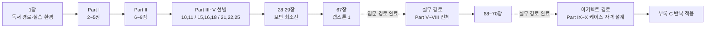
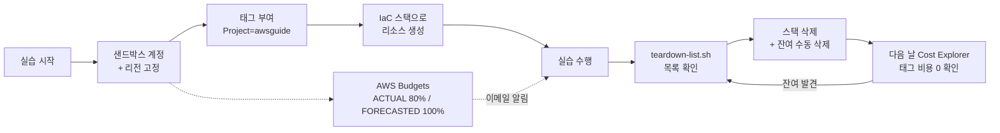
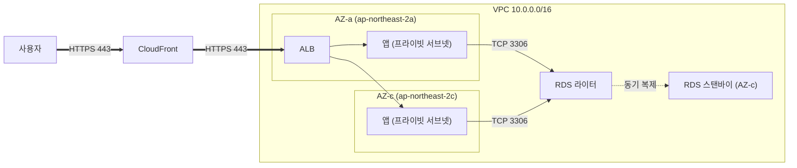

# Part 0. 시작하기 전에

## 1장. 이 책을 읽는 방법  ★

> **이 장에서 다루는 것**
> 이 책이 무엇을 다루고 무엇을 의도적으로 빼는지, 어떤 독자를 전제하는지, 그리고 70장을 어떤 순서로 읽어야 하는지를 정한다.
> 이어서 실습 계정을 안전하게 준비하는 절차(루트 계정 잠금, 관리자 사용자, 예산 알림, 태그 표준, 정리 스크립트)를 실제 명령 수준으로 제시한다.
> 마지막으로 이 책 전체에서 쓰는 난이도 표기, 블록 표기, 코드 표기, 다이어그램 규칙을 약속한다.
> 선행 장은 없다. 다만 이 장의 1.4를 건너뛰면 이후 실습 장에서 예상하지 못한 요금이 발생할 수 있으므로, 실습을 병행할 독자는 1.4를 반드시 먼저 수행한다.

---

### 1.1 이 책이 다루는 것과 다루지 않는 것

AWS를 배우는 사람이 가장 자주 빠지는 함정은 "서비스 개수를 늘리는 학습"이다. 200개가 넘는 서비스 이름과 기능을 외워도, 막상 "초당 5,000건의 주문을 받는데 결제 실패는 절대 잃으면 안 되고 예산은 월 3,000달러"라는 요구가 오면 손이 멈춘다. 아키텍처 설계는 서비스 암기가 아니라 **제약 조건 아래에서 선택하는 일**이기 때문이다. 이 책은 그 선택을 훈련하기 위해 쓰였다.

그래서 이 책의 모든 장은 "무엇을 할 수 있다"가 아니라 "**언제 이것을 고르고, 언제 고르지 않는가**"를 축으로 서술한다. 선택지가 셋 이상인 곳에는 비교표를 두고, 표 아래에 한 줄 결정 기준을 붙인다.

전체는 12부 70장으로, 아래 순서 자체가 하나의 학습 설계다. 개념(왜) → 언어(어떻게 말할 것인가) → 기반 블록(무엇으로 만드는가) → 패턴(어떻게 조립하는가) → 실전(스스로 설계하기)로 올라간다.

| Part | 제목 | 장 | 난이도 | 이 부에서 얻는 것 |
|---|---|---|---|---|
| 0 | 시작하기 전에 | 1 | ★ | 독서 경로와 안전한 실습 환경 |
| I | 클라우드와 AWS의 지형도 | 2~5 | ★ | 클라우드의 본질, 리전/AZ 좌표계, 서비스 지도 |
| II | 설계의 언어 | 6~9 | ★★ | Well-Architected 6기둥, RTO/RPO·SLO, 아키텍처 문서화 |
| III | 기반 블록 I — 네트워킹 | 10~14 | ★★★ | VPC, 연결 확장, 하이브리드, 엣지, 네트워크 보안 |
| IV | 기반 블록 II — 컴퓨트 | 15~20 | ★★★ | EC2, 오토스케일링/LB, 구매 옵션, 서버리스, 컨테이너 |
| V | 기반 블록 III — 스토리지와 DB | 21~27 | ★★★ | S3, 백업/DR, DB 선택 이론, RDS/Aurora, NoSQL, 마이그레이션 |
| VI | 보안 · 아이덴티티 · 거버넌스 | 28~34 | ★★★ | 공동 책임 모델, IAM, 랜딩 존, 암호화, 탐지·대응, 컴플라이언스 |
| VII | 운영과 자동화 — CloudOps | 35~40 | ★★★ | IaC, CI/CD, 배포 전략, 관측성, 운영 자동화, FinOps |
| VIII | 애플리케이션 아키텍처 패턴 | 41~48 | ★★★★ | 아키텍처 스타일, 마이크로서비스, DDD, 데이터·통합·복원력 패턴 |
| IX | 데이터 · 분석 · AI | 49~54 | ★★★★ | 빅데이터, 스트리밍, DW, 데이터 레이크, ML·생성형 AI |
| X | 대규모 시스템 설계 실전 | 55~62 | ★★★★★ | 0에서 수백만 사용자까지, 설계 케이스와 리뷰 프레임워크 |
| XI | 마이그레이션과 조직 | 63~66 | ★★★★ | 마이그레이션 전략, CAF, 팀 토폴로지, SaaS 멀티테넌시 |
| XII | 캡스톤 | 67~70 | ★★★★★ | 세 개의 완성 시스템 + 리뷰 시뮬레이션 |

부록은 아홉 종이다. 결정 트리 모음(A), 한도·제약 치트시트(B), Well-Architected 리뷰 체크리스트(C), 자격증 시험 범위 매핑(D), 비용 추정 워크시트(E), 클라우드 디자인 패턴 24선 요약 카드(F), 가이던스 10선 요약(G), 용어집(H), 참고 문헌 매핑(I). 본문을 다 읽은 뒤에도 실무에서 반복 참조하도록 설계했다.

반대로 이 책이 **다루지 않는 것**을 분명히 해 둔다. 지면을 아껴 설계 판단에 쓰기 위한 의도적 배제다.

| 다루지 않는 것 | 이유 | 대안 |
|---|---|---|
| 특정 언어 문법 (Python·TypeScript·Java 기초) | 코드는 아키텍처를 설명하는 수단으로만 등장한다 | 해당 언어 입문서. 이 책의 예시는 읽을 수만 있으면 충분하다 |
| 개별 서비스의 API 레퍼런스 | 파라미터는 바뀌고 문서가 항상 최신이다 | AWS API/CLI 공식 레퍼런스 |
| 자격증 문제풀이집 | 문제 유형 암기는 설계 능력으로 전이되지 않는다 | 부록 D의 시험 범위 매핑으로 이 책의 장을 시험 영역에 대응시킨다 |
| 콘솔 화면 클릭 순서의 스크린샷 나열 | UI는 자주 바뀌고 재현되지 않는다 | CLI·IaC 예시로 대체했다. 재현 가능하고 리뷰 가능하다 |
| 특정 벤더 서드파티 제품 비교 | 유효 기간이 짧다 | AWS 관리형 서비스와의 경계 판단 기준만 제시한다 |

기준 시점은 **2026년 상반기 AWS 서비스 상태**다. 서비스 한도와 가격 체계는 이 책이 인쇄된 뒤에도 계속 바뀐다. 그래서 이 책은 절대 금액을 단정하지 않고 **과금 축**(무엇에 대해 돈이 붙는가: 시간, 요청 수, 저장 용량, 데이터 전송량)과 상대 비교를 설명한다. 구체적 수치가 등장하는 곳에서는 서비스 할당량(Service Quotas) 콘솔과 공식 문서로 확인하라는 안내를 함께 둔다.

---

### 1.2 대상 독자와 선행 지식

이 책은 세 부류의 독자를 함께 상정한다.

첫째, **클라우드 입문자**. 서버를 만져 본 적은 있으나 AWS 계정을 열어 본 적은 없는 개발자·운영자다. Part 0~II가 이들의 출발점이다.

둘째, **실무 전환자**. 특정 서비스는 익숙하지만 전체 그림과 선택 근거가 약한 사람이다. "EC2는 쓰는데 왜 Fargate가 아닌지 설명하지 못하는" 상태를 Part III~VIII에서 정리한다.

셋째, **아키텍트 지향자**. Solutions Architect Professional 수준의 판단, 즉 여러 제약이 충돌할 때 무엇을 포기할지 결정하는 능력을 목표로 하는 독자다. Part IX~XII와 부록 C가 이들의 훈련장이다.

선행 지식은 "깊이"보다 "최소선"이 중요하다. 아래를 못 하더라도 책을 덮을 필요는 없지만, 해당 장에서 속도가 크게 떨어진다.

| 영역 | 최소선 | 이 최소선이 필요한 장 |
|---|---|---|
| 리눅스 | SSH 접속, 파일 편집, `systemctl`·프로세스·로그 위치 확인, 셸 스크립트 읽기 | 15, 19, 35, 38장 |
| 네트워크 | IP·서브넷 마스크와 CIDR 계산, 라우팅 테이블 개념, TCP/UDP·포트, DNS 레코드 종류, TLS 핸드셰이크 개요 | 10~14장 (이 책에서 가장 진입 장벽이 높다) |
| SQL | `SELECT`/`JOIN`/`GROUP BY` 작성, 인덱스가 왜 빠른지, 트랜잭션과 격리 수준의 존재 | 24~27, 44, 51장 |
| 프로그래밍 | 언어 하나로 HTTP 요청/응답을 처리하는 코드를 읽을 수 있음 | 18, 45, 48장, 캡스톤 전체 |
| 분산 시스템 | 없어도 된다. 필요한 개념은 8, 46, 57장에서 처음부터 설명한다 | — |

가장 흔한 실패 지점은 **CIDR 계산**이다. `10.0.0.0/16` 안에 `/24` 서브넷이 몇 개 들어가는지 즉시 답하지 못하면 10장에서 막힌다. 이 한 가지는 책을 시작하기 전에 손으로 몇 번 계산해 두는 것이 좋다.

한국어 기술 용어는 처음 등장할 때 `한국어(English)` 형태로 병기하고, 이후에는 한국어나 통용 약어를 쓴다. 서비스 이름은 2026년 기준 최신 명칭을 쓰고, 구명칭이 여전히 널리 쓰이는 경우에만 첫 등장 시 `신명(구 구명칭)`으로 한 번 병기한다.

---

### 1.3 난이도 표기법과 3가지 독서 경로

모든 장 제목 뒤에는 별표로 난이도를 표시한다. 난이도는 "내용의 어려움"이 아니라 **그 장을 읽기 위해 필요한 선행 지식의 양**을 뜻한다.

| 표기 | 수준 | 의미 | 읽는 방식 |
|---|---|---|---|
| ★ | 입문 | 선행 지식 없이 읽을 수 있다 | 순서대로 읽는다 |
| ★★ | 초중급 | 클라우드 기본 개념을 전제한다 | 개념 정의를 정확히 잡고 넘어간다 |
| ★★★ | 중급 | 특정 기반 블록의 사전 지식이 필요하다 | 실습을 병행해야 남는다 |
| ★★★★ | 고급 | 여러 기반 블록을 조합할 수 있어야 한다 | 결정 기준과 트레이드오프에 집중한다 |
| ★★★★★ | 아키텍트 | 스스로 설계안을 낼 수 있어야 한다 | 먼저 자기 설계를 써 본 뒤 본문과 비교한다 |

**한 줄 결정 기준**: 지금 읽는 장의 별이 자기 수준보다 두 단계 이상 높다면, 그 장의 선행 장(각 장 머리의 "이 장에서 다루는 것" 블록에 명시)으로 되돌아가는 것이 결과적으로 빠르다.

독서 경로는 목적에 따라 세 가지를 제안한다.

| 경로 | 기간(주 8~10시간 기준) | 읽는 순서 | 도달 목표 |
|---|---|---|---|
| **입문 경로** | 약 3개월 | 1장 → 2~5장 → 6~9장 → 10, 11장 → 15, 16, 18장 → 21, 22, 25장 → 28, 29장 → 67장 | 3-tier 웹 서비스를 스스로 설계·배포하고 비용 구조를 설명한다. CLF/SAA 범위 대부분을 포괄한다 |
| **실무 경로** | 약 6개월 | 입문 경로 + 21~27장 → 28~34장 → 35~40장 → 41~48장 → 67~70장 | 운영 중인 시스템의 IaC·CI/CD·관측성·보안·비용을 개선하고, 아키텍처 리뷰에서 근거를 대며 방어한다 |
| **아키텍트 경로** | 약 12개월 | 1~70장 순차 + 49~62장 케이스를 **본문 읽기 전에 자력 설계** + 부록 C 체크리스트를 매 케이스에 반복 적용 | 요구사항 인터뷰부터 트레이드오프 문서화까지 수행한다. SAP 수준의 판단을 목표로 한다 |



경로를 고르는 기준은 단순하다. **다음 3개월 안에 실제로 만들 시스템이 있는가**. 있으면 실무 경로에서 해당 기반 블록 부(Part)를 먼저 당겨 읽고, 없으면 입문 경로를 순서대로 끝내는 편이 이탈률이 낮다. 아키텍트 경로는 Part X의 케이스를 "읽는" 것이 아니라 "먼저 풀고 채점하는" 방식이라, 앞의 두 경로 중 하나를 마친 뒤 시작하는 것을 권한다.

---

### 1.4 실습 환경 준비: 계정, 리전, 예산 알림, 정리(teardown) 스크립트

이 책의 실습은 반드시 **업무·개인 서비스와 분리된 샌드박스 계정**에서 한다. 이유는 두 가지다. 하나는 권한 사고(실습 중 만든 와일드카드 정책이 운영 리소스에 닿는 것)를 막기 위해서, 다른 하나는 비용을 격리해 "이 달 실습에 얼마 썼는가"를 한눈에 보기 위해서다.

#### 1단계: 루트 계정 잠그기

계정을 만든 직후 해야 할 일은 루트 사용자로 무언가를 만드는 것이 아니라, 루트 사용자를 **다시 쓰지 않도록 잠그는 것**이다.

1. 루트 계정에 MFA를 등록한다. 하드웨어 키(FIDO2)나 인증 앱 중 하나를 쓰고, 복구 코드는 계정 외부(물리 금고, 오프라인 비밀 저장소)에 보관한다.
2. 루트 계정의 액세스 키가 있다면 **삭제한다**. 루트 액세스 키는 어떤 정상적인 용도로도 필요하지 않다.
3. 청구 알림 수신 이메일과 대체 연락처를 채워 둔다.
4. 이후 루트 계정은 계정 폐쇄·지원 플랜 변경·일부 청구 설정처럼 루트만 할 수 있는 작업에만 쓴다.

→ 루트 잠금과 계정 초기 설정의 전체 절차는 4장에서 다시, 더 자세히 다룬다. 이 절은 "이 책의 실습을 시작할 수 있는 최소선"만 세운다.

#### 2단계: 관리자 사용자와 CLI 프로필

실습용 관리자 주체를 만든다. **실무 권장 경로는 4장에서 다루는 IAM Identity Center(SSO)로 단기 자격 증명을 발급받는 것**이며(→ 29, 30장 참조), 아래 장기 액세스 키 발급은 계정 하나짜리 샌드박스에서 최소한으로 빠르게 시작하기 위한 단순화한 경로일 뿐 실무에 그대로 옮기지 않는다.

```bash
# 관리 권한은 사용자에 직접 붙이지 않고 그룹에 붙인다.
# 나중에 사용자를 추가·회수할 때 정책을 건드리지 않아도 되기 때문이다.
aws iam create-group --group-name AwsguideAdmins
aws iam attach-group-policy \
  --group-name AwsguideAdmins \
  --policy-arn arn:aws:iam::aws:policy/AdministratorAccess

aws iam create-user --user-name awsguide-admin
aws iam add-user-to-group --user-name awsguide-admin --group-name AwsguideAdmins

# 콘솔 로그인용 비밀번호. 첫 로그인 시 변경을 강제한다.
aws iam create-login-profile \
  --user-name awsguide-admin \
  --password '<초기-비밀번호>' \
  --password-reset-required

# CLI용 장기 액세스 키. 발급 즉시 출력되는 SecretAccessKey는 재조회할 수 없다.
aws iam create-access-key --user-name awsguide-admin
```

이 IAM 사용자에도 MFA를 등록한다. 그리고 CLI 프로필을 실습 전용으로 따로 만들어, 운영 계정 자격 증명과 섞이지 않게 한다.

```bash
# 프로필 이름을 붙여 두면 이후 모든 실습 명령에 --profile awsguide 를 붙일 수 있다.
aws configure --profile awsguide
# AWS Access Key ID     : AKIA...
# AWS Secret Access Key : ...
# Default region name   : ap-northeast-2
# Default output format : json

# 확인: 내가 지금 어느 계정의 누구인가
aws sts get-caller-identity --profile awsguide
# {
#   "UserId": "AIDA...",
#   "Account": "123456789012",
#   "Arn": "arn:aws:iam::123456789012:user/awsguide-admin"
# }
```

실습 리전은 **하나로 고정한다**. 이 책은 `ap-northeast-2`(서울)를 기본으로 쓰고, 서울에 없는 서비스나 글로벌 성격의 서비스(예: CloudFront 인증서, IAM, Budgets)를 다룰 때만 `us-east-1`(버지니아 북부)을 쓴다. 리전을 여러 곳에 흩뿌리면 "다 지웠는데 요금이 나온다"의 가장 흔한 원인이 된다.

#### 3단계: 예산 알림 (AWS Budgets)

요금은 "매일 콘솔을 보는 습관"으로 막는 것이 아니라 **알림으로** 막는다. AWS Budgets는 글로벌 엔드포인트를 쓰므로 `us-east-1`로 호출한다.

```json
// budget.json — 월 10 USD 기준 예산. 금액은 자신의 감당 가능선으로 조정한다.
{
  "BudgetName": "awsguide-monthly",
  "BudgetLimit": { "Amount": "10", "Unit": "USD" },
  "TimeUnit": "MONTHLY",
  "BudgetType": "COST",
  "CostTypes": {
    "IncludeTax": true,
    "IncludeSubscription": true,
    "UseBlended": false
  }
}
```

```json
// notifications.json — 실제 사용액 80%와 예측액 100%를 각각 알린다.
// ACTUAL만 걸면 이미 다 써 버린 뒤에 알림이 오므로 FORECASTED를 함께 둔다.
[
  {
    "Notification": {
      "NotificationType": "ACTUAL",
      "ComparisonOperator": "GREATER_THAN",
      "Threshold": 80,
      "ThresholdType": "PERCENTAGE"
    },
    "Subscribers": [
      { "SubscriptionType": "EMAIL", "Address": "you@example.com" }
    ]
  },
  {
    "Notification": {
      "NotificationType": "FORECASTED",
      "ComparisonOperator": "GREATER_THAN",
      "Threshold": 100,
      "ThresholdType": "PERCENTAGE"
    },
    "Subscribers": [
      { "SubscriptionType": "EMAIL", "Address": "you@example.com" }
    ]
  }
]
```

```bash
# Budgets API는 글로벌 엔드포인트(us-east-1)를 사용한다.
aws budgets create-budget \
  --account-id 123456789012 \
  --budget file://budget.json \
  --notifications-with-subscribers file://notifications.json \
  --region us-east-1 --profile awsguide

# 등록 확인
aws budgets describe-budgets --account-id 123456789012 \
  --region us-east-1 --profile awsguide \
  --query 'Budgets[].[BudgetName,BudgetLimit.Amount]' --output table
```

예산 알림은 **차단 장치가 아니라 통보 장치**다. 임계값을 넘어도 리소스는 계속 돌아간다. 비용 이상 탐지(Cost Anomaly Detection)와 예산 액션(Budget Actions)을 이용한 실제 제동 장치는 4장과 40장에서 다룬다.

#### 4단계: 태그 표준

실습 리소스는 예외 없이 아래 태그를 붙인다. 태그는 나중에 붙이는 것이 아니라 **만들 때 붙여야** 의미가 있다. IaC를 쓰면 스택 수준에서 일괄 지정할 수 있다(→ 35장 참조).

| 태그 키 | 값 예시 | 용도 |
|---|---|---|
| `Project` | `awsguide` | 이 책 실습 비용을 다른 것과 분리한다. 비용 할당 태그로 활성화해야 청구서에 나타난다 |
| `Chapter` | `ch10` | 어느 장의 실습인지. 정리 누락을 추적할 때 쓴다 |
| `Owner` | `you@example.com` | 공유 계정에서 책임자를 식별한다 |
| `TTL` | `2026-09-12` | 이 날짜 이후에는 삭제해도 되는 리소스임을 표시한다 |

**한 줄 결정 기준**: 태그 넷 중 하나만 골라야 한다면 `Project=awsguide`다. 이것이 있으면 정리 스크립트와 비용 조회가 모두 가능해진다.

#### 5단계: 정리(teardown) 스크립트

실습이 끝날 때마다 정리를 **수동 기억에 맡기지 않는다**. 태그로 리소스를 찾아 목록화하고, 태그가 붙지 않는 비용 원천은 별도로 훑는다.

```bash
#!/usr/bin/env bash
# teardown-list.sh — 삭제 대상을 "먼저 나열"한다. 자동 삭제 전에 사람이 눈으로 확인한다.
set -euo pipefail
PROFILE=awsguide
REGION=ap-northeast-2

echo "=== Project=awsguide 태그가 붙은 리소스 ==="
aws resourcegroupstaggingapi get-resources \
  --tag-filters Key=Project,Values=awsguide \
  --region "$REGION" --profile "$PROFILE" \
  --query 'ResourceTagMappingList[].ResourceARN' --output text | tr '\t' '\n'

echo "=== 미연결 Elastic IP (퍼블릭 IPv4 주소는 연결 여부와 무관하게 시간당 과금된다) ==="
aws ec2 describe-addresses --region "$REGION" --profile "$PROFILE" \
  --query 'Addresses[?AssociationId==`null`].[PublicIp,AllocationId]' --output table

echo "=== 미연결 EBS 볼륨 (available 상태여도 용량만큼 계속 과금된다) ==="
aws ec2 describe-volumes --region "$REGION" --profile "$PROFILE" \
  --filters Name=status,Values=available \
  --query 'Volumes[].[VolumeId,Size,VolumeType]' --output table

echo "=== NAT Gateway (시간당 + 데이터 처리량 과금. 무료 티어 대상이 아니다) ==="
aws ec2 describe-nat-gateways --region "$REGION" --profile "$PROFILE" \
  --filter Name=state,Values=available \
  --query 'NatGateways[].[NatGatewayId,VpcId]' --output table

echo "=== 실행 중 EC2 인스턴스 ==="
aws ec2 describe-instances --region "$REGION" --profile "$PROFILE" \
  --filters Name=instance-state-name,Values=running,stopped \
  --query 'Reservations[].Instances[].[InstanceId,InstanceType,State.Name]' --output table

echo "=== 직접 만든 스냅샷 (개수가 쌓이면 조용히 비용이 는다) ==="
aws ec2 describe-snapshots --owner-ids 123456789012 \
  --region "$REGION" --profile "$PROFILE" \
  --query 'Snapshots[].[SnapshotId,VolumeSize,StartTime]' --output table
```

목록을 확인한 뒤 삭제한다. 삭제 순서에는 의존성이 있다. 대체로 **바깥에서 안쪽으로** 지운다.

```bash
# 삭제 순서 예시: 트래픽 진입점 → 컴퓨트 → 네트워크 → 스토리지
# (NAT Gateway는 삭제 후 상태 전이에 몇 분이 걸리고, 그 사이 VPC 삭제가 실패한다)
aws ec2 delete-nat-gateway --nat-gateway-id nat-0abc123 --region ap-northeast-2 --profile awsguide
aws ec2 release-address --allocation-id eipalloc-0abc123 --region ap-northeast-2 --profile awsguide

# S3는 버전 관리가 켜져 있으면 객체를 지워도 버전이 남아 버킷 삭제가 실패한다.
aws s3 rm s3://awsguide-ch22-demo --recursive --profile awsguide
aws s3api delete-bucket --bucket awsguide-ch22-demo --region ap-northeast-2 --profile awsguide
```

**IaC로 만든 것은 IaC로 지운다.** CloudFormation `delete-stack`이나 CDK `cdk destroy`는 의존성 순서를 알아서 처리하므로, 실습을 스택 단위로 묶는 것이 정리 실패를 가장 크게 줄인다.

```bash
aws cloudformation delete-stack --stack-name awsguide-ch10-vpc \
  --region ap-northeast-2 --profile awsguide
aws cloudformation wait stack-delete-complete --stack-name awsguide-ch10-vpc \
  --region ap-northeast-2 --profile awsguide
```

#### 실습 종료 체크리스트

매 실습 종료 시 아래를 확인한다. 항목 순서는 "요금 파급이 큰 것부터"다.

- [ ] NAT Gateway를 지웠는가 (실습 계정에서 가장 흔한 요금 원인)
- [ ] 미연결 Elastic IP를 반환(release)했는가
- [ ] EC2 인스턴스를 종료(terminate)했는가. **중지(stop)는 EBS 요금이 계속 발생한다**
- [ ] RDS/Aurora 인스턴스와 클러스터를 삭제했는가. 최종 스냅샷을 남겼다면 그 스냅샷도 과금 대상이다
- [ ] `available` 상태의 EBS 볼륨과 불필요한 스냅샷·AMI를 지웠는가
- [ ] ALB/NLB/GWLB를 지웠는가 (로드 밸런서는 시간당 + 용량 단위(LCU 계열) 과금)
- [ ] EKS 클러스터를 지웠는가 (컨트롤 플레인이 시간당 고정 과금)
- [ ] Redshift 클러스터, OpenSearch 도메인, ElastiCache 노드, MSK 클러스터를 지웠는가
- [ ] CloudWatch Logs 로그 그룹에 보존 기간이 설정돼 있는가 (기본은 무기한 보존이며 저장 용량에 과금된다)
- [ ] S3에 남은 객체·버전·불완전 멀티파트 업로드를 정리했는가
- [ ] 다른 리전에 리소스가 남아 있지 않은가 (Billing 콘솔의 리전별 비용 또는 Cost Explorer로 확인)
- [ ] 다음 날 Cost Explorer에서 `Project=awsguide` 태그 비용이 0에 수렴하는지 확인했는가

#### 무료 티어에서 벗어나는 리소스

AWS 무료 티어는 크게 12개월 무료, 상시 무료, 단기 트라이얼로 나뉘고, **한도의 집계 단위와 적용 대상 리전이 서비스마다 다르다**. 따라서 "무료 티어니까 괜찮다"는 판단은 서비스별로 따로 확인해야 성립한다. 그리고 아래 리소스들은 애초에 무료 티어 대상이 아니다. 방치하면 월 수십에서 수백 달러가 조용히 쌓인다.

| 리소스 | 과금 축 | 실습에서의 위험 |
|---|---|---|
| NAT Gateway | 시간당 + 처리 데이터량(GB) | 10장 VPC 실습에서 만들고 잊기 쉽다. AZ마다 하나씩 만들면 배수로 늘어난다 |
| Elastic IP / 퍼블릭 IPv4 주소 | 주소당 시간당 (연결 여부와 무관) | 인스턴스를 종료해도 EIP는 계정에 남아 계속 과금된다 |
| 프로비저닝된 IOPS 볼륨(io1/io2) | 용량 + 프로비저닝한 IOPS + (io2 Block Express) 처리량 | "빠른 게 좋겠지"로 선택하면 gp3의 몇 배가 된다 |
| Amazon Redshift | 노드 시간당 (또는 Serverless의 RPU 시간) | 51장 실습. 클러스터를 일시 중지만 하면 스토리지 과금이 남는다 |
| Amazon OpenSearch Service | 인스턴스 시간당 + EBS 스토리지 | 도메인 삭제까지 시간이 걸려 지운 줄 알고 넘어가기 쉽다 |
| Amazon EKS | 클러스터당 컨트롤 플레인 시간당 + 데이터 플레인 별도 | 워커 노드를 0으로 줄여도 컨트롤 플레인은 과금된다 |
| 로드 밸런서(ALB/NLB/GWLB) | 시간당 + LCU/NLCU | 대상 그룹이 비어 있어도 과금된다 |
| RDS/Aurora (프리티어 초과 클래스) | 인스턴스 시간당 + 스토리지 + I/O(Aurora Standard) + 백업 | Multi-AZ를 켜면 대체로 단일 대비 요금이 크게 늘어난다 |
| 리전 간·인터넷 방향 데이터 전송 | 전송량(GB) | 리전을 옮겨 가며 실습하면 여기서 새어 나간다 |
| Amazon MSK, ElastiCache, Kinesis Data Streams | 브로커/노드 시간당, Kinesis는 프로비저닝 샤드 시간 또는 온디맨드 스트림 시간 | 스트리밍 실습(50장) 종료 후 반드시 확인한다 |

무료 티어의 한도와 대상 서비스는 계속 바뀐다. 실습 전에 AWS 무료 티어 페이지와 Billing 콘솔의 **무료 티어 사용량 알림**을 켜 두고, 값은 항상 최신 문서로 확인한다.



---

### 1.5 이 책의 표기 규약과 다이어그램 규칙

#### 장 구조

모든 장은 같은 골격을 따른다. 머리에 **"이 장에서 다루는 것"** 블록이 있어 범위와 선행 장을 밝히고, 본문 절이 이어지고, 끝에 정리 블록 세 개와 한 장 요약, 다음 장 예고가 붙는다. 정리 블록의 의미는 아래와 같다.

| 블록 | 뜻 | 읽는 방식 |
|---|---|---|
| **[필수]** | 시험과 실무 양쪽에서 반드시 아는 내용 | 외우는 것이 아니라 남에게 설명할 수 있어야 한다 |
| **[팁]** | "이렇게 하면 낫다"는 실행 가능한 조언 | 다음 실습에 바로 적용해 본다 |
| **[주의]** | 실제로 사고, 요금 폭탄, 설계 실패로 이어지는 함정 | 이미 겪은 것과 대조하며 읽는다 |

시간이 없다면 각 장의 정리 블록 세 개만 훑는 방식도 유효하다. 다만 [주의] 항목은 본문의 맥락 없이는 왜 함정인지 이해되지 않는 경우가 많아, 해당 항목이 걸리면 본문 절로 되돌아간다.

#### 코드와 값 표기

| 대상 | 규약 |
|---|---|
| 코드 블록 | 펜스에 언어 태그를 항상 붙인다 (`bash`, `json`, `yaml`, `python`, `typescript`) |
| 주석 | 모든 예시에 "왜 이렇게 쓰는지" 1~2줄 주석을 넣는다. 문법 설명은 넣지 않는다 |
| 계정 ID | 항상 `123456789012`. 실제 계정 ID가 아니다 |
| 리전 | 기본 `ap-northeast-2`(서울). 글로벌·특정 리전 전용 기능은 `us-east-1`(버지니아 북부) |
| 치환 대상 | `<초기-비밀번호>`, `<your-bucket>`처럼 꺾쇠로 감싼다. 그대로 실행하면 실패하도록 의도한 표기다 |
| 도메인·이메일 | `example.com`, `you@example.com` |
| ARN | `arn:aws:<service>:<region>:123456789012:<resource>` 형태를 유지한다 |
| 프로필 | 실습 명령은 `--profile awsguide`를 전제한다. 지면상 생략한 곳도 붙여서 실행한다 |
| 수치·한도 | 구체 수치는 "이 값은 변경될 수 있으니 Service Quotas 콘솔과 문서로 확인"을 전제로 읽는다 |
| 가격 | 절대 금액을 단정하지 않고, 과금 축과 상대 비교로 서술한다 |

IAM 정책은 이 책 전체에서 아래 골격을 지킨다. `Version`은 날짜 문자열이며 `2012-10-17`을 쓴다. 이것은 정책 언어의 버전이지 정책의 작성 날짜가 아니다.

```json
{
  "Version": "2012-10-17",
  "Statement": [
    {
      "Sid": "ReadOwnProjectBucket",
      "Effect": "Allow",
      "Action": ["s3:GetObject", "s3:ListBucket"],
      "Resource": [
        "arn:aws:s3:::awsguide-ch22-demo",
        "arn:aws:s3:::awsguide-ch22-demo/*"
      ],
      "Condition": {
        "Bool": { "aws:SecureTransport": "true" }
      }
    }
  ]
}
```

버킷 자체와 버킷 내 객체는 서로 다른 ARN이며, `ListBucket`은 버킷 ARN에, `GetObject`는 객체 ARN(`/*`)에 걸린다. 이 구분을 놓치는 것이 IAM 정책 오류의 가장 흔한 원인이다(→ 29장 참조).

#### 다이어그램 규칙

다이어그램은 장식이 아니라 **텍스트로 흐름이 보이지 않는 곳에만** 넣는다. 장당 1~3개를 넘기지 않고, mermaid로 표현해 본문과 함께 버전 관리할 수 있게 한다. 아래 규칙을 책 전체에서 지킨다.

1. **방향**: 요청·트래픽 흐름은 왼쪽에서 오른쪽(`flowchart LR`), 계층 구조와 의존 관계는 위에서 아래(`flowchart TB`).
2. **경계**: 리전, VPC, 가용 영역(AZ), 계정 경계는 `subgraph`로 감싸고 이름에 종류를 명시한다(예: `AZ-a (ap-northeast-2a)`). 장애 도메인 경계를 눈으로 셀 수 있어야 한다.
3. **선의 의미**: 실선(`-->`)은 동기 호출, 점선(`-.->`)은 비동기·이벤트·복제, 굵은 선(`==>`)은 주 트래픽 경로. 화살표에는 프로토콜과 포트를 라벨로 붙인다(예: `HTTPS 443`).
4. **한 다이어그램 = 한 질문**: "요청이 어디를 지나는가", "장애 시 무엇이 남는가", "데이터가 어디로 복제되는가" 중 하나만 답한다. 세 가지를 한 그림에 넣으면 아무것도 답하지 못한다.
5. **노드 수 상한**: 열두 개를 넘으면 레벨을 나눈다. 다이어그램 레벨 체계(C4 모델)와 AWS 공식 아이콘 표기 규칙은 9장에서 별도로 다룬다.
6. **약어**: 첫 등장 시 전체 이름을 병기하고(예: `TGW (Transit Gateway)`), 같은 장 안에서는 약어로 통일한다.



위 그림은 규칙 1~4를 모두 적용한 예다. 답하는 질문은 하나, "요청이 어디를 지나는가"이며, AZ 경계로 장애 도메인이 둘임을 보여 준다. 스탠바이로 향하는 점선은 RDS Multi-AZ 인스턴스 배포의 동기 복제이고, 이 스탠바이는 가용성을 위한 것이어서 읽기용으로 쓸 수 없다. 읽기 트래픽을 분산하는 리드 리플리카는 목적도 복제 방식도 다른 별개의 구성이며, 그 차이는 25장에서 다룬다.

---

### 1장 정리

#### [필수] 반드시 알아야 할 것

1. **아키텍처 학습은 서비스 암기가 아니라 "제약 조건 하의 선택"을 익히는 것이다.** 이 책의 모든 장은 기능 카탈로그가 아니라 *선택 기준*을 중심으로 쓰였다. 새 장을 읽을 때 "무엇을 할 수 있는가"가 아니라 "어떤 조건에서 이것을 고르고, 어떤 조건에서 버리는가"를 찾으며 읽는다.
2. **이 책의 범위와 비범위를 구분한다.** 12부 70장과 부록 9종은 개념 → 설계 언어 → 기반 블록 → 패턴 → 실전 순으로 배치된다. 반대로 언어 문법, 서비스 API 레퍼런스, 자격증 문제풀이집, 콘솔 클릭 순서는 다루지 않는다.
3. **난이도 별표는 "어려움"이 아니라 "필요한 선행 지식의 양"이다.** ★는 선행 지식 없음, ★★★는 특정 기반 블록 사전 지식 필요, ★★★★★는 스스로 설계안을 낼 수 있어야 함을 뜻한다. 자기 수준보다 두 단계 위 장에서 막히면 선행 장으로 돌아가는 것이 빠르다.
4. **독서 경로는 목적에 따라 세 가지다.** 입문(3개월, 67장까지), 실무(6개월, Part V~VIII 전체와 캡스톤), 아키텍트(12개월, 전권 순차 + Part IX~X 자력 설계 + 부록 C 반복). 선택 기준은 "다음 3개월 안에 실제로 만들 시스템이 있는가"다.
5. **네트워크 최소선, 특히 CIDR 계산이 이 책의 실질적 진입 장벽이다.** `10.0.0.0/16`에 `/24`가 몇 개 들어가는지 즉답할 수 있어야 10장 이후가 진행된다. 리눅스는 15·19·35·38장, SQL은 24~27·44·51장에서 필요하다.
6. **예산 알림은 통보 장치이지 차단 장치가 아니다.** AWS Budgets는 임계값 초과를 알리지만 리소스를 멈추지 않는다. `ACTUAL 80%`와 `FORECASTED 100%`를 함께 걸어야 다 쓴 뒤에 알림을 받는 상황을 피할 수 있다.
7. **모든 실습 리소스에는 생성 시점에 `Project=awsguide` 태그를 붙인다.** 태그는 사후에 붙이면 의미가 없다. 이 태그 하나로 정리 스크립트의 대상 탐색과 Cost Explorer 비용 격리가 동시에 가능해진다.
8. **다이어그램은 하나에 하나의 질문만 답한다.** 요청 경로, 장애 시 잔존 범위, 데이터 복제 방향을 한 그림에 섞으면 어느 것도 전달되지 않는다. 장애 도메인(AZ·리전·계정) 경계는 반드시 그림 안에서 셀 수 있어야 한다.

#### [팁] 실무 노하우

1. **실습은 반드시 업무·개인 서비스와 분리된 별도 샌드박스 계정에서 한다.** 권한 사고를 물리적으로 격리하고, "이 달 실습에 얼마 썼는가"를 계정 단위로 즉시 볼 수 있다. 계정이 여럿이면 Organizations로 묶어 청구를 통합하고 SCP로 실습 계정의 행동 반경을 제한한다(→ 30장 참조).
2. **매 실습 종료 시 `teardown` 실행을 습관화한다.** 기억에 의존하지 말고, 태그로 리소스를 나열하는 스크립트를 먼저 돌려 눈으로 확인한 뒤 삭제한다. "지웠다고 생각한 것"과 "실제로 지워진 것"의 차이가 요금이 된다.
3. **실습을 IaC 스택 단위로 묶는다.** CloudFormation `delete-stack`이나 `cdk destroy`는 의존성 순서를 알아서 처리하므로, 수동 생성보다 정리 실패율이 훨씬 낮다. 장별로 스택 하나가 좋은 단위다.
4. **실습 리전을 하나로 고정한다.** 이 책은 `ap-northeast-2`를 쓰고, 글로벌 성격의 서비스에만 `us-east-1`을 쓴다. 리전을 흩뿌리는 것이 "다 지웠는데 요금이 나온다"의 가장 흔한 원인이다.
5. **CLI 프로필을 실습 전용으로 분리한다.** `aws configure --profile awsguide`로 만들고 모든 명령에 `--profile`을 붙인다. 명령을 실행하기 전 `aws sts get-caller-identity`로 "지금 어느 계정의 누구인가"를 확인하는 습관이 사고를 크게 줄인다.
6. **CloudWatch Logs 로그 그룹에는 만들 때 보존 기간을 설정한다.** 기본은 무기한 보존이며 저장 용량에 과금된다. 실습용은 7일이면 충분하다.
7. **캡스톤(67~70장)을 마지막에 몰아서 하지 말고 경로 중간에 한 번 끼워 넣는다.** 입문 경로가 28·29장 다음에 67장을 두는 이유다. 조각 지식을 한 번 조립해 보면 이후 장의 흡수율이 달라진다.
8. **각 장의 [주의] 블록을 읽은 뒤 자기 시스템에 대조해 본다.** 이 책에서 실무 전이가 가장 빠른 부분이며, 리뷰 자리에서 근거로 쓸 수 있는 문장이 모여 있는 곳이다.

#### [주의] 사고·비용·설계 함정

1. **무료 티어는 서비스별로 12개월 무료·상시 무료·트라이얼로 나뉘고 한도와 조건이 다르다.** "프리티어니까 괜찮다"는 가정으로 시작한 실습이 청구서가 되는 일이 흔하다. 실습 전에 Billing 콘솔의 무료 티어 사용량 알림을 켜고, 한도는 항상 최신 문서로 확인한다.
2. **NAT Gateway는 무료 티어 대상이 아니며 실습 계정 요금의 1위 원인이다.** 시간당 요금과 처리 데이터량에 각각 과금되고, 고가용성을 위해 AZ마다 하나씩 만들면 배수가 된다. VPC 실습을 끝냈으면 가장 먼저 지운다.
3. **퍼블릭 IPv4 주소는 연결해서 쓰든 놀리든 시간당 과금된다.** 특히 인스턴스를 종료해도 Elastic IP는 계정에 그대로 남으므로 `release-address`까지 해야 끝난다. "나중에 다시 쓰려고" 붙잡아 두는 EIP가 실습 계정에서 가장 오래 새는 비용이다.
4. **EC2 "중지(stop)"는 요금을 0으로 만들지 않으며, 볼륨 타입 선택도 함정이다.** 중지하면 인스턴스 시간은 멈추지만 연결된 EBS 볼륨은 용량만큼 계속 과금되므로, 실습 후에는 중지가 아니라 종료(terminate)이고 `available` 상태로 남은 볼륨도 함께 지운다. 또한 프로비저닝된 IOPS 볼륨(io1/io2)은 용량과 프로비저닝한 IOPS에 각각 과금되어 "빠른 게 좋겠지"로 고르면 gp3의 몇 배가 된다.
5. **Redshift, OpenSearch Service, EKS, MSK, ElastiCache는 모두 무료 티어 밖의 시간당 과금 리소스다.** 특히 EKS는 워커 노드를 0으로 줄여도 클러스터 컨트롤 플레인이 계속 과금되고, Redshift는 일시 중지해도 스토리지 과금이 남는다. OpenSearch 도메인은 삭제 완료까지 시간이 걸려 "지운 줄 알고" 넘어가기 쉽다.
6. **로드 밸런서는 대상 그룹이 비어 있어도 시간당 과금된다.** 인스턴스를 다 지운 뒤 ALB만 남겨 두는 패턴이 조용히 비용을 만든다.
7. **RDS를 지울 때 남긴 최종 스냅샷도 과금 대상이며, Multi-AZ는 단일 대비 요금이 크게 늘어난다.** 실습에서 Multi-AZ를 켤 때는 "이 실습이 끝나면 반드시 지운다"를 전제로 한다.
8. **루트 계정 액세스 키는 어떤 정상적인 용도로도 필요하지 않다.** 존재한다면 삭제하고, 루트에는 MFA를 걸고 복구 코드를 계정 외부에 보관한다. 루트 자격 증명 하나가 유출되면 계정 전체가 넘어가며 SCP로도 막을 수 없다.
9. **다른 리전에 남은 리소스를 놓치지 않는다.** 콘솔은 현재 선택한 리전만 보여 주므로, 리전을 바꿔 가며 실습했다면 Billing 콘솔의 리전별 비용이나 Cost Explorer로 전 리전을 확인해야 한다. 삭제 다음 날 `Project=awsguide` 태그 비용이 0에 수렴하는지 보는 것이 가장 확실한 검증이다.
10. **S3는 객체를 지워도 끝나지 않을 수 있다.** 버전 관리가 켜져 있으면 이전 버전과 삭제 마커가 남고, 불완전 멀티파트 업로드 조각도 저장 용량으로 과금된다. 버킷 삭제 실패의 주된 원인이며, 수명 주기 규칙으로 자동 정리하는 방법은 22장에서 다룬다.

#### 한 장 요약

이 책은 AWS 서비스 카탈로그가 아니라 제약 조건 아래에서 선택하는 훈련서이며, 12부 70장이 개념 → 설계 언어 → 기반 블록 → 패턴 → 실전 순으로 배치돼 있다. 난이도 별표는 필요한 선행 지식의 양을 뜻하고, 목적에 따라 입문(3개월)·실무(6개월)·아키텍트(12개월) 세 경로 중 하나를 택해 읽는다. 실습은 반드시 분리된 샌드박스 계정에서, 루트 계정을 잠그고 전용 CLI 프로필과 `ACTUAL 80%`/`FORECASTED 100%` 예산 알림을 걸어 둔 상태에서 시작한다. 모든 리소스에 `Project=awsguide` 태그를 생성 시점에 붙이고, 매 실습 종료 시 태그 기반 teardown을 실행해 NAT Gateway·미연결 EIP·EKS·Redshift처럼 무료 티어 밖의 리소스를 남기지 않는다. 표기 규약과 다이어그램 규칙은 책 전체에서 일관되게 지켜지므로, 이 장의 1.5를 한 번 읽어 두면 이후 70장의 그림과 코드가 같은 문법으로 읽힌다.

#### 다음 장 예고

2장에서는 클라우드 컴퓨팅의 다섯 가지 본질 특성부터 시작해, 탄력성·확장성·가용성·내구성이라는 자주 혼용되는 네 개념을 구분하고, CapEx에서 OpEx로의 전환이 설계 판단 자체를 어떻게 바꾸는지를 다룬다. 서비스 이름이 등장하기 전에 반드시 정리해야 할 어휘들이다.

---

