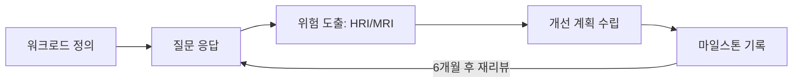
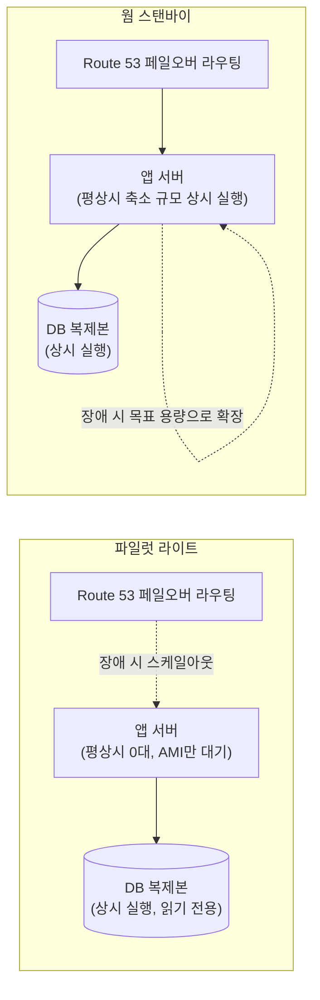
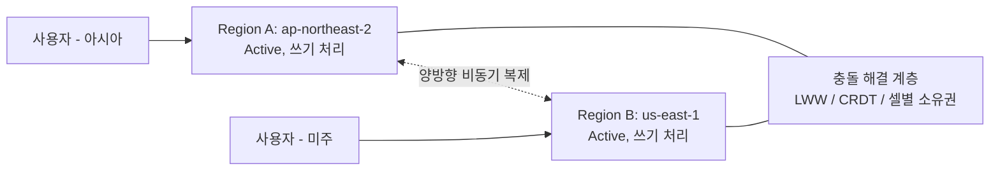
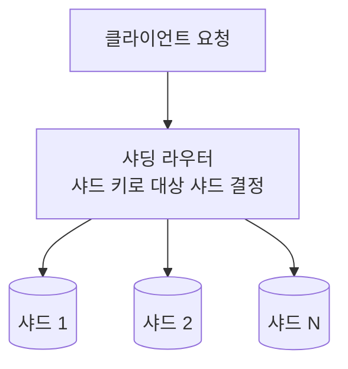
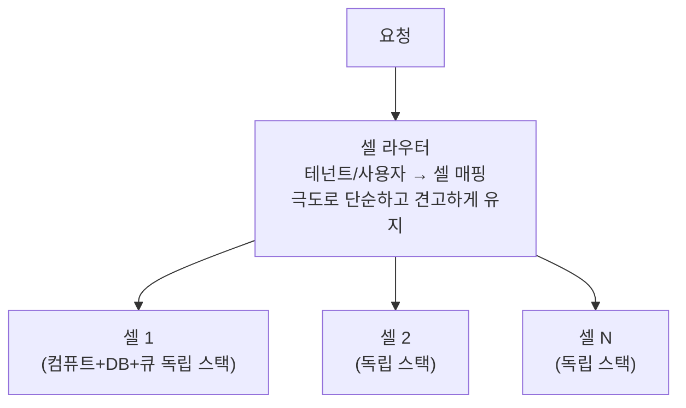
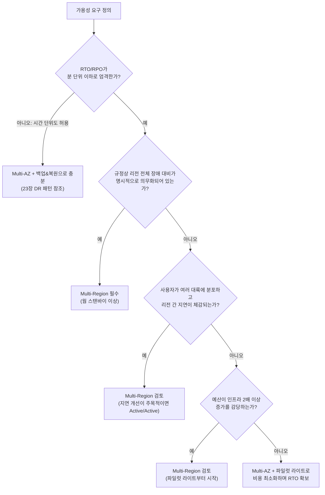
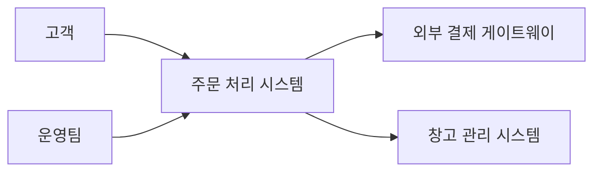
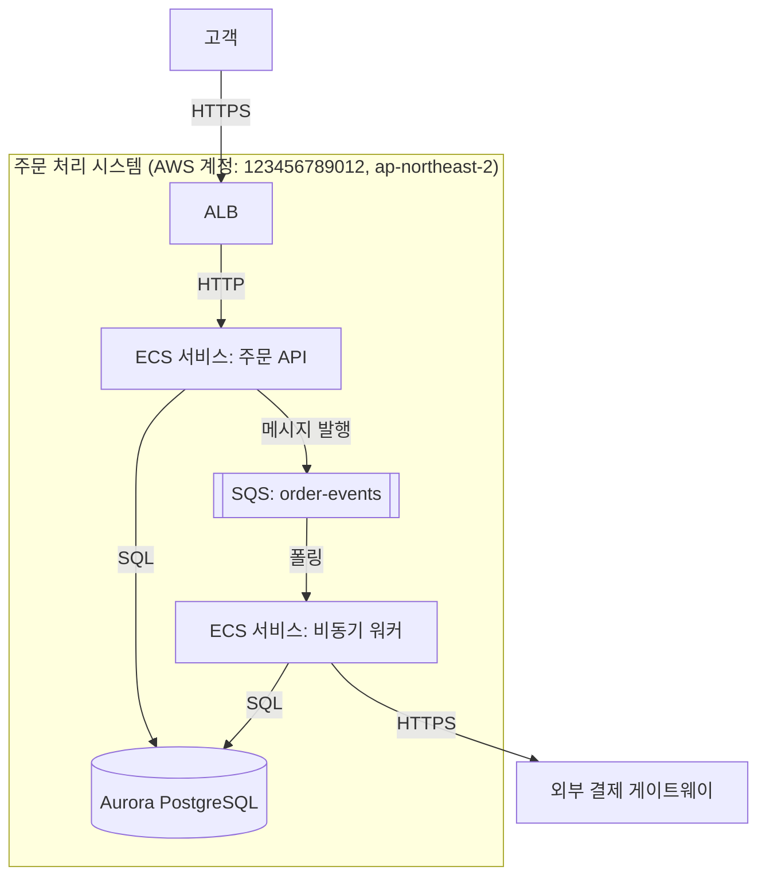

# Part II. 설계의 언어

## 6장. Well-Architected Framework — 6개 기둥  ★★

> **이 장에서 다루는 것**
> AWS Well-Architected Framework(WAF)의 6개 기둥을 정의-원칙-질문-서비스 매핑-위반 사례라는 하나의 틀로 정리한다. 5장에서 "서비스가 무엇인가"를 봤다면, 이 장은 "그 서비스들을 어떤 기준으로 조합할 것인가"를 다룬다.
> 각 기둥의 상세 실행 방법(구체적 구현, 체크리스트 전문)은 이후 Part에서 다룬다 — 보안은 Part VI, 안정성은 8장·46장, 비용은 40장, 운영 우수성은 Part VII, 체크리스트 전문은 부록 C.
> 이 장이 답하는 질문은 "여섯 기둥이 서로 충돌할 때 무엇을 근거로 트레이드오프를 선택하는가"이다. 7장의 비기능 요구사항 정량화와 9장의 ADR 작성은 이 장에서 세운 판단 기준을 숫자와 기록으로 구체화하는 다음 단계다.

### 6.1 프레임워크의 목적과 사용 시점

Well-Architected Framework는 AWS가 수천 건의 아키텍처 리뷰에서 축적한 패턴을 여섯 개 기둥(pillar)—보안, 안정성, 성능 효율성, 비용 최적화, 운영 우수성, 지속가능성—으로 구조화한 것이다. 각 기둥은 체크리스트가 아니라 **설계 질문의 집합**이다. "우리 워크로드는 이 질문에 이렇게 답한다"라고 구체적으로 말할 수 있어야 그 영역의 설계가 끝난 것이고, "나중에 보완하겠다"는 답은 곧 리스크로 기록해야 할 항목이다.

WAF를 적용하는 시점은 프로젝트 착수 한 번이 아니다. ① 설계가 확정되어 구현에 들어가기 직전, ② 프로덕션 배포 직전, ③ 이후 대체로 6개월 주기로 반복 적용하는 것이 실무에서 자리잡은 패턴이다(팀 성숙도나 변경 빈도에 따라 주기는 조정한다). 설계 초기에 적용하면 구조적 결함을 싸게 고칠 수 있고, 프로덕션 직전 적용은 최종 안전망이며, 주기적 리뷰는 워크로드가 시간이 지나며 겪는 요구사항 변화(트래픽 증가, 규제 추가, 팀 교체)를 반영한다.

한 가지 반드시 짚어야 할 오해가 있다. "6기둥을 전부 최상급으로 만족시키는 아키텍처"는 존재하지 않는다. 기둥은 서로 당긴다—가용성을 올리면 비용이 오르고, 보안을 강화하면 민첩성이 떨어진다. 아키텍트의 산출물은 여섯 기둥 모두에서 만점을 받는 설계가 아니라, **의도적으로 어떤 기둥을 우선하고 어떤 기둥에서 무엇을 포기했는지 문서화한 설계**다. 이 관점은 6.8절 트레이드오프 매트릭스에서 다시 다룬다.

### 6.2 제1기둥: 보안(Security)

**정의**: 정보와 시스템을 보호하면서 비즈니스 가치를 전달하는 능력. 위험 평가와 완화 전략을 통해 데이터 기밀성·무결성, 접근 권한 관리, 보안 이벤트 탐지 체계를 갖추는 것을 뜻한다.

**설계 원칙**: 강력한 자격 증명 기반 구축(최소 권한, 임시 자격 증명 우선), 추적 가능성 확보(로깅·감사 전 구간 확보), 계층 전반에 보안 적용(단일 통제가 아니라 심층 방어), 보안 모범 사례 자동화(수동 점검 대신 코드화된 가드레일), 전송 중·저장 데이터 보호, 사람을 데이터에서 멀리 두기(직접 접근 대신 자동화된 경로), 보안 이벤트 대응 준비(사고 대응 체계 사전 마련) — 이 일곱 갈래가 실무에서 반복적으로 강조된다(정확한 문구는 AWS 공식 백서 최신판을 확인).

**대표 설계 질문**
- 자격 증명(사람·워크로드)을 어떻게 관리하고, 장기 액세스 키 대신 임시 자격 증명을 얼마나 쓰고 있는가?
- 네트워크·계정 경계를 어떻게 나누어 폭발 반경(blast radius)을 제한하는가?
- 저장 데이터와 전송 중 데이터를 각각 어떤 방식으로 암호화하는가?
- 보안 이벤트를 어떻게 탐지하고, 탐지 후 대응 절차는 무엇인가?
- 사람이 프로덕션 데이터에 직접 접근할 필요를 어떻게 제거했는가?

**AWS 서비스 매핑**: IAM/IAM Identity Center(자격 증명), Organizations + SCP(경계), GuardDuty·Security Hub·CloudTrail(탐지·추적), KMS(암호화), WAF·Shield·Network Firewall(경계 방어), Macie(민감 데이터 탐지).

**흔한 위반 사례**: 루트 계정을 일상 작업에 사용, IAM 사용자에 장기 액세스 키를 발급해 로테이션하지 않음, 보안 그룹을 `0.0.0.0/0`으로 열어둔 채 방치, CloudTrail을 활성화만 하고 아무도 로그를 보지 않음, 프로덕션 DB에 엔지니어가 직접 SQL 클라이언트로 접속. 상세 구현은 → Part VI(보안·아이덴티티·거버넌스) 참조.

### 6.3 제2기둥: 안정성(Reliability)

**정의**: 워크로드가 의도한 기능을 정확하고 일관되게 수행하고, 수명 주기 동안 발생하는 장애로부터 스스로 복구하는 능력.

**설계 원칙**: 장애로부터 자동 복구(사람 개입 없이 감지·복구), 복구 절차를 정기적으로 테스트(실제로 장애를 주입해 검증), 수평 확장으로 전체 가용성 향상(단일 대형 자원보다 다수의 작은 자원), 용량을 추측하지 않기(오토스케일링·서버리스로 수요 기반 확장), 변경을 자동화로 관리(수동 배포는 실수의 원천) — 이 다섯 갈래가 핵심이다.

**대표 설계 질문**
- 서비스 쿼터(한도)를 어떻게 파악하고 사전에 상향 요청을 관리하는가?
- 네트워크 토폴로지(다중 AZ, 리전 간 페일오버)를 장애 도메인 기준으로 어떻게 설계했는가?
- 배포·설정 변경을 롤백 가능한 형태로 자동화했는가?
- 컴포넌트 장애 시 자동 복구(헬스체크, 오토스케일링 교체)가 실제로 동작하는가?
- 복구 절차(백업 복원, 페일오버)를 마지막으로 실제 테스트한 것이 언제인가?

**AWS 서비스 매핑**: Multi-AZ RDS/Aurora, Auto Scaling, ELB(ALB/NLB), Route 53 헬스체크·페일오버 라우팅, AWS Backup, Systems Manager(자동화 런북).

**흔한 위반 사례**: 단일 AZ에 전체 스택 배치, Multi-AZ와 리드 리플리카를 혼동해 "리드 리플리카가 있으니 안전하다"고 착각(리드 리플리카는 확장용이며 자동 페일오버 대상이 아님), 백업은 설정했지만 복원을 한 번도 테스트하지 않음, 서비스 쿼터를 확인하지 않고 트래픽 급증 시 API 스로틀링으로 장애. 상세 아키텍처 패턴은 → 8장(가용성·확장성 유형), 46장(복원력 패턴) 참조.

### 6.4 제3기둥: 성능 효율성(Performance Efficiency)

**정의**: 시스템 요구사항을 충족하기 위해 컴퓨팅 자원을 효율적으로 사용하고, 수요와 기술 변화에 맞춰 효율성을 유지하는 능력.

**설계 원칙**: 최신 기술의 민주화(관리형 서비스로 전문성 없이도 고급 기술 활용), 몇 분 만에 글로벌 확장(리전·엣지 로케이션 활용), 서버리스 아키텍처 사용(운영 부담 없는 확장), 더 자주 실험(다양한 인스턴스·구성을 낮은 비용으로 시험), 메커니컬 심퍼시(하드웨어 특성에 맞는 접근 방식 선택, 예: 워크로드 패턴에 맞는 스토리지 클래스 선택).

**대표 설계 질문**
- 컴퓨트·스토리지·데이터베이스·네트워크 각 계층에서 워크로드 특성에 맞는 선택을 했는가, 아니면 익숙한 것을 재사용했는가?
- 리전 선택이 지연 시간과 규제 요건을 모두 만족하는가?
- 자원 사용률과 성능 지표를 어떻게 모니터링하고 있는가?
- 성능과 비용·신뢰성 사이의 트레이드오프를 데이터로 검증했는가(가정이 아니라 벤치마크로)?

**AWS 서비스 매핑**: Graviton 기반 인스턴스, CloudFront(엣지 캐싱), ElastiCache(인메모리 캐시), Lambda(서버리스 컴퓨트), 다양한 EBS/스토리지 클래스, Compute Optimizer(사용률 기반 추천).

**흔한 위반 사례**: 모든 워크로드에 범용 인스턴스 계열만 사용, 캐시 계층 없이 매 요청마다 DB 직접 조회, 리전 간 지연을 고려하지 않고 단일 리전에 전 세계 사용자를 서비스, 성능 튜닝을 "직감"으로 진행하고 부하 테스트를 생략. 상세 실행은 개별 컴퓨트·스토리지 장(Part IV, Part V)에서 다룬다.

### 6.5 제4기둥: 비용 최적화(Cost Optimization)

**정의**: 최저 가격이 아니라 비즈니스 가치 대비 지출을 최적화하며 워크로드를 운영하는 능력.

**설계 원칙**: 클라우드 재무 관리 체계 도입(FinOps 조직·프로세스 구축), 소비 기반 모델 채택(선 구매 대신 사용한 만큼 지불), 전체 효율성 측정(비즈니스 산출 대비 비용), 차별화되지 않는 무거운 작업에 돈 쓰지 않기(관리형 서비스 활용), 지출을 분석하고 귀속시키기(태그 기반 비용 배분).

**대표 설계 질문**
- 비용을 사전에 계획하고 예산 대비 실적을 추적하는 체계(FinOps)가 있는가?
- 리소스 태깅 정책이 있어 어떤 팀·서비스가 얼마를 쓰는지 귀속 가능한가?
- 수요와 공급을 맞추기 위해 오토스케일링·서버리스를 활용하는가, 아니면 상시 최대 용량으로 프로비저닝하는가?
- Savings Plans·예약 인스턴스 등 커밋 기반 할인을 사용 패턴에 맞게 활용하는가?
- 사용하지 않는 리소스(유휴 EBS 볼륨, 미사용 EIP, 오래된 스냅샷)를 정기적으로 정리하는가?

**AWS 서비스 매핑**: Cost Explorer, AWS Budgets, Compute Optimizer, Savings Plans/예약 인스턴스, S3 라이프사이클 정책, Trusted Advisor(비용 점검).

**흔한 위반 사례**: 온디맨드로만 운영하며 커밋 할인을 전혀 활용하지 않음, 태그 정책 없이 청구서를 팀별로 나눌 수 없음, 개발·테스트 환경을 주말·야간에도 상시 가동, 오토스케일링 최소·최대치를 잘못 설정해 상시 과다 프로비저닝. 실행 상세는 → 40장(FinOps) 참조.

### 6.6 제5기둥: 운영 우수성(Operational Excellence)

**정의**: 워크로드를 실행하고 모니터링하여 비즈니스 가치를 전달하며, 지원 프로세스와 절차를 지속적으로 개선하는 능력.

**설계 원칙**: 운영을 코드로 수행(런북·플레이북을 자동화 스크립트로), 작고 되돌릴 수 있는 변경을 자주 배포, 운영 절차를 정기적으로 개선, 장애를 예상하고 대비(게임 데이(Game Day) 등 사전 장애 대응 훈련), 모든 운영 실패에서 학습(사후 분석을 비난 없는 방식으로 진행).

**대표 설계 질문**
- 조직 구조와 문화가 운영 목표(장애 대응 속도, 배포 빈도)를 지원하도록 설계됐는가?
- 배포·롤백·장애 대응 절차가 문서화되고 자동화됐는가, 아니면 특정 개인의 암묵지에 의존하는가?
- 운영 지표(배포 빈도, 변경 실패율, 복구 시간)를 추적하고 있는가?
- 사고 발생 후 비난 없는 사후 분석(post-mortem)을 수행하고 개선 항목을 실제로 실행하는가?

**AWS 서비스 매핑**: CloudWatch(모니터링), Systems Manager(런북 자동화), CodePipeline/CodeDeploy(배포 자동화), X-Ray(추적), AWS Config(구성 감사).

**흔한 위반 사례**: 배포를 수동으로 진행하며 체크리스트를 사람이 눈으로 확인, 장애 대응 절차가 특정 엔지니어의 머릿속에만 존재, 사후 분석에서 개인을 탓하는 문화로 인해 실제 원인이 은폐됨, 모니터링 대시보드는 있지만 알림 임계값이 없어 사람이 계속 들여다봐야 함. 실행 상세는 → Part VII(운영과 자동화) 참조.

### 6.7 제6기둥: 지속가능성(Sustainability)

**정의**: 워크로드 실행이 환경에 미치는 영향을 최소화하는 능력. 에너지 효율, 자원 사용률, 수명 주기 전체의 환경 영향을 고려한다.

**설계 원칙**: 영향 이해(측정 가능한 지표 확보), 지속가능성 목표 수립, 사용률 극대화(유휴 자원 제거), 더 효율적인 신규 하드웨어·소프트웨어 채택(예: Graviton 프로세서), 관리형 서비스 사용(공유 인프라의 규모의 경제 활용), 워크로드의 다운스트림 영향 축소(전송 데이터량 감소, 클라이언트 측 자원 절약).

**대표 설계 질문**
- 리전 선택이 재생에너지 가용성이나 지연 시간 요구사항을 함께 고려했는가?
- 사용자 행동 패턴(트래픽 시간대, 지역)에 맞춰 자원을 유연하게 배분하는가?
- 소프트웨어·아키텍처 패턴이 불필요한 연산·전송을 최소화하도록 설계됐는가(예: 캐싱, 압축)?
- 데이터 라이프사이클 정책으로 불필요하게 오래 보관되는 데이터를 줄이고 있는가?
- 최신 세대 인스턴스·관리형 서비스로 지속적으로 이전하고 있는가?

**AWS 서비스 매핑**: Graviton 인스턴스, S3 라이프사이클·Intelligent-Tiering, Auto Scaling(사용률 극대화), Lambda·Fargate(공유 인프라 활용), Customer Carbon Footprint Tool(영향 측정).

**흔한 위반 사례**: 사용률이 낮은 대형 인스턴스를 상시 가동, 오래된 인스턴스 세대를 습관적으로 유지, 필요 이상으로 긴 데이터 보관 기간 설정. 실무적으로 이 기둥은 비용 최적화와 방향이 거의 일치한다—사용률을 높이고 신형 프로세서로 옮기고 라이프사이클을 정리하는 조치는 두 기둥을 동시에 개선한다. 상세 실행은 개별 컴퓨트·스토리지 장에서 다룬다.

### 6.8 기둥 간 트레이드오프 매트릭스 — 무엇을 포기했는지 기록하기

여섯 기둥은 독립적으로 최적화할 수 없다. 하나를 강화하면 다른 하나가 대가를 치른다. 대표적인 충돌 쌍을 표로 정리한다.

| 충돌 쌍 | 전형적 갈등 | 실무 예시 |
|---|---|---|
| 가용성 ↔ 비용 | 가용성을 올리려면 중복 자원(Multi-AZ, 멀티 리전)이 필요하고, 이는 곧 비용 증가로 이어진다 | 3-AZ Aurora 클러스터 + 크로스 리전 재해복구 구성은 단일 AZ 구성 대비 비용이 크게 늘어난다 |
| 보안 ↔ 민첩성 | 승인 절차, 암호화, 접근 통제를 강화할수록 배포 속도와 개발자 생산성이 떨어진다 | 모든 배포에 보안팀 수동 승인을 요구하면 배포 빈도가 떨어진다 |
| 성능 ↔ 비용 | 지연 시간을 줄이려면 더 강력한 인스턴스, 캐시 계층, 프로비저닝된 처리량이 필요하다 | DynamoDB를 온디맨드 대신 프로비저닝 용량으로 과다 설정해 지연은 안정적이나 유휴 비용 발생 |
| 지속가능성 ↔ 성능 | 자원 사용률을 극대화(지속가능성)하면 여유 용량이 줄어 급격한 트래픽 변화에 성능이 흔들릴 수 있다 | 오토스케일링 최소치를 낮게 잡아 사용률은 높였지만 스케일 아웃 지연으로 피크 시 응답 시간 저하 |

이 표에서 중요한 것은 "어느 쪽이 옳은가"가 아니라 **어느 쪽을 선택했고 왜인지를 기록하는 것**이다. 예를 들어 "이 워크로드는 가용성보다 비용을 우선한다. RTO 4시간을 감내할 수 있는 내부 배치 시스템이기 때문"이라는 문장은 트레이드오프를 감춘 것이 아니라 드러낸 것이다. 이런 결정은 회의에서 구두로 합의하고 끝내면 안 된다—시간이 지나면 "왜 이렇게 설계했는지" 아무도 기억하지 못한다. 결정과 근거, 고려했던 대안, 포기한 것을 문서로 남기는 형식이 ADR(Architecture Decision Record)이며, 작성법은 → 9장(아키텍처를 문서화하고 리뷰하기) 참조.

### 6.9 Well-Architected Lenses

기본 6기둥은 워크로드 유형에 관계없이 적용되는 범용 질문 집합이다. 그러나 서버리스 워크로드와 IoT 워크로드는 고려해야 할 세부 사항이 다르다. AWS는 이런 특화 영역을 위해 **Lens(렌즈)**라는 추가 질문·모범 사례 세트를 제공한다. 렌즈는 6기둥을 대체하지 않고, 각 기둥에 워크로드 유형별 세부 질문을 덧붙인다.

| 렌즈 | 추가로 다루는 관점 |
|---|---|
| 서버리스 애플리케이션 렌즈 | 콜드 스타트, 이벤트 기반 아키텍처, 함수 단위 권한 분리, 동시성 제한 관리 |
| SaaS 렌즈 | 테넌트 격리 모델(사일로/풀/브리지), 테넌트별 비용 귀속, 온보딩 자동화 |
| 데이터 분석 렌즈 | 데이터 레이크 계층화, 스키마 진화, 쿼리 비용 관리, 데이터 거버넌스 |
| 머신러닝 렌즈 | 모델 학습·추론 파이프라인 분리, 데이터 드리프트 모니터링, 모델 버전 관리 |
| IoT 렌즈 | 디바이스 인증·프로비저닝 규모, 간헐적 연결 처리, 엣지-클라우드 데이터 동기화 |
| 금융 서비스 산업 렌즈 | 규제 준수(데이터 거주성, 감사 추적), 거래 무결성, 재해복구 요구 수준 |
| 하이브리드 네트워킹 렌즈 | 온프레미스-클라우드 연결 이중화, 대역폭·지연 계획, 하이브리드 DNS |

렌즈를 적용하는 시점은 기본 6기둥 리뷰를 마친 뒤다. 예를 들어 이벤트 기반 서버리스 백엔드를 설계했다면, 기본 리뷰로 여섯 기둥의 큰 그림을 확인한 다음 서버리스 렌즈의 질문(예: "함수별로 최소 권한 역할을 분리했는가", "동시 실행 수 급증 시 다운스트림 자원이 견디는가")을 추가로 점검한다. 렌즈 목록과 세부 질문은 계속 추가되므로 최신 렌즈 카탈로그는 AWS 공식 문서에서 확인하는 것이 안전하다.

### 6.10 WA Tool로 리뷰 실행하고 개선 계획 만들기

AWS Well-Architected Tool(WA Tool)은 콘솔·API·CLI로 리뷰 과정을 구조화해주는 무료 서비스다. 실행 흐름은 다음과 같다.



1. **워크로드 정의**: 리뷰 대상의 범위(환경, 리전, 산업 유형, 적용할 렌즈)를 등록한다.
2. **질문 응답**: 기둥별 설계 질문에 "예/아니오/해당 없음"이 아니라 실제 구현 상태를 근거로 답한다. 답변에 근거 노트를 남겨두면 다음 리뷰에서 변화를 추적하기 쉽다.
3. **위험 도출**: 답변을 기반으로 도구가 위험 항목을 **HRI(High Risk Issue)**와 **MRI(Medium Risk Issue)**로 분류한다. HRI는 우선 해결 대상이다.
4. **개선 계획**: 각 위험 항목에 대해 담당자, 목표 일정, 완화 방법을 정리한 개선 계획을 만든다.
5. **마일스톤 기록**: 특정 시점의 리뷰 상태를 마일스톤으로 저장하면 이후 리뷰와 비교해 위험이 줄었는지 늘었는지 추이를 볼 수 있다.

CLI로 워크로드를 조회하는 예시는 다음과 같다.

```bash
# 등록된 워크로드 목록 조회 — 여러 팀이 워크로드를 등록했을 때
# 어떤 워크로드가 리뷰 대상인지 먼저 확인한다
aws wellarchitected list-workloads \
  --region ap-northeast-2

# 특정 워크로드의 위험 요약(HRI/MRI 개수)을 확인 —
# 리뷰 우선순위를 정할 때 가장 먼저 보는 지표다
aws wellarchitected get-workload \
  --workload-id 12a3456b7c8d9e0f1a2b3c4d5e6f7a8b \
  --region ap-northeast-2

# 마일스톤 생성 — 개선 작업을 마친 뒤 현재 상태를 스냅샷으로 남겨
# 다음 리뷰 때 "그때보다 나아졌는지"를 비교할 수 있게 한다
aws wellarchitected create-milestone \
  --workload-id 12a3456b7c8d9e0f1a2b3c4d5e6f7a8b \
  --milestone-name "2026-Q3-review" \
  --region ap-northeast-2
```

리뷰 시점은 6.1절에서 제시한 대로 ① 설계 확정 시점, ② 프로덕션 배포 직전, ③ 이후 대체로 6개월 주기, 총 3회 이상을 기본으로 삼는다. 설계 확정 시점의 리뷰는 구조적 결함을 값싸게 고칠 마지막 기회이고, 프로덕션 직전 리뷰는 최종 안전망이며, 주기적 리뷰는 트래픽·규제·팀 구성 변화가 누적된 리스크를 잡아낸다.

여기서 가장 중요한 운영 원칙 하나: **WA 리뷰를 감사(audit)로 취급하지 않는다.** 리뷰가 "누가 잘못했는지 찾는 자리"로 인식되면 팀은 방어적으로 답하고, HRI를 축소 보고하거나 아예 리뷰 자체를 피하려 한다. 리뷰를 시작하기 전에 "이 자리는 벌점을 매기는 자리가 아니라 개선 항목을 함께 찾는 자리"라는 합의를 명시적으로 만들어야 한다. 이 합의가 없으면 도구를 아무리 잘 써도 리뷰 결과가 현실을 반영하지 못한다.

### 6장 정리

#### [필수] 반드시 알아야 할 것
1. 6기둥(보안, 안정성, 성능 효율성, 비용 최적화, 운영 우수성, 지속가능성)은 체크리스트가 아니라 설계 질문의 집합이다. "이렇게 한다"라고 구체적으로 답할 수 있어야 그 영역의 설계가 끝난 것이다.
2. 기둥은 서로 충돌한다(가용성↑ → 비용↑, 보안↑ → 민첩성↓, 성능↑ → 비용↑, 지속가능성↑ → 성능 여유↓). 아키텍트의 산출물은 여섯 기둥 모두를 만족시키는 설계가 아니라 의도적으로 선택한 트레이드오프의 문서화다.
3. WA 리뷰는 프로젝트 착수 시 1회가 아니라 설계 확정, 프로덕션 직전, 이후 대체로 6개월 주기라는 3회 이상 반복 프로세스다.
4. WA Tool의 결과물은 워크로드 정의 → 질문 응답 → HRI/MRI 도출 → 개선 계획 → 마일스톤 기록의 흐름을 따른다. 마일스톤을 남겨야 개선 추이를 비교할 수 있다.
5. 렌즈(서버리스, SaaS, 데이터 분석, 머신러닝, IoT, 금융 서비스, 하이브리드 네트워킹 등)는 기본 6기둥을 대체하지 않고, 워크로드 유형별 세부 질문을 추가한다.
6. 지속가능성 기둥은 실질적으로 비용 최적화와 같은 방향이다 — Graviton 채택, 사용률 극대화, 데이터 라이프사이클 정리는 두 기둥을 동시에 개선한다.

#### [팁] 실무 노하우
1. 트레이드오프를 구두 합의로 끝내지 말고 ADR로 남긴다(→ 9장). "무엇을 포기했는가"를 기록해야 나중에 그 결정을 재검토할 근거가 남는다.
2. WA 리뷰를 시작하기 전에 "이 자리는 감사가 아니라 개선 항목 발굴"이라는 합의를 팀과 먼저 만든다. 이 합의 없이는 답변이 방어적으로 왜곡된다.
3. 답변에는 근거 노트를 함께 남긴다. "예"라고만 답하면 다음 리뷰 때 무엇을 근거로 그렇게 답했는지 아무도 기억하지 못한다.
4. HRI는 개선 계획에 담당자와 일정을 명시해야 실제로 처리된다. 목록에만 남고 담당자가 없는 HRI는 다음 리뷰에서도 그대로 남아있다.
5. 지속가능성과 비용을 동시에 개선하려면 사용률이 낮은 리소스부터 점검한다 — 유휴 자원 제거는 두 기둥 모두에 즉시 효과를 낸다.

#### [주의] 사고·비용·설계 함정
1. "6기둥 전부 최상급으로 설계"를 목표로 삼는 것은 프로젝트 지연의 대표 패턴이다. 우선순위 없는 완벽주의는 일정을 갉아먹는다.
2. Multi-AZ 구성과 리드 리플리카를 혼동해 "리드 리플리카가 있으니 안정적"이라고 판단하는 것은 안정성 기둥의 대표적 오해다. 리드 리플리카는 확장용이며 자동 페일오버 대상이 아니다.
3. 백업은 설정했지만 복원 절차를 한 번도 테스트하지 않으면 실제 장애 시점에야 복원이 안 된다는 사실을 알게 된다.
4. WA 리뷰를 감사로 운영하면 팀이 위험을 축소 보고하고, 축소 보고된 리스크는 결국 프로덕션 사고로 나타난다.
5. 태그 정책 없이 비용 최적화를 시도하면 어느 팀·서비스가 비용을 유발하는지 귀속할 수 없어 개선 우선순위를 정할 수 없다.
6. 트레이드오프 결정을 기록하지 않으면 담당자가 바뀐 뒤 "왜 이렇게 설계했는지" 아무도 설명하지 못하고, 새 담당자가 같은 논쟁을 반복한다.

#### 한 장 요약
Well-Architected Framework의 6기둥은 정답을 알려주는 체크리스트가 아니라 설계 질문의 집합이며, 기둥끼리는 필연적으로 충돌한다. 아키텍트의 역할은 모든 기둥을 만점으로 만드는 것이 아니라 우선순위를 정하고 트레이드오프를 의도적으로 선택해 기록하는 것이다. 렌즈는 워크로드 유형별 세부 질문을 더해주고, WA Tool은 이 과정을 워크로드 정의부터 마일스톤 기록까지 반복 가능한 절차로 만들어준다. 리뷰를 감사가 아니라 개선의 기회로 운영하는 문화가 도구 자체보다 더 중요하다.

#### 다음 장 예고
7장에서는 이 장에서 다룬 "설계 원칙"과 "질문"을 실제 숫자로 바꾸는 방법을 다룬다 — RTO/RPO, SLI/SLO/SLA, 지연 예산, 용량 산정까지, 트레이드오프 논의를 추상적 합의가 아니라 검증 가능한 목표치로 만드는 과정이다.

---

## 7장. 비기능 요구사항을 숫자로 만들기  ★★

> **이 장에서 다루는 것**
> 6장이 "여섯 기둥 사이에서 무엇을 우선할 것인가"라는 판단 기준을 세웠다면, 이 장은 그 판단을 **숫자**로 바꾸는 도구를 다룬다. RTO/RPO, SLI/SLO/SLA, 지연 예산, 백오브엔벨로프(back-of-the-envelope) 용량 산정, 그리고 숫자 감각(latency numbers)까지 — *System Design Interview* Vol.1의 용량 추정 방법론과 SRE(Site Reliability Engineering)의 SLO 개념을 AWS 설계 맥락으로 통합한다.
> 이 장이 다루는 것은 "숫자를 어떻게 도출하는가"이며, 그 숫자가 어떤 아키텍처 패턴으로 이어지는지(DR 4패턴, 가용성·확장성 유형)는 8장과 23장에서 다룬다.
> 9장의 ADR(Architecture Decision Record)은 이 장에서 만든 숫자를 근거로 트레이드오프를 기록하는 절차다. 따라서 이 장의 결과물은 문서가 아니라 **의사결정에 쓸 수 있는 수치 표**여야 한다.

### 7.1 RTO / RPO — 복구 목표에서 아키텍처를 역산하기

RTO(Recovery Time Objective, 목표 복구 시간)는 "장애 발생 후 서비스가 다시 정상 동작하기까지 허용 가능한 최대 시간"이고, RPO(Recovery Point Objective, 목표 복구 시점)는 "장애 발생 시점까지 잃어도 되는 최대 데이터 양(시간 기준)"이다. 두 값은 별개의 축이다 — RTO 5분에 RPO 1시간인 시스템도, RTO 1시간에 RPO 0인 시스템도 존재한다.

측정 방법은 실측이 원칙이다. RTO는 실제 DR(재해 복구) 훈련에서 "장애 선언부터 트래픽 정상화까지" 걸린 시간을 기록해 갱신하고, RPO는 "마지막 성공한 복제/백업 시점과 장애 시점의 차이"를 로그로 계산한다. 설계 단계에서는 목표값을 먼저 정하고 그 값을 만족하는 아키텍처를 역산하는 순서로 진행한다 — 이것이 이 절의 핵심이다.

RTO/RPO 값은 협상 대상이 아니라 **비즈니스 요구사항**이어야 한다. "RPO 0"을 요구하면서 예산은 단일 리전 스냅샷 백업 수준으로 잡는 것은 모순이다. 아래 표는 목표 값이 어떤 복제 방식을 강제하는지 보여준다.

| RPO 목표 | 강제되는 복제 방식 | 대표 구현 | 데이터 손실 비용 |
|---|---|---|---|
| 0 (무손실) | 동기 복제(synchronous replication) | Aurora Global Database의 쓰기 경로를 동일 리전 다중 AZ로 한정 + 동기 커밋, 또는 애플리케이션 계층 이중 쓰기 | 없음, 대신 쓰기 지연 증가 |
| 초 단위 | 준동기/짧은 지연 비동기 복제 | RDS Multi-AZ(동기에 가까운 준동기), Aurora Global Database의 리전 간 복제(통상 1초 내외, SLA 아님) | 초 단위 데이터 유실 가능 |
| 분 단위 | 비동기 복제(asynchronous replication) | DynamoDB Global Tables, S3 Cross-Region Replication(CRR) | 복제 지연만큼 유실 가능 |
| 시간 단위 | 주기적 스냅샷 | RDS 자동 스냅샷 + 스냅샷 리전 간 복사, EBS 스냅샷 스케줄 | 마지막 스냅샷 이후 데이터 유실 |

RTO 쪽은 "장애 시점에 대기 환경이 얼마나 이미 켜져 있는가"로 값이 갈린다. RTO가 분 단위면 대상 리전에 최소 규모라도 상시 가동 중인 스택이 있어야 하고(웜 스탠바이 이상), RTO가 초 단위면 액티브-액티브 다중 리전 구성이 사실상 강제된다. 반대로 RTO가 수 시간~하루 단위로 허용되면 콜드 스탠바이나 파일럿 라이트만으로도 충분하다. 이 RTO/RPO 값과 DR 4패턴(백업·복원 / 파일럿 라이트 / 웜 스탠바이 / 다중 사이트 액티브-액티브)의 정확한 대응 관계, 각 패턴의 RTO/RPO 범위와 비용 곡선은 → **23장(재해 복구 전략)** 에서 상세히 다룬다.

실무에서 자주 나오는 실수는 RTO/RPO를 시스템 하나에 일괄 적용하는 것이다. 결제 트랜잭션 테이블과 사용자 프로필 캐시는 같은 서비스 안에서도 요구 RPO가 다를 수 있다. 데이터 분류별로 RTO/RPO를 따로 정의하고, 가장 엄격한 값이 전체 아키텍처 비용을 결정한다는 점을 초기에 이해관계자와 합의해야 한다.

### 7.2 SLI / SLO / SLA / 에러 예산

세 용어는 층위가 다르다. **SLI**(Service Level Indicator)는 실제로 측정하는 지표(예: HTTP 5xx가 아닌 응답의 비율), **SLO**(Service Level Objective)는 그 SLI에 대해 내부적으로 세운 목표치(예: "성공률 99.9% 이상"), **SLA**(Service Level Agreement)는 고객과 맺은 계약으로 미달 시 보상(서비스 크레딧 등)이 따르는 값이다.

좋은 SLI의 조건은 세 가지다. 첫째, **사용자가 체감하는 것을 측정**해야 한다(서버 CPU 사용률이 아니라 요청 성공률·지연시간). 둘째, **측정 가능하고 재현 가능**해야 한다(집계 방식이 바뀌면 추세 비교가 무의미해진다). 셋째, **행동으로 이어져야** 한다 — 지표가 나빠졌을 때 무엇을 할지 명확하지 않은 SLI는 대시보드 장식에 불과하다.

가용성 SLO는 보통 **요청 성공률**로 정의한다. "특정 기간 동안 전체 요청 중 성공(2xx/3xx, 타임아웃 아님, 지연시간 임계값 이내)한 비율"이 SLI이고, 이를 월간 99.9% 이상으로 유지하는 것이 SLO다. 이 정의 방식의 장점은 **에러 예산(error budget)**을 자연스럽게 도출한다는 데 있다 — SLO가 99.9%라면 월간 허용 실패율은 0.1%이고, 이것이 곧 "이번 달에 쓸 수 있는 장애 여유"다.

에러 예산 소진 정책은 실무에서 배포 속도를 조절하는 협상 수단으로 쓴다. 대표적인 정책은 다음과 같다.

| 에러 예산 잔여율 | 정책 |
|---|---|
| 100~50% | 정상 배포 속도 유지, 새 기능 릴리스 허용 |
| 50~20% | 배포 전 카나리 비율 확대, 리뷰 강화 |
| 20~0% | 신규 기능 배포 동결(feature freeze), 안정화 작업만 허용 |
| 소진(0% 이하) | 전체 배포 동결, 인시던트 대응 체계로 전환, 사후 분석(post-mortem) 의무화 |

SLA는 반드시 SLO보다 **느슨해야** 한다. SLO는 팀이 스스로 관리하는 내부 목표이고 여유를 남겨야 개선 작업(배포, 마이그레이션, 실험)을 할 공간이 생긴다. SLA를 SLO와 동일하게 잡으면 정상적인 운영 활동(계획된 유지보수, 점진적 배포)만으로도 계약 위반이 발생할 수 있다. 예를 들어 내부 SLO가 99.95%라면 고객 대상 SLA는 99.9%로 한 단계 낮춰 여유(margin)를 확보하는 것이 일반적인 관행이다.

### 7.3 지연 예산(latency budget) 배분

지연 예산은 "사용자가 체감하는 전체 응답 시간 목표"를 요청 경로의 각 구간에 배분하는 작업이다. 목표를 정하지 않고 "빠르게"라고만 말하면 어느 구간을 최적화해야 할지에 대한 논쟁이 데이터 없이 진행된다. 아래는 전체 목표를 200ms로 잡았을 때의 배분 예시다.

| 구간 | 예산 | 근거 |
|---|---|---|
| CDN(CloudFront) 캐시 히트/엣지 처리 | 20ms | 캐시 히트 시 오리진 왕복 없이 엣지에서 응답 |
| ALB(Application Load Balancer) | 5ms | L7 라우팅·TLS 종료 오버헤드 |
| 애플리케이션 처리 | 50ms | 비즈니스 로직 + 캐시 조회(정상 경로) |
| DB 조회 | 80ms | 인덱스 조회 1~수 회, 커넥션 풀 대기 포함 |
| 여유(margin) | 45ms | 네트워크 지터, GC 정지, 재시도 여유 |
| **합계** | **200ms** | |

이 표 자체가 목적이 아니라, 이 배분을 근거로 "DB 조회가 예산의 40%를 차지하니 읽기 부하 분산(리드 리플리카)이나 캐시 계층(ElastiCache) 도입을 우선 검토한다"는 식의 **우선순위 결정**을 이끌어내는 것이 목적이다.

예산은 평균(avg)이 아니라 **분위수(percentile)** 기준으로 세워야 한다. p50(중앙값)은 "전형적인 사용자 경험"을, p95는 "체감상 느린 20명 중 1명", p99는 "가장 느린 1%"를 나타낸다. 평균만 보면 상위 1%의 극단적으로 느린 요청이 평균에 묻혀 사라진다. SLO는 최소한 p50/p95/p99 세 가지를 함께 정의해야 하며, 실무에서는 p99를 SLO의 기준 지표로 삼는 경우가 많다 — 사용자 대부분이 아니라 "가장 나쁜 경험을 한 사용자도 이 정도는 보장한다"는 계약이기 때문이다.

**tail latency amplification**(꼬리 지연 증폭)은 팬아웃(fan-out) 구조에서 특히 중요하다. 하나의 요청이 내부적으로 N개의 백엔드 호출로 나뉘고 그중 하나라도 느리면 전체 응답이 느려지는 구조에서는, 개별 백엔드의 p99 지연이 아무리 낮아도 전체 요청이 "느린 응답을 최소 하나 포함할 확률"은 N이 커질수록 기하급수적으로 증가한다. 예를 들어 각 백엔드가 1%의 확률로 느린 응답(p99 초과)을 낸다면, 10개를 팬아웃할 때 "적어도 하나가 느릴 확률"은 대략 `1 - (0.99)^10 ≈ 9.6%`다. 즉 개별 컴포넌트 기준으로는 p99에 해당하는 사건이 팬아웃 후에는 10명 중 1명꼴로 나타난다. 이 현상은 마이크로서비스 팬아웃이 깊어질수록 악화되며, 완화책(요청 헤징, 짧은 타임아웃 + 재시도, 부분 응답 허용)은 → 46장(복원력 패턴)에서 다룬다.

### 7.4 Back-of-the-envelope 용량 산정

백오브엔벨로프 산정은 정밀한 값이 아니라 **자릿수(order of magnitude)**가 맞는지를 확인하는 작업이다. 절차는 3단계로 고정한다.

1. **일일 요청/사용자 수 추정** — 요구사항 인터뷰(7.6절)에서 얻은 DAU(Daily Active Users)나 일일 요청 건수를 출발점으로 삼는다.
2. **평균 QPS(Queries Per Second) 계산** — 일일 요청 수를 86,400초(24시간)로 나눈다.
3. **피크 QPS 추정** — 평균 QPS에 피크 배수(peak factor)를 곱한다. 트래픽 패턴에 따라 통상 2배~10배를 적용하며, 특정 이벤트(세일, 속보)가 있는 서비스는 10배를 넘기도 한다.

저장량은 다음 공식으로 추정한다.

```text
총 저장량 = 레코드 크기 × 건수 × 복제 계수(replication factor) × 보존 기간(대상 기간의 누적 건수 기준)
```

여기서 복제 계수는 스토리지 엔진의 내부 복제(예: Aurora 6중 복제, S3 다중 AZ 복제)가 아니라 **애플리케이션이 명시적으로 관리하는 복제본 수**(백업 세대 수, 리전 간 복제 사본 수)를 의미하는 경우와, 스토리지 서비스 자체의 내구성 오버헤드를 포함하는 경우를 구분해서 계산해야 한다. 스토리지 서비스가 자체적으로 보장하는 복제(S3, DynamoDB, Aurora 등)는 이미 요금에 반영되어 있으므로 별도 배수를 곱하지 않는다 — 곱하는 것은 애플리케이션 레벨 백업 세대 수·CRR 사본 수다.

**예제 1: 일 500만 사용자 소셜 피드**

- 가정: DAU 500만 명, 사용자당 일 평균 피드 요청 20회, 게시물 평균 크기 2KB(텍스트+메타데이터, 이미지 별도), 게시물은 1인당 일 평균 0.5건 작성, 데이터 보존 5년.
  - 일일 요청 수 = 500만 × 20 = 1억 건
  - 평균 QPS = 100,000,000 ÷ 86,400 ≈ **1,157 QPS**
  - 피크 QPS(피크 배수 5배 가정, 출퇴근/저녁 시간대 집중) ≈ **5,785 QPS**
  - 일일 신규 게시물 = 500만 × 0.5 = 250만 건
  - 5년간 누적 게시물 = 250만 × 365 × 5 ≈ 45.6억 건
  - 저장량 = 2KB × 45.6억 ≈ 9.1PB(애플리케이션 레벨 복제 없이, DynamoDB/S3 자체 복제만 사용 시)
  - 대역폭(피크 시 읽기) = 5,785 QPS × 평균 응답 크기 10KB(피드 20개 묶음 가정) ≈ 57.8MB/s
  - 필요 서버 수(추정) = 피크 QPS ÷ 서버 1대당 처리량. 서버 1대(중형 인스턴스, 애플리케이션 계층)가 초당 300건을 처리한다고 가정하면 5,785 ÷ 300 ≈ **20대**(오토스케일링 하한, 실제로는 가용성을 위해 최소 2 AZ 이상 분산하고 여유율 30%를 더한다).

**예제 2: 일 1억 이벤트 로그 수집**

- 가정: 일일 이벤트 1억 건, 이벤트 평균 크기 1KB, 원본 보존 30일(Kinesis/S3 Raw), 집계 후 장기 보존(S3 Glacier 등) 1년.
  - 평균 QPS = 100,000,000 ÷ 86,400 ≈ **1,157 events/sec**
  - 피크 QPS(로그 이벤트는 사용자 트래픽보다 버스트가 큼, 피크 배수 8배 가정) ≈ **9,260 events/sec**
  - 원본 저장량(30일) = 1KB × 1억 × 30 ≈ 3TB(압축 전, S3 자체 내구성 복제 포함 요금이므로 별도 배수 없음)
  - 수집 대역폭(피크) = 9,260 events/sec × 1KB ≈ 9.26MB/s → Kinesis 샤드 산정 시 샤드당 처리량 기준(문서상 쓰기 처리량 한도, 정확한 값은 서비스 할당량 문서 확인)으로 나누어 필요 샤드 수를 역산한다.
  - 커넥션 수 추정 = 피크 QPS를 처리하는 수집기(ingestion worker) 대수 × 워커당 유지 커넥션 수. 워커 1대가 초당 1,000건을 처리하고 워커당 DB/스트림 커넥션을 10개 유지한다면, 필요 워커 수 ≈ 9,260 ÷ 1,000 ≈ **10대**, 총 커넥션 ≈ 100개(커넥션 풀 상한 설계에 반영).

두 예제 모두 "정확한 값"이 아니라 **의사결정에 쓸 수 있는 자릿수**를 얻는 것이 목표다. 저장량이 수백 GB인지 수십 PB인지에 따라 S3 스토리지 클래스 전략(→ 22장)과 데이터베이스 선택(→ Part V)이 완전히 달라지므로, 이 단계에서 자릿수를 틀리면 이후 모든 설계가 틀어진다.

다음은 위 계산을 재사용 가능한 형태로 만든 파이썬 스크립트다.

```python
# capacity_estimator.py
# 일일 요청 수로부터 QPS/저장량/서버 수를 역산하는 백오브엔벨로프 도구.
# 정확한 산정이 아니라 "자릿수"를 확인하는 용도임을 주석으로 남겨 오해를 방지한다.

def estimate_qps(daily_requests: int, peak_factor: float = 5.0) -> dict:
    seconds_per_day = 86_400
    avg_qps = daily_requests / seconds_per_day
    peak_qps = avg_qps * peak_factor
    return {"avg_qps": round(avg_qps, 1), "peak_qps": round(peak_qps, 1)}


def estimate_storage_bytes(
    record_size_bytes: int,
    record_count: int,
    app_replication_factor: int = 1,  # 스토리지 자체 내구성 복제는 제외, 앱 레벨 백업/CRR 사본 수만
) -> int:
    return record_size_bytes * record_count * app_replication_factor


def estimate_servers(peak_qps: float, qps_per_server: int, headroom: float = 1.3) -> int:
    import math
    return math.ceil((peak_qps / qps_per_server) * headroom)


if __name__ == "__main__":
    # 예제 1: 일 500만 사용자 소셜 피드
    qps = estimate_qps(daily_requests=5_000_000 * 20, peak_factor=5.0)
    storage = estimate_storage_bytes(
        record_size_bytes=2 * 1024,
        record_count=2_500_000 * 365 * 5,
    )
    servers = estimate_servers(peak_qps=qps["peak_qps"], qps_per_server=300)

    print(f"평균 QPS: {qps['avg_qps']}, 피크 QPS: {qps['peak_qps']}")
    print(f"5년 저장량(GB): {storage / (1024 ** 3):.1f}")
    print(f"필요 서버 수(여유 30% 포함): {servers}")
```

### 7.5 알아둬야 할 숫자 감각

숫자 감각은 암기가 아니라 **자릿수 비교** 훈련이다. 아래 표들은 정확한 값이 아니라 상대적 크기 감각을 위한 것이며, 실제 값은 인스턴스 세대·리전·워크로드에 따라 달라지므로 항상 벤치마크와 서비스 문서로 검증해야 한다.

**2의 거듭제곱 데이터 단위**

| 단위 | 바이트 | 대략적 감각 |
|---|---|---|
| 1 KB | 2^10 = 1,024 | 텍스트 한 문단 |
| 1 MB | 2^20 ≈ 100만 | 소설 한 권(텍스트) |
| 1 GB | 2^30 ≈ 10억 | 영화 한 편(압축) |
| 1 TB | 2^40 ≈ 1조 | 개인 사진 아카이브 다년치 |
| 1 PB | 2^50 ≈ 1000조 | 대형 서비스의 수년치 로그 |

**지연 시간(순서 감각, 절대값 아님)**

| 동작 | 대략적 지연 | 상대 배수(L1 캐시 대비) |
|---|---|---|
| L1 캐시 참조 | 1ns 미만 단위 | 1배 |
| L2 캐시 참조 | L1 대비 수 배 | ~10배 |
| 메인 메모리(RAM) 랜덤 접근 | L2 대비 수십 배 | ~100배 |
| SSD 랜덤 읽기 | 메모리 대비 수천~수만 배 | ~10만 배 |
| 동일 리전 내 네트워크 왕복(RTT) | 메모리 대비 수만~수십만 배 | ~수십만 배 |
| 리전 간(대륙 간) 네트워크 RTT | 동일 리전 RTT 대비 수 배~수십 배 | 가장 큰 자릿수 |

핵심은 절대 나노초 값을 외우는 것이 아니라 "메모리 접근 < SSD 접근 < 동일 리전 네트워크 < 리전 간 네트워크" 순서로 **자릿수가 뛴다**는 감각이다. 이 감각이 있으면 "왜 리전 간 동기 복제가 쓰기 지연을 크게 늘리는가"(7.1절), "왜 캐시 계층이 DB 조회보다 압도적으로 빠른가"(7.3절)를 계산 없이도 직관적으로 판단할 수 있다.

**가용성별 연간 다운타임**

| 가용성(SLO) | 연간 허용 다운타임(대략) |
|---|---|
| 99% ("2 나인") | 약 3.65일 |
| 99.9% ("3 나인") | 약 8.76시간 |
| 99.95% | 약 4.38시간 |
| 99.99% ("4 나인") | 약 52.6분 |
| 99.999% ("5 나인") | 약 5.26분 |

여기서 반드시 짚어야 할 함정이 있다. **가용성은 직렬(serial) 구성에서 곱해진다.** 요청 경로가 컴포넌트 A→B→C→D→E 순서로 직렬 연결되어 있고 각각 99.9%의 가용성을 가진다면, 전체 경로의 가용성은 `0.999^5 ≈ 0.995`, 즉 약 99.5%로 떨어진다 — 개별 컴포넌트보다 한 자릿수 나쁜 값이다. 병렬(parallel, 이중화) 구성은 반대로 가용성을 끌어올린다(둘 다 죽어야 실패하므로 `1 - (1-A1)(1-A2)`). 아키텍처에 컴포넌트를 추가할수록 개별 컴포넌트 가용성이 아무리 높아도 전체 가용성은 낮아질 수 있다는 점을 SLO 설계 시 반드시 반영해야 한다.

**AWS 주요 리소스의 대략적 처리량 기준(자릿수 감각, 확정값 아님)**

| 리소스 | 대략적 처리량 감각 |
|---|---|
| ALB 대상 그룹 헬스 체크된 인스턴스 1대(중형 웹 서버) | 초당 수백 건 요청 수준(워크로드에 따라 크게 변동) |
| DynamoDB 파티션 1개 | 초당 수천 건의 읽기/쓰기 수준(정확한 한도는 테이블 설계·문서 기준 확인) |
| Kinesis 스트림 샤드 1개 | 초당 수백 건~수 MB/s 수준의 쓰기(정확한 한도는 서비스 할당량 문서 확인) |
| RDS 커넥션 수 | 인스턴스 클래스별 수십~수천 개 수준(정확한 상한은 파라미터 그룹·인스턴스 문서 확인) |

이 표의 숫자는 절대 기준으로 인용하지 말아야 한다 — 목적은 "자릿수 감각"이며, 실제 설계에서는 반드시 해당 서비스의 최신 할당량(quota) 문서와 부하 테스트로 검증한다.

### 7.6 요구사항 인터뷰 질문 템플릿

용량 산정과 SLO 설정은 좋은 질문에서 출발한다. 아래는 설계 인터뷰나 실제 프로젝트 착수 시 사용할 수 있는 질문 목록을 기능/비기능/제약/규모 네 범주로 정리한 것이다.

**기능 요구사항**
1. 이 시스템의 핵심 사용자 시나리오(happy path) 3가지는 무엇인가?
2. 읽기와 쓰기 중 어느 쪽이 더 빈번한가(읽기 위주 vs 쓰기 위주)?
3. 실시간 처리가 필요한 기능과 배치로도 충분한 기능을 구분할 수 있는가?
4. 사용자 유형(익명/로그인/관리자)별로 접근 권한과 기능 범위가 다른가?
5. 다국어·다통화·다지역 규제 대응이 필요한가?
6. 검색·추천·알림처럼 별도 하위 시스템으로 분리될 기능이 있는가?
7. 이 시스템과 연동하는 외부/내부 시스템은 몇 개이며 어떤 프로토콜을 쓰는가?

**비기능 요구사항**
8. 가용성 SLO 목표는 몇 나인(9)인가? 그 근거는 계약(SLA)인가, 내부 목표인가?
9. p50/p95/p99 지연 목표는 각각 몇 ms인가?
10. RTO/RPO 목표는 데이터 유형별로 다른가?
11. 에러 예산 소진 시 조직의 대응 정책(배포 동결 등)이 이미 정의되어 있는가?
12. 데이터 정합성 요구 수준은 강한 일관성(strong consistency)인가, 최종 일관성(eventual consistency)으로 충분한가?
13. 감사 로그·규제 준수(컴플라이언스) 요구사항이 있는가(금융, 의료 등)?
14. 보안 등급(데이터 분류: 공개/내부/기밀/규제)은 어떻게 나뉘는가?

**제약사항**
15. 예산 상한(월간 인프라 비용)이 명시되어 있는가?
16. 기존에 확정된 클라우드 벤더/리전 제약이 있는가?
17. 팀의 운영 역량(24x7 온콜 가능 여부)은 어느 수준인가?
18. 레거시 시스템과의 병행 운영 기간이 필요한가?
19. 특정 기술 스택(언어, 프레임워크)이 조직 표준으로 고정되어 있는가?
20. 데이터 거주 요구사항(data residency, 특정 리전 밖 반출 금지 등)이 있는가?

**규모(scale)**
21. 현재 DAU/MAU와 1년 후 예상 DAU/MAU는 각각 얼마인가?
22. 일일 요청 건수와 피크 시간대의 트래픽 배수는 어느 정도로 예상하는가?
23. 레코드(또는 객체) 평균 크기와 예상 총 저장 기간은?
24. 트래픽 패턴에 계절성·이벤트성 스파이크(세일, 명절, 속보)가 있는가?
25. 데이터 증가율(연간 몇 %)은 어떻게 예상하는가?
26. 동시 접속(concurrent connections) 최대치는 어느 정도로 예상하는가?
27. 파일/미디어 업로드가 있다면 최대 파일 크기와 처리 방식(동기/비동기)은?
28. 향후 다중 리전 확장 계획이 있는가, 아니면 단일 리전으로 충분한가?

이 28개 질문에 답이 채워지면 7.1~7.5절의 계산을 실제 프로젝트 숫자로 대입할 수 있다. 질문에 답이 없는 항목("아직 모른다")은 그 자체로 리스크이며, 가장 보수적인 가정(가장 엄격한 RTO/RPO, 가장 높은 피크 배수)으로 1차 설계를 진행하고 이후 데이터로 보정하는 것이 실무 관행이다.

### 7장 정리

#### [필수] 반드시 알아야 할 것
1. RTO/RPO는 서로 다른 축이며, RPO 0은 동기 복제를, RTO 분 단위는 상시 가동 대기 환경을 강제한다 — 둘 다 직접적인 비용 증가로 이어진다.
2. SLI(측정 지표)·SLO(내부 목표)·SLA(계약)는 층위가 다르며, SLA는 반드시 SLO보다 느슨해야 정상 운영 활동에 여유가 생긴다.
3. 가용성 SLO는 요청 성공률로 정의하고, 여기서 도출된 에러 예산은 배포 동결 여부를 정하는 정량적 근거로 쓴다.
4. 백오브엔벨로프 산정은 "일일 요청 → 평균 QPS → 피크 QPS" 3단계로 진행하며, 저장량은 (레코드 크기 × 건수 × 앱 레벨 복제 계수 × 보존 기간)으로 계산한다.
5. 지연 예산은 avg가 아니라 p50/p95/p99로 나누어 정의해야 하며, 이를 놓치면 실제 사용자 체감과 지표가 어긋난다.
6. 가용성은 직렬 구성에서 곱해진다 — 99.9% 컴포넌트 5개를 직렬로 엮으면 전체 가용성은 약 99.5%로 떨어진다.

#### [팁] 실무 노하우
1. 지연 예산을 컴포넌트별 표로 만들면 병목에 대한 논쟁이 감정적 논쟁에서 데이터 기반 논쟁으로 바뀐다.
2. 에러 예산은 배포 속도의 협상 수단이다 — 예산이 남으면 더 과감하게 실험하고, 소진되면 안정화에 집중하도록 팀 정책을 미리 문서화해 둔다.
3. 데이터 분류별로 RTO/RPO를 따로 정의하라. 하나의 시스템 안에서도 결제 데이터와 캐시성 데이터의 요구 수준은 다르다.
4. 요구사항 인터뷰 질문에 "아직 모른다"는 답이 나오면 가장 보수적인 가정으로 1차 설계를 진행하고 데이터로 보정한다.
5. 백오브엔벨로프 계산은 파이썬 스크립트 등으로 재사용 가능한 함수로 만들어두면, 가정값이 바뀔 때마다 전체를 다시 계산하는 시간을 아낄 수 있다.

#### [주의] 사고·비용·설계 함정
1. 평균 지연(avg)만 보는 SLO는 위험하다 — 상위 1%의 느린 요청이 평균에 묻혀 사라지고, 실제 불만은 그 1%에서 나온다.
2. 팬아웃 구조에서는 tail latency amplification으로 인해 개별 백엔드의 p99보다 훨씬 높은 빈도로 "느린 응답이 하나라도 포함된 요청"이 발생한다.
3. RPO를 계약서에는 0으로 명시하면서 실제 아키텍처는 비동기 복제인 경우, 실제 장애 시 계약 위반과 데이터 손실이 동시에 발생한다.
4. SLA를 SLO와 동일한 값으로 설정하면 정상적인 유지보수·배포만으로도 계약 위반 상태에 들어갈 수 있다.
5. 백오브엔벨로프 산정에서 스토리지 자체의 내구성 복제(S3, DynamoDB, Aurora 등)와 애플리케이션 레벨 백업 복제를 혼동하면 저장량과 비용을 실제보다 몇 배 과대(또는 과소) 추정하게 된다.
6. 이 장에서 제시한 처리량·지연 수치는 자릿수 감각을 위한 예시이며, 실제 설계에는 반드시 해당 시점의 서비스 할당량 문서와 부하 테스트 결과를 사용해야 한다.

#### 한 장 요약
비기능 요구사항은 "빠르게", "안정적으로" 같은 형용사가 아니라 RTO/RPO, SLI/SLO/SLA, 지연 예산, QPS·저장량 수치로 표현되어야 아키텍처 결정에 쓸 수 있다. 이 장은 그 수치를 도출하는 절차(3단계 백오브엔벨로프)와 판단 기준(직렬 가용성 곱셈, tail latency amplification, 에러 예산 정책)을 제공했다. 정확한 값보다 자릿수가 맞는지가 중요하며, 숫자 감각 표는 그 자릿수 판단을 빠르게 하기 위한 도구다.

#### 다음 장 예고
8장은 이 장에서 확보한 RTO/RPO·SLO 수치를 실제 아키텍처 유형(단일 AZ, Multi-AZ, 다중 리전, 액티브-액티브 등 가용성·확장성 패턴)에 대응시킨다.

---

## 8장. 가용성·확장성 아키텍처 유형  ★★

> **이 장에서 다루는 것**
> 7장에서 RTO/RPO·SLO를 숫자로 정의했다면, 이 장은 그 숫자를 실제 아키텍처 유형에 대응시킨다. 단일(Active) 구성에서 시작해 Active/Passive(파일럿 라이트, 웜 스탠바이), Active/Active, 샤딩, 셀 기반(cell-based) 아키텍처까지 — 요구 RTO/RPO가 높아질수록 비용과 복잡도가 계단식으로 올라가는 구조를 다룬다.
> Multi-AZ와 Multi-Region 중 무엇을 선택할지의 결정 트리, 그리고 이 결정이 실제로 작동하는지 검증하는 두 도구(AWS FIS, 게임데이)로 장을 마무리한다.
> DR 4패턴의 백업/복원 메커니즘·런북·정기 훈련은 이 장의 범위 밖이며 → **23장** 참조. 이 장은 "어떤 아키텍처 유형을 고를 것인가"에, 23장은 "고른 유형을 어떻게 운영·훈련할 것인가"에 집중한다.

### 8.1 단일(Active) 아키텍처와 그 한계

단일 Active 아키텍처는 하나의 리전 안에서 애플리케이션이 하나의 활성 스택으로만 운영되는 구성이다. 가장 단순한 형태는 단일 AZ(가용 영역) 배포이며, 조금 개선된 형태는 같은 리전 안에서 Multi-AZ로 컴퓨트·DB를 이중화한 구성이다. 두 형태 모두 "리전 하나" 단위 안에서 움직이며, 그 리전 자체가 통째로 사용 불가능해지면(대규모 정전, 네트워크 절단, 리전급 서비스 장애) 복구 수단이 없다는 근본적 한계를 가진다.

단일 AZ 구성은 그 AZ의 데이터센터 장애 하나로 서비스 전체가 중단되므로 상용 서비스에는 권장하지 않고, 개발/테스트나 손실 허용 범위가 넓은 내부 도구 정도에만 적합하다. Multi-AZ로 올리면 AZ 단위 장애에는 자동 대응하지만, 이는 **가용성(availability)** 문제를 해결하는 것이지 **확장성(scalability)** 이나 **리전급 재해 복구**를 해결하는 것이 아니다. RDS Multi-AZ와 읽기 전용 리드 리플리카를 혼동하는 것은 흔한 실수다 — Multi-AZ는 동기(또는 준동기) 복제로 자동 페일오버를 제공하는 **가용성** 기능이고, 리드 리플리카는 비동기 복제로 읽기 부하를 분산하는 **확장성** 기능이다. 리드 리플리카를 승격(promote)해 쓰기 인스턴스로 만들 수는 있지만 이는 수동 절차이며 자동 페일오버가 아니다.

관리형 서버리스 서비스(S3, DynamoDB, Lambda, SQS 등)는 별도 설정 없이도 이미 리전 내 다중 AZ로 운영된다. 이런 서비스 위에서만 구성된 워크로드는 8.1~8.2절의 "Multi-AZ를 도입할 것인가"라는 질문 자체를 별도로 고민할 필요가 적다. 반면 EC2·RDS처럼 AZ를 명시적으로 선택해야 하는 서비스는 Multi-AZ 여부를 설계자가 직접 결정해야 한다.

단일 리전 구성에 최소한의 재해 대비를 더한 첫 단계가 **백업&복원(Backup and Restore)** 패턴이다. 평상시에는 대기 인프라 없이 데이터만 다른 리전에 정기 백업(스냅샷, S3 교차 리전 복제 등)해 두었다가, 재해 시 그 백업으로부터 인프라를 처음부터 구성한다. RTO는 시간~하루 단위, RPO는 마지막 백업 시점 기준(보통 시간 단위)으로 DR 4패턴 중 가장 저렴하지만 가장 느리다. 백업 자동화·복원 절차·정기 훈련은 → **23.1(AWS Backup)**, **23.4(DR 4패턴)**, **23.5절** 참조.

| DR 패턴 | RTO | RPO | 상대 비용 | 평상시 대기 인프라 |
|---|---|---|---|---|
| 백업&복원 | 시간~하루 단위 | 시간 단위(백업 주기 기준) | 최저 | 없음(데이터 백업만) |
| 파일럿 라이트 | 수십 분~시간 단위 | 분 단위 | 낮음 | 핵심 데이터 계층만 상시 복제 |
| 웜 스탠바이 | 분 단위 | 초~분 단위 | 중간 | 축소 규모로 전체 스택 상시 가동 |
| 멀티사이트 Active/Active | 초 단위 이하(무중단에 가까움) | 0에 가까움~초 단위 | 최고 | 전체 규모로 전체 스택 상시 가동, 트래픽 실제 처리 |

**한 줄 결정 기준**: 요구 RTO가 시간 단위면 백업&복원, 분 단위면 파일럿 라이트/웜 스탠바이, 초 단위면 Active/Active를 검토한다 — 값을 낮출수록 상시 가동 인프라 비율이 늘어나고 비용이 비례해 증가한다.

Multi-AZ 구성에서는 한 AZ를 잃어도 남은 AZ가 전체 트래픽을 감당할 수 있어야 하므로, 흔히 **N+1 용량 계획**(전체 필요 용량보다 한 AZ분 여유를 추가 확보)을 적용한다. AZ 수를 3개로 늘리면 하나를 잃었을 때 남은 두 AZ가 각각 150%씩만 감당하면 되어 개별 여유율은 낮출 수 있지만, 그만큼 데이터 동기화·관리 복잡도는 늘어난다.

### 8.2 Active/Passive — 파일럿 라이트, 웜 스탠바이

Active/Passive는 트래픽을 실제로 처리하는 사이트(Active)와 평상시에는 트래픽을 받지 않다가 장애 시에만 전환되는 사이트(Passive)로 나누는 구성이다. Passive 사이트를 얼마나 "켜 둘 것인가"에 따라 파일럿 라이트와 웜 스탠바이로 나뉜다.

**파일럿 라이트(Pilot Light)**: 대기 리전에 데이터 계층(DB 복제본 등)만 상시 실행하고, 컴퓨트 계층(애플리케이션 서버)은 AMI나 시작 템플릿 형태로 "정의만" 해 두고 평상시에는 인스턴스를 띄우지 않는다. 장애 선언 시 오토스케일링 그룹을 목표 용량으로 스케일아웃하고, 대기 중이던 DB 복제본을 쓰기 가능 상태로 승격시켜 서비스를 전환한다. 보일러의 파일럿 라이트(점화 종은 켜져 있지만 주 버너는 꺼져 있는 상태)에서 이름을 딴 대로, "인프라를 최소한만 상시 가동"하는 것이 핵심이다.

**웜 스탠바이(Warm Standby)**: 대기 리전에 전체 스택(컴퓨트+DB+큐 등)을 **축소된 규모로 상시 가동**해 둔다. 예를 들어 프로덕션이 리전당 20대의 앱 서버를 쓴다면, 웜 스탠바이 리전은 2~3대만 상시 실행하며 헬스 체크에 항상 응답할 수 있는 상태를 유지한다. 장애 선언 시 이 축소 규모 스택을 목표 용량까지 확장(scale-out)하기만 하면 되므로, 파일럿 라이트보다 페일오버가 빠르다.

두 패턴의 근본적 차이는 한 문장으로 요약된다 — **파일럿 라이트는 "인프라를 최소한만 정의해 두고 평상시에는 꺼 둔다", 웜 스탠바이는 "축소된 규모로나마 전체 스택을 상시 켜 둔다".** 이 차이 때문에 웜 스탠바이가 RTO는 짧지만 상시 비용도 더 높다.



| 항목 | 파일럿 라이트 | 웜 스탠바이 |
|---|---|---|
| 평상시 컴퓨트 상태 | 정지(0대), 템플릿만 존재 | 축소 규모로 상시 실행 |
| RTO | 수십 분~시간 단위(부팅+스케일아웃) | 분 단위(스케일아웃만) |
| RPO | 분 단위(DB 복제 지연 기준) | 초~분 단위 |
| 상대 비용 | 낮음 | 중간 |
| 적합 워크로드 | 예산 제약이 크고 RTO 시간 단위도 허용 가능한 시스템 | 결제·핵심 트랜잭션처럼 분 단위 RTO가 필요한 시스템 |
| 부적합 워크로드 | 초 단위 RTO가 필요한 시스템 | 대기 인프라 비용조차 부담스러운 소규모 서비스 |

페일오버 전환은 보통 Route 53의 헬스 체크 기반 페일오버 라우팅 정책으로 구성한다. 아래는 프라이머리 리전(`us-east-1`) 헬스 체크가 실패하면 대기 리전(`ap-northeast-2`) 레코드로 전환되도록 만든 예시다.

```json
{
  "Comment": "프라이머리 헬스 체크 실패 시 대기 리전 레코드로 자동 전환",
  "Changes": [
    {
      "Action": "UPSERT",
      "ResourceRecordSet": {
        "Name": "api.example.com",
        "Type": "A",
        "SetIdentifier": "primary-us-east-1",
        "Failover": "PRIMARY",
        "HealthCheckId": "abcd1234-healthcheck-primary",
        "AliasTarget": {
          "HostedZoneId": "Z35SXDOTRQ7X7K",
          "DNSName": "primary-alb-us-east-1.elb.amazonaws.com",
          "EvaluateTargetHealth": true
        }
      }
    }
  ]
}
```

대기 중이던 DB 복제본을 실제로 쓰기 가능하게 만드는 승격 명령의 예시는 다음과 같다.

```bash
# 대기 리전의 Aurora 크로스 리전 복제본을 독립 쓰기 클러스터로 승격 (파일럿 라이트/웜 스탠바이 페일오버)
aws rds promote-read-replica-db-cluster \
  --db-cluster-identifier myapp-standby-cluster \
  --region ap-northeast-2
```

**[주의]** 이 전환은 연습하지 않으면 실제 장애 시 작동하지 않는다. DNS TTL이 길게 설정돼 있으면 클라이언트가 오래된 레코드를 캐시해 전환이 늦어지고, 애플리케이션의 커넥션 풀이 새 DB 엔드포인트로 재연결하지 못해 재시작이 필요한 경우가 있으며, 캐시 계층(ElastiCache 등)이 비어 있는 상태로 트래픽을 받으면 콜드 캐시로 인한 DB 과부하(thundering herd)가 발생한다. 이 세 지점(DNS TTL, 커넥션 풀, 캐시 웜업)과 DB 승격 스크립트는 반드시 정기 훈련으로 검증해야 하며, 구체적 훈련 절차는 → 23.5절 참조.

### 8.3 Active/Active — 트래픽 분산과 데이터 충돌

Active/Active(멀티사이트)는 두 개 이상의 사이트가 **동시에** 실제 트래픽을 처리하는 구성이다. 이론상 RTO는 거의 0에 가깝다 — 한 사이트가 죽어도 나머지 사이트가 이미 트래픽을 처리 중이므로 라우팅만 조정하면 된다. 그러나 "가용성이 두 배가 되는 구성"으로 오해하면 안 된다. 실제로는 **여러 사이트가 동시에 같은 데이터를 쓸 수 있다는 뜻이며, 데이터 충돌 해결과 일관성 설계가 반드시 필요하다는 뜻**이다.



대표적인 충돌 해결 전략 세 가지는 다음과 같다.

- **LWW(Last-Writer-Wins)**: 각 쓰기에 타임스탬프를 붙여 충돌 시 가장 나중 타임스탬프를 승자로 선택한다. 구현은 단순하지만 동시 쓰기 중 하나는 조용히 유실되며, 클럭 스큐(clock skew)가 있으면 실제로 더 늦게 도착한 쓰기가 아니라 시계가 빠른 노드의 쓰기가 이기기도 한다.
- **CRDT(Conflict-free Replicated Data Type)**: 자료구조 자체를 "병합해도 항상 같은 결과가 나오도록"(카운터, 집합, 정렬된 로그 등) 모델링해 충돌 자체를 없앤다. 임의의 관계형 스키마에는 적용하기 어렵고 지원 자료구조가 제한적이다.
- **셀별 소유권(cell/partition ownership)**: 특정 키(사용자·테넌트 ID)의 쓰기 소유권을 항상 하나의 리전에만 두고, 다른 리전은 읽기만 하거나 소유 리전으로 쓰기를 전달한다. 충돌이 애초에 없지만, 소유 리전이 죽으면 그 키는 다시 Active/Passive 상황이 된다.

실무에서 진짜 다중 리전 동시 쓰기가 필요한 경우는 생각보다 많지 않다 — 대부분의 요구사항은 실제로 "리전 간 빠른 페일오버"(Active/Passive의 강화판)이지 "모든 리전에서 상시 쓰기"가 아니다. Active/Active 도입 전에 요구사항이 정말 다중 쓰기를 필요로 하는지, 아니면 셀별 소유권만으로 충분한지부터 검토한다.

**DynamoDB 글로벌 테이블과 Aurora Global Database는 쓰기 모델이 근본적으로 다르다** — 둘 다 "글로벌"이라는 이름 때문에 동일한 Active/Active로 오해하기 쉽지만 실제로는 다르다.

| 항목 | DynamoDB 글로벌 테이블 | Aurora Global Database |
|---|---|---|
| 쓰기 모델 | 모든 리전의 복제 테이블이 **동시에 쓰기 수락**(멀티 액티브) | **하나의 프라이머리 리전만 쓰기 수락**, 보조 리전은 기본적으로 읽기 전용 |
| 리전 간 복제 방식 | DynamoDB Streams 기반 비동기 복제(리전 간 양방향) | 전용 복제 인프라를 통한 비동기 복제(리전 간 단방향, 프라이머리→보조) |
| 충돌 해결 | 자동 LWW(내부 타임스탬프 기준) | 해당 없음(단일 쓰기 지점이므로 리전 간 쓰기 충돌 자체가 발생하지 않음) |
| 보조 리전에서 쓰기 | 개념 자체가 없음(모든 리전이 대등) | 기본 불가, 일부 엔진은 "쓰기 전달(write forwarding)"로 프라이머리에 전달(지연 추가) |
| 페일오버 시 RTO | 라우팅 전환만 필요(항상 Active) | 보조를 새 프라이머리로 승격, 관리형 계획 전환 기준 일반적으로 1분 내외(문서 확인) |
| 진짜 Active/Active인가 | 예 — 진정한 멀티 라이터 | 아니오 — "단일 쓰기 + 다중 리전 읽기"에 가까움, DR 관점에서는 Active/Passive에 더 가깝다 |

운영 관점에서 하나 더 유의할 점은 Aurora Global Database의 **관리형 계획된 전환(managed planned failover)**과 **비계획 전환(unplanned failover)**의 차이다. 계획된 전환은 프라이머리를 정상 종료한 뒤 승격하므로 데이터 손실이 거의 없지만, 비계획 전환(프라이머리 리전 완전 장애)은 마지막으로 복제된 지점까지만 복구되어 복제 지연만큼 RPO가 발생한다 — 7장에서 정의한 RPO 목표와 반드시 대조해야 한다.

**한 줄 결정 기준**: 여러 리전에서 동시에 쓰기가 발생해야 하고 그 충돌을 감수할 수 있다면 DynamoDB 글로벌 테이블류의 진짜 멀티 라이터를, 쓰기는 한 곳에 집중하고 전 세계 저지연 읽기와 빠른 리전 페일오버만 필요하다면 Aurora Global Database를 선택한다.

두 리전에 걸쳐 DynamoDB 글로벌 테이블을 구성하는 절차는 다음과 같다 — 먼저 스트림을 활성화한 테이블을 만들고, `update-table`의 리플리카 옵션으로 다른 리전을 복제 대상으로 추가한다(정확한 파라미터와 버전별 차이는 최신 CLI 문서로 확인한다).

```bash
# 1) 스트림을 활성화한 테이블 생성(글로벌 테이블 복제의 전제 조건)
aws dynamodb create-table \
  --table-name orders \
  --attribute-definitions AttributeName=order_id,AttributeType=S \
  --key-schema AttributeName=order_id,KeyType=HASH \
  --billing-mode PAY_PER_REQUEST \
  --stream-specification StreamEnabled=true,StreamViewType=NEW_AND_OLD_IMAGES \
  --region ap-northeast-2

# 2) 다른 리전을 복제 대상으로 추가해 글로벌 테이블로 확장(양쪽 모두 쓰기 수락)
aws dynamodb update-table \
  --table-name orders \
  --replica-updates '[{"Create": {"RegionName": "us-east-1"}}]' \
  --region ap-northeast-2
```

### 8.4 샤딩(Sharding) 아키텍처

샤딩은 하나의 논리적 데이터셋을 여러 개의 물리적 데이터 저장소(샤드)로 나누어 쓰기·저장 용량을 수평으로 확장하는 기법이다. 단일 인스턴스로는 처리량이나 저장 용량의 한계에 부딪힐 때, 또는 Multi-AZ만으로는 해결되지 않는 **쓰기 확장성** 문제를 해결하기 위해 도입한다 — 가용성 문제(8.1~8.3절)와는 다른 축의 문제라는 점에 유의한다. AWS에서는 애플리케이션 레벨(여러 RDS 인스턴스에 샤딩 로직을 직접 구현)로 구현하거나, 관리형 서비스가 내장한 파티셔닝(DynamoDB의 파티션 키, ElastiCache 클러스터 모드의 해시 슬롯)에 위임하는 두 방식이 흔하다.



**샤딩 키 선택**이 아키텍처의 성패를 좌우한다.

| 전략 | 방식 | 장점 | 위험 |
|---|---|---|---|
| 해시 기반 | 키를 해시해 균등 분산 | 핫스팟 발생 가능성 낮음, 데이터 고르게 분산 | 범위 조회(range query)가 여러 샤드에 걸쳐 흩어짐 |
| 레인지 기반 | 키 값 범위별로 샤드 배정(예: 사용자 ID 구간) | 범위 조회에 유리, 샤드 경계가 직관적 | 순차 증가 키(타임스탬프, 오토인크리먼트)를 쓰면 최신 샤드에 쓰기가 몰리는 핫스팟 발생 |
| 지리/테넌트 기반 | 지역·고객사 단위로 샤드 배정 | 데이터 거주(data residency) 요구 충족, 장애 격리 용이 | 특정 테넌트가 비정상적으로 커지면 그 샤드만 핫스팟이 됨(노이지 네이버) |

**한 줄 결정 기준**: 범위 조회가 잦으면 레인지 기반을, 균등 분산과 쓰기 확장이 우선이면 해시 기반을, 규정·격리가 우선이면 지리/테넌트 기반을 선택한다 — 실무에서는 해시 기반에 테넌트 접두사를 섞는 하이브리드도 흔하다.

핫스팟이 발생하면 애플리케이션 레벨에서 키에 임의 접미사(예: 원래 키 뒤에 0~9 난수)를 붙여 하나의 논리 키를 여러 물리 파티션에 분산시키는 **쓰기 샤딩(write sharding)** 기법으로 완화하기도 한다 — 다만 이 경우 해당 키 조회 시 접미사 전체 범위를 스캔해야 하므로 읽기 비용과의 트레이드오프가 있다. DynamoDB 등 일부 관리형 스토어는 파티션 간 트래픽을 자동 재분배하는 적응형 용량(adaptive capacity) 기능을 제공하지만, 이는 완화책일 뿐 설계 단계의 키 선택을 대체하지 못한다(정확한 동작은 서비스 문서 확인).

**리샤딩(resharding) 비용**은 도입 이전에 검토해야 한다. 단순 해시(`key % N`) 방식은 샤드 수 N이 바뀌면 거의 모든 키의 소속 샤드가 바뀌어 대규모 데이터 이동이 발생하지만, 컨시스턴트 해싱(consistent hashing)이나 가상 버킷(virtual shard) 계층을 두면 이동 범위를 크게 줄일 수 있다. 리샤딩은 보통 이중 쓰기(dual-write)나 CDC 기반 백필로 무중단에 가깝게 수행하지만, 그 기간 동안 읽기 일관성·모니터링 부담이 늘어난다.

샤딩의 또 다른 대가는 **조인과 트랜잭션의 상실**이다. 여러 테이블 조인이나 여러 행에 걸친 ACID 트랜잭션은 데이터가 서로 다른 샤드에 흩어지면 애플리케이션 레벨에서 재구현해야 한다. 흔한 대응은 자주 함께 조회되는 데이터를 같은 샤드 키로 비정규화하거나, 크로스 샤드 트랜잭션이 필요하면 Saga 패턴으로 보상 트랜잭션을 구현하는 것이다. 샤딩 키 상세 설계와 데이터 파티셔닝 가이던스는 → **44.10절**, 크로스 샤드 트랜잭션 패턴은 → **44.3(Saga 패턴)** 참조. 이 절은 "가용성·확장성 아키텍처 유형의 하나"로서의 샤딩만 다룬다.

### 8.5 셀 기반(Cell-based) 아키텍처와 장애 격리

셀 기반 아키텍처는 전체 시스템을 서로 독립적으로 동작하는 여러 개의 "셀(cell)"로 나누고, 각 셀이 컴퓨트·데이터베이스·큐 등 전체 스택을 자체적으로 완결된 형태로 갖는 구조다. 핵심 목적은 **폭발 반경(blast radius) 축소**다 — 한 셀에서 장애(배포 실패, 특정 고객의 비정상 트래픽, 소프트웨어 버그)가 발생해도 그 영향이 해당 셀에 배정된 사용자·테넌트에만 국한되고, 다른 셀은 영향을 받지 않는다.



**셀 라우터(cell router)**는 이 구조에서 유일하게 전역 공유되는 컴포넌트이므로 시스템 전체에서 가장 단순하고 견고해야 한다. 구현은 흔히 Route 53 가중치/지연 기반 라우팅, API Gateway의 커스텀 도메인 매핑, 또는 극단적으로 단순화된 Lambda@Edge 함수로 이루어지며, 복잡한 비즈니스 로직 없이 "이 요청은 어느 셀로"라는 매핑 조회 하나만 수행하도록 만드는 것이 원칙이다. 라우터가 복잡해지거나 자주 배포되면 폭발 반경 축소라는 원래 목적이 무색해진다 — 라우터가 죽으면 모든 셀이 함께 죽는다. 따라서 매핑 테이블 조회 하나로 동작하도록 최소 기능만 담고, 배포 빈도를 극히 낮게 유지한다.

**셀 크기 결정**은 두 힘의 균형이다. 셀을 작게 만들수록 폭발 반경은 줄지만 관리할 셀 개수가 늘어 배포·모니터링 부담이 커지고, 크게 만들수록 운영은 단순해지지만 장애 영향 범위가 커진다. 실무에서는 "셀 하나를 완전히 잃어도 감수 가능한 최대 사용자/테넌트 수"를 먼저 정하고, 그 값을 넘지 않는 선에서 최대한 크게 설계한다.

셀 단위 배포는 흔히 **웨이브(wave)** 순서로 진행한다 — 내부 테스트용 셀 → 소수 얼리어답터 셀 → 나머지 셀 순으로 점진 롤아웃하면, 배포 버그가 있어도 첫 웨이브의 소수 셀에서만 발견되고 나머지 셀은 안전하게 유지된다. 이는 마이크로서비스의 벌크헤드(bulkhead) 패턴과 사실상 같은 발상을 인프라 단위로 확장한 것이다. 폭발 반경이 셀 단위로 미리 좁혀져 있으므로, 카오스 실험(8.7절)도 전체 트래픽이 아니라 프로덕션 셀 하나만 대상으로 비교적 안전하게 수행할 수 있다.

셀 기반 아키텍처는 대규모 SaaS(다수 테넌트 서비스)에서 사실상 표준이다. 이 절은 셀 기반 구조를 **가용성·장애 격리 관점**에서만 다룬다. 테넌시 모델, 격리 전략, 온보딩 등 멀티테넌시 설계 전반은 → **66장**, 노이지 네이버와 셀 분할의 관계는 → **66.4절** 참조.

### 8.6 Multi-AZ vs Multi-Region 결정 트리

Multi-AZ는 하나의 리전 안에서 물리적으로 분리된 데이터센터(가용 영역) 간 이중화이고, Multi-Region은 지리적으로 멀리 떨어진 리전 간 이중화다. Multi-AZ는 AZ 하나의 장애에는 대응하지만 리전 전체의 장애(대규모 재해, 리전급 서비스 장애)에는 대응하지 못한다. Multi-Region은 리전급 재해에도 대응하지만 구축·운영 비용과 복잡도가 훨씬 크다.

결정 입력은 네 가지다 — **RTO/RPO 목표**(7장), **규정 준수**(리전급 재해 대비 의무, 데이터 거주 요구), **지연**(사용자가 여러 대륙에 분포하는지), **예산**(Multi-Region은 대개 인프라 비용이 최소 2배 이상 증가한다). 아래 결정 트리는 이 네 입력을 위에서부터 순서대로 "예/아니오"로 답하며 내려가는 방식으로 읽는다 — RTO/RPO가 느슨하면 곧바로 Multi-AZ로 결론이 나고, 엄격하면 규정·지연·예산을 차례로 검토해 Multi-Region 여부를 좁혀 나간다.



| 판단 축 | Multi-AZ로 충분한 신호 | Multi-Region이 필요한 신호 |
|---|---|---|
| RTO/RPO | 시간 단위 허용 | 분 단위 이하로 엄격 |
| 규정 준수 | 리전 내 이중화로 충분하다고 명시 | 리전 전체 손실 시나리오까지 대비 의무 |
| 지연 | 사용자가 단일 대륙에 집중 | 사용자가 여러 대륙에 분포, 근접 리전 서비스 필요 |
| 예산 | 인프라 1배 수준 예산 | 2배 이상 예산 확보 가능 |

예를 들어 국내 사용자만 대상으로 하는 커머스 서비스가 RPO 5분·RTO 30분을 요구한다면 Multi-AZ와 파일럿 라이트만으로 충분하지만, 리전 손실 시나리오까지 문서화해야 하는 규제 대상 결제 시스템이라면 규정 준수 축 하나만으로도 Multi-Region이 강제된다.

**한 줄 결정 기준**: 네 가지 신호 중 하나라도 "Multi-Region 필요" 쪽으로 강하게 기울면 Multi-Region을 검토하되, 8.1~8.3절의 계단(백업&복원→파일럿 라이트→웜 스탠바이→Active/Active) 중 예산이 감당하는 가장 낮은 단계부터 시작한다.

### 8.7 카오스 엔지니어링과 AWS FIS

카오스 엔지니어링(chaos engineering)은 프로덕션에 가까운 환경에서 의도적으로 장애를 주입해 시스템이 견디는지 검증하는 실천법이다. 목적은 "무엇이 깨지는가"가 아니라 — 그것은 부수적 결과일 뿐이다 — **"알람이 정말로 울리고, 사람(또는 자동화)이 정말로 대응하는지"를 실전과 같은 조건에서 검증**하는 것이다. 설계 문서상 페일오버가 될 것처럼 보여도 실제 작동 여부는 주입 실험 없이는 확신할 수 없다.

실험은 항상 **가설 기반**으로 설계한다. 첫째, 정상 상태(steady state)를 정량 지표로 정의한다(예: "p99 지연 300ms 이하, 5xx 비율 1% 미만"). 둘째, 가설을 세운다(예: "AZ 하나가 죽어도 정상 상태가 유지될 것이다"). 셋째, 장애를 주입하고 지표 유지 여부를 관찰한다. 넷째, 가설이 틀렸다면 그 자체가 개선해야 할 취약점이다. 실험은 반드시 **스테이징에서 먼저 실행**하고, 통과 후에야 프로덕션에서 블라스트 반경을 최소로 좁혀 점진적으로 확대한다.

**AWS FIS(Fault Injection Service)**는 이 실험을 관리형으로 수행하는 서비스다. 실험 템플릿은 다음 요소로 구성된다.

- **targets**: 장애를 주입할 대상 리소스(리소스 타입, 태그·필터 기반 선택 방식, 선택 개수/비율)
- **actions**: 실제로 주입할 장애 동작(EC2 인스턴스 중단, RDS 강제 페일오버, API 스로틀링 에러 주입, SSM 문서를 통한 CPU/네트워크 지연 부하 주입 등 — 정확한 액션 이름과 목록은 FIS 문서에서 최신 상태를 확인한다)
- **stopConditions**: 실험을 즉시 중단시키는 조건. CloudWatch 알람 ARN을 연결해, 알람이 발생하면 실험이 자동으로 멈추고 원상 복구 절차가 실행되도록 한다 — **가설이 틀렸을 때 실제 장애로 번지지 않도록 막는 안전장치**이므로 모든 실험에 필수로 설정한다.
- **roleArn**: 실험 실행에 필요한 권한을 가진 IAM 실행 역할

실험 범주별로 검증하려는 대상은 다음과 같이 정리할 수 있다(정확한 액션 이름은 서비스 문서에서 최신 상태를 확인한다).

| 실험 범주 | 대표 동작 | 검증 대상 |
|---|---|---|
| 컴퓨트 중단 | EC2/ECS/EKS 인스턴스·태스크·파드 중단 | 오토스케일링, 헬스 체크, 페일오버 |
| 네트워크 장애 | 지연·패킷 손실 주입, 연결 차단 | 타임아웃, 재시도, 서킷 브레이커 설정 |
| API 스로틀링 | 특정 API 호출에 인위적 오류·지연 주입 | 재시도 백오프, 다운스트림 의존성 내성 |
| DB 강제 페일오버 | RDS/Aurora 클러스터 강제 페일오버 | 커넥션 풀 재연결, 승격 후 애플리케이션 동작 |

```json
{
  "description": "AZ 하나의 대상 인스턴스를 중단해 웜 스탠바이 페일오버 가설을 검증",
  "targets": {
    "instances-in-az-a": {
      "resourceType": "aws:ec2:instance",
      "resourceTags": { "chaos-target": "web-tier" },
      "filters": [
        { "path": "Placement.AvailabilityZone", "values": ["ap-northeast-2a"] }
      ],
      "selectionMode": "ALL"
    }
  },
  "actions": {
    "stop-instances": {
      "actionId": "aws:ec2:stop-instances",
      "parameters": { "startInstancesAfterDuration": "PT10M" },
      "targets": { "Instances": "instances-in-az-a" }
    }
  },
  "stopConditions": [
    { "source": "aws:cloudwatch:alarm", "value": "arn:aws:cloudwatch:ap-northeast-2:123456789012:alarm:high-5xx-rate" }
  ],
  "roleArn": "arn:aws:iam::123456789012:role/fis-experiment-role"
}
```

실험 템플릿을 생성하고 시작하는 CLI 명령은 다음과 같다.

```bash
# 실험 템플릿 생성 (위 JSON을 template.json으로 저장했다고 가정)
aws fis create-experiment-template \
  --cli-input-json file://template.json \
  --region ap-northeast-2

# 생성된 템플릿 ID로 실험 시작 (스테이징 계정/환경에서 먼저 실행)
aws fis start-experiment \
  --experiment-template-id EXT1234567890abcdef \
  --region ap-northeast-2
```

FIS 실행 역할에는 실험 대상 리소스를 조작할 최소 권한만 태그 조건과 함께 부여한다.

```json
{
  "Version": "2012-10-17",
  "Statement": [
    {
      "Sid": "AllowEc2FaultActionsOnTaggedOnly",
      "Effect": "Allow",
      "Action": ["ec2:StopInstances", "ec2:StartInstances", "ec2:DescribeInstances"],
      "Resource": "*",
      "Condition": {
        "StringEquals": { "aws:ResourceTag/chaos-target": "web-tier" }
      }
    }
  ]
}
```

**[주의]** 태그 조건 없이 `Resource: "*"`로 허용하면 실험 대상이 아닌 인스턴스까지 중단될 위험이 있다.

### 8.8 게임데이 운영법

게임데이(GameDay)는 실제 인시던트 대응 절차 전체(알람 발생→온콜 호출→대응→복구)를 통제된 조건에서 실행해 보는 조직적 훈련이다. AWS FIS가 "시스템이 견디는가"를 검증하는 기술적 도구라면, 게임데이는 "사람과 프로세스가 견디는가"를 검증하는 조직적 도구다.

**준비물**: 합의된 시나리오, 역할 분리(진행자, 실행자, 기록자, 관찰자), 실제 온콜 담당자의 참여(대역 인원으로는 훈련 효과가 없다), 사고 대응용 커뮤니케이션 채널, 언제든 중단할 수 있는 롤백 절차와 담당자.

공지형(사전 공지) 게임데이는 팀이 준비된 상태에서 프로세스·런북 자체를 검증하기에 적합하고, 미공지형(놀람 요소 포함)은 실제 알람 인지·판단 속도까지 검증하지만 조직 문화가 성숙하지 않으면 비난(blame) 문화로 번질 위험이 있다. 처음 도입하는 조직은 공지형으로 시작해 신뢰가 쌓인 뒤 미공지형으로 넘어가는 것이 안전하다.

**진행 순서**: 사전 브리핑(목표·범위 공유, 공지형/미공지형 결정) → 정상 상태 지표와 가설 문서화 → 장애 주입 → 팀의 감지·대응 과정 관찰 → 타임박스(예: 90분) 종료나 중단 조건 도달 시 복구 → 핫 워시(hot wash, 종료 직후 즉석 회고).

**관찰 지표**는 시스템 지표가 아니라 **대응 프로세스 지표**다. MTTD(Mean Time To Detect), MTTA(Mean Time To Acknowledge), 런북과 실제 대응의 일치 여부, 대응 중 커뮤니케이션 혼선 여부가 대표적이다. "시스템이 복구됐는가"보다 "**알람이 울렸고 사람이 제때 대응했는가**"가 진짜 성공 기준이다.

| 지표 | 측정 구간 | 참고 목표(조직마다 다름) |
|---|---|---|
| MTTD | 장애 발생 ~ 알람 발생 | 수 분 이내 |
| MTTA | 알람 발생 ~ 담당자 응답 | 5~15분 이내 |
| MTTR | 담당자 대응 시작 ~ 서비스 정상화 | 7장에서 정한 RTO 목표 이내 |

**사후 조치**: 핫 워시 결과를 회고 문서로 정리하고, 개선 항목마다 담당자·기한을 지정하며, 실제와 다른 런북은 즉시 갱신한다. 게임데이는 분기별 등 정기 일정으로 반복해야 대응 근육이 유지된다.

게임데이 규모는 초기에는 단일 팀·단일 시스템 단위의 소규모로 시작하고, 조직이 익숙해진 뒤 여러 팀의 의존성이 얽힌 크로스 팀 시나리오로 점차 확장하는 것이 일반적이다.

### 8장 정리

#### [필수] 반드시 알아야 할 것
1. 가용성 4패턴(백업&복원 / 파일럿 라이트 / 웜 스탠바이 / 멀티사이트 Active/Active)은 RTO·RPO·비용이 함께 움직이는 4단 계단이다. 요구 RTO/RPO 이상을 고르되 필요 이상으로 높은 단계를 고르지 않는다.
2. 파일럿 라이트는 "인프라를 최소한만 정의해 두고 평상시에는 꺼 둔다", 웜 스탠바이는 "축소 규모로나마 전체 스택을 상시 켜 둔다"는 점에서 근본적으로 다르다.
3. Active/Active는 가용성이 두 배가 되는 것이 아니라 다중 쓰기 충돌 해결과 데이터 일관성 설계가 반드시 필요해진다는 뜻이다.
4. DynamoDB 글로벌 테이블은 모든 리전이 대등하게 쓰는 진짜 멀티 라이터이지만, Aurora Global Database는 기본적으로 하나의 프라이머리 리전만 쓰기를 수락해 DR 관점에서는 Active/Passive에 더 가깝다.
5. 셀 기반 아키텍처는 폭발 반경을 셀 하나로 제한하는 것이 목적이며, 셀 라우터는 시스템에서 가장 단순·견고하게 유지해야 하는 유일한 전역 공유 컴포넌트다.
6. Multi-AZ는 가용 영역 장애에, Multi-Region은 리전급 재해에 대응한다 — 서로 다른 장애 범위를 해결하며 하나가 다른 하나를 대체하지 않는다.
7. 카오스 실험과 게임데이의 목적은 "무엇이 깨지는가"가 아니라 "알람이 울리고 사람이 대응하는가"를 검증하는 것이다.

#### [팁] 실무 노하우
1. 샤딩 도입 전 리샤딩 비용부터 검토한다 — 컨시스턴트 해싱이나 가상 버킷을 처음부터 도입하면 샤드 추가 시 데이터 이동 범위를 크게 줄일 수 있다.
2. 셀 크기는 "셀 하나를 완전히 잃어도 감수 가능한 최대 사용자/테넌트 수"를 먼저 정하고 그 안에서 최대한 크게 설계한다.
3. Multi-AZ vs Multi-Region 결정 트리는 네 축(RTO/RPO·규정·지연·예산)을 표로 정리해 공유하면 감정적 논쟁을 데이터 기반 논쟁으로 바꿀 수 있다.
4. 카오스 실험은 스테이징에서 먼저 통과시키고, 프로덕션에서는 태그 기반으로 블라스트 반경을 최소로 좁혀 시작한다.
5. 게임데이는 실제 온콜 담당자가 참여해야 훈련 효과가 있다 — 대역 인원으로는 실제 대응 프로세스의 허점을 발견하지 못한다.
6. FIS 실험 템플릿에는 CloudWatch 알람 기반 stopCondition을 항상 연결해, 가설이 틀렸을 때 자동 중단되도록 한다.

#### [주의] 사고·비용·설계 함정
1. 페일오버는 연습하지 않으면 작동하지 않는다. DNS TTL, 커넥션 풀 재연결, 캐시 웜업, DB 승격 스크립트는 실전 훈련 없이는 실패하기 쉬운 지점이다.
2. 복제 지연이 있는 상태에서 페일오버하면 그 지연만큼 데이터 손실이 발생한다 — 읽기 전용 리드 리플리카를 "DR 대비책"이라 부르는 것은 위험한 착각이다.
3. Aurora Global Database를 DynamoDB 글로벌 테이블처럼 다중 쓰기 Active/Active로 오해하고 설계하면, 보조 리전 쓰기 요구가 생겼을 때 아키텍처를 다시 짜야 한다.
4. 태그 조건 없이 FIS 실행 역할에 광범위한 리소스 조작 권한을 부여하면 실험이 의도한 대상 밖까지 영향을 미칠 수 있다.
5. 순차 증가 키(타임스탬프, 오토인크리먼트 ID)를 그대로 샤딩 키로 쓰면 최신 샤드에 쓰기가 몰리는 핫스팟이 발생한다.
6. 셀 라우터를 복잡하게 만들거나 자주 배포하면 셀 기반 아키텍처의 목적(폭발 반경 축소)이 무색해진다 — 라우터 장애는 모든 셀에 영향을 준다.
7. 게임데이에서 시스템 복구 여부만 확인하고 대응 프로세스(MTTD/MTTA, 커뮤니케이션 혼선)를 기록하지 않으면 다음 훈련에서 같은 문제가 반복된다.

#### 한 장 요약
가용성·확장성 아키텍처는 단일 Active에서 시작해 파일럿 라이트, 웜 스탠바이, Active/Active로 갈수록 RTO/RPO가 짧아지고 비용이 늘어나는 계단 구조를 가진다. 여기에 쓰기 확장을 위한 샤딩과 폭발 반경 축소를 위한 셀 기반 아키텍처가 더해지며, Multi-AZ와 Multi-Region은 서로 다른 장애 범위(AZ급 vs 리전급)를 다루는 별개의 결정이다. 아무리 잘 설계된 아키텍처도 카오스 실험과 게임데이로 "알람이 울리고 사람이 대응하는지" 실전 검증을 거치지 않으면 문서상의 약속에 불과하다.

#### 다음 장 예고
9장은 이 장까지 다룬 요구사항(7장)과 아키텍처 유형(8장)을 근거로 한 트레이드오프를 ADR(Architecture Decision Record)과 아키텍처 다이어그램으로 문서화하고 리뷰하는 절차를 다룬다.

---

## 9장. 아키텍처를 문서화하고 리뷰하기  ★★

> **이 장에서 다루는 것**
> 아무리 좋은 아키텍처도 문서화되지 않으면 설계자의 머릿속에만 존재하고, 리뷰받지 않으면 검증되지 않은 가정으로 남는다. 이 장은 C4 모델로 다이어그램의 레벨을 나누는 법, AWS 아이콘으로 좋은 다이어그램을 그리는 규칙, ADR(Architecture Decision Record)로 결정을 기록하는 법, One-way/Two-way door로 의사결정 속도를 조절하는 법, 그리고 실제 아키텍처 리뷰를 진행하는 절차를 다룬다. 6장의 Well-Architected 6기둥 리뷰가 "무엇을 점검하는가"라면, 이 장은 "그 점검을 어떤 문서와 절차로 진행하는가"에 해당한다. 70장에서 이 절차를 실제 시나리오에 적용해 본다.

### 9.1 다이어그램 레벨 — 컨텍스트 / 컨테이너 / 컴포넌트 (C4)

아키텍처 다이어그램이 실패하는 가장 흔한 이유는 레벨을 섞기 때문이다. 경영진에게 서브넷 CIDR을 보여주거나, 온콜 엔지니어에게 시스템 경계선 하나만 보여주면 둘 다 원하는 정보를 얻지 못한다. C4 모델(Context/Container/Component/Code)은 확대(zoom)하는 지도처럼 다이어그램을 4단계로 나눠 이 문제를 해결한다.

**레벨 1 — 컨텍스트(Context)**: 시스템을 하나의 박스로 그리고, 이 시스템과 상호작용하는 사용자·외부 시스템만 표시한다. 독자는 경영진, 신규 입사자, 타 팀 이해관계자다. "이 시스템이 무엇을 하고 누구와 연결되는가"만 답하면 된다. AWS 서비스 이름은 등장하지 않는 것이 정상이다 — 이 레벨은 기술이 아니라 책임 경계를 그린다.

**레벨 2 — 컨테이너(Container)**: 시스템 내부를 배포 단위(웹 앱, API, 배치 잡, 데이터베이스, 큐 등)로 쪼갠다. 여기서부터 AWS 서비스가 등장한다(ALB, ECS 서비스, RDS, SQS 등). 독자는 개발 리더와 아키텍트다. "무엇이 무엇을 호출하고, 어떤 프로토콜로, 어떤 데이터가 오가는가"까지 그린다. 서브넷·라우팅 테이블 같은 네트워크 세부사항은 아직 넣지 않는다.

**레벨 3 — 컴포넌트(Component)**: 컨테이너 하나(예: 주문 API)를 열어 내부 모듈(주문 검증기, 결제 클라이언트, 이벤트 퍼블리셔 등)을 그린다. 독자는 그 컨테이너를 직접 개발·운영하는 팀이다. 팀 경계를 넘어서는 곳까지는 잘 그리지 않는다 — 다른 팀의 컴포넌트 내부는 그 팀의 문서가 담당한다.

**레벨 4 — 코드(Code)**: 클래스 다이어그램 수준이다. AWS 아키텍처 문서에서는 거의 그리지 않는다. IDE와 타입 시스템이 이미 이 정보를 주기 때문에, 정적 문서로 유지하면 코드보다 먼저 낡는다. 팀 컨벤션상 꼭 필요한 경우(복잡한 상태 머신 등)에만 예외적으로 남긴다.

같은 "주문 처리 시스템"을 레벨 1과 레벨 2로 각각 그리면 정보량의 차이가 드러난다.



레벨 1은 딱 이만큼만 보여준다. 시스템이 3개의 외부 주체와 관계를 맺는다는 것만 알면 충분한 독자를 위한 그림이다. 같은 시스템을 레벨 2로 확대하면 다음과 같다.



레벨 2에서는 컨테이너 단위 배포 대상, 프로토콜, 데이터 흐름 방향이 드러난다. 이 두 그림을 한 장에 합치면 정보 과잉으로 아무도 읽지 않는 다이어그램이 된다 — 레벨을 나누는 것 자체가 핵심 규율이다.

### 9.2 AWS 아이콘·표기 규칙과 좋은 다이어그램의 조건

좋은 다이어그램은 몇 가지 공통 조건을 만족한다.

- **방향 일관성**: 화살표 방향의 의미를 하나로 통일한다("호출 방향"인지 "데이터 흐름 방향"인지 섞지 않는다). 같은 다이어그램 안에서 위→아래, 왼→오른쪽이 뒤섞이면 독자는 흐름을 눈으로 쫓지 못한다.
- **신뢰 경계(trust boundary) 표시**: VPC 경계, 계정 경계, 퍼블릭/프라이빗 서브넷 경계, 온프레미스-클라우드 경계는 점선 박스로 명시한다. 신뢰 경계가 없는 네트워크 다이어그램은 보안 검토용으로 쓸 수 없다.
- **데이터 흐름과 제어 흐름의 구분**: "API가 호출하는 방향"(제어 흐름)과 "이벤트/메시지가 흐르는 방향"(데이터 흐름)은 다른 선 스타일(실선/점선)이나 다른 색으로 구분한다. 특히 이벤트 기반 아키텍처에서 이를 섞으면 누가 누구에게 의존하는지 오독하게 된다.
- **범례(legend)**: 아이콘·색·선 스타일이 무엇을 의미하는지 별도 박스로 명시한다. 범례 없는 다이어그램은 작성자만 이해한다.
- **AWS 공식 아이콘 세트 사용 규칙**: AWS는 Architecture Icons 패키지를 공식 배포한다. 서비스 카테고리별 색상(컴퓨트=주황 계열, 스토리지=녹색 계열, 데이터베이스=파랑 계열 등)이 정해져 있으므로 임의로 바꾸지 않는다. 그룹 아이콘(예: VPC, 가용 영역, 리전 박스)은 반드시 그 안에 포함되는 리소스를 감싸는 용도로만 쓰고, 장식으로 남용하지 않는다. 정확한 아이콘 카탈로그와 사용 가이드는 AWS 공식 Architecture Icons 문서를 참조한다.

**안티패턴**

| 안티패턴 | 문제 | 대안 |
|---|---|---|
| 모든 것을 한 장에 | 컨텍스트·컨테이너·네트워크·IAM이 뒤섞여 아무도 전체를 못 읽음 | C4 레벨별로 분리하고 각 그림 목적을 제목에 명시 |
| 아이콘 나열만 | 화살표·방향·경계 없이 아이콘만 배치 → 관계를 알 수 없음 | 반드시 관계(화살표)와 신뢰 경계를 함께 표시 |
| 갱신되지 않는 다이어그램 | 6개월 전 아키텍처를 그대로 인용 → 현재 상태와 불일치 | Diagram-as-code로 관리하고 갱신 책임자를 지정 |
| 범례 없는 색상·기호 | 작성자만 의미를 아는 색 구분 | 모든 다이어그램에 범례 박스 포함 |

**한 줄 결정 기준**: 다이어그램을 보여줄 대상이 바뀌면 레벨도 바꾼다 — 청중이 정해지지 않은 "만능 다이어그램"은 존재하지 않는다.

**Diagram-as-code**: 다이어그램을 이미지 편집기가 아니라 텍스트로 관리하면 버전 관리, 리뷰(PR), 코드와의 동기화가 가능해진다. 대표적인 도구는 다음과 같다.

| 도구 | 특징 | 적합한 레벨 |
|---|---|---|
| Mermaid | 마크다운에 내장, GitHub/GitLab이 네이티브 렌더링 | 컨텍스트·컨테이너, 흐름도 |
| Structurizr (C4 DSL) | C4 모델 전용 DSL, 레벨 간 자동 확대/축소 뷰 생성 | 컨텍스트~컴포넌트 전 레벨 |
| diagrams.py | Python 코드로 AWS 공식 아이콘 다이어그램 생성 | 컨테이너·인프라 구조도 |
| IaC 기반 자동 생성 도구 | CloudFormation/Terraform 상태를 파싱해 실제 배포된 리소스 그래프를 그림 | "현재 실제 상태" 스냅샷 |

**한 줄 결정 기준**: 사람이 손으로 그린 다이어그램은 반드시 낡는다 — 코드나 IaC 상태에서 자동 생성 가능한 부분은 자동화하고, 사람은 컨텍스트 레벨처럼 자주 안 바뀌는 그림만 수작업으로 관리한다.

### 9.3 ADR(Architecture Decision Record) 쓰기

다이어그램은 "지금 무엇이 있는가"를 보여주지만 "왜 이렇게 결정했는가"는 보여주지 못한다. 6개월 후 새로 합류한 엔지니어가 "왜 Aurora 대신 DynamoDB를 안 썼지?"라고 묻고, 이미 끝난 논쟁을 처음부터 반복하는 일을 막는 것이 ADR의 목적이다.

**표준 템플릿**

```markdown
# ADR-NNN: <제목>

## 상태
Proposed | Accepted | Superseded by ADR-XXX

## 맥락 (Context)
이 결정이 필요했던 배경, 제약조건, 요구사항.

## 결정 (Decision)
무엇을 하기로 했는가. 한두 문장으로 단정적으로 서술.

## 근거 (Rationale)
왜 이 선택이 제약조건을 가장 잘 만족하는가.

## 고려한 대안과 탈락 이유 (Alternatives Considered)
- 대안 A: ... → 탈락 이유
- 대안 B: ... → 탈락 이유

## 결과 (Consequences)
이 결정으로 감수하게 되는 트레이드오프, 향후 제약.

## 후속 조치 (Follow-ups)
이 결정이 유효하기 위해 나중에 확인/실행해야 할 것.
```

**예시 1: DynamoDB vs Aurora 선택**

```markdown
# ADR-014: 주문 이력 저장소로 DynamoDB 채택

## 상태
Accepted

## 맥락
주문 이력 조회 API는 파트너 키(partner_id)로 단건/범위 조회가 트래픽의 95%를 차지하고,
피크 시 초당 12,000건의 쓰기가 발생한다. 조인이 필요한 리포팅 쿼리는 별도 배치로 분리되어 있다.

## 결정
주문 이력 테이블을 Amazon DynamoDB로 구현한다. 파티션 키는 partner_id, 정렬 키는 order_created_at으로 한다.

## 근거
접근 패턴이 단일 파티션 키 기반 조회로 고정되어 있고, 쓰기 처리량이 프로비저닝
용량 계획 없이도 온디맨드 모드로 선형 확장돼야 하는 요구가 있다. 관리형 확장이
Aurora의 컴퓨트 스케일링보다 운영 부담이 적다.

## 고려한 대안과 탈락 이유
- Aurora PostgreSQL: 조인 쿼리는 이미 배치로 분리됐고, 파티션 키 단건 조회
  패턴에서는 인덱스 관리·커넥션 풀링 운영 부담이 DynamoDB보다 크다 → 탈락.
- Aurora + DAX 유사 캐시 계층 추가: 캐시 무효화 복잡도가 이력성 append-only
  데이터 특성과 맞지 않는다 → 탈락.

## 결과
- 파티션 키를 partner_id로 고정했으므로 이후 "고객 전체 이력 조회" 같은
  다른 접근 패턴이 추가되면 GSI 설계 또는 재모델링이 필요하다(→ 9.4절 One-way door 참조).
- 강한 일관성이 필요한 정산 집계는 별도 배치 파이프라인에서 처리한다.

## 후속 조치
- 6개월 뒤 실제 접근 패턴 로그를 검토해 GSI 추가 필요 여부 재확인.
```

**예시 2: EKS vs ECS 선택**

```markdown
# ADR-021: 컨테이너 오케스트레이션으로 ECS(Fargate) 채택

## 상태
Accepted

## 맥락
팀은 5개 마이크로서비스를 운영하며, 쿠버네티스 운영 경험을 가진 엔지니어가
사내에 2명뿐이다. 배포 대상은 AWS로 고정되어 있고 멀티클라우드 이식성 요구는 없다.

## 결정
컨테이너 오케스트레이션 플랫폼으로 Amazon ECS on Fargate를 채택한다.

## 근거
클러스터 컨트롤 플레인·노드 운영 부담이 없는 서버리스 실행 모델이 현재 팀
규모에 맞고, ALB·Cloud Map·CodeDeploy 등 AWS 네이티브 서비스와의 통합이
설정만으로 끝난다.

## 고려한 대안과 탈락 이유
- Amazon EKS: 쿠버네티스 생태계(Helm, 오퍼레이터 등) 활용 여지는 크지만,
  현재 팀의 쿠버네티스 운영 역량과 인력 대비 학습 곡선·운영 부담이 과도하다 → 탈락.
- 셀프 매니지드 EC2 + Docker: 패치·오토스케일링 관리 부담을 팀이 직접
  떠안게 되어 관리형 옵션 대비 이점이 없다 → 탈락.

## 결과
- 향후 멀티클라우드 이식성이 요구되면 쿠버네티스로 재이전이 필요할 수 있으나,
  현재 요구사항에는 해당하지 않는다.
- Fargate 태스크당 vCPU/메모리 조합에 제약이 있으므로 특이한 리소스 프로파일이
  필요한 워크로드는 별도 검토가 필요하다(정확한 조합은 Fargate 문서 확인).

## 후속 조치
- 팀 쿠버네티스 역량이 3명 이상으로 늘어나면 이 ADR을 재검토(Superseded 여부 판단).
```

**저장 위치와 번호 규칙**: ADR은 코드와 같은 저장소의 `docs/adr/` 아래 `NNNN-짧은-제목.md` 형식으로 저장하고 번호는 순차 증가시킨다(건너뛰거나 재사용하지 않는다). 이렇게 하면 PR 리뷰 과정에서 ADR도 함께 리뷰되고, git 히스토리 자체가 결정의 타임라인이 된다.

**수명**: ADR은 한 번 쓰고 끝나는 문서가 아니다. `Proposed`(제안, 아직 합의 전) → `Accepted`(채택, 현재 유효) → `Superseded by ADR-XXX`(새 결정으로 대체됨) 상태를 거친다. 기존 ADR을 수정해서 고치지 않고, 새 ADR을 작성해 이전 ADR의 상태를 Superseded로 바꾸는 것이 원칙이다 — 과거 결정의 맥락을 지우지 않기 위해서다.

### 9.4 One-way door vs Two-way door 의사결정

모든 결정에 같은 만큼의 시간과 회의를 쓰면 조직은 느려진다. Amazon에서 널리 쓰이는 구분법은 결정을 되돌리는 비용 기준으로 두 종류로 나누는 것이다.

- **Two-way door(양방향 문)**: 되돌리기 쉬운 결정. 문을 열고 들어갔다가 마음에 안 들면 다시 나오면 된다. 실험적으로 빠르게 결정하고, 팀 또는 개인에게 위임한다.
- **One-way door(일방향 문)**: 되돌리기 어렵거나 비용이 매우 큰 결정. 문을 열고 들어가면 되돌아 나오기 힘들다. 시간을 들여 데이터를 모으고, 여러 이해관계자와 검토하고, ADR로 근거를 남긴다.

**AWS에서 실제로 되돌리기 어려운 결정(One-way door에 가까운 것)**

- **리전 선택**: 데이터 거주(data residency) 요구, 지연 시간, 서비스 가용 범위가 리전마다 다르다. 이후 리전을 옮기려면 사실상 전체 데이터·트래픽 마이그레이션이다.
- **VPC CIDR 설계**: 너무 작게 잡은 CIDR은 나중에 서브넷을 늘리거나 다른 VPC/온프레미스와 피어링·연결할 때 겹침(overlap) 문제를 일으킨다. 운영 중인 VPC의 CIDR을 뒤늦게 바꾸는 작업은 대규모 재구성을 동반한다.
- **계정 구조(멀티 계정 전략)**: 워크로드를 계정 단위로 어떻게 나눌지는 조직 전체의 거버넌스·과금·격리 기준을 좌우한다. 뒤늦게 계정을 재편하면 IAM, 네트워크 연결, CI/CD 파이프라인 전체를 다시 설계해야 한다.
- **DynamoDB 파티션 키 설계**: 파티션 키는 테이블 생성 후 바꿀 수 없다. 접근 패턴을 잘못 예측하면 핫 파티션이나 비효율적인 스캔이 발생하고, 해결책은 사실상 테이블 재생성과 데이터 마이그레이션이다.
- **데이터 모델(스키마) 근본 설계**: 관계형이든 NoSQL이든, 초기 데이터 모델이 접근 패턴과 어긋나면 이후 모든 기능이 그 위에서 우회로를 만들게 된다.
- **이벤트 스키마**: 여러 소비자가 구독하는 이벤트의 필드 구조를 바꾸면 하위 호환성이 깨진다. 한번 배포된 이벤트 스키마는 소비자가 모두 마이그레이션할 때까지 사실상 고정된다.
- **스토리지 클래스 아카이브 전환**: S3 Glacier Deep Archive 등으로 전환한 객체는 즉시 조회가 불가능하고 최소 보관 기간과 조기 삭제 요금이 걸려 있다(정확한 최소 보관 기간과 요금은 서비스 문서 확인). "일단 아카이브해두고 나중에 필요하면 꺼내지"라는 가정은 비용·시간 모두에서 되돌리기 비싸다.

**상대적으로 되돌리기 쉬운 결정(Two-way door에 가까운 것)**

- 인스턴스 타입·크기 선택(오토스케일링 정책, 재시작 몇 번으로 조정 가능)
- Lambda의 메모리 할당량, 동시성 설정
- 캐시 계층(ElastiCache) 도입 여부와 캐시 정책
- 로드밸런서 타입 내에서의 헬스체크 설정, 리스너 규칙
- 로그 보관 기간, 알람 임계값
- 대부분의 CI/CD 파이프라인 단계 구성

**의사결정 위임 원칙**: Two-way door 결정은 리뷰 없이 담당 엔지니어/팀에게 위임하고, 잘못됐으면 빠르게 되돌리는 것을 전제로 한다. One-way door 결정만 아키텍처 리뷰(9.5절)와 ADR 작성 대상으로 올린다. 이 구분을 하지 않으면 사소한 결정에도 전체 리뷰를 거치게 되어 조직 속도가 떨어지거나, 반대로 되돌리기 힘든 결정을 충분한 검토 없이 빠르게 진행해 사고로 이어진다.

**한 줄 결정 기준**: "이 결정을 잘못 내렸을 때, 되돌리는 데 드는 시간과 비용이 결정을 미루는 비용보다 큰가?" — 크면 One-way door로 다루고, 작으면 위임한다.

### 9.5 아키텍처 리뷰 진행법과 산출물

아키텍처 리뷰는 다이어그램과 ADR을 다 갖췄어도 별도로 필요하다. 작성자 본인은 자신의 설계에서 놓친 리스크를 보지 못하는 경우가 많기 때문이다.

**참석자**: 설계 책임자(발표자), 리뷰어 2~4명(다른 팀의 시니어 엔지니어/아키텍트, 가능하면 보안·운영 담당자 포함), 진행자(퍼실리테이터, 시간 관리와 논점 정리 담당). 참석자가 너무 많으면 논의가 산만해지고, 너무 적으면 사각지대를 못 잡는다.

**사전 배포 자료**: 리뷰 최소 2~3일 전에 다음을 배포한다.
- 컨텍스트·컨테이너 레벨 다이어그램(9.1절)
- 주요 결정에 대한 ADR 초안
- 비기능 요구사항(→ 7장 참조)과 목표 SLO
- 알려진 리스크·미해결 질문 목록(작성자가 미리 정리)

사전 자료 없이 회의 중 처음 다이어그램을 보여주면 리뷰어는 표면적인 질문만 하게 된다.

**진행 순서(90분 아젠다 예시)**

| 시간 | 내용 |
|---|---|
| 0~10분 | 배경·요구사항 요약 (발표자) |
| 10~30분 | 아키텍처 워크스루 — 컨텍스트 → 컨테이너 순으로 |
| 30~55분 | Well-Architected 6기둥 관점 질의응답(→ 6장 체크리스트 활용) |
| 55~75분 | One-way door 결정에 대한 집중 검토(→ 9.4절) |
| 75~85분 | 리스크 목록 취합 및 우선순위 합의 |
| 85~90분 | 후속 조치·담당자·기한 확정 |

**산출물**: 회의 자체가 산출물이 아니다. 반드시 다음 두 문서가 남아야 한다.
1. **리스크 목록**: 발견된 리스크를 심각도(높음/중간/낮음)와 함께 표로 정리.
2. **개선 계획**: 각 리스크에 대한 조치, 담당자, 기한.

**후속 추적**: 리뷰에서 나온 개선 계획은 백로그(Jira 등)에 티켓으로 등록하고, 다음 리뷰나 정기 싱크에서 진행 상황을 확인한다. 리뷰 산출물이 문서로만 남고 추적되지 않으면 리뷰 자체가 형식적 행사로 전락한다.

**6기둥 리뷰와의 관계**: 6장에서 다룬 Well-Architected 6기둥 리뷰는 "무엇을 점검 항목으로 삼는가"에 대한 프레임워크다. 이 장의 아젠다는 그 프레임워크를 실제 회의로 어떻게 운영하는지에 대한 절차다. 즉 6기둥 체크리스트가 재료, 이 절의 90분 아젠다가 조리법에 해당한다. 70장에서는 이 절차를 실제 시나리오 3건에 적용해 리뷰 리포트 템플릿까지 완성한다.

**문서 저장소 구조 예시**: 다이어그램·ADR·리뷰 산출물을 코드와 함께 버전 관리하면 "코드와 동기화 안 되는 문서" 문제가 크게 줄어든다.

```text
repo-root/
├── docs/
│   ├── architecture/
│   │   ├── context-diagram.mmd
│   │   ├── container-diagram.mmd
│   │   └── component/
│   │       └── order-api-component.mmd
│   ├── adr/
│   │   ├── 0014-dynamodb-for-order-history.md
│   │   ├── 0021-ecs-fargate-over-eks.md
│   │   └── template.md
│   └── reviews/
│       ├── 2026-03-order-system-review.md
│       └── 2026-06-payment-integration-review.md
├── infrastructure/
│   └── cdk/ ...
└── src/ ...
```

이 구조에서는 다이어그램·ADR·리뷰 기록이 코드 저장소와 같은 PR·리뷰·머지 프로세스를 거치므로, 아키텍처 변경과 문서 갱신이 같은 커밋 또는 같은 PR에 묶이도록 팀 컨벤션을 정할 수 있다.

### 9장 정리

#### [필수] 반드시 알아야 할 것
1. C4 모델은 컨텍스트·컨테이너·컴포넌트·코드 4레벨로 다이어그램을 나누며, 각 레벨은 서로 다른 독자(경영진/아키텍트/개발팀/개별 개발자)를 대상으로 한다.
2. 좋은 다이어그램은 방향 일관성, 신뢰 경계 표시, 데이터 흐름과 제어 흐름의 구분, 범례를 갖춰야 하며 AWS 공식 아이콘 세트의 색상·그룹 규칙을 따른다.
3. ADR은 제목·상태·맥락·결정·근거·고려한 대안과 탈락 이유·결과·후속 조치의 표준 구조를 가지며, 상태는 Proposed → Accepted → Superseded로 전이한다.
4. One-way door(리전, VPC CIDR, 계정 구조, DynamoDB 파티션 키, 데이터 모델, 이벤트 스키마, 스토리지 클래스 아카이브 전환 등)와 Two-way door 결정을 구분해 검토 강도를 다르게 적용한다.
5. 아키텍처 리뷰는 사전 배포 자료 없이는 효과가 없고, 리스크 목록과 개선 계획이라는 구체적 산출물로 끝나야 한다.
6. Diagram-as-code(Mermaid, Structurizr, diagrams.py 등)는 다이어그램을 버전 관리 대상으로 만들어 코드와의 동기화 문제를 완화한다.

#### [팁] 실무 노하우
1. 다이어그램을 그리기 전에 "이 그림을 누가 보는가"를 먼저 정하면 레벨 선택이 자동으로 결정된다.
2. ADR에는 채택한 결정보다 **탈락한 대안과 그 이유**를 더 공들여 쓴다. 이것이 6개월 후 같은 논쟁을 반복하지 않게 해주는 유일한 근거가 된다.
3. Two-way door 결정은 회의 없이 담당자에게 위임하고, One-way door 결정에만 리뷰 시간을 집중 배분한다.
4. 다이어그램·ADR을 코드 저장소의 `docs/` 아래 두고 PR 리뷰 대상으로 포함시키면 문서가 코드 변경과 함께 갱신될 확률이 높아진다.
5. 리뷰 산출물(리스크 목록·개선 계획)은 반드시 백로그 티켓으로 전환해 추적하고, 다음 리뷰에서 진행 상황을 확인한다.

#### [주의] 사고·비용·설계 함정
1. 코드와 동기화되지 않는 다이어그램은 실제 아키텍처보다 신뢰도가 높아 보여서 잘못된 의사결정의 근거로 쓰일 수 있다 — 갱신 책임자를 명시하거나 자동 생성으로 전환한다.
2. 모든 정보를 한 장의 다이어그램에 담으려 하면 아무도 끝까지 읽지 않는 문서가 된다.
3. DynamoDB 파티션 키나 이벤트 스키마처럼 되돌리기 어려운 결정을 Two-way door처럼 가볍게 다루면 이후 전체 재구축 비용이 발생한다.
4. ADR 없이 구두로만 합의된 결정은 담당자가 바뀌면 근거가 소실되고, 같은 논의가 반복된다.
5. 사전 배포 자료 없이 진행하는 아키텍처 리뷰는 표면적인 질의응답에 그쳐 실질적 리스크를 놓친다.
6. 리뷰에서 나온 리스크 목록이 문서로만 남고 티켓화되지 않으면 리뷰 자체가 요식 행위로 전락한다.

#### 한 장 요약
아키텍처는 다이어그램·ADR·리뷰 기록이라는 세 가지 문서로 뒷받침될 때만 조직 전체가 공유하고 검증할 수 있는 지식이 된다. C4 모델로 독자에 맞는 레벨을 그리고, ADR로 결정의 근거와 탈락한 대안을 남기고, One-way/Two-way door 구분으로 검토 강도를 조절하고, 90분 아젠다로 리뷰를 구조화하면 아키텍처 지식이 특정 개인에게 갇히지 않는다. Diagram-as-code와 Git 기반 문서 운영은 이 문서들이 코드와 함께 살아있도록 만드는 실무적 장치다.

#### 다음 장 예고
10장부터는 Part III(기반 블록 I — 네트워킹)로 넘어가 VPC 설계를 다룬다. 이 장에서 예로 든 신뢰 경계와 CIDR 설계의 구체적인 구현이 그 시작점이 된다.

---

