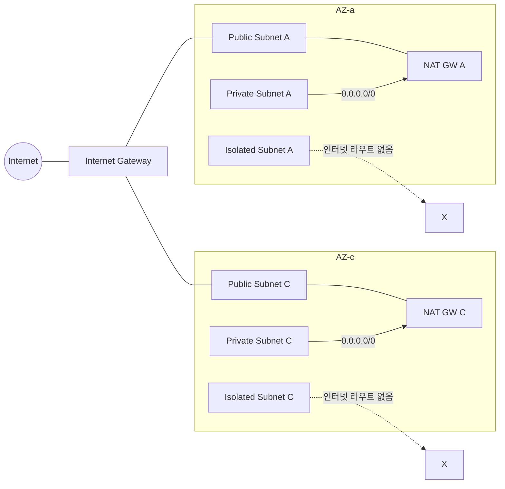
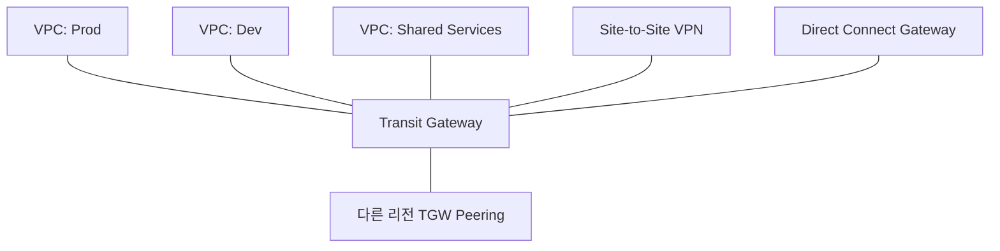
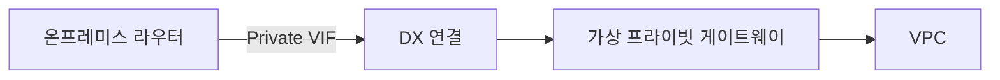
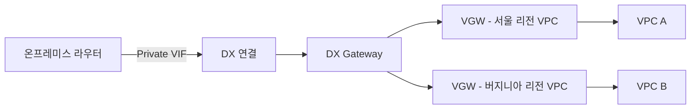
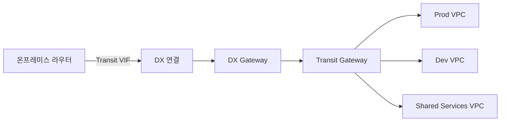
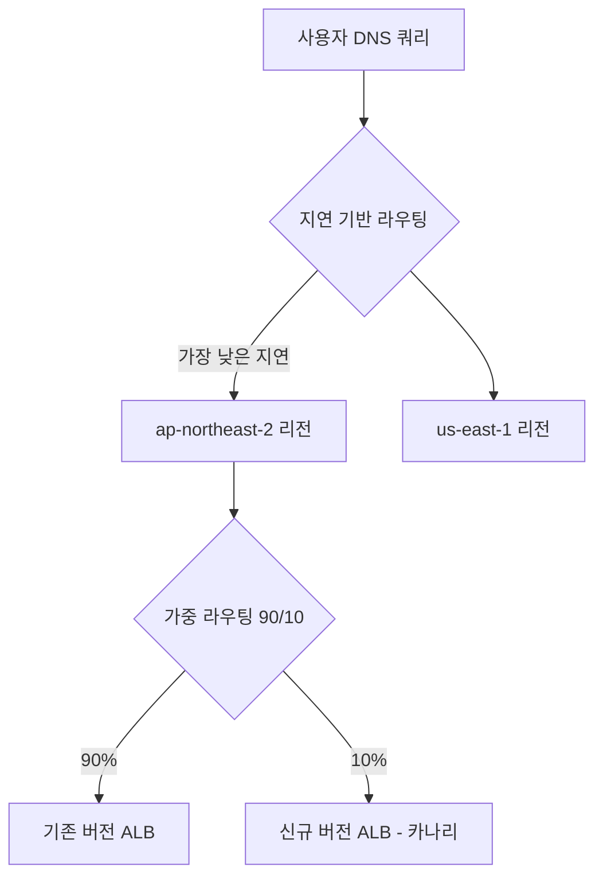
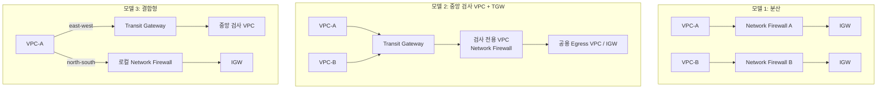
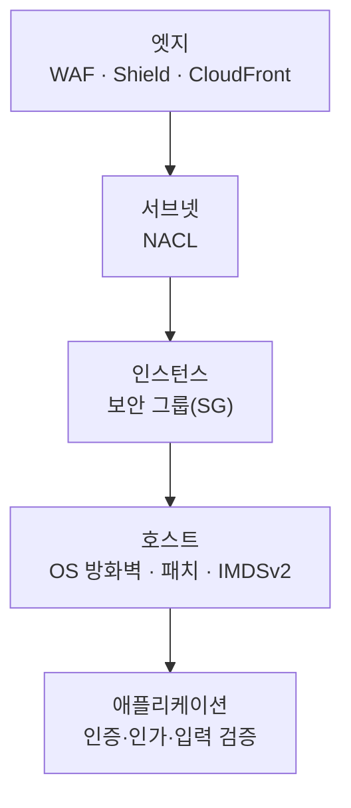

# Part III. 기반 블록 I — 네트워킹

## 10장. VPC 설계  ★★★

> **이 장에서 다루는 것**
> Part III는 네트워크부터 시작한다. 컴퓨트·데이터·애플리케이션 계층이 모두 VPC(Virtual Private Cloud) 위에 얹히기 때문에, 여기서 잘못 그은 CIDR 하나가 몇 년 뒤 전체 재구축을 강제하는 경우를 실무에서 반복해서 본다. 이 장은 CIDR 계획, 서브넷 티어링, 라우팅/NAT, 보안 그룹(SG)·네트워크 ACL(NACL), DNS, Flow Logs, IPv6를 다루고 마지막에 2AZ×3티어 VPC를 IaC로 직접 만들어본다. VPC 간 연결(피어링·TGW·엔드포인트)은 11장, 온프레미스 연결은 12장, Network Firewall 등 전용 보안 어플라이언스와 안티패턴 총정리는 14장에서 다룬다.

### 10.1 VPC와 CIDR 계획

VPC는 계정 안에 논리적으로 격리된 가상 네트워크다. 생성 시 IPv4 CIDR 블록을 하나 지정하며, 이후 보조(secondary) CIDR을 최대 몇 개까지 추가할 수 있다(정확한 개수는 서비스 할당량 문서 확인). VPC 크기는 `/16`(65,536개 주소)부터 `/28`(16개 주소)까지 지정 가능하며, 대부분의 실무 VPC는 `/16` 또는 `/20`에서 시작한다.

CIDR 설계에서 가장 먼저 결정할 것은 **"이 VPC가 확장될 여지를 얼마나 남길 것인가"** 다. 이유는 단순하다. **VPC CIDR은 생성 후 축소가 불가능하다.** 확장은 보조 CIDR 블록을 추가로 붙이는 방식으로만 가능하고, 처음 잡은 주 CIDR을 좁히거나 겹치는 대역으로 바꿀 수 없다. 너무 작게 잡으면 서브넷을 추가할 공간이 없어 보조 CIDR을 덧붙여야 하고, 이는 라우팅 테이블과 온프레미스 방화벽 규칙을 다시 손봐야 하는 작업으로 이어진다. 반대로 너무 크게 잡으면(예: 여러 팀이 각자 `/16`을 요구) 사내 RFC 1918 대역(`10.0.0.0/8`, `172.16.0.0/12`, `192.168.0.0/16`)이 금세 고갈되고, 이후 다른 VPC나 온프레미스와 피어링·Direct Connect로 연결할 때 CIDR이 겹쳐 연결 자체가 불가능해지는 사고로 이어진다.

주소 계획은 다음 세 가지 소비처를 미리 고려해야 한다.

- **온프레미스 연결**: 데이터센터와 VPN/Direct Connect로 연결할 계획이 있다면, 온프레미스 대역과 절대 겹치지 않는 블록을 미리 배정받아야 한다.
- **VPC 피어링/Transit Gateway**: 피어링은 라우팅 테이블 항목으로 동작하므로 두 VPC의 CIDR이 겹치면 피어링 자체가 성립하지 않는다(→ 11장 참조).
- **컨테이너 IP 소비**: Amazon EKS/ECS를 VPC 네트워킹 모드로 쓰면 파드·태스크마다 ENI 또는 보조 IP를 소비해 예상보다 훨씬 빠르게 서브넷 IP가 고갈될 수 있다.

아래는 리전×환경×티어 기준의 주소 할당표 예시다(회사 전체를 `10.0.0.0/8` 슈퍼넷 안에서 관리한다고 가정).

| 리전 | 환경 | 블록 | 티어 배분 |
|---|---|---|---|
| ap-northeast-2(서울) | Prod | `10.0.0.0/16` | Public `/20` ×2AZ, Private `/19` ×2AZ, Isolated `/20` ×2AZ |
| ap-northeast-2(서울) | Staging | `10.1.0.0/16` | 동일 패턴, 규모 축소 |
| us-east-1(버지니아) | Prod | `10.10.0.0/16` | 동일 패턴 |
| us-east-1(버지니아) | DR/재해복구 | `10.11.0.0/16` | 동일 패턴 |
| 온프레미스 | - | `10.100.0.0/16` | DX/VPN 전용, VPC 대역과 절대 미중복 |

한 줄 결정 기준: **"이 VPC가 3년 뒤에도 지금 CIDR로 충분한가"를 기준으로 삼되, 회사 전체 IP 예산이 있다면 리전·환경 단위로 `/16`을 미리 분할해 두고 각 VPC는 그 안에서 `/20` 전후로 시작한다.**

VPC 크기 선택에서 실무적으로 자주 고민하는 세 구간을 비교하면 다음과 같다.

| VPC CIDR | 총 주소 | 특징 | 적합한 상황 |
|---|---|---|---|
| `/16` | 65,536 | 여러 티어·여러 AZ·향후 보조 CIDR까지 여유 | 장기 운영할 Prod 계정 전용 VPC |
| `/20` | 4,096 | 3티어 × 2~3AZ 구성에 충분, 관리 부담 적음 | 표준 애플리케이션 VPC, Sandbox/Staging |
| `/24` 이하 | 256 이하 | 서브넷을 나누면 티어별 여유가 거의 없음 | 단일 목적 VPC(예: 격리된 배치 작업 전용) |

한 줄 결정 기준: **다계정 전략(→ 4장 참조)에서 계정 하나가 워크로드 하나를 전담한다면 `/20`을 기본값으로, 그 계정에 여러 독립 VPC가 공존해야 한다면 `/16`을 상위 슈퍼넷으로 잡고 그 안에서 나눈다.**

여러 팀·계정이 VPC를 만드는 조직에서는 수기 스프레드시트로 CIDR을 관리하다가 중복 할당 사고가 나기 쉽다. Amazon VPC IP Address Manager(IPAM)는 조직 전체의 IP 주소 풀을 계층적으로 관리하고, 계정·리전별로 CIDR을 자동 할당하며 중복 사용을 방지해주는 관리형 서비스다. IPAM은 최상위 풀(예: 회사 전체 `10.0.0.0/8`) 아래에 리전별·환경별 하위 풀을 계층으로 구성하고, 각 하위 풀에 할당 규칙(최소/최대 CIDR 크기, 허용 리전)을 걸어 둘 수 있다. 계정 담당자가 새 VPC를 만들 때 IPAM 풀에서 CIDR을 요청하면 IPAM이 중복되지 않는 블록을 자동으로 내어주므로, "누가 어떤 대역을 쓰고 있는지"를 스프레드시트로 추적할 필요가 없어진다. AWS Organizations와 다계정 환경을 쓰는 조직이라면 CIDR을 수기로 관리하는 대신 IPAM 도입을 검토할 가치가 있다.

```bash
# IPAM 풀에서 새 VPC용 /20 CIDR을 자동 할당받아 VPC 생성
aws ec2 create-vpc \
  --ipv4-ipam-pool-id ipam-pool-0abc123def456789 \
  --ipv4-netmask-length 20 \
  --region ap-northeast-2
# IPAM이 풀 내에서 다른 VPC와 겹치지 않는 /20 블록을 자동으로 골라준다
```

### 10.2 서브넷 티어링: 퍼블릭 / 프라이빗 / 격리(DB)

서브넷은 VPC CIDR을 AZ 단위로 쪼갠 것이다. 서브넷 자체는 AZ 하나에 종속되므로(→ 15장에서 다루는 EBS의 AZ 종속성과 같은 성격), 고가용성을 확보하려면 **같은 역할의 서브넷을 AZ 수만큼 복제**해야 한다. 2개 AZ에 3개 티어를 두면 서브넷은 최소 6개(2×3)가 되고, 3개 AZ라면 9개가 된다.

3티어 구성의 각 역할은 다음과 같다.

- **퍼블릭(Public) 서브넷**: 인터넷 게이트웨이(IGW)로 향하는 라우트가 있고, 인스턴스에 퍼블릭 IP가 있으면 인터넷에서 직접 도달 가능하다. ALB, NAT Gateway, 배스천 호스트가 위치한다.
- **프라이빗(Private) 서브넷**: IGW로 가는 직접 라우트가 없다. 아웃바운드 인터넷이 필요하면 NAT Gateway를 경유한다. 애플리케이션 서버(EC2, ECS 태스크, EKS 워커 노드)가 위치한다.
- **격리(Isolated) 서브넷**: 인터넷으로 나가는 라우트가 아예 없다(NAT 라우트도 없음). RDS/Aurora, ElastiCache처럼 외부와 통신할 필요가 없는 데이터 계층에 사용한다. AWS 서비스 접근이 필요하면 VPC 엔드포인트를 별도로 붙인다(→ 11.3절 참조).

서브넷 크기를 정할 때 반드시 기억해야 할 점은, **AWS가 서브넷마다 5개의 IP 주소를 예약**한다는 것이다(네트워크 주소, VPC 라우터, DNS, 향후 예약, 브로드캐스트 주소에 해당하는 자리). 즉 `/24`(256개 주소)를 할당해도 실사용 가능한 주소는 251개다. 작은 서브넷(`/28` = 16개 주소)을 쓰면 예약분이 상대적으로 커서 실사용 가능 IP가 11개로 줄어드니, ENI를 많이 소비하는 EKS/ECS 워크로드는 `/24` 이상을 권장한다.

| 서브넷 CIDR | 총 주소 | AWS 예약 | 실사용 가능 |
|---|---|---|---|
| `/28` | 16 | 5 | 11 |
| `/24` | 256 | 5 | 251 |
| `/20` | 4,096 | 5 | 4,091 |

한 줄 결정 기준: **컨테이너·Lambda ENI가 몰리는 프라이빗 서브넷은 여유 있게 `/20` 이상, 격리 서브넷은 DB 인스턴스 수가 적으므로 `/24` 정도로도 충분한 경우가 많다.**

티어별 라우팅 차이를 미리 요약하면 다음과 같다(세부 구성은 10.3절에서 다룬다).

| 티어 | 인바운드 라우트 | 아웃바운드(0.0.0.0/0) 라우트 | 전형적 리소스 |
|---|---|---|---|
| 퍼블릭 | IGW로부터 직접 수신 | IGW | ALB, NAT Gateway, 배스천 |
| 프라이빗 | 없음(로컬 CIDR만) | NAT Gateway 경유 | EC2 앱 서버, ECS 태스크, EKS 워커 |
| 격리 | 없음(로컬 CIDR만) | **라우트 자체가 없음** | RDS/Aurora, ElastiCache |

한 줄 결정 기준: **인터넷 인바운드가 필요하면 퍼블릭, 아웃바운드만 필요하면 프라이빗, 아웃바운드조차 불필요하면 격리 — "이 서브넷의 리소스가 능동적으로 외부에 연결을 시작해야 하는가"를 기준으로 고른다.**

서브넷 개수 산정은 "티어 수 × AZ 수"로 계산한다. 예를 들어 3개 AZ에 걸친 3티어 구성이라면 서브넷은 9개(3×3)가 되고, 여기에 향후 4번째 티어(예: 관리용 서브넷)를 추가할 가능성까지 감안하면 VPC CIDR을 처음부터 그만큼 여유 있게 잡아야 한다. 서브넷 CIDR을 자를 때는 AZ 간 크기를 동일하게 맞추는 것이 일반적이다 — 한 AZ만 서브넷을 크게 잡으면 그 AZ로 스케줄링이 쏠리는 인프라(예: EKS 워커 노드 오토스케일링)에서 불균형이 생길 수 있다.

티어별로 라우팅 테이블도 분리해야 한다. 퍼블릭 서브넷의 라우팅 테이블에는 `0.0.0.0/0 → IGW`가, 프라이빗 서브넷에는 `0.0.0.0/0 → NAT Gateway`가, 격리 서브넷에는 인터넷 관련 기본 라우트가 아예 없어야 한다. 라우팅 테이블을 티어당 하나씩(AZ별이 아니라 티어별로 공유하되 NAT Gateway 대상만 AZ별로 다르게) 구성하는 것이 일반적이다.

### 10.3 라우팅 테이블 · IGW · NAT Gateway / NAT 인스턴스

**인터넷 게이트웨이(IGW)**는 VPC에 하나만 붙일 수 있는 리전 단위(모든 AZ에 걸친) 게이트웨이로, 퍼블릭 서브넷의 인스턴스가 퍼블릭 IP를 통해 인터넷과 양방향 통신하게 해준다. IGW 자체는 과금되지 않는다.

**NAT Gateway**는 프라이빗 서브넷의 인스턴스가 아웃바운드로만 인터넷에 나갈 수 있게 해주는 관리형 게이트웨이다(인터넷에서 NAT GW로 인바운드 연결을 시작할 수는 없다). NAT Gateway는 반드시 **AZ별로 하나씩 배치**해야 한다. 하나의 NAT Gateway를 여러 AZ가 공유하면, 그 NAT Gateway가 속한 AZ에 장애가 발생했을 때 다른 AZ의 프라이빗 서브넷까지 인터넷 아웃바운드를 잃는다 — AZ 장애 격리라는 멀티 AZ 설계의 목적 자체가 무너진다. 또한 AZ를 가로지르는 트래픽에는 리전 간 데이터 전송 요금이 추가로 붙는다.

NAT Gateway의 과금은 두 축으로 이뤄진다: **(1) 가동 시간당 요금**과 **(2) 처리한 데이터량당 요금**이다. 두 축이 별개이므로, 트래픽이 많은 환경에서는 NAT Gateway 자체보다 데이터 처리 비용이 청구서의 대부분을 차지하는 경우가 흔하다(정확한 단가는 리전별 요금 페이지 확인). 이 비용을 줄이는 대표적인 방법은 S3/DynamoDB 등으로 가는 트래픽을 NAT Gateway가 아니라 Gateway VPC 엔드포인트로 우회시키는 것이다(→ 11.3절).

**NAT 인스턴스**는 관리형이 아닌, 사용자가 직접 운영하는 EC2 기반 NAT로 지금은 레거시에 가깝다. NAT Gateway와 비교하면 다음과 같다.

| 항목 | NAT Gateway | NAT 인스턴스 |
|---|---|---|
| 관리 주체 | AWS 관리형 | 사용자가 EC2 운영·패치 |
| 가용성 | AZ 내 관리형 이중화 | 단일 인스턴스, 직접 이중화 구성 필요 |
| 대역폭 확장 | 자동 확장 | 인스턴스 타입에 종속, 수동 변경 |
| 과금 구조 | 시간당 + 데이터 처리량 | EC2 인스턴스 요금(단순) |
| 보안 그룹 적용 | 불가 | 가능(세밀한 아웃바운드 제어 가능) |
| 소스/대상 확인(Source/Dest Check) | 해당 없음 | 비활성화 필요 |

한 줄 결정 기준: **특수한 세밀 제어(패킷 검사, 커스텀 아웃바운드 필터링)가 꼭 필요한 경우가 아니라면 NAT Gateway를 기본값으로 쓴다.**

라우팅 테이블 하나는 여러 서브넷에 연결(associate)될 수 있지만, 서브넷 하나는 반드시 하나의 라우팅 테이블에만 연결된다. VPC를 만들면 자동으로 **메인(main) 라우팅 테이블**이 생성되고, 명시적으로 다른 라우팅 테이블을 연결하지 않은 서브넷은 모두 메인 라우팅 테이블을 따른다. 실무에서는 메인 라우팅 테이블을 격리 티어 전용(인터넷 라우트 없음)으로 비워 두고, 퍼블릭·프라이빗 서브넷에는 각각 명시적인 라우팅 테이블을 연결하는 방식을 권장한다 — 새 서브넷을 실수로 아무 라우팅 테이블에도 연결하지 않았을 때 기본값이 "인터넷 불가"가 되도록 하는 안전장치다.

또한 대상(target) 리소스가 삭제되었는데 라우트만 남아있는 경우 라우팅 테이블에 **블랙홀(blackhole) 라우트**로 표시된다. 예를 들어 NAT Gateway를 삭제했는데 프라이빗 서브넷의 라우팅 테이블에 그 NAT Gateway를 가리키는 라우트가 남아있으면 블랙홀 상태가 되어 해당 라우트로 나가는 트래픽이 조용히 유실된다. NAT Gateway나 피어링 연결을 교체할 때는 라우팅 테이블에 블랙홀 라우트가 남지 않았는지 반드시 확인한다.

**이그레스 전용 인터넷 게이트웨이(Egress-Only Internet Gateway)**는 IPv6 전용 아웃바운드 경로다. IPv6는 기본적으로 각 주소가 글로벌 라우팅 가능(퍼블릭)하기 때문에 IPv4의 NAT 개념이 그대로 적용되지 않는다. 이그레스 전용 IGW는 IPv6 트래픽이 인스턴스에서 인터넷으로 나가는 것은 허용하되, 인터넷에서 그 인스턴스로 연결을 시작하는 것은 막아 NAT Gateway의 "아웃바운드만 허용" 개념을 IPv6에서 구현한다(→ 10.7절에서 다시 다룬다).



### 10.4 보안 그룹(SG)과 네트워크 ACL(NACL)

VPC 안에서 트래픽을 걸러내는 계층은 두 개다. 보안 그룹(SG)은 ENI(인스턴스) 단위로 붙는 방화벽이고, NACL은 서브넷 단위로 붙는 방화벽이다. 이 둘을 혼동하는 것이 AWS 네트워크 설계에서 가장 흔하고 가장 치명적인 실수이므로 정확히 대비한다.

| 항목 | 보안 그룹(SG) | 네트워크 ACL(NACL) |
|---|---|---|
| 적용 단위 | ENI(인스턴스) | 서브넷 |
| 상태성 | **상태 유지(stateful)** — 인바운드를 허용하면 응답 아웃바운드는 자동 허용 | **무상태(stateless)** — 인/아웃바운드 각각 명시적으로 허용해야 함 |
| 규칙 종류 | **허용(Allow) 규칙만** 존재 | 허용/거부(Deny) 규칙 모두 가능 |
| 평가 방식 | 모든 규칙을 확인해 하나라도 매치하면 허용 | **규칙 번호 오름차순으로 평가, 첫 매치에서 즉시 종료** |
| 규칙 소스 | CIDR 또는 **다른 SG 참조** | CIDR만 (SG 참조 불가) |
| 기본 동작 | 기본(default) SG: 같은 SG 내 인바운드 허용, 아웃바운드 전체 허용 | 기본 NACL: 인/아웃바운드 전체 허용 |
| 적용 범위 | 인스턴스에 명시적으로 연결한 SG만 | 서브넷에 연결된 VPC 내 **모든** 인스턴스 |

SG가 상태 유지라는 것은, 인바운드 규칙에서 443 포트를 허용하면 그 연결에 대한 응답 트래픽은 아웃바운드 규칙과 무관하게 자동으로 나간다는 뜻이다. 반면 NACL은 무상태이므로 인바운드 443을 허용했더라도 응답 트래픽이 나가려면 아웃바운드 쪽에 임시 포트 범위(에페메럴 포트, 일반적으로 1024-65535 대역이나 클라이언트 OS에 따라 다름)를 별도로 열어야 한다. 이 차이를 놓치면 "SG는 열었는데 NACL 때문에 응답이 끊긴다"는 증상으로 나타난다.

**기본(default) 동작**도 정확히 알아둔다. VPC를 만들면 자동으로 기본 SG 하나와 기본 NACL 하나가 함께 생성된다. 기본 SG는 인바운드에서 "같은 SG에 속한 리소스로부터의 모든 트래픽"을 허용하고 아웃바운드는 전체 허용이다 — 즉 기본 SG를 그대로 쓰면 같은 SG를 공유하는 모든 인스턴스가 서로 무제한으로 통신할 수 있게 되므로, 프로덕션에서는 기본 SG를 리소스에 붙이지 않고 티어별 커스텀 SG를 쓰는 것이 원칙이다. 기본 NACL은 인바운드·아웃바운드 모두 전체 허용 상태로 시작하며, 새로 만드는 서브넷은 기본적으로 이 기본 NACL에 연결된다. 커스텀 NACL을 새로 만들면 반대로 인바운드·아웃바운드 모두 기본값이 전체 거부이므로, 필요한 규칙을 명시적으로 추가해야 한다.

NACL 규칙 표는 다음과 같은 형태로 구성된다(퍼블릭 서브넷의 인바운드 예시).

| 규칙 번호 | 유형 | 프로토콜 | 포트 범위 | 소스 | 허용/거부 |
|---|---|---|---|---|---|
| 100 | HTTPS | TCP | 443 | 0.0.0.0/0 | ALLOW |
| 200 | 에페메럴 응답 | TCP | 1024-65535 | 0.0.0.0/0 | ALLOW |
| * | 기본 규칙 | 전체 | 전체 | 0.0.0.0/0 | DENY |

마지막 줄의 `*`(규칙 번호 표시상 가장 마지막)는 어떤 규칙에도 매치하지 않은 모든 트래픽을 거부하는 암묵적 기본 규칙으로, 사용자가 직접 만들거나 지울 수 없다. 200번의 에페메럴 응답 규칙이 없으면, 100번에서 인바운드 443을 허용해도 클라이언트로 돌아가는 응답이 아웃바운드 NACL 규칙에서 막혀 통신이 완성되지 않는다 — SG의 상태 유지 동작과 대비되는 지점이다.

NACL의 **규칙 번호 순 평가·첫 매치 종료**도 중요하다. 규칙 100번이 "허용"이고 200번이 "거부"라면, 두 규칙 모두에 해당하는 트래픽은 100번에서 허용되고 200번은 평가되지 않는다. 이 때문에 규칙을 100 단위(100, 200, 300…)로 띄워 만드는 것이 실무 관례다 — 나중에 150번을 끼워 넣어 규칙 우선순위를 조정할 여유를 남기기 위함이다.

SG 규칙은 **프로토콜(TCP/UDP/ICMP 등), 포트 범위, 소스(또는 대상)** 세 요소로 구성된다. 소스를 CIDR로 지정할 수도 있지만, 실무에서는 **다른 SG를 소스로 참조(SG 체이닝)** 하는 방식을 우선한다. 예를 들어 DB 티어 SG의 인바운드 규칙에서 소스를 "App 티어 SG"로 지정하면, App 티어에 속한 인스턴스가 IP를 바꾸며 스케일 아웃/인 되어도 규칙을 다시 손댈 필요가 없고, 어떤 티어가 어떤 티어를 호출하는지가 규칙 자체에 문서화된다.

원서에서 강조하는 네트워크 보안 패턴 8가지를 정리하면 다음과 같다.

1. **SG 사전 생성**: 인스턴스를 만들기 전에 티어별 SG(web/app/db)를 먼저 만들어 둔다. 기본 SG는 그대로 두되 리소스에 사용하지 않는다.
2. **티어별 논리 구성**: SG 이름과 규칙을 티어(web-sg, app-sg, db-sg) 단위로 논리적으로 구성해 규칙 자체가 아키텍처 문서 역할을 하게 한다.
3. **SG 체이닝**: 소스를 CIDR 대신 SG 참조로 지정해 IP 변화에 영향받지 않고 의도를 명시한다.
4. **관리 포트 제한**: SSH(22)/RDP(3389) 같은 관리 포트는 배스천 호스트나 AWS Systems Manager Session Manager를 통해서만 접근하게 하고, 가능하면 SG에서 해당 포트 자체를 열지 않는다.
5. **NACL 번호 100 단위**: 규칙 번호를 100, 200, 300처럼 여유 있게 배치해 이후 규칙 삽입 여지를 남긴다.
6. **동일 티어 NACL 공유**: 같은 성격(같은 티어)의 서브넷끼리만 NACL을 공유한다.
7. **인바운드 최소 포트**: 인바운드는 실제로 필요한 포트만 허용하고 나머지는 기본적으로 닫아 둔다.
8. **미사용 규칙 감사**: SG/NACL 규칙은 계정·리전별 한도가 있으므로(정확한 개수는 서비스 할당량 문서 확인) 주기적으로 미사용·중복 규칙을 감사해 삭제한다.

패턴 6("동일 티어 NACL 공유")의 반대 사례 — 서로 다른 역할의 서브넷이 NACL을 공유하다 한쪽 요구로 규칙을 열면 다른 쪽도 함께 열리는 문제나, SG 체이닝을 잘못 써서 사실상 전체 허용이 되는 안티패턴 등 **네트워크 보안 안티패턴 5종**은 14장에서 Network Firewall·이그레스 통제와 함께 총정리한다. 여기서는 위 8가지 패턴을 지키는 것만으로도 대부분의 사고를 예방한다는 점만 기억한다.

```json
{
  "Description": "app-sg 인바운드: web-sg로부터의 8080만 허용 (SG 체이닝 예시)",
  "IpPermissions": [
    {
      "IpProtocol": "tcp",
      "FromPort": 8080,
      "ToPort": 8080,
      "UserIdGroupPairs": [
        { "GroupId": "sg-0abc123webtier", "Description": "web-sg에서만 허용" }
      ]
    }
  ]
}
```

### 10.5 VPC DNS 옵션, DHCP 옵션 세트, Route 53 Resolver

VPC마다 `enableDnsSupport`, `enableDnsHostnames` 두 속성이 DNS 동작을 결정한다. `enableDnsSupport`는 VPC 내부에서 Amazon 제공 DNS 서버(→ 아래의 ".2 리졸버")를 사용할지를, `enableDnsHostnames`는 인스턴스에 퍼블릭/프라이빗 DNS 호스트명을 자동 할당할지를 제어한다. 둘 다 기본값이 활성화(`true`)인 경우가 대부분이지만, VPC 엔드포인트의 프라이빗 DNS 기능을 쓰려면 두 속성이 모두 켜져 있어야 한다는 점을 놓치기 쉽다.

**DHCP 옵션 세트**는 VPC 내 인스턴스가 DHCP로 받는 도메인 이름, DNS 서버 목록, NTP 서버 등을 지정한다. 온프레미스 Active Directory와 통합하거나 사내 DNS 서버를 우선 사용하게 하려면 커스텀 DHCP 옵션 세트를 만들어 VPC에 연결한다. DHCP 옵션 세트는 VPC 생성 후 교체는 가능하지만 기존 세트를 수정하는 것은 불가능하므로(새로 만들어 재연결), 초기 설계 시 필요한 옵션을 한 번에 정한다.

각 VPC에는 CIDR 블록의 두 번째 주소, 즉 **".2 리졸버"**(예: VPC CIDR이 `10.0.0.0/16`이면 `10.0.0.2`)가 예약되어 있고 이것이 Amazon 제공 DNS 서버(Route 53 Resolver)다. 인스턴스는 기본적으로 이 주소를 DNS 서버로 사용해 AWS 프라이빗 DNS 이름과 퍼블릭 DNS 이름을 모두 해석한다.

VPC 간, 또는 VPC-온프레미스 간 DNS 확인이 필요할 때는 **Route 53 Resolver의 인바운드/아웃바운드 엔드포인트**를 사용한다. 아웃바운드 엔드포인트는 특정 도메인에 대한 쿼리를 온프레미스 DNS 서버로 전달(conditional forwarding)하고, 인바운드 엔드포인트는 온프레미스에서 VPC 내부 프라이빗 호스팅 존을 조회할 수 있게 해준다. 하이브리드 DNS 아키텍처의 세부 구성은 온프레미스 연결을 다루는 12장과 연결된다.

**프라이빗 호스팅 존(Private Hosted Zone)**은 Route 53에서 특정 VPC(들)에서만 보이는 도메인 네임스페이스를 만드는 기능이다. 예를 들어 `internal.example.com`이라는 존을 만들어 특정 VPC에 연결하면, 그 VPC 안에서만 `db.internal.example.com` 같은 이름을 해석할 수 있고 인터넷에는 노출되지 않는다. 여러 VPC에서 같은 프라이빗 호스팅 존을 공유하려면 각 VPC를 명시적으로 해당 존에 연결(associate)해야 하며, 서로 다른 계정의 VPC를 연결하려면 권한 부여 절차(authorization)를 먼저 거쳐야 한다.

```bash
# 프라이빗 호스팅 존을 특정 VPC에 연결(다른 VPC에서도 같은 네임스페이스를 쓰려면 반복)
aws route53 associate-vpc-with-hosted-zone \
  --hosted-zone-id Z1D633PJN98FT9 \
  --vpc VPCRegion=ap-northeast-2,VPCId=vpc-0abc123def456789
```

DNS 확인 이력을 감사해야 하는 환경(예: 악성 도메인 조회 탐지)에서는 Route 53 Resolver의 **쿼리 로깅** 기능으로 VPC 안에서 발생하는 모든 DNS 쿼리를 CloudWatch Logs나 S3로 남길 수 있다. 이는 10.6절의 VPC Flow Logs(IP 트래픽 메타데이터)와는 별개의 로그로, DNS 조회 이력만을 남긴다는 점에서 서로 보완적이다.

### 10.6 VPC Flow Logs와 트래픽 미러링

**VPC Flow Logs**는 VPC·서브넷·ENI 단위로 오가는 IP 트래픽의 **메타데이터**를 기록하는 기능이다. 기본 필드는 소스/대상 IP, 포트, 프로토콜, 패킷·바이트 수, 시작/종료 시각, 액션(ACCEPT/REJECT), 로그 상태 등을 포함하며, 커스텀 형식을 지정하면 VPC 엔드포인트 ID나 TCP 플래그 등 확장 필드도 추가할 수 있다(정확한 필드 목록은 최신 문서 확인).

Flow Logs의 목적지는 세 가지 중 선택한다.

| 목적지 | 특징 | 적합한 용도 |
|---|---|---|
| Amazon S3 | 장기 보관, 가장 저렴, 쿼리는 Athena 등으로 별도 수행 | 감사·컴플라이언스 장기 보관 |
| CloudWatch Logs | 콘솔에서 바로 조회·알람 설정 가능, 상대적으로 비쌈 | 실시간 모니터링·알람 |
| Amazon Data Firehose(구 Kinesis Data Firehose) | 실시간으로 다른 분석 시스템(OpenSearch 등)에 스트리밍 | 실시간 파이프라인 연동 |

한 줄 결정 기준: **장기 보관·비용 절감이 목적이면 S3, 실시간 알람이 목적이면 CloudWatch Logs, 외부 SIEM 연동이 필요하면 Firehose를 목적지로 택한다.**

Flow Logs는 **집계 간격**(캡처 윈도우) 동안의 트래픽을 하나의 레코드로 묶어 기록하므로 개별 패킷 단위 실시간 로그가 아니다. 비용은 로그 볼륨(레코드 수)에 비례하므로, 전체 VPC가 아니라 필요한 서브넷·ENI에만 활성화하거나 REJECT(거부된) 트래픽만 남기는 식으로 필터링하면 비용을 통제할 수 있다.

기본 형식의 레코드 한 줄은 대략 다음과 같은 모습이다(공백으로 구분된 필드).

```text
2 123456789012 eni-0abc123def456789 10.0.16.23 203.0.113.5 443 51820 6 20 4249 1717200000 1717200060 ACCEPT OK
```

각 필드는 순서대로 버전, 계정 ID, ENI ID, 소스 IP, 대상 IP, 소스 포트, 대상 포트, 프로토콜 번호(6=TCP), 패킷 수, 바이트 수, 캡처 시작/종료 시각(유닉스 타임스탬프), 액션(ACCEPT/REJECT), 로그 상태를 나타낸다(정확한 필드 순서·구성은 최신 문서 확인). REJECT 액션만 필터링해 남기면 "누가 어떤 트래픽을 시도했다가 SG/NACL에 막혔는가"를 파악하는 데 유용하고, 정상 트래픽까지 전부 남기는 것보다 로그 볼륨을 크게 줄일 수 있다.

Flow Logs와 자주 혼동되는 것이 **트래픽 미러링(Traffic Mirroring)**이다. 결정적 차이는 다음과 같다: Flow Logs는 트래픽에 대한 **메타데이터(누가 언제 얼마나)**만 기록하고, 트래픽 미러링은 실제 **패킷 자체(페이로드 포함)**를 복제해 지정한 대상(IDS/IPS 어플라이언스, 패킷 분석 도구)으로 전송한다. 패킷 내용 검사가 필요한 침입 탐지·심층 패킷 분석에는 트래픽 미러링을, 접속 이력·감사·비용 분석에는 Flow Logs를 사용한다.

### 10.7 IPv6 도입과 이중 스택

IPv4 주소 공간이 소진되어 감에 따라, 그리고 AWS가 퍼블릭 IPv4 주소에 시간당 요금을 부과하는 정책으로 전환하면서 IPv6 채택 동기가 커지고 있다. VPC에 IPv6를 도입할 때는 기존 IPv4를 완전히 대체하는 것이 아니라 **이중 스택(dual-stack)** 구성이 일반적이다 — 즉 VPC와 서브넷에 IPv4 CIDR과 IPv6 CIDR을 동시에 할당하고, 인스턴스가 두 주소 체계를 모두 갖는다.

IPv6 도입에서 반드시 기억할 특성은 **AWS가 할당하는 IPv6 주소는 기본적으로 퍼블릭(글로벌 유니캐스트)만 존재**한다는 점이다. IPv4처럼 프라이빗 대역과 퍼블릭 대역이 나뉘지 않는다. 따라서 "프라이빗 서브넷에 IPv6를 쓰면서 인터넷 노출은 막고 싶다"는 요구는 IPv4의 NAT Gateway가 아니라 **이그레스 전용 인터넷 게이트웨이(Egress-Only IGW)**로 해결한다. 이그레스 전용 IGW는 인스턴스가 IPv6로 아웃바운드 연결을 시작하는 것은 허용하되, 인터넷에서 그 인스턴스로 인바운드 연결을 시작하는 것은 막는다(NAT Gateway처럼 데이터 처리 요금이 부과되지 않는다는 차이도 있다).

이중 스택 전환 시 놓치기 쉬운 점: SG와 NACL 규칙은 IPv4와 IPv6 각각 별도로 설정해야 한다. IPv4용 규칙만 만들고 IPv6 규칙을 빠뜨리면, 이중 스택 환경에서 IPv6 트래픽만 의도치 않게 허용되거나 차단되는 비대칭이 생긴다.

| 항목 | IPv4 | IPv6 |
|---|---|---|
| 프라이빗 대역 존재 | 있음(RFC 1918) | 기본적으로 없음(전 주소 글로벌) |
| 아웃바운드 전용 게이트웨이 | NAT Gateway(과금: 시간+데이터) | 이그레스 전용 IGW(일반적으로 별도 과금 없음) |
| VPC CIDR 축소 | 불가 | 동일하게 불가 |
| 신규 퍼블릭 주소 비용 추세 | 시간당 과금으로 전환 중 | 별도 과금 없음(주소 자체) |

한 줄 결정 기준: **신규 인터넷 대면 워크로드를 설계할 때는 이중 스택을 기본 검토 항목으로 넣되, 기존 IPv4 전용 SG/NACL·모니터링·IaC 템플릿을 IPv6까지 함께 갱신할 여력이 있을 때 전환한다.**

이중 스택 VPC를 구성하는 CLI 흐름은 다음과 같다. VPC에 Amazon 제공 IPv6 CIDR을 붙이고, 각 서브넷에 그 IPv6 블록의 일부를 할당하고, 퍼블릭 서브넷은 IGW로, 프라이빗 서브넷은 이그레스 전용 IGW로 IPv6 라우트를 잡는다.

```bash
# 1. VPC에 Amazon 제공 IPv6 CIDR(/56) 연결
aws ec2 associate-vpc-cidr-block \
  --vpc-id vpc-0abc123def456789 \
  --amazon-provided-ipv6-cidr-block

# 2. 프라이빗 서브넷에 VPC IPv6 블록에서 /64를 할당 (--ipv6-native 아님, 이중 스택 유지)
aws ec2 associate-subnet-cidr-block \
  --subnet-id subnet-0priv1a2b3c4d5e6f \
  --ipv6-cidr-block 2600:1f18:abcd:1::/64

# 3. IPv6 전용 아웃바운드 게이트웨이 생성 후 프라이빗 라우팅 테이블에 연결
aws ec2 create-egress-only-internet-gateway --vpc-id vpc-0abc123def456789
aws ec2 create-route \
  --route-table-id rtb-0priv1a2b3c4d5e6f \
  --destination-ipv6-cidr-block ::/0 \
  --egress-only-internet-gateway-id eigw-0abc123def456789
```

이 흐름에서 놓치기 쉬운 점은, 퍼블릭 서브넷의 IPv6 라우트는 이그레스 전용 IGW가 아니라 **일반 IGW**를 대상으로 잡아야 한다는 것이다(퍼블릭 서브넷은 인바운드도 허용해야 하므로). 이그레스 전용 IGW는 오직 인바운드를 막고 아웃바운드만 허용해야 하는 프라이빗 서브넷에만 사용한다.

### 10.8 3-Tier 레퍼런스 VPC 만들기 (실습)

아래는 2개 AZ × 3개 티어(퍼블릭/프라이빗/격리) 구조를 CloudFormation으로 구현한 전체 템플릿이다. NAT Gateway를 AZ별로 하나씩 배치하고, 티어별 SG와 라우팅 테이블을 분리했다.

```yaml
AWSTemplateFormatVersion: "2010-09-09"
Description: 2AZ x 3-Tier Reference VPC (Public/Private/Isolated)

Parameters:
  VpcCidr:
    Type: String
    Default: 10.0.0.0/16

Resources:
  VPC:
    Type: AWS::EC2::VPC
    Properties:
      CidrBlock: !Ref VpcCidr
      EnableDnsSupport: true
      EnableDnsHostnames: true
      Tags: [{ Key: Name, Value: reference-3tier-vpc }]

  IGW:
    Type: AWS::EC2::InternetGateway
  IGWAttach:
    Type: AWS::EC2::VPCGatewayAttachment
    Properties:
      VpcId: !Ref VPC
      InternetGatewayId: !Ref IGW

  # --- 퍼블릭 서브넷 (AZ-a, AZ-c) ---
  PublicSubnetA:
    Type: AWS::EC2::Subnet
    Properties:
      VpcId: !Ref VPC
      AvailabilityZone: !Select [0, !GetAZs ""]
      CidrBlock: 10.0.0.0/24
      MapPublicIpOnLaunch: true
  PublicSubnetC:
    Type: AWS::EC2::Subnet
    Properties:
      VpcId: !Ref VPC
      AvailabilityZone: !Select [1, !GetAZs ""]
      CidrBlock: 10.0.1.0/24
      MapPublicIpOnLaunch: true

  # --- 프라이빗(앱) 서브넷 ---
  PrivateSubnetA:
    Type: AWS::EC2::Subnet
    Properties:
      VpcId: !Ref VPC
      AvailabilityZone: !Select [0, !GetAZs ""]
      CidrBlock: 10.0.16.0/20
  PrivateSubnetC:
    Type: AWS::EC2::Subnet
    Properties:
      VpcId: !Ref VPC
      AvailabilityZone: !Select [1, !GetAZs ""]
      CidrBlock: 10.0.32.0/20

  # --- 격리(DB) 서브넷 ---
  IsolatedSubnetA:
    Type: AWS::EC2::Subnet
    Properties:
      VpcId: !Ref VPC
      AvailabilityZone: !Select [0, !GetAZs ""]
      CidrBlock: 10.0.48.0/24
  IsolatedSubnetC:
    Type: AWS::EC2::Subnet
    Properties:
      VpcId: !Ref VPC
      AvailabilityZone: !Select [1, !GetAZs ""]
      CidrBlock: 10.0.49.0/24

  # --- NAT Gateway: AZ별로 하나씩 (AZ 장애 격리를 위해 공유하지 않는다) ---
  NatEipA:
    Type: AWS::EC2::EIP
    Properties: { Domain: vpc }
  NatEipC:
    Type: AWS::EC2::EIP
    Properties: { Domain: vpc }
  NatGwA:
    Type: AWS::EC2::NatGateway
    Properties:
      AllocationId: !GetAtt NatEipA.AllocationId
      SubnetId: !Ref PublicSubnetA
  NatGwC:
    Type: AWS::EC2::NatGateway
    Properties:
      AllocationId: !GetAtt NatEipC.AllocationId
      SubnetId: !Ref PublicSubnetC

  # --- 라우팅 테이블: 퍼블릭 ---
  PublicRT:
    Type: AWS::EC2::RouteTable
    Properties: { VpcId: !Ref VPC }
  PublicRoute:
    Type: AWS::EC2::Route
    Properties:
      RouteTableId: !Ref PublicRT
      DestinationCidrBlock: 0.0.0.0/0
      GatewayId: !Ref IGW
  PublicSubnetARTAssoc:
    Type: AWS::EC2::SubnetRouteTableAssociation
    Properties: { SubnetId: !Ref PublicSubnetA, RouteTableId: !Ref PublicRT }
  PublicSubnetCRTAssoc:
    Type: AWS::EC2::SubnetRouteTableAssociation
    Properties: { SubnetId: !Ref PublicSubnetC, RouteTableId: !Ref PublicRT }

  # --- 라우팅 테이블: 프라이빗 (AZ별, 각자의 NAT GW로) ---
  PrivateRTA:
    Type: AWS::EC2::RouteTable
    Properties: { VpcId: !Ref VPC }
  PrivateRouteA:
    Type: AWS::EC2::Route
    Properties:
      RouteTableId: !Ref PrivateRTA
      DestinationCidrBlock: 0.0.0.0/0
      NatGatewayId: !Ref NatGwA
  PrivateSubnetARTAssoc:
    Type: AWS::EC2::SubnetRouteTableAssociation
    Properties: { SubnetId: !Ref PrivateSubnetA, RouteTableId: !Ref PrivateRTA }

  PrivateRTC:
    Type: AWS::EC2::RouteTable
    Properties: { VpcId: !Ref VPC }
  PrivateRouteC:
    Type: AWS::EC2::Route
    Properties:
      RouteTableId: !Ref PrivateRTC
      DestinationCidrBlock: 0.0.0.0/0
      NatGatewayId: !Ref NatGwC
  PrivateSubnetCRTAssoc:
    Type: AWS::EC2::SubnetRouteTableAssociation
    Properties: { SubnetId: !Ref PrivateSubnetC, RouteTableId: !Ref PrivateRTC }

  # --- 라우팅 테이블: 격리 (인터넷 라우트 없음, 로컬만) ---
  IsolatedRT:
    Type: AWS::EC2::RouteTable
    Properties: { VpcId: !Ref VPC }
  IsolatedSubnetARTAssoc:
    Type: AWS::EC2::SubnetRouteTableAssociation
    Properties: { SubnetId: !Ref IsolatedSubnetA, RouteTableId: !Ref IsolatedRT }
  IsolatedSubnetCRTAssoc:
    Type: AWS::EC2::SubnetRouteTableAssociation
    Properties: { SubnetId: !Ref IsolatedSubnetC, RouteTableId: !Ref IsolatedRT }

  # --- 티어별 보안 그룹: 생성 순서상 web -> app -> db, app/db는 소스를 SG로 체이닝 ---
  WebSG:
    Type: AWS::EC2::SecurityGroup
    Properties:
      GroupDescription: ALB/Web tier
      VpcId: !Ref VPC
      SecurityGroupIngress:
        - { IpProtocol: tcp, FromPort: 443, ToPort: 443, CidrIp: 0.0.0.0/0 }

  AppSG:
    Type: AWS::EC2::SecurityGroup
    Properties:
      GroupDescription: App tier - only from WebSG
      VpcId: !Ref VPC
      SecurityGroupIngress:
        - { IpProtocol: tcp, FromPort: 8080, ToPort: 8080, SourceSecurityGroupId: !Ref WebSG }

  DbSG:
    Type: AWS::EC2::SecurityGroup
    Properties:
      GroupDescription: DB tier - only from AppSG
      VpcId: !Ref VPC
      SecurityGroupIngress:
        - { IpProtocol: tcp, FromPort: 5432, ToPort: 5432, SourceSecurityGroupId: !Ref AppSG }

Outputs:
  VpcId:
    Value: !Ref VPC
  PrivateSubnetIds:
    Value: !Join [",", [!Ref PrivateSubnetA, !Ref PrivateSubnetC]]
  IsolatedSubnetIds:
    Value: !Join [",", [!Ref IsolatedSubnetA, !Ref IsolatedSubnetC]]
```

배포와 삭제 명령은 다음과 같다.

```bash
# 스택 생성 (약 3~5분 소요, NAT Gateway 프로비저닝이 가장 오래 걸린다)
aws cloudformation deploy \
  --template-file reference-3tier-vpc.yaml \
  --stack-name reference-3tier-vpc \
  --region ap-northeast-2 \
  --capabilities CAPABILITY_NAMED_IAM

# 스택 삭제 (NAT Gateway/EIP까지 함께 정리된다. 남아있는 ENI가 있으면 실패할 수 있음)
aws cloudformation delete-stack \
  --stack-name reference-3tier-vpc \
  --region ap-northeast-2
```

실습 확인 포인트: 프라이빗 서브넷의 인스턴스에서 아웃바운드 `curl`이 되는지(NAT Gateway 경유), 격리 서브넷의 인스턴스에서는 인터넷 아웃바운드가 전혀 안 되는지, `db-sg`의 인바운드 소스가 CIDR이 아니라 `app-sg`로 표시되는지를 콘솔에서 직접 확인한다.

스택을 삭제할 때 자주 걸리는 지점은 NAT Gateway가 아니라, 그 위에 뒤늦게 붙인 리소스(예: 이 VPC에 수동으로 만든 인터페이스 엔드포인트, 다른 스택이 참조하는 서브넷)다. `delete-stack`이 실패하면 CloudFormation 콘솔의 이벤트 탭에서 어떤 리소스가 걸렸는지 먼저 확인하고, 해당 리소스를 직접 정리한 뒤 삭제를 재시도한다. NAT Gateway는 삭제 요청 후 실제로 반환(release)되기까지 수 분이 걸릴 수 있으므로, 곧바로 같은 이름으로 스택을 재생성하면 일시적인 리소스 충돌을 만날 수 있다는 점도 감안한다.

### 10장 정리

#### [필수] 반드시 알아야 할 것
1. VPC CIDR은 **생성 후 축소가 불가능**하다. 확장은 보조 CIDR 추가로만 가능하므로, 처음부터 성장·피어링·온프레미스 연결을 고려해 크기를 정한다.
2. 서브넷은 AZ에 종속되므로 고가용성을 위해서는 **같은 티어의 서브넷을 AZ 수만큼** 만들어야 한다. AWS는 서브넷마다 5개의 IP를 예약한다.
3. **SG는 상태 유지(stateful)·허용 규칙만**, **NACL은 무상태(stateless)·허용/거부 규칙을 번호 순으로 평가하며 첫 매치에서 종료**한다. 이 차이를 혼동하면 "SG는 맞는데 안 되는" 증상이 나온다.
4. NAT Gateway는 아웃바운드 전용이며 **AZ별로 배치**해야 한다. 하나를 여러 AZ가 공유하면 AZ 장애 격리가 깨진다. 과금은 시간당 요금과 데이터 처리량 요금 두 축이다.
5. VPC Flow Logs는 트래픽의 **메타데이터**만 기록한다. 패킷 페이로드 자체를 보려면 트래픽 미러링을 별도로 구성해야 한다.
6. IPv6는 기본적으로 전 주소가 퍼블릭이다. IPv4의 NAT Gateway에 대응하는 것은 **이그레스 전용 인터넷 게이트웨이**다.

#### [팁] 실무 노하우
1. SG는 인스턴스를 만들기 **전에** 티어별(web/app/db)로 먼저 만들어 둔다. 기본 SG는 리소스에 사용하지 않는다.
2. SG 규칙의 소스는 CIDR보다 **다른 SG 참조(체이닝)**를 우선한다. 스케일 아웃으로 IP가 바뀌어도 규칙을 고칠 필요가 없고, 의도가 규칙 자체에 문서화된다.
3. NACL 규칙 번호는 100 단위(100, 200, 300…)로 띄워 나중에 끼워 넣을 여지를 남긴다.
4. 관리 포트(22/3389)는 배스천이나 AWS Systems Manager Session Manager로만 접근하게 하고, 가능하면 SG에서 아예 열지 않는다.
5. S3/DynamoDB로 가는 트래픽은 NAT Gateway 대신 Gateway VPC 엔드포인트로 우회시켜 데이터 처리 비용을 줄인다(→ 11.3절).
6. 다계정·다VPC 환경에서는 CIDR을 스프레드시트로 관리하지 말고 VPC IP Address Manager(IPAM) 도입을 검토한다.

#### [주의] 사고·비용·설계 함정
1. 여러 팀이 같은 CIDR 대역(예: 각자 `10.0.0.0/16`)을 겹치게 쓰면, 나중에 피어링이나 Direct Connect로 연결하려 할 때 재구축이 불가피해진다.
2. NAT Gateway를 하나만 만들어 여러 AZ가 공유하게 하면, 해당 AZ 장애 시 다른 AZ의 프라이빗 서브넷까지 아웃바운드를 잃는다.
3. NACL과 SG의 상태성을 혼동해 NACL 아웃바운드에 에페메럴 포트 범위를 빠뜨리면, 인바운드는 통과했는데 응답이 돌아오지 않는 증상이 생긴다.
4. 서로 다른 성격(예: 웹 서버와 DB)의 서브넷이 같은 NACL을 공유하면, 한쪽 요구로 규칙을 열 때 다른 쪽도 함께 열려 최소 권한 원칙이 깨진다.
5. SG를 다른 SG의 소스로 참조할 때, 그 SG가 사실상 "모든 인스턴스에 붙은 SG"라면 참조 자체가 전체 허용과 다름없어진다.
6. SG·NACL 규칙 수에는 계정·리전별 한도가 있다(정확한 값은 서비스 할당량 문서 확인). 미사용·중복 규칙을 감사하지 않으면 필요할 때 규칙을 추가하지 못하는 상황에 부딪힌다.
7. Flow Logs를 전체 VPC에 상세 필드로 켜두면 로그 볼륨과 비용이 예상보다 커진다. 필요한 범위·필드만 선택한다.
8. 격리 서브넷에 실수로 NAT Gateway로 가는 라우트를 추가하면 데이터 계층이 의도치 않게 인터넷 아웃바운드를 갖게 된다. 라우팅 테이블 리뷰를 정기적으로 한다.
9. NACL에 규칙을 계속 추가해 대형 규칙 세트가 되면, 무상태 특성상 매 패킷마다 규칙을 순서대로 평가하는 비용이 누적되어 성능 저하로 이어질 수 있다. 이 항목을 포함한 네트워크 보안 안티패턴 전체 목록은 14장에서 총정리한다.

#### 한 장 요약
VPC 설계는 CIDR 계획에서 시작하고, CIDR은 한번 정하면 축소할 수 없으므로 성장·피어링·온프레미스 연결을 미리 고려해야 한다. 퍼블릭/프라이빗/격리 3티어로 서브넷을 나누고 AZ 수만큼 복제하며, NAT Gateway는 AZ별로 배치한다. SG(상태 유지·허용만)와 NACL(무상태·허용거부·번호순 평가)의 차이를 정확히 이해하는 것이 네트워크 보안의 출발점이며, SG 체이닝과 최소 권한 원칙을 지키는 8가지 패턴이 대부분의 실무 사고를 예방한다. Flow Logs로 트래픽 메타데이터를 남기고, IPv6 이중 스택 전환 시에는 이그레스 전용 IGW로 아웃바운드만 허용하는 구조를 만든다.

#### 다음 장 예고
11장에서는 이 장에서 만든 VPC를 다른 VPC·온프레미스·AWS 서비스와 연결하는 방법 — VPC 피어링, Transit Gateway, VPC 엔드포인트(Gateway/Interface), PrivateLink, Cloud WAN, 멀티 계정 네트워크 토폴로지를 다룬다.

---

## 11장. VPC 연결 확장  ★★★

> **이 장에서 다루는 것**
> 10장에서 VPC 하나를 어떻게 설계하는지 다뤘다면, 이 장은 **여러 VPC와 여러 계정을 어떻게 연결하는가**를 다룬다. VPC Peering의 단순함과 한계, Transit Gateway(TGW)의 허브앤스포크 구조, VPC 엔드포인트로 인터넷을 거치지 않고 AWS 서비스에 접근하는 방법, PrivateLink로 자체 서비스를 다른 계정에 공개하는 방법, 그리고 AWS Cloud WAN과 공유 VPC까지 이어진다. CIDR 계획·서브넷 티어링·SG/NACL·NAT는 10장에서 이미 다뤘으므로 여기서는 반복하지 않고 필요할 때 참조만 한다.

### 11.1 VPC Peering — 단순함과 비전이성

VPC Peering은 두 VPC 사이에 프라이빗 IP로 직접 통신할 수 있는 1:1 연결을 만드는 가장 단순한 방법이다. 트래픽은 AWS 백본 네트워크만 지나가며 인터넷 게이트웨이나 NAT, VPN 장비를 거치지 않는다. 같은 계정 안의 VPC끼리도, 서로 다른 계정·서로 다른 리전의 VPC끼리도 피어링할 수 있다(리전 간 피어링은 트래픽이 AWS 백본을 통해 리전을 넘나드는 만큼 데이터 처리 요금이 별도로 붙는다).

구성 절차는 개념적으로 간단하다.

1. 요청자 VPC에서 피어링 연결을 생성하며 대상 VPC(다른 계정이면 계정 ID까지)를 지정한다.
2. 수신자 쪽에서 피어링 요청을 수락한다.
3. **양쪽 VPC의 라우팅 테이블에 각각 상대방 CIDR을 가리키는 라우팅을 수동으로 추가한다.**
4. 필요하면 SG 규칙에서 상대 VPC의 CIDR 또는 SG ID를 허용 소스로 추가한다.

3번 단계를 잊는 실수가 매우 흔하다. 피어링 연결 자체는 "활성" 상태이지만 라우팅 테이블에 항목이 없으면 패킷이 갈 곳을 찾지 못해 통신이 되지 않는다. 피어링은 자동으로 라우팅을 전파하지 않는다 — 이는 곧 설명할 TGW의 라우팅 전파(propagation)와 대비되는 지점이다.

**가장 중요한 제약은 비전이성(non-transitive)이다.** VPC A와 B가 피어링되어 있고 B와 C가 피어링되어 있어도, A와 C는 통신할 수 없다. 피어링 연결은 정확히 그 두 VPC 사이에서만 유효하며, B를 경유해 A→C로 라우팅되는 일은 일어나지 않는다. 이를 우회하려고 B에 프록시나 라우팅 인스턴스를 두는 것은 안티패턴이다 — 대신 3개 이상의 VPC가 서로 통신해야 하는 시점에서는 TGW로 전환을 검토해야 한다.

또 다른 제약은 **CIDR 중복을 허용하지 않는다는 점**이다. 두 VPC의 CIDR 대역이 조금이라도 겹치면 피어링 연결 자체를 만들 수 없다. 인수합병으로 서로 다른 조직의 VPC를 통합해야 하는데 CIDR이 겹친다면, 재주소화(re-IP)를 하거나 NAT 계층(예: 프라이빗 NAT Gateway로 주소를 변환)을 두는 수밖에 없다.

**확장 한계**: VPC 개수가 늘어나면 피어링 연결 수는 조합의 수만큼 늘어난다. N개의 VPC가 전부 서로 통신해야 한다면 필요한 피어링 연결은 N(N-1)/2개다. VPC가 4개면 6개, 10개면 45개, 20개면 190개다. 연결 수만 느는 게 아니라 각 VPC의 라우팅 테이블에 나머지 VPC 수만큼의 라우팅 항목을 일일이 추가·관리해야 하므로 운영 부담이 조합 폭증 그대로 따라온다. 실무에서는 대체로 VPC가 3~4개를 넘어가는 시점부터 TGW 전환을 검토하는 것이 일반적이다.

### 11.2 Transit Gateway(TGW) — 허브앤스포크, 라우팅 도메인, 세그멘테이션

Transit Gateway는 다수의 VPC와 온프레미스 연결을 하나의 중앙 허브에 연결하는 리전 단위의 관리형 라우터다. 각 VPC가 TGW 하나에만 연결(어태치먼트)되면 되므로, 피어링의 N(N-1)/2 문제가 N개의 어태치먼트로 단순해진다.



**어태치먼트 종류**는 VPC, Site-to-Site VPN, Direct Connect Gateway, TGW 간 피어링(리전 간), 그리고 Transit Gateway Connect(SD-WAN 등 제3자 가상 어플라이언스를 GRE 터널로 연결)까지 다섯 가지가 있다. VPN과 DX 자체의 구성은 12장에서 다루고, 여기서는 이들이 TGW의 어태치먼트로 통합되어 하나의 라우팅 도메인 안에서 관리된다는 점만 짚는다.

**라우팅 테이블과 전파/연결**은 TGW 이해의 핵심이다. TGW는 VPC 라우팅 테이블과 별개로 자신의 라우팅 테이블을 갖는다.

- **연결(association)**: 각 어태치먼트는 정확히 하나의 TGW 라우팅 테이블에 연결된다. 이 테이블이 그 어태치먼트에서 나가는 트래픽이 어디로 갈지를 결정한다.
- **전파(propagation)**: 각 어태치먼트의 CIDR을 특정 TGW 라우팅 테이블에 자동으로 주입할지 여부를 설정한다. 전파를 걸어두면 해당 어태치먼트의 대역이 그 라우팅 테이블에 자동으로 나타나고, 걸지 않으면 수동으로 정적 라우팅을 추가해야 한다.

연결과 전파를 분리했다는 것 자체가 TGW의 설계 의도다. 같은 어태치먼트라도 "어느 테이블에 소속되는가(association)"와 "어느 테이블들에 자신의 경로를 알리는가(propagation)"를 따로 제어할 수 있어, VPC마다 보이는 범위를 다르게 만들 수 있다.

이 조합으로 **라우팅 도메인 세그멘테이션**을 구현한다. 프로덕션·개발·공유서비스를 분리하는 전형적인 예시는 다음과 같다.

| TGW 라우팅 테이블 | 연결된 어태치먼트 | 전파받는 대역 |
|---|---|---|
| RT-Prod | Prod VPC | Prod VPC + Shared Services VPC |
| RT-Dev | Dev VPC | Dev VPC + Shared Services VPC |
| RT-Shared | Shared Services VPC | Prod VPC + Dev VPC |

Prod VPC는 RT-Prod에 연결되고, 이 테이블에는 Shared Services의 대역만 전파되도록 설정한다(Dev의 대역은 전파하지 않음). 그 결과 Prod는 Shared Services와는 통신할 수 있지만 Dev와는 라우팅 경로 자체가 없어 통신할 수 없다. Dev도 마찬가지로 Shared Services와만 통신한다. 이렇게 하면 방화벽 규칙 없이 라우팅 테이블 설계만으로 "Prod와 Dev는 격리하되 둘 다 공유서비스(AD, 로깅, 프록시 등)에는 접근"이라는 네트워크 정책을 구현할 수 있다.

**과금 구조**는 어태치먼트 시간당 요금과 처리된 데이터 GB당 요금 두 축으로 이뤄진다(정확한 단가는 리전별로 다르고 변경될 수 있으므로 최신 요금 페이지를 확인해야 한다). 어태치먼트 수가 많고 트래픽이 큰 대규모 조직에서는 이 고정비가 상당한 수준으로 누적될 수 있다는 점을 설계 초기에 고려해야 한다.

```bash
# TGW 라우팅 테이블에 정적 라우팅 추가 (전파를 쓰지 않는 경우)
# Shared Services VPC 어태치먼트를 향하는 경로를 RT-Prod에 명시적으로 등록
aws ec2 create-transit-gateway-route \
  --transit-gateway-route-table-id tgw-rtb-0123456789abcdef0 \
  --destination-cidr-block 10.2.0.0/16 \
  --transit-gateway-attachment-id tgw-attach-0abc123def456789

# 어태치먼트를 특정 라우팅 테이블에 연결(association)
aws ec2 associate-transit-gateway-route-table \
  --transit-gateway-route-table-id tgw-rtb-0123456789abcdef0 \
  --transit-gateway-attachment-id tgw-attach-0111222333444555
```

### 11.3 VPC 엔드포인트: Gateway Endpoint vs Interface Endpoint(PrivateLink)

VPC 엔드포인트는 인터넷 게이트웨이나 NAT를 거치지 않고 AWS 서비스에 프라이빗하게 접근하는 경로다. 두 종류의 동작 방식과 대상 서비스가 완전히 다르므로 혼동하지 않아야 한다.

**Gateway Endpoint는 Amazon S3와 Amazon DynamoDB, 이 두 서비스에 대해서만 제공된다.** 동작 방식은 라우팅 테이블에 프리픽스 리스트(예: S3의 IP 대역)를 대상으로 하는 항목을 추가하는 것이다. 즉 엔드포인트 자체는 ENI를 소비하지 않고 라우팅 테이블 수준에서 동작하며, 추가 요금이 없다. 서브넷의 라우팅 테이블에 Gateway Endpoint로 향하는 라우팅이 연결되어 있어야 그 서브넷의 리소스가 혜택을 받는다.

**Interface Endpoint(AWS PrivateLink 기반)** 는 그 외 대부분의 AWS 서비스(예: KMS, Secrets Manager, SNS, SQS, ECR, CloudWatch Logs 등)에 대해 제공되며, 지정한 서브넷에 ENI를 생성하고 그 ENI에 프라이빗 IP가 할당된다. 시간당 요금과 처리 데이터 GB당 요금이 부과된다. 프라이빗 DNS 옵션을 활성화하면 서비스의 표준 퍼블릭 엔드포인트 도메인(예: `secretsmanager.ap-northeast-2.amazonaws.com`)이 VPC 내부에서 자동으로 이 ENI의 프라이빗 IP로 해석되므로, 애플리케이션 코드나 SDK 설정을 바꾸지 않고도 트래픽이 프라이빗 경로로 전환된다.

| 구분 | Gateway Endpoint | Interface Endpoint(PrivateLink) |
|---|---|---|
| 대상 서비스 | S3, DynamoDB만 | 대부분의 AWS 서비스 + 타사/자체 서비스 |
| 동작 방식 | 라우팅 테이블 항목 | ENI(프라이빗 IP) |
| 과금 | 없음 | 시간당 + 데이터 처리 GB당 |
| DNS | 해당 없음(라우팅만 변경) | 프라이빗 DNS로 자동 전환 가능 |
| 보안 단위 | 엔드포인트 정책 | 엔드포인트 정책 + SG |

**한 줄 결정 기준**: 대상이 S3나 DynamoDB면 무조건 Gateway Endpoint(무료이므로 안 쓸 이유가 없다), 그 외 서비스면 Interface Endpoint를 쓴다.

두 방식 모두 **엔드포인트 정책**으로 이 엔드포인트를 통해 어떤 API 호출이 허용되는지 별도로 제한할 수 있다. IAM 자격 증명 정책과는 별개 계층이며, 둘 다 허용해야 실제로 호출이 성공한다.

```json
{
  "Version": "2012-10-17",
  "Statement": [
    {
      "Sid": "AllowSpecificBucketOnly",
      "Effect": "Allow",
      "Principal": "*",
      "Action": ["s3:GetObject", "s3:PutObject"],
      "Resource": [
        "arn:aws:s3:::my-company-prod-data/*"
      ],
      "Condition": {
        "StringEquals": { "aws:PrincipalAccount": "123456789012" }
      }
    }
  ]
}
```

이 정책은 이 Gateway Endpoint를 지나는 S3 호출을 `my-company-prod-data` 버킷의 GetObject/PutObject로만 제한한다. 회사 계정이 아닌 주체가 이 VPC를 거쳐 다른 회사의 퍼블릭 버킷에 접근하는 경로를 막는 데 흔히 쓰인다.

**NAT 데이터 처리 요금 회피 효과**: S3로 나가는 트래픽이 NAT Gateway를 거치면 NAT의 데이터 처리 요금이 그대로 부과된다(과금 구조는 10장 참조). S3 대상 트래픽에 Gateway Endpoint를 붙이면 이 트래픽이 NAT를 거치지 않고 곧바로 엔드포인트로 빠지며 엔드포인트 자체는 무료이므로, 대용량 S3 트래픽이 있는 환경에서는 즉시 체감되는 비용 절감 효과를 낸다. 아직 Gateway Endpoint를 붙이지 않은 프라이빗 서브넷이 있다면 가장 먼저 점검해볼 항목이다.

### 11.4 AWS PrivateLink로 서비스 공개하기

앞 절이 "AWS가 운영하는 서비스에 프라이빗하게 접근하는" 소비자 관점이었다면, 이 절은 **우리가 운영하는 서비스를 다른 VPC·다른 계정에 프라이빗하게 공개하는** 제공자 관점이다. SaaS 형태로 여러 고객 계정에 API를 제공하거나, 사내에서 한 팀의 서비스를 조직 내 다른 계정들에 노출할 때 쓰는 표준 패턴이다.

구성은 다음 순서로 이뤄진다.

1. 서비스를 제공하는 VPC 안에 **Network Load Balancer(NLB)** 를 두고 실제 애플리케이션을 그 뒤에 연결한다(왜 NLB인지는 PrivateLink의 엔드포인트 서비스가 L4 기반으로 동작하기 때문이다 — L7 로드밸런서가 필요하면 NLB 뒤에 ALB를 두는 계층 구성을 쓴다).
2. 이 NLB를 대상으로 **엔드포인트 서비스(VPC Endpoint Service)** 를 생성한다.
3. 엔드포인트 서비스에 소비자 계정(또는 IAM 주체)의 허용 목록을 설정하거나, 자동 승인 없이 **소비자의 연결 요청을 수동으로 승인**하는 방식을 선택한다.
4. 소비자 쪽 계정에서는 이 엔드포인트 서비스 이름을 대상으로 Interface Endpoint를 생성해 자신의 VPC 안에서 이 서비스를 프라이빗 IP로 호출한다.

```bash
# 제공자: NLB를 대상으로 엔드포인트 서비스 생성 (수동 승인 필요하도록 설정)
aws ec2 create-vpc-endpoint-service-configuration \
  --network-load-balancer-arns arn:aws:elasticloadbalancing:ap-northeast-2:123456789012:loadbalancer/net/svc-nlb/abc123 \
  --no-acceptance-required false

# 소비자 계정의 엔드포인트 연결 요청을 승인
aws ec2 accept-vpc-endpoint-connections \
  --service-id vpce-svc-0123456789abcdef0 \
  --vpc-endpoint-ids vpce-0abc123def456789
```

**계정 간 SaaS 제공 패턴**에서는 보통 `no-acceptance-required`를 `false`로 두어 신규 소비자가 요청할 때마다 사람이나 자동화 파이프라인이 검토 후 승인하게 만든다. 이미 신뢰된 소비자 계정 목록이 정해져 있다면 `--allowed-principals`로 특정 계정·IAM 역할만 연결 요청 자체를 시도할 수 있게 제한하는 것이 일반적이다.

**도메인 검증**은 소비자가 엔드포인트 서비스의 기본으로 부여되는 `vpce-svc-...` 형태의 이름 대신 제공자의 자체 도메인(예: `api.mycompany.com`)으로 접근하게 하고 싶을 때 필요하다. 이를 위해 프라이빗 호스팅 영역(Private DNS)을 엔드포인트 서비스에 연결하려면, 해당 도메인의 소유권을 TXT 레코드로 검증하는 절차를 거쳐야 한다. 검증이 끝나면 소비자 쪽에서 프라이빗 DNS 옵션을 켠 채로 엔드포인트를 만들었을 때 그 도메인 이름이 자동으로 엔드포인트의 프라이빗 IP로 해석된다.

### 11.5 AWS Cloud WAN — 글로벌 네트워크 정책 기반 관리

TGW는 리전 단위 리소스이므로 여러 리전에 걸친 네트워크를 구성하려면 리전별 TGW를 만들고 이들을 TGW 피어링으로 연결해야 한다. 리전이 많아질수록 이 구조 역시 리전마다 개별 설정을 관리해야 하는 부담이 커진다. **AWS Cloud WAN**은 이 문제를, 전 세계에 걸친 네트워크 연결을 **하나의 중앙 정책 문서**로 선언적으로 관리하는 방식으로 접근한다.

핵심 구성 요소는 **글로벌 네트워크(Global Network)** 와 그 안의 **코어 네트워크(Core Network)**, 그리고 코어 네트워크의 동작을 정의하는 **코어 네트워크 정책(JSON)** 이다. 정책 안에서 **세그먼트(segment)** 라는 개념으로 네트워크를 논리적으로 분리한다 — 이는 TGW의 라우팅 도메인 세그멘테이션과 목적이 비슷하지만, 리전 전체에 걸친 정책으로 한 번에 선언한다는 점이 다르다.

```json
{
  "version": "2021.12",
  "core-network-configuration": {
    "vpn-ecmp-support": true,
    "asn-ranges": ["64512-64555"],
    "edge-locations": [
      { "location": "ap-northeast-2" },
      { "location": "us-east-1" }
    ]
  },
  "segments": [
    { "name": "prod", "require-attachment-acceptance": true },
    { "name": "dev", "require-attachment-acceptance": false },
    { "name": "shared-services", "require-attachment-acceptance": true }
  ],
  "segment-actions": [
    {
      "action": "share",
      "segment": "shared-services",
      "share-with": ["prod", "dev"]
    }
  ]
}
```

이 발췌에서 `edge-locations`는 정책이 적용될 리전들을 선언하고, `segments`는 prod/dev/shared-services 세 개의 논리 네트워크를 정의하며, `segment-actions`의 `share` 액션은 shared-services 세그먼트를 prod와 dev 양쪽에서 접근 가능하게 만든다(정확한 정책 문서 스키마와 지원 필드는 버전에 따라 달라질 수 있으므로 최신 공식 문서를 확인해야 한다). 이 정책 하나를 코어 네트워크에 적용하면 여러 리전에 걸친 어태치먼트와 라우팅 도메인이 일관되게 구성된다.

**TGW와의 관계와 선택 기준**: Cloud WAN은 TGW를 대체하는 것이 아니라, 다수의 리전에 걸친 TGW 스타일 네트워크를 정책 기반으로 단순화한 것에 가깝다. 실제로 Cloud WAN의 코어 네트워크는 내부적으로 리전별 어태치먼트를 관리한다. 단일 리전 또는 2~3개 리전 정도의 비교적 단순한 구조라면 TGW(+ 필요시 TGW 피어링)만으로 충분하고 학습 곡선도 낮다. 반면 **글로벌하게 다수 리전에 걸쳐 지사·데이터센터·VPC가 흩어져 있고, 이를 코드로 버전 관리되는 하나의 정책으로 일관되게 통제하고 싶다면** Cloud WAN을 검토할 가치가 있다.

### 11.6 Resource Access Manager와 공유 VPC 모델

**AWS Resource Access Manager(RAM)** 는 한 계정이 소유한 리소스를 조직 내 다른 계정과 공유하는 서비스다. 네트워킹 맥락에서 가장 흔한 활용이 **공유 VPC(Shared VPC)** 모델이다 — 네트워크를 소유한 계정(소유자)이 VPC의 서브넷을 만들고, 그 서브넷을 RAM으로 다른 계정(참여자)들과 공유하면, 참여자 계정은 마치 자기 계정에 있는 서브넷처럼 그 안에 EC2 인스턴스나 RDS 등을 직접 띄울 수 있다.

**책임 분리**가 이 모델의 핵심이다.

- **소유자 계정**: VPC, 서브넷, 라우팅 테이블, NAT Gateway, 보안 그룹의 기반이 되는 네트워크 구조, TGW 어태치먼트 등 네트워크 자체를 중앙에서 관리한다.
- **참여자 계정**: 공유받은 서브넷 안에서 자신의 리소스(EC2, RDS, ALB 등)를 생성·운영한다. 참여자는 자신이 만든 리소스만 볼 수 있고, 다른 참여자가 같은 서브넷에 만든 리소스는 보이지 않는다. 서브넷 자체의 구조(CIDR, 라우팅)는 변경할 수 없다.

이 모델은 조직 전체가 각자 VPC를 만들고 TGW로 연결하는 대신, 네트워크 팀이 소수의 VPC만 중앙에서 관리하고 애플리케이션 팀들은 그 위에서 리소스만 운영하게 함으로써 **TGW 어태치먼트 수와 그에 따른 비용, 그리고 CIDR 관리의 복잡도를 동시에 낮춘다.** 다만 제약도 있다 — 일부 리소스(예: 참여자가 직접 만들 수 없는 특정 네트워킹 리소스, 소유자만 만들 수 있는 서브넷·라우팅 테이블 변경 등)는 공유 범위 밖에 있으므로, 참여자에게 서브넷 수준을 넘는 네트워크 제어권을 줘야 하는 조직에는 맞지 않는다. 정확히 어떤 리소스 타입이 공유 가능한지는 서비스별로 다르고 계속 확장되고 있으므로 최신 문서를 확인해야 한다.

### 11.7 멀티 계정 네트워크 토폴로지 비교

지금까지 다룬 다섯 가지 방식을 규모, 비용, 운영 복잡도, 전이성, CIDR 중복 허용 여부 축으로 정리하면 다음과 같다.

| 토폴로지 | 적정 규모 | 비용 | 운영 복잡도 | 전이성 | CIDR 중복 |
|---|---|---|---|---|---|
| VPC Peering | VPC 2~4개 | 낮음(연결 자체 무료, 데이터 전송만) | 낮음(단, N² 조합 시 급증) | 없음(비전이) | 불가 |
| Transit Gateway | VPC 5개 이상, 다수 계정 | 중간~높음(어태치먼트+데이터 처리) | 중간(중앙 라우팅 테이블 설계 필요) | 있음(허브 통해 전이) | 불가 |
| 공유 VPC(RAM) | 같은 네트워크를 쓰는 다수 애플리케이션 팀 | 낮음(TGW보다 절감) | 낮음(소유자 중앙 관리) | 해당 없음(같은 VPC 공유) | 해당 없음 |
| AWS Cloud WAN | 다수 리전에 걸친 글로벌 네트워크 | 높음(TGW 유사 + 관리형 프리미엄) | 낮음(정책 하나로 전체 관리) | 있음(코어 네트워크 통해 전이) | 불가 |
| PrivateLink(엔드포인트 서비스) | 특정 서비스 하나만 노출(SaaS 등) | 중간(엔드포인트 시간당+데이터) | 낮음(연결 단위가 서비스 하나) | 없음(1:N 서비스 노출, 네트워크 전체 연결 아님) | 무관(전체 CIDR을 맞댈 필요 없음) |

**VPC 개수별 권장 토폴로지 한 줄 결정 기준**: VPC가 2~4개고 앞으로도 늘지 않을 것이 확실하면 Peering, 5개 이상이거나 계속 늘어날 예정이면 TGW, 다수 리전에 걸친 글로벌 구조를 코드로 관리하고 싶으면 Cloud WAN, 여러 팀이 같은 네트워크 정책 안에서 리소스만 운영하면 되면 공유 VPC, 네트워크 전체가 아니라 서비스 하나만 다른 계정에 안전하게 노출하면 되면 PrivateLink를 쓴다.

### 11장 정리

#### [필수] 반드시 알아야 할 것
1. VPC Peering은 **비전이성(non-transitive)**이다. A-B, B-C 피어링이 있어도 A-C는 통신할 수 없으며, 라우팅 테이블에 상대 CIDR을 수동으로 추가해야 실제로 통신된다.
2. VPC 개수가 N개이고 전부 서로 통신해야 한다면 Peering 연결은 N(N-1)/2개가 필요하다 — VPC가 늘수록 조합 폭증으로 관리가 불가능해지는 지점에서 TGW를 검토한다.
3. TGW는 **연결(association)**로 어태치먼트가 어느 라우팅 테이블에 속하는지, **전파(propagation)**로 어느 테이블에 자신의 경로를 알릴지를 각각 제어하며, 이 조합으로 프로덕션/개발/공유서비스 같은 라우팅 도메인 세그멘테이션을 구현한다.
4. **Gateway Endpoint는 S3와 DynamoDB만** 지원하며 라우팅 테이블 기반으로 동작하고 무료다. 나머지 서비스는 **Interface Endpoint(PrivateLink)** 로 ENI 기반이며 시간당+데이터 처리 요금이 붙는다.
5. VPC Peering, TGW, Cloud WAN 모두 **CIDR 중복을 허용하지 않는다.**
6. PrivateLink로 서비스를 공개할 때는 NLB 뒤에 엔드포인트 서비스를 만들고, 소비자의 연결 요청을 수동 승인하거나 허용 주체 목록으로 제한한다.

#### [팁] 실무 노하우
1. 프라이빗 서브넷에서 S3로 나가는 트래픽이 있다면 Gateway Endpoint부터 붙인다. NAT Gateway 데이터 처리 요금(10장 참조)이 사라지는 즉효 비용 절감이다.
2. TGW 라우팅 테이블을 프로덕션/개발/공유서비스로 분리하면, SG나 NACL 규칙을 늘리지 않고도 라우팅 자체로 환경 간 격리를 구현할 수 있다.
3. 공유 VPC(RAM)는 네트워크 팀이 서브넷을 중앙 관리하고 애플리케이션 팀은 자기 계정에서 리소스만 운영하는 모델로, TGW 어태치먼트 수와 관리 복잡도를 함께 낮춘다.
4. PrivateLink로 SaaS를 제공할 때는 처음부터 허용 주체를 제한해두고, 신규 고객 승인 절차를 자동화 파이프라인에 포함시키면 운영 부담이 줄어든다.
5. 다수 리전에 걸친 네트워크를 코드로 버전 관리하고 싶다면 리전별 TGW 피어링을 직접 관리하는 대신 Cloud WAN의 단일 정책 문서를 검토한다.

#### [주의] 사고·비용·설계 함정
1. 피어링 연결을 만들고도 라우팅 테이블에 상대 CIDR을 추가하지 않아 "연결은 활성인데 통신은 안 되는" 상태로 방치하는 실수가 흔하다.
2. B를 경유해 A-C를 통신시키려고 B에 프록시나 라우팅 인스턴스를 두는 것은 피어링의 비전이성을 억지로 우회하는 안티패턴이며, 대신 TGW 전환을 검토해야 한다.
3. TGW는 어태치먼트 시간당 요금과 데이터 처리 요금이 모두 붙는다. 어태치먼트 수가 많고 트래픽이 큰 조직에서는 무시할 수 없는 고정비로 누적된다.
4. 인수합병 등으로 CIDR이 겹치는 VPC를 통합해야 할 때 피어링·TGW·Cloud WAN 어느 것도 CIDR 중복을 지원하지 않는다는 사실을 뒤늦게 발견하면 재주소화(re-IP)나 NAT 계층 추가라는 큰 작업이 필요해진다.
5. Gateway Endpoint와 Interface Endpoint를 혼동해 S3에 Interface Endpoint를 쓰려 하거나, EC2 API 같은 서비스에 Gateway Endpoint가 있을 것이라 가정하는 오인용이 잦다 — 대상 서비스와 과금 구조가 완전히 다르다.
6. 공유 VPC에서 참여자 계정에 서브넷 구조 변경 권한까지 주려 하면 이 모델의 전제(소유자가 네트워크를 중앙 통제)가 깨진다. 참여자 권한 범위를 명확히 설계해야 한다.

#### 한 장 요약
VPC Peering은 단순하지만 비전이적이고 CIDR 중복도 허용하지 않으며 VPC 수가 늘면 조합 폭증에 빠진다. Transit Gateway는 이를 허브앤스포크 구조와 라우팅 테이블의 연결/전파 메커니즘으로 해결하되 어태치먼트당 비용이 발생한다. VPC 엔드포인트는 S3·DynamoDB용 무료 Gateway Endpoint와 나머지 서비스용 유료 Interface Endpoint(PrivateLink)로 나뉘며, PrivateLink는 반대로 우리 서비스를 다른 계정에 공개하는 데도 쓰인다. 공유 VPC와 Cloud WAN은 각각 계정 간 네트워크 공유와 글로벌 정책 관리라는 다른 축에서 복잡도를 낮춘다. 어떤 토폴로지를 쓸지는 결국 VPC 개수, 리전 범위, 조직 구조에 달려 있다.

#### 다음 장 예고
12장에서는 온프레미스와 AWS를 연결하는 하이브리드 연결 — Site-to-Site VPN과 Direct Connect, 그리고 이 둘을 TGW와 결합하는 패턴을 다룬다.

---

## 12장. 하이브리드 연결  ★★★

> **이 장에서 다루는 것**
> 온프레미스 데이터센터·지사와 AWS를 연결하는 두 축 — Site-to-Site VPN과 AWS Direct Connect(DX) — 를 다룬다. 11장에서 다룬 Transit Gateway(TGW)와 Resource Access Manager(RAM)를 전제로, DX Gateway를 매개로 이 둘을 어떻게 조합하는지, 단일 회선의 SPOF를 어떻게 없애는지, 온프레미스와 AWS 사이의 DNS를 어떻게 통합하는지, 그리고 두 경로가 동시에 존재할 때 라우팅이 실제로 어떻게 동작하는지까지 실무 관점에서 정리한다. 13장의 Route 53/CloudFront는 인터넷을 통한 사용자 트래픽을 다루는 반면, 이 장은 온프레미스와의 사설망 연결에 집중한다.

### 12.1 Site-to-Site VPN

온프레미스를 AWS와 빠르게 연결해야 하는데 물리 회선을 놓을 시간이 없다면 **Site-to-Site VPN**이 출발점이다. 인터넷 회선 위에 IPsec 터널을 세우는 방식이라 신청 후 몇 분 안에 구성이 끝나지만, 대역폭과 지연이 인터넷 품질에 종속된다는 한계가 있다.

VPN 연결은 AWS 쪽 종단으로 **가상 프라이빗 게이트웨이(Virtual Private Gateway, VGW)** 또는 **Transit Gateway(TGW)** 중 하나를 선택한다. VGW는 VPC 하나에 직접 붙는 구식 종단이고, TGW는 여러 VPC·온프레미스·DX를 한 곳에서 묶는 허브이므로(→ 11장 참조), 새로 설계하는 환경이라면 대부분 TGW 종단을 택한다.

**터널은 항상 2개를 구성하는 것이 기본이다.** AWS는 각 VPN 연결에 서로 다른 퍼블릭 IP를 가진 터널 두 개를 자동으로 제공하는데, 이는 이중화를 위한 선택지가 아니라 전제 조건에 가깝다 — AWS가 유지보수를 위해 터널 하나를 내릴 때도 나머지 하나로 트래픽이 이어지도록 설계되어 있기 때문이다. 터널 하나만 구성하고 나머지를 방치하면 AWS 측 정기 유지보수 시점에 연결이 끊긴다. 고객 게이트웨이(온프레미스 라우터/방화벽) 장비가 두 터널 모두를 활성 상태로 유지하도록 설정하는 것이 첫 번째 점검 항목이다.

라우팅은 **정적(static)**과 **동적(BGP)** 두 방식이 있다.

| 방식 | 동작 | 장애 전환 | 적합한 경우 |
|---|---|---|---|
| 정적 라우팅 | 온프레미스 CIDR을 수동으로 등록 | 느림(수동 개입 필요할 수 있음) | 온프레미스 라우터가 BGP를 지원하지 않는 단순 환경 |
| BGP 동적 라우팅 | 고객 게이트웨이와 VGW/TGW가 BGP로 경로를 교환 | 빠름(경로 철회로 자동 전환) | 대부분의 프로덕션 환경, ECMP 확장이 필요한 경우 |

**한 줄 결정 기준**: 온프레미스 장비가 BGP를 지원하면 예외 없이 BGP 동적 라우팅을 쓴다. 자동 장애 전환과 경로 확장성 모두 BGP 없이는 사실상 불가능하다.

터널 내부는 **IKE(Internet Key Exchange)**로 보안 연결을 협상한 뒤 **IPsec**으로 트래픽을 암호화한다. 커스터마이징 항목으로는 IKE 버전(IKEv1/IKEv2), Phase 1·Phase 2의 암호화 알고리즘(AES-128/AES-256), 무결성 알고리즘(SHA-1/SHA-256 계열), Diffie-Hellman 그룹, 사전 공유 키(pre-shared key) 재협상 주기 등이 있다. 특별한 요구사항이 없다면 AWS가 제시하는 기본값(최신 IKEv2, 강한 암호화 스위트)을 그대로 쓰는 것이 안전하다 — 다만 온프레미스 장비의 지원 범위는 사전에 확인해야 한다.

터널 하나의 처리량은 **일반적으로 초당 1.25Gbps 내외로 제한**된다(정확한 한도는 서비스 할당량 문서를 확인해야 한다). 이보다 큰 대역폭이 필요하면 터널 하나를 늘리는 것이 아니라, TGW에 여러 VPN 연결(여러 쌍의 터널)을 붙이고 **ECMP(Equal-Cost Multi-Path)**로 트래픽을 여러 터널에 분산시켜 합산 처리량을 늘리는 방식을 쓴다. ECMP는 BGP 동적 라우팅에서만 동작한다.

지연과 처리량의 일관성이 중요하다면 **가속 VPN(Accelerated Site-to-Site VPN)**을 검토할 수 있다. 이는 AWS Global Accelerator의 애니캐스트 엣지를 거쳐 온프레미스 트래픽을 AWS 글로벌 백본에 최대한 빨리 태우는 방식으로, 인터넷 경로의 변동성을 줄여준다. 다만 TGW 어태치먼트가 필요하고 VGW 단독 구성에서는 사용할 수 없다.

여러 지사를 하나의 VGW로 모아 지사 간 통신까지 하고 싶다면 **AWS VPN CloudHub**를 쓴다. 각 지사가 서로 다른 고객 게이트웨이로 동일한 VGW에 BGP VPN을 맺으면, VGW가 허브 역할을 하며 지사 간 라우팅 정보를 서로에게 전파해준다. 소규모 지사 네트워크를 별도 TGW 없이 저비용으로 묶고 싶을 때 적합하지만, 지사 수가 늘어나면 TGW 기반 설계로 전환하는 편이 관리하기 쉽다.

```bash
# VPN 연결 생성: TGW를 종단으로, BGP 동적 라우팅 사용
# customer-gateway-id 는 사전에 create-customer-gateway 로 온프레미스 라우터의
# 퍼블릭 IP와 BGP ASN을 등록해 둔 결과다.
aws ec2 create-vpn-connection \
  --type ipsec.1 \
  --customer-gateway-id cgw-0abcd1234efgh5678 \
  --transit-gateway-id tgw-0aa11bb22cc33dd44 \
  --options '{"StaticRoutesOnly": false}' \
  --region ap-northeast-2
# StaticRoutesOnly:false 는 BGP 동적 라우팅을 쓰겠다는 뜻이다.
# 정적 라우팅만 필요하면 true 로 설정하고 이후 create-vpn-connection-route 로
# 온프레미스 CIDR을 수동 등록한다.
```

### 12.2 Direct Connect

인터넷을 아예 거치지 않는 전용 물리 회선이 필요하다면 **AWS Direct Connect(DX)**를 쓴다. DX는 AWS 파트너의 **로케이션(코로케이션 시설)**에서 고객의 라우터와 AWS 네트워크 장비를 물리적으로 직접 연결하는 서비스로, 대역폭과 지연이 인터넷 경로보다 훨씬 안정적이다.

연결 방식은 두 가지다.

| 방식 | 설명 | 속도 | 적합한 경우 |
|---|---|---|---|
| 전용 연결(Dedicated Connection) | AWS와 물리 포트를 1:1로 직접 배정받는 방식 | 1/10/100Gbps 단위(로케이션마다 상이) | 대용량·장기 트래픽, 포트 대역폭을 온전히 확보하고 싶은 경우 |
| 호스팅 연결(Hosted Connection) | AWS Direct Connect 파트너가 이미 보유한 전용 연결의 일부 대역폭을 임대받는 방식 | 파트너가 제공하는 세부 단위(수백 Mbps~수 Gbps대) | 소규모 대역폭, 개통을 빠르게 시작하고 싶은 경우 |

**한 줄 결정 기준**: 포트 하나를 통째로 쓸 만큼 트래픽이 크고 장기적으로 확장할 계획이면 전용 연결, 그렇지 않고 파트너를 통해 빠르게 시작하고 싶으면 호스팅 연결을 쓴다.

전용 연결은 **여러 개를 묶어 LAG(Link Aggregation Group)**로 구성할 수 있다. 같은 DX 로케이션의 동일 대역폭 연결들을 LACP로 묶어 하나의 논리 연결처럼 다루며, 개별 물리 회선 장애 시에도 나머지 회선으로 트래픽이 이어진다는 장점이 있다 — 다만 같은 로케이션에 묶이므로 로케이션 자체의 장애에는 대응하지 못한다(→ 12.4절의 이중화 설계 참조).

DX 위에서 실제로 어떤 트래픽을 흘릴지는 **가상 인터페이스(Virtual Interface, VIF)**의 종류로 결정된다. VIF는 물리 회선 하나 위에 만드는 논리 채널이며 하나의 DX 연결 위에 여러 VIF를 동시에 만들 수 있다.

| VIF 종류 | 연결 대상 | 용도 |
|---|---|---|
| Private VIF | VGW 또는 DX Gateway(→ VGW/TGW) | 프라이빗 IP로 VPC 내부 리소스에 접근 |
| Public VIF | AWS 퍼블릭 서비스(S3, DynamoDB 등)의 퍼블릭 IP 대역 | 인터넷을 거치지 않고 AWS 퍼블릭 엔드포인트에 접근, VPN over DX의 기반(→ 12.4절) |
| Transit VIF | DX Gateway를 거쳐 TGW | 다수의 VPC를 TGW를 통해 한 번에 접근(대규모 조직 권장 경로) |

**한 줄 결정 기준**: VPC 하나에만 접근하면 Private VIF, S3 같은 AWS 퍼블릭 서비스나 온프레미스 IPsec 종단이 필요하면 Public VIF, 다수 VPC를 TGW로 묶어서 접근하면 Transit VIF다.

DX는 물리 회선이므로 **개통까지 리드 타임이 짧게는 수 주, 길게는 수개월**까지 걸릴 수 있다. 로케이션 실사, 파트너 크로스커넥트 작업, 고객사 라우터 반입 등 물리적 절차가 필요하기 때문이다. 이는 마이그레이션이나 신규 구축 일정에서 가장 자주 간과되는 리드 타임이므로, DX가 필요하다고 판단되면 프로젝트 초기에 바로 신청 절차를 시작해야 한다(그 사이 공백은 VPN으로 메운다).

비용 구조에서 중요한 점은 **DX를 통한 데이터 전송(아웃바운드) 단가가 일반적으로 인터넷 경유 데이터 전송보다 낮게 책정된다**는 것이다(정확한 단가는 리전·로케이션별로 다르므로 요금 페이지를 확인해야 한다). 상시 대용량 전송이 있는 조직이라면 DX의 시간당 포트 요금과 데이터 전송 절감분을 함께 계산해 손익분기점을 미리 파악해 두는 것이 좋다.

### 12.3 DX Gateway와 TGW 조합 패턴

DX 연결 하나로 접근할 수 있는 범위를 넓히려면 **DX Gateway(DXGW)**를 매개로 쓴다. DXGW는 리전에 종속되지 않는 글로벌 리소스로, 하나의 Private VIF 또는 Transit VIF를 여러 VGW 또는 TGW에 연결해준다. 실무에서는 대체로 세 가지 조합 패턴으로 나타난다.

**패턴 1 — 단일 VPC, Private VIF 직결**: DX Gateway 없이 Private VIF를 VGW 하나에 직접 연결하는 가장 단순한 구성이다. 접근할 VPC가 하나뿐이고 확장 계획이 없을 때 적합하다.



**패턴 2 — DX Gateway + 다수 VGW**: 하나의 DX 연결(하나의 Private VIF)을 DXGW에 붙이고, DXGW를 여러 리전·여러 VPC의 VGW에 연결(association)한다. 각 VPC는 여전히 개별적으로 DXGW에 붙는 구조이므로 VPC 간 트래픽이 서로 전이되지는 않지만(VPC-A와 VPC-B가 DXGW를 통해 서로 통신하지는 않는다), 온프레미스에서 여러 VPC로의 접근을 회선 하나로 통합할 수 있다. DX 회선을 늘리지 않고 접근 범위를 여러 리전의 VPC로 넓히고 싶을 때 쓴다.



**패턴 3 — Transit VIF + DXGW + TGW**: 회선 위에 Transit VIF를 만들어 DXGW에 연결하고, DXGW를 TGW에 연결(association)한다. TGW에 붙은 모든 VPC와 다른 온프레미스 VPN 연결까지 DX 하나로 접근할 수 있어, VPC 수가 많고 계속 늘어나는 대규모 조직에 가장 적합한 구조다. TGW의 라우팅 테이블 연결/전파 메커니즘(→ 11장 참조)이 그대로 적용되므로 환경별 세그멘테이션도 유지된다.



**한 줄 결정 기준**: VPC가 하나뿐이면 패턴 1, VPC는 여러 개지만 TGW 없이 개별 연결로 충분하면 패턴 2, VPC 수가 많고 TGW로 이미 라우팅 도메인을 구성했다면 패턴 3을 쓴다. 실무 대규모 환경에서는 패턴 3이 사실상 표준이다.

DXGW는 **리전 간 연결**도 지원한다. 예를 들어 서울 리전의 DX 로케이션에서 개통한 연결이라도, DXGW를 매개로 하면 버지니아 리전의 VGW나 TGW에도 연결할 수 있다(DXGW 하나가 연결할 수 있는 VGW·TGW의 개수와 리전 조합에는 한도가 있으므로 서비스 할당량 문서를 확인해야 한다). 이 덕분에 특정 리전에만 DX 로케이션을 두고도 여러 리전의 워크로드에 프라이빗 연결을 제공할 수 있다.

### 12.4 이중화 설계

**DX 연결 하나는 그 자체로 단일 장애점(SPOF)이다.** 회선 자체의 장애, 로케이션 정전, 고객 라우터 장애 중 무엇이든 발생하면 그 DX를 통한 전체 경로가 끊긴다. 프로덕션 하이브리드 연결에서 DX를 단일 구성으로 두는 것은 설계 결함으로 취급해야 한다.

AWS Direct Connect Resiliency Toolkit은 복원력 수준을 모델로 구분해 제시한다(모델 이름과 세부 요구사항은 개편될 수 있으므로 신청 시점의 공식 문서를 확인해야 한다).

| 복원력 모델 | 구성 | 특징 |
|---|---|---|
| 개발/테스트용 | 단일 로케이션, 단일 연결 | 이중화 없음, SPOF 존재 |
| 고복원력(High Resiliency) | 서로 다른 두 로케이션, 각각 한 개 연결(총 2회선) | 로케이션 장애에 대응, 실무 최소 권장선 |
| 최대 복원력(Maximum Resiliency) | 서로 다른 두 로케이션, 각각 별도 디바이스로 두 개 연결(총 4회선) | 로케이션과 디바이스 장애 모두에 대응, 미션 크리티컬 환경 |

**한 줄 결정 기준**: 일반적인 프로덕션이면 서로 다른 로케이션·서로 다른 디바이스의 DX 2회선(고복원력)이 실무 표준이고, 중단이 사업에 직접 손실을 주는 워크로드라면 4회선 최대 복원력까지 검토한다.

DX 2회선을 구성하기 어려운 소규모 조직이나 과도기에는 **DX + VPN 백업** 조합이 현실적인 대안이다. DX가 정상일 때는 DX 경로를 우선 사용하고(→ 12.6절의 라우팅 우선순위 참조), DX 장애 시 BGP 경로 철회로 VPN 경로로 자동 전환된다. VPN은 인터넷 품질에 의존하므로 DX와 동일한 성능을 보장하지는 못하지만, 완전 단절보다는 훨씬 낫다.

DX 회선 자체는 기본적으로 암호화되지 않는다는 점도 놓치기 쉽다. 규제 요구사항 등으로 암호화가 필요하다면 **VPN over DX** — Public VIF 위에 IPsec VPN 터널을 얹는 구성 — 를 쓴다. 이렇게 하면 DX의 안정적인 대역폭과 지연 위에 VPN 수준의 암호화를 더할 수 있다. 최근에는 DX 연결 자체에 대해 MACsec(계층 2 암호화)을 지원하는 로케이션도 있으므로, VPN 오버헤드 없이 회선 자체를 암호화하고 싶다면 해당 옵션도 함께 검토한다(로케이션·포트 속도별 지원 여부는 문서 확인 필요).

장애를 실제로 얼마나 빨리 감지하느냐도 이중화 설계의 핵심이다. BGP의 기본 홀드 타이머만으로는 장애 인지까지 수십 초가 걸릴 수 있는데, **BFD(Bidirectional Forwarding Detection)**를 BGP 세션에 함께 설정하면 장애 감지 시간을 초 단위 이하로 크게 단축할 수 있다. DX와 VPN 모두 BFD를 지원하므로, 이중화 경로를 구성했다면 BFD도 함께 활성화해야 페일오버가 설계한 대로 빠르게 동작한다.

### 12.5 DNS 통합

하이브리드 환경에서는 온프레미스 DNS 서버와 Route 53 프라이빗 호스팅 존이 서로의 이름을 풀어줄 수 있어야 한다. 이를 위한 서비스가 **Route 53 Resolver**이며, 인바운드·아웃바운드 두 종류의 엔드포인트로 방향을 나눈다.

- **인바운드 엔드포인트(Inbound Endpoint)**: 온프레미스에서 AWS 쪽으로 들어오는 DNS 쿼리를 받는다. 이 엔드포인트의 IP를 온프레미스 DNS 서버의 조건부 포워더로 등록해두면, 온프레미스 클라이언트가 AWS 프라이빗 호스팅 존의 레코드를 조회할 수 있다.
- **아웃바운드 엔드포인트(Outbound Endpoint)**: VPC 내부에서 나가는 DNS 쿼리 중 특정 도메인에 대한 요청을 온프레미스 DNS 서버로 전달한다. 어떤 도메인을 어디로 보낼지는 **전달 규칙(forwarding rule)**으로 정의한다.

즉 온프레미스 → AWS 조회는 인바운드 엔드포인트가, AWS → 온프레미스 조회는 아웃바운드 엔드포인트 + 전달 규칙이 담당하는 **양방향 구성**이 완성된 하이브리드 DNS다.

```bash
# 아웃바운드 방향: corp.internal 도메인 쿼리를 온프레미스 DNS 서버로 전달
aws route53resolver create-resolver-rule \
  --creator-request-id corp-internal-rule-01 \
  --rule-type FORWARD \
  --domain-name "corp.internal" \
  --target-ips Ip=10.0.100.53,Port=53 Ip=10.0.100.54,Port=53 \
  --resolver-endpoint-id rslvr-out-0a1b2c3d4e5f \
  --region ap-northeast-2
# target-ips 는 온프레미스 DNS 서버 두 대(이중화)의 프라이빗 IP다.

# 만든 규칙을 실제 VPC에 연결해야 적용된다.
aws route53resolver associate-resolver-rule \
  --resolver-rule-id rslvr-rr-1122334455 \
  --vpc-id vpc-0abc123456789abcd \
  --name "corp-internal-to-onprem"
```

여러 계정·여러 VPC가 같은 전달 규칙을 써야 한다면 규칙을 매번 복제하지 않고, **RAM으로 전달 규칙을 공유**한 뒤 각 계정에서 `associate-resolver-rule`만 실행하는 방식을 쓴다(→ 11장의 RAM/공유 VPC 모델과 같은 패턴). 네트워크 팀이 규칙을 중앙에서 하나로 관리하고 애플리케이션 계정들이 이를 가져다 붙이는 구조가 되어, 규칙이 바뀔 때 모든 계정에 일괄 반영된다는 장점이 있다.

### 12.6 라우팅 우선순위와 함정

DX와 VPN이 동시에 존재하는 환경에서는 "어떤 경로로 트래픽이 실제로 나가는가"가 항상 명확하지는 않다. AWS의 경로 선택은 기본적으로 **롱기스트 프리픽스 매치(longest prefix match)**를 따른다 — 더 구체적인(서브넷 마스크가 긴) 경로가 항상 우선한다.

문제는 **프리픽스 길이가 동일한 경로가 DX와 VPN 양쪽에서 동시에 들어올 때**다. 이 경우 AWS는 일반적으로 **DX(BGP)로 전파된 경로를 VPN 경로보다 우선시하는 것으로 알려져 있다**(정확한 우선순위 규칙은 게이트웨이 종류와 리전에 따라 달라질 수 있으므로 최신 문서로 확인해야 한다). DX + VPN 백업 구성에서 이 기본 동작 자체는 우리가 원하는 그림(평상시 DX, 장애 시 VPN)과 맞아떨어지지만, 의도와 다르게 트래픽을 분산하거나 특정 구간만 VPN을 우선시키고 싶다면 이 기본값을 그대로 믿어서는 안 된다.

의도한 대로 경로를 유도하려면 **BGP 속성**을 명시적으로 조작해야 한다.

- **AS-Path 프리펜딩**: 특정 경로의 AS-Path를 인위적으로 늘려 상대적으로 덜 선호되게 만든다(짧은 AS-Path가 우선).
- **MED(Multi-Exit Discriminator)**: 같은 상대에게 여러 경로가 있을 때 어느 쪽을 선호할지 알려주는 값(낮을수록 선호).
- **로컬 프리퍼런스(Local Preference)**: 우리 쪽 라우터가 나가는 방향을 정할 때 쓰는 값으로, AS 내부에서만 유효하다.

DX Public VIF로 BGP 광고를 받을 때는 **BGP 커뮤니티 태그**로 광고 범위를 제어할 수도 있다. AWS는 `7224:9100`(로컬 리전에서만 사용), `7224:9200`(같은 대륙 내 사용), `7224:9300`(전체 리전 사용) 같은 커뮤니티 값을 통해 온프레미스에서 광고한 경로가 AWS 네트워크 내에서 어디까지 퍼질지를 지정하도록 지원한다(정확한 커뮤니티 값과 지원 범위는 문서를 확인해야 한다).

```text
! 고객 게이트웨이(라우터) BGP 설정 발췌 — 커뮤니티 태그로 광고 범위 제한 예시
router bgp 65000
  neighbor 169.254.10.1 remote-as 7224
  neighbor 169.254.10.1 send-community
!
route-map TO-AWS permit 10
  match ip address prefix-list ONPREM-CIDRS
  set community 7224:9200
  ! 이 프리픽스는 같은 대륙 내 리전에서만 보이도록 제한한다
!
neighbor 169.254.10.1 route-map TO-AWS out
```

가장 까다로운 함정은 **비대칭 라우팅(asymmetric routing)**이다. 나가는 트래픽은 DX로, 돌아오는 응답은 VPN으로 들어오는 식으로 왕복 경로가 갈리면, 상태 기반 방화벽(스테이트풀 방화벽, NAT 게이트웨이, 일부 보안 어플라이언스)은 왕복 세션을 하나로 인식하지 못해 응답 패킷을 비정상 트래픽으로 간주하고 드롭한다. 이 문제는 평소에는 멀쩡하다가 특정 목적지·특정 시간대에만 간헐적으로 끊기는 형태로 나타나기 때문에 원인 파악이 오래 걸리는 편이다. AS-Path·로컬 프리퍼런스를 양쪽 방향 모두에서 일관되게 설계해 왕복 경로를 대칭으로 맞추는 것이 근본 해결책이다.

마지막으로 **MTU** 불일치도 흔한 함정이다. DX는 표준 1500바이트 프레임과 함께 **점보 프레임(최대 9001바이트)**을 지원해 대용량 전송의 오버헤드를 줄일 수 있지만, 이는 Private/Transit VIF 한정이며 상대측(온프레미스 라우터, 그리고 접근하는 VPC 리소스)도 점보 프레임을 지원해야 실제 이득이 있다. 반면 VPN은 인터넷 구간의 제약과 IPsec 캡슐화 오버헤드 때문에 사실상 1500바이트를 넘기기 어렵고, 캡슐화로 줄어든 여유 공간 때문에 **TCP MSS 클램핑(MSS clamping)**을 적용하지 않으면 큰 패킷이 단편화되거나 드롭되어 특정 애플리케이션에서만 알 수 없는 성능 저하나 연결 끊김이 발생한다. DX와 VPN을 같은 목적지로 이중화했다면 두 경로의 MTU 차이를 인지하고 VPN 구간에는 MSS 클램핑을 명시적으로 설정해야 한다.

**트러블슈팅 체크리스트**

| 증상 | 우선 확인할 지점 | 흔한 원인 |
|---|---|---|
| VPN 터널 다운 | 고객 게이트웨이의 IKE/IPsec 협상 로그, 양쪽 사전 공유 키 일치 여부 | 한쪽 터널만 구성, 방화벽에서 UDP 500/4500 차단, 사전 공유 키 불일치 |
| 특정 경로만 통신 안 됨(경로 미전파) | TGW/VGW 라우팅 테이블의 연결·전파 설정, BGP 세션 상태 | TGW 라우팅 테이블에 전파 활성화 누락, BGP 세션은 Up인데 특정 프리픽스만 필터링됨 |
| 대용량 전송에서만 성능 저하·타임아웃 | 양쪽 구간의 MTU 설정, TCP MSS 값 | DX 점보 프레임과 VPN 1500바이트 경로 혼재, MSS 클램핑 미설정 |
| 간헐적·비주기적 연결 끊김 | 왕복 경로가 대칭인지(가는 길과 오는 길이 같은 회선인지) | 비대칭 라우팅으로 상태 기반 방화벽의 세션 테이블 불일치 |
| DX는 정상인데 트래픽이 VPN으로 감 | BGP 광고 상태, AS-Path/로컬 프리퍼런스 | DX 회선 자체는 살아 있지만 BGP 세션만 다운되어 경로가 철회됨 |

### 12장 정리

#### [필수] 반드시 알아야 할 것
1. Site-to-Site VPN은 터널 2개가 기본 구성이다. 하나만 쓰면 AWS 유지보수 시점에 끊긴다.
2. DX는 대역폭·지연이 안정적이지만 **회선 개통에 수 주~수개월**이 걸리는 물리 회선이다. VPN은 즉시 구성 가능하지만 인터넷 품질에 의존한다.
3. VIF는 세 종류다 — Private VIF(VPC 프라이빗 접근), Public VIF(AWS 퍼블릭 서비스 및 VPN over DX), Transit VIF(DX Gateway + TGW로 다수 VPC 접근).
4. 프로덕션 하이브리드는 **DX + VPN 백업**(또는 서로 다른 로케이션의 DX 2회선)이 기본이다. 단일 DX는 SPOF다.
5. 같은 프리픽스 길이라면 AWS는 일반적으로 DX(BGP) 경로를 VPN 경로보다 우선시한다. 의도적으로 경로를 조정하려면 AS-Path·로컬 프리퍼런스를 명시적으로 설계해야 한다.
6. Route 53 Resolver의 인바운드 엔드포인트는 온프레미스 → AWS 조회를, 아웃바운드 엔드포인트 + 전달 규칙은 AWS → 온프레미스 조회를 담당하는 양방향 구성이다.

#### [팁] 실무 노하우
1. DX 신청은 리드 타임이 길므로 프로젝트 초기에 바로 시작하고, 개통 전까지는 VPN으로 공백을 메운다.
2. DX 데이터 전송(out) 단가는 인터넷 대역폭보다 낮은 경우가 일반적이다. 대용량 상시 전송이 있다면 DX 포트 비용과 전송 절감분을 함께 계산해 손익분기점을 파악해 둔다.
3. 이중화 경로에는 BFD를 함께 활성화해 BGP 홀드 타이머보다 훨씬 빠르게 장애를 감지하도록 한다.
4. 다수 계정·VPC가 같은 온프레미스 DNS 전달 규칙을 써야 한다면 규칙을 복제하지 말고 RAM으로 공유한 뒤 각 계정에서 연결만 한다.
5. 대규모 조직에서 VPC 수가 계속 늘어난다면 처음부터 Transit VIF + DXGW + TGW 패턴으로 설계해, 이후 VPC가 추가돼도 DX 구성을 다시 손댈 필요가 없게 한다.

#### [주의] 사고·비용·설계 함정
1. VPN 터널 하나만 구성하면 AWS의 정기 유지보수 시에도 연결이 끊긴다. 두 터널 모두 활성 상태로 유지되는지 반드시 확인한다.
2. 단일 DX 연결(단일 로케이션·단일 디바이스)은 그 자체로 SPOF다. 로케이션·디바이스가 다른 회선으로 이중화하거나 최소한 VPN 백업을 둔다.
3. 비대칭 라우팅(가는 길 DX, 오는 길 VPN)은 상태 기반 방화벽의 세션 테이블을 깨뜨려 간헐적이고 재현하기 어려운 장애를 만든다. 왕복 경로의 대칭성을 BGP 속성으로 명시적으로 설계해야 한다.
4. DX의 점보 프레임(9001바이트)과 VPN의 1500바이트 한계를 혼동하면 특정 구간에서만 대용량 전송이 실패한다. VPN 구간에는 MSS 클램핑을 적용한다.
5. DX Gateway의 패턴 2(다수 VGW 연결)에서 VPC 간 통신이 될 것이라고 오해하는 경우가 있다. DXGW는 온프레미스에서 각 VPC로의 접근만 제공하며 VPC 간 전이성은 주지 않는다 — VPC 간 통신이 필요하면 TGW(패턴 3)를 써야 한다.
6. DX 회선 자체는 기본적으로 암호화되지 않는다는 점을 간과해 규제 요구사항을 놓치는 경우가 있다. 암호화가 필요하면 VPN over DX나 MACsec을 검토한다.

#### 한 장 요약
Site-to-Site VPN은 터널 2개가 기본이며 BGP 동적 라우팅으로 빠른 장애 전환과 ECMP 확장을 얻는다. Direct Connect는 전용/호스팅 연결과 Private/Public/Transit VIF로 구성되며 안정적인 성능을 주는 대신 개통에 시간이 걸린다. DX Gateway는 이를 다수의 VGW나 TGW와 묶어 리전 간·계정 간 접근을 확장하는 매개체이며, 실무 대규모 환경에서는 Transit VIF + TGW 조합이 표준에 가깝다. 단일 DX는 SPOF이므로 DX 이중화나 VPN 백업이 필수이고, DX와 VPN이 공존할 때는 라우팅 우선순위·비대칭 라우팅·MTU 차이가 실제 장애의 근원이 되므로 BGP 속성과 MSS 클램핑을 명시적으로 관리해야 한다.

#### 다음 장 예고
13장에서는 시선을 온프레미스 연결에서 인터넷을 통한 사용자 트래픽으로 옮겨, Route 53의 라우팅 정책과 CloudFront·Global Accelerator를 이용한 글로벌 트래픽 관리를 다룬다.

---

## 13장. 엣지와 글로벌 트래픽 관리  ★★★

> **이 장에서 다루는 것**
> 12장까지는 온프레미스와 AWS를 잇는 하이브리드 연결을 다뤘다면, 13장부터는 시선을 인터넷 너머의 최종 사용자로 옮긴다. 사용자가 도메인 이름을 입력하는 순간부터 콘텐츠가 도달하기까지 — Route 53의 DNS 라우팅, CloudFront의 엣지 캐싱, Global Accelerator의 애니캐스트 가속 — 세 계층을 다룬다. 12.5의 Route 53 Resolver는 하이브리드 환경의 DNS 통합이었고, 이 장의 Route 53은 퍼블릭 도메인의 호스팅 존과 라우팅 정책을 다룬다는 점에서 소관이 다르다. WAF·Shield의 상세 규칙 설계는 33장에서, 카나리 배포 전략의 전체 맥락은 37장에서 이어진다.

### 13.1 Route 53 — 호스팅 존, 레코드 타입, 상태 확인

Route 53은 도메인 이름을 IP나 다른 리소스로 변환하는 AWS의 DNS 서비스이자 도메인 등록 서비스다. **호스팅 존(hosted zone)**은 특정 도메인에 대한 레코드의 집합이며 두 종류로 나뉜다.

- **퍼블릭 호스팅 존**: 인터넷에 공개된 도메인의 라우팅 정보를 담는다. `example.com`처럼 누구나 조회할 수 있다.
- **프라이빗 호스팅 존**: 하나 이상의 VPC 안에서만 보이는 도메인이다. `internal.example.com`을 사내 서비스 이름 해석용으로 쓰되 외부에는 노출하지 않을 때 쓴다.

레코드 타입은 목적에 따라 고른다.

| 타입 | 용도 | 특징 |
|---|---|---|
| A | 도메인 → IPv4 주소 | 값이 고정 IP일 때만 유효 |
| AAAA | 도메인 → IPv6 주소 | IPv6 스택 지원 시 사용 |
| CNAME | 도메인 → 다른 도메인 이름 | 존의 루트(apex)에는 사용 불가 |
| Alias | 도메인 → AWS 리소스(ALB, CloudFront, S3 웹사이트 등) | 존 루트에도 사용 가능, 조회 시 추가 과금 없음 |

**Alias 레코드를 써야 하는 이유**는 두 가지다. 첫째, CNAME은 DNS 표준상 존의 루트(예: `example.com` 자체)에 놓을 수 없지만 Alias는 Route 53의 확장 기능이라 루트에도 놓을 수 있다. 둘째, ALB나 CloudFront처럼 AWS가 관리하는 리소스의 IP는 수시로 바뀌는데, Alias는 Route 53이 내부적으로 해당 리소스의 현재 IP를 직접 알아내 응답하므로 대상 리소스의 IP 변경에 자동으로 따라간다. CNAME으로 같은 것을 흉내 내면 클라이언트가 추가로 한 번 더 DNS 조회를 해야 하고 루트 도메인에는 쓸 수도 없다.

**TTL(Time To Live) 설계**는 변경 빈도와 전파 속도의 트레이드오프다. TTL을 길게(예: 1시간 이상) 잡으면 리졸버 부하와 조회 비용이 줄지만 레코드를 바꿔도 캐시가 남아 있는 클라이언트에는 오래된 값이 유지된다. 페일오버나 카나리처럼 빠른 전환이 필요한 레코드는 TTL을 60초 안팎으로 짧게 잡아 반영 속도를 확보하고, 거의 바뀌지 않는 정적 레코드는 TTL을 길게 잡아 조회 비용과 리졸버 부하를 아낀다. Alias 레코드는 TTL을 명시할 필요가 없고 Route 53이 대상 리소스에 맞춰 자동으로 처리한다.

**상태 확인(health check)**은 세 가지 방식이 있다.

1. **엔드포인트 상태 확인**: Route 53이 지정한 IP·도메인에 주기적으로 HTTP/HTTPS/TCP 요청을 보내 응답을 확인한다.
2. **계산형 상태 확인(calculated health check)**: 여러 하위 상태 확인 결과를 논리적으로(AND/OR/NOT) 조합해 하나의 상태로 만든다. 예를 들어 3개 리전 중 2개 이상이 정상이어야 전체를 정상으로 판단하는 식이다.
3. **CloudWatch 알람 기반 상태 확인**: 엔드포인트를 직접 폴링하는 대신 CloudWatch 알람의 상태(OK/ALARM)를 그대로 상태 확인 결과로 사용한다.

세 방식 중 **프라이빗 리소스는 반드시 CloudWatch 알람 기반 상태 확인을 써야 한다**. Route 53의 상태 확인기는 AWS 퍼블릭 네트워크에서 대상에 접속을 시도하기 때문에, 프라이빗 서브넷의 RDS나 내부 ALB처럼 인터넷에서 도달할 수 없는 리소스는 엔드포인트 상태 확인 대상이 될 수 없다. 이런 리소스는 CloudWatch 알람(예: RDS의 `DatabaseConnections`, 내부 ALB의 `UnHealthyHostCount`)을 먼저 구성하고, Route 53 상태 확인이 그 알람 상태를 구독하는 방식으로 우회해야 한다.

```bash
# 프라이빗 ALB의 비정상 호스트 수를 감시하는 CloudWatch 알람을 만들고
aws cloudwatch put-metric-alarm \
  --alarm-name internal-alb-unhealthy-hosts \
  --namespace AWS/ApplicationELB \
  --metric-name UnHealthyHostCount \
  --dimensions Name=LoadBalancer,Value=app/internal-alb/1234567890abcdef \
  --statistic Maximum --period 60 --evaluation-periods 2 \
  --threshold 0 --comparison-operator GreaterThanThreshold \
  --alarm-actions arn:aws:sns:ap-northeast-2:123456789012:ops-alerts

# 이 알람 상태를 그대로 상태 확인 결과로 쓰는 CLOUDWATCH_METRIC 타입 상태 확인을 생성한다.
# 프라이빗 ALB는 퍼블릭 엔드포인트 상태 확인의 대상이 될 수 없기 때문이다.
aws route53 create-health-check \
  --caller-reference internal-alb-hc-01 \
  --health-check-config \
  'Type=CLOUDWATCH_METRIC,AlarmIdentifier={Region=ap-northeast-2,Name=internal-alb-unhealthy-hosts},InsufficientDataHealthStatus=Unhealthy'
```

도메인 자체를 AWS에서 구매·관리하려면 **Route 53 도메인 등록** 기능을 쓴다. 등록과 DNS 호스팅은 별개 기능이라 다른 등록기관에서 산 도메인이라도 네임서버만 Route 53으로 돌리면 호스팅 존은 그대로 쓸 수 있다. 도메인 하이재킹을 막으려면 **DNSSEC(DNS 보안 확장)**을 활성화해 응답에 전자서명을 붙이고, 리졸버가 서명을 검증해 위조된 응답을 걸러내도록 한다. DNSSEC는 퍼블릭 호스팅 존에서만 지원하며, 서명 키(KSK)는 일반적으로 AWS KMS의 고객 관리형 키를 활용해 관리한다.

### 13.2 라우팅 정책 7종

Route 53의 레코드에는 값이 하나만 들어가는 것이 아니라 **라우팅 정책(routing policy)**을 지정해 같은 이름으로 여러 값 중 하나를 상황에 맞게 골라 응답하게 할 수 있다.

| 정책 | 동작 | 대표 사용 사례 |
|---|---|---|
| 단순(Simple) | 레코드에 지정된 값을 그대로(혹은 다중 값 중 무작위로) 반환 | 단일 서버, 단순 웹사이트 |
| 가중(Weighted) | 지정한 가중치 비율대로 응답을 분산 | 카나리 배포, A/B 테스트, 점진적 트래픽 이전 |
| 지연 기반(Latency) | 사용자에게 가장 낮은 네트워크 지연을 주는 리전으로 라우팅 | 여러 리전에 배포된 글로벌 서비스 |
| 지리 기반(Geolocation) | 사용자의 지리적 위치(국가/대륙)에 따라 응답 결정 | 콘텐츠 라이선스 제한, 국가별 규정 준수 |
| 지리근접(Geoproximity) | 지리적 좌표와 **편향(bias)** 값으로 트래픽 비중을 조정 | 특정 리전으로 트래픽을 더 끌어오고 싶을 때(Route 53 트래픽 플로우 필요) |
| 다중값 응답(Multivalue Answer) | 상태 확인을 통과한 레코드 중 최대 8개를 무작위로 반환 | 클라이언트 측 단순 로드 분산, ELB의 보완 |
| 페일오버(Failover) | 기본(primary) 레코드가 비정상이면 보조(secondary)로 전환 | 액티브-패시브 재해 복구 |

**한 줄 결정 기준**: 사용자 체감 속도가 우선이면 지연 기반, 규정·라이선스가 우선이면 지리 기반, 점진적 배포 제어가 우선이면 가중, 단순 이중화가 우선이면 페일오버를 쓴다.

정책은 **중첩(계층적 라우팅)**해서 쓸 수 있다. 예를 들어 최상위는 지연 기반으로 리전을 고르고(도쿄/서울/버지니아), 각 리전 안에서는 가중 라우팅으로 신규 버전과 기존 버전에 트래픽을 나누는 식이다. 이렇게 여러 정책을 트리 형태로 조합하는 기능을 **트래픽 플로우(Traffic Flow)**라 하며, 시각적 정책 레코드(policy record)로 저장·재사용할 수 있다.



가중 라우팅은 **카나리 배포**에서 핵심적으로 쓰인다. 신규 버전에 트래픽의 일부(예: 5~10%)만 흘려보내 지표를 관찰하고, 문제가 없으면 가중치를 점진적으로 올려 완전 전환한다. 배포 파이프라인과 결합한 카나리 전략의 전체 흐름은 → 37장에서 다룬다.

### 13.3 CloudFront — 오리진, 캐시 정책, OAC, 엣지 함수

CloudFront는 AWS의 CDN(콘텐츠 전송 네트워크)으로, 전 세계 엣지 로케이션에 콘텐츠를 캐싱해 사용자에게 가까운 위치에서 응답한다. 하나의 **배포(distribution)**는 하나 이상의 **오리진(origin)**(콘텐츠의 원본 소스, 예: S3 버킷·ALB·커스텀 HTTP 서버)과 하나 이상의 **동작(behavior)**(경로 패턴별 처리 규칙)으로 구성된다.

**오리진 그룹(origin group)**을 구성하면 기본 오리진이 실패할 때 자동으로 보조 오리진으로 **페일오버**한다. 정적 사이트를 두 리전의 S3 버킷에 복제해두고 오리진 그룹으로 묶으면 한쪽 리전 장애 시에도 서비스가 유지된다.

캐시 동작은 세 종류의 정책으로 분리해서 관리한다.

| 정책 | 역할 |
|---|---|
| 캐시 정책(Cache Policy) | 무엇을 **캐시 키**에 포함할지(쿼리스트링·헤더·쿠키), TTL 범위 결정 |
| 오리진 요청 정책(Origin Request Policy) | 캐시 키에는 안 넣지만 오리진에는 **전달**할 값 결정 |
| 응답 헤더 정책(Response Headers Policy) | 응답에 보안 헤더(HSTS, CSP 등)나 CORS 헤더를 추가 |

이 세 정책을 분리한 이유는 "캐시 키에 넣을 것"과 "오리진에 전달할 것"이 항상 같지 않기 때문이다. 예를 들어 인증 쿠키는 캐시 키에는 넣지 않으면서(그래야 같은 콘텐츠를 여러 사용자가 공유해 캐시 히트가 난다) 오리진에는 전달해야 할 수 있다 — 이때 오리진 요청 정책에만 쿠키를 포함시킨다.

**캐시 키 설계가 히트율을 결정한다.** 캐시 키에 불필요한 쿼리스트링·헤더·쿠키가 들어가면 사실상 같은 콘텐츠인데도 값 조합마다 별도 캐시 항목이 생겨(캐시 파편화) 히트율이 급격히 떨어진다. 마케팅 추적용 쿼리스트링(`?utm_source=...`)처럼 콘텐츠에 영향을 주지 않는 파라미터는 캐시 키에서 제외하는 것이 기본 원칙이다.

정적 자산과 API를 같은 배포에서 서빙할 때는 **동작(behavior)**의 경로 패턴(`/api/*`, `/static/*`, 기본 `*`)별로 서로 다른 오리진·캐시 정책을 지정한다. 이렇게 하면 정적 자산은 장기 캐싱하고 API 응답은 캐싱하지 않거나 짧게 캐싱하는 식으로 한 배포 안에서 성격이 다른 트래픽을 나눠 처리할 수 있다.

**S3 오리진은 반드시 OAC(Origin Access Control)로 잠가야 한다.** OAC를 설정하면 CloudFront가 SigV4로 서명된 요청만 S3 버킷에 전달하고, S3 버킷 정책은 해당 CloudFront 배포의 요청만 허용하도록 제한한다. 버킷의 퍼블릭 액세스는 완전히 차단한 상태로, 콘텐츠는 오직 CloudFront를 통해서만 나가도록 강제하는 것이 정석이다(과거의 OAI는 레거시이며 신규 구성은 OAC를 쓴다).

압축은 CloudFront가 `Accept-Encoding` 헤더를 보고 오리진 응답을 자동으로 gzip/Brotli로 압축해 전송량을 줄여준다. 오리진이 이미 압축된 콘텐츠를 주는 경우가 아니라면 CloudFront의 자동 압축을 켜두는 편이 유리하다.

비공개 콘텐츠 배포에는 **서명된 URL(Signed URL)**과 **서명된 쿠키(Signed Cookie)**를 쓴다. URL 하나만 보호하려면 서명된 URL을, 여러 파일에 동시 접근 권한을 줘야 하면(예: 로그인한 사용자에게 비디오 스트리밍 전체 접근 허용) 서명된 쿠키를 쓴다. 둘 다 CloudFront 키 그룹의 프라이빗 키로 서명하고 만료 시간을 강제한다.

엣지에서 요청/응답을 가공하려면 두 가지 컴퓨트 옵션이 있다.

| 항목 | CloudFront Functions | Lambda@Edge |
|---|---|---|
| 실행 위치 | 모든 엣지 로케이션 | 엣지 로케이션(리전 서브셋) |
| 지원 언어 | JavaScript(경량 런타임) | Node.js, Python |
| 실행 가능 이벤트 | 뷰어 요청/응답 | 뷰어 요청/응답, 오리진 요청/응답 |
| 실행 시간·복잡도 | 초경량(요청 헤더 조작, 리다이렉트, 간단한 인증) | 무거운 로직(오리진 응답 가공, 외부 호출 포함 가능) |
| 지연·비용 | 매우 낮은 지연, 저비용 | 상대적으로 높은 지연·비용 |

**한 줄 결정 기준**: 헤더 재작성·경로 리다이렉트처럼 가벼운 처리는 CloudFront Functions, 오리진 응답을 가공하거나 외부 자원에 접근해야 하는 무거운 로직은 Lambda@Edge를 쓴다.

콘텐츠를 갱신했을 때 즉시 반영하려면 **캐시 무효화(invalidation)**를 요청할 수 있지만, 무효화는 요청 건수(경로 패턴 기준)에 과금되고 전 세계 엣지로 전파되는 데 시간이 걸린다. 실무에서는 무효화 대신 **파일명 버저닝**(`app.v3.js`, 파일 내용 해시를 파일명에 포함하는 방식)을 정석으로 쓴다. 파일명이 바뀌면 새 URL이므로 캐시 충돌 없이 즉시 새 버전이 서빙되고, 기존 캐시는 TTL 만료에 맡기면 된다.

### 13.4 Global Accelerator

AWS Global Accelerator(GA)는 사용자 트래픽을 AWS의 글로벌 백본 네트워크로 최대한 빨리 진입시켜 라우팅하는 서비스다. GA는 **애니캐스트(Anycast) 정적 IP 주소 2개**를 발급하며, 이 IP는 전 세계 어디서든 동일하게 유지된다. 사용자는 가장 가까운 AWS 엣지 로케이션으로 접속하고, 그 이후 목적지 리전까지는 공용 인터넷이 아니라 AWS 백본망을 타므로 지연과 손실이 줄어든다.

트래픽은 **엔드포인트 그룹(endpoint group)**(리전별로 묶은 ALB·NLB·EC2·EIP 집합) 단위로 분산되며, **트래픽 다이얼(traffic dial)**로 각 엔드포인트 그룹에 보낼 트래픽의 비율(0~100%)을 조절할 수 있다. 이를 이용해 특정 리전으로의 트래픽을 서서히 늘리거나 완전히 차단하는 식의 점진적 전환이 가능하다.

**클라이언트 친화성(client affinity)**을 설정하면 같은 클라이언트 IP의 요청을 최대한 같은 엔드포인트로 보낸다. 소스 IP 기반 세션이 필요한 UDP 애플리케이션(게임 서버 등)에서 특히 중요하다.

GA는 CloudFront와 달리 **HTTP(S)에 국한되지 않고 TCP/UDP 프로토콜을 모두 지원**한다는 점이 핵심 차별점이다. 게임 서버, VoIP, IoT처럼 HTTP가 아닌 프로토콜을 쓰는 워크로드도 고정 애니캐스트 IP와 백본 가속의 혜택을 받을 수 있다.

상태 확인이 실패를 감지하면 GA는 **수십 초 이내의 빠른 페일오버**로 트래픽을 정상 엔드포인트 그룹으로 돌린다. DNS 기반 페일오버가 클라이언트의 DNS 캐시·TTL 때문에 전환에 시간이 걸리는 것과 달리, GA는 애니캐스트 IP 자체는 그대로 두고 IP 뒤의 라우팅만 바꾸므로 클라이언트가 아무것도 다시 조회할 필요가 없다.

### 13.5 CloudFront vs Global Accelerator 선택 기준

세 서비스는 목적이 다르며, "글로벌 트래픽 관리"라는 큰 범주 안에서도 실제로 겹치는 부분은 크지 않다.

| 항목 | CloudFront | Global Accelerator | Route 53 지연 라우팅 |
|---|---|---|---|
| 계층 | HTTP(S) 애플리케이션 계층 | TCP/UDP 전송 계층 | DNS(이름 해석) 계층 |
| 핵심 가치 | 엣지 캐싱으로 콘텐츠 응답 가속 | 백본 가속 + 고정 IP + 빠른 페일오버 | 사용자와 가까운 리전으로 DNS 응답 분산 |
| 프로토콜 제약 | HTTP(S) 전용 | TCP/UDP 모두 지원 | 프로토콜 무관(이름 해석만 담당) |
| IP 고정 여부 | 배포별 도메인(IP는 가변) | 애니캐스트 정적 IP 2개 | 레코드가 가리키는 리소스의 IP를 그대로 반환 |
| 페일오버 속도 | 오리진 그룹 페일오버(초 단위이나 캐시·TTL 영향) | 수십 초 이내 | DNS TTL에 의존(클라이언트 캐시로 지연) |
| 캐싱 여부 | 캐시함(정적 콘텐츠에 강함) | 캐시하지 않음(패스스루) | 해당 없음 |

**결정 트리**:

```mermaid
graph TD
    A[트래픽 성격은?] -->|HTTP(S), 캐싱 가능 콘텐츠| B[CloudFront]
    A -->|비HTTP TCP/UDP, 고정 IP 필요, 빠른 페일오버| C[Global Accelerator]
    A -->|DNS 레벨에서 리전만 나누면 충분| D[Route 53 지연 라우팅]
    B --> E{오리진 자체도 가속하고 싶은가?}
    E -->|예: 동적 API도 백본 가속 원함| F[CloudFront + GA 병행]
    E -->|아니오| G[CloudFront 단독으로 충분]
```

세 서비스는 배타적이지 않고 **함께 쓰는 조합**이 흔하다. 예를 들어 정적 자산은 CloudFront로 캐싱하고, 그 뒤의 동적 API 오리진(ALB)은 GA로 백본 가속하며, 최상위 도메인 라우팅은 Route 53 지연 기반으로 리전을 고르는 3단 구성이 대표적이다. **한 줄 결정 기준**: 캐싱으로 응답 속도를 얻을 수 있으면 CloudFront, 캐싱이 불가능한 프로토콜이거나 고정 IP·초단위 페일오버가 필수면 GA, 그 위에서 리전 단위 분산이 필요하면 Route 53 지연 라우팅을 얹는다.

### 13.6 엣지에서의 보안

CloudFront 배포에는 **AWS WAF**를 연결해 SQL 인젝션, XSS 같은 공통 웹 공격 패턴과 커스텀 규칙(레이트 리밋, IP 평판 목록 등)을 엣지에서 차단할 수 있다. 요청이 오리진까지 가기 전에 걸러지므로 오리진 부하도 함께 줄어든다.

**AWS Shield Standard**는 모든 CloudFront·Route 53 사용자에게 별도 설정 없이 기본 제공되며, 일반적인 SYN flood나 UDP reflection 같은 네트워크·전송 계층(L3/L4) DDoS 공격을 자동으로 완화한다. 애플리케이션 계층(L7) 공격 대응이나 전담 대응팀·비용 보호까지 필요하면 Shield Advanced를 별도로 구독해야 한다. WAF 규칙 설계와 Shield Advanced의 상세 보호 범위는 → 33장에서 다룬다.

비공개 콘텐츠는 13.3에서 다룬 **서명된 URL/쿠키**로 접근을 제한하고, 특정 국가에서의 접근을 막아야 한다면 CloudFront의 **지리 차단(geo restriction)**(허용 목록 또는 차단 목록 방식)을 배포 단위로 설정한다.

**오리진 보호**도 함께 고려해야 한다. CloudFront를 거치지 않고 오리진(ALB나 커스텀 서버)에 직접 접근하는 경로를 막지 않으면 WAF·Shield를 다 붙여도 우회당한다. 표준적인 방법은 CloudFront가 오리진에 요청을 보낼 때 **커스텀 헤더**(비밀 값)를 추가하도록 오리진 요청 정책을 구성하고, 오리진 앞단(ALB 리스너 규칙이나 WAF 규칙)에서 이 헤더가 없는 요청은 모두 거부하는 것이다. S3 오리진이라면 애초에 OAC로 잠그는 것이 같은 목적을 더 확실하게 달성한다.

### 13.7 정적 콘텐츠 호스팅 패턴 (S3 + CloudFront)

정적 웹사이트나 SPA(Single Page Application)를 호스팅하는 표준 패턴은 **S3(오리진) + CloudFront(배포) + OAC(접근 제어)**의 조합이다. CDK로 구성하면 다음과 같다.

```typescript
import * as cdk from 'aws-cdk-lib';
import * as s3 from 'aws-cdk-lib/aws-s3';
import * as cloudfront from 'aws-cdk-lib/aws-cloudfront';
import * as origins from 'aws-cdk-lib/aws-cloudfront-origins';
import { Construct } from 'constructs';

export class StaticSiteStack extends cdk.Stack {
  constructor(scope: Construct, id: string, props?: cdk.StackProps) {
    super(scope, id, props);

    // 버킷은 완전 비공개. 퍼블릭 액세스는 CloudFront OAC로만 우회한다.
    const siteBucket = new s3.Bucket(this, 'SiteBucket', {
      bucketName: 'my-spa-app-123456789012',
      blockPublicAccess: s3.BlockPublicAccess.BLOCK_ALL,
      encryption: s3.BucketEncryption.S3_MANAGED,
    });

    const distribution = new cloudfront.Distribution(this, 'SiteDistribution', {
      defaultRootObject: 'index.html',
      defaultBehavior: {
        // S3BucketOrigin.withOriginAccessControl이 OAC를 자동 구성하고
        // 버킷 정책도 해당 배포만 허용하도록 갱신해준다.
        origin: origins.S3BucketOrigin.withOriginAccessControl(siteBucket),
        viewerProtocolPolicy: cloudfront.ViewerProtocolPolicy.REDIRECT_TO_HTTPS,
        cachePolicy: cloudfront.CachePolicy.CACHING_OPTIMIZED,
      },
      // SPA 라우팅: S3에 없는 경로(예: /dashboard/settings)를 요청하면
      // S3는 403/404를 반환하는데, 이를 index.html로 되돌려 클라이언트 라우터가 처리하게 한다.
      errorResponses: [
        { httpStatus: 403, responseHttpStatus: 200, responsePagePath: '/index.html' },
        { httpStatus: 404, responseHttpStatus: 200, responsePagePath: '/index.html' },
      ],
    });
  }
}
```

동일한 구성을 CloudFormation으로 표현하면 버킷 정책과 OAC를 명시적으로 연결해야 한다.

```yaml
Resources:
  SiteBucket:
    Type: AWS::S3::Bucket
    Properties:
      BucketName: my-spa-app-123456789012
      PublicAccessBlockConfiguration:
        BlockPublicAcls: true
        BlockPublicPolicy: true
        IgnorePublicAcls: true
        RestrictPublicBuckets: true

  SiteOAC:
    Type: AWS::CloudFront::OriginAccessControl
    Properties:
      OriginAccessControlConfig:
        Name: SiteOAC
        OriginAccessControlOriginType: s3
        SigningBehavior: always
        SigningProtocol: sigv4

  SiteBucketPolicy:
    Type: AWS::S3::BucketPolicy
    Properties:
      Bucket: !Ref SiteBucket
      PolicyDocument:
        Version: "2012-10-17"
        Statement:
          # 이 배포(SourceArn)에서 온 요청만 GetObject 허용 — 버킷 직접 접근은 차단
          - Effect: Allow
            Principal:
              Service: cloudfront.amazonaws.com
            Action: s3:GetObject
            Resource: !Sub "${SiteBucket.Arn}/*"
            Condition:
              StringEquals:
                AWS:SourceArn: !Sub "arn:aws:cloudfront::123456789012:distribution/${SiteDistribution}"
```

**캐시 헤더 전략**은 자산 종류에 따라 나눈다. 파일 내용 해시가 파일명에 포함된 불변 자산(`main.a1b2c3.js`, `logo.d4e5f6.png`)은 `Cache-Control: max-age=31536000, immutable`처럼 매우 긴 max-age를 지정해도 안전하다 — 내용이 바뀌면 파일명 자체가 바뀌므로 오래된 캐시가 새 콘텐츠를 가릴 위험이 없다(13.3의 파일명 버저닝과 같은 원리). 반대로 진입점인 `index.html`은 배포할 때마다 참조하는 해시 파일명이 바뀌므로 `Cache-Control: no-cache`로 지정해 매번 오리진에 재검증하도록 해야 한다. 이 둘을 반대로 설정하면(HTML을 장기 캐싱) 배포 후에도 사용자가 오래된 자산 목록을 가리키는 옛 HTML을 계속 받는 사고로 이어진다.

### 13장 정리

#### [필수] 반드시 알아야 할 것
1. CloudFront는 **HTTP(S) 캐싱**, Global Accelerator는 **비HTTP/고정 IP/빠른 페일오버**에 쓴다. 목적이 겹치지 않으므로 요구사항에 따라 명확히 갈라 선택한다.
2. S3 오리진은 반드시 **OAC(Origin Access Control)**로 잠그고 버킷의 퍼블릭 액세스는 전부 차단한다.
3. Alias 레코드는 존 루트에도 쓸 수 있고 대상 리소스의 IP 변경에 자동으로 따라가므로, AWS 리소스를 가리킬 때는 CNAME 대신 Alias를 쓴다.
4. 라우팅 정책은 7종(단순/가중/지연/지리/지리근접/다중값/페일오버)이며 트래픽 플로우로 중첩(계층적 라우팅)할 수 있다.
5. Route 53 상태 확인은 퍼블릭 엔드포인트 대상이다. 프라이빗 리소스는 **CloudWatch 알람 기반 상태 확인**을 써야 한다.
6. CloudFront의 캐시 정책/오리진 요청 정책/응답 헤더 정책은 분리된 구조다 — 캐시 키에 넣을 것과 오리진에 전달할 것은 다를 수 있다.
7. Global Accelerator는 애니캐스트 정적 IP 2개를 제공하며 TCP/UDP를 모두 지원하고, 장애 시 수십 초 이내로 페일오버한다.

#### [팁] 실무 노하우
1. 지연 기반(latency) 라우팅 + 상태 확인 조합이 글로벌 서비스의 실전 기본값이다. 지리 기반은 규정·콘텐츠 라이선스 요구가 있을 때만 쓴다.
2. 캐시 히트율은 캐시 키 설계가 결정한다. 불필요한 쿼리스트링·헤더·쿠키를 캐시 키에서 제외하면 히트율이 급등한다.
3. 카나리 배포는 가중 라우팅(Route 53)이나 CloudFront 오리진 가중치로 점진적으로 트래픽을 옮기며 지표를 관찰한다(→ 37장 참조).
4. 헤더 재작성처럼 가벼운 엣지 로직은 CloudFront Functions, 오리진 응답 가공처럼 무거운 로직은 Lambda@Edge로 나눠 쓴다.
5. 불변 자산은 해시 파일명 + 긴 max-age, HTML은 no-cache로 나눠 캐시 헤더를 설계하면 무효화 없이도 배포 직후 새 버전이 즉시 반영된다.

#### [주의] 사고·비용·설계 함정
1. DNS 페일오버는 클라이언트 DNS 캐시·TTL 때문에 즉시 반영되지 않는다. RTO를 초 단위로 요구하는 워크로드는 DNS만으로는 부족하다.
2. 캐시 무효화(invalidation)는 건수 과금이자 전 세계 전파에 시간이 걸린다. 파일명 버저닝이 정석이며 무효화는 예외적 상황에만 쓴다.
3. 프라이빗 리소스에 엔드포인트 상태 확인을 시도하면 항상 비정상으로 판정된다 — 애초에 도달 불가능한 대상이기 때문이다. CloudWatch 알람 기반으로 전환해야 한다.
4. 오리진 앞단의 커스텀 헤더 검증 없이 ALB 오리진에 직접 접근 가능한 경로를 남겨두면 CloudFront의 WAF·지리 차단·서명된 URL을 전부 우회당한다.
5. CloudFront 캐시 정책과 오리진 요청 정책을 혼동해 인증 쿠키를 캐시 키에 포함시키면 캐시가 사용자별로 파편화되어 히트율이 급락한다.
6. HTML을 정적 자산과 같은 긴 max-age로 캐싱하면 배포 후에도 사용자가 옛 자산 목록을 가리키는 오래된 HTML을 계속 받는다.

#### 한 장 요약
Route 53은 퍼블릭/프라이빗 호스팅 존과 7종의 라우팅 정책으로 DNS 계층에서 트래픽을 분산하며, Alias 레코드와 CloudWatch 알람 기반 상태 확인이 실전에서 핵심적으로 쓰인다. CloudFront는 오리진·캐시 정책·OAC·엣지 함수를 조합해 HTTP(S) 콘텐츠를 엣지에서 캐싱하고, Global Accelerator는 애니캐스트 IP와 AWS 백본으로 비HTTP·고정 IP·초단위 페일오버가 필요한 트래픽을 가속한다. 세 서비스는 배타적이지 않고 함께 조합해 쓰는 것이 일반적이며, S3 + CloudFront + OAC는 정적 콘텐츠·SPA 호스팅의 표준 패턴이다.

#### 다음 장 예고
14장에서는 다시 시선을 네트워크 내부로 돌려, VPC 안팎을 오가는 트래픽을 심층 방어하는 네트워크 보안 아키텍처를 다룬다.

---

## 14장. 네트워크 보안 아키텍처  ★★★

> **이 장에서 다루는 것**
> 10장에서 SG(보안 그룹)와 NACL의 기본 동작과 이를 지키는 8가지 보안 패턴을 다뤘고, 11장에서는 Transit Gateway(TGW)로 다수 VPC를 연결하는 방법을 다뤘다. 이 장은 그 위에 놓이는 계층 — 네트워크 수준의 전용 방화벽(AWS Network Firewall), 트래픽을 서드파티 어플라이언스로 투명하게 우회시키는 Gateway Load Balancer(GWLB), 아웃바운드 트래픽 통제(이그레스), DDoS 방어 — 을 다룬다. 그리고 10장에서 예고했던 **네트워크 보안 안티패턴 5종**을 여기서 상세히 정리한다. WAF 규칙 설계와 Shield Advanced의 세부 기능은 33장에서 이어진다.

### 14.1 AWS Network Firewall — 배포 모델

SG와 NACL은 IP·포트·프로토콜 단위의 5-튜플 필터링에 머문다. 패킷 페이로드를 들여다보고 알려진 공격 시그니처를 탐지하거나, 도메인 단위로 아웃바운드를 걸러내거나, 침입 탐지/방지(IDS/IPS) 수준의 정책을 VPC 경계에 적용하려면 **AWS Network Firewall**이 필요하다. 이는 관리형 상태 유지(stateful) 방화벽 서비스로, VPC 안에 배치되어 서브넷을 드나드는 트래픽을 검사한다.

**규칙 그룹**은 두 종류다. **무상태(stateless) 규칙 그룹**은 5-튜플과 프로토콜만으로 빠르게 패킷을 pass/drop/forward 처리하며, 상태 추적 없이 패킷 단위로 평가되므로 처리량이 크고 단순한 규칙에 적합하다. **상태 유지(stateful) 규칙 그룹**은 흐름(flow) 단위로 트래픽을 추적하며, **Suricata 호환 규칙 문법**을 그대로 쓸 수 있어 오픈소스 IDS/IPS 생태계의 시그니처 규칙을 거의 그대로 가져다 쓸 수 있다. 도메인 이름 기반 필터링(TLS SNI·HTTP Host 헤더 검사)도 상태 유지 규칙 그룹의 한 형태로 제공된다.

이 두 규칙 그룹을 묶어 **방화벽 정책(Firewall Policy)**을 만들고, 정책을 **방화벽(Firewall)** 리소스에 연결한다. 방화벽은 실제로는 각 가용 영역(AZ)의 전용 서브넷에 배치되는 **방화벽 엔드포인트**의 집합이며, 다른 서브넷의 라우팅 테이블에서 이 엔드포인트를 다음 홉으로 지정해야 트래픽이 검사를 거치게 된다. AZ마다 별도 서브넷·엔드포인트가 필요하다는 점을 놓치면 한 AZ의 트래픽만 검사되고 나머지는 우회하는 사고로 이어진다.

**로깅**은 두 축으로 나뉜다 — **alert 로그**는 규칙에 걸려 차단·경고된 트래픽을, **flow 로그**는 방화벽을 통과한 모든 흐름의 메타데이터를 기록한다. 목적지는 CloudWatch Logs, S3, Amazon Data Firehose(구 Kinesis Data Firehose) 중에서 고를 수 있으며, 감사·포렌식 목적이라면 최소한 alert 로그는 반드시 활성화해야 한다.

```bash
# 상태 유지 규칙 그룹: Suricata 규칙으로 C2 비콘 시그니처 차단 (ap-northeast-2)
aws network-firewall create-rule-group \
  --rule-group-name "block-known-c2-suricata" \
  --type STATEFUL \
  --capacity 100 \
  --region ap-northeast-2 \
  --rule-group '{
    "RulesSource": {
      "RulesString": "drop tcp $HOME_NET any -> any 4444 (msg:\"의심스러운 C2 포트 아웃바운드 차단\"; sid:1000001; rev:1;)\nalert tls any any -> any any (msg:\"허용되지 않은 TLS SNI 관찰\"; tls.sni; content:\"suspicious-domain.example\"; sid:1000002; rev:1;)"
    },
    "StatefulRuleOptions": { "RuleOrder": "STRICT_ORDER" }
  }'

# 도메인 목록 기반 상태 유지 규칙 그룹: 허용 도메인 외 전부 차단(allowlist)
aws network-firewall create-rule-group \
  --rule-group-name "egress-domain-allowlist" \
  --type STATEFUL \
  --capacity 50 \
  --region ap-northeast-2 \
  --rule-group '{
    "RulesSource": {
      "RulesSourceList": {
        "Targets": [".amazonaws.com", ".ubuntu.com", "pypi.org"],
        "TargetTypes": ["TLS_SNI", "HTTP_HOST"],
        "GeneratedRulesType": "ALLOWLIST"
      }
    }
  }'
```

배포 모델은 크게 세 가지다. **분산 모델**은 각 VPC(스포크)에 자체 Network Firewall을 배치한다. **중앙 검사 VPC 모델**은 별도의 검사 전용 VPC를 두고 TGW를 통해 모든 스포크 VPC의 트래픽을 그 VPC로 모아 검사한 뒤 되돌려 보낸다. **결합형 모델**은 VPC 간(east-west) 트래픽은 중앙 검사 VPC로, 인터넷 아웃바운드(north-south)는 각 VPC에서 로컬로 검사하는 식으로 두 방식을 섞는다.



| 모델 | 비용 | 지연 | 운영 부담 |
|---|---|---|---|
| 분산(VPC별 배치) | VPC 수만큼 방화벽·엔드포인트 비용 누적 | 낮음(로컬 검사, 홉 추가 없음) | 높음(정책을 VPC마다 동기화해야 함) |
| 중앙 검사 VPC + TGW | 방화벽은 1벌이지만 TGW 어태치먼트·데이터 처리 요금 추가 | 중간~높음(TGW 왕복 홉 추가) | 낮음(정책 단일화, 로그 한곳 집중) |
| 결합형 | 중간(중앙 정책 유지 + 일부 로컬 배포) | 트래픽 유형별로 다름 | 중간(두 경로의 정책 일관성 관리 필요) |

**한 줄 결정 기준**: VPC가 소수이고 팀별로 독립적인 정책이 필요하면 분산, 조직 전체에 일관된 정책과 중앙 감사가 필요하면 중앙 검사 VPC + TGW, 그리고 east-west는 중앙에서 north-south는 로컬에서 나누고 싶다면 결합형을 쓴다. 실무에서는 멀티 계정 조직일수록 중앙 검사 VPC 모델이 표준으로 자리 잡는다.

### 14.2 Gateway Load Balancer로 서드파티 어플라이언스 체이닝

Network Firewall이 AWS 관리형 방화벽이라면, **Gateway Load Balancer(GWLB)**는 Palo Alto Networks나 Fortinet 같은 서드파티 어플라이언스를 VPC 경로에 **투명하게(transparent)** 끼워 넣기 위한 로드밸런서다. GWLB는 L3에서 동작하며 트래픽을 원본 그대로 유지한 채 **GENEVE(포트 6081)** 프로토콜로 캡슐화해 대상 그룹의 어플라이언스 인스턴스로 전달한다. 어플라이언스는 검사를 마친 뒤 트래픽을 그대로 반환하고, GWLB가 이를 원래 목적지로 복원해 전달한다 — 클라이언트도 서버도 중간에 어플라이언스가 있다는 사실을 인지하지 못한다.

트래픽을 이 경로로 밀어 넣는 매개체가 **GWLB 엔드포인트(GWLBE)**다. 이는 VPC 엔드포인트의 한 종류로, 서브넷 라우팅 테이블에서 특정 대역(또는 0.0.0.0/0)의 다음 홉을 GWLBE로 지정하면 그 트래픽이 어플라이언스 계층을 거치도록 만들 수 있다. Network Firewall이 자체 엔드포인트를 쓰는 것과 마찬가지로, GWLBE도 AZ마다 배치해야 해당 AZ의 트래픽이 검사를 거친다.

서드파티 어플라이언스는 GWLB의 대상 그룹 뒤에서 **오토스케일링 그룹**으로 구성하는 것이 일반적이다. 트래픽이 늘면 어플라이언스 인스턴스를 수평으로 늘려 처리량을 확보하고, GWLB가 새 인스턴스에 자동으로 트래픽을 분산한다. 이때 핵심은 **플로우 스티키니스(flow stickiness)**다 — 같은 5-튜플 흐름(같은 연결)은 항상 같은 어플라이언스 인스턴스로 가야 상태 유지 검사(세션 추적, 딥 패킷 인스펙션)가 깨지지 않는다. GWLB는 흐름 해시를 기반으로 이 스티키니스를 자동으로 보장하지만, 어플라이언스를 스케일 인/아웃할 때 일부 흐름이 재분배되며 순간적인 연결 재설정이 발생할 수 있다는 점은 감안해야 한다.

Network Firewall과 GWLB는 경쟁 관계가 아니라 보완 관계로 볼 수 있다. AWS 네이티브 규칙과 Suricata 시그니처로 충분하다면 Network Firewall이 운영 부담이 적고, 온프레미스에서 이미 쓰던 벤더 정책(예: 동일한 Palo Alto 정책 세트)을 클라우드에서도 그대로 유지해야 한다면 GWLB + 서드파티 어플라이언스 조합이 낫다.

### 14.3 이그레스 통제와 도메인 필터링

인바운드 방어에는 공을 들이면서 아웃바운드(이그레스)를 방치하는 경우가 많다. 그러나 실제 사고에서는 **데이터 유출**(침해된 인스턴스가 외부로 대량의 데이터를 전송), **C2(Command & Control) 통신**(악성코드가 공격자 서버와 주기적으로 통신), **무단 패키지 설치**(승인되지 않은 외부 저장소에서 소프트웨어를 내려받아 공급망 리스크에 노출)가 모두 아웃바운드 경로를 통해 일어난다. 인바운드가 막혀 있어도 이그레스가 열려 있으면 침해 이후 단계(사후 탐지, 확산, 유출)를 막을 수 없다.

이그레스를 통제하는 방법은 검사 깊이와 우회 가능성이 서로 다르다.

| 방법 | 통제 지점 | 특징 | 우회 가능성 |
|---|---|---|---|
| NAT + 프록시(Squid 등) | 애플리케이션 계층(HTTP/HTTPS) | URL·도메인 단위 정책, 인증·감사 로그 상세 | 프록시를 거치지 않는 직접 아웃바운드 경로가 남아 있으면 우회, 프록시 인증 우회 시도 |
| Network Firewall 도메인 목록 필터 | TLS SNI / HTTP Host 헤더 | 네트워크 계층에서 도메인 단위 allow/deny, 인프라 관리 부담 적음 | SNI를 숨기는 암호화(ECH 등)나 IP 리터럴 직접 접속, 비-TLS 트래픽에는 SNI 자체가 없음 |
| Route 53 Resolver DNS Firewall | DNS 쿼리 | 도메인 이름이 IP로 풀리기 전 단계에서 차단, 설정이 가장 간단 | 클라이언트가 VPC 리졸버를 쓰지 않고 외부 DNS나 DoH/DoT로 직접 질의하면 무력화, 하드코딩된 IP 접속은 애초에 DNS를 거치지 않음 |
| VPC 엔드포인트 전용 구성(인터넷 경로 없는 VPC) | 라우팅 자체 | IGW/NAT 라우트를 아예 없애고 필요한 AWS 서비스만 Interface/Gateway 엔드포인트로 노출 | 가장 강력 — 그러나 새 의존성이 생겨 라우팅 테이블에 실수로 인터넷 경로가 추가되면 통제가 조용히 무력화됨 |

각 방법은 단독으로 완전하지 않다. 실무에서는 **VPC 엔드포인트로 필요한 AWS 서비스 접근을 내부화 + Network Firewall 도메인 필터로 나머지 아웃바운드를 허용 목록화 + DNS Firewall로 알려진 악성 도메인을 사전 차단**하는 식으로 계층을 겹친다. NAT 게이트웨이 자체는 통제 기능이 없다는 점도 기억해야 한다 — NAT는 주소 변환만 할 뿐이며, 도메인이나 URL 단위 정책은 그 앞단(프록시나 Network Firewall)에서 걸어야 한다.

**한 줄 결정 기준**: 애플리케이션 계층에서 URL 단위 세밀한 정책과 사용자 인증까지 필요하면 프록시, 인프라 관리 부담 없이 네트워크 계층에서 도메인 단위로 충분하면 Network Firewall 도메인 필터, 가장 손쉽게 시작하고 싶다면 DNS Firewall, 그리고 아예 인터넷 경로 자체가 필요 없는 워크로드(내부 배치 처리 등)라면 VPC 엔드포인트 전용 구성이 가장 안전하다.

```bash
# Route 53 Resolver DNS Firewall: 도메인 목록 생성 후 규칙 그룹에 연결
aws route53resolver create-firewall-domain-list \
  --name "blocked-malware-domains" --region us-east-1

aws route53resolver update-firewall-domain-list \
  --firewall-domain-list-id rslvr-fdl-0123456789abcdef0 \
  --operation ADD --domains "malicious-c2.example" "bad-actor.net"

aws route53resolver create-firewall-rule-group --name "egress-dns-policy"

# 우선순위가 낮은 숫자부터 평가된다. BLOCK 시 NXDOMAIN으로 응답해 존재하지 않는
# 도메인처럼 보이게 해 공격자에게 차단 사실을 노출하지 않는다.
aws route53resolver create-firewall-rule \
  --firewall-rule-group-id rslvr-frg-0123456789abcdef0 \
  --firewall-domain-list-id rslvr-fdl-0123456789abcdef0 \
  --priority 100 --action BLOCK --block-response NXDOMAIN \
  --name "block-known-malware"

# VPC에 규칙 그룹 연결(association)해야 실제로 적용된다.
aws route53resolver associate-firewall-rule-group \
  --firewall-rule-group-id rslvr-frg-0123456789abcdef0 \
  --vpc-id vpc-0abcd1234efgh5678 \
  --priority 200 --name "prod-vpc-dns-firewall"
```

### 14.4 DDoS 방어 계층

DDoS 방어는 공격이 도달하는 계층에 따라 다른 도구가 필요하다. **L3/L4(네트워크·전송 계층)** 공격 — SYN flood, UDP reflection/amplification 같은 볼류메트릭 공격 — 은 **Shield Standard**가 모든 CloudFront·Route 53·기타 리소스 사용자에게 별도 비용 없이 기본 제공되며 자동으로 완화한다. NLB와 Global Accelerator는 **애니캐스트(anycast)** IP를 사용해 트래픽을 여러 AWS 엣지 로케이션으로 분산시키므로, 이 자체가 단일 지점에 집중되는 볼류메트릭 공격의 흡수 효과를 낸다.

**L7(애플리케이션 계층)** 공격 — 정상처럼 보이는 요청을 대량으로 보내 오리진 자원을 고갈시키는 유형 — 은 네트워크 계층 방어로 막을 수 없다. 이때는 **AWS WAF의 레이트 기반 규칙(rate-based rule)**으로 특정 IP나 패턴의 요청 빈도를 제한하고, **CloudFront**를 앞단에 두어 캐시 가능한 콘텐츠는 오리진까지 도달하지 않게 흡수한다. WAF 규칙 설계의 세부 사항과 Shield Advanced의 전담 대응(DRT), 상세 공격 진단 기능은 → 33장에서 다룬다.

| 방어 계층 | 담당 서비스 | 비용 | 적용 대상 |
|---|---|---|---|
| L3/L4 자동 완화 | Shield Standard | 무료(기본 제공) | CloudFront, Route 53, EC2/ELB의 퍼블릭 IP 등 |
| L3/L4 심화 대응 + 비용 보호 | Shield Advanced | 유료 구독 | EC2, ELB, CloudFront, Global Accelerator, Route 53 |
| 트래픽 분산·흡수 | NLB / Global Accelerator(애니캐스트) | 표준 사용 요금 | 인터넷 접점의 로드밸런서/가속 계층 |
| L7 요청 필터링 | AWS WAF(레이트 기반 규칙 등) | 규칙·요청 수 기준 과금 | ALB, CloudFront, API Gateway, AppSync |
| 오리진 부하 흡수 | CloudFront 캐싱 | 데이터 전송·요청 기준 과금 | 정적·캐시 가능 콘텐츠 |

DDoS 대응 설계의 근본 원칙은 **공격 표면 축소(attack surface reduction)**다 — 퍼블릭으로 노출된 엔드포인트를 최소화하고, 가능한 한 CloudFront나 Global Accelerator 뒤로 백엔드를 감춘다(→ 13장의 오리진 보호 참조). 그 위에 **오토스케일링을 통한 흡수**를 더한다 — 공격 트래픽이 정상 트래픽과 섞여 들어올 때 수평 확장으로 일단 버티는 것이다. 다만 이 전략은 **비용 폭증**이라는 함정을 동반한다. 스케일 아웃이 자동으로 일어나면 공격이 곧 청구서 폭증으로 이어질 수 있는데, Shield Advanced의 **비용 보호(cost protection)**는 등록된 리소스가 확인된 DDoS 이벤트로 인해 발생시킨 스케일링 비용에 대해 크레딧을 청구할 수 있게 해준다. 이는 볼류메트릭 공격을 오토스케일링으로만 방어하는 조직에게 실질적인 안전판이 된다.

### 14.5 네트워크 보안 패턴 · 안티패턴 총정리

10장에서 다룬 8가지 보안 패턴이 SG/NACL을 "어떻게 잘 쓸 것인가"였다면, 여기서는 실무에서 반복적으로 관찰되는 **네트워크 보안 안티패턴 5종**을 "무엇을 하지 말아야 하는가" 관점에서 짝지어 정리한다.

**① 기본 보안 그룹(default SG) 사용**
왜 문제인가: VPC를 만들면 자동으로 생성되는 기본 SG는 같은 SG가 걸린 모든 리소스 간의 트래픽을 서로 허용하는 규칙을 갖고 있다. 이 SG를 그대로 리소스에 붙이면 "무엇이 왜 허용되는지"를 규칙만 봐서는 알 수 없고, 새로 생성된 인스턴스가 실수로 기본 SG에 남아 의도하지 않은 광범위한 접근 권한을 갖게 되는 사고가 흔하다.
올바른 대안: 기본 SG는 아무 규칙도 없는 상태로 방치하고 실제로 사용하지 않는다. 티어·역할별로 목적이 명확한 전용 SG(예: `web-tier-sg`, `app-tier-sg`)를 만들고, 리소스 생성 시 전용 SG 지정을 강제한다. AWS Config 규칙이나 SCP로 기본 SG 사용을 탐지·차단하는 것도 방법이다.

**② 모든 인스턴스에 적용된 SG를 다른 SG의 소스로 참조**
왜 문제인가: 관리 편의를 위해 "전체 인스턴스"에 공통으로 붙이는 범용 SG(예: 패치 관리 에이전트용)를 만든 뒤, 이 SG를 다른 SG의 인바운드 규칙 소스로 참조하면 그 규칙은 사실상 무관한 티어를 포함한 조직의 모든 인스턴스에 접근을 허용하는 셈이 된다. SG를 소스로 참조하는 방식(SG 체이닝)은 강력한 만큼, 참조 대상이 과도하게 넓으면 최소 권한 원칙이 조용히 무너진다.
올바른 대안: 다른 SG의 소스로 참조하는 대상은 실제로 그 통신이 필요한 특정 티어의 SG(예: DB SG의 인바운드 소스는 `app-tier-sg`만)로 한정한다. 범용 SG를 소스로 참조하는 규칙이 있는지 정기적으로 감사한다.

**③ 동일 티어 내 이질적 리소스 혼재 및 일회성 SG 남발**
왜 문제인가: 성격이 다른 워크로드(예: 상시 트래픽을 받는 웹 서버와 야간 배치 잡)를 같은 서브넷·같은 SG에 섞어두면, 배치 잡에만 필요한 규칙까지 웹 서버에 열리는 식으로 SG가 필요 이상으로 넓어진다. 반대 극단으로 인스턴스 하나마다 전용 SG를 새로 만드는 "일회성 SG 남발"도 문제다 — SG 개수가 통제 불가능하게 늘어나 감사가 사실상 불가능해지고, 계정·리전당 SG 개수 한도에도 부딪힐 수 있다.
올바른 대안: 역할(role) 단위로 SG를 설계하고 태그로 매핑해 재사용한다. 워크로드 유형이 다르면 서브넷·티어 자체를 분리해 SG 범위가 자연스럽게 좁아지게 한다.

**④ 서로 다른 리소스가 있는 서브넷 간 NACL 공유**
왜 문제인가: 웹 서브넷과 DB 서브넷처럼 역할이 다른 서브넷이 같은 NACL을 공유하면, 한쪽 요구사항 때문에 규칙을 열었을 때 의도치 않게 다른 쪽 서브넷까지 함께 열리게 된다. NACL은 서브넷 단위로 적용되므로 이 공유 자체가 격리 경계를 흐린다.
올바른 대안: NACL은 서브넷(티어)마다 전용으로 만들고 공유하지 않는다. 세밀한 애플리케이션 수준 통제는 NACL이 아니라 SG에 맡기고, NACL은 서브넷 경계에서의 굵직한 방어(예: 특정 대역 전체 차단)에만 쓴다.

**⑤ 무상태 NACL에 대형·복잡한 규칙 세트**
왜 문제인가: NACL은 무상태(stateless)이므로 SG와 달리 반환 트래픽을 자동으로 허용하지 않는다 — 인바운드를 허용했다면 그에 대응하는 아웃바운드(임시 포트 범위 포함)도 별도로 열어야 양방향 통신이 성립한다. 이를 모르고 규칙을 계속 추가하면 규칙 세트가 비대해지고, NACL은 번호 순서대로 규칙을 평가하므로 규칙이 많을수록 패킷마다 평가 비용이 누적되어 성능 저하로 이어질 수 있다.
올바른 대안: NACL 규칙은 최소한으로 유지하고, 상태 추적이 필요한 세밀한 정책은 SG에 맡긴다. NACL에 규칙을 추가할 때는 반드시 인바운드·아웃바운드 양방향을 함께 검토한다.

이 다섯 가지를 방지하려면 **미사용·중복 규칙에 대한 정기 감사**를 자동화해야 한다. 어떤 ENI에도 붙어 있지 않은 SG, 동일한 5-튜플을 중복 허용하는 규칙, 오랫동안 트래픽이 관찰되지 않은 광범위한 규칙을 주기적으로 찾아내 정리한다. 또한 SG당 규칙 수, ENI당 SG 개수, 리전당 SG 개수 같은 **서비스 한도(할당량)**는 계정이 커질수록 예상보다 빨리 소진될 수 있으므로, 위 안티패턴(특히 ③의 일회성 SG 남발)을 방치하면 한도 자체가 확장의 병목이 될 수 있다는 점도 함께 감안해야 한다.

```python
# 미사용 보안 그룹 탐지: 어떤 ENI에도 연결되지 않은 SG를 찾아낸다.
import boto3

def find_unused_security_groups(region="ap-northeast-2"):
    ec2 = boto3.client("ec2", region_name=region)
    all_sgs = {sg["GroupId"] for sg in ec2.describe_security_groups()["SecurityGroups"]}

    used_sgs = set()
    paginator = ec2.get_paginator("describe_network_interfaces")
    for page in paginator.paginate():
        for eni in page["NetworkInterfaces"]:
            used_sgs.update(g["GroupId"] for g in eni["Groups"])

    # 기본 SG는 삭제할 수 없으므로 후보에서 제외하고 별도로만 표시한다.
    default_ids = {
        sg["GroupId"] for sg in ec2.describe_security_groups(
            Filters=[{"Name": "group-name", "Values": ["default"]}]
        )["SecurityGroups"]
    }
    return sorted(all_sgs - used_sgs - default_ids)

if __name__ == "__main__":
    for sg_id in find_unused_security_groups():
        print(f"미사용 후보: {sg_id}")
```

### 14.6 서드파티 솔루션 도입 판단

AWS 네이티브 도구(Network Firewall, GWLB, SG/NACL, WAF)만으로 충분하지 않은 경우 — 온프레미스와 정책을 통일해야 하거나, 특정 벤더의 위협 인텔리전스·컴플라이언스 인증이 필요한 경우 — 마켓플레이스의 관리형 어플라이언스를 검토한다. 대표적으로 **Palo Alto Networks**(차세대 방화벽, 애플리케이션 인식 정책과 위협 방지 시그니처), **Aviatrix**(컨트롤러와 게이트웨이로 멀티 클라우드 네트워크 가시성·정책을 통합 관리), **Check Point CloudGuard**(클라우드 네이티브 위협 방지와 컴플라이언스 대시보드), **Fortinet**(FortiGate 가상 어플라이언스, 온프레미스 FortiGate와 정책 동기화), **Cohesive Networks VNS3**(오버레이 네트워크와 라우팅 제어에 특화된 가상 어플라이언스)가 있다. 이들 대부분은 GWLB 뒤에서 오토스케일링 그룹으로 배포하거나, 마켓플레이스 AMI를 EC2에 직접 올려 TGW/VPN 어태치먼트로 연결하는 형태로 통합된다.

자체 구성(Network Firewall/GWLB + 직접 정책 작성)과 관리형 어플라이언스 도입 중 무엇을 택할지는 아래 기준으로 판단한다.

| 판단 기준 | 자체 구성이 유리한 경우 | 관리형 어플라이언스가 유리한 경우 |
|---|---|---|
| 인력 비용 포함 TCO | Suricata 규칙·AWS 정책을 다룰 내부 역량이 있고 규모가 아직 작음 | 벤더 전문 인력 채용·교육 비용이 라이선스 비용보다 더 크게 절감되는 규모 |
| 온프레미스 정책 일관성 | 온프레미스 인프라가 거의 없거나 클라우드 네이티브로 신규 구축 | 온프레미스에 이미 같은 벤더 장비가 있어 정책을 하나로 관리해야 함 |
| 감사·컴플라이언스 요건 | 표준 AWS 규정 준수 문서로 충분한 경우 | 특정 업계 인증(예: 금융·의료 규제)에 벤더의 인증서가 요구되는 경우 |
| 운영 복잡도 허용치 | 소수 VPC, 단순한 정책 | 다수 계정·리전, 복잡한 세그멘테이션이 필요 |

**한 줄 결정 기준**: 내부 역량과 AWS 네이티브 도구로 요구사항을 충족할 수 있고 온프레미스와의 정책 통일이 필요 없다면 Network Firewall/GWLB 자체 구성이 총비용 면에서 유리하고, 온프레미스 정책을 그대로 이어가야 하거나 특정 벤더 인증이 감사 요건에 명시되어 있다면 관리형 어플라이언스 도입을 검토한다.



### 14장 정리

#### [필수] 반드시 알아야 할 것
1. Network Firewall은 무상태 규칙 그룹(5-튜플)과 상태 유지 규칙 그룹(Suricata 호환, 도메인 목록)을 방화벽 정책으로 묶어 AZ별 서브넷의 방화벽 엔드포인트에서 트래픽을 검사한다.
2. GWLB는 GENEVE 캡슐화로 트래픽을 서드파티 어플라이언스에 투명하게 전달하며, GWLB 엔드포인트를 라우팅 테이블의 다음 홉으로 지정해야 검사 경로가 성립한다. 플로우 스티키니스가 상태 유지 검사의 전제 조건이다.
3. 이그레스 통제는 프록시(애플리케이션 계층), Network Firewall 도메인 필터(네트워크 계층), DNS Firewall(DNS 계층), VPC 엔드포인트 전용 구성(라우팅 자체 차단) 중 목적에 맞게 조합해야 하며 어느 하나도 완전하지 않다.
4. Shield Standard는 L3/L4를 자동·무료로 방어하고, L7 공격은 WAF 레이트 기반 규칙과 CloudFront 캐싱으로 대응한다. Shield Advanced는 여기에 비용 보호와 전담 대응을 더한다(→ 33장).
5. 네트워크 보안 안티패턴 5종 — 기본 SG 사용, 범용 SG를 소스로 참조, 동일 티어 내 이질적 리소스 혼재·일회성 SG 남발, 서로 다른 서브넷 간 NACL 공유, 무상태 NACL의 대형 규칙 세트 — 는 각각 명확한 대안 패턴을 갖는다.

#### [팁] 실무 노하우
1. 멀티 계정 조직이라면 중앙 검사 VPC + TGW 조합을 표준으로 삼는다. 정책이 한 곳에 모이고 이그레스 로그도 한 곳에서 감사할 수 있다.
2. Network Firewall 도메인 필터와 DNS Firewall을 함께 쓰면 TLS 계층과 DNS 계층 양쪽에서 도메인을 걸러 우회 가능성을 낮출 수 있다.
3. GWLB 뒤의 서드파티 어플라이언스는 오토스케일링 그룹으로 구성하되, 스케일 이벤트 시 플로우 재분배로 인한 순간적 연결 재설정 가능성을 애플리케이션 재시도 로직에 반영한다.
4. 세밀한 방화벽 운영을 직접 하기 어렵다면 마켓플레이스 관리형 어플라이언스가 총비용에서 나을 수 있다 — 반드시 인력 비용까지 포함해 비교한다.
5. SG는 역할 단위로, NACL은 서브넷(티어) 단위로 설계 원칙을 분리해두면 안티패턴 ②·④·⑤를 애초에 피할 수 있다.

#### [주의] 사고·비용·설계 함정
1. AZ마다 방화벽 엔드포인트나 GWLB 엔드포인트를 빠짐없이 배치하지 않으면 특정 AZ의 트래픽만 검사를 우회하는 사각지대가 생긴다.
2. 검사 계층(Network Firewall, GWLB 어플라이언스)은 지연과 대역폭 병목을 만든다. 반드시 예상 처리량 기준으로 사이징하고 스케일 아웃 경로를 사전에 확보해야 한다.
3. DDoS 방어를 오토스케일링만으로 흡수하려 하면 공격이 곧 비용 폭증으로 직결될 수 있다. Shield Advanced의 비용 보호 여부를 사전에 확인해둔다.
4. 이그레스 통제를 DNS Firewall에만 의존하면 클라이언트가 VPC 리졸버를 우회하거나(DoH/DoT, 하드코딩 IP) 하는 순간 통제가 무력화된다.
5. 미사용 SG/NACL 규칙이 누적되면 보안 리스크(무엇이 왜 허용되는지 파악 불가)이자 한도 리스크(SG/규칙 개수 할당량 소진)로 이어진다. 정기 감사를 AWS Config 규칙 등으로 자동화해야 한다.
6. NACL 규칙을 추가할 때 반환 트래픽용 아웃바운드 규칙을 함께 열지 않으면 무상태 특성상 통신이 반쪽만 성립하는 디버깅하기 까다로운 장애가 생긴다.

#### 한 장 요약
Network Firewall과 GWLB는 SG/NACL 위에 놓이는 상태 유지 검사·서드파티 어플라이언스 삽입 계층이며, 배포는 분산·중앙 검사 VPC·결합형 중 조직 규모에 맞게 고른다. 이그레스는 인바운드만큼 중요하고 단일 도구로는 완전히 막을 수 없으므로 계층을 겹쳐야 한다. DDoS는 L3/4와 L7을 서로 다른 도구로 방어하고 비용 폭증 가능성을 사전에 관리해야 한다. 마지막으로 안티패턴 5종(기본 SG, 범용 SG 참조, 티어 혼재, NACL 공유, 대형 무상태 규칙 세트)은 실무에서 가장 흔한 네트워크 보안 사고의 원인이므로 반드시 짝이 되는 올바른 패턴으로 대체해야 한다.

#### 다음 장 예고
Part IV는 컴퓨트 계층으로 넘어간다. 15장에서는 Amazon EC2를 인스턴스 패밀리, 구매 옵션, 배치 그룹까지 깊이 있게 다룬다.

---

