# Part IV. 기반 블록 II — 컴퓨트

## 15장. Amazon EC2 심층 ★★★

> **이 장에서 다루는 것**
> Amazon EC2는 AWS 컴퓨트의 출발점이자 다른 모든 컴퓨트 서비스(ECS, EKS, Lambda 컨테이너 런타임 등)가 결국 딛고 서는 기반이다. 이 장에서는 인스턴스 패밀리 선택, Graviton 전환, AMI와 이미지 파이프라인, 스토리지 선택, 메타데이터 보안, 배치 그룹, 그리고 운영 베스트 프랙티스를 다룬다.
> 10장~14장의 VPC·서브넷·보안 그룹·네트워크 보안 지식을 전제로 하며, 오토스케일링과 로드밸런싱은 16장, 구매 옵션(RI/Savings Plans/스팟)은 17장, EBS의 성능·스냅샷 상세는 21장에서 각각 이어받는다.

### 15.1 인스턴스 패밀리와 세대

EC2 인스턴스 타입은 워크로드 특성에 따라 5개 대분류로 나뉜다. 인스턴스를 고를 때는 "이 워크로드가 CPU/메모리/네트워크/가속기 중 무엇에 병목이 걸리는가"를 먼저 정의해야 한다.

| 분류 | 대표 패밀리 | 특징 | 주 용도 |
|---|---|---|---|
| 범용(General Purpose) | A1, M(M5/M6g/M7i), T(T3/T4g), Mac | CPU·메모리 균형 | 웹서버, 중소규모 DB, 개발 환경, macOS 빌드 |
| 컴퓨트 최적화 | C(C6g/C7i), Hpc(Hpc7g) | 고성능 vCPU 대비 메모리 비율 낮음 | 배치 처리, 미디어 트랜스코딩, HPC 클러스터 |
| 가속 컴퓨팅 | P(P5), G(G5), F(F1), Inf(Inf2), Trn(Trn1) | GPU/FPGA/전용 ML 칩 탑재 | 딥러닝 학습(P/Trn)·추론(Inf/G), 그래픽 렌더링(G), FPGA 가속(F) |
| 메모리 최적화 | R(R6g/R7i), X(X2gd), High Memory(u-*tb1) | 메모리/vCPU 비율이 매우 높음 | 인메모리 캐시, 대형 관계형 DB, SAP HANA |
| 스토리지 최적화 | H(H1), D(D3), I(I4i) | 로컬 NVMe/HDD 대용량·고IOPS | 분산 파일시스템, 데이터 웨어하우스, NoSQL 노드 |

**한 줄 결정 기준**: 일반 애플리케이션은 M(범용)에서 시작하고, CloudWatch로 CPU·메모리 사용률을 관찰한 뒤 컴퓨트 최적화(CPU 병목) 또는 메모리 최적화(메모리 병목)로 이동한다.

**인스턴스 타입 명명 규칙**은 `패밀리 + 세대 + 추가 기능 코드 + 크기` 순서로 구성된다. 예를 들어 `m6g.2xlarge`는 M 패밀리(범용) 6세대(6g는 Graviton2 기반이라는 뜻)에 크기는 2xlarge, `c7gn.4xlarge`는 C 패밀리 7세대에 g(Graviton)와 n(네트워크 강화)이 붙은 4xlarge다. 추가 기능 코드는 다음과 같이 해독한다.

| 코드 | 의미 |
|---|---|
| g | Graviton(ARM) 프로세서 탑재 |
| n | 네트워크 성능 강화(고대역폭 ENA/EFA) |
| d | 로컬 NVMe 인스턴스 스토어 내장 |
| i | Intel 프로세서(또는 Intel 특화 구성, 세대에 따라 의미가 다를 수 있어 인스턴스 타입 문서 확인 필요) |
| a | AMD 프로세서 탑재 |
| e | 확장(Extended) 메모리 또는 확장 스토리지 구성 |

이 코드는 여러 개가 조합될 수 있다(`c7gn`처럼 g+n). 정확한 사양은 항상 최신 EC2 인스턴스 타입 문서로 확인하는 것이 안전하다. 세대가 올라갈수록 동일 크기에서 성능이 개선되는 경향이 있지만, 세대 변경 시 반드시 사양표를 비교해야 한다.

**T 계열 버스터블 성능**은 범용 T3/T4g가 대표적이다. 이 계열은 기준 CPU 성능 이하로 사용할 때 **CPU 크레딧**을 적립하고, 순간적으로 기준을 초과하는 버스트가 필요할 때 크레딧을 소모해 성능을 끌어올리는 방식이다. 크레딧이 고갈되면 기준 성능으로 강제 회귀한다(T3 표준 모드). **Unlimited 모드**를 켜면 크레딧이 바닥나도 추가 요금을 내고 기준 이상 성능을 계속 낼 수 있어, 예측 불가능한 스파이크가 있는 워크로드에 적합하다. 다만 Unlimited 모드는 지속적인 고부하 워크로드에서는 오히려 비용이 M/C 계열보다 비싸질 수 있으므로, CloudWatch의 `CPUCreditBalance`를 모니터링해 상시 고부하라면 다른 패밀리로 전환하는 것이 낫다.

### 15.2 AWS Graviton

AWS Graviton은 AWS가 설계한 ARM 기반 프로세서로, Graviton2/3/4 세대를 거치며 x86 대비 동급 워크로드에서 가격 대비 성능 이점을 제공하는 경우가 많다(정확한 수치는 워크로드에 따라 다르므로 자체 벤치마크가 필요하다). 인스턴스명에 `g`가 붙은 타입(m6g, c7g, r7g 등)이 Graviton 기반이다.

전환을 고려할 때는 다음 조건을 확인해야 한다.

- **네이티브 확장 지원**: 사용 중인 언어 런타임(Java, Python, Node.js, Go 등)과 네이티브 바이너리 확장 모듈이 ARM64를 공식 지원하는가.
- **상용 에이전트 ARM 지원**: APM, 보안, 모니터링 에이전트(뉴렐릭, 데이터독 등)의 ARM64 빌드가 존재하는가.
- **컨테이너 이미지 멀티 아키텍처화**: Docker 이미지가 `linux/amd64`와 `linux/arm64`를 모두 지원하는 멀티 아키텍처 매니페스트로 빌드되어 있는가.

**전환 절차 체크리스트**는 다음과 같다.

1. 스테이징 환경에 Graviton 인스턴스를 띄우고 애플리케이션을 재컴파일/재배포한다.
2. 성능·응답 시간 벤치마크를 x86과 나란히 비교한다.
3. CI/CD 파이프라인에서 `docker buildx`로 멀티 아키텍처 이미지를 빌드하도록 변경한다.
4. 의존 라이브러리·에이전트의 ARM64 호환성을 하나씩 검증한다.
5. 카나리 배포로 트래픽 일부만 Graviton으로 전환 후 오류율을 관찰한다.
6. 문제 없으면 Auto Scaling Group의 시작 템플릿을 점진적으로 교체한다.

```bash
# 멀티 아키텍처 이미지 빌드 예시 - 하나의 태그로 amd64/arm64 모두 배포 가능하게 만든다
docker buildx build --platform linux/amd64,linux/arm64 \
  -t 123456789012.dkr.ecr.ap-northeast-2.amazonaws.com/myapp:latest \
  --push .
```

### 15.3 AMI와 골든 이미지 파이프라인

AMI(Amazon Machine Image)는 인스턴스를 부팅하는 데 필요한 정보 묶음이다. 루트 볼륨용 스냅샷, 실행 권한(어느 AWS 계정이 사용 가능한지), 블록 디바이스 매핑(연결할 볼륨 구성)으로 이루어진다.

AMI는 **리전 종속적**이다. 한 리전에서 만든 AMI는 다른 리전에서 그대로 쓸 수 없고, `copy-image`로 명시적으로 복사해야 한다. 계정 간 **공유**는 AMI 권한에 대상 계정 ID를 추가하는 방식으로 이루어지며, 계정을 넘나드는 공유 시 기반 스냅샷의 암호화 키(KMS) 접근 권한도 함께 부여해야 복호화가 가능하다.

이미지 관리 전략은 크게 두 가지로 나뉜다.

| 전략 | 방식 | 장점 | 단점 |
|---|---|---|---|
| 골든 이미지 | 애플리케이션·설정을 미리 구운 AMI를 반복 사용 | 부팅 빠름, 일관성 높음 | 이미지 빌드·갱신 파이프라인 필요, 이미지 노후화 관리 부담 |
| 부팅 시 구성 | 기본 AMI + `cloud-init`/SSM Run Command/사용자 데이터로 부팅 시 설정 | 이미지 관리 단순, 최신 패키지 반영 쉬움 | 부팅 시간 증가, 외부 리포지토리 장애에 취약 |

실무에서는 두 방식을 절충해, OS와 공통 에이전트만 미리 구운 "반쯤 구운(half-baked)" 골든 이미지에 애플리케이션 배포는 부팅 시 구성이나 별도 배포 파이프라인(CodeDeploy 등)으로 얹는 경우가 많다.

**EC2 Image Builder**는 골든 이미지 생성을 파이프라인화하는 관리형 서비스다. 핵심 구성요소는 다음과 같다.

- **구성 요소(Component)**: 패키지 설치, 설정 적용, 테스트 등 개별 빌드 단계를 정의하는 YAML 문서. 빌드용과 테스트용으로 구분해 작성한다.
- **레시피(Recipe)**: 베이스 이미지(부모 이미지)와 구성 요소들을 순서대로 조합한 정의.
- **인프라 구성(Infrastructure Configuration)**: 빌드에 사용할 인스턴스 타입, 서브넷, IAM 인스턴스 프로파일 등 빌드 환경 설정.
- **배포 구성(Distribution Configuration)**: 완성된 AMI를 어느 리전에, 어느 계정에 배포하고 어떤 태그를 붙일지 정의.

```yaml
# EC2 Image Builder 레시피 발췌 - 베이스 이미지에 보안 패치·에이전트 설치 컴포넌트를 순서대로 적용
name: golden-al2023-webserver
semanticVersion: 1.0.0
parentImage: ami-0abcdef1234567890
components:
  - componentArn: arn:aws:imagebuilder:ap-northeast-2:123456789012:component/update-linux/1.0.0
  - componentArn: arn:aws:imagebuilder:ap-northeast-2:123456789012:component/install-cw-agent/1.0.0
  - componentArn: arn:aws:imagebuilder:ap-northeast-2:123456789012:component/webserver-hardening/1.0.0
```

Image Builder 파이프라인은 CI(예: CodePipeline)와 연동해 정기 스케줄 또는 부모 이미지 업데이트 이벤트를 트리거로 자동 빌드하도록 구성할 수 있다. 이렇게 하면 보안 패치가 나올 때마다 골든 이미지를 자동 갱신하고, 테스트 컴포넌트를 통과한 이미지만 배포 구성으로 자동 승격시킬 수 있다.

**AMI 수명주기와 폐기**도 관리 대상이다. 오래된 AMI와 그 기반 스냅샷은 계속 스토리지 요금이 발생하므로, Image Builder의 이미지 수명주기 정책이나 별도 자동화로 일정 기간이 지난 미사용 AMI를 등록 해제(deregister)하고 연결된 스냅샷을 삭제해야 한다. 등록 해제된 AMI로는 신규 인스턴스를 시작할 수 없지만, 이미 실행 중인 인스턴스에는 영향이 없다.

### 15.4 인스턴스 스토어 vs EBS 백드 인스턴스

EC2 인스턴스는 루트 볼륨을 인스턴스 스토어(로컬 디스크) 또는 EBS(네트워크 연결 블록 스토리지) 중 하나로 부팅한다. 이 둘의 차이는 EC2 운영에서 가장 실수가 잦은 지점이다.

> **[주의] 인스턴스 스토어는 인스턴스를 중지(stop)하거나 종료(terminate)하면 데이터가 완전히 소실된다.** 인스턴스 스토어는 호스트 하드웨어에 물리적으로 붙은 디스크이므로, 인스턴스가 다른 하드웨어로 재배치되는 순간(재부팅은 안전하지만 중지 후 재시작은 다른 물리 호스트에 배치될 수 있다) 그 데이터에는 접근할 수 없다.

| 구분 | 인스턴스 스토어 | EBS |
|---|---|---|
| 위치 | 호스트에 물리적으로 직결된 로컬 디스크 | 네트워크로 연결되는 별도 스토리지 서비스(AZ 종속) |
| 영속성 | 중지/종료 시 소실 | 인스턴스 종료 후에도 별도 볼륨으로 유지 가능 |
| 성능 | 매우 높은 IOPS·낮은 지연(로컬 NVMe) | 볼륨 타입에 따라 다름, 네트워크 대역폭 영향받음 |
| 과금 | 인스턴스 요금에 포함 | 별도 프로비저닝·사용량 과금 |
| 대표 용도 | 캐시, 임시 스크래치, 셔플 데이터 | OS 부팅 볼륨, DB 데이터, 영속 스토리지 |

**한 줄 결정 기준**: 인스턴스가 사라져도 상관없는 재생 가능한 데이터(캐시, 임시 처리 결과)만 인스턴스 스토어에 두고, 그 외 모든 영속 데이터는 EBS에 둔다.

**OS용 EBS와 데이터용 EBS 분리**를 권장한다. 루트 볼륨(OS)과 데이터 볼륨을 나누면 OS 이미지 교체·재배포 시 데이터 볼륨을 그대로 재마운트할 수 있고, 스냅샷·백업 정책도 각각 다르게(OS는 AMI 갱신 주기, 데이터는 더 잦은 스냅샷) 가져갈 수 있어 복구 절차가 단순해진다.

인스턴스 스토어를 영속 저장 용도로 쓰고 싶다면(예: 초고성능이 필요한 분산 데이터베이스), 애플리케이션 계층에서 **클러스터 복제**를 구성해 노드 손실에도 데이터가 다른 노드에 남아있도록 설계해야 한다. 단일 노드에 인스턴스 스토어만 믿고 데이터를 두는 구성은 사고 시 전체 소실로 이어진다.

EBS의 볼륨 타입별 성능·IOPS·스냅샷 상세 관리는 21장(스토리지 선택의 원리)에서 다룬다.

### 15.5 사용자 데이터, 인스턴스 메타데이터, IMDSv2

**사용자 데이터(User Data)**는 인스턴스 최초 부팅 시 1회(기본 설정) 실행되는 스크립트로, 패키지 설치·설정 파일 배치 등 부팅 시 구성에 쓰인다.

```bash
# run-instances 예시 - IMDSv2 강제, 인스턴스 프로파일 연결, 사용자 데이터로 초기 설정
aws ec2 run-instances \
  --image-id ami-0abcdef1234567890 \
  --instance-type m6g.large \
  --iam-instance-profile Name=webserver-role \
  --metadata-options "HttpTokens=required,HttpPutResponseHopLimit=1,HttpEndpoint=enabled" \
  --user-data file://init.sh \
  --tag-specifications 'ResourceType=instance,Tags=[{Key=Department,Value=Payments},{Key=Environment,Value=Production}]'
```

**인스턴스 메타데이터(IMDS, Instance Metadata Service)**는 인스턴스 내부에서 링크 로컬 주소(`169.254.169.254`)로 조회하는 자기 자신에 대한 정보(인스턴스 ID, IAM 역할 자격증명, 네트워크 설정, 사용자 데이터 등)다.

> **[주의] IMDSv1은 SSRF(서버 측 요청 위조) 공격에 취약하다.** 애플리케이션에 SSRF 취약점이 있으면 공격자가 외부에서 내부 애플리케이션을 통해 `169.254.169.254`에 요청을 보내도록 유도해 인스턴스에 붙은 IAM 역할의 임시 자격증명을 탈취할 수 있다. 실제로 이 경로로 대규모 클라우드 침해 사고가 발생한 바 있다.

이 위험을 막기 위해 **IMDSv2를 강제**해야 한다. IMDSv2는 토큰 기반 방식으로, 먼저 PUT 요청으로 세션 토큰을 발급받은 뒤 그 토큰을 헤더에 실어야만 메타데이터를 조회할 수 있다. 대부분의 SSRF 취약점은 GET 요청만 임의로 보낼 수 있을 뿐 커스텀 PUT 요청과 헤더까지 조작하기 어렵기 때문에, 토큰 요구만으로도 방어 효과가 크다. 여기에 **홉 제한(hop limit)을 1로 설정**하면 컨테이너나 프록시를 거쳐 전달되는 요청이 원천 차단되어 방어가 한층 강화된다.

```bash
# IMDSv2 토큰 조회 후 메타데이터 접근 예시
TOKEN=$(curl -s -X PUT "http://169.254.169.254/latest/api/token" \
  -H "X-aws-ec2-metadata-token-ttl-seconds: 21600")
curl -s -H "X-aws-ec2-metadata-token: $TOKEN" \
  http://169.254.169.254/latest/meta-data/iam/security-credentials/webserver-role
```

`run-instances`의 `--metadata-options HttpTokens=required`로 신규 인스턴스에 IMDSv2를 강제할 수 있고, 기존 인스턴스는 `modify-instance-metadata-options`로 일괄 전환할 수 있다. 계정 전체 기본값도 IMDSv2 필수로 설정해두는 것이 권장된다.

**인스턴스 프로파일**을 통해 자격증명을 획득하는 것이 원칙이다. 애플리케이션 코드나 설정 파일에 **액세스 키를 하드코딩하지 않는다** — 인스턴스 프로파일(IAM 역할)을 인스턴스에 연결하면 SDK가 IMDS를 통해 임시 자격증명을 자동으로 가져와 갱신하므로 키 유출·로테이션 부담이 사라진다.

**태그**는 리소스 분류와 자동화의 기반이다. 예를 들어 `Department=Payments`, `Environment=Production`처럼 부서·환경 태그를 일관되게 붙이면 비용 배분(Cost Allocation Tags), 접근 제어(IAM 정책의 태그 조건), 자동화 스크립트의 대상 필터링에 모두 활용할 수 있다. 인스턴스 메타데이터에서도 `HttpProtocolIpv6Enabled`와 함께 **인스턴스 메타데이터 태그 노출** 옵션(`InstanceMetadataTags=enabled`)을 켜면 인스턴스 내부에서 자신의 태그 값을 IMDS로 직접 조회할 수 있어, 부팅 스크립트가 태그 값(예: 환경 구분)에 따라 다른 설정을 적용하는 패턴이 가능해진다.

### 15.6 배치 그룹, 향상된 네트워킹, ENA

**배치 그룹(Placement Group)**은 인스턴스를 물리적으로 어떻게 배치할지를 제어하는 기능으로, 3가지 전략이 있다.

| 전략 | 배치 방식 | 용도 | 제약 |
|---|---|---|---|
| 클러스터(Cluster) | 단일 AZ 내 저지연 랙에 밀집 배치 | HPC, 지연에 민감한 타이트 커플링 워크로드 | 단일 랙 장애에 취약, 특정 인스턴스 타입만 지원 |
| 스프레드(Spread) | 서로 다른 물리 하드웨어에 최대한 분산 | 소수의 중요 인스턴스 간 장애 격리 | 그룹당 AZ별 최대 인스턴스 수 제한(문서 확인 필요) |
| 파티션(Partition) | 여러 파티션(랙 그룹)으로 분산, 파티션 내부는 하드웨어 공유 안 함 | 대규모 분산 시스템(HDFS, Kafka, Cassandra) | 파티션 수는 AZ당 최대치 존재 |

**한 줄 결정 기준**: 지연 최소화가 목표면 클러스터, 소수 핵심 노드의 장애 격리가 목표면 스프레드, 대규모 분산 시스템의 랙 단위 장애 격리가 목표면 파티션을 쓴다.

**향상된 네트워킹(Enhanced Networking)**은 SR-IOV(Single Root I/O Virtualization) 기술을 사용해 하이퍼바이저를 거치지 않고 네트워크 인터페이스에 직접 접근함으로써 높은 처리량과 낮은 지연, 낮은 지터를 제공한다. 대부분의 최신 인스턴스 타입은 **ENA(Elastic Network Adapter)**를 기본 지원하며, 초고성능 HPC/ML 워크로드에는 **EFA(Elastic Fabric Adapter)**를 사용해 OS 우회(bypass) 통신으로 더 낮은 지연을 달성할 수 있다. 클러스터 배치 그룹과 EFA/ENA를 함께 사용하면 노드 간 통신 지연을 최소화할 수 있다. 또한 **점보 프레임(Jumbo Frame)**을 사용해 MTU를 9001바이트까지 늘리면 대용량 데이터 전송 시 패킷 오버헤드를 줄일 수 있으나, VPC 내부 통신에는 유효해도 인터넷 게이트웨이를 통한 아웃바운드 트래픽에는 표준 MTU(1500)로 캡슐화되는 경로가 있을 수 있어 경로별 지원 여부를 확인해야 한다.

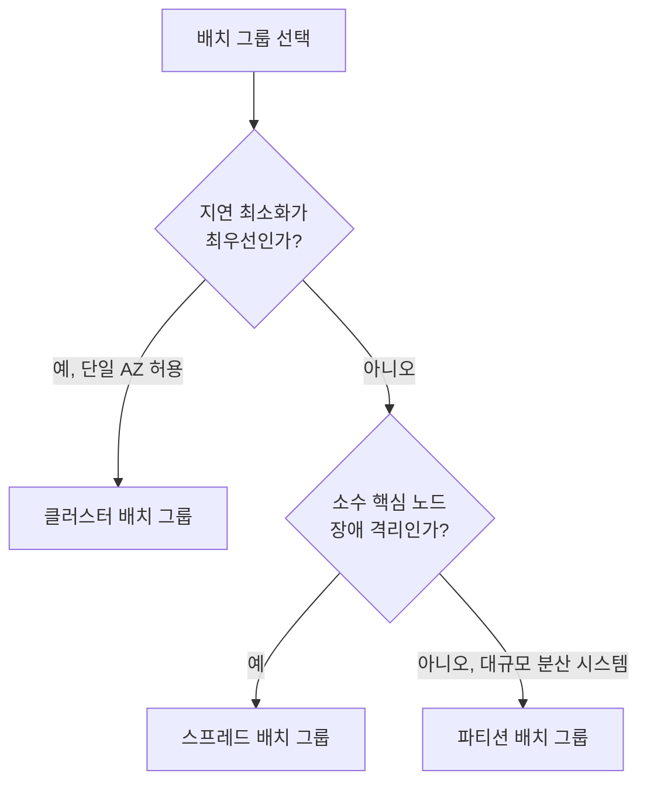

### 15.7 EC2 베스트 프랙티스

#### 접근

인스턴스에 대한 접근은 IAM 정책으로 **최소 권한 원칙**을 지켜야 한다. 인스턴스를 시작·중지·종료할 수 있는 권한과 인스턴스 내부에 로그인할 수 있는 권한(SSH 키, Session Manager 권한)을 분리해서 부여한다. SSH 키를 인스턴스마다 공유하기보다 AWS Systems Manager Session Manager를 사용하면 키 관리 부담과 22번 포트 개방 필요성이 사라진다. **OS와 애플리케이션 패치는 공동 책임 모델상 고객 책임**이다 — AWS는 하이퍼바이저 이하를 관리하지만, 게스트 OS의 보안 패치는 EC2를 사용하는 순간부터 고객이 직접 관리해야 하므로 SSM Patch Manager 등으로 패치 파이프라인을 구축해야 한다.

#### 스토리지

인스턴스 스토어와 EBS의 특성 차이(15.4절)를 기준으로 휘발성 데이터와 영속 데이터를 구분해 배치한다. OS 볼륨과 데이터 볼륨을 분리하면 AMI 갱신, 스냅샷 주기, 장애 복구 절차가 각각 독립적으로 관리되어 운영이 단순해진다.

#### 리소스 관리

인스턴스 메타데이터는 IMDSv2 강제와 홉 제한 1로 SSRF 위험을 차단한다(15.5절). 태그 전략(Department/Environment 등)을 조직 표준으로 정하고 필수화(예: 태그 없는 리소스 생성을 막는 SCP)해 비용 배분·자동화·감사가 가능하게 만든다.

#### 한도 관리

리전별 인스턴스 타입군당 vCPU 기반 할당량(Service Quotas)이 존재한다. 대규모 배포나 오토스케일링 최대치 설정 전에 Service Quotas 콘솔에서 현재 한도를 확인하고, 필요하면 사전에 한도 증가를 요청해야 트래픽 급증 시 인스턴스 시작 실패를 막을 수 있다. 정확한 한도 값은 계정·리전별로 다르므로 항상 Service Quotas 문서/콘솔로 확인한다.

#### 백업·스냅샷·복구

AMI(전체 이미지 백업)와 EBS 스냅샷(볼륨 단위 백업)을 조합해 복구 전략을 세운다. **Amazon Data Lifecycle Manager(DLM)**로 스냅샷 생성·보관·삭제를 자동화하면 수동 스냅샷 방치를 막을 수 있다.

```json
{
  "Description": "일일 EBS 스냅샷 정책 - 매일 자정 생성, 7일 보관 후 자동 삭제",
  "State": "ENABLED",
  "ExecutionRoleArn": "arn:aws:iam::123456789012:role/AWSDataLifecycleManagerDefaultRole",
  "PolicyDetails": {
    "PolicyType": "EBS_SNAPSHOT_MANAGEMENT",
    "ResourceTypes": ["VOLUME"],
    "TargetTags": [{ "Key": "Backup", "Value": "true" }],
    "Schedules": [
      {
        "Name": "DailySnapshot",
        "CreateRule": { "Interval": 24, "IntervalUnit": "HOURS", "Times": ["00:00"] },
        "RetainRule": { "Count": 7 },
        "CopyTags": true
      }
    ]
  }
}
```

> **[주의] 스냅샷은 증분 방식으로 저장되지만 요금은 보관된 데이터 전체에 누적 부과된다.** 라이프사이클 정책 없이 방치된 오래된 스냅샷은 EC2 운영에서 가장 흔한 조용한 비용 누수 원인 중 하나다. DLM 정책으로 보관 기간을 명시하고, 정기적으로 복구 테스트(스냅샷에서 실제로 볼륨을 복원해 부팅까지 검증)를 수행해 백업이 실제로 동작하는지 확인해야 한다.

### 15.8 Compute Optimizer로 라이트사이징

**AWS Compute Optimizer**는 CloudWatch 지표(CPU 사용률, 네트워크 처리량 등)를 일정 기간(일반적으로 최근 14일 이상, 활성화하면 더 긴 기간 데이터도 활용 가능) 수집해 분석하고, 현재 인스턴스 타입이 과다 프로비저닝(over-provisioned)인지 과소 프로비저닝(under-provisioned)인지 판단해 **권장 인스턴스 유형**을 제시하는 서비스다.

라이트사이징 절차는 다음과 같이 진행한다.

1. Compute Optimizer를 계정/조직 단위로 활성화하고 충분한 관측 기간을 확보한다.
2. 권장 사항 목록에서 절감 예상액과 성능 위험도를 함께 확인한다.
3. 스테이징에서 권장 타입으로 전환 테스트를 수행한다.
4. 저트래픽 시간대에 프로덕션 일부부터 순차 전환한다.
5. 전환 후 CloudWatch로 실제 사용률 변화를 재확인하고 필요 시 재조정한다.

기본 CloudWatch 지표는 CPU 사용률까지만 제공하고 **메모리 사용률은 기본적으로 수집되지 않는다.** 메모리 병목 여부를 정확히 판단하려면 **CloudWatch Agent**를 인스턴스에 설치해 메모리·디스크 사용률 등 커스텀 지표를 CloudWatch에 전송해야 하며, Compute Optimizer도 이 메모리 지표가 있어야 더 정확한 메모리 기반 권장을 제공할 수 있다. 이 지표 없이는 CPU만 보고 잘못된 라이트사이징 결정(예: 메모리가 실제 병목인데 컴퓨트 최적화로 전환)을 내릴 위험이 있다.

구매 옵션(온디맨드/RI/Savings Plans/스팟)을 활용한 비용 최적화와 라이트사이징 루프의 전체 사이클은 → 17장 참조.

### 15장 정리

#### [필수] 반드시 알아야 할 것
1. 인스턴스 스토어의 데이터는 인스턴스 중지 또는 종료 시 소실된다. 영속이 필요한 데이터는 반드시 EBS 볼륨(또는 S3)에 둔다.
2. EC2를 사용하는 순간부터 게스트 OS와 그 위 애플리케이션의 패치는 공동 책임 모델상 고객 책임이다.
3. 인스턴스 타입은 패밀리+세대+추가 기능 코드+크기로 구성되며(예: c7gn.4xlarge), g/n/d/i/a/e 코드가 프로세서·네트워크·스토리지 특성을 나타낸다.
4. IMDSv1은 SSRF 공격으로 자격증명이 탈취될 수 있으므로 IMDSv2(토큰 기반)를 강제하고 홉 제한을 1로 설정해야 한다.
5. AMI는 리전 종속적이며 다른 리전에서 쓰려면 명시적으로 복사해야 한다.
6. Compute Optimizer의 정확한 메모리 기반 권장을 받으려면 CloudWatch Agent로 메모리 지표를 별도 수집해야 한다.

#### [팁] 실무 노하우
1. OS용 EBS와 데이터용 EBS를 분리하면 스냅샷·복구·재배포 절차가 단순해진다.
2. 인스턴스에는 액세스 키를 넣지 말고 IAM 역할(인스턴스 프로파일)을 연결해 임시 자격증명을 자동 획득·갱신하게 한다.
3. Graviton으로 전환하면 통상 동급 성능에서 비용 이점을 기대할 수 있지만, 네이티브 확장·상용 에이전트·컨테이너 이미지의 ARM64 지원을 먼저 확인해야 한다.
4. T 계열 버스터블 인스턴스는 CPU 크레딧 잔량(CloudWatch `CPUCreditBalance`)을 모니터링하고, 상시 고부하라면 Unlimited 모드보다 다른 패밀리 전환을 검토한다.
5. Department/Environment 같은 태그 표준을 조직 차원에서 강제하면 비용 배분·자동화·감사가 쉬워진다.
6. EC2 Image Builder로 골든 이미지 빌드를 파이프라인화하고 CI와 연동해 보안 패치를 정기 자동 반영한다.

#### [주의] 사고·비용·설계 함정
1. 인스턴스 스토어를 영속 데이터 저장용으로 오인해 사용하다가 중지/종료 시 전체 데이터를 잃는 사고가 실제로 발생한다. 영속이 필요하면 클러스터 복제 또는 EBS를 쓴다.
2. IMDSv1을 그대로 둔 상태에서 애플리케이션에 SSRF 취약점이 있으면 인스턴스에 붙은 IAM 역할 자격증명이 탈취될 수 있다.
3. 인스턴스 세대·크기 변경(중지 필요)이 인스턴스 ID에 묶인 자동화 스크립트나 모니터링 설정을 깨뜨릴 수 있으므로 태그 기반 자동화로 설계해야 한다.
4. 스냅샷은 증분 저장이지만 요금은 보관 데이터 전체에 누적된다. 라이프사이클 정책(DLM) 없이 방치된 스냅샷은 흔한 비용 누수 1위 원인이다.
5. 리전별 인스턴스 타입 할당량(Service Quotas)을 사전 확인하지 않으면 트래픽 급증 시 인스턴스 시작이 실패할 수 있다.
6. 배치 그룹 전략을 워크로드 특성과 맞지 않게 선택하면(예: 소수 핵심 노드에 클러스터 배치) 오히려 장애 격리 실패로 이어진다.

#### 한 장 요약
EC2 인스턴스 선택은 워크로드의 CPU/메모리/네트워크/가속기 병목을 파악하는 데서 시작하며, 인스턴스 타입명의 패밀리·세대·추가 코드 체계를 읽을 줄 알아야 한다. 인스턴스 스토어의 휘발성과 EBS의 영속성 차이, IMDSv2 강제를 통한 메타데이터 보안은 이 장에서 가장 중요한 안전장치다. Graviton 전환과 Image Builder 파이프라인, DLM 스냅샷 정책, Compute Optimizer 라이트사이징은 비용과 운영 효율을 함께 잡는 실무 도구다.

#### 다음 장 예고
16장에서는 Auto Scaling Group과 4종의 로드밸런서(CLB/ALB/NLB/GWLB)를 다루며, 이 장에서 다룬 개별 인스턴스 운영 지식을 다수 인스턴스의 확장과 트래픽 분산으로 확장한다.

---

## 16장. 확장과 부하 분산 ★★★

> **이 장에서 다루는 것**
> 15장에서 다룬 EC2 인스턴스 한 대는 결국 용량 한계와 단일 장애점을 갖는다. 이 장은 인스턴스 집합을 수요에 맞춰 자동으로 늘리고 줄이는 **Auto Scaling Group(ASG)**과, 그 집합 앞에서 트래픽을 분산하는 **Elastic Load Balancing(ELB)**의 4가지 유형을 다룬다. 스케일링 정책을 어떤 지표로 어떻게 설계하는지, ELB 중 어떤 것을 언제 선택하는지, 그리고 두 서비스를 결합할 때 흔히 빠지는 함정(교체 폭주, 스케일 인 중 커넥션 끊김)까지 실무 관점에서 정리한다.
> 10장~14장의 VPC·서브넷·보안 그룹 지식과 15장의 인스턴스·AMI 지식을 전제로 한다. 배포 전략(블루/그린·카나리)은 37장, 컴퓨트 구매 옵션(스팟·RI)은 17장, 큐 기반 부하 평준화와 예측 스케일링 심화는 47장에서 이어받는다.

### 16.1 Auto Scaling Group

ASG는 지정된 조건에 따라 EC2 인스턴스 수를 자동으로 늘리거나 줄이는 논리적 그룹이다. 인스턴스를 개별로 관리하는 대신 "이 그룹은 항상 이 범위의 용량을 유지해야 한다"는 선언을 AWS에 맡기는 것이 핵심 발상이다.

**시작 템플릿(Launch Template) vs 시작 구성(Launch Configuration)**: 두 가지 모두 ASG가 새 인스턴스를 만들 때 사용할 AMI, 인스턴스 타입, 키 페어, 보안 그룹, 사용자 데이터 등을 정의하는 템플릿이다. 시작 구성은 한 번 만들면 수정이 불가능해 변경할 때마다 새로 만들어야 하고, 버전 관리도 없으며, 혼합 인스턴스 정책이나 스팟 옵션 같은 최신 기능을 지원하지 않는다. 시작 템플릿은 **버전 관리**(v1, v2, ... 및 기본 버전 지정)를 지원하고, 온디맨드/스팟 혼합, 다중 인스턴스 타입, 최신 EC2 기능(Nitro Enclaves 등)까지 포괄한다.

**한 줄 결정 기준**: 신규 구축은 예외 없이 시작 템플릿을 사용한다. 시작 구성은 레거시 스택 유지보수 목적으로만 남아 있다고 간주한다.

**용량 파라미터**는 세 개의 숫자로 표현된다.

| 파라미터 | 의미 |
|---|---|
| 최소(Minimum) | 어떤 상황에서도 유지할 최소 인스턴스 수 |
| 희망(Desired) | 정상 상태에서 유지하려는 목표 인스턴스 수 |
| 최대(Maximum) | 스케일 아웃이 도달할 수 있는 상한 |

스케일링 정책은 항상 희망 용량을 조정하는 방식으로 동작하며, ASG는 그 값을 최소~최대 범위 안에서 강제한다. 최대치를 너무 낮게 잡으면 트래픽 급증 시 스케일 아웃이 상한에 막혀 장애로 이어지고, 너무 높게 잡으면 설정 오류나 폭주 시 과금이 걷잡을 수 없이 커질 수 있다. 최대 용량은 반드시 계정의 EC2 인스턴스 한도(서비스 할당량)와 맞춰 사전 점검해야 한다.

**ASG 헬스체크 유형**은 인스턴스가 "정상"인지 판단하는 기준을 결정한다.

| 헬스체크 유형 | 판단 기준 | 특징 |
|---|---|---|
| EC2 | 인스턴스 상태 확인(시스템/인스턴스 상태 점검) | 기본값. OS·네트워크 계층 장애만 감지, 애플리케이션 장애는 못 잡음 |
| ELB | 연결된 대상 그룹의 헬스체크 결과 | 애플리케이션 계층(HTTP 응답 코드 등) 장애까지 감지 |
| 사용자 지정(Custom) | 외부 시스템이 `SetInstanceHealth` API로 직접 상태 통보 | 자체 헬스 판단 로직(배치 작업 완료 여부 등)이 있을 때 |

**한 줄 결정 기준**: ELB와 연동하는 웹 계층 ASG는 반드시 ELB 헬스체크를 켠다. EC2 헬스체크만으로는 프로세스는 죽었지만 OS는 살아 있는 상태(예: 애플리케이션 크래시)를 놓친다.

**AZ 간 균형 유지**: ASG는 기본적으로 지정된 서브넷들의 가용 영역(AZ)에 인스턴스를 고르게 분산 배치한다. 한 AZ에 장애가 발생해도 나머지 AZ의 인스턴스가 트래픽을 흡수하도록 최소 2개 이상의 AZ에 서브넷을 지정하는 것이 원칙이다. AZ 재조정(rebalancing) 기능이 켜져 있으면, 특정 AZ의 인스턴스가 비정상적으로 적어질 때 ASG가 자동으로 인스턴스를 재분배한다.

**혼합 인스턴스 정책(Mixed Instances Policy)**은 하나의 ASG 안에서 여러 인스턴스 타입과 구매 옵션을 함께 사용하는 설정이다. 온디맨드 기반 용량(base)을 먼저 채우고, 그 이상은 온디맨드/스팟 비율(예: 온디맨드 30% + 스팟 70%)로 채우는 방식을 지정할 수 있다. 스팟 배분 전략(용량 최적화, 가격 최적화 등)을 함께 지정해 스팟 회수 위험을 분산시킨다. 이를 통해 비용 절감(스팟)과 안정성(온디맨드 기반 용량) 사이의 균형을 그룹 수준에서 자동화할 수 있다(→ 스팟 인스턴스 상세는 17장 참조).

다음은 시작 템플릿과 혼합 인스턴스 정책을 포함한 CloudFormation 예시다.

```yaml
# 시작 템플릿 + 혼합 인스턴스 정책(온디맨드 기반 2대 + 나머지는 온디맨드:스팟 = 2:8)
Resources:
  WebLaunchTemplate:
    Type: AWS::EC2::LaunchTemplate
    Properties:
      LaunchTemplateName: web-app-lt
      LaunchTemplateData:
        ImageId: ami-0abcd1234efgh5678   # 골든 AMI(→ 15장 AMI 파이프라인 참조)
        InstanceType: m6g.large
        SecurityGroupIds:
          - sg-0123456789abcdef0
        IamInstanceProfile:
          Name: web-app-instance-profile
        UserData:
          Fn::Base64: |
            #!/bin/bash
            /opt/app/bootstrap.sh   # 부팅 시간 단축을 위해 골든 AMI에 대부분의 설치를 미리 반영

  WebASG:
    Type: AWS::AutoScaling::AutoScalingGroup
    Properties:
      MinSize: 2
      DesiredCapacity: 4
      MaxSize: 20
      VPCZoneIdentifier:
        - subnet-0a1b2c3d4e5f60001   # ap-northeast-2a 프라이빗 서브넷
        - subnet-0a1b2c3d4e5f60002   # ap-northeast-2c 프라이빗 서브넷
      HealthCheckType: ELB
      HealthCheckGracePeriod: 120
      TargetGroupARNs:
        - !Ref WebTargetGroup
      MixedInstancesPolicy:
        LaunchTemplate:
          LaunchTemplateSpecification:
            LaunchTemplateId: !Ref WebLaunchTemplate
            Version: !GetAtt WebLaunchTemplate.LatestVersionNumber
          Overrides:
            - InstanceType: m6g.large
            - InstanceType: m6i.large
        InstancesDistribution:
          OnDemandBaseCapacity: 2        # 최소 2대는 항상 온디맨드로 확보
          OnDemandPercentageAboveBaseCapacity: 20   # 기반 초과분은 온디맨드 20% : 스팟 80%
          SpotAllocationStrategy: capacity-optimized
```

### 16.2 스케일링 정책 5종

ASG는 다섯 가지 방식으로 희망 용량을 조정한다. 각 정책은 서로 배타적이지 않으며, 실제 운영에서는 여러 정책을 조합하는 경우가 많다.

| 정책 | 동작 방식 | 적합한 상황 |
|---|---|---|
| 타깃 트래킹(Target Tracking) | 지표를 목표값에 맞추도록 자동으로 스케일 인/아웃 폭 계산 | 가장 단순하고 예측 가능한 워크로드. 기본 선택지 |
| 단계(Step) | 경보 임계값 초과 정도에 따라 조정 폭을 계단식으로 차등 적용 | 부하 급증 정도에 비례해 더 공격적으로 반응하고 싶을 때 |
| 단순(Simple) | 경보 하나에 고정된 조정값 하나만 적용 | 레거시 설정. 세밀한 제어가 필요 없는 단순 케이스 |
| 예측(Predictive) | 과거 트래픽 패턴을 머신러닝으로 학습해 사전에 용량을 조정 | 주기적(요일·시간대별) 패턴이 뚜렷한 트래픽 |
| 예약(Scheduled) | 지정한 시각에 최소/희망/최대 값을 직접 변경 | 이벤트·세일 등 시점이 미리 확정된 트래픽 |

**한 줄 결정 기준**: 기본값은 타깃 트래킹으로 시작하고, 트래픽 급증 시점을 안다면 예약 스케일링을 겹쳐 쓰며, 반복되는 요일별 패턴이 데이터로 확인되면 예측 스케일링을 추가한다.

**지표 선택**이 스케일링 품질을 좌우한다. CPU 사용률은 가장 흔히 쓰이지만, I/O 바운드 워크로드나 커넥션 풀이 병목인 애플리케이션에서는 실제 부하를 반영하지 못하는 경우가 많다. 다음 지표들이 더 정확한 신호를 준다.

- **RequestCountPerTarget**: ALB 대상 그룹 단위로 인스턴스 한 대가 처리하는 초당 요청 수. 웹 계층에서 CPU보다 실제 처리 능력을 잘 반영하는 경우가 많다.
- **큐 깊이(ApproximateNumberOfMessagesVisible)**: SQS 대기열에 쌓인 메시지 수. 워커(consumer) 계층의 처리 지연을 직접 반영한다.
- **커스텀 지표**: CloudWatch에 애플리케이션이 직접 게시하는 지표(예: 활성 세션 수, 처리 대기 작업 수).

**큐 기반 스케일링 계산식 예시**: 워커 한 대가 초당 처리 가능한 메시지 수(처리량, P)와 목표 대기 시간(T초 이내 처리)을 알면, 필요한 인스턴스 수는 다음과 같이 근사한다.

```
목표 백로그/인스턴스 = P × T
필요 인스턴스 수 = ApproximateNumberOfMessagesVisible ÷ 목표 백로그/인스턴스
```

예를 들어 워커 한 대가 초당 10건을 처리하고(P=10) 메시지가 30초 이내 처리되길 원한다면(T=30) 목표 백로그/인스턴스는 300건이다. 큐에 3,000건이 쌓여 있다면 필요 인스턴스는 10대다. 이 값을 커스텀 지표(백로그 per 인스턴스)로 CloudWatch에 게시하고 타깃 트래킹 정책의 목표값으로 설정하면, ASG가 큐 길이에 비례해 자동으로 확장·축소한다.

다음은 ALB `RequestCountPerTarget`을 목표로 하는 타깃 트래킹 정책 JSON이다.

```json
{
  "TargetValue": 1000.0,
  "PredefinedMetricSpecification": {
    "PredefinedMetricType": "ALBRequestCountPerTarget",
    "ResourceLabel": "app/web-alb/1234567890abcdef/targetgroup/web-tg/abcdef1234567890"
  },
  "DisableScaleIn": false,
  "EstimatedInstanceWarmup": 180
}
```

### 16.3 워밍업·쿨다운·인스턴스 리프레시·수명주기 훅

**기본 인스턴스 워밍업(Default Instance Warmup)**은 그룹 수준 설정으로, 새 인스턴스가 시작된 뒤 실제로 트래픽을 받을 준비가 될 때까지 걸리는 시간을 ASG에 알려준다. 이 값을 실측하지 않고 너무 짧게 두면, 아직 부팅 중인 인스턴스의 지표(예: 낮은 CPU)가 스케일링 계산에 섞여 들어가 불필요한 추가 스케일 아웃이 발생하거나, 반대로 워밍업 중인 인스턴스가 헬스체크를 통과하기 전에 트래픽을 받아 오류율이 튄다.

**스케일 인 보호(Scale-in Protection)**는 특정 인스턴스를 스케일 인 대상에서 제외하는 기능이다. 배치 작업을 처리 중인 인스턴스나, 방금 스케일 아웃되어 워밍업 중인 인스턴스를 보호할 때 사용한다.

**종료 정책(Termination Policy)**은 스케일 인 시 어떤 인스턴스를 먼저 없앨지 결정하는 규칙이다. 기본 정책은 여러 AZ 간 균형을 유지하면서 가장 오래된 시작 템플릿 버전을 쓰는 인스턴스, 다음으로 다음 청구 주기에 가장 가까운 인스턴스 순으로 종료 대상을 고른다. `OldestInstance`, `NewestInstance`, `ClosestToNextInstanceHour` 등으로 커스터마이즈할 수 있다.

**수명주기 훅(Lifecycle Hook)**은 인스턴스가 `Pending`(시작 중)에서 `InService`(서비스 중)로, 또는 `Terminating`(종료 중)에서 실제 종료로 넘어가기 전에 대기 상태를 만들어 커스텀 작업을 끼워 넣는 기능이다. 스케일 인 시 가장 중요한 용도는 **우아한 종료(graceful shutdown)**다 — 로드밸런서에서 등록을 해제하고 진행 중인 요청이 끝날 때까지 드레이닝을 기다린 뒤, 로그를 S3로 플러시하고, 마지막에 인스턴스 종료를 완료(`CompleteLifecycleAction`)하도록 Lambda나 SSM 자동화 문서를 연결한다. 훅을 걸어두지 않으면 진행 중인 요청이 강제로 끊기거나 로그가 유실될 수 있다.

```python
# 수명주기 훅(EventBridge → Lambda)으로 종료 전 드레이닝·로그 플러시를 처리하는 골자
import boto3

autoscaling = boto3.client("autoscaling")

def handler(event, context):
    detail = event["detail"]
    instance_id = detail["EC2InstanceId"]
    hook_name = detail["LifecycleHookName"]
    asg_name = detail["AutoScalingGroupName"]

    # 1. 애플리케이션에 드레이닝 신호 전달 (예: SSM Run Command로 SIGTERM 유사 처리)
    drain_connections(instance_id)
    # 2. 로컬 로그를 S3로 플러시
    flush_logs_to_s3(instance_id)

    # 3. 훅 완료를 알려 실제 종료를 진행시킴 (호출하지 않으면 타임아웃까지 대기 후 강제 진행)
    autoscaling.complete_lifecycle_action(
        LifecycleHookName=hook_name,
        AutoScalingGroupName=asg_name,
        LifecycleActionResult="CONTINUE",
        InstanceId=instance_id,
    )
```

**인스턴스 리프레시(Instance Refresh)**는 시작 템플릿의 새 버전(새 AMI 등)을 그룹 전체에 롤링 방식으로 반영하는 기능이다. **최소 정상 비율(Minimum Healthy Percentage)**을 지정하면 리프레시 도중에도 그 비율 이상의 정상 인스턴스를 항상 유지하도록 배치 크기를 자동 계산한다. **체크포인트**를 설정하면 전체 인스턴스의 일정 비율만 먼저 교체한 뒤 일시 정지해, 문제가 없는지 확인하고 수동으로 계속 진행할 수 있다. 이는 사실상 ASG 수준의 롤링 배포이며, CodeDeploy 기반 블루/그린 배포와는 다른 메커니즘이다(→ 배포 전략 전반은 37장 참조).

### 16.4 ELB 4종: CLB / ALB / NLB / GWLB

Elastic Load Balancing은 트래픽을 여러 대상에 분산하는 관리형 서비스로, 계층(OSI 레이어)과 목적에 따라 4가지 유형으로 나뉜다.

| 유형 | 계층 | 프로토콜 | 핵심 특징 | 대상 유형 |
|---|---|---|---|---|
| **ALB**(Application LB) | L7 | HTTP/HTTPS/gRPC | 경로·호스트·헤더 기반 라우팅, WAF 연동 | instance, ip, Lambda |
| **NLB**(Network LB) | L4 | TCP/UDP/TLS | 초저지연·초고성능, AZ별 고정 IP/EIP, 클라이언트 IP 보존 | instance, ip, ALB(NLB의 대상으로 ALB 지정 가능) |
| **GWLB**(Gateway LB) | L3/L4(GENEVE 캡슐화) | IP 패킷 | 방화벽·IDS/IPS 등 어플라이언스를 트래픽 경로에 투명하게 삽입 | ip, instance(GWLB 엔드포인트 경유) |
| **CLB**(Classic LB) | L4/L7 혼합 | HTTP/HTTPS/TCP | 레거시. EC2-Classic 시절 산물, 신규 기능 미지원 | instance |

**ALB(Application Load Balancer)**는 HTTP/HTTPS 트래픽의 내용(경로, 호스트 헤더, HTTP 헤더, 쿼리스트링 등)을 보고 라우팅 결정을 내리는 L7 로드밸런서다. 마이크로서비스별로 경로(`/api/*`, `/static/*`)나 호스트명(`api.example.com`, `admin.example.com`)에 따라 서로 다른 대상 그룹으로 트래픽을 나눌 수 있어, 여러 애플리케이션을 하나의 로드밸런서 뒤에 통합하는 데 적합하다.

**NLB(Network Load Balancer)**는 TCP/UDP/TLS 트래픽을 극히 낮은 지연 시간과 높은 처리량으로 처리하는 L4 로드밸런서다. 콘텐츠를 들여다보지 않고 패킷을 그대로 전달하는 방식에 가까워 성능이 뛰어나며, 각 AZ마다 고정된 IP(또는 사용자가 지정한 Elastic IP)를 부여받을 수 있어 방화벽 화이트리스트를 IP 기반으로 운영해야 하는 환경에 적합하다. 클라이언트의 원본 IP를 대상까지 보존하는 것도 특징이다(ALB는 `X-Forwarded-For` 헤더로 전달, NLB는 프로토콜 자체에서 보존).

**GWLB(Gateway Load Balancer)**는 방화벽, 침입 탐지/방지 시스템(IDS/IPS) 같은 **제3자 가상 어플라이언스를 트래픽 경로에 투명하게 삽입**하기 위한 서비스다. **GENEVE(포트 6081)** 프로토콜로 원본 패킷을 캡슐화해 어플라이언스 집합으로 전달하고, 검사를 마친 트래픽을 다시 원래 경로로 돌려보낸다. VPC에서는 **GWLB 엔드포인트**를 라우팅 테이블에 걸어 트래픽을 어플라이언스 계층으로 투명하게 우회시킨다.

**CLB(Classic Load Balancer)**는 가장 오래된 세대로, 대상 그룹 개념이 없고 하나의 로드밸런서에 인스턴스를 직접 등록하는 방식이다. 신규 아키텍처에서는 사용하지 않으며, 레거시 스택을 마이그레이션할 때만 마주친다.

**대상 유형(Target Type)**은 로드밸런서가 트래픽을 전달하는 대상의 형태를 결정한다.

| 대상 유형 | 설명 |
|---|---|
| instance | EC2 인스턴스 ID로 등록. ASG와 자동 연동하기 쉬움 |
| ip | 사설 IP 주소로 등록. VPC 피어링 너머 대상, 온프레미스 대상(하이브리드), 컨테이너(ECS 태스크당 IP)에 사용 |
| lambda | Lambda 함수를 대상으로 등록(ALB만 지원). 함수 호출을 HTTP 엔드포인트처럼 노출 |
| ALB(NLB의 대상) | NLB 뒤에 ALB를 두어, 고정 IP는 NLB로 받고 L7 라우팅은 ALB로 처리하는 조합 구성 |

**한 줄 결정 기준**: 일반 웹/모바일 백엔드는 ALB, 극한의 성능·고정 IP·비HTTP 프로토콜이 필요하면 NLB, 트래픽 검사용 어플라이언스를 투명하게 넣어야 하면 GWLB, 그 외에는 CLB를 신규로 선택하지 않는다.

### 16.5 리스너 규칙, 타깃 그룹, 라우팅 규칙

**리스너(Listener)**는 로드밸런서가 특정 프로토콜·포트로 연결을 확인하는 설정이다. 각 리스너에는 하나 이상의 **규칙(Rule)**이 있고, 규칙마다 **우선순위(Priority)**가 있어 숫자가 낮을수록 먼저 평가된다. 규칙은 조건에 맞으면 지정된 동작을 실행하고, 어떤 규칙에도 맞지 않으면 기본 동작(default action)이 적용된다.

**조건(Condition)**은 ALB 리스너 규칙에서 다음과 같은 요소를 조합할 수 있다.

- 호스트 헤더(host-header): `api.example.com`
- 경로(path-pattern): `/orders/*`
- HTTP 헤더(http-header): 커스텀 헤더 값
- 쿼리스트링(query-string): 쿼리 파라미터 값
- 소스 IP(source-ip): 클라이언트 IP 대역
- HTTP 메서드(http-request-method): GET/POST 등

**액션(Action)**은 다음을 지원한다.

| 액션 | 동작 |
|---|---|
| forward | 하나 또는 여러 대상 그룹으로 전달(가중치 지정 가능) |
| redirect | HTTP 301/302로 다른 URL로 리다이렉트(HTTP→HTTPS 강제 전환 등) |
| fixed-response | 로드밸런서가 직접 고정된 상태 코드·본문을 응답(백엔드 호출 없이 점검 페이지 등) |
| authenticate-oidc / authenticate-cognito | OIDC 공급자 또는 Amazon Cognito로 사용자 인증 후 통과 |

**가중 타깃 그룹(Weighted Target Groups)**은 하나의 forward 액션 안에 여러 대상 그룹을 지정하고 각각에 가중치를 부여해 트래픽 비율을 나누는 기능이다. 신규 버전에 트래픽의 일부(예: 10%)만 흘려보내는 카나리 배포나, 구·신 버전을 점진적으로 전환하는 블루/그린 배포의 기반 메커니즘으로 쓰인다(→ 배포 전략 상세는 37장 참조).

**타깃 그룹 헬스체크**는 대상이 트래픽을 받을 준비가 됐는지 판단하는 파라미터로 구성된다.

| 파라미터 | 의미 |
|---|---|
| 간격(Interval) | 헬스체크를 보내는 주기 |
| 정상 임계값(Healthy Threshold) | 연속 성공 시 정상으로 전환하는 횟수 |
| 비정상 임계값(Unhealthy Threshold) | 연속 실패 시 비정상으로 전환하는 횟수 |
| 제한 시간(Timeout) | 응답 대기 시간 |
| 성공 코드(Success Codes) | 정상으로 간주할 HTTP 상태 코드(예: 200, 200-299) |
| 경로(Path) | 헬스체크 요청 경로 |

다음은 AWS CLI로 호스트 기반 라우팅 규칙과 리다이렉트 규칙을 생성하는 예시다.

```bash
# 우선순위 10: api.example.com 호스트는 api-tg로 forward
aws elbv2 create-rule \
  --listener-arn arn:aws:elasticloadbalancing:ap-northeast-2:123456789012:listener/app/web-alb/1234567890abcdef/abcdef1234567890 \
  --priority 10 \
  --conditions Field=host-header,Values='api.example.com' \
  --actions Type=forward,TargetGroupArn=arn:aws:elasticloadbalancing:ap-northeast-2:123456789012:targetgroup/api-tg/abcdef1234567890

# 우선순위 20: /admin/* 경로는 IP 대역 제한 + 관리자 타깃 그룹으로 forward
aws elbv2 create-rule \
  --listener-arn arn:aws:elasticloadbalancing:ap-northeast-2:123456789012:listener/app/web-alb/1234567890abcdef/abcdef1234567890 \
  --priority 20 \
  --conditions '[{"Field":"path-pattern","Values":["/admin/*"]},{"Field":"source-ip","SourceIpConfig":{"Values":["203.0.113.0/24"]}}]' \
  --actions Type=forward,TargetGroupArn=arn:aws:elasticloadbalancing:ap-northeast-2:123456789012:targetgroup/admin-tg/abcdef1234567890

# 우선순위 5: HTTP(80) 요청은 전부 HTTPS(443)로 리다이렉트
aws elbv2 create-rule \
  --listener-arn arn:aws:elasticloadbalancing:ap-northeast-2:123456789012:listener/app/web-alb/1234567890abcdef/httpport80 \
  --priority 5 \
  --conditions Field=path-pattern,Values='/*' \
  --actions Type=redirect,RedirectConfig='{"Protocol":"HTTPS","Port":"443","StatusCode":"HTTP_301"}'
```

### 16.6 스티키 세션, 커넥션 드레이닝, 크로스존 밸런싱

**스티키 세션(Sticky Session)**은 같은 클라이언트의 요청을 계속 같은 대상으로 보내는 기능이다. ALB는 두 방식을 지원한다.

- **로드밸런서 쿠키(Duration-Based)**: ALB가 자체 쿠키(`AWSALB`)를 발급해 세션을 고정. 애플리케이션 수정 없이 사용 가능.
- **애플리케이션 쿠키(Application-Based)**: 애플리케이션이 발급하는 쿠키를 ALB가 참조해 세션을 고정. 애플리케이션이 세션 쿠키 이름을 명시적으로 지정해야 함.

NLB에는 쿠키 기반 스티키 세션 개념이 없는 대신, **플로우 스티키니스(Flow Stickiness)**로 동일한 5-튜플(출발지/목적지 IP·포트, 프로토콜)의 커넥션을 항상 같은 대상으로 유지한다. 스티키 세션은 특정 대상에 트래픽이 쏠려 부하 분산 효율을 떨어뜨릴 수 있으므로, 세션을 ElastiCache나 DynamoDB로 외부화해 무상태 아키텍처를 만드는 것이 근본적으로 더 나은 해법이다(→ 오토스케일링 전제 조건은 16.8절 참조).

**커넥션 드레이닝(Connection Draining, ALB/NLB에서는 등록 취소 지연(Deregistration Delay)이라 부름)**은 대상이 등록 취소(비정상 판정, 또는 스케일 인)되기 전, 진행 중인 요청이 끝날 때까지 유예 시간을 주는 기능이다. 이 시간이 지나도 끝나지 않은 연결은 강제 종료된다. 유예 시간을 너무 짧게 두면 긴 요청이 중간에 끊기고, 너무 길게 두면 스케일 인이 지연돼 비용 절감 효과가 떨어진다.

**크로스존 로드밸런싱(Cross-Zone Load Balancing)**은 각 AZ의 로드밸런서 노드가 자신이 속한 AZ의 대상뿐 아니라 **다른 AZ의 대상에게도** 트래픽을 분산할지를 결정한다. 이 설정은 서비스 유형에 따라 기본값과 과금 방식이 다르다는 점을 정확히 알아야 한다.

| 로드밸런서 | 기본값 | 활성화 시 비용 |
|---|---|---|
| ALB | **기본 활성화**, 항상 켜짐 | 별도 요금 없음 |
| NLB | **기본 비활성화** | 활성화 시 AZ 간 데이터 전송 요금 발생 |
| GWLB | 리소스 구성에 따름(콘솔/문서 확인) | 활성화 시 AZ 간 전송 요금 발생 가능 |

**한 줄 결정 기준**: 각 AZ의 대상 수가 고르지 않다면(예: 한 AZ에만 인스턴스가 몰림) 크로스존을 켜서 부하 쏠림을 막아야 하지만, NLB에서는 그 대가로 AZ 간 전송 요금이 발생한다는 점을 비용 검토에 반드시 포함해야 한다. 각 AZ에 인스턴스 수를 고르게 유지할 수 있다면(ASG의 AZ 균형 유지 기능을 그대로 사용) NLB의 크로스존은 끈 채로 둬도 무방하다.

### 16.7 유스케이스별 ELB 선택 표

실제 설계에서 자주 등장하는 시나리오별로 어떤 로드밸런서를 선택해야 하는지 정리한다.

| 유스케이스 | 권장 ELB | 이유 |
|---|---|---|
| 일반 웹앱(HTTP/HTTPS) | ALB | 경로·호스트 기반 라우팅, WAF 통합 |
| gRPC 서비스 | ALB | HTTP/2 기반 gRPC 라우팅을 네이티브 지원 |
| WebSocket | ALB | 장기 연결을 유지하며 L7 라우팅 가능 |
| 온라인 게임(UDP) | NLB | UDP 프로토콜은 NLB만 지원 |
| 고정 IP/화이트리스트 요구 | NLB | AZ별 고정 IP, EIP 연결 가능 |
| mTLS(상호 TLS 인증) | NLB(TLS 리스너, 백엔드에서 클라이언트 인증서 검증) 또는 ALB(리스너 mTLS 지원 확인) | 구성 방식은 대상 애플리케이션의 인증서 검증 위치에 따라 다르므로 최신 문서 확인 필요 |
| IoT MQTT | NLB(TCP) | 지속 연결·저지연 TCP 트래픽에 적합 |
| 어플라이언스 트래픽 검사(방화벽/IDS) | GWLB | GENEVE 캡슐화로 어플라이언스 계층 투명 삽입 |
| 매우 높은 처리량의 내부 마이크로서비스 통신 | NLB | L4 극저지연·고처리량 |
| Lambda 기반 서버리스 API(HTTP) | ALB(Lambda 대상) | 함수 호출을 HTTP 인터페이스로 노출 |
| 레거시 EC2-Classic 마이그레이션 과도기 | CLB(단, 신규 설계엔 배제) | 기존 CLB 구성을 유지해야 하는 특수 상황 |
| TLS 종료를 대상에서 직접 수행해야 하는 규제 요구 | NLB(TCP passthrough) | 로드밸런서가 암호를 해독하지 않고 그대로 전달 |

**한 줄 결정 기준**: 트래픽 내용을 보고 라우팅해야 하면 ALB, 프로토콜·성능·고정 IP가 우선이면 NLB, 어플라이언스 삽입이 목적이면 GWLB를 선택한다.

### 16.8 오토스케일링 가이던스 — 무엇을 지표로 삼을 것인가

오토스케일링이 실제로 효과를 내려면 다음 원칙을 지켜야 한다.

**무상태화가 전제 조건이다.** 세션 상태를 인스턴스 로컬에 저장하면 특정 인스턴스가 종료될 때 사용자 세션이 유실된다. ElastiCache나 DynamoDB에 세션을 외부화해야 어떤 인스턴스가 죽거나 늘어나도 문제가 없다.

**부팅 시간을 줄여야 스케일 아웃이 트래픽을 따라잡는다.** 인스턴스가 시작된 뒤 애플리케이션 설치·설정에 수 분이 걸리면, 트래픽 급증 시점에 새 인스턴스가 준비되기 전에 기존 인스턴스가 과부하로 무너질 수 있다. 골든 AMI(애플리케이션과 런타임을 미리 구운 이미지, → 15장 AMI 파이프라인 참조)나 컨테이너화로 부팅 시간을 초 단위로 줄이는 것이 핵심 대응책이다.

**스케일 아웃은 공격적으로, 스케일 인은 보수적으로.** 용량 부족은 즉시 오류·지연으로 사용자에게 노출되지만, 용량 과잉은 비용 손실일 뿐 서비스 품질에는 영향이 없다. 따라서 스케일 아웃 임계값과 쿨다운은 짧게, 스케일 인은 임계값을 넉넉히 두고 쿨다운도 길게 잡아 요동(flapping)을 방지한다.

**급증 트래픽에는 오토스케일링만으로 부족하다.** 반응형 스케일링은 지표가 임계값을 넘고, 경보가 울리고, 새 인스턴스가 부팅되는 시간만큼 항상 뒤늦게 반응한다. 이벤트나 프로모션처럼 시점을 미리 아는 트래픽 급증에는 예약 스케일링으로 사전에 용량을 올려두고, 예측 불가능한 순간 폭주에는 SQS 같은 큐로 요청을 완충해 워커가 자신의 처리 속도에 맞춰 소비하도록 설계한다(→ 큐 기반 부하 평준화 패턴은 47장 참조).

**DB를 헬스체크에 넣으면 교체 폭주(thrashing)의 함정에 빠진다.** 헬스체크 경로가 데이터베이스 연결까지 확인하도록 만들면, DB 자체에 장애나 지연이 생겼을 때 정상인 애플리케이션 인스턴스들까지 일제히 비정상 판정을 받는다. ASG는 이를 인스턴스 문제로 오인해 정상 인스턴스를 계속 교체하며, 교체된 새 인스턴스 역시 같은 DB 장애 때문에 다시 비정상 판정을 받는 악순환(thrashing)이 발생해 오히려 장애를 증폭시킨다. **얕은 헬스체크**(프로세스가 응답하는지만 확인)를 ASG/ELB 헬스체크로 쓰고, DB 연결 상태 같은 **깊은 헬스체크**는 별도의 모니터링·알람 경로로 분리해야 한다.

**최대 용량 상한과 서비스 한도를 함께 검토한다.** ASG의 최대 용량을 계정의 EC2 인스턴스 한도보다 높게 설정해도 실제로는 한도에 막혀 스케일 아웃이 실패한다. 최대 트래픽을 감당할 용량을 계산한 뒤, 해당 리전·인스턴스 패밀리의 서비스 할당량을 사전에 상향 신청해야 한다(정확한 기본 한도는 서비스 할당량 콘솔에서 항상 확인).

다음 다이어그램은 정상 요청 흐름과, 지표를 기반으로 스케일링이 결정되는 루프를 각각 나타낸다.

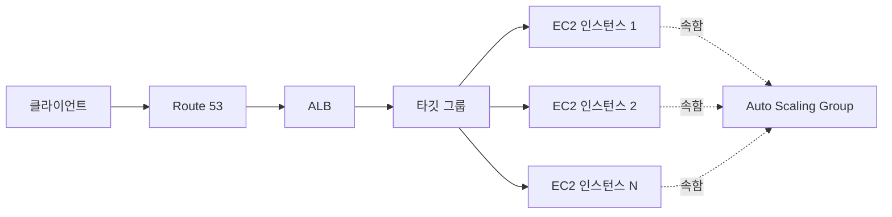

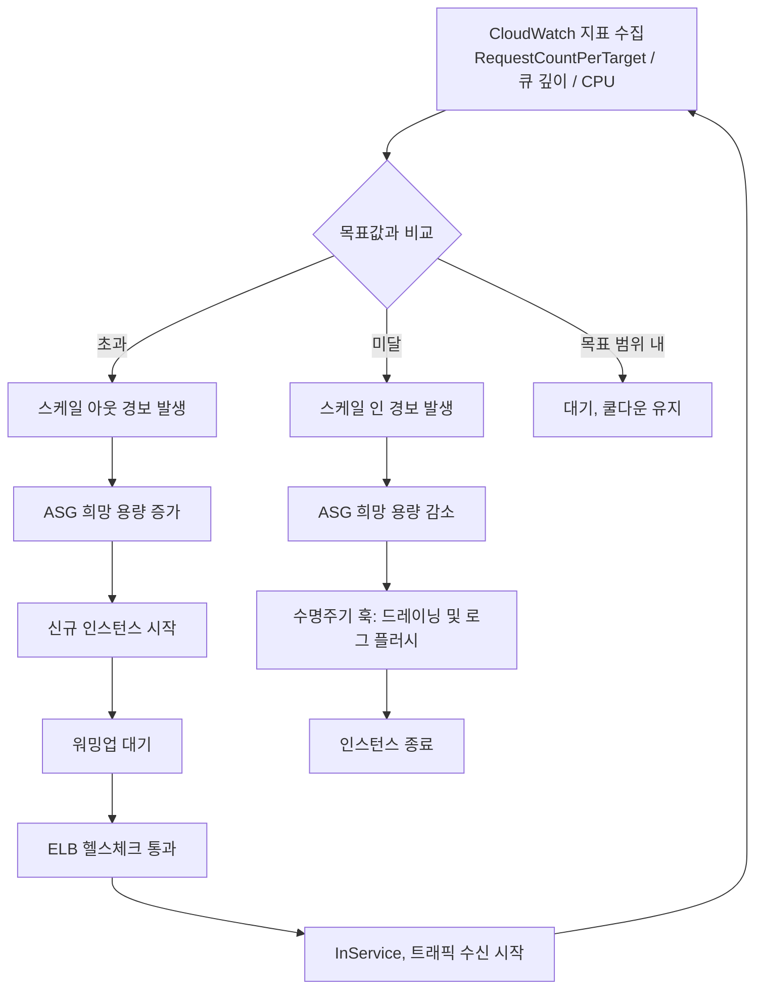

### 16장 정리

#### [필수] 반드시 알아야 할 것
1. ALB는 L7(HTTP/HTTPS, gRPC, 경로·호스트·헤더 기반 라우팅), NLB는 L4(TCP/UDP/TLS, 초고성능, AZ별 고정 IP), GWLB는 GENEVE로 어플라이언스를 투명하게 삽입하는 용도다. CLB는 레거시로 신규 설계에서 배제한다.
2. 오토스케일링이 제대로 동작하려면 애플리케이션이 무상태여야 한다. 세션은 ElastiCache나 DynamoDB로 외부화한다.
3. ASG 용량은 최소/희망/최대 세 값으로 표현되며, 스케일링 정책은 항상 희망 용량을 조정하는 방식으로 동작한다. 최대치는 EC2 서비스 한도와 함께 검토해야 한다.
4. ASG 헬스체크는 EC2(인스턴스 상태만), ELB(애플리케이션 계층까지), 사용자 지정(외부 판정) 세 유형이 있으며 ELB 뒤에 있는 그룹은 ELB 헬스체크를 써야 애플리케이션 장애를 감지한다.
5. 크로스존 로드밸런싱은 ALB가 기본 활성(요금 없음), NLB가 기본 비활성(활성화 시 AZ 간 전송 요금 발생)이라는 차이를 정확히 구분해야 한다.
6. 수명주기 훅은 스케일 인 시 드레이닝·로그 플러시 등 우아한 종료를, 인스턴스 리프레시는 최소 정상 비율·체크포인트를 지정한 AMI 롤링 교체를 담당한다.
7. 스케일링 정책은 타깃 트래킹/단계/단순/예측/예약 5종이며, 지표로는 CPU보다 RequestCountPerTarget이나 큐 깊이가 실제 부하를 더 정확히 반영하는 경우가 많다.
8. 시작 템플릿은 시작 구성의 상위 호환이며, 혼합 인스턴스 정책으로 온디맨드 기반 용량과 스팟 비율을 함께 지정할 수 있다.

#### [팁] 실무 노하우
1. 신규 ASG는 예외 없이 시작 템플릿을 사용한다. 시작 구성은 버전 관리도, 혼합 인스턴스 정책도 지원하지 않는다.
2. 스케일링 지표는 CPU보다 요청 수/타깃 또는 큐 깊이를 우선 검토한다. 타깃 트래킹을 기본 정책으로 두고, 예측 가능한 트래픽에는 예약 스케일링을 겹쳐 쓴다.
3. 인스턴스 워밍업 시간을 실측해 그룹 수준에 반영하지 않으면 스케일 아웃이 트래픽을 따라잡지 못한다. 부팅 시간이 길면 골든 AMI나 컨테이너화로 줄인다.
4. 스케일 아웃은 짧은 쿨다운·낮은 임계값으로 공격적으로, 스케일 인은 긴 쿨다운·넉넉한 임계값으로 보수적으로 설정해 요동을 방지한다.
5. 각 AZ의 대상 수가 고르지 않다면 크로스존 밸런싱을 켜서 쏠림을 막되, NLB에서는 그 대가로 발생하는 AZ 간 전송 요금을 비용 계산에 포함한다.
6. 헬스체크는 얕은 체크(프로세스 응답 여부)와 깊은 체크(DB 연결 등)를 분리해서 운영한다.
7. 큐 기반 워커는 백로그/인스턴스를 커스텀 지표로 게시해 타깃 트래킹 목표값으로 사용하면 CPU보다 정확하게 확장·축소된다.

#### [주의] 사고·비용·설계 함정
1. 헬스체크 경로가 DB를 확인하면, DB 장애가 정상 인스턴스까지 연쇄적으로 교체시키는 폭주(thrashing)를 유발해 오히려 장애를 증폭시킨다.
2. 스케일 인 정책이 지나치게 공격적이면 처리 중인 요청이 강제로 끊긴다. 등록 취소 지연(커넥션 드레이닝)과 수명주기 훅으로 우아한 종료를 반드시 보장해야 한다.
3. 급증(스파이크) 트래픽에는 오토스케일링의 반응 지연(지표 수집→경보→부팅)이 항상 뒤따른다. 사전 예약 스케일링과 큐 기반 부하 평준화를 함께 설계해야 한다.
4. 최대 용량을 계정의 EC2 서비스 한도보다 높게 잡아도 실제 한도에 막혀 스케일 아웃이 실패할 수 있다. 사전에 할당량을 확인·상향 신청한다.
5. NLB에서 크로스존 밸런싱을 무심코 켜면 AZ 간 데이터 전송 요금이 예상치 못하게 늘어난다. ALB는 기본 활성이라 별도 비용 없이 쓸 수 있는 것과 대비된다.
6. 스티키 세션에 의존하면 특정 대상에 트래픽이 쏠려 부하 분산 효율이 떨어지고, 그 인스턴스가 스케일 인되면 세션이 유실된다. 세션 외부화가 근본 해법이다.
7. 시작 구성으로 만든 오래된 ASG를 방치하면 최신 인스턴스 세대·혼합 인스턴스 정책 등 신규 기능을 전혀 활용할 수 없다.
8. 인스턴스 리프레시 중 최소 정상 비율을 너무 낮게 설정하면, 배치 크기가 커져 한 번에 너무 많은 인스턴스가 교체되며 순간적으로 처리 용량이 급감할 수 있다.

#### 한 장 요약
ASG는 시작 템플릿을 기반으로 최소/희망/최대 용량과 헬스체크·혼합 인스턴스 정책을 조합해 인스턴스 집합을 자동으로 유지·조정한다. 스케일링 정책은 타깃 트래킹을 기본으로 하되 CPU보다 요청 수나 큐 깊이 같은 실제 부하 지표를 우선한다. ELB는 ALB(L7)·NLB(L4)·GWLB(어플라이언스 삽입)·CLB(레거시) 네 유형으로 나뉘며, 리스너 규칙·타깃 그룹 헬스체크·크로스존 밸런싱 설정이 실제 트래픽 분산 품질을 결정한다. 우아한 종료(수명주기 훅·드레이닝)와 얕은/깊은 헬스체크 분리는 오토스케일링을 사고 없이 운영하는 핵심 원칙이다.

#### 다음 장 예고
17장에서는 온디맨드·예약 인스턴스·Savings Plans·스팟 인스턴스 등 컴퓨트 구매 옵션을 비교하며, 이 장에서 다룬 혼합 인스턴스 정책의 스팟 비율 설계를 비용 관점에서 더 깊이 다룬다.

---

## 17장. 구매 옵션과 컴퓨트 비용 ★★★

> **이 장에서 다루는 것**
> 15장에서 인스턴스를, 16장에서 그 인스턴스를 자동으로 늘리고 줄이는 방법을 다뤘다. 이 장은 "그 인스턴스를 얼마에 사는가"를 다룬다. 온디맨드·예약 인스턴스(RI)·Savings Plans·스팟·전용 호스트라는 서로 다른 가격·유연성·중단 위험 조합을 이해하고, 워크로드 성격에 맞게 조합해 컴퓨트 비용을 구조적으로 낮추는 것이 목표다. 스팟 아키텍처 설계, 커밋 커버리지 관리, 라이트사이징까지 이어서 다룬다.
> 15장(EC2 인스턴스)과 16장(ASG·혼합 인스턴스 정책)의 지식을 전제로 한다. Fargate·Lambda의 요금 구조는 18장, EKS·Karpenter의 스팟 통합은 19장, FinOps 전반(태깅·쇼백·단위 경제학)은 40장에서 별도로 다룬다.

### 17.1 온디맨드 · 예약 인스턴스 · Savings Plans · 스팟 · 전용 호스트

EC2 요금은 단일 가격이 아니라 **약정(commitment)과 중단 허용도를 대가로 할인율이 달라지는 다층 구조**다. 왜 이런 구조가 필요한가부터 보자. AWS 입장에서 유휴 용량은 손실이고, 몇 년 단위로 특정 규모의 사용을 약속하는 고객이나 언제든 회수 가능한 용량을 써 주는 고객은 AWS의 용량 계획을 돕는다. 그 대가로 할인을 주는 것이 구매 옵션 체계의 본질이다.

**온디맨드(On-Demand)** 는 약정 없이 초 단위(또는 서비스별 최소 단위) 사용량만큼 표준 요금을 내는 기본 방식이다. 유연성은 최대지만 할인은 없다. 워크로드 패턴을 아직 모르는 신규 서비스, 짧은 실험, 트래픽 변동의 최상단(peak)을 흡수하는 용도에 적합하다.

**예약 인스턴스(Reserved Instances, RI)** 는 특정 인스턴스 패밀리·리전(또는 특정 AZ)에 대해 1년 또는 3년을 약정하고 할인을 받는 방식이다. 두 축으로 나뉜다.

- **Standard RI vs Convertible RI**: Standard RI는 할인율이 가장 높지만 인스턴스 패밀리·OS·테넌시를 계약 기간 중 바꿀 수 없다(단, 크기 유연성은 같은 패밀리 내에서 일부 적용된다). Convertible RI는 할인율이 조금 낮은 대신, 계약 기간 중 다른 인스턴스 패밀리나 세대로 **교환**할 수 있어 아키텍처가 바뀔 가능성이 있는 워크로드에 안전판이 된다.
- **1년 vs 3년**: 약정 기간이 길수록 할인율이 커진다. 3년 약정은 클라우드 도입 초기의 유연성 이점을 스스로 깎아 먹을 수 있으므로, 아키텍처가 안정된 이후에 접근하는 것이 원칙이다.
- **선결제 방식 3종**: 전액 선결제(All Upfront, 할인율 최고), 일부 선결제(Partial Upfront, 절반 정도 선결제 + 월별 잔액), 선결제 없음(No Upfront, 월별 정액 청구). 선결제 비중이 클수록 할인율이 커지지만 초기 현금 유출과 환불 불가 리스크가 커진다.
- **리전 RI vs 영역(Zonal) RI**: 리전 RI는 리전 내 어떤 AZ에서 실행되든 요금 할인이 적용되지만 **용량을 보장하지 않는다**. 영역 RI는 특정 AZ를 지정하는 대신 그 AZ에 대한 **용량 예약 효과**를 함께 얻는다 — 즉 해당 AZ에서 인스턴스 유형의 용량이 부족한 시점에도 시작이 보장된다. 특정 AZ에 용량이 부족해질 위험이 있는 인기 인스턴스 타입(GPU 계열 등)을 쓴다면 영역 RI를 고려한다.

**Savings Plans(SP)** 는 RI보다 유연한 커밋 방식으로, "특정 인스턴스"가 아니라 **시간당 사용 금액(USD/hour)** 을 1년 또는 3년 약정한다. 세 종류가 있다.

| 종류 | 적용 범위 | 유연성 | 할인율 |
|---|---|---|---|
| Compute Savings Plans | EC2(모든 인스턴스 패밀리·크기·OS·리전) + **AWS Fargate** + **AWS Lambda** | 가장 높음. 인스턴스 패밀리·리전·컴퓨트 서비스를 자유롭게 변경 가능 | 세 종류 중 가장 낮음 |
| EC2 Instance Savings Plans | 특정 리전의 특정 인스턴스 패밀리 | 같은 패밀리 내 크기·OS·테넌시 변경은 자유 | Compute SP보다 높음 |
| SageMaker Savings Plans | Amazon SageMaker 추론·노트북 등 컴퓨트 | ML 워크로드 전용 | 별도 산정 |

**Compute Savings Plans가 EC2뿐 아니라 Fargate와 Lambda에도 적용된다**는 점은 실무에서 자주 간과된다. 컨테이너·서버리스로 점진 전환 중인 조직이라면, EC2 전용으로 좁게 커밋하는 EC2 Instance SP보다 Compute SP로 커밋해 두는 편이 아키텍처 변화에 대한 안전판이 된다. 반대로 이미 특정 인스턴스 패밀리로 워크로드가 고정돼 있고 최대 할인이 목표라면 EC2 Instance SP가 유리하다.

**스팟 인스턴스(Spot Instance)** 는 AWS의 여유 용량을 최대 90%까지 할인된 가격으로 빌리는 방식이다. 대신 AWS가 그 용량을 회수해야 할 때 **2분의 사전 알림**만 주고 인스턴스를 중단시킬 수 있다(중단 처리는 17.2절에서 자세히 다룬다). 약정이 전혀 없고 언제든 시작·해지가 자유롭지만, 중단 위험을 아키텍처로 흡수할 수 있는 워크로드에만 적합하다.

**전용 인스턴스(Dedicated Instances)와 전용 호스트(Dedicated Hosts)** 는 하드웨어 격리가 필요할 때 쓴다. 전용 인스턴스는 물리 서버를 계정 전용으로 격리하되 어떤 물리 서버인지는 AWS가 관리한다. 전용 호스트는 물리 서버 자체를 통째로 할당받아 소켓·코어·물리 서버 ID까지 파악할 수 있다. 전용 호스트가 필요한 대표 사유는 **BYOL(Bring Your Own License)** — 이미 보유한 Windows Server, SQL Server, 일부 상용 소프트웨어의 소켓/코어 기반 라이선스를 클라우드로 그대로 이전하는 경우다. 대부분의 라이선스 조건은 물리 서버 단위 결속을 요구하므로 전용 호스트 없이는 컴플라이언스 위반이 될 수 있다.

**온디맨드 용량 예약(On-Demand Capacity Reservation, ODCR)** 은 할인과 무관하게 **특정 AZ에 특정 인스턴스 타입의 용량 확보만을 목적**으로 하는 기능이다. 요금 할인을 받으려는 것이 아니라, 재해복구 훈련이나 대규모 이벤트 대비처럼 "그 시점에 반드시 그 인스턴스가 뜰 수 있어야 한다"는 요구를 충족한다. ODCR 자체는 온디맨드 요금이 그대로 부과되며, RI나 SP와 결합해 할인을 받을 수도 있다. **Capacity Blocks for ML** 은 GPU 인스턴스(P/Trn 계열 등)를 특정 미래 기간 동안 블록 단위로 예약하는 변형으로, 단기간 집중적인 대규모 학습 작업에 필요한 용량을 사전 확보하는 용도다.

**구매 옵션 비교표**

| 옵션 | 할인폭 | 유연성 | 약정 기간 | 중단 위험 | 적용 범위 |
|---|---|---|---|---|---|
| 온디맨드 | 없음(기준) | 최고 | 없음 | 없음 | EC2/Fargate/Lambda 전반 |
| Standard RI | 높음 | 낮음(패밀리 고정) | 1·3년 | 없음(용량 예약 시) | EC2(리전 또는 특정 AZ) |
| Convertible RI | 중상 | 중간(패밀리 교환 가능) | 1·3년 | 없음 | EC2 |
| Compute Savings Plans | 중간 | 최고(서비스 간 이동 가능) | 1·3년 | 없음 | EC2 + Fargate + Lambda |
| EC2 Instance SP | 중상 | 중간(패밀리 내 자유) | 1·3년 | 없음 | 특정 리전·패밀리 |
| 스팟 | 최고(최대 ~90%) | 높음(약정 없음) | 없음 | 높음(2분 알림 후 회수) | EC2, EKS/ECS 태스크 등 |
| 전용 호스트 | 없음~일부 | 낮음 | 온디맨드/RI 결합 가능 | 없음 | 라이선스 결속 워크로드 |
| ODCR / Capacity Blocks | 없음(용량 목적) | 낮음(특정 AZ·타입 고정) | 필요 기간만 | 없음 | 용량 확보가 목적인 경우 |

**한 줄 결정 기준**: 언제 실행될지 예측 가능하고 오래 유지될 기저 부하는 RI/SP로 커밋하고, 중단을 감내할 수 있는 워크로드는 스팟으로 돌리고, 나머지 변동분은 온디맨드로 흡수한다 — 이것이 이른바 **3층 구조(three-tier purchasing)** 원칙이다.

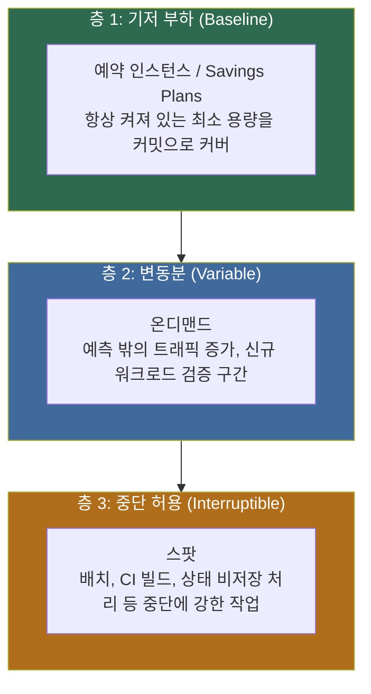

이 3층 구조를 지표로 관리하는 방법은 17.3절에서 커버리지·활용률로 이어진다.

### 17.2 스팟 인스턴스 아키텍처

스팟을 "싸지만 언제 죽을지 모르는 인스턴스"로만 이해하면 잘못 설계하기 쉽다. 스팟은 **회수 확률을 구조적으로 낮추는 설계**가 전제될 때만 프로덕션 수준의 신뢰성을 낼 수 있다.

**스팟 가격 모델**: 과거 스팟 가격은 실시간 입찰 방식으로 변동성이 컸지만, 현재는 수요·공급에 따라 **완만하게 변동**하는 모델로 바뀌었다. 급격한 가격 스파이크로 인한 예측 불가능한 중단보다는, 특정 인스턴스 풀의 여유 용량이 줄어들 때 발생하는 회수가 실무에서 더 중요한 변수다. 가격 자체는 온디맨드 대비 할인율로 참고하되, 절대 수치는 항상 최신 콘솔/가격 페이지에서 확인해야 한다.

**중단 처리의 두 가지 신호**는 성격이 다르다.

- **스팟 중단 알림(Spot Interruption Notice)**: AWS가 실제로 인스턴스를 회수하기 **약 2분 전**에 보내는 신호다. EventBridge 이벤트로 수신하거나, 인스턴스 내부에서 IMDS(인스턴스 메타데이터 서비스)를 폴링해 감지할 수 있다. 이 2분 안에 체크포인트 저장, 진행 중인 작업 드레이닝, 로드밸런서 대상 그룹에서 제외 등을 마쳐야 한다.
- **재조정 권고(Rebalance Recommendation)**: 실제 회수가 아직 결정되지 않았지만 해당 인스턴스가 회수될 위험이 높아졌다는 **사전 경고성 신호**다. 2분 알림보다 먼저 오는 경우가 많아, 더 여유 있게 신규 인스턴스를 미리 띄우고 트래픽을 옮기는 선제 대응이 가능하다.

두 신호 모두를 처리하지 않고 2분 알림만 처리하면, 재조정 권고가 주는 여유 시간을 놓치게 된다.

**중단 처리 패턴**은 워크로드 유형에 따라 다르다.

- **체크포인트(Checkpoint)**: 배치·ML 학습처럼 오래 걸리는 작업은 주기적으로 중간 상태를 S3나 EBS 스냅샷에 저장해, 중단되더라도 처음부터 다시 시작하지 않도록 한다.
- **드레이닝(Draining)**: 웹·API 서버라면 알림 수신 즉시 로드밸런서 대상 그룹에서 제외하고 진행 중인 요청만 마무리한 뒤 종료한다. ECS/EKS는 이 과정을 각각 캐패시티 공급자(capacity provider)와 노드 종료 핸들러로 상당 부분 자동화한다.
- **작업 재큐잉(Requeueing)**: SQS 등 큐 기반 워커는 메시지 가시성 제한 시간(visibility timeout) 안에 처리를 못 마치면 메시지가 자동으로 큐에 돌아가 다른 워커가 재처리하도록 설계한다. 이 경우 스팟 중단은 재시도 로직으로 자연스럽게 흡수된다.

**용량 최적화 할당 전략**은 EC2 Fleet/Spot Fleet, ASG 혼합 인스턴스 정책에서 지정하는 스팟 인스턴스 배분 방식이다.

| 전략 | 동작 | 적합한 경우 |
|---|---|---|
| lowest-price | 가장 저렴한 풀에서만 시작 | 중단에 매우 강한 워크로드(단순 배치) |
| capacity-optimized | 회수 확률이 가장 낮은(용량이 가장 여유로운) 풀 우선 | 중단 최소화가 우선인 대부분의 워크로드 |
| price-capacity-optimized | 용량 여유를 우선 고려하되 그중 저렴한 풀 선택 | capacity-optimized의 안정성 + 비용 절감을 함께 원할 때 |
| diversified | 지정된 풀들에 고르게 분산 | 풀 간 균형 배치가 목적일 때 |

**한 줄 결정 기준**: 특별한 이유가 없다면 기본값으로 price-capacity-optimized를 쓴다. 최저가만 쫓는 lowest-price는 회수 폭탄으로 이어지기 쉽다.

**인스턴스 타입·AZ 다양화는 선택이 아니라 필수**다. 스팟 풀은 "인스턴스 타입 × AZ" 조합 단위로 별도의 여유 용량을 갖는다. 단일 인스턴스 타입, 단일 AZ로 스팟 플릿을 구성하면 그 풀의 용량이 줄어드는 순간 전체가 한꺼번에 회수된다. 실무적으로는 **비슷한 사양의 인스턴스 타입을 6종 이상, 최소 2~3개 AZ**에 걸쳐 지정하는 것을 권장한다(정확한 권장 종수는 워크로드 규모에 따라 다르므로 실측으로 조정한다). ASG 혼합 인스턴스 정책에서 인스턴스 타입 목록을 넉넉히 지정하고 가중치(weighted capacity)를 함께 설정하면, 서로 다른 크기의 인스턴스를 섞어도 용량 단위가 일관되게 유지된다.

**스팟이 맞는 워크로드**: 배치 처리(야간 정산, ETL), CI/CD 빌드 러너, 빅데이터 처리(EMR, Spark), 상태 비저장 웹 서버 중 일부 계층(자동 확장으로 흡수 가능한 범위), 컨테이너 오케스트레이션의 태스크 노드(ECS 캐패시티 공급자, EKS 워커 노드 — → 19장 Karpenter 참조), 렌더링·시뮬레이션.

**스팟이 안 맞는 워크로드**: 단일 인스턴스로만 운영되는 상태 저장 서비스(세션 어피니티에 의존하는 레거시 애플리케이션), 트랜잭션 무결성이 즉시 중단으로 깨지는 작업, 라이선스가 물리 서버에 결속된 워크로드(전용 호스트 영역), SLA상 중단이 전혀 허용되지 않는 실시간 제어 시스템.

**오케스트레이션 도구**: EC2 Fleet과 Spot Fleet은 여러 인스턴스 타입·구매 옵션을 조합해 목표 용량을 유지하는 저수준 API다(신규 설계에서는 ASG의 혼합 인스턴스 정책으로 통합하는 편이 일반적이다). ASG 혼합 인스턴스 정책은 16장에서 다룬 대로 온디맨드 기반 용량과 스팟 배분 비율을 함께 관리한다. EKS 환경에서는 **Karpenter**가 파드 요구사항에 맞춰 인스턴스 타입·구매 옵션을 실시간으로 선택해 스팟 활용을 자동화한다(→ 19장 참조).

다음은 스팟 중단 알림을 EventBridge 규칙으로 감지해 Lambda로 처리하는 예시다.

```yaml
# 스팟 중단 알림 + 재조정 권고를 모두 EventBridge로 수신해 Lambda로 전달
Resources:
  SpotInterruptionRule:
    Type: AWS::Events::Rule
    Properties:
      Name: spot-interruption-and-rebalance
      EventPattern:
        source:
          - "aws.ec2"
        detail-type:
          - "EC2 Spot Instance Interruption Warning"   # 2분 전 회수 예고
          - "EC2 Instance Rebalance Recommendation"     # 회수 위험 상승 사전 신호
      Targets:
        - Arn: !GetAtt DrainHandlerFunction.Arn
          Id: drain-handler
  DrainHandlerPermission:
    Type: AWS::Lambda::Permission
    Properties:
      FunctionName: !Ref DrainHandlerFunction
      Action: lambda:InvokeFunction
      Principal: events.amazonaws.com
      SourceArn: !GetAtt SpotInterruptionRule.Arn
```

```python
# DrainHandlerFunction: 중단 대상 인스턴스를 대상 그룹에서 즉시 제외
import boto3

elbv2 = boto3.client("elbv2")
asg = boto3.client("autoscaling")

def handler(event, context):
    detail = event["detail"]
    instance_id = detail["instance-id"]
    # 재조정 권고와 중단 알림 모두 동일하게 드레이닝 시작
    # 대상 그룹에서 먼저 제외해 신규 트래픽 유입을 막고, 기존 연결은 드레이닝 타임아웃 동안 유지
    asg.set_instance_health(
        InstanceId=instance_id,
        HealthStatus="Unhealthy",
        ShouldRespectGracePeriod=False,
    )
    print(f"instance {instance_id} marked unhealthy for graceful drain")
```

인스턴스 내부에서 IMDS를 폴링해 감지하는 방법도 함께 알아 둔다.

```bash
# 인스턴스 내부에서 5초 간격으로 중단 알림 여부를 폴링(EventBridge를 못 쓰는 환경의 대안)
while true; do
  STATUS=$(curl -s -o /dev/null -w "%{http_code}" \
    http://169.254.169.254/latest/meta-data/spot/instance-action)
  if [ "$STATUS" -eq 200 ]; then
    echo "중단 예고 수신, 드레이닝 시작"
    /opt/app/graceful-shutdown.sh
    break
  fi
  sleep 5
done
```

### 17.3 Savings Plans vs RI 선택과 커버리지 관리

RI와 SP 중 무엇을 살지는 "얼마나 유연해야 하는가"의 문제다. 워크로드가 이미 특정 인스턴스 패밀리·리전에 오래 고정돼 있고 최대 할인이 목표라면 Standard RI(또는 EC2 Instance SP)가 유리하다. 아키텍처가 계속 바뀌거나 EC2·Fargate·Lambda를 섞어 쓰는 조직이라면 Compute Savings Plans가 관리 부담과 락인 위험을 동시에 줄인다. RI의 영역 예약 효과가 필요한 특수 사례(GPU 등 인기 인스턴스의 용량 확보)를 빼면, 최근 신규 구축에서는 SP가 기본 선택지로 자리 잡는 경우가 많다. 다음 표는 선택 시점에 실무에서 실제로 부딪히는 질문을 기준으로 정리한 것이다.

| 상황 | 권장 커밋 | 이유 |
|---|---|---|
| 인스턴스 패밀리·리전이 이미 고정, 최대 할인이 최우선 | Standard RI (가능하면 영역 RI) | 유연성을 포기하는 대신 할인율이 가장 높다 |
| 아키텍처가 아직 유동적, 패밀리 세대 교체 가능성 있음 | Convertible RI 또는 EC2 Instance SP | 세대·패밀리 변경 여지를 남긴다 |
| EC2 · Fargate · Lambda를 함께 운영하거나 전환 중 | Compute Savings Plans | 서비스 간 이동에도 커밋이 그대로 유효 |
| GPU 등 특정 AZ 용량 확보가 관건 | 영역 RI 또는 ODCR | 할인보다 "그 시점에 뜰 수 있는가"가 우선 |
| 신규 서비스, 트래픽 패턴 미확정 | 온디맨드 유지, 커밋 보류 | 최소 관측 기간을 채운 뒤 판단 |

**한 줄 결정 기준**: 관리 인력과 도구가 부족한 조직일수록 세분화된 RI보다 관리 단위가 단순한 Compute Savings Plans로 시작하고, 특정 인스턴스 패밀리로 사용량이 안정된 이후에만 RI로 세밀하게 옮겨 간다.

**커버리지(Coverage)와 활용률(Utilization)** 은 서로 다른 지표다. 커버리지는 "전체 컴퓨트 사용량 중 커밋(RI/SP)으로 충당된 비율"이고, 활용률은 "구매한 커밋 중 실제로 소비된 비율"이다. 커버리지가 낮으면 온디맨드 비중이 커서 비용 절감 여지가 남아 있다는 뜻이고, 활용률이 낮으면 커밋을 샀지만 다 못 쓰고 있다는(돈을 버리고 있다는) 뜻이다. 두 지표는 항상 함께 봐야 한다 — 커버리지만 높이려고 무리하게 커밋을 늘리면 활용률이 떨어지는 역효과가 난다.

**목표치 설정**: 일반적으로 예측 가능한 기저 부하의 70~80% 수준을 커밋으로 채우고, 나머지 20~30%는 온디맨드·스팟 조합으로 남겨 트래픽 변동에 대한 완충 여력을 확보하는 방식이 널리 쓰인다. 다만 이 비율은 조직의 트래픽 변동성과 리스크 허용도에 따라 조정해야 하는 값이며, 정답이 정해져 있는 것은 아니다.

**Cost Explorer 권장 사항** 활용은 실무에서 가장 손쉬운 출발점이다. AWS Cost Explorer는 과거 사용 이력(일반적으로 최근 며칠~몇 주 데이터)을 분석해 RI/Savings Plans 구매 권장안을 자동으로 제시한다. 권장안은 참고 자료로 쓰되, 계절성이 있는 워크로드(연말 성수기 등)는 짧은 관측 기간만으로는 왜곡될 수 있다는 점을 감안해야 한다.

```bash
# Savings Plans 커버리지 조회: 최근 30일간 컴퓨트 사용량 중 SP로 커버된 비율 확인
aws ce get-savings-plans-coverage \
  --time-period Start=2026-08-01,End=2026-08-31 \
  --granularity MONTHLY

# Savings Plans 구매 권장 사항 조회: 1년 약정, 부분 선결제 기준 추천안
aws ce get-savings-plans-purchase-recommendation \
  --savings-plans-type COMPUTE_SP \
  --term-in-years ONE_YEAR \
  --payment-option PARTIAL_UPFRONT \
  --lookback-period-in-days SIXTY_DAYS
```

**만료 관리와 롤링 커밋(계단식 갱신)**: 모든 커밋을 같은 날짜에 만료되도록 한꺼번에 구매하면, 재계약 시점에 시장 조건이나 요구사항이 바뀌었을 때 전체를 한 번에 다시 협상해야 하는 부담이 생긴다. 대신 구매 시점을 분산시켜(예: 분기마다 일부씩) 만료일도 계단식으로 흩어지도록 하면, 매번 일부만 재검토하면서 지속적으로 커버리지를 조정할 수 있다.

**조직 차원 공유**: AWS Organizations의 통합 결제(Consolidated Billing) 환경에서는 한 계정이 구매한 RI/SP 할인이 조직 내 다른 계정의 사용량에도 자동으로 적용될 수 있다(RI는 계정 간 공유 설정에 따라, SP는 기본적으로 결제 관리 계정 아래 조직 전체에 적용되는 방식이 일반적이다). 이를 활용하면 팀별로 각각 소규모 커밋을 사는 대신 조직 전체 사용량을 기준으로 커밋 규모를 정해 할인 효율을 높일 수 있다. 다만 이 경우 어느 팀이 할인 혜택을 받았는지 배분하는 쇼백(showback) 문제가 따르는데, 이는 → 40장 FinOps에서 다룬다.

**3년 선결제의 락인 위험**은 이 장 전체에서 가장 중요한 주의사항이다. 아키텍처가 아직 확정되지 않은 상태에서 3년 전액 선결제 RI를 구매하면, 이후 인스턴스 패밀리를 바꾸거나 서버리스로 전환하는 결정 자체가 "이미 산 커밋을 낭비하게 되는" 심리적·재무적 저항에 부딪힌다. 원칙적으로 **최소 6개월 이상의 실사용 데이터**를 축적해 워크로드 패턴(피크·기저·변동 폭)이 안정됐다고 확인한 뒤 장기 커밋에 들어가는 것을 권장한다. 그 전까지는 온디맨드와 1년 단위의 유연한 SP로 버티며 데이터를 쌓는 편이 장기적으로 더 저렴하다.

### 17.4 컴퓨트 라이트사이징 루프

구매 옵션 최적화가 "얼마나 싸게 사는가"라면, 라이트사이징(Right-sizing)은 "애초에 얼마나 적게 사는가"의 문제다. 두 축은 독립적이며 함께 다뤄야 컴퓨트 비용이 실질적으로 줄어든다. 라이트사이징은 한 번 하고 끝나는 프로젝트가 아니라 지속되는 루프로 운영해야 한다.


**측정(Measure)**: 표준 CloudWatch 지표는 CPU 사용률·네트워크·디스크 I/O까지는 기본 제공하지만, **메모리 사용률은 기본적으로 수집되지 않는다**. CloudWatch 에이전트를 설치해 메모리·스왑 지표를 커스텀 지표로 수집해야, CPU는 여유롭지만 메모리가 병목인 인스턴스(반대의 경우도 마찬가지)를 정확히 판단할 수 있다. 최소 2주 이상, 가급적 트래픽 성수기를 포함한 기간을 관측해야 순간적인 스파이크에 낚이지 않는다.

**권장(Recommend)**: **AWS Compute Optimizer**는 CloudWatch 지표 이력을 분석해 EC2 인스턴스, ASG, EBS 볼륨, Lambda 함수의 적정 사이즈를 추천한다. 추천 등급(과다 프로비저닝/적정/과소 프로비저닝)과 함께 예상 절감액을 제시하므로, 조직 전체 계정에서 정기적으로 리포트를 뽑아 우선순위를 정하는 출발점으로 쓴다.

**검증(Validate)**: 권장안을 그대로 적용하기 전에 반드시 부하 테스트로 실제 서비스 지표(응답 시간, 에러율)에 영향이 없는지 확인한다. Compute Optimizer의 추천은 과거 사용 패턴 기반이므로, 향후 트래픽 증가 계획이나 신규 기능으로 인한 리소스 요구 변화까지는 반영하지 못한다.

**적용(Apply)**: 검증을 통과하면 시작 템플릿의 새 버전을 만들고 ASG의 **인스턴스 리프레시(Instance Refresh)** 기능으로 기존 인스턴스를 점진적으로 신규 사양으로 교체한다(→ 16장 참조). 단일 인스턴스(ASG에 속하지 않는 경우)는 인스턴스 타입 변경 시 중지 후 재시작이 필요하므로 유지보수 시간을 계획해야 한다.

**재측정(Remeasure)**: 적용 후 다시 측정 단계로 돌아가 새 사이즈가 실제로 적정했는지 확인한다. 이 루프를 분기별 등 주기적으로 반복하는 것이 라이트사이징을 일회성 이벤트가 아닌 운영 프로세스로 만드는 핵심이다.

**Graviton 전환과의 결합**: 라이트사이징 검토 시점은 x86 인스턴스를 Arm 기반 **Graviton** 인스턴스로 전환할지 함께 판단하는 좋은 기회다. Graviton은 동급 x86 인스턴스 대비 일반적으로 가격 대비 성능이 우수하다고 알려져 있으나, 애플리케이션이 Arm 아키텍처로 재빌드 가능해야 하고 의존 라이브러리·컨테이너 베이스 이미지가 멀티 아키텍처를 지원해야 한다. 라이트사이징으로 적정 사이즈를 먼저 확정한 뒤, 같은 검증 파이프라인으로 Graviton 대안을 함께 테스트하면 전환 리스크를 줄일 수 있다.

**컨테이너·서버리스로의 이동이 라이트사이징의 최종 형태인 이유**: EC2 인스턴스 단위의 라이트사이징은 결국 "고정된 크기 중 가장 근접한 것을 고르는" 이산적인(discrete) 최적화다. 반면 Fargate나 Lambda는 CPU·메모리를 훨씬 더 세밀한 단위로 지정하고 실제 사용한 만큼만 과금되므로, 라이트사이징이라는 개념 자체가 사실상 자동화된다. 워크로드가 컨테이너화·이벤트 기반으로 전환될수록 라이트사이징 루프에 들이는 운영 노력은 줄어든다(→ 18장 서버리스 컴퓨트 참조).

**자동 정지와 유휴 자원 탐지**: 개발·테스트 환경은 업무 시간 외(야간·주말)에는 대부분 필요 없다. 이를 자동으로 정지·재시작하는 것만으로도 상당한 컴퓨트 비용을 줄일 수 있다. 다음은 EventBridge Scheduler와 SSM Automation을 이용한 야간 정지 예시다.

```yaml
# 개발 환경 EC2를 평일 오후 8시(KST)에 자동 정지하는 스케줄
Resources:
  NightlyStopSchedule:
    Type: AWS::Scheduler::Schedule
    Properties:
      Name: dev-env-nightly-stop
      ScheduleExpression: "cron(0 11 ? * MON-FRI *)"   # UTC 11시 = KST 20시
      FlexibleTimeWindow:
        Mode: "OFF"
      Target:
        Arn: "arn:aws:scheduler:::aws-sdk:ssm:startAutomationExecution"
        RoleArn: !GetAtt SchedulerExecutionRole.Arn
        Input:
          DocumentName: AWS-StopEC2Instance
          # 태그 기반으로 대상 인스턴스를 SSM Automation이 조회해 순차 정지
          Parameters:
            InstanceId:
              - "{{ TAG:Environment=dev }}"
```

유휴 자원 탐지는 Compute Optimizer 리포트 외에도, 태그 기준으로 최근 N일간 CPU 사용률이 임계치 이하인 인스턴스를 스캔하는 스크립트로 보완할 수 있다.

```bash
# 최근 14일 평균 CPU 사용률이 5% 미만인 인스턴스를 찾아 유휴 후보로 표시
aws cloudwatch get-metric-statistics \
  --namespace AWS/EC2 \
  --metric-name CPUUtilization \
  --dimensions Name=InstanceId,Value=i-0123456789abcdef0 \
  --start-time $(date -u -d '14 days ago' +%Y-%m-%dT%H:%M:%S) \
  --end-time $(date -u +%Y-%m-%dT%H:%M:%S) \
  --period 86400 \
  --statistics Average \
  --query 'Datapoints[?Average<`5`]'
```

이 유형의 태깅·쇼백·단위 경제학 체계를 조직 전체에 걸쳐 운영하는 방법은 → 40장 FinOps에서 이어받는다. 이 장에서는 컴퓨트 비용 자체를 줄이는 구매 옵션과 라이트사이징에 집중했다.

### 17장 정리

#### [필수] 반드시 알아야 할 것
1. 구매 옵션은 온디맨드(약정 없음) → RI/SP(장기 약정, 높은 할인) → 스팟(최대 할인, 높은 중단 위험)의 스펙트럼이며, 3층 구조(기저=커밋, 변동=온디맨드, 중단 가능=스팟)로 조합하는 것이 원칙이다.
2. RI는 Standard(고할인·저유연성)와 Convertible(저할인·패밀리 교환 가능)로 나뉘고, 리전 RI는 용량을 보장하지 않지만 영역 RI는 특정 AZ 용량 예약 효과를 함께 준다.
3. Compute Savings Plans는 EC2뿐 아니라 Fargate·Lambda에도 적용되므로, 컴퓨트 서비스 간 이동 가능성이 있는 조직에서는 EC2 Instance SP보다 유연하다.
4. 스팟 중단은 통상 2분 전 알림과, 그보다 먼저 오는 재조정 권고(rebalance recommendation) 두 신호로 안내되며, 둘 다 처리 대상이다.
5. 스팟 안정성은 인스턴스 타입·AZ 다양화와 capacity-optimized(또는 price-capacity-optimized) 할당 전략에서 나온다. 단일 타입·단일 AZ 구성은 사실상 실패 설계다.
6. ODCR과 Capacity Blocks는 할인이 아니라 특정 시점·AZ의 용량 확보가 목적이며, 온디맨드 요금이 그대로 적용된다.
7. 커버리지(사용량 중 커밋 비율)와 활용률(커밋 중 소비 비율)은 다른 지표이며 함께 관리해야 한다.
8. 라이트사이징은 측정 → 권장 → 검증 → 적용 → 재측정의 반복 루프이며, 컨테이너·서버리스 전환이 그 최종 형태다.

#### [팁] 실무 노하우
1. 아키텍처가 안정되기 전까지는 1년 단위 SP나 온디맨드로 버티고, 3년 전액 선결제는 최소 6개월의 실사용 데이터를 확보한 뒤 검토한다.
2. Cost Explorer의 RI/SP 구매 권장 사항을 출발점으로 삼되, 계절성이 있는 워크로드는 짧은 관측 기간의 권장안을 그대로 신뢰하지 않는다.
3. 커밋 구매 시점을 분산시켜(롤링 커밋) 만료일이 계단식으로 흩어지게 하면 재계약 부담을 분산할 수 있다.
4. 개발·테스트 환경은 야간·주말 자동 정지만으로도 상당한 절감 효과를 얻을 수 있다. EventBridge Scheduler + SSM Automation 조합이 대표적이다.
5. 라이트사이징 검토 시점에 Graviton 전환 가능성을 함께 검증하면 별도 프로젝트로 진행하는 것보다 효율적이다.
6. Organizations 통합 결제 환경에서는 계정별로 소규모 커밋을 따로 사기보다 조직 전체 사용량 기준으로 커밋 규모를 정해 할인 효율을 높인다.

#### [주의] 사고·비용·설계 함정
1. 스팟 중단 알림(2분)에 대한 처리 로직 없이 스팟만 도입하면 데이터 유실이나 요청 실패로 이어진다.
2. 단일 인스턴스 타입 또는 단일 AZ로 구성한 스팟 플릿은 그 풀의 용량이 줄어드는 순간 전체가 동시에 회수될 수 있다.
3. lowest-price 할당 전략만 쫓으면 저렴한 대신 회수율이 높은 풀에 몰려 오히려 안정성이 떨어진다.
4. 아키텍처 확정 전 3년 전액 선결제 RI를 구매하면 이후 최적화(인스턴스 패밀리 변경, 서버리스 전환)를 가로막는 심리적·재무적 락인이 생긴다.
5. 라이선스가 물리 서버 단위로 결속된 소프트웨어를 전용 호스트 없이 일반 EC2에서 운영하면 컴플라이언스 위반이 될 수 있다.
6. 메모리 지표를 수집하지 않고 CPU 지표만으로 라이트사이징하면, 메모리가 병목인 인스턴스를 과소 추천(다운사이징 후 장애)할 위험이 있다.
7. 커버리지만 높이려고 무리하게 커밋을 늘리면 활용률이 떨어져 오히려 비용이 증가할 수 있다.
8. Compute Optimizer의 추천은 과거 사용 패턴 기반이므로, 향후 트래픽 증가 계획을 반영하지 못한 채 그대로 적용하면 용량 부족을 부를 수 있다.

#### 한 장 요약
컴퓨트 비용은 "무엇을 사는가"(온디맨드/RI/SP/스팟/전용 호스트)와 "얼마나 사는가"(라이트사이징)라는 두 축으로 최적화한다. 구매 옵션은 약정과 중단 허용도를 대가로 할인율이 달라지는 스펙트럼이며, 기저 부하는 커밋으로, 변동분은 온디맨드로, 중단 가능한 워크로드는 스팟으로 나누는 3층 구조가 기본 전략이다. 스팟은 2분 중단 알림과 재조정 권고를 모두 처리하고 인스턴스 타입·AZ를 다양화해야 프로덕션급으로 쓸 수 있다. 커밋은 커버리지·활용률을 함께 관찰하며 6개월 이상의 실사용 데이터 없이 3년 선결제로 락인되는 것을 피해야 한다. 라이트사이징은 측정-권장-검증-적용의 루프로 상시 운영하며, 궁극적으로는 컨테이너·서버리스 전환이 이 루프 자체를 줄여준다.

#### 다음 장 예고
18장은 인스턴스 구매 옵션이라는 개념 자체가 사라지는 세계, 즉 AWS Lambda와 Fargate 같은 서버리스 컴퓨트를 다룬다. 이 장에서 언급한 Compute Savings Plans의 Fargate·Lambda 적용이 실제로 어떤 요금 구조 위에서 작동하는지 이어서 살펴본다.

---

## 18장. 서버리스 컴퓨트 ★★★

> **이 장에서 다루는 것**
> 15~17장이 "서버를 직접 관리하는" EC2 기반 컴퓨트를 다뤘다면, 이 장은 서버 관리 자체를 AWS에 넘기는 두 축 — AWS Lambda와 AWS Fargate — 를 다룬다. Lambda의 실행 모델·구성·동시성·콜드 스타트·VPC 통합을 깊이 본 뒤, Fargate로 넘어가 태스크 단위 서버리스 컨테이너를 다룬다. 마지막으로 Lambda·Fargate·EC2 중 무엇을 선택할지, 그리고 API Gateway·함수 URL·App Runner·ALB로 이들을 어떻게 외부에 노출하는지 정리한다.
> 15장(EC2)·16장(오토 스케일링)의 지식을 전제하며, 17장에서 다룬 Compute Savings Plans가 Fargate·Lambda에도 적용된다는 점은 이미 언급했으므로 이 장에서는 요금을 **과금 축(요청 수 × 메모리 × 실행 시간)** 관점으로만 다룬다. 컨테이너 오케스트레이션(ECS/EKS 위의 Fargate)은 19장에서, RDS Proxy는 25장에서 자세히 다룬다.

### 18.1 AWS Lambda 실행 모델

Lambda는 코드를 이벤트에 반응해 실행하고, 실행이 끝나면 과금도 끝나는 컴퓨트다. 서버 프로비저닝·패치·스케일링을 AWS가 맡는 대신, 함수 하나가 처리할 수 있는 요청 시간·메모리·동시성에는 명확한 한도가 있다. 이 한도를 이해하지 못하면 "왜 이 배치 작업이 Lambda에서 자꾸 타임아웃되는가" 같은 질문에 답할 수 없다.

Lambda를 호출하는 방식은 **이벤트 소스의 성격에 따라 셋으로 나뉘고, 각각 재시도·오류 처리 방식이 완전히 다르다**. 이 차이를 모르면 멱등성 설계를 어디에 넣어야 할지 판단할 수 없다.

| 호출 유형 | 대표 이벤트 소스 | 호출자의 응답 대기 | 오류 시 재시도 | 실패 시 최종 처리 |
|---|---|---|---|---|
| 동기 호출(RequestResponse) | API Gateway, ALB, 함수 URL, 다른 서비스의 동기 호출(SDK Invoke) | 대기함(응답을 반환) | 재시도 없음 — 호출자에게 오류 반환 | 호출자(클라이언트)가 재시도 책임 |
| 비동기 호출(Event) | S3 이벤트, SNS, EventBridge, CloudWatch Logs 구독 | 대기하지 않음(이벤트를 큐에 적재 후 즉시 반환) | 자동 재시도(기본 2회, 지수 백오프) | 재시도 모두 실패 시 DLQ 또는 on-failure 실패 대상(destination)으로 전달 |
| 이벤트 소스 매핑(폴링) | SQS, Kinesis Data Streams, DynamoDB Streams, Amazon MSK | Lambda 서비스가 소스를 폴링 | 배치 단위 재시도(스트림은 순서 보장을 위해 무한 재시도 가능) | 소스별로 다름 — SQS는 재시도 후 소스 큐의 redrive policy(DLQ)로, 스트림은 최대 재시도 횟수/보존 기간 만료 시 건너뛰거나 on-failure destination 사용 |

한 줄 결정 기준: 호출자가 즉시 응답을 받아야 하면 동기, "일단 받아 놓고 처리"면 비동기, 순서·배치 처리가 필요한 스트림/큐면 이벤트 소스 매핑이다.

이 표에서 보듯 비동기 호출과 이벤트 소스 매핑은 **동일 이벤트를 한 번 이상 전달할 수 있다** — Lambda의 기본 전제는 정확히 한 번(exactly-once)이 아니라 **최소 한 번(at-least-once)** 전달이다. 따라서 모든 핸들러는 같은 이벤트가 두 번 들어와도 결과가 달라지지 않도록 **멱등(idempotent)** 하게 작성해야 한다. 가장 흔한 구현은 이벤트마다 고유한 멱등 키(주문 ID, 메시지 ID 등)를 DynamoDB에 **조건부 쓰기(conditional write)** 로 먼저 기록해, 이미 처리된 키라면 두 번째 실행이 조기에 안전하게 종료되도록 하는 방식이다.

```python
# 멱등 처리: DynamoDB 조건부 쓰기로 중복 실행을 차단
import boto3
from botocore.exceptions import ClientError

idem_table = boto3.resource("dynamodb").Table("idempotency-keys")  # 핸들러 밖에서 재사용

def handler(event, context):
    idem_key = event["order_id"]  # 이벤트에서 뽑아낸 고유 식별자를 멱등 키로 사용
    try:
        # attribute_not_exists 조건 때문에 같은 키가 이미 있으면 예외가 발생한다
        idem_table.put_item(
            Item={"idempotency_key": idem_key, "status": "PROCESSING"},
            ConditionExpression="attribute_not_exists(idempotency_key)",
        )
    except ClientError as e:
        if e.response["Error"]["Code"] == "ConditionalCheckFailedException":
            return {"status": "already_processed"}  # 재시도로 인한 중복 실행 → 안전하게 스킵
        raise

    process_order(idem_key)  # 실제 비즈니스 로직(결제 처리 등)
    idem_table.update_item(
        Key={"idempotency_key": idem_key},
        UpdateExpression="SET #s = :done",
        ExpressionAttributeNames={"#s": "status"},
        ExpressionAttributeValues={":done": "COMPLETED"},
    )
    return {"status": "processed"}
```

이런 멱등 처리를 매 함수마다 직접 구현하는 대신, AWS Lambda Powertools가 제공하는 idempotency 유틸리티(DynamoDB 백엔드에 동일한 조건부 쓰기 패턴을 캡슐화)를 쓰는 것도 실무에서 널리 쓰이는 대안이다.

실행 환경의 수명주기는 **INIT → INVOKE → SHUTDOWN** 세 단계로 이루어진다. INIT 단계에서 런타임을 부팅하고 핸들러 파일을 로드하며 **핸들러 함수 밖에 작성된 코드(전역 스코프)** 를 한 번 실행한다. INVOKE 단계는 실제 요청마다 핸들러 함수를 호출하는 구간이다. AWS는 처리 효율을 위해 하나의 실행 환경(컨테이너)을 여러 번의 INVOKE에 재사용하므로, INIT에서 만든 SDK 클라이언트·DB 커넥션·설정 값은 다음 호출에서도 재사용된다. 이 재사용을 활용하지 않고 핸들러 안에서 매번 클라이언트를 새로 만드는 것은 실무에서 가장 흔한 성능 실수 중 하나다.

```python
# 안 좋은 예: 핸들러 안에서 매번 클라이언트 생성 → 매 호출마다 연결 비용 발생
def handler_bad(event, context):
    import boto3
    ddb = boto3.resource("dynamodb")
    table = ddb.Table("orders")
    return table.get_item(Key={"order_id": event["order_id"]})

# 좋은 예: 핸들러 밖(INIT 단계)에서 한 번만 생성 → 실행 환경 재사용 시 재활용
import boto3

ddb = boto3.resource("dynamodb")          # 콜드 스타트 시 1회만 실행
table = ddb.Table("orders")

def handler_good(event, context):
    return table.get_item(Key={"order_id": event["order_id"]})
```

```javascript
// Node.js도 동일한 원칙: require와 클라이언트 생성은 모듈 최상단(핸들러 밖)에서
const { DynamoDBClient } = require("@aws-sdk/client-dynamodb");
const client = new DynamoDBClient({});   // 콜드 스타트 시 1회 생성, 이후 재사용

exports.handler = async (event) => {
    // 핸들러 안에서는 이미 생성된 client만 사용
    return await client.send(/* ... */);
};
```

SHUTDOWN 단계는 실행 환경이 회수될 때(트래픽 감소, 배포, 유휴 시간 초과 등) 호출되며, 여기서 정리 작업을 할 수 있지만 보장된 실행 시간은 짧다.

**확장(Extension)** 은 Lambda 실행 환경에 추가 프로세스를 붙여 로깅·모니터링·시크릿 캐싱 등을 처리하는 메커니즘이다(내부 확장은 런타임 프로세스와 같은 프로세스, 외부 확장은 별도 프로세스로 동작). **Lambda Insights**는 AWS가 제공하는 확장으로, CPU·메모리·네트워크·콜드 스타트 여부 등 실행 환경 수준의 지표를 CloudWatch에 자동 게시해 개별 함수의 성능 이상을 진단하는 데 쓴다.

### 18.2 메모리·타임아웃·임시 스토리지·레이어·컨테이너 이미지

Lambda의 구성 축 중 가장 중요한 것은 **메모리**다. 메모리를 늘리면 그에 **비례해 vCPU와 네트워크 대역폭도 함께 늘어난다** — 이것이 왜 메모리 튜닝이 곧 성능 튜닝인지의 핵심이다. 메모리는 128MB부터 최대치(할당량 문서 확인, 일반적으로 10,240MB)까지 1MB 단위로 지정한다.

**타임아웃**은 함수 실행이 강제 종료되는 상한이며, 일반적으로 최대 15분이다(정확한 상한은 서비스 할당량 문서 확인). 이 상한을 넘는 장시간 배치·ETL은 Lambda가 아니라 Fargate, AWS Batch, Step Functions 조합으로 설계해야 한다.

**`/tmp` 임시 스토리지**는 실행 환경에 로컬로 제공되는 디스크 공간으로, 기본 512MB이며 최대 10,240MB까지 구성할 수 있다(할당량 문서 확인). 실행 환경이 재사용되는 동안에는 `/tmp`의 내용도 남아 있을 수 있지만, 이를 영속 저장소로 신뢰해서는 안 된다 — 새 실행 환경이 뜨면 비어 있는 상태로 시작한다.

**레이어(Layer)** 는 공통 라이브러리·런타임 의존성을 함수 배포 패키지와 분리해 여러 함수가 공유하도록 하는 메커니즘이다. 배포 패키지 자체를 가볍게 유지하면서 팀 표준 유틸리티를 재사용할 수 있다는 장점이 있지만, 레이어도 결국 압축 해제 시점의 코드 다운로드 비용에 포함되므로 무분별하게 쌓으면 콜드 스타트에 영향을 준다.

**컨테이너 이미지 배포**는 함수 코드를 OCI 호환 컨테이너 이미지로 패키징해 ECR에 푸시하고 Lambda가 이를 실행하는 방식이다. 압축 zip 패키지보다 큰 용량(10GB 수준, 할당량 문서 확인)을 지원하므로 ML 추론용 대형 라이브러리(예: 특정 딥러닝 프레임워크)를 포함해야 하는 함수에 적합하다. 다만 이미지가 클수록 최초 콜드 스타트 시 다운로드·언팩 비용이 커질 수 있다.

**환경 변수와 암호화**: 함수 환경 변수는 저장 시 기본적으로 AWS 관리형 키로 암호화되며, 고객 관리형 KMS 키로 교체할 수도 있다. 민감한 값(DB 비밀번호, API 키)은 환경 변수에 평문으로 두기보다 AWS Secrets Manager나 Parameter Store(SecureString)에서 실행 시점에 조회하는 편이 낫다 — 특히 환경 변수는 콘솔·API로 조회 가능한 대상에게 그대로 노출될 수 있다.

**Lambda SnapStart**는 (2026년 기준 Java 런타임 등 일부 런타임에 제공되는) 기능으로, 함수를 최초 배포/버전 발행 시점에 초기화한 뒤 그 메모리·디스크 상태를 스냅샷으로 저장해 두고, 실제 호출 시에는 스냅샷을 복원해 INIT 단계를 건너뛴다. Java처럼 JVM 부트스트랩 비용이 큰 런타임의 콜드 스타트를 크게 줄이는 효과가 있다. 스냅샷에 유일성이 있는 상태(예: 암호화 키, 커넥션 소켓)를 초기화 코드에서 만들었다면 복원 시점에 재생성하도록 콜백을 등록해야 한다는 점에 유의한다.

**ARM(Graviton) 함수**는 Lambda 함수의 아키텍처를 arm64로 선택하는 옵션이다. 일반적으로 x86_64 대비 더 나은 가격 대비 성능을 보이며, 특별히 x86 전용 바이너리 의존성이 없다면 우선 검토 대상이다.

**Power Tuning으로 메모리-비용 최적점 찾기**: Lambda 요금은 "메모리 × 실행 시간"의 곱으로 청구되지만, 메모리를 늘리면 vCPU도 늘어나 실행 시간 자체가 짧아지는 경우가 많다. 예를 들어 메모리를 2배로 늘렸을 때 실행 시간이 2배보다 더 크게 줄어든다면, "메모리 × 시간" 값은 오히려 작아져 **총비용이 내려간다**. 이 최적점은 함수마다(코드 특성·병목이 CPU인지 I/O인지에 따라) 다르므로 직관으로 추측하지 말고, AWS Lambda Power Tuning(오픈소스 Step Functions 기반 도구)으로 여러 메모리 설정에서 실제 실행 시간과 비용을 측정해 최적점을 찾는 것이 원칙이다.

```yaml
# SAM 템플릿: 메모리·타임아웃·아키텍처·환경 변수 구성 예시
AWSTemplateFormatVersion: '2010-09-09'
Transform: AWS::Serverless-2016-10-31
Resources:
  OrderProcessorFunction:
    Type: AWS::Serverless::Function
    Properties:
      CodeUri: src/order_processor/
      Handler: app.handler
      Runtime: python3.12
      Architectures: [arm64]          # Graviton — 우선 검토 대상
      MemorySize: 1024                # Power Tuning으로 실측 후 조정
      Timeout: 30
      EphemeralStorage:
        Size: 1024                    # /tmp 크기(MB)
      Environment:
        Variables:
          TABLE_NAME: orders
          SECRET_ARN: arn:aws:secretsmanager:ap-northeast-2:123456789012:secret:orders-db
      Policies:
        - DynamoDBCrudPolicy:
            TableName: orders
```

### 18.3 동시성: 예약 동시성, 프로비저닝된 동시성, 스로틀링

Lambda는 계정·리전 단위로 **동시 실행(concurrent execution)** 총량 한도를 갖는다(기본값은 서비스 할당량 문서 확인, 요청으로 상향 가능). 이 한도는 계정 안의 모든 함수가 나눠 쓰는 공유 자원이므로, 특정 함수 하나가 트래픽 급증으로 한도를 독점하면 다른 함수까지 스로틀링될 수 있다.

**예약 동시성(Reserved Concurrency)** 은 특정 함수에 동시 실행 개수의 **상한이자 보장**을 동시에 부여한다. 이 함수는 설정값 이상 동시 실행되지 않지만(상한), 계정 풀에서 그 몫만큼을 떼어 두므로 다른 함수의 폭증에 영향받지 않고 항상 그 개수만큼은 실행이 보장된다. 다운스트림 자원(RDS, 서드파티 API 등 동시 연결 수에 민감한 대상)을 보호하려는 목적으로 예약 동시성을 **의도적으로 낮게** 설정하는 패턴이 흔히 쓰인다 — Lambda가 "무한히" 확장되는 특성을 역으로 제한하는 것이다.

**프로비저닝된 동시성(Provisioned Concurrency)** 은 지정된 개수만큼 실행 환경을 **미리 INIT까지 완료한 상태로 유지**하는 기능이다. 요청이 들어오면 콜드 스타트 없이(핸들러 초기화까지 끝난 상태로) 곧바로 INVOKE만 실행하므로 지연시간이 크게 줄어든다. 다만 프로비저닝된 개수만큼은 트래픽이 없어도 계속 과금된다는 점에서 순수 종량제인 Lambda 본연의 비용 모델과 다르다.

**스로틀링(Throttling)** 은 동시 실행 한도(계정 전체 또는 예약 동시성)를 초과했을 때 발생하며, 호출 유형에 따라 동작이 다르다.

| 호출 유형 | 스로틀링 시 동작 |
|---|---|
| 동기 호출 | 즉시 HTTP 429(TooManyRequestsException) 반환 — 호출자가 재시도 책임 |
| 비동기 호출 | 자동 재시도(지수 백오프), 최대 재시도 시간 초과 시 DLQ 또는 on-failure destination으로 전달 |
| 이벤트 소스 매핑 | 폴링을 늦추고 재시도 — 스트림 계열은 순서 보장을 위해 해당 샤드/파티션 처리가 지연됨 |

**버스트 동시성(Burst Concurrency)** 은 계정의 동시 실행이 갑자기 늘어날 때 Lambda가 얼마나 빨리 새 실행 환경을 늘릴 수 있는지에 대한 초기 버스트 한도다. 리전별로 초기 버스트 한도가 있고 그 이후에는 분당 일정량씩 추가로 늘어나는 방식이며(정확한 수치는 서비스 할당량 문서 확인), 이 한도를 넘는 순간부터는 프로비저닝된 동시성이 없는 함수는 콜드 스타트를 겪는 인스턴스 증가와 스로틀링이 동시에 발생할 수 있다.

여러 함수에 예약 동시성을 나눠 배정할 때는 계정 전체 한도에서 예약된 몫을 뺀 나머지가 **미예약 동시성 풀(unreserved concurrency pool)** 로 남아 예약을 걸지 않은 함수들이 공유한다는 점도 함께 고려해야 한다. 특정 함수에 과도하게 큰 예약 동시성을 배정하면, 계정 안의 다른(예약을 걸지 않은) 함수들이 쓸 수 있는 동시 실행 여유가 그만큼 줄어든다.

```bash
# 예약 동시성 설정 CLI: 다운스트림 RDS 커넥션 보호 목적으로 상한을 둔다
aws lambda put-function-concurrency \
  --function-name order-processor \
  --reserved-concurrent-executions 20 \
  --region ap-northeast-2

# 프로비저닝된 동시성은 함수의 특정 버전/별칭(alias)에만 설정 가능
aws lambda put-provisioned-concurrency-config \
  --function-name order-processor \
  --qualifier prod \
  --provisioned-concurrent-executions 5 \
  --region ap-northeast-2
```

### 18.4 콜드 스타트의 원인과 완화

**콜드 스타트(Cold Start)** 는 새 실행 환경을 처음부터 준비해야 할 때 발생하는 추가 지연이다. 원인을 셋으로 분해할 수 있다.

1. **코드 다운로드**: 배포 패키지(zip 또는 컨테이너 이미지)를 실행 환경으로 가져오는 시간. 패키지가 클수록, 특히 컨테이너 이미지가 클수록 이 구간이 길어진다.
2. **런타임 초기화**: 언어 런타임(JVM, .NET CLR, Node.js 엔진 등)을 부팅하는 시간. 인터프리터 언어(Node.js, Python)는 상대적으로 빠르고, JVM 기반 런타임(Java)은 부트스트랩 비용이 커서 콜드 스타트가 두드러지는 경향이 있다.
3. **핸들러 초기화**: 핸들러 파일 로드와 전역 스코프 코드(SDK 클라이언트 생성, 설정 로드 등) 실행 시간. 무거운 의존성 임포트나 불필요한 초기 연결이 많을수록 길어진다.

언어(런타임)별로 콜드 스타트 경향이 다르다는 점도 함수 설계에 참고할 만하다. 정확한 수치는 런타임 버전·워크로드에 따라 달라지므로 실측이 원칙이지만, 대체적인 경향은 다음과 같다.

| 런타임 계열 | 콜드 스타트 경향 | 비고 |
|---|---|---|
| Node.js, Python | 상대적으로 빠른 편 | 인터프리터 기반, 런타임 부팅 비용이 작다 |
| Go, 커스텀 런타임(Rust 등) | 대체로 매우 빠른 편 | 컴파일된 단일 바이너리로 부트스트랩 오버헤드가 작다 |
| Java(JVM) | 느린 편 | JVM 부팅과 클래스 로딩 비용이 커서 SnapStart 적용을 우선 검토할 대상이다 |
| .NET(CLR) | 중간~느린 편 | 런타임 초기화 비용이 인터프리터 언어보다 대체로 크다 |

완화책은 다음과 같다.

- **패키지 축소**: 불필요한 의존성을 제거하고 필요한 모듈만 번들링한다(트리 셰이킹, 최소 의존성 원칙).
- **지연 초기화(lazy initialization)**: 핸들러 밖에서도 실제로 필요한 시점까지 무거운 객체 생성을 미루면 첫 호출 지연을 특정 경로에만 국한시킬 수 있다.
- **프로비저닝된 동시성**: 콜드 스타트를 사실상 제거하지만 추가 비용이 든다.
- **SnapStart**: Java 등에서 INIT 비용을 스냅샷 복원으로 대체한다.
- **ARM(Graviton)**: 일반적으로 초기화 비용을 포함한 전반적 성능/비용 비율이 낫다.

**주의**: **프로비저닝된 동시성을 모든 함수에 전면 적용하는 것은 서버리스의 비용 이점 자체를 없앤다.** 프로비저닝된 동시성은 유휴 상태에서도 과금되는 상시 자원이므로, 트래픽이 없을 때도 비용이 발생하는 EC2와 비슷한 비용 구조로 돌아가는 셈이다. 지연시간에 민감한 특정 경로(예: 사용자 응답을 기다리는 API 앞단)에만 선택적으로 적용하고, 배치·비동기 처리처럼 지연에 둔감한 함수는 순수 종량제로 남겨 두는 것이 원칙이다.

### 18.5 Lambda in VPC

Lambda 함수가 VPC 내부 리소스(RDS, ElastiCache 등)에 접근해야 하면 함수를 특정 서브넷·보안 그룹에 연결한다. 과거(Hyperplane 방식 도입 이전)에는 이 구성이 실행 환경마다 ENI(Elastic Network Interface)를 새로 만들고 그 ENI가 서브넷에 붙기까지 기다려야 해서, VPC에 연결된 함수의 콜드 스타트가 수 초에서 길게는 수십 초까지 걸리는 경우가 흔했다. 현재는 **Hyperplane ENI** 방식 — 계정·VPC별로 공유·사전 생성해 둔 ENI를 여러 실행 환경이 나눠 쓰는 내부 네트워킹 구조 — 으로 바뀌어 **VPC 연결로 인한 콜드 스타트 영향이 크게 줄었다**. 그럼에도 완전히 0은 아니며, VPC 미연결 함수보다는 다소 느릴 수 있다는 점은 남아 있다.

VPC에 연결된 Lambda는 지정한 서브넷에서 **IP 주소를 소비**한다. 동시 실행이 늘어날수록 서브넷의 여유 IP가 빠르게 소진될 수 있으므로, Lambda 전용 서브넷은 충분히 큰 CIDR로 미리 설계해야 한다.

VPC 내부에 있는 Lambda가 **인터넷(외부 API, 퍼블릭 엔드포인트의 다른 AWS 서비스 등)에 접근**하려면 프라이빗 서브넷에서 NAT 게이트웨이(또는 NAT 인스턴스)를 거쳐야 한다. 반대로 접근 대상이 S3·DynamoDB·Secrets Manager 등 AWS 서비스라면 **VPC 엔드포인트**를 구성해 NAT를 거치지 않고 프라이빗하게 접근하는 편이 지연·비용·보안 면에서 낫다(→ 11장 VPC 엔드포인트 참조).

**RDS 커넥션 고갈과 RDS Proxy**: Lambda는 트래픽에 따라 동시 실행 수가 급격히 늘어날 수 있는데, 관계형 DB(RDS/Aurora)는 동시 연결 수에 상한이 있다. Lambda 함수가 매 실행마다(또는 실행 환경마다) DB 커넥션을 새로 맺으면 동시 실행이 수백~수천으로 늘어나는 순간 DB의 최대 연결 수를 초과해 커넥션 고갈이 발생한다. 이를 막는 표준 패턴이 **Amazon RDS Proxy**로, Lambda와 DB 사이에서 커넥션 풀링을 대신 수행해 실제 DB에는 적은 수의 연결만 유지하면서 다수의 Lambda 실행 환경이 그 풀을 공유하게 한다(→ 자세한 내용은 25장 RDS Proxy 참조). 예약 동시성으로 함수의 동시 실행 자체를 제한하는 것도(18.3절) 보완적인 방어선이 된다.

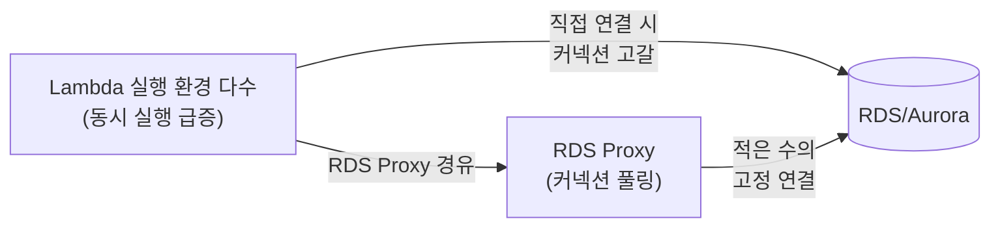

### 18.6 AWS Fargate

Fargate는 컨테이너를 위한 서버리스 컴퓨트 엔진으로, ECS 또는 EKS 위에서 **태스크(task)** 단위로 컨테이너를 실행하되 그 컨테이너가 올라가는 EC2 인스턴스를 사용자가 프로비저닝·관리하지 않는다. "서버 없이 컨테이너를 돌린다"는 점에서 Lambda와 같은 방향이지만, 과금·실행 모델은 이벤트 기반이 아니라 **태스크가 떠 있는 동안 지속 과금**되는 방식이라는 점이 다르다.

Fargate 태스크는 태스크 정의에서 **vCPU와 메모리 조합**을 선택한다(예: 0.25 vCPU/0.5GB부터 시작해 여러 조합 지원, 정확한 조합표는 서비스 문서 확인). Lambda가 메모리 하나만 정하면 vCPU가 비례해 따라오는 것과 달리, Fargate는 vCPU·메모리를 각각 지정하되 정해진 조합 중에서만 고를 수 있다.

**플랫폼 버전(Platform Version)** 은 Fargate 인프라 자체의 버전으로, 새로운 기능(예: 더 큰 임시 스토리지, 새로운 로깅 옵션)은 최신 플랫폼 버전에서 제공된다. `LATEST`를 지정하면 자동으로 최신을 추적하지만, 프로덕션에서는 동작 변경에 대비해 특정 버전을 고정하는 편이 안전한 경우도 있다.

Fargate 태스크는 **`awsvpc` 네트워크 모드**로 동작하며, **태스크마다 자체 ENI**를 할당받는다. 이는 태스크가 자신의 프라이빗 IP·보안 그룹을 독립적으로 가진다는 뜻이며, EC2 위에서 여러 컨테이너가 호스트 ENI를 공유하던 것과 다른 격리 수준을 제공한다. 다만 이 역시 Lambda와 마찬가지로 서브넷 IP를 소비하므로 대규모 태스크 운영 시 서브넷 크기를 고려해야 한다.

**임시 스토리지**는 태스크에 기본 제공되는 로컬 디스크 공간이며, 필요시 확장 설정도 가능하다(정확한 기본값·상한은 서비스 문서 확인). 영속 저장이 필요하면 **Amazon EFS를 태스크에 마운트**할 수 있어 여러 태스크가 파일 시스템을 공유하는 구조도 가능하다(예: 공유 설정 파일, 여러 태스크가 접근하는 콘텐츠 저장소).

**Fargate Spot**은 EC2 스팟과 유사하게 여유 Fargate 용량을 할인된 가격에 사용하는 옵션으로, AWS가 용량을 회수할 때 태스크가 중단될 수 있다. 상태 없는(stateless) 배치 작업이나 중단에 강건한 워크로드에 적합하며, ECS 용량 공급자(capacity provider) 전략으로 온디맨드 Fargate와 Fargate Spot을 비율 혼합할 수 있다.

**시작 지연 특성**: Fargate 태스크는 Lambda의 콜드 스타트보다 훨씬 긴 시간(수십 초 단위)이 걸려 시작된다 — 컨테이너 이미지를 풀(pull)하고 네트워크 인터페이스를 붙이는 과정이 있기 때문이다. 이 때문에 Fargate는 "요청마다 즉시 뜨는" 워크로드보다는 상시 서비스형 태스크나, 다소 긴 초기 지연을 감내할 수 있는 배치 작업에 적합하다. ECS/EKS 오케스트레이터가 Fargate 태스크를 어떻게 스케줄링·서비스로 관리하는지는 19장에서 자세히 다룬다.

```json
{
  "family": "web-app",
  "networkMode": "awsvpc",
  "requiresCompatibilities": ["FARGATE"],
  "cpu": "512",
  "memory": "1024",
  "containerDefinitions": [
    {
      "name": "web",
      "image": "123456789012.dkr.ecr.ap-northeast-2.amazonaws.com/web-app:latest",
      "portMappings": [{"containerPort": 8080, "protocol": "tcp"}],
      "essential": true
    }
  ]
}
```

위 태스크 정의의 `cpu`/`memory`는 태스크 전체에 적용되는 값으로, Fargate가 지원하는 정해진 vCPU-메모리 조합 중 하나를 골라야 한다(임의의 값 조합은 허용되지 않는다). `networkMode: awsvpc`와 `requiresCompatibilities: [FARGATE]`는 태스크가 자체 ENI를 갖는 Fargate 실행 방식임을 명시한다.

### 18.7 Fargate vs Lambda vs EC2 선택 기준

세 컴퓨트 옵션은 실행 시간·트래픽 패턴·상태 유지·패키지 크기·비용 곡선·콜드 스타트 민감도·운영 부담이라는 축에서 서로 다른 강점을 가진다.

| 기준 | Lambda | Fargate | EC2 |
|---|---|---|---|
| 실행 시간 | 최대 15분(할당량 문서 확인) | 사실상 무제한(장시간 상주 가능) | 무제한 |
| 트래픽 패턴 | 간헐적·이벤트 기반에 최적 | 상시 트래픽 또는 예측 가능한 중간 부하 | 상시 고부하, 정교한 커스텀 튜닝 필요 시 |
| 상태(state) | 무상태 권장(실행 환경 재사용은 있으나 보장 아님) | 컨테이너 내 임시 상태 가능, 영속은 EFS 연동 | 완전한 제어(로컬 디스크, 커널 튜닝 등) |
| 패키지 크기 | zip 수백MB, 컨테이너 이미지 최대 10GB 수준 | 컨테이너 이미지 크기 제약이 상대적으로 느슨함 | 제약 없음 |
| 비용 곡선 | 요청당 종량제 — 트래픽 0이면 비용 0 | 태스크가 떠 있는 동안 지속 과금 | 인스턴스가 떠 있는 동안 지속 과금(RI/SP로 할인 가능) |
| 콜드 스타트 민감도 | 대책 필요(18.4절) | 태스크 시작 자체가 느림(수십 초) — 상시 실행 전제 | 없음(이미 실행 중) |
| 운영 부담 | 가장 낮음(코드만 관리) | 낮음(컨테이너 이미지·태스크 정의 관리) | 가장 높음(OS 패치, 스케일링 정책 등) |

**손익분기점 개념**: 트래픽이 간헐적이고 총 실행 시간이 짧다면 요청당 과금인 Lambda가 압도적으로 저렴하다. 그러나 **상시 고부하** 상태(예: 하루 종일 CPU를 계속 쓰는 워크로드)로 갈수록 "지속 과금" 방식인 Fargate/EC2 쪽이 유리해지는 지점이 생긴다 — 사용률이 일정 수준을 넘으면 컨테이너/인스턴스를 계속 켜 두는 편이 요청당 과금 총합보다 저렴해지기 때문이다. 정확한 교차점은 워크로드별 실측(Power Tuning류 도구, 또는 유사 트래픽 시뮬레이션)으로 확인해야 하며 일반화된 숫자로 단정할 수 없다.

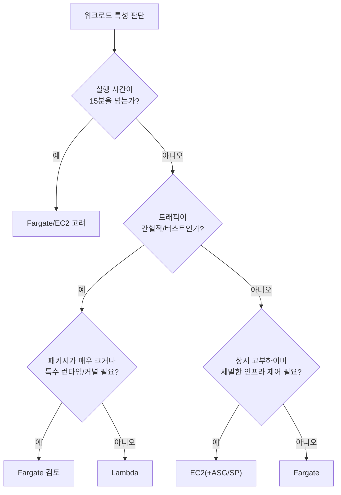

한 줄 결정 기준: "이벤트에 반응해 짧게 실행되고 끝나는가" → Lambda, "컨테이너로 상시/중간 부하 서비스를 운영하되 서버 관리는 피하고 싶은가" → Fargate, "완전한 인프라 제어와 최대 비용 최적화가 필요한 상시 고부하인가" → EC2.

### 18.8 App Runner, Lambda 함수 URL, API Gateway 조합

서버리스 컴퓨트를 외부(HTTP 클라이언트)에 노출하는 방법도 여러 층위가 있다.

**API Gateway + Lambda**: REST API와 HTTP API 두 유형이 있다. REST API는 요청 검증, API 키, 사용량 플랜, WAF 통합, 캐싱 등 풍부한 기능을 제공하지만 그만큼 비용과 지연이 크다. HTTP API는 기능을 단순화하는 대신 지연이 낮고 요금이 저렴해, 단순 프록시 성격의 Lambda 통합에는 HTTP API가 기본 선택지가 된다. 세밀한 API 관리 기능(사용량 플랜, API 키별 쿼터, 캐싱 등)이 필요할 때만 REST API로 올라간다.

**Lambda 함수 URL**은 API Gateway 없이 함수 하나에 고유한 HTTPS 엔드포인트를 직접 부여하는 기능이다. 인증 모드는 IAM(SigV4 서명 필요) 또는 NONE(퍼블릭, 인증 없음) 중 선택한다. API 키·쓰로틀링·다중 라우트 같은 API Gateway의 관리 기능이 필요 없는 단일 함수 웹훅, 간단한 내부 도구, 프로토타입에 적합하다.

**AWS App Runner**는 컨테이너 이미지(ECR) 또는 소스 코드 저장소를 받아 HTTPS URL이 달린 상시 실행 웹 서비스로 바로 배포해 주는 완전 관리형 서비스다. ECS/Fargate처럼 태스크 정의·서비스·클러스터·로드밸런서를 직접 구성하지 않아도 빌드·배포·오토스케일링·헬스체크를 App Runner가 대신 맡아 준다. 내부적으로는 Fargate와 유사한 컨테이너 실행 기반을 쓰지만, 사용자에게는 오케스트레이션 개념 자체를 감춘 한 단계 더 높은 추상화다. 오케스트레이션을 배우거나 운영할 여력이 없는 팀의 웹 애플리케이션·API 배포, 또는 세밀한 네트워킹·스케줄링 제어가 필요 없는 단순 웹 서비스에 적합하다. 반대로 여러 서비스 간 세밀한 트래픽 제어, 사이드카 패턴, 커스텀 스케줄링 정책이 필요하다면 ECS/EKS(→19장)로 가야 한다.

**ALB + Lambda 타깃**: Application Load Balancer의 대상 그룹에 Lambda 함수를 타깃으로 등록할 수 있다. 이미 ALB로 트래픽을 라우팅하는 아키텍처(예: 일부 경로는 EC2/컨테이너, 일부 경로는 Lambda)에 서버리스 경로를 자연스럽게 끼워 넣을 때 유용하다.

| 조합 | 언제 쓰는가 |
|---|---|
| API Gateway(HTTP API) + Lambda | 단순 REST 스타일 API, 낮은 지연·비용이 우선일 때 |
| API Gateway(REST API) + Lambda | API 키/사용량 플랜/캐싱/WAF 등 API 관리 기능이 필요할 때 |
| Lambda 함수 URL | 단일 함수 웹훅, 내부 도구, 관리 기능이 필요 없을 때 |
| App Runner | 컨테이너 기반 웹 서비스를 오케스트레이션 없이 URL로 빠르게 배포할 때 |
| ALB + Lambda 타깃 | 기존 ALB 라우팅 구조에 서버리스 경로를 혼합할 때 |

한 줄 결정 기준: 여러 라우트·인증·쿼터 관리가 필요하면 API Gateway, 단일 엔드포인트면 함수 URL, 컨테이너를 URL 하나로 배포하고 싶으면 App Runner, 기존 ALB 구조에 끼워 넣을 때는 ALB 타깃이다.

### 18장 정리

#### [필수] 반드시 알아야 할 것
1. Lambda 호출은 동기·비동기·이벤트 소스 매핑(폴링) 셋으로 나뉘고 재시도·오류 처리 방식이 각각 다르다(18.1절 표 참조).
2. 실행 환경 수명주기는 INIT→INVOKE→SHUTDOWN이며, 핸들러 밖 전역 스코프 코드는 실행 환경 재사용 시 다시 실행되지 않는다 — SDK 클라이언트·DB 커넥션은 반드시 핸들러 밖에서 생성한다.
3. Lambda는 실행 시간·메모리·`/tmp`·동시성에 명확한 한도가 있다. 15분을 넘는 장시간 배치는 Fargate/Batch/Step Functions로 설계해야 한다.
4. Lambda 요금은 메모리 × 실행 시간이 기본 축이다. 메모리를 늘리면 vCPU도 늘어 실행 시간이 줄고 총비용이 오히려 내려가는 구간이 있으므로 Power Tuning으로 실측한다.
5. 예약 동시성은 상한이자 보장이고, 프로비저닝된 동시성은 초기화를 미리 끝낸 상태를 유지하는 것으로 서로 목적이 다르다.
6. Fargate는 태스크마다 vCPU/메모리 조합과 자체 ENI(awsvpc)를 가지며, Lambda보다 시작 지연이 길어 상시 서비스형 워크로드에 적합하다.
7. Lambda in VPC는 Hyperplane ENI 방식으로 콜드 스타트 영향이 크게 줄었지만, 서브넷 IP 소비와 인터넷 접근 시 NAT 필요 여부는 여전히 설계 대상이다.

#### [팁] 실무 노하우
1. 핸들러 밖(초기화 구간)에 SDK 클라이언트·DB 커넥션·설정 로드를 두면 실행 환경 재사용 시 재활용된다 — 핸들러 안에서 매번 새로 만드는 것이 흔한 성능 실수다.
2. 메모리-비용 최적점은 직관으로 추측하지 말고 AWS Lambda Power Tuning류 도구로 여러 메모리 설정을 실측해 찾는다.
3. 다운스트림(RDS, 서드파티 API)을 보호해야 하면 예약 동시성으로 함수의 동시 실행 자체를 낮게 제한하는 패턴을 쓴다.
4. AWS 서비스(S3, DynamoDB, Secrets Manager 등)에 접근하는 VPC 내 Lambda는 NAT 대신 VPC 엔드포인트를 우선 검토한다.
5. Java 등 부트스트랩 비용이 큰 런타임의 콜드 스타트가 문제라면 SnapStart를 우선 검토하고, 범용적으로는 ARM(Graviton)을 기본값으로 검토한다.
6. 단순 프록시성 API는 REST API보다 HTTP API가 지연·비용 면에서 기본 선택지다.

#### [주의] 사고·비용·설계 함정
1. Lambda의 재시도(비동기 호출, 이벤트 소스 매핑)는 동일 이벤트의 **중복 실행**을 만든다. 모든 핸들러는 멱등(idempotent)하게 설계해야 하며, DLQ 또는 on-failure destination을 구성해 실패 이벤트를 유실 없이 추적해야 한다.
2. S3 이벤트로 Lambda를 트리거하고 그 Lambda가 **같은 버킷에 결과를 쓰도록** 구성하면, 쓰기가 다시 이벤트를 발생시켜 **무한 재귀 호출 폭주**로 이어질 수 있다. 트리거 프리픽스(예: `input/`)와 쓰기 프리픽스(예: `output/`)를 분리해야 한다.
3. 관계형 DB에 Lambda를 직접 연결하면 트래픽 급증 시 동시 실행 수가 DB의 최대 연결 수를 초과해 **커넥션 고갈**을 일으킨다. RDS Proxy(→25장) 또는 DynamoDB 같은 확장 친화적 저장소를 우선 검토한다.
4. 프로비저닝된 동시성을 모든 함수에 전면 적용하면 유휴 시간에도 과금되는 상시 자원이 되어 서버리스의 비용 이점이 사라진다. 지연에 민감한 경로에만 선택적으로 적용한다.
5. 계정 단위 동시 실행 한도는 모든 함수가 공유하므로, 한 함수의 트래픽 폭증이 관련 없는 다른 함수의 스로틀링으로 번질 수 있다.
6. Fargate 태스크의 시작 지연(수십 초)을 간과하고 "요청마다 즉시 뜨는" 용도로 설계하면 지연시간 요구사항을 만족하지 못한다.
7. 함수 URL을 NONE 인증으로 설정하면 누구나 호출 가능한 퍼블릭 엔드포인트가 된다 — 인증이 필요한 워크로드에는 IAM 인증 또는 앞단에 API Gateway/WAF를 둔다.

#### 한 장 요약
Lambda는 이벤트 기반 종량제 컴퓨트로, 호출 유형별 재시도 차이를 이해하고 멱등성·DLQ를 갖추는 것이 안정성의 핵심이다. 메모리는 vCPU에 비례하므로 Power Tuning으로 비용 최적점을 찾고, 콜드 스타트는 원인별로 완화하되 프로비저닝된 동시성 전면 적용은 피한다. Fargate는 같은 서버리스 철학을 컨테이너·상시 워크로드로 확장한 것이며, Lambda·Fargate·EC2는 트래픽 패턴과 비용 곡선의 교차점을 기준으로 선택한다. 이 서버리스 컴퓨트를 API Gateway·함수 URL·App Runner·ALB로 어떻게 외부에 노출하는지도 워크로드 성격에 따라 달라진다.

#### 다음 장 예고
19장에서는 컨테이너 오케스트레이션(ECS, EKS, Fargate와의 관계)을 다루며, 이 장에서 다룬 Fargate가 ECS/EKS 클러스터 위에서 구체적으로 어떻게 태스크·파드를 스케줄링하는지 이어서 살펴본다.

---

## 19장. 컨테이너 오케스트레이션  ★★★

> **이 장에서 다루는 것**
> 18장에서는 서버리스 컴퓨트(Lambda, Fargate)를 다뤘다. 이 장은 그 연장선에서 컨테이너를 애플리케이션 배포 단위로 표준화하고, 이를 대규모로 스케줄링·복구·확장하는 오케스트레이션 계층을 다룬다. Docker로 이미지를 빌드하고 ECR에 저장한 뒤, Amazon ECS 또는 Kubernetes(EKS)로 운영하는 전체 흐름과 네트워킹·보안·비용 설계를 순서대로 살펴본다. 배포 전략(블루/그린, 카나리)의 세부 구현은 37장에서, Fargate와 Lambda의 선택 기준 자체는 18장을 참조한다.

### 19.1 컨테이너란 무엇인가 — VM과의 차이

가상 머신(VM) 여러 대를 운영하면 애플리케이션마다 커널을 포함한 전체 운영체제 이미지를 부팅해야 한다. 부팅에 분 단위 시간이 걸리고, 게스트 OS 각각이 메모리와 디스크를 소비하므로 한 물리 서버에 올릴 수 있는 애플리케이션 수가 제한된다. 컨테이너는 이 문제를 "커널은 호스트와 공유하고, 프로세스 격리는 리눅스 네임스페이스(namespace)와 자원 제한은 cgroups로 처리한다"는 방식으로 해결한다. 즉 컨테이너는 하이퍼바이저 위의 별도 OS가 아니라, 호스트 커널 위에서 격리된 프로세스 그룹이다. 그 결과 이미지 크기는 수십~수백 MB, 시작 시간은 초 이하 단위로 줄어든다.

원서(*AWS for Solutions Architects*)가 정리하는 컨테이너의 장점은 네 가지다. 첫째, **모던 애플리케이션 구축**에 적합하다 — 마이크로서비스처럼 작은 단위로 쪼갠 배포 단위와 컨테이너의 크기가 자연스럽게 맞아떨어지고, CI/CD 파이프라인에서 "빌드한 이미지를 그대로 어디서나 실행한다"는 이식성을 얻는다. 둘째, **인프라 낭비를 줄인다** — 여러 컨테이너가 하나의 호스트 자원을 공유하므로 서버당 밀도(density)가 VM 대비 크게 올라간다. 셋째, **단순함**이다 — 애플리케이션과 그 의존성을 이미지 하나로 캡슐화하므로 "내 컴퓨터에서는 되는데" 문제가 줄고, 배포 대상 서버의 OS 패치나 런타임 버전을 개별 관리할 필요가 줄어든다. 넷째, **개발 가속으로 생산성이 올라간다** — 로컬 개발, 스테이징, 프로덕션이 동일한 이미지를 사용하므로 환경 차이로 인한 디버깅 시간이 줄어든다.

반대로 단점은 두 가지다. 첫째, 커널을 공유하고 네임스페이스/cgroups를 거치는 구조상 **베어메탈 대비 약간의 오버헤드**가 있다 — 대부분의 워크로드에서는 무시할 수준이지만 극단적인 저지연 요구에는 고려 대상이다. 둘째, **생태계 불일치**다 — 컨테이너 런타임(containerd, CRI-O), 오케스트레이터(ECS, Kubernetes, Nomad), 네트워킹 플러그인(CNI) 구현체가 저마다 달라 도구·매니페스트 방언이 갈리고, 팀이 이 조합을 학습·표준화하는 데 비용이 든다.

| 항목 | 가상 머신(VM) | 컨테이너 |
|---|---|---|
| 격리 단위 | 하이퍼바이저 + 게스트 OS 전체 | 프로세스(네임스페이스 + cgroups) |
| 커널 | 게스트마다 별도 커널 | 호스트 커널 공유 |
| 부팅 시간 | 수십 초~분 | 수백 ms~초 |
| 이미지 크기 | 수 GB (OS 포함) | 수십~수백 MB |
| 호스트당 밀도 | 낮음 | 높음 |
| 대표 격리 강도 | 강함(커널 단위 분리) | 상대적으로 약함(공유 커널) |
| 대표 용도 | 이기종 OS 필요, 강한 격리 요구 | 마이크로서비스, 무상태 애플리케이션 |

**한 줄 결정 기준**: 커널 수준의 강한 격리나 이기종 OS가 필요하면 VM, 배포 단위를 가볍게 만들고 빠르게 확장·축소해야 하면 컨테이너를 선택한다.

컨테이너 하나만 띄워서는 실무 요구사항(장애 시 자동 재시작, 여러 대에 걸친 분산, 무중단 배포, 트래픽 분산)을 만족할 수 없다. 이 격차를 메우는 계층이 오케스트레이션이며, 이 장의 나머지 절은 "이미지를 어떻게 만들고(Docker) 저장하며(ECR), 여러 대에 걸쳐 원하는 상태로 유지할 것인가(ECS/EKS)"라는 순서로 이어진다. 참고로 이미지·런타임 규격 자체는 OCI(Open Container Initiative)가 표준화하고 있어, Docker로 빌드한 이미지를 containerd 같은 다른 런타임에서도 실행할 수 있다 — 다만 오케스트레이터별 매니페스트 문법(ECS 태스크 정의 JSON vs 쿠버네티스 YAML)까지 표준화된 것은 아니라는 점이 19.1절에서 언급한 생태계 불일치의 실체다.

### 19.2 Docker 구성 요소

Docker는 컨테이너를 만들고 실행하는 사실상 표준 도구 모음이다. 핵심 구성 요소를 순서대로 보면 다음과 같다.

- **Dockerfile**: 이미지를 어떻게 빌드할지 기술하는 텍스트 파일. `FROM`, `COPY`, `RUN`, `CMD` 등의 명령으로 레이어를 쌓는다.
- **이미지(Image)**: Dockerfile을 빌드한 결과물. 읽기 전용 레이어를 여러 겹 쌓은 구조이며, 레이어는 캐시되어 재빌드 시 변경된 레이어만 다시 만든다.
- **`docker run`**: 이미지로부터 컨테이너(실행 중인 인스턴스)를 띄우는 명령.
- **Docker Hub**: 퍼블릭 이미지 레지스트리. 베이스 이미지(예: `node`, `python`, `alpine`)의 기본 출처다. 프로덕션에서는 신뢰할 수 있는 소스인지, 취약점 스캔이 되어 있는지 반드시 확인한다.
- **Docker Engine**: 호스트에서 이미지 빌드·컨테이너 실행·네트워크·볼륨을 관리하는 데몬(dockerd)과 CLI.
- **Docker Compose**: 여러 컨테이너로 구성된 애플리케이션을 YAML 하나로 정의하고 로컬에서 함께 띄우는 도구. 개발·테스트 환경에 주로 쓰인다.
- **Docker Swarm**: Docker 자체 오케스트레이터. 여러 호스트에 걸쳐 컨테이너를 스케줄링할 수 있지만, 실무에서는 기능 폭과 생태계 규모에서 Kubernetes에 크게 밀려 신규 채택이 드물다. → 비교는 19.6절 참조.

이미지 품질은 곧 운영 안정성과 보안으로 직결된다. 실무에서 중요한 세 가지 원칙은 다음과 같다. 첫째, **멀티스테이지 빌드**로 빌드 도구와 실행 이미지를 분리해 최종 이미지 크기를 줄인다. 둘째, **비루트(non-root) 사용자**로 프로세스를 실행해 컨테이너 탈출 시 피해를 줄인다. 셋째, **헬스체크(HEALTHCHECK)**를 정의해 오케스트레이터가 "떠 있지만 응답하지 않는" 컨테이너를 구분할 수 있게 한다.

```dockerfile
# 1단계: 빌드 전용 스테이지 — 빌드 도구는 최종 이미지에 남지 않는다
FROM node:20-alpine AS build
WORKDIR /app
COPY package*.json ./
RUN npm ci
COPY . .
RUN npm run build

# 2단계: 실행 전용 스테이지 — 런타임에 필요한 산출물만 복사
FROM node:20-alpine AS runtime
WORKDIR /app
ENV NODE_ENV=production

# 비루트 사용자 생성 — 컨테이너 침해 시 권한 확산을 제한한다
RUN addgroup -S app && adduser -S app -G app
COPY --from=build /app/dist ./dist
COPY --from=build /app/node_modules ./node_modules
USER app

# 오케스트레이터가 컨테이너 생존 여부를 판단하는 기준
HEALTHCHECK --interval=30s --timeout=3s --retries=3 \
  CMD wget -qO- http://localhost:3000/health || exit 1

EXPOSE 3000
CMD ["node", "dist/server.js"]
```

Docker Compose는 로컬 개발에서 다음처럼 여러 컨테이너를 한 번에 정의한다.

```yaml
# docker-compose.yml — 로컬 개발 전용, 프로덕션 오케스트레이션 대체재가 아니다
services:
  api:
    build: .
    ports: ["3000:3000"]
    environment:
      - DB_HOST=db
    depends_on: [db]
  db:
    image: postgres:16-alpine
    environment:
      - POSTGRES_PASSWORD=localdev
    volumes:
      - db-data:/var/lib/postgresql/data
volumes:
  db-data:
```

**한 줄 결정 기준**: 로컬 개발에는 Compose, 다중 호스트 프로덕션 오케스트레이션에는 ECS나 EKS를 쓰고 Swarm은 신규 채택 대상에서 제외한다.

### 19.3 Amazon ECR

컨테이너 이미지를 어딘가에 저장·배포해야 한다. Amazon ECR(Elastic Container Registry)은 완전관리형 Docker/OCI 이미지 레지스트리로, **프라이빗 레지스트리**(계정 단위, IAM으로 접근 제어)와 **퍼블릭 레지스트리**(ECR Public, 누구나 풀 가능)를 함께 제공한다.

이미지 보안을 위해 ECR은 두 단계의 스캔을 지원한다. **기본 스캔(basic scanning)**은 푸시 시점에 OS 패키지 취약점을 한 번 검사하고, **향상된 스캔(enhanced scanning)**은 Amazon Inspector와 통합되어 OS 패키지뿐 아니라 애플리케이션 언어 패키지(예: npm, pip 의존성)까지 지속적으로 재스캔하며 새로운 CVE가 공개되면 기존에 푸시된 이미지도 다시 평가한다. 프로덕션 레지스트리는 향상된 스캔을 활성화하고 CI 파이프라인에서 심각도 기준(예: CRITICAL/HIGH 존재 시 배포 차단)을 강제하는 것이 일반적이다.

**불변 태그(immutable tag)**는 ECR 리포지토리 설정으로, 한 번 푸시된 태그(예: `v1.4.2`)에 다른 이미지를 덮어쓰지 못하게 막는다. 이것이 중요한 이유는 `latest` 같은 가변 태그로 배포하는 관행과 정반대의 안전장치이기 때문이다. `latest` 태그로 배포하면 다음 문제가 생긴다.

- 지금 프로덕션에 떠 있는 태스크가 정확히 어떤 이미지 다이제스트(digest)로 실행 중인지 태그만으로는 알 수 없다 — 태그는 시간이 지나면 다른 이미지를 가리키게 된다.
- "이전 버전으로 롤백"하려 해도 `latest`가 이미 새 이미지로 덮어써졌다면 이전 이미지를 가리키는 참조가 남아 있지 않다.
- 태스크 정의 리비전과 이미지 내용이 1:1로 매핑되지 않아 사고 조사(어느 배포가 문제를 일으켰는가) 시 추적이 어려워진다.

따라서 실무에서는 커밋 해시나 시맨틱 버전을 태그로 사용하고, 리포지토리에 불변 태그를 강제해 실수로 덮어쓰는 것 자체를 막는다.

**라이프사이클 정책(lifecycle policy)**은 오래되거나 태그 없는 이미지를 자동 정리해 스토리지 비용과 관리 부담을 줄인다. **리전 간 복제(cross-region replication)**는 재해복구나 다중 리전 배포 시 이미지를 자동으로 동기화해, 리전 장애 시 다른 리전에서도 동일 이미지로 즉시 태스크를 띄울 수 있게 한다. **풀 스루 캐시(pull-through cache)**는 Docker Hub 등 외부 레지스트리의 이미지를 최초 요청 시 ECR에 캐시해두어, 이후 요청은 ECR에서 서빙하고 외부 레지스트리의 속도 제한(rate limit) 영향을 줄인다 — CI 파이프라인이 매 빌드마다 베이스 이미지를 Docker Hub에서 직접 당겨오다 제한에 걸리는 문제를 줄이는 데 특히 유용하다.

```bash
# 리전 간 복제 규칙 등록 — 서울 리전 리포지토리를 도쿄 리전으로 자동 복제
aws ecr put-replication-configuration \
  --replication-configuration '{
    "rules": [{
      "destinations": [{ "region": "ap-northeast-1", "registryId": "123456789012" }]
    }]
  }'

# Docker Hub를 위한 풀 스루 캐시 규칙 생성
aws ecr create-pull-through-cache-rule \
  --ecr-repository-prefix docker-hub \
  --upstream-registry-url registry-1.docker.io
```

```json
{
  "rules": [
    {
      "rulePriority": 1,
      "description": "태그 없는 이미지는 3일 후 정리",
      "selection": {
        "tagStatus": "untagged",
        "countType": "sinceImagePushed",
        "countUnit": "days",
        "countNumber": 3
      },
      "action": { "type": "expire" }
    },
    {
      "rulePriority": 2,
      "description": "release- 접두사 태그는 최근 20개만 보관",
      "selection": {
        "tagStatus": "tagged",
        "tagPrefixList": ["release-"],
        "countType": "imageCountMoreThan",
        "countNumber": 20
      },
      "action": { "type": "expire" }
    }
  ]
}
```

```bash
# 리포지토리 생성 시 불변 태그 강제 — latest 재사용으로 인한 롤백 불가 사고를 예방
aws ecr create-repository \
  --repository-name payments-api \
  --image-tag-mutability IMMUTABLE \
  --image-scanning-configuration scanOnPush=true \
  --region ap-northeast-2

# 로그인 후 커밋 해시 태그로 푸시 (latest 태그에 의존하지 않는다)
aws ecr get-login-password --region ap-northeast-2 \
  | docker login --username AWS --password-stdin 123456789012.dkr.ecr.ap-northeast-2.amazonaws.com
docker tag payments-api:build 123456789012.dkr.ecr.ap-northeast-2.amazonaws.com/payments-api:$(git rev-parse --short HEAD)
docker push 123456789012.dkr.ecr.ap-northeast-2.amazonaws.com/payments-api:$(git rev-parse --short HEAD)
```

**한 줄 결정 기준**: 프로덕션 리포지토리는 불변 태그 + 향상된 스캔을 기본값으로 하고, `latest` 태그는 로컬 개발 외에는 쓰지 않는다.

### 19.4 Amazon ECS: 태스크 정의, 태스크, 서비스, 클러스터

Amazon ECS(Elastic Container Service)는 AWS 고유의 완전관리형 컨테이너 오케스트레이터다. 핵심 개념 네 가지를 이해하면 나머지는 응용이다.

- **태스크 정의(Task Definition)**: 하나 이상의 **컨테이너 정의**(이미지, CPU/메모리, 포트 매핑, 환경변수, 로그 설정)와 태스크 전체의 CPU/메모리, 네트워크 모드, 실행 역할/태스크 역할을 담은 청사진(JSON). 버전(리비전) 관리가 되어 롤백 시 이전 리비전으로 서비스를 되돌릴 수 있다.
- **태스크(Task)**: 태스크 정의를 실제로 실행한 인스턴스. 컨테이너 하나 또는 여러 개(사이드카 패턴)로 구성된다.
- **서비스(Service)**: "이 태스크 정의를 항상 N개 유지하라"는 선언. 원하는 개수(desired count)를 유지하며 비정상 태스크를 자동 교체하고, 배포 구성(최소/최대 헬스 비율, 배포 서킷 브레이커)에 따라 롤링 배포를 수행한다. Cloud Map과 연동한 **서비스 디스커버리**로 서비스 이름만으로 다른 서비스를 찾을 수 있다.
- **클러스터(Cluster)**: 태스크가 실행되는 논리적 그룹. 실제 컴퓨트 자원은 클러스터에 연결된 **용량 공급자(capacity provider)**가 제공한다.

용량 공급자는 세 가지 조합이 대표적이다. **EC2 Auto Scaling 그룹**은 직접 관리하는 EC2 인스턴스 위에 태스크를 배치하며 인스턴스 유형·예약/스팟 구매를 직접 선택할 수 있어 상시 고밀도 워크로드에 비용 효율적이다. **Fargate**는 서버를 프로비저닝하지 않고 태스크 단위로 과금되는 서버리스 실행 방식으로, 패치·용량 계획 부담이 없다(→ Fargate 자체의 특성과 Lambda 대비 선택 기준은 18장 참조). **Fargate Spot**은 여유 용량을 할인가로 제공하되 중단 가능성이 있어 배치·비동기 처리처럼 중단에 강한 워크로드에 적합하다.

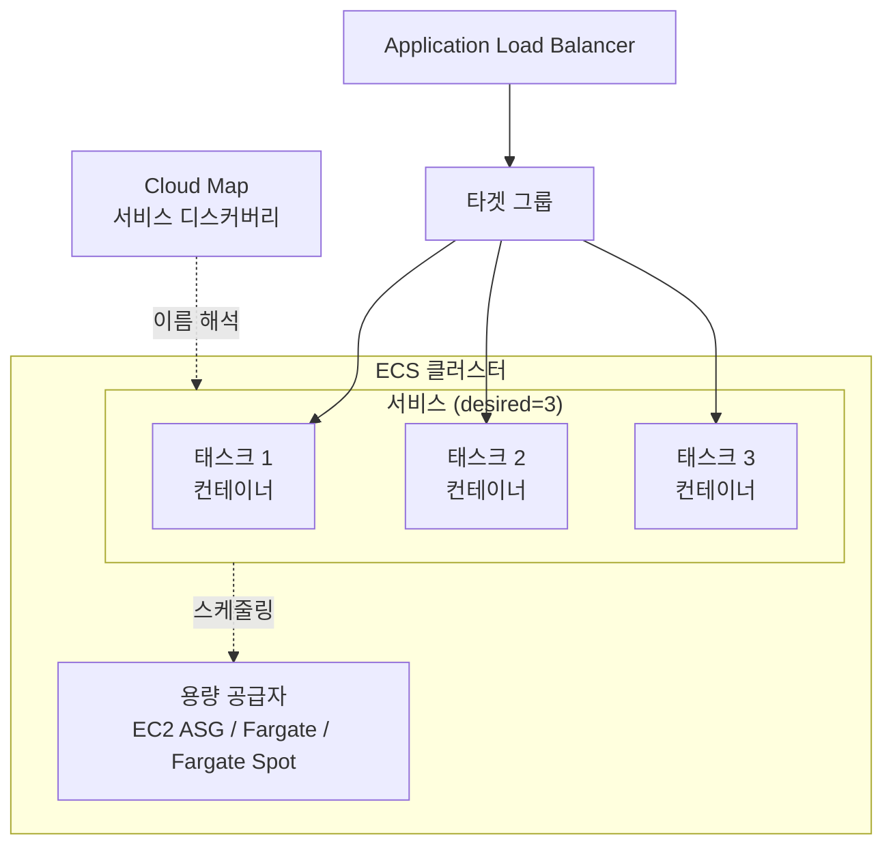

```json
{
  "family": "payments-api",
  "networkMode": "awsvpc",
  "requiresCompatibilities": ["FARGATE"],
  "cpu": "512",
  "memory": "1024",
  "executionRoleArn": "arn:aws:iam::123456789012:role/ecsTaskExecutionRole",
  "taskRoleArn": "arn:aws:iam::123456789012:role/paymentsApiTaskRole",
  "containerDefinitions": [
    {
      "name": "payments-api",
      "image": "123456789012.dkr.ecr.ap-northeast-2.amazonaws.com/payments-api:a1b2c3d",
      "portMappings": [{ "containerPort": 3000, "protocol": "tcp" }],
      "essential": true,
      "logConfiguration": {
        "logDriver": "awslogs",
        "options": {
          "awslogs-group": "/ecs/payments-api",
          "awslogs-region": "ap-northeast-2",
          "awslogs-stream-prefix": "ecs"
        }
      },
      "healthCheck": {
        "command": ["CMD-SHELL", "wget -qO- http://localhost:3000/health || exit 1"],
        "interval": 30,
        "timeout": 3,
        "retries": 3
      }
    }
  ]
}
```

용량 공급자가 "태스크를 어떤 인프라 위에 놓을지"를 결정한다면, **서비스 오토 스케일링(target tracking)**은 "태스크를 몇 개 띄울지"를 결정한다. CPU 사용률이나 ALB 요청 수 같은 지표를 목표값으로 지정하면 Application Auto Scaling이 desired count를 자동으로 조정한다 — EKS의 HPA와 개념적으로 같은 역할을 ECS 쪽에서 수행한다고 이해하면 된다(→ HPA는 19.7절 참조).

서비스 하나에 여러 용량 공급자를 섞어 쓰는 **용량 공급자 전략(capacity provider strategy)**도 가능하다. 예를 들어 기본 용량은 온디맨드 Fargate로 안정적으로 확보하고, 트래픽이 몰릴 때 추가되는 태스크는 더 저렴한 Fargate Spot으로 채우는 식이다.

```bash
# base=2: Fargate 온디맨드로 최소 2개는 항상 유지
# weight=4(Spot):1(온디맨드): 추가 확장분은 Spot 비중을 높여 비용을 낮춘다
aws ecs create-service \
  --cluster prod-cluster \
  --service-name payments-api \
  --task-definition payments-api \
  --desired-count 6 \
  --capacity-provider-strategy \
      capacityProvider=FARGATE,base=2,weight=1 \
      capacityProvider=FARGATE_SPOT,base=0,weight=4
```

**한 줄 결정 기준**: 변동이 크고 짧은 워크로드는 Fargate, 상시 고밀도·비용 최적화가 중요하면 EC2(가능하면 Graviton) 용량 공급자를 택한다.

### 19.5 ECS 네트워킹 · 스토리지 · 보안

네트워크 모드는 태스크의 격리 수준을 결정한다. **awsvpc 모드**(Fargate에서는 유일한 선택지)는 태스크마다 전용 ENI(Elastic Network Interface)를 부여해 태스크 단위로 고유한 프라이빗 IP와 **보안 그룹**을 가지게 한다 — 즉 컨테이너 하나하나가 마치 작은 EC2 인스턴스처럼 자기 네트워크 경계를 갖는다. 반면 **bridge 모드**와 **host 모드**는 EC2 launch type의 레거시 방식이다. bridge 모드는 Docker 브리지 네트워크를 거쳐 호스트 포트에 동적으로 매핑되므로 같은 호스트에 여러 태스크를 올릴 때 포트 충돌 관리가 필요하고, host 모드는 호스트의 네트워크 네임스페이스를 그대로 공유해 오버헤드는 가장 적지만 태스크별 보안 그룹 격리를 포기하게 된다.

| 네트워크 모드 | 격리 수준 | 태스크별 보안 그룹 | 대표 사용처 |
|---|---|---|---|
| awsvpc | 높음(전용 ENI) | 가능 | Fargate 전체, 신규 EC2 launch type 설계 |
| bridge | 중간(NAT 경유) | 불가(호스트 단위) | 레거시 EC2 launch type |
| host | 낮음(네임스페이스 공유) | 불가(호스트 단위) | 극한의 네트워크 성능이 필요한 특수 사례 |

신규 설계에서는 특별한 이유가 없으면 awsvpc 모드를 기본값으로 삼는다.

스토리지는 기본적으로 컨테이너가 종료되면 파일시스템 내용도 사라진다는 점을 전제해야 한다. 임시 작업 공간에는 태스크 내 **볼륨**을 쓰고, 여러 태스크가 같은 파일을 공유하거나 재시작 후에도 데이터가 남아야 한다면 **Amazon EFS 볼륨 마운트**를 태스크 정의에 선언한다. EFS는 여러 AZ의 여러 태스크에서 동시에 마운트할 수 있는 공유 파일시스템이라 세션 파일, 업로드 파일, 공유 설정 등에 적합하다. 블록 스토리지가 필요하면 EBS를 태스크에 연결하는 것도 가능하지만 이 경우 AZ 종속성을 고려해야 한다(→ EBS의 AZ 종속성은 21장 참조).

```json
{
  "volumes": [
    {
      "name": "shared-uploads",
      "efsVolumeConfiguration": {
        "fileSystemId": "fs-0123456789abcdef0",
        "transitEncryption": "ENABLED"
      }
    }
  ],
  "containerDefinitions": [
    {
      "name": "payments-api",
      "mountPoints": [
        { "sourceVolume": "shared-uploads", "containerPath": "/data/uploads" }
      ]
    }
  ]
}
```

권한 모델에서 가장 자주 혼동되는 지점이 **태스크 실행 역할(task execution role)**과 **태스크 역할(task role)**의 구분이다.

- **태스크 실행 역할**: ECS 에이전트가 태스크를 "띄우기 위해" 필요한 권한이다 — ECR에서 이미지를 풀(pull)하고, CloudWatch Logs로 로그를 보내고, 태스크 정의에 선언된 시크릿을 Secrets Manager/Parameter Store에서 읽어오는 권한이 여기 속한다. 애플리케이션 코드는 이 역할을 직접 사용하지 않는다.
- **태스크 역할**: 컨테이너 안에서 실행되는 **애플리케이션 코드**가 다른 AWS 서비스를 호출할 때 쓰는 권한이다 — 예를 들어 애플리케이션이 S3에 파일을 쓰거나 DynamoDB를 조회한다면 그 권한은 태스크 역할에 부여한다.

이 둘을 하나로 합쳐 과도하게 넓은 권한을 부여하는 실수가 흔하다. 이미지 풀 권한과 애플리케이션 데이터 접근 권한은 최소 권한 원칙에 따라 반드시 분리한다.

시크릿(DB 비밀번호, API 키)은 환경변수에 평문으로 넣지 않고 태스크 정의의 `secrets` 필드로 Secrets Manager 또는 SSM Parameter Store를 참조한다. 이렇게 하면 태스크 정의 자체(버전 관리되고 여러 사람이 볼 수 있는 JSON)에는 시크릿 값이 노출되지 않고, ECS 에이전트가 태스크 실행 역할의 권한으로 실행 시점에 값을 주입한다.

```json
{
  "containerDefinitions": [
    {
      "name": "payments-api",
      "secrets": [
        {
          "name": "DB_PASSWORD",
          "valueFrom": "arn:aws:secretsmanager:ap-northeast-2:123456789012:secret:payments/db-password-AbCdEf"
        }
      ]
    }
  ]
}
```

**한 줄 결정 기준**: 신규 서비스는 awsvpc 모드 + 태스크별 보안 그룹을 기본값으로 하고, 이미지 풀 권한(실행 역할)과 앱 데이터 권한(태스크 역할)을 절대 섞지 않는다.

### 19.6 Kubernetes 기초

Kubernetes(K8s)는 컨테이너 오케스트레이션의 사실상 업계 표준이다. 클러스터는 **컨트롤 플레인**과 **노드**로 나뉜다.

컨트롤 플레인 구성 요소는 다음과 같다.
- **API 서버(kube-apiserver)**: 모든 조작이 거치는 단일 진입점. kubectl도 결국 API 서버에 REST 요청을 보낸다.
- **etcd**: 클러스터의 모든 상태(원하는 상태, 현재 상태)를 저장하는 분산 키-값 저장소.
- **스케줄러(kube-scheduler)**: 아직 노드에 배치되지 않은 파드를 어느 노드에 실행할지 결정한다.
- **컨트롤러 매니저(kube-controller-manager)**: ReplicaSet의 복제본 수 유지처럼 "선언된 상태"와 "실제 상태"를 계속 일치시키는 컨트롤 루프들을 실행한다.

노드 구성 요소는 다음과 같다.
- **kubelet**: 각 노드에서 실행되며 해당 노드에 배정된 파드가 정의대로 실행되도록 컨테이너 런타임에 지시한다.
- **kube-proxy**: 노드에서 Service 오브젝트에 대한 네트워크 규칙(트래픽을 어느 파드로 보낼지)을 관리한다.

**파드(Pod)**는 쿠버네티스의 최소 배포 단위로, 하나 이상의 컨테이너가 네트워크 네임스페이스(같은 IP, 포트 공간)를 공유하는 묶음이다. 이 위에 여러 **오브젝트**를 조합해 애플리케이션을 구성한다.

| 오브젝트 | 역할 |
|---|---|
| ReplicaSet | 지정한 개수의 파드 복제본이 항상 떠 있도록 유지 |
| Deployment | ReplicaSet을 감싸 롤링 업데이트·롤백을 관리(무상태 앱의 기본 단위) |
| StatefulSet | 고유한 순서·네트워크 식별자·영구 스토리지가 필요한 상태 유지 앱(DB 등)에 사용 |
| Service | 파드 집합에 안정적인 가상 IP/DNS 이름을 부여해 트래픽을 분산 |
| Ingress | 클러스터 외부 HTTP(S) 트래픽을 여러 Service로 라우팅하는 규칙 |
| Secret | 비밀번호·토큰 등 민감 데이터를 파드에 주입 |
| ConfigMap | 민감하지 않은 설정 값을 파드에 주입 |

이 표에는 없지만 **Namespace**도 자주 쓰이는 오브젝트로, 하나의 클러스터를 팀·환경 단위로 논리적으로 나누는 경계다(→ 19.10절의 멀티테넌시 논의와 직결된다).

컨트롤 플레인과 노드, 그리고 그 사이를 오가는 요청 흐름을 그림으로 보면 다음과 같다.

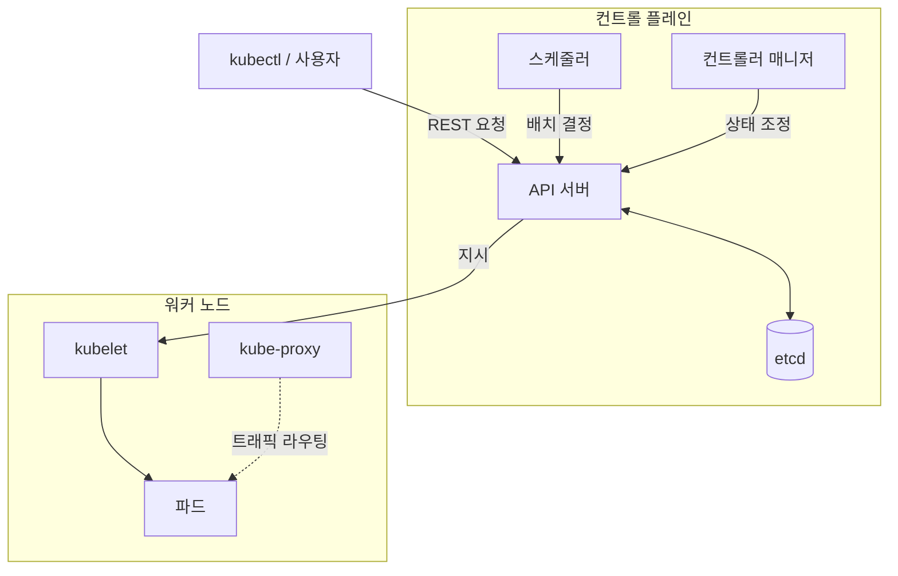

`kubectl`은 클러스터를 조작하는 표준 CLI다. 매니페스트를 적용하고 상태를 조회하는 기본 흐름은 다음과 같다.

```bash
# 매니페스트 적용(생성 또는 갱신) — 선언한 상태와 클러스터의 실제 상태를 컨트롤러가 계속 일치시킨다
kubectl apply -f deployment.yaml

# 특정 네임스페이스의 파드 상태 확인
kubectl get pods -n payments

# 컨테이너 로그 확인, 배포 롤아웃 상태 확인
kubectl logs -n payments deploy/payments-api
kubectl rollout status -n payments deploy/payments-api
```

원서가 정리하는 쿠버네티스의 장점은 네 가지다. **빠른 개발과 배포**(선언적 매니페스트와 롤링 업데이트로 배포 주기 단축), **비용 효율성**(리소스 요청/제한 기반 스케줄링으로 노드 활용률 향상), **클라우드 중립적 배포**(K8s API가 표준화되어 있어 특정 클라우드에 종속되지 않고 온프레미스·타 클라우드로 이식 가능), **클라우드 제공자가 관리**(EKS 같은 관리형 서비스로 컨트롤 플레인 운영 부담을 넘길 수 있음)다. Docker Swarm과 비교하면 Swarm은 학습 곡선이 완만하고 설정이 단순하지만, 생태계 크기(오퍼레이터, Helm 차트, 모니터링 통합)와 세밀한 스케줄링·확장 기능에서 Kubernetes에 크게 못 미쳐 신규 프로젝트에서 채택이 드물다.

```yaml
apiVersion: apps/v1
kind: Deployment
metadata:
  name: payments-api
  namespace: payments
spec:
  replicas: 3
  selector:
    matchLabels:
      app: payments-api
  template:
    metadata:
      labels:
        app: payments-api
    spec:
      containers:
        - name: payments-api
          image: 123456789012.dkr.ecr.ap-northeast-2.amazonaws.com/payments-api:a1b2c3d
          ports:
            - containerPort: 3000
          resources:
            requests: { cpu: "250m", memory: "256Mi" }
            limits: { cpu: "500m", memory: "512Mi" }
          readinessProbe:
            httpGet: { path: /health, port: 3000 }
            initialDelaySeconds: 5
---
apiVersion: v1
kind: Service
metadata:
  name: payments-api
  namespace: payments
spec:
  selector:
    app: payments-api
  ports:
    - port: 80
      targetPort: 3000
  type: ClusterIP
```

클러스터 외부에서 여러 Service로 HTTP(S) 트래픽을 라우팅해야 한다면 Ingress 오브젝트를 함께 선언한다. EKS에서는 AWS Load Balancer Controller가 Ingress를 감시해 ALB를 자동으로 프로비저닝한다.

```yaml
apiVersion: networking.k8s.io/v1
kind: Ingress
metadata:
  name: payments-ingress
  namespace: payments
  annotations:
    kubernetes.io/ingress.class: alb
    alb.ingress.kubernetes.io/scheme: internet-facing
spec:
  rules:
    - host: api.example.com
      http:
        paths:
          - path: /payments
            pathType: Prefix
            backend:
              service:
                name: payments-api
                port: { number: 80 }
```

**한 줄 결정 기준**: 여러 클라우드/온프레미스 이식성과 큰 생태계가 필요하면 Kubernetes, AWS 안에서만 운영하고 학습 곡선을 낮추고 싶다면 ECS를 우선 검토한다.

### 19.7 Amazon EKS

Amazon EKS(Elastic Kubernetes Service)는 관리형 쿠버네티스 컨트롤 플레인이다. API 서버와 etcd를 여러 가용 영역에 걸쳐 AWS가 대신 운영하며, 패치와 가용성 확보(장애 노드 자동 교체 등)를 관리형으로 처리해 사용자는 컨트롤 플레인 서버를 직접 다루지 않는다.

노드(데이터 플레인)는 네 가지 방식 중에서 조합해 선택한다.

| 노드 옵션 | 특징 |
|---|---|
| 관리형 노드 그룹(Managed Node Group) | AWS가 노드 프로비저닝·업그레이드 오케스트레이션을 대행, 여전히 EC2 인스턴스 자체는 사용자 계정에 존재 |
| 자체 관리 노드(Self-managed) | 사용자가 직접 ASG·AMI를 구성, 커스텀 AMI(BYOS: Bring Your Own OS 방식)처럼 세밀한 제어가 필요할 때 사용 — 정확한 지원 범위는 최신 문서 확인이 필요하다 |
| Fargate 프로필 | 서버리스로 파드를 실행, 노드 패치·용량 계획이 아예 없어짐(모든 파드 유형을 지원하지는 않으므로 문서 확인 필요) |
| Karpenter | 노드 프로비저닝 전용 오픈소스 오토스케일러, EC2 API를 직접 호출해 노드 그룹 없이도 빠르게 인스턴스를 추가/제거 |

애플리케이션 스케일링은 계층이 나뉜다. **HPA(Horizontal Pod Autoscaler)**는 CPU/메모리나 커스텀 메트릭에 따라 파드 복제본 수를 늘리고 줄인다. **VPA(Vertical Pod Autoscaler)**는 파드의 CPU/메모리 요청량 자체를 조정한다. **Cluster Autoscaler**는 뜨지 못하는(Pending) 파드가 있으면 노드 그룹의 노드 수를 늘린다. **Karpenter**는 같은 역할을 하되 미리 정의된 노드 그룹 없이 워크로드 요구사항에 맞는 인스턴스 유형을 즉시 선택해 프로비저닝하므로 일반적으로 Cluster Autoscaler보다 빠르고 비용 효율적인 경우가 많다.

권한 부여에서 EKS 고유의 핵심 개념이 **IRSA(IAM Roles for Service Accounts)**와 **EKS Pod Identity**다. 둘 다 "파드 단위로 최소 권한의 AWS 자격 증명을 부여한다"는 같은 목표를 갖지만 메커니즘이 다르다. IRSA는 클러스터의 OIDC 공급자를 IAM에 등록하고, 서비스 어카운트에 IAM 역할 ARN을 애노테이션으로 달아 신뢰 관계(trust policy)를 맺는 방식이다. EKS Pod Identity는 이후 도입된 더 단순한 방식으로, 클러스터마다 OIDC 신뢰 정책을 개별 구성할 필요 없이 에이전트 기반으로 역할을 연결한다. 신규 클러스터에서는 설정이 간단한 Pod Identity를 우선 검토하되, 기존 IRSA 구성을 마이그레이션할 필요는 없는지 팀 상황에 맞춰 판단한다.

```yaml
apiVersion: v1
kind: ServiceAccount
metadata:
  name: payments-api-sa
  namespace: payments
  annotations:
    # IRSA: 이 서비스 어카운트로 뜬 파드는 아래 IAM 역할의 권한을 받는다
    eks.amazonaws.com/role-arn: arn:aws:iam::123456789012:role/payments-api-pod-role
```

```bash
# eksctl로 관리형 노드 그룹을 포함한 클러스터 생성
eksctl create cluster \
  --name prod-cluster \
  --region ap-northeast-2 \
  --version 1.30 \
  --nodegroup-name standard-workers \
  --node-type m6g.large \
  --nodes 3 --nodes-min 3 --nodes-max 10 \
  --managed
```

EKS는 VPC CNI, CoreDNS, kube-proxy, EBS CSI 드라이버 등을 **애드온(add-on)**으로 관리해 버전 호환성 검증과 업그레이드를 단순화한다 — 애드온은 콘솔·`eksctl`·API로 개별 버전을 지정해 설치·업그레이드하며, 클러스터 버전과 호환되는 애드온 버전 조합은 AWS가 검증해 제공한다. 클러스터 API 엔드포인트는 **AWS PrivateLink**를 지원해 퍼블릭 인터넷 노출 없이 VPC 내부(또는 피어링/Transit Gateway로 연결된 VPC)에서만 컨트롤 플레인에 접근하도록 구성할 수 있고, 완전히 프라이빗한 엔드포인트만 남겨 인터넷 접근 자체를 차단하는 구성도 가능하다.

쿠버네티스 버전은 **지원 기간이 유한**하다 — 표준 지원이 끝나면 이후에는 추가 비용이 드는 연장 지원을 받거나 강제로 업그레이드해야 하며, 정확한 지원 기간·정책은 계속 갱신되므로 최신 EKS 문서를 확인해야 한다. 애드온과 노드 AMI, 클러스터 버전이 서로 호환되는 조합을 유지해야 하므로 업그레이드를 미루면 미룰수록 한 번에 처리할 변경 폭이 커지고, 오래된 애드온이 새 클러스터 버전과 호환되지 않는 상황까지 겹칠 수 있다 — 분기별 업그레이드 리듬을 정례화하고, 스테이징 클러스터에서 먼저 업그레이드를 검증하는 것이 실무 관행이다. 커뮤니티 도구로는 클러스터 부트스트래핑에 `eksctl`, 애플리케이션 패키징에 Helm, IaC로는 Terraform/CDK의 EKS 블루프린트, 운영 가시성에 `k9s`나 Lens, 정책 검증에 OPA/Gatekeeper 같은 도구가 널리 쓰인다.

**한 줄 결정 기준**: 노드 운영을 최소화하고 싶으면 Fargate 프로필이나 Karpenter + 관리형 노드 그룹, 세밀한 인스턴스 제어가 필요하면 자체 관리 노드를 선택한다.

### 19.8 EKS 네트워킹(VPC CNI)과 IP 고갈 문제

EKS의 기본 네트워킹 플러그인인 **Amazon VPC CNI**는 쿠버네티스 파드마다 실제 VPC의 IP 주소를 하나씩 할당한다. 이는 파드가 VPC 네이티브 IP를 가지므로 보안 그룹, VPC 피어링, PrivateLink 같은 기존 VPC 도구와 자연스럽게 통합된다는 장점이 있지만, 동시에 **파드 하나하나가 서브넷의 IP 하나를 소비한다**는 뜻이기도 하다. 각 워커 노드는 인스턴스 유형별로 부착 가능한 ENI 수와 ENI당 보조 IP 수가 정해져 있고, 그 한도만큼만 파드를 띄울 수 있다. 서브넷 CIDR을 너무 좁게 설계하면 노드는 더 띄울 수 있는데 파드용 IP가 없어 스케줄링이 막히는 상황이 온다.

이를 완화하는 방법은 크게 두 가지다.

- **프리픽스 위임(prefix delegation)**: ENI에 개별 보조 IP 대신 `/28` 같은 IP 프리픽스를 통째로 위임받아, ENI 하나가 훨씬 많은 IP를 확보하게 한다. 같은 노드에서 훨씬 많은 파드를 띄울 수 있어 IP 고갈 문제를 크게 완화한다.
- **보조 CIDR(secondary CIDR) 활용**: VPC에 `100.64.0.0/10`(CGNAT 대역, Carrier-Grade NAT용으로 예약된 사설 대역)처럼 기존 라우팅 가능한 사설 CIDR과 겹치지 않는 대역을 추가해, 파드 전용 IP를 이 보조 CIDR에서 소비하게 한다. 기존 라우팅 가능한 프라이머리 CIDR을 아끼면서 파드 IP 공간을 대폭 확장할 수 있다.

VPC 네이티브 IP 소비 자체를 피하고 싶다면 **대안 CNI**(오버레이 네트워크 기반의 서드파티 CNI)를 검토할 수 있다. 파드에 VPC IP를 직접 소비하지 않는 오버레이 방식은 IP 고갈 문제에서 자유롭지만, VPC 보안 그룹을 파드 단위로 직접 적용하기 어렵거나 추가 설정이 필요한 등 트레이드오프가 있으므로 팀의 네트워킹 요구사항에 맞춰 신중히 선택한다.

서브넷 크기 산정 예시를 보자. 노드 20대, 노드당 파드 최대 30개를 계획한다면 순수 계산상 파드 IP만 최대 600개가 필요하고, 여기에 노드 자체 IP와 향후 확장 여유를 더해야 한다. `/24` 서브넷(사용 가능 IP 약 251개, AWS가 각 서브넷에서 5개를 예약)로는 턱없이 부족하다. 프리픽스 위임 없이 인스턴스 유형별 보조 IP 한도만으로 계산하면 중형 인스턴스 한 대가 확보할 수 있는 파드 IP는 수십 개 수준에 그치는 경우가 많아 노드 20대 규모에서는 `/22`~`/20`급 서브넷이 필요해질 수 있다. 프리픽스 위임을 켜면 ENI 하나가 `/28` 프리픽스(IP 16개) 단위로 훨씬 많은 IP를 확보하므로 같은 노드 수라도 필요한 서브넷 크기가 크게 줄어든다. 정확한 노드별 최대 파드 수와 ENI 한도는 인스턴스 유형마다 다르므로 설계 시 최신 EKS 문서의 한도표(`eniMaxPods` 계산 도구 등)를 확인한다.

이미 운영 중인 VPC의 프라이머리 CIDR이 좁아 위 계산이 감당되지 않는다면, 애초에 사설 IP 공간을 다시 설계하기보다 `100.64.0.0/10`처럼 별도로 예약된 CGNAT 대역을 VPC 보조 CIDR로 추가하고 파드 서브넷만 그 대역에서 새로 만드는 편이 기존 라우팅·피어링 구성을 건드리지 않고 IP 공간을 확장하는 가장 실용적인 방법이다.

**한 줄 결정 기준**: 소규모 클러스터라면 프리픽스 위임만으로 충분하지만, 대규모 클러스터거나 라우팅 가능한 사설 IP 자체가 부족하다면 보조 CIDR(100.64.0.0/10)을 먼저 붙인다.

### 19.9 Red Hat OpenShift on AWS(ROSA)와 기타 옵션

ROSA(Red Hat OpenShift Service on AWS)는 Red Hat OpenShift를 AWS 인프라 위에서 완전관리형으로 제공하는 서비스로, AWS와 Red Hat이 공동으로 운영·지원한다. OpenShift 고유의 개발자·운영자 도구(내장 CI/CD, 이미지 스트림, 라우트, 통합 모니터링 콘솔 등)를 AWS 컴퓨트·네트워킹 위에서 그대로 사용할 수 있다.

ROSA를 선택하는 대표적인 상황은 다음과 같다.

- 이미 온프레미스나 다른 클라우드에서 **OpenShift 자산과 운영 노하우**를 보유하고 있어, 클러스터 배포 방식·매니페스트·보안 정책을 그대로 재사용하고 싶은 경우.
- 순수 오픈소스 쿠버네티스보다 **Red Hat의 엔터프라이즈 지원 SLA**와 통합 지원 창구가 필요한 규제 산업(금융, 공공 등).
- 하이브리드/멀티클라우드 환경에서 온프레미스 OpenShift와 **일관된 운영 경험**을 유지해야 하는 경우.

반대로 신규 프로젝트이고 OpenShift 자산이 없으며 AWS 네이티브 통합(다른 AWS 서비스와의 매끄러운 연동, Karpenter 같은 AWS 생태계 도구)을 최우선으로 한다면 EKS가 더 간단한 출발점이다. ROSA는 EKS와 마찬가지로 컨트롤 플레인을 관리형으로 제공하고 워커 노드는 AWS 컴퓨트(EC2) 위에서 실행되는 모델을 취하지만, 라이선스·지원 계약 구조가 EKS와 다르므로 비용 비교 시 클러스터 요금 외에 지원 계약 조건도 함께 검토해야 한다. 조직 내부에 이미 OpenShift 운영자(Operator) 패턴이나 OpenShift 전용 CI/CD 파이프라인이 자리 잡고 있다면 그 자산을 그대로 옮길 수 있다는 점이 ROSA의 핵심 가치이며, 그런 자산이 없는 상태에서 "엔터프라이즈 지원이 있으니 안전하다"는 이유만으로 선택하면 순수 EKS 대비 학습 곡선과 계약 복잡도만 늘어날 수 있다.

**한 줄 결정 기준**: 기존 OpenShift 투자와 엔터프라이즈 지원 계약이 이미 있다면 ROSA, 순수 AWS 네이티브 생태계에 집중한다면 EKS를 선택한다.

### 19.10 ECS vs EKS vs Fargate vs App Runner 선택 기준표

지금까지 다룬 오케스트레이터에 18장의 서버리스 옵션까지 더해 놓고 보면, 결국 "어떤 축을 우선할 것인가"의 문제로 정리된다. Fargate는 별도의 오케스트레이터가 아니라 ECS와 EKS 양쪽에서 쓸 수 있는 서버리스 실행 방식임을 다시 짚어두고, App Runner와 Lambda는 컨테이너/코드를 오케스트레이션 개념 없이 완전관리형으로 실행하는 대안으로 비교에 포함한다(세부 특성은 18장 참조). 다섯 옵션은 스펙트럼의 양 끝에 있다 — 한쪽 끝(Lambda, App Runner)은 운영 부담이 거의 없는 대신 제어권이 제한적이고, 반대쪽 끝(EKS + 자체 관리 노드)은 세밀한 제어가 가능한 대신 팀이 감당해야 할 운영 지식이 많다. 팀 규모가 작을수록, 그리고 컨테이너 오케스트레이션 경험이 적을수록 스펙트럼의 왼쪽(관리 부담이 적은 쪽)에서 시작해 실제로 한계에 부딪힐 때 오른쪽으로 옮기는 편이 초기 속도와 안정성 모두에 유리하다.

| 항목 | ECS | EKS | Fargate(ECS/EKS 공통 실행 방식) | App Runner | Lambda |
|---|---|---|---|---|---|
| 학습 곡선 | 낮음(AWS 개념만) | 높음(K8s 지식 필요) | 오케스트레이터에 종속 | 매우 낮음 | 낮음 |
| 이식성(멀티클라우드) | 낮음(AWS 전용) | 높음(K8s 표준) | 오케스트레이터에 종속 | 낮음 | 낮음 |
| 운영 부담 | 중간(클러스터는 AWS 관리, 노드는 선택) | 높음(EC2 노드 사용 시) ~ 낮음(Fargate/완전 관리 노드 사용 시) | 매우 낮음(서버 없음) | 매우 낮음 | 매우 낮음 |
| 고정비 | 없음(사용한 리소스만) | 클러스터 시간당 고정 요금 + 노드 비용 | 없음(태스크 사용량 과금) | 없음 | 없음 |
| 생태계 | AWS 통합 도구 위주 | Helm/오퍼레이터 등 매우 큰 생태계 | 해당 없음 | 제한적(단순함이 목적) | 매우 큼(이벤트 소스 다양) |
| 적합 규모 | 중소~대규모, AWS 단일 클라우드 | 대규모, 멀티클라우드/이식성 요구 | 워크로드 변동 크거나 소규모 | 소규모 웹 서비스, 빠른 출시 | 이벤트/짧은 실행 단위 |

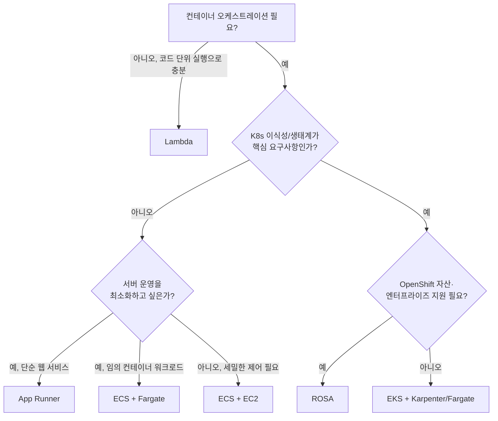

**한 줄 결정 기준**: AWS 단일 클라우드에서 빠르게 시작하려면 ECS(+Fargate), 멀티클라우드 이식성·큰 생태계가 필요하면 EKS, 서버 관리 자체를 없애고 싶은 단순 웹 서비스는 App Runner를 우선 검토한다.

EKS를 선택할 때 반드시 짚어야 할 비용 구조가 있다. EKS는 **클러스터 자체에 시간당 고정 요금**이 붙고, 여기에 노드(EC2 또는 Fargate) 비용이 더해진다. 이 고정비 때문에 "서비스 A용 클러스터, 서비스 B용 클러스터"처럼 소규모 서비스마다 클러스터를 하나씩 만들면 각 클러스터의 고정 요금이 그대로 누적되어 전체 비용이 빠르게 불어난다. 따라서 여러 팀·서비스가 있다면 클러스터를 먼저 늘리기보다 **네임스페이스 기반 멀티테넌시**(하나의 클러스터 안에서 네임스페이스·리소스 쿼터·네트워크 정책으로 워크로드를 격리)를 우선 검토하고, 강한 보안/컴플라이언스 경계나 서로 다른 쿠버네티스 버전 요구처럼 네임스페이스로 해결할 수 없는 이유가 있을 때만 클러스터를 분리한다.

### 19장 정리

#### [필수] 반드시 알아야 할 것
1. 컨테이너는 커널을 공유하는 프로세스 격리 방식으로, VM 대비 가볍고 빠르지만 격리 강도는 상대적으로 약하다. 원서가 든 장점은 모던 애플리케이션 구축, 인프라 낭비 감소, 단순함, 개발 가속(생산성 향상) 네 가지다.
2. ECS의 태스크 정의·태스크·서비스·클러스터 계층 구조와, EKS의 컨트롤 플레인(API 서버·etcd·스케줄러·컨트롤러 매니저)·노드(kubelet·kube-proxy) 구조는 서로 다른 오케스트레이터의 대응 개념이다.
3. ECS의 **태스크 실행 역할**(이미지 풀·로그 전송·시크릿 조회)과 **태스크 역할**(애플리케이션의 AWS API 호출 권한)은 반드시 분리해야 한다.
4. awsvpc 네트워크 모드는 태스크마다 전용 ENI와 보안 그룹을 부여해 태스크 단위 격리를 가능하게 한다.
5. EKS에서 파드에 AWS 권한을 부여하는 방법은 IRSA(OIDC 기반)와 더 단순한 EKS Pod Identity 두 가지다. 컨테이너 안에 IAM 액세스 키를 직접 넣지 않는다.
6. ECR의 불변 태그와 이미지 스캔(기본/향상)은 프로덕션 레지스트리의 기본 보안 설정이다.
7. ECS의 서비스 오토 스케일링(target tracking)과 EKS의 HPA/Cluster Autoscaler/Karpenter는 각각 "태스크·파드 수"와 "노드 수"를 조정하는 서로 다른 계층의 스케일링이며, 둘 다 갖춰야 트래픽 증가에 실제로 대응할 수 있다.

#### [팁] 실무 노하우
1. 이미지는 멀티스테이지 빌드로 최소화하고 비루트 사용자·헬스체크를 기본으로 넣는다. 태그는 불변으로 강제하고 `latest` 태그 배포는 지양한다 — 롤백에 필요한 "이전 이미지를 가리키는 참조"가 사라지기 때문이다.
2. Fargate는 노드 패치·용량 계획을 없애준다. 워크로드가 짧고 변동적이면 Fargate, 상시 고밀도라면 EC2(+ Graviton)가 비용에 유리한 경우가 많다.
3. EKS 노드 스케일링은 Karpenter가 Cluster Autoscaler보다 빠르고 비용 효율적인 경우가 많으므로 신규 클러스터에서 우선 검토한다.
4. ECR 라이프사이클 정책으로 태그 없는 이미지와 오래된 리비전을 자동 정리해 스토리지 비용과 관리 부담을 줄인다.
5. 여러 태스크/파드가 공유해야 하는 데이터는 EFS 볼륨 마운트로 분리한다.
6. 헬스체크·readiness probe를 정확히 정의해야 로드밸런서와 오케스트레이터가 "아직 요청을 받을 준비가 안 된 컨테이너"로 트래픽을 보내는 사고를 막는다.

#### [주의] 사고·비용·설계 함정
1. EKS는 클러스터 시간당 고정 요금에 노드 비용이 더해진다. 소규모 서비스마다 클러스터를 하나씩 만들면 고정비가 그대로 누적된다 — 네임스페이스 멀티테넌시를 먼저 검토한다.
2. EKS 쿠버네티스 버전의 지원 기간은 유한하다. 업그레이드를 미루면 지원 종료 시점에 강제 업그레이드와 애드온 호환성 문제가 한꺼번에 몰려온다. 분기별 업그레이드 리듬을 만든다.
3. VPC CNI는 파드마다 실제 VPC IP를 소비한다. 서브넷 CIDR을 좁게 설계하면 노드는 더 띄울 수 있는데 파드용 IP가 부족해 스케줄링이 막힌다. 프리픽스 위임이나 보조 CIDR(100.64.0.0/10)로 대비한다.
4. 컨테이너는 상태를 갖기 어렵다. 로그·세션·업로드 파일을 컨테이너 자체 파일시스템에 두면 재시작·재스케줄링 시 사라진다. 영구 데이터는 EFS나 관리형 데이터스토어로 분리한다.
5. 태스크 실행 역할과 태스크 역할을 하나로 합쳐 과도하게 넓은 권한을 부여하는 실수는 최소 권한 원칙을 무너뜨린다.
6. `docker run` 시 컨테이너 안에 IAM 액세스 키를 환경변수로 박아 넣는 것은 ECS 태스크 역할/EKS IRSA·Pod Identity가 있는 상황에서는 불필요한 위험이다.
7. bridge/host 네트워크 모드는 태스크별 보안 그룹을 적용할 수 없어 세밀한 네트워크 격리가 필요한 워크로드에는 적합하지 않다.

#### 한 장 요약
컨테이너는 커널을 공유하는 가벼운 격리 단위로 VM의 무거움을 해결하지만 오케스트레이션이라는 새 과제를 낳는다. Docker로 이미지를 빌드하고 ECR에 불변 태그·스캔과 함께 저장한 뒤, ECS는 AWS 네이티브 통합과 낮은 학습 곡선으로, EKS는 쿠버네티스 생태계와 이식성으로 이를 운영한다. 두 오케스트레이터 모두 태스크/파드 단위의 세밀한 IAM 권한 분리(태스크 역할, IRSA/Pod Identity)와 네트워킹 설계(awsvpc, VPC CNI IP 고갈 대책)가 안정 운영의 핵심이며, EKS는 클러스터 고정비 때문에 네임스페이스 멀티테넌시를 우선 고려해야 한다. ROSA는 기존 OpenShift 자산이 있는 조직을 위한 대안이다.

#### 다음 장 예고
20장에서는 배치 처리, HPC, 특정 워크로드에 특화된 특수 목적 컴퓨트 서비스를 다룬다.

---

## 20장. 특수 목적 컴퓨트  ★★★

> **이 장에서 다루는 것**
> 범용 EC2 인스턴스나 컨테이너·서버리스로는 감당하기 어려운 워크로드 — 노드 수백 대가 초저지연으로 통신해야 하는 HPC(High Performance Computing), 대규모 행렬 연산을 요구하는 딥러닝 학습·추론, 수만 건의 배치 작업을 큐로 흘려보내는 파이프라인, 그리고 규정·지연·기존 자산 때문에 리전 밖에서 AWS를 써야 하는 경우를 다룬다. 15장의 배치 그룹·향상된 네트워킹, 3장의 리전/AZ 개념을 전제하며 중복되는 부분은 다시 설명하지 않는다. 이 장은 "무엇을 쓸 수 있는가"보다 "언제 이 특수 목적 컴퓨트를 선택하고, 언제 리전의 표준 서비스로 충분한가"에 초점을 둔다.

### 20.1 HPC: 클러스터 배치 그룹, EFA, ParallelCluster, FSx for Lustre

HPC 워크로드는 통신 패턴에 따라 크게 두 갈래로 나뉜다. **밀결합(tightly coupled)** 워크로드는 유체역학 시뮬레이션(CFD), 기상 예보, 분자동역학처럼 노드 간에 반복적으로 중간 결과를 주고받으며 다음 계산 단계를 진행한다. 이 경우 전체 작업 속도는 가장 느린 통신 구간, 즉 **노드 간 지연(latency)**에 의해 결정된다. 아무리 CPU 코어를 늘려도 노드 간 메시지 교환이 병목이면 확장이 멈춘다. 반면 **느슨한 결합(loosely coupled)** 워크로드는 유전체 배치 정렬, 몬테카를로 시뮬레이션, 렌더팜처럼 작업 단위가 서로 독립적이어서 노드 간 통신이 거의 없다. 이런 경우는 지연보다 처리량(throughput)이 중요하며, 뒤에 나올 AWS Batch나 단순 Spot Fleet만으로도 충분히 처리된다. 이 장 20.1절은 밀결합 워크로드, 즉 지연이 정말 문제가 되는 경우에 초점을 둔다.

밀결합 워크로드에서 지연을 최소화하려면 두 가지가 함께 필요하다. 첫째는 **클러스터 배치 그룹(Cluster Placement Group)**으로, 인스턴스를 물리적으로 같은 랙·같은 네트워크 스파인 아래에 배치해 노드 간 홉 수를 줄인다(→ 15장 참조, 배치 그룹 3가지 전략은 그곳에서 다뤘다). 둘째는 **EFA(Elastic Fabric Adapter)**로, 일반 ENA와 달리 OS 커널 네트워크 스택을 우회하는 **SRD(Scalable Reliable Datagram)** 프로토콜을 사용해 지연과 지터를 크게 낮춘다. EFA는 `libfabric` 인터페이스를 통해 노출되며, MPI(OpenMPI, Intel MPI) 구현체와 딥러닝 분산 학습의 NCCL 통신 라이브러리가 이를 직접 활용한다. 클러스터 배치 그룹만 쓰고 EFA를 빼면 물리적으로는 가까워도 커널 스택 오버헤드가 그대로 남아 지연 개선 효과가 제한적이다. 반대로 EFA만 쓰고 배치 그룹을 빼면 노드가 물리적으로 흩어져 있어 근본적인 홉 수 문제가 해결되지 않는다. 두 가지는 항상 세트로 적용한다.

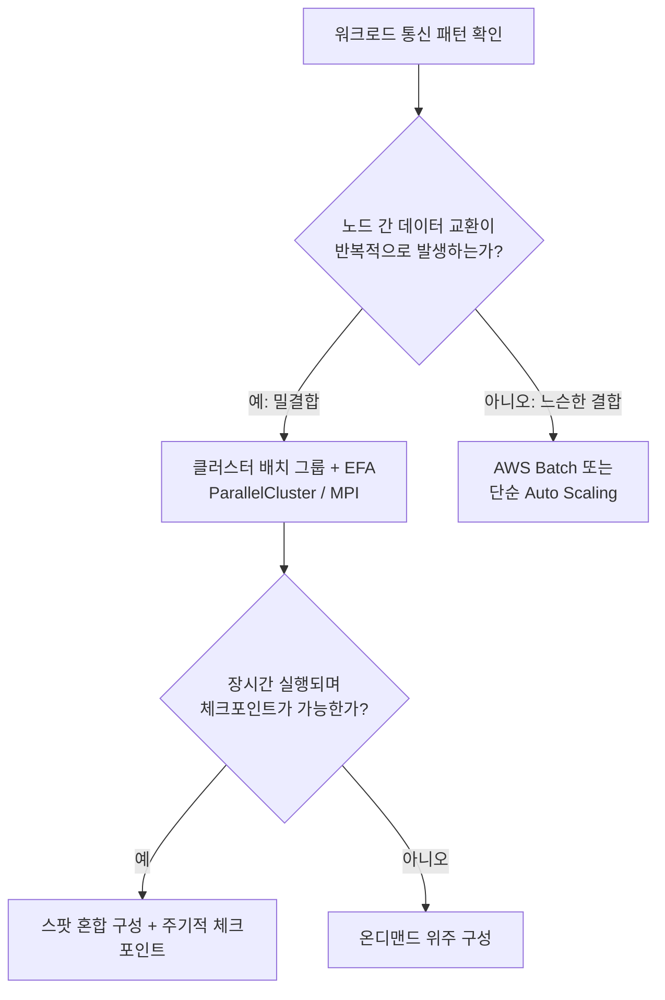

MPI(Message Passing Interface)는 밀결합 HPC의 표준 통신 규격으로, 랭크(rank) 단위로 프로세스를 나누고 `MPI_Send`/`MPI_Recv` 같은 1:1 통신과 `MPI_Allreduce`, `MPI_Allgather`, `MPI_Broadcast` 같은 집합 통신(collective communication)으로 데이터를 교환한다. 집합 통신은 참여 노드 수가 늘어날수록 통신 비용이 커지므로, 노드 수를 무작정 늘린다고 성능이 선형으로 개선되지 않는다 — 이 한계를 늦추는 것이 바로 EFA가 하는 일이다. AWS에서 MPI 클러스터를 직접 구성하려면 인스턴스 프로비저닝, 스케줄러 설치, 공유 파일시스템 마운트, EFA 드라이버 설정을 일일이 해야 하는데, **AWS ParallelCluster**는 이 과정을 코드형 인프라로 자동화하는 오픈소스 도구다. 설정 파일 하나로 헤드 노드, 큐, 스케줄러(Slurm이 기본), 공유 스토리지를 정의하면 내부적으로 CloudFormation 스택을 생성한다.

```yaml
# cluster-config.yaml — ParallelCluster 클러스터 정의
Region: ap-northeast-2
Image:
  Os: alinux2
HeadNode:
  InstanceType: c6i.2xlarge
  Networking:
    SubnetId: subnet-0123456789abcdef0
  Ssh:
    KeyName: hpc-key
Scheduling:
  Scheduler: slurm
  SlurmQueues:
    - Name: cfd-queue
      ComputeResources:
        - Name: hpc6a-nodes
          InstanceType: hpc6a.48xlarge
          MinCount: 0
          MaxCount: 32
          Efa:
            Enabled: true          # EFA 활성화 — 노드 간 지연 최소화
      Networking:
        SubnetIds:
          - subnet-0abcdef0123456789
        PlacementGroup:
          Enabled: true            # 클러스터 배치 그룹과 EFA는 항상 함께 적용
SharedStorage:
  - MountDir: /fsx
    Name: fsx-lustre
    StorageType: FsxLustre
    FsxLustreSettings:
      StorageCapacity: 1200
      DeploymentType: SCRATCH_2
      ImportPath: s3://hpc-input-bucket-123456789012/
```

HPC 전용 인스턴스로는 **Hpc6a**(AMD 기반, 네트워크·비용 균형), **Hpc6id**(고메모리 대역폭·로컬 NVMe, 메모리 바운드 워크로드), **Hpc7g**(Graviton 기반, 전력·비용 효율)가 대표적이며, 모두 EFA를 기본 지원한다. 소규모 클러스터라면 C6gn·C7gn 같은 컴퓨팅 최적화 인스턴스에도 EFA를 붙여 쓸 수 있다. 정확한 대역폭·EFA 인터페이스 수는 인스턴스 세대마다 달라지므로 최신 값은 서비스 문서를 확인해야 한다.

공유 스토리지로는 **Amazon FSx for Lustre**를 쓴다. Lustre는 병렬 파일시스템으로 수백 노드가 동시에 같은 파일에 고처리량으로 접근할 수 있으며, **데이터 리포지토리 연결(Data Repository Association)**을 통해 S3 버킷을 마치 파일시스템의 일부처럼 연결한다. 학습 데이터나 시뮬레이션 입력을 S3에 두고 필요할 때만 FSx로 지연 로딩(lazy loading)하거나, 반대로 계산 결과를 S3로 자동 내보낼 수 있다.

```bash
# FSx for Lustre 파일시스템에 S3 데이터 리포지토리 연결
aws fsx create-data-repository-association \
  --file-system-id fs-0123456789abcdef0 \
  --file-system-path "/data" \
  --data-repository-path "s3://hpc-input-bucket-123456789012/dataset/" \
  --s3 "AutoImportPolicy={Events=[NEW,CHANGED,DELETED]},AutoExportPolicy={Events=[NEW,CHANGED,DELETED]}"
  # AutoImportPolicy: S3에 새 객체가 생기면 파일시스템에 자동 반영
  # AutoExportPolicy: 계산 결과를 다시 S3로 자동 반출 — 체크포인트 저장에 활용
```

ParallelCluster로 클러스터를 띄운 뒤에는 헤드 노드에 SSH로 접속해 Slurm 명령으로 작업을 제출한다. 예를 들어 `sbatch --nodes=8 --ntasks-per-node=96 cfd_job.sh`처럼 노드 수와 태스크 수를 지정하면 Slurm이 `hpc6a-nodes` 큐에서 필요한 만큼 인스턴스를 자동으로 기동(scale-out)하고, 작업이 끝나면 `MaxCount`까지 유지하지 않고 다시 축소한다. 이 자동 확장·축소 덕분에 클러스터를 상시 띄워둘 필요 없이 작업이 있을 때만 비용이 발생한다.

FSx for Lustre는 배포 유형(Deployment Type)도 워크로드에 맞게 골라야 한다. **SCRATCH**는 임시 고성능 스토리지로 복제가 없어 저렴하지만 파일시스템 자체의 내구성은 낮으므로 결과를 반드시 S3로 내보내야 하고, **PERSISTENT**는 가용 영역 내 복제를 제공해 오래 유지해야 하는 공유 데이터셋에 적합하다. HPC 학습·시뮬레이션처럼 짧은 계산 구간 동안만 초고속 스토리지가 필요하면 SCRATCH + S3 데이터 리포지토리 조합이 비용 효율적이다.

HPC 작업은 대체로 몇 시간에서 며칠씩 걸리므로 **스팟 인스턴스 + 체크포인팅** 조합으로 비용을 크게 줄일 수 있다. 스팟은 2분의 중단 예고 후 회수되므로, 스케줄러(Slurm) 잡 스크립트에 주기적으로 중간 상태를 FSx나 S3에 저장하는 체크포인트 로직을 넣어야 한다. 중단이 발생해도 마지막 체크포인트부터 재시작하면 되므로 전체 재계산 비용을 피한다. 온디맨드 HPC 인스턴스는 시간당 비용이 높은 편이라 대규모 클러스터일수록 스팟 비중을 높이는 편이 유리하지만, 밀결합 잡의 일부 노드만 스팟으로 회수되면 전체 잡이 실패할 수 있으므로 헤드 노드와 핵심 랭크는 온디맨드로 고정하는 하이브리드 큐 구성이 일반적이다.

**이 옵션을 고르지 말아야 하는 신호**: 워크로드가 느슨한 결합이라 노드 간 통신이 거의 없다면 클러스터 배치 그룹·EFA·ParallelCluster는 과잉 설계다. 이런 경우는 20.3절의 AWS Batch나 단순 Auto Scaling 그룹으로 처리량 위주로 접근하는 편이 운영 부담과 비용 모두에서 낫다. 또한 노드 수가 몇 대 수준이거나 작업이 몇 분 안에 끝난다면 EFA가 주는 지연 개선폭보다 클러스터 구성·튜닝에 드는 엔지니어링 비용이 더 클 수 있다.

### 20.2 GPU·가속기 인스턴스와 추론 최적화

GPU·가속기 인스턴스를 고를 때 가장 먼저 구분할 것은 **학습(training)**과 **추론(inference)**이다. 학습은 대량의 파라미터를 반복적으로 갱신하며 역전파(backpropagation)를 수행하므로 GPU 메모리 용량과 노드 간 대역폭이 모두 중요하다. 추론은 이미 학습된 모델로 순전파(forward pass)만 수행하므로 상대적으로 가벼운 하드웨어로도 충분하고, 비용·지연 최적화가 핵심이 된다. 이 둘을 같은 인스턴스 풀에서 운영하면 학습용 고사양 GPU가 추론 트래픽 처리에 낭비되거나, 반대로 추론용 경량 GPU가 학습 작업에 병목이 되는 비효율이 생긴다.

**학습용은 P 계열**(P4d/P4de, P5 등, NVIDIA A100·H100급 GPU 탑재)을 쓴다. 인스턴스 하나에 여러 GPU가 NVLink/NVSwitch로 연결되어 노드 내부 GPU 간 통신은 매우 빠르지만, 여러 노드로 확장하는 순간 노드 간 네트워크가 새로운 병목이 된다. 이 때문에 대형 모델을 여러 P 계열 인스턴스에 분산 학습시킬 때도 20.1절의 클러스터 배치 그룹 + EFA 조합이 그대로 적용된다 — NCCL이 EFA 위에서 동작해 그래디언트 동기화(allreduce) 지연을 줄인다. **추론용은 G 계열**(G5·G6 등, A10G·L4급 GPU)이 비용 대비 효율이 좋고, AWS가 자체 설계한 **Inferentia**(Inf1/Inf2) 칩은 추론 전용으로 GPU보다 단위 비용당 처리량이 유리한 경우가 많다. 학습 전용 자체 칩인 **Trainium**(Trn1/Trn2)도 있으며, Inferentia·Trainium은 모두 AWS Neuron SDK로 프레임워크(PyTorch, TensorFlow)와 연결한다.

| 용도 | 대표 인스턴스 | 특징 | 선택 기준 |
|---|---|---|---|
| 대규모 학습 | P4d/P4de, P5 | NVIDIA GPU, NVLink, 최고 메모리 대역폭 | 파운데이션 모델급 학습, 다중 노드 분산 학습 |
| 범용 추론·경량 학습 | G5, G6 | 비용 대비 효율적인 NVIDIA GPU | 실시간 추론, 소규모 파인튜닝 |
| 추론 전용 커스텀 칩 | Inf2 (Inferentia2) | AWS 자체 설계, 추론 특화 | 단위 추론당 비용 최소화가 목표일 때 |
| 학습 전용 커스텀 칩 | Trn1/Trn2 (Trainium) | AWS 자체 설계, 학습 특화, EFA 지원 | GPU 조달이 어렵거나 비용 최적화가 우선일 때 |

**한 줄 결정 기준**: 모델을 반복 갱신하며 그래디언트를 계산하면 P 계열이나 Trainium, 이미 학습된 모델로 응답만 생성하면 G 계열이나 Inferentia다.

GPU 메모리는 모델 크기와 직결된다. 모델 파라미터 수 × 정밀도(바이트)만으로도 기본 메모리가 정해지고, 여기에 옵티마이저 상태와 그래디언트가 더해지면 학습 시 필요한 메모리는 추론 시의 여러 배로 커진다. 예를 들어 파라미터를 FP16(2바이트)으로 두더라도 학습 중에는 옵티마이저 상태(Adam 기준 파라미터당 추가로 여러 배)와 그래디언트가 함께 GPU 메모리에 상주해야 하므로, 추론만 할 때보다 훨씬 큰 메모리 여유가 필요하다. 정확한 배수는 옵티마이저 종류와 혼합 정밀도 설정에 따라 달라지므로 일반적인 경향으로만 이해한다.

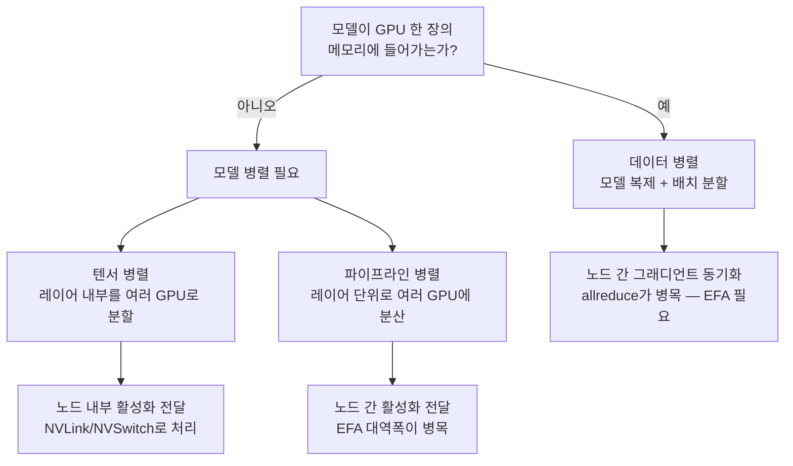

모델이 GPU 한 장의 메모리에 들어가면 **데이터 병렬(data parallel)** — 동일 모델을 여러 GPU에 복제하고 배치를 나눠 처리 후 그래디언트를 동기화 — 로 처리량을 확장한다. 모델 자체가 GPU 한 장에 들어가지 않을 만큼 크면 **모델 병렬(model parallel)** — 레이어를 나누는 파이프라인 병렬, 레이어 내부를 나누는 텐서 병렬 — 로 모델을 GPU 여러 장에 쪼갠다. 데이터 병렬은 노드 간 그래디언트 동기화 트래픽이, 모델 병렬은 레이어 사이를 오가는 활성화(activation) 전달 트래픽이 병목이 되므로 두 경우 모두 노드 간 네트워크 대역폭·지연이 핵심 설계 변수다. SageMaker는 이런 분산 학습 전략을 라이브러리 수준(분산 데이터 병렬, 분산 모델 병렬)으로 추상화해 제공하며, 상세한 분산 학습 구현과 파이프라인 구성은 → 53장에서 다룬다.

추론 단계에서는 비용·지연을 낮추는 세 가지 기법이 흔히 쓰인다. **배치 추론(batch inference)**은 여러 요청을 모아 한 번의 GPU 연산으로 처리해 처리량당 비용을 낮추지만 개별 요청의 지연이 늘어나는 트레이드오프가 있다. **양자화(quantization)**는 FP32/FP16 가중치를 INT8·FP8 등으로 낮춰 메모리 사용량과 연산량을 줄이되 정확도 손실을 감수한다. **컴파일 최적화**(SageMaker Neo, TensorRT 등)는 모델 그래프를 대상 하드웨어에 맞게 최적화해 동일 하드웨어에서 더 빠른 추론을 끌어낸다. 이 세 기법은 서로 배타적이지 않고 함께 적용하는 경우가 많다.

| 정밀도 | 파라미터당 크기 | 특징 | 선택 기준 |
|---|---|---|---|
| FP32 | 4바이트 | 가장 높은 정확도, 가장 큰 메모리 사용 | 정확도가 최우선이고 메모리 여유가 충분할 때 |
| FP16/BF16 | 2바이트 | 학습·추론 모두 널리 쓰이는 절충안 | 대부분의 학습·추론 기본 선택지 |
| INT8 | 1바이트 | 메모리·연산량 대폭 절감, 정확도 소폭 손실 | 지연·비용이 정확도보다 중요한 대량 추론 |
| FP8 | 1바이트 | 최신 GPU에서 지원, INT8보다 동적 범위 넓음 | 최신 하드웨어에서 정확도 손실을 최소화하며 경량화할 때 |

**한 줄 결정 기준**: 학습은 FP16/BF16을 기본으로 하고, 추론에서 지연·비용이 병목이면 INT8/FP8 양자화를 검토하되 정확도 저하를 반드시 검증한다.

대규모 학습 실행을 미리 계획할 수 있다면 **Capacity Blocks for ML**로 특정 미래 시점에 P 계열·Trn 계열 용량을 예약해, 학습 시작 시점에 인스턴스를 구하지 못하는 문제를 피할 수 있다. 이는 스팟처럼 저렴하지는 않지만 온디맨드보다 확정성이 높다.

GPU 인스턴스와 관련해 실무에서 가장 흔히 발생하는 대형 비용 사고는 **학습 인스턴스 방치**다. P4d/P5급 인스턴스는 시간당 비용이 일반 인스턴스와 자릿수가 다르며, 노트북 실험 후 인스턴스를 끄지 않고 방치하면 며칠 만에 예상치 못한 청구서를 받는다. 이를 막으려면 GPU 사용률 지표(CloudWatch의 `GPUUtilization`, NVIDIA DCGM 익스포터 등)를 기준으로 한 자동 정지와, 계정 단위 예산 알람을 함께 둔다.

```python
# lambda_stop_idle_gpu.py
# CloudWatch 알람(GPUUtilization < 5% 가 N분 지속)이 트리거하는 Lambda
# 유휴 GPU 인스턴스를 자동으로 정지해 방치 비용을 차단한다
import boto3

ec2 = boto3.client("ec2", region_name="ap-northeast-2")

def handler(event, context):
    instance_id = event["detail"]["instance-id"]  # EventBridge 알람 이벤트에서 추출
    ec2.stop_instances(InstanceIds=[instance_id])
    return {"stopped": instance_id}
```

이 Lambda는 EventBridge 규칙(CloudWatch 알람 상태 변화를 소스로)과 연결하고, 별도로 예산 알람(AWS Budgets)을 GPU 인스턴스 패밀리 필터로 설정해 이중 안전장치를 둔다.

**이 옵션을 고르지 말아야 하는 신호**: 추론 트래픽이 드물고 예측 불가능하다면 상시 기동된 GPU 인스턴스는 유휴 시간에도 비용이 발생하므로 서버리스 추론 옵션이나 온디맨드 CPU 인스턴스가 더 경제적일 수 있다. 또한 모델이 작아 CPU로도 지연 요구사항을 만족한다면 GPU를 기본값으로 택하지 않는다. GPU는 처리량·지연이 실제로 병목일 때만 정당화된다.

### 20.3 AWS Batch

**AWS Batch**는 느슨한 결합의 대량 배치 작업을 큐 기반으로 실행하는 관리형 서비스다. 세 가지 개념으로 구성된다. **작업 큐(Job Queue)**는 실행 대기 중인 작업이 쌓이는 곳이고, **작업 정의(Job Definition)**는 컨테이너 이미지·vCPU·메모리·재시도 정책 등 실행 명세이며, **컴퓨트 환경(Compute Environment)**은 실제로 작업이 돌아갈 자원 풀이다. 컴퓨트 환경은 **관리형(Managed)**과 **비관리형(Unmanaged)**으로 나뉘는데, 관리형은 Batch가 Auto Scaling까지 대신 관리하고, 비관리형은 사용자가 직접 준비한 ECS 클러스터에 작업을 붙이는 방식으로 세밀한 제어가 필요할 때 쓴다. 관리형 환경은 다시 **온디맨드**와 **스팟**을 선택할 수 있으며, 스팟을 쓰면 비용이 크게 낮아지지만 중단 가능성을 감안해 재시도 전략을 반드시 함께 설계해야 한다.

여러 작업을 하나의 정의로 반복 실행하고 싶을 때는 **배열 작업(Array Job)**을 쓴다. 인덱스(`AWS_BATCH_JOB_ARRAY_INDEX` 환경 변수)만 다르고 나머지 설정이 같은 작업을 대량으로 만들 때 유용하며, 배열 크기는 서비스 한도가 있으므로 대체로 수만 단위까지 가능하다는 점만 기억하고 정확한 한도는 문서를 확인한다. 작업 간 순서가 필요하면 `dependsOn`으로 종속성을 걸어 앞 작업이 성공(또는 특정 상태)한 뒤에만 다음 작업이 시작되게 한다.

컴퓨트 환경은 EC2와 **Fargate on Batch** 중에서 고른다. Fargate는 서버를 관리할 필요가 없고 시작 속도가 빠르지만, 이 글을 쓰는 시점 기준으로 **GPU 워크로드를 지원하지 않는다**. 따라서 GPU가 필요한 배치 작업(대량 추론 배치 등)은 EC2 컴퓨트 환경을 선택해야 한다.

| 기준 | EC2 컴퓨트 환경 | Fargate 컴퓨트 환경 |
|---|---|---|
| GPU 지원 | 지원 (P/G 계열 지정 가능) | 미지원 |
| 시작 속도 | 인스턴스 부팅 필요, 상대적으로 느림 | 컨테이너만 기동, 빠름 |
| 인프라 관리 | 인스턴스 타입·AMI 관리 필요 | 관리 불필요 |
| 세밀한 커스터마이징 | 인스턴스 타입, 로컬 스토리지 등 자유도 높음 | vCPU·메모리 조합 내 제한적 |
| 대규모 병렬 처리 비용 | 스팟 활용 시 유리 | Fargate Spot도 가능하나 GPU 불가 |

**한 줄 결정 기준**: GPU가 필요하거나 인스턴스 세부 제어가 필요하면 EC2, 짧고 단순한 CPU 작업을 빠르게 기동·해제하고 싶으면 Fargate다.

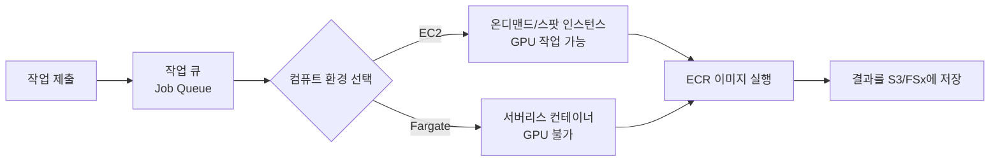

작업 큐는 우선순위(Priority)를 가질 수 있어, 여러 큐를 같은 컴퓨트 환경에 연결해두고 긴급 작업 큐의 우선순위를 높게 주는 방식으로 자원을 재배분할 수 있다. 배열 작업 내부에서도 개별 인덱스 간 종속성이 필요하면 `dependsOn`에 `type: N_TO_N`(대응 인덱스끼리 순서 보장) 또는 `SEQUENTIAL`(전체 배열이 끝난 뒤 다음 배열 시작)을 지정한다. 작업 상태 변화(SUBMITTED → RUNNABLE → RUNNING → SUCCEEDED/FAILED)는 EventBridge로 이벤트를 발행하므로, 실패 시 알림을 보내거나 후속 파이프라인을 트리거하는 이벤트 기반 처리를 손쉽게 붙일 수 있다(→ 48장 EDA 참조).

```json
{
  "jobDefinitionName": "genome-batch-job",
  "type": "container",
  "containerProperties": {
    "image": "123456789012.dkr.ecr.ap-northeast-2.amazonaws.com/genome-align:latest",
    "vcpus": 4,
    "memory": 8192,
    "jobRoleArn": "arn:aws:iam::123456789012:role/BatchJobRole",
    "environment": [
      { "name": "REFERENCE_BUCKET", "value": "s3://genome-ref-123456789012" }
    ]
  },
  "retryStrategy": {
    "attempts": 3,
    "evaluateOnExit": [
      { "onStatusReason": "Host EC2*", "action": "RETRY" },
      { "onReason": "*", "action": "EXIT" }
    ]
  },
  "timeout": {
    "attemptDurationSeconds": 3600
  }
}
```

위 예시에서 `retryStrategy`는 스팟 회수처럼 인프라 문제로 실패한 경우만 재시도하고 그 외 실패는 즉시 종료해, 애플리케이션 버그로 인한 무한 재시도를 막는다. `timeout`은 작업이 예상보다 오래 걸릴 때 자원을 계속 점유하지 않도록 강제 종료 시점을 정한다.

Batch는 이벤트 기반 오케스트레이션(Step Functions), 빅데이터 처리(EMR), 짧은 함수 실행(Lambda)과 역할이 겹쳐 보이지만 실제로는 명확히 구분된다.

| 서비스 | 적합한 역할 | 실행 시간 | 상태 관리 |
|---|---|---|---|
| AWS Batch | 대량의 독립적 배치 작업(컨테이너 기반) | 분~시간 단위, 장시간도 가능 | 작업 큐·재시도로 자체 관리 |
| Step Functions | 여러 서비스를 잇는 워크플로 오케스트레이션 | 워크플로 전체 지속시간 | 상태 머신으로 명시적 관리 |
| Amazon EMR | 분산 빅데이터 처리(Spark/Hadoop) | 분~시간 단위 | 클러스터·잡 단위 |
| AWS Lambda | 짧고 이벤트 기반인 개별 함수 실행 | 최대 실행 시간 한도 있음(→ 18장 참조) | 상태 없음(스테이트리스) |

**한 줄 결정 기준**: 컨테이너화된 독립 작업을 큐로 흘려보내며 대량 병렬 처리하려면 Batch, 여러 AWS 서비스를 순서·조건에 따라 엮으려면 Step Functions, 분산 데이터 프레임워크(Spark)가 필요하면 EMR이다. 세부 내용은 → 48장(서버리스·이벤트 기반), 49장(빅데이터 처리) 참조.

**이 옵션을 고르지 말아야 하는 신호**: 작업 사이에 복잡한 조건 분기나 사람의 승인 단계, 여러 서비스 호출 순서가 필요하다면 Batch 혼자로는 부족하고 Step Functions로 오케스트레이션해야 한다. 또한 작업 하나가 몇 초~몇 분 내로 끝나는 단순 이벤트 처리라면 Batch의 큐·컴퓨트 환경 기동 오버헤드보다 Lambda가 더 가볍다.

### 20.4 하이브리드 컴퓨트: Outposts, VMware Cloud on AWS, EC2 Mac

지금까지의 컴퓨트는 모두 AWS 리전 안에서 실행된다. 그러나 데이터 주권 규정, 온프레미스 수준의 초저지연 요구, 또는 이미 투자된 온프레미스 자산 때문에 리전 밖에서 AWS 서비스를 써야 하는 경우가 있다. 이런 하이브리드 옵션은 항상 리전 서비스보다 운영 복잡도와 계약 부담이 크므로, **먼저 리전 서비스로 요구사항을 만족할 수 없는지 검토한 뒤에만** 고려해야 한다.

**AWS Outposts**는 AWS 하드웨어(랙 또는 서버 폼팩터)를 고객의 데이터센터에 물리적으로 설치해 EC2, EBS, ECS/EKS, RDS 등 AWS 서비스 일부를 온프레미스에서 실행하게 해준다. 랙 단위(Outposts 랙)는 대규모 용량이 필요할 때, 서버 단위(Outposts 서버, 1U/2U)는 소규모 거점이나 통신 사업자 엣지에 적합하다. 중요한 제약은 세 가지다. 첫째, 지원되는 서비스가 리전 전체 서비스의 부분집합이라 리전에서 당연히 쓰던 기능이 Outposts에는 없을 수 있다. 둘째, Outposts는 **관리 제어 평면을 위해 상위 AWS 리전과의 지속적인 연결에 의존**한다. 연결이 끊기면 이미 실행 중인 로컬 워크로드는 대체로 계속 동작하지만 신규 배포나 제어 API 호출은 제약을 받는다. 셋째, 물리 하드웨어이므로 **용량 계획**(필요한 vCPU·메모리·스토리지를 미리 산정)과 **장기 약정**(통상 연 단위 계약)이 뒤따르며, 나중에 용량을 늘리려면 추가 하드웨어 주문과 설치 기간이 필요해 클라우드 특유의 즉시 확장성이 제한된다. 주문 절차 자체도 리전 서비스처럼 즉시 프로비저닝되지 않고, 설치 장소 실사·전력/네트워크 요건 검토·물리 배송·설치 일정이 선행되므로 도입 결정부터 실제 가동까지 상당한 리드타임을 감안해야 한다.

**VMware Cloud on AWS**는 기존에 vSphere·NSX·vSAN으로 운영하던 가상화 환경을 그대로 AWS 인프라 위에서 실행하는 서비스다. 온프레미스와 동일한 vCenter 도구·운영 절차를 유지한 채 물리 하드웨어만 AWS로 옮기는 셈이라, 애플리케이션을 다시 설계하지 않고도 데이터센터 자산을 클라우드로 이전할 수 있다. 마이그레이션은 **HCX(Hybrid Cloud Extension)**를 통해 네트워크 확장, 대량 마이그레이션(Bulk Migration), 무중단에 가까운 라이브 마이그레이션(vMotion 기반) 경로를 지원한다. 이 옵션은 대규모 vSphere 자산을 보유한 조직이 데이터센터 폐쇄(exit) 일정에 맞춰 빠르게 이전해야 할 때, 또는 애플리케이션 재설계 리소스가 부족할 때 선택된다. 다만 장기적으로는 클라우드 네이티브 서비스로 전환하는 로드맵을 함께 세우지 않으면 온프레미스 운영 방식을 그대로 클라우드 비용 구조에 얹는 결과가 될 수 있다. VMware Cloud on AWS로 옮긴 뒤에도 해당 SDDC(Software-Defined Data Center)에서는 여전히 vSphere 기반 VM으로 운영하므로, 관리형 서비스(RDS, EKS 등)로의 전환은 이전과 별개의 후속 과제로 계획해야 한다.

**EC2 Mac**은 실제 Apple Mac 하드웨어(Mac mini 기반의 mac1/mac2 인스턴스)를 AWS 데이터센터에서 대여하는 서비스로, macOS·iOS 애플리케이션의 빌드·테스트·서명 파이프라인(Xcode 기반 CI/CD)에 주로 쓰인다. Apple 라이선스 조건에 따라 반드시 **전용 호스트(Dedicated Host)** 단위로만 제공되며 다른 고객과 하드웨어를 공유하지 않는다. 또한 **최소 할당 기간(대체로 24시간)**이 적용되어, 몇 분짜리 빌드 하나를 위해 호스트를 켰다 꺼도 최소 단위만큼 과금된다. 따라서 EC2 Mac은 상시 가동되는 빌드 팜처럼 지속적으로 사용량이 있는 경우에 경제적이며, 아주 가끔 macOS 빌드가 필요한 조직이라면 비용 대비 효율을 따져봐야 한다. 전용 호스트를 할당(allocate)한 뒤에는 그 위에 여러 개의 mac 인스턴스를 순차적으로 기동·중지할 수 있지만, 호스트 자체를 해제(release)하려면 최소 할당 기간이 지나야 하므로 CI 파이프라인 설계 시 호스트 단위로 빌드 작업을 몰아서 배치하는 편이 유리하다.

| 옵션 | 선택 이유 | 대표 제약 |
|---|---|---|
| AWS Outposts | 데이터 주권 규정, 온프레미스 수준 초저지연 | 서비스 부분집합, 리전 연결 의존, 장기 약정·용량 계획 |
| VMware Cloud on AWS | 기존 vSphere 자산 그대로 이전 | 온프레미스 운영 모델 유지, 클라우드 네이티브 전환은 별도 과제 |
| EC2 Mac | Apple 생태계(iOS/macOS) 빌드·테스트 전용 | 전용 호스트 필수, 최소 24시간 할당 단위 |
| (기본값) 리전 서비스 | 규정·지연·기존 자산 제약이 없는 대부분의 경우 | 없음 — 확장성·관리 부담이 가장 낮음 |

**한 줄 결정 기준**: 규정이나 물리적 지연이 실제로 발목을 잡거나 기존 자산 이전 일정이 촉박할 때만 하이브리드 옵션을 쓰고, 그 외에는 리전 서비스가 기본값이다.

**이 옵션을 고르지 말아야 하는 신호**: "나중에 온프레미스로 되돌릴 수도 있으니까"라는 막연한 이유로 Outposts를 도입하는 것은 장기 약정과 용량 계획 부담만 키운다. 마찬가지로 vSphere 자산이 없는데 VMware Cloud on AWS를 신규로 도입하거나, macOS/iOS 빌드 요구가 없는데 EC2 Mac 전용 호스트를 예비로 띄워두는 것도 불필요한 고정비다. 세 옵션 모두 "이 요구사항이 리전 서비스로는 정말 안 되는가"를 먼저 검증한 뒤 선택해야 한다.

### 20장 정리

#### [필수] 반드시 알아야 할 것
1. HPC·분산 학습에서 성능을 좌우하는 것은 CPU/GPU 코어 수가 아니라 **노드 간 네트워크 지연**이며, 이를 줄이는 조합은 클러스터 배치 그룹 + EFA다.
2. EFA는 SRD 프로토콜로 OS 커널을 우회해 지연을 낮추며, `libfabric`을 통해 MPI(HPC)와 NCCL(분산 학습) 양쪽에서 쓰인다.
3. AWS ParallelCluster는 헤드 노드·큐·스케줄러·공유 스토리지를 설정 파일 하나로 정의해 HPC 클러스터 구성을 자동화한다.
4. FSx for Lustre는 데이터 리포지토리 연결로 S3와 자동 동기화되어 대규모 학습 데이터·체크포인트를 고처리량으로 다룬다.
5. GPU 인스턴스는 학습용(P 계열)과 추론용(G 계열, Inferentia)으로 역할이 다르며, 모델이 GPU 메모리에 들어가지 않으면 모델 병렬, 들어가면 데이터 병렬로 확장한다.
6. AWS Batch는 작업 큐·작업 정의·컴퓨트 환경 3요소로 구성되며, Fargate 컴퓨트 환경은 GPU를 지원하지 않는다.
7. Outposts·VMware Cloud on AWS·EC2 Mac은 각각 규정, 기존 vSphere 자산, Apple 빌드 파이프라인이라는 명확한 사유가 있을 때만 선택하는 예외적 옵션이다.

#### [팁] 실무 노하우
1. 밀결합 HPC와 느슨한 결합 워크로드를 먼저 구분하고, 후자는 ParallelCluster 없이 Batch나 Auto Scaling만으로 처리해 운영 부담을 줄인다.
2. 장시간 실행되는 HPC·학습 작업은 스팟 + 체크포인팅으로 비용을 낮추되, 핵심 랭크(헤드 노드 등)는 온디맨드로 고정한다.
3. 추론 비용은 배치 추론·양자화·컴파일 최적화를 조합해 낮추고, 대규모 학습은 Capacity Blocks for ML로 용량을 미리 확보한다.
4. Batch 재시도 전략에서 인프라 문제(스팟 회수 등)와 애플리케이션 오류를 `evaluateOnExit`로 구분해, 버그성 실패까지 반복 재시도되지 않게 한다.
5. GPU 사용률 기반 CloudWatch 알람 + Lambda 자동 정지와 예산 알람을 이중으로 걸어 방치 비용을 원천 차단한다.

#### [주의] 사고·비용·설계 함정
1. P4d/P5급 GPU 학습 인스턴스를 실험 후 끄지 않고 방치하는 것이 이 장에서 가장 큰 비용 사고 유형이다.
2. 클러스터 배치 그룹은 단일 AZ 제약이 있으므로, 해당 AZ에 필요한 인스턴스 타입 용량이 부족하면 클러스터 전체를 못 띄울 수 있다.
3. Fargate on Batch 컴퓨트 환경에 GPU 작업을 시도하면 지원되지 않아 실패한다 — GPU가 필요하면 반드시 EC2 컴퓨트 환경을 쓴다.
4. 스팟으로 HPC 노드를 구성할 때 체크포인팅 없이 장시간 계산을 돌리면 중단 시 처음부터 다시 계산해야 한다.
5. Outposts는 리전과의 연결 의존, 장기 약정, 물리 용량 계획이라는 제약이 있어 일시적 필요로 도입하면 장기 고정비로 남는다.
6. EC2 Mac은 전용 호스트 단위 + 최소 24시간 할당이 적용되므로, 짧고 산발적인 빌드 요구에는 비용 대비 비효율적일 수 있다.
7. 배열 작업이나 대량 Batch 작업 제출 시 서비스 할당량(동시 실행 작업 수 등)을 사전에 확인하지 않으면 큐에 작업이 쌓이기만 하고 처리되지 않을 수 있다.

#### 한 장 요약
특수 목적 컴퓨트는 범용 인스턴스로는 풀 수 없는 좁고 구체적인 문제 — 노드 간 지연, GPU 메모리·대역폭, 대량 배치 작업, 규정·기존 자산 제약 — 를 겨냥한 예외적 선택지다. HPC와 분산 학습은 결국 같은 원리(클러스터 배치 그룹 + EFA)로 지연을 줄이고, AWS Batch는 느슨한 결합 작업을 큐로 관리형 확장하며, 하이브리드 컴퓨트는 항상 리전 서비스가 안 되는 이유가 명확할 때만 쓴다. 모든 절에서 공통된 원칙은 "필요가 확실할 때만 특수 목적을 선택하고, 그렇지 않으면 표준 컴퓨트로 충분하다"는 것이다.

#### 다음 장 예고
21장부터는 Part V — 스토리지와 데이터베이스로 넘어가, 스토리지 선택의 원리부터 시작해 각 서비스의 특성과 한계를 다룬다.

---

