# Part V. 기반 블록 III — 스토리지와 데이터베이스

## 21장. 스토리지 선택의 원리  ★★★

> **이 장에서 다루는 것**
> Part IV(15~20장)에서 EC2·서버리스·컨테이너·특수 목적 컴퓨트까지 컴퓨트 계층을 다뤘다면, 이제 그 컴퓨트가 데이터를 어디에 어떻게 두는지를 다룬다. AWS 스토리지는 접근 방식이 근본적으로 다른 세 갈래 — 블록, 파일, 오브젝트 — 로 나뉘고, 각 갈래 안에서도 EBS 볼륨 타입, EFS 성능/처리량 모드, FSx 4형제처럼 세부 선택지가 갈린다. 이 장은 "왜 이 서비스가 이 워크로드에 맞는가"를 판단 기준 중심으로 정리한다. 오브젝트 스토리지의 대표주자인 **Amazon S3**는 다루는 범위가 방대해 22장에서 단독으로 심층 다루며, 이 장에서는 21.1의 모델 비교와 21.7 결정표에서만 위치를 짚는다.

### 21.1 블록 vs 파일 vs 오브젝트

같은 "데이터를 저장한다"는 목적이어도 애플리케이션이 데이터에 접근하는 방식은 셋으로 갈린다. 이 차이를 이해하지 못하면 "왜 데이터베이스는 S3에 못 두는가", "왜 여러 서버가 EBS를 나눠 쓸 수 없는가" 같은 질문에 답할 수 없다.

**블록 스토리지**는 운영체제에 원시 디스크처럼 보이는 블록 디바이스를 제공한다. 파일시스템(ext4, XFS, NTFS)을 그 위에 직접 올려야 쓸 수 있고, 임의의 바이트 오프셋에 저수준으로 읽고 쓸 수 있어 지연이 가장 낮다. 대신 원칙적으로 **한 번에 한 인스턴스만** 마운트한다(멀티 어태치는 21.4의 예외). 데이터베이스 데이터 파일, 부팅 볼륨처럼 저지연·단일 소유자 워크로드에 맞는다. AWS에서는 **Amazon EBS**(네트워크 블록 스토리지, 영속적)와 **인스턴스 스토어**(호스트에 물리적으로 붙은 임시 블록 스토리지, 인스턴스 중지·종료 시 휘발)가 이 자리를 채운다.

**파일 스토리지**는 POSIX 파일시스템을 네트워크로 공유한다. 여러 클라이언트가 동시에 같은 디렉터리 트리를 마운트해 파일 잠금, 권한, 계층 구조를 그대로 쓸 수 있다. 블록보다 지연은 높지만 "여러 서버가 같은 파일을 봐야 한다"는 요구를 정확히 만족한다. 공유 홈 디렉터리, 콘텐츠 관리 시스템의 업로드 디렉터리, HPC 공유 데이터셋이 대표 사례다. AWS에서는 **Amazon EFS**(리눅스 NFS)와 **Amazon FSx** 계열(Windows SMB, Lustre, ONTAP, OpenZFS)이 이 자리를 채운다.

**오브젝트 스토리지**는 파일시스템 계층 구조 대신 HTTP API(`GET`/`PUT`/`DELETE`)로 키-값 형태의 객체를 다룬다. 파일을 부분 수정할 수 없고 전체를 다시 올려야 하며, 파일시스템 마운트 개념이 없어 지연은 셋 중 가장 높다. 대신 사실상 무제한에 가까운 용량과 11 나인(9)대의 내구성, 리전 전체에 걸친 가용성을 제공한다. 정적 자산, 백업, 데이터 레이크, 로그 아카이브에 적합하다. AWS의 대표 서비스가 **Amazon S3**이며, 상세는 22장에서 다룬다.

| 모델 | 접근 방식 | 지연 | 처리량 특성 | 적합 워크로드 | AWS 서비스 |
|---|---|---|---|---|---|
| 블록 | 블록 디바이스, 파일시스템 직접 구성 | 매우 낮음(서브ms~수ms) | 볼륨 타입에 따라 IOPS/처리량 개별 조정 | DB 데이터 파일, 부팅 볼륨, 단일 서버 로그 | EBS, 인스턴스 스토어 |
| 파일 | POSIX 파일시스템, 다중 클라이언트 마운트 | 중간(수ms) | 동시 클라이언트 수에 따라 총 처리량 확장 | 공유 홈 디렉터리, CMS 업로드, HPC 공유 데이터 | EFS, FSx 계열 |
| 오브젝트 | HTTP API, 키-값 | 높음(수십~수백ms) | 요청 병렬화로 총 처리량 확장, 대역폭 사실상 무제한 | 정적 자산, 백업, 데이터 레이크, 아카이브 | S3(→ 22장) |

**한 줄 결정 기준**: 단일 서버가 저지연으로 원시 블록에 접근해야 하면 EBS, 여러 서버가 같은 파일 트리를 POSIX 의미론으로 공유해야 하면 EFS/FSx, 접근 패턴이 "쓰고 나중에 통째로 읽는" HTTP 기반이고 규모가 크면 S3다.

### 21.2 Amazon EBS 볼륨 타입

EBS는 성능·비용 특성이 다른 여섯 가지 볼륨 타입을 제공하며, 원서의 분류를 따라 네 계열로 나뉜다. **범용 SSD**(gp2, gp3)는 대부분의 워크로드에 무난한 기본 선택지다. **프로비저닝된 IOPS SSD**(io1, io2 Block Express)는 트랜잭션 집약적 데이터베이스처럼 일관되고 높은 IOPS가 필요할 때 쓴다. **처리량 최적화 HDD**(st1)와 **콜드 HDD**(sc1)는 IOPS보다 순차 처리량이 중요하고 비용에 민감한 빅데이터·로그 워크로드에 맞는다.

핵심은 **gp3부터는 IOPS와 처리량을 용량과 독립적으로 프로비저닝**할 수 있다는 점이다. gp2는 용량 1GiB당 3 IOPS가 기본 배정되는 구조라 IOPS를 늘리려면 용량 자체를 키워야 했고(그래서 실제로 필요하지도 않은 대용량 볼륨을 만드는 관행이 흔했다), gp3는 기본 3,000 IOPS·125MiB/s를 용량과 무관하게 제공하고 그 이상은 추가 요금으로 별도 프로비저닝한다. 그 결과 **대부분의 gp2 볼륨은 gp3로 옮기면 동일하거나 더 높은 성능을 더 낮은 단가로 얻는다** — 필요 없는 용량을 사지 않아도 되기 때문이다. io2 Block Express는 io1보다 더 높은 IOPS·처리량 상한과 더 높은 내구성(99.999%)을 제공하며 멀티 어태치도 지원한다.

| 볼륨 타입 | 분류 | 용량 범위 | 최대 IOPS | 최대 처리량 | 지연 | 적합 워크로드 | 상대 단가 |
|---|---|---|---|---|---|---|---|
| gp3 | 범용 SSD | 1GiB~16TiB | 약 16,000 (기본 3,000 무료) | 약 1,000MiB/s (기본 125 무료) | 서브ms | 대부분의 부팅 볼륨, 범용 DB, 개발/테스트 | 낮음 |
| gp2 | 범용 SSD(구세대) | 1GiB~16TiB | 용량 비례, 최대 약 16,000 | 용량 비례, 최대 약 250MiB/s | 서브ms | 레거시 워크로드(신규는 gp3 권장) | 중간 |
| io2 Block Express | 프로비저닝 IOPS SSD | 4GiB~64TiB | 약 256,000 | 약 4,000MiB/s | 서브ms, 매우 일관적 | 대규모 트랜잭션 DB, SAP HANA | 높음 |
| io1 | 프로비저닝 IOPS SSD | 4GiB~16TiB | 약 64,000(Nitro) | 약 1,000MiB/s | 서브ms, 일관적 | 중대형 OLTP DB | 높음 |
| st1 | 처리량 최적화 HDD | 125GiB~16TiB | 낮음(수백) | 약 500MiB/s(버스트형) | 수ms~수십ms | 빅데이터, 로그 처리, 데이터 웨어하우스 스테이징 | 낮음 |
| sc1 | 콜드 HDD | 125GiB~16TiB | 매우 낮음 | 약 250MiB/s(버스트형) | 수십ms | 접근 빈도 낮은 아카이브, 콜드 데이터 | 매우 낮음 |

*(수치는 리전·계정 할당량에 따라 달라질 수 있으므로 실제 설계 시 EC2 EBS 볼륨 유형 문서와 서비스 할당량 콘솔을 반드시 확인한다.)*

**한 줄 결정 기준**: 예측 가능한 범용 워크로드는 gp3를 기본값으로 놓고, IOPS 자체가 병목인 대형 트랜잭션 DB만 io2로 올리며, 순차 처리량 위주의 대용량 데이터는 st1/sc1로 비용을 낮춘다.

```bash
# gp3 볼륨 생성: IOPS와 처리량을 용량과 별도로 지정
aws ec2 create-volume \
  --availability-zone ap-northeast-2a \
  --volume-type gp3 \
  --size 200 \
  --iops 6000 \
  --throughput 500 \
  --tag-specifications 'ResourceType=volume,Tags=[{Key=Name,Value=app-db-data}]'
```

### 21.3 EBS 성능 축: IOPS · 처리량 · 지연

세 지표는 서로 얽혀 있지만 같은 것이 아니다. **IOPS**(초당 입출력 연산 수)는 작은 블록의 무작위 접근이 많은 워크로드(OLTP DB)에서 중요하고, **처리량**(MiB/s)은 큰 블록의 순차 접근(로그 수집, 백업 스트리밍)에서 중요하다. 같은 처리량이라도 블록 크기가 작으면 IOPS 요구량이 커지고, 블록 크기가 크면 IOPS는 낮아도 처리량이 커진다 — 즉 `처리량 ≈ IOPS × 블록 크기`라는 관계로 대략 가늠할 수 있다. **지연**(latency)은 개별 요청이 완료되는 시간으로, IOPS나 처리량이 상한에 닿기 전까지는 대체로 서브밀리초 수준을 유지하다가 한계에 가까워지면 급격히 늘어난다.

gp2는 용량에 비례한 베이스라인 IOPS 위에 **버스트 크레딧**을 쌓아 순간적으로 최대 3,000 IOPS까지 낼 수 있지만, 크레딧이 소진되면 베이스라인으로 떨어진다. 작은 gp2 볼륨에서 지속적인 고부하를 걸면 크레딧 고갈 후 성능이 급락하는 현상이 이 때문이다. st1과 sc1도 유사한 버스트 모델을 쓰는데, 이쪽은 IOPS가 아니라 **처리량 크레딧**을 소모한다. gp3는 기본 성능이 크레딧 없이 보장되므로 이런 함정에서 비교적 자유롭다.

또 하나 자주 간과되는 함정이 **인스턴스 수준 EBS 대역폭 상한**이다. 볼륨 자체를 io2로 64,000 IOPS까지 프로비저닝해도, 붙어 있는 EC2 인스턴스 타입이 지원하는 최대 EBS 대역폭·IOPS를 넘어설 수는 없다. 즉 인스턴스가 병목이 되어 볼륨 성능이 무의미해지는 상황이 실무에서 흔하다. EBS 최적화(EBS-optimized)는 Nitro 기반 인스턴스에서는 기본 활성화되어 있지만, 인스턴스 크기별로 대역폭 상한이 다르므로 볼륨을 키우기 전에 반드시 인스턴스 타입의 EBS 대역폭 사양을 확인해야 한다.

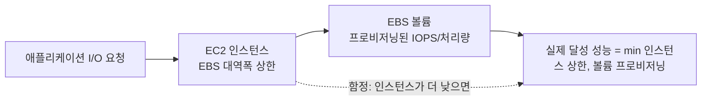

마지막으로, 스냅샷에서 복원한 볼륨은 최초 읽기 시 데이터를 S3에서 지연 로딩(lazy loading)하므로 첫 접근 시 지연이 튄다. 프로덕션에 바로 투입하기 전에 `dd`나 `fio`로 전체 블록을 한 번 읽어 **사전 워밍(pre-warming)**하거나, 21.4의 빠른 스냅샷 복원(FSR)을 쓰는 편이 안전하다.

### 21.4 EBS 스냅샷, 빠른 스냅샷 복원, 멀티 어태치

EBS 스냅샷은 볼륨의 시점 백업을 S3에(사용자가 직접 접근하지 못하는 관리형 영역에) 저장한다. **최초 스냅샷은 볼륨 전체의 풀 복사본**이라 시간과 비용이 가장 크고, 이후 스냅샷은 마지막 스냅샷 이후 변경된 블록만 저장하는 **증분(incremental)** 방식이다. 다만 요금 관점에서 중요한 점은 "증분이니까 오래된 스냅샷을 지우면 비용이 크게 준다"는 생각이 항상 맞지는 않는다는 것이다 — 체인 중간의 스냅샷을 지워도 이후 스냅샷이 여전히 참조하는 블록은 AWS가 내부적으로 보존하므로, **저장 요금은 체인 전체에 걸쳐 실제 보유 중인 고유 블록 양에 누적**된다. 스냅샷 개수가 아니라 "고유 데이터가 얼마나 쌓여 있는가"로 청구된다고 이해하는 편이 정확하다.

스냅샷에서는 새 볼륨을 만들거나 AMI를 등록할 수 있다. 복원된 볼륨은 기본적으로 블록을 필요할 때마다 S3에서 가져오는 **지연 로딩**을 하므로 첫 접근이 느리다. **빠른 스냅샷 복원(Fast Snapshot Restore, FSR)**을 특정 AZ에 대해 활성화해 두면 그 AZ에서 해당 스냅샷으로 만드는 볼륨은 처음부터 완전한 성능을 낸다. 다만 FSR은 AZ당 추가 시간 요금이 붙고 활성화할 수 있는 스냅샷·AZ 조합에 할당량이 있으므로 상시 필요한 골든 이미지에만 선별 적용한다.

자주 접근하지 않는 스냅샷은 **아카이브 계층(Archive tier)**으로 옮겨 저장 비용을 크게 낮출 수 있는데, 최소 보관 기간이 있고 일반 계층으로 되돌리는(복원) 데는 수 시간이 걸리므로 규정 준수 목적의 장기 보관용으로만 쓴다. 스냅샷은 계정 간·리전 간 복사도 가능하다. 원본이 AWS 관리형 키로 암호화된 경우 다른 계정과는 그 키를 공유할 수 없으므로, 계정 간 공유가 필요하면 **고객 관리형 KMS 키(CMK)**로 다시 암호화해 복사해야 한다(→ 31장 KMS 참조). 스냅샷·AMI의 생성·보존·정리를 정책으로 자동화하려면 **Data Lifecycle Manager(DLM)**를 쓴다.

```json
{
  "PolicyDetails": {
    "PolicyType": "EBS_SNAPSHOT_MANAGEMENT",
    "ResourceTypes": ["VOLUME"],
    "TargetTags": [{ "Key": "Backup", "Value": "daily" }],
    "Schedules": [
      {
        "Name": "DailySnapshots",
        "CreateRule": { "Interval": 24, "IntervalUnit": "HOURS", "Times": ["03:00"] },
        "RetainRule": { "Count": 14 },
        "CopyTags": true,
        "CrossRegionCopyRules": [
          {
            "TargetRegion": "us-east-1",
            "Encrypted": true,
            "CmkArn": "arn:aws:kms:us-east-1:123456789012:key/abcd1234-ef56-...",
            "RetainRule": { "Interval": 30, "IntervalUnit": "DAYS" }
          }
        ]
      }
    ]
  },
  "ExecutionRoleArn": "arn:aws:iam::123456789012:role/DLMSnapshotRole",
  "State": "ENABLED"
}
```
*(위 정책은 `Backup=daily` 태그가 붙은 볼륨을 매일 03시에 스냅샷하고 14개를 보관하며, us-east-1로 CMK 암호화 복사본을 30일 보관한다.)*

**멀티 어태치**는 io1/io2(io2 Block Express 포함) 볼륨을 같은 AZ 내 여러 Nitro 인스턴스에 동시에 연결하는 기능이다. 다만 ext4·XFS 같은 일반 파일시스템은 동시 쓰기 충돌을 감지하지 못하므로, **클러스터 인식 파일시스템**(GFS2, OCFS2 등)이나 애플리케이션 자체의 동시성 제어가 반드시 있어야 한다. 이 전제 없이 멀티 어태치만 켜면 데이터 손상으로 이어진다.

### 21.5 Amazon EFS

EFS는 리눅스 클라이언트를 위한 완전관리형 **NFS v4.1** 파일시스템이다. 단일 AZ에 묶이는 EBS와 달리 **리전 서비스**로, 여러 AZ에 **마운트 타깃**을 두고 각 AZ의 인스턴스가 동일한 파일시스템을 동시에 마운트한다. 이 점이 EFS를 "여러 서버가 같은 파일을 봐야 하는" 요구의 기본 답으로 만든다.

성능 모드는 두 가지다. **범용(General Purpose)**은 파일당 연산 지연이 가장 낮아 대부분의 워크로드에 기본값으로 쓰인다. **최대 I/O(Max I/O)**는 수백~수천 클라이언트가 동시에 접근하며 총 처리량이 개별 지연보다 중요한 경우를 위한 모드로, 개별 연산 지연은 범용보다 다소 높다. 처리량 모드는 **버스팅**(용량에 비례해 크레딧 기반으로 처리량이 늘고 주는 기본 모드), **프로비저닝**(용량과 무관하게 고정 처리량을 지정), **엘라스틱**(워크로드에 맞춰 처리량을 자동으로 늘리고 줄이는 모드로, 예측하기 어려운 버스트 패턴에 권장)로 나뉜다.

스토리지 클래스는 **Standard**(다중 AZ), **One Zone**(단일 AZ, 저렴하지만 AZ 장애 시 손실 위험), 그리고 각각의 **IA(Infrequent Access)** 등급과 더 저렴한 **Archive** 등급이 있다. **라이프사이클 관리**를 설정해 두면 지정한 기간 동안 접근이 없는 파일을 자동으로 IA·Archive로 옮겨 저장 비용을 크게 줄인다. 애플리케이션 서버에는 **EFS 마운트 헬퍼**로 마운트하고, 컨테이너나 다중 테넌트 환경에서는 **액세스 포인트**로 애플리케이션별 루트 디렉터리와 POSIX 사용자/권한을 강제해 접근을 격리한다.

```yaml
# EFS 파일시스템 + 라이프사이클 정책 + 액세스 포인트 (CloudFormation, 발췌)
Resources:
  AppFileSystem:
    Type: AWS::EFS::FileSystem
    Properties:
      PerformanceMode: generalPurpose
      ThroughputMode: elastic
      LifecyclePolicies:
        - TransitionToIA: AFTER_30_DAYS
        - TransitionToArchive: AFTER_90_DAYS
        - TransitionToPrimaryStorageClass: AFTER_1_ACCESS
      FileSystemTags:
        - { Key: Name, Value: shared-uploads }

  AppAccessPoint:
    Type: AWS::EFS::AccessPoint
    Properties:
      FileSystemId: !Ref AppFileSystem
      PosixUser:
        Uid: "1000"
        Gid: "1000"
      RootDirectory:
        Path: "/app-uploads"
        CreationInfo:
          OwnerUid: "1000"
          OwnerGid: "1000"
          Permissions: "0755"
```

EFS의 한계는 **소규모 파일을 대량으로 다루는 워크로드에서 지연이 두드러진다**는 점이다. NFS 프로토콜 특성상 파일 하나를 열고 닫는 데도 네트워크 왕복이 필요해, 파일 수만~수십만 개짜리 소스 트리를 통째로 체크아웃하거나 컴파일 빌드 캐시로 쓰면 로컬 SSD 대비 체감 속도 저하가 크다. 이런 워크로드는 인스턴스 스토어나 EBS에 로컬로 두고 결과물만 공유 스토리지로 내보내는 편이 낫다.

### 21.6 Amazon FSx 계열

FSx는 오픈소스나 상용 파일시스템을 AWS가 완전관리형으로 운영해 주는 서비스군으로, 용도가 뚜렷이 갈리는 4종이 있다.

- **FSx for Windows File Server**: SMB 프로토콜, Active Directory(AWS Managed Microsoft AD 또는 온프레미스 AD) 통합, DFS 네임스페이스와 새도 카피(shadow copy)를 지원한다. Windows 서버를 리눅스 EFS로 대체할 수 없을 때, 즉 SMB·AD 기반 파일 공유가 그대로 필요한 이관 시나리오의 기본 선택지다.
- **FSx for Lustre**: 병렬 파일시스템으로 수백~수천 노드가 동시에 고처리량 접근을 하는 HPC·ML 학습 워크로드에 맞는다. S3와 데이터 리포지토리 연결로 데이터를 지연 로딩·자동 내보내기 할 수 있다. HPC 클러스터 구성과 SCRATCH/PERSISTENT 배포 유형 선택은 20.1절에서 이미 다뤘으므로 여기서는 반복하지 않는다(→ 20장 참조).
- **FSx for NetApp ONTAP**: NFS·SMB·iSCSI를 동시에 지원하는 멀티프로토콜 파일시스템으로, 온프레미스에 NetApp을 쓰던 조직이 **SnapMirror**로 기존 복제 파이프라인을 그대로 클라우드까지 확장하려 할 때 적합하다. 중복 제거·압축 등 스토리지 효율 기능도 제공한다.
- **FSx for OpenZFS**: ZFS의 스냅샷·클론·압축 기능을 NFS로 제공하는 고성능 파일시스템으로, ZFS 기반 온프레미스 인프라를 클라우드로 그대로 옮기거나 스냅샷/클론을 빠르게 반복해야 하는 개발 워크플로에 적합하다.

| FSx 종류 | 프로토콜 | 핵심 강점 | 적합 시나리오 |
|---|---|---|---|
| Windows File Server | SMB | AD 통합, DFS, 새도 카피 | Windows 파일 서버 이관, SMB 공유 |
| Lustre | Lustre 클라이언트 | 초고처리량 병렬 접근, S3 연동 | HPC 시뮬레이션, ML 학습 데이터(→ 20장) |
| NetApp ONTAP | NFS/SMB/iSCSI | 멀티프로토콜, SnapMirror, 스토리지 효율화 | 기존 NetApp 자산 이관, 복제 파이프라인 |
| OpenZFS | NFS | ZFS 스냅샷/클론, 낮은 지연 | ZFS 기반 워크로드, 빠른 개발 스냅샷 반복 |

**한 줄 결정 기준**: SMB·AD가 필요하면 Windows File Server, 초고처리량 병렬 HPC/ML이면 Lustre, 기존 NetApp 자산이나 멀티프로토콜이 필요하면 ONTAP, ZFS 스냅샷/클론 워크플로가 필요하면 OpenZFS다.

### 21.7 스토리지 선택 결정표

지금까지의 축(지연, 다중 서버 공유 필요 여부, 용량, 내구성, 비용, POSIX 필요 여부)을 하나의 결정 트리로 정리하면 다음과 같다.

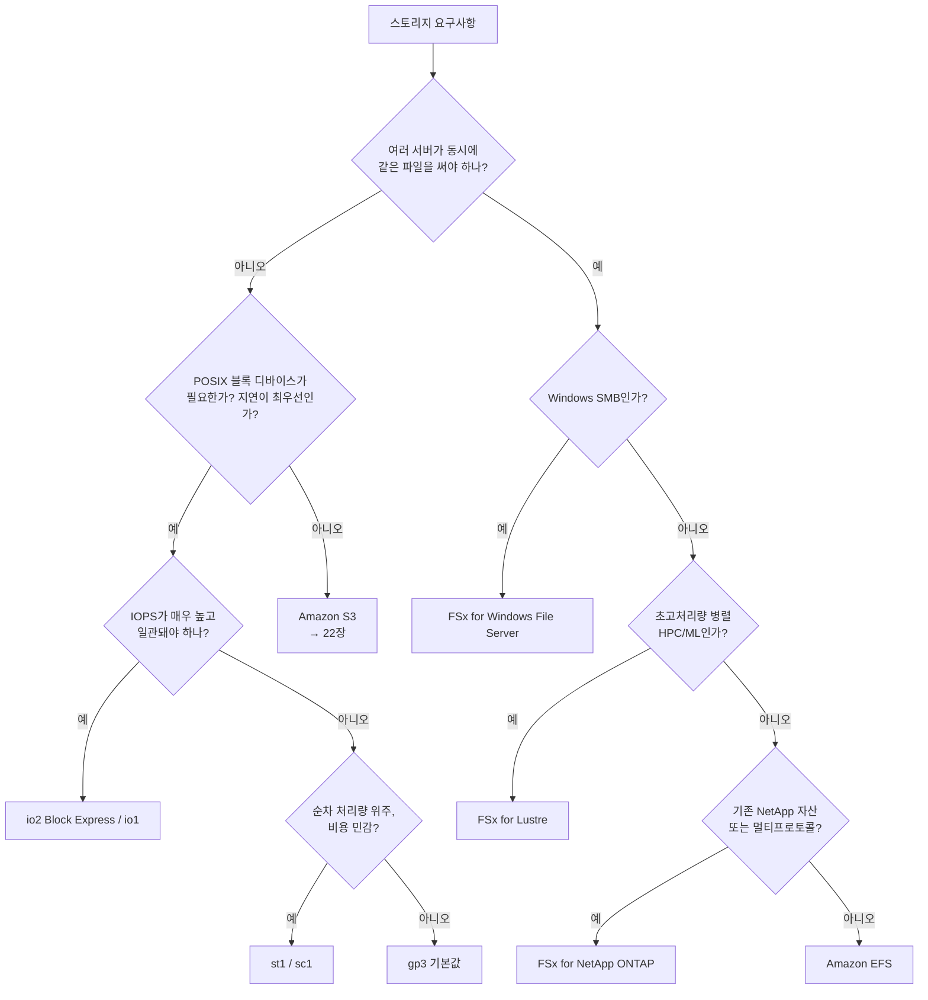

| 워크로드 | 권장 스토리지 | 이유 |
|---|---|---|
| EC2 부팅 볼륨 | gp3 | 대부분 워크로드에 충분한 기본 IOPS·처리량, 최저 단가 |
| 트랜잭션 DB 데이터 파일 | io2 Block Express / io1 | 낮고 일관된 지연, 높은 IOPS 요구 |
| 데이터 웨어하우스 스테이징·로그 처리 | st1 | 순차 처리량 위주, 대용량·저비용 |
| 콜드 아카이브(가끔 배치 읽기) | sc1 또는 S3(→ 22장) | 접근 빈도 극히 낮음, 최저 저장 단가 |
| 공유 업로드 디렉터리(리눅스 웹앱) | EFS | 다중 AZ 인스턴스가 동시에 같은 디렉터리 필요 |
| Windows 파일 공유(부서 공유 드라이브) | FSx for Windows File Server | SMB, AD 통합, 기존 Windows 클라이언트 호환 |
| ML 학습 데이터셋(수백 노드 병렬 읽기) | FSx for Lustre | S3 연동, 초고처리량 병렬 접근(→ 20장) |
| 미디어 자산 아카이브(비디오 원본) | S3(→ 22장) | 사실상 무제한 용량, 저비용 장기 보관 |
| 컨테이너 이미지 빌드 캐시 | 로컬 인스턴스 스토어/EBS | 소규모 파일 다량 접근에 EFS는 지연 과다 |
| 애플리케이션 로그(단일 인스턴스 임시) | 인스턴스 스토어 + S3 내보내기 | 휘발성 감수 가능, 영속본은 S3로 |
| 기존 NetApp 온프레미스 복제 확장 | FSx for NetApp ONTAP | SnapMirror로 기존 파이프라인 그대로 확장 |
| 정적 웹 자산·백업 | S3(→ 22장) | HTTP 접근, 버저닝·수명주기로 비용 관리 |

**한 줄 결정 기준**: 단일 서버·저지연이면 EBS 볼륨 타입 표에서 고르고, 다중 서버 공유가 필요하면 프로토콜(NFS/SMB/Lustre)로 EFS·FSx 중 고르며, 접근 패턴이 HTTP 기반이고 규모·보존이 중요하면 S3로 넘어간다(→ 22장).

EBS와 관련해 두 가지는 특히 명확히 짚어야 한다. 첫째, **EBS 볼륨은 생성된 AZ에 종속**된다. 다른 AZ의 인스턴스에는 바로 붙일 수 없고, 반드시 스냅샷을 떠서 대상 AZ에 새 볼륨으로 복원해야 이동할 수 있다. 둘째, EC2 인스턴스를 종료할 때 루트 볼륨이 아닌 추가 볼륨은 기본적으로 `DeleteOnTermination=false`인 경우가 있어, 인스턴스를 지워도 볼륨은 살아남아 계속 과금된다. 대규모 Auto Scaling 환경에서는 이 값을 명시적으로 관리하지 않으면 고아 볼륨이 쌓여 예상치 못한 청구서로 이어진다.

```bash
# 계정 내 gp2 볼륨을 gp3로 일괄 전환 (성능 향상 + 비용 절감)
for VOL_ID in $(aws ec2 describe-volumes \
  --filters "Name=volume-type,Values=gp2" \
  --query "Volumes[].VolumeId" --output text); do
  echo "converting $VOL_ID to gp3"
  aws ec2 modify-volume \
    --volume-id "$VOL_ID" \
    --volume-type gp3 \
    --iops 3000 \
    --throughput 125
done
# modify-volume은 온라인으로 동작하며 인스턴스 재부팅이 필요 없다
```

### 21장 정리

#### [필수] 반드시 알아야 할 것
1. 블록(EBS/인스턴스 스토어)·파일(EFS/FSx)·오브젝트(S3)는 접근 방식과 지연·공유 특성이 근본적으로 다르며, 워크로드의 "누가 어떻게 접근하는가"가 선택을 결정한다.
2. **EBS는 AZ 단위 리소스**다. 다른 AZ에 직접 붙일 수 없고, 스냅샷을 거쳐야만 이동할 수 있다.
3. 여러 인스턴스가 동시에 같은 파일을 읽고 써야 하면 EBS가 아니라 EFS(리눅스) 또는 FSx(Windows·HPC·멀티프로토콜)를 선택한다.
4. gp3는 IOPS·처리량을 용량과 독립적으로 프로비저닝하므로 gp2보다 유연하고, io2 Block Express는 가장 높은 IOPS·내구성을 제공한다.
5. EBS 스냅샷은 증분이지만 요금은 체인 전체의 고유 데이터 블록 양에 누적되며, 개별 스냅샷 삭제가 곧바로 비용 절감으로 이어지지 않을 수 있다.
6. EBS 볼륨의 실제 성능은 볼륨 프로비저닝 값과 인스턴스 타입의 EBS 대역폭 상한 중 더 낮은 쪽에 의해 결정된다.
7. 멀티 어태치는 io1/io2에서만 가능하며, 클러스터 인식 파일시스템 없이는 데이터 손상 위험이 있다.

#### [팁] 실무 노하우
1. gp2 → gp3 전환은 대체로 **성능↑ 비용↓**다. `modify-volume`으로 온라인 전환이 가능하니 계정 전체를 일괄 점검할 가치가 있다.
2. EFS 라이프사이클 정책으로 미접근 파일을 IA·Archive 클래스로 자동 강등하면 저장 비용을 크게 줄인다.
3. 스냅샷에서 복원한 볼륨을 즉시 프로덕션에 투입해야 한다면 빠른 스냅샷 복원(FSR)이나 전체 블록 사전 읽기로 지연 로딩 함정을 피한다.
4. 반복 생성되는 스냅샷·AMI는 Data Lifecycle Manager로 정책화해 수동 삭제 누락을 방지한다.
5. Auto Scaling 그룹의 시작 템플릿에서 추가 EBS 볼륨의 `DeleteOnTermination`을 명시적으로 `true`로 지정해 고아 볼륨을 예방한다.

#### [주의] 사고·비용·설계 함정
1. EBS 볼륨은 인스턴스를 종료해도 `DeleteOnTermination=false`면 그대로 남아 계속 과금된다.
2. EFS는 소규모 파일을 다량으로 다루는 워크로드(빌드 캐시, 소스 트리 체크아웃)에서 지연이 커 대체로 부적합하다.
3. 볼륨을 아무리 키워도 인스턴스 타입의 EBS 대역폭 상한을 넘지 못한다 — 성능 문제의 원인이 볼륨이 아니라 인스턴스일 수 있다.
4. 멀티 어태치 볼륨에 일반 파일시스템(ext4 등)을 그대로 올리면 동시 쓰기 충돌로 데이터가 손상된다.
5. 스냅샷을 다른 계정과 공유할 때 AWS 관리형 키로 암호화돼 있으면 공유가 막힌다 — 고객 관리형 CMK로 재암호화해야 한다.
6. gp2 볼륨에서 버스트 크레딧이 소진되면 성능이 베이스라인으로 급락한다. 지속적 고부하 워크로드에는 gp3나 io 계열을 검토한다.
7. 아카이브 계층 스냅샷은 최소 보관 기간과 긴 복원 시간이 있어 즉시 복구가 필요한 백업 용도로는 맞지 않는다.

#### 한 장 요약
스토리지 선택은 접근 모델(블록/파일/오브젝트)을 먼저 정하고, 그 안에서 성능·비용 축(IOPS, 처리량, 지연)으로 세부 타입을 고르는 문제다. EBS는 AZ 종속적인 단일 서버용 블록 스토리지로 gp3를 기본값 삼아 필요할 때만 io2·st1·sc1로 벗어나고, 여러 서버가 파일을 공유해야 하면 EFS나 목적에 맞는 FSx를 쓴다. 스냅샷·라이프사이클·인스턴스 대역폭 상한 같은 운영 디테일을 놓치면 성능 저하나 예상치 못한 비용으로 이어진다.

#### 다음 장 예고
22장에서는 이 장에서 미뤄둔 오브젝트 스토리지, Amazon S3를 스토리지 클래스부터 복제·규정 준수 보존·성능 최적화까지 심층적으로 다룬다.

---

## 22장. Amazon S3 심층  ★★★

> **이 장에서 다루는 것**
> 21장에서 오브젝트 스토리지가 블록·파일과 근본적으로 다른 접근 방식을 가진다는 점, 그리고 워크로드가 "쓰고 나중에 통째로 읽는" HTTP 기반 패턴이면 S3가 정답이라는 점까지 다뤘다. 이 장은 그 S3 자체를 단독으로 심층 해부한다. 버킷·객체 모델과 일관성 모델, 8가지 스토리지 클래스, 라이프사이클·버저닝·복제로 데이터를 시간축에서 관리하는 법, Object Lock으로 규정 준수를 만족시키는 법, Object Lambda·액세스 포인트 같은 고급 기능, 성능 최적화, 그리고 원서가 강조하는 **데이터 보호 13계명**과 비용 최적화까지 다룬다. VPC 엔드포인트의 동작 방식은 11장, CloudFront 캐싱 상세는 13장을 전제로 하며 여기서는 S3 관점에서만 연결한다.

### 22.1 버킷·객체·프리픽스 모델과 강한 일관성

S3는 **버킷(bucket)**이라는 컨테이너 안에 **객체(object)**를 저장하는 키-값 스토어다. 객체는 데이터 본문과 메타데이터, 그리고 버킷 내에서 유일한 **키(key)**로 식별된다. S3에는 진짜 디렉터리 구조가 없다 — 콘솔이 "폴더"처럼 보여주는 것은 키 문자열에 포함된 `/` 구분자를 사람이 읽기 좋게 해석한 결과일 뿐이며, 실제로는 `photos/2026/summer.jpg` 전체가 하나의 평평한(flat) 키다. 이 키의 공통 앞부분(`photos/2026/`)을 **프리픽스(prefix)**라 부르며, 프리픽스는 나열(List) 필터링과 22.8절의 처리량 분산 설계 모두에서 핵심 단위가 된다.

버킷 이름은 **전역적으로 유일(globally unique)**해야 한다 — 한 리전이 아니라 AWS 전체에서 유일해야 하며, 한 번 만든 버킷 이름은 삭제 후 일정 기간 재사용이 제한될 수 있다. 이름은 소문자·숫자·하이픈으로 구성하고 IP 주소 형태를 피해야 하는 등 규칙이 있으므로 실제 생성 전에는 최신 명명 규칙 문서를 확인한다. 버킷 자체는 특정 리전에 생성되며(리전을 벗어나지 않는 한) 객체도 그 리전에 물리적으로 저장된다.

일관성 모델은 S3의 역사에서 중요한 변곡점이 있었다. 2020년 12월 이전에는 신규 객체를 쓴 직후 곧바로 읽으면(Read-After-Write) 일관되지만, 기존 객체를 덮어쓰거나 삭제한 직후의 읽기는 **최종 일관성(eventual consistency)**만 보장했다. 이 변경 이후 S3는 **모든 작업(PUT, GET, LIST, DELETE 포함)에 대해 강한 읽기 후 쓰기 일관성(strong read-after-write consistency)**을 제공한다. 즉 객체를 성공적으로 쓴 직후 어떤 요청을 보내도 항상 최신 버전을 반환하며, 별도 설정이나 추가 요금 없이 기본 동작이다. 다만 이는 "같은 요청 순서로 도착한다"는 보장이 아니라 "완료된 쓰기 이후의 읽기는 그 쓰기를 본다"는 보장이므로, 동시에 같은 키에 여러 쓰기가 경합하면 최종 승자만 남는다는 점은 여전히 유의해야 한다.

객체 크기는 최소 0바이트부터 최대 5TB까지 가능하다. 단일 PUT 요청으로 올릴 수 있는 크기는 5GB가 상한이며, **그 이상이거나 안정성이 중요한 업로드는 멀티파트 업로드(Multipart Upload)를 써야 한다.** 일반적으로 100MB를 넘는 객체부터는 멀티파트를 권장하는 기준으로 삼는다 — 파트 단위 병렬 업로드로 처리량이 오르고, 일부 파트 실패 시 전체를 재전송하지 않고 해당 파트만 재시도할 수 있기 때문이다. 멀티파트 업로드는 파트당 5MB(마지막 파트 제외) 이상, 최대 10,000개 파트까지 지원한다(정확한 한도는 서비스 할당량 문서 확인).

S3의 요금은 다섯 가지 축으로 나뉜다. **(1) 저장(storage)** — 클래스별 GB당 월 요금, **(2) 요청(request)** — GET/PUT/LIST 등 API 호출당 요금(클래스마다 단가가 다르고 PUT류가 GET류보다 비싼 경향), **(3) 데이터 전송(data transfer)** — 인터넷 아웃바운드와 리전 간 전송에 부과되고 같은 리전 내 전송이나 CloudFront 경유는 흔히 저렴하거나 무료, **(4) 관리(management)** — 인벤토리·분석·Storage Lens 고급 지표 같은 부가 기능, **(5) 복구(retrieval)** — 저비용 아카이브 클래스에서 데이터를 꺼낼 때 붙는 요금이다. 이 다섯 축을 분리해서 이해해야 "저장은 싼데 청구서가 큰" 상황(요청이나 복구가 지배적인 경우)을 진단할 수 있다.

S3의 모든 리소스는 ARN(Amazon Resource Name)으로 식별된다. 버킷은 `arn:aws:s3:::버킷이름`, 객체는 `arn:aws:s3:::버킷이름/키` 형태를 쓴다 — 다른 서비스의 ARN과 달리 **리전과 계정 ID 필드가 비어 있다**는 점이 특이한데, 이는 버킷 이름 자체가 전역적으로 유일하기 때문에 리전·계정을 명시하지 않아도 리소스가 고유하게 특정되기 때문이다. IAM 정책이나 버킷 정책의 `Resource` 필드를 작성할 때 이 형식을 정확히 지키지 않으면(예: 리전 필드를 채우는 실수) 정책이 의도한 리소스에 매칭되지 않는다.

객체에 접근하는 주체를 통제하는 계층은 크게 두 가지로 나뉜다 — **버킷 정책(리소스 기반 정책, JSON)**과 **객체 ACL(레거시 방식)**이다. 최신 모범 사례는 ACL을 끄고(버킷 생성 시 "ACL 비활성화" 옵션 선택) IAM 정책과 버킷 정책만으로 접근을 통제하는 것이다 — ACL은 세밀한 조건(IP, VPC, 시간 등)을 지원하지 않고 관리 포인트가 늘어나기 때문이다.

### 22.2 스토리지 클래스 전체

S3는 접근 빈도와 내구성 요구가 다른 8가지 스토리지 클래스를 제공한다. 모든 클래스가 **99.999999999%(11 나인) 내구성**을 기본으로 제공하지만(One Zone 계열도 동일), 가용성과 AZ 분산 여부, 최소 보관 기간, 복구 지연은 클래스마다 크게 다르다.

| 클래스 | 내구성 | 가용성(설계 목표) | AZ 수 | 최소 보관 기간 | 최소 청구 객체 크기 | 복구 지연 | 복구 요금 | 적합 사례 |
|---|---|---|---|---|---|---|---|---|
| S3 Standard | 11 나인 | 99.99% | 3개 이상 | 없음 | 없음 | 즉시 | 없음 | 자주 접근하는 활성 데이터 |
| S3 Intelligent-Tiering | 11 나인 | 99.9%~99.99%(계층별) | 3개 이상 | 없음(모니터링 요금만) | 없음 | 즉시(빈번 계층) | 없음(액세스 계층 자동 이동) | 접근 패턴을 모르거나 변하는 데이터 |
| S3 Standard-IA | 11 나인 | 99.9% | 3개 이상 | 30일 | 128KB | 즉시 | GB당 복구 요금 | 자주는 아니지만 즉시 접근 필요한 데이터 |
| S3 One Zone-IA | 11 나인 | 99.5% | 1개 | 30일 | 128KB | 즉시 | GB당 복구 요금 | 재생성 가능한 데이터, 2차 백업 |
| S3 Glacier Instant Retrieval | 11 나인 | 99.9% | 3개 이상 | 90일 | 128KB | 즉시(밀리초) | 상대적으로 높은 GB당 복구 요금 | 분기 1회 정도 접근하는 아카이브 |
| S3 Glacier Flexible Retrieval | 11 나인 | 99.99%(복구 후 기준) | 3개 이상 | 90일 | 없음 | 분~시간(Expedited/Standard/Bulk) | 속도 등급별 요금 | 재해 복구, 연 1~2회 접근 아카이브 |
| S3 Glacier Deep Archive | 11 나인 | 99.99%(복구 후 기준) | 3개 이상 | 180일 | 없음 | 시간 단위(대체로 12~48시간대) | 가장 낮은 저장가 대비 상대적으로 높은 복구가 | 규정 준수 장기 보관, 연 1회 미만 접근 |
| S3 Express One Zone | 11 나인 | 단일 AZ 설계 | 1개 | 없음 | 없음 | 즉시(한 자릿수 밀리초, 최저 지연) | 요청당 요금 구조 다름 | 지연에 민감한 고빈도 분석·ML 학습 워크로드 |

**한 줄 결정 기준**: 접근 패턴을 모르면 Intelligent-Tiering, 접근 패턴이 뚜렷하고 30일 이상 저장이 확실하면 IA 계열, 재생성 가능한 데이터면 One Zone-IA로 비용을 더 낮추고, 연 1회 이하 접근에 규정 보관 목적이면 Glacier 계열(속도 요구에 따라 Instant/Flexible/Deep Archive 중 선택), 한 자릿수 밀리초 지연이 필요한 고빈도 워크로드면 Express One Zone을 쓴다.

API·CLI에서 클래스를 지정할 때 쓰는 실제 상수명은 표의 이름과 다르므로 혼동하지 않아야 한다: Standard는 `STANDARD`, Intelligent-Tiering은 `INTELLIGENT_TIERING`, Standard-IA는 `STANDARD_IA`, One Zone-IA는 `ONEZONE_IA`, Glacier Instant Retrieval은 `GLACIER_IR`, Glacier Flexible Retrieval은 `GLACIER`, Glacier Deep Archive는 `DEEP_ARCHIVE`, Express One Zone은 `EXPRESS_ONEZONE`이다. 라이프사이클 JSON이나 `put-object --storage-class` 옵션에는 반드시 이 상수명을 써야 한다.

몇 가지 값들은 실제 배포 전 최신 요금·성능 문서로 재확인하는 것이 안전하다(모든 수치는 변경될 수 있다). 특히 **최소 보관 기간 이전에 객체를 전환하거나 삭제하면 남은 기간에 대한 조기 삭제(early deletion) 요금이 청구**된다는 점, **최소 청구 객체 크기 미만 객체는 실제 크기와 무관하게 최소 크기로 요금이 계산**된다는 점은 소용량 객체를 다량으로 저비용 클래스에 두려는 설계에서 특히 중요하다.

Intelligent-Tiering은 표에 없는 세부 계층 구조를 하나 더 가진다. 기본으로 **빈번(Frequent Access)**·**비빈번(Infrequent Access)** 두 계층 사이를 접근 패턴에 따라 자동 이동하지만, 버킷 설정에서 선택적으로 **아카이브 액세스(Archive Access) 계층**과 **심층 아카이브 액세스(Deep Archive Access) 계층**을 추가로 활성화할 수 있다. 이 두 계층을 켜면 90일·180일처럼 지정한 기간 동안 접근이 없는 객체를 각각 Glacier Flexible Retrieval, Glacier Deep Archive 수준의 저장 단가로 자동 이동시키며, 다시 접근하면 자동으로 복원(대체로 분~시간 단위 지연 발생)된다. 즉 "패턴을 모르는 데이터"를 Intelligent-Tiering 하나에 넣어 두고 아카이브 계층까지 켜면, 수동 라이프사이클 없이도 접근 빈도 스펙트럼 전체를 커버할 수 있다.

Express One Zone은 다른 클래스와 달리 일반 버킷이 아니라 **디렉터리 버킷(directory bucket)**이라는 별도 버킷 유형에만 저장할 수 있고, 단일 가용 영역에 배치되므로 컴퓨트(EC2, EKS 등)를 같은 AZ에 두어야 지연 이점을 최대로 얻는다. 요청 단가 구조도 다른 클래스와 달리 세션 기반 인증을 전제로 설계되어 있어, 기존 클래스 대비 요청당 단가는 낮지만 저장 단가는 상대적으로 높은 트레이드오프를 가진다 — 반복적으로 같은 데이터셋을 읽고 쓰는 분석·ML 파이프라인처럼 요청 수가 압도적으로 많은 워크로드에서 총비용이 낮아지는 구조다.

객체별 스토리지 클래스는 업로드 시 헤더로 직접 지정하거나, 이미 저장된 객체를 다른 클래스로 옮길 때는 클래스가 다른 위치로 자기 자신에게 복사(copy-in-place)하는 방식으로 변경한다 — S3에는 "클래스만 바꾸는" 별도 API가 없고, 복사 동작 자체가 전환을 수행한다(라이프사이클 규칙은 이 복사를 자동으로 대신 실행해 주는 것이다).

```bash
# 업로드 시점에 스토리지 클래스 지정
aws s3api put-object \
  --bucket my-company-prod-data --key archive/2025-report.pdf \
  --body 2025-report.pdf --storage-class GLACIER

# 이미 저장된 객체를 Standard-IA로 수동 전환 (복사 방식)
aws s3api copy-object \
  --bucket my-company-prod-data \
  --copy-source my-company-prod-data/archive/2025-report.pdf \
  --key archive/2025-report.pdf \
  --storage-class STANDARD_IA
```

### 22.3 라이프사이클 정책과 클래스 전환 설계

**라이프사이클(Lifecycle) 규칙**은 객체가 나이 들어감에 따라 자동으로 클래스를 전환(transition)하거나 만료(expiration)시키는 정책이다. 규칙은 **필터(prefix, 태그, 객체 크기 범위)**로 대상을 좁히고, 다음 동작 중 하나 이상을 지정한다.

- **전환 규칙(Transition)**: N일 후 Standard-IA로, N+90일 후 Glacier Flexible Retrieval로 같은 식으로 단계적으로 저비용 클래스로 이동.
- **만료 규칙(Expiration)**: N일 후 객체를 완전히 삭제.
- **비현행 버전 만료(NoncurrentVersionExpiration)**: 버저닝이 켜진 버킷에서 이전 버전이 된 지 N일 지난 버전을 삭제. 22.4절의 버저닝 비용 문제를 해결하는 핵심 규칙이다.
- **미완료 멀티파트 업로드 중단(AbortIncompleteMultipartUpload)**: 시작됐지만 완료되지 않은 멀티파트 업로드의 파트 조각들을 N일 후 정리. 업로드 조각도 저장 요금이 부과되므로, 클라이언트 오류나 네트워크 문제로 방치된 멀티파트 업로드가 쌓이면 눈에 보이지 않는 비용이 누적된다.

```json
{
  "Rules": [
    {
      "ID": "standard-lifecycle",
      "Status": "Enabled",
      "Filter": { "Prefix": "logs/" },
      "Transitions": [
        { "Days": 30, "StorageClass": "STANDARD_IA" },
        { "Days": 90, "StorageClass": "GLACIER" }
      ],
      "NoncurrentVersionTransitions": [
        { "NoncurrentDays": 30, "StorageClass": "STANDARD_IA" }
      ],
      "NoncurrentVersionExpiration": { "NoncurrentDays": 365 },
      "AbortIncompleteMultipartUpload": { "DaysAfterInitiation": 7 }
    }
  ]
}
```

전환은 공짜가 아니다 — **전환 자체에 요청 단위 요금이 붙으므로**, 수백만 개의 작은 객체를 한꺼번에 Glacier로 전환하면 전환 요청 요금만으로도 저장 비용 절감분을 상쇄하거나 손해를 볼 수 있다. 일반적으로 128KB 미만 객체는 IA·Glacier 계열로 전환해도 최소 청구 크기 규칙 때문에 실질적 절감이 작거나 없으므로, 라이프사이클 필터에 객체 크기 하한을 넣어 작은 객체는 Standard에 남기고 큰 객체만 전환 대상으로 삼는 설계가 흔히 더 저렴하다.

전환 규칙을 설계할 때는 클래스를 건너뛰는 순서도 신경 써야 한다 — 예를 들어 Standard에서 곧바로 Glacier Deep Archive로 전환하는 규칙은 문제 없지만, **한 규칙 안에서 전환 순서를 일반적인 저장 단가 순서(Standard → Standard-IA → Glacier 계열)에 맞춰 오름차순으로 배치**해야 라이프사이클 엔진이 규칙을 올바르게 받아들인다. 또한 같은 프리픽스에 여러 규칙이 겹치면 예측이 어려워지므로, 프리픽스나 태그로 대상을 명확히 분리한 규칙을 각각 만드는 편이 운영상 안전하다.

라이프사이클 규칙은 콘솔·CLI로 설정한 뒤 실제로 의도대로 동작하는지 **S3 인벤토리(S3 Inventory)** 리포트나 CloudWatch의 스토리지 클래스별 저장 용량 지표로 주기적으로 검증하는 것이 좋다. 규칙 자체는 비동기로 백그라운드에서 적용되므로 설정 직후 콘솔에 클래스 변경이 즉시 반영되지 않을 수 있다는 점도 참고한다.

전형적인 라이프사이클 전환 흐름을 그림으로 정리하면 다음과 같다. 객체는 생성 시점부터 나이가 들면서 접근 빈도가 떨어지고, 각 전환 지점마다 필터 조건(프리픽스·태그·크기)을 만족해야 다음 단계로 넘어간다.

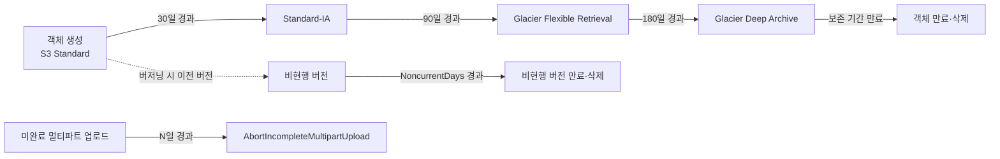

### 22.4 버저닝과 삭제 마커, MFA Delete

**버저닝(Versioning)**을 활성화한 버킷은 같은 키에 대한 모든 쓰기를 새 **버전 ID**로 구분해 보존한다. 객체를 덮어써도 이전 버전이 사라지지 않고 "비현행(noncurrent)" 버전으로 남으며, 특정 버전 ID를 지정해 과거 상태로 복원할 수 있다. 삭제 요청은 실제로 데이터를 지우지 않고 **삭제 마커(delete marker)**라는 특수 버전을 추가한다 — 삭제 마커가 최신 버전이면 일반 GET은 "찾을 수 없음"을 반환하지만, 버전 ID를 지정해 조회하면 데이터는 여전히 존재한다. 완전 삭제는 그 버전 ID를 명시해 삭제해야 하며, 삭제 마커 자체를 지우면 이전 버전이 다시 "현행" 상태로 복원된다.

**MFA Delete**는 버킷 소유자의 루트 계정 자격 증명과 MFA 기기의 일회용 코드가 있어야만 버전을 영구 삭제하거나 버저닝 상태 자체를 변경(비활성화)할 수 있게 하는 추가 보호 장치다. 랜섬웨어나 내부자 실수로 인한 대량 삭제를 막는 마지막 방어선으로 규제 산업 버킷에 흔히 적용한다.

```bash
# 버저닝 활성화 (S3 API 예시)
aws s3api put-bucket-versioning \
  --bucket my-company-prod-data \
  --versioning-configuration Status=Enabled

# MFA Delete 활성화 (루트 계정 자격 증명 + MFA 기기 코드 필요, CLI만으로는 IAM 사용자 자격으로 불가)
aws s3api put-bucket-versioning \
  --bucket my-company-prod-data \
  --versioning-configuration Status=Enabled,MFADelete=Enabled \
  --mfa "arn:aws:iam::123456789012:mfa/root-account-mfa-device 123456"

# 특정 버전으로 복원 (해당 버전을 다시 PUT하는 방식으로 처리)
aws s3api copy-object \
  --bucket my-company-prod-data \
  --copy-source "my-company-prod-data/report.csv?versionId=3sL4kqtJlcpXroDTDmJ+rmSpXd3dIbrHY+MTRCxf3vjVBH40Nr8X8gdRQBpUMLUo" \
  --key report.csv
```

**버저닝을 켜면 이전 버전이 계속 과금된다.** 활성 데이터를 자주 덮어쓰는 버킷에서 버저닝만 켜고 라이프사이클을 방치하면, 실제로 필요한 것은 최신 버전 하나뿐인데 저장 요금은 수정 횟수에 비례해 계속 늘어난다. 그래서 버저닝을 켜는 순간 **비현행 버전 만료 라이프사이클 규칙을 반드시 함께 설정**해야 한다 — 예를 들어 "비현행 상태가 된 지 90일 지난 버전은 삭제" 같은 규칙 없이 버저닝만 켜는 것은 설계 실수다.

버저닝 상태는 세 가지 값을 가진다는 점도 유의해야 한다 — **활성화 전(초기 상태, 버전 개념 자체가 없음)**, **활성화(Enabled)**, **일시 중단(Suspended)**이다. 한 번 활성화한 버저닝은 완전히 "끌" 수 없고 일시 중단만 가능하며, 일시 중단 상태에서 쓰기는 버전 ID `null`로 기록되어 기존 버전들과 공존한다. 이 특성 때문에 "버저닝을 껐다가 다시 켜면 과거 이력이 사라진다"는 오해가 흔한데, 실제로는 일시 중단 기간에 만들어진 `null` 버전만 이후 쓰기에 덮어써질 뿐 그 이전 버전들은 그대로 남아 있다.

### 22.5 복제: CRR / SRR / 다중 대상 복제

**복제(Replication)**는 소스 버킷의 객체를 다른 버킷으로 자동 비동기 복사하는 기능이다. 대상이 다른 리전이면 **CRR(Cross-Region Replication)**, 같은 리전이면 **SRR(Same-Region Replication)**이라 부른다. 두 방식 모두 다음 조건을 요구한다.

- **소스와 대상 버킷 모두 버저닝이 활성화**되어 있어야 한다.
- 복제를 수행할 **IAM 역할**이 필요하며, 이 역할은 소스에서 읽고 대상에 쓸 권한을 가져야 한다.

복제 규칙은 프리픽스·태그·스토리지 클래스로 필터링할 수 있고, 대상 버킷의 스토리지 클래스를 소스와 다르게 지정할 수도 있다(예: 소스는 Standard, DR 사본은 Standard-IA로 비용 절감). 복제는 기본적으로 규칙 설정 **이후 생성되는 신규 객체**에만 적용된다 — 기존에 이미 있던 객체까지 복제하려면 **배치 복제(Batch Replication, S3 Batch Operations 기반)**를 별도로 실행해야 한다.

**복제 시간 제어(Replication Time Control, RTC)**를 활성화하면 대부분의 객체가 SLA로 명시된 짧은 시간(대체로 분 단위, 정확한 수치는 최신 문서 확인) 안에 복제되도록 보장하고, 복제 지연을 모니터링하는 지표도 함께 제공한다. 규정상 복제 지연 SLA가 필요한 워크로드에 적합하다.

한 버킷에서 **여러 대상으로 복제(다중 대상 복제)**하는 것도 가능하며, 리전 A→B, B→A처럼 **양방향 복제**를 구성해 두 리전 모두를 활성-활성으로 운영할 수도 있다. 다만 양방향 복제에서는 무한 복제 루프를 막기 위한 메타데이터 동기화 로직이 내부적으로 필요하고, 복제 대상 쪽에서 다시 발생한 쓰기가 원본으로 되돌아 복제되지 않도록 설계가 되어 있다는 점을 이해하고 구성해야 한다.

**삭제 마커 복제(Delete Marker Replication)**는 옵션으로 켜고 끌 수 있다. 이 옵션을 켜면 소스에서 객체를 삭제했을 때 생기는 삭제 마커가 대상에도 복제되어 양쪽이 "삭제됨" 상태로 동기화된다. 그러나 **백업·규정 준수 목적의 복제라면 이 옵션을 끄는 것이 일반적으로 안전하다** — 소스에서 실수로(혹은 악의적으로) 대량 삭제가 발생했을 때 삭제 마커까지 복제되면 백업 사본도 함께 "사라진 것처럼" 보이게 되어, 복제가 재해 복구 대비책으로서 무의미해질 수 있기 때문이다.

```json
{
  "Role": "arn:aws:iam::123456789012:role/s3-replication-role",
  "Rules": [
    {
      "ID": "crr-to-dr-region",
      "Status": "Enabled",
      "Priority": 1,
      "Filter": { "Prefix": "critical/" },
      "Destination": {
        "Bucket": "arn:aws:s3:::my-company-dr-ap-northeast-2",
        "StorageClass": "STANDARD_IA",
        "ReplicationTime": {
          "Status": "Enabled",
          "Time": { "Minutes": 15 }
        },
        "Metrics": { "Status": "Enabled" }
      },
      "DeleteMarkerReplication": { "Status": "Disabled" }
    }
  ]
}
```

복제는 저장·전송 비용을 이중으로 발생시킨다는 점도 22.10절 비용 최적화와 연결해 반드시 고려해야 한다.

SRR(같은 리전 복제)은 CRR과 요건은 동일하지만 목적이 다른 경우가 많다 — 재해 복구보다는 **계정 분리(운영 계정에서 로그·감사 전용 계정으로 자동 복제)**, **프로덕션과 테스트 환경 간 데이터 동기화**, **집계 계정으로의 로그 통합** 같은 시나리오에 흔히 쓰인다. 같은 리전 안에서 일어나므로 리전 간 전송 요금은 없지만, 대상 버킷의 저장 요금과 복제 요청 요금은 CRR과 동일하게 발생한다.

복제 상태는 객체 메타데이터의 `x-amz-replication-status` 헤더(PENDING/COMPLETED/FAILED/REPLICA)로 확인할 수 있고, CloudWatch의 복제 관련 지표(대기 중인 바이트 수, 대기 중인 작업 수, 복제 지연)로 지연이나 실패를 모니터링한다.

```bash
# 특정 객체의 복제 상태 확인
aws s3api head-object \
  --bucket my-company-prod-data --key critical/config.json \
  --query "ReplicationStatus"
```

### 22.6 S3 Object Lock과 규정 준수 보존

**Object Lock**은 객체를 지정된 기간 동안 삭제·덮어쓰기가 불가능하게 만드는 **WORM(Write Once Read Many)** 메커니즘이다. 금융·의료 등 규제 산업의 데이터 보존 요건(예: SEC 17a-4)을 만족시키는 데 쓰인다. 두 가지 모드가 있다.

| 모드 | 잠금 강도 | 삭제·변경 가능 여부 | 적합 사례 |
|---|---|---|---|
| 거버넌스(Governance) 모드 | 상대적으로 완화 | 특별 권한(`s3:BypassGovernanceRetention`)을 가진 사용자는 삭제·변경 가능 | 내부 정책상 보존이지만 예외 처리가 필요한 경우 |
| 컴플라이언스(Compliance) 모드 | 가장 엄격 | 루트 계정을 포함해 보존 기간 동안 어떤 주체도 삭제·단축 불가 | 규제 기관 대응, 법적 구속력이 필요한 보존 |

**한 줄 결정 기준**: 예외적으로 관리자가 개입할 여지가 필요하면 거버넌스 모드, 규제 요건상 그 누구도 만료 전 삭제할 수 없어야 하면 컴플라이언스 모드다.

Object Lock은 두 가지 보호 방식을 조합한다. **보존 기간(retention period)**은 특정 날짜까지 잠그는 지정된 기한이고, **법적 보존(legal hold)**은 기한 없이 소송·감사 등의 사유가 해소될 때까지 걸어두는 별도의 온/오프 플래그다(법적 보존은 별도 권한만 있으면 거버넌스·컴플라이언스 모드와 무관하게 해제 가능).

**중요한 제약**: Object Lock은 **버킷을 생성하는 시점에만 활성화**할 수 있다 — 이미 운영 중인 버킷에는 나중에 켤 수 없으므로, 규정 준수 요건이 예상되면 버킷을 만들 때 미리 활성화해야 한다(또한 Object Lock은 버저닝을 전제로 하므로 버저닝도 함께 활성화된다).

```bash
# Object Lock을 활성화한 채로 버킷 생성 (생성 시에만 가능)
aws s3api create-bucket \
  --bucket my-company-compliance-archive \
  --region ap-northeast-2 \
  --create-bucket-configuration LocationConstraint=ap-northeast-2 \
  --object-lock-enabled-for-bucket

# 특정 객체에 컴플라이언스 모드로 1년 보존 설정
aws s3api put-object-retention \
  --bucket my-company-compliance-archive \
  --key contracts/2026-msa.pdf \
  --retention '{"Mode":"COMPLIANCE","RetainUntilDate":"2027-09-05T00:00:00Z"}'

# 진행 중인 소송 대응을 위한 법적 보존(기한 없음, 별도 플래그)
aws s3api put-object-legal-hold \
  --bucket my-company-compliance-archive \
  --key contracts/2026-msa.pdf \
  --legal-hold '{"Status":"ON"}'
```

버킷 기본 정책(bucket default retention)을 설정해 두면 그 버킷에 새로 올라오는 모든 객체에 지정한 모드·기간이 자동 적용된다. 다만 기본 정책은 새 객체에만 적용되며 이미 저장된 객체에는 소급 적용되지 않으므로, 기존 객체까지 보호하려면 배치 처리로 개별 보존을 설정해야 한다. 보존 기간이 지나면 잠금은 자동으로 풀리지만 객체 자체가 삭제되는 것은 아니며, 별도의 만료 규칙이나 수동 삭제가 있어야 실제로 제거된다.

### 22.7 Object Lambda, S3 Select, Access Points

**S3 Object Lambda**는 GET 요청이 애플리케이션에 도달하기 전, Lambda 함수를 거쳐 **다운로드 시점에 객체 내용을 변환**하는 기능이다. 개인정보 마스킹, 이미지 리사이즈, 포맷 변환, 워터마크 삽입 같은 처리를 저장 단계에서 미리 만들어 둔 파생 사본 없이 요청 시점에 즉석으로 수행한다. 이렇게 하면 "마스킹된 사본", "썸네일 사본"처럼 원본과 별도로 관리해야 하는 파생 데이터를 만들지 않아도 되고, 로직 변경 시 저장된 사본을 재생성할 필요도 없다.

**S3 Select**(그리고 대량 분석에는 Amazon Athena, → 51장 참조 영역)는 객체 전체를 내려받지 않고 SQL과 유사한 표현식으로 CSV·JSON·Parquet 객체 안의 필요한 행·열만 서버 측에서 필터링해 가져오는 기능이다. 큰 로그 파일에서 특정 조건에 맞는 일부 레코드만 필요할 때 전송량과 클라이언트 처리 부담을 크게 줄인다.

**액세스 포인트(Access Point)**는 하나의 버킷에 여러 개의 별도 호스트명·정책을 가진 "접근 경로"를 만드는 기능이다. 각 액세스 포인트는 자체 IAM 정책과 (선택적으로) 특정 VPC로의 접근 제한을 가질 수 있어, 같은 버킷을 여러 애플리케이션·팀이 공유하되 각자 다른 권한 범위로 접근하게 할 때 버킷 정책 하나를 계속 확장하는 대신 액세스 포인트를 팀별로 분리해 관리 복잡도를 낮춘다. **멀티 리전 액세스 포인트(Multi-Region Access Point)**는 여러 리전에 흩어진 버킷들(흔히 서로 복제 관계에 있는)을 하나의 글로벌 엔드포인트로 묶어, 클라이언트가 가장 가까운 리전으로 자동 라우팅되게 한다.

**S3 Batch Operations**는 수백만~수십억 개의 객체 목록(인벤토리 리포트나 CSV 매니페스트)에 대해 하나의 작업(복사, 태그 지정, ACL 변경, Object Lock 보존 설정, Lambda 호출 등)을 대량으로 실행하는 관리형 기능이다. 22.5절의 배치 복제도 이 기능 위에서 동작한다.

액세스 포인트는 자체 정책을 갖되, **버킷 정책과 액세스 포인트 정책이 둘 다 허용해야만 접근이 성립**한다는 점이 중요하다 — 둘 중 하나라도 거부하면 요청은 거부된다. 이 이중 게이트 구조 덕분에, 버킷 정책에서 "액세스 포인트를 통한 접근만 허용"하도록 강제하고 각 액세스 포인트에서 팀별 세부 권한을 나눠 관리하는 계층화 설계가 가능해진다.

```json
{
  "Version": "2012-10-17",
  "Statement": [
    {
      "Sid": "AllowAnalyticsTeamReadOnly",
      "Effect": "Allow",
      "Principal": { "AWS": "arn:aws:iam::123456789012:role/analytics-team-role" },
      "Action": ["s3:GetObject", "s3:ListBucket"],
      "Resource": [
        "arn:aws:s3:ap-northeast-2:123456789012:accesspoint/analytics-ap",
        "arn:aws:s3:ap-northeast-2:123456789012:accesspoint/analytics-ap/object/*"
      ]
    }
  ]
}
```

### 22.8 성능 최적화

S3는 프리픽스 단위로 요청을 자동 분산해 처리량을 확장한다. 과거에는 순차적인 키 이름(타임스탬프 접두사 등)이 핫스팟을 유발한다는 이유로 **해시 프리픽스로 키를 섞으라**는 권고가 있었지만, 현재 S3는 프리픽스별 자동 파티셔닝이 개선되어 이 권고의 필요성이 예전보다 낮아졌다. 다만 극도로 높은 요청률(초당 수천 건 이상의 GET/PUT)이 예상되는 워크로드라면, 여전히 **같은 프리픽스에 요청이 과도하게 몰리지 않도록 여러 프리픽스로 분산**하는 설계가 유효하며, 정확한 프리픽스당 처리량 한도는 최신 성능 가이드 문서를 확인해야 한다.

**멀티파트 업로드/다운로드**는 대용량 객체를 여러 파트로 나눠 병렬 전송함으로써 총 처리량을 끌어올린다(22.1절). 다운로드 쪽에서는 **바이트 범위 페치(Range GET)**로 큰 객체를 여러 조각으로 나눠 병렬로 받아 같은 효과를 낼 수 있다.

**S3 Transfer Acceleration**은 사용자와 지리적으로 먼 리전의 버킷에 데이터를 올릴 때, CloudFront와 같은 엣지 네트워크를 거쳐 AWS의 백본으로 빠르게 진입시켜 인터넷 구간의 지연과 손실을 줄이는 기능이다. 글로벌하게 흩어진 사용자가 한 리전의 버킷에 업로드해야 하는 시나리오(예: 여러 국가의 지사가 본사 리전 버킷에 업로드)에 유효하다.

정적 콘텐츠 배포처럼 **읽기가 지배적**인 워크로드라면 Transfer Acceleration보다 **CloudFront를 S3 앞에 두는 편이 일반적으로 더 효과적**이다 — 엣지 캐싱으로 반복 요청이 S3까지 가지 않고, Origin Access Control로 버킷을 퍼블릭에 노출하지 않고도 배포할 수 있다(CloudFront의 캐시 동작·오리진 설정 상세는 → 13장 참조). 캐시 가능한 조회 워크로드에 **ElastiCache** 같은 인메모리 캐시를 애플리케이션 계층에 추가로 두면 S3 요청 자체를 더 줄일 수 있다(요청 요금이 지배적인 워크로드에서 특히 효과적).

정리하면 원서가 강조하는 네 가지 성능 지렛대는 다음과 같다: **(1) CloudFront**로 읽기 캐싱, **(2) ElastiCache**로 애플리케이션 계층 캐싱, **(3) Transfer Acceleration**으로 원거리 업로드 가속, **(4) 프리픽스 명명 규칙**으로 요청 분산. 여기에 재시도 시 지수 백오프와 요청 병렬화를 SDK 기본 설정에 맡기면 대부분의 처리량 문제는 해소된다.

**재시도와 요청 병렬화**는 대부분 SDK가 기본으로 처리하지만, 대량 배치 작업에서는 명시적으로 조정하는 편이 유리하다. AWS SDK와 CLI는 기본적으로 지수 백오프(exponential backoff)를 적용한 재시도를 내장하고 있고, 스로틀링(503 Slow Down) 응답을 만나면 자동으로 대기 후 재시도한다. `aws configure set retry_mode adaptive`처럼 적응형 재시도 모드를 지정하면 클라이언트가 관측한 스로틀링 빈도에 맞춰 재시도 속도를 동적으로 조절해, 대량 업로드·다운로드 파이프라인에서 실패율을 낮출 수 있다.

```bash
# Transfer Acceleration 활성화 및 가속 엔드포인트로 업로드
aws s3api put-bucket-accelerate-configuration \
  --bucket my-company-global-uploads --accelerate-configuration Status=Enabled
aws s3 cp large-dataset.zip \
  s3://my-company-global-uploads/incoming/large-dataset.zip \
  --endpoint-url https://my-company-global-uploads.s3-accelerate.amazonaws.com
```

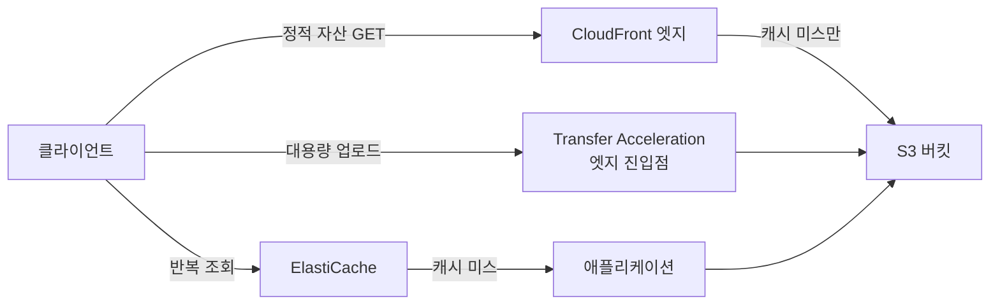

### 22.9 데이터 보호 13계명

원서가 정리한 S3 데이터 보호 모범 사례 13가지를 빠짐없이 다룬다. 각 항목은 "왜"와 "어떻게"를 함께 짚는다.

**① 퍼블릭 액세스 차단**: 의도치 않은 퍼블릭 노출이 S3 유출 사고의 가장 흔한 원인이다. 계정 수준 **Block Public Access(BPA)**를 켜면 버킷·객체 정책이나 ACL이 실수로 퍼블릭 접근을 허용해도 무시된다.

```bash
# 계정 수준 퍼블릭 액세스 차단 (신규 계정은 기본 활성화지만 명시적으로 점검)
aws s3control put-public-access-block \
  --account-id 123456789012 \
  --public-access-block-configuration \
  BlockPublicAcls=true,IgnorePublicAcls=true,BlockPublicPolicy=true,RestrictPublicBuckets=true
```

**② 정책에 와일드카드 금지**: 버킷 정책의 `Principal`이나 `Action`에 `"*"`를 무분별하게 쓰면 의도한 것보다 훨씬 넓은 주체·동작을 허용하게 된다. 최소 권한 원칙에 따라 구체적인 계정·역할 ARN과 필요한 동작만 명시한다.

**③ S3 API 활용**: 콘솔 수동 조작 대신 API/SDK/IaC로 버킷 설정을 코드화하면 설정 드리프트와 실수를 줄이고 변경 이력을 남길 수 있다.

**④ IAM Access Analyzer로 S3 점검**: **IAM Access Analyzer**는 버킷 정책·ACL을 분석해 조직 경계 밖의 주체에게 노출된 접근 경로를 자동으로 찾아준다. 정기적으로 리뷰해 의도치 않은 외부 접근을 조기에 발견한다.

**⑤ AWS Config 활성화**: **AWS Config**의 관리형 규칙(`s3-bucket-public-read-prohibited`, `s3-bucket-server-side-encryption-enabled` 등)으로 버킷 설정이 규정을 벗어나면 자동 탐지·알림을 받는다(→ 자세한 내용은 32장 참조).

**⑥ Object Lock으로 리소스 보호**: 22.6절의 WORM 보존으로 랜섬웨어나 실수·악의적 삭제로부터 중요 데이터를 보호한다.

**⑦ 저장 데이터 암호화**: S3는 네 가지 저장 암호화 옵션을 제공한다.

| 방식 | 키 관리 주체 | 특징 |
|---|---|---|
| SSE-S3 | AWS가 완전 관리 | 기본값, 설정이 가장 단순, 추가 비용 없음 |
| SSE-KMS | AWS KMS(고객 관리형/AWS 관리형 키) | 키 사용 이력 감사(CloudTrail), 키 정책으로 세밀한 권한 통제 |
| DSSE-KMS | AWS KMS | 이중 암호화(같은 데이터에 서로 다른 두 알고리즘 계층 적용), 더 엄격한 규정 준수용 |
| SSE-C | 고객이 직접 키 관리·매 요청 시 전달 | AWS가 키를 저장하지 않음, 고객이 키 분실 시 데이터 복구 불가 |

**한 줄 결정 기준**: 특별한 규정 요건이 없으면 SSE-S3로 충분하고, 키 사용 이력 감사나 키 단위 접근 통제가 필요하면 SSE-KMS, 매우 엄격한 규정상 이중 암호화가 요구되면 DSSE-KMS, 키를 절대 AWS에 맡길 수 없는 특수 요건이면 SSE-C를 쓴다.

SSE-KMS는 API 호출마다 KMS 호출이 발생해 요청량이 많으면 KMS 요금이 누적될 수 있는데, **버킷 키(S3 Bucket Key)**를 활성화하면 버킷 수준의 데이터 키를 짧은 시간 캐싱해 KMS 호출 횟수를 크게 줄이고 비용을 낮출 수 있다.

```json
{
  "Rules": [
    {
      "ApplyServerSideEncryptionByDefault": {
        "SSEAlgorithm": "aws:kms",
        "KMSMasterKeyID": "arn:aws:kms:ap-northeast-2:123456789012:key/1234abcd-12ab-34cd-56ef-1234567890ab"
      },
      "BucketKeyEnabled": true
    }
  ]
}
```

**⑧ 전송 데이터 암호화**: 버킷 정책에 `aws:SecureTransport` 조건으로 HTTPS가 아닌 요청을 거부해 TLS를 강제한다.

```json
{
  "Version": "2012-10-17",
  "Statement": [
    {
      "Sid": "DenyInsecureTransport",
      "Effect": "Deny",
      "Principal": "*",
      "Action": "s3:*",
      "Resource": [
        "arn:aws:s3:::my-company-prod-data",
        "arn:aws:s3:::my-company-prod-data/*"
      ],
      "Condition": { "Bool": { "aws:SecureTransport": "false" } }
    },
    {
      "Sid": "AllowOnlyFromVPCE",
      "Effect": "Deny",
      "Principal": "*",
      "Action": "s3:*",
      "Resource": [
        "arn:aws:s3:::my-company-prod-data",
        "arn:aws:s3:::my-company-prod-data/*"
      ],
      "Condition": {
        "StringNotEquals": { "aws:sourceVpce": "vpce-0123456789abcdef0" }
      }
    }
  ]
}
```

**⑨ 서버 액세스 로깅 활성화**: 버킷에 대한 모든 요청을 별도 로그 버킷에 기록하는 **서버 액세스 로깅(Server Access Logging)**을 켜면 누가 언제 무엇에 접근했는지 사후 감사가 가능하다(CloudTrail 데이터 이벤트와는 별개 기능, → 32장 참조).

**⑩ Macie 검토**: **Amazon Macie**는 머신러닝과 패턴 매칭으로 S3에 저장된 데이터를 스캔해 개인식별정보(PII), 자격 증명, 신용카드 번호 같은 민감 데이터를 자동으로 찾아내고 발견 결과를 심각도별로 분류한다. 어떤 버킷에 규제 대상 데이터가 있는지 모른다면 전수 분류 작업을 수동으로 하기보다 Macie 작업(job)을 스케줄링해 정기적으로 스캔하는 것이 우선이다. 발견된 민감 데이터 버킷에는 ⑦의 암호화와 ①의 퍼블릭 차단을 우선 재점검한다.

**⑪ AWS 모니터링 서비스로 모니터링 구현**: CloudWatch 지표·알람으로 4xx/5xx 오류율과 요청량 이상 징후를 탐지하고, **CloudTrail 데이터 이벤트**를 켜면 개별 객체 수준의 `GetObject`/`PutObject`/`DeleteObject` 호출까지 기록·감사할 수 있다(관리 이벤트만으로는 객체 수준 API 호출이 보이지 않는다는 점에 유의). 여기에 EventBridge로 특정 API 호출 패턴(예: 짧은 시간 내 대량 `DeleteObject`)을 규칙화해 알림이나 자동 대응(예: 해당 IAM 주체의 권한 일시 정지)까지 연결하면 탐지에서 대응까지 자동화된다.

**⑫ 가능하면 VPC 엔드포인트로 접근**: 프라이빗 서브넷의 워크로드는 인터넷 경유 대신 **S3용 Gateway Endpoint**로 접근한다. 트래픽이 AWS 백본 안에 머물러 보안이 강화되고, NAT Gateway의 데이터 처리 요금도 우회한다(Gateway Endpoint의 동작 방식과 정책 예시는 → 11장 참조).

**⑬ 리전 간 복제 활용**: 22.5절의 CRR로 규정상 요구되는 지리적 이중화나 재해 복구 목표(RPO)를 충족한다.

이 13개 항목은 서로 배타적이지 않고 층층이 쌓이는 방어 심층화(defense in depth) 전략이다 — 하나가 뚫려도 다음 층이 막는다는 전제로 설계한다. 특히 ①·②·⑫는 모두 "누가 접근할 수 있는가"를 결정하는 계층이고, 실제 요청이 평가되는 순서는 아래에서 위로 올라가는 것이 아니라 가장 바깥의 계정 수준 차단부터 시작해 안쪽으로 좁혀진다.

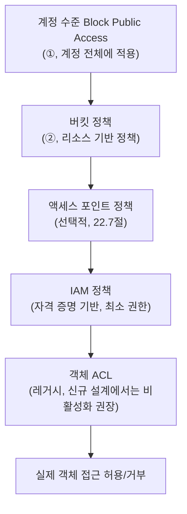

이 중 하나라도 명시적으로 거부(Deny)하면 다른 계층이 모두 허용해도 최종 결과는 거부다. 계정 수준 BPA가 가장 강력한 이유는 하위의 버킷 정책·ACL이 아무리 퍼블릭을 허용하도록 잘못 설정되어도 이 계층에서 무효화되기 때문이며, 이것이 ①을 13계명의 첫머리에 두는 이유이기도 하다.

### 22.10 S3 비용 최적화와 Storage Lens

**S3 Storage Lens**는 계정·조직 전체의 S3 사용량과 활동 패턴을 대시보드로 보여주는 분석 도구다. 무료 지표는 버킷·계정 수준의 요약(저장 용량, 객체 수, 클래스별 분포)을 제공하고, 유료 등급인 **고급 지표(Advanced metrics and recommendations)**를 활성화하면 프리픽스 수준의 세분화, 활동 지표(요청 수), 데이터 보호 지표(암호화·복제 상태), 비용 효율 권고까지 확장된다. Intelligent-Tiering 전환 후보나 비활성 버킷 식별에 유용하다.

```bash
# 조직 전체 대시보드에 고급 지표를 활성화한 Storage Lens 구성 생성
aws s3control put-storage-lens-configuration \
  --account-id 123456789012 --config-id org-wide-dashboard \
  --storage-lens-configuration '{
    "Id": "org-wide-dashboard",
    "AccountLevel": {
      "ActivityMetrics": { "IsEnabled": true },
      "AdvancedDataProtectionMetrics": { "IsEnabled": true }
    },
    "IsEnabled": true
  }'
```

**Intelligent-Tiering 적용 판단**은 접근 패턴의 예측 가능성에 달려 있다. 접근 빈도가 불규칙하거나 향후 변할 가능성이 높은 데이터셋이면, 수동 라이프사이클 규칙을 정교하게 짜는 것보다 Intelligent-Tiering에 맡겨 자동으로 빈번/비빈번/아카이브 계층을 오가게 하는 편이 총소유비용이 낮은 경우가 많다. 반대로 접근 패턴이 뚜렷하고 예측 가능하다면(예: "생성 후 30일까지만 자주 읽고 이후는 거의 안 읽음") 수동 라이프사이클 규칙이 모니터링 요금 없이 더 저렴할 수 있다.

**요청 요금이 지배적인 워크로드**(초당 요청 수가 많은 API 백엔드, 프런트엔드 자산 등)에서는 저장 클래스 전환보다 **CloudFront 캐싱으로 S3 요청 자체를 줄이는 것**이 훨씬 큰 비용 절감 효과를 낸다. 청구서를 볼 때 저장(storage) 항목이 아니라 요청(request) 항목이 큰 비중을 차지한다면 클래스 전환은 효과가 제한적이라는 신호다.

다음 두 워크로드를 비교하면 이 진단이 명확해진다.

| 워크로드 | 저장 비중 | 요청 비중 | 유효한 최적화 |
|---|---|---|---|
| 수백 TB 로그 아카이브, 접근 거의 없음 | 매우 높음 | 매우 낮음 | 라이프사이클로 Glacier 계열 전환 |
| 수 GB 이미지 자산, 초당 수천 GET | 낮음 | 매우 높음 | CloudFront 캐싱, 요청 수 자체를 줄이는 설계 |

같은 "S3 비용 최적화"라도 어느 축이 지배적인지에 따라 정반대의 처방이 나온다는 점이 핵심이다.

**아카이브 조기 삭제 요금**은 22.2절에서 다룬 최소 보관 기간과 직결된다. Glacier 계열로 전환한 지 얼마 안 된 객체를 삭제하거나 다른 클래스로 재전환하면 남은 최소 보관 기간에 대한 요금이 그대로 청구되므로, 라이프사이클 설계 시점에 실제 보관 요구 기간을 먼저 확정해야 한다.

**데이터 전송 최소화**는 같은 리전 내에서 컴퓨트와 스토리지를 유지하고, 프라이빗 서브넷에서는 Gateway Endpoint를 활용하는 것으로 요약된다(22.9절 ⑫ 참조). 리전 간 참조나 CRR이 꼭 필요한 경우가 아니라면 리전을 벗어나는 트래픽 자체를 설계에서 배제하는 편이 비용·지연 양쪽에 유리하다.

마지막으로 **로그 버킷의 자기 순환(self-logging loop)**을 주의해야 한다. 서버 액세스 로깅(22.9절 ⑨)의 대상 버킷을 소스 버킷 자신으로 지정하거나, 로그 버킷 자체의 접근까지 같은 버킷에 로깅하도록 설정하면 로그가 로그를 낳는 무한 증식이 발생해 저장 비용과 요청 수가 통제 불가능하게 늘어난다. 로그는 반드시 별도의 전용 버킷으로 분리하고, 그 로그 버킷에는 자체 라이프사이클로 오래된 로그를 만료시키는 규칙을 둔다.

```bash
# 멀티파트 업로드 예시: 대용량 객체를 파트 단위로 병렬 업로드
aws s3api create-multipart-upload \
  --bucket my-company-prod-data --key datasets/large-export.parquet
# 이후 upload-part 를 파트별로 병렬 호출 후 complete-multipart-upload로 마무리
# (SDK를 쓰면 boto3의 TransferConfig, CLI의 aws s3 cp가 이 과정을 자동 처리한다)
aws s3 cp large-export.parquet s3://my-company-prod-data/datasets/large-export.parquet
```

### 22장 정리

#### [필수] 반드시 알아야 할 것
1. S3는 버킷 안에 평평한 키-값 객체를 저장하며 실제 디렉터리 구조가 없다. 2020년 이후 모든 작업에 강한 읽기 후 쓰기 일관성을 기본 제공한다.
2. 8가지 스토리지 클래스는 내구성이 모두 11 나인으로 동일하고 가용성·AZ 수·최소 보관 기간·복구 지연에서 갈린다. 접근 패턴에 맞는 클래스 선택이 비용을 좌우한다.
3. 라이프사이클 규칙은 전환·만료·비현행 버전 만료·미완료 멀티파트 업로드 중단 네 가지 동작을 조합한다.
4. 버저닝을 켜면 이전 버전이 계속 과금되므로 비현행 버전 만료 규칙을 반드시 함께 설정한다.
5. 복제(CRR/SRR)는 양쪽 버킷의 버저닝 활성화와 IAM 역할을 요구하며, 기본적으로 신규 객체에만 적용되고 기존 객체는 배치 복제로 별도 처리한다.
6. Object Lock은 버킷 생성 시점에만 활성화할 수 있고, 거버넌스 모드는 예외 삭제가 가능하지만 컴플라이언스 모드는 누구도 만료 전 삭제할 수 없다.
7. S3 데이터 보호 13계명은 퍼블릭 차단부터 리전 간 복제까지 층층이 쌓이는 방어 심층화 전략이다.
8. 100MB를 넘는 업로드는 멀티파트가 기준이며, 단일 PUT 상한은 5GB, 객체 최대 크기는 5TB다.

#### [팁] 실무 노하우
1. 접근 패턴을 모르겠으면 Intelligent-Tiering이 실질적 기본값이다. 패턴이 명확하면 수동 라이프사이클 규칙이 더 저렴할 수 있다.
2. VPC 안에서 S3에 접근할 때는 Gateway Endpoint를 쓴다 — 보안(프라이빗 경로)과 비용(NAT 데이터 처리 요금 우회) 이중 이득이다.
3. Object Lambda로 다운로드 시점에 마스킹·리사이즈·포맷 변환을 하면 파생 데이터 사본을 별도로 관리할 필요가 없다.
4. SSE-KMS를 쓰면서 요청량이 많다면 버킷 키를 활성화해 KMS 호출 비용을 줄인다.
5. 읽기가 지배적인 정적 콘텐츠는 CloudFront를 앞단에 두는 것이 Transfer Acceleration보다 일반적으로 효과적이다. Transfer Acceleration은 원거리 업로드에 쓴다.
6. Storage Lens 고급 지표로 프리픽스 수준 활동 패턴을 확인한 뒤에 라이프사이클·Intelligent-Tiering 적용 범위를 결정한다.

#### [주의] 사고·비용·설계 함정
1. 버저닝만 켜고 비현행 버전 만료를 설정하지 않으면 저장 비용이 무한 증가한다.
2. 미완료 멀티파트 업로드 조각도 과금된다. 라이프사이클로 며칠 후 중단(abort) 규칙을 반드시 넣는다.
3. Glacier 계열은 저장은 싸지만 복구와 최소 보관 기간 이전 조기 삭제에 요금이 붙는다. 자주 읽는 데이터를 아카이브로 내리면 총비용이 오히려 오른다.
4. 리전 간 복제는 전송 요금과 대상 저장 요금이 이중으로 든다. DR 요건과 비용을 명시적으로 비교해야 한다.
5. 삭제는 버저닝·Object Lock 없이는 되돌릴 수 없다. 규정 데이터에는 Object Lock 검토가 필수다.
6. 소용량 객체 다량을 저비용 클래스로 전환하면 전환 요청 요금과 최소 청구 크기 규칙 때문에 오히려 손해가 될 수 있다.
7. 백업·규정 준수 목적의 복제에서 삭제 마커 복제를 켜면 소스의 실수 삭제가 백업 사본까지 지워버릴 수 있다.
8. 서버 액세스 로깅 대상을 소스 버킷 자신으로 지정하면 로그가 로그를 낳는 자기 순환이 발생해 비용이 통제 불가능하게 늘어난다.

#### 한 장 요약
S3는 버킷·키·프리픽스의 평평한 객체 모델 위에 강한 일관성, 8가지 스토리지 클래스, 라이프사이클·버저닝·복제라는 시간축 관리 도구, Object Lock의 규정 준수 보존, Object Lambda·액세스 포인트 같은 고급 기능을 쌓은 서비스다. 데이터 보호는 퍼블릭 차단부터 리전 간 복제까지 13계명을 층층이 적용하는 방어 심층화로 접근하고, 비용은 저장·요청·전송·관리·복구 다섯 축을 분리해 무엇이 청구서를 지배하는지 진단한 뒤 최적화한다.

#### 다음 장 예고
23장에서는 S3 위에서 구축하는 백업·재해 복구 전략과 AWS Backup, 그리고 Storage Gateway를 통한 온프레미스-클라우드 하이브리드 스토리지 통합을 다룬다.

---

## 23장. 백업 · DR · 하이브리드 스토리지  ★★★

> **이 장에서 다루는 것**
> 22장이 S3 자체의 데이터 보호 기능(버저닝, 복제, Object Lock)을 다뤘다면, 이 장은 그 위에서 동작하는 **백업 오케스트레이션**(AWS Backup)과 **온프레미스-클라우드 하이브리드 스토리지**(Storage Gateway, DataSync, Snow 패밀리), 그리고 이를 조직화하는 **재해 복구(DR) 절차**를 다룬다. 8장이 가용성 아키텍처 유형(파일럿 라이트, 웜 스탠바이 등)을 설계 관점에서 다뤘다면, 여기서는 그 패턴을 실제로 구현·실행·검증하는 **메커니즘과 런북** 관점에서 접근한다. 랜섬웨어 대비를 별도 절로 두어 백업이 공격의 표적이 되지 않도록 하는 아키텍처까지 마무리한다.

### 23.1 AWS Backup

여러 서비스(EBS, RDS, DynamoDB, EFS, FSx, EC2, Storage Gateway 볼륨 등)에 개별 스냅샷 정책을 흩어 두면 어떤 리소스가 백업되고 있는지, 보존 기간이 규정을 만족하는지 한눈에 파악할 수 없다. **AWS Backup**은 이런 리소스별 백업 설정을 **하나의 백업 계획(Backup Plan)**으로 중앙화하는 완전관리형 서비스다.

백업 계획은 세 요소로 구성된다. **규칙(rule)**은 언제(cron 표현식), 어떤 백업 볼트에, 얼마나 보존할지를 정의한다. **수명주기(lifecycle)**는 콜드 스토리지 전환 시점(예: 생성 후 30일 뒤 Cold Storage로 이동)과 만료 시점을 지정하며, 서비스별로 콜드 전환까지의 최소 보관 기간이 있으므로 콘솔에서 실제 지원 여부를 확인한다. **리소스 할당(assignment)**은 어떤 리소스를 이 계획으로 백업할지 정하는데, 리소스 ID를 일일이 나열하는 대신 **태그 기반 선택**(`Environment=prod`, `Backup=daily` 등)을 쓰는 것이 표준 관행이다. 새로 생성되는 리소스도 태그만 붙이면 자동으로 백업 대상에 편입되기 때문이다.

**백업 볼트(Backup Vault)**는 백업 복구 지점(recovery point)을 담는 논리적 컨테이너이며, KMS 키로 암호화된다. 볼트 자체에 IAM 접근 정책을 걸어 "누가 이 볼트의 복구 지점을 삭제할 수 있는가"를 백업 생성 권한과 분리하는 것이 랜섬웨어 대비의 핵심이다(→ 23.6절).

**볼트 락(Vault Lock)**은 볼트에 WORM(Write Once Read Many) 정책을 거는 기능으로, 한 번 활성화하면 루트 사용자를 포함해 **누구도 보존 기간이 끝나기 전에는 복구 지점을 삭제하거나 보존 기간을 단축할 수 없다**. 두 모드가 있다.

| 모드 | 정책 변경 | 용도 |
|---|---|---|
| 거버넌스 모드(Governance) | 특정 IAM 권한 보유자는 정책을 해제하거나 변경 가능 | 내부 실수 방지, 유연성 필요 시 |
| 컴플라이언스 모드(Compliance) | 락 활성화 후 **누구도 변경·삭제 불가**(계정 삭제로도 우회 불가) | 규제 준수, 랜섬웨어 최후 방어선 |

컴플라이언스 모드는 활성화 후 3일의 유예(cool-off) 기간이 있고 이 기간 안에는 취소할 수 있지만, 유예가 끝나면 되돌릴 수 없다는 점에 주의한다. 이 비가역성 때문에 운영 볼트가 아닌 별도 검증 절차를 거친 뒤 적용하는 것이 안전하다.

**계정 간·리전 간 복사**는 백업 계획의 규칙 안에 복사 대상(destination)을 추가하는 방식으로 설정한다. 프로덕션 계정에서 만든 복구 지점을 백업 전용 계정(별도 AWS 계정)의 볼트로, 또는 다른 리전의 볼트로 자동 복사할 수 있다. **[필수] 프로덕션과 다른 계정·다른 리전에 사본을 두지 않으면, 계정이 침해되었을 때 백업도 함께 삭제되는 단일 장애점이 된다.**

**복원 테스트 자동화**는 AWS Backup의 "복원 작업(Restore Job)"을 정기적으로 트리거해 실제로 복구 가능한지 검증하는 기능이다(온디맨드 복원 테스트 계획을 예약할 수 있다). **Backup Audit Manager**는 조직의 백업 정책이 규정(예: "모든 prod 태그 리소스는 35일 이상 보존", "볼트 락 활성화 여부")을 준수하는지 지속적으로 감사하고 위반 리소스를 보고한다. AWS Backup이 지원하는 리소스 범위는 EC2, EBS, RDS/Aurora, DynamoDB, EFS, FSx(Windows/Lustre/ONTAP/OpenZFS), Storage Gateway 볼륨, S3(백업 볼트를 통한 계정 간 복사 포함), VMware/온프레미스 워크로드 등으로 계속 확장되고 있으므로 신규 서비스 지원 여부는 최신 문서를 확인한다.

```yaml
# CloudFormation: 태그 기반 백업 계획 + 리전 간 복사
Resources:
  BackupVaultPrimary:
    Type: AWS::Backup::BackupVault
    Properties:
      BackupVaultName: prod-vault-primary

  BackupPlan:
    Type: AWS::Backup::BackupPlan
    Properties:
      BackupPlanName: prod-daily-plan
      BackupPlanRule:
        - RuleName: DailyBackupRule
          TargetBackupVault: !Ref BackupVaultPrimary
          ScheduleExpression: "cron(0 18 * * ? *)"   # 매일 UTC 18시(서울 새벽 3시) 실행
          Lifecycle:
            DeleteAfterDays: 35
            MoveToColdStorageAfterDays: 30
          CopyActions:
            - DestinationBackupVaultArn: >-
                arn:aws:backup:us-east-1:222233334444:backup-vault:dr-vault
              Lifecycle:
                DeleteAfterDays: 90   # DR 계정 사본은 더 길게 보존

  BackupSelection:
    Type: AWS::Backup::BackupSelection
    Properties:
      BackupPlanId: !Ref BackupPlan
      BackupSelection:
        SelectionName: TagBasedSelection
        IamRoleArn: arn:aws:iam::123456789012:role/AWSBackupDefaultServiceRole
        ListOfTags:
          - ConditionType: STRINGEQUALS
            ConditionKey: Backup
            ConditionValue: daily   # 태그만 붙이면 신규 리소스도 자동 포함
```

```bash
# 볼트 락(컴플라이언스 모드) 적용 - 이후 누구도 만료 전 삭제 불가
aws backup put-backup-vault-lock-configuration \
  --backup-vault-name prod-vault-primary \
  --min-retention-days 35 \
  --max-retention-days 365 \
  --changeable-for-days 3   # 3일 유예 기간, 이후 되돌릴 수 없음
```

### 23.2 Storage Gateway 4종

**AWS Storage Gateway**는 온프레미스 애플리케이션이 로컬 프로토콜(NFS, SMB, iSCSI, VTL)로 접근하면서 실제 데이터는 AWS 스토리지에 저장되도록 중개하는 하이브리드 클라우드 서비스군이다. 온프레미스에 가상 어플라이언스(VM 이미지) 또는 하드웨어 어플라이언스를 배치해 캐시 역할을 하는 구조가 공통이다.

| 게이트웨이 | 프로토콜 | 백엔드 | 핵심 유스케이스 |
|---|---|---|---|
| S3 File Gateway | NFS / SMB | S3 객체 | 온프레미스 파일 워크로드를 S3 객체로 저장 |
| FSx File Gateway | SMB | Amazon FSx for Windows File Server | 온프레미스에 저지연 SMB 캐시 제공, 백엔드는 완전관리형 FSx |
| Tape Gateway | iSCSI VTL(가상 테이프) | S3 → Glacier | 기존 테이프 백업 소프트웨어를 그대로 유지하며 물리 테이프 폐기 |
| Volume Gateway | iSCSI 블록 볼륨 | S3(스냅샷) | 온프레미스 블록 스토리지를 클라우드 스냅샷으로 백업 |

**S3 File Gateway**는 온프레미스 서버가 NFS나 SMB 파일 공유로 접근하는 데이터를 S3 버킷에 객체로 저장한다. 자주 접근하는 데이터는 로컬 캐시에 유지되어 저지연 접근을 제공하고, S3에 직접 접근하는 애플리케이션과 데이터를 공유할 수 있다는 것이 장점이다.

**FSx File Gateway**는 온프레미스에서 SMB 프로토콜로 Windows 파일 서버 워크로드에 접근하되, 실제 파일 시스템은 완전관리형 Amazon FSx for Windows File Server에 있고 게이트웨이는 자주 쓰는 데이터의 **로컬 캐시** 역할만 한다. Active Directory 통합, Windows ACL, 셰도우 카피 등 Windows 네이티브 기능을 그대로 쓸 수 있다는 점에서 S3 File Gateway와 구분된다.

**Tape Gateway**는 기존 백업 소프트웨어(NetBackup, Veeam 등)가 인식하는 **가상 테이프 라이브러리(VTL)**를 제공한다. 백업 소프트웨어 입장에서는 물리 테이프 드라이브에 쓰는 것과 동일하게 동작하지만, 실제 가상 테이프는 S3에 저장되고 보존 정책에 따라 Glacier 계열로 전환된다. 물리 테이프 인프라와 오프사이트 반출 절차를 없애면서 기존 백업 워크플로를 바꾸지 않아도 된다는 것이 핵심 가치다.

**Volume Gateway**는 캐시형(Cached)과 저장형(Stored) 두 모드로 나뉜다. **캐시형**은 전체 데이터셋을 S3에 두고 자주 쓰는 데이터만 온프레미스에 캐시하므로 온프레미스 스토리지 요구량이 작다. **저장형**은 전체 데이터셋을 온프레미스에 유지하면서 비동기적으로 S3에 스냅샷을 백업하므로 로컬 요구량은 크지만 지연 시간이 가장 낮고, 온프레미스 스토리지 자체에 장애가 나도 S3 스냅샷에서 EBS 볼륨으로 복구할 수 있다.

**주의**: 캐시형은 온프레미스와 인터넷 연결이 끊기면 캐시에 없는 데이터에 접근할 수 없고, 저장형은 온프레미스 하드웨어 용량에 의존한다. 게이트웨이 유형은 배포 후 변경할 수 없으므로 초기 선택이 중요하며, S3 File Gateway가 다루는 데이터는 파일이지 블록 디바이스가 아니라는 점에서 Volume Gateway와 근본적으로 다르다.

**한 줄 결정 기준**: 파일 공유가 필요하고 S3 네이티브 연동이 중요하면 S3 File Gateway, Windows 네이티브 기능(AD, ACL)이 필요하면 FSx File Gateway, 기존 테이프 백업 소프트웨어를 유지하려면 Tape Gateway, 애플리케이션이 블록 디바이스(iSCSI)를 요구하면 Volume Gateway(저지연이 최우선이면 저장형, 용량 절감이 최우선이면 캐시형)를 선택한다.

### 23.3 AWS DataSync와 Snow 패밀리

**AWS DataSync**는 온프레미스 파일 시스템(NFS, SMB)이나 다른 클라우드 스토리지와 S3/EFS/FSx 간에 대량의 파일 데이터를 빠르게 이관·동기화하는 관리형 전송 서비스다. 온프레미스에 **에이전트**(VM 또는 하드웨어 어플라이언스)를 배치하고, 소스와 대상을 지정해 **태스크(task)**를 생성해 실행한다. DataSync는 전송 시 자동으로 **데이터 검증**(체크섬 비교)을 수행해 무결성을 보장하며, **대역폭 스로틀링**을 설정해 운영 트래픽과 경합하지 않도록 조절할 수 있다.

**[주의] 삭제 전파 옵션**: DataSync 태스크는 기본적으로 소스에서 삭제된 파일을 대상에서도 삭제하도록 동기화할 수 있다(`PreserveDeletedFiles` 옵션이 `REMOVE`로 설정된 경우). 백업 목적으로 DataSync를 쓴다면 소스의 실수·악의적 삭제가 백업 사본까지 지워버릴 수 있으므로, 백업 용도로는 삭제 전파를 비활성화(`PRESERVE`)하거나 별도의 불변 저장소(Object Lock 버킷)를 대상으로 두어야 한다.

**Snow 패밀리**는 네트워크 대역폭으로는 현실적 시간 안에 옮길 수 없는 대용량 데이터를 물리 디바이스로 이관하는 서비스다. **Snowcone**은 소형·경량 디바이스로 원격지·제한된 공간에서의 소규모 이관과 엣지 컴퓨팅에 쓰이고, **Snowball Edge**는 대용량(수십~수백 TB급) 이관과 온프레미스 엣지 컴퓨팅/스토리지 게이트웨이 기능까지 지원한다.

손익분기점은 "회선 대역폭으로 전송하는 데 걸리는 시간"과 "디바이스를 주문·적재·배송·업로드하는 데 걸리는 시간"을 비교해 판단한다.

```
예시: 100TB 데이터를 이관해야 하는 경우
- 전용회선 실효 대역폭 100Mbps 가정 시
  100TB = 800,000Gb ÷ 0.1Gbps ≈ 8,000,000초 ≈ 92일
- 회선을 1Gbps로 업그레이드해도 ≈ 9.2일 (회선 증설 비용·기간 별도)
- Snowball Edge(디바이스 반입 1~2일 + 로컬 복사 1~2일 + 배송 왕복 3~5일)
  ≈ 총 5~9일이면 완료

→ 실효 대역폭이 낮거나 대역폭 증설이 어려운 경우, 수십 TB 이상 구간에서는
  물리 이송이 회선 전송보다 빠르고 비용도 낮아지는 지점이 존재한다.
  실제 손익분기점은 (데이터량 ÷ 가용 대역폭)과 디바이스 왕복 소요 기간을
  직접 비교해 산정해야 하며, 반복 이관이 아닌 1회성 대량 이관에 특히 유리하다.
```

**Transfer Family**는 SFTP, FTPS, FTP 프로토콜로 S3나 EFS에 파일을 주고받아야 하는 기존 파트너·거래처 연동을 완전관리형으로 대체하는 서비스다. 레거시 프로토콜을 유지해야 하는 B2B 파일 교환에서, 자체 FTP 서버를 운영·패치하는 부담 없이 IAM 기반 인증과 S3/EFS 저장을 결합할 수 있다.

```bash
# DataSync 태스크 생성 - 삭제 전파 비활성화(백업 목적)로 소스 삭제가 사본에 영향 없도록 설정
aws datasync create-task \
  --source-location-arn arn:aws:datasync:ap-northeast-2:123456789012:location/loc-0123456789abcdef0 \
  --destination-location-arn arn:aws:datasync:ap-northeast-2:123456789012:location/loc-0fedcba9876543210 \
  --name "onprem-to-s3-nightly" \
  --options '{"PreserveDeletedFiles":"PRESERVE","VerifyMode":"POINT_IN_TIME_CONSISTENT","BytesPerSecond":125000000}'
  # BytesPerSecond로 대역폭 스로틀링(약 1Gbps), VerifyMode로 체크섬 검증 수행
```

### 23.4 DR 4패턴

8장에서 가용성 아키텍처 유형으로 소개한 파일럿 라이트·웜 스탠바이·Active/Active 개념을, 여기서는 실제로 **어떤 AWS 서비스 조합으로 구현하는지** 메커니즘 관점에서 정리한다(패턴 자체의 개념·RTO/RPO 계단 구조는 → 8.1~8.3절 참조).

| 패턴 | RTO | RPO | 비용 | 운영 부담 | 핵심 구현 요소 |
|---|---|---|---|---|---|
| 백업 & 복원 | 시간~일 단위 | 시간 단위 | 최저 | 낮음 | AWS Backup + 리전 간 스냅샷 복사, 필요시 IaC로 인프라 재생성 |
| 파일럿 라이트 | 수십 분~시간 | 분 단위 | 낮음 | 중간 | AMI/시작 템플릿 사전 정의 + DB 크로스 리전 복제본 상시 유지 + IaC로 컴퓨트 계층만 즉시 생성 |
| 웜 스탠바이 | 분 단위 | 초~분 단위 | 중간~높음 | 높음 | 축소 규모 전체 스택 상시 가동 + Route 53 헬스체크 기반 트래픽 전환 |
| 멀티사이트 Active-Active | 초 단위(사실상 무중단) | 0에 근접 | 최고 | 최고 | 양 리전 상시 트래픽 처리 + 양방향 복제(충돌 해소 전략 필수) |

**백업 & 복원**은 AWS Backup의 리전 간 복사(→ 23.1절)로 백업 리전에 최신 복구 지점을 유지하고, 장애 시 EBS/RDS 스냅샷에서 볼륨·인스턴스를 복원하며 IaC(CloudFormation/CDK/Terraform)로 네트워킹·컴퓨트 스택 전체를 처음부터 생성한다. 별도 상시 인프라가 없어 비용은 가장 낮지만, 복원과 스택 생성에 걸리는 시간이 그대로 RTO가 된다.

**파일럿 라이트**는 애플리케이션 서버의 골든 이미지를 **AMI**로 미리 만들어 두고, 데이터베이스는 Aurora Global Database나 RDS 크로스 리전 리드 리플리카로 대기 리전에 **상시 복제**만 유지한다(→ Multi-AZ와 리드 리플리카는 서로 다른 목적임에 유의 — Multi-AZ는 동기 복제 기반 고가용성, 리드 리플리카/Global Database는 비동기 복제 기반 확장·DR용이다). 장애 선언 시 IaC로 오토스케일링 그룹·로드밸런서 등 나머지 스택을 생성하고, AMI에서 인스턴스를 기동하며, 복제본을 쓰기 가능 상태로 승격한다.

**웜 스탠바이**는 대기 리전에 축소 규모 전체 스택(컴퓨트+DB+큐)을 상시 가동하고, Route 53 헬스체크와 페일오버 라우팅 정책으로 트래픽을 전환한 뒤 오토스케일링으로 목표 용량까지 확장한다.

**멀티사이트 Active-Active**는 양 리전이 동시에 실제 트래픽을 처리하며 데이터베이스 계층의 양방향 복제(DynamoDB 글로벌 테이블, Aurora Global Database의 쓰기 전달 등)와 충돌 해소 전략이 필요하다(상세 트레이드오프는 → 8.3절 참조).

**AWS Elastic Disaster Recovery(DRS)**는 온프레미스나 다른 클라우드의 서버를 지속적으로 블록 수준 복제해 AWS에 저비용 대기 인프라(경량 복제 서버)로 유지하다가, 장애 선언 시 몇 분 안에 완전한 크기의 EC2 인스턴스로 기동하는 서비스다. 파일럿 라이트를 애플리케이션 계층까지 자동화한 형태로 볼 수 있으며, 이기종 서버 마이그레이션·DR에 특화되어 있다.

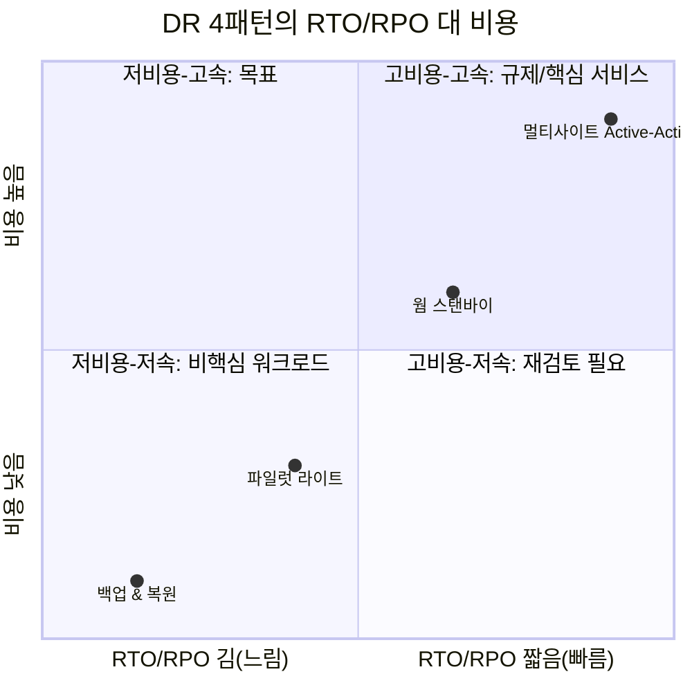

**한 줄 결정 기준**: 요구 RTO가 시간~일 단위면 백업&복원, 분~시간 단위면 파일럿 라이트, 분 단위 미만이면 웜 스탠바이, 초 단위에 근접해야 하면 Active-Active를 선택하되 항상 예산이 감당하는 가장 낮은 단계부터 검토한다(→ 8.6절 Multi-AZ vs Multi-Region 결정 트리 참조).

### 23.5 DR 런북 작성과 정기 훈련

**DR 런북(runbook)**은 장애 발생 시 누가 무엇을 어떤 순서로 실행할지 미리 문서화한 절차서다. 최소한 다음 구성 요소를 포함해야 한다.

- **트리거 조건**: 어떤 신호(리전 장애 알림, 특정 알람 임계치, 수동 판단)가 DR을 발동시키는가.
- **의사결정권자**: 페일오버를 실제로 승인할 권한자가 누구인지(오탐으로 인한 불필요한 페일오버를 막는 안전장치).
- **단계별 절차**: 승격 스크립트 실행 순서, DNS 전환, 트래픽 전환 확인 등을 순서대로 명시.
- **검증 체크리스트**: 페일오버 후 애플리케이션이 실제로 정상 동작하는지 확인하는 항목(핵심 API 응답, 데이터 정합성, 큐 적체 여부 등).
- **롤백 절차**: 페일오버가 잘못되었을 때 원래 리전으로 되돌리는 절차(포워드 전용으로 설계하면 롤백이 더 복잡해지므로 별도로 계획한다).

**페일오버 훈련**은 문서만으로는 검증되지 않는다. 게임데이(→ 8.8절) 형태로 최소 분기 1회 이상 실제 페일오버(또는 시뮬레이션)를 수행하고, 매 훈련마다 **복구 시간을 실측**해 기록으로 남겨야 목표 RTO 대비 실제 성능을 추적할 수 있다.

실전에서 DR 런북이 실패하는 대표적 3대 지점은 다음과 같다.

1. **DNS TTL**: Route 53 레코드의 TTL이 길게(예: 24시간) 설정되어 있으면 페일오버 승인 후에도 일부 클라이언트가 오래된 IP로 계속 연결을 시도한다. DR 대상 레코드는 짧은 TTL(초~분 단위)로 사전 설정해 두어야 한다.
2. **커넥션 풀**: 애플리케이션이나 커넥션 풀러(RDS Proxy, PgBouncer 등)가 기존 DB 엔드포인트로의 연결을 캐시하고 있으면, DNS가 전환되어도 애플리케이션이 죽은 연결을 계속 재사용하려 시도한다. 재시작이나 강제 커넥션 드레인 없이는 자동 복구되지 않는 경우가 많다.
3. **캐시 웜업**: 대기 리전의 캐시 계층(ElastiCache 등)이 콜드 상태로 시작하면, 트래픽 전환 직후 캐시 미스가 급증해 백엔드 DB에 부하가 몰리는 "썬더링 허드(thundering herd)" 현상이 발생한다. 사전 웜업 절차나 그레이스풀 트래픽 램프업이 필요하다.

**[주의] 백업만으로는 DR이 아니다.** 데이터 스냅샷이 있어도 그 데이터를 담을 애플리케이션 환경 자체가 없으면 복구할 수 없다. AMI(애플리케이션 실행 환경), 파라미터 스토어의 설정값, Secrets Manager의 자격 증명, IaC 템플릿(네트워크·보안 그룹·로드밸런서 정의)이 모두 갖춰져야 비로소 "복구 가능한" 상태다. 이 네 가지 중 하나라도 최신 상태로 관리되지 않으면 스냅샷만으로는 무용지물이다.

```markdown
# DR 런북 템플릿 예시 — payment-service

## 1. 트리거 조건
- ap-northeast-2 리전 헬스체크 3회 연속 실패(5분)
- 또는 SEV-1 인시던트 선언 + DR 담당 임원 승인

## 2. 의사결정권자
- 1차: On-call SRE 리드
- 승인: VP Engineering (또는 대행자)

## 3. 단계별 절차
1. [ ] Aurora Global Database 대기 리전 클러스터를 쓰기 가능으로 승격
   `aws rds failover-global-cluster --global-cluster-identifier payment-global`
2. [ ] IaC 스택 배포(오토스케일링 그룹, ALB) — CDK 파이프라인 dr-deploy 실행
3. [ ] Route 53 페일오버 레코드 확인(자동 헬스체크 기반, TTL 60초)
4. [ ] 캐시 웜업 스크립트 실행(핵심 키 사전 로드)
5. [ ] 애플리케이션 커넥션 풀 강제 재시작

## 4. 검증 체크리스트
- [ ] /health 엔드포인트 200 응답
- [ ] 결제 트랜잭션 테스트 1건 성공
- [ ] SQS 큐 적체(Backlog) 정상 범위

## 5. 롤백 절차
- 원 리전 정상화 확인 후 Global Database 역방향 재구성 필요(단순 DNS 롤백 아님)

## 6. 복구 시간 실측 기록
| 훈련 일자 | 목표 RTO | 실측 RTO | 비고 |
|---|---|---|---|
| 2026-03-14 | 15분 | 22분 | 캐시 웜업 단계 지연 |
```

복원 테스트 자동화는 Step Functions로 "스냅샷 복원 → 헬스 체크 → 결과 보고" 흐름을 정기 실행하거나, SSM Automation 문서로 표준화할 수 있다.

```yaml
# SSM Automation 문서 골자 - EBS 스냅샷 복원 후 헬스체크까지 자동 검증
description: "복원 테스트 자동화 - 스냅샷에서 볼륨 생성 후 인스턴스 연결 및 헬스체크"
schemaVersion: "0.3"
parameters:
  SnapshotId:
    type: String
mainSteps:
  - name: CreateVolumeFromSnapshot
    action: aws:executeAwsApi
    inputs:
      Service: ec2
      Api: CreateVolume
      SnapshotId: "{{ SnapshotId }}"
      AvailabilityZone: ap-northeast-2a
  - name: AttachAndVerify
    action: aws:executeAwsApi
    inputs:
      Service: ec2
      Api: AttachVolume
      # 이후 SSM Run Command로 볼륨 마운트 및 애플리케이션 헬스체크 스크립트 실행
  - name: NotifyResult
    action: aws:executeAwsApi
    inputs:
      Service: sns
      Api: Publish
      TopicArn: arn:aws:sns:ap-northeast-2:123456789012:dr-test-results
```

### 23.6 랜섬웨어 대비 백업 아키텍처

랜섬웨어 공격의 최신 패턴은 프로덕션 데이터를 암호화하는 데 그치지 않고, 침해한 계정 권한으로 **백업 자체를 먼저 삭제**해 복구 경로를 차단한 뒤 요구하는 것이다. 따라서 백업 아키텍처는 "백업이 존재하는가"가 아니라 "공격자가 백업에 접근해도 삭제할 수 없는가"를 기준으로 설계해야 한다.

핵심 방어 요소는 다음과 같다.

- **불변 백업**: AWS Backup 볼트 락(컴플라이언스 모드, → 23.1절)과 S3 Object Lock(컴플라이언스 모드, → 22.6절)으로 보존 기간 내 삭제를 원천 차단한다.
- **별도 계정·별도 리전 사본**: 프로덕션 계정의 자격 증명이 침해되어도 백업 전용 계정(별도 조직 단위, 별도 IAM 자격 증명 체계)의 리소스에는 접근할 수 없도록 계정 경계를 신뢰 경계로 삼는다. **[필수] 같은 계정 안의 백업은 그 계정이 침해되면 함께 삭제될 수 있다** — 계정 분리가 랜섬웨어 방어의 전제 조건이다.
- **최소 권한과 백업 삭제 권한 분리**: 백업을 생성하는 역할과 백업(복구 지점, 볼트)을 삭제할 수 있는 역할을 분리한다. 일상 운영 계정의 어떤 역할도 백업 전용 계정의 삭제 권한을 갖지 않도록 IAM 정책과 SCP(서비스 제어 정책)로 강제한다.
- **논리적 에어갭**: 물리적으로 네트워크를 끊는 대신, 계정 경계·크로스 계정 IAM 신뢰 관계 제한·볼트 락을 조합해 "논리적으로 격리된" 백업 사본을 만든다.

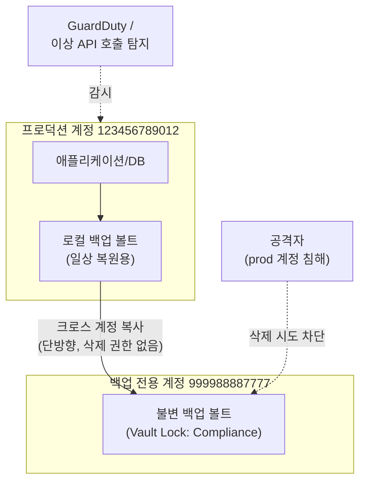

침해가 발생했을 때 복구 순서는 다음을 따른다. ① 침해 확산을 막기 위해 영향받은 계정의 자격 증명·역할을 즉시 회전·차단한다. ② 백업 전용 계정의 불변 볼트에서 침해 이전 시점의 복구 지점을 식별한다(볼트 락 덕분에 이 복구 지점은 공격자가 손댈 수 없었음이 보장된다). ③ 격리된 신규 환경(오염되지 않은 VPC·계정)에 복원해 정상 동작을 검증한 뒤에만 트래픽을 전환한다. ④ 사고 원인 분석과 포렌식은 오염된 원본 환경에서 별도로 진행한다.

**탐지와의 연계**: Amazon GuardDuty의 이상 API 호출 탐지(예: 짧은 시간에 다수의 스냅샷·복구 지점 삭제 API 호출, 평소와 다른 지역에서의 IAM 활동)는 백업 삭제 시도가 실제 공격인지 조기에 알리는 신호가 된다. CloudTrail 로그 기반의 이상 탐지와 대응 자동화는 → 32장(탐지와 사고 대응) 참조.

**[주의] 복구 테스트를 통과한 것만 백업이다.** 볼트 락과 계정 분리로 아무리 삭제 불가능한 사본을 만들어도, 실제로 그 사본에서 애플리케이션을 정상적으로 복원할 수 있는지 정기적으로 검증하지 않으면 랜섬웨어 사고 당일 처음으로 복원이 실패하는 것을 발견하게 된다.

### 23장 정리

#### [필수] 반드시 알아야 할 것

1. 백업은 **복구 테스트를 통과한 것만** 백업이다. 스냅샷이 존재하는 것과 실제로 복구 가능한 것은 다르며, AWS Backup의 복원 작업을 정기적으로 실행해 복구 시간을 실측하고 RTO와 비교해야 한다.
2. 백업은 프로덕션과 **다른 계정·다른 리전**에 사본을 둔다. 같은 계정 안의 백업은 그 계정이 침해되면 함께 삭제될 수 있는 단일 장애점이다.
3. 볼트 락(Vault Lock)은 거버넌스 모드(권한자가 변경 가능)와 컴플라이언스 모드(누구도 만료 전 삭제 불가)로 나뉘며, 컴플라이언스 모드는 활성화 후 유예 기간이 지나면 되돌릴 수 없다.
4. Storage Gateway 4종(S3 File, FSx File, Tape, Volume)은 각각 파일/파일/가상테이프/블록이라는 다른 프로토콜을 온프레미스에 제공하며, Volume Gateway는 캐시형과 저장형으로 로컬 용량 요구량과 지연 시간이 상반된다.
5. DR 4패턴(백업&복원/파일럿 라이트/웜 스탠바이/멀티사이트 Active-Active)은 RTO/RPO와 비용이 함께 움직이는 계단 구조이며, 파일럿 라이트는 컴퓨트를 정의만 해 두고 웜 스탠바이는 축소 규모로 상시 가동한다는 점이 근본적 차이다.
6. 스냅샷만으로는 DR이 아니다. AMI, 파라미터 스토어 설정값, Secrets Manager 자격 증명, IaC 템플릿이 모두 갖춰져야 복구할 환경 자체를 만들 수 있다.
7. DataSync와 복제 기능은 삭제도 전파할 수 있다. 백업 목적이라면 삭제 전파(`PreserveDeletedFiles`) 옵션을 반드시 비활성화하거나 불변 저장소를 대상으로 삼는다.

#### [팁] 실무 노하우

1. 백업 리소스 할당은 리소스 ID 나열 대신 태그 기반 선택을 쓴다. 신규 리소스도 태그만 붙이면 자동으로 백업 대상에 편입된다.
2. Vault Lock(불변 백업)으로 삭제를 원천 차단하면 랜섬웨어와 내부자 리스크가 크게 줄어든다. 다만 컴플라이언스 모드는 비가역적이므로 유예 기간 안에 충분히 검증한다.
3. 수십 TB 이상의 초기 이관은 회선 대역폭 대비 Snowball Edge가 빠르고 저렴해지는 손익분기점이 있다. 데이터량 ÷ 가용 대역폭과 디바이스 왕복 소요 기간을 직접 비교해 결정한다.
4. Backup Audit Manager로 조직 전체의 백업 정책 준수 여부(보존 기간, 볼트 락 활성화)를 지속적으로 감사해 규정 위반 리소스를 조기에 찾아낸다.
5. Route 53 레코드의 TTL은 평상시에도 짧게(초~분 단위) 설정해 두어야 실제 페일오버 시 DNS 전파 지연으로 발이 묶이지 않는다.
6. DR 런북은 문서로만 두지 말고 게임데이 형태로 최소 분기 1회 실제 페일오버를 훈련하며, 매 훈련의 복구 시간을 기록해 목표 RTO와의 격차를 추적한다.

#### [주의] 사고·비용·설계 함정

1. 볼트 락 컴플라이언스 모드를 검증 없이 프로덕션 볼트에 즉시 적용하면, 이후 보존 정책 실수를 발견해도 만료 전까지 되돌릴 수 없다.
2. 백업과 복제(DataSync, 볼트 복사)를 같은 계정 안에서만 운영하면 계정 침해 시 원본과 사본이 함께 삭제되는 시나리오를 막지 못한다.
3. Volume Gateway 캐시형은 인터넷 연결이 끊기면 캐시에 없는 데이터에 접근할 수 없다는 점을 간과하고 온프레미스 단독 운영 가능하다고 오인하기 쉽다.
4. DR 런북에 캐시 웜업 절차가 없으면 페일오버 직후 캐시 미스 폭증으로 백엔드 DB가 눌리는 썬더링 허드가 발생한다.
5. 커넥션 풀이 기존 DB 엔드포인트를 캐시하고 있으면 DNS가 전환되어도 애플리케이션이 자동으로 새 엔드포인트를 쓰지 않는다. 강제 재시작이나 드레인 절차를 런북에 포함해야 한다.
6. DataSync 태스크에서 삭제 전파 옵션을 기본값으로 두면 소스의 실수·악의적 삭제가 백업 사본까지 지워버릴 수 있다.
7. 백업 계획에 태그 기반 선택을 쓰지 않고 리소스 ID를 하드코딩하면, 신규 리소스가 백업 누락 상태로 방치되기 쉽다.
8. AMI나 IaC 템플릿을 최신 상태로 갱신하지 않으면 DB 스냅샷은 있어도 그 데이터를 담을 애플리케이션 환경을 재현할 수 없다.

#### 한 장 요약

AWS Backup은 태그 기반 계획과 볼트 락으로 여러 서비스의 백업을 중앙화·불변화하고, Storage Gateway 4종과 DataSync·Snow 패밀리는 온프레미스와 클라우드 사이의 대량 데이터 이관과 하이브리드 접근을 담당한다. DR은 8장의 아키텍처 유형을 AMI·복제본·IaC·DNS 전환이라는 실제 메커니즘으로 구현하고, 런북과 정기 훈련으로 DNS TTL·커넥션 풀·캐시 웜업 같은 실전 실패 지점을 사전에 제거해야 문서상의 RTO가 실제 RTO가 된다. 랜섬웨어 대비는 불변 백업과 계정 분리를 전제로 하며, 결국 복구 테스트를 통과한 백업만이 진짜 백업이라는 원칙이 이 장 전체를 관통한다.

#### 다음 장 예고

24장은 관계형·비관계형 데이터베이스를 선택하는 이론적 기준(CAP 정리, 일관성 모델, 액세스 패턴)을 다루며, 이 장에서 다룬 백업·DR 요구사항이 데이터베이스 선택에 어떻게 영향을 미치는지로 이어진다.

---

## 24장. 데이터베이스 선택의 이론  ★★★

> **이 장에서 다루는 것**
> 이 장은 25~26장(관계형 DB, NoSQL과 특수 목적 DB)에서 각 서비스를 다루기 전에 필요한 **판단 기준**을 세운다. ACID/BASE, CAP/PACELC, OLTP/OLAP 같은 이론을 실무 언어로 번역하고, "쿼리부터 쓰고 스키마는 나중에 고른다"는 액세스 패턴 주도 설계 절차를 제시한다. 10장의 네트워킹과 19~23장의 스토리지 지식을 전제하지는 않지만, 데이터가 어디에 저장되든 결국 스토리지 위에 얹힌 접근 모델이라는 점에서 이어진다. 각 DB 계열의 구체적 사용법은 25장(관계형), 26장(NoSQL·특수 목적), 51장(웨어하우스)에서 다룬다.

### 24.1 데이터베이스의 역사와 데이터 주도 혁신 흐름

관계형 데이터베이스가 등장하기 전, 데이터는 계층형(hierarchical) 모델이나 네트워크형(network) 모델로 다뤄졌다. 계층형은 트리 구조로 부모-자식 관계만 표현할 수 있었고, 네트워크형은 다대다 관계를 포인터로 연결해 유연성을 높였지만 애플리케이션 코드가 물리적 저장 구조를 알아야 했다. 1970년 에드거 커드(Edgar Codd)의 관계형 모델 논문 이후 SQL 기반 RDBMS가 수십 년간 사실상 표준이 됐다. 관계형 모델은 데이터를 물리적 저장 방식과 분리하고, 선언적 쿼리(SQL)로 "무엇을 원하는가"만 기술하면 되게 만들었다는 점에서 근본적 전환이었다.

2000년대 중반 이후 상황이 다시 바뀐다. 원서가 지적하는 **데이터 주도 혁신(data-driven innovation)** 트렌드는 크게 세 축으로 요약된다.

- **데이터 양·속도·다양성의 증가**: 웹 규모 서비스가 단일 서버 RDBMS의 수직 확장 한계를 넘어서면서, 수평 확장이 가능한 저장소가 필요해졌다. 로그, 클릭스트림, 센서 데이터처럼 정형화되지 않은 데이터도 급증했다.
- **실시간 처리 요구**: 배치로 하루 뒤에 리포트를 뽑는 대신, 사용자 행동에 즉시 반응하는 애플리케이션(추천, 사기 탐지, 재고 갱신)이 늘면서 밀리초 단위 응답이 요구되는 워크로드가 생겼다.
- **머신러닝과의 결합**: 특징(feature) 데이터를 대량으로 저장·조회하고, 벡터·그래프·시계열 같은 특수한 데이터 형태를 다뤄야 하는 요구가 늘었다.

이 흐름 속에서 "하나의 범용 RDBMS로 모든 것을 해결한다"는 접근은 특정 워크로드에서 비효율을 낳기 시작했고, 그 결과로 NoSQL(키-값, 문서, 와이드 컬럼, 그래프)과 이후의 **목적별(purpose-built) 데이터베이스**가 등장했다. 목적별 데이터베이스란 하나의 워크로드 유형(예: 그래프 순회, 시계열 집계, 원장 검증)에 최적화된 저장 엔진과 쿼리 모델을 제공하는 데이터베이스를 말한다. 이 장의 나머지 절은 이 스펙트럼 위에서 무엇을 기준으로 선택할지를 다룬다.

### 24.2 일관성 모델: ACID vs BASE

**ACID**는 전통적 관계형 트랜잭션이 보장하는 4가지 속성이다.

| 속성 | 의미 | 예시 |
|---|---|---|
| Atomicity (원자성) | 트랜잭션 내 모든 연산이 전부 성공하거나 전부 실패한다 | 계좌 이체 시 출금과 입금이 함께 반영되거나 함께 롤백된다 |
| Consistency (일관성) | 트랜잭션 전후로 데이터가 정의된 제약(무결성 규칙)을 항상 만족한다 | 잔액 제약조건(음수 불가)이 트랜잭션 후에도 유지된다 |
| Isolation (고립성) | 동시 실행되는 트랜잭션이 서로의 중간 상태를 보지 못한다 | 두 사용자가 동시에 같은 재고를 차감해도 이중 판매가 나지 않는다 |
| Durability (지속성) | 커밋된 트랜잭션은 장애가 나도 사라지지 않는다 | 커밋 직후 정전이 나도 주문 기록이 남는다 |

ACID는 금융 거래, 재고 관리, 예약 시스템처럼 **정합성이 최우선**인 워크로드에 필요하다.

**BASE**는 대규모 분산 시스템에서 ACID의 엄격함 대신 가용성과 확장성을 우선하는 대안 모델이다.

- **Basically Available (기본적 가용성)**: 시스템은 대부분의 경우 응답을 반환한다(부분 장애가 있어도 완전히 멈추지 않는다).
- **Soft state (유연한 상태)**: 데이터 상태가 즉시 확정되지 않고 시간이 지나며 수렴할 수 있다.
- **Eventually consistent (최종적 일관성)**: 새 쓰기가 없으면 결국 모든 복제본이 같은 값에 수렴한다.

BASE는 소셜 미디어 피드, 상품 카탈로그 조회, 조회수 카운터처럼 **약간의 지연된 일관성을 감수하고 응답성과 확장성을 우선**해도 되는 워크로드에 맞는다. DynamoDB는 기본적으로 최종적 일관성 읽기를 제공하되 강한 일관성 읽기 옵션도 두어, 워크로드별로 선택하게 한다.

트랜잭션 **격리 수준(isolation level)**은 ACID의 "I"를 얼마나 엄격하게 지킬지를 조절하는 손잡이다. 격리 수준이 낮을수록 동시성(성능)은 좋아지지만 이상 현상(anomaly)이 발생할 수 있다.

| 격리 수준 | Dirty Read | Non-repeatable Read | Phantom Read |
|---|---|---|---|
| Read Uncommitted | 발생 | 발생 | 발생 |
| Read Committed | 방지 | 발생 | 발생 |
| Repeatable Read | 방지 | 방지 | 발생 가능(엔진에 따라 다름) |
| Serializable | 방지 | 방지 | 방지 |

- **Dirty read**: 다른 트랜잭션이 아직 커밋하지 않은 값을 읽는 것.
- **Non-repeatable read**: 같은 트랜잭션 안에서 같은 행을 두 번 읽었는데 값이 달라지는 것(중간에 다른 트랜잭션이 커밋).
- **Phantom read**: 같은 조건으로 두 번 조회했는데 행의 개수가 달라지는 것(중간에 다른 트랜잭션이 삽입/삭제).

**한 줄 결정 기준**: 정합성이 무너지면 사고로 이어지는 워크로드(결제, 재고 확정)는 Read Committed 이상, 정산·마감처럼 완전한 재현성이 필요한 배치는 Serializable을 검토하고, 그 외에는 기본 격리 수준(엔진 기본값)을 유지해 동시성 저하를 피한다.

```sql
-- PostgreSQL: 격리 수준별 동작 확인용 실험 스크립트
-- 세션 A
BEGIN TRANSACTION ISOLATION LEVEL REPEATABLE READ;
SELECT balance FROM accounts WHERE account_id = 'A100';
-- 이 시점에서 세션 B가 같은 행을 UPDATE 후 COMMIT 한다고 가정
SELECT balance FROM accounts WHERE account_id = 'A100'; -- REPEATABLE READ면 같은 값
COMMIT;

-- 세션 B (세션 A의 두 SELECT 사이에 실행)
BEGIN;
UPDATE accounts SET balance = balance - 100 WHERE account_id = 'A100';
COMMIT;
```

### 24.3 CAP와 PACELC — 실무적 해석

**CAP 정리**는 분산 시스템이 다음 세 가지를 동시에 완벽히 보장할 수 없다는 이론이다.

- **Consistency (일관성)**: 모든 노드가 같은 순간 같은 데이터를 본다.
- **Availability (가용성)**: 모든 요청이 (에러가 아닌) 응답을 받는다.
- **Partition tolerance (분할 내성)**: 노드 간 통신이 끊겨도 시스템이 계속 동작한다.

여기서 자주 오해되는 지점이 있다. CAP은 "셋 중 둘만 고를 수 있다"는 뜻이 아니라, **네트워크 분할(partition)이 실제로 발생했을 때** 일관성과 가용성 중 하나를 포기해야 한다는 뜻이다. 분산 시스템에서 네트워크 분할은 언젠가 반드시 일어나므로(P는 사실상 필수 전제), 실제 선택은 "분할이 발생한 순간에 C를 지킬지 A를 지킬지"로 좁혀진다.

또 하나의 흔한 오해는 "CP 데이터베이스는 항상 강한 일관성을 보장한다"는 생각이다. 정확히는, **CP 시스템은 분할 상황에서 일관성을 지키기 위해 가용성을 희생**할 뿐이며, 평상시(분할이 없을 때)의 지연이나 일관성 수준은 CAP이 말해주지 않는다. 이 빈틈을 메우는 것이 **PACELC**다.

> **P**artition 발생 시 **A**vailability와 **C**onsistency 중 선택, 그렇지 않으면(**E**lse) **L**atency와 **C**onsistency 중 선택.

PACELC는 "분할이 없는 평상시에도 지연(latency)과 일관성(consistency) 사이에 트레이드오프가 있다"는 점을 명시적으로 추가한다. 강한 일관성을 보장하려면 복제본 간 동기화를 기다려야 하므로 지연이 늘고, 지연을 줄이려면 비동기 복제를 허용해 일관성을 약간 양보해야 한다.

```mermaid
quadrantChart
    title AWS 데이터 서비스의 PACELC 좌표(평상시 EL/EC 축, 대표 구성 기준)
    x-axis 낮은 지연 --> 강한 일관성
    y-axis 가용성 우선(AP) --> 일관성 우선(CP)
    quadrant-1 CP 且 낮은지연추구
    quadrant-2 CP 且 강일관성
    quadrant-3 AP 且 낮은지연
    quadrant-4 AP 且 준강일관성옵션
    "DynamoDB(기본 최종적 일관성)": [0.2, 0.3]
    "DynamoDB(강한 일관성 읽기 옵션)": [0.6, 0.55]
    "Aurora(단일 프라이머리 쓰기)": [0.75, 0.85]
    "ElastiCache(캐시, 애플리케이션이 무효화 책임)": [0.15, 0.2]
    "DynamoDB 글로벌 테이블(리전 간)": [0.1, 0.15]
```

실무적으로 중요한 것은 좌표 자체가 아니라, **"이 서비스가 분할 시 무엇을 포기하는가"와 "평상시 지연-일관성 트레이드오프를 어떻게 조절할 수 있는가"**를 파악하는 것이다. DynamoDB는 리전 내에서는 강한 일관성 읽기를 옵션으로 제공해 AP 성향을 CP 쪽으로 조절할 수 있고, 글로벌 테이블(리전 간 복제)은 최종적 일관성을 전제로 한다. Aurora는 단일 프라이머리 쓰기 구조라 리전 내 쓰기 일관성은 강하지만, 리드 리플리카를 통한 읽기는 복제 지연만큼 최종적 일관성에 가까워질 수 있다(→ 25장 참조).

### 24.4 사용 모델: OLTP vs OLAP

**OLTP(Online Transaction Processing)**는 애플리케이션의 일상적 트랜잭션(주문 생성, 재고 차감, 로그인)을 처리하고, **OLAP(Online Analytical Processing)**는 대량 데이터를 집계·분석해 의사결정을 지원한다. 둘은 요구 특성이 근본적으로 다르다.

| 항목 | OLTP | OLAP |
|---|---|---|
| 쿼리 패턴 | 짧고 빈번한 읽기/쓰기(단건 조회, 소규모 갱신) | 긴 집계 쿼리(대량 스캔, GROUP BY, 조인) |
| 데이터 지향 | 행(row) 지향 저장 — 한 레코드 전체를 자주 갱신 | 열(column) 지향 저장 — 특정 컬럼만 대량 스캔 |
| 정규화 수준 | 높음(3NF에 가깝게, 중복 최소화) | 낮음(스타/스노우플레이크 스키마, 조인 최소화 위해 일부 중복 허용) |
| 동시성 | 매우 높음(수천~수백만 동시 트랜잭션) | 낮음(소수의 분석가·배치 잡) |
| 데이터 크기 | 상대적으로 작음(활성 데이터 중심) | 매우 큼(수년치 이력 데이터 누적) |
| 대표 AWS 서비스 | RDS, Aurora, DynamoDB | Redshift, Athena |

전통적으로는 OLTP 시스템에서 ETL(추출·변환·적재)로 데이터를 야간 배치로 웨어하우스에 옮겨 OLAP 분석을 했다. 하지만 이 지연이 실시간 의사결정에 방해가 되면서 두 가지 흐름이 생겼다. **HTAP(Hybrid Transaction/Analytical Processing)**는 하나의 엔진(또는 밀접하게 통합된 엔진 쌍)이 트랜잭션과 분석 쿼리를 함께 처리하려는 접근이다. **제로 ETL(Zero-ETL)**은 OLTP 원본(예: Aurora)과 OLAP 대상(예: Redshift) 사이의 배치 파이프라인을 없애고, 데이터를 거의 실시간으로 자동 복제해 별도 ETL 코드 없이 분석 가능하게 만드는 통합 방식이다. 세부 아키텍처는 51장(웨어하우스)과 52장(레이크하우스)에서 다룬다.

**한 줄 결정 기준**: 요청 단위가 "특정 레코드를 빠르게 읽고 쓴다"면 OLTP형 저장소, "많은 레코드를 훑어 집계한다"면 OLAP형 저장소를 쓰고, 두 성격이 한 애플리케이션에 섞여 있다면 별도 시스템으로 분리한 뒤 제로 ETL로 연결하는 편이 하나의 엔진에 무리하게 두 역할을 맡기는 것보다 안전하다.

### 24.5 정규화와 액세스 패턴 주도 설계

관계형 모델의 **정규화(normalization)**는 데이터 중복과 갱신 이상(update anomaly)을 없애기 위한 절차다.

- **1NF(제1정규형)**: 모든 컬럼이 원자값(더 쪼갤 수 없는 값)을 가져야 한다(반복 그룹 금지).
- **2NF(제2정규형)**: 1NF를 만족하고, 기본키의 일부에만 종속된 컬럼(부분 함수 종속)이 없어야 한다.
- **3NF(제3정규형)**: 2NF를 만족하고, 기본키가 아닌 컬럼이 다른 비키 컬럼에 종속되지 않아야 한다(이행적 종속 제거).

실무 OLTP 스키마는 대체로 3NF 근처에서 설계하지만, 조회 성능을 위해 의도적으로 **비정규화(denormalization)**하기도 한다. 근거는 명확하다. 조인 비용이 특정 쿼리에서 감당하기 어려울 정도로 커지거나, 읽기 빈도가 쓰기 빈도를 압도적으로 초과할 때, 일부 중복을 감수하고 읽기 경로를 단순화하는 편이 이득이다. NoSQL, 특히 DynamoDB 단일 테이블 설계는 이 아이디어를 극단으로 밀어붙인 형태다.

원서가 강조하는 원칙은 다음과 같다. **"쿼리 목록을 먼저 쓰고, 그다음 데이터 모델을 고른다."** 관계형 사고는 "데이터가 어떤 개체(entity)와 관계로 구성되는가"에서 출발해 정규화된 스키마를 만들고, 쿼리는 나중에 조인으로 조립한다. 반대로 NoSQL 사고, 특히 DynamoDB 단일 테이블 설계는 "어떤 쿼리가 얼마나 자주 실행되는가"에서 출발해, 그 쿼리가 조인 없이 한 번의 조회로 끝나도록 데이터를 미리 비정규화해 배치한다. 이 차이 때문에 NoSQL 스키마는 요구사항이 굳어진 뒤에 설계해야 하고, 액세스 패턴이 자주 바뀌는 초기 단계에는 관계형이 유리한 경우가 많다.

실제 절차는 액세스 패턴 표를 만드는 것으로 시작한다.

```markdown
| # | 액세스 패턴 | 빈도 | 응답시간 요구 | 데이터 소스(예정) |
|---|---|---|---|---|
| 1 | 주문 ID로 주문 상세 조회 | 매우 높음 | <10ms | ? |
| 2 | 고객 ID로 최근 주문 목록(최신순) 조회 | 높음 | <20ms | ? |
| 3 | 상품 ID로 재고 수량 조회 및 원자적 차감 | 매우 높음 | <10ms | ? |
| 4 | 특정 기간 매출 합계 집계(관리자용) | 낮음(일 1회) | 수 초 허용 | ? |
| 5 | 임의 조건(고객명+지역+기간)으로 주문 검색 | 낮음 | 수 초 허용 | ? |
```

이 표를 채운 뒤 판단한다. 패턴 1~3처럼 **키로 예측 가능한 조회**가 대부분이고 지연에 민감하다면 DynamoDB 같은 키-값/문서 모델이 강점을 갖는다. 패턴 5처럼 **임의 조건의 애드혹 쿼리**가 필요하다면 관계형(RDS/Aurora)이나 검색 엔진(OpenSearch)이 필요하다. 패턴 4처럼 **집계**가 중요하다면 별도 분석 경로(제로 ETL로 Redshift 연동)를 고려한다. 즉, 하나의 표 안에서도 서로 다른 DB 계열이 필요하다는 결론이 나올 수 있으며, 이것이 다음 절의 폴리글랏 퍼시스턴스로 이어진다.

아래는 "고객의 최근 주문 5건과 각 주문의 상품 목록을 조회한다"는 동일한 요구사항을 관계형과 DynamoDB 단일 테이블로 각각 모델링한 대비 예시다.

```sql
-- 관계형(3NF에 가까운 정규화 스키마): 조인으로 조립
SELECT o.order_id, o.order_date, oi.product_id, oi.quantity
FROM orders o
JOIN order_items oi ON oi.order_id = o.order_id
WHERE o.customer_id = 'C1001'
ORDER BY o.order_date DESC
LIMIT 5;
-- 장점: 스키마 변경(새 쿼리 추가)이 유연하다.
-- 단점: 조인 비용이 데이터 증가에 따라 커진다.
```

```json
// DynamoDB 단일 테이블: PK/SK 설계로 조인 없이 한 번의 Query로 해결
// PK = CUSTOMER#C1001, SK = ORDER#<주문일시>#<주문ID> (주문 항목은 같은 아이템에 리스트로 비정규화)
{
  "PK": "CUSTOMER#C1001",
  "SK": "ORDER#2026-08-20T09:00:00Z#O9001",
  "OrderId": "O9001",
  "OrderDate": "2026-08-20T09:00:00Z",
  "Items": [
    { "ProductId": "P100", "Quantity": 2 },
    { "ProductId": "P204", "Quantity": 1 }
  ]
}
// Query: PK = CUSTOMER#C1001, ScanIndexForward=false, Limit=5
// 장점: 단일 Query로 지연이 예측 가능하고 낮다.
// 단점: "상품 ID로 이 상품을 주문한 모든 고객"처럼 예상 못 한 쿼리는 GSI 재설계가 필요하다(→ 26장 참조).
```

### 24.6 "작업에 맞는 도구(purpose-built)" 원칙과 AWS DB 계열 지도

원서가 강조하는 **"작업에 맞는 도구(the right tool for the job)"** 원칙은, 하나의 범용 데이터베이스에 모든 워크로드를 억지로 맞추기보다 워크로드 특성에 맞는 저장 엔진을 골라야 한다는 것이다. 과거에는 이 원칙을 실천하려면 각 DB 종류마다 서버를 직접 구축·운영해야 했지만, 완전 관리형 서비스의 발전으로 운영 부담 없이 폴리글랏 퍼시스턴스를 실천할 수 있게 됐다. 이는 레거시 시스템에서 벗어나는 계기이기도 하다. 온프레미스에서 라이선스 비용과 운영 인력 문제로 "일단 있는 RDBMS에 다 넣는" 관행이 이어졌다면, 관리형 목적별 DB는 초기 도입 비용을 낮춰 워크로드별 최적 선택을 현실적으로 만든다.

AWS의 DB 서비스 계열을 문제 유형과 대표 액세스 패턴 중심으로 정리하면 다음과 같다. 각 서비스의 상세 아키텍처는 25장(관계형), 26장(NoSQL·특수 목적), 51장(웨어하우스)에서 다룬다.

| 계열 | 대표 서비스 | 해결하는 문제 유형 | 대표 액세스 패턴 |
|---|---|---|---|
| 관계형 | RDS, Aurora | 강한 일관성 트랜잭션, 복잡한 조인·애드혹 쿼리 | "조건 A, B, C를 만족하는 행을 조인해서 조회" |
| 키-값 | DynamoDB | 예측 가능한 키 기반 초저지연 조회, 대규모 수평 확장 | "이 ID로 아이템을 가져온다/갱신한다" |
| 문서 | DocumentDB | 반정형 JSON 문서의 유연한 스키마 저장·조회 | "중첩 구조를 가진 문서를 그대로 저장하고 부분 조회" |
| 인메모리 | ElastiCache, MemoryDB | 마이크로초~밀리초급 캐시, 세션 저장, 리더보드 | "자주 조회되는 값을 초저지연으로 캐시" |
| 그래프 | Neptune | 개체 간 복잡한 관계 탐색(추천, 사기 탐지, 지식 그래프) | "친구의 친구를 N단계까지 탐색" |
| 시계열 | Timestream | 시간 순서 측정값의 저장과 시간 기반 집계 | "최근 1시간 평균/최댓값을 1분 단위로 집계" |
| 원장 | QLDB | 변경 이력의 암호학적 검증이 필요한 감사 추적 | "이 레코드가 언제 누구에 의해 어떻게 바뀌었는지 증명" |
| 와이드 컬럼 | Keyspaces | Cassandra 호환, 매우 큰 규모의 쓰기 중심 워크로드 | "파티션 키+클러스터링 키로 대량 쓰기·범위 조회" |
| 검색 | OpenSearch Service | 전문(full-text) 검색, 로그 분석, 임의 조건 필터링 | "텍스트에 특정 단어가 포함된 문서를 관련도순 검색" |
| 웨어하우스 | Redshift | 대량 데이터의 SQL 기반 집계·분석 | "수십억 행을 GROUP BY로 집계" |

**한 줄 결정 기준**: 24.5절의 액세스 패턴 표에서 나온 각 쿼리를 이 표의 "대표 액세스 패턴" 열과 매칭시켜, 하나의 패턴이 여러 계열에 걸쳐 있다면 억지로 한 DB에 몰아넣지 말고 계열을 나눈다.

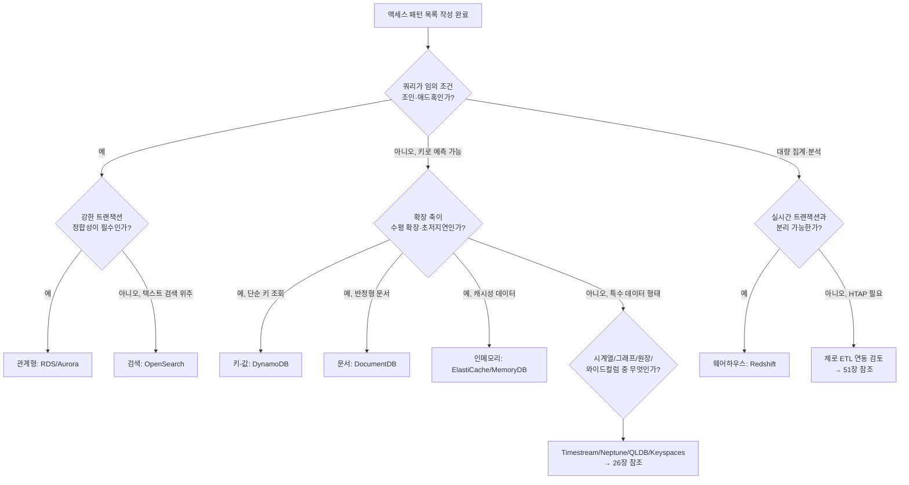

### 24.7 폴리글랏 퍼시스턴스의 대가

**폴리글랏 퍼시스턴스(polyglot persistence)**란 하나의 애플리케이션(또는 조직) 안에서 워크로드별로 서로 다른 종류의 데이터베이스를 함께 쓰는 전략이다. 24.6절의 원칙을 그대로 따르면 자연스럽게 이 형태로 수렴한다. 하지만 대가가 없는 것은 아니다.

DB 종류가 하나 늘 때마다 다음 항목들이 함께 곱해진다.

- **운영**: 각 DB의 백업 주기, 복제 구성, 버전 업그레이드 절차, 장애 대응 런북을 별도로 유지해야 한다.
- **보안**: 접근 제어 모델(IAM 정책, DB 자체 사용자·역할), 암호화 키 관리, 감사 로그 형식이 DB마다 다르다.
- **모니터링**: 지표 이름, 정상 범위, 알람 임계치가 DB마다 다르므로 통합 대시보드 구성에 추가 작업이 든다.
- **인력**: 팀이 각 DB의 특성(격리 수준, 인덱스 전략, 용량 계획)을 이해해야 하며, 이는 채용·교육 비용으로 이어진다.

따라서 팀 규모가 작을수록 DB 종류 수를 의도적으로 제한해야 한다. 대체로 소규모 팀(단일 서비스 팀)은 관계형 하나 + 캐시 하나 정도로 시작하고, 조직 전체로 봐도 감당 가능한 DB 종류의 상한을 정해 신규 도입 시 기존 계열로 해결 가능한지부터 검토하는 편이 안전하다. DB 종류 수를 늘리는 결정은 액세스 패턴 표에서 기존 DB로 해결 불가능한 패턴이 실제로 있을 때만 정당화된다.

여러 DB를 함께 쓰면 데이터 통합 문제도 따라온다. 과거에는 배치 ETL로 여러 저장소의 데이터를 야간에 동기화했지만, 이는 지연과 파이프라인 유지보수 부담을 낳는다. 대안은 제로 ETL(24.4절)이나 이벤트 기반 동기화(하나의 DB에 쓰기가 발생하면 이벤트를 발행해 다른 DB의 읽기 모델을 갱신하는 방식, CQRS의 한 형태)다. 이 패턴들의 구체적 구현(트랜잭셔널 아웃박스, 구체화 뷰 등)은 44장(데이터 관리 패턴)에서 다룬다.

마지막으로 반드시 짚어야 할 실무 함정이 있다. BASE 모델의 **최종적 일관성**은 백엔드 설계 선택으로는 합리적이지만, 이를 사용자에게 그대로 노출하면 문제가 된다. 예를 들어 주문을 저장한 직후 주문 목록 화면에 방금 저장한 주문이 보이지 않는다면, 이는 사용자 입장에서 "버그"로 인식되고 실제로 버그 신고로 이어진다. 따라서 설계 초기에 "쓰기 직후 같은 사용자가 그 결과를 즉시 읽어야 하는가(read-your-writes)"라는 요구를 액세스 패턴 표에 명시적으로 표시하고, 이런 패턴에는 강한 일관성 읽기 옵션을 쓰거나, 클라이언트가 방금 쓴 값을 낙관적으로 화면에 반영하는 방식으로 체감 지연을 없애야 한다.

### 24장 정리

#### [필수] 반드시 알아야 할 것
1. DB 선택의 출발점은 스키마가 아니라 **액세스 패턴**이다. 쿼리 목록을 먼저 쓰고 그다음 데이터 모델을 고른다(24.5절).
2. 관계형은 유연한 쿼리·강한 일관성·조인에 강하고, NoSQL은 예측 가능한 액세스 패턴·수평 확장·저지연에 강하다(24.5, 24.6절).
3. CAP은 "셋 중 둘만 고른다"는 뜻이 아니라, **분할이 발생했을 때** 일관성과 가용성 중 하나를 포기한다는 뜻이다. "CP 데이터베이스는 항상 강한 일관성"이라는 것도 오해이며, PACELC는 분할이 없을 때도 지연-일관성 트레이드오프가 있음을 보여준다(24.3절).
4. ACID(원자성·일관성·고립성·지속성)는 정합성이 최우선인 워크로드에, BASE(기본적 가용성·유연한 상태·최종적 일관성)는 응답성·확장성이 우선인 워크로드에 맞는다(24.2절).
5. OLTP(행 지향, 높은 동시성, 짧은 트랜잭션)와 OLAP(열 지향, 대량 집계, 낮은 동시성)은 요구 특성이 근본적으로 다르며, 하나의 엔진에 억지로 합치기보다 제로 ETL로 연결하는 편이 낫다(24.4절).
6. AWS는 관계형·키-값·문서·인메모리·그래프·시계열·원장·와이드컬럼·검색·웨어하우스까지 목적별 DB 계열을 제공한다. "작업에 맞는 도구" 원칙에 따라 워크로드별로 계열을 고른다(24.6절).

#### [팁] 실무 노하우
1. 새 서비스에는 관리형(RDS/Aurora/DynamoDB)을 기본값으로 삼는다. EC2 위에 DB를 직접 설치하는 것은 특정 확장 모듈이나 버전처럼 관리형이 지원하지 않는 특수 요건이 있을 때만 고려한다.
2. 액세스 패턴 표(24.5절 템플릿)를 설계 첫 산출물로 만들어 팀과 공유하면, 이후 DB 종류 선택 논쟁을 데이터로 해결할 수 있다.
3. "읽기 직후 쓰기(read-your-writes)"가 필요한 패턴을 액세스 패턴 표에서 미리 표시해 두면, 강한 일관성 옵션이나 클라이언트 낙관적 갱신을 설계 단계에서 반영할 수 있다.
4. 팀 규모에 맞춰 DB 종류 수의 상한을 정하고, 신규 DB 도입 전에 기존 계열로 해결 가능한지부터 검토한다.
5. 격리 수준은 워크로드별로 조정 가능한 손잡이다. 기본값을 무조건 올리기보다, 정합성이 실제로 중요한 트랜잭션에만 높은 격리 수준을 적용한다.

#### [주의] 사고·비용·설계 함정
1. 폴리글랏 퍼시스턴스는 운영·백업·보안·모니터링·인력 비용을 DB 종류만큼 곱한다. 팀 규모를 고려하지 않고 계열을 늘리면 감당하지 못한다.
2. "결과적 일관성(최종적 일관성)"을 사용자 화면에 그대로 노출하면 버그 신고로 이어진다. read-your-writes 요구를 미리 식별하지 않으면 운영 후 원인 파악에 시간이 든다.
3. "CP 데이터베이스니까 항상 강한 일관성이 보장된다"고 단정하면 실제 장애 시나리오(분할 상황)에서 예상과 다른 동작을 겪을 수 있다.
4. NoSQL 단일 테이블 설계를 액세스 패턴이 굳어지기 전에 시작하면, 요구사항 변경마다 테이블 재설계가 필요해져 오히려 비용이 커진다.
5. OLTP 시스템에 OLAP성 대량 집계 쿼리를 직접 실행하면 트랜잭션 처리 성능이 저하된다. 분석 워크로드는 반드시 분리한다.
6. 정규화를 지나치게 고집해 모든 조회에 다중 조인이 필요해지면, 데이터가 커질수록 응답 시간이 급격히 나빠질 수 있다. 비정규화는 회피 대상이 아니라 근거를 갖춘 선택지다.

#### 한 장 요약
데이터베이스 선택은 스키마 설계가 아니라 액세스 패턴 정의에서 시작한다. ACID/BASE와 CAP/PACELC는 정합성과 가용성·지연 사이의 트레이드오프를 언어화하는 도구이고, OLTP/OLAP 구분은 트랜잭션과 분석을 분리해야 하는 이유를 설명한다. AWS는 관계형부터 그래프·시계열·원장까지 목적별 DB 계열을 완전 관리형으로 제공하므로, "작업에 맞는 도구" 원칙을 실천하는 비용이 과거보다 낮아졌다. 다만 DB 종류를 늘릴 때마다 운영 부담이 곱해진다는 점과, 최종적 일관성을 사용자에게 그대로 노출하면 버그로 인식된다는 점은 설계 초기에 반드시 짚어야 한다.

#### 다음 장 예고
25장은 이 장의 이론을 관계형 계열에 적용해, RDS 엔진 선택부터 Aurora 아키텍처, Multi-AZ와 리드 리플리카의 차이, 백업·성능 진단까지 실제 운영 관점에서 다룬다.

---

## 25장. 관계형 데이터베이스 — RDS와 Aurora  ★★★

> **이 장에서 다루는 것**
> 24장에서 다룬 "작업에 맞는 도구" 원칙과 OLTP/OLAP·ACID 이론을 전제로, 이 장은 AWS의 대표적 관계형 데이터베이스 서비스인 Amazon RDS와 Amazon Aurora를 실무 관점에서 다룬다. 엔진 선택, 가용성과 확장성의 구분(Multi-AZ vs 리드 리플리카), Aurora의 스토리지 아키텍처, 엔드포인트 설계, 서버리스 옵션, 커넥션 관리(RDS Proxy), 운영(파라미터·백업·업그레이드), 성능 진단까지 하나의 흐름으로 연결한다. 이 장에서 다루는 개념 중 상당수는 실무에서 가장 자주 혼동되는 지점이므로, 각 절의 "정확한 목적"을 문장으로 기억하는 것이 중요하다. 26장에서 다룰 NoSQL·특수 목적 데이터베이스와 대비했을 때, 이 장의 범위는 어디까지나 "관계형 모델(테이블·행·강한 스키마·트랜잭션)을 유지하면서 AWS가 그 운영 부담을 어떻게 대신 짊어지는가"에 한정된다.

### 25.1 RDS 엔진 선택

Amazon RDS(Relational Database Service)는 관계형 데이터베이스 엔진의 프로비저닝, 패치, 백업, 페일오버를 관리형으로 제공하는 서비스다. 2026년 기준 RDS는 MySQL, PostgreSQL, MariaDB, Oracle Database, SQL Server, 그리고 Db2를 지원하며, 여기에 AWS가 자체 개발한 Aurora(MySQL 호환/PostgreSQL 호환)가 별도 상위 옵션으로 존재한다.

상용 엔진(Oracle, SQL Server)은 라이선스 모델을 먼저 결정해야 한다. **License Included(LI)** 는 RDS 요금에 라이선스 비용이 포함된 방식이고, **BYOL(Bring Your Own License)** 은 온프레미스에서 보유한 라이선스를 AWS로 가져오는 방식이다. BYOL은 기존 라이선스 계약(코어 수, Software Assurance 여부)을 그대로 활용할 수 있어 이미 대규모 라이선스를 보유한 조직에 유리하지만, 라이선스 준수 책임은 고객에게 남는다. Oracle과 SQL Server는 에디션(Standard/Enterprise 등)에 따라 지원 기능(Multi-AZ, 복제, TDE 등)이 달라지므로 에디션 선택이 아키텍처를 좌우한다.

오픈소스 엔진(MySQL, PostgreSQL, MariaDB)은 라이선스 비용이 없고, Aurora로의 마이그레이션 경로가 열려 있다는 장점이 있다. Aurora MySQL 호환 에디션은 MySQL 프로토콜과 대부분의 도구·드라이버를 그대로 사용할 수 있고, Aurora PostgreSQL 호환 에디션도 마찬가지로 PostgreSQL 확장·클라이언트와 호환된다. "호환"이라는 표현이 중요한데, Aurora는 오픈소스 엔진의 포크가 아니라 AWS가 재구현한 스토리지·복제 계층 위에 MySQL/PostgreSQL의 쿼리 처리 레이어를 얹은 구조이기 때문에, 일부 스토리지 엔진 수준의 기능(예: MySQL의 특정 스토리지 엔진 전용 기능)은 지원되지 않을 수 있다. 정확한 호환 범위는 항상 최신 공식 문서를 확인해야 한다.

| 엔진 | 특징 | 적합한 상황 |
|---|---|---|
| MySQL | 널리 쓰이는 오픈소스, Aurora 호환 경로 존재 | 웹 애플리케이션, 마이그레이션 용이성 중시 |
| PostgreSQL | 풍부한 확장(PostGIS 등), 표준 SQL 준수도 높음 | 복잡한 쿼리·데이터 타입, 확장성 요구 |
| MariaDB | MySQL 포크, 일부 기능 차별화 | 기존 MariaDB 운영 조직의 이전 |
| Oracle | 엔터프라이즈 기능(파티셔닝, RAC 유사 고가용성 등) | 기존 Oracle 라이선스·애플리케이션 유지 |
| SQL Server | .NET/Windows 생태계 통합 | 기존 MS 스택, SSRS/SSIS 연계 |
| Db2 | IBM 메인프레임 계열 이전 | 기존 Db2 워크로드의 클라우드 전환 |
| Aurora (MySQL/PostgreSQL 호환) | AWS 자체 스토리지 아키텍처, 고성능·고가용성 | 신규 구축, 읽기 확장·복구 속도가 중요한 워크로드 |

**한 줄 결정 기준**: 기존 상용 라이선스 자산이 있고 엔진 종속 기능을 쓰고 있다면 RDS(Oracle/SQL Server), 신규 구축이거나 오픈소스 호환성으로 충분하다면 Aurora를 먼저 검토한다.

엔진 선택과 별개로 인스턴스 클래스 계열도 함께 검토한다. 범용 계열(예: M 계열)은 CPU·메모리 균형이 잡혀 있어 대부분의 OLTP 워크로드에 무난하고, 메모리 최적화 계열(예: R 계열)은 버퍼 풀·캐시 히트율이 성능을 좌우하는 데이터베이스 워크로드에 유리하다. 버스터블 계열(예: T 계열)은 저비용 개발·테스트 환경에는 적합하지만, CPU 크레딧을 소진하면 성능이 급격히 저하될 수 있어 상시 부하가 있는 프로덕션에는 신중히 적용해야 한다.

스토리지 유형도 함께 결정해야 한다. RDS는 범용 SSD(gp3), 프로비저닝 IOPS SSD(io1/io2) 등을 제공하며, gp3는 스토리지 용량과 별개로 기준 IOPS·처리량을 지정할 수 있어 대부분의 워크로드에 무난한 기본 선택지다. 지속적으로 높은 IOPS가 필요한 대규모 OLTP는 io2를 검토한다. 또한 온프레미스 데이터베이스를 그대로 옮기되 운영체제 수준 접근(커스텀 에이전트 설치, OS 파라미터 조정)이 필요한 경우에는 **RDS Custom**(Oracle/SQL Server 대상)을 고려할 수 있다. RDS Custom은 표준 RDS보다 관리 범위를 고객에게 더 열어주는 대신, 일부 완전관리형 기능(자동 마이너 업그레이드 등)의 적용 방식이 달라지므로 표준 RDS와는 별도의 운영 모델로 다뤄야 한다.

### 25.2 Multi-AZ 배포 vs 리드 리플리카 — 목적의 차이

RDS를 처음 접할 때 가장 많이 혼동하는 두 기능이 Multi-AZ 배포와 리드 리플리카(Read Replica)다. 둘 다 "복제본을 하나 더 둔다"는 점은 같지만 **목적이 완전히 다르다.**

**Multi-AZ 배포**는 가용성(availability)을 위한 기능이다. 프라이머리 인스턴스와 동일한 리전 내 다른 가용 영역(AZ)에 스탠바이 인스턴스를 두고, 프라이머리의 모든 쓰기를 **동기(synchronous) 복제**로 스탠바이에 반영한다. 프라이머리에 장애가 발생하면(인스턴스 장애, AZ 장애, 일부 유지보수 작업 포함) RDS가 자동으로 스탠바이로 페일오버하고, 클라이언트가 사용하는 엔드포인트의 DNS 레코드가 새 프라이머리를 가리키도록 갱신된다. 표준 Multi-AZ 배포(인스턴스 방식)의 스탠바이는 **읽기 트래픽을 처리할 수 없다** — 오직 장애 시 승격을 위한 대기 상태다. 이 점이 가장 흔한 오해다: "Multi-AZ를 켰으니 읽기 부하를 분산할 수 있다"는 착각이다.

**리드 리플리카**는 읽기 확장(read scaling)을 위한 기능이다. 프라이머리의 변경 내용을 **비동기(asynchronous) 복제**로 하나 이상의 읽기 전용 복제본에 전파한다. 리플리카는 별도의 엔드포인트를 가지며, 읽기 위주 워크로드(리포팅, 대시보드, 조회 API)를 리플리카로 분산해 프라이머리 부하를 줄이는 데 쓴다. 비동기 복제이므로 프라이머리와 리플리카 사이에는 항상 **복제 지연(replication lag)** 이 존재하고, 네트워크 상황이나 리플리카 부하에 따라 지연이 커질 수 있다. 리드 리플리카는 자동 페일오버 대상이 아니며(수동 승격은 가능하지만 별도 절차가 필요하다), **재해 복구(DR)의 대체물로 설계된 것이 아니다.** 다른 리전에 둔 리드 리플리카(크로스 리전 리플리카)도 마찬가지로 비동기이며 지연이 발생한다.

| 구분 | Multi-AZ 배포 | 리드 리플리카 |
|---|---|---|
| 목적 | 가용성(자동 페일오버) | 읽기 확장 |
| 복제 방식 | 동기 | 비동기 |
| 스탠바이/리플리카에서 읽기 | 불가(표준 인스턴스 방식) | 가능 |
| 복제 지연 | 없음(동기) | 존재(가변적) |
| 페일오버 | 자동 | 수동 승격(자동 아님) |
| DR 대체 가능 여부 | 같은 리전 내 AZ 장애 대응 | 아님(별도 백업/DR 전략 필요) |

**한 줄 결정 기준**: 장애 시 자동 복구가 필요하면 Multi-AZ, 읽기 부하 분산이 필요하면 리드 리플리카 — 그리고 둘은 함께 쓸 수 있다(Multi-AZ 프라이머리에서 리드 리플리카를 추가로 구성).

읽기-후-쓰기(read-after-write) 일관성이 필요한 화면(예: 글 작성 직후 목록에서 바로 보여야 하는 경우)은 같은 요청 흐름에서 리플리카가 아니라 프라이머리를 조회하도록 라우팅해야 한다. 애플리케이션이 커넥션 문자열만으로 읽기/쓰기를 무조건 분산시키면 복제 지연 창(replication lag window) 동안 "방금 쓴 데이터가 사라진 것처럼 보이는" 버그가 재현하기 어려운 형태로 나타난다. 리드 리플리카는 필요 시 `promote-read-replica` 같은 API로 독립적인 프라이머리로 승격할 수 있지만, 이는 사람이 판단해 실행하는 수동 작업이며 Multi-AZ의 자동 페일오버와는 트리거 방식 자체가 다르다는 점을 다시 한번 구분해 둔다.

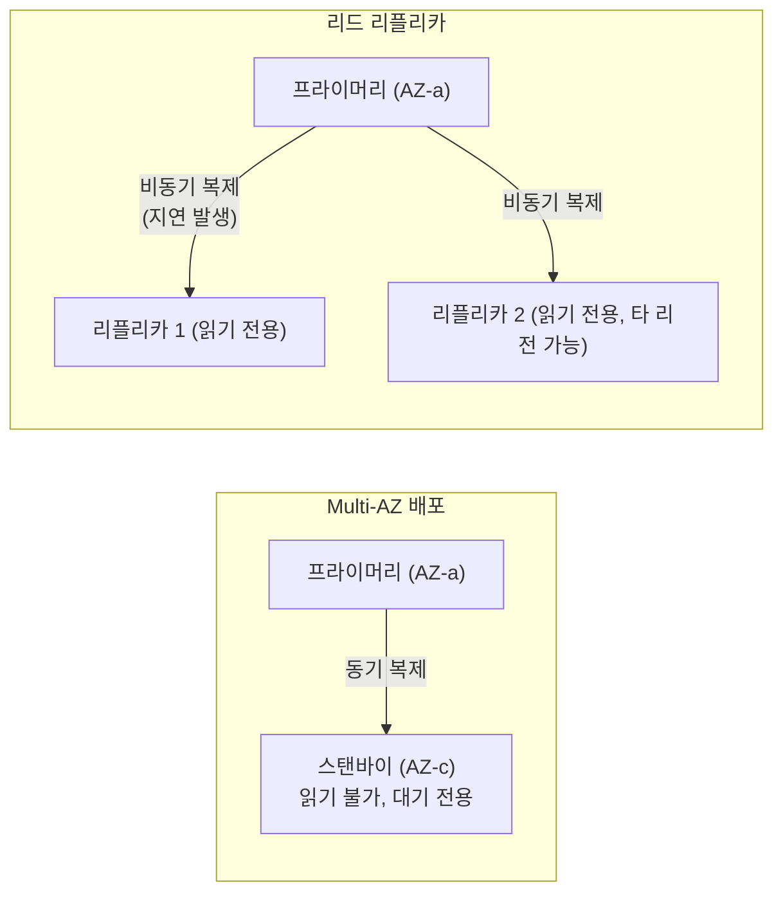

### 25.3 Multi-AZ DB 클러스터와 페일오버 시간

RDS는 표준 Multi-AZ 배포 외에 **Multi-AZ DB 클러스터** 라는 배포 옵션을 제공한다(MySQL, PostgreSQL 대상). 이 방식은 총 3개 노드로 구성된다: 라이터(writer) 인스턴스 1개와, 다른 두 AZ에 배치된 **읽기 가능한 스탠바이(readable standby)** 2개다. 표준 Multi-AZ와 달리 이 두 스탠바이는 읽기 전용 엔드포인트를 통해 읽기 트래픽을 받을 수 있다는 점이 핵심 차이다 — 앞서 25.2절에서 정리한 "표준 Multi-AZ 스탠바이는 읽기 불가"라는 규칙의 예외에 해당한다.

Multi-AZ DB 클러스터는 반동기(semi-synchronous) 복제 방식을 사용하여, 스탠바이 중 최소 하나가 쓰기를 확인(ack)해야 커밋이 완료되도록 하면서도 낮은 쓰기 지연을 유지한다. 페일오버 시간 특성도 다르다:

- **표준 Multi-AZ 인스턴스 배포**: 페일오버에 보통 60~120초 수준이 걸릴 수 있다(인스턴스 재시작, DNS 전파, 스토리지 재연결 포함). 정확한 수치는 워크로드와 인스턴스 크기에 따라 달라지므로 서비스 문서의 최신 벤치마크를 확인해야 한다.
- **Multi-AZ DB 클러스터 방식**: 스탠바이가 이미 읽기 가능한 상태로 대기하고 있고 트랜잭션 로그 동기화 수준이 더 촘촘하므로, 일반적으로 표준 방식보다 **더 짧은 페일오버 시간**(대체로 수십 초 이내 수준)을 목표로 설계되었다. 다만 이 역시 워크로드에 따라 달라지는 상대적 수치이며 절대 수치를 단정하지 않는다.

페일오버를 유발하는 원인은 다양하다: 프라이머리 인스턴스의 하드웨어 장애, AZ 단위 장애, 사용자가 수동으로 트리거하는 강제 페일오버(재부팅 시 페일오버 옵션), 그리고 일부 유지보수 작업(예: 인스턴스 클래스 변경)이 페일오버를 동반할 수 있다. RDS는 페일오버 발생 시 **Amazon RDS 이벤트 알림(Event Notifications, Amazon SNS 연동)** 을 통해 운영자에게 알릴 수 있으며, 페일오버 이벤트를 구독해 자동화된 대응(알림, 런북 트리거)을 붙이는 것이 실무에서 권장된다.

이벤트 알림은 페일오버 외에도 여러 범주(카테고리)로 세분화되어 있다 — 인스턴스 이벤트(생성·삭제·재부팅), 백업 완료, 스토리지 공간 부족 경고, 파라미터 그룹 적용 실패 같은 구성 오류 등이 대표적이다. 운영 관점에서는 페일오버·장애 관련 카테고리만 선별해 SNS 주제로 구독하고, 알림을 Amazon EventBridge와 연계해 자동 티켓 생성이나 채팅 알림으로 연결하는 구성이 흔히 쓰인다.

Multi-AZ DB 클러스터에서는 라이터에 장애가 발생하면 두 스탠바이 중 복제 지연이 가장 적은(가장 최신 상태인) 스탠바이가 새 라이터로 승격되며, 클러스터 엔드포인트의 DNS가 그 인스턴스를 가리키도록 즉시 갱신된다. 이 과정에서 승격되지 않은 나머지 스탠바이는 새 라이터를 기준으로 복제를 재구성한다.

| 구분 | 표준 Multi-AZ(인스턴스 방식) | Multi-AZ DB 클러스터 |
|---|---|---|
| 노드 구성 | 라이터 1 + 스탠바이 1 | 라이터 1 + 읽기 가능 스탠바이 2 |
| 스탠바이 읽기 | 불가 | 가능(리더 엔드포인트 경유) |
| 복제 방식 | 완전 동기 | 반동기(쿼럼 기반 ack) |
| 페일오버 시간 경향 | 상대적으로 김 | 상대적으로 짧음 |
| 지원 엔진 | MySQL/PostgreSQL/MariaDB/Oracle/SQL Server | MySQL/PostgreSQL(문서 확인) |

**한 줄 결정 기준**: 읽기 확장 없이 단순 가용성만 필요하면 표준 Multi-AZ, 짧은 페일오버와 스탠바이의 읽기 활용까지 원하면 Multi-AZ DB 클러스터를 검토한다.

### 25.4 Aurora 아키텍처

Aurora의 핵심 설계 철학은 **컴퓨트와 스토리지의 분리**다. 전통적 RDBMS는 컴퓨트 인스턴스가 로컬(또는 EBS 같은 블록 스토리지)에 데이터 파일을 직접 관리하지만, Aurora는 스토리지 계층을 별도의 분산 스토리지 서비스로 떼어냈다. 컴퓨트 인스턴스(라이터, 리더)는 로그 레코드만 스토리지 계층에 전송하고, 페이지 재구성이나 체크포인트 같은 무거운 I/O 작업은 스토리지 계층이 자체적으로 처리한다.

Aurora 스토리지는 하나의 데이터베이스 볼륨을 **3개의 가용 영역에 걸쳐 각 AZ당 2개씩, 총 6개 복사본**으로 자동 복제한다("6중 복제"). 데이터는 10GB 단위의 **보호 그룹(protection group)** 으로 나뉘어 관리되며, 쓰기는 **쿼럼(quorum) 기반**으로 처리된다 — 6개 복사본 중 4개 이상에 쓰기가 확인되면 커밋으로 간주하고(쓰기 쿼럼), 읽기는 3개 이상의 복사본에서 확인하면 유효한 것으로 간주한다(읽기 쿼럼). 이 쿼럼 구성 덕분에 AZ 하나 전체가 사라져도(복사본 2개 손실) 쓰기 가용성이 유지되고, 추가로 하나의 복사본이 더 손실돼도(총 3개 손실) 읽기 가용성이 유지된다.

Aurora 스토리지는 **로그 구조(log-structured)** 로 동작한다. 전통적 엔진은 커밋 시 데이터 페이지 자체를 디스크에 기록하지만, Aurora는 트랜잭션 로그 레코드만 스토리지 계층에 전송하고 실제 페이지 재구성은 스토리지 노드가 백그라운드로 수행한다. 이 구조 덕분에 인스턴스 재시작 시 REDO 로그를 처음부터 재생할 필요가 없어 **크래시 복구가 매우 빠르다** — 스토리지 계층이 이미 대부분의 페이지를 최신 상태로 유지하고 있고, 캐시(버퍼 풀)도 인스턴스 재시작과 분리되어 있어(스토리지 계층과 별도 프로세스인 캐시 유지 구조) 재시작 후에도 **캐시가 웜(warm) 상태를 유지**하는 경우가 많다.

Aurora MySQL 호환 에디션은 **백트랙(Backtrack)** 기능을 지원한다. 이는 스냅샷 복원 없이 데이터베이스를 특정 시점으로 "되돌리는" 기능으로, 사람의 실수(예: 잘못된 UPDATE/DELETE)로부터 빠르게 복구할 때 유용하다. 백트랙은 별도의 백트랙 윈도우(보관 기간)를 설정해 그 범위 내의 임의 시점으로 초 단위에 가깝게 되돌릴 수 있으며, PITR처럼 새 인스턴스를 만드는 것이 아니라 **같은 클러스터를 그 자리에서 되돌린다**는 점이 근본적인 차이다. 다만 이 특성 때문에 백트랙 실행 시점 이후의 모든 변경 내역이 사라지므로, 다른 애플리케이션이나 리드 리플리카가 같은 클러스터를 참조하고 있다면 예기치 않은 데이터 손실로 이어질 수 있어 신중하게 사용해야 한다. 또한 논리적 손상이 아닌 물리적 손상이나 별도 인스턴스로의 복원이 필요한 경우에는 스냅샷 기반 PITR을 사용해야 한다(→ 25.9절).

**클론(Clone)** 기능은 로그 구조 스토리지의 카피-온-라이트(copy-on-write) 특성을 활용해, 기존 클러스터의 데이터를 물리적으로 복사하지 않고도 거의 즉시 새 클러스터를 만들어낸다. 개발/테스트 환경 구성이나 대량 데이터 검증 작업에서 스냅샷 복원보다 훨씬 빠르고 비용 효율적이다. 클론된 클러스터는 원본과 독립적으로 쓰기가 가능하며, 변경된 페이지만 별도로 저장된다.

Aurora 스토리지는 실제 사용량에 따라 10GB 단위로 **자동 확장**되며 사용자가 사전에 용량을 프로비저닝할 필요가 없다는 점이 표준 RDS(사전에 `AllocatedStorage`를 지정하고 필요 시 수동/자동 확장하는 방식)와 다르다. 다만 Aurora도 한번 확장된 스토리지는 축소되지 않으며, 대량 데이터를 적재했다가 삭제해도 물리적 스토리지 사용량과 그에 따른 과금은 그대로 유지되는 경우가 일반적이므로 데이터 보관 정책을 설계 단계에서 고려해야 한다. 리더(읽기 전용 복제본) 역시 같은 스토리지 계층을 공유하므로 별도의 물리적 복제 지연 없이 사실상 즉시에 가깝게 프라이머리의 변경을 반영하지만, 리더가 아직 적용하지 않은 로그 레코드가 남아있는 짧은 시간 동안은 미세한 지연이 있을 수 있다 — 이는 리드 리플리카(비동기, 별도 스토리지)의 지연과는 성격이 다른, Aurora 아키텍처 특유의 매우 짧은 전파 지연이다.

Aurora는 스토리지·I/O 과금 구성 방식으로 표준 구성과 **I/O-Optimized** 구성을 선택할 수 있다. 표준 구성은 스토리지 용량과 별개로 I/O 요청 수에 따라 과금하는 축을 가지는 반면, I/O-Optimized는 I/O 요청량에 관계없이 스토리지 용량과 컴퓨트 비용 위주로 과금하는 축을 가진다. I/O 비중이 큰(쓰기가 잦거나 스캔이 많은) 워크로드는 I/O-Optimized로 전환했을 때 총비용이 낮아지는 경우가 많으므로, 실제 운영 중인 I/O 패턴을 관찰한 뒤 두 과금 축을 비교해 선택하는 것이 바람직하다. 이는 절대적인 가격 단정이 아니라 워크로드에 따라 유불리가 갈리는 상대 비교이므로, 실제 결정 전에는 해당 워크로드의 I/O 사용량 지표를 근거로 판단해야 한다.

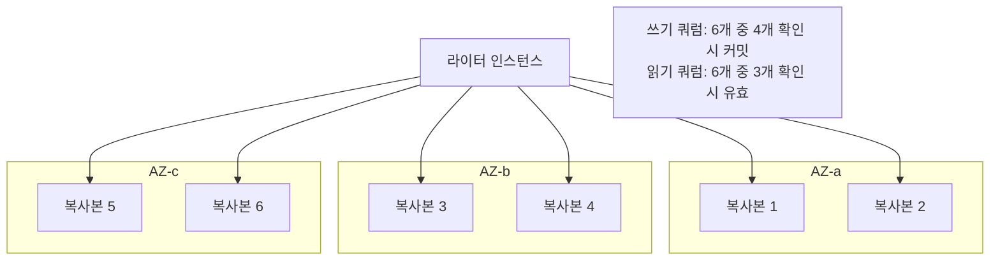

### 25.5 Aurora 엔드포인트와 Global Database

Aurora 클러스터는 목적에 따라 여러 엔드포인트를 노출한다.

- **클러스터 엔드포인트(라이터 엔드포인트)**: 항상 현재 라이터 인스턴스를 가리킨다. 쓰기 트래픽과 강한 일관성이 필요한 읽기는 이 엔드포인트로 보낸다. 페일오버가 발생하면 DNS가 새 라이터로 갱신된다.
- **리더 엔드포인트**: 클러스터 내 리더(읽기 전용 복제본) 전체에 대한 단일 엔드포인트로, 내부적으로 **DNS 라운드로빈**을 통해 연결을 리더들에 분산한다. 여기서 실무에서 흔히 겪는 함정이 있다: DNS 라운드로빈은 "새 연결"이 생성될 때만 분산 대상을 바꾸므로, 애플리케이션이 커넥션 풀을 사용해 연결을 오래 유지하면(커넥션 풀링) 특정 리더에 연결이 쏠리는 **커넥션 풀 편향(connection pool skew)** 이 발생할 수 있다. 이를 완화하려면 커넥션 풀의 최대 수명(max lifetime)을 짧게 설정해 주기적으로 재연결을 유도하거나, RDS Proxy(→ 25.7절)를 경유해 커넥션 라우팅을 위임하는 방법이 흔히 쓰인다.
- **커스텀 엔드포인트**: 클러스터 내 인스턴스의 부분집합을 사용자가 직접 그룹으로 지정해 만드는 엔드포인트다. 예를 들어 리포팅 전용으로 스펙이 큰 인스턴스 몇 대만 묶어 별도 엔드포인트로 노출할 때 사용한다.
- **인스턴스 엔드포인트**: 개별 인스턴스를 직접 가리키는 엔드포인트로, 특정 인스턴스의 상태를 직접 확인하거나 진단할 때 사용하며 일반 애플리케이션 트래픽에는 권장되지 않는다.

| 엔드포인트 | 가리키는 대상 | 용도 |
|---|---|---|
| 클러스터(라이터) | 현재 라이터 1대 | 쓰기, 강한 일관성 읽기 |
| 리더 | 모든 리더(DNS 라운드로빈) | 읽기 부하 분산 |
| 커스텀 | 사용자가 지정한 인스턴스 부분집합 | 워크로드별(리포팅 등) 분리 |
| 인스턴스 | 개별 인스턴스 1대 | 진단·디버깅 |

**한 줄 결정 기준**: 애플리케이션 코드는 원칙적으로 클러스터 엔드포인트와 리더 엔드포인트만 사용하고, 커스텀·인스턴스 엔드포인트는 운영·진단 목적으로 한정한다.

**Aurora Global Database**는 하나의 프라이머리 리전과 최대 여러 개의 세컨더리 리전으로 클러스터를 확장하는 기능이다. 스토리지 계층 복제를 리전 간에 활용해 일반적인 리드 리플리카보다 짧은 복제 지연(보통 1초 미만 수준을 목표로 하지만 네트워크 상황에 따라 달라진다)으로 데이터를 전파한다. 재해 시 세컨더리 리전을 프라이머리로 승격하는 **관리형 페일오버(managed failover)** 또는 계획된 **스위치오버(switchover)** 를 지원해 리전 단위 DR 전략의 핵심 축이 된다. 또한 **쓰기 전달(write forwarding)** 기능을 활성화하면 세컨더리 리전의 엔드포인트로 들어온 쓰기 요청을 프라이머리 리전으로 자동 전달할 수 있어, 다중 리전에 배포된 애플리케이션이 지역별로 다른 쓰기 엔드포인트를 구분해야 하는 복잡성을 줄여준다. 다만 쓰기 전달은 추가 지연을 유발하므로 지연에 민감한 쓰기 워크로드에는 신중히 적용해야 한다.

세컨더리 리전에도 읽기 전용 인스턴스를 여러 대 둘 수 있어, 사용자가 물리적으로 가까운 리전에서 읽기 요청을 처리하게 하는 지연시간 최적화 용도로도 활용된다. 다만 세컨더리 리전의 인스턴스는 (쓰기 전달을 켜지 않는 한) 읽기 전용이며, 프라이머리 리전 자체가 완전히 소실된 경우에만 관리형 페일오버로 다른 리전이 새 프라이머리가 된다는 점에서, 이는 재해 복구 목적이지 상시 양방향 쓰기를 위한 멀티 마스터 구성이 아니다.

```bash
# Aurora Global Database 생성: 프라이머리 클러스터를 글로벌 클러스터에 등록
aws rds create-global-cluster \
  --global-cluster-identifier appdb-global \
  --source-db-cluster-identifier arn:aws:rds:ap-northeast-2:123456789012:cluster:appdb-primary \
  --deletion-protection

# 세컨더리 리전(us-east-1)에 읽기 전용 클러스터 추가
aws rds create-db-cluster --region us-east-1 \
  --db-cluster-identifier appdb-secondary \
  --engine aurora-mysql \
  --global-cluster-identifier appdb-global
```

### 25.6 Aurora Serverless v2와 오토스케일링

Aurora Serverless v2는 워크로드 부하에 따라 컴퓨트 용량을 자동으로 늘리고 줄이는 배포 옵션이다. 용량 단위는 **ACU(Aurora Capacity Unit)** 로 표현되며, 클러스터를 만들 때 **최소 ACU와 최대 ACU** 범위를 지정하면 그 범위 안에서 실제 부하(CPU, 메모리, 네트워크)에 맞춰 세밀하게(초 단위에 가깝게) 스케일링한다. 트래픽이 간헐적이거나 예측하기 어려운 워크로드(개발/테스트 환경, 사내 시스템, 트래픽 변동폭이 큰 SaaS 테넌트별 DB 등)에서는 항상 최대치로 프로비저닝해 두는 것보다 비용 효율이 크다.

반대로 **상시 고부하** 워크로드에서는 프로비저닝된(provisioned) 인스턴스가 더 유리한 경우가 많다. 서버리스는 부하 변동에 대응하는 유연성에 대한 대가로 동일 성능 수준 대비 단가가 더 높게 책정되는 경향이 있고, 항상 최대 ACU 근처에서 운영된다면 스케일링의 이점을 살리지 못한 채 비용만 커질 수 있다. 따라서 부하 패턴이 안정적으로 높은 시스템은 프로비저닝 인스턴스(또는 프로비저닝과 서버리스를 같은 클러스터에서 혼합하는 구성)를 우선 검토한다.

v1과의 차이는 짚어둘 필요가 있다. Aurora Serverless v1은 용량 변경 시 연결을 일시 중단하고 새로운 용량의 인스턴스로 전환하는 방식에 가까웠던 반면, v2는 기존 연결을 유지하면서 세밀한 단위로 스케일링해 애플리케이션 체감 단절이 적도록 설계되었다. 다만 v1과 v2는 아키텍처와 설정 방식이 달라 상호 마이그레이션 시 별도 절차가 필요하다는 점도 기억해 둘 필요가 있다.

Serverless v2 인스턴스는 클러스터 안에서 프로비저닝 인스턴스와 나란히 배치될 수 있다 — 예를 들어 라이터는 프로비저닝으로 안정적인 성능을 보장하고, 트래픽 급증에 대응하는 추가 리더만 Serverless v2로 구성하는 혼합 구성이 가능하다. 최소 ACU를 0에 가깝게 낮추면 유휴 시간의 비용을 최소화할 수 있지만, 완전히 0으로 내려가는 것(자동 일시정지)은 v1의 특성이며 v2는 워크로드 특성에 따라 지원 여부가 다르므로 설계 시 최신 문서로 확인해야 한다. 스케일링 속도와 세밀도, 그리고 최소/최대 ACU 값의 구체적 한도는 계속 개선되는 영역이므로 절대 수치를 단정하지 말고 서비스 할당량 문서를 참조한다.

### 25.7 RDS Proxy — 커넥션 풀링과 페일오버 단축

RDS/Aurora는 데이터베이스 엔진 특성상 동시에 열 수 있는 커넥션 수에 한계가 있다. 반면 Lambda 같은 서버리스 컴퓨트(→ 18장 참조)는 요청마다 새 실행 환경이 뜰 수 있어, 트래픽이 몰리면 순식간에 데이터베이스 커넥션 수가 한도를 넘어 오류가 발생하기 쉽다. **RDS Proxy**는 애플리케이션과 데이터베이스 사이에 위치하는 완전관리형 커넥션 풀링·멀티플렉싱 계층으로 이 문제를 해결한다.

RDS Proxy는 애플리케이션으로부터의 다수 커넥션을 받아 실제 데이터베이스로는 적은 수의 물리적 커넥션만 유지하며 이를 재사용(멀티플렉싱)한다. 또한 페일오버가 발생했을 때 RDS Proxy가 새 프라이머리로의 전환을 대신 처리해, 애플리케이션이 체감하는 단절 시간을 표준 DNS 전파 방식보다 단축시키는 효과가 있다. 인증 측면에서는 **IAM 데이터베이스 인증**과 **AWS Secrets Manager** 통합을 지원해, 애플리케이션 코드나 설정 파일에 DB 자격 증명을 직접 하드코딩하지 않고 Secrets Manager에서 자동으로 회전되는 시크릿을 참조하도록 구성할 수 있다.

**Lambda·서버리스에서 RDS Proxy가 사실상 필수적인 이유**(→ 18장의 Lambda 실행 모델 참조)는, Lambda 함수 인스턴스가 트래픽에 따라 병렬로 증식하면서 각자 자체 DB 커넥션을 여는 구조이기 때문이다. RDS Proxy 없이 Lambda가 데이터베이스에 직접 연결하면 동시 실행 수가 늘어날 때마다 커넥션 수도 비례해서 늘어나 데이터베이스의 `max_connections` 한도를 쉽게 초과한다. RDS Proxy를 앞에 두면 수백~수천 개의 Lambda 실행 환경이 만드는 논리적 커넥션을 적은 수의 물리적 커넥션으로 묶어 데이터베이스 부하를 안정시킬 수 있다.

제약도 있다. RDS Proxy는 모든 엔진·모든 기능 조합을 지원하지는 않으며(지원 엔진과 버전은 문서 확인 필요), 세션 상태를 많이 사용하는 특정 패턴(예: 임시 테이블에 크게 의존하는 세션, 세션 수준 변수를 광범위하게 사용하는 트랜잭션)에서는 멀티플렉싱 효율이 떨어질 수 있다. 이런 경우 RDS Proxy는 해당 커넥션을 특정 물리 커넥션에 고정(pinning)하게 되어 풀링의 이점이 줄어든다. 요금은 프록시가 관리하는 데이터베이스 인스턴스의 vCPU 기준 시간당 과금 축을 가지며, 이는 데이터베이스 자체 요금과는 별도로 발생한다는 점을 설계 시 고려해야 한다. 애플리케이션이 매우 짧은 요청-응답 주기의 서버리스 함수 위주라면 RDS Proxy 비용을 상회하는 안정성 이득을 얻는 경우가 많지만, 이미 안정적인 커넥션 풀을 유지하는 상시 구동 서버(EC2, ECS 장기 실행 태스크)라면 RDS Proxy 없이도 애플리케이션 레벨 풀링만으로 충분한 경우도 있다 — 무조건 도입하기보다 컴퓨트 모델과 커넥션 패턴을 먼저 확인한다.

```bash
# RDS Proxy 생성 (Secrets Manager 시크릿과 IAM 역할을 연결)
aws rds create-db-proxy \
  --db-proxy-name app-db-proxy \
  --engine-family MYSQL \
  --auth '[{"AuthScheme":"SECRETS","SecretArn":"arn:aws:secretsmanager:ap-northeast-2:123456789012:secret:appdb-secret","IAMAuth":"REQUIRED"}]' \
  --role-arn arn:aws:iam::123456789012:role/rds-proxy-role \
  --vpc-subnet-ids subnet-0a1b2c3d subnet-0e4f5a6b \
  --require-tls
```

RDS Proxy 앞단에 Lambda 실행 역할을 붙일 때는 IAM 정책으로 프록시에 대한 연결 권한을 명시적으로 부여해야 한다. `rds-db:connect` 액션과 프록시가 발급하는 데이터베이스 사용자 리소스를 함께 지정하는 형태가 일반적이다.

```json
{
  "Version": "2012-10-17",
  "Statement": [
    {
      "Sid": "AllowRdsProxyConnect",
      "Effect": "Allow",
      "Action": "rds-db:connect",
      "Resource": "arn:aws:rds-db:ap-northeast-2:123456789012:dbuser:prx-0abc123def456/app_user"
    }
  ]
}
```

### 25.8 파라미터/옵션 그룹, 유지보수 창, 자동 마이너 업그레이드

RDS 인스턴스(클러스터 포함)의 엔진 동작은 **파라미터 그룹**을 통해 제어한다. 파라미터는 두 종류로 나뉜다: **동적(dynamic) 파라미터**는 변경 즉시(또는 다음 연결부터) 적용되고, **정적(static) 파라미터**는 변경 후 **인스턴스 재부팅이 필요**하다. 어떤 파라미터가 정적인지는 콘솔이나 `describe-db-parameters` 응답의 `ApplyType` 필드로 확인할 수 있다. AWS가 기본 제공하는 **기본(default) 파라미터 그룹은 직접 수정할 수 없으므로**, 커스터마이징이 필요하면 반드시 커스텀 파라미터 그룹을 새로 만들어 인스턴스에 연결해야 한다. 옵션 그룹은 주로 상용 엔진(Oracle, SQL Server)에서 추가 기능 모듈(예: Oracle의 특정 옵션 패키지)을 활성화하는 데 쓰인다.

자주 조정하는 파라미터 예로는 MySQL/Aurora MySQL의 `max_connections`(동시 연결 수 상한), PostgreSQL의 `work_mem`(정렬·해시 작업에 쓰는 세션별 메모리), `innodb_buffer_pool_size`(InnoDB 데이터 캐시 크기, 흔히 인스턴스 메모리의 일정 비율로 공식화해 설정) 등이 있다. 이런 값들은 인스턴스 클래스 변경 시 기본값 자체가 달라지므로, 커스텀 값을 고정해 둔 경우 인스턴스 크기 변경 후 재검토가 필요하다.

`innodb_buffer_pool_size`는 흔히 `{DBInstanceClassMemory * 3/4}` 같은 형태의 동적 공식으로 파라미터 그룹에 등록해, 인스턴스 클래스가 바뀌어도 값이 메모리 크기에 비례해 자동으로 재계산되도록 구성하는 방식이 실무에서 널리 쓰인다. 이렇게 하면 인스턴스 업스케일/다운스케일 때마다 값을 수동으로 다시 계산할 필요가 없다. `max_connections` 역시 기본값이 인스턴스 메모리에 비례해 계산되므로, RDS Proxy나 애플리케이션 커넥션 풀로 실제 커넥션 수를 통제하는 편이 이 값을 무작정 키우는 것보다 근본적인 해결책이다.

RDS는 사용자가 지정한 **유지보수 창(maintenance window)** 시간대에 OS·엔진 패치를 적용한다. **자동 마이너 업그레이드**를 활성화해 두면 마이너 버전 패치(보안 패치 포함)를 유지보수 창에 맞춰 자동으로 반영하므로, 알려진 취약점에 노출되는 기간을 줄일 수 있다. 반면 **메이저 버전**은 자동으로 강제 적용되지 않는 것이 원칙이지만, 해당 메이저 버전이 **EOL(End of Life)** 에 도달하면 AWS가 사전 공지 후 특정 시점에 **강제 업그레이드**를 예고한다. 이 시점을 놓치면 계획하지 않은 시간에 다운타임과 함께 업그레이드가 강제로 진행될 수 있으므로, EOL 공지를 받으면 충분한 리허설 기간을 두고 대응해야 한다.

메이저 버전 업그레이드는 애플리케이션 호환성 문제(쿼리 플랜 변화, 폐기된 함수, 확장 모듈 버전 등)를 동반할 수 있어 프로덕션에 바로 적용하기보다 **업그레이드 리허설**이 필요하다. 이때 유용한 것이 **블루/그린 배포 for RDS**다. 이는 현재 운영 중인 환경(블루)과 동일한 구성의 새 환경(그린)을 업그레이드된 버전으로 미리 만들어 두고, 그린 환경에서 애플리케이션 호환성과 성능을 검증한 뒤 트래픽을 전환하는 방식이다. 전환 후 문제가 발견되면 신속히 블루로 되돌릴 수 있어, 메이저 업그레이드나 스키마 변경처럼 리스크가 큰 변경을 안전하게 검증하는 표준 절차로 자리잡았다.

옵션 그룹은 파라미터 그룹과 별개의 개념으로, 엔진 자체의 동작 파라미터가 아니라 부가 기능 모듈(예: Oracle의 특정 진단 패키지, SQL Server의 특정 확장 기능)을 켜고 끄는 데 쓰인다. 옵션 그룹 변경은 즉시 적용(Apply Immediately)될 수도 있고 다음 유지보수 창까지 대기할 수도 있으며, 일부 옵션은 변경 시 인스턴스 재부팅을 요구한다. 파라미터 그룹과 마찬가지로 기본 옵션 그룹은 수정할 수 없고 커스텀 옵션 그룹을 만들어 연결해야 한다.

```yaml
# CloudFormation: Multi-AZ + 암호화 + 커스텀 파라미터 그룹을 적용한 RDS 인스턴스
Resources:
  AppDbParamGroup:
    Type: AWS::RDS::DBParameterGroup
    Properties:
      Family: mysql8.0
      Description: "애플리케이션용 커스텀 파라미터 그룹"
      Parameters:
        max_connections: "500"   # 기본값 대비 상향, 정적 파라미터이므로 재부팅 필요

  AppDbInstance:
    Type: AWS::RDS::DBInstance
    Properties:
      Engine: mysql
      EngineVersion: "8.0.35"
      DBInstanceClass: db.r6g.large
      AllocatedStorage: "100"
      MultiAZ: true                       # 가용성: 동기 스탠바이 자동 페일오버
      StorageEncrypted: true               # 저장 데이터 암호화 (→ 31장 KMS 참조)
      KmsKeyId: !Ref AppDbKmsKeyArn
      DBParameterGroupName: !Ref AppDbParamGroup
      BackupRetentionPeriod: 7
      DeletionProtection: true              # 실수로 인한 삭제 방지
      PubliclyAccessible: false
```

### 25.9 백업·PITR·스냅샷 공유·암호화

RDS/Aurora는 **자동 백업(automated backup)** 을 통해 매일 스토리지 스냅샷을 생성하고, 동시에 트랜잭션 로그를 지속적으로 캡처한다. 사용자가 설정하는 **백업 보존 기간(backup retention period)** 은 이 자동 백업과 트랜잭션 로그를 얼마나 보관할지를 결정하며, 최대 보존 기간은 서비스 한도 문서를 확인해야 한다(일반적으로 최대 35일 수준이지만 이 값은 변경될 수 있으므로 콘솔·문서에서 확인한다).

**PITR(Point-In-Time Recovery)** 은 이 자동 백업 스냅샷과 트랜잭션 로그를 조합해 보존 기간 내 임의의 초 단위 시점으로 새 인스턴스를 복원하는 기능이다. 원리는 "가장 가까운 스냅샷을 복원한 뒤, 그 시점부터 목표 시점까지의 트랜잭션 로그를 재생(replay)"하는 방식이다. PITR 복원은 항상 **새로운 인스턴스**를 만들어내며, 기존 인스턴스를 그 자리에서 되돌리는 것이 아니다.

**수동 스냅샷**은 사용자가 원하는 시점에 직접 생성하며, 자동 백업 보존 기간이 지나도 사용자가 삭제하기 전까지 유지된다. 장기 보관이 필요한 규정 준수 스냅샷이나, 중요한 변경 작업 직전의 백업 등에 사용한다. 스냅샷은 다른 AWS 계정과 **공유**할 수 있는데, 스냅샷이 **KMS로 암호화된 경우 반드시 고객 관리형 키(customer managed CMK)** 를 사용해야 계정 간 공유가 가능하다(→ 31장 KMS·CMK 참조). AWS 관리형 키로 암호화된 스냅샷은 다른 계정과 공유할 수 없으므로, 크로스 계정 공유가 예정된 환경이라면 설계 초기에 CMK를 사용하도록 결정해 두어야 한다.

리전 단위 재해에 대비해 **자동 백업의 리전 간 복제(cross-region automated backup replication)** 를 구성할 수 있다. 이는 자동 백업과 매니얼 스냅샷을 지정한 다른 리전으로 지속적으로 복제해, 프라이머리 리전 전체 장애 시에도 복제된 리전에서 복원할 수 있게 한다. 이 복제는 Aurora Global Database(→ 25.5절)와는 목적이 다르다는 점에 유의한다 — Global Database는 상시 가동 중인 읽기 가능 세컨더리로 관리형 페일오버까지 지원하는 반면, 백업의 리전 간 복제는 평상시 대기 인스턴스가 없는 순수한 백업 보관 수단이며 실제 장애 시에는 복제된 스냅샷으로부터 새 인스턴스를 복원하는 시간이 추가로 소요된다.

백업 보존 기간을 0으로 설정하면 자동 백업 자체가 비활성화되며, 이 경우 PITR도 사용할 수 없게 되므로 프로덕션 환경에서는 원칙적으로 피해야 할 설정이다. 또한 백업 보존 기간을 늘리는 것과 수동 스냅샷을 별도로 유지하는 것은 서로 다른 보관 전략이라는 점도 구분해 둔다 — 규정 준수를 위해 특정 시점의 데이터를 장기간(수개월~수년) 보관해야 한다면 자동 백업 보존 기간을 늘리기보다 그 시점의 수동 스냅샷을 별도로 남기는 편이 비용과 관리 면에서 합리적이다.

마지막으로 운영 안전장치로 **삭제 방지(deletion protection)** 를 활성화하면 실수로 인한 인스턴스/클러스터 삭제 API 호출이 거부된다. 삭제 방지를 해제하고 실제로 삭제할 때는 **최종 스냅샷(final snapshot)** 생성 여부를 선택할 수 있는데, 이를 건너뛰면(스킵 옵션) 데이터가 영구히 사라지므로 프로덕션 환경에서는 원칙적으로 최종 스냅샷 생성을 기본으로 삼아야 한다.

암호화 설정은 인스턴스/클러스터 생성 시점에만 결정할 수 있다는 점도 자주 놓치는 부분이다. 암호화되지 않은 상태로 생성한 데이터베이스를 나중에 암호화하려면, 스냅샷을 뜬 뒤 그 스냅샷을 암호화 옵션과 함께 복사(copy)하고, 암호화된 스냅샷으로 새 인스턴스를 복원하는 우회 절차가 필요하다 — 기존 인스턴스를 제자리에서 암호화로 전환하는 기능은 없다. 따라서 암호화 여부는 프로덕션 배포 전 설계 단계에서 반드시 결정해야 할 항목이다. 또한 스냅샷을 Amazon S3로 내보내는 **스냅샷 내보내기(export to S3)** 기능을 사용하면 Parquet 형식으로 데이터를 추출해 Amazon Athena나 Redshift Spectrum 같은 분석 도구로 별도 분석 파이프라인을 구성할 수 있다(→ 24장의 OLTP/OLAP 구분 참조: 이는 운영 데이터베이스에 분석 부하를 얹지 않기 위한 일반적인 패턴이다).

```bash
# PITR 복원: 특정 시각으로 새 인스턴스 복원 (기존 인스턴스는 그대로 유지됨)
aws rds restore-db-instance-to-point-in-time \
  --source-db-instance-identifier appdb-prod \
  --target-db-instance-identifier appdb-prod-restored-20260905 \
  --restore-time 2026-09-05T02:30:00Z \
  --db-instance-class db.r6g.large \
  --no-multi-az   # 복구 확인 후 필요 시 별도로 Multi-AZ 전환

# 수동 스냅샷을 다른 계정과 공유 (스냅샷이 CMK로 암호화되어 있어야 공유 가능, → 31장)
aws rds modify-db-snapshot-attribute \
  --db-snapshot-identifier appdb-prod-manual-20260905 \
  --attribute-name restore \
  --values-to-add 987654321098
```

### 25.10 성능 진단: Performance Insights와 슬로우 쿼리

RDS/Aurora는 관리형 서비스로서 인프라 계층(패치, 페일오버, 스토리지 관리)의 부담을 덜어주지만, **스키마 설계, 인덱스 설계, 쿼리 튜닝은 여전히 고객의 책임**이다. 실무에서 마주치는 데이터베이스 성능 문제의 상당수는 인프라가 아니라 잘못 설계된 인덱스나 비효율적인 쿼리에서 비롯된다.

**Performance Insights**는 데이터베이스의 부하를 "대기 이벤트(wait event)" 단위로 시각화하는 진단 도구다. 핵심 지표인 **DB 로드(DB Load)** 는 활성 세션 평균 수(Average Active Sessions, AAS)로 표현되며, 이 부하가 어떤 대기 이벤트(예: CPU, I/O 대기, 락 대기)에서 발생하는지, 그리고 어떤 SQL 문이 그 부하를 일으키는지(**상위 SQL**)를 함께 보여준다. DB 로드가 vCPU 수를 넘어서면 CPU가 병목이 되고 있다는 신호이며, 특정 대기 이벤트가 두드러지면 그 원인(락 경합, I/O 지연 등)을 좁혀갈 수 있다.

**Enhanced Monitoring**은 데이터베이스 프로세스가 아니라 **운영체제 수준**의 메트릭(CPU, 메모리, 파일시스템, 프로세스 목록)을 초 단위에 가깝게 수집한다. Performance Insights가 "어떤 쿼리가 부하를 일으키는가"에 답한다면, Enhanced Monitoring은 "OS 레벨에서 실제로 무슨 일이 벌어지고 있는가"에 답한다.

**DevOps Guru for RDS**는 머신러닝 기반으로 데이터베이스 메트릭의 이상 패턴(비정상적 지연 증가, 처리량 급감 등)을 자동으로 탐지하고 잠재적 원인에 대한 인사이트를 제공하는 서비스로, 사람이 대시보드를 상시 감시하지 않아도 이상 징후를 조기에 포착하는 데 도움을 준다.

이 세 도구는 역할이 겹치지 않고 상호 보완적이다. Performance Insights는 "무엇이(어떤 SQL, 어떤 대기 이벤트) 부하를 만드는가"에, Enhanced Monitoring은 "OS 자원이 실제로 어떻게 소비되는가"에, DevOps Guru for RDS는 "평소와 다른 패턴이 언제 시작됐는가"에 각각 초점을 맞춘다. 실무에서는 DevOps Guru의 이상 탐지 알림을 계기로 Performance Insights에서 원인이 되는 SQL을 좁히고, Enhanced Monitoring으로 OS 자원 병목 여부를 교차 확인하는 흐름이 일반적이다.

근본적인 튜닝은 결국 **슬로우 쿼리 로그**(엔진별로 이름은 다르지만 실행 시간이 임계값을 넘는 쿼리를 기록하는 로그)와 **실행 계획(EXPLAIN)** 분석으로 귀결된다. 인덱스 설계의 기본 원칙은 다음과 같다: WHERE 절과 JOIN 조건에 자주 등장하는 컬럼에 인덱스를 두되, 과도한 인덱스는 쓰기 성능을 저하시키므로 읽기/쓰기 비율을 고려해 균형을 잡는다. 복합 인덱스는 컬럼 순서가 쿼리의 필터링·정렬 패턴과 일치해야 실제로 활용된다. 인덱스만으로 해결되지 않는 문제(비효율적인 조인 순서, N+1 쿼리 패턴 등)는 애플리케이션 코드나 쿼리 자체의 재설계가 필요하다. RDS/Aurora가 인프라를 관리해 준다고 해서 이 책임까지 대신해주지는 않는다는 점을 항상 기억해야 한다.

인덱스 설계에서 특히 자주 나오는 실수 세 가지를 짚어둔다. 첫째, 카디널리티(고유값의 다양성)가 낮은 컬럼(예: 참/거짓 플래그)에만 단독 인덱스를 거는 것은 옵티마이저가 인덱스를 활용하지 않고 풀 스캔을 택하게 만들 수 있다. 둘째, 복합 인덱스를 만들 때 등치(equality) 조건 컬럼을 앞에, 범위(range) 조건 컬럼을 뒤에 두는 순서가 일반적으로 더 효율적이다. 셋째, `SELECT *` 로 불필요한 컬럼까지 읽어오면 커버링 인덱스(쿼리에 필요한 모든 컬럼을 인덱스만으로 충족시키는 인덱스)의 이점을 살리지 못한다. 이런 원칙은 특정 엔진에 국한되지 않고 대부분의 관계형 데이터베이스에 공통으로 적용되지만, 옵티마이저의 구체적 동작은 엔진과 버전마다 달라지므로 실행 계획을 직접 확인하는 습관이 이론적 원칙보다 우선한다.

```sql
-- PostgreSQL 실행 계획 확인 예시: 실제 실행 시간과 버퍼 사용량까지 함께 본다
EXPLAIN (ANALYZE, BUFFERS)
SELECT o.order_id, o.total_amount
FROM orders o
WHERE o.customer_id = 42
  AND o.created_at >= '2026-08-01'
ORDER BY o.created_at DESC;
-- customer_id(등치) + created_at(범위) 순서의 복합 인덱스가 있는지 확인
```

```python
# 애플리케이션 측 커넥션 재시도: 페일오버 등으로 인한 일시적 단절에 대응
import time
import random
import pymysql

def connect_with_retry(host, user, password, db, max_retries=6):
    # 페일오버 시 DNS가 새 프라이머리를 가리키기까지 수십 초가 걸릴 수 있으므로
    # 지수 백오프 + 지터로 재시도한다 (→ 46장 복원력 패턴의 재시도 패턴 참조)
    for attempt in range(max_retries):
        try:
            return pymysql.connect(
                host=host,  # 반드시 엔드포인트 DNS 사용, IP 하드코딩 금지
                user=user, password=password, database=db,
                connect_timeout=5,
            )
        except pymysql.err.OperationalError as e:
            wait = min(2 ** attempt, 30) + random.uniform(0, 1)  # 지수 백오프 + 지터
            time.sleep(wait)
    raise RuntimeError("데이터베이스 연결 재시도 횟수 초과")
```

```typescript
// CDK(TypeScript): Aurora MySQL 호환 클러스터 — 라이터 1 + 리더 1, 암호화, 백업 보존
import * as rds from "aws-cdk-lib/aws-rds";
import * as ec2 from "aws-cdk-lib/aws-ec2";

new rds.DatabaseCluster(this, "AppAuroraCluster", {
  engine: rds.DatabaseClusterEngine.auroraMysql({
    version: rds.AuroraMysqlEngineVersion.VER_3_05_2,
  }),
  writer: rds.ClusterInstance.provisioned("writer", {
    instanceType: ec2.InstanceType.of(ec2.InstanceClass.R6G, ec2.InstanceSize.LARGE),
  }),
  readers: [
    rds.ClusterInstance.provisioned("reader1", {
      instanceType: ec2.InstanceType.of(ec2.InstanceClass.R6G, ec2.InstanceSize.LARGE),
    }),
  ],
  vpc,
  storageEncrypted: true,          // 저장 데이터 암호화(→ 31장)
  backup: { retention: cdk.Duration.days(14) },
  deletionProtection: true,
  cloudwatchLogsExports: ["error", "slowquery"],  // 슬로우 쿼리 로그를 CloudWatch로 내보냄
});
```

### 25장 정리

#### [필수] 반드시 알아야 할 것
1. **Multi-AZ는 가용성(동기 복제, 자동 페일오버) 목적**이고, **리드 리플리카는 읽기 확장(비동기 복제) 목적**이다. 표준 Multi-AZ 스탠바이는 읽기에 쓸 수 없으며, 리드 리플리카는 DR 대체물이 아니다.
2. **Multi-AZ DB 클러스터**는 라이터 1 + 읽기 가능 스탠바이 2로 구성된 3노드 방식으로, 표준 Multi-AZ와 달리 스탠바이가 읽기 트래픽을 받을 수 있고 일반적으로 더 짧은 페일오버 시간을 목표로 한다.
3. Aurora는 컴퓨트·스토리지 계층을 분리하고, 데이터를 **3개 AZ × 2 = 6중 복제**하며 쿼럼 기반(쓰기 4/6, 읽기 3/6)으로 쓰기·읽기 가용성을 보장한다.
4. Aurora 리더 엔드포인트는 DNS 라운드로빈으로 리더를 분산하지만, 커넥션 풀을 오래 유지하면 특정 리더에 쏠리는 편향이 생길 수 있다.
5. RDS Proxy는 커넥션 풀링·멀티플렉싱으로 페일오버 단절을 줄이고, IAM 인증·Secrets Manager 통합을 제공하며, Lambda 등 서버리스 컴퓨트에서는 사실상 필수적이다(→ 18장).
6. PITR은 자동 백업 스냅샷 + 트랜잭션 로그 재생으로 임의 시점 복원을 만들어내며, 항상 새 인스턴스를 생성한다.
7. RDS는 관리형이지만 **스키마·인덱스·쿼리 튜닝은 고객 책임**으로 남는다. Performance Insights와 슬로우 쿼리 로그가 기본 진단 도구다.
8. 스토리지는 자동으로 확장되지만 **한 번 늘어난 용량은 축소할 수 없다.**

#### [팁] 실무 노하우
1. 애플리케이션은 항상 **엔드포인트 DNS**로 접속하도록 구성한다. IP를 하드코딩하면 페일오버 후에도 죽은 인스턴스를 계속 바라보게 된다.
2. Lambda·서버리스 워크로드에서는 RDS Proxy를 앞단에 두어 커넥션 폭증을 막는다(→ 18장 참조).
3. Aurora Serverless v2는 트래픽이 간헐적인 개발/사내 시스템에 비용 효율이 크지만, 상시 고부하 워크로드에는 프로비저닝 인스턴스가 더 유리하다.
4. 메이저 버전 업그레이드는 블루/그린 배포 for RDS로 리허설한 뒤 트래픽을 전환하면 애플리케이션 호환성 문제를 안전하게 검증할 수 있다.
5. 리더 엔드포인트의 커넥션 쏠림이 우려되면 커넥션 풀의 최대 수명을 짧게 설정하거나 RDS Proxy를 경유시킨다.
6. 스냅샷을 다른 계정과 공유할 계획이 있다면 처음부터 고객 관리형 CMK로 암호화한다(→ 31장).

#### [주의] 사고·비용·설계 함정
1. 페일오버는 **수십 초 단위의 커넥션 단절**을 유발한다. 재시도 + 지수 백오프 로직이 없는 애플리케이션은 사용자에게 그대로 오류를 노출한다(→ 46장 재시도 패턴 참조).
2. 리드 리플리카에는 복제 지연이 있다. 쓰기 직후 같은 요청 흐름에서 리플리카를 조회하면 방금 쓴 데이터가 없는 것처럼 보일 수 있다(읽기-후-쓰기 일관성 문제).
3. 표준 Multi-AZ의 스탠바이로는 읽기 부하를 분산할 수 없다는 점을 착각해 리드 리플리카 없이 설계하면 읽기 확장이 막힌다.
4. 스토리지 자동 확장은 편리하지만 **축소가 불가능**하므로, 일시적 대량 데이터 적재 후 정리하더라도 프로비저닝된 스토리지 비용은 되돌릴 수 없다.
5. AWS 관리형 키로 암호화된 스냅샷은 다른 계정과 공유할 수 없다. 크로스 계정 공유가 필요한데 CMK를 쓰지 않았다면 재암호화 작업이 추가로 필요하다.
6. 메이저 버전 EOL 공지를 방치하면 계획하지 않은 시점에 강제 업그레이드가 실행되어 예상치 못한 다운타임을 맞을 수 있다.
7. 삭제 방지를 꺼둔 채 최종 스냅샷 생성을 건너뛰고 삭제하면 데이터가 영구히 사라진다.
8. 기본 파라미터 그룹은 수정할 수 없다는 사실을 모르고 커스텀 파라미터 그룹 생성을 누락하면, 필요한 튜닝 자체가 적용되지 않는다.
9. 암호화 여부는 생성 시점에만 결정할 수 있다. 나중에 암호화가 필요해지면 스냅샷 복사·재생성이라는 우회 절차를 거쳐야 하므로, 프로덕션 배포 전에 반드시 암호화를 켜 두는 것이 안전하다.

#### 한 장 요약
RDS는 관계형 데이터베이스 엔진을 관리형으로 제공하며, Multi-AZ는 가용성을, 리드 리플리카는 읽기 확장을 담당한다는 목적의 차이를 명확히 구분해야 한다. Aurora는 컴퓨트와 스토리지를 분리하고 6중 복제·쿼럼 구조로 빠른 복구와 높은 내구성을 달성하며, Serverless v2와 Global Database로 확장성과 재해 복구 범위를 넓힌다. RDS Proxy는 커넥션 관리와 페일오버 단축의 핵심 도구이고, 백업·PITR·성능 진단은 관리형 서비스 위에서도 여전히 고객이 직접 챙겨야 할 운영 영역이다.

#### 다음 장 예고
26장에서는 관계형 모델이 맞지 않는 워크로드를 위한 NoSQL과 특수 목적 데이터베이스(DynamoDB, ElastiCache, DocumentDB, Neptune, Timestream 등)를 다루며, 24장의 CAP/PACELC 이론과 이 장의 관계형 접근을 대비해 "언제 관계형을 벗어나야 하는가"를 살펴본다.

---

## 26장. NoSQL과 특수 목적 데이터베이스  ★★★

> **이 장에서 다루는 것**
> 25장에서 관계형 데이터베이스(RDS/Aurora)를 다뤘다면, 이 장은 "관계형이 정답이 아닌" 워크로드를 위한 AWS의 특수 목적 데이터베이스 군을 다룬다.
> 핵심은 DynamoDB — 단일 테이블 설계, 인덱스, 용량 모드, Streams/트랜잭션, DAX/글로벌 테이블까지 26.1~26.6에 절반 이상의 분량을 투입한다.
> 이어서 DocumentDB, ElastiCache/MemoryDB, Neptune, Timestream, QLDB, Keyspaces를 적합 사례 중심으로 정리하고 목적별 선택 결정표로 마무리한다.
> 44장(데이터 관리 패턴), 47장(성능과 확장 패턴), 54장(IoT·블록체인)에서 다시 참조되는 개념이 여러 곳에 등장한다.

### 26.1 DynamoDB 데이터 모델

DynamoDB는 완전관리형 키-값/문서 NoSQL 데이터베이스다. 관계형 DB와 달리 스키마를 테이블 생성 시 고정하지 않고, **아이템(item)** 마다 다른 속성(attribute) 집합을 가질 수 있다. 테이블에서 고정해야 하는 것은 오직 **기본 키(primary key)** 뿐이다.

기본 키는 두 가지 형태다.

- **파티션 키(partition key, 해시 키)만 있는 단순 기본 키**: 파티션 키 값이 유일해야 한다.
- **파티션 키 + 소트 키(sort key, 레인지 키)로 이루어진 복합 기본 키**: 파티션 키가 같은 아이템 여러 개를 소트 키로 구분한다. 같은 파티션 키를 가진 아이템들의 집합을 **아이템 컬렉션(item collection)**이라 부르며, 소트 키 기준으로 정렬되어 저장된다.

DynamoDB는 파티션 키 값을 해시 함수에 넣어 데이터를 여러 물리 파티션에 분산 저장한다. 파티션 키의 **카디널리티(고유값의 다양성)**와 **접근 균등성**이 성능을 결정하며, 특정 값에 요청이 몰리면 그 값이 속한 물리 파티션 하나만 부하를 받는 **핫 파티션**이 발생해 해당 키만 스로틀링된다(→ 26.4 대응 전략).

아이템 하나의 크기는 **최대 400KB**(속성 이름 포함)로 고정되어 있다. 문서/바이너리 등 큰 페이로드를 통째로 넣을 수 없으므로, 실무에서는 이미지·PDF·대용량 로그는 S3에 저장하고 DynamoDB 아이템에는 S3 객체 키(포인터)만 저장한다. 이 원칙은 이 장 전체에서 반복된다.

데이터를 읽는 방법은 두 가지다.

| 연산 | 동작 | 비용 특성 |
|---|---|---|
| **Query** | 파티션 키(필수) + 소트 키 조건(선택)으로 아이템 컬렉션 내에서 검색 | 조건에 맞는 아이템만큼만 읽음(효율적) |
| **Scan** | 테이블(또는 인덱스) 전체를 순회하며 필터 적용 | 테이블 전체를 읽은 뒤 필터링(비효율적, 필터에 안 걸린 항목도 과금) |

**한 줄 결정 기준**: 접근 패턴이 파티션 키를 알고 있는 조회라면 Query, "전체에서 조건에 맞는 것을 찾아야" 한다면 설계를 다시 점검하고 GSI를 먼저 고려하라 — Scan은 배치 작업·데이터 이관 등 예외적 상황의 최후 수단이다.

### 26.2 단일 테이블 설계와 액세스 패턴 매핑

관계형 모델링은 정규화(엔터티 → 테이블)에서 출발하지만, DynamoDB 모델링은 **애플리케이션의 액세스 패턴**에서 출발한다. "어떤 쿼리를 몇 번, 어떤 조건으로 실행하는가"를 먼저 표로 정리한 뒤 그 표를 만족시키도록 키를 설계한다. 여러 엔터티 타입을 **하나의 테이블**에 넣고 키 설계로 구분하는 것을 **단일 테이블 설계(single-table design)**라 부른다. 조인이 없는 DynamoDB에서 관련 데이터를 한 번의 Query로 가져오려면 애초에 같은 파티션 키에 몰아 넣어야 하기 때문이다.

전자상거래(사용자-주문-상품) 예제로 끝까지 풀어본다. 액세스 패턴은 다음 6개다.

| # | 액세스 패턴 |
|---|---|
| 1 | 사용자 ID로 프로필 조회 |
| 2 | 특정 사용자의 모든 주문을 최신순으로 조회 |
| 3 | 특정 사용자의 특정 기간(예: 2026년 1월) 주문만 조회 |
| 4 | 주문 ID로 주문 상세(및 주문 내 상품 목록) 조회 |
| 5 | 상품 ID로 상품 정보 조회 |
| 6 | 특정 카테고리의 상품 목록 조회(가격순) |

이를 만족하는 키 설계는 다음과 같다. 하나의 테이블에 엔터티 타입을 접두어로 다중화해 넣는다.

| 엔터티 | PK | SK | 비고 |
|---|---|---|---|
| 사용자 프로필 | `USER#123` | `PROFILE` | 패턴 1: PK로 Get, SK 고정값 |
| 주문 | `USER#123` | `ORDER#2026-01-15#o789` | 패턴 2·3: PK Query + SK `begins_with`/`between` |
| 주문 상세(품목) | `ORDER#o789` | `ITEM#sku001` | 패턴 4: 주문 자체 파티션에 품목을 인접 리스트로 |
| 상품 | `PRODUCT#sku001` | `METADATA` | 패턴 5: PK로 Get |
| 카테고리 GSI | GSI-PK `CATEGORY#electronics` | GSI-SK `PRICE#00199` | 패턴 6: GSI로 별도 접근 경로 확보 |

여기서 핵심 기법 세 가지가 드러난다.

1. **엔터티 다중화(overloading)**: PK/SK에 `USER#`, `ORDER#`, `PRODUCT#` 같은 타입 접두어를 붙여 한 테이블 안에서 서로 다른 엔터티를 구분한다.
2. **계층적 소트 키**: `ORDER#2026-01-15#o789`처럼 날짜를 소트 키 앞부분에 넣으면 `begins_with(SK, "ORDER#2026-01")`로 월 단위 범위 조회(패턴 3)가 Query 한 번으로 끝난다.
3. **인접 리스트(adjacency list)로 관계 표현**: 주문과 그 품목처럼 1:N 관계는 부모 키를 PK로, 자식을 SK로 늘어놓아 한 번의 Query로 부모+자식 전체를 가져온다. 이는 그래프의 인접 리스트 표현과 동일한 아이디어다.

여기에 더해 **희소 인덱스(sparse index)**: "미배송 주문만" 조회하는 GSI를 만들 때 배송 완료된 주문에는 GSI 파티션 키 속성 자체를 넣지 않는다(속성이 없으면 GSI에도 프로젝션되지 않는다). 그러면 GSI에는 미배송 주문만 존재해 인덱스 자체가 필터 역할을 한다.

**한 줄 결정 기준**: 액세스 패턴을 먼저 전부 나열할 수 없다면 아직 단일 테이블 설계에 들어갈 준비가 안 된 것이다 — 패턴이 확정되지 않은 영역은 별도 테이블로 분리하는 편이 유지보수에 유리하다.

### 26.3 GSI vs LSI, 인덱스 오버로딩

기본 키만으로 충족되지 않는 접근 패턴은 보조 인덱스로 해결한다. DynamoDB는 **글로벌 보조 인덱스(GSI)**와 **로컬 보조 인덱스(LSI)** 두 종류를 제공하며, 성격이 상당히 다르다.

| 구분 | GSI | LSI |
|---|---|---|
| 생성 시점 | 테이블 생성 후에도 언제든 추가/삭제 가능 | **테이블 생성 시에만** 지정 가능, 이후 추가 불가 |
| 파티션 키 | 기본 테이블과 **다른 속성**을 사용 가능 | 기본 테이블과 **동일한 파티션 키 필수**, 소트 키만 다르게 |
| 읽기 일관성 | **결과적 일관성(eventual consistency)만** 지원 | 강한 일관성 읽기와 결과적 일관성 읽기 모두 지원 |
| 용량 | 인덱스 전용 RCU/WCU를 **별도로** 프로비저닝(또는 온디맨드 시 자동) | 기본 테이블과 **용량을 공유** |
| 항목 크기 제한 | 없음(테이블과 무관) | 파티션당(같은 파티션 키를 공유하는 LSI 포함 아이템 합) **10GB 한도** |
| 개수 제한 | 테이블당 다수(계정 할당량 확인 필요) | 테이블당 최대 5개 |

**투영(projection)**은 인덱스에 원본 테이블의 어떤 속성까지 복사해 넣을지 결정한다.

- `KEYS_ONLY`: 기본 키와 인덱스 키만. 저장 공간·쓰기 비용 최소.
- `INCLUDE`: 지정한 속성 목록만 추가.
- `ALL`: 모든 속성 복사. 조회는 편하지만 저장·쓰기 비용이 가장 크다.

인덱스를 여러 액세스 패턴에 재사용하는 것을 **인덱스 오버로딩**이라 부른다. GSI 파티션 키를 `GSI1PK`처럼 범용 이름으로 만들고 엔터티에 따라 `CATEGORY#electronics` 또는 `STATUS#pending`을 넣으면, 하나의 GSI로 서로 다른 엔터티의 서로 다른 조회를 동시에 지원할 수 있다.

가장 자주 놓치는 함정: **GSI는 기본 테이블과 용량이 분리되어 있지만, GSI 쓰기가 스로틀되면 그 여파가 기본 테이블 쓰기에도 전파된다.** 아이템 쓰기 시 관련 GSI에도 내부적으로 반영을 시도하는데, GSI 쪽 용량이 부족하면 기본 테이블 쓰기 자체가 지연·스로틀될 수 있다. GSI 파티션 키도 기본 테이블만큼 신중하게 카디널리티를 설계해야 한다.

**한 줄 결정 기준**: 소트 키만 다르게 보고 싶고 강한 일관성 읽기가 필요하면 LSI(단, 테이블 설계 시점에 결정), 파티션 키 자체를 바꿔 완전히 다른 접근 경로가 필요하면 GSI.

### 26.4 용량 모드

DynamoDB는 두 가지 용량 모드를 제공한다.

| 모드 | 특징 | 적합한 경우 |
|---|---|---|
| **온디맨드(On-Demand)** | 요청량에 따라 자동으로 스케일, 요청 단위(RRU/WRU) 과금 | 트래픽 예측 불가, 스파이크가 큰 신규 서비스 |
| **프로비저닝(Provisioned) + Auto Scaling** | RCU/WCU를 미리 설정하고 목표 사용률 기준으로 자동 조정 | 트래픽 패턴이 안정적이고 예측 가능, 비용 최적화가 중요 |

RCU(읽기 용량 단위)와 WCU(쓰기 용량 단위)는 아이템 크기 단위로 계산된다.

- **1 RCU** = 초당 **강한 일관성 읽기 4KB** 또는 **결과적 일관성 읽기 8KB**(강한 일관성의 2배). 트랜잭션 읽기는 2배 소비.
- **1 WCU** = 초당 **1KB 쓰기**. 트랜잭션 쓰기는 2배 소비.
- 아이템이 단위 크기를 넘으면 올림 처리한다(6KB 아이템을 강한 일관성으로 읽으면 2 RCU).

프로비저닝 모드에서는 짧은 초과 요청을 흡수하는 **버스트 용량(burst capacity)**과, 파티션별 접근 불균형을 어느 정도 자동 재분배하는 **적응형 용량(adaptive capacity)**이 완충 역할을 한다. 다만 이는 완충일 뿐, 특정 키에 요청이 쏠리는 설계 문제(핫 파티션)를 근본적으로 해결하지는 못한다.

핫 파티션 대응의 근본 해법은 **쓰기 샤딩(write sharding)**이다. 파티션 키에 임의의 접미사(또는 계산된 샤드 번호)를 붙여 논리적으로 하나였던 키를 여러 물리 파티션에 분산시킨다.

```python
import random

SHARD_COUNT = 10  # 인기 상품 키를 10개 물리 파티션으로 분산

def sharded_pk(product_id: str) -> str:
    shard = random.randint(0, SHARD_COUNT - 1)
    return f"PRODUCT#{product_id}#SHARD#{shard}"

def read_all_shards(product_id: str) -> list[str]:
    # 조회 시 0~9번 샤드를 모두 읽어 합산(Query 또는 BatchGetItem)
    return [f"PRODUCT#{product_id}#SHARD#{i}" for i in range(SHARD_COUNT)]
```

새 테이블을 시작할 때의 실무 전략은, 트래픽 패턴을 알기 전까지는 **온디맨드로 시작**해 스로틀링 걱정 없이 서비스를 안정화하고, 사용량 데이터가 쌓여 예측 가능한 베이스라인이 보이면 **프로비저닝 + Auto Scaling으로 전환**하는 것이다. 두 모드 간 전환은 언제든 가능하다.

**한 줄 결정 기준**: 트래픽을 예측할 수 없거나 예측 비용이 전환 비용보다 크면 온디맨드, 안정적인 베이스라인이 확인되면 프로비저닝.

### 26.5 Streams, TTL, 트랜잭션, 조건부 쓰기

**DynamoDB Streams**는 아이템 수준 변경(생성/수정/삭제)을 시간순으로 캡처하는 변경 로그다. 스트림 레코드는 뷰 타입에 따라 담기는 내용이 다르다.

| 뷰 타입 | 내용 |
|---|---|
| `KEYS_ONLY` | 변경된 아이템의 키만 |
| `NEW_IMAGE` | 변경 후 아이템 전체 |
| `OLD_IMAGE` | 변경 전 아이템 전체 |
| `NEW_AND_OLD_IMAGES` | 변경 전후 아이템 전체 |

Streams는 Lambda 트리거와 결합해 테이블 변경을 실시간으로 다른 시스템에 전파한다. 예를 들어 주문 테이블에 새 레코드가 생기면 Lambda가 이를 읽어 알림을 보내거나 다른 서비스의 구체화 뷰를 갱신한다. 이 메커니즘은 **이벤트 소싱과 CQRS**의 저비용 구현 기반이 되며, 자세한 패턴 설계는 → 44장에서 다룬다.

**TTL(Time To Live)**은 아이템에 만료 타임스탬프(Unix epoch, 초 단위) 속성을 지정하면 백그라운드 프로세스가 만료된 아이템을 자동 삭제하는 기능이다. 삭제가 만료 시각에 **즉시** 일어나지 않고 일정 시간 지연될 수 있다는 점(정확한 지연 범위는 SLA로 보장되지 않으므로 문서 확인 필요)이 중요하다. 애플리케이션 조회에서는 만료됐지만 아직 삭제되지 않은 아이템을 걸러내도록 TTL 속성을 직접 필터링해야 한다. TTL 삭제 자체는 WCU를 소비하지 않는다.

**트랜잭션(TransactWriteItems/TransactGetItems)**은 여러 아이템(개수 한도는 서비스 할당량 문서 확인 필요)에 대해 ACID 방식의 원자적 쓰기/읽기를 보장한다. 여러 테이블에 걸친 작업도 하나로 묶을 수 있지만, 트랜잭션 용량은 일반 요청의 2배를 소비한다.

**조건부 쓰기(condition expression)**는 특정 조건이 참일 때만 쓰기를 수행하도록 강제한다. 이를 이용한 **낙관적 락(optimistic locking)**은 아이템에 버전 속성을 두고, 쓰기 시 "현재 버전과 내가 읽은 버전이 같을 때만" 갱신하도록 조건을 건다.

```python
import boto3
from botocore.exceptions import ClientError

table = boto3.resource("dynamodb", region_name="ap-northeast-2").Table("Orders")

def update_with_optimistic_lock(order_id: str, new_status: str, expected_version: int):
    try:
        table.update_item(
            Key={"PK": f"ORDER#{order_id}", "SK": "METADATA"},
            UpdateExpression="SET #s = :new_status, version = version + :one",
            ConditionExpression="version = :expected_version",  # 버전이 다르면 쓰기 실패
            ExpressionAttributeNames={"#s": "status"},
            ExpressionAttributeValues={
                ":new_status": new_status,
                ":expected_version": expected_version,
                ":one": 1,
            },
        )
    except ClientError as e:
        if e.response["Error"]["Code"] == "ConditionalCheckFailedException":
            raise RuntimeError("동시 수정 충돌: 최신 버전을 다시 읽고 재시도하라")
        raise
```

**PartiQL**은 DynamoDB 데이터에 SQL과 유사한 문법으로 접근하는 쿼리 언어다(`SELECT * FROM Orders WHERE PK = '...'`). 내부 동작은 여전히 Query/Scan/GetItem이며 문법적 편의일 뿐 관계형 쿼리 엔진은 아니다.

### 26.6 DAX와 글로벌 테이블

**DynamoDB Accelerator(DAX)**는 DynamoDB 앞단에 두는 완전관리형 인메모리 캐시로 마이크로초 단위 읽기 응답을 제공한다. DAX 클러스터는 VPC 내부에 배치되며 애플리케이션은 DynamoDB SDK 대신 DAX 클라이언트로 투명하게 캐시를 경유한다.

- **아이템 캐시**: GetItem/BatchGetItem 결과를 캐싱.
- **쿼리 캐시**: Query/Scan 결과 집합을 캐싱.
- **쓰기 스루(write-through)**: PutItem 등 쓰기가 DAX를 거치면 DynamoDB에 쓴 뒤 캐시도 함께 갱신돼, 쓰기 직후 읽기가 오래된 값을 반환하는 문제를 줄인다.

DAX가 유효한 경우는 읽기 위주에 반복 조회가 많은 워크로드다. 쓰기 비중이 높거나 강한 일관성 읽기가 매번 필요하면 이점이 작다.

**글로벌 테이블(Global Tables)**은 여러 리전에 걸쳐 동일한 테이블을 복제하고 **다중 활성(multi-active)** 쓰기를 지원한다 — 어느 리전에서든 쓰기가 가능하고 자동으로 다른 리전에 복제된다. 서로 다른 리전에서 같은 아이템을 거의 동시에 갱신하면 충돌이 발생할 수 있는데, **최종 쓰기 우선(Last Writer Wins, LWW)** 방식으로 해소한다. 리전 간 복제 지연은 상황에 따라 다르므로 문서 확인이 필요하다. 리전 장애 대응이나 분산된 사용자에게 낮은 지연시간의 로컬 읽기/쓰기를 제공할 때 적합하다.

**한 줄 결정 기준**: 읽기 지연을 마이크로초까지 줄여야 하면 DAX, 여러 리전에서 능동적으로 쓰기가 필요하면 글로벌 테이블 — 둘은 서로 대체 관계가 아니라 병행 가능하다.

```yaml
# 단일 테이블 설계 + GSI 1개 (일부 발췌)
Resources:
  AppTable:
    Type: AWS::DynamoDB::Table
    Properties:
      TableName: AppSingleTable
      BillingMode: PAY_PER_REQUEST   # 신규 서비스이므로 온디맨드로 시작
      AttributeDefinitions:
        - AttributeName: PK
          AttributeType: S
        - AttributeName: SK
          AttributeType: S
        - AttributeName: GSI1PK
          AttributeType: S
        - AttributeName: GSI1SK
          AttributeType: S
      KeySchema:
        - AttributeName: PK
          KeyType: HASH
        - AttributeName: SK
          KeyType: RANGE
      GlobalSecondaryIndexes:
        - IndexName: GSI1
          KeySchema:
            - AttributeName: GSI1PK
              KeyType: HASH
            - AttributeName: GSI1SK
              KeyType: RANGE
          Projection:
            ProjectionType: ALL       # 조회 편의 우선, 쓰기 비용 증가는 트레이드오프
      StreamSpecification:
        StreamViewType: NEW_AND_OLD_IMAGES   # Lambda 트리거로 이벤트 소싱 연결
      TimeToLiveSpecification:
        AttributeName: expireAt
        Enabled: true
```

### 26.7 Amazon DocumentDB

Amazon DocumentDB(with MongoDB compatibility)는 MongoDB 드라이버·API와 호환되는 완전관리형 문서 데이터베이스다. 내부 스토리지는 Aurora처럼 컴퓨트와 분리된 클러스터 아키텍처로, 여러 AZ에 자동 복제되고 리드 리플리카로 읽기를 확장한다(25장의 Aurora 스토리지 분리와 동일한 사상).

DocumentDB는 MongoDB API의 **일부**만 호환하며 특정 버전 이후의 모든 기능(일부 집계 연산자, 트랜잭션 세부 동작)을 완전 지원하지는 않으므로 호환성 목록을 사전에 확인해야 한다.

**언제 DynamoDB 대신 선택하는가**: 기존 MongoDB 애플리케이션을 최소 변경으로 이전할 때, 또는 MongoDB 집계 프레임워크를 그대로 쓰고 싶을 때다. 신규 애플리케이션이고 액세스 패턴을 사전 설계할 수 있다면 DynamoDB가 우선 검토 대상이다.

### 26.8 인메모리: ElastiCache, MemoryDB

**Amazon ElastiCache**는 완전관리형 인메모리 데이터 스토어로 Redis(현재는 Valkey 호환 포함)와 Memcached 두 엔진을 지원한다.

| 항목 | Redis(Valkey) | Memcached |
|---|---|---|
| 데이터 구조 | 문자열·리스트·셋·정렬셋·해시·스트림 | 단순 key-value |
| 영속성/복제 | 복제·스냅숏·AOF | 없음 |
| Multi-AZ 자동 페일오버 | 지원 | 미지원 |
| 확장 방식 | 단일 스레드, 클러스터 모드로 수평 확장 | 멀티스레드로 노드 내 확장 |
| 용도 | 캐시+세션+리더보드+pub/sub 다목적 | 단순·빠른 캐시 전용 |

Redis 배포는 **클러스터 모드 비활성화**(단일 샤드, 읽기 복제본으로 확장)와 **클러스터 모드 활성화**(여러 샤드로 파티셔닝, 샤드별 복제본) 중 선택한다. 활성화는 클라이언트가 클러스터 프로토콜(키 슬롯 재지정)을 지원해야 한다. Multi-AZ 복제 구성은 프라이머리 장애 시 복제본으로 **자동 페일오버**한다.

캐시 데이터는 만료(TTL) 또는 **축출 정책(`maxmemory-policy`)**에 따라 사라질 수 있다. 대표적으로 `allkeys-lru`(전체 키 대상 최소 최근 사용 제거), `volatile-lru`(TTL 설정된 키 중에서만 제거), `noeviction`(메모리 부족 시 쓰기 거부) 등이 있다.

**MemoryDB for Redis(Valkey 호환 포함)**는 ElastiCache와 달리 **내구성 있는(durable)** Redis 호환 서비스다. 여러 AZ에 걸친 **트랜잭션 로그**를 유지해 노드 장애 시에도 데이터 유실 없이 빠르게 복구한다. "Redis를 캐시가 아니라 주 데이터 저장소로 쓰고 싶다"는 요구에 대한 답이 MemoryDB다.

가장 중요한 설계 원칙은 **캐시 유실이 서비스 장애로 이어지지 않게 만드는 것**이다. 캐시 노드가 사라지거나 초기화돼도 애플리케이션은 원본 저장소(DynamoDB/RDS 등)에서 다시 읽어와 정상 동작해야 한다. 캐시 무효화 전략(쓰기 시 즉시 삭제/갱신, 짧은 TTL 병행)을 명시적으로 설계하지 않으면 오래된 데이터가 계속 반환되는 정합성 버그가 생긴다(구체적 패턴은 → 47장 참조).

```python
# 캐시 어사이드(cache-aside) 패턴: 조회는 캐시 우선, 미스 시 원본 조회 후 캐시 채움
import json
import redis
import boto3

cache = redis.Redis(host="my-redis.xxxxx.ng.0001.apn2.cache.amazonaws.com", port=6379)
table = boto3.resource("dynamodb", region_name="ap-northeast-2").Table("Products")

def get_product(product_id: str) -> dict:
    cache_key = f"product:{product_id}"
    cached = cache.get(cache_key)
    if cached:
        return json.loads(cached)

    # 캐시 미스: 원본에서 조회
    resp = table.get_item(Key={"PK": f"PRODUCT#{product_id}", "SK": "METADATA"})
    item = resp.get("Item")
    if item:
        # TTL 300초 + 쓰기 시 명시적 무효화(update_product에서 cache.delete 호출)를 병행
        cache.setex(cache_key, 300, json.dumps(item))
    return item
```

### 26.9 그래프: Amazon Neptune

Amazon Neptune은 완전관리형 그래프 데이터베이스로 두 가지 모델을 지원한다.

- **속성 그래프(property graph)**: 노드·엣지에 임의 속성을 붙이는 모델. **Gremlin**(순회 기반) 또는 **openCypher**(선언형)로 접근.
- **RDF(Resource Description Framework)**: 트리플(주어-서술어-목적어) 기반 모델. **SPARQL**로 접근.

그래프 DB가 적합한 사례는 개체 간 **관계 자체가 질의의 핵심**인 경우다. "2단계 이내로 연결된 친구가 구매한 상품" 같은 추천 엔진, 결제 네트워크의 밀집 거래 패턴을 찾는 **부정 거래 탐지**, 개체·개념 간 관계를 저장하는 **지식 그래프**가 대표적이다. 이런 다단계 관계 순회는 관계형 DB의 재귀적 조인이나 DynamoDB의 인접 리스트로는 비효율적이거나 표현이 번거롭다.

대규모 그래프 분석(커뮤니티 탐지, 중심성 계산 등 배치성 알고리즘)이 필요할 때는 별도 제품인 **Neptune Analytics**를 고려할 수 있다.

### 26.10 시계열: Amazon Timestream

Amazon Timestream은 시계열 데이터(타임스탬프가 붙은 측정값의 연속) 전용 완전관리형 데이터베이스로, 저장 계층을 두 단계로 나눈다.

- **메모리 스토어(memory store)**: 최근 수집된 데이터를 인메모리에 두어 빠른 쓰기·최신 데이터 조회에 최적화.
- **마그네틱 스토어(magnetic store)**: 시간이 지난 데이터를 자동으로 저비용 스토리지로 이동시켜 장기 보관·과거 데이터 분석에 최적화.

이 계층 이동은 설정한 보존 정책에 따라 자동으로 일어나며, 쿼리는 두 계층에 걸친 데이터를 하나의 SQL 유사 쿼리로 조회할 수 있다. 시계열 함수(보간, 이동 평균, 근사 집계 등)를 쿼리 언어 차원에서 지원해 시간 축 집계를 별도 애플리케이션 로직 없이 처리할 수 있다.

적합 사례는 IoT 센서 데이터 수집, 애플리케이션/인프라 모니터링 지표 저장처럼 "시간순으로 계속 쌓이고 최신 데이터 조회가 잦으며 오래된 데이터는 집계된 형태로만 필요한" 워크로드다.

### 26.11 원장: Amazon QLDB

Amazon QLDB(Quantum Ledger Database)는 **불변(immutable)** 원장 데이터베이스다. 모든 변경 이력이 추가만 가능한 **저널(journal)**에 순서대로 기록되며 각 변경은 해시 체인으로 연결된다. 정기 생성되는 **다이제스트(digest)**로 특정 시점 이후 데이터 미변경을 암호학적으로 검증할 수 있다.

필요한 경우는 금융 거래 기록, 공급망 이력, 규제상 감사 추적(audit trail)이 필요한 시스템이다. **언제 블록체인 대신 QLDB를 쓰는가**: 여러 조직이 신뢰할 수 있는 제3자 없이 데이터를 공유·검증해야 하는 다자간 분산 원장이 필요하면 블록체인(Managed Blockchain), 단일 신뢰 주체(자사) 내 검증 가능한 이력이면 충분하면 QLDB(→ 54장에서 상술).

### 26.12 와이드 컬럼: Amazon Keyspaces

Amazon Keyspaces(for Apache Cassandra)는 오픈소스 Cassandra와 API 호환되는 완전관리형 와이드 컬럼 데이터베이스다. 기존 Cassandra 애플리케이션은 드라이버 설정(엔드포인트, 인증)만 바꾸면 대부분 코드 변경 없이 이관할 수 있다.

용량 모드는 DynamoDB처럼 **온디맨드**와 **프로비저닝**을 모두 지원한다. 파티션 키 설계 원칙도 개념적으로 유사하다 — 카디널리티와 접근 균등성이 성능을 좌우하며, 클러스터링 컬럼(소트 키에 해당)으로 파티션 내 정렬 순서를 정한다.

온프레미스 Cassandra 클러스터의 노드 패치·컴팩션·리페어 부담을 없애고 싶을 때 Keyspaces 이관이 대표적 시나리오다. CQL 드라이버를 그대로 사용할 수 있어 애플리케이션 계층 변경을 최소화한다.

### 26.13 목적별 선택 결정표

지금까지 다룬 서비스를 "어떤 액세스 패턴이 지배적인가" 기준으로 정리하면 다음과 같다.

| 지배적 액세스 패턴 | 적합 서비스 |
|---|---|
| 키 기반 단건/소량 조회, 예측 가능한 지연시간 | DynamoDB |
| 유연한 문서 구조 + 기존 MongoDB 호환 필요 | DocumentDB |
| 범위/정렬 스캔이 많은 와이드 컬럼(기존 Cassandra) | Keyspaces |
| 그래프 순회(관계 다단계 탐색) | Neptune |
| 시간 범위 집계(IoT·모니터링 지표) | Timestream |
| 초저지연 세션/캐시 | ElastiCache(캐시) 또는 MemoryDB(내구성 필요 시) |
| 위변조 불가능한 감사 증명 이력 | QLDB |
| 전문(full-text) 검색 | OpenSearch Service(→ 다른 장 참조, 이 장의 범위 밖) |

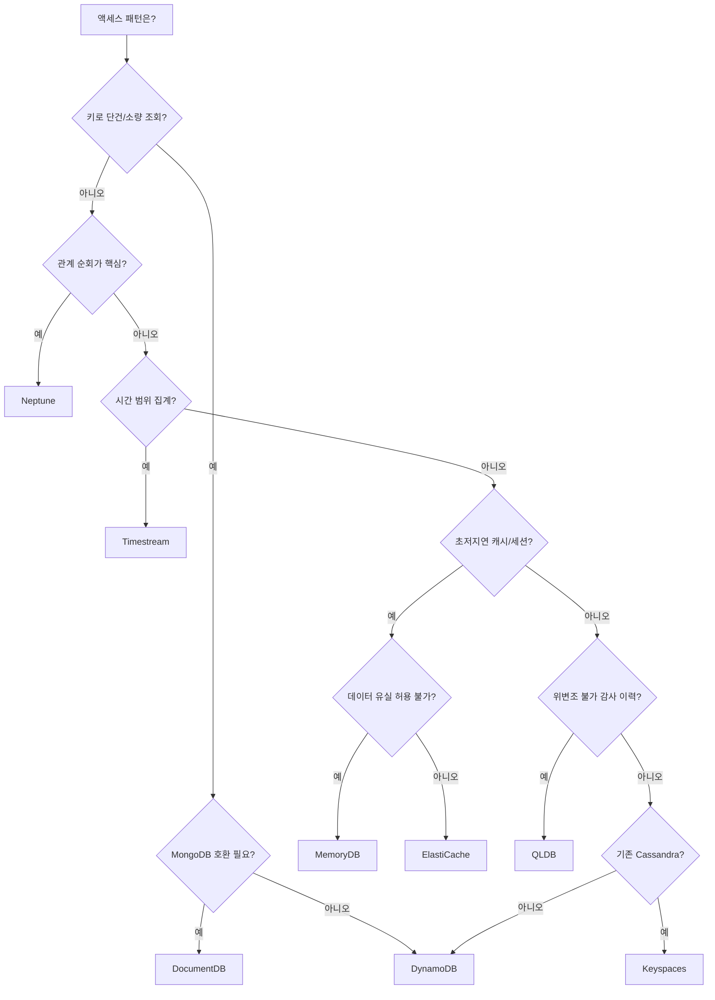

**한 줄 결정 기준**: 액세스 패턴을 하나로 특정할 수 없다면(예: 키 조회 + 그래프 순회가 둘 다 핵심) 단일 서비스에 억지로 맞추지 말고 폴리글랏(용도별로 별도 저장소를 두고 이벤트로 동기화)을 고려하라.

마지막으로 특수 목적 DB 전반에 적용되는 두 원칙을 강조한다. 첫째, DynamoDB의 400KB 아이템 한도와 마찬가지로 대부분의 NoSQL/특수 DB는 큰 바이너리 페이로드 저장에 최적화되어 있지 않다 — 큰 페이로드는 항상 S3에 두고 포인터만 저장한다. 둘째, Neptune·Timestream·QLDB·Keyspaces 같은 서비스는 DynamoDB/RDS만큼 리전 가용성이 넓지 않고 생태계·인력 풀도 상대적으로 제한적이다. 도입 전 "나중에 다른 곳으로 옮겨야 한다면 어떻게 나가는가(exit plan)"를 반드시 확인해야 한다.

### 26장 정리

#### [필수] 반드시 알아야 할 것
1. DynamoDB 설계의 핵심은 파티션 키 선택이다. 카디널리티가 낮으면 핫 파티션이 생겨 스로틀링으로 이어진다.
2. DynamoDB는 조인과 임의 쿼리를 지원하지 않는다. 필요한 모든 쿼리를 사전에 키/인덱스 설계로 확보해야 한다(단일 테이블 설계).
3. GSI는 결과적 일관성만 지원하고 별도 용량이 필요하며, LSI는 테이블 생성 시에만 지정 가능하고 기본 테이블과 용량을 공유한다.
4. 아이템 크기 한도는 400KB이며 트랜잭션에도 항목 수 한도가 있다. 큰 페이로드는 S3에 두고 포인터만 저장한다.
5. ElastiCache Redis는 클러스터 모드·복제·Multi-AZ 여부에 따라 가용성이 완전히 달라진다. 캐시 유실이 서비스 장애가 되지 않도록 설계한다.
6. Neptune(그래프)·Timestream(시계열)·QLDB(원장)·Keyspaces(와이드 컬럼)는 각각 특정 패턴에 최적화된 서비스이며 서로 대체재가 아니다.

#### [팁] 실무 노하우
1. Scan은 최후의 수단이다. Query와 인덱스로 해결하고, 불가피한 대량 처리는 병렬 Scan을 전용 용량으로 분리한다.
2. 트래픽이 불확실한 신규 서비스는 온디맨드로 시작해 데이터를 모은 뒤 프로비저닝 + Auto Scaling으로 전환하면 비용이 준다.
3. DynamoDB Streams + Lambda는 이벤트 소싱·CQRS·감사 로그를 저렴하게 구현하는 경로다(→ 44장 참조).
4. 핫 파티션이 예상되는 키(인기 상품·인기 사용자)는 처음부터 접미사 기반 쓰기 샤딩을 반영한다.
5. 낙관적 락(버전 속성 + 조건부 쓰기)으로 동시 갱신 충돌을 감지하고, 실패 시 재조회 후 재시도하는 로직을 넣는다.

#### [주의] 사고·비용·설계 함정
1. 아이템 크기 한도(400KB)를 초과하는 설계는 불가능하다 — 로그, 이미지, 문서 원본을 통째로 넣지 말 것.
2. GSI 스로틀링은 기본 테이블 쓰기까지 지연·차단시킬 수 있다. GSI 파티션 키도 신중히 설계해야 한다.
3. TTL 삭제는 즉시 일어나지 않는다. 만료 직후 아이템이 남아 있을 수 있으므로 조회 로직에서 TTL 속성을 직접 필터링해야 한다.
4. 캐시(ElastiCache) 도입은 무효화 전략 없이는 정합성 버그를 만든다. TTL과 명시적 무효화를 함께 설계한다(→ 47장 참조).
5. DocumentDB는 MongoDB API의 일부만 호환한다. 모든 기능 지원을 단정하지 말고 호환성 문서를 확인한다.
6. Neptune/Timestream/QLDB/Keyspaces는 리전 가용성·생태계·인력 풀이 상대적으로 제한적이다. 도입 전 이탈 경로(exit plan)를 확인한다.
7. 글로벌 테이블의 다중 활성 쓰기는 리전 간 충돌을 최종 쓰기 우선(LWW)으로 해소한다 — 어느 쪽이 이겨도 괜찮은지 미리 검토해야 한다.
8. 구체적 용량 계산식·보존 지연 시간 수치는 변경될 수 있으므로 실제 설계 시 최신 할당량 문서를 재확인한다.

#### 한 장 요약
DynamoDB는 액세스 패턴을 먼저 정의하고 키/인덱스로 역산하는 설계 철학을 요구하며, 파티션 키 선택·GSI/LSI 특성·용량 모드·Streams/트랜잭션이 이 장의 절반 이상을 차지할 만큼 핵심이다. DocumentDB·ElastiCache/MemoryDB·Neptune·Timestream·QLDB·Keyspaces는 각각 문서 호환성, 초저지연 캐시, 그래프 순회, 시계열 집계, 감사 증명, 와이드 컬럼이라는 뚜렷한 목적의 도구다. 큰 페이로드는 S3로, Scan은 최후의 수단으로, 특수 DB는 이탈 경로까지 고려해 선택한다.

#### 다음 장 예고
27장에서는 관계형(25장)과 NoSQL(26장)을 아우르는 데이터베이스 마이그레이션 전략과 AWS DMS/SCT 같은 실행 도구를 다룬다.

---

## 27장. 데이터베이스 마이그레이션  ★★★

> **이 장에서 다루는 것**
> 25장의 RDS/Aurora, 26장의 NoSQL·특수 목적 데이터베이스 지식을 전제로, 이 장은 그 데이터베이스들로 "어떻게 옮겨오는가"를 다룬다.
> 평가와 스키마 변환(AWS SCT), 실행 도구(AWS DMS), 동종/이기종 전략의 선택 기준, 무중단 컷오버 설계, 마이그레이션 후 튜닝까지 하나의 실행 흐름으로 정리한다.
> 이 장의 범위는 어디까지나 **데이터베이스 레이어**의 기술적 실행에 한정된다. 애플리케이션 포트폴리오 분석, 웨이브 계획, 7R 프레임워크 같은 조직 차원의 마이그레이션 전략은 63장에서 다룬다.
> 성능 진단 도구(Performance Insights, Enhanced Monitoring)는 25.10절에서 다룬 내용을 그대로 재사용하므로 여기서는 마이그레이션 이후 관점에서만 짧게 언급한다.

### 27.1 마이그레이션 평가와 스키마 변환(SCT)

데이터베이스 마이그레이션 프로젝트에서 일정이 틀어지는 가장 흔한 원인은 데이터 이관 자체가 아니라 **사전 평가 부족**이다. 마이그레이션을 시작하기 전에 반드시 인벤토리를 수집해야 한다. 인벤토리에는 엔진 종류와 버전, 데이터베이스 크기(스토리지·테이블 수·최대 테이블 크기), 트랜잭션량(초당 커밋 수, 피크 시간대 부하), 그리고 애플리케이션·배치 잡·리포팅 도구·다른 데이터베이스와의 의존 관계가 포함되어야 한다. 이 의존 관계 파악을 소홀히 하면 컷오버 당일에서야 "이 배치 잡이 이 데이터베이스를 직접 참조하고 있었다"는 사실을 발견하게 된다.

대규모 조직에서 마이그레이션 대상 데이터베이스가 수십~수백 대에 이른다면 이 인벤토리 수집을 수작업 스프레드시트로 진행하기 어렵다. **AWS DMS Fleet Advisor**는 온프레미스 데이터베이스 서버를 스캔해 엔진·버전·크기·활용도를 자동으로 수집하고, 각 데이터베이스에 적합한 마이그레이션 전략(동종 유지, 이기종 전환 권장 대상 엔진 등)을 제안하는 평가 도구다. 개별 데이터베이스 단위의 SCT 평가에 앞서 포트폴리오 전체를 훑어 우선순위를 정하는 용도로 유용하며, 애플리케이션 계층까지 포함한 전사 포트폴리오 분석·웨이브 계획은 이 장의 범위를 벗어나므로 → 63장을 참조한다.

여기서 반드시 짚어야 할 원칙이 있다. **동종 마이그레이션(예: MySQL → MySQL, Oracle → Oracle)이라면 스키마 변환 자체는 큰 이슈가 아니다.** 문제는 **이기종 마이그레이션(예: Oracle → PostgreSQL, SQL Server → MySQL)** 이다. 이기종 전환에서 실제로 프로젝트 기간을 잡아먹는 것은 테이블·컬럼 정의 같은 스키마가 아니라 **저장 프로시저(stored procedure), 트리거, 그리고 애플리케이션에 하드코딩된 SQL**이다. 원본 엔진 고유의 절차형 언어(PL/SQL, T-SQL)로 작성된 비즈니스 로직은 대상 엔진의 문법으로 기계적으로 변환되지 않는 경우가 많고, 수작업 재작성과 회귀 테스트가 필요하다. 따라서 프로젝트 초기 단계에서 저장 프로시저·트리거·뷰·함수의 개수와 복잡도, 그리고 애플리케이션 코드 내 인라인 SQL의 규모를 먼저 인벤토리로 뽑아내야 실제 공수를 가늠할 수 있다. 이 인벤토리 없이 "데이터만 옮기면 된다"는 가정으로 일정을 잡으면 반드시 지연된다.

**AWS Schema Conversion Tool(SCT)** 은 이기종 마이그레이션에서 스키마와 코드 객체를 대상 엔진 문법으로 변환하는 도구다. SCT는 소스 데이터베이스를 스캔해 **평가 보고서(assessment report)** 를 생성하는데, 이 보고서는 전체 객체 중 자동 변환이 가능한 비율과 수작업이 필요한 항목을 항목별로 분류해 보여준다. 보고서는 통상 객체 유형별(테이블, 뷰, 저장 프로시저, 트리거, 함수)로 자동 변환 가능/부분 변환 가능/수작업 필요 항목의 개수와 예상 공수를 함께 제시하고, 항목별로 구체적인 실패 사유(지원되지 않는 문법, 데이터 타입 불일치 등)를 표시한다. 실무에서는 이 보고서를 프로젝트 초기에 뽑아 경영진·이해관계자에게 "자동화 가능한 부분"과 "수작업이 필요한 부분"을 구분해 공유하는 것이 일정 협상의 근거가 된다. 다만 SCT의 코드 변환에는 명확한 한계가 있다. 단순한 문법 차이(데이터 타입 매핑, 함수명 차이)는 잘 처리하지만, 원본 엔진의 특정 확장 기능이나 벤더 종속적인 최적화 힌트, 복잡한 커서·예외 처리 패턴은 자동 변환되지 않거나 부분적으로만 변환되어 수작업 검토가 필요하다. SCT는 변환 후 수작업이 필요한 지점을 주석으로 표시해주므로, 이 표시를 무시하지 않고 하나씩 검증하는 프로세스가 필요하다.

SQL Server에서 PostgreSQL 계열로 이전하는 특수한 경로로 **Babelfish for Aurora PostgreSQL**이 있다. Babelfish는 Aurora PostgreSQL에 T-SQL 및 SQL Server 와이어 프로토콜(TDS) 호환 계층을 추가해, 애플리케이션이 SQL Server에 연결하던 방식 그대로 Aurora PostgreSQL에 연결할 수 있게 해준다. 기존 ODBC·JDBC·ADO.NET 드라이버가 그대로 접속되며, T-SQL 문법의 상당 부분(저장 프로시저, 커서, 임시 테이블 포함)을 해석해 실행한다. 애플리케이션 코드나 드라이버를 거의 변경하지 않고 이전할 수 있다는 점에서 이기종 마이그레이션의 부담을 크게 낮추지만, SQL Server의 모든 기능(예: CLR 통합 같은 고급 확장)을 완전히 대체하는 것은 아니므로 지원 범위와 호환성은 실제 워크로드로 사전 검증이 필요하다. 이 방식은 "엔진 자체는 이기종으로 바꾸되 애플리케이션 계층의 변경은 최소화한다"는 절충안으로 이해하는 것이 정확하다 — SCT로 T-SQL을 PL/pgSQL로 완전히 재작성하는 경로보다 초기 전환 공수는 줄어들지만, 장기적으로 PostgreSQL 생태계의 모든 기능을 온전히 활용하지 못하는 제약이 남을 수 있으므로 장기 로드맵 관점에서 재작성 경로와 비교해 선택해야 한다.

이기종 전환에서 흔히 부딪히는 라이선스·기능 격차를 Oracle → PostgreSQL 사례로 간단히 정리하면 다음과 같다.

| 항목 | Oracle | PostgreSQL(Aurora) | 대응 방향 |
|---|---|---|---|
| 절차형 언어 | PL/SQL | PL/pgSQL | SCT 자동 변환 후 수작업 검토 |
| 시퀀스 | `SEQUENCE` + `NEXTVAL` | `SEQUENCE` 문법 유사, 캐시 동작 차이 | 시퀀스 캐시·증분 값 재검증 |
| 파티셔닝 | 다양한 파티셔닝 옵션 | 선언적 파티셔닝(버전별 기능 차이) | 대상 버전 문서로 기능 매핑 확인 |
| 패키지(PACKAGE) | 지원 | 미지원(스키마/함수로 대체) | 패키지 단위 코드를 개별 함수로 재구성 |
| 라이선스 | 코어 기반 유상 라이선스 | 오픈소스, 인스턴스 시간 과금 | 총소유비용(TCO) 재계산의 핵심 동인 |

**한 줄 결정 기준**: 저장 프로시저·트리거·패키지의 규모가 크고 복잡할수록 이기종 전환의 실제 공수는 SCT 평가 보고서의 "수작업 필요" 비율에 비례해 늘어난다고 보고 일정을 잡는다.

저장 프로시저·트리거 전환 우선순위를 정할 때는 코드 라인 수보다 **실제 호출 빈도와 비즈니스 크리티컬리티**를 기준으로 삼는 것이 효율적이다. 하루 수백만 번 호출되는 짧은 프로시저와 한 달에 한 번 배치로만 실행되는 긴 프로시저가 있다면, 전자의 정확한 동작 재현에 검증 리소스를 먼저 집중하는 편이 리스크 관리 측면에서 낫다. 변환 후에는 원본 프로시저와 변환된 프로시저의 입출력을 비교하는 회귀 테스트 스위트를 구성해, 자동 변환·수작업 재작성 결과물 모두 동일한 검증 절차를 거치도록 해야 한다.

### 27.2 AWS DMS

**AWS Database Migration Service(DMS)** 는 소스 데이터베이스에서 대상 데이터베이스로 데이터를 이관하는 완전관리형 서비스로, 동종·이기종 마이그레이션 모두에서 실행 계층 역할을 한다. DMS는 **복제 인스턴스(replication instance)** 위에서 태스크를 실행하는데, 이 복제 인스턴스는 EC2와 유사하게 인스턴스 클래스를 선택해 사이징한다. 사이징 기준은 소스 데이터베이스의 트랜잭션량과 LOB(대용량 객체) 비중, 병렬 처리할 테이블 수다. 언더사이징하면 CDC 지연이 누적되고, 과도한 오버사이징은 불필요한 비용으로 이어지므로 파일럿 마이그레이션으로 실측한 뒤 조정하는 것이 안전하다. 수 주 이상 CDC를 유지해야 하는 장기 마이그레이션이라면 복제 인스턴스를 **Multi-AZ**로 구성해 인스턴스 장애가 곧바로 복제 중단으로 이어지지 않도록 하는 것이 바람직하다. 다만 Multi-AZ 복제 인스턴스는 비용이 단일 AZ 대비 크게 늘어나므로, 컷오버까지 예상되는 기간과 복제 중단 허용 범위를 함께 따져 결정한다.

DMS 태스크를 구성하려면 먼저 **소스 엔드포인트**와 **대상 엔드포인트**를 각각 정의한다. 엔드포인트는 연결 정보(호스트, 포트, 인증정보)와 엔진 타입을 담고, 생성 후 연결 테스트로 검증한다. 태스크 유형은 세 가지다.

| 태스크 유형 | 동작 | 적합한 상황 |
|---|---|---|
| 전체 로드(Full Load) | 시점 스냅샷을 한 번에 이관 | 다운타임 허용 가능, 소규모 데이터 |
| 전체 로드 + CDC | 스냅샷 이관 후 변경분을 지속 복제 | 무중단 컷오버가 필요한 대다수 실무 사례 |
| CDC 전용 | 이미 별도 방식으로 초기 적재된 데이터 이후의 변경분만 복제 | Snowball 등으로 초기 대량 적재를 마친 뒤 |

**테이블 매핑(table mapping)** 은 어떤 스키마·테이블을 이관 대상으로 포함할지, 그리고 **변환 규칙(transformation rule)** 으로 스키마명 변경, 컬럼명 변경, 대소문자 변환 같은 규칙을 JSON으로 선언한다. 선택 규칙(selection rule)에 더해 **필터(filter)** 를 함께 지정하면 테이블 전체가 아니라 특정 조건을 만족하는 행만 이관할 수 있다. 예를 들어 오래된 이력 데이터 전체를 옮기지 않고 최근 N개월 데이터만 초기 적재한 뒤, 이후 CDC로 신규 발생 데이터만 계속 따라가는 전략에 활용된다. 다음은 특정 스키마의 테이블을 선택하고 스키마명을 변환하는 예시다.

```json
{
  "rules": [
    {
      "rule-type": "selection",
      "rule-id": "1",
      "rule-name": "select-orders-schema",
      "object-locator": {
        "schema-name": "SALES",
        "table-name": "%"
      },
      "rule-action": "include"
    },
    {
      "rule-type": "transformation",
      "rule-id": "2",
      "rule-name": "rename-schema-to-lowercase",
      "rule-target": "schema",
      "object-locator": {
        "schema-name": "SALES"
      },
      "rule-action": "rename",
      "value": "sales"
    }
  ]
}
```

대규모 테이블의 전체 로드 속도를 높이려면 태스크 설정에서 **병렬 로드(parallel load)** 를 활성화해 테이블을 파티션 단위로 나눠 동시에 적재하도록 지정할 수 있다. 이때 파티션 경계를 범위 기준으로 지정하는지 자동 감지에 맡기는지에 따라, 소스 테이블에 파티션 키에 해당하는 인덱스가 있는지가 성능에 큰 영향을 준다. 또한 **커밋 속도(commit rate)** 와 배치 적용 간격을 조정하면 대상 데이터베이스에 순간적으로 가해지는 부하를 제어할 수 있다.

DMS 대표 함정 중 하나가 **LOB(BLOB/CLOB 등 대용량 객체) 컬럼 처리**다. DMS는 LOB 처리 모드를 세 가지로 제공한다. **제한된(Limited) LOB 모드**는 지정한 최대 크기까지만 LOB을 이관하며 이를 초과하면 잘리므로 사전에 실제 최대 LOB 크기를 조사해야 한다. **전체(Full) LOB 모드**는 크기 제한 없이 이관하지만 LOB을 별도 조회 단계로 처리하기 때문에 속도가 크게 느려질 수 있다. **인라인(Inline) LOB 모드**는 지정한 크기 이하는 일반 컬럼처럼 함께, 초과분만 별도로 조회해 두 방식의 장점을 절충한다. 실무에서는 LOB 크기 분포를 먼저 조사해 인라인 모드의 임계값을 적절히 잡는 것이 속도와 완전성을 함께 확보하는 방법이다. 구체적으로는 전체 LOB 크기의 백분위수(예: 95퍼센타일)를 조사해 그 값 근처를 임계값으로 설정하면, 상위 소수의 예외적으로 큰 LOB만 별도 조회로 넘기고 나머지는 인라인으로 함께 처리해 속도와 완전성의 균형을 맞출 수 있다. 또 다른 대표 함정은 **기본 키(PK)가 없는 테이블**이다. DMS의 CDC는 변경 행을 식별하기 위해 기본 키나 고유 인덱스를 필요로 하므로, PK가 없는 테이블은 CDC 단계에서 전체 행 매칭에 의존하게 되어 성능이 급격히 떨어지거나 일부 엔진 조합에서는 아예 지원되지 않는다. 마이그레이션 대상 테이블 목록에서 PK 유무를 사전에 전수 조사해, 없는 테이블은 임시 PK 추가나 별도 이관 전략을 세워야 한다.

DMS는 태스크 실행 전 **사전 마이그레이션 평가(premigration assessment)** 기능으로 지원되지 않는 데이터 타입이나 잠재적 호환성 문제를 미리 경고해준다. 이 경고를 무시하고 태스크를 실행하면 특정 행에서만 조용히 오류가 발생하거나 데이터가 유실되는 경우가 있으므로, 실행 전 평가 결과를 반드시 검토하고 넘어가야 한다.

DMS는 **데이터 검증(data validation)** 기능을 제공해 소스와 대상의 행 단위 비교를 자동으로 수행하고 불일치를 리포트한다. 대규모 데이터셋에서는 이 기능이 CPU·I/O 부하를 추가로 유발하므로 저부하 시간대에 실행하거나 표본 검증과 병행하는 것이 일반적이다. 서버리스 실행 옵션인 **DMS Serverless**는 복제 인스턴스 용량을 수동으로 사이징하지 않고 워크로드에 따라 자동으로 확장·축소되는 방식으로, 트래픽 패턴을 예측하기 어려운 태스크나 간헐적으로 실행하는 마이그레이션에 적합하다. **DMS Schema Conversion**은 기존 SCT의 스키마 변환 기능을 DMS 콘솔 내에 통합한 것으로, 별도 도구 설치 없이 콘솔에서 평가부터 변환까지 이어서 진행할 수 있다.

모니터링은 Amazon CloudWatch 지표로 이뤄진다. 대표 지표인 **CDCLatencySource**와 **CDCLatencyTarget**은 각각 소스/대상 대비 복제 지연 시간을 초 단위로 보여주며, 이 값이 지속적으로 증가한다면 복제 인스턴스 사이징 부족이나 네트워크 병목을 의심해야 한다. 그 외 `FullLoadThroughputRowsSource`, `FreeableMemory`, `CPUUtilization` 등을 함께 관찰해 태스크의 건강 상태를 판단한다. 컷오버를 계획 중이라면 CDC 지연이 안정적으로 0에 가까운 수준을 유지하는지가 컷오버 가능 시점 판단의 핵심 근거가 된다(→ 27.4절).

### 27.3 동종 vs 이기종 마이그레이션 전략

DMS는 강력한 도구이지만 **모든 마이그레이션에 DMS가 정답은 아니다.** 이 구분을 명확히 하지 않으면 불필요하게 복잡한 경로를 선택하게 된다.

**동종 마이그레이션(같은 엔진 간 이전, 예: 온프레미스 MySQL → RDS MySQL)** 에서는 엔진 네이티브 도구가 DMS보다 더 빠르고 단순한 경우가 많다. `mysqldump`/`pg_dump` 같은 논리 백업 도구는 소규모~중간 규모 데이터베이스에서 스키마와 데이터를 함께 이관할 수 있고, 물리 백업(RMAN, `pg_basebackup` 등)을 복원하는 방식은 대용량 데이터베이스에서 논리 백업보다 훨씬 빠르다. 온프레미스에서 EC2나 RDS로 옮기는 경우 스냅샷을 떠서 복원하거나, 읽기 복제본을 구성한 뒤 이를 승격(promote)해 독립적인 데이터베이스로 전환하는 방법도 동종 마이그레이션에서 흔히 쓰인다. 이런 네이티브 경로는 DMS의 엔드포인트·태스크 설정 오버헤드 없이 엔진이 보장하는 일관성으로 이관할 수 있다는 장점이 있다.

각 네이티브 경로를 조금 더 구체적으로 보면 다음과 같다. 논리 백업 도구(`mysqldump`, `pg_dump`)는 스키마와 데이터를 텍스트 형식의 덤프 파일로 추출한 뒤 대상에 복원하는 방식으로, 소규모~중간 규모 데이터베이스에 적합하다. `mysqldump --single-transaction`처럼 트랜잭션 일관성을 보장하는 옵션을 쓰면 덤프 도중 테이블을 잠그지 않고도 일관된 스냅샷을 얻을 수 있지만, SQL 문을 순차적으로 재실행하는 방식이라 데이터 규모가 커질수록 소요 시간이 선형적으로 늘어난다는 한계가 있다. 물리 백업 도구(Percona XtraBackup, Oracle RMAN 등)는 데이터 파일 자체를 바이트 단위로 복사하기 때문에 논리 백업보다 훨씬 빠르며, 특히 테라바이트급 데이터베이스에서 그 차이가 두드러진다. 다만 RDS로 이전할 때는 온프레미스 물리 백업을 곧바로 복원할 수 없는 경우가 많으므로, 대상 엔진·버전이 지원하는 복원 경로(엔진별 네이티브 백업 복원 기능, S3 경유 복원 절차 등)를 사전에 확인해야 한다.

**스냅샷 복사(snapshot copy)** 는 이미 RDS/Aurora 위에서 운영 중인 데이터베이스를 다른 리전이나 다른 계정으로 옮길 때 흔히 쓰인다. 스냅샷을 복사해 대상에서 복원하는 절차 자체는 단순하지만, 스냅샷 시점 이후의 변경분은 별도로 처리해야 하므로 그 자체만으로는 완전한 무중단 이전이 되지 않는다. **읽기 복제본 승격(read replica promotion)** 은 동일 엔진 간 이전에서 다운타임을 최소화하는 대표적인 방법이다. 이관 대상 위치에 읽기 복제본을 구성해 원본과 지속적으로 동기화한 뒤, 컷오버 시점에 복제본을 독립 인스턴스로 승격시킨다. 다만 이 방법은 크로스 리전·크로스 계정 복제본 생성이 가능한 엔진·구성 조합으로 제한되며, 일단 승격하면 원본과의 복제 관계가 끊어지므로 롤백이 필요할 경우 반대 방향의 복제를 별도로 다시 구성해야 한다는 점을 사전에 계획해두어야 한다. 자체 관리형 EC2로 그대로 옮기는 '리프트 앤 시프트'라면 Oracle Data Pump나 SQL Server의 네이티브 백업/복원 기능을 그대로 사용할 수 있어, 별도 도구 도입 없이도 이전이 가능하다는 것 역시 동종 마이그레이션의 장점이다.

실무에서는 이런 네이티브 경로를 DMS의 CDC 기능과 결합해 쓰는 경우도 많다. 예를 들어 물리 백업으로 초기 대량 데이터를 빠르게 옮긴 뒤, 그 시점 이후의 변경분만 DMS **CDC 전용** 태스크로 따라잡으면 초기 적재 속도와 무중단 컷오버라는 두 장점을 함께 얻을 수 있다(→ 27.2절의 CDC 전용 태스크 유형 참조). **동종 마이그레이션에서 DMS를 단독으로 선택하는 주된 이유는 이관 도중 무중단 CDC가 필요하거나, 소스가 이질적인 네트워크 환경에 있어 직접 백업 파일을 옮기기 어려운 경우**로 한정하는 것이 합리적이다.

**이기종 마이그레이션(엔진이 다른 경우)** 은 27.1절에서 다룬 SCT로 스키마·코드를 변환하고, DMS로 데이터를 이관하며, 변환되지 않은 저장 프로시저·트리거·애플리케이션 SQL은 별도로 수작업 재작성해야 하는 3단계 조합이 사실상 표준 경로다. 이 조합에서는 SCT 평가 보고서가 산정한 수작업 비율이 프로젝트 일정의 실질적 병목이 된다.

데이터 규모가 매우 커서 네트워크로 초기 적재를 완료하는 데 며칠~몇 주가 걸리는 경우, **AWS Snowball(또는 Snowball Edge)로 초기 대량 데이터를 물리적으로 운송한 뒤, 그 이후 발생한 변경분만 DMS CDC 전용 태스크로 따라잡는 조합**이 실무에서 쓰인다. 이 방식은 초기 전체 로드에 소요되는 네트워크 대역폭 제약을 물리적 운송으로 우회하고, 이후의 지속적 변경분만 네트워크로 복제하므로 전체 이관 시간을 크게 단축할 수 있다.

세 접근 방식을 다운타임·리스크·비용 축으로 비교하면 다음과 같다.

| 방식 | 다운타임 | 리스크 | 비용 특성 |
|---|---|---|---|
| 네이티브 도구(동종) | 중간~김(백업/복원 시간에 비례) | 낮음(엔진 자체 보장 일관성) | 별도 도구 비용 없음, 운영 인력 시간 소요 |
| DMS 전체 로드 + CDC | 매우 짧음(컷오버 순간만) | 중간(LOB·PK 없는 테이블 등 함정 존재) | 복제 인스턴스 실행 시간 과금 |
| SCT + DMS(이기종) | 짧음(CDC 활용 시) | 높음(코드 변환·회귀 테스트 부담) | 도구 비용 외 수작업 재작성 인건비 큼 |
| Snowball + DMS CDC | 짧음 | 중간(운송 기간 중 소스 변경 관리 필요) | 물리 운송 비용 + 짧아진 복제 인스턴스 실행 시간 |

**한 줄 결정 기준**: 엔진이 같고 다운타임 창을 확보할 수 있다면 네이티브 도구를 우선 검토하고, 엔진이 다르거나 무중단이 필수 조건일 때만 SCT/DMS 조합의 복잡도를 감수한다.

이 세 축(다운타임·리스크·비용)을 실제로 저울질할 때는 다운타임 허용치, 팀의 기존 도구 숙련도, 예산을 함께 고려해야 한다. 운영팀이 이미 물리 백업 도구 운용에 익숙하고 계획된 유지보수 창을 확보할 수 있다면 네이티브 경로가 총비용 관점에서 유리하고, 반대로 서비스 특성상 몇 분의 다운타임도 허용되지 않는다면 도구 학습 비용을 감수하고서라도 CDC 기반 전략을 선택하는 편이 합리적이다. 어떤 경로를 택하든 실제 프로덕션 규모에 가까운 데이터로 최소 한 차례 파일럿 이관을 수행해 예상 소요 시간을 실측해보는 것이 일정 산정의 신뢰도를 높이는 가장 확실한 방법이다.

### 27.4 무중단 컷오버와 롤백 계획

전체 로드 + CDC 태스크가 안정화되면, 소스와 대상을 일정 기간 **병행 운영(parallel run)** 하며 CDC로 변경분을 지속 반영한다. 이 병행 운영 기간의 길이는 데이터 검증에 필요한 시간과 비즈니스 사이클(예: 월말 마감·정산 배치)을 최소 한 차례 이상 포함할 수 있는지를 기준으로 설계한다. 병행 운영 중에는 CDC 지연(CDCLatencyTarget)을 지속적으로 감시해, 지연이 안정적으로 낮은 수준을 유지하는지 확인해야 한다.

컷오버 가능 여부는 담당자의 주관적 판단이 아니라 사전에 정의한 정량적 게이트(gate)로 결정하는 것이 바람직하다. 예를 들어 "CDCLatencyTarget이 5초 미만으로 24시간 이상 안정적으로 유지될 것"과 같은 구체적인 조건을 컷오버 조건으로 삼으면, 병행 운영 기간이 충분한지를 객관적으로 판단할 수 있다. 또한 실제 컷오버 전에 스테이징 환경에서 동일한 체크리스트로 **모의 컷오버(dress rehearsal)** 를 최소 한 차례 수행해보는 것이 좋다. 모의 컷오버에서 체크리스트 각 단계의 실제 소요 시간을 측정해두면 당일 예상 소요 시간과 실제 소요 시간의 괴리를 줄일 수 있고, 체크리스트에서 누락된 단계(예: 특정 배치 잡의 스케줄 정지)를 사전에 발견할 수 있다.

다음은 전체 로드와 CDC, 병행 운영, 컷오버로 이어지는 일반적인 타임라인이다.

```mermaid
gantt
    title 전체 로드 + CDC 마이그레이션 타임라인
    dateFormat  X
    axisFormat %s
    section 이관
    전체 로드(스냅샷) :a1, 0, 3
    CDC 캡처·적용 :a2, 0, 10
    section 검증
    데이터 검증(행 수·체크섬) :a3, 3, 8
    병행 운영·모니터링 :a4, 3, 9
    section 컷오버
    쓰기 중단·잔여 CDC 소진 :a5, 9, 10
    애플리케이션 전환·검증 :a6, 10, 11
```

컷오버 당일에는 순서가 어긋나면 데이터 정합성이 깨지므로 체크리스트를 문서화해 그대로 따라야 한다.

```markdown
## 컷오버 체크리스트

1. [ ] 소스 데이터베이스로의 신규 쓰기를 애플리케이션 레벨 또는 읽기 전용 모드로 차단
2. [ ] CDCLatencyTarget이 0에 수렴할 때까지 대기 (잔여 CDC 소진 확인)
3. [ ] 소스의 시퀀스/자동증가(AUTO_INCREMENT) 현재 값을 확인해 대상에 동기화
4. [ ] DMS가 이관하지 않는 인덱스·제약조건(FK/UNIQUE/CHECK)·트리거를 대상에 생성
5. [ ] 대상 데이터베이스의 통계 정보 재수집 (옵티마이저 통계 최신화)
6. [ ] 애플리케이션 연결 정보를 대상으로 전환
7. [ ] 행 수·체크섬 비교 및 애플리케이션 스모크 테스트로 검증
8. [ ] 검증 실패 시 사전 정의된 롤백 절차 실행
```

컷오버 진행 여부를 판단하는 흐름을 도식화하면 다음과 같다.

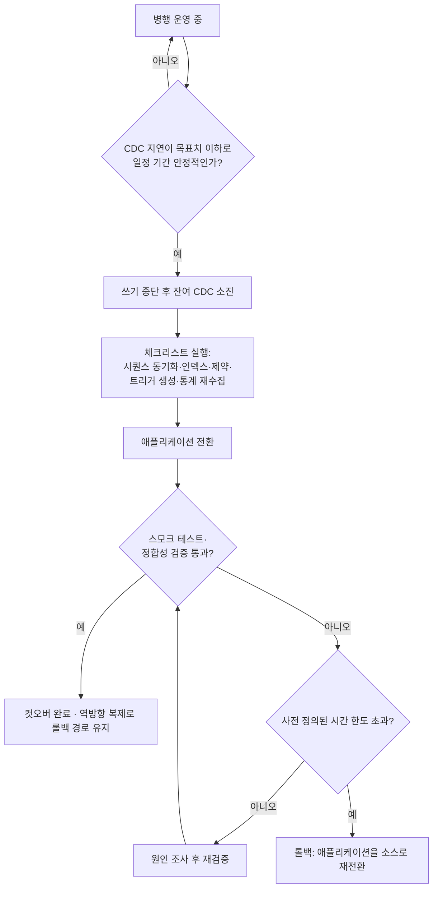

이 체크리스트에서 반드시 짚어야 할 함정은 **DMS가 데이터는 옮기지만 인덱스·제약조건·트리거·일부 권한은 기본적으로 완전히 이관하지 않는다**는 점이다(→ 27.5절에서 검증 방법을 다룬다). 이 단계를 건너뛰고 애플리케이션을 전환하면 초기에는 정상 동작하는 것처럼 보이다가, 제약조건이 없어 잘못된 데이터가 유입되거나 인덱스가 없어 특정 쿼리에서 성능이 급락하는 형태로 문제가 뒤늦게 드러난다.

컷오버 리스크를 낮추는 핵심 장치는 **역방향 복제(reverse replication)**, 즉 대상에서 소스로 향하는 별도의 DMS CDC 태스크를 컷오버 직후부터 가동해두는 것이다. 컷오버 후 문제가 발견되어 소스로 되돌아가야 하는 상황이 오더라도, 컷오버 이후 대상에서 발생한 변경분이 역방향 복제로 소스에 반영되고 있다면 데이터 유실 없이 롤백할 수 있다. 역방향 복제 없이 컷오버하면 롤백 결정 자체가 "이후 발생한 데이터를 포기한다"는 뜻이 되어 사실상 롤백이 불가능해진다.

애플리케이션 연결 전환은 몇 가지 방법으로 이뤄진다. **Route 53의 CNAME 레코드**를 대상 엔드포인트로 갱신하는 방법은 DNS 전파 지연을 고려해야 하고, 애플리케이션이나 클라이언트의 DNS 캐시(TTL) 설정에 따라 전환 완료 시점이 들쭉날쭉할 수 있다. 전환이 임박했다면 사전에 TTL을 짧게 낮춰두는 것이 전파 지연을 최소화하는 방법이다.

```bash
# Route 53 CNAME을 대상 엔드포인트로 전환 (TTL을 사전에 낮춰 전파 지연을 최소화)
aws route53 change-resource-record-sets \
  --hosted-zone-id Z0123456789ABCDEFGHIJ \
  --change-batch '{
    "Changes": [{
      "Action": "UPSERT",
      "ResourceRecordSet": {
        "Name": "db.internal.example.com",
        "Type": "CNAME",
        "TTL": 30,
        "ResourceRecords": [{"Value": "target-aurora.cluster-xxxx.ap-northeast-2.rds.amazonaws.com"}]
      }
    }]
  }'
```

**RDS Proxy(→ 25.7절)** 를 앞단에 두고 있었다면 프록시 뒤의 실제 대상만 전환해 애플리케이션은 연결 문자열을 바꾸지 않아도 되는 경우가 있다. 가장 확실한 방법은 **애플리케이션 설정(환경 변수, 파라미터 스토어, Secrets Manager)** 을 배포 파이프라인으로 갱신하는 것으로, DNS 전파 지연 없이 즉시 반영되지만 애플리케이션 재배포나 재시작이 필요하다는 트레이드오프가 있다.

롤백 결정은 감정적으로 미루지 않도록 사전에 **시간 한도**를 정해야 한다. 예를 들어 "컷오버 후 30분 내 스모크 테스트를 통과하지 못하면 자동으로 롤백 절차를 시작한다"처럼 구체적인 트리거 조건과 시간 한도를 미리 문서화해두면, 당일 압박 속에서 판단이 흔들리는 것을 방지할 수 있다. 롤백 결정 기준에는 정량적 지표(오류율이 평상시 대비 일정 배수 이상 증가, 레이턴시 p99가 목표 SLA를 얼마나 초과하는지)와 정성적 판단(고객 영향 범위, 데이터 손상 여부)을 함께 포함해야 하며, 이 기준을 넘는 즉시 추가 논의 없이 롤백을 실행할 수 있도록 의사결정 권한자를 사전에 지정해두는 것이 실무적이다.

### 27.5 마이그레이션 후 성능 튜닝

컷오버가 끝났다고 마이그레이션이 끝난 것은 아니다. DMS는 데이터 이관에 최적화된 도구이지 스키마 객체 전체를 완전하게 복제하는 도구가 아니므로, **DMS가 옮기지 않는 것들**을 체계적으로 검증해야 한다. 대표적으로 보조 인덱스, 외래 키·고유 제약조건, 시퀀스의 현재 값과 증분 설정, 트리거, 그리고 데이터베이스 사용자별 세부 권한의 일부가 여기에 해당한다. 다음과 같은 검증 쿼리로 소스와 대상의 객체 목록을 비교하는 스크립트를 컷오버 전후로 반드시 실행한다.

```sql
-- 대상(PostgreSQL)에서 테이블별 행 수 집계 (소스와 비교용)
SELECT schemaname, relname AS table_name, n_live_tup AS row_estimate
FROM pg_stat_user_tables
WHERE schemaname = 'sales'
ORDER BY relname;

-- 특정 테이블의 체크섬 비교용 집계 (소스·대상에서 동일 쿼리 실행 후 값 비교)
SELECT
    COUNT(*)                          AS row_count,
    SUM(('x' || md5(t::text))::bit(64)::bigint) AS checksum_sum
FROM sales.orders t;
```

행 수만 비교하는 것으로는 부족하다. 행 수가 같아도 특정 컬럼 값이 다르게 변환됐을 수 있으므로(예: 문자셋 변환 중 손실, 타임존 오프셋 처리 차이), 위와 같은 체크섬 비교나 DMS의 내장 데이터 검증 기능(→ 27.2절)을 함께 사용해 이중으로 확인한다.

인덱스와 제약조건을 생성한 뒤에는 **옵티마이저 통계를 재수집**해야 한다. 대량의 데이터를 한 번에 적재한 직후에는 통계가 비어 있거나 오래된 상태이므로, 이 상태에서 애플리케이션이 트래픽을 받으면 옵티마이저가 잘못된 실행 계획을 선택해 급격한 성능 저하로 이어질 수 있다. 통계 재수집 후에는 마이그레이션 전(소스에서의) 실행 계획과 마이그레이션 후(대상에서의) 실행 계획을 대표 쿼리 기준으로 비교해 **실행 계획 회귀(plan regression)** 가 없는지 확인하는 절차를 두는 것이 바람직하다. 특히 이기종 마이그레이션에서는 옵티마이저의 동작 방식 자체가 엔진마다 다르므로, 소스에서 빠르던 쿼리가 대상에서 전혀 다른 실행 계획을 타면서 느려지는 사례가 드물지 않다.

파라미터 그룹도 재조정 대상이다. 소스 엔진에서 튜닝돼 있던 값(버퍼 풀 크기, 커넥션 수 상한, 정렬 메모리 등)을 대상 엔진의 파라미터로 그대로 옮길 수는 없으므로, 인스턴스 클래스와 워크로드 특성에 맞춰 새로 설정해야 한다(→ 25.8절의 파라미터 그룹 논의 참조).

권한 이관도 놓치기 쉬운 영역이다. DMS는 데이터와 스키마 객체 이관에 집중하므로, 데이터베이스 사용자 계정과 세부 권한(GRANT) 체계는 별도로 재구성해야 하는 경우가 많다. 특히 애플리케이션이 여러 서비스 계정으로 권한을 세분화해 사용하고 있었다면, 이관 후 계정별 권한 매핑을 표로 정리해 하나씩 검증하는 절차를 두는 것이 안전하다. 마이그레이션 직후 일정 기간은 **Performance Insights**로 상위 대기 이벤트(wait event)를 관찰해, 예상치 못한 락 경합이나 I/O 대기가 새로 발생하지 않는지 확인하는 것이 정상 동작 여부를 가늠하는 가장 직접적인 방법이다(도구 자체의 상세 설명은 → 25.10절 참조).

마지막으로 마이그레이션은 **비용 재평가와 라이트사이징**의 기회이기도 하다. 온프레미스에서의 인스턴스 스펙을 그대로 클라우드 인스턴스 클래스에 매핑하는 것은 종종 과잉 프로비저닝으로 이어진다. 마이그레이션 후 일정 기간의 실측 CPU·메모리·I/O 사용률을 관찰한 뒤 인스턴스 클래스를 재조정하고, 워크로드 패턴이 간헐적이라면 Aurora Serverless v2(→ 25.6절) 같은 옵션으로 전환하는 것도 검토 대상이 된다. 트래픽 패턴이 어느 정도 안정된 이후에는 예약 인스턴스(Reserved Instance)나 Savings Plans 같은 약정형 요금으로 전환해 추가 절감을 노릴 수 있지만, 마이그레이션 직후처럼 인스턴스 클래스 자체가 아직 확정되지 않은 시점에 성급하게 장기 약정을 거는 것은 피해야 한다. 이 시점의 라이트사이징은 마이그레이션 프로젝트의 정당성(TCO 절감)을 실제 수치로 입증하는 단계이기도 하다.

다음은 DMS 복제 인스턴스와 태스크를 CloudFormation으로 선언하는 발췌 예시다.

```yaml
Resources:
  ReplicationInstance:
    Type: AWS::DMS::ReplicationInstance
    Properties:
      ReplicationInstanceClass: dms.r6g.xlarge  # LOB 비중이 높은 워크로드를 고려한 사이징
      ReplicationInstanceIdentifier: orders-migration-repl
      AllocatedStorage: 200
      MultiAZ: true  # 마이그레이션 기간 중 복제 인스턴스 자체의 가용성 확보
      VpcSecurityGroupIds:
        - sg-0123456789abcdef0

  MigrationTask:
    Type: AWS::DMS::ReplicationTask
    Properties:
      ReplicationTaskIdentifier: orders-full-load-cdc
      MigrationType: full-load-and-cdc
      ReplicationInstanceArn: !Ref ReplicationInstance
      SourceEndpointArn: arn:aws:dms:ap-northeast-2:123456789012:endpoint:source-oracle
      TargetEndpointArn: arn:aws:dms:ap-northeast-2:123456789012:endpoint:target-aurora-pg
      TableMappings: !Sub |
        {"rules":[{"rule-type":"selection","rule-id":"1","rule-name":"select-all",
        "object-locator":{"schema-name":"SALES","table-name":"%"},"rule-action":"include"}]}
```

### 27장 정리

#### [필수] 반드시 알아야 할 것
1. 이기종 마이그레이션에서 시간을 가장 많이 잡아먹는 것은 스키마가 아니라 저장 프로시저·트리거·애플리케이션 SQL이다. 조기 인벤토리로 수작업 비율을 먼저 파악해야 일정을 신뢰할 수 있다.
2. AWS SCT는 스키마·코드를 대상 엔진 문법으로 변환하고 평가 보고서를 생성하지만, 복잡한 절차형 코드는 자동 변환에 한계가 있어 수작업 검토가 필수다.
3. DMS 태스크는 전체 로드, 전체 로드+CDC, CDC 전용의 세 유형이 있으며, 무중단 컷오버가 필요한 대부분의 실무 사례는 전체 로드+CDC를 사용한다.
4. LOB 컬럼과 기본 키(PK) 없는 테이블은 DMS의 대표 함정이다. LOB 처리 모드(제한/전체/인라인)를 사전에 검토하고, PK 없는 테이블은 CDC 성능·지원 여부를 별도로 확인해야 한다.
5. DMS는 데이터를 옮기지만 인덱스·제약조건·시퀀스·트리거·일부 권한은 완전히 이관하지 않는다. 컷오버 전후 검증 스크립트로 이를 반드시 확인해야 한다.
6. 동종 마이그레이션에서는 네이티브 도구(mysqldump/pg_dump, 물리 백업, 스냅샷 복원, 읽기 복제본 승격)가 DMS보다 빠르고 단순한 경우가 많다. DMS가 항상 최선의 선택은 아니다.

#### [팁] 실무 노하우
1. CDC로 병행 운영 기간을 확보하면 컷오버 리스크가 크게 줄어든다. 컷오버 직후부터 역방향 복제를 가동해두면 데이터 유실 없는 롤백 경로까지 확보할 수 있다.
2. 대용량 초기 적재는 Snowball 등 물리 운송과 DMS CDC 전용 태스크를 조합하면 네트워크 대역폭 제약을 우회해 전체 이관 시간을 단축할 수 있다.
3. 컷오버 체크리스트는 순서가 어긋나면 정합성이 깨지므로 문서화해 그대로 따르고, 시퀀스/자동증가 값 동기화와 통계 재수집을 절대 누락하지 않는다.
4. 애플리케이션 연결 전환은 Route 53 CNAME, RDS Proxy, 애플리케이션 설정 갱신 중 상황에 맞는 방법을 고르되, DNS 캐시(TTL)로 인한 전환 지연 가능성을 항상 감안한다.
5. 롤백 결정 기준과 시간 한도를 컷오버 전에 미리 문서화해두면 당일 압박 속에서도 판단이 흔들리지 않는다.
6. 마이그레이션 후 일정 기간은 Performance Insights로 상위 대기 이벤트를 관찰해 예상치 못한 락 경합·I/O 병목이 새로 나타나지 않는지 확인한다.

#### [주의] 사고·비용·설계 함정
1. 스키마 변환만 끝내고 저장 프로시저·트리거 재작성 공수를 과소평가하면 프로젝트 일정이 크게 지연된다.
2. LOB 컬럼 처리 모드를 잘못 선택하면(제한 모드에서 크기 초과) 데이터가 조용히 잘려나갈 수 있다. 사전에 실제 LOB 크기 분포를 조사해야 한다.
3. 기본 키 없는 테이블은 CDC 단계에서 성능이 급격히 떨어지거나 지원되지 않을 수 있다. 마이그레이션 전 전수 조사가 필요하다.
4. 통계 재수집 없이 대상 데이터베이스에 트래픽을 흘리면 옵티마이저가 잘못된 실행 계획을 선택해 급격한 성능 저하를 유발할 수 있다.
5. 역방향 복제 없이 컷오버하면 문제 발견 시 사실상 롤백이 불가능하다 — 컷오버 이후 발생한 데이터를 포기해야 하는 상황에 몰린다.
6. DMS가 인덱스·제약조건·시퀀스를 완전히 이관하지 않는다는 사실을 간과하면, 초기에는 정상 동작하다가 뒤늦게 데이터 정합성 오류나 성능 저하로 드러난다.
7. 동종 마이그레이션에 무조건 DMS를 적용하면 네이티브 도구보다 오히려 느리고 복잡한 경로를 선택하는 결과가 될 수 있다.
8. 구체적인 인스턴스 사이징 값·지표 임계값·서비스 한도는 변경될 수 있으므로 실제 설계 시 최신 서비스 할당량 문서를 재확인한다.

#### 한 장 요약
데이터베이스 마이그레이션은 사전 평가(특히 저장 프로시저·트리거·애플리케이션 SQL의 인벤토리)에서 시작해, AWS SCT로 스키마·코드를 변환하고 AWS DMS로 데이터를 이관하는 실행 흐름을 따른다. 동종 마이그레이션에서는 네이티브 도구가 더 빠를 수 있다는 점, LOB·PK 없는 테이블이 DMS의 대표 함정이라는 점, 그리고 DMS가 인덱스·제약조건·시퀀스를 완전히 옮기지 않는다는 점을 항상 기억해야 한다. 무중단 컷오버는 CDC 기반 병행 운영과 역방향 복제로 롤백 경로를 확보하는 것이 핵심이며, 컷오버 이후에는 통계 재수집과 실행 계획 회귀 점검, 라이트사이징까지 마쳐야 마이그레이션이 완료된다.

#### 다음 장 예고
28장부터는 Part VI 보안·아이덴티티·거버넌스로 넘어가, 공동 책임 모델과 위협 모델링을 시작으로 AWS 환경의 보안 설계를 다룬다.

---

