# Part VI. 보안 · 아이덴티티 · 거버넌스

## 28장. 공동 책임 모델과 위협 모델링  ★★★

> **이 장에서 다루는 것**
> Part VI(보안·아이덴티티·거버넌스)의 관문에 해당하는 장이다. 29장부터 34장까지 다룰 IAM, 멀티 계정, 암호화, 탐지·대응, 애플리케이션 보안, 컴플라이언스는 모두 "AWS와 고객이 각각 무엇을 책임지는가"라는 하나의 질문 위에 세워진다. 이 장은 그 질문에 답하는 프레임워크 — 공동 책임 모델과 위협 모델링 — 을 세우는 데 집중하고, 개별 보안 서비스의 사용법은 최소화한다.
> 서비스 상세는 각각 29~34장으로 넘긴다. 6장에서 다룬 Well-Architected 프레임워크의 보안 기둥과의 관계도 28.4절에서 정리한다.
> 이 장은 "무엇을 배워야 하는가"보다 "어떻게 생각해야 하는가"를 다루는 장이므로, 코드보다 판단 기준과 절차에 무게를 둔다.

### 28.1 "of the cloud" vs "in the cloud" — 경계의 정확한 위치

클라우드 도입을 검토하는 조직이 가장 먼저 부딪히는 오해는 "AWS를 쓰면 보안은 AWS가 알아서 해준다"는 생각이다. 이를 바로잡기 위해 AWS는 **공동 책임 모델(Shared Responsibility Model)**을 명시적으로 문서화해두었다. 핵심 구분은 전치사 하나의 차이다 — AWS는 **"클라우드 자체의(of the cloud)"** 보안을, 고객은 **"클라우드 안의(in the cloud)"** 보안을 책임진다.

"of the cloud"에 해당하는 AWS의 책임 범위는 다음과 같다.

- **물리적 하드웨어**: 서버, 스토리지, 네트워크 장비의 조달·유지보수·폐기.
- **글로벌 인프라**: 리전, 가용 영역(AZ), 엣지 로케이션의 구축과 물리적 격리, 전력·냉각·화재 대응.
- **가상화 계층**: 하이퍼바이저와 그 위에서 여러 고객의 워크로드를 격리하는 기반 소프트웨어.
- **물리 보안**: 데이터센터 출입 통제, 생체 인증, 무장 경비, CCTV 등 시설 접근 차단.
- **컴플라이언스 표준 준수**: ISO 27001, SOC 1/2/3, PCI DSS 같은 제3자 인증으로 인프라 자체의 표준 충족을 증명(→ 34장).

이 항목들은 고객이 검증할 수는 있어도 직접 통제할 수는 없다. 데이터센터에 들어가 서버를 점검하거나 하이퍼바이저 패치 일정을 고객이 정할 수는 없다. 대신 AWS는 감사 보고서(SOC 2 등)를 통해 이 부분의 통제가 유효함을 제3자가 검증한 형태로 제공한다.

"in the cloud"에 해당하는 고객의 책임 범위는 훨씬 넓고, 실제 사고의 대부분이 여기서 발생한다.

- **고객 데이터**: 무엇을 저장하고 어떻게 분류하며 누구에게 공개할지는 전적으로 고객의 결정이다.
- **플랫폼·애플리케이션·IAM 관리**: 서비스를 어떻게 조합해 아키텍처를 구성하는지, IAM 사용자·역할·정책을 어떻게 설계하는지.
- **운영체제·네트워크·방화벽 구성**: EC2 인스턴스의 OS 패치, 보안 그룹·네트워크 ACL 규칙, VPC 설계.
- **데이터 암호화**: 저장 데이터(암호화 활성화, 키 관리)와 전송 중 데이터(TLS 설정) 모두 고객이 설정해야 활성화된다. AWS가 암호화 **기능**을 제공해도 그것을 켜고 올바르게 구성하는 것은 고객 몫이다.
- **네트워크 트래픽 보호**: 어떤 트래픽을 어디까지 노출할지, WAF·Shield 같은 보호 계층을 어떻게 배치할지.

관리형 서비스를 선택할수록 이 책임의 절대량은 줄어들지만 완전히 사라지지는 않는다. 이 원칙은 28.2절에서 서비스 유형별로 구체화한다. 여기서 먼저 강조할 것은 **경계는 고정되어 있지 않고 서비스마다 이동한다**는 점이다. EC2에서는 게스트 OS까지 고객 책임이지만, RDS에서는 데이터베이스 엔진 패치가 AWS 책임으로 넘어간다. 이 경계가 어디인지 정확히 아는 것이 보안 설계의 출발점이다.

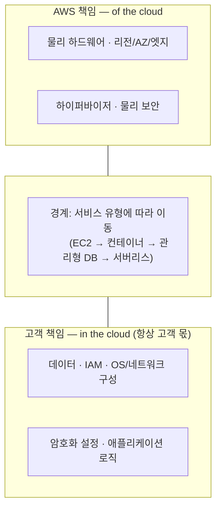

물리 보안과 컴플라이언스 인증은 AWS가 인기를 얻은 이유 중 하나로 자주 꼽힌다. 개별 기업이 자체 데이터센터에서 PCI DSS나 ISO 27001 인증을 처음부터 획득하려면 막대한 시간과 비용이 든다. AWS 인프라 위에 구축하면 인프라 계층의 인증은 상속받고, 고객은 자신의 책임 범위(애플리케이션·데이터·구성)에 대해서만 인증을 획득하면 된다. 다만 이는 "인증서를 상속받으니 아무것도 안 해도 된다"는 뜻이 아니라 **책임 범위가 좁아진다는 뜻**이며, 이를 혼동하면 감사 시점에 "우리 책임 범위의 통제 증적이 없다"는 문제에 부딪힌다.

### 28.2 서비스 유형별 책임 이동

공동 책임 모델을 실무에 적용하려면 "AWS 대 고객"이라는 이분법보다 **서비스 유형에 따라 경계가 어떻게 미끄러지는지**를 이해하는 편이 유용하다. IaaS(EC2)에서 컨테이너, 관리형 데이터베이스(RDS/Aurora), 서버리스(Lambda)로 갈수록 고객이 관리할 계층이 줄어든다. 하지만 어떤 유형을 쓰든 **데이터 자체, 접근 제어(IAM), 서비스 구성값**은 예외 없이 고객 책임으로 남는다. 이 원칙을 놓치는 것이 실제 사고의 근본 원인이다.

| 책임 항목 | EC2(IaaS) | 컨테이너(ECS/EKS) | RDS/관리형 DB | Lambda/서버리스 |
|---|---|---|---|---|
| OS 패치 | 고객 | 워커 노드 직접 운영 시 고객 | AWS | AWS |
| 런타임/미들웨어 | 고객 | 고객(이미지 내부) | AWS | AWS |
| 네트워크 구성(SG/서브넷) | 고객 | 고객 | 고객 | 고객(VPC 연결 시) |
| 암호화 설정 | 고객(EBS 활성화) | 고객 | 고객(저장 암호화 옵션) | 고객(환경 변수·전송) |
| IAM 접근 제어 | 고객 | 고객 | 고객 | 고객(실행 역할) |
| 데이터 분류·보호 | 고객 | 고객 | 고객 | 고객 |
| 애플리케이션 구성값 | 고객 | 고객 | 고객(파라미터 그룹) | 고객(환경 변수·동시성) |

**한 줄 결정 기준**: 서비스 유형을 고를 때 "관리 부담이 줄어드는 항목"과 "여전히 고객 책임으로 남는 항목"을 분리해서 보되, 뒤의 목록(데이터·IAM·구성)에 대한 검토는 서비스 유형과 무관하게 항상 동일한 강도로 수행한다.

이 표에서 가장 자주 오해되는 지점은 "관리형이니까 안전하다"는 비약이다. RDS는 OS와 엔진 패치를 AWS가 관리하지만, 퍼블릭 액세스 여부·보안 그룹 규칙·저장 암호화 활성화는 여전히 고객이 설정해야 한다. Lambda는 OS 패치라는 개념 자체가 사라지지만, 실행 역할에 과도한 권한을 부여하거나 환경 변수에 비밀값을 평문으로 넣는 실수는 고객이 만든다. 이 오해가 실제 사고로 이어진 대표 패턴 세 가지를 정리한다.

1. **S3 버킷 공개 설정**: 기본적으로 S3 버킷은 비공개이지만, 버킷 정책·ACL을 잘못 구성하거나 "퍼블릭 액세스 차단(Block Public Access)" 설정을 해제한 채 방치해 민감 데이터가 인터넷에 노출되는 사고가 반복 보고되어 왔다. 계정·버킷 수준의 퍼블릭 액세스 차단을 기본값으로 켜두고, 예외가 필요한 버킷만 명시적으로 검토하는 화이트리스트 방식이 안전하다.
2. **보안 그룹 0.0.0.0/0 개방**: SSH(22번), RDP(3389번), 데이터베이스 포트를 전 인터넷에 열어둔 채 운영하는 경우다. 관리 편의를 위해 임시로 열어두고 되돌리지 않는 패턴이 흔하다. 보안 그룹은 상태 유지(stateful) 방화벽으로 인바운드 규칙만 신경 쓰면 응답 트래픽은 자동 허용되므로 규칙이 단순해 보이지만, 그만큼 "열어두고 잊어버리는" 실수가 발생하기 쉽다. 관리 접근은 배스천 호스트나 Systems Manager Session Manager처럼 포트 개방 없이 접근하는 경로로 대체하는 것이 원칙이다.
3. **하드코딩된 자격증명**: 액세스 키를 소스 코드·컨테이너 이미지·공개 저장소에 그대로 커밋하는 사고다. 유출된 키는 자동화된 스캐너에 의해 수 분 내로 악용되는 사례가 보고된다. IAM 역할(EC2 인스턴스 프로파일, Lambda 실행 역할, IRSA)로 자격증명 자체를 코드에서 제거하고, 부득이한 장기 자격증명은 Secrets Manager로 관리하며 정기 교체를 자동화한다(→ 31.6절).

세 사례 모두 공통점이 있다. AWS가 제공한 기본값이나 안전장치를 고객이 스스로 해제하거나 우회해서 발생했다는 점이다. 공동 책임 모델을 제대로 이해한다는 것은 결국 "AWS가 무엇을 안전하게 만들어주는가"보다 "우리가 무엇을 잘못 설정할 수 있는가"를 아는 것에 가깝다.

### 28.3 위협 모델링 실습

공동 책임 모델이 "누가 책임지는가"를 정리한다면, 위협 모델링(threat modeling)은 "우리 책임 범위 안에서 무엇이 잘못될 수 있는가"를 체계적으로 찾아내는 절차다. 이를 생략하고 바로 보안 통제(암호화, WAF, IAM 정책)를 적용하면 정작 가장 취약한 지점을 놓치기 쉽다. 절차는 다음 5단계로 진행한다.

1. **범위 정의**: 어떤 시스템, 어떤 데이터 흐름을 모델링할지 경계를 정한다. 시스템 전체를 한 번에 다루려 하면 분석이 끝없이 넓어지므로, 하나의 아키텍처 단위(예: 하나의 마이크로서비스, 하나의 API)로 좁히는 것이 실용적이다.
2. **아키텍처 다이어그램에 신뢰 경계 그리기**: 데이터 흐름도 위에 **신뢰 경계(trust boundary)** — 서로 다른 권한 수준이나 소유자가 접하는 지점 — 를 선으로 표시한다. 인터넷과 로드밸런서 사이, 애플리케이션과 데이터베이스 사이, 서로 다른 IAM 역할이 접하는 지점이 전형적인 신뢰 경계다.
3. **STRIDE로 위협 도출**: 각 신뢰 경계를 넘는 데이터 흐름마다 STRIDE 여섯 범주를 하나씩 대입해 위협을 도출한다. **Spoofing(신원 위장), Tampering(데이터 변조), Repudiation(부인), Information Disclosure(정보 노출), Denial of Service(서비스 거부), Elevation of Privilege(권한 상승)**의 앞글자를 딴 프레임워크다.
4. **위험 평가**: 도출된 각 위협에 대해 **가능성(likelihood) × 영향(impact)**으로 우선순위를 매긴다. 발생 가능성이 낮고 영향도 작은 위협까지 모두 즉시 대응하려 하면 리소스가 분산되므로, 상위 위협부터 처리한다.
5. **완화 통제 매핑**: 우선순위가 높은 위협마다 구체적인 AWS 서비스·설정·아키텍처 변경으로 대응 방안을 매핑한다.

이 절차를 실제 아키텍처에 적용해본다. 대상은 "공개 웹 API + Lambda + DynamoDB + S3 업로드"로 구성된 서버리스 아키텍처다. 사용자가 API Gateway를 통해 요청을 보내면 Lambda가 처리하고, 메타데이터는 DynamoDB에, 파일은 S3에 저장한다.

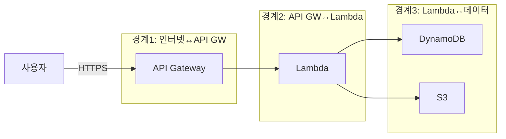

신뢰 경계는 세 개다. (1) 인터넷과 API Gateway 사이 — 익명의 사용자가 처음 시스템에 닿는 지점. (2) API Gateway와 Lambda 실행 환경 사이 — 인증·인가가 적용되어야 하는 지점. (3) Lambda와 데이터 저장소(DynamoDB, S3) 사이 — 실행 역할의 권한 범위가 결정되는 지점. 세 경계 각각에 STRIDE를 대입해 도출한 위협과 대응 통제를 표로 정리하면 다음과 같다(위협 모델 산출물의 표준 템플릿 형태).

| # | 신뢰 경계 | STRIDE 범주 | 위협 시나리오 | 가능성×영향 | AWS 완화 통제 |
|---|---|---|---|---|---|
| 1 | 인터넷↔API GW | Spoofing | 탈취된 API 키로 정상 사용자 위장 | 중×상 | IAM 인증 또는 Cognito 사용자 풀 + 짧은 토큰 수명 |
| 2 | 인터넷↔API GW | Tampering | 요청 페이로드 변조로 비정상 입력 주입 | 중×중 | API Gateway 요청 검증(모델 스키마) + WAF 규칙 |
| 3 | 인터넷↔API GW | Repudiation | 악의적 요청 후 "요청한 적 없다" 부인 | 저×중 | API Gateway 액세스 로그 + CloudTrail 데이터 이벤트 |
| 4 | 인터넷↔API GW | Information Disclosure | 상세 오류 메시지로 내부 구조 노출 | 중×중 | 게이트웨이 응답 매핑으로 오류 메시지 일반화 |
| 5 | 인터넷↔API GW | DoS | 대량 요청으로 백엔드 과부하 | 중×상 | API Gateway 스로틀링 + AWS Shield + WAF 요율 제한 |
| 6 | 인터넷↔API GW | Elevation of Privilege | 인가 우회로 관리자 엔드포인트 호출 | 저×상 | 리소스 정책 + 라우트별 인가자(authorizer) 강제 |
| 7 | API GW↔Lambda | Spoofing | 다른 함수가 이 함수의 실행 역할을 도용 | 저×상 | 함수별 전용 실행 역할, 역할 공유 금지 |
| 8 | API GW↔Lambda | Tampering | 환경 변수·배포 아티팩트 변조 | 저×상 | 코드 서명(Code Signing) + 배포 파이프라인 무결성 검증 |
| 9 | API GW↔Lambda | Information Disclosure | 로그에 개인정보·비밀값 평문 기록 | 중×상 | 로그 마스킹, Secrets Manager로 비밀값 분리 |
| 10 | Lambda↔DynamoDB/S3 | Tampering | 실행 역할 과다 권한으로 타 테이블까지 쓰기 | 중×상 | 최소 권한 IAM 정책(리소스 ARN 명시, → 29.9절) |
| 11 | Lambda↔DynamoDB/S3 | Information Disclosure | S3 객체 퍼블릭 접근으로 업로드 파일 유출 | 중×상 | 퍼블릭 액세스 차단 + 사전 서명 URL로만 접근 |
| 12 | Lambda↔DynamoDB/S3 | Elevation of Privilege | 실행 역할에 `iam:PassRole` 등 과도한 권한 포함 | 저×상 | 역할 정책에서 IAM 관리 액션 명시적 배제 |
| 13 | Lambda↔DynamoDB/S3 | DoS | 대용량 파일 업로드로 스토리지·비용 소진 | 중×중 | S3 업로드 크기 제한 + 버킷 수명 주기 정책 |

STRIDE 여섯 범주가 모든 신뢰 경계에 균등하게 적용되지는 않는다. 예를 들어 Lambda와 데이터 저장소 사이에서는 Spoofing보다 Tampering, Information Disclosure, Elevation of Privilege가 훨씬 현실적인 위협이다. 위협 모델링의 실무 가치는 "이 경계에서는 어떤 범주가 실제로 유효한가"를 구분해내는 데 있다.

이 작업을 수작업 문서로만 진행하면 팀 간 공유와 갱신이 어렵다. **threat-composer**(AWS가 공개한 오픈소스 위협 모델링 도구)는 신뢰 경계·데이터 흐름·STRIDE 위협·완화 통제를 구조화된 형식으로 입력받아 표준 양식의 위협 모델 문서를 생성해준다. 이런 도구를 쓰면 위협 모델이 일회성 워크숍 산출물이 아니라, 아키텍처가 바뀔 때마다(새 통합 지점 추가, 신뢰 경계 이동) 갱신되는 살아있는 문서로 유지된다.

### 28.4 보안 6영역 개괄

공동 책임 모델과 위협 모델링이라는 사고 프레임워크를 세웠다면, 이제 그 프레임워크를 실행에 옮길 AWS 서비스들을 영역별로 조망할 차례다. 원서(*AWS for Solutions Architects*)는 보안 서비스를 여섯 영역으로 분류한다 — **아이덴티티·액세스 관리, 탐지(Detection), 인프라 보호, 데이터 보호, 사고 대응, 컴플라이언스**. 이 여섯 영역은 6장에서 다룬 Well-Architected 프레임워크의 **보안 기둥(Security Pillar)**을 실행 가능한 서비스 단위로 세분화한 것이라고 이해하면 된다. 보안 기둥이 "무엇을 지향해야 하는가"라는 설계 원칙을 제시한다면, 이 여섯 영역은 "그 원칙을 어떤 서비스로 구현하는가"를 보여준다.

| 영역 | 목적 | 대표 서비스 | 상세 장 |
|---|---|---|---|
| 아이덴티티·액세스 관리 | "누가 무엇에 접근할 수 있는가"를 정의하고 통제 | IAM, IAM Identity Center, Organizations/SCP | 29장, 30장 |
| 탐지(Detection) | 비정상 행위·설정·취약점을 지속적으로 식별 | CloudTrail, Config, GuardDuty, Inspector, Security Hub, Detective | 32장 |
| 인프라 보호 | 네트워크·컴퓨트 경계에서 트래픽·공격을 차단 | 보안 그룹, NACL, WAF, Shield, Firewall Manager | 33장(애플리케이션 보안 관점), → 10~11장(네트워크 기초) |
| 데이터 보호 | 저장·전송·사용 중 데이터의 기밀성·무결성 확보 | KMS, CloudHSM, ACM, Secrets Manager, Macie | 31장 |
| 사고 대응 | 사고 발생 시 탐지→격리→분석→복구 절차 실행 | GuardDuty, Detective, Systems Manager 자동화, 포렌식 절차 | 32장 |
| 컴플라이언스 | 규제·표준 준수를 증명하고 감사에 대응 | AWS Artifact, Audit Manager, Config 규칙 | 34장 |

각 영역을 이 장에서 깊이 다루지 않는 이유는 명확하다. 이 장의 역할은 지도(map)를 그리는 것이지 각 지역을 답사하는 것이 아니다. 이 표는 29장부터 34장까지의 안내판 역할을 한다.

여섯 영역을 관통하는 공통 실천 방식으로 **보안 베이스라인 점검**을 짚어둔다. 신규 계정이나 워크로드를 배포할 때 최소한의 보안 기준선이 지켜지는지 확인하는 절차다. 아래는 AWS Config 규칙을 활용한 기준선 점검 목록의 예시다(실제 규칙명과 가용성은 리전·서비스 갱신에 따라 달라질 수 있으므로 콘솔 문서로 최신 목록을 확인한다).

```yaml
# config-baseline-rules.yaml
# 신규 계정/워크로드 배포 시 최소 점검 항목 — AWS Config 관리형 규칙 예시
baseline_checks:
  - rule: s3-bucket-public-read-prohibited
    설명: "S3 버킷 퍼블릭 읽기 노출 여부"
  - rule: s3-bucket-public-write-prohibited
    설명: "S3 버킷 퍼블릭 쓰기 노출 여부"
  - rule: restricted-ssh
    설명: "보안 그룹의 0.0.0.0/0 → 22번 포트 개방 여부"
  - rule: iam-user-no-policies-check
    설명: "IAM 사용자에 정책 직접 연결 여부(그룹/역할 경유 원칙)"
  - rule: root-account-mfa-enabled
    설명: "루트 계정 MFA 활성화 여부"
  - rule: encrypted-volumes
    설명: "EBS 볼륨 암호화 여부"
  - rule: rds-storage-encrypted
    설명: "RDS 저장 암호화 활성화 여부"
  - rule: cloudtrail-enabled
    설명: "CloudTrail 전 리전 활성화 여부"
```

이 목록은 CLI 점검 스크립트로도 보완할 수 있다. 아래 예시는 배포 직후 가장 자주 놓치는 세 가지(퍼블릭 S3, 개방된 SSH, 루트 MFA)를 빠르게 훑는 용도다.

```bash
#!/usr/bin/env bash
# quick-baseline-check.sh — 배포 직후 가장 흔한 3대 리스크를 빠르게 확인
set -euo pipefail

echo "1) 퍼블릭 액세스 차단이 꺼진 S3 버킷"
for bucket in $(aws s3api list-buckets --query 'Buckets[].Name' --output text); do
  status=$(aws s3api get-public-access-block --bucket "$bucket" \
    --query 'PublicAccessBlockConfiguration.BlockPublicAcls' --output text 2>/dev/null || echo "MISSING")
  [ "$status" != "True" ] && echo "  경고: $bucket 퍼블릭 액세스 차단 미설정"
done

echo "2) 0.0.0.0/0 에 22/3389 포트를 연 보안 그룹"
aws ec2 describe-security-groups \
  --filters Name=ip-permission.cidr,Values=0.0.0.0/0 \
  --query "SecurityGroups[?IpPermissions[?ToPort==\`22\` || ToPort==\`3389\`]].GroupId" \
  --output text

echo "3) 루트 계정 MFA 활성화 여부"
aws iam get-account-summary --query 'SummaryMap.AccountMFAEnabled' --output text
```

이런 스크립트는 정식 거버넌스 체계(Config 규칙, Control Tower 가드레일, → 30장)를 대체하지 않는다. 신규 배포 직후의 즉각적 확인용이며, 지속적 모니터링은 32장에서 다룰 자동화된 탐지 체계로 이관해야 한다.

### 28장 정리

#### [필수] 반드시 알아야 할 것
1. AWS는 클라우드 **자체(of the cloud)** — 하드웨어, 리전/AZ/엣지, 하이퍼바이저, 물리 보안 — 를, 고객은 클라우드 **안(in the cloud)** — 데이터, 플랫폼/애플리케이션/IAM, OS/네트워크/방화벽 구성, 암호화, 트래픽 보호 — 를 책임진다.
2. 관리형 서비스를 쓸수록 고객이 관리해야 하는 계층(OS 패치, 런타임)은 줄어들지만, **데이터·접근 제어(IAM)·구성값은 서비스 유형과 무관하게 항상 고객 책임**이다.
3. 위협 모델링은 범위 정의 → 신뢰 경계 표시 → STRIDE 위협 도출 → 가능성×영향 평가 → 완화 통제 매핑의 5단계로 진행하며, 아키텍처가 바뀔 때마다 반복해야 하는 절차다.
4. STRIDE는 Spoofing, Tampering, Repudiation, Information Disclosure, Denial of Service, Elevation of Privilege 여섯 범주로, 신뢰 경계를 넘는 모든 데이터 흐름에 각각 대입해 위협을 찾는다.
5. 보안 서비스는 아이덴티티·액세스 관리, 탐지, 인프라 보호, 데이터 보호, 사고 대응, 컴플라이언스의 여섯 영역으로 나뉘며, 이는 Well-Architected 보안 기둥을 실행 가능한 서비스 단위로 세분화한 것이다.

#### [팁] 실무 노하우
1. 위협 모델링은 아키텍처 다이어그램에 신뢰 경계선을 긋는 것에서 시작한다. 경계를 넘는 모든 화살표마다 인증·인가·암호화가 명시되어 있는지 확인한다.
2. threat-composer 같은 구조화된 도구를 쓰면 위협 모델이 일회성 산출물이 아니라 아키텍처 변경마다 갱신 가능한 살아있는 문서로 유지된다.
3. 신규 계정·워크로드 배포 직후에는 퍼블릭 S3, 개방된 관리 포트, 루트 MFA 같은 최소 기준선을 CLI나 Config 규칙으로 즉시 점검한다.
4. 인증서(SOC 2 등)는 인프라 계층의 책임 범위를 상속받는 것이지, 고객 책임 범위의 통제까지 자동으로 충족시키는 것이 아니다. 감사 시점에 자신의 책임 범위에 대한 증적을 별도로 준비해야 한다.
5. 관리 접근(SSH/RDP)은 포트 개방 대신 Systems Manager Session Manager 같은 경로로 대체해 신뢰 경계 자체를 줄이는 편이 근본적인 대응이다.

#### [주의] 사고·비용·설계 함정
1. "관리형이니까 안전하다"는 가정이 가장 흔한 함정이다. RDS는 엔진 패치를 AWS가 하지만 퍼블릭 액세스·보안 그룹·저장 암호화 설정은 고객 몫이다.
2. S3 버킷 공개, 보안 그룹 0.0.0.0/0 개방, 하드코딩된 자격증명은 세 가지 모두 AWS가 제공한 안전한 기본값을 고객이 스스로 해제하거나 우회해서 발생한다.
3. 위협 모델링을 설계 초기 한 번만 하고 이후 아키텍처 변경(새 통합 지점, 신뢰 경계 이동)에 맞춰 갱신하지 않으면 문서가 실제 시스템과 괴리된다.
4. 발생 가능성과 영향이 낮은 위협까지 모두 동시에 대응하려 하면 리소스가 분산된다. 위험 평가 단계에서 우선순위를 명확히 매겨야 한다.
5. 오류 메시지에 내부 구조(스택 트레이스, 테이블명)를 그대로 노출하는 것도 Information Disclosure 위협에 해당하며, 흔히 간과된다.
6. 함수/역할 간 실행 역할을 공유하면 하나의 취약점이 다른 워크로드로 권한 상승 경로가 된다. 리소스 단위로 역할을 분리해야 한다.

#### 한 장 요약
공동 책임 모델은 AWS와 고객의 책임을 "of the cloud"와 "in the cloud"로 나누며, 관리형 서비스로 갈수록 고객의 관리 부담은 줄어도 데이터·접근 제어·구성 책임은 사라지지 않는다. 위협 모델링은 신뢰 경계와 STRIDE를 이용해 이 책임 범위 안에서 실제로 무엇이 위험한지 구조적으로 찾아내는 절차이며, 위험 평가를 거쳐 구체적인 AWS 통제로 매핑된다. AWS 보안 서비스는 아이덴티티·액세스 관리, 탐지, 인프라 보호, 데이터 보호, 사고 대응, 컴플라이언스의 여섯 영역으로 조직되고, 이는 Well-Architected 보안 기둥을 실행 단위로 풀어낸 것이다.

#### 다음 장 예고
29장은 이 장에서 첫 번째 영역으로 소개한 아이덴티티·액세스 관리를 IAM 중심으로 깊이 파고든다. 정책 문서 구조, 정책 평가 로직, 역할 위임, ABAC, 그리고 최소 권한 정책을 실제로 만드는 절차까지 다룬다.

---

## 29장. IAM 심층  ★★★

> **이 장에서 다루는 것**
> 28장에서 세운 공동 책임 모델의 "in the cloud" 책임 중 가장 무거운 것이 IAM(Identity and Access Management)이다. AWS 침해 사고의 압도적 다수는 인프라 취약점이 아니라 잘못 설계된 권한 — 지나치게 넓은 정책, 유출된 장기 액세스 키, 검증되지 않은 크로스 계정 신뢰 — 에서 시작한다. 이 장은 정책 문서의 문법부터 평가 로직, 역할 위임, ABAC, 진단 도구, 최소 권한을 만드는 실제 절차까지를 다룬다.
> 계정을 어떻게 나누고 SCP를 어떻게 조직 전체에 배치하는가는 30장(멀티 계정 랜딩 존)의 몫이다. 이 장에서 SCP는 "정책 평가에 참여하는 정책 유형 중 하나"로만 다룬다. 암호화·키 관리는 31장, 탐지·사고 대응은 32장을 참조한다.
> 10장의 VPC, 24장 전후의 컴퓨트 지식이 있으면 역할과 인스턴스 프로파일 관계를 이해하기 쉽다.

### 29.1 사용자 · 그룹 · 역할 · 정책의 관계

IAM에서 실제로 "누가 요청했는가"에 해당하는 개체를 **프린시펄(principal)**이라 부른다. 프린시펄에는 다섯 종류가 있다.

- **IAM 사용자(IAM user)**: 사람 또는 애플리케이션에 발급하는 고정된 자격증명. 장기 액세스 키를 가질 수 있다.
- **IAM 역할(IAM role)**: 자격증명을 소유하지 않고 대신 **AssumeRole**을 통해 임시 자격증명(STS 토큰)을 발급받아 사용하는 신원. 특정 사용자에 종속되지 않는다.
- **서비스(AWS 서비스)**: Lambda, EC2 등 AWS 서비스 자체가 역할을 맡아(assume) 다른 리소스를 호출한다.
- **페더레이션 사용자(federated user)**: 외부 아이덴티티 제공자(IdP)에서 인증된 후 STS를 통해 임시 자격증명을 받는 신원. SAML, OIDC가 대표적이다.
- **다른 AWS 계정**: 크로스 계정 액세스에서 리소스 정책의 Principal로 계정 전체 또는 특정 역할을 지정할 수 있다.

여기서 반드시 짚어야 할 것은 **IAM 그룹(group)은 프린시펄이 아니라는 점**이다. 그룹은 사용자를 묶어 정책을 일괄 적용하는 관리 편의 장치일 뿐, 그 자체로 API를 호출하거나 역할을 수임할 수 없다. "그룹에 역할을 부여한다"는 개념은 존재하지 않는다 — 그룹에는 아이덴티티 기반 정책만 연결할 수 있고, 그 그룹의 구성원인 사용자가 정책의 효과를 상속받는 것뿐이다.

역할과 임시 자격증명의 관계가 IAM 심층 이해의 핵심이다. 사용자가 액세스 키라는 **영구적** 자격증명을 갖는 반면, 역할은 **AWS STS(Security Token Service)**를 통해 짧은 유효 기간(기본 1시간, 최대 12시간까지 확장 가능하나 역할 설정에 따라 다르므로 콘솔에서 확인)의 임시 자격증명 — 액세스 키, 시크릿 키, 세션 토큰 3종 조합 — 을 발급받는다. 이 토큰이 만료되면 재발급받아야 하므로, 유출되어도 피해 시간이 제한된다.

이로부터 이 장 전체를 관통하는 원칙이 나온다.

> **사람은 IAM Identity Center로, 워크로드는 역할로.**

사람에게는 IAM 사용자를 직접 만들지 않고 IAM Identity Center(구 AWS SSO, → 30.5절)를 통해 페더레이션된 임시 자격증명을 발급한다. EC2, Lambda, ECS 같은 워크로드에는 인스턴스 프로파일이나 실행 역할을 통해 임시 자격증명을 자동 로테이션시킨다. 이렇게 하면 장기 액세스 키가 코드나 설정 파일에 하드코딩될 여지 자체가 사라진다. IAM 사용자와 장기 액세스 키는 예외적인 경우(레거시 시스템의 프로그래밍 방식 접근 등)로만 남기고, 그 경우에도 정기 로테이션과 MFA를 강제해야 한다.

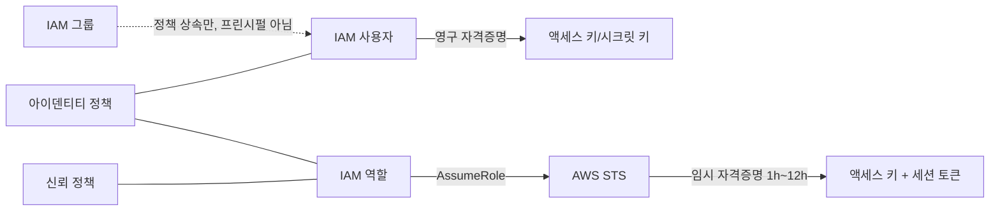

### 29.2 정책 문서 구조

IAM 정책은 JSON 문서이며 최상위에 `Version`과 `Statement`(문(statement)의 배열)를 가진다. `Version`은 정책 문법 버전으로 조건 변수 등 최신 기능을 쓰려면 `"2012-10-17"`을 고정해야 한다(구버전 `"2008-10-17"`은 신규 작성에 쓰지 않는다).

각 Statement의 핵심 요소는 다음과 같다.

| 요소 | 의미 |
|---|---|
| `Sid` | 문 식별자(선택, 사람이 읽기 위한 라벨) |
| `Effect` | `Allow` 또는 `Deny` |
| `Action` / `NotAction` | 대상 API 액션(`service:ActionName`). `NotAction`은 나열한 것을 **제외한 전부**에 적용되므로 의도치 않게 범위가 넓어지기 쉽다 |
| `Resource` / `NotResource` | 대상 리소스의 ARN. `NotResource`도 같은 이유로 신중히 사용 |
| `Principal` | **리소스 기반 정책에만** 등장 — 누가 이 리소스에 접근할 수 있는지 지정 |
| `Condition` | 추가 제약 조건 |

ARN(Amazon Resource Name)은 `arn:partition:service:region:account-id:resource` 형태를 따르며, 리소스 부분은 서비스마다 `resource-type/resource-id` 또는 `resource-type:resource-id`로 나뉜다. 와일드카드 `*`는 0개 이상의 문자와, `?`는 정확히 1개 문자와 일치한다.

```json
{
  "Version": "2012-10-17",
  "Statement": [
    {
      "Sid": "AllowReadOwnPrefix",
      "Effect": "Allow",
      "Action": ["s3:GetObject", "s3:ListBucket"],
      "Resource": [
        "arn:aws:s3:::my-app-bucket",
        "arn:aws:s3:::my-app-bucket/${aws:username}/*"
      ]
    }
  ]
}
```

`${aws:username}` 같은 **정책 변수**는 런타임에 요청자 속성으로 치환되어, 사용자별로 별도 정책을 만들지 않고도 "자기 폴더만 접근" 같은 규칙을 표현할 수 있다.

조건 연산자는 `Condition` 블록에서 `{연산자: {조건키: 값}}` 형태로 쓴다. 자주 쓰는 연산자는 다음과 같다.

| 연산자 | 용도 |
|---|---|
| `StringEquals` / `StringLike` | 문자열 정확 일치 / 와일드카드 포함 일치 |
| `ArnLike` / `ArnEquals` | ARN 패턴 매칭 |
| `IpAddress` / `NotIpAddress` | 발신 IP를 CIDR 범위와 비교 |
| `DateGreaterThan` / `DateLessThan` | 시각 비교(임시 접근 만료 등) |
| `Bool` | true/false 조건(MFA 존재 여부 등) |
| `Null` | 조건 키 자체의 존재/부재 확인 |

조건 키는 세 계층으로 나뉜다. **전역 조건 키**(`aws:` 접두사, 예: `aws:SourceIp`, `aws:MultiFactorAuthPresent`, `aws:PrincipalOrgID`)는 모든 서비스에서 쓸 수 있고, **서비스별 조건 키**(예: `s3:x-amz-server-side-encryption`)는 해당 서비스 요청에만 존재하며, **태그 기반 조건 키**(`aws:RequestTag/키`, `aws:ResourceTag/키`, `aws:PrincipalTag/키`)는 ABAC(→ 29.6절)의 기반이 된다.

### 29.3 정책 유형 6종

IAM 평가 로직에 참여하는 정책은 성격이 다른 6가지로 나뉜다. 이들을 구분하지 못하면 "왜 허용했는데 거부되는가"를 추적할 수 없다.

| 정책 유형 | 무엇에 붙는가 | Principal 요소 | 평가 시점 |
|---|---|---|---|
| 아이덴티티 기반 정책 | 사용자·그룹·역할 | 없음(붙는 대상이 곧 주체) | 항상 |
| 리소스 기반 정책 | S3 버킷, KMS 키, SQS 큐 등 리소스 자체 | 있음(누가 접근 가능한지 명시) | 리소스가 정책을 지원하는 경우 |
| 권한 경계(permissions boundary) | 사용자·역할(관리 경계로 첨부) | 없음 | 항상 — 실제 권한은 아이덴티티 정책과의 **교집합** |
| SCP(서비스 제어 정책) | AWS Organizations의 OU/계정 | 없음 | 조직에 가입된 모든 계정(→ 30장 상세) |
| 세션 정책 | AssumeRole 호출 시 전달 | 없음 | 그 세션 동안만, 역할 정책과의 교집합 |
| ACL(액세스 제어 목록) | S3 객체 등 일부 레거시 리소스 | 있음(간이 형태) | 최신 설계에서는 사용 지양 |

한 줄 결정 기준: **"이 신원이 무엇을 할 수 있는가"는 아이덴티티 기반 정책으로, "이 리소스에 누가 들어올 수 있는가"는 리소스 기반 정책으로, "이 신원의 상한선"은 권한 경계로 설계한다.** 권한 경계와 SCP, 세션 정책은 권한을 **부여하지 않고 상한만 설정**한다는 점이 아이덴티티 정책·리소스 정책과 근본적으로 다르다. ACL은 S3 초기부터 남아 있는 레거시 메커니즘으로, 버킷 정책으로 대체하는 것이 일반적이다.

### 29.4 정책 평가 로직

IAM 요청 하나가 허용되려면 관련된 모든 정책 유형을 통과해야 한다. AWS의 평가 순서는 다음과 같다.

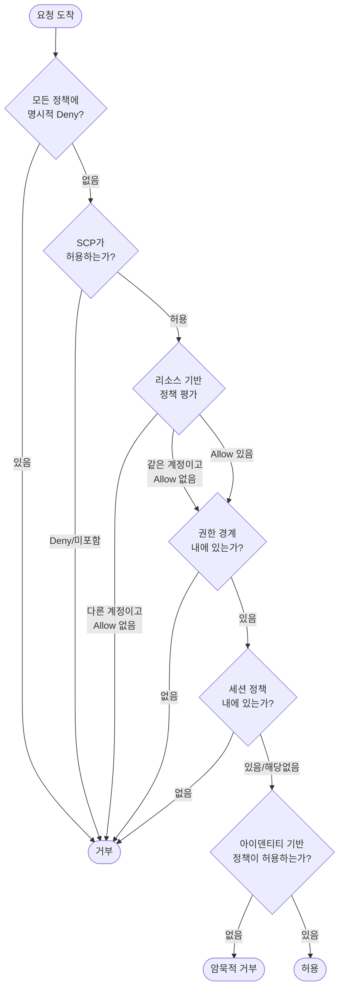

핵심은 **"명시적 Deny가 하나라도 있으면 다른 모든 Allow를 무시하고 즉시 거부"**, 그리고 **"어느 것도 명시적으로 허용하지 않으면 암묵적으로 거부"**라는 두 원칙이다. 즉 우선순위는 **명시적 Deny > 명시적 Allow > 암묵적 Deny** 순이다. SCP, 권한 경계, 세션 정책은 권한을 확장하지 못하고 오직 **교집합으로 축소**만 시킨다 — 아이덴티티 정책이 아무리 넓어도 권한 경계가 좁으면 그 좁은 범위로만 동작한다.

같은 계정 내 접근과 크로스 계정 접근은 평가 방식이 다르다. **같은 계정** 안에서는 아이덴티티 기반 정책 하나만 Allow해도 충분하다(리소스 정책이 없어도 동작). **다른 계정**에서 오는 요청은 반드시 **양쪽 모두** 허용해야 한다 — 호출하는 쪽의 아이덴티티 정책이 대상 리소스에 대한 접근을 허용하고, 동시에 대상 리소스의 리소스 기반 정책이 그 계정/역할을 Principal로 명시적으로 허용해야 한다. 이 "양쪽 다 허용" 요건이 크로스 계정 설계 실수의 가장 흔한 원인이다.

**시나리오 1 — 왜 거부되었는가: 아이덴티티 정책은 허용하는데 거부된다.**
사용자 아이덴티티 정책에 `s3:GetObject`를 허용했지만 계정이 속한 OU의 SCP가 S3 전체를 Deny하고 있는 경우다. SCP는 상한선이므로 아이덴티티 정책이 아무리 넓어도 뚫을 수 없다. 조직 관리자에게 SCP 예외를 확인해야 한다.

**시나리오 2 — 크로스 계정 역할인데 AccessDenied.**
계정 A의 사용자가 계정 B의 역할을 맡으려 하는데, 계정 B의 역할 신뢰 정책(리소스 기반 정책의 일종)에 계정 A를 Principal로 넣지 않은 경우다. 계정 A 쪽 아이덴티티 정책에 `sts:AssumeRole`을 허용해도, 계정 B의 신뢰 정책이 승낙하지 않으면 크로스 계정 요건의 절반만 충족된 것이라 거부된다.

**시나리오 3 — 권한 경계를 붙였더니 있던 권한이 사라졌다.**
역할에 `AdministratorAccess`에 준하는 아이덴티티 정책이 있는데, 권한 경계로 `s3:*`만 허용해두면 실제 유효 권한은 교집합인 S3 관련 작업으로 축소된다. "권한 경계를 추가했더니 원래 되던 EC2 작업이 안 된다"는 문의는 대부분 이 교집합 규칙을 놓친 경우다.

### 29.5 역할 위임과 신뢰 정책

역할을 다른 프린시펄이 사용하려면 **신뢰 정책(trust policy)** — 역할 자체에 붙는 리소스 기반 정책 — 이 "누가 이 역할을 맡을 수 있는가"를 명시해야 한다. 흐름은 다음과 같다.

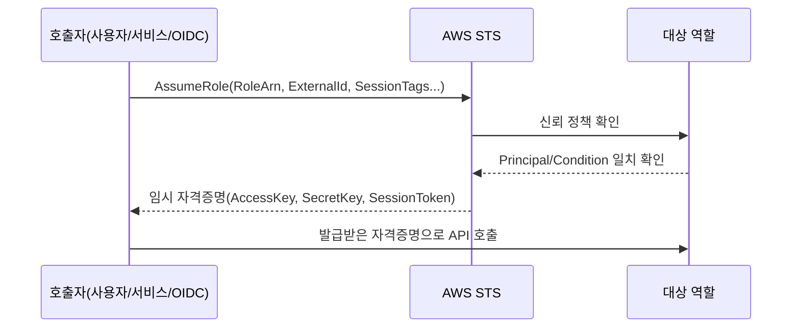

기본적인 신뢰 정책 예시는 다음과 같다.

```json
{
  "Version": "2012-10-17",
  "Statement": [
    {
      "Effect": "Allow",
      "Principal": { "AWS": "arn:aws:iam::111111111111:root" },
      "Action": "sts:AssumeRole",
      "Condition": {
        "StringEquals": { "sts:ExternalId": "acme-partner-4f9a2c" }
      }
    }
  ]
}
```

여기서 등장하는 **외부 ID(External ID)**는 크로스 계정 위임 시 반드시 챙겨야 할 값이다. 문제 상황은 이렇다 — 파트너 SaaS 업체(계정 B)가 여러 고객(계정 A들)의 리소스에 접근하는 역할을 하나 두고 있다고 하자. 고객 중 하나가 자기 역할 ARN을 실수로 다른 고객에게 노출하면, 그 다른 고객이 같은 역할을 맡아 원래 고객의 리소스에 접근할 수 있다 — 이것이 **혼동된 대리자(confused deputy) 문제**다. 외부 ID는 각 고객마다 다른 비밀값을 심어, 역할 ARN만으로는 AssumeRole이 성공하지 못하게 막는다.

같은 문제를 막는 조건 키가 더 있다.

- **`aws:SourceArn`**: 요청을 발생시킨 리소스의 ARN을 제한한다(예: 특정 S3 버킷의 이벤트 알림만 신뢰).
- **`aws:SourceAccount`**: 요청 소스 계정 ID를 제한한다.
- **`aws:PrincipalOrgID`**: 같은 AWS Organizations 소속 계정만 허용해, 조직 외부의 임의 계정이 역할을 맡지 못하게 한다.

역할 체이닝(role chaining, 역할 A로 위임받은 자격증명으로 다시 역할 B를 맡는 것)은 세션 시간이 최대 1시간으로 제한되는 등 추가 제약이 있으며, 남용하면 추적이 어려워지므로 체이닝 단계는 최소화하는 것이 좋다. `sts:TagSession` 권한을 부여하면 AssumeRole 시 세션 태그를 붙일 수 있어, ABAC(→ 29.6절)와 결합해 세션 단위로 세밀한 제어를 걸 수 있다.

키 없는 배포의 대표 사례가 **OIDC 페더레이션**이다. GitHub Actions 같은 CI에서 장기 액세스 키를 시크릿으로 저장하지 않고, GitHub의 OIDC 토큰 발급자를 IAM에 등록해 워크플로우 실행마다 임시 자격증명을 받는다.

```json
{
  "Version": "2012-10-17",
  "Statement": [
    {
      "Effect": "Allow",
      "Principal": {
        "Federated": "arn:aws:iam::123456789012:oidc-provider/token.actions.githubusercontent.com"
      },
      "Action": "sts:AssumeRoleWithWebIdentity",
      "Condition": {
        "StringEquals": {
          "token.actions.githubusercontent.com:aud": "sts.amazonaws.com"
        },
        "StringLike": {
          "token.actions.githubusercontent.com:sub": "repo:acme-org/web-app:ref:refs/heads/main"
        }
      }
    }
  ]
}
```

`sub` 조건으로 특정 저장소·브랜치에서 실행된 워크플로우만 역할을 맡을 수 있도록 좁힌다. 이 패턴을 쓰면 CI/CD 파이프라인에 액세스 키를 저장할 필요가 완전히 사라진다.

### 29.6 ABAC(태그 기반 접근 제어)

역할·팀·프로젝트가 늘어날수록 RBAC(역할 기반 접근 제어) 방식은 "팀마다 정책을 하나씩" 만들어야 해서 정책 수가 선형, 나아가 조합 폭으로 늘어난다. **ABAC(Attribute-Based Access Control, 속성 기반 접근 제어)**는 리소스와 프린시펄에 태그를 붙이고, 정책 하나로 "내 태그와 리소스 태그가 일치하면 허용"이라는 규칙만 표현해 이 문제를 근본적으로 피한다.

| 비교 항목 | RBAC | ABAC |
|---|---|---|
| 정책 수 | 팀/역할 수에 비례해 증가 | 태그 표준만 정하면 정책 1~2개로 커버 |
| 신규 팀 추가 시 | 새 정책·새 역할 작성 필요 | 태그만 부여하면 기존 정책이 자동 적용 |
| 선행 조건 | 역할 설계 | **조직 전체 태그 표준(키/값 규칙)** 확립 |
| 감사 난이도 | 정책 목록을 봐야 파악 | 태그 목록만 봐도 소유·범위 파악 가능 |
| 적합한 규모 | 팀 수가 적고 고정적 | 계정·팀·프로젝트가 계속 늘어나는 조직 |

한 줄 결정 기준: **태그 표준을 강제할 수 있는 조직이면 ABAC로 확장하고, 그렇지 않다면 RBAC로 시작해 태그 거버넌스를 먼저 갖춘다.**

다음은 `Team` 태그 하나로 여러 팀의 EC2 인스턴스 접근을 정책 하나로 커버하는 예시다.

```json
{
  "Version": "2012-10-17",
  "Statement": [
    {
      "Sid": "ABACStartStopOwnTeamInstances",
      "Effect": "Allow",
      "Action": ["ec2:StartInstances", "ec2:StopInstances"],
      "Resource": "arn:aws:ec2:ap-northeast-2:123456789012:instance/*",
      "Condition": {
        "StringEquals": {
          "aws:ResourceTag/Team": "${aws:PrincipalTag/Team}"
        }
      }
    }
  ]
}
```

이 정책은 정책 수정 없이 신규 팀에도 그대로 적용된다 — 각 사용자의 `PrincipalTag/Team`과 인스턴스의 `ResourceTag/Team`이 일치하는지만 런타임에 비교하기 때문이다. 단, 이 구조가 성립하려면 **태그 표준이 먼저 있어야 한다.** 태그 키 이름, 허용 값 목록, 필수 리소스 범위가 조직 차원에서 합의되지 않으면 ABAC 정책은 오히려 구멍이 된다.

여기서 반드시 짚어야 할 위험이 하나 있다 — **태그를 편집할 수 있는 권한 자체를 통제하지 않으면 ABAC는 무력화된다.** 사용자가 자기 `PrincipalTag`를 스스로 바꾸거나 리소스의 `ResourceTag`를 임의로 붙일 수 있다면, 태그를 조작해 접근 제어를 우회할 수 있다. 따라서 `iam:TagUser`, `ec2:CreateTags` 같은 태그 변경 액션에도 `aws:RequestTag`를 이용한 조건을 걸어, 허용된 태그 키/값 조합으로만 태그를 붙일 수 있게 제한해야 한다.

### 29.7 IAM Access Analyzer와 진단 도구

정책을 작성한 뒤에는 "실제로 무엇이 허용되는가"와 "정말 그만큼 필요한가"를 검증하는 도구가 필요하다.

**IAM Access Analyzer**는 다음 네 가지 기능을 제공한다.

- **외부 액세스 탐지(external access analyzer)**: 계정 신뢰 영역(zone of trust) 바깥의 프린시펄이 접근 가능한 리소스(S3 버킷, KMS 키, IAM 역할 등)를 찾아낸다.
- **미사용 액세스 분석(unused access analyzer)**: 일정 기간 사용되지 않은 권한과 역할, 사용하지 않는 액세스 키를 찾아낸다.
- **정책 생성기(policy generation)**: CloudTrail 로그를 기반으로 실제 호출된 액션만 담은 최소 권한 정책 초안을 자동 생성한다.
- **정책 검증(policy validation)**: 작성 중인 정책의 문법 오류, 지나치게 관대한 패턴, 보안 모범 사례 위반을 정책 저장 전에 경고한다.

**Access Advisor(마지막 액세스 정보)**는 IAM 콘솔에서 사용자·역할·정책별로 "이 서비스를 마지막으로 언제 사용했는가"를 서비스 단위로 보여준다. 몇 달째 접근 이력이 없는 서비스 권한은 제거 후보다.

**IAM 정책 시뮬레이터**는 실제 API를 호출하지 않고 "이 정책 조합에서 이 액션이 허용되는가"를 미리 평가해볼 수 있는 도구다. 정책 변경 전 영향도를 확인하는 데 쓴다.

**CloudTrail 기반 실사용 액션 수집**은 정책 생성기의 기반이기도 하지만, 직접 Athena나 CloudTrail Lake로 로그를 조회해 "지난 90일간 이 역할이 실제로 호출한 액션 목록"을 뽑아 정책과 대조하는 수동 절차로도 쓸 수 있다(→ CloudTrail 상세는 32장).

**Credential Report(자격증명 보고서)**는 계정의 모든 IAM 사용자에 대해 비밀번호 마지막 사용일, 액세스 키 나이, MFA 활성화 여부를 CSV로 내려받게 해준다. 정기적으로 이 보고서를 확인해 오래된 키·미사용 계정을 정리하는 것이 계정 위생의 기본이다.

| 도구 | 답하는 질문 |
|---|---|
| Access Analyzer(외부 액세스) | 우리 계정 밖에서 누가 들어올 수 있나? |
| Access Analyzer(미사용 액세스) | 안 쓰는 권한이 남아 있나? |
| Access Advisor | 이 역할이 이 서비스를 언제 마지막으로 썼나? |
| 정책 시뮬레이터 | 이 정책 변경이 어떤 영향을 주나? |
| CloudTrail | 실제로 어떤 액션이 호출됐나? |
| Credential Report | 어떤 자격증명이 오래되거나 MFA가 없나? |

한 줄 결정 기준: **정책을 만들기 전엔 정책 생성기·CloudTrail로 실사용을 수집하고, 만든 후엔 Access Analyzer와 Access Advisor로 주기적으로 재검증한다.**

### 29.8 서비스 연결 역할과 서비스 주체

AWS 서비스가 사용자를 대신해 다른 리소스에 접근해야 하는 경우가 많다. 이때 그 서비스 자체가 프린시펄이 되는데, 이를 **서비스 주체(service principal)**라 하며 신뢰 정책의 Principal에 `"Service": "lambda.amazonaws.com"` 같은 형태로 등장한다.

**서비스 연결 역할(Service-Linked Role, SLR)**은 AWS 서비스가 미리 정의해둔 특수한 역할로, 해당 서비스만 맡을 수 있고 권한 범위도 AWS가 사전에 고정해둔다. 예를 들어 Auto Scaling이나 Elastic Load Balancing 같은 서비스는 자신의 SLR을 통해서만 필요한 리소스를 조작하며, 사용자가 이 역할의 정책을 임의로 넓히거나 삭제 조건을 마음대로 바꿀 수 없다. 이는 "서비스가 필요한 최소한의 권한만, AWS가 관리하는 형태로" 미리 정해둔 것이라 이해하면 된다.

이와 대비되는 것이 사용자가 직접 만드는 **서비스 역할(service role)**이다. Lambda 실행 역할, ECS 태스크 역할이 대표적으로, 신뢰 정책의 Principal은 서비스이지만 권한 정책(무엇을 할 수 있는가)은 사용자가 직접 설계한다. SLR과 달리 정책 범위는 전적으로 작성자 책임이다.

| 구분 | 서비스 연결 역할(SLR) | 서비스 역할 |
|---|---|---|
| 권한 정책 | AWS가 사전 정의, 사용자가 수정 불가 | 사용자가 직접 작성 |
| 삭제 | 서비스 의존성이 남아 있으면 제한 | 사용자가 자유롭게 삭제 |
| 용도 예시 | Auto Scaling, ELB 등 서비스 내부 동작 | Lambda 실행 역할, ECS 태스크 역할 |

EC2에서 역할을 쓰려면 역할을 직접 인스턴스에 붙일 수 없고 **인스턴스 프로파일(instance profile)**이라는 컨테이너를 거쳐야 한다. 콘솔에서는 이 과정이 자동으로 숨겨지지만, CLI/IaC로 다룰 때는 역할과 인스턴스 프로파일을 별개 리소스로 생성하고 연결해야 한다는 점을 알아야 한다.

`iam:PassRole` 권한은 특히 주의가 필요하다. 이는 "사용자가 특정 역할을 다른 AWS 서비스에게 넘겨줄 수 있는가"를 통제하는 권한이다 — 예를 들어 EC2 인스턴스를 시작할 때 "이 역할을 이 인스턴스에 붙이라"고 지시하는 행위 자체가 PassRole 권한을 요구한다. 이 권한을 넓게 주면 사용자가 자신보다 강한 권한을 가진 역할을 임의의 리소스에 붙여 사실상 권한을 상승시킬 수 있으므로, PassRole은 항상 특정 역할 ARN으로 좁혀야 한다(→ 29.9절 권한 상승 경로).

### 29.9 최소 권한 정책을 실제로 만드는 절차

최소 권한(least privilege)은 처음부터 완성된 형태로 작성할 수 없다. 실무에서 통하는 절차는 다음 5단계 루프다.

1. **넓게 시작한다(개발 환경 한정)**: 신규 워크로드는 기능 구현이 우선이므로 개발/스테이징 환경에서는 다소 넓은 정책으로 시작해 기능을 완성한다. 이 단계를 상용 환경에 그대로 승격시키지 않는 것이 핵심이다.
2. **CloudTrail/Access Analyzer로 실사용을 수집한다**: 일정 기간(예: 2~4주) 운영하며 실제로 호출된 액션 목록을 모은다.
3. **정책 생성기로 초안을 만든다**: 수집된 액션만 담은 정책 초안을 IAM Access Analyzer 정책 생성기로 뽑아낸다.
4. **권한 경계로 상한을 고정한다**: 초안 정책을 그대로 신뢰하지 않고, 조직이 허용하는 최대 범위를 권한 경계로 별도 설정해 아이덴티티 정책이 아무리 느슨해져도 이 상한을 넘지 못하게 한다.
5. **정기적으로 미사용 권한을 제거한다**: Access Advisor와 미사용 액세스 분석으로 몇 달째 호출되지 않는 액션·역할을 찾아 주기적으로 축소한다.

```json
{
  "Version": "2012-10-17",
  "Statement": [
    {
      "Sid": "MinimalS3AppAccess",
      "Effect": "Allow",
      "Action": ["s3:GetObject", "s3:PutObject"],
      "Resource": "arn:aws:s3:::app-artifacts-prod/uploads/*",
      "Condition": {
        "StringEquals": { "s3:x-amz-server-side-encryption": "aws:kms" }
      }
    }
  ]
}
```

이 루프에서 특히 4단계가 중요한 이유는 **권한 상승 경로(privilege escalation path)**를 막기 위해서다. 다음 액션들은 정상 업무에도 쓰이지만, 조합하면 자신의 권한을 스스로 확장하는 수단이 된다.

- **`iam:PassRole`**: 자신보다 강한 권한의 역할을 리소스에 붙여 그 역할로 행동한다.
- **`iam:CreatePolicyVersion`**: 기존 관리형 정책에 새 버전을 만들어 사실상 정책 내용을 원하는 대로 바꾼다.
- **`iam:AttachRolePolicy`** / **`iam:AttachUserPolicy`**: 자신이나 다른 신원에 강한 관리형 정책을 붙인다.
- **`sts:AssumeRole`**: 신뢰 정책이 허술한 강한 역할을 발견해 그대로 맡는다.
- **`lambda:UpdateFunctionCode`**: 강한 실행 역할이 붙은 함수의 코드를 자신이 원하는 코드로 바꿔치기해 그 역할의 권한으로 실행시킨다.
- **`cloudformation:CreateStack`**(강한 역할을 `RoleArn`으로 지정할 수 있는 경우): 스택 배포 과정에서 임의 리소스를 그 역할 권한으로 생성한다.

이런 액션들을 아이덴티티 정책만으로 막으려 하면 각 케이스를 일일이 예외 처리해야 해 누락이 생기기 쉽다. **권한 경계**로 "이 역할이 절대 넘을 수 없는 상한"을 별도로 고정해두면, 개별 정책이 실수로 넓어지더라도 상한이 방어선 역할을 한다.

마지막으로 이 장 전체에서 반복해서 강조한 세 가지를 다시 정리한다. `Action: "*"` 또는 `Resource: "*"`가 들어간 정책은 "당장은 편하지만 사고를 기다리는 상태"이며 상용 환경에 두어서는 안 된다. 관리형 정책 `AdministratorAccess`는 긴급 대응용 별도 역할 이외에는 상용 워크로드에 상시로 붙이지 않는다. 콘솔에 로그인하는 모든 사람 계정은 MFA를 필수로 강제해야 하며, 다음 정책 조각처럼 MFA가 없는 세션에서는 민감 작업을 차단할 수 있다.

```json
{
  "Version": "2012-10-17",
  "Statement": [
    {
      "Sid": "DenyWithoutMFA",
      "Effect": "Deny",
      "NotAction": ["iam:ListUsers", "iam:GetAccountSummary"],
      "Resource": "*",
      "Condition": {
        "BoolIfExists": { "aws:MultiFactorAuthPresent": "false" }
      }
    }
  ]
}
```

그리고 프로그래밍 방식 접근이 필요하면 장기 액세스 키 발급보다 역할 기반 임시 자격증명(EC2 인스턴스 프로파일, Lambda 실행 역할, OIDC 페더레이션)을 우선 검토한다.

### 29장 정리

#### [필수] 반드시 알아야 할 것
1. 프린시펄은 IAM 사용자·역할·서비스·페더레이션 사용자·다른 AWS 계정 5종이며, **그룹은 프린시펄이 아니라 정책 묶음**이다.
2. 정책 평가 우선순위는 **명시적 Deny > 명시적 Allow > 암묵적 Deny**다. SCP·리소스 정책·권한 경계·세션 정책 중 어느 하나라도 막으면 거부된다.
3. 크로스 계정 접근은 **호출자의 아이덴티티 정책과 대상 리소스의 리소스 기반 정책 양쪽 모두**가 허용해야 성립한다.
4. 권한 경계·SCP·세션 정책은 권한을 부여하지 않고 **아이덴티티 정책과의 교집합으로 상한만 설정**한다.
5. 사람은 IAM Identity Center로, 워크로드는 역할로 접근해야 하며 **장기 액세스 키는 원칙적으로 만들지 않는다.**
6. 크로스 계정 역할에는 외부 ID와 `aws:SourceArn`/`aws:SourceAccount`/`aws:PrincipalOrgID` 조건을 걸어 혼동된 대리자 문제를 막는다.
7. ABAC는 태그 표준이 선행되어야 성립하며, 태그 편집 권한 자체를 통제하지 않으면 무력화된다.

#### [팁] 실무 노하우
1. 최소 권한은 처음부터 만들 수 없다. **① 넓게 시작 → ② CloudTrail/Access Analyzer로 실사용 수집 → ③ 정책 생성기로 초안 → ④ 권한 경계로 상한 고정 → ⑤ 정기 미사용 권한 제거** 루프를 반복한다.
2. ABAC는 계정·팀이 늘어날 때 정책 수를 폭발시키지 않는 유일한 확장 전략이다. 신규 팀 추가 시 정책을 새로 쓰지 않아도 된다.
3. GitHub Actions 등 CI에서는 OIDC 페더레이션으로 키 없이 배포하고, `sub` 조건으로 저장소·브랜치를 좁힌다.
4. 정책 시뮬레이터로 변경 전 영향도를 먼저 확인하고, Access Advisor로 사용 이력 없는 서비스 권한을 주기적으로 제거한다.
5. `iam:PassRole`은 항상 특정 역할 ARN으로 좁혀 붙인다 — 넓게 주면 그 자체가 권한 상승 경로가 된다.

#### [주의] 사고·비용·설계 함정
1. `Action: "*"` 또는 `Resource: "*"`가 들어간 정책은 사고 대기 상태다. 상용 환경에 남겨두지 않는다.
2. 관리형 정책 `AdministratorAccess`를 상용 워크로드에 상시로 붙이지 않는다.
3. MFA 없는 콘솔 사용자는 피싱 한 번으로 계정 전체를 잃을 수 있다. 사람 계정은 MFA를 필수로 강제한다.
4. `iam:PassRole`, `iam:CreatePolicyVersion`, `iam:AttachRolePolicy`, `sts:AssumeRole`, `lambda:UpdateFunctionCode` 같은 권한은 권한 상승 경로다. 권한 경계로 반드시 제한한다.
5. 권한 경계를 뒤늦게 추가하면 기존에 되던 작업이 갑자기 안 되는 경우가 생긴다 — 교집합 규칙 때문이며, 경계 설계 시 실제 필요 범위를 먼저 확인해야 한다.
6. 크로스 계정 역할 ARN이 유출되면 외부 ID 없이는 누구든 AssumeRole을 시도할 수 있다. 외부 ID는 파트너별로 다른 값을 써야 한다.
7. `NotAction`/`NotResource`는 나열한 것을 제외한 전부에 적용되므로, 의도보다 훨씬 넓은 권한을 허용하기 쉽다.

#### 한 장 요약
IAM은 프린시펄(사용자·역할·서비스·페더레이션·계정)과 6종 정책 유형(아이덴티티·리소스·권한 경계·SCP·세션·ACL)이 "명시적 Deny > Allow > 암묵적 Deny" 순서로 평가되며 성립한다. 크로스 계정 접근은 양쪽 정책이 모두 허용해야 하고, 역할 위임은 외부 ID와 소스 조건으로 혼동된 대리자를 막아야 안전하다. ABAC는 태그 표준을 전제로 정책 수 폭발을 막는 확장 전략이며, Access Analyzer·Access Advisor·정책 시뮬레이터·CloudTrail·Credential Report는 최소 권한을 실제로 만들고 검증하는 도구다. 최소 권한은 한 번에 완성되지 않고 넓게 시작해 실사용을 수집하며 좁혀가는 반복 절차로만 도달할 수 있다.

#### 다음 장 예고
30장은 이 장의 원칙을 조직 전체로 확장한다. AWS Organizations의 OU 설계와 SCP 운영, Control Tower 가드레일, 계정 분리 전략, IAM Identity Center의 권한 세트 설계를 다룬다.

---

## 30장. 멀티 계정 랜딩 존  ★★★

> **이 장에서 다루는 것**
> 계정 하나로 시작한 조직이 왜 결국 여러 AWS 계정으로 쪼개지는지, 그리고 그 여러 계정을 어떻게 하나의 일관된 거버넌스 체계로 묶는지를 다룬다. AWS Organizations의 OU·SCP 설계, Control Tower가 자동화해 주는 랜딩 존 구성 요소, 조직 규모별 계정 분리 전략, IAM Identity Center를 통한 임직원 접근 관리, 중앙 로깅·보안 계정 패턴, 리소스 공유(RAM), 그리고 이 모든 것을 코드로 표준화하는 방법까지 이어진다. 29장에서 다룬 IAM 정책·역할 지식을 전제로, 그 지식을 "계정이 하나가 아니라 수십 개일 때" 어떻게 확장하는지가 이 장의 핵심 질문이다.

### 30.1 왜 계정을 나누는가

AWS를 처음 도입할 때는 계정 하나로 시작하는 것이 자연스럽다. 문제는 조직이 커지면서 나타난다. 개발팀 실수로 만든 리소스가 운영 환경의 서비스 한도를 잠식하고, 한 팀의 침해 사고가 전체 조직으로 번지고, 어느 비용이 어느 팀·프로젝트 것인지 구분할 수 없게 된다. 계정을 나누는 이유는 크게 네 가지로 정리된다.

**보안 격리(폭발 반경, blast radius)**. AWS 계정은 IAM, 네트워크(VPC), 리소스 네임스페이스가 완전히 분리된 가장 강력한 격리 경계다. 계정 안의 IAM 정책이 아무리 정교해도 실수 하나(과도한 권한을 가진 역할, 공개된 액세스 키)가 전체 환경에 영향을 줄 수 있는 반면, 계정 경계를 넘으려면 명시적인 신뢰 관계(역할 위임, RAM 공유)가 있어야 한다. 개발 환경에서 발생한 사고가 운영 환경 데이터에 접근하지 못하게 하려면, VPC 서브넷 분리나 IAM 정책만으로는 부족하고 계정을 분리해야 한다.

**서비스 한도(할당량) 분리**. 리전별 서비스 할당량(예: VPC당 EIP 개수, 계정당 Lambda 동시 실행 수)은 기본적으로 계정 단위로 적용된다. 한 팀의 배치 작업이 폭주해 Lambda 동시 실행 한도를 소진하면 같은 계정의 다른 서비스 요청도 조절(throttle)될 수 있다. 계정을 나누면 이런 "이웃 소란(noisy neighbor)" 문제가 계정 경계에서 차단된다.

**청구·비용 귀속**. 계정은 AWS Cost Explorer, Cost and Usage Report(CUR)에서 가장 신뢰할 수 있는 비용 분리 단위다. 태그 기반 비용 배분도 가능하지만, 태그 누락·오기 위험이 있는 반면 계정 경계는 강제적이다. 팀별·프로젝트별로 계정을 나누면 청구서 자체가 조직 구조를 반영한다.

**조직·규정 경계**. 특정 규제(예: 금융 데이터, 개인정보)를 받는 워크로드를 별도 계정에 격리하면 감사 범위(audit scope)를 그 계정으로 한정할 수 있다. 인수합병으로 편입된 사업부, 자회사, 외부 파트너와의 협업 환경도 별도 계정으로 관리하는 것이 일반적이다.

**단일 계정 다중 환경의 실패 사례**. 개발·스테이징·운영을 한 계정 안에서 VPC나 태그로만 구분하는 조직에서 흔히 발생하는 문제는 다음과 같다. 개발자에게 부여한 광범위한 IAM 권한이 실수로 운영 리소스에 적용되는 경우, 서비스 할당량 초과로 개발 환경의 부하가 운영 API 호출을 조절 대상으로 만드는 경우, 그리고 무엇보다 IAM 정책만으로 "이 사람은 개발 리소스만 볼 수 있고 운영은 절대 볼 수 없다"를 완벽하게 강제하기가 실무적으로 매우 어렵다는 점이다. 정책 하나를 잘못 작성하면 전체가 노출된다. 계정 분리는 이런 실수의 파급 범위를 원천적으로 계정 경계 안으로 가둔다.

실제로 자주 나타나는 구체적인 장애 시나리오를 하나 들면, 개발 환경에서 부하 테스트 스크립트가 실수로 무한 루프에 빠져 EC2 인스턴스를 계속 생성하는 경우다. 단일 계정이라면 이 스크립트가 계정 전체의 vCPU 할당량을 소진해 운영 환경의 오토 스케일링까지 막을 수 있다. 계정이 분리되어 있다면 피해는 개발 계정 한도 안에서 끝난다. 태그나 리소스 이름 규칙만으로 이런 격리를 흉내 낼 수는 있지만, 그것은 "사람이 실수하지 않기를 바라는" 통제이지 AWS 플랫폼이 구조적으로 강제하는 통제가 아니다. 멀티 계정 전략은 바로 이 차이 — 정책적 권고와 아키텍처적 강제 — 를 계정 경계로 옮겨 해결한다.

### 30.2 AWS Organizations: OU 설계, SCP, 통합 결제

**AWS Organizations**는 여러 AWS 계정을 하나의 조직으로 묶어 중앙에서 관리하는 서비스다. 조직에는 관리 계정(management account, 과거 명칭 마스터 계정) 하나와 여러 멤버 계정(member account)이 있다. 관리 계정은 조직을 생성하고, 새 계정을 만들거나 초대하고, 조직 정책(SCP, 태그 정책 등)을 적용하는 유일한 주체다. **관리 계정 자체는 SCP의 영향을 받지 않는다** — SCP는 멤버 계정에만 적용된다. 이 때문에 관리 계정에는 실제 워크로드를 올리지 않고 조직 관리 전용으로만 쓰는 것이 표준 관행이다.

**조직 단위(OU, Organizational Unit)**는 계정을 계층 구조로 묶는 폴더 개념이다. OU 트리를 어떻게 설계하느냐가 SCP 적용 범위와 거버넌스 복잡도를 결정한다. 권장되는 기본 구조는 다음과 같다.

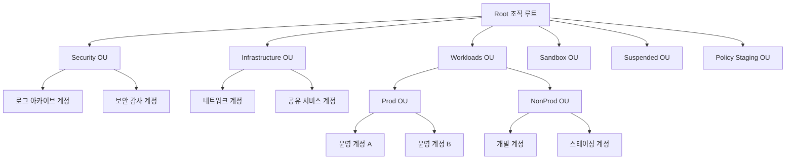

- **Security OU**: 로그 아카이브 계정, 보안 감사(Audit) 계정처럼 조직 전체 보안 기능을 담당하는 계정. 가장 강한 SCP를 적용해 일반 사용자의 리소스 생성을 원천 차단한다.
- **Infrastructure OU**: 네트워크(전송 게이트웨이, Direct Connect 종단), 공유 서비스(공용 AD, CI/CD 도구) 계정.
- **Workloads OU**: 실제 애플리케이션이 도는 계정. 하위에 Prod/NonProd로 나눠 운영과 비운영에 다른 SCP·가드레일 강도를 적용한다.
- **Sandbox OU**: 개인·팀 실험용 계정. 가장 느슨하지만 비용 상한과 리전 제한 SCP는 유지한다.
- **Suspended OU**: 폐쇄 예정이거나 정지된 계정을 격리해두는 곳. 여기 배치된 계정에는 모든 API 호출을 차단하는 강한 Deny SCP를 적용해 사고 대응 시 즉시 격리 용도로도 쓴다.
- **Policy Staging OU**: 새 SCP나 정책을 프로덕션에 적용하기 전에 실제 계정(그러나 영향이 적은 테스트 계정)에서 먼저 검증하는 용도. 뒤에서 강조하듯 SCP 검증은 반드시 이런 격리된 OU에서 먼저 해야 한다.

**서비스 제어 정책(SCP, Service Control Policy)**의 가장 중요한 성질은 **권한을 부여하지 않고 제한만 한다**는 점이다. SCP는 IAM 정책과 별개의 계층으로, 계정 내 IAM 사용자·역할이 "가질 수 있는 권한의 최대 범위(permission guardrail)"를 정의한다. 어떤 계정에 `s3:*`를 허용하는 SCP를 걸어도, 그 계정 안의 IAM 정책이 S3 접근을 허용하지 않으면 여전히 아무것도 할 수 없다. 반대로 SCP가 특정 액션을 Deny하면, 계정 내 IAM 정책이 `Allow *`를 부여하더라도 그 액션은 절대 실행되지 않는다. 즉 최종 권한은 "SCP가 허용하는 범위 ∩ IAM 정책이 허용하는 범위"의 교집합이다.

SCP는 OU 계층을 따라 **상속**된다. 루트에 적용한 SCP는 모든 하위 OU와 계정에 적용되고, 하위 OU의 SCP는 그 상위 SCP에 추가로 겹쳐 적용된다(합집합이 아니라 각 계층의 Allow/Deny를 모두 통과해야 하는 교집합 방식). 평가 시 어느 한 계층에서라도 명시적 Deny가 있으면 그 액션은 차단된다. 기본 정책(`FullAWSAccess`)이 모든 OU에 붙어 있어, SCP를 추가한다는 것은 보통 "기본 허용에 예외적 Deny를 추가"하는 형태로 이루어진다.

```bash
# OU 구조 생성 CLI 예시 — 루트 아래 최상위 OU들을 생성한다
ROOT_ID=$(aws organizations list-roots --query 'Roots[0].Id' --output text)

aws organizations create-organizational-unit \
  --parent-id "$ROOT_ID" \
  --name "Security"

aws organizations create-organizational-unit \
  --parent-id "$ROOT_ID" \
  --name "Workloads"

# Workloads 아래에 Prod/NonProd 하위 OU 생성 (parent-id는 위에서 생성된 Workloads OU ID로 교체)
aws organizations create-organizational-unit \
  --parent-id "ou-root-workloadsid" \
  --name "Prod"

aws organizations create-organizational-unit \
  --parent-id "ou-root-workloadsid" \
  --name "NonProd"
```

**SCP 예시 1 — 허용 리전 제한**. `aws:RequestedRegion` 조건 키로 조직이 사용하지 않는 리전을 통째로 차단해, 잘못된 리전에서 리소스가 생기는 것을 막고 동시에 예상치 못한 비용 발생도 억제한다.

```json
{
  "Version": "2012-10-17",
  "Statement": [
    {
      "Sid": "DenyOutsideApprovedRegions",
      "Effect": "Deny",
      "NotAction": [
        "iam:*",
        "organizations:*",
        "route53:*",
        "cloudfront:*",
        "support:*",
        "budgets:*",
        "waf:*"
      ],
      "Resource": "*",
      "Condition": {
        "StringNotEquals": {
          "aws:RequestedRegion": ["ap-northeast-2", "us-east-1"]
        }
      }
    }
  ]
}
```
글로벌 서비스(IAM, Route 53, CloudFront 등)는 리전 조건과 무관하게 동작하므로 `NotAction`으로 제외한다. 이 예외 목록은 조직이 실제로 쓰는 글로벌 서비스에 맞춰 조정해야 한다.

**SCP 예시 2 — 루트 사용자 사용 차단**. 멤버 계정의 루트 사용자 자격 증명 사용을 원천 차단해, 루트 계정 탈취나 오남용 위험을 줄인다.

```json
{
  "Version": "2012-10-17",
  "Statement": [
    {
      "Sid": "DenyRootUserActions",
      "Effect": "Deny",
      "Action": "*",
      "Resource": "*",
      "Condition": {
        "StringLike": {
          "aws:PrincipalArn": ["arn:aws:iam::*:root"]
        }
      }
    }
  ]
}
```

**SCP 예시 3 — 보안 서비스 비활성화 방지**. GuardDuty, Security Hub, CloudTrail, Config 같은 탐지 서비스를 멤버 계정 사용자가 임의로 끄지 못하게 막는다. 사고 발생 시 공격자가 로그를 지우거나 탐지를 끄는 시나리오를 차단하는 목적이다.

```json
{
  "Version": "2012-10-17",
  "Statement": [
    {
      "Sid": "DenyDisablingSecurityServices",
      "Effect": "Deny",
      "Action": [
        "cloudtrail:StopLogging",
        "cloudtrail:DeleteTrail",
        "guardduty:DeleteDetector",
        "guardduty:DisassociateFromMasterAccount",
        "config:StopConfigurationRecorder",
        "config:DeleteConfigurationRecorder",
        "config:DeleteDeliveryChannel",
        "securityhub:DisableSecurityHub"
      ],
      "Resource": "*",
      "Condition": {
        "StringNotEquals": {
          "aws:PrincipalArn": "arn:aws:iam::123456789012:role/SecurityAdminRole"
        }
      }
    }
  ]
}
```
예외 조건(`SecurityAdminRole`)을 두지 않으면 보안팀조차 정당한 유지보수 작업(트레일 교체 등)을 할 수 없게 되므로, 반드시 통제된 예외 경로를 함께 설계한다.

**통합 결제(Consolidated Billing)**는 Organizations의 기본 기능으로, 모든 멤버 계정의 청구가 관리 계정으로 합산된다. 이렇게 하면 Savings Plans·예약 인스턴스 할인, 볼륨 기반 할인 구간(S3 요금제 등)이 조직 전체 사용량을 기준으로 공유되어 개별 계정으로 흩어졌을 때보다 유리한 단가를 받을 수 있다. 각 계정은 여전히 개별 청구서(계정별 사용량 내역)를 볼 수 있어 비용 귀속은 그대로 유지된다.

Organizations는 SCP 외에도 여러 정책 유형을 지원한다. **태그 정책(Tag Policy)**은 특정 태그 키의 허용 값·대소문자 표기를 강제해 조직 전체 태그 일관성을 확보한다(30.9절에서 자세히 다룬다). **백업 정책(Backup Policy)**은 AWS Backup 계획을 조직 차원에서 여러 계정에 일괄 적용한다. **AI 서비스 옵트아웃 정책(AI services opt-out policy)**은 Amazon Q, Bedrock 등 일부 AI/ML 서비스가 고객 콘텐츠를 서비스 개선에 사용하지 않도록 조직 차원에서 옵트아웃을 강제하는 데 쓰인다. 이런 정책들은 SCP와 달리 "권한"이 아니라 "설정값·행동 방식"을 통제한다는 점에서 성격이 다르다.

### 30.3 AWS Control Tower와 가드레일

**AWS Control Tower**는 Organizations, IAM Identity Center, Config, CloudTrail 등 여러 서비스를 조합해 모범 사례를 따르는 랜딩 존(landing zone)을 자동으로 구성해주는 관리형 서비스다. 랜딩 존이란 여러 계정으로 구성된 안전하고 규정을 준수하는 멀티 계정 환경의 초기 기반을 뜻한다. Control Tower를 활성화하면 다음 구성 요소가 자동으로 만들어진다.

- **관리 계정**과 별도로 전용 **로그 아카이브 계정**, **보안 감사(Audit) 계정**이 생성된다.
- 조직 전체 CloudTrail 트레일과 Config 레코더가 로그 아카이브 계정의 S3 버킷으로 집중된다.
- 사전 정의된 **가드레일(guardrail)**이 기본 OU에 적용된다.
- **Account Factory**를 통해 표준화된 신규 계정을 자동으로 프로비저닝할 수 있다.

**가드레일**은 세 가지 유형으로 나뉜다.

| 유형 | 동작 방식 | 예시 |
|---|---|---|
| 예방적(Preventive) | SCP 기반으로 특정 행동 자체를 차단 | 로그 아카이브 버킷 삭제 금지 |
| 탐지적(Detective) | Config 규칙 기반으로 위반 상태를 지속 점검·보고 | 퍼블릭 S3 버킷 존재 여부 탐지 |
| 사전 예방적(Proactive) | CloudFormation 훅 기반으로 리소스 생성 전에 규정 위반을 차단 | 태그 없는 리소스 배포 차단 |

가드레일은 강제성에 따라 **필수(Mandatory)**, **강력 권장(Strongly recommended)**, **선택(Elective)**으로 구분된다. 필수 가드레일은 비활성화할 수 없으며 랜딩 존의 최소 보안 기준을 담보한다(예: 로그 아카이브 계정의 CloudTrail 로그 무결성 보호). 강력 권장 가드레일은 대부분의 조직에 적용하도록 권장되지만 특수한 사정이 있으면 끌 수 있다(예: 루트 사용자 콘솔 로그인 차단). 선택 가드레일은 조직의 필요에 따라 자유롭게 켜고 끈다(예: 특정 인스턴스 유형 제한).

**Account Factory**는 Control Tower 콘솔이나 Service Catalog 제품을 통해 표준 태그, OU 배치, 네트워크 기본값(VPC CIDR 등)이 적용된 새 계정을 몇 분 안에 만들어준다. 대규모 조직에서는 **Account Factory for Terraform(AFT)**을 사용해 계정 생성 자체를 Terraform 코드로 관리하며 파이프라인을 통해 커스터마이징(초기 IAM 역할, 네트워킹, 태그 등)을 자동 적용하기도 한다.

Control Tower가 만든 랜딩 존에 조직이 직접 SCP나 리소스를 추가하면 Control Tower의 기준 설정과 실제 상태가 어긋날 수 있는데, 이를 **드리프트(drift)**라고 부른다. Control Tower는 드리프트를 감지해 콘솔에 표시하며, 관리자는 드리프트를 해소(원래 설정으로 되돌리거나 랜딩 존 설정을 갱신)해야 한다.

**언제 직접 구축(custom landing zone)이 필요한가**. Control Tower는 대부분의 조직에 적합하지만, 다음과 같은 경우 자체 구축을 고려한다.

- 이미 성숙한 Organizations/SCP 체계가 있고 Control Tower의 정형화된 구조와 충돌하는 기존 계정 구조를 재설계하기 어려운 경우.
- Control Tower가 지원하지 않는 리전이나 매우 특수한 규제 요건(예: 정부 클라우드, 특정 파티션)을 다뤄야 하는 경우.
- 극도로 세밀한 커스텀 자동화(계정 생성 시점의 복잡한 조건부 로직)가 필요해 AFT로도 표현하기 어려운 경우.

일반적으로는 Control Tower로 시작해 랜딩 존·가드레일·계정 팩토리를 몇 시간 내에 구성하고, 필요한 지점만 커스터마이징하는 것이 처음부터 직접 구축하는 것보다 초기 구축 비용과 유지보수 부담이 훨씬 낮다.

Control Tower는 새 리전이 추가되거나 조직에 계정이 유입될 때마다 가드레일 적용 범위를 자동으로 넓혀주지만, 그렇다고 모든 커스터마이징을 포기해야 하는 것은 아니다. Customizations for AWS Control Tower(CfCT) 같은 확장 도구를 함께 쓰면 Control Tower가 관리하는 기본 골격은 유지하면서 계정별 추가 스택(예: 특정 팀 전용 IAM 역할, 조직 표준 VPC 엔드포인트)을 코드로 얹을 수 있다. 드리프트 감지는 이런 커스터마이징이 Control Tower의 관리 대상 리소스 자체를 직접 건드리지 않는 한 발생하지 않으므로, "Control Tower가 만든 리소스는 건드리지 않고 그 옆에 추가로 배포한다"는 원칙을 지키는 것이 실무에서 드리프트를 최소화하는 요령이다.

### 30.4 계정 분리 전략 비교

계정을 어떤 기준으로 나눌지는 조직 구조와 워크로드 특성에 따라 달라진다. 대표적인 네 가지 전략을 비교한다.

| 전략 | 설명 | 장점 | 단점 |
|---|---|---|---|
| 환경별 | Dev/Staging/Prod 계정을 팀·프로젝트마다 반복 | 환경 간 격리가 명확, 배포 파이프라인 설계가 단순 | 팀이 많으면 계정 수가 팀×환경 수로 급증 |
| 팀별 | 팀(또는 사업부)마다 계정 하나(또는 환경별 세트) | 비용·권한 귀속이 조직도와 일치, 팀 자율성 확보 | 팀 간 워크로드 특성이 다르면 공통 표준 적용이 번거로움 |
| 워크로드별 | 애플리케이션·서비스 단위로 계정 분리 | 워크로드별 한도·장애 격리가 최대화 | 계정 수가 가장 많아져 관리 오버헤드가 큼 |
| 혼합 | 핵심 워크로드는 워크로드별, 나머지는 팀별·환경별 혼용 | 실무에서 가장 흔하고 유연 | 일관된 규칙 수립이 어려워 거버넌스 설계에 신경 써야 함 |

**한 줄 결정 기준**: 규제·격리 요건이 강한 핵심 워크로드는 워크로드별로, 그 외 일반 애플리케이션은 팀별 계정 안에서 환경별(Dev/Stage/Prod)로 나누는 혼합 전략이 대부분 조직에 실용적이다.

어느 전략을 택하든 "계정을 나누는 기준을 나중에 다시 바꾸기는 매우 어렵다"는 점을 고려해야 한다. 계정 경계는 VPC, IAM 역할, 데이터 저장소가 모두 그 경계를 기준으로 만들어지므로, 팀별로 나눴던 계정을 워크로드별로 재편하려면 사실상 리소스를 새 계정으로 재구축하는 수준의 작업이 된다. 따라서 초기 설계 단계에서 조직의 성장 방향(팀이 늘어날 것인가, 워크로드 종류가 늘어날 것인가)을 미리 가늠해 분리 기준을 정하고, OU 구조 자체는 계정 분리 기준이 바뀌더라도 유연하게 재배치할 수 있도록 처음부터 여유를 두고 설계하는 것이 바람직하다.

조직 규모별 권장안은 다음과 같다.

| 조직 규모 | 권장 계정 수 | 핵심 특징 |
|---|---|---|
| 5명 내외(스타트업) | 4~6개 | 최소 구성(아래) 중심, Control Tower로 자동화, 팀 분리는 아직 불필요 |
| 50명(성장기) | 15~30개 | 팀별 Prod/NonProd 분리 시작, 전용 네트워크·공유서비스 계정 도입 |
| 500명(대규모 조직) | 수백 개 | 워크로드별 세분화, AFT 기반 계정 팩토리 필수, 전담 클라우드 플랫폼팀 운영 |

계정 규모와 무관하게 반드시 있어야 할 **최소 구성**은 다음 여섯 계정(또는 역할)이다.

- **관리(Management)**: Organizations 루트, 결제 통합. 워크로드를 올리지 않는다.
- **로그 아카이브(Log Archive)**: 조직 트레일·Config 이력의 최종 저장소.
- **보안 감사(Security/Audit)**: GuardDuty·Security Hub 위임 관리자, 읽기 전용 감사 역할의 근거지.
- **공유 서비스(Shared Services)**: CI/CD 도구, 사내 아티팩트 저장소, 공용 AD 등.
- **네트워크(Network)**: 전송 게이트웨이, Direct Connect/VPN 종단, 중앙 네트워크 관리.
- **운영(Prod) / 개발(Dev)**: 실제 워크로드가 도는 계정. 최소 구성에서는 이 둘만 있어도 되고, 조직이 커지면 팀·워크로드별로 세분화한다.

이 최소 6종 구성은 5명 규모에서도 Control Tower 하나로 손쉽게 시작할 수 있으며, 이후 조직이 커지면 Workloads OU 아래 계정을 추가해나가는 방식으로 자연스럽게 확장된다.

기존에 계정 하나로 운영해오던 조직이 멀티 계정으로 전환할 때는 한 번에 모든 워크로드를 이전하려 하지 말고, 먼저 로그 아카이브·보안 감사 계정처럼 새로 만들어도 기존 워크로드에 영향을 주지 않는 계정부터 구성한 뒤, 신규 프로젝트를 새 계정에서 시작하고, 기존 워크로드는 다운타임을 감내할 수 있는 일정에 맞춰 순차적으로 이전하는 점진적 접근이 안전하다. 계정 이전(마이그레이션) 자체는 리소스를 새 계정으로 옮기는 것이 아니라 대부분 재생성(re-provisioning)에 가까우므로, IaC로 인프라를 코드화해두지 않은 상태에서의 전환은 예상보다 훨씬 큰 공수가 든다.

### 30.5 IAM Identity Center와 권한 세트

**AWS IAM Identity Center**(과거 AWS SSO)는 여러 AWS 계정에 대한 임직원 접근을 중앙에서 관리하는 서비스로, Organizations와 함께 쓸 때 진가를 발휘한다. 29장에서 다룬 IAM은 "한 계정 안에서 어떤 주체가 어떤 리소스에 접근할 수 있는가"를 다루는 반면, Identity Center는 "조직 전체의 여러 계정에 걸쳐 사람(임직원)이 어떻게 로그인하고 어느 계정에 어떤 역할로 들어갈 것인가"를 다룬다. 즉 Identity Center는 IAM 위에 놓인 **다중 계정 접근 관리 계층**이며, 실제 권한의 세부 내용(어떤 API를 허용할지)은 여전히 IAM 정책 언어로 표현된다.

**아이덴티티 소스**는 세 가지 중 하나를 선택한다.

| 아이덴티티 소스 | 설명 | 적합한 상황 |
|---|---|---|
| Identity Center 디렉터리(내장) | Identity Center 자체 사용자 저장소 | 별도 디렉터리가 없는 소규모 조직 |
| AWS Directory Service(AD) 연동 | Managed Microsoft AD와 연동 | 이미 AWS 내에 AD를 운영 중인 조직 |
| 외부 IdP 연동(SAML 2.0 + SCIM) | Okta, Azure AD/Entra ID, Ping 등 외부 IdP를 SAML로 페더레이션하고 SCIM으로 사용자·그룹을 자동 동기화 | 이미 사내 IdP가 있는 대부분의 중견·대규모 조직 |

외부 IdP 연동이 실무에서 가장 흔한 선택이다. 사용자는 SAML을 통해 싱글 사인온하고, SCIM 프로토콜이 IdP의 사용자·그룹 변경사항(입사·퇴사·조직 변경)을 Identity Center로 자동 반영해 수동 계정 관리 부담을 없앤다.

**권한 세트(Permission Set)**는 Identity Center에서 계정에 할당하는 권한 묶음으로, 내부적으로는 각 대상 계정에 IAM 역할을 생성하고 그 역할에 정책을 연결하는 방식으로 동작한다. 권한 세트는 다음 요소로 구성된다.

- **AWS 관리형 정책(managed policy)**: `ReadOnlyAccess`, `PowerUserAccess` 등 기존 정책을 그대로 연결.
- **인라인 정책(inline policy)**: 권한 세트 전용으로 작성하는 커스텀 JSON 정책.
- **권한 경계(permissions boundary)**: 이 권한 세트로 생성된 역할이 위임할 수 있는 권한의 상한을 지정(29장의 권한 경계 개념과 동일).
- **세션 기간(session duration)**: 1시간~12시간 범위에서 자격 증명 유효 시간을 설정. 짧을수록 안전하지만 재인증 빈도가 늘어난다.

권한 세트를 만든 뒤 **계정 할당(account assignment)**으로 "어느 그룹/사용자가 어느 계정에서 어느 권한 세트를 쓰는지"를 매핑한다. 예를 들어 "네트워크 엔지니어 그룹 → 네트워크 계정 → NetworkAdmin 권한 세트"처럼 조합한다.

```yaml
# CloudFormation으로 권한 세트를 정의하는 예시
# (SSOInstanceArn은 조직의 Identity Center 인스턴스 ARN으로 교체)
Resources:
  ReadOnlyPermissionSet:
    Type: AWS::SSO::PermissionSet
    Properties:
      InstanceArn: arn:aws:sso:::instance/ssoins-1234567890abcdef
      Name: OrgReadOnlyAccess
      Description: 조직 전체 계정에 대한 읽기 전용 감사 권한
      SessionDuration: PT4H  # 4시간 세션 — 감사 작업에 충분하고 장기 노출은 제한
      ManagedPolicies:
        - arn:aws:iam::aws:policy/ReadOnlyAccess
      InlinePolicy: |
        {
          "Version": "2012-10-17",
          "Statement": [
            {
              "Effect": "Deny",
              "Action": ["s3:GetObject"],
              "Resource": "arn:aws:s3:::*-sensitive-data/*"
            }
          ]
        }

  AuditAssignment:
    Type: AWS::SSO::Assignment
    Properties:
      InstanceArn: arn:aws:sso:::instance/ssoins-1234567890abcdef
      PermissionSetArn: !GetAtt ReadOnlyPermissionSet.PermissionSetArn
      PrincipalId: g-0123456789abcdef  # 감사팀 그룹 ID (Identity Center 디렉터리 기준)
      PrincipalType: GROUP
      TargetId: "123456789012"          # 대상 계정 ID
      TargetType: AWS_ACCOUNT
```

개발자의 CLI/SDK 접근은 `aws configure sso` 명령으로 Identity Center와 연동한다.

```bash
# 최초 1회 설정 — Identity Center 시작 URL과 리전을 등록
aws configure sso --profile org-dev
# 이후 인증이 만료되면 브라우저 재인증만 필요
aws sso login --profile org-dev
aws s3 ls --profile org-dev
```

또한 **액세스 포털(access portal)**은 사용자가 브라우저에서 로그인해 자신에게 할당된 모든 계정·권한 세트 목록을 한 화면에서 보고 콘솔로 바로 전환하거나 임시 자격 증명을 복사할 수 있는 웹 UI다.

**29장 IAM과의 역할 분담**을 명확히 하면, IAM은 "각 계정 안에서 역할·정책이 무엇을 허용하는가"를 정의하는 근본 레이어이고, Identity Center는 그 위에서 "사람을 어느 계정, 어느 역할로 로그인시킬 것인가"를 조직 전체 단위로 관리하는 레이어다. 서비스 대 서비스 접근(예: Lambda가 DynamoDB에 접근)에는 여전히 IAM 역할과 신뢰 정책을 직접 사용하며, Identity Center는 사람(임직원)의 콘솔·CLI 접근에 특화되어 있다.

### 30.6 Directory Service, Cognito와의 역할 구분

세 서비스 모두 "아이덴티티"를 다루지만 대상과 용도가 뚜렷이 다르다. 혼동하기 쉬운 지점이라 표로 정리한다.

| 서비스 | 주 대상 | 전형적 용도 |
|---|---|---|
| AWS Directory Service | 임직원, 기존 AD 인프라 | 사내 AD 자원(파일 서버, 레거시 앱)과의 연동, Windows 워크로드 인증 |
| IAM Identity Center | 임직원 | AWS 콘솔·CLI에 대한 다중 계정 SSO 접근 |
| Amazon Cognito | 최종 고객(애플리케이션 사용자) | 모바일·웹 앱의 회원가입·로그인, 소셜 로그인 연동 |

**AWS Directory Service**는 세 가지 형태를 제공한다. **AWS Managed Microsoft AD**는 완전관리형 실제 Microsoft AD로, 기존 온프레미스 AD와 신뢰 관계(trust)를 맺어 하이브리드 환경에서 단일 아이덴티티를 유지할 때 쓴다. **AD Connector**는 디렉터리를 저장하지 않고 온프레미스 AD로 인증 요청을 그대로 중계하는 프록시로, 기존 AD를 그대로 활용하면서 AWS 서비스(WorkSpaces 등)와 연동할 때 적합하다. **Simple AD**는 Samba 기반의 경량 독립형 디렉터리로, AD 호환 기능이 제한적이며 소규모 환경이나 기본적인 디렉터리 기능만 필요한 경우에 쓴다.

Identity Center는 앞 절에서 다뤘듯 임직원의 AWS 계정 접근을 다룬다. Directory Service 위에 Identity Center를 얹어(AD를 아이덴티티 소스로 연동) 임직원이 기존 AD 자격 증명으로 AWS 콘솔에도 로그인하게 만드는 조합이 흔하다.

세 가지 Directory Service 형태 중 어느 것을 고를지는 "AD 기능이 얼마나 필요한가"와 "어디에 진짜 디렉터리를 둘 것인가"로 결정한다. 온프레미스 AD를 계속 진실 원천(source of truth)으로 유지하면서 AWS 서비스만 그 AD를 바라보게 하려면 AD Connector가 적합하고, AWS 안에 독립적인(그러나 온프레미스와 신뢰 관계를 맺을 수 있는) 실제 AD 도메인을 새로 두려면 Managed Microsoft AD를, 그룹 정책이나 도메인 트러스트 같은 고급 AD 기능 없이 기본적인 사용자·그룹 인증만 필요하면 Simple AD를 선택한다.

**Amazon Cognito**는 성격이 완전히 다르다. 임직원이 아니라 회사가 만든 애플리케이션을 쓰는 **최종 고객**을 위한 인증·인가 서비스로, 사용자 풀(User Pool, 회원 데이터베이스와 로그인 흐름)과 자격 증명 풀(Identity Pool, AWS 리소스에 대한 임시 자격 증명 발급)로 구성된다. 소셜 로그인(구글, 페이스북 등) 연동, MFA, 사용자 정의 인증 흐름을 지원한다. Cognito를 "직원용 SSO"로 오해하고 Identity Center 대신 쓰려 하거나, 반대로 고객 대상 앱 로그인에 Identity Center를 쓰려는 시도는 둘 다 잘못된 방향이다. Cognito의 상세한 동작 방식과 OAuth 2.0/OIDC 흐름은 → 33장에서 다룬다.

### 30.7 중앙 로깅·보안 계정 패턴

멀티 계정 환경에서 보안팀이 가장 먼저 해결해야 할 문제는 "모든 계정의 로그와 보안 시그널을 어디서, 어떻게 한 곳에서 볼 것인가"이다. 표준 패턴은 다음과 같다.

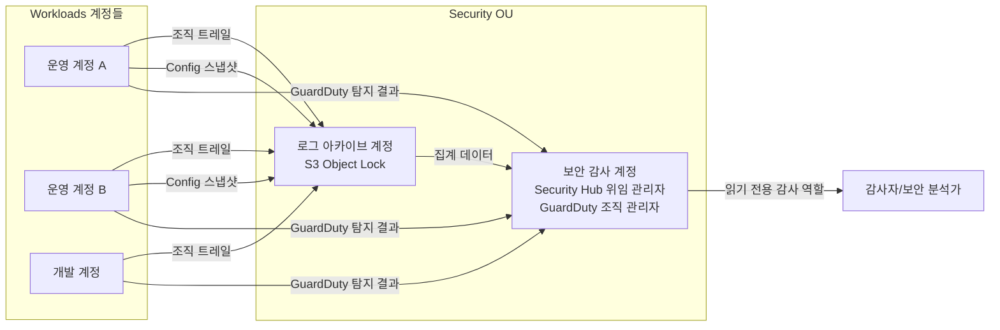

**조직 트레일(organization trail)**은 관리 계정에서 한 번 생성하면 조직의 모든 멤버 계정에 자동으로 적용되는 CloudTrail 트레일이다. 각 계정에서 발생하는 API 호출 로그가 개별 설정 없이 지정된 S3 버킷(보통 로그 아카이브 계정 소유)으로 모인다. 멤버 계정 관리자는 이 조직 트레일을 자신의 계정에서 끄거나 수정할 수 없다.

**로그 아카이브 계정 S3**는 두 가지 방어 장치를 반드시 갖춰야 한다. 첫째, **S3 Object Lock**(WORM, write-once-read-many)으로 일정 보관 기간 동안 로그 객체의 삭제·수정을 원천적으로 막아, 침해 사고 발생 시 공격자가 증거를 인멸하지 못하게 한다. 둘째, 버킷 정책으로 **계정 간 접근을 원천 차단**하고 로그를 쓰는 서비스(CloudTrail, Config)의 서비스 주체와 조직 ID 조건만 허용해, 워크로드 계정에서 이 버킷에 직접 접근할 수 없도록 한다.

**Config 집계자(aggregator)**는 여러 계정·리전의 AWS Config 데이터를 한 계정에서 조회할 수 있게 모아주는 기능으로, 보안 감사 계정에 두어 조직 전체의 리소스 구성 준수 상태를 한 화면에서 파악한다. **Security Hub 위임 관리자(delegated administrator)**로 지정된 보안 감사 계정은 조직 전체 멤버 계정의 Security Hub 조사 결과를 한 곳에서 집계해 볼 수 있다. **GuardDuty**도 조직 차원에서 활성화하면 관리 계정(또는 위임된 GuardDuty 관리자 계정)이 신규 멤버 계정에 자동으로 탐지를 확장 적용하도록 구성할 수 있다.

마지막으로 보안·감사 담당자에게는 각 워크로드 계정에 **읽기 전용 감사 역할**(예: `SecurityAuditRole`)을 미리 배포해두어, 사고 조사 시 신속하게 교차 계정으로 역할을 전환(assume)해 리소스를 조회할 수 있게 한다. 이 역할은 쓰기 권한 없이 `ReadOnlyAccess`나 그보다 좁힌 커스텀 정책만 부여하며, 신뢰 정책에서 보안 감사 계정만 위임 대상으로 지정한다.

이 감사 역할의 신뢰 정책은 보안 감사 계정의 특정 역할(또는 IAM Identity Center가 만든 권한 세트 역할)만 `sts:AssumeRole`을 호출할 수 있도록 `Principal`을 정확히 한정해야 한다. `Principal`을 계정 전체(`arn:aws:iam::123456789012:root`)로 느슨하게 지정하면 그 계정 안의 어떤 IAM 주체든 역할을 전환할 수 있게 되어, 감사 목적으로 만든 역할이 뜻하지 않게 넓은 범위의 접근 경로가 되어버린다. 외부 감사 기관이나 컨설턴트에게 임시로 접근을 열어줘야 할 때도 같은 원칙으로, 만료 시점이 있는 별도 역할을 발급하고 감사가 끝나면 즉시 제거하는 것이 안전하다.

### 30.8 Resource Access Manager

**AWS Resource Access Manager(RAM)**는 한 계정이 소유한 특정 리소스를 다른 계정(또는 조직 전체·특정 OU)과 안전하게 공유하는 서비스다. 계정마다 동일한 리소스를 중복 생성하는 대신, 중앙에서 관리하는 하나의 리소스를 여러 계정이 함께 쓰게 해 운영 부담과 비용을 줄인다.

RAM으로 공유할 수 있는 대표적인 리소스는 다음과 같다.

- **서브넷(subnet)**: 중앙 네트워크 계정이 소유한 VPC의 서브넷을 워크로드 계정과 공유하는 **공유 VPC(shared VPC)** 모델의 핵심.
- **전송 게이트웨이(Transit Gateway)**: 여러 계정의 VPC를 중앙 TGW에 연결.
- **Route 53 Resolver 규칙**: 온프레미스 DNS 연동 규칙을 여러 계정에서 공유.
- **라이선스(License Manager 관리 라이선스)**: 소프트웨어 라이선스 풀을 여러 계정이 공유해 사용.
- **AWS Private CA**: 프라이빗 인증기관을 여러 계정에서 공유해 인증서 발급 체계를 통일.

**공유 VPC 모델**에서는 네트워크 계정(소유자, owner)이 VPC와 서브넷을 만들고 RAM으로 워크로드 계정(참가자, participant)에 서브넷을 공유한다. 참가자 계정은 공유받은 서브넷 안에 자신의 EC2, RDS 같은 리소스를 만들 수 있지만, 서브넷 자체의 라우팅 테이블·NACL·VPC 피어링 설정 같은 네트워크 구성은 소유자 계정만 변경할 수 있다. 이 **책임 분리**로 네트워크팀이 IP 주소 체계와 라우팅을 중앙에서 일관되게 통제하면서, 각 워크로드 팀은 자신의 계정 안에서 애플리케이션 리소스를 독립적으로 운영할 수 있다.

공유 시 제약도 분명하다. 참가자 계정은 공유받은 서브넷을 삭제하거나 CIDR을 변경할 수 없고, 보안 그룹은 참가자 자신의 계정에서 만들 수 있지만 그 보안 그룹을 다른 참가자 계정과 다시 공유하지는 못한다(소유자만 재공유 가능 여부를 설정). 또한 일부 리소스 유형은 조직 내 계정끼리만 공유 가능하고 조직 외부 계정과의 공유는 제한되거나 별도 승인 절차가 필요할 수 있으므로, 공유 대상 리소스별 제약은 사용 전 문서로 확인하는 것이 안전하다.

RAM으로 리소스를 공유하는 방식은 두 가지다. 같은 Organizations 조직 안의 계정끼리는 관리 계정이나 위임된 관리자가 승인 절차 없이 즉시 공유를 활성화할 수 있는 반면, 조직에 속하지 않은 외부 AWS 계정과 공유하려면 공유 초대를 보내고 상대 계정이 명시적으로 수락해야 공유가 성립한다. 이 차이 때문에 파트너사나 인수 초기 단계의 자회사처럼 아직 같은 조직에 편입되지 않은 계정과 리소스를 공유해야 하는 경우, 조직 편입 전까지는 초대 수락 절차가 추가로 필요하다는 점을 일정에 반영해야 한다.

### 30.9 태깅·네이밍·계정 베이스라인 표준화

계정 수가 늘어날수록 "이 리소스는 누구 것이고, 어느 환경이고, 얼마짜리인가"를 사람이 매번 확인하는 방식은 유지되지 않는다. 표준화를 코드와 정책으로 강제하는 세 축이 필요하다.

**태깅 정책 강제**는 세 겹으로 이루어진다. Organizations의 **태그 정책**으로 허용된 태그 키·값(예: `Environment`는 `prod`/`staging`/`dev`만 허용)을 조직 전체에 선언하고, **AWS Config 규칙**(`required-tags` 등)으로 이미 생성된 리소스가 필수 태그를 갖추고 있는지 지속적으로 탐지하며, **SCP**로 필수 태그 없이는 특정 리소스(예: EC2 인스턴스) 생성 자체를 막는다. 세 계층이 각각 "규칙 선언 → 사후 탐지 → 사전 차단" 역할을 나눠 맡는다.

다음은 Organizations 태그 정책 예시로, `Environment` 태그에 허용되는 값을 강제한다.

```json
{
  "tags": {
    "Environment": {
      "tag_key": {
        "@@assign": "Environment"
      },
      "tag_value": {
        "@@assign": ["prod", "staging", "dev", "sandbox"]
      },
      "enforced_for": {
        "@@assign": ["ec2:instance", "rds:db", "s3:bucket"]
      }
    },
    "CostCenter": {
      "tag_key": {
        "@@assign": "CostCenter"
      }
    }
  }
}
```

**네이밍 규칙**은 계정, VPC, 리소스 각각에 조직 전체가 공유하는 명명 패턴을 정한다. 예를 들어 계정명은 `{조직}-{팀}-{환경}`(`acme-payments-prod`), VPC명은 `{환경}-{리전약어}-vpc`(`prod-icn-vpc`), 리소스명은 `{환경}-{서비스}-{용도}`(`prod-payments-app-sg`) 형태로 통일하면, 리소스 이름만 보고도 소속과 용도를 즉시 파악할 수 있어 비용 조사·장애 대응 시간이 크게 줄어든다.

**계정 베이스라인**은 새 계정이 생성되는 즉시 CloudTrail 활성화, Config 레코더 활성화, GuardDuty 가입, 기본 보안 그룹(0.0.0.0/0 전체 허용) 정리, 예산 알람 설정, 필수 IAM 역할(감사 역할, 배포 역할) 생성 같은 표준 초기 설정을 자동 적용하는 것을 말한다. 이를 사람이 계정마다 수동으로 하면 반드시 누락이 생기므로, StackSet이나 AFT 파이프라인으로 코드화해 계정 생성과 동시에 일괄 적용한다.

```yaml
# CloudFormation StackSet 발췌 — 신규 계정 베이스라인 중 기본 보안 그룹 정리와 예산 알람 부분
Resources:
  DefaultSecurityGroupLockdown:
    Type: AWS::EC2::SecurityGroupEgress
    Properties:
      GroupId: !Ref DefaultSecurityGroupId
      IpProtocol: "-1"
      CidrIp: 255.255.255.255/32   # 실질적으로 모든 아웃바운드를 무력화하는 자리표시 규칙
      Description: "기본 SG의 전체 아웃바운드 허용 규칙 대체용 — 실제 트래픽은 명시적 SG로 허용"

  AccountBudgetAlarm:
    Type: AWS::Budgets::Budget
    Properties:
      Budget:
        BudgetName: !Sub "${AWS::AccountId}-monthly-budget"
        BudgetType: COST
        TimeUnit: MONTHLY
        BudgetLimit:
          Amount: 1000
          Unit: USD
      NotificationsWithSubscribers:
        - Notification:
            NotificationType: ACTUAL
            ComparisonOperator: GREATER_THAN
            Threshold: 80
          Subscribers:
            - SubscriptionType: EMAIL
              Address: cloud-finops@example.com
```
StackSet은 조직의 여러(또는 전체) 계정·리전에 동일한 CloudFormation 스택을 일괄 배포·갱신하는 기능으로, Organizations와 통합하면 새 계정이 특정 OU에 들어오는 순간 자동으로 베이스라인 스택이 배포되도록 구성할 수 있다.

마지막으로 **Service Catalog**는 승인된 CloudFormation 제품(사전 검증된 VPC 템플릿, 표준 EC2 구성 등)만 카탈로그 형태로 사용자에게 제공해, 개발자가 자유롭게 무엇이든 만드는 대신 거버넌스 팀이 승인한 표준 구성 요소 안에서만 리소스를 프로비저닝하게 한다. Service Catalog의 포트폴리오·제품 관리, 실행 역할 설계는 → 39장에서 자세히 다룬다.

이 세 가지 표준화 축 — 태깅, 네이밍, 베이스라인 — 은 개별적으로 봐서는 사소해 보이지만, 계정 수가 두 자릿수를 넘어가는 순간부터 조직의 클라우드 운영 효율을 좌우하는 결정적 요소가 된다. 표준이 없는 상태에서 계정이 늘어나면 매번 새로운 계정마다 "이번에는 어떻게 설정했더라"를 확인해야 하고, 표준을 코드로 강제하지 않으면 시간이 지날수록 계정 간 설정 편차가 누적되어 감사·장애 대응 시 일관성 있는 절차를 적용할 수 없게 된다. 표준화를 계정 팩토리·IaC 파이프라인의 일부로 만들어 두면, 새 계정 하나를 추가하는 일이 "예외 없이 반복 가능한 작업"이 되어 조직 규모가 커져도 거버넌스 품질이 떨어지지 않는다.

### 30장 정리

#### [필수] 반드시 알아야 할 것
1. **SCP는 권한을 부여하지 않고 제한만 한다.** 최종 실행 가능 여부는 SCP와 IAM 정책이 모두 허용해야 하는 교집합이며, SCP의 Deny는 IAM의 어떤 Allow보다도 우선한다.
2. **관리 계정에는 SCP가 적용되지 않는다.** 이 때문에 관리 계정에는 워크로드를 올리지 않고 조직 관리 전용으로 운영하는 것이 표준이다.
3. SCP는 OU 계층을 따라 상속되며, 어느 계층에서든 명시적 Deny가 있으면 그 액션은 차단된다.
4. 최소 구성이라도 관리·로그 아카이브·보안 감사·운영·개발 계정 분리는 조직 규모와 무관하게 초기부터 갖추는 것이 바람직하다.
5. IAM Identity Center는 다중 계정에 대한 임직원 접근을 중앙화하는 계층이며, 실제 세부 권한은 여전히 IAM 정책 언어(관리형/인라인 정책, 권한 경계)로 정의된다.
6. Directory Service(임직원·AD 연동), Identity Center(임직원·다중 계정 SSO), Cognito(최종 고객용 앱 인증)는 대상과 목적이 서로 다르며 대체 관계가 아니다.
7. RAM의 공유 VPC 모델에서 서브넷 소유권과 라우팅 통제권은 네트워크 계정(소유자)에 남고, 워크로드 계정(참가자)은 그 서브넷 안에 리소스만 만들 수 있다.

#### [팁] 실무 노하우
1. Control Tower로 시작하면 랜딩 존·가드레일·계정 팩토리를 몇 시간 안에 구성할 수 있다. 직접 구축(custom landing zone)은 Control Tower의 정형화된 구조로 감당이 안 되는 특수 요건이 있을 때만 고려한다.
2. SCP로 미사용 리전과 고비용 서비스(대형 인스턴스 유형, 특정 관리형 서비스 등)를 함께 차단하면 보안과 비용을 한 번에 통제할 수 있다.
3. 태그 정책 + Config 규칙 + SCP를 조합해 "선언 → 탐지 → 차단"의 3계층으로 태깅을 강제하면 누락 없는 비용 귀속과 리소스 추적이 가능하다.
4. 신규 계정 베이스라인(CloudTrail, Config, GuardDuty, 기본 SG 정리, 예산 알람, 필수 IAM 역할)은 StackSet이나 AFT 파이프라인으로 코드화해 계정 생성과 동시에 자동 적용한다.
5. 로그 아카이브 계정 S3에는 Object Lock과 엄격한 버킷 정책을 함께 적용해 로그 삭제·변조를 막는다.
6. 워크로드 계정에는 보안 감사 계정만 위임 대상으로 지정한 읽기 전용 감사 역할을 미리 배포해 사고 대응 시간을 단축한다.

#### [주의] 사고·비용·설계 함정
1. **SCP를 루트 OU에 실수로 강하게 Deny로 걸면 조직 전체가 잠긴다.** 반드시 테스트(Policy Staging) OU에서 먼저 검증한 뒤 점진적으로 상위 OU에 적용한다.
2. 관리 계정에 실제 워크로드를 올리면 SCP로 통제할 수 없는 무방비 계정이 하나 생기는 셈이 된다.
3. 계정 수가 늘어나면 네트워크·로그·감사 복잡도는 계정 수에 비례하지 않고 비선형으로 증가한다. 자동화(IaC + Account Factory) 없이 다중 계정을 운영하면 관리 불능 상태에 빠진다.
4. 태그 정책이나 Config 규칙만 있고 SCP의 사전 차단이 없으면, 필수 태그 없는 리소스가 이미 생성된 뒤에야 발견되어 사후 정리 비용이 커진다.
5. 공유 VPC에서 참가자 계정이 보안 그룹을 재공유하려는 시도, 또는 소유자 승인 없이 라우팅을 바꾸려는 시도는 설계상 막혀 있다는 점을 사전에 팀 간에 합의해두지 않으면 운영 중 혼선이 생긴다.
6. Cognito를 임직원 SSO로, 혹은 Identity Center를 고객 대상 앱 로그인으로 쓰려는 시도는 두 서비스의 설계 목적과 어긋나 확장성·보안 문제를 낳는다.
7. Control Tower 랜딩 존에 관리자가 직접 SCP나 리소스를 추가해 드리프트가 누적되면, 랜딩 존 갱신이나 신규 가드레일 적용 시 예상치 못한 충돌이 발생할 수 있다.

#### 한 장 요약
계정을 나누는 근본 이유는 보안 격리, 서비스 한도 분리, 비용 귀속, 규정 경계이며, AWS Organizations의 OU와 SCP가 그 위에 거버넌스 골격을 세운다. SCP는 권한을 제한만 하고 관리 계정에는 적용되지 않는다는 두 원칙이 설계의 출발점이다. Control Tower는 이 골격을 자동화해 랜딩 존을 빠르게 구성해주고, IAM Identity Center는 그 위에서 임직원의 다중 계정 접근을 통합하며, 중앙 로깅·보안 계정 패턴과 RAM 리소스 공유가 운영 효율을 뒷받침한다. 결국 계정이 여러 개로 늘어나는 순간부터는 태깅·네이밍·베이스라인을 코드로 자동화하지 않으면 조직은 관리 불능 상태에 빠진다.

#### 다음 장 예고
31장에서는 KMS를 중심으로 한 암호화 키 관리, 봉투 암호화, CloudHSM, ACM, Secrets Manager 등 데이터 보호 전반을 다룬다. 이 장에서 구성한 멀티 계정 구조 위에 저장·전송·사용 중 데이터를 어떻게 암호화하고 키 소유권을 계정 간에 어떻게 분리할지가 이어지는 주제다.

---

## 31장. 데이터 보호와 암호화  ★★★

> **이 장에서 다루는 것**
> 이 장은 AWS에서 데이터를 저장·전송·처리하는 전 구간에서 암호화를 어떻게 설계하는지 다룬다. 핵심은 KMS(Key Management Service)의 키 계층 구조와 접근 제어 모델, 봉투 암호화(envelope encryption)의 동작 원리, CloudHSM과 ACM 같은 인접 서비스, 그리고 Secrets Manager·Parameter Store로 대표되는 시크릿 수명주기 관리다. 30장에서 다룬 계정·IAM 경계 위에 "데이터 자체를 보호하는" 계층을 얹는다고 이해하면 된다. 탐지·모니터링 계열 서비스(CloudTrail, GuardDuty 등)는 32장에서 다룬다.

### 31.1 KMS: CMK, 키 정책, 그랜트

AWS Key Management Service(KMS)는 암호화 키를 생성·저장·관리하는 완전관리형 서비스이며, 대부분의 AWS 서비스 암호화 기능이 내부적으로 KMS를 호출한다. 키를 이해하려면 먼저 종류를 구분해야 한다.

- **AWS 소유 키(AWS owned key)**: AWS가 여러 계정에 걸쳐 공유 사용하는 키로, 고객은 존재를 확인하거나 관리할 수 없다. 일부 서비스의 기본 암호화에 쓰인다.
- **AWS 관리형 키(AWS managed key)**: `aws/s3`, `aws/rds`처럼 서비스별로 계정에 자동 생성되며, 키 정책·교체 주기를 AWS가 관리한다. 비용은 들지 않지만 **계정 간 공유가 불가능**하다는 제약이 있다.
- **고객 관리형 키(Customer Managed Key, CMK)**: 고객이 직접 생성하고 키 정책·교체·삭제를 통제한다. 계정 간 공유, 세밀한 권한 분리, 그랜트(grant) 활용이 모두 CMK에서만 가능하다.

키의 암호 유형도 구분된다. **대칭 키(symmetric)**는 암호화·복호화에 동일 키를 쓰며 봉투 암호화의 기본형이다. **비대칭 키(asymmetric)**는 RSA/ECC 키 페어로, 퍼블릭 키는 외부로 내보내 암호화나 서명 검증에 쓰고 프라이빗 키는 KMS 밖으로 나가지 않는다. **HMAC 키**는 메시지 인증 코드 생성·검증에 특화되어 있다. **데이터 키 페어(data key pair)**는 비대칭 키 페어를 로컬에서 사용하도록 평문/암호문 형태로 함께 발급하는 기능이다. `GenerateDataKeyPair` 호출 한 번으로 퍼블릭 키(평문)와 프라이빗 키(평문 + CMK로 암호화된 버전)를 함께 받아, 로컬에서 서명이나 암호화를 수행한 뒤 프라이빗 키 평문은 즉시 폐기하고 암호화된 버전만 보관하는 클라이언트 측 암호화 라이브러리(S3 Encryption Client 등)에 활용된다.

KMS API 호출은 기본적으로 리전별 퍼블릭 엔드포인트를 거치므로, 사설 서브넷의 워크로드가 NAT 게이트웨이 없이 KMS를 호출해야 한다면 KMS용 **인터페이스 VPC 엔드포인트**를 구성한다(Gateway 엔드포인트는 S3·DynamoDB 전용이라 KMS에는 적용되지 않는다는 점은 → 11장 참조).

> **[필수]** KMS 접근 여부는 **키 정책(key policy)과 IAM 정책의 교집합**으로 결정된다. 키 정책이 principal을 허용하지 않으면 IAM에서 아무리 `kms:Decrypt`를 허용해도 접근이 거부된다. 반대로 키 정책이 계정 루트에 전권을 위임(`"Principal": {"AWS": "arn:aws:iam::123456789012:root"}`)해 두었다면 IAM 정책만으로 세부 권한을 조정할 수 있다. 실무에서 자주 발생하는 사고는 "IAM 정책만 고쳐서 특정 사용자에게 `kms:Decrypt`를 허용했는데 여전히 AccessDenied가 뜨는" 패턴이며, 원인은 키 정책이 해당 IAM 엔티티를 아예 principal로 포함하지 않았기 때문이다.

키 정책 예시로 관리자와 사용자를 분리하고, 특정 서비스를 경유할 때만 허용하는 `kms:ViaService` 조건을 적용한다.

```json
{
  "Version": "2012-10-17",
  "Statement": [
    {
      "Sid": "EnableRootAccountFullAccess",
      "Effect": "Allow",
      "Principal": {"AWS": "arn:aws:iam::123456789012:root"},
      "Action": "kms:*",
      "Resource": "*"
    },
    {
      "Sid": "AllowKeyAdministration",
      "Effect": "Allow",
      "Principal": {"AWS": "arn:aws:iam::123456789012:role/KeyAdminRole"},
      "Action": [
        "kms:Create*", "kms:Describe*", "kms:Enable*",
        "kms:List*", "kms:Put*", "kms:Update*",
        "kms:Revoke*", "kms:Disable*", "kms:ScheduleKeyDeletion"
      ],
      "Resource": "*"
    },
    {
      "Sid": "AllowUseOfKeyOnlyViaS3",
      "Effect": "Allow",
      "Principal": {"AWS": "arn:aws:iam::123456789012:role/AppRole"},
      "Action": ["kms:Decrypt", "kms:GenerateDataKey"],
      "Resource": "*",
      "Condition": {
        "StringEquals": {"kms:ViaService": "s3.ap-northeast-2.amazonaws.com"}
      }
    }
  ]
}
```

`kms:ViaService` 조건은 애플리케이션 역할이 KMS API를 직접 호출하는 것이 아니라 특정 서비스(S3, EBS 등)를 통해서만 사용하도록 강제해, 키 자재가 서비스 경계 밖으로 임의 유출되는 경로를 줄인다.

**그랜트(grant)**는 키 정책을 수정하지 않고도 특정 주체(주로 다른 AWS 서비스나 IAM 역할)에게 임시로 세밀한 권한을 위임하는 메커니즘이다. `CreateGrant` API로 발급하며, 권한이 더 이상 필요 없으면 `RetireGrant`/`RevokeGrant`로 즉시 회수한다. EBS가 볼륨 암호화를 위해 EC2 인스턴스에 임시로 `kms:Decrypt` 권한을 부여하는 내부 동작이 그랜트의 대표적 사용 예다. 그랜트는 키 정책이나 IAM 정책과 달리 **평가 시 즉시 반영**되고 별도 정책 문서 크기 제한에 걸리지 않으므로, 서비스가 런타임에 동적으로 권한을 발급·회수해야 하는 시나리오(위임형 관리형 서비스, 멀티테넌트 SaaS의 테넌트별 키 접근)에 적합하다.

```bash
# 다른 계정의 역할에 이 CMK로 GenerateDataKey/Decrypt를 임시 위임
aws kms create-grant \
  --key-id arn:aws:kms:ap-northeast-2:123456789012:key/1234abcd-12ab-34cd-56ef-1234567890ab \
  --grantee-principal arn:aws:iam::999999999999:role/PartnerAppRole \
  --operations "GenerateDataKey" "Decrypt" \
  --name partner-temporary-access

# 위임이 끝나면 즉시 회수 (grant-id는 create-grant 응답에서 확인)
aws kms revoke-grant \
  --key-id arn:aws:kms:ap-northeast-2:123456789012:key/1234abcd-12ab-34cd-56ef-1234567890ab \
  --grant-id abcd1234...
```

비대칭 키는 용도가 명확히 구분된다. `RSA_2048`/`RSA_3072`/`RSA_4096`, `ECC_NIST_P256` 등의 키 사양은 암호화(`ENCRYPT_DECRYPT`) 또는 서명(`SIGN_VERIFY`) 중 하나의 용도로만 생성되며, 서명 검증용 퍼블릭 키는 `GetPublicKey`로 내보내 KMS 외부(클라이언트, 다른 계정)에서 자유롭게 검증에 사용할 수 있다. 반면 프라이빗 키로 서명하거나 암호문을 복호화하는 연산은 항상 KMS 내부에서만 수행되어 프라이빗 키 자재가 외부로 노출되지 않는다.

**키 별칭(alias)**은 `alias/my-app-key`처럼 사람이 읽을 수 있는 이름을 키 ID에 매핑한다. 별칭을 애플리케이션 설정에 고정하고 실제 키(대상)를 교체하면, 코드 변경 없이 키 전환(재발급 대응, 수동 교체)이 가능해진다.

키 상태는 `Enabled`(사용 가능), `Disabled`(일시 비활성화, 복구 가능), `PendingDeletion`(삭제 대기, 7~30일 대기 기간 설정 가능), `PendingImport`(외부 키 자재 대기)로 구분된다.

> **[주의]** KMS 키 삭제(`ScheduleKeyDeletion`)는 대기 기간이 지나면 **취소·복구가 불가능**하며, 그 키로 암호화된 모든 데이터가 영구히 복호화 불가능한 상태로 남는다. 삭제 전에는 반드시 해당 키를 참조하는 리소스가 없는지 CloudTrail·태그·리소스 인벤토리로 확인하고, 대기 기간을 최대(30일)로 설정해 여유를 확보한다.

### 31.2 봉투 암호화와 데이터 키 캐싱

KMS는 한 번의 `Encrypt` API 호출로 **최대 4KB**까지만 직접 암호화할 수 있다. 애플리케이션이 다루는 파일, DB 레코드, 로그는 대부분 이보다 크므로 대용량 데이터를 KMS로 직접 암호화하는 방식은 처음부터 불가능하다. 이 문제를 해결하는 표준 패턴이 **봉투 암호화(envelope encryption)**다.

동작 흐름은 다음과 같다.

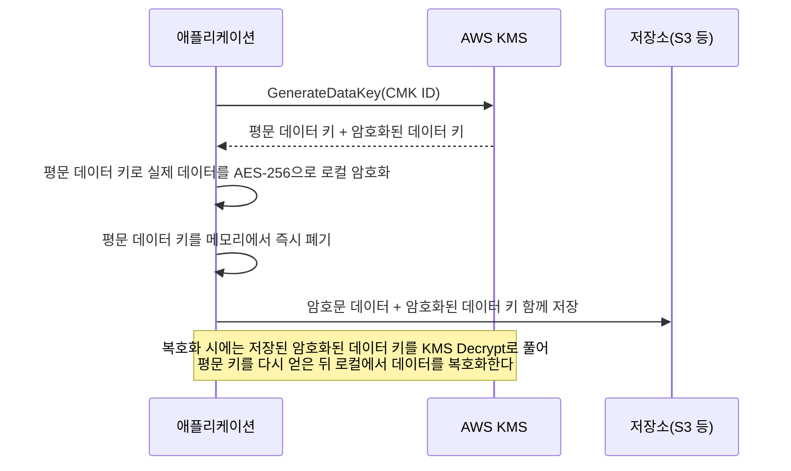

핵심은 대량 데이터 자체는 CMK로 암호화하지 않고, CMK는 **데이터 키를 보호하는 데만** 쓰인다는 점이다. `GenerateDataKey` API는 평문 데이터 키와 그 데이터 키를 CMK로 암호화한 버전을 함께 반환하며, 애플리케이션은 평문 키로 로컬에서 AES 암호화를 수행한 뒤 평문 키를 즉시 폐기하고, 암호화된 데이터 키만 암호문과 함께 저장한다.

```python
import boto3
from cryptography.hazmat.primitives.ciphers.aead import AESGCM
import os

kms = boto3.client("kms", region_name="ap-northeast-2")

def encrypt_payload(plaintext: bytes, key_id: str, context: dict) -> dict:
    # 봉투 암호화: KMS는 데이터 키만 생성/보호, 실제 암호화는 로컬에서 수행
    resp = kms.generate_data_key(
        KeyId=key_id,
        KeySpec="AES_256",
        EncryptionContext=context,  # 추가 인증 데이터(AAD)로 무결성 검증에 사용
    )
    plaintext_key = resp["Plaintext"]
    encrypted_key = resp["CiphertextBlob"]

    nonce = os.urandom(12)
    aesgcm = AESGCM(plaintext_key)
    ciphertext = aesgcm.encrypt(nonce, plaintext, None)

    # 평문 키는 사용 즉시 메모리에서 제거(가비지 컬렉션에만 의존하지 말 것)
    del plaintext_key

    return {
        "ciphertext": ciphertext,
        "nonce": nonce,
        "encrypted_data_key": encrypted_key,  # 이 값을 데이터와 함께 저장
    }
```

**AWS Encryption SDK**는 이 패턴을 라이브러리 수준에서 구현하고, 여러 CMK로 동시 암호화, 알고리즘 스위트 선택, 그리고 **데이터 키 캐싱(data key caching)** 기능을 제공한다. 데이터 키 캐싱은 매 암호화 작업마다 KMS를 호출하지 않고, 캐시에 보관된 데이터 키를 메시지 수·바이트 수·시간 제한 내에서 재사용해 KMS 호출 횟수를 크게 줄인다.

```python
from aws_encryption_sdk import EncryptionSDKClient, CommitmentPolicy
from aws_encryption_sdk.materials_managers.caching import CachingCryptoMaterialsManager
from aws_encryption_sdk.caches.local import LocalCryptoMaterialsCache
from aws_encryption_sdk.key_providers.kms import StrictAwsKmsMasterKeyProvider

client = EncryptionSDKClient(commitment_policy=CommitmentPolicy.REQUIRE_ENCRYPT_REQUIRE_DECRYPT)
key_provider = StrictAwsKmsMasterKeyProvider(
    key_ids=["arn:aws:kms:ap-northeast-2:123456789012:key/1234abcd-..."]
)
cache = LocalCryptoMaterialsCache(capacity=100)
caching_cmm = CachingCryptoMaterialsManager(
    master_key_provider=key_provider,
    cache=cache,
    max_age=300.0,          # 초 단위: 이 시간 안에서만 데이터 키 재사용
    max_messages_encrypted=100,  # 같은 데이터 키로 암호화할 수 있는 최대 메시지 수
)
```

> **[팁]** 고빈도로 소량 데이터를 암복호화하는 서비스(초당 수백 건 이상)는 매번 `GenerateDataKey`/`Decrypt`를 호출하면 KMS 요청당 요금이 누적된다. 데이터 키 캐싱을 적용하면 캐시 적중 시 KMS 호출이 아예 발생하지 않으므로 요금과 지연 시간을 동시에 줄인다. S3 서버 측 암호화(SSE-KMS)에서는 **S3 버킷 키(bucket key)**가 유사한 역할을 한다.

**암호화 컨텍스트(encryption context)**는 키-값 쌍으로 이루어진 추가 인증 데이터(AAD)로, 암호화 시 지정한 컨텍스트와 복호화 시 제공한 컨텍스트가 정확히 일치해야만 복호화가 성공한다. 컨텍스트 자체는 암호화되지 않지만 CloudTrail 로그에 남아 감사에 활용할 수 있고, 암호문이 다른 리소스에 잘못 연결되어 사용되는 것을 방지하는 무결성 검증 역할을 한다. 예를 들어 암호화 시 `{"table": "orders", "tenant_id": "t-123"}`를 컨텍스트로 넣어두면, 이 암호문을 다른 테넌트의 레코드로 복호화하려는 시도는 컨텍스트 불일치로 즉시 실패한다 — 애플리케이션 버그로 인한 크로스 테넌트 데이터 혼입을 암호화 계층에서 한 번 더 막아주는 셈이다.

`GenerateDataKey`는 평문 키와 암호화된 키를 함께 반환하지만, 평문 키가 당장 필요 없는 경우(예: 저장만 하고 나중에 다른 프로세스가 복호화)에는 `GenerateDataKeyWithoutPlaintext`로 암호화된 데이터 키만 받아 KMS 호출 표면을 줄일 수 있다. 반대로 "왜 여러 번 `Encrypt`를 호출해 4KB씩 나눠 암호화하지 않는가"라는 질문에는 두 가지 답이 있다. 첫째, 4KB 단위로 쪼개 여러 번 `Encrypt`를 호출하면 데이터 크기에 비례해 KMS 요청 수와 요금이 증가하고 지연 시간도 커진다. 둘째, 조각별로 별도 암호문을 관리하면 순서 보장·부분 손상 시 무결성 처리가 복잡해진다. 봉투 암호화는 이 두 문제를 "KMS 호출은 데이터 키 하나에 대해 단 한 번, 실제 대용량 암호화는 로컬의 빠른 대칭 암호로" 분리해 해결한다.

### 31.3 다중 리전 키와 키 교체

**다중 리전 키(multi-Region key)**는 여러 AWS 리전에 걸쳐 동일한 키 자재를 공유하는 CMK 집합이다. 한 리전에서 **프라이머리 키**를 생성하고 다른 리전에 **레플리카 키**를 복제하면, 두 키는 서로 다른 키 ID를 갖지만 동일한 키 자재를 사용하므로 한 리전에서 암호화한 데이터를 다른 리전에서 그대로 복호화할 수 있다. 이는 글로벌 DynamoDB 테이블 복제, 크로스 리전 재해복구, Aurora Global Database 등에서 재암호화 없이 리전 간 데이터를 이동시킬 때 유용하다. 다만 다중 리전 키는 리전 간 자동 동기화된 별도 키 집합일 뿐이며, 단일 논리적 키가 물리적으로 여러 리전에 존재하는 것이 아니라는 점에 유의한다.

키 교체(rotation)는 자동과 수동 두 방식이 있다.

- **자동 키 교체**: CMK에 대해 활성화하면 KMS가 **연 1회** 새로운 백엔드 키 자재를 생성한다. 중요한 점은 이전 키 자재가 폐기되지 않고 내부적으로 계속 보관된다는 것이다. 따라서 교체 이전에 암호화된 데이터도 문제없이 복호화되며, 사용자 입장에서는 키 ID(별칭)가 그대로 유지되어 애플리케이션 변경이 필요 없다.
- **수동 교체**: 새 CMK를 생성하고 별칭(alias)이 가리키는 대상을 새 키로 전환하는 방식이다. 별칭 기반으로 애플리케이션을 구성해 두면 애플리케이션 코드 변경 없이 전환할 수 있지만, 이전 데이터를 복호화하려면 이전 키가 계속 존재해야 하므로 이전 키를 즉시 삭제하면 안 된다.

> **[필수]** 키 교체는 "이미 암호화된 데이터를 재암호화한다"는 뜻이 아니다. 자동 교체는 새 암호화 작업부터 새 키 자재를 쓰기 시작할 뿐이고, 기존 암호문은 교체 시점에 다시 암호화되지 않는다. 데이터 자체를 새 키로 완전히 재암호화하려면 별도의 배치 작업(다운로드-복호화-재암호화-재업로드)이 필요하다.

수동 교체는 별칭의 대상을 바꾸는 것으로 구현한다.

```bash
# 새 CMK를 만들고 별칭이 가리키는 대상을 새 키로 전환
NEW_KEY_ID=$(aws kms create-key --description "app-key-2026" --query "KeyMetadata.KeyId" --output text)

aws kms update-alias \
  --alias-name alias/my-app-key \
  --target-key-id "$NEW_KEY_ID"
# 애플리케이션은 alias/my-app-key만 참조하므로 코드 변경이 필요 없다.
# 단, 이전 키(old-key)는 삭제하지 않고 남겨 두어야 이전 데이터를 계속 복호화할 수 있다.
```

다중 리전 키는 애플리케이션이 리전 장애 조치(failover) 시 암호문을 다시 만들지 않고도 대상 리전에서 즉시 복호화할 수 있게 해 준다는 점에서 재해복구 설계와 직결된다. 다만 다중 리전 키의 자동 교체는 프라이머리 키에서 트리거되면 모든 레플리카에 전파되지만, 전파에는 다소의 지연이 있을 수 있으므로 즉각적인 전체 리전 동기화를 전제로 설계하지 않는다.

### 31.4 CloudHSM과 규정 요건

AWS CloudHSM은 **FIPS 140-3 레벨 3** 인증을 받은 전용 하드웨어 보안 모듈(HSM)을 단일 테넌트로 제공하는 서비스다. KMS와 근본적으로 다른 지점은 **키 소유권과 관리 책임의 소재**다. KMS는 AWS가 하드웨어와 키 관리 인프라를 운영하는 완전관리형 서비스인 반면, CloudHSM은 고객이 클러스터를 직접 초기화하고, 키를 생성·백업하며, 클러스터 운영(노드 추가/제거, 백업 정책, 고가용성 구성)까지 책임진다.

이 구조는 다음과 같은 대가를 수반한다.

- **백업 책임**: 클러스터를 삭제하거나 모든 관리자 자격을 분실하면 키를 복구할 방법이 없다. HSM 백업을 정기적으로 수행하고 별도로 안전하게 보관해야 한다.
- **클러스터 운영 부담**: 다중 AZ로 HSM 노드를 배치하고 용량·성능을 직접 계획해야 한다.
- **키 분실 시 AWS도 복구 불가**: AWS 직원조차 고객의 HSM 파티션 내부 키 자재에 접근할 수 없으므로, 관리자 자격 증명을 모두 잃으면 데이터도 함께 잃는다.

CloudHSM은 **KMS 커스텀 키 스토어(custom key store)** 기능을 통해 KMS와 통합할 수도 있다. 이 구성에서는 KMS API의 편의성(다른 서비스와의 자동 통합)을 유지하면서, 실제 키 자재는 고객이 소유·관리하는 CloudHSM 클러스터에 저장된다.

CloudHSM이 필요한 전형적인 상황은 다음과 같다.

- 규정(예: 특정 금융/결제 규제)이 "고객이 단독으로 소유하는 하드웨어에서 키를 관리할 것"을 명시적으로 요구하는 경우
- 전자서명, PKI(공개키 기반구조)의 루트/중간 CA 개인 키처럼 AWS를 포함한 어떤 제3자도 접근해서는 안 되는 키를 다루는 경우
- 특정 클라이언트 측 암호화 라이브러리(PKCS#11, JCE, CNG)와의 직접 연동이 필요한 경우

일반적인 저장/전송 암호화 요구사항이라면 KMS로 충분하며, CloudHSM은 운영 부담이 크므로 규정이나 키 소유권 요건이 명확할 때만 선택한다.

CloudHSM 클러스터는 VPC 내 서브넷에 HSM 인스턴스(노드)를 배치하는 형태로 동작하며, 각 노드는 전용 ENI를 통해 클라이언트(EC2에서 실행되는 CloudHSM 클라이언트 소프트웨어)와 통신한다. 고가용성을 확보하려면 최소 2개 이상의 AZ에 노드를 분산 배치해야 하며, 노드 하나가 실패해도 클러스터의 나머지 노드가 요청을 처리한다. 클러스터 초기화 시 생성되는 관리자(CU, Crypto User) 자격 증명은 AWS가 대신 보관해 주지 않으므로, 조직 내부의 별도 비밀 보관 절차(예: 다수 인원의 분할 보관, 오프라인 금고 보관)로 관리하는 것이 일반적이다.

| 항목 | KMS | CloudHSM |
|---|---|---|
| 테넌시 | 멀티테넌트(AWS 관리) | 단일 테넌트 전용 HSM |
| 키 자재 접근 | AWS도 접근 불가(설계상) | 고객 전권, AWS도 접근 불가 |
| 인증 수준 | FIPS 140-2/140-3 레벨 2~3 경계(문서 확인 필요) | FIPS 140-3 레벨 3 |
| 운영 부담 | 없음(완전관리형) | 클러스터·백업·용량 계획 직접 수행 |
| 서비스 통합 | S3/EBS/RDS 등 광범위 | 커스텀 키 스토어 경유 또는 PKCS#11/JCE/CNG 직접 연동 |

**한 줄 결정 기준**: 대부분의 워크로드는 KMS로 충분하고, "고객이 하드웨어 수준에서 키를 단독 소유해야 한다"는 명시적 규정·계약 조건이 있을 때만 CloudHSM(또는 KMS 커스텀 키 스토어 조합)으로 전환한다.

### 31.5 ACM과 TLS 종료 지점 설계

AWS Certificate Manager(ACM)는 퍼블릭 TLS/SSL 인증서를 무료로 발급하고 자동 갱신한다. 발급 시 도메인 소유권을 검증해야 하며 방식은 두 가지다.

- **DNS 검증**: ACM이 요청한 CNAME 레코드를 도메인의 DNS 존(Route 53 등)에 추가하면 소유권이 확인된다. 이 레코드가 계속 존재하는 한 갱신도 자동으로 이루어진다.
- **이메일 검증**: WHOIS에 등록된 도메인 관리자 이메일로 승인 링크를 보내는 방식으로, 사람이 주기적으로 승인해야 하므로 자동화에 부적합하다.

> **[주의]** DNS 검증으로 발급한 인증서라도, 갱신 시점에 해당 **CNAME 레코드가 DNS에서 삭제되어 있으면 자동 갱신이 실패**한다. Route 53 존 이전, 도메인 등록기관 변경, 레코드 정리 작업 중에 검증 레코드를 실수로 지우는 사고가 흔하므로, 인증서 발급 후에는 해당 레코드를 영구 보존 대상으로 표시해 둔다.

ACM은 **AWS Private CA**를 통해 조직 내부용 프라이빗 인증서도 발급할 수 있다. 사설 인증서는 사내 서비스 간 mTLS, 내부 도메인용 TLS, IoT 디바이스 인증서 등에 쓰이며, 루트/중간 CA 계층을 직접 설계하고 신뢰 체계를 각 클라이언트에 배포해야 한다.

ACM 인증서의 중요한 제약은 **통합 가능한 서비스가 정해져 있다는 점**이다. CloudFront, Application Load Balancer(ALB), API Gateway, Network Load Balancer(NLB), CloudFormation을 통한 일부 서비스에 연결할 수 있지만, **EC2 인스턴스에 직접 설치해서 사용할 수는 없다**. 프라이빗 키를 ACM 밖으로 내보내는 기능이 없기 때문이다. EC2에서 직접 TLS를 종료해야 한다면 별도로 발급받은 인증서 파일을 인스턴스에 배치하거나, ACM Private CA로 발급한 인증서를 애플리케이션이 API로 가져와야 한다.

TLS 종료 지점을 어디에 둘지는 아키텍처 설계에서 중요한 결정이다.

| 방식 | 구성 | 장점 | 단점 | 적합한 경우 |
|---|---|---|---|---|
| 엣지 종료 | CloudFront/ALB에서 TLS 종료, 이후 평문 또는 별도 TLS | 관리 단순, ACM 자동 갱신 활용 | 내부 구간 평문이면 규정 위반 소지 | 일반 웹 애플리케이션, 내부망이 신뢰 경계 안 |
| 엔드투엔드 암호화 | 클라이언트~서버까지 TLS 유지, 로드밸런서는 패스스루(NLB TCP) | 중간 구간 노출 없음 | 인증서를 각 백엔드에 직접 배포·관리해야 함 | PCI-DSS 등 엄격한 규정, 금융 트랜잭션 |
| 재암호화(re-encryption) | ALB에서 1차 종료 후 백엔드까지 별도 TLS로 재암호화 | L7 라우팅(경로 기반) + 종단 암호화 동시 확보 | 인증서 관리 지점이 두 곳(엣지+백엔드) | 마이크로서비스, 규정과 L7 기능을 동시 요구 |

**한 줄 결정 기준**: 규정상 전 구간 암호화가 필수면 엔드투엔드 또는 재암호화를, L7 라우팅 기능(경로 기반 라우팅, WAF 연동)이 필요하면 엣지 종료 또는 재암호화를 선택한다.

퍼블릭 인증서 요청은 CLI나 IaC로도 수행할 수 있으며, DNS 검증 레코드 값은 응답에서 확인해 Route 53에 등록한다.

```bash
# ap-northeast-2에서 CloudFront용이 아니라면 리전 자유롭게 지정 (CloudFront는 반드시 us-east-1)
aws acm request-certificate \
  --domain-name "app.example.com" \
  --subject-alternative-names "*.app.example.com" \
  --validation-method DNS \
  --region ap-northeast-2

# 검증에 필요한 CNAME 레코드 이름/값 확인 후 Route 53에 등록
aws acm describe-certificate \
  --certificate-arn arn:aws:acm:ap-northeast-2:123456789012:certificate/abcd-1234 \
  --query "Certificate.DomainValidationOptions"
```

CloudFront에 연결하는 인증서는 리전에 관계없이 반드시 **us-east-1(버지니아 북부)**에서 발급해야 한다는 제약이 있으며, ALB/NLB/API Gateway는 해당 리소스가 위치한 리전에서 발급한 인증서를 사용한다. 이 리전 제약은 실무에서 자주 놓치는 부분이므로 CloudFront 배포를 설계할 때 별도로 기억해 둔다.

### 31.6 Secrets Manager vs Parameter Store

데이터베이스 자격증명, API 키, 서드파티 토큰 같은 시크릿을 코드나 환경변수 평문, 컨테이너 이미지에 하드코딩하면 소스 저장소 유출·이미지 스캔 실패 시 그대로 노출된다. AWS는 이를 위해 두 서비스를 제공하며 목적이 겹치지만 세부 기능은 다르다.

| 항목 | Secrets Manager | Systems Manager Parameter Store |
|---|---|---|
| 요금 | 시크릿당 + API 호출당 과금 | 표준 계층 무료, 고급 계층/고빈도 API는 과금 |
| 자동 교체 | 내장 Lambda 교체 프레임워크 제공 | 직접 구현 필요(EventBridge + Lambda 조합) |
| 크로스 계정 접근 | 리소스 정책으로 지원 | 계층에 따라 제한적, IAM 정책 위주 |
| 버전 관리 | 스테이징 라벨(AWSCURRENT/AWSPENDING 등) | 파라미터 버전 번호만 존재 |
| 계층 | 단일 | 표준(Standard)/고급(Advanced) 구분 |
| 값 크기 한도 | 최대 64KB | 표준 4KB, 고급 8KB(문서 확인 필요) |
| 랜덤 값 생성 | `GetRandomPassword` 내장 | 미지원 |

**한 줄 결정 기준**: 자동 교체·크로스 계정 공유·랜덤 시크릿 생성이 필요하면 Secrets Manager를, 단순 설정값·계층적 네임스페이스 관리·비용 최소화가 목적이면 Parameter Store를 쓴다. 두 서비스를 혼용해 "진짜 비밀"은 Secrets Manager, "환경 설정값"은 Parameter Store에 두는 구성도 흔하다.

Secrets Manager의 **자동 교체(rotation)**는 Lambda 함수가 4단계로 구성된 표준 프레임워크를 따른다.

```python
def lambda_handler(event, context):
    # Secrets Manager 자동 교체 표준 4단계 골자
    step = event["Step"]
    secret_id = event["SecretId"]
    token = event["ClientRequestToken"]

    if step == "createSecret":
        # 새 자격증명 후보 생성, AWSPENDING 라벨로 저장
        pass
    elif step == "setSecret":
        # 대상 시스템(RDS 등)에 새 자격증명을 실제로 적용
        pass
    elif step == "testSecret":
        # AWSPENDING 자격증명으로 실제 연결 테스트
        pass
    elif step == "finishSecret":
        # 테스트 통과 시 AWSPENDING -> AWSCURRENT로 라벨 전환
        pass
```

RDS, Redshift, DocumentDB 대상은 AWS가 제공하는 **관리형 교체 템플릿**을 그대로 연결하면 위 4단계를 직접 구현할 필요 없이 콘솔에서 교체 주기만 설정하면 된다. 이 템플릿은 이중 사용자 교체(마스터 계정과 별개로 애플리케이션 전용 계정을 하나 더 두고 두 계정을 번갈아 교체)와 단일 사용자 교체(계정 하나의 비밀번호만 교체) 두 전략을 지원하며, 이중 사용자 전략은 교체 도중에도 이전 자격증명이 즉시 무효화되지 않아 배포 중인 애플리케이션 인스턴스가 순단 없이 전환될 수 있다는 장점이 있다.

호출 비용과 지연을 줄이려면 **캐싱 클라이언트**(AWS Secrets Manager 캐싱 라이브러리, Lambda 확장 등)를 사용해 동일 시크릿을 반복 조회하지 않고 로컬 캐시에서 재사용한다.

```python
from aws_secretsmanager_caching import SecretCache, SecretCacheConfig
import boto3

client = boto3.client("secretsmanager", region_name="ap-northeast-2")
cache_config = SecretCacheConfig(secret_refresh_interval=3600)  # 초 단위 캐시 유효 시간
cache = SecretCache(config=cache_config, client=client)

def get_db_password():
    # 캐시 적중 시 Secrets Manager API를 호출하지 않아 요금과 지연을 절감
    return cache.get_secret_string("prod/app/db-password")
```

Lambda에서는 AWS Parameters and Secrets Lambda 확장(extension)을 계층(layer)으로 추가하면 함수 코드 변경 없이 로컬 HTTP 엔드포인트를 통해 캐시된 시크릿을 조회할 수 있어, 콜드 스타트마다 SDK를 초기화하는 부담도 줄어든다.

Parameter Store 값은 CloudFormation에서 **동적 참조(dynamic reference)** 구문으로 배포 시점에 안전하게 주입할 수 있다.

```yaml
Resources:
  AppTaskDefinition:
    Type: AWS::ECS::TaskDefinition
    Properties:
      ContainerDefinitions:
        - Name: app
          Image: 123456789012.dkr.ecr.ap-northeast-2.amazonaws.com/app:latest
          Secrets:
            - Name: DB_PASSWORD
              # SSM 파라미터 값을 배포 시점에 참조 (템플릿에 평문 노출 없음)
              ValueFrom: !Sub "arn:aws:ssm:ap-northeast-2:123456789012:parameter/app/db/password"
          Environment:
            - Name: STAGE
              Value: "{{resolve:ssm:/app/stage:1}}"
```

ECS 태스크 정의와 Lambda 환경변수는 위처럼 Secrets Manager ARN 또는 Parameter Store 경로를 직접 참조해, 시크릿 값이 CloudFormation 템플릿이나 컨테이너 이미지에 평문으로 남지 않도록 한다.

> **[필수]** 시크릿은 절대 코드, 환경변수 평문, 컨테이너 이미지 레이어에 남기지 않는다. 반드시 Secrets Manager 또는 Parameter Store에서 런타임에 조회하고, IAM 정책으로 조회 권한 자체를 최소 권한 원칙에 따라 제한한다.

### 31.7 Amazon Macie

Amazon Macie는 머신러닝 기반으로 S3에 저장된 데이터에서 개인식별정보(PII), 금융 정보, 자격증명 같은 민감 데이터를 자동으로 탐지·분류하는 서비스다. **관리형 데이터 식별자(managed data identifier)**는 AWS가 미리 정의한 패턴(주민등록번호 형태, 신용카드 번호, AWS 액세스 키 등)으로 별도 설정 없이 바로 사용할 수 있고, **커스텀 데이터 식별자(custom data identifier)**는 정규식과 근접 키워드를 조합해 조직 고유의 데이터 패턴(사내 사번 형식, 내부 프로젝트 코드 등)을 정의한다.

Macie의 검색 작업(classification job)은 버킷 전체를 스캔하면 대상 데이터 볼륨에 비례해 비용이 발생하므로, **샘플링 비율 설정**과 **버킷/프리픽스 범위 제한**으로 비용을 통제하는 것이 실무의 핵심이다. 전수 스캔 대신 일부 객체만 샘플링해 민감 데이터 존재 여부를 파악하거나, 신규로 적재되는 프리픽스만 주기적으로 스캔하는 방식이 일반적이다.

```bash
# 특정 프리픽스만, 객체의 25%만 샘플링해 비용을 통제하는 1회성 작업
aws macie2 create-classification-job \
  --job-type ONE_TIME \
  --name "quarterly-pii-sample-scan" \
  --s3-job-definition '{
    "bucketDefinitions": [
      {"accountId": "123456789012", "buckets": ["data-lake-raw"]}
    ],
    "scoping": {
      "includes": {"and": [{"simpleScopeTerm": {"key": "OBJECT_KEY", "comparator": "STARTS_WITH", "values": ["landing/"]}}]}
    }
  }' \
  --sampling-percentage 25
```

Macie 자동 활성화(자동 검색, automated discovery)를 켜두면 신규 객체 적재 시점에 낮은 빈도로 자동 샘플링을 수행해 전체 스캔 없이도 새로운 민감 데이터 유입을 지속적으로 감지할 수 있다. 대규모 데이터 레이크에서는 자동 검색과 수동 정밀 스캔(특정 감사·규정 대응 시점)을 병행하는 구성이 흔하다.

Macie가 발견한 결과(민감 데이터 유형, 위치, 심각도)는 **Security Hub**로 집계되어 다른 보안 서비스 발견사항과 함께 통합 대시보드에서 확인할 수 있고, **EventBridge**로 발행되어 자동 알림이나 대응 워크플로 트리거에 활용할 수 있다(→ 32장 참조). 데이터 레이크 환경에서 존(zone)별로 민감 데이터 분류 결과를 태그·카탈로그에 반영해 접근 통제나 마스킹 정책에 연결하는 패턴은 → 52장에서 다룬다.

### 31.8 저장·전송·사용 중 암호화와 키 소유권 모델

암호화는 데이터의 상태에 따라 세 축으로 나뉜다: **저장 중(at rest)**, **전송 중(in transit)**, **사용 중(in use)**.

주요 서비스별 저장 암호화 활성화 방법은 다음과 같다.

| 서비스 | 저장 암호화 활성화 방법 |
|---|---|
| S3 | 버킷 기본 암호화(SSE-S3/SSE-KMS) 설정, 버킷 키로 KMS 호출 절감 |
| EBS | 계정 리전별 "기본 암호화" 활성화 또는 볼륨 생성 시 지정 |
| RDS | 인스턴스 생성 시 암호화 옵션(생성 후 미암호화 → 암호화 전환은 스냅샷 복사 경유) |
| DynamoDB | 기본적으로 저장 암호화 활성(AWS 관리형 키 또는 CMK 선택 가능) |
| EFS | 파일 시스템 생성 시 암호화 옵션 지정 |
| Redshift | 클러스터 생성 시 암호화 옵션(KMS 또는 HSM) |
| SQS | 큐 단위 SSE 옵션(KMS 관리형 또는 CMK) |
| SNS | 토픽 단위 서버 측 암호화 옵션 |
| Kinesis Data Streams | 스트림 단위 서버 측 암호화(KMS) |
| AWS Backup | 백업 볼트 단위 KMS 암호화, 원본이 암호화되지 않아도 볼트 암호화 적용 가능 |

EBS 기본 암호화는 리전 단위로 한 번 활성화하면 이후 생성되는 모든 볼륨에 자동 적용된다.

```bash
# 리전 내 신규 EBS 볼륨에 기본 암호화 강제 (기존 볼륨에는 소급 적용 안 됨)
aws ec2 enable-ebs-encryption-by-default --region ap-northeast-2

# 기본으로 사용할 CMK 지정 (지정하지 않으면 AWS 관리형 키 aws/ebs 사용)
aws ec2 modify-ebs-default-kms-key-id \
  --kms-key-id arn:aws:kms:ap-northeast-2:123456789012:key/1234abcd-12ab-34cd-56ef-1234567890ab \
  --region ap-northeast-2
```

전송 중 암호화는 TLS로 구현하며, S3 등 API 기반 서비스에서는 버킷 정책으로 **비TLS 요청 자체를 거부**해 강제할 수 있다.

```json
{
  "Version": "2012-10-17",
  "Statement": [
    {
      "Sid": "DenyInsecureTransport",
      "Effect": "Deny",
      "Principal": "*",
      "Action": "s3:*",
      "Resource": [
        "arn:aws:s3:::my-secure-bucket",
        "arn:aws:s3:::my-secure-bucket/*"
      ],
      "Condition": {
        "Bool": {"aws:SecureTransport": "false"}
      }
    }
  ]
}
```

로드밸런서에서는 TLS 정책(보안 정책)으로 허용 프로토콜·암호 스위트 버전을 강제한다. VPC 내부 트래픽이라고 무조건 안전한 것은 아니며, 규정상 종단 간 암호화가 요구되거나 동일 VPC 내 다른 팀·테넌트 워크로드가 공존하는 경우에는 **내부 트래픽도 TLS로 암호화**하는 것이 안전한 기본값이다.

**사용 중 암호화(encryption in use)**는 데이터가 메모리에서 처리되는 동안에도 보호하는 개념으로, AWS Nitro Enclaves가 대표적이다. Nitro Enclaves는 EC2 인스턴스에서 CPU와 메모리를 분리한 격리 컴퓨팅 환경을 만들어, 부모 인스턴스의 운영체제·관리자·하이퍼바이저조차 엔클레이브 내부 메모리에 접근할 수 없도록 한다. 엔클레이브에는 영구 스토리지, 대화형 접근, 외부 네트워킹이 없고 부모 인스턴스와의 로컬 보안 채널(vsock)로만 통신하며, 자신의 신원과 코드를 암호학적으로 증명하는 **첨부 증명(attestation)** 문서를 발급해 KMS 같은 서비스가 "이 요청이 특정 엔클레이브에서 왔음"을 검증하고 나서야 키 자재를 내줄 수 있게 만든다. 이는 기밀 컴퓨팅(confidential computing)의 한 구현이며, 결제 카드 데이터 처리, 신원 확인, 여러 당사자의 데이터를 서로 노출하지 않고 계산하는 다자간 연산(multi-party computation) 시나리오에 쓰인다. Nitro Enclaves는 EC2 인스턴스 자체의 격리 기능이며, KMS·CloudHSM과 대체 관계가 아니라 "메모리에서 처리되는 동안"이라는 별도 구간을 보완하는 관계로 이해한다.

마지막으로 **키 소유권 모델**을 비교한다.

| 모델 | 키 자재 위치 | 관리 주체 | 규정 대응 |
|---|---|---|---|
| AWS 관리 | AWS 인프라 | AWS | 기본 규정 대부분 충족, 계정 간 공유 불가 |
| 고객 관리(CMK) | AWS KMS | 고객(정책·교체·삭제) | 세밀한 접근 통제, 계정 간 공유 가능 |
| 고객 제공(BYOK, Bring Your Own Key) | 고객이 생성한 키 자재를 KMS로 가져오기 | 고객 | 키 발급 이력 자체를 고객이 통제해야 하는 규정 대응 |
| 외부 키 저장소(XKS, External Key Store) | 고객 온프레미스/제3자 HSM | 고객(완전 외부화) | 키가 AWS 밖에만 존재해야 하는 최고 수준 규정 요구 |

**한 줄 결정 기준**: 별도 규정 요구가 없다면 CMK로 시작하고, 키 발급 이력·소재 자체를 조직이 완전히 통제해야 하는 규정(일부 금융·공공 부문)에서만 BYOK 또는 XKS로 단계적으로 이동한다.

BYOK는 조직이 이미 보유한 HSM이나 키 관리 시스템에서 키 자재를 생성한 뒤 KMS로 **가져오기(import)**하는 방식으로, KMS는 이 키에 대해 자동 교체를 지원하지 않으며 키 자재의 최초 발급 이력·엔트로피 소스를 고객이 계속 책임진다. XKS는 한 단계 더 나아가 키 자재가 AWS 인프라에 전혀 복사되지 않고 고객이 운영하는 외부 키 관리자에 남아 있으며, KMS는 암복호화 요청이 올 때마다 외부 키 관리자를 호출해 결과만 받아오는 프록시 역할만 수행한다. XKS는 지연 시간과 외부 시스템 가용성에 KMS 호출 성공 여부가 종속되므로, 도입 전에 외부 키 관리자의 가용성 목표(SLA)가 워크로드 요구 수준을 충족하는지 반드시 검증해야 한다.

> **[주의]** AWS 관리형 키(`aws/ebs`, `aws/rds` 등)로 암호화한 EBS 스냅샷이나 RDS 스냅샷은 **계정 간 공유가 불가능**하다. 재해복구 계정으로 스냅샷을 복제하거나 다른 팀 계정과 공유할 계획이 조금이라도 있다면, 처음부터 고객 관리형 CMK로 암호화해야 나중에 재암호화하는 수고를 피할 수 있다.

### 31장 정리

#### [필수] 반드시 알아야 할 것
1. KMS 접근 제어는 **키 정책 + IAM 정책의 교집합**으로 결정된다. IAM 정책만 수정해서는 키 정책이 막아둔 접근을 열 수 없다.
2. 봉투 암호화는 KMS의 4KB 암호화 한도를 우회하기 위한 표준 패턴이며, 대량 데이터는 로컬에서 데이터 키로 암호화하고 데이터 키만 CMK로 보호한다.
3. 시크릿(자격증명, API 키)은 코드·환경변수 평문·이미지에 절대 남기지 않고 Secrets Manager 또는 Parameter Store에서 런타임에 조회한다.
4. 자동 키 교체는 기존 암호문을 재암호화하지 않는다. 이전 키 자재는 계속 보관되어 기존 데이터 복호화가 가능하다.
5. ACM 인증서는 CloudFront/ALB/NLB/API Gateway 등에는 붙일 수 있지만 EC2에 직접 설치할 수는 없다.
6. CloudHSM은 키 자재의 전권과 책임(백업, 클러스터 운영, 분실 시 복구 불가)을 고객이 진다는 점에서 KMS와 근본적으로 다르다.

#### [팁] 실무 노하우
1. 고빈도 소량 암복호화에는 AWS Encryption SDK의 데이터 키 캐싱이나 S3 버킷 키를 적용해 KMS 호출 횟수와 요금을 줄인다.
2. `kms:ViaService` 조건으로 CMK 사용을 특정 서비스 경유로 제한하면 키 자재 오남용 경로를 줄일 수 있다.
3. 키 별칭을 애플리케이션 설정에 고정해 두면 실제 키 교체 시 코드 변경 없이 전환할 수 있다.
4. Macie 검색 작업은 샘플링 비율과 버킷/프리픽스 범위를 제한해 전수 스캔 비용을 통제한다.
5. RDS/Redshift/DocumentDB는 Secrets Manager의 관리형 교체 템플릿을 그대로 연결해 직접 Lambda를 구현하는 수고를 줄인다.

#### [주의] 사고·비용·설계 함정
1. KMS 키 삭제는 대기 기간(7~30일) 후 **복구 불가능**하며, 그 키로 암호화된 모든 데이터가 영구히 소실된다.
2. KMS는 요청당 + 키당 월 요금 구조라, 고빈도 소량 암복호화 패턴은 데이터 키 캐싱 없이는 비용이 급격히 커진다.
3. AWS 관리형 키로 암호화한 스냅샷은 계정 간 공유가 불가능하다 — 공유 계획이 있다면 처음부터 CMK를 사용한다.
4. ACM DNS 검증 레코드를 삭제하면 이후 자동 갱신이 실패해 인증서가 만료된다.
5. 자동 키 교체를 "재암호화"로 착각해 이전 CMK를 삭제하면 이전 데이터가 복호화 불가능해진다.
6. VPC 내부 트래픽이라고 안전하다고 가정하지 말 것 — 규정·멀티테넌트 환경에서는 내부 구간도 TLS로 암호화해야 한다.

#### 한 장 요약
KMS는 키 정책과 IAM 정책의 교집합으로 접근을 통제하는 중앙 키 관리 서비스이며, 대용량 데이터는 봉투 암호화로 KMS의 4KB 한도를 우회한다. CloudHSM은 키 소유권과 운영 책임을 고객이 전적으로 지는 대안이고, ACM은 통합 가능한 서비스에 한해 TLS 인증서를 자동 관리한다. Secrets Manager와 Parameter Store는 시크릿의 수명주기를 관리하며, Macie는 S3의 민감 데이터를 자동 탐지한다. 저장·전송·사용 중 암호화를 서비스별로 활성화하고, 규정 요구 수준에 맞는 키 소유권 모델(AWS 관리/CMK/BYOK/XKS)을 선택하는 것이 이 장의 핵심이다.

#### 다음 장 예고
32장에서는 CloudTrail, Config, GuardDuty, Inspector, Security Hub, Detective로 이어지는 탐지와 사고 대응 체계를 다루며, 이 장에서 다룬 Macie의 탐지 결과가 어떻게 통합 대응 워크플로로 연결되는지 살펴본다.

---

## 32장. 탐지와 사고 대응  ★★★

> **이 장에서 다루는 것**
> 28장에서 위협 모델을, 29장에서 IAM을, 30장에서 다중 계정 로깅 구조를, 31장에서 암호화를 다뤘다면, 이 장은 "그래도 뚫렸을 때 어떻게 알아채고 어떻게 대응하는가"를 다룬다. CloudTrail·Config로 무슨 일이 있었는지 기록하고, GuardDuty·Inspector·Security Hub·Detective로 위협을 탐지·집계·조사하고, EventBridge와 자동화로 사람이 잠들어 있는 시간에도 최소한의 초동 대응이 돌아가게 만드는 것까지가 범위다. 마지막 절은 실제 침해 사고가 터졌을 때 증거를 보존하고 자격증명을 무효화하는 실무 절차를 다룬다. 조직의 중앙 로깅 계정 구조는 30.7절을 전제로 하므로 여기서는 반복하지 않는다.

### 32.1 AWS CloudTrail

CloudTrail은 계정에서 발생한 모든 API 호출을 기록하는 감사 로그 서비스다. "누가, 언제, 어디서, 무엇을 호출했는가"에 답하지 못하면 침해 여부조차 판단할 수 없으므로, CloudTrail은 탐지 체계 전체의 기반이 된다.

CloudTrail은 이벤트를 3종으로 구분하고 과금 방식도 다르게 적용한다.

| 이벤트 유형 | 내용 | 과금 |
|---|---|---|
| 관리 이벤트(management event) | 리소스 생성·삭제·정책 변경 등 제어 영역(control plane) API | 계정당 첫 트레일 무료(90일 이벤트 히스토리와 별개로 트레일 전달분), 추가 복사본부터 과금 |
| 데이터 이벤트(data event) | S3 객체 수준 작업(GetObject/PutObject), Lambda 함수 호출, DynamoDB 아이템 작업 등 데이터 영역(data plane) API | 이벤트 건당 과금, **기본 비활성화** |
| 인사이트 이벤트(Insights event) | 관리 이벤트의 호출 패턴을 분석해 평소와 다른 급증·급감을 자동 탐지 | 분석 대상 이벤트 건당 과금, 별도 활성화 필요 |

과금 체계와 무료 제공 범위는 시점에 따라 조정될 수 있으므로 실제 설계 전에는 반드시 최신 요금 문서를 확인해야 한다. **데이터 이벤트는 양이 많고 별도로 과금되므로 전체 S3 버킷·전체 Lambda 함수에 무차별로 켜지 말고, 중요 버킷(로그 아카이브, 규제 데이터)이나 프로덕션 함수 등 실제로 감사가 필요한 리소스로 범위를 좁혀야 한다.** 고트래픽 버킷에서 전체 데이터 이벤트를 켜면 CloudTrail 비용이 다른 로깅 비용 전체를 넘어서는 경우도 흔하다. 고급 이벤트 셀렉터(advanced event selector)로 특정 버킷 ARN, 특정 객체 접두사 단위까지 좁힐 수 있다.

**조직 트레일(organization trail)**은 관리 계정에서 생성하면 조직의 모든 멤버 계정에 자동 적용되고, 멤버 계정에서는 끄거나 수정할 수 없다(→ 30.7절). **다중 리전 트레일(multi-region trail)**은 트레일을 하나만 만들어도 모든 리전의 이벤트를 같은 S3 버킷으로 모은다. 이 둘을 함께 쓰지 않으면 "어느 계정, 어느 리전에서 무슨 일이 있었는지"를 놓치는 사각지대가 생긴다.

```yaml
# CloudFormation: 조직 전체 다중 리전 트레일 (관리 계정에서 배포)
AWSTemplateFormatVersion: "2010-09-09"
Resources:
  OrgTrailBucket:
    Type: AWS::S3::Bucket
    Properties:
      BucketName: org-cloudtrail-logs-123456789012
      VersioningConfiguration:
        Status: Enabled
      ObjectLockEnabled: true   # 로그 삭제·변조 방지 (30.7절 로그 아카이브 계정 패턴 참조)

  OrgTrailBucketPolicy:
    Type: AWS::S3::BucketPolicy
    Properties:
      Bucket: !Ref OrgTrailBucket
      PolicyDocument:
        Version: "2012-10-17"
        Statement:
          - Sid: AllowCloudTrailWrite
            Effect: Allow
            Principal:
              Service: cloudtrail.amazonaws.com
            Action: s3:PutObject
            Resource: !Sub "arn:aws:s3:::${OrgTrailBucket}/AWSLogs/o-orgid/*"
            Condition:
              StringEquals:
                s3:x-amz-acl: bucket-owner-full-control
                aws:SourceOrgID: o-example123

  OrgTrail:
    Type: AWS::CloudTrail::Trail
    Properties:
      TrailName: org-management-trail
      IsOrganizationTrail: true      # 관리 계정에서만 true 설정 가능
      IsMultiRegionTrail: true       # 모든 리전 이벤트를 하나의 트레일로
      EnableLogFileValidation: true  # 다이제스트 파일로 무결성 검증
      S3BucketName: !Ref OrgTrailBucket
      IsLogging: true
```

**로그 파일 무결성 검증(log file validation)**을 켜면 CloudTrail이 로그 파일마다 해시값을 계산하고, 그 해시를 모은 **다이제스트 파일(digest file)**을 별도로 서명해 저장한다. 사고 조사 시 `aws cloudtrail validate-logs` CLI로 다이제스트 체인을 검증하면 로그가 저장된 이후 한 글자라도 변조됐는지 수학적으로 확인할 수 있다. 이는 포렌식 증거로서 로그의 신뢰성을 뒷받침하는 핵심 장치다.

**CloudTrail Lake**는 수집한 이벤트를 SQL로 직접 조회할 수 있게 해주는 관리형 데이터 저장소다. 이벤트 데이터 스토어(event data store)에 트레일 이벤트를 담아두고, `SELECT`문으로 "지난 30일간 특정 IAM 사용자가 호출한 API 목록"처럼 복잡한 질의를 즉시 실행한다. S3에 쌓인 원본 로그를 Athena로 매번 파티션 설정해 조회하는 대신 쓸 수 있는 선택지다.

**이벤트 히스토리(event history)**와 트레일은 자주 혼동된다. 이벤트 히스토리는 트레일을 만들지 않아도 콘솔에서 기본 제공되는 **최근 90일치 관리 이벤트 조회 화면**이며 별도 과금이 없다. 반면 트레일은 이벤트를 S3에 영구 저장하고, 90일이 지난 이벤트를 보려면 반드시 트레일(또는 Lake)이 있어야 한다. 90일 이내 빠른 확인은 이벤트 히스토리로, 장기 보존과 감사 대응은 트레일로 나눠 쓴다.

| 항목 | 이벤트 히스토리 | 트레일 |
|---|---|---|
| 보존 기간 | 90일 고정 | 사용자 설정(S3 수명주기로 무기한 가능) |
| 별도 설정 | 불필요 (기본 제공) | 생성·S3 버킷 지정 필요 |
| 데이터 이벤트 | 미포함 | 이벤트 셀렉터로 포함 가능 |
| 과금 | 무료 | S3 저장 비용 + 데이터/Insights 이벤트 과금 |

**한 줄 결정 기준**: 최근 90일 이내 단순 확인이면 이벤트 히스토리, 장기 보존·규정 준수·SQL 분석이 필요하면 트레일(+Lake)이다.

```sql
-- CloudTrail Lake: 최근 7일간 루트 계정으로 수행된 모든 API 호출 조회
-- (루트 계정 사용은 그 자체로 조사 대상이 되는 경우가 많다)
SELECT eventTime, eventName, sourceIPAddress, userIdentity.arn
FROM event_data_store_id
WHERE userIdentity.type = 'Root'
  AND eventTime > '2026-08-29T00:00:00Z'
ORDER BY eventTime DESC
```

CloudTrail Lake의 이벤트 데이터 스토어는 CloudTrail 이벤트뿐 아니라 외부 소스(온프레미스 애플리케이션 로그 등)도 통합해 담을 수 있어, 조직에 따라서는 보안 로그 통합 저장소 자체를 Lake로 일원화하기도 한다. 다만 Lake는 조회·저장 방식이 트레일과 별도로 과금되므로, 이미 Athena·OpenSearch 기반 로그 분석 체계가 있다면 중복 투자인지 먼저 따져봐야 한다.

### 32.2 AWS Config

CloudTrail이 "누가 무엇을 호출했는가"를 기록한다면, Config는 "지금 이 리소스의 설정이 어떤 상태이고 시간에 따라 어떻게 바뀌었는가"를 추적한다. Config는 지원 대상 리소스 하나하나를 **구성 항목(configuration item)**으로 표현하고, 특정 시점의 전체 스냅샷을 **구성 스냅샷(configuration snapshot)**으로, 변경 이력을 **구성 히스토리(configuration history)**로 제공한다. 예를 들어 특정 보안 그룹의 인바운드 규칙이 언제, 누구에 의해, 어떻게 바뀌었는지를 시간순으로 되짚을 수 있다.

**규칙(rule)**은 리소스가 원하는 상태를 지키는지 평가하는 조건이다. AWS 관리형 규칙(예: `s3-bucket-public-read-prohibited`, `restricted-ssh`)을 그대로 쓰거나, 조직 고유의 조건은 Lambda 함수 또는 AWS Config 커스텀 규칙용 **Guard(Cloud Formation Guard 기반 정책 언어)**로 직접 작성한다. Lambda 규칙은 복잡한 로직에 유연하지만 함수 관리 부담이 있고, Guard 규칙은 선언적이라 간단한 조건에 적합하다.

```python
# Config 사용자 지정 규칙: 필수 태그(CostCenter) 누락 EC2 인스턴스 탐지 (Lambda)
import boto3

def lambda_handler(event, context):
    config = boto3.client('config')
    invoking_event = event['invokingEvent']
    item = event.get('configurationItem') or \
        __import__('json').loads(invoking_event)['configurationItem']

    compliance = 'NOT_APPLICABLE'
    if item['resourceType'] == 'AWS::EC2::Instance' and item['configurationItemStatus'] != 'ResourceDeleted':
        tags = item.get('tags', {})
        compliance = 'COMPLIANT' if 'CostCenter' in tags else 'NON_COMPLIANT'

    config.put_evaluations(
        Evaluations=[{
            'ComplianceResourceType': item['resourceType'],
            'ComplianceResourceId': item['resourceId'],
            'ComplianceType': compliance,
            'OrderingTimestamp': item['configurationItemCaptureTime']
        }],
        ResultToken=event['resultToken']
    )
```

**적합성 팩(conformance pack)**은 여러 Config 규칙과 자동 교정 조치를 하나의 CloudFormation 템플릿으로 묶어 계정·조직 단위로 한 번에 배포하는 단위다. CIS 벤치마크, PCI DSS 같은 표준에 대응하는 샘플 팩을 AWS가 제공하며, 조직 전체에 일괄 배포해 "이 표준을 만족하는 계정 비율"을 대시보드로 확인한다.

**자동 교정(auto-remediation)**은 규칙 위반을 발견했을 때 SSM Automation 문서를 실행해 스스로 고치도록 연결하는 기능이다. 예를 들어 퍼블릭으로 열린 보안 그룹 규칙을 발견하면 `AWS-DisablePublicAccessForSecurityGroup` 같은 자동화 문서를 트리거해 즉시 닫는다. 다만 자동 교정은 잘못 설계하면 정상 운영 트래픽을 차단할 수 있으므로, 처음에는 알림만 보내고 검증 후 자동 실행으로 전환하는 단계적 적용이 안전하다.

**집계자(aggregator)**는 여러 계정·여러 리전의 Config 데이터를 한 곳(보통 보안 계정)에서 조회할 수 있게 모아주는 기능이다. 조직 전체를 소스로 지정하면 신규 계정이 추가돼도 자동으로 집계 대상에 포함된다.

Config는 **레코더(recorder)**가 켜진 리소스마다 구성 항목이 기록될 때 과금되므로, 태그처럼 변경이 잦은 속성만 바뀌는 리소스(예: Auto Scaling으로 인스턴스가 초 단위로 교체되는 환경)를 무분별하게 전체 리소스 유형으로 기록하면 비용이 급증한다. 레코더 범위를 필요한 리소스 유형으로 좁히거나, 특정 리소스 유형을 제외 목록에 넣어 비용을 통제한다.

```bash
# Config 집계자: 조직 전체 계정·리전을 보안 계정 한 곳에서 조회하도록 설정
aws configservice put-configuration-aggregator \
  --configuration-aggregator-name org-wide-aggregator \
  --organization-aggregation-source '{
    "RoleArn": "arn:aws:iam::123456789012:role/OrganizationConfigAggregatorRole",
    "AllAwsRegions": true
  }'
```

이 집계자를 보안 계정에 만들어 두면, 신규 멤버 계정이 조직에 추가돼도 별도 설정 없이 자동으로 집계 대상에 포함된다. 계정마다 콘솔을 순회하며 규정 준수 상태를 확인하는 방식은 계정이 두 자릿수를 넘어가는 순간부터 비현실적이므로, 집계자 기반 중앙 대시보드가 사실상 필수가 된다.

### 32.3 Amazon GuardDuty

GuardDuty는 **에이전트를 설치하지 않고 계정에서 켜기만 하면**, 이미 쌓이고 있는 로그(CloudTrail 관리/S3 데이터 이벤트, VPC Flow Logs, DNS 쿼리 로그)를 지속적으로 분석해 위협 인텔리전스·머신러닝 기반으로 이상 행위를 찾아내는 관리형 위협 탐지 서비스다. 별도 로그 설정이나 트래픽 미러링 없이 활성화 버튼 하나로 즉시 커버리지가 생기기 때문에, 보안 투자 대비 효과가 가장 큰 서비스로 꼽힌다.

기본 데이터 소스 외에 **확장 보호(extended threat detection / protection plan)**를 개별적으로 켤 수 있다.

| 보호 기능 | 탐지 대상 |
|---|---|
| S3 Protection | 비정상적인 데이터 접근·유출 패턴(대량 다운로드, 비정상 API 호출) |
| EKS Protection(감사 로그 + 런타임 모니터링) | 쿠버네티스 API 서버 감사 로그 이상, 컨테이너 내부 프로세스·파일 이벤트 |
| RDS Protection | 비정상 로그인 시도, 자격증명 스터핑 패턴 |
| Lambda Protection | 함수의 비정상적인 아웃바운드 네트워크 연결(악성 IP 통신) |
| Malware Protection(EC2/EBS) | 스냅샷 기반 에이전트리스 멀웨어 스캔 |

파인딩(finding)은 `위협유형:리소스유형/세부내용` 형식의 이름과 **낮음/중간/높음** 심각도로 분류된다. 예를 들어 `UnauthorizedAccess:EC2/TorIPCaller`는 EC2 인스턴스가 Tor 출구 노드와 통신했다는 높은 심각도의 파인딩이다.

**조직 활성화**는 위임 관리자(delegated administrator) 계정을 지정해, 그 계정에서 조직 내 모든 멤버 계정의 GuardDuty를 중앙 관리하는 방식이다. 신규 계정은 자동 활성화 설정에 따라 곧바로 보호 대상에 포함된다.

```bash
# 조직 관리 계정에서 위임 관리자 지정 후, 위임 관리자 계정에서 실행
# 1) 관리 계정: 보안 계정을 GuardDuty 위임 관리자로 지정
aws guardduty enable-organization-admin-account \
  --admin-account-id 123456789012

# 2) 위임 관리자(보안) 계정: 신규 계정 자동 활성화 설정
aws guardduty update-organization-configuration \
  --detector-id 00b00c00d00e00f00a00b00c00d00e00 \
  --auto-enable-organization-members NEW
```

**신뢰 목록(trusted IP list)**에 등록된 IP는 파인딩 생성에서 제외되고, **위협 목록(threat IP list)**에 등록된 IP는 통신만으로 즉시 높은 심각도 파인딩을 발생시킨다. **억제 규칙(suppression rule)**은 오탐이 반복되는 특정 조건의 파인딩을 자동으로 보관 처리(archive)해, 실제 위협 파인딩이 소음에 묻히지 않게 한다. 억제 규칙은 탐지 자체를 끄는 것이 아니라 표시만 걸러내는 것이므로, 지나치게 넓게 설정하면 실제 위협까지 조용히 묻힐 수 있어 주기적으로 재검토해야 한다.

파인딩 심각도는 대응 우선순위를 정하는 실질적인 기준이 된다. 예를 들어 `CryptoCurrency:EC2/BitcoinTool.B!DNS`(암호화폐 채굴 도구 통신, 높음)나 `Persistence:IAMUser/NetworkPermissions`(방화벽 규칙을 넓히는 권한 유지 시도, 중간)처럼, 파인딩 이름 자체가 위협 유형과 대상 리소스를 함축한다. 심각도 낮음(Low)은 자동 티켓 생성 정도로, 중간(Medium)은 담당자 확인, 높음(High)은 즉시 대응 파이프라인(32.7절)으로 연결하는 식으로 등급별 대응 절차를 미리 정해 둬야 파인딩이 쌓여도 우왕좌왕하지 않는다.

### 32.4 Amazon Inspector

Inspector는 워크로드의 소프트웨어 취약점(CVE)을 자동으로 찾아내는 취약점 관리 서비스다. 계정에서 활성화하면 대상 리소스를 **자동으로 검색(auto-discovery)**하고, 스캔은 한 번으로 끝나지 않고 **지속 스캔(continuous scanning)**으로 동작한다. 새 CVE가 공개되거나 이미지가 다시 푸시되면 재스캔 없이도 최신 결과가 갱신된다.

| 대상 | 스캔 방식 | 요구 사항 |
|---|---|---|
| EC2 인스턴스 | OS 패키지·네트워크 도달 가능성 분석 | SSM Agent 설치 및 관리형 인스턴스 등록 필수 |
| ECR 컨테이너 이미지 | 이미지 레이어의 OS·언어 패키지 취약점 스캔 | 푸시 시 자동 스캔(설정 시) |
| Lambda 함수 | 함수 코드와 의존 라이브러리(런타임 레이어 포함)의 취약점 | 코드 스캔은 지원 언어 런타임에 한정 |

Inspector의 특징은 단순 CVE 목록 나열이 아니라 **네트워크 도달 가능성(network reachability)**을 결합해 점수를 매긴다는 점이다. 동일한 CVSS 점수의 취약점이라도, 퍼블릭 서브넷에서 인터넷으로 열려 있어 실제로 공격 가능한 인스턴스는 우선순위가 올라가고, 사설 서브넷 깊숙이 있어 도달 불가능한 인스턴스는 우선순위가 낮아진다. 이 결합 점수 덕분에 수천 건의 CVE 중 실제로 먼저 패치해야 할 항목을 추릴 수 있다.

**SBOM(Software Bill of Materials) 내보내기**로 스캔 대상의 소프트웨어 구성 요소 전체 목록을 CycloneDX·SPDX 형식으로 출력할 수 있다. 공급망 보안 요건이나 규정 준수 증빙에 활용한다.

EC2 스캔이 동작하려면 대상 인스턴스에 **SSM Agent**가 설치돼 있고 SSM 관리형 인스턴스로 등록돼 있어야 한다. Agent가 없거나 등록이 끊긴 인스턴스는 자동 검색 대상에서 빠지므로, Inspector 커버리지 점검 시 SSM 관리형 인스턴스 목록과의 차이를 확인하는 것이 실무에서 자주 놓치는 지점이다.

```bash
# Inspector: 특정 ECR 리포지토리 이미지의 SBOM을 CycloneDX 형식으로 내보내기
aws inspector2 create-sbom-export \
  --report-format CYCLONEDX_1_4 \
  --resource-filter-criteria '{
    "ecrImageRepositoryName": [{"comparison": "EQUALS", "value": "payment-service"}]
  }' \
  --s3-destination bucketName=security-sbom-reports-123456789012,keyPrefix=payment-service/
```

CVE 하나가 여러 이미지·인스턴스에 공통으로 존재하는 경우가 많으므로, Inspector 대시보드는 개별 취약점 단위가 아니라 "가장 많은 리소스에 영향을 주는 CVE" 기준으로도 정렬해 볼 수 있다. 패치 우선순위를 정할 때는 CVSS 점수 단독보다 이 영향 범위와 네트워크 도달 가능성을 함께 봐야 실제 위험도에 가까운 판단이 나온다.

### 32.5 AWS Security Hub

계정 하나에서도 GuardDuty·Inspector·Config·Macie 파인딩이 각자 다른 콘솔에 흩어져 나온다. 계정이 수십 개로 늘어나면 이 파편화는 감당할 수 없는 수준이 된다. Security Hub는 이 파인딩들을 하나의 표준 형식으로 모아 심각도·워크플로 상태 기준으로 관리할 수 있게 하는 **통합 창구**다.

Security Hub가 제공하는 **보안 표준(security standard)**은 계정·리소스 설정을 특정 프레임워크 기준으로 자동 채점한다.

| 표준 | 성격 |
|---|---|
| AWS 기초 보안 모범 사례(AWS FSBP) | AWS가 자체 정의한 범용 베스트 프랙티스 |
| CIS AWS Foundations Benchmark | 업계 표준 CIS 벤치마크 |
| PCI DSS | 카드 결제 데이터 보안 표준 |
| NIST 800-53 | 미국 연방 정보 시스템 보안 통제 |

각 표준은 개별 규칙(예: "루트 계정에 MFA가 활성화돼 있는가")로 구성되고, 통과/실패 비율을 계정·조직 단위로 대시보드에 보여준다.

Security Hub는 통합된 파인딩을 **ASFF(AWS Security Finding Format)**라는 공통 JSON 스키마로 정규화한다. GuardDuty 파인딩이든 서드파티 보안 도구(예: 여러 벤더의 CSPM·EDR 제품) 파인딩이든 같은 필드(`Severity`, `Resources`, `Compliance`, `WorkflowState`)로 들어오기 때문에, 하나의 자동화 파이프라인으로 전부 처리할 수 있다.

파인딩에는 **심각도(severity: INFORMATIONAL/LOW/MEDIUM/HIGH/CRITICAL)**와 별개로 **워크플로 상태(workflow status: NEW/NOTIFIED/RESOLVED/SUPPRESSED)**가 있다. 운영팀은 이 워크플로 상태를 진행 상황 추적에 쓴다 — 새 파인딩은 NEW로 들어오고, 담당자가 확인하면 NOTIFIED, 조치를 마치면 RESOLVED로 바꾼다.

ASFF로 정규화된 파인딩은 다음과 같은 형태를 띤다. 어떤 서비스가 원본이든 `Severity`, `Resources`, `Compliance` 필드 구조가 동일하기 때문에, 이 형식 하나만 파싱하는 자동화로 GuardDuty·Inspector·Config·서드파티 파인딩을 모두 처리할 수 있다.

```json
{
  "SchemaVersion": "2018-10-08",
  "Id": "arn:aws:guardduty:ap-northeast-2:123456789012:detector/abc/finding/xyz",
  "ProductArn": "arn:aws:securityhub:ap-northeast-2::product/aws/guardduty",
  "GeneratorId": "arn:aws:guardduty:ap-northeast-2:123456789012:detector/abc",
  "Severity": { "Label": "HIGH", "Normalized": 70 },
  "Resources": [
    { "Type": "AwsEc2Instance", "Id": "arn:aws:ec2:ap-northeast-2:123456789012:instance/i-0abc123" }
  ],
  "Compliance": { "Status": "FAILED" },
  "WorkflowState": "NEW"
}
```

여러 리전을 쓰는 조직은 **집계 리전(aggregation Region)**을 하나 지정해 다른 리전의 파인딩을 그 리전으로 모아 볼 수 있다. **사용자 지정 액션(custom action)**은 콘솔에서 파인딩을 선택해 특정 액션을 트리거하면 EventBridge 이벤트가 발생하도록 정의하는 기능으로, 32.7절의 자동 대응 파이프라인의 시작점으로 자주 쓰인다.

```bash
# Security Hub: 심각도 CRITICAL/HIGH, 미해결(NEW) 파인딩만 조회
aws securityhub get-findings \
  --filters '{
    "SeverityLabel": [
      {"Value": "CRITICAL", "Comparison": "EQUALS"},
      {"Value": "HIGH", "Comparison": "EQUALS"}
    ],
    "WorkflowStatus": [
      {"Value": "NEW", "Comparison": "EQUALS"}
    ]
  }' \
  --max-results 20
```

**통합 서비스로 쓰는 운영 방식**은 다음과 같이 정착시킨다. 모든 계정의 GuardDuty·Inspector·Config 규칙 결과를 Security Hub로 자동 통합하고, 보안 계정 한 곳의 대시보드만 매일 확인하며, CRITICAL/HIGH 파인딩에는 알림(SNS/Chatbot)을 걸고, 사용자 지정 액션으로 티켓 생성이나 자동 대응 파이프라인을 연결한다. 개별 서비스 콘솔을 계정마다 순회하는 방식은 계정 수가 늘어나는 순간 확장되지 않는다.

### 32.6 Amazon Detective

GuardDuty가 "이 파인딩이 발생했다"를 알려주는 반면, 왜 그 파인딩이 발생했는지, 같은 공격자가 다른 무엇을 건드렸는지는 원본 로그를 뒤져야 알 수 있다. Detective는 CloudTrail·VPC Flow Logs·GuardDuty 파인딩 데이터를 자동으로 수집·정규화해 **동작 그래프(behavior graph)**를 만들고, 조사관이 이 그래프를 시각적으로 탐색하며 근본 원인을 추적하게 해준다.

전형적인 조사 흐름은 GuardDuty가 파인딩을 발생시키면, Security Hub에서 그 파인딩을 확인한 뒤, "Detective에서 조사(Investigate in Detective)" 버튼으로 넘어가 동작 그래프에서 해당 IAM 엔티티나 IP의 과거 활동 전체를 펼쳐보는 순서로 이어진다. Detective는 원본 로그 없이도 이미 관계를 그래프로 구조화해 뒀기 때문에, Athena로 로그를 매번 쿼리하는 것보다 훨씬 빠르게 "이 역할이 최근 며칠간 호출한 API 전체", "이 IP가 접근한 모든 리소스" 같은 질문에 답한다.

조사 시 Detective가 강조해서 보여주는 지표로는 **API 호출 볼륨의 급격한 변화**(평소 대비 이상 급증), **신규 지리적 위치(new geolocation)**에서의 접근(평소 접근하지 않던 국가·지역), **신규 ASN(Autonomous System Number)**에서의 접근(처음 보는 네트워크 사업자 대역)이 있다. 이런 지표는 자격증명 도용이나 계정 탈취를 의심할 근거가 된다.

예를 들어 특정 IAM 역할이 지난 90일간 한 번도 한국 밖에서 접근한 적이 없는데 갑자기 낯선 ASN에서 대량의 `ListBuckets`, `GetObject` 호출이 발생했다면, Detective의 동작 그래프에서 이 역할 노드를 펼쳐 언제부터 이 패턴이 시작됐는지, 같은 시간대에 같은 IP가 다른 어떤 리소스에 접근했는지를 한 화면에서 확인할 수 있다. 원본 CloudTrail 로그를 Athena로 여러 번 나눠 쿼리하며 손으로 연결하던 작업을 그래프 탐색으로 대체하는 셈이다.

Detective는 자체적으로 파인딩을 생성하지 않고 GuardDuty·Security Hub의 파인딩을 입력받아 조사를 지원하는 역할이므로, 반드시 GuardDuty가 먼저 활성화돼 있어야 실질적인 가치가 나온다. 조직 단위로 켤 때도 GuardDuty와 마찬가지로 위임 관리자 계정을 지정해 여러 계정의 동작 그래프를 하나의 관리 계정에서 조사할 수 있다.

### 32.7 사고 대응 자동화

사람이 파인딩을 하나씩 확인하고 콘솔에서 조치하는 방식은 야간·주말에는 대응 시간이 길어질 수밖에 없다. EventBridge를 중심에 두고 탐지에서 초동 조치까지 자동으로 흐르게 만들면 대응 시간을 분 단위로 줄일 수 있다.

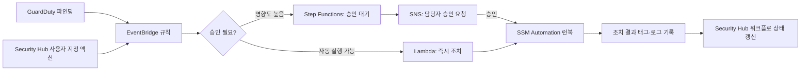

```bash
# EventBridge 규칙: GuardDuty 높음(HIGH) 심각도 파인딩만 Lambda로 전달
aws events put-rule \
  --name guardduty-high-severity-to-lambda \
  --event-pattern '{
    "source": ["aws.guardduty"],
    "detail-type": ["GuardDuty Finding"],
    "detail": { "severity": [{"numeric": [">=", 7]}] }
  }'

aws events put-targets \
  --rule guardduty-high-severity-to-lambda \
  --targets "Id"="1","Arn"="arn:aws:lambda:ap-northeast-2:123456789012:function:ir-auto-isolate"
```

**① 노출된 액세스 키 자동 무효화.** GitHub 등 공개 저장소에 액세스 키가 노출되면 GuardDuty가 `UnauthorizedAccess:IAMUser/InstanceCredentialExfiltration` 또는 관련 파인딩을 발생시킨다. EventBridge로 이를 받아 Lambda가 해당 액세스 키를 즉시 비활성화한다.

```python
# EventBridge → Lambda: 노출 의심 액세스 키 즉시 비활성화
import boto3

iam = boto3.client('iam')

def lambda_handler(event, context):
    detail = event['detail']
    access_key_id = detail['resource']['accessKeyDetails']['accessKeyId']
    user_name = detail['resource']['accessKeyDetails']['userName']

    # 드라이런 우선 검토 후, 확인되면 실제 비활성화로 전환
    iam.update_access_key(
        UserName=user_name,
        AccessKeyId=access_key_id,
        Status='Inactive'   # 삭제가 아닌 비활성화: 오탐 시 즉시 복구 가능
    )
    print(f"Access key {access_key_id} for {user_name} deactivated (finding: {detail['id']})")
```

**② 퍼블릭 S3 자동 차단.** Config 규칙 `s3-bucket-public-read-prohibited` 위반이나 GuardDuty S3 Protection 파인딩을 트리거로, 계정의 S3 퍼블릭 액세스 차단 설정을 강제로 켠다.

```python
# EventBridge → Lambda: 의도치 않은 퍼블릭 버킷 자동 차단
import boto3

s3 = boto3.client('s3')

def lambda_handler(event, context):
    bucket_name = event['detail']['requestParameters']['bucketName']
    s3.put_public_access_block(
        Bucket=bucket_name,
        PublicAccessBlockConfiguration={
            'BlockPublicAcls': True,
            'IgnorePublicAcls': True,
            'BlockPublicPolicy': True,
            'RestrictPublicBuckets': True
        }
    )
    # 실제 운영 트래픽(정적 웹 호스팅 등)을 차단할 수 있으므로
    # 예외 버킷 목록을 태그나 허용 목록으로 반드시 유지한다
```

**③ 의심 인스턴스 격리.** GuardDuty가 EC2 인스턴스의 이상 통신을 탐지하면, 인스턴스를 네트워크에서 격리하되 증거는 보존해야 한다. 보안 그룹을 격리 전용(모든 아웃바운드 차단)으로 교체하고, 조사를 위해 EBS 스냅샷을 뜬 뒤, 태그로 조사 상태를 표시한다.

```python
# EventBridge → Lambda: 의심 EC2 인스턴스 격리 (SG 교체 + 스냅샷 + 태깅)
import boto3
from datetime import datetime

ec2 = boto3.client('ec2')
ISOLATION_SG_ID = 'sg-0isolation000000'  # 아웃바운드 전체 차단 SG (사전 생성)

def lambda_handler(event, context):
    instance_id = event['detail']['resource']['instanceDetails']['instanceId']

    # 1) 보안 그룹을 격리 전용으로 교체 (기존 SG 정보는 태그로 보존)
    instance = ec2.describe_instances(InstanceIds=[instance_id])
    original_sgs = [g['GroupId'] for g in
                    instance['Reservations'][0]['Instances'][0]['SecurityGroups']]
    ec2.modify_instance_attribute(InstanceId=instance_id, Groups=[ISOLATION_SG_ID])

    # 2) 휘발성 데이터 보존을 위해 각 EBS 볼륨 스냅샷 생성
    volumes = ec2.describe_volumes(
        Filters=[{'Name': 'attachment.instance-id', 'Values': [instance_id]}]
    )
    for vol in volumes['Volumes']:
        ec2.create_snapshot(
            VolumeId=vol['VolumeId'],
            Description=f"IR-isolation-{instance_id}-{datetime.utcnow().isoformat()}",
            TagSpecifications=[{
                'ResourceType': 'snapshot',
                'Tags': [{'Key': 'incident-response', 'Value': 'true'}]
            }]
        )

    # 3) 조사 상태와 원본 SG 정보를 태그로 기록
    ec2.create_tags(
        Resources=[instance_id],
        Tags=[
            {'Key': 'ir-status', 'Value': 'isolated'},
            {'Key': 'ir-original-sgs', 'Value': ','.join(original_sgs)}
        ]
    )
    # 인스턴스를 종료하지 않는다: 메모리·프로세스 상태가 조사에 필요할 수 있다
```

**자동화 자체가 장애를 만들 수 있다는 점을 반드시 전제한다.** 오탐으로 정상 운영 중인 인스턴스나 버킷이 격리·차단되면 그 자체가 가용성 사고가 된다. 그래서 세 가지 안전장치를 항상 함께 설계한다. 첫째, **승인 게이트**— 영향도가 큰 조치(프로덕션 데이터베이스 인스턴스 격리 등)는 Step Functions로 사람의 승인을 거치게 하고, 영향도가 낮고 명백한 조치(노출된 키 비활성화)만 완전 자동화한다. 둘째, **범위 제한**— 자동화 대상을 특정 태그(`ir-automation: enabled`)가 붙은 리소스로 한정해, 예외 처리가 필요한 리소스는 자동화 대상에서 애초에 제외한다. 셋째, **드라이런(dry-run)**— 새 자동화 런북은 실제 조치 없이 로그만 남기는 모드로 먼저 충분히 운영해 오탐률을 확인한 뒤 실제 실행으로 전환한다.

### 32.8 포렌식 준비

사고 대응 자동화는 초동 조치일 뿐, 실제 침해 사고가 발생하면 정해진 절차대로 증거를 보존하고 원인을 규명해야 한다. **사고 대응 계획(incident response plan)**은 사고 발생 시 누가 무엇을 하는지 미리 정의한 **플레이북(playbook)**이다. 최소한 사고 지휘관(incident commander), 기술 조사 담당, 커뮤니케이션 담당, 법무·컴플라이언스 연락 담당의 역할을 사전에 지정해 둬야 사고 중에 혼란 없이 움직인다. 플레이북은 사고 유형별(자격증명 유출, 랜섬웨어, 데이터 유출, 서비스 거부 공격)로 나눠 작성하는 것이 실무적이다 — 유형마다 초동 조치와 연락해야 할 이해관계자가 다르기 때문이다. 플레이북은 문서로만 두지 않고 정기적인 **게임데이(game day)** 훈련으로 실제 상황처럼 실행해봐야, 사고 당일 절차가 실제로 작동하는지 검증할 수 있다(게임데이 운영 방법은 → 39.6절).

증거 보존은 **휘발성이 높은 것부터** 순서대로 확보한다. 메모리(RAM) 상태 → 네트워크 연결 상태 → 실행 중인 프로세스 → 디스크 상태 → 로그 순서로, 뒤로 갈수록 나중에 확보해도 유실 위험이 낮다. 인스턴스를 바로 종료하면 메모리의 휘발성 증거가 사라지므로, 32.7절의 격리 절차처럼 네트워크만 차단하고 인스턴스 자체는 살려둔 채 조사를 진행하는 것이 원칙이다.

**EBS 스냅샷 격리 계정 복사**는 조사용 스냅샷을 원본 워크로드 계정이 아니라 별도의 포렌식 전용 계정으로 복사해 원본 계정 관리자조차 손댈 수 없게 만드는 절차다. 공격자가 워크로드 계정의 권한을 일부라도 유지하고 있다면 증거 스냅샷을 삭제할 수 있기 때문에, 복사 즉시 원본 계정과의 접근 경로를 끊는다.

```bash
# 스냅샷을 포렌식 전용 계정(999999999999)으로 공유 후 해당 계정에서 복사
aws ec2 modify-snapshot-attribute \
  --snapshot-id snap-0abcd1234efgh5678 \
  --attribute createVolumePermission \
  --operation-type add \
  --user-ids 999999999999

# 포렌식 계정에서 실행: 공유받은 스냅샷을 자체 계정으로 복사(소유권 이전)
aws ec2 copy-snapshot \
  --source-region ap-northeast-2 \
  --source-snapshot-id snap-0abcd1234efgh5678 \
  --description "IR-forensic-copy-$(date +%Y%m%d)"
```

**메모리 캡처**가 필요한 경우(악성코드가 디스크에 흔적을 남기지 않고 메모리에서만 동작하는 경우)에는 인스턴스를 격리한 상태에서 SSM Run Command로 메모리 덤프 도구를 실행해 그 결과를 즉시 포렌식 계정의 S3로 옮긴다. 인스턴스 스토어는 재시작 시 데이터가 사라지므로, 메모리 캡처는 반드시 인스턴스가 살아있는 동안 완료해야 한다.

**자격증명 무효화 절차**는 침해 범위에 따라 단계적으로 적용한다. 장기 액세스 키는 즉시 비활성화(삭제 전 비활성화로 롤백 여지를 남긴다) 후 로테이션한다. 문제는 **이미 발급된 임시 세션 토큰**이다. STS로 발급된 세션은 만료 전까지 유효하므로 키를 막아도 이미 발급된 세션은 계속 쓸 수 있다. 이때는 역할에 세션 발급 이전 시각을 차단하는 **`aws:TokenIssueTime`** 조건이 담긴 인라인 정책을 붙여, 특정 시각 이전에 발급된 모든 세션을 일괄 거부한다.

```json
{
  "Version": "2012-10-17",
  "Statement": [
    {
      "Sid": "DenySessionsIssuedBeforeIncidentTime",
      "Effect": "Deny",
      "Action": "*",
      "Resource": "*",
      "Condition": {
        "DateLessThan": {
          "aws:TokenIssueTime": "2026-09-05T09:00:00Z"
        }
      }
    }
  ]
}
```

이 정책을 해당 역할에 인라인으로 붙이면, 지정 시각 이전에 발급된 세션 토큰으로는 모든 작업이 거부되고, 사고 이후 정상적으로 재발급된 새 세션만 통과한다. 조치가 끝나면 반드시 이 정책을 제거해 정상 운영으로 복귀한다.

**로그 보존 기간과 불변 저장**은 사고 발생 시점보다 훨씬 이전 로그가 필요할 수 있다는 전제로 설계한다. 업종·규제에 따라 요구되는 최소 보존 기간이 다르므로 일반적으로 1년 이상을 기준으로 잡되, 정확한 요건은 해당 규제 문서를 확인해야 한다. CloudTrail·Config·VPC Flow Logs를 S3 수명주기로 보존하고, 30.7절에서 다룬 대로 로그 아카이브 계정의 버킷에는 Object Lock(WORM)을 걸어 삭제·변조 자체를 원천 차단한다. 사고가 터진 뒤에 로그 보존 정책을 손보는 것은 이미 늦다.

사고가 마무리되면 **사후 분석(post-mortem)**을 통해 근본 원인과 재발 방지책을 문서화한다(포스트모템의 절차와 비난 없는 문화는 → 39.6절 참조). 조직 내부 대응 역량을 넘어서는 대형 사고이거나 AWS 인프라 자체의 이상이 의심되는 경우, **AWS Support**(비즈니스/엔터프라이즈 지원 플랜)와 AWS의 **신뢰 및 안전(Trust & Safety)** 채널에 연락해 협조를 요청한다. AWS는 계정 소유권 증명 후 관련 로그·네트워크 정보를 조사에 협조하는 절차를 갖추고 있으므로, 사고 대응 계획에 이 연락 경로와 필요한 증빙 절차를 미리 문서화해 둔다.

**모든 계정·모든 리전에서 CloudTrail을 켜고, 로그는 워크로드 계정이 아니라 별도 보안 계정의 잠긴 S3 버킷으로 전송하는 것이 이 장 전체의 전제 조건이다.** 그리고 이 로그·파인딩을 아무도 보지 않는다면, 그것은 실제로는 아무 방어도 아니다. 알람 임계치, 확인 담당자, 대응 절차, 정기적인 게임데이(→ 39.6절)가 함께 갖춰져야 "로그를 켜뒀다"는 사실이 실질적인 탐지 능력으로 이어진다.

### 32장 정리

#### [필수] 반드시 알아야 할 것
1. CloudTrail은 관리·데이터·인사이트 3종 이벤트로 나뉘며, 데이터 이벤트는 별도 과금이라 범위를 좁혀야 한다.
2. 조직 트레일 + 다중 리전 트레일 + 로그 파일 무결성 검증(다이제스트)이 감사 로그 신뢰성의 기본 조합이다.
3. Config는 구성 항목·스냅샷·히스토리로 리소스 상태 변화를 추적하고, 규칙과 적합성 팩으로 준수 여부를 채점한다.
4. GuardDuty는 에이전트 없이 켜기만 하면 CloudTrail·VPC Flow Logs·DNS 로그를 분석해 위협을 탐지하는, 투자 대비 효과가 가장 큰 탐지 서비스다.
5. Inspector는 CVE와 네트워크 도달 가능성을 결합해 우선순위를 매기며, EC2 스캔에는 SSM Agent가 필수다.
6. Security Hub는 ASFF로 파인딩을 정규화해 여러 서비스·계정의 결과를 하나의 창구로 모으고, Detective는 그 파인딩을 동작 그래프로 파고들어 근본 원인을 조사한다.
7. 자격증명 무효화는 액세스 키 비활성화만으로 끝나지 않는다 — 이미 발급된 세션 토큰은 `aws:TokenIssueTime` 조건 정책으로 별도 차단해야 한다.
8. 증거 보존은 휘발성이 높은 순서(메모리 → 네트워크 상태 → 프로세스 → 디스크 → 로그)로 진행한다.

#### [팁] 실무 노하우
1. Security Hub 대시보드 하나만 매일 확인하는 운영 방식을 정착시키고, 개별 서비스 콘솔을 계정마다 순회하지 않는다.
2. Config 자동 교정은 알림 단계로 시작해 충분히 검증한 뒤 자동 실행으로 전환한다.
3. 사고 대응 자동화는 오탐 시 되돌리기 쉬운 조치(비활성화)를 우선하고, 삭제·종료처럼 되돌릴 수 없는 조치는 승인 게이트를 거치게 한다.
4. Inspector 커버리지 점검 시 SSM 관리형 인스턴스 목록과 대조해, Agent 미설치로 스캔에서 빠진 인스턴스를 찾아낸다.
5. GuardDuty 억제 규칙은 주기적으로 재검토해, 오탐 필터링이 실제 위협까지 함께 가리고 있지 않은지 확인한다.
6. 새 자동 대응 런북은 반드시 드라이런 모드로 먼저 운영해 오탐률을 확인한 뒤 실제 실행으로 전환한다.

#### [주의] 사고·비용·설계 함정
1. S3·Lambda 전체에 CloudTrail 데이터 이벤트를 무차별로 켜면 비용이 급증한다. 실제 감사가 필요한 리소스로 좁혀라.
2. Config 레코더 범위를 무분별하게 전체 리소스 유형으로 설정하면, 변경이 잦은 리소스(Auto Scaling 인스턴스 등)에서 구성 항목 기록 비용이 급증한다.
3. 로그를 켜두고도 알람·담당자·대응 절차가 없으면 컴플라이언스를 갖췄다는 착각일 뿐 실제 탐지 능력은 없다.
4. 사고 대응 자동화가 오탐으로 프로덕션 리소스를 차단·격리하면 그 자체가 가용성 사고가 된다. 범위 제한과 승인 게이트 없이 전면 자동화하지 마라.
5. 액세스 키만 비활성화하고 이미 발급된 STS 세션 토큰을 차단하지 않으면, 공격자는 만료 전까지 세션으로 계속 접근할 수 있다.
6. 침해가 의심되는 인스턴스를 바로 종료하면 메모리의 휘발성 증거가 사라진다. 네트워크만 격리하고 인스턴스는 살려서 조사한다.
7. GuardDuty·Detective는 자체 로그 수집 설정이 필요 없지만, Detective는 GuardDuty가 먼저 켜져 있지 않으면 조사할 파인딩 자체가 없다.
8. 로그 아카이브 버킷에 Object Lock과 엄격한 버킷 정책이 없으면, 공격자가 자신의 흔적이 담긴 로그를 직접 삭제할 수 있다.

#### 한 장 요약
CloudTrail과 Config가 "무슨 일이 있었는가"의 기록을 담당하고, GuardDuty·Inspector가 위협과 취약점을 탐지하며, Security Hub가 이를 하나의 창구로 통합하고, Detective가 근본 원인을 조사한다. EventBridge 기반 자동화는 초동 대응 시간을 줄이지만 승인 게이트·범위 제한·드라이런 없이는 그 자체가 장애 요인이 된다. 실제 사고가 터지면 휘발성 우선 증거 보존과 세션 토큰까지 포함한 자격증명 무효화 절차가 필요하며, 로그를 켜두는 것과 실제로 대응할 수 있는 것은 전혀 다른 문제다.

#### 다음 장 예고
33장은 애플리케이션 계층의 보안 — Cognito 기반 인증, API 인가, WAF·Shield의 DDoS 대응, 보안 개발 수명주기를 다룬다. 인프라·계정 계층의 탐지 체계 위에 애플리케이션 자체의 방어선을 쌓는 단계다.

---

## 33장. 애플리케이션 보안  ★★★

> **이 장에서 다루는 것**
> 28~32장이 계정·인프라·데이터 계층의 보안(IAM, 로깅, 암호화, 탐지)을 다뤘다면, 이 장은 애플리케이션이 사용자를 인증하고 API 요청을 인가하며 인터넷에서 들어오는 악의적 트래픽을 걸러내는 계층을 다룬다. Cognito로 사용자를 인증하고, OAuth 2.0/OIDC와 JWT로 API를 보호하고, WAF와 Shield로 애플리케이션 계층 공격과 DDoS를 막고, Firewall Manager로 이 정책들을 조직 전체에 일괄 적용한 뒤, 클라우드 디자인 패턴 3종(페더레이티드 아이덴티티, Gatekeeper, Valet Key)으로 이를 아키텍처 패턴으로 정리한다. 마지막 절은 이 모든 것을 파이프라인에 자동으로 강제하는 보안 개발 수명주기(SDL)를 다룬다. 14장의 네트워크 계층 방어(Network Firewall, GWLB)와 이 장의 애플리케이션 계층 방어(WAF, Shield)는 서로 다른 계층을 담당하므로 함께 읽으면 방어 계층 전체가 보인다.

### 33.1 Amazon Cognito — 사용자 풀 vs 아이덴티티 풀

Cognito는 이름은 하나지만 실제로는 서로 다른 문제를 푸는 두 개의 독립된 서비스로 이뤄진다. 이 둘을 혼동하는 것이 Cognito 관련 설계 실수의 가장 흔한 원인이다.

**사용자 풀(user pool)**은 사용자 디렉터리이자 인증(authentication) 서비스다. "이 사람이 누구인가"에 답한다. 회원가입·로그인·비밀번호 재설정을 처리하고, 성공적인 인증 결과로 **JWT(ID 토큰, 액세스 토큰, 리프레시 토큰)**를 발급한다. **아이덴티티 풀(identity pool, Cognito Federated Identities)**은 인가(authorization) 서비스다. "이 사람이 AWS 리소스에 무엇을 할 수 있는가"에 답한다. 사용자 풀 토큰이나 소셜 로그인 토큰을 입력받아 **임시 AWS 자격증명(STS 자격증명)**으로 교환해준다. 즉 사용자 풀은 로그인 창구이고 아이덴티티 풀은 그 뒤에서 S3나 DynamoDB에 직접 접근할 열쇠를 내주는 창구다. 모바일 앱이 사용자 로그인 후 S3에 직접 업로드해야 하는 경우처럼 웹 인증과 AWS 리소스 접근이 모두 필요할 때만 아이덴티티 풀이 필요하고, 자체 백엔드 API만 호출한다면 사용자 풀만으로 충분한 경우가 많다.

| 구분 | 사용자 풀 | 아이덴티티 풀 |
|---|---|---|
| 역할 | 인증(누구인가) | 인가(무엇을 할 수 있는가) |
| 산출물 | JWT(ID·액세스·리프레시 토큰) | 임시 AWS 자격증명(STS) |
| 입력 | 사용자명/비밀번호, 소셜/SAML/OIDC | 사용자 풀 토큰, 소셜 토큰, 개발자 인증 자격증명 |
| 주 용도 | 로그인 UI, API 호출자 신원 확인 | 모바일/웹 클라이언트의 S3·DynamoDB 등 AWS 서비스 직접 접근 |
| 대응 개념 | 자체 사용자 디렉터리 | IAM 역할 매핑(신뢰 정책의 페더레이티드 주체) |

**한 줄 결정 기준**: 자체 API/백엔드만 호출하면 사용자 풀만, 클라이언트가 AWS 리소스에 직접 접근해야 하면 아이덴티티 풀까지 함께 구성한다.

사용자 풀은 **호스팅 UI(Hosted UI)**를 제공해 로그인·회원가입·비밀번호 재설정 화면을 직접 만들지 않아도 되게 한다. **앱 클라이언트(app client)**는 애플리케이션별로 발급되는 자격 단위로, 서버 사이드 앱은 **클라이언트 시크릿**을 함께 쓰고 브라우저·모바일 등 퍼블릭 클라이언트는 시크릿 없이 PKCE로 보호한다(33.2절). **페더레이션**으로 Google/Facebook/Apple 같은 소셜 로그인이나 기업 SAML·OIDC 아이덴티티 프로바이더를 연결해, 사용자 풀이 여러 IdP를 통합하는 단일 창구가 되게 할 수 있다.

**소셜·SAML·OIDC 페더레이션**을 사용자 풀에 연결하면, 사용자는 Google·Facebook·Apple 계정이나 사내 SAML IdP(Active Directory Federation Services 등)로 로그인하고 사용자 풀은 그 결과를 표준화된 자체 JWT로 다시 발급하는 중개자 역할을 한다. 애플리케이션 입장에서는 실제 로그인에 어떤 IdP가 쓰였는지와 무관하게 동일한 사용자 풀 토큰 검증 로직 하나만 구현하면 되므로, IdP가 늘어나도 애플리케이션 코드가 늘어나지 않는다는 것이 페더레이션 허브 구조의 핵심 이점이다(33.6절의 페더레이티드 아이덴티티 패턴이 바로 이 구조다).

보안 정책 축으로는 **MFA**(SMS, TOTP 인증 앱, 선택적으로 필수 강제), **비밀번호 정책**(최소 길이, 문자 종류 조합, 임시 비밀번호 만료), **계정 복구**(이메일/SMS 기반, 계정 열거 공격 방지를 위한 응답 통일)가 있다. **Lambda 트리거**는 인증 흐름의 각 단계에 커스텀 로직을 끼워 넣는 확장점으로, 사전 가입(pre sign-up, 이메일 도메인 화이트리스트 검증), 사전 인증(pre authentication, IP 기반 추가 검증), **사전 토큰 생성(pre token generation, JWT 클레임에 커스텀 속성·그룹 정보 추가)**, 사용자 마이그레이션(레거시 인증 시스템에서 최초 로그인 시점에 사용자를 투명하게 이관) 등이 대표적이다. **그룹**을 만들어 사용자를 분류하고 IAM 역할에 매핑하면, 아이덴티티 풀을 거칠 때 그룹별로 다른 AWS 권한을 부여할 수 있다(관리자 그룹 → 넓은 권한 역할, 일반 사용자 그룹 → 좁은 권한 역할).

```yaml
# CloudFormation: 사용자 풀 + 앱 클라이언트 + 사전 토큰 생성 Lambda 트리거
AWSTemplateFormatVersion: "2010-09-09"
Resources:
  UserPool:
    Type: AWS::Cognito::UserPool
    Properties:
      UserPoolName: app-user-pool
      MfaConfiguration: "OPTIONAL"          # 필수 강제 시 "ON"
      EnabledMfas:
        - SOFTWARE_TOKEN_MFA
      Policies:
        PasswordPolicy:
          MinimumLength: 12
          RequireUppercase: true
          RequireSymbols: true
      LambdaConfig:
        PreTokenGeneration: !GetAtt PreTokenLambda.Arn   # JWT에 커스텀 클레임 주입
      AutoVerifiedAttributes: [email]
      AccountRecoverySetting:
        RecoveryMechanisms:
          - Name: verified_email
            Priority: 1

  UserPoolClient:
    Type: AWS::Cognito::UserPoolClient
    Properties:
      UserPoolId: !Ref UserPool
      ClientName: web-app-client
      GenerateSecret: false                # 브라우저 SPA는 퍼블릭 클라이언트, PKCE로 보호
      AllowedOAuthFlows: [code]
      AllowedOAuthScopes: [openid, email, profile]
      SupportedIdentityProviders: [COGNITO]
      CallbackURLs:
        - https://app.example.com/callback

  UserPoolGroupAdmin:
    Type: AWS::Cognito::UserPoolGroup
    Properties:
      UserPoolId: !Ref UserPool
      GroupName: Admins
      Precedence: 1
```

### 33.2 API 인증·인가: OAuth 2.0 / OIDC / JWT 검증 / API Gateway 오소라이저

**OAuth 2.0**은 인가 프레임워크이고 **OpenID Connect(OIDC)**는 그 위에 인증 계층을 얹은 확장이다. OAuth 2.0만으로는 "이 액세스 토큰을 가진 사람이 누구인지"를 표준화된 방식으로 알 수 없어, OIDC가 **ID 토큰**이라는 사용자 신원 정보를 담은 JWT를 추가로 도입했다. 이 둘의 그랜트 타입(권한 부여 방식)은 클라이언트 유형에 따라 다르다.

| 그랜트 타입 | 용도 | 특징 |
|---|---|---|
| 권한 코드 + PKCE(Authorization Code with PKCE) | 웹/모바일 앱의 사용자 로그인 | 브라우저 리다이렉트 경유, 코드 가로채기를 PKCE(code verifier/challenge)로 방지. 퍼블릭 클라이언트의 표준 방식 |
| 클라이언트 자격증명(Client Credentials) | 서버 간(machine-to-machine) 통신 | 사용자 없이 클라이언트 ID/시크릿만으로 액세스 토큰 발급 |
| 디바이스 코드(Device Code) | 입력 장치가 제한적인 기기(스마트 TV 등) | 별도 화면에서 사용자가 코드를 입력해 인증 완료 |
| 리소스 오너 암호(Resource Owner Password) | 레거시 마이그레이션용 | 클라이언트가 사용자 비밀번호를 직접 취급해야 해 신뢰할 수 있는 1st-party 클라이언트가 아니면 사용 금지 |

**한 줄 결정 기준**: 사용자가 브라우저로 로그인하면 권한 코드+PKCE, 서버끼리 통신하면 클라이언트 자격증명이다.

**ID 토큰과 액세스 토큰의 용도는 다르다.** ID 토큰은 "누가 로그인했는가"를 클라이언트 애플리케이션에게 증명하는 용도이고, 리소스 서버(API)에 보내는 용도가 아니다. 액세스 토큰이 API 호출 시 자격증명으로 전달되며, API는 액세스 토큰을 검증해 요청을 인가한다. 이 둘을 바꿔 사용하는 것(ID 토큰으로 API를 호출하는 것)은 흔한 오용이다.

**JWT 검증에서 반드시 확인해야 할 항목**은 다음과 같다. 서명(signature) 검증 없이 페이로드만 디코딩해 신뢰하는 것은 사실상 인증이 없는 것과 같다 — 누구나 임의의 클레임을 담은 JWT를 만들 수 있기 때문이다.

1. **서명(signature)**: 발급자의 공개키로 서명을 검증한다.
2. **alg 화이트리스트**: 헤더의 `alg` 값을 신뢰하지 말고 서버가 기대하는 알고리즘(RS256 등)만 허용한다. `alg: none`을 허용하면 서명 검증 자체가 무력화된다.
3. **exp(만료 시각)**: 만료된 토큰은 거부한다.
4. **iss(발급자)**: 기대하는 사용자 풀/IdP URL과 일치하는지 확인한다.
5. **aud(대상)**: 이 토큰이 실제로 우리 API/클라이언트를 대상으로 발급됐는지 확인한다.
6. **kid로 JWKS 조회**: 헤더의 `kid`(키 ID)로 JWKS(JSON Web Key Set) 엔드포인트에서 해당 공개키를 조회해 서명 검증에 사용한다. JWKS는 캐싱하되 키 로테이션에 대비해 주기적으로 갱신한다.

```python
# Python: Cognito 사용자 풀 액세스 토큰 검증 (jwks + aud/iss/exp/alg 확인)
import jwt
from jwt import PyJWKClient

REGION = "ap-northeast-2"
USER_POOL_ID = "ap-northeast-2_ExAmPle"
APP_CLIENT_ID = "1h3example23456clientid"
ISSUER = f"https://cognito-idp.{REGION}.amazonaws.com/{USER_POOL_ID}"
JWKS_URL = f"{ISSUER}/.well-known/jwks.json"

jwk_client = PyJWKClient(JWKS_URL)  # 내부적으로 kid 기준 캐싱

def verify_access_token(token: str) -> dict:
    signing_key = jwk_client.get_signing_key_from_jwt(token)  # 헤더의 kid로 공개키 조회
    claims = jwt.decode(
        token,
        signing_key.key,
        algorithms=["RS256"],       # alg 화이트리스트: 서버가 명시적으로 지정, 토큰 헤더값을 신뢰하지 않음
        issuer=ISSUER,               # iss 검증
        options={"require": ["exp", "iss"]},
    )
    # 액세스 토큰은 aud 클레임이 없는 대신 client_id 클레임으로 대상 확인
    if claims.get("client_id") != APP_CLIENT_ID:
        raise ValueError("토큰 대상(client_id)이 일치하지 않음")
    if claims.get("token_use") != "access":
        raise ValueError("ID 토큰을 액세스 토큰 대신 사용하려는 시도")
    return claims  # exp 만료는 jwt.decode가 자동 검증, 만료 시 ExpiredSignatureError
```

**토큰 수명 설계**: 액세스 토큰은 짧게(수분~1시간) 유지해 탈취 시 피해 창을 줄이고, **리프레시 토큰**으로 장기 세션을 유지하되 **리프레시 토큰 회전(refresh token rotation)**을 적용해 리프레시 토큰이 재사용되면 즉시 전체 세션을 무효화하도록 한다.

**API Gateway 오소라이저는 3종**이 있다.

| 오소라이저 유형 | 동작 | 적합한 경우 |
|---|---|---|
| IAM 인가 | SigV4 서명 요청의 IAM 자격증명/정책 평가 | 서비스 간 호출, AWS 리소스 기반 접근 제어가 이미 있는 경우 |
| Cognito 오소라이저 | 사용자 풀 액세스 토큰을 API Gateway가 직접 검증 | 사용자 풀만으로 인증하는 표준 웹/모바일 API |
| Lambda 오소라이저(커스텀) | Lambda 함수가 토큰을 파싱해 IAM 정책 문서를 반환 | 커스텀 토큰 형식, 서드파티 IdP, 세밀한 조건부 인가 로직이 필요한 경우 |

Lambda 오소라이저는 매 요청마다 실행하면 지연과 비용이 늘어나므로 **인가 응답을 TTL 기준으로 캐싱**(기본 300초, 토큰+요청 컨텍스트를 캐시 키로 사용)한다. 캐시 TTL이 길수록 폐기된 토큰이 만료 전까지 계속 허용될 위험이 커지므로, 즉각적 폐기가 중요한 경우 TTL을 짧게 잡거나 캐싱을 끈다.

```python
# Lambda 오소라이저: 토큰 검증 후 IAM 정책 문서 반환 (REQUEST 유형)
def lambda_handler(event, context):
    token = event["headers"].get("authorization", "").replace("Bearer ", "")
    try:
        claims = verify_access_token(token)  # 위 JWT 검증 함수 재사용
    except Exception:
        raise Exception("Unauthorized")      # 401로 변환됨

    effect = "Allow" if "admin" in claims.get("cognito:groups", []) else "Deny"
    return {
        "principalId": claims["sub"],
        "policyDocument": {
            "Version": "2012-10-17",
            "Statement": [{
                "Action": "execute-api:Invoke",
                "Effect": effect,
                "Resource": event["methodArn"],
            }],
        },
        "context": {"userId": claims["sub"]},  # 백엔드로 전달할 컨텍스트
    }
```

ALB도 **OIDC 인증 액션**(리스너 규칙에 `authenticate-oidc`)으로 로그인 흐름 자체를 ALB가 대신 처리하고 인증된 요청만 백엔드로 전달할 수 있어, 레거시 애플리케이션 앞에 인증을 얹을 때 유용하다. **mTLS(상호 TLS)**는 클라이언트 인증서까지 검증해 서비스 간 통신이나 파트너 API 연동에서 강한 신원 보증이 필요할 때 사용하며, API Gateway와 ALB 모두 mTLS를 지원한다.

**원칙**: 게이트웨이(API Gateway, ALB) 계층에서는 토큰이 유효한가(서명·만료·발급자)만 확인하고, 세밀한 인가(이 사용자가 이 리소스의 이 필드를 수정할 수 있는가)는 각 서비스 내부 로직에서 처리한다. 게이트웨이에 비즈니스 인가 로직을 몰아넣으면 서비스가 늘어날수록 게이트웨이가 병목이자 단일 장애점이 된다.

### 33.3 AWS WAF — 관리형 규칙, 레이트 기반 규칙, 봇 컨트롤

AWS WAF는 CloudFront, ALB, API Gateway, AppSync, Cognito 사용자 풀 호스팅 UI, Verified Access 앞에 붙는 웹 애플리케이션 방화벽으로, HTTP 요청의 내용을 검사해 SQL 인젝션·XSS 같은 애플리케이션 계층 공격을 차단한다. 14장에서 다룬 Network Firewall이 네트워크/전송 계층(패킷 단위) 필터링이라면, WAF는 애플리케이션 계층(HTTP 요청의 헤더·바디·쿼리스트링) 필터링이다.

**Web ACL(Web Access Control List)**이 WAF의 핵심 구조 단위다. 하나의 Web ACL 안에 **규칙(rule)**과 **규칙 그룹(rule group)**을 담고, 각 규칙에는 **우선순위(priority)**가 있어 낮은 숫자부터 순서대로 평가된다. 어떤 규칙에도 걸리지 않은 요청은 Web ACL의 **기본 동작(default action)**(허용 또는 차단)을 따른다.

**AWS 관리형 규칙 그룹**은 AWS가 유지·관리하는 규칙 묶음으로 직접 규칙을 작성하지 않고도 널리 알려진 공격 패턴을 방어할 수 있다.

| 관리형 규칙 그룹 | 방어 대상 |
|---|---|
| 코어 규칙 세트(Core rule set, Common) | OWASP 상위 공통 취약점 전반 |
| 알려진 악성 입력(Known bad inputs) | 이미 알려진 악용 패턴, 잘못된 요청 |
| SQL 데이터베이스(SQLi) | SQL 인젝션 |
| Linux/POSIX 운영체제 | Linux 특화 명령 삽입, 경로 순회 |
| 익명 IP 목록(Anonymous IP list) | VPN·프록시·Tor 출구 노드 등 익명화 IP |
| PHP 애플리케이션 | PHP 특화 공격 패턴 |

**레이트 기반 규칙(rate-based rule)**은 지정한 시간 창(대체로 5분 단위 슬라이딩 윈도) 동안 **집계 키(aggregation key)** — 출발지 IP, 특정 헤더 값, 커스텀 키의 조합 — 별 요청 수가 임계값을 넘으면 자동 차단한다. 단순 IP당 집계 외에도 세션 쿠키나 API 키를 집계 키로 써서 IP를 우회하는 분산 공격에도 대응할 수 있다.

**사용자 지정 규칙**은 문자열 일치, 정규식, 지리적 위치(국가 코드), IP 세트, 그리고 한 규칙의 판정 결과에 **라벨(label)**을 붙여 다른 규칙이 그 라벨을 조건으로 참조하는 규칙 체이닝을 지원한다. **Bot Control**은 알려진 봇(검색엔진, 모니터링 툴)과 악성 봇(스크래퍼, 취약점 스캐너)을 분류해 처리하고, **Fraud Control(계정 탈취 방지, Account Takeover Prevention/ATP)**은 로그인 엔드포인트를 모니터링해 크리덴셜 스터핑 같은 계정 탈취 시도 패턴을 탐지·차단한다.

**Bot Control**은 검증된 봇 카테고리(검색엔진 크롤러, 모니터링·상태 확인 툴)를 통과시키고 미분류·악성 봇(콘텐츠 스크래퍼, 취약점 스캐너, 크리덴셜 스터핑에 쓰이는 자동화 도구)을 걸러내며, 요청에 자바스크립트 챌린지나 CAPTCHA를 얹는 옵션도 제공해 단순 시그니처 매칭을 우회하는 정교한 봇에도 대응한다. **Fraud Control(계정 탈취 방지, ATP)**은 로그인 엔드포인트에 특화돼 있어, 유출된 자격증명 목록으로 대량 로그인을 시도하는 크리덴셜 스터핑이나 무작위 대입 패턴을 세션·IP·기기 특성을 종합해 탐지한다. 두 기능 모두 요청 수 기준 추가 과금이 붙으므로, 로그인 폼이나 결제 엔드포인트처럼 실제 악용 위험이 큰 경로에 선별적으로 적용하는 것이 비용 대비 효과적이다.

**로깅과 샘플 요청**: Web ACL 로그를 Kinesis Data Firehose(Amazon Data Firehose)나 S3로 전달해 어떤 규칙이 어떤 요청을 걸렀는지 분석할 수 있고, 콘솔의 샘플 요청 뷰로 최근 매칭된 요청 일부를 즉시 확인할 수 있다. 로그에는 요청 헤더·매칭된 규칙·판정 결과(허용/차단/카운트)가 포함되므로, 카운트 모드 운영 기간에는 이 로그를 CloudWatch Logs Insights나 Athena로 분석해 어떤 정상 트래픽 패턴이 관리형 규칙에 걸리는지 정량적으로 파악한 뒤 예외 규칙을 추가하고 차단으로 전환한다.

**처음에는 반드시 카운트 모드(Count)로 배포한다.** 새 규칙이나 관리형 규칙 그룹을 곧바로 차단(Block) 모드로 적용하면, 실제 공격이 아닌 정상 트래픽까지 오탐(false positive)으로 차단해 서비스 장애를 스스로 일으킬 위험이 크다. 카운트 모드로 일정 기간 운영하며 어떤 정상 트래픽이 얼마나 걸리는지 관찰하고, 오탐 패턴을 예외 규칙으로 정리한 뒤 차단으로 전환하는 것이 표준 절차다.

```yaml
# CloudFormation: Web ACL — 관리형 규칙(카운트 모드) + 레이트 기반 규칙
AWSTemplateFormatVersion: "2010-09-09"
Resources:
  AppWebACL:
    Type: AWS::WAFv2::WebACL
    Properties:
      Name: app-web-acl
      Scope: REGIONAL             # CloudFront에 붙일 때는 CLOUDFRONT, us-east-1에서만 생성 가능
      DefaultAction:
        Allow: {}
      VisibilityConfig:
        SampledRequestsEnabled: true
        CloudWatchMetricsEnabled: true
        MetricName: app-web-acl
      Rules:
        - Name: AWS-CommonRuleSet
          Priority: 0
          OverrideAction:
            Count: {}            # 최초 배포는 카운트 모드로 오탐 측정
          Statement:
            ManagedRuleGroupStatement:
              VendorName: AWS
              Name: AWSManagedRulesCommonRuleSet
          VisibilityConfig:
            SampledRequestsEnabled: true
            CloudWatchMetricsEnabled: true
            MetricName: common-rule-set

        - Name: AWS-SQLiRuleSet
          Priority: 1
          OverrideAction:
            Count: {}
          Statement:
            ManagedRuleGroupStatement:
              VendorName: AWS
              Name: AWSManagedRulesSQLiRuleSet
          VisibilityConfig:
            SampledRequestsEnabled: true
            CloudWatchMetricsEnabled: true
            MetricName: sqli-rule-set

        - Name: RateLimitPerIP
          Priority: 2
          Action:
            Block: {}             # 레이트 제한은 임계값이 명확하므로 처음부터 차단해도 비교적 안전
          Statement:
            RateBasedStatement:
              Limit: 2000          # 5분 슬라이딩 윈도 기준 IP당 요청 수 임계값
              AggregateKeyType: IP
          VisibilityConfig:
            SampledRequestsEnabled: true
            CloudWatchMetricsEnabled: true
            MetricName: rate-limit-per-ip
```

**요금 축**은 Web ACL 개수(월 고정), 규칙 개수(월 고정), 처리 요청 수(요청 100만 건당)로 구성된다. Bot Control과 Fraud Control은 별도 추가 요금이 붙으므로, 실제 봇 트래픽·계정 탈취 위험이 큰 서비스에만 선택적으로 켠다. 구체적 단가는 시점에 따라 바뀌므로 콘솔의 WAF 요금 문서를 확인한다.

### 33.4 AWS Shield와 DDoS 대응 런북

AWS Shield는 DDoS(분산 서비스 거부) 공격 방어 서비스로 **Standard**와 **Advanced** 두 등급이 있다.

| 구분 | Shield Standard | Shield Advanced |
|---|---|---|
| 제공 방식 | 모든 AWS 고객에게 **기본 자동 제공**, 별도 가입 불필요 | 유료 구독, 조직 단위 계약 |
| 방어 범위 | L3/L4(네트워크·전송 계층) 일반적 DDoS | L3/L4 + L7(애플리케이션 계층, WAF와 결합) |
| 대응 조직 | 자동 완화만 | **DRT(DDoS Response Team)** 상시 지원 요청 가능 |
| 비용 보호 | 없음 | 공격으로 인한 오토스케일링·데이터 전송 비용 급증분에 대한 **비용 보호(cost protection)** |
| 모니터링 | 없음 | 상시 트래픽 모니터링, **헬스 기반 탐지(health-based detection)**(Route 53 헬스 체크와 연동해 실제 가용성 저하를 공격 신호로 활용) |
| 통합 | - | Firewall Manager로 조직 전체에 정책 자동 적용 |

**한 줄 결정 기준**: 인터넷에 노출된 핵심 프로덕션 서비스가 있고 DDoS로 인한 다운타임·비용 급증이 사업에 실질적 타격이라면 Advanced를, 그렇지 않고 일반적인 웹 트래픽 수준이라면 Standard(자동 제공)로 충분한 경우가 많다.

**DDoS 대응 런북**은 대체로 다음 흐름을 따른다.

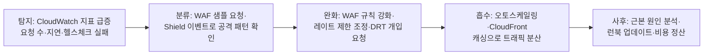

탐지 단계의 핵심 지표는 요청 수 급증, 오리진 응답 지연 증가, ALB/CloudFront 5xx 비율 상승, Route 53 헬스 체크 실패다. 완화 단계에서는 WAF 레이트 기반 규칙을 즉시 조정하거나 Shield Advanced의 DRT에게 공격 완화를 요청할 수 있다. **축소 표면(reduced attack surface) 원칙**에 따라 퍼블릭 노출을 최소화(불필요한 퍼블릭 IP 제거, CloudFront/ALB 뒤로 오리진 숨기기, 보안 그룹으로 오리진에 CloudFront IP 대역만 허용)하면 애초에 공격 표면이 줄어든다. 오토스케일링으로 정상 용량을 자동 확장해 공격 트래픽 일부를 흡수하는 것도 유효한 전략이지만, 이는 완화가 아니라 버티기이므로 WAF·레이트 제한과 함께 써야 한다(오토스케일링 세부 동작은 → 14장의 확장 흡수 논의 및 컴퓨트 파트 참조).

**Shield Advanced는 월 고정 비용이 상당하다.** 도입 전에 "우리 서비스가 실제로 표적이 될 만큼 노출돼 있는가", "다운타임 1분당 사업 손실이 얼마인가", "DRT 접근과 비용 보호가 그 손실 대비 정당화되는가"를 함께 평가해야 한다. 일반적인 내부용 애플리케이션이나 트래픽이 크지 않은 서비스에 Advanced를 붙이는 것은 과잉 투자인 경우가 많고, 반대로 결제·금융처럼 다운타임이 직접 매출 손실로 이어지는 퍼블릭 서비스에는 도입 가치가 분명하다.

### 33.5 AWS Firewall Manager

여러 계정에 WAF Web ACL, Shield Advanced 보호, 보안 그룹 규칙을 하나씩 수동으로 맞추는 것은 계정이 늘어날수록 불가능해진다. **Firewall Manager**는 **AWS Organizations** 전체에 보안 정책을 중앙에서 한 번 정의하고 모든 대상 계정·리소스에 자동으로 적용·유지시키는 서비스다.

Firewall Manager로 관리할 수 있는 정책 유형은 다음과 같다.

- **WAF 정책**: 조직 전체 또는 특정 OU의 CloudFront/ALB/API Gateway에 공통 Web ACL을 강제 적용
- **Shield Advanced 정책**: 조건에 맞는 리소스(예: 인터넷 대면 ALB)에 자동으로 Shield Advanced 보호를 활성화
- **보안 그룹 감사(security group audit)**: 조직 전체 보안 그룹 중 정책 위반(예: 0.0.0.0/0에 22번 포트 허용) 규칙을 탐지하고 자동 교정
- **Network Firewall 정책**: 조직 전체 VPC에 공통 Network Firewall 규칙 그룹 배포(→ 14장)
- **Route 53 DNS Firewall 정책**: 조직 전체에 공통 DNS 필터링 규칙 적용

**필수 전제조건**은 **AWS Organizations**가 구성돼 있고(관리 계정에서 Firewall Manager 관리자 계정을 위임), **AWS Config**가 대상 계정·리전에서 활성화돼 있어야 한다는 것이다(Config가 리소스 인벤토리를 제공해야 정책 적용 대상을 판별할 수 있다).

정책은 **범위(scope)**를 OU 단위, 계정 단위, 태그 기준으로 좁힐 수 있고, **자동 교정(auto-remediation)**을 켜면 정책에 맞지 않는 리소스(예: Web ACL이 안 붙은 새 ALB)를 사람이 개입하지 않아도 자동으로 정책에 맞춰 수정한다. **신규 계정 자동 적용**이 Firewall Manager의 핵심 가치로, 새 멤버 계정이 조직에 추가되는 순간부터 정책이 자동으로 걸려 "새 계정을 깜빡하고 보안 설정을 안 했다"는 실수를 구조적으로 차단한다.

```bash
# CLI: Firewall Manager WAF 정책 생성 (조직 전체 ALB에 공통 Web ACL 강제)
aws fms put-policy \
  --policy '{
    "PolicyName": "org-baseline-waf-policy",
    "SecurityServicePolicyData": {
      "Type": "WAFV2",
      "ManagedServiceData": "{\"type\":\"WAFV2\",\"preProcessRuleGroups\":[{\"managedRuleGroupIdentifier\":{\"vendorName\":\"AWS\",\"managedRuleGroupName\":\"AWSManagedRulesCommonRuleSet\"},\"overrideAction\":{\"type\":\"COUNT\"}}],\"overrideCustomerWebACLAssociation\":false}"
    },
    "ResourceType": "AWS::ElasticLoadBalancingV2::LoadBalancer",
    "ExcludeResourceTags": false,
    "RemediationEnabled": true,
    "ResourceTagLogicalOperator": "AND"
  }'
# RemediationEnabled: true → 정책 미준수 리소스를 자동 교정
```

### 33.6 페더레이티드 아이덴티티 · Gatekeeper · Valet Key 패턴

*Cloud Design Patterns*가 정의하는 보안 관련 패턴 3종은 지금까지 다룬 서비스들을 "왜 이렇게 구성하는가"의 관점에서 다시 묶는다.

**페더레이티드 아이덴티티(Federated Identity) 패턴**

- **문제**: 애플리케이션마다 자체 사용자 디렉터리와 로그인 로직을 구현하면 비밀번호 저장·MFA·복구 흐름을 반복 구현해야 하고, 각 구현마다 취약점 위험이 생긴다. 사용자 입장에서도 서비스마다 별도 계정을 만들어야 한다.
- **해결**: 인증을 신뢰할 수 있는 **외부 아이덴티티 프로바이더(IdP)**에 위임한다. 애플리케이션은 자격증명을 직접 다루지 않고, IdP가 발급한 토큰(SAML 어설션 또는 OIDC ID 토큰)을 검증만 한다.
- **고려사항**: IdP 장애가 곧 로그인 불가로 이어지므로 IdP의 가용성이 애플리케이션 가용성의 상한이 된다. 여러 IdP를 동시에 지원하려면 클레임 매핑 로직이 복잡해진다.
- **AWS 구현**: Cognito 사용자 풀이 페더레이션 허브 역할을 하며(소셜/SAML/OIDC IdP를 사용자 풀 뒤에 연결), 조직 내부 사용자는 **IAM Identity Center**로 SAML/OIDC 페더레이션을 구성한다.

**Gatekeeper 패턴**

- **문제**: 인터넷에 노출된 서비스가 요청 검증과 비즈니스 로직을 한 프로세스에서 처리하면, 검증 로직의 취약점이 곧바로 핵심 시스템·데이터에 대한 침해로 이어진다.
- **해결**: 요청 검증만 전담하는 별도의 제한된 인스턴스(게이트키퍼)를 신뢰 경계 앞단에 두고, 검증을 통과한 요청만 내부 신뢰 영역으로 전달한다. 게이트키퍼 자체는 최소 권한·최소 코드로 유지해 공격 표면을 좁힌다.
- **고려사항**: 게이트키퍼가 병목이나 단일 장애점이 되지 않도록 수평 확장 가능해야 하고, 게이트키퍼와 내부 사이의 통신 채널도 별도로 보호해야 한다.
- **AWS 구현**: **WAF + ALB/API Gateway**를 신뢰 경계 앞단에 두고, 그 뒤에 **BFF(Backend for Frontend)** 또는 API Gateway 자체가 인증·형식 검증·요청 정규화를 전담한 뒤에만 내부 서비스로 요청을 전달하는 구조가 Gatekeeper 패턴의 AWS식 구현이다. 33.2절에서 다룬 "게이트웨이에서 토큰 검증, 서비스에서 세밀한 인가"라는 원칙이 바로 이 패턴의 실천이다.

**Valet Key 패턴**

- **문제**: 파일 업로드·다운로드처럼 대용량 데이터 전송을 애플리케이션 서버가 프록시하면, 서버가 불필요하게 네트워크 대역폭과 컴퓨트 자원을 소모하고 확장성의 병목이 된다.
- **해결**: 스토리지에 **제한된 권한과 유효 기간을 가진 토큰(밸릿 키)**을 클라이언트에 발급해, 클라이언트가 스토리지에 직접 접근하게 한다. 자동차 발레파킹 요원에게 트렁크는 열리지 않는 열쇠만 주는 것과 같은 비유다.
- **고려사항**: 토큰 유효 기간을 짧게(업로드는 분 단위, 다운로드는 상황에 따라 더 길게) 잡고, 업로드는 파일 크기·타입·경로 제약을 함께 걸어야 임의 업로드를 막을 수 있다.
- **AWS 구현**: **S3 사전 서명 URL(pre-signed URL)**이 대표적인 구현으로, 애플리케이션 서버가 요청받을 때마다 URL을 서명해 클라이언트에 내려주고 실제 업로드/다운로드는 S3와 클라이언트가 직접 주고받는다. 대용량 업로드나 여러 필드 조건(파일 크기 범위, 콘텐츠 타입, 접두사)을 강제하려면 **사전 서명 POST 정책(presigned POST policy)**을 쓴다.

```python
# Python(boto3): 사전 서명 URL(다운로드/단순 업로드)과 사전 서명 POST 정책(업로드 조건 강제)
import boto3

s3 = boto3.client("s3", region_name="ap-northeast-2")
BUCKET = "app-uploads-123456789012"

def get_presigned_download_url(key: str) -> str:
    # 다운로드용 GET URL, 5분 후 만료 — 앱 서버를 거치지 않고 클라이언트가 S3에서 직접 다운로드
    return s3.generate_presigned_url(
        "get_object",
        Params={"Bucket": BUCKET, "Key": key},
        ExpiresIn=300,
    )

def get_presigned_upload_post(key_prefix: str, user_id: str):
    # 업로드 조건(POST policy): 크기 상한, 콘텐츠 타입, 접두사 제한, 짧은 만료
    return s3.generate_presigned_post(
        Bucket=BUCKET,
        Key=f"{key_prefix}/{user_id}/${{filename}}",
        Conditions=[
            ["content-length-range", 1, 10 * 1024 * 1024],   # 최대 10MB
            ["starts-with", "$Content-Type", "image/"],       # 이미지 파일만 허용
            ["starts-with", "$key", f"{key_prefix}/{user_id}/"],  # 사용자별 경로 강제
        ],
        ExpiresIn=120,  # 밸릿 키 원칙: 유효기간을 짧게 유지
    )
    # 반환된 {url, fields}를 클라이언트가 그대로 S3에 multipart/form-data POST로 전송
```

이 세 패턴은 서로 배타적이지 않다. 실제 아키텍처에서는 페더레이티드 아이덴티티로 로그인하고, Gatekeeper로 API 요청을 검증하며, Valet Key로 파일 전송을 오프로드하는 조합이 흔하다.

### 33.7 보안 개발 수명주기: 시크릿 스캐닝부터 서플라이 체인까지

지금까지의 서비스들이 런타임 방어라면, **보안 개발 수명주기(SDL, Security Development Lifecycle)**는 코드가 배포되기 전 파이프라인 단계에서 결함을 잡아내는 체계다. 런타임에서 막는 것보다 커밋 단계에서 막는 것이 훨씬 저렴하다.

**시크릿 스캐닝**: 액세스 키·비밀번호·API 토큰이 실수로 코드에 커밋되는 것을 막는다. **pre-commit 훅**(git-secrets 등)으로 로컬에서 커밋 시점에 차단하는 것이 가장 이르고 저렴한 지점이고, 이를 놓쳤을 때를 대비해 **Amazon CodeGuru**의 보안 탐지 기능이나 저장소 스캐닝 도구가 이미 푸시된 코드에서도 시크릿·취약 패턴을 탐지한다.

**SCA(Software Composition Analysis, 소프트웨어 구성 분석)**: 애플리케이션이 의존하는 오픈소스 패키지의 알려진 취약점(CVE)을 탐지한다. **Amazon Inspector**가 Lambda 함수와 EC2/ECR 이미지의 패키지 취약점을 스캔하고, **Dependabot**(GitHub 통합)이 의존성 버전에 알려진 취약점이 발견되면 자동으로 패치 PR을 올린다.

**SAST(Static Application Security Testing)**는 소스 코드 자체를 실행하지 않고 정적 분석해 인젝션·안전하지 않은 역직렬화 같은 코드 패턴 결함을 찾고, **DAST(Dynamic Application Security Testing)**는 실행 중인 애플리케이션에 실제 요청을 보내 런타임에서만 드러나는 취약점을 찾는다. 이 둘은 서로 대체하지 못한다. SAST는 코드에 실제로 도달 가능한 실행 경로가 있는지와 무관하게 패턴만으로 결함을 찾아내 오탐이 상대적으로 많은 대신 빌드 시점에 즉시 실행할 수 있고, DAST는 실제 요청·응답을 관찰하므로 오탐은 적지만 배포된 실행 환경이 있어야 하고 실행 시간도 길다. 두 방식이 잡아내는 결함 유형이 겹치지 않으므로 파이프라인에서 병행하는 것이 일반적이다.

**컨테이너 이미지 스캔**: ECR에 푸시된 이미지의 OS 패키지·애플리케이션 의존성 취약점을 스캔한다(→ 19장의 ECR 절에서 다룬 스캔 온 푸시 기능 참조). 이미지 스캔은 배포 이전 게이트로 파이프라인에 넣어, 심각도 임계값을 넘는 취약점이 있으면 배포를 자동으로 막는다.

**IaC 정적 검사**: CloudFormation/Terraform 템플릿 자체를 실행 전에 검사해 과도하게 열린 보안 그룹, 암호화 미적용 리소스 같은 설계 결함을 배포 전에 잡는다. `cfn-nag`, `checkov` 같은 도구가 대표적이며 구체적인 도구 비교와 파이프라인 배치는 → 35장(Infrastructure as Code)에서 다룬다.

**서플라이 체인 보안**: 빌드 산출물이 실제로 신뢰할 수 있는 소스에서 왔는지 보증하는 영역이다. 아티팩트에 **서명(signing)**을 붙여 변조 여부를 검증 가능하게 하고, **SBOM(Software Bill of Materials, 소프트웨어 자재명세서)**으로 애플리케이션이 사용하는 모든 구성요소 목록을 관리해 새 취약점이 발표됐을 때 영향받는 애플리케이션을 즉시 추적할 수 있게 한다. **CodeArtifact**로 업스트림 오픈소스 저장소 접근을 통제하고 승인된 패키지 버전만 내부 파이프라인이 가져오게 제한하는 것도 서플라이 체인 통제의 일부다. 구체적인 구성은 → 36장(CI/CD 파이프라인)의 CodeArtifact 절을 참조한다.

**파이프라인에 게이트를 배치하는 순서**는 "빠르고 저렴한 검사를 먼저, 느리고 비싼 검사를 나중에" 원칙을 따른다.

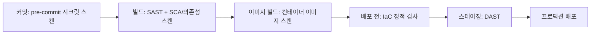

시크릿 스캔과 SAST/SCA는 초 단위로 끝나 커밋·빌드 단계에 두고, DAST는 실행 환경이 필요해 스테이징 배포 이후에 둔다. 각 게이트는 심각도 기준을 정해 "치명적(Critical) 발견 시 파이프라인 중단, 낮은 심각도는 경고만" 같은 정책으로 자동화해야 사람이 매번 수동으로 판단하지 않아도 된다.

### 33장 정리

#### [필수] 반드시 알아야 할 것
1. Cognito **사용자 풀**은 인증(사용자 디렉터리, JWT 발급)을, **아이덴티티 풀**은 인가(AWS 임시 자격증명 교환)를 담당하며 서로 다른 문제를 푼다. 자체 API만 호출하면 사용자 풀만으로 충분한 경우가 많다.
2. OIDC의 **ID 토큰**은 클라이언트에게 신원을 증명하는 용도, **액세스 토큰**은 API 호출 자격증명 용도로 서로 바꿔 쓰지 않는다.
3. JWT 검증은 서명, alg 화이트리스트, exp, iss, aud, kid 기반 JWKS 조회를 모두 거쳐야 하며, 하나라도 빠지면 우회가 가능해진다.
4. API Gateway 오소라이저는 IAM/Cognito/Lambda 3종이 있고, Lambda 오소라이저는 캐싱으로 지연·비용을 관리한다.
5. WAF Web ACL은 규칙·규칙 그룹의 우선순위 평가와 기본 동작으로 구성되며, 관리형 규칙 그룹으로 공통 공격 패턴을 빠르게 방어할 수 있다.
6. Shield Standard는 모든 계정에 기본 제공되는 L3/L4 방어이고, Advanced는 유료로 DRT·비용 보호·L7 방어까지 확장한다.
7. Firewall Manager는 Organizations+Config를 전제로 조직 전체와 신규 계정에 WAF/Shield/보안 그룹/Network Firewall/DNS Firewall 정책을 자동 적용·교정한다.
8. 페더레이티드 아이덴티티, Gatekeeper, Valet Key는 각각 인증 위임, 신뢰 경계 축소, 대용량 전송 오프로드라는 서로 다른 문제를 푸는 독립적 패턴이며 함께 조합해 쓸 수 있다.

#### [팁] 실무 노하우
1. WAF는 새 규칙을 **카운트 모드**로 먼저 배포해 일정 기간 오탐률을 측정한 뒤 차단으로 전환한다.
2. 게이트웨이(API Gateway, ALB)에서는 토큰 유효성만 확인하고, 세밀한 비즈니스 인가는 서비스 내부에 둬 게이트웨이가 병목이 되지 않게 한다.
3. 업로드·다운로드는 사전 서명 URL/POST 정책으로 S3에 직결해 앱 서버의 대역폭·컴퓨트 부담을 없앤다. 업로드는 크기·타입·경로 조건을 반드시 함께 건다.
4. Lambda 사전 토큰 생성 트리거로 JWT에 그룹·커스텀 클레임을 주입하면 다운스트림 서비스가 별도 조회 없이 인가 판단을 내릴 수 있다.
5. 시크릿 스캐닝은 pre-commit 훅처럼 가장 이른 지점에 두는 것이 가장 저렴하다. 커밋된 뒤 발견하면 이미 히스토리에 남아 키 폐기까지 필요해진다.
6. Firewall Manager의 자동 교정을 켜두면 새 계정·새 리소스가 정책을 놓치는 사각지대를 구조적으로 없앤다.

#### [주의] 사고·비용·설계 함정
1. **JWT를 검증 없이(또는 서명·exp·iss·aud 중 일부만) 신뢰하는 것은 사실상 인증이 없는 것과 같다.** alg 화이트리스트를 두지 않으면 `alg: none` 같은 우회도 가능하다.
2. ID 토큰을 API 호출 자격증명으로 오용하면 리소스 서버가 원래 의도되지 않은 토큰을 받아들이게 된다.
3. WAF 관리형 규칙 그룹을 처음부터 차단 모드로 켜면 정상 트래픽을 스스로 차단하는 장애를 일으킬 수 있다.
4. Shield Advanced는 월 고정비가 상당하므로, 실제 DDoS 노출도와 비용 보호 가치를 따지지 않고 습관적으로 도입하면 과잉 지출이 된다.
5. Lambda 오소라이저 캐시 TTL을 과도하게 길게 잡으면 폐기된 토큰·권한 변경이 캐시 만료 전까지 계속 허용된다.
6. 아이덴티티 풀 역할 매핑에서 인증되지 않은(unauthenticated) 아이덴티티에 과도한 권한을 부여하면 로그인 없이도 AWS 리소스에 접근할 수 있는 구멍이 생긴다.
7. Firewall Manager 전제조건(Organizations, Config)이 갖춰지지 않은 상태에서 정책을 걸면 대상 계정이 누락돼 "적용됐다고 생각했지만 실제로는 빠진" 계정이 생긴다.
8. 사전 서명 URL의 만료 시간을 과도하게 길게 잡거나 업로드 조건(크기·타입·경로)을 생략하면 사실상 무제한 업로드 권한을 배포하는 것과 같다.

#### 한 장 요약
Cognito는 인증(사용자 풀)과 인가(아이덴티티 풀)를 분리해 제공하고, API 계층은 OAuth 2.0/OIDC 그랜트 타입에 맞는 토큰을 발급받아 서명·만료·발급자·대상까지 검증해야 진짜 인증이 성립한다. WAF는 카운트 모드로 시작해 오탐을 줄인 뒤 관리형 규칙과 레이트 제한으로 애플리케이션 계층을 방어하고, Shield는 기본 제공되는 Standard와 비용 보호까지 포함하는 유료 Advanced로 나뉘며, Firewall Manager가 이 정책들을 조직 전체와 신규 계정에 자동으로 강제한다. 페더레이티드 아이덴티티·Gatekeeper·Valet Key 패턴은 이 서비스들을 "인증 위임·신뢰 경계 축소·대용량 전송 오프로드"라는 설계 원칙으로 정리하며, 보안 개발 수명주기는 이 모든 방어를 런타임 이전 파이프라인 단계에서 강제하는 마지막 층이다.

#### 다음 장 예고
34장은 조직이 규제·표준을 준수하고 있음을 증명하는 컴플라이언스와 감사 체계 — AWS Audit Manager, AWS Artifact, 컴플라이언스 프로그램 — 를 다룬다.

---

## 34장. 컴플라이언스와 감사  ★★★

> **이 장에서 다루는 것**
> 32장에서 CloudTrail·Config·GuardDuty 같은 탐지·대응 도구를 다뤘다면, 이 장은 그 위에서 "우리가 규정을 지키고 있다는 것을 어떻게 제3자에게 증명하는가"를 다룬다. AWS Artifact로 AWS 쪽 인증서를 받아오고, Audit Manager로 우리 쪽 증거를 자동 수집하고, 주요 규정(ISO 27001·SOC 2·PCI DSS·HIPAA·GDPR, 그리고 국내 ISMS-P·전자금융감독규정)이 요구하는 것을 AWS 서비스와 매핑하고, 리전 선택이 만드는 데이터 주권 문제와 로그 보존·불변 저장 설계까지 이어진다. 22장(S3 Object Lock)과 23장(AWS Backup, Vault Lock), 3장(리전 선택)의 내용을 전제한다.

### 34.1 AWS Artifact

감사를 준비할 때 가장 먼저 부딪히는 질문은 "AWS가 이미 받아둔 인증을 우리가 어떻게 확인하고 감사인에게 제출하는가"다. **AWS Artifact**는 이 질문에 대한 셀프서비스 창구다. AWS 관리 콘솔에서 AWS Artifact에 접속하면 두 가지 카테고리를 볼 수 있다.

**AWS Artifact Reports**는 AWS가 제3자 감사 기관으로부터 받은 인증·감사 보고서를 온디맨드로 다운로드하는 기능이다. 대표적으로 SOC 1 Type II(재무보고 내부통제), SOC 2 Type II(보안·가용성·기밀성 등 트러스트 서비스 기준), SOC 3(SOC 2의 공개 요약본), ISO 27001(정보보안 관리체계), ISO 27017(클라우드 보안), ISO 27018(클라우드 개인정보보호), ISO 9001, PCI DSS AOC(Attestation of Compliance)와 책임 분담 매트릭스(Responsibility Summary) 등이 있다. 대부분 NDA(비밀유지계약) 클릭 동의 후 즉시 PDF로 받을 수 있으며, 별도로 AWS 담당자에게 요청 메일을 보낼 필요가 없다.

**AWS Artifact Agreements**는 규정 준수에 필요한 계약을 조직 차원에서 온라인으로 검토·수락하는 기능이다. 대표적으로 HIPAA를 위한 **BAA(Business Associate Addendum)**, GDPR을 위한 **DPA(Data Processing Addendum)**, 그리고 일부 국가·산업별 추가 약정이 있다. AWS Organizations와 통합하면 관리 계정에서 한 번 수락한 계약을 조직 내 여러 멤버 계정에 일괄 적용할 수 있어, 계정이 늘어날 때마다 계약을 개별 수락하는 번거로움을 없앤다.

여기서 반드시 짚어야 할 핵심 구분이 있다. **AWS Artifact가 제공하는 인증은 AWS 인프라(데이터센터, 하드웨어, 네트워크, 가상화 계층, 관리형 서비스의 운영 기반)에 대한 인증이지, 그 위에서 고객이 만드는 애플리케이션과 데이터 처리 방식에 대한 인증이 아니다.** 이는 28장에서 다룬 공동 책임 모델(Shared Responsibility Model)의 감사 버전이라고 볼 수 있다. AWS가 "of the Cloud(클라우드 자체의 보안)"를 인증받았다고 해서 고객이 EC2 위에 배포한 애플리케이션이 PCI DSS를 준수한다고 자동으로 증명되지 않는다. 고객은 자신의 IAM 정책 설계, 암호화 적용, 로깅 구성, 애플리케이션 코드의 보안, 접근 통제 절차 등 "in the Cloud(클라우드 안에서의 보안)"에 대해 별도로 증거를 수집하고 감사를 받아야 한다.

실무에서는 다음 순서로 활용한다.

1. 감사 유형(ISO 27001 인증 심사, SOC 2 심사, PCI DSS 심사 등)을 확인한다.
2. AWS Artifact Reports에서 해당 보고서를 다운로드해 "인프라 계층은 이미 인증되어 있다"는 근거로 제출한다.
3. 애플리케이션 계층에 대해서는 34.2절의 Audit Manager로 자체 증거를 수집한다.
4. 계약이 필요한 경우(의료 데이터 처리 시 BAA, EU 개인정보 처리 시 DPA) Artifact Agreements에서 조직 계정으로 수락한다.

Organizations 통합 시 관리 계정에서 계약 상태를 중앙에서 추적할 수 있으므로, 멤버 계정이 개별적으로 계약을 놓치는 사고를 방지하려면 조직 차원 수락을 표준 온보딩 절차에 포함해야 한다.

보고서 종류가 많다 보니 어떤 상황에 어떤 보고서를 꺼내야 하는지 헷갈리기 쉽다. 다음 표로 정리한다.

| 상황 | 꺼낼 보고서 | 비고 |
|---|---|---|
| 고객사가 "AWS도 ISO 인증받았나요?"라고 물을 때 | ISO 27001/27017/27018 인증서 | 27017은 클라우드 특화 보안, 27018은 클라우드 내 개인정보보호 통제 |
| 재무 감사인이 내부통제 근거를 요구할 때 | SOC 1 Type II | 재무보고에 영향을 주는 통제에 초점 |
| 보안 심사·영업 실사(due diligence) 대응 | SOC 2 Type II(상세본), SOC 3(공개 요약본) | SOC 2는 NDA 동의 후 상세 내용 확인, SOC 3는 외부 공개용 |
| 카드 결제 서비스 심사 | PCI DSS AOC + Responsibility Summary | Responsibility Summary에서 AWS 담당 통제와 고객 담당 통제가 구분되어 있어 범위 산정에 유용 |

또한 보고서는 감사 기관이 주기적으로 재심사한 뒤 갱신되므로, 이전에 받아둔 PDF를 계속 재사용하지 말고 감사 대응 시점마다 Artifact에서 **최신 버전을 다시 다운로드**해야 한다. 보고서 유효 기간이 지난 버전을 제출하면 감사인이 최신본 재제출을 요구해 일정이 지연되는 경우가 흔하다.

### 34.2 AWS Audit Manager

감사 시즌마다 담당자가 스프레드시트를 만들어 스크린샷을 붙이고 설정값을 캡처하는 방식은 확장되지 않는다. **AWS Audit Manager**는 AWS 리소스 구성과 활동 로그로부터 감사 증거를 지속적·자동적으로 수집해 감사 준비 시간을 크게 줄이는 서비스다.

핵심 개념은 세 가지다.

- **프레임워크(Framework)**: 감사 대상 규정의 통제 체계를 구조화한 것. AWS가 사전 구축한 표준 프레임워크(PCI DSS, HIPAA, GDPR, ISO 27001, SOC 2, CIS Benchmarks, NIST 800-53 등 다수)를 그대로 쓸 수도 있고, 조직 내부 정책에 맞춰 **사용자 지정 프레임워크**를 통제 단위로 직접 구성할 수도 있다.
- **평가(Assessment)**: 특정 프레임워크를 특정 AWS 계정 범위(단일 계정 또는 Organizations 다중 계정)에 적용해 실행하는 감사 인스턴스. 평가를 생성하면 프레임워크에 속한 각 **컨트롤(Control)**에 대해 증거 수집이 자동으로 시작된다.
- **컨트롤(Control)**: 프레임워크 안의 개별 요구사항(예: "저장 데이터는 암호화되어야 한다"). 각 컨트롤에는 증거 소스가 매핑되어 있다.

증거 자동 수집은 Audit Manager의 핵심 가치다. 컨트롤에 따라 다음 소스에서 자동으로 증거를 끌어온다.

- **AWS Config 규칙 평가 결과**: 리소스 구성이 규정 요구사항을 충족하는지에 대한 스냅샷 증거(예: S3 버킷 암호화 활성화 여부)
- **AWS CloudTrail 이벤트**: 활동 기반 증거(예: IAM 정책 변경 이력, 콘솔 로그인 기록)
- **AWS Security Hub 조사 결과**: 보안 표준 준수 상태
- **API 호출 결과**: 서비스별 설정을 직접 조회한 결과(수동 스크립트로 확인하던 것을 자동화)

수집된 증거는 **증거 폴더**에 컨트롤별로 자동 정리되며, 평가 담당자는 필요 시 수동 증거(계약서, 정책 문서 스캔본 등)를 추가로 업로드할 수 있다. 평가가 끝나면 버튼 하나로 **감사 보고서(Assessment Report)**를 생성해 외부 감사인에게 전달할 수 있는 형태로 내보낸다. 조직 내에서 특정 컨트롤의 증거 검토·주석 작업을 개인이나 팀에 **담당자 위임(Delegation)**하는 기능도 있어, 보안팀이 모든 컨트롤을 혼자 처리하지 않고 각 서비스 오너에게 검토를 분산시킬 수 있다.

Audit Manager와 32장에서 다룬 **AWS Config 적합성 팩(Conformance Pack)**은 역할이 다르다. 다음 표로 정리한다.

| 구분 | AWS Config 적합성 팩 | AWS Audit Manager |
|---|---|---|
| 목적 | 리소스 구성이 규정을 지키는지 **실시간 규칙 평가·교정** | 감사 대응을 위한 **증거 수집·보고서 생성** |
| 산출물 | 규칙 위반/준수 상태, 자동 교정 액션 | 감사용 증거 폴더, 감사 보고서(PDF/CSV) |
| 시점 | 지속적(상시 평가) | 평가 기간 동안 지속 수집, 보고서는 특정 시점 스냅샷 |
| 주 사용자 | 클라우드 운영·보안 엔지니어 | 컴플라이언스·감사 담당자, 외부 감사인 |
| 관계 | Audit Manager 컨트롤의 증거 소스 중 하나로 사용됨 | Config 평가 결과를 자동으로 끌어와 증거화 |

**한 줄 결정 기준**: 리소스가 규정을 어기는 즉시 잡아내고 고치려면 Config 적합성 팩, 감사인에게 제출할 증거 묶음을 만들려면 Audit Manager — 둘은 경쟁 관계가 아니라 상시 감시(Config)와 감사 산출물 생성(Audit Manager)이 이어지는 파이프라인이다.

Config 적합성 팩은 여러 Config 규칙과 교정 조치를 하나의 YAML 템플릿으로 묶어 계정·조직 단위에 한 번에 배포하는 방식이다. 아래는 저장 데이터 암호화 관련 규칙 두 개를 묶은 발췌다.

```yaml
# Config 적합성 팩 발췌: 암호화 관련 규칙 묶음
Parameters:
  KmsKeyArnParam:
    Type: String
Resources:
  S3BucketServerSideEncryptionEnabled:
    Type: AWS::Config::ConfigRule
    Properties:
      ConfigRuleName: s3-bucket-server-side-encryption-enabled
      Source:
        Owner: AWS
        SourceIdentifier: S3_BUCKET_SERVER_SIDE_ENCRYPTION_ENABLED
  RdsStorageEncrypted:
    Type: AWS::Config::ConfigRule
    Properties:
      ConfigRuleName: rds-storage-encrypted
      Source:
        Owner: AWS
        SourceIdentifier: RDS_STORAGE_ENCRYPTED
# 이 팩을 여러 계정에 배포하면 각 계정의 평가 결과가 Audit Manager 컨트롤의
# 증거로 자동 연동되어, 별도 스크립트 없이 암호화 준수 증거가 쌓인다
```

담당자 위임은 실무에서 특히 유용하다. 예를 들어 "저장 데이터 암호화" 컨트롤은 데이터베이스 팀에, "네트워크 접근 통제" 컨트롤은 네트워크 팀에 위임하면, 보안·컴플라이언스 팀이 모든 증거를 직접 검토하지 않고도 각 팀이 자신의 영역에서 증거의 정확성을 1차 검증하게 할 수 있다. 위임받은 담당자는 Audit Manager 콘솔에서 자신에게 할당된 컨트롤만 보고, 증거에 대한 코멘트를 남기거나 추가 수동 증거를 첨부한 뒤 검토 완료로 표시한다. 이 워크플로가 없으면 감사 시즌마다 보안팀이 전 조직에 이메일로 자료를 요청하고 취합하는 방식으로 되돌아가기 쉽다.

비용 측면에서 Audit Manager는 평가에 포함된 컨트롤 수와 평가 기간에 따라 과금되므로, 사용하지 않는 프레임워크의 평가를 계속 실행 상태로 두면 불필요한 과금이 누적된다. 분기별로 활성 평가 목록을 점검해 더 이상 필요 없는 평가는 중지하거나 삭제하는 것이 비용 관리 관점에서 필요하다.

```bash
# Audit Manager 평가 생성 CLI 예시
# 사전 구축 프레임워크(PCI DSS v4.0)를 특정 계정 범위에 적용
aws auditmanager create-assessment \
  --name "PCIDSS-Q3-2026-Assessment" \
  --assessment-reports-destination "destinationType=S3,destination=s3://compliance-evidence-123456789012/pci-dss/" \
  --framework-id "arn:aws:auditmanager:ap-northeast-2:123456789012:assessmentFramework/PCI_DSS_v4" \
  --roles "roleType=PROCESS_OWNER,roleArn=arn:aws:iam::123456789012:role/ComplianceLead" \
  --scope "awsAccounts=[{id=123456789012}],awsServices=[{serviceName=S3},{serviceName=IAM},{serviceName=KMS}]"
# --scope로 평가 범위를 제한해야 불필요한 서비스까지 증거 수집이 확산되지 않는다
```

### 34.3 주요 규정 매핑

규정마다 요구하는 바가 다르고, AWS 서비스는 그 요구를 충족하는 도구일 뿐 규정 자체를 대신 지켜주지 않는다. 아래 표는 대표 규정과 이를 뒷받침하는 AWS 통제를 정리한 것이다.

| 규정 | 핵심 요구사항 | 대응하는 AWS 통제 |
|---|---|---|
| **ISO 27001** | 정보보안 관리체계(ISMS) 수립·운영·개선, 위험 평가 기반 통제 선정 | Organizations 기반 계정 구조, IAM 최소 권한, Config/Security Hub로 지속 모니터링, Artifact로 AWS 측 인증서 확보 |
| **SOC 2** | 보안·가용성·처리 무결성·기밀성·개인정보 중 선택한 트러스트 서비스 기준 충족 | CloudTrail(감사 추적), KMS(암호화), Multi-AZ 구성(가용성), Audit Manager SOC 2 프레임워크로 증거 수집 |
| **PCI DSS** | 카드 소지자 데이터 환경(CDE) 보호 12개 요구영역 | 네트워크 분리 → VPC·보안 그룹·Network Firewall / 저장·전송 암호화 → KMS·ACM / 로깅·모니터링 → CloudTrail·GuardDuty / 접근 통제 → IAM·MFA |
| **HIPAA** | 보호대상 건강정보(PHI)의 기밀성·무결성·가용성 보장 | BAA 체결(Artifact Agreements), HIPAA 적격 서비스만 사용(문서 확인 필요), KMS 암호화, CloudTrail 로그 보존 |
| **GDPR** | EU 개인정보의 처리 원칙, 국외 이전 근거, 정보주체 권리(삭제권 등) 보장 | DPA 체결(Artifact Agreements), 리전 선택으로 EU 내 처리, KMS 키 폐기를 통한 삭제권 이행(34.5절), Config로 처리 활동 증거화 |

**한 줄 결정 기준**: 어떤 규정이든 "네트워크 분리·암호화·로깅·접근 통제"라는 네 축은 반복되므로, 이 네 축을 먼저 표준화해두면 새 규정이 추가돼도 매핑 작업량이 크게 늘지 않는다.

국내 환경에서는 국제 규정과 별개로 두 가지를 추가로 고려해야 한다.

| 국내 규정 | 핵심 요구사항 | AWS 환경에서의 고려 사항 |
|---|---|---|
| **ISMS-P** | 정보보호 및 개인정보보호 관리체계 인증. 관리체계 수립·운영, 보호대책 요구사항, 개인정보 처리 단계별 요구사항 3개 영역 | 클라우드 환경도 인증 대상 자산에 포함되므로 IAM 계정 관리, 접근 통제, 암호화, 로그 보관 정책을 국내 인증 기준에 맞춰 문서화. Audit Manager 사용자 지정 프레임워크로 ISMS-P 통제 항목을 직접 구성하는 방식이 실무적 |
| **전자금융감독규정** | 금융회사의 전자금융 인프라에 대한 망분리, 중요정보 처리시스템 이중화, 클라우드컴퓨팅서비스 이용 절차(금융위 신고·보고), 금융보안원 안전성 평가 | 망분리 요구는 VPC 네트워크 분리·전용 연결(Direct Connect)로 설계, 중요정보 처리시스템의 물리적 위치·이중화 요건을 리전/AZ 설계에 반영, 클라우드 이용 시 사전 신고·보고 절차와 안전성 평가 대응 필요 |

이 표는 **국내 규정 원문과 금융위·금융보안원의 세부 고시·가이드가 수시로 개정되므로, 실제 적용 시 반드시 최신 고시·가이드라인을 확인**해야 한다는 점을 전제로 한다. 여기서 제시한 것은 개념적 대응 방향이며, 구체적 이행 여부는 규정 소관 기관의 최신 해석에 따라 달라질 수 있다.

HIPAA를 적용할 때 자주 놓치는 부분은 "AWS의 모든 서비스가 HIPAA 대상이 아니다"라는 점이다. AWS는 BAA 체결 후 PHI 처리에 사용할 수 있는 서비스 목록(HIPAA 적격 서비스, HIPAA Eligible Services)을 별도로 공지하며, 이 목록에 없는 서비스로 PHI를 처리하면 BAA를 체결했더라도 규정 위반이 된다. 신규 서비스를 PHI 처리 경로에 추가하기 전에 반드시 최신 적격 서비스 목록을 확인해야 한다.

PCI DSS는 "카드 소지자 데이터 환경(CDE)의 범위를 얼마나 좁히는가"가 심사 부담을 좌우한다. CDE 범위를 줄이는 대표적 방법은 카드번호 자체를 자사 인프라에 저장하지 않고 결제 게이트웨이의 토큰화(tokenization)를 이용하는 것이며, 이 경우 VPC 내에서 카드 데이터를 직접 다루는 서브넷을 최소화해 보안 그룹·Network Firewall 규칙과 감사 범위를 함께 줄일 수 있다.

GDPR은 개인정보 처리자(controller)와 수탁처리자(processor)의 책임을 구분하는데(제28조), AWS는 일반적으로 수탁처리자 위치에 있고 고객이 처리자인 구조가 된다. 이 관계에서 AWS가 이행해야 할 의무(하위 수탁 처리자 통지, 처리 종료 시 데이터 반환·삭제 등)는 Artifact Agreements에서 체결하는 DPA에 명시되어 있으므로, GDPR 대응 문서에는 이 DPA를 첨부하는 것이 표준적인 관행이다.

**개인정보보호법상 국외 이전** 관점도 놓치기 쉽다. 국내 개인정보를 해외 리전(예: 미국 리전)으로 이전·처리하는 경우 개인정보보호법이 요구하는 국외 이전 요건(이용자 동의, 위탁 계약, 또는 법령이 정한 이전 근거)을 충족해야 한다. 서울 리전(ap-northeast-2)을 선택해도 백업·재해복구·CDN·모니터링 SaaS 등 부수적 경로로 데이터가 해외로 흘러나갈 수 있다는 점은 34.4절에서 자세히 다룬다.

### 34.4 데이터 주권·국경 간 이전과 리전 선택

**리전 선택은 곧 데이터 소재지 결정이다.** 3장에서 다룬 리전 선택 5기준(지연시간, 서비스 가용성, 규제 요건, 비용, 재해복구 거리)에 규정 준수가 포함되는 이유가 여기 있다. 특정 국가나 산업 규정은 데이터가 물리적으로 특정 국가·지역 안에 머물러야 한다고 요구하며, 이 요구를 지키는 첫 단계는 애초에 그 리전에만 리소스를 생성하는 것이다.

하지만 실무에서 데이터 소재지 문제는 리전 선택만으로 끝나지 않는다. 아키텍트가 흔히 놓치는 것은 **의도치 않게 데이터가 리전 경계를 벗어나는 부수적 경로**다. 다음 점검 목록으로 데이터 흐름을 재확인해야 한다.

- **로그**: CloudTrail 조직 트레일이나 CloudWatch Logs 크로스 리전 복제 설정이 다른 리전의 S3 버킷을 대상으로 지정되어 있지 않은가.
- **백업**: AWS Backup의 크로스 리전 백업(재해복구 목적)이 규정 대상 데이터를 허용되지 않은 리전으로 복사하고 있지 않은가.
- **CDN 캐시**: CloudFront는 전 세계 엣지 로케이션에 콘텐츠를 캐시한다. 개인정보가 포함된 응답을 CDN에 캐시하면 물리적으로 해외 엣지에 데이터가 저장된다.
- **모니터링/APM SaaS**: 서드파티 옵저버빌리티 도구에 로그·트레이스를 전송하는 경우, 그 SaaS의 처리 리전이 규정 요구 지역 밖일 수 있다.
- **지원 티켓**: AWS Support나 서드파티 벤더에 문의하며 로그·스크린샷을 첨부할 때 규정 대상 데이터가 포함되지 않았는지 확인해야 한다.
- **글로벌 서비스 메타데이터**: IAM, Route 53, CloudFront 같은 일부 글로벌 서비스는 제어 평면 메타데이터가 특정 리전(주로 us-east-1)에 집중되는 경우가 있어, 순수 데이터 리전만으로 전체 그림을 판단하면 안 된다(서비스별 문서 확인 필요).

이런 경로를 통제하는 기술적 수단으로 **SCP(Service Control Policy)를 이용한 리전 제한**이 있다. Organizations 조직 단위(OU)에 아래와 같은 SCP를 적용하면 허용되지 않은 리전에서의 리소스 생성 자체를 차단할 수 있다.

```json
{
  "Version": "2012-10-17",
  "Statement": [
    {
      "Sid": "DenyOutsideAllowedRegions",
      "Effect": "Deny",
      "NotAction": [
        "iam:*",
        "organizations:*",
        "route53:*",
        "cloudfront:*",
        "support:*",
        "sts:*"
      ],
      "Resource": "*",
      "Condition": {
        "StringNotEquals": {
          "aws:RequestedRegion": ["ap-northeast-2", "us-east-1"]
        }
      }
    }
  ]
}
```

`NotAction`에 글로벌 서비스(IAM, Route 53, CloudFront, Support, STS 등)를 제외해야 하는 이유는 이들 서비스가 특정 리전에 종속되지 않는 API를 쓰기 때문이다. 이 목록은 조직 구성에 따라 달라지므로 실제 적용 전 테스트 계정에서 충분히 검증해야 한다.

더 강한 주권 요구가 있는 경우 AWS가 제공하는 **주권 클라우드(Sovereign Cloud)** 개념도 고려 대상이다. 예를 들어 **AWS European Sovereign Cloud**는 운영·데이터·메타데이터가 모두 EU 역내에서만 처리되도록 설계된 별도의 클라우드 인프라 개념으로, 일반 리전보다 강한 데이터 거주성·운영 독립성 요구를 충족하기 위한 것이다(세부 가용 서비스·운영 범위는 최신 발표 문서 확인 필요).

기술적 통제만큼 중요한 것이 문서화다. **데이터 흐름도(Data Flow Diagram, DFD)**를 작성해 데이터가 수집→처리→저장→백업→폐기까지 어느 리전, 어느 서비스를 거치는지 시각화하면 감사인에게 국외 이전 여부를 명확히 설명할 수 있다. 국외 이전이 불가피한 경우 이전 근거(적정성 결정, 표준계약조항(SCC) 등 계약적 안전장치, 또는 정보주체 동의)를 문서로 남겨야 한다.

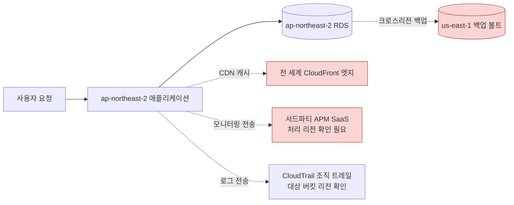

점선으로 표시한 경로(CDN 캐시, 모니터링 SaaS, 크로스 리전 백업, 로그 트레일)가 바로 리전 선택만으로는 통제되지 않는, 별도로 점검해야 할 이탈 경로다.

국외 이전이 실제로 발생하는 경우 이전 근거를 어떤 형태로 남길지도 미리 정해야 한다. 일반적으로 이전 대상국이 개인정보보호 수준을 인정받은 **적정성 결정(Adequacy Decision)** 대상국인지 먼저 확인하고, 그렇지 않다면 **표준계약조항(Standard Contractual Clauses, SCC)** 같은 계약적 안전장치를 처리 계약에 포함시키거나, 정보주체로부터 명시적 동의를 받는 방식으로 근거를 확보한다. 이 판단은 법무·컴플라이언스 부서와 함께 진행해야 하며, 아키텍트 혼자 리전 설정만으로 판단할 사안이 아니다.

### 34.5 로그 보존 기간과 불변 저장

규정마다 로그 보존 기간 요구가 다르다. 어떤 규정은 1년을 요구하고, 어떤 규정은 6~7년 이상을 요구하며, 금융 관련 규정은 이보다 더 긴 보존을 요구하는 경우도 있다. 구체적 보존 기간은 규정 원문과 감사 기관의 해석에 따라 달라지므로 반드시 해당 규정 문서를 직접 확인해야 한다. 여기서는 AWS 환경에서 이 요구를 충족하는 아키텍처 패턴을 다룬다.

**계층화(Tiering)**가 기본 전략이다. 로그의 접근 빈도가 시간이 지날수록 떨어진다는 특성을 이용해 비용과 보존 기간을 동시에 만족시킨다.

| 계층 | 저장 위치 | 보존 기간 예시 | 접근 패턴 |
|---|---|---|---|
| 즉시 조회 | CloudWatch Logs | 1~3개월 | 실시간 대시보드, 알람, 트러블슈팅 |
| 중기 보관 | S3 Standard-IA / S3 Intelligent-Tiering | 3개월~1년 | 드문 조회, Athena 쿼리 |
| 장기 보관·감사 대응 | S3 Glacier Flexible Retrieval / Glacier Deep Archive | 1년 이상(규정 요구 기간) | 감사 시에만 조회, 복원 시간 감내 |

CloudWatch Logs 구독 필터나 내보내기(Export) 작업으로 S3에 적재한 뒤, S3 라이프사이클 정책으로 Glacier까지 자동 전환하면 운영 부담 없이 규정 보존 기간을 채울 수 있다.

문제는 "보존만으로는 부족하고, 그 로그가 **변경·삭제되지 않았다는 것**을 증명해야 한다"는 점이다. 여기서 22장·23장의 두 기능이 핵심 역할을 한다.

- **S3 Object Lock 컴플라이언스 모드**: 지정한 보존 기간 동안 객체를 덮어쓰거나 삭제할 수 없도록 강제한다. 컴플라이언스 모드에서는 루트 사용자를 포함해 어떤 계정 주체도 보존 기간이 끝나기 전에 잠금을 해제하거나 보존 기간을 단축할 수 없다(→ 22.6절 참조).
- **AWS Backup Vault Lock**: 백업 볼트 자체에 불변 정책을 적용해, 백업본이 규정에서 요구하는 최소 보존 기간 동안 삭제·수정되지 않도록 한다(→ 23.1절 참조).

```yaml
# CloudFormation: 로그 버킷에 Object Lock 컴플라이언스 모드 적용 + 라이프사이클 전환
Resources:
  ComplianceLogBucket:
    Type: AWS::S3::Bucket
    Properties:
      BucketName: audit-logs-123456789012-apne2
      ObjectLockEnabled: true   # 버킷 생성 시점에만 활성화 가능, 이후 변경 불가
      ObjectLockConfiguration:
        ObjectLockEnabled: Enabled
        Rule:
          DefaultRetention:
            Mode: COMPLIANCE   # 컴플라이언스 모드: 루트 사용자도 보존 기간 내 삭제 불가
            Years: 7
      LifecycleConfiguration:
        Rules:
          - Id: TierToGlacierAfter90Days
            Status: Enabled
            Transitions:
              - TransitionInDays: 90
                StorageClass: STANDARD_IA
              - TransitionInDays: 365
                StorageClass: GLACIER
      VersioningConfiguration:
        Status: Enabled   # Object Lock은 버저닝이 활성화된 버킷에서만 동작
```

**접근 감사(로그에 대한 로그)** 역시 빠뜨리기 쉬운 부분이다. 로그 저장소 자체에 대한 접근(누가 로그 버킷을 조회했는가, 누가 IAM 정책을 바꾸려 시도했는가)도 CloudTrail 데이터 이벤트로 남겨야, "로그가 조작되지 않았다"는 주장을 감사인 앞에서 뒷받침할 수 있다. 또한 **CloudTrail 로그 파일 무결성 검증(다이제스트 파일)** 기능을 활성화하면, 각 로그 파일에 대한 SHA-256 해시 다이제스트가 별도로 서명·저장되어 로그 파일이 저장 이후 변조되었는지 사후에 검증할 수 있다.

마지막으로 규정 간 근본적 긴장 관계를 짚어야 한다. GDPR 등은 정보주체의 **삭제권(잊혀질 권리)**을 요구하는데, 이는 "일정 기간 삭제 불가"를 강제하는 컴플라이언스 모드 불변 저장과 정면으로 충돌하는 것처럼 보인다. 실무에서는 이를 **크립토 셔레딩(Crypto Shredding)**으로 해결한다. 원리는 간단하다. 데이터 자체는 삭제하지 않고 불변 저장소에 그대로 두되, 그 데이터를 암호화한 **KMS 키를 폐기**하면 데이터는 물리적으로 남아 있어도 복호화가 불가능해져 사실상 삭제된 것과 같은 효과를 얻는다. 이 방식은 사용자별로 별도의 KMS 키(또는 데이터 키)를 발급해 암호화 단위를 잘게 나눠야 성립한다는 점이 설계의 핵심이다.

```bash
# 크립토 셔레딩 절차 골자 (사용자별 전용 KMS 키를 사용하는 것이 전제)
# 1. 삭제 요청 대상 사용자의 전용 KMS 키 식별
aws kms describe-key --key-id alias/user-12345-data-key

# 2. 키 삭제 예약 (최소 대기 기간 지정, 즉시 삭제 불가 — 실수 방지용 안전장치)
aws kms schedule-key-deletion \
  --key-id alias/user-12345-data-key \
  --pending-window-in-days 7

# 3. 대기 기간 동안 키 사용 이력을 CloudTrail에서 확인해 의도치 않은 영향 범위 재검증
aws cloudtrail lookup-events \
  --lookup-attributes AttributeKey=ResourceName,AttributeValue=alias/user-12345-data-key

# 4. 대기 기간 종료 후 키는 영구 폐기되고, 해당 키로 암호화된 모든 데이터는
#    Object Lock으로 물리적으로 남아있어도 복호화 불가능 상태가 된다
```

이 절차를 쓰려면 애초에 데이터 암호화 설계 단계에서 "사용자 단위로 키를 분리할 것인가, 테이블·버킷 단위로 공유 키를 쓸 것인가"를 결정해둬야 하므로, 삭제권 요구가 있는 서비스는 설계 초기부터 키 분리 전략을 세워야 한다.

규정별 보존 기간이 서로 다를 때는 "가장 긴 요구 기간"을 기준으로 삼아 하나의 정책으로 통일하는 편이 운영 부담을 줄인다. 예를 들어 어떤 로그가 SOC 2 관점에서는 1년, 금융 관련 규정 관점에서는 그보다 훨씬 긴 기간을 요구한다면, 두 요구를 모두 만족시키는 가장 긴 값으로 라이프사이클과 Object Lock 보존 기간을 설정하면 규정별로 버킷을 나누어 관리하는 복잡도를 피할 수 있다. 다만 이 값들은 규정 개정에 따라 바뀔 수 있으므로 최소 연 1회 재검토가 필요하다.

### 34장 정리

#### [필수] 반드시 알아야 할 것
1. **AWS Artifact의 인증은 인프라 계층 인증**이며, 그 위 애플리케이션·데이터 처리의 규정 준수는 고객이 별도로 증명해야 한다. 이 구분을 감사 대응 문서 최상단에 명시해야 한다.
2. AWS Artifact Reports는 SOC 1/2/3, ISO 27001/27017/27018, PCI DSS AOC 등 온디맨드 다운로드, Artifact Agreements는 BAA·DPA 등 계약을 Organizations 단위로 수락한다.
3. Audit Manager는 프레임워크(사전 구축+사용자 지정) → 평가 → 컨트롤 구조로, CloudTrail·Config·Security Hub·API 호출에서 증거를 자동 수집해 증거 폴더와 감사 보고서를 만든다.
4. PCI DSS·HIPAA·GDPR 등 국제 규정과 국내 ISMS-P·전자금융감독규정은 공통적으로 네트워크 분리·암호화·로깅·접근 통제 네 축으로 AWS 서비스에 매핑되지만, 국내 규정은 원문 개정이 잦으므로 최신 고시 확인이 필수다.
5. 리전 선택이 데이터 소재지를 결정하지만, 로그·백업·CDN 캐시·모니터링 SaaS·지원 티켓을 통해 데이터가 부수적으로 리전을 벗어날 수 있어 데이터 흐름 전체를 점검해야 한다.
6. S3 Object Lock 컴플라이언스 모드와 Backup Vault Lock으로 로그·백업의 불변성을 확보하며, CloudTrail 다이제스트 파일로 무결성을 사후 검증한다.
7. GDPR 삭제권과 불변 보존의 충돌은 크립토 셔레딩(사용자별 KMS 키 폐기)으로 해소하며, 이를 위해서는 설계 단계부터 암호화 키를 잘게 분리해야 한다.
8. Config 적합성 팩은 상시 규칙 평가, Audit Manager는 감사용 증거·보고서 생성으로 역할이 다르며 서로 보완 관계다.

#### [팁] 실무 노하우
1. Audit Manager 평가를 만들 때 `--scope`로 대상 계정·서비스를 명확히 제한해야 불필요한 증거 수집으로 노이즈가 커지는 것을 막을 수 있다.
2. Organizations 관리 계정에서 Artifact Agreements를 한 번 수락하고 멤버 계정에 전파하면, 계정이 늘어날 때마다 계약을 놓치는 사고를 예방한다.
3. Config 적합성 팩 + Audit Manager 조합을 상시 운영 체계로 굳혀두면 감사 준비 기간이 몇 주에서 며칠로 줄어든다. 감사는 이벤트가 아니라 연중 운영 과제로 다뤄야 한다.
4. 데이터 흐름도(DFD)를 최소 연 1회 갱신해두면 신규 서비스 도입 시마다 국외 이전 여부를 빠르게 재점검할 수 있다.
5. 삭제권 요구가 있는 서비스는 초기 설계 단계에서 사용자 단위 KMS 키 분리 전략을 세워, 나중에 크립토 셔레딩이 필요할 때 재설계 없이 대응할 수 있게 한다.

#### [주의] 사고·비용·설계 함정
1. AWS 인증서만 감사인에게 제출하고 애플리케이션 계층 증거를 준비하지 않으면 감사에서 즉시 지적 사항이 된다.
2. S3 Object Lock 컴플라이언스 모드는 버킷 생성 시에만 활성화할 수 있고, 활성화 후에는 버저닝을 끄거나 모드를 되돌릴 수 없다. 사후에 적용하려면 새 버킷을 만들어 데이터를 이전해야 한다.
3. 컴플라이언스 모드로 잠근 로그는 루트 사용자도 보존 기간 내 삭제할 수 없으므로, 보존 기간과 스토리지 비용을 과도하게 길게 잡으면 이후에 되돌릴 방법이 없다.
4. CDN 캐시, 서드파티 모니터링 SaaS, 지원 티켓 첨부파일은 리전 제한 SCP로도 막히지 않는 경로이므로 별도 점검 목록으로 관리해야 한다.
5. 리전 제한 SCP를 작성할 때 IAM·Route 53·CloudFront 등 글로벌 서비스를 `NotAction`에서 빠뜨리면 정상 운영이 전면 차단된다.
6. 국내 ISMS-P·전자금융감독규정 관련 내용을 과거 버전 그대로 적용하면 최신 고시와 어긋날 수 있으므로, 실제 이행 전 반드시 소관 기관의 최신 문서를 재확인해야 한다.
7. 크립토 셔레딩을 전제로 설계하지 않고 여러 사용자 데이터를 하나의 공유 KMS 키로 암호화하면, 특정 사용자의 삭제권 이행을 위해 키를 폐기할 때 다른 사용자의 데이터까지 함께 복호화 불가능해진다.
8. Audit Manager 증거 수집은 과거 시점부터 소급 적용되지 않으므로, 평가를 감사 시작 직전에 급하게 생성하면 충분한 증거 기간을 확보하지 못한다.

#### 컴플라이언스 프로그램 운영 캘린더

| 시기 | 활동 |
|---|---|
| 매 분기 | Config 적합성 팩 위반 항목 리뷰 및 교정, Audit Manager 평가 진행 상황 점검, 데이터 흐름도 변경 사항 반영 |
| 반기 | Artifact Reports 최신본 재다운로드(보고서 갱신 주기 확인), 리전 제한 SCP 예외 목록 재검토 |
| 연 1회 | ISO 27001/SOC 2 등 정기 인증 심사 대응, 로그 보존 정책·Object Lock 설정 전수 점검, 크립토 셔레딩 절차 모의 훈련 |
| 규정 개정 시 수시 | 국내 ISMS-P·전자금융감독규정 등 소관 기관 고시 갱신 확인 및 매핑 표 업데이트, 신규 규정 대상 Audit Manager 프레임워크 추가 |

#### 한 장 요약
AWS Artifact는 인프라 계층 인증서와 계약을 셀프서비스로 제공하지만 애플리케이션 계층 준수는 고객 책임이며, Audit Manager는 CloudTrail·Config·Security Hub에서 증거를 자동 수집해 이 책임을 이행하는 도구다. ISO 27001·SOC 2·PCI DSS·HIPAA·GDPR과 국내 ISMS-P·전자금융감독규정은 결국 네트워크 분리·암호화·로깅·접근 통제로 수렴하지만 국내 규정은 최신 고시 확인이 필수다. 리전 선택이 데이터 주권을 결정하지만 로그·백업·CDN·SaaS 경로로 데이터가 새어나갈 수 있어 데이터 흐름도로 전체를 점검해야 하고, S3 Object Lock과 Backup Vault Lock으로 불변성을, 크립토 셔레딩으로 삭제권과의 충돌을 해소한다. 감사 대응은 특정 시점의 이벤트가 아니라 Config·Audit Manager를 축으로 한 상시 운영 체계여야 한다.

#### 다음 장 예고
35장부터는 Part VII(운영과 자동화)로 넘어가 CloudFormation, CDK, Terraform 등 Infrastructure as Code로 지금까지 다룬 보안·거버넌스·컴플라이언스 통제를 코드로 재현 가능하게 관리하는 방법을 다룬다.

---

