# Part VII. 운영과 자동화 — CloudOps

## 35장. Infrastructure as Code  ★★★

> **이 장에서 다루는 것**
> Part VI까지는 네트워크·컴퓨트·데이터·보안이라는 "무엇을 만들 것인가"를 다뤘다. Part VII은 "어떻게 만들고 운영할 것인가"로 넘어가며, 이 장은 그 출발점이다. 콘솔 클릭으로 만든 인프라가 왜 재현 불가능한 부채가 되는지에서 시작해, CloudFormation의 템플릿·스택·체인지 세트, CDK의 프로그래밍적 접근, Terraform의 상태 관리, 이 셋의 선택 기준, 스택을 수명주기 단위로 쪼개는 전략, Amplify·Proton이라는 더 높은 추상화, 마지막으로 파이프라인 안에서 IaC를 안전하게 배포하는 절차까지 다룬다. 10장(VPC)·23장(백업)의 리소스 지식을 전제하며, 36장(CI/CD 파이프라인)은 이 장에서 다룬 IaC 배포 단계를 실제 파이프라인 도구로 구현하는 내용을, 39장은 Proton과 Service Catalog를 플랫폼 엔지니어링 관점에서 더 깊이 다룬다.

### 35.1 IaC의 정의와 이점

**IaC(Infrastructure as Code, 코드형 인프라)**는 서버·네트워크·데이터베이스 같은 인프라 리소스를 사람이 콘솔에서 클릭해 만드는 대신, 선언적 또는 명령적 코드로 정의하고 도구를 통해 프로비저닝하는 방식이다. 왜 필요한가부터 짚어야 한다. 콘솔로 리소스를 만들면 그 순간의 설정은 누군가의 기억과 화면 캡처에만 남는다. 담당자가 퇴사하거나, 같은 환경을 다른 리전에 복제해야 하거나, 장애 후 처음부터 재구축해야 하는 순간 콘솔 클릭의 이력은 재현할 수 없는 지식이 되어버린다. **콘솔로 만든 것은 재현할 수 없다**는 것이 이 장 전체를 관통하는 원칙이다. 프로덕션 인프라는 예외 없이 코드로 정의되어야 하며, 콘솔은 리소스 상태를 조회하거나 새 서비스를 학습하는 용도로만 남겨야 한다.

IaC가 주는 이점은 여러 축으로 나뉜다. **재현성(Reproducibility)**은 같은 코드를 실행하면 같은 결과가 나온다는 보장이다. 스테이징 환경을 프로덕션과 동일하게 만들거나 재해복구 리전에 인프라를 복제할 때, 코드가 있으면 파라미터만 바꿔 재실행하면 된다. **리뷰 가능성(Reviewability)**은 인프라 변경이 애플리케이션 코드처럼 풀 리퀘스트로 제출되고, 동료가 diff를 보고 리뷰할 수 있다는 뜻이다. 보안 그룹 인바운드 규칙에 `0.0.0.0/0`이 추가되는 변경은 리뷰 단계에서 눈에 띈다. **버전 관리(Version Control)**는 Git 히스토리 자체가 인프라 변경 이력이 된다는 뜻이며, "지난주에 무엇이 바뀌었는가"라는 질문에 `git log`로 답할 수 있다. **드리프트 통제(Drift Control)**는 코드에 정의된 상태와 실제 리소스 상태가 벌어지는 것(드리프트)을 감지하고 되돌릴 수 있다는 뜻이다. **폐기 가능한 인프라(Disposable Infrastructure)**는 환경 전체를 손쉽게 만들고 지울 수 있다는 뜻으로, 임시 테스트 환경을 만들었다가 작업이 끝나면 통째로 삭제하는 워크플로를 가능하게 한다. 마지막으로 **문서로서의 코드(Code as Documentation)**는 코드 자체가 "이 시스템이 무엇으로 구성되어 있는가"에 대한 유일하게 신뢰할 수 있는 문서가 된다는 뜻이다.

IaC 도구는 접근 방식에 따라 두 갈래로 나뉜다. **선언형(Declarative)**은 "최종 상태가 이래야 한다"만 기술하고 도구가 현재 상태와 목표 상태의 차이를 계산해 필요한 작업을 스스로 결정한다. CloudFormation과 Terraform이 이 방식이다. **명령형(Imperative)**은 "이 순서대로 이 명령을 실행하라"를 기술하며, AWS CLI 스크립트를 순서대로 나열하는 방식이 여기 해당한다. 선언형은 현재 상태를 몰라도 되고 반복 실행이 안전하다는 장점이 있는 반면, 세밀한 절차 제어가 어렵다. 명령형은 절차를 정확히 제어할 수 있지만 스크립트가 이미 존재하는 리소스를 다시 만들려다 실패하는 등 반복 실행에 취약하다.

이와 밀접한 개념이 **멱등성(Idempotency)**이다. 같은 코드를 몇 번을 실행해도 결과가 동일해야 한다는 성질로, 선언형 도구가 기본으로 보장하는 특성이다. CloudFormation에서 이미 배포된 스택에 같은 템플릿으로 다시 업데이트를 걸면 "변경 사항 없음"으로 끝나야지, 리소스가 중복 생성되거나 오류가 나면 안 된다. 멱등성이 깨진 IaC 코드는 재시도가 위험해지므로 자동화 파이프라인에 넣을 수 없다.

IaC를 도입한다고 해서 콘솔이 완전히 사라지는 것은 아니다. 새 서비스의 동작을 처음 익힐 때는 콘솔에서 몇 번 만들어보며 어떤 속성이 존재하는지 확인하는 편이 빠르다. 문제는 그렇게 학습용으로 만든 리소스를 그대로 프로덕션에 남겨두는 습관이다. 학습이 끝나면 콘솔에서 만든 리소스는 지우고, 그 지식을 바탕으로 코드를 작성해 다시 배포하는 규율이 조직 전체에 자리 잡아야 IaC의 이점이 실제로 실현된다. 이 규율이 없는 조직에서는 "코드로 관리되는 리소스"와 "누군가 급하게 콘솔로 만든 예외"가 뒤섞여, 결국 어떤 것이 진실의 원천(source of truth)인지 아무도 확신할 수 없는 상태에 빠진다.

### 35.2 AWS CloudFormation

**AWS CloudFormation**은 AWS의 네이티브 선언형 IaC 서비스로, JSON 또는 YAML 템플릿으로 리소스 집합을 정의하고 **스택(Stack)** 단위로 생성·업데이트·삭제한다. 템플릿은 정해진 섹션 구조를 가진다.

- `AWSTemplateFormatVersion`: 템플릿 형식 버전 문자열(현재 유일하게 유효한 값은 `2010-09-09`).
- `Description`: 템플릿 설명 문자열.
- `Metadata`: 콘솔 UI에 파라미터를 그룹핑하는 `AWS::CloudFormation::Interface` 등 부가 정보.
- `Parameters`: 배포 시 입력받는 값(인스턴스 타입, 환경 이름 등). 타입 검증(`AWS::EC2::VPC::Id` 등)과 `AllowedValues`로 잘못된 입력을 미리 차단할 수 있다.
- `Mappings`: 리전·환경별 고정 값 테이블(리전별 AMI ID 매핑 등)을 조건 없이 조회하는 정적 룩업.
- `Conditions`: 파라미터 값에 따라 리소스 생성 여부나 속성 값을 분기하는 논리식.
- `Transform`: 매크로 지정. 가장 흔한 값은 서버리스 리소스를 확장하는 `AWS::Serverless-2016-10-31`(SAM)이다.
- `Resources`: 실제로 생성할 리소스 정의. 유일하게 필수인 섹션이다.
- `Outputs`: 스택 생성 후 참조할 값(VPC ID, 로드밸런서 DNS 이름 등)을 노출하며, `Export`로 다른 스택이 가져다 쓸 수 있게 만든다.

CloudFormation으로 VPC를 정의하면 다음과 같은 형태가 된다. 이 예시는 35.4절·35.5절에서 같은 VPC를 CDK와 Terraform으로 작성한 예시와 비교해볼 수 있도록 의도적으로 동일한 CIDR 대역을 사용한다.

```yaml
# CloudFormation으로 표현한 VPC — 파라미터로 CIDR을 받고 퍼블릭 서브넷 하나를 함께 생성
AWSTemplateFormatVersion: "2010-09-09"
Parameters:
  VpcCidr:
    Type: String
    Default: 10.10.0.0/16
Resources:
  AppVpc:
    Type: AWS::EC2::VPC
    Properties:
      CidrBlock: !Ref VpcCidr
      EnableDnsHostnames: true
      Tags:
        - Key: Name
          Value: !Sub "app-vpc-${AWS::StackName}"
  PublicSubnet:
    Type: AWS::EC2::Subnet
    Properties:
      VpcId: !Ref AppVpc
      CidrBlock: !Select [0, !Cidr [!GetAtt AppVpc.CidrBlock, 4, 8]]
      AvailabilityZone: !Select [0, !GetAZs !Ref "AWS::Region"]
Outputs:
  VpcId:
    Value: !Ref AppVpc
    Export:
      Name: !Sub "${AWS::StackName}-VpcId"
```

같은 리소스를 CDK(35.4절)로 쓰면 `Vpc` L2 컨스트럭트 몇 줄로 서브넷·NAT 게이트웨이까지 자동 구성되고, Terraform(35.5절)으로 쓰면 `aws_vpc`와 `aws_subnet` 리소스 블록을 직접 나열한다. 세 도구가 결국 같은 CloudFormation 개념(또는 동등한 API 호출)으로 귀결되지만, 문법과 추상화 수준이 다르다는 점이 이 대비에서 드러난다.

스택은 생성(CREATE) → 업데이트(UPDATE, 여러 번 반복) → 삭제(DELETE)의 수명주기를 가지며, 각 단계는 `_IN_PROGRESS`, `_COMPLETE`, `_FAILED`, `ROLLBACK_*` 같은 상태를 거친다. 업데이트를 곧바로 적용하는 대신 **체인지 세트(Change Set)**를 먼저 만들어 무엇이 추가·수정·삭제·**교체(Replacement)**되는지 미리 확인하고, 검토 후 실행(execute)할 수 있다. 이는 프로덕션 배포에서 반드시 거쳐야 할 단계로, 특히 리소스 교체가 예상되는지 여부는 35.9절에서 다시 강조한다.

```bash
# 변경 사항을 실제 적용 전에 미리 확인 — 삭제/교체 항목을 사람이 검토하기 위함
aws cloudformation create-change-set \
  --stack-name prod-app-stack \
  --template-body file://app-template.yaml \
  --change-set-name release-2026-09-05 \
  --parameters ParameterKey=Environment,ParameterValue=prod

aws cloudformation describe-change-set \
  --stack-name prod-app-stack --change-set-name release-2026-09-05

# 검토 후 실행 — 이 단계 전까지는 아무 리소스도 변경되지 않는다
aws cloudformation execute-change-set \
  --stack-name prod-app-stack --change-set-name release-2026-09-05
```

**스택 정책(Stack Policy)**은 업데이트 중 특정 리소스가 실수로 교체·삭제되지 않도록 잠그는 JSON 문서다. 예를 들어 데이터베이스 리소스에 `Update:Replace`, `Update:Delete`를 거부하는 정책을 걸어두면, 템플릿 변경이 그 리소스의 교체를 유발하는 순간 배포가 차단된다. **롤백 구성(Rollback Configuration)**은 배포 중 CloudWatch 알람이 트리거되면 자동으로 이전 상태로 되돌리는 설정이며, 실패 시 기본 동작은 스택을 마지막 성공 상태로 롤백하는 것이다. 롤백 자체가 실패하면 스택은 `UPDATE_ROLLBACK_FAILED` 상태에 갇히며, 이때는 실패 리소스를 건너뛰도록 지정하는 `continue-update-rollback`으로 수동 개입해야 한다.

여러 계정·리전에 동일한 템플릿을 배포해야 할 때는 **스택 세트(StackSet)**를 쓴다. 관리 계정(또는 위임된 관리자 계정)에서 하나의 템플릿을 정의하고, 대상 계정 목록과 리전 목록을 지정하면 각 조합에 개별 스택 인스턴스가 생성된다. AWS Organizations와 통합하면 새 계정이 조직에 추가될 때 자동으로 스택 인스턴스가 배포되도록 구성할 수 있어, 보안 기준선(CloudTrail, Config 규칙 등)을 전 계정에 일괄 적용하는 데 흔히 쓰인다.

시간이 지나면 스택으로 관리되는 리소스가 콘솔에서 수동으로 변경되어 코드와 실제 상태가 어긋나는 **드리프트**가 발생할 수 있다. **드리프트 감지(Drift Detection)**는 스택의 각 리소스를 실제 상태와 비교해 `MODIFIED`, `DELETED`, `IN_SYNC` 여부를 보고한다. 드리프트가 발견되면 다음 업데이트에서 예상치 못한 변경이나 실패로 이어질 수 있으므로, 정기적으로 드리프트를 점검하고 발견되면 코드로 재동기화하거나 수동 변경을 되돌려야 한다.

큰 인프라를 하나의 템플릿에 담으면 관리가 어려워지므로 템플릿을 여러 개로 나누는 두 가지 방법이 있다. **중첩 스택(Nested Stack)**은 부모 템플릿이 `AWS::CloudFormation::Stack` 리소스로 자식 템플릿을 참조하는 방식으로, 부모와 자식이 하나의 배포 단위처럼 함께 생성·삭제된다. **크로스 스택 참조(Cross-Stack Reference)**는 한 스택이 `Outputs`에서 `Export`한 값을 다른 스택이 `Fn::ImportValue`로 가져다 쓰는 방식으로, 스택이 완전히 독립적으로 배포된다. 두 방식을 결합할 때 생기는 문제가 있다. Export된 값을 다른 스택이 Import하고 있으면 그 값을 변경하거나 Export하는 리소스를 삭제할 수 없어 스택이 서로 잠기는(lock) 상황이 생긴다. 이 때문에 자주 바뀌는 값은 Export/Import보다 35.7절에서 다루는 SSM Parameter Store 기반의 느슨한 결합을 권장한다.

### 35.3 조건·매핑·파라미터·의사 파라미터·내장 함수·사용자 지정 리소스

CloudFormation 템플릿은 정적 값만 다루는 것이 아니라 **내장 함수(Intrinsic Function)**로 동적 값을 계산한다. 자주 쓰는 함수는 다음과 같다.

| 함수 | 역할 |
|---|---|
| `Ref` | 파라미터 값 또는 리소스의 기본 반환값(예: EC2 인스턴스 ID) 참조 |
| `Fn::GetAtt` | 리소스의 특정 속성값(예: ALB의 DNS 이름) 참조 |
| `Fn::Sub` | 문자열 안에 `${변수}` 형태로 값을 치환한 문자열 생성 |
| `Fn::Join` | 구분자로 문자열 리스트를 하나로 연결 |
| `Fn::Select` | 리스트에서 인덱스로 값 하나 선택 |
| `Fn::Split` | 구분자로 문자열을 리스트로 분할 |
| `Fn::FindInMap` | `Mappings` 섹션에서 키로 값 조회 |
| `Fn::If` | `Conditions`에서 정의한 조건에 따라 값 분기 |
| `Fn::ImportValue` | 다른 스택이 Export한 값 가져오기 |
| `Fn::Cidr` | CIDR 블록을 지정한 개수·크기의 서브넷 CIDR로 분할 |

**의사 파라미터(Pseudo Parameter)**는 템플릿에 선언하지 않아도 AWS가 배포 시점에 자동으로 채워주는 값으로, `AWS::Region`, `AWS::AccountId`, `AWS::StackName`, `AWS::NoValue` 등이 있다. 리전에 종속적인 리소스 이름을 만들거나, `Fn::If`의 결과로 특정 속성을 아예 생략(`AWS::NoValue`)할 때 유용하다.

`DependsOn`은 리소스 간 명시적 생성 순서를 지정한다. CloudFormation은 대개 `Ref`나 `GetAtt`로 참조 관계를 파악해 순서를 자동 결정하지만, 참조로 드러나지 않는 암묵적 의존성(예: IAM 역할의 정책이 완전히 전파된 후에 리소스가 생성되어야 하는 경우)에는 `DependsOn`을 명시해야 한다.

리소스 삭제·교체 시 데이터 보호를 위한 두 속성이 핵심이다. `DeletionPolicy`는 스택 삭제 시 해당 리소스를 어떻게 처리할지 지정하며, 기본값(`Delete`) 대신 `Retain`(리소스를 스택 밖에 남겨둠)이나 `Snapshot`(RDS·EBS 등 스냅샷 지원 리소스에서 삭제 전 스냅샷 생성)을 지정할 수 있다. `UpdateReplacePolicy`는 속성 변경으로 리소스가 교체될 때 이전 리소스를 어떻게 처리할지 지정하며 마찬가지로 `Retain`을 걸 수 있다. 데이터베이스, S3 버킷, EBS 볼륨처럼 데이터를 담는 리소스에는 이 두 정책을 반드시 `Retain`으로 걸어 스택 삭제나 의도치 않은 교체가 데이터 손실로 이어지지 않게 해야 한다.

```yaml
# 데이터 저장 리소스는 스택 삭제/교체가 발생해도 실제 데이터가 남도록 보호
Resources:
  AppDatabase:
    Type: AWS::RDS::DBInstance
    DeletionPolicy: Retain
    UpdateReplacePolicy: Retain
    Properties:
      Engine: aurora-mysql
      DBInstanceClass: db.r6g.large
```

CloudFormation이 네이티브로 지원하지 않는 로직이 필요할 때는 **사용자 지정 리소스(Custom Resource)**를 쓴다. `AWS::CloudFormation::CustomResource` 또는 `Custom::리소스이름` 타입으로 선언하고 `ServiceToken`에 Lambda 함수 ARN을 지정하면, 스택 생성·업데이트·삭제 이벤트마다 그 Lambda가 호출되어 임의의 로직(제3자 API 호출, 리소스 정리 등)을 수행하고 성공/실패 응답을 CloudFormation에 돌려준다.

```python
# 사용자 지정 리소스 백엔드 Lambda의 골자 — 이벤트 타입별 분기와 응답 전송이 핵심
import cfnresponse

def handler(event, context):
    request_type = event["RequestType"]  # Create / Update / Delete
    try:
        if request_type == "Create":
            physical_id = do_create(event["ResourceProperties"])
        elif request_type == "Update":
            physical_id = do_update(event["ResourceProperties"])
        else:
            do_delete(event["PhysicalResourceId"])
            physical_id = event["PhysicalResourceId"]
        cfnresponse.send(event, context, cfnresponse.SUCCESS, {}, physical_id)
    except Exception as e:
        # 응답을 보내지 않으면 스택이 타임아웃까지(기본 1시간) 멈춘다 — 반드시 실패도 응답
        cfnresponse.send(event, context, cfnresponse.FAILED, {"Error": str(e)})
```

더 정교한 확장이 필요하면 **CloudFormation 레지스트리(Registry)**에 직접 리소스 타입·모듈·훅을 등록할 수 있다. **레지스트리 리소스 타입**은 서드파티 서비스나 사내 표준 리소스를 CloudFormation 네이티브 리소스처럼 다루게 해준다. **모듈(Module)**은 여러 리소스를 재사용 가능한 하나의 단위로 패키징해 사내 표준 패턴(예: "표준 VPC 모듈")을 배포하는 데 쓴다. **훅(Hook)**은 리소스 생성·업데이트 전에 정책을 검증해 위반 시 배포 자체를 막는 기능으로, 조직 차원의 가드레일을 CloudFormation 배포 흐름에 직접 끼워 넣을 수 있다.

### 35.4 AWS CDK

**AWS CDK(Cloud Development Kit)**는 TypeScript, Python, Java, C#, Go 같은 범용 프로그래밍 언어로 인프라를 정의하고, 이를 `cdk synth`로 CloudFormation 템플릿으로 변환해 배포하는 프레임워크다. 왜 필요한가는 명확하다. YAML/JSON은 반복(loop), 조건 분기, 함수 추출 같은 프로그래밍 구성이 번거롭고, 같은 패턴(예: "표준 웹 애플리케이션 스택")을 여러 번 반복해서 붙여넣게 만든다. CDK는 실제 프로그래밍 언어의 클래스·함수·반복문을 그대로 활용해 이런 반복을 추상화한다.

CDK의 핵심 단위는 **컨스트럭트(Construct)**이며 세 계층으로 나뉜다. **L1(레벨 1)**은 CloudFormation 리소스를 거의 1:1로 감싼 `Cfn` 접두사 클래스(`CfnBucket`, `CfnVPC` 등)로, 템플릿의 모든 속성을 그대로 노출하지만 추상화는 없다. **L2**는 L1을 감싸 합리적 기본값과 타입 안전한 헬퍼 메서드를 제공하는 컨스트럭트(`Bucket`, `Vpc` 등)로, CDK 코드의 대부분을 차지한다. **L3(패턴)**는 여러 L2 컨스트럭트를 조합해 "ALB + Auto Scaling Fargate 서비스"처럼 완결된 아키텍처 패턴 하나를 캡슐화한 것(`ApplicationLoadBalancedFargateService` 등)이다.

CDK 애플리케이션은 **앱(App) → 스택(Stack) → 컨스트럭트**의 트리 구조를 가진다. 하나의 `App`이 여러 `Stack`을 포함하고, 각 `Stack`은 여러 컨스트럭트를 조합한다. `cdk synth`는 이 트리를 순회하며 CloudFormation 템플릿(들)을 생성하고, `cdk deploy`는 synth 결과를 실제로 CloudFormation을 통해 배포한다. 즉 CDK는 자체 실행 엔진이 아니라 CloudFormation 템플릿을 생성하는 컴파일러이며, 실제 배포·상태 관리는 여전히 CloudFormation이 담당한다.

```typescript
// CDK L2 컨스트럭트로 VPC를 정의 — 서브넷 배치·NAT 게이트웨이 수를 몇 줄로 표현
import * as cdk from "aws-cdk-lib";
import { Vpc, SubnetType } from "aws-cdk-lib/aws-ec2";

export class NetworkStack extends cdk.Stack {
  constructor(scope: cdk.App, id: string, props?: cdk.StackProps) {
    super(scope, id, props);

    new Vpc(this, "AppVpc", {
      ipAddresses: cdk.aws_ec2.IpAddresses.cidr("10.20.0.0/16"),
      maxAzs: 2,
      natGateways: 1, // 비용 절감을 위해 리전 내 AZ 수보다 적게 지정
      subnetConfiguration: [
        { name: "public", subnetType: SubnetType.PUBLIC, cidrMask: 24 },
        { name: "private", subnetType: SubnetType.PRIVATE_WITH_EGRESS, cidrMask: 24 },
      ],
    });
  }
}
```

**컨텍스트(Context)**는 `cdk.json`이나 `--context` 플래그로 전달하는 키-값 설정으로, 계정별 VPC ID 조회 같은 값을 캐싱하거나 기능 플래그를 전환하는 데 쓰인다. **환경(env)**은 스택을 배포할 계정과 리전을 지정하는 속성으로, `env`를 명시하지 않으면 스택은 계정/리전에 종속되지 않는(environment-agnostic) 형태로 합성되어 일부 기능(가용 영역 조회 등)이 제한된다. 여러 계정에 배포해야 하는 조직에서는 계정별로 스택 인스턴스를 만들어 각기 다른 `env`를 지정하는 패턴이 흔하다.

L2/L3 컨스트럭트가 필요한 세부 속성을 노출하지 않을 때는 **에스케이프 해치(Escape Hatch)**로 내려가 L1 수준에서 직접 속성을 조작한다. `construct.node.defaultChild`로 L2 컨스트럭트 뒤의 L1(Cfn) 리소스를 얻은 뒤 `addPropertyOverride` 등으로 CloudFormation 속성을 강제로 지정할 수 있다. 이는 CDK가 아직 지원하지 않는 신규 기능이나 특수 설정을 다룰 때 흔히 쓰는 탈출구다.

```typescript
// L2가 노출하지 않는 속성을 L1로 내려가 직접 지정 — CDK가 아직 지원 안 하는 신규 옵션 대응
const cfnBucket = bucket.node.defaultChild as cdk.aws_s3.CfnBucket;
cfnBucket.addPropertyOverride("ObjectLockEnabled", true);
```

Lambda 함수 코드나 Docker 이미지처럼 배포 시 로컬에서 번들링해야 하는 파일은 **자산(Asset)**으로 관리된다. CDK는 배포 전에 자산을 S3(코드 zip)나 ECR(컨테이너 이미지)에 업로드하고, 템플릿은 그 위치를 참조하도록 자동 생성된다. `cdk bootstrap`으로 계정·리전마다 이 자산을 담는 S3 버킷과 ECR 리포지토리, 배포에 필요한 IAM 역할을 미리 준비해야 한다.

배포 전 변경 내용을 검토하려면 `cdk diff`로 현재 배포된 스택과 로컬 코드가 합성할 템플릿의 차이를 확인한다. 이는 CloudFormation 체인지 세트와 유사한 역할을 하며, CI 파이프라인에서 자동 배포 전에 사람이 리뷰하는 단계로 흔히 삽입된다. 여러 스택을 순서대로, 승인 단계를 포함해 배포하는 자체 CI/CD 파이프라인이 필요하면 **CDK Pipelines**를 쓴다. 이는 CodePipeline 위에 CDK 스택 자체를 배포 대상으로 등록해 "코드가 바뀌면 파이프라인이 스스로를 갱신하고 스택들을 순서대로 배포"하는 셀프뮤테이팅(self-mutating) 파이프라인을 구성한다. 테스트는 두 방식을 병행한다. **assertions 모듈**로 합성된 템플릿에 특정 리소스나 속성이 존재하는지 단정하는 세밀한 단위 테스트를 작성하거나, **스냅샷 테스트**로 합성된 템플릿 전체를 저장해두고 이후 코드 변경이 의도한 대로만 템플릿을 바꾸는지 diff로 검증한다.

### 35.5 Terraform

**Terraform**은 HashiCorp가 만든 클라우드 애그노스틱 선언형 IaC 도구로, HCL(HashiCorp Configuration Language)로 리소스를 정의한다. AWS 전용인 CloudFormation과 달리 **프로바이더(Provider)** 플러그인을 통해 AWS, Azure, GCP, Kubernetes, Datadog 등 수백 개 서비스를 동일한 워크플로로 다룰 수 있다. 하나의 코드베이스에서 여러 클라우드나 SaaS 리소스를 함께 관리해야 하는 조직에서 특히 강점을 가진다.

Terraform 코드의 기본 구성 요소는 **리소스(Resource)**와 **데이터 소스(Data Source)**다. 리소스는 Terraform이 직접 생성·관리하는 대상(예: `aws_vpc`)이고, 데이터 소스는 Terraform 외부에서 이미 존재하는 리소스를 조회만 하는 대상(예: 기존 AMI ID 조회)이다.

```hcl
# 프로바이더 버전을 고정하고, 데이터 소스로 기존 리소스를 조회한 뒤 리소스를 생성
terraform {
  required_providers {
    aws = { source = "hashicorp/aws", version = "~> 5.0" }
  }
}

provider "aws" {
  region = "ap-northeast-2"
}

data "aws_availability_zones" "available" {
  state = "available"
}

resource "aws_vpc" "app" {
  cidr_block           = "10.30.0.0/16"
  enable_dns_hostnames = true
  tags = { Name = "app-vpc-${var.environment}" }
}
```

Terraform의 핵심 개념은 **상태(State)**다. Terraform은 실행할 때마다 실제 클라우드 리소스를 조회하는 대신, 마지막으로 알려진 리소스 상태를 담은 상태 파일(`terraform.tfstate`, JSON)을 유지하고 이를 코드와 비교해 실행 계획을 세운다. 상태 파일은 리소스 ID, 속성 값, 심지어 일부 민감한 값(비밀번호 등)까지 포함할 수 있어 다루는 방식이 중요하다. 기본 로컬 상태(로컬 디스크의 `.tfstate` 파일)는 팀 협업에서 두 사람이 동시에 apply하면 상태가 충돌하거나 덮어써지는 문제를 일으키므로, 팀 환경에서는 반드시 **원격 백엔드(Remote Backend)**를 쓴다. AWS에서 가장 흔한 조합은 상태 파일을 S3 버킷에 저장(버저닝·서버 측 암호화 활성화)하고, 동시 실행을 막는 **잠금(Lock)**을 DynamoDB 테이블(또는 최근 버전의 S3 네이티브 잠금 기능)로 구현하는 것이다. 상태 파일 자체가 유출되면 민감 정보가 노출될 수 있으므로 암호화와 접근 통제(버킷 정책, 최소 권한 IAM)는 필수다.

```hcl
# S3 + DynamoDB 백엔드 — 팀 전체가 하나의 상태를 안전하게 공유하기 위한 표준 구성
terraform {
  backend "s3" {
    bucket         = "my-org-terraform-state-123456789012"
    key            = "network/terraform.tfstate"
    region         = "ap-northeast-2"
    dynamodb_table = "terraform-state-lock" # 동시 apply를 막는 락 테이블
    encrypt        = true
  }
}
```

배포 값을 파라미터화하는 **입력 변수(Variable)**는 `variable` 블록으로 선언하고 `.tfvars` 파일이나 CLI로 값을 주입한다. **로컬(Local)**은 `locals` 블록에서 반복 계산되는 표현식에 이름을 붙여 재사용하는 용도다. **출력(Output)**은 `output` 블록으로 다른 모듈이나 최상위 코드가 참조할 값을 노출한다.

```hcl
variable "environment" {
  type        = string
  description = "배포 환경 이름"
}

locals {
  common_tags = { Environment = var.environment, ManagedBy = "terraform" }
}

output "vpc_id" {
  value       = aws_vpc.app.id
  description = "다른 모듈이 참조할 VPC ID"
}
```

**모듈(Module)**은 재사용 가능한 Terraform 코드 묶음으로, CDK의 L3 패턴과 유사한 역할을 한다. 사내 표준 VPC나 표준 ECS 서비스를 모듈로 만들어두면 여러 프로젝트가 같은 모듈을 버전 고정해서 참조한다. **Terraform Registry**는 HashiCorp와 커뮤니티가 공개한 모듈·프로바이더를 검색·재사용할 수 있는 공개 저장소로, 대부분의 표준 AWS 패턴(VPC, EKS 등)은 이미 검증된 공개 모듈이 존재한다.

주요 CLI 명령은 다음과 같다. `terraform init`은 프로바이더와 모듈을 다운로드하고 백엔드를 초기화한다. `terraform plan`은 코드와 상태를 비교해 무엇이 추가·변경·삭제되는지 실행 계획을 보여주되 아무 것도 적용하지 않는다. `terraform apply`는 계획을 실제로 적용한다. `terraform destroy`는 관리 대상 리소스를 전부 삭제한다. `terraform import`는 이미 콘솔 등으로 만들어진 기존 리소스를 상태 파일에 편입시켜 이후 코드로 관리할 수 있게 한다. `terraform state`는 상태 파일을 직접 조회·수정(`state list`, `state mv`, `state rm`)하는 하위 명령 모음이다.

**워크스페이스(Workspace)**는 같은 코드로 여러 개의 독립된 상태(예: dev/staging/prod)를 관리하는 기능이다. 다만 워크스페이스는 상태만 분리할 뿐 코드는 공유하므로, 환경별로 구조 자체가 크게 다르면 워크스페이스보다 디렉터리(및 백엔드 key)를 분리하는 편이 낫다. **`count`**와 **`for_each`**는 하나의 리소스 블록을 여러 개의 유사한 인스턴스로 반복 생성하는 메타 인자로, 정수 개수만 필요하면 `count`를, 이름 있는 각 항목을 식별해야 하면(리소스 순서가 바뀌어도 안전하게) `for_each`를 쓴다.

```hcl
# for_each는 키로 식별되므로 중간 항목이 삭제돼도 다른 리소스가 불필요하게 재생성되지 않는다
resource "aws_subnet" "private" {
  for_each          = { a = "10.30.1.0/24", c = "10.30.2.0/24" }
  vpc_id            = aws_vpc.app.id
  cidr_block        = each.value
  availability_zone = "ap-northeast-2${each.key}"
}
```

**`lifecycle`** 블록은 리소스별 생명주기 동작을 세밀하게 제어한다. `prevent_destroy = true`는 해당 리소스에 대한 삭제 계획 자체를 거부해 실수로 인한 삭제를 막는다(데이터베이스 등에 필수). `create_before_destroy = true`는 기본 동작(삭제 후 생성)을 뒤집어 새 리소스를 먼저 만들고 성공한 뒤에 이전 리소스를 삭제하도록 해, 교체 시 다운타임을 줄인다.

### 35.6 CloudFormation vs CDK vs Terraform 선택 기준

세 도구(및 이들과 자주 비교되는 **Pulumi**)는 겹치는 목표를 가지지만 전제와 강점이 다르다.

| 축 | CloudFormation | CDK | Terraform | Pulumi |
|---|---|---|---|---|
| 학습 곡선 | YAML/JSON 문법, 중간 | 프로그래밍 언어 지식 필요, 진입장벽 있으나 익숙하면 빠름 | HCL 전용 문법, 중간 | 프로그래밍 언어 지식 필요 |
| 상태 관리 | AWS가 관리(사용자가 신경 쓸 필요 없음) | CloudFormation에 위임 | 사용자가 원격 백엔드 직접 구성·보호해야 함 | 자체 관리형 백엔드(Pulumi Cloud) 또는 자체 호스팅 |
| 멀티클라우드 | AWS 전용 | AWS 전용(CDK 자체는 CloudFormation만 합성) | 프로바이더로 사실상 모든 클라우드/SaaS | 프로바이더로 멀티클라우드 |
| 드리프트 대응 | 네이티브 드리프트 감지 제공 | CloudFormation 기능 그대로 상속 | `plan`으로 드리프트를 간접 확인, 전용 드리프트 감지는 약함 | 유사하게 `preview`로 확인 |
| 생태계 | AWS 리소스 커버리지 가장 넓고 빠름(신규 서비스 출시와 거의 동시) | CloudFormation 생태계 그대로, L2/L3 추상화 풍부 | 등록된 프로바이더 수는 방대하나 신규 AWS 기능 반영이 다소 늦을 수 있음 | 상대적으로 커뮤니티·자료가 적음 |
| 팀 역량 | 인프라 팀 중심, YAML 익숙 | 애플리케이션 개발자 친화적 | 멀티클라우드/플랫폼 팀에 익숙 | 소규모, 특정 언어 선호 팀 |

**한 줄 결정 기준**: AWS 단일 클라우드이고 콘솔/AWS 지원과의 통합이 중요하면 CloudFormation(또는 그 위의 CDK)을, 멀티클라우드이거나 이미 Terraform 역량을 갖춘 조직이면 Terraform을 선택한다. 그 위에서 인프라를 애플리케이션 개발자가 직접 다뤄야 한다면 CDK가 CloudFormation보다 생산성이 높다.

Pulumi는 CDK와 마찬가지로 범용 프로그래밍 언어로 인프라를 정의하지만, CloudFormation을 거치지 않고 클라우드 프로바이더 API를 직접 호출하며 자체 상태 관리 백엔드(Pulumi Cloud 또는 자체 호스팅 백엔드)를 쓴다는 점이 다르다. CDK의 "익숙한 언어로 AWS를 다룬다"는 장점과 Terraform의 "멀티클라우드"라는 장점을 동시에 노리는 위치이지만, AWS 전용 조직에서는 CDK 대비 얻는 이득이 크지 않고, 멀티클라우드 조직에서는 Terraform 대비 생태계와 검증된 모듈 수가 부족해 상대적으로 적은 조직에서 채택한다.

실무에서는 한 도구로 통일하지 못하고 **혼용 전략**을 쓰는 경우가 흔하다. 예를 들어 네트워크·IAM 기반선·계정 구조처럼 거의 바뀌지 않고 멀티클라우드 관점이 필요한 기반 계층은 Terraform으로, 애플리케이션 팀이 자주 배포하는 서비스 계층은 CDK로 관리하는 식이다. 이 전략의 대가는 두 도구의 상태 저장소를 모두 운영·보호해야 하고, 두 도구 간 참조(예: Terraform으로 만든 VPC ID를 CDK 스택이 읽어야 하는 경우)를 SSM Parameter Store 같은 외부 저장소로 우회해야 하며, 팀 전체가 두 가지 문법과 배포 파이프라인을 모두 익혀야 한다는 점이다. 또한 신규 입사자가 "이 리소스는 어느 도구로 관리되는가"를 매번 확인해야 하는 인지 부하도 무시할 수 없다. 도구를 섞는 결정은 명확한 경계(어느 계층은 어느 도구, 그리고 그 경계를 넘는 참조는 반드시 SSM Parameter Store를 거친다는 규칙)를 문서화하지 않으면 오히려 혼란을 키운다.

### 35.7 스택 분해 전략과 계층화

인프라 전체를 하나의 거대한 스택(또는 하나의 Terraform 루트 모듈)으로 관리하고 싶은 유혹이 있지만, 이는 몇 가지 이유로 위험하다. 스택이 커질수록 배포 한 번의 반경(blast radius)이 커져 사소한 변경도 전체 스택의 재평가를 유발하고, 배포 시간이 길어지며, 리소스 수가 CloudFormation 스택당 한도(리전·계정별로 다를 수 있으므로 서비스 할당량 문서 확인 필요)에 근접할 위험도 있다. 여러 팀이 같은 스택을 동시에 수정하려 하면 배포 충돌도 잦아진다.

권장하는 접근은 **수명주기별 계층화(Layering by Lifecycle)**다. 변경 빈도와 소유 조직이 비슷한 리소스를 같은 스택으로 묶고, 그렇지 않은 리소스는 분리한다. 전형적인 계층은 다음과 같다.

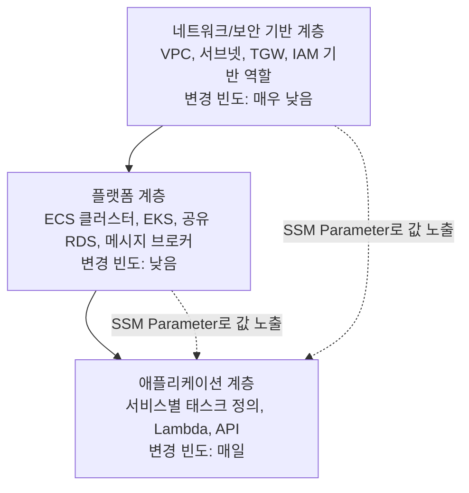

네트워크/보안 기반 계층은 조직·플랫폼 팀이 소유하고 거의 바뀌지 않는다. 플랫폼 계층은 여러 애플리케이션이 공유하는 컴퓨트·데이터 인프라로 상대적으로 드물게 바뀐다. 애플리케이션 계층은 개별 서비스 팀이 소유하고 하루에도 여러 번 배포된다. 이렇게 나누면 애플리케이션 배포가 네트워크 스택을 건드릴 위험이 원천적으로 사라지고, 각 계층을 서로 다른 팀이 서로 다른 속도로 안전하게 운영할 수 있다.

또 하나의 분리 축은 **상태 저장 리소스와 무상태 리소스의 분리**다. RDS, DynamoDB, S3처럼 데이터를 담는 리소스는 컴퓨트(EC2, ECS 태스크, Lambda)와 다른 스택에 두어, 컴퓨트 계층을 통째로 지우고 다시 만들어도 데이터 계층은 영향받지 않도록 한다. 이는 애플리케이션을 청록(blue/green) 방식으로 완전히 재배포하거나, 컨테이너 오케스트레이션 플랫폼 자체를 교체하는 시나리오에서 특히 중요하다.

계층을 나누면 계층 간 참조가 문제가 된다. CloudFormation의 Export/ImportValue나 Terraform의 `remote_state` 데이터 소스로 직접 참조할 수도 있지만, 앞서 35.2절에서 짚었듯 이는 스택 간 강한 결합을 만들어 하위 계층의 리소스를 삭제·교체하기 어렵게 만든다. 그래서 **SSM Parameter Store를 통한 느슨한 결합**을 권장한다. 하위 계층(네트워크)이 배포 후 VPC ID, 서브넷 ID 같은 값을 SSM 파라미터에 써두고, 상위 계층(애플리케이션)은 배포 시점에 그 파라미터를 값으로 조회해 사용한다. 이 방식은 두 스택이 서로의 존재를 몰라도 되며, 하위 계층이 값을 바꾸면(예: 서브넷 재구성) 상위 계층은 다음 배포에서 자동으로 새 값을 읽어온다는 장점이 있다.

```yaml
# 네트워크 계층이 VPC ID를 SSM에 게시 — 다른 스택은 Export/ImportValue 대신 이 값을 조회해 느슨하게 결합
Resources:
  VpcIdParameter:
    Type: AWS::SSM::Parameter
    Properties:
      Name: /network/prod/vpc-id
      Type: String
      Value: !Ref AppVpc
```

```hcl
# 애플리케이션 계층은 하위 계층 스택을 직접 참조하지 않고 SSM 파라미터로만 값을 읽는다
data "aws_ssm_parameter" "vpc_id" {
  name = "/network/prod/vpc-id"
}
```

### 35.8 AWS Amplify와 AWS Proton

CloudFormation·CDK·Terraform이 리소스 수준의 IaC라면, **AWS Amplify**와 **AWS Proton**은 그 위에 서로 다른 방향으로 한 층 더 얹은 추상화다.

**AWS Amplify**는 프론트엔드 개발자가 백엔드 인프라의 세부사항(정확히 어떤 Cognito 설정, 어떤 AppSync 스키마인지)을 깊이 알지 못해도 인증, GraphQL/REST API, 스토리지, 호스팅을 갖춘 풀스택 애플리케이션을 빠르게 구성하도록 돕는 도구·서비스 모음이다. Amplify CLI/Studio로 "인증 추가", "API 추가" 같은 상위 수준 명령을 내리면 내부적으로 CloudFormation 리소스가 생성되고, Amplify Hosting은 Git 저장소와 연결해 프런트엔드 빌드·배포까지 자동화한다. 대상 사용자는 인프라 전담 인력이 없는 소규모 팀이나 프론트엔드 중심 스타트업으로, 세밀한 인프라 제어보다 빠른 구축 속도를 우선하는 경우에 맞는다.

**AWS Proton**은 반대 방향에서 접근한다. 대상 사용자는 여러 애플리케이션 팀에 표준화된 인프라를 제공해야 하는 **플랫폼 팀**이다. 플랫폼 팀이 CloudFormation/Terraform으로 "환경 템플릿(Environment Template)"과 "서비스 템플릿(Service Template)"을 만들어 등록해두면, 개별 애플리케이션 팀은 그 템플릿에서 파라미터(원하는 리소스 크기, 도메인 이름 등)만 채워 넣어 배포한다. 이는 애플리케이션 팀이 인프라 세부사항을 직접 작성하지 않고도 조직 표준(보안 그룹 구성, 로깅 설정, 태깅 규칙)을 그대로 물려받게 하는 것이 목적이다. 템플릿에는 메이저·마이너 버전이 붙으며, 템플릿이 업데이트되면 Proton은 그 템플릿을 쓰는 모든 서비스 인스턴스에 업데이트를 순차 적용할 수 있어, 플랫폼 팀이 표준을 바꿀 때마다 각 팀에 개별 요청할 필요가 없다. 즉 Amplify가 "인프라를 최대한 감추어 빠르게 만들게 하는" 방향이라면, Proton은 "인프라를 플랫폼 팀이 표준화해서 여러 팀에 재사용 가능한 형태로 배급하는" 방향으로, 대상 조직의 성숙도와 규모가 근본적으로 다르다.

Proton과 자주 혼동되는 서비스가 **AWS Service Catalog**다. 둘 다 "사전 승인된 템플릿을 셀프서비스로 제공"한다는 점은 같지만 지향점이 다르다. Service Catalog는 정적인 CloudFormation 제품(포트폴리오·제품 구조)을 배포하는 데 최적화되어 있고 애플리케이션 코드 배포 파이프라인과는 별개다. Proton은 애플리케이션의 지속적인 배포(코드가 바뀔 때마다 서비스 인스턴스가 갱신되는 것)까지 포함하는 풀 라이프사이클 관리에 맞춰져 있다. 두 서비스의 세부 비교와 플랫폼 엔지니어링 관점의 활용은 39장에서 다시 다룬다.

### 35.9 배포 파이프라인 안의 IaC

IaC 코드도 애플리케이션 코드와 마찬가지로 자동화된 파이프라인을 통해 배포해야 한다. 사람이 로컬에서 `terraform apply`나 `aws cloudformation deploy`를 직접 실행하는 방식은 실행 환경의 일관성을 보장할 수 없고 감사 추적도 약하다. IaC 전용 파이프라인은 대체로 다음 단계를 거친다.

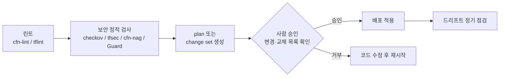

첫 단계는 **린트(Lint)**로, `cfn-lint`(CloudFormation)나 `tflint`(Terraform)가 문법 오류, 존재하지 않는 속성, 타입 불일치 같은 구조적 문제를 배포 전에 잡아낸다. 다음은 **보안 정적 검사**로, `cfn-nag`나 `checkov`, `tfsec`, **CloudFormation Guard**가 코드에 정의된 리소스가 보안 모범 사례(암호화 미적용, 과도하게 열린 보안 그룹, 퍼블릭 S3 버킷 등)를 위반하는지 배포 전에 판정한다. 이 단계를 통과하면 **plan 또는 체인지 세트를 생성**해 실제로 무엇이 바뀔지 계산한다. 여기서 파이프라인은 자동으로 다음 단계로 넘어가지 않고 **사람의 승인**을 기다려야 한다. 승인자는 변경 목록, 특히 삭제·교체 항목을 반드시 확인해야 하며, 이것이 잘못된 배포로부터 지키는 마지막 방어선이다. 승인 후에야 배포가 적용되고, 배포된 뒤에도 정기적으로 **드리프트 점검**을 돌려 수동 변경이 없는지 확인한다.

```yaml
# Terraform 파이프라인에 정적 보안 검사를 넣는 단계 예시 — 오설정을 배포 전에 차단
steps:
  - name: terraform-init
    run: terraform init -backend-config=backend.hcl

  - name: tflint
    run: tflint --recursive

  - name: checkov-scan
    run: checkov -d . --framework terraform --compact
    # 실패 시(예: 암호화 안 된 S3 버킷) 파이프라인을 중단시켜 배포를 막는다

  - name: terraform-plan
    run: terraform plan -out=tfplan

  - name: manual-approval
    # 승인자가 plan 출력에서 forces replacement 항목을 반드시 확인
    approvers: [platform-team]

  - name: terraform-apply
    run: terraform apply tfplan
```

이런 파이프라인 단계는 조직 차원의 **정책 as 코드(Policy as Code)**와 함께 3중 방어를 이룬다. **SCP(서비스 제어 정책)**는 계정 수준에서 특정 API 호출 자체를 원천 차단하고(예: 특정 리전에서 리소스 생성 금지), **AWS Config 규칙**은 이미 배포된 리소스가 규정을 준수하는지 지속적으로 감시하며, **CloudFormation Guard**는 배포 직전 템플릿 자체를 규칙에 대조해 거부한다. 세 계층이 서로 다른 시점(배포 전 코드, 배포 시도, 배포 후 상태)에서 같은 정책을 강제하므로 하나가 뚫려도 다른 계층이 잡아낼 가능성이 남는다.

이 전체 흐름을 뒷받침하는 개념이 **GitOps**다. Git 저장소를 인프라 상태의 유일한 원천(source of truth)으로 삼고, 모든 변경은 Git에 대한 풀 리퀘스트를 통해서만 이루어지며, 병합된 코드가 자동으로(혹은 승인 후 자동으로) 실제 인프라에 반영되도록 하는 운영 모델이다. GitOps 하에서는 콘솔이나 CLI로 직접 리소스를 바꾸는 경로 자체가 조직적으로 금지되며, 모든 변경 이력이 Git 커밋으로 남아 34장에서 다룬 감사 요구사항과도 자연스럽게 맞물린다. 파이프라인 도구(CodePipeline, GitHub Actions, GitLab CI 등)를 구체적으로 어떻게 구성하는지는 36장에서 이어서 다룬다.

### 35장 정리

#### [필수] 반드시 알아야 할 것
1. 콘솔로 만든 리소스는 재현할 수 없다. 프로덕션 인프라는 100% IaC로 정의하고, 콘솔은 조회와 학습 용도로만 쓴다.
2. CloudFormation 템플릿은 `Resources`만 필수이고 `Parameters`, `Mappings`, `Conditions`, `Outputs` 등으로 동적 구성을 표현하며, 체인지 세트로 적용 전 변경 내용을 미리 검토한다.
3. Terraform 상태 파일은 로컬이 아니라 S3+DynamoDB 락 같은 원격 백엔드에 두고 암호화·버저닝해야 한다. 로컬 상태는 팀 협업을 파괴한다.
4. CDK는 CloudFormation 템플릿을 생성하는 프로그래밍 도구일 뿐, 배포·상태 관리 자체는 여전히 CloudFormation이 담당한다.
5. 일부 속성 변경은 리소스 **교체(replacement)** 를 유발하며, 데이터베이스·EIP·볼륨에서는 이것이 곧 데이터 손실로 이어질 수 있다. plan/change set의 교체 표시를 반드시 확인해야 한다.
6. 스택은 수명주기가 다른 단위(네트워크/플랫폼/애플리케이션)로 분해하고, 계층 간 참조는 Export/ImportValue보다 SSM Parameter Store로 느슨하게 연결한다.

#### [팁] 실무 노하우
1. 데이터를 담는 리소스에는 `DeletionPolicy: Retain`/`UpdateReplacePolicy: Retain`(CloudFormation) 또는 `prevent_destroy`(Terraform lifecycle)를 걸어 실수로 인한 삭제·교체를 막는다.
2. CDK의 에스케이프 해치(`node.defaultChild`)를 알아두면 L2/L3 컨스트럭트가 아직 지원하지 않는 신규 속성도 즉시 활용할 수 있다.
3. Terraform은 `for_each`를 `count`보다 우선 고려한다. 키 기반 식별이라 중간 항목 삭제 시 다른 리소스가 불필요하게 재생성되지 않는다.
4. 배포 파이프라인에 cfn-lint/tflint(구조 검사)와 checkov/tfsec/cfn-nag/Guard(보안 검사)를 순서대로 넣으면 오설정이 배포 전에 차단된다.
5. 기반(네트워크·계정 구조)은 Terraform, 애플리케이션은 CDK처럼 도구를 혼용할 수 있으나, 경계를 문서화하지 않으면 팀 전체가 두 문법·두 상태 저장소를 관리하는 부담만 커진다.
6. 정기적인 드리프트 감지(CloudFormation) 또는 `plan` 실행(Terraform)을 스케줄링해 콘솔로 인한 수동 변경을 조기에 발견한다.
7. 배포 전 체인지 세트나 `terraform plan` 결과를 반드시 사람이 읽고 승인하는 단계를 파이프라인에 명시적으로 넣는다. 삭제·교체 항목을 잡아내는 마지막 방어선이다.

#### [주의] 사고·비용·설계 함정
1. 스택/루트 모듈을 하나로 거대하게 유지하면 사소한 변경도 전체 재평가를 유발하고, 배포 실패의 반경(blast radius)이 커지며, 리소스 수 한도(정확한 값은 서비스 할당량 문서 확인)에 근접할 위험이 있다.
2. Export된 값을 다른 스택이 ImportValue로 참조하고 있으면 그 리소스를 삭제·변경할 수 없어 스택 간 상호 잠금이 발생한다.
3. Terraform 상태 파일에는 리소스 ID뿐 아니라 일부 민감한 속성 값도 포함될 수 있으므로 접근 통제와 암호화 없이 방치하면 정보 유출로 이어진다.
4. 사용자 지정 리소스(Custom Resource) Lambda가 성공/실패 응답을 CloudFormation에 보내지 않으면 스택이 타임아웃까지 멈춘 채 대기한다.
5. 롤백 자체가 실패하면 스택이 `UPDATE_ROLLBACK_FAILED` 상태에 갇혀 수동 개입(실패 리소스 스킵 등)이 필요해진다.
6. 콘솔에서의 수동 변경으로 인한 드리프트를 방치하면 다음 배포에서 예상치 못한 롤백이나 충돌이 발생한다. SCP나 조직 정책으로 수동 변경 자체를 억제해야 한다.
7. 스택 삭제는 기본적으로 그 안의 리소스도 함께 삭제한다. `DeletionPolicy`/`prevent_destroy` 없이 데이터 저장소를 스택에 포함시키면 스택 정리 한 번으로 데이터가 사라질 수 있다.
8. CDK와 Terraform을 혼용하면서 두 도구가 같은 리소스를 각각 관리하게 만들면(예: 같은 VPC를 두 도구가 서로 다른 상태로 추적) 어느 쪽이 진실의 원천인지 불분명해져 배포 충돌이 발생한다.

#### 한 장 요약
IaC는 인프라를 코드로 정의해 재현성·리뷰 가능성·드리프트 통제를 확보하는 방법론이며, 콘솔로 만든 인프라는 재현할 수 없다는 원칙이 그 출발점이다. CloudFormation은 AWS 네이티브 선언형 도구로 템플릿·스택·체인지 세트·드리프트 감지를 제공하고, CDK는 그 위에 프로그래밍 언어 추상화를 얹으며, Terraform은 상태 관리를 통해 멀티클라우드까지 아우른다. 셋 중 무엇을 쓰든 스택은 수명주기 단위로 계층화하고, 데이터 저장 리소스는 삭제 방지 정책으로 보호하며, 배포 파이프라인에는 정적 검사와 사람의 plan 승인 단계를 반드시 넣어야 한다.

#### 다음 장 예고
36장에서는 이 장에서 다룬 IaC 배포 단계(린트, 보안 검사, 승인, 적용)를 실제 CI/CD 도구 체인(CodePipeline, CodeBuild, GitHub Actions 등)으로 어떻게 구현하는지, 그리고 애플리케이션 코드 배포와 IaC 배포를 하나의 파이프라인 안에서 어떻게 조율하는지 다룬다.

---

## 36장. CI/CD 파이프라인  ★★★

> **이 장에서 다루는 것**
> 코드가 저장소에 커밋된 순간부터 운영 환경에 반영되기까지의 전체 자동화 파이프라인을 다룬다. 버전 관리 전략, 코드 리뷰와 정적 분석(CodeGuru), 아티팩트 저장소(CodeArtifact), 빌드(CodeBuild), 테스트 전략, 오케스트레이션(CodePipeline), 그리고 AWS 밖(Jenkins, GitHub Actions, GitLab CI)과의 조합까지 이어진다. 35장에서 다룬 IaC가 "무엇을 배포할 것인가"를 코드로 정의했다면, 이 장은 "그 코드를 어떻게 검증하고 운반할 것인가"를 다룬다. 배포 전략(블루/그린·카나리 등 실제 트래픽 전환 방식)은 파이프라인의 마지막 액션으로만 짚고 37장으로 넘긴다.

### 36.1 CI · CD · 지속적 배포의 정확한 구분

세 용어는 자주 혼용되지만 파이프라인 설계 시 반드시 구분해야 한다. 구분 기준은 "자동화가 어디까지 가고, 사람이 어디서 개입하는가"이다.

- **지속적 통합(Continuous Integration, CI)**: 개발자가 하루에도 여러 번 트렁크(또는 공유 브랜치)에 코드를 병합하고, 그때마다 자동 빌드와 자동 테스트가 실행되는 관행이다. 목표는 "통합 지옥"을 없애는 것이지 배포가 아니다. CI의 산출물은 "이 커밋은 빌드되고 테스트를 통과했다"는 신뢰다.
- **지속적 전달(Continuous Delivery, CD)**: CI를 통과한 모든 변경이 자동으로 배포 가능한 상태(릴리스 후보)로 준비된다. 프로덕션에 실제로 내보낼지는 사람이 버튼을 눌러 결정한다. 파이프라인에 수동 승인 액션이 있다면 이것이 지속적 전달이다.
- **지속적 배포(Continuous Deployment)**: 모든 자동화된 검증 단계를 통과한 변경은 사람의 개입 없이 곧바로 프로덕션까지 반영된다. 승인 게이트가 전혀 없다. 이름이 비슷해서 CD로 함께 줄여 부르는 경우가 많지만, 지속적 전달과는 "수동 승인 유무"라는 결정적 차이가 있다.

세 단계 모두 파이프라인이라는 하나의 파이프에 태워 표현할 수 있다. 전형적인 구성 단계와 각 단계의 목적은 다음과 같다.

| 단계 | 목적 | 실패 시 의미 |
|---|---|---|
| 소스(Source) | 저장소의 변경을 감지하고 파이프라인을 트리거 | 트리거 누락은 "왜 반영이 안 됐지"의 원인 |
| 빌드(Build) | 컴파일·패키징·정적 분석·단위 테스트 | 코드 자체의 결함을 조기에 차단 |
| 테스트(Test) | 통합·계약·E2E 등 더 넓은 범위 검증 | 컴포넌트 간 상호작용 결함 차단 |
| 승인(Approval, 선택) | 사람이 릴리스 노트·plan을 보고 배포 여부 결정 | 지속적 전달과 배포를 가르는 지점 |
| 배포(Deploy) | 대상 환경에 아티팩트 반영 | 배포 전략(37장)의 영역 |

파이프라인의 건강도는 감이 아니라 지표로 측정한다. DORA(DevOps Research and Assessment)가 정의한 4대 지표가 업계 표준으로 자리 잡았다.

1. **배포 빈도(Deployment Frequency)**: 프로덕션에 얼마나 자주 배포하는가. 엘리트 팀은 하루 여러 번, 저성과 팀은 월 단위 이하.
2. **변경 리드 타임(Lead Time for Changes)**: 커밋부터 프로덕션 반영까지 걸리는 시간. 파이프라인이 느리면 이 지표가 그대로 나빠진다.
3. **변경 실패율(Change Failure Rate)**: 배포 중 장애·롤백·핫픽스가 필요했던 비율.
4. **서비스 복구 시간(Time to Restore Service, MTTR)**: 장애 발생 후 정상화까지 걸리는 시간.

이 네 지표는 서로 상충하지 않는다는 것이 DORA 연구의 핵심 발견이다 — 배포를 자주, 빠르게 할수록 오히려 실패율과 복구 시간도 함께 개선되는 경향이 있다. 파이프라인을 설계할 때 이 네 지표를 정기적으로 측정하는 것 자체가 개선의 출발점이다.

네 지표를 실제로 수집하려면 배포 이벤트(언제, 어떤 커밋이, 어느 환경에)와 장애 이벤트(언제 발생, 언제 복구, 어떤 배포가 원인인지)를 모두 기록해야 한다. CodePipeline의 실행 이력과 EventBridge로 발행되는 배포 상태 이벤트를 CloudWatch 대시보드나 별도의 지표 저장소로 흘려보내면 배포 빈도와 리드 타임은 비교적 쉽게 자동 집계된다. 반면 변경 실패율과 복구 시간은 장애 관리 프로세스(→ 38장 관측성, 인시던트 대응)와 배포 이력을 연결해야 계산되므로, 파이프라인 팀과 운영 팀이 같은 이벤트 스키마를 공유하도록 미리 합의해 두는 것이 중요하다.

### 36.2 버전 관리 시스템과 브랜치 전략

버전 관리 시스템(Version Control System, VCS)은 CI/CD의 전제 조건이다. Git이 사실상 표준이 된 이유는 분산 저장 구조와 저렴한 브랜치 비용 때문이지만, 팀이 VCS에서 실제로 얻는 이점은 다음 아홉 가지로 정리된다.

1. **추적성**: 모든 변경이 누가·언제·왜(커밋 메시지) 이뤄졌는지 기록된다.
2. **이력 보존**: 과거 어떤 시점의 코드로도 되돌아갈 수 있다.
3. **브랜치와 머지**: 여러 작업을 격리된 공간에서 진행하고 안전하게 합칠 수 있다.
4. **효율 증가**: 병렬 개발이 가능해 개발 속도가 올라간다.
5. **손쉬운 충돌 해결**: 병합 충돌을 도구가 표시해주므로 사람이 수작업으로 diff를 대조할 필요가 없다.
6. **투명한 코드 리뷰**: 풀 리퀘스트 단위로 변경 내용이 명시적으로 드러난다.
7. **중복·오류 감소**: 같은 파일을 여러 사본으로 주고받으며 생기는 "최종본_진짜.zip" 문제가 사라진다.
8. **팀 생산성**: 신규 합류자도 이력을 보고 맥락을 빠르게 파악한다.
9. **컴플라이언스**: 누가 무엇을 승인했는지 감사 추적(audit trail)이 남아 규제 대응에 활용된다.

Git의 핵심 명령은 다음과 같이 역할이 나뉜다.

```bash
# 로컬 작업 사이클
git clone <repo-url>              # 저장소 전체 복제
git checkout -b feature/order-api # 새 브랜치에서 작업 시작
git add . && git commit -m "..."  # 스테이징 후 커밋(로컬 이력)
git fetch origin                  # 원격 변경 내역만 가져오기(병합 없음)
git rebase origin/main            # 트렁크 위로 커밋을 재배치(이력 정리)
git push origin feature/order-api # 원격에 브랜치 반영, PR 생성
git merge --no-ff feature/order-api  # 병합 커밋을 남기며 통합
```

브랜치 전략은 "얼마나 자주 배포하려는가"에 맞춰 선택해야 한다. 세 가지 대표 전략을 비교한다.

| 전략 | 브랜치 구조 | 병합 빈도 | 배포 빈도와의 관계 | 적합한 상황 |
|---|---|---|---|---|
| 트렁크 기반 개발(Trunk-Based Development) | main 하나, 기능 브랜치는 수명이 짧음(하루 이내) | 하루 여러 번 | CI/CD와 가장 궁합이 좋음, 하루 여러 번 배포 가능 | 지속적 배포를 지향하는 팀, 강한 자동 테스트 보유 |
| GitFlow | main/develop/release/hotfix/feature 다중 브랜치 | 느림, 릴리스 주기 단위 | 배포 주기가 길어짐(스프린트·릴리스 단위) | 정해진 릴리스 일정이 있는 제품, 다중 버전 동시 유지보수 |
| GitHub Flow | main 하나 + 기능 브랜치, PR 병합 후 즉시 배포 | 수시(PR 단위) | 트렁크 기반과 유사하게 배포 빈도를 높게 가져갈 수 있음 | 단일 버전만 운영하는 SaaS, 웹 서비스 |

**한 줄 결정 기준**: 배포 빈도를 하루 단위 이상으로 끌어올리려면 트렁크 기반이나 GitHub Flow를, 여러 버전을 동시에 유지보수해야 하는 패키지형 소프트웨어라면 GitFlow를 선택한다.

브랜치 전략을 고를 때 흔히 빠지는 함정은 "GitFlow가 더 안전해 보인다"는 직관이다. 실제로는 수명이 긴 브랜치일수록 병합 시점의 충돌 범위가 커지고, 그 충돌을 해결하는 과정 자체가 새로운 결함을 만들어낼 위험을 키운다. 트렁크 기반 개발이 요구하는 전제 조건(짧은 브랜치 수명, 기능 플래그로 미완성 코드를 안전하게 숨기는 습관, 탄탄한 자동 테스트)이 갖춰지지 않은 상태에서 무리하게 도입하면 트렁크 자체가 불안정해질 수 있으므로, 팀의 테스트 성숙도와 함께 단계적으로 전환하는 편이 현실적이다.

### 36.3 CodeCommit / GitHub / Bitbucket 연결

파이프라인의 소스는 저장소다. AWS 네이티브 파이프라인에서 외부 저장소(GitHub, GitLab, Bitbucket)를 연결할 때는 **AWS CodeConnections**(구 CodeStar Connections)를 사용한다. 콘솔에서 최초 1회 OAuth 인가를 완료하면 커넥션 ARN이 생성되고, 이후 CloudFormation·CDK로 CodePipeline의 소스 액션에 이 ARN을 참조하면 된다.

```yaml
# CodeConnections를 참조하는 CodePipeline 소스 액션 (일부)
Source:
  ActionTypeId:
    Category: Source
    Owner: AWS
    Provider: CodeStarSourceConnection
    Version: "1"
  Configuration:
    ConnectionArn: !Ref GitHubConnectionArn
    FullRepositoryId: "my-org/order-service"
    BranchName: main
    OutputArtifactFormat: CODE_ZIP
```

**AWS CodeCommit**은 AWS가 관리하는 Git 호환 저장소다. 다만 현재 신규 AWS 계정은 콘솔·API를 통해 새 CodeCommit 저장소를 생성할 수 없고, 이미 CodeCommit을 사용 중인 기존 고객만 계속 사용할 수 있다는 안내가 있었다(2024년 기준). 이 정책은 시점에 따라 달라질 수 있으므로, 신규 프로젝트에서 CodeCommit을 표준 저장소로 채택하기 전에 반드시 최신 AWS 문서와 콘솔에서 현재 가용 여부를 확인해야 한다. 기존에 CodeCommit을 쓰고 있는 조직이라면 당장 마이그레이션을 서두를 필요는 없지만, 신규 저장소는 GitHub/GitLab/Bitbucket + CodeConnections 조합을 우선 검토하는 것이 안전하다.

저장소를 다른 플랫폼으로 옮길 때는 **미러 푸시(mirror push)** 절차를 쓴다. 이력·태그·모든 브랜치를 그대로 옮길 수 있다.

```bash
# 1. 원본 저장소를 미러 모드로 완전히 복제(모든 ref 포함)
git clone --mirror https://github.com/my-org/order-service.git
cd order-service.git

# 2. 대상 저장소를 새 원격으로 추가
git remote add target https://git-codecommit.ap-northeast-2.amazonaws.com/v1/repos/order-service

# 3. 모든 브랜치·태그를 대상에 그대로 밀어넣기
git push --mirror target
```

이후 웹훅·CI 트리거·브랜치 보호 규칙은 대상 플랫폼에서 새로 설정해야 한다. 미러 푸시는 이력을 옮길 뿐 PR·이슈·리뷰 코멘트 같은 플랫폼 고유 메타데이터는 옮기지 못한다는 점을 팀에 미리 공지한다.

### 36.4 승인 규칙 템플릿과 코드 리뷰 프로세스

트렁크에 직접 커밋하는 것을 막고 풀 리퀘스트(PR)를 거치게 하는 것이 코드 리뷰 프로세스의 출발점이다. 일반적인 흐름은 다음과 같다.

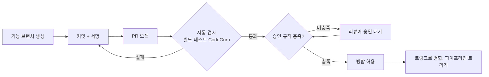

**승인 규칙 템플릿(Approval Rule Template)**은 "몇 명이 승인해야 병합할 수 있는가"를 저장소 전체 또는 여러 저장소에 일괄 적용하는 정책이다. CodeCommit에서는 다음과 같이 CLI로 만들 수 있다.

```bash
aws codecommit create-approval-rule-template \
  --approval-rule-template-name "require-2-approvers" \
  --approval-rule-template-description "메인 브랜치 PR은 최소 2명 승인 필요" \
  --approval-rule-template-content '{
    "Version": "2018-11-08",
    "DestinationReferences": ["refs/heads/main"],
    "Statements": [
      {
        "Type": "Approvers",
        "NumberOfApprovalsNeeded": 2,
        "ApprovalPoolMembers": [
          "arn:aws:sts::123456789012:assumed-role/SeniorEngineerRole/*"
        ]
      }
    ]
  }'

# 템플릿을 실제 저장소에 연결
aws codecommit associate-approval-rule-template-with-repository \
  --approval-rule-template-name "require-2-approvers" \
  --repository-name order-service
```

GitHub/GitLab을 쓴다면 같은 개념이 **브랜치 보호 규칙(Branch Protection Rule)**으로 구현된다. main 브랜치에 대해 "PR 필수", "최소 승인자 수", "상태 검사 통과 필수", "관리자도 예외 없음"을 설정하는 것이 표준이다.

리뷰 체크리스트는 팀마다 다르지만 최소한 다음을 포함해야 한다.

- 변경 범위가 PR 설명과 일치하는가 (스코프 크리프 여부)
- 테스트가 함께 추가·수정되었는가
- 시크릿·자격증명이 코드에 노출되지 않았는가
- 마이그레이션(스키마 변경)이 하위 호환을 깨지 않는가 (→ 37.10절 참조)
- IAM 정책 변경이 최소 권한 원칙을 지키는가

**커밋 서명(commit signing)**은 커밋 작성자를 암호학적으로 검증하는 절차다. GPG 또는 Sigstore 기반 서명을 `git commit -S`로 남기고, 저장소 쪽에서 "서명된 커밋만 병합 허용"을 강제하면 공급망 위조 위험을 줄일 수 있다. 규제 산업(금융·의료)일수록 서명 검증을 승인 규칙과 함께 필수화하는 경우가 많다.

### 36.5 AWS CodeGuru Reviewer

**CodeGuru Reviewer**는 PR에 대해 자동으로 코드를 분석해 코멘트를 남기는 서비스다. 세 가지 축으로 탐지한다.

- **보안 탐지**: OWASP 상위 취약점 패턴(SQL 인젝션, 안전하지 않은 역직렬화 등)에 해당하는 코드를 표시한다.
- **시크릿 탐지(Secrets Detector)**: 코드에 하드코딩된 API 키·비밀번호·토큰을 PR 병합 전에 잡아낸다.
- **코드 품질 권고**: 리소스 누수, 동시성 버그, AWS SDK 모범 사례 위반 등을 지적한다.

| 항목 | 내용 |
|---|---|
| 이점 | 사람이 놓치기 쉬운 반복 패턴을 기계적으로 잡아냄, PR 단계에 자동 결합되어 리뷰어 부담 감소 |
| 한계 — 지원 언어 | 전체 코드 리뷰 기능은 Java·Python 등 일부 언어에 집중되어 있다(시크릿 탐지는 더 넓은 범위의 파일 형식을 다룬다). 지원 범위는 계속 확장되므로 최신 문서를 확인해야 한다 |
| 한계 — 탐지 범위 | 정적 분석 기반이므로 런타임에만 드러나는 결함, 비즈니스 로직 오류는 잡지 못한다. 사람 리뷰를 대체하지 않고 보완한다 |

PR 연동 방식은 저장소 종류에 따라 갈린다. CodeCommit은 리포지토리 연결(Repository Association) 생성만으로 자동 연동되며, GitHub/GitLab/Bitbucket은 CodeConnections를 통해 리포지토리를 연결하면 PR이 열릴 때마다 자동으로 분석이 트리거된다. 분석 결과는 PR 코멘트로 인라인 표시되므로, 팀 리뷰 체크리스트(36.4절)의 일부를 CodeGuru가 자동으로 채워주는 셈이다. 다만 이 결과를 병합 차단 조건으로 강제할지, 참고 의견으로만 둘지는 팀이 정책으로 정해야 한다 — 오탐(false positive)이 반복되면 팀이 경고를 무시하게 되는 "경보 피로"가 발생할 수 있다.

### 36.6 AWS CodeGuru Profiler

**CodeGuru Profiler**는 코드 리뷰(정적) 대신 **실행 중인 애플리케이션**을 관찰하는 런타임 프로파일러다. 프로덕션 트래픽 아래에서 어떤 함수가 CPU 시간을 많이 쓰는지, 힙 메모리가 어디에 집중되는지를 낮은 오버헤드로 수집한다.

- **CPU 힙 요약(Heap Summary)**: 어떤 객체가 힙을 많이 점유하는지, 어떤 메서드 호출 스택에서 시간이 소모되는지를 시각화한다.
- **권고(Recommendation)**: 반복적으로 CPU를 소모하는 패턴(예: 불필요한 로깅, 비효율적 정규식)을 자동으로 짚어준다.

| 항목 | 내용 |
|---|---|
| 이점 | 부하 테스트 환경이 아닌 실제 프로덕션 트래픽 기준으로 병목을 찾음, 에이전트 오버헤드가 낮게 설계됨 |
| 한계 | 지원 런타임이 제한적(Java·Python 계열 위주), 프로파일링 데이터 자체가 문제를 "지적"할 뿐 코드 수정은 사람이 해야 함 |

에이전트 설정은 애플리케이션에 프로파일링 그룹을 만들고 에이전트 라이브러리를 붙이는 방식이다.

```bash
# 프로파일링 그룹 생성
aws codeguru-profiler create-profiling-group \
  --profiling-group-name order-service-prod \
  --compute-platform Default
```

```java
// Java 애플리케이션에서 에이전트 시작 (main 메서드 초반)
new Profiler.Builder()
    .profilingGroupName("order-service-prod")
    .build()
    .start();
```

전형적인 활용 사례는 "CPU 사용률이 높아 인스턴스를 스케일 아웃했는데, 알고 보니 특정 메서드의 비효율적인 문자열 처리가 원인이었던" 경우다. Profiler가 그 메서드를 콕 집어 보여주면, 코드 수정 한 번으로 필요한 인스턴스 수를 줄이는 비용 절감으로 이어진다. 즉 Profiler는 "느리다"는 감을 "어디가 느린가"라는 데이터로 바꿔주는 도구다.

### 36.7 AWS CodeArtifact

**CodeArtifact**는 npm, PyPI, Maven, NuGet 등 패키지 매니저용 아티팩트를 조직 내부에서 관리하는 저장소 서비스다. 핵심 개념 네 가지를 구분해야 한다.

- **도메인(Domain)**: 여러 저장소를 하나의 스토리지·권한 경계로 묶는 상위 컨테이너. 도메인 단위로 암호화 키와 정책을 관리한다.
- **저장소(Repository)**: 실제 패키지가 저장되는 단위. 도메인 안에 여러 개를 둘 수 있다.
- **업스트림(Upstream)**: 한 저장소가 다른 저장소의 패키지를 그대로 참조하도록 체이닝하는 관계. 팀별 저장소 → 조직 공용 저장소 → 외부 연결 순으로 계층화할 수 있다.
- **외부 연결(External Connection)**: npmjs.com, PyPI, Maven Central, NuGet 갤러리 같은 공개 리포지토리를 저장소에 연결해, 처음 요청된 패키지를 자동으로 캐싱한다.

인증은 임시 토큰 방식이다.

```bash
# CodeArtifact 인증 토큰 발급 (기본 유효 기간 12시간, --duration-seconds로 조정 가능)
export CODEARTIFACT_AUTH_TOKEN=$(aws codeartifact get-authorization-token \
  --domain my-org --domain-owner 123456789012 \
  --query authorizationToken --output text)

# npm이 이 저장소를 기본 레지스트리로 쓰도록 설정
aws codeartifact login --tool npm \
  --domain my-org --domain-owner 123456789012 \
  --repository shared-npm-store
# 위 명령이 내부적으로 .npmrc에 registry와 인증 토큰을 기록한다
```

| 항목 | 내용 |
|---|---|
| 이점 | 공개 레지스트리 장애·삭제(left-pad류 사건)에서 격리, 사내 전용 패키지 배포, 다운로드 캐싱으로 빌드 속도 향상 |
| 한계 | 인증 토큰이 짧은 시간 후 만료되어 장기 실행 파이프라인에서 재발급 로직이 필요, 지원 패키지 포맷이 npm·PyPI·Maven·NuGet·generic 등 정해진 목록으로 제한됨, 자체 취약점 스캐닝 기능은 없어 Amazon Inspector 등 별도 도구와 결합해야 함 |

**서플라이 체인 통제**는 CodeArtifact의 **패키지 오리진 제어(Package Origin Control)** 기능으로 구현한다. 특정 패키지 이름에 대해 "외부 업스트림에서의 자동 수집을 차단"하거나 "내부 게시만 허용"하도록 지정할 수 있다. 이렇게 하면 공격자가 사내 패키지 이름과 동일한 이름의 악성 패키지를 공개 레지스트리에 올려 조직이 실수로 그것을 받아오게 만드는 "의존성 컨퓨전(dependency confusion)" 공격을 차단하는 허용 목록 체계를 만들 수 있다.

### 36.8 AWS CodeBuild와 buildspec

**CodeBuild**는 완전관리형 빌드 서비스로, 서버를 두지 않고 정의된 컨테이너 환경에서 빌드를 실행한다. 프로젝트를 만들 때 세 가지를 정한다.

- **환경(Environment)**: 운영체제·런타임 조합의 관리형 이미지를 쓸지, ECR에 올린 커스텀 Docker 이미지를 쓸지.
- **컴퓨트(Compute)**: vCPU·메모리 크기(및 필요 시 GPU가 포함된 대형 컴퓨트 타입).
- **이미지**: 언어 런타임이 미리 설치된 AWS 관리 이미지, 또는 조직이 직접 관리하는 이미지.

빌드 절차는 `buildspec.yml`이라는 선언적 문법으로 정의한다. 전체 구조는 다음과 같다.

```yaml
version: 0.2

env:
  variables:
    NODE_ENV: "production"
  parameter-store:
    DB_HOST: "/order-service/prod/db-host"
  secrets-manager:
    DB_PASSWORD: "order-service/prod/db:password"
  exported-variables:
    - IMAGE_TAG

phases:
  install:
    runtime-versions:
      nodejs: 20
    commands:
      - echo "의존성 설치 시작"
      - npm ci
  pre_build:
    commands:
      - echo "ECR 로그인 및 태그 결정"
      - aws ecr get-login-password --region ap-northeast-2 | docker login --username AWS --password-stdin 123456789012.dkr.ecr.ap-northeast-2.amazonaws.com
      - IMAGE_TAG=$(echo $CODEBUILD_RESOLVED_SOURCE_VERSION | cut -c1-8)
  build:
    commands:
      - echo "단위 테스트 실행"
      - npm test -- --reporter junit --outputFile reports/junit.xml
      - echo "도커 이미지 빌드"
      - docker build -t 123456789012.dkr.ecr.ap-northeast-2.amazonaws.com/order-service:$IMAGE_TAG .
  post_build:
    commands:
      - echo "빌드 완료, 이미지 푸시"
      - docker push 123456789012.dkr.ecr.ap-northeast-2.amazonaws.com/order-service:$IMAGE_TAG
      - printf '[{"name":"order-service","imageUri":"%s"}]' 123456789012.dkr.ecr.ap-northeast-2.amazonaws.com/order-service:$IMAGE_TAG > imagedefinitions.json

reports:
  unit-tests:
    files:
      - reports/junit.xml
    file-format: JUNITXML

artifacts:
  files:
    - imagedefinitions.json
    - appspec.yml
  discard-paths: yes

cache:
  paths:
    - 'node_modules/**/*'
```

각 절의 의미: `env`는 환경 변수를 평문·Parameter Store·Secrets Manager 세 경로에서 끌어올 수 있게 하고(비밀은 반드시 Secrets Manager 경로를 쓴다), `phases`는 install(런타임·의존성 설치) → pre_build(로그인·변수 계산) → build(테스트·컴파일·이미지 빌드) → post_build(푸시·산출물 생성) 순으로 실행된다. `artifacts`는 다음 단계(배포)로 넘길 파일을 지정하고, `cache`는 반복 빌드 시 재사용할 디렉터리를 지정한다.

**캐시**는 두 종류다. 로컬 캐시(빌드 호스트에 남기는 방식으로 `LOCAL_DOCKER_LAYER_CACHE`, `LOCAL_SOURCE_CACHE`, `LOCAL_CUSTOM_CACHE` 모드가 있다)와 S3 캐시(프로젝트 설정에서 S3 버킷을 지정하면 `cache.paths`에 명시한 디렉터리를 빌드 간에 압축해 보관한다)가 있다. 의존성 디렉터리(`node_modules`, `.m2`, `pip` 캐시 등)를 캐싱하면 설치 단계 시간이 크게 줄어든다.

**배치 빌드(Batch Build)**는 하나의 buildspec 안에서 여러 하위 빌드를 그래프·리스트·매트릭스 형태로 정의해 병렬 실행하는 기능이다. 예를 들어 여러 아키텍처(amd64, arm64)나 여러 언어 버전을 동시에 빌드할 때 유용하다. **리포트 그룹**은 `reports` 절에서 정의한 테스트 결과를 CodeBuild 콘솔의 리포트 그룹으로 모아 통과율·추세를 시각화한다. **빌드 알림**은 EventBridge로 빌드 상태 변경 이벤트를 받아 SNS·Chatbot으로 전달하며, **트리거**는 소스 저장소의 웹훅(CodeConnections 경유) 또는 EventBridge 규칙으로 구성한다.

**로컬 빌드**는 CodeBuild가 제공하는 에이전트 Docker 이미지를 개발자 로컬 머신에서 그대로 실행해, 파이프라인에 올리기 전에 buildspec을 검증하는 방법이다. **VPC 연결**은 빌드 프로젝트가 프라이빗 서브넷의 RDS나 사내 API처럼 VPC 내부 자원에 접근해야 할 때 `vpcConfig`에 서브넷·보안 그룹을 지정하는 설정이다 — 이 경우 아웃바운드 인터넷이 필요하면 NAT 게이트웨이나 필요한 VPC 엔드포인트(ECR, S3 등)를 함께 준비해야 한다.

### 36.9 테스트 전략

파이프라인이 빨라도 테스트가 부실하면 "빠르게 잘못 배포하는" 결과로 이어진다. 테스트 전략은 **테스트 피라미드**로 구조화한다.

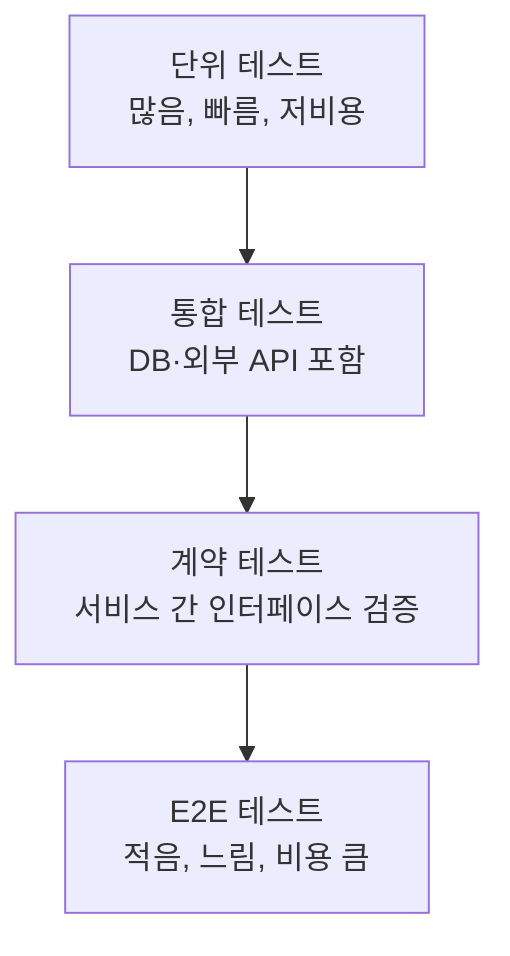

- **단위 테스트**: 함수·클래스 단위로 외부 의존성 없이 실행. 가장 많은 수를 차지해야 하고 초 단위로 끝나야 한다.
- **통합 테스트**: 실제 DB, 메시지 큐 등과 연동해 컴포넌트 조합을 검증한다.
- **계약 테스트(Contract Test)**: 마이크로서비스 환경에서 특히 중요하다. 서비스가 여러 개로 쪼개지면 모든 서비스를 한 번에 띄워 E2E로 검증하는 방식은 환경 구성 비용이 기하급수적으로 커진다. 계약 테스트(대표적으로 Pact 같은 도구)는 소비자(consumer)가 기대하는 API 계약을 파일로 남기고, 제공자(provider)가 자신의 파이프라인에서 그 계약을 독립적으로 검증하게 한다. 이렇게 하면 서비스 전체를 동시에 띄우지 않고도 "이 변경이 다른 서비스를 깨뜨리지 않는지"를 확인할 수 있다. 마이크로서비스 설계 원칙은 → 42장에서 더 다룬다.
- **E2E 테스트**: 실제 환경과 유사한 스테이징에서 사용자 시나리오 전체를 검증한다. 느리고 깨지기 쉬우므로 핵심 시나리오로만 최소화한다.

**테스트 리포트 수집**은 CodeBuild의 `reports` 절(36.8절)로 자동화하고, 파이프라인의 테스트 스테이지 실패 시 이후 스테이지를 진행하지 않도록 만든다. **커버리지 게이트**는 빌드 스크립트에서 커버리지 도구(예: `jest --coverage`, `pytest --cov`)의 출력이 임계값(예: 라인 커버리지 80%) 미만이면 빌드를 실패시키는 방식으로 강제한다. 다만 커버리지 숫자 자체를 목표로 삼으면 의미 없는 테스트가 늘어날 수 있으므로, 신규/변경 코드에 대한 커버리지(diff coverage)를 함께 보는 것이 실무적으로 더 유용하다.

**플레이키 테스트(flaky test)**는 같은 코드에 대해 통과와 실패를 오가는 테스트로, 파이프라인 신뢰를 갉아먹는 주범이다. 관리 원칙은 다음과 같다: (1) 실패 원인을 재현 가능하게 만들기 전까지는 격리(quarantine) 태그를 붙여 필수 게이트에서 제외하고, (2) 격리된 테스트는 별도로 추적해 방치되지 않게 하며, (3) 재시도(retry)는 임시방편일 뿐 근본 원인(타이밍 의존, 공유 상태) 해결을 대체하지 못한다는 점을 팀 규칙으로 명시한다.

플레이키 테스트가 방치되면 팀은 결국 "실패해도 재실행하면 통과한다"는 학습을 하게 되고, 이는 진짜 회귀(regression)가 발생했을 때도 재실행 버튼부터 누르는 위험한 습관으로 이어진다. CodeBuild의 리포트 그룹에서 테스트별 통과 이력을 추세로 확인할 수 있으므로, 특정 테스트의 실패율이 일정 임계치를 넘으면 자동으로 격리 목록에 올리는 규칙을 CI 스크립트에 내장해 두는 팀도 있다. 격리는 어디까지나 임시 조치이며, 격리된 테스트가 쌓이기만 하고 줄어들지 않는다면 그 자체가 테스트 설계 품질에 대한 경고 신호로 다뤄야 한다.

### 36.10 AWS CodePipeline

**CodePipeline**은 소스 → 빌드 → 테스트 → 승인 → 배포로 이어지는 흐름을 오케스트레이션하는 서비스다. 파이프라인은 **스테이지**로 구성되고, 각 스테이지는 하나 이상의 **액션**을 담으며, 스테이지 사이의 산출물은 S3 아티팩트 버킷을 통해 전달된다.

액션 타입은 여섯 가지로 구분된다.

| 액션 타입 | 대표 제공자 | 역할 |
|---|---|---|
| 소스(Source) | CodeConnections(GitHub 등), CodeCommit, ECR, S3 | 트리거와 소스 산출물 생성 |
| 빌드(Build) | CodeBuild, Jenkins(커스텀 액션) | 컴파일·테스트·이미지 빌드 |
| 테스트(Test) | CodeBuild, 디바이스 팜 등 | 별도 스테이지로 분리된 테스트 실행 |
| 배포(Deploy) | CodeDeploy, CloudFormation, ECS, S3, Elastic Beanstalk | 대상 환경에 반영(상세는 37장) |
| 승인(Approval) | 수동 승인(Manual Approval) | 사람의 게이트, SNS로 알림 전송 가능 |
| 호출(Invoke) | Lambda, Step Functions | 임의 로직 실행(알림, 검증 스크립트, 외부 시스템 연동) |

같은 스테이지 안에서 여러 액션을 병렬로 실행하려면 **runOrder**를 동일한 숫자로 지정한다. runOrder가 다르면 숫자가 낮은 액션부터 순차 실행되고, 같은 숫자를 가진 액션들은 동시에 실행된다.

액션 간에는 **변수와 네임스페이스**로 데이터를 주고받는다. 액션에 `Namespace`를 지정하면 그 액션이 출력한 변수를 이후 액션의 구성 값에서 `#{네임스페이스.변수명}` 형식으로 참조할 수 있다 — 예를 들어 빌드 액션이 내보낸 `IMAGE_TAG`를 배포 액션의 파라미터로 그대로 전달하는 식이다.

**V2 파이프라인 타입**은 소스 저장소의 푸시 이벤트에 대해 브랜치·파일 경로·태그 단위로 필터를 거는 **트리거** 설정을 지원한다. 예를 들어 `infra/` 경로 변경 시에만, 또는 `release/*` 브랜치로의 푸시에만 파이프라인이 실행되도록 제한할 수 있어 불필요한 실행을 줄인다.

다음은 소스 → 빌드 → 수동 승인 → 배포로 이어지는 CloudFormation 예시다.

```yaml
AWSTemplateFormatVersion: "2010-09-09"
Resources:
  Pipeline:
    Type: AWS::CodePipeline::Pipeline
    Properties:
      RoleArn: !GetAtt PipelineServiceRole.Arn
      ArtifactStore:
        Type: S3
        Location: !Ref ArtifactBucket
      Stages:
        - Name: Source
          Actions:
            - Name: SourceAction
              ActionTypeId:
                Category: Source
                Owner: AWS
                Provider: CodeStarSourceConnection
                Version: "1"
              Configuration:
                ConnectionArn: !Ref GitHubConnectionArn
                FullRepositoryId: "my-org/order-service"
                BranchName: main
              OutputArtifacts:
                - Name: SourceOutput
        - Name: Build
          Actions:
            - Name: BuildAction
              ActionTypeId:
                Category: Build
                Owner: AWS
                Provider: CodeBuild
                Version: "1"
              Configuration:
                ProjectName: !Ref CodeBuildProject
              InputArtifacts:
                - Name: SourceOutput
              OutputArtifacts:
                - Name: BuildOutput
        - Name: ApproveProd
          Actions:
            - Name: ManualApproval
              ActionTypeId:
                Category: Approval
                Owner: AWS
                Provider: Manual
                Version: "1"
              Configuration:
                NotificationArn: !Ref ApprovalTopic
                CustomData: "프로덕션 배포 승인 전 변경 목록을 확인하십시오"
        - Name: Deploy
          Actions:
            - Name: DeployAction
              ActionTypeId:
                Category: Deploy
                Owner: AWS
                Provider: CloudFormation
                Version: "1"
              Configuration:
                ActionMode: CREATE_UPDATE
                StackName: order-service-prod
                TemplatePath: BuildOutput::packaged.yaml
                Capabilities: CAPABILITY_NAMED_IAM
                RoleArn: !GetAtt CloudFormationDeployRole.Arn
              InputArtifacts:
                - Name: BuildOutput
              RunOrder: 1
```

**크로스 계정·크로스 리전 배포**는 파이프라인 자체는 한 계정(보통 CI/CD 전용 계정)에 두고, 배포 대상 계정은 별도(스테이징 계정, 프로덕션 계정)로 분리하는 구조다. 이를 위해서는 (1) 아티팩트 버킷의 버킷 정책에 대상 계정 역할의 읽기 권한을 부여하고, (2) 아티팩트를 암호화하는 KMS 키의 정책에도 대상 계정을 허용하며, (3) 대상 계정에는 파이프라인 계정을 신뢰하는 배포 역할을 미리 만들어 둔다. 크로스 리전 배포는 리전마다 별도의 아티팩트 버킷을 두고 CodePipeline이 자동으로 리전 간 복제를 처리하도록 지원한다.

```json
{
  "Version": "2012-10-17",
  "Statement": [
    {
      "Effect": "Allow",
      "Principal": { "AWS": "arn:aws:iam::111111111111:role/PipelineServiceRole" },
      "Action": "sts:AssumeRole",
      "Condition": {
        "StringEquals": { "sts:ExternalId": "prod-deploy-2026" }
      }
    }
  ]
}
```
위 신뢰 정책은 프로덕션 계정(`222222222222`)에 만든 배포 역할이 CI/CD 계정(`111111111111`)의 파이프라인 서비스 역할만 위임받도록 제한한다. `ExternalId` 조건과 결합하면 혼동된 대리인(confused deputy) 문제를 줄일 수 있다.

### 36.11 파이프라인을 AWS 밖으로 확장

모든 조직이 AWS 네이티브 CI/CD 도구만 쓰는 것은 아니다. 기존에 구축된 **Jenkins** 빌드 서버가 있거나, 사내 데이터센터의 서버가 배포 대상에 남아 있는 경우가 흔하다.

**Jenkins 연동**은 두 방향으로 가능하다. 첫째, Jenkins가 소스 이벤트를 받아 빌드를 실행하고 산출물을 S3에 올리면, CodePipeline이 그 S3 객체를 소스로 삼아 이후 배포 스테이지를 이어받는 방식이다. 둘째, CodePipeline 안에 Jenkins를 커스텀 액션 제공자로 등록해, 빌드 스테이지 자체를 Jenkins 잡(Job)에 위임하는 방식이다. 어느 쪽이든 Jenkins가 AWS 자격 증명을 오래 보관하지 않도록, Jenkins 에이전트에는 IAM 역할(EC2 인스턴스 프로파일 또는 OIDC 기반 단기 자격 증명)을 부여하는 것이 원칙이다.

```groovy
// Jenkinsfile 개요 — 빌드 후 산출물을 S3에 올려 CodePipeline과 연결
pipeline {
    agent any
    stages {
        stage('Build') {
            steps {
                sh 'npm ci && npm run build'
            }
        }
        stage('Publish Artifact') {
            steps {
                // 인스턴스 프로파일의 임시 자격 증명을 사용, 장기 키를 하드코딩하지 않는다
                sh 'aws s3 cp dist.zip s3://order-service-artifacts/jenkins/dist.zip'
            }
        }
    }
}
```

**온프레미스 서버를 CodeDeploy 배포 대상으로 등록**하면, 클라우드와 사내 서버를 하나의 배포 파이프라인으로 관리할 수 있다. 절차는 다음과 같다.

1. IAM에서 온프레미스 인스턴스 전용 사용자 또는 역할을 만들고 CodeDeploy 관련 권한을 부여한다.
2. `aws deploy create-on-premises-instance` 명령으로 온프레미스 인스턴스를 등록하고 태그를 지정한다.
3. 대상 서버에 CodeDeploy 에이전트를 설치하고, 등록 시 발급된 자격 증명 파일을 배치한다.
4. 배포 그룹(Deployment Group)에서 이 태그를 대상으로 지정하면, EC2 인스턴스와 동일한 방식으로 온프레미스 서버도 배포 대상에 포함된다.

```bash
# 온프레미스 인스턴스 등록 및 태그 지정
aws deploy register-on-premises-instance \
  --instance-name onprem-web-01 \
  --iam-user-arn arn:aws:iam::123456789012:user/codedeploy-onprem-onprem-web-01

aws deploy add-tags-to-on-premises-instances \
  --tags Key=Environment,Value=onprem-prod \
  --instance-names onprem-web-01
```

이렇게 구성한 **하이브리드 파이프라인**은 소스는 GitHub, 빌드는 CodeBuild 또는 Jenkins, 배포는 CodeDeploy가 클라우드 인스턴스와 온프레미스 인스턴스 모두를 동일한 배포 그룹 개념으로 다루는 구조가 된다. 다만 온프레미스 대상은 네트워크 연결(VPN·Direct Connect)이 안정적이어야 하고, 에이전트 하트비트가 끊기면 배포 상태 판단이 늦어질 수 있다는 점을 감안해야 한다.

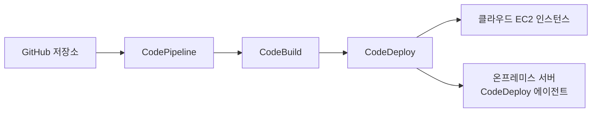

### 36.12 GitHub Actions·GitLab CI와의 조합 패턴

많은 조직이 소스 저장소로 이미 GitHub 또는 GitLab을 쓰고 있고, 그 안에 내장된 CI 기능(GitHub Actions, GitLab CI)을 함께 쓰고 싶어 한다. 이때 핵심 과제는 "AWS 자격 증명을 어떻게 안전하게 넘길 것인가"다.

과거에는 장기 액세스 키를 GitHub Secrets에 저장하는 방식이 흔했지만, 이는 키 유출·회전 부담이라는 위험을 안고 있다. 현재 권장되는 방식은 **OIDC(OpenID Connect) 연동**으로 장기 키 없이 임시 자격 증명만 발급받는 것이다. AWS IAM에 GitHub를 OIDC 아이덴티티 공급자로 등록하고(→ 29장의 신뢰 정책 구성 참조), 워크플로가 실행될 때마다 GitHub가 발급한 단기 토큰으로 `sts:AssumeRoleWithWebIdentity`를 호출해 역할을 위임받는다.

```yaml
# .github/workflows/deploy.yml — OIDC로 장기 키 없이 배포
name: Deploy to AWS
on:
  push:
    branches: [main]

permissions:
  id-token: write   # OIDC 토큰 발급에 필요
  contents: read

jobs:
  deploy:
    runs-on: ubuntu-latest
    steps:
      - uses: actions/checkout@v4
      - name: Configure AWS credentials via OIDC
        uses: aws-actions/configure-aws-credentials@v4
        with:
          role-to-assume: arn:aws:iam::123456789012:role/GitHubActionsDeployRole
          aws-region: ap-northeast-2
      - name: Build and push image
        run: |
          aws ecr get-login-password --region ap-northeast-2 | \
            docker login --username AWS --password-stdin 123456789012.dkr.ecr.ap-northeast-2.amazonaws.com
          docker build -t 123456789012.dkr.ecr.ap-northeast-2.amazonaws.com/order-service:${{ github.sha }} .
          docker push 123456789012.dkr.ecr.ap-northeast-2.amazonaws.com/order-service:${{ github.sha }}
      - name: Trigger CodeDeploy
        run: aws deploy create-deployment --application-name order-service --deployment-group-name prod
```

이 역할의 신뢰 정책은 특정 저장소·브랜치에서 온 토큰만 수락하도록 `sub` 클레임을 제한해야 한다.

```json
{
  "Version": "2012-10-17",
  "Statement": [
    {
      "Effect": "Allow",
      "Principal": {
        "Federated": "arn:aws:iam::123456789012:oidc-provider/token.actions.githubusercontent.com"
      },
      "Action": "sts:AssumeRoleWithWebIdentity",
      "Condition": {
        "StringEquals": {
          "token.actions.githubusercontent.com:aud": "sts.amazonaws.com"
        },
        "StringLike": {
          "token.actions.githubusercontent.com:sub": "repo:my-org/order-service:ref:refs/heads/main"
        }
      }
    }
  ]
}
```

**언제 AWS 네이티브 대신 GitHub Actions/GitLab CI를 쓰는가**는 조직의 기존 투자와 워크플로 습관에 달려 있다. 두 접근을 비교한다.

| 기준 | AWS 네이티브(CodePipeline/CodeBuild) | GitHub Actions/GitLab CI |
|---|---|---|
| 저장소와의 통합 | CodeConnections를 통한 별도 연결 필요 | 저장소에 내장, 설정 파일만으로 즉시 동작 |
| 크로스 계정 배포 구조 | IAM 역할 위임이 AWS 서비스 간에 일관되게 통합 | OIDC로 가능하지만 계정별 역할 관리를 직접 설계해야 함 |
| 팀의 기존 습관 | AWS 콘솔·IaC에 익숙한 플랫폼 팀에 적합 | 이미 GitHub/GitLab 생태계에 익숙한 개발팀에 적합 |
| 마켓플레이스 액션 생태계 | 상대적으로 제한적 | 매우 풍부(다양한 커뮤니티 액션) |
| 감사·거버넌스 통합 | AWS Organizations·CloudTrail과 자연스럽게 결합 | 별도로 AWS 쪽 로깅·거버넌스와 연결 필요 |

**한 줄 결정 기준**: 배포 대상과 거버넌스가 AWS 계정 구조에 강하게 묶여 있다면 CodePipeline을, 팀의 개발 리듬이 이미 GitHub/GitLab 중심이고 빠른 반복이 우선이라면 Actions/CI를 선택한다.

실무에서는 둘을 섞는 경우도 많다. 대표적인 경계 설정은 **빌드·테스트는 GitHub Actions에서, 배포는 CodePipeline/CodeDeploy로** 넘기는 방식이다. GitHub Actions가 빌드 산출물을 S3에 올리고(OIDC로 인증), 그 S3 객체 변경을 CodePipeline의 소스 액션이 감지해 이후 배포 스테이지를 이어받는다. 이렇게 하면 빌드 단계의 빠른 피드백은 개발자에게 익숙한 GitHub 화면에서 얻고, 배포 단계의 승인·크로스 계정 통제·롤백은 AWS 네이티브 도구의 성숙한 기능을 그대로 활용할 수 있다. 다만 경계가 애매해지면 "어디서 무엇이 실패했는지" 추적이 두 시스템에 흩어지므로, 파이프라인 전체를 한눈에 보여주는 대시보드(EventBridge + 알림, 또는 관측성 도구 → 38장)를 반드시 함께 구성해야 한다.

### 36장 정리

#### [필수] 반드시 알아야 할 것
1. CI는 "빌드·테스트 자동화", 지속적 전달은 "배포 준비까지 자동화 + 사람이 승인", 지속적 배포는 "승인 없이 끝까지 자동화"다. 세 용어를 섞어 쓰지 않는다.
2. DORA 4대 지표(배포 빈도, 변경 리드 타임, 변경 실패율, 서비스 복구 시간)로 파이프라인의 건강도를 정기적으로 측정한다.
3. 트렁크 기반 개발과 GitHub Flow는 배포 빈도를 높이는 데 유리하고, GitFlow는 여러 버전을 동시에 유지보수해야 하는 상황에 적합하다.
4. CodePipeline의 액션 타입은 소스·빌드·테스트·배포·승인·호출 여섯 가지로 구성되며, runOrder로 병렬·순차를 제어한다.
5. buildspec.yml의 phases(install/pre_build/build/post_build)는 순서가 고정되어 있고, 각 단계의 실패는 이후 단계를 중단시킨다.
6. 계약 테스트는 마이크로서비스 환경에서 전체 서비스를 띄우지 않고도 서비스 간 인터페이스 변경을 안전하게 검증하는 방법이다.
7. GitHub Actions에서 AWS로 배포할 때는 장기 액세스 키 대신 OIDC 연동으로 임시 자격 증명을 받는 것이 표준이다.
8. CodeCommit은 신규 계정의 신규 저장소 생성이 제한된 상태이므로, 신규 프로젝트에서는 현재 정책을 콘솔·문서로 반드시 확인한 뒤 채택 여부를 정한다.

#### [팁] 실무 노하우
1. 빌드 캐시(의존성 디렉터리)와 배치 빌드를 함께 쓰면 CI 실행 시간을 크게 줄일 수 있다. CI가 10분을 넘기면 개발자가 다른 작업으로 넘어가 리듬이 끊긴다.
2. CodeGuru Reviewer의 시크릿 탐지를 PR 단계에 붙이면 자격 증명 유출을 병합 전에 차단할 수 있다 — 다만 지원 언어·탐지 범위의 한계를 팀에 미리 공지해 오탐에 대한 기대치를 조정한다.
3. 프로덕션 배포 앞의 수동 승인 액션에는 반드시 "무엇이 바뀌는지"(변경 목록, CloudFormation change set, 커밋 로그)를 함께 제시해 승인자가 실질적으로 판단할 수 있게 한다.
4. CodeArtifact의 업스트림 계층(팀 저장소 → 조직 공용 저장소 → 외부 연결)을 구성해 두면 공개 레지스트리 장애 시에도 내부 캐시로 빌드가 계속 돌아간다.
5. 플레이키 테스트는 삭제하지 말고 격리(quarantine) 태그로 분리해 추적하되, 방치되지 않도록 주기적으로 리뷰한다.
6. 빌드는 GitHub Actions, 배포는 CodePipeline처럼 도구를 섞을 때는 경계를 문서화하고 두 시스템을 아우르는 단일 대시보드를 마련한다.

#### [주의] 사고·비용·설계 함정
1. 환경마다 아티팩트를 다시 빌드하면 "스테이징에서는 됐는데 프로덕션에서 깨졌다"는 문제의 근원이 된다. 반드시 한 번 빌드한 아티팩트를 모든 환경에 그대로 배포하고, 환경 차이는 구성(파라미터·시크릿)으로만 만든다(12-Factor 원칙).
2. 파이프라인 서비스 역할에 과도한 권한을 몰아주면 CI/CD 자체가 조직의 가장 넓은 공격 표면이 된다. 스테이지별(빌드용, 스테이징 배포용, 프로덕션 배포용)로 역할을 분리하고 최소 권한을 적용한다.
3. 아티팩트 버킷·빌드 로그·테스트 리포트는 파이프라인이 실행될 때마다 계속 쌓인다. S3 라이프사이클 정책과 보존 기간을 설정하지 않으면 저장 비용이 조용히 누적된다.
4. CodeCommit·CodeGuru 등 개발자 도구 계열은 리전 가용성과 신규 가입 정책이 시점에 따라 달라질 수 있다. 장기 표준 아키텍처로 확정하기 전에 현재 상태를 반드시 재확인한다.
5. 커버리지 게이트를 숫자 목표로만 강제하면 의미 없는 테스트가 늘어나 오히려 신뢰도가 떨어진다. 신규·변경 코드에 대한 커버리지를 함께 본다.
6. 크로스 계정 배포에서 아티팩트 버킷 정책과 KMS 키 정책 중 하나라도 대상 계정을 빠뜨리면 배포 액션이 권한 오류로 실패한다. 두 정책을 항상 짝으로 검토한다.
7. 승인 게이트 없이 모든 스테이지를 자동 통과시키는 지속적 배포는 테스트 커버리지와 자동 롤백(→ 37장)이 충분히 성숙하지 않은 상태에서 도입하면 장애 확산 속도만 빨라진다.

#### 한 장 요약
CI/CD 파이프라인은 소스 관리, 코드 리뷰, 빌드, 테스트, 오케스트레이션이 하나로 이어진 사슬이다. CI는 통합의 신뢰를, 지속적 전달은 배포 준비를, 지속적 배포는 완전 자동 반영을 의미하며 이 셋은 승인 게이트의 유무로 구분된다. AWS는 CodeGuru(리뷰·프로파일링), CodeArtifact(아티팩트), CodeBuild(빌드), CodePipeline(오케스트레이션)로 각 단계를 서비스화했고, CodeConnections와 OIDC 연동을 통해 GitHub·GitLab·Jenkins·온프레미스까지 하나의 파이프라인으로 엮을 수 있다. 어떤 도구 조합을 쓰든 원칙은 같다 — 한 번 빌드해 모든 환경에 배포하고, 스테이지별로 권한을 최소화하며, 파이프라인 자체의 속도와 신뢰도를 DORA 지표로 계속 측정하는 것이다.

#### 다음 장 예고
37장은 이 파이프라인의 마지막 액션인 "배포"를 깊이 파고든다. 인플레이스·롤링·블루/그린·카나리 전략의 차이, CodeDeploy의 appspec.yml 구조, 자동 롤백 조건, 피처 플래그로 배포와 릴리스를 분리하는 방법을 다룬다.

---

## 37장. 배포 전략과 릴리스 안전장치  ★★★

> **이 장에서 다루는 것**
> 36장에서 만든 파이프라인이 아티팩트를 운영 환경 문 앞까지 옮겨 놓았다면, 이 장은 그 문을 여는 마지막 순간 — 실제 트래픽을 신버전으로 넘기는 방법 — 을 다룬다. 인플레이스부터 블루/그린, 카나리까지 배포 전략의 선택 기준을 정리하고, EC2·ECS·Lambda·EKS 네 가지 컴퓨트 플랫폼 각각에서 AWS CodeDeploy와 쿠버네티스 네이티브 도구가 이를 어떻게 구현하는지 실습 수준으로 살펴본다. 이어서 자동 롤백, 피처 플래그를 통한 배포·릴리스 분리, 그리고 배포 중에서도 가장 되돌리기 어려운 데이터베이스 스키마 변경까지 다룬다. 이 장 전체를 관통하는 질문은 하나다 — "이 배포가 잘못됐을 때 몇 초 안에, 어떤 대가로 되돌릴 수 있는가."

### 37.1 인플레이스 vs 롤링 vs 블루/그린 vs 카나리

배포 전략을 고르는 문제는 결국 하나의 교환관계로 좁혀진다. **롤백 속도와 비용의 교환**이다. 되돌리는 데 걸리는 시간을 줄이려면 신구 버전을 동시에 띄워둘 여유 용량이 필요하고, 그 여유 용량을 포기하면 문제가 생겼을 때 재배포로 되돌리는 수밖에 없어 복구 시간이 길어진다. 다섯 가지 대표 전략을 이 기준으로 비교한다.

| 전략 | 다운타임 | 롤백 속도 | 필요 용량 | 리스크 | 복잡도 | 적합 상황 |
|---|---|---|---|---|---|---|
| 인플레이스(올앳원스) | 있음(전체 동시 교체) | 느림(신버전 재배포 필요) | 기존 용량 그대로 | 높음(장애가 전체에 즉시 영향) | 낮음 | 다운타임이 허용되는 배치 시스템, 개발/테스트 환경 |
| 롤링 | 없음(일부씩 순환 교체) | 중간(진행 중단 후 재배포) | 기존 용량 +소수 여유 | 중간(신구 버전 일시 공존) | 중간 | 상태 없는 웹/API, 점진적 검증이 필요한 서비스 |
| 블루/그린 | 없음 | 즉시(트래픽 스위치만) | 2배(신구 환경 동시 유지) | 낮음(전환 전 충분히 검증 가능) | 높음 | 즉각 롤백이 필수인 핵심 프로덕션 서비스 |
| 카나리 | 없음 | 빠름(소규모 트래픽만 영향받음) | 1~2배(카나리 비중에 비례) | 낮음~중간(관측 지표 품질에 의존) | 높음 | 실사용자 트래픽으로 신버전을 검증해야 하는 대규모 서비스 |
| A/B 테스트 | 없음 | 빠름(라우팅 규칙 변경) | 1~2배 | 배포 안전 목적이 아니라 실험 목적 | 높음 | 기능 실험·전환율 비교가 목표일 때 |

**한 줄 결정 기준**: "되돌리는 데 몇 초가 허용되는가"와 "그 대가로 몇 배의 용량 비용을 감수할 수 있는가"를 먼저 정하면 나머지는 저절로 좁혀진다 — 즉시 롤백이 생명인 서비스는 블루/그린, 점진적 위험 분산이 우선이면 카나리, 비용 최소화가 우선이면 롤링이나 인플레이스다.

여기서 A/B 테스트는 성격이 다르다는 점을 짚어야 한다. 나머지 네 전략은 "신버전이 안전한가"를 검증하는 배포 안전장치이지만, A/B 테스트는 "어느 버전의 전환율이 더 높은가"를 재는 제품 실험이다. 배포 도구(가중 라우팅)는 같아도 목적이 다르므로 두 목적을 혼동해 카나리 관측 지표에 비즈니스 실험 지표를 섞으면 어느 쪽 결론도 신뢰하기 어려워진다. 36장에서 다룬 DORA 지표 중 배포 빈도와 변경 실패율은 이 장의 전략 선택과 직결된다 — 롤백이 빠르고 값싼 전략을 표준으로 삼을수록 팀은 더 자주 배포해도 되고, 역설적으로 배포 빈도가 올라갈수록 한 번의 배포에 담기는 변경량이 작아져 실패율은 오히려 낮아지는 경향이 있다.

용량 비용의 크기를 감으로만 판단하지 않도록 구체적으로 따져볼 필요가 있다. 예를 들어 인스턴스 20대로 운영 중인 서비스를 블루/그린으로 전환하면 배포 시간 동안 순간적으로 40대분의 컴퓨트·라이선스 비용이 발생하지만, 롤링으로 전환하면 여유 인스턴스 1~2대분의 비용만 추가된다. 반대로 장애가 발생했을 때 블루/그린은 리스너 규칙 하나만 되돌리면 수 초 안에 복구되는 반면, 롤링은 이미 신버전으로 넘어간 인스턴스를 다시 구버전으로 하나씩 되돌려야 하므로 복구에 수 분이 걸릴 수 있다. 이 비용-시간의 저울질을 서비스의 장애 허용 시간(RTO에 준하는 개념)과 예산 제약에 맞춰 미리 정해두는 것이 배포 전략 선택의 실체다.

### 37.2 AWS CodeDeploy

CodeDeploy는 EC2, 온프레미스, ECS, Lambda 네 가지 컴퓨트 플랫폼에 동일한 개념 모델로 배포를 오케스트레이션하는 관리형 서비스다. 핵심 개념은 세 가지다.

- **애플리케이션(Application)**: 배포 대상의 논리적 이름. 컴퓨트 플랫폼(EC2/온프레미스, ECS, Lambda) 중 하나를 지정해 생성한다.
- **배포 그룹(Deployment Group)**: "무엇에" 배포할지를 정의한다. EC2는 태그나 Auto Scaling 그룹으로, ECS는 클러스터·서비스로, Lambda는 함수·별칭으로 대상을 지정한다.
- **배포 구성(Deployment Configuration)**: "얼마나 빨리, 얼마씩" 트래픽/인스턴스를 전환할지 정의한다. EC2/온프레미스는 `AllAtOnce`, `HalfAtATime`, `OneAtATime` 세 사전 정의 값과 최소 정상 호스트 비율(FLEET_PERCENT) 또는 개수(HOST_COUNT)를 지정하는 사용자 정의 값을 쓸 수 있다. ECS와 Lambda는 개념이 다르다 — 인스턴스 단위가 아니라 트래픽 비중 단위로 `AllAtOnce`, `Canary10Percent5Minutes`류(카나리), `Linear10PercentEvery1Minute`류(선형)를 제공한다.

컴퓨트 플랫폼별 차이를 표로 정리한다.

| 플랫폼 | 배포 단위 | CodeDeploy 에이전트 필요 | 트래픽 전환 주체 | 대표 배포 구성 |
|---|---|---|---|---|
| EC2/온프레미스 | 인스턴스(파일 복사·스크립트 실행) | 필요(각 인스턴스에 설치) | ELB 등록/해제 또는 인플레이스 재시작 | AllAtOnce, OneAtATime, HalfAtATime |
| ECS | 태스크 정의 신버전 | 불필요 | ALB 타깃 그룹 전환(블루/그린) | ECSAllAtOnce, ECSLinear10PercentEvery1Minutes |
| Lambda | 함수 버전/별칭 | 불필요 | 별칭 가중 라우팅(RoutingConfig) | LambdaAllAtOnce, LambdaCanary10Percent5Minutes |

CodeDeploy 에이전트는 EC2/온프레미스 플랫폼에서만 필요하다. 인스턴스에 상주하며 CodeDeploy 서비스로부터 배포 명령을 폴링하고, `appspec.yml`에 정의된 훅 스크립트를 실제로 실행하는 주체다. ECS와 Lambda는 배포 대상 자체가 컨테이너 오케스트레이션이나 서버리스 런타임이므로 에이전트가 개입할 자리가 없고, 대신 ALB 타깃 그룹 전환이나 Lambda 별칭 가중치 조정을 CodeDeploy가 API로 직접 수행한다.

**배포 수명주기 이벤트**는 플랫폼마다 다르지만 공통된 뼈대는 "정지 → 설치/전환 → 검증"이다. EC2/온프레미스는 인스턴스 안에서 순차적으로 실행되는 훅의 나열(37.3절)이고, ECS·Lambda는 리소스 전환 전후에 검증용 Lambda를 호출하는 형태다. 배포가 시작되면 CodeDeploy는 대상(인스턴스 목록, 또는 트래픽 비중)을 배포 구성이 정한 단위로 나누고, 각 단위마다 수명주기 이벤트를 순서대로 실행하면서 하나가 실패하면 나머지 단위로 진행할지 여부를 배포 구성의 실패 허용치에 따라 판단한다.

CodeDeploy를 쓰는 이점은 세 플랫폼에 걸쳐 배포 이력, 자동 롤백, 알람 연동을 하나의 콘솔·API로 통일해서 볼 수 있고, ASG·ALB·EventBridge 같은 다른 AWS 서비스와 이미 통합돼 있어 별도로 트래픽 전환 로직을 직접 구현할 필요가 없다는 점이다. 한계는 CodeDeploy 자체가 빌드나 테스트를 수행하지 않으므로 반드시 CodePipeline이나 별도 오케스트레이터와 결합해야 한다는 점, EC2/온프레미스 경로는 에이전트 설치·버전 관리라는 별도의 운영 부담을 진다는 점, 그리고 배포 구성의 세분화 단위가 플랫폼마다 달라(인스턴스 개수 vs 트래픽 비중) 플랫폼을 옮길 때 배포 정책을 그대로 재사용할 수 없다는 점이다.

### 37.3 `appspec.yml` 구조와 훅

`appspec.yml`(ECS/Lambda는 관례상 `appspec.yaml`)은 CodeDeploy에게 "무엇을 어디에 놓고, 각 단계에서 무슨 스크립트를 실행할지" 알려주는 배포 명세서다. EC2/온프레미스용 구조는 다음 네 블록으로 구성된다.

```yaml
# appspec.yml — EC2/온프레미스 배포 명세
version: 0.0
os: linux
files:
  - source: /            # 배포 아티팩트 내 경로
    destination: /var/www/html/app   # 인스턴스에 복사될 대상 경로
permissions:
  - object: /var/www/html/app
    pattern: "**"
    owner: ec2-user
    group: ec2-user
    mode: 755
hooks:
  ApplicationStop:
    - location: scripts/stop_server.sh
      timeout: 60
      runas: root
  BeforeInstall:
    - location: scripts/install_dependencies.sh
      timeout: 300
      runas: root
  AfterInstall:
    - location: scripts/change_permissions.sh
      timeout: 60
      runas: root
  ApplicationStart:
    - location: scripts/start_server.sh
      timeout: 60
      runas: root
  ValidateService:
    - location: scripts/health_check.sh
      timeout: 120
      runas: ec2-user
```

핵심 훅의 실행 순서는 **ApplicationStop → BeforeInstall → AfterInstall → ApplicationStart → ValidateService**다(로드밸런서와 연동된 배포에서는 이 앞뒤로 `BeforeBlockTraffic`/`AfterBlockTraffic`, `BeforeAllowTraffic`/`AfterAllowTraffic`이 추가로 개입해 트래픽 등록·해제 시점을 감싼다). ECS와 Lambda는 파일을 복사하는 개념이 없으므로 appspec 구조 자체가 다르다.

```yaml
# appspec.yaml — ECS 블루/그린 배포 명세
version: 0.0
Resources:
  - TargetService:
      Type: AWS::ECS::Service
      Properties:
        TaskDefinition: "arn:aws:ecs:ap-northeast-2:123456789012:task-definition/orders-task:12"
        LoadBalancerInfo:
          ContainerName: "web"
          ContainerPort: 80
Hooks:
  - BeforeInstall: "ValidateBeforeInstallFn"
  - AfterInstall: "ValidateAfterInstallFn"
  - AfterAllowTestTraffic: "ValidateAfterTestTrafficFn"
  - BeforeAllowTraffic: "ValidateBeforeProdTrafficFn"
  - AfterAllowTraffic: "ValidateAfterProdTrafficFn"
```

ECS의 `Resources`는 파일 대신 전환할 태스크 정의와 로드밸런서 연결 정보를 담고, `Hooks`는 스크립트 경로 대신 검증용 Lambda 함수 이름을 참조한다. Lambda 배포의 appspec은 더 단순해서 `Resources`에 함수·버전·별칭만 담고, 훅은 `BeforeAllowTraffic`/`AfterAllowTraffic` 두 개만 존재하며 각각 트래픽 전환 직전·직후에 실행할 검증용 Lambda(사전/사후 트래픽 훅)를 지정한다.

세 플랫폼 모두 `version` 필드는 현재 `0.0`으로 고정이며(향후 확장을 위한 자리로, 임의 값을 넣으면 배포가 거부된다), EC2/온프레미스는 `os` 필드로 `linux`/`windows`를 명시해야 한다. 배포 아티팩트(S3 객체나 GitHub 리비전) 안에서 appspec 파일은 루트 경로에 `appspec.yml` 또는 `appspec.yaml`이라는 정해진 이름으로 있어야 CodeDeploy가 자동으로 찾아낸다 — 이름이나 위치가 어긋나면 배포는 아예 시작조차 하지 못하고 즉시 실패한다.

훅 스크립트를 작성할 때 지켜야 할 세 가지 규칙이 있다. 첫째, **종료 코드**로 성공/실패를 명확히 알려야 한다 — 0이 아닌 코드를 반환하면 CodeDeploy는 해당 훅을 실패로 간주하고 배포를 중단(또는 롤백)한다. 둘째, **타임아웃**을 훅 성격에 맞게 넉넉히, 그러나 무한정은 아니게 설정한다 — 의존성 설치처럼 시간이 걸리는 훅은 여유를 주고, 헬스 체크처럼 빠르게 답이 나와야 하는 훅은 짧게 잡아 무한 대기를 막는다. 셋째, **멱등성**을 갖춰야 한다 — 같은 훅이 재시도로 두 번 실행돼도 상태가 꼬이지 않아야 한다(예: 디렉터리 생성은 `mkdir -p`로, 서비스 재시작은 이미 정지된 상태에서도 에러 없이 넘어가도록).

이 세 규칙 중 하나라도 빠뜨리면 위험은 은근하게 온다. **훅 스크립트가 실패를 삼켜버리도록 작성되면(예: 헬스 체크 스크립트가 curl 실패를 무시하고 항상 exit 0을 반환) CodeDeploy는 배포를 "성공"으로 보고하지만 실제 서비스는 응답하지 않는 상태로 남는다.** 배포 대시보드의 초록불과 실제 헬스 상태가 어긋나는 이 간극이 바로 훅 설계가 존재하는 이유이며, `ValidateService`(또는 ECS/Lambda의 마지막 훅)는 반드시 실제 엔드포인트를 호출해 검증하고 실패 시 0이 아닌 코드로 종료하도록 작성해야 한다.

### 37.4 EC2/온프레미스 배포 실습

배포 그룹은 태그 또는 Auto Scaling 그룹 단위로 대상 인스턴스를 지정한다. 태그 기반 배포 그룹은 특정 태그(예: `Environment=production`)를 가진 인스턴스 전체를 대상으로 삼아, 인스턴스가 늘어나거나 줄어도 배포 그룹 정의를 바꿀 필요가 없다는 장점이 있다. ASG와 연동하면 CodeDeploy가 스케일 아웃으로 새로 생성되는 인스턴스에도 최신 리비전을 자동으로 배포해준다.

```bash
# 태그 기반 배포 그룹 생성 + ASG 연동 + 실패 시 자동 롤백
aws deploy create-deployment-group \
  --application-name orders-web-app \
  --deployment-group-name prod-fleet \
  --deployment-config-name CodeDeployDefault.OneAtATime \
  --ec2-tag-filters Key=Environment,Value=production,Type=KEY_AND_VALUE \
  --auto-scaling-groups orders-web-asg \
  --service-role-arn arn:aws:iam::123456789012:role/CodeDeployServiceRole \
  --load-balancer-info elbInfoList=[{name=orders-web-clb}] \
  --auto-rollback-configuration enabled=true,events=DEPLOYMENT_FAILURE,DEPLOYMENT_STOPPED_ON_ALARM
```

로드밸런서가 연결된 배포 그룹에서는 인스턴스 하나씩 배포를 진행할 때마다 CodeDeploy가 해당 인스턴스를 ELB에서 **등록 해제(deregister)** 하고, 연결 드레이닝(connection draining) 시간이 지나기를 기다린 뒤에야 훅을 실행한다. 새 버전이 정상 기동해 `ValidateService`를 통과하면 다시 ELB에 등록해 트래픽을 받기 시작한다. 이 순서 덕분에 롤링 방식의 EC2 배포에서도 배포 중인 인스턴스로는 신규 요청이 라우팅되지 않는다.

온프레미스 서버를 CodeDeploy 대상에 포함하려면 별도의 등록 절차가 필요하다. IAM 사용자를 만들고 해당 서버를 `register-on-premises-instance`로 등록한 뒤, 태그를 부여해 배포 그룹의 태그 필터에 걸리게 한다. 온프레미스 서버의 하이브리드 관리 전반(에이전트 설치, 자격 증명 배포, 네트워크 연결성)은 → 39장(운영 자동화와 거버넌스, AWS Systems Manager 하이브리드 활성화)에서 다루므로 여기서는 CodeDeploy 관점의 등록 명령만 짚는다.

```bash
# 온프레미스 인스턴스를 CodeDeploy 배포 대상으로 등록
aws deploy register-on-premises-instance \
  --instance-name onprem-web-01 \
  --iam-user-arn arn:aws:iam::123456789012:user/onprem-web-01
aws deploy add-tags-to-on-premises-instances \
  --instance-names onprem-web-01 \
  --tags Key=Environment,Value=production
```

자동 롤백은 두 종류의 신호로 트리거된다. 하나는 배포 자체의 실패(훅 실패, 타임아웃)이고, 다른 하나는 배포 중 CloudWatch 알람이 `ALARM` 상태로 전이하는 것이다. 위 예시의 `DEPLOYMENT_STOPPED_ON_ALARM`이 후자에 해당하며, 알람을 배포 그룹에 연결해두면 배포 진행 중 오류율이 튀는 순간 CodeDeploy가 스스로 이전 리비전으로 되돌린다.

Auto Scaling 그룹과 CodeDeploy를 함께 쓸 때는 스케일 아웃 타이밍도 신경 써야 한다. ASG가 새 인스턴스를 기동하는 순간과 CodeDeploy가 최신 리비전을 그 인스턴스에 배포하는 순간 사이에 공백이 있으면, 인스턴스가 헬스 체크를 통과해 서비스 중(InService)으로 전환됐는데 실제로는 구버전 코드조차 없는 상태로 트래픽을 받을 위험이 있다. 이런 공백을 막으려면 ASG의 라이프사이클 훅(`autoscaling:EC2_INSTANCE_LAUNCHING`)을 이용해 CodeDeploy 배포가 끝날 때까지 인스턴스를 `Pending:Wait` 상태로 묶어두거나, 배포 그룹 생성 시 ASG 연동 옵션을 켜서 CodeDeploy가 이 순서를 대신 관리하도록 맡기는 것이 안전하다.

### 37.5 ECS 블루/그린 배포

ECS의 블루/그린 배포는 CodeDeploy와 ALB의 조합으로 구현된다. 태스크 정의의 새 리비전(그린)을 별도의 타깃 그룹에 띄우고, 기존 리비전(블루)이 서비스하던 타깃 그룹과 나란히 배치한 뒤 리스너 규칙을 전환해 트래픽을 옮긴다. 이때 ALB에는 두 개의 리스너가 관여한다 — 실사용자 트래픽이 흐르는 **프로덕션 리스너**와, 전환 전 그린 환경을 미리 찔러볼 수 있는 **테스트 리스너**다.

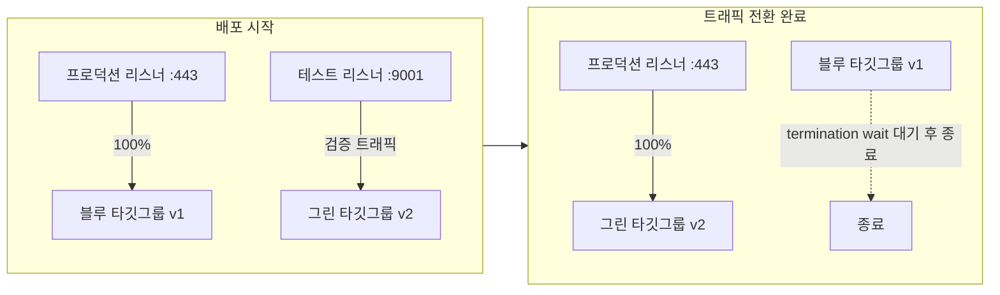

트래픽 전환 방식은 세 가지다. **All-at-once**는 검증이 끝나자마자 100%를 즉시 그린으로 넘긴다. **Linear**는 `ECSLinear10PercentEvery1Minutes`처럼 일정 시간 간격으로 고정 비율씩 늘려간다. **Canary**는 `ECSCanary10Percent5Minutes`처럼 처음 일정 비율만 먼저 흘려보내 지켜본 뒤, 문제가 없으면 나머지를 한 번에 전환한다. 세 방식 모두 배포 그룹의 `AlarmConfiguration`에 연결된 CloudWatch 알람이 전환 도중 발동하면 자동으로 블루로 되돌아간다.

전환이 끝난 뒤 CodeDeploy는 블루 타깃 그룹을 즉시 지우지 않고 **대기 시간(termination wait time)** 동안 남겨둔다. 이 시간 동안은 수동으로도 즉시 블루로 롤백할 수 있어, 그린이 트래픽을 받기 시작한 직후 뒤늦게 나타나는 문제에 대한 안전판 역할을 한다. 대기 시간이 지나면 블루 태스크는 종료되고 이전 태스크 정의 리비전만 이력으로 남는다 — 태스크 정의는 매 배포마다 새 리비전 번호로 등록되므로, 필요하면 특정 리비전 번호를 지정해 이전 상태로 재배포하는 것도 가능하다.

```yaml
# CloudFormation 발췌: ECS 블루/그린 CodeDeploy 배포 그룹
Resources:
  EcsDeploymentGroup:
    Type: AWS::CodeDeploy::DeploymentGroup
    Properties:
      ApplicationName: !Ref EcsCodeDeployApp
      DeploymentGroupName: orders-service-dg
      DeploymentConfigName: CodeDeployDefault.ECSLinear10PercentEvery1Minutes
      ServiceRoleArn: !GetAtt CodeDeployServiceRole.Arn
      DeploymentStyle:
        DeploymentType: BLUE_GREEN
        DeploymentOption: WITH_TRAFFIC_CONTROL
      BlueGreenDeploymentConfiguration:
        DeploymentReadyOption:
          ActionOnTimeout: CONTINUE_DEPLOYMENT
        TerminateBlueInstancesOnDeploymentSuccess:
          Action: TERMINATE
          TerminationWaitTimeInMinutes: 10
      ECSServices:
        - ServiceName: orders-service
          ClusterName: orders-cluster
      LoadBalancerInfo:
        TargetGroupPairInfoList:
          - ProdTrafficRoute:
              ListenerArns: [!Ref ProdListenerArn]
            TestTrafficRoute:
              ListenerArns: [!Ref TestListenerArn]
            TargetGroups:
              - Name: orders-tg-blue
              - Name: orders-tg-green
      AlarmConfiguration:
        Enabled: true
        Alarms:
          - Name: orders-5xx-alarm
```

실제 배포 실행은 CLI로도 트리거할 수 있다. 새 태스크 정의를 등록한 뒤, 그 리비전을 담은 `appspec.yaml`(37.3절)을 S3에 올리고 배포를 생성하는 흐름이다.

```bash
# 새 태스크 정의 리비전을 지정해 ECS 블루/그린 배포 시작
aws deploy create-deployment \
  --application-name orders-ecs-app \
  --deployment-group-name orders-service-dg \
  --revision '{"revisionType":"AppSpecContent","appSpecContent":{"content":"'"$(cat appspec.yaml)"'"}}'
```

`DeploymentReadyOption.ActionOnTimeout`을 `STOP_DEPLOYMENT`로 두면 테스트 리스너 검증이 끝난 뒤 사람이 수동으로 "프로덕션 트래픽 전환" 승인을 누를 때까지 대기시킬 수도 있다 — 자동 전환 대신 최종 확인 게이트를 하나 두고 싶은 팀에 적합하다.

### 37.6 Lambda 별칭·가중 라우팅 카나리

Lambda 배포는 **버전(Version)**과 **별칭(Alias)**의 조합으로 트래픽을 나눈다. 버전은 함수 코드와 구성의 불변 스냅샷이고, 별칭은 이 버전들을 가리키는 이동 가능한 포인터다. 클라이언트(API Gateway, EventBridge 등)는 항상 별칭(예: `live`)을 호출하도록 구성해두면, 배포는 "별칭이 가리키는 버전을 바꾸는 일"로 단순해진다.

카나리는 별칭의 `RoutingConfig`에 **가중 라우팅**을 걸어 구현한다. 별칭이 기본으로 가리키는 버전(예: v1)에 대해 부가적으로 신버전(v2)에 트래픽의 일부만 흘려보내도록 `additionalVersionWeights`를 지정하는 방식이다.

```bash
# 별칭 live가 기본은 버전 1을 가리키되, 10%는 버전 2로 흘려보내는 가중 라우팅
aws lambda update-alias \
  --function-name order-processor \
  --name live \
  --function-version 1 \
  --routing-config '{"AdditionalVersionWeights": {"2": 0.1}}'
```

CodeDeploy는 이 가중치를 시간에 따라 자동으로 조정하고, 각 단계 전환 직전·직후에 **사전/사후 트래픽 훅 Lambda**(appspec의 `BeforeAllowTraffic`/`AfterAllowTraffic`)를 호출해 신버전이 정상인지 검증한다. 검증 실패나 연결된 CloudWatch 알람 발동 시 CodeDeploy가 자동으로 별칭을 이전 버전으로 되돌린다. 직접 `update-alias`로 라우팅 가중치를 조작하는 것도 가능하지만, 이 경우 시간에 따른 자동 증가나 알람 기반 롤백은 CodeDeploy 없이는 직접 구현해야 한다는 점을 유의한다.

SAM(Serverless Application Model)은 이 전체 과정을 선언 몇 줄로 감싸준다.

```yaml
# SAM: Lambda 카나리 배포 선언
Resources:
  OrderFunction:
    Type: AWS::Serverless::Function
    Properties:
      Handler: app.handler
      Runtime: python3.12
      AutoPublishAlias: live          # 배포마다 새 버전 발행 + live 별칭 갱신
      DeploymentPreference:
        Type: Canary10Percent5Minutes # 10%로 5분 대기 후 나머지 전환
        Alarms:
          - !Ref OrderFunctionErrorAlarm
        Hooks:
          PreTraffic: !Ref PreTrafficHookFunction
          PostTraffic: !Ref PostTrafficHookFunction
```

`AutoPublishAlias`가 배포마다 새 버전을 발행하고 `live` 별칭을 CodeDeploy 관리 하에 두면, `DeploymentPreference`의 `Type`만으로 `LambdaAllAtOnce`/`LambdaCanaryNPercentM Minutes`/`LambdaLinearNPercentEveryM Minutes` 중 원하는 전환 곡선을 고를 수 있다. CDK에서는 같은 개념을 명시적인 구성체로 다룬다.

```typescript
// CDK(TypeScript): Lambda 별칭에 카나리 배포 전략과 알람을 연결
const alias = fn.currentVersion.addAlias("live");
new codedeploy.LambdaDeploymentGroup(this, "DeployGroup", {
  alias,
  deploymentConfig: codedeploy.LambdaDeploymentConfig.CANARY_10PERCENT_5MINUTES,
  alarms: [errorRateAlarm],   // 알람 발동 시 CodeDeploy가 자동으로 이전 버전으로 롤백
});
```

SAM과 CDK 어느 쪽을 쓰든 핵심은 같다 — 별칭 전환을 CodeDeploy에 위임하고, 알람을 반드시 함께 등록해야 카나리가 실제 안전장치로 기능한다.

### 37.7 EKS 자동 배포

EKS의 배포는 "무엇을 배포할지"를 담은 쿠버네티스 매니페스트(또는 Helm 차트)를 클러스터에 반영하는 파이프라인과, 클러스터 자체에 대한 접근 권한 관리 두 축으로 나뉜다. 클러스터 접근 권한은 과거에는 `kube-system` 네임스페이스의 `aws-auth` ConfigMap에 IAM 역할/사용자를 매핑하는 방식이 유일했지만, 최근에는 EKS **액세스 항목(Access Entries)** API로 IAM 주체와 쿠버네티스 RBAC 권한을 콘솔·CLI·IaC에서 직접 관리할 수 있다. 새 클러스터는 액세스 항목을 우선 검토하고, 기존 클러스터를 `aws-auth` 방식에서 전환할 때는 두 메커니즘이 한동안 공존할 수 있다는 점을 인지해야 한다(정확한 지원 범위는 EKS 문서 확인).

```bash
# CI/CD 파이프라인이 쓰는 IAM 역할에 배포 권한을 액세스 항목으로 매핑
aws eks create-access-entry \
  --cluster-name orders-cluster \
  --principal-arn arn:aws:iam::123456789012:role/CicdDeployRole \
  --type STANDARD
aws eks associate-access-policy \
  --cluster-name orders-cluster \
  --principal-arn arn:aws:iam::123456789012:role/CicdDeployRole \
  --policy-arn arn:aws:eks::aws:cluster-access-policy/AmazonEKSEditPolicy \
  --access-scope type=namespace,namespaces=orders
```

이렇게 파이프라인 역할에 네임스페이스 단위로만 편집 권한을 주면, 배포 자동화가 클러스터 전체가 아니라 자신이 담당하는 네임스페이스에만 매니페스트를 반영할 수 있어 최소 권한 원칙(→ 29장 IAM 심층)을 파이프라인 단계에도 그대로 적용할 수 있다.

파드 수준의 배포 자체는 `Deployment` 리소스의 `RollingUpdate` 전략으로 이뤄진다. `maxSurge`는 배포 중 원하는 레플리카 수를 초과해 추가로 띄울 수 있는 파드 수, `maxUnavailable`은 동시에 내려가도 되는 파드 수를 정한다. 여기에 readiness 프로브(트래픽을 받을 준비가 됐는지)와 liveness 프로브(살아있는지, 아니면 재시작해야 하는지)가 반드시 결합돼야 롤링 업데이트 도중 아직 뜨지 않은 파드로 트래픽이 새는 것을 막는다.

```yaml
# K8s Deployment 롤링 업데이트 + 프로브 설정
apiVersion: apps/v1
kind: Deployment
metadata:
  name: orders-api
spec:
  replicas: 6
  strategy:
    type: RollingUpdate
    rollingUpdate:
      maxSurge: 2          # 배포 중 최대 8개(6+2)까지 동시 존재 허용
      maxUnavailable: 0    # 배포 중에도 가용 파드 수를 줄이지 않음
  template:
    spec:
      containers:
        - name: orders-api
          image: 123456789012.dkr.ecr.ap-northeast-2.amazonaws.com/orders-api:1.4.2
          readinessProbe:
            httpGet:
              path: /healthz
              port: 8080
            initialDelaySeconds: 5
            periodSeconds: 5
          livenessProbe:
            httpGet:
              path: /healthz
              port: 8080
            initialDelaySeconds: 15
            periodSeconds: 10
```

기본 `RollingUpdate`는 트래픽 비중을 세밀하게 제어하지 못하고 알람 기반 자동 롤백도 갖고 있지 않다. 카나리나 지표 기반 자동 승격/롤백이 필요하면 **Argo Rollouts**나 **Flagger** 같은 애드온을 도입한다. 둘 다 `Deployment`를 대체하는 커스텀 리소스로 트래픽을 단계적으로 옮기면서 Prometheus나 CloudWatch 같은 지표 공급자를 분석해 자동으로 다음 단계 진행 또는 롤백을 결정한다.

```yaml
# Argo Rollouts: 카나리 단계와 지표 분석을 함께 선언
apiVersion: argoproj.io/v1alpha1
kind: Rollout
metadata:
  name: orders-api
spec:
  replicas: 6
  strategy:
    canary:
      steps:
        - setWeight: 10          # 트래픽 10%만 신버전으로
        - pause: {duration: 5m}  # 5분간 관찰
        - analysis:
            templates:
              - templateName: error-rate-check   # Prometheus/CloudWatch 지표 분석
        - setWeight: 50
        - pause: {duration: 5m}
        - setWeight: 100
```

이렇게 선언하면 `analysis` 단계에서 지표가 임계치를 벗어나는 순간 Argo Rollouts가 스스로 이전 단계로 되돌리므로, ECS/Lambda의 CodeDeploy 알람 기반 롤백과 동일한 안전장치를 쿠버네티스 워크로드에도 적용할 수 있다.

배포 파이프라인 자체는 **GitOps(Pull)**와 **푸시(Push)** 두 방식으로 나뉜다.

| 방식 | 배포 트리거 | 클러스터 자격 증명 노출 | 드리프트 감지 | 대표 도구 |
|---|---|---|---|---|
| 푸시(Push) | 파이프라인이 `kubectl`/`helm apply`를 직접 실행 | 파이프라인이 클러스터 자격 증명을 보유 | 수동 확인 필요 | CodePipeline + kubectl 액션, Jenkins |
| GitOps(Pull) | 클러스터 내 에이전트가 Git 저장소와 실제 상태의 차이를 스스로 감지해 동기화 | 클러스터는 Git 자격 증명만 보유, 외부에 클러스터 자격 증명을 내주지 않음 | 지속적·자동 감지, 자동/수동 동기화 선택 가능 | Argo CD, Flux |

**한 줄 결정 기준**: 클러스터 자격 증명을 외부 CI 시스템에 두고 싶지 않고 선언한 상태와 실제 상태의 드리프트를 상시 감지하려면 GitOps를, 이미 구축된 CodePipeline 자산을 그대로 재사용하고 싶다면 푸시 방식을 선택한다.

### 37.8 자동 롤백 조건과 배포 알람

카나리든 블루/그린이든, 트래픽을 단계적으로 옮기는 것 자체는 안전장치가 아니다. **자동 롤백 트리거 없는 카나리는 그냥 느린 전체 배포일 뿐이다.** 사람이 대시보드를 계속 들여다보다가 문제를 발견하고 수동으로 멈추는 방식은 결국 사람의 반응 속도에 복구 시간이 묶인다. 자동화의 핵심은 "무엇을 보고 되돌릴지"를 배포 시작 전에 코드로 정의해두는 것이다.

롤백 트리거로 흔히 쓰는 지표는 다음과 같다.

- **오류율(Error Rate)**: 4xx/5xx 비율이 기준선 대비 급등하면 즉시 신호가 된다.
- **지연 시간 p99**: 평균은 이상 징후를 가려버리므로 꼬리 지연(p99, p99.9)을 본다.
- **5xx 절대 건수/비율**: ALB나 API Gateway가 집계하는 5xx는 가장 직접적인 장애 신호다.
- **비즈니스 지표**: 주문 성공률, 결제 성공률처럼 인프라 지표로는 드러나지 않는 도메인 실패를 포착한다.

이 지표들을 CloudWatch 알람으로 만들어 CodeDeploy 배포 그룹(EC2/ECS/Lambda 공통)의 `AutoRollbackConfiguration`/`AlarmConfiguration`에 연결하면, 배포 진행 중 알람이 `ALARM` 상태가 되는 즉시 CodeDeploy가 이전 버전으로 되돌린다. 실패 원인 자체(훅 실패, 배포 중단 요청)로도 롤백이 트리거되므로 두 경로 — **결과 지표 기반**과 **프로세스 실패 기반** — 를 모두 갖추는 것이 바람직하다.

```bash
# 배포 알람용 CloudWatch 알람 생성 예시(ALB 5xx 비율 기준)
aws cloudwatch put-metric-alarm \
  --alarm-name orders-5xx-alarm \
  --namespace AWS/ApplicationELB \
  --metric-name HTTPCode_Target_5XX_Count \
  --statistic Sum \
  --period 60 \
  --threshold 10 \
  --comparison-operator GreaterThanThreshold \
  --evaluation-periods 2 \
  --dimensions Name=LoadBalancer,Value=app/orders-alb/abc123
```

알람 하나만으로는 잡음(일시적 스파이크)에 과민 반응할 수 있으므로, 여러 지표를 논리 조합한 **복합 알람(Composite Alarm)**으로 "오류율과 지연 시간이 동시에 악화될 때만" 롤백하도록 조건을 좁히는 것도 실무에서 자주 쓰는 방법이다.

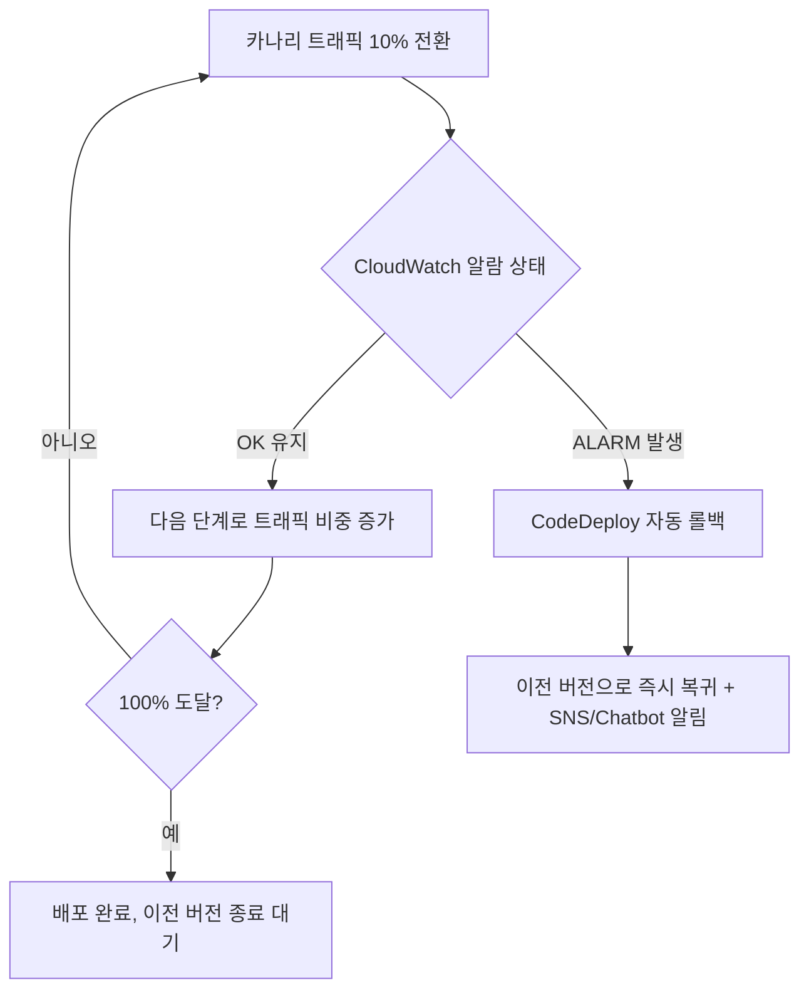

배포 상태 변화(시작·성공·실패·롤백)는 EventBridge를 거쳐 SNS로 발행하고, SNS를 AWS Chatbot과 연결해 Slack·Microsoft Teams 채널에 실시간으로 알리는 구성이 일반적이다. 여기에 더해 배포 시각을 CloudWatch 대시보드 위에 마커(주석)로 표시해두면, 이후 지표 그래프에서 급격한 변화가 어느 배포 직후에 발생했는지 한눈에 대조할 수 있다 — 사고 조사 시 "그 배포가 원인이었는가"를 분 단위로 좁히는 데 유용하다.

자동 롤백을 갖췄다고 해서 **배포 창(Deployment Window)**과 **변경 자문(Change Advisory Board, CAB)**, 즉 변경 동결 기간의 필요성이 사라지는 것은 아니다. 다만 자동 롤백이 튼튼할수록 동결 기간을 넓게 잡아 배포 자체를 억누르기보다, 고위험 변경(비가역 마이그레이션, 결제 로직 등)에만 좁게 적용하고 나머지는 상시 배포를 허용하는 쪽으로 정책을 옮길 수 있다. 36장에서 본 DORA 지표가 보여주듯, 배포 빈도를 억지로 낮추는 것보다 각 배포의 안전장치(자동 롤백, 카나리, 피처 플래그)를 강화해 빈도를 유지하는 편이 전체 리스크를 더 낮춘다.

### 37.9 피처 플래그와 배포·릴리스 분리

**배포(Deploy)**는 새 코드를 운영 환경에 올리는 행위이고, **릴리스(Release)**는 그 기능을 실제 사용자가 쓸 수 있게 만드는 행위다. 두 개를 하나로 묶으면 코드에 결함이 있을 때 되돌리는 유일한 방법이 재배포뿐이라 복구가 느려진다. **피처 플래그**로 이 둘을 분리하면, 코드는 이미 운영 환경에 올라가 있되 플래그가 꺼져 있어 아무도 그 경로를 타지 않는 상태를 만들 수 있고, 문제가 생겼을 때 롤백은 "재배포"가 아니라 "스위치를 끄는 것"으로 끝난다.

AWS에서는 **AWS AppConfig**가 이 패턴을 관리형으로 제공한다. 핵심 구성 요소는 다음과 같다.

- **구성 프로파일(Configuration Profile)**: 플래그 값이나 설정값의 스키마와 소스(자유 형식 JSON, 피처 플래그 전용 스키마 등)를 정의한다.
- **배포 전략(Deployment Strategy)**: 새 구성 값을 얼마나 빨리, 몇 단계에 걸쳐 애플리케이션에 반영할지 정의한다 — 배포 전략이라는 이름 그대로 이 장 앞부분의 점진적 전환 개념을 "코드 배포"가 아니라 "설정값 배포"에 적용한 것이다.
- **유효성 검사(Validators)**: JSON 스키마나 Lambda 함수로 배포 전 구성 값의 형식·의미를 검증해 잘못된 값이 반영되는 것을 막는다.
- **모니터 기반 자동 롤백**: CloudWatch 알람을 배포에 연결해두면, 설정값 반영 중 알람이 발동할 때 AppConfig가 자동으로 이전 값으로 되돌린다 — CodeDeploy의 알람 기반 롤백과 같은 원리를 설정값 배포에 그대로 적용한 것이다.

```bash
# AppConfig: 점진적 배포 전략 생성 후 배포 시작
aws appconfig create-deployment-strategy \
  --name Gradual20PercentEvery5Minutes \
  --deployment-duration-in-minutes 25 \
  --growth-factor 20 \
  --growth-type LINEAR \
  --final-bake-time-in-minutes 10 \
  --replicate-to NONE

aws appconfig start-deployment \
  --application-id abc1234 \
  --environment-id env5678 \
  --deployment-strategy-id Gradual20PercentEvery5Minutes \
  --configuration-profile-id cfgprof01 \
  --configuration-version 3
```

피처 플래그는 **다크 런치**(사용자 눈에 보이지 않는 백그라운드 경로로 신기능을 먼저 실제 트래픽에 노출해 검증)와 **점진적 공개**(내부 직원 → 일부 사용자 → 전체 사용자 순으로 플래그 대상을 넓혀가는 것)를 가능하게 한다. 플래그는 목적에 따라 성격이 다르다는 점도 구분해두면 관리가 쉬워진다 — 릴리스가 끝나면 곧바로 제거하는 **릴리스 토글**(이 절의 주제), 특정 상황에서 기능을 즉시 끄기 위한 **운영 토글**(예: 특정 결제 수단 장애 시 해당 경로 차단), 사용자 등급별로 기능을 다르게 노출하는 **권한 토글**, 전환율 실험을 위한 **실험 토글**(37.1절의 A/B 테스트와 연결)이 대표적이다.

다만 플래그는 공짜가 아니다. 릴리스가 끝난 뒤에도 플래그와 그 조건 분기를 코드에 남겨두면 코드 경로가 계속 늘어나는 **기술 부채**가 쌓이고, 시간이 지날수록 어느 플래그가 실제로 켜져 있는지, 꺼도 안전한지 파악하기 어려워진다. 릴리스 토글은 특히 수명이 짧아야 한다 — 플래그마다 "이 플래그는 언제 제거할 것인가"를 생성 시점에 함께 정하고, 정기적으로 죽은 플래그(항상 켜져 있거나 항상 꺼져 있는 채로 방치된 것)를 찾아 정리하는 절차를 팀 규율로 못박아야 한다.

### 37.10 스키마 변경을 동반한 배포

애플리케이션 코드는 블루/그린이나 카나리로 즉시 되돌릴 수 있지만, 데이터베이스 스키마는 그렇지 않다. 이미 컬럼을 삭제하거나 데이터를 변형한 뒤에는 "되돌린다"는 것이 단순한 재배포가 아니라 데이터 복구 문제가 된다. 그래서 스키마 변경은 코드 배포와 별도의 시간표로, **확장-수축(Expand-Contract)** 3단계로 나눠 진행한다.

1. **확장(Expand)**: 기존 스키마와 완전히 호환되는 방식으로 새 구조를 추가한다. 컬럼 추가는 `NULL` 허용으로, 새 테이블은 기존 테이블과 별도로 만든다. 이 시점에는 구버전 애플리케이션도 문제없이 동작한다.
2. **배포(코드 반영)**: 새 컬럼/테이블을 실제로 읽고 쓰는 애플리케이션 코드를 배포한다. 배포 도중에는 신버전과 구버전이 함께 트래픽을 처리하는 구간이 있으므로(롤링·카나리 전환 중), 이 시점의 코드는 신구 스키마 양쪽에 대해 **하위 호환**(구버전 코드가 신규 데이터도 무리 없이 읽을 수 있어야 함)과 **상위 호환**(신버전 코드가 아직 이관되지 않은 구데이터도 처리할 수 있어야 함)을 모두 지켜야 한다.
3. **수축(Contract)**: 모든 인스턴스가 신버전 코드로 완전히 전환되고, 되돌릴 필요가 없다고 확신한 뒤에야 구 컬럼/구 테이블을 제거한다.

컬럼 이름을 바꾸는 흔한 요구도 이 3단계 없이 한 번의 `RENAME COLUMN`으로 처리하면 위험하다. 배포가 진행되는 동안 구버전 코드는 여전히 옛 이름을 참조하는데 컬럼이 이미 사라졌기 때문이다. 대신 (1) 새 이름의 컬럼을 추가하고 애플리케이션이 두 컬럼에 동시에 쓰도록(dual write) 배포한 뒤, (2) 백필로 값을 맞추고, (3) 모든 트래픽이 새 컬럼만 참조함을 확인한 뒤에야 옛 컬럼을 제거하는 순서를 따른다 — 이름 변경도 결국 "컬럼 삭제"라는 비가역 단계를 포함하므로 확장-수축 패턴 그대로 적용된다.

```sql
-- 1단계: 확장 — nullable 컬럼 추가, 기존 코드와 완전히 호환
ALTER TABLE orders ADD COLUMN shipping_status VARCHAR(20) NULL;
```

```sql
-- 2단계: 배포 이후 — 애플리케이션이 이중 쓰기하며 배치 단위로 백필
UPDATE orders SET shipping_status = 'UNKNOWN'
WHERE shipping_status IS NULL
LIMIT 5000;  -- 소규모 배치로 반복 실행해 락 경합·복제 지연을 최소화
```

```sql
-- 3단계: 수축 — 전체 서비스가 신규 컬럼만 참조함을 확인한 뒤 구 컬럼 제거
ALTER TABLE orders DROP COLUMN legacy_status;
```

대용량 테이블에서 컬럼 추가나 인덱스 생성은 락을 오래 잡아 서비스 지연으로 이어질 수 있다. RDS/Aurora의 스토리지 엔진은 일부 DDL을 온라인으로(테이블 전체 락 없이) 처리하지만, 모든 DDL이 그런 것은 아니므로 대상 엔진·버전의 온라인 DDL 지원 범위를 사전에 확인해야 한다. 대용량 백필은 한 번의 트랜잭션으로 밀어붙이지 말고, 위 예시처럼 작은 배치로 나눠 반복 실행하면서 복제 지연(Aurora 복제본, 리드 리플리카)과 락 경합을 지켜보는 방식이 안전하다.

가장 중요한 원칙은 이것이다. **비가역 마이그레이션(컬럼 삭제, 데이터 변형·삭제)은 롤백이 불가능하다.** 애플리케이션 배포는 이전 버전을 다시 배포하면 그만이지만, 이미 삭제된 컬럼이나 덮어쓴 데이터는 백업에서 복원하지 않는 한 되돌릴 수 없다. 따라서 수축 단계에 들어가기 전에는 반드시 스냅샷·백업이 최신 상태인지 확인하고, 되돌릴 수 없는 단계는 코드 배포의 자동 롤백 파이프라인과 분리된 별도의 승인 절차를 거치도록 못박아야 한다.

### 37장 정리

#### [필수] 반드시 알아야 할 것
1. 배포 전략 선택은 **롤백 속도와 비용의 교환**이다. 블루/그린은 즉시 롤백이 가능하지만 신구 환경을 동시에 띄우는 2배 용량 비용을 잠시 감수한다.
2. CodeDeploy는 EC2/온프레미스·ECS·Lambda 세 플랫폼에 애플리케이션·배포 그룹·배포 구성이라는 동일한 개념 모델을 적용하지만, 배포 단위(인스턴스/태스크 정의/함수 버전)와 트래픽 전환 주체는 플랫폼마다 다르다.
3. `appspec.yml`의 훅 순서는 ApplicationStop → BeforeInstall → AfterInstall → ApplicationStart → ValidateService이며, ECS/Lambda는 파일 대신 리소스 전환 정보를 담고 훅은 검증용 Lambda를 가리킨다.
4. 자동 롤백 트리거(오류율·지연·5xx 알람)를 붙이지 않은 카나리는 그냥 느린 전체 배포일 뿐이다 — 점진적 전환 자체는 안전장치가 아니다.
5. 스키마 변경은 **확장(호환 추가) → 배포 → 수축(구 컬럼 제거)** 3단계로 나눠, 어느 시점에도 애플리케이션과 데이터베이스가 서로 호환되게 유지한다.
6. 피처 플래그로 "배포"와 "릴리스"를 분리하면 롤백이 코드 재배포가 아니라 스위치 조작이 되어 복구 시간이 극적으로 줄어든다.

#### [팁] 실무 노하우
1. ECS 블루/그린의 termination wait time을 충분히 잡아두면, 자동 트래픽 전환 이후 뒤늦게 드러나는 문제도 수동으로 즉시 블루로 되돌릴 여유가 생긴다.
2. Lambda 카나리는 `AutoPublishAlias`와 `DeploymentPreference`(SAM) 또는 동등한 CDK 구성체를 쓰면 별칭·버전·훅 연결을 코드 몇 줄로 선언할 수 있다.
3. AppConfig의 배포 전략과 모니터 기반 자동 롤백을 활용하면, 코드 배포 없이도 설정값·플래그 변경 자체에 점진적 전환과 안전장치를 그대로 적용할 수 있다.
4. 배포 이벤트를 CloudWatch 대시보드에 마커로 남겨두면 사고 조사 시 "어느 배포 직후에 지표가 튀었는가"를 분 단위로 대조할 수 있다.
5. 대용량 백필은 한 번에 밀어붙이지 말고 작은 배치로 나눠 반복 실행하면서 복제 지연과 락 경합을 관찰한다.
6. 자동 롤백이 튼튼할수록 변경 동결 기간은 좁게(고위험 변경에만) 적용하고, 나머지는 상시 배포를 허용하는 쪽으로 정책을 옮길 수 있다.

#### [주의] 사고·비용·설계 함정
1. 롤백 계획 없는 배포는 배포가 아니라 도박이다 — "문제가 생기면 그때 방법을 찾겠다"는 태도로는 장애 지속 시간이 사람의 대응 속도에 그대로 묶인다.
2. 훅 스크립트의 실패 처리를 빠뜨리면(에러를 삼키고 항상 성공 코드를 반환하면) 배포는 "성공"으로 보고되지만 서비스는 죽어 있는 상태로 남는다.
3. **비가역 마이그레이션(컬럼 삭제, 데이터 변형)은 롤백이 불가능**하다 — 수축 단계 진입 전 백업·스냅샷 확인과 별도 승인 절차를 반드시 거친다.
4. 카나리 관측 지표에 A/B 테스트용 비즈니스 실험 지표를 섞으면 배포 안전성 판단과 제품 실험 결론 어느 쪽도 신뢰하기 어려워진다.
5. EKS의 `RollingUpdate`는 기본적으로 알람 기반 자동 롤백이 없으므로, 카나리·자동 승격이 필요하면 Argo Rollouts나 Flagger 같은 애드온을 별도로 도입해야 한다.
6. 피처 플래그를 릴리스 후에도 정리하지 않고 방치하면 코드 경로가 계속 늘어나는 기술 부채가 쌓인다 — 플래그 생성 시점에 제거 시점을 함께 정해야 한다.
7. 대용량 테이블의 DDL은 락을 오래 잡아 서비스 지연으로 이어질 수 있으므로, 온라인 DDL 지원 범위를 사전에 문서로 확인하지 않고 그대로 실행하면 사고로 이어진다.

#### 한 장 요약
배포 전략은 결국 롤백 속도와 비용의 교환 문제이며, CodeDeploy는 이 교환을 EC2·ECS·Lambda 세 플랫폼에서 공통된 개념(애플리케이션·배포 그룹·배포 구성)으로 다루되 플랫폼마다 다른 방식(파일 복사, 타깃 그룹 전환, 별칭 가중 라우팅)으로 구현한다. 자동 롤백 트리거가 없는 카나리는 점진적으로 진행되는 전체 배포에 불과하며, 피처 플래그는 배포와 릴리스를 분리해 롤백을 스위치 조작 수준으로 단순화한다. 데이터베이스 스키마 변경은 확장-수축 3단계로 나누되, 되돌릴 수 없는 변경 앞에서는 자동화된 롤백이 아니라 백업과 별도 절차에 기대야 한다.

#### 다음 장 예고
38장은 이 장에서 반복적으로 언급된 "알람"과 "지표"의 근본 — CloudWatch 메트릭·로그·알람·X-Ray 기반 관측성 스택을 다룬다. 배포 안전장치가 실제로 작동하려면 그 밑에 정확한 관측 인프라가 먼저 깔려 있어야 한다.

---

## 38장. 관측성(Observability)  ★★★

> **이 장에서 다루는 것**
> 37장까지 우리는 코드를 안전하게 배포하는 방법을 다뤘다. 이 장은 그 다음 질문 — 배포된 시스템이 지금 실제로 잘 돌아가고 있는지, 문제가 생기면 왜 생겼는지 — 을 다룬다. 모니터링과 관측성의 차이에서 시작해 CloudWatch 메트릭·로그·알람·대시보드·Synthetics, X-Ray와 OpenTelemetry 기반 분산 트레이싱, 상태 확인 엔드포인트 설계 패턴, 계측 가이던스, SLO 기반 알림까지 순서대로 다룬다. 7장에서 정의한 SLO/에러 예산과 16장에서 언급한 헬스체크 thrashing 문제를 실제 관측 파이프라인으로 구현하는 것이 이 장의 목표다.

### 38.1 모니터링 vs 관측성

**모니터링(monitoring)**은 미리 정해둔 질문에 답한다. "CPU 사용률이 80%를 넘었는가", "5xx 응답이 늘었는가" 같은, 사전에 무엇을 봐야 할지 아는 상태에서 대시보드와 알람을 만드는 작업이다. 이런 질문들은 **알려진 미지(known unknowns)** — 문제가 생길 수 있다는 것은 알지만 언제 생길지 모르는 것 — 에 답하기 위한 것이다.

**관측성(observability)**은 시스템 외부에서 관찰 가능한 출력(메트릭, 로그, 트레이스)만으로 내부 상태를 추론할 수 있는 성질을 말한다. 장애의 근본 원인이 사전에 만들어둔 어떤 대시보드에도 없는, 미리 질문을 준비하지 못한 상황 — **알려지지 않은 미지(unknown unknowns)** — 에 대응하는 능력이다. "왜 이 특정 사용자의 이 요청만 3초가 걸렸는가"처럼 사고 발생 후에야 떠오르는 질문에, 새로 코드를 배포하지 않고 기존 데이터를 파고들어 답할 수 있어야 관측 가능한 시스템이다.

관측성은 보통 **3축(three pillars)** 으로 구성된다.

| 축 | 성격 | 강점 | 약점 |
|---|---|---|---|
| 메트릭(Metrics) | 시계열 숫자, 낮은 카디널리티로 집계 | 저비용, 장기 보관, 추세·알람에 적합 | 개별 요청 단위 정보 없음 |
| 로그(Logs) | 이산적 이벤트 기록, 임의 구조 | 상세한 맥락, 디버깅에 강함 | 저장 비용 높음, 쿼리 느림 |
| 트레이스(Traces) | 요청 하나가 여러 서비스를 거치는 경로 | 분산 시스템의 지연 원인 파악 | 계측 비용, 샘플링 필요 |

여기에 **이벤트(discrete business events)** 와 **프로파일(코드 레벨 CPU/메모리 프로파일)** 을 더해 5가지 신호로 확장해 이야기하기도 한다.

3축을 각각 따로 갖추는 것과 관측성을 갖추는 것은 다르다. **핵심은 상관 ID(correlation ID / trace ID)로 세 축을 하나로 묶는 것이다.** 알람이 울려 메트릭에서 지연 급증을 발견했다면, 같은 시간대의 로그를 트레이스 ID로 필터링해 어떤 요청들이 느렸는지 찾고, 그 트레이스 ID로 X-Ray 트레이스를 열어 어느 서비스의 어느 구간에서 시간이 소모됐는지까지 한 번에 내려갈 수 있어야 한다. 이 연결이 끊겨 있으면 메트릭·로그·트레이스가 각각 따로 존재하는 "모니터링 도구 3개"에 불과하다.

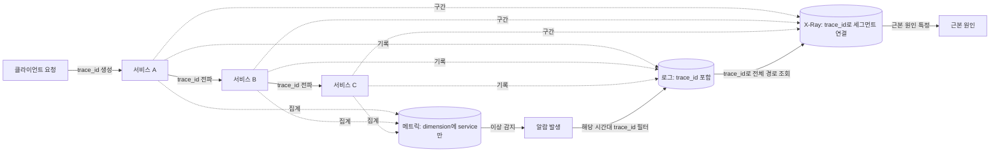

**카디널리티(cardinality)와 비용은 정비례한다.** 카디널리티는 한 필드가 가질 수 있는 고유 값의 개수다. `user_id`나 요청 고유 ID를 메트릭의 차원(dimension)으로 넣으면 사용자 수만큼, 또는 요청 수만큼 시계열이 폭증해 CloudWatch 커스텀 메트릭 비용이 급격히 늘어난다. 고카디널리티 정보(사용자 ID, 요청 ID, 원시 에러 메시지)는 **로그와 트레이스**에 남기고, **메트릭의 차원은 저카디널리티 값**(서비스명, 리전, 상태 코드 범위, 배포 버전 정도)으로 제한하는 것이 원칙이다.

### 38.2 Amazon CloudWatch 메트릭

CloudWatch 메트릭은 **네임스페이스(namespace) → 메트릭 이름 → 차원(dimension) 조합**의 계층으로 식별된다. 예를 들어 `AWS/EC2` 네임스페이스의 `CPUUtilization` 메트릭은 `InstanceId` 차원 값별로 별도의 시계열을 가진다. 조회 시에는 **통계(statistic: Average, Sum, Maximum, Minimum, SampleCount, 퍼센타일)** 와 **기간(period: 조회 단위 시간)** 을 지정한다. 평균(Average)만 보면 꼬리 지연(tail latency)이 감춰지므로, 지연시간 계열 메트릭은 p90/p99 같은 퍼센타일 통계를 함께 봐야 한다.

**표준 해상도**는 데이터 포인트가 1분 단위이고, **고해상도(high-resolution) 메트릭**은 1초 단위까지 지원한다. 고해상도 메트릭은 급격한 스파이크를 더 빨리 감지할 수 있지만 저장 비용이 더 높고, 알람 평가 주기도 10초/30초 단위로 짧게 잡아야 이점이 있다. 대부분의 인프라 지표는 표준 해상도로 충분하며, 초 단위 반응이 필요한 결제·주문 처리 같은 핵심 경로에만 고해상도를 선택적으로 적용한다.

**커스텀 메트릭**은 `PutMetricData` API로 애플리케이션이 직접 게시한다. 이 API는 요청 건수와 게시하는 메트릭 개수(정확히는 차원 조합 수)에 비례해 과금되므로, 요청마다 개별 API를 호출하는 대신 배치로 묶어 보내거나 아래의 EMF를 쓰는 것이 비용 효율적이다.

```python
import boto3
cloudwatch = boto3.client("cloudwatch", region_name="ap-northeast-2")

# 여러 데이터 포인트를 하나의 API 호출로 묶어 PutMetricData 호출 횟수를 줄인다
cloudwatch.put_metric_data(
    Namespace="OrderService",
    MetricData=[
        {
            "MetricName": "OrderLatency",
            "Dimensions": [{"Name": "Stage", "Value": "checkout"}],
            "Value": 182.4,
            "Unit": "Milliseconds",
        },
        {
            "MetricName": "OrderErrors",
            "Dimensions": [{"Name": "Stage", "Value": "checkout"}],
            "Value": 1,
            "Unit": "Count",
        },
    ],
)
```

**임베디드 메트릭 포맷(EMF, Embedded Metric Format)** 은 로그 한 줄에 구조화된 JSON을 기록하면 CloudWatch가 이를 파싱해 메트릭까지 자동으로 추출하는 방식이다. 애플리케이션은 `PutMetricData`를 직접 호출할 필요 없이 표준 출력(Lambda라면 CloudWatch Logs로 자동 전달)에 로그만 남기면 되므로, API 호출 비용 없이 로그 저장 비용만으로 메트릭과 상세 컨텍스트를 동시에 확보한다.

```javascript
// Node.js: EMF 형식으로 로그를 남기면 CloudWatch가 자동으로 메트릭을 추출한다
console.log(JSON.stringify({
  _aws: {
    Timestamp: Date.now(),
    CloudWatchMetrics: [{
      Namespace: "OrderService",
      Dimensions: [["Stage"]],
      Metrics: [{ Name: "OrderLatency", Unit: "Milliseconds" }],
    }],
  },
  Stage: "checkout",
  OrderLatency: 182.4,
  // EMF 페이로드에 orderId, userId 같은 고카디널리티 필드를 함께 남기면
  // 메트릭은 저카디널리티로 집계되면서 로그에서는 상세 컨텍스트를 잃지 않는다
  orderId: "ord-9f21ac",
  traceId: "1-5f2a1b3c-abcdef0123456789",
}));
```

**메트릭 수학(Metric Math)** 은 콘솔·API에서 기존 메트릭에 수식을 적용해 새 시계열을 만드는 기능이다(예: 에러 수 / 전체 요청 수로 에러율 계산). **이상 탐지(anomaly detection)** 는 과거 패턴(요일별·시간대별 계절성 포함)을 학습해 정상 범위 밴드를 만들고, 실제 값이 밴드를 벗어나면 이를 감지한다. 트래픽에 뚜렷한 주기성이 있는 지표(일간 요청 수 등)에는 정적 임계값보다 이상 탐지가 잘 맞고, 애초에 일정해야 하는 지표(가용성 100% 근접)에는 정적 임계값이 더 명확하다.

**메트릭 스트림(Metric Streams)** 은 CloudWatch 메트릭을 실시간으로 Amazon Data Firehose를 거쳐 S3나 서드파티 관측 플랫폼(Datadog, New Relic 등)으로 지속적으로 내보내는 기능이다. API 폴링(`GetMetricData`) 방식보다 지연이 낮고 API 호출 비용도 줄어들어, 서드파티 SaaS와 연동할 때는 폴링 대신 메트릭 스트림을 우선 검토한다(→ 38.10 참조).

### 38.3 CloudWatch Logs와 Logs Insights

로그는 **로그 그룹(log group, 보통 서비스/애플리케이션 단위)** 아래 **로그 스트림(log stream, 보통 인스턴스/컨테이너/Lambda 실행 환경 단위)** 으로 구성된다. **로그 그룹 구조 설계**는 서비스별로 그룹을 나누고(`/ecs/order-service`, `/lambda/checkout-fn`처럼), 환경(prod/staging)도 별도 그룹이나 최소한 별도 계정으로 분리해 권한 경계와 보존 정책을 다르게 가져갈 수 있게 한다.

> **[주의]** **로그 그룹의 보존 기간(retention) 기본값은 무기한(never expire)이다.** 로그 그룹을 생성만 하고 보존 기간을 지정하지 않으면 로그가 영구히 쌓이고, 트래픽이 많은 서비스는 몇 달 안에 CloudWatch Logs 비용이 청구서의 최상위 항목이 된다. 로그 그룹을 만들 때마다 보존 기간(예: 운영 로그 30~90일, 감사 로그는 규정에 맞춰 장기)을 명시적으로 설정하는 것을 표준 절차로 만들어야 한다.

**로그 클래스(log class)**는 Standard와 Infrequent Access 두 가지가 있다. Standard는 실시간 쿼리·구독 필터·메트릭 필터를 모두 지원하는 기본 클래스이고, Infrequent Access는 감사·컴플라이언스 목적으로 장기 보관하되 평소에는 거의 조회하지 않는 로그에 적합한 저비용 클래스로, 일부 실시간 기능에 제약이 있다. 자주 검색하고 알람 소스로 쓰는 로그는 Standard, 규정 준수를 위해 쌓아두기만 하는 로그는 Infrequent Access로 분리하면 비용을 낮출 수 있다.

**CloudWatch Logs Insights**는 로그 그룹에 대해 SQL과 유사한 쿼리 언어로 검색·집계하는 기능이다. 실전에서 자주 쓰는 쿼리 다섯 가지를 정리한다.

```sql
-- 1. 오류율 계산 (5분 단위 시간대별 5xx 비율)
fields @timestamp, status
| stats count(*) as total, sum(status >= 500) as errors by bin(5m)
| display bin(5m), errors * 100.0 / total as error_rate_pct
```

```sql
-- 2. 지연 분포 (p50/p90/p99)
fields @timestamp, latency_ms
| stats pct(latency_ms, 50) as p50, pct(latency_ms, 90) as p90, pct(latency_ms, 99) as p99
```

```sql
-- 3. 특정 요청 추적 (trace_id로 전체 로그 라인 시간순 조회)
fields @timestamp, @message, trace_id
| filter trace_id = "1-5f2a1b3c-abcdef0123456789"
| sort @timestamp asc
```

```sql
-- 4. 상위 에러 메시지 (가장 빈번한 에러 메시지 상위 10개)
fields @timestamp, error_message
| filter level = "ERROR"
| stats count(*) as cnt by error_message
| sort cnt desc
| limit 10
```

```sql
-- 5. 사용자별 요청 집계 (해시된 user_id 기준 상위 호출자)
fields @timestamp, user_id_hash
| stats count(*) as request_count by user_id_hash
| sort request_count desc
| limit 20
```

**구독 필터(subscription filter)**는 로그 그룹에 들어오는 항목을 실시간으로 Lambda, Amazon Data Firehose, Amazon OpenSearch Service 등으로 전달하는 기능이다. Logs Insights가 사후 조회용이라면 구독 필터는 실시간 파이프라인 구축용이다 — 예를 들어 `ERROR` 레벨 로그만 필터링해 Lambda로 보내 Slack 알림을 트리거하거나, 전체 로그를 Firehose 경유로 S3에 적재해 장기 분석용 데이터 레이크를 만든다.

**컨테이너·Lambda 로그 수집 경로**는 컴퓨트 플랫폼마다 다르다. ECS는 **FireLens**(Fluent Bit/Fluentd 기반 로그 라우터)를 태스크 정의에 사이드카로 붙여 다양한 목적지(CloudWatch Logs, OpenSearch, Firehose, 서드파티)로 분기할 수 있고, EC2/온프레미스는 **CloudWatch 에이전트**를 설치해 로그 파일과 시스템 메트릭(메모리, 디스크 사용률 등 CloudWatch가 기본 수집하지 않는 게스트 OS 지표)을 함께 수집한다. Lambda는 별도 설정 없이 표준 출력이 자동으로 해당 함수의 로그 그룹으로 전달된다.

### 38.4 알람 설계

CloudWatch 알람은 크게 세 유형으로 나뉜다.

| 알람 유형 | 판단 기준 | 적합 상황 |
|---|---|---|
| 정적 임계값(Static Threshold) | 고정된 값과 비교(예: 에러율 > 1%) | 명확한 SLO 기반 기준이 있는 지표 |
| 이상 탐지(Anomaly Detection) | 학습된 정상 범위 밴드 이탈 | 계절성·주기성이 있어 고정 임계값이 부적절한 지표 |
| 복합 알람(Composite Alarm) | 여러 알람을 AND/OR로 결합 | 개별 알람의 일시적 흔들림으로 인한 노이즈 억제 |

**복합 알람**은 여러 하위 알람의 상태(ALARM/OK)를 논리식으로 결합한다. 예를 들어 "에러율 알람 AND 지연 알람"으로 묶으면 둘 중 하나만 튀는 일시적 잡음은 걸러내고 실제로 동시에 문제가 생겼을 때만 발화하게 만들어 알람 피로를 줄인다.

**결측 데이터(missing data) 처리**는 알람이 데이터를 받지 못했을 때의 동작을 정한다.

| 옵션 | 동작 | 적합 상황 |
|---|---|---|
| `missing` | 알람 상태를 바꾸지 않고 유지 | 기본값, 일시적 수집 지연이 흔한 지표 |
| `notBreaching` | 결측을 임계값 이내(정상)로 간주 | 트래픽이 없으면 정상적으로 값이 0/결측이 되는 지표(예: 야간 배치 큐) |
| `breaching` | 결측을 임계값 위반(비정상)으로 간주 | 데이터가 반드시 있어야 하는 헬스체크성 지표(하트비트 누락 자체가 장애 신호) |
| `ignore` | 결측 기간은 평가에서 제외하고 기존 상태 유지 | `missing`과 유사하되 현재 알람 상태를 그대로 고정하고 싶을 때 |

**한 줄 결정 기준**: 값이 없는 것 자체가 "이상 없음"을 뜻하면 `notBreaching`, 값이 반드시 존재해야 하는데 없다는 것 자체가 이상 신호라면 `breaching`을 쓴다.

평가 기간(evaluation period)과 데이터 포인트(datapoints to alarm)는 "N개 평가 구간 중 M개가 임계값을 위반하면 발화"의 형태로 지정한다. 예를 들어 5분씩 3개 구간 중 2개가 위반이면 발화(`M of N`)로 설정하면 단발성 스파이크에는 반응하지 않으면서 지속되는 문제는 놓치지 않는다.

**알람 액션**은 SNS 주제 게시(→ 이메일/SMS/Lambda 구독), Auto Scaling 정책 트리거, EC2 인스턴스 복구/재시작, SSM Incident Manager를 통한 사고 대응 프로세스 시작 등을 지정할 수 있다.

> **[필수]** **사용자 영향 지표(성공률, 지연 p99, 5xx 비율 등)에 알람을 걸고, CPU·메모리 같은 원인 지표는 진단용 대시보드에만 둔다.** CPU가 높아도 사용자 응답에 문제가 없으면 그 자체는 알람 사유가 아니다. 원인 지표에까지 알람을 걸면 알람 수만 늘어나고 실제 장애 신호는 파묻힌다.

다음은 에러율과 지연을 AND로 묶은 복합 알람 CloudFormation 예시다.

```yaml
Resources:
  ErrorRateAlarm:
    Type: AWS::CloudWatch::Alarm
    Properties:
      AlarmName: order-service-error-rate-high
      Namespace: OrderService
      MetricName: OrderErrors
      Statistic: Sum
      Period: 300
      EvaluationPeriods: 3
      DatapointsToAlarm: 2   # 5분 x 3구간 중 2개 위반 시 발화 (단발성 스파이크 무시)
      Threshold: 10
      ComparisonOperator: GreaterThanThreshold
      TreatMissingData: notBreaching

  LatencyP99Alarm:
    Type: AWS::CloudWatch::Alarm
    Properties:
      AlarmName: order-service-latency-p99-high
      Namespace: OrderService
      MetricName: OrderLatency
      ExtendedStatistic: p99
      Period: 300
      EvaluationPeriods: 3
      DatapointsToAlarm: 2
      Threshold: 800
      ComparisonOperator: GreaterThanThreshold
      TreatMissingData: notBreaching

  # 두 알람이 동시에 ALARM일 때만 발화 -> 진짜 동시 장애만 온콜에 알림
  CompositeUserImpactAlarm:
    Type: AWS::CloudWatch::CompositeAlarm
    Properties:
      AlarmName: order-service-user-impact
      AlarmRule: !Sub
        - "ALARM(${ErrAlarm}) AND ALARM(${LatAlarm})"
        - ErrAlarm: !Ref ErrorRateAlarm
          LatAlarm: !Ref LatencyP99Alarm
      AlarmActions:
        - !Ref OnCallSnsTopicArn
```

### 38.5 대시보드와 CloudWatch Synthetics

**대시보드 설계 원칙**은 "서비스 개요 → 심층"의 계층 구조를 따른다. 최상단 위젯에는 사용자 영향 지표(가용성, p99 지연, 오류율)를 배치해 한눈에 "지금 서비스가 건강한가"를 판단할 수 있게 하고, 그 아래로 갈수록 컴포넌트별 세부 지표(DB 연결 수, 큐 깊이, 인스턴스별 CPU)를 배치해 원인 조사에 쓴다. 모든 지표를 한 화면에 욱여넣으면 정작 봐야 할 신호가 묻힌다.

**자동 대시보드(Automatic Dashboards)**는 CloudWatch가 계정 내 리소스에 대해 자동 생성해주는 서비스별 기본 대시보드로, 커스텀 대시보드를 만들기 전 빠르게 상태를 훑어볼 때 유용하다. **크로스 계정 관측성(cross-account observability)**은 여러 소스 계정의 메트릭·로그·트레이스를 하나의 **모니터링 계정(monitoring account)** 에서 통합 조회할 수 있게 하는 기능으로, 계정을 서비스/팀 단위로 분리하는 조직(→ 멀티 계정 랜딩 존은 30장 참조)에서 개별 계정을 오가지 않고 전사 관측 현황을 파악하는 데 쓴다.

**CloudWatch Synthetics 카나리**는 실제 사용자 트래픽과 무관하게 정해진 스케줄로 외부에서 서비스를 호출해 "밖에서 본 서비스 상태"를 감시하는 기능이다. 내부 지표(CPU, 메트릭)는 모두 정상인데 특정 리전의 DNS 전파 문제나 CDN 캐시 문제로 실제 사용자만 접속 실패를 겪는 상황은 내부 지표만으로는 잡히지 않는다. 카나리 유형은 하트비트(단순 URL 응답 확인), API 카나리(엔드포인트 호출 후 응답 검증), 브라우저 흐름 카나리(로그인 → 장바구니 → 결제 같은 다단계 사용자 시나리오를 헤드리스 브라우저로 재현), 링크 체크 카나리(페이지 내 링크의 깨짐 여부 점검) 등이 있다.

```python
# Synthetics 카나리 스크립트 예시 (Node.js/Python 런타임, syn-python 기준 개념 코드)
from aws_synthetics.selenium import synthetics_webdriver as webdriver
from aws_synthetics.common import synthetics_logger as logger

def api_canary():
    session = webdriver.Chrome()
    # 헬스체크가 아니라 실제 사용자 시나리오(로그인 -> 상품 조회)를 재현
    session.get("https://shop.example.com/health")
    assert session.title is not None, "헬스 엔드포인트 응답 없음"

    session.get("https://shop.example.com/api/products?limit=1")
    body = session.page_source
    if '"status":"ok"' not in body:
        logger.error("상품 API가 정상 응답을 반환하지 않음")
        raise Exception("Canary check failed: /api/products")

def handler(event, context):
    return api_canary()
```

**RUM(Real User Monitoring, CloudWatch RUM)**은 Synthetics와 반대 방향의 관측이다. 카나리는 합성 트래픽으로 "밖에서" 정기적으로 찔러보는 것이고, RUM은 브라우저에 삽입된 클라이언트 SDK로 실제 접속자의 페이지 로드 시간, JS 에러, 코어 웹 바이탈 같은 실사용 경험을 수집한다. 둘은 대체 관계가 아니라 보완 관계다 — 카나리는 트래픽이 적은 시간에도 지속적으로 상태를 확인하고, RUM은 실제 사용자 분포(기기, 지역, 브라우저)에 따른 체감 성능 편차를 보여준다.

### 38.6 AWS X-Ray와 ADOT/OpenTelemetry

분산 트레이싱은 하나의 요청이 여러 서비스를 거치는 경로를 **세그먼트(segment, 한 서비스에서의 처리 구간)** 와 **서브세그먼트(subsegment, 세그먼트 내부의 더 세분화된 구간 — 예: DB 쿼리 하나, 외부 API 호출 하나)** 로 기록한다. 세그먼트/서브세그먼트에는 **주석(annotation)** 과 **메타데이터(metadata)** 를 붙일 수 있는데, 주석은 인덱싱되어 X-Ray 콘솔에서 검색·필터링이 가능한 저카디널리티 키-값(예: `customer_tier=gold`)이고, 메타데이터는 검색되지 않지만 자유로운 형식으로 상세 정보(요청 페이로드 요약 등)를 담을 수 있는 필드다.

**샘플링 규칙(sampling rule)**은 모든 요청을 트레이싱하면 비용과 오버헤드가 커지므로 일부만 기록하도록 조정하는 설정이다. 기본 샘플링은 초당 1건은 무조건 기록하고 그 이상은 일정 비율(예: 5%)만 기록하는 방식이며, 에러가 발생한 요청은 샘플링 비율과 무관하게 항상 기록하도록 규칙을 커스터마이즈하는 경우가 많다.

**서비스 맵(service map)**은 수집된 트레이스를 바탕으로 서비스 간 호출 관계와 각 구간의 평균 지연·에러율을 시각화한 그래프로, 장애 발생 시 어느 서비스가 병목인지 한눈에 좁혀준다.

**트레이스 ID 전파**는 서비스 경계를 넘어갈 때 트레이스 컨텍스트를 HTTP 헤더로 실어 보내는 것이다. X-Ray는 `X-Amzn-Trace-Id` 헤더를, OpenTelemetry/W3C 표준은 `traceparent` 헤더를 사용한다. 두 체계를 함께 쓰는 환경에서는 헤더 변환이 필요할 수 있으므로, 신규 구축이라면 처음부터 W3C 표준(`traceparent`)으로 통일하는 편이 서드파티 도구와의 호환성이 높다.

```python
# X-Ray SDK: 서브세그먼트 생성 + 주석/메타데이터 부착
from aws_xray_sdk.core import xray_recorder

@xray_recorder.capture("db_query_get_order")
def get_order(order_id, user_tier):
    subsegment = xray_recorder.current_subsegment()
    # annotation은 인덱싱되어 X-Ray 콘솔에서 필터 조건으로 검색 가능 (저카디널리티 유지)
    subsegment.put_annotation("customer_tier", user_tier)
    subsegment.put_annotation("order_id", order_id)
    # metadata는 검색되지 않지만 자유 형식 상세 정보를 담을 수 있음
    subsegment.put_metadata("query_params", {"order_id": order_id, "consistent_read": False})
    return db.query(order_id)
```

**ADOT(AWS Distro for OpenTelemetry)**는 오픈소스 OpenTelemetry 프로젝트의 AWS 배포판으로, 벤더 중립적인 계측 표준을 쓰면서 수집한 데이터를 X-Ray, CloudWatch, 또는 서드파티(Datadog, Grafana 등) 어디로든 보낼 수 있게 해준다. **자동 계측(auto-instrumentation)**은 코드 수정 없이 에이전트/레이어를 붙이는 것만으로 널리 쓰이는 프레임워크(HTTP 클라이언트, DB 드라이버 등)의 트레이스를 자동 수집하는 방식이고, **수동 계측(manual instrumentation)**은 비즈니스 로직상 의미 있는 구간에 개발자가 직접 스팬을 만들어 세밀하게 기록하는 방식이다. 대부분의 서비스는 자동 계측으로 기본 커버리지를 확보한 뒤, 핵심 비즈니스 흐름에만 수동 계측을 추가하는 조합을 쓴다.

```yaml
# ADOT 컬렉터 구성 (otel-collector-config.yaml)
receivers:
  otlp:
    protocols:
      grpc:
      http:
processors:
  batch:
  # 저카디널리티 속성만 남기고 민감 정보는 제거하는 처리기를 파이프라인에 추가할 수 있음
  attributes:
    actions:
      - key: user.email
        action: delete
exporters:
  awsxray:
    region: ap-northeast-2
  awsemf:
    region: ap-northeast-2
    namespace: OrderService
service:
  pipelines:
    traces:
      receivers: [otlp]
      processors: [batch, attributes]
      exporters: [awsxray]
    metrics:
      receivers: [otlp]
      processors: [batch]
      exporters: [awsemf]
```

**Application Signals**는 OpenTelemetry로 수집한 트레이스·메트릭을 기반으로 서비스별 SLO(가용성, 지연)를 정의하고 그 준수 여부를 자동으로 추적하는 기능이다. 서비스 맵과 SLO 대시보드를 연결해, 어떤 서비스가 SLO를 위협하고 있는지, 그 원인이 어느 다운스트림 의존성인지까지 이어서 볼 수 있게 해준다(→ SLO 정의 자체는 7장, 알람화는 38.9 참조).

### 38.7 상태 확인 엔드포인트 모니터링 패턴

*Cloud Design Patterns*의 Health Endpoint Monitoring 패턴이 다루는 문제는 이렇다 — 애플리케이션 프로세스가 살아있어도 실제로 요청을 정상 처리할 수 없는 상태(내부 스레드 풀 고갈, 의존 서비스 장애, 디스크 가득 참)에 빠질 수 있는데, 외부 로드밸런서나 오케스트레이터는 이를 스스로 알아채지 못한다. 해결책은 애플리케이션이 자신의 상태를 알려주는 **전용 엔드포인트**를 노출하고, 외부 감시자가 주기적으로 이를 호출해 판정하게 하는 것이다.

> **[필수]** **얕은 체크(liveness)와 깊은 체크(readiness/dependency check)를 반드시 분리한다.** 얕은 체크는 "프로세스가 요청에 응답하는가"만 확인하고, 깊은 체크는 "이 인스턴스가 DB·캐시·외부 API 같은 의존성까지 포함해 실제로 요청을 처리할 준비가 됐는가"를 확인한다. 로드밸런서/ASG의 헬스체크에 깊은 체크를 연결하면, 공유 의존성(예: DB)에 장애가 생겼을 때 정상인 인스턴스들까지 일제히 비정상 판정을 받아 연쇄 교체(thrashing)가 벌어진다 — 16장에서 다룬 헬스체크 thrashing 함정과 정확히 같은 메커니즘이다. 얕은 체크는 로드밸런서/오케스트레이터의 자동 조치(트래픽 제외, 인스턴스 교체) 트리거로, 깊은 체크는 사람이 보는 모니터링·알람 경로로 분리해야 한다.

**엔드포인트 보호**도 고려사항이다. 헬스체크 엔드포인트가 내부 구성(DB 연결 문자열, 버전 정보, 스택 트레이스)을 그대로 노출하면 공격자에게 정찰 정보를 주는 셈이다. 깊은 체크 엔드포인트는 별도의 비공개 경로나 내부 네트워크에서만 접근 가능하게 하고, 필요하면 인증을 요구한다.

**응답 형식 설계**는 단순 HTTP 200/503뿐 아니라, 구조화된 JSON으로 개별 의존성별 상태를 실어 보내면 진단에 유용하다.

```json
{
  "status": "degraded",
  "checks": {
    "process": { "status": "ok" },
    "database": { "status": "ok", "latency_ms": 12 },
    "cache": { "status": "fail", "error": "connection timeout" },
    "downstream_payment_api": { "status": "ok", "latency_ms": 340 }
  },
  "timestamp": "2026-03-14T09:12:03Z"
}
```

로드밸런서 헬스체크는 `/healthz`(얕은 체크, 프로세스 응답만 확인) 경로로 단순 200만 보고, 위와 같은 상세 JSON은 `/healthz/deep`처럼 별도 경로에 두어 모니터링 시스템이 주기적으로 스크레이핑해 각 의존성별 상태를 메트릭으로 뽑아내는 구성이 일반적이다.

### 38.8 계측과 텔레메트리 가이던스

*Cloud Design Patterns*의 Instrumentation and Telemetry Guidance는 "무엇을 계측할 것인가"에 대한 지침이다. 남겨야 할 신호로는 **요청 로그**(누가, 언제, 무엇을 호출했는가), **오류**(예외, 실패한 의존성 호출), **비즈니스 이벤트**(주문 생성, 결제 승인처럼 기술적 성공/실패와 별개로 의미 있는 도메인 이벤트), **의존성 호출**(외부 API·DB·큐에 대한 각 호출의 지연과 결과)이 있다. 이 네 가지를 빠짐없이 남겨야 "시스템이 무엇을 하고 있었는가"를 사후에 재구성할 수 있다.

**로그 레벨 정책**은 팀 전체가 일관되게 따라야 한다. 일반적으로 `DEBUG`(개발 중 상세 추적, 운영에서는 끔), `INFO`(정상 흐름의 주요 이벤트), `WARN`(예상 범위 내 이상 상황, 재시도로 복구됨), `ERROR`(사용자 영향이 있는 실패)로 구분하고, 운영 환경 기본 레벨은 보통 `INFO` 이상으로 둔다. 레벨 기준이 팀마다 다르면 같은 심각도의 문제가 어떤 서비스에서는 `WARN`, 다른 서비스에서는 `ERROR`로 찍혀 알람·집계 기준이 흔들린다.

**구조화 로깅(structured logging, JSON)**은 자유 텍스트 로그 대신 고정된 스키마의 JSON으로 남겨 Logs Insights 같은 도구가 필드 단위로 쿼리할 수 있게 한다. 필수 필드 표준을 팀 전체에 강제하는 것이 핵심이다.

| 필드 | 설명 |
|---|---|
| `timestamp` | ISO 8601 형식 시각 |
| `level` | INFO/WARN/ERROR 등 |
| `service` | 서비스/애플리케이션 이름 |
| `version` | 배포된 버전(카나리 배포 중 신구 버전 비교에 필수) |
| `trace_id` | 분산 트레이싱 상관 ID |
| `user_id_hash` | 사용자 식별자는 원본이 아니라 해시값으로 (개인정보 최소화) |
| `latency_ms` | 해당 처리 구간의 소요 시간 |

```python
# Python: 구조화 로깅 헬퍼 (필수 필드를 항상 포함시키도록 강제)
import json, time, hashlib, logging

def log_event(level, message, trace_id, user_id=None, **extra):
    record = {
        "timestamp": time.strftime("%Y-%m-%dT%H:%M:%SZ", time.gmtime()),
        "level": level,
        "service": "order-service",
        "version": "1.14.2",
        "trace_id": trace_id,
        # 원본 user_id를 로그에 남기지 않고 해시로 대체 -> 개인정보 유출 방지
        "user_id_hash": hashlib.sha256(user_id.encode()).hexdigest()[:16] if user_id else None,
        "message": message,
        **extra,
    }
    logging.getLogger("app").info(json.dumps(record))
```

**샘플링과 집계**는 트래픽이 매우 큰 서비스에서 모든 로그·트레이스를 100% 남기는 것이 비용상 불가능할 때, 일정 비율만 상세 기록하고 나머지는 집계 카운터로만 남기는 전략이다. 에러/느린 요청은 샘플링에서 제외하고 항상 전량 기록하는 것이 일반적이다.

**데이터 파이프라인**은 수집(애플리케이션 → CloudWatch Logs/OTel 컬렉터) → 저장(로그 그룹, S3, OpenSearch) → 분석(Logs Insights, Athena, 대시보드)의 단계를 거친다. 실시간 알람에 쓰이는 경로와 장기 분석에 쓰이는 경로를 분리해 설계하면(구독 필터로 실시간 경로, Firehose→S3로 배치 분석 경로) 각 단계에 맞는 비용·지연 특성을 선택할 수 있다.

> **[주의]** **개인정보·시크릿 마스킹은 애플리케이션 코드 리뷰에 의존하지 말고 공용 로깅 라이브러리 수준에서 강제해야 한다.** 카드번호, 비밀번호, 액세스 키, 주민등록번호 같은 값이 실수로 로그에 찍히는 사고는 흔하며, 한 번 CloudWatch Logs에 기록되면 보존 기간 내내 남아 있고 구독 필터로 이미 다른 곳에 복제됐을 수도 있다. 로깅 라이브러리 자체에 알려진 패턴(카드번호 정규식, 특정 필드명 등)을 자동 마스킹하는 필터를 넣어, 개별 개발자의 실수에 기대지 않도록 한다.

### 38.9 SLO 기반 알림과 알람 피로 방지

7장에서 정의한 SLO와 에러 예산은 알람으로 구현되어야 실제로 쓸모가 있다. 가장 널리 쓰이는 방식은 **번 레이트(burn rate) 다중 윈도우 알림**이다. 번 레이트는 "에러 예산을 얼마나 빠르게 소진하고 있는가"를 나타내는 배율로, 번 레이트 1은 예산을 정확히 SLO 기간(예: 30일)에 맞춰 소진하는 속도, 번 레이트 10은 그 10배 속도로 소진해 3일 안에 한 달치 예산을 다 쓴다는 뜻이다. 짧은 윈도우(예: 5분)와 긴 윈도우(예: 1시간)를 함께 확인해, 둘 다 임계 번 레이트를 넘을 때만 발화하도록 하면 순간적인 스파이크로 인한 오탐과 진짜 심각한 소진 속도를 구분할 수 있다.

```yaml
# 번 레이트 알람 정의 예시: 월간 SLO 99.9%(에러 예산 0.1%) 기준
# 짧은 윈도우(5분)와 긴 윈도우(1시간) 모두 번 레이트 14.4배(약 2일 내 예산 소진 속도)를 넘을 때만 심각(Critical) 경보
Resources:
  BurnRateShortWindowAlarm:
    Type: AWS::CloudWatch::Alarm
    Properties:
      AlarmName: order-slo-burn-rate-fast-5m
      Metrics:
        - Id: errorRate
          Expression: "errors / requests"
        - Id: errors
          MetricStat:
            Metric:
              Namespace: OrderService
              MetricName: OrderErrors
            Period: 300
            Stat: Sum
        - Id: requests
          MetricStat:
            Metric:
              Namespace: OrderService
              MetricName: OrderRequests
            Period: 300
            Stat: Sum
      Threshold: 0.0144   # SLO 0.1% x 14.4배 번 레이트
      ComparisonOperator: GreaterThanThreshold
      EvaluationPeriods: 1
      TreatMissingData: notBreaching

  BurnRateLongWindowAlarm:
    Type: AWS::CloudWatch::Alarm
    Properties:
      AlarmName: order-slo-burn-rate-fast-1h
      Metrics:
        - Id: errorRate
          Expression: "errors / requests"
        - Id: errors
          MetricStat:
            Metric:
              Namespace: OrderService
              MetricName: OrderErrors
            Period: 3600
            Stat: Sum
        - Id: requests
          MetricStat:
            Metric:
              Namespace: OrderService
              MetricName: OrderRequests
            Period: 3600
            Stat: Sum
      Threshold: 0.0144
      ComparisonOperator: GreaterThanThreshold
      EvaluationPeriods: 1
      TreatMissingData: notBreaching

  SloCriticalPage:
    Type: AWS::CloudWatch::CompositeAlarm
    Properties:
      AlarmName: order-slo-critical-page
      AlarmRule: !Sub
        - "ALARM(${S}) AND ALARM(${L})"
        - S: !Ref BurnRateShortWindowAlarm
          L: !Ref BurnRateLongWindowAlarm
      AlarmActions:
        - !Ref PagerDutySnsTopicArn
```

**심각도 등급과 온콜 라우팅**은 번 레이트 크기에 따라 대응 긴급도를 나눈다. 번 레이트가 매우 높으면(예산을 몇 시간 내 소진) 즉시 온콜 호출(page), 중간 수준이면 업무 시간 내 대응(ticket), 낮은 수준이면 다음 알람 리뷰 회의에서 검토하는 식으로 단계를 나누면 새벽에 사람을 깨우는 일이 정말 필요한 경우로 좁혀진다.

> **[주의]** **사람이 대응할 수 없는 알람이 많아지면 진짜 알람도 무시된다.** 알람이 울려도 "그냥 넘어가면 되는" 항목이 반복되면 온콜 담당자는 점차 알람을 확인하지 않고 넘기는 습관이 들고, 정작 조치가 필요한 알람도 같은 취급을 받는다. **알람 수를 줄이는 것 자체가 관측성 개선이다** — 발화 빈도가 높지만 대응이 필요 없는 알람은 임계값을 재조정하거나 아예 삭제하고, 진단용 지표에 걸린 알람은 알림 채널에서 제거해 대시보드로만 남긴다.

**모든 알람에는 런북(runbook) 링크를 붙인다.** 알람 설명에 "이 알람이 왜 울렸을 수 있는지", "우선 확인할 것", "에스컬레이션 기준"이 정리된 문서 링크가 없으면, 새벽에 깨어난 담당자가 원인 파악에만 수십 분을 쓰게 된다. **알람 리뷰 회의**를 정기적으로(예: 격주) 열어 지난 기간 발화한 알람 목록을 검토하고, 오탐이 잦거나 대응이 늘 동일했던 알람은 임계값 조정·자동화·삭제 대상으로 분류하는 것이 알람 목록을 건강하게 유지하는 유일한 방법이다.

### 38.10 서드파티 관측 도구 연동

AWS 네이티브 도구 대신 또는 함께 서드파티 관측 플랫폼을 쓰는 조직도 많다. 연동 경로는 크게 다음과 같다.

| 경로 | 설명 | 적합 상황 |
|---|---|---|
| 메트릭 스트림 → Firehose | CloudWatch 메트릭을 실시간으로 서드파티 SaaS에 스트리밍 | Datadog, New Relic 등 SaaS와 저지연 연동 |
| 구독 필터 → Firehose/Lambda | 로그를 실시간으로 외부 저장소·SIEM으로 전달 | Splunk, 자체 SIEM, OpenSearch 연동 |
| OTel 컬렉터(ADOT) | 벤더 중립 프로토콜로 수집해 여러 백엔드로 동시 전송(fan-out) | 멀티 클라우드, 벤더 락인 회피가 중요한 조직 |
| Amazon Managed Service for Prometheus(AMP) + Amazon Managed Grafana(AMG) | Prometheus 호환 메트릭 저장 + Grafana 대시보드를 관리형으로 운영 | 이미 Prometheus 익스포터 생태계(쿠버네티스 등)를 쓰는 조직 |

**AMP/AMG**는 오픈소스 Prometheus/Grafana를 직접 운영하는 부담(스토리지 확장, 고가용성 구성, 버전 관리)을 AWS가 관리형으로 대신 지는 조합으로, 특히 EKS 기반 워크로드에서 Prometheus 익스포터를 이미 쓰고 있다면 자연스러운 선택이다. **Amazon OpenSearch Service**는 로그 전문 검색과 커스텀 시각화(OpenSearch Dashboards)가 중요한 경우에 적합하다. **Datadog·New Relic** 같은 상용 SaaS는 다중 클라우드/온프레미스를 아우르는 통합 관측과 완성도 높은 사전 구축 대시보드·이상 탐지 기능이 강점이다.

**자체 구축 vs SaaS**의 판단은 결국 "관측 인프라 운영 자체를 우리 팀의 핵심 역량으로 가져갈 것인가"의 문제다. 자체 구축(CloudWatch + 오픈소스 조합)은 데이터 주권과 세밀한 비용 통제가 가능하지만 운영 부담(스토리지 튜닝, 업그레이드, 알람 파이프라인 유지보수)이 팀에 남고, SaaS는 초기 구축이 빠르고 기능이 풍부하지만 데이터량이 늘수록 라이선스 비용이 가파르게 증가하는 경향이 있다. 초기 단계 팀은 SaaS로 빠르게 시작하고, 데이터량과 조직 규모가 커지면서 비용 곡선이 꺾이는 시점에 자체 구축 전환을 재검토하는 흐름이 흔하다. 정확한 비용 교차점은 트래픽 규모와 팀 역량에 따라 달라지므로 견적 비교를 통해 판단해야 한다.

### 38장 정리

#### [필수] 반드시 알아야 할 것
1. 모니터링은 알려진 미지에, 관측성은 알려지지 않은 미지에 답한다. 메트릭·로그·트레이스 3축을 상관 ID로 묶어야 관측성이 완성된다.
2. 메트릭의 차원은 저카디널리티로 제한하고, 고카디널리티 정보(사용자 ID, 요청 ID)는 로그·트레이스에 남긴다. 카디널리티는 곧 비용이다.
3. 로그 그룹 보존 기간의 기본값은 무기한이므로, 그룹 생성 시 보존 기간을 명시적으로 지정해야 한다.
4. 알람은 사용자 영향 지표(성공률, 지연 p99)에 걸고, CPU 같은 원인 지표는 진단용 대시보드에만 남긴다.
5. 헬스체크는 얕은 체크(liveness, 로드밸런서/ASG 자동 조치용)와 깊은 체크(readiness, 사람이 보는 모니터링용)를 반드시 분리해야 연쇄 교체(thrashing)를 막을 수 있다.
6. 트레이스 ID는 서비스 경계를 넘어 전파되어야 하며(`X-Amzn-Trace-Id` 또는 W3C `traceparent`), ADOT로 계측을 표준화하면 특정 백엔드에 종속되지 않는다.
7. SLO 기반 알림은 번 레이트(에러 예산 소진 속도)를 짧은/긴 윈도우로 동시에 확인해 오탐과 진짜 소진을 구분한다.

#### [팁] 실무 노하우
1. 임베디드 메트릭 포맷(EMF)으로 로그와 메트릭을 한 번에 남기면 `PutMetricData` 호출 비용을 줄이면서 상세 컨텍스트도 잃지 않는다.
2. Synthetics 카나리로 밖에서 본 상태를 감시하면 내부 지표는 정상인데 사용자만 장애를 겪는 상황(DNS, CDN 캐시 문제 등)을 잡을 수 있다.
3. 모든 알람에 런북 링크를 붙인다 — 새벽에 깨어난 담당자가 5분 안에 조치할 수 있는지가 알람 품질의 척도다.
4. 알람 리뷰 회의를 정기적으로 열어 오탐률이 높거나 조치가 늘 동일한 알람을 정리한다. 알람 수를 줄이는 것 자체가 관측성 개선이다.
5. 구조화 로깅의 필수 필드(timestamp, level, service, version, trace_id, user_id_hash, latency_ms)를 팀 표준으로 강제하면 Logs Insights 쿼리와 서드파티 연동이 훨씬 쉬워진다.
6. 자주 조회하는 로그는 Standard, 감사용으로 쌓아만 두는 로그는 Infrequent Access로 분리해 비용을 낮춘다.

#### [주의] 사고·비용·설계 함정
1. 로그 그룹 보존 기간을 설정하지 않으면 CloudWatch Logs 비용이 조용히 청구서 최상위 항목이 된다.
2. 로그에 카드번호·비밀번호·개인정보가 실수로 유입되는 사고가 흔하다 — 마스킹은 코드 리뷰가 아니라 공용 로깅 라이브러리 수준에서 강제해야 한다.
3. 대응 불가능한 알람이 많아지면 담당자가 알람을 무시하는 습관이 들어 진짜 알람도 묻힌다.
4. 로드밸런서/ASG 헬스체크에 DB 연결 같은 깊은 체크를 연결하면 공유 의존성 장애가 정상 인스턴스의 연쇄 교체(thrashing)로 번진다.
5. 메트릭 차원에 사용자 ID·요청 ID 같은 고카디널리티 값을 넣으면 시계열이 폭증해 커스텀 메트릭 비용이 급격히 늘어난다.
6. 헬스체크 엔드포인트가 내부 구성 정보를 그대로 노출하면 공격자에게 정찰 정보를 제공하는 셈이 된다. 깊은 체크 경로는 비공개로 분리한다.
7. 트레이스 샘플링 없이 전량 계측하면 고트래픽 서비스에서 오버헤드와 비용이 급격히 커진다. 에러는 예외로 항상 기록하되 정상 트래픽은 샘플링한다.

#### 한 장 요약
모니터링은 알려진 질문에, 관측성은 사후에 떠오르는 질문에 답하는 능력이며, 메트릭·로그·트레이스를 상관 ID로 묶어야 완성된다. CloudWatch의 메트릭·로그·알람·Synthetics와 X-Ray/ADOT 기반 분산 트레이싱을 조합해 이를 구현하되, 알람은 사용자 영향 지표에만 걸고 헬스체크는 얕은 체크와 깊은 체크를 분리해야 알람 피로와 헬스체크 thrashing을 피할 수 있다. 로그 보존 기간 미설정과 개인정보 유입은 가장 흔한 두 가지 사고 유형이므로 조직 표준으로 강제해야 한다. SLO 기반 번 레이트 알림과 정기적인 알람 리뷰는 알람 수 자체를 줄여 관측성을 실제로 개선하는 실천이다.

#### 다음 장 예고
39장은 이 장에서 확보한 관측 데이터를 바탕으로 운영을 자동화하고, 조직 전체의 계정·정책·비용을 통제하는 운영 자동화와 거버넌스를 다룬다.

---

## 39장. 운영 자동화와 거버넌스  ★★★

> **이 장에서 다루는 것**
> 인프라를 만드는 것(35~37장)과 관측하는 것(38장)까지 다뤘다면, 이 장은 그 위에서 "누가, 무엇을, 어떻게 반복 운영하는가"를 다룬다. Systems Manager로 서버 위에서 벌어지는 반복 작업을 자동화하고, EventBridge로 이벤트 기반 자동 교정을 구성하고, Service Catalog·Proton으로 팀에게 승인된 아키텍처를 셀프서비스로 제공하고, License Manager·Health·Service Quotas로 조용히 쌓이는 리스크를 관리한다. 마지막으로 런북·포스트모템·게임데이라는 사람 중심 프로세스와, 원서(AWS for Solutions Architects)가 제시하는 CloudOps 6기둥으로 이 책 전체의 운영 관련 장을 하나의 지도로 정리한다. 30·34장의 거버넌스, 35~37장의 IaC/CI-CD/배포, 38장의 관측성을 전제로 한다.

### 39.1 AWS Systems Manager

EC2와 온프레미스 서버가 수십 대를 넘어가면 "누가 어떤 서버에 SSH로 접속했는가", "패치가 언제 적용됐는가", "설정이 원하는 상태를 유지하고 있는가"를 사람이 추적하는 방식은 무너진다. AWS Systems Manager(SSM)는 이런 반복 운영 작업을 중앙에서 자동화하는 서비스 묶음이다. 전제 조건은 대상 인스턴스에 **SSM Agent**가 설치·실행 중이고, 인스턴스 역할에 `AmazonSSMManagedInstanceCore` 관리형 정책이 붙어 있고, 프라이빗 서브넷이라면 SSM/SSM Messages/EC2 Messages용 **인터페이스 VPC 엔드포인트**(또는 NAT를 통한 아웃바운드 경로)가 있어야 한다는 것이다. 이 셋 중 하나만 빠져도 "Managed Instance"로 인식되지 않는다.

**Session Manager**는 SSH 포트(22)를 아예 열지 않고도 인스턴스에 셸 접속을 제공한다. 배스티온 호스트, 키 페어 배포·순환, 보안 그룹의 22번 인바운드 규칙이 모두 사라진다. 접속 자체가 IAM 정책으로 통제되고, 세션 시작·종료·입력 명령이 CloudTrail과(설정 시) S3/CloudWatch Logs에 기록되므로 감사 대응력이 크게 올라간다. 포트 포워딩 기능을 쓰면 RDS처럼 퍼블릭 노출이 없는 리소스에도 로컬 포트를 통해 접근할 수 있다.

```bash
# 인스턴스에 대화형 셸로 접속 (SSH 불필요, 보안 그룹 인바운드 불필요)
aws ssm start-session --target i-0abcd1234ef567890 --region ap-northeast-2

# 원격 RDS(3306)를 로컬 포트로 포워딩 — 배스티온 없이 DB 클라이언트로 접속
aws ssm start-session \
  --target i-0abcd1234ef567890 \
  --document-name AWS-StartPortForwardingSessionToRemoteHost \
  --parameters '{"host":["mydb.abcdefg.ap-northeast-2.rds.amazonaws.com"],"portNumber":["3306"],"localPortNumber":["13306"]}'
```

**Patch Manager**는 OS 패치를 정책화한다. **패치 기준선(Patch Baseline)**은 어떤 패치를 승인/거부할지(예: 릴리스 후 7일 지난 보안 패치만 자동 승인) 정의하고, **패치 그룹**은 태그로 인스턴스를 묶어 서로 다른 기준선을 적용한다(운영 서버는 보수적으로, 테스트 서버는 즉시). **유지보수 창(Maintenance Window)**으로 언제 패치를 적용할지 스케줄을 걸고, 규정 준수 보고(Patch Compliance)로 각 인스턴스가 기준선을 만족하는지 추적한다.

```yaml
# CloudFormation: 패치 기준선 + 유지보수 창 + 대상
Resources:
  ProdPatchBaseline:
    Type: AWS::SSM::PatchBaseline
    Properties:
      Name: prod-linux-baseline
      OperatingSystem: AMAZON_LINUX_2
      ApprovalRules:
        PatchRules:
          - ApproveAfterDays: 7          # 릴리스 후 7일 지난 패치만 승인 — 회귀 리스크 완충
            ComplianceLevel: CRITICAL
            PatchFilterGroup:
              PatchFilters:
                - Key: CLASSIFICATION
                  Values: [Security]

  ProdMaintenanceWindow:
    Type: AWS::SSM::MaintenanceWindow
    Properties:
      Name: prod-weekly-patch-window
      Schedule: "cron(0 17 ? * SAT *)"   # UTC 토요일 17:00 = KST 일요일 02:00
      Duration: 3
      Cutoff: 1
      AllowUnassociatedTargets: false

  ProdPatchTarget:
    Type: AWS::SSM::MaintenanceWindowTarget
    Properties:
      WindowId: !Ref ProdMaintenanceWindow
      ResourceType: INSTANCE
      Targets:
        - Key: tag:PatchGroup
          Values: [prod-web]
```

**Run Command**는 다수 인스턴스에 임의 명령을 병렬 실행한다(예: 로그 로테이션, 애플리케이션 재시작). **State Manager**는 "원하는 상태(desired state)"를 문서로 정의하고 주기적으로 재적용해 설정 드리프트를 막는다(예: 특정 에이전트가 항상 실행 중이어야 함). **Automation**은 여러 단계로 구성된 **런북(SSM Document)**을 실행하는 오케스트레이션 엔진으로, 각 단계 사이에 **수동 승인 단계**를 넣을 수 있어 "위험한 조치 전에 사람이 확인"하는 반자동화를 구현한다.

```yaml
# SSM Automation 런북: 인스턴스 재시작 전 승인 단계를 거치는 자동 교정 예시
schemaVersion: "0.3"
assumeRole: "{{ AutomationAssumeRole }}"
parameters:
  InstanceId:
    type: String
  ApproverArn:
    type: String
mainSteps:
  - name: DetectHighCpu
    action: aws:executeAwsApi
    inputs:
      Service: cloudwatch
      Api: DescribeAlarms
      AlarmNames: ["{{ InstanceId }}-high-cpu"]
    outputs:
      - Name: AlarmState
        Selector: "$.MetricAlarms[0].StateValue"
        Type: String

  - name: ApprovalGate                     # 자동 재시작 전 사람 승인 — 완전 자동화의 위험 완충
    action: aws:approve
    onFailure: Abort
    inputs:
      NotificationArn: "{{ ApproverArn }}"
      Message: "인스턴스 {{ InstanceId }} 재시작을 승인하시겠습니까?"
      MinRequiredApprovals: 1
      Approvers:
        - "{{ ApproverArn }}"

  - name: RebootInstance
    action: aws:executeAwsApi
    inputs:
      Service: ec2
      Api: RebootInstances
      InstanceIds: ["{{ InstanceId }}"]
```

**Inventory**는 인스턴스에 설치된 애플리케이션·패키지·에이전트 버전·네트워크 구성 등을 자동 수집해 자산 현황을 파악하게 해준다. 수집 주기를 State Manager 연동으로 정해두면 "이 패키지가 설치된 인스턴스가 몇 대인가" 같은 질문에 콘솔 조회만으로 답할 수 있다. **Parameter Store**는 구성 값·비밀 저장소로 쓰이는데, Secrets Manager와의 구분과 상세 사용법은 → 31장 참조.

**Fleet Manager**는 관리형 인스턴스를 GUI로 조회·조작하는 콘솔 기능으로, 파일 시스템 탐색, 프로세스 확인, Windows 이벤트 로그 조회, 원격 데스크톱 없이 화면 미러링까지 지원해 콘솔에서 완결되는 트러블슈팅 창구 역할을 한다. **Incident Manager**는 사고 대응 절차를 SSM 위에서 구조화한다 — 온콜 로테이션과 에스컬레이션 계획을 정의하고, 알람이 특정 임계치를 넘으면 사고를 자동으로 생성하며(CloudWatch·EventBridge와 연동), 사고 진행 중에는 채팅 채널을 자동 개설하고 타임라인을 실시간으로 기록해 사고 종료 후 포스트모템(→ 39.6) 작성에 필요한 근거 자료를 자동으로 남긴다.

Session Manager 접속 자체도 IAM으로 세밀하게 제한할 수 있다. 다음은 특정 태그가 붙은 인스턴스에만, 그리고 세션 종료 후 로그를 반드시 S3에 남기도록 강제하는 정책 예시다.

```json
{
  "Version": "2012-10-17",
  "Statement": [
    {
      "Effect": "Allow",
      "Action": "ssm:StartSession",
      "Resource": "arn:aws:ec2:ap-northeast-2:123456789012:instance/*",
      "Condition": {
        "StringEquals": {
          "ssm:resourceTag/Environment": "staging"
        }
      }
    },
    {
      "Effect": "Allow",
      "Action": "ssm:StartSession",
      "Resource": "arn:aws:ssm:ap-northeast-2:123456789012:document/SSM-SessionManagerRunShell"
    },
    {
      "Effect": "Allow",
      "Action": ["ssm:TerminateSession", "ssm:ResumeSession"],
      "Resource": "arn:aws:ssm:*:*:session/${aws:username}-*"
    }
  ]
}
```
이 정책은 `staging` 태그가 붙은 인스턴스로만 세션 시작을 허용하고, 세션 ID에 사용자 이름을 강제해 누가 어떤 세션을 종료·재개할 수 있는지 추적 가능하게 한다. 실제 세션 로그를 S3/CloudWatch Logs로 강제 전송하는 설정은 계정 단위 Session Manager 환경설정(Preferences)에서 별도로 지정한다.

이 여섯 가지 기능군은 모두 "사람이 콘솔에 로그인해 반복적으로 처리하던 일"을 문서화 가능하고 감사 가능한 자동화로 옮기는 것이 목적이다. 표로 정리하면 다음과 같다.

| 기능 | 무엇을 자동화하는가 | 전형적 사용 시점 |
|---|---|---|
| Session Manager | 셸 접속, 포트 포워딩 | 임시 디버깅, DB 클라이언트 접속 |
| Patch Manager | OS/미들웨어 패치 적용 | 정기 유지보수 창 |
| Run Command | 다수 인스턴스 일회성 명령 | 긴급 설정 변경, 로그 회수 |
| State Manager | 원하는 상태 지속 재적용 | 에이전트 상시 실행 보장 |
| Automation | 다단계 런북 + 승인 게이트 | 장애 자동/반자동 교정 |
| Inventory | 설치 소프트웨어·구성 수집 | 자산 현황 파악, 감사 대응 |

**한 줄 결정 기준**: 사람이 지금 당장 셸에 들어가야 하면 Session Manager, 정해진 시각에 일괄 적용하면 Patch Manager, 지금 즉시 여러 대에 명령 하나만 실행하면 Run Command, 설정이 계속 그 상태여야 하면 State Manager, 여러 단계와 승인이 필요한 절차면 Automation을 선택한다.

### 39.2 Amazon EventBridge

운영 자동화의 상당수는 결국 "무언가 일어났을 때 무언가를 한다"는 규칙이다. Amazon EventBridge는 AWS 서비스, 자체 애플리케이션, SaaS 파트너에서 발생하는 이벤트를 받아 규칙에 따라 여러 대상으로 라우팅하는 서버리스 이벤트 버스다. **이벤트 버스**는 세 종류다 — 모든 AWS 서비스 이벤트가 자동으로 들어오는 **기본(default) 버스**, 자체 애플리케이션 이벤트를 위한 **사용자 지정(custom) 버스**, Zendesk·Datadog 같은 SaaS의 이벤트를 받는 **파트너 이벤트 버스**.

**규칙(Rule)**은 **이벤트 패턴**(JSON 매칭 문법으로 소스·상세 필드를 필터링)이나 스케줄로 트리거되며, 매칭되면 하나 이상의 **대상**(Lambda, Step Functions, SQS, SNS, ECS 작업, Kinesis, API 대상 등)으로 이벤트를 보낸다. **입력 변환(Input Transformer)**으로 원본 이벤트의 일부 필드만 뽑아 대상이 기대하는 형태로 재구성할 수 있다. 대상 호출이 실패하면 재시도 정책(최대 재시도 횟수, 최대 이벤트 보존 시간)이 적용되고, 그래도 실패하면 **DLQ(Dead-Letter Queue, SQS)**로 보내 유실을 막는다 — 이 DLQ를 모니터링하는 것 자체가 자동화 신뢰성의 핵심이다.

```json
{
  "source": ["aws.ec2"],
  "detail-type": ["EC2 Instance State-change Notification"],
  "detail": {
    "state": ["stopped"]
  }
}
```

```bash
# 인스턴스 정지 이벤트를 감지해 Lambda(자동 교정 함수)로 전달하는 규칙
aws events put-rule \
  --name detect-unexpected-stop \
  --event-pattern file://pattern.json \
  --state ENABLED

aws events put-targets \
  --rule detect-unexpected-stop \
  --targets "Id"="1","Arn"="arn:aws:lambda:ap-northeast-2:123456789012:function:remediate-stop","DeadLetterConfig"="{\"Arn\":\"arn:aws:sqs:ap-northeast-2:123456789012:remediate-dlq\"}"
```

**EventBridge Scheduler**는 별도 서비스로 분리된 스케줄링 기능으로, 크론 표현식·rate 표현식·**일회성(one-time)** 실행을 지원하고, 대상이 일시적으로 처리 불가할 때 실행 시각을 일정 범위 안에서 유연하게 미루는 **유연한 시간 창(flexible time window)**을 제공한다. 수백만 개의 개별 스케줄을 만들어야 하는 SaaS형 워크로드(테넌트별 알림 등)에 특히 적합하다.

```bash
# 매일 03:00 KST에 백업 검증 Lambda를 실행하는 스케줄 (±15분 유연 시간 창)
aws scheduler create-schedule \
  --name daily-backup-check \
  --schedule-expression "cron(0 18 * * ? *)" \
  --flexible-time-window '{"Mode":"FLEXIBLE","MaximumWindowInMinutes":15}' \
  --target '{"Arn":"arn:aws:lambda:ap-northeast-2:123456789012:function:verify-backups","RoleArn":"arn:aws:iam::123456789012:role/scheduler-invoke-role"}'
```

EventBridge는 **아카이브·리플레이** 기능으로 지난 이벤트를 저장해두고 필요할 때 재생할 수 있다(장애 조사, 재처리). 아카이브에는 이벤트 패턴 필터를 지정할 수 있어 특정 조건에 맞는 이벤트만 선별 보관함으로써 저장 비용을 줄인다. **스키마 레지스트리**는 수신된 이벤트에서 자동으로 스키마를 추론(**디스커버리**)하고, OpenAPI 3 형식으로 스키마를 관리하며, Java/Python/TypeScript용 코드 바인딩을 생성해 개발자가 이벤트 구조를 IDE 자동완성과 타입 검사 안에서 다룰 수 있게 한다 — 이벤트 필드 이름을 오타 없이 소비자 코드에 반영하는 것이 목적이다.

**EventBridge Pipes**는 소스(SQS, DynamoDB Streams, Kinesis Data Streams 등)에서 이벤트를 가져와 **필터링**하고, 선택적으로 **보강(enrichment)**(예: Lambda 호출·Step Functions·API 대상 호출로 부가 정보 추가)한 뒤 대상으로 전달하는 점대점(point-to-point) 통합이다. 규칙 기반 팬아웃(하나의 이벤트를 여러 대상에 동시 전달)이 아니라 단일 소스에서 단일 처리 흐름을 구성할 때는 Pipes가 별도의 폴링 Lambda를 작성하는 것보다 관리 부담이 적다.

```bash
# DynamoDB Streams를 소스로, 특정 이벤트만 필터링해 Step Functions로 보내는 Pipe
aws pipes create-pipe \
  --name order-status-pipe \
  --source "arn:aws:dynamodb:ap-northeast-2:123456789012:table/Orders/stream/2026-01-01T00:00:00.000" \
  --source-parameters '{"DynamoDBStreamParameters":{"StartingPosition":"LATEST"},"FilterCriteria":{"Filters":[{"Pattern":"{\"eventName\":[\"MODIFY\"]}"}]}}' \
  --target "arn:aws:states:ap-northeast-2:123456789012:stateMachine:OrderFulfillment" \
  --target-parameters '{"StepFunctionStateMachineParameters":{"InvocationType":"FIRE_AND_FORGET"}}' \
  --role-arn arn:aws:iam::123456789012:role/pipes-execution-role
```

EventBridge는 이 장에서 "운영 자동화의 배선판" 역할로 다룬다. 이벤트 기반 아키텍처 설계 원칙(이벤트 스토밍, 이벤트 스키마 버저닝, 이벤트 순서·중복 처리 전략)은 → 45장, 48장 참조.

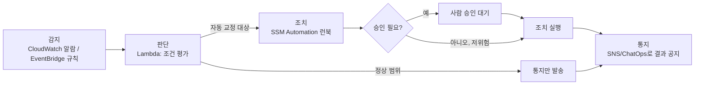

### 39.3 AWS Service Catalog

플랫폼 팀이 "이 회사에서 쓸 수 있는 EC2 구성은 이것뿐"이라고 CloudFormation 템플릿으로 정의해도, 개발팀이 그 템플릿을 몰라서 콘솔로 직접 리소스를 만들면 표준화가 무너진다. AWS Service Catalog는 승인된 IaC 템플릿을 **포트폴리오(Portfolio)**로 묶고, 그 안의 각 템플릿을 **제품(Product)**으로 등록해, 최종 사용자가 파라미터만 입력하면 셀프서비스로 배포할 수 있게 하는 카탈로그다.

핵심은 **시작 제약(Launch Constraint)**이다. 제품을 시작하는 IAM 역할을 사용자 본인 권한이 아니라 미리 지정된 역할로 고정함으로써, 사용자는 "이 제품을 시작할 권한"만 가지면 되고 그 안에서 실제로 만들어지는 EC2·RDS·VPC 등에 대한 직접 권한은 필요 없다 — 최소 권한 프로비저닝의 핵심 패턴이다. 제품은 **버전**을 가지며, 플랫폼 팀이 새 버전을 올리면 기존 사용자는 그대로 두고 신규 배포부터 새 버전을 쓰게 하거나, 기존 배포를 새 버전으로 업데이트하게 강제할 수 있다. **TagOption**으로 제품에 부착 가능한 태그 값의 집합을 제한해 태깅 표준을 강제하고, **AppRegistry**로 배포된 리소스를 애플리케이션 단위로 묶어 추적한다.

```bash
# 포트폴리오 생성 → 제품(CloudFormation 템플릿) 등록 → 시작 제약 연결
aws servicecatalog create-portfolio \
  --display-name "Approved-Compute-Baseline" \
  --provider-name "Platform-Team"

aws servicecatalog create-product \
  --name "standard-web-server" \
  --owner "Platform-Team" \
  --product-type CLOUD_FORMATION_TEMPLATE \
  --provisioning-artifact-parameters \
    'Name=v1,Type=CLOUD_FORMATION_TEMPLATE,Info={LoadTemplateFromURL=https://s3.amazonaws.com/templates/web-server.yaml}'

aws servicecatalog create-constraint \
  --portfolio-id port-abc123 \
  --product-id prod-xyz789 \
  --type LAUNCH \
  --parameters '{"RoleArn":"arn:aws:iam::123456789012:role/ServiceCatalogLaunchRole"}'
```

가치는 명확하다. 개발팀은 IAM으로 EC2·VPC 세부 권한을 배우지 않아도 "승인된 웹 서버 제품"을 몇 번의 클릭 또는 CLI 호출로 얻고, 플랫폼 팀은 보안·비용 기준을 템플릿 한 곳에서 강제한다. Service Catalog는 사실상 조직 내부의 **셀프서비스 포털**이다 — 티켓을 열고 인프라 팀의 수동 승인을 기다리는 대신, 사전에 승인된 카탈로그 안에서 사용자가 스스로 필요한 것을 즉시 얻는다는 점이 온보딩 속도와 표준 준수율을 동시에 높인다.

**AppRegistry**는 Service Catalog로 배포됐든 CloudFormation 스택을 직접 생성했든 상관없이, 관련 리소스를 하나의 **애플리케이션** 단위로 묶어 메타데이터(소유 팀, 비용 센터, 규정 준수 상태)를 부여하고, Cost Explorer·Systems Manager·Security Hub 같은 다른 서비스에서 애플리케이션 단위로 리소스를 조회할 수 있게 한다. 리소스가 계정·리전에 흩어져 있어도 "이 애플리케이션에 속한 모든 리소스"라는 질문에 답할 수 있다는 점에서 태그만으로는 부족한 조직화를 보완한다.

다만 템플릿을 자주 바꿔야 하는 빠르게 변하는 아키텍처에는 버전 관리 오버헤드가 부담이 될 수 있다. 이런 경우 Proton(→ 39.4)처럼 파이프라인까지 포함한 템플릿 관리가 더 적합할 수 있다.

### 39.4 AWS Proton

Service Catalog가 "리소스 묶음"을 셀프서비스화한다면, AWS Proton은 그보다 한 단계 위인 **애플리케이션 배포 전체(인프라 + CI/CD 파이프라인)**를 템플릿화한다. Proton은 두 종류 템플릿을 구분한다. **환경 템플릿(Environment Template)**은 VPC, 클러스터, 공유 네트워킹처럼 여러 서비스가 공유하는 기반 인프라를 정의하고, **서비스 템플릿(Service Template)**은 개별 애플리케이션(컨테이너 서비스, Lambda 함수 등)의 배포 방식과 파이프라인을 정의한다.

역할 분리가 핵심 설계다. **플랫폼 팀**은 환경·서비스 템플릿을 작성하고 버전을 관리하며 보안·컴플라이언스 기준(예: 모든 컨테이너 서비스는 반드시 특정 VPC·서브넷·보안 그룹 패턴을 따른다)을 템플릿에 내장한다. **개발 팀**은 템플릿이 요구하는 파라미터(예: 컨테이너 이미지, CPU/메모리, 환경 변수)만 채워 넣고 배포하며, 인프라 세부사항을 직접 다루지 않는다.

템플릿의 새 버전이 나오면 Proton은 기존에 배포된 서비스들을 **롤아웃(major/minor 버전 단위로 점진 배포)**해 일괄 업데이트할 수 있다. 배포는 한 번에 전체를 바꾸지 않고, 롤아웃 대상 목록을 지정해 일부 서비스에 먼저 적용한 뒤 문제가 없으면 나머지로 확대하는 방식을 지원한다 — 이는 39.7에서 강조하는 "단계적 적용" 원칙을 템플릿 배포에도 그대로 적용한 것이다. 마이너 버전 변경(하위 호환)은 자동 적용을 허용할 수 있지만, 메이저 버전 변경(구조적 변경)은 각 서비스 소유 팀의 명시적 승인을 거치도록 구성하는 것이 일반적이다. 수백 개 마이크로서비스가 같은 기반 인프라 패턴을 쓰는 조직에서는 이 롤아웃 메커니즘이 없다면 팀마다 개별적으로 인프라를 갱신해야 해 버전 파편화가 빠르게 누적된다.

| 도구 | 관리 대상 | 사용자 인터페이스 | 적합한 조직 규모/상황 |
|---|---|---|---|
| **Service Catalog** | 개별 리소스 묶음(제품) | 콘솔/CLI 카탈로그, 파라미터 입력 | 표준 인프라 구성(EC2, RDS 등)을 다수 팀에 배포 제한적으로 제공 |
| **AWS Proton** | 환경 + 서비스 + 파이프라인 전체 | Proton 콘솔/API, 템플릿 파라미터 | 컨테이너/서버리스 마이크로서비스를 대규모 팀에 표준 배포 |
| **AWS CDK** | 코드로 정의한 임의 인프라 | 개발자가 직접 코드 작성 | 인프라를 코드로 세밀하게 제어하려는 팀(→ 35장) |
| **Backstage(오픈소스)** | 개발자 포털 + 서비스 카탈로그 | 웹 UI, 플러그인 생태계 | 멀티 클라우드·이기종 스택을 아우르는 내부 개발자 플랫폼 |

**한 줄 결정 기준**: 배포 대상이 "리소스 하나"면 Service Catalog, "서비스 + 파이프라인 전체 패턴"이면 Proton, 팀이 코드로 인프라를 직접 다루고 싶으면 CDK, 여러 클라우드·도구를 아우르는 통합 포털이 필요하면 Backstage 같은 외부 플랫폼을 검토한다.

### 39.5 License Manager, AWS Health, 서비스 한도 관리

**AWS License Manager**는 온프레미스에서 클라우드로 가져온(BYOL, Bring Your Own License) 상용 소프트웨어(윈도우 서버, Oracle, SQL Server, RHEL 등)의 라이선스 사용을 추적한다. **라이선스 규칙**(코어당, vCPU당, 인스턴스당 등 라이선스 모델과 최대 사용 한도를 정의)을 만들고 리소스에 연결하면, 규칙 위반(라이선스 초과 사용) 시 새 인스턴스 시작을 차단하거나 경고할 수 있다. **호스트 리소스 그룹**으로 전용 호스트(Dedicated Host)에서 실행되는 BYOL 워크로드를 관리해, 코어·소켓 단위 라이선스를 특정 물리 호스트에 고정함으로써 라이선스 감사에서 실제 사용량을 근거로 제시할 수 있게 한다. 조직 전체에서 어떤 라이선스가 얼마나 남았는지 한눈에 보이지 않으면, 라이선스를 이미 다 쓴 상태에서 새 인스턴스를 계속 띄우다가 감사 시점에 대규모 추가 비용을 청구받는 상황이 생길 수 있다 — License Manager는 이 리스크를 프로비저닝 시점에 미리 차단한다.

**AWS Health Dashboard**는 두 층으로 구성된다. 공개 Service Health Dashboard가 리전·서비스 단위의 일반 장애 상태를 보여주는 것과 달리, 개인 Health Dashboard는 **해당 계정의 리소스에 실제로 영향을 주는** 이벤트(예정된 유지보수, 특정 EC2 인스턴스의 하드웨어 교체 통보, 특정 리소스에 영향을 주는 장애)만 선별해 보여준다. **조직 뷰(Organizational View)**는 Organizations 전체 계정의 Health 이벤트를 한 화면에서 취합해, 멀티 계정 환경에서 계정마다 콘솔을 열어 확인하는 수고를 없앤다. **Health API**로 이벤트를 프로그래밍적으로 조회해 EventBridge와 연결하면, "특정 리전에서 장애가 선언되면 자동으로 페일오버 절차를 트리거"하거나 "예정된 인스턴스 재시작 통보를 받으면 자동으로 유지보수 창에 등록"하는 자동화가 가능하다 — 이는 사람이 콘솔을 계속 들여다보지 않아도 되게 만드는 대표적 운영 자동화 패턴이다.

**Service Quotas**는 계정별 서비스 한도(예: 리전당 VPC 개수, Lambda 동시 실행 수, EC2 온디맨드 vCPU 한도)를 조회하고 증설을 요청하는 단일 창구다. 한도는 서비스마다 다르고 시점에 따라 바뀌므로 정확한 수치는 항상 Service Quotas 콘솔/API로 확인해야 한다. 핵심 실무 포인트는 한도 자체가 아니라 **감시**다 — 한도에 다다르기 전까지는 아무 신호도 없다가 갑자기 API 호출이 `Throttling` 또는 `LimitExceeded`로 실패하기 시작한다. 즉 **한도는 조용히 장애를 만든다.** 이를 막는 방법은 Service Quotas가 제공하는 CloudWatch 사용률 지표를 이용해 한도의 일정 비율(일반적으로 80% 내외)에서 경보를 걸어, 실제 한도 도달 전에 증설 요청이나 트래픽 조정을 할 시간을 확보하는 것이다.

```yaml
# CloudFormation: Lambda 동시 실행 한도 사용률 80%에서 경보
Resources:
  LambdaConcurrencyUsageAlarm:
    Type: AWS::CloudWatch::Alarm
    Properties:
      AlarmName: lambda-concurrent-executions-quota-80pct
      Namespace: AWS/Usage
      MetricName: CallCount
      Dimensions:
        - Name: Type
          Value: Resource
        - Name: Resource
          Value: ConcurrentExecutions
        - Name: Service
          Value: Lambda
        - Name: Class
          Value: None
      Statistic: Maximum
      Period: 300
      EvaluationPeriods: 2
      Threshold: 800          # 계정 한도 1000의 80% — 실제 한도는 Service Quotas 콘솔에서 확인
      ComparisonOperator: GreaterThanOrEqualToThreshold
      AlarmActions:
        - !Ref OpsNotificationTopic
```

```bash
# 현재 한도 조회 후 증설 요청 (한도 값은 항상 콘솔/API로 최신화해 확인)
aws service-quotas get-service-quota \
  --service-code lambda --quota-code L-B99A9384 \
  --region ap-northeast-2

aws service-quotas request-service-quota-increase \
  --service-code lambda --quota-code L-B99A9384 \
  --desired-value 2000 \
  --region ap-northeast-2
```

세 서비스는 성격이 다르지만 공통점이 있다. 라이선스 초과, 예정된 유지보수 미확인, 조용히 다가오는 한도 초과는 모두 "누군가 능동적으로 확인하지 않으면 알 수 없는" 리스크라는 점이다. 이를 EventBridge·CloudWatch 알람과 연결해 능동 통지로 바꾸는 것이 이 절의 요지다.

### 39.6 런북·플레이북·게임데이·포스트모템

자동화가 아무리 발전해도 예외 상황에서 사람이 판단해야 하는 순간은 남는다. 이 순간의 품질을 좌우하는 것이 **런북(runbook)**이다. 런북은 특정 상황(디스크 풀, DB 장애 조치, 인증서 만료)에서 수행할 절차를 단계별로 문서화한 것으로, 성숙도는 보통 세 단계로 발전한다 — **수동 문서**(사람이 읽고 명령을 직접 입력), **반자동**(SSM Automation처럼 스크립트화하되 각 단계 또는 위험한 단계에 승인 게이트를 둠, → 39.1), **완전 자동**(감지부터 조치까지 사람 개입 없이 실행, 결과만 통지). 반복적으로 실행되는 조치는 항상 이 사다리를 타고 다음 단계로 자동화하는 것이 목표이지만, 완전 자동화로 가는 속도는 신뢰도가 검증된 만큼만 높여야 한다.

**온콜 인수인계**는 문서화된 형식(현재 진행 중인 이슈, 최근 배포, 주의해야 할 알람)을 갖춰야 인계 시 정보 유실을 막는다. 사고 발생 시에는 대응이 끝난 뒤 **비난 없는(blameless) 포스트모템**을 작성한다. 핵심은 "누가 실수했는가"가 아니라 "시스템이 왜 그 실수를 허용했는가"를 묻는 것이다. 표준 템플릿은 다음 항목을 포함한다.

| 항목 | 내용 |
|---|---|
| 타임라인 | 감지·에스컬레이션·완화·복구 각 시각을 분 단위로 기록 |
| 영향(Impact) | 영향받은 사용자 수, 지속 시간, SLA/SLO 위반 여부 |
| 근본 원인(Root Cause) | 기술적으로 무엇이 실패를 유발했는가 |
| 기여 요인(Contributing Factors) | 근본 원인을 악화시킨 프로세스·설계상 약점(알람 부재, 리뷰 누락 등) |
| 액션 아이템 | 재발 방지 조치 — 반드시 **담당자**와 **기한**을 명시 |

액션 아이템에 담당자와 기한이 없는 포스트모템은 "읽고 잊히는 문서"로 끝난다. 이 점을 강제하는 것이 실무에서 포스트모템 프로세스의 성패를 가른다. 포스트모템은 사고 종료 직후가 아니라 관련자의 기억이 아직 선명하되 감정이 가라앉은 시점(대체로 1~2 영업일 이내)에 작성하는 것이 일반적이며, 사고 심각도가 낮더라도 반복되는 유형이면 별도로 누적 기록해 패턴을 찾는 것이 좋다.

런북의 자동화 성숙도는 다음 세 단계로 구분해 목표를 잡는 것이 유용하다.

| 단계 | 설명 | 도구 | 리스크 |
|---|---|---|---|
| 수동 문서 | 사람이 문서를 읽고 명령을 직접 입력 | 위키/런북 문서 | 사람 실수, 절차 누락 |
| 반자동 | 스크립트화하되 위험 단계에 승인 게이트 | SSM Automation + 승인 단계 | 승인자 부재 시 지연 |
| 완전 자동 | 감지부터 조치까지 무개입, 결과만 통지 | EventBridge + Automation | 오탐 조치, 과잉 반응 |

새로운 런북은 항상 수동 문서에서 시작해 충분히 반복되고 검증된 뒤에만 다음 단계로 승격하는 것이 안전하다 — 검증되지 않은 절차를 곧바로 완전 자동화하면 39.7에서 다루는 "자동화가 장애 원인이 되는" 사례로 직행하기 쉽다.

**게임데이(GameDay)**는 실제 사고가 나기 전에 의도적으로 장애를 주입해 팀의 대응 절차·런북·모니터링이 실제로 작동하는지 검증하는 연습이다. 구체적인 실행 방법과 AWS Fault Injection Service(FIS)를 이용한 카오스 엔지니어링은 → 8장 참조. 게임데이의 산출물 역시 포스트모템과 같은 형식의 학습 루프로 들어가야 한다 — 발견된 약점은 액션 아이템이 되고, 액션 아이템은 다음 게임데이에서 재검증된다.

마지막으로 **변경 관리(Change Management)**는 프로덕션에 영향을 줄 수 있는 변경을 사전에 검토하는 절차다. 조직 규모가 커지면 **변경 자문 위원회(CAB, Change Advisory Board)**가 고위험 변경(스키마 변경, 대규모 인프라 교체, 트래픽 라우팅 변경 등)을 사전 검토하지만, 지나치게 무거운 CAB 프로세스는 배포 속도를 떨어뜨리고 오히려 변경을 큰 배치로 묶어 한 번에 처리하려는 유인을 만들어 위험을 키운다. 따라서 변경의 위험도에 따라 검토 강도를 차등화하는 것이 일반적이다 — 저위험 변경(피처 플래그 뒤에 있는 코드 배포, 롤백이 쉬운 변경)은 자동 배포 파이프라인의 게이트(테스트 통과, 배포 알람 미발생)만 통과하면 되고, 고위험 변경(데이터베이스 스키마 변경, 프로덕션 네트워크 구성 변경)만 사람의 사전 검토를 거치게 한다. 변경 요청에는 변경 내용, 롤백 절차, 예상 영향 범위, 실행 시간대를 표준 양식으로 기록해두면 사고 발생 시 "최근에 무엇이 바뀌었는가"를 즉시 추적할 수 있다. 이는 37장의 자동 롤백 조건·배포 알람과 맞닿아 있다.

### 39.7 CloudOps 6기둥 정리

원서 *AWS for Solutions Architects*는 클라우드 운영(CloudOps) 성숙도를 여섯 개 기둥으로 정리한다. 이 절에서는 각 기둥을 정의하고, 이 책의 어느 장이 무엇을 다루는지 매핑한다.

| 기둥 | 정의 | 핵심 서비스 | 성숙도 지표 |
|---|---|---|---|
| ① 거버넌스 | 계정·조직 구조, 정책 기반 통제 | Organizations, SCP, Control Tower, IAM Identity Center | 신규 계정이 가드레일 안에서 자동 프로비저닝되는가 |
| ② 구성·컴플라이언스·감사 | 리소스 구성 추적, 규정 준수 증빙 | AWS Config, Audit Manager, Artifact, Security Hub | 드리프트가 자동 감지·교정되는가 |
| ③ 프로비저닝·오케스트레이션 | 인프라·배포를 코드와 파이프라인으로 실행 | CloudFormation, CDK, CodePipeline, CodeDeploy | 수동 콘솔 조작 없이 전 과정이 재현 가능한가 |
| ④ 모니터링·관측 | 시스템 상태를 실시간으로 파악 | CloudWatch, X-Ray, ADOT | 장애를 사용자 불만보다 먼저 감지하는가 |
| ⑤ 중앙 운영 관리 | 반복 운영 작업의 자동화와 표준화 | Systems Manager, EventBridge, Service Catalog, Proton | 반복 조치가 사람 개입 없이 처리되는가 |
| ⑥ 클라우드 재무 관리 | 비용 가시성과 최적화 거버넌스 | Cost Explorer, Budgets, Cost Anomaly Detection | 비용 이상을 예산 소진 전에 포착하는가 |

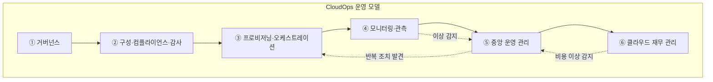

이 책의 장 배치는 이 6기둥을 그대로 따라간다.

| CloudOps 기둥 | 대응하는 장 |
|---|---|
| ① 거버넌스 | 30장(멀티 계정 랜딩 존) |
| ② 구성·컴플라이언스·감사 | 34장(컴플라이언스와 감사), 31장 일부(암호화·키 관리) |
| ③ 프로비저닝·오케스트레이션 | 35장(IaC), 36장(CI/CD), 37장(배포 전략) |
| ④ 모니터링·관측 | 38장(관측성) |
| ⑤ 중앙 운영 관리 | 39장(이 장) |
| ⑥ 클라우드 재무 관리 | 40장(FinOps) |

**운영 성숙도 자가진단 체크리스트**는 다음 질문으로 구성한다.

1. SSH 키를 배포·순환하는 절차가 아직 존재하는가? (존재하면 Session Manager 미도입)
2. 패치 적용 여부를 사람이 수동으로 확인하는가, 아니면 규정 준수 보고서가 자동 생성되는가?
3. 같은 장애가 반복되면 사람이 매번 같은 명령을 입력하는가, 아니면 런북이 자동/반자동화되어 있는가?
4. 신규 팀이 표준 인프라를 얻기까지 티켓 기반 요청과 수동 승인을 거치는가, 아니면 셀프서비스 카탈로그가 있는가?
5. 서비스 한도 도달을 API 오류로 처음 알게 되는가, 아니면 80% 시점에 경보를 받는가?
6. 최근 사고의 포스트모템에 담당자와 기한이 명시된 액션 아이템이 있는가, 그리고 그것이 실제로 이행됐는가?
7. 게임데이를 정기적으로 실시해 런북과 알람이 실전에서 작동함을 검증하는가?

이 체크리스트는 한 번 채점하고 끝내는 것이 아니라, 분기 단위로 재점검해 점수 변화를 추적하는 것이 실무에서 더 유용하다. "아니오"가 많을수록 자동화 후보가 쌓여 있다는 뜻이다. 다만 자동화 확대는 항상 신중해야 한다 — 자동화 스크립트가 잘못된 조건으로 대량의 인스턴스를 동시에 재시작하거나 종료하면, 그 자동화 자체가 새로운 장애의 원인이 된다. 따라서 자동 교정을 설계할 때는 한 번에 처리하는 리소스 수를 제한하고(변경 규모 제한), 전체가 아니라 일부 대상에 먼저 적용해 결과를 확인한 뒤 점진적으로 넓히고(단계적 적용), 연속 실패가 감지되면 스스로 멈추게 하고(서킷 브레이커), 실제 조치 전에 어떤 리소스에 어떤 영향을 미칠지 미리 보여주는 드라이런 모드를 기본값으로 두는 것이 안전하다. 목표는 "사람을 완전히 배제하는 것"이 아니라 "반복적이고 검증된 판단에서 사람의 개입을 줄이는 것"이며, 판단이 애매한 예외 상황에서는 여전히 사람이 최종 결정을 내리도록 승인 게이트를 남겨두는 설계가 성숙한 운영이다.

### 39장 정리

#### [필수] 반드시 알아야 할 것
1. Systems Manager는 SSM Agent + `AmazonSSMManagedInstanceCore` 역할 + (프라이빗 서브넷이면) 인터페이스 엔드포인트가 있어야 Managed Instance로 동작한다.
2. Session Manager는 SSH 포트·배스티온·키 페어 없이 접속을 제공하고 세션 기록을 CloudTrail에 남겨 보안과 감사를 동시에 개선한다.
3. Patch Manager는 패치 기준선(무엇을 승인할지) + 패치 그룹(어디에 적용할지) + 유지보수 창(언제 적용할지)의 조합으로 동작한다.
4. EventBridge 규칙은 이벤트 패턴으로 매칭하고, 대상 실패 시 재시도 후 DLQ로 보낸다 — DLQ 미설정 시 이벤트가 조용히 유실될 수 있다.
5. Service Catalog의 시작 제약(Launch Constraint)은 사용자가 아닌 지정 역할로 리소스를 생성해 최소 권한 셀프서비스를 가능하게 한다.
6. AWS Proton은 환경 템플릿(공유 인프라)과 서비스 템플릿(개별 서비스+파이프라인)을 분리해 플랫폼 팀과 개발 팀의 역할을 나눈다.
7. Service Quotas는 계정 한도를 조회·증설하는 창구이며, 사용률 지표를 CloudWatch 알람으로 감시해야 한도 도달 전에 대응할 수 있다.
8. 비난 없는 포스트모템은 담당자와 기한이 명시된 액션 아이템이 있어야 재발 방지로 이어진다.

#### [팁] 실무 노하우
1. Session Manager 도입 시 보안 그룹에서 22번 포트 인바운드 규칙을 아예 제거해 공격 표면을 줄인다.
2. SSM Automation 런북에 위험한 단계(재시작, 삭제) 앞에는 `aws:approve` 승인 단계를 넣어 반자동화 단계에서 시작한다.
3. EventBridge 규칙에 입력 변환(Input Transformer)을 활용해 대상이 필요한 필드만 추려 보내면 다운스트림 처리가 단순해진다.
4. Service Quotas 사용률 알람은 80%에서 시작하되 증설 요청 소요 시간(대개 영업일 단위)을 감안해 임계값을 조정한다.
5. Proton 템플릿 버전을 올릴 때는 전체 서비스에 즉시 강제하지 말고 롤아웃 대상을 단계적으로 넓힌다.
6. 게임데이 결과와 포스트모템 액션 아이템을 같은 트래킹 시스템에 넣어 이행 여부를 추적한다.

#### [주의] 사고·비용·설계 함정
1. 자동화 스크립트가 잘못된 조건으로 대량 리소스에 동시 적용되면 자동화 자체가 장애 원인이 된다 — 변경 규모 제한, 단계적 적용, 서킷 브레이커, 드라이런을 항상 함께 설계한다.
2. 서비스 한도는 도달 전까지 아무 신호가 없다가 갑자기 API 실패로 나타난다 — 사용률 알람 없이 운영하면 예고 없는 장애를 겪는다.
3. SSM 프라이빗 서브넷 인스턴스에 VPC 엔드포인트를 빠뜨리면 Managed Instance로 등록되지 않아 Session Manager·Run Command가 모두 실패한다.
4. EventBridge 대상 실패 시 DLQ를 설정하지 않으면 이벤트가 조용히 유실되어 자동 교정이 작동하지 않았는데도 아무도 모른다.
5. Service Catalog 시작 제약 역할에 과도한 권한을 주면 "최소 권한 셀프서비스"라는 목적 자체가 무력화된다.
6. 포스트모템에서 개인을 지목하면 다음부터 사고 정보가 축소·은폐되어 학습 루프가 망가진다.
7. License Manager 없이 BYOL 워크로드를 운영하면 라이선스 초과 사용을 감사 시점에야 발견하게 된다.
8. 변경 자문 프로세스를 모든 변경에 동일하게 무겁게 적용하면 배포 속도가 떨어져 오히려 위험한 대규모 배치 변경을 유발한다.

#### 한 장 요약
운영 자동화는 Systems Manager(서버 단위 반복 작업)와 EventBridge(이벤트 기반 자동 교정)를 축으로 하고, Service Catalog와 Proton은 이를 조직 규모로 셀프서비스화한다. License Manager·Health·Service Quotas는 조용히 쌓이는 리스크를 능동 감시 대상으로 바꾼다. 하지만 모든 자동화는 사람이 개입하는 승인 게이트, 변경 규모 제한, 드라이런을 갖춰야 자동화 자체가 새로운 장애 원인이 되는 것을 막을 수 있으며, 런북·포스트모템·게임데이는 이 학습 루프를 계속 돌리는 프로세스다. CloudOps 6기둥은 이 책의 30·34·35~37·38·39·40장을 하나의 운영 지도로 묶는다.

#### 다음 장 예고
40장은 CloudOps의 마지막 기둥인 클라우드 재무 관리(FinOps)를 다룬다. 비용 가시성 도구부터 조직적 FinOps 운영 모델까지, 운영 자동화가 만들어낸 인프라의 비용을 누가 어떻게 통제하는지 살펴본다.

---

## 40장. FinOps — 클라우드 재무 관리  ★★★

> **이 장에서 다루는 것**
> 17장에서 컴퓨트 구매 옵션(온디맨드·RI·Savings Plans·스팟)을, 39장에서 운영 자동화와 거버넌스를 다뤘다. 이 장은 그 위에 "돈"이라는 축을 얹는다. FinOps는 클라우드 비용을 사후 결산 항목이 아니라 엔지니어링 의사결정의 실시간 입력값으로 다루는 문화·프로세스·도구의 묶음이다. 원서(AWS for Solutions Architects) 9장이 제시하는 클라우드 재무 관리의 4단계 — 계획·평가(Plan and evaluate), 관리·통제(Manage and control), 추적·배분(Track and allocate), 최적화·절감(Optimize and save) — 을 뼈대로 삼아, 비용 가시성 확보부터 팀별 책임 배분과 조직의 운영 리듬까지 다룬다.
> 17장(구매 옵션)·30장(멀티 계정 랜딩 존)·39장(거버넌스·Service Catalog)의 지식을 전제로 하며, CUR을 Athena로 분석하는 세부 SQL 튜닝은 51장에서 다시 다룬다.

### 40.1 비용 가시성

FinOps의 첫 단계는 "지금 얼마를 쓰고 있고, 누가 왜 쓰는가"를 볼 수 있는 것이다. 이것 없이는 계획도 통제도 불가능하다.

**Cost and Usage Report(CUR)** 는 AWS 청구의 원천 데이터다. 시간·일 단위로 모든 리소스의 사용량과 비용을 라인 아이템 단위로 기록하며, 리소스 ID·태그·요금 유형(온디맨드/RI/SP 적용분)·사용 유형(usage type)까지 포함한다. 콘솔의 Cost Explorer가 보여주는 집계 화면도 결국 CUR을 가공한 것이므로, 커스텀 분석·재무 시스템 연동에는 CUR을 직접 다뤄야 한다. CUR 2.0은 S3에 Parquet 또는 CSV로 적재되고, Glue 크롤러로 스키마를 인식시킨 뒤 **Athena**로 쿼리하거나 **QuickSight**로 대시보드를 만드는 것이 표준 패턴이다(상세 최적화는 → 51장 참조). 이 구조 덕분에 "고객 A 테넌트의 이번 달 인프라 원가는?" 같은 회사 고유의 질문에 정형화된 SQL로 답할 수 있다.

```sql
-- CUR Athena 외부 테이블에서 서비스별 이번 달 비용 집계
-- billing_period 파티션으로 스캔 범위를 좁혀 Athena 과금(스캔 바이트 기준)을 줄인다
SELECT
    line_item_product_code AS service,
    SUM(line_item_unblended_cost) AS monthly_cost_usd
FROM cur_database.cur_table
WHERE billing_period = '2026-08'
GROUP BY line_item_product_code
ORDER BY monthly_cost_usd DESC
LIMIT 20;
```

```sql
-- 비용 배분 태그(team, environment) 기준으로 비용을 재구성
-- 태그가 없는 라인 아이템은 'untagged'로 묶어 귀속 불가 규모를 드러낸다
SELECT
    COALESCE(resource_tags_user_team, 'untagged') AS team,
    resource_tags_user_environment AS environment,
    SUM(line_item_unblended_cost) AS cost_usd
FROM cur_database.cur_table
WHERE billing_period = '2026-08'
GROUP BY 1, 2
ORDER BY cost_usd DESC;
```

**Cost Explorer**는 비용을 서비스·계정·리전·태그·사용 유형별로 그룹화·필터링하고, 최근 패턴을 바탕으로 향후 지출을 **예측(forecast)**한다. "왜 이번 주에 비용이 튀었나" 같은 일상 조사에는 CUR을 직접 쿼리하기보다 이쪽이 빠르다. 외부 BI 도구 연동에는 **Data Exports**(CUR 2.0 기반 관리형 내보내기)로 조직의 데이터 웨어하우스에 정기 적재한다.

비용을 조직 구조에 대응시키는 방법은 크게 세 가지다.

| 방법 | 동작 방식 | 한계 |
|---|---|---|
| 비용 배분 태그 | 리소스에 태그(예: `team=payments`)를 붙이고 결제 콘솔에서 **활성화** | 활성화 시점 이전 사용분에는 소급 적용되지 않는다 |
| 비용 카테고리(Cost Categories) | 계정 ID·서비스·태그 값 등을 규칙으로 묶어 논리적 그룹(예: "프로덕션 결제 스택") 정의 | 태그가 아예 없는 리소스는 여전히 분류 불가 |
| 계정 분리 | 팀·서비스·환경별로 AWS 계정을 나눠 청구가 계정 단위로 자연 귀속(→ 30장 참조) | 계정을 세분화할수록 공유 인프라(네트워킹·로깅 계정)의 배분 문제가 남는다 |

**한 줄 결정 기준**: 팀 경계가 뚜렷하고 계정을 나눌 여력이 있다면 계정 분리가 가장 확실한 귀속 방법이고, 계정 내부의 세밀한 배분(마이크로서비스·테넌트 단위)에는 비용 배분 태그가, 복잡한 다대다 매핑에는 비용 카테고리가 적합하다.

핵심 함정은 **태그 없는 리소스는 귀속이 원천적으로 불가능하다**는 것이다. 태그 활성화는 결제 콘솔에서 수동으로 하며 활성화 이전 이력에는 소급 적용되지 않으므로, 신규 계정·조직일수록 초기에 태그 정책을 확정·활성화해야 한다. **공유 비용**— 데이터 전송, NAT 게이트웨이, 중앙 로깅 계정의 로그 저장 — 은 태그로 자연 분해되지 않으므로 별도 배분 규칙(사용량 비례, 균등 분배, "플랫폼 세금" 계정 격리)을 조직 차원에서 합의해야 한다.

### 40.2 계획·평가

가시성이 확보되면 다음은 "얼마를 쓸 계획이고, 계획과 실제가 얼마나 어긋나는가"를 관리하는 단계다.

**AWS Budgets**는 예산 초과를 사전에 알려주는 서비스로, 네 가지 유형을 지원한다.

| 예산 유형 | 추적 대상 | 용도 |
|---|---|---|
| 비용 예산 | 실제/예측 지출액 | 월간·분기 총 지출 한도 감시 |
| 사용량 예산 | 사용 단위(인스턴스 시간, GB 등) | 특정 리소스 소비량 상한 감시 |
| RI/SP 커버리지 예산 | 온디맨드 대비 커밋 적용 비율 | 커밋 구매가 충분한지 확인 |
| RI/SP 활용률 예산 | 구매한 커밋이 실제로 쓰이는 비율 | 낭비된 커밋 조기 발견 |

예산은 **실제 비용(actual)** 기준과 **예측 비용(forecasted)** 기준 알림을 모두 지원한다. 실제 기준은 이미 발생한 지출이 임계값을 넘었을 때, 예측 기준은 현재 추세가 지속될 경우 월말에 초과할 것으로 예측될 때 알린다 — 후자가 조기 경보로서 더 유용하다. 실무에서는 **비율 기반 알림 3단계(50/80/100%)** 를 걸어두는 것이 표준적이다: 50%는 조기 인지, 80%는 담당 팀에 원인 조사 요청, 100%는 예산 초과 확정과 함께 자동 조치를 트리거하는 신호로 쓴다.

```yaml
# CloudFormation: 월간 예산 + 80%/100% 알림 + 100% 초과 시 Budget Action(SCP 적용)으로 신규 리소스 생성 억제
# 예산 초과가 "알림"에서 그치지 않고 실제 통제로 이어지도록 자동 조치를 붙인다
Resources:
  MonthlyBudget:
    Type: AWS::Budgets::Budget
    Properties:
      Budget:
        BudgetName: team-payments-monthly
        BudgetType: COST
        TimeUnit: MONTHLY
        BudgetLimit:
          Amount: 5000
          Unit: USD
        CostFilters:
          TagKeyValue:
            - "user:team$payments"
      NotificationsWithSubscribers:
        - Notification:
            NotificationType: ACTUAL
            ComparisonOperator: GREATER_THAN
            Threshold: 80
          Subscribers:
            - SubscriptionType: EMAIL
              Address: finops@example.com
        - Notification:
            NotificationType: FORECASTED
            ComparisonOperator: GREATER_THAN
            Threshold: 100
          Subscribers:
            - SubscriptionType: EMAIL
              Address: finops@example.com

  BudgetAction:
    Type: AWS::Budgets::BudgetsAction
    Properties:
      BudgetName: !Ref MonthlyBudget
      ActionType: APPLY_IAM_POLICY
      ActionThreshold:
        ActionThresholdType: PERCENTAGE
        ActionThresholdValue: 100
      Definition:
        IamActionDefinition:
          PolicyArn: arn:aws:iam::123456789012:policy/DenyNewLargeInstances
          Roles:
            - PaymentsTeamRole
      ExecutionRoleArn: arn:aws:iam::123456789012:role/BudgetsActionRole
      ApprovalModel: AUTOMATIC
      NotificationType: ACTUAL
```

**Cost Anomaly Detection**은 임계값을 사람이 정하지 않아도 머신러닝 기반으로 평소 지출 패턴에서 벗어난 급증을 탐지한다. 모니터 유형은 서비스별, 계정별, 비용 카테고리별로 만들 수 있고, 각 모니터에 절대 금액 또는 백분율 임계값을 지정해 알림 규칙을 연결한다. 예산이 "우리가 정한 선을 넘었는가"를 보는 것이라면, 이상 탐지는 "평소와 다른 패턴이 생겼는가"를 보는 것이라 상호 보완적이다.

```bash
# 서비스별 비용 이상 탐지 모니터 생성 (예: EC2 지출이 평소 패턴을 벗어나면 탐지)
aws ce create-anomaly-monitor \
  --anomaly-monitor '{
    "MonitorName": "ec2-spend-anomaly",
    "MonitorType": "DIMENSIONAL",
    "MonitorDimension": "SERVICE"
  }'

# 일일 500달러 이상 이탈 시 이메일로 알림 (구독 임계값은 절대 금액 또는 백분율로 설정 가능)
aws ce create-anomaly-subscription \
  --anomaly-subscription '{
    "SubscriptionName": "ec2-anomaly-email",
    "Frequency": "DAILY",
    "MonitorArnList": ["arn:aws:ce::123456789012:anomalymonitor/abcd-1234"],
    "Subscribers": [{"Address": "finops@example.com", "Type": "EMAIL"}],
    "Threshold": 500
  }'
```

신규 워크로드를 설계하는 단계에서는 **AWS Pricing Calculator**로 예상 아키텍처의 월간 비용을 사전 견적한다. 여기서 중요한 것은 총액 자체보다 **단위 비용 모델링**이다 — "예상 트래픽에서 요청당 얼마"를 미리 계산해두면, 출시 후 실제 단위 비용과 비교해 설계 가정이 맞았는지 검증할 수 있다(단위 경제학은 → 40.5절 참조).

### 40.3 관리·통제

가시성과 계획이 사후 대응이라면, 관리·통제는 애초에 낭비가 발생하지 않도록 미리 막는 단계다.

**서비스 제어 정책(SCP)**은 조직 단위(OU) 전체에 예방적 가드레일을 건다. 특정 리전 사용 금지, 고가 서비스·특정 인스턴스 패밀리(대형 GPU 등) 제한, 특정 크기 이상 인스턴스 시작 금지가 대표적이다(SCP 상세 문법과 OU 설계는 → 30장 참조).

```json
{
  "Version": "2012-10-17",
  "Statement": [
    {
      "Sid": "DenyLargeInstanceTypes",
      "Effect": "Deny",
      "Action": "ec2:RunInstances",
      "Resource": "arn:aws:ec2:*:*:instance/*",
      "Condition": {
        "ForAnyValue:StringLike": {
          "ec2:InstanceType": ["*.8xlarge", "*.16xlarge", "*.metal"]
        }
      }
    },
    {
      "Sid": "DenyNonApprovedRegions",
      "Effect": "Deny",
      "Action": "*",
      "Resource": "*",
      "Condition": {
        "StringNotEquals": {
          "aws:RequestedRegion": ["ap-northeast-2", "us-east-1"]
        }
      }
    }
  ]
}
```

**태그 강제**는 FinOps의 전제 조건이다(→ 40.1절). 태그 정책(Tag Policies)으로 키·값 형식을 표준화하고, Config 규칙(`required-tags`)으로 누락 리소스를 지속 탐지하며, CI/CD 배포 게이트에서 필수 태그 없는 IaC 배포를 거부하는 3중 방어가 가장 견고하다. 사후에 채우는 것보다 생성 시점에 막는 것이 압도적으로 저렴하다.

**승인 워크플로**는 개발자에게 자유를 주되 비용 폭주를 막는다. Service Catalog로 승인된 인스턴스 크기·구성만 담긴 포트폴리오를 배포하면, 개발자는 셀프서비스로 리소스를 만들면서도 과대 사이징은 애초에 선택지에 없다(→ 39장 참조).

**자동 정리**는 사람이 놓친 낭비를 기계가 걷어내는 것이다. 유휴 리소스 스캐너를 정기 실행해 미연결 EIP, 장기간 미접속 볼륨 등을 찾고(탐지 코드는 → 40.4절), **TTL(Time-To-Live) 태그** 규칙으로 `ttl=2026-09-30` 같은 만료 태그를 강제해 만료일이 지난 리소스를 자동 삭제 대상에 올린다. 임시 실험·PR 미리보기 환경처럼 "누군가 만들고 아무도 지우지 않는" 리소스에 특히 효과적이다.

개발·테스트 환경의 **야간·주말 자동 정지**는 조직 정책 수준에서 강제할 때 효과가 가장 크다. 개별 팀 자율에 맡기면 실행률이 낮아지므로, 태그(`environment=dev`) 기준으로 조직 전체에 적용되는 스케줄을 EventBridge 스케줄러와 Lambda(또는 Instance Scheduler 솔루션)로 강제한다(개별 인스턴스 자동화 자체는 → 17장 참조). 비개발 시간이 전체의 절반을 넘는 경우가 많아, 이 조치 하나로 개발 환경 컴퓨트 비용을 절반 가까이 줄이는 사례가 흔하다.

### 40.4 최적화·절감

이미 발생한 낭비를 줄이는 단계다. 효과 대비 노력이 큰 순서로 접근해야 조직의 제한된 FinOps 인력을 낭비하지 않는다.

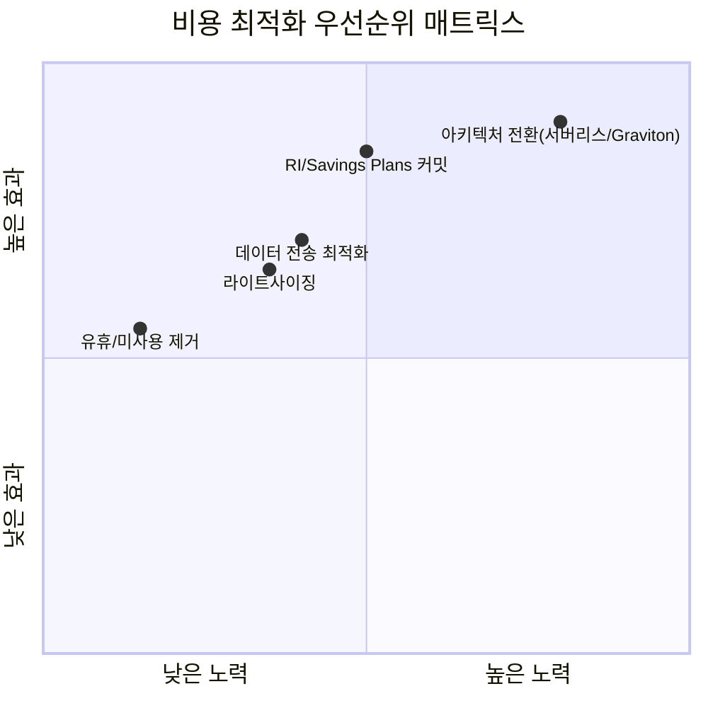

**① 유휴·미사용 리소스 제거**는 노력 대비 효과가 가장 크다. 조용히 쌓이는 낭비 목록은 다음과 같다.

| 항목 | 탐지 방법 | 대략적 효과 |
|---|---|---|
| 미연결 Elastic IP | Cost Explorer 사용 유형 필터, boto3 스캔 | 인스턴스당 소액이지만 수백 개 누적 시 유의미 |
| 방치된 EBS 볼륨·스냅샷 | Trusted Advisor, Storage Lens | 장기 방치 시 스토리지 비용의 상당 부분 |
| 유휴 NAT 게이트웨이·ALB | Cost Explorer + VPC Flow Logs 트래픽 확인 | 시간당 고정 비용이 트래픽 없이도 계속 발생 |
| 미완료 멀티파트 업로드 | S3 Storage Lens, 수명 주기 규칙 | 대용량 업로드 실패 잔해가 조용히 과금 |
| 무기한 로그 보존 | CloudWatch Logs 보존 기간 감사 | 보존 기간 단축만으로 로그 비용 대폭 절감 |
| 미사용 프로비저닝 동시성(Lambda) | Cost Explorer Lambda 사용 유형 | 트래픽 대비 과다 설정 시 상시 과금 |

```python
# boto3: 유휴 리소스 스캔 스크립트 골자 — 미연결 EIP, 미사용 EBS 볼륨, 트래픽 없는 NAT GW 탐지
import boto3

ec2 = boto3.client("ec2", region_name="ap-northeast-2")

def find_unattached_eips():
    # AssociationId가 없는 주소는 인스턴스에 붙어 있지 않은데도 계속 과금된다
    addrs = ec2.describe_addresses()["Addresses"]
    return [a["PublicIp"] for a in addrs if "AssociationId" not in a]

def find_unused_volumes():
    # state=available은 어떤 인스턴스에도 연결되지 않은 볼륨을 뜻한다
    vols = ec2.describe_volumes(
        Filters=[{"Name": "status", "Values": ["available"]}]
    )["Volumes"]
    return [v["VolumeId"] for v in vols]

def find_idle_nat_gateways(cloudwatch, days=14):
    # NAT GW의 BytesOutToDestination 합계가 임계값 이하면 유휴로 간주
    nat_gws = ec2.describe_nat_gateways(
        Filter=[{"Name": "state", "Values": ["available"]}]
    )["NatGateways"]
    idle = []
    for gw in nat_gws:
        metrics = cloudwatch.get_metric_statistics(
            Namespace="AWS/NATGateway",
            MetricName="BytesOutToDestination",
            Dimensions=[{"Name": "NatGatewayId", "Value": gw["NatGatewayId"]}],
            StartTime=f"-{days}d", EndTime="now",
            Period=86400, Statistics=["Sum"],
        )
        total = sum(p["Sum"] for p in metrics.get("Datapoints", []))
        if total < 1024 * 1024:  # 14일간 1MB 미만이면 사실상 유휴
            idle.append(gw["NatGatewayId"])
    return idle

if __name__ == "__main__":
    print("미연결 EIP:", find_unattached_eips())
    print("미사용 볼륨:", find_unused_volumes())
```

```bash
# CloudWatch Logs 로그 그룹 일괄 보존 기간 설정 — 무기한 보존(Never Expire) 그룹을 90일로 축소
# 규정 준수상 장기 보존이 필요한 그룹은 별도 화이트리스트로 제외해야 한다
for LOG_GROUP in $(aws logs describe-log-groups \
  --query 'logGroups[?!retentionInDays].logGroupName' --output text); do
  aws logs put-retention-policy \
    --log-group-name "$LOG_GROUP" \
    --retention-in-days 90
done
```

```python
# Lambda 골자: TTL 태그가 만료된 리소스를 EventBridge 스케줄 트리거로 정리
# 삭제 전 SNS로 통지하고, 실제 삭제는 dry_run=False일 때만 수행해 사고를 방지한다
import boto3
from datetime import date

def lambda_handler(event, context):
    ec2 = boto3.client("ec2")
    today = date.today().isoformat()
    resources = ec2.describe_instances(
        Filters=[{"Name": "tag-key", "Values": ["ttl"]}]
    )
    expired_ids = []
    for reservation in resources["Reservations"]:
        for instance in reservation["Instances"]:
            tags = {t["Key"]: t["Value"] for t in instance.get("Tags", [])}
            if tags.get("ttl", "9999-99-99") < today:
                expired_ids.append(instance["InstanceId"])

    if expired_ids:
        # dry_run 플래그로 우선 통지만 하고, 승인 후 실제 종료를 별도 실행하는 2단계 구성 권장
        ec2.terminate_instances(InstanceIds=expired_ids, DryRun=True)
    return {"expired": expired_ids}
```

**② 라이트사이징**은 Compute Optimizer가 실제 사용률(CPU·메모리·네트워크)을 분석해 더 작거나 세대가 다른 인스턴스를 권고하는 것에서 시작한다. **③ 커밋(RI/Savings Plans)**은 라이트사이징 이후 안정된 베이스라인 사용량에 대해서만 구매하며, 세부 전략은 17장에서 다룬다. **④ 아키텍처 전환**은 Graviton(ARM) 이전, 상시 가동 서버의 서버리스 전환, S3 스토리지 클래스 계층화, CloudFront·ElastiCache 캐싱처럼 구조 자체를 바꿔 비용 곡선을 낮추는 것으로, 노력은 크지만 효과도 가장 크다.

**⑤ 데이터 전송 최적화**는 종종 간과되지만 상위 3순위 안에 자주 든다. AZ 간·리전 간·인터넷 아웃바운드 전송은 모두 별도 과금되며, 트래픽 많은 서비스를 여러 AZ에 분산 배치하면서도 이 비용을 계산에 넣지 않는 경우가 흔하다. Gateway 엔드포인트(S3·DynamoDB)나 Interface 엔드포인트로 NAT·인터넷 게이트웨이 경유 트래픽을 VPC 내부 경로로 돌리고, CloudFront로 오리진 아웃바운드 트래픽 자체를 줄이는 것이 핵심 대응이다. 데이터 전송이 자주 3순위 안에 드는 이유는, 컴퓨트 비용은 라이트사이징·커밋으로 가시적으로 통제되는 반면 전송 비용은 트래픽 경로 설계에 묻혀 눈에 띄지 않게 누적되기 때문이다.

탐지 도구는 Cost Explorer 필터(사용 유형별 세분화), Trusted Advisor(비용 최적화 체크리스트), Compute Optimizer(라이트사이징 권고), Storage Lens(S3 스토리지 패턴 분석)를 상호 보완적으로 쓴다.

### 40.5 단위 경제학과 팀 책임 배분

월 총 비용만 보면 트래픽이 늘어난 것인지 비효율이 늘어난 것인지 구분할 수 없다. 성장 중인 서비스라면 총액은 항상 늘어나는 것이 정상이므로, 판단 기준은 **단위 비용(unit cost)**이어야 한다.

대표적인 단위 지표는 다음과 같다.

- **요청당 비용(cost per request)**: 해당 기간 총 인프라 비용을 총 요청 수로 나눈 값. API·웹 서비스에 적합.
- **테넌트당 비용(cost per tenant)**: 멀티테넌트 SaaS에서 고객 하나를 서빙하는 데 드는 원가. 가격 정책과 직접 연결된다.
- **주문당 비용(cost per order)**: 이커머스처럼 비즈니스 트랜잭션 단위가 명확한 경우.
- **GB당 처리 비용(cost per GB processed)**: 데이터 파이프라인·배치 처리 워크로드.

계산 방법은 공통적으로 "비용 범위 정의 → 태그·계정 기반으로 해당 워크로드 비용만 CUR에서 추출 → 같은 기간의 비즈니스 지표(요청 수, 테넌트 수 등)로 나누기"다. 이 지표를 시계열로 추적하면 트래픽이 20% 늘 때 비용도 20% 늘었는지(효율 유지), 30% 늘었는지(비효율), 15%만 늘었는지(규모의 경제)를 구분할 수 있다 — 총액만 봐서는 알 수 없는 판단이다.

팀별 비용 책임 배분에는 두 가지 모델이 있다.

| 모델 | 동작 방식 | 특징 |
|---|---|---|
| 쇼백(Showback) | 팀별 비용을 보여주기만 하고 실제 예산 이체는 없음 | 도입 마찰이 적어 초기 FinOps 단계에 적합 |
| 차지백(Chargeback) | 팀별 비용을 실제로 해당 팀 예산에서 차감 | 책임감은 강해지지만 조직적 합의와 정확한 배분 체계가 선행되어야 함 |

**한 줄 결정 기준**: 비용 배분 태그·계정 분리가 아직 미숙한 조직은 쇼백으로 시작해 데이터 신뢰도를 쌓은 뒤 차지백으로 넘어간다. 배분 오류가 있는 상태에서 차지백을 강행하면 팀 간 신뢰만 깎인다.

엔지니어에게 비용 신호를 전달하는 방법도 결과를 좌우한다. 월말 재무 보고서 한 장으로는 개발자의 행동을 바꾸지 못한다. 효과적인 채널은 팀 대시보드의 실시간 단위 비용 추이, 인프라 변경 PR에 예상 비용 영향(예: "월 예상 비용 +$120")을 남기는 자동 코멘트, 그리고 **비용 SLO**(예: "요청당 비용은 $0.002를 넘지 않는다")를 관측성 알림 체계에 편입하는 것이다. 비용을 성능·가용성과 동급의 신호로 다루는 조직일수록 단위 비용이 안정적으로 관리된다.

### 40.6 FinOps 운영 리듬

FinOps는 도구를 도입하는 프로젝트가 아니라 지속되는 운영 리듬이다. FinOps Foundation이 제시하는 성숙도 모델은 세 단계로 나뉜다.

- **Crawl(기어가기)**: 기본 가시성 확보 단계. 태그 체계 수립, Cost Explorer·CUR 세팅, 계정 분리 시작. 대부분의 활동이 수동이고 반응적이다.
- **Walk(걷기)**: 예산·이상 탐지·라이트사이징이 정례화되는 단계. 팀별 쇼백이 정기 보고로 자리 잡고, 일부 자동 정리·자동 정지가 도입된다.
- **Run(달리기)**: 비용 신호가 CI/CD 파이프라인과 대시보드에 실시간으로 통합되고, 커밋 관리가 상시 최적화되며, 단위 경제학이 제품·가격 결정에 직접 반영된다.

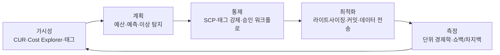

운영 리듬은 주기별로 다른 활동을 요구한다.

- **주간 비용 리뷰**: 지난 주 이상 탐지 알림 검토, 예산 80% 도달 항목 확인, 신규 배포로 인한 비용 변화 점검. 참석자는 FinOps 실무자와 관련 엔지니어링 팀 대표.
- **월간 쇼백 보고**: 팀별·서비스별 단위 비용 추이를 정리해 엔지니어링 리더십과 재무 부서에 공유. 전월 대비 변화의 원인(트래픽 증가 vs 비효율)을 구분해 설명한다.
- **분기 커밋 재평가**: RI/Savings Plans 커버리지와 활용률을 점검하고, 워크로드 변화에 맞춰 커밋을 조정·갱신한다(→ 17장 참조).

역할과 책임은 RACI로 명확히 나눈다.

| 활동 | FinOps 실무자 | 엔지니어링 | 재무 | 경영진 |
|---|---|---|---|---|
| 태그 정책 수립 | R | C | I | I |
| 예산·알림 설정 | R/A | C | C | I |
| 라이트사이징 실행 | C | R/A | I | I |
| 커밋 구매 승인 | R | C | C | A |
| 절감 목표 수립 | R | C | C | A |

절감 목표는 총액 절감률보다 단위 비용 개선률로 설정하는 것이 성장 중인 조직에 더 정확한 신호를 준다(예: "요청당 비용을 분기마다 5% 낮춘다"). 목표를 팀 단위로 쪼개고 월간 쇼백 보고에 실적을 함께 게시해야 추적이 유지된다.

FinOps 문화가 실패하는 전형적인 이유는 세 가지다. 첫째, 비용 데이터를 재무팀만 보고 엔지니어에게 전달하지 않아 실제 설계 결정에 영향을 주지 못하는 경우. 둘째, 절감을 일회성 캠페인으로 취급해 다음 분기부터 다시 낭비가 쌓이는 경우. 셋째, 절감 목표를 달성하기 위해 **가용성이나 보안을 훼손하는 조치**로 도피하는 경우 — Multi-AZ 구성을 단일 AZ로 되돌리거나, 로그를 규정 준수 기간보다 일찍 삭제하거나, 백업 보관 기간을 임의로 줄이는 것은 절감이 아니라 장애·감사 실패라는 형태로 리스크를 미래로 이전하는 것일 뿐이다. FinOps의 목표는 "가장 싸게" 운영하는 것이 아니라 "필요한 신뢰성·보안 수준을 유지하면서 가장 효율적으로" 운영하는 것이다.

### 40장 정리

#### [필수] 반드시 알아야 할 것
1. CUR은 모든 비용 분석의 원천 데이터이며 Athena·QuickSight로 커스텀 분석한다. Cost Explorer는 일상적인 조회·예측에, Data Exports는 외부 웨어하우스 적재에 쓴다.
2. 비용 배분 태그는 **활성화 이전 사용분에 소급 적용되지 않는다**. 신규 계정에서는 태그 정책을 초기에 확정하고 즉시 활성화해야 한다.
3. 태그 없는 리소스는 비용 귀속이 불가능하다. 태그 정책 + Config 규칙 + 배포 게이트의 3중 강제가 FinOps의 전제 조건이다.
4. Budgets는 비용·사용량·RI/SP 커버리지·활용률 네 유형을 지원하며, 실제(actual)와 예측(forecasted) 기준 알림을 함께 걸어야 조기 경보가 된다. 50/80/100% 비율 알림이 표준 패턴이다.
5. 비용 최적화는 우선순위가 있다 — 대체로 ① 유휴/미사용 리소스 제거 ② 라이트사이징 ③ 데이터 전송 최적화가 초기 상위권에 든다. 컴퓨트 단가 협상보다 이 순서를 먼저 본다.
6. "월 총액"이 아니라 **요청당·테넌트당·주문당 단위 비용**을 추적해야 성장 중에도 효율 여부를 판단할 수 있다.
7. 쇼백은 보여주기, 차지백은 실제 예산 차감이다. 배분 데이터가 신뢰할 만해지기 전에 차지백을 강행하면 조직 신뢰만 깎인다.

#### [팁] 실무 노하우
1. 개발·테스트 환경의 야간·주말 자동 정지를 조직 정책으로 강제하면 비개발 시간 비용의 절반 이상을 줄일 수 있다. 개별 팀 자율에 맡기면 실행률이 떨어진다.
2. Cost Anomaly Detection은 사람이 임계값을 정하지 않아도 되므로, Budgets의 고정 임계값 알림과 상호 보완적으로 함께 쓴다.
3. 인프라 변경 PR에 예상 비용 영향을 자동 코멘트로 남기면, 월말 보고서보다 훨씬 빠르게 엔지니어의 설계 결정에 영향을 준다.
4. Service Catalog로 승인된 인스턴스 크기만 카탈로그에 노출하면, 개발자의 셀프서비스 자유를 해치지 않으면서도 과대 사이징을 원천 차단할 수 있다(→ 39장 참조).
5. 신규 워크로드는 출시 전 Pricing Calculator로 단위 비용을 미리 추정해두고, 출시 후 실제 단위 비용과 비교해 설계 가정의 오차를 검증한다.
6. TTL 태그와 자동 정리 Lambda를 조합하면 "누가 만들고 아무도 지우지 않는" 임시 리소스 누적을 구조적으로 막을 수 있다.

#### [주의] 사고·비용·설계 함정
1. 비용 절감이 가용성·보안을 훼손하면 그것은 절감이 아니라 리스크 이전이다. Multi-AZ 제거, 로그 조기 삭제, 백업 보관 기간 축소는 절대 절감 수단으로 쓰지 않는다.
2. 태그 없는 리소스가 쌓인 상태로 차지백을 도입하면 팀 간 형평성 시비만 낳는다. 배분 정확도가 낮을 때는 쇼백에 머문다.
3. 무기한 CloudWatch Logs 보존은 조용히 누적되는 대표적 낭비다. 단, 규정 준수상 장기 보존이 필요한 로그 그룹까지 일괄 축소하면 감사 실패로 이어지므로 화이트리스트를 반드시 둔다.
4. 유휴 NAT 게이트웨이·미연결 EIP·방치된 스냅샷은 개별로는 소액이지만 계정 수·리소스 수가 늘수록 누적 규모가 커진다. 정기 스캔 없이는 발견되지 않는다.
5. 데이터 전송 비용은 컴퓨트 비용처럼 인스턴스 단위로 눈에 띄지 않아 설계 단계에서 누락되기 쉽다. AZ 간·리전 간 트래픽이 많은 아키텍처는 사전에 전송 비용을 견적에 포함해야 한다.
6. 절감 목표를 총액 기준으로만 세우면 트래픽 성장기에는 항상 목표 미달로 보인다. 단위 비용 개선률로 목표를 세워야 정확한 신호가 된다.
7. Budget Actions로 SCP·IAM을 자동 적용할 때 예외 없이 전체 워크로드를 막으면 장애 대응 중인 팀까지 발이 묶일 수 있다. 긴급 예외 경로를 함께 설계한다.

#### 한 장 요약
FinOps는 가시성(CUR·Cost Explorer·태그) → 계획(예산·예측·이상 탐지) → 통제(SCP·태그 강제·승인 워크플로) → 최적화(유휴 제거·라이트사이징·커밋·데이터 전송)로 이어지는 반복 루프이며, 이 루프의 산출물을 단위 경제학으로 측정해 다시 가시성 단계로 되먹임한다. 태그 없는 리소스는 귀속 불가능하다는 것과, 절감이 가용성·보안을 훼손하면 실패라는 것이 이 장 전체를 관통하는 두 원칙이다. 월 총액이 아니라 단위 비용을 보는 조직만이 성장 중에도 효율을 판단할 수 있다.

#### 다음 장 예고
41장부터는 Part VIII "애플리케이션 아키텍처 패턴"으로 넘어가, 마이크로서비스·이벤트 기반·서버리스 등 아키텍처 스타일 전반을 정리한다.

---

