# Part VIII. 애플리케이션 아키텍처 패턴

## 41장. 아키텍처 스타일 총람  ★★★★

> **이 장에서 다루는 것**
> Part VIII의 출발점이다. 앞의 7개 Part에서 컴퓨트·네트워크·스토리지·데이터베이스·보안·운영·비용이라는 "재료"를 다뤘다. 이 장부터는 그 재료를 어떤 **모양**으로 조립할지를 다룬다.
> 레이어드·마이크로커널·파이프라인·스페이스 기반·이벤트 기반·서버리스·SOA·마이크로서비스·서비스 기반을 동일한 6항목 틀(구조 / 문제 / 장점 / 한계 / AWS 매핑 / 적합·부적합)로 비교한다. 목적은 카탈로그 암기가 아니라 **"우리 조직·우리 도메인에서 무엇을 최적화할 것인가"를 먼저 정의하고 그에 맞는 스타일을 고르는 판단력**이다.
> 심층 내용은 뒤로 넘긴다 — 마이크로서비스 전환은 42장, DDD는 43장, 데이터 관리는 44장, 통합·통신은 45장, 이벤트 기반·서버리스 심화는 48장이다.

### 41.1 소프트웨어 아키텍처란 무엇인가

실무에서 가장 쓸모 있는 정의는 **"되돌리는 비용이 큰 결정들의 집합"** 이다. 어떤 결정이 아키텍처인지는 그것이 얼마나 고차원으로 들리는지가 아니라 **6개월 뒤에 바꾸려면 얼마가 드는가**로 판별한다. "서비스 간 통신을 동기 REST로 할 것인가 비동기 이벤트로 할 것인가"는 바꿀 때 모든 호출 지점·에러 처리·일관성 모델·테스트 전략이 함께 흔들리므로 아키텍처 결정이고, "이 함수를 두 개로 쪼갤 것인가"는 리팩터링 한 번이면 되므로 설계 결정이다.

| 구분 | 아키텍처 결정 | 설계 결정 |
|---|---|---|
| 판별 기준 | 되돌리는 비용이 크다 | 국지적 리팩터링으로 되돌린다 |
| 영향 범위 | 여러 컴포넌트·팀·배포 단위 | 하나의 모듈 내부 |
| 예 | 배포 단위 경계, 데이터 소유권, 동기/비동기, 일관성 모델 | 클래스 분해, 함수 시그니처, 로그 포맷 |
| 결정 시점 | 이르다. 늦게 바꾸면 값이 폭증한다 | 늦출 수 있고, 늦추는 편이 유리할 때가 많다 |

**한 줄 결정 기준**: "6개월 뒤에 뒤집으려면 며칠이 드는가"를 묻고, 답이 "몇 주 이상"이면 아키텍처 결정으로 취급해 근거와 함께 문서로 남긴다.

아키텍처는 네 요소로 분해된다. **구조**(레이어드인가 마이크로서비스인가 — 이 장의 주제), **품질 속성(-ility)**(확장성·가용성·배포성 등 비기능 요건), **결정**("프레젠테이션은 퍼시스턴스를 직접 호출하지 못한다"처럼 지켜야 하는 규칙), **설계 원칙**(예외를 허용하는 가이드라인). 여기서 가장 자주 생략되는 것이 **근거(rationale)** 다. 결정만 남고 근거가 사라지면 새로 합류한 엔지니어는 그것을 "관행"으로 오해하고 자기 판단으로 뒤집는다. 결정 하나당 "무엇을 얻으려고 무엇을 포기했는가"를 한 문단으로 남기는 관행(ADR, Architecture Decision Record)이 아키텍처 문서의 최소 단위다.

**-ility와 스타일의 관계**가 이 장의 핵심이다. 품질 속성은 서로 충돌한다. 배포성을 극대화하려고 서비스를 잘게 쪼개면 성능이 떨어지고(함수 호출이 네트워크 호출로 바뀐다), 확장성을 극대화하면 일관성이 약해지며, 단순성을 극대화하면 진화성이 떨어진다. **모든 -ility를 동시에 최대화하는 아키텍처는 없다.** 그래서 스타일 선택은 "어느 것이 더 좋은가"가 아니라 **"무엇을 1순위로 두고 무엇을 포기할 것인가"** 의 문제이고, 실무적 방법은 **1순위를 3개까지만 선언**하는 것이다. 4개 이상이면 우선순위가 없다는 뜻이고, 갈등 상황에서 팀은 각자 판단한다.

용어도 구분한다. **스타일**은 시스템 전체의 골격이고 **패턴**은 특정 문제의 국지적 해법(서킷 브레이커, CQRS, Saga)이다. 이 장은 스타일을, 44~47장은 패턴을 다룬다.

### 41.2 레이어드(Layered) 아키텍처

**① 구조와 핵심 개념** — 기술적 관심사를 수평으로 쌓아 각 계층이 명확한 역할을 갖는다. 명시적으로 선택되지 않았을 때 기본값으로 등장하는 스타일이다.

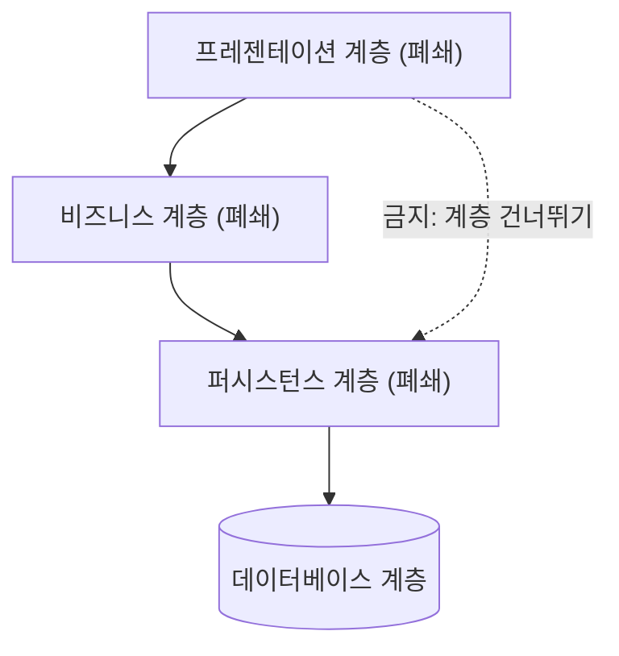

핵심 규칙은 **폐쇄 계층(closed layer)** 이다. 요청은 위에서 아래로 인접 계층만 통과하고 프레젠테이션이 퍼시스턴스를 직접 호출하는 것은 금지된다. 이 제약이 만드는 것이 **격리 계층(layers of isolation)** — 저장 기술을 교체해도 프레젠테이션 코드는 깨지지 않는다. 공유 유틸리티 같은 **개방 계층(open layer)** 을 두기도 하는데, 개방/폐쇄는 반드시 문서로 선언한다. 선언되지 않은 개방 계층은 규칙 위반의 누적일 뿐이다.

```text
com.example.orders
├── presentation/            # 계층 1: HTTP 관심사만
│   └── OrderController.java
├── business/                # 계층 2: 유스케이스·도메인 규칙
│   ├── OrderService.java
│   └── model/Order.java
├── persistence/             # 계층 3: 저장 기술 관심사만
│   ├── OrderRepository.java        # 인터페이스는 business가 소유해도 된다
│   └── jpa/JpaOrderRepository.java
└── config/DataSourceConfig.java

# 의존 방향 강제 (ArchUnit 등 아키텍처 테스트로 CI에서 검사):
#   presentation -> business -> persistence  (역방향·건너뛰기 금지)
#   presentation 패키지는 javax.persistence / jdbc 를 import 할 수 없다
```

의존 방향을 CI에서 자동 검사하지 않으면 레이어드 규칙은 반년 안에 무너진다. "규칙을 문서에 적었다"와 "규칙이 빌드를 깨뜨린다"는 완전히 다른 강도다.

**② 어떤 문제를 풀려고 나왔는가** — 기술적 관심사의 뒤섞임이다. SQL이 HTML 템플릿 안에 있고 화면 로직이 저장 프로시저 안에 있는 코드베이스는 아무도 안전하게 수정할 수 없다. 레이어드는 관심사를 기술 축으로 분리해 "어디를 고쳐야 하는지"를 예측 가능하게 만든다.

**③ 장점** — **단순성**(신규 인원이 30분에 구조를 이해한다), **낮은 총비용**(단일 배포 단위·단일 DB이므로 서비스 디스커버리·분산 트레이싱·브로커가 없다), **기술 교체 국지화**, **강한 일관성 무료**(단일 DB 트랜잭션으로 원자성을 얻어 Saga가 필요 없다 → 44장 참조).

**④ 단점·한계**
- **아키텍처 싱크홀 안티패턴**: 요청이 계층을 통과하며 아무 로직도 추가하지 않고 필드만 복사해 아래로 넘기는 경우다. 통과 요청 비율이 대체로 20% 이하면 정상 범위로 보고, 그보다 크면 계층 수를 줄이거나 일부를 개방한다. 모든 요청이 싱크홀이면 계층은 비용만 만든다.
- **배포성 최악**: 한 줄 수정에 전체 재배포. 배포 실패의 영향 범위가 시스템 전체다.
- **확장 축이 하나**: 애플리케이션 전체를 복제할 수밖에 없어 "주문 처리만 10배" 같은 선택적 확장이 불가능하고, 회귀 테스트 범위도 항상 전체다.

**⑤ AWS 구현 매핑** — 핵심은 **계층이 코드 안의 패키지 경계이고 배포는 하나**라는 점이다. 계층별로 인프라를 나누는 것이 아니다.

프레젠테이션의 정적 자산만 CloudFront + S3로 물리적으로 분리하고 ALB(L7)로 라우팅하며, 세 계층 전부는 ECS on Fargate 서비스 1개(또는 ASG + EC2)의 단일 이미지 안에 들어간다. 캐시는 ElastiCache(Redis/Valkey 호환)를 퍼시스턴스 계층에서만 접근하고, 데이터베이스는 RDS 또는 Aurora를 Multi-AZ로 둔다. 가용성 수단은 Multi-AZ, 읽기 확장 수단은 리드 리플리카로 목적이 다르다는 점을 혼동하지 않는다.

확장은 애플리케이션 전체 복제뿐이므로 ECS 오토스케일링을 CPU·요청 수 기준으로 걸되, **인스턴스 수를 늘릴수록 RDS 커넥션이 선형으로 늘어 데이터베이스가 먼저 무너지는 것**이 전형적 실패 지점이다(RDS Proxy로 완화 → 47장 참조).

**⑥ 적합/부적합** — 적합: 도메인이 아직 불확실한 신규 제품(→ 42장), 인원 10명 이하 단일 팀, 백오피스·CRUD 중심 업무 시스템. 부적합: 팀이 5개 이상이고 배포 일정을 서로 기다리는 상황, 도메인별 확장 요구가 10배 이상 갈리는 시스템, 하루 여러 번 무중단 배포가 필요한 제품.

### 41.3 마이크로커널/플러그인 아키텍처

**① 구조와 핵심 개념** — 최소한의 **코어 시스템**과, 코어가 정의한 계약을 구현하는 **플러그인**으로 구성된다. 제품 기반(product-based) 소프트웨어의 대표 스타일이다.

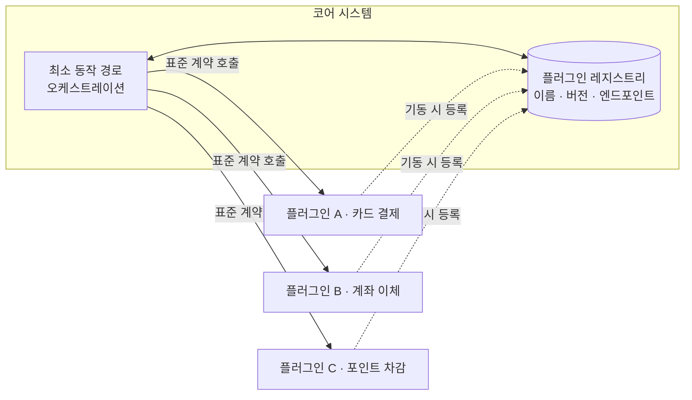

성립 조건은 셋이다. **계약(contract)** 은 코어가 플러그인에 요구하는 인터페이스로 입력·출력·에러 형태·타임아웃까지 포함한다. **레지스트리(registry)** 는 어떤 플러그인이 어떤 버전으로 어디에 있는지의 목록으로, 코어는 플러그인을 코드가 아니라 레지스트리를 통해 안다. **버전 관리**는 계약이 진화할 때 기존 플러그인을 깨뜨리지 않도록 v1·v2 동시 지원 기간(deprecation window)을 두는 것이다.

```python
# 마이크로커널: 코어가 정의하는 플러그인 계약과 레지스트리
from abc import ABC, abstractmethod
from dataclasses import dataclass

CONTRACT_VERSION = "2"          # 계약 버전은 코어가 소유하고 코어만 올린다

@dataclass(frozen=True)
class PaymentRequest:
    order_id: str
    amount_krw: int

@dataclass(frozen=True)
class PaymentResult:
    approved: bool
    provider_ref: str | None
    failure_code: str | None = None      # 실패 코드도 계약의 일부다

class PaymentPlugin(ABC):   # 코어는 이 타입만 알고 구체 클래스는 모른다
    name: str
    contract_version: str

    @abstractmethod
    def supports(self, req: PaymentRequest) -> bool: ...

    @abstractmethod
    def charge(self, req: PaymentRequest) -> PaymentResult:
        """계약: 예외를 던지지 않고 항상 PaymentResult 로 실패를 표현한다."""

class PluginRegistry:
    def __init__(self) -> None:
        self._plugins: dict[str, PaymentPlugin] = {}

    def register(self, plugin: PaymentPlugin) -> None:
        # 계약 버전 불일치를 등록 시점에 거부한다.
        # 이 검사가 없으면 런타임에 정체불명의 오류로 나타난다.
        if plugin.contract_version != CONTRACT_VERSION:
            raise ValueError(f"{plugin.name}: 코어 계약 v{CONTRACT_VERSION} 과 비호환")
        self._plugins[plugin.name] = plugin

    def resolve(self, req: PaymentRequest) -> PaymentPlugin:
        for p in self._plugins.values():
            if p.supports(req):
                return p
        raise LookupError("처리 가능한 결제 플러그인이 없다")
```

**② 어떤 문제를 풀려고 나왔는가** — "핵심 기능은 안정적인데 확장 기능은 계속 늘어나고, 그 확장을 우리가 아닌 남이 만든다"는 문제다. IDE는 언어 지원을 무한히 늘려야 하지만 편집기 코어는 안정적이어야 하고, 결제 게이트웨이는 결제 수단이 매년 추가되지만 주문·정산 흐름은 그대로다. 확장을 코어 수정으로 처리하면 코어 안정성이 매번 흔들린다.

**③ 장점** — **높은 진화성**(새 기능이 새 플러그인 추가로 끝나고 코어는 손대지 않는다), **선택적 배포**, **테스트 범위 축소**(계약을 목으로 대체해 코어를 독립 테스트한다), **외부 개발 개방**(서드파티가 코어 소스를 몰라도 확장을 만든다 — 마켓플레이스 모델의 기반), **낮은 비용**.

**④ 단점·한계**
- **계약 설계가 병목**: 너무 좁으면 플러그인이 일을 못 하고, 너무 넓으면 코어 내부를 노출해 코어를 못 바꾼다. 계약 설계 실패는 되돌리기가 매우 비싸다.
- **확장성·탄력성 취약**: 특정 플러그인만 확장하려면 플러그인을 별도 배포 단위로 분리해야 하고, 그 시점에 사실상 다른 스타일로 넘어간다.
- **격리 부족**: 인프로세스 플러그인은 코어와 메모리·스레드를 공유하므로 플러그인 하나의 무한 루프가 코어를 죽인다.

**⑤ AWS 구현 매핑** — 코어는 ECS on Fargate 또는 Lambda가 오케스트레이션을 맡고, **플러그인은 하나당 Lambda 함수 1개**로 두어 격리·독립 배포·개별 확장을 함께 얻는다. **레지스트리는 `plugin_name`을 파티션 키로 하는 DynamoDB 테이블**에 계약 버전·함수 ARN·활성 여부를 담는다(단건 조회 지연이 낮고 항목 400KB 한도 안에서 충분하다). 배포 없이 플러그인을 켜고 끄는 기능 플래그는 **AppConfig**, 공유 계약 코드는 Lambda 레이어, 여러 플러그인을 엮는 체인은 Step Functions로 구현한다.

**⑥ 적합/부적합** — 적합: IDE·에디터·브라우저 확장, 결제 게이트웨이(결제 수단 = 플러그인), 룰 엔진·보험 언더라이팅(규칙 = 플러그인), 세금·규제 계산기, 데이터 커넥터 허브. 부적합: 확장 지점이 없는 도메인, 플러그인마다 데이터 모델이 달라 계약이 성립하지 않는 경우, 플러그인이 3개 이하로 고정된 경우(계약 관리 비용이 이득보다 크다).

### 41.4 파이프라인 아키텍처

**① 구조와 핵심 개념** — **파이프와 필터(pipes and filters)** 로도 불린다. 데이터가 단방향으로 흐르고, 각 필터는 하나의 변환만 수행하며, 파이프는 필터 간 전달 통로다.

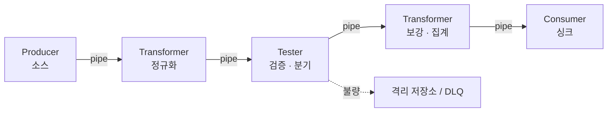

필터는 네 유형으로 구분한다. **Producer**는 시작점으로 출력만 있고(로그 수집기, DB CDC), **Transformer**는 입력을 변환해 출력하며(포맷 변환, 마스킹), **Tester**는 변환 없이 조건만 검사해 분기시키고(스키마 검증, 중복 판별), **Consumer**는 종점으로 입력만 있다(S3 적재, 인덱싱).

성립 조건은 **필터가 상태를 공유하지 않고, 각자 하나의 책임만 지며, 흐름이 단방향**이라는 것이다. 필터가 역방향 호출을 시작하면 파이프라인이 아니라 결합된 컴포넌트 뭉치가 된다.

**② 어떤 문제를 풀려고 나왔는가** — 변환 로직이 하나의 거대한 스크립트로 뭉쳐지는 문제다. 읽고·정제하고·조인하고·집계하고·적재하는 500줄 스크립트는 중간만 바꿀 수 없고, 실패 지점을 모르고, 일부만 재실행할 수 없다. 파이프라인은 각 변환을 독립 단위로 쪼개 **교체·재사용·부분 재실행**을 가능하게 한다. 유닉스 셸 파이프(`cat | grep | sort | uniq`)가 원형이다.

**③ 장점** — **조합성·재사용성**("마스킹 필터"를 여러 파이프라인에서 재사용한다), **테스트성 우수**(필터가 입력 → 출력의 순수 함수에 가깝다), **부분 재실행**(실패 단계부터 재개한다), **필터 단위 확장**(병목 필터만 병렬도를 올린다 — 이 점에서 레이어드보다 유리하다).

**④ 단점·한계**
- **동기 요청/응답에 부적합**: 사용자 요청을 즉시 응답해야 하는 경로에는 단계 수만큼 지연이 누적된다.
- **내결함성 취약**: 중간 필터가 죽으면 뒤가 멈춘다. 단계마다 재시도·DLQ를 붙이지 않으면 데이터 유실이 생긴다.
- **탄력성 제한**: 단계 간 버퍼가 없으면 가장 느린 단계가 전체 처리량을 결정한다.

**⑤ AWS 구현 매핑** — 파이프의 성격에 따라 선택이 갈린다.

| 파이프(전달 수단) | 서비스 | 적합한 상황 |
|---|---|---|
| 스트리밍 | Kinesis Data Streams, Amazon MSK | 순서 보장, 여러 소비자가 독립 오프셋으로 읽는다 |
| 버퍼 | Amazon SQS | 단계 간 완충. 순서가 필요하면 FIFO 큐 |
| 배치 | S3 이벤트 알림, AWS Glue 워크플로 | 파일 단위, 시간당·일별 처리 |
| 오케스트레이션 | AWS Step Functions | 분기·병렬·재시도·타임아웃을 선언적으로 |
| 소스-타깃 연결 | Amazon EventBridge Pipes | 소스와 타깃 사이 필터·보강을 코드 없이 |
| 적재 | Amazon Data Firehose | S3/OpenSearch/Redshift 버퍼링 적재, 포맷 변환 |

필터는 대체로 Lambda(단건·초 단위 변환), Glue 작업(대용량 Spark 변환), ECS 작업(장시간·커스텀 런타임)으로 구현한다. Lambda는 실행 시간 상한(현재 15분)과 페이로드 크기 제약이 있으므로 대용량 파일 변환은 S3 참조만 전달하고 Glue·ECS에서 처리하는 것이 정석이다(정확한 한도는 서비스 할당량 문서를 확인한다).

```json
{
  "Comment": "일별 주문 ETL 파이프라인 - Tester 단계에서 불량을 격리한다",
  "StartAt": "ExtractToStaging",
  "States": {
    "ExtractToStaging": {
      "Type": "Task",
      "Resource": "arn:aws:states:::glue:startJobRun.sync",
      "Parameters": {
        "JobName": "orders-extract",
        "Arguments": { "--run_date.$": "$.runDate" }
      },
      "ResultPath": "$.extract",
      "Next": "ValidateSchema"
    },
    "ValidateSchema": {
      "Type": "Task",
      "Resource": "arn:aws:states:::lambda:invoke",
      "Parameters": {
        "FunctionName": "arn:aws:lambda:ap-northeast-2:123456789012:function:orders-validate",
        "Payload": { "stagingPath.$": "$.extract.Arguments" }
      },
      "ResultSelector": { "badRatio.$": "$.Payload.badRecordRatio" },
      "ResultPath": "$.validation",
      "Next": "QualityGate"
    },
    "QualityGate": {
      "Type": "Choice",
      "Choices": [
        { "Variable": "$.validation.badRatio", "NumericGreaterThan": 0.05, "Next": "Quarantine" }
      ],
      "Default": "TransformAndLoad"
    },
    "TransformAndLoad": {
      "Type": "Task",
      "Resource": "arn:aws:states:::glue:startJobRun.sync",
      "Parameters": { "JobName": "orders-transform-load" },
      "Retry": [
        { "ErrorEquals": ["States.TaskFailed"], "IntervalSeconds": 30, "MaxAttempts": 2, "BackoffRate": 2.0 }
      ],
      "End": true
    },
    "Quarantine": {
      "Type": "Fail",
      "Error": "DataQualityGateFailed",
      "Cause": "불량 레코드 비율이 임계값을 초과해 파이프라인을 중단한다"
    }
  }
}
```

**각 단계에 `Retry`와 품질 게이트를 선언적으로 붙였다**는 점이 핵심이다. 파이프라인의 내결함성 취약점은 이렇게 상당 부분 메꿀 수 있다.

**⑥ 적합/부적합** — 적합: ETL·ELT 배치, 로그·메트릭 수집·정제, 미디어 트랜스코딩, IoT 텔레메트리, 문서 처리(OCR → 추출 → 분류 → 인덱싱). 부적합: 사용자 대면 동기 요청, 단계 간 상호 대화가 필요한 워크플로, 종단 지연 100ms 이하 요구 경로.

### 41.5 스페이스 기반(Space-based) 아키텍처

**① 구조와 핵심 개념** — 이름은 "튜플 스페이스"에서 왔다. 핵심 발상은 **요청 처리 경로에서 데이터베이스를 완전히 제거**하는 것이다. 처리 유닛이 인메모리 데이터 그리드를 읽고 쓰고, 데이터베이스 반영은 비동기로 뒤에서 일어난다.

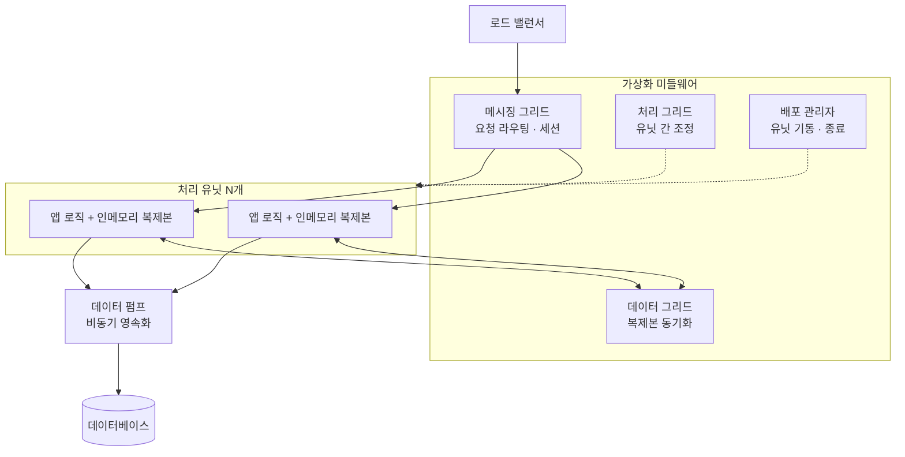

가상화 미들웨어는 네 그리드로 구성된다. **메시징 그리드**는 요청 라우팅과 세션을, **데이터 그리드**는 처리 유닛들의 인메모리 복제본 동기화를(이 스타일의 심장이다), **처리 그리드**는 여러 유닛에 걸친 요청 조정을(선택적), **배포 관리자**는 부하에 따른 유닛 기동·종료를 맡는다. **데이터 펌프(data pump)** 는 처리 유닛의 변경을 비동기로 데이터베이스에 흘려보내며, 이 비동기 반영이 전제인 **최종 일관성**을 만든다. 데이터베이스의 값은 항상 "조금 전"의 값이고 진실은 인메모리 그리드에 있다.

**② 어떤 문제를 풀려고 나왔는가** — **데이터베이스가 확장의 절대 상한이 되는 문제**다. 애플리케이션 서버는 100대로 늘릴 수 있지만 관계형 데이터베이스 쓰기 노드는 하나다. 티켓 오픈, 경매 마감처럼 **평소의 수백 배 트래픽이 예고 없이 몰리는** 워크로드에서는 어떤 DB 튜닝도 부족하다.

**③ 장점** — **극단적 확장성·탄력성**(처리 유닛 추가에 처리량이 거의 선형으로 늘어난다), **최고 수준의 성능**(모든 데이터 접근이 메모리에서 일어난다), **급증 대응**, **DB 장애 내성**(요청 경로에 DB가 없으므로 DB가 잠시 죽어도 서비스는 계속된다).

**④ 단점·한계**
- **최고 수준의 복잡성**: 이 목록에서 가장 구축·운영이 어렵다. 복제 충돌, 캐시 워밍, 유닛 재기동 시 상태 복구를 직접 다뤄야 한다.
- **강한 일관성 포기가 전제**: 재무 결산, 규제 보고, 즉시 정확성이 요구되는 트랜잭션에는 그대로 쓸 수 없다.
- **테스트성 최악**: "10만 동시 요청에서 그리드 복제가 정확한가"를 검증하려면 프로덕션급 부하 환경이 필요하다.
- **높은 비용과 데이터 손실 위험**: 유닛 수 × 데이터 크기만큼 메모리를 사야 하고, 펌프가 반영하지 못한 변경은 그리드 손실 시 사라진다.

**⑤ AWS 구현 매핑**

| 요소 | AWS 구성 | 주의점 |
|---|---|---|
| 처리 유닛 | ASG + EC2, 또는 큰 메모리를 할당한 ECS 태스크 | 인스턴스 스토어는 종료 시 데이터가 소멸한다 |
| 데이터 그리드 | **Amazon MemoryDB**(Redis/Valkey 호환, 내구성 있는 Multi-AZ 트랜잭션 로그) 또는 ElastiCache | 손실을 감당할 수 없다면 캐시 성격의 ElastiCache 대신 MemoryDB를 검토한다 |
| 메시징 그리드 | NLB(L4, 초고성능·정적 IP) 또는 ALB(L7) + SQS/SNS | 세션 고정이 필요하면 ALB 스티키 세션 |
| 배포 관리자 | ASG 정책, ECS 오토스케일링, 예정·예측 스케일링 | 시각이 알려진 급증에는 예정 스케일링 |
| 데이터 펌프 | Kinesis Data Streams → Lambda → Aurora, 또는 SQS → ECS 워커 | 펌프 지연이 곧 손실 창이다. 반드시 모니터링 |
| 영속 저장소 | Aurora(스토리지를 3개 AZ에 6중 복제), DynamoDB | 요청 경로가 아니라 펌프 경로에서만 접근 |

```bash
# 티켓 오픈처럼 시각이 알려진 급증 대비: 예정 스케일링으로 미리 처리 유닛을 확보한다
# 인메모리 그리드는 워밍 시간이 필요하므로 트래픽보다 먼저 떠 있어야 한다
aws application-autoscaling put-scheduled-action \
  --service-namespace ecs \
  --resource-id service/ticketing-prod/processing-unit \
  --scalable-dimension ecs:service:DesiredCount \
  --scheduled-action-name ticket-open-prewarm \
  --schedule "at(2026-09-20T09:40:00)" \
  --scalable-target-action MinCapacity=60,MaxCapacity=200 \
  --region ap-northeast-2
```

인메모리 그리드를 진실의 원천으로 삼으면 **데이터 손실 창**이 생긴다. 최소한 "펌프 지연 = 최대 손실 데이터량"을 계산해 사업 측과 합의해야 한다.

**⑥ 적합/부적합** — 적합: 티켓·좌석 예매 오픈, 온라인 경매 마감, 실시간 입찰(RTB) 광고 서버, 대규모 온라인 게임 세션 상태. 부적합: 트래픽이 완만하고 예측 가능한 시스템(비용만 지불한다), 강한 일관성이 규제 요건인 금융 원장, 분산 캐시 운영 경험이 없는 조직.

### 41.6 이벤트 기반(Event-driven) 아키텍처

**① 구조와 핵심 개념** — 컴포넌트가 서로를 직접 호출하지 않고 **"일어난 일(event)"을 발행하고 관심 있는 쪽이 구독**한다. 토폴로지는 두 종류이고, 이 구분이 실무에서 가장 중요하다.

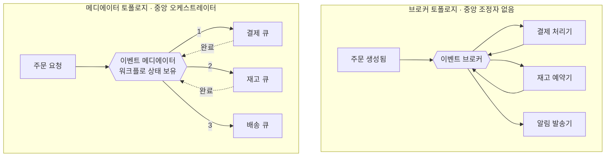

**브로커 토폴로지**는 중앙 조정자 없이 각 처리기가 이벤트를 받아 일하고 결과 이벤트를 다시 발행해 체인이 이어진다. 결합도가 가장 낮고 확장이 쉽지만 **전체 워크플로가 어디에도 명시되지 않아** 실패 시 어디까지 진행됐는지 재구성하기 어렵고 보상 처리는 각 처리기 몫이다. **메디에이터 토폴로지**는 워크플로를 아는 중앙 컴포넌트가 단계를 지시하고 결과를 수집한다. 오류 처리·보상·재시도를 한곳에서 관리하고 워크플로가 눈에 보이지만, 메디에이터가 결합점이자 병목이 된다.

**한 줄 결정 기준**: 워크플로가 단순하고 각 단계가 독립적이면 브로커, 여러 단계에 걸친 오류 처리·보상·상태 추적이 필요하면 메디에이터. 실무에서는 대체로 혼합해 도메인 간은 브로커, 도메인 내부의 복잡한 트랜잭션은 메디에이터로 쓴다.

**② 어떤 문제를 풀려고 나왔는가** — "기능을 추가할 때마다 기존 코드를 고쳐야 하는" 결합 문제다. 주문 완료 후 알림을 보내려면 주문 서비스를 고치고, 다음 달엔 적립금, 그다음엔 웨어하우스 적재·추천 모델·파트너 정산… 주문 서비스는 자신과 무관한 여섯 개 시스템의 존재를 알게 된다. 이벤트 기반은 "주문이 완료되었다"만 발행하게 하고 나머지는 각자 구독하게 만든다.

**③ 장점** — **최고 수준의 결합도 감소**(발행자는 구독자가 몇 개인지도 모른다), **높은 진화성**(새 소비자 추가가 기존 코드 수정 없이 끝난다), **높은 확장성·탄력성**, **내결함성**(소비자가 죽어도 이벤트는 큐/스트림에 남아 복구 후 이어서 처리된다), **응답성**.

**④ 단점·한계**
- **디버깅·추적 난이도**: "이 주문은 왜 처리되지 않았나"를 답하려면 여러 시스템 로그를 시간축으로 이어 붙여야 한다. 분산 트레이싱과 상관관계 ID 없이는 사실상 불가능하다.
- **최종 일관성 강제**: 전파 중 시스템 상태가 서로 불일치한다. UI와 사업 규칙이 이를 감당해야 한다.
- **테스트성 저하**: 계약 테스트·스키마 레지스트리 없이는 소비자를 깨뜨리는 변경을 배포 전에 잡을 수 없다.
- **중복·순서 문제**: 대부분의 전달 보장은 "최소 한 번"이므로 소비자는 멱등해야 한다.

**⑤ AWS 구현 매핑**

브로커 역할은 내용 기반 규칙 라우팅·스키마 레지스트리·서드파티 통합을 갖춘 **EventBridge**, 단순 팬아웃은 **SNS**(+ SQS 구독), 소비자별 독립 재시도·DLQ가 필요한 버퍼는 **SQS**(표준/FIFO)가 맡는다. 순서 보장·재생(replay)·소비자별 독립 오프셋이 필요하면 **Kinesis Data Streams**나 **Amazon MSK**를, 메디에이터는 **Step Functions**를 쓰고, 소비자는 처리 시간·런타임 요구에 따라 Lambda·ECS·EKS로 실행한다.

이벤트 스키마 설계·버저닝, 재생·순서·중복·DLQ 처리는 → **48장**, 서비스 선택 결정표는 → **45.10** 참조.

**⑥ 적합/부적합** — 적합: 하나의 사건에 여러 후속 처리가 붙는 도메인(주문·결제 완료·사용자 가입), 시스템 간 통합 허브, 실시간 분석·이상 탐지, 감사 추적이 요구되는 업무. 부적합: 결과를 즉시 화면에 보여줘야 하는 단순 CRUD, 강한 원자성이 필요한 단일 도메인 연산, 분산 트레이싱·중앙 로깅이 없는 조직.

### 41.7 서버리스 아키텍처

**① 구조와 핵심 개념** — **FaaS(Function as a Service) + 관리형 백엔드**로 시스템을 구성하고 서버·용량·패치를 아예 다루지 않는다. 엄밀히는 배포·운영 모델이지만 실무에서 아키텍처 형태 자체를 규정하므로 스타일로 다룰 값이 있다.

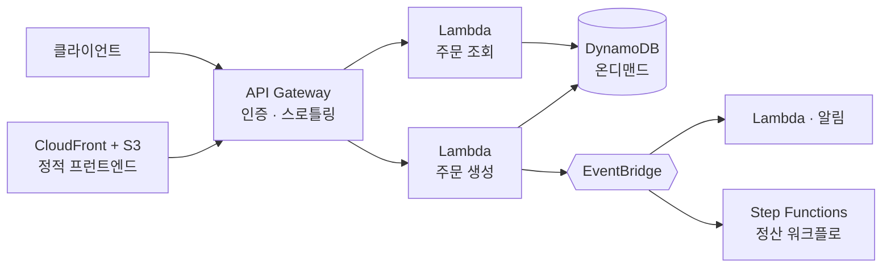

핵심 특징은 **요청 단위 과금**(유휴 시 비용이 0에 가깝다), **자동 확장**(용량 계획이 없다), **상태 없음**(함수가 상태를 보유하지 못하므로 모든 상태가 관리형 저장소로 밀려난다) 세 가지다.

**② 어떤 문제를 풀려고 나왔는가** — 첫째, **유휴 자원 비용**. 트래픽이 하루 몇 시간만 몰리는 시스템도 24시간 서버를 띄워야 했다. 둘째, **운영 부담**. 패치·용량 계획·오토스케일링 튜닝은 사업 가치를 만들지 않는데 팀 시간의 상당량을 먹는다.

**③ 장점** — **비용 모델의 정합성**(사용량과 비용이 거의 선형이고 트래픽이 0이면 컴퓨트 비용도 0에 가깝다), **운영 부담 최소화**(소규모 팀이 큰 시스템을 운영할 수 있는 가장 현실적인 경로다), **높은 배포성**, **탄력성·내결함성**(관리형 서비스가 다중 AZ 이중화를 기본 제공한다).

**④ 단점·한계**
- **콜드 스타트**: 유휴 후 첫 호출에 초기화 지연이 붙는다. 지연에 민감한 동기 경로는 프로비저닝된 동시성으로 대응한다.
- **상태 없음의 대가**: 세션·캐시·워크플로 상태를 외부 저장소로 보내야 하고, 호출당 저장소 왕복이 지연과 비용을 만든다.
- **실행 시간·크기 한도**: Lambda 실행 시간 상한(현재 15분), 페이로드 크기, 임시 디스크 용량이 아키텍처를 규정한다. 장시간 작업은 Step Functions로 쪼개거나 컨테이너로 옮긴다. 한도는 변경될 수 있으니 서비스 할당량 문서를 확인한다.
- **대규모 정상 부하에서 비용 역전**: 24시간 고정 부하가 크면 커밋 할인을 적용한 컨테이너·EC2가 대체로 더 싸다(→ 48.9 참조).

**⑤ AWS 구현 매핑** — 컴퓨트는 Lambda·Fargate, 진입점은 API Gateway·AppSync(GraphQL)·함수 URL, 데이터는 DynamoDB(온디맨드)·Aurora Serverless v2·S3, 워크플로는 Step Functions(표준/Express), 이벤트는 EventBridge·SNS·SQS, 인증은 Cognito, 정적 호스팅은 S3 + CloudFront, 배포는 SAM·CDK다. Lambda 실행 모델·동시성 튜닝은 → **18장**, 관측성·비용 임계점은 → **48장** 참조.

**⑥ 적합/부적합** — 적합: 간헐적·예측 불가 트래픽 API, 이벤트 처리·글루 코드, 배치·스케줄 작업, 운영 인력이 없는 스타트업 초기 제품, 내부 도구·웹훅 수신기. 부적합: 24시간 균일 고부하(비용 역전), 한 자릿수 밀리초 지연이 필수인 동기 경로, 15분 초과 단일 연산, 멀티클라우드 이식성이 계약 요건인 경우.

### 41.8 SOA와 엔터프라이즈 서비스

**① 구조와 핵심 개념** — 2000년대 엔터프라이즈의 지배적 스타일이었다. 정확한 이름은 **오케스트레이션 주도 서비스 지향 아키텍처**다. 서비스를 추상화 수준으로 계층화하고 중앙의 **ESB(Enterprise Service Bus)** 가 모든 통신을 매개한다.

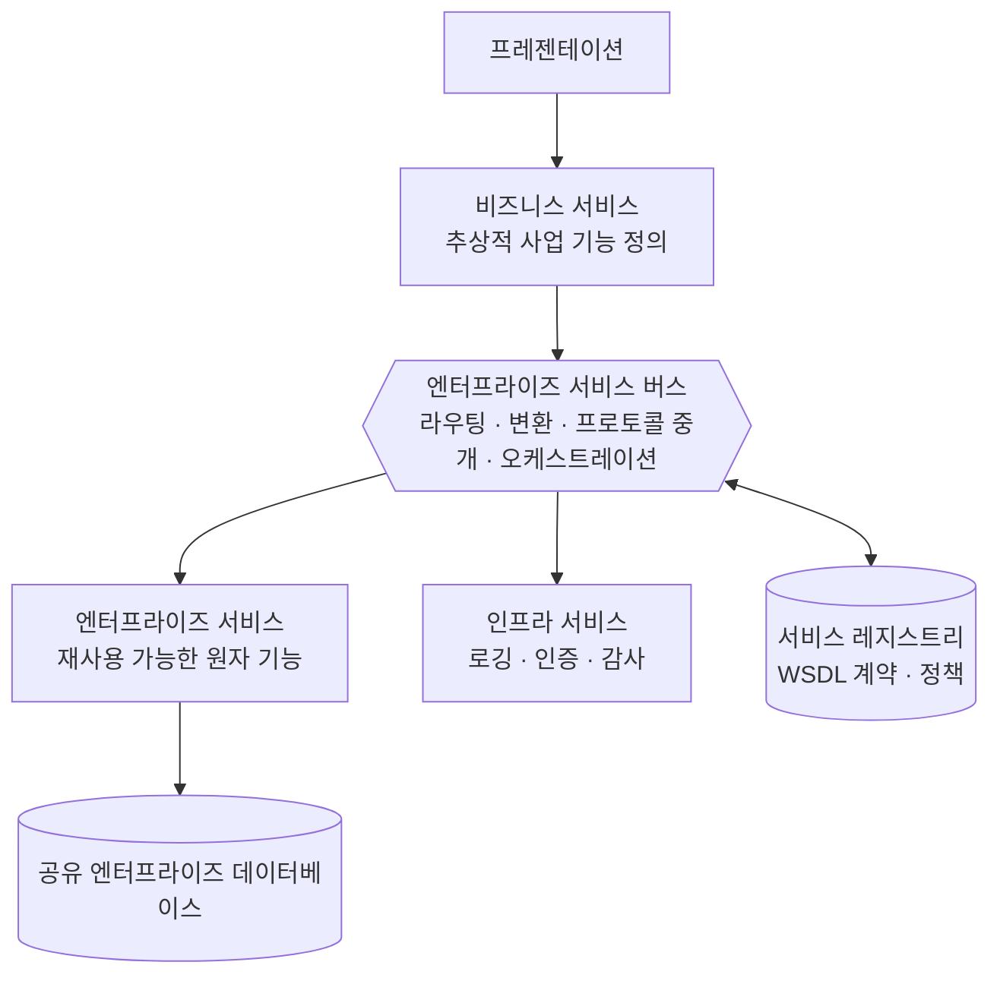

서비스는 네 계층이다. **비즈니스 서비스**는 코드가 없는 추상적 사업 기능 정의("보험 견적 산출"), **엔터프라이즈 서비스**는 재사용 가능한 원자 구현("고객 조회"), **애플리케이션 서비스**는 재사용되지 않는 단발 기능, **인프라 서비스**는 로깅·인증 같은 횡단 기능이다. 조직적 특징은 **거버넌스 중심**이다 — 계약(WSDL/XSD)은 중앙 레지스트리에 등록되고, 심의 위원회가 신규 서비스를 승인하며, 재사용은 정책으로 강제된다.

**② 어떤 문제를 풀려고 나왔는가** — **대기업의 시스템 사일로와 중복**이다. 부서별로 만든 시스템이 각자 고객 정보를 갖고, 서로 다른 프로토콜(SOAP, MQ, 파일 전송, 메인프레임)로 말하며, 같은 로직이 일곱 곳에 중복 구현되어 있다. SOA는 이것을 **표준 계약 + 중앙 통합 지점 + 재사용 강제**로 정리하려 했고, 프로토콜 이질성 흡수와 M&A 시스템 통합에는 실제로 효과가 있었다.

**③ 장점** — **레거시·이질 프로토콜 통합**(ESB의 프로토콜 변환은 메인프레임과 최신 웹 앱을 실제로 연결한다. 이 능력은 여전히 유효하다), **중복 제거**, **거버넌스·감사 용이**(모든 트래픽이 한곳을 지나 감사 지점이 명확하다 — 규제 산업의 실질적 이점), **계약의 명시성**.

**④ 단점·한계 — 왜 무거워졌는가** — SOA가 실패한 이유는 기술이 아니라 **결합의 방향을 잘못 잡았기 때문**이다.
- **ESB가 단일 실패점이자 단일 배포 병목**: 서비스 A의 라우팅 규칙 변경도 ESB 배포를 요구하고, ESB 배포는 전체 통합을 위험에 노출한다. 결과적으로 배포성이 이 목록에서 가장 낮다.
- **로직이 버스로 새어 나감**: "간단하니까"라며 변환·분기·집계를 ESB에 넣으면, 몇 년 뒤 사업 규칙의 상당량이 벤더 도구의 GUI 설정 안에 존재한다. 버전 관리도, 단위 테스트도, 코드 리뷰도 되지 않는다.
- **재사용 강제가 결합을 만듦**: 하나의 "고객 조회"를 30개 소비자가 공유하면 그것을 바꿀 때 30곳의 승인이 필요하다. **재사용을 최대화하면 변경 가능성이 최소화된다** — SOA의 근본적 역설이다.
- **공유 데이터베이스**로 스키마 변경이 모든 서비스에 파급되고, 심의 승인이 개발보다 오래 걸리며, 서비스 하나를 테스트하려면 ESB와 뒤의 여러 서비스를 함께 띄워야 한다.

**⑤ AWS 구현 매핑** — AWS에서 SOA를 새로 짓는 일은 거의 없다. 매핑의 목적은 **기존 SOA/ESB에서 옮겨 나오는 경로**를 아는 것이다.

ESB의 프로토콜 변환은 Amazon MQ와 AWS Transfer Family가 레거시 유지 기간 동안만 대신하고, 라우팅은 EventBridge 규칙(로직 없는 순수 라우팅으로 제한), 오케스트레이션은 Step Functions(워크플로가 정의 파일로 버전 관리된다)로 옮긴다. 계약과 게이트는 API Gateway + OpenAPI, 디스커버리는 AWS Cloud Map·ECS Service Connect(→ 45.11), 공유 DB는 도메인별 데이터 소유권으로 분해한다(→ 44장).

마이크로서비스와의 차이를 정리하면 다음과 같다.

| 축 | SOA(오케스트레이션 주도) | 마이크로서비스 |
|---|---|---|
| 서비스 크기 | 엔터프라이즈 범위. 크고 재사용 지향 | 바운디드 컨텍스트 범위. 작고 단일 목적 |
| 통신 | ESB 경유, 중앙 집중 | 직접 호출 또는 이벤트. 스마트 엔드포인트, 덤 파이프 |
| 데이터 | 공유 엔터프라이즈 데이터베이스 | 서비스별 데이터베이스, 소유권 분리 |
| 재사용 철학 | 재사용 최대화가 목표 | **중복을 허용**하고 독립성을 우선 |
| 거버넌스 | 중앙 위원회, 사전 승인 | 팀 자율, 플랫폼이 가드레일 제공 |
| 배포 | 대체로 조정된 일괄 배포 | 서비스별 독립·상시 배포 |
| 계약 진화 | 중앙 레지스트리에서 통제 | 소비자 주도 계약 테스트, 버전 병행 |
| 조직 전제 | 기존 부서 구조 유지 | 팀이 서비스를 소유(콘웨이 법칙 활용) |

핵심 차이는 **"재사용 최대화 vs 독립성 최대화"** 다. 마이크로서비스는 중복 코드를 감수하고 변경 독립성을 산다. SOA는 반대를 선택했고, 그 결과 변경이 어려워졌다.

**⑥ 적합/부적합** — 적합: 수십 년치 레거시와 이질 프로토콜이 실재하고 당장 없앨 수 없는 대기업의 통합 계층, 중앙 감사가 규제 요건인 환경, M&A 직후의 임시 통합. 부적합: 그린필드 프로젝트, 빠른 배포 주기가 경쟁력인 제품, 팀 자율성이 문화의 핵심인 회사.

### 41.9 마이크로서비스 아키텍처

**① 구조와 핵심 개념** — **작고 독립 배포 가능한 서비스**들이 각자의 데이터를 소유하고 네트워크로 협력한다. 배포성·확장성·진화성을 가장 높게 사고 그 대가로 단순성과 성능을 지불한다.

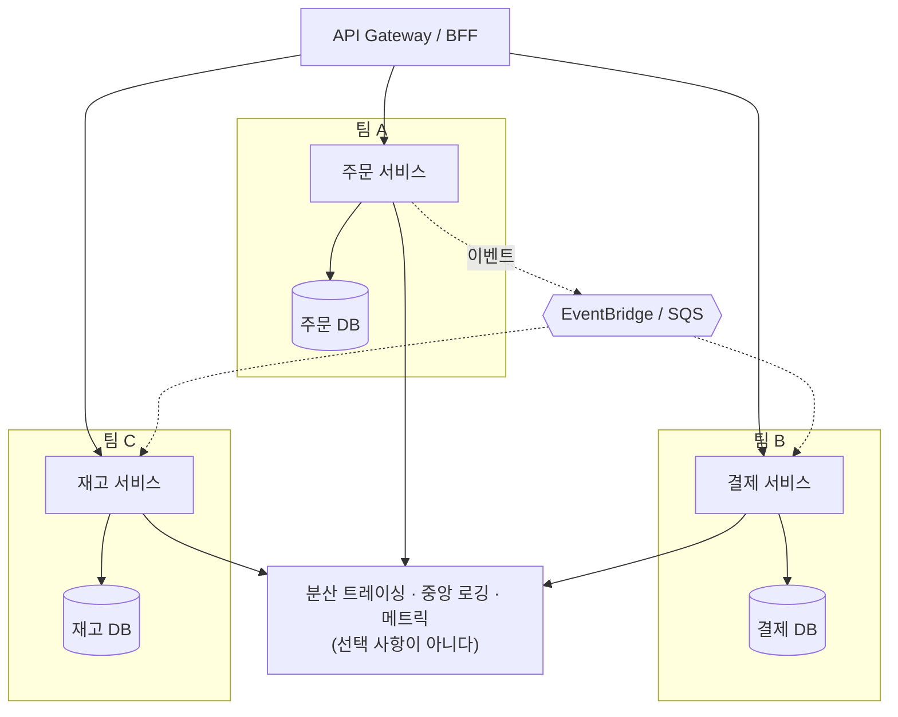

성립 조건 셋이 그림에 다 있다. **독립 배포**(다른 서비스의 릴리스를 기다리지 않는다), **독립 데이터**(다른 서비스의 테이블을 직접 읽지 않는다), **팀 정렬**(한 팀이 한 서비스를 끝까지 소유한다). 아래쪽 관측성 계층은 선택 사항이 아니다.

**② 어떤 문제를 풀려고 나왔는가** — **조직 규모가 커질 때 배포가 조직 전체의 병목이 되는 문제**다. 팀이 20개인데 배포 단위가 하나면 매 릴리스는 20개 팀의 코드를 함께 배포하는 행사가 된다. 한 팀의 버그가 전체 릴리스를 되돌리고 릴리스 주기는 가장 느린 팀에 맞춰진다. 마이크로서비스는 배포 단위를 팀 경계와 일치시켜 이 병목을 제거한다.

**③ 장점** — **최고 수준의 배포성**(서비스별 독립 배포로 하루 수십~수백 회 배포가 가능해진다), **높은 확장성·탄력성**(병목 서비스만 확장해 자원 효율이 올라간다), **높은 내결함성**(격벽·서킷 브레이커 적용 시 → 46장 참조), **높은 진화성·테스트성**, **팀 자율성**.

**④ 단점·한계**
- **최고 수준의 운영 복잡도**: 서비스 디스커버리, 분산 트레이싱, 중앙 로깅, 서킷 브레이커, 스키마 레지스트리, 파이프라인 수십 개를 모두 갖춰야 한다.
- **성능 저하**: 인프로세스 함수 호출이 네트워크 호출로 바뀌어 직렬화·왕복 지연이 호출마다 붙는다.
- **분산 트랜잭션 문제**: ACID를 쓸 수 없다. Saga·아웃박스·보상 트랜잭션이 필요하다(→ 44장 참조).
- **높은 총비용**: 서비스마다 컴퓨트·데이터베이스·파이프라인·온콜이 붙는다.
- **경계 오분해 위험**: 경계를 잘못 그으면 되돌리기가 매우 비싸다. 실패의 가장 흔한 기술적 원인이다(→ 42.4 참조).

**⑤ AWS 구현 매핑** — 런타임은 EKS·ECS(Fargate)·Lambda, 진입점은 API Gateway·ALB·AppSync, 디스커버리는 AWS Cloud Map·ECS Service Connect, 데이터는 서비스마다 별도 RDS/Aurora 클러스터 또는 DynamoDB 테이블, 비동기 통신은 EventBridge·SQS·SNS·MSK, Saga는 Step Functions, 관측성은 CloudWatch·X-Ray와 Amazon Managed Service for Prometheus·Amazon Managed Grafana, CI/CD는 서비스당 독립 파이프라인, 비밀은 Secrets Manager다. 분해 패턴·경계 결정·17가지 베스트 프랙티스·분산 모놀리스는 → **42장**, 데이터는 → **44장**, 통신·서비스 메시는 → **45장** 참조.

**⑥ 적합/부적합** — 적합: 팀이 여러 개이고 배포 조율이 실제 병목인 조직, 도메인별 확장 요구가 크게 다른 시스템, 경계가 이미 검증된 성숙한 제품, CI/CD와 관측성 플랫폼을 이미 갖춘 조직. 부적합: 단일 팀 조직, 도메인이 불확실한 신규 제품, 강한 트랜잭션 일관성이 지배적 요건인 시스템. 특히 **관측성과 CI/CD 없이 시작한 마이크로서비스는 예외 없이 분산 모놀리스가 된다** — 서비스는 여럿인데 함께 배포해야 하고, 하나가 죽으면 전부 죽고, 원인은 추적되지 않는다.

### 41.10 서비스 기반(Service-based) 아키텍처

**① 구조와 핵심 개념** — **소수의 굵은 도메인 서비스(대체로 4~12개) + 공유 데이터베이스**로 구성된다. 마이크로서비스의 배포성 이익 대부분을 얻으면서 분산 데이터의 복잡성은 회피하는 **실용적 중간 지점**이다.

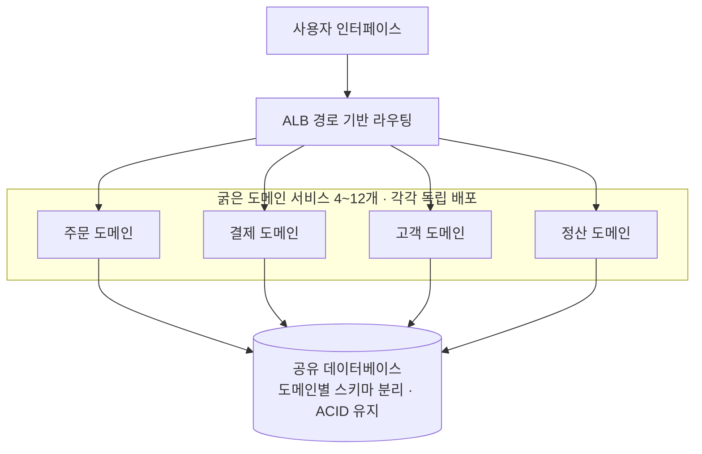

마이크로서비스와의 결정적 차이는 둘이다. 첫째, **서비스가 굵다** — 하나의 서비스가 도메인 하나 전체를 담는다. 둘째, **데이터베이스를 공유한다** — 따라서 ACID 트랜잭션이 살아 있고 Saga가 필요 없다. 공유 DB의 대가(스키마 결합)는 도메인별 스키마 분리와 "다른 도메인 테이블 직접 조회 금지" 규칙으로 상당 부분 완화된다(→ 44.2 참조).

```text
platform/
├── services/
│   ├── orders-service/            # 독립 배포 단위 1 (주문 도메인 전체)
│   │   ├── src/api/               #   내부는 레이어드로 구성해도 무방하다
│   │   ├── src/persistence/       #   orders 스키마만 접근
│   │   └── buildspec.yml          #   서비스별 독립 CI/CD 파이프라인
│   ├── payments-service/          # 독립 배포 단위 2
│   ├── customers-service/         # 독립 배포 단위 3
│   └── settlement-service/        # 독립 배포 단위 4
├── shared/contracts/              # 서비스 간 API 계약(OpenAPI). 공유 코드는 최소화
└── database/migrations/{orders,payments,shared_ref}/
                                   # 스키마별 마이그레이션 소유자 = 해당 서비스 팀

# 규칙: 각 서비스는 자기 스키마만 읽고 쓴다. 다른 도메인 데이터는 API로 요청한다.
#      DB 사용자 권한으로 강제하면 문서보다 훨씬 잘 지켜진다:
#        GRANT USAGE ON SCHEMA orders TO svc_orders;
#        REVOKE ALL ON SCHEMA payments FROM svc_orders;   -- 교차 조회 원천 차단
```

**② 어떤 문제를 풀려고 나왔는가** — "모놀리스는 배포가 답답한데 마이크로서비스는 우리 조직이 감당 못 한다"는 아주 흔한 상황이다. 팀이 4~6개인 회사가 마이크로서비스로 직행하면 서비스 30개, 데이터베이스 30개, Saga, 분산 트레이싱, 서비스 메시를 동시에 감당해야 한다. 서비스 기반은 중간을 취한다 — **배포 단위는 쪼개지만 데이터는 쪼개지 않는다.**

**③ 장점**
- **배포성 대폭 개선**: 도메인 서비스별 독립 배포. 팀이 서로를 기다리지 않는다.
- **분산 트랜잭션 회피**: 공유 DB이므로 ACID가 살아 있다. 이 스타일의 가장 큰 실용적 가치다.
- **적정한 복잡도**: 서비스가 4~12개면 서비스 메시 없이 ALB 경로 라우팅으로 충분하고 원인 추적이 가능한 규모다.
- **높은 진화성·테스트성**: 서비스 범위가 도메인 하나이므로 도메인 단위 재작성이 현실적이다.
- **점진적 경로**: 나중에 특정 도메인만 데이터까지 분리해 진짜 마이크로서비스로 승격할 수 있다.

**④ 단점·한계**
- **공유 DB가 결합점**: 스키마 변경이 여러 서비스에 파급된다. 소유권 규칙과 권한 강제가 없으면 서비스들이 서로의 테이블을 읽기 시작하고, 그 순간 독립 배포성이 사라진다.
- **DB가 확장 상한**: 모든 서비스가 하나의 데이터베이스를 향하므로 쓰기 용량이 시스템 전체의 상한이고, **DB 장애는 곧 전면 장애**다.
- **탄력성 제한**: 서비스가 굵으므로 확장 단위도 굵다. "재고 조회만" 확장하는 것은 불가능하다.
- **다시 커질 위험**: 굵은 서비스가 도메인 안에서 다시 모놀리스가 된다. 도메인 서비스 하나가 20만 줄을 넘으면 분해 신호로 본다.

**⑤ AWS 구현 매핑**

| 요소 | AWS 구성 | 비고 |
|---|---|---|
| 진입점 | ALB + 경로 기반 리스너 규칙(`/orders/*` → 주문 타깃 그룹) | 서비스 수가 적어 API Gateway 없이도 충분하다 |
| 도메인 서비스 | ECS on Fargate 서비스 4~12개 | 서비스별 태스크 정의·오토스케일링 정책 |
| 공유 데이터베이스 | Aurora 클러스터 1개, 스키마로 도메인 분리 | Aurora는 스토리지를 3개 AZ에 6중 복제한다 |
| 읽기 확장 | Aurora 리더 인스턴스 + 리더 엔드포인트 | 읽기 확장 수단. 가용성 수단인 Multi-AZ 페일오버와 목적이 다르다 |
| 커넥션 관리 | RDS Proxy | 서비스 수 × 태스크 수만큼 커넥션이 느는 것을 완충 |
| 스키마 권한 강제 | 서비스별 DB 사용자, 스키마 단위 `GRANT` | 규칙을 인프라로 강제하는 핵심 장치 |
| 서비스 간 호출 | 내부 ALB 또는 ECS Service Connect | 서비스 메시는 대체로 과하다 |

**⑥ 적합/부적합** — 적합: 팀이 3~8개인 중견 조직, 모놀리스의 배포 병목은 실재하지만 마이크로서비스 운영 역량은 아직 없는 상태, 강한 일관성이 여전히 중요한 업무(주문·정산·재무), 마이크로서비스로 가는 과도기 아키텍처. 부적합: 도메인별 확장 요구가 100배 차이 나는 시스템, DB 쓰기 용량이 이미 상한에 닿은 워크로드, 팀이 20개 이상인 조직, 서비스별로 완전히 다른 저장 특성이 필요한 경우.

### 41.11 스타일 비교 매트릭스

10개 스타일을 9개 품질 속성으로 평가한다. **모든 열은 "상 = 그 속성이 강하다/유리하다"** 로 읽는다. 비용 열은 혼동을 피하려고 "비용 효율"로 표기했으므로 상 = 총소유비용이 낮다는 뜻이다.

| 스타일 | 배포성 | 탄력성 | 확장성 | 테스트성 | 성능 | 내결함성 | 단순성 | 비용 효율 | 진화성 |
|---|---|---|---|---|---|---|---|---|---|
| 레이어드(모놀리식) | 하 | 하 | 하 | 하 | 중 | 하 | **상** | **상** | 하 |
| 마이크로커널/플러그인 | 중 | 하 | 하 | 상 | 중 | 하 | **상** | **상** | 상 |
| 파이프라인 | 중 | 하 | 중 | 상 | 하 | 하 | **상** | **상** | 중 |
| 스페이스 기반 | 중 | **상** | **상** | 하 | **상** | 중 | 하 | 하 | 중 |
| 이벤트 기반(브로커) | 상 | **상** | **상** | 하 | **상** | 상 | 하 | 중 | **상** |
| 이벤트 기반(메디에이터) | 상 | 중 | 상 | 중 | 중 | 상 | 중 | 중 | 중 |
| 서버리스 | **상** | **상** | 상 | 하 | 중 | 상 | 중 | 상황 의존 | 상 |
| SOA/엔터프라이즈 서비스 | 하 | 중 | 상 | 하 | 하 | 중 | 하 | 하 | 하 |
| 마이크로서비스 | **상** | **상** | **상** | 상 | 하 | **상** | 하 | 하 | **상** |
| 서비스 기반 | 상 | 중 | 중 | 상 | 중 | 중 | 중 | 중 | **상** |

서버리스의 비용 효율만 "상황 의존"인 이유는 이 스타일의 비용이 트래픽 형태에 따라 극단적으로 갈리기 때문이다. 간헐적·스파이크성 트래픽에서는 가장 유리하고, 24시간 균일 고부하에서는 가장 불리해질 수 있다(→ 48.9 참조).

**읽는 법 1 — 절대 평가가 아니라 상대 순위다.** 레이어드의 "확장성 하"는 느리다는 뜻이 아니다. 여기서 "하"는 **그 속성을 목표로 확장해 나갈 여지가 좁다**는 의미다. 반대로 마이크로서비스의 "성능 하"는 전혀 다른 이유 — 네트워크 홉이 지연 하한을 만들기 때문 — 이다. 같은 등급이 같은 원인을 뜻하지 않는다.

**읽는 법 2 — 세로가 아니라 가로로 읽는다.** "상이 몇 개인가"를 세어 순위를 정하는 것은 이 표의 오용이다. 마이크로서비스는 상이 많지만 단순성·비용 효율·성능이 하이며, 그 셋이 우리 1순위라면 오답이다. 순서는 **① 1순위 -ility 3개를 확정 → ② 그 3개 열에서 상인 행을 추린다 → ③ 추린 스타일의 "하" 열이 감당 가능한지 확인**이다.

**읽는 법 3 — 조직 역량이 숨은 열이다.** 표에 없는 열이 하나 있다 — **요구 운영 성숙도**다. 마이크로서비스·이벤트 기반·스페이스 기반은 CI/CD, 분산 트레이싱, 중앙 로깅, 온콜 체계를 전제한다. 이 전제가 없으면 표의 "상"은 실현되지 않고 "하"만 실현된다. 관측성 없는 마이크로서비스는 배포성이 하가 되고(함께 배포해야 하므로) 내결함성도 하가 된다. 이것이 **분산 모놀리스**다.

**읽는 법 4 — 스타일은 혼합된다.** 전체는 서비스 기반이면서 각 서비스 내부는 레이어드, 데이터 경로만 파이프라인, 서비스 간 통신은 이벤트 기반인 시스템이 오히려 정상이다. 중요한 것은 **각 부분에 어떤 스타일을 왜 적용했는지 문서로 남기는 것**이다.

#### 스타일 선택 결정 트리

팀 수, 도메인 복잡도, 배포 독립성 요구, 확장 축, 운영 성숙도를 입력으로 하는 흐름이다. 최종 답이 아니라 **출발 후보**를 좁히는 도구다.

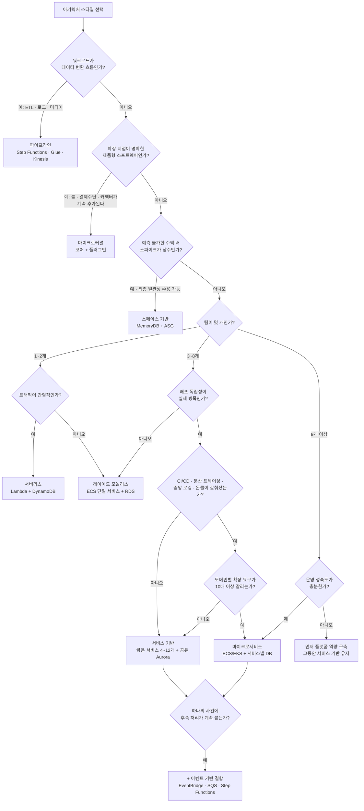

가장 중요한 노드는 **Q6(운영 성숙도)** 와 **Q8** 이다. 팀 수와 도메인 복잡도가 마이크로서비스를 가리켜도, 관측성과 배포 자동화가 없으면 답은 마이크로서비스가 아니라 "먼저 플랫폼 역량을 구축하고 그동안 서비스 기반에 머문다"다. 이 순서를 건너뛴 조직은 예외 없이 분산 모놀리스를 만든다. 트리에 SOA 분기가 없는 것도 의도적이다 — SOA/ESB는 그린필드 선택지가 아니라 이미 존재하는 제약이며, 있는 경우에는 "어떻게 빠져나올지"를 설계하는 문제로 다룬다.

### 41장 정리

#### [필수] 반드시 알아야 할 것

1. **아키텍처는 "되돌리는 비용이 큰 결정들의 집합"이다.** 구조·품질 속성·결정·설계 원칙으로 구성되며, 가장 자주 누락되는 것이 **근거(rationale)** 다. 근거 없는 결정은 후임이 뒤집는다.
2. **아키텍처 스타일은 우열이 아니라 -ility 우선순위의 선택이다.** 배포성을 올리면 성능이, 확장성을 올리면 일관성이, 단순성을 올리면 진화성이 내려간다. 무엇을 최적화할지 먼저 정의하고 1순위는 3개까지만 선언한다.
3. **레이어드의 핵심 규칙은 폐쇄 계층, 핵심 안티패턴은 아키텍처 싱크홀이다.** 계층을 통과하며 아무 로직도 추가하지 않는 요청의 비율이 커지면 계층은 비용만 만든다. 의존 방향은 문서가 아니라 CI의 아키텍처 테스트로 강제해야 유지된다.
4. **마이크로커널은 계약·레지스트리·버전 관리가 성립 조건이다.** 계약이 너무 좁으면 플러그인이 일을 못 하고 너무 넓으면 코어를 바꿀 수 없다. 계약은 사실상 공개 API로 취급한다.
5. **스페이스 기반은 요청 경로에서 데이터베이스를 제거해 확장 상한을 없애는 대신 최종 일관성을 전제로 한다.** 인메모리 그리드가 진실이고 데이터베이스는 "조금 전" 값이며, 데이터 펌프 지연이 곧 최대 손실 창이다.
6. **이벤트 기반의 두 토폴로지를 구분하라.** 브로커는 결합도가 가장 낮지만 워크플로가 어디에도 명시되지 않고, 메디에이터는 오류 처리·보상을 한곳에서 관리하지만 결합점이 된다. 도메인 간은 브로커, 도메인 내 복잡 트랜잭션은 메디에이터로 혼합하는 것이 실무 기본형이다.
7. **SOA가 실패한 이유는 기술이 아니라 "재사용 최대화"라는 목표 자체였다.** 하나의 서비스를 30곳이 공유하면 변경에 30곳의 승인이 필요하다. 마이크로서비스는 반대로 중복을 감수하고 독립성을 산다.
8. **서비스 기반 아키텍처(굵은 서비스 4~12개 + 공유 데이터베이스)는 마이크로서비스의 운영 부담 없이 배포성을 얻는 실용적 중간 지점이다.** 팀이 3~8개인 조직의 기본 후보다.

#### [팁] 실무 노하우

1. **결정마다 ADR을 한 페이지로 남긴다.** "무엇을 얻으려고 무엇을 포기했는가"를 한 문단으로 적어두면 2년 뒤 "왜 이렇게 했지"에 조직이 답할 수 있다.
2. **계층·모듈 의존 규칙은 CI에서 빌드를 깨뜨리게 만든다.** 아키텍처 테스트나 모듈 경계 검사를 CI에 넣으면 규칙 준수율이 완전히 달라진다.
3. **서비스 기반에서 "다른 스키마 직접 조회 금지"는 DB 사용자 권한으로 강제한다.** 서비스별 DB 사용자에게 자기 스키마만 `GRANT`하면 위반이 런타임 오류로 즉시 드러난다.
4. **스타일은 시스템 부분별로 독립적으로 고른다.** 전체는 서비스 기반, 서비스 내부는 레이어드, 데이터 경로는 파이프라인, 서비스 간은 이벤트 기반 — 이 혼합이 오히려 정상이다.
5. **파이프라인의 각 단계에 `Retry`와 DLQ를 선언적으로 붙인다.** Step Functions의 `Retry`·`Catch`와 품질 게이트 `Choice`를 조합하면 내결함성 약점을 상당히 메꿀 수 있다.
6. **시각이 알려진 급증에는 예측 스케일링보다 예정 스케일링을 쓴다.** 인메모리 그리드는 워밍 시간이 필요하므로 트래픽보다 먼저 떠 있어야 한다.
7. **마이크로서비스로 가기 전에 서비스 기반을 경유하는 것을 기본 경로로 삼는다.** 배포 독립성의 이익을 먼저 확인하고, 도메인 경계를 검증하고, 관측성 플랫폼을 구축한 뒤 필요한 도메인만 승격한다.

#### [주의] 사고·비용·설계 함정

1. **유행으로 스타일을 고르면 조직 역량과 어긋난다.** 그 스타일이 최적화하는 -ility가 우리 문제와 무관한 채 비용만 지불하게 된다. 선택은 항상 "우리가 지금 무엇 때문에 아픈가"에서 출발한다.
2. **관측성·CI/CD 없는 조직의 마이크로서비스는 분산 모놀리스다.** 서비스는 여럿인데 함께 배포해야 하고, 하나가 죽으면 전부 죽고, 원인은 추적되지 않는다. 모놀리스의 단점에 분산 시스템의 단점을 더한 상태다(→ 42.7 참조).
3. **비교 매트릭스의 "상" 개수를 세어 순위를 정하는 것은 오용이다.** 같은 "하" 등급이 같은 원인을 뜻하지도 않는다.
4. **레이어드 모놀리스의 확장은 데이터베이스 커넥션에서 먼저 무너진다.** RDS Proxy나 커넥션 풀 상한 설계 없이 인스턴스만 늘리는 것은 사고 경로다.
5. **스페이스 기반에서 데이터 손실 창을 계산하지 않는 것이 가장 흔한 사고다.** 캐시 성격의 저장소를 진실의 원천으로 쓰기 전에 내구성 있는 선택지(MemoryDB 등)를 검토하고 최대 손실량을 사업 측과 합의해야 한다.
6. **ESB에 사업 로직을 넣으면 몇 년 뒤 그 로직은 버전 관리도, 단위 테스트도, 코드 리뷰도 되지 않는 상태로 남는다.** 라우팅·변환 도구에는 라우팅과 변환만 둔다.
7. **재사용 최대화를 목표로 삼으면 변경 가능성이 최소화된다.** 공유 컴포넌트의 소비자 수가 곧 변경 비용이다. 독립성이 1순위면 일정한 중복이 옳다.
8. **서비스 기반에서 다른 도메인 테이블을 직접 읽기 시작하면 독립 배포성이 그 순간 사라진다.** 문서상의 금지 규칙만으로는 반드시 무너진다.
9. **마이크로서비스의 서비스 경계 오분해는 되돌리기가 가장 비싼 실수다.** 하나의 사업 트랜잭션이 5개 서비스를 왕복하게 된다. 도메인이 검증되지 않았다면 쪼개지 않는 것이 옳다(→ 42.4 참조).
10. **서버리스를 24시간 균일 고부하에 쓰면 비용이 역전되고**, **파이프라인을 사용자 대면 동기 경로에 쓰면 단계 수만큼 지연이 누적된다.** 두 경우 모두 임계점을 계산하지 않은 채 스타일의 장점만 보고 도입한 결과다.

#### 한 장 요약

아키텍처는 되돌리는 비용이 큰 결정들의 집합이고, 스타일 선택은 "무엇이 더 좋은가"가 아니라 "어떤 품질 속성을 1순위로 두고 무엇을 포기할 것인가"의 문제다. 10가지 스타일은 각자 다른 것을 최적화한다 — 레이어드·마이크로커널·파이프라인은 단순성과 비용을, 스페이스 기반은 확장성과 성능을, 이벤트 기반·마이크로서비스는 배포성과 진화성을, 서비스 기반은 그 중간의 실용성을, SOA는 통합과 거버넌스를 산다. 비교 매트릭스는 세로로 "상"을 세는 것이 아니라 1순위 -ility 3개를 확정하고 가로로 읽어야 하며, 표에 없는 숨은 열인 **조직의 운영 성숙도**가 실제로는 가장 결정적이다. 관측성과 CI/CD가 없는 조직에서 마이크로서비스는 분산 모놀리스가 되고, 그런 조직의 정답은 대개 서비스 기반 아키텍처를 경유하는 점진적 경로다.

#### 다음 장 예고

42장에서는 이 지도에서 가장 자주 선택되고 가장 자주 실패하는 경로 — 모놀리스에서 마이크로서비스로의 전환 — 을 분해 패턴, 서비스 경계 결정법, 17가지 베스트 프랙티스, 그리고 이 장에서 반복 경고한 분산 모놀리스 안티패턴까지 파고든다.

---

## 42장. 모놀리스에서 마이크로서비스로  ★★★★

> **이 장에서 다루는 것**
> 41장이 마이크로서비스를 여러 스타일 중 하나로 소개했다면, 이 장은 "언제, 어떻게 그 스타일로 옮겨갈 것인가"를 다룬다. 모놀리스의 실제 장단점, 스트랭글러 피그를 비롯한 분해 패턴과 경계 설정 원칙, 원서(*AWS for Solutions Architects*)의 17가지 베스트 프랙티스, 그리고 가지 말아야 할 신호와 분산 모놀리스 안티패턴을 다룬다. 경계를 정교화하는 DDD는 43장, 데이터 일관성 패턴(Saga, CQRS)은 44장에서 이어 다룬다.

### 42.1 모놀리식 아키텍처의 실제 장단점

모놀리스를 "낡은 방식"으로 단정하는 것은 가장 먼저 버려야 할 태도다. 지금도 대다수 신규 프로젝트의 합리적 출발점이며 실제 장점이 뚜렷하다.

**실제 장점**: 아티팩트 하나를 파이프라인 하나로 내보내는 단순한 배포, 여러 도메인에 걸친 변경을 원자적으로 처리하는 로컬 트랜잭션, 프로세스 하나 안에서 끝나는 쉬운 디버깅, 관리 대상이 하나뿐이라 낮은 초기 운영 비용.

**실제 단점**: 코드 한 줄만 고쳐도 전체를 재배포해야 하는 배포 결합, 특정 모듈만 트래픽이 몰려도 전체를 확장해야 하는 고정 확장 단위, 버전을 올리려면 코드베이스 전체가 함께 움직이는 기술 고착, 저장소·파이프라인 공유로 팀 수의 제곱에 비례해 커지는 배포 조율 비용, 코드베이스가 커질수록 늘어나는 빌드·테스트 시간.

이 절충 지점이 **모듈형 모놀리스(Modular Monolith)**다. 배포 아티팩트는 하나로 유지하되 코드베이스 내부를 도메인 경계에 따라 엄격히 분리된 모듈로 나누고 모듈 간 의존성을 컴파일 타임에 강제한다. 모듈이 자기 데이터 접근 계층을 갖고 다른 모듈의 테이블에 직접 접근하지 않으면, 나중에 마이크로서비스로 쪼갤 때 경계가 이미 준비되어 있다.

| 항목 | 모놀리스 | 모듈형 모놀리스 | 마이크로서비스 |
|---|---|---|---|
| 배포 단위 | 애플리케이션 전체 1개 | 애플리케이션 전체 1개 | 서비스별 독립 |
| 데이터 소유 | 공유 스키마 | 모듈별 논리 분리(물리적으로는 공유 가능) | 서비스별 물리 분리 |
| 확장 단위 | 전체 | 전체 | 서비스별 |
| 기술 다양성 | 단일 스택 | 단일 스택(모듈 내부는 유연) | 서비스별 선택 가능 |
| 팀 경계 | 기능/계층 조직에 적합 | 도메인 조직 준비 | 도메인 조직 필수 |
| 운영 복잡도 | 낮음 | 낮음~중간 | 높음(관측성·오케스트레이션 필요) |

**한 줄 결정 기준**: 팀이 하나이거나 도메인 경계가 아직 불확실하면 모듈형 모놀리스로 시작하고, 팀이 여럿으로 나뉘고 도메인 경계가 코드에서 이미 드러났을 때만 마이크로서비스로 쪼갠다.

### 42.2 마이크로서비스의 정의와 특성

마이크로서비스(Microservices)는 단일 비즈니스 능력을 책임지는 작고 독립적으로 배포 가능한 서비스의 집합으로 애플리케이션을 구성하는 스타일이다. 크기(라인 수)가 아니라 **독립 배포 가능성**이 정의의 핵심이다. 41.9절에서 스타일로 개괄했으므로 여기서는 전환 관점의 핵심 특성만 정리한다.

- **독립 배포**: 한 서비스의 변경이 다른 서비스의 재빌드·재배포 없이 나갈 수 있어야 한다. 안 되면 이름만 마이크로서비스인 분산 모놀리스다(42.7절).
- **자율 팀**: 서비스 하나(또는 소수)를 한 팀이 설계부터 운영까지 전 주기 책임진다("만든 사람이 운영한다").
- **서비스별 데이터**: 각 서비스가 자신의 데이터 저장소를 소유하고, 다른 서비스는 API로만 접근한다. 직접 테이블 조인은 금지된다.
- **바운디드 컨텍스트 정렬**: 서비스 경계는 DDD의 바운디드 컨텍스트와 일치해야 자연스럽다(43장).
- **스마트 엔드포인트, 덤 파이프**: 비즈니스 로직은 서비스 내부에, 통신 채널(HTTP, 큐)은 라우팅·전달만 담당한다 — 엔터프라이즈 서비스 버스에 로직을 태우는 SOA식 접근과 대비된다.
- **장애 격리**: 한 서비스의 장애가 전체로 전파되지 않도록 타임아웃, 서킷 브레이커, 벌크헤드로 격리한다.

**마이크로서비스가 아닌 것**도 분명히 해둘 필요가 있다. 항상 함께 배포해야 하는 구조, 여러 서비스가 하나의 DB 스키마를 공유하는 구조, 팀 하나가 수십 개 서비스를 떠맡는 구조는 이름만 빌린 다른 무언가다. 서비스 개수 자체는 목적이 아니다.

### 42.3 분해 패턴

모놀리스를 쪼개는 방법은 "어디서 자를 것인가"(분해 기준)와 "어떻게 안전하게 자를 것인가"(이행 기법)로 나뉜다.

**비즈니스 능력별 분해**는 조직이 무엇을 하는가(주문, 결제, 배송, 카탈로그)를 기준으로 나눈다. 조직도에서 바로 도출되어 접근이 쉽고 콘웨이의 법칙에 따라 팀 구조와 자연히 일치한다.

**서브도메인별 분해(DDD)**는 핵심·지원·일반 서브도메인 구분을 기준으로 나눈다. 언어·모델의 경계를 더 정교하게 찾아내지만 별도의 도메인 분석 워크숍을 요구한다. → 식별 방법은 43장 참조.

이행 기법으로는 다음 세 가지가 가장 많이 쓰인다.

**스트랭글러 피그(Strangler Fig)**는 무화과나무가 숙주 나무를 서서히 감싸 대체하듯, 모놀리스 앞에 라우팅 계층을 두고 트래픽을 기능 단위로 하나씩 신규 서비스로 옮기며 모놀리스 코드는 결국 제거하는 방식이다. AWS에서는 API Gateway 또는 ALB의 경로 기반 라우팅으로 구현한다.

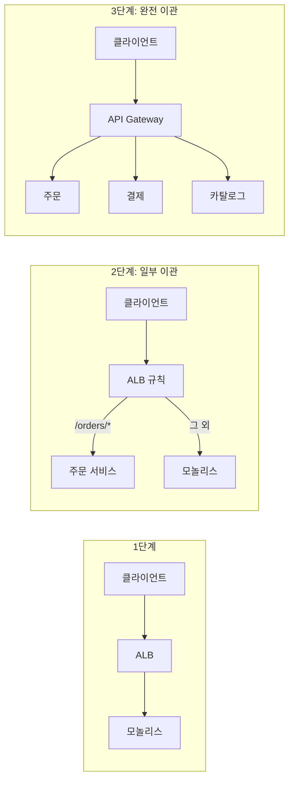

ALB 리스너 규칙 구현은 다음과 같다. 우선순위 숫자가 낮을수록 먼저 평가되므로 새 서비스 규칙을 모놀리스 기본 규칙보다 앞에 둔다.

```yaml
# strangler-listener-rule.yaml - /orders/*만 신규 서비스로, 나머지는 기존 규칙(Priority 100)이 그대로 받는다.
Resources:
  OrdersStranglerRule:
    Type: AWS::ElasticLoadBalancingV2::ListenerRule
    Properties:
      ListenerArn: !Ref ProductionListenerArn
      Priority: 10   # 숫자가 낮을수록 먼저 평가 - 모놀리스 기본 규칙보다 앞에 둔다
      Conditions:
        - Field: path-pattern
          PathPatternConfig:
            Values: ["/orders/*"]
      Actions:
        - Type: forward
          TargetGroupArn: !Ref OrdersServiceTargetGroup
```

API Gateway라면 리소스 경로별 통합으로 같은 아이디어를 구현한다 — 핵심은 **라우팅 규칙만 바꿔 트래픽을 이관**하고 문제가 생기면 규칙을 되돌려 즉시 롤백할 수 있다는 점이다.

**브랜치 바이 애브스트랙션**은 코드 수준 이행 기법이다. 기존 구현을 감싸는 추상화 인터페이스를 도입해 호출부가 그 인터페이스만 보게 한 뒤 내부 구현을 신규 서비스 호출로 교체한다. 장기 브랜치 없이 기능 플래그로 전환해, 코드 내부 로직 하나를 서비스 호출로 바꾸는 세밀한 이행에 적합하다.

**사이드카(Sidecar)**는 분해 기준이 아니라 이행·운영을 돕는 패턴이다. 로깅·트레이싱·mTLS 같은 횡단 관심사를 별도 프로세스로 붙여 각 서비스가 언어별로 재구현하지 않게 한다. ECS 태스크의 두 번째 컨테이너나 App Mesh의 Envoy 프록시가 대표적이다.

| 패턴 | 적용 시점 | 장점 | 리스크 |
|---|---|---|---|
| 비즈니스 능력별 분해 | 조직이 이미 기능 단위 | 빠른 착수, 팀과 정렬 | 능력 정의 모호 시 경계도 모호 |
| 서브도메인별 분해(DDD) | 정교한 경계가 필요 | 언어·모델 경계와 일치 | 별도 분석 비용 필요 |
| 스트랭글러 피그 | 운영 중 무중단 이관 | 점진적, 언제든 롤백 | 과도기 라우팅 복잡도 증가 |
| 브랜치 바이 애브스트랙션 | 코드 내부 로직 교체 | 트렁크 기반 개발 유지 | 추상화 어긋나면 이중 유지보수 |
| 사이드카 | 횡단 관심사 표준화 | 서비스 코드가 자유로움 | 사이드카가 새 운영 대상 |

**한 줄 결정 기준**: 운영 중인 트래픽이 있으면 스트랭글러 피그로 시작하고, 분해 기준 자체가 불확실하면 서브도메인 분석(43장)부터 한다.

### 42.4 서비스 경계를 정하는 방법과 흔한 오분해

서비스 경계는 두 힘의 균형점이다. **응집도(Cohesion)**는 함께 바뀌는 것을 함께 두라는 힘이고, **결합도(Coupling)**는 다른 것과 덜 얽히게 하라는 힘이다. 좋은 경계는 응집도가 높고 서비스 간 결합도가 낮다(한 서비스의 변경이 다른 서비스의 배포를 요구하지 않는다).

실무적으로는 세 질문으로 판단한다. **데이터 소유권**이 명확한가(갱신 책임이 정확히 한 서비스에 있는가), **변경 이유(SRP)**가 하나인가(다시 쓰여야 하는 이유가 여럿이면 경계가 잘못됐다), **팀 인지 부하**가 감당 가능한가(도메인 지식·기술 스택·운영 부담을 한 팀이 동시에 감당할 수 있는가). 인지 부하를 넘어서는 서비스는 경계가 논리적으로 맞아도 실패한다.

흔한 오분해 다섯 가지는 다음과 같다.

| 오분해 유형 | 설명 | 대표 증상 |
|---|---|---|
| 엔티티별 분해 | 테이블(User, Order 등) 하나당 서비스 하나 | 주문 생성 하나에 서비스 5개 동기 호출 |
| 계층별 분해 | 프레젠테이션/비즈니스/데이터 계층을 서비스로 분리 | 요청마다 계층 서비스를 순서대로 통과 |
| 기술별 분해 | 캐시 서비스, 큐 서비스처럼 기술로 분리 | 변경 하나가 여러 기술 서비스에 걸쳐 배포 |
| 나노서비스화 | 함수 하나 수준까지 과도하게 세분화 | 네트워크 홉·운영 오버헤드가 로직보다 큼 |
| CRUD 서비스 | 비즈니스 규칙 없이 테이블 CRUD만 노출 | 비즈니스 로직이 호출하는 클라이언트로 새어나감 |

공통 증상은 "서비스 하나를 바꾸려면 다른 서비스도 함께 바꿔야 한다"는 것이다. 나타난다면 데이터 소유권·변경 이유 기준으로 경계를 다시 그어야 한다. → 정교화 절차는 43장 참조.

### 42.5 마이크로서비스 17가지 베스트 프랙티스

여기서 정리하는 17가지는 *AWS for Solutions Architects* 14장이 제시하는 마이크로서비스 채택 실무 지침이다. 순서 자체가 우선순위에 가깝다 — 앞쪽 항목(도구 선택, 요구사항 정의)을 건너뛰고 뒤쪽 항목(모니터링, 팀 구성)만 잘해봐야 전환은 실패한다.

#### 42.5.1 정말 필요한지 판단 / 요구사항·설계 명확화 / DDD 활용 / 이해관계자 합의

**1) 마이크로서비스가 맞는 도구인지 판단한다.** 무엇을: 전환 전, 지금 겪는 문제(배포 지연, 확장 병목, 팀 충돌)가 정말 아키텍처 문제인지 코드 품질·조직 프로세스의 문제인지 구분한다. 왜: 마이크로서비스는 분산 시스템 복잡도(네트워크 지연, 부분 장애, 최종 일관성)를 새로 떠안는 대가를 치른다. 원인이 조직 프로세스인데 아키텍처만 바꾸면 복잡도만 늘고 문제는 남는다. AWS에서 어떻게: 배포 빈도·리드 타임·변경 실패율·MTTR 지표를 CloudWatch와 파이프라인 로그로 먼저 측정해 병목이 실제로 배포 단위 문제인지 확인한다.

**2) 요구사항과 설계를 명확히 한다.** 무엇을: 서비스를 정하기 전에 기능·비기능 요구사항(가용성 목표, 지연 예산, 처리량)과 서비스 간 계약을 문서로 먼저 확정한다. 왜: 서비스 경계는 되돌리기 매우 비싸다 — 한 번 나뉘어 배포되면 데이터까지 분리되어 되돌리려면 마이그레이션이 필요하다. AWS에서 어떻게: OpenAPI(또는 AsyncAPI) 명세를 먼저 작성해 팀 간 계약으로 리뷰하고, API Gateway 임포트 스펙과 컨트랙트 테스트의 기준선으로 재사용한다.

**3) 도메인 주도 설계(DDD)를 활용한다.** 무엇을: 서비스 경계를 임의로 정하지 않고 바운디드 컨텍스트, 애그리게잇, 유비쿼터스 언어 같은 DDD 도구로 도출한다. 왜: DDD는 "누가 데이터를 소유하는가"와 "용어의 의미가 어디서 바뀌는가"를 드러내, 42.4절의 오분해를 피하게 해준다. AWS에서 어떻게: 이벤트 스토밍 결과를 컨텍스트 맵으로 정리하고, 컨텍스트 하나를 AWS 계정 또는 VPC 경계, 서비스 하나를 ECS 서비스/Lambda 함수 그룹으로 매핑한다. → 워크숍 운영법은 43장 참조.

**4) 이해관계자의 합의를 얻는다.** 무엇을: 전환이 개발팀만의 결정이 아니라 운영·보안·재무·제품 조직 모두에게 영향을 준다는 것을 인정하고 사전 합의를 구한다. 왜: 마이크로서비스는 초기 운영 비용(관측성 도구, 다수 파이프라인, 네트워크 비용)이 모놀리스보다 높아, 사전 승인 없이는 예산 문제로 좌초한다. AWS에서 어떻게: Cost Explorer와 예산 알람으로 전환 전후 예상 비용(NAT/데이터 전송, 로그 수집량, 관리형 서비스 사용료)을 시나리오로 제시해 사전 승인을 받는다.

#### 42.5.2 로깅·트레이싱 도구 / 마이크로서비스 우선 사고 / 언어·기술 최소화

**5) 로깅·트레이싱 도구를 먼저 갖춘다.** 무엇을: 서비스를 나누기 전에 분산 추적, 구조화 로그, 상관관계 ID(Correlation ID) 전파 체계를 구축한다. 왜: 서비스가 둘 이상으로 나뉜 순간부터 요청 하나가 여러 프로세스를 거치므로, 이 인프라 없이는 장애가 나도 어디서 실패했는지 알 수 없다. AWS에서 어떻게: AWS X-Ray로 서비스 맵과 트레이스를 수집하고, 모든 서비스가 진입점에서 상관관계 ID를 생성해 헤더로 전파하는 표준 미들웨어를 배포한다.

```javascript
// correlation-middleware.js
// Express 미들웨어: 요청에 상관관계 ID가 없으면 생성하고 다운스트림 호출(axios 등)에
// 전파해 X-Ray/CloudWatch Logs에서 서비스 경계를 넘어 하나의 요청 흐름을 추적한다.
const { v4: uuidv4 } = require('uuid');

function correlationIdMiddleware(req, res, next) {
  const incomingId = req.header('x-correlation-id');
  req.correlationId = incomingId || uuidv4();
  res.setHeader('x-correlation-id', req.correlationId);

  // 구조화 로그에 항상 correlationId를 포함시켜 Logs Insights에서
  // 요청 하나를 서비스 경계를 넘어 필터링할 수 있게 한다.
  req.log = (msg, extra = {}) =>
    console.log(JSON.stringify({ level: 'info', msg, correlationId: req.correlationId, ...extra }));

  next();
}

module.exports = correlationIdMiddleware;
```

**6) 마이크로서비스 우선(Microservices-First) 사고를 갖는다.** 무엇을: 신규 기능마다 "기존 서비스에 끼워 넣을까, 새 서비스로 뺄까"를 습관적으로 검토하는 팀 문화를 만든다. 왜: 전환은 한 번의 프로젝트가 아니라 지속적 판단이다. 이 습관이 없으면 신규 기능이 결국 다시 하나의 큰 서비스로 뭉쳐지는 역행이 일어난다. AWS에서 어떻게: 신규 서비스 생성을 표준 서비스 템플릿 저장소(서비스 카탈로그)로 부트스트랩해 "새 서비스를 만드는 비용"을 낮춰 검토가 실제로 실행되게 한다.

```text
service-template/                  # 신규 마이크로서비스 부트스트랩 표준 저장소
├── src/
│   ├── handlers/                  # 비즈니스 로직 진입점
│   ├── middleware/correlation-id.js  # 표준 상관관계 ID 미들웨어(전사 공통)
│   └── clients/                   # 타 서비스 호출용 생성 클라이언트(OpenAPI 기반)
├── infra/
│   ├── task-definition.yaml       # ECS 태스크 정의 템플릿
│   ├── service.yaml               # ECS 서비스 + ALB 타깃 그룹
│   └── pipeline.yaml              # CodePipeline 표준 파이프라인
├── openapi.yaml                   # 서비스 계약(다른 팀과의 인터페이스)
├── README.md                      # 자기 문서화: 소유 팀, SLO, 런북 링크
└── SERVICE_CATALOG.yaml           # 서비스 카탈로그 등록 메타데이터
```

**7) 언어·기술 다양성을 최소화한다.** 무엇을: "서비스마다 다른 언어를 쓸 자유"를 장점으로 과대평가하지 말고 조직 표준 스택을 2~3개로 제한한다. 왜: 언어·프레임워크가 늘수록 채용, 온보딩, 공통 라이브러리 유지보수, 온콜 부담이 조합 폭발로 커진다 — 자유는 곧 숨은 비용이다. AWS에서 어떻게: 표준 런타임(예: Node.js/TypeScript와 Python)에 맞춘 Lambda 레이어와 ECR 베이스 이미지를 사내 레지스트리로 배포해 새 서비스가 표준 스택을 상속하게 한다.

#### 42.5.3 RESTful API / 비동기 통신 / 프론트엔드-백엔드 분리

**8) RESTful API를 활용한다.** 무엇을: 서비스 간 동기 인터페이스는 HTTP 기반 REST로 표준화하고 리소스 지향 URL, 표준 상태 코드, 명확한 버저닝 규칙을 지킨다. 왜: 표준화된 인터페이스는 클라이언트 SDK 자동 생성, 계약 테스트, 공통 게이트웨이 활용을 가능하게 해 팀 간 통합 비용을 낮춘다. AWS에서 어떻게: 서비스 계약을 OpenAPI로 먼저 정의하고 API Gateway에 임포트해 라우팅·인증·스로틀링을 게이트웨이 계층에서 일괄 적용한다.

```yaml
# order-service-openapi.yaml (발췌)
# 서비스 계약을 코드보다 먼저 정의해 팀 간 리뷰 대상으로 삼는다.
openapi: 3.0.3
info:
  title: Order Service API
  version: 1.2.0
paths:
  /orders/{orderId}:
    get:
      summary: 주문 단건 조회
      parameters:
        - { name: orderId, in: path, required: true, schema: { type: string } }
      responses:
        '200':
          description: 조회 성공
          content:
            application/json:
              schema: { $ref: '#/components/schemas/Order' }
        '404':
          description: 주문 없음
components:
  schemas:
    Order:
      type: object
      required: [orderId, status, totalAmount]
      properties:
        orderId: { type: string }
        status: { type: string, enum: [CREATED, PAID, SHIPPED, CANCELLED] }
        totalAmount: { type: number }
```

**9) 비동기 통신을 기본값으로 삼는다.** 무엇을: 서비스 간 통신은 사용자 응답 경로에 꼭 필요한 경우를 빼면 메시지 큐·이벤트 버스 기반 비동기 방식을 기본으로 설계한다. 왜: 동기 호출은 호출하는 쪽을 호출받는 쪽의 가용성에 종속시켜, 서비스가 늘어날수록 전체 가용성이 각 서비스 가용성의 곱으로 떨어진다. AWS에서 어떻게: Amazon SQS로 작업을 큐잉하거나 Amazon EventBridge로 도메인 이벤트를 발행-구독 방식으로 전파해 발행자가 구독자 상태를 몰라도 되게 한다. → 신뢰성 보장(정확히 한 번 전달, 아웃박스)은 44장 참조.

**10) 프론트엔드와 백엔드를 명확히 분리한다.** 무엇을: 클라이언트가 백엔드 서비스의 내부 구조(서비스 개수·토폴로지)를 알 필요가 없도록 API 게이트웨이 뒤에 완전히 숨긴다. 왜: 클라이언트가 개별 서비스 엔드포인트를 직접 안다면, 경계를 리팩터링할 때마다 모든 클라이언트 배포까지 함께 바꿔야 해 독립 배포가 무너진다. AWS에서 어떻게: API Gateway 또는 BFF(Backend for Frontend) 패턴으로 클라이언트별 통합 엔드포인트를 두고 그 뒤에서 서비스 라우팅을 자유롭게 재구성한다.

#### 42.5.4 서비스별 데이터 저장소 / 팀을 서비스 중심으로 / 자기 문서화

**11) 팀을 서비스 중심으로 조직한다.** 무엇을: 조직도를 계층(프론트엔드팀, 백엔드팀, DBA팀)이 아니라 도메인 서비스(주문팀, 결제팀, 배송팀) 중심으로 재편한다. 왜: 콘웨이의 법칙에 따라 소프트웨어 구조는 결국 조직 커뮤니케이션 구조를 닮는다. 기능 조직 위에 마이크로서비스를 얹으면 서비스 하나를 고치는 데 여러 팀 조율이 필요해져 독립 배포라는 목적 자체가 실패한다. AWS에서 어떻게: 팀별로 별도 AWS 계정(또는 최소한 별도 IAM 경계와 배포 파이프라인)을 부여해 코드부터 인프라, 배포 승인까지 전 권한을 갖게 한다.

**12) 서비스별로 개별 데이터 저장소를 둔다.** 무엇을: 서비스마다 자신의 데이터베이스(또는 스키마)를 소유하고 다른 서비스는 오직 API로만 접근하게 강제한다. 왜: 여러 서비스가 같은 스키마를 공유하면 스키마 변경 하나가 모든 서비스의 동시 배포를 요구하게 되어, 이것이야말로 42.7절 분산 모놀리스의 가장 흔한 원인이다. AWS에서 어떻게: 서비스별로 별도 RDS 인스턴스(또는 Aurora 클러스터)나 DynamoDB 테이블을 배정하고 IAM 정책·보안 그룹으로 타 서비스의 직접 접근을 차단한다. → 데이터 일관성 확보 방법(Saga, CQRS)은 44장 참조.

**13) 자기 문서화와 완전한 문서화를 동시에 추구한다.** 무엇을: 코드와 API 계약 자체가 문서 역할을 하도록(명확한 네이밍, OpenAPI 스펙, 타입 정의) 만들되, 그것만으로 부족한 맥락(왜 이 서비스가 존재하는지, SLO, 온콜 런북)은 별도 문서로 채운다. 왜: 서비스 수가 늘어날수록 "누가 소유하고 무엇을 하는가"를 매번 물어보는 비용이 커진다. AWS에서 어떻게: 서비스 템플릿 저장소(6번 항목 참조)에 README와 SERVICE_CATALOG 메타데이터를 표준 포함시켜 사내 서비스 디렉터리에서 자동 색인되게 한다.

#### 42.5.5 DevOps 도구 / 모니터링 투자 / 두 피자 팀 / 12-Factor 설계

**14) DevOps 툴셋을 전제로 한다.** 무엇을: 서비스마다 독립된 CI/CD 파이프라인, 코드형 인프라(IaC), 자동화 테스트가 있다는 것을 전환의 전제 조건으로 삼는다. 왜: 배포가 수동이면 서비스 수만큼 수동 작업이 곱해져 늘어나 전환의 이점(빠른 배포)이 오히려 사라진다. AWS에서 어떻게: 서비스별 CodePipeline과 CDK/CloudFormation 스택을 서비스 템플릿에서 표준 제공해 새 서비스가 하루 안에 배포 가능한 상태로 시작하게 한다.

**15) 모니터링에 투자한다.** 무엇을: 단순 헬스체크를 넘어 서비스별 SLO, 분산 추적, 알람, 대시보드에 초기부터 투자한다. 왜: 분산 시스템의 장애는 완전한 다운이 아니라 지연 증가, 부분 실패, 캐스케이딩 실패처럼 미묘하게 나타나 모니터링 없이는 감지할 수 없다. AWS에서 어떻게: CloudWatch(메트릭·알람·대시보드), X-Ray(트레이스), Logs Insights(로그 질의)를 서비스 템플릿에 기본 통합하고 SLO를 복합 알람으로 표현한다.

**16) 두 피자 팀(Two-Pizza Team) 규모를 유지한다.** 무엇을: 서비스를 소유하는 팀 규모를 피자 두 판으로 식사할 수 있는 인원(대략 6~10명)으로 제한한다. 왜: 팀이 커지면 커뮤니케이션 경로가 조합적으로 늘어 의사결정이 느려지고, 이는 팀이 감당하는 서비스 범위(인지 부하)가 적정선을 넘었다는 신호다. AWS에서 어떻게: 팀 규모가 상한을 넘으면 서비스를 추가로 쪼개거나 팀을 분할하는 것을 조직 프로세스(스프린트 회고, 분기 리뷰)에 명시적 트리거로 넣는다.

**17) 12-Factor 앱 설계를 따른다.** 무엇을: Heroku가 정리한 12가지 원칙을 서비스 설계 체크리스트로 삼아, 어떤 환경(로컬, 스테이징, 프로덕션, 다른 리전)에서도 동일하게 동작하도록 만든다. 왜: 12-Factor는 클라우드 네이티브 서비스가 무상태·이식 가능·확장 가능해야 한다는 원칙을 구체적 실천 항목으로 바꿔준다. AWS에서 어떻게: 아래 표처럼 각 요소를 AWS 서비스에 매핑해 팀이 매번 재해석하지 않게 표준화한다.

| # | 요소 | 원칙 | AWS 대응 |
|---|---|---|---|
| I | 코드베이스 | 코드베이스 하나, 배포는 다수 | 저장소 하나당 서비스 하나, 브랜치로 환경 구분 안 함 |
| II | 의존성 | 명시적으로 선언·분리 | ECR 이미지에 의존성 고정, Lambda 레이어로 공통 버전 관리 |
| III | 구성 | 환경변수로 저장 | AWS Systems Manager Parameter Store/Secrets Manager를 태스크 정의에서 참조 |
| IV | 백엔드 서비스 | 연결된 리소스로 취급 | RDS/SQS/ElastiCache를 엔드포인트로만 참조, 하드코딩 금지 |
| V | 빌드/릴리스/실행 | 세 단계 엄격히 분리 | CodeBuild → 버전 태깅 → CodeDeploy/ECS 배포 |
| VI | 프로세스 | 무상태로 실행 | ECS/Lambda는 무상태, 세션은 DynamoDB·ElastiCache에 저장 |
| VII | 포트 바인딩 | 포트로 서비스 노출 | 컨테이너 자체 포트 바인딩, ALB 타깃 그룹 매핑 |
| VIII | 동시성 | 프로세스 모델로 확장 | ECS desiredCount, Lambda 동시성, Auto Scaling |
| IX | 폐기 가능성 | 빠른 기동·우아한 종료 | 헬스체크, SIGTERM 처리 후 ECS 드레이닝 |
| X | 개발/운영 일치 | 환경 간 최대한 동일 | 동일 이미지를 IaC로 전 환경 배포 |
| XI | 로그 | 이벤트 스트림으로 취급 | stdout/stderr 출력, awslogs 드라이버(또는 Fluent Bit)가 CloudWatch Logs로 수집 |
| XII | 관리 프로세스 | 일회성 작업도 동일 환경 | ECS RunTask/Lambda 단발 호출로 배치 스크립트 실행 |

12-Factor를 코드로 강제하는 예로, ECS 태스크 정의가 하드코딩 대신 Parameter Store를 참조하도록 구성(요소 III)하면 다음과 같다. 비밀번호를 이미지·코드에 심지 않고 실행 시점에 주입받고(요소 III), 로그는 stdout 경유로 CloudWatch Logs에 모으며(요소 XI), 이미지 태그로 빌드-릴리스를 구분한다(요소 V).

```json
{
  "family": "order-service",
  "containerDefinitions": [
    {
      "name": "order-service",
      "image": "123456789012.dkr.ecr.ap-northeast-2.amazonaws.com/order-service:1.4.2",
      "portMappings": [{ "containerPort": 8080 }],
      "secrets": [
        { "name": "DB_PASSWORD", "valueFrom": "arn:aws:ssm:ap-northeast-2:123456789012:parameter/order-service/db-password" }
      ],
      "logConfiguration": {
        "logDriver": "awslogs",
        "options": {
          "awslogs-group": "/ecs/order-service",
          "awslogs-region": "ap-northeast-2",
          "awslogs-stream-prefix": "order-service"
        }
      }
    }
  ]
}
```

### 42.6 마이크로서비스로 가지 말아야 할 신호

앞선 17가지 프랙티스를 다 갖춰도, 애초에 전환 자체가 시기상조인 조직도 있다. 다음 신호가 보이면 마이크로서비스보다 대안을 먼저 검토한다.

| 신호 | 증상 | 대안 |
|---|---|---|
| 팀이 하나뿐 | 배포 조율 대상이 자기 자신뿐 | 모듈형 모놀리스로 경계만 준비 |
| 도메인 경계 불명확 | 어디를 잘라야 할지 의견이 갈림 | 이벤트 스토밍으로 경계 도출(43장) |
| 배포 자동화·관측성 부재 | 수동 배포, 로그가 서버에 흩어짐 | CI/CD와 관측성부터 구축 후 재검토 |
| 트랜잭션이 강결합 | 여러 도메인 걸친 단일 트랜잭션 빈번 | 그 경계를 하나의 서비스로 유지 |
| 기능 조직(콘웨이 역행) | 조직도가 계층별(프론트/백엔드/DBA) | 재편 전엔 서비스 기반 아키텍처로 절충 |
| 규모가 작음 | 트래픽·팀·코드베이스 모두 작음 | 모놀리스 유지, 성장 후 재검토 |

"서비스 기반 아키텍처(Service-based Architecture)"는 마이크로서비스보다 큰 단위로 나누되 데이터 저장소는 상대적으로 덜 엄격히 분리하는 절충안으로, 41.10절에서 다룬 스타일이다. 모듈형 모놀리스와 완전한 마이크로서비스 사이의 중간 지점을 찾는 조직에 실용적이다.

### 42.7 분산 모놀리스 안티패턴

**분산 모놀리스(Distributed Monolith)**는 물리적으로는 여러 프로세스·저장소로 나뉘었지만 논리적으로는 여전히 함께 배포해야 안전하게 동작하는 시스템이다. 네트워크 홉의 지연·장애 모드는 떠안으면서 모놀리스의 로컬 트랜잭션과 단순 디버깅 이점은 잃어버린 조합이다.

**증상 체크리스트**: 서비스 A 배포 시 B·C도 동시 배포해야 한다(API 버전 강결합) / 여러 서비스가 같은 DB 인스턴스나 스키마를 공유한다 / 요청 하나가 동기 호출로 3홉 이상 이어진다(A→B→C→D) / 공용 라이브러리 버전을 모든 서비스가 동시에 올려야 한다 / 유닛·계약 테스트를 신뢰 못 해 전체 스택 통합 테스트에만 의존한다.

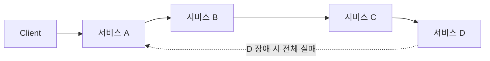

3홉 이상의 동기 체인은 그 자체로 재설계 신호다. 서비스 가용성이 각각 99.9%라도 4단계 체인의 종단 가용성은 대략 99.6%로 떨어지고 지연은 각 홉이 누적된다. 서킷 브레이커·타임아웃을 아무리 정교히 넣어도 근본 구조(동기 결합)는 바뀌지 않는다.

**원인**은 대개 42.4절의 오분해(엔티티별, 계층별)로 경계를 그었거나, DB를 공유한 채 프로세스만 나눴거나, 조직이 여전히 기능별이라 배포 조율이 불가피하거나, 강한 일관성을 유지하려다 동기 호출로 이를 흉내 낸 경우다. 이 마지막 원인 — **분산 트랜잭션을 동기 체인으로 흉내 내려는 시도** — 가 가장 흔하고 치명적이다. 여러 서비스의 상태 변경을 하나의 원자적 단위로 묶으려는 순간, 그 경계는 사실 하나의 서비스여야 했거나 최종 일관성과 Saga를 받아들여야 한다는 뜻이다. → Saga 등 분산 데이터 일관성은 44장 참조.

**탈출 경로**: 사용자 응답에 꼭 필요하지 않은 동기 구간을 비동기(EventBridge, SQS)로 전환해 체인을 줄인다. 공유 DB를 서비스별로 분리하고 과도기엔 CDC로 동기화하며 소유권을 좁혀간다. 강한 일관성이 꼭 필요한 경계는 억지로 나누지 말고 하나의 서비스로 되돌린다 — 이것도 실패가 아니라 정상적인 재설계다.

### 42장 정리

#### [필수] 반드시 알아야 할 것
1. 마이크로서비스의 목적은 기술이 아니라 **팀의 독립 배포**다. 팀이 하나뿐이면 이득이 거의 없다.
2. 서비스마다 자기 데이터 저장소를 가져야 한다. 여러 서비스가 하나의 DB 스키마를 공유하면 배포 독립성은 사라진다.
3. 서비스 경계는 응집도·결합도·데이터 소유권·변경 이유(SRP)·팀 인지 부하로 판단한다. 엔티티별·계층별·기술별·과도한 세분화·CRUD 서비스는 대표적 오분해다.
4. 마이크로서비스는 관측성·CI/CD·IaC·서비스 디스커버리가 갖춰져야 시작할 수 있는 **선행 조건형** 아키텍처다.
5. 분산 모놀리스는 실패 상태이지 다른 스타일이 아니다 — 독립 배포가 안 되면 프로세스만 나눈 모놀리스다.

#### [팁] 실무 노하우
1. 모놀리스로 시작해 도메인 경계가 코드에서 드러난 뒤 떼어내는 것이 대부분의 조직에 옳은 순서다.
2. 스트랭글러 피그는 ALB/API Gateway의 경로 기반 라우팅만으로 구현되며, 문제가 생기면 규칙만 되돌려 즉시 롤백할 수 있다.
3. 서비스 간 통신은 기본을 비동기로 두고, 동기 호출은 즉시 응답이 필요한 경로에만 최소로 허용한다.
4. 언어·프레임워크 다양성은 자유가 아니라 숨은 비용이다. 조직 표준 스택을 2~3개로 제한하라.
5. 팀 규모가 두 피자 팀 상한을 넘으면 서비스를 더 쪼갤 신호로 삼되, 인지 부하가 지나치게 낮아지는 나노서비스화도 경계하라.

#### [주의] 사고·비용·설계 함정
1. 분산 트랜잭션을 동기 호출 체인으로 흉내 내려는 순간 설계가 무너진다. 최종 일관성과 Saga를 받아들이거나 경계를 하나의 서비스로 합쳐라(→ 44장).
2. 동기 호출 체인이 길어지면 가용성은 곱셈으로 떨어지고 지연은 누적된다. 3홉 이상의 동기 체인은 즉시 재설계 신호다.
3. 여러 서비스가 같은 데이터베이스를 공유하면 스키마 변경 하나가 전체 동시 배포를 요구하는 분산 모놀리스로 귀결된다.
4. 도메인 경계가 불확실한 상태에서 조직만 먼저 서비스팀 단위로 쪼개면 콘웨이의 법칙에 따라 잘못된 경계가 그대로 굳어진다.
5. 관측성·CI/CD 없이 서비스 수만 늘리면 장애 원인 파악 시간(MTTR)이 비례해 길어져 전환의 이점이 사라진다.

#### 한 장 요약
모놀리스는 실제 장점이 있는 합리적 기본값이며, 마이크로서비스는 팀의 독립 배포라는 조직적 목적을 위한 수단이지 기술적 우월함의 상징이 아니다. 전환은 스트랭글러 피그 같은 점진적 이행과 데이터 소유권·SRP·인지 부하 기준의 경계 설정, 17가지 베스트 프랙티스를 선행 조건으로 갖췄을 때만 성공한다. 팀이 하나이거나 경계가 불확실하다면 모듈형 모놀리스나 서비스 기반 아키텍처가 더 안전하며, 실패하면 모놀리스와 분산 시스템 양쪽의 단점을 떠안는 분산 모놀리스에 빠진다.

#### 다음 장 예고
43장은 이 장에서 여러 번 참조로 미뤄둔 도메인 주도 설계(DDD)를 정면으로 다룬다. 바운디드 컨텍스트를 찾아내는 이벤트 스토밍 워크숍부터 컨텍스트 맵을 AWS 계정·서비스 구조로 매핑하는 절차까지, 42.4절의 경계 설정 원칙을 실전 방법론으로 완성한다.

---

## 43장. 도메인 주도 설계(DDD) 실전  ★★★★

> **이 장에서 다루는 것**
> 42장은 모놀리스를 언제, 어떤 기준으로 마이크로서비스로 쪼갤 것인지를 다뤘다. 이 장은 그 경계 안쪽 — 도메인을 어떻게 이해하고 모델링할 것인가를 다루는 방법론인 도메인 주도 설계(Domain-Driven Design, DDD)를 실전 관점에서 정리한다. 도메인·서브도메인의 언어부터 엔티티·애그리게이트 같은 전술적 패턴, 바운디드 컨텍스트를 도출하는 이벤트 스토밍 워크숍, 그 결과를 AWS 서비스·계정·데이터 저장소 경계로 옮기는 방법, 마지막으로 도입 여부 판단 기준까지 다룬다. 44장의 데이터 관리 패턴과 45장의 통합 패턴은 이 장에서 정한 경계 위에서 작동한다.

### 43.1 도메인·서브도메인·유비쿼터스 언어

도메인(domain)은 소프트웨어가 풀어야 할 "문제 공간"이다. 전자상거래 회사라면 주문 처리, 재고 관리, 배송, 결제, 고객 지원이 모두 하나의 넓은 도메인을 구성한다. 이 도메인을 한 덩어리로 모델링하면 누구도 전체를 이해할 수 없는 거대한 모델이 나온다. DDD는 이 문제를 서브도메인(subdomain) 단위로 쪼개서 접근한다.

서브도메인은 세 가지로 분류한다.

| 분류 | 정의 | 예시(전자상거래) | 투자 방향 |
|---|---|---|---|
| 핵심 서브도메인(core) | 경쟁 우위의 원천, 회사가 잘해야만 살아남는 부분 | 동적 가격 책정, 추천 엔진, 재고 최적화 | 최고 역량 투입, 자체 구축, 전술적 DDD 전면 적용 |
| 지원 서브도메인(supporting) | 필요하지만 차별화 요소는 아닌 부분 | 주문 처리, 배송 추적 | 적정 수준 투자, 표준 패턴으로 구현 |
| 일반 서브도메인(generic) | 어느 회사나 똑같이 필요한 부분 | 인증, 결제 대행 연동, 이메일 발송 | 기성 SaaS·AWS 관리형 서비스 구매, 직접 개발 지양 |

이 분류가 실무에서 갖는 의미는 예산과 인력 배분이다. 핵심 서브도메인에 시니어 엔지니어와 도메인 전문가 시간을 몰아주고, 일반 서브도메인은 Amazon Cognito, Stripe, Amazon SES 같은 기성 서비스로 대체하는 것이 합리적 선택이다. 세 서브도메인을 똑같은 강도로 설계하려는 시도가 DDD 도입 실패의 첫 번째 원인이다.

유비쿼터스 언어(ubiquitous language)는 도메인 전문가와 개발자가 같은 용어를 같은 의미로 쓰는 것을 말한다. 도메인 전문가가 "주문 확정(confirm)"이라 부르는 개념을 개발자가 코드에서 `updateStatus(4)`로 구현하면, 두 집단은 대화는 하지만 실제로는 다른 것을 이야기하고 있는 셈이다. 유비쿼터스 언어가 제대로 작동한다는 신호는 명확하다 — 클래스 이름이 `Order`, `OrderConfirmed`이고 메서드 이름이 `confirm()`이며, 이벤트 이름이 `OrderConfirmedEvent`여야 한다. 회의실 화이트보드에서 쓰는 단어와 IDE에서 보는 식별자가 일치하지 않으면, 그 DDD는 회의록에만 존재하고 코드에는 존재하지 않는다. 유비쿼터스 언어가 코드에 반영되지 않으면 DDD는 문서 놀이로 끝난다 — 이 장 전체에서 반복해서 확인하게 될 원칙이다.

### 43.2 DDD의 원칙과 구성 요소

전술적 설계(tactical design)는 하나의 바운디드 컨텍스트 안에서 도메인 모델을 코드로 표현하는 패턴 집합이다. 핵심 요소는 다음과 같다.

**엔티티(Entity)**는 식별자(identity)를 가지고 속성이 바뀌어도 생명주기 동안 같은 대상으로 취급되는 객체다. `Order`는 상태가 `PENDING`에서 `CONFIRMED`로 바뀌어도 여전히 같은 주문이다.

**값 객체(Value Object)**는 식별자가 없고 속성 값 자체로 동일성을 판단하며 불변(immutable)이다. `Money(amount, currency)`나 `Address`가 대표적이다.

**애그리게이트(Aggregate)와 애그리게이트 루트(Aggregate Root)**가 DDD 전술 설계의 핵심이다. 애그리게이트는 하나의 단위로 취급되어야 하는 엔티티·값 객체의 묶음이고, 애그리게이트 루트는 외부에서 이 묶음에 접근하는 유일한 진입점이다. 가장 중요한 규칙은 **애그리게이트가 트랜잭션 경계와 일치한다**는 것이다 — 하나의 트랜잭션은 하나의 애그리게이트만 변경해야 한다. `Order`와 그 안의 `OrderLine` 목록은 하나의 애그리게이트이고, 주문 총액이 상한을 넘지 않는다는 불변식(invariant)은 애그리게이트 루트가 강제한다.

```python
class OrderLine:
    def __init__(self, sku: str, qty: int, unit_price: "Money"):
        self.sku, self.qty, self.unit_price = sku, qty, unit_price

class Order:  # 애그리게이트 루트
    MAX_TOTAL = Money(10_000_000, "KRW")

    def __init__(self, order_id: str, customer_id: str):
        self.id = order_id
        self.customer_id = customer_id
        self.status = "PENDING"
        self._lines: list[OrderLine] = []
        self._events: list["DomainEvent"] = []

    def add_line(self, sku: str, qty: int, unit_price: Money) -> None:
        if self.status != "PENDING":
            raise ValueError("확정된 주문은 변경할 수 없다")  # 불변식 강제
        candidate_total = self.total() + unit_price.multiply(qty)
        if candidate_total > self.MAX_TOTAL:
            raise ValueError("주문 한도를 초과했다")
        self._lines.append(OrderLine(sku, qty, unit_price))

    def confirm(self) -> None:
        if not self._lines:
            raise ValueError("빈 주문은 확정할 수 없다")
        self.status = "CONFIRMED"
        self._events.append(OrderConfirmed(self.id, self.customer_id))  # 도메인 이벤트 발행

    def total(self) -> Money:
        return sum((l.unit_price.multiply(l.qty) for l in self._lines), Money.zero("KRW"))

    def pull_events(self) -> list["DomainEvent"]:
        events, self._events = self._events, []
        return events
```

**리포지토리(Repository)**는 애그리게이트를 컬렉션처럼 다루는 영속화 추상화다. `OrderRepository.get(order_id)`는 인프라 세부사항(DynamoDB, RDS)을 도메인 계층에서 숨긴다. **도메인 서비스(Domain Service)**는 특정 엔티티에 속하지 않는 로직 — 예를 들어 여러 `Order`를 비교해 할인율을 계산하는 `PricingPolicy` — 을 담는다. **팩토리(Factory)**는 복잡한 애그리게이트 생성 규칙을 캡슐화한다 (`OrderFactory.create_from_cart(cart)`). **도메인 이벤트(Domain Event)**는 도메인에서 실제로 발생한 사실을 과거형으로 표현한 불변 객체(`OrderConfirmed`)다. **애플리케이션 서비스(Application Service)**는 유스케이스를 오케스트레이션하는 얇은 계층으로, 도메인 로직을 직접 갖지 않고 리포지토리 조회 → 애그리게이트 메서드 호출 → 저장 → 이벤트 발행 순서만 담당한다.

```python
class ConfirmOrderUseCase:  # 애플리케이션 서비스
    def __init__(self, repo: OrderRepository, publisher: EventPublisher):
        self.repo, self.publisher = repo, publisher

    def execute(self, order_id: str) -> None:
        order = self.repo.get(order_id)
        order.confirm()
        self.repo.save(order)  # 애그리게이트 전체를 하나의 트랜잭션으로 저장
        for event in order.pull_events():
            self.publisher.publish(event)
```

애플리케이션 서비스에 `if order.status == "PENDING" and total_amount_check(...)` 같은 판단 로직이 들어가기 시작하면 애너믹 도메인 모델(anemic domain model)로 퇴화하는 신호다. 이 함정은 43.6에서 다시 다룬다.

### 43.3 바운디드 컨텍스트와 컨텍스트 맵

바운디드 컨텍스트(Bounded Context)는 하나의 도메인 모델과 유비쿼터스 언어가 일관되게 적용되는 경계다. "고객(Customer)"이라는 단어는 주문 컨텍스트에서는 배송 주소를 가진 존재지만, 마케팅 컨텍스트에서는 세그먼트와 선호도를 가진 존재다. 같은 단어가 컨텍스트마다 다른 의미와 다른 모델을 가진다는 것을 인정하고, 억지로 하나의 통합 `Customer` 클래스로 합치지 않는 것이 핵심이다. 42장에서 다룬 서비스 분해 경계는 대부분 바운디드 컨텍스트 경계와 일치시키는 것이 바람직하다.

여러 바운디드 컨텍스트가 존재하면 그들 사이의 관계를 정리한 컨텍스트 맵(Context Map)이 필요하다.

| 관계 유형 | 의미 | AWS 구현 힌트 |
|---|---|---|
| 파트너십(Partnership) | 두 팀이 대등하게 협력하며 API를 공동 진화 | 공통 API 계약을 CodeCommit/GitHub 공유 리포지토리로 관리, 변경 시 상호 승인 |
| 공유 커널(Shared Kernel) | 일부 모델·코드를 두 컨텍스트가 공유 | 공통 라이브러리를 Lambda Layer 또는 사설 패키지 저장소(CodeArtifact)로 배포 |
| 고객-공급자(Customer-Supplier) | 상류(공급자)가 하류(고객)의 요구를 반영해 API 제공 | 공급자가 API Gateway로 버전 관리된 엔드포인트 제공, 고객이 계약 테스트로 검증 |
| 순응주의자(Conformist) | 하류가 상류 모델을 그대로 수용 | 상류의 이벤트 스키마를 그대로 소비, 변환 계층 없음 |
| 반부패 계층(Anti-Corruption Layer, ACL) | 하류가 상류 모델을 자신의 모델로 번역해 오염 차단 | Lambda 또는 별도 어댑터 서비스가 외부 이벤트를 내부 도메인 이벤트로 변환 |
| 공개 호스트 서비스(Open Host Service, OHS) | 다수 소비자를 위해 표준화된 공개 프로토콜 제공 | API Gateway + OpenAPI 스펙으로 공개 계약 발행 |
| 발행 언어(Published Language) | OHS와 함께 쓰이는 공유 교환 포맷 | JSON Schema/Avro를 EventBridge 스키마 레지스트리에 등록 |
| 분리된 방식(Separate Ways) | 통합 비용이 이득보다 커서 의도적으로 통합하지 않음 | 두 컨텍스트를 별도 계정으로 완전 분리, 연동 없음 |

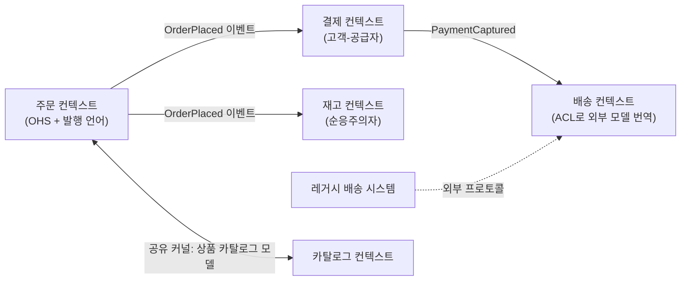

관계 유형을 정하는 실무 기준은 조직 구조다. 팀 간 협상력이 비대칭적이면(레거시 시스템, 외부 벤더) ACL이나 순응주의자가 현실적이고, 두 팀이 대등하고 자주 협업한다면 파트너십이나 고객-공급자가 맞다. 관계를 기술적으로만 정하면 조직 정치와 충돌해 유지되지 않는다.

### 43.4 이벤트 스토밍 워크숍 운영법

이벤트 스토밍(Event Storming)은 도메인 전문가와 개발자가 한 공간(물리적 벽 또는 Miro 같은 무한 캔버스)에 모여 색깔 스티키노트로 비즈니스 프로세스를 함께 그려나가는 워크숍 기법이다. 준비물은 넓은 벽 또는 온라인 화이트보드, 색상별 스티키노트(또는 색상 코드가 지정된 온라인 셰이프), 타이머다. 참가자는 도메인 전문가(비즈니스 담당자), 개발자, 제품 책임자, 그리고 진행을 맡는 퍼실리테이터로 구성하며 인원은 6~10명이 적당하다.

진행은 4단계로 이뤄진다.

1. **빅픽처(Big Picture) 탐색** — 도메인 이벤트(주황색)만으로 처음부터 끝까지 비즈니스 흐름을 시간 순으로 나열한다. "주문이 접수됨", "재고가 예약됨", "결제가 승인됨" 같은 과거형 사실을 쏟아낸다. 이 단계에서는 옳고 그름을 따지지 않고 발산에 집중한다.
2. **프로세스 모델링(Process Modeling)** — 각 이벤트를 유발한 커맨드(파란색)와 그 커맨드를 실행하는 액터(노란색 작은 카드)를 붙인다. 이벤트가 자동으로 다음 커맨드를 유발하면 정책(보라색)으로 표시하고, 의사결정에 필요한 조회 정보는 읽기 모델(초록색)로 표시하며, 외부 시스템과의 연동은 핑크색으로 표시한다.
3. **소프트웨어 설계(Software Design)** — 관련된 커맨드·이벤트 묶음 주위에 큰 노란 사각형으로 애그리게이트 경계를 그린다. 이 경계가 43.2의 애그리게이트, 여러 애그리게이트 묶음이 43.3의 바운디드 컨텍스트 후보가 된다.
4. **검증(Verification)** — 전체 흐름을 처음부터 다시 훑으며 빠진 이벤트, 모순되는 정책, 소유자가 불분명한 애그리게이트를 찾아 수정한다.

산출물을 서비스 경계로 바꾸는 방법은 명확하다. 애그리게이트 사각형이 밀집되어 서로 강하게 결합된 영역을 하나의 바운디드 컨텍스트로 묶고, 컨텍스트 간 이벤트 흐름(주황 카드가 컨텍스트 경계를 넘는 지점)이 바로 서비스 간 통신 지점, 즉 42장에서 다룬 분해 경계이자 45장에서 다룰 통합 지점의 후보가 된다. 원격 진행 시에는 Miro/Mural 같은 도구에 색상 팔레트를 미리 템플릿화하고, 소회의실(breakout room)로 나눠 병렬로 발산시킨 뒤 전체 세션에서 병합하며, 각 단계에 엄격한 타임박스(단계당 30~45분)를 두는 것이 원격 피로를 줄이는 핵심이다.

하루짜리 워크숍의 투자 회수율은 실무에서 매우 높다. 도메인 전문가와 개발자 6~10명의 하루 인건비는 크지 않지만, 이 워크숍 없이 진행된 프로젝트가 3~6개월 뒤에 잘못된 서비스 경계 때문에 재설계되는 비용과 비교하면 압도적으로 저렴하다. 이 워크숍의 진짜 산출물은 벽에 붙은 종이가 아니라, 도메인 전문가와 개발자가 같은 그림을 보며 같은 언어로 대화하게 됐다는 사실 자체다.

### 43.5 DDD를 AWS 아키텍처로 매핑하기

바운디드 컨텍스트가 정해지면 이를 AWS 리소스 경계로 옮기는 기준이 필요하다.

| 경계 강도 | 선택 | 적용 상황 |
|---|---|---|
| 최강 격리 | 별도 AWS 계정 | 핵심 서브도메인, 규제·컴플라이언스가 다른 컨텍스트, 조직상 별도 팀 소유 |
| 중간 격리 | 같은 계정 내 별도 VPC + 별도 서비스군 | 지원 서브도메인, 네트워크 격리는 필요하나 계정 분리는 과함 |
| 약한 격리 | 같은 VPC 내 별도 마이크로서비스 + 별도 데이터 저장소 | 밀접하게 협업하는 컨텍스트(파트너십 관계), 초기 단계 스타트업 |

애그리게이트는 DynamoDB의 아이템 컬렉션(item collection)으로 자연스럽게 표현된다. 파티션 키를 애그리게이트 ID로 두면, 하나의 애그리게이트에 속한 모든 아이템이 같은 파티션에 모이고 `TransactWriteItems`로 단일 트랜잭션 쓰기가 가능해진다 — 이는 43.2에서 정의한 "트랜잭션 경계 = 애그리게이트" 원칙을 인프라 수준에서 강제하는 방법이다.

```python
import boto3
ddb = boto3.client("dynamodb", region_name="ap-northeast-2")

# 애그리게이트 ID(order_id)를 파티션 키로 사용 → 헤더와 라인아이템이 같은 트랜잭션으로 커밋
ddb.transact_write_items(TransactItems=[
    {"Put": {
        "TableName": "orders",
        "Item": {"PK": {"S": f"ORDER#{order_id}"}, "SK": {"S": "HEADER"},
                 "status": {"S": "CONFIRMED"}, "total": {"N": "45000"}},
        "ConditionExpression": "attribute_not_exists(PK) OR #s <> :confirmed",
        "ExpressionAttributeNames": {"#s": "status"},
        "ExpressionAttributeValues": {":confirmed": {"S": "CONFIRMED"}},
    }},
    {"Put": {
        "TableName": "orders",
        "Item": {"PK": {"S": f"ORDER#{order_id}"}, "SK": {"S": "LINE#1"},
                 "sku": {"S": "SKU-001"}, "qty": {"N": "2"}},
    }},
])
```

도메인 이벤트는 Amazon EventBridge(컨텍스트 간 다대다 발행) 또는 Amazon SNS(단순 팬아웃)로 발행한다. 구체적인 전달 보장, 아웃박스 패턴, 순서 보장은 45장에서 다룬다. 컨텍스트 간 ACL은 별도 Lambda 변환 계층으로 구현하는 것이 표준적이다.

```python
def acl_handler(event, context):
    # 외부(레거시 배송 시스템) 이벤트를 내부 도메인 이벤트로 번역 — 외부 모델 오염 차단
    legacy = event["detail"]
    internal_event = {
        "DetailType": "ShipmentDispatched",
        "Detail": {
            "orderId": legacy["order_ref"],       # 외부 필드명 → 내부 유비쿼터스 언어로 매핑
            "trackingNumber": legacy["trk_no"],
            "dispatchedAt": legacy["ts"],
        },
        "Source": "shipping.acl",
        "EventBusName": "domain-events",
    }
    boto3.client("events").put_events(Entries=[internal_event])
```

공개 호스트 서비스는 Amazon API Gateway에 OpenAPI 계약을 붙여 구현한다. 여러 소비자가 있는 컨텍스트(주문 조회 API처럼)에 적합하며, 계약을 명세로 고정해 소비자와의 결합을 관리한다.

실제 사례로 주문·결제·배송·재고 4개 컨텍스트를 끝까지 매핑해보자.

| 컨텍스트 | 관계 | AWS 경계 | 애그리게이트 저장소 | 이벤트 발행 |
|---|---|---|---|---|
| 주문 | OHS(공개 호스트 서비스) | 별도 계정, 전용 VPC | DynamoDB(PK=orderId) | `OrderPlaced`→EventBridge |
| 결제 | 주문의 고객-공급자 | 별도 계정(PCI 범위 분리) | Aurora(강한 정합성 필요) | `PaymentCaptured`→EventBridge |
| 재고 | 주문의 순응주의자 | 같은 계정, 별도 서비스 | DynamoDB(PK=skuId) | `StockReserved`→SNS |
| 배송 | 레거시에 대해 ACL | 같은 계정, 별도 서비스 | DynamoDB(PK=shipmentId) | Lambda ACL이 내부 이벤트로 변환 후 발행 |

결제 컨텍스트만 계정을 분리한 이유는 PCI-DSS 범위를 최소화하기 위해서고, 재고가 순응주의자인 이유는 재고팀이 협상력을 갖지 못한 소규모 팀이기 때문이다 — 기술적 우아함이 아니라 조직 구조와 규제가 매핑을 결정한 사례다.

### 43.6 DDD를 쓸 이유와 도입 시 어려움

DDD가 주는 이득은 세 가지로 요약된다. 첫째, 도메인 전문가와 개발자가 오해 없이 대화할 수 있는 공통 언어. 둘째, "이 서비스는 왜 여기서 끊기는가"에 대한 임의적이지 않은 근거 — 팀 규모나 기술 취향이 아니라 도메인 모델과 유비쿼터스 언어의 일관성이 경계를 정한다. 셋째, 변경의 국지화 — 배송 정책이 바뀌어도 배송 컨텍스트만 손대면 되는 구조.

비용도 분명하다. 전술적 패턴(애그리게이트, 리포지토리, 도메인 이벤트)을 익히는 학습 곡선이 있고, 도메인 전문가의 시간을 상당량 소모하며(이벤트 스토밍 하루, 이후 지속적인 모델 검토), 초기 개발 속도가 단순 CRUD보다 느리다 — 애그리게이트 불변식을 지키는 코드는 게터·세터만 있는 코드보다 작성 시간이 더 든다.

**도메인 복잡도가 낮은 CRUD 시스템에 DDD를 적용하면 순수 오버헤드**가 된다. 게시판, 단순 관리자 페이지, 마스터 데이터 CRUD처럼 비즈니스 규칙이 거의 없는 영역에 애그리게이트·리포지토리·도메인 서비스 계층을 쌓으면 코드량만 늘고 얻는 것이 없다. 이런 영역은 43.1의 일반/지원 서브도메인에 해당하며, 트랜잭션 스크립트나 프레임워크의 기본 ORM 패턴으로 충분하다.

현실적인 도입 전략은 **부분 도입**이다. 43.1에서 식별한 핵심 서브도메인에만 전술적 DDD를 전면 적용하고, 지원·일반 서브도메인은 가벼운 구조를 유지한다. 한 회사 안에서도 컨텍스트별로 설계 강도가 다른 것이 정상이다.

흔한 실패 세 가지를 짚어둔다.

- **애너믹 도메인 모델(Anemic Domain Model)**: 애그리게이트 클래스에 데이터만 담고 검증·불변식 로직은 모두 애플리케이션 서비스나 별도 유틸리티 함수에 흩어놓는 패턴. 43.2의 `Order.add_line()`, `Order.confirm()`처럼 불변식은 애그리게이트 안에서 강제되어야 한다. 로직이 밖으로 새면 같은 검증을 여러 곳에서 중복 구현하다 불일치가 생긴다.
- **기술 중심 컨텍스트 분할**: "인증 서비스", "알림 서비스"처럼 기술적 관심사로 경계를 나누는 것. 42장에서 이미 다룬 함정이지만, DDD 맥락에서는 이런 경계가 유비쿼터스 언어를 만들지 못한다는 점이 문제다. 도메인 개념(주문, 배송, 결제)이 아니라 기능(로그인, 이메일 발송)으로 나누면 43.1의 서브도메인 분류 자체가 성립하지 않는다.
- **유비쿼터스 언어 미반영**: 워크숍에서는 "주문 확정"이라 말해놓고 코드에는 `Status.value == 4`로 남는 경우. 이벤트 스토밍 산출물을 코드로 옮기는 단계에서 이름을 그대로 가져가는 규율이 없으면, 시간이 지날수록 모델과 대화가 갈라진다.

### 43장 정리

#### [필수] 반드시 알아야 할 것
1. 서브도메인은 핵심/지원/일반 세 가지로 분류하고, 투자 강도는 이 분류에 따라 달라야 한다. 세 서브도메인을 똑같이 취급하지 않는다.
2. 유비쿼터스 언어는 회의실 용어가 아니라 클래스명·메서드명·이벤트명에 그대로 나타나야 한다.
3. 애그리게이트는 트랜잭션 경계다. 하나의 트랜잭션은 하나의 애그리게이트만 변경한다.
4. 바운디드 컨텍스트는 하나의 도메인 모델과 언어가 일관되게 적용되는 경계이며, 42장의 서비스 분해 경계와 대체로 일치시킨다.
5. 컨텍스트 맵의 관계 유형(파트너십, 공유 커널, 고객-공급자, 순응주의자, ACL, OHS, 발행 언어, 분리된 방식)은 기술이 아니라 조직 협상력이 결정한다.
6. 이벤트 스토밍은 빅픽처 → 프로세스 모델링 → 소프트웨어 설계 → 검증의 4단계로 진행하며, 애그리게이트 사각형 묶음이 바운디드 컨텍스트 후보다.

#### [팁] 실무 노하우
1. 애그리게이트 ID를 DynamoDB 파티션 키로 삼으면 트랜잭션 경계를 인프라가 자연스럽게 강제해준다.
2. 컨텍스트 간 외부 모델은 항상 ACL(반부패 계층)로 번역해 내부 도메인 모델을 오염시키지 않는다.
3. 다수 소비자가 있는 API는 OHS + 발행 언어(OpenAPI, EventBridge 스키마 레지스트리)로 계약을 고정한다.
4. 이벤트 스토밍은 하루 워크숍으로도 투자 회수율이 높다. 도메인 전문가 참여를 아끼지 않는다.
5. 원격 워크숍은 색상 팔레트를 사전 템플릿화하고 소회의실 병렬 발산 후 병합하는 방식이 효율적이다.
6. 핵심 서브도메인에만 전술적 DDD를 전면 적용하는 부분 도입이 현실적인 시작점이다.

#### [주의] 사고·비용·설계 함정
1. 도메인 복잡도가 낮은 CRUD 시스템에 DDD를 적용하면 순수 오버헤드가 된다 — 적용 전 서브도메인 분류부터 한다.
2. 애너믹 도메인 모델: 애그리게이트에 데이터만 담고 검증 로직을 밖으로 빼면 불변식이 중복되고 어긋난다.
3. 기술 중심 컨텍스트 분할(인증 서비스, 알림 서비스식)은 유비쿼터스 언어를 만들지 못하고 42장의 오분해 함정과 같은 결과로 이어진다.
4. 유비쿼터스 언어가 코드에 반영되지 않으면 DDD는 문서 놀이로 끝난다.
5. 컨텍스트 맵 관계를 조직 구조 검토 없이 기술적으로만 정하면 실제 협업 방식과 어긋나 유지되지 않는다.
6. 하나의 트랜잭션이 여러 애그리게이트를 동시에 변경하도록 설계하면 트랜잭션 경계가 무너지고 44장의 Saga 패턴이 필요해지는 복잡도를 스스로 만든다.

#### 한 장 요약
DDD는 도메인을 핵심·지원·일반 서브도메인으로 나누고, 유비쿼터스 언어로 도메인 전문가와 개발자를 잇는 방법론이다. 전술적으로는 애그리게이트가 트랜잭션 경계를 정의하고, 전략적으로는 바운디드 컨텍스트와 컨텍스트 맵이 서비스 경계와 팀 간 관계를 정의한다. 이벤트 스토밍은 이 경계를 실제로 도출하는 가장 실용적인 워크숍이며, AWS에서는 계정·VPC·DynamoDB 아이템 컬렉션·EventBridge·ACL Lambda로 이 경계를 구현한다. 다만 도메인 복잡도가 낮다면 DDD는 비용만 크므로, 핵심 서브도메인에 국한한 부분 도입이 현실적이다.

#### 다음 장 예고
44장에서는 이 장에서 정한 바운디드 컨텍스트 경계 안에서 서비스별로 독립된 데이터베이스를 운영할 때 발생하는 문제 — 분산 트랜잭션, 조회 성능, 데이터 정합성 — 를 Saga, CQRS, 이벤트 소싱, 트랜잭셔널 아웃박스 같은 패턴으로 다룬다.

---

## 44장. 데이터 관리 패턴  ★★★★

> **이 장에서 다루는 것**
> 43장의 바운디드 컨텍스트 경계 안에서 서비스마다 데이터베이스를 따로 두면 조회·트랜잭션·정합성 문제가 새로 생긴다. 이 장은 그 문제를 푸는 패턴 8종(서비스별 DB, Saga, CQRS, 이벤트 소싱, 트랜잭셔널 아웃박스, 인덱스 테이블, 구체화 뷰)과 설계 가이던스 3종(일관성, 파티셔닝, 복제)을 다룬다. 41.9~41.10에서 다룬 "데이터를 쪼갤 것인가"의 선택을 전제로, 쪼갠 뒤 실제로 무엇을 구현할지가 범위다. 45장은 이 패턴들이 주고받는 메시징 기술(SQS, SNS, EventBridge) 자체를 다루므로, 여기서는 데이터 정합성 관점에 집중한다.

### 44.1 서비스별 데이터베이스(Database per Service)

**문제** — 여러 서비스가 하나의 스키마를 공유하면 배포가 결합되고, 한 서비스의 폭주 쿼리가 다른 서비스의 지연으로 번진다(→ 44.2).

**해결** — 서비스마다 독립된 데이터베이스를 두고, 다른 서비스는 API로만 접근한다. 각 서비스는 접근 패턴에 맞는 저장소를 자유롭게 고른다(폴리글랏 퍼시스턴스) — 주문은 DynamoDB, 카탈로그는 OpenSearch, 정산은 Aurora처럼.

**구조**

```text
services/
├── orders-service/
│   ├── db: DynamoDB 테이블 "Orders" (전용, 타 서비스 접근 불가)
│   └── api: GET /orders/{id}   ← 다른 서비스는 이 API로만 조회
├── catalog-service/db: OpenSearch 도메인 "catalog"
└── settlement-service/db: Aurora PostgreSQL 클러스터 "settlement"

# 규칙: 서비스 B가 A의 데이터가 필요하면 A의 API를 호출한다.
# A의 테이블에 직접 접속하는 자격 증명은 애초에 발급하지 않는다.
```

**고려사항** — 조인이 사라진다("주문+고객을 한 쿼리로"는 API 조합이나 44.8 구체화 뷰로 대체). 분산 트랜잭션도 사라진다("재고 차감+결제 승인"은 44.3 Saga로 대체). 데이터 중복도 생긴다 — 주문 서비스가 고객명을 스냅샷으로 들고 있으면 원본 변경과 반영 사이에 최종 일관성 구간이 생긴다(→ 44.9).

**AWS 구현** — 서비스별 RDS/Aurora 클러스터 또는 DynamoDB 테이블을 발급하고, 서비스별 IAM 역할·Secrets Manager 시크릿으로 자격 증명을 분리한다. VPC 보안 그룹으로 "이 서비스의 태스크만 이 DB 포트 접근"을 강제한다. 공유 클러스터에 스키마만 나누는 경우(41.10)는 최소한 `GRANT`/`REVOKE`로 스키마 단위 접근을 강제한다.

**언제 쓰지 말 것** — 팀이 3~5개뿐이고 도메인 결합이 원래 강하면 과잉이다. 이 경우 41.10처럼 배포만 나누고 DB는 공유하는 편이 실용적이다. 강한 일관성이 업무상 필수이고(이중 계좌 이체 등) 조인·트랜잭션이 매우 빈번하면 서비스 경계 자체를 재검토한다.

### 44.2 공유 데이터베이스의 대가와 예외적 허용 조건

공유 DB가 매력적인 이유는 단순하다 — 조인이 되고, ACID 트랜잭션이 보장되고, 초기 개발 속도가 빠르다. 팀이 하나뿐인 초기 조직에서는 정답에 가깝다.

문제는 서비스가 늘면서 드러난다. **배포 결합**(컬럼 하나 추가에도 이를 읽는 모든 서비스 확인 필요), **스키마 변경 협상**(마이그레이션 배포에 관련 팀 전체 일정 조율 필요, 조직이 클수록 느려짐), **성능 간섭**(한 팀의 무거운 쿼리가 커넥션 풀을 소진해 다른 서비스 쓰기가 지연)이 겹치면 "마이크로서비스인데 배포는 모놀리스처럼"이라는 최악의 조합이 된다.

예외적으로 허용되는 조건은 둘이다. **과도기**: 모놀리스를 점진적으로 분해하는 중(→ 42장)이라면 일부 서비스가 한동안 공유 DB에 남는 것은 정상이다. **읽기 전용 리포팅 복제본**: 쓰기는 각자의 서비스 DB에, 읽기 전용 리드 리플리카나 분석용 복제본(Redshift, Aurora 리더)에는 여러 팀이 자유롭게 쿼리해도 쓰기 경로가 결합되지 않으므로 위험이 낮다.

41.10의 서비스 기반 아키텍처는 이 절충을 스타일 수준으로 끌어올린 것이다 — 배포는 독립시키되 DB는 도메인별 스키마 분리 + 접근 통제로 공유한다(→ 상세 장단점은 41.10 참조). 이 장의 나머지는 그 절충 없이 데이터를 진짜로 쪼갠 뒤 감당해야 할 문제를 다룬다.

### 44.3 Saga 패턴

서비스별 DB에서는 "주문 생성 + 재고 차감 + 결제 승인"을 하나의 트랜잭션으로 묶을 수 없다. Saga는 **각 서비스의 로컬 트랜잭션을 순서대로 실행하고, 실패하면 이미 끝난 단계를 보상(compensate)** 하는 것으로 해결한다.

| 구분 | 코레오그래피 | 오케스트레이션 |
|---|---|---|
| 조정 방식 | 각 서비스가 이벤트를 듣고 다음 이벤트를 발행 | 중앙 오케스트레이터가 단계를 호출·판단 |
| 결합도 | 이벤트 계약에 암묵적으로 결합 | 로직이 오케스트레이터에 집중, 서비스는 단순 |
| 가시성 | 전체 흐름이 코드 어디에도 없음 | 상태 머신 정의 자체가 흐름 문서 |
| 실패 처리 | 보상 로직이 여러 서비스에 분산 | 한 곳에 모여 재시작·타임아웃 제어 쉬움 |
| 적합 규모 | 단계 2~3개, 참여 서비스 안정적 | 단계 4개 이상 또는 자주 변경 |

**한 줄 결정 기준**: 단계가 4개 넘거나 보상 순서가 복잡하면 오케스트레이션(Step Functions), 짧고 안정적이면 코레오그래피(EventBridge).

**보상은 롤백이 아니다.** DB 롤백은 커밋 이전으로 되돌리지만, Saga의 각 단계는 이미 커밋되어 다른 시스템에 관측된 상태다. 보상은 "취소"라는 별도의 비즈니스 오퍼레이션이다 — 결제 승인의 보상은 "환불 처리"이고 재고 차감의 보상은 "재고 복원"이다. **되돌릴 수 없는 단계는 반드시 마지막에 둔다** — 이메일 발송, 외부 결제망 정산 통지처럼 보상 불가·고비용 단계는 시퀀스 끝에 배치하고, 그 이전까지는 모두 보상 가능하게 설계한다.

**시맨틱 락과 중간 상태**: 진행 중 재고는 "예약됨" 같은 중간 상태에 놓인다. 이를 확정 재고처럼 오인하지 않도록 상태 필드로 명시해야 한다(시맨틱 락) — 안 그러면 두 사가가 같은 자원을 동시에 확정 처리하는 경쟁이 생긴다. **타임아웃과 재시작**: 각 단계에 타임아웃을 두고, 초과 시 재시도할지 실패로 보고 보상 체인을 시작할지 명시적으로 정의한다.

AWS 오케스트레이션은 **Step Functions** 상태 머신으로 구현한다. 각 태스크가 로컬 트랜잭션을 호출하고 `Catch`로 실패를 보상 체인으로 분기한다.

```json
{
  "Comment": "주문 처리 Saga — 되돌릴 수 없는 ConfirmOrder를 마지막에 배치",
  "StartAt": "ReserveInventory",
  "States": {
    "ReserveInventory": {
      "Type": "Task",
      "Resource": "arn:aws:lambda:ap-northeast-2:123456789012:function:reserve-inventory",
      "Retry": [{ "ErrorEquals": ["States.Timeout"], "MaxAttempts": 2 }],
      "Catch": [{ "ErrorEquals": ["States.ALL"], "Next": "SagaFailed" }],
      "TimeoutSeconds": 10,
      "Next": "ChargePayment"
    },
    "ChargePayment": {
      "Type": "Task",
      "Resource": "arn:aws:lambda:ap-northeast-2:123456789012:function:charge-payment",
      "TimeoutSeconds": 15,
      "Catch": [{ "ErrorEquals": ["States.ALL"], "Next": "ReleaseInventory" }],
      "Next": "CreateShipment"
    },
    "CreateShipment": {
      "Type": "Task",
      "Resource": "arn:aws:lambda:ap-northeast-2:123456789012:function:create-shipment",
      "TimeoutSeconds": 10,
      "Catch": [{ "ErrorEquals": ["States.ALL"], "Next": "RefundPayment" }],
      "Next": "ConfirmOrder"
    },
    "ConfirmOrder": {
      "Comment": "되돌릴 수 없는 마지막 단계",
      "Type": "Task",
      "Resource": "arn:aws:lambda:ap-northeast-2:123456789012:function:confirm-order",
      "End": true
    },
    "RefundPayment": {
      "Type": "Task",
      "Resource": "arn:aws:lambda:ap-northeast-2:123456789012:function:refund-payment",
      "Next": "ReleaseInventory"
    },
    "ReleaseInventory": {
      "Type": "Task",
      "Resource": "arn:aws:lambda:ap-northeast-2:123456789012:function:release-inventory",
      "Next": "SagaFailed"
    },
    "SagaFailed": { "Type": "Fail", "Error": "OrderSagaFailed", "Cause": "보상 완료" }
  }
}
```

코레오그래피는 **EventBridge**로 구현한다. `OrderCreated` → 재고 서비스 구독 → `InventoryReserved`/`Failed` 발행 → 결제 서비스가 구독하는 식으로 중앙 조정자 없이 흐른다. 참여 서비스가 늘수록 전체 흐름 파악이 어렵다는 점이 오케스트레이션과의 핵심 차이다.

**언제 쓰지 말 것** — 서비스가 하나거나 모두 같은 DB를 쓴다면(→ 44.2) 로컬 트랜잭션으로 충분하다. 중간 상태가 잠깐도 허용되지 않는 업무라면 Saga가 아니라 서비스 경계 자체를 재검토한다.

### 44.4 CQRS

**문제** — 하나의 모델로 쓰기(정합성 중요)와 읽기(속도·다양한 조회 중요)를 모두 감당하면 조회 화면을 위한 비정규화 컬럼이 쓰기 모델을 오염시킨다.

**해결** — 명령(쓰기)과 조회(읽기)를 다른 모델로 분리한다. 분리 수준은 점진적이다.

| 수준 | 구성 | 특징 |
|---|---|---|
| 레벨 1 | 같은 DB, 같은 테이블 | 코드에서만 쓰기/조회 분리, 데이터는 즉시 일치 |
| 레벨 2 | 같은 DB, 다른 테이블·뷰 | 조회 전용 비정규화 테이블, 트리거/배치로 갱신 |
| 레벨 3 | 완전히 다른 저장소 | 쓰기는 트랜잭션 DB, 읽기는 검색/캐시 특화 저장소, 최종 일관성 |

**읽기 모델 갱신 경로와 지연** — 레벨 3에서는 쓰기 DB의 변경이 스트림/이벤트로 읽기 모델에 전파되며 항상 지연이 있다(수십 ms~분 단위, 갱신 방식에 따라 다름). 이 지연을 클라이언트에서 흡수하는 방법은 → 44.9.

**언제 도입하나** — 읽기·쓰기 부하 특성이 크게 다를 때만 도입한다. 쓰기는 초당 수십 건, 읽기는 초당 수만 건에 조회 패턴이 다양하면(상품 상세, 검색, 추천) 레벨 3이 이득이다. **언제 쓰지 말 것** — 읽기·쓰기 비율이 비슷하고 조회 패턴이 단순하면 레벨 1로 충분하다. 별도 저장소·동기화 파이프라인은 운영 부담만 늘린다.

AWS는 쓰기 모델을 **DynamoDB**(조건부 쓰기로 정합성 보장)에 두고 **DynamoDB Streams**로 변경을 캡처해 Lambda가 읽기 모델(**OpenSearch Service** 검색 인덱스, 또는 **ElastiCache** 초저지연 조회)을 갱신한다.

```python
# DynamoDB Streams 트리거 → OpenSearch 읽기 모델 갱신 (레벨 3 CQRS)
from opensearchpy import OpenSearch, RequestsHttpConnection
from requests_aws4auth import AWS4Auth
import boto3

region = "ap-northeast-2"
credentials = boto3.Session().get_credentials()
awsauth = AWS4Auth(credentials.access_key, credentials.secret_key, region, "es")
client = OpenSearch(
    hosts=[{"host": "search-orders-abc123.ap-northeast-2.es.amazonaws.com", "port": 443}],
    http_auth=awsauth, use_ssl=True, connection_class=RequestsHttpConnection,
)

def handler(event, context):
    for record in event["Records"]:
        if record["eventName"] in ("INSERT", "MODIFY"):
            image = record["dynamodb"]["NewImage"]
            order_id = image["PK"]["S"].removeprefix("ORDER#")
            # 읽기 모델은 조회 최적화 비정규화 문서 — 쓰기 모델 스키마와 다를 수 있다
            client.index(index="orders-read-model", id=order_id, body={
                "order_id": order_id,
                "status": image["status"]["S"],
                "total_amount": float(image["total_amount"]["N"]),
            })
        elif record["eventName"] == "REMOVE":
            key = record["dynamodb"]["Keys"]["PK"]["S"].removeprefix("ORDER#")
            client.delete(index="orders-read-model", id=key, ignore=[404])
```

### 44.5 이벤트 소싱과 스냅샷

**문제** — 상태만 저장하면 "왜 지금 상태가 됐는가"의 이력이 사라진다. 감사·시간 재구성이 필요한 도메인(정산, 규제 산업)에서 치명적이다.

**해결** — 현재 상태 대신 **상태를 변화시킨 모든 이벤트**를 append-only로 저장하고, 현재 상태는 이벤트를 순서대로 재생(replay)해 계산한다.

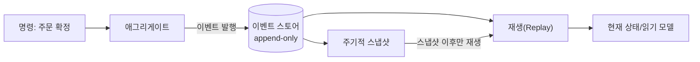

**스냅샷 없이는 재생 비용이 선형으로 증가한다.** 이벤트 10만 개가 쌓인 애그리게이트의 상태를 구하려면 10만 개를 처음부터 재생해야 한다. 스냅샷은 "N개마다 그 시점 상태를 저장"해 가장 가까운 스냅샷 이후 이벤트만 재생하게 만든다. 스냅샷 주기는 도입 시점부터 함께 설계해야 한다 — 나중에 추가하려면 쌓인 이벤트 전체를 재생하는 마이그레이션이 필요하다.

**이벤트 스키마 버저닝(업캐스팅)**: 이벤트는 저장 후 절대 수정하지 않는다. 구조가 바뀌면 새 버전으로 저장하고, 옛 버전을 읽을 때 최신 스키마로 변환하는 업캐스터를 둔다.

```python
# v1 이벤트(단일 배송지 문자열)를 v2 스키마(구조화된 주소)로 업캐스팅
def upcast_order_created(event: dict) -> dict:
    if event["schema_version"] == 1:
        raw = event["shipping_address"]  # v1: "서울시 강남구 테헤란로 1"
        event["shipping_address"] = {"city": raw.split(" ")[0], "street": raw}
        event["schema_version"] = 2
    return event
```

이벤트 소싱은 감사·시간 여행에서 강력하지만 **되돌리기 매우 어려운 결정**이다. 버저닝 전략 없이 몇 달 운영하면 이벤트 형태를 바꿀 때마다 과거 이벤트와의 호환을 손으로 맞춰야 하는 상황에 몰린다.

AWS는 **DynamoDB**에 파티션 키=애그리게이트 ID, 정렬 키=이벤트 버전(0 패딩)인 이벤트 테이블을 두고, 별도 아이템(`SK="SNAPSHOT#<version>"`)에 스냅샷을 저장한다. 다수 컨슈머가 같은 이벤트를 독립 소비해야 하면 **Kinesis Data Streams**로 팬아웃한다.

**언제 쓰지 말 것** — 단순 CRUD이고 감사·시간 여행 요구가 없다면 순수 오버헤드다. 조회 성능만 필요하면 이벤트 소싱 없이 44.4 CQRS만으로 충분한 경우가 많다.

### 44.6 트랜잭셔널 아웃박스와 정확히 한 번 전달

**"DB 커밋 후 큐에 발행"**에는 유실 구간이 있다 — 커밋 성공 후 발행 직전 프로세스가 죽으면 이벤트가 영원히 나가지 않는다(이중 쓰기 문제).

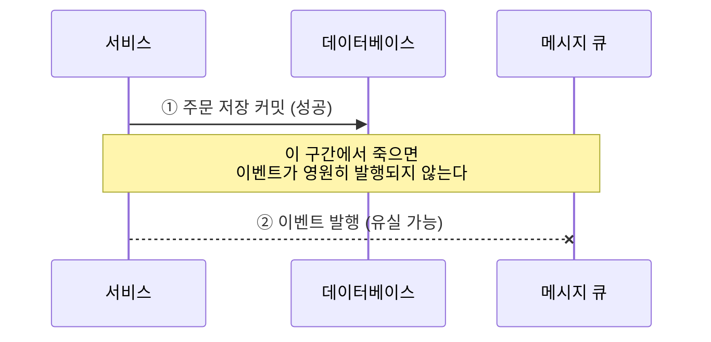

**해결**: 큐에 바로 보내지 않고 **같은 DB 트랜잭션 안에서 아웃박스 테이블에 이벤트를 함께 기록**한다. 별도 릴레이가 아웃박스 변경을 CDC로 감지해 큐/이벤트 버스로 전달한다. DynamoDB는 **Streams**, RDBMS는 **AWS DMS의 CDC 태스크**가 이 역할을 한다.

```python
# 아웃박스 테이블(DynamoDB) — 주문 저장+이벤트 기록을 TransactWriteItems로 원자화
import boto3, uuid, time

dynamodb = boto3.client("dynamodb", region_name="ap-northeast-2")

def create_order_with_outbox(order_id: str, payload: dict):
    event_id = str(uuid.uuid4())  # 중복 제거 키
    dynamodb.transact_write_items(TransactItems=[
        {"Put": {"TableName": "Orders", "Item": {
            "PK": {"S": f"ORDER#{order_id}"}, "SK": {"S": "METADATA"},
            "status": {"S": "CREATED"}}}},
        {"Put": {  # 같은 트랜잭션 — 커밋과 이벤트 기록이 원자적
            "TableName": "OutboxEvents",
            "Item": {
                "PK": {"S": f"ORDER#{order_id}"}, "SK": {"S": f"EVT#{event_id}"},
                "event_id": {"S": event_id}, "event_type": {"S": "OrderCreated"},
                "payload": {"S": str(payload)}, "created_at": {"N": str(int(time.time()))},
            }}},
    ])
```

```python
# 릴레이 Lambda: OutboxEvents의 DynamoDB Streams를 구독해 EventBridge로 중계
import boto3
eventbridge = boto3.client("events", region_name="ap-northeast-2")

def relay_handler(event, context):
    entries = []
    for record in event["Records"]:
        if record["eventName"] != "INSERT":
            continue
        img = record["dynamodb"]["NewImage"]
        entries.append({
            "Source": "orders-service", "DetailType": img["event_type"]["S"],
            "Detail": img["payload"]["S"], "EventBusName": "domain-events",
        })  # event_id를 detail에 포함해 소비자가 중복 제거 키로 쓰게 한다
    if entries:
        eventbridge.put_events(Entries=entries)
    # 아웃박스 테이블은 TTL로 짧게 보관 후 자동 삭제하는 것이 일반적이다
```

**"정확히 한 번(exactly-once) 전달"은 실제로 보장되지 않는다.** 릴레이가 발행 후 성공 응답 전에 재시도되면 같은 이벤트가 두 번 나갈 수 있다. 실무에서 도달 가능한 것은 **최소 한 번 전달 + 소비자 측 멱등 처리**다. 소비자는 `event_id`를 중복 제거 키로 조건부 쓰기에 사용한다.

```python
# 멱등 소비: DynamoDB 조건부 쓰기로 event_id 중복 처리 차단
from botocore.exceptions import ClientError
import boto3, time

processed_table = boto3.resource("dynamodb", region_name="ap-northeast-2").Table("ProcessedEvents")

def consume(event_id: str, handler_fn):
    try:
        processed_table.put_item(
            Item={"event_id": event_id, "processed_at": int(time.time())},
            ConditionExpression="attribute_not_exists(event_id)",  # 이미 있으면 실패 = 중복
        )
    except ClientError as e:
        if e.response["Error"]["Code"] == "ConditionalCheckFailedException":
            return  # 이미 처리한 이벤트 — 재전송은 정상 동작이므로 무시
        raise
    handler_fn(event_id)  # 최초 1회만 실행
```

**언제 쓰지 말 것** — 이벤트를 발행하지 않는 순수 동기 시스템에는 불필요하다. 릴레이 인프라와 멱등 소비 설계 비용은 이벤트 유실이 사업적으로 허용 불가일 때만 값어치를 한다.

### 44.7 인덱스 테이블 패턴

기본 키가 아닌 속성으로 조회해야 할 때(주문 ID로 저장했지만 고객 이메일로도 찾아야 함), 원본 테이블 옆에 **조회 키 → 원본 키 매핑용 인덱스 테이블**을 둔다. 원본에 쓸 때마다 인덱스도 갱신해야 하며, 두 쓰기가 원자적이지 않으면 인덱스가 뒤처지는 순간이 생긴다(→ 44.6 아웃박스로 보강하거나 44.9의 최종 일관성으로 수용).

손으로 구현하면 유지 비용(쓰기 두 배, 갱신 실패 시 복구 로직)이 크다. **DynamoDB의 GSI는 이 패턴의 완전 관리형 구현**이다 — 원본에 쓰면 AWS가 GSI를 결과적 일관성으로 갱신한다(설계 세부는 → 26.3). **언제 쓰지 말 것** — DynamoDB를 쓴다면 직접 구현할 이유가 거의 없다. GSI가 못 하는 다중 테이블 통합 인덱스 같은 예외적 경우에만 직접 만든다.

### 44.8 구체화 뷰 패턴

조회할 때마다 조인·집계하는 대신 **미리 계산해둔 결과를 저장**해두고 조회는 그 결과만 읽는다. 원본이 바뀌면 뷰를 언제 갱신할지가 설계의 핵심이다.

| 갱신 전략 | 방식 | 적합한 경우 |
|---|---|---|
| 즉시(트리거) | 원본 쓰기 시 동기 갱신 | 지연을 거의 허용 못 하고 쓰기량이 적을 때 |
| 주기적(배치) | 스케줄러가 전체/증분 재계산 | 집계가 무겁고 약간의 지연이 허용될 때(일별 매출 등) |
| 이벤트 기반 | 스트림 구독해 증분 갱신 | 원본 변경이 잦고 거의 실시간 유지가 필요할 때 |

**핵심은 재구성 가능성이다.** 뷰는 언제든 원본에서 처음부터 다시 만들 수 있어야 한다 — 뷰가 유일한 데이터 소스가 되는 순간 이 패턴은 변질되고, 계산 로직을 바꿀 때마다 과거 데이터를 잃는 위험을 진다.

AWS는 **Aurora PostgreSQL 구체화 뷰**(`REFRESH MATERIALIZED VIEW CONCURRENTLY`로 잠금 없이 갱신), **Redshift 구체화 뷰**(자동/수동 `REFRESH`, 대규모 집계에 강함), **DynamoDB 집계 테이블**(Streams+Lambda로 카운터 증분 갱신)을 주로 쓴다.

**언제 쓰지 말 것** — 원본 조회 자체가 충분히 빠르면 불필요한 복잡도다. 원본 스키마가 자주 바뀌는 초기 단계에서는 뷰 재설계 비용이 이득보다 클 수 있다.

### 44.9 데이터 일관성 프라이머

| 일관성 수준 | 정의 | 사용자에게 보이는 증상 |
|---|---|---|
| 강한 일관성 | 쓰기 완료 후 모든 읽기가 항상 최신 값을 본다 | 지연·가용성 저하로 나타남(합의에 시간 소요) |
| 최종 일관성 | 시간이 지나면 결국 모든 복제본이 같아진다 | "방금 저장했는데 목록에 안 보인다" |
| 인과 일관성 | 인과관계 있는 쓰기 순서는 모든 곳에서 동일 | "댓글 답글이 원댓글보다 먼저 보이는 일은 없다" |
| 읽기-자신의-쓰기 | 쓴 사람은 자신의 값을 항상 읽는다 | "내 화면엔 바로 반영, 친구 화면엔 아직 예전 값" |
| 단조 읽기 | 한 번 새 값을 본 뒤 예전 값으로 되돌아가지 않는다 | "새로고침했더니 방금 본 댓글이 사라졌다"가 없어야 정상 |

모든 작업이 보상 가능한 것은 아니다. 44.3의 Saga는 재고 차감→복원, 결제 승인→환불처럼 **보상 가능한 작업**을 전제한다. 이메일·SMS 발송, 외부 결제망 정산 통지처럼 **보상 불가·고비용 작업**은 Saga 마지막 단계에만 배치한다(→ 44.3).

**최종 일관성은 결국 UI에서 드러난다.** "저장했는데 목록에 없다"는 신뢰를 가장 빠르게 깎는 버그다. 흡수 기법 셋:

- **낙관적 UI**: 서버 응답을 기다리지 않고 클라이언트 상태를 먼저 갱신해 화면에 반영하고, 실패 시에만 되돌린다.
- **쓰기 후 읽기 라우팅**: 쓰기 직후 그 사용자의 읽기는 복제본이 아닌 primary로 강제 라우팅한다.
- **버전 토큰**: 쓰기 응답에 버전 번호를 실어주고, 다음 읽기에 "최소 이 버전 이상"을 요구한다 — 복제본이 못 미치면 대기하거나 primary로 폴백한다.

### 44.10 데이터 파티셔닝 가이던스

| 파티셔닝 방식 | 목적 | 예 |
|---|---|---|
| 수평(샤딩) | 같은 스키마 행을 여러 노드에 분산해 쓰기·저장 확장 | 고객 ID 해시로 DynamoDB 파티션 분산 |
| 수직 | 테이블 컬럼을 성격별로 분리 | 대용량 첨부·로그 컬럼을 별도 테이블/S3로 |
| 기능적 | 도메인·서비스 경계로 DB 자체를 분리 | 44.1의 서비스별 DB와 사실상 같은 개념 |

**파티션 키 선택 기준**은 셋이다. **카디널리티**(값 종류가 충분히 많아야 골고루 나뉨), **균등 분포**(특정 값에 접근이 몰리지 않아야 함), **쿼리 정렬**(빈번한 조회가 한 파티션 안에서 끝나야 스캐터-개더를 피함). **시간(날짜)만 쓰면 항상 "오늘" 파티션만 뜨거워진다.**

핫 파티션은 **쓰기 샤딩**으로 완화한다. 논리적으로는 하나의 엔터티지만 키 뒤에 해시 접미사를 붙여 물리적으로 분산해 쓰고, 읽을 때 모든 샤드를 병렬 조회해 합친다.

```python
# 쓰기 샤딩 키 생성 — 날짜만 쓰면 핫 파티션이 되므로 해시 접미사로 분산
import hashlib

SHARD_COUNT = 10

def sharded_partition_key(date_str: str, entity_id: str) -> str:
    shard = int(hashlib.md5(entity_id.encode()).hexdigest(), 16) % SHARD_COUNT
    return f"DATE#{date_str}#SHARD#{shard}"  # 시간 + 해시 복합 키

def all_shard_keys_for_date(date_str: str) -> list[str]:
    return [f"DATE#{date_str}#SHARD#{i}" for i in range(SHARD_COUNT)]  # 읽기 시 병합
```

**리샤딩은 대공사다.** 파티션 키를 바꾸려면 전체 데이터를 새 키 구조로 다시 써야 하고 무중단으로는 매우 어렵다. 초기 설계 시점에 **최소 3년치 성장**을 가정해 카디널리티와 샤드 수에 여유를 둔다. 파티션을 나누면 파티션 간 조인·트랜잭션도 잃는다 — 비정규화나 44.3 Saga로 대응한다.

### 44.11 데이터 복제·동기화 가이던스

| 구분 | 마스터-복제본 | 다중 마스터 |
|---|---|---|
| 쓰기 경로 | 마스터만 쓰기, 나머지는 읽기 전용 | 여러 노드가 동시에 쓰기 허용 |
| 충돌 가능성 | 없음(쓰기가 단일 지점) | 있음 — 같은 레코드를 동시 수정 가능 |
| 적합한 경우 | 읽기 확장, 강한 정합성이 중요한 업무 | 여러 리전에서 낮은 지연 쓰기 필요 |

**동기 복제**는 복제본 쓰기 확인 후 커밋 완료로 본다 — 손실 위험은 낮지만 지연이 늘고 복제본 장애 시 가용성이 떨어진다. **비동기 복제**는 커밋 후 백그라운드로 복제한다 — 지연은 낮지만 마스터 장애 시 최근 쓰기를 잃을 수 있다.

충돌 해결 전략:

| 전략 | 방식 | 특징 |
|---|---|---|
| LWW | 타임스탬프가 가장 늦은 쓰기 채택 | 가장 단순하지만 조용히 데이터를 잃을 수 있다 |
| 버전 벡터 | 각 노드 쓰기 이력을 벡터로 추적 | 충돌 감지는 되지만 병합은 애플리케이션 책임 |
| CRDT | 항상 병합 가능한 자료구조(카운터, 집합) | 자동 병합, 지원 타입이 제한적 |
| 도메인 규칙 | "재고는 항상 작은 값 채택" 같은 업무 규칙 | 가장 정확하지만 업무마다 직접 설계 필요 |

**복제 지연은 반드시 측정하고 SLO를 둔다.** Aurora/RDS의 `ReplicaLag`, DynamoDB 글로벌 테이블 복제 지연을 CloudWatch로 관측하고 임계값 알림을 설정한다. **리전 간 복제**는 데이터 전송 비용과 리전 수만큼 배가되는 저장 비용을 용량 계획에 반영한다. **캐시-원본 동기화**는 write-through(동기 갱신), write-behind(캐시 우선, 비동기 반영), cache-aside(무효화 후 재적재) 중 정합성 요구에 맞게 고른다.

### 44.12 AWS 매핑

| 패턴 | 대표 AWS 조합 | 지연 | 비용 축 | 운영 부담 |
|---|---|---|---|---|
| 서비스별 DB | 서비스마다 DynamoDB/RDS 별도 | 낮음 | 저장소 수만큼 고정비 | 중 — 자격 증명·네트워크 분리 |
| Saga(오케스트레이션) | Step Functions + Lambda | 단계별 수백 ms | 상태 전이·실행 시간 과금 | 낮음 — 흐름이 코드로 명시적 |
| Saga(코레오그래피) | EventBridge + Lambda | 단계별 수십~수백 ms | 이벤트 건수 과금 | 높음 — 관측 도구 필요 |
| CQRS | DynamoDB+Streams+OpenSearch/ElastiCache | 초 단위(반영까지) | 저장소 이중화+스트림 처리 | 중 — 동기화 파이프라인 유지 |
| 이벤트 소싱 | DynamoDB(이벤트)+Kinesis(팬아웃) | 스냅샷 유무에 좌우 | 이벤트 누적 저장 | 높음 — 스키마 버저닝 운영 |
| 트랜잭셔널 아웃박스 | DynamoDB(아웃박스)+Streams+EventBridge | 릴레이 주기(수백 ms~초) | 스트림 처리+이벤트 버스 | 중 — 멱등 소비 설계 |
| 인덱스 테이블 | DynamoDB GSI | 결과적 일관성(수백 ms) | GSI 전용 용량 | 낮음 — 관리형 |
| 구체화 뷰 | Aurora 구체화 뷰/Redshift/DynamoDB 집계 | 갱신 전략에 좌우 | 재계산 컴퓨팅 | 중 — 재구성 파이프라인 유지 |

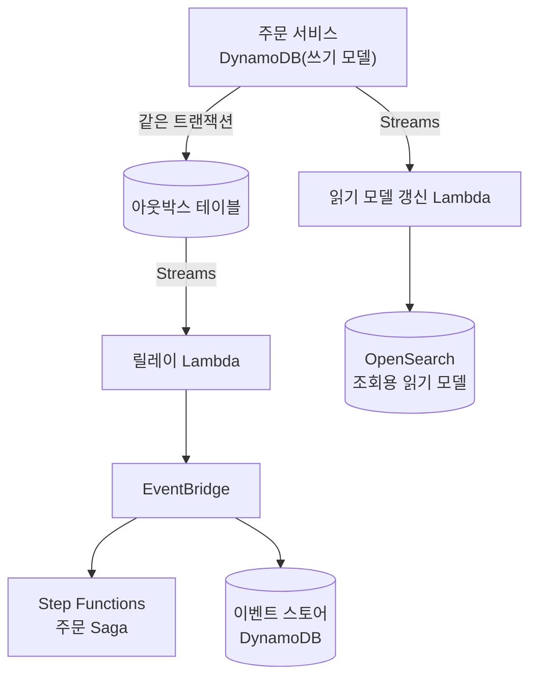

이 참조 아키텍처는 아웃박스(정합한 발행), 코레오그래피 Saga(조율), CQRS(조회), 이벤트 소싱(감사 이력)이 한 주문 도메인 안에서 겹치는 모습을 보여준다. 실제로 네 패턴을 동시에 쓰는 경우는 드물다 — 각 절의 "언제 쓰지 말 것" 기준으로 필요한 것만 고른다.

### 44장 정리

#### [필수] 반드시 알아야 할 것
1. Saga는 롤백이 아니라 **보상(compensating) 트랜잭션**이다. 각 단계마다 되돌리는 방법을 설계하고, 되돌릴 수 없는 단계는 반드시 마지막에 둔다.
2. DB 쓰기와 이벤트 발행을 원자적으로 묶으려면 **트랜잭셔널 아웃박스**가 필요하다. "DB 커밋 후 큐 발행"은 그 사이에 유실 구간이 있다.
3. 메시지는 기본적으로 **최소 한 번(at-least-once)** 전달된다. 소비자는 항상 멱등해야 하며, 이벤트 ID 조건부 쓰기가 표준 구현이다.
4. 서비스별 데이터베이스는 조인과 분산 트랜잭션을 잃는다 — 조인은 44.8 구체화 뷰나 API 조합으로, 트랜잭션은 44.3 Saga로 대체한다.
5. CQRS는 읽기·쓰기 부하 특성이 크게 다를 때만 도입한다. 읽기 모델은 DynamoDB, ElastiCache, OpenSearch 등 조회 특화 저장소로 별도 구성한다.
6. 이벤트 소싱은 스냅샷 없이는 재생 비용이 이벤트 수에 비례해 선형 증가한다. 스냅샷 주기는 도입 시점부터 설계한다.
7. 파티션 키는 카디널리티가 높고 접근이 고르게 분산되는 속성으로 고른다. 시간(날짜)만 쓰면 항상 최신 파티션만 뜨거워진다.

#### [팁] 실무 노하우
1. GSI는 인덱스 테이블 패턴의 완전 관리형 구현이다. 직접 구현하기 전에 GSI로 충분한지 먼저 확인한다(→ 26.3).
2. 구체화 뷰는 언제든 원본에서 처음부터 재생성할 수 있는 형태로 유지한다 — 뷰가 유일한 데이터 소스가 되면 이 패턴은 변질된다.
3. 핫 파티션은 논리 키에 해시 접미사를 붙이는 쓰기 샤딩으로 완화하고, 읽기는 모든 샤드를 병렬 조회해 병합한다.
4. 최종 일관성은 낙관적 UI, 쓰기 후 읽기 라우팅, 버전 토큰 중 하나로 UI 단에서 흡수한다 — 백엔드만 고치고 끝낼 문제가 아니다.
5. 사가 단계가 4개를 넘거나 자주 바뀌면 오케스트레이션(Step Functions), 짧고 안정적이면 코레오그래피(EventBridge)를 고른다.
6. 리전 간 복제나 다중 마스터를 도입하기 전에 복제 지연을 CloudWatch로 관측할 지표부터 확보한다.

#### [주의] 사고·비용·설계 함정
1. 이벤트 소싱과 CQRS는 되돌리기 매우 어려운 결정이다. 이벤트 스키마 버저닝 전략 없이 시작하면 몇 달 뒤 과거 이벤트와의 호환 문제로 막힌다.
2. 최종 일관성은 결국 UI에서 드러난다 — "저장했는데 목록에 없다"는 신뢰를 깎는 버그이지 사소한 지연이 아니다.
3. 데이터 재파티셔닝(리샤딩)은 대공사다. 초기 설계에서 최소 3년치 성장을 가정해야 나중에 전면 마이그레이션을 피한다.
4. 아웃박스 없이 이벤트를 발행하면 커밋-발행 사이 유실 구간이 프로덕션 장애로 드러난다 — 재현이 어려운 "이벤트가 가끔 안 온다" 버그 형태로 나타난다.
5. 멱등하지 않은 소비자는 재시도·중복 전달이 필연적인 메시징 환경에서 데이터 중복(중복 결제 승인 등)으로 이어진다.
6. Saga의 중간 상태를 명시적으로 노출하지 않으면 서로 다른 사가가 같은 자원을 동시에 확정 처리하는 경쟁 상태가 생긴다.
7. 공유 데이터베이스에서 다른 서비스 테이블을 직접 조회하는 예외를 한 번 허용하면 그 예외가 관행이 되어 배포 결합이 되돌아온다.

#### 한 장 요약
서비스별 데이터베이스는 배포 독립성을 주는 대신 조인과 분산 트랜잭션을 앗아가며, 이 장의 나머지 패턴은 모두 그 대가를 갚는 방법이다. Saga는 트랜잭션을 보상 가능한 단계의 연쇄로 대체하고, CQRS·구체화 뷰·인덱스 테이블은 잃어버린 조회 편의를 되찾아주며, 이벤트 소싱과 트랜잭셔널 아웃박스는 상태 변화를 신뢰할 수 있는 이벤트로 만든다. 그 밑바탕에는 최종 일관성이라는 현실이 있고, 이를 UI와 소비자 로직에서 명시적으로 흡수하는 것이 성숙한 분산 데이터 설계다.

#### 다음 장 예고
45장에서는 이 장의 패턴들이 실제로 주고받는 통신 수단 — 동기 API, BFF, 그리고 SQS·SNS·EventBridge·Kinesis 같은 비동기 메시징 서비스의 구체적인 선택 기준을 다룬다.

---

## 45장. 통합과 통신 패턴  ★★★★

> **이 장에서 다루는 것**
> 43장의 바운디드 컨텍스트와 44장의 Saga·CQRS·트랜잭셔널 아웃박스는 서비스 경계를 나누고 그 경계 안에서 상태를 정합하게 유지하는 방법을 다뤘다. 그 경계를 넘어 서비스들이 실제로 무엇을 어떤 방식으로 주고받는지는 이 장의 몫이다. 동기 통신(REST·gRPC·GraphQL)과 API Gateway의 통합 유형, 클라이언트별 BFF와 UI 컴포지션, 여러 응답을 조합하는 어그리게이터·브랜치 패턴을 먼저 다루고, 이어서 SQS·SNS·EventBridge·Kinesis/MSK라는 AWS의 4대 비동기 통합 축, 서비스 디스커버리·서비스 메시, API 버저닝과 스키마 레지스트리까지 정리한다. 44장의 트랜잭셔널 아웃박스가 "무엇을 어떻게 안전하게 발행하는가"를 다뤘다면, 이 장은 "그것을 어떤 채널로 어떤 서비스에 전달할 것인가"를 정한다. 46장의 재시도·서킷 브레이커·큐 기반 부하 평준화 같은 복원력 패턴은 이 장에서 고른 통신 수단 위에서 동작하므로, 통신 패턴을 먼저 이해해야 복원력 패턴이 왜 필요한지 납득된다.

### 45.1 동기 통신: REST, gRPC, GraphQL(AppSync)

서비스가 몇 개 안 될 때는 어떤 통신 방식을 쓰든 큰 차이가 없다. 서비스 수가 늘고 클라이언트 종류(웹, 모바일, 서버 간 통합)가 다양해지면 "어떤 프로토콜이 어떤 상황에 맞는가"가 설계 초반의 선택지가 된다.

**REST**는 자원(resource)을 명사 중심 URI로 모델링하고 동작은 HTTP 메서드(GET/POST/PUT/PATCH/DELETE)로 표현한다. 상태 코드는 계약의 일부다 — 200은 성공, 201은 생성, 204는 본문 없는 성공, 400은 클라이언트 오류, 404는 자원 없음, 409는 충돌, 429는 스로틀링, 5xx는 서버 오류로 일관되게 쓰지 않으면 클라이언트가 재시도 여부를 코드로 판단할 수 없다. REST의 원형 논문이 강조한 **HATEOAS**(응답에 다음 가능한 작업의 링크를 포함해 클라이언트가 API 구조를 하드코딩하지 않게 하는 것)는 이론적으로는 우아하지만 실무에서는 거의 채택되지 않는다 — 클라이언트 구현 복잡도가 늘어나는 데 비해 얻는 유연성이 크지 않기 때문이다. 대신 OpenAPI(Swagger) 명세로 계약을 명시하고 클라이언트 SDK를 코드 생성하는 방식이 현실적인 대안으로 자리 잡았다.

**gRPC**는 HTTP/2 위에서 동작하며 **Protocol Buffers**(스키마 우선의 이진 직렬화 포맷)로 페이로드를 표현해 JSON보다 작고 빠르게 직렬화한다. 스키마가 `.proto` 파일로 고정되므로 서비스 간 계약이 코드로 강제된다는 장점이 있다. 네 가지 통신 모드(단항, 서버 스트리밍, 클라이언트 스트리밍, 양방향 스트리밍)를 지원해 실시간 위치 업데이트나 대용량 파일 청크 전송 같은 스트리밍 시나리오에 적합하다. Application Load Balancer는 HTTP/2를 지원하는 대상 그룹을 통해 gRPC 트래픽을 라우팅할 수 있다(gRPC 전용 상태 확인 포함) — 다만 브라우저에서 직접 gRPC를 호출하려면 gRPC-Web 프록시가 별도로 필요하다는 점은 기억해 둘 만하다.

```protobuf
// order.proto — 서비스 간 계약을 코드로 고정해 스키마 드리프트를 막는다
syntax = "proto3";
package order.v1;

service OrderService {
  rpc GetOrder (GetOrderRequest) returns (Order);
  rpc StreamOrderUpdates (GetOrderRequest) returns (stream Order); // 서버 스트리밍
}

message GetOrderRequest { string order_id = 1; }
message Order {
  string order_id = 1;
  string status = 2;
  int64 updated_at_epoch_ms = 3;
}
```

**GraphQL**은 클라이언트가 필요한 필드만 명시해 한 번에 조회하도록 함으로써 REST의 고질적 문제인 **오버페칭**(불필요한 필드까지 다 받음)과 **언더페칭**(관계 데이터를 얻으려 여러 번 왕복)을 동시에 해결한다. 대신 중첩 필드마다 개별 리졸버가 호출되면서 **N+1 문제**(부모 목록 하나에 자식 조회가 N번 발생)가 생기기 쉬워, 배치 로딩(DataLoader 패턴)이나 파이프라인 리졸버로 묶어 처리해야 한다. AWS AppSync는 관리형 GraphQL 서비스로, 리졸버를 VTL(Velocity Template Language) 또는 JavaScript로 작성하거나 Lambda를 직접 호출하는 **다이렉트 Lambda 리졸버**를 쓸 수 있고, 여러 데이터 소스를 순서대로 호출하는 **파이프라인 리졸버**로 어그리게이터 로직을 구현한다. **구독(Subscription)**은 AppSync가 WebSocket 연결을 관리해 데이터 변경을 클라이언트에 실시간으로 밀어주는 기능으로, 별도의 WebSocket 인프라를 직접 구축하지 않아도 된다.

| 항목 | REST | gRPC | GraphQL(AppSync) |
|---|---|---|---|
| 프로토콜 | HTTP/1.1 또는 2 | HTTP/2 전용 | HTTP/1.1·2, 구독은 WebSocket |
| 페이로드 | JSON(사람이 읽기 쉬움) | Protobuf(이진, 작고 빠름) | JSON(요청 필드로 응답 형태 결정) |
| 스키마 강제 | 느슨함(OpenAPI는 별도 문서) | 강함(.proto가 곧 계약) | 강함(GraphQL 스키마 언어) |
| 브라우저 직접 호출 | 자유로움 | 별도 프록시 필요(gRPC-Web) | 자유로움 |
| 스트리밍 | 없음(폴링·별도 WebSocket) | 4가지 모드 내장 | 구독으로 서버→클라이언트 푸시 |
| 캐싱 용이성 | 높음(HTTP 캐시 헤더 활용) | 낮음 | 중간(쿼리 단위 캐시 별도 구현) |
| 적합 사용처 | 범용 공개 API, 단순 CRUD | 내부 서비스 간 고성능 통신, 스트리밍 | 다양한 클라이언트가 각기 다른 필드 조합을 원할 때 |

**한 줄 결정 기준**: 외부에 공개하는 범용 API는 REST를 기본값으로 삼고, 내부 서비스 간 고빈도·스트리밍 통신에는 gRPC를, 클라이언트마다 필요한 데이터 모양이 크게 다른 프런트엔드 대면 API에는 GraphQL을 쓴다.

세 방식 모두 "무엇을 반환하는가"만큼 "잘못됐을 때 무엇을 반환하는가"가 중요하다. REST에서는 오류 응답의 본문 형식(예: `type`/`title`/`detail` 필드를 갖는 RFC 9457 problem details 스타일)을 서비스 전체에서 통일해야 클라이언트가 오류 처리 로직을 한 벌만 작성해도 된다. gRPC는 상태 코드(예: `NOT_FOUND`, `DEADLINE_EXCEEDED`)와 함께 상세 메시지를 `status` 패키지로 전달하는 관례를 따르고, GraphQL은 HTTP 상태 코드가 대개 200으로 고정되는 대신 응답 본문의 `errors` 배열에 실패 원인을 담는다는 점이 REST 개발자에게 자주 혼란을 준다 — 클라이언트가 HTTP 상태만 보고 성공 여부를 판단하도록 짜여 있다면 GraphQL 도입 시 이 부분을 반드시 다시 검토해야 한다.

### 45.2 API Gateway 패턴

Amazon API Gateway는 REST API, HTTP API, WebSocket API 세 가지 유형을 제공하며 각각 용도가 다르다.

| 항목 | REST API | HTTP API | WebSocket API |
|---|---|---|---|
| 주요 용도 | 완전한 기능이 필요한 REST 백엔드 | 저지연·저비용 프록시 | 양방향 실시간 통신 |
| 지연 | 기준선 | REST API 대비 낮음(일반적으로) | 연결 유지형이라 별도 비교 불가 |
| 요금 | 상대적으로 높음 | REST API 대비 낮음(일반적으로) | 연결 시간 + 메시지 건수 과금 |
| 사용량 계획·API 키 | 지원 | 일반적으로 미지원(최신 지원 여부는 문서 확인) | 해당 없음 |
| 캐싱 | 스테이지 단위 응답 캐싱 지원 | 기본 캐싱 미지원 | 해당 없음 |
| 요청 검증·매핑 템플릿(VTL) | 지원 | 단순 매핑 위주(VTL 미지원) | 라우트 선택 표현식 |
| 인가 | Lambda 오서라이저, IAM, Cognito | JWT 오서라이저 내장, Lambda, IAM | Lambda 오서라이저 |

통합 유형은 **Lambda 프록시**(요청 전체를 이벤트로 전달, 가장 흔한 패턴), **HTTP 통합**(기존 HTTP 백엔드를 그대로 노출), **AWS 서비스 통합**(SQS·Step Functions·DynamoDB 같은 AWS 서비스 API를 Lambda 없이 직접 호출), **VPC 링크**(프라이빗 서브넷의 ALB·NLB에 연결 — REST API는 NLB 경유가 기본이고 HTTP API의 VPC 링크는 ALB·NLB·Cloud Map 등록 리소스까지 더 유연하게 연결)로 나뉜다. **사용량 계획(Usage Plan)**과 **API 키**는 REST API에서 파트너·서드파티 소비자별로 요청 쿼터와 처리율을 관리할 때 쓴다. **스로틀링**은 계정 수준, 스테이지 수준, 메서드 수준 세 계층에서 토큰 버킷 방식(정상 상태 처리율 + 버스트 한도)으로 설정하며, 좁은 범위(메서드)가 넓은 범위(계정)보다 우선 적용된다. **캐싱**은 REST API 스테이지에 TTL을 지정해 켤 수 있어 반복 조회가 많은 GET 엔드포인트의 백엔드 부하를 줄인다. **요청 검증**은 JSON 스키마 기준으로 필수 파라미터·본문 형식을 API Gateway 단에서 걸러 백엔드 호출 전에 차단하고, **매핑 템플릿(VTL)**은 요청·응답 형태를 변환해 백엔드 계약과 클라이언트 계약을 분리한다. **사용자 지정 도메인**, **스테이지**, **카나리 배포**는 배포 전략의 일부이며 자세한 내용은 → 37장을 참조한다.

가장 자주 놓치는 함정은 **통합 타임아웃과 페이로드 한도**다. API Gateway의 통합 타임아웃은 초 단위 상한(일반적으로 최대 29초 안팎, 정확한 값은 할당량 문서 확인)이 있고 페이로드 크기도 제한(일반적으로 10MB 안팎)돼 있어, 이미지 처리나 리포트 생성처럼 수십 초 이상 걸리는 작업을 동기 API 뒤에 두면 타임아웃으로 실패한다. 이런 작업은 API Gateway가 요청을 즉시 큐(SQS)에 넣고 202 Accepted를 반환한 뒤, 클라이언트가 별도 엔드포인트로 상태를 폴링하거나 완료 시 웹훅을 받는 **비동기 작업 패턴**으로 바꿔야 한다.

```yaml
# openapi.yaml 발췌 — API Gateway REST API의 Lambda 프록시 통합
openapi: 3.0.1
info: { title: order-api, version: "1.0" }
paths:
  /orders/{orderId}:
    get:
      parameters:
        - name: orderId
          in: path
          required: true
          schema: { type: string }
      x-amazon-apigateway-integration:
        type: aws_proxy
        httpMethod: POST
        # 리전 계정의 함수를 프록시 통합으로 연결 — 요청 전체가 이벤트로 전달된다
        uri: arn:aws:apigateway:ap-northeast-2:lambda:path/2015-03-31/functions/arn:aws:lambda:ap-northeast-2:123456789012:function:get-order/invocations
      responses:
        "200": { description: OK }
        "404": { description: Not Found }
```

REST API의 **매핑 템플릿(VTL)**은 프록시 통합 없이 백엔드(예: DynamoDB API)를 직접 통합할 때 요청·응답 형태를 변환하는 데 쓴다. 예를 들어 아래 템플릿은 클라이언트가 보낸 JSON을 DynamoDB `GetItem` 호출 형태로 바꿔, Lambda 없이도 API Gateway가 직접 DynamoDB를 호출하게 만든다.

```velocity
## request-mapping.vtl — 프록시 없이 DynamoDB GetItem을 직접 호출하는 매핑
{
  "TableName": "Orders",
  "Key": { "orderId": { "S": "$input.params('orderId')" } }
}
```

이런 **AWS 서비스 직접 통합**은 Lambda 콜드 스타트나 실행 비용 없이 단순 조회를 처리할 수 있다는 장점이 있지만, 매핑 템플릿에 비즈니스 로직을 담기 시작하면 테스트하기 어려운 VTL 코드가 늘어나므로 단순 패스스루 수준을 넘어서면 Lambda 프록시로 되돌리는 것이 유지보수에 유리하다.

### 45.3 BFF와 클라이언트측 UI 컴포지션

하나의 범용 API로 웹·모바일·서드파티 파트너를 모두 서빙하면 클라이언트마다 요구하는 데이터 모양이 달라 API가 점점 비대해지고, 한쪽 클라이언트의 요구사항 변경이 다른 클라이언트에 영향을 준다. **BFF(Backend for Frontend)** 패턴은 클라이언트 유형별로 전용 백엔드를 두어 이 결합을 끊는다 — 웹 BFF는 데스크톱 화면에 최적화된 응답을, 모바일 BFF는 페이로드를 줄이고 배터리·네트워크를 아끼는 응답을 반환한다. 각 BFF는 하위의 여러 도메인 서비스를 호출해 조합하는 얇은 계층이며, 도메인 서비스 자체의 API 계약은 안정적으로 유지된다.

**마이크로 프런트엔드**는 이 개념을 UI 계층까지 확장한 것으로, 화면의 각 영역(헤더, 상품 목록, 장바구니 등)을 서로 다른 팀이 독립적으로 배포하는 프런트엔드 조각으로 만든다. **클라이언트측 UI 컴포지션**은 브라우저가 여러 마이크로 프런트엔드를 내려받아 런타임에 하나의 화면으로 조립하는 방식이고, **서버측 컴포지션**은 서버(또는 엣지)가 여러 조각을 미리 합쳐 완성된 HTML을 응답한다. 클라이언트측 조합은 팀 간 배포 독립성이 가장 크고 장애 격리(한 조각이 실패해도 나머지는 정상 렌더링)가 쉬운 대신, 초기 로딩 성능과 SEO에서 불리하다. 서버측 조합은 초기 로딩과 SEO에 유리하지만 조합 서버가 여러 팀의 응답을 기다려야 하므로 어그리게이터 패턴(→ 45.4)과 같은 지연·부분 실패 문제를 그대로 안는다.

최근에는 **모듈 페더레이션(module federation)** 같은 번들러 기능이 클라이언트측 조합을 빌드 도구 수준에서 지원해, 팀마다 독립적으로 빌드·배포한 자바스크립트 번들을 런타임에 안전하게 로드하는 방식이 널리 쓰인다. 이 경우에도 각 마이크로 프런트엔드가 공유하는 디자인 시스템 버전과 상태 관리 방식을 어느 정도 통일해 두지 않으면 화면 곳곳에서 이질적인 사용자 경험이 드러난다는 점은 조직적으로 조율해야 한다.

인증 토큰 취급에서는 BFF가 보안 경계 역할을 겸한다. SPA(단일 페이지 애플리케이션)가 리프레시 토큰까지 브라우저에 들고 있으면 XSS 공격 시 탈취 위험이 커지므로, BFF가 자격 증명 교환(예: OAuth 인가 코드 교환, 리프레시 토큰 보관)을 서버 측에서 대신 수행하고 브라우저에는 httpOnly 쿠키로 세션만 전달하는 구성이 일반적으로 권장된다. 이렇게 하면 브라우저 JavaScript는 토큰 값 자체에 접근할 수 없다.

### 45.4 어그리게이터·브랜치 패턴

**어그리게이터(Aggregator)** 패턴은 하나의 클라이언트 요청에 응답하기 위해 여러 하위 서비스를 호출하고 그 결과를 하나로 조합하는 패턴이다. 핵심 설계 고민은 두 가지다. 첫째, **지연**이다 — 하위 호출을 직렬로 하면 전체 지연이 각 호출의 합이 되므로, 서로 의존관계가 없는 호출은 병렬로 실행하고 전체 응답 시간의 예산을 하위 호출마다 나눠 타임아웃을 건다. 둘째, **부분 실패**다 — 한 하위 서비스가 실패했을 때 전체 요청을 실패시킬지, 실패한 부분만 비우고 나머지로 부분 응답을 줄지 사전에 정책으로 정해야 한다(예: 상품 상세는 필수, 추천 상품은 선택).

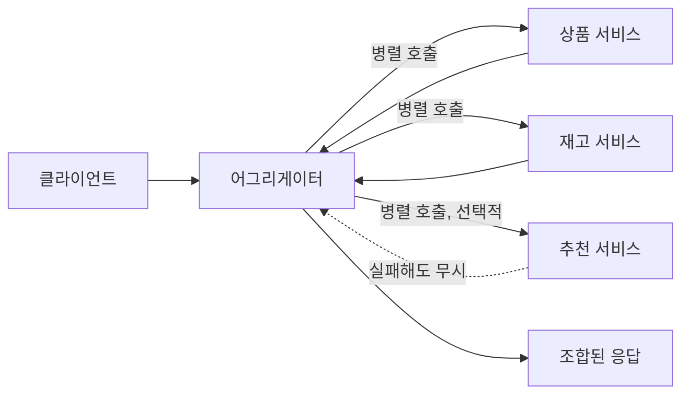

**브랜치(Branch)** 패턴은 요청의 조건에 따라 서로 다른 처리 체인으로 분기하는 패턴이다. 어그리게이터가 "여러 응답을 하나로 합친다"면 브랜치는 "조건에 따라 다른 하위 체인을 병렬로 타되, 각 분기가 서로 다른 로직을 수행한다"는 점이 다르다 — 예를 들어 주문 유형이 디지털 상품이면 즉시 발급 체인을, 실물 상품이면 재고·배송 체인을 태운다.

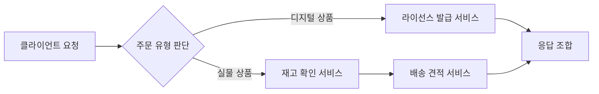

AWS에서는 세 가지 방식으로 구현한다. 단순한 경우 **Lambda 오케스트레이터**가 `asyncio`나 `Promise.all` 같은 병렬 호출로 처리하지만, 재시도·타임아웃·분기 로직이 복잡해지면 로직이 코드에 흩어져 가독성이 떨어진다. **Step Functions의 Parallel 상태**는 이런 분기·조합 로직을 상태 머신으로 명시해 재시도·타임아웃을 각 분기마다 선언적으로 설정하고 실행 이력을 콘솔에서 그대로 추적할 수 있다. GraphQL 계층에서는 AppSync의 **파이프라인 리졸버**가 여러 데이터 소스를 순서대로(또는 조건부로) 호출해 어그리게이터 로직을 리졸버 안에 캡슐화한다.

```json
{
  "Comment": "어그리게이터 패턴 — 세 서비스를 병렬 호출 후 조합",
  "StartAt": "FetchInParallel",
  "States": {
    "FetchInParallel": {
      "Type": "Parallel",
      "Branches": [
        {
          "StartAt": "GetProduct",
          "States": {
            "GetProduct": {
              "Type": "Task",
              "Resource": "arn:aws:lambda:ap-northeast-2:123456789012:function:get-product",
              "TimeoutSeconds": 3,
              "End": true
            }
          }
        },
        {
          "StartAt": "GetInventory",
          "States": {
            "GetInventory": {
              "Type": "Task",
              "Resource": "arn:aws:lambda:ap-northeast-2:123456789012:function:get-inventory",
              "TimeoutSeconds": 3,
              "End": true
            }
          }
        },
        {
          "StartAt": "GetRecommendation",
          "States": {
            "GetRecommendation": {
              "Type": "Task",
              "Resource": "arn:aws:lambda:ap-northeast-2:123456789012:function:get-recommendation",
              "TimeoutSeconds": 2,
              "Catch": [
                { "ErrorEquals": ["States.ALL"], "ResultPath": "$.error", "Next": "SkipRecommendation" }
              ],
              "End": true
            },
            "SkipRecommendation": { "Type": "Pass", "Result": null, "End": true }
          }
        }
      ],
      "Next": "ComposeResponse"
    },
    "ComposeResponse": {
      "Type": "Task",
      "Resource": "arn:aws:lambda:ap-northeast-2:123456789012:function:compose-response",
      "End": true
    }
  }
}
```

이 정의에서 추천 서비스 분기만 `Catch`로 실패를 흡수해 부분 응답을 허용하고, 상품·재고 분기는 실패 시 전체 실행이 실패하도록 둔 것이 "무엇은 필수이고 무엇은 선택인가"를 코드로 표현한 부분이다.

GraphQL 계층에서 같은 문제를 풀 때는 AppSync **파이프라인 리졸버**가 `Query.getOrderDetail` 같은 하나의 필드 아래 여러 함수(각 함수가 하나의 데이터 소스 호출)를 순서대로 실행하도록 구성한다 — Step Functions의 Parallel 상태가 실행을 명시적인 상태 머신으로 노출하는 것과 달리, 파이프라인 리졸버는 GraphQL 요청·응답 생명주기 안에 어그리게이션 로직을 캡슐화해 클라이언트에는 여전히 단일 쿼리로 보이게 한다는 차이가 있다.

### 45.5 비동기 메시징 프라이머

동기 호출 체인이 길어질수록 한 서비스의 장애가 연쇄적으로 전파된다(→ 46장에서 이 문제를 정면으로 다룬다). 비동기 메시징은 발신자와 수신자 사이에 중개자를 두어 이 결합을 끊는다. AWS가 제공하는 중개자는 크게 세 모델로 나뉜다.

| 모델 | 소비 방식 | 순서 보장 범위 | 재생 가능 여부 | 대표 AWS 서비스 |
|---|---|---|---|---|
| 큐(포인트투포인트) | 메시지 하나를 한 소비자만 처리 | FIFO 큐는 그룹 내 순서, 표준 큐는 미보장 | 처리 후 삭제되면 재생 불가(DLQ 예외) | SQS |
| 토픽(발행/구독) | 구독한 모든 소비자가 각자 사본 수신 | 표준 토픽은 미보장, FIFO 토픽은 그룹 내 순서 | 아카이빙 활성화 시 재생 가능 | SNS |
| 스트림(로그) | 여러 소비자 그룹이 각자 위치(오프셋)에서 읽음, 삭제되지 않음 | 파티션(샤드) 내 순서 보장 | 보존 기간 내 임의 위치부터 재생 가능 | Kinesis Data Streams, MSK |

**전달 보장**은 세 등급으로 이야기한다 — **최대 한 번(at-most-once)**은 유실 가능성이 있지만 중복은 없는 방식(예: 확인 없이 발사 후 망각), **최소 한 번(at-least-once)**은 유실은 없지만 재시도로 중복이 생길 수 있는 방식(SQS·SNS·Kinesis의 기본 모델), **효과적으로 한 번(effectively-once)**은 최소 한 번 전달에 소비자 측 멱등 처리나 중복 제거를 더해 결과적으로 한 번만 반영되게 만든 상태를 말한다 — 메시징 계층이 진짜로 "정확히 한 번"을 보장하는 경우는 드물고, 대개는 소비자의 멱등성 설계가 이를 완성한다(→ 46.13).

**소비자 그룹**은 Kinesis/MSK처럼 로그형 스트림에서 여러 소비자(또는 소비자 애플리케이션)가 서로 다른 파티션을 나눠 병렬로 읽게 하는 단위다. 같은 스트림을 서로 다른 목적(실시간 집계, 감사 로그 적재, 알림 발송)으로 읽는 애플리케이션들은 각자 별도의 소비자 그룹을 두어 서로의 읽기 속도에 영향을 주지 않는다 — 큐·토픽에서는 한 메시지가 소비되면 사라지거나(큐) 구독자별 사본이 즉시 전달되지만(토픽), 스트림에서는 소비자 그룹마다 자신만의 읽기 위치(오프셋)를 독립적으로 유지한다는 점이 근본적으로 다르다. **백프레셔**는 소비자가 생산 속도를 따라가지 못할 때 발생하는데, 큐·스트림은 메시지가 쌓이는 형태로 이를 자연스럽게 흡수하지만(큐 기반 부하 평준화, → 46.7), SNS 같은 푸시형 팬아웃은 구독자가 느려도 계속 밀어붙이므로 별도의 완충 장치가 필요하다.

마지막으로 **메시지, 이벤트, 커맨드**를 구분해 두면 설계 의도가 명확해진다. **메시지**는 이 셋을 아우르는 일반 용어다. **이벤트**는 "무언가 일어났다"는 사실의 통지로, 발신자는 누가 듣는지 모르고 관심 있는 소비자가 알아서 구독한다(예: `OrderPlaced`). **커맨드**는 "무언가를 하라"는 명령으로, 특정 수신자를 지정하며 대개 하나의 처리자만 응답한다(예: `ChargePayment`). 이벤트를 발행하면서 실제로는 커맨드처럼 특정 서비스의 반응을 강하게 기대한다면, 그 결합은 이름만 이벤트일 뿐 사실상 숨겨진 동기 의존성이다.

### 45.6 Amazon SQS

Amazon SQS는 큐(포인트투포인트) 모델의 완전 관리형 구현으로 **표준 큐**와 **FIFO 큐** 두 유형을 제공한다. 표준 큐는 처리량 제한이 사실상 없고 순서를 보장하지 않으며 드물게 중복 전달이 발생할 수 있다. FIFO 큐는 같은 **메시지 그룹 ID** 안에서 순서를 보장하고 **중복 제거 ID**(또는 콘텐츠 기반 중복 제거)로 같은 메시지의 재전송을 걸러내지만, 그 대가로 처리량에 상한이 있다(일반적으로 초당 수백~수천 건 수준이며 배치·고처리량 모드 여부에 따라 다르므로 정확한 값은 할당량 문서를 확인한다).

**가시성 타임아웃(Visibility Timeout)**은 한 소비자가 메시지를 받아간 뒤 다른 소비자에게 다시 보이지 않는 시간이다. 이 값은 **반드시 실제 처리 시간보다 길게** 설정해야 한다 — 짧으면 처리 중인 메시지가 다시 노출돼 다른 워커가 동시에 처리하면서 중복 처리가 발생한다. 처리 시간이 가변적이라면 처리 도중 `ChangeMessageVisibility`로 타임아웃을 연장하는 방식이 안전하다. **롱 폴링**(`ReceiveMessageWaitTimeSeconds`를 최대 20초까지 설정)은 큐가 비어 있을 때도 즉시 빈 응답을 반환하는 짧은 폴링과 달리 메시지가 도착할 때까지 연결을 유지해 불필요한 API 호출과 지연을 줄인다.

**DLQ(Dead Letter Queue)**는 `maxReceiveCount`로 지정한 횟수만큼 처리에 실패한 메시지를 별도 큐로 옮겨 정상 흐름을 막지 않게 한다. DLQ로 옮겨진 메시지는 원인을 조사한 뒤 **redrive**(재구동)로 원래 큐나 다른 큐로 되돌려 재처리한다 — DLQ의 redrive allow policy로 어떤 소스 큐가 이 DLQ를 사용할 수 있는지 제한할 수 있다. 메시지 크기는 최대 256KB로 제한되므로, 그보다 큰 페이로드는 **확장 클라이언트 라이브러리(SQS Extended Client Library)**로 실제 본문을 S3에 저장하고 큐에는 참조 포인터만 담는 방식을 쓴다. **지연 큐**(`DelaySeconds`, 최대 15분)는 메시지를 즉시 노출하지 않고 일정 시간 뒤에 노출해 예약 처리에 쓴다. **배치 API**(`SendMessageBatch`/`DeleteMessageBatch`/`ChangeMessageVisibilityBatch`)는 최대 10개 메시지를 한 번의 호출로 묶어 처리량 대비 API 호출 수를 줄인다.

```python
# sqs_consumer.py — 가시성 연장, 배치 삭제, DLQ 전제의 소비자 예시
import boto3
import time

sqs = boto3.client("sqs", region_name="ap-northeast-2")
QUEUE_URL = "https://sqs.ap-northeast-2.amazonaws.com/123456789012/order-events"

def process(body: str) -> None:
    # 실제 처리 로직 (예: 결제 승인 확인). 예외가 나면 삭제하지 않아
    # maxReceiveCount 이후 DLQ로 자연스럽게 넘어가게 둔다.
    time.sleep(2)

while True:
    resp = sqs.receive_message(
        QueueUrl=QUEUE_URL,
        MaxNumberOfMessages=10,       # 배치로 최대 10건씩 수신
        WaitTimeSeconds=20,           # 롱 폴링 — 불필요한 빈 응답 호출을 줄인다
        VisibilityTimeout=30,
        AttributeNames=["ApproximateReceiveCount"],
    )
    messages = resp.get("Messages", [])
    entries_to_delete = []

    for msg in messages:
        receipt = msg["ReceiptHandle"]
        try:
            # 처리 시간이 길어질 수 있으면 가시성 타임아웃을 미리 연장한다
            sqs.change_message_visibility(
                QueueUrl=QUEUE_URL, ReceiptHandle=receipt, VisibilityTimeout=60
            )
            process(msg["Body"])
            entries_to_delete.append({"Id": msg["MessageId"], "ReceiptHandle": receipt})
        except Exception:
            # 삭제하지 않고 넘어가면 가시성 타임아웃 만료 후 재시도되고,
            # maxReceiveCount 초과 시 큐에 연결된 DLQ로 자동 이동한다
            continue

    if entries_to_delete:
        sqs.delete_message_batch(QueueUrl=QUEUE_URL, Entries=entries_to_delete)
```

### 45.7 Amazon SNS

Amazon SNS는 발행/구독(pub/sub) 모델의 관리형 구현으로 하나의 발행이 여러 구독자에게 동시에 전달되는 **팬아웃**을 기본 동작으로 삼는다. 구독 유형은 **SQS**, **Lambda**, **HTTP/HTTPS**, **이메일**, **SMS**, **Amazon Data Firehose**(구 Kinesis Data Firehose) 등을 지원해, 한 이벤트를 처리 파이프라인·알림·데이터 레이크 적재로 동시에 내보낼 수 있다. **메시지 필터 정책**은 구독마다 메시지 속성(또는 본문 내용) 조건을 걸어 관심 있는 메시지만 받게 해, 모든 구독자가 전체 메시지를 받고 애플리케이션 코드에서 걸러내는 비효율을 없앤다.

```json
{
  "region": "ap-northeast-2",
  "eventType": ["OrderShipped", "OrderCancelled"],
  "orderTotalUsd": [{ "numeric": [">=", 100] }]
}
```

**FIFO 토픽**은 FIFO SQS 큐와 짝을 이뤄 메시지 그룹 내 순서와 중복 제거를 팬아웃 상황에서도 유지한다. **메시지 아카이빙과 재생**은 표준 토픽에 보존 기간을 설정해 지난 메시지를 저장해 두고, 이후 새로 만든 구독에 특정 시간 범위의 메시지를 재생시켜 장애 조사나 신규 구독자의 초기 적재에 활용하는 기능이다(보존 기간·세부 동작은 최신 문서를 확인한다). 구독 단위로 **DLQ**를 설정하면 특정 구독자(예: 특정 Lambda)로의 전달만 실패했을 때 그 구독의 실패 메시지만 별도로 격리할 수 있다.

강조할 만한 함정은 **SNS→Lambda 직접 팬아웃**이 대량 발행 시 하류 Lambda의 동시 실행 한도를 순식간에 소진시켜 스로틀링이나 하류 데이터스토어 과부하로 이어질 수 있다는 점이다. 이런 경우 SNS와 Lambda 사이에 **SQS를 완충재로 두는 구성**(SNS → SQS 구독 → Lambda 이벤트 소스 매핑)이 표준 패턴이다. SQS가 메시지를 큐에 쌓아두면 Lambda는 자신의 동시성 한도와 배치 크기에 맞춰 스스로 속도를 조절하며 소비할 수 있다. 반대로 구독자가 소수이고 각자 빠르게 처리를 끝내는 경량 알림(예: 운영 채팅봇 통지)이라면 완충 없이 SNS가 직접 호출해도 무방하다 — 완충을 넣을지 여부는 "구독자 처리 시간이 발행 속도를 따라가는가"로 판단한다.

### 45.8 Amazon EventBridge

EventBridge는 AWS 서비스, 자체 애플리케이션, SaaS 파트너에서 발생한 이벤트를 규칙에 따라 여러 대상으로 라우팅하는 서버리스 이벤트 버스다. 39.2에서는 이 서비스를 "운영 자동화의 배선판"으로 다뤘다면, 여기서는 **서비스 간 통합의 축**으로 본다 — 생산 서비스가 이벤트를 게시하고 소비 서비스가 관심 있는 패턴만 구독함으로써, 생산자는 소비자가 몇 개인지, 누가 소비하는지 몰라도 되는 느슨한 결합을 만든다.

이벤트 버스는 기본(default), 사용자 지정(custom), 파트너(partner) 세 종류이며, **규칙(Rule)**은 **이벤트 패턴**으로 대상 이벤트를 골라낸다. 패턴 문법은 정확한 값 일치 외에도 `prefix`(문자열 접두어), `numeric`(비교 연산자로 숫자 범위), `exists`(필드 존재 여부), `anything-but`(특정 값 제외)을 지원해 세밀한 필터링이 가능하다.

```json
{
  "source": ["com.acme.order"],
  "detail-type": ["OrderStateChanged"],
  "detail": {
    "state": ["SHIPPED", "DELIVERED"],
    "region": [{ "prefix": "ap-" }],
    "totalAmount": [{ "numeric": [">", 0] }],
    "couponCode": [{ "exists": false }],
    "channel": [{ "anything-but": ["test"] }]
  }
}
```

**스키마 레지스트리**는 수신 이벤트에서 자동으로 스키마를 추론(디스커버리)하고 OpenAPI 3 형식으로 관리하며 코드 바인딩을 생성한다(자세한 내용은 → 45.12). **아카이브·리플레이**는 지난 이벤트를 저장했다가 필요할 때 재생하는 기능으로, 이벤트 패턴 필터를 걸어 특정 조건의 이벤트만 선별 보관해 저장 비용을 줄일 수 있다. **API 대상(API Destination)**과 **연결(Connection)**은 EventBridge 규칙의 대상을 AWS 서비스가 아닌 외부 HTTP 엔드포인트로 지정할 때 쓰며, Connection에 API 키·기본 인증·OAuth 클라이언트 자격 증명을 저장해 자격 증명을 규칙 정의와 분리한다. **EventBridge Pipes**는 소스(SQS, DynamoDB Streams, Kinesis, MSK 등)에서 이벤트를 가져와 **필터링**하고 선택적으로 **보강**(Lambda 호출로 부가 정보 추가)한 뒤 **대상**으로 전달하는 점대점 통합으로, 단일 소스-단일 처리 흐름이라면 폴링 Lambda를 직접 작성하는 것보다 관리 부담이 적다. **파트너 이벤트 소스**는 Zendesk·Datadog 같은 SaaS 제품의 이벤트를 별도의 커스텀 통합 코드 없이 파트너 이벤트 버스로 받아들이는 기능이다.

### 45.9 Amazon Kinesis / MSK

Kinesis Data Streams와 Amazon MSK(Managed Streaming for Apache Kafka)는 앞서의 큐·토픽과 달리 **재생 가능한 로그**로 동작한다 — 소비자가 메시지를 읽어도 삭제되지 않고 보존 기간 내에서는 몇 번이든 같은 위치부터 다시 읽을 수 있다. Kinesis는 기본 24시간, 설정에 따라 최대 365일까지 보존 기간을 늘릴 수 있고(정확한 한도는 문서 확인), MSK는 카프카 토픽 단위로 보존 기간을 직접 설정한다.

순서는 **샤드(Kinesis)** 또는 **파티션(Kafka)** 단위로만 보장된다 — 같은 파티션 키를 가진 레코드는 같은 샤드/파티션에 쓰이고 그 안에서는 쓰인 순서대로 읽힌다. 전체 스트림 차원의 전역 순서는 보장하지 않으므로, 순서가 중요한 단위(예: 같은 주문 ID)를 파티션 키로 잡는 것이 설계의 핵심이다. **소비자 팬아웃**은 Kinesis의 경우 기본적으로 샤드당 초당 처리량을 여러 소비자가 나눠 쓰지만, **향상된 팬아웃(Enhanced Fan-Out)**을 쓰면 각 소비자가 샤드당 전용 처리량을 할당받아 여러 소비자 애플리케이션이 서로 영향을 주지 않고 동시에 같은 스트림을 읽을 수 있다. MSK(Kafka)는 **소비자 그룹** 단위로 파티션을 나눠 배정해, 한 그룹 안에서는 파티션마다 정확히 하나의 소비자만 읽고 서로 다른 그룹은 각자 독립적으로 전체 스트림을 읽는다.

운영 방식에서는 둘의 성격이 갈린다. Kinesis Data Streams는 샤드 수를 API 호출(분할·병합)로 조정하는 완전 관리형 서비스로 인프라를 신경 쓸 필요가 거의 없고, **Kinesis Data Streams On-Demand** 모드는 처리량에 맞춰 자동으로 용량을 조정해 트래픽 예측이 어려운 워크로드에 적합하다. MSK는 카프카 생태계(커넥터, 스트림 처리 라이브러리, 기존 온프레미스 카프카 자산)와의 호환성이 최우선일 때 선택하며, **MSK Serverless**를 쓰면 브로커 크기·개수를 직접 관리하지 않아도 된다. 반대로 말하면 카프카 생태계에 대한 의존이 없다면 Kinesis 쪽이 운영 부담이 더 낮은 경우가 많다.

이 절에서는 통합 관점(재생 가능한 로그로서 서비스 간 이벤트를 어떻게 공유하는가)만 다루며, 윈도우 집계·정확히 한 번 처리·Firehose·Managed Service for Apache Flink 같은 스트리밍 처리 상세는 → 50장에서 다룬다.

### 45.10 SQS vs SNS vs EventBridge vs Kinesis 선택 결정표

| 축 | SQS | SNS | EventBridge | Kinesis | MSK | Step Functions |
|---|---|---|---|---|---|---|
| 전달 모델 | 큐(점대점) | 토픽(팬아웃) | 이벤트 버스(라우팅) | 스트림(로그) | 스트림(로그) | 오케스트레이션 |
| 순서 보장 | FIFO는 그룹 내 | FIFO 토픽만 | 보장 안 함 | 샤드 내 | 파티션 내 | 상태 전이 순서대로 |
| 재생 | DLQ 외 불가 | 아카이빙 시 가능 | 아카이브·리플레이 | 보존 기간 내 가능 | 보존 기간 내 가능 | 실행 이력 조회(재생과 다름) |
| 필터 | 없음(소비자 코드) | 필터 정책 | 이벤트 패턴(정교함) | 소비자 코드 | 소비자 코드 | Choice 상태 |
| 팬아웃 | 아니오(1:1) | 예(1:N 푸시) | 예(규칙별 다중 대상) | 예(다중 소비자 그룹) | 예(다중 소비자 그룹) | 아니오 |
| 지연 | 밀리초~초 | 밀리초 | 밀리초 | 밀리초(스트리밍) | 밀리초(스트리밍) | 상태 전이당 수백ms |
| 처리량 | 사실상 무제한(표준) | 높음 | 높음 | 샤드 수에 비례 | 파티션 수·브로커에 비례 | 실행 동시성 한도 |
| 과금 축 | 요청 건수 | 요청·전송 건수 | 이벤트 건수 | 샤드 시간+처리량 | 브로커·스토리지 시간 | 상태 전이 건수 |

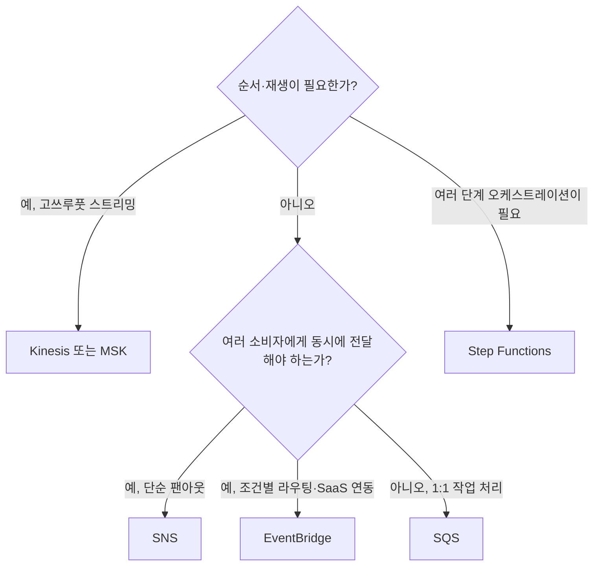

**대표 조합 5가지**: ① **SNS + SQS 팬아웃** — 하나의 이벤트를 여러 소비자에게 안정적으로 전달하면서 각 구독 큐가 완충재 역할을 한다. ② **EventBridge + SQS 완충** — EventBridge가 조건별로 라우팅한 뒤 대상 서비스 앞에 SQS를 둬 트래픽 버스트를 흡수한다. ③ **Kinesis + Lambda 집계** — 실시간 지표 집계나 클릭스트림 처리처럼 순서와 처리량이 중요한 경우. ④ **API Gateway + SQS + Lambda** — 동기 요청을 즉시 큐에 적재하고 202 Accepted로 응답한 뒤 비동기로 처리해 API Gateway의 타임아웃 한도를 우회한다. ⑤ **EventBridge Pipes + Step Functions** — 소스에서 이벤트를 필터링한 뒤 복잡한 다단계 오케스트레이션이 필요할 때만 Step Functions를 트리거해 불필요한 실행 비용을 줄인다.

### 45.11 서비스 디스커버리와 서비스 메시

서비스 수가 늘어나면 "이 서비스의 현재 인스턴스가 어디 있는가"를 하드코딩할 수 없다. **AWS Cloud Map**은 서비스 이름과 실제 엔드포인트(IP, 포트, 임의의 속성)를 매핑해 두고 **DNS 기반**(A/AAAA/SRV 레코드로 조회) 또는 **API 기반**(`DiscoverInstances` API 호출)으로 이를 조회하게 해주는 서비스 디스커버리 레지스트리다. DNS 기반 조회는 기존 애플리케이션 코드를 거의 고치지 않고 도입할 수 있다는 장점이 있지만 DNS 캐싱 때문에 인스턴스 교체 반영이 지연될 수 있고, API 기반 조회는 즉시 최신 상태를 받아오는 대신 클라이언트 SDK 통합이 필요하다. **ECS 서비스 커넥트(Service Connect)**는 ECS 서비스 간 디스커버리에 더해 트래픽 관리·관측성까지 사이드카 없이 관리형으로 제공하는 최신 기능이고, 기존의 **ECS 서비스 디스커버리**(Cloud Map 연동)는 이름 해석만 제공하는 더 단순한 형태다. Kubernetes(EKS)에서는 **Service**와 **CoreDNS**가 클러스터 내부 디스커버리의 기본값이다.

**App Mesh**는 각 태스크·파드 옆에 Envoy 기반 **사이드카 프록시**를 배치해 재시도, mTLS(상호 인증 TLS), 가중치 기반 트래픽 분할(카나리·블루/그린), 관측성(지연·오류율 자동 수집)을 애플리케이션 코드 밖으로 빼내는 서비스 메시다. 다만 AWS는 신규 서비스 메시 채택에서 ECS Service Connect나 Amazon VPC Lattice 같은 대안도 함께 검토하도록 안내하는 추세이므로, App Mesh를 신규 프로젝트에 도입하기 전에는 최신 지원 정책과 로드맵을 공식 문서로 확인하는 것이 안전하다. **VPC Lattice**는 사이드카 없이 VPC 간·계정 간 서비스 네트워크를 애플리케이션 계층(HTTP/HTTPS/gRPC)에서 구성하는 비교적 최근의 서비스로, 서비스 네트워크에 서비스를 등록하고 인증·인가 정책을 중앙에서 적용하는 모델을 제공한다 — 사이드카 프록시 운영 부담 없이 서비스 메시의 일부 이점(트래픽 정책, 관측성)을 얻고 싶을 때 App Mesh보다 먼저 검토할 만한 선택지다.

```yaml
# app-mesh.yaml 발췌 — 가상 서비스와 가상 라우터로 가중치 기반 트래픽 분할 구성
Resources:
  OrderVirtualRouter:
    Type: AWS::AppMesh::VirtualRouter
    Properties:
      MeshName: order-mesh
      VirtualRouterName: order-router
      Spec:
        Listeners:
          - PortMapping: { Port: 8080, Protocol: http }

  OrderRoute:
    Type: AWS::AppMesh::Route
    Properties:
      MeshName: order-mesh
      VirtualRouterName: order-router
      RouteName: order-canary-route
      Spec:
        HttpRoute:
          Match: { Prefix: "/" }
          Action:
            WeightedTargets:
              # v2로 트래픽 10%만 흘려 카나리 검증 (→ 37장 배포 전략과 결합)
              - VirtualNode: order-v1-node
                Weight: 90
              - VirtualNode: order-v2-node
                Weight: 10
          RetryPolicy:
            MaxRetries: 2
            PerRetryTimeoutMillis: 2000
            HttpRetryEvents: [server-error, gateway-error]

  OrderVirtualService:
    Type: AWS::AppMesh::VirtualService
    Properties:
      MeshName: order-mesh
      VirtualServiceName: order.internal
      Spec:
        Provider:
          VirtualRouter: { VirtualRouterName: !GetAtt OrderVirtualRouter.VirtualRouterName }
```

판단 기준은 단순하다 — **서비스 수가 20개 미만이면 라이브러리(재시도·서킷 브레이커를 애플리케이션 코드나 공용 SDK에 넣는 방식)로 충분한 경우가 많다.** 서비스 메시는 재시도·mTLS·트래픽 분할을 코드에서 인프라로 옮겨주지만 사이드카 배포·업그레이드·디버깅이라는 새로운 운영 부담을 더하므로, 그 부담을 상쇄할 만큼 서비스가 많고 팀이 여럿일 때 도입 가치가 커진다.

### 45.12 API 버저닝·계약 테스트·스키마 레지스트리

API 버전을 표기하는 방식은 세 가지가 흔하다.

| 방식 | 예시 | 장점 | 단점 |
|---|---|---|---|
| URI 버저닝 | `/v1/orders`, `/v2/orders` | 가장 직관적, 캐싱·라우팅이 쉬움 | 리소스 URI가 버전마다 늘어남 |
| 헤더 버저닝 | `Accept-Version: 2` | URI가 깔끔하게 유지됨 | 클라이언트가 헤더를 빠뜨리기 쉬움, 캐시 키 설계가 까다로움 |
| 미디어 타입 버저닝 | `Accept: application/vnd.acme.order.v2+json` | REST의 콘텐츠 협상 원칙에 가장 부합 | 구현·문서화가 복잡해 실무 채택률이 낮음 |

**한 줄 결정 기준**: 외부에 공개하는 API는 이해하기 쉽고 라우팅·캐싱이 단순한 URI 버저닝을 기본값으로 삼고, 내부 서비스 간 API에서 세밀한 협상이 필요할 때만 헤더 버저닝을 검토한다.

**하위 호환 규칙**은 단순하다 — 필드는 추가만 하고 삭제·이름 변경·타입 변경은 하지 않으며, 필드를 없애려면 먼저 폐기(deprecated) 표시를 하고 일정 기간 공지한 뒤 다음 메이저 버전에서 제거한다. **소비자 주도 계약 테스트**(Pact 등으로 소비자가 기대하는 계약을 파일로 남기고 제공자가 자신의 파이프라인에서 독립적으로 검증하는 방식)의 구체적인 도구와 절차는 → 36장을 참조한다.

**스키마 레지스트리**는 이벤트·메시지의 구조를 강제하고 진화를 관리하는 장치다. **EventBridge 스키마 레지스트리**는 이벤트 버스로 들어온 이벤트에서 스키마를 자동 추론(디스커버리)해 OpenAPI 3 형식으로 관리하고 여러 언어의 코드 바인딩을 생성한다. **Glue 스키마 레지스트리**는 Avro·JSON Schema·Protobuf 스키마를 등록해 Kinesis·MSK 파이프라인의 프로듀서·컨슈머가 같은 스키마를 참조하게 하고, 호환성 모드를 강제해 잘못된 스키마 변경이 파이프라인에 들어오는 것을 막는다. 호환성 모드는 세 가지로 나뉜다 — **BACKWARD**(새 스키마로 이전 스키마가 쓴 데이터를 읽을 수 있음, 소비자가 먼저 업그레이드해도 안전), **FORWARD**(이전 스키마로 새 스키마가 쓴 데이터를 읽을 수 있음, 생산자가 먼저 업그레이드해도 안전), **FULL**(양방향 모두 성립). 일반적으로 소비자가 여러 팀에 흩어져 한 번에 업그레이드하기 어려운 조직이라면 BACKWARD를 기본값으로 두는 것이 안전하다.

**폐기 정책**은 필드나 API 버전을 없애기 전에 반드시 공지 기간을 두고, 가능하면 응답 헤더(`Sunset`, `Deprecation`)나 문서로 폐기 시점을 알리며, 폐기 대상 버전의 실제 사용량을 모니터링해 트래픽이 0에 가까워진 뒤에 제거하는 절차를 뜻한다. 사용량 확인 없이 일정만 보고 끄면 미처 마이그레이션하지 못한 소비자의 장애로 이어진다. 실무에서는 이 절차를 세 단계로 나누는 것이 안전하다 — ① 새 버전을 배포하고 구버전과 나란히 운영하며 신규 소비자를 새 버전으로 유도, ② 구버전 호출에 `Deprecation` 헤더와 경고 로그를 붙여 남은 소비자를 식별, ③ 구버전 호출량이 일정 기간 0에 수렴한 뒤에만 실제로 제거. 사내 서비스라면 API 게이트웨이나 EventBridge 규칙의 호출 지표로 이 사용량을 추적할 수 있다.

```graphql
# schema.graphql 발췌 — AppSync 스키마, 오버페칭 없이 필드 선택 + 구독
type Order {
  orderId: ID!
  status: OrderStatus!
  items: [OrderItem!]!
  updatedAt: AWSDateTime!
}

type OrderItem {
  sku: String!
  quantity: Int!
}

enum OrderStatus { PLACED SHIPPED DELIVERED CANCELLED }

type Query {
  getOrder(orderId: ID!): Order
}

type Mutation {
  updateOrderStatus(orderId: ID!, status: OrderStatus!): Order
}

type Subscription {
  # 특정 주문의 상태 변경을 구독 — AppSync가 WebSocket 연결을 관리한다
  onOrderStatusChanged(orderId: ID!): Order
    @aws_subscribe(mutations: ["updateOrderStatus"])
}
```

### 45장 정리

#### [필수] 반드시 알아야 할 것
1. 선택 기준은 다음과 같다 — **SQS**는 작업 큐(1:1 처리), **SNS**는 알림 팬아웃(1:N 푸시), **EventBridge**는 이벤트 라우팅·필터링·SaaS 통합, **Kinesis/MSK**는 순서 있는 고쓰루풋 스트림·재생이다. 45.10의 결정표와 결정 트리로 다시 확인한다.
2. SQS **가시성 타임아웃은 처리 시간보다 길게** 설정한다. 짧으면 처리 중인 메시지가 다른 워커에도 노출돼 중복 처리로 이어진다.
3. 모든 비동기 소비자에 **DLQ와 재처리(redrive) 절차**를 붙인다. DLQ 없는 큐는 실패한 메시지가 조용히 사라지는 데이터 유실 장치다.
4. 이벤트에 내부 DB 구조를 그대로 담지 말고 **공개 계약(contract)**으로 설계한다. 스키마가 생산자의 테이블 구조를 그대로 노출하면 소비자가 생산자 내부 구현에 결합된다.
5. 동기 호출 체인은 길이를 제한한다 — API Gateway의 **통합 타임아웃과 페이로드 한도**가 수십 초 이상 걸리는 작업에는 근본적으로 맞지 않는다.
6. gRPC와 GraphQL은 REST의 오버페칭·언더페칭·스트리밍 한계를 각자 다른 방식으로 보완하지만, 캐싱 용이성과 브라우저 호환성에서 트레이드오프가 있어 REST가 기본 출발점이어야 하는 경우가 많다.
7. 어그리게이터 패턴은 부분 실패 정책을 명시적으로 설계해야 한다 — 어떤 하위 호출이 실패해도 되는지, 어떤 호출은 전체를 실패시켜야 하는지 코드로 구분해 둔다.

#### [팁] 실무 노하우
1. **EventBridge 아카이브·리플레이**는 사고 후 복구의 강력한 도구다. 도메인 이벤트를 다루는 버스는 아카이브를 켜 두는 편이 낫다.
2. **FIFO 큐·토픽은 순서를 보장하지만 처리량과 병렬성을 제한**한다. 순서가 필요한 범위를 메시지 그룹 ID로 최소한의 단위(예: 주문 ID)까지 좁혀 병렬성을 확보한다.
3. **롱 폴링을 기본값**으로 켠다. 짧은 폴링은 빈 응답에도 요청 요금이 들고 평균 지연도 늘어난다.
4. **BFF는 인증 토큰을 서버 측에 격리하는 보안 경계**로도 쓸 수 있다 — 브라우저 SPA가 리프레시 토큰을 직접 들지 않게 한다.
5. 스키마 레지스트리는 **BACKWARD 호환성을 기본값**으로 정하면 소비자가 먼저 업그레이드해도 파이프라인이 깨지지 않는다.
6. **서비스 메시는 서비스 수가 많고 팀이 여럿일 때** 도입 가치가 크다. 서비스 20개 미만이면 재시도·서킷 브레이커 라이브러리로 충분한 경우가 많다.

#### [주의] 사고·비용·설계 함정
1. 이벤트에 **내부 DB 구조**를 그대로 담으면 소비자가 생산자 스키마에 결합돼, 생산자가 테이블을 리팩터링할 때마다 소비자 코드가 함께 깨진다.
2. **SNS→Lambda 직접 팬아웃**은 대량 발행 시 하류 서비스를 압도할 수 있다. 사이에 SQS를 둬 부하를 평준화한다.
3. **API Gateway 통합 타임아웃과 페이로드 한도**를 잊고 장시간 작업을 동기 API 뒤에 두면 클라이언트가 타임아웃을 겪는다 — 비동기 작업 + 폴링/웹훅으로 바꾼다.
4. FIFO 큐·토픽의 **처리량 한도를 표준 큐와 혼동**하면 대량 트래픽 상황에서 예상치 못한 스로틀링을 겪는다.
5. **가시성 타임아웃을 처리 시간보다 짧게** 두면 중복 처리가, 반대로 과도하게 길게 두면 실패한 메시지의 DLQ 이동이 늦어져 장애 감지가 지연된다.
6. 어그리게이터에서 **하위 호출마다 타임아웃 예산을 나누지 않으면** 가장 느린 하위 서비스가 전체 응답 시간을 지배한다.
7. **하드코딩된 엔드포인트**로 서비스를 호출하면 스케일 아웃이나 블루/그린 배포 때마다 수동 설정 변경이 필요해지고, 그 사이 오래된 엔드포인트로 요청이 계속 흘러갈 수 있다.
8. 스키마에서 **필드 삭제·타입 변경**은 항상 파괴적(breaking) 변경이다. 폐기 공지와 사용량 모니터링 없이 즉시 제거하면 미처 마이그레이션하지 못한 소비자가 장애를 겪는다.

#### 한 장 요약
서비스 간 통신은 동기(REST·gRPC·GraphQL, API Gateway, BFF, 어그리게이터·브랜치)와 비동기(SQS·SNS·EventBridge·Kinesis/MSK)로 나뉘며, 각각 지연·결합도·순서·재생 가능성이라는 축에서 트레이드오프가 다르다. SQS는 1:1 작업 큐, SNS는 팬아웃 알림, EventBridge는 조건부 라우팅과 SaaS 통합, Kinesis/MSK는 순서 있는 재생 가능 스트림이라는 역할 구분이 45.10의 결정표로 요약된다. 서비스가 늘어날수록 서비스 디스커버리와 서비스 메시 같은 인프라가 재시도·mTLS·트래픽 분할을 코드 밖으로 옮겨주지만, 그 가치는 서비스 수와 팀 규모에 비례해 커진다. API 버저닝과 스키마 레지스트리는 이 모든 통합이 시간이 지나도 깨지지 않게 하는 계약 관리 장치다.

#### 다음 장 예고
46장에서는 이 장에서 고른 통신 수단이 실패했을 때 — 타임아웃, 하류 서비스 장애, 트래픽 폭주 — 시스템이 어떻게 버티는지를 다룬다. 재시도, 서킷 브레이커, 벌크헤드, 큐 기반 부하 평준화, 멱등성 같은 복원력 패턴이 이 장의 통신 패턴 위에 어떻게 얹히는지 살펴본다.

---

## 46장. 복원력(Resilience) 패턴  ★★★★

> **이 장에서 다루는 것**
> 45장에서 고른 통신 수단(동기 호출, 큐, 이벤트)은 언젠가 실패한다 — 네트워크 단절, 하류 서비스 과부하, 순간적인 트래픽 폭주. 이 장은 *Cloud Design Patterns*의 복원력 카테고리(재시도, 서킷 브레이커, 벌크헤드, 스로틀링, 큐 기반 부하 평준화, 경쟁 소비자, 보상 트랜잭션, 리더 선출, 스케줄러 에이전트 슈퍼바이저, 상태 확인 엔드포인트 모니터링)를 AWS 구현과 함께 다룬다.
> 44장의 Saga·아웃박스, 45장의 메시징, 8장의 셀 기반 격리·카오스 엔지니어링을 전제로 하며, 세부 관측 도구는 38장, 레이트 리미터 심층 설계는 57장, 오토스케일링은 16장을 참조한다.

### 46.1 실패는 정상이다 — 부분 실패 설계

단일 프로세스 프로그램에서 함수 호출은 성공하거나 예외를 던진다. 분산 시스템은 다르다 — 호출이 성공했는지, 실패했는지, 아니면 **성공했는데 응답만 유실됐는지 영원히 알 수 없는 경우**가 생긴다. L. Peter Deutsch가 정리한 "분산 컴퓨팅의 오류(fallacies of distributed computing)" 8가지가 이 불확실성의 근원이다.

1. 네트워크는 신뢰할 수 있다 (아니다)
2. 지연 시간은 0이다 (아니다)
3. 대역폭은 무한하다 (아니다)
4. 네트워크는 안전하다 (아니다)
5. 토폴로지는 변하지 않는다 (변한다)
6. 관리자는 한 명이다 (아니다)
7. 전송 비용은 0이다 (아니다)
8. 네트워크는 균일하다 (아니다)

이 여덟 가지를 사실인 것처럼 코드를 짜면 재시도도, 타임아웃도, 서킷 브레이커도 없는 시스템이 나온다. 그리고 프로덕션에서 정확히 그 지점이 무너진다.

**실패 모드는 셋으로 나뉜다.** *빠른 실패(fail-fast)*는 즉시 오류를 반환해 호출자가 바로 대응할 수 있게 한다 — 가장 다루기 쉬운 실패다. *느린 실패(fail-slow)*는 응답은 오지만 비정상적으로 느려서 호출자의 타임아웃 예산을 갉아먹는다. 가장 다루기 어려운 것은 **회색 실패(gray failure)**다 — 시스템 자신은 "나는 건강하다"고 보고하지만 일부 사용자·일부 요청에 대해서만 조용히 실패하는 상태로, 헬스체크는 통과하는데 실제 트래픽은 실패하는 경우가 전형적이다(→ 38.7절의 얕은/깊은 체크 구분이 이 문제의 절반을 해결한다).

**MTBF보다 MTTR을 최적화하라.** 평균 고장 간격(MTBF, Mean Time Between Failures)을 늘리려는 시도 — 완벽한 코드, 완벽한 인프라 — 는 분산 시스템 규모에서 수확체감이 빠르다. 반면 평균 복구 시간(MTTR, Mean Time To Recovery)을 줄이는 투자 — 빠른 감지, 자동 페일오버, 명확한 롤백 절차 — 는 실패를 전제로 하고도 가용성을 끌어올린다. 이 장의 패턴들은 모두 "실패가 일어날 것"을 전제로 그 **폭발 반경(blast radius)**을 줄이는 데 초점을 맞춘다 — 셀 기반 아키텍처(→ 8.5절)가 인프라 단위에서 하는 일을, 이 장은 호출 단위에서 한다.

### 46.2 재시도 패턴: 지수 백오프 + 지터

**재시도 가능한 오류와 아닌 오류를 구분하는 것**이 출발점이다. 5xx(서버 오류), 429/스로틀링, 연결 타임아웃은 일반적으로 재시도할 가치가 있다 — 일시적 문제일 가능성이 높다. 반면 4xx(잘못된 요청, 인증 실패, 404)는 같은 요청을 반복해도 결과가 바뀌지 않으므로 재시도가 낭비다. 이 구분을 코드에 명시하지 않으면 재시도 로직이 영원히 실패할 요청에 지연 시간과 하류 부하만 더한다.

**지터 없는 재시도는 장애 증폭기다.** 수백 개의 클라이언트가 같은 순간 실패를 겪고 똑같은 백오프 간격으로 재시도하면, 재시도 요청들이 다시 한 순간에 동기화되어 몰린다(thundering herd) — 이미 힘든 하류 서비스에 파도처럼 부하를 얹는 꼴이다. 해결책은 백오프 간격에 무작위성(지터)을 섞어 재시도 시점을 흩뿌리는 것이다.

| 지터 방식 | 공식(개념) | 특징 |
|---|---|---|
| 지터 없음(고정 백오프) | `delay = base * 2^attempt` | 재시도 동기화 위험 최대, 사용 금지 |
| Full Jitter | `delay = random(0, base * 2^attempt)` | 평균 지연은 짧지만 분산이 커 일부 요청이 매우 빨리 재시도됨 |
| Equal Jitter | `delay = base*2^attempt/2 + random(0, base*2^attempt/2)` | 최소 대기 보장 + 분산, Full보다 하류 부하 완화 효과는 약함 |
| Decorrelated Jitter | `delay = min(cap, random(base, prev_delay * 3))` | 이전 지연에 기반해 점진적으로 증가, AWS가 권장하는 방식 중 하나 |

**한 줄 결정 기준**: 특별한 이유가 없다면 **Full Jitter** 또는 **Decorrelated Jitter**를 기본값으로 쓴다. 둘 다 고정 백오프 대비 하류 부하 스파이크를 크게 낮춘다.

```python
import random
import time

def decorrelated_jitter_backoff(attempt: int, base: float = 0.1, cap: float = 20.0, prev_delay: float = None) -> float:
    """AWS Architecture Blog가 권장한 decorrelated jitter 방식.
    이전 지연 값에 기반해 다음 지연을 뽑으므로 재시도가 서로 동기화되지 않는다."""
    if prev_delay is None:
        prev_delay = base
    delay = min(cap, random.uniform(base, prev_delay * 3))
    return delay

def call_with_retry(fn, max_attempts: int = 5, retryable_errors=(TimeoutError, ConnectionError)):
    prev_delay = None
    for attempt in range(max_attempts):
        try:
            return fn()
        except retryable_errors as e:
            if attempt == max_attempts - 1:
                raise  # 재시도 예산 소진 — 호출자에게 실패를 전파
            prev_delay = decorrelated_jitter_backoff(attempt, prev_delay=prev_delay)
            time.sleep(prev_delay)
        # 4xx류 등 재시도 불가능한 예외는 여기서 잡지 않고 즉시 전파되도록 별도 except를 둔다
```

**재시도 예산(retry budget)**은 "최대 몇 번까지"뿐 아니라 "전체 요청 중 재시도가 차지하는 비율"에도 상한을 둔다는 개념이다 — 예를 들어 전체 트래픽의 10%를 넘는 재시도가 발생하면 재시도 자체를 잠시 중단한다. 이는 장애 상황에서 재시도가 원본 요청보다 더 많은 부하를 하류에 만드는 것(재시도 폭풍)을 막는다.

**AWS SDK 재시도 모드**는 boto3/AWS SDK에 내장되어 있다.

| 모드 | 동작 |
|---|---|
| `legacy` | 구버전 기본값, 지수 백오프이나 지터 전략이 제한적 |
| `standard` | 표준화된 지수 백오프 + 지터, 최대 재시도 횟수 기본 3회, 재시도 가능 오류 코드를 SDK가 판별 |
| `adaptive` | `standard`에 더해 클라이언트 측에서 스로틀링 응답 비율을 관측해 **재시도율 자체를 동적으로 제한**(토큰 버킷 기반 클라이언트 사이드 레이트 리미팅) |

```python
import boto3
from botocore.config import Config

# adaptive 모드는 스로틀링이 잦은 하류(DynamoDB, Kinesis 등) 호출 시
# 클라이언트가 스스로 재시도율을 낮춰 하류 부하를 추가로 늘리지 않는다
config = Config(
    region_name="ap-northeast-2",
    retries={"max_attempts": 5, "mode": "adaptive"},
)
dynamodb = boto3.client("dynamodb", config=config)
```

**안티패턴**: 재시도 횟수를 무한대로 두거나, 클라이언트마다 제각각 다른 백오프 전략을 쓰거나, 멱등하지 않은 쓰기 오퍼레이션에 재시도를 거는 것 — 마지막 항목은 46.13절의 멱등성으로 반드시 짝을 이뤄야 한다.

### 46.3 서킷 브레이커 패턴

재시도만으로는 부족하다 — 하류 서비스가 완전히 죽었는데도 계속 재시도하면 실패가 확정된 호출에 시간을 낭비하고 하류에 부하를 더한다. 서킷 브레이커는 **실패율이 임계값을 넘으면 호출 자체를 즉시 차단**해 "빠르게 실패"하게 만들고, 하류가 회복할 시간을 벌어준다.

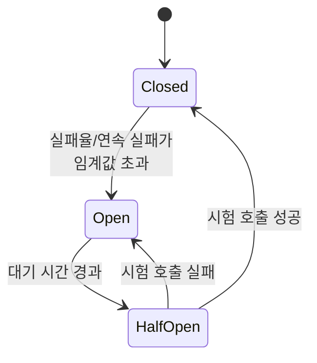

**닫힘(Closed)** 상태에서는 모든 호출이 정상적으로 하류에 전달되며, 실패 횟수를 슬라이딩 윈도우로 집계한다. 임계값 — 예를 들어 "최근 20회 호출 중 실패율 50% 이상" 또는 "연속 5회 실패" — 을 넘으면 **열림(Open)**으로 전환되어, 이후 들어오는 모든 호출을 하류에 전달하지 않고 즉시 실패(또는 폴백)로 응답한다. 일정 대기 시간이 지나면 **반열림(Half-Open)**으로 전환되어 소수의 시험 호출만 하류에 통과시킨다 — 이 시험 호출이 성공하면 닫힘으로 복귀하고, 실패하면 다시 열림으로 돌아간다.

**임계값 설계**에서 슬라이딩 윈도우 크기와 반열림 시험 호출 수는 트래픽 볼륨에 맞춰야 한다. 초당 요청이 적은 서비스에서 "최근 100회 중 50% 실패"를 기준으로 삼으면 윈도우가 채워지는 데 너무 오래 걸려 반응이 늦다. 반열림에서 시험 호출을 1개만 보내면 우연한 성공/실패에 상태가 출렁이므로, 보통 3~5개 정도의 시험 호출을 병렬이 아닌 **제한된 수로 순차 통과**시켜 판정한다.

```python
import time
from enum import Enum

class State(Enum):
    CLOSED = "closed"; OPEN = "open"; HALF_OPEN = "half_open"

class CircuitBreaker:
    def __init__(self, failure_threshold=5, recovery_timeout=30, half_open_max_calls=3):
        self.state = State.CLOSED
        self.failure_count = 0
        self.failure_threshold = failure_threshold
        self.recovery_timeout = recovery_timeout
        self.half_open_max_calls = half_open_max_calls
        self.half_open_calls = 0
        self.opened_at = None

    def call(self, fn, fallback=None):
        if self.state == State.OPEN:
            if time.time() - self.opened_at >= self.recovery_timeout:
                self.state = State.HALF_OPEN
                self.half_open_calls = 0
            else:
                return fallback() if fallback else self._raise_open()
        if self.state == State.HALF_OPEN and self.half_open_calls >= self.half_open_max_calls:
            return fallback() if fallback else self._raise_open()  # 시험 호출 슬롯 소진
        try:
            if self.state == State.HALF_OPEN:
                self.half_open_calls += 1
            result = fn()
            self._on_success()
            return result
        except Exception:
            self._on_failure()
            if fallback:
                return fallback()
            raise

    def _on_success(self):
        if self.state == State.HALF_OPEN:
            self.state = State.CLOSED
        self.failure_count = 0

    def _on_failure(self):
        self.failure_count += 1
        if self.state == State.HALF_OPEN or self.failure_count >= self.failure_threshold:
            self.state = State.OPEN
            self.opened_at = time.time()

    def _raise_open(self):
        raise RuntimeError("circuit open — 하류 호출 차단")
```

**폴백과의 결합**은 필수다 — 서킷이 열렸을 때 단순히 오류를 반환하기보다 캐시된 마지막 정상 응답이나 기본값을 돌려주면 사용자 경험 저하를 줄인다(46.14절 그레이스풀 디그레이데이션과 연결).

AWS 환경에서는 언어별 서킷 브레이커 라이브러리(Java의 Resilience4j, .NET의 Polly 등)를 애플리케이션 코드에 넣는 것이 가장 직접적인 구현이다. **App Mesh**를 쓰면 사이드카(Envoy) 레벨에서 이상치 탐지(outlier detection)로 유사한 효과를 애플리케이션 코드 변경 없이 얻을 수 있다. Lambda 환경에서는 전통적 서킷 브레이커 상태 머신 대신 **예약 동시성(reserved concurrency)**으로 특정 함수가 하류를 과도하게 호출하지 못하게 상한을 거는 방식이 벌크헤드에 가깝지만 유사한 보호 효과를 낸다.

**안티패턴**: 서킷 브레이커 상태를 인스턴스별로 독립적으로 관리하면(공유 상태 없이) 인스턴스 수가 많을 때 일부는 열림, 일부는 닫힘 상태로 갈라져 판단이 흔들린다 — 상태를 공유 저장소(Redis, DynamoDB)에 두거나, 이 정도 정교함이 필요 없다면 인스턴스별 판단의 편차를 감수할지 먼저 결정한다.

### 46.4 타임아웃과 데드라인 전파

**모든 원격 호출에는 타임아웃이 있어야 한다.** 타임아웃 없는 호출은 하류가 응답하지 않을 때 호출자의 스레드나 커넥션을 영원히 붙잡아 두고, 이것이 쌓이면 스레드 풀·커넥션 풀이 고갈되어 하류 문제가 호출자 전체 장애로 번진다 — 이 장 전체에서 가장 값싸면서 가장 자주 빠뜨리는 방어책이다.

**핵심 원칙은 계층별로 바깥이 안보다 길어야 한다는 것이다.** 클라이언트 타임아웃 > 게이트웨이 타임아웃 > 서비스 타임아웃 > DB 타임아웃 순으로 바깥 계층이 안쪽 계층보다 여유 시간을 더 가져야, 안쪽 호출이 자신의 타임아웃으로 실패를 확정한 뒤 바깥 계층이 재시도나 폴백을 판단할 시간이 남는다. 거꾸로 설계되면 — 예컨대 DB 타임아웃이 서비스 타임아웃보다 길면 — 서비스가 먼저 포기하고 재시도를 시작하는데 DB에서는 이전 요청이 여전히 처리 중이어서, 같은 작업이 중복 실행되는 재시도 폭풍이 벌어진다.

```mermaid
flowchart LR
    C["클라이언트<br/>타임아웃 30s"] --> GW["API Gateway<br/>타임아웃 29s"]
    GW --> SVC["서비스(Lambda/ECS)<br/>타임아웃 25s"]
    SVC --> DB["데이터베이스<br/>쿼리 타임아웃 10s"]
```

| 계층 | 대표 타임아웃 | 특성 |
|---|---|---|
| API Gateway (REST/HTTP API) | 통합 타임아웃 최대 29초(REST), HTTP API도 유사한 상한 — 정확한 값은 서비스 할당량 문서 확인 | 장시간 작업은 근본적으로 맞지 않음(→ 45.5절 비동기 전환) |
| ALB | 유휴 타임아웃(기본 60초, 조정 가능) | 이 시간 동안 요청·응답 데이터가 없으면 연결 종료 |
| Lambda | 함수 제한 시간(최대 15분, 기본값은 훨씬 짧음) | 호출자의 타임아웃보다 반드시 짧게 설정해야 함 |
| RDS/Aurora 클라이언트 드라이버 | 커넥션·쿼리 타임아웃(드라이버 설정값) | 애플리케이션 계층 타임아웃보다 짧게 유지 |

**데드라인 전파**는 분산 호출 체인에서 "남은 시간이 얼마인지"를 다음 홉에 알려주는 기법이다 — 요청 헤더에 `X-Deadline` 같은 필드로 절대 시각 또는 남은 밀리초를 실어 보내면, 체인 중간의 서비스가 "이미 상위 호출자의 예산이 소진됐다"는 것을 알고 즉시 실패를 반환해 무의미한 작업을 아낄 수 있다. gRPC는 이 개념을 데드라인으로 프로토콜에 내장하고 있으며, REST/HTTP 기반 아키텍처에서는 커스텀 헤더로 직접 구현해야 한다.

**안티패턴**: 타임아웃 값을 모든 호출에 동일하게(예: 전부 60초) 설정하면 계층 원칙이 깨진다. 또한 재시도 로직이 타임아웃과 결합되지 않은 채(예: 타임아웃 30초 + 재시도 3회 + 타임아웃 각 30초) 설계되면 최악의 경우 전체 대기 시간이 90초까지 늘어날 수 있다는 것을 호출자 쪽 타임아웃 설계에 반드시 반영해야 한다.

### 46.5 벌크헤드 패턴과 리소스 격리

선박의 격벽(bulkhead)이 한 구획의 침수를 그 구획에만 가두듯, 벌크헤드 패턴은 **커넥션 풀·스레드 풀·동시성 한도를 기능별/의존성별로 분리**해 한 하류 서비스의 장애가 스레드 풀 전체를 고갈시키지 못하게 막는다. 흔한 실패 시나리오는 이렇다 — 결제 서비스가 느려지면서 결제 호출에 쓰이던 스레드가 모두 응답을 기다리며 블록되고, 이 스레드 풀이 상품 조회 같은 무관한 요청과 공유되고 있었다면 상품 조회까지 함께 멈춘다.

해결은 의존성별로 별도의 스레드 풀·커넥션 풀·세마포어를 두는 것이다 — 결제 호출 전용 풀이 고갈돼도 상품 조회 전용 풀은 영향을 받지 않는다. 이는 8.5절의 **셀 기반 격리**와 같은 발상을 호출 단위로 축소한 것이다 — 셀이 인프라 스택 전체를 격리한다면, 벌크헤드는 프로세스 내부의 리소스 풀을 격리한다.

AWS 환경에서 벌크헤드는 여러 층위로 구현된다.

- **Lambda 예약 동시성(reserved concurrency)**: 특정 함수가 계정 전체의 동시 실행 한도를 독식해 다른 함수의 실행 가능 슬롯을 빼앗지 못하게 상한을 건다. 반대로 **예약되지 않은 함수들은 공유 풀을 나눠 쓰므로**, 트래픽이 많은 함수 하나가 계정 동시성 한도를 소진하면 다른 함수들이 스로틀링당할 수 있다 — 중요 함수에는 예약 동시성을, 노이즈가 될 수 있는 함수에는 **최대 동시성(concurrency limit)**을 걸어 반대 방향의 벌크헤드도 함께 고려한다.
- **ECS 서비스 분리**: 하나의 태스크 정의에 여러 기능을 몰아넣지 않고 기능별로 별도 서비스·별도 태스크로 나누면, 한 서비스의 CPU/메모리 폭주가 다른 서비스의 컴퓨트 자원을 침범하지 않는다.
- **큐 분리**: 우선순위나 하류 의존성이 다른 작업을 하나의 SQS 큐에 몰아넣지 않고 별도 큐로 나누면, 한 하류 시스템의 처리 지연이 다른 작업 큐의 소비 속도에 영향을 주지 않는다(46.8절 우선순위 큐와 연결).

**안티패턴**: 모든 하류 호출이 하나의 전역 스레드 풀·전역 커넥션 풀을 공유하는 구성. 얼핏 리소스를 효율적으로 쓰는 것처럼 보이지만, 한 의존성의 장애가 전체 애플리케이션을 마비시키는 단일 실패점이 된다.

### 46.6 스로틀링 패턴과 레이트 리미팅

스로틀링은 "받아들일 수 있는 것보다 많은 요청이 오면 초과분을 거절한다"는 자기 보호 메커니즘이다. 벌크헤드가 리소스를 나누는 것이라면, 스로틀링은 **애초에 얼마나 많은 요청을 받아들일지 상한을 정하는 것**이다. 구현 위치는 세 곳으로 나뉜다 — 클라이언트가 스스로 요청 속도를 제한하는 클라이언트 사이드(46.2절 adaptive 재시도 모드가 그 예), 서버가 자신을 보호하기 위해 초과 요청을 거절하는 서버 사이드, 그리고 API Gateway·WAF 같은 게이트웨이 계층에서 요청이 서버에 닿기도 전에 걸러내는 방식이다.

| 알고리즘 | 동작 | 특징 |
|---|---|---|
| 고정 윈도우(Fixed Window) | 시간을 고정 구간으로 나눠 구간별 카운트 | 구현 단순, 윈도우 경계에서 순간 폭주 허용(2배 버스트 문제) |
| 슬라이딩 로그(Sliding Log) | 각 요청 타임스탬프를 기록해 윈도우 내 개수 계산 | 정확하지만 메모리 사용량이 요청 수에 비례 |
| 슬라이딩 카운터(Sliding Window Counter) | 이전·현재 윈도우 카운트를 가중 평균 | 고정 윈도우의 경계 문제를 근사적으로 완화, 메모리 효율적 |
| 토큰 버킷(Token Bucket) | 일정 속도로 토큰이 채워지는 버킷에서 요청마다 토큰 소비 | 버스트를 일정량 허용하면서 장기 평균 속도를 제어, 가장 널리 쓰임 |
| 리키 버킷(Leaky Bucket) | 요청을 큐에 쌓고 일정 속도로만 처리 | 출력 속도를 완전히 평탄화, 버스트를 아예 허용하지 않음 |

**한 줄 결정 기준**: 순간적인 버스트를 어느 정도 허용하면서 평균 속도를 제어하려면 **토큰 버킷**, 완전히 일정한 처리 속도가 필요하면 **리키 버킷**(46.7절 큐 기반 부하 평준화와 사실상 같은 발상). 상세한 구현별 자료구조·분산 환경에서의 레이트 리미터 설계는 → **57.1절** 참조.

초과 요청에는 **HTTP 429(Too Many Requests)**로 응답하고, 언제 다시 시도하면 좋을지 **`Retry-After`** 헤더로 알려준다 — 이 값을 클라이언트가 46.2절의 백오프 계산에 반영하면 불필요한 재시도를 줄인다.

AWS에서 게이트웨이 계층 스로틀링은 **API Gateway 사용량 계획(usage plan)**의 요청 한도(rate/burst)와 API 키별 쿼터, 그리고 **AWS WAF의 레이트 기반 규칙(rate-based rule)** — 특정 IP나 속성 기준으로 일정 시간 내 요청 수가 임계값을 넘으면 차단 — 으로 구현한다.

```bash
# API Gateway 사용량 계획: 초당 100건, 버스트 200건, 일일 쿼터 100,000건
aws apigateway create-usage-plan \
  --name "partner-tier-standard" \
  --throttle burstLimit=200,rateLimit=100 \
  --quota limit=100000,period=DAY \
  --region ap-northeast-2
```

**안티패턴**: 클라이언트에 스로틀링 한도를 알리지 않고 조용히 429만 반환하면, 클라이언트는 원인을 모른 채 무제한 재시도를 반복해 상황을 악화시킨다. 사용량 계획·429 응답에는 반드시 한도 값과 재시도 지침을 문서화한다.

### 46.7 큐 기반 부하 평준화

동기 API가 순간 트래픽 폭주를 그대로 받으면, 처리 능력을 넘는 순간 요청이 실패하거나 타임아웃된다. 큐 기반 부하 평준화는 **생산자와 소비자 사이에 큐를 두어 폭주를 흡수**하고, 소비자는 자신의 처리 능력에 맞는 일정한 속도로 큐에서 꺼내 처리하게 한다 — 리키 버킷과 같은 원리를 아키텍처 수준에 적용한 것이다.

이 패턴에서 사용자에게 즉시 최종 결과를 주는 대신 **"접수 완료 + 비동기 통지"**로 응답하는 것이 핵심이다 — 요청을 큐에 넣고 202 Accepted와 추적 ID를 즉시 반환한 뒤, 처리가 끝나면 웹훅·WebSocket·폴링 엔드포인트로 결과를 알린다. 이는 45.5절에서 다룬 동기-비동기 전환의 실제 적용이다.

**처리량 계산과 큐 길이 SLO**는 이 패턴의 용량 설계 핵심이다. 소비자 1개가 초당 N건을 처리할 수 있다면, 소비자를 M개로 늘렸을 때 이론상 처리량은 M×N건/초에 근접한다(경쟁 소비자 패턴, 46.8절). 큐 길이가 계속 늘어난다면 소비 속도가 유입 속도를 따라가지 못한다는 신호이므로, **큐 길이 또는 큐 내 메시지의 평균 대기 시간을 SLO 지표로 삼아 오토스케일링 정책의 트리거**로 쓴다 — SQS 큐 깊이(ApproximateNumberOfMessagesVisible) 기반 Auto Scaling Group 스케일링 정책 설계는 → **16장** 참조.

```mermaid
flowchart LR
    Client["클라이언트<br/>다수의 동시 요청"] --> API["API<br/>202 Accepted 즉시 응답"]
    API --> Q[("SQS 큐<br/>폭주 흡수 버퍼")]
    Q --> W1[Worker 1]
    Q --> W2[Worker 2]
    Q --> W3["Worker N<br/>(큐 깊이 기반 오토스케일)"]
    W1 & W2 & W3 --> Notify["웹훅/WebSocket<br/>비동기 결과 통지"]
```

**안티패턴**: 큐를 두고도 소비자 수를 고정해 두면 폭주 흡수는 되지만 지연 시간이 무한정 늘어날 수 있다 — 큐는 폭주를 "버리지 않게" 할 뿐, 소비자 확장 없이는 "빨리 처리되게" 만들지 못한다는 점을 SLA에 반영해야 한다.

### 46.8 경쟁 소비자와 우선순위 큐

경쟁 소비자(Competing Consumers) 패턴은 하나의 큐를 여러 소비자 인스턴스가 동시에 구독해 병렬로 처리량을 확장하는 구조다 — 46.7절 큐 기반 부하 평준화의 처리 측을 구체화한 것이다. SQS는 이 패턴을 기본 동작으로 지원한다 — 여러 워커가 같은 큐를 폴링하면 각 메시지는 가시성 타임아웃 동안 한 워커에만 노출되어 자연스럽게 작업이 분산된다.

**병렬 소비자 확장에는 대가가 있다.** 여러 워커가 동시에 처리하면 메시지가 들어온 순서와 처리 완료 순서가 달라질 수 있다 — 순서가 업무적으로 중요하다면(재고 차감 순서, 상태 전이 순서) FIFO 큐와 메시지 그룹 ID로 순서가 필요한 범위만 좁혀야 하며, 이는 처리량과 순서 보장 사이의 트레이드오프임을 45.10절 결정표에서 이미 다뤘다.

**우선순위 큐**는 모든 작업이 동등하게 급하지 않을 때 필요하다 — 구현은 크게 두 방식이다.

| 구현 방식 | 동작 | 장단점 |
|---|---|---|
| 별도 큐 + 가중 폴링 | 우선순위별로 큐를 나누고, 소비자가 높은 우선순위 큐를 더 자주 폴링 | 구현 단순, SQS 표준 기능만으로 충분, 큐 개수가 우선순위 등급 수만큼 늘어남 |
| 단일 큐 + 우선순위 필드 | 메시지 속성에 우선순위를 실어 보내고 소비자가 애플리케이션 레벨에서 정렬 | 큐 개수는 그대로지만 SQS 자체는 우선순위 정렬을 지원하지 않아 소비자 측 로직이 복잡해짐 |

**한 줄 결정 기준**: 우선순위 등급이 소수(2~4개)로 고정적이면 **별도 큐 + 가중 폴링**이 SQS 네이티브 기능만으로 구현 가능해 압도적으로 단순하다.

**기아(starvation) 방지**가 우선순위 큐 설계의 핵심 함정이다 — 높은 우선순위 큐만 계속 우선 처리하면 낮은 우선순위 큐의 메시지가 영원히 처리되지 않을 수 있다. 가중 폴링에서 낮은 우선순위 큐에도 최소 폴링 비율을 보장하거나, 큐 내 메시지의 대기 시간이 임계값을 넘으면 우선순위를 강제로 승격시키는 에이징(aging) 로직을 넣어야 한다.

**안티패턴**: 우선순위 큐를 도입하면서 낮은 우선순위 작업의 최대 대기 시간 SLA를 정하지 않으면, 트래픽이 많은 시기에 그 작업들이 사실상 무기한 지연되는 것을 아무도 눈치채지 못한다.

### 46.9 보상 트랜잭션 패턴

Saga의 전체 구조(코레오그래피 vs 오케스트레이션, 언제 사가를 쓸지)는 44.3절에서 이미 다뤘다. 이 절은 **보상 동작 자체를 어떻게 설계할지**에 집중한다.

**보상은 멱등해야 한다.** 오케스트레이터가 재시작되거나 같은 실패 이벤트가 중복 전달되면 보상 로직이 두 번 실행될 수 있다 — "재고를 1개 복원"하는 보상이 멱등하지 않으면 두 번 실행 시 재고가 실제보다 많이 늘어나는 이중 보상 버그가 생긴다. 보상 함수는 46.13절의 멱등 키 설계를 그대로 적용해 "이미 이 트랜잭션을 보상했는가"를 먼저 확인하고 실행해야 한다.

**부분 보상**은 사가의 일부 단계만 되돌려야 하는 상황을 다룬다 — 예컨대 5단계 사가 중 3단계에서 실패하면 2, 1단계만 역순으로 보상하고 4, 5단계는 애초에 실행되지 않았으므로 보상 대상이 아니다. 이 역순 보상 순서를 오케스트레이터의 `Catch` 분기에 명시적으로 인코딩해야지, 암묵적으로 "어차피 실패했으니 전부 정리"라는 식으로 뭉뚱그리면 실행되지 않은 단계까지 잘못 보상하려다 오류가 난다.

**보상 자체의 실패**를 반드시 별도로 처리해야 한다 — "결제 환불" 보상이 실패하면 무엇을 하는가? 자동 재시도(46.2절의 재시도 예산 적용)로 먼저 대응하고, 그래도 실패하면 **수동 개입 큐(DLQ 또는 전용 운영 큐)**로 이관해 사람이 확인하도록 한다. 보상 실패를 그냥 로그만 남기고 넘어가면 고객에게 청구는 됐는데 주문은 취소된 상태 같은 재무적 불일치가 조용히 쌓인다.

```json
{
  "Comment": "보상 실패 시 자동 재시도 후 수동 개입 큐로 이관",
  "RefundPayment": {
    "Type": "Task",
    "Resource": "arn:aws:lambda:ap-northeast-2:123456789012:function:refund-payment",
    "Retry": [{ "ErrorEquals": ["States.ALL"], "MaxAttempts": 3, "BackoffRate": 2.0 }],
    "Catch": [{ "ErrorEquals": ["States.ALL"], "Next": "EscalateToManualQueue" }],
    "Next": "ReleaseInventory"
  },
  "EscalateToManualQueue": {
    "Type": "Task",
    "Resource": "arn:aws:states:::sqs:sendMessage",
    "Parameters": { "QueueUrl": "https://sqs.ap-northeast-2.amazonaws.com/123456789012/manual-compensation-queue",
                    "MessageBody.$": "$" },
    "End": true
  }
}
```

**안티패턴**: 보상 로직을 "정상 흐름의 역순 함수" 정도로 가볍게 취급하는 것 — 실제로는 보상이 정상 흐름보다 더 신중한 설계(멱등성, 실패 시 에스컬레이션)를 요구하는 별도의 비즈니스 오퍼레이션이다.

### 46.10 리더 선출 패턴

분산된 여러 인스턴스 중 **정확히 하나만 특정 작업을 수행해야 하는 상황**에서 리더 선출이 필요하다 — 예를 들어 여러 인스턴스가 떠 있는 배치 스케줄러가 같은 작업을 중복 실행하면 안 되는 경우, 또는 파티션 소유권을 배타적으로 가져야 하는 스트림 처리기의 경우다.

알고리즘 개요만 보면, 리더 선출은 결국 "여러 참가자가 하나의 공유 자원에 대해 배타적 락을 획득하려 경쟁하고, 승자가 리더가 되며, 리더가 살아있는 동안 하트비트로 락을 갱신하고, 하트비트가 끊기면 다른 참가자가 락을 가져갈 수 있다"는 구조로 수렴한다.

AWS에서 흔한 구현은 **DynamoDB 조건부 쓰기를 이용한 락 + TTL 하트비트**다.

```python
import boto3, time, socket
from botocore.exceptions import ClientError

table = boto3.resource("dynamodb", region_name="ap-northeast-2").Table("LeaderLock")
INSTANCE_ID = socket.gethostname()
LOCK_TTL_SECONDS = 30

def try_acquire_leadership() -> bool:
    now = int(time.time())
    try:
        table.put_item(
            Item={"lock_id": "scheduler-leader", "holder": INSTANCE_ID, "expires_at": now + LOCK_TTL_SECONDS},
            # 락이 없거나, 있어도 만료됐으면 획득 가능 — 조건부 쓰기로 원자적 판정
            ConditionExpression="attribute_not_exists(lock_id) OR expires_at < :now",
            ExpressionAttributeValues={":now": now},
        )
        return True
    except ClientError as e:
        if e.response["Error"]["Code"] == "ConditionalCheckFailedException":
            return False  # 다른 인스턴스가 이미 리더
        raise

def renew_leadership():
    # 리더가 주기적으로 호출해 만료 시각을 연장 — 하트비트
    table.update_item(
        Key={"lock_id": "scheduler-leader"},
        UpdateExpression="SET expires_at = :new_exp",
        ConditionExpression="holder = :me",  # 다른 인스턴스가 이미 승계했다면 갱신 실패
        ExpressionAttributeValues={":new_exp": int(time.time()) + LOCK_TTL_SECONDS, ":me": INSTANCE_ID},
    )
```

다른 방식으로 **ECS 서비스를 원하는 태스크 수 1로 고정**해 오케스트레이터가 "인스턴스가 정확히 하나만 실행되도록" 보장하게 맡기는 방법도 있다 — 단, 태스크 교체 시 짧게라도 0개 또는 2개가 동시에 존재할 수 있는 구간이 생길 수 있음을 감안해야 한다.

**리더 선출을 아예 피하는 설계가 대체로 낫다.** 락 관리, 하트비트, 스플릿 브레인(네트워크 분할로 두 인스턴스가 동시에 자신을 리더라 믿는 상황) 처리는 그 자체로 복잡한 분산 시스템 문제를 하나 더 만든다. 단일 스케줄러가 필요한 경우 대부분은 **EventBridge Scheduler**로 정해진 트리거가 정확히 한 번(또는 최소 한 번 + 멱등) 실행되도록 맡기면 리더 선출 자체가 불필요해진다. 리더 선출은 "그 외의 방법이 없을 때"의 마지막 수단으로 남겨둔다.

**안티패턴**: 리더 선출 없이도 되는 문제(예: 단순 주기 작업)에 리더 선출 인프라를 도입해 복잡도만 늘리는 것, 그리고 락 TTL을 너무 짧게 잡아 정상적인 GC 정지나 네트워크 지연에도 리더가 자주 교체되는 것(스래싱).

### 46.11 스케줄러 에이전트 슈퍼바이저 패턴

여러 단계의 원격 작업을 조율하면서 각 단계의 실패를 감지하고 복구까지 자동화하려면 역할을 셋으로 나누는 것이 유용하다.

- **스케줄러(Scheduler)**: 작업을 단계별로 조율하고 다음에 무엇을 할지 결정한다 — 사가의 오케스트레이터와 유사한 역할.
- **에이전트(Agent)**: 실제 원격 호출(외부 API, 다른 서비스)을 수행하는 실행 단위. 에이전트는 상태를 갖지 않고 스케줄러의 지시를 그대로 실행한다.
- **슈퍼바이저(Supervisor)**: 각 작업의 진행 상태를 감시하다가, 예상 시간 내에 완료되지 않거나 실패한 작업을 발견하면 재시도나 보상을 트리거한다.

이 구조가 44.3절 Saga 오케스트레이션과 다른 점은 **"진행 중 상태를 영속화하고, 프로세스가 죽어도 그 상태로부터 재개할 수 있어야 한다"**는 것을 명시적으로 강조한다는 데 있다 — 오케스트레이터가 메모리에만 상태를 들고 있다가 죽으면 그 작업은 어느 단계까지 진행됐는지 알 방법이 없어진다.

AWS에서는 **Step Functions**가 스케줄러 역할, 각 `Task` 상태가 호출하는 Lambda/서비스 통합이 에이전트 역할을 맡는다. 이 조합 자체가 상태를 스텝 함수 실행 이력에 자동으로 영속화하므로 재개 문제를 상당 부분 해결한다. 슈퍼바이저 역할은 **EventBridge 규칙이 Step Functions의 실행 상태 변경 이벤트(`Step Functions Execution Status Change`)를 구독**해 `TIMED_OUT`이나 `FAILED` 상태를 감지하고, 별도의 복구 Lambda나 알람으로 연결하는 형태로 구현한다. 진행 중인 작업의 상태를 조회 가능한 형태로 남기려면 DynamoDB에 작업 ID별 진행 단계를 함께 기록해, 슈퍼바이저나 운영자가 "이 작업이 지금 어느 단계에 멈춰 있는지"를 즉시 조회할 수 있게 한다.

**안티패턴**: 에이전트가 스스로 상태를 들고 재시도 판단까지 하게 하면 스케줄러·슈퍼바이저의 감시 범위 밖에서 로직이 분산되어, 전체 작업이 어디서 멈췄는지 한눈에 파악할 수 없게 된다 — 상태 관리는 항상 스케줄러(또는 영속 저장소)에 집중시킨다.

### 46.12 상태 확인 엔드포인트 모니터링 패턴

이 패턴의 구현 세부(얕은/깊은 체크 분리, 응답 형식, thrashing 방지)는 38.7절에서 이미 다뤘다. 이 절은 **패턴으로서의 설계 관점**만 정리한다.

**무엇을 확인할지**는 "이 인스턴스가 트래픽을 정상 처리할 수 있는가"를 가장 직접적으로 대변하는 신호로 좁혀야 한다 — CPU 사용률처럼 간접적인 지표보다, 실제 요청 경로에서 쓰이는 의존성(DB 연결, 캐시, 다운스트림 API)의 응답 가능 여부가 더 정확한 신호다.

**종속성 체크 깊이**는 트레이드오프다 — 얕은 체크만 하면 회색 실패(46.1절)를 놓치고, 모든 의존성을 매번 깊게 확인하면 헬스체크 자체가 부하가 되고 공유 의존성 장애 시 전 인스턴스가 동시에 비정상 판정을 받는 thrashing(38.7절)을 유발한다. 실무에서는 **로드밸런서용 얕은 체크**와 **모니터링 시스템이 주기적으로 스크레이핑하는 깊은 체크**를 물리적으로 다른 엔드포인트로 분리하는 것이 정답에 가깝다.

**응답 캐싱**도 고려할 만하다 — 깊은 체크가 매번 모든 의존성을 실시간으로 조회하면 헬스체크 자체가 하류에 추가 트래픽을 유발한다. 최근 체크 결과를 수 초~수십 초 단위로 캐싱해 반환하면, 실제 사용자 트래픽에 걸리는 부하를 헬스체크가 늘리지 않으면서도 충분히 최신 상태를 반영할 수 있다.

**보안**은 38.7절에서 다룬 대로, 깊은 체크 엔드포인트가 내부 구성 정보를 노출하지 않도록 별도 경로·내부 네트워크 한정·인증 요구가 기본이다. 관측 도구(CloudWatch Synthetics, X-Ray 연동 등)를 이용한 실제 모니터링 구성은 → 38장 참조.

### 46.13 멱등성·중복 제거·정확히 한 번 처리

**"정확히 한 번(exactly-once)" 전달은 네트워크가 신뢰할 수 없는 한 실제로 보장되지 않는다.** 44.6절에서 다룬 것처럼, 실무에서 도달 가능한 것은 **최소 한 번(at-least-once) 전달 + 소비자 측 멱등 처리**의 조합이다. 이 절은 이벤트 소비 이후 **클라이언트가 API를 호출하는 시점**의 멱등성 설계에 초점을 맞춘다 — 44.6절은 서비스 간 이벤트 중복 제거, 이 절은 클라이언트-서버 간 재시도로 인한 중복 요청 방지다.

**멱등하지 않은 API에 재시도를 거는 것은 이중 결제·중복 주문의 직접적인 원인이다.** 클라이언트가 "결제 승인" 요청을 보냈는데 네트워크 문제로 응답을 못 받으면, 클라이언트는 실제로 결제가 처리됐는지 알 방법이 없다 — 재시도하면 이미 처리된 결제가 다시 청구될 위험이 있고, 재시도하지 않으면 실제로 실패한 결제를 방치할 위험이 있다. **멱등 키(idempotency key)**가 이 딜레마를 해결한다 — 클라이언트가 요청마다 고유한 키(보통 UUID)를 생성해 헤더에 실어 보내고, 서버는 같은 키로 들어온 두 번째 요청을 "이미 처리된 요청"으로 인식해 원래 결과를 그대로 반환한다.

```python
import boto3, time, hashlib
from botocore.exceptions import ClientError

idempotency_table = boto3.resource("dynamodb", region_name="ap-northeast-2").Table("IdempotencyKeys")
TTL_SECONDS = 24 * 3600  # 중복 제거 윈도우 — 이 기간이 지나면 같은 키 재사용을 허용

def handle_payment_request(idempotency_key: str, request_payload: dict, process_fn):
    request_hash = hashlib.sha256(str(request_payload).encode()).hexdigest()
    try:
        idempotency_table.put_item(
            Item={
                "idempotency_key": idempotency_key,
                "request_hash": request_hash,  # 같은 키로 다른 페이로드가 오면 오류로 거부
                "status": "IN_PROGRESS",
                "ttl": int(time.time()) + TTL_SECONDS,
            },
            ConditionExpression="attribute_not_exists(idempotency_key)",
        )
    except ClientError as e:
        if e.response["Error"]["Code"] == "ConditionalCheckFailedException":
            existing = idempotency_table.get_item(Key={"idempotency_key": idempotency_key})["Item"]
            if existing["request_hash"] != request_hash:
                raise ValueError("동일 키로 다른 요청 본문 — 클라이언트 버그 의심")
            if existing["status"] == "COMPLETED":
                return existing["response"]  # 재시도 — 원래 결과를 그대로 반환, 재처리하지 않음
            raise RuntimeError("동일 요청이 아직 처리 중 — 잠시 후 재시도")  # 동시 중복 요청
        raise

    result = process_fn(request_payload)  # 최초 1회만 실제 결제 처리 로직 실행
    idempotency_table.update_item(
        Key={"idempotency_key": idempotency_key},
        UpdateExpression="SET #s = :done, response = :r",
        ExpressionAttributeNames={"#s": "status"},
        ExpressionAttributeValues={":done": "COMPLETED", ":r": result},
    )
    return result
```

DynamoDB의 **TTL**로 멱등 키 레코드를 자동 만료시켜 테이블이 무한정 커지지 않게 하되, TTL을 **중복 제거 윈도우**로 설계한다 — 결제·주문처럼 재시도가 몇 시간 뒤에도 일어날 수 있는 오퍼레이션은 TTL을 넉넉히(예: 24시간), 즉각적인 재시도만 문제되는 오퍼레이션은 짧게 잡는다.

**자연 멱등 연산과 아닌 연산**을 구분하는 것도 설계에 도움이 된다 — "특정 값으로 설정"(PUT, `SET status = 'SHIPPED'`)이나 "삭제"는 여러 번 실행해도 결과가 같으므로 자연히 멱등하다. 반면 "1 증가"(`counter += 1`), "결제 승인", "이메일 발송"은 실행할 때마다 부작용이 누적되므로 자연 멱등이 아니다 — 이런 연산에 멱등 키가 특히 중요하다.

**안티패턴**: 멱등 키를 서버가 자동 생성하면(예: 요청 도착 시각 기반) 클라이언트의 재시도 요청도 "새 요청"으로 인식돼 멱등성이 무의미해진다. 멱등 키는 반드시 **클라이언트가 최초 요청 시점에 생성**해 재시도 시에도 동일한 값을 재사용해야 한다.

### 46.14 그레이스풀 디그레이데이션과 폴백

모든 기능을 100% 아니면 0%로만 다루면, 부분 장애 상황에서 시스템 전체가 멈춘다. 그레이스풀 디그레이데이션(graceful degradation)은 **장애 시 일부 기능을 의도적으로 낮은 품질로 축소해서라도 핵심 기능을 살려두는 설계**다.

**기능 축소 계획**은 먼저 기능을 등급으로 나누는 데서 시작한다 — 예를 들어 전자상거래라면 "상품 조회·결제"는 핵심(반드시 유지), "추천 상품·리뷰·최근 본 상품"은 부가 기능(장애 시 잠시 꺼도 사업에 치명적이지 않음)으로 나눈다. 부가 기능이 의존하는 서비스가 장애를 겪으면 서킷 브레이커(46.3절)가 열리면서 그 기능만 숨기거나 빈 상태로 렌더링하고, 핵심 기능은 영향받지 않고 계속 동작하게 한다.

**폴백 데이터**(캐시된 마지막 정상 응답, 하드코딩된 기본값)는 이 축소 모드를 부드럽게 만들지만 **위험도 함께 가져온다.** 재고 수량 API가 장애 상태라서 "재고 있음"이라는 낙관적 기본값을 돌려주면, 실제로는 품절인 상품이 팔려 나중에 주문 취소·환불이라는 더 나쁜 결과로 이어질 수 있다. **폴백이 조용히 잘못된 데이터를 반환하면 장애보다 나쁘다** — 장애는 최소한 눈에 보이지만, 조용히 틀린 값은 한참 후에야 발견된다. 폴백 값은 반드시 "안전한 방향"으로 설계해야 한다 — 재고라면 낙관적 기본값 대신 "재고 확인 필요" 같은 보수적 기본값을 택하는 식이다.

**축소 모드의 관측 가능성**은 그래서 필수다 — 폴백이 호출됐다는 사실 자체를 메트릭·로그로 남기고, 대시보드에 "정상 응답 대비 폴백 응답 비율"을 노출해야, 축소 모드가 얼마나 자주·오래 지속되는지 운영자가 알 수 있다. 폴백을 조용히 성공 응답처럼 취급하면 장애가 실제로 얼마나 심각한지 아무도 모르는 채로 시스템이 저하된 상태로 계속 운영된다.

**로드 셰딩(load shedding)**은 그레이스풀 디그레이데이션의 극단적 형태로, 시스템 전체가 과부하 상태일 때 **우선순위가 낮은 요청을 아예 거부**해 남은 용량을 우선순위 높은 요청에 집중시킨다. 다음은 요청 헤더의 우선순위와 현재 부하를 보고 저순위 요청을 조기에 걷어내는 미들웨어 골자다.

```python
import psutil  # 예시 — 실제로는 CPU/큐 깊이/에러율 등 자체 지표를 사용

CPU_SHED_THRESHOLD = 85  # 이 값을 넘으면 저순위 요청부터 차단

def load_shedding_middleware(request, next_handler):
    priority = request.headers.get("X-Priority", "normal")  # low / normal / high
    current_load = psutil.cpu_percent(interval=None)
    if current_load >= CPU_SHED_THRESHOLD and priority == "low":
        return {
            "status_code": 503,
            "headers": {"Retry-After": "10"},
            "body": {"error": "load_shedding", "message": "저우선순위 요청이 일시적으로 차단됨"},
        }
    return next_handler(request)  # 정상 처리 경로로 전달
```

**안티패턴**: 폴백 로직을 넣고 정상 응답과 구분 없이 반환하는 것(관측 불가능한 축소), 그리고 핵심/부가 기능 등급을 사전에 정의하지 않은 채 장애 상황에서 즉흥적으로 어떤 기능을 죽일지 결정하는 것 — 이는 반드시 평상시에 미리 정해 둬야 한다.

### 46.15 AWS 매핑과 실습

이 장의 패턴들을 실제 AWS 리소스 설정으로 정리하면 다음과 같다.

**boto3 SDK 재시도 설정**(46.2절 요약, 실전 구성 예시):

```python
from botocore.config import Config
import boto3

config = Config(
    region_name="ap-northeast-2",
    retries={"max_attempts": 4, "mode": "standard"},  # 스로틀링이 잦지 않은 일반 서비스
    connect_timeout=3,     # 연결 자체의 타임아웃 — 계층 원칙(46.4절)에 따라 짧게
    read_timeout=10,       # 응답 대기 타임아웃
)
client = boto3.client("dynamodb", config=config)
```

**Step Functions Retry/Catch**는 46.2절의 지수 백오프 개념을 ASL(Amazon States Language)에 직접 표현한다.

```json
{
  "ChargePayment": {
    "Type": "Task",
    "Resource": "arn:aws:lambda:ap-northeast-2:123456789012:function:charge-payment",
    "Retry": [
      { "ErrorEquals": ["States.Timeout", "Lambda.ServiceException"],
        "IntervalSeconds": 2, "MaxAttempts": 3, "BackoffRate": 2.0, "JitterStrategy": "FULL" },
      { "ErrorEquals": ["States.ALL"], "MaxAttempts": 0 }
    ],
    "Catch": [{ "ErrorEquals": ["States.ALL"], "Next": "RefundAndFail" }],
    "TimeoutSeconds": 15,
    "Next": "CreateShipment"
  }
}
```

**타임아웃 계층 설정 표**(46.4절 원칙을 실제 설정값 예시로 요약, 값은 서비스 할당량·워크로드 특성에 맞춰 조정):

| 계층 | 설정 위치 | 예시 값 |
|---|---|---|
| 클라이언트(모바일/웹) | HTTP 클라이언트 타임아웃 | 30초 |
| API Gateway | 통합 요청 타임아웃 | 25초 |
| ALB | 유휴 타임아웃 | 60초(대상 타임아웃이 이보다 짧아야 의미 있음) |
| Lambda | 함수 제한 시간 | 20초 |
| DB 드라이버 | 쿼리 타임아웃 | 8초 |

**한 줄 결정 기준**: 바깥 계층 타임아웃 값에서 안쪽 계층으로 갈수록 여유를 두고 줄여, 안쪽이 자신의 실패를 먼저 확정할 시간을 준다.

**AWS FIS로 복원력 검증**(→ 8.7절에서 다룬 실험 템플릿·안전장치 구성을 그대로 활용)하여 이 장의 패턴이 실제로 작동하는지 검증한다. 대표적인 카오스 실험 3종은 다음과 같다.

1. **하류 API 지연 주입**: 특정 서비스 호출에 인위적으로 5초 지연을 주입해, 타임아웃(46.4절)이 설계한 대로 끊어지고 서킷 브레이커(46.3절)가 열리는지 확인한다.
2. **하류 API 오류율 주입**: 호출의 30%를 500 오류로 응답하게 만들어, 재시도(46.2절)가 지터를 두고 분산되는지, 서킷 브레이커 임계값이 적절한 시점에 열리는지 확인한다.
3. **AZ 전체 중단**(8.7절 예시 템플릿 재사용): 벌크헤드·리더 선출(46.5, 46.10절)이 설계한 대로 나머지 AZ에서 서비스가 지속되는지, 리더 락이 정상적으로 다른 인스턴스에 승계되는지 확인한다.

### 46장 정리

#### [필수] 반드시 알아야 할 것
1. 재시도에는 반드시 **지터(jitter)** 를 넣는다. 지터 없는 고정 백오프는 재시도 동기화(thundering herd)로 장애를 확대하는 장애 증폭기다.
2. 모든 원격 호출에 타임아웃을 설정한다. 무한 대기는 스레드·커넥션 고갈로 하류 장애를 호출자 전체 장애로 번지게 한다.
3. 타임아웃은 계층별로 **바깥이 안보다 길게** 설계한다(클라이언트 > 게이트웨이 > 서비스 > DB). 거꾸로면 안쪽이 실패를 확정하기 전에 바깥이 재시도를 시작해 중복 실행이 벌어진다.
4. 서킷 브레이커는 닫힘/열림/반열림 3상태로 동작하며, 하류가 이미 죽었을 때 재시도를 계속하는 대신 "빠르게 실패"시켜 하류 회복 시간을 벌어준다.
5. 멱등하지 않은 API에 재시도를 걸면 이중 결제·중복 주문이 생긴다. 멱등 키는 클라이언트가 최초 요청 시점에 생성해 API 계약에 포함해야 한다.
6. "정확히 한 번" 전달은 실제로 보장되지 않는다 — 실무에서 도달 가능한 것은 최소 한 번 전달 + 소비자 측 멱등 처리다.
7. 폴백이 조용히 잘못된 데이터를 반환하면 장애보다 나쁘다. 축소 모드임을 메트릭·로그로 관측 가능하게 표시해야 한다.
8. 리더 선출은 스플릿 브레인 등 복잡도를 동반한다 — EventBridge Scheduler 같은 관리형 대안으로 아예 피할 수 있다면 그쪽을 우선한다.

#### [팁] 실무 노하우
1. AWS SDK의 `adaptive` 재시도 모드는 스로틀링 비율을 관측해 클라이언트 스스로 재시도율을 낮춘다 — DynamoDB·Kinesis처럼 스로틀링이 잦은 서비스 호출에 우선 적용한다.
2. 벌크헤드는 Lambda 예약 동시성, ECS 서비스 분리, 큐 분리처럼 여러 층위에서 조합할 수 있다 — 한 곳만으로는 부족하다.
3. 우선순위 큐를 도입할 때는 낮은 우선순위 큐에도 최소 폴링 비율이나 에이징(aging)을 넣어 기아(starvation)를 방지한다.
4. 헬스체크는 얕은 체크(로드밸런서용)와 깊은 체크(모니터링용)를 반드시 별도 엔드포인트로 분리한다 — 합치면 공유 의존성 장애 시 정상 인스턴스까지 연쇄 교체된다.
5. 큐 기반 부하 평준화의 큐 길이·대기 시간을 오토스케일링 트리거로 삼으면, 폭주를 흡수하는 것을 넘어 처리 지연까지 통제할 수 있다.
6. 카오스 실험(FIS)으로 이 장의 패턴이 실제로 설계대로 작동하는지 프로덕션과 유사한 조건에서 정기적으로 검증한다.

#### [주의] 사고·비용·설계 함정
1. 재시도 예산(전체 재시도 비율 상한) 없이 무한 재시도를 허용하면, 장애 상황에서 재시도 요청이 원본 요청보다 많은 부하를 하류에 만드는 재시도 폭풍이 벌어진다.
2. 타임아웃 값을 모든 계층에 동일하게 설정하면 계층 원칙이 깨져 재시도 중복 실행 위험이 생긴다.
3. 서킷 브레이커 상태를 인스턴스별로 독립 관리하면 인스턴스 수가 많을 때 일부는 열림·일부는 닫힘으로 판단이 갈린다.
4. 리더 선출 락의 TTL을 너무 짧게 잡으면 정상적인 GC 정지·네트워크 지연에도 리더가 자주 교체되는 스래싱이 생긴다.
5. 멱등 키를 서버가 요청 도착 시각으로 자동 생성하면, 클라이언트 재시도도 새 요청으로 인식돼 멱등성이 무의미해진다.
6. 보상 트랜잭션을 멱등하지 않게 구현하면 오케스트레이터 재시작·이벤트 중복 시 이중 보상(예: 재고 중복 복원) 버그가 생긴다.
7. 폴백 값을 낙관적 방향(예: "재고 있음")으로 설계하면 장애 상황에서 실제로는 처리 불가능한 요청을 받아들여 나중에 더 큰 취소·환불 비용으로 돌아온다.
8. 헬스체크에 깊은 체크를 로드밸런서 판정에 직접 연결하면 공유 의존성 장애 하나가 정상 인스턴스 전체를 비정상으로 오판시켜 연쇄 교체를 유발한다.

#### 한 장 요약
분산 시스템에서 부분 실패는 예외가 아니라 기본 전제다. 재시도(지터 필수)·타임아웃(계층별 원칙)·서킷 브레이커·벌크헤드는 호출 단위에서 실패를 격리하고, 스로틀링·큐 기반 부하 평준화·경쟁 소비자는 부하 자체를 다스리며, 보상 트랜잭션·리더 선출·스케줄러 에이전트 슈퍼바이저는 여러 단계로 이뤄진 작업의 실패 복구를 구조화한다. 멱등성은 최소 한 번 전달이라는 현실적 제약 위에서 정확한 처리를 만들어내는 접착제이고, 그레이스풀 디그레이데이션은 전부 아니면 전무가 아닌 저하된 정상 상태를 가능하게 하되 조용히 틀린 값을 주는 함정을 피해야 한다.

#### 다음 장 예고
47장에서는 이 장에서 다룬 "버티는" 패턴을 넘어, 정상 상태에서 처리량과 지연 시간을 최적화하는 성능·확장 패턴 — 캐싱, 읽기 전용 복제, 정적 콘텐츠 분리, 계산 재사용 — 을 다룬다.

---

## 47장. 성능과 확장 패턴  ★★★★

> **이 장에서 다루는 것**
> 46장이 "실패를 어떻게 견디는가"를 다뤘다면, 이 장은 "부하를 어떻게 감당하는가"를 다룬다. *Cloud Design Patterns*의 성능·확장 카테고리(캐시 어사이드, 캐싱 가이던스, 정적 콘텐츠 호스팅, 샤딩, 컴퓨트 리소스 통합, 컴퓨트 파티셔닝 가이던스, 오토스케일링 가이던스, Valet Key, Gatekeeper, 외부 구성 저장소, 런타임 재구성, 파이프와 필터)를 AWS 구현과 함께 다룬다.
> 25장의 RDS/Aurora, 33.6절의 Gatekeeper·Valet Key 개요, 13.7절의 정적 콘텐츠 호스팅, 16장의 오토스케일링, 44.10절의 데이터 파티셔닝을 전제하거나 참조하며, 이 장에서는 **성능·확장 관점**에 집중해 중복을 피한다. 일관된 해싱의 알고리즘 세부는 57.2절을 참조한다.

### 47.1 캐시 어사이드(Cache-Aside) 패턴

**문제.** 데이터베이스는 애플리케이션 서버보다 훨씬 비싸게 확장된다 — 읽기 복제본을 늘리거나 인스턴스 클래스를 올리는 것은 캐시 계층에 같은 용량을 추가하는 것보다 비용과 지연 모두에서 불리하다. 반복적으로 조회되지만 자주 바뀌지 않는 데이터를 매번 원본 저장소에서 읽으면 불필요한 부하와 지연이 쌓인다.

**해결.** 애플리케이션이 캐시와 데이터 저장소를 직접 오케스트레이션한다. 읽을 때는 캐시를 먼저 확인하고, 없으면(캐시 미스) 원본에서 읽어 캐시에 채운 뒤 반환한다. 쓸 때는 원본을 갱신하고 캐시를 무효화(또는 갱신)한다. 캐시 자체가 원본과의 동기화를 책임지지 않는다는 점이 write-through와의 핵심 차이다 — 캐시가 비어 있거나 장애가 나도 애플리케이션은 원본으로 폴백할 수 있다.

```mermaid
sequenceDiagram
    participant App as 애플리케이션
    participant Cache as ElastiCache
    participant DB as Aurora/RDS
    App->>Cache: GET key
    alt 캐시 히트
        Cache-->>App: 값 반환
    else 캐시 미스
        Cache-->>App: nil
        App->>DB: SELECT ...
        DB-->>App: 값 반환
        App->>Cache: SET key value TTL
    end
    Note over App,DB: 쓰기 경로
    App->>DB: UPDATE ...
    App->>Cache: DEL key (무효화)
```

**쓰기 시 무효화 vs 갱신.** 쓰기 후 캐시를 **삭제**하는 방식(무효화)은 다음 읽기가 원본에서 최신값을 채우므로 단순하고 안전하다 — 계산 비용이 큰 값을 매번 다시 계산하는 비용만 감수하면 된다. 반대로 **캐시를 새 값으로 직접 갱신**하는 방식은 다음 읽기의 캐시 미스를 없애지만, 동시에 여러 쓰기가 겹칠 때 캐시에 오래된 값이 남는 경쟁 조건(race condition)에 취약하다. 특별한 이유가 없다면 **삭제**를 기본으로 하고, 재계산 비용이 매우 크고 쓰기 동시성이 낮은 경우에만 갱신을 고려한다.

**TTL 설계.** TTL이 너무 짧으면 캐시 히트율이 떨어져 캐싱 효과가 사라지고, 너무 길면 오래된 데이터를 오래 서빙하는 위험이 커진다. 데이터의 변경 빈도와 "오래된 값을 얼마나 오래 허용할 수 있는가(staleness budget)"를 기준으로 정한다 — 예를 들어 상품 카탈로그는 분 단위, 사용자 세션 요약은 초 단위가 될 수 있다.

```python
import json
import redis

r = redis.Redis(host="my-cluster.xxxx.apn2.cache.amazonaws.com", port=6379)

def get_product(product_id: str, db_fetch_fn) -> dict:
    key = f"product:{product_id}"
    cached = r.get(key)
    if cached:
        return json.loads(cached)  # 캐시 히트
    # 캐시 미스 — 원본에서 조회 후 캐시 채움
    value = db_fetch_fn(product_id)
    r.set(key, json.dumps(value), ex=300)  # TTL 5분
    return value

def update_product(product_id: str, new_data: dict, db_update_fn):
    db_update_fn(product_id, new_data)  # 원본 먼저 갱신
    r.delete(f"product:{product_id}")   # 캐시 무효화(갱신 아님)
```

**고려사항.** 캐시와 원본 사이에는 항상 짧은 비일관성 구간이 존재한다(원본 갱신과 캐시 삭제 사이). 강한 일관성이 필요한 데이터(결제 상태, 권한 판정)는 캐시 대상에서 제외하거나 매우 짧은 TTL만 허용한다.

**안티패턴.** 캐시를 시스템 오브 레코드(system of record)로 취급해 원본 없이 캐시에만 의존하는 것, TTL 없이 무기한 캐싱해 메모리를 서서히 고갈시키는 것, 쓰기 경로에서 캐시 삭제를 잊어 오래된 값이 영구히 남는 것이 흔한 실패다.

### 47.2 캐싱 가이던스

**어디에 캐시를 둘 것인가.** 캐시는 요청 경로의 여러 지점에 중첩해서 배치할 수 있고, 각 계층은 히트율·지연·일관성 특성이 다르다.

| 계층 | 예시 | 지연 | 특징 |
|---|---|---|---|
| 브라우저 캐시 | HTTP `Cache-Control` | 0(네트워크 왕복 없음) | 클라이언트마다 다름, 서버가 무효화 불가 |
| CDN | CloudFront | 수 ms~수십 ms | 지리적으로 분산, 정적/준정적 콘텐츠에 최적 |
| API Gateway 캐시 | API Gateway 캐싱 | 수 ms | 경로+쿼리 파라미터 단위 키, 짧은 TTL에 적합 |
| 애플리케이션 인메모리 | 프로세스 내 딕셔너리/Caffeine | 마이크로초 | 가장 빠르지만 인스턴스 간 공유 안 됨, 재시작 시 소실 |
| 분산 캐시 | ElastiCache(Redis/Valkey/Memcached) | 서브 ms~수 ms | 인스턴스 간 공유, 네트워크 왕복 필요 |
| DB 버퍼풀 | RDS/Aurora 버퍼 캐시 | 서브 ms | DB 엔진이 자동 관리, 애플리케이션이 제어 불가 |
| DAX | DynamoDB Accelerator | 마이크로초 | DynamoDB 전용 인메모리 캐시, 마이크로초 단위 읽기 |

**한 줄 결정 기준**: 요청 경로에서 가장 앞쪽(브라우저·CDN)에 캐시할 수 있는 데이터는 그렇게 하고, 개인화·권한이 섞인 데이터만 뒤쪽(분산 캐시)으로 내린다 — 앞쪽 캐시일수록 원본 부하 절감 효과가 크다.

**무엇을 캐시할 것인가.** 읽기 대 쓰기 비율이 높고(자주 읽히고 드물게 바뀜), 재계산 비용이 크고, 약간의 지연된 일관성을 감내할 수 있는 데이터가 좋은 후보다. 반대로 매 요청마다 값이 바뀌거나, 사용자별로 유일하며 재사용되지 않는 데이터는 캐싱 비용(메모리, 무효화 로직)이 이득보다 크다.

**만료·축출 정책.** TTL은 절대적 신선도 상한을 정하고, LRU(최근 최소 사용 제거)는 메모리 압박 시 가장 오래 사용되지 않은 항목을 내보내며, LFU(최소 빈도 사용 제거)는 사용 빈도가 낮은 항목을 우선 제거한다. ElastiCache는 `maxmemory-policy`로 이를 설정하며, 접근 패턴이 불균등한 워크로드(일부 키가 압도적으로 자주 조회됨)에는 LFU 계열이 유리한 경우가 많다.

**캐시 스탬피드 방지.** 인기 있는 캐시 키가 만료되는 순간 수천 개의 요청이 동시에 캐시 미스를 겪고 동시에 원본을 때리면 원본이 무너질 수 있다 — 이를 캐시 스탬피드(cache stampede) 또는 thundering herd라 부른다. 방어 기법은 다음과 같다.

- **단일 비행(single-flight)**: 같은 키에 대한 재계산을 한 번만 수행하고, 나머지 요청은 그 결과를 기다렸다 공유받는다.
- **확률적 조기 만료(probabilistic early expiration)**: TTL 만료 직전 일부 요청이 확률적으로 미리 재계산을 트리거해, 만료 시점이 한 지점에 몰리지 않게 분산시킨다.
- **캐시 워밍(cache warming)**: 배포 직후나 트래픽 급증이 예상되는 시점 이전에 인기 키를 미리 채워둔다.
- **요청 병합(request coalescing)**: 애플리케이션 계층에서 동일 키에 대한 동시 요청을 하나로 묶는다.

```python
import redis
import time
import random

r = redis.Redis(host="my-cluster.xxxx.apn2.cache.amazonaws.com", port=6379)

def get_with_singleflight(key: str, compute_fn, ttl: int = 300):
    value = r.get(key)
    if value is not None:
        return value
    lock_key = f"lock:{key}"
    # SET NX로 락 획득 시도 — 한 번에 한 요청만 재계산을 수행
    if r.set(lock_key, "1", nx=True, ex=10):
        try:
            value = compute_fn()
            r.set(key, value, ex=ttl)
            return value
        finally:
            r.delete(lock_key)
    else:
        # 락 획득 실패 — 다른 요청이 재계산 중, 잠시 대기 후 재조회
        for _ in range(20):
            time.sleep(0.05 + random.uniform(0, 0.05))
            value = r.get(key)
            if value is not None:
                return value
        return compute_fn()  # 타임아웃 시 최후 수단으로 직접 계산
```

**캐시 일관성 전략.** write-through(쓰기 시 캐시와 원본을 동시에 갱신, 항상 최신값이지만 쓰기 지연 증가), write-behind(캐시를 먼저 갱신하고 원본 반영은 비동기로 지연, 쓰기는 빠르지만 원본 유실 위험), write-around(캐시를 거치지 않고 원본에만 쓰고 다음 읽기에서 캐시 어사이드로 채움, 한 번만 쓰이고 여러 번 읽히지 않는 데이터에 적합)를 워크로드 특성에 맞춰 선택한다.

**캐시 히트율 측정과 목표.** 히트율(hit ratio) = 캐시 히트 수 / (캐시 히트 수 + 캐시 미스 수)로, ElastiCache는 CloudWatch `CacheHitRate` 지표로 이를 노출한다. 목표 히트율은 데이터 특성에 따라 다르지만, 히트율이 낮은데도 캐시를 유지한다면 캐시 비용 대비 효과를 재검토해야 한다 — 캐시는 무조건 좋은 것이 아니라 **일관성을 비용으로 지불하는 선택**이다.

```bash
# 히트율이 급락하면(스탬피드, 배포 직후 콜드 캐시 등) 원본 부하가
# 급증하기 전에 알아채도록 알람을 걸어둔다.
aws cloudwatch put-metric-alarm \
  --alarm-name elasticache-low-hit-rate \
  --namespace AWS/ElastiCache --metric-name CacheHitRate \
  --statistic Average --period 300 --threshold 80 \
  --comparison-operator LessThanThreshold --evaluation-periods 3 \
  --region ap-northeast-2
```

### 47.3 정적 콘텐츠 호스팅 패턴

**문제.** 이미지, CSS, JavaScript, 동영상 같은 정적 자산을 애플리케이션 서버(EC2, ECS, Lambda)가 직접 서빙하는 것은 흔하지만 낭비가 큰 패턴이다 — 컴퓨트 자원이 단순 파일 전송에 소모되고, 요청 지역과 서버 위치가 멀수록 지연이 커지며, 애플리케이션 서버의 확장 정책이 정적 트래픽 스파이크에도 함께 반응해야 한다.

**해결.** 정적 자산을 Amazon S3에 두고 Amazon CloudFront로 전 세계에 캐싱해 서빙한다. 애플리케이션 서버는 동적 요청(API 호출, 렌더링이 필요한 페이지)만 처리한다. 상세 구성(오리진 액세스 제어, 캐시 정책, 엣지 함수)은 13.7절을 참조하고, 여기서는 **성능 패턴 관점**만 다룬다 — S3+CloudFront로 옮기면 원본 서버 부하가 사라지고, 엣지 캐싱으로 지연이 줄고, CloudFront 자체가 수평 확장을 대신 처리한다.

**캐시 헤더 전략.** 해시가 포함된 불변 파일명(`app.a3f9c1.js`)에는 `Cache-Control: public, max-age=31536000, immutable`을 붙여 브라우저와 CDN이 재검증 없이 영구히 캐시하게 한다. 반대로 HTML 진입점은 배포 시점마다 내용이 바뀌므로 `Cache-Control: no-cache`(항상 재검증) 또는 매우 짧은 max-age를 사용해, 배포 직후 사용자가 오래된 HTML을 붙잡고 있지 않게 한다.

```yaml
# CloudFront 캐시 정책 — 파일 확장자별로 다른 TTL을 적용
Resources:
  StaticAssetCachePolicy:
    Type: AWS::CloudFront::CachePolicy
    Properties:
      CachePolicyConfig:
        Name: static-assets-immutable
        DefaultTTL: 31536000   # 1년 — 해시 파일명 자산용
        MaxTTL: 31536000
        MinTTL: 1
        ParametersInCacheKeyAndForwardedToOrigin:
          CookiesConfig: { CookieBehavior: none }
          HeadersConfig: { HeaderBehavior: none }
          QueryStringsConfig: { QueryStringBehavior: none }
  HtmlCachePolicy:
    Type: AWS::CloudFront::CachePolicy
    Properties:
      CachePolicyConfig:
        Name: html-no-cache
        DefaultTTL: 0          # 매 요청 재검증 — 배포 직후 최신 HTML 보장
        MaxTTL: 60
        MinTTL: 0
        ParametersInCacheKeyAndForwardedToOrigin:
          CookiesConfig: { CookieBehavior: none }
          HeadersConfig: { HeaderBehavior: none }
          QueryStringsConfig: { QueryStringBehavior: none }
```

**이미지 최적화·압축·프로토콜.** 이미지는 WebP/AVIF 같은 최신 포맷과 반응형 크기로 제공하면 전송 바이트가 크게 줄고, CloudFront의 압축 기능(gzip/Brotli)은 텍스트 기반 자산(JS, CSS, JSON)의 전송 크기를 줄인다. HTTP/2(및 CloudFront가 지원하는 HTTP/3)는 하나의 연결로 여러 자산을 병렬 전송해 헤드 오브 라인 지연을 줄이며, `<link rel="preload">`로 중요 자산을 조기에 가져오게 힌트를 줄 수 있다.

**안티패턴.** 애플리케이션 서버에서 정적 파일을 서빙하며 오토스케일링 정책을 정적 트래픽에 맞춰 과도하게 늘리는 것, 모든 파일에 동일한 캐시 정책을 적용해 불변 자산은 자주 재검증하고 HTML은 과도하게 캐싱하는 것, 압축을 활성화하지 않고 원본 크기 그대로 전송하는 것이 흔한 낭비다.

### 47.4 샤딩 패턴과 파티셔닝 전략

**문제.** 단일 데이터베이스 인스턴스는 결국 스토리지, 처리량, 커넥션 수의 물리적 한계에 부딪힌다. 데이터를 여러 인스턴스에 나눠 각각이 전체의 일부만 담당하게 하면 이 한계를 수평으로 뚫을 수 있다 — 이것이 샤딩(sharding)이다. 데이터 모델링과 일관성 관점의 파티셔닝은 44.10절에서 다뤘으므로, 이 절은 **성능·확장 관점**에서 샤딩 키 선택과 리샤딩 비용에 집중한다.

**샤딩 키 선택.**

| 방식 | 동작 | 장점 | 단점 |
|---|---|---|---|
| 조회 기반(lookup) | 샤드 맵 테이블에서 키→샤드 매핑을 조회 | 리샤딩 시 매핑만 갱신하면 됨, 유연 | 맵 테이블 자체가 병목·단일 장애점이 될 수 있음 |
| 범위 기반(range) | 키의 범위(예: A~M, N~Z)로 샤드 결정 | 범위 스캔에 유리 | 특정 범위에 트래픽이 몰리면 핫샤드 발생 |
| 해시 기반(hash) | 키를 해시해 균등 분산 | 부하 분산이 고름 | 범위 스캔이 여러 샤드에 흩어짐(팬아웃) |
| 디렉터리 기반(directory) | 별도 디렉터리 서비스가 각 엔티티의 샤드 위치를 관리 | 세밀한 제어, 테넌트별 격리 용이 | 디렉터리 서비스 자체의 가용성이 전체 시스템의 상한이 됨 |

**한 줄 결정 기준**: 접근 패턴이 주로 단건 조회면 해시 기반, 범위 스캔이 빈번하면 범위 기반, 테넌트별 격리·이전이 필요한 SaaS 구조면 디렉터리 기반을 우선 검토한다.

**샤드 맵 관리와 리샤딩.** 샤드 맵은 어떤 키 범위/해시가 어떤 물리 샤드에 있는지를 기록하며, 이 자체를 고가용성 저장소(DynamoDB, 파라미터 스토어)에 두고 캐싱해 조회 비용을 낮춘다. 샤드가 커지거나 핫스팟이 생기면 리샤딩(샤드 분할·재배치)이 필요한데, 고정된 해시 함수는 샤드 수가 바뀔 때 거의 모든 키의 매핑이 바뀌는 문제가 있다 — 이를 완화하는 표준 기법이 **일관된 해싱(consistent hashing)**이며 알고리즘 세부와 가상 노드 설계는 57.2절에서 다룬다.

**크로스 샤드 쿼리와 팬아웃 비용.** 여러 샤드에 걸친 조회(예: "전체 사용자 중 조건에 맞는 사람 찾기")는 모든 샤드에 요청을 보내고(scatter) 결과를 모으는(gather) 팬아웃 쿼리가 되며, 가장 느린 샤드가 전체 응답 시간을 결정한다(tail latency). 샤딩을 설계할 때는 애플리케이션의 가장 빈번한 쿼리가 단일 샤드 안에서 끝나도록 샤딩 키를 고르는 것이 핵심이며, 집계·분석성 쿼리는 별도의 리드 전용 저장소(→ 44.8절 구체화 뷰)로 분리하는 편이 낫다.

**AWS 관리형 서비스의 내장 샤딩.** 직접 샤딩 로직을 구현하기 전에, 대상 데이터 저장소가 이미 내부적으로 파티셔닝을 관리해주는지 먼저 확인한다. DynamoDB는 파티션 키를 해시해 여러 물리 파티션에 자동 분산하고 필요시 파티션을 자동으로 분할하므로, 파티션 키만 접근 패턴에 맞게 잘 고르면 애플리케이션이 샤드 맵을 직접 관리할 필요가 없다.

```bash
# DynamoDB 파티션 키 설계 확인 — 접근 패턴이 특정 키(예: 인기 상품 ID)에
# 몰리면 해당 파티션만 스로틀링될 수 있으므로 접두사 분산을 함께 검토한다.
aws dynamodb describe-table \
  --table-name Orders \
  --query 'Table.{Key:KeySchema,Status:TableStatus}' \
  --region ap-northeast-2
```

애플리케이션 계층에서 직접 샤딩해야 하는 경우(RDS/Aurora처럼 자체 파티셔닝이 없는 관계형 DB), 샤드 라우팅 로직은 다음처럼 단순한 형태로 시작할 수 있다 — 실제 운영에서는 일관된 해싱(→ 57.2절)으로 대체해 리샤딩 비용을 낮춘다.

```python
import hashlib

SHARD_COUNT = 16
SHARD_ENDPOINTS = {i: f"orders-shard-{i}.cluster-xxxx.ap-northeast-2.rds.amazonaws.com" for i in range(SHARD_COUNT)}

def get_shard_endpoint(customer_id: str) -> str:
    """단순 모듈로 해시 — 샤드 수가 바뀌면 대부분의 키가 재매핑되므로
    운영 규모에서는 일관된 해싱(57.2절)으로 교체하는 것을 전제로 한다."""
    digest = hashlib.sha256(customer_id.encode()).hexdigest()
    shard_id = int(digest, 16) % SHARD_COUNT
    return SHARD_ENDPOINTS[shard_id]
```

**안티패턴.** 샤딩 키를 트래픽 패턴 분석 없이 정하면 특정 샤드에만 부하가 몰리는 핫샤드가 생기고, 리샤딩 계획 없이 샤딩을 도입하면 데이터가 커진 뒤 마이그레이션이 서비스 중단급 작업이 된다.

### 47.5 컴퓨트 리소스 통합 패턴

**문제.** 작은 작업 하나하나에 전용 컴퓨트 유닛(별도 Lambda 함수, 별도 EC2 인스턴스, 별도 ECS 서비스)을 할당하면 각 유닛의 유휴 자원(idle capacity)이 낭비되고, 운영해야 할 배포 단위·모니터링 대시보드·로그 스트림의 수가 선형으로 늘어 관리 부담이 커진다.

**해결.** 낮은 개별 부하를 가진 여러 작업을 하나의 컴퓨트 유닛에 묶어 자원 활용률과 관리 비용을 함께 낮춘다. AWS에서는 여러 형태로 나타난다.

- **하나의 Lambda에 여러 라우트**: API의 여러 엔드포인트를 하나의 Lambda 함수(내부에서 라우팅)로 처리하면 콜드 스타트 인스턴스 수와 배포 단위가 줄어든다.
- **ECS 태스크 밀도**: 하나의 EC2 인스턴스(또는 Fargate 용량)에 여러 태스크를 배치해 컴퓨트 자원의 빈 공간을 최소화한다.
- **소규모 서비스 통합**: 트래픽이 낮은 여러 마이크로서비스를 하나의 배포 단위로 합쳐 각각의 최소 인스턴스 수(가용성을 위한 최소 2대 등)를 중복 지불하지 않게 한다.

**고려사항 — 대가.** 통합은 공짜가 아니다. 여러 작업이 하나의 유닛을 공유하면 **격리(isolation)**가 약해져 한 작업의 장애나 자원 폭주가 다른 작업에 전파될 수 있다(→ 46.4절 벌크헤드 패턴이 이 경계를 다시 세우는 방법이다). 또한 통합된 유닛은 **확장 축(scaling dimension)**이 하나로 묶여, 통합된 작업 중 하나만 트래픽이 급증해도 전체 유닛이 함께 확장되어 비용 효율이 오히려 떨어질 수 있다. 배포 단위가 커지면 한 작업의 변경이 전체 유닛의 재배포를 요구해 배포 위험(blast radius)도 커진다.

**한 줄 결정 기준**: 개별 작업의 트래픽·자원 프로파일이 비슷하고 장애 격리 요구가 낮으면 통합하고, 확장 축이나 보안 경계, SLA가 다르면 분리한다(→ 47.6절).

**안티패턴.** 서로 다른 신뢰 수준(예: 내부 배치 작업과 외부 노출 API)을 같은 컴퓨트 유닛에 묶어 보안 경계를 흐리는 것, 통합 이후 병목이 어느 작업에서 오는지 구분할 관측 체계 없이 방치하는 것이 흔한 실패다.

```yaml
# 하나의 Lambda가 여러 API 경로를 내부 라우팅으로 처리 — 배포 단위와
# 콜드 스타트 인스턴스 수를 줄이지만, 모든 경로가 같은 메모리·타임아웃
# 설정을 공유하게 되므로 경로별 자원 요구가 크게 다르면 분리를 고려한다.
Resources:
  OrdersApiFunction:
    Type: AWS::Serverless::Function
    Properties:
      Handler: app.router_handler   # 내부에서 event.path로 분기
      MemorySize: 512
      Timeout: 10
      Events:
        GetOrder: { Type: Api, Properties: { Path: "/orders/{id}", Method: get } }
        ListOrders: { Type: Api, Properties: { Path: "/orders", Method: get } }
        CreateOrder: { Type: Api, Properties: { Path: "/orders", Method: post } }
```

### 47.6 컴퓨트 파티셔닝 가이던스

47.5절과 반대 방향의 질문이다 — 워크로드를 언제, 어떤 기준으로 별도의 컴퓨트 유닛으로 나눌 것인가. 다음 기준이 분리를 정당화한다.

| 기준 | 통합 유지 신호 | 분리 신호 |
|---|---|---|
| 확장 축 | 트래픽 패턴이 비슷하게 오르내림 | 한쪽만 급증/급감(배치 작업 vs 실시간 API) |
| 수명(lifecycle) | 배포 주기와 팀 소유권이 같음 | 배포 빈도·소유 팀이 다름 |
| 보안 경계 | 동일한 신뢰 수준, 동일 데이터 민감도 | PCI/개인정보 등 컴플라이언스 경계가 다름 |
| 비용 모델 | 상시 가동 비용이 공유돼 이득 | 하나가 유휴 시간이 길어 서버리스가 유리한데 다른 하나는 상시 트래픽 |
| SLA | 동일한 가용성·지연 목표 | 하나는 하드 리얼타임, 다른 하나는 배치 허용 |

**한 줄 결정 기준**: 위 다섯 기준 중 둘 이상이 "분리 신호"에 해당하면 별도 컴퓨트 유닛으로 나누고, 나머지는 통합을 기본값으로 삼는다. 파티셔닝을 지나치게 세분화하면 47.5절의 관리 부담이 그대로 재발한다는 점을 함께 고려한다.

**예시로 확인하기.** 이미지 리사이즈(짧은 실행, 트래픽에 비례해 급증)와 월간 정산 배치(긴 실행, 예측 가능한 시각에만 실행)를 같은 컴퓨트 유닛에 두는 것을 검토한다고 하자. 확장 축(하나는 요청 폭증형, 하나는 정기 배치형)과 SLA(하나는 수 초 이내 응답, 하나는 야간 배치 허용)가 모두 분리 신호에 해당하므로, 위 표의 판단 기준으로는 즉시 별도 컴퓨트 유닛(예: 이미지 리사이즈는 Lambda, 정산 배치는 예약된 ECS 태스크 또는 Batch 작업)으로 나누는 것이 정당화된다.

### 47.7 오토스케일링 가이던스

**지표 선택.** CPU 사용률은 가장 흔하지만 I/O 바운드 워크로드나 메모리 바운드 워크로드에는 오도된 신호가 될 수 있다 — 큐 길이(SQS 대기 메시지 수), 요청당 지연 시간, 커넥션 수처럼 실제 병목에 가까운 지표를 우선 검토한다. 오토스케일링 그룹의 정책 유형과 세부 설정은 16장에서 다뤘으므로, 여기서는 **선택 원칙**에 집중한다.

**워밍업과 스케일 인 보수성.** 새 인스턴스가 트래픽을 받기 시작해도 애플리케이션 초기화(캐시 워밍, JIT 컴파일, 커넥션 풀 구성)가 끝나기 전까지는 정상 처리량을 내지 못한다 — 워밍업 기간을 스케일링 판단에서 제외하지 않으면 아직 준비되지 않은 인스턴스의 낮은 처리량이 "더 많은 인스턴스가 필요하다"는 잘못된 신호로 되먹임된다. 스케일 아웃은 빠르게, **스케일 인은 보수적으로** 하는 것이 원칙이다 — 너무 빨리 축소하면 일시적 소강 상태 직후 다시 트래픽이 몰릴 때 콜드 스타트 지연을 반복해서 겪는다.

**예측 스케일링과 예약 스케일링.** 과거 트래픽 패턴이 주기적(요일별, 시간대별)이라면 반응형 스케일링(지표가 임계값을 넘은 뒤 확장) 대신 **예측 스케일링**으로 트래픽이 오르기 전에 미리 용량을 늘릴 수 있다. 알려진 이벤트(마케팅 캠페인, 정기 배치)에는 **예약 스케일링(scheduled scaling)**으로 특정 시각에 최소 용량을 미리 올려두는 편이 반응형보다 안전하다.

**스케일링이 늦는 워크로드의 대안.** 확장 자체가 느린 리소스(데이터베이스 연결, 캐시 워밍, 특정 인스턴스 부팅 시간이 긴 워크로드)는 반응형 오토스케일링만으로는 트래픽 급증을 따라가지 못한다. 이런 경우 다음을 조합한다 — **사전 확장(pre-scaling)**: 예상 이벤트 전에 미리 용량을 늘려둔다. **큐 완충(queue buffering)**: 처리를 큐로 흡수해(→ 46.5절 큐 기반 부하 평준화) 순간적 스파이크를 뒤로 미룬다. **용량 예약(capacity reservation)**: On-Demand Capacity Reservation이나 프로비저닝된 동시성(Lambda Provisioned Concurrency)으로 콜드 스타트 자체를 없앤다.

**오토스케일링과 요금의 상호작용.** 스케일 아웃 임계값을 너무 민감하게 잡으면 짧은 스파이크마다 인스턴스가 늘었다 줄었다 하며 온디맨드 요금 구간을 자주 오가고(스래싱), 스케일 인 쿨다운이 너무 짧으면 같은 문제가 반대 방향으로 나타난다. Savings Plans·예약 용량으로 기저 부하를 커버하고 오토스케일링은 그 위의 변동 부하만 흡수하도록 설계하면 비용과 안정성을 함께 잡을 수 있다(→ 17장 구매 옵션).

```bash
# 매일 오전 9시(KST) 트래픽 급증 전 최소 용량을 미리 올려두는 예약 스케일링 —
# 반응형 정책이 지표 임계값을 감지하고 반응하기까지의 지연을 사전에 제거한다.
aws autoscaling put-scheduled-update-group-action \
  --auto-scaling-group-name web-asg \
  --scheduled-action-name morning-warmup \
  --recurrence "0 0 * * *" \
  --min-size 10 --max-size 40 --desired-capacity 10 \
  --region ap-northeast-2
```

### 47.8 Valet Key 패턴

**문제.** 대용량 파일 업로드·다운로드를 애플리케이션 서버를 경유시키면, 서버는 파일 전송이 끝날 때까지 커넥션과 컴퓨트 자원을 점유당한다 — 순수 프록시 역할일 뿐인데도 서버 사양(동시 커넥션 수, 대역폭, 메모리)을 파일 트래픽에 맞춰 키워야 한다.

**해결.** 클라이언트가 스토리지에 **직접** 접근하도록 제한된 권한의 임시 자격증명(valet key, 대리 열쇠)을 발급한다. S3의 사전 서명 URL(presigned URL)과 사전 서명 POST 정책이 대표적 구현이다 — 클라이언트는 애플리케이션 서버를 거치지 않고 S3에 직접 업로드·다운로드하고, 서버는 자격증명 발급과 메타데이터 기록만 담당한다.

```python
import boto3
from botocore.config import Config

s3 = boto3.client("s3", region_name="ap-northeast-2", config=Config(signature_version="s3v4"))

def generate_upload_policy(bucket: str, key: str, max_bytes: int = 50_000_000):
    """대용량 업로드용 사전 서명 POST 정책.
    조건절로 파일 크기·콘텐츠 타입·키 접두사를 제한해 임의 파일 업로드를 막는다."""
    return s3.generate_presigned_post(
        Bucket=bucket,
        Key=key,
        Conditions=[
            ["content-length-range", 1, max_bytes],   # 크기 상한
            {"Content-Type": "image/jpeg"},            # 타입 고정
        ],
        ExpiresIn=300,  # 5분 후 만료 — 유효 시간을 짧게 유지
    )

def generate_download_url(bucket: str, key: str) -> str:
    return s3.generate_presigned_url(
        "get_object",
        Params={"Bucket": bucket, "Key": key},
        ExpiresIn=600,  # 10분 — 다운로드 창을 제한된 범위로 제한
    )
```

**만료·범위·조건 제한.** 사전 서명 URL/정책은 만료 시각, 허용 HTTP 메서드, 콘텐츠 타입, 파일 크기 상한, 키 접두사(경로)까지 조건으로 제한할 수 있다 — 조건을 좁게 잡을수록 유출됐을 때의 피해 범위가 줄어든다.

**성능 효과.** 대용량 전송이 애플리케이션 서버를 완전히 우회하므로, 서버는 커넥션 수·대역폭·메모리를 파일 크기가 아니라 순수 API 트래픽 기준으로 사양을 정할 수 있다 — 같은 서버 사양으로 훨씬 많은 동시 사용자를 감당한다. 인증·인가·감사·취소의 상세(페더레이티드 아이덴티티와의 조합, 정책 설계)는 33.6절을 참조한다.

**고려사항 — 감사와 취소의 어려움.** 한 번 발급된 사전 서명 URL은 만료 전까지 취소할 방법이 마땅치 않다(버킷 정책을 긴급히 바꾸는 것 외에는 개별 URL 단위 취소가 불가능하다) — 따라서 만료 시간을 짧게 유지하는 것이 사실상 유일한 완화책이다. 또한 URL 자체에는 누가 발급받았는지 기록이 남지 않으므로, 발급 시점에 애플리케이션 로그로 "누구에게 어떤 키를 언제 발급했는지"를 남겨야 사후 감사가 가능하다.

**안티패턴.** 만료 시간을 길게(수 시간~수 일) 잡아 유출 시 피해 창을 키우는 것, 조건절 없이 버킷 전체에 대한 광범위한 권한으로 서명하는 것이 흔한 실수다.

### 47.9 Gatekeeper 패턴

**문제.** 모든 요청이 애플리케이션의 핵심 로직에 직접 도달하면, 입력 검증·인증·속도 제한 로직이 여러 서비스에 중복되고, 검증되지 않은 요청이 신뢰 경계 깊숙이 들어올 여지가 생긴다.

**해결.** 검증을 전담하는 얇은 프론트엔드 계층(Gatekeeper)을 두어 모든 외부 요청을 먼저 통과시키고, 검증을 통과한 요청만 신뢰할 수 있는 내부 서비스로 전달한다. 이렇게 하면 **신뢰 경계(trust boundary)**가 Gatekeeper 앞단으로 축소되고, 내부 서비스는 이미 검증된 요청만 상대하면 된다는 단순한 가정을 가질 수 있다. AWS 구현은 계층을 조합한다 — AWS WAF(악성 패턴 차단) → ALB(라우팅) → BFF(Backend for Frontend, 클라이언트별 검증·변환) → 내부 서비스, 또는 API Gateway가 인증·스로틀링·요청 검증을 한 번에 담당하고 뒤에 있는 서비스로 위임하는 구조다.

```mermaid
flowchart LR
    Client[클라이언트] --> WAF[AWS WAF]
    WAF --> ALB[ALB / API Gateway]
    ALB --> GK["Gatekeeper<br/>(BFF: 인증·검증·정규화)"]
    GK -->|검증 통과 요청만| Internal[내부 서비스]
    GK -.거부.-> Client
```

**성능 측면의 대가.** Gatekeeper 계층은 요청 경로에 추가 홉(hop)을 만든다 — 각 홉은 네트워크 왕복 시간과 계층 자체의 처리 시간(TLS 종료, 검증 로직 실행)을 더한다. 지연에 민감한 워크로드에서는 이 추가 지연이 누적되므로, Gatekeeper의 검증 로직을 가볍게 유지하고 필요하면 엣지(WAF, CloudFront 함수)에서 저비용 필터링을 먼저 수행해 무거운 검증까지 도달하는 요청 수 자체를 줄인다.

**고려사항.** Gatekeeper가 단일 장애점이 되지 않도록 다중 AZ에 분산 배치하고, Gatekeeper 자체의 확장 정책이 내부 서비스보다 먼저 병목이 되지 않게 별도로 모니터링한다.

**안티패턴.** Gatekeeper를 통과한 요청을 내부 서비스가 다시 전부 재검증해 이중 검증 비용을 지불하는 것(신뢰 경계를 명확히 하지 못한 결과), 반대로 Gatekeeper의 검증 로직이 불완전한 채로 내부 서비스가 아무 검증도 하지 않는 것(신뢰 경계가 뚫리면 전체가 무방비) 모두 실패 사례다.

### 47.10 외부 구성 저장소와 런타임 재구성

**문제.** 애플리케이션 설정(기능 플래그, 임계값, 외부 서비스 엔드포인트)을 코드나 배포 이미지에 하드코딩하면, 설정 하나를 바꾸기 위해 전체 재배포가 필요하다 — 설정 변경과 코드 변경의 위험도가 다른데도 같은 배포 파이프라인을 강제로 거치게 된다.

**해결.** 구성을 애플리케이션 외부의 전용 저장소로 옮기고, 애플리케이션은 시작 시 또는 주기적으로 이를 조회해 **재배포 없이** 동작을 바꾼다. AWS에서는 Systems Manager Parameter Store(단순 키-값, 계층 구조 경로)와 AWS AppConfig(기능 구성 전용, 검증·점진 배포·자동 롤백 내장)가 대표적이며, 정적이고 변경 빈도가 낮은 대용량 설정 파일은 S3에 두고 이벤트로 갱신을 알리는 방식도 쓰인다.

```python
import boto3

appconfig = boto3.client("appconfigdata", region_name="ap-northeast-2")

def get_feature_config(app_id: str, env_id: str, profile_id: str) -> dict:
    """AppConfig에서 기능 구성을 조회.
    세션 토큰을 캐싱해 폴링 주기마다 최소 호출 비용으로 갱신 여부만 확인한다."""
    session = appconfig.start_configuration_session(
        ApplicationIdentifier=app_id,
        EnvironmentIdentifier=env_id,
        ConfigurationProfileIdentifier=profile_id,
        RequiredMinimumPollIntervalInSeconds=60,  # 최소 폴링 간격 — 과도한 호출 방지
    )
    resp = appconfig.get_latest_configuration(ConfigurationToken=session["InitialConfigurationToken"])
    return resp["Configuration"].read()  # 변경 없으면 빈 응답 — 이전 값 유지
```

```yaml
# AppConfig 배포 전략 — 점진 배포 + 자동 롤백
Resources:
  GradualRollout:
    Type: AWS::AppConfig::DeploymentStrategy
    Properties:
      Name: gradual-10pct-per-5min
      DeploymentDurationInMinutes: 30
      GrowthFactor: 10          # 5분마다 10%씩 확대
      GrowthType: LINEAR
      ReplicateTo: NONE
      FinalBakeTimeInMinutes: 10  # 배포 완료 후 관찰 시간 — 이상 감지 시 롤백 창
```

**캐싱과 갱신 주기.** 매 요청마다 구성 저장소를 조회하면 그 자체가 지연과 비용, 스로틀링 위험을 만든다 — 애플리케이션은 구성을 로컬에 캐싱하고 주기적으로(또는 변경 알림을 받아) 갱신해야 한다. AppConfig SDK는 이 폴링·캐싱·최소 조회 간격을 내장 지원한다.

**변경 검증과 점진 배포.** 구성 변경도 코드 배포와 동일한 위험을 지닌다 — **잘못된 값 하나가 즉시 전체 서비스를 망가뜨릴 수 있다.** AppConfig는 배포 전 스키마 검증(JSON 스키마, Lambda 검증 함수)과 점진적 배포(전체 트래픽의 일부에만 먼저 적용), 지정한 CloudWatch 알람이 임계값을 넘으면 자동으로 이전 값으로 되돌리는 자동 롤백을 지원한다.

**한 줄 결정 기준**: 구성이 애플리케이션 동작(기능 on/off, 임계값)에 직접 영향을 준다면 검증·점진 배포·롤백이 내장된 AppConfig를, 단순 키-값 조회(엔드포인트 주소, 간단한 플래그)면 Parameter Store를 쓴다.

**안티패턴.** 검증 없이 구성을 즉시 전체에 반영하는 것, 구성 변경 이력을 남기지 않아 장애 발생 시 "무엇이 언제 바뀌었는지" 추적할 수 없는 것 — **구성 변경도 배포로 취급**하고 동일한 감시·롤백 규율을 적용해야 한다.

### 47.11 파이프와 필터 패턴

**문제.** 하나의 거대한 처리 함수(monolith processor) 안에 입력 파싱, 검증, 변환, 저장을 모두 몰아넣으면 각 단계의 처리량 특성이 달라도 함께 확장해야 하고, 한 단계만 바꾸려 해도 전체를 재배포해야 하며, 각 단계를 재사용할 방법이 없다.

**해결.** 처리를 독립적인 단계(필터, filter)로 분해하고 각 필터가 파이프(pipe)로 연결된 데이터를 순차적으로 처리하게 한다. 각 필터는 독립적으로 확장·재사용·교체할 수 있다. AWS에서는 여러 서비스가 이 패턴을 구현한다.

- **Step Functions**: 상태 머신으로 필터 순서를 명시적으로 정의하고, 각 단계는 Lambda·ECS 태스크 등으로 구현한다.
- **Kinesis 체인**: 한 스트림의 컨슈머가 처리 후 결과를 다음 스트림에 적재해 단계를 연결한다.
- **EventBridge Pipes**: 소스(SQS, Kinesis, DynamoDB 스트림)에서 이벤트를 받아 필터링·변환(enrichment) 후 대상으로 전달하는 관리형 파이프.
- **Glue 워크플로**: ETL 작업들을 단계별 의존관계로 오케스트레이션한다.

```json
{
  "Comment": "주문 처리 파이프 — 검증 → 재고 확인 → 결제 → 배송 요청",
  "StartAt": "ValidateOrder",
  "States": {
    "ValidateOrder": {
      "Type": "Task",
      "Resource": "arn:aws:lambda:ap-northeast-2:123456789012:function:validate-order",
      "Next": "CheckInventory",
      "Retry": [{ "ErrorEquals": ["States.TaskFailed"], "MaxAttempts": 2 }]
    },
    "CheckInventory": {
      "Type": "Task",
      "Resource": "arn:aws:lambda:ap-northeast-2:123456789012:function:check-inventory",
      "Next": "ProcessPayment"
    },
    "ProcessPayment": {
      "Type": "Task",
      "Resource": "arn:aws:lambda:ap-northeast-2:123456789012:function:process-payment",
      "Next": "RequestShipping",
      "Catch": [{ "ErrorEquals": ["States.ALL"], "Next": "CompensateInventory" }]
    },
    "RequestShipping": {
      "Type": "Task",
      "Resource": "arn:aws:lambda:ap-northeast-2:123456789012:function:request-shipping",
      "End": true
    },
    "CompensateInventory": {
      "Type": "Task",
      "Resource": "arn:aws:lambda:ap-northeast-2:123456789012:function:release-inventory",
      "End": true
    }
  }
}
```

**상태 전달과 멱등성.** 각 필터는 다음 필터가 필요로 하는 최소한의 데이터만 전달해야 파이프 전체의 페이로드가 비대해지지 않는다. 또한 재시도·재처리가 각 필터 단위로 일어날 수 있으므로 모든 필터는 **멱등**해야 한다 — 같은 입력으로 두 번 실행돼도 결과가 같아야 한다(→ 44.6절 정확히 한 번 전달 원칙과 연결된다).

**한 줄 결정 기준**: 단계 간 분기·오류 처리·타임아웃이 복잡하면 Step Functions처럼 명시적 오케스트레이션을, 단순 순차 변환·적재면 Kinesis 체인이나 EventBridge Pipes 같은 경량 연결을 우선 검토한다.

**안티패턴.** 필터 하나가 다음 필터의 내부 구현을 알아야만 동작하도록 강하게 결합시키는 것(재사용성 상실), 파이프 전체의 상태를 하나의 필터가 암묵적으로 들고 있어 그 필터 없이는 나머지가 무의미해지는 것이 흔한 실패다.

### 47.12 읽기·쓰기 분리와 커넥션 풀링

**문제.** 읽기 트래픽이 쓰기 트래픽보다 압도적으로 많은 워크로드(전형적인 웹 애플리케이션)에서 모든 쿼리를 쓰기 가능한 주 인스턴스로 보내면, 쓰기 처리량과 무관하게 읽기 트래픽만으로도 주 인스턴스가 병목이 된다.

**해결.** 읽기 전용 쿼리를 리드 리플리카로 라우팅하고 쓰기만 주 인스턴스로 보낸다. 리드 리플리카의 아키텍처·복제 지연 메커니즘·Multi-AZ와의 차이는 25장에서 다뤘으므로, 여기서는 **애플리케이션 계층의 라우팅**에 집중한다. 애플리케이션은 커넥션 문자열을 쓰기용/읽기용으로 분리해 관리하거나, RDS Proxy·프록시 계층이 이를 대신 라우팅하게 한다.

**복제 지연 대응.** 리드 리플리카는 비동기 복제이므로 쓰기 직후 바로 리플리카에서 읽으면 방금 쓴 값이 보이지 않을 수 있다(read-your-writes 문제). 쓰기 직후 반드시 최신값을 읽어야 하는 요청은 일시적으로 주 인스턴스로 라우팅하거나, 복제 지연(replica lag) 지표를 모니터링해 지연이 큰 리플리카를 라우팅 대상에서 일시 제외한다.

**커넥션 풀 크기 산정.** 각 애플리케이션 인스턴스가 열 수 있는 DB 커넥션 수에 상한을 두지 않으면, 인스턴스 수가 늘어날수록(오토스케일링) 총 커넥션 수가 DB의 최대 커넥션 한도를 넘어설 수 있다. 대략적인 산정 공식은 다음과 같다.

```
풀 크기(인스턴스당) ≈ (DB 최대 커넥션 수 × 안전마진) / 최대 동시 애플리케이션 인스턴스 수
```

예를 들어 DB 최대 커넥션이 1,000이고 안전마진 0.8, 최대 동시 인스턴스가 50대라면 인스턴스당 풀 크기는 약 16이 상한이다. 이 값은 워크로드의 쿼리 지연·동시성에 따라 조정하며, 정확한 값은 부하 테스트(→ 47.13절)로 검증한다.

**RDS Proxy와 PgBouncer.** RDS Proxy는 애플리케이션과 DB 사이에서 커넥션을 풀링·재사용해, 다수의 짧은 커넥션(특히 Lambda처럼 순간적으로 커넥션을 열고 닫는 워크로드)이 DB의 최대 커넥션 수를 고갈시키는 문제를 완화한다. PgBouncer는 PostgreSQL 전용 오픈소스 풀러로 self-managed 환경이나 RDS Proxy가 지원하지 않는 세밀한 풀링 모드가 필요할 때 사용한다.

**서버리스에서의 커넥션 문제.** Lambda 함수는 동시 실행마다 독립된 실행 환경을 가지므로, 동시 실행 수가 급증하면 각 실행이 개별 DB 커넥션을 열어 순식간에 DB의 최대 커넥션 수를 소진할 수 있다 — RDS Proxy를 앞에 두어 Lambda의 폭발적 커넥션 요청을 소수의 실제 DB 커넥션으로 흡수하는 것이 표준 해법이다. Aurora Serverless v2나 DynamoDB처럼 커넥션 개념이 다른 데이터 저장소를 선택하는 것도 대안이 된다.

```python
import psycopg2
from psycopg2 import pool

# RDS Proxy 엔드포인트로 연결 — 실제 DB 커넥션 수는 Proxy가 내부적으로 관리
connection_pool = psycopg2.pool.SimpleConnectionPool(
    minconn=2,
    maxconn=16,  # 위 산정 공식으로 계산한 인스턴스당 상한
    host="my-proxy.proxy-xxxx.ap-northeast-2.rds.amazonaws.com",
    port=5432,
    dbname="appdb",
    user="app_user",
    password="********",  # 실제로는 Secrets Manager에서 조회
)
```

### 47.13 성능 테스트 방법론

**측정 없는 최적화는 대부분 잘못된 곳을 고친다.** 병목이라고 "느껴지는" 지점과 실제 병목은 종종 다르다 — 성능 개선은 항상 측정으로 시작해서 측정으로 검증해야 한다.

**테스트 유형.**

| 유형 | 목적 | 방법 |
|---|---|---|
| 부하 테스트(load test) | 정상 예상 트래픽에서 지연·오류율 확인 | 예상 피크 트래픽 수준을 일정 시간 유지 |
| 스트레스 테스트(stress test) | 시스템이 무너지는 지점(breaking point) 파악 | 트래픽을 한계를 넘을 때까지 점진 증가 |
| 스파이크 테스트(spike test) | 급격한 트래픽 폭증에 대한 대응력 확인 | 짧은 시간에 트래픽을 수 배로 급증시킴 |
| 내구성 테스트(soak test) | 장시간 운영 시 누적 문제(메모리 누수, 커넥션 고갈) 발견 | 중간 수준 트래픽을 수 시간~수 일 지속 |
| 용량 테스트(capacity test) | 현재 인프라로 감당 가능한 최대 처리량 산정 | 처리량을 늘려가며 SLA를 만족하는 상한을 탐색 |

**테스트 설계.** 실제 운영 트래픽과 괴리된 워크로드 모델(예: 모든 요청이 동일한 엔드포인트, 캐시 히트율 100%)로 테스트하면 결과가 프로덕션을 대표하지 못한다 — 실제 엔드포인트 분포, 캐시 히트율, 데이터 볼륨(작은 테스트 DB가 아니라 프로덕션과 유사한 크기)을 재현해야 한다. 테스트 시작 직후의 결과는 워밍업이 끝나지 않은 상태(캐시 미충전, JIT 미완료)를 반영하므로 워밍업 구간을 측정에서 제외한다.

**도구.** k6, Locust, JMeter는 오픈소스 부하 테스트 도구로 스크립트 기반 시나리오를 지원하며, AWS의 Distributed Load Testing on AWS 솔루션은 여러 리전·다중 태스크에서 분산 부하를 생성해 단일 클라이언트로는 만들 수 없는 규모의 트래픽을 시뮬레이션한다.

```javascript
// k6 부하 테스트 스크립트 — 점진적으로 가상 사용자를 늘려 SLA 위반 지점을 관찰
import http from 'k6/http';
import { check, sleep } from 'k6';

export const options = {
  stages: [
    { duration: '2m', target: 50 },   // 워밍업
    { duration: '5m', target: 200 },  // 목표 부하 유지
    { duration: '2m', target: 400 },  // 부하 증가 — 병목 탐색
    { duration: '3m', target: 0 },    // 쿨다운
  ],
  thresholds: {
    http_req_duration: ['p(95)<500'],  // 95퍼센타일 지연 500ms 이내가 SLA 기준
    http_req_failed: ['rate<0.01'],    // 오류율 1% 미만
  },
};

export default function () {
  const res = http.get('https://api.example.com/products/123');
  check(res, { 'status is 200': (r) => r.status === 200 });
  sleep(1);
}
```

**측정 지표와 병목 판별.** 처리량(throughput), 지연 백분위수(p50/p95/p99 — 평균만 보면 꼬리 지연을 놓친다), 오류율을 기본으로 수집하고, CPU·메모리·디스크 I/O·DB 커넥션 수·큐 길이 같은 인프라 지표와 함께 상관관계를 본다. p99 지연이 튀는 시점과 DB 커넥션 풀 고갈 시점이 겹친다면 풀 크기가 병목이라는 근거가 되는 식으로, **지표 간 시간 상관**을 통해 병목을 좁혀간다.

**프로덕션 유사 환경과 비용.** 테스트 환경이 프로덕션과 인스턴스 클래스·데이터 볼륨·네트워크 토폴로지에서 크게 다르면 결과를 신뢰할 수 없다 — 그렇다고 매번 프로덕션 전체 규모로 복제하면 비용이 크므로, 스테이징 환경을 프로덕션과 비례적으로 축소하되 병목이 되는 계층(DB, 캐시)은 실제와 동일한 클래스를 쓰는 절충이 흔하다. 대규모 부하 테스트는 실행 시간 동안만 비용이 발생하므로, 정기적으로(릴리스마다) 수행하고 결과를 추세로 남겨 회귀를 조기에 발견한다.

### 47장 정리

#### [필수] 반드시 알아야 할 것
1. 캐시 어사이드는 애플리케이션이 캐시-원본 동기화를 직접 오케스트레이션하는 패턴이며, 캐시는 **일관성을 비용으로 지불하는 선택**이라는 전제를 먼저 세운다.
2. 캐시 스탬피드는 인기 키의 동시 만료로 원본이 무너지는 현상이며, 단일 비행·확률적 조기 만료·캐시 워밍·요청 병합으로 방어한다.
3. 정적 자산을 S3+CloudFront로 옮기는 것이 애플리케이션 서버 부하 절감의 가장 흔하고 효과적인 첫걸음이다.
4. 샤딩 키 선택(조회/범위/해시/디렉터리)은 접근 패턴에 따라 달라지며, 잘못 고르면 핫샤드와 팬아웃 비용이 발생한다.
5. 컴퓨트 리소스 통합과 파티셔닝은 반대 방향의 트레이드오프다 — 확장 축·수명·보안 경계·비용 모델·SLA 중 둘 이상이 다르면 분리한다.
6. Valet Key와 Gatekeeper는 신뢰 경계를 각각 스토리지 접근과 요청 검증 지점에서 재배치하는 패턴으로, 둘 다 성능(서버 부하 절감 vs 추가 홉)과 보안 사이의 트레이드오프를 수반한다.
7. 외부 구성 저장소는 재배포 없는 동작 변경을 가능하게 하지만, 잘못된 값 하나가 즉시 전체를 망가뜨릴 수 있으므로 구성 변경도 배포로 취급해 검증·점진 배포·롤백을 갖춘다.
8. 성능 최적화는 측정에서 시작하고 측정으로 끝난다 — 부하·스트레스·스파이크·내구성·용량 테스트는 각각 다른 질문에 답한다.

#### [팁] 실무 노하우
1. 쓰기 후 캐시는 갱신보다 **삭제**를 기본으로 삼는다 — 경쟁 조건에 훨씬 안전하다.
2. 불변 자산은 해시 파일명 + `immutable` 캐시 헤더로, HTML 진입점은 `no-cache`로 상반되게 설정한다.
3. 커넥션 풀 크기는 감으로 정하지 말고 `(DB 최대 커넥션 × 안전마진) / 최대 동시 인스턴스 수` 공식으로 상한을 계산한 뒤 부하 테스트로 검증한다.
4. Lambda처럼 순간적으로 커넥션을 열고 닫는 워크로드는 RDS Proxy로 실제 DB 커넥션 수를 흡수한다.
5. 예측 가능한 트래픽 패턴(정기 배치, 알려진 이벤트)에는 반응형 오토스케일링 대신 예약·예측 스케일링을 우선 검토한다.
6. AppConfig의 점진 배포 + 자동 롤백을 기능 플래그뿐 아니라 임계값·설정값 변경 전반에 습관적으로 적용한다.

#### [주의] 사고·비용·설계 함정
1. TTL 없는 캐시는 메모리를 서서히 고갈시키고, 지나치게 긴 TTL은 오래된 데이터를 오래 서빙하는 위험을 키운다.
2. 캐시에 세션·인증 결정 같은 보안 상태를 두면 만료·무효화 실패가 곧바로 권한 문제로 번진다.
3. 사전 서명 URL의 만료 시간을 길게 잡으면 유출 시 피해 창이 커지고, 개별 URL은 발급 후 취소할 방법이 마땅치 않다.
4. 리드 리플리카의 복제 지연을 고려하지 않고 쓰기 직후 바로 리플리카에서 읽으면 방금 쓴 값이 보이지 않는다(read-your-writes 문제).
5. 오토스케일링 임계값이 지나치게 민감하면 인스턴스가 늘었다 줄었다 하며 스래싱이 발생해 비용과 안정성을 동시에 해친다.
6. 런타임 재구성 값을 검증 없이 즉시 전체에 반영하면 배포 없이도 전체 서비스가 한 번에 무너질 수 있다.
7. 샤딩 키를 트래픽 분석 없이 정하면 특정 샤드에만 부하가 몰리는 핫샤드가 생기고, 리샤딩은 사전 계획 없이는 서비스 중단급 작업이 된다.
8. 프로덕션과 괴리된 테스트 환경(작은 데이터 볼륨, 100% 캐시 히트 가정)으로 얻은 성능 테스트 결과는 실제 병목을 감춘다.

#### 한 장 요약
성능과 확장 패턴은 결국 "어디에 무엇을 두어 원본의 부하를 줄일 것인가"라는 하나의 질문으로 수렴한다 — 캐시는 계산을, CDN은 정적 자산을, 샤딩은 데이터 볼륨을, Valet Key는 대용량 전송을, 파이프와 필터는 처리 단계를 각각 분산시킨다. 모든 분산은 일관성·격리·관리 복잡도라는 대가를 수반하므로, 캐시 무효화 전략과 리샤딩 계획을 패턴 도입 시점에 함께 설계해야 한다. 오토스케일링과 커넥션 풀링은 이 분산된 자원들이 실제 트래픽 아래에서 안정적으로 늘고 줄게 만드는 접착제 역할을 한다. 무엇보다 이 모든 최적화는 추측이 아니라 부하 테스트로 검증된 병목을 겨냥해야 효과가 있다.

#### 다음 장 예고
48장은 서버리스·이벤트 기반 아키텍처를 심화해, 이 장에서 다룬 파이프와 필터·오토스케일링 원칙이 완전 관리형 이벤트 구동 서비스(Lambda, EventBridge, Step Functions)에서 어떻게 조합되는지 다룬다.

---

## 48장. 서버리스·이벤트 기반 아키텍처 심화  ★★★★

> **이 장에서 다루는 것**
> 46장에서 재시도·서킷 브레이커·멱등성 같은 개별 복원력 패턴을, 47장에서 캐싱·샤딩·오토스케일링 같은 성능 패턴을 다뤘다면, 이 장은 그 패턴들이 실제로 조립되는 **이벤트 기반 아키텍처(EDA, Event-Driven Architecture)** 전체를 다룬다. 이벤트의 정의에서 시작해 두 가지 EDA 모델, 이점과 함정, 스키마 설계, Step Functions를 이용한 오케스트레이션, 재생·순서·중복 처리, 관측성과 테스트, 마지막으로 비용 임계점까지 다룬다. 18장(서버리스 컴퓨트), 45장(메시징), 38장(관측성), 46장(복원력)의 개별 지식을 전제하며, 이 장은 그것들을 "이벤트가 흐르는 하나의 시스템"으로 통합하는 관점을 제공한다.

### 48.1 이벤트란 무엇인가

**이벤트(event)는 과거에 일어난 사실의 불변 기록이다.** "주문이 생성되었다", "결제가 승인되었다", "재고가 10개 줄었다"처럼 이미 벌어진 일이므로 되돌리거나 수정할 수 없다 — 잘못된 이벤트를 정정하려면 새로운 정정 이벤트를 추가로 발행해야지, 과거 이벤트를 고쳐 쓰지 않는다. 이 불변성이 EDA의 모든 설계 결정의 출발점이다. 이벤트를 발행하는 쪽을 **생산자(producer)**, 소비하는 쪽을 **소비자(consumer)** 라 부르는데, 핵심은 **결합의 방향**이다 — 생산자는 소비자가 누구인지, 몇 명인지, 심지어 존재하는지조차 알 필요가 없다. 이것이 요청-응답(request-response) 모델과 근본적으로 다른 지점이다.

이벤트를 커맨드(command), 쿼리(query)와 혼동하면 설계가 꼬인다. 세 가지는 "누가 결과를 기대하는가"와 "발신자가 수신자를 지정하는가"로 구분된다.

| 구분 | 방향성 | 응답 기대 | 발신자가 수신자를 아는가 | 예시 |
|---|---|---|---|---|
| 커맨드(Command) | 특정 대상에게 지시 | 예 (성공/실패) | 예 — 명시적으로 대상 지정 | "결제를 승인하라" |
| 쿼리(Query) | 특정 대상에게 질의 | 예 (데이터) | 예 — 명시적으로 대상 지정 | "고객 정보를 조회하라" |
| 이벤트(Event) | 불특정 다수에게 통지 | 아니오 | 아니오 — 누가 듣는지 모름 | "주문이 생성되었다" |

**한 줄 결정 기준**: 특정 시스템이 특정 동작을 반드시 수행해야 하고 그 결과를 알아야 한다면 커맨드나 동기 호출을, 여러 소비자가 사실을 알기만 하면 되고 각자 알아서 반응하면 된다면 이벤트를 쓴다.

이벤트 자체의 설계에서는 **이벤트 알림(event notification, thin event)** 과 **이벤트 전달 상태 전송(event-carried state transfer, fat event)** 사이의 트레이드오프가 존재한다. 얇은 이벤트는 "주문 #1234가 변경됨" 정도의 식별자만 담고, 소비자가 필요하면 원본 서비스를 다시 조회한다 — 페이로드가 작고 스키마가 안정적이지만 소비자마다 원본 서비스로 역호출(callback)이 발생해 결합이 재생성된다. 뚱뚱한 이벤트는 변경된 상태 전체를 이벤트에 실어 보낸다 — 소비자가 원본 서비스를 조회할 필요가 없어 결합이 확실히 끊어지지만, 페이로드가 커지고 스키마 변경의 영향 범위가 넓어지며 소비자가 오래된 스냅샷을 들고 있을 위험이 생긴다. 대부분의 실무 팀은 자주 조회되는 핵심 필드는 이벤트에 싣고(부분적으로 뚱뚱하게), 드물게 필요한 상세 정보는 참조 ID로 넘기는 절충안을 쓴다.

마지막으로 **도메인 이벤트(domain event)** 와 **통합 이벤트(integration event)** 를 구분해 둘 필요가 있다. 도메인 이벤트는 한 바운디드 컨텍스트(bounded context) 내부에서만 유통되는, 그 도메인의 내부 언어로 쓰인 이벤트다(예: `OrderLineItemPriceRecalculated`). 통합 이벤트는 팀 경계를 넘어 외부에 공개되는, 계약으로서의 이벤트다(예: `OrderPlaced`). 내부 도메인 이벤트를 그대로 외부에 노출하면 내부 구현 변경이 곧 외부 계약 파기로 이어지므로, 경계에서 변환 계층을 둬 통합 이벤트만 외부에 발행하는 것이 원칙이다.

### 48.2 EDA 모델: 이벤트 스트리밍(메시지 큐 모델) vs 발행/구독(Pub/Sub)

원서(*AWS for Solutions Architects*)는 EDA를 크게 두 모델로 분류한다. 이 둘은 배타적 선택지가 아니라 실제로는 같은 시스템 안에서 함께 쓰이는 경우가 많다.

**이벤트 스트리밍(메시지 큐 모델)** 은 이벤트를 **순서가 있는 로그(ordered log)** 에 추가하는 방식이다. 소비자는 로그의 특정 위치(오프셋, offset)부터 읽기 시작하고, 자신이 어디까지 읽었는지를 스스로 관리한다 — 이것이 핵심 특성인 **재생 가능성(replayability)** 을 만든다. 같은 이벤트를 여러 소비자가 각자 다른 속도로, 심지어 과거로 되돌아가 다시 읽을 수 있다. AWS에서는 Amazon Kinesis Data Streams가 이 모델의 정수를 구현한다 — 샤드(shard) 단위로 순서가 보장되고, 기본 24시간(최대 365일까지 연장 가능)의 보존 기간 동안 여러 소비자가 독립적으로 읽는다. Amazon MSK(Managed Streaming for Apache Kafka)도 같은 모델을 제공하며, Kafka 생태계와의 호환성이 필요할 때 선택한다.

**발행-구독(pub/sub)** 은 반대로 **팬아웃(fan-out)** 에 최적화된 모델이다. 메시지가 발행되는 순간 구독 중인 모든 대상에게 즉시 전달되고, 전달이 끝나면 브로커는 메시지를 보관하지 않는다 — 소비자는 **구독을 시작한 시점 이후에 발행된 메시지만** 받을 수 있고, 과거로 돌아가 재생할 수 없다. Amazon SNS가 대표적이며, Amazon EventBridge는 여기에 **콘텐츠 기반 라우팅(content-based routing, 이벤트 패턴 매칭)** 을 더한 이벤트 버스로 동작한다. SQS는 그 자체로는 단일 소비자(경쟁 소비자 그룹) 모델이지만, SNS나 EventBridge 뒤에 팬아웃 대상으로 붙어 "각 구독자마다 독립된 큐"를 구성하는 조합(SNS → SQS 팬아웃)이 흔하다.

| 모델 | AWS 대응 서비스 | 재생 가능 | 순서 보장 | 소비자 관리 | 적합한 경우 |
|---|---|---|---|---|---|
| 이벤트 스트리밍 | Kinesis Data Streams, Amazon MSK | 예 (보존 기간 내) | 파티션/샤드 내 순서 보장 | 소비자가 오프셋 관리 | 클릭스트림, 로그 집계, 다수 소비자의 독립적 재처리 |
| 발행-구독 | Amazon SNS, Amazon EventBridge | 아니오 (구독 시점 이후만) | 보장 안 함(표준), FIFO SNS는 그룹 내 보장 | 브로커가 전달 관리 | 도메인 이벤트 팬아웃, SaaS 통합, 서비스 간 알림 |
| 단일 소비자 큐 | Amazon SQS | 부분적(가시성 타임아웃 재시도) | 표준 큐는 안 함, FIFO 큐는 그룹 내 보장 | 큐가 가시성 관리 | 작업 큐, 부하 평준화(46.7절 참조) |

**한 줄 결정 기준**: 같은 이벤트를 서로 다른 시점에 여러 소비자가 독립적으로 재처리해야 한다면 스트리밍을, 이벤트가 발생한 순간 여러 구독자에게 알리기만 하면 된다면 pub/sub을 쓴다.

이 두 모델은 **토폴로지** 관점에서도 갈린다. **브로커 토폴로지(broker topology)** 는 중앙 조정자 없이 각 서비스가 이벤트를 발행하고 다른 서비스가 스스로 판단해 반응하는 구조로, EventBridge 규칙과 SNS 구독이 전형적인 예다 — 결합도가 가장 낮지만 전체 흐름을 한눈에 보기 어렵다. **미디에이터 토폴로지(mediator topology)** 는 중앙의 오케스트레이터(전형적으로 Step Functions)가 각 단계를 호출하고 다음 단계를 결정하는 구조로, 흐름이 명시적으로 보이는 대신 오케스트레이터에 로직이 집중된다. 두 토폴로지의 선택 기준은 48.6절에서 오케스트레이션 vs 코레오그래피로 더 구체화한다.

```mermaid
flowchart LR
    subgraph 이벤트 스트리밍
        P1[생산자] -->|append| L[(순서 있는 로그<br/>Kinesis/MSK)]
        L -->|offset A| C1[소비자 A]
        L -->|offset B| C2[소비자 B - 재처리 중]
    end
    subgraph 발행-구독
        P2[생산자] --> B[[EventBridge/SNS]]
        B -->|즉시 전달| S1[구독자 1]
        B -->|즉시 전달| S2[구독자 2]
        B -.구독 이전 이벤트는 못 받음.-> S3[신규 구독자]
    end
```

### 48.3 EDA의 이점

원서가 제시하는 EDA의 이점은 네 가지로 정리된다. 각각을 구체적 사례로 짚는다.

**첫째, 폴링 제거(no polling).** 상태 변화를 확인하기 위해 소비자가 주기적으로 "아직인가?"를 묻는 폴링은 변화가 없을 때도 리소스를 소모하고, 지연 시간은 폴링 주기에 종속된다. 이벤트가 발생하는 즉시 소비자에게 전달되면 이 낭비와 지연이 사라진다 — 예를 들어 배치 작업이 완료되었는지 5초마다 DB를 조회하던 시스템을 EventBridge 이벤트 하나로 대체하면, 평균 지연이 폴링 주기의 절반(2.5초)에서 밀리초 단위로 줄어든다.

**둘째, 동적 타깃팅(dynamic targeting).** 생산자 코드를 전혀 건드리지 않고 새 소비자를 추가할 수 있다. "주문 생성" 이벤트에 새로운 부정거래 탐지 서비스를 붙이고 싶다면, 주문 서비스의 배포 없이 EventBridge 규칙에 타깃 하나만 추가하면 된다. 이는 조직이 커질수록, 즉 한 팀이 다른 팀의 배포 일정에 의존하지 않아야 할수록 가치가 커진다.

**셋째, 통신 단순화(simplified communication).** N개 서비스가 서로 직접 호출하는 구조는 최악의 경우 N(N-1)개의 연결을 필요로 하지만, 모든 서비스가 하나의 이벤트 버스에만 연결되면 연결 수가 N개로 줄어든다. 각 서비스는 "버스에 무엇을 발행하고 무엇을 구독하는가"만 알면 되고, 다른 서비스의 엔드포인트·인증·재시도 정책을 알 필요가 없다.

**넷째, 디커플링과 확장성(decoupling and scalability).** 생산자와 소비자가 시간적으로도 분리되므로(temporal decoupling), 소비자가 일시적으로 느려지거나 다운되어도 이벤트는 버스나 큐에 쌓여 있다가 소비자가 복구되면 처리된다. 각 소비자는 독립적으로 확장할 수 있다 — 결제 이벤트를 소비하는 정산 서비스가 트래픽 급증으로 확장이 필요해도, 주문 서비스나 알림 서비스를 함께 확장할 필요가 없다.

### 48.4 EDA의 단점과 오해

**EDA는 은탄환이 아니다.** 이 절이 이 장에서 가장 자주 무시되는 절이다 — EDA를 도입하면 결합도가 낮아지는 것은 사실이지만, 그 대가로 잃는 것들이 분명히 있다.

가장 큰 대가는 **문제가 생겼을 때 흐름을 추적하기 어렵다**는 점이다. 동기 호출 체인은 스택 트레이스 하나로 전체 경로가 보이지만, 이벤트 체인은 A가 이벤트를 발행한 뒤 B가 언제, 왜, 어떤 순서로 반응했는지가 코드에 명시되어 있지 않다 — 코드를 읽어서는 전체 흐름을 재구성할 수 없고, 상관 ID(correlation ID)로 로그와 트레이스를 이어 붙여야만 재구성된다. 이 문제는 48.8절에서 다시 다룬다.

두 번째는 **최종 일관성(eventual consistency)의 노출**이다. 주문이 생성된 직후 재고 서비스가 아직 이벤트를 처리하지 못했다면, 그 짧은 창(window) 동안 시스템은 일관되지 않은 상태다. 사용자에게 "재고가 즉시 반영됩니다"라고 약속했다면 이 창을 UI나 API 계약에서 명시적으로 다뤄야 한다(예: 낙관적 UI, 처리 중 상태 표시).

세 번째는 **이벤트 폭발(event explosion)과 순환 의존**이다. 서비스 A가 이벤트를 발행하면 B가 반응해 또 다른 이벤트를 발행하고, 그것이 다시 A가 구독하는 이벤트라면 순환이 생긴다. 이벤트 종류가 늘어날수록 "이 이벤트가 어떤 연쇄 반응을 일으키는가"를 사람이 머릿속에서 추적하는 것이 불가능해진다 — 이벤트 카탈로그(레지스트리)와 계보(lineage) 문서화 없이는 시스템이 통제 불능이 된다.

네 번째는 **디버깅과 테스트의 난이도**다. 단일 프로세스 디버거로 이벤트 체인 전체를 스텝 실행할 수 없고, 통합 테스트는 여러 비동기 컴포넌트를 동시에 띄우거나 흉내 내야 한다(48.8절).

이 모든 대가 때문에 **"모든 것을 이벤트로" 만드는 함정**을 경계해야 한다. 사용자가 버튼을 누르고 결과를 즉시 봐야 하는 상호작용(로그인, 결제 승인 여부 확인), 강한 일관성이 필요한 트랜잭션(계좌 이체의 양쪽 잔액 갱신), 실패 시 즉시 롤백해야 하는 다단계 작업은 동기 호출이나 오케스트레이션이 더 적합하다. EDA는 "발행하고 잊는다(fire-and-forget)"가 허용되는 관계에만 적용해야 하며, 모든 서비스 간 통신을 이벤트로 바꾸는 것은 결합도를 낮추는 대신 시스템 전체의 예측 가능성을 없애는 결과를 낳는다.

### 48.5 이벤트 스키마 설계와 버저닝

이벤트가 계약(contract)으로 기능하려면 구조가 표준화되어야 한다. 업계에서 널리 쓰이는 표준이 **CloudEvents**(CNCF 사양)이며, EventBridge도 이벤트 봉투(envelope) 구조가 CloudEvents와 유사한 필드를 갖는다. 봉투는 메타데이터(누가, 언제, 무엇을, 어떤 버전으로)와 실제 페이로드(`data`)를 분리한다.

```json
{
  "id": "b3a1f6e0-9c2d-4a11-8f3e-2d6a7c9e1234",
  "source": "com.example.orders",
  "type": "com.example.orders.OrderPlaced.v1",
  "specversion": "1.0",
  "time": "2026-03-14T02:31:07Z",
  "correlation_id": "req-2f8e9a10-order-flow",
  "causation_id": "b3a1f6e0-0000-0000-0000-000000000000",
  "datacontenttype": "application/json",
  "data": {
    "order_id": "ord-889201",
    "customer_id": "cus-40912",
    "total_amount": 128.50,
    "currency": "USD",
    "line_items": [
      { "sku": "SKU-1001", "qty": 2, "unit_price": 45.00 },
      { "sku": "SKU-2002", "qty": 1, "unit_price": 38.50 }
    ]
  }
}
```

`id`는 이벤트 자체의 고유 식별자(중복 제거에 사용, 48.7절), `correlation_id`는 하나의 비즈니스 트랜잭션(예: 주문 처리 전체 흐름)을 관통하는 식별자, `causation_id`는 "이 이벤트를 직접 유발한 이전 이벤트의 id"다 — 상관 ID가 "같은 이야기에 속하는가"를 보여준다면, 인과 ID는 "무엇이 무엇을 유발했는가"의 인과 사슬을 보여준다. `version`(또는 `type`에 포함된 `.v1`)은 스키마 진화의 기준선이다.

**하위 호환 규칙**은 단순하지만 어기기 쉽다.

1. **필드 추가만 허용한다** — 새 선택적(optional) 필드를 추가하는 것은 항상 안전하다.
2. **필드 삭제를 금지한다** — 소비자가 그 필드를 참조하고 있을 수 있으므로, 삭제 대신 사용 중단(deprecated)으로 표시하고 충분한 기간 병행 운영 후 제거한다.
3. **필드의 의미(semantics)를 바꾸지 않는다** — 같은 필드 이름을 그대로 두고 단위(예: 초 → 밀리초)나 의미를 바꾸는 것은 조용한 데이터 오류를 만드는 가장 흔한 원인이다. 의미가 바뀌면 반드시 새 필드명이나 새 버전을 쓴다.

버저닝 전략은 크게 두 가지다. **타입에 버전을 명시하는 방식**(`OrderPlaced.v1`, `OrderPlaced.v2`)은 EventBridge 규칙에서 버전별로 라우팅을 분리할 수 있어 명확하지만, 새 버전이 나올 때마다 소비자가 명시적으로 마이그레이션해야 한다. **스키마 레지스트리의 호환성 모드**(예: AWS Glue Schema Registry나 자체 구축 레지스트리에서 `BACKWARD`/`FORWARD`/`FULL` 호환성 검사)를 쓰는 방식은 스키마 등록 시점에 자동으로 호환성을 검증해 깨지는 변경을 CI 단계에서 막는다. 두 전략은 배타적이지 않다 — 타입 버전은 사람이 읽는 계약의 경계를 표시하고, 레지스트리는 그 경계 안에서 실수로 깨지는 변경을 자동 차단한다.

소비자 쪽에서는 **관용적 리더(tolerant reader)** 원칙을 지켜야 한다 — 소비자는 자신이 필요한 필드만 읽고, 모르는 필드는 무시해야 한다(엄격한 스키마 검증으로 알 수 없는 필드를 거부하면, 생산자가 필드를 추가할 때마다 모든 소비자가 동시에 깨진다). 스키마 레지스트리를 운영한다면 등록·검증·배포를 CI/CD 파이프라인에 통합해, 하위 호환을 깨는 스키마가 애초에 배포되지 못하도록 막는 것이 실무에서 가장 효과적인 방어선이다.

### 48.6 AWS Step Functions

Step Functions는 상태 머신(state machine)을 정의해 여러 단계(Lambda 호출, 다른 AWS 서비스 호출, 사람의 승인 등)를 하나의 워크플로로 오케스트레이션하는 서비스다. **표준(Standard)** 과 **익스프레스(Express)** 두 워크플로 유형을 제공하며, 이 둘의 차이는 설계 초기에 반드시 확인해야 한다.

| 구분 | 표준(Standard) | 익스프레스(Express) |
|---|---|---|
| 최대 실행 시간 | 최대 1년 | 최대 5분 |
| 실행 시맨틱 | 정확히 한 번(exactly-once) | 최소 한 번(at-least-once, 비동기) / 최대 한 번(동기) |
| 요금 축 | 상태 전환(state transition) 수 | 실행 시간 × 메모리(요청) |
| 실행 이력 | 콘솔에서 각 실행의 상세 이력을 90일간 조회 가능 | CloudWatch Logs에 별도 설정 시에만 기록 |
| 적합한 경우 | 장시간 실행, 사람 승인, 정확히 한 번이 중요한 트랜잭션 | 고빈도·단시간 이벤트 처리(IoT, 스트림 처리) |

**한 줄 결정 기준**: 실행 이력을 감사해야 하거나 하루 이상 걸릴 수 있는 워크플로면 표준을, 초당 수천 건씩 짧게 끝나는 이벤트 처리라면 익스프레스를 쓴다.

상태 머신은 몇 가지 상태 유형(state type)의 조합으로 구성된다 — `Task`(Lambda나 다른 AWS 서비스 호출), `Choice`(조건 분기), `Parallel`(고정된 수의 병렬 분기), `Map`(가변 개수 항목에 대한 반복 처리, 항목 수가 많을 때는 **분산 맵(Distributed Map)** 을 써서 최대 수천만 건까지 병렬 처리), `Wait`(지연), `Pass`(데이터 변환만 수행), `Succeed`/`Fail`(종료 상태)이다.

아래는 주문 처리 워크플로 예시로, 재고 확인 → 결제 승인 → (병렬) 배송 준비·알림 발송 순서를 Retry/Catch와 함께 정의한 ASL(Amazon States Language)이다.

```json
{
  "Comment": "주문 처리 워크플로 - 재고 확인, 결제, 병렬 후처리",
  "StartAt": "CheckInventory",
  "States": {
    "CheckInventory": {
      "Type": "Task",
      "Resource": "arn:aws:lambda:ap-northeast-2:123456789012:function:check-inventory",
      "Retry": [
        {
          "ErrorEquals": ["States.TaskFailed"],
          "IntervalSeconds": 2,
          "MaxAttempts": 3,
          "BackoffRate": 2.0
        }
      ],
      "Catch": [
        {
          "ErrorEquals": ["InsufficientStockError"],
          "ResultPath": "$.error",
          "Next": "OrderFailed"
        }
      ],
      "TimeoutSeconds": 10,
      "Next": "ProcessPayment"
    },
    "ProcessPayment": {
      "Type": "Task",
      "Resource": "arn:aws:lambda:ap-northeast-2:123456789012:function:process-payment",
      "Retry": [
        { "ErrorEquals": ["States.Timeout"], "MaxAttempts": 2, "IntervalSeconds": 5 }
      ],
      "Catch": [
        { "ErrorEquals": ["States.ALL"], "ResultPath": "$.error", "Next": "OrderFailed" }
      ],
      "Next": "PostProcessing"
    },
    "PostProcessing": {
      "Type": "Parallel",
      "Branches": [
        {
          "StartAt": "PrepareShipment",
          "States": {
            "PrepareShipment": {
              "Type": "Task",
              "Resource": "arn:aws:lambda:ap-northeast-2:123456789012:function:prepare-shipment",
              "End": true
            }
          }
        },
        {
          "StartAt": "ProcessLineItems",
          "States": {
            "ProcessLineItems": {
              "Type": "Map",
              "ItemsPath": "$.line_items",
              "MaxConcurrency": 5,
              "Iterator": {
                "StartAt": "ReserveStockItem",
                "States": {
                  "ReserveStockItem": {
                    "Type": "Task",
                    "Resource": "arn:aws:lambda:ap-northeast-2:123456789012:function:reserve-stock-item",
                    "End": true
                  }
                }
              },
              "End": true
            }
          }
        }
      ],
      "Next": "OrderCompleted"
    },
    "OrderCompleted": { "Type": "Succeed" },
    "OrderFailed": { "Type": "Fail", "Error": "OrderProcessingFailed" }
  }
}
```

여기서 `Retry`는 일시적 오류에 대한 지수 백오프 재시도(46.2절 참조)를, `Catch`는 재시도 후에도 실패하면 대체 경로로 분기하는 것을, `TimeoutSeconds`는 무응답 작업을 무한 대기시키지 않는 것을 담당한다. 장시간 실행되는 작업(예: 배치 처리)에는 `HeartbeatSeconds`를 함께 설정해, 작업이 살아있음을 주기적으로 보고하지 않으면 타임아웃 처리되도록 한다.

**콜백 패턴(`waitForTaskToken`)** 은 사람의 승인이나 외부 시스템의 비동기 완료를 기다려야 할 때 쓴다. Step Functions가 작업을 시작하며 토큰을 발급하고, 그 작업이 SNS·SQS 등을 통해 외부(승인 UI, 파트너 시스템)에 토큰을 전달한 뒤 실행을 일시 정지한다. 외부 시스템이 처리를 마치면 `SendTaskSuccess`/`SendTaskFailure` API로 토큰을 반환해야 실행이 재개된다.

```json
{
  "WaitForApproval": {
    "Type": "Task",
    "Resource": "arn:aws:states:::sns:publish.waitForTaskToken",
    "Parameters": {
      "TopicArn": "arn:aws:sns:ap-northeast-2:123456789012:order-approval-requests",
      "Message": {
        "order_id.$": "$.order_id",
        "task_token.$": "$$.Task.Token"
      }
    },
    "TimeoutSeconds": 86400,
    "Next": "ApprovedPath"
  }
}
```

승인자가 웹 콘솔에서 승인 버튼을 누르면, 그 뒤단의 Lambda가 아래처럼 토큰을 반환해 워크플로를 재개시킨다.

```python
import boto3

sfn = boto3.client("stepfunctions", region_name="ap-northeast-2")

def handle_approval(event, context):
    task_token = event["task_token"]  # SNS 메시지에서 전달받은 토큰
    approved = event["decision"] == "approve"
    if approved:
        sfn.send_task_success(taskToken=task_token, output='{"status": "approved"}')
    else:
        sfn.send_task_failure(taskToken=task_token, error="ApprovalRejected", cause="승인자가 거부함")
```

또한 Step Functions는 **SDK 통합(직접 SDK 서비스 통합)** 을 통해 Lambda를 거치지 않고 DynamoDB `PutItem`, SNS `Publish`, ECS `RunTask` 등 200여 개 AWS 서비스 API를 상태 머신에서 직접 호출할 수 있다 — 단순 전달·저장 작업에 Lambda 함수를 별도로 만들 필요가 없어지고, 그만큼 실행 단계와 비용이 줄어든다.

**오케스트레이션 vs 코레오그래피 선택 기준**: 오케스트레이션(Step Functions 같은 중앙 조정자)은 흐름 전체가 한 곳에 명시적으로 보이고, 실행 이력을 통해 "몇 단계에서 실패했는가"를 즉시 알 수 있다. 코레오그래피(서비스들이 이벤트를 주고받으며 각자 판단)는 결합도가 낮지만 전체 흐름을 재구성하려면 여러 서비스의 로그를 상관 ID로 이어 붙여야 한다. **비즈니스 트랜잭션**(결제, 주문 처리처럼 실패 시 보상·롤백이 필요하고 감사 추적이 중요한 흐름)은 오케스트레이션이, **알림·파생 처리**(주문 생성 후 추천 엔진 갱신, 로그 집계처럼 실패해도 핵심 트랜잭션에 영향이 없는 부수 효과)는 코레오그래피가 잘 맞는다.

### 48.7 이벤트 재생·순서·중복·DLQ 처리

**EventBridge 아카이브와 리플레이**는 사고 이후 복구의 핵심 도구다. 이벤트 버스에 아카이브를 설정해 두면 버스를 통과한 모든(또는 필터링된) 이벤트가 보관되고, 소비자 측 버그로 이벤트를 잘못 처리했거나 유실했을 때 특정 시간 범위의 이벤트를 재생(replay)해 다시 전달할 수 있다.

```bash
# 이벤트 버스에 아카이브 생성 - 90일 보관, 특정 패턴만 아카이브
aws events create-archive \
  --archive-name order-events-archive \
  --event-source-arn arn:aws:events:ap-northeast-2:123456789012:event-bus/order-bus \
  --retention-days 90 \
  --event-pattern '{"source": ["com.example.orders"]}'

# 사고 발생 - 2026-03-14 00:00~03:00 UTC 구간의 이벤트를 재생해 소비자에 재전달
aws events start-replay \
  --replay-name incident-20260314-recovery \
  --event-source-arn arn:aws:events:ap-northeast-2:123456789012:archive/order-events-archive \
  --event-start-time 2026-03-14T00:00:00Z \
  --event-end-time 2026-03-14T03:00:00Z \
  --destination '{"Arn": "arn:aws:events:ap-northeast-2:123456789012:event-bus/order-bus"}'
```

리플레이된 이벤트는 원본과 동일한 페이로드로 재전달되므로, 소비자가 멱등하게 설계되어 있지 않으면(46.13절 참조) 중복 처리로 인한 부작용이 발생한다 — 리플레이 전에 반드시 소비자의 멱등성을 확인해야 한다.

**Kinesis 재처리**는 스트림의 특정 시점(오프셋)으로 되감아 다시 읽는 방식이다. `GetShardIterator` API에 `AT_TIMESTAMP`나 `TRIM_HORIZON`을 지정해 과거 시점부터 다시 소비하거나, KCL(Kinesis Client Library) 체크포인트를 과거 시점으로 되돌려 특정 소비자 애플리케이션만 재처리하게 할 수 있다 — 단 스트림의 보존 기간(기본 24시간)을 넘어간 데이터는 이미 삭제되어 재처리가 불가능하므로, 사고 대응 여유를 확보하려면 보존 기간을 미리 늘려 둬야 한다.

**순서 보장의 범위 설계**는 EDA에서 가장 조용히 실패하는 지점이다. SQS FIFO 큐와 SNS FIFO 토픽은 **메시지 그룹 ID(message group ID)** 가 같은 메시지끼리만 순서를 보장한다 — 전체 큐의 전역 순서를 보장하지 않는다. Kinesis는 **파티션 키(partition key)** 가 같은 레코드끼리만 같은 샤드로 라우팅되어 순서가 보장된다. 따라서 "고객 A의 계좌 잔액 이벤트는 반드시 순서대로 처리되어야 한다"는 요구가 있다면, 메시지 그룹 ID나 파티션 키를 고객 ID로 설정해 같은 고객의 이벤트가 항상 같은 그룹/샤드로 가도록 설계해야 한다. **순서가 필요한 도메인(재고, 잔액)에 순서 보장이 없는 표준 큐나 EventBridge 버스를 그대로 쓰면, 에러 없이 조용히 데이터가 어긋나는 사고로 이어진다** — 예를 들어 "재고 차감" 이벤트와 "재고 복구" 이벤트가 역순으로 처리되면 재고 수량이 실제와 다르게 남으며, 시스템은 어떤 오류도 던지지 않는다.

**중복 처리**의 근본 대응은 46.13절에서 다룬 멱등성 설계다 — 이벤트에 담긴 `id`(48.5절)를 처리 완료 여부 판별 키로 써서, 이미 처리된 `id`가 다시 들어오면 재처리를 건너뛴다.

**DLQ(Dead Letter Queue) 운영**은 세 가지 축으로 이뤄진다. 첫째, DLQ에 쌓이는 메시지 수를 CloudWatch 알람으로 모니터링해 이상 급증을 즉시 감지한다. 둘째, DLQ에 쌓인 메시지의 실패 원인을 분류한다 — 일시적 오류(다운스트림 장애)인지, 페이로드 자체가 잘못된 영구적 오류(포이즌 메시지, poison message)인지 구분해야 한다. 셋째, 원인이 해소된 후 재처리 파이프라인을 통해 DLQ 메시지를 원래 큐로 되돌리거나 재처리 Lambda로 직접 처리한다.

```python
import boto3, json

sqs = boto3.client("sqs", region_name="ap-northeast-2")
DLQ_URL = "https://sqs.ap-northeast-2.amazonaws.com/123456789012/order-processing-dlq"
MAIN_QUEUE_URL = "https://sqs.ap-northeast-2.amazonaws.com/123456789012/order-processing-queue"

def reprocess_dlq(event, context):
    """DLQ 메시지를 분류해 일시적 오류는 원래 큐로 되돌리고, 포이즌 메시지는 격리 저장소로 보낸다."""
    response = sqs.receive_message(QueueUrl=DLQ_URL, MaxNumberOfMessages=10, WaitTimeSeconds=5)
    for msg in response.get("Messages", []):
        body = json.loads(msg["Body"])
        failure_reason = body.get("failure_reason", "unknown")

        if failure_reason in ("downstream_timeout", "throttled"):
            # 일시적 오류로 판단되면 원래 큐로 재전송 - 다운스트림 복구 후 정상 처리 기대
            sqs.send_message(QueueUrl=MAIN_QUEUE_URL, MessageBody=msg["Body"])
        else:
            # 페이로드 자체 오류(포이즌 메시지)는 재시도해도 실패 반복 - 별도 저장소로 격리해 사람이 조사
            quarantine_poison_message(body, failure_reason)

        sqs.delete_message(QueueUrl=DLQ_URL, ReceiptHandle=msg["ReceiptHandle"])

def quarantine_poison_message(body, reason):
    # S3나 DynamoDB의 격리 테이블에 원본과 실패 사유를 함께 저장 - 재시도 루프에 다시 넣지 않음
    print(f"포이즌 메시지 격리: {reason}, 내용 일부: {str(body)[:200]}")
```

포이즌 메시지를 구분하지 않고 무한정 원래 큐로 되돌리면, 실패가 반복되며 DLQ와 메인 큐 사이를 영원히 오가는 재시도 루프가 생긴다 — 재처리 전에 반드시 실패 원인을 분류하는 로직을 둬야 한다.

### 48.8 서버리스 관측성과 로컬 테스트

동기 호출 체인에서는 X-Ray(38.6절 참조)가 트레이스 컨텍스트를 HTTP 헤더로 자동 전파하지만, **비동기 경계(큐, 이벤트 버스)를 건너는 순간 트레이스가 끊긴다** — SQS나 EventBridge는 기본적으로 트레이스 헤더를 자동으로 이어주지 않으므로, 생산자가 명시적으로 상관 ID(48.5절의 `correlation_id`)를 이벤트 페이로드나 메시지 속성에 실어야 하고, 소비자가 그 값을 읽어 자신의 로그와 트레이스 세그먼트에 다시 붙여야 한다. **상관 ID와 분산 트레이싱 없이는 EDA를 운영할 수 없다** — 장애가 발생했을 때 "이 사고가 어느 이벤트에서 시작되어 어떤 서비스들을 거쳤는가"를 재구성할 유일한 수단이기 때문이다.

```python
import json, boto3, uuid

events_client = boto3.client("events", region_name="ap-northeast-2")

def publish_order_event(order_data, correlation_id=None):
    """생산자 측 - 상관 ID가 없으면(체인의 시작점) 새로 발급하고, 있으면(체인 도중) 그대로 전달."""
    correlation_id = correlation_id or str(uuid.uuid4())
    events_client.put_events(Entries=[{
        "Source": "com.example.orders",
        "DetailType": "OrderPlaced",
        "EventBusName": "order-bus",
        "Detail": json.dumps({
            "correlation_id": correlation_id,  # 로그·트레이스 상관용
            "causation_id": str(uuid.uuid4()),
            "data": order_data,
        }),
    }])
    return correlation_id

def lambda_handler(event, context):
    """소비자 측 - 이벤트에서 상관 ID를 꺼내 이 함수의 모든 로그에 구조화 필드로 포함시킨다."""
    detail = json.loads(event["detail"]) if isinstance(event.get("detail"), str) else event["detail"]
    correlation_id = detail.get("correlation_id", "unknown")
    logger_context = {"correlation_id": correlation_id, "function": context.function_name}
    print(json.dumps({**logger_context, "message": "이벤트 처리 시작"}))
    # ... 비즈니스 로직 ...
    print(json.dumps({**logger_context, "message": "이벤트 처리 완료"}))
```

CloudWatch Logs Insights에서 `correlation_id`로 여러 로그 그룹을 가로질러 검색하면, 하나의 비즈니스 트랜잭션이 어떤 서비스들을 거쳤는지 시간 순으로 재구성할 수 있다. → 트레이싱 인프라(X-Ray, ADOT/OpenTelemetry)의 상세 구성은 38장 참조.

**테스트 전략**은 단위 테스트와 통합 테스트를 분리해서 접근해야 한다. 단위 테스트는 Lambda 핸들러 로직만 순수 함수로 분리해 로컬에서 빠르게 돈다. 문제는 통합 테스트다 — **SAM CLI의 `sam local`** 은 Lambda 실행 환경을 로컬 컨테이너로 흉내 내지만, IAM 권한 경계·실제 서비스 통합(EventBridge 규칙 매칭, Step Functions 서비스 통합)까지는 재현하지 못한다. **LocalStack**은 더 많은 AWS 서비스를 에뮬레이션하지만 실제 서비스의 모든 동작(스로틀링 동작, 정확한 오류 코드, 리전별 차이)을 완벽히 재현하지는 못하며, 무료 버전이 지원하는 서비스 범위도 제한적이다. 실무에서는 **저비용·개발 전용 실제 AWS 계정에서 통합 테스트를 도는 것**과 **로컬 에뮬레이션으로 빠른 피드백 루프를 도는 것**을 병행하는 경우가 많다 — 커밋마다 로컬 에뮬레이션으로 빠르게 걸러내고, PR 병합 전이나 야간 파이프라인에서 실제 클라우드 자원으로 검증하는 식이다.

**계약 테스트(contract test)** 는 생산자가 발행하는 이벤트 스키마가 소비자가 기대하는 스키마와 실제로 호환되는지를, 두 팀이 서로의 코드를 완전히 알지 못해도 검증하는 방법이다 — 소비자가 "내가 실제로 소비하는 필드"를 계약으로 정의해 두면, 생산자의 CI 파이프라인에서 그 계약을 위반하는 변경을 배포 전에 잡아낼 수 있다.

**이벤트 기반 시스템의 E2E 테스트**는 "이벤트를 발행하고 → 최종 상태가 기대한 대로 바뀌었는지"를 비동기적으로 폴링하며 검증하는 형태가 된다(동기 API처럼 즉시 응답을 확인할 수 없으므로). 타임아웃을 넉넉히 잡되 무한정 기다리지 않도록 상한을 명시해야 한다.

**배포 전 스모크 테스트**는 실제 트래픽을 받기 전 최소한의 핵심 경로(이벤트 하나를 발행해 전체 체인이 끝까지 도는지)를 확인하는 안전망이다 — 카나리 배포나 블루/그린 전환 직후 자동으로 실행하도록 파이프라인에 넣는 것이 일반적이다.

### 48.9 서버리스 비용 모델과 임계점

서버리스 서비스는 저마다 다른 축으로 과금하므로, 아키텍처를 설계할 때 "무엇에 돈을 내는가"를 먼저 표로 정리해 둘 필요가 있다.

| 서비스 | 과금 축 |
|---|---|
| Lambda | 요청 수 + 실행 시간(GB-초, 메모리×실행 시간) |
| Step Functions(표준) | 상태 전환(state transition) 수 |
| Step Functions(익스프레스) | 실행 시간(GB-초) + 요청 수 |
| EventBridge | 발행된 이벤트 수(커스텀 버스), 규칙 매칭 자체는 별도 과금 없음 |
| SQS | 요청 수(1건당 최대 페이로드 기준, 배치로 묶으면 절감) |
| API Gateway | 요청 수(REST/HTTP API) + 데이터 전송량 |

**상시 고부하에서 컨테이너가 저렴해지는 손익분기점**은 "요청이 얼마나 지속적으로 들어오는가"에 좌우된다. 요청이 간헐적이면 서버리스는 유휴 시간에 비용이 발생하지 않아 유리하지만, 요청이 끊임없이 들어와 CPU가 상시 점유되는 상태라면 Lambda의 GB-초 단가가 Fargate 같은 상시 실행 컴퓨트의 단가보다 실질적으로 비싸지는 지점이 생긴다. 다음은 개념을 보여주는 단순화한 계산 예시다 — 실제 단가는 리전·약정 옵션(Savings Plans 등)에 따라 달라지므로 반드시 최신 요금 페이지로 검증해야 한다.

```python
# 손익분기점 개념 계산 - 실제 단가는 예시일 뿐이며 반드시 최신 요금 문서로 재검증할 것
def lambda_monthly_cost(requests_per_sec, avg_duration_ms, memory_mb,
                          price_per_request=0.0000002, price_per_gb_sec=0.0000166667):
    seconds_per_month = 30 * 24 * 3600
    total_requests = requests_per_sec * seconds_per_month
    gb_seconds = total_requests * (avg_duration_ms / 1000) * (memory_mb / 1024)
    return total_requests * price_per_request + gb_seconds * price_per_gb_sec

def fargate_monthly_cost(num_tasks, vcpu, memory_gb,
                           price_per_vcpu_hour=0.04048, price_per_gb_hour=0.004445):
    hours_per_month = 30 * 24
    return num_tasks * hours_per_month * (vcpu * price_per_vcpu_hour + memory_gb * price_per_gb_hour)

# 예시: 초당 50건, 평균 실행 200ms, 메모리 512MB인 상시 워크로드
lambda_cost = lambda_monthly_cost(requests_per_sec=50, avg_duration_ms=200, memory_mb=512)
# 동등한 처리량을 감당할 Fargate 태스크 2개(vCPU 0.5, 메모리 1GB) 상시 운영 가정
fargate_cost = fargate_monthly_cost(num_tasks=2, vcpu=0.5, memory_gb=1)

print(f"Lambda 예상 월 비용: ${lambda_cost:,.2f}")
print(f"Fargate 예상 월 비용: ${fargate_cost:,.2f}")
# 트래픽이 예측 가능하고 상시 고부하라면 이 지점부터 Fargate가 유리해지는 경우가 흔하다
```

이 계산에는 **숨은 비용**이 빠져 있다는 점도 함께 고려해야 한다. Step Functions 표준 워크플로는 상태 전환마다 과금되므로 `Map` 상태로 수만 건을 반복하면 전환 수가 폭증할 수 있고(대량 반복에는 익스프레스나 분산 맵의 배치 처리 방식이 비용 효율적일 수 있다), API Gateway는 요청 수와 별도로 데이터 전송량에도 과금되며, CloudWatch Logs는 저장뿐 아니라 수집(ingestion) 자체에 과금되어 로그량이 많은 고빈도 Lambda에서 로그 비용이 컴퓨트 비용을 넘어서는 경우도 드물지 않다. 또한 서비스 간 데이터 전송이 AZ나 리전을 넘나들면 별도의 전송 비용이 추가된다.

**임계점은 고정된 값이 아니라 주기적으로 재계산해야 하는 값**이다 — 트래픽 패턴이 바뀌거나(간헐적에서 상시로), 신규 요금제나 약정 할인이 나오거나, Lambda 메모리·타임아웃 설정을 바꾸면 손익분기점 자체가 이동한다. 실무에서는 분기 단위로, 또는 트래픽이 구조적으로 변하는 이벤트(신규 대형 고객 온보딩 등) 직후 재계산하는 것을 권장한다. 서버리스에서 컨테이너로 옮기는 결정은 비용만이 아니라 콜드 스타트 민감도, 운영 부담(컨테이너는 패치·오토스케일링 정책을 직접 관리해야 한다), 트래픽 예측 가능성까지 함께 따져야 하는 아키텍처 결정이다.

### 48장 정리

#### [필수] 반드시 알아야 할 것
1. 이벤트는 과거에 일어난 사실의 불변 기록이며, 생산자는 소비자를 알지 못한다 — 이 결합 방향의 비대칭이 EDA의 모든 설계를 규정한다.
2. EDA는 이벤트 스트리밍(순서 있는 로그, 재생 가능, 소비자가 오프셋 관리)과 발행-구독(팬아웃, 구독 시점 이후만 수신)의 두 모델로 나뉘며, 재처리 요구가 있으면 스트리밍을 선택한다.
3. EDA는 폴링 제거·동적 타깃팅·통신 단순화·디커플링과 확장성이라는 이점을 주지만, 그 대가로 흐름 추적 난이도·최종 일관성 노출·이벤트 폭발이라는 비용을 치른다 — 은탄환이 아니다.
4. 이벤트 스키마 하위 호환 규칙은 "필드 추가만 허용, 삭제 금지, 의미 변경 금지"이며, 소비자는 관용적 리더로 모르는 필드를 무시해야 한다.
5. Step Functions 표준은 최대 1년 실행·정확히 한 번·상태 전환 과금, 익스프레스는 최대 5분·고빈도·시간 과금이며, 비즈니스 트랜잭션은 오케스트레이션(Step Functions), 알림·파생 처리는 코레오그래피가 적합하다.
6. 순서가 필요한 도메인(재고, 잔액)에 순서 보장 없는 버스나 표준 큐를 쓰면 에러 없이 조용한 데이터 오류가 쌓인다 — 메시지 그룹 ID·파티션 키로 순서 보장 범위를 명시적으로 설계해야 한다.
7. 상관 ID와 분산 트레이싱 없이는 EDA를 운영할 수 없다 — 비동기 경계에서 트레이스가 끊기므로 생산자와 소비자가 상관 ID를 명시적으로 전파해야 한다.
8. 서버리스는 트래픽이 상시 고부하로 안정화되면 컨테이너보다 비쌀 수 있는 손익분기점이 존재하며, 이 임계점은 고정값이 아니라 주기적으로 재계산해야 한다.

#### [팁] 실무 노하우
1. 도메인 이벤트와 통합 이벤트를 구분해, 바운디드 컨텍스트 경계에서 변환 계층을 둬 내부 구현 변경이 외부 계약을 깨지 않게 한다.
2. 이벤트 봉투에 `correlation_id`와 `causation_id`를 함께 담으면, 같은 트랜잭션에 속하는지("상관")와 무엇이 무엇을 유발했는지("인과")를 모두 재구성할 수 있다.
3. 스키마 레지스트리의 호환성 검사를 CI/CD 파이프라인에 통합하면, 하위 호환을 깨는 스키마가 배포되기 전에 자동으로 차단된다.
4. EventBridge 아카이브를 평상시에 미리 설정해 두면, 사고 발생 후에야 "그때 아카이브가 없었다"는 것을 깨닫는 상황을 피한다.
5. DLQ 재처리 전에는 반드시 실패 원인을 일시적 오류와 포이즌 메시지로 분류해, 포이즌 메시지가 재시도 루프에 무한히 남지 않게 격리한다.
6. Step Functions의 SDK 직접 통합을 활용하면 단순 저장·전달 작업에 Lambda를 따로 만들 필요가 없어 비용과 콜드 스타트 지점이 줄어든다.
7. 로컬 에뮬레이션(SAM local, LocalStack)으로 빠른 피드백을, 실제 개발 계정 통합 테스트로 신뢰도를 확보하는 이중 전략을 쓴다.

#### [주의] 사고·비용·설계 함정
1. "모든 것을 이벤트로" 만들면 강한 일관성이 필요한 트랜잭션(결제, 계좌 이체)까지 최종 일관성에 노출되어 디버깅 불가능한 시스템이 된다.
2. 이벤트 필드의 의미를 조용히 바꾸는 것(단위 변경 등)은 스키마 버전을 올리지 않으면 소비자 쪽에서 조용한 데이터 오류로 이어진다.
3. EventBridge/Kinesis 리플레이는 원본과 동일한 페이로드를 재전달하므로, 소비자가 멱등하지 않으면 리플레이 자체가 새로운 중복 처리 사고를 만든다.
4. 순서 보장 없는 표준 큐나 버스에 재고·잔액처럼 순서가 중요한 이벤트를 태우면 에러 로그 하나 없이 수량이 어긋난다 — 사고 인지 자체가 늦어진다.
5. DLQ 모니터링 알람을 설정하지 않으면 실패한 이벤트가 조용히 쌓이다가, 알아챘을 때는 이미 대량의 미처리 트랜잭션이 누적되어 있다.
6. Step Functions 표준 워크플로에서 `Map`으로 대량 반복을 돌리면 상태 전환 수가 폭증해 비용이 예상보다 크게 뛴다 — 대량 처리에는 분산 맵이나 익스프레스를 검토한다.
7. 서버리스 비용을 요청·실행 시간만으로 계산하고 CloudWatch Logs 수집 비용, API Gateway 데이터 전송, Step Functions 상태 전환 같은 숨은 비용을 빠뜨리면 실제 청구액이 추정치를 크게 웃돈다.
8. 손익분기점을 한 번 계산하고 다시 보지 않으면, 트래픽이 간헐적에서 상시 고부하로 바뀐 뒤에도 서버리스를 그대로 유지해 불필요하게 비용을 지불하게 된다.

#### 한 장 요약
이벤트는 과거의 불변 사실이고, 생산자는 소비자를 모른다는 비대칭이 EDA 전체를 규정한다. 이벤트 스트리밍과 발행-구독이라는 두 모델은 재생 가능성과 팬아웃이라는 서로 다른 강점을 주지만, EDA는 결합도를 낮추는 대신 흐름의 가시성·강한 일관성·디버깅 용이성을 대가로 치르는 트레이드오프다. 스키마 하위 호환, 상관 ID 전파, 순서 보장 범위 설계, DLQ 운영을 제대로 갖추지 않은 EDA는 조용히 실패하는 시스템이 된다. Step Functions는 이 복잡성 중 오케스트레이션이 필요한 부분(재시도·오류 처리·사람의 승인 대기)을 표준화된 방식으로 흡수하며, 마지막으로 서버리스의 비용 우위는 트래픽 패턴에 종속적이므로 손익분기점을 주기적으로 재계산해야 한다.

#### 다음 장 예고
49장부터는 Part IX로 넘어가 빅데이터 처리 아키텍처를 다룬다. 이 장에서 다룬 이벤트 스트림(Kinesis)이 대규모 데이터 파이프라인의 입력으로 어떻게 연결되는지가 그 출발점이다.

---

