# Part IX. 데이터 · 분석 · AI 아키텍처

## 49장. 빅데이터 처리  ★★★★

> **이 장에서 다루는 것**
> 48장까지는 트랜잭션형 애플리케이션과 이벤트 기반 아키텍처를 다뤘다. 이 장부터 시작하는 Part IX는 "쌓인 데이터를 어떻게 분석 가능한 형태로 가공하는가"라는 질문으로 넘어간다. 핵심은 두 서비스 — Amazon EMR과 AWS Glue — 의 역할 분담과, 그보다 더 결과에 큰 영향을 미치는 파일 포맷·파티셔닝·파일 크기 설계다. 21장(스토리지)과 22장(S3) 지식을 전제하며, 실시간 스트림 처리는 50장에서 이어서 다룬다. 이 장에서 다루는 배치 지향 처리 결과물은 이후 51장(데이터 웨어하우스)·52장(데이터 레이크·레이크하우스)·53장(머신러닝)이 그대로 소비하는 데이터 레이어이므로, 여기서의 설계 품질이 뒤 장들의 선택지를 좌우한다.

### 49.1 왜 클라우드가 빅데이터에 유리한가

온프레미스 하둡(Hadoop) 클러스터의 근본 문제는 **스토리지와 컴퓨트가 물리적으로 묶여 있다**는 것이다. HDFS는 데이터를 각 노드의 로컬 디스크에 분산 저장하고, 컴퓨트(YARN 익스큐터)도 같은 노드에서 실행된다. 이 때문에 용량을 늘리려면 노드를 통째로 추가해야 하고, 반대로 컴퓨트만 잠깐 늘리고 싶어도 스토리지까지 함께 늘어난다. 클러스터 크기는 "가장 바쁜 시점"을 기준으로 고정 프로비저닝되고, 대부분의 시간에는 유휴 상태로 비용만 소모한다.

클라우드는 이 결합을 끊는다. Amazon S3에 데이터를 두고, 필요할 때만 컴퓨트 클러스터를 띄워 S3를 읽고 쓴 뒤 종료하는 모델이 가능해진다. 스토리지 비용은 컴퓨트 유무와 무관하게 선형적으로만 증가하고, 컴퓨트는 작업이 끝나면 0으로 떨어뜨릴 수 있다. 이 구조가 만드는 실질적 변화는 세 가지다.

첫째, **탄력적 클러스터**다. 야간 배치 작업에 100노드가 필요하면 그 시간만 100노드를 띄우고 끝나면 종료한다. 온프레미스에서는 상상하기 어려운 사용 패턴이다. 둘째, **실험 비용의 급격한 하락**이다. 데이터 과학자가 가설 하나를 검증하려고 별도 클러스터를 30분간 띄우는 데 드는 비용은 자본 지출 없이 사용 시간만큼의 종량 요금뿐이다. 셋째, **관리형 서비스로의 이관**이다. 하둡 클러스터의 패치, 버전 업그레이드, 노드 장애 복구, 보안 구성 같은 운영 부담을 EMR이나 Glue 같은 관리형 서비스가 상당 부분 흡수한다.

온프레미스 클러스터가 겪는 전형적 문제 세 가지를 정리하면 다음과 같다. (1) **용량 고정** — 피크 수요에 맞춰 구매한 하드웨어가 평상시엔 유휴 상태로 남는다. (2) **업그레이드 부담** — 수백 노드짜리 클러스터의 하둡·스파크 버전을 올리는 작업은 다운타임과 회귀 테스트 비용이 크다. (3) **데이터 지역성(data locality)의 함정** — HDFS는 컴퓨트를 데이터가 있는 노드로 보내 네트워크 비용을 줄이는 설계지만, 클라우드에서는 S3와 컴퓨트 노드가 물리적으로 분리되어 있어 이 최적화 개념 자체가 EMRFS 같은 계층으로 대체된다(49.2절).

이 배경에서 AWS는 두 개의 서로 다른 축을 제공한다. **Amazon EMR**은 오픈소스 프레임워크(Spark, Hive, Presto/Trino 등)를 그대로 관리형으로 옮겨, 기존에 하둡 생태계에 익숙한 팀이 코드와 노하우를 재사용하면서 인프라 운영 부담만 덜어내는 방향이다. **AWS Glue**는 반대로 인프라 자체를 추상화해, 클러스터 설계·튜닝 경험이 없는 팀도 서버리스 잡 정의만으로 ETL을 돌릴 수 있게 한다. 이 장의 나머지 절은 이 두 축을 각각 심층적으로 다룬 뒤, 어느 쪽을 택하든 결과에 가장 크게 영향을 미치는 데이터 레이아웃(파일 포맷·파티셔닝·파일 크기) 설계로 마무리한다.

관리형 서비스로 이관했다고 해서 설계 책임이 사라지는 것은 아니라는 점도 짚어야 한다. 클러스터 프로비저닝이나 패치는 AWS가 대신하지만, 몇 개의 노드로 클러스터를 구성할지, 어떤 파일 포맷과 파티션 전략을 쓸지, 잡을 배치로 돌릴지 스트리밍으로 돌릴지는 여전히 아키텍트의 판단 영역이다. 이 장에서 다루는 EMR·Glue의 세부 옵션들은 결국 "관리형 서비스가 대신 해주는 부분"과 "여전히 설계자가 결정해야 하는 부분"의 경계를 명확히 하는 데 목적이 있다.

### 49.2 Amazon EMR: 클러스터, 노드, EMRFS

Amazon EMR(Elastic MapReduce)은 Spark, Hive, Presto/Trino, HBase, Flink 같은 오픈소스 빅데이터 프레임워크를 관리형으로 실행하는 서비스다. 클러스터는 EC2 인스턴스(또는 EKS 파드) 집합으로 구성되며, 역할에 따라 세 종류의 노드로 나뉜다.

| 노드 유형 | 역할 | 배치 원칙 |
|---|---|---|
| **마스터(프라이머리) 노드** | 클러스터 관리, YARN ResourceManager·HDFS NameNode 실행, 작업 스케줄링 | 클러스터당 1개(고가용성 구성 시 3개). 장애 시 클러스터 전체에 영향이 크므로 스팟 사용 지양 |
| **코어 노드** | HDFS 데이터 저장 + 태스크 실행(익스큐터) | 스테이트풀 성격이 있어 온디맨드 또는 안정적 확보를 권장. 최소 1개 이상 필요 |
| **태스크 노드** | 순수 컴퓨트(태스크 실행만, HDFS 저장 없음) | 상태가 없어 **스팟 인스턴스에 가장 적합**. 클러스터 사이징의 신축적 부분 |

이 구분에서 실무적으로 중요한 지점은, 코어 노드는 HDFS 블록을 들고 있으므로 스팟 회수 시 데이터 유실 위험이 있는 반면, 태스크 노드는 순수 컴퓨트라서 회수돼도 다른 태스크가 재시도되면 그만이라는 것이다. 그래서 비용 최적화 전략은 항상 "마스터·코어는 온디맨드, 태스크는 스팟"이라는 조합으로 수렴한다.

**EMRFS(EMR File System)**는 EMR이 S3를 마치 HDFS처럼 다룰 수 있게 하는 계층이다. `s3://` 경로를 Hadoop 파일시스템 API로 노출해, 기존 Spark/Hive 코드가 별도 수정 없이 S3를 읽고 쓸 수 있게 한다. HDFS와의 결정적 차이는 두 가지다. 첫째, HDFS는 컴퓨트-스토리지 결합형이고 클러스터가 종료되면 데이터도 사라지지만, EMRFS를 통한 S3는 클러스터 수명과 무관하게 데이터가 영속한다. 둘째, S3는 결과적 일관성(eventual consistency) 모델의 잔재가 과거에 있었으나, 현재 S3는 모든 작업에 대해 강한 읽기-후-쓰기 일관성을 제공하므로 EMRFS의 별도 일관성 보정 계층(구 consistent view) 없이도 안전하게 동작한다. 다만 애플리케이션 레벨에서 동시 쓰기 충돌이나 파티션 커밋 순서 문제는 여전히 설계로 다뤄야 한다.

실무적으로 이 차이가 만드는 가장 큰 이점은 "클러스터가 곧 데이터"라는 온프레미스식 사고를 완전히 버릴 수 있다는 점이다. 일시적 클러스터를 매번 새로 띄워도 EMRFS를 통해 이전 실행이 S3에 남긴 결과를 그대로 이어받아 처리할 수 있으므로, HDFS 기반 클러스터에서 흔했던 "클러스터를 절대 재시작하면 안 된다"는 운영 제약이 사라진다. 다만 EMRFS는 여전히 로컬 HDFS를 셔플 임시 저장소나 캐시 용도로 함께 사용하므로, 코어 노드의 로컬 디스크 용량도 워크로드 특성에 맞춰 고려해야 한다.

클러스터 운용 방식은 목적에 따라 두 가지로 나뉜다. **장기 실행(long-running) 클러스터**는 대화형 쿼리나 지속적 스트리밍 워크로드처럼 클러스터가 상시 떠 있어야 하는 경우에 쓴다. **일시적(transient) 클러스터**는 정해진 배치 작업(스텝)을 실행하고 끝나면 자동 종료되는 방식으로, 야간 ETL처럼 예측 가능한 배치 워크로드에 적합하며 비용 관점에서 기본으로 권장된다.

이 외에 알아둘 실행 환경이 세 가지 있다. **EMR Studio**는 노트북 기반의 통합 개발 환경으로, 데이터 과학자·엔지니어가 Jupyter 노트북으로 Spark 잡을 작성·디버깅하고 Git과 연동해 협업할 수 있게 한다. **EMR Serverless**는 클러스터 크기나 노드 유형을 직접 관리하지 않고 Spark/Hive 잡만 제출하면 되는 서버리스 실행 옵션이다. **EMR on EKS**는 기존 Kubernetes(EKS) 클러스터 위에서 Spark 잡을 실행해, 다른 컨테이너 워크로드와 컴퓨트 자원을 공유하고 싶을 때 쓴다. 세 옵션 모두 "노드를 직접 프로비저닝하지 않는" 방향으로 진화한 형태이며, 세밀한 인스턴스 타입·배치 그룹 제어가 필요 없다면 서버리스나 EKS 통합이 운영 부담을 크게 줄인다.

인스턴스 확보 전략으로는 **인스턴스 플릿(instance fleet)**을 사용해 여러 인스턴스 타입과 구매 옵션(온디맨드/스팟)을 조합하도록 지정할 수 있다. 이렇게 하면 특정 인스턴스 타입의 스팟 재고가 부족할 때 자동으로 대체 타입으로 전환되어 클러스터 기동 실패 확률이 줄어든다. 인스턴스 플릿과 별개로 더 단순한 **인스턴스 그룹(instance group)** 방식도 있는데, 이는 노드 유형별로 단일 인스턴스 타입만 지정하는 방식이라 설정은 간단하지만 스팟 재고 부족에 대한 자동 대체가 없다는 차이가 있다.

지원 프레임워크별로 EMR에서 맡는 역할도 조금씩 다르다. **Spark**는 배치·마이크로배치 처리와 머신러닝(MLlib)까지 아우르는 범용 엔진으로 EMR 워크로드의 대부분을 차지한다. **Hive**는 SQL 유사 쿼리로 배치 집계를 수행하며 Data Catalog와의 메타스토어 호환성이 강점이다. **Presto/Trino**는 여러 데이터 소스에 걸친 대화형·저지연 SQL 쿼리에 특화돼 있어, BI 도구가 직접 연결해 실시간에 가까운 응답을 받는 용도로 적합하다. **HBase**는 HDFS 위에서 동작하는 컬럼형 NoSQL로 랜덤 읽기/쓰기가 잦은 워크로드에 쓰이며, **Flink**는 저지연 스트림 처리에 특화된 엔진으로 50장에서 다루는 스트리밍 아키텍처와 맞닿아 있다. 하나의 클러스터에 여러 프레임워크를 함께 설치해 같은 데이터셋을 다른 방식으로 처리하는 구성도 가능하다.

**EMR Studio**는 단순한 노트북 편집기를 넘어, 여러 클러스터에 걸친 노트북 실행 이력 관리, Git 리포지터리 연동, 팀원 간 노트북 공유, 실행 중인 Spark 잡의 진행 상황과 로그를 웹 UI에서 바로 디버깅하는 기능까지 통합한 워크스페이스다. 데이터 엔지니어링 팀과 데이터 과학 팀이 같은 클러스터 자원을 공유하면서도 각자의 노트북 세션을 격리해서 쓸 수 있다는 점이 실무적으로 유용하다.

EMR의 세 가지 실행 모델을 정리하면 다음과 같다.

| 실행 모델 | 인프라 관리 | 적합한 상황 |
|---|---|---|
| EMR(클래식) | 노드 유형·인스턴스·오토스케일링 직접 설정 | 세밀한 튜닝이 필요하거나 Presto/Trino·HBase 등 다양한 프레임워크를 함께 운영할 때 |
| EMR Serverless | 워커 크기·최대 용량만 지정, 노드 프로비저닝 없음 | Spark/Hive 잡 위주이고 인프라 설계 부담을 줄이고 싶을 때 |
| EMR on EKS | 기존 EKS 클러스터의 컴퓨트 풀 공유 | 이미 Kubernetes로 다른 워크로드를 운영 중이고 자원을 통합 관리하고 싶을 때 |

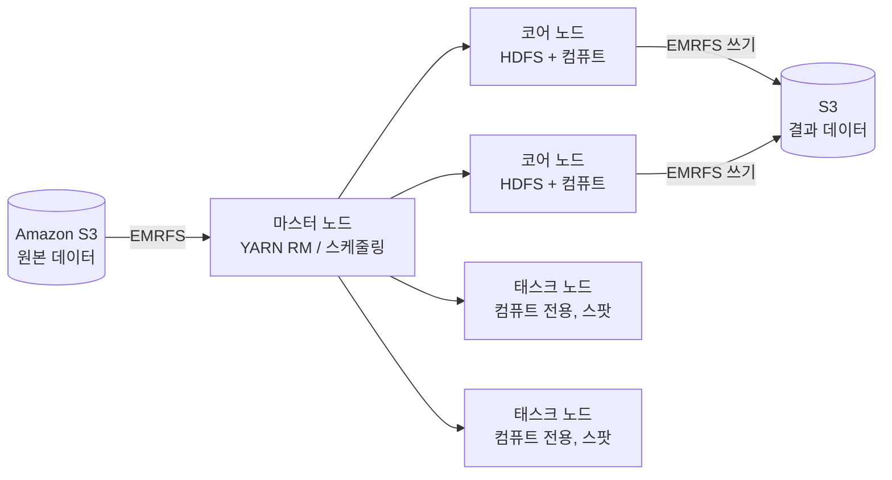

### 49.3 EMR 보안과 비용

EMR 클러스터는 **보안 구성(security configuration)**을 통해 저장 데이터 암호화(EBS 볼륨, S3 출력물)와 전송 중 암호화(노드 간 통신, TLS)를 함께 지정할 수 있다. 보안 구성은 클러스터 생성 전에 미리 정의해 두고 클러스터 생성 시 참조하는 재사용 가능한 객체이므로, 조직 표준을 한 번 만들어 여러 클러스터에 일관되게 적용하는 방식이 권장된다. Kerberos 인증을 활성화하면 클러스터 내 다중 사용자 환경에서 강력한 인증을 제공하며, AWS Lake Formation과 통합하면 Data Catalog 기반의 세밀한 테이블·컬럼 단위 접근 제어를 EMR 워크로드에도 적용할 수 있다. 사용자 인증을 사내 디렉터리와 통합하려는 경우 AWS IAM Identity Center를 EMR Studio의 로그인 방식으로 연동해, 개별 IAM 사용자를 만들지 않고도 조직의 기존 SSO 자격 증명으로 노트북에 접근하게 할 수 있다.

IAM 역할은 EMR에서 세 가지로 구분된다.

| 역할 | 대상 | 용도 |
|---|---|---|
| **서비스 역할(EMR role)** | EMR 서비스 자체 | 클러스터 생성·EC2 인스턴스 프로비저닝 등 관리 API 호출 권한 |
| **EC2 인스턴스 프로파일** | 클러스터 내 각 EC2 노드 | 노드에서 실행되는 Spark/Hive 잡이 S3·기타 AWS 리소스에 접근하는 권한 |
| **자동 스케일링 역할** | Auto Scaling(관리형 스케일링) | 클러스터 크기를 자동 조정할 때 필요한 EC2 제어 권한 |

이 세 역할을 혼동해 EC2 인스턴스 프로파일에 과도한 권한(예: 전체 S3 `*` 접근)을 주는 경우가 흔한 실수다. 잡이 실제로 접근해야 하는 버킷·프리픽스로 범위를 좁혀야 한다(→ 29장 IAM 최소 권한 원칙 참조). 또한 **블록 퍼블릭 액세스(block public access)** 설정을 계정 수준에서 활성화해 EMR 클러스터가 실수로 공인 IP를 통해 외부에 노출되는 것을 계정 단위로 차단할 수 있다.

```json
{
  "Version": "2012-10-17",
  "Statement": [
    {
      "Sid": "RestrictToDataLakePrefix",
      "Effect": "Allow",
      "Action": ["s3:GetObject", "s3:PutObject", "s3:ListBucket"],
      "Resource": [
        "arn:aws:s3:::my-data-lake",
        "arn:aws:s3:::my-data-lake/curated/*",
        "arn:aws:s3:::my-data-lake/raw/*"
      ]
    }
  ]
}
```

위 정책은 EC2 인스턴스 프로파일에 붙이는 예시로, 전체 버킷이 아니라 실제로 잡이 읽고 쓰는 `raw/`, `curated/` 프리픽스로만 권한을 한정한다. 서비스 역할과 자동 스케일링 역할은 각각 AWS가 제공하는 관리형 정책(`AmazonEMRServicePolicy_v2`, `AmazonElasticMapReduceforAutoScalingRole` 등)을 기반으로 하되, 조직 요구에 따라 범위를 좁혀 사용하는 것이 바람직하다.

비용 최적화의 핵심은 다음 네 가지로 압축된다. 첫째, **일시적 클러스터 + 스팟 태스크 노드** 조합이 가장 큰 절감 효과를 낸다 — 상태가 있는 마스터·코어는 온디맨드로 안정성을 확보하고, 상태 없는 태스크 노드만 스팟으로 돌려 회수 위험을 흡수한다. 둘째, **관리형 스케일링(managed scaling)**을 활성화하면 EMR이 YARN 메모리·CPU 사용률을 관찰해 노드 수를 자동으로 늘리고 줄여, 수동 스케일링 정책보다 세밀하게 반응한다. 셋째, 최신 인스턴스 세대(예: Graviton 기반 인스턴스)를 선택하면 동일 워크로드 대비 비용 효율이 개선되는 경우가 많다. 넷째, 유휴 상태가 일정 시간 지속되면 클러스터를 자동 종료하는 idle timeout을 설정해, 배치가 끝났는데도 계속 떠 있는 클러스터를 방지한다.

이 네 가지를 종합하면, EMR 비용 청구는 결국 "인스턴스가 떠 있던 시간 × 인스턴스 단가"라는 단순한 축으로 귀결된다. 따라서 비용 최적화 노력의 대부분은 클러스터가 실제로 필요한 시간만 존재하도록 만드는 데 집중해야 하며, 이는 자연스럽게 "장기 실행 클러스터보다 일시적 클러스터가 기본값이어야 한다"는 원칙으로 이어진다. 대화형 쿼리처럼 클러스터가 상시 응답해야 하는 워크로드가 아니라면, 예약된 배치 작업에 상시 클러스터를 쓰는 것은 사실상 사용하지 않는 컴퓨트에 요금을 지불하는 것과 같다.

```bash
# 일시적 EMR 클러스터를 생성하고 Spark 스텝을 실행한 뒤 자동 종료(--auto-terminate)
# 태스크 노드는 인스턴스 플릿 + 스팟으로 구성해 배치 비용을 절감한다
aws emr create-cluster \
  --name "nightly-etl-transient" \
  --release-label emr-7.1.0 \
  --applications Name=Spark Name=Hive \
  --region ap-northeast-2 \
  --service-role EMR_DefaultRole \
  --ec2-attributes InstanceProfile=EMR_EC2_DefaultRole,SubnetId=subnet-0abc123 \
  --instance-fleets '[
    {"InstanceFleetType":"MASTER","TargetOnDemandCapacity":1,
     "InstanceTypeConfigs":[{"InstanceType":"m6g.xlarge"}]},
    {"InstanceFleetType":"CORE","TargetOnDemandCapacity":2,
     "InstanceTypeConfigs":[{"InstanceType":"m6g.2xlarge"}]},
    {"InstanceFleetType":"TASK","TargetSpotCapacity":8,
     "InstanceTypeConfigs":[
       {"InstanceType":"m6g.2xlarge"},
       {"InstanceType":"m5.2xlarge"}
     ]}
  ]' \
  --steps Type=Spark,Name="daily-aggregation",ActionOnFailure=TERMINATE_CLUSTER,\
Args=[--deploy-mode,cluster,s3://my-etl-bucket/jobs/aggregate.py] \
  --auto-terminate
```

### 49.4 AWS Glue

AWS Glue는 서버리스 ETL(추출·변환·적재) 서비스로, EMR처럼 클러스터를 직접 관리하지 않고 잡 정의만 제출하면 되는 관리형 Spark 실행 환경을 제공한다. Glue 콘솔의 핵심 구성요소는 다음과 같다.

**Data Catalog**는 테이블 메타데이터(스키마, 위치, 파티션 정보)를 저장하는 중앙 카탈로그다. 데이터베이스와 테이블, 그 아래 파티션이라는 계층으로 구성되며, Apache Hive 메타스토어와 호환되는 API를 제공해 Athena, Redshift Spectrum, EMR의 Hive/Spark가 동일한 카탈로그를 공유해서 조회할 수 있다(→ 51장 Athena 참조). 즉 한 번 크롤링해 등록한 테이블 정의를 여러 분석 서비스가 재사용하는 것이 Glue Data Catalog의 핵심 가치다. 계정 하나에 카탈로그는 기본적으로 하나만 존재하므로, 여러 분석 서비스가 "같은 테이블을 다르게 이해하는" 상황 자체가 구조적으로 방지된다. 접근 제어가 테이블·컬럼 단위로 세밀해야 하는 경우에는 Lake Formation을 카탈로그 앞단에 두어, 크롤러가 등록한 테이블에 대해 IAM과는 별도의 세분화된 권한 부여(GRANT/REVOKE 방식)를 적용할 수 있다.

**크롤러(crawler)**는 S3나 JDBC 데이터 소스를 스캔해 스키마를 추론하고 Data Catalog에 테이블을 자동 등록한다. 크롤러는 스케줄(온디맨드, cron 기반 주기 실행)로 실행할 수 있고, 새 파티션이 추가되거나 스키마가 바뀌었을 때 이를 감지한다. 이때 **스키마 변경 정책**을 명시적으로 설정해야 한다 — 기본값을 그대로 두면 컬럼 타입 변경이나 컬럼 삭제를 카탈로그가 조용히 반영해버려, 이를 참조하는 하류 Athena 쿼리나 BI 대시보드가 예고 없이 깨질 수 있다. 운영 환경에서는 "새 컬럼 추가만 자동 반영, 그 외 변경은 로그만 남기고 수동 검토" 같은 보수적 정책을 권장한다.

**분류자(classifier)**는 크롤러가 파일 포맷과 스키마를 인식하는 방식을 정의한다. Glue는 CSV, JSON, Parquet, ORC, Avro 같은 포맷용 내장 분류자를 제공하며, 표준 포맷에 맞지 않는 로그 파일 등에는 **Grok 패턴 기반 사용자 지정 분류자**를 작성해 정규식으로 필드를 추출할 수 있다. XML/JSON도 커스텀 경로 표현식으로 세밀하게 스키마를 지정할 수 있다. 크롤러는 내장 분류자를 순서대로 시도해 가장 먼저 일치하는 것을 채택하므로, 사용자 지정 분류자를 등록할 때는 내장 분류자보다 우선순위를 앞에 두어야 원하는 파싱 로직이 실제로 적용된다. 웹 서버 접근 로그처럼 반정형이지만 표준 포맷이 아닌 데이터는 Grok 분류자로 필드 경계를 명시적으로 정의해야, 크롤러가 전체 로그 라인을 하나의 문자열 컬럼으로 잘못 인식하는 상황을 피할 수 있다.

**코드 생성기**는 Data Catalog의 테이블 정의를 바탕으로 Glue의 확장 데이터 구조인 **DynamicFrame**을 사용하는 PySpark/Scala 스크립트 뼈대를 자동 생성한다. DynamicFrame은 Spark의 DataFrame과 달리 스키마가 컬럼마다 다를 수 있는 반정형 데이터(중첩 JSON 등)를 유연하게 다루고, 스키마 불일치를 오류 없이 흡수하는 특성이 있다. 다만 이 유연성에는 대가가 있다 — DynamicFrame 고유의 변환(`ApplyMapping`, `ResolveChoice` 등)은 순수 Spark DataFrame 최적화 경로를 완전히 타지 않을 수 있으므로, 스키마가 이미 안정적으로 고정된 대용량 배치라면 `.toDF()`로 표준 DataFrame으로 변환한 뒤 이후 로직을 순수 Spark SQL로 작성하는 편이 성능상 유리한 경우가 많다.

Glue **작업(Job)**은 워커 타입과 워커 수(DPU 단위 과금)를 지정해 실행하며, Python Shell 잡(경량 스크립트용)과 Spark 잡(대규모 분산 처리용)으로 나뉜다.

| 워커 타입 | 특성 | 적합한 용도 |
|---|---|---|
| G.025X | 최소 규모, 낮은 동시성 | 개발·테스트, 소량 데이터 잡 |
| G.1X | 범용, 워커당 vCPU·메모리 균형 | 표준 배치 ETL(기본 선택지) |
| G.2X | G.1X 대비 메모리 2배 | 셔플이 크거나 조인이 많은 변환, 메모리 집약적 UDF |
| G.4X / G.8X | 대용량 메모리·컴퓨트 | 매우 큰 셔플, 단일 잡에서 최대 처리량이 필요한 경우 |

여러 잡의 실행 순서와 조건부 분기는 **워크플로(workflow)**로 묶고, S3 이벤트나 스케줄, 다른 잡·크롤러의 완료를 **트리거**로 걸어 파이프라인 전체(크롤러 → 잡 A → 잡 B)를 자동화한다. 코드를 직접 작성하지 않고 드래그 앤 드롭으로 변환 파이프라인을 구성하려면 **Glue Studio**의 시각 편집기를 사용하며, 여기서 만든 파이프라인도 내부적으로는 동일한 DynamicFrame 기반 스크립트로 변환돼 실행된다.

```yaml
# Glue 워크플로: 크롤러 완료 후 자동으로 ETL 잡을 실행하는 트리거 체인
Resources:
  DailyPipelineWorkflow:
    Type: AWS::Glue::Workflow
    Properties:
      Name: daily-events-pipeline

  StartOnSchedule:
    Type: AWS::Glue::Trigger
    Properties:
      Name: start-crawler-daily
      Type: SCHEDULED
      Schedule: "cron(0 2 * * ? *)"
      WorkflowName: !Ref DailyPipelineWorkflow
      Actions:
        - CrawlerName: raw-events-crawler
      StartOnCreation: true

  RunEtlAfterCrawl:
    Type: AWS::Glue::Trigger
    Properties:
      Name: run-etl-after-crawl
      Type: CONDITIONAL
      WorkflowName: !Ref DailyPipelineWorkflow
      Predicate:
        Conditions:
          - LogicalOperator: EQUALS
            CrawlerName: raw-events-crawler
            CrawlState: SUCCEEDED
      Actions:
        - JobName: daily-aggregation-etl
      StartOnCreation: true
```

```bash
# 크롤러를 CloudFormation으로 정의: S3 원본을 스캔해 Data Catalog에 테이블 등록
# 스키마 변경 정책을 LOG로 둬 자동 변경이 하류 쿼리를 깨뜨리지 않게 한다
Resources:
  RawDataCrawler:
    Type: AWS::Glue::Crawler
    Properties:
      Name: raw-events-crawler
      Role: arn:aws:iam::123456789012:role/GlueCrawlerRole
      DatabaseName: analytics_db
      Targets:
        S3Targets:
          - Path: s3://my-data-lake/raw/events/
      Schedule:
        ScheduleExpression: "cron(0 2 * * ? *)"   # 매일 02:00 UTC 실행
      SchemaChangePolicy:
        UpdateBehavior: LOG                        # 자동 변경 대신 로그만 남김
        DeleteBehavior: LOG
```

### 49.5 서버리스 스트리밍 ETL과 DataBrew

Glue는 배치 ETL 외에 **스트리밍 ETL 잡**도 지원한다. Kinesis Data Streams나 Amazon MSK(Managed Streaming for Apache Kafka)를 소스로 지정하면, Glue가 Spark Structured Streaming 기반으로 마이크로배치를 지속 실행하며 윈도우(시간 기반 집계) 처리, 스키마 추론, Data Catalog 업데이트를 서버리스로 수행한다. 잡 코드는 배치 잡과 동일한 DynamicFrame API를 쓰되, `create_data_frame.from_catalog` 대신 스트리밍 소스를 지정하고 `forEachBatch`로 마이크로배치 단위 처리 로직을 정의한다는 점이 다르다. 윈도우 처리는 고정 윈도우(예: 5분 단위 집계)나 슬라이딩 윈도우로 구성할 수 있으며, 지연 도착 데이터에 대한 워터마크(watermark) 설정으로 얼마나 늦은 데이터까지 집계에 포함할지 제어한다. 스트림 소스 자체의 상세한 특성과 Kinesis/MSK 선택 기준은 50장에서 다룬다.

**Glue DataBrew**는 코드를 작성하지 않고 데이터를 정제·변환하는 시각적 도구다. 데이터 분석가가 스프레드시트 다루듯 컬럼 분할, 결측치 처리, 이상치 제거, 형변환 같은 250개 이상의 내장 변환을 UI에서 선택해 적용할 수 있다. 데이터를 로드하면 **데이터 프로파일링** 기능이 컬럼별 분포, 결측률, 고유값 개수, 데이터 타입 추정 같은 통계를 자동으로 계산해 데이터 품질 문제를 시각적으로 드러낸다. 적용한 변환 순서는 **레시피(recipe)**로 저장돼 다른 데이터셋에도 재사용할 수 있어, 반복되는 정제 로직을 코드 없이 표준화하는 데 유용하다.

DataBrew의 실무 위치는 파이프라인의 "탐색·정제" 단계다. 데이터 엔지니어가 Glue Spark 잡으로 대규모 변환 로직을 코드화하기 전에, 분석가가 DataBrew에서 샘플 데이터를 프로파일링하고 정제 규칙을 시각적으로 확정한 뒤, 그 레시피를 잡(job)으로 실행해 전체 데이터셋에 적용하는 흐름이 일반적이다. 다만 여러 테이블 간 복잡한 조인, 윈도우 함수, 대규모 셔플이 필요한 집계는 DataBrew의 범위를 벗어나며 여전히 Glue Spark 잡이나 EMR의 영역이다.

### 49.6 Glue 베스트 프랙티스 7가지

원서(*AWS for Solutions Architects*)가 제시하는 Glue 베스트 프랙티스 7가지는 실무에서 잡 실패·성능 저하의 원인 대부분을 설명한다. 이 일곱 항목은 각각 독립적인 문제가 아니라 서로 얽혀 있다 — 워커 타입을 잘못 고르면 메모리 오버헤드 문제가 뒤따르고, 파일 분할이 안 되면 특정 태스크에 작업이 몰려 Spark UI에서 스큐로 드러나며, 작은 파일 문제를 방치하면 파티셔닝 전략 전체가 무력화된다. 따라서 이 목록은 순서대로 하나씩 점검하는 체크리스트로 활용하는 것이 효과적이다.

**① 올바른 워커 타입 선택.** 무엇: G.1X(범용), G.2X(메모리 집약적 변환·셔플이 많은 잡), G.025X(경량 작업) 중 워크로드 특성에 맞는 타입을 고른다. 왜: 워커 타입이 작으면 셔플이 큰 잡에서 OOM(메모리 부족)이 빈발하고, 크면 비용만 낭비된다. 어떻게: 잡 생성 시 `--worker-type G.2X --number-of-workers 10`처럼 명시하고, CloudWatch 메트릭(executor 메모리 사용률)을 보며 조정한다. 처음 잡을 설계할 때는 데이터 볼륨이 작더라도 조인·집계가 많은 변환이면 G.2X로 시작해 실패율을 낮추고, 이후 CloudWatch 메트릭이 여유를 보이면 G.1X로 낮춰 비용을 최적화하는 순서가 안전하다.

**② 파일 분할(splitting) 최적화.** 무엇: 입력 파일이 압축 코덱상 분할 불가능하거나(예: GZIP) 너무 크면 하나의 익스큐터가 파일 전체를 처리해야 해 병렬성이 떨어진다. 왜: 분할 가능한 포맷(Parquet, 분할 가능 압축)은 익스큐터 수만큼 병렬로 나눠 읽을 수 있어 처리 시간이 크게 줄어든다. 어떻게: 원본을 분할 가능한 코덱(BZIP2, Snappy)이나 Parquet/ORC로 사전 변환하고, `groupFiles` 옵션으로 작은 파일을 논리적으로 묶어 태스크 수를 조정한다.

**③ YARN 메모리 오버헤드 초과 문제 대응.** 무엇: Spark 익스큐터가 YARN이 할당한 컨테이너 메모리 한도를 초과해 강제 종료되는 문제(`Container killed by YARN for exceeding memory limits`). 왜: 기본 오버헤드 비율이 대용량 셔플이나 브로드캐스트 조인에는 부족할 수 있다. 어떻게: `spark.yarn.executor.memoryOverhead` 값을 늘리거나 워커 타입을 상향해 익스큐터당 가용 메모리를 확보한다.

**④ Apache Spark UI 활용.** 무엇: Glue 잡 실행 중·후에 Spark UI(이벤트 로그를 S3에 남기고 별도 히스토리 서버 또는 Glue 콘솔에서 확인)를 통해 스테이지별 소요 시간, 셔플 읽기/쓰기 양, 태스크 분포의 불균형(데이터 스큐)을 확인한다. 왜: 병목이 특정 스테이지의 몇 개 태스크에 집중돼 있는지 눈으로 확인하지 않으면 튜닝이 추측에 그친다. 어떻게: 잡 파라미터에 `--enable-spark-ui true`와 이벤트 로그 S3 경로를 지정한다. 특히 "Stages" 탭에서 특정 태스크 하나만 다른 태스크보다 훨씬 오래 걸리는 패턴이 보이면 이는 대개 조인 키 분포가 균등하지 않은 데이터 스큐 문제이며, 이 경우 워커 수를 늘리는 것보다 키 분산(salting)이나 스큐 조인 힌트가 근본 해결책이다.

**⑤ 다수의 작은 파일 처리.** 무엇: 소스가 수만 개의 KB 단위 작은 파일로 구성된 경우, Spark 태스크 스케줄링 오버헤드가 실제 처리 시간을 압도한다. 왜: 태스크 하나를 띄우고 종료하는 비용이 파일 하나를 읽는 비용보다 커지는 역전 현상이 생긴다. 어떻게: DynamicFrame 읽기 옵션에 `groupFiles: 'inPartition'`과 `groupSize`(바이트 단위, 예: 128MB)를 지정해 여러 작은 파일을 하나의 논리적 읽기 단위로 묶는다. `groupFiles`를 `'inPartition'`이 아니라 `'crossPartition'`으로 지정하면 파티션 경계를 넘어서도 파일을 묶을 수 있지만, 이 경우 결과 DynamicFrame에서 파티션 컬럼 정보를 다루는 방식이 달라지므로 다운스트림에서 파티션 필터링을 그대로 활용하려면 대개 `'inPartition'`이 더 예측 가능하다.

```python
# Glue PySpark 잡: 파티션 프레디케이트 푸시다운 + 작은 파일 그룹화 + Parquet로 재작성
import sys
from awsglue.transforms import *
from awsglue.utils import getResolvedOptions
from awsglue.context import GlueContext
from pyspark.context import SparkContext

args = getResolvedOptions(sys.argv, ["JOB_NAME"])
glueContext = GlueContext(SparkContext.getOrCreate())

# push_down_predicate로 파티션 컬럼(year, month)만 필터링해 카탈로그 단계에서 스캔량을 줄인다
datasource = glueContext.create_dynamic_frame.from_catalog(
    database="analytics_db",
    table_name="raw_events",
    push_down_predicate="year='2026' AND month='08'",
    additional_options={
        "groupFiles": "inPartition",   # 작은 파일들을 논리적으로 묶어 태스크 수를 줄인다
        "groupSize": "134217728",      # 약 128MB 단위로 그룹화
    },
)

# 컬럼형 Parquet + Snappy로 결과를 쓰고, 카탈로그 파티션 컬럼(region)을 지정해 하류 쿼리 프루닝을 가능하게 한다
glueContext.write_dynamic_frame.from_options(
    frame=datasource,
    connection_type="s3",
    connection_options={
        "path": "s3://my-data-lake/curated/events/",
        "partitionKeys": ["region"],
    },
    format="parquet",
    format_options={"compression": "snappy"},
)
```

**⑥ 데이터 파티셔닝과 프레디케이트 푸시다운.** 무엇: DynamicFrame 카탈로그 읽기의 `push_down_predicate`(파티션 컬럼 조건으로 S3 리스팅 자체를 줄이는 카탈로그 단계 필터링)와, 컬럼형 포맷(Parquet/ORC) 파일 내부 min/max 통계를 이용해 Spark 실행 엔진이 자동으로 수행하는 파일·블록 단위 프레디케이트 푸시다운을 함께 활용한다. 왜: 파티션 컬럼을 조건절에 사용하지 않으면 전체 파티션을 나열하고 읽은 뒤 필터링하게 되어 스캔량(=비용, Athena와 동일한 과금 축)이 그대로 유지되고, 파일 포맷이 행 기반(CSV/JSON)이면 컬럼 통계 자체가 없어 파일 내부 프레디케이트 푸시다운의 이점을 전혀 받을 수 없다. 어떻게: 위 코드 예시처럼 `push_down_predicate`에 파티션 컬럼 조건을 명시해 불필요한 파티션의 나열 자체를 건너뛰고, 파일 내부 필터링 효과를 얻으려면 데이터를 컬럼형 포맷으로 저장해 Spark가 파일 통계 기반 프레디케이트 푸시다운을 자동으로 활용하게 한다.

**⑦ S3에 쓸 때 파티셔닝.** 무엇: 결과를 S3에 쓸 때 `partitionKeys` 옵션으로 Hive 스타일 파티션 디렉터리(`region=ap-northeast-2/`)를 생성한다. 왜: 파티션 구조가 없으면 이후 모든 쿼리가 풀 스캔이 되고, 반대로 파티션 컬럼을 너무 세분화(예: 분 단위 타임스탬프)하면 파티션 수가 폭증해 카탈로그 메타데이터 조회 자체가 느려진다. 어떻게: 조회 패턴에서 실제로 필터링에 쓰이는 컬럼(대개 날짜 단위까지)으로 파티션을 설계하고, 컴팩션 작업으로 파티션 내 파일 수를 주기적으로 정리한다(49.8절).

### 49.7 Glue vs EMR 선택 기준

두 서비스는 경쟁 관계가 아니라 튜닝 자유도와 운영 부담을 맞바꾸는 관계다.

| 기준 | AWS Glue | Amazon EMR |
|---|---|---|
| 서버리스 여부 | 완전 서버리스(워커 타입·수만 지정) | 인프라형(EMR Serverless 사용 시 예외) |
| 프레임워크 제어 | Spark(+ Python Shell)로 제한 | Spark, Hive, Presto/Trino, HBase, Flink 등 폭넓게 지원 |
| 튜닝 자유도 | 제한적(Spark 설정 일부만 노출) | 노드 타입·인스턴스·Spark/YARN 설정 전면 제어 |
| 시작 지연 | 잡 시작 시 수십 초~분 단위 준비 시간 | 클러스터 기동에 수 분 소요(장기 실행 클러스터는 지연 없음) |
| 요금 모델 | DPU·시간 단위 종량 과금 | 인스턴스 시간 + EMR 자체 비용, 스팟 혼용으로 최적화 여지 큼 |
| 운영 부담 | 낮음(패치·스케일링 자동) | 중간~높음(클러스터 설계·모니터링 필요) |
| 팀 역량 축 | Spark 기본 지식으로 충분 | Spark/Hadoop 생태계 심층 튜닝 역량 필요 |
| 카탈로그 통합 | Data Catalog가 기본 내장 | 별도로 Glue Data Catalog를 메타스토어로 연동해야 동일한 이점 확보 |

한 줄 결정 기준: **표준적인 배치 ETL과 카탈로그 통합이 목적이면 Glue, 다양한 오픈소스 프레임워크나 세밀한 클러스터·JVM 튜닝이 필요하면 EMR**을 선택한다. 실무에서는 혼용 전략이 흔하다 — Glue 크롤러와 Data Catalog로 메타데이터를 통합 관리하면서, 무거운 대규모 변환 작업만 EMR(또는 EMR Serverless)로 실행해 Glue의 카탈로그 통합과 EMR의 튜닝 자유도를 동시에 취하는 구성이다.

판단을 더 세분화하면, 신규 팀이거나 표준적인 배치 ETL 위주라면 Glue로 시작해 운영 부담을 최소화하는 편이 합리적이다. 반대로 이미 온프레미스에서 Hive/Presto 자산과 튜닝 노하우를 쌓아온 조직이라면 EMR로 마이그레이션해 기존 코드를 재사용하는 편이 전환 비용을 줄인다. 대화형 저지연 쿼리(Presto/Trino)나 랜덤 액세스(HBase)처럼 Glue가 지원하지 않는 프레임워크가 필요하면 선택지는 자연히 EMR로 좁혀진다.

### 49.8 파일 포맷과 압축 전략

빅데이터 파이프라인 성능과 비용의 대부분은 실행 엔진 선택보다 **파일 포맷, 파티셔닝, 파일 크기**라는 세 가지 데이터 레이아웃 결정에서 갈린다.

| 포맷 계열 | 예시 | 특성 | 적합한 워크로드 |
|---|---|---|---|
| 행 기반 | CSV, JSON | 사람이 읽기 쉬움, 컬럼 프루닝 불가 → 전체 행을 읽어야 함 | 소량 데이터, 외부 시스템과의 교환 포맷 |
| 컬럼형 | Parquet, ORC | 컬럼 단위 저장·압축, 필요한 컬럼만 읽는 프루닝 지원, 통계 기반 프레디케이트 푸시다운 | 분석 쿼리(Athena, Redshift Spectrum, EMR) — 기본 선택지 |
| 행 기반(스키마 진화 특화) | Avro | 스키마를 파일에 내장, 필드 추가·삭제 같은 스키마 진화에 강함 | 스트리밍 파이프라인 중간 저장, 스키마 레지스트리 연동 |

분석 워크로드의 기본값은 컬럼형(Parquet 또는 ORC)이다. 컬럼형은 쿼리가 참조하지 않는 컬럼을 건너뛰고(컬럼 프루닝), 파일 내 min/max 통계로 불필요한 블록을 건너뛸 수 있어(프레디케이트 푸시다운과 결합) 스캔량을 크게 줄인다. Parquet과 ORC 사이의 선택은 대개 엔진 생태계에 좌우된다 — Parquet은 Spark·Athena·Presto/Trino 생태계에서 사실상 표준으로 자리잡았고, ORC는 Hive 중심 환경에서 최적화가 더 앞서 있는 경우가 있다. 특별한 이유가 없다면 Parquet을 기본값으로 두는 편이 여러 엔진과의 호환성 면에서 안전하다. Avro는 분석 자체보다는 스트리밍 소스에서 스키마가 자주 바뀌는 구간의 중간 저장 포맷으로 강점이 있다 — 예를 들어 Kafka/MSK에서 발행되는 이벤트를 스키마 레지스트리와 함께 Avro로 저장해 두면, 이후 분석용 컬럼형 포맷으로 변환할 때도 필드 추가·삭제 이력을 안전하게 추적할 수 있다.

압축 코덱 선택은 **분할 가능성(splittable)**과 **CPU 트레이드오프**의 균형이다.

| 코덱 | 분할 가능 여부 | 압축률 | CPU 비용 | 비고 |
|---|---|---|---|---|
| Snappy | 가능(컬럼형 포맷 내부에서) | 중간 | 낮음 | Parquet/ORC의 사실상 기본값 |
| GZIP | 단독 파일로는 분할 불가 | 높음 | 중간~높음 | 압축률이 중요하고 병렬 읽기가 덜 중요할 때 |
| ZSTD | 가능(포맷 내부에서) | 높음 | 중간 | 압축률·속도 균형, 최근 기본값으로 채택 확대 |
| LZ4 | 가능(포맷 내부에서) | 낮음 | 매우 낮음 | 압축 오버헤드보다 속도가 중요할 때 |

여기서 반드시 짚어야 할 함정이 **작은 파일 문제**다. 파일 하나당 크기가 작으면(수십 KB~수 MB) 파일 수가 폭증해 (1) S3 API 호출(GET/LIST)이 늘어 비용과 지연이 증가하고, (2) Spark 태스크 스케줄링 오버헤드가 실제 처리 시간을 압도하며, (3) Glue Data Catalog와 Hive 메타스토어의 메타데이터 조회 자체가 느려진다. 목표 파일 크기는 일반적으로 **128MB~1GB**이며(실제 최적값은 워크로드와 엔진 문서를 확인), 스트리밍 파이프라인처럼 필연적으로 작은 파일이 계속 생성되는 경우 별도의 **컴팩션(compaction) 작업**을 정기적으로 실행해 작은 파일을 목표 크기로 병합해야 한다. 이 문제는 신규 파이프라인 설계 단계에서는 잘 드러나지 않다가, 데이터가 누적되고 파티션 수가 늘어나면서 서서히 쿼리 응답 시간이 나빠지는 형태로 나타나기 때문에 초기 설계 리뷰에서 놓치기 쉬운 함정이기도 하다.

```python
# 컴팩션 작업: 작은 Parquet 파일들을 읽어 목표 크기로 재작성(repartition)
# coalesce/repartition으로 출력 파일 수를 제어해 128MB~1GB 목표에 맞춘다
from awsglue.context import GlueContext
from pyspark.context import SparkContext

glueContext = GlueContext(SparkContext.getOrCreate())
spark = glueContext.spark_session

df = spark.read.parquet("s3://my-data-lake/curated/events/year=2026/month=08/")
target_partitions = max(1, int(df.rdd.getNumPartitions() / 20))  # 파일 수를 대략 1/20로 축소
df.coalesce(target_partitions).write.mode("overwrite") \
    .parquet("s3://my-data-lake/curated/events_compacted/year=2026/month=08/")
```

파티션 설계는 "너무 없음"과 "너무 세분화됨" 사이의 균형이다. 파티션이 없으면 매 쿼리가 풀 스캔이 되고, 반대로 카디널리티가 지나치게 높은 컬럼(예: 사용자 ID, 분 단위 타임스탬프)으로 파티셔닝하면 파티션 수가 수백만 개로 폭증해 메타데이터 조회 자체가 병목이 되는 **메타데이터 폭발**이 발생한다. 일반적으로 날짜(연/월/일) 단위 파티션에 필요시 지역이나 카테고리 같은 저카디널리티 컬럼을 추가하는 정도가 균형점이다. 예를 들어 하루 10GB가 쌓이는 이벤트 테이블을 연/월/일/시(hour)까지 파티셔닝하면 일 단위 대비 파티션 수가 24배로 늘어나는 대신 파티션당 평균 파일 크기는 24분의 1로 줄어, 오히려 128MB 미만의 작은 파일이 양산되는 역효과가 날 수 있다. 파티션 세분화 수준은 항상 "파티션당 예상 데이터량이 목표 파일 크기 이상을 유지하는가"를 기준으로 검증해야 한다.

컴팩션 작업은 한 번 실행하고 끝나는 것이 아니라, 크롤러·ETL 잡과 마찬가지로 워크플로에 편입해 **일 단위 또는 시간 단위로 정기 실행**하는 것이 바람직하다. 스트리밍 소스처럼 계속 작은 파일이 쌓이는 파이프라인이라면 "적재는 자주, 컴팩션은 하루 한 번" 같은 이원화 전략으로 지연 시간과 파일 크기 사이의 균형을 잡는다. 컴팩션 잡을 신규로 설계할 때는 원본 소규모 파일을 삭제하기 전에 병합 결과의 레코드 수가 원본 합계와 일치하는지 검증하는 단계를 반드시 포함해야 한다 — 그렇지 않으면 컴팩션 버그가 조용한 데이터 유실로 이어진다.

```sql
-- Athena/Glue 테이블에 새 파티션을 수동 등록(크롤러 재실행 없이 즉시 반영할 때)
ALTER TABLE analytics_db.raw_events
ADD PARTITION (year='2026', month='09', day='05')
LOCATION 's3://my-data-lake/raw/events/year=2026/month=09/day=05/';
```

Spark 잡의 메모리·오버헤드 설정도 파일 크기 전략과 맞물린다. 파일이 너무 크면 익스큐터 하나가 처리해야 할 단위가 커져 메모리 오버헤드 초과(49.6절 ③)로 이어질 수 있다.

```bash
# Glue 잡 실행 시 Spark 설정을 오버라이드해 익스큐터 메모리·오버헤드를 조정
aws glue start-job-run \
  --job-name daily-compaction \
  --region ap-northeast-2 \
  --arguments '{
    "--conf": "spark.executor.memory=8g --conf spark.yarn.executor.memoryOverhead=2048 --conf spark.sql.shuffle.partitions=200",
    "--enable-spark-ui": "true",
    "--spark-event-logs-path": "s3://my-etl-bucket/spark-logs/"
  }'
```

### 49장 정리

#### [필수] 반드시 알아야 할 것
1. 클라우드 빅데이터 아키텍처의 핵심은 스토리지(S3)와 컴퓨트(EMR/Glue)의 분리다 — 온프레미스 하둡의 용량 고정·업그레이드 부담·데이터 지역성 문제를 이 분리가 해소한다.
2. EMR 노드는 마스터(관리)·코어(HDFS+컴퓨트)·태스크(순수 컴퓨트) 3종으로 나뉘며, 상태가 없는 태스크 노드만 스팟에 적합하다.
3. EMRFS는 S3를 EMR의 파일시스템으로 노출하며, 클러스터 수명과 무관하게 데이터가 영속한다는 점이 HDFS와 근본적으로 다르다.
4. Glue Data Catalog는 Hive 메타스토어 호환 중앙 카탈로그로, 크롤러가 등록한 테이블 정의를 Athena·Redshift Spectrum·EMR이 공유해서 조회한다.
5. 분석 성능의 대부분은 파일 포맷(컬럼형 Parquet/ORC)·파티셔닝·파일 크기(128MB~1GB)에서 결정된다 — 실행 엔진 선택보다 이 레이아웃 설계가 우선한다.
6. 작은 파일 문제는 빅데이터 파이프라인 최대의 성능·비용 함정이며, 컴팩션 작업을 파이프라인의 정규 구성요소로 포함해야 한다.
7. Glue 베스트 프랙티스 7가지(워커 타입·파일 분할·메모리 오버헤드·Spark UI·작은 파일 그룹화·프레디케이트 푸시다운·쓰기 시 파티셔닝)는 잡 실패와 성능 저하 원인의 대부분을 설명한다.
8. Glue는 서버리스·카탈로그 통합이 강점이고 EMR은 프레임워크 다양성·튜닝 자유도가 강점이다 — 팀의 Spark 운영 역량이 실질적 결정 변수다.

#### [팁] 실무 노하우
1. 일시적(transient) EMR 클러스터 + 스팟 태스크 노드 조합으로 배치 비용을 큰 폭으로 줄인다. 상시 실행 클러스터는 대개 유휴 시간의 낭비로 이어진다.
2. 인스턴스 플릿으로 여러 인스턴스 타입을 조합하면 특정 타입의 스팟 재고 부족 시 자동 대체돼 클러스터 기동 실패를 줄인다.
3. 크롤러의 스키마 변경 정책을 `LOG`(자동 반영 대신 로그만)로 설정해, 스키마 변경이 하류 쿼리를 조용히 깨뜨리는 사고를 예방한다.
4. Glue DynamicFrame의 `push_down_predicate`와 `groupFiles`/`groupSize`를 함께 써서 스캔량과 태스크 오버헤드를 동시에 줄인다.
5. Spark UI(이벤트 로그를 S3에 남기고 확인)로 데이터 스큐와 셔플 병목을 눈으로 확인한 뒤 튜닝하라 — 추측 기반 튜닝은 대개 빗나간다.
6. 파티션 컬럼은 실제 쿼리 필터 조건에 쓰이는 컬럼(대개 날짜)으로 설계해야 프레디케이트 푸시다운이 실제로 스캔량을 줄인다.
7. Glue와 EMR을 배타적으로 고르지 말고, 카탈로그 관리는 Glue로 통합하고 무거운 변환만 EMR(또는 EMR Serverless)로 넘기는 혼용 전략을 검토한다.

#### [주의] 사고·비용·설계 함정
1. 파티션을 너무 세분화(고카디널리티 컬럼 사용)하면 메타데이터 폭발로 카탈로그 조회 자체가 느려져 오히려 쿼리 성능이 나빠진다.
2. Glue 크롤러의 스키마 자동 변경 정책을 기본값으로 방치하면 컬럼 타입 변경·삭제가 조용히 카탈로그에 반영돼 하류 Athena 쿼리나 BI 대시보드가 예고 없이 깨진다.
3. GZIP처럼 분할 불가능한 압축 코덱으로 큰 단일 파일을 만들면 익스큐터 하나가 파일 전체를 처리해야 해 병렬성이 사라진다.
4. 작은 파일을 방치하면 S3 API 호출 비용·Spark 태스크 오버헤드·메타스토어 조회 지연이 동시에 누적돼, 데이터 양은 그대로인데 처리 시간과 비용만 계속 증가한다.
5. EMR 코어 노드를 스팟으로 구성하면 HDFS 블록을 들고 있는 노드가 회수돼 데이터 유실이나 클러스터 불안정으로 이어질 수 있다.
6. EC2 인스턴스 프로파일에 S3 전체 접근 같은 과도한 권한을 부여하면, 잡 하나의 버그가 데이터 레이크 전체에 영향을 미칠 수 있다.
7. YARN 메모리 오버헤드 설정을 기본값으로 두고 대용량 셔플 작업을 돌리면 컨테이너가 강제 종료되며 잡이 재시도를 반복하다 실패한다.
8. 상시 실행 EMR 클러스터를 배치 워크로드에도 그대로 사용하면, 유휴 시간에도 노드 비용이 계속 청구되는 낭비 구조가 고착된다.

#### 한 장 요약
클라우드 빅데이터 아키텍처의 출발점은 스토리지(S3)와 컴퓨트(EMR, Glue)의 분리이며, 이 분리가 온프레미스 하둡의 고정 용량·업그레이드 부담을 해소한다. EMR은 마스터·코어·태스크 노드 구조와 EMRFS를 통해 다양한 오픈소스 프레임워크를 세밀하게 튜닝할 자유를 주고, Glue는 Data Catalog·크롤러·서버리스 실행으로 운영 부담을 낮춘다. 그러나 어느 엔진을 쓰든 실제 성능과 비용의 대부분은 파일 포맷(컬럼형), 파티션 설계, 목표 파일 크기(128MB~1GB)라는 데이터 레이아웃 결정에서 갈리며, 작은 파일 문제와 메타데이터 폭발은 가장 흔하면서도 가장 늦게 발견되는 함정이다. Glue의 베스트 프랙티스 7가지는 이런 레이아웃 문제와 Spark 실행 문제를 함께 다루는 실무 체크리스트로 기능한다.

#### 다음 장 예고
50장은 배치가 아닌 실시간 스트리밍 데이터 처리를 다룬다. Kinesis Data Streams, Amazon MSK, Amazon Managed Service for Apache Flink를 중심으로, 이 장에서 다룬 EMR/Glue 배치 파이프라인이 스트리밍 소스와 어떻게 연결되는지 살펴본다.

---

## 50장. 스트리밍 데이터 처리  ★★★★

> **이 장에서 다루는 것**
> 49장은 "쌓여 있는 데이터를 어떻게 배치로 가공하는가"를 다뤘다. 이 장은 반대편 질문 — "끝없이 흘러오는 데이터를 도착하는 즉시 어떻게 처리하는가" — 를 다룬다. 45장에서 Kinesis/MSK를 SQS·SNS·EventBridge와 나란히 놓고 "재생 가능한 로그"라는 통합 관점에서만 짚었다면, 이 장은 그 스트림 자체의 내부 동작 — 샤드·파티션 처리량, 소비자 팬아웃, 윈도우 집계, 정확히 한 번 처리 — 을 심층적으로 다룬다. Kinesis Data Streams, Amazon Data Firehose, Amazon Managed Service for Apache Flink, Amazon MSK, Glue Schema Registry 순으로 개별 서비스를 본 뒤, Kinesis vs MSK 선택 기준과 람다·카파 아키텍처로 마무리한다. 이 장에서 만든 스트리밍 파이프라인의 산출물은 51장(데이터 웨어하우스)과 52장(데이터 레이크)이 그대로 소비하며, 지연 도착 데이터를 잘못 다뤘을 때의 실제 피해 사례는 61장(광고 클릭 집계)에서 구체적으로 확인한다.

### 50.1 스트리밍 처리의 요구사항

배치 처리는 "유한한 데이터셋"을 전제로 한다 — 어제 하루치 로그 파일은 크기가 정해져 있고, 잡은 그것을 다 읽으면 끝난다. 스트리밍은 반대로 **끝이 없는 데이터**를 다룬다. 언제 "다 처리했다"고 선언할 수 있는지가 애초에 정의되지 않으므로, 배치의 "전체를 정렬하고 조인한다" 같은 연산은 스트리밍에서 그대로 쓸 수 없다. 이 근본적 차이 때문에 스트리밍 시스템은 데이터를 무한히 받으면서도 유의미한 중간 결과(집계, 알림, 저장)를 계속 내놓아야 하고, 이를 위해 배치에는 없던 개념들을 다뤄야 한다.

가장 먼저 구분해야 할 것이 **이벤트 시간(event time)과 처리 시간(processing time)**이다. 이벤트 시간은 사건이 실제로 발생한 시각(예: 사용자가 클릭한 시각)이고, 처리 시간은 그 이벤트가 스트리밍 시스템에 도착해 처리되는 시각이다. 네트워크 지연, 모바일 기기의 오프라인 큐잉, 업스트림 재시도 등으로 두 시각은 항상 어긋나며, 이 어긋남이 클수록 "5분 전 데이터를 집계한다"는 문장의 의미가 모호해진다. 집계 결과가 사업적으로 의미를 가지려면 대개 이벤트 시간 기준이어야 하지만, 이벤트 시간 기준 집계는 **지연 도착(late arrival)** 문제를 피할 수 없다 — 이미 닫았다고 생각한 시간 윈도우에 그 시간대에 속하는 이벤트가 뒤늦게 도착하는 상황이다.

**워터마크(watermark)**는 이 문제에 대한 스트리밍 엔진의 표준 답이다. 워터마크는 "이 시각 이전의 이벤트는 이제 더 이상 도착하지 않는다고 간주한다"는 시스템의 선언이며, 이 선언이 지날 때 비로소 해당 시간 윈도우의 집계를 확정(발행)한다. 워터마크를 너무 타이트하게(지연을 짧게 허용) 잡으면 실제로 늦게 도착하는 정상 데이터를 누락하고, 너무 느슨하게 잡으면 결과 발행이 그만큼 늦어진다 — 이 트레이드오프에 만능 정답은 없고 워크로드의 실제 지연 분포를 관찰해 정해야 한다.

순서와 중복도 배치와 다른 방식으로 다가온다. 배치에서는 전체 데이터를 한 번에 놓고 정렬할 수 있지만, 스트리밍에서는 여러 샤드·파티션에서 병렬로 들어오는 이벤트의 전역 순서를 보장하지 않는 것이 기본값이다(순서는 파티션 키 단위로만 보장된다, → 50.2). 또한 프로듀서 재시도, 컨슈머 체크포인트 이전 재시작 같은 흔한 장애 시나리오는 **같은 레코드가 두 번 처리될 가능성**을 항상 남긴다. 그래서 스트리밍 소비자를 설계할 때는 "중복이 오지 않는다"가 아니라 "중복이 오면 어떻게 무해하게 만들 것인가"를 기본 전제로 삼아야 한다 — 멱등 쓰기(같은 키로 덮어쓰기), 자연 키 기반 upsert, 또는 처리 이력 테이블로 중복 감지를 하는 방식이 대표적이다.

**정확히 한 번(exactly-once) 처리**는 "각 이벤트가 최종 결과에 정확히 한 번만 반영된다"는 보장이다. 이는 스트리밍 엔진 내부의 상태 일관성(체크포인트)만으로는 달성되지 않고, 결과를 내보내는 싱크(sink)가 트랜잭션을 지원하거나 멱등적이어야 완성된다(→ 50.8). 실무에서는 완벽한 정확히 한 번보다 **최소 한 번(at-least-once) 전달 + 멱등 처리** 조합이 구현 복잡도 대비 효과가 좋은 경우가 많다.

배치와 스트리밍의 차이를 한 문장으로 정리하면, 배치는 **"입력이 완결됐다"는 전제 위에서 한 번에 계산**하고 스트리밍은 **"입력이 영원히 완결되지 않는다"는 전제 위에서 계속 갱신되는 결과를 내놓는다**는 것이다. 이 차이는 단순한 실행 빈도의 문제가 아니라 계산 모델 자체의 차이다 — 배치 잡은 실패하면 처음부터 다시 돌리면 되지만(멱등적 재실행이 상대적으로 쉬움), 스트리밍 잡은 "어디까지 처리했는지"를 정확히 기억한 상태에서 재개해야 하므로 체크포인트·오프셋 관리가 필수 구성요소가 된다.

마지막으로 짚어야 할 것은 "스트리밍이 필요한 신호"와 "필요 없는 신호"의 구분이다. 초 단위 지연이 사업적으로 의미 있는 경우(사기 탐지, 실시간 대시보드, 알림, 개인화 추천), 데이터가 시간이 지나면 가치가 급격히 떨어지는 경우, 이벤트가 도착하는 순간 어떤 조치를 취해야 하는 경우는 스트리밍이 정답이다. 반대로 하루 한 번 정산하면 충분한 리포트, 지연이 몇 시간이어도 무방한 배치 집계, 스트리밍 인프라를 운영할 팀 역량이 없는 상황이라면 스트리밍은 오히려 불필요한 운영 복잡도만 늘린다 — "실시간처럼 보이면 좋으니까"라는 이유만으로 스트리밍을 도입하는 것은 이 장 전체에서 다룰 복잡성(워터마크, 리샤딩, 컨슈머 그룹 리밸런싱)을 감당할 준비 없이 떠안는 것과 같다. 판단이 애매할 때 쓸 수 있는 간단한 질문은 "이 데이터가 1시간 뒤에 처리돼도 사업적으로 문제가 없는가"이다 — 문제가 없다면 49장의 배치 파이프라인으로 시작하고, 실제로 지연 요건이 초 단위로 좁혀질 때 이 장의 스트리밍 서비스로 옮겨가는 점진적 접근이 조직의 운영 역량 대비 위험이 낮다.

### 50.2 Amazon Kinesis Data Streams

Kinesis Data Streams는 **샤드(shard)** 단위로 처리량을 분배하는 완전 관리형 스트리밍 데이터 저장소다. 샤드 하나는 **쓰기 초당 1MB 또는 1,000레코드, 읽기 초당 2MB**(표준 소비자 기준, 5개 GetRecords 호출/초 한도 내)라는 고정 처리량 단위를 가진다(정확한 한도는 서비스 할당량 문서 확인). 필요한 총 처리량을 이 단위로 나누면 필요한 샤드 수가 나오고, 그만큼 샤드를 늘리거나(분할, split) 줄이는(병합, merge) **리샤딩**으로 용량을 조정한다.

레코드는 **파티션 키(partition key)**의 해시값에 따라 특정 샤드로 라우팅된다. 같은 파티션 키를 가진 레코드는 항상 같은 샤드에 쓰이고 그 샤드 안에서는 쓰인 순서대로 보존되므로, "이 주문의 이벤트는 항상 순서대로 처리되어야 한다"는 요건이 있으면 주문 ID를 파티션 키로 잡는다. 여기서 가장 흔한 설계 실수가 **핫 샤드(hot shard)**다 — 파티션 키의 분포가 편향되면(예: 전체 트래픽의 상당 부분이 소수의 대형 고객 ID에 몰림) 그 키로 매핑되는 샤드 하나만 처리량 한도를 초과해 스로틀링(`ProvisionedThroughputExceededException`)이 발생하고, 나머지 샤드는 유휴 상태로 남는다. 완화책은 카디널리티가 충분히 높은 키를 쓰거나, 큰 키에 임의의 접미사를 붙여 여러 샤드로 흩뿌리는 **키 분산(salting)** 기법이다 — 다만 이 경우 순서 보장 단위가 흐트러지므로 순서가 중요한 워크로드에서는 신중해야 한다.

용량 모드는 두 가지다. **프로비저닝 모드**는 샤드 수를 직접 지정하고 리샤딩도 수동(또는 Application Auto Scaling 연동)으로 관리하며, 트래픽 패턴을 미리 아는 경우 비용 예측이 쉽다. **온디맨드 모드**는 지난 처리량 실적을 보고 AWS가 자동으로 용량을 조정해, 트래픽을 예측하기 어렵거나 초기 단계라 운영 부담을 최소화하고 싶은 워크로드에 적합하다. 온디맨드는 프로비저닝 대비 단가가 높게 책정되는 것이 일반적이므로, 트래픽이 안정화된 이후에는 프로비저닝 모드로 전환해 비용을 낮추는 경우가 많다.

보존 기간은 기본 **24시간**이며 최대 **365일**까지 연장할 수 있다(요금은 연장 구간에 대해 추가로 부과되며 정확한 구간과 요금은 문서 확인). 보존 기간을 넘긴 데이터는 어떤 방법으로도 재처리할 수 없으므로, 장애 복구나 신규 소비자 온보딩 시 과거 데이터를 다시 읽어야 할 요건이 있다면 그 요구사항에 맞춰 보존 기간을 미리 설정해야 한다 — 사고가 난 다음에 보존 기간을 늘려도 이미 삭제된 데이터는 되돌아오지 않는다.

소비자 방식은 **표준 소비자**와 **향상된 팬아웃(Enhanced Fan-Out, EFO)**으로 나뉜다. 표준 소비자는 폴링(GetRecords) 방식으로 샤드당 초당 2MB 처리량을 그 샤드를 구독하는 모든 소비자가 나눠 쓴다 — 소비자 애플리케이션이 여러 개면 서로의 처리량을 갉아먹는다. EFO는 HTTP/2 기반 푸시 방식으로 등록한 각 소비자가 샤드당 **전용** 초당 2MB를 보장받아, 여러 소비자 애플리케이션이 서로 영향 없이 동시에 같은 스트림을 읽을 수 있다. 대신 EFO는 등록된 소비자 수만큼 추가 요금이 발생하므로, 소비자가 하나뿐이거나 지연에 특별히 민감하지 않다면 표준 소비자로 충분하다.

프로듀서·컨슈머 라이브러리로는 **KPL(Kinesis Producer Library)**이 배치화·압축·재시도를 자동으로 처리해 처리량 효율을 높이고, **KCL(Kinesis Client Library)**이 샤드별 체크포인트와 리밸런싱을 관리해준다. 서버리스 소비 패턴에서는 **Lambda 이벤트 소스 매핑**을 더 많이 쓴다.

```python
# KDS 프로듀서 예시 — 파티션 키를 주문 ID로 잡아 같은 주문의 이벤트 순서를 보존한다
# 특정 대형 고객(customer_id)이 몰리는 경우를 대비해 키 분산도 함께 고려한다
import boto3
import json
import random

kinesis = boto3.client("kinesis", region_name="ap-northeast-2")

def put_order_event(order_id: str, event: dict, hot_customer_ids: set):
    partition_key = order_id
    # 알려진 대형 고객이면 접미사를 붙여 여러 샤드로 흩뿌린다(순서 보장은 이 키에서는 포기)
    if event.get("customer_id") in hot_customer_ids:
        partition_key = f"{order_id}-{random.randint(0, 9)}"

    kinesis.put_record(
        StreamName="order-events-stream",
        Data=json.dumps(event).encode("utf-8"),
        PartitionKey=partition_key,
    )
```

Lambda 이벤트 소스 매핑은 샤드마다 지정한 배치 크기만큼 레코드를 모아 함수를 호출하며, **병렬화 계수(ParallelizationFactor, 샤드당 1~10)**로 한 샤드를 여러 동시 실행으로 나눠 처리할 수 있다(단, 이 경우 같은 샤드 안에서도 배치 간 순서는 보장되지 않는다). 함수가 반복 실패하면 **이등분 분할(BisectBatchOnFunctionError)**로 배치를 절반씩 쪼개 문제 레코드를 좁혀가고, 최대 재시도 횟수를 넘긴 레코드는 **on-failure destination**(SQS 또는 SNS)으로 보내 파이프라인 전체가 막히는 것을 방지한다.

```yaml
# CloudFormation — Lambda 이벤트 소스 매핑: 병렬화, 이등분 분할, 실패 레코드 DLQ 전송
Resources:
  OrderEventsFailureQueue:
    Type: AWS::SQS::Queue
    Properties:
      QueueName: order-events-esm-dlq

  OrderEventsEventSourceMapping:
    Type: AWS::Lambda::EventSourceMapping
    Properties:
      EventSourceArn: !GetAtt OrderEventsStream.Arn
      FunctionName: !Ref OrderProcessorFunction
      StartingPosition: LATEST
      BatchSize: 500
      MaximumBatchingWindowInSeconds: 5
      ParallelizationFactor: 4          # 샤드당 4개 동시 처리로 지연을 줄인다
      BisectBatchOnFunctionError: true  # 실패 시 배치를 절반씩 쪼개 문제 레코드를 격리
      MaximumRetryAttempts: 3
      MaximumRecordAgeInSeconds: 3600
      DestinationConfig:
        OnFailure:
          Destination: !GetAtt OrderEventsFailureQueue.Arn
```

이 파이프라인에서 반드시 알람을 걸어야 하는 지표가 **iterator age(IteratorAgeMilliseconds)**다. 이 값은 소비자가 최신 레코드보다 얼마나 뒤처져 읽고 있는지를 나타내며, 값이 계속 커진다는 것은 소비자가 유입 속도를 따라가지 못하고 있다는 신호다. 이 상태를 방치하면 결국 보존 기간을 넘겨 데이터가 영구히 유실된다 — 즉 **소비자 지연이 곧 데이터 유실로 이어지는 경로**이므로, iterator age는 스트리밍 파이프라인에서 가장 먼저 걸어야 할 알람이다.

```bash
# iterator age가 보존 기간의 상당 부분(예: 12시간)에 도달하면 경보 — 유실 전에 조치할 시간을 확보한다
aws cloudwatch put-metric-alarm \
  --region ap-northeast-2 \
  --alarm-name "kds-order-events-iterator-age-high" \
  --namespace "AWS/Kinesis" \
  --metric-name "GetRecords.IteratorAgeMilliseconds" \
  --dimensions Name=StreamName,Value=order-events-stream \
  --statistic Maximum \
  --period 300 \
  --evaluation-periods 3 \
  --threshold 43200000 \
  --comparison-operator GreaterThanThreshold \
  --alarm-actions arn:aws:sns:ap-northeast-2:123456789012:streaming-alerts
```

### 50.3 Amazon Data Firehose

Amazon Data Firehose(구 Kinesis Data Firehose)는 스트림 데이터를 목적지까지 **완전 관리형으로 전달**하는 서비스다. Kinesis Data Streams가 "저장하고 소비자가 각자 읽어가는 로그"라면, Firehose는 "받아서 변환한 뒤 정해진 곳에 밀어넣는 배달"에 가깝다 — 소비자 애플리케이션을 직접 운영할 필요 없이 콘솔에서 설정만으로 파이프라인이 완성되므로, **코드 없는 수집 파이프라인을 만들 때의 기본값**으로 취급된다.

Firehose는 레코드를 바로 전달하지 않고 **버퍼링**한다 — 버퍼 크기(예: 5MB 이상 모이면 전달) 또는 버퍼 시간(예: 60초 경과) 중 먼저 도달하는 조건에서 배치로 전달한다. 버퍼를 크게·길게 잡을수록 목적지에 쓰이는 파일 수가 줄어 다운스트림의 작은 파일 문제(49장)를 완화하지만, 그만큼 데이터가 목적지에 나타나는 지연이 늘어난다 — 이 트레이드오프는 지연 허용치와 파일 크기 요건을 놓고 조정해야 한다.

**동적 파티셔닝(dynamic partitioning)**은 레코드 안의 특정 필드값(예: `customer_id`, 이벤트 타입)을 기준으로 S3 경로를 자동으로 나눠 쓰는 기능이다. 이를 쓰면 별도 후처리 잡 없이도 이미 파티셔닝된 형태로 데이터가 쌓여 하류의 Athena·Redshift Spectrum 쿼리가 프레디케이트 푸시다운의 이점을 바로 누린다. **포맷 변환**은 들어오는 JSON을 Parquet 또는 ORC로 즉시 변환해 저장하는 기능으로, 변환 시 참조할 스키마는 Glue Data Catalog에 등록된 테이블 정의를 그대로 사용한다. 스키마와 다른 구조의 레코드나 변환에 실패한 레코드는 별도의 **오류 레코드 백업** 경로(지정한 S3 버킷)에 원본 그대로 남아, 유실 없이 나중에 재처리할 수 있게 한다.

레코드 자체를 변형해야 하는 경우(필드 마스킹, 포맷 정규화, 필터링)에는 **Lambda 변환**을 붙여 Firehose가 버퍼링한 레코드를 Lambda로 보내고 반환된 결과를 다시 전달 파이프라인에 태운다. 목적지는 Amazon S3, Amazon Redshift, Amazon OpenSearch Service, Splunk, 그리고 임의의 **HTTP 엔드포인트**(서드파티 SaaS 포함)를 지원하며, Redshift·OpenSearch 목적지를 선택해도 내부적으로는 먼저 S3에 적재한 뒤 그 위치에서 각 서비스로 COPY/색인하는 방식이므로 S3가 사실상 모든 경로의 중간 착지점 역할을 한다는 점을 알아두면 장애 시 원인 추적이 수월하다.

```yaml
# CloudFormation — Firehose: 동적 파티셔닝 + JSON → Parquet 변환(Glue 카탈로그 참조) + 오류 백업
Resources:
  ClickEventsDeliveryStream:
    Type: AWS::KinesisFirehose::DeliveryStream
    Properties:
      DeliveryStreamName: click-events-to-datalake
      DeliveryStreamType: KinesisStreamAsSource
      KinesisStreamSourceConfiguration:
        KinesisStreamARN: !GetAtt ClickEventsStream.Arn
        RoleARN: !GetAtt FirehoseSourceRole.Arn
      ExtendedS3DestinationConfiguration:
        BucketARN: !Sub "arn:aws:s3:::my-data-lake-${AWS::AccountId}"
        Prefix: "curated/click_events/customer_id=!{partitionKeyFromQuery:customer_id}/dt=!{timestamp:yyyy/MM/dd}/"
        ErrorOutputPrefix: "errors/click_events/!{firehose:error-output-type}/"
        BufferingHints:
          SizeInMBs: 128
          IntervalInSeconds: 300
        DynamicPartitioningConfiguration:
          Enabled: true
          RetryOptions:
            DurationInSeconds: 300
        ProcessingConfiguration:
          Enabled: true
          Processors:
            - Type: MetadataExtraction
              Parameters:
                - ParameterName: MetadataExtractionQuery
                  ParameterValue: "{customer_id:.customer_id}"
                - ParameterName: JsonParsingEngine
                  ParameterValue: JQ-1.6
        DataFormatConversionConfiguration:
          Enabled: true
          OutputFormatConfiguration:
            Serializer:
              ParquetSerDe: {}
          SchemaConfiguration:
            DatabaseName: analytics_db
            TableName: click_events
            RoleARN: !GetAtt FirehoseSourceRole.Arn
            Region: ap-northeast-2
        RoleARN: !GetAtt FirehoseSourceRole.Arn
```

### 50.4 Amazon Managed Service for Apache Flink

Amazon Managed Service for Apache Flink(구 Kinesis Data Analytics)는 오픈소스 Apache Flink 엔진을 관리형으로 실행해 **상태 저장(stateful) 스트림 처리**를 수행하는 서비스다. 애플리케이션은 소스(Kinesis Data Streams, MSK 등)에서 레코드를 읽어 연산자 체인(필터, 집계, 조인, 윈도우)을 거쳐 싱크(S3, Kinesis, Firehose, 데이터베이스 등)로 내보내는 구조다.

**상태 저장 처리**란 이전에 본 데이터를 기억하며 계산하는 것을 뜻한다 — 예를 들어 "지난 5분간 사용자별 누적 클릭 수"를 계산하려면 각 사용자의 중간 카운트를 어딘가에 유지해야 한다. Flink는 이 상태를 **체크포인트(checkpoint)**로 주기적으로 내구성 있는 스토리지(S3)에 스냅샷 저장해, 장애가 나도 마지막 체크포인트부터 재개할 수 있게 한다. **세이브포인트(savepoint)**는 체크포인트와 비슷하지만 사용자가 명시적으로 트리거하는 스냅샷으로, 애플리케이션 코드를 배포하거나 병렬성을 바꿀 때 상태를 보존한 채 안전하게 재시작하는 용도로 쓴다.

애플리케이션의 처리 능력은 **병렬성(parallelism)**과 **KPU(Kinesis Processing Unit)**로 조절한다. KPU 하나는 일정량의 vCPU와 메모리를 묶은 컴퓨트 단위이며, 필요한 KPU 수는 대개 병렬성 설정에 비례해 결정된다(정확한 산정 기준은 문서 확인). 개발 편의성 측면에서는 **Studio 노트북**(Zeppelin 기반 대화형 노트북)으로 Flink SQL이나 Python/Scala 코드를 대화식으로 실행하며 스트림을 탐색·프로토타이핑한 뒤, 검증이 끝나면 이를 상시 실행 애플리케이션으로 승격하는 흐름이 일반적이다.

프로그래밍 인터페이스는 **Flink SQL**과 **DataStream API** 두 갈래다. Flink SQL은 익숙한 SQL 문법으로 윈도우 집계·조인을 선언적으로 표현할 수 있어 SQL에 익숙한 팀의 진입 장벽이 낮고, DataStream API(Java/Scala/Python)는 세밀한 상태 관리와 커스텀 연산자가 필요한 복잡한 로직에 적합하다. 이벤트 시간 기반 처리를 쓰려면 소스 테이블 정의에서 **워터마크 전략**(예: 이벤트 시간 컬럼 기준 몇 초의 지연을 허용할지)을 명시적으로 선언해야 한다 — 이를 빠뜨리면 엔진이 기본적으로 처리 시간을 기준으로 동작해 50.1절에서 다룬 지연 도착 문제를 그대로 안게 된다.

코드를 새로 배포하거나 병렬성을 조정할 때는 세이브포인트를 먼저 만들고 그 지점부터 새 버전을 재개하는 절차가 안전하다.

```bash
# 배포 전 세이브포인트 생성 → 새 애플리케이션 버전을 그 세이브포인트에서 재개
aws kinesisanalyticsv2 create-application-snapshot \
  --application-name click-aggregation-app \
  --snapshot-name pre-deploy-2026-09-05 \
  --region ap-northeast-2
```

```sql
-- Flink SQL: 5분 텀블링 윈도우로 상품별 클릭 수 집계, 워터마크로 최대 10초 지연 허용
CREATE TABLE click_events (
  product_id   STRING,
  click_time   TIMESTAMP(3),
  WATERMARK FOR click_time AS click_time - INTERVAL '10' SECOND
) WITH (
  'connector' = 'kinesis',
  'stream' = 'click-events-stream',
  'aws.region' = 'ap-northeast-2',
  'scan.stream.initpos' = 'LATEST',
  'format' = 'json'
);

SELECT
  product_id,
  window_start,
  window_end,
  COUNT(*) AS click_count
FROM TABLE(
  TUMBLE(TABLE click_events, DESCRIPTOR(click_time), INTERVAL '5' MINUTES)
)
GROUP BY product_id, window_start, window_end;
```

### 50.5 Amazon MSK

Amazon MSK(Managed Streaming for Apache Kafka)는 오픈소스 Apache Kafka를 관리형으로 제공하는 서비스다. **프로비저닝(Provisioned) 클러스터**는 브로커(broker) 노드 여러 대로 구성되며, 각 브로커는 여러 파티션의 리더 또는 팔로워 역할을 맡는다. 메타데이터 관리 계층은 전통적으로 ZooKeeper였으나, 최신 Kafka 버전 기반 MSK 클러스터는 **KRaft(Kafka 자체 합의 프로토콜)** 모드를 지원해 별도 ZooKeeper 클러스터 없이 컨트롤러 역할을 브로커 자체가 수행할 수 있다(클러스터 생성 시 어떤 모드를 쓸지, 그리고 각 모드의 지원 버전은 문서 확인). 브로커는 가용성을 위해 **여러 가용 영역(AZ)에 분산 배치**하는 것이 기본 권장이며, 이렇게 하면 한 AZ 장애가 발생해도 다른 AZ의 복제본이 리더 역할을 이어받아 클러스터가 계속 동작한다.

**MSK Serverless**는 브로커 개수·크기를 직접 프로비저닝하지 않고 처리량에 따라 자동으로 확장되는 모드로, 파티션·처리량 관리를 최소화하고 싶은 팀에 적합하다. 반대로 프로비저닝 모드는 브로커 인스턴스 타입, 스토리지 크기, 파티션 배치까지 세밀하게 제어할 수 있어 대규모·예측 가능한 트래픽에서 비용 효율이 더 나은 경우가 많다. 스토리지 측면에서는 **계층화 스토리지(tiered storage)**를 활성화하면 오래된 세그먼트를 더 저렴한 스토리지 계층으로 자동 이동시켜, 브로커 로컬 디스크 용량 걱정 없이 훨씬 긴 보존 기간을 경제적으로 확보할 수 있다.

보안은 네 축으로 구성된다. **IAM 인증**은 IAM 정책만으로 프로듀서·컨슈머의 토픽 접근을 제어해 별도 자격증명 관리 없이 기존 IAM 체계에 통합할 수 있다. **SASL/SCRAM**은 사용자명·비밀번호 기반 인증으로 Kafka 생태계의 전통적 방식과 호환된다. **mTLS(상호 TLS)**는 클라이언트 인증서 기반 인증으로 강한 신원 검증이 필요한 환경에 쓰인다. 여기에 저장 데이터 암호화(KMS)와 전송 구간 암호화(TLS)를 더해 전체 보안 구성을 완성한다. 이 중 무엇을 쓸지는 기존 Kafka 클라이언트 자산과 조직의 인증 체계에 따라 갈리며, 신규 구축이고 AWS IAM 체계가 이미 자리 잡은 조직이라면 IAM 인증이 운영 부담을 가장 크게 줄인다.

```properties
# MSK IAM 인증 클라이언트 설정(client.properties) — Kafka 클라이언트가 IAM 자격증명으로 인증하도록 구성
security.protocol=SASL_SSL
sasl.mechanism=AWS_MSK_IAM
sasl.jaas.config=software.amazon.msk.auth.iam.IAMLoginModule required;
sasl.client.callback.handler.class=software.amazon.msk.auth.iam.IAMClientCallbackHandler
# IAM 정책에서 kafka-cluster:Connect, kafka-cluster:DescribeTopic, kafka-cluster:ReadData 등을 허용해야 한다
```

기존 Kafka 커넥터 생태계(Debezium CDC, S3 싱크, Elasticsearch 싱크 등)를 그대로 쓰고 싶다면 **MSK Connect**로 Kafka Connect 커넥터를 관리형으로 실행한다. 클러스터 간 **복제**는 오픈소스 **MirrorMaker2** 또는 AWS의 관리형 **MSK Replicator**로 수행하며, 리전 간 재해복구나 데이터 마이그레이션 시나리오에 쓰인다. MirrorMaker2는 별도로 운영해야 할 커넥트 클러스터가 필요한 반면, MSK Replicator는 복제 설정(토픽 선택, 오프셋 동기화 방식)만 지정하면 AWS가 인프라를 관리해준다는 점에서 신규 구축 시에는 후자가 운영 부담이 적다.

**파티션 수 설계**는 두 힘 사이의 균형이다 — 파티션이 많을수록 병렬 처리량과 컨슈머 확장성이 커지지만, 파티션마다 메타데이터·파일 핸들 오버헤드가 있고 **컨슈머 그룹 리밸런싱**(컨슈머가 추가·이탈할 때 파티션을 재배정하는 과정) 비용도 커진다. 리밸런싱이 진행되는 동안에는 해당 그룹의 소비가 일시 중단되므로, 컨슈머 인스턴스 수가 자주 변하는 환경(예: 잦은 오토스케일링)에서는 리밸런싱 빈도 자체가 지연에 영향을 준다는 점을 감안해 파티션 수와 컨슈머 배포 전략을 함께 설계해야 한다. 일반적으로 파티션 수는 예상 최대 컨슈머 병렬성(가장 많이 늘어날 컨슈머 인스턴스 수)을 기준으로 정하고, 이후 처리량이 늘어 파티션을 추가해야 할 때는 기존 파티션 키의 해시 매핑이 바뀌어 순서 보장 단위가 흔들릴 수 있다는 점도 감안해야 한다.

```bash
# MSK Connect: S3 싱크 커넥터를 등록해 토픽 데이터를 별도 컨슈머 코드 없이 S3로 적재
aws kafkaconnect create-connector \
  --connector-name topic-to-s3-sink \
  --region ap-northeast-2 \
  --kafkaconnect-version "2.7.1" \
  --capacity autoScaling={maxWorkerCount=4,mcuCount=1,minWorkerCount=1,scaleInPolicy={cpuUtilizationPercentage=20},scaleOutPolicy={cpuUtilizationPercentage=80}} \
  --connector-configuration '{
    "connector.class": "io.confluent.connect.s3.S3SinkConnector",
    "topics": "order-events",
    "s3.bucket.name": "my-data-lake-123456789012",
    "storage.class": "io.confluent.connect.s3.storage.S3Storage",
    "format.class": "io.confluent.connect.s3.format.parquet.ParquetFormat"
  }'
```

### 50.6 AWS Glue Schema Registry

스트리밍 파이프라인에서 프로듀서와 컨슈머는 서로 다른 팀, 서로 다른 배포 주기로 운영되는 경우가 대부분이다. 이 상황에서 메시지 구조(스키마)가 프로듀서 쪽에서 예고 없이 바뀌면 컨슈머가 역직렬화에 실패하거나 잘못된 값을 읽는 사고로 이어진다. **AWS Glue Schema Registry**는 Kinesis·MSK 파이프라인의 프로듀서·컨슈머가 같은 스키마 저장소를 참조하게 해 이 문제를 구조적으로 막는다.

스키마는 등록될 때마다 **버전**이 매겨지고, 새 버전을 등록할 때는 지정된 **호환성 모드**를 통과해야 한다.

| 호환성 모드 | 의미 | 안전한 갱신 순서 |
|---|---|---|
| BACKWARD | 새 스키마로 이전 스키마가 쓴 데이터를 읽을 수 있음 | 컨슈머를 먼저 업그레이드해도 안전 |
| FORWARD | 이전 스키마로 새 스키마가 쓴 데이터를 읽을 수 있음 | 프로듀서를 먼저 업그레이드해도 안전 |
| FULL | 위 두 방향 모두 성립 | 프로듀서·컨슈머 어느 쪽을 먼저 올려도 안전 |
| NONE | 호환성 검증을 하지 않음 | 검증 자체를 포기(권장하지 않음) |

**한 줄 결정 기준**: 컨슈머가 여러 팀에 흩어져 한 번에 업그레이드하기 어려운 조직이라면 BACKWARD를 기본값으로 두고, 프로듀서·컨슈머 배포 순서를 아예 통제할 수 없는 대규모 조직이라면 FULL을 검토한다.

Schema Registry는 **Avro, JSON Schema, Protobuf** 직렬화기와 통합된다. 프로듀서는 메시지를 보낼 때 전체 스키마 대신 레지스트리에 등록된 **스키마 ID**만 페이로드에 함께 실어 보내고, 컨슈머는 그 ID로 레지스트리에서 스키마를 조회해 역직렬화한다 — 이 방식은 매 메시지에 전체 스키마 정의를 반복해서 싣는 것보다 **페이로드 크기를 크게 절감**하며, 특히 처리량이 큰 Kinesis·MSK 파이프라인에서 네트워크·저장 비용 절감으로 이어진다.

```python
# Avro 직렬화기 + Glue Schema Registry 통합 — 페이로드에는 스키마 ID만 실려 전체 스키마 반복 전송을 피한다
from aws_schema_registry import SchemaRegistryClient, DataFormat
from aws_schema_registry.avro import AvroSerializer

client = SchemaRegistryClient(region_name="ap-northeast-2")
serializer = AvroSerializer(
    client,
    registry_name="streaming-registry",
    schema_name="order-event-v1",
    compatibility_mode="BACKWARD",
)

producer.send(
    "order-events",
    value=serializer.serialize({"order_id": "o-1001", "amount": 25000}),
)
```

여기서 반드시 구분해야 할 것이 **EventBridge 스키마 레지스트리**와의 차이다(→ 45장 참조). EventBridge 스키마 레지스트리는 이벤트 버스로 들어온 이벤트에서 스키마를 자동 추론(디스커버리)해 OpenAPI 3 형식으로 관리하고 코드 바인딩을 생성하는, 이벤트 기반 아키텍처(EventBridge) 전용 도구다. 반면 Glue Schema Registry는 Avro/JSON Schema/Protobuf 직렬화기와 결합해 Kinesis·MSK 스트리밍 파이프라인의 프로듀서-컨슈머 계약을 강제하는 용도로, 대상 서비스와 목적이 다르다. 이름이 비슷하다는 이유로 같은 것으로 혼동하지 않아야 한다.

### 50.7 Kinesis vs MSK 선택 기준

Kinesis Data Streams와 MSK는 둘 다 "순서 보장되는 재생 가능한 로그"라는 같은 문제를 풀지만, 운영 모델과 생태계 위치가 다르다.

| 축 | Kinesis Data Streams | Amazon MSK |
|---|---|---|
| 운영 부담 | 완전 관리형, 샤드 API로 용량 조정 | 브로커·파티션 설계 필요(Serverless는 이 부담을 줄임) |
| 생태계 | AWS 네이티브 서비스와 통합이 매끄러움(Lambda, Firehose, Flink) | Kafka 생태계(Connect, Streams, 서드파티 도구) 그대로 활용 |
| 이식성 | AWS 종속(다른 클라우드로 이식 어려움) | Kafka 프로토콜 호환 — 온프레미스·타 클라우드 이전 상대적으로 용이 |
| 처리량 모델 | 샤드 단위(쓰기 1MB/s·1,000rec/s, 읽기 2MB/s) | 파티션·브로커 사양에 따른 유연한 처리량 |
| 순서 보장 단위 | 샤드(파티션 키 기준) | 파티션(키 기준) |
| 보존 기간 | 기본 24시간, 최대 365일 | 토픽별 자유 설정(계층화 스토리지로 장기 보존 경제적) |
| 요금 모델 | 샤드 시간 + 처리량 기반 | 브로커 인스턴스 시간 + 스토리지(Serverless는 처리량 기반) |
| 기존 자산 | 신규 구축, AWS 통합 중심 조직에 적합 | 기존 Kafka 자산·온프레미스 카프카 경험이 있는 조직에 적합 |

**한 줄 결정 기준**: 기존 Kafka 자산·생태계 의존이 있거나 멀티 클라우드 이식성이 요건이면 MSK, AWS 통합과 운영 부담 최소화가 우선이면 Kinesis를 선택한다. **MSK Serverless**는 Kafka 프로토콜 호환성(이식성·생태계)은 유지하면서 브로커 용량 관리 부담을 Kinesis 수준으로 낮춘 중간 선택지로, "Kafka 자산은 있지만 운영 인력은 최소화하고 싶다"는 요건에 정확히 들어맞는다.

표에 담기지 않는 판단 축으로 **팀의 기존 역량**도 있다. Kafka 운영·튜닝 경험이 있는 엔지니어가 이미 있는 조직이라면 MSK로 옮겨도 학습 곡선이 완만하지만, 그런 경험이 전무한 신생 팀이라면 Kinesis의 단순한 API(샤드 분할·병합, 표준/EFO 소비자 선택 정도)가 초기 온보딩 속도에서 유리하다. 또한 두 서비스는 상호 배타적이지 않다 — 한 조직 안에서도 AWS 네이티브 이벤트(주문, 결제 알림)는 Kinesis로, 서드파티에서 이미 Kafka 형식으로 들어오는 데이터(CDC 스트림, 파트너 연동)는 MSK로 받는 혼용 구성이 드물지 않다.

### 50.8 윈도우 집계와 정확히 한 번 처리

스트리밍 집계는 무한한 데이터를 유한한 구간으로 잘라 처리해야 하며, 이 구간을 **윈도우(window)**라 한다.

| 윈도우 유형 | 구간 정의 | 겹침 여부 | 대표 용도 |
|---|---|---|---|
| 텀블링(tumbling) | 고정 길이, 서로 인접하며 겹치지 않음 | 없음 | "5분마다 집계" 같은 정기 리포트 |
| 슬라이딩(sliding) | 고정 길이지만 일정 간격마다 새 윈도우 시작 | 있음 | "지난 5분간 이동 평균을 1분마다 갱신" |
| 세션(session) | 이벤트 간 간격이 일정 시간을 넘으면 윈도우 종료 | 이벤트 존재 시에만 발생 | 사용자 세션별 활동 집계(간격 기반 경계) |

텀블링 윈도우는 50.4절의 Flink SQL 예시(`TUMBLE`)처럼 겹치지 않는 고정 구간을 만든다. 슬라이딩 윈도우는 `HOP` 함수로, 세션 윈도우는 `SESSION` 함수로 각각 선언하며, 세 방식 모두 워터마크가 지나야 해당 윈도우의 결과가 확정되어 하류로 발행된다는 점은 동일하다.

```sql
-- 슬라이딩 윈도우: 5분 길이 윈도우를 1분마다 새로 시작 — "지난 5분 이동 평균"을 1분 단위로 갱신
SELECT product_id, window_start, window_end, AVG(price) AS moving_avg_price
FROM TABLE(
  HOP(TABLE click_events, DESCRIPTOR(click_time), INTERVAL '1' MINUTES, INTERVAL '5' MINUTES)
)
GROUP BY product_id, window_start, window_end;

-- 세션 윈도우: 같은 사용자의 이벤트 간격이 10분을 넘으면 세션을 종료하고 새 세션 시작
SELECT user_id, window_start, window_end, COUNT(*) AS actions_in_session
FROM TABLE(
  SESSION(TABLE click_events PARTITION BY user_id, DESCRIPTOR(click_time), INTERVAL '10' MINUTES)
)
GROUP BY user_id, window_start, window_end;
```

**허용 지연(allowed lateness)**은 워터마크가 지난 뒤에도 일정 기간 동안은 늦게 도착한 데이터를 여전히 반영해 결과를 갱신할 수 있게 하는 설정이다. 이 기간을 넘겨 도착한 데이터, 즉 **워터마크 + 허용 지연을 모두 지난 뒤 도착한 이벤트**는 세 가지 방식 중 하나로 처리해야 한다 — ① **폐기**(단순하지만 결과가 정확도를 잃음), ② **사이드 아웃풋(side output)**으로 별도 스트림에 빼내 나중에 별도 배치로 검토·재계산, ③ 애초에 허용 지연을 넉넉히 잡아 **재계산** 범위 안에 포함시키기. 실무에서는 ②와 ③을 조합해, 실시간 결과는 빠르게 내보내되 하루 한 번 배치로 사이드 아웃풋에 쌓인 지연 데이터를 반영해 정정하는 방식이 흔하다.

여기서 반드시 강조할 것은, **지연 도착 데이터를 그냥 무시하는 집계는 오류를 내지 않고 조용히 숫자만 틀리게 만든다**는 점이다. 시스템은 정상적으로 동작하고 대시보드에는 매끈한 숫자가 계속 갱신되지만, 그 숫자는 실제보다 항상 소폭 낮게 집계된 값이다. 이 오류가 특히 위험한 이유는 **알아채기 어렵다**는 데 있다 — 배치 잡이 실패하면 에러 로그나 잡 실패 알림으로 즉시 드러나지만, 지연 데이터를 누락한 집계는 매번 "그럴듯한" 숫자를 내놓으므로 별도로 원본 데이터와 대조 검증을 하지 않는 한 몇 주, 몇 달간 발견되지 않을 수 있다. 광고 클릭 집계나 정산 시스템에서 이 오차는 매출 인식, 광고주 청구액, 정산 금액의 불일치로 이어지는 실제 사고 원인이며, 구체적 사례는 → 61장(광고 클릭 이벤트 집계)에서 다룬다.

**정확히 한 번 처리**를 달성하려면 두 조건이 함께 필요하다. 첫째, 스트림 처리 엔진 내부 상태의 **체크포인트**가 일관돼야 한다(Flink의 체크포인트가 이를 보장). 둘째, 결과를 내보내는 **싱크가 트랜잭션을 지원**하거나(체크포인트와 커밋을 원자적으로 묶는 2단계 커밋 방식) **멱등적**이어야 한다(같은 결과를 여러 번 써도 최종 상태가 동일). 둘 중 하나라도 빠지면 "엔진 내부는 정확히 한 번을 지켰지만 싱크에는 중복이 남는" 상황이 발생할 수 있으므로, 정확히 한 번을 요구하는 파이프라인을 설계할 때는 소스-엔진-싱크 전체 구간을 함께 검토해야 한다. 예를 들어 싱크가 DynamoDB라면 파티션 키를 이벤트의 자연 키(주문 ID + 윈도우 시작 시각)로 잡아 같은 결과가 재계산돼도 덮어쓰기로 수렴하게 하는 것이 멱등 싱크의 대표적 구현이며, 별도의 분산 트랜잭션 프로토콜 없이도 정확히 한 번과 동일한 효과를 얻을 수 있다.

### 50.9 람다 아키텍처 vs 카파 아키텍처

배치와 스트리밍을 함께 써야 하는 조직은 오래전부터 두 가지 아키텍처 패턴 중 하나를 선택해왔다.

**람다 아키텍처(Lambda Architecture)**는 같은 데이터를 배치 계층과 스트리밍 계층에 동시에 흘려보내는 이중 파이프라인이다. 배치 계층이 정확하지만 느린 결과를 만들고, 스트리밍 계층이 빠르지만 근사치인 결과를 만들며, 서빙 계층이 두 결과를 병합해(대개 스트리밍 결과를 배치 결과로 주기적으로 덮어써서) 최종 값을 제공한다.

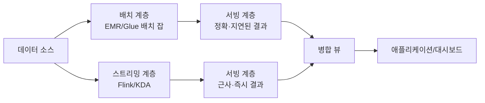

**카파 아키텍처(Kappa Architecture)**는 이 이중 구조를 버리고 **스트리밍 계층 하나**로 배치까지 흡수한다. "배치 재처리"가 필요하면 별도 배치 파이프라인을 돌리는 대신, 보존 기간이 충분히 긴 스트림(Kinesis 장기 보존 또는 MSK 장기 보존 토픽)을 처음부터 다시 읽어(로그 되감기, replay) 같은 스트리밍 잡을 재실행한다.


람다 아키텍처의 근본 비용은 **같은 로직을 배치용과 스트리밍용 두 벌로 유지**해야 한다는 것이다 — 집계 로직을 바꿀 때마다 두 코드베이스를 함께 수정하고 결과가 일치하는지 검증해야 하며, 두 계층의 결과가 미묘하게 어긋나는 디버깅은 상당한 운영 부담으로 남는다. 카파 아키텍처는 이 이중 유지 비용을 없애는 대신, **로그 되감기가 가능할 만큼 긴 보존 기간**과 스트리밍 엔진이 배치 수준의 처리량을 감당할 성능을 요구한다 — 재처리 범위가 넓을수록(예: 1년치 재계산) 보존 비용과 재처리 시간이 함께 커지므로 무제한한 해법은 아니다.

AWS 구현으로 매핑하면, 람다 아키텍처는 "Kinesis/MSK + Flink(속도 계층)"와 "S3 + EMR/Glue 배치 잡(배치 계층)"을 나란히 두고 그 결과를 Redshift나 DynamoDB 같은 서빙 계층에서 병합하는 구성이, 카파 아키텍처는 "장기 보존 Kinesis/MSK + Flink" 단일 파이프라인으로 배치 재처리 요건까지 흡수하는 구성이 전형적이다. 카파 구성에서 "재처리"는 실무적으로 별도 컨슈머 그룹(또는 별도 애플리케이션 이름)으로 스트림의 처음(TRIM_HORIZON) 또는 특정 시점부터 다시 읽도록 새 Flink 애플리케이션을 띄우고, 결과가 검증되면 기존 서빙 계층을 교체하는 형태로 이뤄진다 — 이 과정이 매끄러우려면 보존 기간이 재처리 대상 전체 기간을 덮어야 하고, MSK라면 계층화 스토리지로 그 보존 비용을 낮출 수 있다(50.5절).

**한 줄 결정 기준**: 배치와 스트리밍의 집계 로직이 실제로 다르거나(예: 배치에서만 가능한 복잡한 조인이 필요) 기존 배치 파이프라인 자산을 버리기 어렵다면 람다 아키텍처를, 두 계층의 로직을 하나로 통일할 수 있고 로그 되감기 비용을 감당할 수 있다면 카파 아키텍처를 선택한다. 현실에서는 순수한 카파도 순수한 람다도 아닌 절충안이 더 흔하다 — **스트림 우선으로 실시간 결과를 내보내되, 하루 한 번 배치 잡으로 같은 기간의 정확한 값을 재계산해 서빙 계층을 정정**하는 방식이다. 이 절충안은 카파의 단순성을 대부분 유지하면서, 지연 도착 데이터로 인한 오차(50.8절)를 정기적으로 바로잡는 안전판 역할을 한다.

### 50장 정리

#### [필수] 반드시 알아야 할 것
1. 스트리밍은 무한 데이터를 전제하며, 이벤트 시간과 처리 시간의 어긋남·지연 도착·워터마크는 배치에는 없던 개념이다. 이를 무시하면 결과가 조용히 틀려진다.
2. Kinesis 샤드는 처리량 단위(쓰기 1MB/s·1,000rec/s, 읽기 2MB/s)이며, 파티션 키 분포가 편향되면 특정 샤드만 스로틀링되는 핫 샤드가 발생한다.
3. Kinesis 보존 기간(기본 24시간, 최대 365일)을 넘긴 데이터는 어떤 방법으로도 재처리할 수 없다 — 재처리 요건에 맞춰 미리 보존 기간을 설정해야 한다.
4. 소비자 지연(iterator age)이 커지면 결국 보존 기간을 넘겨 데이터 유실로 이어진다 — 이 지표는 스트리밍 파이프라인에서 가장 먼저 걸어야 할 알람이다.
5. 스트리밍 소비자는 중복과 순서 이탈을 전제로 설계한다 — 멱등 쓰기, 자연 키 기반 upsert가 기본 대응 수단이다.
6. Firehose는 완전 관리형 전달 서비스로 버퍼링·동적 파티셔닝·포맷 변환을 코드 없이 제공하며, 단순 수집 파이프라인의 기본값이다.
7. Glue Schema Registry의 호환성 모드(BACKWARD/FORWARD/FULL/NONE)는 프로듀서-컨슈머 배포 순서의 안전성을 결정하며, EventBridge 스키마 레지스트리와는 대상·목적이 다른 별개의 도구다.
8. 정확히 한 번 처리는 체크포인트만으로 완성되지 않고, 트랜잭션 싱크 또는 멱등 싱크가 함께 있어야 한다.

#### [팁] 실무 노하우
1. Kafka 생태계·기존 온프레미스 자산이 있으면 MSK, AWS 통합과 운영 부담 최소화가 목표면 Kinesis를 기본 선택지로 삼는다. 중간 지점이 필요하면 MSK Serverless를 검토한다.
2. Lambda 이벤트 소스 매핑의 병렬화 계수·이등분 분할·on-failure destination을 함께 구성해, 문제 레코드가 파이프라인 전체를 막지 않게 한다.
3. Firehose 동적 파티셔닝과 Glue 카탈로그 기반 포맷 변환(Parquet)을 결합하면 별도 컴팩션·변환 잡 없이도 분석 친화적 레이아웃이 만들어진다.
4. EFO는 소비자가 여러 개이고 지연에 민감할 때만 추가 요금을 감수하고 도입한다 — 소비자가 하나뿐이면 표준 소비자로 충분하다.
5. Glue Schema Registry의 호환성 모드는 컨슈머가 여러 팀에 흩어진 조직일수록 BACKWARD를 기본값으로 두는 편이 안전하다.
6. 순수 람다도 순수 카파도 아닌 "스트림 우선 + 주기적 배치 정정" 절충안이 유지보수 비용과 정확성 사이에서 현실적인 균형점이다.

#### [주의] 사고·비용·설계 함정
1. 파티션 키가 편향되면 핫 샤드가 발생해 나머지 샤드는 유휴 상태인데 특정 샤드만 스로틀링되는 비효율이 생긴다.
2. Kinesis 보존 기간을 넘겨 데이터를 삭제한 뒤에는 신규 소비자 온보딩이나 장애 복구를 위한 재처리가 불가능하다.
3. iterator age 알람 없이 방치하면 소비자 지연이 데이터 유실로 이어지는 사고를 사후에야 발견하게 된다.
4. 지연 도착 데이터를 워터마크·허용 지연 설정 없이 무시하는 집계는 에러 없이 조용히 숫자를 낮게 만든다 — 광고 클릭·정산 시스템에서 이는 청구·매출 불일치로 직결된다(→ 61장).
5. MSK 파티션 수를 지나치게 늘리면 컨슈머 그룹 리밸런싱 비용이 커지고, 오토스케일링이 잦은 환경에서는 리밸런싱 자체가 지연의 원인이 된다.
6. 정확히 한 번 처리를 체크포인트만으로 달성했다고 오해하고 싱크의 멱등성·트랜잭션을 확인하지 않으면 중복 결과가 하류에 남는다.
7. 람다 아키텍처에서 배치·스트리밍 두 코드베이스를 별도로 유지하다 로직이 갈라지면, 두 계층의 결과가 미묘하게 어긋나는 디버깅하기 어려운 불일치가 발생한다.
8. 카파 아키텍처를 도입하면서 재처리에 필요한 만큼 보존 기간을 늘리지 않으면, 정작 재처리가 필요한 시점에 로그 되감기가 불가능하다.

#### 한 장 요약
스트리밍 처리는 무한 데이터, 이벤트 시간과 처리 시간의 어긋남, 지연 도착이라는 배치에 없던 문제를 워터마크와 윈도우로 다룬다. Kinesis Data Streams는 샤드 단위 처리량과 파티션 키 설계가, MSK는 파티션·브로커 아키텍처와 Kafka 생태계 호환성이 핵심이며, 둘 중 선택은 운영 부담과 기존 자산이 갈라놓는다. Firehose는 코드 없는 전달을, Managed Service for Apache Flink는 상태 저장 윈도우 집계를, Glue Schema Registry는 프로듀서-컨슈머 계약 안전성을 각각 책임진다. 지연 도착 데이터를 무시한 집계는 조용히 숫자를 틀리게 만들고, 정확히 한 번 처리는 체크포인트와 싱크의 멱등성이 함께 있어야 완성되며, 람다·카파 아키텍처 선택은 결국 이중 파이프라인 유지 비용과 로그 되감기 비용 사이의 트레이드오프다.

#### 다음 장 예고
51장은 이 장에서 만든 스트리밍·배치 파이프라인의 결과물을 실제로 조회하고 분석하는 데이터 웨어하우스 계층(Amazon Redshift 중심)과 쿼리 서비스를 다룬다.

---

## 51장. 데이터 웨어하우스와 쿼리  ★★★★

> **이 장에서 다루는 것**
> 49장과 50장은 데이터를 "어떻게 가공해 쌓는가"(배치·스트리밍)를 다뤘다. 이 장은 그렇게 쌓인 데이터를 실제로 **누가, 얼마의 비용으로, 얼마나 빠르게 조회하는가**를 다룬다. Amazon Redshift(관리형 클러스터 웨어하우스)와 Amazon Athena(서버리스 쿼리 엔진)를 축으로 내부 동작·물리 설계·비용 구조를 심층적으로 짚고, Amazon QuickSight로 결과를 시각화하는 지점까지 이어간다. 49장의 파일 포맷·압축 전략(49.8)을 전제하되 이 장은 **쿼리 엔진 관점에서 스캔량과 비용에 미치는 영향**에 집중하며, S3 존 설계와 Lake Formation 권한 모델은 52장(데이터 레이크)에서 이어받는다.

### 51.1 Amazon Redshift 아키텍처

Redshift는 SQL 클라이언트가 보는 단일 엔드포인트 뒤에 **리더 노드(leader node)**와 하나 이상의 **컴퓨트 노드(compute node)**를 감춘 MPP(대규모 병렬 처리) 아키텍처다. 리더 노드는 SQL을 파싱·계획해 각 컴퓨트 노드에 분배하고, 컴퓨트 노드는 자신이 보유한 데이터 조각만 계산해 부분 결과를 돌려보내면 리더 노드가 취합·정렬해 최종 결과를 낸다. "조인 키를 잘못 잡아 모든 데이터가 한 노드로 몰리는" 상황이 곧 성능 문제로 직결되는 이유다(→ 51.2).

컴퓨트 노드 내부는 다시 **슬라이스(slice)**로 나뉜다. 슬라이스는 노드의 CPU·메모리·디스크 일부를 할당받은 병렬 처리 단위이자 데이터 분산(51.2)의 실제 단위이며, 슬라이스 수가 많을수록 병렬도가 높아지되 슬라이스마다 처리할 데이터량이 균등해야 그 병렬성이 실제 성능으로 이어진다.

노드 타입은 두 세대가 병존한다. **RA3**는 컴퓨트와 스토리지를 분리한 세대로, 로컬 SSD는 캐시로만 쓰고 실제 데이터는 **RMS(Redshift Managed Storage)**라는 S3 기반 계층에 저장해 스토리지가 컴퓨트 노드 수와 독립적으로 자동 확장된다. **DC2**는 이전 세대로 로컬 SSD에 데이터를 직접 저장해 스토리지가 컴퓨트에 고정 결합되므로, 신규 구축이라면 RA3가 기본값이다(정확한 사양·요금은 서비스 문서 확인).

**Redshift Serverless**는 노드·클러스터 개념을 감추고 처리 용량을 **RPU(Redshift Processing Unit)** 단위로 자동 조정한다. 기본 용량만 지정하면 부하에 따라 자동 확장되며 사용한 RPU-시간에만 과금된다. 트래픽 예측이 어려운 신규 워크로드나 간헐적 사용에 적합하고, 24시간 안정적으로 높은 부하가 걸리는 워크로드는 프로비저닝 클러스터(RA3)가 총소유비용 면에서 유리한 경우가 많다.

**동시성 스케일링**은 읽기 쿼리가 몰릴 때 임시 클러스터를 자동 추가해 대기를 흡수하고, **데이터 공유(Data Sharing)**는 복제 없이 다른 클러스터·계정·리전에서 같은 데이터를 실시간으로 읽게 한다(각각 51.3, 51.4).

**제로 ETL 통합(Zero-ETL integration)**은 Aurora(MySQL/PostgreSQL 호환)나 RDS, DynamoDB 같은 운영 데이터베이스의 데이터를 별도 파이프라인 구축 없이 거의 실시간으로 Redshift에 복제하는 관리형 기능이다. 49장의 Glue ETL이 명시적으로 작성한 변환 파이프라인이라면, 제로 ETL은 운영 DB 스키마를 그대로 웨어하우스에 반영하는 접근이다 — 단순 복제에는 효율적이지만 소스 스키마 변경에 그대로 노출된다는 트레이드오프가 남는다.

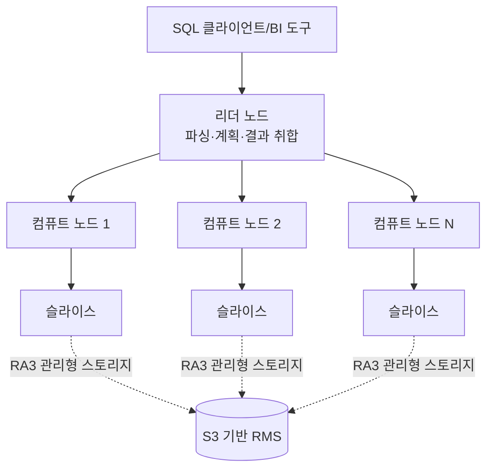

### 51.2 분산 키·정렬 키·압축 인코딩

Redshift 성능의 가장 큰 변수는 인스턴스 크기가 아니라 **테이블을 어떻게 분산·정렬·인코딩했는가**다 — 잘못된 물리 설계는 노드를 늘려도 해결되지 않는 경우가 많다.

**분산 스타일(distribution style)**은 각 행을 어느 슬라이스에 저장할지 결정한다.

| 스타일 | 동작 | 적합한 경우 |
|---|---|---|
| KEY | 지정한 컬럼의 해시값으로 슬라이스 배정, 같은 값은 같은 슬라이스에 모임 | 큰 팩트 테이블끼리 자주 조인하는 컬럼(예: `customer_id`) |
| ALL | 테이블 전체를 모든 노드에 복제 | 자주 조인되는 작은 차원 테이블(수백만 행 이하) |
| EVEN | 라운드로빈으로 균등 분산 | 조인에 거의 쓰이지 않는 테이블, 기본 폴백 |
| AUTO | Redshift가 테이블 크기에 따라 위 세 가지 중 자동 선택·변경 | 초기 설계 단계, 데이터 양 예측이 어려운 테이블 |

**한 줄 결정 기준**: 두 대형 테이블을 자주 조인한다면 그 조인 키를 KEY로 맞추고, 작은 차원 테이블은 ALL로 복제해 조인 시 데이터 이동(redistribution)을 없앤다. 확신이 없으면 AUTO로 시작해 실제 쿼리 패턴을 관찰한 뒤 조정한다.

KEY 분산을 잘못 고르면(예: 조인에 쓰이지 않는 컬럼을 KEY로 지정) 조인 시점에 한 테이블 전체를 다른 테이블의 분산 키에 맞춰 재분배(broadcast/redistribution)해야 하고, 이는 쿼리 지연의 가장 흔한 원인이 된다 — EXPLAIN 결과에 `DS_BCAST_INNER`나 `DS_DIST_*` 연산이 보이면 분산 설계를 재검토할 신호다(→ 51.3).

**정렬 키(sort key)**는 디스크에 물리적으로 데이터를 정렬해 저장하는 컬럼이다. **단일 정렬 키**는 컬럼 하나만, **복합 정렬 키(compound sort key)**는 여러 컬럼을 지정 순서대로 계층적으로 정렬한다 — 필터 조건이 앞쪽 컬럼부터 순서대로 걸릴 때 효과가 크다(예: `(created_date, region)`이면 날짜 범위 필터가 가장 큰 이득을 본다). **AUTO 정렬 키**는 Redshift가 쿼리 패턴을 관찰해 자동으로 선택·재구성한다(자동 테이블 최적화의 일부, → 51.3). 과거의 인터리브 정렬 키는 VACUUM 비용이 크고 관리가 까다로워 신규 테이블에는 권장되지 않는다 — 일반적으로 AUTO 또는 명시적 복합 정렬 키로 시작한다.

정렬 키가 성능으로 이어지는 메커니즘이 **존 맵(zone map)**이다. Redshift는 블록(1MB 단위)마다 해당 컬럼의 최솟값·최댓값을 메모리에 유지하고, WHERE 조건이 이 범위를 벗어나는 블록은 디스크에서 읽지 않고 건너뛴다. 정렬 키 컬럼일수록 블록별 값 범위가 좁게 모여 스킵 효과가 커지므로, 자주 필터·범위 조건에 쓰이는 컬럼을 정렬 키로 잡는 것이 원칙이다.

**압축 인코딩**은 컬럼마다 값 분포에 맞는 인코딩을 적용해 저장 공간과 스캔량을 함께 줄인다. `AZ64`는 숫자·날짜 계열에 최적화돼 압축률과 속도의 균형이 좋아 최근 기본 권장값으로 자리 잡았고, `ZSTD`는 범용 인코딩이다. 어떤 인코딩이 적합한지 판단하기 어려우면 `ANALYZE COMPRESSION` 명령이 실제 데이터를 샘플링해 컬럼별 권장 인코딩을 제시한다.

Redshift의 **기본 키(PRIMARY KEY)·외래 키(FOREIGN KEY)**는 트랜잭션 데이터베이스처럼 강제되지 않는다 — 유일성·참조 무결성을 실제로 검사하지 않고 **쿼리 플래너가 조인·집계 계획을 세울 때 참고하는 힌트**로만 쓴다. 애플리케이션이 중복 키를 넣어도 삽입은 성공하고, 플래너가 잘못된 가정으로 비효율적이거나 부정확한 계획을 세울 위험이 있다 — 키 무결성은 적재 파이프라인(COPY·MERGE 로직)이 책임져야 한다.

테이블 설계 절차: ① 팩트/차원 테이블을 구분한다 → ② 팩트 테이블은 가장 큰 조인 상대와의 조인 키를 분산 키로, 작은 차원 테이블은 ALL로 잡는다 → ③ 자주 필터·범위 조건에 쓰이는 컬럼을 정렬 키로 잡는다(불확실하면 AUTO) → ④ `ANALYZE COMPRESSION`으로 인코딩을 점검한다 → ⑤ 실제 쿼리 로그를 관찰하며 재조정한다.

```sql
-- 팩트 테이블: customer_id로 조인이 잦으므로 DISTKEY, 날짜 범위 필터가 잦으므로 SORTKEY
-- 인코딩은 AZ64(숫자/날짜)와 ZSTD(문자열)를 컬럼 특성에 맞춰 지정
CREATE TABLE sales.order_facts (
    order_id      BIGINT      ENCODE AZ64,
    customer_id   BIGINT      ENCODE AZ64 DISTKEY,   -- 조인 키 = 분산 키
    order_date    DATE        ENCODE AZ64 SORTKEY,   -- 범위 필터 컬럼 = 정렬 키
    region_code   VARCHAR(10) ENCODE ZSTD,
    amount        DECIMAL(12,2) ENCODE AZ64
);

-- 차원 테이블: 규모가 작고 조인에 자주 쓰이므로 전체 노드에 복제
CREATE TABLE sales.dim_customer (
    customer_id  BIGINT      ENCODE AZ64,
    customer_name VARCHAR(200) ENCODE ZSTD,
    segment      VARCHAR(50)  ENCODE ZSTD
) DISTSTYLE ALL;
```

### 51.3 Redshift 워크로드 최적화

**WLM(Workload Management)**은 동시에 들어오는 쿼리를 큐(queue)로 분류해 메모리·동시성을 배분한다. **수동 WLM**은 큐 수·메모리 비율·동시성 슬롯을 직접 지정해 ETL과 대시보드 쿼리를 격리하지만 수동 튜닝이 필요하고, **자동 WLM**은 우선순위(priority)만 지정하면 실제 부하에 맞춰 스스로 조정해 대부분의 워크로드에서 운영 부담을 낮춘다. 짧은 쿼리가 긴 배치 쿼리 뒤에서 오래 대기하는 문제는 **SQA(Short Query Acceleration)** 전용 큐가 완화하고, **QMR(Query Monitoring Rules)**은 큐별로 CPU 시간·스캔 행 수 초과 같은 조건을 걸어 넘는 쿼리를 로그·중단·다른 큐로 전환(hop)시켜 폭주 쿼리 하나가 클러스터 전체를 잠식하는 것을 막는다.

**동시성 스케일링**은 읽기 쿼리 대기가 길어지면 임시 클러스터를 자동으로 띄워 초과분을 흡수하고 해소되면 회수한다 — 사용 시간만큼 크레딧이 소모되며 일평균 사용량 내에서는 추가 요금이 없는 것이 일반적이다(정확한 규칙은 문서 확인). 대시보드 트래픽 급증 같은 읽기 위주 워크로드에 효과적이며 쓰기·DDL이 섞인 워크로드에는 적용되지 않는다.

**결과 캐시(result cache)**는 동일한 쿼리 텍스트가 동일한 세션 설정에서 반복될 때, 기저 데이터가 바뀌지 않았다면 재계산 없이 캐시된 결과를 즉시 반환한다 — 반복 실행되는 대시보드 쿼리에서 효과가 크며 별도 설정 없이 기본 동작한다.

**구체화 뷰(materialized view)**는 조인·집계 결과를 미리 계산해 저장해 둔 뷰다. **자동 갱신(auto refresh)**을 켜면 기저 테이블 변경을 백그라운드에서 증분 갱신하고, **자동 재작성(automatic query rewrite)**은 사용자가 기저 테이블을 직접 조회해도 옵티마이저가 구체화 뷰로 대체할 수 있으면 자동으로 재작성해 실행한다 — 애플리케이션 쿼리를 바꾸지 않고도 반복 집계 비용을 낮추는 효과적인 수단이다.

```sql
-- 일별 지역 매출 집계를 구체화 뷰로 선계산, 자동 갱신 활성화
CREATE MATERIALIZED VIEW sales.mv_daily_region_sales
AUTO REFRESH YES
AS
SELECT order_date, region_code, SUM(amount) AS total_amount, COUNT(*) AS order_count
FROM sales.order_facts
GROUP BY order_date, region_code;
```

**VACUUM**은 삭제·갱신으로 생긴 죽은 행(dead row)을 회수하고 정렬되지 않은 영역을 재정렬하며, **ANALYZE**는 옵티마이저 통계를 갱신한다. **자동 테이블 최적화(ATO)**는 이 두 작업과 분산·정렬 키 추천까지 백그라운드에서 자동 수행한다 — 다만 대규모 벌크 로드 직후처럼 통계가 크게 어긋난 시점에는 수동 `ANALYZE`가 안전하다.

**COPY 최적화**의 핵심은 병렬성을 슬라이스 수에 맞추는 것이다. 로드 파일 수를 슬라이스 수의 배수(또는 최소한 이상)로 나눠 각 슬라이스가 동시에 파일 하나씩 읽게 하면 로드 시간이 크게 줄어든다 — 파일 하나를 통째로 COPY하면 한 슬라이스만 일하고 나머지는 유휴 상태다. 압축 파일(gzip 등)은 S3 전송량을 줄이고, **매니페스트 파일**로 로드 대상을 명시하면 재시도 시 중복 로드를 막고 완료 범위를 명확히 추적할 수 있다.

```sql
-- 매니페스트로 로드 대상을 명시하고, gzip 압축·자동 인코딩 감지·오류 허용치를 지정
COPY sales.order_facts
FROM 's3://analytics-raw-ap-northeast-2-123456789012/orders/manifest.json'
IAM_ROLE 'arn:aws:iam::123456789012:role/RedshiftCopyRole'
MANIFEST
GZIP
COMPUPDATE ON
MAXERROR 5;
```

**쿼리 튜닝 절차**: ① `SYS_QUERY_HISTORY`(및 `STL_`/`SVL_` 계열 시스템 뷰)로 느린 쿼리를 식별 → ② `EXPLAIN`으로 `DS_DIST_*`, `DS_BCAST_*` 같은 재분배 연산 확인 → ③ 재분배가 보이면 분산 키 재검토 → ④ 스캔 블록 수가 예상보다 많으면 정렬 키·존 맵 효과 재검토 → ⑤ 여전히 느리면 WLM 큐·QMR 임계치 확인. 인스턴스를 키우기 전에 이 절차를 먼저 거치는 것이 비용 대비 효과가 훨씬 크다.

### 51.4 Redshift Spectrum과 데이터 공유

**Redshift Spectrum**은 클러스터로 데이터를 로드하지 않고 **S3에 있는 파일을 외부 테이블(external table)**로 등록해 그대로 쿼리하는 기능이다. 외부 스키마는 Glue Data Catalog를 메타스토어로 공유하므로, 한 번 등록한 테이블 정의를 Athena와 Spectrum이 함께 재사용한다. Spectrum 쿼리는 Redshift 컴퓨트 노드가 아닌 별도의 Spectrum 컴퓨트 계층에서 실행되며 **스캔한 바이트에 과금**된다(Athena와 동일한 과금 축, → 51.5·51.10). 자주 조회하지 않는 오래된 파티션은 S3에 남긴 채 Spectrum으로만 조회하고, 최근·핫 데이터만 로컬 테이블에 두는 계층화가 전형적인 활용 패턴이다.

```sql
-- Glue Data Catalog의 외부 스키마를 등록해 S3의 Parquet 데이터를 외부 테이블로 쿼리
CREATE EXTERNAL SCHEMA spectrum_schema
FROM DATA CATALOG
DATABASE 'analytics_db'
IAM_ROLE 'arn:aws:iam::123456789012:role/RedshiftSpectrumRole'
REGION 'ap-northeast-2';

-- 로컬 팩트 테이블(최근 90일)과 외부 테이블(과거 이력)을 하나의 쿼리로 조인
SELECT l.region_code, SUM(l.amount) + SUM(h.amount) AS total_amount
FROM sales.order_facts l
JOIN spectrum_schema.order_history h ON l.region_code = h.region_code
GROUP BY l.region_code;
```

**데이터 공유(Data Sharing)**는 데이터를 복제하지 않고 다른 Redshift 클러스터·계정·리전에서 같은 데이터를 실시간으로 읽게 하는 기능이다. 데이터를 소유한 **프로듀서**가 공유할 스키마·테이블 범위를 지정해 데이터셰어(datashare) 객체를 만들고, **컨슈머**는 자신의 클러스터에서 이를 데이터베이스로 마운트해 조회한다. 데이터가 물리적으로 이동하지 않으므로 프로듀서 쪽 변경이 즉시(추가 ETL 없이) 반영되고, 조직 내 여러 부서가 하나의 원천 데이터를 각자 원하는 컴퓨트 크기로 조회할 수 있다 — 하나의 거대 클러스터에 모든 워크로드를 몰아넣는 것보다 안전한 대안이다.

### 51.5 Amazon Athena 동작 원리

Athena는 서버 프로비저닝 없이 S3의 데이터를 표준 SQL로 조회하는 **서버리스** 쿼리 서비스로, 내부적으로 오픈소스 분산 SQL 엔진(Presto/Trino 계열)을 관리형으로 운영한다 — 클러스터를 만들거나 크기를 정할 필요 없이 쿼리 실행 순간에만 컴퓨트 자원이 할당된다.

Athena는 **Glue Data Catalog**를 메타스토어로 사용해 테이블·파티션·스키마 정의를 관리한다. 핵심 개념이 **스키마 온 리드(schema-on-read)**다 — 쓰기 시점에 스키마를 강제하는 전통적 데이터베이스와 달리, S3의 원시 파일에 스키마를 **쿼리 시점에** 카탈로그 정의로 해석해 적용한다. 덕분에 같은 원본에 여러 스키마 해석을 유연하게 적용할 수 있지만, 원본 데이터 품질·정합성은 별도로 관리해야 한다.

**워크그룹(workgroup)** 단위로 쿼리 실행이 격리된다(세부 통제는 → 51.8) — 팀·프로젝트별로 워크그룹을 나누면 비용 추적과 접근 통제가 자연스럽게 나뉜다.

가장 중요한 과금 축은 **스캔한 데이터 바이트**다. 실행 시간이나 결과 행 수가 아니라 **엔진이 실제로 읽은 바이트 양**에 비례해 요금이 매겨진다(정확한 값은 요금 문서 확인). 이 사실이 뒤에서 다루는 모든 최적화 기법(51.6, 51.9)의 존재 이유다 — 파티셔닝, 컬럼형 포맷, 컬럼 선택은 전부 스캔량을 줄여 요금과 지연을 함께 낮추는 동일한 목표를 향한다.

Athena는 **엔진 버전**을 선택·고정할 수 있다(예: Athena engine version 3) — 워크그룹 단위로 특정 버전에 고정해 예기치 않은 동작 변화를 막는다(→ 51.8). **Athena for Apache Spark**는 SQL 엔진과 별개로 노트북에서 대화형 Spark 애플리케이션을 서버리스로 실행하는 기능으로, DPU(Data Processing Unit)-시간 단위로 과금돼 SQL 쿼리의 스캔 바이트 과금과는 다른 축을 가진다.

### 51.6 지원 포맷 비교

Athena(및 Redshift Spectrum)는 다양한 파일 포맷을 외부 테이블로 인식하지만, 포맷에 따라 스캔 효율·비용이 크게 달라진다. 압축·저장 전략의 일반론은 49.8절에서 다뤘으므로, 여기서는 **쿼리 엔진 성능** 관점에 집중한다.

| 포맷 | 구조 | 압축 | 스키마 진화 | 분할 가능성 | Athena 성능 특성 |
|---|---|---|---|---|---|
| CSV | 행 기반, 텍스트 | 외부 압축 필요(자체 압축 없음) | 취약(컬럼 추가 시 파싱 오류 위험) | 비압축 시 가능, gzip 압축 시 불가 | 전체 행을 읽어야 해 스캔량이 가장 큼 |
| JSON | 행 기반, 중첩 가능 | 외부 압축 필요 | 유연(필드 추가에 강함) | 대체로 압축 시 분할 불가 | 중첩이 깊을수록 파싱 비용 급증, 소파일 다발 시 특히 느림 |
| ORC | 열 기반(columnar) | 내장 압축(높은 압축률) | 제한적 지원 | 가능(스트라이프 단위) | 컬럼 프루닝·조건자 푸시다운 효과 큼 |
| Avro | 행 기반, 스키마 내장 | 내장 압축 | 우수(스키마 진화 표준 지원) | 가능(블록 단위) | 행 기반이라 컬럼 선택 이점은 제한적, 스트리밍 수집에 강점 |
| Parquet | 열 기반(columnar) | 내장 압축(높은 압축률) | 우수(컬럼 추가·순서 변경에 강함) | 가능(row group 단위) | Athena에서 일반적으로 가장 권장되는 기본 선택지 |

**한 줄 결정 기준**: 분석 쿼리가 주 목적이면 Parquet(또는 ORC)를 기본으로 삼고, 스트리밍 수집·스키마 진화가 잦은 원천 시스템 간 교환에는 Avro를, 사람이 직접 열어보거나 외부 도구 호환성이 최우선인 경우에만 CSV/JSON을 남긴다.

컬럼형 포맷이 스캔량을 줄이는 이유는 저장 구조 자체에 있다. 행 기반 포맷은 한 행의 모든 컬럼 값이 디스크상에 연속으로 붙어 있어 컬럼 몇 개만 필요해도 행 전체를 읽어야 한다. 컬럼형 포맷은 **같은 컬럼의 값들끼리 연속으로 저장**되므로, 쿼리가 참조하는 컬럼의 블록만 골라 읽고 나머지는 디스크 I/O에서 아예 제외한다.

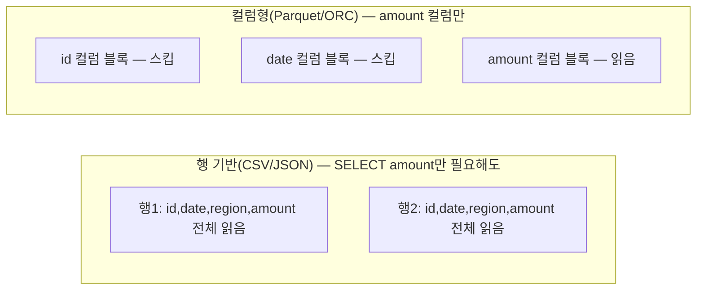

### 51.7 Athena Federated Query

Federated Query는 S3에 없는 데이터, 즉 **다른 데이터 저장소에 있는 데이터를 Athena SQL로 직접 조회**하게 해주는 기능이다. 이를 가능케 하는 것이 **Lambda 기반 데이터 소스 커넥터**다 — Athena는 쿼리를 소스별 커넥터에 위임하고, 커넥터는 그 소스의 네이티브 API로 데이터를 읽어 Athena가 이해하는 형식으로 반환한다.

지원 소스는 관계형·비관계형을 아우른다 — Amazon RDS(MySQL/PostgreSQL), DynamoDB, DocumentDB, Redshift, Apache HBase(EMR 기반), CloudWatch Logs 등의 사전 빌드 커넥터와 JDBC 호환 소스를 위한 범용 커넥터가 제공된다(제공 목록은 계속 추가되므로 최신 목록은 문서 확인).

커넥터는 사용자 계정에 **Lambda 함수로 배포**되며, Lambda 응답 페이로드 한도를 넘는 대용량 결과는 **스필오버 S3 버킷**에 임시 기록한 뒤 위치를 반환하는 방식으로 우회한다. 이 구조 때문에 Lambda의 실행 시간·메모리·동시성 한도에 그대로 종속되고 매 쿼리가 소스 시스템에 실시간 부하를 준다 — 대량 스캔·고빈도 쿼리에는 부적합하며, **운영 DB의 최신 데이터를 S3 데이터와 일회성·저빈도로 조인**하는 애드혹 분석에 쓰는 것이 합리적이다. 반복 조회라면 제로 ETL 통합(51.1)이나 정기 배치 파이프라인(49장)으로 S3에 적재해두는 편이 성능·소스 보호 양쪽에 낫다.

### 51.8 Athena 워크그룹과 비용 통제

워크그룹은 쿼리 실행 환경을 논리적으로 분리하는 단위로, 다음을 워크그룹별로 독립 설정할 수 있다.

**쿼리 결과 위치**는 워크그룹마다 별도 S3 경로로 지정해 팀·프로젝트별 결과를 분리 보관한다. **데이터 스캔 한도**는 이 장에서 가장 중요한 비용 통제 장치다 — 쿼리 하나가 스캔할 수 있는 최대 바이트(쿼리별 한도)와 워크그룹 전체의 누적 한도(워크그룹별 한도)를 걸어, 실수로 작성한 `SELECT *` 풀스캔이나 파티션 필터 누락 쿼리가 예상치 못한 청구서로 이어지는 사고를 원천 차단한다.

```bash
# 워크그룹의 쿼리당 데이터 스캔 한도를 10GB로 제한 — 풀스캔 실수로 인한 요금 폭탄 방지
aws athena update-work-group \
    --work-group analytics-team \
    --configuration-updates '{
        "BytesScannedCutoffPerQuery": 10737418240,
        "EnforceWorkGroupConfiguration": true,
        "PublishCloudWatchMetricsEnabled": true
    }'
```

워크그룹은 **CloudWatch 지표**(실행 쿼리 수, 스캔 바이트, 실행 시간 등)를 발행하고, **엔진 버전을 워크그룹 단위로 고정**해 전사 엔진 업그레이드가 특정 팀의 쿼리 호환성을 깨는 것을 막는다. **태그**로 팀·프로젝트별 비용을 분리 집계할 수 있고, IAM 정책으로 **어떤 사용자·역할이 어떤 워크그룹만 쓸 수 있는지** 통제해 다른 팀의 설정을 잘못 건드리는 상황을 막는다.

### 51.9 Athena 최적화 11가지

Athena는 스캔 바이트로 과금되므로(51.5), 아래 11가지는 전부 "같은 결과를 더 적은 바이트를 읽어서 낸다"는 하나의 원칙으로 수렴한다.

**① 데이터 파티션 최적화** — 자주 필터링하는 컬럼(날짜, 지역 등)으로 데이터를 물리적으로 나눠 저장하면 파티션 조건에 맞지 않는 디렉터리는 읽지 않는다. 파티션이 많아지면 카탈로그 관리 부담이 커지므로 **파티션 프로젝션(partition projection)**으로 파티션 값을 규칙으로 계산해 `MSCK REPAIR TABLE` 없이 새 파티션을 즉시 인식하게 하는 것이 효율적이다.

```sql
-- 날짜 파티션을 규칙으로 계산해 파티션 메타데이터를 별도로 등록하지 않아도 되게 한다
CREATE EXTERNAL TABLE analytics.events (
    user_id STRING,
    event_type STRING,
    amount DOUBLE
)
PARTITIONED BY (dt STRING)
STORED AS PARQUET
LOCATION 's3://analytics-curated-ap-northeast-2-123456789012/events/'
TBLPROPERTIES (
    'projection.enabled' = 'true',
    'projection.dt.type' = 'date',
    'projection.dt.range' = '2024-01-01,NOW',
    'projection.dt.format' = 'yyyy-MM-dd',
    'storage.location.template' = 's3://analytics-curated-ap-northeast-2-123456789012/events/dt=${dt}/'
);
```

**② 데이터 버케팅** — 파티션만으로는 나누기 애매한 고카디널리티 컬럼(예: `user_id`)을 해시 기반 고정 개수 버킷 파일로 분산 저장하면, 해당 컬럼으로 조인·집계할 때 필요한 버킷만 읽는다. CTAS(CREATE TABLE AS SELECT)로 버케팅 테이블을 만든다.

```sql
CREATE TABLE analytics.events_bucketed
WITH (
    format = 'PARQUET',
    external_location = 's3://analytics-curated-ap-northeast-2-123456789012/events_bucketed/',
    bucketed_by = ARRAY['user_id'],
    bucket_count = 32
) AS
SELECT user_id, event_type, amount, dt FROM analytics.events;
```

**③ 파일 압축** — gzip, Snappy, ZSTD 등으로 압축하면 전송·스캔 바이트가 줄어든다. Parquet/ORC는 압축이 내장돼 있으면서도 분할 가능성을 유지해 CSV/JSON 압축보다 유리하다(51.6).

**④ 파일 크기 최적화** — 파일이 너무 작으면(수백 KB 소파일 다발) 메타데이터 오버헤드·요청 수가 과도해지고, 너무 크면 병렬성이 떨어진다. 일반적으로 128MB~1GB 병합(compaction)이 권장된다(최적 크기는 워크로드별 벤치마크로 확인).

**⑤ 컬럼형 데이터 저장 생성 최적화** — 원본이 CSV/JSON이면 CTAS로 Parquet/ORC 테이블을 만들어 이후 쿼리는 변환된 테이블을 대상으로 한다. 변환 자체도 스캔 비용이 들지만 반복 조회되는 테이블이면 총비용이 빠르게 상쇄된다.

**⑥ 컬럼 선택(SELECT \* 회피)** — 컬럼형 포맷의 이점은 필요한 컬럼만 지정할 때 발휘된다. `SELECT *`는 Parquet여도 모든 컬럼 블록을 읽어 이점을 스스로 없앤다 — 가장 자주 반복해야 할 원칙이다.

**⑦ 프레디케이트 푸시다운** — WHERE 조건을 파일 통계(min/max, Parquet row group 통계 등)와 결합해 조건에 맞지 않는 row group·파일을 건너뛴다. 파티션 키·정렬 컬럼에 조건을 걸수록 효과가 커져 ①과 맞물린다.

**⑧ ORDER BY 최적화** — 전체 정렬은 단일 노드에서 수행돼 결과가 크면 병목이 된다. `LIMIT`과 함께 쓰거나 정렬을 최종 출력 단계로 미룬다.

**⑨ JOIN 최적화** — **더 큰 테이블을 먼저, 작은 테이블을 나중(오른쪽)**에 두면 엔진이 작은 쪽을 브로드캐스트 대상으로 인식하기 쉬워 실행 계획에 유리한 경우가 일반적이다. 조인 키 타입을 양쪽에서 일치시켜 불필요한 변환도 피한다.

**⑩ GROUP BY 최적화** — 그룹 키 컬럼 수·카디널리티를 줄일수록 중간 집계 상태가 작아진다. 카디널리티가 낮은 컬럼을 그룹 키 앞쪽에 배치하면 메모리 압박이 줄어든다.

**⑪ 근사 함수 사용** — 정확한 값이 꼭 필요하지 않은 지표(예: 순 사용자 수)는 `COUNT(DISTINCT ...)` 대신 `approx_distinct(...)` 같은 근사 함수를 쓰면 정확한 중복 제거에 필요한 전체 셔플·정렬을 피하고 훨씬 적은 자원으로 근사치를 얻는다.

```sql
-- 정확한 COUNT(DISTINCT)는 전체 셔플이 필요해 느리고 비용이 크다
SELECT COUNT(DISTINCT user_id) FROM analytics.events WHERE dt = '2026-09-01';

-- 근사 함수는 오차를 허용하는 대신 훨씬 적은 자원으로 빠르게 답한다
SELECT approx_distinct(user_id) FROM analytics.events WHERE dt = '2026-09-01';
```

### 51.10 Athena vs Redshift Spectrum

두 서비스 모두 S3 데이터를 로드 없이 SQL로 조회하지만, 전제하는 컴퓨트 환경과 비용 예측성이 다르다.

| 항목 | Athena | Redshift Spectrum |
|---|---|---|
| 요금 모델 | 스캔 바이트당 과금(서버리스, 클러스터 불필요) | 스캔 바이트당 과금 + Redshift 클러스터 자체 비용 |
| 클러스터 필요 여부 | 불필요 | 필요(기존 Redshift 클러스터 전제) |
| 동시성 | 워크그룹 한도 내에서 자유롭게 확장 | Redshift 클러스터·동시성 스케일링 한도에 종속 |
| 성능 예측성 | 쿼리별로 변동(공유 서버리스 자원) | 클러스터 자원이 고정돼 있어 상대적으로 예측 가능 |
| 로컬 데이터와 통합 | 불가(외부 테이블만 조회) | 가능(Redshift 로컬 테이블과 한 쿼리에서 조인) |

**한 줄 결정 기준**: Redshift 클러스터를 이미 운영 중이고 로컬 핫 데이터와 S3의 콜드 데이터를 한 쿼리로 조인해야 한다면 Spectrum을, Redshift 클러스터가 없거나 순수 애드혹·서버리스 분석이 목적이라면 Athena를 선택한다.

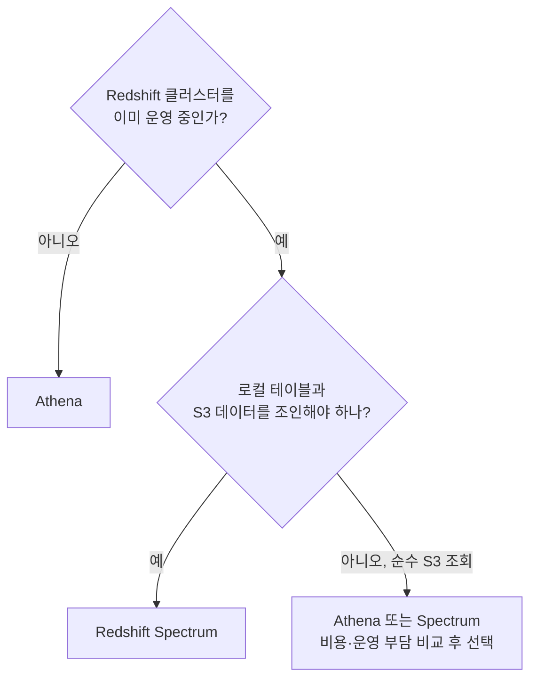

두 서비스는 배타적이지 않다 — 같은 Glue Data Catalog를 공유하므로, 평상시 애드혹 탐색은 Athena로, 로컬 팩트 테이블과 S3 이력 데이터를 조인하는 정형화된 리포트는 Spectrum으로 실행하는 **병행 구성**이 흔하다.

### 51.11 Amazon QuickSight

QuickSight는 관리형 BI(비즈니스 인텔리전스) 서비스로, 데이터를 가져오는 두 가지 모드를 지원한다. **SPICE(Super-fast, Parallel, In-memory Calculation Engine)**는 데이터를 전용 인메모리 엔진에 적재해두고 조회해 원본에 매 조회마다 부하를 주지 않고 응답이 빠르다 — 다만 구매한 SPICE 용량(GB 단위) 한도 내에서 운용하고, 예약(scheduled) 또는 수동 새로 고침이 필요해 항상 최신은 아니다. **직접 쿼리(Direct Query)**는 조회마다 원본 소스(Redshift, Athena, RDS 등)에 실시간으로 쿼리해 항상 최신이지만 그만큼 조회 부하를 원본에 직접 전가한다.

**데이터 소스**는 QuickSight가 연결하는 대상이고, **데이터셋**은 그 소스에서 선택·조인·가공해 SPICE에 적재하거나 직접 쿼리 대상으로 등록한 논리적 단위다. 사용자는 데이터셋 위에 **분석(analysis)**을 만들어 시각화를 구성하고, 완성된 분석을 **대시보드**로 게시해 읽기 전용으로 공유한다. **시각적 임베딩**은 대시보드를 자체 애플리케이션 안에 iframe/SDK로 삽입해 등록·익명 사용자 모두에게 콘솔 없이 시각화를 소비하게 한다.

**행 수준 보안(RLS)**은 데이터셋에 사용자·그룹별 조회 가능 행 범위를 매핑해, 같은 대시보드를 봐도 사용자마다 자신의 지역·부서 데이터만 보이게 한다. **열 수준 보안(CLS)**은 특정 컬럼을 사용자·그룹별로 숨기거나 노출한다(예: 급여 컬럼은 인사팀에만). **QuickSight Q**는 자연어 질의로 시각화를 자동 생성해, 분석 경험이 없는 사용자도 질문 문장만으로 인사이트를 얻게 한다.

요금 모델은 사용자 유형별로 나뉜다 — 대시보드·데이터셋을 설계하는 **작성자(author)**는 구독형 월 요금이, 보기만 하는 **독자(reader)**는 세션 단위 또는 용량 기반 요금이 일반적이다(정확한 요금 체계는 문서 확인). 소수가 설계하고 다수가 소비하는 전형적 BI 패턴에 맞춘 구조다.

**대시보드가 웨어하우스를 죽이는 패턴**은 QuickSight를 Redshift에 Direct Query로 붙였을 때 흔히 발생한다 — 다수 독자가 동시에 열거나 새로 고침하면 각 화면 갱신이 그대로 개별 쿼리로 전달돼 클러스터 동시성을 순식간에 소진하고 다른 워크로드를 지연시킨다. 대응은 ① SPICE로 전환해 조회를 원본 클러스터에서 분리하거나, ② 51.3절의 **구체화 뷰·집계 테이블**을 미리 만들어 대시보드가 원본 팩트 테이블 전체가 아닌 요약된 작은 테이블만 읽게 하는 것이다 — "대시보드 쿼리 = 원본 대용량 테이블 실시간 스캔"이라는 구조를 깨는 것이 핵심이다.

### 51.12 AWS 분석 서비스 조합 레퍼런스 아키텍처

지금까지 다룬 서비스를 하나의 파이프라인으로 엮으면 다음과 같은 전형적 구조가 된다.

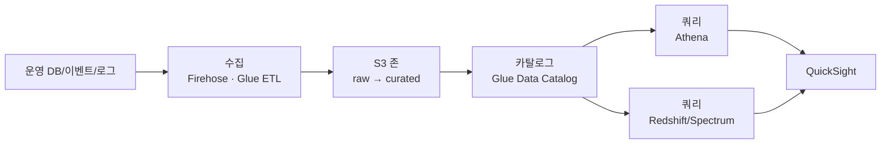

각 단계의 선택 근거: **수집**은 준실시간 스트림이면 Amazon Data Firehose(50.3절)로 S3에 바로 적재하고, 배치 변환이 필요하면 Glue ETL(49.4절)을 거친다. **저장**은 raw(원본 그대로)와 curated(정제·파티셔닝·컬럼형 변환 완료) 존으로 나누는 것이 최소 구성이며, 존 세분화·수명주기 정책은 **52장(데이터 레이크)**에서 이어받는 설계 영역이다. **카탈로그**는 Glue Data Catalog 하나로 Athena·Spectrum이 스키마 정의를 공유해 중복 정의를 없앤다. **쿼리**는 애드혹은 Athena, 정형화된 반복 리포트·로컬 데이터 조인은 Redshift(Spectrum 포함)로 나눈다(51.10절 결정 트리). **시각화**는 QuickSight가 SPICE 또는 구체화 뷰로 쿼리 엔진 부하를 흡수한 상태로 최종 소비자에게 전달한다.

| 단계 | 비용 축 | 지연 특성 |
|---|---|---|
| 수집(Firehose/Glue) | 처리 데이터량·DPU-시간 | 초\~분 단위(Firehose 버퍼링 기준) |
| 저장(S3) | 저장 용량·스토리지 클래스 | 해당 없음(저장 자체는 지연 없음) |
| 카탈로그(Glue) | 카탈로그 객체 수·요청 수(대체로 저비용) | 밀리초\~초 단위(메타데이터 조회) |
| 쿼리(Athena) | 스캔 바이트 | 초 단위(파티션·포맷 최적화 여부에 크게 좌우) |
| 쿼리(Redshift) | 클러스터/RPU 시간 | 밀리초\~초 단위(구체화 뷰·캐시 적중 시 더 빠름) |
| 시각화(QuickSight) | SPICE 용량·사용자 라이선스 | SPICE는 즉시, Direct Query는 원본 쿼리 지연에 종속 |

이 표에서 보듯 파이프라인 전체의 비용과 지연은 특정 한 서비스가 아니라 **단계마다 다른 축(데이터량, 스캔량, 컴퓨트 시간, 라이선스)에서 발생**하므로, 병목 하나만 보고 판단하지 말고 전체 흐름에서 어느 단계가 실제로 비용·지연을 지배하는지 계측한 뒤 최적화 대상을 정해야 한다.

### 51장 정리

#### [필수] 반드시 알아야 할 것
1. Redshift는 리더 노드가 계획을 세우고 컴퓨트 노드의 슬라이스가 병렬 실행하는 MPP 구조이며, RA3(관리형 스토리지)가 신규 구축의 기본 선택지다.
2. 분산 스타일(KEY/ALL/EVEN/AUTO)과 정렬 키(단일/복합/AUTO) 선택이 인스턴스 크기보다 Redshift 성능을 더 크게 좌우한다.
3. Redshift의 PRIMARY KEY/FOREIGN KEY는 강제되지 않고 옵티마이저 힌트로만 쓰인다 — 무결성은 적재 파이프라인이 책임진다.
4. Athena는 스캔한 바이트에 과금되며, 파티셔닝·컬럼형 포맷·컬럼 선택은 전부 스캔량을 줄이기 위한 수단이다.
5. Athena 최적화 11가지(파티션, 버케팅, 압축, 파일 크기, 컬럼형 생성, 컬럼 선택, 프레디케이트 푸시다운, ORDER BY, JOIN, GROUP BY, 근사 함수)는 모두 "적은 바이트로 같은 답을 낸다"는 원칙으로 수렴한다.
6. Athena와 Redshift Spectrum은 Glue Data Catalog를 공유하지만, Spectrum은 기존 클러스터를 전제로 로컬 테이블과의 조인이 가능하다는 점이 결정적 차이다.
7. QuickSight SPICE는 원본과 조회 부하를 분리하고, 직접 쿼리는 최신이지만 부하를 원본에 그대로 전가한다.
8. 워크그룹의 데이터 스캔 한도(쿼리별·워크그룹별)는 Athena 요금 사고를 막는 가장 직접적인 통제 수단이다.

#### [팁] 실무 노하우
1. 조인 키를 DISTKEY로, 자주 필터링하는 컬럼을 SORTKEY로 잡는 것을 출발점으로 삼고, 확신이 없으면 AUTO로 시작해 쿼리 패턴을 관찰한 뒤 조정한다.
2. COPY 로드 파일 수는 슬라이스 수의 배수로 맞추고 매니페스트로 로드 대상을 명시해 병렬성과 재현성을 확보한다.
3. 반복 집계 쿼리는 구체화 뷰(자동 갱신·자동 재작성)로 미리 계산해두면 애플리케이션을 바꾸지 않고도 비용을 낮출 수 있다.
4. Athena 원본이 CSV/JSON이면 CTAS로 Parquet 테이블을 만들어두고 이후 반복 쿼리는 그 테이블을 대상으로 한다.
5. 근사치로 충분한 지표(순 사용자 수 등)는 `approx_distinct`로 정확한 COUNT(DISTINCT)의 셔플 비용을 피한다.
6. BI 도구를 Redshift에 직접 붙이기 전에 SPICE 또는 집계 테이블·구체화 뷰로 원본 클러스터를 대시보드 트래픽으로부터 보호한다.
7. Athena 워크그룹을 팀·프로젝트별로 나누고 스캔 한도·태그·엔진 버전을 워크그룹 단위로 관리한다.

#### [주의] 사고·비용·설계 함정
1. `SELECT *`와 파티션 없는 테이블 쿼리는 컬럼형 포맷의 이점을 스스로 없애고 Athena 비용을 곧바로 키운다.
2. DISTKEY를 조인에 쓰지 않는 컬럼으로 잘못 지정하면 조인마다 대규모 재분배가 발생해 클러스터를 키워도 해결되지 않는다.
3. Redshift 노드 타입·클러스터 크기 변경은 다운타임 또는 장시간 리사이즈를 수반한다 — Serverless나 RA3의 유연성으로 이 리스크를 줄여야 한다.
4. Athena 워크그룹에 스캔 한도를 걸지 않으면 실수로 작성한 풀스캔 쿼리 하나가 예상치 못한 청구서로 이어질 수 있다.
5. Federated Query는 Lambda의 실행 시간·동시성 한도에 종속되므로 대량 스캔·고빈도 쿼리에 상시 사용하면 소스와 Lambda 양쪽에 부하를 유발한다.
6. Athena는 대량 소파일·깊은 중첩 JSON에서 급격히 느려진다 — 수집 단계에서 파일 병합과 Parquet 정규화를 병행해야 한다.
7. QuickSight를 Direct Query로 Redshift에 붙이면 다수 사용자의 동시 대시보드 조회가 클러스터 동시성을 소진해 다른 워크로드를 지연시킨다.
8. QuickSight SPICE 용량과 사용자 라이선스는 별도 과금 축이므로 사용자 수·데이터 규모 증가 시 비용 모델을 재확인해야 한다.
9. PRIMARY KEY/FOREIGN KEY가 강제되지 않는다는 점을 잊고 적재 파이프라인에서 정합성 검증을 생략하면, 옵티마이저가 잘못된 가정으로 부정확한 계획을 세울 수 있다.

#### 한 장 요약
Redshift는 리더/컴퓨트 노드와 슬라이스로 구성된 MPP 웨어하우스로, 분산 키·정렬 키·압축 인코딩이라는 물리 설계가 성능을 좌우하고 WLM·동시성 스케일링·구체화 뷰·자동 테이블 최적화가 그 위에서 워크로드를 조율한다. Athena는 서버리스로 S3 데이터를 스캔 바이트 과금으로 조회하며, 파티셔닝·컬럼형 포맷·컬럼 선택을 비롯한 11가지 최적화가 전부 스캔량 감소라는 한 원칙에서 나온다. Redshift Spectrum과 Athena는 같은 Glue Data Catalog를 공유하되 로컬 데이터 조인 가능 여부로 선택이 갈리고, Federated Query는 Lambda 커넥터의 한도 안에서만 유효하다. QuickSight는 SPICE로 원본 웨어하우스를 대시보드 부하로부터 보호하거나, 직접 쿼리로 최신성을 우선할 수 있으며, 어느 쪽이든 원본 테이블을 매번 통째로 스캔하는 대시보드 설계는 웨어하우스 자체를 마비시키는 흔한 실패 패턴이다.

#### 다음 장 예고
52장은 이 장에서 전제로만 남겨둔 S3 존 설계와 Glue Data Catalog·Lake Formation 권한 모델을 데이터 레이크·레이크하우스·데이터 메시라는 더 넓은 아키텍처 관점에서 다룬다.

---

## 52장. 데이터 레이크 · 레이크하우스 · 데이터 메시  ★★★★

> **이 장에서 다루는 것**
> 51장이 정형 데이터를 웨어하우스와 쿼리 엔진으로 소비하는 관점을 다뤘다면, 이 장은 그보다 앞단 — 다양한 형식·다양한 출처의 원본 데이터를 어떻게 축적하고 통제 가능한 자산으로 만드는가 — 를 다룬다. 데이터 레이크의 정의와 존 설계, Lake Formation을 통한 세밀한 접근 제어, 레이크를 "일단 다 모으는 창고"에서 신뢰 가능한 플랫폼으로 만드는 베스트 프랙티스와 지표를 순서대로 본 뒤, 레이크의 약점(트랜잭션 부재)을 보완하는 레이크하우스, 조직 구조 자체를 바꾸는 데이터 메시로 확장한다. 49장(EMR/Glue)·50장(스트리밍)·51장(웨어하우스)의 산출물이 이 장에서 설계하는 존과 카탈로그에 적재된다는 전제로 읽는다.

### 52.1 데이터 레이크의 정의와 목적

데이터 레이크(data lake)는 정형·반정형·비정형 데이터를 원본 형식 그대로, 대규모로, 저비용에 저장하고 사용 시점에 스키마를 적용하는 저장소다. 핵심은 **스키마 온 리드(schema-on-read)** — 데이터를 넣을 때는 구조를 강제하지 않고, 읽을 때 필요한 스키마를 적용한다는 개념이다. 이는 데이터 웨어하우스의 **스키마 온 라이트(schema-on-write)**와 정확히 반대되는 접근이며, 두 모델은 경쟁 관계가 아니라 서로 다른 문제를 푼다.

| 구분 | 데이터 레이크 | 데이터 웨어하우스 |
|---|---|---|
| 스키마 적용 시점 | 온 리드(읽을 때 적용) | 온 라이트(적재 전 정의·검증) |
| 저장 데이터 유형 | 정형·반정형·비정형 원본 그대로 | 정제·모델링된 정형 데이터 |
| 대표 저장소 | S3 (사실상 무제한, 객체 단위) | Redshift(컬럼형, 관리형 클러스터/서버리스) |
| 주 사용자 | 데이터 엔지니어, 데이터 사이언티스트, ML 엔지니어 | 분석가, BI 사용자, 경영진 |
| 쿼리 방식 | Athena/Spark 등 다양한 엔진이 필요할 때만 접근 | SQL 중심, 상시 접근·대시보드 |
| 비용 구조 | 저장은 저렴, 스캔량에 과금(엔진에 따라) | 컴퓨트(클러스터/RPU) 상시 또는 온디맨드 과금 |
| 유연성 | 새 분석 도구·ML 프레임워크를 자유롭게 연결 | 스키마 변경 시 ETL 재작업 필요 |
| 데이터 신뢰도 | 카탈로그·거버넌스 없이는 낮음 | 적재 파이프라인이 이미 검증을 거침 |

데이터 레이크가 필요한 이유는 세 가지로 요약된다. 첫째, **사일로 해소**다. 부서마다 흩어진 데이터베이스·로그·SaaS 익스포트를 하나의 저장소에 모으면 부서 간 데이터 접근을 위해 매번 새 파이프라인을 만드는 비용이 사라진다. 둘째, **원본 보존**이다. 웨어하우스에 적재하는 순간 원본의 일부 정보(비정규화 이전 필드, raw 로그의 세부 항목)가 손실될 수 있는데, 레이크는 원본을 그대로 남겨 나중에 다른 방식으로 재처리할 수 있게 한다. 셋째, **다양한 분석 도구와의 호환**이다. SQL 엔진(Athena, Redshift Spectrum)뿐 아니라 Spark, ML 프레임워크, 커스텀 애플리케이션이 같은 S3 객체를 각자 방식으로 읽을 수 있다.

문제는 이 유연함이 정확히 **데이터 스웜프(data swamp)**로 전락하는 조건이기도 하다는 점이다. 다음 조건이 하나라도 충족되면 레이크는 스웜프가 된다.

- 카탈로그가 없거나 최신 상태가 아니어서, 어떤 데이터가 어디 있는지 검색할 수 없다.
- 존(zone) 구분 없이 원본과 가공본이 뒤섞여, 어느 것이 신뢰 가능한 버전인지 알 수 없다.
- 접근 제어가 버킷 단위로만 걸려 있어, 세밀한 권한 부여가 불가능하다.
- 보존·삭제 정책이 없어 데이터가 무기한 쌓이기만 하고 규정 준수 요구(개인정보 삭제권 등)에 대응할 수 없다.
- 데이터 품질 검증이 없어 소비자가 매번 직접 데이터를 검증해야 한다.

**[필수]** 데이터 레이크와 데이터 스웜프를 가르는 것은 저장 기술이 아니라 **카탈로그와 거버넌스**다. 이어지는 절들은 이 경계선을 실제로 어떻게 긋는지를 다룬다.

### 52.2 구성 요소와 존(zone) 설계: Raw / Cleansed / Curated / Sandbox

데이터 레이크는 단일 서비스가 아니라 여러 레이어의 조합이다. **수집(ingestion)** 레이어는 배치(Glue ETL, 49장)와 스트리밍(Firehose/Flink, 50장)으로 원본을 끌어오고, **저장(storage)** 레이어는 S3에 존 단위로 분리해 담는다. **카탈로그(catalog)** 레이어는 Glue Data Catalog가 스키마·파티션 메타데이터를 관리하고, **처리(processing)** 레이어는 EMR/Glue/Athena가 존 간 데이터를 변환하며, **소비(consumption)** 레이어는 Athena·Redshift Spectrum·QuickSight·SageMaker가 데이터를 읽는다. 마지막으로 **거버넌스(governance)** 레이어 — Lake Formation, Macie, DataZone — 가 이 모든 레이어를 가로질러 접근 제어와 데이터 발견을 담당한다.

저장 레이어는 통상 4단계 존으로 나눈다.

| 존 | 목적 | 데이터 형태 | 접근 범위 | 보존 정책 |
|---|---|---|---|---|
| Raw / Landing | 원본을 있는 그대로 보관 | 원본 포맷(CSV, JSON, 로그 등), 무변환 | 데이터 엔지니어링 팀만 | 장기 보존, **불변(immutable)** |
| Cleansed / Standardized | 형식 표준화·중복 제거·PII 마스킹 | Parquet/ORC로 변환, 스키마 통일 | 엔지니어링 + 인증된 분석가 | 정책에 따른 보존(예: 1~3년) |
| Curated / Conformed | 비즈니스 로직 적용, 조인·집계 완료 | 도메인별 정제 테이블, 데이터 마트 | 분석가·BI·애플리케이션 | 비즈니스 요구에 따른 보존 |
| Sandbox | 실험적 분석, 임시 산출물 | 자유 형식 | 요청한 개인/팀만, 임시 | 단기(예: 30~90일 후 자동 삭제) |

**[필수]** 원본(Raw)은 **불변**으로 보존한다. 한 번 Raw에 적재된 객체는 수정하지 않고, 재처리가 필요하면 Cleansed 이후 단계를 다시 돌린다. 이것이 레이크의 핵심 가치 — 처리 로직에 버그가 있었다는 사실을 나중에 알게 돼도 원본에서 다시 시작할 수 있다는 것 — 를 지켜준다. Raw 버킷에는 쓰기 후 삭제/덮어쓰기를 막는 S3 객체 잠금(Object Lock) 또는 버저닝을 적용하는 것이 일반적이다.

S3 버킷·프리픽스 레이아웃은 도메인/데이터셋/버전/파티션 순서로 계층화하는 것이 검색성과 파티션 프루닝 양쪽에 유리하다.

```text
s3://company-datalake-raw-ap-northeast-2/
  ├── domain=orders/
  │   └── dataset=order_events/
  │       └── ingest_date=2026-09-01/
  │           └── part-00000.json.gz
  └── domain=payments/
      └── dataset=transactions/
          └── ingest_date=2026-09-01/
              └── part-00000.json.gz

s3://company-datalake-curated-ap-northeast-2/
  └── domain=orders/
      └── dataset=order_summary/
          └── version=v2/
              └── year=2026/month=09/day=01/
                  └── part-00000.snappy.parquet
```

Raw는 수집 시각(`ingest_date`) 기준 파티션이, Curated는 비즈니스 날짜(`year/month/day`) 기준 파티션이 자연스럽다. `version=` 프리픽스는 스키마가 크게 바뀔 때 이전 버전을 유지한 채 신규 버전을 나란히 두어 하류 소비자의 전환을 점진적으로 진행하게 해준다. 이 존 구조와 레이어 구성은 51.12절의 레퍼런스 아키텍처("raw → curated" 2단 구조)를 세분화한 것이며, 실제 조직에서는 데이터 민감도와 팀 수에 따라 Cleansed·Sandbox 존을 추가하거나 생략한다.

존별 보존 정책은 선언만으로 끝나지 않고 S3 수명주기 정책으로 실제 강제해야 의미가 있다. 예를 들어 Sandbox 존은 다음과 같이 일정 기간 이후 자동 삭제하도록 구성해, 실험 산출물이 무기한 방치되는 것을 막는다.

```json
{
  "Rules": [
    {
      "ID": "sandbox-auto-expire",
      "Filter": { "Prefix": "domain=" },
      "Status": "Enabled",
      "Expiration": { "Days": 90 }
    },
    {
      "ID": "raw-transition-to-ia",
      "Filter": { "Prefix": "domain=" },
      "Status": "Enabled",
      "Transitions": [
        { "Days": 30, "StorageClass": "STANDARD_IA" },
        { "Days": 180, "StorageClass": "GLACIER" }
      ]
    }
  ]
}
```

Raw 버킷은 삭제가 아니라 스토리지 클래스 전환만 적용하는 것이 원칙이다(불변성 유지). Sandbox 버킷만 `Expiration`으로 실제 삭제를 건다. 소비 레이어에서 Athena·QuickSight가 Curated 존을 조회할 때 Cleansed·Raw 존에는 접근 권한 자체를 부여하지 않는 것이 일반적 구성이며, 이는 52.3절의 Lake Formation 권한 모델로 구현한다.

### 52.3 AWS Lake Formation

버킷·프리픽스 단위 IAM 정책만으로는 "이 테이블의 이 컬럼은 이 그룹만" 같은 요구를 표현할 수 없다. **AWS Lake Formation**은 Glue Data Catalog 위에 세밀한 권한 계층을 얹어 이 문제를 해결하는 서비스다.

핵심 개념은 다음과 같다.

- **데이터 레이크 관리자(data lake administrator)**: Lake Formation 권한 부여를 관리할 수 있는 최상위 역할. 계정당 최소 인원에게만 부여한다.
- **등록된 위치(registered location)**: Lake Formation이 관리할 S3 경로를 등록하면, 그 경로에 대한 접근이 IAM 정책 대신 Lake Formation 권한 모델을 따르게 된다.
- **권한 위임(permission grant)**: 데이터베이스·테이블 단위로 `SELECT`, `DESCRIBE`, `INSERT` 같은 권한을 IAM 주체나 IAM Identity Center 사용자/그룹에 부여한다.
- **테이블·컬럼·행·셀 수준 권한**: 컬럼 단위(특정 컬럼 제외/포함), 행 단위(데이터 필터로 행 조건 지정), 최신 버전에서는 셀 단위까지 세분화된 접근 제어가 가능하다.
- **LF-Tags 기반 태그 부여 접근 제어(TBAC, tag-based access control)**: 데이터베이스·테이블·컬럼에 `department=finance`, `sensitivity=pii` 같은 태그를 붙이고, 권한을 태그 조건("`sensitivity != pii`인 모든 테이블에 SELECT")으로 부여한다. 테이블이 수백 개로 늘어도 테이블마다 권한을 재설정할 필요 없이 태그 정책만 유지하면 되므로 대규모 레이크에서는 사실상 필수적인 관리 방식이다.
- **계정 간 공유(cross-account sharing)**: Lake Formation 권한을 다른 AWS 계정에 위임해, 별도 데이터 복제 없이 테이블을 공유한다(데이터 메시 구현의 기반, 52.7절).
- **데이터 필터(data filter)**: 행·컬럼 조합을 지정해 같은 테이블이라도 사용자 그룹마다 다른 부분집합만 보이게 한다.
- **블루프린트(blueprint)와 워크플로**: 관계형 데이터베이스나 로그 소스에서 레이크로 데이터를 적재하는 표준화된 Glue 워크플로 템플릿. 반복적인 수집 파이프라인을 코드 작성 없이 구성한다.

Lake Formation은 Glue Data Catalog를 대체하지 않고 그 위에 권한 레이어를 얹는 관계다. 카탈로그의 메타데이터(테이블·파티션 정의)는 그대로 Glue가 관리하고, Lake Formation은 "누가 그 메타데이터가 가리키는 데이터에 접근할 수 있는가"만 통제한다. 블루프린트는 이 카탈로그 등록 과정 자체를 표준화한다 — 예를 들어 RDS 데이터베이스 소스 블루프린트를 선택하면 증분 적재(변경분만 가져오는 방식) 여부, 소스 테이블, 대상 S3 경로, 스케줄을 입력값으로 지정하는 것만으로 Glue 크롤러·잡·워크플로 세트가 자동 생성되므로, 신규 수집 파이프라인마다 ETL 스크립트를 처음부터 작성할 필요가 없다.

```bash
# LF-Tag 생성: 민감도 태그를 정의
aws lakeformation create-lf-tag \
  --tag-key "sensitivity" \
  --tag-values "public" "internal" "pii"

# 테이블에 LF-Tag 부여 (orders 데이터베이스의 customers 테이블에 pii 태그)
aws lakeformation add-lf-tags-to-resource \
  --resource '{"Table":{"CatalogId":"123456789012","DatabaseName":"orders","Name":"customers"}}' \
  --lf-tags '[{"TagKey":"sensitivity","TagValues":["pii"]}]'

# 분석가 그룹에는 sensitivity=internal 태그가 붙은 리소스에만 SELECT 부여
aws lakeformation grant-permissions \
  --principal '{"DataLakePrincipalIdentifier":"arn:aws:iam::123456789012:role/AnalystRole"}' \
  --resource '{"LFTagPolicy":{"CatalogId":"123456789012","ResourceType":"TABLE","Expression":[{"TagKey":"sensitivity","TagValues":["internal"]}]}}' \
  --permissions "SELECT"
```

동일한 `customers` 테이블이라도 지역별 담당 조직에는 자신이 담당하는 국가의 행만 보여줘야 하는 경우가 있다. 이럴 때는 데이터 필터로 행 조건을 지정하고, 그 필터를 특정 주체에게 부여한다.

```bash
# 데이터 필터 생성: country 컬럼이 'KR'인 행만 노출
aws lakeformation create-data-cells-filter \
  --table-data '{
    "TableCatalogId": "123456789012",
    "DatabaseName": "orders",
    "TableName": "customers",
    "Name": "kr-region-only",
    "RowFilter": { "FilterExpression": "country = '\''KR'\''" },
    "ColumnWildcard": { "ExcludedColumnNames": ["national_id"] }
  }'
```

이 필터는 `national_id` 같은 민감 컬럼을 열 단위로 제외하는 동시에 `country = 'KR'`인 행만 노출하므로, 컬럼·행 권한을 하나의 리소스로 묶어 지역 담당 조직에 부여할 수 있다. 이렇게 만든 필터는 `grant-permissions` 호출에서 `DataCellsFilter` 리소스 타입으로 지정해 특정 IAM 역할에 위임한다.

기존에 IAM 정책만으로 S3/Glue 접근을 통제해오던 계정은 **IAM 전용 모드에서 Lake Formation 모드로 전환**할 때 주의가 필요하다. 전환 시점부터 등록된 위치에 대한 접근은 Lake Formation 권한이 우선하므로, 사전에 기존 IAM 주체들에게 상응하는 Lake Formation 권한을 부여해두지 않으면 기존 파이프라인이 갑자기 접근 거부를 받는다. 신규 카탈로그 리소스는 기본적으로 생성자만 접근 가능하도록 바뀌는 경우가 있으므로, 전환 전에 반드시 하이브리드 접근 모드(기존 IAM 권한 유지 옵션)로 테스트한 뒤 단계적으로 전환하는 것이 일반적이다.

### 52.4 데이터 레이크 베스트 프랙티스 10가지

원서가 제시하는 10가지 베스트 프랙티스는 레이크가 스웜프로 전락하지 않도록 조직이 갖춰야 할 운영 규율이다.

**① 중앙 집중 데이터 관리**: 부서마다 독립된 S3 버킷과 카탈로그를 운영하면 같은 데이터가 여러 곳에 중복 저장되고 어느 것이 최신인지 알 수 없다. Lake Formation과 단일 Glue Data Catalog로 조직 전체 메타데이터를 한곳에 모으고, 계정을 분리하더라도 카탈로그 등록과 권한 위임은 중앙에서 관리되는 하나의 모델을 따르게 한다. 실패 사례: 팀마다 별도 버킷·명명 규칙을 쓰다가 동일 고객 데이터가 세 곳에 다른 스키마로 존재하게 되고, 어느 팀도 서로의 정의를 신뢰하지 못해 매번 원본 소스에서 재수집하는 낭비가 반복된 경우.

**② 데이터 거버넌스**: 누가 어떤 데이터를 소유하고, 누가 접근을 승인하고, 어떻게 변경을 추적하는지에 대한 정책이다. Lake Formation 권한 모델 + DataZone의 데이터 소유자/승인 워크플로가 기술적 뒷받침이며, 신규 데이터셋이 카탈로그에 오르는 순간 소유자·민감도 등급·보존 기간이 자동으로 함께 기록되도록 온보딩 절차를 설계하는 것이 핵심이다. 실패 사례: 소유자가 불분명해 스키마 변경 시 누구에게 승인받아야 할지 몰라 무단 변경이 반복되고, 문제가 터진 뒤에야 담당자를 찾아 나선 경우.

**③ 데이터 카탈로깅**: Glue 크롤러로 스키마를 자동 추론·등록하고, 태그·설명·소유자 메타데이터를 채워 검색 가능하게 한다. 크롤러는 일회성 실행이 아니라 소스 변경 주기에 맞춰 스케줄링해 스키마 드리프트를 자동으로 반영해야 한다. 실패 사례: 크롤러를 한 번만 돌리고 이후 스키마 변경을 반영하지 않아 카탈로그와 실제 데이터가 어긋나고, 분석가가 존재하지 않는 컬럼을 참조해 쿼리가 실패하는 일이 반복된 경우.

**④ 데이터 품질 관리**: Glue Data Quality 같은 도구로 규칙을 정의하고 자동 검증하며(52.9절에서 구체화), 검증 결과 자체를 지표로 축적해 시간에 따른 품질 추세를 추적한다. 실패 사례: NULL 비율이 급증한 소스를 그대로 커브레이티드 존까지 흘려보내 하류 대시보드 수치가 왜곡됐는데도, 경보가 없어 여러 주 동안 아무도 알아차리지 못한 경우.

**⑤ 데이터 보안**: 저장 암호화(SSE-KMS), 전송 암호화(TLS), 세밀한 접근 제어(Lake Formation), PII 탐지(Macie, → 31장)를 결합한다. 여기서 보안은 버킷 경계를 지키는 것을 넘어, 같은 테이블 안에서도 컬럼·행 단위로 누가 무엇을 볼 수 있는지 통제하는 것까지 포함한다. 실패 사례: 버킷 정책만 믿고 컬럼 단위 마스킹을 하지 않아 분석가 전원이 주민등록번호 컬럼을 그대로 조회할 수 있었고, 감사 시점에야 그 사실이 드러난 경우.

**⑥ 데이터 수집**: 소스별로 배치(Glue)·스트리밍(Firehose/Flink)을 구분하고, 수집 시점에 스키마 검증·PII 태깅을 수행한다. 수집 단계에서 이미 문제 있는 레코드를 걸러내면 하류 존에서 반복적으로 같은 오류를 재처리하는 비용을 없앨 수 있다. 실패 사례: 원본 검증 없이 그대로 적재해 스키마가 깨진 레코드가 하류 ETL을 연쇄적으로 실패시키고, 원인 파악에 원본 로그까지 거슬러 올라가야 했던 경우.

**⑦ 확장성**: S3의 사실상 무제한 용량과 EMR/Glue/Athena의 서버리스·오토스케일 특성을 활용해 데이터 증가에 맞춰 컴퓨트를 탄력적으로 늘린다. 고정 크기 인프라를 예약해두는 대신 워크로드가 실제로 필요할 때만 컴퓨트를 소비하는 구조로 설계하면 데이터 증가율을 예측하는 부담 자체가 줄어든다. 실패 사례: 고정 크기 EMR 클러스터를 유지하다가 데이터 증가로 배치 작업이 SLA를 넘기기 시작했는데도 클러스터 재설계 대신 야근으로 버틴 경우.

**⑧ 비용 최적화**: S3 스토리지 클래스 전환(Intelligent-Tiering, Glacier), 파일 포맷·크기 최적화(49장), 쿼리 스캔량 최소화(51장)를 병행한다. 저장 비용과 쿼리 비용은 서로 다른 축이므로 한쪽만 최적화하고 방치하면 전체 비용 절감 효과가 제한적이다. 실패 사례: 접근 빈도가 낮아진 오래된 Raw 데이터를 표준 스토리지 클래스에 무기한 방치해 저장 비용이 계속 증가했는데, 수명주기 정책 하나만 걸었으면 막을 수 있었던 경우.

**⑨ 성능 최적화를 위한 모니터링**: 파이프라인 실행 시간, 쿼리 스캔량, 카탈로그 조회 지연 등을 CloudWatch로 계측하고 임계값 알람을 건다. 지표를 수집만 하고 알람 임계값을 정하지 않으면 데이터는 쌓이지만 아무도 이상 징후를 조기에 발견하지 못한다. 실패 사례: 파이프라인 실패를 담당자가 수동으로 확인하기 전까지 며칠간 알아채지 못해 하류 리포트가 오래된 데이터로 갱신됐고, 경영진 보고 직전에야 발견된 경우.

**⑩ 유연한 데이터 처리**: 배치·스트리밍·대화형 쿼리·ML 훈련 등 다양한 처리 패턴을 하나의 저장소 위에서 지원하도록 설계한다(엔진을 특정 포맷·구조에 고정하지 않음). 개방형 포맷(Parquet, Iceberg)을 표준으로 삼으면 이후 새로운 처리 엔진이 등장해도 데이터를 다시 만들 필요 없이 그대로 연결할 수 있다. 실패 사례: 특정 BI 도구 전용 포맷으로만 커브레이티드 데이터를 저장해 ML 파이프라인이 별도로 데이터를 재수집·재변환해야 했고, 결과적으로 같은 데이터의 사본이 두 벌 생긴 경우.

**[주의]** "일단 다 모으자"는 이 10가지 중 최소 절반(②③④⑤⑧)을 건너뛰겠다는 말과 같다. 비용과 규정 리스크를 동시에 키우는 결정이므로, 신규 소스를 레이크에 연결할 때마다 최소한 소유자·보존 기간·PII 여부를 사전에 정의하는 체크리스트를 통과시켜야 한다.

### 52.5 데이터 레이크 핵심 지표

레이크가 건강한지 판단하려면 다음 지표를 지속적으로 계측해야 한다.

| 지표 | 의미 | 수집 방법 | 목표 설정 방향 |
|---|---|---|---|
| 데이터 신선도(freshness) | 소스 발생 시각과 레이크 반영 시각의 차이 | 소스 이벤트 타임스탬프 vs 적재 완료 타임스탬프 비교 | 소비자의 SLA(예: 대시보드는 1시간 이내) 역산 |
| 수집 지연(ingestion latency) | 파이프라인 시작~완료까지 소요 시간 | Glue Job/EMR Step/Firehose 배달 스트림의 CloudWatch 지표 | 배치 주기 대비 여유 마진 확보(예: 일배치는 실행시간 < 4시간) |
| 파이프라인 성공률 | 스케줄된 실행 중 정상 완료 비율 | Glue/Step Functions 실행 이력, EventBridge 실패 이벤트 | 99% 이상, 실패 시 자동 재시도·알림 |
| 카탈로그 커버리지 | 전체 데이터셋 중 카탈로그에 등록·문서화된 비율 | Glue Data Catalog 테이블 수 vs 실제 S3 프리픽스 수 대조 | 100%에 근접, 신규 소스는 등록 전 반입 금지 |
| 품질 규칙 통과율 | Glue Data Quality/커스텀 규칙 통과 비율 | DQDL 규칙 실행 결과(52.9절) | 존별 차등(Curated는 Cleansed보다 엄격) |
| 스캔 비용/쿼리 | 쿼리 1건당 평균 스캔 바이트 및 비용 | Athena `DataScannedInBytes` 지표, CloudTrail | 파티셔닝·포맷 개선 후 감소 추세 확인(51장) |
| 활성 사용자·데이터셋 활용률 | 실제로 조회되는 데이터셋과 전체 카탈로그 등록 데이터셋의 비율 | Athena/Lake Formation 접근 로그, DataZone 사용 통계 | 낮은 활용률 데이터셋은 보존 정책 재검토 대상 |
| 저장 계층 분포 | 스토리지 클래스별(Standard/IA/Glacier) 데이터 비율 | S3 Storage Lens | 접근 빈도에 맞는 계층 전환 자동화(수명주기 정책) |

이 지표들은 별도 대시보드로 모으는 것이 좋다. 특히 카탈로그 커버리지와 활용률은 "쌓기만 하고 아무도 쓰지 않는" 스웜프 징후를 조기에 드러내는 선행 지표다. 지표는 수집 자체보다 **누가 언제 보고 무엇을 하는가**가 더 중요하다 — 예를 들어 파이프라인 성공률이 임계값 아래로 떨어지면 데이터 엔지니어링 팀에 즉시 알림이 가야 하고, 스캔 비용/쿼리가 특정 기간 동안 급증하면 해당 쿼리를 작성한 팀에 파티셔닝 개선을 요청하는 절차로 이어져야 한다. 지표를 대시보드에만 띄워두고 임계값 알람과 담당자 연결을 생략하면, 52.4절 ⑨ 항목이 지적한 실패("파이프라인 실패를 며칠간 알아채지 못한 경우")가 그대로 반복된다.

### 52.6 레이크하우스 아키텍처

데이터 레이크의 근본적 한계는 S3가 파일 시스템일 뿐 트랜잭션을 이해하지 못한다는 점이다. 여러 잡이 같은 파티션을 동시에 쓰면 부분 쓰기가 노출되고, 특정 행만 업데이트·삭제하려면 파일 전체를 다시 써야 하며, 스키마 변경 이력을 추적할 방법이 없다. **레이크하우스(lakehouse)**는 S3 위에 **개방형 테이블 포맷(open table format)**을 얹어 ACID 트랜잭션, 스키마 진화, 시간 여행(time travel)을 데이터 웨어하우스 수준으로 지원하면서도 레이크의 저비용·개방성을 유지하는 접근이다.

| 특성 | Apache Iceberg | Apache Hudi | Delta Lake |
|---|---|---|---|
| ACID 트랜잭션 | 지원(스냅샷 격리) | 지원 | 지원 |
| 스키마 진화 | 컬럼 추가/삭제/이름변경/타입 확장을 안전하게 지원 | 지원(일부 제약) | 지원 |
| 시간 여행 | 스냅샷 ID/타임스탬프로 과거 조회 | 지원(타임라인 기반) | 지원(버전/타임스탬프) |
| 업서트(upsert)/삭제 | 지원(merge-on-read/copy-on-write) | 강점(원래 업서트 특화로 설계) | 지원 |
| 컴팩션 | 별도 프로시저로 수행 | Compaction 서비스 내장 | `OPTIMIZE` 명령 |
| 파티션 진화 | 지원(파티션 스펙 변경 후에도 과거 데이터 재작성 불필요) | 제한적 | 제한적 |
| AWS 서비스 지원 수준 | Athena·EMR·Glue·Redshift·S3 Tables까지 폭넓게 통합 | EMR·Glue에서 지원 | EMR·Glue에서 지원(커넥터 경유) |

세 포맷 모두 오픈소스이며 기능적으로 수렴하는 추세이지만, 2026년 상반기 기준 AWS 서비스와의 통합 폭은 **Iceberg**가 가장 넓다 — Athena에서 직접 `CREATE TABLE ... TBLPROPERTIES ('table_type'='ICEBERG')`로 생성·쿼리하고, EMR과 Glue ETL이 네이티브로 다루며, Redshift가 Iceberg 테이블을 직접 조회하고, S3 Tables(Iceberg 전용 관리형 테이블 스토리지)가 컴팩션·스냅샷 관리를 자동화해준다. 이 때문에 신규 레이크하우스 구축 시 기본 선택지로 Iceberg를 검토하는 경우가 많다(단, 조직에 이미 Hudi/Delta 기반 파이프라인이 있다면 전환 비용을 고려해야 한다).

```sql
-- Athena에서 Iceberg 테이블 생성 (S3 기반, 파티션은 날짜 컬럼의 일 단위 변환)
CREATE TABLE orders_iceberg (
  order_id     string,
  customer_id  string,
  amount       decimal(10,2),
  order_date   timestamp
)
PARTITIONED BY (day(order_date))
LOCATION 's3://company-datalake-curated-ap-northeast-2/domain=orders/dataset=orders_iceberg/'
TBLPROPERTIES (
  'table_type' = 'ICEBERG',
  'format' = 'parquet'
);

-- 업서트: 기존 주문 상태 갱신 + 신규 주문 삽입을 한 번에 처리
MERGE INTO orders_iceberg t
USING (
  SELECT 'ord-1001' AS order_id, 'cust-77' AS customer_id, 129.00 AS amount, TIMESTAMP '2026-09-01 10:00:00' AS order_date
) s
ON t.order_id = s.order_id
WHEN MATCHED THEN UPDATE SET amount = s.amount
WHEN NOT MATCHED THEN INSERT (order_id, customer_id, amount, order_date)
  VALUES (s.order_id, s.customer_id, s.amount, s.order_date);

-- 시간 여행: 특정 스냅샷 시점의 데이터 조회 (감사·재현용)
SELECT *
FROM orders_iceberg FOR TIMESTAMP AS OF TIMESTAMP '2026-08-15 00:00:00';
```

레이크하우스 운영에서 놓치기 쉬운 두 가지가 소규모 파일 컴팩션과 스냅샷 만료다. 업서트가 반복되면 작은 파일과 삭제 마커가 누적돼 쿼리 성능이 서서히 저하되고, 오래된 스냅샷을 정리하지 않으면 S3 저장 비용이 계속 불어난다.

```sql
-- 소규모 파일 컴팩션: 목표 파일 크기로 재작성
ALTER TABLE orders_iceberg EXECUTE optimize;

-- 오래된 스냅샷 만료 (7일 이전 스냅샷 제거, 시간 여행 범위도 그만큼 줄어듦)
ALTER TABLE orders_iceberg
  EXECUTE expire_snapshots('2026-08-25 00:00:00');
```

**[팁]** Iceberg 같은 테이블 포맷의 업서트/삭제 기능은 GDPR 등 개인정보 삭제 요구에 대한 실용적 해법이다. 과거에는 삭제 대상 레코드가 포함된 파티션 전체를 재작성해야 했지만, 레이크하우스에서는 `DELETE FROM ... WHERE customer_id = 'x'` 형태로 해당 행만 제거하고 컴팩션으로 물리적으로 정리하면 된다. 다만 시간 여행 기능이 살아있는 한 오래된 스냅샷에는 삭제 이전 데이터가 남아 있으므로, 삭제 요구 처리 시 스냅샷 만료까지 함께 실행해야 완전한 삭제가 된다.

### 52.7 데이터 메시

레이크하우스가 기술적 한계(트랜잭션)를 풀었다면, **데이터 메시(data mesh)**는 조직적 한계 — 중앙 데이터 팀이 모든 도메인의 데이터 파이프라인을 떠맡으면서 병목이 되는 문제 — 를 푸는 접근이다. 데이터 메시는 4가지 원칙으로 구성된다.

1. **도메인 소유권(domain ownership)**: 데이터는 그것을 가장 잘 이해하는 도메인 팀(주문팀, 결제팀 등)이 소유하고 책임진다. 중앙 데이터 팀이 모든 도메인의 데이터를 대신 정제하지 않는다.
2. **데이터를 제품으로(data as a product)**: 각 도메인은 다른 팀이 바로 쓸 수 있는 형태로 데이터를 발행한다. 발견 가능성(카탈로그 등록), 신뢰성(SLA), 사용 편의성(문서화된 접근 방법)을 갖춘 **데이터 제품(data product)** 단위로 취급한다.
3. **셀프서비스 데이터 플랫폼(self-serve platform)**: 플랫폼 팀은 도메인 팀이 별도 인프라 전문가 없이도 데이터 제품을 만들고 발행할 수 있는 공통 도구(카탈로그, 파이프라인 템플릿, 접근 제어 자동화)를 제공한다.
4. **연합 컴퓨팅 거버넌스(federated computational governance)**: 보안·품질·규정 준수의 공통 표준은 중앙에서 정의하되, 그 표준을 자동화된 정책(코드)으로 구현해 각 도메인이 자율적으로 준수 여부를 검증받는다.

데이터 제품 하나는 최소한 다음 요소를 포함해야 발행 가능하다.

| 구성 요소 | 내용 |
|---|---|
| 스키마 | 컬럼 정의, 타입, 필수/선택 필드 |
| SLA | 신선도, 가용성, 지원되는 쿼리 패턴 |
| 문서 | 비즈니스 의미, 생성 로직 요약, 알려진 제약 |
| 접근 방법 | 어떤 서비스로 어떻게 조회하는지(Athena 테이블명, API 등) |
| 품질 지표 | 통과 중인 검증 규칙과 최근 통과율 |
| 소유자·연락 채널 | 문제 발생 시 연락할 팀·채널 |

AWS에서 데이터 메시는 흔히 **계정 분리(도메인별 AWS 계정) + Lake Formation 계정 간 공유 + Amazon DataZone**의 조합으로 구현한다. 각 도메인 팀이 자신의 계정에서 데이터를 소유·관리하고, Lake Formation의 계정 간 공유 기능으로 데이터 복제 없이 다른 계정에 테이블 접근을 위임한다. DataZone은 이 위에서 조직 전체의 데이터 제품 카탈로그, 구독/승인 워크플로, 프로젝트 단위 접근 관리를 제공해 "셀프서비스 플랫폼" 원칙을 기술적으로 뒷받침한다.

실제 흐름은 다음과 같다. 주문 도메인 팀이 `order_summary` 데이터 제품을 DataZone 카탈로그에 등록하면서 스키마·SLA·소유자를 함께 명시한다. 분석 도메인의 데이터 사이언티스트가 카탈로그에서 이 제품을 검색해 접근을 요청(구독)하면, 소유자 또는 사전에 정의된 정책 규칙에 따라 자동·수동으로 승인된다. 승인이 완료되면 DataZone이 백엔드에서 Lake Formation 권한 부여(계정 간 공유 포함)를 자동으로 실행해, 소비자가 별도로 IAM 정책이나 S3 버킷 정책을 요청할 필요 없이 곧바로 Athena에서 해당 테이블을 조회할 수 있게 된다. 이 구독-승인-권한부여 흐름이 자동화돼 있지 않으면, 결국 모든 요청이 다시 중앙 팀의 티켓 큐로 쌓이는 "메시라고 부르는 중앙 집중"이 된다.

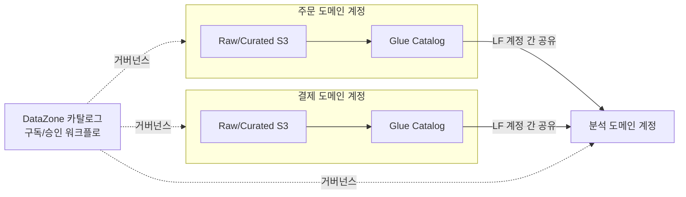

**[팁]** 데이터 메시는 기술이 아니라 **조직 모델**이다. Lake Formation과 DataZone을 도입한다고 자동으로 메시가 되는 것이 아니라, 플랫폼 팀(공통 도구 제공)과 도메인 팀(데이터 제품 소유·운영) 사이의 역할과 책임이 먼저 정의돼야 한다. 이 합의 없이 기술만 도입하면 "계정만 여러 개로 나뉜 중앙 집중형 레이크"가 된다.

**[주의]** 데이터 메시는 소규모 조직에 과설계다. 도메인 팀 각각이 데이터 제품을 지속적으로 운영할 인력·역량을 갖추지 못하면, 오히려 책임 소재만 흩어지고 아무도 데이터 품질을 책임지지 않는 결과로 이어진다. 도메인 수가 적거나(3~4개 이하) 데이터 엔지니어링 인력이 중앙 팀 하나뿐인 조직은 중앙 집중형 레이크/레이크하우스로 시작하는 편이 낫다.

### 52.8 데이터 레이크 vs 레이크하우스 vs 데이터 메시 vs 웨어하우스 중심 선택 기준

네 가지 접근은 배타적이지 않고 단계적으로 겹쳐 쓰이는 경우가 많지만, 신규 구축 시 어디서 시작할지 판단하는 기준은 필요하다.

| 기준 | 데이터 레이크 | 레이크하우스 | 데이터 메시 | 웨어하우스 중심 |
|---|---|---|---|---|
| 조직 규모 | 소~대규모 | 중~대규모 | 대규모(다수 사업부) | 소~중규모 |
| 도메인(사업 영역) 수 | 무관 | 무관 | 많을수록 효과적(5개 이상) | 적을 때 적합 |
| 데이터 성숙도 | 초기~중급 | 중급 이상(트랜잭션 요구 존재) | 상급(각 도메인이 자체 운영 가능) | 초기(BI 중심 요구만) |
| 거버넌스 요구 | 중앙 카탈로그로 충분 | 중앙 카탈로그 + 트랜잭션 일관성 | 연합 거버넌스(표준은 중앙, 실행은 분산) | 단일 팀이 전부 통제 |
| 팀 역량 | 데이터 엔지니어링 팀 1개로 가능 | 위와 동일 + 테이블 포맷 운영 지식 | 각 도메인 팀에 데이터 엔지니어링 역량 필요 | SQL/BI 중심, 최소 엔지니어링 |
| 대표 비용 축 | S3 저장 + 스캔 비용 | 위 + 컴팩션 컴퓨트 | 계정 다중화 관리 오버헤드 | 클러스터/RPU 상시 비용 |

**결정 트리**로 정리하면 다음과 같다.

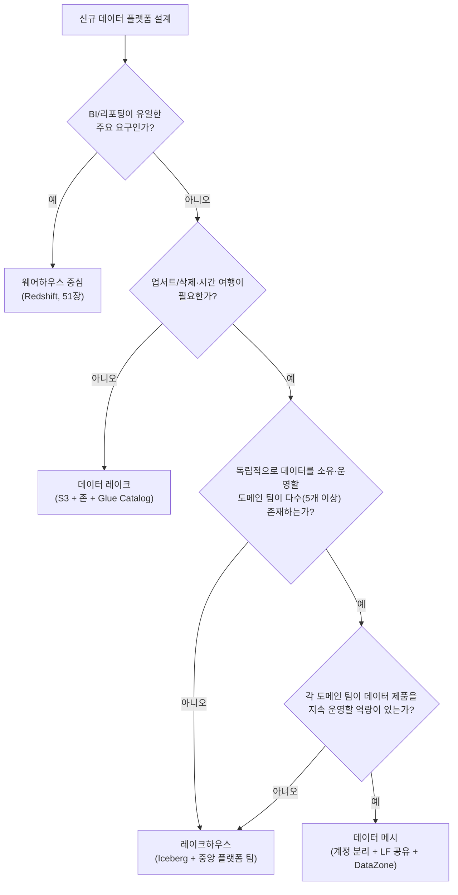

**단계적 진화 경로**는 대부분의 조직에서 레이크 → 레이크하우스 → 메시 순으로 진행된다. 처음에는 S3 존 구조와 Glue Catalog로 레이크를 구축해 데이터를 모으고 검색 가능하게 만든다. 업서트·삭제·다중 잡 동시 쓰기 요구가 늘어나면 Iceberg 같은 테이블 포맷을 도입해 레이크하우스로 전환한다. 조직이 커지고 도메인이 늘어나 중앙 데이터 팀이 병목이 되기 시작하면, 그 시점에 도메인별 계정 분리와 DataZone 카탈로그로 메시 구조를 얹는다. 처음부터 메시를 목표로 설계하면 조직 구조가 데이터 요구를 따라가지 못해 실패할 가능성이 높다.

예를 들어 사업부가 하나뿐인 스타트업은 단일 계정의 레이크하우스만으로도 충분하지만, 사업부 다섯 개가 각자 다른 제품·고객군을 운영하고 각 사업부에 데이터 엔지니어가 배치된 중견 기업이라면 레이크하우스에 머무는 대신 메시로 진화할 근거(도메인별 소유권 요구, 중앙 팀 병목)가 이미 충족돼 있는 경우가 많다. 반대로 도메인이 다섯 개라도 데이터 엔지니어가 조직 전체에 두세 명뿐이라면, 메시가 요구하는 "도메인 팀이 자체적으로 데이터 제품을 운영"이라는 전제 자체가 성립하지 않으므로 레이크하우스에 머무르며 인력을 먼저 확충하는 것이 현실적이다.

### 52.9 데이터 계약과 품질 검증 자동화

레이크(또는 메시)의 데이터 제품이 신뢰받으려면 소비자가 매번 데이터를 검증하지 않아도 되는 명시적 약속이 필요하다. **데이터 계약(data contract)**은 생산자와 소비자 사이에 데이터의 형태와 보장 범위를 문서화·자동화한 합의다.

```yaml
# data-contract-order-summary.yaml
contract_version: "1.2"
dataset: orders.order_summary
owner: order-domain-team@company.com
schema:
  - name: order_id
    type: string
    nullable: false
  - name: customer_id
    type: string
    nullable: false
  - name: amount
    type: decimal(10,2)
    nullable: false
  - name: order_status
    type: string
    nullable: false
    allowed_values: [PENDING, SHIPPED, CANCELLED, REFUNDED]
sla:
  freshness_minutes: 60
  availability_pct: 99.5
change_policy:
  breaking_change_notice_days: 30      # 하위 호환 깨는 변경은 30일 전 공지
  additive_change_notice_days: 0       # 컬럼 추가 등 호환 변경은 즉시 반영 가능
quality_gates:
  - rule: "order_id 는 유일해야 한다"
  - rule: "amount 는 0 이상이어야 한다"
```

계약의 **스키마 진화 규칙**은 통상 "컬럼 추가·타입 확장(예: int → bigint) 같은 호환 변경은 즉시 허용, 컬럼 삭제·이름 변경·타입 축소 같은 파괴적 변경은 사전 공지 기간을 거쳐야 한다"는 원칙을 따른다. Glue Schema Registry(50장)가 스트리밍 계층에서 이 호환성 검증을 자동화하는 도구이며, 레이크하우스 테이블 포맷(Iceberg)의 스키마 진화 지원이 배치 계층에서 같은 역할을 한다.

품질 검증은 계약에 정의된 규칙을 파이프라인에 자동으로 삽입하는 것으로 실현한다. **AWS Glue Data Quality**는 **DQDL(Data Quality Definition Language)**로 규칙셋을 정의하고 Glue 잡 실행 중 자동 평가한다.

```sql
-- DQDL 규칙셋 예시: order_summary 테이블 품질 게이트
Rules = [
  ColumnValues "order_id" is unique,
  ColumnValues "amount" >= 0,
  ColumnValues "order_status" in ["PENDING","SHIPPED","CANCELLED","REFUNDED"],
  Completeness "customer_id" > 0.99,
  RowCount between 1000 and 10000000
]
```

이 규칙을 파이프라인의 Curated 존 적재 직전에 **품질 게이트**로 배치하면, 규칙을 통과하지 못한 배치는 정상 경로로 흘려보내지 않고 별도의 **격리(quarantine) 프리픽스**로 옮긴 뒤 담당 팀에 알림(EventBridge → SNS/Slack)을 보낸다. Glue Data Quality 작업은 규칙 평가 결과를 `Pass`/`Fail`로 반환하므로, Glue 워크플로나 Step Functions에서 이 결과를 분기 조건으로 사용해 실패 시 격리 경로로, 통과 시 Curated 존 적재 경로로 나누는 것이 표준적인 구성이다.

```json
{
  "Comment": "품질 게이트 통과 여부에 따라 Curated 적재 또는 격리 경로로 분기",
  "StartAt": "RunDataQualityCheck",
  "States": {
    "RunDataQualityCheck": {
      "Type": "Task",
      "Resource": "arn:aws:states:::glue:startJobRun.sync",
      "Parameters": { "JobName": "order-summary-dq-check" },
      "Next": "EvaluateResult"
    },
    "EvaluateResult": {
      "Type": "Choice",
      "Choices": [
        {
          "Variable": "$.dqResult.overallStatus",
          "StringEquals": "PASS",
          "Next": "LoadToCurated"
        }
      ],
      "Default": "MoveToQuarantine"
    },
    "LoadToCurated": { "Type": "Task", "Resource": "arn:aws:states:::glue:startJobRun.sync", "Parameters": { "JobName": "load-curated" }, "End": true },
    "MoveToQuarantine": { "Type": "Task", "Resource": "arn:aws:states:::sns:publish", "Parameters": { "TopicArn": "arn:aws:sns:ap-northeast-2:123456789012:dq-quarantine-alert", "Message": "품질 게이트 실패: order_summary 배치 격리됨" }, "End": true }
  }
}
```

오픈소스 대안으로는 Spark 기반 **Deequ**(EMR/Glue Spark 잡에 통합해 통계적 검증 — 컬럼 분포, 이상치 비율까지 확인), 파이썬 생태계의 **Great Expectations**(다양한 커넥터로 이기종 소스를 동일한 방식으로 검증하고 결과를 문서화된 데이터 품질 리포트로 남김)가 흔히 쓰이며, 조직의 처리 스택과 팀 숙련도에 따라 선택한다. Glue Data Quality는 AWS 네이티브 서비스로 별도 클러스터 운영 부담이 없다는 점이, Deequ·Great Expectations는 이미 Spark/Python 파이프라인이 있는 조직에서 기존 코드베이스에 자연스럽게 통합된다는 점이 각각의 강점이다.

마지막으로 **데이터 리니지(lineage)** — 어떤 원본에서 어떤 변환을 거쳐 이 데이터셋이 만들어졌는가 — 는 사고 발생 시 영향 범위를 파악하고 규정 감사에 대응하는 데 필수적이다. Glue는 잡 간 데이터 흐름을 카탈로그 메타데이터로 일부 추적하며, DataZone은 도메인을 넘나드는 데이터 제품 단위의 리니지를 조직 관점에서 시각화해 "이 테이블이 깨지면 어떤 하류 대시보드가 영향받는가"에 답할 수 있게 해준다. 품질 게이트가 실패를 사후에 감지하는 안전망이라면, 리니지는 실패의 파급 범위를 사전에 가늠하게 해주는 지도라는 점에서 둘은 상호 보완적이다.

### 52장 정리

#### [필수] 반드시 알아야 할 것
1. 데이터 레이크는 스키마 온 리드, 데이터 웨어하우스는 스키마 온 라이트라는 정반대 원칙 위에 있으며 서로 대체재가 아니라 다른 문제를 푼다.
2. 데이터 레이크와 데이터 스웜프를 가르는 것은 저장 기술이 아니라 카탈로그와 거버넌스다.
3. 저장 레이어는 Raw/Landing → Cleansed/Standardized → Curated/Conformed → Sandbox 4단계 존으로 나누고, 원본(Raw)은 불변으로 보존한다.
4. Lake Formation은 Glue Data Catalog 위에 테이블·컬럼·행·셀 수준 권한과 LF-Tags 기반 태그 부여 접근 제어(TBAC)를 얹어, 계정마다 S3 정책을 복제하지 않고도 세밀한 권한을 중앙 관리한다.
5. 레이크하우스는 Iceberg/Hudi/Delta 같은 개방형 테이블 포맷으로 ACID 트랜잭션·스키마 진화·시간 여행·업서트를 지원해 레이크의 트랜잭션 부재 한계를 보완하며, 2026년 상반기 기준 AWS 서비스 통합 폭은 Iceberg가 가장 넓다.
6. 데이터 메시는 도메인 소유권·데이터를 제품으로·셀프서비스 플랫폼·연합 컴퓨팅 거버넌스 4원칙으로 구성된 조직 모델이며, 기술(Lake Formation 계정 간 공유 + DataZone)은 그것을 뒷받침하는 수단일 뿐이다.
7. 레이크/레이크하우스/메시/웨어하우스 중심은 조직 규모·도메인 수·데이터 성숙도·팀 역량에 따라 선택하며, 대부분의 조직은 레이크 → 레이크하우스 → 메시 순으로 단계적으로 진화한다.
8. 데이터 계약은 스키마·SLA·소유자·변경 정책을 명시하고, Glue Data Quality/DQDL 같은 자동화된 품질 게이트로 계약 위반을 파이프라인 단계에서 차단한다.

#### [팁] 실무 노하우
1. S3 버킷·프리픽스는 도메인/데이터셋/버전/파티션 순서로 계층화해 검색성과 파티션 프루닝을 동시에 확보한다.
2. Lake Formation은 테이블 단위 권한보다 LF-Tags 기반 TBAC로 관리하면 테이블 수가 늘어도 정책 유지 비용이 거의 늘지 않는다.
3. Iceberg의 업서트/삭제 기능은 GDPR 삭제 요구를 행 단위로 처리할 수 있게 해주지만, 완전한 삭제를 위해서는 컴팩션과 스냅샷 만료를 함께 실행해야 한다.
4. 데이터 메시를 시작하기 전에 플랫폼 팀과 도메인 팀의 역할·책임(RACI)을 문서로 먼저 합의하고, 그다음 계정 분리와 DataZone을 도입한다.
5. 품질 검증을 실패시킨 배치는 정상 경로가 아니라 격리(quarantine) 프리픽스로 분리하고 즉시 알림을 발송해, 나쁜 데이터가 Curated 존까지 흘러가는 것을 원천 차단한다.
6. 카탈로그 커버리지와 데이터셋 활용률 지표를 정기적으로 확인해, 등록만 되고 아무도 쓰지 않는 데이터셋을 보존 정책 재검토 대상으로 관리한다.

#### [주의] 사고·비용·설계 함정
1. 접근 제어 없는 데이터 레이크는 최대 규모의 개인정보 유출 후보다. PII는 수집 단계에서 분류·토큰화해야 하며, 사후 마스킹만 믿어서는 안 된다.
2. "일단 다 모으자"는 비용과 규정 리스크를 동시에 키운다. 보존 기간과 삭제 절차(GDPR 삭제권 포함)를 설계 초기에 넣지 않으면 나중에 되돌리기 어렵다.
3. 카탈로그를 한 번만 등록하고 이후 스키마 변경을 반영하지 않으면, 카탈로그와 실제 데이터가 어긋나 쿼리 오류나 잘못된 집계로 이어진다.
4. IAM 전용 모드에서 Lake Formation 모드로 전환할 때 기존 IAM 주체에 상응하는 Lake Formation 권한을 사전에 부여하지 않으면 기존 파이프라인이 접근 거부를 받는다.
5. 레이크하우스에서 컴팩션과 스냅샷 만료를 운영에 넣지 않으면 소규모 파일과 오래된 스냅샷이 누적돼 쿼리 성능 저하와 저장 비용 증가가 동시에 발생한다.
6. 데이터 메시는 소규모 조직에 과설계다. 도메인 팀이 데이터 제품을 지속 운영할 역량이 없으면 책임 소재만 흩어지고 아무도 품질을 책임지지 않는다.
7. 접근 빈도가 낮아진 Raw 데이터를 표준 스토리지 클래스에 무기한 방치하면 저장 비용이 계속 증가한다 — 수명주기 정책으로 계층 전환을 자동화해야 한다.
8. 데이터 계약 없이 여러 팀이 같은 데이터셋을 소비하면, 생산자의 스키마 변경 하나가 예고 없이 다수 하류 파이프라인을 동시에 깨뜨릴 수 있다.

#### 한 장 요약
데이터 레이크는 스키마 온 리드로 다양한 형식의 원본을 저비용에 모으는 저장소이지만, 존 설계·Lake Formation 기반 세밀한 접근 제어·카탈로그·거버넌스 없이는 데이터 스웜프로 전락한다. Iceberg 같은 개방형 테이블 포맷을 도입한 레이크하우스는 트랜잭션·시간 여행·업서트로 레이크의 실용성을 크게 높이며, 데이터 메시는 이 기술 위에 도메인 소유권과 연합 거버넌스라는 조직 모델을 얹어 대규모 조직의 병목을 푼다. 넷 중 무엇을 택하든 데이터 계약과 자동화된 품질 게이트가 신뢰의 최종 방어선이다.

#### 다음 장 예고
53장은 이 장에서 구축한 레이크/레이크하우스 데이터를 머신러닝과 생성형 AI 워크로드가 어떻게 소비하는지 — SageMaker 파이프라인과 파운데이션 모델 아키텍처 — 를 다룬다.

---

## 53장. 머신러닝과 생성형 AI 아키텍처  ★★★★

> **이 장에서 다루는 것**
> 머신러닝(ML) 프로젝트를 "풀 만한 문제인가"부터 판단하는 기준, AWS의 ML 스택을 프레임워크·SageMaker·AI 서비스 3계층으로 나눠 언제 무엇을 쓸지 정하는 방법, SageMaker의 데이터 준비→모델 구축→학습·튜닝→배포·모니터링 수명주기, MLOps 자산(피처 스토어·파이프라인·레지스트리·모니터), 그리고 Amazon Bedrock 기반 생성형 AI와 RAG 아키텍처를 다룬다.
> 52장의 데이터 레이크·레이크하우스가 ML 학습 데이터의 원천이라는 점을 전제하며, 20장의 GPU·가속기 인스턴스와 31장의 KMS·Macie는 각각 컴퓨트 선택과 데이터 보호 관점에서 참조만 하고 여기서는 ML 워크로드 관점에 집중한다.

### 53.1 AI/ML 기초 개념과 문제 정의

머신러닝은 규칙을 사람이 직접 코딩하는 대신, 데이터에서 패턴을 학습해 규칙을 만들어내는 접근이다. 학습 방식은 크게 세 가지다. **지도 학습**은 입력과 정답(레이블)이 짝지어진 데이터로 함수를 학습한다 — 이탈 예측, 이미지 분류가 여기 속한다. **비지도 학습**은 레이블 없이 데이터 구조(군집, 차원 축소, 이상치)를 찾는다. **강화 학습**은 에이전트가 환경과 상호작용하며 보상 신호로 정책을 개선한다 — 추천 순위 최적화 등에 쓰인다.

문제 유형은 **분류**(이 이메일이 스팸인가), **회귀**(다음 달 매출은 얼마인가), **랭킹**(어떤 상품을 먼저 보여줄 것인가), **이상 탐지**(이 거래가 사기인가), **생성**(이 프롬프트에 응답을 만들어라)으로 나뉜다. 분류·회귀는 SageMaker 내장 알고리즘이나 AI 서비스로 대체로 해결되지만, 생성 문제는 LLM과 Bedrock 영역이다.

가장 중요한 것은 "이것이 정말 ML로 풀어야 하는 문제인가"를 먼저 검증하는 일이다. 아래 네 가지 질문을 통과해야 ML 투자가 정당화된다.

| 질문 | 판단 기준 |
|---|---|
| 규칙으로 충분히 되는가 | if-else 조건 몇 개로 90% 이상 처리된다면 ML 불필요 — 규칙 엔진이 더 싸고 설명 가능하다 |
| 레이블이 있는가(지도 학습 기준) | 과거 정답 데이터가 충분치 않으면 먼저 레이블링 파이프라인(Ground Truth)부터 구축해야 한다 |
| 오답 비용이 감당 가능한가 | 오분류가 안전·법적 리스크로 이어지는 도메인(의료 진단 확정, 대출 거절 단독 판단)은 ML을 보조 신호로만 쓰고 사람이 최종 결정한다 |
| 데이터 양과 신선도가 충분한가 | 패턴이 자주 바뀌는 도메인은 지속적 재학습(CT) 체계 없이는 정확도가 금방 낮아진다 |

**한 줄 결정 기준**: 규칙으로 되면 규칙을, 레이블이 없으면 레이블링부터, 오답 비용이 크면 사람 검토를 끼워 넣고, 데이터가 부족하면 AI 서비스(사전 학습 모델)로 시작한다.

성공 지표는 반드시 비즈니스 지표에 연결해야 한다. 정확도나 F1 점수가 올라가도 이탈률·매출에 영향이 없으면 프로젝트는 실패다. 이탈 예측 모델의 목표는 "AUC 0.85"가 아니라 "이탈 방지 캠페인 대상자의 실제 이탈률을 20% 낮추는 것"이어야 하며, 모델 지표와 비즈니스 지표를 함께 대시보드로 추적해야 배포 이후 가치 유지 여부를 판단할 수 있다.

### 53.2 AWS ML 스택 3계층

AWS의 ML 스택은 추상화 수준에 따라 세 계층으로 나뉜다. **1계층(프레임워크·인프라)**은 TensorFlow, PyTorch를 딥러닝 AMI/컨테이너 위에서 직접 운용하는 최하위 계층이다. P/G/Inf/Trn 계열 인스턴스와 노드 간 저지연 통신용 EFA(Elastic Fabric Adapter)가 여기 속한다(→ 20장 참조). **2계층(SageMaker)**은 데이터 준비부터 배포까지 ML 수명주기 전체를 관리형으로 제공하는 플랫폼이다. **3계층(AI 서비스)**은 모델을 학습시키지 않고 API 호출만으로 비전·음성·언어 기능을 쓰는 완전 관리형 서비스다.

세 계층은 자유도와 관리 부담이 반비례한다. 1계층은 학습 루프까지 완전히 통제하지만 운영 부담이 가장 크고, 3계층은 통제권이 거의 없는 대신 몇 시간 안에 프로덕션에 올릴 수 있다.

| 계층 | 언제 선택하는가 | 대표 사용자 |
|---|---|---|
| 1계층: 프레임워크·인프라 | 커스텀 모델 연구, 초대형 모델 사전학습, 특수 하드웨어 최적화 | ML 리서처, 플랫폼팀 |
| 2계층: SageMaker | 자사 데이터로 학습·튜닝·배포, MLOps 파이프라인 필요 | 대다수 사내 ML 엔지니어링팀 |
| 3계층: AI 서비스 | 범용 문제(문서 추출, 번역, 얼굴 인식), 커스텀 학습 불필요 | 애플리케이션 개발팀 |

**한 줄 결정 기준**: 먼저 3계층(AI 서비스)이 되는지 확인하고, 도메인 특화 정확도가 필요하면 2계층(SageMaker)으로, 모델 자체를 연구·사전학습해야 하면 1계층으로 내려간다. 대부분의 조직은 2계층에서 대부분의 워크로드를 처리하고 1계층은 극소수 팀만 사용한다.

세 계층은 배타적이지 않고 조합된다. SageMaker에서 파인튜닝한 모델을 엔드포인트로 서빙하면서, 같은 애플리케이션이 문서 추출에는 Textract를, 챗봇 응답 생성에는 Bedrock을 함께 호출하는 구성이 흔하다.

### 53.3 Amazon SageMaker 수명주기

SageMaker는 ML 워크플로를 네 단계로 나눠 관리형 도구를 제공한다. 각 단계는 독립적으로 사용할 수도, 파이프라인으로 연결할 수도 있다.

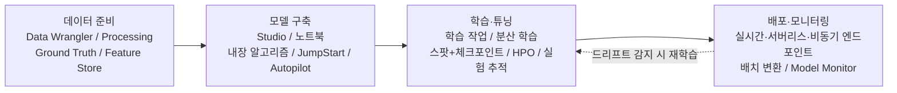

**1단계 — 데이터 준비**: Data Wrangler는 노코드에 가까운 UI로 데이터 정제·변환 흐름을 만든다. Processing은 대규모 전처리·피처 엔지니어링을 관리형 컨테이너에서 병렬 실행한다. Ground Truth는 사람이 참여하는 레이블링 작업(active learning으로 비용 절감)을 제공한다. Feature Store는 학습·추론에서 공유할 피처를 저장하는 중앙 저장소다. 산출물은 정제된 학습 데이터셋, 비용 축은 처리 인스턴스 시간과 레이블링 작업자 비용이다.

**2단계 — 모델 구축**: Studio는 통합 IDE로 노트북·실험·파이프라인을 한 화면에서 다룬다. 내장 알고리즘(XGBoost 등)은 하이퍼파라미터만 지정하면 바로 학습 가능하다. JumpStart는 사전 학습된 모델을 원클릭으로 배포·파인튜닝하는 허브다. Autopilot은 데이터만 주면 전처리·알고리즘 선택·튜닝까지 자동 수행하는 AutoML이다. 산출물은 학습 가능한 모델 코드/아티팩트, 비용 축은 노트북 인스턴스 가동 시간이다.

**3단계 — 학습·튜닝**: 학습 작업(Training Job)은 컨테이너 이미지와 데이터를 지정하면 관리형 인스턴스에서 학습을 실행하고 끝나면 자동 종료한다. 대규모 모델은 분산 학습(데이터·모델 병렬)으로 여러 인스턴스에 나눠 학습한다. 스팟 학습은 스팟 인스턴스로 비용을 절감하지만 중단될 수 있어 체크포인트를 주기적으로 S3에 저장해야 한다. HPO는 여러 학습 작업을 병렬 실행해 최적 조합을 탐색하고, Experiments는 작업별 하이퍼파라미터·지표를 기록해 재현성을 보장한다. 산출물은 model.tar.gz, 비용 축은 학습 인스턴스 시간(GPU는 시간당 비용이 크다)이다.

```python
# SageMaker 스팟 학습 + 체크포인트: 학습 비용을 낮추되 중단에 대비한다
import sagemaker
from sagemaker.pytorch import PyTorch

estimator = PyTorch(
    entry_point="train.py",
    role="arn:aws:iam::123456789012:role/SageMakerExecutionRole",
    instance_count=1,
    instance_type="ml.p3.2xlarge",
    framework_version="2.1",
    py_version="py310",
    use_spot_instances=True,          # 스팟 활용으로 학습 비용 절감(대체로 60~70% 수준, 변동됨)
    max_wait=7200,                    # 스팟 대기 포함 최대 허용 시간(초)
    max_run=3600,                     # 실제 학습 최대 시간(초)
    checkpoint_s3_uri="s3://my-ml-bucket/checkpoints/job-001/",  # 중단 시 재개할 체크포인트 위치
    checkpoint_local_path="/opt/ml/checkpoints",
    hyperparameters={"epochs": 20, "batch-size": 64},
)
estimator.fit({"train": "s3://my-ml-bucket/train/", "validation": "s3://my-ml-bucket/val/"})
```

**4단계 — 배포·모니터링**: 실시간 엔드포인트는 상시 가동 인스턴스로 낮은 지연의 요청/응답을 처리한다. 서버리스 추론은 트래픽이 간헐적일 때 스케일 0까지 내려가 비용을 아끼지만 콜드 스타트가 있다. 비동기 추론은 대용량·장시간 요청을 큐에 넣고 완료 후 결과를 전달하며, 배치 변환은 대량 데이터셋을 한 번에 추론하고 종료한다. 멀티 모델 엔드포인트는 여러 모델을 하나의 엔드포인트 뒤에서 공유해 비용을 절감한다. Model Monitor는 배포된 모델의 입력·출력 분포를 지속 감시해 드리프트를 탐지한다. 산출물은 서빙 중인 추론 엔드포인트/작업, 비용 축은 인스턴스 가동 시간 또는 처리 건수다.

### 53.4 피처 스토어, 파이프라인, 모델 레지스트리, 모델 모니터

이 절은 SageMaker를 "한 번 학습하고 끝"이 아니라 지속 운영 가능한 시스템으로 만드는 MLOps 핵심 자산을 다룬다.

**Feature Store**는 온라인 저장소(저지연 조회, 실시간 추론용)와 오프라인 저장소(S3 기반, 배치 학습용)를 함께 제공한다. 같은 피처 정의를 학습·추론 양쪽에서 동일하게 계산해 가져오게 함으로써 **학습-서빙 스큐(training-serving skew)**를 방지하는 것이 핵심 목적이다 — 학습·추론 코드가 각자 다르게 피처를 계산하면 미묘한 차이로 모델 성능이 프로덕션에서만 떨어진다. 피처 계산 로직을 한 곳에 두는 것이 원칙이다.

```python
# Feature Store 온라인 저장소에서 실시간 추론용 피처 조회
import boto3

featurestore_runtime = boto3.client("sagemaker-featurestore-runtime", region_name="ap-northeast-2")

response = featurestore_runtime.get_record(
    FeatureGroupName="customer-features",
    RecordIdentifierValueAsString="cust-00042",
    FeatureNames=["avg_order_value_30d", "days_since_last_order"],
)
features = {f["FeatureName"]: f["ValueAsString"] for f in response["Record"]}
```

**SageMaker Pipelines**는 데이터 준비→학습→평가→배포 단계를 코드로 정의하고 조건부 분기(평가 지표가 임계값을 넘을 때만 배포)까지 포함하는 CI/CD 오케스트레이션 도구다.

```python
# Pipelines 정의 골자: 학습 후 평가 지표가 기준을 넘을 때만 모델을 레지스트리에 등록
from sagemaker.workflow.pipeline import Pipeline
from sagemaker.workflow.steps import TrainingStep, ProcessingStep
from sagemaker.workflow.condition_step import ConditionStep
from sagemaker.workflow.conditions import ConditionGreaterThanOrEqualTo
from sagemaker.workflow.model_step import ModelStep

step_process = ProcessingStep(name="Preprocess", processor=..., inputs=..., outputs=...)
step_train = TrainingStep(name="Train", estimator=..., inputs=...)
step_eval = ProcessingStep(name="Evaluate", processor=..., inputs=..., outputs=...)
step_register = ModelStep(name="RegisterModel", step_args=...)  # Model Registry에 등록

step_condition = ConditionStep(
    name="CheckAccuracy",
    conditions=[ConditionGreaterThanOrEqualTo(left=..., right=0.85)],  # 정확도 85% 미만이면 배포 중단
    if_steps=[step_register],
    else_steps=[],
)

pipeline = Pipeline(
    name="fraud-model-pipeline",
    steps=[step_process, step_train, step_eval, step_condition],
)
pipeline.upsert(role_arn="arn:aws:iam::123456789012:role/SageMakerPipelineRole")
```

**Model Registry**는 학습된 모델 버전을 카탈로그화하고 승인 상태(PendingManualApproval, Approved, Rejected)를 관리한다. 승인된 모델만 배포 파이프라인이 프로덕션으로 승격시키는 게이트 역할을 한다.

**Model Monitor**는 배포 후 네 종류의 드리프트를 감시한다 — 데이터 품질(입력 분포 변화), 모델 품질(정답 도착 후 확인하는 정확도 저하), 바이어스 드리프트(특정 그룹에 대한 예측 편향), 피처 기여도 드리프트(피처별 영향력 변화). **Clarify**는 설명 가능성(SHAP 기반 피처 기여도)과 학습 데이터·모델 출력의 편향을 사전/사후 분석하는 도구로, Model Monitor의 바이어스 감시와 함께 규제 대응에 쓰인다.

```python
# Model Monitor 스케줄 설정: 매시간 입력 분포를 기준선과 비교해 드리프트를 감지
from sagemaker.model_monitor import DefaultModelMonitor, CronExpressionGenerator

my_monitor = DefaultModelMonitor(
    role="arn:aws:iam::123456789012:role/SageMakerExecutionRole",
    instance_count=1,
    instance_type="ml.m5.xlarge",
)
my_monitor.create_monitoring_schedule(
    monitor_schedule_name="fraud-model-data-quality",
    endpoint_input="fraud-model-endpoint",
    output_s3_uri="s3://my-ml-bucket/monitor-output/",
    statistics="s3://my-ml-bucket/baseline/statistics.json",  # 학습 시점 데이터 분포 기준선
    constraints="s3://my-ml-bucket/baseline/constraints.json",
    schedule_cron_expression=CronExpressionGenerator.hourly(),
)
```

### 53.5 AI 서비스

AI 서비스는 사전 학습된 모델을 API로 호출하는 완전 관리형 서비스다. **먼저 관리형 API로 되는지 확인하는 것**이 원칙이다 — 커스텀 모델 학습·운영 비용은 API 호출 비용의 몇 배에 달할 수 있고, 확장·가용성도 AWS가 책임진다. 여섯 분류로 나눌 수 있다.

| 분류 | 대표 서비스 | 대표 사례 | 커스텀 모델 대비 |
|---|---|---|---|
| 비전 | Rekognition, Textract | 이미지 콘텐츠 조정, 신분증/영수증 텍스트 추출 | 범용 문서·이미지는 API, 도메인 특화 객체 인식은 커스텀 라벨 학습 |
| 음성 | Transcribe, Polly | 콜센터 통화 전사, 음성 안내 합성 | 표준 언어는 API, 특수 용어는 커스텀 어휘 사전 보강 |
| 언어 | Comprehend, Translate | 감성 분석, 엔티티 추출, 문서 번역 | 범용 NLP는 API, 도메인 특화 분류는 커스텀 분류기 검토 |
| 챗봇 | Lex | 음성/텍스트 대화형 인터페이스 | 정형화된 대화는 Lex, 자유 대화는 Bedrock 검토 |
| 예측 | Forecast 계열 | 수요 예측, 재고 계획 | 표준 시계열 패턴은 API, 복잡한 외부 변수는 커스텀 모델 |
| 개인화·추천 | Personalize | 상품 추천, 콘텐츠 큐레이션 | 콜드 스타트·실시간 반영은 API 유리, 특수 로직은 커스텀 |

**한 줄 결정 기준**: 문제가 범용적이고 데이터가 표준 포맷이면 AI 서비스로 시작하고, 도메인 특화 정확도나 완전한 통제가 필요해질 때만 SageMaker 커스텀 학습으로 전환한다.

### 53.6 MLOps 베스트 프랙티스

MLOps는 모델을 한 번 배포하고 끝나는 것이 아니라 지속적으로 재학습·재배포하는 체계를 만드는 것이다. 핵심은 **실험 추적과 재현성**이다 — 데이터·코드(git 커밋)·하이퍼파라미터·실행 환경(컨테이너 이미지 태그)을 모두 버저닝해야 하며, 하나라도 빠지면 "그때 그 모델을 어떻게 만들었는지" 아무도 답할 수 없게 된다.

CI/CD/CT(지속적 학습) 파이프라인은 코드 배포 자동화(CI/CD)에 재학습 트리거(CT)를 결합한 구조다. 새 데이터가 쌓이거나 Model Monitor가 드리프트를 감지하면 파이프라인이 자동으로 재학습을 시작한다.

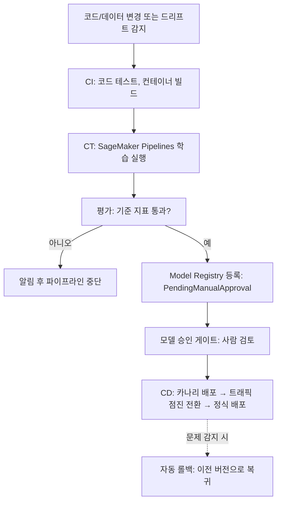

**모델 승인 게이트**는 Model Registry의 승인 상태를 CD 조건으로 걸어, 사람이 지표·편향 리포트를 검토하기 전에는 프로덕션 트래픽을 받지 않도록 강제한다. **카나리·섀도 배포**는 신규 모델을 소수 트래픽(카나리)이나 병렬 실행(섀도)으로 검증한 뒤 점진적으로 확대하는 방식이다. **롤백**은 문제 발견 시 이전 승인 버전으로 즉시 되돌리는 절차이며, **데이터·모델 버저닝**은 S3 버전 관리와 Model Registry를 결합해 "이 예측이 어떤 조합에서 나왔는가"를 추적 가능하게 한다.

조직의 MLOps 성숙도는 대체로 세 단계로 발전한다. ① **수동 단계**: 노트북에서 개별 학습·배포, 재현 불가. ② **파이프라인 자동화 단계**: Pipelines로 학습·평가·등록을 자동화하지만 재학습 트리거는 사람이 판단. ③ **완전 CT 단계**: 드리프트 감지·데이터 축적이 자동으로 재학습을 트리거하고 승인 게이트만 사람이 관여한다. 대부분의 조직은 ②단계에 상당 기간 머무르며, ③단계는 정확도가 비즈니스에 매우 민감한 소수 모델에만 적용하는 것이 일반적이다.

### 53.7 생성형 AI 아키텍처와 RAG

**Amazon Bedrock**은 여러 파운데이션 모델(FM)을 서버리스 API로 호출하는 완전 관리형 서비스다. 모델 선택은 작업 성격(텍스트 생성, 요약, 코드, 멀티모달)과 지연·비용 요구사항에 따라 달라지며 실제 워크로드로 비교 평가한 뒤 결정한다. 처리량은 **온디맨드**(호출당 과금, 트래픽 불규칙 시 적합)와 **프로비저닝된 처리량**(일정 처리량 예약, 트래픽이 크고 꾸준할 때 유리) 중 선택한다. **가드레일**은 유해 콘텐츠 필터링, 주제 제한, PII 마스킹을 모델 호출 전후에 적용하는 정책 계층이다. **지식 기반**은 RAG 파이프라인(문서 수집~검색)을 관리형으로 대신 처리해주며, **에이전트**는 모델이 외부 API·도구를 호출하는 다단계 작업을 오케스트레이션한다. **평가** 기능은 여러 모델·프롬프트의 응답 품질을 자동/사람 검토 방식으로 비교한다.

```python
# Bedrock 호출 + 가드레일 적용: 유해 응답과 PII 노출을 모델 호출 단계에서 차단
import boto3, json

bedrock = boto3.client("bedrock-runtime", region_name="us-east-1")

response = bedrock.invoke_model(
    modelId="anthropic.claude-3-5-sonnet-20241022-v2:0",
    guardrailIdentifier="gr-abc123",
    guardrailVersion="1",
    body=json.dumps({
        "anthropic_version": "bedrock-2023-05-31",
        "max_tokens": 512,
        "messages": [{"role": "user", "content": "고객 문의 요약해줘: ..."}],
    }),
)
result = json.loads(response["body"].read())
```

프롬프트 관리와 버저닝은 코드처럼 프롬프트를 저장소(버전 관리 시스템 또는 Bedrock Prompt Management)에서 관리하고, 프롬프트 변경도 모델 배포와 동일하게 평가·승인 절차를 거치게 하는 것이다. 프롬프트 한 줄만 바뀌어도 응답 품질이 크게 달라지므로 코드 리뷰와 동일하게 취급한다.

**RAG(Retrieval-Augmented Generation)**는 모델이 학습하지 않은 최신·사내 지식을 검색으로 보강해 응답에 반영하는 아키텍처다. 전체 파이프라인은 다음과 같다.

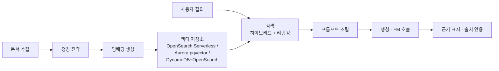

- **문서 수집**: S3나 사내 시스템에서 원문을 가져와 텍스트를 추출한다(스캔 문서는 Textract로 사전 처리).
- **청킹 전략**: 문서를 검색 단위로 분할한다. 너무 크면 관련 없는 내용이 섞이고 너무 작으면 문맥이 끊긴다. 고정 토큰 수+오버랩 방식이 일반적이며, 문서 구조를 고려한 의미 기반 청킹이 정확도를 높인다.
- **임베딩**: 각 청크를 벡터로 변환한다(Bedrock 임베딩 모델 등).
- **벡터 저장소**: OpenSearch Serverless(대규모·완전 관리형), Aurora의 pgvector 확장(기존 관계형 데이터와 결합 시), DynamoDB + OpenSearch 조합(운영 데이터와 검색을 분리 확장할 때) 중 트래픽 규모와 기존 스택에 맞춰 선택한다.
- **검색**: 벡터 유사도만으로는 키워드 정확 일치가 필요한 질의에서 성능이 떨어질 수 있어, 키워드+벡터를 함께 쓰는 **하이브리드 검색**과 후보를 재정렬하는 **리랭킹**을 결합한다.
- **프롬프트 조립·생성·근거 표시**: 검색된 청크를 시스템 프롬프트·질의와 함께 조립해 모델에 전달하고, 응답에 출처를 함께 표시해 사용자가 검증할 수 있게 한다.

```python
# RAG 검색·프롬프트 조립 골자: 벡터 검색 결과를 프롬프트에 포함해 근거 기반 응답을 생성
import boto3, json

bedrock_agent_runtime = boto3.client("bedrock-agent-runtime", region_name="us-east-1")
bedrock_runtime = boto3.client("bedrock-runtime", region_name="us-east-1")

query = "이번 분기 환불 정책 변경 사항은?"

retrieval = bedrock_agent_runtime.retrieve(
    knowledgeBaseId="KB123ABC",
    retrievalQuery={"text": query},
    retrievalConfiguration={"vectorSearchConfiguration": {"numberOfResults": 5}},
)
contexts = "\n\n".join(r["content"]["text"] for r in retrieval["retrievalResults"])

prompt = f"""다음 문서 발췌를 근거로만 답하고, 근거가 없으면 모른다고 답하라.

[문서]
{contexts}

[질문]
{query}
"""

response = bedrock_runtime.invoke_model(
    modelId="anthropic.claude-3-5-sonnet-20241022-v2:0",
    body=json.dumps({
        "anthropic_version": "bedrock-2023-05-31",
        "max_tokens": 512,
        "messages": [{"role": "user", "content": prompt}],
    }),
)
```

파인튜닝, RAG, 프롬프트 엔지니어링은 서로 대체재가 아니라 문제 성격에 따라 선택하는 것이다.

| 방식 | 적합한 상황 | 비용·유지보수 |
|---|---|---|
| 프롬프트 엔지니어링 | 이미 아는 지식으로 형식·톤만 조정하면 될 때 | 가장 저렴, 즉시 반영 |
| RAG | 최신 정보·사내 문서 기반 근거 응답이 필요할 때 | 파인튜닝보다 저렴, 문서 갱신만으로 최신성 유지 |
| 파인튜닝 | 말투·형식·도메인 언어를 가중치에 각인해야 할 때 | 학습·재학습 관리 필요, 최신성 유지가 어려움 |

**한 줄 결정 기준**: 형식 조정은 프롬프트로, 최신 지식·근거 제시가 필요하면 RAG로, 모델 자체의 말투·전문성을 바꿔야 하면 파인튜닝으로 간다. 실무에서는 프롬프트 엔지니어링과 RAG를 먼저 시도하고, 그래도 부족할 때만 파인튜닝을 검토하는 순서가 총비용 대비 효율적이다.

에이전트는 모델이 스스로 판단해 외부 도구(API 호출, 데이터베이스 조회, 코드 실행)를 여러 단계에 걸쳐 사용하도록 오케스트레이션하는 패턴이다. 평가는 정확성(사실 일치 여부), 근거성(검색 문서에 실제로 기반했는가, hallucination 여부), 유해성(정책 위반 여부) 세 축을 자동화 평가 파이프라인(별도 모델을 평가자로 쓰는 방식 포함)과 표본 사람 검토로 지속 측정한다.

### 53.8 추론 비용·지연 최적화

추론 방식 선택은 트래픽 패턴과 지연 요구사항에 달려 있다.

| 추론 방식 | 적합한 상황 | 비용 특성 |
|---|---|---|
| 실시간 엔드포인트 | 낮은 지연 상시 필요(수십~수백ms), 꾸준한 트래픽 | 인스턴스 상시 가동 비용 |
| 서버리스 추론 | 트래픽 간헐적·예측 불가 | 호출 기반 과금, 콜드 스타트 존재 |
| 비동기 추론 | 응답 즉시 불필요, 페이로드가 크거나 처리 시간이 김 | 큐 기반, 유휴 시 인스턴스 축소 |
| 배치 변환 | 정해진 시점에 대량 데이터 일괄 처리 | 작업 시간만 과금, 상시 비용 없음 |

**한 줄 결정 기준**: 지금 당장 답이 필요하고 트래픽이 꾸준하면 실시간, 트래픽이 뜸하면 서버리스, 응답을 나중에 받아도 되면 비동기, 정기 배치 처리면 배치 변환을 쓴다.

추론 비용은 **모델 압축**으로 낮출 수 있다 — 양자화(저정밀도 표현), 증류(큰 모델의 지식을 작은 모델에 전이), 프루닝(불필요 가중치 제거)이 대표적이다. **컴파일**은 Neuron SDK로 Inferentia/Trainium 가속기에 맞춰 모델을 최적화해 추론당 비용을 낮춘다(→ 20장 참조). **배치 크기**와 **동시성** 조정은 활용률을 높이지만 지연과 상충하므로 실측 후 절충점을 찾는다.

생성형 AI 워크로드에서는 **캐싱**이 특히 효과적이다 — 동일·유사 프롬프트 응답을 캐시하면 반복 질의의 지연과 토큰 비용을 크게 줄인다. **토큰 비용 관리**는 프롬프트 길이 축소, 응답 최대 토큰 제한, 저비용 모델로 먼저 처리하고 필요할 때만 고성능 모델로 에스컬레이션하는 라우팅 전략을 포함한다. **자동 스케일링**은 트래픽에 따라 인스턴스 수를 조정하지만 스케일 아웃에는 기동 시간이 걸리고 서버리스는 **콜드 스타트** 지연이 있으므로, 지연에 민감한 워크로드는 최소 인스턴스 수를 0보다 크게 유지한다.

### 53.9 ML 시스템의 보안·프라이버시·거버넌스

ML 시스템은 일반 애플리케이션보다 데이터 노출 경로가 많다 — 학습 데이터, 모델 아티팩트, 추론 로그 모두 민감정보를 담을 수 있다. **데이터 격리**는 SageMaker 노트북·학습 작업·엔드포인트를 프라이빗 서브넷에 두고 VPC Interface 엔드포인트로 S3·API 호출을 인터넷 경유 없이 처리하는 것이다.

**학습 데이터 접근 통제**는 IAM·S3 버킷 정책으로 원본 학습 데이터 접근을 최소 권한으로 제한하는 것이며, 학습 전 PII(개인식별정보) 탐지·마스킹이 함께 필요하다 — 탐지 자체는 → 31장의 Amazon Macie를 참조하되, ML 파이프라인에서는 이를 데이터 준비 단계(Processing 작업)에 통합해 PII가 학습 데이터셋에 그대로 흘러들어가지 않게 막는 것이 핵심이다.

**모델·프롬프트 로깅**은 디버깅과 감사에 필수지만, 프롬프트에 입력된 개인정보가 로그 저장소를 통해 예상치 못하게 유출되는 경로가 될 수 있다. 로그 저장소에도 암호화·접근 제어·보존 기간 정책을 적용하고 로그 필드를 최소화해야 한다.

**가드레일과 콘텐츠 필터**는 Bedrock Guardrails처럼 모델 호출 전후에 유해 콘텐츠·주제 이탈·PII 노출을 차단하는 정책 계층이며, 애플리케이션 입력 검증과 별도로 반드시 구성해야 하는 안전망이다.

**모델 카드와 문서화**는 학습 데이터 출처, 성능 지표, 알려진 한계, 편향 평가 결과를 기록한 표준 문서로 규제 대응과 내부 감사에 필요하다. **규제 대응**은 설명 가능성(Clarify 활용)과 감사 추적(Model Registry·파이프라인 실행 이력)을 상시 확보하는 것을 뜻하며, 금융·의료 등 규제 산업에서는 사전 요구사항으로 취급해야 한다.

생성형 AI 특유의 위협으로 **프롬프트 인젝션**이 있다 — 사용자 입력이나 검색된 문서 안에 모델 지시를 조작하는 텍스트가 숨어 있어 의도하지 않은 행동(민감 데이터 노출, 허가되지 않은 도구 호출)을 유도하는 공격이다. 에이전트가 외부 도구를 호출하는 구조에서는 **도구 권한 최소화**가 필수 방어선이다 — IAM 역할과 도구 호출 범위를 실제 필요한 작업으로 엄격히 제한하고, 되돌릴 수 없는 작업(삭제, 결제)은 반드시 사람 승인을 거치게 설계한다.

### 53장 정리

#### [필수] 반드시 알아야 할 것
1. ML 시스템의 병목은 대개 모델 알고리즘이 아니라 **데이터 파이프라인과 배포·모니터링**이다.
2. 학습-서빙 스큐를 막으려면 피처 계산 로직을 Feature Store 한 곳에서 공유해야 한다.
3. AWS ML 스택은 프레임워크·인프라(1계층)/SageMaker(2계층)/AI 서비스(3계층)로 나뉘며, 먼저 3계층이 되는지 확인한다.
4. SageMaker 수명주기는 데이터 준비 → 모델 구축 → 학습·튜닝 → 배포·모니터링의 네 단계이며, 각 단계는 산출물과 비용 축이 다르다.
5. RAG 파이프라인의 품질은 모델 자체보다 청킹·임베딩·검색(하이브리드+리랭킹) 설계가 좌우한다.
6. 파인튜닝·RAG·프롬프트 엔지니어링은 대체재가 아니라 선택지이며, 프롬프트→RAG→파인튜닝 순으로 검토하는 것이 총비용 효율적이다.

#### [팁] 실무 노하우
1. 먼저 AI 서비스(관리형 API)로 가능한지 확인하라. 커스텀 학습은 총비용이 몇 배 차이난다.
2. RAG는 파인튜닝보다 대체로 저렴하고 최신성 유지가 쉽다.
3. 실시간 추론이 필요 없다면 비동기·배치 추론으로 GPU 비용을 줄인다.
4. 스팟 학습은 체크포인트를 반드시 S3에 주기적으로 저장해 중단 후 이어서 학습하도록 구성한다.
5. 프롬프트도 코드처럼 버전 관리하고 변경 시 평가·승인 절차를 거치게 하라.
6. 토큰 비용은 캐싱과 모델 라우팅(저비용 모델 우선, 필요 시 고성능 모델로 에스컬레이션)으로 줄인다.

#### [주의] 사고·비용·설계 함정
1. 학습 GPU 인스턴스를 잊고 켜두는 것이 개별 최대 비용 사고다. 자동 정지·예산 알람을 걸어라.
2. 모델 드리프트를 감시하지 않으면 정확도가 조용히 하락한다. Model Monitor로 배포와 함께 감시하라.
3. 프롬프트·사용자 입력에 개인정보가 들어가면 로그를 통해 유출된다.
4. 프롬프트 인젝션은 에이전트 구조에서 특히 위험하다. 도구 권한을 최소화하고 되돌릴 수 없는 작업은 사람 승인을 거치게 하라.
5. 학습-서빙 스큐를 방치하면 검증에서는 좋았던 모델이 프로덕션에서만 성능이 낮게 나온다.
6. 모델 승인 게이트 없이 CD를 자동화하면 편향 있는 모델이 그대로 배포될 수 있다.
7. 서버리스 추론의 콜드 스타트를 고려하지 않고 지연 SLA를 약속하면 트래픽이 뜸한 시간대에 SLA를 어기게 된다.

#### 한 장 요약
ML 프로젝트는 규칙·레이블·오답 비용·데이터량 기준으로 "정말 ML이 필요한가"부터 검증해야 하며, AWS는 이를 프레임워크·SageMaker·AI 서비스 3계층으로 지원한다. SageMaker는 수명주기를 관리형으로 제공하지만, 실제 운영은 Feature Store·Pipelines·Model Registry·Model Monitor 없이는 재현 불가능하고 드리프트에 취약해진다. 생성형 AI는 Bedrock과 RAG로 확장되며, 문제 성격에 맞는 방식을 선택하는 것이 비용과 품질을 함께 잡는 길이다. 병목은 모델이 아니라 데이터 파이프라인, 배포 게이트, 지속 모니터링에 있다.

#### 다음 장 예고
54장에서는 IoT, 블록체인, 양자 컴퓨팅 등 AWS의 신흥·특수 도메인 서비스를 다루며, 이 장의 ML 파이프라인이 IoT 디바이스에서 생성되는 데이터와 어떻게 연결되는지도 함께 살펴본다.

---

## 54장. IoT · 블록체인 · 양자  ★★★★

> **이 장에서 다루는 것**
> 이 장은 53장까지 다룬 컴퓨트·데이터·ML 아키텍처를 물리 세계로 확장하는 세 가지 이질적인 영역을 다룬다. IoT는 대량의 제약된 디바이스가 만들어내는 데이터를 클라우드로 끌어오는 문제이고, 블록체인은 "언제 분산 신뢰가 실제로 필요한가"를 판단하는 문제이며, 양자 컴퓨팅은 아직 실용화 이전 단계의 기술을 아키텍트가 어느 수준까지 알아야 하는지의 문제다. 세 영역 모두 화려하지만, 이 장의 목적은 과장 없이 "언제 쓰고 언제 쓰지 않는가"를 판단할 수 있게 하는 것이다. 53장의 SageMaker·시계열 처리 지식을 전제로, IoT에서 수집한 데이터를 어떻게 분석 파이프라인에 연결하는지도 함께 다룬다.

### 54.1 IoT의 정의와 아키텍처 계층

사물인터넷(IoT, Internet of Things)은 센서·액추에이터를 가진 물리 디바이스가 네트워크로 연결되어 데이터를 주고받고, 그 데이터를 기반으로 원격 제어나 자동화 의사결정을 수행하는 시스템을 말한다. 일반적인 웹·모바일 백엔드 아키텍처와 근본적으로 다른 점은 "요청을 보내는 주체"가 사람이 아니라 자원이 극도로 제한된 디바이스라는 것이다.

IoT 아키텍처는 통상 5개 계층으로 나눠 생각하면 설계가 명확해진다.

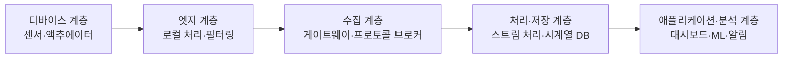

- **디바이스 계층**: 온도·습도·진동 센서, 모터·밸브 액추에이터. 마이크로컨트롤러(MCU) 기반이라 CPU·메모리·전력이 극히 제한된다.
- **엣지 계층**: 게이트웨이나 로컬 컴퓨트에서 필터링·집계·로컬 추론을 수행한다. 네트워크가 끊겨도 동작해야 하는 경우가 많다.
- **수집 계층**: MQTT 브로커 등 메시지 브로커가 대량의 디바이스 연결을 받아들인다.
- **처리·저장 계층**: 스트림 처리와 시계열 데이터베이스가 수신된 데이터를 정제·적재한다.
- **애플리케이션·분석 계층**: 대시보드, 이상 탐지, 알림, ML 추론 결과 소비.

IoT 워크로드는 일반 웹 워크로드와 다음 특성에서 갈린다.

- **대량 연결·소량 메시지**: 수십만~수백만 대의 디바이스가 동시에 연결되지만, 개별 메시지는 수십~수백 바이트 수준으로 작다. 웹 서비스처럼 "요청 수 대비 요청 크기"로 용량을 설계하면 과대·과소 산정이 쉽게 발생한다.
- **간헐적 연결**: 셀룰러·LPWAN 환경에서는 디바이스가 배터리 절약을 위해 주기적으로만 연결한다. "항상 연결됨"을 전제로 한 설계는 깨진다.
- **제한된 자원**: TLS 풀스택을 못 올리는 MCU도 많아 경량 인증·경량 프로토콜이 필요하다.
- **물리적 접근 불가**: 필드에 설치된 디바이스는 사람이 직접 방문해 조작하기 어렵다. 원격 진단·원격 업데이트가 필수다.

프로토콜 선택은 이 특성에서 파생된다.

| 프로토콜 | 전송 방식 | 메시지 오버헤드 | 적합 상황 | QoS |
|---|---|---|---|---|
| MQTT | TCP 위 발행/구독 | 매우 낮음(2바이트 고정 헤더) | 상시 연결, 다대다 메시징 | QoS 0(최대 1회 전달)/1(최소 1회, 중복 가능)/2(정확히 1회, MQTT 3.1.1 기준 브로커 지원 필요) |
| HTTP(S) | 요청/응답 | 높음(헤더 텍스트) | 방화벽 제약 환경, 저빈도 폴링 | 없음(재시도는 애플리케이션 책임) |
| LoRaWAN | 저전력 광역(LPWAN) 무선 | 매우 낮음, 대역폭 극히 제한 | 배터리 수년 구동, 초저빈도·초저용량 전송 | 클래스 A/B/C로 수신 지연 특성만 구분, 전달 보장은 애플리케이션 계층 |

한 줄 결정 기준: 배터리와 대역폭이 극히 제한되고 저빈도 전송이면 LoRaWAN, 상시 전원과 네트워크가 있고 양방향 실시간 메시징이 필요하면 MQTT, 기존 HTTP 인프라·방화벽 정책을 그대로 쓰고 싶다면 HTTP를 택한다.

QoS(Quality of Service) 선택도 같은 원리로 결정된다. QoS 0은 브로커의 확인 응답을 기다리지 않아 지연이 가장 낮지만 메시지가 유실될 수 있으므로 "최신 값 하나만 중요하고 중간 값이 빠져도 무방한" 센서 스트림(예: 1초마다 갱신되는 온도)에 적합하다. QoS 1은 최소 한 번 전달을 보장하지만 중복 수신 가능성이 있어 애플리케이션이 멱등(idempotent)하게 처리해야 하며, 명령·설정 변경처럼 "반드시 전달돼야 하지만 두 번 실행돼도 치명적이지 않은" 메시지에 쓴다. QoS 2(정확히 한 번 전달)는 브로커와 클라이언트 양쪽에 더 많은 상태 관리와 왕복이 필요해 오버헤드가 가장 크므로, 결제·과금처럼 중복 실행 자체가 사고로 이어지는 극히 제한된 경우에만 검토한다. 대다수 텔레메트리 파이프라인은 QoS 0이나 1로 충분하다.

### 54.2 AWS IoT Core

AWS IoT Core는 위 5계층 중 수집 계층의 핵심 서비스로, MQTT 기반 디바이스 게이트웨이와 사물 레지스트리, 규칙 엔진을 하나로 묶어 제공한다.

**디바이스 게이트웨이와 MQTT 브로커**: IoT Core는 완전관리형 MQTT 브로커를 운영해 디바이스 연결·발행·구독을 처리한다. MQTT 외에 MQTT over WebSocket, HTTPS도 지원해 브라우저나 방화벽 제약 환경의 디바이스도 수용한다.

**사물(Thing) 레지스트리**: 각 디바이스는 "사물(Thing)"로 등록되며, 사물 유형(Thing Type)으로 속성 스키마를 표준화하고 사물 그룹(Thing Group)으로 조직·리전·제품군 단위 묶음을 만들어 정책·펌웨어 배포를 그룹 단위로 적용한다.

**X.509 인증서 기반 상호 인증과 정책**: IoT Core의 기본 인증 방식은 X.509 클라이언트 인증서를 통한 상호 TLS(mTLS)다. 디바이스는 발급받은 인증서로 브로커에 연결하고, 브로커도 서버 인증서를 제시해 양방향으로 신원을 검증한다. 인증서 자체는 "누구인지"만 증명하며, "무엇을 할 수 있는지"는 별도의 IoT 정책(JSON)이 결정한다. 정책에는 반드시 사물 이름 변수를 써서 디바이스별로 스코프를 좁혀야 한다.

```json
{
  "Version": "2012-10-17",
  "Statement": [
    {
      "Effect": "Allow",
      "Action": "iot:Connect",
      "Resource": "arn:aws:iot:ap-northeast-2:123456789012:client/${iot:Connection.Thing.ThingName}"
    },
    {
      "Effect": "Allow",
      "Action": "iot:Publish",
      "Resource": "arn:aws:iot:ap-northeast-2:123456789012:topic/devices/${iot:Connection.Thing.ThingName}/telemetry"
    },
    {
      "Effect": "Allow",
      "Action": ["iot:Subscribe", "iot:Receive"],
      "Resource": [
        "arn:aws:iot:ap-northeast-2:123456789012:topicfilter/devices/${iot:Connection.Thing.ThingName}/commands",
        "arn:aws:iot:ap-northeast-2:123456789012:topic/devices/${iot:Connection.Thing.ThingName}/commands"
      ]
    }
  ]
}
```

`${iot:Connection.Thing.ThingName}` 변수를 쓰면 정책 하나를 수백만 디바이스에 재사용하면서도 각 디바이스가 자기 자신의 주제(topic)에만 접근하도록 강제할 수 있다. 이 변수 없이 와일드카드로 열어두면 디바이스 하나가 탈취됐을 때 전체 플릿의 메시지를 훔쳐보거나 위조할 수 있다.

**디바이스 프로비저닝**: 소량이면 콘솔·CLI로 단일 사물을 등록하지만, 대량 배포에는 플릿 프로비저닝(Fleet Provisioning)을 쓴다. 디바이스가 공장 출하 시 심어진 "부트스트랩" 인증서로 최초 연결해 IoT Core에 등록을 요청하면, 서비스가 개별 운영용 인증서와 사물 레코드를 자동 생성해 내려준다. JITP(Just-in-Time Provisioning)는 CA 인증서를 미리 등록해두고 디바이스가 그 CA로 서명된 인증서로 최초 연결하는 순간 사물을 자동 생성하는 방식이며, JITR(Just-in-Time Registration)은 이미 존재하는 인증서를 최초 연결 시점에 등록하는 유사 패턴이다. 둘 다 "공장에서 인증서만 심고, 클라우드 쪽 사물 레코드는 최초 연결 때 만든다"는 목표는 같다.

**디바이스 섀도우(Device Shadow)**: 디바이스가 오프라인이어도 애플리케이션이 "마지막으로 알려진 상태"를 조회하거나 "원하는 상태"를 미리 설정해둘 수 있게 하는 JSON 문서다. `desired`(애플리케이션이 원하는 상태), `reported`(디바이스가 보고한 실제 상태), `delta`(desired와 reported의 차이, 디바이스가 구독해 반영해야 할 항목)로 구성된다. 예를 들어 조명 디바이스가 오프라인 상태에서 사용자가 앱으로 밝기를 바꾸면 `desired`만 갱신되고, 디바이스가 재연결해 섀도우를 구독하면 `delta`를 받아 실제로 밝기를 조정한 뒤 `reported`를 갱신해 반영을 완료한다.

```python
import json
from awscrt import mqtt
from awsiot import mqtt_connection_builder

# 디바이스가 재연결 시 자신의 섀도우 delta 주제를 구독해
# 오프라인 동안 쌓인 원하는 상태 변경을 반영한다
def on_delta(topic, payload, **kwargs):
    delta = json.loads(payload)
    desired = delta["state"]
    apply_to_hardware(desired)          # 실제 하드웨어에 반영
    report_new_state(desired)           # reported 갱신(아래 참고)

mqtt_connection.subscribe(
    topic="$aws/things/thing-001/shadow/update/delta",
    qos=mqtt.QoS.AT_LEAST_ONCE,
    callback=on_delta,
)

def report_new_state(state: dict):
    payload = json.dumps({"state": {"reported": state}})
    mqtt_connection.publish(
        topic="$aws/things/thing-001/shadow/update",
        payload=payload,
        qos=mqtt.QoS.AT_LEAST_ONCE,
    )
```

**규칙 엔진(Rules Engine)**: 수신 메시지를 SQL과 유사한 문법으로 필터링·변환해 다른 AWS 서비스로 라우팅한다. 하나의 규칙에 여러 액션을 붙일 수 있고, 액션 실패 시 재시도·오류 액션(에러 토픽 발행 등)을 별도로 구성한다.

```yaml
# CloudFormation: 온도가 임계치를 넘는 텔레메트리만 걸러
# DynamoDB에 적재하고 SNS로 알림을 보내는 규칙
Resources:
  HighTempRule:
    Type: AWS::IoT::TopicRule
    Properties:
      RuleName: HighTemperatureAlert
      TopicRulePayload:
        Sql: >-
          SELECT temperature, deviceId, timestamp() AS ts
          FROM 'devices/+/telemetry'
          WHERE temperature > 80
        AwsIotSqlVersion: "2016-03-23"
        Actions:
          - DynamoDBv2:
              RoleArn: !GetAtt IoTRuleRole.Arn
              PutItem:
                TableName: DeviceAlerts
          - Sns:
              RoleArn: !GetAtt IoTRuleRole.Arn
              TargetArn: !Ref AlertTopic
        ErrorAction:
          CloudwatchLogs:
            RoleArn: !GetAtt IoTRuleRole.Arn
            LogGroupName: /iot/rule-errors
```

액션 대상은 DynamoDB, S3, Lambda, Kinesis(Data Streams), Amazon Data Firehose, SNS, SQS, Timestream, IoT Analytics 등 다양하다. 규칙 하나에서 여러 대상으로 팬아웃(fan-out)할 수 있어, 원본 저장(S3)과 실시간 알림(SNS)과 시계열 적재(Timestream)를 동시에 처리하는 패턴이 흔하다.

**MQTT 주제 설계 규약**: 주제 계층을 `제품군/디바이스ID/메시지유형` 식으로 일관되게 설계해야 규칙 엔진의 와일드카드 필터(`+`는 한 단계, `#`는 나머지 전체)와 정책의 변수 치환이 예측 가능해진다. 예를 들어 `devices/${thingName}/telemetry`, `devices/${thingName}/commands`, `devices/${thingName}/shadow/update` 식으로 역할별 접미사를 고정하는 것이 좋다.

**IoT Core for LoRaWAN**: IoT Core는 LoRaWAN 네트워크 서버 기능을 관리형으로 제공해, LoRaWAN 게이트웨이와 디바이스를 온보딩하면 수신된 프레임을 자동으로 MQTT 메시지로 변환해 동일한 규칙 엔진·섀도우 체계에 편입시킨다. 즉 LoRaWAN을 쓰더라도 애플리케이션 계층에서는 IoT Core의 나머지 기능을 그대로 재사용할 수 있다. 이 통합 덕분에 프로토콜이 MQTT든 LoRaWAN이든 규칙 엔진 SQL과 정책, 섀도우 구조를 그대로 재사용할 수 있어, 이기종 프로토콜이 섞인 플릿에서도 애플리케이션 계층의 설계를 단일하게 유지할 수 있다.

### 54.3 IoT Device Management, IoT Analytics, IoT Greengrass(엣지)

**IoT Device Management**: 수백만 대 규모 플릿을 등록·조직화·원격 운영하기 위한 기능 묶음이다. 사물 그룹으로 조직 단위(제품 라인, 지역, 펌웨어 버전)를 나누고, 그룹 단위로 정책·작업을 적용한다. 정적 사물 그룹은 관리자가 명시적으로 사물을 추가·제거하는 방식이고, 동적 사물 그룹(fleet indexing 기반 검색 쿼리로 조건에 맞는 사물을 자동 편입)은 "펌웨어 버전이 2.3.0 이하인 모든 사물" 같은 조건을 실시간으로 만족하는 디바이스를 자동으로 묶어준다. 대량 등록에는 사물 정보를 CSV/JSON으로 일괄 업로드해 처리하는 벌크 등록 작업을 사용해 개별 API 호출 없이 수만 대를 한 번에 등록할 수 있다.

- **원격 작업(Job)과 OTA 업데이트**: 대량 디바이스에 명령이나 펌웨어 이미지를 배포할 때 IoT Job을 생성한다. 작업 문서(Job Document)에 대상 사물 그룹과 실행할 작업 내용을 JSON으로 기술하면, 각 디바이스가 자신의 작업 큐를 구독해 순차적으로 받아 처리한다. 롤아웃 비율(예: 초당 몇 대씩)과 실패 임계치(예: 실패율 몇 % 초과 시 자동 중단)를 지정할 수 있어, 결함 있는 펌웨어가 전체 플릿에 한꺼번에 퍼지는 사고를 방지한다.

```json
{
  "operation": "firmwareUpdate",
  "firmware": {
    "version": "2.4.1",
    "url": "https://s3.ap-northeast-2.amazonaws.com/fw-bucket/fw-2.4.1.bin",
    "checksum": "sha256:9f8a...c21",
    "rollback": {
      "onFailure": true,
      "previousVersion": "2.3.0"
    }
  }
}
```

  이 문서만으로는 부족하다. 디바이스 측에 반드시 **롤백 로직**(체크섬 검증 실패나 부팅 후 헬스체크 실패 시 이전 버전으로 자동 복귀)이 구현돼 있어야 하며, 이것이 없으면 OTA는 "필드 전체를 원격으로 벽돌로 만들 수 있는" 위험한 기능이 된다.
- **터널링(Secure Tunneling)**: 방화벽 뒤에 있는 개별 디바이스에 SSH 등으로 직접 접속해 원격 진단하는 기능으로, 인바운드 포트를 열지 않고도 임시 보안 터널을 만든다.

**IoT Analytics**: 시계열 IoT 데이터를 정제·보강해 분석 가능한 형태로 만드는 관리형 파이프라인이다. 채널(Channel)이 규칙 엔진에서 원시 메시지를 수신·보관하고, 파이프라인(Pipeline)이 필터링·정제·단위 변환·타 데이터 소스와의 보강(enrichment)을 수행하며, 데이터 스토어(Data Store)가 정제된 시계열을 적재하고, 데이터셋(Dataset)이 SQL 쿼리 결과를 정기적으로 스냅샷으로 만들어 BI 도구나 SageMaker에 연결한다.

파이프라인 단계에서 흔히 수행하는 시계열 정제·보강 작업으로는 결측값 보간, 이상치(센서 오류로 인한 튀는 값) 제거, 여러 디바이스의 타임스탬프를 공통 기준 시간대로 정렬, 그리고 디바이스 레지스트리나 별도 참조 테이블(설비 위치, 설치 일자 등 정적 메타데이터)을 조인해 원시 값에 맥락을 더하는 보강이 있다. 이렇게 정제·보강된 데이터라야 이후 이상 탐지 모델이나 대시보드가 노이즈에 흔들리지 않는다. 최근 아키텍처에서는 이 역할의 상당 부분을 Timestream이나 Kinesis/Firehose + Athena 조합으로 대체하는 경우도 많으므로, 신규 설계 시 요구사항에 맞춰 선택한다.

**IoT Greengrass**: 엣지에서 동작하는 런타임으로, 클라우드 없이도 로컬에서 Lambda 함수 실행, ML 모델 추론, 디바이스 간 로컬 메시징을 수행할 수 있게 한다. 기능은 컴포넌트(Component) 단위로 패키징되며, 레시피(Recipe) YAML/JSON으로 의존성과 실행 방식을 정의한 뒤 배포(Deployment)를 통해 특정 디바이스 그룹에 롤아웃한다.

```yaml
# Greengrass 컴포넌트 레시피: 로컬에서 센서 값을 집계해
# 임계치를 넘을 때만 클라우드로 전송(엣지 필터링)
RecipeFormatVersion: '2020-01-25'
ComponentName: com.example.EdgeAggregator
ComponentVersion: '1.2.0'
ComponentDescription: '센서 데이터 로컬 집계 및 필터링'
ComponentPublisher: Example Corp
ComponentConfiguration:
  DefaultConfiguration:
    aggregationWindowSeconds: 60
    thresholdCelsius: 75
Manifests:
  - Platform:
      os: linux
    Lifecycle:
      Install: pip3 install -r requirements.txt
      Run: python3 -u aggregator.py
    Artifacts:
      - URI: s3://greengrass-artifacts-123456789012/aggregator/1.2.0/aggregator.zip
```

Greengrass의 핵심 가치는 **엣지 필터링·집계로 대역폭과 클라우드 수집 비용을 절감**하는 것이다. 초당 수백 개의 원시 센서 값을 그대로 클라우드에 올리는 대신, 엣지에서 1분 평균이나 임계치 이벤트만 뽑아 올리면 수집 계층의 메시지 수와 규칙 엔진 실행 횟수, 저장 용량이 모두 줄어든다. 또한 로컬 메시징과 스토어 앤 포워드(store-and-forward) 기능은 네트워크가 끊긴 동안 메시지를 로컬에 버퍼링했다가 재연결 시 순서대로 전송해, 간헐 연결 환경에서도 데이터 유실을 방지한다.

### 54.4 IoT Device Defender, Things Graph, SiteWise, TwinMaker

**IoT Device Defender**: 디바이스 플릿의 보안 상태를 감사(Audit)하고 이상 행위를 탐지(Detect)하는 서비스다. 감사는 계정·사물의 IoT 설정(과도하게 넓은 정책, 만료 임박 인증서, 공유 인증서 사용 등)을 정기 점검해 보안 모범 사례 위반을 알려준다. 탐지는 디바이스 측 지표(메시지 크기, 연결 시도 횟수, 수신·발신 바이트 수, 연결하는 포트 목록 등)를 기준값과 비교해 이상 행위를 찾아내며, ML 기반 탐지는 각 디바이스의 정상 행동 패턴을 학습해 규칙 기반으로는 못 잡는 편차를 탐지한다. 이상이 발견되면 완화 조치(Mitigation Action)로 특정 사물의 인증서를 폐기하거나 정책을 더 제한적인 것으로 교체하는 자동 대응을 연결할 수 있다.

**AWS IoT Things Graph**: 과거 여러 디바이스·서비스를 시각적으로 오케스트레이션하기 위한 서비스로 제공된 바 있으나, 현재는 신규 도입보다는 Lambda·Step Functions 조합이나 Greengrass 컴포넌트 조합으로 유사한 오케스트레이션을 구현하는 것이 일반적이다. 신규 아키텍처 설계 시에는 이 서비스명을 전제로 하지 말고, 서비스 가용 상태와 대안을 AWS 문서에서 확인해야 한다.

**AWS IoT SiteWise**: 산업 현장(공장·발전소)의 자산 데이터를 모델링하고 수집하는 서비스다. 자산 모델(Asset Model)로 설비 유형(예: "펌프")의 속성 구조를 정의하고, 실제 설비마다 자산(Asset)을 생성해 모델을 인스턴스화한다. 측정값(Measurement)은 센서에서 직접 수신한 원시 값이고, 변환(Transform)은 단위 변환 등 측정값을 가공한 값이며, 메트릭(Metric)은 시간 윈도우에 대한 집계(예: 1시간 평균 압력)다. SiteWise 게이트웨이는 현장의 OPC-UA 서버 등 산업 프로토콜 소스에서 데이터를 수집해 클라우드로 전달하며, 모니터(Monitor) 포털로 운영자용 대시보드를 코드 없이 구성할 수 있다.

**AWS IoT TwinMaker**: 물리 자산의 디지털 트윈(Digital Twin)을 구축하는 서비스다. 엔티티(Entity)가 하나의 물리 대상(예: 특정 컨베이어벨트)을 표현하고, 컴포넌트(Component)가 그 엔티티의 데이터 소스 연결(예: SiteWise 자산, 타임스트림 테이블)을 정의하며, 씬(Scene)이 3D 시각화 레이아웃을 구성한다. 데이터 커넥터를 통해 SiteWise, S3에 저장된 3D 모델, 커스텀 데이터 소스 등을 하나의 트윈 뷰로 통합한다. IIoT 대시보드에서 설비의 실시간 상태를 3D 공간에 매핑해 보여주는 용도로 적합하다.

이 네 서비스는 역할이 겹치지 않는다: Device Defender는 보안, SiteWise는 산업 자산 데이터 모델링과 수집, TwinMaker는 그 위에 시각화·디지털 트윈을 얹는 계층이다. 실무에서는 SiteWise로 자산 모델과 시계열 데이터를 먼저 구축한 뒤, 그 위에 TwinMaker로 3D 시각화를 얹고, 전체 플릿에는 Device Defender로 보안 감사·탐지를 상시 적용하는 3단 구성이 흔하다. 셋 중 하나만 도입하면서 나머지의 역할까지 억지로 맡기려 하면(예: 대시보드 요구를 SiteWise 모니터만으로 해결하려는 시도) 기능 한계에 부딪히므로, 요구사항 단계에서 "데이터 모델링인가, 시각화인가, 보안인가"를 먼저 구분해야 한다.

### 54.5 산업용 IoT(IIoT) 아키텍처

산업 현장의 IoT는 소비자 IoT와 요구사항이 다르다. 안전 사고로 직결될 수 있는 운영기술(OT, Operational Technology) 영역과 일반 IT 영역 사이의 경계를 얼마나 엄격히 분리하느냐가 설계의 핵심이다.

**퍼듀 모델(Purdue Model)과 OT/IT 경계**: 산업 제어 시스템 보안에서 널리 쓰이는 참조 모델로, 현장 센서·액추에이터(레벨 0)부터 제어 시스템(레벨 1~2), 운영 관리(레벨 3), 기업 IT(레벨 4~5)까지 계층을 나누고 계층 간 통신을 엄격히 통제한다. 클라우드 연동은 통상 레벨 3(운영 관리) 이상에서 이뤄지며, 레벨 0~2의 실시간 제어 루프에는 클라우드가 직접 개입하지 않는다.

**프로토콜 게이트웨이와 단방향 데이터 흐름**: OT 프로토콜(OPC-UA, Modbus 등)을 IP 기반 클라우드 메시징으로 변환하는 게이트웨이(SiteWise 게이트웨이나 Greengrass)를 OT/IT 경계에 둔다. 보안이 특히 중요한 환경에서는 데이터 다이오드(data diode)처럼 물리적으로 한 방향(OT→IT)으로만 흐르게 해 클라우드 쪽에서 제어 시스템으로의 역방향 명령 자체를 원천 차단하는 설계를 쓰기도 한다.

**예지 보전(Predictive Maintenance) 파이프라인**: IIoT의 대표적인 활용 사례다.

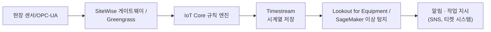

수집된 진동·온도·전류 데이터를 Timestream 같은 시계열 저장소에 적재하고, Lookout for Equipment(설비 이상 탐지 특화 관리형 서비스)나 SageMaker로 구축한 커스텀 모델로 정상 패턴에서 벗어난 조짐을 탐지한 뒤, 임계치 초과 시 알림과 함께 유지보수 작업 지시(work order)를 자동 생성한다. → 시계열 데이터 처리와 SageMaker 파이프라인 세부는 53장을 참조한다.

**가용성 요구와 엣지 자율성**: 공장 네트워크가 클라우드와 단절돼도 안전 관련 제어 루프는 반드시 로컬에서 독립적으로 동작해야 한다. 따라서 IIoT 아키텍처에서 클라우드는 "제어의 주체"가 아니라 "장기 분석과 통찰의 소비자"로 위치시키는 것이 일반적인 설계 원칙이다. 실시간성이 요구되는 제어 명령(밸브 개폐, 긴급 정지 등)은 로컬 PLC(Programmable Logic Controller)나 엣지 런타임이 밀리초 단위로 처리하고, 클라우드는 수 분~수 시간 단위의 추세 분석과 예지 보전 판단만 담당한다. 이 원칙을 어기고 클라우드 왕복 지연을 실시간 제어 루프에 끼워 넣으면, 네트워크 지연이나 일시 단절이 곧바로 설비 오작동이나 안전 사고로 이어질 수 있다.

### 54.6 AWS IoT 애플리케이션 베스트 프랙티스

**디바이스 아이덴티티와 인증서 수명주기가 핵심 난제다.** 프로비저닝(공장 출하 시 어떻게 최초 인증서를 심을 것인가), 교체(만료 전 순환을 어떻게 무중단으로 수행할 것인가), 폐기(탈취되거나 폐기된 디바이스의 인증서를 어떻게 즉시 무효화할 것인가) 세 단계를 설계 초기에 확정해야 한다. 이 설계 없이 플릿 규모가 커지면 사후 대응이 거의 불가능하다.

**최소 권한 디바이스 정책**: 모든 IoT 정책은 `${iot:Connection.Thing.ThingName}` 같은 사물 이름 변수를 사용해 디바이스가 자기 자신의 주제에만 접근하도록 스코프를 좁힌다. 정책 하나를 모든 디바이스가 공유하되, 변수로 개별화하는 패턴이 표준이다.

**주제 네임스페이스 설계**: `제품군/디바이스ID/메시지유형` 형태의 일관된 계층을 정하고, 텔레메트리·명령·섀도우·OTA 등 역할별 접미사를 고정해 규칙 엔진 와일드카드와 정책 변수 치환이 예측 가능하도록 한다.

**메시지 페이로드 최소화**: 필드명을 짧게 하고 불필요한 메타데이터를 반복 전송하지 않는다. 메시지 수와 크기가 곧 비용과 지연에 직결된다.

**엣지 필터링**: Greengrass나 게이트웨이에서 원시 데이터를 집계·필터링한 뒤 필요한 것만 클라우드로 올린다.

**OTA 업데이트와 롤백 설계 없이는 필드 장애를 고칠 수 없다.** 수십만 대 규모 디바이스는 회수해서 개별 수리할 수 없다. 체크섬 검증, 단계적 롤아웃(카나리 비율), 실패율 임계치 자동 중단, 실패 시 이전 버전 자동 복귀까지 OTA 파이프라인에 처음부터 포함시켜야 한다.

**시간 동기화**: 다수 디바이스가 만들어내는 이벤트의 순서를 신뢰하려면 NTP 등으로 디바이스 시계를 동기화해야 한다. 그렇지 않으면 시계열 분석과 이상 탐지의 전제 자체가 무너진다.

**관측성**: 연결 수, 재연결 폭풍(reconnect storm, 대규모 정전이나 네트워크 장애 후 모든 디바이스가 동시에 재연결을 시도해 브로커에 부하가 몰리는 현상), 메시지 지연을 CloudWatch로 지속 관측해야 한다. 재연결 시 지수 백오프와 지터(jitter)를 디바이스 펌웨어에 반드시 구현해야 재연결 폭풍을 완화할 수 있다.

**확장 한계와 샤딩**: 계정·리전 단위로 동시 연결 수, 메시지 처리량, 규칙 실행 수에 할당량이 존재한다. 초대형 플릿은 여러 계정이나 리전으로 사물 그룹을 나눠 샤딩하는 설계를 고려한다. 구체적 한도는 서비스 할당량 문서에서 최신값을 확인해야 한다. 지역별로 계정을 나누면 규제 준수(데이터 거주지 요건)와 장애 격리(한 리전의 문제가 전체 플릿에 전파되지 않음)라는 부가 이득도 함께 얻는다.

**비용 축**: IoT Core 요금은 대체로 (1) 디바이스 연결 시간, (2) 메시지 수, (3) 규칙 실행 수, (4) 디바이스 섀도우 조작 수, (5) 레지스트리에 저장된 사물 수 등 여러 축에 걸쳐 발생한다. 절대 금액을 단정하기보다, 이 축들 각각을 줄이는 설계(연결 유지 방식 최적화, 메시지 배치·압축, 불필요한 규칙 남발 방지)가 곧 비용 최적화라는 점을 이해하는 것이 중요하다.

### 54.7 Amazon Managed Blockchain과 QLDB의 차이

블록체인(Blockchain)은 여러 참여자가 서로를 완전히 신뢰하지 않는 상황에서, 중앙 관리자 없이 거래 기록의 무결성과 순서를 합의 알고리즘으로 보장하는 분산 원장 기술이다. Amazon Managed Blockchain은 Hyperledger Fabric(허가형, 참여자를 미리 승인)이나 Ethereum(퍼블릭 네트워크 노드 운영) 기반 네트워크의 노드 프로비저닝·운영 부담을 관리형으로 대신 처리해준다.

반면 Amazon QLDB(Quantum Ledger Database)는 단일 신뢰 주체(보통 하나의 조직)가 소유하지만, 모든 변경 이력을 암호학적으로 검증 가능한 불변 저널로 남기는 완전관리형 원장 데이터베이스다. "여러 참여자 간 분산 합의"가 필요 없고 "누가 무엇을 언제 바꿨는지 위변조 불가능하게 증명"하는 것이 목적이라면 QLDB가 훨씬 단순하다.

| 항목 | Amazon Managed Blockchain | Amazon QLDB |
|---|---|---|
| 신뢰 모델 | 다자간 분산 신뢰(단일 주체가 전체를 통제하지 않음) | 중앙 소유(단일 조직이 관리, 변경 이력은 불변) |
| 합의 메커니즘 | 네트워크 참여자 간 합의 프로토콜 필요 | 없음(단일 소유자가 기록, 암호학적 검증으로 무결성 보장) |
| 운영 복잡도 | 노드·네트워크·멤버십 관리로 상대적으로 높음 | 완전관리형 서버리스, 운영 부담 낮음 |
| 적합 상황 | 다자간 상호 불신, 중립 중개자 부재, 참여자 각자 독립 검증 필요 | 감사 추적, 규제 대응 원장, 단일 조직 내 변경 이력 증빙 |
| 대안과의 비교 | append-only 로그(S3 Object Lock 등)로 대체 가능한 경우도 많음 | 자체가 이미 append-only 저널 + 검증 API |

한 줄 결정 기준: 감사 가능한 변경 이력만 필요하면 QLDB나 append-only 로그, 서로 신뢰하지 않는 여러 독립 주체가 공동으로 원장을 검증해야 하면 Managed Blockchain.

**대부분의 기업 요건에서 블록체인은 불필요하다.** "위변조를 막고 싶다"는 요구는 실제로는 QLDB나 S3 Object Lock 기반 append-only 로그로 훨씬 간단하고 저렴하게 해결된다. 블록체인 도입을 정당화하려면 아래 조건이 실제로 성립하는지 먼저 검증해야 한다.

- 여러 독립 조직이 데이터를 공유해야 하고, 서로를 완전히 신뢰하지 않는다.
- 모두가 동의할 수 있는 중립적인 제3자 중개자가 존재하지 않는다(존재한다면 그 중개자가 QLDB 같은 중앙 원장을 운영하면 된다).
- 참여자 각자가 독립적으로 원장의 정합성을 검증할 필요가 있다.

이 세 조건이 동시에 성립하지 않는다면(예: 단일 회사 내부 감사, 규제기관 제출용 로그), 블록체인보다 단순한 대안을 우선 검토하는 것이 합리적이다.

### 54.8 Amazon Braket — 양자 컴퓨팅 개괄

양자 컴퓨팅은 큐비트(qubit)라는 양자 상태를 정보 단위로 사용해, 고전 비트의 0/1 대신 중첩(superposition, 0과 1의 확률적 조합 상태)과 얽힘(entanglement, 두 큐비트 상태가 서로 독립적이지 않게 연결되는 현상)을 활용한다. 특정 유형의 문제(소인수분해, 조합 최적화, 분자 시뮬레이션 등)에서 이론적으로 고전 컴퓨터 대비 우위를 가질 가능성이 연구되고 있다.

양자 하드웨어는 크게 두 방식으로 나뉜다. 게이트 기반(gate-based) 방식은 고전 회로의 논리 게이트처럼 큐비트에 양자 게이트 연산을 순차 적용해 범용 양자 알고리즘을 구현하려는 접근이고, 어닐링(annealing) 방식은 조합 최적화 문제를 에너지 최소화 문제로 변환해 물리적으로 최적해에 수렴시키는 특화된 접근이다. 현재 하드웨어의 큐비트 수와 오류율 한계 때문에, 순수 양자 알고리즘 단독보다는 고전 컴퓨터와 양자 프로세서(QPU)가 반복적으로 상호작용하는 하이브리드 알고리즘(변분 양자 알고리즘 등)이 실용적 연구의 중심이다.

**Amazon Braket**은 이런 양자 컴퓨팅 실험을 위한 완전관리형 서비스로 다음 구성 요소를 제공한다.

- **시뮬레이터**: 고전 컴퓨터에서 양자 회로를 시뮬레이션해 소규모 회로를 검증한다.
- **QPU 백엔드**: 여러 하드웨어 공급사의 실제 양자 프로세서에 종량제로 접근한다.
- **노트북**: 관리형 Jupyter 환경에서 양자 회로를 작성·실행한다.
- **Hybrid Jobs**: 고전-양자 반복 알고리즘의 학습 루프를 관리형으로 오케스트레이션한다.

아키텍트 입장에서 양자 컴퓨팅에 대해 알아야 할 정도는 "무엇을 구현하는가"가 아니라 "언제 고려 대상이 되는가"다. 현재 시점에서 양자 컴퓨팅은 특정 연구·최적화 실험 영역을 제외하면 일반 프로덕션 워크로드의 대안이 아니며, 대부분의 아키텍처 설계에서는 등장하지 않는다. 과장된 기대보다는 균형 잡힌 이해가 필요하다.

오히려 아키텍트에게 더 임박한 실무 과제는 **양자 내성 암호(PQC, Post-Quantum Cryptography)로의 전환**이다. 충분히 강력한 양자 컴퓨터가 등장하면 현재 널리 쓰이는 공개키 암호 체계(RSA, 타원곡선 암호 등)가 이론적으로 무력화될 수 있다는 우려 때문에, 표준화 기구와 주요 클라우드·보안 업체들이 PQC 알고리즘 도입을 이미 진행 중이다. 지금 발급하는 인증서나 설계하는 장기 데이터 보관 암호화 체계가 수년 뒤에도 유효하려면, PQC 전환 로드맵을 최신 AWS 문서와 업계 표준화 동향에서 계속 확인하는 것이 양자 컴퓨팅 자체를 깊이 아는 것보다 실질적으로 더 중요하다.

특히 "지금 암호화해서 저장하고 나중에 복호화한다(harvest now, decrypt later)"는 위협 모델 아래에서는, 장기 보관이 필요한 민감 데이터일수록 PQC 전환을 더 서둘러야 한다는 점을 유의해야 한다. 오늘 탈취돼 저장된 암호문이 수년 뒤 양자 컴퓨터로 복호화될 수 있다면, 보관 기간이 긴 데이터(의료 기록, 장기 계약서, 국가 기밀 등)의 암호화 알고리즘은 이미 지금부터 PQC 후보 알고리즘 도입을 검토 대상에 넣어야 한다. AWS를 포함한 주요 클라우드·보안 업체들이 TLS·KMS 등에 하이브리드(기존 알고리즘 + PQC 알고리즘 병행) 방식의 지원을 단계적으로 넓혀가고 있으므로, 아키텍트는 이 로드맵을 정기적으로 점검하는 것을 IoT·블록체인 판단 기준과 마찬가지로 "화려한 신기술을 무조건 도입"하는 것이 아니라 "실제 위협 모델에 맞춰 채택 시점을 판단"하는 문제로 다뤄야 한다.

### 54장 정리

#### [필수] 반드시 알아야 할 것
1. IoT 아키텍처는 디바이스 → 엣지 → 수집 → 처리·저장 → 애플리케이션·분석 5계층으로 나눠 설계하며, 대량 연결·소량 메시지·간헐 연결·제한된 자원이라는 특성이 일반 웹 아키텍처와 다른 설계를 요구한다.
2. IoT Core는 MQTT 브로커, 사물 레지스트리, X.509 상호 인증, 규칙 엔진, 디바이스 섀도우를 하나로 묶은 수집 계층의 핵심이다.
3. 디바이스 섀도우의 desired/reported/delta 구조는 오프라인 디바이스와의 상태 동기화를 표준화된 방식으로 해결한다.
4. Greengrass는 엣지에서 로컬 Lambda·ML 추론·필터링·집계를 수행해 대역폭과 클라우드 수집 비용을 절감한다.
5. Device Defender(보안), SiteWise(산업 자산 모델링), TwinMaker(디지털 트윈 시각화)는 역할이 겹치지 않는 별개 계층이다.
6. Managed Blockchain은 다자간 분산 신뢰가 필요할 때, QLDB는 단일 조직의 감사 가능한 불변 원장이 필요할 때 선택한다.
7. Amazon Braket은 시뮬레이터·QPU·노트북·Hybrid Jobs로 구성되며, 현재는 프로덕션 워크로드 대안이 아니라 연구·실험 영역이다.

#### [팁] 실무 노하우
1. IoT 정책에는 항상 `${iot:Connection.Thing.ThingName}` 같은 사물 이름 변수를 써서 정책 하나로 전체 플릿을 최소 권한으로 관리한다.
2. MQTT 주제 네임스페이스를 `제품군/디바이스ID/메시지유형` 형태로 미리 표준화하면 규칙 엔진과 정책 관리가 크게 단순해진다.
3. Greengrass로 원시 데이터를 엣지에서 집계·필터링한 뒤 필요한 값만 클라우드로 올려 메시지 수와 저장 비용을 줄인다.
4. OTA 작업은 단계적 롤아웃 비율과 실패율 임계치 자동 중단을 처음부터 설계에 포함시킨다.
5. 디바이스 재연결 로직에 지수 백오프와 지터를 구현해 재연결 폭풍을 예방한다.
6. 블록체인 도입을 검토하기 전에 QLDB나 append-only 로그로 같은 요구를 더 저렴하게 충족할 수 있는지 먼저 확인한다.

#### [주의] 사고·비용·설계 함정
1. 디바이스 아이덴티티와 인증서 수명주기(프로비저닝·교체·폐기) 설계 없이 플릿을 키우면 이후 되돌리기 어렵다.
2. OTA 업데이트에 롤백 로직이 없으면 결함 있는 펌웨어가 필드 전체를 원격으로 복구 불가능하게 만들 수 있다.
3. IoT 정책에서 주제를 와일드카드로 열어두면 디바이스 하나의 탈취가 전체 플릿 메시지 유출·위조로 이어진다.
4. 디바이스 시계가 동기화돼 있지 않으면 시계열 분석과 이상 탐지의 전제 자체가 무너진다.
5. 대규모 정전이나 장애 후 모든 디바이스가 동시에 재연결을 시도하면 재연결 폭풍으로 브로커에 과부하가 걸릴 수 있다.
6. IoT 비용은 연결 시간·메시지 수·규칙 실행·섀도우 조작·레지스트리 규모 등 여러 축에 걸쳐 발생하므로 단일 축만 보고 최적화하면 놓치는 부분이 생긴다.
7. 안전이 중요한 산업 제어 루프를 클라우드 연결에 의존하게 설계하면 네트워크 단절 시 안전 사고로 이어질 수 있다.
8. 블록체인을 "위변조 방지"라는 이유만으로 도입하면 대부분 QLDB보다 복잡하고 비싼 시스템을 얻을 뿐 실질적 이득은 없다.

#### 한 장 요약
IoT는 대량의 제약된 디바이스가 만드는 데이터를 5계층 아키텍처로 클라우드에 연결하는 문제이며, IoT Core·Device Management·Analytics·Greengrass·Device Defender·SiteWise·TwinMaker가 각자의 계층을 담당한다. 산업용 IoT는 OT/IT 경계와 엣지 자율성을 지키면서 예지 보전 같은 분석 파이프라인을 클라우드에 얹는 방식으로 설계한다. 블록체인은 다자간 분산 신뢰가 실제로 필요한 극히 제한된 상황에서만 QLDB보다 나은 선택이며, 양자 컴퓨팅은 현재로선 대부분의 아키텍트에게 PQC 전환 대비만큼 임박한 과제는 아니다.

#### 다음 장 예고
55장부터는 Part X "대규모 시스템 설계 실전"으로 넘어가, 단일 서버 구성에서 시작해 수백만 사용자 규모까지 단계별로 아키텍처를 확장해나가는 실전 시나리오를 다룬다.

---

