# Part X. 대규모 시스템 설계 실전

## 55장. 0에서 수백만 사용자까지  ★★★★★

> **이 장에서 다루는 것**
> 사용자 1명이 접속하는 서버 한 대에서 출발해, 수백만 사용자를 감당하는 아키텍처로 진화하는 전 과정을 순서대로 따라간다. 각 절은 "지금 어디가 막히는가 → 무엇으로 푸는가 → 구조가 어떻게 바뀌는가 → 그 해법이 새로 만드는 문제는 무엇인가 → AWS에서는 무엇으로 구현하고 비용 감각은 어떤가"라는 동일한 틀을 반복한다. 이 틀 자체가 이 장의 핵심 메시지다 — 어떤 해법도 공짜로 문제를 없애지 않고, 이전 문제를 새 문제로 바꿔 다음 단계로 밀어낼 뿐이다. 8·13·16·25·45·46·47장에서 개별적으로 다룬 로드 밸런서, 복제, 캐시, CDN, 큐, 성능 패턴이 실제로는 **하나의 성장 곡선 위에서 어떤 순서로, 왜 그 순서로 등장하는지**를 이 장에서 통합한다. 각 절은 앞 절의 해법을 전제로 이어지므로, 순서를 건너뛰어 읽으면 "왜 지금 이 컴포넌트가 필요한가"라는 맥락을 놓치기 쉽다. 56장의 설계 인터뷰 프레임워크는 이 진화 서사를 실전 문답으로 압축한 것이므로, 이 장을 먼저 소화해두면 56장의 백오브엔벨로프 계산과 트레이드오프 설명이 훨씬 수월해진다.

### 55.1 단일 서버 구성에서 시작하기

**지금의 병목.** 서비스 초기에는 병목이랄 것이 없다. 웹 서버, 애플리케이션 코드, 데이터베이스가 물리적으로 한 박스 안에 있다. 사용자 요청의 흐름은 항상 같은 순서를 따른다 — 브라우저가 도메인 이름을 입력하면 ① DNS(대개 서드파티 등록 대행업체가 관리)가 이름을 IP 주소로 변환해 브라우저에 돌려주고, ② 브라우저가 그 IP로 HTTP(S) 요청을 직접 보내며, ③ 서버가 HTML 페이지나 JSON 응답을 돌려준다. 이 구조의 진짜 한계는 코드 품질이 아니라 **동시 접속자 수와 서버 한 대의 CPU·메모리·디스크 I/O 총량**이다. 대략적인 감각으로, 인스턴스 사양과 요청 처리 비용에 따라 다르지만 동시 사용자 수천 명 수준까지는 단일 서버로도 버티는 경우가 흔하다 — 이 감각은 워크로드마다 크게 달라지므로 반드시 부하 테스트로 자신의 서비스에 맞는 임계값을 직접 확인해야 한다.

**해결책.** 이 단계에서 해결책은 아이러니하게도 "아무것도 더 하지 않는 것"이다. 트래픽이 없는데 다중 AZ, 로드 밸런서, 캐시 계층을 먼저 놓는 것은 미래의 규모를 위해 현재의 속도와 비용을 희생하는 선택이다. 아직 검증되지 않은 서비스에서 가장 비싼 자원은 인프라비가 아니라 "제품이 시장에 맞는지 빨리 확인할 시간"이므로, 이 단계의 최적화는 트래픽 처리 능력이 아니라 반복 실험 속도를 겨냥해야 한다. 필요한 것은 단일 서버를 견고하게 만드는 최소한의 조치뿐이다 — 정기 스냅샷, 기본 방화벽 규칙, 헬스체크.

**구조 변화.**

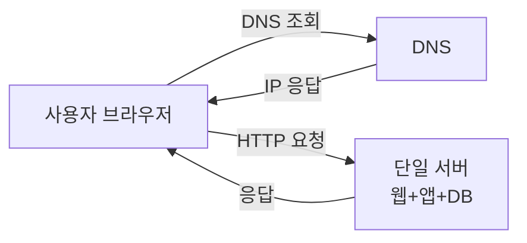

**새로 생긴 문제.** 서버가 한 대이므로 이 한 대가 곧 단일 장애점(SPOF)이다. 트래픽이 늘면 웹 요청 처리와 데이터베이스 쿼리가 같은 CPU·메모리를 두고 경쟁한다. 이 경쟁이 다음 단계(55.2 데이터베이스 분리)를 촉발하는 신호다 — 신호는 항상 "느려짐"이 아니라 "리소스 사용률 그래프의 교차"로 관측된다.

**AWS 구현과 비용 감각.** 이 단계는 EC2 인스턴스 1대(예: `t3.small` 또는 `t3.medium`) 또는 관리 부담을 더 줄인 Lightsail 인스턴스 하나로 시작한다. 월 비용은 대략 수 달러~수십 달러 단위이며, 이 시점에서 가장 큰 비용 리스크는 인프라비가 아니라 "과설계로 낭비하는 엔지니어링 시간"이다.

```bash
# 최소 구성: 단일 EC2 인스턴스 (웹+앱+DB 동거)
aws ec2 run-instances \
  --image-id ami-0abcdef1234567890 \
  --instance-type t3.small \
  --key-name my-keypair \
  --region ap-northeast-2 \
  --tag-specifications 'ResourceType=instance,Tags=[{Key=Name,Value=single-server-stage}]'
```

EC2와 Lightsail 중에서는 네트워킹·과금 구조를 세밀하게 직접 통제하고 싶다면 EC2를, 고정 월정액으로 서버·스토리지·트래픽을 한 번에 패키징한 단순함을 원한다면 Lightsail을 택한다. 어느 쪽이든 이 단계의 핵심은 "정답 아키텍처"를 고르는 것이 아니라, 다음 단계로 옮겨갈 때 발목 잡히지 않을 정도의 최소한의 위생 상태(정기 스냅샷, 접근 제어)만 갖추고 빠르게 검증하는 것이다.

### 55.2 데이터베이스 분리와 수직/수평 확장

**지금의 병목.** 웹 요청 처리와 데이터베이스 쿼리가 같은 서버 자원을 다투면서, 어느 하나가 느려지면 다른 하나도 함께 느려진다. 배포·재시작·장애 조치도 두 계층이 묶여 있어 독립적으로 할 수 없다.

**해결책.** 웹/애플리케이션 계층과 데이터 계층을 물리적으로 분리한다. 이렇게 하면 두 계층을 각각 독립적으로 확장할 수 있다 — 웹 계층은 **수평 확장(scale-out, 서버 대수를 늘림)**, 데이터 계층은 우선 **수직 확장(scale-up, 더 큰 인스턴스로 교체)**으로 대응하는 것이 일반적 출발점이다. 수직 확장은 코드 변경 없이 인스턴스 클래스만 올리면 되므로 구현이 가장 단순하지만, 세 가지 한계를 그대로 안고 간다. 첫째, 어느 클라우드든 구매 가능한 최대 사양이라는 **물리적 상한**이 있다. 둘째, 인스턴스가 한 대인 이상 그 자체가 **단일 장애점(SPOF)**이라는 사실은 변하지 않는다. 셋째, 인스턴스가 죽었을 때 자동으로 넘겨받을 대기 인스턴스가 없으므로 **페일오버 메커니즘이 없다**. 이 세 한계는 수직 확장을 아무리 반복해도 사라지지 않고, 결국 수평 확장(웹 계층은 55.3, 데이터 계층은 55.4)으로 넘어가야 해소된다.

이 단계에서 반드시 짚어야 할 결정이 관계형(RDBMS) vs 비관계형(NoSQL) 선택이다. 기본값은 관계형이며, 아래 네 조건 중 하나에 뚜렷하게 해당할 때만 비관계형을 우선 검토한다.

| 조건 | 설명 | 예시 |
|---|---|---|
| 초저지연 요구 | 밀리초 이하 단위의 응답이 필요 | 실시간 랭킹, 세션 조회 |
| 비정형/반정형 데이터 | 스키마가 자주 바뀌거나 구조가 다양함 | 이벤트 로그, 사용자 생성 콘텐츠 |
| 직렬화만 하면 되는 데이터 | JSON/XML 형태로 저장·조회만 하고 관계형 질의가 불필요 | 설정 값, 캐시된 문서 |
| 초대용량 데이터 | 단일 관계형 인스턴스로 감당하기 어려운 규모 | 클릭스트림, IoT 텔레메트리 |

이 네 조건은 어디까지나 초기 판단을 위한 출발점이며, 실제로는 서비스가 성장하며 조건에 해당하는 부분만 별도 저장소로 옮기는 혼합 구성(관계형 + 비관계형 병행)으로 귀결되는 경우가 많다.

**한 줄 결정 기준**: 트랜잭션·조인·정합성이 핵심이면 관계형을 기본값으로 삼고, 위 네 조건 중 하나가 뚜렷할 때만 비관계형으로 이동한다.

이 단계에서 흔히 오해하는 지점이 하나 더 있다. 데이터베이스 서버를 EC2 인스턴스에 직접 올려 운영할 경우, 저장소를 인스턴스 스토어(instance store)로 착각해서는 안 된다. 인스턴스 스토어는 인스턴스 자체와 물리적으로 결합된 임시 스토리지로 인스턴스가 중지되거나 종료되면 데이터가 사라지는 휘발성 저장소이며, 데이터베이스 파일은 반드시 영속적이고 스냅샷이 가능한 EBS 볼륨에 두어야 한다. 다만 EBS 볼륨은 특정 가용 영역(AZ)에 종속되므로, 인스턴스를 다른 AZ로 옮기면 볼륨도 함께 옮기거나 스냅샷에서 새로 만들어야 한다는 제약은 그대로 남는다.

**구조 변화.**

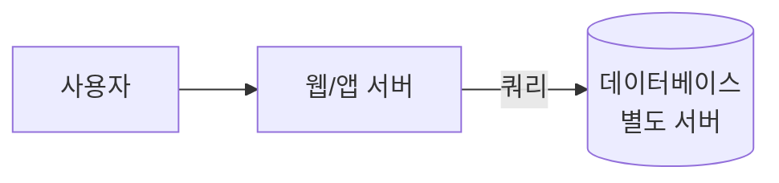

**새로 생긴 문제.** 계층을 분리해도 각 계층이 여전히 한 대뿐이라면 SPOF는 사라지지 않는다. 또한 서버가 두 대 이상이 되는 순간 "사용자를 어느 서버로 보낼 것인가"라는 새로운 문제, 즉 부하 분산 문제가 등장한다.

**AWS 구현과 비용 감각.** 웹 서버는 EC2에 남기고 데이터베이스만 관리형 RDS로 옮기는 것이 전형적인 첫걸음이다. RDS는 패치·백업·페일오버 구성을 관리형으로 넘겨주므로, 이 단계부터 이미 "직접 운영할 것과 위임할 것"을 결정하는 설계가 시작된다. 계층을 분리한 김에 네트워크 접근도 최소 권한으로 좁혀둔다 — DB 인스턴스의 보안 그룹(SG, 상태 유지 방화벽)에는 웹 계층의 보안 그룹만 특정 포트로 접근을 허용하고, 인터넷 전체에는 열지 않는다. 비용은 인스턴스 클래스에 비례해 EC2 단독 구성보다 한 단계 올라가지만, 장애 대응 인건비를 감안하면 총소유비용(TCO) 관점에서는 대체로 유리하다.

```bash
# 데이터 계층을 관리형 RDS로 분리
aws rds create-db-instance \
  --db-instance-identifier app-db-01 \
  --db-instance-class db.t3.medium \
  --engine postgres \
  --master-username admin \
  --master-user-password ChangeMe123! \
  --allocated-storage 50 \
  --region ap-northeast-2
```

### 55.3 로드 밸런서와 무상태 웹 계층

**지금의 병목.** 웹 서버가 한 대인 이상, 그 한 대의 처리량이 전체 서비스의 상한이다. 대수를 늘려도 사용자가 특정 서버의 IP를 직접 알고 접속한다면 확장의 의미가 없다.

**해결책.** 로드 밸런서(LB)를 웹 계층 앞에 두고, 사용자는 LB의 공개 주소만 알게 한다. LB는 여러 웹 서버로 요청을 분산하고, 서버들은 **프라이빗 IP**로만 서로 및 LB와 통신한다 — 웹 서버에는 퍼블릭 IP를 아예 부여하지 않는 구성이 일반적이며, 이는 확장의 부산물이자 동시에 공격 표면을 줄이는 보안 이득이기도 하다. 이 시점부터 웹 서버는 **무상태(stateless)**여야 확장이 의미를 가진다 — 서버가 요청 간 상태를 기억하지 않아야 어떤 서버가 어떤 요청을 처리하든 결과가 같기 때문이다.

**구조 변화.**

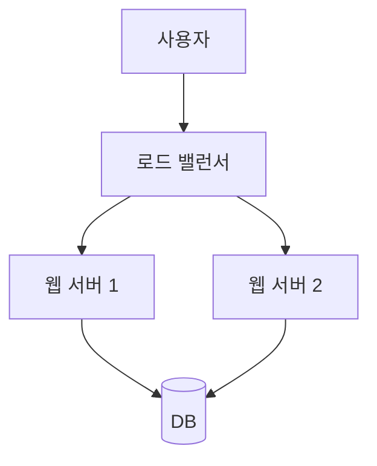

**새로 생긴 문제.** 웹 계층은 늘렸지만 데이터베이스는 여전히 한 대다. 읽기 트래픽이 늘수록 이 한 대가 다시 전체 시스템의 병목이 된다 — 다음 단계(55.4 복제)로 넘어가는 신호다. 또한 로그인 세션처럼 서버별로 상태를 들고 있던 코드가 있다면 이 시점에 반드시 드러난다(55.6에서 정면으로 다룬다). 로드 밸런서가 헬스체크에 실패한 서버로는 트래픽을 보내지 않으므로, 이 시점부터는 애플리케이션이 자기 상태를 정직하게 보고하는 헬스체크 엔드포인트를 갖추는 것도 함께 요구된다.

**AWS 구현과 비용 감각.** ALB(Application Load Balancer)를 Auto Scaling Group(ASG) 앞에 두는 구성이 표준이다 — ALB/ASG의 리스너 규칙, 타깃 그룹, 스케일링 정책 세부사항은 **→ 16장 참조**. ALB는 관리형이라 LB 자체의 이중화는 AWS가 대신 책임지므로, 이 단계에서 우리가 직접 관리해야 할 SPOF는 LB가 아니라 여전히 데이터 계층에 남아 있다는 점을 명확히 해두는 것이 좋다. 비용은 ALB 시간당 요금 + LCU(처리 용량 단위) 과금과 인스턴스 대수에 비례하는 EC2 비용의 합이며, 트래픽이 없을 때도 최소 인스턴스 수만큼은 계속 과금된다는 점을 감안해야 한다.

```typescript
// CDK: ALB + ASG 최소 골격 (세부 스케일링 정책은 16장 참조)
const vpc = new ec2.Vpc(this, "AppVpc");
const asg = new autoscaling.AutoScalingGroup(this, "WebAsg", {
  vpc,
  instanceType: ec2.InstanceType.of(ec2.InstanceClass.T3, ec2.InstanceSize.SMALL),
  machineImage: ec2.MachineImage.latestAmazonLinux2023(),
  minCapacity: 2, // 서버 1대 = SPOF, 최소 2대로 시작
  maxCapacity: 10,
});
const lb = new elbv2.ApplicationLoadBalancer(this, "AppAlb", { vpc, internetFacing: true });
lb.addListener("Http", { port: 80, defaultTargetGroups: [] }).addTargets("WebTargets", {
  port: 80,
  targets: [asg],
});
```

### 55.4 데이터베이스 복제와 읽기 분산

**지금의 병목.** 웹 계층은 여러 대로 늘었지만 데이터베이스 한 대가 모든 읽기·쓰기를 처리한다. 대부분의 서비스는 읽기가 쓰기보다 압도적으로 많으므로(조회 위주 트래픽), 이 한 대가 곧 전체 처리량의 상한이 된다.

**해결책.** 데이터베이스를 라이터(마스터)와 리더(슬레이브) 구조로 복제한다. 쓰기는 라이터에만 몰아주고, 읽기는 여러 리더로 분산한다. 리더를 늘리는 것만으로 읽기 처리량을 수평으로 확장할 수 있고, 라이터가 죽어도 리더 중 하나가 승격되어 가용성이 올라간다.

**구조 변화.**

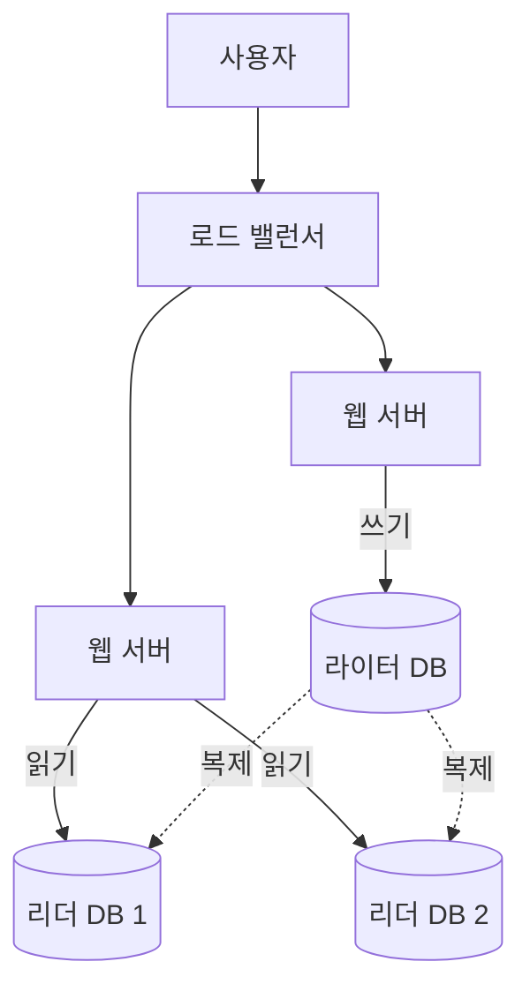

**새로 생긴 문제.** 복제는 일반적으로 비동기이므로 라이터에 쓴 값이 리더에 즉시 보이지 않는 **복제 지연(replication lag)**이 생긴다. "글 작성 직후 목록에서 안 보인다"는 흔한 버그가 여기서 나온다. 또한 라이터가 죽었을 때는 리더 중 하나를 새 라이터로 승격해야 하는데, 이 승격에는 반드시 시간이 걸리고(감지 → 선출 → 애플리케이션의 연결 재시도) 그 사이 쓰기 요청은 실패하거나 대기한다. 어떤 리더를 승격 대상으로 삼을지, 승격 도중 들어온 쓰기 요청을 어떻게 처리할지는 관리형 서비스가 대신 결정해주지 않는 한 직접 설계해야 하는 절차다.

복제 방식 자체도 동기와 비동기 중 하나를 고르는 문제다.

| 복제 방식 | 쓰기 확인 시점 | 장점 | 단점 |
|---|---|---|---|
| 동기 복제 | 리더까지 반영된 뒤 커밋 확인 | 복제 지연 없음, 승격 시 데이터 유실 없음 | 리더 수만큼 쓰기 지연 증가, 리더 하나라도 응답이 늦으면 쓰기 전체가 느려짐 |
| 비동기 복제 | 라이터에 반영되면 즉시 커밋 확인 | 쓰기 지연이 낮음, 리더 장애가 쓰기 경로에 영향을 주지 않음 | 복제 지연 발생, 승격 시 최근 쓰기 유실 가능 |

**한 줄 결정 기준**: 쓰기 지연에 민감한 일반 서비스는 비동기를 기본값으로 하고, 금융 거래처럼 유실을 절대 허용할 수 없는 일부 데이터에 한해 동기 복제를 선택적으로 적용한다. 두 방식을 하나의 데이터베이스 안에서 테이블 단위로 섞어 쓰는 것은 대부분의 관리형 서비스에서 지원하지 않으므로, 유실 허용치가 다른 데이터라면 애초에 별도의 데이터베이스로 분리하는 편이 현실적이다.

**AWS 구현과 비용 감각.** 가용성은 RDS/Aurora **Multi-AZ**(동기 대기 인스턴스, 자동 페일오버 목적)로, 읽기 확장은 **리드 리플리카**(비동기, 확장 목적)로 확보한다. 이 둘은 목적이 다르므로 하나로 다른 하나를 대체할 수 없다 — 세부 차이와 페일오버 시간은 **→ 25장 참조**. 비용은 Multi-AZ 적용 시 대기 인스턴스만큼, 리드 리플리카는 대수만큼 선형으로 증가한다.

```python
# 애플리케이션 계층에서 읽기/쓰기 엔드포인트 분리 (개념 예시)
import random

WRITER_ENDPOINT = "app-db-writer.xxxx.ap-northeast-2.rds.amazonaws.com"
READER_ENDPOINTS = [
    "app-db-reader-1.xxxx.ap-northeast-2.rds.amazonaws.com",
    "app-db-reader-2.xxxx.ap-northeast-2.rds.amazonaws.com",
]

def get_connection(is_write: bool):
    # 쓰기는 항상 라이터로, 읽기는 리더 중 하나로 무작위 분산
    host = WRITER_ENDPOINT if is_write else random.choice(READER_ENDPOINTS)
    return connect(host=host)
```

실무에서는 이런 라우팅 로직과 커넥션 풀 관리를 애플리케이션에 직접 심기보다, RDS Proxy처럼 애플리케이션과 데이터베이스 사이에서 커넥션 풀링과 페일오버 전환을 대신 처리해주는 계층에 위임하는 경우가 많다(**→ 25.7절 참조**) — 이렇게 하면 라이터 승격이 일어나도 애플리케이션 코드는 프록시 엔드포인트 하나만 바라보면 된다.

### 55.5 캐시 계층과 CDN

**지금의 병목.** 리더를 늘려도 같은 데이터를 매번 다시 계산·조회하는 것은 낭비다. 자주 바뀌지 않는데 자주 조회되는 데이터(인기 상품, 설정값, 랭킹)가 매 요청마다 데이터베이스까지 왕복하면 리더 대수를 아무리 늘려도 비용 대비 효율이 나쁘다.

**해결책.** 데이터베이스와 애플리케이션 사이에 인메모리 캐시 계층을 둔다. 가장 널리 쓰이는 형태가 캐시 어사이드(cache-aside)로, 애플리케이션이 캐시를 먼저 조회하고 없으면 원본에서 읽어 캐시를 채우는 방식이다 — 패턴의 세부 변형(write-through, write-behind)과 트레이드오프는 **→ 47.1, 47.2절 참조**. 정적 자산(이미지, JS/CSS, 동영상)은 애초에 웹 서버를 거칠 이유가 없으므로, 별도의 오브젝트 스토리지(S3)에 두고 CDN이 그곳을 오리진으로 삼아 사용자와 가까운 엣지에서 직접 서빙하게 한다. 이 분리만으로도 웹 서버가 처리해야 할 요청 수 자체가 줄어드는 효과가 있다.

**구조 변화.**

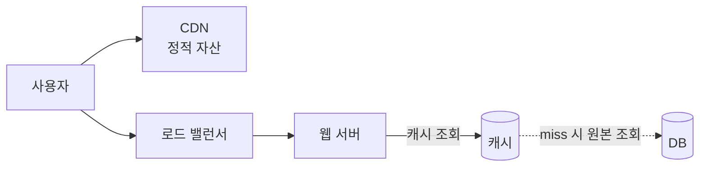

**새로 생긴 문제.** 캐시 도입 효과는 적중률에 정비례하므로, 적중률이 낮은 워크로드(개인화된 조회가 많아 캐시 키가 사용자마다 갈라지는 경우 등)에서는 캐시 노드 비용만 추가되고 원본 부하는 거의 줄지 않는 역효과가 날 수 있다. 여기에 더해 캐시는 원본과 별개의 사본이므로 만료 정책과 일관성 문제가 따라온다 — 너무 짧은 TTL은 캐시 효과가 없고, 너무 긴 TTL은 오래된 데이터를 보여준다. 캐시 서버 자체도 한 대라면 새로운 SPOF이며, 메모리가 가득 차면 축출(eviction) 정책(LRU 등)이 무엇을 지울지 결정한다. CDN 역시 마찬가지로 오리진의 콘텐츠가 바뀌었는데 엣지에 남은 이전 버전을 얼마나 오래 서빙할지를 결정하는 캐시 무효화(invalidation) 절차가 새로 필요해진다.

메모리가 가득 찼을 때 무엇을 지울지 결정하는 축출 정책도 워크로드에 맞춰 골라야 한다.

| 축출 정책 | 동작 방식 | 적합한 경우 |
|---|---|---|
| LRU(최근 최소 사용) | 가장 오래 조회되지 않은 항목을 제거 | 최근 인기 데이터가 다시 조회될 가능성이 높은 일반적 조회 패턴 |
| LFU(최소 빈도 사용) | 조회 횟수가 가장 적은 항목을 제거 | 일부 항목이 압도적으로 자주 조회되는 롱테일 분포 |
| TTL 기반 만료 | 축출과 무관하게 설정 시간이 지나면 자동 제거 | 데이터 신선도 자체가 중요한 랭킹·시세성 데이터 |

**한 줄 결정 기준**: 조회 패턴이 고르면 LRU를 기본값으로 하고, 일부 키에 조회가 극단적으로 쏠리면 LFU를, 신선도가 정확성보다 중요하면 TTL을 우선한다.

**AWS 구현과 비용 감각.** 캐시는 ElastiCache(Redis/Valkey 또는 Memcached), 정적 자산 배포는 CloudFront가 담당한다. ElastiCache는 노드 시간당 과금, CloudFront는 전송 데이터량과 요청 수 기준 과금이며, 캐시 적중률이 오를수록 오리진(원본 서버·DB) 비용이 줄어드는 구조라 캐시 도입 비용은 오리진 절감분과 함께 봐야 한다.

```python
import json
import redis  # ElastiCache Redis 호환 엔드포인트에 연결

cache = redis.Redis(host="app-cache.xxxx.cache.amazonaws.com", port=6379, decode_responses=True)

def get_product(product_id: str) -> dict:
    key = f"product:{product_id}"
    cached = cache.get(key)
    if cached:
        return json.loads(cached)  # 캐시 히트
    product = query_db_for_product(product_id)  # 캐시 미스 → 원본 조회
    cache.set(key, json.dumps(product), ex=300)  # TTL 5분: 너무 짧지도 길지도 않게
    return product
```

### 55.6 세션 외부화와 무상태화

**지금의 병목.** 로그인 상태나 장바구니처럼 요청 간 유지해야 하는 정보를 웹 서버의 로컬 메모리나 디스크에 저장하면, 그 사용자의 다음 요청도 반드시 같은 서버로 가야 한다(스티키 세션). 이는 로드 밸런서가 자유롭게 트래픽을 재분배하지 못하게 막아 55.3에서 얻은 수평 확장의 이점을 절반쯤 무효화하고, 서버가 죽으면 그 서버에 있던 모든 세션이 함께 사라져 로그인·장바구니가 갑자기 초기화되는 사용자 경험 문제로 이어진다.

**해결책.** 세션 데이터를 웹 서버 밖, 공유 저장소로 옮긴다. 그러면 어떤 요청이 어떤 서버로 가든 결과가 같아지고, 서버를 자유롭게 추가·제거(오토스케일링)할 수 있게 된다. 이것이 55.3에서 예고했던 "무상태 웹 계층"의 완성이다.

| 방식 | 장점 | 단점 |
|---|---|---|
| 스티키 세션 | 구현이 가장 단순, 코드 변경 최소 | 자유로운 스케일링 불가, 서버 장애 시 세션 유실 |
| 외부 세션 저장소 | 완전한 무상태화, 자유로운 확장, 서버 장애와 세션이 분리됨 | 저장소 자체의 지연·가용성 관리 필요, 매 요청마다 네트워크 왕복 추가 |
| 클라이언트 저장(JWT 등) | 서버 측 저장소 불필요, 저장소 왕복 지연 없음 | 토큰 무효화가 까다로움, 토큰 크기만큼 매 요청 오버헤드 |

**한 줄 결정 기준**: 자동 확장이 목표라면 스티키 세션은 배제하고, 즉시 무효화가 필요하면 외부 저장소, 무효화 요건이 느슨하면 JWT를 검토한다. ALB 자체도 스티키 세션 기능을 제공하지만(**→ 16.6절 참조**), 이는 확장성 문제를 근본적으로 해결하기보다 특정 서버에 트래픽을 고정하는 임시방편에 가깝다는 점을 유의한다.

**구조 변화.**

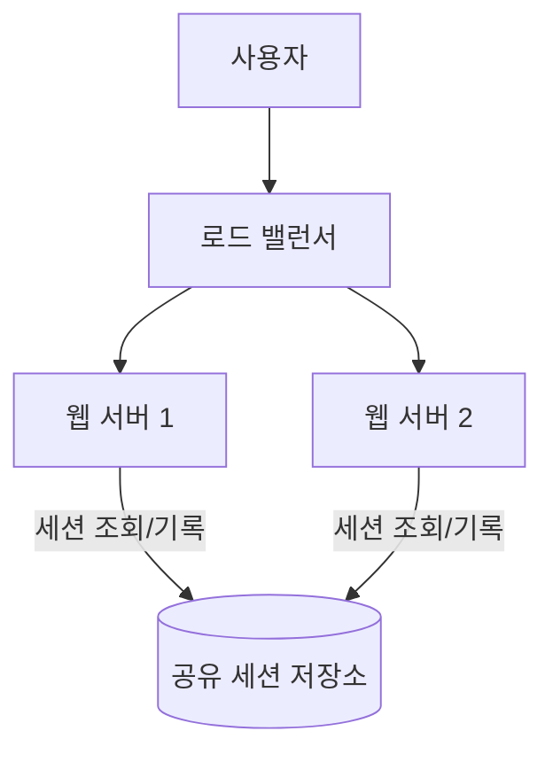

**새로 생긴 문제.** 세션 저장소 자체가 새로운 공유 의존성이 되므로, 이 저장소가 느려지거나 죽으면 모든 웹 서버가 동시에 영향을 받는다. 저장소 하나로는 다시 SPOF이므로 가용성 구성이 필요하다.

**AWS 구현과 비용 감각.** 세션 저장소는 지연이 가장 중요하므로 ElastiCache(Redis/Valkey)가 기본 선택지이고, 세션 수명이 길고 조회 빈도가 낮으면 DynamoDB(TTL 속성으로 자동 만료)도 대안이다. ElastiCache는 노드 시간당 과금, DynamoDB는 온디맨드 시 요청량 기준 과금이라 트래픽 패턴에 따라 유불리가 갈린다. 두 경우 모두 세션 저장소 자체가 단일 인스턴스가 아니라 다중 노드/다중 AZ로 구성돼야, 방금 없앤 SPOF를 세션 계층에 다시 만드는 실수를 피할 수 있다.

```python
from flask import Flask, session
from flask_session import Session
import redis

app = Flask(__name__)
app.config["SESSION_TYPE"] = "redis"
# 세션을 서버 로컬 메모리가 아닌 ElastiCache Redis로 외부화
app.config["SESSION_REDIS"] = redis.Redis(host="app-session.xxxx.cache.amazonaws.com", port=6379)
Session(app)

@app.route("/cart/add")
def add_to_cart():
    session["cart"] = session.get("cart", []) + ["item-123"]
    return "OK"  # 어떤 웹 서버가 처리해도 결과는 동일
```

### 55.7 다중 데이터센터(멀티 리전) 구성

**지금의 병목.** 하나의 데이터센터(리전)에 모든 것이 있으면, 그 리전 전체에 장애가 생겼을 때 — 드물지만 실제로 발생하는 리전급 정전, 네트워크 단절 — 서비스 전체가 멈춘다. 이는 지금까지의 단계들(로드 밸런서, 복제, 캐시)이 전혀 해결해주지 못하는 종류의 장애다. 또한 사용자가 서비스 본거지에서 지리적으로 멀리 떨어진 곳에서 접속하면, 아무리 서버 성능이 좋아도 물리적 거리 자체가 만드는 왕복 지연은 줄일 수 없다.

**해결책.** 두 개 이상의 지리적으로 분리된 리전에 인프라를 두고, 사용자를 가장 가까운(또는 가장 건강한) 리전으로 라우팅한다(GeoDNS/지연 기반 라우팅). 이는 성능과 재해 복구를 동시에 개선한다.

**구조 변화.**

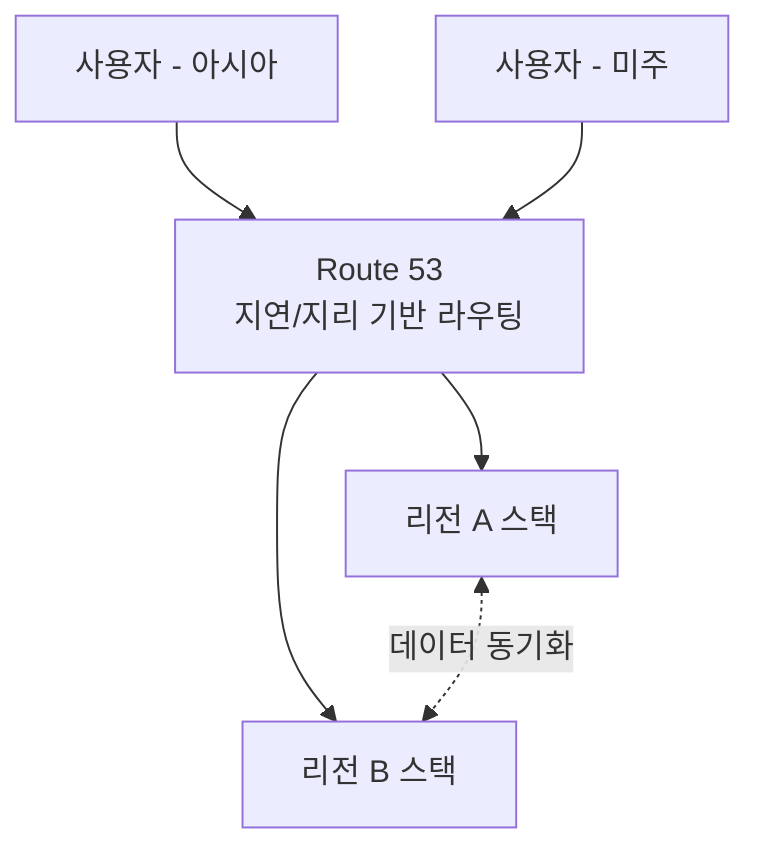

**새로 생긴 문제.** 리전 간 데이터를 어떻게 동기화할지가 핵심 난제다 — 완전한 동기 복제는 리전 간 물리 거리 때문에 지연이 크고, 비동기 복제는 리전 간 데이터 불일치 구간이 생긴다. 액티브-패시브(한 리전만 트래픽을 받고 다른 리전은 대기)로 시작해 데이터 동기화 경험이 쌓인 뒤 액티브-액티브(두 리전 모두 트래픽을 받고 서로의 쓰기를 병합)로 넘어가는 편이 안전하다. 또한 페일오버가 실제로 작동하는지는 평상시 트래픽으로는 검증되지 않으므로, 정기적인 페일오버 테스트(게임데이)가 필요하다 — 테스트하지 않은 페일오버는 존재하지 않는 것과 같다.

**AWS 구현과 비용 감각.** Route 53의 지연 기반·지리 기반 라우팅 정책과 상태 확인으로 리전을 전환하고, CloudFront/Global Accelerator로 엣지 성능을 더한다 — 라우팅 정책 7종과 Multi-AZ vs Multi-Region 결정 트리는 **→ 8장, 13장 참조**. 비용은 두 번째 리전의 인프라를 얼마나 "핫"하게 유지하느냐(액티브-액티브 vs 파일럿 라이트)에 따라 크게 달라지며, 대체로 인프라 비용이 두 배 가까이 늘어난다고 가정하고 시작하는 편이 안전하다.

```bash
# Route 53: 지연 기반 라우팅 레코드 등록 (개념 예시, 세부는 13장 참조)
aws route53 change-resource-record-sets \
  --hosted-zone-id Z1234567890ABC \
  --change-batch '{
    "Changes": [{
      "Action": "UPSERT",
      "ResourceRecordSet": {
        "Name": "api.example.com",
        "Type": "A",
        "SetIdentifier": "ap-northeast-2",
        "Region": "ap-northeast-2",
        "AliasTarget": {"HostedZoneId": "Z3AADJGX6KTTL2", "DNSName": "alb-a.ap-northeast-2.elb.amazonaws.com", "EvaluateTargetHealth": true}
      }
    }]
  }'
```

`EvaluateTargetHealth`를 켜두면 해당 리전의 ALB 상태 확인이 실패할 때 Route 53이 자동으로 그 리전을 라우팅 대상에서 제외한다 — 이것이 리전 페일오버의 실제 메커니즘이다. 데이터 동기화 부담을 줄이는 실무적 우회로도 있다. 세션·설정처럼 즉시 일관성이 필요한 일부 데이터만 다중 리전 복제를 관리형으로 제공하는 서비스(DynamoDB 글로벌 테이블, Aurora Global Database)에 올리고, 나머지는 한 리전을 원본으로 유지한 채 비동기 복제만 거는 식으로 범위를 좁히면 직접 설계해야 할 동기화 문제의 표면적이 줄어든다.

### 55.8 메시지 큐 도입과 비동기화

**지금의 병목.** 이미지 인코딩, 알림 발송, 리포트 생성처럼 오래 걸리는 작업을 사용자 요청과 같은 흐름에서 동기 처리하면, 그 작업이 끝날 때까지 사용자가 기다려야 하고 트래픽이 몰리면 웹 서버 스레드가 이 작업들에 붙잡혀 다른 요청을 처리하지 못한다. 예를 들어 사용자가 프로필 사진을 올릴 때마다 여러 해상도로 인코딩하는 작업을 요청 안에서 끝내려 하면, 동시에 여러 명이 사진을 올리는 순간 웹 서버 전체가 그 인코딩 작업들에 발이 묶인다.

**해결책.** 생산자(웹 서버)와 소비자(워커)를 메시지 큐로 분리한다. 웹 서버는 작업을 큐에 넣기만 하고 즉시 사용자에게 응답하며, 워커가 큐에서 작업을 꺼내 독립적으로 처리한다. 이렇게 하면 생산자와 소비자를 각각 필요한 만큼 독립적으로 확장할 수 있다 — 워커 대수는 웹 서버 대수와 무관하게 큐 적체량에 맞춰서만 조절하면 된다. 평소 트래픽의 몇 배에 달하는 순간적인 급증(플래시 세일, 이벤트 알림 발송)도 큐가 버퍼처럼 흡수해, 워커가 자기 속도대로 소화할 시간을 벌어준다.

**구조 변화.**

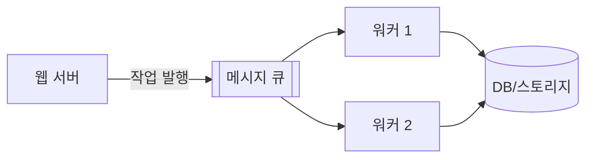

**새로 생긴 문제.** 처리 결과를 사용자에게 언제·어떻게 알려줄지(폴링, 웹소켓, 이메일 알림) 별도 설계가 필요해지고, 메시지가 중복 처리되거나 순서가 뒤바뀔 가능성에 대비해야 한다. 큐 자체가 새로운 컴포넌트이므로 모니터링 대상도 늘어난다.

**AWS 구현과 비용 감각.** Amazon SQS로 큐를 두고 워커는 Lambda(짧고 이벤트성 작업) 또는 ECS/EC2(길고 상태를 가진 작업)로 구성한다 — 큐 종류별 선택과 재시도·경쟁 소비자 패턴은 **→ 45장, 46장 참조**. SQS는 요청 수 기준 과금이라 저렴하게 시작할 수 있고, 워커 비용은 처리량에 따라 선형으로 늘어난다.

```python
import boto3, json

sqs = boto3.client("sqs", region_name="ap-northeast-2")
QUEUE_URL = "https://sqs.ap-northeast-2.amazonaws.com/123456789012/image-jobs"

while True:
    resp = sqs.receive_message(QueueUrl=QUEUE_URL, MaxNumberOfMessages=5, WaitTimeSeconds=10)
    for msg in resp.get("Messages", []):
        job = json.loads(msg["Body"])
        process_image(job)  # 실제 인코딩 작업
        # 처리에 성공한 뒤에만 삭제 — 실패 시 가시성 타임아웃 후 재처리됨
        sqs.delete_message(QueueUrl=QUEUE_URL, ReceiptHandle=msg["ReceiptHandle"])
```

특정 작업이 반복적으로 실패하면 같은 메시지가 무한히 재처리되며 워커를 계속 붙잡을 수 있다. 이를 막기 위해 SQS 큐에 최대 수신 횟수(maxReceiveCount)를 넘긴 메시지를 자동으로 옮기는 데드레터 큐(DLQ)를 함께 구성해, 실패한 작업을 별도로 격리하고 나중에 원인을 분석한다 — 재시도·서킷 브레이커 조합은 **→ 46장 참조**.

### 55.9 로깅·메트릭·자동화 계층

**지금의 병목.** 서버가 여러 대, 여러 리전에 걸쳐 있으면 "지금 어디가 느린가"를 사람이 서버마다 로그인해서 확인하는 방식이 통하지 않는다. 배포도 서버마다 수동으로 하면 실수와 불일치가 누적된다.

**해결책.** 각 인스턴스가 로컬 디스크에만 로그를 쌓아두는 대신, 에이전트가 로그를 중앙 저장소로 실시간 전송하도록 바꾼다(로그 중앙화). 이때 자유 형식 텍스트보다 필드가 구분된 구조화 로그(JSON 등)로 남기면, 나중에 서버별로 grep 하는 대신 중앙에서 즉시 질의할 수 있다. 메트릭은 세 층위로 나눠 수집한다. **호스트 수준**은 CPU·메모리·디스크 I/O처럼 인스턴스 하나의 건강 상태를 보여주고, **집계 수준**은 엔드포인트별 지연·에러율·처리량처럼 서비스 전체의 동작을 보여주며, **비즈니스 수준**은 가입 전환율·결제 건수·활성 사용자 수처럼 기술 지표만으로는 보이지 않는 사업적 이상 신호를 보여준다. 세 층위 중 하나라도 빠지면 "서버는 멀쩡한데 매출이 갑자기 0에 가깝다" 같은 상황을 놓치게 된다. 배포도 사람이 서버마다 접속해 수동으로 올리는 대신, 이 시점부터 파이프라인으로 자동화해 실수와 서버 간 불일치를 줄인다. CI/CD 자동화를 도입할 시점을 가늠하는 실질적인 기준은 "서버 대수"보다 "배포당 사람이 들이는 시간과 실수 빈도"다 — 서버가 두세 대만 되어도 배포마다 순서·검증 절차를 사람이 그대로 반복해야 한다면, 그 반복 자체가 이미 자동화를 도입할 신호다.

**구조 변화.**


**새로 생긴 문제.** 관측 대상이 늘어난 만큼 관측 자체의 비용(로그 저장량, 카디널리티 높은 메트릭)이 무시할 수 없는 수준이 되고, 알람이 너무 많으면 진짜 중요한 신호가 묻히는 알람 피로가 생긴다. 배포 자동화 역시 실수를 줄이는 만큼, 잘못된 변경이 파이프라인을 타고 전체 서버에 빠르게 퍼질 수 있다는 반대급부를 가진다 — 그래서 자동화가 성숙해질수록 점진적 배포(카나리, 블루/그린)의 필요성도 함께 커진다.

**AWS 구현과 비용 감각.** CloudWatch Logs/Metrics/Alarms로 로그·메트릭을 중앙화하고, X-Ray로 요청 단위 분산 추적을 더하며, CI/CD는 CodePipeline 계열 또는 서드파티 도구로 자동화한다 — 관측성 스택 전반은 **→ 38장 참조**. 비용은 수집·보관하는 로그량과 커스텀 메트릭 개수에 비례하므로, 모든 것을 무한정 보관하기보다 보관 주기를 목적별로 나누는 것이 실무 관행이다.

```bash
# CPU 사용률 기반 알람: 임계값을 넘으면 SNS로 통보 (자동 확장 트리거의 기초)
aws cloudwatch put-metric-alarm \
  --alarm-name web-tier-high-cpu \
  --namespace AWS/EC2 --metric-name CPUUtilization \
  --statistic Average --period 300 --threshold 70 \
  --comparison-operator GreaterThanThreshold --evaluation-periods 2 \
  --alarm-actions arn:aws:sns:ap-northeast-2:123456789012:ops-alerts
```

```sql
-- CloudWatch Logs Insights: 최근 1시간 5xx 응답이 가장 많은 엔드포인트 상위 10개
-- 서버별로 로그인해 grep 하는 대신 중앙 집계된 로그에서 즉시 질의한다
fields @timestamp, path, status
| filter status >= 500
| stats count(*) as error_count by path
| sort error_count desc
| limit 10
```

### 55.10 데이터베이스 샤딩과 그 후유증

**지금의 병목.** 리드 리플리카와 캐시로도 감당이 안 되는 것은 대개 **쓰기** 처리량이다. 리드 리플리카는 읽기만 분산할 뿐 모든 쓰기는 여전히 라이터 한 대로 몰리고, 수직 확장으로 그 한 대의 사양을 아무리 올려도 55.2에서 이미 확인한 물리적 상한에 다시 부딪힌다. 이 시점에서는 데이터 자체를 여러 데이터베이스로 쪼개는 것 외에 다른 선택지가 마땅치 않다.

**해결책.** 샤딩 키를 정해 데이터를 여러 샤드로 분산 저장한다. 샤딩 키 선택이 이 단계 전체의 성패를 좌우한다 — 데이터와 쿼리 부하가 샤드 간에 고르게 퍼지도록 하는 키를 골라야 한다.

| 샤딩 전략 | 방식 | 트레이드오프 |
|---|---|---|
| 해시 기반 | 키를 해시해 샤드 결정 | 분산은 균등하지만 범위 쿼리가 어려움 |
| 레인지 기반 | 키의 값 범위로 샤드 결정 | 범위 쿼리는 쉽지만 특정 구간에 쏠릴 위험 |
| 디렉토리(룩업) 기반 | 별도 매핑 테이블로 샤드 결정 | 유연하지만 매핑 테이블 자체가 새 병목/SPOF |

**한 줄 결정 기준**: 범위 조회가 잦으면 레인지, 균등 분산이 최우선이면 해시, 리샤딩 유연성이 최우선이면 디렉토리 기반을 택하되 매핑 테이블의 가용성을 별도로 보장한다. 어떤 전략이든 샤딩 키는 한 번 정하면 되돌리는 비용이 매우 크므로, "어떤 쿼리가 가장 자주, 가장 많은 트래픽으로 실행되는가"를 실제 접근 패턴 데이터로 확인한 뒤에 정한다 — 추측으로 고른 샤딩 키는 얼마 지나지 않아 55.10의 핫스팟 문제로 되돌아온다.

**구조 변화.**

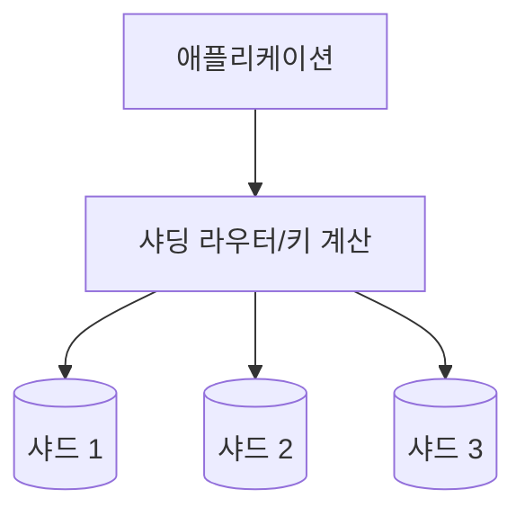

**새로 생긴 문제.** 샤딩은 이 장 전체에서 가장 비용이 큰 해법이다. 서로 다른 샤드에 걸친 조인이 어려워지고, 여러 샤드에 걸친 트랜잭션의 정합성 보장이 까다로워지며, 특정 샤드에 트래픽이 몰리는 **핫스팟(셀럽 문제)** — 예를 들어 팔로워가 많은 사용자 한 명의 데이터가 있는 샤드만 유독 뜨거워지는 상황 — 이 발생한다. 샤드를 다시 나누는 리샤딩은 서비스 운영 중에는 위험 부담이 커서, 실무에서는 일관된 해싱(consistent hashing)으로 리샤딩 시 이동해야 하는 데이터 양을 최소화한다. 조인이 어려워진 대가로 비정규화(같은 데이터를 여러 곳에 중복 저장)를 받아들이는 경우도 많다.

**AWS 구현과 비용 감각.** 자체 샤딩 라우터를 직접 구현·운영하기 전에, 스토리지 계층을 자동으로 확장하는 Aurora의 대규모 확장 옵션이나 애초에 파티션 키 기반 확장을 관리형으로 제공하는 DynamoDB로의 이전을 먼저 검토할 가치가 있다 — 둘 다 "샤드를 몇 개로 나눌지"를 우리가 직접 정하지 않아도 되게 해준다는 공통점이 있다 — 샤딩 패턴의 구현 세부는 **→ 47.4절 참조**. DynamoDB로 옮기면 샤딩 로직 자체를 서비스에 위임하는 셈이지만, 조인이 없는 접근 패턴에 데이터 모델을 맞춰야 한다는 제약이 따른다. 비용 관점에서 샤딩은 인프라비보다 "운영 복잡도"라는 숨은 비용이 훨씬 크다는 점을 감안해야 한다.

```python
# 단순 해시 기반 샤딩 키 계산 (개념 예시)
import hashlib

SHARD_COUNT = 4
SHARD_ENDPOINTS = {i: f"shard-{i}.xxxx.rds.amazonaws.com" for i in range(SHARD_COUNT)}

def get_shard_for_user(user_id: str) -> str:
    digest = hashlib.sha256(user_id.encode()).hexdigest()
    shard_index = int(digest, 16) % SHARD_COUNT
    return SHARD_ENDPOINTS[shard_index]
```

위 방식은 `SHARD_COUNT`가 바뀌는 순간(샤드를 4개에서 5개로 늘리는 순간) 거의 모든 키의 나머지 연산 결과가 바뀌어 대부분의 데이터를 재배치해야 한다. 일관된 해싱은 샤드와 키를 같은 해시 링 위에 배치해, 샤드를 추가하거나 제거할 때 그 샤드 인접 구간의 키만 이동하도록 만들어 이 재배치 범위를 최소화한다 — 이 자체를 직접 구현하는 대신, 파티션 키 기반 자동 재분산을 관리형으로 제공하는 DynamoDB로 옮겨 문제 자체를 없애는 선택지도 뒤에서 함께 검토한다.

### 55.11 각 단계를 AWS 서비스로 매핑한 진화 로드맵

지금까지의 진화 순서를 사용자 규모별 스냅샷으로 정리하면 다음과 같다. 실제로는 트래픽 패턴에 따라 순서가 앞뒤로 바뀔 수 있으므로, 아래 표는 "정답 순서"가 아니라 "병목이 지시하는 전형적 순서"로 읽는다. 특히 "월 비용 자릿수 감각" 열은 인스턴스 사양·리전·워크로드에 따라 크게 달라지는 값이므로 견적이 아니라 단계 간 상대적 규모 차이를 감 잡기 위한 참고치로만 사용하고, 실제 예산 판단은 반드시 AWS 요금 계산기와 서비스별 요금 문서로 검증한다.

| 규모 | 구성 요소 | 예상 병목 | 다음 단계 트리거 지표 | 월 비용 자릿수 감각 |
|---|---|---|---|---|
| ~1천 | EC2/Lightsail 1대(웹+앱+DB) | CPU/메모리 경쟁 | CPU·디스크 I/O 사용률 지속 상승 | 수십 달러 |
| ~1만 | 웹/DB 분리 + RDS, ALB+ASG 2대 이상 | DB 단일 인스턴스의 읽기 처리량 | DB CPU/커넥션 수 포화 | 수백 달러 |
| ~10만 | 리드 리플리카, ElastiCache, CloudFront | 반복 조회 비용, 정적 자산 지연 | 캐시 미스율, 오리진 대역폭 증가 | 수백~수천 달러 |
| ~100만 | 세션 외부화, 멀티 AZ 상시화, SQS 비동기 처리 | 스티키 세션의 확장 제약, 동기 처리 지연 | 오토스케일링 실패율, 큐 적체 | 수천 달러 |
| ~1천만 | 멀티 리전, 샤딩 또는 DynamoDB 전환, 관측성 전면화 | 단일 리전 한계, 쓰기 처리량 상한 | 리전 간 지연, 샤드별 부하 편차 | 수만 달러 이상 |

**한 줄 결정 기준**: 표의 구성 요소를 미리 다 갖추지 말고, "다음 단계 트리거 지표"가 실제로 관측될 때만 그 단계로 넘어간다.

AWS 환경의 이점은 이 진화 곡선의 상당 구간을 관리형 서비스로 건너뛸 수 있다는 데 있다 — Aurora는 스토리지 확장과 복제를, DynamoDB는 샤딩을, ElastiCache는 캐시 클러스터 운영을, CloudFront는 엣지 인프라 구축을 대신 떠맡는다. 그래서 이 장의 진짜 설계 과제는 "이 모든 단계를 언제 밟을 것인가"가 아니라 **"이 중 어디부터 관리형 서비스로 넘길 것인가"**를 결정하는 일이다. 아래는 진화 단계별로 직접 구현할 때의 부담과 관리형 서비스로 위임했을 때 남는 책임을 정리한 것이다.

| 확장 영역 | 직접 구현 시 부담 | 위임 가능한 AWS 서비스 | 위임해도 남는 책임 |
|---|---|---|---|
| 읽기 복제 | 복제 설정, 지연 모니터링, 페일오버 스크립트 | RDS/Aurora 리드 리플리카 + Multi-AZ | 애플리케이션의 읽기/쓰기 라우팅 로직 |
| 캐시 클러스터 | 노드 장애 감지, 클러스터 리밸런싱 | ElastiCache(Redis/Valkey) | TTL·축출 정책 선택, 캐시-원본 정합성 로직 |
| 정적 자산 배포 | 전 세계 엣지 인프라 구축·운영 | CloudFront | 캐시 무효화 시점, 오리진 접근 제어(OAC) 설정 |
| 세션/샤딩 확장 | 파티션 설계, 리샤딩 스크립트, 핫스팟 대응 | DynamoDB(파티션 키 기반 자동 분산) | 파티션 키 설계, 접근 패턴에 맞춘 데이터 모델링 |

**한 줄 결정 기준**: 운영 부담이 크고 차별화 가치가 낮은 영역(복제·캐시·엣지 인프라)은 적극적으로 위임하고, 접근 패턴과 파티션 키 설계처럼 서비스 고유의 판단이 필요한 부분은 관리형 서비스를 쓰더라도 직접 결정한다.

```text
# 단계별로 나눈 CDK 스택 구조 (모노스택 대신 성장 단계에 맞춰 분리)
infra/
├── bin/app.ts
└── lib/
    ├── network-stack.ts        # VPC, 서브넷 — 1단계부터 필요
    ├── compute-stack.ts        # ALB + ASG (16장) — 1만 사용자 단계
    ├── data-stack.ts           # RDS/Aurora + 리드 리플리카 (25장) — 1만~10만
    ├── cache-cdn-stack.ts      # ElastiCache + CloudFront (13, 47장) — 10만
    ├── session-stack.ts        # 세션 외부화용 ElastiCache/DynamoDB — 100만
    ├── async-stack.ts          # SQS + 워커 (45, 46장) — 100만
    ├── observability-stack.ts  # CloudWatch + X-Ray (38장) — 전 단계 공통
    └── multi-region-stack.ts   # Route 53 + 리전 복제 (8, 13장) — 1천만
```

### 55장 정리

#### [필수] 반드시 알아야 할 것
1. 확장의 순서는 정해져 있다: **무상태화 → 수평 확장 → 캐시 → CDN → 읽기 분산 → 비동기화 → 샤딩**. 순서를 건너뛰면 해결하려는 문제보다 복잡도가 먼저 늘어난다.
2. 샤딩은 최후의 수단이다. 조인·트랜잭션 정합성·리샤딩 비용·핫스팟(셀럽 문제)이 전부 되돌아오는 대가이므로, 리드 리플리카·캐시·관리형 확장(Aurora, DynamoDB)을 먼저 소진한 뒤에 검토한다.
3. Multi-AZ(가용성 목적, 동기 대기)와 리드 리플리카(확장 목적, 비동기)는 서로 대체할 수 없는 별개의 메커니즘이다.
4. 무상태 웹 계층은 세션을 서버 밖 공유 저장소로 옮겨야 완성되며, 이것이 자동 확장이 가능해지는 전제 조건이다.
5. 캐시는 만료 정책·일관성·축출 정책이라는 대가를 수반하는 선택이며, 캐시 계층 자체도 가용성을 갖춰야 새로운 SPOF가 되지 않는다.
6. 메시지 큐는 생산자와 소비자를 분리해 각각 독립적으로 확장하게 하고 트래픽 급증을 흡수하지만, 처리 결과 통지와 중복 처리 방지라는 새 설계 과제를 만든다.
7. 관계형과 비관계형 중 무엇을 선택할지는 취향이 아니라 초저지연·비정형 데이터·단순 직렬화·초대용량이라는 네 조건 중 뚜렷한 것이 있는지로 판단한다. 조건에 해당하지 않으면 관계형이 기본값이다.
8. 리전 장애는 평상시 트래픽으로 검증되지 않으므로, 게임데이 같은 정기적인 페일오버 테스트 없이는 멀티 리전 구성을 신뢰할 수 없다.

#### [팁] 실무 노하우
1. 각 단계에서 "지금 병목이 어디인지"는 추측이 아니라 측정(CPU·커넥션 수·캐시 적중률·큐 적체량)으로 확인한다. 다음 단계는 병목이 지시한다.
2. AWS에서는 이 진화의 상당 부분을 관리형 서비스로 건너뛸 수 있다(Aurora, DynamoDB, ElastiCache, CloudFront). 무엇을 직접 운영하고 무엇을 위임할지 결정하는 것 자체가 설계다.
3. 세션 외부화·캐시 도입처럼 되돌리기 쉬운 변화를 먼저 하고, 샤딩처럼 되돌리기 어려운 변화는 최대한 뒤로 미룬다.
4. 55.11의 로드맵 표는 순서 참고용이지 체크리스트가 아니다. 트래픽 패턴에 따라 CDN이 캐시보다 먼저 필요할 수도 있다.
5. 인프라 스택을 성장 단계별로 분리해 두면(네트워크/컴퓨트/데이터/캐시/비동기/관측성), 다음 단계로 넘어갈 때 기존 스택을 건드리지 않고 새 스택만 추가할 수 있다.
6. 데이터베이스를 승격·복제·샤딩할 때마다 애플리케이션 코드가 연결 문자열을 어디서 가져오는지 미리 추상화해 두면(환경 변수, 서비스 디스커버리), 다음 단계로의 전환이 코드 배포 없이 설정 변경만으로 끝난다.

#### [주의] 사고·비용·설계 함정
1. 초기부터 최종 아키텍처(멀티 리전, 샤딩, 완전 비동기)를 만들면 대부분 오지 않는 규모를 위해 지금의 속도와 비용을 희생하는 셈이다. 확장 경로를 **막지 않는 선택**만 하면 그것으로 충분하다.
2. 스티키 세션을 방치한 채 오토스케일링만 켜면, 세션이 유실되거나 특정 서버에 트래픽이 쏠리는 문제가 그대로 남는다.
3. 캐시 TTL을 너무 길게 잡으면 오래된 데이터를 보여주는 정합성 문제가, 너무 짧게 잡으면 캐시 도입 효과 자체가 사라진다.
4. 복제 지연을 고려하지 않고 "쓰기 직후 읽기"를 리더로 보내면 방금 쓴 데이터가 안 보이는 버그가 생긴다 — 쓰기 직후 조회는 라이터로 보내거나 세션 일관성 전략을 별도로 둔다.
5. 샤딩 키를 잘못 고르면 특정 샤드에 트래픽이 몰리는 핫스팟이 생기고, 이를 늦게 발견할수록 운영 중 리샤딩 비용이 커진다.
6. 관측성 계층을 나중으로 미루면, 정작 규모가 커져 문제 진단이 가장 절실할 때 "어디가 느린지 볼 수단"이 없는 상태에 놓인다.
7. 큐를 도입하면서 실패한 메시지를 격리할 데드레터 큐를 함께 구성하지 않으면, 처리 불가능한 메시지 하나가 워커를 무한 재시도 루프에 붙잡아 둘 수 있다.
8. 트래픽이 없는 초기 단계부터 멀티 AZ, 캐시, CDN, 큐를 모두 갖춘 구성으로 시작하면 인프라 비용과 운영 복잡도가 실제 트래픽 대비 과도해지고, 정작 그 복잡도를 검증할 트래픽은 한동안 오지 않는다.

#### 한 장 요약
서비스는 단일 서버에서 시작해, 데이터 계층 분리, 로드 밸런서와 무상태 웹 계층, DB 복제, 캐시와 CDN, 세션 외부화, 멀티 리전, 메시지 큐, 관측성, 그리고 최후의 수단인 샤딩 순으로 진화한다. 각 단계는 이전 단계의 병목을 해소하는 대신 새로운 문제를 만들어내며, 다음 단계로 넘어갈 시점은 추측이 아니라 측정된 지표가 알려준다. AWS는 이 진화 상당 부분을 Aurora·DynamoDB·ElastiCache·CloudFront 같은 관리형 서비스로 건너뛸 수 있게 해주며, 그래서 이 장의 핵심 설계 과제는 "무엇을 언제 위임할 것인가"로 귀결된다. 초기부터 최종 아키텍처를 만드는 것은 오지 않을 규모를 위해 현재를 희생하는 일이므로, 지금 필요한 것은 완성형이 아니라 확장 경로를 막지 않는 선택이다.

#### 다음 장 예고
56장에서는 이 진화 서사를 실전 설계 인터뷰·설계 리뷰의 문답 형식으로 압축한다. 요구사항을 명확히 하는 질문, 백오브엔벨로프 계산, 트레이드오프를 말로 설명하는 방법을 다룬다.

---

## 56장. 설계 인터뷰·설계 리뷰 프레임워크  ★★★★★

> **이 장에서 다루는 것**
> Part X(55~62장)는 실제 시스템 설계 사례를 다루지만, 사례를 아무리 외워도 처음 보는 문제 앞에서는 무력하다. 이 장은 55장의 "0에서 수백만까지" 진화 서사와 57~61장 케이스들을 관통하는 **공통 절차**를 정리한다. 4단계 프레임워크, 요구사항 질문지, 백오브엔벨로프 계산 실전, 트레이드오프 화법, 리뷰 지적 20선, 시간 배분까지 다루는 하나의 "도구 상자"이며, 57장부터는 이 도구를 실제 문제에 적용하는 연습이 된다. 7장(비기능 요구사항 정량화)과 9장(리뷰 진행법)을 전제하며, 계산 공식 유도는 7.4절을 참조하고 여기서는 실전 적용에 집중한다. 70장에서는 이 프레임워크를 리뷰 시뮬레이션에 다시 적용한다.

### 56.1 4단계 프레임워크

시스템 설계 인터뷰든 사내 설계 리뷰든, 성패를 가르는 것은 아이디어의 참신함이 아니라 **절차**다. 요구사항을 좁히지 않고 컴포넌트부터 그리기 시작하는 것이 가장 흔한 실패 패턴이며, 이는 인터뷰든 리뷰든 동일하다. 아래 4단계는 45~60분짜리 세션(인터뷰 표준 시간) 기준이며, 실무 리뷰에서는 시간 배분만 조정하고 순서는 그대로 유지한다.

**1단계 — 문제 이해와 설계 범위 확정 (3~10분)**

목표는 "무엇을 만들 것인가"와 "무엇을 만들지 않을 것인가"를 동시에 확정하는 것. 산출물은 기능/비기능 요구사항, 범위 밖 항목(out of scope), 대략적 규모 숫자(DAU, QPS, 데이터 크기). 흔한 실수는 질문 없이 바로 설계에 들어가 잘못된 문제를 푸는 것과, 반대로 질문만 15분 계속해 상세 설계 시간을 갉아먹는 것이다 — 질문에 상한선을 두고, 답이 모호하면 가정을 명시하고 다음으로 넘어간다.

**2단계 — 개략적 설계 제안과 합의 (10~15분)**

핵심 컴포넌트(클라이언트, API 계층, 서비스, 데이터 저장소, 캐시, 큐)를 화이트보드에 그리고 1~2개 대표 API로 데이터 흐름을 검증한다. 이 단계의 목적어는 "합의"다 — 상세 설계로 내려가기 전에 상대가 큰 그림에 동의하는지 반드시 확인한다. 합의 없이 상세로 진입하면 이후 시간을 잘못된 기반 위에서 낭비하고 되돌릴 시간이 없다. 산출물은 상자-화살표 다이어그램과 API 개략 명세다. 흔한 실수는 이 단계에서 이미 캐시 정책이나 샤딩 키 같은 상세로 빠지는 것 — "지금은 개략도만, 상세는 다음 단계에서"라고 스스로 제어한다.

**3단계 — 상세 설계 (10~25분)**

전체 시간에서 가장 큰 몫을 차지하며, 상대가 관심을 보이는 부분에 시간을 더 쓴다. 데이터 모델과 스키마, 병목 컴포넌트의 확장 전략(샤딩·캐시·읽기 복제), 장애 시나리오(SPOF 제거, 재시도·타임아웃), 일관성 모델의 구체화가 산출물이다. 흔한 실수는 모든 컴포넌트를 균등하게 파고들어 정작 핵심 병목(예: 팬아웃이 심한 쓰기 경로)에 시간을 못 쓰는 것 — 우선순위 신호는 "이 컴포넌트가 없으면 요구사항을 못 만족하는가"다.

**4단계 — 마무리 (3~5분)**

병목 구간 재확인, 향후 확장 계획(트래픽 10배 시나리오), 운영 관점(모니터링·장애 대응)을 요약하고 남은 리스크를 언급한다. 실무 설계 리뷰에서는 여기서 끝나지 않고 **문서화된 산출물**(리스크 목록, 개선 계획, 액션 아이템)로 마무리한다 → 9장·70장 참조.

| 구분 | 시스템 설계 인터뷰 | 사내 설계 리뷰 |
|---|---|---|
| 시간 | 45~60분 고정 | 30분~수 시간, 여러 세션 분산 |
| 청중 | 면접관 1~2명, 수동적 평가자 | 다수 이해관계자, 능동적 참여 |
| 산출물 | 화이트보드 다이어그램(휘발성) | 설계 문서(ADR), 리스크 목록(영구 기록) |
| 목적 | 사고·트레이드오프 설명 능력 평가 | 프로덕션 리스크 제거와 합의 형성 |
| "합의" 확인 | 면접관의 고개 끄덕임 | 명시적 승인, 서명 |
| 범위 밖 처리 | 구두 언급 후 넘어감 | 문서의 "비목표" 섹션에 명시 |
| 실패 시 결과 | 탈락 | 프로덕션 장애, 재작업 비용 |

한 줄 결정 기준: 프레임워크는 동일하되, 실무 리뷰는 "구두 합의"가 아니라 "문서화된 합의"로 각 단계를 마감해야 나중에 "그때 그렇게 말하지 않았다"는 논쟁을 막을 수 있다.

### 56.2 요구사항 명확화 질문 목록

질문은 무작위로 던지지 않는다. **기능 → 비기능 → 제약 → 규모** 순서로 진행하면 자연스럽게 "무엇을 만들 것인가"에서 "얼마나 크게 만들 것인가"로 좁혀진다. 목표는 질문 자체가 아니라 이 과정에서 **"무엇을 안 만들 것인가"**를 확정하는 것 — 범위 제외 목록이 없는 설계는 반드시 시간 안에 끝나지 못한다.

**기능 요구사항 (핵심 사용자·기능·범위 제외)**

1. 핵심 사용자는 누구인가(소비자/내부 서비스/B2B)?
2. 사용자가 수행하는 가장 중요한 3~5개 액션은?
3. 읽기 중심인가 쓰기 중심인가, 균형적인가?
4. 실시간성이 요구되는 기능이 있는가(채팅·알림·라이브 피드)?
5. 검색·추천·랭킹 같은 별도 서브시스템이 필요한가?
6. 명시적으로 제외할 기능은 무엇인가?
7. 클라이언트 종류(모바일/웹)에 따라 요구사항이 달라지는가?
8. 관리자용 별도 인터페이스가 필요한가?

**비기능 요구사항 (가용성·지연·일관성·내구성)**

1. 가용성 목표는 몇 nine인가(99.9%/99.99%)? → 7장 SLO 참조.
2. 강한 일관성이 필요한 데이터와 최종 일관성으로 충분한 데이터를 구분할 수 있는가?
3. p99 지연 목표와 사용자 체감 임계값은?
4. 데이터 내구성 요구(RPO)는 어느 수준인가?
5. 트래픽 스파이크 대응이 필요한가?
6. 다중 리전 요구가 있는가?
7. 재해 복구 목표(RTO)는?

**제약 조건 (예산·규정·기존 스택·팀)**

1. 예산 상한·비용 민감도는?
2. 규제 요건(개인정보보호, 금융 규제)이 적용되는가?
3. 확정된 기술 스택·클라우드 벤더가 있는가?
4. 팀의 운영 역량(오픈소스 자체 운영 vs 매니지드 선호)은?
5. 레거시 시스템 통합이 필요한가?
6. 다른 팀이 소유한 서비스에 의존하는가?

**규모 (DAU·QPS·데이터 크기·성장률)**

1. DAU/MAU는 각각 얼마인가?
2. 사용자당 평균 요청 빈도는?
3. 피크 트래픽은 평균 대비 몇 배인가?
4. 쓰기:읽기 비율은?
5. 데이터 보존 기간과 연간 성장률은?
6. 단일 레코드의 평균·최대 크기는?
7. 1~3년 트래픽 성장 전망은?

30개 질문을 순서대로 다 던질 필요는 없다. 이미 답이 된 항목은 건너뛰고 설계 방향을 가르는 질문(일관성 모델, DAU 규모)에 집중한다. 5~7분 안에 "기능 3~5개 + 비기능 목표 숫자 + 제외 목록 1~2개 + 대략 규모"가 나오면 충분하다.

### 56.3 백오브엔벨로프 계산 실전

공식과 기본 단위(초당 요청 수 환산, 저장 단위 환산 등)는 7.4절에서 다뤘다. 여기서는 그 공식을 실제 세 가지 케이스에 끝까지 적용해 계산하고, 마지막에 자릿수 검산(sanity check)까지 수행한다. 모든 계산은 가정을 먼저 명시한 뒤 진행한다 — 숫자가 정확한지보다 **가정을 명시하고 일관되게 계산을 끝까지 밀고 나가는 능력**이 평가 대상이다.

**케이스 1 — 트위터형 타임라인 서비스**

가정: DAU 3억 명, 사용자당 하루 조회 20회, 게시물 작성은 DAU의 5%가 하루 2건씩.

```python
DAU = 300_000_000
reads_per_user_per_day = 20
posting_ratio = 0.05                # 게시 활동 사용자 비율
posts_per_poster_per_day = 2
avg_post_size_bytes = 300           # 텍스트 + 메타데이터
avg_media_ratio = 0.3               # 게시물의 30%가 이미지 첨부
avg_media_size_bytes = 200_000
seconds_per_day = 86_400
peak_multiplier = 3                 # 피크는 평균의 3배로 가정

daily_reads = DAU * reads_per_user_per_day
read_qps = daily_reads / seconds_per_day
peak_read_qps = read_qps * peak_multiplier

daily_posts = DAU * posting_ratio * posts_per_poster_per_day
write_qps = daily_posts / seconds_per_day
peak_write_qps = write_qps * peak_multiplier

print(f"평균/피크 읽기 QPS: {read_qps:,.0f} / {peak_read_qps:,.0f}")   # 약 6.9만 / 20.8만
print(f"평균/피크 쓰기 QPS: {write_qps:,.0f} / {peak_write_qps:,.0f}") # 약 347 / 1,042

daily_bytes = daily_posts * avg_post_size_bytes \
    + daily_posts * avg_media_ratio * avg_media_size_bytes
five_year_tb = daily_bytes * 365 * 5 / (1024**4)
print(f"5년 누적 저장량(미디어 포함): {five_year_tb:,.0f} TB")
```

결과 요약: 읽기:쓰기 비율이 약 200:1로 극단적 읽기 편향이며, 이는 곧 "캐시 계층 필수"라는 결론으로 직결된다. 5년 저장량은 미디어 포함 수백 TB~PB 단위로, 객체 스토리지와 CDN이 필요하다는 근거가 된다. 검산: 20만 QPS는 서버당 500~1,000 RPS 가정 시 수백 대의 무상태 웹 서버가 필요하다는 뜻이고, 이는 55장의 "다중 서버 + 로드밸런서 + 캐시" 단계 규모와 일치한다 — 자릿수가 상식과 어긋나지 않는지 이렇게 교차 확인한다.

**케이스 2 — 이미지 공유 서비스**

가정: DAU 5,000만 명, 하루 업로드 사용자 비율 2%, 1인당 하루 3장 업로드, 원본 평균 크기 4MB, 다운로드(조회)는 업로드 대비 200배.

```python
DAU = 50_000_000
uploader_ratio = 0.02
uploads_per_uploader_per_day = 3
avg_upload_size_mb = 4
download_multiplier = 200           # 조회는 업로드의 200배
cdn_offload_ratio = 0.9              # 조회 트래픽의 90%는 CDN이 흡수

daily_uploads = DAU * uploader_ratio * uploads_per_uploader_per_day
upload_qps = daily_uploads / 86_400
upload_bandwidth_mbps = daily_uploads * avg_upload_size_mb / 86_400 * 8  # MB->Mb

daily_downloads = daily_uploads * download_multiplier
origin_downloads = daily_downloads * (1 - cdn_offload_ratio)
origin_bandwidth_mbps = origin_downloads * avg_upload_size_mb / 86_400 * 8

print(f"업로드 QPS: {upload_qps:,.1f}")                       # 약 34.7
print(f"업로드 대역폭: {upload_bandwidth_mbps:,.1f} Mbps")       # 약 12.9 Mbps
print(f"오리진 서버 부담 대역폭: {origin_bandwidth_mbps:,.1f} Mbps")
```

결과 요약: 업로드 자체는 부담이 크지 않지만, 조회가 업로드의 200배이므로 CDN 오프로드 비율(가정 90%)이 오리진 생존을 좌우한다. CDN 비중을 50%로 잘못 가정하면 오리진 대역폭이 5배로 뛰는 것을 계산으로 바로 보여줄 수 있다 — 이것이 "가정을 명시한 뒤 진행"하는 실전 화법이다. 썸네일(여러 해상도)까지 저장하면 실제 저장량은 원본의 1.5~2배로 늘어난다.

**케이스 3 — 로그 수집 파이프라인**

가정: 서비스 인스턴스 10,000대, 인스턴스당 초당 로그 이벤트 50건, 이벤트 평균 크기 500바이트(압축 전), 압축률 5:1, 보존 기간 90일, 하루 1회 전체 스캔(배치 분석) 가정.

```python
instances = 10_000
events_per_instance_per_sec = 50
avg_event_size_bytes = 500
compression_ratio = 5
retention_days = 90

events_per_sec = instances * events_per_instance_per_sec
compressed_bytes_per_sec = events_per_sec * avg_event_size_bytes / compression_ratio

daily_compressed_gb = compressed_bytes_per_sec * 86_400 / (1024**3)
total_retained_tb = daily_compressed_gb * retention_days / 1024

print(f"초당 이벤트 수: {events_per_sec:,.0f}")   # 500,000
print(f"압축 후 초당 저장량: {compressed_bytes_per_sec/1024/1024:,.1f} MB/s")
print(f"일일/90일 압축 저장량: {daily_compressed_gb:,.1f} GB / {total_retained_tb:,.1f} TB")
# 파티션 없이 하루 1회 전체 스캔하면 스캔 대상이 곧 total_retained_tb와 같아진다
```

결과 요약: 초당 이벤트 50만 건은 단일 데이터베이스로는 감당 불가능해 스트리밍 수집과 배치/스트리밍 이원화가 필요하다는 결론으로 이어진다. 90일 보존 총량이 수백 TB에 달하면 "전체 스캔"은 비용 재앙이므로, 파티셔닝(날짜·서비스별)으로 스캔 범위를 줄이는 설계가 필수임을 계산으로 증명할 수 있다 — Athena류 스캔 과금 서비스에서 파티션 설계가 곧 비용 설계인 이유다(→ Part IX 참조).

**공통 검산 습관**: 계산이 끝나면 항상 "이 숫자가 상식적인 서버 대수·비용과 맞는가"를 되짚는다. 예를 들어 QPS 20만이 나왔는데 "서버 3대로 충분하다"고 말하면 명백한 오류이며, 이런 교차검증이 실전에서 신뢰도를 좌우한다.

### 56.4 트레이드오프를 말로 설명하는 방법

설계 평가에서 가장 큰 오해는 "정답을 맞히면 된다"는 것이다. 실제로는 **정답의 정확성보다 트레이드오프를 설명하는 능력**이 평가된다. 이를 위한 3문장 템플릿은 다음과 같다.

> ① "저는 [A]를 선택했습니다." ② "그 대가로 [B]를 포기했습니다." ③ "이유는 우리 요구사항에서 [근거]가 [B]보다 더 중요하기 때문입니다."

예: "저는 최종적 일관성 모델을 선택했습니다. 그 대가로 쓰기 직후 즉시 최신값을 못 읽을 가능성을 포기했습니다. 이유는 이 서비스가 소셜 피드이고, 가용성과 낮은 지연이 초 단위의 일시적 불일치보다 사용자 경험에 더 중요하기 때문입니다."

**대표 트레이드오프 화법 10선**

1. **일관성 vs 가용성**: "최종적 일관성을 택했습니다. 파티션 시에도 쓰기를 계속 받아야 하는 요구사항 때문입니다."
2. **지연 vs 비용**: "단일 리전 + CDN을 택했습니다. p99 200ms 목표는 CDN으로 충분하고, 다중 리전은 복제 비용이 이득보다 큽니다."
3. **단순성 vs 유연성**: "범용 큐 대신 단순 큐를 택했습니다. 지금 요구사항엔 유연성이 필요 없고, 단순함이 운영 부담을 줄입니다."
4. **정규화 vs 비정규화**: "읽기 성능을 위해 일부를 비정규화했습니다. 쓰기 비용이 늘지만 읽기:쓰기 200:1이라 감내할 만합니다."
5. **동기 vs 비동기**: "알림 발송은 비동기 큐로 뺐습니다. 알림 실패가 전체 요청을 막으면 안 되기 때문입니다."
6. **강한 스키마 vs 유연한 스키마**: "이벤트 로그는 스키마리스로 저장했습니다. 매번 마이그레이션하는 비용이 더 크기 때문입니다."
7. **수직 vs 수평 확장**: "초기엔 수직 확장, 임계값을 넘으면 샤딩합니다. 조기 샤딩은 복잡도만 늘리고 지금 이득이 없습니다."
8. **캐시 신선도 vs 히트율**: "TTL을 길게 잡아 히트율을 높였습니다. 몇 분 지연돼도 문제없는 데이터이기 때문입니다."
9. **자체 구축 vs 매니지드**: "메시지 큐는 매니지드 서비스를 택했습니다. 팀에 전담 운영 인력이 없기 때문입니다."
10. **비용 vs 내구성**: "콜드 데이터는 저비용 스토리지 클래스로 옮깁니다. 접근 빈도가 낮은데 고성능 비용을 계속 낼 이유가 없습니다."

**반대 질문에 대응하는 법**: 상대가 "왜 대안 X를 안 썼는가"라고 물으면 방어적으로 반응하지 말고, 대안이 유효한 트레이드오프였음을 먼저 인정한 뒤("X도 타당합니다") 자신의 근거를 재확인한다("다만 우리 요구사항에서는 Y가 더 우선순위가 높습니다"). 단, 상대가 제시한 새로운 제약(예: "예산이 절반으로 줄었다")이 실제로 결론을 바꾼다면 솔직히 재검토하고 방향을 수정한다.

**모르는 것을 다루는 법**: 추측을 사실처럼 말하지 말고, "정확한 수치는 확인이 필요하지만 [가정]을 전제로 진행하겠습니다"라고 가정을 명시적으로 선언한 뒤 계속 진행한다. 이는 7장의 "불확실한 단정을 피하고 가정을 명시하는" 태도와 동일하며, 이 가정은 설계 문서의 "규모 가정" 섹션에 남긴다.

### 56.5 설계 리뷰에서 흔히 지적되는 20가지

아래 목록은 설계 리뷰(사내 리뷰든 인터뷰든)에서 리뷰어가 가장 자주 짚는 지점이다. 각 항목에 "리뷰어가 던질 법한 질문 한 문장"과 "좋은 답변이 향해야 할 방향"을 붙였다. 이 20가지는 62장의 "반복되는 15가지 함정"과 겹치는 부분이 있으나, 여기서는 리뷰 세션 중 즉석에서 답해야 하는 관점에서 정리한 것이고, 62장은 여러 케이스를 관통하는 패턴 분석 관점이다.

1. **단일 장애점(SPOF)**: "이 컴포넌트가 죽으면 서비스가 멈추는가?" → 이중화·대체 경로 유무로 답한다.
2. **상태 있는 웹 계층**: "서버 재시작 시 세션은?" → 세션 외부화(캐시·DB)로 무상태화되어 있음을 보인다.
3. **무한 재시도**: "다운스트림이 느려지면 재시도가 폭주하지 않는가?" → 지수 백오프와 재시도 횟수 상한을 제시한다.
4. **캐시 무효화 부재**: "원본이 바뀌면 캐시는 언제 갱신되는가?" → TTL, write-through/invalidate 전략을 명시한다.
5. **핫 파티션**: "특정 키에 트래픽이 몰리면?" → 샤딩 키 설계와 핫키 완화(로컬 캐시, 키 분산)를 제시한다.
6. **동기 호출 체인**: "A→B→C→D가 모두 동기면 D 지연이 전체로 번지지 않는가?" → 어디를 비동기·큐로 끊을지 지목한다.
7. **멱등성 부재**: "재시도로 요청이 두 번 처리되면?" → 멱등성 키나 유니크 제약으로 중복 처리를 막는 방법을 설명한다.
8. **DLQ 부재**: "처리 실패한 메시지는 어디로 가는가?" → 실패 메시지 격리와 재처리 절차를 제시한다.
9. **백프레셔 부재**: "생산자가 소비자보다 빠르면 큐가 무한히 쌓이지 않는가?" → 큐 길이 기반 스로틀링이나 컨슈머 오토스케일링을 언급한다.
10. **스키마 진화 계획 부재**: "필드 추가/삭제가 무중단으로 되는가?" → 하위 호환 변경 전략(추가만 허용, 버전 필드)을 제시한다.
11. **비용 미추정**: "월간 운영 비용은 대략 얼마인가?" → 과금 축(스토리지·전송·요청 수) 기준 자릿수라도 답한다.
12. **관측성 부재**: "장애를 어떤 지표로 가장 먼저 알아채는가?" → 핵심 SLI(지연, 오류율, 큐 적체)와 알람 임계값을 언급한다.
13. **롤백 경로 부재**: "배포 후 문제가 생기면 어떻게 되돌리는가?" → 블루/그린·카나리 배포와 롤백 절차를 설명한다.
14. **권한 과다**: "필요 이상의 권한을 갖고 있지 않은가?" → 최소 권한 원칙 적용 여부를 확인한다.
15. **데이터 보존 정책 부재**: "오래된 데이터는 언제 삭제·아카이빙되는가?" → 보존 기간과 자동 수명 주기 정책을 제시한다.
16. **페일오버 미검증**: "Multi-AZ 전환이 실제로 검증됐는가?" → 정기적인 페일오버 훈련(GameDay) 여부를 언급한다.
17. **한도 미확인**: "API·동시 연결 한도를 확인했는가?" → 서비스 할당량 문서 확인이 체크리스트에 포함돼야 함을 인정한다.
18. **리샤딩 계획 부재**: "샤드 하나가 다시 핫해지면 어떻게 재분배하는가?" → 컨시스턴트 해싱이나 온라인 리샤딩을 언급한다(→ 57장 참조).
19. **테스트 전략 부재**: "부하·장애 주입 테스트 계획은?" → 카오스 엔지니어링, 부하 테스트 존재 유무를 확인한다.
20. **운영 인계 부재**: "운영 팀에 무엇을 넘겨줄 것인가?" → 런북, 온콜 절차, 대시보드 인계 계획을 언급한다.

리뷰 체크리스트(마크다운 표):

```markdown
| # | 점검 항목 | 확인 | 비고 |
|---|---|---|---|
| 1 | 단일 장애점 제거 | [ ] | |
| 2 | 웹 계층 무상태화 | [ ] | |
| 3 | 재시도 상한·백오프 | [ ] | |
| 4 | 캐시 무효화 전략 | [ ] | |
| 5 | 핫 파티션 대응 | [ ] | |
| 6 | 동기 체인 최소화 | [ ] | |
| 7 | 멱등성 보장 | [ ] | |
| 8 | DLQ 구성 | [ ] | |
| 9 | 백프레셔·스로틀링 | [ ] | |
| 10 | 스키마 진화 계획 | [ ] | |
| 11 | 비용 추정 완료 | [ ] | |
| 12 | 관측성(지표·알람) | [ ] | |
| 13 | 롤백 경로 확보 | [ ] | |
| 14 | 최소 권한 원칙 | [ ] | |
| 15 | 데이터 보존 정책 | [ ] | |
| 16 | 페일오버 검증 | [ ] | |
| 17 | 서비스 한도 확인 | [ ] | |
| 18 | 리샤딩 계획 | [ ] | |
| 19 | 테스트·카오스 전략 | [ ] | |
| 20 | 운영 인계 준비 | [ ] | |
```

### 56.6 시간 배분과 커뮤니케이션 전략

**화이트보드/다이어그램 순서**: 항상 큰 상자(클라이언트 → 로드밸런서 → 서비스 → 데이터 저장소)를 먼저 그리고, 그 안에 세부(캐시, 큐, 복제본)를 채워 넣는다. 처음부터 세부 컴포넌트를 그리면 상대가 전체 그림을 못 따라와 되돌리기(rework) 비용이 커진다.

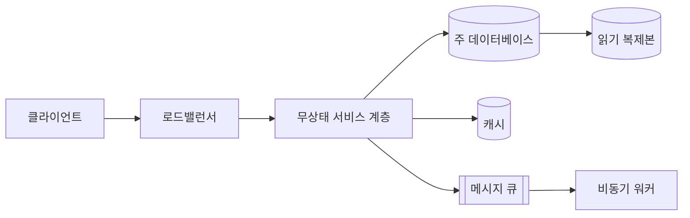

**큰 그림 먼저 합의하고 내려가기**: 56.1절 "합의" 원칙의 실행법은, 상세로 들어가기 직전에 "여기까지 큰 그림에 문제없으신가요?"라고 명시적으로 확인 질문을 던지는 것이다. 이 한마디가 남은 시간을 잘못된 방향에 낭비하는 것을 막는다.

**소리 내어 생각하기**: 침묵 속에서 설계하지 않는다. "지금은 읽기 경로를 먼저 그리고, 쓰기 경로는 뒤에 다루겠습니다" 처럼 무엇을 왜 하는지 계속 말로 설명한다. 상대가 사고 과정을 따라오게 하고, 잘못된 방향이면 조기에 개입할 기회를 준다.

**되돌아가기 신호 읽기**: 상대가 같은 질문을 반복하거나 표정이 굳으면 그 지점에 근본적인 이견이나 이해 부족이 있다는 신호다. 무시하고 진행하면 나중에 전체를 다시 설명해야 한다 — 즉시 멈추고 다시 짚는다.

**남은 시간 관리**: 매 단계 진입 전 "지금까지 몇 분 썼고, 몇 분 남았는가"를 체크한다. 상세 설계 시간이 부족해질 것 같으면 가장 중요한 컴포넌트 1~2개만 깊이 파고들고, 나머지는 "시간 관계상 개략적으로만 언급하겠다"고 알린 뒤 넘어간다. 침묵 속에서 시간을 다 써버리는 것이 가장 나쁜 결과다.

**마무리에서 할 것**: 56.1절 4단계의 산출물을 요약한다 — 병목, 트래픽 10배 시 우선 변경점, 운영 관점의 남은 과제, 다음 단계를 짧게 언급한다. 실무 설계 리뷰에서는 구두 요약에 그치지 않고 **문서화된 산출물**로 끝맺는다 — 리스크 목록, 개선 계획, 담당자와 기한이 명시된 액션 아이템(→ 9장 ADR, 70장 리뷰 리포트 템플릿 참조).

**설계 문서 템플릿** (실무 리뷰 전에 미리 작성해 공유하면 리뷰 시간을 상세 설계에 더 쓸 수 있다):

```markdown
# 설계 문서: [시스템명]
## 1. 문제 — 배경과 해결하려는 문제
## 2. 목표 — 측정 가능한 형태로
## 3. 비목표(Non-Goals) — 명시적으로 다루지 않는 것
## 4. 규모 가정
| 항목 | 값 | 근거 |
|---|---|---|
| DAU / 피크 QPS / 연간 저장량 | | |
## 5. 개략 설계 — 다이어그램 + 주요 API
## 6. 상세 설계 — 데이터 모델 / 확장 전략(캐시·샤딩·복제) / 장애 처리(재시도·타임아웃·DLQ)
## 7. 대안과 트레이드오프
| 대안 | 장점 | 단점 | 채택 여부 |
|---|---|---|---|
## 8. 리스크
| 리스크 | 영향도 | 완화 방안 | 담당자 |
|---|---|---|---|
## 9. 운영 계획 — 모니터링 지표, 알람, 온콜, 런북
```

**요구사항 정리 템플릿** (56.2절 질문의 답을 기록):

```markdown
| 분류 | 질문 | 답변/가정 |
|---|---|---|
| 기능 | 핵심 사용자 / 범위 제외 항목 | |
| 비기능 | 가용성 목표 / p99 지연 목표 | |
| 제약 | 예산 / 규정 | |
| 규모 | DAU / 피크 QPS | |
```

이 장은 57~61장 케이스의 사용 설명서이기도 하다. 케이스의 문제 설명만 읽고 책을 덮은 뒤, 56.2절 질문으로 요구사항을 스스로 정리하고, 56.3절 방식으로 자신만의 가정을 세워 계산을 끝까지 해본다. 그다음에야 책의 개략 설계와 비교해 차이가 가정 때문인지 놓친 요구사항 때문인지 분석하고, 56.5절의 20가지 목록을 체크리스트 삼아 상세 설계의 빈틈을 스스로 짚어본다. 마지막으로 56.4절 화법으로 "왜 이 선택을 했는가"를 소리 내어 설명해보는 것이 가장 효과적인 복습이다. 62장에서 이 케이스들을 관통하는 패턴과 함정을 다시 정리하므로, 읽는 동안 반복되는 요소를 메모해두면 좋다.

### 56장 정리

#### [필수] 반드시 알아야 할 것
1. 4단계 프레임워크(문제 이해 → 개략 설계 합의 → 상세 설계 → 마무리)는 인터뷰와 실무 리뷰 모두에 동일하게 적용되며, 실무 리뷰는 각 단계를 문서화된 산출물로 마감한다는 점만 다르다.
2. 요구사항을 좁히지 않고 설계를 시작하는 것이 가장 흔하고 치명적인 실패 원인이다. 기능·비기능·제약·규모 순서로 질문하고 "무엇을 안 만들 것인가"를 반드시 확정한다.
3. 개략 설계 단계에서 상대의 명시적 합의를 받은 뒤에만 상세 설계로 내려간다. 순서를 뒤집으면 남은 시간을 잘못된 기반 위에서 낭비한다.
4. 백오브엔벨로프 계산은 정확한 값보다 가정을 명시하고 끝까지 일관되게 계산해 자릿수 검산을 마치는 과정 자체가 평가된다.
5. 정답의 정확성보다 트레이드오프(무엇을 택했고 무엇을 포기했으며 왜인가)를 설명하는 능력이 핵심 평가 기준이다.
6. 유행 기술을 나열하는 것은 감점 요인이다. 각 컴포넌트는 특정 요구사항과 연결되어야 하며, 그렇지 못하면 카탈로그 나열에 불과하다.

#### [팁] 실무 노하우
1. 숫자를 먼저 확정하고 컴포넌트를 선택하라 — "QPS 5,000, 저장 200TB/년" 같은 전제가 있어야 이후 선택이 논리적으로 정당화된다.
2. 질문에 상한 시간을 두어라. 질문만 계속하면 상세 설계 시간이 부족해진다.
3. 상세 설계 중 시간이 부족하면 "시간 관계상 이 부분은 개략적으로만 다루겠다"고 명시적으로 알리고 넘어가라. 침묵 속에서 시간을 다 쓰는 것이 최악이다.
4. 상대가 같은 질문을 반복하거나 표정이 굳으면 그 지점에 이견이 있다는 신호다. 즉시 멈추고 다시 짚어라.
5. 반대 질문을 받으면 방어적으로 반응하지 말고 대안의 타당성을 먼저 인정한 뒤 자신의 근거를 재확인하라.
6. 실무 리뷰 전에 설계 문서 템플릿을 미리 작성해 공유하면 리뷰 시간을 상세 설계와 리스크 논의에 더 쓸 수 있다.

#### [주의] 사고·비용·설계 함정
1. 요구사항을 확정하지 않고 설계에 들어가면 잘못된 문제를 풀게 되어 시간을 통째로 낭비한다.
2. 개략 설계 합의 없이 상세로 진입하면 되돌릴 시간이 없어 전체 설계가 무너진다.
3. 모르는 질문에 추측을 사실처럼 답하면 이후 계산과 설계 전체의 신뢰도가 무너진다 — 가정을 명시하고 진행하라.
4. 리뷰 지적 20가지(단일 장애점, 무한 재시도, 캐시 무효화 부재, 핫 파티션, 멱등성 부재, DLQ 부재, 백프레셔 부재 등) 중 하나라도 답을 준비하지 못하면 설계 전체의 완성도가 의심받는다.
5. 실무 리뷰를 구두 논의로만 끝내면 "그때 그렇게 합의하지 않았다"는 분쟁이 재발한다 — 반드시 문서화된 리스크 목록과 액션 아이템으로 마감하라.
6. 비용 추정과 서비스 한도 확인을 생략한 설계는 프로덕션에서 예상치 못한 비용 폭탄이나 스로틀링으로 이어진다.

#### 한 장 요약
설계 인터뷰와 사내 설계 리뷰는 동일한 4단계 절차(요구사항 확정 → 개략 설계 합의 → 상세 설계 → 마무리)를 따르며, 차이는 산출물이 구두인가 문서인가에 있다. 요구사항을 기능·비기능·제약·규모 순으로 명확히 하고, 백오브엔벨로프 계산으로 규모 감각을 확보한 뒤, 트레이드오프를 3문장 템플릿으로 설명하는 것이 핵심 역량이다. 리뷰에서 반복적으로 지적되는 20가지 항목을 체크리스트로 미리 준비하고, 시간 배분과 소리 내어 생각하기로 상대와 함께 설계를 검증해 나간다.

#### 다음 장 예고
57장부터는 이 프레임워크를 실제 문제(레이트 리미터, 일관된 해싱, 키-값 저장소, 유니크 ID 생성기, URL 단축기, 웹 크롤러, 알림 시스템)에 적용하며 분산 시스템의 기본 벽돌을 하나씩 조립한다.

---

## 57장. 기본기 케이스 — 분산 시스템의 벽돌  ★★★★★

> **이 장에서 다루는 것**
> 이 장은 대규모 시스템 설계 인터뷰의 "고전 문제" 7가지를 다룬다 — 레이트 리미터, 일관된 해싱, 키-값 저장소, 분산 유니크 ID 생성기, URL 단축기, 웹 크롤러, 알림 시스템. 이들은 서로 독립된 문제처럼 보이지만 실제로는 같은 부품(파티셔닝, 정족수, 큐, 캐시, 재시도)을 반복해서 조합한 결과물이며, 이후 58~61장의 복합 사례(소셜 피드, 채팅, 결제, 스트리밍)는 모두 이 장의 벽돌 위에 세워진다. 56장에서 배운 4단계 설계 프레임워크를 실제 문제에 적용하는 첫 실습이기도 하다.
> 각 절은 ①요구사항과 규모 가정 ②핵심 설계 결정과 대안 ③구조도 ④상세 설계 ⑤실패 모드의 5단 구성을 따르며, 마지막 57.8절에서 "직접 구현 vs AWS 관리형" 비교로 마무리한다.

### 57.1 레이트 리미터

**① 요구사항과 규모 가정**
레이트 리미터(rate limiter)는 클라이언트 또는 서비스가 정해진 시간 동안 보낼 수 있는 요청 수를 제한하는 컴포넌트다. 목적은 세 가지다 — 남용/DoS 방어, 백엔드 과부하 방지, 요금제별 쿼터 강제(예: 무료 플랜 초당 10건). 가정: API 게이트웨이 뒤에 수백 개 마이크로서비스, 사용자별·IP별·API 키별 규칙 수천 개, 규칙 변경은 코드 배포 없이 즉시 반영(핫 리로드) 되어야 한다.

**② 핵심 설계 결정과 대안**
가장 중요한 결정은 "어떤 알고리즘을 쓸 것인가"다. 다섯 가지가 표준적으로 비교된다.

| 알고리즘 | 원리 | 메모리 | 정확도 | 버스트 허용 | 약점 |
|---|---|---|---|---|---|
| 토큰 버킷(Token Bucket) | 버킷에 토큰을 일정 속도로 채우고 요청마다 소비 | O(1) | 근사 | 허용(버킷 용량만큼) | 버킷 크기 튜닝 필요 |
| 리키 버킷(Leaky Bucket) | FIFO 큐에 요청을 넣고 고정 속도로 처리 | O(큐 크기) | 근사 | 미허용(일정 출력) | 큐 지연 발생 |
| 고정 윈도우 카운터(Fixed Window) | 시간을 고정 구간으로 나눠 구간별 카운트 | O(1) | 낮음 | 경계에서 2배 폭주 가능 | 윈도우 경계 문제 |
| 슬라이딩 윈도우 로그(Sliding Window Log) | 요청 타임스탬프를 정렬 집합에 기록, 윈도우 밖 제거 | O(요청 수) | 정확 | 정밀 제어 | 메모리 비용 큼 |
| 슬라이딩 윈도우 카운터(Sliding Window Counter) | 이전+현재 윈도우 카운트를 가중 평균 | O(1) | 근사(가중치로 보정) | 완화됨 | 트래픽이 균일하다는 가정 |

**한 줄 결정 기준**: 정확도가 중요하고 트래픽이 적으면 슬라이딩 윈도우 로그, 대규모 트래픽에서 메모리 효율과 근사 정확도의 균형이 필요하면 슬라이딩 윈도우 카운터, 가장 단순하고 버스트를 일부 허용해도 되면 토큰 버킷을 쓴다.

토큰 버킷 의사코드:
```
function allow(key):
    bucket = load(key)  # {tokens, last_refill_ts}
    now = current_time()
    elapsed = now - bucket.last_refill_ts
    bucket.tokens = min(capacity, bucket.tokens + elapsed * refill_rate)
    bucket.last_refill_ts = now
    if bucket.tokens >= 1:
        bucket.tokens -= 1
        save(bucket)
        return True
    return False
```

배치 위치는 네 곳이 후보다: 클라이언트(신뢰 불가, 우회 가능), 서버 애플리케이션 코드(세밀하지만 배포마다 로직 변경), API 게이트웨이(중앙 집중, 언어 무관), 미들웨어/사이드카(서비스 메시 레벨). 실무 기준은 **가능한 한 엣지에 가깝게** 두는 것이다. 요청이 애플리케이션 서버까지 가기 전에 걸러야 컴퓨트 비용을 아낀다.

**③ 구조**
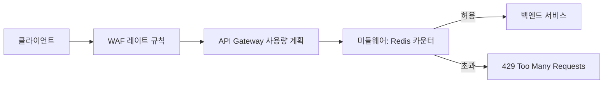

**④ 상세 설계**
분산 환경에서는 여러 게이트웨이 인스턴스가 같은 카운터를 동시에 읽고 쓰면 **경쟁 조건(race condition)**이 생긴다 — 두 요청이 동시에 "카운트 = 9, 한도 10"을 읽고 둘 다 통과시켜버리는 문제다. 해결책은 원자적 연산이다. Redis에서는 Lua 스크립트로 읽기-갱신-쓰기를 단일 원자 연산으로 묶는다.

```lua
-- 토큰 버킷을 Redis에서 원자적으로 구현하는 Lua 스크립트
-- KEYS[1]=버킷 키, ARGV[1]=용량, ARGV[2]=초당 리필속도, ARGV[3]=현재시각
local bucket = redis.call('HMGET', KEYS[1], 'tokens', 'ts')
local tokens = tonumber(bucket[1]) or tonumber(ARGV[1])
local last_ts = tonumber(bucket[2]) or tonumber(ARGV[3])
local elapsed = tonumber(ARGV[3]) - last_ts
tokens = math.min(tonumber(ARGV[1]), tokens + elapsed * tonumber(ARGV[2]))
if tokens >= 1 then
    tokens = tokens - 1
    redis.call('HMSET', KEYS[1], 'tokens', tokens, 'ts', ARGV[3])
    redis.call('EXPIRE', KEYS[1], 60)
    return 1  -- 허용
else
    redis.call('HMSET', KEYS[1], 'tokens', tokens, 'ts', ARGV[3])
    return 0  -- 거부
end
```
Redis는 단일 스레드로 명령을 처리하므로 Lua 스크립트 실행 중에는 다른 클라이언트가 끼어들 수 없다. 슬라이딩 윈도우 로그는 정렬 집합(sorted set, `ZADD`/`ZREMRANGEBYSCORE`)으로 구현한다 — 타임스탬프를 스코어로 저장하고, 매 요청마다 윈도우 밖 항목을 제거한 뒤 남은 개수를 센다.

거부 시 응답은 HTTP 429와 함께 표준 헤더를 반환한다: `X-RateLimit-Limit`(한도), `X-RateLimit-Remaining`(잔여), `X-RateLimit-Reset`(리셋 시각), 필요하면 `Retry-After`. 규칙(누구에게 몇 개/몇 초)은 별도 저장소(DynamoDB나 설정 서비스)에 두고 게이트웨이가 주기적으로 폴링하거나 변경 이벤트를 구독해 **핫 리로드**한다 — 규칙 변경에 재배포가 필요하면 실무에서 못 쓴다.

**⑤ 실패 모드와 대응**
Redis 자체가 단일 장애점(SPOF)이 될 수 있다 — 클러스터 모드와 복제로 완화하되, 카운터 저장소 다운 시 "열림(fail-open, 모두 허용)"과 "닫힘(fail-closed, 모두 거부)" 중 하나를 정책으로 미리 정해야 한다. 일반적으로 남용 방지가 목적이면 fail-open이 가용성 관점에서 낫다. 멀티 리전 배치 시 리전별로 카운터가 분리되면 전역 한도를 초과할 수 있다 — 완전한 전역 동기화는 지연을 늘리므로, 대부분의 실무 설계는 "리전별 한도 = 전역 한도 / 리전 수"로 근사한다.

**AWS 매핑**: API Gateway 사용량 계획(Usage Plan)과 API 키로 초당/월간 쿼터를 선언적으로 설정할 수 있고, AWS WAF 레이트 기반 규칙(rate-based rule)은 IP별 5분 슬라이딩 윈도우 카운트를 엣지(CloudFront/ALB 앞단)에서 처리한다. 애플리케이션 레벨에서 직접 구현할 때는 ElastiCache(Redis OSS 호환)로 위 Lua 스크립트를 그대로 쓸 수 있다(→ 46.6 참조).

### 57.2 일관된 해싱

**① 요구사항과 규모 가정**
분산 캐시나 샤드된 저장소에서 "어떤 키를 어떤 노드에 저장할까"를 정하는 문제다. 가정: 노드 수가 수십~수백 개, 노드는 스케일 아웃/장애로 수시로 추가·제거되며, 노드 변경 시 **재배치되는 키의 비율을 최소화**해야 한다(캐시 미스 폭증, 재샤딩 트래픽 폭증을 막기 위해).

**② 핵심 설계 결정과 대안**
단순 모듈로 해싱(`hash(key) % N`)은 구현이 쉽지만 N(노드 수)이 바뀌면 거의 모든 키의 매핑이 바뀐다 — 노드 하나를 추가하면 대부분의 캐시가 무효화된다. 일관된 해싱(consistent hashing)은 노드와 키를 모두 같은 해시 공간(0 ~ 2^32-1) 위의 원형 링에 매핑하고, 각 키는 링을 시계 방향으로 돌아 처음 만나는 노드에 저장한다. 노드 하나가 추가/제거되면 그 노드 인접 구간의 키만 재배치되므로 영향 범위가 이론상 평균 K/N (K=키 수, N=노드 수)로 줄어든다.

문제는 노드 수가 적을 때 링 위 분포가 불균등해질 수 있다는 점이다 — 이를 해결하는 것이 **가상 노드(virtual node)**다. 물리 노드 하나를 링 위에 여러 개(예: 100~200개)의 가상 노드로 복제해 배치하면 데이터가 훨씬 고르게 분산되고, 노드 추가/제거 시 부하가 여러 노드에 골고루 나뉜다.

| 가상 노드 수(노드당) | 분포 균등성(표준편차) | 메모리/링 크기 | 재배치 정밀도 |
|---|---|---|---|
| 1 (가상 노드 없음) | 낮음(핫스팟 위험) | 최소 | 거침 |
| 100~200 | 중간~양호 | 보통 | 실무 권장값 |
| 500+ | 매우 양호 | 큼(조회 비용 증가) | 과잉 튜닝 |

**한 줄 결정 기준**: 노드당 가상 노드 100~200개가 분포 균등성과 링 조회 비용(이진 탐색 O(log(N×V)))의 실무적 균형점이다.

**③ 구조**
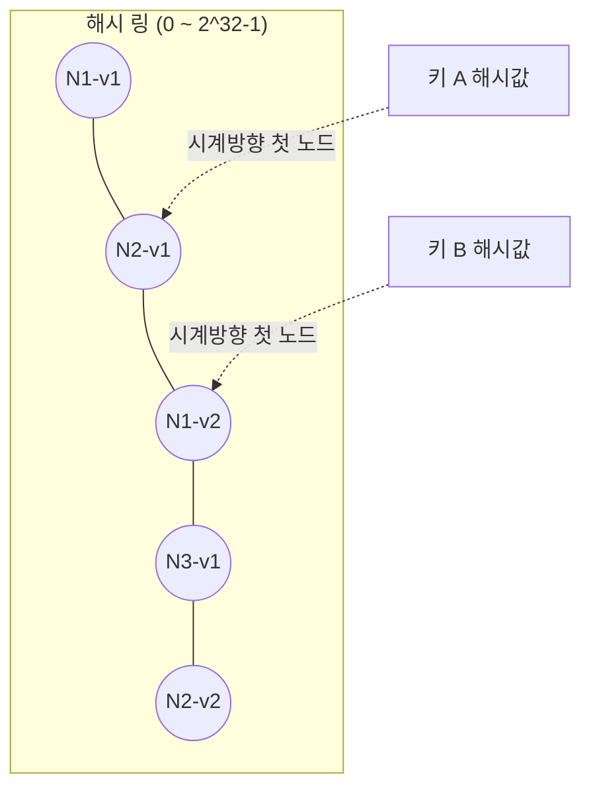

**④ 상세 설계**
링은 정렬된 (해시값 → 노드ID) 맵으로 구현하고, 키 조회는 이진 탐색으로 "해시값 이상인 첫 항목"을 찾는다(링의 끝을 넘으면 처음 항목으로 wrap-around).

```python
import bisect
import hashlib

class ConsistentHashRing:
    def __init__(self, virtual_nodes=150):
        self.virtual_nodes = virtual_nodes
        self.ring = {}          # hash -> physical node id
        self.sorted_keys = []   # 정렬된 해시값 리스트

    def _hash(self, key: str) -> int:
        return int(hashlib.md5(key.encode()).hexdigest(), 16) % (2**32)

    def add_node(self, node_id: str):
        for i in range(self.virtual_nodes):
            vkey = self._hash(f"{node_id}#{i}")
            self.ring[vkey] = node_id
            bisect.insort(self.sorted_keys, vkey)

    def remove_node(self, node_id: str):
        for i in range(self.virtual_nodes):
            vkey = self._hash(f"{node_id}#{i}")
            del self.ring[vkey]
            self.sorted_keys.remove(vkey)

    def get_node(self, data_key: str) -> str:
        if not self.ring:
            raise Exception("링에 노드가 없음")
        h = self._hash(data_key)
        idx = bisect.bisect(self.sorted_keys, h)
        if idx == len(self.sorted_keys):  # 링 끝 -> 처음으로 wrap-around
            idx = 0
        return self.ring[self.sorted_keys[idx]]
```
노드 N개에서 노드 하나를 추가할 때 재배치되는 데이터 양은 이론적으로 전체 데이터의 약 1/N이다(가상 노드로 균등화된 경우). 이는 모듈로 해싱의 "거의 전체 재배치"와 대조된다.

**⑤ 실패 모드와 대응**
가상 노드 수가 너무 적으면 특정 물리 노드에 핫스팟이 몰릴 수 있다. 해시 함수 선택도 중요하다 — 분포가 균일하지 않은 해시(예: 단순 합산)는 클러스터링을 유발한다. 링 정보를 각 클라이언트가 캐싱할 경우 노드 추가/삭제 이벤트 전파 지연 동안 클라이언트마다 다른 링 뷰를 가질 수 있어(→ 가십 프로토콜로 전파, 57.3 참조), 일시적으로 같은 키가 다른 노드로 라우팅될 수 있다.

**AWS 매핑**: ElastiCache(Redis OSS 호환) 클라이언트 라이브러리는 클라이언트 사이드 샤딩에서 일관된 해싱을 옵션으로 제공한다. DynamoDB는 내부적으로 파티션 키 해시값을 기반으로 한 유사한 범위 분할 방식으로 파티션을 관리한다(사용자에게는 추상화되어 노출되지 않는다). Kinesis Data Streams는 파티션 키의 해시값을 샤드 범위에 매핑해 레코드를 라우팅하는데, 이 역시 같은 원리의 변형이다.

### 57.3 키-값 저장소

**① 요구사항과 규모 가정**
단순 get(key)/put(key, value) 인터페이스를 제공하되, 대규모(TB~PB급), 고가용성(장애 발생해도 응답), 수평 확장 가능, 튜닝 가능한 일관성을 지원하는 저장소를 설계한다. 이 절은 *Dynamo* 논문(및 이를 계승한 Cassandra) 스타일의 설계를 다룬다.

**② 핵심 설계 결정과 대안**
CAP 정리에 따르면 네트워크 분단(Partition tolerance) 상황에서 일관성(Consistency)과 가용성(Availability) 중 하나를 선택해야 한다. 분산 환경에서 분단 내성은 필수이므로 실질적으로는 **CP냐 AP냐**의 선택이다. 이 케이스는 AP를 기본으로 하되 **튜닝 가능한 일관성(tunable consistency)**으로 상황별 절충을 제공한다 — 정족수(quorum) 파라미터 N(복제본 수), W(쓰기 확인 수), R(읽기 확인 수)로 조정한다.

| 정족수 조합 | 의미 | 특징 |
|---|---|---|
| W + R > N | 강한 일관성 보장(읽기·쓰기 집합이 겹침) | 지연 증가, 가용성 다소 감소 |
| W + R ≤ N | 최종적 일관성만 보장 | 낮은 지연, 높은 가용성 |
| W = N, R = 1 | 쓰기에 최적화(모든 복제본 확인 필요) | 읽기 빠름, 쓰기 느리고 가용성 낮음 |
| W = 1, R = N | 읽기에 최적화 | 쓰기 빠름, 읽기 느리고 가용성 낮음 |

**한 줄 결정 기준**: 강한 일관성이 필요하면 W+R > N(예: N=3, W=2, R=2), 가용성과 지연이 우선이면 W+R ≤ N으로 낮춘다.

**③ 구조**
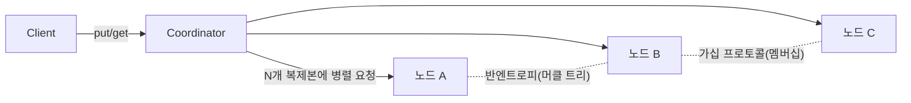

**④ 상세 설계**
데이터 파티셔닝은 57.2절의 일관된 해싱(+가상 노드)을 그대로 사용한다 — 이 장 전체를 관통하는 재사용 포인트다. 복제는 키를 담당하는 코디네이터 노드로부터 링을 따라 다음 N-1개의 서로 다른 물리 노드에 복제본을 두는 방식이다.

**버전 관리**는 동시 쓰기 충돌을 감지하기 위해 **벡터 클록(vector clock)**을 사용한다. 각 값에는 `[(노드ID, 버전)]` 쌍의 목록이 붙는다. 두 버전을 비교했을 때 한쪽이 다른 쪽의 모든 카운터를 지배(dominate)하면 최신으로 판단하고, 어느 쪽도 지배하지 않으면 "형제(sibling)" 충돌로 간주해 클라이언트(또는 애플리케이션 병합 로직)에 해결을 위임한다. 예: `D1[(Sx,1)]` → `D2[(Sx,2)]`(순차적, D2가 승리) vs `D3[(Sx,2),(Sy,1)]`와 `D4[(Sx,2),(Sz,1)]`(병렬 분기, 충돌 발생).

**쓰기 경로**: 클라이언트 → 코디네이터가 로컬 커밋 로그에 쓴 뒤 인메모리 자료구조(memtable) 갱신 → N개 복제본에 비동기 전파, W개 확인이 오면 성공 응답. **읽기 경로**: 코디네이터가 R개 복제본에 요청 → 벡터 클록으로 최신 버전 판단(또는 형제 반환) → 클라이언트 응답.

저장 엔진은 쓰기 처리량이 핵심이므로 **LSM 트리(Log-Structured Merge-Tree)** 기반이 일반적이다 — 쓰기는 먼저 커밋 로그(WAL)에 순차 기록 후 memtable(정렬된 인메모리 구조)에 반영하고, memtable이 임계값을 넘으면 디스크에 불변 **SSTable**로 플러시한다. 읽기는 memtable → 최신 SSTable 순으로 확인하며, 배경에서 컴팩션(compaction)으로 오래된 SSTable을 병합해 조회 비용과 저장 공간을 회수한다.

**⑤ 실패 모드와 대응**
노드 일시 장애 시 엄격한 정족수를 고집하면 가용성이 떨어진다. **느슨한 정족수(sloppy quorum)**는 담당 노드가 다운되면 링 상의 다음 건강한 노드에 임시로 쓰고 원래 노드가 복구되면 데이터를 넘겨주는 **힌트된 핸드오프(hinted handoff)**로 처리한다. 장기적인 복제본 간 데이터 불일치는 **머클 트리(Merkle tree)**로 탐지한다 — 각 노드가 담당 키 범위의 해시 트리를 유지하고 두 복제본이 루트 해시부터 비교해 다른 하위 트리만 순회하면, 전체 데이터를 비교하지 않고도 불일치 구간만 빠르게 찾아 동기화(반엔트로피, anti-entropy)할 수 있다. 멤버십(어떤 노드가 살아있는지) 전파는 중앙 조정자 없이 **가십 프로토콜(gossip protocol)**로 한다 — 각 노드가 주기적으로 임의의 다른 노드와 자신이 아는 멤버십 정보를 교환해 전체에 전파한다.

**AWS 매핑**: DynamoDB는 이 절에서 설명한 설계(일관된 해싱 기반 파티셔닝, N/W/R 정족수 개념, 벡터 클록 계열의 버전 관리, 가십 기반 멤버십)의 관리형 구현으로 널리 알려져 있다. 사용자는 "최종적 일관성 있는 읽기"와 "강한 일관성 있는 읽기(ConsistentRead=true)"만 선택하면 되고 정족수·머클 트리·가십은 완전히 추상화되어 있다(→ 26장, 27장 참조).

### 57.4 분산 유니크 ID 생성기

**① 요구사항과 규모 가정**
분산 시스템에서 각 레코드에 유일한 ID를 부여해야 한다. 요구사항: 전역 유일성, (가급적) 시간순 정렬 가능, 64비트 이내(인덱스 효율), 초당 최소 1만 개 이상 생성 가능, 단일 장애점 없음.

**② 핵심 설계 결정과 대안**

| 방식 | 원리 | 정렬 가능 | 조정 필요 | 약점 |
|---|---|---|---|---|
| 멀티 마스터 복제(Multi-master) | 각 DB가 자동증가 ID를 서로 다른 시작값·증분으로 생성(예: 서버당 +K) | 부분적 | DB 서버 수 변경 시 재조정 | 확장 시 재구성 번거로움 |
| UUID | 128비트 난수/해시 기반, 완전 독립 생성 | 아니오(v4) | 불필요 | 크기 큼, 인덱스 지역성 나쁨 |
| 티켓 서버(Ticket Server) | 중앙 서버가 자동증가 ID를 발급 | 예 | 불필요(단, SPOF) | 중앙 서버가 병목/단일 장애점 |
| 스노플레이크(Snowflake) | 타임스탬프+머신ID+시퀀스를 비트 조합 | 예(대략적 시간순) | 머신ID 할당 필요 | 시계 역행에 취약 |

**한 줄 결정 기준**: 시간 정렬과 고처리량이 모두 필요하면 스노플레이크, 단순함이 최우선이고 정렬이 불필요하면 UUID, 발급 서버 하나로 충분한 규모면 티켓 서버를 쓴다.

**③ 구조**
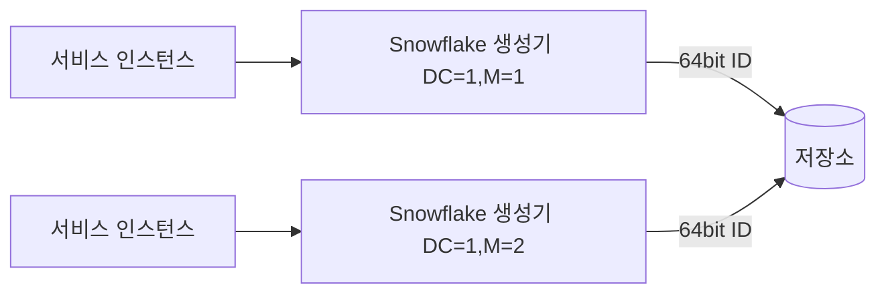

**④ 상세 설계**
스노플레이크 ID는 64비트를 다음과 같이 나눈다(트위터 원안 기준, 실제 값은 구현체마다 조정 가능):
- 1비트: 부호(항상 0)
- 41비트: 타임스탬프(밀리초, 커스텀 에폭 기준 — 약 69년 표현 가능)
- 5비트: 데이터센터 ID(최대 32개)
- 5비트: 머신 ID(데이터센터당 최대 32개)
- 12비트: 시퀀스 번호(같은 밀리초 내 최대 4096개 발급)

```python
import time

class SnowflakeGenerator:
    def __init__(self, datacenter_id: int, machine_id: int, epoch=1704067200000):
        assert 0 <= datacenter_id < 32 and 0 <= machine_id < 32
        self.datacenter_id = datacenter_id
        self.machine_id = machine_id
        self.epoch = epoch
        self.sequence = 0
        self.last_ts = -1

    def next_id(self) -> int:
        ts = int(time.time() * 1000)
        if ts < self.last_ts:
            # 시계 역행(clock skew) 감지: 예외를 던지거나 마지막 정상 시각까지 대기
            raise Exception(f"시계 역행 감지: {self.last_ts - ts}ms 후퇴")
        if ts == self.last_ts:
            self.sequence = (self.sequence + 1) & 0xFFF  # 12비트 마스크
            if self.sequence == 0:
                while ts <= self.last_ts:
                    ts = int(time.time() * 1000)
        else:
            self.sequence = 0
        self.last_ts = ts
        return ((ts - self.epoch) << 22) | (self.datacenter_id << 17) | (self.machine_id << 12) | self.sequence
```
**시계 역행(clock skew)**은 스노플레이크류 설계의 가장 큰 약점이다. NTP 동기화 실패나 VM 일시정지 후 재개 시 서버 시각이 과거로 튈 수 있고, 그러면 타임스탬프 역전으로 ID 중복·순서 붕괴 위험이 생긴다. 대응은 (1) NTP를 엄격히 운영해 드리프트를 최소화하고, (2) 역행 감지 시 짧은 시간이면 마지막 정상 시각까지 대기, 긴 시간이면 해당 생성기를 일시 격리하고 알람을 발생시키는 것이다.

**⑤ 실패 모드와 대응**
머신 ID 할당 충돌(두 인스턴스가 같은 ID를 받음) 시 ID 중복이 발생하므로, 조정 서비스(예: ZooKeeper 스타일 또는 DynamoDB 조건부 쓰기)로 머신 ID를 원자적으로 할당해야 한다. 대안으로 **ULID**(정렬 가능 + 128비트, Base32 표기)나 **KSUID**(초 단위 타임스탬프+페이로드)는 머신 ID 조정 없이도 준수한 정렬성을 제공해 운영 부담을 줄인다.

**AWS 매핑**: 직접 스노플레이크를 구현하는 대신 DynamoDB 원자 카운터(`UpdateItem`의 `ADD` 액션)로 중앙 집중형 순번을 발급할 수 있다(처리량이 매우 크면 병목이 될 수 있어 샤딩된 카운터 패턴을 함께 쓴다). 완전 독립적 생성이 필요하면 애플리케이션 레벨에서 UUID나 ULID 라이브러리를 쓰는 편이 운영 부담이 훨씬 낮다.

### 57.5 URL 단축기

**① 요구사항과 규모 가정**
긴 URL을 짧은 별칭으로 바꾸고 접속 시 원본으로 리다이렉트한다. 가정: 신규 단축 URL 생성 1억 건/월, 읽기:쓰기 비율 100:1(리다이렉트가 압도적으로 많음), 데이터 보관 5~10년.

**② 핵심 설계 결정과 대안**
짧은 코드 생성 방식은 두 갈래다. (1) 원본 URL을 해시(MD5/SHA)한 뒤 앞자리를 잘라 쓰고 충돌 시 재시도/솔트 추가로 처리하는 "해시+충돌 처리" 방식과, (2) 유일한 ID(57.4절의 ID 생성기 또는 DB 자동증가값)를 base62(0-9, a-z, A-Z)로 인코딩하는 방식이다.

| 방식 | 충돌 가능성 | 짧은 코드 예측 가능성 | 구현 복잡도 |
|---|---|---|---|
| 해시 앞자리 절단 | 있음(재시도 로직 필요) | 낮음(해시라 예측 어려움) | 중간 |
| ID 생성기 + base62 | 없음(ID가 유일) | 순차 ID면 예측 가능(보안 고려 필요) | 낮음 |

**한 줄 결정 기준**: 충돌 처리 로직을 피하고 싶다면 ID 생성기+base62가 단순하고 안전하다(순차성이 문제라면 ID에 오프셋/셔플을 가미).

base62 인코딩 코드:
```python
ALPHABET = "0123456789abcdefghijklmnopqrstuvwxyzABCDEFGHIJKLMNOPQRSTUVWXYZ"

def encode_base62(num: int) -> str:
    if num == 0:
        return ALPHABET[0]
    result = []
    while num > 0:
        num, rem = divmod(num, 62)
        result.append(ALPHABET[rem])
    return "".join(reversed(result))
```
7자리 base62는 62^7 ≈ 3.5조 개의 조합을 표현할 수 있어 수십 년치 발급량을 충분히 감당한다.

**③ 구조**
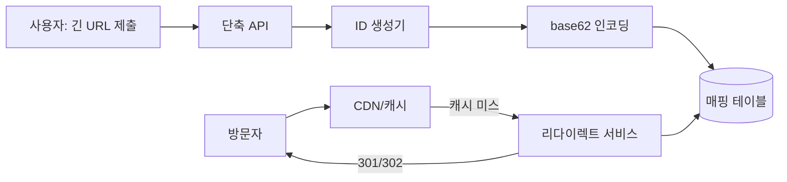

**④ 상세 설계**
데이터 모델은 단순하다: `short_key(PK), long_url, created_at, expire_at, user_id, click_count`. 읽기가 압도적으로 많으므로 캐시 계층(CDN 또는 인메모리 캐시)이 필수다 — 인기 링크 소수가 트래픽 대부분을 차지하는 파레토 분포가 일반적이다.

리다이렉트 상태 코드 선택이 중요한 트레이드오프다. **301(영구 이동)**은 브라우저/CDN이 응답을 캐싱해 이후 요청이 단축 서버를 거치지 않고 바로 원본으로 가므로 서버 부하가 줄지만, 클릭 통계 수집이 어려워지고 원본 URL을 나중에 바꿀 수 없다. **302(임시 이동)**는 매번 단축 서버를 거치므로 클릭 분석(위치·기기·시각)이 가능하지만 서버 부하가 크다. 실무에서는 분석이 중요한 마케팅 링크는 302, 순수 리다이렉트 성능이 중요하면 301을 택한다.

추가 기능: 커스텀 별칭(사용자가 짧은 키를 직접 지정, 중복 검사 필요), 만료(TTL, 배치 잡으로 만료 레코드 정리 또는 TTL 기반 자동 삭제), 악성 URL 필터링(생성 시점에 안전 브라우징 API/블록리스트 대조, 필요 시 클릭 시점에도 재검사).

**⑤ 실패 모드와 대응**
ID 생성기가 병목이 되지 않도록 사전에 ID 범위를 블록 단위로 미리 할당(batch allocation)해 각 서버가 로컬에서 소진한다. 매핑 테이블이 단일 장애점이 되지 않게 읽기 복제본/캐시로 완화하고, 캐시 워밍 없이 콜드 스타트 시 인기 링크에 트래픽이 몰리면 캐시 스탬피드(cache stampede)가 발생할 수 있어 요청 병합(request coalescing)이나 짧은 락으로 완화한다.

**AWS 매핑**: DynamoDB(매핑 테이블, 단일 자리수 ms 지연) + CloudFront(엣지 캐싱) + Lambda@Edge 또는 CloudFront Functions(엣지에서 직접 조회·리다이렉트, 오리진까지 안 가도 됨)의 조합이 전형적이다. ID 생성은 DynamoDB 원자 카운터나 애플리케이션 UUID로 대체 가능하다.

### 57.6 웹 크롤러

**① 요구사항과 규모 가정**
웹 페이지를 자동 수집해 색인·분석용으로 저장한다. 요구사항: 규모(수십억 페이지), 신선도(콘텐츠 변경을 적시에 재수집), **정중함(politeness)**(같은 호스트에 과도한 요청 금지), 확장성(수평 확장 가능), 견고성(장애·악성 콘텐츠·크롤러 함정에 대한 내성), 확장 가능한 파서(다양한 콘텐츠 타입).

**② 핵심 설계 결정과 대안**
핵심 컴포넌트 체인은 다음과 같다: 시드 URL → **URL 프론티어(URL Frontier)** → HTML 다운로더 → DNS 리졸버(캐시 포함) → 콘텐츠 파서 → 중복 콘텐츠 탐지 → 링크 추출기 → URL 필터·중복 제거 → 다시 프론티어로.

URL 프론티어가 설계의 핵심이다 — 단순 FIFO 큐로는 (1) 우선순위(뉴스 사이트는 자주, 정적 페이지는 드물게)와 (2) 정중함(한 호스트에 동시에 여러 워커가 몰리지 않게)을 동시에 만족시킬 수 없다. 표준 해법은 프론티어를 두 개의 서브시스템으로 나누는 것이다 — **우선순위 큐 집합**(콘텐츠 변경 빈도·페이지랭크 등으로 우선순위 산정 후 큐 매핑)에서 URL을 뽑아 **정중함 큐 매핑**(호스트별로 별도 큐를 두고 큐당 하나의 워커 스레드만 배정, 큐 사이 요청 간 지연 삽입)으로 전달한다.

| 컴포넌트 | 역할 | 실패 시 영향 |
|---|---|---|
| URL 프론티어 | 우선순위+정중함 큐 관리 | 큐 편중 시 특정 호스트 크롤링 지연 |
| DNS 리졸버(+캐시) | 도메인→IP 변환 | 캐시 없으면 DNS가 병목(응답 수백ms) |
| 콘텐츠 파서 | HTML 파싱, 유효성 검증 | 파서 취약점이 크롤러 전체를 멈출 수 있어 격리 필요 |
| 중복 콘텐츠 탐지 | 체크섬/심해시 비교 | 실패 시 저장 공간 낭비, 색인 오염 |

**한 줄 결정 기준**: 정중함과 신선도를 동시에 만족하려면 프론티어를 반드시 "우선순위 계층 + 호스트별 큐"의 2단 구조로 설계한다.

**③ 구조**
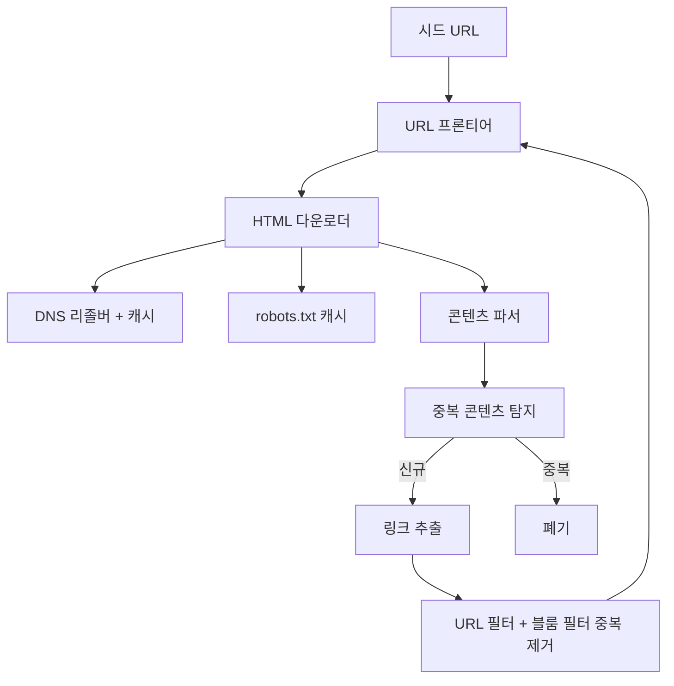

**④ 상세 설계**
**robots.txt 준수**는 법적/윤리적 요구사항이자 실무 필수사항이다 — 각 호스트 첫 방문 시 robots.txt를 가져와 크롤링 허용 경로/금지 경로, `Crawl-delay`를 파싱하고 호스트별로 캐싱(TTL 수 시간~하루)해 재요청 비용을 줄인다.

중복 콘텐츠 탐지는 2단계다: 먼저 전체 페이지의 **체크섬(SHA-256 등)**으로 완전 동일 페이지를 걸러내고, 완전히 같지 않아도 내용이 거의 같은 페이지(광고 배너만 다른 미러 페이지 등)는 **심해시(SimHash 등 지역 민감 해시)**로 유사도를 비교해 걸러낸다.

URL 필터·중복 제거에는 **블룸 필터(Bloom filter)**를 쓴다 — 이미 크롤링했거나 큐에 있는 URL을 빠르게(O(1)) 판별하되 약간의 오탐(false positive, "이미 봤다"고 잘못 판단)은 허용하고 누락(false negative)은 없는 확률적 자료구조다. 수십억 개 URL을 정확한 집합(해시셋)으로 관리하면 메모리가 감당 안 되지만, 블룸 필터는 비트 배열 하나로 훨씬 적은 메모리에 담을 수 있다.

```python
from hashlib import sha256, md5

class BloomFilter:
    def __init__(self, size=1 << 24, num_hashes=4):
        self.size = size
        self.num_hashes = num_hashes
        self.bits = bytearray(size // 8)

    def _hashes(self, item: str):
        h1 = int(sha256(item.encode()).hexdigest(), 16)
        h2 = int(md5(item.encode()).hexdigest(), 16)
        for i in range(self.num_hashes):
            yield (h1 + i * h2) % self.size

    def add(self, item: str):
        for h in self._hashes(item):
            self.bits[h // 8] |= (1 << (h % 8))

    def might_contain(self, item: str) -> bool:
        return all(self.bits[h // 8] & (1 << (h % 8)) for h in self._hashes(item))
```

**⑤ 실패 모드와 대응**
**크롤러 함정(crawler trap)**은 무한 URL 공간(예: 캘린더 페이지가 다음 달 링크를 끝없이 생성)이나 스파이더 트랩(의도적/비의도적으로 무한 루프를 유발하는 페이지 구조)이다. 대응은 URL 깊이 제한, 도메인당 최대 페이지 수 상한, 정기적인 수동 모니터링/블록리스트 갱신이다. 성능 측면에서는 다운로더를 분산 배치하고, DNS 조회 캐시(DNS 조회가 병목이 되기 쉬움), 짧은 타임아웃(느린 서버가 워커를 오래 점유하지 않게)이 필요하다. 신선도를 위한 재크롤 정책은 페이지 변경 이력 통계(과거 변경 빈도)를 기반으로 우선순위를 재계산해 자주 바뀌는 페이지를 더 자주 방문하도록 프론티어 우선순위를 주기적으로 갱신한다.

### 57.7 알림 시스템

**① 요구사항과 규모 가정**
여러 채널(iOS 푸시, Android 푸시, SMS, 이메일)로 대량 알림을 안정적으로 발송한다. 요구사항: 초당 수만 건 발송, 신뢰성(발송 실패 시 재시도, 중복 발송 방지), 확장성(팬아웃 지원), 사용자 옵트아웃 준수.

**② 핵심 설계 결정과 대안**
채널별 특성이 판이하므로 하나의 파이프라인으로 뭉뚱그리면 안 된다.

| 채널 | 프로토콜/제공자 | 지연 특성 | 실패 유형 |
|---|---|---|---|
| iOS 푸시 | APNs(Apple Push Notification service) | 초 단위 | 토큰 만료, 페이로드 크기 제한 |
| Android 푸시 | FCM(Firebase Cloud Messaging) | 초 단위 | 토큰 무효, 기기 오프라인 |
| SMS | 통신사 게이트웨이 | 초~수십 초, 비용 높음 | 번호 형식 오류, 국가별 규제 |
| 이메일 | SMTP/이메일 API | 분 단위까지 허용 | 스팸 필터링, 반송(bounce) |

**한 줄 결정 기준**: 채널마다 재시도 정책·타임아웃·실패 처리 로직이 달라야 하므로 **채널별로 큐를 분리**하고 워커도 채널별로 독립 배포한다 — 한 채널의 장애(예: SMS 게이트웨이 다운)가 다른 채널 발송을 막지 않게 하기 위해서다.

**③ 구조**
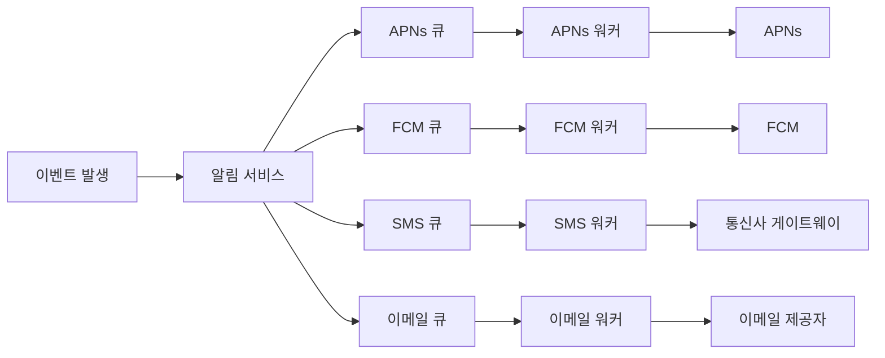

**④ 상세 설계**
사용자·디바이스 테이블에 연락처 정보(디바이스 토큰, 전화번호, 이메일)와 채널별 옵트인/옵트아웃 상태를 저장한다. 발송 흐름은 이벤트 발생 → 알림 서비스가 대상자 목록과 채널 선호를 조회 → 채널별 큐에 메시지 적재 → 채널 워커가 큐를 소비해 서드파티 API 호출 → 결과 로깅이다.

신뢰성의 핵심은 **멱등성(idempotency)**이다 — 워커가 크래시 후 재시작하며 같은 메시지를 두 번 처리하거나, 큐 재전송으로 중복이 발생할 수 있다. 이를 막으려면 발송 전 "멱등 키"(예: `notification_id + channel + recipient`)로 이미 발송 완료 여부를 확인하고, 발송 로그 테이블에 이 키를 유니크 제약으로 걸어 중복 삽입을 원천 차단한다.

```python
import time

def send_with_retry(channel_client, message, idempotency_key, log_store,
                     max_retries=3, base_delay=1.0):
    # 이미 성공 처리된 멱등 키는 재발송하지 않는다
    if log_store.already_sent(idempotency_key):
        return "SKIPPED_DUPLICATE"

    last_error = None
    for attempt in range(max_retries):
        try:
            result = channel_client.send(message)
            log_store.mark_sent(idempotency_key, result)
            return "SENT"
        except TransientError as e:
            last_error = e
            time.sleep(base_delay * (2 ** attempt))  # 지수 백오프
        except PermanentError as e:
            # 토큰 만료 등 영구 오류는 재시도하지 않고 즉시 실패 처리+로그
            log_store.mark_failed(idempotency_key, str(e))
            return "FAILED_PERMANENT"
    log_store.mark_failed(idempotency_key, str(last_error))
    return "FAILED_AFTER_RETRY"
```
채널별 재시도 정책도 달라야 한다 — 푸시 알림은 토큰 무효(영구 오류)와 일시적 네트워크 오류(재시도 가능)를 구분해야 하고, SMS/이메일은 재시도 비용(과금)이 있어 무한 재시도를 피해야 한다.

**대량 발송 팬아웃**은 수신자가 매우 많을 때(예: 전체 사용자 공지) 알림 서비스가 직접 순회하지 않고 배치 작업이 대상자 목록을 여러 청크로 나눠 큐에 밀어 넣는 방식으로 처리한다. 우선순위가 있는 알림(보안 경고 등)은 별도의 높은 우선순위 큐로 분리해 대량 발송 트래픽에 지연되지 않게 한다.

**⑤ 실패 모드와 대응**
큐가 무한정 쌓이면(다운스트림 장애 지속) 재시도가 계속 실패를 재생산해 큐를 막을 수 있어, 일정 횟수 이상 실패한 메시지는 데드레터 큐(DLQ)로 격리해 별도로 조사한다. 템플릿 관리(다국어, 개인화 변수 치환)는 알림 서비스와 분리된 템플릿 저장소에서 버전 관리하고, 사용자 옵트아웃은 발송 직전 재확인해 규제 위반(예: 마케팅 수신 거부 후 발송)을 피한다. 발송 속도는 서드파티 API 자체의 레이트 리밋(57.1절)을 따라야 하며, 이를 무시하면 제공자로부터 계정 차단을 당할 수 있다.

**AWS 매핑**: Amazon SNS(모바일 푸시 엔드포인트로 APNs/FCM 추상화), Amazon Pinpoint(캠페인·세그먼트·채널 통합 관리), Amazon SES(이메일 발송), Amazon EventBridge + SQS(이벤트 기반 트리거와 채널별 큐 분리를 관리형으로 구현)의 조합이 전형적이다.

### 57.8 각 케이스의 AWS 구현안과 비용 비교

앞선 7개 케이스는 모두 인터뷰에서는 "직접 설계"하지만, 실무에서는 대부분 관리형 서비스로 대체된다. 아래 표는 각 케이스의 구현 난이도·운영 부담·과금 축·직접 구현이 정당화되는 예외 조건을 정리한 것이다.

| 케이스 | 직접 구현 난이도 | 운영 부담(직접 구현 시) | AWS 관리형 대안 | 과금 축(관리형) | 직접 구현이 정당화되는 경우 |
|---|---|---|---|---|---|
| 레이트 리미터 | 중간 | 카운터 저장소 운영, 규칙 동기화 | API Gateway 사용량 계획, WAF 레이트 규칙 | 요청 수, 규칙 평가량 | 알고리즘 자체를 학습하거나 매우 특수한 규칙(예: 다차원 복합 조건)이 필요할 때 |
| 일관된 해싱 | 낮음(개념) | 링 상태 동기화, 가상 노드 튜닝 | ElastiCache 클라이언트 라이브러리, DynamoDB(내부 추상화) | 노드 시간, 처리 용량 | 클라이언트 사이드 샤딩을 직접 제어해야 하는 커스텀 캐시 계층 |
| 키-값 저장소 | 매우 높음 | 정족수·복제·컴팩션·머클 트리 운영 | DynamoDB | 읽기/쓰기 용량, 저장량 | 사실상 거의 없음(학습 목적 제외) |
| 분산 유니크 ID | 중간 | 시계 동기화, 머신ID 조정 | DynamoDB 원자 카운터, UUID/ULID 라이브러리 | 쓰기 용량(또는 무료) | 초고빈도 발급+엄격한 시간 정렬이 동시에 필요할 때 |
| URL 단축기 | 낮음 | 캐시 워밍, 만료 배치 | DynamoDB + CloudFront + Lambda@Edge | 요청 수, 저장량, 데이터 전송 | 거의 없음(대부분 관리형으로 충분) |
| 웹 크롤러 | 높음 | 정중함 제어, 크롤러 함정 대응, 대규모 큐 | 자체 구현이 일반적(완전 관리형 크롤러 서비스는 제한적) | 컴퓨트 시간, 저장량, 아웃바운드 트래픽 | 대부분 직접 구현 — 크롤링 정책 자체가 비즈니스 로직 |
| 알림 시스템 | 중간 | 채널별 API 연동·재시도·옵트아웃 관리 | SNS, Pinpoint, SES, EventBridge+SQS | 발송 건수, 메시지 크기 | 매우 특수한 채널(사내 메신저 등)이나 극히 낮은 지연이 요구될 때 |

**한 줄 결정 기준**: 키-값 저장소, URL 단축기, 알림 시스템처럼 "바퀴를 재발명"하는 비용이 명백히 관리형 서비스 요금을 넘어서는 케이스는 관리형을 기본값으로 삼고, 웹 크롤러처럼 도메인 특화 정책(무엇을, 얼마나 자주, 어떤 규칙으로 수집할지)이 곧 비즈니스 로직인 경우에만 직접 구현이 합리적이다. 결론적으로 **이 장의 7개 설계는 대부분 학습용**이다 — 인터뷰에서는 처음부터 설계하는 능력을 보이되, 실제 아키텍처 결정에서는 "왜 DynamoDB/API Gateway/SNS가 이 문제를 이미 풀어놓았는지"를 설명할 수 있어야 한다. 단, 관리형 서비스를 고를 때도 내부 원리(정족수, 일관된 해싱, 벡터 클록)를 알아야 장애 시 동작을 예측하고 파라미터(예: DynamoDB의 ConsistentRead, TTL, 용량 모드)를 올바르게 튜닝할 수 있다.

### 57장 정리

#### [필수] 반드시 알아야 할 것
1. 일관된 해싱은 노드 추가/제거 시 재배치 범위를 평균 K/N으로 최소화하며, 가상 노드로 분포 균등성을 확보한다. 캐시(ElastiCache), 샤딩, 분산 저장소(DynamoDB 내부, Kinesis 샤드)의 공통 기반 지식이다.
2. 레이트 리미팅 알고리즘은 정확도-메모리-버스트 허용 사이의 트레이드오프다. 토큰 버킷(가볍고 버스트 허용)과 슬라이딩 윈도우 로그(정확하지만 메모리 소모)를 상황에 맞게 선택한다.
3. 분산 환경의 카운터/락은 원자적 연산(Redis Lua 스크립트, DB 조건부 쓰기)으로 경쟁 조건을 막아야 한다.
4. 키-값 저장소의 N/W/R 정족수는 W+R>N이면 강한 일관성, W+R≤N이면 최종적 일관성이라는 수학적 관계로 결정된다.
5. 스노플레이크류 ID 생성기는 시계 역행(clock skew)에 취약하다 — NTP 동기화와 역행 감지·대기 로직을 반드시 설계에 포함해야 한다.
6. 블룸 필터는 확률적 자료구조로 대규모 중복 제거(웹 크롤러 URL, 캐시 필터링)에서 메모리를 크게 절약하되 오탐 가능성을 감수한다.
7. 알림 시스템은 채널별로 실패 특성이 다르므로 채널별 큐 분리와 채널별 재시도 정책이 필수다.
8. 대부분의 이 장 설계는 AWS 관리형 서비스(DynamoDB, API Gateway, WAF, SNS/Pinpoint/SES)로 대체 가능하며, 실무 결정은 "왜 직접 만들지 않는가"를 설명하는 방향이어야 한다.

#### [팁] 실무 노하우
1. 레이트 리미팅은 애플리케이션 코드가 아니라 엣지(API Gateway 사용량 계획, WAF 레이트 규칙)에서 먼저 걸러야 컴퓨트 비용과 지연을 아낀다.
2. 429 응답에는 항상 `X-RateLimit-*` 헤더와 `Retry-After`를 포함해 클라이언트가 백오프 전략을 세울 수 있게 한다.
3. ID 생성기를 직접 만들기 전에 DynamoDB 원자 카운터나 ULID/UUID 라이브러리로 충분한지 먼저 검토한다 — 대부분의 경우 충분하다.
4. URL 단축기 같은 읽기 편중 시스템은 캐시 계층 설계(CDN, 인메모리 캐시)가 DB 설계보다 성능에 더 큰 영향을 미친다.
5. 크롤러는 robots.txt와 Crawl-delay를 호스트별로 캐싱해 재요청 비용을 줄이고, 정중함을 소프트웨어 레벨에서 강제(호스트별 큐+워커 1개)한다.
6. 알림 발송은 항상 멱등 키를 발송 로그의 유니크 제약으로 걸어 재시도로 인한 중복 발송을 원천 차단한다.
7. 가상 노드 수는 노드당 100~200개에서 시작하고, 실측 분포(표준편차)를 보고 조정한다.

#### [주의] 사고·비용·설계 함정
1. 모듈로 해싱(`hash % N`)으로 샤딩하면 노드 하나만 추가해도 대부분의 캐시가 무효화되어 백엔드에 트래픽 폭주(thundering herd)가 발생한다.
2. 분산 카운터를 원자적 연산 없이(읽기→계산→쓰기 3단계로 분리) 구현하면 다중 인스턴스 환경에서 한도를 초과 허용하는 경쟁 조건이 생긴다.
3. 스노플레이크 시계 역행을 무시하면 중복 ID 또는 정렬 붕괴가 발생해 다운스트림 데이터 무결성이 깨질 수 있다.
4. 크롤러에 정중함 제어가 없으면 상대 서버에 사실상 DoS 공격을 가하는 셈이 되어 IP 차단이나 법적 문제로 이어진다.
5. 크롤러 함정(무한 URL 공간)에 빠지면 크롤러 자원이 무한정 소모되며 색인 품질도 저하된다.
6. 알림 재시도 로직에 지수 백오프와 최대 횟수 제한이 없으면 장애 시 큐가 폭주하고 서드파티 제공자로부터 계정이 차단될 수 있다.
7. 정족수 파라미터를 W=1, R=1처럼 지나치게 낮게 잡으면 가용성과 지연은 좋아지지만 데이터 정합성이 크게 훼손될 수 있다.
8. URL 단축기에서 301 리다이렉트를 캐싱한 뒤 원본 URL을 변경하면 클라이언트/CDN이 옛 캐시를 계속 사용해 사용자가 원치 않는 곳으로 이동할 수 있다.

#### 한 장 요약
이 장은 레이트 리미터부터 알림 시스템까지 분산 시스템 설계 인터뷰의 7가지 고전 문제를 요구사항-설계 결정-구조-상세 설계-실패 모드의 동일한 틀로 다뤘다. 표면적으로 다른 문제들이지만 일관된 해싱, 정족수, 원자적 연산, 블룸 필터, 큐 분리 같은 동일한 부품이 반복해서 등장하며, 이 부품들의 조합 방식을 이해하는 것이 이 장의 진짜 목표다. 실무에서는 대부분 DynamoDB, API Gateway, WAF, SNS 같은 관리형 서비스가 이미 이 설계를 구현해두었으므로, 직접 구현 능력보다 "왜 이 관리형 서비스가 적합한지 설명하는 능력"이 더 중요하다.

#### 다음 장 예고
58장에서는 이 장의 벽돌들을 조합해 소셜 피드, 타임라인, 미디어 스트리밍 같은 더 복잡한 실전 사례를 다룬다. 이번 장에서 배운 일관된 해싱과 팬아웃 패턴이 특히 소셜 피드 설계의 핵심 재료로 다시 등장한다.

---

## 58장. 소셜 · 미디어 케이스  ★★★★★

> **이 장에서 다루는 것**
> 이 장은 57장의 벽돌(일관된 해싱, 큐 분리, 원자적 연산, 블룸 필터)을 조합해 소셜·미디어 영역의 대표적 실전 사례 5가지를 다룬다 — 뉴스피드, 채팅, 검색 자동완성, YouTube형 비디오 플랫폼, Google Drive형 파일 동기화. 각 사례는 *System Design Interview* 시리즈의 고전 문제를 바탕으로 하되, AWS 관리형 서비스로의 구현 경로를 함께 제시한다.
> 각 절은 ①요구사항과 규모 가정 ②핵심 설계 결정과 대안 ③구조도 ④상세 설계 ⑤실패 모드의 5단 구성을 따르며, 마지막 58.6절에서 5개 사례에 공통으로 등장하는 구성 요소를 AWS 서비스로 매핑한다. 56장의 4단계 프레임워크와 57장의 기본 부품을 전제로 한다.

### 58.1 뉴스피드 시스템

**① 요구사항과 규모 가정**
사용자가 팔로우한 대상의 게시물을 시간 역순(또는 랭킹순)으로 모아 보여주는 시스템이다. 요구사항: 피드 발행과 피드 조회라는 두 개의 독립된 흐름, 팔로워 수는 0명~수천만 명까지 극단적으로 분포(셀럽 문제), 피드 조회는 초당 수십만 건 이상, 신선도(발행 후 수 초 내 반영)가 중요하다. 가정: DAU 수억 명, 사용자당 평균 팔로워 수백 명이지만 상위 0.01% 계정은 팔로워가 수천만 명에 달한다.

**② 핵심 설계 결정과 대안**
이 절 전체의 핵심 결정은 **팬아웃(fan-out)을 언제 하느냐**다 — 글을 쓸 때(온 라이트, push) 미리 모든 팔로워의 피드함에 밀어 넣을지, 글을 읽을 때(온 리드, pull) 그때그때 팔로우 목록을 조회해 합칠지의 선택이다.

| 방식 | 원리 | 조회 지연 | 쓰기 부하 | 셀럽 문제 | 신선도 |
|---|---|---|---|---|---|
| 팬아웃 온 라이트(push) | 발행 즉시 모든 팔로워의 피드함(feed inbox)에 포스트ID 삽입 | 매우 빠름(미리 계산됨) | 팔로워 수에 비례해 폭증 | 팔로워 수천만이면 쓰기 폭풍 | 높음(즉시 반영) |
| 팬아웃 온 리드(pull) | 조회 시점에 팔로우 목록 순회 후 최신 포스트 병합 | 느림(매 요청마다 다건 병합) | 낮음(쓰기는 1회) | 문제 없음 | 조회 시점 기준이라 항상 최신 |
| 하이브리드(push+pull) | 일반 사용자는 push, 팔로워가 많은 계정(셀럽)은 pull로 처리 후 병합 | 대체로 빠름 | 완화됨 | 해결(셀럽은 팬아웃 생략) | 높음 |

**한 줄 결정 기준**: 팔로워 분포가 균일하면 온 라이트로 조회 성능을 확보하고, 팔로워 수천만 단위의 셀럽이 존재하면 반드시 하이브리드로 전환해 쓰기 폭풍을 막는다.

**셀럽 문제**는 팔로워 3천만 명인 계정이 글 하나를 올릴 때마다 3천만 건의 쓰기가 발생하는 상황이다. 하이브리드 해법은 팔로워 수가 임계값(예: 1만 명)을 넘는 "셀럽 플래그"를 계정에 두고, 셀럽의 글은 팬아웃하지 않은 채 별도 저장소에만 기록한 뒤, 각 사용자의 조회 시점에 자신이 팔로우하는 셀럽의 최신 글만 pull로 병합한다. 일반 사용자 대부분은 push로 지연을 낮추고, 팔로워가 극단적으로 많은 소수만 pull로 처리해 쓰기 폭풍을 원천 차단한다.

**③ 구조**
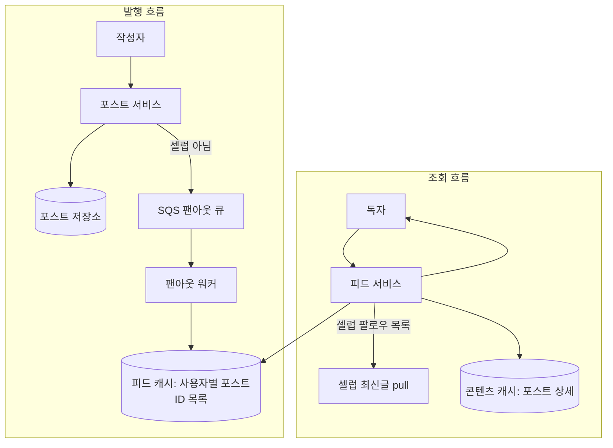

**④ 상세 설계**
**피드 캐시 구조**는 두 계층으로 분리하는 것이 정석이다 — (1) 사용자별로 "어떤 포스트ID를 어떤 순서로 보여줄지"만 담은 얇은 목록(피드 ID 목록), (2) 포스트ID → 실제 콘텐츠(본문, 이미지 URL, 작성자 정보)를 담은 콘텐츠 캐시. 이렇게 나누면 같은 포스트가 수백만 명의 피드에 등장해도 콘텐츠는 한 번만 캐싱하면 되고, 피드 ID 목록은 작은 배열이라 메모리 비용이 훨씬 낮다.

하이브리드 팬아웃 로직(Python 의사코드):
```python
CELEB_FOLLOWER_THRESHOLD = 10_000

def publish_post(author_id: str, post_id: str, follower_repo, fanout_queue):
    is_celeb = follower_repo.follower_count(author_id) >= CELEB_FOLLOWER_THRESHOLD
    if is_celeb:
        # 셀럽 글은 팬아웃하지 않고 셀럽 전용 저장소에만 기록
        follower_repo.mark_celeb_post(author_id, post_id)
        return "SKIPPED_FANOUT_CELEB"

    # 일반 사용자: 팔로워 목록을 배치로 나눠 팬아웃 큐에 적재
    for follower_batch in follower_repo.iter_followers_in_batches(author_id, batch_size=500):
        fanout_queue.send_batch(
            [{"follower_id": f, "post_id": post_id} for f in follower_batch]
        )
    return "FANOUT_QUEUED"


def get_feed(user_id: str, feed_cache, follower_repo, content_cache, page_size=20, cursor=None):
    # 1) 사전 계산된 피드 ID 목록(온 라이트 결과)을 커서 기반으로 페이지네이션
    feed_ids = feed_cache.get_page(user_id, cursor=cursor, limit=page_size)

    # 2) 팔로우 중인 셀럽의 최신 글을 조회 시점에 pull로 병합
    celeb_ids = follower_repo.followed_celebs(user_id)
    celeb_posts = [p for c in celeb_ids for p in follower_repo.recent_celeb_posts(c, limit=5)]

    merged = sorted(feed_ids + celeb_posts, key=lambda p: p.created_at, reverse=True)[:page_size]
    return [content_cache.get(p.post_id) for p in merged]
```

**랭킹과 페이지네이션**은 단순 시간순이 아니라 관심도·상호작용 예측 점수로 재정렬하는 경우가 많다(랭킹 모델은 → 53장 참조). 페이지네이션은 오프셋(`OFFSET/LIMIT`)이 아니라 **커서 기반**을 쓴다 — 오프셋은 새 글이 계속 삽입되는 피드에서 항목이 밀리며 중복·누락이 발생하지만, 커서(마지막으로 본 항목의 정렬 키)를 다음 요청에 넘기면 삽입에 흔들리지 않는다.

**데이터 모델**은 `users`, `follows(follower_id, followee_id, created_at)`(역방향 조회용 GSI 필요), `posts(post_id, author_id, content, created_at)` 세 테이블이 기본이다. 피드 캐시 테이블은 DynamoDB에서 다음과 같이 설계한다.

| 테이블 | 파티션 키 | 정렬 키 | 주요 속성 | 설계 의도 |
|---|---|---|---|---|
| FeedInbox | user_id | rank_key(타임스탬프+post_id) | post_id, author_id | 사용자별 피드 ID 목록, 정렬 키로 커서 페이지네이션 |
| Follows | followee_id | follower_id | created_at | 팬아웃 대상(팔로워) 조회용 |
| FollowsByUser(GSI) | follower_id | followee_id | created_at | 사용자가 팔로우하는 대상 조회(셀럽 판별 포함) |
| Posts | post_id | - | author_id, content, created_at | 콘텐츠 캐시(ElastiCache)의 원본, TTL 캐시 미스 시 폴백 |

`FeedInbox`는 팔로워 수만큼 항목이 늘어나는 쓰기 위주 테이블이라 온디맨드 용량 모드나 충분한 프로비저닝이 필요하고, `Posts`는 읽기 위주라 ElastiCache 캐시 히트율이 비용을 좌우한다.

**⑤ 실패 모드와 대응**
팬아웃 워커가 느리면 팔로워가 새 글을 실시간으로 보지 못한다 — 워커 수평 확장과 SQS 가시성 타임아웃 튜닝으로 완화한다. 셀럽 임계값을 잘못 낮게 잡으면(예: 팔로워 1천 명도 셀럽 취급) 대부분의 피드가 pull이 되어 조회 지연이 커진다 — 임계값은 실측 팔로워 분포를 보고 정한다. 피드 캐시가 콜드 스타트되면(신규 사용자, 캐시 만료) 팔로우 전체 순회 비용이 급증할 수 있어 최초 로그인 시 배치로 캐시를 미리 채운다.

**AWS 매핑**: DynamoDB(피드 ID 목록과 팔로우 그래프 저장) + ElastiCache(콘텐츠 캐시, 인기 포스트 히트율 극대화) + SQS(팬아웃 큐) + Lambda 또는 ECS 워커(팬아웃 처리)의 조합이 전형적이다. 셀럽 판별과 임계값은 애플리케이션 레벨 설정값으로 관리한다(→ 26장 DynamoDB, 33장 SQS 참조).

### 58.2 채팅 시스템

**① 요구사항과 규모 가정**
1:1 채팅과 그룹 채팅을 지원하고, 읽음 표시(read receipt), 온라인 상태(presence), 오프라인 사용자를 위한 푸시 알림을 제공한다. 요구사항: 동시 접속 수백만 커넥션, 메시지 전달 지연 1초 이내, 메시지 순서 보장(같은 대화방 내), 오프라인 사용자에게도 메시지 유실 없이 전달.

**② 핵심 설계 결정과 대안**
HTTP 폴링 대신 **WebSocket**을 쓰는 이유는 서버가 클라이언트에 먼저 메시지를 밀어 넣을 수 있는 양방향 지속 연결이기 때문이다. 문제는 WebSocket이 **상태를 가진 연결**이라는 점이다 — 사용자가 어느 순간 어느 서버 인스턴스에 붙어 있는지를 시스템이 알아야 메시지를 그 서버로 라우팅할 수 있다. 이를 위해 **서비스 디스커버리** 역할을 하는 "연결 라우팅 테이블"(사용자ID → 접속 중인 서버ID/커넥션ID)이 필요하다.

| 방식 | 원리 | 장점 | 단점 |
|---|---|---|---|
| HTTP 롱 폴링 | 클라이언트가 응답 없는 요청을 오래 유지, 응답 오면 즉시 재요청 | 인프라 단순, 방화벽 친화적 | 연결 수 대비 오버헤드 큼, 지연 다소 있음 |
| WebSocket | 단일 TCP 연결로 양방향 전이중 통신 유지 | 저지연, 서버 푸시 네이티브 지원 | 상태 유지 연결이라 라우팅·재연결 관리 필요 |
| 서버 전송 이벤트(SSE) | 서버→클라이언트 단방향 스트림 | 구현 단순 | 클라이언트→서버는 별도 채널 필요(양방향 아님) |

**한 줄 결정 기준**: 실시간 양방향 채팅은 WebSocket이 사실상 표준이며, 서버 푸시만 필요한 알림성 스트림이면 SSE로 충분하다.

**③ 구조**
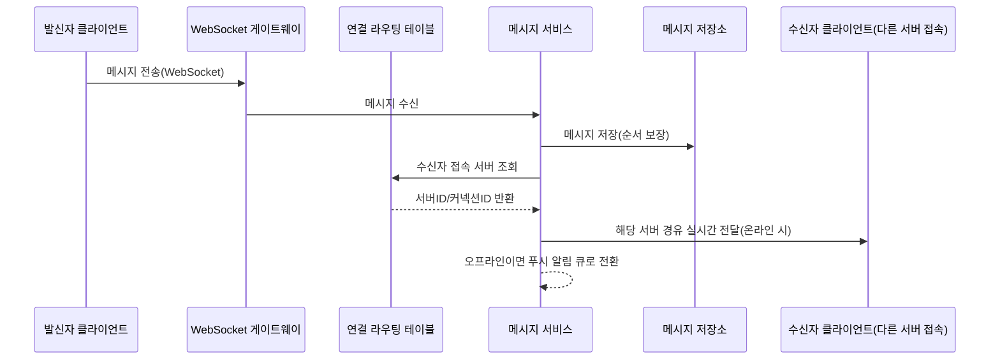

**④ 상세 설계**
**연결 라우팅 테이블 스키마**(예: DynamoDB 또는 ElastiCache):

| 필드 | 예시 값 | 설명 |
|---|---|---|
| user_id (PK) | u_1001 | 접속 중인 사용자 |
| server_id | ws-node-7 | 현재 붙어 있는 WebSocket 서버 인스턴스 |
| connection_id | conn-abc123 | API Gateway WebSocket의 커넥션 식별자 |
| last_heartbeat | 2026-03-01T09:00:00Z | 하트비트 기준 온라인 상태 판정용 |
| ttl | 1709283600 | 일정 시간 하트비트 없으면 자동 만료(TTL) |

메시지 전송 코드(개념 예시, API Gateway WebSocket API 기준):
```python
import json
import boto3

apigw_mgmt = boto3.client(
    "apigatewaymanagementapi",
    endpoint_url="https://abcd1234.execute-api.ap-northeast-2.amazonaws.com/prod",
)

def route_message_to_recipient(recipient_id: str, payload: dict, routing_table, dlq):
    conn = routing_table.get(recipient_id)  # {server_id, connection_id} 또는 None(오프라인)
    if conn is None:
        return "OFFLINE_ENQUEUE_PUSH"  # FCM/APNs 푸시 큐로 전환(58.4-알림 시스템과 동일 패턴)

    try:
        apigw_mgmt.post_to_connection(
            ConnectionId=conn["connection_id"],
            Data=json.dumps(payload).encode("utf-8"),
        )
        return "DELIVERED"
    except apigw_mgmt.exceptions.GoneException:
        # 커넥션이 이미 끊겼는데 라우팅 테이블이 갱신 안 된 경우: 항목 정리 후 오프라인 처리
        routing_table.delete(recipient_id)
        return "STALE_CONNECTION_CLEANED"
```

**메시지 동기화 흐름**은 전송(클라이언트→게이트웨이) → 저장(메시지 저장소에 영속화, 저장 성공을 전송 성공의 기준으로 삼음) → 수신자 라우팅(온라인이면 실시간 전달, 오프라인이면 푸시) 순서를 지킨다. 저장을 먼저 완료해야 서버 재시작·라우팅 실패에도 메시지가 유실되지 않는다.

**메시지 ID와 순서**는 클라이언트의 로컬 시퀀스 번호와 서버 타임스탬프를 함께 쓴다 — 클라이언트 시각은 기기마다 어긋날 수 있어(→ 57.4절 시계 역행과 동일 원리) 정렬 기준으로 신뢰할 수 없고, 서버가 저장하는 시점의 시퀀스(대화방 내 단조 증가)를 최종 순서로 삼는다. 클라이언트는 로컬 시퀀스로 낙관적 렌더링을 하되 서버 확인이 오면 서버 순서로 재정렬한다.

**데이터 모델**: 1:1 대화는 `message(conversation_id, sent_at, sender_id, content, message_id)`로 파티션 키를 대화방ID, 정렬 키를 타임스탬프로 두는 것이 자연스럽다(시간순 조회가 지배적). 그룹 채팅은 `group_message` 테이블을 채널 단위로 파티셔닝하고, 참여자별 "마지막 읽은 시점"만 별도 소형 테이블(`read_status(channel_id, user_id, last_read_message_id)`)로 관리해 메시지 본문을 참여자 수만큼 복제하지 않는다.

**온라인 상태(presence)**는 하트비트 기반으로 판정하되, 상태 변경마다 모든 친구에게 실시간 전파하면 팬아웃 비용이 58.1절 셀럽 문제와 같은 구조로 커진다 — "대화방을 열었을 때만 조회"하거나 배치 간격으로 완화한다.

**읽음 표시**는 `read_status`의 `last_read_message_id` 갱신을 발신자가 폴링/이벤트로 조회해 표시한다. 대규모 그룹에서 전원 읽음 목록은 저장 비용이 참여자 수에 비례해 커지므로 "안 읽은 사람 수"만 근사 표시하는 절충이 흔하다.

**⑤ 실패 모드와 대응**
**재연결 폭풍(reconnect storm)**은 게이트웨이 배포·재시작이나 네트워크 순단 시 수백만 클라이언트가 동시에 재연결을 시도해 순간 과부하를 일으키는 현상이다 — 지수 백오프+지터를 강제하고 롤링 배포로 동시 단절을 최소화한다. **유휴 타임아웃**을 짧게 잡으면 정상 연결도 자주 끊겨 재연결 폭풍을 스스로 유발하므로 하트비트 주기보다 충분히 길게 잡는다. 연결 수·유휴 타임아웃·재연결 폭풍을 모두 함께 용량 계획에 반영해야 하며, 하나만 보고 산정하면 트래픽 급증 시 게이트웨이가 먼저 무너진다.

**AWS 매핑**: Amazon API Gateway WebSocket API(연결 관리와 `post_to_connection` 기반 서버 푸시) + DynamoDB(파티션 키=채널/대화ID, 정렬 키=타임스탬프로 메시지 저장, 연결 라우팅 테이블도 별도 테이블로) + ElastiCache(프레즌스/하트비트 상태, 짧은 TTL) 조합이 전형적이다. 오프라인 사용자에 대한 푸시는 57.7절 알림 시스템 패턴(SNS/Pinpoint)을 그대로 재사용한다.

### 58.3 검색 자동완성

**① 요구사항과 규모 가정**
사용자가 검색창에 입력하는 동안 실시간으로 상위 k개의 추천 검색어를 보여준다. 요구사항: 응답 지연 100ms 이내(타이핑마다 호출되므로), 상위 k(보통 5~10개)만 반환, 개인화 여부는 선택적(개인화하면 저장·계산 비용 증가), 검색어 트렌드 반영(실시간에 가까울수록 좋지만 완전한 실시간은 비용이 크다).

**② 핵심 설계 결정과 대안**
핵심 자료구조는 **트라이(trie, prefix tree)**다 — 각 노드가 문자 하나를 나타내고, 루트에서 한 경로를 따라가면 하나의 접두사(prefix)가 된다. 단순 트라이만으로는 "이 접두사로 시작하는 모든 검색어 중 상위 k개"를 매번 하위 트리 전체를 순회해 찾아야 해 느리다. 이를 해결하는 표준 기법은 **각 노드에 그 노드 아래에서 가장 인기 있는 상위 k개 검색어를 미리 캐싱**해 두는 것이다 — 조회 시 트리를 끝까지 내려가지 않고 접두사에 해당하는 노드에서 캐싱된 목록만 반환하면 된다.

| 방식 | 조회 속도 | 갱신 비용 | 메모리 | 개인화 |
|---|---|---|---|---|
| 매 조회 시 하위 트리 전체 탐색 | 느림(접두사가 짧을수록 더 느림) | 없음(즉시 반영) | 낮음 | 가능하나 계산 비용 큼 |
| 노드별 top-k 사전 캐싱 | 매우 빠름(O(접두사 길이)) | 배치 재빌드 필요 | 노드 수 × k만큼 증가 | 배치 주기로 제한됨 |
| 검색 엔진 완성 제안 기능(managed) | 빠름 | 관리형이 처리 | 관리형이 처리 | 서비스별 상이 |

**한 줄 결정 기준**: 응답 속도가 최우선이면 노드별 top-k 사전 캐싱이 정석이고, 완전한 실시간 반영이 필수가 아니라면(대개는 아니다) 배치 갱신 주기를 감수하는 편이 압도적으로 유리하다.

**③ 구조**
```mermaid
flowchart LR
    Logs[검색 로그] --> Agg[집계 배치 잡]
    Agg --> Build[트라이 빌드/노드별 top-k 계산]
    Build --> Store[(트라이 스냅샷 저장소)]
    Store --> Servers[자동완성 서버군]
    Client[클라이언트] -->|접두사 입력| CDN[CDN/브라우저 캐시]
    CDN -->|캐시 미스| Servers
    Servers -->|상위 k| Client
```

**④ 상세 설계**
트라이 노드에서 top-k를 조회하는 코드:
```python
class TrieNode:
    def __init__(self):
        self.children = {}       # char -> TrieNode
        self.top_k = []          # [(query, score), ...] 사전 계산된 상위 k

def get_top_k(root: TrieNode, prefix: str, k: int = 5):
    node = root
    for ch in prefix:
        if ch not in node.children:
            return []            # 해당 접두사로 시작하는 검색어 없음
        node = node.children[ch]
    return node.top_k[:k]        # 이미 정렬·캐싱된 목록을 자르기만 하면 됨

def build_top_k(root: TrieNode, query: str, score: float, k: int = 5):
    node = root
    for ch in query:
        if ch not in node.children:
            node.children[ch] = TrieNode()
        node = node.children[ch]
        # 각 경로 노드마다 top-k 갱신(배치 빌드 시 전체 재계산이 일반적)
        node.top_k = sorted(node.top_k + [(query, score)], key=lambda x: -x[1])[:k]
```

**트라이 크기와 샤딩**이 실무에서 까다로운 부분이다. 검색어 수가 수억 개면 트라이 하나가 단일 서버 메모리에 들어가지 않아 샤딩이 필요한데, 가장 단순한 "첫 글자로 샤딩"(a→샤드1, b→샤드2...)은 **편향(skew) 문제**를 일으킨다 — 언어별 빈도가 균일하지 않아(예: 영어권 's' 시작 단어 편중) 특정 샤드에 부하가 몰린다. 대응은 실측 빈도를 반영한 **가중 분할(weighted partitioning)**이다 — 균등한 글자 수가 아니라 균등한 예상 트래픽 기준으로 샤드 경계를 정하고, 필요하면 한 글자를 여러 샤드로 더 세분화(예: 's'가 크면 'sa'~'sm', 'sn'~'sz'로 재분할)한다.

**데이터 수집 파이프라인**은 실시간이 아니라 주기적 배치가 일반적이다 — 검색 로그 수집(→ 42장 참조) → 빈도 집계 → 트라이 재빌드(전체 또는 증분) → 스냅샷 배포. 갱신 주기는 트렌드 민감도와 재빌드 비용의 트레이드오프로, 급상승 검색어까지 반영하려면 시간 단위 갱신이 필요하고 일반 서비스는 하루 1회로 충분한 경우가 많다. **브라우저 캐시와 CDN**은 인기 접두사(짧을수록 재사용 빈도 높음)의 응답을 엣지에 캐싱해 서버 부하를 줄인다.

**실시간 반영이 꼭 필요한 경우**(급상승 이슈, 속보)의 대안은 배치로 빌드된 기본 트라이 위에 최근 수 분간의 경량 실시간 집계(슬라이딩 윈도우 카운터, → 57.1절)를 얹어 상위 결과에 가중치를 더하는 "실시간 트렌드 오버레이"다 — 트라이 전체를 실시간 재계산하는 것보다 훨씬 저렴하다.

**⑤ 실패 모드와 대응**
트라이 전체를 매번 통째로 재빌드하면 빌드 시간이 검색어 수에 비례해 늘어나 배포 주기를 늦춘다 — 증분 갱신 또는 샤드별 병렬 빌드로 완화한다. 사용자별 트라이를 따로 두면 메모리가 폭증하므로 전역 결과에 개인 이력(최근 검색어 소수)만 얹는 절충이 흔하다. 첫 글자 샤딩의 편향을 방치하면 특정 샤드만 과부하로 응답이 느려지는데, 이는 장애가 아니라 샤딩 설계 결함이다.

**AWS 매핑**: Amazon OpenSearch Service의 completion suggester(내부적으로 유사한 접두사 구조를 관리형으로 제공)를 쓰거나, 직접 구현 시 배치 잡(Glue/EMR/Batch)으로 트라이 스냅샷을 사전 계산해 DynamoDB(접두사→top-k 매핑) 또는 ElastiCache에 적재하고 조회는 단순 키 조회로 처리한다. 어느 쪽이든 조회 경로는 "미리 계산된 결과를 빠르게 읽기"이지 실시간 연산이 아니라는 점이 핵심이다.

### 58.4 YouTube형 비디오 플랫폼

**① 요구사항과 규모 가정**
대규모 사용자가 동영상을 업로드하고, 다양한 기기·네트워크 환경에서 끊김 없이 재생할 수 있어야 한다. 요구사항: 대용량 업로드(수 GB), 여러 해상도/비트레이트 트랜스코딩, 전 세계 저지연 스트리밍, 업로드 중단 후 재개 가능. 비용은 저장(원본+결과물)·트랜스코딩(컴퓨트)·전송(재생 시 데이터 전송) 세 축인데, **조회수가 많을수록 전송 비용이 나머지를 압도**한다 — 저장·트랜스코딩은 업로드 1회성이지만 전송은 재생마다 반복되기 때문이다.

**② 핵심 설계 결정과 대안**
업로드 흐름은 클라이언트가 애플리케이션 서버를 거쳐 파일을 올리는 방식과, **사전 서명 URL(pre-signed URL)**로 클라이언트가 오브젝트 스토리지에 직접 업로드하는 방식으로 나뉜다.

| 업로드 방식 | 원리 | 장점 | 단점 |
|---|---|---|---|
| 서버 경유 업로드 | 클라이언트→앱 서버→스토리지 | 서버에서 검증·바이러스 스캔을 즉시 삽입 가능 | 앱 서버가 대용량 트래픽의 병목/비용 부담 |
| 사전 서명 URL 직결 업로드 | 클라이언트가 스토리지에 직접 PUT, 서버는 URL 발급과 메타데이터만 처리 | 앱 서버 부하 없음, 대용량에 적합 | 업로드 완료 이벤트를 별도로 받아야 후속 처리 트리거 가능 |

**한 줄 결정 기준**: 대용량 미디어 업로드는 사전 서명 URL 직결 업로드가 표준이며, 서버는 메타데이터 발급과 업로드 완료 이벤트 처리에만 관여한다.

업로드가 끝나면 메타데이터를 기록하고 **트랜스코딩 큐**에 작업을 넣는다. 반드시 지켜야 할 원칙은 **트랜스코딩을 동기 요청 안에서 처리하지 않는다**는 것이다 — 몇 분~몇 시간 걸리는 작업을 업로드 API 응답 안에서 기다리게 하면 타임아웃과 커넥션 고갈로 반드시 실패한다. 업로드 응답은 "접수됨"만 즉시 반환하고, 실제 처리는 큐/비동기 워크플로로 분리하며 클라이언트는 별도 상태 조회 API나 웹소켓 알림으로 진행 상황을 확인한다.

**③ 구조**
```mermaid
flowchart TB
    Client[업로더] -->|사전 서명 URL 요청| API[업로드 API]
    API -->|서명된 URL 발급| Client
    Client -->|직접 PUT, 재개 가능한 멀티파트| S3[(원본 저장소)]
    S3 -->|업로드 완료 이벤트| Orchestrator[Step Functions 오케스트레이션]
    Orchestrator --> Inspect[검사: 포맷/길이/모더레이션]
    Inspect --> Split[분할]
    Split --> Encode[다중 해상도 인코딩]
    Encode --> Merge[세그먼트 병합/패키징]
    Merge --> Thumb[썸네일 생성]
    Merge --> Caption[자막 생성]
    Merge --> CDNOrigin[(트랜스코딩 결과 저장소)]
    CDNOrigin --> CDN[CDN 엣지]
    CDN --> Viewer[시청자]
```

**④ 상세 설계**
**트랜스코딩 파이프라인**은 여러 단계로 구성된 DAG(방향성 비순환 그래프)다 — 검사(포맷·해상도·길이 확인, 손상 파일 조기 거부) → 분할(병렬 처리 가능한 청크로 분할) → 인코딩(청크별 다중 해상도/비트레이트 병렬 인코딩) → 병합(재조립·패키징) → 썸네일 생성 → 자막 생성(선택적). 단계를 독립 작업으로 분리해야 실패 시 해당 단계만 재시도할 수 있고, 청크 단위 병렬화로 전체 처리 시간을 줄인다.

사전 서명 업로드 + 트랜스코딩 Step Functions 오케스트레이션(ASL 발췌):
```json
{
  "Comment": "비디오 업로드 완료 후 트랜스코딩 파이프라인 오케스트레이션",
  "StartAt": "InspectVideo",
  "States": {
    "InspectVideo": {
      "Type": "Task",
      "Resource": "arn:aws:lambda:ap-northeast-2:123456789012:function:inspect-video",
      "Next": "IsValid",
      "Retry": [
        { "ErrorEquals": ["States.TaskFailed"], "IntervalSeconds": 5, "MaxAttempts": 2 }
      ]
    },
    "IsValid": {
      "Type": "Choice",
      "Choices": [
        { "Variable": "$.valid", "BooleanEquals": false, "Next": "RejectUpload" }
      ],
      "Default": "TranscodeJob"
    },
    "RejectUpload": { "Type": "Fail", "Cause": "손상되었거나 지원하지 않는 포맷" },
    "TranscodeJob": {
      "Type": "Task",
      "Resource": "arn:aws:states:::mediaconvert:createJob.sync",
      "Comment": "MediaConvert가 다중 해상도 인코딩과 HLS 패키징을 처리 - 동기 요청이 아니라 큐+콜백으로 완료를 기다림",
      "Parameters": {
        "Role": "arn:aws:iam::123456789012:role/MediaConvertRole",
        "Settings.$": "$.jobSettings"
      },
      "Next": "GenerateThumbnail"
    },
    "GenerateThumbnail": {
      "Type": "Task",
      "Resource": "arn:aws:lambda:ap-northeast-2:123456789012:function:generate-thumbnail",
      "Next": "MarkReady"
    },
    "MarkReady": {
      "Type": "Task",
      "Resource": "arn:aws:states:::dynamodb:updateItem",
      "Parameters": {
        "TableName": "VideoMetadata",
        "Key": { "video_id": { "S.$": "$.videoId" } },
        "UpdateExpression": "SET #s = :ready",
        "ExpressionAttributeNames": { "#s": "status" },
        "ExpressionAttributeValues": { ":ready": { "S": "READY" } }
      },
      "End": true
    }
  }
}
```
`.sync` 통합 패턴은 Step Functions가 MediaConvert 작업 완료를 폴링/콜백으로 기다리되, 호출한 API 자체는 이미 응답을 반환한 뒤이므로 클라이언트를 붙잡아두지 않는다는 점이 핵심이다.

**적응 비트레이트(adaptive bitrate)**는 네트워크 상태에 따라 화질을 자동 전환하는 기법으로 **HLS**나 **DASH** 프로토콜을 쓴다. 원본을 여러 화질(360p/720p/1080p/4K)로 인코딩한 뒤 짧은 세그먼트로 잘라 매니페스트(HLS의 `.m3u8`)에 등록하면, 플레이어가 대역폭을 측정해 세그먼트 단위로 화질을 오르내리며 요청한다.

**CDN 전략**은 인기도에 따라 이원화한다 — 인기 콘텐츠는 엣지에 장기 캐싱해 오리진 요청을 최소화하고, 롱테일 콘텐츠는 캐시 적중률이 낮아 오리진(S3) 직접 서빙 비중이 높으므로 오리진 대역폭·요청 비용을 함께 계산해야 한다.

**재개 가능 업로드**는 네트워크 단절 시 처음부터 다시 올리지 않도록 멀티파트 업로드(파일을 여러 파트로 나눠 독립 업로드하고 실패한 파트만 재전송)로 구현한다. **저작권·모더레이션**은 검사 단계에 자동 모더레이션과 저작권 매칭(참조 지문 대조)을 넣어 공개 전에 걸러내는 것이 일반적이다(→ 53장 참조).

**⑤ 실패 모드와 대응**
트랜스코딩을 업로드 API의 동기 응답 안에서 처리하려 하면 타임아웃, 커넥션 고갈, 재시도 폭주로 반드시 실패한다 — 큐(또는 Step Functions)로 분리하고 클라이언트는 상태 조회나 완료 알림을 받아야 한다. 신작 콘텐츠가 업로드 직후 폭발적 조회를 받는 상황에서 CDN 워밍이 안 되어 있으면 초기 오리진 부하가 급증하므로 사전 배포를 고려한다. 트랜스코딩 실패(손상 파일, 코덱 미지원)를 앞단에서 걸러내지 않으면 뒤 단계 리소스를 낭비하므로 검사 단계를 반드시 첫 단계에 둔다.

**AWS 매핑**: Amazon S3(원본·결과물 저장, 멀티파트 업로드) + AWS Elemental MediaConvert(트랜스코딩, HLS/DASH 패키징) + AWS Step Functions(파이프라인 오케스트레이션, 동기 대기를 비동기로 흡수) + Amazon CloudFront(CDN 배포)의 조합이 전형적이다. 대량 배치 트랜스코딩이 필요하면 MediaConvert 대신 EMR/AWS Batch로 직접 인코딩 파이프라인을 구성하는 경우도 있으나 운영 부담이 훨씬 크다.

### 58.5 Google Drive형 파일 저장·동기화

**① 요구사항과 규모 가정**
여러 기기에서 파일을 업로드·다운로드·동기화하고, 다른 사용자와 공유하며, 변경 이력(버전)을 관리한다. 요구사항: 오프라인 편집 후 재접속 시 자동 동기화, 대역폭 절약(전체 파일 재전송 지양), 동시 편집 시 충돌 감지·해결, 대용량 파일(수 GB) 지원.

**② 핵심 설계 결정과 대안**
가장 중요한 결정은 파일을 **통째로** 다룰지 **블록(청크) 단위로 분할**해 다룰지다. 통째 업로드는 구현이 단순하지만 파일 일부만 바뀌어도 전체를 재전송해야 해 대역폭 낭비가 크다. 표준 해법은 파일을 고정 크기 블록(예: 4MB)으로 나누고, 각 블록의 해시를 계산해 **변경된 블록만 전송**하는 델타 동기화(delta sync)다.

| 방식 | 전송량 | 구현 복잡도 | 중복 제거 |
|---|---|---|---|
| 전체 파일 재업로드 | 파일 크기 전체(변경량과 무관) | 낮음 | 불가 |
| 블록 단위 델타 동기화 | 변경된 블록만(대개 전체의 일부) | 중간(블록 해시 관리 필요) | 동일 블록이 여러 파일에 있으면 자동 중복 제거 가능 |

**한 줄 결정 기준**: 파일이 자주 부분 수정되는 협업 도구라면 블록 단위 델타 동기화가 대역폭·저장 비용 모두에서 유리하다.

**③ 구조**
```mermaid
flowchart TB
    Client[클라이언트: 로컬 캐시+블록 인덱스] -->|블록 해시 목록 전송| SyncSvc[동기화 서비스]
    SyncSvc -->|서버측 블록 해시와 비교| BlockStore[(블록 저장소, 중복 제거)]
    SyncSvc -->|변경된 블록만 요청| Client
    Client -->|변경 블록만 업로드| BlockStore
    SyncSvc --> MetaDB[(메타데이터 DB: 파일/버전/폴더 트리)]
    MetaDB -->|변경 알림| NotifSvc[알림 서비스: 롱 폴링/푸시]
    NotifSvc --> OtherDevices[사용자의 다른 기기들]
```

**④ 상세 설계**
델타 동기화의 핵심은 **블록 해시 비교**다. 클라이언트가 파일을 고정 크기로 나눠 각 블록의 해시를 계산하고, 서버가 보관 중인 이전 버전의 블록 해시 목록과 비교해 변경된 블록만 골라낸다.

```python
import hashlib

BLOCK_SIZE = 4 * 1024 * 1024  # 4MB 블록

def split_into_blocks(file_bytes: bytes, block_size: int = BLOCK_SIZE):
    return [file_bytes[i:i + block_size] for i in range(0, len(file_bytes), block_size)]

def block_hashes(blocks):
    return [hashlib.sha256(b).hexdigest() for b in blocks]

def diff_blocks(local_blocks: list[bytes], remote_hashes: list[str]):
    """로컬 블록과 서버가 이미 가진 블록 해시를 비교해 변경/신규 블록만 반환한다."""
    local_hashes = block_hashes(local_blocks)
    changed = []
    for idx, (block, h) in enumerate(zip(local_blocks, local_hashes)):
        if idx >= len(remote_hashes) or remote_hashes[idx] != h:
            changed.append((idx, block, h))  # 인덱스, 블록 데이터, 해시
    # 블록 수가 줄어든 경우(파일이 짧아짐)도 별도 처리 필요
    return changed
```
동일한 해시를 가진 블록은 서로 다른 파일이라도 하나만 저장하는 **블록 단위 중복 제거(deduplication)**를 자연스럽게 적용할 수 있다는 점도 부수 이점이다. 여기에 블록 단위 압축을 더하면 저장 비용을 추가로 줄인다.

**메타데이터 DB와 블록 저장소는 반드시 분리**한다 — 메타데이터(파일명, 폴더 트리, 버전 이력, 공유 권한)는 저지연 키-값/문서 저장소에, 블록 자체(대용량 바이너리)는 오브젝트 스토리지에 둔다. 메타데이터는 각 파일 버전이 어떤 블록ID 리스트의 조합인지만 가리키면 되므로, 새 버전은 변경된 블록만 저장하고 나머지는 이전 버전의 블록을 그대로 참조한다.

**동기화 프로토콜**은 폴링 대신 변경 시 서버가 알리는 방식이 대역폭 효율적이다 — **롱 폴링** 또는 알림 서비스(58.2절 WebSocket 패턴 재사용)로 "변경됨" 신호만 먼저 보내고, 실제 데이터는 별도로 델타 동기화한다.

**충돌 해결**은 가장 까다로운 부분이다 — 같은 파일을 두 기기에서 오프라인으로 동시에 편집한 뒤 재접속하면 어느 쪽이 최신인지 판별 불가능한 진짜 충돌이 생긴다. 표준 해법은 마지막 쓰기 우선으로 자동 병합하지 않고 **버전을 분기(branch)**시켜 두 버전을 모두 보존한 뒤 사용자에게 "충돌 사본"으로 노출해 수동 병합을 유도하는 것이다. 자동 병합은 텍스트 문서의 특정 필드 단위에서나 안전하고 임의 바이너리 파일에는 적용할 수 없다.

**오프라인 편집**은 로컬 캐시에 변경 이력을 쌓아두었다가 재접속 시 동기화하는 구조로 지원한다. **클라이언트 캐시**는 자주 접근하는 블록을 로컬에 유지해 재다운로드를 줄이고, 용량 초과 시 LRU 정책으로 축출한다.

**⑤ 실패 모드와 대응**
블록 크기를 너무 작게 잡으면 메타데이터 오버헤드가 커지고, 너무 크게 잡으면 델타 동기화 이점이 줄어든다 — 실무에서는 수 MB 단위가 균형점이다. 동기화 알림이 유실되면 변경을 놓칠 수 있어 주기적인 전체 상태 체크(폴백 폴링)를 병행한다. 충돌을 자동으로 강제 병합하면 사용자 데이터가 조용히 유실될 위험이 있으므로 판단이 불확실할 때는 항상 분기 보존을 택한다.

**AWS 매핑**: Amazon S3(멀티파트 업로드로 블록 단위 전송, 오브젝트 자체를 블록 단위로 관리하거나 블록을 별도 오브젝트키로 저장) + DynamoDB(파일/버전/폴더 트리 메타데이터, 블록ID 리스트 저장) + SQS 또는 알림 서비스(변경 알림, 58.2절 패턴 재사용)의 조합이 전형적이다.

### 58.6 AWS 매핑

앞선 5개 케이스를 관통해 반복 등장한 구성 요소를 정리하면, 서로 다른 문제처럼 보여도 같은 부품을 재사용하고 있음이 드러난다.

| 공통 구성 요소 | 등장한 케이스 | 대표 AWS 서비스 | 주요 과금 축 | 확장 한계/직접 구현 필요 부분 |
|---|---|---|---|---|
| 팬아웃 큐 | 뉴스피드(팔로워 팬아웃), 알림(채널별 발송) | SQS | 요청 수, 메시지 크기 | 팬아웃 대상 수·순서 로직은 애플리케이션이 직접 구현 |
| 메타데이터 KV/문서 저장소 | 모든 케이스(피드 ID 목록, 채팅 메시지, 파일 메타데이터) | DynamoDB | 읽기/쓰기 용량, 저장량 | 파티션 키 설계(팬아웃/시계열 접근 패턴)는 직접 설계 필요 |
| 객체 스토리지 | 비디오 원본/결과물, 파일 동기화 블록 | S3 | 저장량, 요청 수, 전송량 | 블록 단위 델타·중복 제거 로직은 직접 구현 |
| CDN | 비디오 스트리밍, 인기 피드 콘텐츠, 자동완성 응답 캐싱 | CloudFront | 데이터 전송량, 요청 수 | 캐시 무효화 정책·TTL 튜닝은 서비스 특성에 맞게 직접 설계 |
| 검색/추천 인덱스 | 검색 자동완성, (뉴스피드 랭킹은 53장 참조) | OpenSearch Service | 인스턴스 시간, 저장량 | 트라이 샤딩 편향 대응, top-k 갱신 주기는 직접 튜닝 |
| WebSocket 게이트웨이 | 채팅(실시간 메시지), 파일 동기화(변경 알림) | API Gateway WebSocket API | 연결 시간, 메시지 건수 | 연결 라우팅 테이블·프레즌스 팬아웃 비용 관리는 직접 구현 |

관리형으로 대체 가능한 부분은 대체로 "이미 잘 알려진 알고리즘을 안정적으로 운영하는 인프라"다 — 파티셔닝, 복제, 큐 내구성, 커넥션 관리 같은 저수준 안정성 문제는 DynamoDB·SQS·API Gateway가 대신 감당한다. 반대로 직접 만들어야 하는 부분은 **도메인 특화 정책**이다 — 언제 팬아웃할지(뉴스피드 셀럽 임계값), 무엇을 상위 k로 캐싱할지(자동완성), 어떤 블록 크기로 델타를 나눌지(파일 동기화), 트랜스코딩 DAG의 단계 구성(비디오)은 서비스 고유의 비즈니스 로직이라 관리형 서비스가 대신 결정해줄 수 없다.

**한 줄 결정 기준**: 저장·전달·연결 관리 같은 인프라 문제는 관리형 서비스에 맡기고, 팬아웃 시점·캐싱 정책·충돌 해결 전략처럼 "언제·무엇을·어떻게"를 결정하는 도메인 로직에 설계 역량을 집중한다.

### 58장 정리

#### [필수] 반드시 알아야 할 것
1. 뉴스피드 설계의 핵심 결정은 **팬아웃 시점**이다. 팔로워 수천만 명의 셀럽 문제는 하이브리드(일반 사용자는 push, 셀럽은 pull)로 해결한다.
2. 피드 캐시는 "피드 ID 목록"과 "콘텐츠 캐시"를 분리해야 같은 콘텐츠가 수백만 피드에 등장해도 중복 저장을 피할 수 있다.
3. WebSocket은 상태를 가진 연결이므로 사용자가 어느 서버에 접속했는지 아는 연결 라우팅 테이블(서비스 디스커버리)이 반드시 필요하다.
4. 검색 자동완성은 트라이 노드마다 상위 k개를 사전 계산해 캐싱해야 응답 지연을 O(접두사 길이) 수준으로 낮출 수 있다.
5. 비디오 플랫폼은 저장·트랜스코딩·전송이 각각 비용 축이며, 조회수가 많을수록 **전송(CDN) 비용이 가장 크게 지배**한다.
6. 대용량 트랜스코딩·인코딩을 동기 API 요청 안에서 처리하면 타임아웃과 커넥션 고갈로 반드시 실패한다 — 큐/워크플로로 분리해야 한다.
7. 파일 동기화는 전체 파일이 아니라 블록 단위로 분할해 변경된 블록만 전송하는 델타 동기화로 대역폭을 절약한다.
8. 동시 편집 충돌은 자동 병합보다 버전을 분기시켜 양쪽을 보존하고 사용자에게 수동 해결을 유도하는 편이 데이터 유실 위험이 낮다.

#### [팁] 실무 노하우
1. 셀럽 임계값(팔로워 수)은 실측 팔로우 분포(파레토 곡선)를 보고 정하고, 고정값으로 방치하지 않는다.
2. 페이지네이션은 오프셋이 아니라 커서 기반으로 구현해야 실시간으로 삽입되는 피드/타임라인에서 중복·누락을 피한다.
3. 온라인 상태(프레즌스) 전파는 실시간 전면 팬아웃 대신 "대화 진입 시 조회" 또는 배치 간격으로 완화해 팬아웃 비용을 줄인다.
4. 채팅 메시지는 시간 순 조회가 지배적이므로 DynamoDB(파티션=채널/대화ID, 정렬=타임스탬프) 구조가 잘 맞는다.
5. 검색 자동완성의 첫 글자 샤딩은 언어별 빈도 편향이 있으므로 균등 글자 수가 아니라 균등 예상 트래픽 기준의 가중 분할을 쓴다.
6. 인기 콘텐츠는 CDN 사전 배포(pre-warming)로, 롱테일 콘텐츠는 오리진 대역폭 여유를 확보해 이원화 전략을 세운다.
7. 블록 크기는 수 MB 단위가 실무 균형점이다 — 너무 작으면 메타데이터 오버헤드, 너무 크면 델타 동기화 이점이 줄어든다.

#### [주의] 사고·비용·설계 함정
1. 뉴스피드를 순수 팬아웃 온 라이트로만 설계하면 팔로워 수천만 명 계정의 글 한 건이 쓰기 폭풍을 일으켜 큐가 밀린다.
2. 웹소켓 연결 수·유휴 타임아웃·재연결 폭풍을 용량 계획에서 빠뜨리면 배포나 네트워크 순단 때마다 게이트웨이가 동시 재연결 부하로 무너진다.
3. 대용량 트랜스코딩을 API 동기 요청 안에서 기다리게 하면 타임아웃과 재시도 폭주로 실패하고, 이는 예외적 버그가 아니라 설계상 예정된 실패다.
4. 검색 자동완성 트라이를 매번 통째로 재빌드하면 검색어 수 증가에 따라 배포 주기가 계속 늘어난다.
5. 파일 동기화에서 충돌을 마지막 쓰기 우선으로 자동 병합하면 사용자가 모르는 사이 편집 내용이 조용히 사라질 수 있다.
6. 그룹 채팅에서 "전원 읽음 여부"를 모든 참여자에 대해 저장하면 대규모 그룹에서 저장 비용이 참여자 수에 비례해 폭증한다.
7. CDN 캐시 워밍 없이 신규 인기 콘텐츠를 공개하면 초기 트래픽이 오리진에 그대로 몰려 순간 과부하가 발생한다.
8. 첫 글자 기준 트라이 샤딩을 그대로 방치하면 언어별 빈도 편향으로 특정 샤드만 과부하에 시달린다.

#### 한 장 요약
이 장은 뉴스피드, 채팅, 검색 자동완성, YouTube형 비디오, Google Drive형 파일 동기화라는 소셜·미디어 영역의 대표 사례 5가지를 요구사항-설계 결정-구조-상세 설계-실패 모드의 동일한 틀로 다뤘다. 뉴스피드의 팬아웃 시점 결정, 채팅의 연결 상태 관리, 자동완성의 사전 계산 캐싱, 비디오의 비동기 트랜스코딩 파이프라인, 파일 동기화의 블록 단위 델타 전송은 표면적으로 다른 문제이지만 모두 "무거운 연산을 요청 경로 밖으로 빼내고 미리 계산된 결과를 빠르게 서빙한다"는 동일한 원칙을 공유한다. AWS 관리형 서비스(DynamoDB, SQS, API Gateway WebSocket, OpenSearch, MediaConvert, S3+CloudFront)는 이 원칙을 구현한 인프라를 대신 제공하지만, 팬아웃 시점·캐싱 정책·충돌 해결 전략 같은 도메인 로직은 여전히 설계자의 몫이다.

#### 다음 장 예고
59장에서는 위치 기반 서비스 사례(근접 서비스, 니어바이 프렌즈, Google Maps형 서비스)를 다룬다. 이 장에서 다룬 팬아웃·캐싱 전략에 더해 지리 공간 인덱싱(geohash, quadtree)이라는 새로운 재료가 등장한다.

---

## 59장. 위치 · 지도 케이스  ★★★★★

> **이 장에서 다루는 것**
> 이 장은 57장의 벽돌과 58장의 팬아웃·캐싱 전략에 이어, 위치 기반 서비스 영역의 대표 사례 3가지를 다룬다 — 근접 서비스(Yelp형 "내 주변 검색"), 니어바이 프렌즈(실시간 위치 공유), Google Maps형 지도 서비스. 세 사례 모두 새로운 재료 하나를 공유한다 — **위도·경도라는 2차원 좌표를 어떻게 빠르게 검색 가능한 구조로 바꾸는가**라는 지리 공간 인덱싱(geospatial indexing) 문제다.
> 각 절은 ①요구사항과 규모 가정 ②핵심 설계 결정과 대안 ③구조도 ④상세 설계 ⑤실패 모드의 5단 구성을 따르며, 마지막 59.4절에서 세 사례에 공통으로 등장하는 구성 요소를 AWS 서비스로 매핑한다. 56장의 4단계 프레임워크와 57~58장의 기본 부품을 전제로 한다.

### 59.1 근접 서비스(Proximity Service)

**① 요구사항과 규모 가정**
사용자의 현재 위치를 기준으로 반경 내 사업장(음식점, 카페 등)을 검색해 보여주는 시스템이다(Yelp, 배달 앱의 "내 주변" 기능이 전형적 예다). 요구사항: 사용자 위치와 반경(예: 5km)을 입력받아 반경 내 사업장 목록 반환, 결과가 너무 적으면 반경을 자동으로 확장, 사업자는 사업장 정보를 등록·수정·삭제(CRUD), 검색 결과는 완벽한 실시간 최신성보다 응답 속도가 우선(사업장 위치는 자주 바뀌지 않는다). 규모 가정: 사업장 수 수백만 개, 검색 QPS 수만 건(읽기가 쓰기보다 압도적으로 많은 워크로드).

**② 핵심 설계 결정과 대안**
관계형 DB의 `WHERE latitude BETWEEN ... AND longitude BETWEEN ...`처럼 단순 범위 쿼리로 접근하면 인덱스가 위도·경도 각각에 독립적으로 걸려 있어 두 조건을 동시에 좁히지 못하고(B-tree 인덱스는 다차원 범위 쿼리에 비효율적), 결국 한쪽 범위로 넓게 걸러낸 뒤 나머지를 애플리케이션에서 다시 걸러야 해 느리다. 핵심은 **2차원 좌표 공간을 어떻게 인덱싱하느냐**이며, 표준 해법 4가지를 비교한다.

| 방식 | 원리 | 정밀도-반경 대응 | 핫스팟 처리 | 업데이트 비용 |
|---|---|---|---|---|
| 2차원 범위 쿼리(단순 B-tree) | 위도·경도 각각에 인덱스, 두 조건 AND로 결합 | 반경을 바꾸려면 매번 다른 범위 재계산 | 처리 안 됨(밀집 지역도 균일 인덱스) | 낮음(단순 갱신) |
| 균등 격자(고정 grid) | 지도를 동일 크기 셀로 나누고 셀ID를 키로 사용 | 셀 크기 고정이라 반경 대응이 거칠다 | 도심처럼 밀집한 셀에 데이터 쏠림(핫스팟) | 낮음 |
| 지오해시(geohash) | 위도·경도를 번갈아 이진 분할해 하나의 문자열 키로 압축 | 접두사 길이로 정밀도 조절(가변) | 밀집 지역은 접두사를 더 길게 써서 세분화 가능 | 낮음(문자열 키 하나만 갱신) |
| 쿼드트리(quadtree) | 공간을 4분할 트리로 재귀 분할, 데이터 밀도에 따라 불균등 분할 | 트리 깊이로 정밀도 조절, 밀집 지역은 더 깊게 분할 | 밀집 지역만 세분화되므로 핫스팟 자체 완화 | 트리 재구성 필요(삽입·삭제 시 균형 조정 비용) |

**한 줄 결정 기준**: 데이터가 지역별로 고르게 분포하고 구현 단순성이 중요하면 지오해시, 데이터 밀도가 지역마다 크게 다르고(도심 vs 교외) 트리 재구성 비용을 감수할 수 있으면 쿼드트리를 쓴다. 참고로 구글은 자체 라이브러리 **S2**(구면을 힐베르트 곡선 기반으로 분할)를 쓰는데, 지오해시보다 균일한 셀 형태를 제공하지만 구현·운영 복잡도가 더 높다.

**③ 구조**
```mermaid
flowchart TB
    Client[클라이언트: 위치+반경] --> API[근접 검색 API]
    API --> GeoIdx[(지오 인덱스 테이블: geohash PK)]
    API --> Cache[(ElastiCache: 인기 지역 결과 캐시)]
    GeoIdx --> BizDB[(사업장 상세 테이블)]
    Owner[사업자] -->|CRUD| BizSvc[사업장 관리 서비스]
    BizSvc --> BizDB
    BizSvc -->|geohash 재계산 후 갱신| GeoIdx
```

**④ 상세 설계**
**지오해시의 원리**는 위도·경도 범위를 번갈아 이진 분할하는 것이다 — 위도 범위(-90~90)를 절반으로 나눠 사용자 위치가 속한 쪽에 비트 1을 매기고 남은 절반을 다시 절반으로 나누는 과정을 반복하고, 경도(-180~180)도 같은 방식으로 반복한다. 위도 비트와 경도 비트를 번갈아 이어 붙인 뒤 base32로 인코딩하면 하나의 문자열 키가 나온다. 이것이 **2차원을 1차원 키로 접는(collapse) 것**의 실체다 — 위치가 가까운 두 점은 대체로 같은 접두사를 공유하게 되어, 접두사 매칭만으로 근접 검색을 문자열 비교로 바꿀 수 있다.

접두사 길이와 셀 크기 대응(대략적 값, 실제로는 위도에 따라 다소 달라짐):

| 접두사 길이 | 셀 크기(대략) | 용도 예시 |
|---|---|---|
| 4자 | 약 20km × 20km | 광역 단위 검색 |
| 5자 | 약 2.4km × 4.9km | 도시 구(區) 단위 |
| 6자 | 약 0.6km × 1.2km | 동네 단위(일반적인 "내 주변" 검색 기본값) |
| 7자 | 약 76m × 152m | 건물 블록 단위 |
| 8자 | 약 19m × 19m | 매우 정밀한 위치 |

지오해시 인코딩과 이웃 셀 계산(Python 개념 예시):
```python
import geohash2  # 실무에서는 검증된 라이브러리 사용을 권장(직접 구현은 경계 처리 버그가 잦다)

def encode_location(lat: float, lon: float, precision: int = 6) -> str:
    # precision(접두사 길이)이 검색 반경에 대응하는 정밀도를 결정한다
    return geohash2.encode(lat, lon, precision=precision)

def neighboring_cells(geohash_key: str) -> list[str]:
    """중심 셀과 인접 8개 셀(총 9개)을 반환한다.
    경계 문제: 사용자가 셀 경계 바로 앞에 있으면 실제로는 아주 가까운 사업장이
    다른 셀의 접두사를 갖게 되어 중심 셀만 조회하면 누락된다."""
    directions = ["top", "bottom", "left", "right",
                   "top_left", "top_right", "bottom_left", "bottom_right"]
    return [geohash_key] + [geohash2.neighbor(geohash_key, d) for d in directions]
```

**경계 문제(boundary problem)**는 지오해시에서 가장 흔한 버그다 — 두 지점이 실제로는 몇 미터밖에 떨어져 있지 않아도, 셀 경계선을 사이에 두고 있으면 서로 다른 접두사를 갖는다. 사용자 위치의 셀만 조회하면 바로 옆 셀에 있는(그러나 물리적으로는 더 가까울 수 있는) 사업장을 놓친다. 해법은 **중심 셀과 인접 8개 셀(총 9개)을 항상 함께 조회**하는 것이다 — 반경을 좁게 잡아 성능을 얻으려 할수록 이 경계 문제가 더 자주 발생하므로, 인접 셀 조회는 선택이 아니라 필수다.

**반경 확장 알고리즘**은 결과가 부족할 때 접두사 길이를 한 자씩 줄이며(셀을 크게 만들며) 재조회한다.
```python
def search_with_radius_expansion(lat, lon, geo_index, min_results=20, start_precision=6):
    precision = start_precision
    while precision >= 4:  # 4자 미만(약 20km 초과)으로는 확장하지 않음(응답 시간 보호)
        cell = encode_location(lat, lon, precision=precision)
        candidates = []
        for neighbor in neighboring_cells(cell):
            candidates.extend(geo_index.query_prefix(neighbor))
        if len(candidates) >= min_results:
            return candidates
        precision -= 1  # 접두사를 줄여 셀을 넓힌다 = 반경 확장
    return candidates  # 최대 확장까지 갔는데도 부족하면 있는 대로 반환
```

**데이터 모델**은 사업장 상세 테이블과 지오 인덱스 테이블을 분리한다. DynamoDB 기준:

| 테이블 | 파티션 키 | 정렬 키 | 주요 속성 | 설계 의도 |
|---|---|---|---|---|
| GeoIndex | geohash(예: 6자 접두사) | business_id | lat, lon | `begins_with` 조건으로 접두사 매칭, 인접 셀은 여러 파티션 키로 병렬 조회 |
| Businesses | business_id | - | name, category, address, lat, lon, updated_at | 사업장 CRUD의 원본, 목록에서 얻은 ID로 상세 조회 |

```bash
# 특정 geohash 접두사로 시작하는 사업장 조회 예시(begins_with는 실제로는
# 정렬 키 조건이 아니라 파티션 키 전체 일치가 기본이므로, 실무에서는
# 접두사 길이를 파티션 키로 고정하고 그보다 긴 정밀도가 필요하면
# 정렬 키에 나머지 지오해시 문자를 두는 설계를 함께 검토한다)
aws dynamodb query \
  --table-name GeoIndex \
  --key-condition-expression "geohash = :g" \
  --expression-attribute-values '{":g": {"S": "wydm6"}}' \
  --region ap-northeast-2
```

**읽기 경로 캐시**는 인기 지역(도심 접두사)의 조회 결과를 ElastiCache에 짧은 TTL로 캐싱해 반복 조회 부하를 줄인다. **사업장 정보 갱신**(주소 변경, 폐업)은 `Businesses` 테이블 갱신과 함께 `GeoIndex`의 geohash 키를 재계산해 갱신해야 한다 — 위치가 바뀌면 이전 geohash 항목을 삭제하고 새 geohash로 재삽입하는 2단계 처리가 필요하며, 이 두 쓰기 사이의 일관성 창(원자적이지 않으면 짧은 순간 중복되거나 누락될 수 있음)은 트랜잭션 쓰기(`TransactWriteItems`)로 좁힌다.

**쿼드트리 기반 구현**을 택하면 데이터 삽입 시 셀을 계속 4분할하다가 셀 안의 사업장 수가 임계값(예: 100개)을 넘으면 다시 4분할하는 식으로 트리를 키운다 — 밀집 지역은 자연스럽게 깊은 트리가 되고 희소 지역은 얕은 트리로 남아, 균등 격자의 핫스팟 문제를 구조적으로 피한다. 다만 사업장이 잦은 빈도로 추가·삭제되면 트리 재균형(리밸런싱) 비용이 들기 때문에, 사업장 CRUD 빈도가 낮은 이 사례에서는 쿼드트리의 재구성 비용 부담이 지오해시보다 상대적으로 작다는 점도 고려할 만하다.

**⑤ 실패 모드와 대응**
경계 셀만 놓치고 중심 셀만 조회하면 사용자에게 "분명 가까운데 안 나온다"는 불만이 반복적으로 발생한다 — 인접 8셀 조회를 빠뜨리지 않았는지가 코드 리뷰의 필수 체크포인트다. 접두사 길이를 고정해두면 도심(사업장 밀집)에서는 결과가 너무 많고 교외(희소)에서는 너무 적어, 반경 확장 로직 없이는 사용자 경험이 지역마다 크게 달라진다. geohash 갱신을 원자적으로 처리하지 않으면 사업장 이동 중 짧은 순간 위치 인덱스가 불일치해 검색 결과에 유령 항목이나 누락이 생긴다.

**AWS 매핑**: DynamoDB(geohash를 파티션 키로 쓰는 지오 인덱스 테이블) + ElastiCache(인기 지역 결과 캐시)가 직접 구현의 기본 조합이다. Amazon Location Service는 장소 검색(Places)·경로 안내 API를 관리형으로 제공해 직접 지오해시 인덱스를 운영하지 않고도 유사 기능을 빠르게 확보할 수 있으며, Amazon OpenSearch Service는 `geo_point`/`geo_distance` 쿼리를 네이티브로 지원해 반경 검색을 직접 구현 없이 처리할 수 있다(내부적으로 유사한 지오해시 기반 인덱싱을 관리형으로 감춘 것에 가깝다). 완전한 커스텀 랭킹(거리 외에 평점·인기도 결합)이 필요하면 DynamoDB+ElastiCache 조합이, 표준적인 지오 검색이면 OpenSearch나 Location Service가 유리하다.

### 59.2 니어바이 프렌즈

**① 요구사항과 규모 가정**
지도 위에서 친구들의 현재 위치를 실시간에 가깝게 보여주는 기능이다(위치 공유 앱, 지도 앱의 "친구 보기" 기능). 요구사항: 친구 목록 중 반경 내에 있는 친구의 최신 위치 표시, 위치 갱신 주기는 수 초 단위(초 단위 실시간까지는 대개 불필요), 사용자가 위치 공유를 켜고 끌 수 있어야 하며 공유 대상(전체 친구 vs 특정 친구)을 선택할 수 있어야 한다. 규모 가정: DAU 수천만 명, 각 클라이언트가 주기적으로 위치를 전송.

**② 핵심 설계 결정과 대안**
이 시스템의 성격은 58장의 다른 사례들과 다르다 — **쓰기 폭주(write-heavy) 워크로드**다. 초당 위치 갱신 건수는 대략 `DAU × (활성 사용자 비율) × (초당 갱신 빈도)`로 추정하며, DAU 수천만에 30초 주기 갱신만 가정해도 초당 수만~수십만 건의 쓰기가 발생한다. 조회(친구 위치 보기)는 상대적으로 적다는 점에서 뉴스피드·검색 자동완성 같은 읽기 위주 사례와 정반대다.

| 방식 | 원리 | 쓰기 부하 | 최신 위치 조회 지연 | 이력 저장 |
|---|---|---|---|---|
| 매 갱신마다 DB 직접 쓰기 | 클라이언트→서버→영구 저장소(RDBMS/DynamoDB) | 쓰기 폭주로 저장소 부하 큼 | DB 조회 지연만큼 느림 | DB에 그대로 누적(비용 큼) |
| 인메모리 최신 위치 + 스트림 이력 분리 | 최신 위치는 TTL 있는 캐시에, 전체 이력은 스트림으로 저비용 스토리지에 | 캐시 쓰기는 저렴, 스트림은 배치 처리로 흡수 | 매우 빠름(캐시 조회) | 스트림→S3 등 저비용 저장소로 비동기 적재 |

**한 줄 결정 기준**: 위치 갱신처럼 쓰기가 압도적으로 많고 "최신 값만 자주 필요한" 워크로드는 최신 상태(인메모리, TTL)와 이력(스트림, 저비용 스토리지)을 반드시 분리해야 하며, 모든 갱신을 영구 저장소에 동기 기록하면 쓰기 병목이 시스템 전체를 잠식한다.

**③ 구조**
```mermaid
flowchart TB
    Client[클라이언트: 주기적 위치 전송] -->|WebSocket| GW[API Gateway WebSocket]
    GW --> LocSvc[위치 갱신 서비스]
    LocSvc -->|최신 위치 갱신, TTL| LocCache[(ElastiCache: 사용자별 최신 위치)]
    LocSvc -->|위치 이벤트 적재| Stream[Kinesis: 위치 이력 스트림]
    Stream --> Archive[(S3: 위치 이력 저장)]
    LocSvc -->|친구 목록 조회| FriendGraph[(친구 그래프)]
    LocCache -->|pub/sub 채널: user_id| PubSub[Redis Pub/Sub]
    PubSub -->|구독 중인 친구들에게 전파| Friends[친구 클라이언트들]
```

**④ 상세 설계**
**위치 갱신 흐름**은 클라이언트가 WebSocket으로 서버에 위치를 전송하면, 로드밸런서/게이트웨이가 이를 위치 서비스로 라우팅하고(연결 라우팅은 → 58.2절 채팅 시스템의 연결 라우팅 테이블과 동일 패턴), 위치 서비스가 (1) 인메모리 캐시에 최신 위치를 TTL과 함께 갱신하고 (2) 해당 사용자를 구독 중인 친구들에게 pub/sub으로 팬아웃하는 두 갈래로 처리된다.

**pub/sub 채널 설계**는 사용자별로 채널을 두는 것이 직관적이다(예: `location:user_1001`). 친구가 그 사용자의 위치를 보고 싶으면 해당 채널을 구독한다.
```python
import redis

r = redis.Redis(host="location-cache.xxxxx.apn2.cache.amazonaws.com", port=6379)

def publish_location_update(user_id: str, lat: float, lon: float):
    channel = f"location:{user_id}"
    payload = f'{{"lat": {lat}, "lon": {lon}, "ts": {int(time.time())}}}'
    # 최신 위치를 TTL 있는 키에도 저장(재접속/새로고침 시 즉시 조회용)
    r.setex(f"loc:{user_id}", 120, payload)  # 120초 지나면 "위치 공유 중단"으로 간주
    r.publish(channel, payload)

def subscribe_to_friends(friend_ids: list[str], on_message):
    pubsub = r.pubsub()
    channels = [f"location:{fid}" for fid in friend_ids]
    pubsub.subscribe(**{ch: on_message for ch in channels})
    for message in pubsub.listen():
        pass  # 실제로는 별도 스레드/이벤트 루프에서 처리
```

**채널 수 폭발 문제**는 사용자 수가 수천만 명이면 사용자별 채널도 수천만 개가 되고, 친구가 많은 사용자는 동시에 수백 개 채널을 구독해야 한다는 점이다 — Redis pub/sub은 채널 수 자체보다 구독자 수와 메시지량이 부하를 좌우하므로, 친구 수가 매우 많은 사용자(수천 명 이상)는 개인별 구독 대신 "지역 기반 채널"(예: 사용자가 속한 geohash 셀 채널을 구독)로 전환해 채널 수를 지리적으로 묶는 방식도 검토한다. 이는 59.1절의 지오 인덱스를 재사용해 "근처 사용자 확장" 기능(친구가 아니어도 반경 내 사용자 표시)까지 자연스럽게 얹을 수 있게 한다.

**최신 위치와 이력의 분리**가 핵심 설계 결정이다. 최신 위치는 ElastiCache에 TTL(예: 2분)과 함께 저장해 오래 갱신되지 않은 위치는 "오프라인/공유 중단"으로 자동 처리되게 하고, 전체 위치 이력(이동 경로 분석, 추후 재생 기능 등에 필요할 수 있는 원시 데이터)은 Kinesis 같은 스트림으로 받아 S3 같은 저비용 스토리지에 배치 적재한다. 이렇게 나누면 조회가 압도적으로 많은 "지금 어디 있어?"는 캐시로 즉시 응답하고, 상대적으로 드문 "지난달 이동 경로"류 질의는 별도 배치/분석 파이프라인으로 흡수한다.

DynamoDB로 최신 위치를 관리하는 경우(캐시 대신 또는 캐시와 병행):

| 테이블 | 파티션 키 | 주요 속성 | TTL |
|---|---|---|---|
| LatestLocation | user_id | lat, lon, updated_at, sharing_enabled | 예(2~5분, 만료 시 "공유 안 함"으로 표시) |

**⑤ 실패 모드와 대응**
**재연결 폭풍**은 채팅 시스템(58.2절)과 동일하게 WebSocket 게이트웨이 재시작 시 발생하며, 위치 서비스에서는 여기에 더해 재연결 직후 클라이언트가 밀린 위치를 한꺼번에 재전송하면서 순간 쓰기 폭증이 겹칠 수 있다 — 지수 백오프+지터에 더해 재연결 시 위치는 "최신 1건만" 전송하도록 클라이언트 로직을 제한한다. **위치 갱신 유실**은 네트워크 불안정 구간에서 흔하며, 치명적이지 않은 갱신이므로(다음 주기에 새 위치가 오면 자동 복구) 재전송 재시도를 공격적으로 하지 않는 편이 배터리·트래픽 면에서 유리하다. **배터리·트래픽 절감**을 위해 갱신 주기를 고정하지 않고 사용자가 이동 중일 때는 짧게, 정지해 있을 때는 길게 적용하는 **적응 갱신 주기(adaptive interval)**를 쓴다 — 가속도계나 최근 위치 변화량으로 이동 여부를 판단해 갱신 빈도를 동적으로 조절한다.

**프라이버시**는 이 사례에서 특히 중요하다. 위치 데이터는 민감 개인정보이므로 (1) **보존 기간**을 명확히 정해 이력 데이터를 무기한 쌓지 않고 일정 기간 후 자동 삭제하거나 익명화하며, (2) 정확한 좌표 대신 **정밀도를 낮춘(coarsening)** 위치(예: 상세 주소 대신 "근처 동네" 수준)만 특정 상황에 노출하는 옵션을 제공하고, (3) 공유 여부를 사용자가 언제든 끌 수 있게 하며 위치 조회가 발생할 때마다 **접근 감사(audit log)**를 남겨 누가 언제 누구의 위치를 조회했는지 추적 가능하게 한다.

감사 로그는 위치 자체와 별개의 저비용 저장소(예: S3에 조회자ID·대상ID·조회 시각만 기록)에 쌓아, 이상 조회 패턴(특정 계정이 짧은 시간에 다수의 다른 사용자 위치를 반복 조회하는 등)을 배치로 탐지할 수 있게 한다. 공유 대상 설정(전체 친구 vs 특정 친구만)은 위치 갱신 서비스가 pub/sub 채널에 발행하기 전에 반드시 확인해야 하는 접근 제어 목록(ACL)으로 별도 관리하며, ACL 확인 없이 채널 발행부터 하면 권한 없는 구독자에게도 위치가 새어 나간다.

**AWS 매핑**: Amazon API Gateway WebSocket API(위치 갱신 수신, 58.2절 채팅과 동일 패턴 재사용) + ElastiCache(Redis pub/sub으로 최신 위치 팬아웃과 TTL 저장) + Kinesis(위치 이력 스트림 수집) + S3(이력 저비용 저장) 조합이 전형적이다. 대규모 pub/sub 채널 운영이 부담되면 Amazon Location Service의 트래커(tracker) 기능을 검토해 위치 수집·지오펜스 이벤트를 관리형으로 대체하는 방법도 있다.

```bash
# Amazon Location Service 트래커에 위치를 업데이트하는 예시 - 직접 pub/sub과
# 이력 스트림을 운영하지 않고 위치 수집·지오펜스 평가를 관리형으로 위임할 때 사용
aws location batch-update-device-position \
  --tracker-name friends-tracker \
  --updates '[{"DeviceId":"user_1001","SampleTime":"2026-03-01T09:00:00Z",
               "Position":[127.0276,37.4979]}]' \
  --region ap-northeast-2
```
다만 트래커는 표준적인 위치 이력·지오펜스 이벤트에 최적화된 관리형 기능이라, 사용자별 세밀한 접근 제어(특정 친구에게만 공유)나 커스텀 팬아웃 로직처럼 도메인 특화 정책까지 대신 처리해주지는 않는다 — 이런 부분은 여전히 애플리케이션 레벨에서 구현해야 한다.

### 59.3 Google Maps형 서비스

**① 요구사항과 규모 가정**
지도를 화면에 표시하고, 두 지점 사이의 경로를 탐색하며, 예상 도착 시간(ETA)을 실시간 교통 상황을 반영해 제공한다. 요구사항: 다양한 줌 레벨에서 빠른 지도 렌더링, 대규모 도로망에서의 최단/최적 경로 탐색(응답 지연은 초 단위 이내), 실시간 교통 반영 ETA, 전 세계 규모의 위치 업데이트 수집(내비게이션 앱 사용자들의 GPS 스트림). 이 사례는 지금까지 다룬 어떤 사례보다 규모와 계산 복잡도가 크다 — 지도 데이터 자체가 수십~수백 TB급이고, 도로망 그래프의 정점·간선 수가 수십억 단위에 이를 수 있다.

**② 핵심 설계 결정과 대안**
**타일 서빙**은 지도를 한 번에 렌더링하지 않고 화면을 작은 정사각형 조각(타일, 보통 256×256px)으로 나눠 필요한 부분만 요청하는 방식이다. 줌 레벨마다 전체 지도를 담는 타일 수가 다르며(줌 레벨이 1 증가할 때마다 타일 수가 가로·세로 각각 2배, 총 4배로 늘어나는 **타일 피라미드** 구조), 각 타일은 줌 레벨(z)/타일의 x좌표/타일의 y좌표로 식별한다.

| 방식 | 원리 | 저장량 | 갱신 반영 | 렌더링 유연성 |
|---|---|---|---|---|
| 사전 렌더링(raster) 타일 | 서버가 미리 이미지 타일을 생성해 저장 | 줌 레벨마다 4배씩 증가, 전체 저장량 매우 큼 | 데이터 변경 시 해당 타일 재생성 필요 | 낮음(이미지라 스타일 변경하려면 재생성) |
| 벡터 타일 | 도로·건물 등을 좌표+속성 데이터로 전달, 클라이언트가 렌더링 | 래스터보다 훨씬 작음(같은 정보를 벡터로 표현) | 스타일만 바꾸려면 서버 재생성 불필요(클라이언트에서 재렌더링) | 높음(다크모드, 커스텀 스타일 등 클라이언트에서 처리) |

**한 줄 결정 기준**: 저장 비용과 스타일 유연성이 중요하면 벡터 타일이 현재 표준이며, 사전 렌더링 래스터 타일은 구현이 단순하지만 저장량과 갱신 비용이 크다.

벡터 타일은 도로 좌표·건물 폴리곤·명칭 같은 지리 요소를 이진 인코딩된 좌표+속성 목록으로 담고, 클라이언트(브라우저·모바일 SDK)가 이를 받아 GPU로 실시간 렌더링한다. 같은 벡터 데이터로 라이트모드·다크모드·커스텀 브랜드 스타일을 서버 재생성 없이 전환할 수 있다는 점이 사전 렌더링 방식 대비 가장 큰 실무적 이점이며, 대신 클라이언트 렌더링 연산 비용이 서버에서 클라이언트로 옮겨간다는 트레이드오프가 있다.

**경로 탐색**의 근본적인 어려움은 전 세계 도로망을 하나의 거대한 그래프로 두고 Dijkstra나 A* 같은 표준 최단 경로 알고리즘을 그대로 돌리면 정점·간선 수가 너무 많아 단일 쿼리조차 감당하기 어렵다는 점이다. 표준 대응은 **계층적 그래프(hierarchical graph)**다 — 지역을 여러 구역으로 나누고, 각 구역은 상세 도로망(지역 내 이동)을, 구역과 구역 사이는 소수의 **경계 노드(boundary node)**로 연결된 상위 레벨 그래프를 둔다. 장거리 경로는 상위 레벨 그래프(구역 간 이동)에서 먼저 대략적인 경로를 찾고, 출발지·목적지가 속한 구역 내부만 상세 그래프로 정밀 탐색해 전체 탐색 공간을 줄인다. 여기에 자주 쓰이는 경로의 최단 거리를 **사전 계산(precomputation)**해두는 기법(경계 노드 간 거리 캐싱)을 더하면 실시간 탐색 비용을 더 줄일 수 있다.

**③ 구조**
```mermaid
flowchart TB
    subgraph Tiles["타일 서빙"]
        Client1[클라이언트 지도 뷰] -->|z/x/y 요청| CDN[CloudFront]
        CDN -->|캐시 미스| S3Tiles[(S3: 사전 렌더링/벡터 타일)]
    end
    subgraph Routing["경로 탐색"]
        Client2[클라이언트: 출발지/목적지] --> RouteAPI[경로 탐색 API]
        RouteAPI --> RegionGraph[(구역 내 상세 그래프)]
        RouteAPI --> BoundaryGraph[(경계 노드 상위 그래프, 사전 계산된 거리 포함)]
    end
    subgraph Traffic["실시간 교통·ETA"]
        GPS[차량/앱 GPS 스트림] --> KDS[Kinesis Data Streams]
        KDS --> Flink[Managed Service for Apache Flink: 세그먼트별 속도 집계]
        Flink --> TrafficStore[(도로 세그먼트 속도 저장소)]
        TrafficStore --> ETASvc[ETA 예측 서비스]
        ETASvc --> Client2
    end
```

**④ 상세 설계**
**타일 좌표 계산**은 줌 레벨과 위경도로부터 타일의 x, y 인덱스를 구하는 표준 공식(웹 메르카토르 투영 기반)을 따른다.
```python
import math

def deg_to_tile_xy(lat: float, lon: float, zoom: int) -> tuple[int, int]:
    """줌 레벨 z에서 위경도가 속한 타일의 (x, y) 인덱스를 계산한다.
    줌 레벨이 1 증가할 때마다 한 변의 타일 수가 2배가 되어 전체 타일 수는 4배씩 늘어난다."""
    lat_rad = math.radians(lat)
    n = 2 ** zoom
    x = int((lon + 180.0) / 360.0 * n)
    y = int((1.0 - math.log(math.tan(lat_rad) + 1 / math.cos(lat_rad)) / math.pi) / 2.0 * n)
    return x, y

def tile_url(zoom: int, x: int, y: int) -> str:
    return f"https://cdn.example.com/tiles/{zoom}/{x}/{y}.png"
```

CloudFront 캐시 정책 예시(타일은 좌표만으로 내용이 결정되는 정적 자산이므로 매우 긴 캐시가 유리하다):
```yaml
# CloudFront 배포의 캐시 동작 설정(개념 발췌)
CacheBehaviors:
  - PathPattern: "/tiles/*"
    TargetOriginId: TilesS3Origin
    ViewerProtocolPolicy: redirect-to-https
    CachePolicyId: managed-caching-optimized  # 쿼리스트링 없이 경로 자체가 캐시 키
    MinTTL: 86400        # 타일 내용은 데이터 갱신 배치 주기 전까지 불변이므로 1일 이상 장기 캐싱
    DefaultTTL: 604800   # 7일
    MaxTTL: 2592000      # 30일, 지도 데이터 재배포 시 캐시 무효화(invalidation)로 강제 갱신
```

**저장량 추정**은 줌 레벨이 높아질수록(더 확대할수록) 타일 수가 기하급수적으로 늘어난다는 점을 감안해야 한다 — 전 세계를 커버하는 타일 세트는 최상위 줌 레벨(도시 블록 단위까지 확대) 기준으로 타일 수가 수억~수십억 장에 이를 수 있어, 모든 지역을 동일한 최고 해상도로 사전 렌더링하는 대신 인구 밀도·요청 빈도가 낮은 지역은 낮은 줌 레벨까지만 사전 생성하고 나머지는 온디맨드 생성 후 캐싱하는 절충이 흔하다.

**경로 탐색 그래프 분할**은 지리적 경계(행정구역, 격자, 또는 도로 밀도 기반 클러스터링)로 지역을 나누고 각 지역을 독립적인 서브그래프로 관리한다. 지역 경계를 넘는 경로는 경계 노드를 거치도록 강제해, 전체 그래프를 한 번에 메모리에 올리지 않고도 지역별로 분산 처리(별도 서버/파티션)할 수 있게 한다. 이렇게 사전 계산되고 지역화된 그래프 조각을 **라우팅 타일(routing tile)**이라 부르기도 한다 — 지도 타일과 마찬가지로 필요한 지역의 그래프 조각만 로드해 계산 범위를 좁힌다. 계층적 그래프를 한 단계 더 정교화한 기법이 **단축 계층(contraction hierarchies)**이다 — 중요도가 낮은 정점(막다른 골목, 지역 내 소로)을 그래프에서 순차적으로 "축약"하며 우회 경로에 지름길 간선을 미리 추가해두면, 실제 질의 시점에는 축약되지 않은 소수의 중요 정점(주요 간선도로, 고속도로 진출입로에 해당하는 경계 노드에 가깝다)만 탐색해도 최단 경로를 재구성할 수 있다. 사전 계산에 시간이 들지만 질의 시점의 탐색 공간을 극적으로 줄여, 대륙 규모 도로망에서도 밀리초 단위 응답을 가능하게 하는 기법으로 널리 쓰인다.

**ETA(예상 도착 시간)**는 정적인 도로 거리·제한 속도만으로는 정확도가 낮다 — 실제 교통 체증을 반영해야 한다. 파이프라인은 차량·앱에서 수집한 GPS 위치 스트림을 도로 세그먼트 단위로 매핑(맵 매칭)한 뒤, 세그먼트별 평균 통행 속도를 실시간에 가깝게 집계하고, 이를 경로 탐색 시점의 세그먼트 통과 예상 시간에 반영한다. 단순 평균 속도를 넘어 과거 패턴(요일·시간대별 정체 패턴)과 실시간 신호를 함께 쓰는 **기계학습 기반 예측**이 정확도를 높이는 표준 접근이다.

세그먼트별 속도 집계 개념(Flink 스타일 의사코드):
```python
def process_gps_stream(gps_event, segment_map, window_speed_store):
    """GPS 이벤트를 가장 가까운 도로 세그먼트에 맵 매칭한 뒤,
    슬라이딩 윈도우(예: 최근 5분) 평균 속도를 세그먼트별로 갱신한다."""
    segment_id = segment_map.match_to_nearest_segment(gps_event.lat, gps_event.lon)
    speed = gps_event.speed  # 단위 시간당 이동 거리로부터 계산되거나 GPS가 직접 제공
    window_speed_store.add_sample(segment_id, speed, timestamp=gps_event.ts)
    # 다운스트림 ETA 서비스가 segment_id -> 평균 속도를 조회해 경로 통과 시간을 재계산
```

**대량 GPS 스트림 수집과 프라이버시**는 59.2절의 위치 공유 사례와 같은 원칙을 공유한다 — 개별 사용자의 원시 이동 궤적은 그 자체로 민감 정보이므로, 세그먼트별 집계(개인을 특정할 수 없는 통계량)로 변환한 이후에는 원시 궤적을 오래 보관하지 않고, 집계 이전 단계의 원시 데이터도 보존 기간을 명확히 정한다.

**⑤ 실패 모드와 대응**
그래프 분할 없이 전 세계 도로망을 단일 그래프로 두고 Dijkstra/A*를 그대로 돌리면 장거리 경로 탐색이 감당할 수 없이 느려진다 — 계층적 그래프와 사전 계산 없이는 실시간 서비스로 성립하지 않는다. 타일을 모든 줌 레벨·모든 지역에 대해 균일하게 사전 렌더링하면 저장 비용이 감당하기 어려운 수준으로 커진다 — 요청 빈도가 낮은 지역·줌 레벨은 온디맨드 생성으로 전환한다. 교통 집계 파이프라인이 지연되면(스트림 처리 병목) ETA가 실시간 상황을 반영하지 못해 부정확해지므로, 집계 지연 자체를 모니터링 대상에 포함해야 한다.

**AWS 매핑**: Amazon S3(타일 저장) + Amazon CloudFront(타일 CDN 캐싱, 장기 TTL)가 타일 서빙의 기본 조합이다. 대규모 그래프 처리는 EMR(배치 그래프 분석)이나 Amazon Neptune(그래프 DB, 관계 탐색에 강점) 도입을 검토할 수 있으나, 전 세계 규모의 실시간 경로 탐색처럼 초저지연·초대규모 그래프 워크로드는 범용 그래프 DB의 설계 범위를 넘어서는 경우가 많아 사전 계산된 라우팅 타일을 직접 서빙하는 커스텀 구조가 실무에서 더 흔하다(관리형 그래프 DB는 이런 특수 목적 워크로드의 완전한 대체재라기보다 보조 도구로 접근하는 편이 현실적이다). 교통 집계는 Kinesis Data Streams + Amazon Managed Service for Apache Flink(세그먼트별 속도 집계)가, ETA 예측은 Amazon SageMaker(과거 패턴+실시간 신호 결합 모델)가 전형적인 조합이다.

### 59.4 AWS 매핑

세 사례를 관통하는 공통 요소를 정리하면, 위치 기반 서비스는 표면적으로 다른 문제(정적 검색, 실시간 공유, 대규모 지도)처럼 보여도 소수의 재사용 가능한 패턴으로 수렴한다.

| 공통 구성 요소 | 등장한 케이스 | 대표 AWS 서비스 | 주요 과금 축 | 확장 한계/직접 구현 필요 부분 |
|---|---|---|---|---|
| 지오 인덱스(geohash 기반) | 근접 서비스(사업장 검색), 니어바이 프렌즈(근처 사용자 확장) | DynamoDB(파티션 키=geohash) 또는 OpenSearch(geo 쿼리) | 읽기/쓰기 용량 또는 인스턴스 시간 | 경계 셀 조회 로직·반경 확장 알고리즘은 애플리케이션이 직접 구현 |
| 실시간 채널(pub/sub, WebSocket) | 니어바이 프렌즈(위치 팬아웃) | API Gateway WebSocket + ElastiCache(Redis pub/sub) | 연결 시간, 메시지 건수 | 채널 수 폭발 대응(지역 기반 채널 전환 등)은 직접 설계 |
| 스트림 집계 | 니어바이 프렌즈(위치 이력), Google Maps(교통 세그먼트 속도) | Kinesis Data Streams + Managed Service for Apache Flink | 샤드 시간/처리 유닛, 저장량 | 맵 매칭·세그먼트 정의·집계 윈도우 크기는 도메인 로직 |
| 타일/정적 자산 CDN | Google Maps(지도 타일) | S3 + CloudFront | 저장량, 데이터 전송량, 요청 수 | 줌 레벨별 사전 렌더링 vs 온디맨드 전략은 직접 결정 |

**Amazon Location Service로 대체 가능한 범위**는 장소 검색(Places API), 경로 안내(Routes API), 지오펜스·트래커 기반 위치 추적 이벤트처럼 표준적인 지리 공간 기능이다 — 직접 지오해시 인덱스나 위치 이벤트 파이프라인을 만들지 않고도 관리형으로 빠르게 확보할 수 있다. **직접 구현이 필요한 범위**는 도메인 특화 정책이다 — 어떤 정밀도(접두사 길이)로 검색할지, 채널을 사용자별로 둘지 지역별로 둘지, 어떤 세그먼트 크기로 교통을 집계할지, 어떤 줌 레벨까지 사전 렌더링할지는 서비스 고유의 트레이드오프라 관리형 서비스가 대신 결정해주지 않는다.

**비용 축**은 세 축으로 요약된다 — (1) **요청**(지오 인덱스 쿼리 수, 경로 탐색 API 호출 수, pub/sub 메시지 건수), (2) **저장**(지오 인덱스 항목 수, 위치 이력 누적량, 타일 저장량), (3) **전송**(타일 CDN 전송량, 위치 갱신 WebSocket 트래픽). 니어바이 프렌즈처럼 쓰기가 압도적인 워크로드는 저장·요청 축이, Google Maps처럼 대규모 정적 자산을 서빙하는 워크로드는 전송 축이 지배적이라는 점을 용량 계획 초기에 구분해야 한다.

**한 줄 결정 기준**: 표준적인 지리 공간 기능(장소 검색, 경로 안내)은 Amazon Location Service로 먼저 검토하고, 도메인 특화 정밀도·채널 전략·집계 정책이 필요한 부분에만 DynamoDB/ElastiCache/Kinesis 조합의 직접 구현을 투입한다.

세 사례를 처음 설계할 때 흔한 실수는 지오 인덱스 하나를 만들어 세 사례 모두에 그대로 재사용하려는 것이다. 근접 서비스는 갱신이 드물고 조회가 압도적인 반면, 니어바이 프렌즈는 갱신이 압도적이라는 정반대 성격을 가지므로, 같은 지오해시 개념을 쓰더라도 저장소 선택과 캐싱 전략은 워크로드 성격에 맞춰 따로 설계해야 한다 — "지오 인덱스"라는 이름이 같다고 구현까지 같아야 하는 것은 아니다.

### 59장 정리

#### [필수] 반드시 알아야 할 것
1. 지리 공간 검색의 본질은 **2차원(위도·경도)을 1차원 키로 접는 것**이다 — 지오해시가 대표적 구현이며, 이 덕분에 근접 검색을 문자열 접두사 비교로 바꿀 수 있다.
2. 지오 인덱스의 **정밀도(접두사 길이/트리 깊이)가 검색 반경과 조회 성능을 동시에 결정**한다 — 정밀도가 높으면 반경은 좁아지고 결과는 정확해지지만 밀도가 낮은 지역에서는 결과 부족이 생긴다.
3. **경계 셀 누락 버그**는 지오해시 기반 검색에서 가장 흔한 결함이다 — 중심 셀만 조회하면 셀 경계 바로 건너편의 더 가까운 대상을 놓치므로 인접 8개 셀을 항상 함께 조회해야 한다.
4. 니어바이 프렌즈 같은 실시간 위치 공유는 **쓰기 폭주 워크로드**다 — 모든 갱신을 영구 저장소에 동기 기록하면 병목이 되므로 최신 위치(인메모리, TTL)와 이력(스트림, 저비용 스토리지)을 분리한다.
5. Google Maps형 서비스의 경로 탐색은 전 세계 도로망을 단일 그래프로 두고 Dijkstra/A*를 그대로 쓰면 감당할 수 없다 — 계층적 그래프(구역+경계 노드)와 사전 계산으로 탐색 공간을 줄인다.
6. 지도 타일은 줌 레벨이 1 증가할 때마다 타일 수가 4배로 늘어나는 타일 피라미드 구조를 가지며, 벡터 타일이 저장·스타일 유연성 면에서 사전 렌더링 래스터 타일보다 대체로 유리하다.
7. **위치 데이터는 민감 개인정보**다 — 보존 기간, 정밀도 하향(coarsening), 접근 감사를 초기 설계 단계에 반드시 포함해야 한다.
8. ETA는 정적 도로 거리만으로는 부정확하며, 실시간 GPS 스트림을 세그먼트별로 집계해 반영해야 신뢰할 수 있는 예측이 된다.

#### [팁] 실무 노하우
1. 지오해시 접두사 길이는 서비스의 기본 검색 반경(예: 동네 단위 검색이면 6자)을 먼저 정하고 거기서 시작해 반경 확장 로직으로 보완한다.
2. 반경 확장은 접두사 길이를 한 자씩 줄이며 재조회하되, 무한정 확장하지 않도록 최소 정밀도(과도하게 넓은 범위) 하한을 둔다.
3. 지리적으로 밀도가 크게 다른 서비스(도심 vs 교외)라면 균등 격자보다 쿼드트리처럼 밀도에 따라 불균등 분할되는 구조가 핫스팟을 자연스럽게 완화한다.
4. 위치 갱신 주기는 고정하지 말고 이동 여부(가속도계, 최근 위치 변화량)에 따라 적응적으로 조절해 배터리와 트래픽을 함께 절감한다.
5. pub/sub 채널을 사용자별로 두면 친구가 매우 많은 사용자에서 구독 수가 폭증하므로, 필요하면 지역 기반 채널(geohash 셀 단위)로 전환해 채널 수를 지리적으로 묶는다.
6. 지도 타일은 요청 빈도가 낮은 지역·줌 레벨까지 균일하게 사전 렌더링하지 말고, 인기 지역만 미리 생성하고 나머지는 온디맨드 생성 후 CDN 캐싱으로 전환한다.
7. 경로 탐색은 지역 경계를 넘는 이동만 경계 노드를 거치도록 강제해 지역별 서브그래프를 독립적으로 분산 처리할 수 있게 설계한다.

#### [주의] 사고·비용·설계 함정
1. 지오해시 조회에서 중심 셀만 확인하고 인접 셀을 빠뜨리면 "분명 가까운데 검색에 안 나온다"는 불만이 반복적으로 발생한다 — 코드 리뷰에서 반드시 확인해야 할 항목이다.
2. 사업장 위치 변경 시 지오 인덱스의 이전 geohash 항목 삭제와 새 geohash 삽입을 원자적으로 처리하지 않으면 짧은 순간 검색 결과에 중복·누락이 생긴다.
3. 위치 갱신을 모두 영구 저장소에 동기 기록하면 DAU가 커질수록 쓰기 병목이 시스템 전체를 잠식한다 — 최신 상태와 이력을 분리하지 않은 설계는 확장 한계에 빨리 부딪힌다.
4. 위치 데이터의 보존 기간과 정밀도 하향 정책 없이 원시 궤적을 무기한 쌓으면 규제·프라이버시 리스크와 저장 비용이 함께 커진다.
5. 재연결 폭풍 발생 시 클라이언트가 밀린 위치 이력을 한꺼번에 재전송하도록 두면 재연결 부하에 쓰기 폭증까지 겹쳐 장애가 증폭된다.
6. 전 세계 도로망을 단일 그래프로 두고 계층화 없이 경로 탐색을 시도하면 응답 시간이 실시간 서비스 기준을 크게 벗어난다.
7. 모든 줌 레벨·전 지역 타일을 사전 렌더링하면 저장 비용이 기하급수적으로 늘어난다 — 저수요 지역은 온디맨드 생성으로 전환해야 한다.
8. 교통 집계 파이프라인의 처리 지연을 모니터링하지 않으면 ETA가 실시간 상황과 괴리되어도 그 사실을 알아채기 어렵다.

#### 한 장 요약
이 장은 근접 서비스, 니어바이 프렌즈, Google Maps형 서비스라는 위치 기반 영역의 대표 사례 3가지를 요구사항-설계 결정-구조-상세 설계-실패 모드의 동일한 틀로 다뤘다. 세 사례 모두 "2차원 좌표를 1차원 키로 접어 빠르게 검색 가능하게 만든다"는 지리 공간 인덱싱 원칙을 공유하며, 여기에 근접 서비스는 정적 데이터의 반경 검색을, 니어바이 프렌즈는 쓰기 폭주 워크로드의 최신 상태/이력 분리를, Google Maps는 대규모 타일 서빙과 계층적 그래프 경로 탐색을 더한다. 인덱스 정밀도가 반경과 성능을 동시에 결정한다는 점, 경계 셀을 놓치면 안 된다는 점, 위치 데이터는 민감 개인정보로서 보존·정밀도·감사를 초기 설계에 넣어야 한다는 점은 세 사례 모두에 공통으로 적용된다. AWS 관리형 서비스(Amazon Location Service, DynamoDB, ElastiCache, Kinesis, CloudFront)는 이 원칙을 구현한 인프라를 대신 제공하지만, 정밀도·채널 전략·집계 정책 같은 도메인 로직은 여전히 설계자의 몫이다.

#### 다음 장 예고
60장에서는 인프라 영역의 대표 사례(분산 잡 스케줄러, 분산 파일 저장소 등)를 다룬다. 이 장에서 다룬 지리 공간 인덱싱과 실시간 스트림 집계에 더해, 대규모 배치 처리와 리소스 스케줄링이라는 새로운 재료가 등장한다.

---

## 60장. 인프라 케이스  ★★★★★

> **이 장에서 다루는 것**
> 59장이 위치 기반 서비스의 지리 공간 인덱싱을 다뤘다면, 이 장은 시스템 설계 인터뷰의 또 다른 축 — **인프라 그 자체를 서비스로 만드는 문제**를 다룬다. 분산 메시지 큐, 메트릭 모니터링·알림 시스템, S3 유사 객체 스토리지, 실시간 게임 리더보드 네 가지 사례를 통해 "AWS가 관리형 서비스로 판매하는 것을 직접 설계한다면 무엇을 결정해야 하는가"를 짚는다. 각 절은 ①요구사항과 규모 가정 ②핵심 설계 결정과 대안 ③구조도 ④상세 설계 ⑤실패 모드의 5단 구성을 따르며, 마지막 60.5절에서 네 사례를 AWS 관리형 서비스와 비교해 "왜 대부분 직접 만들지 않는가"를 정리한다. 56장의 4단계 프레임워크를 전제로 하며, 이 장의 내용은 학습 목적의 내부 구조 이해이지 실무에서 이 네 시스템을 처음부터 구현하라는 권고가 아니다.

### 60.1 분산 메시지 큐

**① 요구사항과 규모 가정**

메시지 큐는 프로듀서(producer)가 생산한 이벤트를 컨슈머(consumer)가 비동기로 소비하도록 중개하는 인프라다. 기능 요구사항은 프로듀서의 메시지 발행, 컨슈머(단일 또는 그룹)의 구독·소비, 메시지 보존과 재생(replay)이다. 비기능 요구사항이 설계를 가른다.

- **처리량(throughput)**: 초당 수백만 건 규모의 쓰기를 감당해야 하는가, 아니면 초당 수천 건으로 충분한가.
- **지연(latency)**: 프로듀서가 발행한 메시지가 컨슈머에 도달하는 시간이 밀리초 단위여야 하는가, 초 단위로 충분한가.
- **내구성(durability)**: 브로커가 죽어도 메시지가 유실되면 안 되는가(디스크 fsync, 복제).
- **순서(ordering)**: 전역 순서가 필요한가, 파티션 내 순서로 충분한가, 순서가 아예 무관한가.
- **재생(replay)**: 컨슈머가 오프셋을 되감아 과거 메시지를 다시 읽을 수 있어야 하는가.

여기서 근본적인 갈림길이 나온다. 전통적 **큐 모델**(예: RabbitMQ, SQS)은 메시지를 소비하면 큐에서 제거되고, 컨슈머 간 메시지가 분배(경쟁 소비자 패턴)된다. 재생이 어렵고 컨슈머가 여럿이면 각자 별도 큐가 필요하다. 반면 **스트림/로그 모델**(예: Kafka, Kinesis)은 메시지를 파티션의 append-only 로그에 순서대로 적재하고, 컨슈머는 오프셋(offset)이라는 포인터로 자신이 어디까지 읽었는지 추적한다. 메시지는 보존 기간 동안 삭제되지 않으므로 여러 컨슈머 그룹이 각자 다른 속도로 같은 로그를 재생할 수 있다. 이 장은 처리량·재생·다중 컨슈머 그룹 요구가 강한 **스트림/로그 모델**을 중심으로 설계한다.

| 항목 | 큐 모델 | 스트림/로그 모델 |
|---|---|---|
| 소비 후 메시지 | 제거(또는 가시성 타임아웃 후 삭제) | 보존 기간 동안 유지 |
| 재생 | 어렵거나 불가 | 오프셋만 되돌리면 가능 |
| 다중 컨슈머 그룹 | 큐를 그룹 수만큼 복제 필요 | 그룹마다 독립 오프셋으로 동시 가능 |
| 순서 보장 | 큐 단위(FIFO 큐 한정) | 파티션 단위 |
| 대표 사례 | SQS, RabbitMQ | Kafka, Kinesis, MSK |

**한 줄 결정 기준**: 여러 팀이 같은 이벤트를 각자 속도로 재처리해야 하면 스트림, 단순 작업 분배와 자동 삭제면 큐를 선택한다.

**② 핵심 설계 결정과 대안**

파티션 수를 어떻게 정할지가 확장성을 좌우한다. 파티션이 많을수록 병렬 처리량은 늘지만 리더 선출·복제 오버헤드와 파일 핸들 수도 늘어난다. 파티션 키(보통 메시지의 특정 필드 해시)로 메시지를 분배하면 같은 키의 메시지는 항상 같은 파티션에 들어가 파티션 내 순서가 보장된다.

**③ 구조도**

```mermaid
flowchart LR
    P1[프로듀서] -->|파티션 키 해시| B1[브로커: 파티션 0 리더]
    P2[프로듀서] --> B2[브로커: 파티션 1 리더]
    B1 -.복제.-> F1[팔로워: 파티션 0]
    B2 -.복제.-> F2[팔로워: 파티션 1]
    subgraph 메타데이터/코디네이션
        MD[코디네이터 서비스: 파티션-리더 매핑, 컨슈머 그룹 멤버십]
    end
    B1 --- MD
    B2 --- MD
    B1 --> C1[컨슈머 그룹 A - 인스턴스1]
    B2 --> C2[컨슈머 그룹 A - 인스턴스2]
    B1 --> C3[컨슈머 그룹 B - 인스턴스1]
    B2 --> C3
```

**④ 상세 설계**

**세그먼트 로그와 순차 I/O.** 각 파티션은 물리적으로 고정 크기(예: 1GB)의 **세그먼트 파일** 여러 개로 구성된다. 새 메시지는 항상 현재 활성 세그먼트의 끝에 append되며, 이는 디스크의 **순차 쓰기(sequential write)**로 처리된다. 순차 I/O는 임의 위치 쓰기(random write)보다 회전 디스크에서는 수십~수백 배, SSD에서도 수 배 빠르다. 또한 OS의 **페이지 캐시(page cache)**가 최근 쓰인 세그먼트를 메모리에 유지하므로, 대부분의 컨슈머가 "최근" 메시지를 읽는 워크로드에서는 디스크 접근 없이 캐시에서 응답한다. 이것이 메시지 큐가 초당 수백만 건을 단일 파티션 선형 처리량으로 감당하는 핵심 원리다. 브로커는 각 세그먼트에 대해 오프셋→파일 위치 매핑을 담은 **희소 인덱스(sparse index)**를 유지해 임의 오프셋에서의 읽기도 이진 탐색 후 순차 스캔으로 빠르게 처리한다.

```python
# 세그먼트 로그 append와 오프셋 인덱스 의사코드
class Segment:
    def __init__(self, base_offset, log_path, index_path):
        self.base_offset = base_offset      # 이 세그먼트의 시작 오프셋
        self.log_file = open(log_path, "ab")   # append-only, 순차 쓰기
        self.index_file = open(index_path, "ab")
        self.next_offset = base_offset
        self.bytes_since_index = 0
        self.INDEX_INTERVAL_BYTES = 4096    # 4KB마다 희소 인덱스 엔트리 기록

    def append(self, message: bytes) -> int:
        position = self.log_file.tell()
        record = encode(self.next_offset, message)  # [offset|length|payload]
        self.log_file.write(record)
        # fsync 여부는 내구성 요구 수준(ack=all 등)에 따라 결정
        if self.bytes_since_index >= self.INDEX_INTERVAL_BYTES:
            # 희소 인덱스: (오프셋, 파일 내 바이트 위치) 쌍만 기록
            self.index_file.write(encode_index(self.next_offset, position))
            self.bytes_since_index = 0
        offset = self.next_offset
        self.next_offset += 1
        self.bytes_since_index += len(record)
        return offset

    def read_from(self, offset: int) -> bytes:
        # 희소 인덱스에서 offset 이하 최대 엔트리를 이진 탐색으로 찾고
        # 그 위치부터 순차 스캔하여 목표 오프셋에 도달
        start_pos = self.index_file.binary_search_floor(offset)
        self.log_file.seek(start_pos)
        return self.log_file.scan_until(offset)
```

**복제와 ack 수준.** 각 파티션은 하나의 리더(leader)와 여러 팔로워(follower)로 복제된다. 리더만 쓰기·읽기를 처리하고 팔로워는 리더의 로그를 지속적으로 복제한다. 리더와 "충분히 따라잡은" 팔로워 집합을 **ISR(In-Sync Replica)**라 부르며, ISR에서 벗어난(복제 지연이 큰) 팔로워는 리더 선출 후보에서 제외된다. 프로듀서는 ack 수준을 선택한다.

| ack 수준 | 의미 | 내구성 | 지연 |
|---|---|---|---|
| ack=0 | 응답을 기다리지 않음 | 최저(리더 장애 시 전량 유실 가능) | 최저 |
| ack=1(리더만) | 리더가 로컬 기록 완료 시 응답 | 중간(리더 장애 시 미복제분 유실) | 낮음 |
| ack=all(ISR 전체) | ISR의 모든 팔로워가 복제 완료 시 응답 | 최고 | 높음 |

**한 줄 결정 기준**: 유실 허용 불가(결제·주문 이벤트)면 ack=all, 처리량 최우선(로그 수집)이면 ack=1 이하를 선택한다.

**오프셋 관리와 리밸런싱.** 컨슈머 그룹의 각 인스턴스는 자신이 담당하는 파티션의 "마지막으로 처리 완료한 오프셋"을 별도 저장소(전용 토픽 또는 코디네이터 서비스)에 주기적으로 커밋한다. 컨슈머가 추가·이탈하면 코디네이터가 파티션을 그룹 내 인스턴스에 재분배(rebalance)한다.

```python
# 컨슈머 그룹 오프셋 커밋 코드 (at-least-once 패턴)
def consume_loop(consumer, offset_store):
    while True:
        batch = consumer.poll(timeout_ms=500)
        for message in batch:
            process(message)               # 먼저 처리
        if batch:
            last_offset = batch[-1].offset
            # 처리 완료 '후' 커밋 -> 크래시 시 재처리 가능(at-least-once)
            offset_store.commit(
                group_id=consumer.group_id,
                partition=consumer.partition,
                offset=last_offset + 1,
            )
```

**보존 정책.** 세그먼트는 세 가지 기준 중 하나로 삭제된다. 시간 기준(예: 7일 경과 세그먼트 삭제), 크기 기준(파티션 총 크기가 한도 초과 시 오래된 세그먼트부터 삭제), **컴팩션(compaction)**(키별 최신 값만 남기고 이전 값을 제거 — 상태 스냅샷 성격의 토픽에 사용). 전달 보장 3종은 프로듀서 재시도 정책·컨슈머 커밋 시점 조합으로 구현한다: **at-most-once**(커밋 후 처리 — 처리 전 크래시 시 유실), **at-least-once**(처리 후 커밋 — 크래시 시 중복 처리 가능, 컨슈머가 멱등적이어야 함), **exactly-once**(트랜잭션 커밋 또는 멱등 프로듀서 ID + 시퀀스 번호로 브로커가 중복 제거).

**⑤ 실패 모드**

- **리더 장애와 데이터 손실 조건**: ack=1로 쓴 메시지가 팔로워에 복제되기 전 리더가 죽으면 해당 메시지는 유실된다. ISR 내에서만 새 리더를 선출해야 이 위험을 줄일 수 있다(ISR 밖 팔로워를 리더로 승격하면 더 오래된 데이터로 되돌아가는 unclean leader election이 된다).
- **리밸런싱 폭풍(rebalance storm)**: 컨슈머 인스턴스가 반복적으로 재시작·이탈하면 매번 전체 그룹이 파티션을 재분배하며, 그 사이 소비가 멈춘다. 점진적 리밸런싱(incremental rebalancing)이나 정적 멤버십(static membership)으로 완화한다.
- **컨슈머 랙(lag) 폭증**: 처리 속도가 발행 속도를 못 따라가면 오프셋 지연이 계속 쌓인다. 컨슈머 수평 확장 또는 파티션 증설로 대응하되, 파티션 증설은 기존 키의 파티션 배정이 바뀌어 순서 보장이 깨질 수 있다.
- **포이즌 메시지(poison message)**: 특정 메시지가 컨슈머를 반복적으로 크래시시키면 오프셋이 전진하지 못해 뒤의 정상 메시지도 막힌다. 재시도 횟수 한도 후 데드레터 큐(DLQ)로 격리하는 처리가 필요하다.

### 60.2 메트릭 모니터링·알림 시스템

**① 요구사항과 규모 가정**

메트릭 모니터링 시스템은 수만~수백만 대의 호스트·컨테이너에서 CPU, 지연, 에러율 같은 시계열 데이터를 수집·저장·질의하고, 임계값 위반 시 알림을 발송한다. 규모 가정이 설계를 지배한다. 수집 규모는 초당 수백만 데이터 포인트에 달할 수 있고, 질의 패턴은 최근 데이터(지난 1시간~하루)에 압도적으로 집중되며 과거 데이터는 대시보드 조회 빈도가 급격히 낮아진다. 보존 요구는 원시 해상도로는 짧게(예: 며칠), 집계된 형태로는 길게(예: 1년 이상) 유지해야 하는 경우가 많다. 알림 지연은 임계값 위반 후 수십 초~1분 내 탐지가 목표다.

데이터 모델은 **메트릭 이름 + 레이블(label, 키-값 쌍의 집합) + 타임스탬프 + 값**의 조합이다(예: `http_requests_total{service="checkout", region="ap-northeast-2", status="500"} @ t1 = 42`). 여기서 가장 흔한 설계 실패가 **카디널리티 폭발(cardinality explosion)**이다. 레이블 값의 조합 수가 시계열의 총 개수를 결정하는데, 사용자 ID나 요청 ID처럼 값이 무한히 다양한 필드를 레이블로 넣으면 시계열 수가 기하급수적으로 늘어 저장소와 질의 엔진이 감당하지 못한다.

```python
# 카디널리티 제한 검증 코드: 레이블 조합 수를 사전에 제한
MAX_LABEL_VALUES_PER_KEY = 1000
DENYLIST_HIGH_CARDINALITY_KEYS = {"user_id", "request_id", "trace_id", "session_id"}

def validate_metric_labels(metric_name: str, labels: dict, label_value_counter: dict) -> bool:
    for key in labels:
        if key in DENYLIST_HIGH_CARDINALITY_KEYS:
            raise ValueError(f"금지된 고카디널리티 레이블: {key} (메트릭={metric_name})")
    for key, value in labels.items():
        seen = label_value_counter.setdefault((metric_name, key), set())
        seen.add(value)
        if len(seen) > MAX_LABEL_VALUES_PER_KEY:
            # 신규 값 유입을 막고 경고만 발생시켜 시스템 전체 장애를 방지
            raise ValueError(
                f"카디널리티 한도 초과: {metric_name}.{key} 고유값 {len(seen)}개"
            )
    return True
```

**② 핵심 설계 결정과 대안**

수집 방식은 풀(pull)과 푸시(push)로 나뉜다. 풀 모델(예: Prometheus 방식)은 수집기가 각 대상을 주기적으로 스크레이핑(scraping)하며, 대상이 살아있는지 자동으로 확인되고(스크레이프 실패=대상 다운 신호) 수집기 측에서 수집 빈도를 중앙 통제할 수 있다. 다만 방화벽 뒤 대상이나 짧게 존재하는 배치 작업(단명 작업)에는 불리하다. 푸시 모델(예: StatsD, CloudWatch 커스텀 메트릭)은 각 대상이 능동적으로 메트릭을 전송하므로 단명 작업이나 이벤트 기반 워크로드에 적합하지만, 수집기가 다운되면 데이터가 조용히 유실될 위험이 있고 대상이 폭주하면 수집기에 트래픽 폭탄이 될 수 있다.

| 항목 | 풀(pull) | 푸시(push) |
|---|---|---|
| 대상 생존 확인 | 자동(스크레이프 실패로 감지) | 별도 하트비트 필요 |
| 단명/배치 작업 | 불리(스크레이프 타이밍 놓침) | 유리 |
| 수집기 과부하 위험 | 수집기가 주도해 제어 쉬움 | 대상 폭주 시 수집기 과부하 |
| 방화벽/NAT 뒤 대상 | 불리 | 유리 |

**한 줄 결정 기준**: 장기 실행 서버·컨테이너 중심이면 풀, 단명 작업·모바일·에지 디바이스가 섞여 있으면 푸시(또는 게이트웨이 경유 푸시)를 선택한다.

수집기는 샤드로 확장한다 — 예를 들어 대상을 해시 기반으로 여러 수집기 샤드에 분배하고, 각 샤드는 자신이 맡은 대상만 스크레이프한다. 수집기와 저장소 사이에는 큐(→ 60.1절의 메시지 큐)를 완충재로 두어 저장소 순간 부하나 일시 장애 시에도 데이터 유실 없이 버퍼링한다.

**③ 구조도**

```mermaid
flowchart TB
    T1[대상: 서비스A] --> COL1[수집기 샤드1]
    T2[대상: 서비스B] --> COL2[수집기 샤드2]
    COL1 --> Q[버퍼 큐]
    COL2 --> Q
    Q --> W[쓰기 경로: 배치 적재]
    W --> TSDB[(시계열 DB: 최근 원시 데이터)]
    TSDB --> DS[다운샘플링 작업]
    DS --> ROLLUP5[(5분 롤업)]
    ROLLUP5 --> DS2[다운샘플링 작업]
    DS2 --> ROLLUP1H[(1시간 롤업, 장기 보존)]
    TSDB --> RULE[알림 규칙 평가 엔진]
    ROLLUP5 --> RULE
    RULE --> DEDUP[중복 제거·그룹화·사일런스]
    DEDUP --> ONCALL[온콜 라우팅]
    TSDB --> VIZ[질의·시각화 대시보드]
```

**④ 상세 설계**

**시계열 DB의 쓰기 폭주·최근 편중 조회.** 시계열 워크로드는 두 가지 특징을 갖는다. 쓰기는 거의 항상 "지금 시각"에 몰리는 append 위주이고(과거 시점 데이터를 수정하는 경우는 드묾), 읽기는 최근 구간(대시보드는 대개 지난 1시간~1일)에 집중된다. 이 패턴에 최적화된 저장 엔진은 시간 순서로 파티셔닝(시간 버킷별 청크)하고, 오래된 청크는 압축률을 높여 콜드 스토리지로 내리는 계층 구조를 취한다. 압축은 타임스탬프의 **델타 인코딩(delta encoding)**(연속된 타임스탬프 간 차이만 저장)과 값의 **XOR 기반 압축**(연속된 부동소수점 값이 비슷하면 XOR 결과의 앞부분이 0으로 채워져 비트 수가 크게 줄어듦, Gorilla 압축 방식이 대표적)을 결합해 원시 데이터 대비 수 배~수십 배의 압축률을 얻는다.

**다운샘플링과 보존 계층화.** [필수] 시계열 데이터는 쓰기 폭주와 최근 데이터 편중 조회라는 두 특성 때문에, 다운샘플링과 보존 계층화 없이는 저장 비용이 무한히 증가한다. 원시 해상도(예: 10초 간격)는 며칠만 유지하고, 그 이후는 5분 평균/최대/최소로 롤업, 다시 그 이후는 1시간 롤업으로 계단식으로 정밀도를 낮추며 보존 기간을 늘린다. 오래된 대시보드 조회는 어차피 초 단위 정밀도가 필요 없으므로 이 손실은 실무적으로 허용된다.

```sql
-- 다운샘플링 롤업 작업: 원시 메트릭을 5분 단위로 집계해 별도 롤업 테이블에 적재
-- (배치 작업으로 주기 실행, 원본은 보존 기간 경과 후 삭제)
INSERT INTO metrics_5m (metric_name, labels, bucket_ts, avg_value, max_value, min_value, sample_count)
SELECT
    metric_name,
    labels,
    time_bucket('5 minutes', ts) AS bucket_ts,
    AVG(value) AS avg_value,
    MAX(value) AS max_value,
    MIN(value) AS min_value,
    COUNT(*) AS sample_count
FROM metrics_raw
WHERE ts >= now() - interval '15 minutes'
  AND ts < now() - interval '10 minutes'   -- 늦게 도착하는 데이터를 고려한 지연 윈도우
GROUP BY metric_name, labels, bucket_ts
ON CONFLICT (metric_name, labels, bucket_ts) DO UPDATE
  SET avg_value = EXCLUDED.avg_value,
      max_value = EXCLUDED.max_value,
      min_value = EXCLUDED.min_value,
      sample_count = EXCLUDED.sample_count;
```

**알림 규칙 평가와 중복 제거.** 알림 규칙 엔진은 주기적으로(예: 매 15~30초) 등록된 규칙(질의식 + 임계값 + 지속 시간)을 저장소에 대해 평가한다. 같은 근본 원인(예: 리전 전체 장애)이 수백 개 알림을 동시에 만들면, **중복 제거(deduplication)**로 동일 알림의 반복 발화를 하나로 합치고, **그룹화(grouping)**로 관련 알림을 하나의 알림 묶음으로 모으며, **사일런스(silence)**로 점검 시간대 등 특정 조건의 알림을 일시 억제한다. 온콜 라우팅은 알림의 심각도·서비스 태그에 따라 담당 온콜 담당자에게 에스컬레이션 정책(1차 무응답 시 2차로 전달 등)을 적용해 전달한다.

**⑤ 실패 모드**

- **감시 시스템 자신이 죽으면 침묵한다**: [주의] 모니터링·알림 시스템 자체가 장애를 겪으면 정작 그 순간 발생한 실제 장애에 대한 알림도 나가지 않는다. 이를 막으려면 감시 시스템과 완전히 독립된 외부 하트비트(예: 다른 리전·다른 계정에서 "알림 파이프라인이 살아있다"는 신호를 주기적으로 받고, 신호가 끊기면 그 자체를 경보하는 **데드맨 스위치(dead man's switch)**)를 별도로 운영해야 한다.
- **알림 폭풍(alert storm)**: 근본 원인 하나가 수백 개의 하위 알림을 동시에 유발하면 온콜 담당자가 신호와 잡음을 구분하지 못한다. 의존 관계 기반 억제(상위 컴포넌트 장애 시 하위 알림 자동 억제)와 그룹화로 완화한다.
- **카디널리티 폭발로 인한 질의 지연·저장 폭증**: 레이블 설계 시점에 통제하지 않으면 사후에 발견했을 때는 이미 저장소가 포화 상태다.
- **다운샘플링 지연 윈도우 미고려**: 늦게 도착한 데이터(late-arriving data)를 무시하고 롤업하면 집계값이 실제보다 낮게 나오는 오차가 발생한다.

### 60.3 S3 유사 객체 스토리지

**① 요구사항과 규모 가정**

객체 스토리지는 파일 시스템의 계층 구조 대신 평평한 네임스페이스에 임의 크기의 바이너리 객체를 키로 저장·조회하는 시스템이다. 요구사항은 버킷 생성, 객체의 PUT/GET/DELETE, 대용량 객체의 분할 업로드다. 비기능 요구사항은 압도적으로 **내구성**(객체가 한 번 저장되면 사실상 유실되지 않아야 함, 흔히 "11개의 9" 즉 99.999999999% 연간 내구성으로 표현됨), 가용성, 수평 확장성(단일 버킷에 조 단위 객체), 비용 효율이다.

핵심 설계 결정은 **메타데이터와 데이터의 분리**다. 객체의 실제 바이트(데이터)와 그 객체에 대한 정보(버킷, 키, 크기, 버전, 저장 위치, 체크섬 등 메타데이터)를 완전히 다른 저장 계층에 둔다. 메타데이터는 작고 조회가 빈번하므로 강한 일관성의 분산 키-값/메타데이터 DB에 저장하고, 데이터는 크고 순차 접근이 많으므로 별도의 데이터 노드 클러스터에 저장한다. 이렇게 분리하면 메타데이터 계층은 독립적으로 확장·복제·인덱싱할 수 있고, 데이터 계층은 단순한 blob 저장에 집중해 최적화할 수 있다.

**② 핵심 설계 결정과 대안**

버킷·객체 API는 REST 스타일로 설계한다. `PUT /{bucket}/{key}`(객체 저장), `GET /{bucket}/{key}`(조회), `DELETE /{bucket}/{key}`(삭제), `GET /{bucket}?prefix=...`(키 목록 나열)이 기본이다. 메타데이터 서비스는 `(bucket, key) → {object_id, version, size, checksum, data_node_locations, storage_class}` 매핑을 관리한다.

**③ 구조도**

```mermaid
flowchart TB
    C[클라이언트] -->|PUT/GET 요청| API[API 서버]
    API --> MD[(메타데이터 서비스: bucket+key -> 위치, 버전, 체크섬)]
    API --> PLACE[배치 서비스: 어느 데이터 노드에 저장할지 결정]
    PLACE --> DN1[데이터 노드1]
    PLACE --> DN2[데이터 노드2]
    PLACE --> DN3[데이터 노드3]
    PLACE --> DN4[데이터 노드4 - 패리티]
    DN1 -.복제/이레이저 코딩.-> DN2
    DN1 -.-> DN3
    DN1 -.-> DN4
    GC[가비지 컬렉터] -.주기적 정리.-> DN1
    GC -.-> DN2
    SCRUB[스크러버: 체크섬 검증] -.-> DN1
```

**④ 상세 설계**

**데이터 배치와 작은 객체 병합.** 데이터 노드는 객체를 그대로 개별 파일로 저장하지 않는다. 특히 작은 객체(수 KB)를 파일 시스템에 하나씩 저장하면 파일 시스템 메타데이터 오버헤드와 임의 I/O가 급증한다. 대신 여러 작은 객체를 하나의 대용량 파일에 **WAL(Write-Ahead Log) 형태로 순차 append**하고, 별도 인덱스(오프셋·길이)로 각 객체의 위치를 추적한다(60.1절의 세그먼트 로그와 원리가 같다 — 순차 쓰기로 처리량을 얻고 인덱스로 임의 조회를 지원). 객체가 삭제되면 즉시 디스크 공간을 회수하지 않고 삭제 표시만 남기며, 별도의 **가비지 컬렉션(GC)** 작업이 주기적으로 삭제된 공간의 비율이 높은 파일을 압축(살아있는 객체만 새 파일로 재작성)해 공간을 회수한다.

**내구성: 복제 vs 이레이저 코딩.** 데이터를 여러 노드에 중복 저장해 노드 장애에서 데이터를 보호하는 두 가지 방법을 비교한다. **복제(replication)**는 원본을 그대로 N개(전형적으로 3개) 노드에 복사한다. **이레이저 코딩(erasure coding)**은 원본 데이터를 K개의 데이터 조각으로 나누고 M개의 패리티(parity) 조각을 추가로 계산해 K+M개 조각 중 아무 K개만 있으면 원본을 복원할 수 있게 한다(예: 8+4 구성은 12조각 중 아무 8개로 복원 가능, 즉 최대 4개 조각 손실을 견딤).

| 항목 | 3중 복제 | 이레이저 코딩(8+4) |
|---|---|---|
| 저장 오버헤드 | 3배(200% 추가) | 1.5배(50% 추가, 8+4 기준) |
| 견딜 수 있는 동시 손실 | 2개 노드 | 4개 조각 |
| 복구 비용(장애 시) | 손실분만큼 단순 복사 | K개 조각을 모아 재계산(CPU 집약적) |
| 읽기 지연 | 낮음(원본 그대로 읽기) | 높음(조각 재조합 필요, 정상 시엔 온전한 조각 직접 읽기로 완화 가능) |
| 적합 대상 | 자주 접근하는 hot 데이터 | 접근 빈도 낮은 cold/warm 데이터, 대용량 아카이브 |

**한 줄 결정 기준**: 접근 빈도가 높고 복구 속도가 중요하면 복제, 저장 비용이 우선이고 접근 빈도가 낮으면 이레이저 코딩을 선택한다.

[필수] 11개의 9(99.999999999%) 수준의 연간 내구성은 우연이 아니라 다중 복제 또는 이레이저 코딩과, 노드 장애율·복구 시간(MTTR)의 조합으로 계산되는 결과다. 단일 노드의 연간 장애율을 알고 있을 때, 동시에 K+1개 이상의 노드(또는 이레이저 코딩의 감내 한도를 넘는 수)가 복구 시간 내에 동시 장애를 일으킬 확률을 근사 계산해 내구성을 추정한다.

```python
# 이레이저 코딩 내구성 계산: 단순화한 근사 모델
# 가정: 각 노드의 연간 장애 확률(AFR)이 독립적이라고 가정(랙/AZ 상관 실패는 별도 반영 필요)
from math import comb

def annual_durability_erasure_coded(
    total_shards: int,      # K+M (예: 8+4=12)
    max_tolerable_loss: int,  # M (예: 4)
    node_annual_failure_rate: float,  # 단일 노드 연간 장애 확률, 예: 0.02(2%)
    repair_window_fraction: float,    # 장애 후 복구에 걸리는 시간이 1년 중 차지하는 비율
) -> float:
    # 복구 윈도우 내 개별 노드 장애 확률(근사)
    p = node_annual_failure_rate * repair_window_fraction
    # max_tolerable_loss개를 초과하는 동시 장애 확률의 합 = 데이터 유실 확률
    loss_probability = sum(
        comb(total_shards, k) * (p ** k) * ((1 - p) ** (total_shards - k))
        for k in range(max_tolerable_loss + 1, total_shards + 1)
    )
    return 1 - loss_probability

durability = annual_durability_erasure_coded(
    total_shards=12, max_tolerable_loss=4,
    node_annual_failure_rate=0.02, repair_window_fraction=0.02,  # 복구에 약 1주 소요 가정
)
nines = -1 * __import__("math").log10(1 - durability)
print(f"연간 내구성: {durability:.15f} (약 {nines:.1f} nines)")
```

이 계산은 노드 장애가 서로 독립적이라는 가정 위에 있다. 실제로는 랙 전원 장애나 AZ 단위 장애처럼 상관관계 있는 동시 장애가 존재하므로, 실무에서는 조각을 서로 다른 랙·AZ에 분산 배치(placement)해 상관 실패의 영향을 줄인다.

**데이터 무결성.** 저장 시 각 조각의 체크섬(예: CRC32 또는 SHA 계열)을 메타데이터에 함께 기록하고, 읽을 때마다 검증한다. 또한 백그라운드 **스크러빙(scrubbing)** 프로세스가 주기적으로 저장된 모든 데이터를 순회하며 체크섬을 재검증해, 아직 읽기 요청이 없어 발견되지 않은 조용한 데이터 손상(silent corruption, bit rot)을 능동적으로 찾아내고 복구한다.

**버저닝, 멀티파트 업로드, 일관성.** 버저닝을 켜면 같은 키에 대한 덮어쓰기·삭제가 새 버전을 만들 뿐 이전 버전을 보존해, 실수로 인한 덮어쓰기·삭제에서 복구할 수 있다. 대용량 객체는 **멀티파트 업로드**로 여러 파트를 병렬로 업로드한 뒤 완료 요청 시 서버 측에서 하나의 객체로 조합하며, 각 파트는 독립적으로 재시도할 수 있어 대용량 전송의 신뢰성을 높인다. 일관성 모델은 쓰기 직후 같은 키를 읽을 때 항상 최신 값이 보이는 강한 일관성을 목표로 하되, 목록 조회(list) 같은 연산은 구현에 따라 최종 일관성만 제공하는 경우도 있다.

**⑤ 실패 모드**

- **노드·랙·AZ 단위 상관 실패**: 개별 노드 독립 장애만 가정한 배치 전략은 랙 전원 차단이나 AZ 전체 장애 시 이레이저 코딩의 감내 한도를 동시에 초과할 수 있다. 조각을 서로 다른 장애 도메인에 분산 배치해야 한다.
- **리밸런싱 트래픽**: 노드 추가·제거나 장애 복구 시 대량의 조각이 재배치되며, 이 트래픽이 정상 서비스 트래픽과 경쟁해 지연을 유발한다. 리밸런싱 속도를 제한(throttle)해 서비스 영향을 관리해야 한다.
- **가비지 컬렉션 지연**: 삭제된 객체의 공간 회수가 늦어지면 디스크 사용률이 실제 데이터양보다 훨씬 높게 보이고, 결국 용량 부족으로 이어진다.

### 60.4 실시간 게임 리더보드

**① 요구사항과 규모 가정**

실시간 리더보드는 게임의 플레이어 점수를 실시간으로 갱신하고, 전체 순위, 특정 플레이어 주변 순위, 상위 K명 목록을 낮은 지연으로 제공하는 시스템이다. 요구사항은 점수 갱신(빈번), 특정 사용자의 순위 조회, 상위 K 조회, 특정 사용자 주변(예: 앞뒤 5명) 조회다. 규모 가정은 동시 접속자 수백만, 초당 점수 갱신 수만 건이다. 실시간성 요구가 강해 배치 재계산으로는 지연 요구를 만족하기 어렵다.

**Redis Sorted Set**이 이 문제의 정석 해법으로 꼽히는 이유는 자료구조 자체가 정렬된 순위 연산에 최적화되어 있기 때문이다. Sorted Set은 각 멤버(플레이어)에 점수(score)를 매핑하는 동시에 내부적으로 스킵 리스트(skip list)로 정렬 순서를 유지해, 삽입·갱신·순위 조회를 모두 로그 시간에 처리한다.

| 연산 | 명령 | 시간 복잡도 | 용도 |
|---|---|---|---|
| 점수 갱신/추가 | `ZADD leaderboard <score> <player>` | O(log N) | 점수 반영 |
| 특정 유저 순위 조회 | `ZREVRANK leaderboard <player>` | O(log N) | 내 순위 확인 |
| 상위 K 조회 | `ZREVRANGE leaderboard 0 K-1 WITHSCORES` | O(log N + K) | 상위 K 리스트 |
| 특정 유저 주변 조회 | `ZREVRANK` 후 `ZREVRANGE start-5 start+5` | O(log N + K) | 내 순위 주변 |
| 점수 증분 | `ZINCRBY leaderboard <delta> <player>` | O(log N) | 누적 점수형 게임 |

**한 줄 결정 기준**: 실시간 순위·주변 순위 조회가 핵심 요구이고 N이 단일 노드 메모리에 들어가는 규모라면 Sorted Set이 관계형 DB의 `ORDER BY` + `RANK()` 윈도우 함수보다 압도적으로 빠르다.

**② 핵심 설계 결정과 대안**

플레이어 수가 단일 Redis 노드의 메모리·처리량 한계를 넘으면 샤딩이 필요하다. 두 가지 샤딩 전략이 있다.

| 전략 | 원리 | 전체 순위 계산 | 장점 | 단점 |
|---|---|---|---|---|
| 점수 구간 분할 | 점수 범위(예: 0~1000, 1001~2000)별로 샤드 배정 | 상위 구간 샤드부터 순차 조회, 구간 경계에서 병합 | 상위 K 조회가 빠름(상위 구간만 보면 됨) | 특정 구간에 플레이어가 몰리면 핫샤드 발생 |
| 사용자 해시 분할 | 사용자 ID 해시로 균등 분배 | 모든 샤드에서 부분 순위를 가져와 병합(scatter-gather) | 데이터 분산이 균등 | 상위 K, 순위 조회 모두 전체 샤드 조회 필요 |

**한 줄 결정 기준**: 상위 K 조회가 압도적으로 빈번하면 점수 구간 분할, 쓰기 균등 분산이 우선이면 사용자 해시 분할을 선택한다.

초대규모(수억 사용자)에서는 정확한 전역 순위 대신 **근사 순위**로 타협한다. 예를 들어 점수를 버킷(구간)으로 나누고 각 버킷의 인원 수만 유지하면, 특정 플레이어의 순위를 "내 버킷보다 높은 버킷의 누적 인원 + 내 버킷 내 순위 근사"로 빠르게 추정할 수 있다. 정밀한 순위가 필요 없는 UI(예: "상위 1% 이내")에는 이 방식으로 충분하다.

**③ 구조도**

```mermaid
flowchart TB
    G[게임 클라이언트] -->|점수 갱신| API[API 서버]
    API --> ROUTER[샤딩 라우터: 점수/유저ID -> 샤드]
    ROUTER --> R1[(Redis 샤드1: 상위 구간)]
    ROUTER --> R2[(Redis 샤드2: 중간 구간)]
    ROUTER --> R3[(Redis 샤드3: 하위 구간)]
    R1 -.AOF/RDB 영속화.-> DISK1[(디스크)]
    R2 -.-> DISK2[(디스크)]
    API -->|비동기 이중 기록| DDB[(DynamoDB: 원본 점수 기록)]
    SNAP[배치 스냅샷 작업] -->|주기적 전체 재계산| R1
    SNAP --> R2
    SNAP --> R3
    DDB -.장애 복구 시 재구축.-> SNAP
```

**④ 상세 설계**

**배치 스냅샷 + 실시간 델타.** 매 점수 변경마다 전체 순위를 재계산하는 대신, Redis Sorted Set이 실시간 델타(개별 갱신)를 즉시 반영하고, 별도의 배치 작업이 주기적으로(예: 매시간) 전체 데이터를 스냅샷으로 재구축해 점진적 오류 누적이나 Redis 장애 후 재구축의 기준점을 제공한다. **영속화**는 Redis의 AOF(모든 쓰기 명령을 로그로 기록, 재시작 시 재생)와 RDB(주기적 전체 스냅샷)를 조합해 Redis 자체의 장애 복구 시간을 단축하되, Redis는 캐시/뷰 계층으로 취급하고 **원본 데이터는 DynamoDB 같은 영속 저장소에 이중 기록**해 Redis 데이터가 완전히 유실되어도 원본에서 재구축할 수 있게 한다.

```python
# Redis Sorted Set 리더보드 명령 세트와 샤딩 라우터
import redis

SHARD_COUNT = 4
shards = [redis.Redis(host=f"leaderboard-shard-{i}.internal") for i in range(SHARD_COUNT)]

def shard_for_score(score: int) -> redis.Redis:
    # 점수 구간 분할: 점수 범위를 균등 폭으로 나눠 샤드 배정
    SCORE_MAX = 100_000
    bucket_width = SCORE_MAX // SHARD_COUNT
    shard_index = min(score // bucket_width, SHARD_COUNT - 1)
    return shards[shard_index]

def update_score(player_id: str, score: int, dynamodb_table):
    shard = shard_for_score(score)
    shard.zadd("leaderboard", {player_id: score})       # 실시간 반영
    dynamodb_table.put_item(Item={"player_id": player_id, "score": score})  # 원본 이중 기록

def get_top_k(k: int):
    # 점수 구간 분할이므로 상위 구간 샤드부터 순차로 채워나간다
    results = []
    for shard in reversed(shards):  # 상위 구간 샤드가 리스트 뒤에 있다고 가정
        remaining = k - len(results)
        if remaining <= 0:
            break
        results.extend(shard.zrevrange("leaderboard", 0, remaining - 1, withscores=True))
    return results[:k]

def get_rank_near(player_id: str, window: int = 5):
    for shard in shards:
        rank = shard.zrevrank("leaderboard", player_id)
        if rank is not None:
            start, end = max(0, rank - window), rank + window
            return shard.zrevrange("leaderboard", start, end, withscores=True)
    return None
```

**시즌·기간별 리더보드.** 시즌마다 초기화되는 리더보드는 키 이름에 시즌 식별자를 포함시켜(`leaderboard:season2026q1`) 별도 Sorted Set으로 관리하고, 시즌 종료 시 최종 스냅샷을 영구 저장소로 옮긴 뒤 해당 키를 만료시키는 방식으로 단순하게 구현한다.

**⑤ 실패 모드**

- **캐시 유실**: Redis 장애로 인메모리 데이터가 사라지면 실시간 순위가 일시적으로 사라진다. 원본 저장소(DynamoDB)에서 재구축하는 배치 경로가 반드시 있어야 하며, 재구축 완료까지의 다운타임을 감내할 수 있어야 한다.
- **핫 키(hot key)**: 유명 스트리머나 이벤트로 특정 플레이어 주변 순위 조회가 폭주하면 해당 샤드에 부하가 집중된다. 읽기 복제본이나 로컬 캐시로 완화한다.
- **동점 처리**: 점수만으로는 동점자의 순서가 불안정(삽입 순서에 좌우)할 수 있다. 점수에 타임스탬프를 보조 정렬 키로 결합한 복합 점수(예: `score * 10^13 - timestamp`)를 사용해 먼저 도달한 플레이어가 앞서도록 결정적으로 정렬한다.
- **부정행위(cheating) 방지**: 클라이언트가 보낸 점수를 그대로 신뢰하면 조작된 점수가 리더보드를 오염시킨다. 서버 측에서 게임 로직 결과로부터 점수를 계산·검증하고, 비정상적 점수 증가율에 대한 이상 탐지 규칙을 별도로 둔다.

### 60.5 AWS 매핑과 "직접 만들지 말아야 하는 이유"

앞의 네 사례는 모두 AWS가 이미 관리형 서비스로 제공하는 영역이다. 아래 표는 각 사례를 자체 구현했을 때와 관리형 서비스로 대체했을 때의 차이를 운영 인력·내구성 달성 비용·규정 준수·이식성 네 축으로 비교한다.

| 사례 | 자체 구현 | 관리형 대체 | 운영 인력 | 내구성 달성 비용 | 이식성 |
|---|---|---|---|---|---|
| 분산 메시지 큐 | 브로커 클러스터 직접 운영 | SQS(큐형), MSK/Kinesis(스트림형) | 전담 팀 필요(패치·리밸런싱·용량 계획) | 복제·ISR 튜닝을 직접 검증해야 함 | 자체 구현이 오히려 이식성 높음(어디든 이식 가능) |
| 메트릭 모니터링·알림 | 수집기·시계열DB·알림엔진 직접 구축 | Amazon CloudWatch, Amazon Managed Service for Prometheus(AMP) + Amazon Managed Grafana(AMG) | 다운샘플링·보존 정책 직접 설계·운영 | 데드맨 스위치 등 신뢰성 장치를 직접 구현 | 관리형은 AWS 종속, 자체 구현은 이식 가능(단 유지보수 비용 큼) |
| S3 유사 객체 스토리지 | 데이터 노드·이레이저 코딩 직접 구현 | Amazon S3 | 스크러빙·리밸런싱 등 저수준 운영 필요 | 11 nines는 AWS가 이미 수년간 검증한 결과, 자체로는 처음부터 재현 매우 어려움 | S3 API 호환 대체재로 일부 이식성 확보 가능 |
| 실시간 게임 리더보드 | Redis 클러스터 직접 운영 | Amazon ElastiCache(Redis/Valkey) + Amazon DynamoDB | 샤딩·페일오버 직접 관리 | 영속화·복제 구성을 직접 튜닝 | ElastiCache도 Redis 프로토콜 호환이라 이식성 비교적 높음 |

**한 줄 결정 기준**: 초대규모 트래픽에서 세밀한 저수준 튜닝이 비즈니스 경쟁력 그 자체이거나, 특수 규정(예: 데이터 상주 요건으로 관리형 서비스가 제공되지 않는 리전) 때문에 관리형 서비스를 쓸 수 없거나, 비용 임계점(관리형 서비스 요금이 자체 운영 인건비를 크게 초과하는 규모)을 넘지 않는 한 관리형 서비스를 기본 선택으로 둔다.

[필수] 11 nines 수준의 내구성은 다중 복제와 이레이저 코딩이라는 설계, 그리고 그 설계를 뒷받침하는 지속적 운영(스크러빙, 리밸런싱, 상관 실패 방지를 위한 배치 전략)의 결과다. 이를 직접 만들겠다는 결정은 곧 그 운영 비용 전체를 조직이 떠안겠다는 결정과 같다. 이 장에서 다룬 네 가지 사례는 시스템 설계 인터뷰와 아키텍처 이해를 위한 학습 자료이며, 실무에서는 "초대규모 트래픽에서의 원가 절감이 확실하거나, 관리형 서비스가 제공하지 않는 기능·규정 준수가 필요한" 예외적 경우를 제외하면 관리형 서비스를 사서 쓰는 것이 기본 판단이다.

### 60장 정리

#### [필수] 반드시 알아야 할 것
1. 메시지 큐는 큐 모델(경쟁 소비자, 소비 후 삭제)과 스트림/로그 모델(오프셋 기반, 재생 가능, 다중 컨슈머 그룹)로 나뉘며, 재생과 다중 그룹 요구가 있으면 스트림/로그 모델을 선택한다.
2. 세그먼트 로그의 순차 쓰기와 OS 페이지 캐시가 메시지 큐 처리량의 핵심 원리다. 희소 인덱스로 임의 오프셋 조회도 빠르게 지원한다.
3. 시계열 데이터는 쓰기 폭주와 최근 데이터 편중 조회라는 특성을 가지며, 다운샘플링과 보존 계층화 없이는 저장 비용이 폭발한다.
4. 메트릭의 레이블 설계에서 카디널리티 폭발(고유값이 많은 필드를 레이블로 사용)은 저장소와 질의 엔진을 마비시키는 가장 흔한 설계 실패다.
5. 객체 스토리지는 메타데이터(강한 일관성 DB)와 데이터(blob 저장 계층)를 분리해 각각 독립적으로 확장한다.
6. 11 nines 내구성은 다중 복제 또는 이레이저 코딩과, 노드 장애율·복구 시간의 조합으로 계산되는 결과이며 상관 실패(랙·AZ 단위)를 배치 전략으로 완화해야 실제로 달성된다.
7. 실시간 리더보드는 Redis Sorted Set의 O(log N) 순위 연산이 정석이며, 초대규모에서는 점수 구간 또는 사용자 해시 샤딩과 근사 순위로 타협한다.
8. 이 장의 네 사례는 대부분 SQS/MSK·Kinesis, CloudWatch/AMP+AMG, S3, ElastiCache+DynamoDB로 대체되는 학습용 사례이며 실무 기본 판단은 "사서 쓴다"다.

#### [팁] 실무 노하우
1. 컨슈머는 처리 완료 후 오프셋을 커밋하는 at-least-once 패턴을 기본으로 하고, 멱등 처리로 중복 부작용을 방지한다.
2. 메트릭 레이블 설계 시 user_id, request_id 같은 고카디널리티 필드는 애초에 레이블 후보에서 제외하는 정책을 코드 리뷰 체크리스트에 넣는다.
3. 이레이저 코딩은 접근 빈도가 낮은 콜드 데이터에, 복제는 접근 빈도가 높은 핫 데이터에 적용해 저장 비용과 읽기 지연의 균형을 맞춘다.
4. 리더보드의 동점자는 점수에 타임스탬프를 보조 정렬 키로 섞은 복합 점수로 결정적 순서를 만든다.
5. 리더보드 원본은 Redis만이 아니라 DynamoDB 같은 영속 저장소에 반드시 이중 기록해 캐시 유실 시 재구축 경로를 확보한다.
6. 알림 규칙은 그룹화·중복 제거·의존 관계 기반 억제를 함께 설계해야 알림 폭풍을 실무에서 견딜 수 있다.

#### [주의] 사고·비용·설계 함정
1. ack=1(리더만 확인) 설정으로 처리량을 올리면 리더 장애 시 미복제 메시지가 유실될 수 있다. 유실 불가 트래픽에는 ack=all(ISR 전체)을 써야 한다.
2. 리밸런싱이 반복되면(컨슈머 불안정) 그 구간 동안 소비가 사실상 멈춘다. 컨슈머 안정성과 정적 멤버십 설정을 점검한다.
3. 포이즌 메시지를 DLQ로 격리하지 않으면 뒤따르는 정상 메시지 전체가 막힌다.
4. 모니터링·알림 시스템 자신이 장애를 겪으면 그 순간의 실제 장애도 통지되지 않는다. 반드시 독립적인 외부 데드맨 스위치를 둔다.
5. 다운샘플링 시 늦게 도착하는 데이터를 무시하면 롤업 집계값이 실제보다 낮게 나온다.
6. 이레이저 코딩의 장애 감내 계산을 노드 독립 장애로만 가정하면 랙·AZ 단위 상관 실패에서 감내 한도를 넘어 데이터가 유실될 수 있다.
7. 가비지 컬렉션이 지연되면 실제 데이터양보다 디스크 사용률이 훨씬 높게 나타나 용량 계획이 틀어진다.
8. 리더보드에서 클라이언트가 보낸 점수를 그대로 신뢰하면 부정행위로 순위가 조작된다. 서버 측 검증이 필수다.
9. 유명 플레이어 주변 순위 조회가 몰리면 특정 샤드에 핫 키 부하가 집중된다.
10. "직접 만들면 더 저렴하다"는 판단은 대개 운영 인력 비용과 내구성 검증 비용을 과소평가한 결과다. 초대규모·특수 규정 등 명확한 예외 조건이 없다면 관리형 서비스가 기본이다.

#### 한 장 요약
분산 메시지 큐는 세그먼트 로그의 순차 I/O와 ISR 기반 복제로 처리량과 내구성을 동시에 얻고, 메트릭 모니터링은 다운샘플링과 보존 계층화 없이는 비용이 폭발하며 감시 시스템 자신의 장애에 대비한 외부 데드맨 스위치가 필요하다. S3 유사 객체 스토리지는 메타데이터와 데이터를 분리하고 복제 또는 이레이저 코딩으로 11 nines 내구성을 계산 가능한 결과로 만들며, 실시간 리더보드는 Redis Sorted Set의 로그 시간 순위 연산을 기본으로 하되 초대규모에서는 샤딩과 근사 순위로 타협한다. 네 사례 모두 AWS 관리형 서비스로 대체 가능하며, 실무 판단은 초대규모·특수 규정·비용 임계 같은 명확한 예외가 없는 한 "사서 쓴다"로 수렴한다.

#### 다음 장 예고
61장은 트랜잭션·금융 케이스를 다룬다. 분산 락, 원장(ledger) 설계, 정확히 한 번(exactly-once) 처리, 이중 지불 방지처럼 이 장의 메시지 큐·객체 스토리지보다 더 강한 일관성 보장이 요구되는 영역으로 이어진다.

---

## 61장. 트랜잭션 · 금융 케이스  ★★★★★

> **이 장에서 다루는 것**
> 60장이 메시지 큐·객체 스토리지처럼 "완전한 일관성까지는 요구하지 않는" 인프라 사례를 다뤘다면, 이 장은 **돈이 걸린, 혹은 돈만큼 정확해야 하는** 여섯 가지 사례 — 광고 클릭 집계, 호텔 예약, 분산 이메일, 결제 시스템, 디지털 월렛, 증권 거래소 — 를 다룬다. 도메인은 다르지만 전부 "중복 실행이 실제 손해로 이어진다"는 공통점을 가진다. 각 절은 60장과 같은 5단 구성(①요구사항 ②설계 결정과 대안 ③구조도 ④상세 설계 ⑤실패 모드)을 따르되, **멱등성, 원장(ledger), 동시성 제어, 조정(reconciliation)** 네 가지 장치가 반복 등장한다. 44장(Saga), 46장(재시도·서킷 브레이커), 50장(스트리밍·정확히 한 번 처리)을 전제하며, 중복되는 일반 원리는 참조로 넘기고 금융·거래 도메인 특화 적용에 집중한다.

### 61.1 광고 클릭 이벤트 집계

**① 요구사항과 규모 가정**

광고 플랫폼은 사용자가 광고를 클릭할 때마다 이벤트를 받아 분 단위로 집계하고, 그 집계치를 광고주 청구와 실시간 캠페인 대시보드 양쪽에 제공해야 한다. 규모 가정은 초당 수만~수십만 건의 클릭이다. 비기능 요구사항의 우선순위가 일반 스트리밍 파이프라인과 다르다.

- **집계 지연**: 대시보드는 수십 초~1분 이내 갱신이면 충분하지만, 청구 확정치는 지연보다 **정확도**가 우선이다.
- **정확도**: 이 숫자가 곧 청구서의 근거다. 과다 집계는 신뢰·법적 분쟁으로, 과소 집계는 매출 누락으로 직결된다.
- **재처리**: 집계 로직 버그나 장애가 발견되면 특정 기간을 재계산할 수 있어야 한다.

데이터 모델은 원본 클릭 로그(`click_id` 기본 키, `ad_id·user_id·click_time·device_id` 포함)와 파생되는 분 단위 집계(`ad_id + minute_bucket` 키, `click_count`)로 나뉜다. 원본은 재처리 근거로 S3에 장기 보존하고, 집계 결과만 서빙 계층에 둔다.

**② 핵심 설계 결정과 대안**

파이프라인은 프로듀서(클릭 이벤트 발행) → 스트림(Kinesis) → 스트림 처리기(Flink, 텀블링 윈도우 집계) → 서빙 저장소 순서다. 윈도우 집계·워터마크·지연 도착 데이터(late data) 대응의 일반 원리는 50.8절에서 다뤘다 — 여기서는 이 원리가 광고 집계에서 왜 "숫자가 조용히 틀리는" 실제 사고로 이어지는지에 집중한다. 워터마크만으로 지연 데이터를 처리하면 워터마크 통과 후 도착한 클릭은 해당 분(minute) 집계에서 영구히 빠진다 — 에러 없이 정상 작동하지만 숫자는 실제보다 항상 소폭 낮다.

이 문제의 표준 해법은 **실시간 경로와 배치 재계산 경로의 이중화**다(→ 50.9절 람다 아키텍처 참조). 실시간 경로는 빠르지만 근사치를, 배치 경로는 느리지만 원본 전체(지연 도착분 포함)를 다시 읽어 정확한 값을 만든다.

| 구분 | 실시간 경로 | 배치 재계산 경로 |
|---|---|---|
| 지연 | 초~분 단위 | 시간~일 단위(예: 매일 새벽 전일자 재계산) |
| 입력 범위 | 워터마크 통과분만 | S3에 쌓인 원본 전체(지연 도착분 포함) |
| 목적 | 실시간 대시보드 | 광고주 청구 확정치, 정정 |
| 실행 엔진 | Managed Service for Apache Flink | EMR/Glue 배치 잡 |

**한 줄 결정 기준**: 대시보드 표시용 숫자는 실시간 경로만으로 충분하지만, 청구서에 들어가는 숫자는 반드시 배치 재계산 경로를 거친 값으로 대체·확정한다.

**정확히 한 번(exactly-once) 처리**는 ① 스트림 엔진의 체크포인트, ② 멱등 싱크가 함께 필요하다는 일반 원리도 50.8절에서 다뤘다. 광고 클릭에서 멱등 싱크는 **클릭 ID 기반 중복 제거**로 구현한다 — 집계 결과 테이블의 파티션 키를 자연 키(`ad_id + minute_bucket`)로 잡아 재계산돼도 덮어쓰기로 수렴하게 하고, 원본 클릭 자체의 중복은 윈도우 구간 내 `click_id` 집합으로 걸러낸다.

**③ 구조도**

```mermaid
flowchart LR
    P[광고 클릭 이벤트] --> K[Kinesis Data Streams]
    K --> F[Managed Service for Apache Flink<br/>텀블링 윈도우 + 워터마크 + click_id 중복 제거]
    F -->|실시간 집계| D[(DynamoDB<br/>대시보드 서빙)]
    K -.원본 그대로.-> S3[(S3: 원본 클릭 로그)]
    S3 --> B[EMR/Glue 배치 잡<br/>일 단위 전체 재계산]
    B --> R[(Redshift<br/>확정 집계·청구 기준)]
    D -.일일 대조.-> RC[조정 배치]
    R -.일일 대조.-> RC
    RC -->|불일치 시 정정| R
```

**④ 상세 설계**

```sql
-- Flink SQL: 1분 텀블링 윈도우 + 워터마크 5초, 지연 5초 초과 이벤트는 사이드 아웃풋으로 분리
CREATE TABLE click_events (
  click_id    STRING,
  ad_id       STRING,
  click_time  TIMESTAMP(3),
  WATERMARK FOR click_time AS click_time - INTERVAL '5' SECOND  -- 5초까지의 지연 도착만 윈도우에 포함
) WITH (
  'connector' = 'kinesis',
  'stream' = 'ad-click-stream',
  'format' = 'json'
);

INSERT INTO ad_minute_agg
SELECT
  ad_id,
  TUMBLE_START(click_time, INTERVAL '1' MINUTE) AS minute_bucket,
  COUNT(DISTINCT click_id) AS click_count   -- click_id 기준 중복 제거로 재전송 이중 집계 방지
FROM click_events
GROUP BY ad_id, TUMBLE(click_time, INTERVAL '1' MINUTE);
```

배치 재계산 경로는 원본 로그 전체(S3)를 다시 읽어 같은 로직을 적용하되, 자연 키 덮어쓰기로 멱등하게 결과를 쓴다. 실시간 값과 배치 확정 값이 다르면 **조정(reconciliation)** 배치가 차이를 감지해 확정치로 서빙 계층을 정정한다 — 상세 패턴은 61.4절 결제 조정과 원리가 같다.

**부정 클릭(invalid click) 탐지**는 별도 계층에서 처리한다. 동일 IP·디바이스의 짧은 시간 내 반복 클릭, 클릭-노출 비율 이상치를 규칙 기반으로 탐지하고, Amazon Fraud Detector 같은 관리형 이상 탐지 서비스로 룰·ML을 함께 적용할 수 있다. 부정 클릭은 집계에서 제외하되, 이미 청구된 뒤 발견되면 다음 정산 주기에 크레딧으로 조정한다.

**핫 파티션**은 인기 광고(대형 브랜드 캠페인)에 클릭이 몰릴 때 발생한다. `ad_id`를 그대로 파티션 키로 쓰면 해당 광고만 쓰기가 몰려 스로틀링된다 — `ad_id + 분 내 임의 접미사`로 쓰기 샤딩하고 접미사별 부분합을 다시 합산하는 방식(→ 26.4절과 동일한 원리)으로 완화한다.

**⑤ 실패 모드**

- **지연 데이터 무시로 인한 과소 집계**: 워터마크만 믿고 그 이후 도착 데이터를 버리면 에러 없이 숫자만 조용히 틀려진다. 배치 재계산 경로 없이는 이 오차를 영구히 알아채지 못한다.
- **중복 집계로 인한 과다 청구**: 클릭 ID 중복 제거가 빠지면 재시도·재전송이 그대로 이중 청구가 된다.
- **핫 파티션 스로틀링**: 대형 캠페인 클릭이 몰리는 순간 해당 광고의 집계 갱신이 지연되거나 실패한다.
- **부정 클릭 사후 발견**: 정산 완료 후 부정 클릭이 발견되면 이미 청구된 금액을 소급 정정해야 하며, 이 정정 경로(크레딧 처리)를 사전에 설계해두지 않으면 수동 대응이 폭증한다.

### 61.2 호텔 예약 시스템

**① 요구사항과 규모 가정**

호텔 예약 시스템은 재고(객실) 조회, 예약, 취소를 다루며, 검색 QPS는 예약 QPS보다 훨씬 크다(대부분은 보기만 하고 예약은 소수만 완료). 오버부킹(overbooking)은 버그가 아니라 **호텔업계가 의도적으로 채택하는 정책**이다 — 노쇼(no-show) 비율을 감안해 실제 객실 수보다 약간 더 많은 예약을 받아들이는 것이 업계 관행이다.

데이터 모델은 `Hotels`, `RoomTypes`(호텔별 객실 타입), `Inventory`(호텔+객실타입+날짜별 가용 객실 수)로 구성한다. 핵심은 예약이 대개 **날짜 범위**(체크인~체크아웃)에 걸쳐, 하나의 예약이 여러 날짜의 재고 행을 동시에 차감해야 한다는 점이다.

**② 동시성 제어: 세 가지 방식 비교**

동시에 마지막 남은 객실 하나를 두 예약이 동시에 요청하면 어느 한쪽만 성공해야 한다. 이를 보장하는 방식은 세 갈래다.

| 방식 | 원리 | 충돌 처리 | 동시성(처리량) | 적합 상황 |
|---|---|---|---|---|
| 비관적 락 | 읽는 시점에 행을 잠금(예: RDB `SELECT ... FOR UPDATE`)해 다른 트랜잭션의 접근을 차단 | 잠금 해제까지 대기 | 낮음(잠금 경합 시 대기열 증가) | 충돌이 매우 빈번하고 순서 보장이 중요할 때 |
| 낙관적 락 | 버전 속성을 두고, 쓰기 시 "읽은 버전과 현재 버전이 같을 때만" 갱신하는 조건부 쓰기 | 버전 불일치 시 실패, 애플리케이션이 재조회 후 재시도 | 중간(충돌 시에만 재시도 비용) | 충돌이 드물고 재시도 로직을 구현할 여지가 있을 때(→ 26.5절) |
| 조건부 업데이트(원자적 감산) | 버전 속성 없이 "가용 수량 > 0일 때만 1 감산"을 단일 원자적 연산으로 수행 | DB 엔진이 원자적으로 보장, 애플리케이션의 재조회 불필요 | 높음(락 대기 없음) | 단순 수량 차감이 전부이고 복잡한 조건 결합이 필요 없을 때 |

**한 줄 결정 기준**: 단순 수량 차감이 전부라면 조건부 업데이트(원자적 감산)가 가장 단순하고 빠르다. 여러 필드를 함께 검증해야 하는 복잡한 갱신이면 낙관적 락, 초당 충돌이 매우 잦고 순서 자체가 비즈니스 요건이면 비관적 락을 검토한다.

날짜 범위 예약은 체크인부터 체크아웃 전날까지 각 날짜의 재고 행을 모두 차감해야 하므로, `TransactWriteItems`로 N개 날짜 행의 조건부 감산을 하나의 트랜잭션으로 묶는다 — 하나라도 재고가 없으면 전체가 롤백되어 "3박 중 2박만 예약되는" 부분 성공을 원천 차단한다(트랜잭션 아이템 개수 한도는 서비스 할당량 문서 확인이 필요하며, 날짜 수가 한도를 넘는 장기 숙박은 별도 배치 전략이 필요하다).

**멱등 예약**은 클라이언트가 예약 요청마다 고유한 `reservation_request_id`를 생성해 헤더에 실어 보내는 방식으로, 46.13절의 멱등 키 원리를 그대로 적용한다. 결제와 재고 차감은 서로 다른 시스템에 걸친 작업이라 단일 DB 트랜잭션으로 묶을 수 없다 — **Saga**로 "재고 홀드 → 결제 승인 → 예약 확정"을 순서대로 실행하고 실패 시 보상한다(→ 44.3절).

```json
{
  "Comment": "호텔 예약 Saga — 재고 홀드 후 결제, 실패 시 보상",
  "StartAt": "HoldInventory",
  "States": {
    "HoldInventory": {
      "Type": "Task",
      "Resource": "arn:aws:lambda:ap-northeast-2:123456789012:function:hold-room-inventory",
      "Catch": [{ "ErrorEquals": ["States.ALL"], "Next": "ReservationFailed" }],
      "Next": "ChargePayment"
    },
    "ChargePayment": {
      "Type": "Task",
      "Resource": "arn:aws:lambda:ap-northeast-2:123456789012:function:charge-payment",
      "TimeoutSeconds": 15,
      "Catch": [{ "ErrorEquals": ["States.ALL"], "Next": "ReleaseHold" }],
      "Next": "ConfirmReservation"
    },
    "ConfirmReservation": {
      "Type": "Task",
      "Resource": "arn:aws:lambda:ap-northeast-2:123456789012:function:confirm-reservation",
      "End": true
    },
    "ReleaseHold": {
      "Type": "Task",
      "Resource": "arn:aws:lambda:ap-northeast-2:123456789012:function:release-room-hold",
      "Next": "ReservationFailed"
    },
    "ReservationFailed": { "Type": "Fail" }
  }
}
```

**홀드(임시 점유)와 만료**는 결제 대기 중에도 다른 사용자가 같은 객실을 예약하지 못하게 막는 장치다. 재고는 홀드 시점에 즉시 감산하고 홀드 항목에 TTL(예: 15분)을 건다. TTL 삭제는 "홀드 기록의 삭제"일 뿐 재고 카운터를 자동 복원하지 않으므로, DynamoDB Streams로 TTL 삭제 이벤트를 받아 보상(재고 재증가)을 실행하는 Lambda를 반드시 연결해야 한다 — 빠지면 만료된 홀드만큼 재고가 영구히 사라진 것처럼 보이는(phantom shortage) 사고가 난다.

**③ 구조도**

```mermaid
flowchart LR
    U[사용자] --> SEARCH[검색: OpenSearch/캐시<br/>짧은 TTL]
    SEARCH --> HOLD[홀드: TransactWriteItems<br/>날짜별 조건부 감산 + TTL]
    HOLD --> PAY[결제 Saga: 44.3절]
    PAY -->|성공| CONFIRM[예약 확정]
    PAY -->|실패| RELEASE[보상: 재고 복원]
    HOLD -.TTL 만료.-> STREAM[DynamoDB Streams]
    STREAM --> RELEASE
    INV[(Inventory 원본)] --> SEARCH
    INV --> HOLD
```

**④ 캐시와 재고 정합성, 오버부킹**

검색 결과(가용 객실 수)는 조회 QPS가 매우 높으므로 별도 검색 인덱스(OpenSearch)나 짧은 TTL 캐시에서 서빙하고, 실제 홀드·확정은 항상 원본 Inventory 테이블의 조건부 감산을 거친다 — 캐시 숫자는 근사치이며 가용 여부의 최종 판정은 홀드 시점의 원자적 조건부 쓰기가 맡는다. 이 구조 덕분에 캐시가 다소 낡아도 이중 예약은 발생하지 않는다.

오버부킹을 의도적으로 허용하려면 실제 물리적 객실 수가 아니라 **버퍼를 더한 값**을 가용 재고로 노출한다(예: 물리 객실 100개에 노쇼 예측 5%를 반영해 105개를 판매 가능 재고로 설정). 조건부 감산 로직은 그대로 두고 "무엇을 총량으로 볼 것인가"만 비즈니스 정책으로 조정하며, 체크인 시점 정원 초과는 대체 객실 제공·보상금 지급 같은 운영 정책으로 흡수한다.

**⑤ 실패 모드**

- **락 없는 단순 읽기-쓰기 경합**: "가용 수량 확인 후 감산"을 두 단계로 분리해 구현하면(원자적이지 않으면) 동시 요청이 같은 마지막 객실을 모두 성공으로 처리하는 초과 예약이 발생한다. 반드시 조건부 업데이트 하나로 묶어야 한다.
- **멱등 키 누락으로 인한 중복 예약**: 클라이언트 재시도가 새로운 예약으로 처리되면 같은 사용자가 같은 객실을 두 번 결제한다.
- **TTL 만료 후 재고 미복원**: 홀드 삭제와 재고 복원이 분리된 두 단계인데 후자가 누락되면 재고가 실제보다 적게 보여 판매 기회를 잃는다.
- **캐시-원본 불일치**: 검색 캐시가 과도하게 길게 유지되면 사용자가 실제로는 없는 객실을 홀드 시도하다 실패를 반복해 이탈률이 올라간다.

### 61.3 분산 이메일 서비스

**① 요구사항과 구성**

이메일 서비스는 발신, 수신, 검색, 첨부 저장, 스팸 필터링을 다룬다. 표준 프로토콜은 발신·수신 모두에 쓰이는 **SMTP**(메일 서버 간 전달)와, 클라이언트가 서버의 메일함을 조회·동기화하는 **IMAP**이다. 메일 서버는 발신을 처리하는 **MTA(Mail Transfer Agent)**와 최종 수신자의 메일함에 전달하는 **MDA(Mail Delivery Agent)**로 나뉜다.

**② 발신 경로와 수신 경로**

발신 경로는 **큐 → 재시도 → 반송(bounce) 처리 → 평판 관리** 순서다. 발신 요청은 큐에 적재해 수신 서버 장애에도 발신 서비스가 막히지 않게 하고, 지수 백오프로 재시도한다(→ 46.2절). 반송은 영구 실패(존재하지 않는 주소, hard bounce)와 일시 실패(수신함 가득 참 등, soft bounce)로 나눠 hard bounce는 즉시 발신 목록에서 제외한다. **평판 관리**는 SPF/DKIM/DMARC 같은 발신자 인증 표준을 적용하고, 반송률·스팸 신고율이 임계값을 넘으면 발신량을 자동으로 줄이는 안전장치를 둔다.

수신 경로는 **수신 서버(MX 레코드 엔드포인트) → 스팸 필터 → 메일박스 저장** 순서다. 스팸 필터는 발신자 평판·콘텐츠 패턴·사용자 신고 이력을 결합한 점수로 정상/스팸/격리를 판정한다.

**③ 구조도**

```mermaid
flowchart LR
    subgraph 발신
    C1[발신 클라이언트] --> Q[발신 큐]
    Q --> RETRY[재시도: 지수 백오프]
    RETRY --> MTA1[MTA: 상대 서버로 SMTP 전달]
    MTA1 -.실패.-> BOUNCE[반송 처리<br/>hard/soft 분류]
    end
    subgraph 수신
    MTA2[수신 MTA] --> SPAM[스팸 필터]
    SPAM -->|정상| STORE[메일박스 저장]
    SPAM -->|스팸| QUARANTINE[격리함]
    end
    STORE --> IDX[검색 인덱스: 사용자별 역색인]
    STORE --> ATT[(S3: 첨부 원본)]
```

**④ 메일박스 저장과 검색**

메일박스 저장은 **사용자별 파티션**을 기본으로 한다 — 사용자 ID를 파티션 키로 잡아 한 사용자의 모든 메일이 같은 물리 파티션에 모이면 "받은편지함 조회"처럼 압도적으로 흔한 쿼리가 단일 파티션 조회로 끝난다. 폴더·라벨은 메일 하나가 여러 라벨을 가질 수 있는 다대다 구조로 모델링하고, 대화 스레딩은 메일 헤더의 `Message-ID`/`In-Reply-To`/`References`를 따라 그래프를 구성하거나 헤더가 불완전하면 정규화한 제목+참여자 집합으로 근사 그룹핑한다. 첨부 파일은 크기가 크고 접근 빈도가 다르므로 **객체 스토리지(S3)에 저장하고 메타데이터에는 참조(포인터)만 둔다** — 26장의 "큰 페이로드는 항상 S3, DB에는 포인터만" 원칙과 동일하다.

검색은 **사용자별 역색인**으로 설계한다 — 전체 사용자를 하나의 역색인으로 묶으면 인덱스가 무한히 커지고 한 사용자의 검색이 클러스터 전체 부하에 영향을 준다. 사용자 ID로 샤딩하면 샤드 크기가 사용자 수에 비례해 예측 가능하게 관리된다. 실시간 반영 지연은 즉시 색인 대신 짧은 배치 주기(수 초~수십 초)로 절충하는 것이 일반적이며, 그만큼 "방금 온 메일이 검색에 안 잡힌다"는 지연을 감수한다.

**여러 클라이언트 간 동기화**는 IMAP의 UID(고유 메시지 번호)와 동기화 토큰으로 처리한다 — 한 클라이언트의 읽음 처리가 다른 클라이언트에 결과적 일관성(eventual consistency)으로 전파된다. 삭제는 대개 소프트 삭제(휴지통 이동 후 영구 삭제)로 처리하며, 법적 보존 의무가 있으면 별도 보존 정책(legal hold)으로 삭제를 차단한다.

**⑤ 실패 모드**

- **평판 관리 실패**: 반송률·스팸 신고율 급증을 방치하면 발신 도메인 전체가 블랙리스트에 올라 정상 메일까지 전달되지 않는다.
- **검색 인덱스 지연**: 색인 배치 주기가 길면 사용자가 방금 받은 메일을 검색으로 찾지 못해 "메일이 사라졌다"는 오인이 발생한다.
- **핫 사용자 파티션**: 대량 수신 계정(뉴스레터 허브 등)이 단일 파티션에 몰리면 해당 사용자의 메일함만 느려진다.
- **첨부 고아 객체**: 메일 메타데이터 저장에는 성공했지만 S3 업로드가 실패(또는 그 반대)하면 참조 없는 첨부가 스토리지에 남거나, 참조는 있는데 실체가 없는 깨진 링크가 생긴다 — 두 저장소에 걸친 쓰기는 순서와 보상 로직을 명시해야 한다.

AWS 매핑으로는 발신·수신 모두 **Amazon SES**, 첨부는 **S3**, 메타데이터·메일함 인덱스는 **DynamoDB**, 검색은 **Amazon OpenSearch Service**가 전형적인 조합이다.

### 61.4 결제 시스템

**① 요구사항과 구성 요소**

결제 시스템은 결제 접수, 정산, 환불, 조정(reconciliation)을 다룬다. 구성 요소는 **결제 서비스**(결제 요청 진입점) → **결제 실행자(payment executor)**(게이트웨이 호출·재시도 담당) → **PSP(Payment Service Provider)**(카드사·은행과 통신하는 외부 결제 대행사) → **원장(ledger)**(자금 이동의 불변 기록) → **지갑(wallet)**(파생 잔액) 순서로 이어진다.

```mermaid
sequenceDiagram
    participant C as 클라이언트
    participant PS as 결제 서비스
    participant PE as 결제 실행자
    participant PSP as 결제대행사PSP
    participant L as 원장
    C->>PS: 결제 요청(멱등 키 포함)
    PS->>PS: 멱등 키 조회 — 처리 이력 있으면 저장된 결과 즉시 반환
    PS->>PE: 결제 실행 위임
    PE->>PSP: 승인 요청(멱등 키 전달)
    PSP-->>PE: 승인 응답(동기) 또는 접수만(비동기)
    PE->>L: 원장에 pending 항목 기록
    PSP--)PE: 웹훅(비동기): capture 완료 통지
    PE->>L: 원장에 capture 확정 항목 추가
    PE-->>PS: 최종 상태 갱신
    PS-->>C: 결제 결과 응답
```

**② 멱등 키와 상태 기계**

외부 PSP 호출에 **멱등 키**를 반드시 포함하는 것이 이 시스템의 제1원칙이다 — 46.13절의 일반 원리(클라이언트가 최초 요청 시 키를 생성, 서버는 조건부 쓰기로 중복을 감지)를 그대로 적용하되, 결제에서는 **응답 자체를 캐싱**해야 한다는 점이 다르다. 재시도 클라이언트에게 "이미 처리됨"이라고만 답하면 안 되고 최초와 동일한 승인 번호·금액을 그대로 돌려줘야 하므로, 멱등 키 레코드에 최종 응답 본문까지 저장한다.

```python
# 결제 요청의 멱등 처리 — 46.13절 일반 패턴에 "응답 본문 캐싱"을 더한 결제 특화 버전
idempotency_table = boto3.resource("dynamodb", region_name="ap-northeast-2").Table("PaymentIdempotency")

def handle_payment(idempotency_key: str, request_payload: dict, call_psp_fn):
    try:
        idempotency_table.put_item(
            Item={
                "idempotency_key": idempotency_key,
                "status": "PROCESSING",
                "request_hash": hash(str(request_payload)),  # 같은 키로 다른 요청이 오면 충돌로 거부
                "ttl": int(time.time()) + 86400,             # 24시간 후 만료 — 재시도 가능 구간
            },
            ConditionExpression="attribute_not_exists(idempotency_key)",
        )
    except ClientError as e:
        if e.response["Error"]["Code"] == "ConditionalCheckFailedException":
            existing = idempotency_table.get_item(Key={"idempotency_key": idempotency_key})["Item"]
            if existing["status"] == "PROCESSING":
                raise RetryLaterError()       # 이전 요청이 아직 처리 중 — 새 요청을 만들지 않고 대기시킴
            return existing["response_body"]  # 이미 완료된 요청 — 저장된 최종 응답을 그대로 반환
        raise

    response = call_psp_fn(idempotency_key, request_payload)  # PSP 호출에도 같은 키를 그대로 전달
    idempotency_table.update_item(
        Key={"idempotency_key": idempotency_key},
        UpdateExpression="SET #s = :done, response_body = :r",
        ExpressionAttributeNames={"#s": "status"},
        ExpressionAttributeValues={":done": "DONE", ":r": response},
    )
    return response
```

결제는 `pending`(접수) → `authorized`(승인, 자금 홀드) → `captured`(청구 확정) → `refunded`(환불) 또는 `failed`(실패) 상태를 거친다. PSP는 대개 승인과 확정을 비동기 **웹훅**으로 통지하므로 웹훅 핸들러도 같은 멱등 원리를 적용해야 한다 — PSP가 같은 웹훅을 여러 번 전송하는 것은 정상 동작이며, 웹훅 이벤트 ID를 키로 조건부 처리해 상태 갱신이 중복 적용되지 않게 해야 한다.

**③ 원장과 정산·조정**

잔액을 "현재 값" 하나로만 저장하면 그 값에 도달한 경위를 증명할 수 없고 장애 시 복구할 근거도 없다. 결제 시스템의 정석은 **append-only 원장**에 모든 자금 이동을 기록하고 잔액은 원장 항목의 합으로 **파생**시키는 것이다. 원장은 복식부기 원칙을 따른다 — 모든 거래는 차변(debit)과 대변(credit) 두 항목이 짝을 이루고, 정상 시스템에서는 모든 계정을 합산하면 항상 0이 된다.

```sql
-- 원장 스키마: 모든 자금 이동이 차변/대변 쌍으로 기록되는 append-only 테이블
CREATE TABLE ledger_entries (
    entry_id       BIGINT PRIMARY KEY,
    transaction_id VARCHAR(64) NOT NULL,   -- 하나의 거래를 구성하는 여러 entry를 묶는 키
    account_id     VARCHAR(64) NOT NULL,
    entry_type     VARCHAR(6)  NOT NULL,   -- 'DEBIT' 또는 'CREDIT'
    amount         DECIMAL(18,2) NOT NULL,
    currency       CHAR(3) NOT NULL,
    created_at     TIMESTAMP NOT NULL DEFAULT CURRENT_TIMESTAMP
    -- UPDATE/DELETE 없음 — 정정은 반대 방향 entry를 새로 추가해 처리
);

-- 특정 계정의 잔액 재구성: 저장된 잔액이 아니라 원장 합으로 매번(또는 스냅샷+증분으로) 계산
SELECT account_id,
       SUM(CASE WHEN entry_type = 'CREDIT' THEN amount ELSE -amount END) AS balance
FROM ledger_entries
WHERE account_id = 'acct_123456789012'
GROUP BY account_id;
```

**정산(settlement)**은 PSP가 실제로 자금을 자사 계좌로 이체하는 절차이며, **일일 조정(reconciliation)**은 내부 원장과 PSP 정산 명세서를 대조해 차이를 찾는 배치 작업이다. 차이는 유형별로 처리한다 — 내부에는 있는데 PSP 명세서에 없는 거래(처리 지연 의심), PSP 명세서에는 있는데 내부에 없는 거래(웹훅 유실 의심), 금액이 다른 거래(수수료 반영 차이·오류)로 나눠, 소액·일시적 차이는 자동 정정하고 남는 차이는 **수동 개입 큐**로 넘긴다.

```python
# 일일 조정 배치: 내부 원장 합계와 PSP 정산 명세서를 거래 ID 기준으로 대조
def reconcile(internal_ledger: dict, psp_statement: dict, auto_resolve_threshold=100):
    missing_in_psp = []      # 내부에는 있는데 PSP 명세서에 없음 — PSP 처리 지연 의심
    missing_internally = []  # PSP 명세서에는 있는데 내부 기록 없음 — 웹훅 유실 의심
    amount_mismatch = []     # 양쪽 다 있으나 금액 불일치

    all_txn_ids = set(internal_ledger) | set(psp_statement)
    for txn_id in all_txn_ids:
        internal_amt = internal_ledger.get(txn_id)
        psp_amt = psp_statement.get(txn_id)
        if internal_amt is None:
            missing_internally.append(txn_id)
        elif psp_amt is None:
            missing_in_psp.append(txn_id)
        elif internal_amt != psp_amt:
            diff = abs(internal_amt - psp_amt)
            if diff <= auto_resolve_threshold:
                apply_correction(txn_id, psp_amt)   # 수수료 반올림 등 소액 차이는 PSP 값으로 자동 정정
            else:
                amount_mismatch.append(txn_id)

    for txn_id in missing_internally + missing_in_psp + amount_mismatch:
        enqueue_manual_review(txn_id)  # 자동 해소 안 되는 차이는 수동 개입 큐로
    return {"missing_in_psp": missing_in_psp, "missing_internally": missing_internally, "amount_mismatch": amount_mismatch}
```

**④ 실패 처리와 보안**

외부 PSP 호출은 네트워크 단절·타임아웃이 일상이므로 재시도와 서킷 브레이커를 함께 둔다(→ 46장). 다만 결제 승인처럼 자연 멱등이 아닌 연산에 무분별한 재시도를 걸면 그 자체가 이중 청구 사고의 원인이 되므로, 재시도는 반드시 멱등 키 위에서만 이뤄져야 한다. 타임아웃으로 응답을 못 받았지만 실제로는 PSP 측에서 끝난 **미결(in-flight) 트랜잭션**은 별도 상태 조회 API로 주기적으로 회수(스윕)해 pending 상태로 방치되지 않게 한다. 카드 정보는 저장하지 않고 PSP 발급 토큰만 보관해(토큰화) PCI DSS 적용 범위를 좁히는 것이 표준 관행이다.

**⑤ 실패 모드**

- **멱등 키 없는 재시도**: 타임아웃 후 클라이언트가 재시도하면 이중 청구가 발생한다(가장 흔한 결제 사고).
- **웹훅 중복 처리**: PSP의 중복 웹훅을 그대로 다시 반영하면 같은 결제가 두 번 확정 처리된다.
- **원장 없이 잔액만 갱신**: 잔액 컬럼을 직접 증감시키는 설계는 장애 시 어느 시점 값이 맞는지 증명할 수 없다.
- **조정 지연**: 일일 조정을 건너뛰면 PSP와의 차이가 누적돼 정산일에 큰 금액 불일치로 한꺼번에 드러난다.
- **카드 데이터 직접 저장**: PCI 범위를 축소하지 않고 카드 원본을 저장하면 규제 위반과 유출 시 피해 규모가 커진다.

### 61.5 디지털 월렛

**① 요구사항과 잔액 정확성**

디지털 월렛은 잔액 조회와 계정 간 이체를 다루며, 정확성과 감사 가능성이 결제 시스템보다 한층 더 중요하다 — 사용자가 언제든 "왜 이 잔액인가"를 증명받을 수 있어야 한다. 61.4절의 원장 원칙(잔액을 현재 값으로만 저장하면 감사·복구가 불가능하므로 이벤트를 append-only로 쌓고 잔액은 파생값으로 계산)이 그대로 적용된다.

**② 이체의 원자성: 단일 파티션 vs 분산**

두 계정이 같은 샤드(파티션)에 있으면 `TransactWriteItems`(또는 RDB 트랜잭션)로 "A 차감 + B 증가"를 단일 원자적 연산으로 묶을 수 있다. 문제는 두 계정이 서로 다른 샤드에 있을 때다. 전통적인 **2PC(2단계 커밋)**는 코디네이터가 죽으면 참여자들이 잠금을 쥔 채 응답을 기다리는 블로킹 문제가 있어 대규모 분산 환경에 적합하지 않다. 실무에서는 **Saga**(각 계정의 로컬 트랜잭션을 순서대로 실행하고 실패 시 보상, → 44.3절)나 **TCC(Try-Confirm-Cancel)**(자원을 먼저 예약(Try)하고 전체 성공 시 확정, 실패 시 취소하는 2단계 예약형 패턴)를 사용한다.

잔액 조회는 **이벤트 소싱 + CQRS**로 분리한다(일반 원리는 → 44.4절 CQRS, 44.5절 이벤트 소싱과 스냅샷 참조). 이체 요청(명령)은 이체 이벤트를 원장에 추가하는 쓰기 모델이 처리하고, 잔액 조회(질의)는 이벤트를 미리 반영한 읽기 모델에서 응답한다. 월렛에서 특히 중요한 것은 **스냅샷 주기를 도입 시점부터 설계**해야 한다는 점이다 — 계좌 하나의 이체 건수는 시간이 갈수록 무한히 누적되므로, 스냅샷 없이 매번 전체 이벤트를 재생하면 오래된 계좌일수록 잔액 조회가 점점 느려진다.

```mermaid
flowchart LR
    CMD[이체 명령] --> WM[쓰기 모델: 이체 이벤트를 원장에 append]
    WM --> EVT[(이벤트 스토어)]
    EVT --> PROJ[프로젝션: 이벤트를 읽기 모델에 반영]
    PROJ --> RM[(읽기 모델: 계정별 파생 잔액)]
    QRY[잔액 조회] --> RM
    EVT -.주기적 스냅샷.-> SNAP[(스냅샷)]
    SNAP -.장애 복구 시.-> WM
```

**③ 정확성 보증**

잔액이 음수가 되지 않아야 한다는 불변식은 **원장에 기록하는 시점**(쓰기 경로)에서 조건부로 강제해야 한다 — 조회 시점에만 검증하면 그 사이 다른 이체가 끼어들어 잔액이 음수로 떨어지는 경쟁이 생긴다. 중복 이체는 61.4절과 동일하게 멱등 키로 방지한다. 감사 로그는 원장 자체가 불변 이력이므로 별도가 필요 없지만, 위변조 불가능성까지 요구되면 항목 간 해시 체인이나 QLDB류 서비스를 검토한다(→ 26.11절, 54.7절 — 최신 제공 상태는 문서로 확인).

**④ 성능: 핫 계정과 샤딩**

인기 판매자(다수의 소액 결제를 동시에 받는 계정)는 단일 계정에 쓰기가 몰리는 핫 계정이 된다. 계정 ID를 샤딩 키로 삼는 구조에서는 그 계정이 속한 파티션이 병목이 되므로, 짧은 시간 단위로 증분을 버퍼링해 배치로 합산 반영하거나 계정 내부를 서브카운터로 쪼개 분산시켜 완화한다. 크로스 샤드 이체(서로 다른 파티션 간 이체)는 Saga/TCC 경로를 타므로 같은 샤드 내 이체보다 지연이 길고 실패 시나리오가 많다는 점을 반영해야 한다.

**⑤ 실패 모드**

- **잔액을 현재 값으로만 저장**: 장애 후 어느 값이 맞는지 증명할 근거가 없다.
- **조회 시점 불변식 검증**: 동시 이체 경쟁 상황에서 잔액이 음수로 떨어질 수 있다.
- **크로스 샤드 이체의 부분 실패**: Saga 보상 로직이 없으면 한쪽 계정만 차감되고 다른 쪽은 증가하지 않는 자금 소실이 발생한다.
- **핫 계정 병목**: 인기 판매자 계정에 쓰기가 몰려 해당 계정 관련 이체 전체가 지연된다.

### 61.6 증권 거래소

**① 요구사항과 구성**

증권 거래소는 주문 접수, 매칭, 시장 데이터 배포를 지연 예산 **마이크로초** 단위로 처리해야 하는, 이 장에서 가장 극단적인 지연 요구를 가진 시스템이다. 구성은 게이트웨이(주문 진입점) → 주문 관리자(유효성 검증) → **매칭 엔진**(주문 체결) → 시퀀서(전역 순서 부여) → 시장 데이터 발행 순서로 이어진다.

**② 매칭 엔진**

매칭 엔진의 핵심 자료구조는 **지정가 주문서(limit order book)**다 — 매수·매도 주문을 각각 가격 우선, 같은 가격이면 도착 시간 우선(price-time priority)으로 정렬 유지하고, 매수 최고가와 매도 최저가가 교차하면 체결한다. 매수 측은 높은 가격 우선, 매도 측은 낮은 가격 우선으로 유지하며, 실무에서는 가격을 키로 하는 정렬된 자료구조 각 가격 레벨 안에 도착 순서 큐를 두는 조합으로 구현한다.

```text
# 지정가 주문서 매칭 의사코드 — price-time priority
매수 주문서: 가격 내림차순 정렬, 각 가격 레벨은 도착 순서 큐(FIFO)
매도 주문서: 가격 오름차순 정렬, 각 가격 레벨은 도착 순서 큐(FIFO)

새 매수 주문(가격 P, 수량 Q) 도착 시:
  while Q > 0 and 매도 주문서 최저가 <= P:
      상대주문 = 매도 주문서의 최저가 큐 맨 앞
      체결수량 = min(Q, 상대주문.잔여수량)
      체결 기록(매수측, 매도측, 체결가 = 상대주문.가격, 체결수량)
      Q -= 체결수량
      상대주문.잔여수량 -= 체결수량
      if 상대주문.잔여수량 == 0: 큐에서 제거
  if Q > 0: 매수 주문서에 잔여수량 Q로 삽입(체결되지 않은 잔량은 지정가로 대기)
```

체결가는 항상 **먼저 대기하던 주문(상대주문)의 지정가**를 따르며, 이 전체 로직이 **결정론적 단일 스레드**로 처리된다는 점이 핵심이다. 매칭 엔진에 동시성을 들이면 체결 순서가 스레드 스케줄링에 따라 달라져 재현이 불가능해진다 — 대신 **시퀀서**가 모든 주문에 전역 순서 번호를 부여하고, 매칭 엔진은 그 순서대로만 하나씩 처리해 언제 재실행해도 같은 결과가 나오게 만든다. 복제와 장애 복구도 이 결정론에 기댄다 — 내부 상태를 그대로 복제하는 대신 **입력 로그(주문 시퀀스) 전체를 복제해두고 장애 시 처음부터 재생(replay)**하면 동일한 주문서 상태를 재구축할 수 있다(상태 기계 복제, state machine replication).

**③ 구조도**

```mermaid
flowchart LR
    G1[주문 게이트웨이] --> OM[주문 관리자<br/>유효성 검증]
    OM --> SEQ[시퀀서: 전역 순서 부여]
    SEQ --> ME[매칭 엔진<br/>단일 스레드, 결정론적]
    SEQ -.입력 로그 복제.-> LOG[(주문 로그: 복제·재생용)]
    ME --> MD[시장 데이터 발행]
    MD --> SUB1[구독자 1]
    MD --> SUB2[구독자 2]
    LOG -.장애 시 재생.-> ME2[대기 매칭 엔진<br/>로그 replay로 상태 재구축]
```

**④ 지연 최적화와 클라우드의 한계**

전통적 거래소가 마이크로초 지연을 달성하는 수단 — **커널 바이패스**(OS 네트워크 스택을 거치지 않고 NIC에서 애플리케이션으로 직접 전달), **전용 하드웨어**(FPGA 기반 주문 처리), **코로케이션**(거래소 데이터센터에 트레이더 서버를 물리적으로 붙여 배선 지연까지 줄임) — 은 클라우드의 일반적인 가상화·공유 네트워크 구성과 요구 자체가 다르다. "일단 표준 EC2와 Lambda로 시작하자"는 이 도메인에서는 답이 되지 않는다.

클라우드에서 그나마 지연을 낮추는 수단은 **클러스터 배치 그룹**(단일 AZ 내 인스턴스를 물리적으로 가깝게 배치, → 20장 참조)과 **EFA**(SRD 프로토콜로 커널을 우회하는 저지연 네트워크 인터페이스, → 20장 참조), **전용 인스턴스/호스트**(테넌트 격리로 노이즈 없는 네트워크·CPU 성능 확보)다. 다만 진짜 코로케이션 수준의 마이크로초 이하 지연에는 미치지 못한다는 한계가 있다 — 실제 초저지연 매매는 여전히 물리적 코로케이션을 필요로 하며, 클라우드는 주로 백오피스 처리·리스크 관리·시뮬레이션 같은 보조 시스템에 쓰인다.

**시장 데이터 배포**는 전통적으로 **멀티캐스트**(하나의 발신으로 다수 구독자에게 동시 전달)를 쓰지만, 클라우드 네트워크는 일반적으로 멀티캐스트를 기본 지원하지 않으므로 **팬아웃(fan-out)**(구독자 수만큼 개별 전송) 방식으로 대체한다 — 구독자가 많을수록 발신측 대역폭·비용이 선형으로 증가하는 트레이드오프를 가진다.

**규제** 측면에서는 모든 주문·체결·취소 이벤트에 대한 **감사 추적(audit trail)**과, 특정 시점의 시장 상태를 재현할 수 있는 **재현성(replayability)**이 요구된다 — 입력 로그 복제 구조가 장애 복구뿐 아니라 이 규제 요건까지 함께 충족시키는 이유다.

**⑤ 실패 모드**

- **비결정론적 매칭**: 매칭 엔진에 병렬 처리를 도입하면 같은 입력도 실행마다 다른 체결 결과를 낼 수 있어 감사·재현이 불가능해진다.
- **시퀀서 단일 장애점**: 전역 순서를 부여하는 시퀀서가 죽으면 전체 매칭이 멈춘다. 복제와 빠른 페일오버가 필수다.
- **클라우드 일반 구성으로 지연 목표 미달**: 배치 그룹·EFA 없이 표준 네트워크 구성만으로는 초저지연 거래소의 지연 예산을 충족할 수 없다.
- **로그 미보존으로 인한 재현 불가**: 입력 로그를 충분히 보존하지 않으면 규제 조사 시점에 과거 시장 상태를 재구축할 수 없다.

### 61.7 AWS 매핑

여섯 사례는 도메인은 다르지만 **멱등성·원장·조정·순서 보장·감사**라는 다섯 가지 요구를 공통으로 가진다. 아래 표는 각 요구를 AWS 서비스로 매핑한다.

| 공통 요구 | 해당 사례 | 대표 AWS 서비스 | 핵심 메커니즘 |
|---|---|---|---|
| 멱등성 | 호텔 예약, 결제, 월렛 | DynamoDB(조건부 쓰기) | `ConditionExpression`으로 중복 요청 감지 |
| 원장(append-only) | 결제, 월렛, 증권 거래소 | DynamoDB/Aurora + (필요 시) QLDB류 원장 서비스 | 불변 이력 기록, 잔액은 파생값 |
| 조정(reconciliation) | 광고 클릭, 결제 | Glue/EMR 배치 잡 + Redshift/Athena | 내부 기록과 외부 명세서 대조 배치 |
| 순서 보장 | 광고 클릭 집계, 증권 거래소 | Kinesis(샤드 내 순서), 시퀀서(자체 구현) | 파티션/샤드 단위 순서, 전역 순서는 별도 컴포넌트 |
| 감사·불변 기록 | 결제, 월렛, 증권 거래소 | S3 Object Lock(→ 22.6절), AWS Backup Vault Lock(→ 23.1절) | 컴플라이언스 모드로 보존 기간 내 삭제 원천 차단 |

**한 줄 결정 기준**: "관리형 서비스가 이 요구를 얼마나 대신 충족해주는가"를 먼저 확인하고, 남는 간극(도메인 특화 상태 기계, 조정 규칙, 매칭 로직)만 직접 구현한다.

금융 워크로드에서 반드시 짚어야 할 점은 **규정이 아키텍처보다 먼저 오는 제약**이라는 것이다 — PCI DSS(카드 데이터 처리 범위), 자금세탁방지(AML) 거래 모니터링, 증권 거래의 감사·재현 요건은 "가장 효율적인 아키텍처가 무엇인가"보다 앞서 "무엇이 허용되는가"를 규정한다. 데이터 보존 기간, 불변성 요건, 감사 로그의 완전성은 설계 최적화 이전에 확정해야 하는 전제 조건이다.

### 61장 정리

#### [필수] 반드시 알아야 할 것
1. 돈을 다루는 시스템의 제1원칙은 **멱등성과 조정(reconciliation)**이다. 재시도·중복·부분 실패를 전제로 설계하고 매일 대조해 차이를 잡는다.
2. 잔액을 "현재 값"으로만 저장하면 감사·복구가 불가능하다. **원장(append-only) + 파생 잔액**이 정석이며 결제(61.4)·월렛(61.5) 모두 이 원칙 위에 있다.
3. 초과 예약·이중 결제는 동시성 제어(조건부 쓰기, 낙관적 락, 예약 홀드)로만 막을 수 있다 — 애플리케이션의 "먼저 확인 후 처리"로는 경쟁을 막지 못한다.
4. 지연 도착 데이터를 워터마크로만 처리하고 배치 재계산 경로를 두지 않으면 집계 결과가 에러 없이 조용히 틀려진다(61.1).
5. 외부 게이트웨이(PSP, 결제망) 호출에는 멱등 키가 필수다. 타임아웃 후 재시도가 이중 청구로 이어지는 사고가 가장 흔하다.
6. 매칭 엔진처럼 결정론·재현성이 필요한 시스템은 단일 스레드 + 시퀀서로 순서를 강제하고, 복제는 상태가 아니라 입력 로그 재생으로 한다.
7. 초저지연 매칭 엔진은 클라우드의 일반 구성과 요구 자체가 다르다 — 커널 바이패스·전용 하드웨어·코로케이션은 클러스터 배치 그룹·EFA로도 완전히 대체되지 않는다.
8. 금융 워크로드는 규정(PCI DSS, 감사·보존 요건)이 아키텍처보다 선행하는 제약이다.

#### [팁] 실무 노하우
1. 정확도가 중요한 스트림 집계는 실시간 경로와 배치 재계산 경로를 함께 두어 사후 정정한다(람다 아키텍처, → 50.9절).
2. 호텔 예약 홀드는 TTL 삭제와 재고 복원을 반드시 함께 묶어라 — 카운터 복원을 잊으면 phantom shortage가 생긴다.
3. 결제 멱등 키는 응답 본문까지 캐싱해 재시도 클라이언트에게 최초와 동일한 결과를 돌려줘라.
4. 조정 배치는 소액·일시적 차이는 자동 정정하고, 나머지만 수동 개입 큐로 넘겨 운영 부담을 줄인다.
5. 웹훅 핸들러는 이벤트 ID 기준으로 멱등 처리하라 — PSP의 중복 웹훅 전송은 정상 동작이다.
6. 잔액 불변식(0 이상)은 조회 시점이 아니라 원장 기록 시점(쓰기 경로)에서 조건부로 강제하라.

#### [주의] 사고·비용·설계 함정
1. 클릭 ID 중복 제거 없는 스트림 재처리는 광고주 과다 청구로 이어진다.
2. "가용 수량 확인 후 감산"을 두 단계로 분리하면 동시 요청이 모두 성공 처리되는 초과 예약이 발생한다 — 원자적 조건부 업데이트 하나로 묶어야 한다.
3. 멱등 키를 서버가 요청 도착 시각으로 자동 생성하면 재시도도 새 요청으로 인식돼 멱등성이 무의미해진다(→ 46.13절과 동일한 함정).
4. 잔액 컬럼을 직접 증감시키는 설계는 장애 시 어느 시점 값이 맞는지 증명할 근거가 없다.
5. 조정을 매일 하지 않고 미루면 PSP와의 차이가 누적돼 정산일에 큰 금액 불일치로 한꺼번에 드러난다.
6. 카드 원본 데이터를 직접 저장하면 PCI 범위가 커지고 유출 시 피해가 급증한다 — 토큰화가 기본이다.
7. 크로스 샤드 이체에서 Saga 보상 로직이 빠지면 한쪽 계정만 차감되고 다른 쪽은 반영되지 않는 자금 소실이 생긴다.
8. 매칭 엔진에 병렬 처리를 들이면 체결 결과가 재현 불가능해져 규제 감사에 대응할 수 없다.
9. 인기 광고·인기 판매자·유명 호텔 같은 핫 파티션/핫 계정을 미리 고려하지 않으면 특정 키만 스로틀링되어 전체 서비스 품질에 영향을 준다.

#### 한 장 요약
광고 클릭 집계는 실시간 경로와 배치 재계산 경로의 이중화로 지연 도착 데이터의 오차를 정기적으로 바로잡고, 호텔 예약은 원자적 조건부 업데이트와 홀드-TTL-보상 체인으로 초과 예약을 막는다. 분산 이메일은 사용자별 파티션과 역색인으로 검색과 저장을 확장하며, 결제 시스템과 디지털 월렛은 공통적으로 멱등 키와 append-only 원장 위에서 동작하고 일일 조정으로 외부 시스템과의 차이를 잡아낸다. 증권 거래소는 결정론적 단일 스레드 매칭과 시퀀서로 순서를 보장하며 클라우드의 일반 구성만으로는 초저지연 요구를 완전히 충족하지 못한다. 여섯 사례 모두를 관통하는 원칙은 멱등성과 조정이 이 도메인의 제1원칙이라는 것이다.

#### 다음 장 예고
62장은 60장과 61장의 열 가지 사례에서 반복적으로 등장한 패턴과 함정을 뽑아 정리한다. 큐 완충, 읽기 모델 분리, 멱등 키, 파티션 설계 같은 15가지 패턴과 핫 파티션, 동기 체인, 무한 재시도 같은 15가지 함정을 자신만의 설계 체크리스트로 압축하는 것이 목표다.

---

## 62장. 케이스에서 뽑아낸 설계 교훈 정리  ★★★★★

> **이 장에서 다루는 것**
> 57~61장에서 다룬 18개 케이스(레이트 리미터부터 증권 거래소까지)를 다시 훑지 않는다. 대신 그 케이스들에 **두 번 이상 반복해서 등장한 부품**만 추려 패턴 15가지와 함정 15가지로 압축하고, 각 항목이 실제 어느 장·절에서 나왔는지 근거를 붙인다. 마지막으로 이 지식을 시험이 끝나도 계속 쓸 수 있는 형태, 즉 **20줄 이내의 개인 체크리스트**로 바꾸는 방법을 다룬다. 55·56장이 성장 경로와 인터뷰 절차를 다뤘다면, 이 장은 57~61장의 압축이자 Part X 전체의 마무리다.
>
> 이 장을 끝까지 읽고 남아야 할 결론은 하나다 — 18개 케이스의 세부 사항을 암기하는 것이 아니라, **눈앞의 새로운 문제를 봤을 때 "이건 그 패턴이다"라고 알아보는 감각**과, 그 감각을 언젠가 조직을 옮기거나 팀이 바뀌어도 들고 다닐 수 있는 짧은 문서 하나로 응축하는 습관이다.

### 62.1 반복되는 15가지 패턴

케이스마다 요구사항은 달랐지만 그 요구사항을 풀 때 손이 가는 부품은 놀라울 만큼 좁은 집합으로 수렴했다. 아래 15가지는 후보로 나열될 수 있는 기법이 아니라 **57~61장 본문에 실제로 두 번 이상 등장한** 것만 골랐다. 표의 ③ 열은 그 근거(장.절)다.

| 패턴 | 어떤 문제에 등장하는가 | 케이스(장.절) | AWS 구현 | 도입 신호 |
|---|---|---|---|---|
| 큐 완충 | 쓰기 스파이크나 장시간 처리를 요청 경로 밖으로 빼야 할 때 | 57.7, 58.4, 60.1 | SQS, Kinesis, Step Functions | p99 지연이 처리 시간에 비례해 계속 늘어난다 |
| 팬아웃 시점 선택(라이트/리드/하이브리드) | 1:N 발행 대상이 넓고 팔로워 분포가 비대칭일 때 | 57.7, 58.1, 59.2 | SQS+Lambda 팬아웃, ElastiCache pub/sub | 특정 계정 하나의 이벤트가 쓰기 폭주를 일으킨다 |
| 읽기 모델 분리 | 같은 콘텐츠가 여러 목록에 중복 등장하거나 최신 상태와 이력의 조회 패턴이 다를 때 | 58.1, 59.2, 60.4 | DynamoDB(ID 목록)+캐시(콘텐츠), ElastiCache+DynamoDB | 콘텐츠 하나를 바꾸는데 수백만 건을 갱신해야 한다 |
| 멱등 키 | 재시도·중복 전송이 중복 발송·중복 청구 같은 부작용으로 이어질 때 | 57.7, 60.1, 61.1, 61.2, 61.4, 61.5 | DynamoDB 조건부 쓰기, SQS 멱등 처리 | 같은 요청을 다시 보냈을 때 결과가 매번 달라진다 |
| 파티션 키 설계와 쓰기 샤딩 | 인기 계정·인기 광고처럼 특정 키에 트래픽이 몰릴 때 | 58.2, 59.1, 60.1, 61.1, 61.3 | DynamoDB PK+접미사(salting), Kinesis 샤드 | 특정 파티션만 스로틀링되거나 지연이 튄다 |
| 캐시 계층과 무효화 | 읽기가 쓰기보다 압도적으로 많을 때 | 57.2, 58.6, 59.3 | ElastiCache, CloudFront | DB 부하가 읽기 트래픽에 선형으로 비례한다 |
| 실시간+배치 이중 파이프라인 | 낮은 지연과 정확한 값을 동시에 만족할 수 없을 때 | 61.1, 60.4 | Kinesis+Managed Service for Apache Flink(실시간)+Glue/EMR(배치) | 실시간 집계값과 최종 정산값이 자꾸 어긋난다 |
| 메타데이터와 데이터 분리 | 대용량 바이너리(영상·첨부파일)와 검색 가능한 속성을 함께 다룰 때 | 58.4, 58.5, 60.3, 61.3 | S3(데이터)+DynamoDB(메타데이터) | DB 저장 비용과 백업 시간이 페이로드 크기에 끌려간다 |
| 원장(append-only) + 파생 상태 | 잔액·재고처럼 감사 가능해야 하는 누적값을 다룰 때 | 61.4, 61.5 | DynamoDB/Aurora 원장 테이블+집계 뷰 | "그 시점 잔액이 왜 이 값인가"를 증명할 근거가 없다 |
| 인덱스 자료구조 선택(트라이·정렬집합·지오해시) | 접두사·순위·근접이라는 특수 질의가 지배적일 때 | 58.3, 59.1, 59.2, 60.4 | DynamoDB+커스텀 인덱스, ElastiCache Sorted Set, OpenSearch geo | 범용 RDB 인덱스로는 응답이 계속 느려진다 |
| 일관된 해싱 | 노드 수가 바뀌는 분산 캐시·샤드에서 재배치 범위를 최소화해야 할 때 | 57.2, 57.8 | ElastiCache 클라이언트 사이드 샤딩, DynamoDB/Kinesis 내부 원리 | 노드 하나를 추가했더니 캐시 적중률이 급락한다 |
| 사전 서명 URL 직결 업로드 | 대용량 파일을 애플리케이션 서버를 거치지 않고 올려야 할 때 | 58.4, 58.5 | S3 Presigned URL, 멀티파트 업로드 | 업로드 트래픽이 앱 서버 커넥션을 고갈시킨다 |
| 상태 기계(워크플로) + 콜백 | 여러 단계와 외부 완료 통지에 의존하는 장시간 프로세스를 다룰 때 | 58.4, 61.4, 61.6 | Step Functions, 웹훅 핸들러 | 진행 상태가 코드 곳곳의 플래그로 흩어져 있다 |
| 다운샘플링·보존 계층화 | 시계열·위치처럼 최근 데이터에 조회가 편중되고 원시 정밀도가 계속 필요하지 않을 때 | 60.2, 59.1, 59.2 | CloudWatch/AMP 보존 정책, S3 계층화 | 저장 비용이 데이터의 나이와 무관하게 계속 늘어난다 |
| 근사 알고리즘 타협 | 완벽한 정확도보다 응답 속도·메모리 효율이 더 중요할 때 | 57.1, 58.2, 60.3, 60.4, 61.2 | 토큰 버킷, Sorted Set 근사 순위 | 정확한 계산 비용이 요구 지연 예산을 넘어선다 |

몇 개 패턴은 케이스를 넘나들며 거의 동일한 형태로 재등장했다는 점이 특히 주목할 만하다. 멱등 키는 알림 시스템(57.7)의 중복 발송 방지, 메시지 큐(60.1)의 at-least-once 소비, 광고 클릭 집계(61.1)의 클릭 ID 중복 제거, 호텔 예약(61.2)의 홀드 생성, 결제(61.4)의 게이트웨이 호출, 디지털 월렛(61.5)의 이체 요청까지 여섯 케이스에서 형태만 바꿔 반복됐다. 인덱스 자료구조 선택도 마찬가지다 — 검색 자동완성의 트라이(58.3), 근접 서비스와 니어바이 프렌즈의 지오해시(59.1, 59.2), 실시간 리더보드의 Sorted Set(60.4)은 표면적으로는 전혀 다른 자료구조지만, 모두 "범용 인덱스로는 특정 질의 패턴(접두사·근접·순위)에 O(log N) 이하의 응답을 보장할 수 없다"는 동일한 문제에서 출발한다.

이 15개를 다시 보면 네 개의 문제 축으로 묶인다는 것이 드러난다 — **쓰기 급증**(큐 완충·팬아웃 시점·파티션 설계·일관된 해싱), **읽기 최적화**(캐시·읽기 모델 분리·인덱스 구조·사전 서명 업로드), **순서·정합성**(멱등 키·원장+파생·상태 기계·실시간+배치 이중화), **비용·저장 최적화**(다운샘플링·메타데이터 분리·근사 알고리즘)다. 다음 다이어그램은 이 네 축과 패턴 사이의 관계, 그리고 축을 넘나드는 대표적인 조합(예: 큐 완충이 파티션 설계로 이어지고, 파티션 설계가 다시 캐시 전략에 영향을 주는 흐름)을 보여준다.

```mermaid
graph LR
    subgraph WR["쓰기 급증 대응"]
        P1[파티션 키+쓰기 샤딩]
        P2[큐 완충]
        P3[일관된 해싱]
        P4[팬아웃 시점 선택]
    end
    subgraph RD["읽기 최적화"]
        P5[캐시 계층+무효화]
        P6[읽기 모델 분리]
        P7[인덱스 자료구조 선택]
        P8[사전 서명 URL 직결]
    end
    subgraph CO["순서·정합성"]
        P9[멱등 키]
        P10[원장+파생 상태]
        P11[상태 기계+콜백]
        P12[실시간+배치 이중화]
    end
    subgraph CS["비용·저장 최적화"]
        P13[다운샘플링·보존 계층화]
        P14[메타데이터/데이터 분리]
        P15[근사 알고리즘 타협]
    end
    P2 --> P1
    P3 --> P1
    P1 --> P5
    P4 --> P6
    P6 --> P7
    P9 --> P10
    P10 --> P11
    P11 --> P12
    P14 --> P13
    P7 --> P15
```

이 관계도가 말해주는 실무 함의는, 패턴을 단독으로 외우면 소용이 없다는 것이다. 큐 완충만 도입하고 파티션 설계를 손대지 않으면 큐 뒤의 워커가 특정 파티션에서 여전히 병목을 겪고, 원장+파생 상태만 만들고 멱등 키를 빼먹으면 원장 자체가 중복 기록으로 오염된다. 패턴은 항상 인접한 패턴과 짝지어 검토해야 한다.

마지막으로, 이 표를 실무에서 쓰는 방식은 "패턴 이름을 아는 것"이 아니라 **눈앞의 문제 유형을 보고 패턴을 거쳐 AWS 서비스로 내려가는 3단 사상(mapping)**을 스스로 재구성하는 것이다. 아래는 그 사상을 한 장으로 압축한 표다.

| 문제 유형 | 대표 패턴 | AWS 서비스 | 관련 케이스 |
|---|---|---|---|
| 쓰기 폭주(hot write) | 파티션 키+쓰기 샤딩, 큐 완충 | Kinesis/SQS, DynamoDB(접미사 샤딩) | 58.2, 60.1, 61.1 |
| 팬아웃 대상이 방대함 | 팬아웃 시점 선택(하이브리드) | SQS+Lambda, SNS | 57.7, 58.1 |
| 읽기 편중·핫 콘텐츠 | 캐시 계층+CDN, 읽기 모델 분리 | ElastiCache, CloudFront, DynamoDB(GSI) | 57.2/57.5, 58.6, 59.3 |
| 근접·반경 검색 | 인덱스 자료구조(지오해시) | DynamoDB(geohash PK), OpenSearch geo, Location Service | 59.1, 59.2 |
| 순위·집계 조회 | 인덱스 자료구조(정렬집합)+근사 알고리즘 | ElastiCache Sorted Set | 60.4 |
| 대용량 페이로드 | 메타데이터/데이터 분리, 사전 서명 URL | S3+CloudFront, DynamoDB(포인터) | 58.4, 58.5, 60.3, 61.3 |
| 장시간 처리(트랜스코딩 등) | 상태 기계+콜백, 큐 완충 | Step Functions, MediaConvert, SQS | 58.4 |
| 재시도·중복 처리 | 멱등 키 | DynamoDB 조건부 쓰기, SQS | 57.7, 60.1, 61.1, 61.2, 61.4 |
| 금전 정합성 | 원장+파생 상태, 조정 배치 | DynamoDB/Aurora(원장), Step Functions(조정) | 61.4, 61.5 |
| 지연 도착 데이터 | 실시간+배치 이중 파이프라인 | Kinesis+Flink, Glue/EMR | 61.1 |
| 저장 비용 급증(시계열·위치) | 다운샘플링·보존 계층화 | CloudWatch/AMP, S3 계층화 | 60.2, 59.1 |
| 순서 의존 도메인 | 파티션 내 순서+시퀀서 | Kinesis(샤드 내 순서), 자체 시퀀서 | 58.2, 60.1, 61.6 |

**한 줄 결정 기준**: 설계 회의에서 막힐 때는 "이 패턴을 아는가"가 아니라 "지금 겪는 문제가 이 표의 어느 행에 속하는가"를 먼저 물어야 한다. 문제 유형을 특정하면 나머지는 표가 대신 좁혀준다.

예를 들어 "알림 발송 API가 재시도 때마다 사용자에게 메시지가 중복 도착한다"는 보고를 받았다고 하자. 이 표에서 증상을 찾으면 "재시도·중복 처리" 행으로 바로 연결되고, 대표 패턴은 멱등 키, AWS 구현은 DynamoDB 조건부 쓰기라는 결론이 3단을 거쳐 즉시 나온다. 반대로 "리더보드 조회가 느려진다"는 보고는 "순위·집계 조회" 행으로 이어져 정렬집합과 근사 알고리즘 타협을 검토하게 만든다. 이 표를 몇 번 직접 채워보면, 나중에는 표 없이도 증상만 듣고 패턴과 서비스가 자동으로 떠오르게 된다 — 그것이 이 표의 최종 목표다.

### 62.2 반복되는 15가지 함정

패턴이 "무엇을 하면 좋은가"라면 함정은 "무엇을 빠뜨리면 사고가 나는가"다. 아래 15가지 역시 57~61장에서 실제로 사고·비용 폭탄·설계 실패로 이어진다고 명시된 것만 골랐으며, 62.1의 패턴표와 정확히 짝을 이룬다 — 예를 들어 "파티션 키 설계와 쓰기 샤딩" 패턴을 제대로 적용하지 못하면 그 결과가 "핫 파티션" 함정으로, "멱등 키" 패턴을 빠뜨리면 "조정 없는 금전 시스템" 함정으로 이어지는 식이다. 패턴표를 뒤집으면 함정표가 되고, 함정표를 채우면 패턴표가 된다는 사실 자체가 이 두 표를 따로 외울 필요가 없는 이유다.

| 함정 | 증상 | 왜 생기는가 | 케이스(장.절) | 예방 / 대응 |
|---|---|---|---|---|
| 핫 파티션 | 특정 키 조회·쓰기만 느려지거나 스로틀링됨 | 단일 필드(광고ID, 인기 지역 등)를 그대로 파티션 키로 사용 | 57.2, 59.1, 60.4, 61.1 | 예방: 접미사 샤딩·해시 분산을 설계 초기에 반영 / 대응: 접미사 붙여 재파티셔닝, 핫키 알람 추가 |
| 동기 호출 체인 | 요청 하나가 여러 동기 호출을 순차 대기하다 타임아웃 | 장시간 처리(트랜스코딩 등)를 API 응답 안에서 끝내려 함 | 58.4 | 예방: 처리를 큐/워크플로로 요청 경로 밖에 둠 / 대응: "접수 후 비동기 처리"로 리팩터링 |
| 무한/무지터 재시도 | 장애 시 큐·다운스트림이 재시도 폭주로 마비 | 최대 횟수·백오프·지터 없이 재시도를 구현 | 57.7, 58.2, 59.2 | 예방: 지수 백오프+지터, 최대 재시도 횟수 설정 / 대응: 서킷 브레이커로 즉시 차단 후 원인 조치 |
| 캐시 스탬피드와 무효화 누락 | 콜드 스타트·신규 공개 직후 오리진이 순간 과부하 | 캐시 워밍 없이 트래픽을 그대로 흘려보냄 | 57.5, 58.4/58.6 | 예방: 사전 배포(pre-warming), 요청 병합 / 대응: 짧은 락으로 단일 요청만 오리진에 통과 |
| 로그·메트릭 카디널리티 폭발 | 저장소·질의 엔진이 느려지거나 비용이 급증 | user_id처럼 고유값이 많은 필드를 레이블로 사용 | 60.2 | 예방: 레이블 후보 필드를 코드 리뷰 체크리스트로 제한 / 대응: 문제 레이블 제거 후 재수집, 기존 데이터는 다운샘플링 |
| DLQ 부재 | 포이즌 메시지 하나가 뒤따르는 메시지 전체를 막음 | 실패 메시지 격리 경로를 만들지 않음 | 57.7, 60.1 | 예방: 큐 도입 시 DLQ를 항상 함께 구성 / 대응: 포이즌 메시지를 DLQ로 이동 후 재처리 |
| 지연 도착 데이터 무시 | 집계값이 에러 없이 조용히 실제보다 낮게 나옴 | 워터마크만 믿고 그 이후 도착분을 버림 | 60.2, 61.1 | 예방: 배치 재계산 경로를 별도로 둠 / 대응: 영향받은 구간을 원본 로그로 재계산해 정정 |
| 경계 셀 누락(지오) | "분명 가까운데 검색에 안 나온다"는 불만이 반복 | 지오해시 중심 셀만 조회하고 인접 셀을 빠뜨림 | 59.1 | 예방: 인접 8개 셀을 항상 함께 조회하도록 구현·리뷰 / 대응: 조회 로직에 인접 셀 확장 추가 후 회귀 테스트 |
| 시계 역행 | ID 중복 또는 정렬 붕괴로 다운스트림 무결성 훼손 | 서버 시계가 역행했는데 이를 감지하지 않음 | 57.4, 58.2 | 예방: NTP 동기화+역행 감지 시 대기/거부 로직 / 대응: 역행 구간의 ID를 격리하고 영향 데이터 재검증 |
| 재연결 폭풍 | 배포·순단 후 게이트웨이가 동시 재연결 부하로 마비 | 유휴 타임아웃이 짧거나 백오프 없이 즉시 재연결 | 58.2, 59.2 | 예방: 지수 백오프+지터, 롤링 배포, 넉넉한 유휴 타임아웃 / 대응: 재연결 속도를 게이트웨이에서 임시로 제한 |
| 리샤딩 계획 부재 | 노드·파티션 변경이 곧 대규모 장애로 번짐 | 모듈로 해싱처럼 재배치 범위가 큰 방식을 선택 | 57.2, 60.1 | 예방: 처음부터 일관된 해싱·가상 노드로 설계 / 대응: 트래픽 낮은 시간대에 점진적 마이그레이션 |
| 순서 보장 없는 버스에 순서 의존 도메인 | 메시지가 뒤섞여 도착해 상태가 꼬임 | 전역 순서가 필요한데 파티션 단위 순서만 제공하는 버스를 그대로 씀 | 58.2, 60.1, 61.6 | 예방: 순서 요구 수준(전역/파티션/무관)을 설계 초기에 명확화 / 대응: 파티션 키를 순서 단위로 재정의하거나 시퀀서 도입 |
| 감시 시스템의 침묵 | 실제 장애가 나도 알림이 오지 않음 | 모니터링·알림 시스템 자신의 장애를 감시하지 않음 | 60.2 | 예방: 독립된 외부 데드맨 스위치 구성 / 대응: 즉시 외부 채널(전화·상태 페이지)로 대체 알림 |
| 리밸런싱 반복으로 소비 정지 | 컨슈머 그룹이 불안정해 그 구간 소비가 멈춤 | 컨슈머 인스턴스가 자주 재시작·스케일링됨 | 60.1 | 예방: 정적 멤버십, 컨슈머 안정성 확보 / 대응: 재시작 빈도를 낮추고 세션 타임아웃 조정 |
| 조정(reconciliation) 없는 금전 시스템 | 정산일에 큰 금액 불일치가 한꺼번에 드러남 | 내부 기록과 외부 시스템(PSP 등)의 차이를 정기 대조하지 않음 | 61.1, 61.4 | 예방: 일일 조정 배치를 운영 루틴에 필수 포함 / 대응: 소액은 자동 정정, 나머지는 수동 개입 큐로 에스컬레이션 |

이 15가지를 시스템의 전형적인 요청 흐름 위에 놓아보면, 함정은 무작위로 흩어져 있지 않고 **특정 구간에 몰려서 발생**한다는 것이 보인다. 게이트웨이 구간은 재연결 폭풍, 큐 구간은 DLQ 부재와 순서 문제, 워커 구간은 동기 호출 체인과 무한 재시도, 캐시 구간은 스탬피드, 저장소 구간은 핫 파티션, 외부 연동 구간은 조정 부재가 대표적이다.

```mermaid
flowchart LR
    C[클라이언트] --> GW[API/게이트웨이]
    GW --> Q[큐]
    Q --> W[워커]
    W --> CACHE[캐시]
    W --> DB[(원본 저장소)]
    W --> EXT[외부 시스템/PSP]

    N1["재연결 폭풍"] -.-> GW
    N2["DLQ 부재 / 순서 보장 없는 버스"] -.-> Q
    N3["동기 호출 체인 / 무한·무지터 재시도"] -.-> W
    N4["캐시 스탬피드"] -.-> CACHE
    N5["핫 파티션 / 리샤딩 계획 부재"] -.-> DB
    N6["조정 없는 금전 시스템"] -.-> EXT
```

이 지도의 실무적 쓸모는 리뷰 시점에 있다. 설계 문서를 검토할 때 컴포넌트를 하나씩 짚으며 "이 구간에 자주 나타나는 함정을 이미 막았는가"를 묻는 것이 56.5절의 일반적인 20가지 리뷰 지적 사항보다 더 구체적인 두 번째 체크 레이어가 된다. 카디널리티 폭발과 감시 시스템의 침묵처럼 특정 노드에 표시하기 애매한 항목(관측성 계층 전반에 걸친 함정)은 지도에 넣지 않고 표로만 남겨두었다 — 모든 함정을 도식화하려는 시도 자체가 다음 절의 원칙, 즉 "너무 많으면 실제로 안 쓰인다"는 원칙에 위배되기 때문이다.

함정 표를 다시 보면 흥미로운 공통점이 하나 더 있다 — 15개 중 상당수가 "정상 상황에서는 드러나지 않고, 규모가 커지거나 장애가 겹칠 때만 드러난다"는 성질을 공유한다. 핫 파티션은 평상시 트래픽에서는 문제가 안 되다가 인기 콘텐츠가 터지는 순간 드러나고, 재연결 폭풍은 평소에는 존재조차 몰랐다가 배포 시점에만 나타나며, 감시 시스템의 침묵은 정의상 감시 시스템 자신이 멀쩡할 때는 절대 드러나지 않는다. 이 성질 때문에 이 함정들은 코드 리뷰만으로는 걸러지지 않고, 55.7절에서 다룬 게임데이(정기적인 장애 주입 훈련)나 60.4·61.1에서 강조된 "핫 파티션을 미리 가정한 부하 테스트" 같은 능동적 검증이 필요하다.

### 62.3 나만의 설계 체크리스트 만들기

62.1과 62.2의 표는 근거를 남기기 위한 것이지, 매 설계마다 30개 항목을 다시 훑으라는 뜻이 아니다. 실무에서 실제로 쓰이는 체크리스트의 조건은 하나다 — **20줄을 넘기지 않는 것**. 항목이 30개, 50개가 되는 순간 리뷰어는 체크리스트를 열지 않고 "대충 봤다"고 서명하며, 그 순간부터 체크리스트는 존재하지 않는 것과 같아진다. 20줄이라는 숫자 자체보다 중요한 것은 **한 화면에 스크롤 없이 들어가는 분량**이라는 원칙이다.

체크리스트를 만드는 방법은 62.1·62.2의 표를 그대로 옮기는 것이 아니다. 다른 팀이나 책에서 가져온 체크리스트가 리뷰 자리에서 형식적으로만 낭독되고 마는 이유는 대개 그 항목이 "내 시스템에서 실제로 일어났던 일"과 연결되어 있지 않기 때문이다. 항목과 사고 경험이 연결돼 있어야 리뷰어가 그 질문을 읽을 때 구체적인 장면을 떠올리고, 그래야 형식적 체크가 아니라 실제 검토가 일어난다. 순서는 다음과 같다.

1. **자기 도메인에서 실제로 겪은 사고 3~5건을 먼저 적는다.** 62.2의 표에서 가져와도 되지만, 가장 강력한 항목은 언제나 "우리 팀이 작년에 실제로 겪은 사고"에서 나온 한 줄이다. 남의 사고에서 배운 항목은 추상적으로 남지만, 자기 사고에서 나온 항목은 구체적인 재현 조건을 담고 있어 오래 살아남는다.
2. **그 사고를 막았을 한 문장을 항목으로 바꾼다.** "핫 파티션 함정을 조심하자"가 아니라 "파티션 키 후보를 정할 때 예상 최대 트래픽을 가진 단일 값이 있는지 확인했는가"처럼, 예/아니오로 답할 수 있는 구체적 질문으로 만든다.
3. **62.1·62.2의 표에서 자기 도메인과 무관한 항목은 과감히 버린다.** 지오 인덱스를 쓰지 않는 팀에게 "경계 셀 누락"은 소음이다. 범용 체크리스트에 도메인 특화 항목을 욱여넣지 말고, 아래 예시처럼 범용과 도메인별을 분리한다.
4. **20줄을 넘으면 가장 오래 걸리지 않은 항목부터 뺀다.** 새 항목을 추가할 때는 항상 기존 항목 하나를 검토 대상으로 삼는다 — 늘리기만 하는 체크리스트는 결국 아무도 안 읽는 문서가 된다.

아래는 세 가지 체크리스트 예시다. 그대로 쓰기보다 자기 팀의 사고 이력으로 항목을 하나씩 바꿔가는 것이 이 절의 핵심 메시지다.

**① 범용 설계 체크리스트 (20항목)**

```markdown
- [ ] 이 시스템에 단일 장애점(SPOF)이 있는가
- [ ] 모든 외부 호출(재시도 포함)에 멱등 키가 있는가
- [ ] 파티션/샤드 키가 특정 값에 트래픽이 몰리지 않는 구조인가
- [ ] 큐를 쓴다면 DLQ가 함께 구성되어 있는가
- [ ] 캐시를 쓴다면 무효화 정책과 콜드 스타트(워밍) 대응이 있는가
- [ ] 재시도는 지수 백오프+지터+최대 횟수를 갖추었는가
- [ ] 장시간 처리를 동기 요청 경로 안에 두지 않았는가
- [ ] 모니터링·알림 시스템 자체의 장애를 감시하는 수단이 있는가
- [ ] 로그·메트릭 레이블에 고카디널리티 필드가 섞여 있지 않은가
- [ ] 데이터 보존 기간과 다운샘플링/계층화 정책이 정의되어 있는가
- [ ] 지금의 선택이 다음 확장 경로를 막지 않는가
- [ ] 리전/AZ 장애 시 복구 절차를 실제로 검증해본 적이 있는가(게임데이)
- [ ] 이 설계에서 순서 보장이 필요한 지점과 그렇지 않은 지점을 구분했는가
- [ ] 개인정보·민감 데이터의 보존·정밀도·접근 감사를 고려했는가
- [ ] 비용이 트래픽·저장량 중 무엇에 비례해 증가하는지 설명할 수 있는가
- [ ] 관리형 서비스로 대체 가능한 부분을 직접 구현하고 있지 않은가
- [ ] 리샤딩·재배치가 필요할 때의 절차가 문서화되어 있는가
- [ ] 이 설계의 트레이드오프(무엇을 포기했는가)를 한 문단으로 설명할 수 있는가
- [ ] 장애 발생 시 롤백/페일오버 경로가 실제로 존재하는가
- [ ] 이 체크리스트를 마지막으로 갱신한 날짜가 3개월을 넘지 않았는가
```

**② 데이터 파이프라인용 체크리스트 (15항목)**

```markdown
- [ ] 정확히 한 번(exactly-once) 대신 최소 한 번(at-least-once)+멱등 싱크를 선택했는가
- [ ] 지연 도착 데이터를 위한 배치 재계산 경로가 있는가
- [ ] 워터마크·윈도우 정책이 명시적으로 문서화되어 있는가
- [ ] 컨슈머 리밸런싱에도 소비가 장기간 멈추지 않는가
- [ ] 파티션 수 증설이 순서 보장을 깨지 않는지 검토했는가
- [ ] 원본 데이터(재처리 근거)를 별도로 장기 보존하는가
- [ ] 다운샘플링/보존 계층화 정책이 있는가
- [ ] 포이즌 메시지를 DLQ로 격리하는가
- [ ] 컨슈머 랙(lag)을 모니터링하고 임계값 알림이 있는가
- [ ] 스키마 변경이 하위 호환을 깨지 않는지 검증하는가
- [ ] 배치 재계산 결과와 실시간 값의 차이를 정기적으로 확인하는가
- [ ] 핫 파티션이 될 만한 키(인기 항목)를 미리 식별했는가
- [ ] 파이프라인 처리 지연 자체를 모니터링하는가
- [ ] 파이프라인 장애 시 데이터 유실 허용 범위를 명시했는가
- [ ] 이 체크리스트를 마지막으로 갱신한 날짜가 3개월을 넘지 않았는가
```

**③ 금전/트랜잭션용 체크리스트 (15항목)**

```markdown
- [ ] 잔액을 원장(append-only)+파생값으로 저장하는가, 직접 증감시키지 않는가
- [ ] 외부 게이트웨이 호출에 멱등 키가 있고 응답까지 캐싱되는가
- [ ] 재고/가용성 확인과 차감이 원자적 조건부 연산 하나로 묶여 있는가
- [ ] 웹훅은 이벤트 ID 기준으로 멱등 처리되는가
- [ ] 일일 조정(reconciliation) 배치가 운영 루틴에 포함되어 있는가
- [ ] 잔액 불변식(0 이상 등)이 쓰기 시점에 조건부로 강제되는가
- [ ] 카드 등 민감 정보를 직접 저장하지 않고 토큰화했는가
- [ ] 크로스 계정/샤드 이체에 보상 트랜잭션(Saga) 경로가 있는가
- [ ] 순서·재현성이 필요한 로직(매칭 등)에 병렬 처리를 들이지 않았는가
- [ ] 감사 추적(모든 이벤트의 불변 로그)이 남는가
- [ ] 인기 계정/인기 상품의 핫 파티션을 미리 완화했는가
- [ ] 규정(PCI DSS, AML 등)이 요구하는 보존·감사 요건을 아키텍처보다 먼저 확인했는가
- [ ] 소액 불일치는 자동 정정, 나머지는 수동 개입 큐로 분리했는가
- [ ] 장애 시 어느 시점 금액이 맞는지 원장으로 증명할 수 있는가
- [ ] 이 체크리스트를 마지막으로 갱신한 날짜가 3개월을 넘지 않았는가
```

세 체크리스트 모두 마지막 항목이 "언제 갱신했는가"인 것은 우연이 아니다. 체크리스트는 한 번 만들고 끝내는 문서가 아니라, **매 설계 리뷰마다 한 줄을 더하거나 빼는 살아있는 도구**여야 한다. 새로운 사고를 겪으면 그 사고를 막을 한 줄을 추가하고, 3개월 넘게 한 번도 걸린 적 없는 항목은 삭제를 검토한다. 이 갱신 리듬을 지키지 않으면 체크리스트는 서서히 62.1·62.2의 표를 그대로 베낀 30항목짜리 죽은 문서로 되돌아간다.

20줄이라는 숫자에는 근거가 있다. 사람이 한 화면(또는 한 장의 인쇄물)에서 스크롤 없이 훑을 수 있는 체크박스 목록은 대체로 15~25줄 선이며, 이를 넘기면 뒷부분 항목은 통계적으로 건너뛰기 시작한다는 것이 여러 팀의 리뷰 관행에서 반복적으로 관찰된다. 62.1·62.2에 실린 30개 항목을 그대로 체크리스트로 쓰고 싶은 유혹이 들 수 있지만, 그 표는 **근거 데이터베이스**이지 **실행 도구**가 아니라는 점을 구분해야 한다. 실행 도구는 그 데이터베이스에서 자기 도메인에 맞는 15~20개만 뽑아낸 결과물이다.

체크리스트를 팀 전체가 공유하고 실제 리뷰에 쓰는 절차는 이 장의 범위를 벗어난다 — 설계 문서화와 리뷰 프로세스 자체는 **→ 9장**에서, 리뷰에서 실제로 자주 나오는 흔한 실수 50선과 시뮬레이션은 **→ 70장**에서 다룬다. 이 장의 체크리스트는 그 프로세스에 얹는 콘텐츠일 뿐, 프로세스 자체를 대체하지 않는다.

체크리스트를 사람이 눈으로 훑는 데서 그치지 않고 일부를 자동 검증으로 옮길 수도 있다. 예를 들어 설계 문서(마크다운)에 특정 키워드가 빠져 있으면 경고하는 간단한 린터를 CI에 붙이면, 리뷰어가 매번 같은 항목을 수작업으로 확인하는 부담을 줄인다.

```python
# design_doc_lint.py: 설계 문서에 체크리스트 필수 키워드가 언급됐는지만 확인하는 최소 린터
# 정교한 의미 분석이 아니라 "이 항목을 논의라도 했는가"를 걸러내는 용도다.
import sys

REQUIRED_TOPICS = {
    "SPOF": ["단일 장애점", "SPOF"],
    "idempotency": ["멱등"],
    "dlq": ["DLQ", "데드레터"],
    "retry": ["백오프", "재시도"],
    "cost_axis": ["비용", "과금"],
}

def lint(doc_path: str) -> int:
    text = open(doc_path, encoding="utf-8").read()
    missing = [name for name, kws in REQUIRED_TOPICS.items()
               if not any(kw in text for kw in kws)]
    if missing:
        print(f"[경고] 다음 항목이 설계 문서에서 언급되지 않았다: {missing}")
        return 1
    return 0

if __name__ == "__main__":
    sys.exit(lint(sys.argv[1]))
```

문서 단계를 넘어 실제 배포된 리소스 자체를 검증하고 싶다면, 체크리스트 항목을 AWS Config 커스텀 규칙으로 옮기는 방법도 있다 — 예를 들어 "큐를 쓴다면 DLQ가 구성되어 있는가"는 SQS 큐의 `RedrivePolicy` 존재 여부를 검사하는 규칙으로 그대로 매핑된다. 정확한 관리형 규칙 유무는 AWS Config 규칙 문서를 확인하고, 없다면 아래처럼 커스텀 Lambda 규칙으로 직접 구현한다.

```python
# AWS Config 커스텀 규칙 골격: SQS 큐에 DLQ(RedrivePolicy)가 설정됐는지 검사
# 62.3 체크리스트의 "DLQ 구성 여부" 항목을 정책 기반 자동 검증으로 옮긴 예시다.
import json

def evaluate_compliance(configuration_item):
    props = configuration_item.get("configuration", {})
    has_redrive = "RedrivePolicy" in props.get("QueueAttributes", {})
    return "COMPLIANT" if has_redrive else "NON_COMPLIANT"

def lambda_handler(event, context):
    item = json.loads(event["invokingEvent"])["configurationItem"]
    return {"compliance_type": evaluate_compliance(item)}
```

이 두 코드는 체크리스트를 완전히 대체하지 않는다 — 멱등 키의 의미론이나 조정 배치의 정확성처럼 사람의 판단이 필요한 항목은 여전히 리뷰어의 몫이다. 자동 검증은 "논의조차 안 된 항목"과 "설정이 아예 빠진 리소스"를 걸러내는 1차 필터일 뿐, 62.1·62.2에서 뽑아낸 판단 기준을 대신하지는 못한다. 체크리스트 항목을 자동화로 옮길지 판단하는 기준은 명확하다 — **설정값 하나로 참/거짓을 기계적으로 판정할 수 있는가**다. "DLQ가 있는가"나 "S3 버킷이 퍼블릭인가"는 기계적으로 판정되지만, "이 멱등 키가 재시도 시나리오를 실제로 커버하는가"나 "이 조정 배치의 허용 오차가 사업적으로 타당한가"는 여전히 사람이 설계 의도를 놓고 판단해야 하는 영역이다. 체크리스트를 만들 때 항목 옆에 "자동화 가능" 여부를 함께 표시해두면, 나중에 어떤 항목부터 CI에 편입할지 우선순위를 정하기 쉬워진다.

### 62장 정리

#### [필수] 반드시 알아야 할 것
1. 케이스를 외우는 것은 아키텍트의 자산이 아니다. **문제 유형 → 패턴 → AWS 서비스**로 이어지는 3단 사상을 자기 언어로 정리하는 능력이 실제로 남는 자산이며, 62.1 말미의 매핑 표가 그 출발점이다.
2. 15가지 패턴은 표면적으로 다른 케이스에서 나왔지만 쓰기 급증·읽기 최적화·순서/정합성·비용 최적화라는 네 문제 축으로 수렴한다. 패턴은 단독으로 쓰지 않고 인접 패턴과 짝지어 검토해야 한다.
3. 15가지 함정은 시스템의 특정 구간(게이트웨이, 큐, 워커, 캐시, 저장소, 외부 연동)에 몰려서 나타난다. 설계 리뷰에서 컴포넌트별로 이 지도를 대조하면 56.5절의 일반 체크리스트보다 더 구체적인 두 번째 검증 레이어가 된다.
4. 개인 설계 체크리스트는 20줄을 넘기지 않아야 실제로 쓰인다. 62.1·62.2의 표를 그대로 옮기는 것이 아니라, 자기 도메인에서 실제로 겪은 사고에서 항목을 뽑아야 오래 살아남는다.
5. 멱등 키(57.7, 60.1, 61.1·61.2·61.4·61.5)와 조정(reconciliation, 61.1·61.4)은 이 장 전체에서 가장 많이 반복된 두 개념이며, 특히 금전을 다루는 시스템의 제1원칙이다.
6. 핫 파티션(57.2, 59.1, 60.4, 61.1)은 가장 광범위하게 반복된 함정이다. 파티션 키를 정할 때 "이 값 하나에 트래픽이 몰릴 수 있는가"를 항상 먼저 묻는다.

#### [팁] 실무 노하우
1. 체크리스트 항목은 "~하지 말자" 같은 다짐이 아니라 예/아니오로 답할 수 있는 질문 형태로 적어야 리뷰에서 실제로 체크된다.
2. 도메인이 다른 팀에게 남의 체크리스트를 그대로 넘기지 말고, 범용/파이프라인/금전처럼 성격별로 분리된 예시에서 자기 도메인에 맞는 것만 골라 시작하게 한다.
3. 체크리스트에 항목을 추가할 때는 반드시 기존 항목 하나를 검토 대상으로 올려, 목록이 한 방향으로만 늘어나지 않게 한다.
4. 설계 문서 린터처럼 가벼운 자동화는 "언급조차 안 된 항목"을 걸러내는 데는 유용하지만, 판단이 필요한 항목(멱등성의 의미론, 조정 배치의 정확성)까지 대신할 수는 없다.
5. 62.1의 매핑 표는 새 설계를 시작할 때 첫 30분 안에 채워보는 용도로 쓴다 — 문제 유형을 먼저 특정하면 패턴과 서비스 선택이 훨씬 빨라진다.

#### [주의] 사고·비용·설계 함정
1. 패턴과 함정을 표로만 알고 실제 케이스 근거(장.절)를 확인하지 않으면, 면접이나 리뷰에서 "그 근거가 어느 사례에서 나온 것인가"라는 되묻는 질문에 답하지 못한다.
2. 체크리스트가 30개, 50개로 불어나면 리뷰어가 열어보지 않게 되어 문서만 존재하고 실질적 검증 효과는 사라진다.
3. 함정 지도(62.2 다이어그램)를 만능 자동 검증표로 오해해 사람의 판단이 필요한 항목까지 자동화로 넘기면, 정작 중요한 판단(멱등 키 설계, 조정 규칙)이 빠진 채 "체크됐다"는 착각만 남는다.
4. 남의 사고 사례로만 채운 체크리스트는 추상적인 문구로 남아 실제 리뷰에서 무시되기 쉽다. 자기 팀의 사고 이력이 빠진 체크리스트는 반쪽짜리다.
5. 15개 패턴·15개 함정을 이 장에 나온 순서 그대로 모든 설계에 적용하려 하면, 정작 그 설계에 없는 문제(예: 지오 인덱스가 없는 시스템의 경계 셀 함정)까지 억지로 점검하느라 시간을 낭비한다 — 항상 자기 시스템의 실제 구성 요소에 해당하는 항목만 남긴다.

#### 한 장 요약
57~61장의 18개 케이스에서 두 번 이상 반복된 부품만 추리면 15가지 패턴(큐 완충, 팬아웃 시점, 읽기 모델 분리, 멱등 키, 파티션 설계, 캐시 계층, 실시간+배치 이중화, 메타데이터 분리, 원장+파생 상태, 특수 인덱스, 일관된 해싱, 사전 서명 URL, 상태 기계+콜백, 다운샘플링, 근사 알고리즘)와 15가지 함정(핫 파티션, 동기 호출 체인, 무한 재시도, 캐시 스탬피드, 카디널리티 폭발, DLQ 부재, 지연 도착 데이터, 경계 셀 누락, 시계 역행, 재연결 폭풍, 리샤딩 계획 부재, 순서 미보장, 감시 시스템의 침묵, 리밸런싱 정지, 조정 부재)로 수렴한다. 이 둘을 문제 유형→패턴→AWS 서비스의 3단 사상으로 재구성하는 것이 케이스를 암기하는 것보다 훨씬 오래가는 자산이며, 그 자산을 실무에 붙잡아두는 도구가 20줄 이내의 살아있는 개인 체크리스트다. 체크리스트는 표를 베끼는 문서가 아니라 자기 팀의 사고 이력에서 자라나야 하고, 매 설계마다 갱신되어야 죽지 않는다.

#### 다음 장 예고
Part XI은 개별 시스템 설계에서 조직 전체의 클라우드 이전으로 시야를 넓힌다. 63장은 클라우드 마이그레이션의 7R 전략과 단계별 접근을 다룬다.

---

