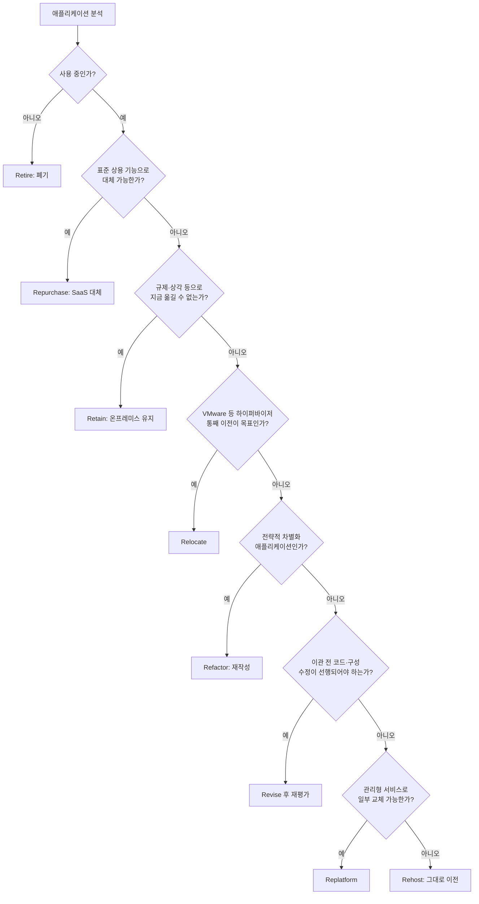
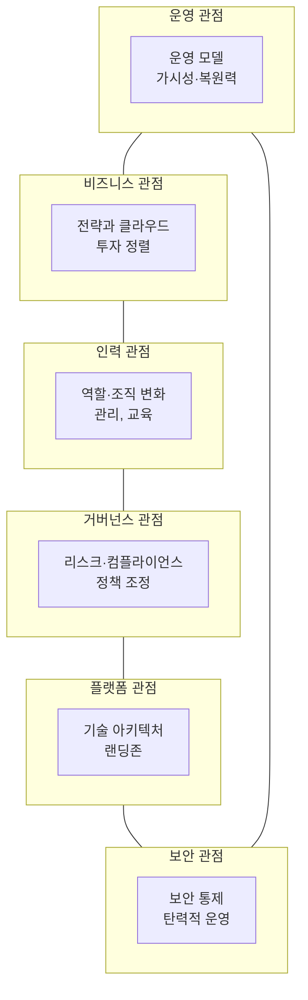
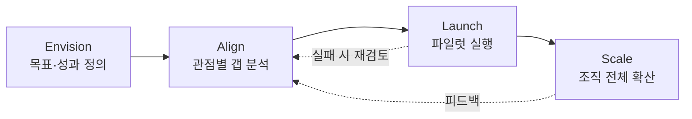
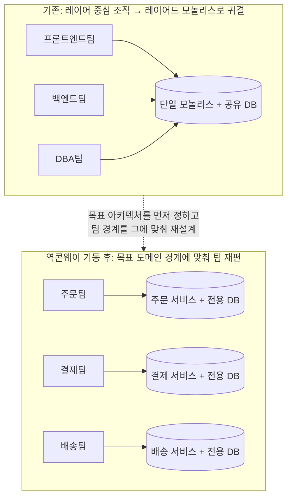
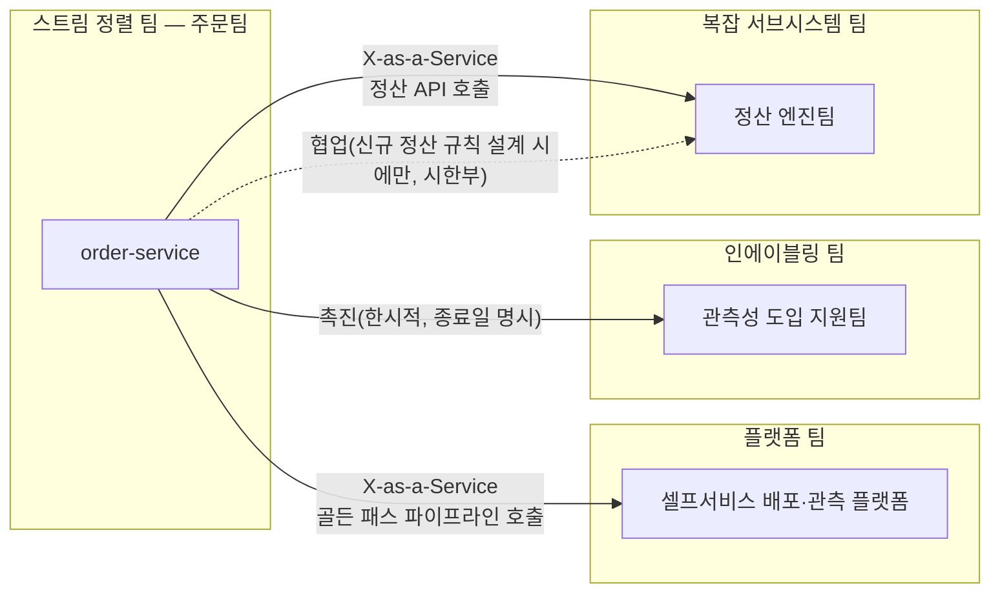
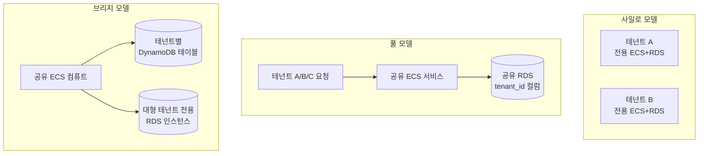
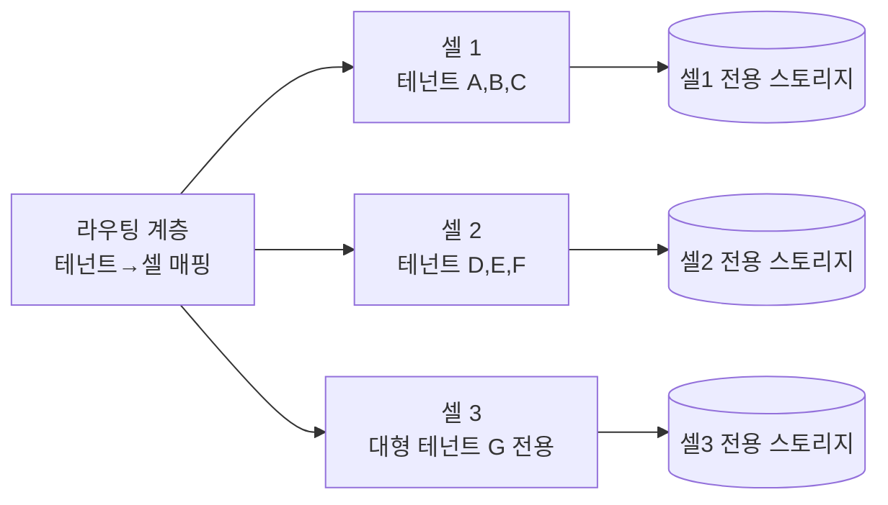
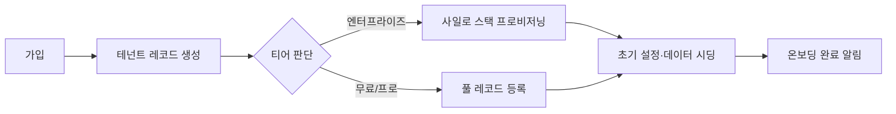

# Part XI. 마이그레이션과 조직

## 63장. 클라우드 마이그레이션 전략  ★★★★

> **이 장에서 다루는 것**
> Part X까지는 시스템을 클라우드 위에서 "어떻게 설계하는가"를 다뤘다. 이 장부터 시작하는 Part XI는 관점을 바꿔, 이미 온프레미스에 존재하는 수백~수천 개의 애플리케이션을 클라우드로 "어떻게 옮기는가"를 다룬다. 원서(*AWS for Solutions Architects*) 3장이 제시하는 3단계 마이그레이션 프로세스와 마이그레이션 패턴(7R로 통칭되는 8개 전략)을 뼈대로, 포트폴리오 분석·평가 도구·웨이브 계획·마이그레이션 후 최적화까지 하나의 실행 흐름으로 정리한다.
> 27장의 데이터베이스 마이그레이션(DMS/SCT), 23장의 하이브리드 스토리지(Snow 패밀리·DataSync), 12장의 하이브리드 연결, 6장의 Well-Architected, 17·40장의 비용 최적화 지식을 전제로 하며, 세부 실행 절차는 해당 장으로 넘긴다. 다음 장(64장)은 이 마이그레이션을 조직 전체의 변화 관리 틀인 AWS CAF 안에 위치시킨다.

### 63.1 3단계 마이그레이션 프로세스

대규모 마이그레이션이 실패하는 가장 흔한 이유는 기술이 아니라 순서다. 평가 없이 도구부터 돌리거나, 조직 준비 없이 첫 애플리케이션을 옮기면 초기 몇 개는 성공해도 웨이브가 커질수록 반복 가능한 절차가 없어 속도가 급격히 떨어진다. 원서는 마이그레이션을 **평가(Assess) → 준비·계획(Mobilize) → 마이그레이션·현대화(Migrate and Modernize)** 3단계로 구분한다. 세 단계는 순차적이라기보다 반복적이다. 평가에서 얻은 정보가 계획을 수정하고, 첫 웨이브의 실행 결과가 이후 웨이브의 계획을 다시 보정한다.

| 단계 | 목표 | 주요 활동 | 산출물 | 기간(가이드) | 주요 참여 조직 |
|---|---|---|---|---|---|
| 평가(Assess) | 클라우드 준비도와 비즈니스 케이스 확인 | 애플리케이션 인벤토리 수집, TCO 비교, 조직 클라우드 성숙도 진단, 마이그레이션 목표 정의 | 비즈니스 케이스 문서, 상위 포트폴리오 목록, 클라우드 준비도 보고서 | 4~8주 | 경영진, 전사 아키텍처팀, 재무 |
| 준비·계획(Mobilize) | 실행 가능한 랜딩존과 운영 모델 확보 | 랜딩존 구축(→30장 참조), 마이그레이션 팩토리 조직화, 도구 파일럿, 웨이브 계획 수립, 스킬 갭 교육 | 랜딩존, 팩토리 러너북, 웨이브 계획서, 교육 커리큘럼 | 4~12주 | 클라우드 플랫폼팀, 보안·네트워크팀, HR/교육 |
| 마이그레이션·현대화(Migrate and Modernize) | 실제 이관과 지속적 최적화 | 웨이브 단위 이관 실행, 컷오버·검증, 이관 직후 최적화, 반복적 현대화 | 이관 완료 애플리케이션, 최적화 보고서, 갱신된 아키텍처 | 워크로드 규모에 따라 수개월~수년 | 애플리케이션팀, 마이그레이션팀, 비즈니스팀 |

각 단계마다 참여 조직의 무게중심이 달라진다는 점도 계획에 반영해야 한다. 평가 단계는 예산·목표를 정하는 경영진과 재무 조직의 참여가 커야 하고, 준비·계획 단계로 넘어가면 플랫폼·보안·네트워크 같은 기반 조직의 역할이 커지며, 마이그레이션·현대화 단계에서는 실제 애플리케이션을 운영하는 팀과 비즈니스 이해관계자의 참여가 핵심이 된다. 한 조직이 다른 조직의 역할까지 떠맡으려 하면(예: 플랫폼팀이 애플리케이션 검증까지 담당) 단계가 진행될수록 병목이 커진다.

각 단계는 이후 절과 직접 연결된다. 평가 단계의 포트폴리오 분석은 63.3절, 준비·계획 단계의 웨이브·팩토리 조직은 63.5절, 마이그레이션·현대화 단계의 도구는 63.4절과 63.6절에서 다룬다.

**조직 클라우드 준비도 진단.** 평가 단계는 애플리케이션만 보는 것이 아니라 조직 자체가 대규모 마이그레이션을 감당할 준비가 되어 있는지도 함께 진단한다. 준비도가 낮은 채로 마이그레이션 규모를 키우면 준비·계획 단계에서 뒤늦게 병목이 드러난다.

| 진단 영역 | 확인 질문 | 준비 부족 시 나타나는 증상 |
|---|---|---|
| 비즈니스 정렬 | 마이그레이션 목표가 매출·비용·민첩성 중 무엇인지 합의됐는가 | 웨이브별 우선순위 기준이 팀마다 달라짐 |
| 인력·조직 | 클라우드 운영 경험을 가진 인력이 있는가, 채용·교육 계획이 있는가 | 이관 후에도 온프레미스식 수동 운영이 반복됨 |
| 거버넌스 | 계정 구조·태깅·권한 정책이 정의되어 있는가(→30·39장 참조) | 웨이브가 늘어날수록 계정·권한 혼선이 누적됨 |
| 플랫폼 | 랜딩존과 네트워크 연결(→12장 참조)이 준비되어 있는가 | 매 웨이브마다 네트워크 이슈로 컷오버가 지연됨 |
| 운영 모델 | 모니터링·인시던트 대응 체계가 클라우드 기준으로 갱신됐는가 | 컷오버 이후 장애 대응이 늦어짐 |

**비즈니스 케이스(TCO 비교)를 만드는 방법.** 경영진 승인 없이는 예산과 인력이 배정되지 않으므로, 평가 단계의 핵심 산출물은 온프레미스 TCO(총소유비용)와 클라우드 TCO를 비교하는 문서다. 온프레미스 TCO에는 하드웨어 구매·감가상각, 데이터센터 임대·전력·냉각, 라이선스, 유지보수 계약, 운영 인력 비용이 들어간다. 클라우드 TCO에는 컴퓨트·스토리지·네트워크 사용료, 마이그레이션 도구 비용, 그리고 아래에서 다루는 과소평가되기 쉬운 항목들이 들어간다. 두 TCO의 차이가 비즈니스 케이스의 핵심 숫자이며, 여기에 민첩성(신규 기능 출시 속도)·복원력(DR 비용 절감)처럼 정량화하기 어려운 이점을 별도 항목으로 덧붙인다.

**흔히 과소평가되는 항목.**

- **인력 교육**: 온프레미스 운영 인력이 클라우드 서비스·IaC·자동화 도구에 익숙해지는 데 걸리는 시간과 비용을 빼먹기 쉽다. 교육이 부족하면 마이그레이션 이후에도 온프레미스식 운영 습관(수동 프로비저닝, 고정 용량 설계)이 남아 클라우드의 이점을 못 살린다.
- **병행 운영(parallel run) 기간**: 컷오버 직후 온프레미스와 클라우드 환경을 동시에 유지하며 검증하는 기간의 이중 비용(라이선스, 인프라, 인력)이 종종 계획에서 빠진다. 병행 운영 없이 즉시 온프레미스를 폐기하면 롤백 경로가 사라진다.
- **최적화 기간**: 63.6절에서 다시 다루지만, 이관 직후에는 리프트 앤 시프트로 온프레미스 사양을 그대로 복제하는 경우가 많아 클라우드 비용이 오히려 높게 나온다. 이 최적화 작업에 필요한 별도 예산과 기간(보통 이관 완료 후 4~12주)을 비즈니스 케이스에 명시하지 않으면, 초기 청구서만 보고 "클라우드가 더 비싸다"는 성급한 결론에 도달한다.

TCO 비교표는 절대 금액보다 **비용 구성 항목이 온프레미스와 클라우드 사이에서 어떻게 이동하는가**를 보여주는 것이 핵심이다. 예를 들어 아래와 같은 상대 비교 구조를 사용한다(구체적 금액은 조직별 견적·Migration Evaluator 산정 결과를 따른다).

| 비용 항목 | 온프레미스 | 클라우드 이관 후(최적화 전) | 클라우드(최적화 후) |
|---|---|---|---|
| 컴퓨트/하드웨어 | 감가상각 고정비, 피크 기준 과다 프로비저닝 | 온디맨드 위주, 온프레미스 사양 그대로 복제 | 라이트사이징 + 커밋(Savings Plans) 적용 |
| 데이터센터 운영(전력·냉각·임대) | 고정비 발생 | 해당 없음(청구서에서 제거) | 해당 없음 |
| 라이선스 | 영구 라이선스 + 유지보수 계약 | 조건 재검토 필요(BYOL/포함형, 63.6절) | 조건에 맞는 최적 모델 적용 |
| 운영 인력 | 인프라 유지보수 중심 | 이중 운영(병행 기간) 인건비 발생 | 자동화 기반 운영으로 인력 재배치 |
| 재해복구 | 별도 DR 사이트 고정비 | 신규 DR 아키텍처 설계 필요 | 규모에 맞는 탄력적 DR(→23장 참조) |

**한 줄 결정 기준**: 비즈니스 케이스는 "이관 직후" 한 시점의 청구서가 아니라 "최적화 완료 후" 정상 상태의 비용을 최종 비교 기준으로 삼아야 실제 절감 여부를 판단할 수 있다.

비즈니스 케이스와 준비도 진단이 완료되면, 경영진과 주요 부서장으로 구성된 **마이그레이션 운영위원회(steering committee)**가 목표·예산·일정을 승인하는 절차를 거친다. 이 승인 절차 자체를 평가 단계의 공식 산출물로 문서화해 두면, 준비·계획 단계에서 예산이나 우선순위를 두고 조직 내 이견이 생겼을 때 되돌아볼 기준점이 된다.

### 63.2 마이그레이션 7R

원서는 애플리케이션별 이관 전략을 8개 패턴으로 열거하지만, 업계에서는 관용적으로 **"7R"**이라 부른다. 이는 초기 AWS 문서가 6R(Rehost/Replatform/Repurchase/Refactor/Retire/Retain)로 시작해 이후 Relocate와 Revise가 추가되면서 항목 수가 늘어난 역사적 배경 때문이다. 이 책에서는 원서의 8개 항목 구성을 그대로 유지하되, 통칭으로는 "7R"이라는 표현을 그대로 쓴다(정확한 개수보다 "애플리케이션마다 명시적으로 전략을 선택한다"는 사고방식이 핵심이다).

| 전략 | 정의 | 소요(상대) | 비용(상대) | 리스크 | 클라우드 이점 획득 | 적합 조건 | AWS 도구 |
|---|---|---|---|---|---|---|---|
| Rehost | 코드 변경 없이 그대로 이전(리프트 앤 시프트) | 짧음 | 초기 낮음, 장기 미최적화 시 상승 | 낮음 | 낮음(인프라 이점만) | 대량·시간 압박, 레거시 스택 | AWS MGN, VM Import/Export |
| Replatform | 코드는 유지하되 일부 구성요소를 관리형 서비스로 교체(리프트 앤 리셰이프) | 중간 | 중간 | 중간 | 중간 | DB를 RDS로, WAS를 컨테이너로 옮기고 싶은 경우 | DMS, Elastic Beanstalk, ECS/EKS |
| Refactor | 클라우드 네이티브 아키텍처로 재작성(마이크로서비스·서버리스) | 김 | 초기 높음, 장기 최적 | 높음(개발 리스크) | 높음 | 경쟁 우위·확장성이 핵심인 전략 애플리케이션 | Lambda, ECS/EKS, App Runner |
| Revise | 마이그레이션 전에 코드·아키텍처를 먼저 일부 수정한 뒤 위 전략 중 하나 적용 | 중간~김 | 중간 | 중간 | 전략에 따라 다름 | 노후 프레임워크·미지원 런타임 등 이관 전 정리가 필요한 경우 | 애플리케이션에 따라 상이 |
| Repurchase | 상용 SaaS로 대체(재구매) | 짧음~중간 | 구독료로 전환 | 낮음~중간(데이터 이관·통합) | 높음(운영 부담 이전) | 자체 개발보다 SaaS가 더 저렴/우수한 표준 기능(ERP, CRM, 이메일) | AppFlow, 파트너 SaaS 커넥터 |
| Relocate | 하이퍼바이저 수준에서 통째로 이전(예: VMware Cloud on AWS) | 짧음 | 중간 | 낮음 | 낮음(단기), 이후 단계적 전환 가능 | VMware 기반 대규모 인프라를 빠르게 클라우드 데이터센터로 옮기고 싶을 때 | VMware Cloud on AWS |
| Retain | 지금은 온프레미스에 유지 | 없음(연기) | 변화 없음 | 없음(현상 유지) | 없음 | 규제·상각 미완료·근시일 내 교체 예정 시스템 | 해당 없음(하이브리드 연결로 통합, →12장 참조) |
| Retire | 폐기 | 짧음 | 절감(라이선스·운영비 제거) | 낮음(의존성 확인 필요) | 해당 없음 | 사용률 낮거나 중복된 애플리케이션 | 애플리케이션 디스커버리로 사용 이력 확인 |

**한 줄 결정 기준**: 전략 선택은 "이 애플리케이션이 향후에도 차별화 경쟁력을 만드는가(→ Refactor), 표준 기능이라 사는 게 나은가(→ Repurchase), 지금 당장 옮겨야 하지만 재작성할 여유가 없는가(→ Rehost/Replatform), 아니면 애초에 필요 없는가(→ Retire)"의 순서로 질문해 결정한다.



**7R 판정 규칙(요약 의사결정 표)**

| 조건 | 판정 |
|---|---|
| 지난 12개월 사용 이력 없음, 소유자 미상 | Retire |
| 표준 업무 기능(메일, ERP, CRM)이고 벤더 SaaS로 대체 가능 | Repurchase |
| 규제상 데이터 소재지 요건 미충족 또는 상각 잔여 2년 이상 | Retain |
| VMware 기반이며 하드웨어 리프레시 주기와 마이그레이션 시점이 겹침 | Relocate |
| 매출·고객 경험에 직접적 차별화 요소이며 배포 빈도를 늘려야 함 | Refactor |
| 런타임 EOL(End of Life) 임박 또는 아키텍처 결함으로 이관 자체가 불가능 | Revise → 재평가 |
| DB만 관리형으로 옮겨도 운영 부담이 크게 줄어듦 | Replatform |
| 위 조건 모두 미해당, 일정 압박이 큼 | Rehost |

전부 Rehost로 처리하면 초기 마이그레이션 속도는 빠르지만, 온프레미스의 과다 프로비저닝된 사양과 기술 부채를 그대로 클라우드로 옮기는 것과 같다. 이는 63.6절의 마이그레이션 후 최적화 없이는 "클라우드가 더 비싸다"는 결론으로 이어지는 가장 흔한 원인이다.

**각 전략의 실무적 의미.** 표와 결정 트리만으로는 놓치기 쉬운 실무 판단 포인트를 짚어둔다.

- **Rehost**는 "왜 지금 재작성하지 않는가"에 대한 답이 명확해야 한다. 일정이 촉박하거나, 데이터센터 계약 종료가 임박했거나, 대상 애플리케이션 수가 너무 많아 개별 재작성이 불가능한 경우에 정당화된다. Rehost 자체는 잘못된 선택이 아니지만, 이후 최적화 계획 없이 방치하면 문제가 된다.
- **Replatform**은 애플리케이션 코드를 건드리지 않으면서 관리 부담이 큰 구성요소(자체 구축 DB, 자체 구축 WAS 클러스터)만 관리형 서비스로 옮기는 절충안이다. Rehost보다 작업량이 늘지만, 이관 직후부터 운영 부담이 줄어드는 효과가 바로 나타난다.
- **Refactor**는 투자 대비 효과가 가장 큰 대신 개발 리스크와 기간이 커서, 비즈니스 가치가 명확히 높은 애플리케이션에만 선별적으로 적용해야 한다. 모든 애플리케이션을 Refactor하려는 시도는 마이그레이션 전체 일정을 무한정 늘린다.
- **Revise**는 그 자체로 끝나는 전략이 아니라 다른 전략을 가능하게 만드는 전 단계다. 예를 들어 EOL(지원 종료)된 런타임을 최신 버전으로 올리는 작업을 마이그레이션 전에 마쳐야 Rehost든 Replatform이든 이후 단계가 가능해진다.
- **Repurchase**는 "우리가 이 기능을 자체 개발로 유지할 이유가 있는가"라는 질문에 대한 답이 "아니오"일 때 선택한다. 데이터 이관과 기존 연동 시스템과의 통합이 주요 리스크다.
- **Relocate**는 애플리케이션 자체를 변경하지 않고 하이퍼바이저 계층만 옮기므로 대규모 VMware 인프라를 짧은 시간에 클라우드 데이터센터로 옮길 때 유용하지만, 그 자체로는 클라우드 네이티브 이점을 얻지 못하며 이후 단계적 전환의 발판으로 취급해야 한다.
- **Retain**은 "옮기지 않는다"는 것도 명시적 결정이라는 점이 중요하다. 문서화하지 않은 채 방치된 Retain 대상은 조직의 클라우드 전환율 계산을 왜곡하고, 재검토 시점을 놓치게 만든다.
- **Retire**는 인벤토리 단계에서 가장 적극적으로 찾아야 할 대상이다(63.3절 참조). 폐기 전에는 반드시 의존성을 재확인해, 겉보기에 사용되지 않는 시스템이 사실은 다른 배치 작업의 데이터 소스로 쓰이고 있지 않은지 검증한다.

**적용 예시.** 63.3절 인벤토리 예시의 "주문관리시스템"(APP-0142)을 결정 트리에 대입해 보면, 사용 이력이 최근이므로 Retire는 아니고, 자체 개발 핵심 업무 시스템이라 표준 SaaS 대체(Repurchase)도 어렵다. 규제·상각 제약이 없어 Retain 대상도 아니고 VMware 통째 이전(Relocate) 목표도 아니다. 매출에 직접 기여하는 전략 시스템이지만 당장 개발 리소스가 부족해 전면 재작성(Refactor)은 이번 웨이브에서 어렵다고 판단되면, Oracle 11g처럼 EOL이 임박한 구성요소가 있는지 확인(Revise 필요 여부)한 뒤, 없다면 데이터베이스만 관리형 서비스로 옮기는 Replatform이 최종 판정이 된다. 이처럼 결정 트리는 한 번에 하나의 정답을 주는 것이 아니라, 각 갈래에서 왜 다음 갈래로 넘어가는지를 팀이 합의하는 도구로 쓰는 것이 실무적이다.

### 63.3 포트폴리오 분석과 우선순위 결정

7R을 애플리케이션 단위로 판정하려면 먼저 무엇을 옮길 것인지 정확한 인벤토리가 있어야 한다. 많은 조직이 "우리가 몇 개의 애플리케이션을 운영하는지" 자체를 정확히 모르는 상태에서 마이그레이션을 시작하며, 이는 뒤늦게 숨은 시스템이 발견돼 웨이브 계획이 틀어지는 원인이 된다.

**애플리케이션 인벤토리 스프레드시트 스키마**

| 컬럼 | 예시 값 | 설명 |
|---|---|---|
| 애플리케이션 ID | APP-0142 | 인벤토리 고유 식별자 |
| 애플리케이션명 | 주문관리시스템 | 비즈니스 명칭 |
| 기술 스택 | Java 8, Oracle 11g, Tomcat | 런타임·미들웨어·DB 버전 |
| 인프라 구성 | VM 12대, vCPU 96, RAM 384GB | 현재 물리/가상 자원 |
| 의존성 | APP-0087(결제), APP-0203(재고) | 상호 연동하는 다른 시스템 |
| 트래픽 패턴 | 평일 09-18시 피크, 초당 200req | 부하 특성 |
| 데이터량 | 4.2TB, 일 증가량 8GB | 스토리지 규모 |
| 규정 요건 | PCI-DSS 대상 | 컴플라이언스 태그 |
| 소유자/부서 | 결제팀 / 김OO | 담당 조직·연락처 |
| 수명 주기 단계 | 성숙(변경 적음) | 신규/성장/성숙/쇠퇴 |
| 마지막 사용 이력 | 2026-08-20 | 최근 접근 로그 |
| 7R 판정 | Rehost | 63.2절 규칙 적용 결과 |
| 웨이브 배정 | Wave 2 | 63.5절 웨이브 계획 |

인벤토리 데이터는 애플리케이션 오너 인터뷰만으로 채우지 않는다. 인터뷰는 소유자·수명 주기·규정 요건처럼 사람만 아는 정보를 채우고, 기술 스택·의존성·트래픽·데이터량처럼 정확성이 중요한 항목은 63.4절의 Application Discovery Service로 자동 수집한 데이터로 검증·보완한다. 두 방식을 병행해야 인터뷰의 누락과 자동 수집 도구의 맥락 부족을 서로 보완할 수 있다.

**평가 축(2×2 매트릭스)과 점수화 기준.** 인벤토리가 모이면 각 애플리케이션을 **비즈니스 가치**(매출 기여도, 전략적 중요도)와 **마이그레이션 난이도**(의존성 수, 기술 부채, 데이터량, 규정 제약)라는 두 축으로 배치한다. 매트릭스 위치를 감(感)이 아니라 재현 가능한 점수로 정하려면 아래와 같은 점수화 기준표를 함께 사용한다.

| 평가 축 | 항목 | 낮은 점수(1) | 높은 점수(5) |
|---|---|---|---|
| 비즈니스 가치 | 매출 직접 기여 | 내부 지원 시스템 | 고객 대면 핵심 거래 시스템 |
| 비즈니스 가치 | 변경 요구 빈도 | 연 1~2회 | 주 단위 이상 |
| 마이그레이션 난이도 | 의존성 수 | 0~2개 시스템과 연동 | 10개 이상과 연동 |
| 마이그레이션 난이도 | 데이터량·상태 | 수십 GB, 상태 없음(stateless) | 수 TB 이상, 상태 저장(stateful) |
| 마이그레이션 난이도 | 규정·컴플라이언스 제약 | 해당 없음 | PCI-DSS·금융 규제 등 다수 해당 |

각 항목의 점수를 합산해 매트릭스상 좌표를 결정하면, 여러 평가자가 나눠 채점해도 결과가 크게 어긋나지 않는다. 점수화는 완벽한 객관성을 보장하지 않지만, 적어도 "이 애플리케이션이 왜 이 우선순위를 받았는가"라는 질문에 근거를 대며 답할 수 있게 해준다는 점에서 감(感)에 의한 우선순위보다 낫다. 점수 산정 근거(각 항목의 원본 수치)는 인벤토리 스프레드시트에 함께 기록해, 이후 우선순위에 이견이 생겼을 때 재검토할 수 있도록 한다.

```mermaid
quadrantChart
    title 비즈니스 가치 x 마이그레이션 난이도
    x-axis 낮은 난이도 --> 높은 난이도
    y-axis 낮은 가치 --> 높은 가치
    quadrant-1 전략적 재작성 후보
    quadrant-2 빠른 성과(Quick Win)
    quadrant-3 Retire/Repurchase 후보
    quadrant-4 신중한 계획 필요
    사내 포털: [0.2, 0.3]
    주문관리: [0.35, 0.8]
    레거시 리포팅: [0.75, 0.25]
    핵심 거래엔진: [0.85, 0.9]
```

- **빠른 성과(낮은 난이도·높은 가치)**: 첫 웨이브 후보. 성공 사례를 빨리 만들어 조직의 신뢰를 얻는다.
- **Retire/Repurchase 후보(낮은 난이도·낮은 가치)**: 옮기는 것 자체를 재고한다.
- **전략적 재작성 후보(높은 난이도·높은 가치)**: Refactor 투자가 정당화되는 영역이지만 웨이브 후반부에 배치한다.
- **신중한 계획 필요(높은 난이도·낮은 가치)**: 우선순위를 낮추거나 Retain을 검토한다.

**첫 웨이브 선정 기준**은 매트릭스상 위치만이 아니라 **저위험·저의존**이라는 조건을 함께 본다. 의존하는 다른 시스템이 적고, 실패해도 비즈니스 영향이 제한적인 애플리케이션을 먼저 옮겨 마이그레이션 팀이 도구·절차·컷오버 리듬을 몸에 익히게 한다. 첫 웨이브에서 배운 교훈(예상보다 오래 걸린 단계, 자동화가 필요했던 반복 작업)은 이후 웨이브의 러너북에 반영된다.

**우선순위 결정 절차**는 대체로 다음 순서로 진행한다. 먼저 인벤토리 전체를 점수화 기준표로 채점해 2×2 매트릭스에 배치한다. 이어서 매트릭스만으로는 드러나지 않는 조직 맥락(예정된 하드웨어 리프레시, 계약 만료일, 규제 대응 마감)을 반영해 순서를 미세 조정한다. 마지막으로 저위험·저의존 애플리케이션 중 비즈니스 가치가 지나치게 낮지 않은 것들을 골라 첫 웨이브 후보 목록을 확정하고, 나머지는 의존성 그룹 단위로 후속 웨이브에 순차 배정한다(웨이브 구성의 세부 원칙은 63.5절 참조). 이 절차를 문서화해 두면 이후 새로운 애플리케이션이 인벤토리에 추가될 때도 같은 기준으로 재현성 있게 우선순위를 매길 수 있다.

데이터센터 임대 계약 종료일이나 하드웨어 리스 만료일이 정해져 있는 경우, 우선순위 결정은 매트릭스 점수만이 아니라 **역산 일정(계약 종료일에서 거꾸로 계산한 마감 기한)**의 제약도 함께 반영해야 한다. 이 경우 비즈니스 가치가 낮더라도 계약 종료 대상 데이터센터에 위치한 애플리케이션은 먼저 처리해야 할 수 있으며, 이런 제약은 매트릭스 옆에 별도 "일정 제약" 플래그로 표시해 두는 것이 실무적이다.

인벤토리를 정리하다 보면 예상보다 많은 애플리케이션이 **Retire와 Repurchase**로 분류되는 경우가 흔하다. 오랫동안 방치된 중복 시스템, 사용자가 사실상 없는 내부 도구, 표준 SaaS로 충분히 대체 가능한 자체 개발 시스템이 여기 해당한다. 이 비율이 낮게 나온다면 인벤토리 단계에서 충분히 적극적으로 찾지 않았을 가능성을 의심해야 한다. Retire·Repurchase로 처리되는 애플리케이션이 늘어날수록 실제로 마이그레이션 엔지니어링 노력을 투입해야 할 대상이 줄어들어 전체 일정이 단축된다.

### 63.4 평가 도구

포트폴리오 분석과 7R 판정을 수작업 인터뷰만으로 진행하면 대규모 환경에서는 현실적으로 불가능하다. AWS는 평가부터 실행까지 단계별 전용 도구를 제공한다.

| 도구 | 역할 | 사용 시점 | 비고 |
|---|---|---|---|
| AWS Application Discovery Service | 온프레미스 서버의 사용률·프로세스·네트워크 연결을 자동 수집. 에이전트 기반(상세 프로세스 수준)과 에이전트리스(VMware 환경 수준) 방식 제공 | 평가 단계 초반 | 의존성 매핑의 핵심 데이터 소스 |
| AWS Migration Hub | 여러 도구가 수집한 포트폴리오 데이터를 한곳에서 추적, 마이그레이션 전략 권장 기능 제공 | 평가~실행 전 단계 | Discovery Service·MGN·DMS 등의 데이터를 통합 조회 |
| AWS Migration Evaluator | 온프레미스 사용률 데이터를 기반으로 TCO(비용) 산정, 비즈니스 케이스 작성 지원 | 평가 단계 | 63.1절 비즈니스 케이스의 정량 근거 생성 |
| AWS Application Migration Service(MGN) | 소스 서버를 블록 수준으로 지속 복제해 리호스트(Rehost) 실행. 서버·VM·클라우드 워크로드를 최소 다운타임으로 이전 | 마이그레이션 실행 단계 | Rehost 전략의 기본 도구 |
| AWS Database Migration Service(DMS) | 데이터베이스 이관 및 지속 복제 | 마이그레이션 실행 단계(DB) | 스키마 변환·상세 절차는 → 27장 참조 |
| 애플리케이션 변환/리팩터링 도구군 | 언어·플랫폼 변환 지원(예: .NET/Java 현대화 지원 도구) | Refactor/Revise 전략 실행 시 | 도구 가용 범위는 지속 확장 중이므로 최신 지원 목록 확인 필요 |
| AWS Snow 패밀리 / AWS DataSync | 대용량 데이터의 오프라인/온라인 이관 | 데이터량이 크거나 네트워크 대역폭이 제한적일 때 | 상세 사용법 → 23장 참조 |

**Application Discovery Service의 두 가지 수집 방식.** 에이전트 기반 방식은 대상 서버에 소프트웨어 에이전트를 설치해 프로세스 단위 네트워크 연결·CPU/메모리 사용률까지 상세히 수집한다. 에이전트리스 방식은 VMware 환경의 하이퍼바이저 계층에서 VM 단위 사용률을 수집하며, 에이전트를 설치할 수 없는 환경(레거시 OS, 변경 통제가 엄격한 서버)에 적합하다. 두 방식 모두 63.3절의 의존성 매핑과 63.5절의 숨은 연동 발견에 사용되는 원천 데이터를 만든다.

**Migration Hub로 포트폴리오 추적하기.** Migration Hub는 Discovery Service·MGN·DMS가 각각 수집·실행한 데이터를 하나의 화면에서 조회하게 해주며, 수집된 서버 사용률을 바탕으로 전략(7R) 권장 기능도 제공한다(권장 결과는 참고용이며 63.2절의 판정 규칙과 비즈니스 맥락으로 최종 검증해야 한다). 아래는 개념적인 조회 흐름이며, 정확한 서브커맨드와 파라미터는 최신 AWS CLI 문서로 확인한다.

```bash
# Migration Hub에 등록된 애플리케이션 그룹과 각 그룹의
# 마이그레이션 진행 상태를 조회한다 (웨이브별 진척도 추적)
aws migrationhub-config describe-home-region-controls \
  --region ap-northeast-2

aws migrationhub list-discovered-resources \
  --configuration-type SERVER \
  --region ap-northeast-2
```

**Migration Evaluator의 산정 방식.** 온프레미스에서 수집한 에이전트리스 사용률 데이터(또는 기존 자산 관리 도구의 내보내기 데이터)를 업로드하면, 실제 사용률에 맞춘 인스턴스 타입 추천과 구매 옵션(온디맨드/커밋)별 예상 비용을 함께 산정해 비즈니스 케이스 작성에 필요한 정량 근거를 만든다. 산정 결과는 시점의 요금·인스턴스 카탈로그를 기준으로 하므로, 실제 예산 확정 전에는 최신 산정을 다시 받는 것이 안전하다.

**어느 도구를 언제 쓰는가.** 네 도구는 순서대로 이어진다. "지금 무엇을 운영하고 있는가"는 Application Discovery Service로 수집하고, "그 비용을 클라우드로 옮기면 어떻게 되는가"는 Migration Evaluator로 산정하며, "전체 포트폴리오의 진행 상태를 어디서 보는가"는 Migration Hub로 추적하고, "실제로 서버를 리호스트하는 실행"은 MGN이 담당한다. 네 도구를 순서를 바꿔 사용하면(예: 평가 없이 MGN부터 실행) 무엇을 왜 옮기는지에 대한 근거 없이 마이그레이션이 진행되는 위험이 생긴다.

데이터베이스와 대용량 데이터에 대해서는 별도 전용 도구를 쓴다. 스키마 변환과 이관·지속 복제는 Database Migration Service(DMS)가 담당하며 세부 절차와 무중단 컷오버 설계는 27장에서 다룬다. 네트워크 대역폭이 제한적이거나 데이터량이 극히 커서 온라인 전송이 비현실적인 경우에는 Snow 패밀리(오프라인 물리 이관)와 AWS DataSync(온라인 대량 전송)를 조합하며, 두 서비스의 선택 기준과 운영 절차는 23장에서 이미 다뤘으므로 여기서는 반복하지 않는다.

**MGN 복제·테스트·컷오버 CLI 흐름 예시.** 아래는 개념 흐름을 보여주는 예시이며, 실제 파라미터는 콘솔 또는 최신 CLI 문서를 반드시 확인한다.

```bash
# 1. 소스 서버에 MGN 복제 에이전트 설치 후, 서버가 콘솔에 등록되면
# 복제 상태를 확인한다 (초기 동기화 완료 여부 확인)
aws mgn describe-source-servers \
  --region ap-northeast-2 \
  --query "items[].{ID:sourceServerID,State:dataReplicationInfo.dataReplicationState}"

# 2. 복제가 "지속(CONTINUOUS)" 상태가 되면 테스트 인스턴스를 실행해
# 컷오버 전 애플리케이션 동작을 검증한다 (실제 트래픽에는 영향 없음)
aws mgn start-test \
  --source-server-id s-1234567890abcdef0 \
  --region ap-northeast-2

# 3. 테스트 인스턴스에서 애플리케이션 기동·연동을 검증한 뒤
# 문제가 없으면 실제 컷오버를 실행한다 (다운타임 구간 시작)
aws mgn start-cutover \
  --source-server-id s-1234567890abcdef0 \
  --region ap-northeast-2

# 4. 컷오버 완료 후 소스 서버와의 연결을 종료해 복제 리소스를 정리한다
aws mgn finalize-cutover \
  --source-server-id s-1234567890abcdef0 \
  --region ap-northeast-2
```

### 63.5 웨이브 계획과 마이그레이션 팩토리

애플리케이션 하나씩 개별적으로 마이그레이션 계획을 세우면 조직 전체 규모에서는 관리가 불가능하다. 대신 애플리케이션을 **웨이브(wave)** 단위로 묶어 반복 가능한 절차로 처리한다.

**웨이브 구성 원칙**

- **의존성 그룹 단위로 묶는다**: 서로 강하게 연동하는 애플리케이션은 같은 웨이브에 넣어 컷오버 순서 문제를 없앤다.
- **유사한 7R 패턴끼리 묶는다**: 같은 Rehost 대상끼리, 같은 DB 엔진 Replatform 대상끼리 묶으면 팀이 도구·절차를 반복 적용해 처리 속도가 빨라진다.
- **롤백 가능한 단위로 나눈다**: 한 웨이브가 실패했을 때 그 웨이브만 되돌릴 수 있도록 범위를 제한한다. 너무 큰 웨이브는 부분 실패 시 전체 롤백 범위가 커진다.

**마이그레이션 팩토리 조직.** 웨이브를 반복적으로 처리하려면 역할이 고정된 팀 구조("팩토리")가 필요하다.

| 팀 | 역할 |
|---|---|
| 클라우드 플랫폼 팀 | 랜딩존·네트워크·보안 기반 유지, 신규 웨이브가 사용할 계정·VPC 준비 |
| 마이그레이션 팀 | MGN/DMS 등 도구 운영, 복제·테스트·컷오버 실행, 러너북 관리 |
| 애플리케이션 팀 | 대상 애플리케이션의 기능 검증, 컷오버 시 애플리케이션 레벨 확인 |
| 비즈니스 팀 | 컷오버 일정 승인, 사용자 공지, 병행 운영 기간 중 업무 영향 모니터링 |

각 웨이브는 동일한 **러너북(runbook)**을 따른다. 웨이브가 반복될수록 러너북이 다듬어지고, 팀은 애플리케이션 개별 특성보다 반복 절차에 집중할 수 있게 된다.

**팩토리 운영 리듬.** 팩토리는 한 웨이브가 끝난 뒤 다음 웨이브를 시작하는 순차 구조가 아니라, 여러 웨이브를 겹쳐(복제 중인 웨이브, 테스트 중인 웨이브, 컷오버 대기 중인 웨이브) 병렬로 진행하는 것이 일반적이다. 이를 위해 주간 단위로 팀 전체가 모여 각 웨이브의 진행 상태·차단 요소(blocker)를 점검하는 정기 리듬을 두고, 한 웨이브에서 발견된 문제(예상보다 오래 걸린 스키마 변환, 누락된 방화벽 규칙)를 즉시 러너북에 반영해 다음 웨이브가 같은 문제를 반복하지 않도록 한다. 네트워크 연결(→12장 참조)처럼 모든 웨이브가 공통으로 의존하는 선행 조건은 개별 웨이브 계획이 아니라 팩토리 착수 시점에 한 번 구축해 두어야, 웨이브마다 반복 협의하는 비효율을 없앨 수 있다.

**웨이브 규모 가이드**

| 웨이브 규모 | 애플리케이션 수(가이드) | 특징 | 적합 시점 |
|---|---|---|---|
| 소규모 | 1~5개 | 롤백이 쉽고 검증이 빠름 | 첫 웨이브, 새 팀원 온보딩 시점 |
| 중규모 | 6~20개 | 팩토리 처리량이 안정된 이후 | 러너북이 검증된 이후의 본 궤도 |
| 대규모 | 20개 이상 | 처리 속도는 빠르지만 부분 실패 시 영향 범위가 큼 | 유사 패턴이 반복되는 후반 웨이브(예: 동일 스택의 지사 시스템 다수) |

웨이브 규모는 고정된 것이 아니라 팩토리의 처리 역량이 검증됨에 따라 점진적으로 키우는 것이 안전하다. 초반부터 대규모 웨이브를 시도하면 63.2절에서 다룬 개별 애플리케이션의 7R 판정 오류나 의존성 누락이 한꺼번에 여러 애플리케이션에서 터져 나올 위험이 있다.

**팩토리 KPI(핵심 성과 지표).** 팩토리가 잘 작동하는지는 옮긴 애플리케이션 수만으로 판단하지 않는다. 아래와 같은 지표를 함께 추적해야 처리량을 늘리는 것과 품질을 유지하는 것 사이의 균형을 볼 수 있다.

| 지표 | 의미 | 악화 시 해석 |
|---|---|---|
| 주간 처리량(애플리케이션 수/주) | 팩토리의 처리 속도 | 낮으면 병목 구간(승인 대기, 테스트 환경 부족)을 점검 |
| 컷오버 롤백률 | 실제 롤백이 발생한 비율 | 높으면 의존성 매핑·테스트 컷오버 검증이 부실했다는 신호 |
| 웨이브당 재작업 건수 | 러너북 미준수로 다시 처리한 항목 수 | 늘어나면 러너북 자체를 다시 점검해야 함 |
| 병행 운영 초과 기간 | 계획한 병행 운영 기간을 초과한 애플리케이션 수 | 늘어나면 컷오버 검증 기준이 지나치게 낙관적이었다는 신호 |

이 지표들이 시간이 지나며 개선되는 추세를 보이면 러너북과 팩토리 조직이 제대로 학습하고 있다는 증거이며, 반대로 웨이브가 반복돼도 개선되지 않는다면 팩토리 조직 구조나 도구 선택 자체를 재검토해야 한다.

**웨이브 계획 템플릿(예시)**

| 항목 | 내용 |
|---|---|
| 웨이브 번호 | Wave 3 |
| 포함 애플리케이션 | APP-0142, APP-0156, APP-0201 (결제 도메인 그룹) |
| 7R 전략 | Rehost 2건, Replatform 1건 |
| 사전 조건 | 네트워크 연결(→12장 참조) 완료, 대상 VPC·보안그룹 프로비저닝 완료 |
| 복제 시작일 | 2026-10-05 |
| 테스트 컷오버일 | 2026-10-19 |
| 실제 컷오버일 | 2026-10-26 (야간 유지보수 창) |
| 병행 운영 기간 | 컷오버 후 2주 |
| 롤백 기준 | 컷오버 후 4시간 내 핵심 트랜잭션 오류율 1% 초과 시 롤백 |
| 담당 팀 | 마이그레이션 팀(리드), 결제팀(검증) |

**컷오버 계획과 검증.** 컷오버 당일에는 사전에 정의된 검증 항목(핵심 API 응답, 데이터 정합성, 배치 작업 정상 기동)을 체크리스트로 확인하고, 병행 운영 기간에는 온프레미스와 클라우드 양쪽 로그를 비교해 차이가 없는지 모니터링한다. 검증은 기술적 정상 동작 확인에 그치지 않는다. 실제 사용자 트랜잭션 표본을 온프레미스·클라우드 양쪽에서 동시에 실행해 결과를 비교하는 **병행 검증(shadow testing)**을 병행 운영 기간 초반에 수행하면, 애플리케이션 레벨 테스트만으로는 드러나지 않는 데이터 정합성 문제(문자 인코딩 차이, 시간대 처리 차이 등)를 컷오버 확정 전에 잡아낼 수 있다. 병행 운영 기간이 끝나고 온프레미스 자원을 해지하는 시점은 별도의 승인 절차(비즈니스 팀의 최종 서명)를 거쳐야 하며, 임의로 앞당기지 않는다.

**컷오버 러너북 체크리스트(예시)**

- [ ] 대상 애플리케이션의 모든 의존성이 인벤토리에 문서화되어 있는가
- [ ] 네트워크 경로(VPN/DX, →12장 참조)가 사전에 검증되었는가
- [ ] DNS 전환 절차와 TTL이 컷오버 시간에 맞게 설정되었는가
- [ ] 테스트 컷오버에서 핵심 트랜잭션이 정상 동작했는가
- [ ] 롤백 절차와 롤백 트리거 기준이 문서화되고 관계자에게 공유되었는가
- [ ] 병행 운영 기간 중 모니터링 대시보드와 알람이 준비되었는가
- [ ] 데이터베이스 최종 동기화(→27장 참조) 완료 여부를 확인했는가
- [ ] 컷오버 승인권자(비즈니스 팀)의 최종 서명을 받았는가

**의존성 매핑을 건너뛰지 말아야 하는 이유.** 웨이브 계획의 가장 흔한 실패 원인은 문서화되지 않은 숨은 연동이다. 애플리케이션 오너 인터뷰만으로는 오래된 배치 작업이나 다른 팀이 만든 연동 스크립트를 놓치기 쉽다. Application Discovery Service의 네트워크 흐름 기반 자동 발견(63.4절)으로 실제 트래픽 패턴을 확인하면, 인터뷰에서 언급되지 않은 연동을 컷오버 전에 찾아낼 수 있다. 이 단계를 생략하면 컷오버 당일에야 숨은 연동이 끊어진 것을 발견하게 되고, 이는 계획된 병행 운영 기간을 무의미하게 만드는 긴급 롤백으로 이어진다.

### 63.6 마이그레이션 후 최적화 단계

애플리케이션이 클라우드에 도착한 시점은 마이그레이션의 끝이 아니라 시작이다. Rehost로 옮긴 워크로드는 온프레미스의 고정 용량 사고방식을 그대로 담고 있어, 최적화 없이는 클라우드의 탄력성·종량과금 이점을 전혀 활용하지 못한다.

**최적화 경로**

- **Well-Architected 리뷰**: 이관 완료 후 일정 시점(보통 안정화 이후 몇 주 내)에 대상 워크로드에 대해 정식 리뷰를 수행해 6개 기둥 관점에서 개선 항목을 도출한다(→6장 참조).
- **라이트사이징과 커밋**: 실제 사용률 데이터를 기반으로 인스턴스 크기를 재조정하고, 안정적인 워크로드에는 Savings Plans·예약 인스턴스 커밋을 적용한다(→17·40장 참조). 이관 직후에는 온프레미스 사양을 그대로 복제한 경우가 많으므로 이 단계에서 상당한 절감이 발생하는 경우가 흔하다.
- **현대화 경로**: 시간이 지나며 단계적으로 아키텍처를 진화시킨다. 예를 들어 EC2 위에서 실행하던 애플리케이션을 컨테이너(ECS/EKS)로, 이후 서버리스(Lambda/Fargate)로 옮기거나, 상용 데이터베이스를 오픈소스 호환 관리형 서비스(Aurora 등)로 전환한다. 이 전환은 한 번에 이루어지지 않고 여러 마이그레이션 사이클에 걸쳐 점진적으로 진행되는 것이 일반적이다.
- **운영 모델 전환**: 티켓 기반 수동 운영에서 IaC·자동화 기반 운영으로 팀의 일하는 방식 자체를 전환한다. 이 전환은 도구 도입만으로 끝나지 않으며, 온프레미스 시절의 변경 승인 절차(수 주 단위 변경관리위원회)를 클라우드에 맞는 빠른 배포 주기(자동화된 파이프라인 기반 승인)로 함께 바꿔야 효과가 난다. 운영 모델 전환은 조직 구조와 인력 역할 재정의를 동반하는 경우가 많으므로, 순수 기술 프로젝트가 아니라 변화 관리 프로젝트로 취급해야 한다는 점은 다음 장(64장)의 AWS CAF 논의와 직접 이어진다.

**이관 직후와 최적화 후의 성공 지표 비교**

| 지표 | 이관 직후(전형적) | 최적화 후(목표) |
|---|---|---|
| 비용 | 온프레미스 사양 그대로 복제해 절감 미미하거나 증가 | 라이트사이징·커밋으로 구조적 절감 |
| 성능 | 온프레미스와 동등한 수준 유지가 목표 | 관리형 서비스 전환으로 가용성·확장성 개선 |
| 배포 빈도 | 기존 온프레미스 배포 절차를 그대로 답습 | 파이프라인 자동화로 배포 빈도 증가 |

이 비교표가 보여주듯, "이관 직후" 시점만 보고 마이그레이션의 성패를 판단하면 세 지표 모두 개선되지 않은 상태를 관찰하게 된다. 최적화 사이클(63.6절 앞부분의 현대화 로드맵 참조)을 거친 뒤의 지표를 목표로 계획해야 한다.

**현대화 로드맵 예시(단계별 목표).** 현대화는 한 번의 프로젝트가 아니라 여러 최적화 사이클에 걸친 로드맵으로 관리하는 것이 실무적이다.

| 단계 | 상태 | 목표 | 대표 조치 |
|---|---|---|---|
| 0단계 | 이관 직후(Rehost 완료) | 온프레미스와 동등한 안정성 확보 | 모니터링·백업 체계 정착 |
| 1단계 | 안정화(수 주 내) | 명백한 비용 낭비 제거 | 라이트사이징, 유휴 리소스 정리 |
| 2단계 | 커밋 최적화(수개월 내) | 예측 가능한 워크로드 비용 고정 | Savings Plans·예약 커밋 적용(→17·40장 참조) |
| 3단계 | 부분 현대화(6개월~1년) | 운영 부담이 큰 구성요소부터 전환 | EC2 → 컨테이너, 상용 DB → 관리형 오픈소스 호환 DB |
| 4단계 | 아키텍처 현대화(1년 이상) | 배포 빈도·확장성 개선 | 컨테이너 → 서버리스, 이벤트 기반 아키텍처 전환 |

**최적화 예산과 기간을 계획에 반드시 포함해야 하는 이유.** 63.1절에서 언급했듯, 비즈니스 케이스 단계에서 최적화 기간과 예산을 별도로 책정하지 않으면 이관 직후의 미최적화된 청구서만 보고 "클라우드가 더 비싸다"는 결론에 도달하기 쉽다. 마이그레이션 프로젝트의 성공 기준은 "옮겼다"는 완료 여부가 아니라 **비용(온프레미스 대비 실제 절감), 성능(응답 시간·가용성 지표), 배포 빈도(변경이 프로덕션에 반영되는 속도)**라는 정량 지표로 정의해야 한다. 이관 직후에는 세 지표 모두 온프레미스와 비슷하거나 오히려 나빠 보일 수 있지만, 최적화 사이클을 거치면서 개선되는 궤적을 추적하는 것이 실제 성공 여부를 판단하는 방법이다.

**라이선스 계약 검토를 기술 검토와 병행한다.** 오라클 데이터베이스, SQL Server, 상용 미들웨어 같은 상용 소프트웨어는 온프레미스와 클라우드에서 라이선스 조건(코어 카운팅 방식, 가상화 환경 인정 여부, BYOL 조건)이 달라지는 경우가 많다. 대표적으로 **BYOL(Bring Your Own License, 보유 라이선스를 클라우드로 반입)**과 **라이선스 포함형(관리형 서비스 요금에 라이선스 비용이 포함된 형태)** 중 어느 쪽이 유리한지는 보유 라이선스의 잔여 유지보수 계약 기간, 코어 대 vCPU 환산 방식, 전용 하드웨어 요건 여부에 따라 달라진다. 기술팀이 아키텍처 설계를 마친 뒤에야 라이선스 조건이 그 설계를 무효화하는 사례가 흔하므로(예: 특정 인스턴스 구성이 라이선스 계약상 허용되지 않는 가상화 방식을 사용), 계약·라이선싱 검토를 기술 검토와 별도 트랙이 아니라 병행 트랙으로 진행해야 한다. 벤더별 최신 클라우드 라이선싱 정책은 계약서와 벤더 공지를 직접 확인해야 하며, 이 책의 설명만으로 단정하지 않는다. 라이선스 검토 결과가 특정 아키텍처(예: 특정 전용 하드웨어, 특정 리전)를 요구하는 경우도 있으므로, 이 제약을 최적화 로드맵의 입력값으로 받아 현대화 순서 자체를 조정해야 할 수도 있다. 특히 오라클처럼 코어당 라이선스 비용이 높은 소프트웨어는 관리형 오픈소스 호환 데이터베이스로 전환하는 것 자체가 최적화 로드맵에서 우선순위 높은 항목이 되는 경우가 많으므로, 기술팀과 조달·계약 담당자가 이 항목을 별도로 검토 대상에 올려두는 것이 좋다.

### 63장 정리

#### [필수] 반드시 알아야 할 것
1. 마이그레이션은 평가(Assess) → 준비·계획(Mobilize) → 마이그레이션·현대화(Migrate and Modernize)의 3단계로 진행되며, 세 단계는 반복적으로 서로를 보정한다.
2. 원서는 마이그레이션 전략을 8개 항목(Rehost/Replatform/Refactor/Revise/Repurchase/Relocate/Retain/Retire)으로 열거하며, 업계에서는 통칭 "7R"로 부른다.
3. 7R 중 하나를 애플리케이션마다 **명시적으로 선택**해야 한다. 전부 Rehost로 처리하면 마이그레이션 속도는 빠르지만 비용 증가와 기술 부채를 그대로 클라우드로 옮기는 것과 같다.
4. 포트폴리오 분석은 비즈니스 가치 × 마이그레이션 난이도 2×2 매트릭스로 우선순위를 정하며, 첫 웨이브는 저위험·저의존 애플리케이션으로 잡는다.
5. Application Discovery Service(에이전트/에이전트리스), Migration Hub(추적), Migration Evaluator(TCO), MGN(리호스트 실행), DMS(DB 이관, →27장)가 평가~실행 단계의 핵심 도구다.
6. 마이그레이션 성공 기준은 "옮겼다"가 아니라 비용·성능·배포 빈도라는 정량 지표로 정의해야 한다.

#### [팁] 실무 노하우
1. 첫 웨이브는 저위험·저의존 애플리케이션으로 잡아 팀이 도구와 컷오버 절차를 먼저 몸에 익히게 한다.
2. Retire(폐기)와 Repurchase(SaaS 대체)로 처리되는 비율은 생각보다 높다. 인벤토리 단계에서 적극적으로 후보를 찾아야 전체 마이그레이션 규모를 줄일 수 있다.
3. 웨이브는 의존성 그룹·유사 7R 패턴·롤백 가능 단위로 구성해 마이그레이션 팩토리가 반복 가능한 러너북을 축적하도록 한다.
4. 마이그레이션 후 최적화(라이트사이징, 커밋, 현대화)에 별도 예산과 기간을 명시적으로 배정한다.
5. 라이선스(오라클, SQL Server, 상용 미들웨어) 계약 검토는 기술 검토와 병행 트랙으로 진행한다.

#### [주의] 사고·비용·설계 함정
1. 의존성 매핑을 건너뛰면 컷오버 때 문서화되지 않은 숨은 연동이 끊어진다. 네트워크 흐름 기반 자동 발견 도구를 반드시 사용한다.
2. 비즈니스 케이스에서 인력 교육, 병행 운영, 최적화 기간의 비용을 빼먹으면 실제 TCO 비교가 왜곡된다.
3. 마이그레이션 후 최적화 예산과 기간을 계획에 넣지 않으면 이관 직후의 미최적화된 청구서만 보고 "클라우드가 더 비싸다"는 결론으로 끝난다.
4. 병행 운영 기간 없이 온프레미스를 즉시 폐기하면 컷오버 실패 시 롤백 경로가 사라진다.
5. 라이선스 조건이 클라우드에서 달라진다는 것을 뒤늦게 발견하면 이미 확정된 아키텍처 설계를 다시 변경해야 하는 상황이 생긴다.
6. 웨이브를 지나치게 크게 구성하면 부분 실패 시 롤백 범위가 커져 전체 일정에 영향을 준다.

#### 한 장 요약
마이그레이션은 평가·준비계획·마이그레이션 및 현대화의 3단계로 진행되며, 애플리케이션마다 8개(통칭 7R) 전략 중 하나를 명시적으로 선택해야 한다. 포트폴리오 분석으로 비즈니스 가치와 난이도를 매트릭스화해 저위험·저의존 애플리케이션부터 웨이브를 구성하고, Application Discovery Service·Migration Hub·Migration Evaluator·MGN 같은 전용 도구로 평가와 실행을 반복 가능하게 만든다. 마이그레이션은 옮긴 순간이 아니라 비용·성능·배포 빈도가 개선되는 최적화 사이클을 거쳐야 완성된다.

#### 다음 장 예고
64장은 이 마이그레이션 실행을 조직 전체의 변화 관리 틀인 AWS CAF(Cloud Adoption Framework)의 6개 관점 안에 위치시키고, 디지털 전환 관점에서 필요한 조직·문화적 준비를 다룬다.

---

## 64장. 디지털 전환과 AWS CAF  ★★★★

> **이 장에서 다루는 것**
> 63장이 워크로드를 클라우드로 옮기는 **실행** 절차(7R, 웨이브, 마이그레이션 팩토리)를 다뤘다면, 이 장은 그 마이그레이션이 왜 조직 차원의 변화 없이는 성과로 이어지지 않는지를 다룬다. 디지털 전환의 정의와 동인, 산업별 사례와 성과 지표, 원서가 제시하는 전환 7가지 팁과 6가지 함정, 그리고 AWS Cloud Adoption Framework(CAF)의 6개 관점을 통해 조직·인력·거버넌스 준비를 구조화하는 방법을 설명한다. 63장의 기술적 마이그레이션 지식을 전제로 하며, 세부 이관 절차는 다시 설명하지 않고 63장을 참조한다. 다음 장(65장)은 이 조직 변화를 실제 팀 구조와 인터페이스로 구체화한다.

### 64.1 디지털 전환의 정의와 추진 동력

디지털 전환(Digital Transformation)은 클라우드 마이그레이션과 자주 혼동되지만 범위가 다르다. 마이그레이션은 **워크로드를 어디서 실행하는가**의 문제이고, 디지털 전환은 **조직이 무엇을, 어떻게, 누구를 위해 만드는가**를 바꾸는 문제다. 서버를 온프레미스에서 EC2로 옮기는 것 자체는 기술 이전이지 전환이 아니다. 같은 애플리케이션을 같은 방식으로 운영하면서 물리적 위치만 바꾼 조직은 클라우드의 청구서만 새로 받아볼 뿐, 비즈니스 모델도 프로세스도 문화도 그대로다.

디지털 전환은 세 겹으로 이루어진다. **비즈니스 모델의 변화**(제품을 소유가 아닌 구독으로 파는 것, 오프라인 매장 중심에서 옴니채널로 전환하는 것), **프로세스의 변화**(분기 단위 릴리스에서 하루 여러 번의 배포로, 수동 승인 워크플로에서 자동화된 파이프라인으로), **문화의 변화**(실패를 숨기는 조직에서 빠르게 실험하고 학습하는 조직으로)다. 이 세 겹 중 하나만 바꾸고 나머지를 그대로 두면 전환은 표면적인 것에 그친다. 예컨대 배포 파이프라인을 자동화(프로세스 변화)했는데 변경관리위원회의 수 주 단위 승인 절차(문화·거버넌스)가 그대로 남아 있으면 파이프라인은 빨라졌지만 실제 배포 빈도는 개선되지 않는다.

전환을 밀어붙이는 동인은 대체로 다음 여섯 가지로 수렴한다.

- **고객 기대의 변화**: 소비자가 실시간 개인화, 즉시 응답, 옴니채널 경험을 표준으로 기대하게 되면서 기존 프로세스로는 그 기대를 맞출 수 없게 된 상황.
- **경쟁 압력**: 디지털 네이티브 경쟁자나 신규 진입자가 더 빠른 실행 속도로 시장 점유율을 잠식하는 상황.
- **비용 구조의 재편**: 고정 자본지출(CapEx) 중심의 인프라 투자를 사용량 기반 운영지출(OpEx)로 바꿔 유연성을 확보해야 하는 재무적 필요.
- **데이터 활용**: 축적된 데이터를 의사결정과 신제품 개발에 실시간으로 활용하려는 요구가 기존 배치 처리 중심 시스템의 한계에 부딪히는 상황.
- **인재 확보**: 최신 기술 스택과 자동화된 업무 방식을 제공하지 못하는 조직은 엔지니어링 인재 채용과 유지에서 불리해진다.
- **규제 변화**: 데이터 거주(data residency), 개인정보보호, 산업별 컴플라이언스 요건이 바뀌면서 기존 시스템으로는 대응이 어려워지는 상황. 예를 들어 금융·공공 분야의 데이터 거주 요건이 강화되면 특정 리전에서만 데이터를 처리·저장하도록 아키텍처를 재설계해야 하는데, 이는 단순한 인프라 이전이 아니라 데이터 거버넌스 정책과 계약 조건까지 함께 바꿔야 하는 전환 과제가 된다.

이 여섯 동인은 서로 독립적이지 않다. 규제 변화가 비용 구조 재편을 강제하기도 하고, 인재 확보 문제가 프로세스 변화의 우선순위를 끌어올리기도 한다. 중요한 것은 전환 계획을 세울 때 "우리 조직에서 이 여섯 동인 중 실제로 작동하는 것이 무엇인가"를 명시적으로 짚는 것이다. 동인이 불분명한 채로 "디지털 전환"이라는 이름만 걸고 시작한 프로젝트는 64.4절에서 다룰 함정(목표 불명확)으로 직행한다.

마이그레이션과 전환의 관계를 한 문장으로 정리하면, **마이그레이션은 수단이고 전환은 목적**이다. 클라우드로 옮기는 것 자체가 목표가 되어서는 안 되며, 옮긴 인프라 위에서 비즈니스 모델과 프로세스와 문화를 바꿀 수 있는 역량(속도, 실험 비용 절감, 데이터 접근성)을 실제로 활용해야 전환이 완성된다. 63장에서 다룬 마이그레이션 후 최적화 단계(라이트사이징, 커밋, 현대화 로드맵)가 기술적 완성이라면, 이 장에서 다루는 CAF와 조직 준비는 그 기술적 자산을 비즈니스 성과로 전환하는 조직적 완성이다.

마이그레이션과 전환을 나란히 놓고 비교하면 두 개념의 경계가 더 뚜렷해진다.

| 구분 | 클라우드 마이그레이션(63장) | 디지털 전환(64장) |
|---|---|---|
| 목적 | 워크로드 실행 위치 변경 | 비즈니스 모델·프로세스·문화 변화 |
| 범위 | 애플리케이션·데이터·인프라 | 조직 전체(경영진·현업·IT) |
| 성공 기준 | 이관 완료, 성능·비용 안정화 | 리드타임 단축, 신규 매출·경험 창출 |
| 소요 기간 | 웨이브 단위 수개월 | 여러 CAF 반복 주기에 걸친 다년 |
| 주요 위험 | 컷오버 실패, 의존성 누락 | 리더십 이탈, 조직 저항 |

이 표의 "주요 위험" 행이 시사하듯, 마이그레이션의 위험은 대체로 기술적(63장에서 다룬 의존성 매핑, 롤백 경로)이지만 전환의 위험은 대체로 조직적이다. 두 개념을 혼동하면 흔히 벌어지는 일이 있다. 경영진이 "마이그레이션 프로젝트가 끝났다"는 보고를 받고 전환이 완료됐다고 판단하는 경우다. 예를 들어 제조업체가 판매 후 정비 사업을 구독형 서비스 계약(비즈니스 모델 변화)으로 재편하려면, 기존 온프레미스 ERP를 EC2로 옮기는 것만으로는 부족하다. 센서 데이터를 실시간으로 수집·분석하는 새 데이터 파이프라인(프로세스 변화), 그리고 영업 조직이 "장비를 파는 조직"에서 "가동률을 보장하는 조직"으로 스스로를 재정의하는 문화 변화가 함께 있어야 구독 모델이 실제로 작동한다. 마이그레이션 팀은 이 세 겹의 변화 중 플랫폼(63장)만 책임지므로, 나머지 두 겹을 누가 어떤 일정으로 책임질지를 전환 착수 시점에 명시적으로 배정해야 한다. 이 배정이 빠지면 "인프라는 클라우드인데 조직은 그대로"인 상태가 장기간 고착된다.

### 64.2 사례와 성과 지표

디지털 전환의 추상적 정의는 산업별 구체 사례로 봐야 감이 잡힌다. 아래는 흔히 관찰되는 다섯 가지 전환 유형을 "이전 상태 → 변화 → 측정 지표"로 정리한 것이다.

| 산업 | 이전 상태 | 변화 | 측정 지표 |
|---|---|---|---|
| 제조 | 정기 점검 일정에 따른 예방정비, 고장 후 대응 | IoT 센서 데이터 기반 예지보전(predictive maintenance), 이상 징후를 사전 감지 | 비계획 정지 시간 감소율, 정비 비용 대비 가동률 |
| 유통 | 온라인·오프라인 재고와 주문이 분리된 채널별 운영 | 옴니채널 재고 통합, 온라인 주문·매장 픽업(BOPIS) 지원 | 채널 간 전환율, 재고 회전율, 옴니채널 주문 비중 |
| 금융 | 지점 방문 중심 상품 가입·상담 | 모바일·웹 디지털 채널로 상품 가입·심사 자동화 | 디지털 채널 거래 비중, 신규 상품 출시 소요 기간 |
| 미디어 | 물리 매체·방송 편성표 기반 배급 | 스트리밍 기반 온디맨드 배급, 개인화 추천 | 활성 사용자당 시청 시간, 이탈률(churn) |
| 게임 | 지역별 독립 서버, 패치 배포에 수 주 소요 | 글로벌 리전 기반 서비스, 라이브 운영과 실시간 패치 | 리전별 지연시간, 배포 빈도, 동시 접속자 규모 |

이 표의 각 행은 기술 도입(IoT 센서, 스트리밍 인프라)만으로 완성되지 않는다. 예지보전은 센서 데이터를 해석해 정비 계획을 바꾸는 현장 프로세스가, 옴니채널은 재고 시스템을 통합하는 조직 간 데이터 공유 합의가, 게임의 글로벌 서비스는 라이브 운영을 상시 담당하는 팀 구조(→65장 참조)가 뒷받침되어야 한다. 금융 사례에서는 디지털 채널 자체를 구축하는 것보다, 지점 인력의 역할을 "상품 판매"에서 "디지털 채널에서 처리하기 어려운 복합 상담"으로 재정의하는 조직 변화가 실제 전환 완료 시점을 좌우한다. 게임 사례에서도 글로벌 리전 인프라(→3장 글로벌 인프라, 13장 엣지와 글로벌 트래픽 관리 참조)를 구축한 것만으로는 부족하며, 지역별 시차를 감안한 24시간 라이브 운영 교대 체계가 갖춰져야 실시간 패치와 장애 대응이 실제로 가능해진다. 표에 적힌 "변화" 열이 기술이 아니라 프로세스와 조직의 변화를 담고 있다는 점이 디지털 전환과 단순 IT 프로젝트를 가르는 기준이다.

위 표에서 산업이 다르더라도 공통된 패턴이 하나 보인다. "변화" 열은 항상 데이터를 실시간으로 흐르게 하고, 그 데이터를 소비하는 방식으로 조직의 일하는 방식을 바꾸는 것이다. 예지보전은 센서 데이터가 정비 담당자의 의사결정 시점을 "고장 후"에서 "징후 발생 시"로 앞당기고, 옴니채널은 재고 데이터가 매장 직원과 온라인 시스템 사이의 경계를 없앤다. 데이터를 모으는 인프라(데이터 레이크, 스트리밍 파이프라인, →49~52장 참조)는 63장의 마이그레이션으로 마련할 수 있지만, 그 데이터를 실제 의사결정에 반영하도록 프로세스를 바꾸는 것은 전환팀과 현업 조직의 몫이다.

전환의 성과는 네 층의 지표 체계로 측정하는 것이 실무적이다.

- **비즈니스 지표**: 매출, 고객 획득 비용, 고객 생애 가치, 시장 점유율처럼 경영진이 보는 지표.
- **제품 지표**: 활성 사용자 수, 기능 채택률, 전환율처럼 제품팀이 보는 지표.
- **엔지니어링 지표(DORA)**: 배포 빈도(deployment frequency), 변경 리드타임(lead time for changes), 변경 실패율(change failure rate), 서비스 복구 시간(time to restore service)의 네 가지 DORA 지표(→38장 관측성, 39장 운영 자동화와 거버넌스 참조). 이 네 지표는 조직의 소프트웨어 딜리버리 역량을 정량화하는 업계 표준 프레임으로 널리 참조된다.
- **비용 지표**: 워크로드당 단위 비용, 커밋 활용률, 유휴 리소스 비율처럼 재무·엔지니어링이 함께 보는 지표(→17·40장 참조).

네 층 지표는 서로 다른 속도로 반응한다. 엔지니어링 지표(DORA)는 파이프라인 자동화 직후 몇 주 안에 변화가 나타나는 반면, 비즈니스 지표(매출, 시장 점유율)는 제품 지표의 개선이 누적된 뒤 분기 단위로 뒤늦게 반응한다. 이 시차를 이해하지 못하면 "배포 빈도는 늘었는데 매출은 그대로다"라는 관찰을 근거로 전환이 실패했다고 성급하게 판단하게 된다. 실무에서는 네 층 지표를 같은 보고서에 나란히 두되, 엔지니어링 지표는 월 단위, 비즈니스 지표는 분기 단위로 다른 주기를 적용해 추적하는 것이 합리적이다.

이 네 층 지표에서 가장 흔히 빠지는 실수는 **베이스라인 측정을 생략하는 것**이다. 전환 전 상태의 배포 빈도나 고객 전환율을 기록해두지 않으면, 전환 후 "좋아졌다"는 주장을 뒷받침할 근거가 없다. 63장에서 강조했듯 마이그레이션 직후에는 오히려 지표가 온프레미스와 비슷하거나 나빠 보일 수 있으므로, 전환 착수 시점에 네 층 지표의 베이스라인을 기록하고 분기별로 추적하는 체계를 먼저 세워야 한다. 64.6절의 KPI 대시보드 정의 산출물이 이 체계를 구체화한다.

### 64.3 디지털 전환 7가지 팁

원서(*AWS for Solutions Architects*)는 디지털 전환을 성공적으로 이끄는 실무 조언을 일곱 가지로 정리한다. 아래는 각 항목의 실행 방법과 흔한 안티패턴이다.

**① 올바른 질문을 하라.** "클라우드로 옮기면 얼마나 절감되는가"가 아니라 "이 전환으로 어떤 새로운 고객 경험이나 비즈니스 모델이 가능해지는가"를 먼저 묻는다. 비용 절감만을 질문으로 삼으면 전환 범위가 인프라 교체로 좁아지고, 64.1절에서 말한 세 겹(모델·프로세스·문화) 변화는 논의조차 되지 않는다. 실행 방법으로는 전환 착수 워크숍에서 "만약 인프라 비용이 전혀 문제가 아니라면, 우리는 무엇을 다르게 할 것인가"라는 질문을 경영진과 현업에게 먼저 던져 답을 구조화하는 방식이 효과적이다. 안티패턴은 경영진 보고 자료가 온통 TCO 비교표로만 채워지는 경우다.

**② 리더십의 동의를 얻어라.** C레벨 경영진이 전환의 필요성과 예상되는 단기적 혼란(생산성 일시 저하, 조직 개편)을 이해하고 공개적으로 지지를 표명해야 한다. 동의는 킥오프 회의 발언 한 번이 아니라, 이후 저항이 나타났을 때 실무팀 편에서 결정을 밀어붙여줄 지속적 개입을 의미한다. 실행 방법은 경영진 스폰서를 개인 단위로 지정하고(위원회가 아니라 특정 임원 한 명), 그 스폰서가 64.6절의 분기별 진행 상황 보고에 직접 참석해 우선순위 조정에 관여하도록 일정을 고정하는 것이다. 안티패턴은 IT 부서가 예산만 받고 경영진의 관심 밖에서 프로젝트를 진행하는 경우다.

**③ 목표를 명확히 하라.** "디지털 전환"이라는 막연한 슬로건 대신 "18개월 내 신규 상품 출시 리드타임을 3개월에서 3주로 단축한다"처럼 측정 가능한 목표를 세운다. 목표가 명확해야 64.2절의 성과 지표 체계와 연결되고, 우선순위 다툼이 생겼을 때 판단 기준이 된다. 목표는 하나의 문장이 아니라 64.2절의 네 층 지표 각각에 대해 숫자로 명시하는 것이 실무적이며, 이 숫자들이 그대로 64.6절 KPI 대시보드의 목표 열이 된다. 안티패턴은 모든 부서가 각자의 정의로 "전환"을 해석해 서로 다른 방향으로 움직이는 경우다.

**④ 애자일 방법론을 전환에 적용하라.** 전환 계획 자체를 한 번에 완성된 3년 로드맵으로 확정하지 말고, 짧은 반복 주기로 가설을 세우고 검증하며 계획을 조정한다. 64.6절의 파일럿 프로젝트 선정과 분기별 로드맵이 이 원칙의 구체화다. 안티패턴은 전환 계획을 워터폴 방식의 대형 프로그램 관리 문서로 만들어 1년 뒤에나 첫 결과를 확인하는 경우다.

**⑤ 위험 감수를 장려하라.** 실험이 실패해도 개인이나 팀이 처벌받지 않는 심리적 안전(psychological safety)을 조직적으로 보장해야 새로운 시도가 나온다. 실패를 사후 부검(post-mortem)에서 비난 없이(blameless) 분석하는 문화(→39장 운영 자동화와 거버넌스 참조)가 전환의 문화적 축이다. 실행 방법으로는 실험적 시도의 실패율을 관리 지표가 아니라 학습 지표로 취급해, "이번 분기 몇 건의 실험을 시도했고 그중 몇 건에서 유의미한 학습을 얻었는가"를 보고 항목에 포함시키는 방식이 있다. 안티패턴은 실험적 시도가 실패했을 때 담당자의 인사고과에 반영되는 경우로, 이런 조직에서는 누구도 위험을 감수하지 않는다.

**⑥ 일방문 vs 양방문 의사결정.** 아마존 문화에서 널리 쓰이는 구분으로, **일방문 결정(one-way door)**은 되돌리기 어렵거나 비용이 큰 결정(플랫폼 선택, 데이터 아키텍처의 근본 구조)이고, **양방문 결정(two-way door)**은 되돌리기 쉬운 결정(특정 도구 선택, 팀 내부 프로세스)이다. 양방문 결정은 실무팀에 위임해 속도를 내고, 일방문 결정에만 상위 의사결정 절차와 아키텍트의 시간을 집중해야 한다. 실행 방법은 전환 착수 시점에 예상되는 주요 결정 항목을 미리 나열해 두 유형으로 분류해두는 것이다(64.6절 산출물 예시 ④ 참조). 판단이 애매한 결정은 "되돌리는 데 드는 비용과 시간"을 기준으로 삼는다. 되돌리는 데 몇 주 안에 큰 비용 없이 가능하면 양방문, 몇 달 이상의 재작업이나 계약 재협상이 필요하면 일방문으로 분류한다. 안티패턴은 모든 결정을 위원회 승인 절차에 태워 양방문 결정조차 속도가 나지 않는 경우다.

**⑦ 역할과 책임의 명확한 구분.** 전환 프로그램에서 누가 최종 의사결정권자(decision owner)이고 누가 실행 책임자(execution owner)인지, 어느 조직이 어떤 산출물을 소유하는지가 불명확하면 같은 결정이 여러 번 재논의된다. RACI(Responsible/Accountable/Consulted/Informed) 같은 명시적 역할 매트릭스를 전환 초기에 합의해두는 것이 실무적이다. 안티패턴은 플랫폼팀과 애플리케이션팀이 서로 상대방이 보안 설정을 책임진다고 믿는 경우다.

일곱 항목은 서로 보강 관계에 있다. 목표가 명확해야(③) 애자일 반복 주기(④)에서 무엇을 검증할지 알 수 있고, 역할 구분이 명확해야(⑦) 일방문/양방문 분류(⑥)를 실제로 누가 결정할지 정할 수 있다. 하나만 따로 적용하면 효과가 제한적이므로, 64.6절의 로드맵 수립 단계에서 일곱 항목을 체크리스트로 함께 점검하는 것이 좋다.

### 64.4 디지털 전환 6가지 함정

원서는 전환이 실패하는 원인을 여섯 가지 함정으로 정리한다. 각 함정의 조기 경고 신호(early warning sign)와 대응 방향을 함께 짚는다.

| 함정 | 조기 경고 신호 | 대응 |
|---|---|---|
| ① C레벨의 헌신 부족 | 경영진이 킥오프 이후 진행 상황 보고에 참석하지 않음, 예산 승인 후 관심이 사라짐 | 정기 경영진 리뷰 일정을 전환 착수 시점에 못 박고, 초기 성공 사례(lighthouse)로 관심을 붙잡는다 |
| ② 적합한 팀의 부재 | 기존 인프라 운영 인력만으로 전환팀을 구성, 클라우드 네이티브 경험자 부재 | 64.6절의 교육·인증 계획과 외부 채용·파트너 활용을 병행한다 |
| ③ 조직 내부의 저항 | "예전 방식이 문제없었다"는 발언 반복, 새 프로세스 우회 시도 | 저항의 근본 원인(직무 안정성 우려, 학습 부담)을 파악하고 초기 성공 사례를 통해 신뢰를 쌓는다 |
| ④ 너무 빠르게 진행 | 충분한 검증 없이 대규모 워크로드를 동시에 전환, 실패 시 롤백 경로 부재 | 63장의 웨이브 계획처럼 저위험 영역부터 단계적으로 확장한다 |
| ⑤ 너무 느리게 진행 | 파일럿 단계에 수년째 머무름, 초기 흥분이 사라지고 조직의 지지를 잃음 | 64.6절처럼 분기 단위 마일스톤을 명시하고 진행 상황을 정기 보고한다 |
| ⑥ 낡은 규칙과 규제 | 온프레미스 시절의 변경관리·조달·보안 정책이 클라우드 워크로드에도 그대로 적용됨 | 거버넌스 정책을 클라우드 운영 모델에 맞게 재설계한다(→64.5절 거버넌스 관점, 39장 참조) |

함정 ①(C레벨의 헌신 부족)과 ②(적합한 팀의 부재)는 착수 이전 단계에서 이미 씨앗이 뿌려지는 경우가 많다. 경영진이 전환을 "IT 부서의 프로젝트"로 위임하고 스스로는 관여하지 않기로 결정하는 순간, 이후 조직 저항(③)이 나타났을 때 이를 돌파할 상위 권한이 존재하지 않게 된다. 이 세 함정(①②③)은 사실상 하나의 뿌리에서 나온다. 리더십이 전환을 자신의 책임으로 받아들이지 않으면 적합한 인력 배정도, 저항에 대한 개입도 뒤따르지 않는다.

여섯 함정을 64.5절의 CAF 여섯 관점에 대응시켜보면, ①은 비즈니스 관점의 실패, ②는 인력 관점의 실패, ③은 인력·거버넌스 관점의 실패, ④·⑤는 플랫폼·운영 관점의 실행 속도 문제, ⑥은 거버넌스 관점의 실패로 각각 매핑된다. 즉 여섯 함정은 CAF 여섯 관점 중 어느 하나라도 충분히 준비되지 않았을 때 나타나는 증상이라고 볼 수 있으며, 64.6절의 성숙도 자가진단이 낮게 나온 관점에서 대응되는 함정이 실제로 나타날 가능성이 높다고 해석할 수 있다.

여섯 함정 중 ④와 ⑤는 서로 반대 방향이지만 둘 다 실패로 귀결된다는 점이 중요하다. "빠르게 하라"는 조언과 "천천히 검증하며 하라"는 조언이 동시에 옳을 수 있는 이유는, 실패가 속도 그 자체가 아니라 **속도와 준비 수준의 불일치**에서 나오기 때문이다. 준비 없이 빠르면 롤백 불가능한 사고로 이어지고, 준비가 됐는데도 느리면 조직의 관심과 예산이 먼저 소진된다. 64.6절의 분기별 로드맵은 이 균형을 계획 단계에서 명시적으로 잡기 위한 도구다.

⑥ 낡은 규칙과 규제 함정은 특히 63장에서 다룬 마이그레이션 실행 단계에서는 보이지 않다가 전환이 조직 전체로 확산되는 시점에 드러난다. 예를 들어 조달 정책이 여전히 자본지출 승인 절차(수개월 단위 결재)를 요구하면, 클라우드의 사용량 기반 지출 모델과 충돌해 신규 서비스 출시가 오히려 느려진다. 이런 규정은 IT 부서 단독으로 바꿀 수 없으므로, 재무·법무·조달 부서를 전환 초기 이해관계자로 포함시켜야 한다.

여섯 함정을 실무에서 다루는 방식은 사전 예방과 조기 감지를 함께 쓰는 것이다. C레벨 헌신(①)과 부적합한 팀(②)은 착수 전 점검으로 예방할 수 있는 반면, 내부 저항(③)과 속도 문제(④·⑤)는 진행 도중에만 드러나는 경우가 많아 64.6절의 분기별 진행 상황 보고 체계로 상시 감지해야 한다. 여섯 함정 중 하나라도 조기 경고 신호가 관찰되면, 로드맵을 계속 밀어붙이기보다 해당 관점(64.5절)의 갭 분석을 다시 수행하는 것이 안전하다.

### 64.5 AWS Cloud Adoption Framework — 6개 관점

AWS CAF는 조직이 클라우드 전환을 준비하는 데 필요한 역량을 여섯 개 관점(perspective)으로 구조화한 프레임워크다. 63장이 워크로드 이관의 기술적 절차를 다뤘다면, CAF는 그 이관이 성공하기 위한 조직적 전제 조건을 점검하는 틀이다.



| 관점 | 소유 조직(전형) | 핵심 역량(예) | 산출물 | 대표 갭 |
|---|---|---|---|---|
| 비즈니스(Business) | 경영진, 사업 전략 부서 | 클라우드 전략과 사업 목표 정렬, 투자 정당화, 재무 관리(→17·40장 참조) | 비즈니스 케이스, KPI 정의 | 클라우드 투자를 비용 절감으로만 정당화하고 신사업 기회를 계량화하지 않음 |
| 인력(People) | HR, 각 부서 리더 | 조직 변화 관리, 역할 재정의, 교육·인증 체계(→부록 D 참조) | 역량 갭 분석, 교육 로드맵 | 기술 교육만 하고 조직 구조·역할 변화는 다루지 않음 |
| 거버넌스(Governance) | 리스크·컴플라이언스·재무 부서 | 클라우드 리스크 관리, 정책 표준화, 포트폴리오 관리 | 클라우드 거버넌스 정책, 통제 매트릭스 | 온프레미스 시절 승인 절차를 그대로 클라우드에 이식(64.4절 함정 ⑥) |
| 플랫폼(Platform) | 플랫폼 엔지니어링, 아키텍처팀 | 랜딩존 설계, 하이브리드 연결, 아키텍처 표준(→10~14장, 30장 참조) | 랜딩존, 참조 아키텍처 | 표준 랜딩존 없이 팀마다 개별적으로 계정·네트워크를 구성 |
| 보안(Security) | 보안팀, CISO 조직 | ID 관리, 위협 탐지, 데이터 보호(→28~34장 참조) | 보안 기준선, 사고 대응 절차 | 보안팀이 전환 초기 논의에서 배제되어 뒤늦게 통제를 소급 적용 |
| 운영(Operations) | 운영팀, SRE 조직 | 관측 가능성, 복원력, 서비스 관리(→38·39장, 46장 참조) | 운영 런북, 서비스 카탈로그 | 자동화 도구는 도입했지만 온콜·인시던트 프로세스는 그대로 |

보안과 운영 관점은 각각 6부(보안·아이덴티티·거버넌스)와 7부(운영과 자동화)에서 다룬 기술적 역량을 그대로 활용하지만, CAF 관점에서는 그 역량이 "전환 로드맵의 어느 시점에 준비되어야 하는가"를 조직 전체 계획과 맞추는 것이 핵심이다. 보안팀이나 운영팀이 자기 영역의 기술 성숙도만 높이고 전환 로드맵의 다른 관점(특히 플랫폼 관점의 파일럿 일정)과 조율하지 않으면, 개별 관점은 5단계(최적화)에 도달했더라도 전환 전체는 지연된다.

여섯 관점 중 거버넌스 관점은 정책을 문서로만 정의하고 실제 계정 환경에 강제하지 않으면 형식화되기 쉽다. 예를 들어 "모든 리소스에 비용 배분 태그를 부착한다"는 정책을 문서로만 공지하면 준수율이 낮게 유지되지만, AWS Organizations의 태그 정책으로 강제하면 규정을 어긴 리소스 생성 자체를 조직 단위(OU)에서 차단하거나 감사 로그에 남길 수 있다.

```json
{
  "tags": {
    "CostCenter": {
      "tag_key": {
        "@@assign": "CostCenter"
      },
      "tag_value": {
        "@@assign": ["migration-wave-1", "migration-wave-2", "steady-state"]
      },
      "enforced_for": {
        "@@assign": ["ec2:instance", "rds:db", "s3:bucket"]
      }
    }
  }
}
```

이 태그 정책 예시는 거버넌스 관점의 "정책 표준화"가 문서가 아니라 실행 가능한 통제로 구현돼야 한다는 것을 보여준다. 비용 배분 태그가 강제되면 64.2절의 비용 지표(워크로드당 단위 비용)를 웨이브별·전환 단계별로 분리해 추적할 수 있고, 이는 64.6절의 KPI 대시보드가 실제 값을 채울 수 있는 전제 조건이 된다. 태그 정책의 구체적 구문과 지원 리소스 범위는 서비스 문서에서 최신 사양을 확인해야 한다.

여섯 관점 중 비즈니스 관점은 나머지 다섯 관점의 우선순위를 정하는 상위 기준 역할을 한다. 비즈니스 관점에서 "신규 상품 출시 리드타임 단축"이 핵심 목표로 정의되면, 플랫폼 관점의 랜딩존 설계는 이 목표에 맞춰 배포 파이프라인 표준화를 우선하고, 거버넌스 관점은 배포 승인 절차의 간소화를 우선 과제로 삼는 식으로 나머지 관점의 로드맵이 정렬된다. 반대로 비즈니스 관점의 목표가 불명확하면 다섯 관점이 각자의 기준으로 우선순위를 정하게 되어, 64.3절 팁 ③(목표 명확화)이 요구하는 정렬이 이루어지지 않는다.

이 표에서 반드시 짚어야 할 점은 **인력(People) 관점이 실무에서 가장 자주 누락된다**는 것이다. 전환 프로젝트는 대개 플랫폼(랜딩존 설계)과 보안(통제 구현)에서 시작하기 때문에 예산과 관심이 그쪽으로 먼저 쏠린다. 인력 관점은 "교육 몇 회 진행"으로 형식적으로 처리되고, 정작 역할 재정의나 조직 변화 관리는 다뤄지지 않는다. 그 결과 새 플랫폼은 준비됐는데 이를 운영할 팀의 역량과 권한 구조는 온프레미스 시절 그대로인 상황이 벌어진다. 도구만 도입하고 교육이 뒤따르지 않으면, 온프레미스 시절의 습관(리소스를 항상 최대 사양으로 기동해두고 끄지 않는 습관, 승인 절차를 우회하기 위해 큰 인스턴스를 미리 예약해두는 습관)이 그대로 클라우드의 사용량 기반 요금으로 나타난다. 이는 클라우드 자체의 문제가 아니라 인력 관점을 건너뛴 결과다.

CAF는 전환을 네 단계로 진행할 것을 권고한다.

1. **Envision(구상)**: 비즈니스 목표와 클라우드 전략을 정렬하고, 전환으로 달성할 성과를 정의한다(64.1~64.2절).
2. **Align(정렬)**: 여섯 관점별로 현재 역량과 갭을 파악하고, 이해관계자 간 우선순위를 합의한다(64.6절의 성숙도 평가).
3. **Launch(착수)**: 파일럿 프로젝트를 선정해 실행하고, 초기 성공 사례를 만든다(64.6절 파일럿 선정 기준).
4. **Scale(확장)**: 파일럿에서 얻은 교훈을 조직 전체로 확산하고, 거버넌스·플랫폼을 표준화한다.



네 단계는 순차적이라기보다 반복적이다. 위 흐름도의 점선이 나타내듯, Scale 단계에서 발견한 새로운 갭이 다시 Align 단계로 피드백되고, Launch 단계의 파일럿이 기대만큼 성과를 내지 못하면 Scale로 넘어가지 않고 Align으로 돌아가 갭 분석을 재수행한다. 63장에서 다룬 마이그레이션 웨이브 계획과 이 CAF 단계를 병행해 진행하는 것이 실무적이며, 특히 Launch 단계의 파일럿 워크로드는 63장의 첫 마이그레이션 웨이브(저위험·저의존 애플리케이션)와 동일한 후보군에서 고르는 경우가 많다. 전환 로드맵은 이 네 단계를 시간축 위에 배치하고, 각 단계에서 여섯 관점이 무엇을 준비해야 하는지 명시하는 문서다.

### 64.6 클라우드 성숙도 평가와 로드맵

CAF 여섯 관점 각각의 준비 수준을 정량적으로 파악하려면 성숙도 모델이 필요하다. 성숙도 평가 없이 로드맵을 세우면 "인력 관점을 강화하자"처럼 방향은 맞지만 구체성이 없는 목표에 머물게 된다. 반면 관점별 현재 위치를 5단계 중 어디인지 명시하면, "인력 관점을 1단계(초기)에서 3단계(정의)로 올린다"처럼 검증 가능한 목표가 만들어지고, 이는 64.3절 팁 ③(목표 명확화)이 요구하는 측정 가능성으로 이어진다. 아래는 관점 공통으로 적용할 수 있는 5단계 성숙도 루브릭이다.

| 성숙도 | 특징 | 전형적 신호 |
|---|---|---|
| 1. 초기(Initial) | 임기응변식 대응, 표준화된 절차 부재 | 관점별 담당자가 불명확, 문서화된 정책 없음 |
| 2. 반복(Repeatable) | 일부 팀에서 절차가 반복되지만 조직 전체로 확산되지 않음 | 특정 팀만 IaC·자동화 파이프라인 사용 |
| 3. 정의(Defined) | 조직 표준 절차가 문서화되고 여러 팀에 적용됨 | 랜딩존·거버넌스 정책이 표준 템플릿으로 배포됨 |
| 4. 관리(Managed) | 절차의 실행이 지표로 측정되고 정기적으로 검토됨 | DORA 지표를 분기별로 추적, 갭 발견 시 개선 계획 수립 |
| 5. 최적화(Optimized) | 지속적 개선 루프가 조직 문화로 정착 | 실험과 피드백을 통해 정책·아키텍처가 지속적으로 갱신됨 |

**자가진단 방법**: 여섯 관점 각각에 대해 이 5단계 루브릭을 적용해 현재 위치를 표시하고, 관점별 담당 조직(64.5절 표의 "소유 조직")이 근거(정책 문서, 지표 데이터, 인터뷰)를 함께 기록한다. 자가진단은 단발성이 아니라 반기 또는 분기 단위로 재실시해 궤적을 추적해야 의미가 있다. 실무에서는 관점별 담당자를 한 자리에 모아 반나절 워크숍 형태로 진행하는 것이 효과적이다. 각 관점 담당자가 스스로 성숙도를 평가하게 하면 낙관적으로 치우치는 경향이 있으므로, 다른 관점 담당자가 교차 검토(peer review)하는 절차를 함께 두면 평가의 신뢰도가 올라간다. 예를 들어 플랫폼팀이 스스로 "정의(3단계)"라고 평가했더라도, 실제로 랜딩존 표준을 지키지 않는 팀이 절반 이상이라면 운영팀이나 거버넌스팀의 관찰을 근거로 등급을 재조정해야 한다.

**산출물 예시 ① — CAF 성숙도 자가진단 표**

| 관점 | 현재 성숙도 | 목표 성숙도(12개월) | 근거 | 담당 조직 |
|---|---|---|---|---|
| 비즈니스 | 2 | 4 | KPI 정의 문서 없음 | 사업전략팀 |
| 인력 | 1 | 3 | 교육 이수율 미집계 | HR·각 부서 리더 |
| 거버넌스 | 2 | 4 | 승인 절차가 온프레미스 방식 잔존 | 리스크·재무 부서 |
| 플랫폼 | 3 | 4 | 랜딩존 표준 있으나 일부 팀 미준수 | 플랫폼팀 |
| 보안 | 3 | 4 | 통제 매트릭스 존재, 사고 대응 미훈련 | 보안팀 |
| 운영 | 2 | 4 | 온콜 프로세스 부재 | 운영팀 |

이 표에서 갭이 가장 큰 관점(위 예시에서는 인력과 운영)이 로드맵의 우선순위 후보가 된다. 다만 갭 크기만으로 우선순위를 정하지 않고, 비즈니스 목표(64.1절 동인)와의 연관성을 함께 고려해야 한다. 갭 분석에서 로드맵으로 넘어가는 절차는 세 단계로 정리할 수 있다. 첫째, 관점별 현재·목표 성숙도 차이(갭 점수)를 계산한다. 둘째, 각 갭이 64.1절에서 식별한 핵심 동인(고객 기대, 경쟁 압력 등)에 얼마나 직접 연결되는지 평가해 갭 점수에 가중치를 곱한다. 셋째, 가중 점수가 높은 관점부터 분기별 로드맵에 먼저 배치한다. 이 절차를 거치면 "갭은 크지만 당장의 비즈니스 목표와 무관한 관점"에 자원을 먼저 투입하는 실수를 피할 수 있다. 실무에서는 갭 점수와 가중치를 곱한 값을 2×2 매트릭스(갭 크기 × 비즈니스 연관성)로 시각화해 우선순위를 논의하는 방식이 효과적이다. 이는 63장의 포트폴리오 분석에서 사용한 비즈니스 가치 × 마이그레이션 난이도 매트릭스와 같은 사고 방식을 관점 단위로 적용한 것이며, 두 매트릭스를 같은 회의에서 나란히 검토하면 마이그레이션 웨이브 계획과 CAF 로드맵이 서로 어긋나지 않도록 조정할 수 있다.

**산출물 예시 ② — 12개월 전환 로드맵(간트 스타일)**

| 관점 | 1분기 | 2분기 | 3분기 | 4분기 |
|---|---|---|---|---|
| 비즈니스 | KPI 정의, 비즈니스 케이스 확정 | — | 분기별 성과 리뷰 시작 | 연간 성과 리뷰 |
| 인력 | 역량 갭 분석 | 교육 프로그램 착수(→부록 D) | 신규 역할 정의·채용 | 역량 재평가 |
| 거버넌스 | 현행 정책 진단 | 클라우드 거버넌스 정책 초안 | 정책 시범 적용 | 조직 전체 적용 |
| 플랫폼 | 랜딩존 설계 | 랜딩존 구축 | 파일럿 워크로드 이관 | 표준 확산 |
| 보안 | 보안 기준선 정의 | 통제 구현 | 사고 대응 훈련 | 정기 감사 체계화 |
| 운영 | 관측 가능성 도구 도입 | 온콜 프로세스 정의 | 런북 작성 | 지표 기반 정기 리뷰 |

로드맵은 관점별로 독립적으로 진행되는 것이 아니라 서로 의존한다. 예를 들어 플랫폼 관점의 파일럿 워크로드 이관(3분기)은 보안 관점의 통제 구현(2분기)과 운영 관점의 온콜 프로세스(2분기)가 먼저 준비되어야 안전하게 진행할 수 있다. 이런 의존 관계를 로드맵 표에서 놓치면 3분기에 파일럿을 시작했는데 보안 통제가 아직 시범 단계라서 컴플라이언스 승인이 지연되는 상황이 벌어진다. 로드맵을 작성할 때 각 셀 옆에 선행 조건이 되는 다른 관점의 항목을 각주로 표시해두면, 분기별 진행 상황 보고에서 지연이 어느 관점에서 비롯됐는지 빠르게 추적할 수 있다.

**파일럿(lighthouse) 프로젝트 선정 기준**: Launch 단계에서 어떤 워크로드를 첫 성공 사례로 삼을지가 이후 조직 설득의 성패를 좌우한다. 선정 기준은 다음을 포함해야 한다.

- 비즈니스 가시성이 높아 경영진과 현업이 결과를 직접 체감할 수 있을 것.
- 기술적 위험이 지나치게 크지 않아(63장의 저위험·저의존 웨이브 선정 원칙과 동일) 실패 시 파급 범위가 제한적일 것.
- 성과를 명확한 지표(64.2절의 네 층 지표)로 측정할 수 있을 것.
- 담당팀이 새로운 프로세스와 도구를 받아들일 의지가 있을 것(64.4절 저항 함정과 연결).

**산출물 예시 ③ — 파일럿 프로젝트 선정 스코어카드**

| 후보 워크로드 | 비즈니스 가시성(1~5) | 기술 위험 낮음(1~5) | 지표 측정 가능성(1~5) | 팀 수용도(1~5) | 합계 |
|---|---|---|---|---|---|
| 고객 포털 재구축 | 5 | 3 | 4 | 4 | 16 |
| 내부 보고 시스템 | 2 | 5 | 3 | 3 | 13 |
| 재고 관리 시스템 | 4 | 2 | 4 | 2 | 12 |

합계가 가장 높은 후보를 선정하되, 한 축(예: 기술 위험)의 점수가 지나치게 낮은 후보는 합계가 높아도 제외하는 것이 안전하다. 파일럿의 성공 조건은 "기술적으로 완료됐다"가 아니라 "정의한 비즈니스 지표가 베이스라인 대비 개선됐고, 그 개선이 경영진과 현업에게 가시적으로 전달됐다"는 것이다. 성공 조건을 이렇게 정의하면 파일럿 종료 시점의 보고 자료도 자연스럽게 "완료 여부"가 아니라 "베이스라인 대비 변화량"을 중심으로 구성된다. 파일럿이 목표에 못 미쳤더라도, 그 원인이 기술적 문제였는지 조직적 저항이었는지(64.4절 함정 ③)를 구분해 다음 웨이브의 접근 방식을 조정하는 것이 파일럿의 실질적 가치다. 파일럿 하나로 조직 전체를 설득하려 하기보다, 파일럿의 결과와 교훈을 다음 파일럿 선정 기준에 반영하는 반복 학습 루프로 운영하는 것이 CAF의 Launch-Scale 단계가 의도하는 방식이다.

**산출물 예시 ④ — 일방문/양방문 의사결정 분류 표**

| 결정 항목 | 유형 | 위임 대상 | 비고 |
|---|---|---|---|
| 클라우드 제공자 선택 | 일방문 | 아키텍처 리더십 | 되돌리기 비용이 매우 큼 |
| 데이터 레이크 근본 스키마 설계 | 일방문 | 데이터 아키텍트 | 하위 시스템 다수가 의존 |
| CI/CD 도구 선택 | 양방문 | 각 팀 | 교체 비용이 상대적으로 낮음 |
| 팀 내부 코드 리뷰 절차 | 양방문 | 각 팀 | 팀 자율로 조정 가능 |
| 계정 구조·조직 단위(OU) 설계 | 일방문 | 플랫폼팀·아키텍처 리더십 | 변경 시 전체 계정에 영향(→30장 참조) |

이 표는 64.3절 팁 ⑥의 실행 도구다. 전환 초기에 예상되는 주요 결정 항목을 미리 분류해두면, 실제 논의 과정에서 "이건 일방문이니 신중히, 이건 양방문이니 빠르게"라는 판단 기준이 즉시 적용된다.

**산출물 예시 ⑤ — 전환 KPI 대시보드 정의**

| 지표 | 계층 | 출처 | 측정 주기 | 목표 |
|---|---|---|---|---|
| 신규 상품 출시 리드타임 | 비즈니스 | 사업 부서 보고 | 분기 | 3개월 → 3주 |
| 디지털 채널 거래 비중 | 제품 | 애플리케이션 로그 | 월 | 전분기 대비 +10%p |
| 배포 빈도 | 엔지니어링(DORA) | CI/CD 파이프라인 로그 | 주 | 일 1회 이상 |
| 변경 실패율 | 엔지니어링(DORA) | 인시던트 관리 시스템 | 월 | 15% 이하 |
| 서비스 복구 시간 | 엔지니어링(DORA) | 인시던트 관리 시스템 | 월 | 1시간 이내 |
| 워크로드당 단위 비용 | 비용 | 비용 관리 도구(→40장 참조) | 월 | 전분기 대비 감소 추세 유지 |

이 대시보드 정의에서 "출처"와 "측정 주기" 열을 명시하는 것이 중요하다. 출처가 불명확한 지표는 분기가 지나도 실제 값을 채우지 못해 대시보드가 빈칸으로 남는 경우가 흔하다. 또한 지표를 고를 때는 "측정하기 쉬운 지표"가 아니라 "비즈니스 의사결정에 실제로 영향을 주는 지표"를 우선해야 한다. 예를 들어 도구 도입 건수나 교육 이수 인원처럼 집계는 쉽지만 실제 성과와의 인과관계가 약한 허영 지표(vanity metric)를 대시보드에 채우면, 지표는 개선되는데 64.1절의 전환 동인은 그대로 남는 착시가 생긴다. 위 표의 여섯 지표는 모두 64.2절의 네 층 체계에서 비즈니스 성과와 직접 연결되는 것만 선별한 것이다.

**교육·인증 계획**은 인력 관점의 갭을 좁히는 핵심 수단이다. 역할별로 필요한 역량(플랫폼 엔지니어는 IaC와 네트워킹, 애플리케이션 개발자는 관리형 서비스 활용, 보안 담당자는 클라우드 네이티브 위협 모델)을 정의하고, 자격증 로드맵(CLF → SAA/SOA → 전문 자격증)을 조직 차원에서 지원하는 것이 실무적이다. 교육 계획을 세울 때는 "교육을 이수했는가"가 아니라 "실제 업무에서 새 역량을 적용하고 있는가"를 추적해야 한다. 예컨대 IaC 교육을 이수한 인력 비율보다, 실제로 신규 리소스 생성 중 IaC를 통해 생성된 비율이 더 신뢰할 수 있는 인력 관점 성숙도 지표다. 자격증별 시험 범위와 이 책의 장 매핑은 부록 D를 참조한다.

**진행 상황 보고 체계**는 로드맵이 문서로만 남지 않도록 하는 장치다. 분기별로 CAF 성숙도 자가진단 표를 갱신하고, KPI 대시보드의 실제 값을 경영진에게 보고하며, 갭이 예상보다 크게 벌어진 관점이 있으면 다음 분기 로드맵의 우선순위를 조정한다. 보고는 세 부분으로 구성하는 것이 실무적이다. 첫째, 지난 분기 로드맵 대비 실제 진행 상황(계획된 마일스톤 중 완료된 비율). 둘째, KPI 대시보드의 베이스라인 대비 변화 추이. 셋째, 다음 분기에 우선순위를 조정해야 할 항목과 그 근거(성숙도 자가진단에서 드러난 새로운 갭, 또는 64.4절 함정의 조기 경고 신호). 이 세 부분을 매 분기 같은 형식으로 반복하면 경영진이 "전환이 어디까지 왔는가"를 누적된 궤적으로 파악할 수 있고, 이는 64.3절 팁 ②(리더십의 지속적 동의)를 유지하는 실질적 수단이 된다. 이 보고 체계 자체가 64.3절 팁 ④(애자일 방법론을 전환에 적용)의 실행이며, 64.4절 함정 ⑤(너무 느린 전환)를 막는 조기 경보 장치이기도 하다.

### 64장 정리

#### [필수] 반드시 알아야 할 것
1. 디지털 전환은 기술 도입이 아니라 비즈니스 모델·프로세스·문화의 변화이며, 클라우드 마이그레이션은 그 전환을 가능하게 하는 수단이지 목적이 아니다.
2. 전환의 실패 원인은 대부분 기술이 아니라 **리더십 지원 부재, 인력 역량 부족, 조직 저항**이다.
3. 원서가 제시하는 전환 7가지 팁(올바른 질문, 리더십 동의, 목표 명확화, 애자일 적용, 위험 감수 장려, 일방문/양방문 의사결정, 역할·책임 구분)은 전환 착수 전에 점검해야 할 체크리스트다.
4. 원서가 제시하는 전환 6가지 함정(C레벨 미헌신, 부적합한 팀, 내부 저항, 너무 빠름, 너무 느림, 낡은 규정)은 각기 다른 조기 경고 신호로 감지할 수 있다.
5. AWS CAF는 비즈니스·인력·거버넌스·플랫폼·보안·운영의 6개 관점으로 전환 준비도를 구조화하며, **인력 관점이 실무에서 가장 자주 누락된다**.
6. CAF는 Envision → Align → Launch → Scale의 4단계로 진행되며, 각 단계는 순차가 아니라 반복적으로 서로를 보정한다.
7. 성과는 비즈니스·제품·엔지니어링(DORA)·비용의 네 층 지표로 측정하며, 전환 착수 시점의 베이스라인 측정 없이는 개선을 입증할 수 없다.

#### [팁] 실무 노하우
1. 되돌리기 어려운 일방문 결정(플랫폼 선택, 근본 아키텍처)에는 아키텍트의 시간과 신중한 검토를 집중하고, 되돌리기 쉬운 양방문 결정은 실무팀에 위임해 속도를 낸다.
2. 전환 초기에 눈에 보이는 성공 사례(lighthouse) 하나를 만드는 것이 문서 100장의 설득 자료보다 효과적이다. 파일럿 선정 스코어카드로 후보를 객관적으로 비교한다.
3. 교육·인증 계획을 역할별로 구체화하고 자격증 로드맵과 연결한다(→부록 D 참조). 도구 도입과 교육은 항상 병행한다.
4. 분기별 로드맵과 KPI 대시보드로 진행 상황을 정기 보고해 너무 느린 전환을 조기에 감지한다.
5. 재무·법무·조달 부서를 전환 초기 이해관계자로 포함시켜 낡은 규정(조달 승인 절차 등)을 함께 재설계한다.
6. RACI 같은 역할 매트릭스를 전환 초기에 합의해 같은 결정이 반복 재논의되는 것을 막는다.

#### [주의] 사고·비용·설계 함정
1. 교육 없이 도구만 도입하면 온프레미스 시절의 습관(리소스를 끄지 않고 최대 사양으로 기동)이 그대로 클라우드 비용으로 나타난다.
2. CAF 여섯 관점 중 인력(People) 관점을 형식적인 교육 횟수로만 처리하고 역할 재정의·조직 변화 관리를 생략하면, 플랫폼은 준비됐는데 운영할 인력과 권한 구조는 그대로 남는다.
3. 너무 빠른 전환은 준비 없는 대규모 동시 이관으로 롤백 불가능한 사고를 낳고, 너무 느린 전환은 파일럿만 반복하다 조직의 지지를 잃는다. 둘 다 실패다.
4. 온프레미스 시절의 변경관리·조달 승인 절차를 클라우드 워크로드에 그대로 적용하면 클라우드의 속도 이점이 거버넌스 단계에서 소진된다.
5. 베이스라인 지표 없이 전환을 시작하면 전환 후 성과를 객관적으로 입증할 근거가 없다.
6. C레벨의 동의를 킥오프 시점의 형식적 승인으로만 얻고 이후 지속적 개입을 확보하지 못하면, 저항이 나타났을 때 실무팀을 지원할 상위 권한이 사라진다.

#### 한 장 요약
디지털 전환은 클라우드 마이그레이션이라는 수단을 통해 비즈니스 모델·프로세스·문화를 바꾸는 목적이며, 산업별 사례는 모두 기술 도입이 아니라 프로세스와 조직의 변화로 완성된다. 원서의 전환 7가지 팁과 6가지 함정은 착수 전 체크리스트와 조기 경고 신호로 함께 활용하며, AWS CAF의 6개 관점(비즈니스·인력·거버넌스·플랫폼·보안·운영)은 그 준비도를 구조화한다. 인력 관점이 가장 자주 누락되고 실패의 근본 원인이 기술이 아니라 리더십·인력·조직 저항이라는 점을 항상 상기하며, 성숙도 자가진단과 분기별 로드맵, 파일럿 프로젝트로 전환을 반복적으로 검증해야 한다.

#### 다음 장 예고
65장은 이 조직적 전환을 구체적인 팀 구조와 인터페이스로 옮겨, 팀 토폴로지(Team Topologies) 모델을 통해 플랫폼팀·스트림 정렬팀·인에이블링팀을 어떻게 설계하고 상호작용시킬지 다룬다.

---

## 65장. 조직 설계와 팀 토폴로지  ★★★★

> **이 장에서 다루는 것**
> 지금까지 다룬 42장(마이크로서비스 분해)과 39장(운영 자동화·거버넌스)은 "어떤 기술로 시스템을 나눌 것인가"를 다뤘다. 이 장은 그 반대편, "어떤 조직으로 그 시스템을 소유·운영할 것인가"를 다룬다. 좋은 아키텍처는 좋은 조직 설계 없이는 오래 유지되지 않는다 — 이것이 콘웨이의 법칙의 실무적 의미다. 두 피자 팀의 전제 조건, 팀 토폴로지 4유형, 클라우드 CoE의 함정, SRE와 온콜 설계, 아키텍트의 역할 변화를 순서대로 다룬다. 7장의 SLO/에러 예산, 39장의 Service Catalog/Proton/런북, 42장의 마이크로서비스 조직 원칙을 전제로 하되 중복 서술은 피하고 필요한 곳만 참조 표기한다.

### 65.1 두 피자 팀과 콘웨이의 법칙

아마존이 내세운 두 피자 팀(Two-Pizza Team) 원칙은 흔히 "팀 인원을 피자 두 판(대략 6~10명)으로 제한하라"는 규모 규칙으로만 알려져 있지만, 규모 자체는 결과일 뿐 핵심이 아니다. 진짜 전제는 **팀이 자신이 담당하는 서비스의 전체 생애주기를 독립적으로 소유**한다는 데 있다. 소유의 범위는 코드만이 아니라 다음 네 가지다.

- **서비스**: 설계·구현·API 계약을 팀이 결정한다. 다른 팀의 승인 없이 배포할 수 있다.
- **데이터**: 서비스가 소유한 데이터스토어의 스키마와 접근 방식을 팀이 통제한다. 다른 서비스는 API로만 접근하고 DB를 직접 조회하지 않는다.
- **배포 파이프라인**: CI/CD 파이프라인을 팀이 소유하고, 배포 시점과 빈도를 팀이 결정한다.
- **온콜**: 자신이 만든 서비스의 장애를 자신이 대응한다(→ 65.4에서 "만든 사람이 운영한다" 원칙으로 이어짐).

이 네 가지 중 하나라도 다른 팀(중앙 DBA, 중앙 배포팀, 별도 운영팀)에게 있으면, 팀 규모를 아무리 작게 유지해도 두 피자 팀의 이점(빠른 의사결정, 짧은 커뮤니케이션 경로)은 나타나지 않는다. 오히려 작은 팀이 외부 승인을 기다리는 구조가 되어 조직 전체의 처리량이 병목 지점(중앙 팀)의 용량으로 수렴한다.

**콘웨이의 법칙(Conway's Law)**은 1967년 멜빈 콘웨이가 정리한 관찰로, "시스템을 설계하는 조직은 그 조직의 커뮤니케이션 구조를 그대로 복사한 구조의 시스템을 만들어낸다"는 것이다. 조직도가 프론트엔드팀·백엔드팀·DBA팀으로 나뉘어 있으면, 의도와 무관하게 결과물은 프론트엔드 레이어·백엔드 레이어·공유 데이터베이스로 이루어진 레이어드 모놀리스가 된다. 각 레이어 팀은 다른 레이어 팀과 조율해야 배포할 수 있으므로, 마이크로서비스로 코드를 쪼개더라도 조직 구조가 레이어형이면 결국 서비스 간 강결합(분산 모놀리스, → 42장 참조)으로 되돌아간다.

이를 뒤집는 전략이 **역콘웨이 기동(Reverse Conway Maneuver)**이다. 아키텍처가 조직을 따라가도록 방치하는 대신, 원하는 목표 아키텍처(예: 주문·결제·배송이 독립적으로 배포되는 서비스 경계)를 먼저 정의하고, 그 경계에 맞춰 팀을 먼저 재편한 뒤 조직이 알아서 그 아키텍처를 만들어내도록 유도한다. 즉 팀 구조 자체를 아키텍처 설계 도구로 사용하는 것이다.



팀이 감당할 수 있는 서비스 범위는 결국 **인지 부하(cognitive load)** 문제로 귀결된다. 인지 부하는 크게 세 종류로 나뉜다. 내재적 부하(intrinsic)는 도메인 자체의 복잡도(결제 규정, 정산 로직)로 줄일 수 없는 부분이고, 외재적 부하(extraneous)는 낡은 도구·불필요한 수동 작업처럼 없애야 하는 부분이며, 배태적 부하(germane)는 아키텍처를 더 잘 이해하기 위해 필요한, 투자할 가치가 있는 부분이다. 팀이 소유하는 서비스 개수나 도메인 폭을 정할 때 기준으로 삼아야 할 것은 인원수가 아니라 "이 팀이 감당하는 외재적 부하를 플랫폼(→ 65.2)으로 얼마나 흡수했는가"다. 셀프서비스 배포 도구, 표준 관측성 스택, 승인된 인프라 템플릿이 없는 팀은 같은 인원으로도 감당할 수 있는 도메인 폭이 훨씬 좁아진다.

예를 들어 8명 규모의 두 팀이 있다고 하자. 한 팀은 VPC 설계, IAM 정책 작성, CI/CD 파이프라인 구성을 매번 처음부터 만들어야 하고, 다른 팀은 플랫폼 팀이 제공하는 골든 패스(승인된 VPC 템플릿, 사전 구성된 파이프라인)를 그대로 가져다 쓴다. 두 팀의 내재적 부하(주문 도메인 로직의 복잡도)는 동일하지만, 앞의 팀은 외재적 부하에 인지 용량 대부분을 소모하느라 실제로 감당할 수 있는 서비스 개수가 하나에 그치고, 뒤의 팀은 같은 인원으로 두세 개 서비스를 동시에 감당할 여력이 생긴다. 팀 규모를 늘리는 대신 플랫폼 투자로 외재적 부하를 줄이는 쪽이 대개 더 효율적인 이유가 여기에 있다.

팀 소유권 경계는 문서로 명시하지 않으면 시간이 지나며 흐려진다. 조직이 재편되거나 신규 인원이 합류할 때 "이 서비스는 누가 온콜을 서는가", "이 저장소는 누가 배포 승인을 하는가" 같은 질문에 즉시 답할 수 없다면, 이미 소유권이 실질적으로 붕괴한 상태다. 실무에서는 **팀 헌장(Team Charter)**과 **서비스 소유권 등록부**라는 두 문서로 이를 고정한다. 팀 헌장이 "이 팀은 무엇을 왜 소유하는가"를 정의한다면, 서비스 소유권 등록부는 "어떤 서비스가 실제로 어떤 팀에 속하는가"를 리소스 단위로 매핑하는 운영 데이터다.

**팀 헌장 템플릿(예시 항목)**

| 항목 | 내용 |
|---|---|
| 팀 이름 / 유형 | 주문팀 / 스트림 정렬 팀 |
| 미션 | 주문 생성부터 상태 추적까지 엔드투엔드 소유 |
| 소유 서비스 | order-service, order-events-consumer |
| 소유 데이터 | Orders 테이블(DynamoDB), 주문 이벤트 스트림 |
| 의존 관계(In) | 결제팀(X-as-a-Service), 플랫폼팀(X-as-a-Service) |
| 의존 관계(Out) | 배송팀이 주문 이벤트를 구독 |
| 온콜 책임 | order-service 1차 온콜, SLO 99.9% |
| 의사결정 권한 | API 계약·내부 구현·배포 주기(2way-door)는 팀 자율, 데이터 스키마 파괴적 변경(1way-door)은 ARB 사전 협의 |
| 헌장 갱신 주기 | 분기 1회, 조직 개편 발생 시 즉시 |

**서비스 소유권 등록부 스키마(예시)**

| 필드 | 설명 | 예시 값 |
|---|---|---|
| service_id | 서비스 고유 식별자(리포지토리명과 일치 권장) | order-service |
| owning_team | 소유 팀 | order-team |
| repo_url | 소스 저장소 위치 | github.com/org/order-service |
| pipeline_id | CI/CD 파이프라인 식별자 | codepipeline-order-service-prod |
| oncall_rotation | 온콜 로테이션 이름(페이징 도구 연동 키) | order-team-primary |
| slo_target | 가용성 SLO(→ 7.2) | 99.9% 월간 |
| data_classification | 취급 데이터 민감도 | PII 포함 |
| app_registry_id | AWS AppRegistry 애플리케이션 ID | app-0a1b2c3d |
| last_reviewed | 등록부 최종 검증일 | 2026-04-01 |

이 등록부는 스프레드시트로 시작해도 되지만, 등록부와 실제 AWS 리소스 상태가 어긋나는 순간(팀이 바뀌었는데 태그는 그대로인 경우) 무용지물이 된다. 그래서 서비스·저장소·파이프라인·온콜의 소유자를 코드 밖 문서로만 관리하지 않고, **태그**(예: `Team`, `CostCenter`, `OnCallRotation`)와 **AWS Service Catalog AppRegistry**(→ 39.3)로 자동 추적하는 것이 실무적이다. 리소스가 생성되는 시점에 IaC 파이프라인이 태그를 강제하고, AppRegistry가 애플리케이션 단위로 리소스를 묶어두면 "이 서비스의 온콜은 누구인가"라는 질문에 조직도가 아니라 태그 조회로 답할 수 있고, 등록부는 이 태그를 정기적으로 스캔해 자동 생성·검증하는 파생 산출물로 취급할 수 있다.

```bash
# 태그 기반 소유권 조회 — 특정 팀이 소유한 리소스를 온콜 대응 시 즉시 파악
aws resourcegroupstaggingapi get-resources \
  --tag-filters Key=Team,Values=order-team \
  --query "ResourceTagMappingList[].ResourceARN"

# AppRegistry 애플리케이션에 연결된 리소스와 소유 태그를 함께 조회 — 등록부 자동 검증에 활용
aws servicecatalog-appregistry get-application \
  --application app-0a1b2c3d \
  --query "{name:name, tags:tags}"
```

### 65.2 플랫폼 팀 / 스트림 정렬 팀 / 인에이블링 팀

매튜 스켈턴과 마누엘 파이스가 정리한 **팀 토폴로지(Team Topologies)** 모델은 조직에 필요한 팀을 네 가지 근본 유형으로 좁힌다. 유형이 늘어날수록 협업 경로가 조합적으로 증가하므로, 새 팀을 만들 때 이 네 유형 중 어디에 해당하는지 먼저 판단하는 것이 유용하다.

| 유형 | 목적 | 산출물 | 성공 지표 | 흔한 안티패턴 |
|---|---|---|---|---|
| 스트림 정렬 팀 | 하나의 가치 흐름(제품·기능·고객 세그먼트)을 엔드투엔드로 전달 | 고객이 쓰는 기능/서비스 | 리드타임, 배포 빈도, 고객 지표 | 다른 팀 산출물을 기다리는 "프로젝트 팀"으로 전락 |
| 플랫폼 팀 | 스트림 정렬 팀의 인지 부하를 낮추는 셀프서비스 제공 | 승인된 템플릿·파이프라인·골든 패스 | **채택률(adoption rate)**, 내부 고객 만족도 | 사용 강제("반드시 이 플랫폼만") → 사실상 게이트가 됨 |
| 인에이블링 팀 | 특정 역량(보안, 관측성, 테스트 자동화)을 스트림 정렬 팀에 이식 | 코칭, 페어링, 초기 셋업 | 역량 이식 후 팀 자립 여부, 관여 종료 시점 준수 | 상시 상주하며 사실상 대행팀이 되어 역량이 이식되지 않음 |
| 복잡 서브시스템 팀 | 특수 전문성이 필요한 하위 시스템(정산 엔진, 매칭 알고리즘, 코덱) 소유 | 고성능·고정밀 컴포넌트를 API로 제공 | 서브시스템 SLA, 전문 인력 유지율 | 제품 요구와 단절된 상아탑화 |

네 유형은 서로 다른 세 가지 **상호작용 모드**로 연결된다. **협업(Collaboration)**은 두 팀이 한시적으로 밀접하게 함께 일하는 방식으로, 아직 경계가 명확하지 않은 새로운 도메인을 탐색할 때 유용하지만 비용(조율 오버헤드)이 크므로 기한을 정해두고 끝나야 한다. **X-as-a-Service**는 제공하는 팀이 API·셀프서비스 카탈로그로 결과물을 노출하고 소비하는 팀은 협업 없이 그것을 그대로 사용하는 방식으로, 요구가 안정적이고 잘 이해된 경우(플랫폼 소비, 복잡 서브시스템의 API 호출)에 기본값이 되어야 한다. **촉진(Facilitating)**은 인에이블링 팀이 다른 팀의 장애물을 제거하도록 코칭·지원하는 방식으로, 역시 한시적이어야 한다.

세 모드는 비용과 속도가 다르므로 기본값을 잘못 고르면 조직 전체의 처리량에 영향을 준다. 협업 모드는 두 팀 모두의 대역폭을 소모하므로 상시 유지하면 두 팀 다 각자의 스트림에 집중하지 못한다 — 신규 도메인 경계를 함께 찾아야 하는 짧은 기간에만 쓰고, 경계가 안정되면 X-as-a-Service로 전환하는 것이 원칙이다. 반대로 이미 안정된 관계를 협업 모드로 계속 유지하는 것은 X-as-a-Service로 전환할 수 있었던 조율 비용을 낭비하는 것이다. **한 줄 결정 기준**: 인터페이스가 아직 안정되지 않았다면 협업, 인터페이스가 안정되고 반복 호출만 남았다면 X-as-a-Service, 역량 이전이 목적이고 종료 시점이 정해져 있다면 촉진을 쓴다.



강조할 점은 **플랫폼 팀의 산출물이 문서가 아니라는 것**이다. "이렇게 배포하세요"라는 위키 페이지는 플랫폼이 아니다. 플랫폼 팀의 진짜 산출물은 승인된 템플릿, 파이프라인, 골든 패스(golden path) — 즉 스트림 정렬 팀이 클릭 또는 CLI 한 번으로 표준을 따르는 인프라와 배포 체계를 즉시 얻는 셀프서비스 도구다. AWS Service Catalog의 포트폴리오·제품·시작 제약, AWS Proton의 환경·서비스 템플릿(→ 39.3, 39.4 참조)이 바로 이 산출물의 구체적 형태다. 플랫폼 팀을 내부 제품팀으로, 스트림 정렬 팀을 그 고객으로 간주하면 성공 지표가 명확해진다 — **채택률**이다. 사용을 강제하는 정책 없이도 스트림 정렬 팀이 자발적으로 플랫폼을 택하고 있다면 플랫폼이 잘 만들어진 것이고, 강제해야만 쓰인다면 플랫폼이 아니라 관료제다.

플랫폼 팀의 안티패턴은 두 가지 방향에서 온다. 하나는 65.3의 CoE와 같은 강제형 게이트가 되는 것이고, 다른 하나는 방향은 반대지만 결과는 비슷한 **과잉 설계된 플랫폼**이다 — 스트림 정렬 팀의 실제 요구를 조사하지 않고 플랫폼 팀이 "이상적인 아키텍처"를 상상해 만든 뒤 아무도 쓰지 않는 경우다. 이 경우 플랫폼 팀은 자신이 만든 도구를 홍보하는 데 시간을 쓰지만 채택률은 오르지 않고, 결국 각 팀이 자체적으로 우회 도구를 만들며 표준이 파편화된다. 두 안티패턴 모두 원인은 같다 — 플랫폼을 내부 제품으로, 스트림 정렬 팀을 고객으로 다루지 않고 일방적으로 설계했다는 것이다. 좋은 플랫폼 팀은 스트림 정렬 팀과 정기적으로 요구사항을 확인하고, 채택률이 낮은 기능은 폐기하거나 재설계한다.

골든 패스는 "이 조직에서 새 서비스를 시작하는 가장 쉬운 길이 동시에 가장 표준을 잘 지키는 길"이 되도록 설계한 사전 승인 경로를 말한다. 골든 패스를 만든다는 것은 코드 몇 줄로 끝나지 않는다 — 어떤 선택지를 기본값으로 제공하고, 그 기본값을 벗어나고 싶을 때 어떤 절차를 거치는지까지 정의해야 실제로 쓰인다. 플랫폼 팀이 골든 패스를 문서화할 때 흔히 빠뜨리는 부분이 "표준을 벗어나는 예외 경로"인데, 예외 경로가 없으면 팀들은 골든 패스를 우회해 섀도 IT로 흐른다(→ 65.3의 CoE 실패 신호와 동일한 패턴).

**골든 패스 정의 문서 목차(예시)**

1. 개요 — 이 골든 패스가 다루는 서비스 유형(예: "REST API를 노출하는 컨테이너 서비스")과 대상 팀
2. 기본 제공 구성 — 컴퓨트(ECS/Fargate), 네트워킹(VPC·서브넷·보안 그룹 기본값), 데이터스토어 선택지
3. 셀프서비스 프로비저닝 절차 — Service Catalog 제품명 또는 Proton 템플릿명과 파라미터 목록
4. CI/CD 파이프라인 표준 — 빌드·테스트·배포 단계, 승인 게이트 위치, 롤백 방식
5. 관측성 기본 탑재 항목 — 기본 대시보드, 기본 알람 임계값, 로그 보존 정책
6. 보안·컴플라이언스 내장 항목 — 기본 IAM 역할 경계, 필수 태그, 암호화 기본값
7. 골든 패스를 벗어나는 예외 절차 — 예외 요청 방법, 승인권자, ARB 상정 기준(→ 65.5)
8. 버전 이력과 마이그레이션 가이드 — 이전 버전에서 신버전으로 옮기는 방법, 지원 종료(EOL) 일정

### 65.3 클라우드 CoE(Center of Excellence)의 역할과 함정

클라우드 도입 초기에는 표준화된 기준 없이 여러 팀이 각자 계정을 만들고 각자 방식으로 리소스를 배포하면서 보안·비용·아키텍처 편차가 커진다. 클라우드 CoE(또는 CCoE)는 이 편차를 줄이기 위한 조직으로, 핵심 역할은 네 가지다. **표준**(태깅 규칙, 계정 구조, 참조 아키텍처), **가드레일**(SCP, Control Tower 가드레일, 예산 알람 같은 자동 통제), **교육**(신규 서비스 워크숍, 아키텍처 리뷰 피드백), **평가**(신규 AWS 서비스나 도구의 조직 내 도입 가능 여부 검토)다.

CoE를 조직에 배치하는 방식은 세 가지가 흔하다.

| 배치 방식 | 구조 | 장점 | 단점 |
|---|---|---|---|
| 중앙 집중형 | CoE가 모든 표준·승인을 전담하는 독립 조직 | 일관성 확보, 초기 도입 속도 | 조직이 커지면 CoE가 병목이 됨 |
| 연합형(Federated) | 각 사업부에 대표를 두고 CoE는 조율·표준화만 담당 | 사업부 맥락 반영, 확장성 | 표준 해석이 사업부마다 미묘하게 갈릴 수 있음 |
| 임베디드형 | CoE 인력이 각 스트림 정렬 팀에 파견되어 함께 근무 | 실무 밀착, 빠른 피드백 | 인력 부족 시 커버리지 공백, 임베디드 인력의 정체성 혼란 |

세 방식 중 어느 것을 택하든 반드시 경계해야 할 함정이 하나 있다. **CoE가 게이트키퍼가 되는 순간 병목이 된다.** "모든 신규 계정 생성은 CoE 승인 필요", "모든 아키텍처 변경은 CoE 리뷰 통과 필요" 같은 규칙은 초기에는 안전해 보이지만, 조직이 커지면 CoE 앞에 승인 대기 큐가 쌓이고 스트림 정렬 팀의 리드타임이 CoE의 처리 용량에 종속된다. 이는 65.1의 두 피자 팀 전제(팀이 독립적으로 배포할 수 있어야 한다)와 정면으로 충돌한다.

해법은 **통제(gate)보다 표준·도구·교육으로 영향력을 행사**하는 것이다. 구체적으로는 "이 구성을 쓰려면 CoE 승인을 받아라"를 "이 구성은 Service Catalog에 이미 승인되어 있으니 셀프서비스로 가져다 써라"로 바꾸는 것이다. 가드레일은 크게 두 층위로 나눠 조합한다. **예방적 가드레일**은 애초에 잘못된 선택 자체를 불가능하게 만든다(SCP로 승인되지 않은 리전·인스턴스 유형을 선택할 수 없게 차단). **탐지적 가드레일**은 표준을 벗어난 리소스가 이미 생성된 뒤 이를 자동으로 찾아내 담당 팀에 알린다(Config 규칙으로 미승인 구성을 탐지해 SNS로 통지). 두 층위 모두 사람이 매번 검토표를 들여다보는 수동 승인보다 확장성이 훨씬 높고, CoE 인력이 승인 처리가 아니라 표준 자체를 개선하는 데 시간을 쓸 수 있게 해준다.

```json
{
  "Version": "2012-10-17",
  "Statement": [
    {
      "Sid": "DenyUnapprovedRegions",
      "Effect": "Deny",
      "Action": "*",
      "Resource": "*",
      "Condition": {
        "StringNotEquals": {
          "aws:RequestedRegion": ["ap-northeast-2", "us-east-1"]
        }
      }
    }
  ]
}
```

위 SCP는 승인된 두 리전 밖의 어떤 리소스 생성 요청도 원천 차단한다(예방적 가드레일). 이 방식의 장점은 CoE 인력이 "누가 도쿄 리전에 계정을 만들었는지" 매번 감사할 필요가 없다는 것이다 — 애초에 불가능하기 때문이다. 다만 예방적 가드레일이 지나치게 촘촘하면 정당한 예외 상황(재해 복구 테스트, 신규 리전 파일럿)까지 막아 팀이 CoE에 예외를 요청하는 빈도가 늘어난다. 예외 요청 건수 자체가 65.3 말미에서 다루는 CoE 성공·실패 지표 중 하나인 이유가 여기에 있다 — 예외가 잦다면 가드레일이 현실과 맞지 않게 설계된 것이다.

이 흐름의 자연스러운 종착점이 **CoE에서 플랫폼 팀으로의 진화**다. CoE가 "이렇게 하십시오"라고 권고만 하던 조직에서, 그 권고를 실제로 실행하는 셀프서비스 도구(Service Catalog 포트폴리오, Proton 템플릿, CI/CD 파이프라인)까지 만들어 제공하는 조직으로 바뀌면, CoE는 사실상 65.2에서 정의한 플랫폼 팀이 된다. 이 전환은 보통 3단계를 거친다. 1단계에서는 CoE가 표준 문서와 참조 아키텍처만 발행하고 각 팀이 이를 스스로 구현한다(권고 단계). 2단계에서는 CoE가 표준을 코드(SCP, Config 규칙, CloudFormation 모듈)로 배포해 준수를 강제하기 시작한다(가드레일 단계) — 여기서 멈추면 통제 위주의 게이트키퍼로 굳어질 위험이 가장 크다. 3단계에서는 CoE 인력이 표준을 담은 셀프서비스 제품(Service Catalog 제품, Proton 템플릿)을 직접 운영하며 팀의 요청을 받아 개선하는 내부 제품팀으로 전환한다(플랫폼 단계). 조직이 이 3단계까지 도달했는지는 CoE의 역할 기술서에 "승인"이라는 단어가 남아 있는지, 아니면 "제공"이라는 단어로 바뀌었는지로 가늠할 수 있다. 이 전환이 일어나지 않고 CoE가 계속 "표준 문서를 쓰는 조직"으로만 남으면, 표준은 준수 여부를 확인할 방법이 없는 권고안에 그친다.

CoE의 성공·실패는 다음 지표로 가늠한다. 성공 신호는 표준 준수율이 강제 없이 높은 것, 신규 서비스 프로비저닝까지 걸리는 시간이 짧은 것, 예외 승인 요청 건수가 낮은 것이다. 실패 신호는 승인 대기 큐의 길이가 늘어나는 것, 팀들이 CoE를 우회해 콘솔에서 직접 리소스를 만드는 섀도 IT가 늘어나는 것, 감사에서 표준 미준수 리소스가 대량으로 발견되는 것이다.

### 65.4 SRE와 온콜 문화, 에러 예산 운영

사이트 신뢰성 엔지니어링(SRE)의 핵심은 네 가지로 요약된다. **에러 예산**(SLO에서 도출되는 허용 실패 여유, → 7.2 참조)으로 배포 속도와 안정성 사이의 협상을 수치화하고, **토일(toil) 감축**으로 반복적·수동적·자동화 가능한 운영 작업을 줄이며, **자동화**로 사람이 개입하지 않아도 되는 복구 경로를 늘리고, **포스트모템**(사후 분석, → 39.6 참조)으로 장애에서 재발 방지 조치를 끌어낸다. 이 네 가지가 없는 "온콜 로테이션"은 SRE가 아니라 단순한 당직 근무에 불과하다.

운영 모델은 크게 세 가지로 나뉜다.

| 모델 | 구조 | 적합한 상황 | 리스크 |
|---|---|---|---|
| You build it, you run it | 개발팀이 자신이 만든 서비스의 온콜까지 전담 | 스트림 정렬 팀 중심 조직, 서비스 수가 많고 팀별 전문성이 필요 | 팀마다 온콜 성숙도 편차, 소규모 팀은 로테이션 부담 큼 |
| 전담 운영팀(NOC/Ops) | 별도 운영 조직이 모든 서비스의 1차 대응을 전담 | 초기 스타트업, 표준화된 소수 서비스 | 개발팀과 피드백 루프 단절, 65.1에서 경고한 소유권 분리 문제 재발 |
| 하이브리드(플랫폼 SRE) | 플랫폼 팀이 관측성·자동 복구 도구를 제공하고, 1차 대응은 여전히 개발팀이 담당 | 성숙한 조직, 서비스 수가 많고 공통 인프라 비중이 큼 | 플랫폼 SRE와 개발팀 간 책임 경계를 헌장으로 명확히 해야 함 |

**온콜 없는 개발 팀은 운영 품질에 무관심해질 수밖에 없다.** 자신이 작성한 코드의 버그로 새벽에 깨는 사람이 따로 있다면, 그 고통을 줄이기 위한 관측성 투자, 방어적 코드, 점진적 배포에 대한 동기가 코드를 작성한 팀에게는 생기지 않는다. 이는 태만의 문제가 아니라 피드백 루프의 문제다 — 원인(코드 품질)과 결과(새벽 페이지)가 서로 다른 조직에 나뉘어 있으면, 원인을 만든 쪽은 결과를 체감하지 못하고 결과를 감당하는 쪽은 원인을 고칠 권한이 없다. 전담 운영팀 모델이 초기에는 효율적으로 보이는 이유(전문 대응 인력, 개발팀의 야간 부담 제로)가 바로 이 함정을 감춘다. 반대로 "만든 사람이 운영한다"는 원칙이 지켜지면, 배포 품질과 온콜 부담 사이의 피드백 루프가 가장 짧아진다 — 이것이 조직 설계가 시스템 안정성에 기여하는 가장 큰 단일 요인이다.

에러 예산 정책(→ 7.2)과 온콜은 실무에서 CloudWatch 복합 알람으로 연동한다. 개별 지표 알람을 그대로 페이징에 연결하면 사소한 지표 흔들림까지 온콜을 깨우게 되므로, 여러 조건을 조합한 복합 알람으로 실제 SLO 위반에 가까운 상황만 1차 대응자에게 전달하는 것이 알람 피로를 줄이는 실무적 방법이다.

```bash
# 5xx 비율 알람과 지연시간 알람이 동시에 발생할 때만 온콜 페이징 — 개별 지표 흔들림으로 인한 오탐 감소
aws cloudwatch put-composite-alarm \
  --alarm-name "order-service-sev1-page" \
  --alarm-rule "ALARM(order-5xx-rate-high) AND ALARM(order-latency-p99-high)" \
  --actions-enabled \
  --alarm-actions "arn:aws:sns:ap-northeast-2:123456789012:oncall-pagerduty-topic"
```

온콜을 설계할 때 최소한 다음 요소를 명시적으로 정해야 한다. **로테이션 크기**는 인당 부담과 지속 가능성을 좌우한다(인원이 너무 적으면 소진되고, 너무 많으면 개인의 서비스 이해도가 낮아진다 — 일반적으로 팀당 6~8명 이상을 권장하되 조직 상황에 따라 조정한다). 두 피자 팀 규모(6~10명)와 온콜 로테이션 최소 인원(6~8명)이 겹치는 것은 우연이 아니다 — 팀이 두 피자 팀보다 작으면 온콜 부담이 몇 사람에게 집중되어 지속 가능한 로테이션 자체를 구성하기 어렵다. **근무 시간**은 주 단위 로테이션이 흔하지만 글로벌 조직은 팔로우더선(follow-the-sun)으로 시차를 활용해 심야 페이지를 다른 시간대 팀에게 넘기기도 한다. **에스컬레이션**은 1차 담당자가 일정 시간(예: 5~15분) 내 응답하지 않으면 2차, 이후 매니저로 자동 상향되는 경로를 도구(PagerDuty, Amazon CloudWatch 알람 → SNS → 온콜 도구 연동 등)로 강제한다. **보상**은 온콜 수당 또는 대체 휴무로 명시한다. **인수인계**는 로테이션 교대 시점에 진행 중인 이슈·임계 변경 사항을 문서화된 핸드오프로 남긴다.

**온콜 로테이션·에스컬레이션 정책 표(예시)**

| 항목 | 정책 |
|---|---|
| 로테이션 단위 | 1주(월요일 10시 교대) |
| 1차 응답 시한 | 심각도 1(Sev-1) 5분, 심각도 2(Sev-2) 30분 |
| 에스컬레이션 | 1차 미응답 시 10분 후 2차, 20분 후 팀 매니저 |
| 야간 페이지 기준 | 22:00~08:00 발생 알람만 별도 집계 |
| 보상 | 로테이션 주당 온콜 수당 또는 익일 반차 |
| 인수인계 | 교대 시 15분 동기 핸드오프 + 진행 중 이슈 티켓 링크 공유 |
| 온보딩 | 최소 2회 섀도 온콜 후 단독 투입, 런북 필독 확인 |

알람 품질은 온콜 지속 가능성을 좌우하는 변수다. 대응 불가능하거나 조치가 없는 알람(actionable하지 않은 알람)이 많으면 **알람 피로(alert fatigue)**가 쌓여 정작 중요한 알람을 놓치는 역효과가 난다. 측정해야 할 지표는 로테이션당 페이지 수, 그중 야간(업무 시간 외) 페이지 비율, **MTTA**(Mean Time To Acknowledge, 알람 발생부터 담당자가 응답하기까지의 평균 시간)다. MTTA가 길어지거나 야간 페이지 비율이 높아지는 추세는 알람 임계값을 재조정하거나, 페이징(즉시 대응 필요)과 티켓(다음 근무일 처리 가능)을 구분하지 못하고 있다는 신호로 다뤄야 한다. 신규 합류자의 온콜 온보딩은 런북(→ 39.6)을 기반으로 하되, 실제 로테이션에 투입하기 전 섀도잉을 거치는 것이 표준적인 관행이다.

### 65.5 아키텍트의 역할: 결정하는 사람에서 결정을 가능하게 하는 사람으로

**상아탑 아키텍트**는 실제 코드에서 멀어진 채 다이어그램과 표준 문서로만 아키텍처를 규정하고, 모든 설계 결정에 대한 승인권을 쥔다. 조직이 작을 때는 이것이 일관성을 담보하지만, 조직과 서비스 수가 늘어나면 65.3의 CoE 게이트키퍼 문제와 동일한 병목이 발생한다 — 모든 결정이 한 사람(또는 소수 위원회)의 승인 큐를 통과해야 하는 구조는 스트림 정렬 팀의 자율성과 정면으로 충돌한다. **실무 아키텍트(practicing architect)**는 여전히 코드·설계 리뷰에 관여하면서, 결정 자체를 대신 내려주는 대신 팀이 스스로 좋은 결정을 내릴 수 있는 조건(가드레일, 템플릿, 의사결정 프레임)을 만드는 데 시간을 쓴다.

이 전환의 핵심은 **어디에 시간을 쓸지 의도적으로 선택하는 것**이다. 아마존에서 통용되는 구분을 빌리면, 되돌리기 어려운 **일방문(one-way door) 결정**(예: 주 데이터스토어 선택, 멀티 리전 토폴로지, 서비스 간 계약을 깨는 스키마 변경)은 아키텍트가 직접 시간을 들여야 할 영역이다. 잘못되면 되돌리는 비용이 매우 크기 때문이다. 반대로 되돌리기 쉬운 **양방문(two-way door) 결정**(예: 특정 라이브러리 선택, 내부 함수 구조, 팀 내부의 코딩 스타일)은 팀에 위임해야 한다. 아키텍트가 양방문 결정까지 붙잡고 있으면 정작 일방문 결정에 쓸 시간이 사라진다.

| 구분 | 특징 | 예시 | 결정 주체 |
|---|---|---|---|
| 일방문 결정 | 되돌리기 어렵거나 비용이 매우 큼, 여러 팀에 영향 | 주 데이터스토어 선택, 리전 전략, 하위 호환을 깨는 API 변경 | 아키텍트 + ARB(→ 아래) |
| 양방문 결정 | 되돌리기 쉬움, 영향 범위가 팀 내부로 한정 | 라이브러리 버전, 내부 클래스 구조, 코드 포맷터 설정 | 소유 팀 자율 |

**한 줄 결정 기준**: 되돌리는 데 드는 비용과 걸리는 시간이 크고, 영향 범위가 팀 경계를 넘으면 일방문으로 취급해 아키텍트·ARB가 관여하고, 그렇지 않다면 양방문으로 간주해 즉시 팀에 위임한다.

아키텍트가 집중해야 할 세 가지 영역은 다음과 같이 정리된다.

- **일방문 결정**: 되돌리기 어렵고 조직 전체에 영향을 미치는 선택(데이터스토어, 리전 전략, 벤더 종속을 만드는 선택).
- **시스템 간 경계**: 어떤 서비스가 어떤 데이터를 소유하는가, API 계약을 누가 깰 수 있는가 — 팀 헌장(→ 65.1)의 경계와 직결된다.
- **품질 속성 트레이드오프**: 가용성·지연시간·비용·일관성 사이에서 조직 전체의 우선순위를 정하는 것(→ 7장의 SLO/비기능 요구사항과 직결).

이 시간 배분을 조직 차원에서 운영하는 장치가 **아키텍처 리뷰 위원회(ARB, Architecture Review Board)**다. ARB는 잘못 운영되면 그 자체가 CoE·게이트키퍼 문제의 재현이 된다 — "모든 설계는 ARB 승인 필요"가 되는 순간 배포 리드타임이 ARB 회의 주기에 종속된다. 흔한 실패 형태는 두 가지다. 하나는 안건 기준이 느슨해 양방문 결정까지 상정되면서 회의가 사소한 논의로 채워지는 경우이고, 다른 하나는 반대로 사전 검토 없이 그 자리에서 설명을 듣고 즉석에서 승인하는 형식적 통과의례(고무도장, rubber stamp)로 전락하는 경우다. 두 실패 모두 원인은 같다 — 안건이 무엇인지, 무엇을 사전에 준비해야 하는지에 대한 규칙이 없다는 것이다. 이를 피하려면 ARB의 운영 규칙을 명확히 좁혀야 한다.

**ARB 운영 규칙(예시)**

| 항목 | 규칙 |
|---|---|
| 안건 기준 | 일방문 결정 또는 2개 이상 팀에 걸친 경계 변경만 상정. 양방문 결정은 상정 금지 |
| 사전 제출물 | 아키텍처 결정 기록(ADR) 초안 — 문제, 대안 비교표, 선택 이유, 롤백 계획 |
| 회의 시간 | 안건당 20분 제한(사전 검토 완료 전제, 회의 중 처음 설명 금지) |
| 참석 범위 | 제안 팀 + 영향받는 팀 대표 + 아키텍트. 전원 소집 금지 |
| 산출물 | 승인/조건부 승인/반려 중 하나 + 서명된 ADR, 24시간 내 공유 |
| 재상정 주기 | 조건부 승인 시 다음 ARB까지 보완, 무제한 보류 금지 |

아키텍트의 성과는 "내가 몇 건을 승인했는가"로 측정되지 않는다. 의미 있는 지표는 가드레일과 골든 패스의 채택률(65.2와 동일한 논리), 사전 검토 없이 진행된 일방문 결정이 사고로 이어진 건수의 감소, 그리고 아키텍트가 관여하는 팀들의 자율적 배포 빈도다. 아키텍트가 병목이 아니라 팀의 속도를 높이는 존재라면 이 지표들은 함께 개선된다.

아키텍트의 또 다른 책무는 **기술 레이더(Tech Radar)**와 표준 관리다. 신규 AWS 서비스나 오픈소스 도구를 채택(Adopt)·시도(Trial)·평가(Assess)·보류(Hold) 네 단계로 분류해 조직 전체가 참조할 수 있게 하면, 개별 팀이 매번 같은 평가를 반복하지 않아도 된다. 이 레이더는 한 번 만들고 방치하는 문서가 아니라 분기 단위로 갱신되는 살아있는 자료여야 한다.

마지막으로, 아키텍트로 성장하는 경력 경로가 반드시 관리자(매니저) 트랙일 필요는 없다. 많은 조직이 **스태프 엔지니어(Staff Engineer) 트랙**을 별도로 두어, 직속 부하 없이도 여러 팀에 걸친 기술 리더십(경계 설계, 일방문 결정 코칭, 기술 레이더 관리)으로 조직에 기여하고 그에 상응하는 시니어리티를 인정받을 수 있게 한다. 이는 뛰어난 엔지니어가 관리 업무로 전환하지 않고도 영향력을 확대할 수 있는 경로를 제공한다는 점에서, 아키텍트 역할 자체의 지속 가능성과 직결된다. 스태프 엔지니어 트랙의 평가 기준 역시 매니저 트랙(관리 인원 수, 조직 규모)과는 달라야 한다 — 몇 개 팀의 아키텍처 결정에 실질적으로 관여했는가, 본인이 작성한 ADR과 가드레일이 얼마나 널리 채택됐는가, 후배 엔지니어를 얼마나 아키텍트급으로 길러냈는가가 더 적절한 잣대다. 이 기준은 65.2의 플랫폼 채택률, 65.3의 CoE 성공 지표와 같은 논리를 사람 단위로 옮긴 것이다 — 영향력은 직접 내린 결정의 수가 아니라, 그 결정 없이도 조직이 스스로 좋은 선택을 하게 만든 정도로 측정된다.

### 65장 정리

#### [필수] 반드시 알아야 할 것
1. 콘웨이의 법칙에 따라 시스템 구조는 조직의 커뮤니케이션 구조를 따라간다. 원하는 아키텍처가 있다면 팀 경계를 그에 맞춰 먼저 설계하는 역콘웨이 기동을 활용한다.
2. 두 피자 팀의 핵심은 인원 수가 아니라 서비스·데이터·파이프라인·온콜을 팀이 엔드투엔드로 소유하는 것이다. 하나라도 외부에 있으면 이점이 사라진다.
3. 팀 토폴로지는 스트림 정렬·플랫폼·인에이블링·복잡 서브시스템 네 유형으로 좁혀지며, 협업·X-as-a-Service·촉진 세 상호작용 모드로 연결된다.
4. 플랫폼 팀의 산출물은 문서가 아니라 셀프서비스 도구(골든 패스, 승인된 템플릿·파이프라인)다. 성공 여부는 강제가 아닌 채택률로 측정한다.
5. 클라우드 CoE와 ARB는 게이트키퍼가 되는 순간 조직 전체의 병목이 된다. 통제보다 표준·도구·교육으로 영향력을 행사해야 한다.
6. SRE의 핵심은 에러 예산·토일 감축·자동화·포스트모템이며, "만든 사람이 운영한다"가 운영 품질을 끌어올리는 가장 강력한 단일 동력이다.
7. 아키텍트는 일방문 결정과 시스템 경계, 품질 속성 트레이드오프에 시간을 쓰고, 양방문 결정은 팀에 위임해야 한다.

#### [팁] 실무 노하우
1. 팀 헌장과 서비스 소유권 등록부를 문서로만 두지 말고 태그·AppRegistry로 자동 추적해 조직 개편 후에도 최신 상태를 유지한다.
2. 인에이블링 팀과의 협업에는 반드시 종료일을 명시한다. 종료일이 없으면 상시 대행팀이 되어 역량 이식이 일어나지 않는다.
3. 온콜 알람은 페이징(즉시 대응)과 티켓(다음 근무일 처리)을 구분해 설계하고, 로테이션당 페이지 수와 MTTA를 정기적으로 리뷰한다.
4. ARB 안건은 일방문 결정과 다중 팀 경계 변경으로 좁히고, 사전 제출된 ADR 없이는 회의에 상정하지 않는다.
5. CoE의 목표는 결국 플랫폼 팀으로의 진화다. "권고 문서"에서 "셀프서비스 도구"로 산출물을 바꿔가는 로드맵을 CoE 자체에 세운다.
6. 기술 레이더는 분기마다 갱신하는 살아있는 자료로 운영하고, 신규 서비스 평가 요청이 반복되면 레이더에 항목을 추가해 재평가 비용을 없앤다.

#### [주의] 사고·비용·설계 함정
1. 서비스만 나누고 팀 구조는 레이어형(프론트/백/DBA)으로 남겨두면 마이크로서비스가 결국 분산 모놀리스로 회귀한다(→ 42장 참조).
2. 플랫폼을 강제 사용 정책으로 밀어붙이면 채택률이라는 성공 지표 자체가 왜곡된다. 강제된 채택은 채택이 아니다.
3. CoE나 ARB가 모든 변경에 승인을 요구하면 스트림 정렬 팀의 리드타임이 위원회 회의 주기에 종속되어 두 피자 팀의 전제가 무너진다.
4. 온콜 없는 개발팀 구조(전담 운영팀이 모든 장애를 흡수)는 단기적으로 편해 보이지만 장기적으로 코드 품질과 관측성 투자 동기를 없앤다.
5. 온콜 로테이션 인원이 너무 적으면 소진(burnout)으로 이어지고, 야간 페이지 비율이나 MTTA를 추적하지 않으면 악화를 눈치채지 못한다.
6. 인에이블링 팀이 종료일 없이 상주하면 지원받는 팀이 해당 역량을 스스로 습득하지 못한 채 의존이 굳어진다.
7. 아키텍트가 양방문 결정까지 직접 승인하려 들면 정작 일방문 결정에 쓸 시간이 부족해지고, 동시에 팀의 자율성도 떨어지는 이중 손실이 발생한다.

#### 한 장 요약
시스템 구조는 조직 구조를 따른다. 두 피자 팀은 인원 규모가 아니라 서비스·데이터·파이프라인·온콜의 완전한 소유가 핵심이며, 팀 토폴로지의 네 유형과 세 상호작용 모드가 그 소유권을 조직 전체에서 조율하는 문법을 제공한다. 플랫폼 팀·CoE·ARB·아키텍트 모두 같은 함정을 공유한다 — 통제로 병목이 되는 순간 조직의 처리량이 그 병목의 용량으로 수렴한다. 표준·도구·교육으로 영향력을 행사하고, 채택률로 성공을 측정하며, "만든 사람이 운영한다"는 원칙을 지키는 것이 이 함정을 피하는 공통 해법이다.

#### 다음 장 예고
66장에서는 단일 조직 내부의 팀 구조에서 시야를 넓혀, 여러 고객(테넌트)을 하나의 시스템으로 서비스하는 멀티테넌시와 SaaS 아키텍처의 격리 모델, 계정 전략, 과금 구조를 다룬다.

---

## 66장. 멀티테넌시와 SaaS 아키텍처  ★★★★

> **이 장에서 다루는 것**
> 하나의 애플리케이션 인스턴스로 여러 고객(테넌트)을 서비스하는 SaaS 아키텍처의 핵심 결정들을 다룬다. 테넌시 모델 선택, 테넌트 격리 구현, 미터링과 과금, 노이지 네이버 대응, 온보딩 자동화, 그리고 AWS Well-Architected SaaS Lens 관점의 종합 점검 순서로 진행한다. 8장의 셀 기반 아키텍처, 30장의 멀티 계정 전략, 38장의 관측성 지식을 전제하며, 이 장은 그 지식들을 "여러 고객을 한 시스템에서 안전하게 수용한다"는 SaaS 고유의 문제에 적용하는 관점을 제공한다.

### 66.1 테넌시 모델: 사일로 / 풀 / 브리지

멀티테넌시(Multi-tenancy)는 하나의 소프트웨어 인스턴스가 여러 고객 조직(테넌트)에 서비스를 제공하는 아키텍처다. 문제는 "여러 테넌트를 어떻게 같이 수용하면서도 서로의 존재를 느끼지 못하게 하는가"이다. 이 질문에 대한 답은 극단적으로 갈린다 — 테넌트마다 완전히 별도의 리소스를 주거나(격리는 최선이지만 비용·운영 부담), 모든 테넌트가 같은 리소스를 공유하거나(효율은 최선이지만 격리 사고 위험). AWS SaaS Lens는 이 스펙트럼을 세 가지 모델로 정리한다.

**사일로(Silo)** 모델은 테넌트마다 전용 인프라 스택을 프로비저닝한다. 계정 단위든 VPC 단위든, 한 테넌트의 리소스는 다른 테넌트와 물리적으로 분리된다. 격리는 인프라 경계 자체가 보장하므로 애플리케이션 코드의 버그가 테넌트 간 유출로 이어질 가능성이 낮다. 대신 테넌트 수만큼 인프라가 늘어나 유휴 자원 비용이 크고, 배포·패치를 테넌트 수만큼 반복해야 하므로 운영 복잡도가 높다.

**풀(Pool)** 모델은 모든 테넌트가 동일한 컴퓨트·스토리지·데이터베이스를 공유하고, 애플리케이션 계층에서 테넌트 ID로 논리적으로 분리한다. 리소스 사용률이 높아 비용 효율이 가장 좋고 신규 테넌트 온보딩도 빠르지만(새 인프라를 만들 필요가 없다), 격리는 전적으로 애플리케이션 코드와 IAM 정책의 정확성에 의존한다. 코드 한 줄의 실수가 테넌트 A의 요청에 테넌트 B의 데이터를 반환하는 사고로 이어질 수 있다.

**브리지(Bridge)** 모델은 두 모델을 계층별로 혼합한다. 예를 들어 컴퓨트 계층(ECS 서비스, Lambda)은 풀로 공유하되, 데이터 계층(RDS 인스턴스, DynamoDB 테이블)은 테넌트별로 분리하거나, 대형 테넌트만 사일로로 격리하고 중소형 테넌트는 풀로 묶는 식이다. 실무에서는 순수 사일로나 순수 풀보다 브리지가 더 흔하다 — 규정 준수가 필요한 소수의 대형 고객은 사일로로, 나머지 다수는 풀로 운영하는 것이 전형적이다.

| 모델 | 격리 수준 | 비용 효율 | 운영 복잡도 | 온보딩 속도 | 규정 적합성 | 노이지 네이버 위험 |
|---|---|---|---|---|---|---|
| 사일로 | 최고(물리적 분리) | 낮음(유휴 자원) | 높음(N배 관리) | 느림(스택 생성 필요) | 최고(단독 감사 대응 용이) | 없음(자원 독점) |
| 풀 | 낮음(코드 의존) | 최고(공유 활용) | 낮음(단일 스택) | 빠름(레코드만 추가) | 낮음(공동 감사 부담) | 높음 |
| 브리지 | 계층별 상이 | 중간 | 중간 | 중간 | 계층별 상이 | 중간(계층에 따라) |

**한 줄 결정 기준**: 최악의 사고(데이터 유출) 시 감내 가능한 폭발 반경(Blast Radius)이 "테넌트 1곳"이어야 한다면 그 계층은 사일로로, 자원 효율과 온보딩 속도가 우선이라면 풀로 간다 — 규제 산업(금융·의료)의 데이터 계층은 사일로가 기본값이다.



계층별로 모델을 섞을 때는 "어느 계층이 사고 시 가장 치명적인가"를 기준으로 삼는다. 컴퓨트 계층(무상태 서비스)은 풀로 공유해도 리스크가 낮은 반면, 저장 계층은 한 번 유출되면 되돌릴 수 없으므로 규제 요구가 있는 테넌트에게는 사일로를 적용하는 것이 안전하다.

### 66.2 테넌트 격리 전략

격리 경계는 어느 계층에서 테넌트를 나눌지에 대한 선택이며, 아래로 갈수록 격리는 약해지고 세분성과 효율은 높아진다.

| 격리 경계 | 격리 강도 | 세분성 | 적용 예 |
|---|---|---|---|
| AWS 계정 | 최고 | 낮음(테넌트당 계정) | 규제 산업, 초대형 고객 |
| VPC | 높음 | 중간 | 네트워크 격리가 중요한 테넌트 |
| 클러스터/네임스페이스(EKS) | 중간 | 중간 | 컨테이너 기반 SaaS |
| 데이터베이스/스키마 | 중간 | 높음 | 테넌트별 스키마 분리 RDS |
| 행 수준(Row-level) | 낮음(코드+정책 의존) | 최고 | 대규모 풀 모델 |

**한 줄 결정 기준**: 격리 경계를 낮출수록(계정→행 수준) 테넌트 수용 밀도는 올라가지만, 격리를 "코드가 지키는 약속"에서 "인프라가 강제하는 경계"로 바꿀 방법이 반드시 있어야 풀 모델을 채택할 수 있다.

풀 모델에서 인프라 계층이 격리를 강제하는 핵심 기법이 **IAM 동적 정책(Dynamic IAM Policy)과 세션 태그(Session Tag)**다. 사용자가 로그인하면 애플리케이션은 `sts:AssumeRole`을 호출하면서 테넌트 ID를 세션 태그로 실어 보내고, 역할에 연결된 세션 정책은 그 태그 값을 조건으로 접근 범위를 실시간으로 제한한다. 이렇게 하면 자격 증명 자체가 "이 테넌트의 리소스만" 접근 가능하도록 스코프가 좁혀져, 애플리케이션 코드가 실수로 다른 테넌트의 키를 조회하는 요청을 보내도 IAM이 거부한다.

```python
import boto3

def assume_tenant_scoped_role(tenant_id: str, user_id: str):
    """테넌트 컨텍스트를 세션 태그로 실어 임시 자격 증명을 발급한다.
    세션 정책이 태그 값을 조건으로 사용해 이 테넌트의 프리픽스만 허용한다."""
    sts = boto3.client("sts", region_name="ap-northeast-2")

    # 테넌트 전용 S3 프리픽스만 허용하는 세션 정책 (역할 자체 권한의 교집합으로 적용됨)
    session_policy = {
        "Version": "2012-10-17",
        "Statement": [{
            "Effect": "Allow",
            "Action": ["s3:GetObject", "s3:PutObject"],
            "Resource": f"arn:aws:s3:::saas-tenant-data/tenants/${{aws:PrincipalTag/TenantId}}/*"
        }]
    }

    resp = sts.assume_role(
        RoleArn="arn:aws:iam::123456789012:role/TenantScopedAppRole",
        RoleSessionName=f"tenant-{tenant_id}-{user_id}",
        Tags=[{"Key": "TenantId", "Value": tenant_id}],
        Policy=str(session_policy).replace("'", '"'),
        DurationSeconds=3600,
    )
    return resp["Credentials"]
```

DynamoDB에서는 **리딩 키(Leading Key) 격리**가 표준 패턴이다. 파티션 키를 `<tenant_id>#<entity_id>` 형태로 설계하고, IAM 정책의 `dynamodb:LeadingKeys` 조건 키로 요청자가 자신의 테넌트 프리픽스로 시작하는 항목만 조회·수정하도록 강제한다.

```json
{
  "Version": "2012-10-17",
  "Statement": [{
    "Effect": "Allow",
    "Action": ["dynamodb:GetItem", "dynamodb:PutItem", "dynamodb:Query"],
    "Resource": "arn:aws:dynamodb:ap-northeast-2:123456789012:table/SaasOrders",
    "Condition": {
      "ForAllValues:StringEquals": {
        "dynamodb:LeadingKeys": ["${aws:PrincipalTag/TenantId}"]
      }
    }
  }]
}
```

S3에서는 프리픽스 격리로 동일한 효과를 얻는다. 버킷은 공유하되 `IAM 정책 조건 + s3:prefix` 조합으로 테넌트가 자신의 폴더 밖을 벗어나지 못하게 한다.

```json
{
  "Version": "2012-10-17",
  "Statement": [{
    "Effect": "Allow",
    "Action": "s3:ListBucket",
    "Resource": "arn:aws:s3:::saas-tenant-data",
    "Condition": {
      "StringLike": { "s3:prefix": ["tenants/${aws:PrincipalTag/TenantId}/*"] }
    }
  }, {
    "Effect": "Allow",
    "Action": ["s3:GetObject", "s3:PutObject", "s3:DeleteObject"],
    "Resource": "arn:aws:s3:::saas-tenant-data/tenants/${aws:PrincipalTag/TenantId}/*"
  }]
}
```

RDS처럼 세션 태그 조건을 지원하지 않는 관계형 데이터베이스에서는 **행 수준 보안(Row-Level Security, RLS)**으로 동일한 목표를 달성한다. PostgreSQL(Aurora PostgreSQL 포함)의 RLS 정책은 세션 변수(`current_setting('app.tenant_id')`)를 조건으로 걸어, 애플리케이션이 커넥션마다 테넌트 ID를 세팅하면 데이터베이스 엔진 자체가 다른 테넌트 행을 숨긴다.

```sql
-- 테넌트별 행 필터링 정책: 세션에 설정된 tenant_id와 일치하는 행만 조회 가능
ALTER TABLE orders ENABLE ROW LEVEL SECURITY;
CREATE POLICY tenant_isolation ON orders
  USING (tenant_id = current_setting('app.current_tenant_id')::uuid);
```

애플리케이션 계층에서 테넌트 컨텍스트를 매 요청마다 전파하는 방식(미들웨어에서 JWT의 테넌트 클레임을 읽어 요청 스코프에 저장)은 가장 유연하지만 가장 취약하다. 이 계층만으로 격리를 구현하면 **코드 리뷰를 통과한 버그 하나가 곧 전체 테넌트 데이터 유출**로 직결된다 — WHERE 절에 `tenant_id` 조건을 빠뜨린 쿼리 한 줄이 전형적인 사고 원인이다. 애플리케이션 계층 격리는 반드시 IAM 조건이나 RLS 같은 인프라 계층 격리와 이중으로 겹쳐야 한다.

이 이중 방어가 실제로 작동하는지는 **자동화된 격리 테스트**로 지속적으로 검증한다. 테넌트 A의 자격 증명으로 테넌트 B의 리소스에 접근을 시도하는 테스트를 CI 파이프라인에 상시 포함시키고, 신규 API 엔드포인트 추가마다 이 테스트 스위트가 커버리지를 자동 확인하도록 강제한다. 수동 코드 리뷰만으로는 격리 누락을 잡아낼 수 없다는 전제로 설계한다.

### 66.3 미터링·과금·티어링

**테넌트별 비용을 측정하지 못하면 가격 정책을 세울 수 없다.** 이것은 SaaS 아키텍처에서 Day 1에 결정해야 할 문제다 — 서비스를 다 만들고 나서 "누가 얼마나 썼는지"를 나중에 붙이려 하면 애플리케이션 전반에 계측 코드를 소급 삽입해야 하는 큰 재작업이 된다.

미터링(Metering)이 수집해야 하는 사용량 차원은 대체로 다음과 같다.

- **요청 수**: API 호출 건수, 테넌트별 처리량
- **저장량**: 테넌트가 점유한 스토리지 용량(S3 객체 크기 합, DynamoDB 테이블 아이템 수 등)
- **컴퓨트 시간**: 배치 작업 실행 시간, Lambda 실행 시간·GB-초
- **기능 사용**: 프리미엄 기능(예: 고급 리포트, API 연동) 호출 여부

미터링 파이프라인은 일반적으로 이벤트 기반으로 구성한다. 애플리케이션이 사용량 이벤트를 EventBridge나 Kinesis(Amazon Data Firehose 경유 포함)로 발행하면, 별도의 집계 파이프라인이 이를 테넌트·기간 단위로 롤업해 청구 시스템에 전달한다.

```json
{
  "tenantId": "tn-8f3a21",
  "eventType": "api.request",
  "resource": "orders.create",
  "unitsConsumed": 1,
  "timestamp": "2026-09-05T02:31:00Z",
  "metadata": { "region": "ap-northeast-2", "tier": "pro" }
}
```

```sql
-- Athena로 일간 테넌트별 요청 수와 저장량을 집계 (S3에 적재된 미터링 이벤트 대상)
-- 참고: Athena는 스캔한 데이터량에 과금되므로 파티션 프루닝(연/월/일) 설계가 비용에 직결된다
SELECT
    tenantId,
    date_trunc('day', from_iso8601_timestamp(timestamp)) AS usage_date,
    COUNT(*) AS request_count,
    SUM(unitsConsumed) AS total_units
FROM metering_events
WHERE year = '2026' AND month = '09' AND day = '05'
GROUP BY tenantId, date_trunc('day', from_iso8601_timestamp(timestamp));
```

공유 리소스(풀 모델)의 비용을 테넌트별로 배분하는 방식은 세 가지가 흔하다. **사용량 비례** 배분은 실제 소비량(요청 수, 스토리지 바이트)에 비례해 나누는 방식으로 가장 공정하지만 계측 정확도에 의존한다. **균등** 배분은 테넌트 수로 단순히 나누는 방식으로 계측이 어려운 초기 단계에 적합하지만 대형·소형 테넌트 간 형평성 문제가 생긴다. **가중** 배분은 티어나 계약 조건에 따라 가중치를 부여해, 실제 사용량과 무관하게 계약 등급을 반영하고 싶을 때 쓴다.

티어 설계는 격리·성능·기능을 동시에 차등화하는 수단이다.

| 티어 | 격리 수준 | 성능(스로틀·큐) | 기능 | 전형적 배치 |
|---|---|---|---|---|
| 무료(Free) | 풀 공유, 최저 우선순위 | 낮은 동시성 쿼터 | 기본 기능만 | 풀 모델 |
| 프로(Pro) | 풀 공유, 표준 우선순위 | 표준 쿼터·SLA | 대부분 기능 | 풀 또는 브리지 |
| 엔터프라이즈(Enterprise) | 사일로 또는 전용 파티션 | 예약 동시성·전용 큐 | 전체 기능 + 커스텀 SLA | 사일로 또는 브리지 |

**한 줄 결정 기준**: 티어가 올라갈수록 격리 강도, 예약 자원, 응답 시간 보장을 함께 올려야 요금 차등이 정당화된다 — 무료 티어에 프로 티어와 동일한 격리를 준다면 가격 정책 자체가 무의미해진다.

요금제 변경(예: 무료 → 프로)은 데이터 마이그레이션 없이 메타데이터(테넌트 레코드의 티어 필드)만 갱신하는 것이 이상적이다. 다만 사일로로 승격하는 경우(66.4절 참조)는 실제 데이터 이관이 필요하므로 별도의 마이그레이션 절차(다운타임 없는 이중 쓰기 후 컷오버 등)를 설계해야 한다.

### 66.4 노이지 네이버와 셀 기반 분할

풀 모델의 근본적 위험은 **노이지 네이버(Noisy Neighbor)** 문제다. 한 테넌트의 트래픽 급증이나 비효율적인 쿼리가 공유 인프라의 자원을 독점해 다른 테넌트의 지연 시간을 악화시킨다. 증상은 특정 시간대에 일부 테넌트만 지연이 튀는 형태로 나타나며, 테넌트별 지연 분포(P50/P99를 테넌트 차원으로 분해한 대시보드)를 상시 관측해야 이를 조기에 탐지할 수 있다 — 전체 평균 지연만 보면 소수 테넌트의 문제가 다수 테넌트의 정상 지표에 묻혀 드러나지 않는다.

완화 기법은 다음과 같이 계층화한다.

- **테넌트별 스로틀·쿼터**: API Gateway 사용량 계획(Usage Plan)이나 애플리케이션 계층의 토큰 버킷으로 테넌트당 초당 요청 수를 제한한다.
- **큐 분리**: SQS 큐를 티어별 또는 테넌트 그룹별로 나눠, 한 그룹의 백로그가 다른 그룹의 처리 지연으로 전이되지 않게 한다.
- **동시성 예약**: Lambda의 예약 동시성(Reserved Concurrency)으로 특정 테넌트(또는 티어)가 계정 전체의 동시 실행 한도를 소진하지 못하게 상한을 건다.
- **우선순위 큐잉**: 엔터프라이즈 티어 요청을 별도 우선순위 큐로 처리해 무료 티어의 폭주가 유료 고객에게 영향을 주지 않게 한다.

이 완화책들도 결국 "한 셀 안에서의 나눠 먹기"에 불과하다. 근본적으로 폭발 반경을 제한하려면 **셀 기반(Cell-based) 분할**을 적용한다(→ 8.5절 참조). 전체 테넌트 집합을 여러 개의 독립적인 셀로 나누고, 각 셀은 자체 컴퓨트·큐·때로는 데이터 저장소까지 완결적으로 갖춘다. 한 셀에 장애나 폭주가 발생해도 다른 셀의 테넌트는 영향을 받지 않는다.



셀 설계에서 결정할 요소는 셀 크기(셀당 테넌트 수 상한), 라우팅(요청을 어느 셀로 보낼지 결정하는 룩업 테이블 또는 해시), 셀 간 이동(테넌트가 성장하거나 특정 셀에 문제가 생겼을 때 다른 셀로 옮기는 절차)이다. 셀 간 이동은 사일로 승격과 마찬가지로 데이터 이관을 수반하므로 이중 쓰기·컷오버 절차가 필요하다.

대형 테넌트를 풀에서 사일로로 승격하는 기준은 일반적으로 다음을 종합해 판단한다: 단일 테넌트의 사용량이 셀 전체 용량의 상당 비중(예: 수십 퍼센트)을 차지해 다른 테넌트에게 구조적으로 영향을 주는 경우, 계약상 전용 인프라나 데이터 물리 분리가 요구되는 경우, 또는 규제 준수(금융·의료 등)로 공유 인프라 자체가 허용되지 않는 경우다. 이 기준값은 비즈니스 상황에 따라 달라지므로 고정 수치를 단정하기보다 모니터링 데이터를 근거로 주기적으로 재검토한다.

### 66.5 온보딩 자동화와 테넌트 수명주기

신규 테넌트를 사람이 수작업으로 프로비저닝하면 SaaS의 확장성 자체가 무너진다. 온보딩 흐름은 일반적으로 가입(회원가입 또는 계약 체결) → 테넌트 레코드 생성(테넌트 ID, 티어, 메타데이터 저장) → 리소스 프로비저닝(풀 모델이면 논리 레코드만, 사일로 모델이면 전용 스택 배포) → 초기 설정(기본 데이터 시딩, 관리자 계정 생성) → 알림(온보딩 완료 통지) 순서를 거치며, 이를 Step Functions로 오케스트레이션하면 각 단계의 실패·재시도·롤백을 명시적으로 관리할 수 있다.



```json
{
  "Comment": "테넌트 온보딩 워크플로 - 실패 시 자동 재시도 및 알림",
  "StartAt": "CreateTenantRecord",
  "States": {
    "CreateTenantRecord": {
      "Type": "Task",
      "Resource": "arn:aws:lambda:ap-northeast-2:123456789012:function:CreateTenantRecord",
      "Next": "ProvisionResources",
      "Retry": [{ "ErrorEquals": ["States.TaskFailed"], "MaxAttempts": 2 }]
    },
    "ProvisionResources": {
      "Type": "Choice",
      "Choices": [
        { "Variable": "$.tier", "StringEquals": "enterprise", "Next": "ProvisionSiloStack" }
      ],
      "Default": "ProvisionPoolRecord"
    },
    "ProvisionSiloStack": {
      "Type": "Task",
      "Resource": "arn:aws:states:::servicecatalog:provisionProduct.sync",
      "Next": "SeedInitialData"
    },
    "ProvisionPoolRecord": {
      "Type": "Task",
      "Resource": "arn:aws:lambda:ap-northeast-2:123456789012:function:CreatePoolTenantEntry",
      "Next": "SeedInitialData"
    },
    "SeedInitialData": {
      "Type": "Task",
      "Resource": "arn:aws:lambda:ap-northeast-2:123456789012:function:SeedTenantDefaults",
      "Next": "NotifyOnboardingComplete"
    },
    "NotifyOnboardingComplete": {
      "Type": "Task",
      "Resource": "arn:aws:states:::sns:publish",
      "End": true
    }
  }
}
```

사일로 모델을 채택했다면 테넌트당 전용 계정을 발급하는 편이 격리 측면에서 가장 깨끗하다. 계정 벤딩(Account Vending)은 Control Tower Account Factory(→ 30장 참조)로 자동화해, 신규 테넌트 계정이 조직의 가드레일(SCP, 로깅 설정)을 자동 상속하도록 만든다.

테넌트 구성 저장소(Tenant Configuration Store)는 테넌트별 티어, 기능 플래그, 격리 모델, 리소스 매핑(어느 셀·어느 계정에 속하는지)을 담는 단일 진실 공급원이다. 애플리케이션은 요청 처리 시 이 저장소를 조회해 라우팅·격리 결정을 내리므로 고가용성으로 설계해야 한다(예: DynamoDB 글로벌 테이블).

오프보딩(테넌트 해지)은 온보딩의 역순만이 아니다 — 데이터 반출(고객의 데이터 내보내기), 삭제(계약상 즉시 삭제 의무), 보존(법적·감사 목적 보관 의무)을 구분해 처리해야 한다. 이 구분을 게을리하면 즉시 삭제 의무 데이터를 남기거나 보존 의무 데이터를 조기 삭제하는 규정 위반으로 이어질 수 있다.

백업·복원도 테넌트 단위로 다뤄야 한다. 테이블 전체 백업은 쉽지만, 특정 테넌트 하나만 특정 시점으로 복원해야 하는 요청에는 별도의 테넌트 단위 백업·복원 전략(예: DynamoDB Point-in-Time Recovery를 테넌트별 export/import로 조합)이 필요하다.

테넌트별 배포 전략도 SaaS 특유의 고려사항이다. 모든 테넌트에 신규 버전을 동시 배포하면 장애 시 전체 테넌트가 동시에 영향을 받는다. 웨이브(Wave) 배포(내부 → 베타 테넌트 → 전체 순 확대)나 카나리 배포(셀 단위로 먼저 적용 후 지표 관찰)로 배포의 폭발 반경도 줄인다.

### 66.6 SaaS Lens 관점 검토

AWS Well-Architected Framework의 SaaS Lens는 멀티테넌트 아키텍처를 별도 렌즈로 다루며, 이 장에서 다룬 주제들을 다음 축으로 재확인하도록 요구한다.

| 검토 축 | 핵심 설계 질문 |
|---|---|
| 테넌트 격리 | 격리 경계가 최악의 사고 시나리오에 비추어 충분히 강한가? 격리를 검증하는 자동화 테스트가 있는가? |
| 테넌트별 관측성 | 모든 로그·메트릭·트레이스에 테넌트 컨텍스트가 포함되는가? 테넌트별 지연·오류율을 분해해 볼 수 있는가? |
| 온보딩 | 신규 테넌트 프로비저닝이 사람 개입 없이 완결되는가? 실패 시 재시도·롤백이 정의되어 있는가? |
| 티어링 | 티어별 격리·성능·기능 차등이 가격 정책과 일치하는가? |
| 배포 | 배포 실패의 영향 범위가 셀·웨이브 단위로 제한되는가? |
| 비용 | 테넌트별 비용을 실측할 수 있는가? 공유 리소스 배분 방식이 합리적인가? |

이 중 **테넌트별 관측성**은 SaaS 운영의 전제 조건에 가깝다. 테넌트 컨텍스트(테넌트 ID)가 모든 로그·메트릭·트레이스에 구조화된 필드로 포함되지 않으면(→ 38장 참조), "어느 테넌트가 지금 느린가", "이 인시던트가 몇 개 테넌트에 영향을 주는가" 같은 질문에 즉시 답할 수 없다. 다음과 같은 미들웨어로 요청 시작 시점에 테넌트 컨텍스트를 로깅 컨텍스트에 주입하는 것이 표준 패턴이다.

```python
import logging
import contextvars

tenant_context = contextvars.ContextVar("tenant_id", default=None)

class TenantContextLogFilter(logging.Filter):
    """모든 로그 레코드에 tenant_id 필드를 자동으로 부착한다.
    개별 로깅 호출마다 테넌트 ID를 명시할 필요가 없어 누락을 방지한다."""
    def filter(self, record):
        record.tenant_id = tenant_context.get() or "unknown"
        return True

def tenant_middleware(request, call_next):
    tenant_id = request.headers.get("X-Tenant-Id")
    token = tenant_context.set(tenant_id)
    try:
        # 다운스트림에서 발생하는 모든 로그·메트릭이 이 컨텍스트를 참조하도록 한다
        return call_next(request)
    finally:
        tenant_context.reset(token)
```

이 컨텍스트를 CloudWatch 임베디드 메트릭 포맷(EMF)의 차원(Dimension)으로도 실어 보내면, 테넌트별 SLO(예: "P99 지연 500ms 이하")를 정의하고 테넌트별 대시보드에서 위반 여부를 추적할 수 있다. 인시던트 발생 시에도 "영향받은 테넌트 목록"을 로그 쿼리 한 번으로 뽑아낼 수 있어야 신속한 고객 통지와 사후 분석이 가능하다 — 이 능력이 없으면 인시던트 대응이 "전체 서비스가 느려졌다"는 모호한 진단에 머무른다.

마지막으로 SaaS 아키텍처 전반에 걸쳐 경계해야 할 함정은, 개별 테넌트의 요청에 맞춰 코드 분기나 전용 배포를 늘려가는 것이다. 테넌트마다 커스터마이징을 허용하기 시작하면 결국 "하나의 SaaS"가 아니라 "테넌트 수만큼의 개별 시스템"을 유지보수하는 상태로 귀결된다. 커스터마이징 요구는 설정(Configuration)과 기능 플래그로 흡수하고, 코드 분기로 흡수하지 않는 것이 SaaS 아키텍처의 근본 원칙이다.

### 66장 정리

#### [필수] 반드시 알아야 할 것
1. 테넌시 모델은 사일로(전용 리소스, 격리 최고)·풀(공유 리소스, 효율 최고)·브리지(계층별 혼합)로 나뉘며, 실무에서는 계층마다 다른 모델을 적용하는 브리지가 가장 흔하다.
2. 격리 경계는 계정 > VPC > 클러스터/네임스페이스 > 데이터베이스/스키마 > 행 수준 순으로 강도가 낮아지고 세분성은 높아진다.
3. 풀 모델의 격리는 애플리케이션 코드만으로는 신뢰할 수 없다 — IAM 세션 태그·`dynamodb:LeadingKeys`·S3 프리픽스 정책·RLS 같은 인프라 계층 메커니즘으로 이중 방어해야 한다.
4. 테넌트별 사용량 미터링은 애플리케이션 초기 설계 단계부터 계측해야 하며, 나중에 소급 추가하기는 매우 어렵다.
5. 노이지 네이버 문제는 테넌트별 지연 분포로만 조기 탐지되며, 셀 기반 분할이 근본적인 폭발 반경 제한 수단이다.
6. 온보딩은 Step Functions 같은 오케스트레이션으로 자동화해야 테넌트 증가에 따라 운영 부담이 선형 이상으로 늘지 않는다.
7. 모든 로그·메트릭·트레이스에 테넌트 컨텍스트가 포함되어야 테넌트별 SLO 추적과 인시던트 시 영향 범위 파악이 가능하다.
8. 오프보딩은 데이터 반출·삭제·보존 의무를 구분해 처리해야 규정 위반을 피할 수 있다.

#### [팁] 실무 노하우
1. 격리 결정은 "지금 얼마나 편한가"가 아니라 "최악의 사고 시 폭발 반경이 몇 테넌트인가"로 판단한다.
2. 대형 고객이나 규제 산업 고객은 처음부터 사일로로 분리해 협상 여지를 줄이고, 나머지 다수는 풀로 운영해 효율을 확보한다.
3. IAM 동적 정책과 세션 태그로 격리를 구현하면 코드 리뷰에 의존하지 않고 자격 증명 자체가 스코프를 강제한다.
4. 격리가 실제로 작동하는지는 신뢰가 아니라 CI에 포함된 자동화된 침투 테스트(테넌트 A 자격 증명으로 테넌트 B 리소스 접근 시도)로 검증한다.
5. 셀 기반 분할은 신규 SaaS라도 처음부터 셀 개념을 도입해두면 이후 대형 테넌트 격리·장애 격리 확장이 훨씬 쉬워진다.
6. 테넌트 컨텍스트는 미들웨어 한 곳에서 요청 스코프에 주입하고 이후 모든 로깅·메트릭 코드가 자동으로 이를 참조하게 만들어 누락을 원천 차단한다.

#### [주의] 사고·비용·설계 함정
1. 풀 모델에서 격리 로직의 버그 하나는 개별 테넌트 장애가 아니라 전체 테넌트 데이터 유출로 이어질 수 있다.
2. 테넌트별 비용을 측정하지 못한 채 요금제를 출시하면 실제로는 손실을 보는 티어를 운영하게 될 위험이 있다.
3. 테넌트마다 개별 커스터마이징(전용 코드 분기, 전용 배포)을 허용하면 SaaS가 아니라 테넌트 수만큼의 개별 시스템을 유지하는 상태가 된다.
4. 노이지 네이버 대응 없이 풀 모델을 확장하면 소수 대형 테넌트의 트래픽이 다수 소형 테넌트의 체감 성능을 저하시킨다.
5. 전체 테넌트에 동시 배포하면 배포 실패 시 폭발 반경이 전체 고객 기반이 된다.
6. 오프보딩 시 삭제·보존 의무를 구분하지 않으면 즉시 삭제 계약을 위반하거나 감사 대응에 필요한 데이터를 조기 삭제하는 결과를 낳는다.
7. 테넌트 컨텍스트가 로그에 없으면 인시던트 대응이 "몇 개 테넌트가 영향받았는지"조차 답할 수 없는 상태에 머문다.

#### 한 장 요약
멀티테넌시 설계의 핵심은 사일로·풀·브리지 중 계층별로 적절한 모델을 선택하고, 그 격리를 애플리케이션 코드가 아니라 IAM 조건·행 수준 보안 같은 인프라 계층 메커니즘으로 강제하는 것이다. 테넌트별 미터링은 가격 정책의 전제 조건이며 Day 1부터 설계해야 한다. 노이지 네이버는 셀 기반 분할로, 온보딩·오프보딩은 자동화된 워크플로로 다루고, 테넌트 컨텍스트가 모든 관측 데이터에 포함되어야 SaaS 운영이 가능해진다.

#### 다음 장 예고
67장부터는 지금까지 다룬 개념들을 실제로 처음부터 끝까지 조립하는 캡스톤 프로젝트로 들어간다. 첫 번째 캡스톤은 서버리스 이벤트 기반 주문 시스템이다.

---

