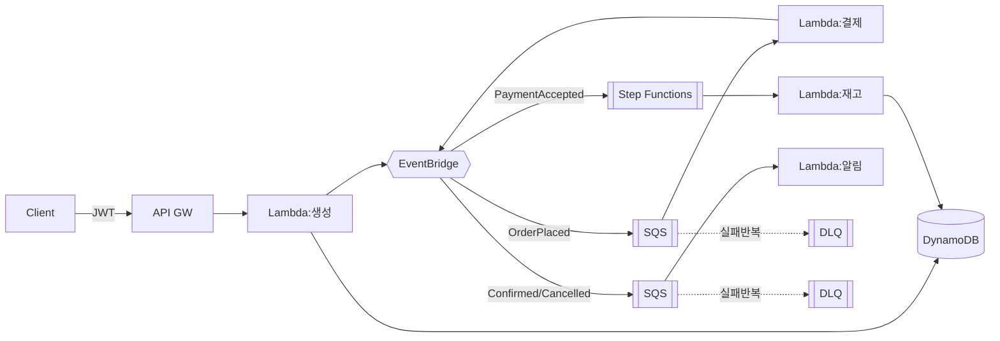
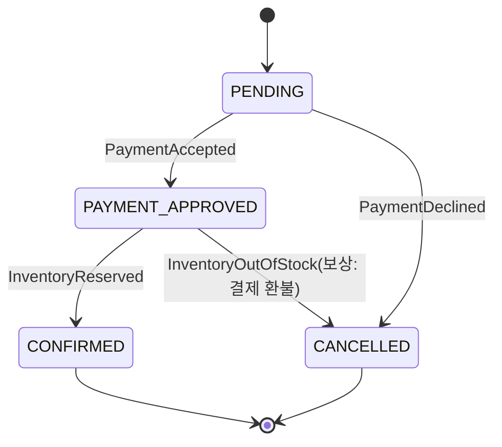
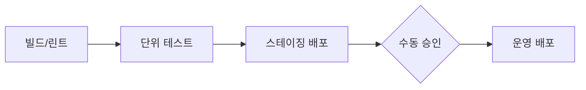
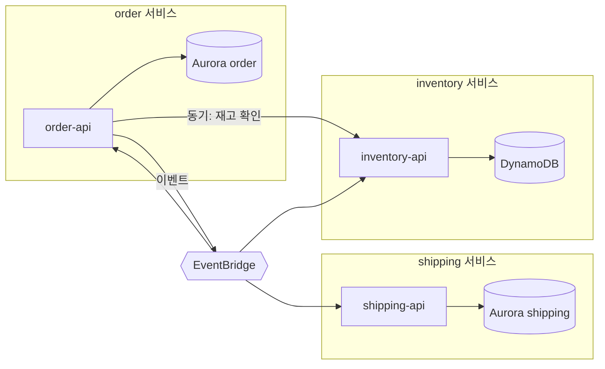
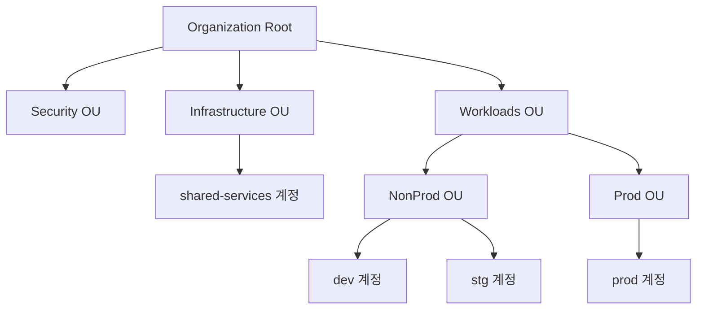
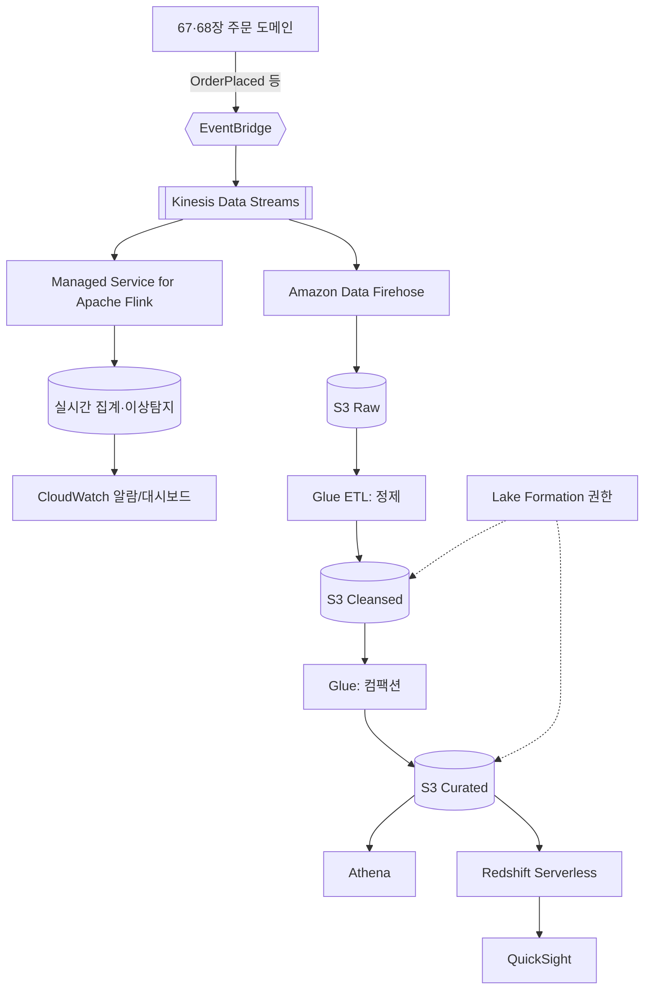
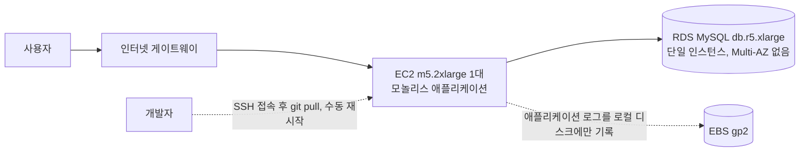
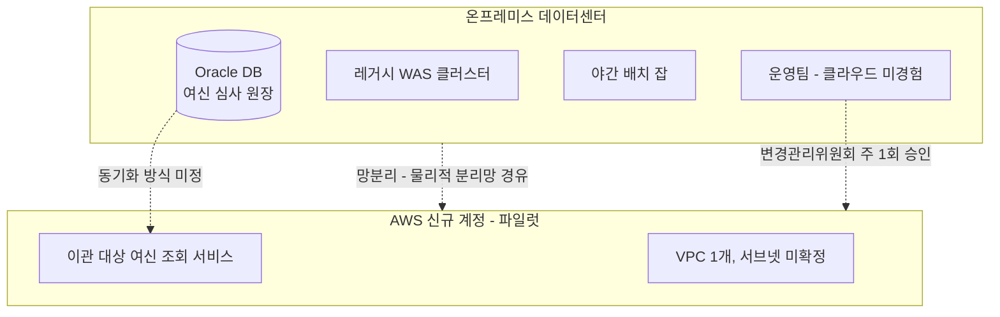
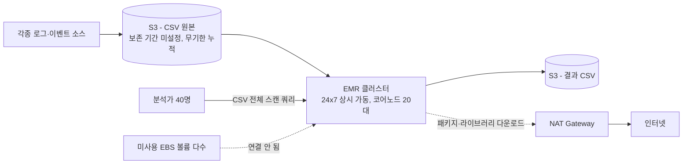

# Part XII. 캡스톤 — 처음부터 끝까지 만들기

## 67장. 캡스톤 1: 서버리스 이벤트 기반 주문 시스템  ★★★★★

> **이 장에서 다루는 것**
> 지금까지 배운 컴퓨트(9장), 메시징(20장), NoSQL(26장), 서버리스·이벤트 기반 아키텍처 심화(48장), 관측성(38장), IaC를 하나의 실제 시스템으로 조립한다. 온라인 주문 시스템을 요구사항 정의부터 아키텍처 설계, CDK 인프라 구축, Lambda·Step Functions로 사가(saga) 구현, CI/CD 연결, 관측성 구성, Well-Architected 리뷰, 비용 정리와 완전한 삭제까지 순서대로 따라간다. 개념이 아니라 **실습**이 목적이므로 코드 비중이 높다. 4장의 IAM 기초, 26장의 단일 테이블 설계, 48장의 이벤트 스키마 설계를 전제로 한다.

### 67.1 유스케이스와 요구사항 정의

구축할 시스템은 **온라인 주문 시스템**이다. 흐름은 "주문 생성 → 결제 요청 → 재고 확인 → 확정 → 알림"이며, 각 단계는 동기 API 호출이 아니라 비동기 이벤트로 연결한다 — 그래야 결제 게이트웨이나 재고 서비스가 느려져도 주문 생성 API 자체는 즉시 응답할 수 있다.

**기능 요구사항(FR)**
1. 인증된 고객만 주문을 생성할 수 있다(Cognito 액세스 토큰 필수).
2. 주문 생성 API는 품목·수량·배송지를 받아 `PENDING` 상태로 저장하고 즉시 주문 ID를 반환한다.
3. 주문 생성 시 `OrderPlaced` 이벤트를 발행해 결제 요청을 비동기 트리거한다.
4. 결제 워커는 모의 게이트웨이를 호출하고 `PaymentAccepted`/`PaymentDeclined`를 발행한다.
5. 재고 워커는 결제 승인 이벤트를 받아 재고를 조건부 차감하고 `InventoryReserved`/`InventoryOutOfStock`을 발행한다.
6. 결제·재고가 모두 성공하면 `CONFIRMED`로, 하나라도 실패하면 보상 트랜잭션으로 `CANCELLED`로 전이한다.
7. 알림 워커는 상태 전이 이벤트를 구독해 고객에게 알림을 보낸다.
8. 고객은 자신의 주문 상태를 단건·목록으로 조회할 수 있다.

**비기능 요구사항(NFR)**: 가용성은 관리형 서비스 조합만으로 리전 내 다중 AZ 수준(일반적으로 월 99.9% 내외)을 목표로 한다. 지연은 주문 생성 API 동기 구간(검증+DynamoDB 쓰기+이벤트 발행)이 p99 500ms 이내, 결제→재고→확정 전체 파이프라인은 최종적 일관성을 전제로 수 초 내 완료를 목표로 한다. 규모는 평균 초당 5건, 피크 초당 50건, 월 최대 100만 건까지 가정한다. 비용 목표는 유휴 고정비가 거의 없는 **완전 종량 과금** 구조다.

**범위 밖**: 실제 PG사 연동과 PCI-DSS 전체 준수, 환불·취소 플로우의 완전한 구현(보상 트랜잭션 골격만 다룸), 다중 리전 액티브-액티브 구성, 프론트엔드 UI, 실물 창고 시스템 연동.

### 67.2 아키텍처 설계와 대안 비교

세 가지 아키텍처 후보를 비교한다.

| 후보 | 결합도 | 확장성 | 운영 부담 | 부분 장애 격리 | 개발 속도 | 유휴 비용 |
|---|---|---|---|---|---|---|
| 모놀리식 Lambda(1개 함수가 전 단계 동기 처리) | 높음 | 함수 동시 실행 한도에 종속 | 낮음 | 낮음(한 단계 실패=전체 실패) | 빠름 | 없음 |
| 이벤트 기반 서버리스(EventBridge+SQS+Lambda+SFN) | 낮음 | 단계별 독립 확장 | 중간 | 높음(큐·DLQ 격리) | 중간 | 없음 |
| 컨테이너 마이크로서비스(ECS/EKS) | 낮음 | 서비스별 독립 확장 | 높음 | 높음 | 느림 | 상시 실행 비용 |

**한 줄 결정 기준**: 트래픽이 간헐적이고 팀이 인프라 운영보다 기능 개발에 집중해야 한다면 이벤트 기반 서버리스를, 이미 여러 팀이 각 서비스를 독립적으로 운영할 규모라면 컨테이너 마이크로서비스를 선택한다(68장에서 그 경로를 다룬다). 이 캡스톤은 전자를 최종안으로 채택한다.



**언어·런타임 선택**: Lambda는 Node.js, Python, Java, .NET 모두 가능하며 콜드 스타트 민감도, 개발 생산성, Powertools 생태계 성숙도로 판단한다. 이 캡스톤은 요청당 수십~수백 ms의 짧은 동기 처리와 잦은 배포 반복이 특징이므로 **Node.js 20.x + TypeScript**를 표준으로 채택한다 — 콜드 스타트가 짧고 Powertools for TypeScript가 로깅·메트릭·트레이싱을 통합 제공한다. 팀이 Python 자산을 보유했다면 Python 3.13도 동등하게 타당하며, CDK 인프라 코드는 런타임 선택과 무관하다.

**도메인 이벤트 계약**

| 이벤트 | source | 발행 시점 | 핵심 페이로드 |
|---|---|---|---|
| OrderPlaced | orders.service | 주문 생성 직후 | orderId, customerId, items[] |
| PaymentAccepted | payments.service | 결제 승인 | orderId, paymentId |
| PaymentDeclined | payments.service | 결제 거절 | orderId, reason |
| InventoryReserved | inventory.service | 재고 차감 성공 | orderId, items[] |
| InventoryOutOfStock | inventory.service | 재고 부족 | orderId, productId |
| OrderConfirmed | orders.service | 사가 성공 종료 | orderId, confirmedAt |
| OrderCancelled | orders.service | 사가 보상 완료 | orderId, reason |

이벤트 스키마 버저닝과 필드 설계 원칙은 → 48.5절 참조.

### 67.3 계정·청구 알림·IAM 준비

실습은 프로덕션 계정과 분리된 별도 계정(또는 Organizations 하위 sandbox 계정)에서 진행한다. 루트 계정 MFA 활성화와 IAM 사용자·역할·그룹의 원칙은 → 4장 참조. 여기서는 실습에 바로 필요한 명령만 정리한다.

```bash
# 예산 초과 알림 - 방치된 리소스로 인한 요금 폭탄 조기 감지
aws budgets create-budget \
  --account-id 123456789012 \
  --budget '{"BudgetName":"capstone-order-system","BudgetLimit":{"Amount":"50","Unit":"USD"},"TimeUnit":"MONTHLY","BudgetType":"COST"}' \
  --notifications-with-subscribers '[{"Notification":{"NotificationType":"ACTUAL","ComparisonOperator":"GREATER_THAN","Threshold":80},"Subscribers":[{"SubscriptionType":"EMAIL","Address":"you@example.com"}]}]'

# 배포 전용 IAM 그룹과 사용자 - 관리자 계정을 CLI에 그대로 쓰지 않는다
aws iam create-group --group-name capstone-deployers
aws iam attach-group-policy --group-name capstone-deployers \
  --policy-arn arn:aws:iam::aws:policy/PowerUserAccess
aws iam create-user --user-name capstone-cli
aws iam add-user-to-group --group-name capstone-deployers --user-name capstone-cli
```

리전은 서비스 가용성과 지연을 함께 고려한다. 이 실습은 서울 리전(`ap-northeast-2`)을 기준으로 하되, 사용하는 서비스·기능이 해당 리전에서 제공되는지는 리전 서비스 목록 문서로 재확인한다.

### 67.4 AWS CLI/CDK 환경 구성

```bash
aws --version          # 2.x 확인
node --version         # 20.x 이상 권장
npm install -g aws-cdk
cdk --version

# IAM Identity Center 기반 SSO 로그인 - 장기 액세스 키 대신 사용
aws configure sso --profile capstone
aws sso login --profile capstone

# 계정/리전별 CDK 부트스트랩 리소스(S3, ECR, IAM 역할) 생성 - 최초 1회
cdk bootstrap aws://123456789012/ap-northeast-2 --profile capstone
```

프로젝트를 생성하고 아래 구조로 정리한다.

```bash
mkdir order-system && cd order-system
cdk init app --language typescript
mkdir -p lib/stacks lambda/create-order lambda/payment-worker \
         lambda/inventory-worker lambda/notification-worker statemachine test
```

```
order-system/
├── bin/order-system.ts          # 앱 엔트리, 스택 인스턴스화와 태깅
├── lib/stacks/
│   ├── network-stack.ts
│   ├── data-stack.ts
│   ├── app-stack.ts
│   └── observability-stack.ts
├── lambda/
│   ├── create-order/index.ts
│   ├── payment-worker/index.ts
│   ├── inventory-worker/index.ts
│   └── notification-worker/index.ts
├── statemachine/order-saga.ts
├── test/create-order.test.ts
├── cdk.json
└── package.json
```

### 67.5 CloudFormation/CDK로 인프라 생성

스택을 네트워크·데이터·앱·관측성 4개로 분리한다 — 배포 단위를 나누면 앱 코드만 자주 바뀌는 상황에서 데이터 스택(상태 보유)까지 매번 diff에 노출되는 위험을 줄인다.

```typescript
// bin/order-system.ts (import 문 생략)
const app = new cdk.App();
const envName = app.node.tryGetContext('env') ?? 'dev';
const env = { account: '123456789012', region: 'ap-northeast-2' };

const network = new NetworkStack(app, `Network-${envName}`, { env });
const data = new DataStack(app, `Data-${envName}`, { env });
const appStack = new AppStack(app, `App-${envName}`, {
  env, table: data.table, bus: data.bus,
});
new ObservabilityStack(app, `Observability-${envName}`, {
  env, functions: appStack.functions, dlqs: appStack.dlqs,
});

// 공통 태그 - 비용 배분과 정리(teardown) 대상 식별에 필수
cdk.Tags.of(app).add('project', 'capstone-order-system');
cdk.Tags.of(app).add('env', envName);
cdk.Tags.of(app).add('owner', 'varioproger');
```

네트워크 스택은 VPC 내부 자원(RDS 등)을 아직 쓰지 않으므로 `new ec2.Vpc(this, 'Vpc', { maxAzs: 2, natGateways: 0 })` 한 줄로 최소화하고 확장 자리만 잡아둔다 — NAT 게이트웨이 0개로 서버리스 워크로드의 유휴 비용을 아낀다.

배포는 스택 단위로 실행하며, 상태를 가진 데이터 스택은 `--require-approval`을 유지해 실수로 테이블이 교체되는 사고를 막는다.

```bash
cdk diff --all --context env=dev --profile capstone
cdk deploy Data-dev --profile capstone
cdk deploy App-dev Observability-dev --profile capstone
```

### 67.6 EventBridge와 SQS 큐 구성

커스텀 버스를 별도로 두어 기본 버스(다른 AWS 서비스 이벤트)와 도메인 이벤트를 분리한다. 규칙은 이벤트 패턴으로 라우팅하고, 대상 큐마다 DLQ를 붙여 반복 실패 메시지를 격리한다.

```typescript
// lib/stacks/data-stack.ts (발췌 - 이벤트 버스 부분)
const bus = new events.EventBus(this, 'OrderEventBus', {
  eventBusName: 'order-events-dev',
});

// 규칙 위반이나 재처리를 위한 90일 아카이브 - 이벤트 재생(replay)에 사용
new events.Archive(this, 'OrderEventsArchive', {
  sourceEventBus: bus,
  eventPattern: { source: ['orders.service', 'payments.service', 'inventory.service'] },
  retention: cdk.Duration.days(90),
});

function queueWithDlq(id: string) {
  const dlq = new sqs.Queue(this, `${id}Dlq`, { retentionPeriod: cdk.Duration.days(14) });
  const queue = new sqs.Queue(this, id, {
    visibilityTimeout: cdk.Duration.seconds(30),
    deadLetterQueue: { queue: dlq, maxReceiveCount: 3 }, // 3회 실패 시 DLQ 격리
  });
  return { queue, dlq };
}

const { queue: paymentQueue, dlq: paymentDlq } = queueWithDlq('PaymentRequestedQueue');
const { queue: notifyQueue, dlq: notifyDlq } = queueWithDlq('NotificationQueue');

new events.Rule(this, 'OrderPlacedRule', {
  eventBus: bus,
  eventPattern: { source: ['orders.service'], detailType: ['OrderPlaced'] },
  targets: [new targets.SqsQueue(paymentQueue)],
});

new events.Rule(this, 'NotificationRule', {
  eventBus: bus,
  eventPattern: {
    source: ['orders.service'],
    detailType: ['OrderConfirmed', 'OrderCancelled'],
  },
  targets: [new targets.SqsQueue(notifyQueue)],
});
```

이벤트는 EventBridge 표준 봉투(`source`, `detail-type`, `detail`)를 따르고, `detail` 안에 `schemaVersion` 필드를 둔다(스키마 설계·버저닝 원칙은 → 48.5절 참조). 실제 페이로드 예시는 67.2절 도메인 이벤트 계약과 67.9절 핸들러 코드를 참조.

### 67.7 Cognito로 인증·인가 구현

사용자 풀과 앱 클라이언트를 만들고, API Gateway HTTP API 앞단에 JWT 오소라이저로 연결한다. 토큰 흐름: 로그인 → 액세스 토큰 발급 → `Authorization: Bearer <토큰>` 첨부 호출 → API Gateway가 서명·발급자(issuer)·대상(audience) 검증 → 통과 시 Lambda 호출.

```typescript
// lib/stacks/data-stack.ts (발췌 - Cognito)
const userPool = new cognito.UserPool(this, 'OrderUserPool', {
  selfSignUpEnabled: true,
  signInAliases: { email: true },
  passwordPolicy: { minLength: 8, requireDigits: true },
});

const userPoolClient = userPool.addClient('OrderApiClient', {
  authFlows: { userPassword: true, userSrp: true },
  generateSecret: false, // SPA/CLI 테스트 클라이언트는 secret 미사용
});
```

```typescript
// lib/stacks/app-stack.ts (발췌 - API Gateway + JWT 오소라이저)
const authorizer = new HttpJwtAuthorizer('OrderAuthorizer',
  `https://cognito-idp.ap-northeast-2.amazonaws.com/${userPool.userPoolId}`,
  { jwtAudience: [userPoolClient.userPoolClientId] });

const httpApi = new apigwv2.HttpApi(this, 'OrderApi');
httpApi.addRoutes({
  path: '/orders',
  methods: [apigwv2.HttpMethod.POST],
  integration: new HttpLambdaIntegration('CreateOrderIntegration', createOrderFn),
  authorizer,
});
```

테스트 사용자 생성은 CLI로 처리한다.

```bash
aws cognito-idp admin-create-user --user-pool-id ap-northeast-2_XXXXXXX \
  --username test@example.com --user-attributes Name=email,Value=test@example.com \
  --message-action SUPPRESS
aws cognito-idp admin-set-user-password --user-pool-id ap-northeast-2_XXXXXXX \
  --username test@example.com --password 'Passw0rd!23' --permanent
aws cognito-idp initiate-auth --client-id <clientId> --auth-flow USER_PASSWORD_AUTH \
  --auth-parameters USERNAME=test@example.com,PASSWORD='Passw0rd!23'
```

### 67.8 DynamoDB 데이터 모델

**액세스 패턴을 먼저 나열하고, 그 다음 키를 설계하고, 마지막에 코드를 쓴다** — 순서를 바꾸면 서비스가 커진 뒤 GSI를 계속 추가하며 재설계하게 된다(단일 테이블 설계 원칙은 → 26.2절 참조).

| # | 액세스 패턴 | 조회 방식 |
|---|---|---|
| 1 | 주문 ID로 주문 상세 조회 | GetItem |
| 2 | 고객 ID로 해당 고객의 주문 목록을 최신순 조회 | Query(GSI1) |
| 3 | 주문 ID로 상태 변경 이력 조회 | Query(기본 테이블) |
| 4 | 상태별(운영 대시보드용) 주문 집계 | 로그 기반 집계(아래 설명) |
| 5 | 상품 ID로 재고 아이템 조회 | GetItem |
| 6 | 멱등키로 처리 완료 여부 확인 | GetItem |

패턴 1·3·5·6은 기본 테이블 PK/SK만으로 해결되고, 패턴 2만 GSI가 필요하다. 패턴 4는 운영자가 가끔 보는 대시보드용이므로, GSI를 더 쓰는 대신 구조화 로그(67.12절)를 Logs Insights로 집계한다 — 모든 패턴에 전용 인덱스를 두는 것이 항상 정답은 아니다.

| 항목 | PK | SK | 비고 |
|---|---|---|---|
| 주문 메타데이터 | `ORDER#<orderId>` | `METADATA` | 패턴 1 |
| 주문 이벤트 이력 | `ORDER#<orderId>` | `EVENT#<isoTimestamp>` | 패턴 3 |
| 재고 아이템 | `PRODUCT#<productId>` | `METADATA` | 패턴 5 |
| 멱등키 마커 | `IDEMPOTENCY#<key>` | `IDEMPOTENCY` | 패턴 6, TTL로 자동 만료 |
| GSI1(주문 메타데이터에 부여) | `GSI1PK=CUSTOMER#<customerId>` | `GSI1SK=<isoTimestamp>#<orderId>` | 패턴 2 |

```typescript
// lib/stacks/data-stack.ts (발췌 - 단일 테이블)
export const table = new dynamodb.Table(this, 'OrdersTable', {
  partitionKey: { name: 'PK', type: dynamodb.AttributeType.STRING },
  sortKey: { name: 'SK', type: dynamodb.AttributeType.STRING },
  billingMode: dynamodb.BillingMode.PAY_PER_REQUEST, // 트래픽 변동이 큰 실습 단계에 적합
  pointInTimeRecoverySpecification: { pointInTimeRecoveryEnabled: true },
  timeToLiveAttribute: 'expiresAt',
  removalPolicy: cdk.RemovalPolicy.DESTROY, // dev 전용 - 운영 환경은 RETAIN
});

table.addGlobalSecondaryIndex({
  indexName: 'GSI1',
  partitionKey: { name: 'GSI1PK', type: dynamodb.AttributeType.STRING },
  sortKey: { name: 'GSI1SK', type: dynamodb.AttributeType.STRING },
});
```

샘플 아이템:

```json
{
  "PK": "ORDER#ord_8f2a", "SK": "METADATA",
  "GSI1PK": "CUSTOMER#cus_1a2b", "GSI1SK": "2026-09-01T02:10:00Z#ord_8f2a",
  "status": "PENDING", "totalAmount": 45900, "version": 1
}
```

### 67.9 주문 컨텍스트 정의와 Lambda 함수 작성

주문 애그리게이트는 `PENDING → PAYMENT_APPROVED → INVENTORY_RESERVED → CONFIRMED`의 정상 경로와 `PAYMENT_DECLINED`/`OUT_OF_STOCK → CANCELLED`의 실패 경로를 갖는 상태 기계다. 상태 전이는 항상 낙관적 잠금(`version` 속성 조건부 업데이트)으로 보호한다.



**Lambda 1 — 주문 생성 API**: 멱등키(`Idempotency-Key` 헤더)와 주문 아이템을 하나의 트랜잭션으로 조건부 생성한 뒤 이벤트를 발행한다.

```typescript
// lambda/create-order/index.ts (import: Logger, DynamoDBClient/DocumentClient, EventBridgeClient, randomUUID 등 생략)
const T = process.env.TABLE_NAME;
const logger = new Logger({ serviceName: 'create-order' });
const ddb = DynamoDBDocumentClient.from(new DynamoDBClient({}));
const eb = new EventBridgeClient({});

export const handler = async (event: any) => {
  const idemKey = event.headers['idempotency-key'];
  const body = JSON.parse(event.body);
  const orderId = `ord_${randomUUID().slice(0, 8)}`;
  const now = new Date().toISOString();

  try {
    // 멱등 마커+주문 아이템을 한 트랜잭션으로 - 재시도 시 중복 생성 차단
    await ddb.send(new TransactWriteCommand({ TransactItems: [
      { Put: { TableName: T, Item: { PK: `IDEMPOTENCY#${idemKey}`, SK: 'IDEMPOTENCY',
                expiresAt: Math.floor(Date.now() / 1000) + 86400 },
               ConditionExpression: 'attribute_not_exists(PK)' } },
      { Put: { TableName: T, Item: { PK: `ORDER#${orderId}`, SK: 'METADATA',
                GSI1PK: `CUSTOMER#${body.customerId}`, GSI1SK: `${now}#${orderId}`,
                status: 'PENDING', items: body.items, totalAmount: body.totalAmount, version: 1 } } },
    ] }));

    await eb.send(new PutEventsCommand({ Entries: [{
      Source: 'orders.service', DetailType: 'OrderPlaced', EventBusName: 'order-events-dev',
      Detail: JSON.stringify({ schemaVersion: '1.0', orderId, ...body }),
    }] }));

    logger.info('order created', { orderId });
    return { statusCode: 201, body: JSON.stringify({ orderId, status: 'PENDING' }) };
  } catch (err: any) {
    if (err.name === 'TransactionCanceledException') {
      return { statusCode: 409, body: JSON.stringify({ message: 'duplicate request' }) };
    }
    logger.error('order creation failed', { error: err.message });
    throw err; // API Gateway가 5xx 반환 + 오류 메트릭 집계
  }
};
```

**Lambda 2 — 결제 워커**(SQS 트리거): 낙관적 잠금으로 상태를 전이하고 결과 이벤트를 발행한다. 예외를 던지면 SQS가 재시도하고, `maxReceiveCount`(67.6절, 3회)를 넘으면 DLQ로 격리된다.

```typescript
// lambda/payment-worker/index.ts (발췌)
export const handler = async (sqsEvent: any) => {
  for (const record of sqsEvent.Records) {
    const detail = JSON.parse(JSON.parse(record.body).detail);
    const approved = await mockChargeCard(detail.totalAmount); // 모의 PG 호출

    await ddb.send(new UpdateCommand({
      TableName: T, Key: { PK: `ORDER#${detail.orderId}`, SK: 'METADATA' },
      UpdateExpression: 'SET #s = :s, version = version + :one',
      ConditionExpression: '#s = :pending AND version = :v', // 낙관적 잠금
      ExpressionAttributeNames: { '#s': 'status' },
      ExpressionAttributeValues: { ':s': approved ? 'PAYMENT_APPROVED' : 'CANCELLED',
        ':pending': 'PENDING', ':v': detail.version ?? 1, ':one': 1 },
    }));

    await eb.send(new PutEventsCommand({ Entries: [{
      Source: 'payments.service', EventBusName: 'order-events-dev',
      DetailType: approved ? 'PaymentAccepted' : 'PaymentDeclined',
      Detail: JSON.stringify({ orderId: detail.orderId, amount: detail.totalAmount }),
    }] }));
  }
};
```

재고 워커(Lambda 3)는 같은 패턴으로 재고 수량 조건(`quantity >= :requested`)을 검사해 조건부로 차감하고, 알림 워커(Lambda 4)는 `OrderConfirmed`/`OrderCancelled`/`PaymentDeclined`/`InventoryOutOfStock`을 구독해 SNS로 알림을 보낸다 — 이벤트 ID 기준 멱등 마커로 중복 알림을 막는다.

**Step Functions로 사가 조율**: 결제 승인 이후 재고 확인과 확정/보상을 명시적 상태 기계로 오케스트레이션하면, 보상 트랜잭션 흐름이 코드가 아니라 그래프로 드러난다.

```typescript
// statemachine/order-saga.ts (발췌, Stack 생성자 내부; sfn/tasks import 생략)
const checkInventory = new tasks.LambdaInvoke(this, 'CheckInventory', { lambdaFunction: inventoryFn });
const confirmOrder = new tasks.LambdaInvoke(this, 'ConfirmOrder', { lambdaFunction: confirmFn });
const compensatePayment = new tasks.LambdaInvoke(this, 'RefundPayment', { lambdaFunction: refundFn });
const cancelOrder = new tasks.LambdaInvoke(this, 'CancelOrder', { lambdaFunction: cancelFn });

const definition = checkInventory
  .addCatch(compensatePayment.next(cancelOrder), { errors: ['States.ALL'] })
  .next(new sfn.Choice(this, 'InventoryOk?')
    .when(sfn.Condition.stringEquals('$.inventoryStatus', 'RESERVED'), confirmOrder)
    .otherwise(compensatePayment.next(cancelOrder)));

new sfn.StateMachine(this, 'OrderSagaStateMachine', {
  definitionBody: sfn.DefinitionBody.fromChainable(definition),
  stateMachineType: sfn.StateMachineType.EXPRESS, // 초 단위 완결, 고빈도에 적합
});
```

### 67.10 배포와 테스트

```bash
cdk deploy --all --context env=dev --profile capstone --require-approval never
```

**단위 테스트**(Jest, DynamoDB 클라이언트는 목으로 대체):

```typescript
// test/create-order.test.ts
import { mockClient } from 'aws-sdk-client-mock';
import { DynamoDBDocumentClient, TransactWriteCommand } from '@aws-sdk/lib-dynamodb';
import { handler } from '../lambda/create-order';

const ddbMock = mockClient(DynamoDBDocumentClient);

test('중복 Idempotency-Key는 409를 반환한다', async () => {
  ddbMock.on(TransactWriteCommand).rejects({ name: 'TransactionCanceledException' });
  const res = await handler({ headers: { 'idempotency-key': 'k1' }, body: '{"customerId":"c1","items":[]}' });
  expect(res.statusCode).toBe(409);
});
```

**통합 테스트**: 실제 배포된 API에 토큰을 발급받아 호출한다.

```bash
TOKEN=$(aws cognito-idp initiate-auth --client-id <clientId> --auth-flow USER_PASSWORD_AUTH \
  --auth-parameters USERNAME=test@example.com,PASSWORD='Passw0rd!23' \
  --query 'AuthenticationResult.AccessToken' --output text)

curl -X POST https://<api-id>.execute-api.ap-northeast-2.amazonaws.com/orders \
  -H "Authorization: Bearer $TOKEN" -H "Idempotency-Key: $(uuidgen)" \
  -H "Content-Type: application/json" \
  -d '{"customerId":"cus_1a2b","items":[{"productId":"prod_001","quantity":2}],"totalAmount":45900}'
```

이벤트 흐름 확인은 CloudWatch Logs Insights로 주문 ID를 추적하거나, DLQ에 쌓인 메시지를 직접 확인한다.

```bash
aws sqs receive-message --queue-url https://sqs.ap-northeast-2.amazonaws.com/123456789012/PaymentRequestedQueueDlq
```

### 67.11 CI/CD 파이프라인 연결

GitHub Actions에서 OIDC로 장기 액세스 키 없이 배포 역할을 위임받는다.

```yaml
# .github/workflows/deploy.yml
name: deploy
on: { push: { branches: [main] } }
permissions: { id-token: write, contents: read }  # 장기 액세스 키 없이 role-to-assume으로 위임
jobs:
  build-test:
    runs-on: ubuntu-latest
    steps:
      - uses: actions/checkout@v4
      - run: npm ci && npm run build && npm test
  deploy-staging:
    needs: build-test
    runs-on: ubuntu-latest
    steps:
      - uses: aws-actions/configure-aws-credentials@v4
        with: { role-to-assume: arn:aws:iam::123456789012:role/github-oidc-deploy, aws-region: ap-northeast-2 }
      - run: npx cdk deploy --all --context env=staging --require-approval never
  deploy-prod:
    needs: deploy-staging
    environment: production   # GitHub 환경 보호 규칙으로 수동 승인 게이트
    runs-on: ubuntu-latest
    steps:
      - uses: aws-actions/configure-aws-credentials@v4
        with: { role-to-assume: arn:aws:iam::123456789012:role/github-oidc-deploy, aws-region: ap-northeast-2 }
      - run: npx cdk deploy --all --context env=prod --require-approval never
```



CodePipeline을 선호한다면 **CDK Pipelines**로 자기 변형(self-mutating) 파이프라인을 코드 한 곳에서 관리할 수 있다.

```typescript
// lib/pipeline-stack.ts (발췌)
const pipeline = new pipelines.CodePipeline(this, 'Pipeline', {
  synth: new pipelines.ShellStep('Synth', {
    input: pipelines.CodePipelineSource.connection('org/order-system', 'main',
      { connectionArn: 'arn:aws:codeconnections:ap-northeast-2:123456789012:connection/xxxx' }),
    commands: ['npm ci', 'npm run build', 'npx cdk synth'],
  }),
});
pipeline.addStage(new AppStage(this, 'Staging', { env }));
pipeline.addStage(new AppStage(this, 'Production', { env }),
  { pre: [new pipelines.ManualApprovalStep('PromoteToProd')] });
```

### 67.12 로깅·모니터링·트레이싱 구성

AWS Lambda Powertools로 구조화 로깅과 EMF(임베디드 메트릭 포맷) 메트릭을 함께 남긴다.

```typescript
const logger = new Logger({ serviceName: 'payment-worker' });
const metrics = new Metrics({ namespace: 'OrderSystem', serviceName: 'payment-worker' });

logger.info('payment processed', { orderId, approved }); // 구조화 필드로 CloudWatch Logs Insights 질의 가능
metrics.addMetric('PaymentProcessed', MetricUnit.Count, 1);
metrics.publishStoredMetrics(); // EMF 로그 한 줄로 CloudWatch 메트릭 자동 생성
```

X-Ray 트레이싱은 CDK에서 함수 단위로 활성화한다.

```typescript
new lambdaNode.NodejsFunction(this, 'PaymentWorker', {
  tracing: lambda.Tracing.ACTIVE, // Lambda -> DynamoDB -> EventBridge 호출 체인을 하나의 트레이스로
  architecture: lambda.Architecture.ARM_64, // Graviton - 동일 성능 대비 비용 절감
});
```

**대시보드와 알람 3종**(오류율, DLQ 깊이, 지연 p99)을 CDK로 함께 정의한다.

```typescript
new cloudwatch.Dashboard(this, 'OrderSystemDashboard', {
  widgets: [[new cloudwatch.GraphWidget({ title: 'Errors', left: [createOrderFn.metricErrors()] })]],
});

new cloudwatch.Alarm(this, 'CreateOrderErrorRate', {
  metric: createOrderFn.metricErrors({ period: cdk.Duration.minutes(5) }),
  threshold: 5, evaluationPeriods: 1,
});

new cloudwatch.Alarm(this, 'PaymentDlqDepth', {
  metric: paymentDlq.metricApproximateNumberOfMessagesVisible(),
  threshold: 1, evaluationPeriods: 1, // DLQ에 1건이라도 쌓이면 즉시 확인 필요
});

new cloudwatch.Alarm(this, 'ApiP99Latency', {
  metric: new cloudwatch.Metric({
    namespace: 'AWS/ApiGateway', metricName: 'Latency',
    dimensionsMap: { ApiId: httpApi.httpApiId },
    statistic: 'p99', period: cdk.Duration.minutes(5),
  }),
  threshold: 1000, evaluationPeriods: 3,
});
```

### 67.13 Well-Architected 리뷰로 최적화

| 기둥 | 리스크(각 2개) | 개선 조치 |
|---|---|---|
| 운영 우수성 | ① 스택 4개 분리로 배포 순서 실수 가능성 ② DLQ 재처리 절차 미정의 | CI 스테이지로 배포 순서 고정, DLQ 재구동(redrive) 런북 작성 |
| 보안 | ① Lambda 실행 역할의 과도한 권한 ② 멱등키·토큰이 로그에 노출 | 함수별 최소 권한 분리, Powertools 로깅 시 민감 필드 마스킹 |
| 안정성 | ① 결제 성공 후 재고 실패 시 보상 누락 ② SQS 재시도 폭주 | Step Functions Catch로 보상 강제, 지수 백오프·배치 크기 제한 |
| 성능 효율성 | ① DynamoDB 온디맨드의 순간 스로틀 ② Lambda 콜드 스타트 | 확장 한도 모니터링, 예약 동시성/SnapStart 적용 |
| 비용 최적화 | ① 로그 보존 기간 미설정 ② 개발 환경 리소스 상시 유지 | 보존 기간 명시(예: 30일), 사용 후 즉시 teardown(67.14절) |
| 지속 가능성 | ① x86 유지로 불필요한 전력 소비 ② 과도한 로그 볼륨 | Graviton(ARM64) 전환, 샘플링으로 로그 볼륨 축소 |

**우선순위(영향×노력) 표**

| 조치 | 영향 | 노력 | 우선순위 |
|---|---|---|---|
| DLQ 알람·런북 정비 | 높음 | 낮음 | 1 |
| 함수별 최소 권한 분리 | 높음 | 중간 | 2 |
| Step Functions 보상 트랜잭션 강제 | 높음 | 중간 | 2 |
| 로그 보존 기간 설정 | 중간 | 낮음 | 3 |
| Graviton 전환 | 중간 | 낮음 | 3 |
| 예약 동시성/SnapStart | 중간 | 중간 | 4 |
| 프로비저닝 모드 전환 검토 | 낮음(현 규모) | 중간 | 5 |

**한 줄 결정 기준**: 영향이 크고 노력이 적은 항목부터 먼저 처리하고, 노력이 큰 구조 변경은 실제 트래픽 데이터를 본 뒤 결정한다.

### 67.14 비용 추정과 정리(teardown)

비용은 자릿수 감각을 위한 대략적 구성이며, 실제 금액은 반드시 AWS 요금 계산기와 최신 요금표로 재확인한다.

| 서비스(과금 축) | 월 1만 건 | 월 10만 건 | 월 100만 건 |
|---|---|---|---|
| Lambda(호출+실행시간) | 수 달러 미만 | 수~수십 달러 | 수십~수백 달러 |
| API Gateway | 수 달러 미만 | 수 달러 | 수십 달러 |
| DynamoDB(온디맨드) | 수 달러 미만 | 수~수십 달러 | 수십~수백 달러 |
| EventBridge | 수 달러 미만 | 수 달러 | 수십 달러 |
| SQS | 거의 없음 | 수 달러 미만 | 수 달러 |
| Step Functions(Express) | 거의 없음 | 수 달러 미만 | 수~수십 달러 |
| Cognito(MAU) | 무료 등급 내 | 수 달러 | 수십 달러 |
| Logs/X-Ray | 수 달러 미만 | 수 달러 | 수십 달러 |

월 100만 건 규모에서도 상시 실행 서버 대비 유휴 비용이 없다는 점이 서버리스의 핵심 이점이지만, 규모가 커질수록 DynamoDB·Lambda 실행 시간 비용이 지배적이 되므로 이 지점부터 프로비저닝 용량이나 예약 동시성을 검토한다.

**비용 절감 포인트**: Lambda를 Graviton(ARM64)으로 전환, CloudWatch Logs 보존 기간 단축, EventBridge 아카이브 보존 기간 최소화, 트래픽이 예측 가능해지면 DynamoDB를 프로비저닝+오토스케일링으로 전환, 개발/스테이징 환경은 사용 후 즉시 삭제.

**teardown 절차**: 처음부터 IaC로 만들면 실습을 몇 번이든 재현하고 완전히 삭제할 수 있다 — 콘솔에서 직접 만든 리소스는 정리를 빠뜨리기 쉬워 요금이 남는다.

```bash
cdk destroy --all --context env=dev --profile capstone
```

`cdk destroy`만으로 끝나지 않는 항목을 반드시 확인한다.

- [ ] CloudWatch 로그 그룹 — 스택 삭제 후에도 남는 경우가 있어 보존 정책 확인 후 수동 삭제
- [ ] DynamoDB 테이블의 수동 백업(Point-in-Time Recovery와 별개)
- [ ] S3 객체 — 파이프라인 아티팩트 버킷 등, 버저닝이 켜졌다면 이전 버전까지 삭제
- [ ] Cognito 사용자 풀 — `removalPolicy`가 `RETAIN`이면 스택 삭제와 무관하게 남음
- [ ] EventBridge 아카이브 — 버스 삭제와 별개로 남을 수 있음
- [ ] IAM에서 수동으로 만든 배포 역할·OIDC 자격 증명 공급자

### 67장 정리

#### [필수] 반드시 알아야 할 것
1. DynamoDB 설계는 반드시 "액세스 패턴 나열 → PK/SK와 GSI 설계 → 코드 작성" 순서를 지켜야 한다. 순서를 어기면 서비스가 커진 뒤 GSI를 계속 추가하는 재설계를 하게 된다.
2. 이벤트 기반 아키텍처는 각 단계를 SQS+DLQ로 분리해 부분 장애를 격리한다 — 한 단계의 실패가 전체 요청 실패로 번지지 않는다.
3. 낙관적 잠금(버전 조건부 업데이트)과 멱등키(조건부 쓰기)는 비동기 재시도 환경에서 중복 처리를 막는 핵심 장치다.
4. Step Functions는 이벤트만으로는 드러나지 않는 보상 트랜잭션을 명시적 그래프로 강제한다.
5. Cognito + API Gateway JWT 오소라이저는 애플리케이션 코드가 아니라 게이트웨이 계층에서 토큰을 검증한다.
6. 스택을 네트워크·데이터·앱·관측성으로 분리하면 상태를 가진 리소스가 앱 코드 변경마다 위험에 노출되지 않고, 서버리스의 비용 이점(유휴 비용 0)은 규모가 커질수록 실행 시간·요청 수 과금으로 성격이 바뀐다.

#### [팁] 실무 노하우
1. 처음부터 IaC(CDK)로 만들면 실습을 몇 번이든 재현하고 완전히 삭제할 수 있다. 콘솔에서 직접 만드는 실습은 정리 실패로 요금을 남긴다.
2. 로컬 개발은 `cdk watch`나 SAM 로컬 실행으로 배포 루프를 짧게 유지한다.
3. 도메인 이벤트마다 스키마 버전 필드를 넣어두면 이후 필드 변경 시 소비자 호환성을 깨지 않는다.
4. 빈도가 낮은 조회 패턴은 전용 GSI 대신 구조화 로그 집계로 해결해 인덱스 수를 최소로 유지한다.
5. GitHub Actions OIDC나 IAM Identity Center로 장기 액세스 키 없이 배포하면 키 유출 사고를 원천 차단한다.

#### [주의] 사고·비용·설계 함정
1. 실습 종료 시 삭제 목록을 반드시 확인한다: Lambda 로그 그룹, DynamoDB 테이블(과 백업), Cognito 사용자 풀, EventBridge 규칙(과 아카이브), S3 객체(버저닝 포함) — `cdk destroy`만으로는 일부가 남을 수 있다.
2. 멱등키 검증 없이 재시도를 허용하면 결제 이중 청구나 재고 이중 차감으로 이어질 수 있다.
3. Step Functions 보상 트랜잭션을 생략하면 결제는 성공했는데 재고가 없어 취소되는 상황에서 환불이 누락된다.
4. 액세스 패턴 설계 전에 코드를 먼저 작성하면 나중에 GSI를 계속 추가하며 쓰기 비용과 복잡도가 함께 늘어난다.
5. Lambda 실행 역할에 `*` 리소스 권한을 준 채로 실습을 넘기면 사고 시 폭발 반경이 전체 계정으로 확대된다.
6. CloudWatch Logs 보존 기간을 설정하지 않으면 무기한 보관되어 예상치 못한 비용이 누적되고, 개발 환경을 방치해도 Cognito 사용자 풀·DynamoDB 백업 등은 계속 과금될 수 있다.

#### 한 장 요약
이 장은 온라인 주문 시스템을 요구사항 정의부터 아키텍처 선택, CDK 인프라, EventBridge·SQS·Cognito·DynamoDB·Lambda·Step Functions 구현, CI/CD, 관측성, Well-Architected 리뷰, 비용 정리까지 하나의 파이프라인으로 연결했다. 핵심은 DynamoDB를 "액세스 패턴 → 키 설계 → 코드" 순서로 설계하고, 각 처리 단계를 이벤트와 큐로 느슨하게 연결하며, 실패 시 보상 트랜잭션을 명시적으로 강제하는 것이다. 처음부터 IaC로 구축했기 때문에 실습을 몇 번이든 재현하고, 끝날 때 완전히 삭제할 수 있다.

#### 다음 장 예고
68장은 같은 문제를 컨테이너 마이크로서비스 아키텍처로 다시 구축하며, 서버리스와 컨테이너 사이의 실질적인 트레이드오프를 코드 수준에서 비교한다.

---

## 68장. 캡스톤 2: 컨테이너 마이크로서비스 플랫폼  ★★★★★

> **이 장에서 다루는 것**
> 67장과 같은 온라인 주문 도메인을 이번에는 **컨테이너 마이크로서비스**로 다시 구축한다. 다루는 범위는 도메인 분해(42·43장), 멀티 계정 랜딩 존(30장), 네트워크(19장), EKS(19.7~19.9절), 배포 전략(37장), 데이터 관리 패턴(44장), 관측성(38장), 카오스 엔지니어링(8.7절)까지 지금까지 배운 내용을 실제로 조립하는 실습이다. 서버리스 캡스톤과 달리 여기서는 서비스가 상시 실행되는 컴퓨트 위에서 동작하고, 계정을 처음부터 여러 개로 나눠 운영한다는 점이 핵심 차이다. 67장에서 이미 다룬 IAM 기초·이벤트 스키마 설계·Saga 개념은 반복하지 않고 참조로 넘긴다.

### 68.1 3개 서비스 도메인 분해와 API 계약 정의

67장의 주문 시스템을 하나의 애플리케이션으로 두지 않고 **주문(order) / 재고(inventory) / 배송(shipping)** 세 서비스로 나눈다. 분해 기준은 42.3~42.4절의 서비스 경계 원칙과 43.3절의 바운디드 컨텍스트를 그대로 적용한다 — 서비스 경계는 조직 구조나 코드 편의가 아니라 "어떤 팀이 어떤 데이터에 대해 독립적으로 배포 결정을 내릴 수 있는가"로 정한다. 주문은 고객 요청과 상태 기계를, 재고는 상품 수량과 예약을, 배송은 배송지·운송장과 배송 상태를 각각 단독으로 소유한다. 결제는 67장에서 이미 다뤘으므로 이번 캡스톤에서는 재고·배송에 집중하고 결제는 외부 목이 이미 붙어 있다고 가정한다.

**서비스별 소유 데이터**

| 서비스 | 소유 데이터 | 데이터 저장소 | 다른 서비스가 접근하는 방법 |
|---|---|---|---|
| order | 주문 헤더, 상태, 이벤트 이력 | Aurora PostgreSQL(서비스 전용 스키마) | 동기 API 또는 이벤트만, 직접 DB 접근 금지 |
| inventory | 상품 수량, 예약(hold) | DynamoDB(서비스 전용 테이블) | 동기 API 또는 이벤트만 |
| shipping | 배송지, 운송장, 배송 상태 | Aurora PostgreSQL(서비스 전용 스키마) | 동기 API 또는 이벤트만 |

이것이 44.1절의 "서비스별 데이터베이스" 원칙이다 — 세 서비스가 같은 클러스터를 쓰더라도 스키마·자격 증명·마이그레이션 이력을 분리해 44.2절의 공유 데이터베이스 안티패턴에 빠지지 않는다.

**동기 API 계약(OpenAPI 발췌)**: 재고 확인처럼 호출자가 즉시 결과를 알아야 하는 경로만 동기 REST로 노출한다.

```yaml
# inventory-service openapi.yaml (발췌)
paths:
  /inventory/{productId}/reserve:
    post:
      summary: 재고 예약(조건부 차감)
      requestBody:
        content:
          application/json:
            schema:
              type: object
              required: [orderId, quantity]
              properties:
                orderId: { type: string }
                quantity: { type: integer, minimum: 1 }
      responses:
        '200': { description: 예약 성공, ReservationId 반환 }
        '409': { description: 재고 부족 }
```

**비동기 이벤트 계약(스키마)**: 상태 변화는 이벤트로 전파해 서비스 간 결합을 낮춘다(스키마 버저닝 원칙은 → 48.5절 참조).

| 이벤트 | 발행 서비스 | 핵심 페이로드 |
|---|---|---|
| OrderCreated | order | orderId, customerId, items[] |
| InventoryReserved | inventory | orderId, reservationId |
| InventoryRejected | inventory | orderId, reason |
| ShippingArranged | shipping | orderId, trackingId |
| ShippingFailed | shipping | orderId, reason |
| OrderConfirmed / OrderCancelled | order | orderId |



각 서비스는 자체 리포지토리·자체 CI/CD·자체 배포 주기를 갖는다. 서비스 경계를 넘는 트랜잭션은 68.6절의 사가로 처리한다.

서비스를 세 개로 나눴다고 해서 저절로 마이크로서비스의 이점이 생기는 것은 아니다. inventory가 order의 내부 스키마를 직접 알아야만 응답을 만들 수 있다거나, 세 서비스가 항상 같은 버전으로 함께 배포돼야 한다면 이는 서비스만 나눈 **분산 모놀리스**(→ 42.7절 안티패턴 참조)다. 이 캡스톤에서는 각 서비스가 자신의 API 계약만 지키면 내부 구현과 배포 주기를 독립적으로 바꿀 수 있다는 것을 68.5절의 서비스별 파이프라인과 68.9절의 장애 주입 실험으로 실제로 검증한다.

### 68.2 멀티 계정 랜딩 존(dev/stg/prod) 구성

컨테이너 캡스톤은 서버리스 캡스톤과 달리 **처음부터 다중 계정**으로 시작한다 — EKS 클러스터·노드·NAT 게이트웨이처럼 상시 과금되는 리소스가 환경별로 완전히 분리돼야 실수로 개발 트래픽이 운영 데이터베이스를 건드리는 사고를 원천 차단할 수 있다. 계정 구성 원칙 자체는 → 30장 참조하고, 여기서는 실행 코드 중심으로 정리한다.

**계정 구성**: `dev`, `stg`, `prod` 세 워크로드 계정과 `shared-services`(ECR·CI/CD 도구·중앙 로깅) 계정, 총 4개를 최소 구성으로 둔다. OU는 `Workloads/NonProd`(dev, stg)와 `Workloads/Prod`(prod), `Infrastructure/Shared`(shared-services)로 나눈다.



**Control Tower 사용 여부**: 조직에 계정이 이미 여러 개이고 감사·가드레일 표준화가 필요하면 Control Tower로 랜딩 존을 부트스트랩하는 편이 수동 Organizations 설정보다 안전하다(Control Tower 가드레일 개념은 → 30.3절 참조). 이 실습처럼 계정 4개짜리 단기 캡스톤이라면 Control Tower의 필수 가드레일 세트를 새로 켜는 오버헤드가 실습 시간 대비 크므로, Organizations + SCP + StackSet을 직접 구성하는 경량 경로를 택한다. 조직 표준을 이미 Control Tower로 운영 중이라면 그 랜딩 존 하위에 OU만 추가하는 것이 맞고, 새 조직을 처음부터 만드는 상황이며 앞으로 계정 수가 계속 늘어날 예정이라면 Control Tower로 시작하는 편이 장기적으로는 관리 부담을 줄인다.

**SCP 2개**: prod OU에는 리전 제한과 특정 위험 API 차단을 건다.

```json
{
  "Version": "2012-10-17",
  "Statement": [
    {
      "Sid": "DenyOutsideApprovedRegions",
      "Effect": "Deny",
      "NotAction": ["iam:*", "organizations:*", "support:*"],
      "Resource": "*",
      "Condition": { "StringNotEquals": { "aws:RequestedRegion": ["ap-northeast-2", "us-east-1"] } }
    }
  ]
}
```

```json
{
  "Version": "2012-10-17",
  "Statement": [
    {
      "Sid": "DenyEksClusterDeleteInProd",
      "Effect": "Deny",
      "Action": ["eks:DeleteCluster", "rds:DeleteDBCluster"],
      "Resource": "*",
      "Condition": { "StringNotEquals": { "aws:PrincipalTag/break-glass": "true" } }
    }
  ]
}
```

**IAM Identity Center 권한 세트**: 사람 접근은 장기 액세스 키가 아니라 권한 세트로 통제한다(→ 30.5절).

```bash
# 개발자는 dev/stg에서만 PowerUser, prod는 읽기 전용 - 최소 권한 원칙
aws sso-admin create-permission-set --instance-arn arn:aws:sso:::instance/ssoins-xxxx \
  --name DevPowerUser --session-duration PT8H
aws sso-admin create-permission-set --instance-arn arn:aws:sso:::instance/ssoins-xxxx \
  --name ProdReadOnly --session-duration PT4H
```

**계정 베이스라인 StackSet**: 모든 워크로드 계정에 동일한 기본 자원(CloudTrail 전달, 기본 SG 잠금, 예산 알림)을 배포한다. 조직 단위 StackSet 개념은 → 30.9절 참조하되, 실행은 아래처럼 한다.

```bash
aws cloudformation create-stack-set \
  --stack-set-name account-baseline \
  --template-body file://baseline.yaml \
  --permission-model SERVICE_MANAGED \
  --auto-deployment Enabled=true,RetainStacksOnAccountRemoval=false

aws cloudformation create-stack-instances \
  --stack-set-name account-baseline \
  --deployment-targets OrganizationalUnitIds=ou-root-nonprod \
  --regions ap-northeast-2
```

### 68.3 네트워크 기반(VPC, TGW, 엔드포인트) 구축

계정마다 3AZ VPC를 두고 서브넷을 퍼블릭/프라이빗/격리 세 계층으로 나눈다 — 퍼블릭은 ALB/NAT, 프라이빗은 EKS 워커 노드, 격리(아웃바운드 라우트 없음)는 Aurora·ElastiCache 전용이다.

**TGW vs 공유 VPC**: 계정 간 통신이 필요하면 두 방식을 저울질한다.

| 방식 | 격리 수준 | 운영 복잡도 | 대역폭·확장성 | 적합한 경우 |
|---|---|---|---|---|
| Transit Gateway로 계정별 VPC 연결 | 높음(계정별 VPC 독립) | 중간(TGW 라우팅 테이블 관리) | 높음, 계정 추가가 쉬움 | 계정 수가 늘어날 예정, 팀별 독립 운영 |
| 공유 VPC(RAM으로 서브넷 공유) | 낮음(같은 VPC 안에서 격리 약함) | 낮음 | VPC 한도에 종속 | 계정 수가 고정적이고 네트워크팀이 강하게 중앙 통제 |

**한 줄 결정 기준**: 계정이 3개를 넘고 향후에도 늘어날 가능성이 있다면 TGW를, 계정 구조가 사실상 고정이고 관리 인원이 적다면 공유 VPC를 택한다. 이 캡스톤은 dev/stg/prod가 독립적으로 성장할 것을 가정해 **TGW**를 선택한다.

```typescript
// network-stack.ts (발췌) - 3AZ VPC, 계층별 서브넷
const vpc = new ec2.Vpc(this, 'WorkloadVpc', {
  maxAzs: 3,
  natGateways: 3, // AZ별 NAT로 단일 AZ 장애가 다른 AZ의 아웃바운드까지 끊지 않게
  subnetConfiguration: [
    { name: 'public', subnetType: ec2.SubnetType.PUBLIC, cidrMask: 24 },
    { name: 'private-eks', subnetType: ec2.SubnetType.PRIVATE_WITH_EGRESS, cidrMask: 20 },
    { name: 'isolated-data', subnetType: ec2.SubnetType.PRIVATE_ISOLATED, cidrMask: 24 },
  ],
});

new ec2.CfnTransitGatewayAttachment(this, 'TgwAttachment', {
  transitGatewayId: 'tgw-0123456789abcdef0',
  vpcId: vpc.vpcId,
  subnetIds: vpc.selectSubnets({ subnetGroupName: 'private-eks' }).subnetIds,
});
```

**VPC 엔드포인트 필수 목록**: NAT 경유 트래픽을 줄이고 비용·지연을 함께 낮춘다. Gateway 엔드포인트는 S3만 무료로 라우팅 테이블에 추가되고, 나머지는 Interface 엔드포인트(ENI 기반, 시간·데이터 처리 과금)다.

| 엔드포인트 | 유형 | 없으면 생기는 문제 |
|---|---|---|
| S3(ECR 레이어 저장소) | Gateway | 이미지 풀이 NAT를 경유해 비용·지연 증가 |
| ECR API / ECR DKR | Interface | 컨테이너 이미지 풀 자체가 실패 |
| STS | Interface | IRSA/Pod Identity 토큰 교환 실패 |
| CloudWatch Logs / Monitoring | Interface | 노드가 NAT 없이는 로그·메트릭 전송 불가 |
| EC2 | Interface | EKS 컨트롤 플레인의 노드 조회·관리 API 호출 실패 |

```bash
# S3 Gateway 엔드포인트 - ECR 이미지 레이어가 S3에 저장되므로 필수
aws ec2 create-vpc-endpoint --vpc-id vpc-0123456789abcdef0 \
  --service-name com.amazonaws.ap-northeast-2.s3 --vpc-endpoint-type Gateway \
  --route-table-ids rtb-priveks01 rtb-priveks02 rtb-priveks03

# ECR API/DKR, STS, Logs는 Interface - 프라이빗 서브넷에서 NAT 없이 직접 도달
for svc in ecr.api ecr.dkr sts logs monitoring ec2; do
  aws ec2 create-vpc-endpoint --vpc-id vpc-0123456789abcdef0 \
    --service-name com.amazonaws.ap-northeast-2.$svc --vpc-endpoint-type Interface \
    --subnet-ids subnet-priveks01 subnet-priveks02 subnet-priveks03 \
    --security-group-ids sg-endpoints01
done
```

**EKS용 서브넷 CIDR 산정**: VPC CNI는 기본적으로 파드마다 ENI 보조 IP를 소비하므로, 워커 노드 서브넷 CIDR이 작으면 노드 수가 늘기 전에 IP가 먼저 고갈된다(IP 고갈 문제의 원인과 대응은 → 19.8절 참조). `/20` 서브넷(약 4,096개 주소)을 AZ마다 배정하면 중형 클러스터에서 일반적으로 여유가 있지만, 파드 밀도가 높은 노드 타입을 쓴다면 사전에 예상 파드 수 × 노드 수로 필요 IP 수를 계산해야 한다.

### 68.4 EKS 클러스터와 애드온·IRSA 구성

클러스터는 eksctl로 선언적으로 생성한다 — CDK로도 가능하지만 이 캡스톤은 eksctl의 매니페스트 방식이 검토·리뷰에 더 명확하다.

```yaml
# cluster.yaml
apiVersion: eksctl.io/v1alpha5
kind: ClusterConfig
metadata:
  name: order-platform-dev
  region: ap-northeast-2
  version: "1.31" # 버전은 서비스 문서에서 지원 종료일 재확인
vpc:
  id: vpc-0123456789abcdef0
  subnets:
    private:
      ap-northeast-2a: { id: subnet-priveks01 }
      ap-northeast-2b: { id: subnet-priveks02 }
      ap-northeast-2c: { id: subnet-priveks03 }
managedNodeGroups:
  - name: system-ng
    instanceType: m6g.large # Graviton - 관리형 애드온·시스템 파드 전용
    minSize: 2
    maxSize: 4
    privateNetworking: true
iam:
  withOIDC: true # IRSA 사용을 위한 필수 설정
```

```bash
eksctl create cluster -f cluster.yaml
```

**노드 관리는 관리형 노드 그룹 + Karpenter 조합**을 쓴다. 시스템 애드온(CoreDNS, 컨트롤러)은 안정적인 관리형 노드 그룹에, 애플리케이션 워크로드는 Karpenter가 요청 시점 파드 스펙에 맞춰 즉시 프로비저닝하는 노드에 올린다.

```yaml
# karpenter-nodepool.yaml (발췌)
apiVersion: karpenter.sh/v1
kind: NodePool
metadata:
  name: app-workloads
spec:
  template:
    spec:
      requirements:
        - key: karpenter.sh/capacity-type
          operator: In
          values: ["spot", "on-demand"] # 우선 스팟, 부족 시 온디맨드로 자동 대체
      nodeClassRef: { name: default-ec2nc }
  limits: { cpu: "200" }
  disruption:
    consolidationPolicy: WhenEmptyOrUnderutilized # 유휴 노드를 자동 통합해 비용 절감
```

**필수 애드온**: VPC CNI, CoreDNS, kube-proxy, EBS CSI 드라이버는 EKS 애드온으로 관리한다 — 수동 매니페스트 대신 애드온으로 관리하면 버전 호환성과 업그레이드를 EKS가 검증해 준다.

```bash
aws eks create-addon --cluster-name order-platform-dev --addon-name vpc-cni
aws eks create-addon --cluster-name order-platform-dev --addon-name coredns
aws eks create-addon --cluster-name order-platform-dev --addon-name kube-proxy
aws eks create-addon --cluster-name order-platform-dev --addon-name aws-ebs-csi-driver
```

**AWS Load Balancer Controller와 ExternalDNS**는 Helm으로 설치한다. 컨트롤러는 Ingress/Service 리소스를 보고 ALB/NLB를 자동 프로비저닝하고, ExternalDNS는 Route 53 레코드를 자동 생성한다.

```bash
helm repo add eks https://aws.github.io/eks-charts
helm install aws-load-balancer-controller eks/aws-load-balancer-controller \
  -n kube-system --set clusterName=order-platform-dev --set serviceAccount.create=false \
  --set serviceAccount.name=aws-load-balancer-controller
```

**IRSA/Pod Identity로 서비스별 AWS 권한 부여**: 세 서비스가 노드 IAM 역할을 공유하면 재고 서비스 파드가 배송 서비스 전용 테이블에 접근할 수 있는 사고가 난다. 서비스 어카운트마다 별도 역할을 붙인다.

```yaml
# inventory 서비스 어카운트 (IRSA)
apiVersion: v1
kind: ServiceAccount
metadata:
  name: inventory-sa
  namespace: inventory
  annotations:
    eks.amazonaws.com/role-arn: arn:aws:iam::123456789012:role/inventory-service-role
```

```json
{
  "Version": "2012-10-17",
  "Statement": [
    {
      "Effect": "Allow",
      "Action": ["dynamodb:GetItem", "dynamodb:UpdateItem", "dynamodb:ConditionCheckItem"],
      "Resource": "arn:aws:dynamodb:ap-northeast-2:123456789012:table/inventory-items"
    }
  ]
}
```

신뢰 정책은 OIDC 공급자와 네임스페이스·서비스 어카운트 이름을 조건으로 걸어 다른 네임스페이스의 파드가 이 역할을 가로채 쓰지 못하게 한다. **Pod Identity**(EKS Pod Identity Agent 방식)를 쓰면 신뢰 정책에 OIDC 조건절을 직접 작성하는 대신 연동 API로 서비스 어카운트-역할 매핑을 등록해 설정이 더 단순해진다 — 신규 클러스터라면 Pod Identity를, 기존 IRSA 환경을 유지 보수 중이라면 그대로 IRSA를 쓴다.

**네임스페이스와 리소스 쿼터**: 서비스마다 네임스페이스를 분리하고 쿼터로 한 서비스의 폭주가 클러스터 전체를 잠식하지 못하게 한다.

```yaml
apiVersion: v1
kind: ResourceQuota
metadata: { name: inventory-quota, namespace: inventory }
spec:
  hard:
    requests.cpu: "8"
    requests.memory: 16Gi
    limits.cpu: "16"
    pods: "40"
```

**네임스페이스 구성**: 서비스 3개에 대응해 `order`, `inventory`, `shipping` 세 네임스페이스를 두고, 공통 인프라(Argo Rollouts 컨트롤러, ADOT 컬렉터, Fluent Bit 데몬셋)는 `platform` 네임스페이스에 별도로 둔다. 서비스 네임스페이스 간 파드 통신은 기본적으로 열려 있으므로, 운영 환경에서는 NetworkPolicy로 허용된 네임스페이스만 서로 호출하도록 제한하는 것이 바람직하다.

**버전 업그레이드 계획**: EKS는 표준 지원 종료 주기가 있으므로 지원 종료 일정을 정기적으로 확인하고, 마이너 버전은 한 번에 하나씩만 올리며 dev → stg → prod 순으로 검증한다. 업그레이드 전 애드온·컨트롤러 호환 버전을 문서로 재확인하고, Karpenter가 관리하는 노드는 새 버전 AMI로 점진 교체되는지, 관리형 노드 그룹은 롤링 업데이트 설정이 서비스 중단 없이 동작하는지를 stg 환경에서 먼저 확인한다.

### 68.5 CodePipeline + CodeBuild + CodeDeploy로 블루/그린 배포

**ECR 저장소**는 서비스별로 분리하고 이미지 스캔과 불변 태그를 강제한다.

```bash
aws ecr create-repository --repository-name order-service \
  --image-scanning-configuration scanOnPush=true \
  --image-tag-mutability IMMUTABLE # 같은 태그 재푸시로 배포 대상이 몰래 바뀌는 사고 차단
```

**CodeBuild 멀티스테이지 빌드**: 테스트 → 빌드 → 이미지 푸시 → 매니페스트 업데이트를 하나의 buildspec으로 처리한다.

```yaml
# buildspec.yml
version: 0.2
phases:
  install:
    runtime-versions: { docker: 20 }
  pre_build:
    commands:
      - aws ecr get-login-password --region ap-northeast-2 | docker login --username AWS --password-stdin 123456789012.dkr.ecr.ap-northeast-2.amazonaws.com
  build:
    commands:
      - docker build --target test -t order-service:test .
      - docker run --rm order-service:test npm test
      - docker build --target runtime -t $ECR_URI:$CODEBUILD_RESOLVED_SOURCE_VERSION .
  post_build:
    commands:
      - docker push $ECR_URI:$CODEBUILD_RESOLVED_SOURCE_VERSION
      - IMAGE_TAG=$CODEBUILD_RESOLVED_SOURCE_VERSION yq -i '.image.tag = env(IMAGE_TAG)' helm/order-service/values.yaml
artifacts:
  files: ['helm/**/*']
```

**배포 전략 선택**: CodeDeploy 블루/그린과 Argo Rollouts 카나리 중 하나를 고른다(전략 비교는 → 37.1절 참조).

| 방식 | 트래픽 전환 | EKS 통합 | 자동 롤백 신호 | 적합한 경우 |
|---|---|---|---|---|
| CodeDeploy 블루/그린(ECS 대상) | 전체 스위치(사전 검증 후 일괄) | ECS 네이티브, EKS는 별도 통합 필요 | CloudWatch 알람 연동 | AWS 관리형 도구로 통일하고 싶을 때 |
| Argo Rollouts 카나리 | 단계적 트래픽 비율 증가 | Kubernetes 네이티브(CRD) | Prometheus/CloudWatch 메트릭 분석 | 점진적 검증과 세밀한 롤백 제어가 필요할 때 |

**한 줄 결정 기준**: EKS 네이티브 배포를 GitOps로 세밀하게 제어하고 싶다면 Argo Rollouts를, ECS와 배포 도구를 통일하고 싶다면 CodeDeploy를 택한다. 이 캡스톤은 EKS 전용이므로 **Argo Rollouts 카나리**를 채택한다.

```yaml
# rollout.yaml (발췌) - Argo Rollouts 카나리
apiVersion: argoproj.io/v1alpha1
kind: Rollout
metadata: { name: order-service, namespace: order }
spec:
  replicas: 6
  strategy:
    canary:
      steps:
        - setWeight: 10
        - pause: { duration: 5m }
        - analysis:
            templates: [{ templateName: error-rate-check }]
        - setWeight: 50
        - pause: { duration: 5m }
        - setWeight: 100
```

**크로스 계정 배포 역할**: shared-services 계정의 CodePipeline이 dev/stg/prod 계정의 EKS에 배포하려면 각 계정에 신뢰 관계로 위임된 배포 역할이 필요하다.

```json
{
  "Version": "2012-10-17",
  "Statement": [{
    "Effect": "Allow",
    "Principal": { "AWS": "arn:aws:iam::999999999999:role/shared-cicd-role" },
    "Action": "sts:AssumeRole",
    "Condition": { "StringEquals": { "sts:ExternalId": "order-platform-deploy" } }
  }]
}
```

**매니페스트 관리**는 Helm으로 서비스별 values를 환경마다 오버레이한다.

```yaml
# helm/order-service/values-prod.yaml (발췌)
replicaCount: 6
image: { repository: 123456789012.dkr.ecr.ap-northeast-2.amazonaws.com/order-service, tag: "" }
resources:
  requests: { cpu: 250m, memory: 512Mi }
  limits: { cpu: 500m, memory: 1Gi }
serviceAccount: { name: order-sa }
```

**GitOps 옵션**: 파이프라인이 클러스터에 직접 `kubectl apply`/`helm upgrade`를 실행하는 대신, Argo CD가 Git 리포지토리 상태를 지속적으로 클러스터와 동기화하는 방식도 있다 — 배포 이력이 Git 커밋 그 자체가 되고, 클러스터 드리프트를 자동 감지한다는 이점이 있지만 별도 컨트롤러 운영 부담이 추가된다. 팀 규모가 작은 이 캡스톤은 CodePipeline 직접 배포로 시작하고, 클러스터 수가 늘어나면 GitOps 전환을 검토한다.

### 68.6 서비스 간 비동기 통신(SQS/EventBridge)과 Saga 적용

**동기 호출**은 order → inventory처럼 즉시 응답이 필요한 경로에서만 쓴다. 클러스터 내부 서비스 디스커버리는 Kubernetes Service(ClusterIP)로 해결하고, 클러스터 경계를 넘는 호출은 내부 ALB를 둔다.

```yaml
# inventory Service - 클러스터 내부 전용
apiVersion: v1
kind: Service
metadata: { name: inventory-svc, namespace: inventory }
spec:
  selector: { app: inventory }
  ports: [{ port: 80, targetPort: 8080 }]
```

**비동기 통신**은 EventBridge(도메인 이벤트 버스)와 SQS(서비스별 수신 큐)로 구성한다 — 67장과 동일한 패턴이므로 큐+DLQ 구성 세부는 → 67.6절 참조. 여기서는 오케스트레이션 방식만 다르다.

**주문 사가**: 주문 생성 → 재고 예약 → 배송 접수 → 확정, 실패 시 보상. 사가 패턴의 오케스트레이션/코레오그래피 트레이드오프는 → 44.3절 참조. 서비스 3개가 이미 명확히 나뉜 이 구조에서는 각 단계 실패 시 보상 순서를 한곳에서 보장할 필요가 있으므로 **오케스트레이션(Step Functions)**을 선택한다.

```json
{
  "Comment": "주문 사가 - order/inventory/shipping 오케스트레이션",
  "StartAt": "ReserveInventory",
  "States": {
    "ReserveInventory": {
      "Type": "Task",
      "Resource": "arn:aws:states:::apigateway:invoke",
      "Parameters": {
        "ApiEndpoint": "internal-inventory.order-platform.internal",
        "Method": "POST",
        "Path": "/inventory/reserve"
      },
      "Catch": [{ "ErrorEquals": ["States.ALL"], "Next": "CancelOrder" }],
      "Next": "ArrangeShipping"
    },
    "ArrangeShipping": {
      "Type": "Task",
      "Resource": "arn:aws:states:::apigateway:invoke",
      "Parameters": { "ApiEndpoint": "internal-shipping.order-platform.internal", "Method": "POST", "Path": "/shipping/arrange" },
      "Catch": [{ "ErrorEquals": ["States.ALL"], "Next": "ReleaseInventory" }],
      "Next": "ConfirmOrder"
    },
    "ReleaseInventory": {
      "Type": "Task",
      "Resource": "arn:aws:states:::apigateway:invoke",
      "Parameters": { "ApiEndpoint": "internal-inventory.order-platform.internal", "Method": "POST", "Path": "/inventory/release" },
      "Next": "CancelOrder"
    },
    "CancelOrder": {
      "Type": "Task",
      "Resource": "arn:aws:states:::apigateway:invoke",
      "Parameters": { "ApiEndpoint": "internal-order.order-platform.internal", "Method": "POST", "Path": "/orders/cancel" },
      "End": true
    },
    "ConfirmOrder": {
      "Type": "Task",
      "Resource": "arn:aws:states:::apigateway:invoke",
      "Parameters": { "ApiEndpoint": "internal-order.order-platform.internal", "Method": "POST", "Path": "/orders/confirm" },
      "End": true
    }
  }
}
```

**멱등 처리와 DLQ**: 재고 예약·배송 접수 API는 모두 `Idempotency-Key`(요청 헤더) 또는 사가 실행 ID를 조건부 쓰기 키로 사용해, Step Functions 재시도나 네트워크 타임아웃으로 인한 중복 호출이 재고를 이중 차감하지 않게 한다. 이벤트 수신 큐마다 DLQ를 붙여 반복 실패 메시지를 격리하고, DLQ 깊이를 68.7절의 알람으로 감시한다.

### 68.7 관측성 스택(CloudWatch, X-Ray/ADOT) 구성

**Container Insights**로 클러스터·노드·파드 단위 리소스 메트릭을 수집한다.

```bash
aws eks create-addon --cluster-name order-platform-dev --addon-name amazon-cloudwatch-observability
```

**로그 수집**은 Fluent Bit(EKS의 표준 사이드카/데몬셋 방식)로 각 파드 로그를 CloudWatch Logs로 전달한다 — ECS를 함께 운영한다면 FireLens가 동등한 역할을 한다.

```ini
# fluent-bit-config (발췌) - Fluent Bit 고전 설정 문법(INI 유사)
[OUTPUT]
    Name cloudwatch_logs
    Match order.*
    region ap-northeast-2
    log_group_name /order-platform/order-service
    log_stream_prefix pod-
    auto_create_group true
```

**ADOT 컬렉터**로 메트릭·트레이스를 함께 수집한다 — 애플리케이션 코드는 OpenTelemetry SDK로 계측하고, ADOT 컬렉터가 X-Ray와 CloudWatch로 내보낸다(계측 원칙은 → 38.6·38.8절 참조).

```yaml
# adot-collector-config.yaml (발췌)
receivers:
  otlp: { protocols: { grpc: {}, http: {} } }
exporters:
  awsxray: {}
  awsemf: { namespace: OrderPlatform, log_group_name: /order-platform/metrics }
service:
  pipelines:
    traces: { receivers: [otlp], exporters: [awsxray] }
    metrics: { receivers: [otlp], exporters: [awsemf] }
```

**상관 ID 전파**: 사가 실행 ID(또는 `orderId`)를 HTTP 헤더와 이벤트 페이로드 양쪽에 실어, 로그·트레이스를 서비스 경계를 넘어 하나의 요청으로 묶는다. 애플리케이션 미들웨어에서 수신 헤더의 상관 ID를 그대로 하위 호출에 전달하고, 없으면 새로 발급한다.

**서비스별 대시보드**: order/inventory/shipping 각각에 요청 수·오류율·지연·파드 재시작 횟수를 묶은 대시보드를 둔다.

**SLO 기반 알람 3종**(→ 38.9절 SLO 알림 원칙 참조): ① 서비스별 오류율(5xx 비율이 목표 임계치 초과) ② 사가 완료 지연(주문 생성부터 확정/취소까지 p99가 목표 시간 초과) ③ DLQ 깊이(1건 이상 쌓이면 즉시 확인).

```bash
aws cloudwatch put-metric-alarm --alarm-name order-saga-p99-latency \
  --namespace OrderPlatform --metric-name SagaDurationMs --statistic p99 \
  --period 300 --evaluation-periods 3 --threshold 5000 --comparison-operator GreaterThanThreshold
```

### 68.8 부하 테스트와 오토스케일링 검증

**k6 시나리오**: 주문 생성 → 사가 완료까지 사용자 여정을 재현하며 목표 RPS까지 단계적으로 부하를 올린다.

```javascript
// order-flow.js
import http from 'k6/http';
import { check, sleep } from 'k6';

export const options = {
  stages: [
    { duration: '2m', target: 50 },
    { duration: '5m', target: 200 }, // 목표 피크 RPS 근사치
    { duration: '3m', target: 0 },
  ],
  thresholds: { http_req_duration: ['p(99)<800'], http_req_failed: ['rate<0.01'] },
};

export default function () {
  const res = http.post('https://order.internal/orders', JSON.stringify({
    customerId: 'cus_1a2b', items: [{ productId: 'prod_001', quantity: 1 }],
  }), { headers: { 'Content-Type': 'application/json' } });
  check(res, { '201 생성': (r) => r.status === 201 });
  sleep(1);
}
```

**HPA(커스텀 메트릭 포함)**: CPU만으로는 큐 적체를 반영하지 못하므로, SQS 큐 길이 같은 커스텀 메트릭도 함께 스케일링 기준으로 둔다.

```yaml
apiVersion: autoscaling/v2
kind: HorizontalPodAutoscaler
metadata: { name: inventory-hpa, namespace: inventory }
spec:
  scaleTargetRef: { apiVersion: apps/v1, kind: Deployment, name: inventory-service }
  minReplicas: 3
  maxReplicas: 30
  metrics:
    - type: Resource
      resource: { name: cpu, target: { type: Utilization, averageUtilization: 60 } }
    - type: External
      external:
        metric: { name: sqs_queue_depth, selector: { matchLabels: { queue: inventory-events } } }
        target: { type: AverageValue, averageValue: "100" }
```

**Karpenter 노드 스케일링 관찰**: 부하 테스트 동안 `kubectl get nodes -w`와 Karpenter 컨트롤러 로그로 신규 노드 프로비저닝 소요 시간을 측정한다 — 관리형 노드 그룹의 오토스케일링그룹 방식보다 파드 대기 없이 빠르게 노드가 붙는지가 관전 포인트다.

**병목 식별 절차**: ① HPA가 목표 레플리카까지 도달했는데도 p99가 그대로면 애플리케이션 레벨 병목(DB 커넥션 풀, 하류 API 지연)을 의심한다 ② 파드는 늘었는데 노드가 못 따라가면 Karpenter NodePool의 `limits`를 재확인한다 ③ 큐 적체가 계속 늘면 컨슈머 동시성이나 하류 서비스 자체의 처리량 한계를 점검한다.

**결과 표 예시**(자릿수 감각용, 실제 수치는 실습 환경에 따라 다름):

| 목표 RPS | p99 지연(ms) | 에러율 | 피크 노드 수 | 시간당 추정 비용 |
|---|---|---|---|---|
| 50 | 180 | 0% | 4 | 낮음 |
| 200 | 420 | 0.2% | 11 | 중간 |
| 400 | 950(임계 초과) | 2.1% | 18 | 높음 |

400 RPS 구간에서 임계치를 넘었다면 그 지점이 이번 구성의 실질 한계이며, 이 결과를 68.10절 비용 분석의 입력으로 쓴다.

### 68.9 장애 주입(FIS)으로 복원력 검증

카오스 엔지니어링의 원칙과 AWS FIS 개념 자체는 → 8.7절 참조. 여기서는 이 플랫폼에 맞춘 실험 3종을 실행한다. 모든 실험은 정상 운영 범위와 폭발 반경을 사전에 정의한 dev/stg 환경에서만 수행한다.

**실험 ① 파드 강제 종료**

- 가설: order 서비스 파드 하나가 갑자기 종료돼도 레플리카 수(≥3)와 Service의 헬스체크 덕분에 사용자 요청 오류율 증가는 5% 미만에 그친다.
- 중단 조건: 5xx 비율이 10%를 넘거나 p99가 3초를 넘으면 즉시 실험을 멈춘다.
- 관찰 지표: 5xx 비율, 파드 재스케줄 소요 시간, 사가 완료율.
- 발견된 결함(예시)과 수정: readinessProbe 간격이 길어 새 파드가 트래픽을 받기 전 일시적으로 요청이 실패했다 → probe 주기를 단축하고 `preStop` 훅으로 연결 드레이닝 시간을 확보했다.

```json
{
  "description": "order 서비스 파드 강제 종료 실험",
  "targets": {
    "order-pods": {
      "resourceType": "aws:eks:pod",
      "resourceTags": { "app": "order-service" },
      "selectionMode": "COUNT(1)"
    }
  },
  "actions": {
    "terminate-pod": { "actionId": "aws:eks:pod-delete", "targets": { "Pods": "order-pods" } }
  },
  "stopConditions": [
    { "source": "aws:cloudwatch:alarm", "value": "arn:aws:cloudwatch:ap-northeast-2:123456789012:alarm:order-5xx-high" }
  ],
  "roleArn": "arn:aws:iam::123456789012:role/fis-experiment-role"
}
```

**실험 ② AZ 손실(서브넷 차단)**

- 가설: 워커 노드가 3개 AZ에 분산돼 있으므로 한 AZ의 서브넷을 차단해도 나머지 2개 AZ가 트래픽을 흡수해 서비스 전체 가용성은 유지된다.
- 중단 조건: 전체 서비스 오류율이 15%를 넘으면 중단하고 즉시 네트워크 ACL을 원복한다.
- 관찰 지표: AZ별 요청 분산 비율, ALB 타깃 헬스, HPA/Karpenter의 대체 노드 프로비저닝 속도.
- 발견된 결함과 수정(예시): Aurora 라이터 인스턴스가 마침 차단된 AZ에 있어 쓰기 지연이 급증했다 → 애플리케이션의 커넥션 재시도·타임아웃 설정을 조정하고, 라이터 장애 조치(failover) 소요 시간을 SLO에 반영했다.

**실험 ③ 하류 서비스 지연 주입**

- 가설: inventory 서비스 응답이 느려져도 order 서비스의 타임아웃과 서킷 브레이커 설정 덕분에 order API 자체는 정상 응답 시간을 유지한다.
- 중단 조건: order API의 p99가 5초를 넘으면 중단한다.
- 관찰 지표: order → inventory 호출 타임아웃 발생률, order API 자체 지연, 사가 실패 후 보상 트랜잭션 정상 동작 여부.
- 발견된 결함과 수정(예시): order 서비스에 타임아웃이 설정돼 있지 않아 inventory 지연이 그대로 전파됐다 → 호출부에 명시적 타임아웃과 재시도 상한을 추가하고, 반복 실패 시 회로를 열어 즉시 실패 응답하도록 수정했다.

**실험 요약**

| 실험 | 가설 | 중단 조건 | 발견된 결함 |
|---|---|---|---|
| ① 파드 강제 종료 | 오류율 5% 미만 유지 | 5xx 10% 초과 또는 p99 3초 초과 | readinessProbe 지연으로 일시적 요청 실패 |
| ② AZ 손실 | 나머지 2개 AZ로 가용성 유지 | 오류율 15% 초과 | Aurora 라이터 장애 조치 지연이 SLO 미반영 |
| ③ 하류 지연 주입 | order API 응답 시간 유지 | order API p99 5초 초과 | 타임아웃 미설정으로 지연이 그대로 전파 |

세 실험 모두 공통적으로 보여주는 사실은, 마이크로서비스 실습에서 설계 결함은 정상 경로 테스트로는 드러나지 않고 장애를 실제로 주입해야 나타난다는 점이다. 실험은 한 번으로 끝내지 않고, 결함을 수정한 뒤 같은 실험 템플릿으로 재실행해 수정이 실제로 효과가 있었는지 확인하는 것까지가 한 사이클이다.

### 68.10 비용 분석과 라이트사이징

**구성 요소별 월 비용**(자릿수 감각용 개략치, 실제 요금은 반드시 요금 계산기와 최신 요금표로 재확인한다):

| 구성 요소 | 과금 축 | 월 비용 수준(소규모 실습 기준) |
|---|---|---|
| EKS 컨트롤 플레인 | 클러스터당 시간 요금 | 클러스터 1개당 일정액(상시 발생) |
| 관리형 노드 그룹(EC2) | 인스턴스 시간 | 인스턴스 타입·수량에 비례, 상시 발생 |
| Karpenter 노드(스팟 포함) | 인스턴스 시간 | 스팟 사용 시 온디맨드 대비 상당히 절감 |
| NAT Gateway(AZ 3개) | 시간+처리 데이터량 | AZ 수만큼 상시 발생, 방치 시 누적 비용 큼 |
| Transit Gateway | 연결당 시간+데이터 처리량 | 연결 수와 트래픽에 비례 |
| ALB | 시간+LCU | 트래픽에 비례하나 유휴 시에도 기본 요금 발생 |
| CloudWatch Logs/메트릭 | 수집량+보존 기간 | 로그 볼륨에 비례, 보존 기간 미설정 시 누적 |
| Aurora(order/shipping) | 인스턴스 시간+스토리지 | 상시 실행 인스턴스 기준 |

**67장 서버리스 구성과의 비용 손익분기점 비교**: 서버리스 캡스톤(67장)은 유휴 비용이 거의 없고 트래픽에 정비례해 과금되는 반면, 이번 컨테이너 구성은 EKS 컨트롤 플레인·노드·NAT·TGW가 트래픽이 0이어도 상시 과금된다. 트래픽이 간헐적이거나 예측 불가능한 초기 단계에서는 서버리스가 총비용 우위를 갖고, 트래픽이 크고 꾸준해 상시 실행 리소스의 단위 비용이 서버리스의 호출당 비용보다 낮아지는 지점(손익분기점)을 지나면 컨테이너 구성이 유리해진다. 정확한 교차점은 실제 트래픽 패턴과 리소스 사용률에 따라 달라지므로, 68.8절 부하 테스트에서 얻은 RPS별 노드 수·비용 데이터를 67.14절의 서버리스 비용표와 나란히 놓고 자신의 트래픽 프로파일로 재계산해야 한다.

**절감 조치**:
- Graviton(ARM64) 노드로 전환 — 동일 성능 대비 비용 절감이 일반적으로 보고된다.
- 상시 실행이 필요 없는 배치성 워크로드는 Karpenter의 스팟 노드 풀로 돌린다.
- NAT Gateway 경유 트래픽을 VPC 엔드포인트(68.3절)로 대체해 처리 데이터량 과금을 줄인다.
- CloudWatch Logs 보존 기간을 명시적으로 설정하고, 개발 환경은 짧게(예: 14일) 유지한다.
- dev/stg 환경은 업무 시간 외 노드 그룹을 0으로 스케일 다운하는 스케줄을 둔다.

**실습 종료 시 삭제 체크리스트**: EKS·NAT Gateway·Transit Gateway가 동시에 켜진 환경은 시간당 비용이 상당하므로, 실습이 끝나면 지체 없이 삭제한다.

- [ ] EKS 클러스터와 관리형 노드 그룹, Karpenter가 만든 EC2 인스턴스
- [ ] NAT Gateway(AZ별로 존재, 놓치기 쉬움)와 연결된 탄력적 IP
- [ ] Transit Gateway 연결(attachment)과 TGW 자체(계정 간 공유 시 양쪽에서 확인)
- [ ] ALB/NLB와 대상 그룹, Route 53에 ExternalDNS가 생성한 레코드
- [ ] Aurora 클러스터(자동 백업·스냅샷 별도 확인)와 DynamoDB 테이블
- [ ] VPC 엔드포인트(Interface 유형은 시간당 과금이 계속 발생)
- [ ] ECR 저장소의 이미지(스캔·저장 비용), CloudWatch 로그 그룹
- [ ] Organizations SCP·StackSet은 계정 자체를 유지한다면 남겨도 되지만, 실습 계정 자체를 폐기한다면 계정 해지 절차 확인

### 68장 정리

#### [필수] 반드시 알아야 할 것
1. 서비스 경계는 42~43장의 바운디드 컨텍스트 원칙으로 정하고, 서비스별 데이터베이스 원칙(→ 44.1절)을 지켜야 한 서비스의 배포가 다른 서비스의 스키마를 깨지 않는다.
2. 멀티 계정 랜딩 존은 컨테이너 캡스톤에서 처음부터 전제된다 — 상시 과금 리소스가 섞이면 계정 분리 없이는 환경 간 사고 격리가 어렵다.
3. VPC 엔드포인트, 특히 ECR·STS·CloudWatch Logs용 Interface 엔드포인트가 없으면 프라이빗 서브넷의 노드가 이미지 풀이나 IRSA 토큰 교환 자체에서 막힌다.
4. IRSA/Pod Identity로 서비스별 AWS 권한을 분리하지 않으면 한 서비스의 파드가 다른 서비스 전용 데이터에 접근할 수 있는 경로가 열린다.
5. 이 캡스톤의 핵심은 서비스 코드가 아니라 파이프라인·관측성·롤백이 실제로 동작하는지 확인하는 것이다 — 배포 전략(37장)과 관측성(38장)이 실습의 본질이다.
6. 장애 주입 3종(파드 종료, AZ 손실, 하류 지연)만 실행해도 타임아웃·서킷 브레이커·헬스체크 설정의 설계 결함이 드러난다.

#### [팁] 실무 노하우
1. Control Tower를 새로 켜는 오버헤드가 실습 규모 대비 크다면 Organizations + SCP + StackSet 조합으로 경량 랜딩 존을 직접 구성해도 된다.
2. 관리형 노드 그룹은 시스템 애드온 전용으로 안정적으로 유지하고, 애플리케이션 워크로드는 Karpenter로 유연하게 스케일링하는 조합이 운영 부담과 비용 균형에 유리하다.
3. HPA에 CPU만이 아니라 큐 길이 같은 커스텀 메트릭을 포함하면 큐 적체 상황에서의 스케일링 지연을 줄인다.
4. 부하 테스트 결과표(RPS별 노드 수·비용)를 서버리스 캡스톤의 비용표와 나란히 두면 손익분기점 논의를 숫자로 할 수 있다.
5. FIS 실험은 항상 중단 조건(stop condition)을 CloudWatch 알람으로 먼저 걸어두고 시작한다 — 실험이 실제 장애로 번지는 것을 막는 안전장치다.

#### [주의] 사고·비용·설계 함정
1. 실습 종료 시 EKS·NAT Gateway·Transit Gateway를 반드시 함께 삭제한다. 이 세 가지가 동시에 켜진 채 방치되면 시간당 비용이 계속 쌓인다.
2. 서비스별로 IAM 역할을 분리하지 않고 노드 역할을 공유하면 한 서비스 침해가 전체 데이터 계층으로 번질 수 있다.
3. 사가의 보상 트랜잭션 순서를 코드로만 관리하면(오케스트레이션 없이) 재고는 예약됐는데 배송 접수가 실패한 상태가 방치될 수 있다.
4. VPC CNI 기본 설정으로 파드 밀도가 높은 노드 타입을 쓰면 IP 고갈로 신규 파드 스케줄이 막힐 수 있다(→ 19.8절).
5. SCP로 리전이나 위험 API를 막지 않은 채 여러 계정을 운영하면 실수로 승인되지 않은 리전에 리소스가 생성될 수 있다.
6. Argo Rollouts 카나리 단계에서 분석 템플릿의 임계치를 느슨하게 잡으면 오류율이 오른 상태로도 자동 승격돼 버린다.
7. 컨테이너 이미지 태그를 가변으로 두면(불변 태그 미설정) 같은 태그가 재푸시돼 배포 대상이 몰래 바뀌는 사고로 이어진다.

#### 한 장 요약
이 장은 67장과 같은 주문 도메인을 order/inventory/shipping 세 서비스로 나누고, 멀티 계정 랜딩 존·TGW 네트워크·EKS 클러스터 위에서 Argo Rollouts 카나리 배포, Step Functions 사가, ADOT 기반 관측성, k6 부하 테스트, FIS 장애 주입까지 하나의 파이프라인으로 연결했다. 서버리스 캡스톤과 달리 상시 실행 리소스가 계정마다 존재하므로 계정 분리와 비용 관리가 처음부터 설계에 포함돼야 하며, 실습의 진짜 목적은 서비스 코드가 아니라 파이프라인·관측성·복원력이 실제로 동작하는지 검증하는 데 있다. 반드시 실습 종료 시 EKS·NAT Gateway·TGW를 포함한 전체 리소스를 삭제한다.

#### 다음 장 예고
69장은 캡스톤 3으로, 데이터 레이크와 실시간 분석 파이프라인을 구축하며 지금까지의 컴퓨트 중심 캡스톤과 달리 데이터 처리·분석 서비스를 중심으로 아키텍처를 조립한다.

---

## 69장. 캡스톤 3: 데이터 레이크와 실시간 분석  ★★★★★

> **이 장에서 다루는 것**
> 67·68장에서 만든 주문 시스템이 쏟아내는 이벤트를 소비해 **분석 플랫폼**을 구축한다. 데이터 레이크 개념(52장), S3 심층(22장), 스트리밍 데이터 처리(50장), Glue와 Athena·Redshift(51장), Lake Formation과 Macie(31.7절)를 하나의 파이프라인으로 조립하는 실습이다. 앞선 두 캡스톤과 달리 여기서는 요청-응답이 아니라 **이벤트를 저장하고, 정제하고, 질의 가능한 형태로 만드는 것** 자체가 시스템의 목적이다. 배치와 스트리밍 두 경로를 함께 다루며, 코드·DDL·IaC 비중이 높다.

### 69.1 요구사항: 배치 + 스트리밍 이중 파이프라인

구축할 시스템은 67·68장 주문 도메인의 이벤트(`OrderPlaced`, `OrderConfirmed`, `OrderCancelled` 등)를 소비해 두 갈래로 처리하는 분석 플랫폼이다. 하나는 **배치 경로**로 일별 주문·매출을 집계해 경영진 대시보드에 공급하고, 다른 하나는 **스트리밍 경로**로 실시간 주문 현황과 이상 거래를 탐지해 운영팀에 알린다. 두 경로가 같은 원본 이벤트를 서로 다른 신선도 요구로 소비한다는 점이 이 캡스톤의 핵심 설계 문제다.

**사용자와 쿼리 패턴**

| 사용자 | 필요한 것 | 쿼리 패턴 | 주 도구 |
|---|---|---|---|
| 분석가 | 임의 기간·조건의 탐색적 분석 | 비정형·저빈도, 스캔량 큰 ad-hoc SQL | Athena |
| 운영팀 | 실시간 주문 현황, 이상 탐지 알림 | 초 단위 갱신, 좁은 시간창 집계 | Managed Service for Apache Flink + CloudWatch |
| 경영진 | 일/주 단위 요약 대시보드 | 고정된 반복 쿼리, 낮은 지연 요구 | Redshift Serverless + QuickSight |

**규모 가정**: 일 500만 건 이벤트, 이벤트 평균 크기 1KB → 일 원본 데이터량 약 4.8GB, 3년 보존 시 압축 전 누적 약 5TB 규모다. gzip 압축과 컬럼형 포맷 전환을 거치면 실제 저장량은 이보다 상당히 줄어드는데, 정확한 수치는 실제 이벤트 스키마의 반복성·압축률에 따라 달라지므로 파일럿 적재 후 재계산해야 한다. 이 값들은 예시 가정이며 실제 설계에서는 반드시 자체 트래픽으로 재검증한다.

**신선도 SLO**: 스트리밍 경로는 이벤트 발생 후 대시보드 반영까지 p99 1분 이내를 목표로 한다. 배치 경로는 D+1, 즉 전날 데이터를 다음 날 오전 특정 시각(예: 09:00 KST)까지 큐레이티드 존에 반영 완료하는 것을 목표로 한다. 두 SLO는 서로 다른 실패 모드를 가진다 — 스트리밍이 늦으면 운영팀이 실시간 이상을 놓치고, 배치가 늦으면 경영진 대시보드가 전날 숫자로 표시된다.

**비용 목표**: 유휴 상태에서 상시 과금되는 리소스(Kinesis 샤드, Redshift Serverless 최소 컴퓨팅 등)를 최소화하고, 저장은 존별 스토리지 클래스 전환으로, 조회는 스캔량 기반 과금 축을 최적화하는 것을 원칙으로 삼는다. **파티션·포맷·파일 크기를 먼저 확정하고 파이프라인을 만들어야 한다** — 이미 적재된 대량의 데이터를 나중에 다른 파티션 키나 포맷으로 재처리하는 비용은 처음부터 제대로 설계했을 때보다 몇 배로 커진다. 이 원칙은 69.2절부터 전 절에 걸쳐 반복해서 등장한다.



이 아키텍처가 최종안이다. 배치는 Glue ETL이 Raw→Cleansed→Curated 순으로 정제하며 Athena·Redshift로 서빙하고, 스트리밍은 Kinesis Data Streams를 분기해 Firehose로 Raw에 영속화하는 동시에 Managed Service for Apache Flink로 실시간 집계·이상 탐지를 수행한다. 같은 스트림을 두 소비자가 각자의 속도로 읽는 구조이므로 한쪽 지연이 다른 쪽을 막지 않는다.

### 69.2 존 구조와 S3 레이아웃·파티션 설계

데이터 레이크의 존 구성 원칙은 52.2절에서 다뤘다. 이 캡스톤은 그 원칙을 그대로 적용해 4개 존을 둔다.

| 존 | 역할 | 포맷 | 쓰기 주체 |
|---|---|---|---|
| Raw | 원본 이벤트 그대로, 재처리의 근원(source of truth) | JSON.gz | Firehose |
| Cleansed | 스키마 검증·정규화·PII 마스킹 완료 | Parquet + Snappy | Glue ETL |
| Curated | 분석·BI용 집계·조인 완료 테이블 | Parquet + Snappy | Glue ETL |
| Sandbox | 분석가 임시 실험 공간, 보존 기간 짧음 | 자유 형식 | 분석가 |

**버킷 분리 전략**: 존마다 별도 버킷(`capstone-lake-raw-123456789012`, `-cleansed-`, `-curated-`, `-sandbox-`)을 쓸지, 버킷 하나에 존별 프리픽스(`s3://capstone-lake/raw/`, `/cleansed/` …)로 나눌지는 IAM/Lake Formation 정책의 세분화 단위와 계정 분리 여부로 결정한다.

| 방식 | 장점 | 단점 |
|---|---|---|
| 존별 버킷 분리 | 버킷 정책·라이프사이클·복제 설정을 존 단위로 독립적으로 관리, 계정 분리 시 자연스러운 경계 | 버킷 수 증가, 크로스 버킷 참조 관리 필요 |
| 단일 버킷 + 프리픽스 | 버킷 하나로 관리 단순 | 라이프사이클·복제 규칙이 프리픽스 단위로 쪼개져 실수 여지, 버킷 정책이 커짐 |

**한 줄 결정 기준**: 존별로 보존 기간·암호화 키·접근 권한이 뚜렷이 다르고 향후 계정을 나눌 가능성이 있다면 존별 버킷 분리를, 실습·소규모 조직이라 관리 단순성이 우선이면 단일 버킷 프리픽스 분리를 선택한다. 이 캡스톤은 Lake Formation 등록 위치를 존 단위로 명확히 나누기 위해 **존별 버킷 분리**를 채택한다.

**파티션 설계**: 모든 존의 이벤트성 데이터는 도메인 프리픽스 아래에 시간 파티션을 둔다.

```text
s3://capstone-lake-raw-123456789012/
  orders/dt=2026-09-05/hour=14/orders-2026090514-abcd1234.json.gz
s3://capstone-lake-cleansed-123456789012/
  orders/dt=2026-09-05/hour=14/part-00000-snappy.parquet
s3://capstone-lake-curated-123456789012/
  daily_revenue/dt=2026-09-05/part-00000-snappy.parquet
  product_ranking/dt=2026-09-05/part-00000-snappy.parquet
```

`dt=YYYY-MM-DD/hour=HH` 구조는 Athena 파티션 프루닝과 파티션 프로젝션(69.5절)에 그대로 대응한다. 시간 단위까지 나누는 이유는 스트리밍 소비자가 시간 파티션 단위로 소량씩 자주 쓰기 때문인데, 이 때문에 파일이 잘게 쪼개지는 문제가 생기므로 69.4절의 컴팩션 작업이 반드시 필요하다. **목표 파일 크기**는 Parquet 기준 압축 후 약 128MB~1GB 범위로 잡는다 — 너무 작으면 Athena·Spark의 파일 오픈 오버헤드가 커지고, 너무 크면 파티션 프루닝 이후에도 단일 파일 스캔 병렬성이 떨어진다.

**라이프사이클 정책**(→ 22.3절 참조): Raw는 재처리 근원이므로 3년 보존 후 삭제, 90일 후 S3 Glacier Instant Retrieval로 전환해 비용을 낮춘다. Cleansed는 Curated 재생성의 중간 산출물이므로 1년 보존 후 삭제해도 무방하다. Curated는 BI 조회 대상이므로 Standard를 유지하되 1년 지난 파티션은 Standard-IA로 전환한다.

```typescript
// capstone-lake-stack.ts — 존별 버킷과 라이프사이클 정책
import { Bucket, BucketEncryption, LifecycleRule } from 'aws-cdk-lib/aws-s3';
import { Duration } from 'aws-cdk-lib';

const rawBucket = new Bucket(this, 'RawZone', {
  bucketName: 'capstone-lake-raw-123456789012',
  encryption: BucketEncryption.S3_MANAGED,
  versioned: true,
  lifecycleRules: [{
    // 원본 근원이지만 3년 뒤에는 규정상 보존 의무가 끝난다고 가정
    transitions: [{ storageClass: 'GLACIER_IR' as any, transitionAfter: Duration.days(90) }],
    expiration: Duration.days(1095),
  }],
});

const curatedBucket = new Bucket(this, 'CuratedZone', {
  bucketName: 'capstone-lake-curated-123456789012',
  encryption: BucketEncryption.S3_MANAGED,
  lifecycleRules: [{
    transitions: [{ storageClass: 'STANDARD_IA' as any, transitionAfter: Duration.days(365) }],
  }],
});
```

### 69.3 Kinesis/Firehose 수집과 Glue 카탈로그

주문 이벤트는 EventBridge 버스에서 규칙으로 걸러져 Kinesis Data Streams로 전달되고, 이 스트림을 두 소비자가 각자 읽는다 — Firehose는 Raw 존 영속화를, Managed Service for Apache Flink는 실시간 집계를 담당한다(Flink 상세 구성과 Kinesis 스트림 자체의 심화 내용은 50장의 범위이므로 여기서는 Firehose 경로에 집중한다).

**스키마와 Glue Schema Registry**: 프로듀서가 이벤트를 발행하기 전에 스키마를 Glue Schema Registry에 등록해 하위 호환성을 강제한다. 이렇게 하면 이벤트 필드가 추가돼도 기존 컨슈머(Firehose, Flink)가 깨지지 않는다.

```bash
# Glue Schema Registry에 주문 이벤트 스키마 등록 - 하위 호환성 강제로
# 프로듀서가 필드를 추가해도 기존 컨슈머 파싱이 깨지지 않게 한다
aws glue create-registry --registry-name capstone-orders-registry

aws glue create-schema \
  --registry-id RegistryName=capstone-orders-registry \
  --schema-name OrderEvent \
  --data-format JSON \
  --compatibility BACKWARD \
  --schema-definition file://order-event-schema.json
```

**Firehose 구성**: 소스는 Kinesis Data Streams, 목적지는 S3 Raw 버킷이다. **동적 파티셔닝**을 활성화해 레코드 내 타임스탬프 필드에서 `dt`, `hour`를 추출해 자동으로 해당 프리픽스에 쓴다. Firehose는 레코드 포맷을 Parquet/ORC로 변환하는 기능도 제공하지만(Glue 데이터 카탈로그 테이블 스키마 참조), 이 캡스톤은 Raw 존의 목적이 "감사·재처리 가능한 원본 보존"이므로 **JSON.gz 그대로 저장**하고 Parquet 변환은 69.4절의 Glue ETL이 전담하도록 분리한다 — 수집 단계에서 포맷을 확정하면 스키마가 조금만 바뀌어도 Firehose 변환 설정을 다시 손봐야 하는 결합이 생기기 때문이다.

```typescript
// firehose-stack.ts — Kinesis 소스 + 동적 파티셔닝 + S3 Raw 목적지
import { CfnDeliveryStream } from 'aws-cdk-lib/aws-kinesisfirehose';
import { CfnStream } from 'aws-cdk-lib/aws-kinesis';

const stream = new CfnStream(this, 'OrderEventStream', {
  name: 'capstone-order-events',
  shardCount: 4, // 일 500만건 ≈ 초당 58건 평균, 피크 대비 여유를 둔 값
  streamModeDetails: { streamMode: 'PROVISIONED' },
});

new CfnDeliveryStream(this, 'RawFirehose', {
  deliveryStreamType: 'KinesisStreamAsSource',
  kinesisStreamSourceConfiguration: {
    kinesisStreamArn: stream.attrArn,
    roleArn: firehoseRole.roleArn,
  },
  extendedS3DestinationConfiguration: {
    bucketArn: rawBucket.bucketArn,
    roleArn: firehoseRole.roleArn,
    prefix: 'orders/dt=!{partitionKeyFromQuery:dt}/hour=!{partitionKeyFromQuery:hour}/',
    errorOutputPrefix: 'orders-errors/!{firehose:error-output-type}/',
    dynamicPartitioningConfiguration: { enabled: true },
    processingConfiguration: {
      enabled: true,
      processors: [{
        type: 'MetadataExtraction',
        parameters: [
          { parameterName: 'MetadataExtractionQuery', parameterValue: '{dt: .eventTime[0:10], hour: .eventTime[11:13]}' },
          { parameterName: 'JsonParsingEngine', parameterValue: 'JQ-1.6' },
        ],
      }],
    },
    bufferingHints: { sizeInMBs: 128, intervalInSeconds: 300 },
    compressionFormat: 'GZIP',
  },
});
```

**Iterator age 알람**: 컨슈머가 스트림 처리를 따라가지 못하면 `GetRecords.IteratorAgeMilliseconds`가 증가한다. 이는 Kinesis Data Streams 자체가 노출하는 지표이므로 소비자 종류(Firehose, Flink, Lambda)와 무관하게 걸 수 있다.

```bash
aws cloudwatch put-metric-alarm \
  --alarm-name capstone-kds-iterator-age-high \
  --namespace AWS/Kinesis --metric-name GetRecords.IteratorAgeMilliseconds \
  --dimensions Name=StreamName,Value=capstone-order-events \
  --statistic Maximum --period 300 --threshold 60000 \
  --comparison-operator GreaterThanThreshold --evaluation-periods 3 \
  --alarm-actions arn:aws:sns:ap-northeast-2:123456789012:capstone-lake-alerts
```

**백필 경로**: 과거 데이터(예: 스트리밍 구축 이전 이력)를 적재할 때는 스트림을 거치지 않고 동일한 파티션 규칙으로 직접 S3 Raw에 배치 복사한다. 이때 이벤트 ID 기준 중복 제거가 필요하므로, Glue ETL 정제 작업(69.4절)에서 `orderId` + `eventType` 조합에 윈도우 함수로 중복을 걸러내거나, 백필 전용 스테이징 프리픽스(`orders-backfill/`)에 먼저 적재한 뒤 정제 작업에서 기존 파티션과 병합·중복 제거하는 절차를 표준화한다.

### 69.4 Glue ETL로 Parquet 변환·컴팩션

카탈로그 구성은 크롤러와 명시적 테이블 정의를 병행한다. Raw처럼 스키마가 자주 흔들릴 수 있는 존은 크롤러로 스키마 변화를 자동 반영하고, Curated처럼 스키마가 안정된 BI 테이블은 Glue 콘솔/CDK로 **명시적 테이블 정의**를 유지해 크롤러가 실수로 컬럼 타입을 바꾸는 사고를 막는다.

**정제 작업(PySpark)**: Raw의 JSON.gz를 읽어 스키마 검증, 타입 표준화, PII 마스킹을 거쳐 Cleansed에 Parquet로 쓴다. 잡 북마크를 켜 이미 처리한 파일을 재처리하지 않는다.

```python
# glue_job_cleanse_orders.py
import sys
import hashlib
from awsglue.context import GlueContext
from awsglue.job import Job
from awsglue.utils import getResolvedOptions
from pyspark.context import SparkContext
from pyspark.sql import functions as F
from pyspark.sql.types import StringType

args = getResolvedOptions(sys.argv, ['JOB_NAME', 'raw_path', 'cleansed_path'])
sc = SparkContext()
glueContext = GlueContext(sc)
spark = glueContext.spark_session
job = Job(glueContext)
job.init(args['JOB_NAME'], args)

def mask_pii(value: str) -> str:
    # 고객 식별자는 원본이 아니라 해시로 저장 - 실습 데이터에도 PII 마스킹을 적용해
    # 실습 환경 유출이 실제 개인정보 유출로 번지지 않게 한다
    if value is None:
        return None
    return hashlib.sha256(value.encode('utf-8')).hexdigest()[:32]

mask_udf = F.udf(mask_pii, StringType())

# 잡 북마크로 이번 실행에서 새로 도착한 파티션만 읽는다
raw_df = glueContext.create_dynamic_frame.from_options(
    format_options={'multiline': False},
    connection_type='s3',
    format='json',
    connection_options={'paths': [args['raw_path']], 'recurse': True, 'groupFiles': 'inPartition'},
    transformation_ctx='raw_source',
).toDF()

cleansed_df = (
    raw_df
    .filter(F.col('orderId').isNotNull() & F.col('eventTime').isNotNull())
    .withColumn('customerIdHash', mask_udf(F.col('customerId')))
    .drop('customerId', 'customerEmail')  # 원본 PII 컬럼은 Cleansed로 넘기지 않는다
    .withColumn('amount', F.col('amount').cast('decimal(12,2)'))
    .withColumn('dt', F.to_date('eventTime'))
    .withColumn('hour', F.hour('eventTime'))
)

(
    cleansed_df.repartition('dt', 'hour')
    .write.mode('append')
    .partitionBy('dt', 'hour')
    .parquet(args['cleansed_path'])
)

job.commit()
```

**컴팩션 작업(PySpark)**: 스트리밍 경로가 시간마다 소량 파일을 쌓으므로, 하루가 끝난 파티션에 대해 작은 파일을 병합하는 별도 작업을 돌린다. 원자적 교체를 위해 임시 프리픽스에 먼저 쓰고 성공 후 원본을 교체하는 패턴을 쓴다.

```python
# glue_job_compact_partitions.py
import sys
from awsglue.context import GlueContext
from awsglue.job import Job
from awsglue.utils import getResolvedOptions
from pyspark.context import SparkContext

args = getResolvedOptions(sys.argv, ['JOB_NAME', 'curated_path', 'target_dt'])
sc = SparkContext()
glueContext = GlueContext(sc)
spark = glueContext.spark_session
job = Job(glueContext)
job.init(args['JOB_NAME'], args)

partition_path = f"{args['curated_path']}/dt={args['target_dt']}"
tmp_path = f"{partition_path}_compacting"

df = spark.read.parquet(partition_path)
file_count = df.rdd.getNumPartitions()

# 목표 파일 크기(약 128MB~1GB)에 맞춰 파티션 수를 줄인다 - groupFiles와
# coalesce 둘 다 작은 파일 문제를 줄이는 수단이지만, 컴팩션 작업은 이미
# 쓰인 파일을 다시 묶는 것이므로 coalesce로 출력 파일 수 자체를 제어한다
target_files = max(1, file_count // 20)
(
    df.coalesce(target_files)
    .write.mode('overwrite')
    .parquet(tmp_path)
)

# 원자적 교체 - 컴팩션 도중 장애가 나도 원본 파티션은 그대로 남는다
dbutils_fs = glueContext._jvm.org.apache.hadoop.fs
fs = dbutils_fs.FileSystem.get(sc._jsc.hadoopConfiguration())
path_cls = dbutils_fs.Path
fs.delete(path_cls(partition_path), True)
fs.rename(path_cls(tmp_path), path_cls(partition_path))

job.commit()
```

**워크플로·트리거**: Glue 워크플로로 "크롤러(신규 파티션 탐지) → 정제 작업 → 데이터 품질 작업(69.7절) → 컴팩션 작업(전날 파티션 대상, 일 1회)" 순서를 스케줄·조건부 트리거로 연결한다. 정제 작업은 잡 북마크로 신규 데이터만, 컴팩션 작업은 전날 파티션 전체를 대상으로 한다는 점이 다르다.

**작업 실패 재처리**: Glue 작업이 실패하면 워크플로가 다음 단계로 진행하지 않도록 조건부 트리거를 "성공 시에만" 구성하고, CloudWatch Events로 FAILED 상태를 SNS로 알린다. 재처리는 같은 작업을 동일 파라미터로 재실행하되, 정제 작업은 멱등적으로 설계했으므로(파티션 단위 append이지만 소스가 잡 북마크로 결정되므로 같은 파일을 두 번 append하지 않는다) 안전하게 재시도할 수 있다. 컴팩션 작업은 원자적 교체 패턴 덕분에 중간 실패 시에도 원본 파티션이 훼손되지 않는다.

### 69.5 Athena/Redshift 쿼리 계층과 QuickSight 대시보드

**Athena 테이블 DDL**: 파티션이 시간 단위로 계속 늘어나므로 크롤러로 매번 파티션을 추가하는 대신 **파티션 프로젝션**을 사용해 파티션 메타데이터 조회 자체를 생략한다.

```sql
CREATE EXTERNAL TABLE orders_curated.daily_revenue (
  product_id string,
  category string,
  order_count bigint,
  revenue decimal(14,2)
)
PARTITIONED BY (dt string)
STORED AS PARQUET
LOCATION 's3://capstone-lake-curated-123456789012/daily_revenue/'
TBLPROPERTIES (
  'projection.enabled' = 'true',
  'projection.dt.type' = 'date',
  'projection.dt.range' = '2023-01-01,NOW',
  'projection.dt.format' = 'yyyy-MM-dd',
  'projection.dt.interval' = '1',
  'projection.dt.interval.unit' = 'DAYS',
  'storage.location.template' = 's3://capstone-lake-curated-123456789012/daily_revenue/dt=${dt}/'
);
```

**대표 분석 쿼리 5개**

```sql
-- 1) 일별 매출 추이
SELECT dt, SUM(revenue) AS total_revenue, SUM(order_count) AS total_orders
FROM orders_curated.daily_revenue
WHERE dt BETWEEN '2026-08-01' AND '2026-08-31'
GROUP BY dt ORDER BY dt;

-- 2) 상품 랭킹 (매출 기준 상위 10)
SELECT product_id, SUM(revenue) AS revenue
FROM orders_curated.daily_revenue
WHERE dt = '2026-09-04'
GROUP BY product_id ORDER BY revenue DESC LIMIT 10;

-- 3) 코호트 유지율 (가입 월별 재구매 비율)
SELECT signup_month, active_month,
       COUNT(DISTINCT customer_id_hash) AS active_customers
FROM orders_cleansed.customer_activity
WHERE signup_month <= active_month
GROUP BY signup_month, active_month
ORDER BY signup_month, active_month;

-- 4) 이상 주문 탐지 (동일 고객이 10분 내 5건 이상 주문)
SELECT customer_id_hash, dt, hour,
       COUNT(*) AS order_count_10min
FROM orders_cleansed.orders
WHERE dt = CAST(current_date AS varchar)
GROUP BY customer_id_hash, dt, hour
HAVING COUNT(*) >= 5;

-- 5) 시간대별 트래픽 분포
SELECT hour, COUNT(*) AS order_count
FROM orders_cleansed.orders
WHERE dt = '2026-09-04'
GROUP BY hour ORDER BY hour;
```

**워크그룹 스캔 한도**: 분석가의 실수로 파티션 없이 전체 테이블을 스캔하는 사고를 막기 위해 워크그룹에 쿼리당 스캔 한도를 강제한다.

```bash
aws athena create-work-group --name capstone-analysts \
  --configuration '{
    "ResultConfiguration": {"OutputLocation": "s3://capstone-athena-results-123456789012/"},
    "BytesScannedCutoffPerQuery": 10737418240,
    "EnforceWorkGroupConfiguration": true,
    "PublishCloudWatchMetricsEnabled": true
  }'
```

**Redshift Serverless 대시보드 백엔드**: 경영진 대시보드처럼 같은 집계 쿼리가 반복 실행되는 워크로드는 매번 Parquet를 스캔하는 것보다 결과를 미리 계산해 두는 편이 비용·지연 모두에 유리하다. Redshift Serverless에 Curated 존을 외부 스키마로 연결하고, 자주 조회하는 집계는 구체화 뷰로 만든다.

```sql
-- 외부 스키마로 Glue 카탈로그의 Curated 테이블을 그대로 참조
CREATE EXTERNAL SCHEMA lake_curated
FROM DATA CATALOG DATABASE 'orders_curated'
IAM_ROLE 'arn:aws:iam::123456789012:role/redshift-spectrum-role';

-- 대시보드가 반복 조회하는 일별 매출 요약을 구체화 뷰로 선계산
CREATE MATERIALIZED VIEW mv_daily_revenue_summary AUTO REFRESH YES AS
SELECT dt, category, SUM(revenue) AS revenue, SUM(order_count) AS orders
FROM lake_curated.daily_revenue
GROUP BY dt, category;
```

**QuickSight 데이터셋과 대시보드**(→ 51장 참조): 경영진용 대시보드는 Redshift Serverless의 구체화 뷰를 SPICE로 가져와 매일 새벽 배치 후 새로고침하고, 분석가용 임시 탐색 대시보드는 Athena를 다이렉트 쿼리로 연결해 항상 최신 Curated 데이터를 반영한다.

**Athena vs Redshift 판단**: 이 캡스톤 맥락에서는 쿼리 빈도와 반복성으로 가른다. 분석가의 비정형 탐색성 쿼리(쿼리 1회성, 조건 매번 다름)는 인프라 유지비 없이 스캔한 만큼만 내는 Athena가 맞고, 경영진 대시보드처럼 같은 집계를 하루에도 수백 번 반복 조회하는 워크로드는 구체화 뷰로 선계산해두는 Redshift Serverless가 스캔 비용과 지연 모두에서 유리하다. 운영 이상 탐지처럼 초 단위 신선도가 필요한 경로는 둘 다 아니고 Flink+CloudWatch가 담당한다.

### 69.6 Lake Formation 권한과 PII 처리

**데이터 레이크 관리자 설정과 위치 등록**: Lake Formation을 도입하면 기존 IAM 정책 기반 S3 접근을 우회해 Lake Formation 권한 모델로 일원화한다. 먼저 데이터 레이크 관리자를 지정하고 각 존 버킷을 등록한다.

```bash
# Lake Formation 데이터 레이크 관리자 지정
aws lakeformation put-data-lake-settings --data-lake-settings '{
  "DataLakeAdmins": [{"DataLakePrincipalIdentifier": "arn:aws:iam::123456789012:role/DataLakeAdminRole"}],
  "CreateDatabaseDefaultPermissions": [],
  "CreateTableDefaultPermissions": []
}'

# Cleansed·Curated 존을 Lake Formation에 등록 - 이후 IAM 정책 단독으로는
# 접근할 수 없고 Lake Formation 권한 부여가 필요해진다
aws lakeformation register-resource \
  --resource-arn arn:aws:s3:::capstone-lake-cleansed-123456789012 \
  --use-service-linked-role
aws lakeformation register-resource \
  --resource-arn arn:aws:s3:::capstone-lake-curated-123456789012 \
  --use-service-linked-role
```

**LF-Tag 기반 권한**: 컬럼·테이블 단위로 개별 그랜트를 나열하는 대신 태그로 묶어 관리한다. `sensitivity`(masked/restricted)와 `domain`(orders) 두 축을 둔다.

```bash
aws lakeformation create-lf-tag --tag-key sensitivity --tag-values masked restricted
aws lakeformation create-lf-tag --tag-key domain --tag-values orders

# Curated 테이블에는 masked 태그를, 운영 전용 원본 스키마가 남아있는
# Cleansed 테이블에는 restricted 태그를 부여
aws lakeformation add-lf-tags-to-resource \
  --resource '{"Table": {"DatabaseName": "orders_curated", "Name": "daily_revenue"}}' \
  --lf-tags '[{"TagKey": "sensitivity", "TagValue": "masked"}]'

# 분석가 역할에는 masked 태그가 붙은 리소스에 대해서만 SELECT 부여
aws lakeformation grant-permissions \
  --principal '{"DataLakePrincipalIdentifier": "arn:aws:iam::123456789012:role/AnalystRole"}' \
  --resource '{"LFTagPolicy": {"ResourceType": "TABLE", "Expression": [{"TagKey": "sensitivity", "TagValues": ["masked"]}]}}' \
  --permissions "SELECT"

# 운영 역할은 restricted를 포함한 전체 데이터에 접근
aws lakeformation grant-permissions \
  --principal '{"DataLakePrincipalIdentifier": "arn:aws:iam::123456789012:role/OpsRole"}' \
  --resource '{"LFTagPolicy": {"ResourceType": "TABLE", "Expression": [{"TagKey": "domain", "TagValues": ["orders"]}]}}' \
  --permissions "SELECT"
```

**컬럼·행 수준 필터**: 분석가에게는 고객 이메일 같은 원본 PII 컬럼 자체를 제외한 데이터 필터를 추가로 건다.

```bash
aws lakeformation create-data-cells-filter --table-data '{
  "TableCatalogId": "123456789012",
  "DatabaseName": "orders_cleansed",
  "TableName": "orders",
  "Name": "analyst-masked-columns",
  "ColumnWildcard": {"ExcludedColumnNames": ["customer_email_raw", "shipping_address_raw"]},
  "RowFilter": {"FilterExpression": "dt >= date_add('day', -400, current_date)"}
}'
```

행 수준 필터는 예시로 최근 400일로 제한했지만, 실제로는 조직의 데이터 접근 정책에 맞춰 조정한다. 계정 간 공유가 필요하면(예: 자회사 분석팀에 Curated 존만 공유) AWS RAM으로 Lake Formation 권한을 다른 계정에 위임할 수 있으나, 이 캡스톤은 단일 계정 실습이므로 선택 사항으로 남긴다.

**PII 식별과 토큰화**(→ 31.7절 Macie 참조): Raw 존에 Macie 민감 데이터 검색 작업을 걸어 이메일·전화번호·주소 패턴이 어느 컬럼에 있는지 자동으로 찾아낸다. 발견된 PII 컬럼은 69.4절 정제 작업에서 SHA-256 해시(고객 ID처럼 조인 키로 계속 써야 하는 값)나 완전 제거(이메일·주소처럼 분석에 불필요한 값)로 처리한다. 마스킹 규칙은 한 번 정하면 바꾸기 어려우므로 — 이미 해시로 저장한 값은 원본을 복원할 수 없다 — 어떤 컬럼을 어떤 방식으로 다룰지 Macie 결과를 받은 직후 표로 정리해두는 편이 좋다.

**감사 로그**: Lake Formation은 CloudTrail에 `GetDataAccess` 같은 이벤트로 누가 어떤 리소스에 언제 접근했는지 기록한다. 이 로그를 CloudWatch Logs로 연동해 비정상 접근 패턴(예: 분석가 역할이 새벽 시간대에 대량 조회)을 탐지하는 알람의 기초 데이터로 쓴다.

### 69.7 데이터 품질 검증과 파이프라인 관측성

**Glue Data Quality 규칙셋(DQDL)**: 정제 작업과 컴팩션 사이에 품질 게이트를 둔다. 완전성·유일성·범위·참조 무결성을 검사한다.

```text
Rules = [
    ColumnValues "order_id" is not null,
    ColumnValues "customer_id_hash" is not null,
    IsUnique "order_id",
    ColumnValues "amount" between 0 and 100000,
    ColumnValues "status" in ["PENDING", "CONFIRMED", "CANCELLED"],
    ReferentialIntegrity "product_id" "product_catalog.product_id" >= 0.98
]
```

`ReferentialIntegrity` 규칙은 주문의 `product_id`가 상품 카탈로그 참조 테이블에 존재하는 비율이 98% 이상이어야 통과하도록 한다 — 나머지 2%는 카탈로그 동기화 지연으로 인한 정상 오차 범위로 허용한다는 뜻이다. 이 임계치는 실제 데이터로 재보정해야 하며, 지나치게 엄격하면 정상 파이프라인도 계속 격리 처리로 빠지게 된다.

**품질 게이트와 격리 경로**: DQ 작업이 임계치 미달로 판정하면 해당 파티션을 Curated로 승격하지 않고 `quarantine/dt=.../` 프리픽스로 옮긴다. 격리된 데이터는 별도 알람으로 담당자에게 통보하고, 원인(스키마 변경, 업스트림 장애 등) 조사 후 수동으로 재처리한다.

**파이프라인 지표와 알람 3종**: 수집 지연(Kinesis iterator age, Firehose 전송 지연), 처리량(초당 레코드 수), 실패율(Glue 작업 실패 횟수, 격리 비율), 신선도(마지막 성공 Curated 파티션 타임스탬프와 현재 시각의 차)를 CloudWatch 커스텀 지표로 발행하고 대시보드 하나에 모은다.

| 알람 | 조건 | 대응 |
|---|---|---|
| 수집 지연 | IteratorAgeMilliseconds > 60초 지속 3회 | 샤드 수 증설 검토 |
| ETL 실패 | Glue 작업 FAILED 상태 | 워크플로 중단, 담당자 알림 |
| 신선도 SLO 위반 | 배치가 D+1 09:00까지 Curated 미반영, 또는 스트리밍 최신 집계가 5분 이상 정체 | 온콜 에스컬레이션 |

**데이터 리니지**: AWS는 Glue 카탈로그의 테이블 속성(`sourceTable`, `sourceJob` 태그)과 CloudTrail 감사 로그를 조합해 어느 작업이 어느 원본에서 어느 산출물을 만들었는지 최소한의 추적을 남길 수 있다. 조직 차원에서 더 정교한 리니지 그래프가 필요하면 Amazon DataZone 같은 별도 거버넌스 서비스 도입을 검토한다 — 이 캡스톤 범위에서는 태그 컨벤션과 감사 로그로 충분하다.

**Step Functions 오케스트레이션**: DQ 게이트를 포함한 전체 배치 파이프라인을 Step Functions로 조율해, 품질 실패 시 컴팩션으로 넘어가지 않고 격리·알림 경로로 분기시킨다.

```json
{
  "Comment": "일별 배치 파이프라인 - 정제 -> 품질게이트 -> 컴팩션",
  "StartAt": "RunCleanseJob",
  "States": {
    "RunCleanseJob": {
      "Type": "Task",
      "Resource": "arn:aws:states:::glue:startJobRun.sync",
      "Parameters": { "JobName": "capstone-cleanse-orders" },
      "Next": "RunDataQualityJob",
      "Catch": [{ "ErrorEquals": ["States.ALL"], "Next": "NotifyFailure" }]
    },
    "RunDataQualityJob": {
      "Type": "Task",
      "Resource": "arn:aws:states:::glue:startJobRun.sync",
      "Parameters": { "JobName": "capstone-dq-orders" },
      "Next": "CheckQualityResult"
    },
    "CheckQualityResult": {
      "Type": "Choice",
      "Choices": [
        { "Variable": "$.dqPassRate", "NumericGreaterThanEquals": 0.98, "Next": "RunCompactionJob" }
      ],
      "Default": "QuarantineAndNotify"
    },
    "RunCompactionJob": {
      "Type": "Task",
      "Resource": "arn:aws:states:::glue:startJobRun.sync",
      "Parameters": { "JobName": "capstone-compact-partitions" },
      "End": true
    },
    "QuarantineAndNotify": {
      "Type": "Task",
      "Resource": "arn:aws:states:::sns:publish",
      "Parameters": {
        "TopicArn": "arn:aws:sns:ap-northeast-2:123456789012:capstone-lake-alerts",
        "Message": "품질 게이트 미달로 파티션 격리됨"
      },
      "End": true
    },
    "NotifyFailure": {
      "Type": "Task",
      "Resource": "arn:aws:states:::sns:publish",
      "Parameters": {
        "TopicArn": "arn:aws:sns:ap-northeast-2:123456789012:capstone-lake-alerts",
        "Message": "정제 작업 실패"
      },
      "End": true
    }
  }
}
```

### 69.8 스캔량·저장 비용 최적화 실측

**스캔량 실측**: 같은 일별 매출 집계 쿼리를 포맷·파티션 조합별로 실행해 스캔 바이트를 비교한다(아래 수치는 예시 데이터셋 기준이며 실제 환경에서는 반드시 자체 재측정한다).

| 구성 | 스캔량 | 상대 비율 |
|---|---|---|
| CSV, 파티션 없음(전체 스캔) | 4.8GB | 100% |
| Parquet, 파티션 없음 | 1.1GB | 23% |
| Parquet + 날짜 파티션 | 0.04GB | 0.8% |
| Parquet + 파티션 프로젝션(하루치만 조회) | 0.04GB | 0.8%(카탈로그 조회 오버헤드까지 절감) |

포맷 전환만으로도 컬럼형 압축과 프로젝션 푸시다운 덕분에 스캔량이 크게 줄고, 파티션 프루닝을 더하면 조회 범위가 좁을수록 절감폭이 극적으로 커진다. Athena는 스캔한 바이트 기준으로 과금하므로 이 실측표가 곧 비용 절감표다.

**저장 비용(존·클래스별)**: Raw(JSON.gz, Glacier IR 전환 후)와 Curated(Parquet+Snappy, Standard 유지)를 같은 논리적 데이터량 기준으로 비교하면, 컬럼형 압축과 저비용 클래스 전환이 겹치는 Raw 장기 보관분이 GB당 비용이 가장 낮고, 자주 조회되는 최근 Curated 파티션이 가장 높다. 정확한 금액은 리전·클래스별 요금표를 확인해 자체 스토리지 사용량으로 재계산한다.

**Glue DPU 시간과 Firehose 처리량 과금**: Glue 작업은 DPU-시간(작업에 할당한 워커 수 × 실행 시간)으로 과금되므로, 워커 수를 늘려 실행 시간을 줄이는 것이 항상 이득은 아니다 — 데이터량 대비 워커를 과다 배정하면 총 DPU-시간이 오히려 늘 수 있다. Firehose는 수집한 데이터량(GB) 기준으로 과금되므로, 압축을 켜 전송 전 크기를 줄이는 것이 직접적인 비용 절감으로 이어진다.

**최적화 전후 비교**

| 항목 | 최적화 전 | 최적화 후 | 절감률 |
|---|---|---|---|
| 일별 매출 쿼리 스캔량 | 4.8GB(CSV 전체) | 0.04GB(Parquet+파티션) | 약 99% |
| Cleansed 파일 수(일 파티션당) | 288개(5분마다 소량 쓰기) | 12개(컴팩션 후) | 약 96% |
| Raw 저장 비용(장기 보관분) | Standard 유지 | Glacier IR 전환 | 스토리지 클래스 차등만큼 절감 |

절감률은 예시 데이터셋 기준이므로, 실제 조직의 쿼리 패턴·파일 크기 분포로 재측정해야 한다. 핵심은 **같은 질문을 여러 구성으로 실측해 표로 남기는 습관**이다 — 감으로 "Parquet가 빠르다"고 말하는 것과 실측 수치를 손에 쥐고 말하는 것은 설계 리뷰에서 설득력이 다르다.

**teardown 체크리스트**: 실습이 끝나면 상시 과금 요소부터 순서대로 지운다.

- [ ] Redshift Serverless 네임스페이스·워크그룹(스냅샷 별도 확인)
- [ ] Kinesis Data Streams(샤드 시간당 과금)와 Firehose 전송 스트림
- [ ] Glue 작업·크롤러·워크플로·트리거(스케줄 트리거가 계속 실행 요금을 발생시킨다)
- [ ] Athena 워크그룹과 쿼리 결과 저장 버킷(결과 파일이 계속 쌓여있지 않은지 확인)
- [ ] QuickSight 사용자·구독(사용자 수 기준 월 과금)
- [ ] S3 버킷 4개(Raw/Cleansed/Curated/Sandbox) — 버저닝 활성화 시 이전 버전까지 삭제 확인
- [ ] Lake Formation LF-Tag·권한 부여 내역(계정 자체를 유지한다면 남겨도 무방)
- [ ] CloudWatch 알람·대시보드, SNS 토픽

### 69장 정리

#### [필수] 반드시 알아야 할 것
1. 파티션·포맷·파일 크기는 파이프라인을 만들기 전에 확정해야 한다. 이미 적재된 데이터를 다른 파티션 키·포맷으로 재처리하는 비용은 처음부터 제대로 설계했을 때보다 몇 배로 커진다.
2. Raw/Cleansed/Curated/Sandbox 4존 구조(→ 52.2절)는 존마다 포맷·보존 기간·접근 권한이 다르다는 전제를 깔고 설계한다.
3. Firehose 동적 파티셔닝은 수집 시점에 파티션을 자동으로 나눠주지만, 레코드 포맷 변환(Parquet 등)까지 수집 단계에서 확정하면 스키마 변경 시 결합도가 높아진다.
4. Glue 잡 북마크는 정제 작업의 멱등성을 보장하는 핵심 장치이며, 컴팩션 작업은 원자적 교체 패턴으로 중간 실패에도 원본을 보존해야 한다.
5. Athena는 스캔한 바이트로, Redshift Serverless는 컴퓨팅 사용량으로 과금 축이 다르다 — 반복 조회되는 집계는 구체화 뷰로 선계산하는 편이 Athena 반복 스캔보다 유리하다.
6. Lake Formation을 도입하면 IAM 정책만으로는 존 데이터에 접근할 수 없게 되며, LF-Tag 기반 권한이 컬럼·행 수준 통제의 표준 단위가 된다.
7. Glue Data Quality 게이트를 통과하지 못한 파티션은 Curated로 승격하지 않고 격리(quarantine) 경로로 분리해야 하류 대시보드가 오염된 숫자를 보여주지 않는다.

#### [팁] 실무 노하우
1. 같은 질문을 Athena와 Redshift 양쪽으로 실제 실행해 스캔량·지연을 실측하고 비교표로 남기면, 이후 유사한 워크로드의 도구 선택 기준이 감이 아니라 숫자로 남는다.
2. 목표 파일 크기(128MB~1GB)를 먼저 정하고 컴팩션 작업의 `coalesce` 목표 파티션 수를 역산하면 파일 크기 튜닝이 반복 가능해진다.
3. Glue Schema Registry에 스키마를 등록해두면 이벤트 필드가 추가될 때 하위 호환성 검사가 자동으로 걸려 컨슈머가 조용히 깨지는 사고를 막는다.
4. Athena 워크그룹의 스캔 한도는 분석가 실수 방어선이지 성능 튜닝 도구가 아니다 — 한도에 걸린다는 것 자체가 파티션 프루닝이 빠졌다는 신호로 읽어야 한다.
5. Redshift Serverless의 구체화 뷰는 자동 새로고침 주기가 대시보드 신선도 SLO와 어긋나지 않는지 확인한다.

#### [주의] 사고·비용·설계 함정
1. 실습 데이터에도 PII 마스킹을 반드시 적용한다. 실습 환경에 실제 유사 개인정보를 무심코 넣었다가 그대로 유출되는 사고가 실제로 반복해서 보고된다.
2. 스트리밍 소비자가 소량씩 자주 쓰는 파티션을 컴팩션 없이 방치하면 작은 파일이 누적돼 Athena·Spark 스캔 성능이 눈에 띄게 나빠진다.
3. Lake Formation 등록 이후에도 기존 IAM 정책이 남아 있으면 "권한을 줬는데 안 보인다"는 혼란이 생긴다 — 레거시 IAMAllowedPrincipals 권한을 함께 정리해야 한다.
4. DQ 규칙의 임계치를 지나치게 엄격하게 잡으면 정상 데이터도 계속 격리로 빠져 배치 SLO(D+1)를 스스로 어기게 된다.
5. Redshift Serverless는 사용하지 않아도 네임스페이스·워크그룹이 존재하는 한 최소 컴퓨팅 요금이 발생할 수 있으므로 실습 종료 시 반드시 삭제 대상에 포함한다.
6. Kinesis 샤드는 트래픽이 없어도 시간당 과금되므로, 실습이 끝나면 다른 무엇보다 먼저 삭제 목록 맨 위에 둔다.
7. Firehose 오류 출력 프리픽스(`errors-output-type`)를 확인하지 않으면 변환·전송 실패 레코드가 조용히 누락된 채 알아채지 못한다.

#### 한 장 요약
이 장은 67·68장 주문 도메인의 이벤트를 배치와 스트리밍 이중 경로로 소비하는 분석 플랫폼을 구축했다. Raw/Cleansed/Curated/Sandbox 4존과 시간 파티션 설계를 먼저 확정한 뒤 Kinesis·Firehose로 수집하고, Glue ETL로 정제·PII 마스킹·컴팩션을 거쳐 Athena·Redshift Serverless·QuickSight로 서빙했다. Lake Formation의 LF-Tag 기반 권한과 Glue Data Quality 게이트로 접근 통제와 품질을 강제했고, 스캔량·저장 비용을 실측해 포맷·파티션 선택이 곧 비용 결정이라는 점을 수치로 확인했다.

#### 다음 장 예고
70장은 이 책의 마지막 장으로, 지금까지 다룬 아키텍처 리뷰 프레임워크를 실제 시뮬레이션 형식으로 적용해보고 흔히 반복되는 설계·운영 실수 50가지를 정리한다.

---

## 70장. 아키텍처 리뷰 시뮬레이션과 흔한 실수 50선  ★★★★★

> **이 장에서 다루는 것**
> 이 책의 마지막 장이다. 6장의 Well-Architected 6기둥, 9.5절의 리뷰 진행법, 56.5절의 "설계 리뷰에서 흔히 지적되는 20가지", 62장의 케이스 교훈, 그리고 63~69장의 마이그레이션·조직·캡스톤 전 과정을 하나의 실전 형식으로 모은다. 70.1은 세 가지 리뷰 시나리오를 제시하되 답을 주지 않는다 — 독자가 직접 6기둥 관점에서 진단해 보는 것이 이 절의 목적이다. 70.2는 그 세 시나리오에 대한 모범 답안을 진단·개선안·우선순위·로드맵 순으로 제시하며, 지금까지 다룬 장들을 번호로 연결한다. 70.3은 실무에서 반복되는 실수 50가지를 빈도순으로 정리하고, 70.4는 실제로 쓸 수 있는 리뷰 리포트 템플릿으로 장을 마무리한다. 세 시나리오와 50가지 실수, 리포트 템플릿은 서로 독립된 절이 아니라 한 세트다 — 시나리오로 진단 감각을 훈련하고, 50가지 목록으로 그 감각을 빈도 기준으로 재정렬하고, 템플릿으로 그 결과를 실행 가능한 문서로 옮기는 순서다. 마지막에는 이 책 전체를 덮으며 남기는 짧은 글을 붙인다.

### 70.1 리뷰 시나리오 3건

아래 세 시나리오는 실제 아키텍처 리뷰에서 마주치는 조직 상황을 압축한 것이다. 각 시나리오는 배경, 현재 아키텍처, 증상과 지표, 이해관계자의 요구까지만 제시한다. 진단과 개선안은 70.2절로 넘긴다 — 리뷰어의 일은 답을 암기하는 것이 아니라 증상에서 원인을 역추적하는 것이므로, 먼저 스스로 6장의 6기둥(보안·안정성·성능 효율성·비용 최적화·운영 우수성·지속가능성) 관점에서 문제를 나열해 보고 70.2와 비교하는 방식으로 읽기를 권한다.

세 시나리오는 의도적으로 서로 다른 압박을 담고 있다. 시나리오 A는 기술 부채가 트래픽 성장 속도를 따라가지 못한 경우이고, 시나리오 B는 기술보다 조직·규제 거버넌스가 병목인 경우이며, 시나리오 C는 겉보기 지표(청구액)와 실제 원인(가동 패턴·포맷)이 어긋나 있는 경우다. 같은 리뷰 프레임워크(9.5절, 56.5절)를 적용하더라도 세 시나리오에서 도출되는 최우선 조치가 서로 다르다는 것을 70.2절에서 확인할 수 있을 것이다.

#### 시나리오 A. 급성장 스타트업 — 트래픽 20배, 장애는 그보다 더 자주

**① 배경과 조직 상황**: 창업 18개월차 커머스 스타트업이다. 초기에는 엔지니어 3명이 빠르게 만든 시스템으로 충분했지만, 인플루언서 마케팅이 성공하며 6개월 만에 일 방문자 수가 20배로 늘었다. 엔지니어는 7명으로 늘었지만 인프라 구조는 창업 초기 그대로다. 대표는 "장애 때문에 다음 라운드 투자 유치에 지장이 있을까 걱정된다"고 했고, CTO는 "매주 최소 한 번은 새벽에 알림을 받는다"고 말했다.

**② 현재 아키텍처**



- AWS 계정 1개, IAM 사용자 7명 전원 `AdministratorAccess` 정책 보유
- VPC 1개, 퍼블릭 서브넷 1개(모든 리소스가 여기 위치, 프라이빗 서브넷 없음)
- 보안 그룹: 인바운드 `0.0.0.0/0` → 22번(SSH), 80번, 443번 전체 개방
- 데이터베이스: RDS MySQL 단일 인스턴스, 자동 백업만 활성화, 스냅샷 복원을 실제로 테스트한 적 없음
- 배포: 담당 엔지니어가 SSH로 접속해 `git pull` 후 애플리케이션을 수동 재시작. 배포 기록은 슬랙 메시지가 전부
- 모니터링: EC2 기본 CloudWatch 지표(CPU)만 확인, 커스텀 알람 없음. 장애는 사용자 문의로 처음 인지
- 정적 자산(이미지, JS, CSS)도 EC2에서 직접 서빙, CDN 없음
- 액세스 키가 배포 스크립트 저장소에 평문으로 커밋되어 있음

**③ 제시된 증상·지표**

| 지표 | 6개월 전 | 현재 |
|---|---|---|
| 일 방문자 수(UV) | 5,000 | 100,000 |
| 평균 응답 지연 | 180ms | 1,900ms(피크 시 8초 초과) |
| 월간 장애(5분 이상 응답 불가) | 0.3건 | 4.2건 |
| 월 AWS 청구액 | 약 40만 원 | 약 480만 원 |
| 배포 실패율(재시작 실패·롤백 필요) | 5% | 35% |
| CPU 사용률(피크 시) | 30% | 95% 이상 지속 |

**④ 이해관계자의 요구**

- 대표: "다음 시리즈 A 실사에서 인프라 안정성을 지적받고 싶지 않다. 3개월 안에 개선 계획을 보여달라."
- CTO: "장애 대응에 매주 시간을 뺏겨서 신규 기능 개발이 멈췄다. 근본 원인을 알고 싶다."
- 재무 담당자: "비용이 12배 늘었는데 트래픽 20배 대비 이상하게 적다고 느껴진다. 이게 맞는 건가?"
- 엔지니어들: "배포할 때마다 손이 떨린다. 실수로 서비스가 몇 분씩 죽는 게 반복된다."

*리뷰어 메모*: 지표 표에서 청구액 증가율(12배)과 트래픽 증가율(20배)을 나란히 놓아 보라. 두 숫자의 격차가 "효율이 좋아졌다"는 뜻인지, 아니면 "다른 곳에서 병목이 생겨 트래픽을 다 받아내지 못하고 있다"는 뜻인지는 응답 지연·장애 빈도 지표를 함께 봐야 판단할 수 있다.

#### 시나리오 B. 규제 산업(금융) 온프레미스 이관 — "감사를 통과하지 못하면 시작도 못 한다"

**① 배경과 조직 상황**: 20년간 온프레미스 데이터센터에서 운영해 온 중견 금융사다. 여신 심사 시스템 일부를 클라우드로 이관하는 파일럿 프로젝트가 승인됐다. 규제 준수 부서는 데이터 주권(국내 리전 필수)과 망분리 원칙을 절대 조건으로 걸었고, 변경관리위원회는 매주 1회만 열려 모든 인프라 변경이 사전 승인을 거쳐야 한다. 운영 조직은 20년간 온프레미스 오라클과 물리 서버만 다뤄왔고, 클라우드 경험자는 최근 채용된 계약직 아키텍트 1명뿐이다.

**② 현재 아키텍처**



- 현재 이관 대상은 여신 조회 서비스 하나뿐이지만, 데이터는 계속 온프레미스 오라클 원장을 참조해야 함(동기화 방식 미정)
- 계정 구조: 랜딩 존 개념 없이 단일 AWS 계정에서 파일럿 진행 중
- 네트워크: Direct Connect 또는 VPN 연결 방식 미확정, 현재는 임시로 담당자가 각자 인터넷 경유 관리 콘솔 접속
- 규제 요구: 개인신용정보의 국외 이전 금지, 감사 로그 5년 보존, 망분리 원칙(업무망과 인터넷망 분리) 클라우드 환경에서도 유지해야 함
- IAM: 운영팀 전원에게 콘솔 접근 권한 부여, 역할 구분 없음(개발·운영·감사 권한 미분리)
- 변경관리: 인프라 변경 1건당 문서화·위원회 승인까지 평균 2주 소요
- 클라우드 아키텍트 1인이 설계·구현·운영·교육을 전부 겸임

**③ 제시된 증상·지표**

| 항목 | 현황 |
|---|---|
| 파일럿 착수 후 경과 | 4개월 |
| 실제 프로덕션 반영 기능 | 0건(전부 개발 환경에 머무름) |
| 변경관리위원회 승인 대기 건수 | 11건 누적 |
| 온프레미스-클라우드 데이터 정합성 검증 | 미실시 |
| 클라우드 관련 사고 대응 교육 이수 인원 | 1명(계약직 아키텍트 본인) |
| 규제 부서의 데이터 흐름도 요청 회신 | 3회 반려("불충분") |

**④ 이해관계자의 요구**

- 규제 준수 부서장: "데이터가 실제로 어느 리전, 어느 계정에 있는지 도식 한 장으로 설명하지 못하면 승인할 수 없다."
- 변경관리위원회: "매번 급하게 승인해 달라고 하는데, 무엇이 정말 긴급 변경이고 무엇이 계획된 변경인지 구분이 안 된다."
- 운영팀장: "온프레미스에서 하던 방식(서버 접속해서 로그 보기)이 클라우드에서 안 된다고 하는데, 그럼 장애 나면 어떻게 대응하나."
- 경영진: "이 파일럿이 성공 사례가 돼야 다음 이관 단계 예산을 받는다. 지금처럼 4개월째 정체된 상태로는 곤란하다."

*리뷰어 메모*: 규제 준수 부서의 반려 사유와 변경관리위원회의 불만을 각각 6기둥 중 어디에 놓을 수 있는지 분류해 보라. 두 이해관계자가 서로 다른 창구에서 다른 언어로 불만을 말하고 있지만, 실제로는 같은 근본 원인 하나를 가리키고 있을 가능성을 염두에 두고 구성 목록을 다시 읽어보라.

#### 시나리오 C. 비용 초과 시스템 — 예산의 3배를 쓰는 분석 플랫폼

**① 배경과 조직 상황**: 사내 데이터 분석 플랫폼 팀이다. 2년 전 구축 당시 월 예산 1,500만 원으로 승인받았으나, 현재 월 청구액이 4,500만 원을 넘어섰다. FinOps 담당자가 처음으로 이 시스템을 대상으로 비용 리뷰를 요청했다. 플랫폼팀은 "쿼리가 느려서 어쩔 수 없이 리소스를 늘렸다"는 입장이고, 분석가들은 "쿼리가 왜 느린지 이유를 모른 채 그냥 기다린다"고 말한다.

**② 현재 아키텍처**



- EMR 클러스터: 코어 노드 20대 구성으로 24시간 365일 가동, 실제 배치 잡은 하루 3회(새벽 2시, 정오, 오후 6시)만 실행
- 데이터 저장: 모든 원본 로그를 CSV 형식으로 S3에 저장, 라이프사이클 정책 없음(2년 전 데이터도 Standard 클래스에 그대로 존재)
- 쿼리 패턴: 분석가 대부분이 파티션 없이 전체 버킷을 스캔하는 CSV 쿼리를 작성, Parquet 변환 파이프라인 없음
- 네트워크: EMR이 프라이빗 서브넷에 있고 모든 인터넷 트래픽(라이브러리 설치, 외부 API 호출)이 NAT Gateway 1개를 경유
- 리소스 정리: 실험적으로 만든 EBS 볼륨·오래된 스냅샷·중지된 지 1년 넘은 인스턴스 다수가 태그 없이 방치
- 비용 가시성: 태그 표준이 없어 어느 팀·프로젝트가 얼마를 쓰는지 청구서만으로는 알 수 없음
- 워크그룹·쿼리 한도: Athena 등 스캔량 기반 서비스에 쿼리당 스캔 한도 없음

**③ 제시된 증상·지표**

| 항목 | 예산 | 실제(최근 3개월 평균) |
|---|---|---|
| 월 총 비용 | 1,500만 원 | 4,500만 원(300%) |
| EMR 컴퓨팅 비용 비중 | - | 전체의 52% |
| S3 스토리지 비용 비중 | - | 전체의 18%(증가 추세) |
| NAT Gateway 데이터 처리 비용 비중 | - | 전체의 9% |
| 태그 미부착 리소스 비율 | - | 약 40% |
| 평균 쿼리 처리 시간 | 3분 이내 목표 | 평균 22분, 최악 90분 초과 |

**④ 이해관계자의 요구**

- FinOps 담당자: "예산 대비 3배를 쓰고 있는데 왜 이렇게 됐는지 항목별로 설명해 달라. 다음 달 임원 보고에 넣어야 한다."
- 플랫폼팀 리드: "클러스터를 줄이면 쿼리가 더 느려질까 봐 손을 못 대고 있다. 무엇을 먼저 줄여야 안전한지 알고 싶다."
- 분석가 대표: "쿼리가 왜 느린지 이유를 알려주지 않으면 우리도 최적화할 수가 없다."
- CFO: "다음 분기 예산 승인 전에 최소 40% 절감 계획을 보고 싶다."

*리뷰어 메모*: 비용 비중표에서 EMR이 52%로 가장 크다고 해서 곧바로 "클러스터를 줄이자"가 정답은 아닐 수 있다. 가동률(24시간)과 실사용 패턴(하루 3회)을 함께 놓고, 쿼리 처리 시간이 느린 이유가 클러스터 크기 부족 때문인지 아니면 다른 원인 때문인지 구성 목록에서 근거를 찾아보라.

### 70.2 문제 진단 → 개선안 → 우선순위 → 로드맵

이 절은 70.1의 세 시나리오에 대한 모범 답안이다. 각 시나리오마다 6기둥(→ 6장) 관점에서 발견된 문제를 근거 지표와 함께 나열하고, 개선안을 이 책의 관련 장에 연결하고, **영향×노력** 매트릭스로 우선순위를 매긴 뒤, 3구간 로드맵으로 정리한다. 이 형식 자체가 70.4절 리뷰 리포트 템플릿의 골격이다.

영향과 노력을 매길 때는 각각 3단계(높음/중간/낮음)로 단순화한다. **영향**은 "이 문제가 지금 방치되면 다음 6~12개월 안에 사고·비용·이탈로 이어질 가능성과 크기"를, **노력**은 "이 개선안을 실행하는 데 필요한 사람·시간·조직적 승인의 총량"을 기준으로 매긴다. 노력을 코드 변경량만으로 판단하지 않는 것이 중요하다 — 시나리오 B의 "역할 기반 접근 통제 부재"처럼 구현 자체는 하루 만에 끝나도 조직 승인 절차 때문에 노력이 중간으로 올라가는 경우가 있고, 반대로 시나리오 A의 "RDS Multi-AZ 미적용"처럼 콘솔 설정 한 번으로 끝나 노력이 낮게 매겨지는 경우도 있다.

세 시나리오의 진단표를 먼저 훑어보면 공통된 구조가 보인다. 문제 목록은 6기둥 전체에 걸쳐 있지만, "지금 당장" 구간에 배치되는 항목은 예외 없이 노력이 낮은 쪽에 몰려 있다. 이것은 우연이 아니라 리뷰의 목적 자체다 — 리뷰 다음 날 실행팀이 아무것도 못 정하고 있다면, 그 리뷰는 노력 축을 제대로 매기지 못한 것이다. 반대로 노력이 큰 항목(다계정 전환, 서비스 분해, 인력 충원)은 대개 영향도 크지만 이번 분기나 6~12개월 구간으로 미뤄지는데, 이는 방치가 아니라 **먼저 처리해야 할 낮은 노력 항목들과 순서가 충돌하지 않도록 의도적으로 뒤에 배치**한 것이다.

#### A. 급성장 스타트업 — 진단

**진단 노트**: 이 시나리오의 지표를 보면 응답 지연 증가(180ms→1,900ms)와 청구액 증가(12배)가 함께 나타나지만 두 현상의 원인은 다르다. 지연 증가는 캐시·CDN 부재와 단일 인스턴스 포화가 겹친 결과이고, 청구액 증가는 트래픽 20배에 비해 오히려 완만한 편이라 "라이트사이징 실패"보다는 "인스턴스 타입을 한 번도 재검토하지 않은 방치"에 가깝다. 두 원인을 같은 항목으로 묶으면 개선안이 뭉뚱그려지므로 진단표에서부터 별도 행으로 분리했다.

| # | 기둥 | 발견된 문제 | 근거 지표 |
|---|---|---|---|
| 1 | 안정성 | EC2 단일 인스턴스, Auto Scaling 없음 — SPOF | CPU 95%↑ 지속, 월 장애 4.2건 |
| 2 | 안정성 | RDS 단일 인스턴스, Multi-AZ 미적용 | DB 장애 시 서비스 전면 중단 구조 |
| 3 | 보안 | SG가 관리 포트까지 `0.0.0.0/0` 전면 개방 | 인바운드 규칙 3건 모두 전체 개방 |
| 4 | 보안 | 전 직원 `AdministratorAccess`, 액세스 키 리포지토리 커밋 | IAM 사용자 7명 전원 관리자 권한 |
| 5 | 운영 우수성 | 수동 SSH 배포, IaC 없음 | 배포 실패율 35% |
| 6 | 운영 우수성 | 모니터링·알람 부재, 장애를 사용자 문의로 인지 | 커스텀 알람 0건 |
| 7 | 성능 효율성 | 캐시 계층 없음, 정적 자산도 오리진 직접 서빙 | 응답 지연 180ms→1,900ms |
| 8 | 비용 최적화 | 온디맨드만 사용, 라이트사이징 미실시 | 청구액 12배(트래픽 20배 대비 비효율) |
| 9 | 안정성 | 백업은 있으나 복구 테스트 이력 없음 | 스냅샷 복원 테스트 0회 |
| 10 | 지속가능성 | 유휴 시간대 리소스 상시 가동(트래픽 무관 고정 용량) | 야간 CPU 사용률 10% 미만인데도 동일 인스턴스 유지 |

**우선순위 매트릭스**

| 문제 | 영향 | 노력 | 우선순위 | 개선안 참조 |
|---|---|---|---|---|
| 3. SG 전면 개방 | 높음 | 낮음 | 1 | → 10.4 |
| 6. 모니터링·알람 부재 | 높음 | 낮음 | 1 | → 38.2, 38.4 |
| 4. 과잉 권한·키 노출 | 높음 | 낮음 | 1 | → 29.9, 31.6 |
| 5. 수동 배포 | 높음 | 중간 | 2 | → 35.2, 36.8 |
| 1. EC2 SPOF·ASG 없음 | 높음 | 중간 | 2 | → 16.1, 16.4 |
| 2. RDS Multi-AZ 미적용 | 높음 | 낮음 | 2 | → 25.2 |
| 7. 캐시·CDN 부재 | 중간 | 중간 | 3 | → 47.1, 13.3 |
| 8. 라이트사이징·구매옵션 | 중간 | 낮음 | 3 | → 15.8, 17.1 |
| 9. 복구 테스트 부재 | 중간 | 낮음 | 3 | → 8.8, 23.5 |
| 10. 상시 고정 용량 | 낮음 | 낮음 | 4 | → 16.2 |

**로드맵**

- **지금 당장(1주)**: SG 규칙에서 관리 포트 전면 개방 제거(배스천/SSM Session Manager로 대체), 전 직원 관리자 권한 회수 및 최소 권한 역할 재설계, 노출된 액세스 키 폐기·Secrets Manager 전환, RDS Multi-AZ 활성화, CloudWatch 기본 알람(CPU, 5xx, DB 연결) 구성.
- **이번 분기**: ASG 도입 및 ALB 연결로 EC2 이중화, CI/CD 파이프라인 구축으로 수동 SSH 배포 제거, 정적 자산 CloudFront 전환, 캐시 어사이드 도입으로 DB 부하 완화, 백업 복구 리허설 1회 실시.
- **6~12개월**: 라이트사이징 결과 반영 및 Savings Plans 커버리지 확대, 모놀리스의 트래픽 병목 구간을 대상으로 분리 검토(→ 42장), 다계정 구조 전환 검토(→ 30.2).

이 로드맵은 대표·CTO·재무 담당자·엔지니어 네 이해관계자의 요구를 각각 다른 구간에서 만족시킨다. "3개월 안에 개선 계획"이라는 대표의 요구는 로드맵 전체가 답이고, "장애 대응에 시간을 뺏긴다"는 CTO의 불만은 지금 당장 구간의 알람·SG·권한 정리가, "비용이 이상하게 늘었다"는 재무 담당자의 질문은 이번 분기의 라이트사이징이, "배포할 때 손이 떨린다"는 엔지니어의 호소는 이번 분기의 CI/CD 도입이 각각 대응한다. 우선순위 매트릭스 없이 10개 문제를 순서 없이 나열했다면 이 대응 관계가 흐려졌을 것이다.

#### B. 금융 온프레미스 이관 — 진단

**진단 노트**: 이 시나리오는 기술적 결함보다 거버넌스 공백이 두드러진다. "4개월간 프로덕션 반영 0건"이라는 결과 지표 하나만 보면 팀 역량 문제로 오인하기 쉽지만, 표의 앞쪽 항목들(데이터 흐름도 부재, 단일 계정, 역할 미분리)을 먼저 짚어보면 이 팀이 애초에 규제 부서·변경관리위원회가 판단할 근거 자료를 만들 수 있는 구조를 갖추지 못했다는 것이 드러난다. 결과 지표에서 거꾸로 원인을 찾을 때는 항상 "가장 늦게 드러나는 지표"보다 "가장 먼저 막혀 있는 지점"을 앞에 두어야 한다.

| # | 기둥 | 발견된 문제 | 근거 지표 |
|---|---|---|---|
| 1 | 보안 | 데이터 흐름도 부재로 규제 부서 승인 반복 반려 | 회신 3회 모두 반려 |
| 2 | 보안 | 다계정 랜딩 존 없이 단일 계정에서 파일럿 진행 | 개발·운영·감사 권한 미분리 |
| 3 | 보안 | 운영팀 전원 콘솔 접근, 역할 기반 접근 통제 없음 | IAM 역할 구분 0건 |
| 4 | 운영 우수성 | 변경관리 절차가 클라우드 변경 유형과 맞지 않음 | 승인 대기 11건 누적, 건당 평균 2주 |
| 5 | 안정성 | 온프레미스-클라우드 데이터 정합성 미검증 | 검증 실시 0회 |
| 6 | 운영 우수성 | 클라우드 장애 대응 체계·교육 부재 | 교육 이수 1명 |
| 7 | 안정성 | Direct Connect/VPN 등 연결 방식 미확정, 임시 인터넷 경유 | 망분리 원칙과 상충하는 임시 접속 방식 |
| 8 | 운영 우수성 | 클라우드 아키텍트 1인이 설계·구현·운영 전부 겸임 | 병목 인력 1명 |
| 9 | 보안 | 감사 로그 보존 요구(5년)에 대한 설계 반영 여부 미확인 | 로그 보존 정책 문서화 안 됨 |
| 10 | 안정성 | 4개월간 프로덕션 반영 0건 — 계획과 실행의 괴리 | 착수 4개월, 반영 0건 |

**우선순위 매트릭스**

| 문제 | 영향 | 노력 | 우선순위 | 개선안 참조 |
|---|---|---|---|---|
| 1. 데이터 흐름도 부재 | 높음 | 낮음 | 1 | → 9.2, 34.4 |
| 2. 단일 계정 구조 | 높음 | 중간 | 1 | → 30.2, 30.3 |
| 3. 역할 기반 접근 통제 부재 | 높음 | 낮음 | 1 | → 29.1, 30.5 |
| 4. 변경관리 절차 미스매치 | 높음 | 중간 | 2 | → 36.4, 39.6 |
| 7. 연결 방식 미확정 | 높음 | 중간 | 2 | → 12.1, 12.2 |
| 9. 로그 보존 미반영 | 높음 | 낮음 | 2 | → 34.5, 32.1 |
| 6. 교육·운영 체계 부재 | 중간 | 중간 | 2 | → 65.3, 65.4 |
| 5. 데이터 정합성 미검증 | 중간 | 중간 | 3 | → 27.4 |
| 8. 인력 병목 | 중간 | 높음 | 3 | → 65.1, 65.2 |
| 10. 실행 정체 | 중간 | 낮음 | 3 | → 63.5 |

**로드맵**

- **지금 당장(1주)**: 데이터 흐름도(어느 데이터가 어느 계정·리전에 있는지) 1장으로 작성해 규제 부서에 재제출, IAM 역할을 개발/운영/감사 3종으로 최소한 분리, 감사 로그 보존 정책을 CloudTrail·S3 Object Lock 설정으로 명문화(→ 34.5, 22.6).
- **이번 분기**: Control Tower 기반 랜딩 존 구축(→ 30.3), Direct Connect 또는 VPN 연결 확정 및 망분리 원칙에 맞는 네트워크 경계 설계(→ 12.1~12.3), 변경관리위원회와 협의해 위험도 기반 차등 승인 절차 도입(표준 변경은 사전 승인 템플릿, 긴급 변경만 위원회 상정).
- **6~12개월**: 운영팀 클라우드 교육 로드맵 수립 및 온콜 체계 구축(→ 65.4), 데이터 동기화 파이프라인 정식 설계 및 정합성 검증 자동화(→ 27장), 파일럿 성공 지표를 근거로 2단계 이관 대상 선정(→ 63.3).

이 시나리오에서 눈여겨볼 점은 우선순위 1번 세 항목(데이터 흐름도, 다계정 구조, 역할 기반 접근 통제) 중 어느 것도 클라우드 기술 난도가 높지 않다는 것이다. 4개월간 진전이 없었던 이유는 기술 문제가 아니라 **거버넌스 문서와 계정 구조가 규제 부서·변경관리위원회가 이해할 수 있는 형태로 준비되지 않았기 때문**이다. 규제 산업 이관에서는 기술 구현보다 이 거버넌스 기반을 먼저 갖추는 쪽이 실제로는 더 빠른 길인 경우가 많다 — 승인 없이 만든 인프라는 결국 다시 설계해야 하기 때문이다.

#### C. 비용 초과 시스템 — 진단

**진단 노트**: 청구서만 보면 EMR 컴퓨팅 비용(52%)이 압도적이라 "클러스터를 줄이자"는 결론으로 곧장 가기 쉽다. 하지만 실제 가동 패턴(하루 3회 배치, 24시간 상시 가동)을 확인하면 문제는 클러스터의 절대 크기가 아니라 **가동 시간과 실사용 시간의 불일치**라는 것이 드러난다. 같은 논리로 스토리지·NAT 비용도 절대액이 아니라 "왜 이 비용 축에 돈이 나가고 있는가"라는 과금 구조 질문으로 접근해야 근본 원인에 닿는다.

| # | 기둥 | 발견된 문제 | 근거 지표 |
|---|---|---|---|
| 1 | 비용 최적화 | EMR 클러스터 24x7 상시 가동, 실제 사용은 하루 3회 배치 | 컴퓨팅 비용 비중 52%, 가동률 대비 실사용 시간 12.5% 이하 |
| 2 | 비용 최적화 | CSV 원본 무기한 보존, 라이프사이클 정책 없음 | 스토리지 비용 비중 18%, 증가 추세 |
| 3 | 성능 효율성 | 파티션 없는 CSV 전체 스캔 쿼리 관행 | 평균 쿼리 22분, 최악 90분 |
| 4 | 비용 최적화 | NAT Gateway로 대량 트래픽 우회 없이 직접 경유 | NAT 비용 비중 9% |
| 5 | 운영 우수성 | 태그 표준 부재로 비용 귀속 불가 | 태그 미부착 리소스 40% |
| 6 | 비용 최적화 | 미사용 EBS·스냅샷·중지 인스턴스 방치 | 태그 없는 리소스 다수, 최근 1년 미접근 |
| 7 | 운영 우수성 | Athena 등 워크그룹 스캔 한도 미설정 | 쿼리당 한도 0건 |
| 8 | 비용 최적화 | 파일 포맷이 컬럼형이 아니어서 스캔 비효율 | Parquet 전환 파이프라인 없음 |
| 9 | 운영 우수성 | 비용 리뷰 리듬 부재(FinOps 첫 리뷰가 이번이 처음) | 정기 리뷰 이력 0회 |
| 10 | 지속가능성 | 배치 워크로드에 고정 대형 클러스터 — 사용량과 무관한 상시 전력 소비 | 코어 노드 20대 상시 가동 |

**우선순위 매트릭스**

| 문제 | 영향 | 노력 | 우선순위 | 개선안 참조 |
|---|---|---|---|---|
| 1. EMR 상시 가동 | 높음 | 낮음 | 1 | → 49.3, 49.7 |
| 6. 미사용 리소스 방치 | 높음 | 낮음 | 1 | → 40.3 |
| 4. NAT 트래픽 과다 | 중간 | 낮음 | 1 | → 11.3, 14.3 |
| 2. 무기한 보존 | 높음 | 낮음 | 2 | → 22.3, 34.5 |
| 8. 비컬럼형 포맷 | 높음 | 중간 | 2 | → 49.8, 51.9 |
| 3. 전체 스캔 쿼리 관행 | 높음 | 중간 | 2 | → 51.5, 51.9 |
| 7. 스캔 한도 미설정 | 중간 | 낮음 | 2 | → 51.8 |
| 5. 태그 표준 부재 | 중간 | 중간 | 3 | → 4.6, 40.5 |
| 9. 비용 리뷰 리듬 부재 | 중간 | 낮음 | 3 | → 40.6 |
| 10. 상시 대형 클러스터(지속가능성) | 낮음 | 중간 | 4 | → 6.7 |

**로드맵**

- **지금 당장(1주)**: 미사용 EBS·스냅샷·EIP·중지 인스턴스 전수 조사 후 정리, EMR 클러스터를 배치 시간대(새벽 2시·정오·오후 6시)에만 가동하는 스케줄 또는 온디맨드 클러스터 전환 검토, Athena/EMR 워크그룹에 쿼리당 스캔 한도 설정, S3 원본에 90일 이후 IA/Glacier 전환하는 라이프사이클 정책 적용.
- **이번 분기**: CSV → Parquet 변환 및 파티셔닝 파이프라인 구축(→ 52.2, 49.4), 태그 표준 수립 및 기존 리소스 일괄 태깅, NAT Gateway 트래픽 중 AWS 서비스향 트래픽을 VPC 엔드포인트로 우회, 분석가 대상 파티션 프루닝·Parquet 사용법 교육.
- **6~12개월**: 정기 FinOps 리뷰 리듬 수립(월 1회, → 40.6), 레이크하우스 구조로 재설계해 존별 보존·포맷 정책을 표준화(→ 52.6), 데이터 계약과 품질 검증 자동화 도입(→ 52.9)으로 스키마 변경발 재처리 비용 재발 방지.

플랫폼팀 리드가 "클러스터를 줄이면 쿼리가 느려질까 두렵다"고 한 우려에 대한 답은 진단표 3번과 8번에 있다 — 쿼리가 느린 원인은 클러스터 크기가 아니라 파티션 없는 CSV 전체 스캔이었다. 클러스터를 상시 가동에서 스케줄 가동으로 바꾸는 조치(우선순위 1)와 포맷·파티션을 개선하는 조치(우선순위 2)는 서로 다른 문제를 겨냥하므로, 클러스터를 줄이는 동시에 쿼리 성능도 개선될 수 있다. "리소스를 줄이면 느려질 것"이라는 직관이 항상 맞지는 않는다는 것을 실측(→ 69.8절의 스캔량 비교표 같은 방식)으로 보여주는 것이 이 리뷰의 핵심 설득 포인트다.

### 70.3 실무에서 가장 자주 보는 실수 50선

아래 목록은 이 책 전체에서 [주의] 블록으로 다룬 내용을 실무에서 마주치는 **빈도순**으로 재구성한 것이다. 같은 실수를 다른 표현으로 두 번 나열하지 않았고, 대신 각 항목이 실제로 사고·비용·설계 실패로 이어지는 경로를 한 문장으로 압축했다. 분류는 보안 12 · 가용성 10 · 성능 8 · 비용 12 · 운영 8, 총 50건이다.

이 순서는 "어느 실수가 더 위험한가"의 순위가 아니라 "리뷰를 100번 하면 몇 번이나 마주치는가"의 순위에 가깝다는 점을 유의해야 한다. 예를 들어 증권 거래소 같은 시스템(→ 61.6절)에서는 데이터 정합성 실수 하나가 보안 실수 열 개보다 치명적일 수 있지만, 이 목록은 특정 도메인이 아니라 일반적인 조직에서 반복 관찰되는 빈도를 기준으로 삼았다. 자기 조직의 체크리스트를 만들 때는(→ 62.3절) 이 순서를 그대로 따르지 말고, 자기 도메인의 실제 사고 이력으로 순위를 다시 매겨야 한다.

**보안 (12)**

보안 실수가 목록에서 가장 많은 자리를 차지하는 이유는 사고의 빈도보다 사고 하나의 파급력 때문이다. 아래 12건 중 상당수는 개별 사고 건수는 적어도, 한 번 터지면 계정 전체·데이터 전체가 노출되는 유형이다.

| # | 실수 | 왜 문제인가 | 조치 | 참조 |
|---|---|---|---|---|
| 1 | 루트 계정을 일상 업무에 사용 | 유출 시 계정 전체에 대한 최상위 권한이 탈취된다 | 루트 계정을 잠그고 MFA를 걸며, 일상 업무는 IAM Identity Center 역할로 수행 | → 4.1 |
| 2 | 기본값처럼 `AdministratorAccess`를 부여 | 최소 권한 원칙 위반으로 사고의 폭발 반경이 계정 전체로 커진다 | 역할별 최소 권한 정책을 설계하고 Access Analyzer로 지속적으로 축소 | → 29.9 |
| 3 | 액세스 키를 코드 저장소에 하드코딩 | 저장소가 유출되면 자동화된 스캐너가 즉시 악용한다 | Secrets Manager·역할 기반 자격증명으로 전환, 유출 이력 있는 키는 즉시 폐기 | → 31.6 |
| 4 | 보안 그룹에서 관리 포트를 `0.0.0.0/0`으로 개방 | 인터넷 전체에서 무차별 대입 공격에 노출된다 | SSM Session Manager나 배스천으로 대체하고 SG 소스를 특정 대역으로 제한 | → 10.4 |
| 5 | S3 퍼블릭 액세스 차단을 해제한 채 방치 | 의도치 않은 대량 데이터 유출 사고의 상당수가 이 설정에서 비롯된다 | 계정 단위 Block Public Access를 기본 활성화하고 예외는 명시적 승인만 허용 | → 22.9 |
| 6 | 암호화가 "기본값이라 안전하다"고 오인해 키 정책·회전 계획을 두지 않음 | 감사에서 키 소유권과 회전 이력을 요구하면 답할 수 없다 | KMS CMK 정책과 회전 주기를 문서화 | → 31.1 |
| 7 | CloudTrail을 일부 리전·계정에만 활성화 | 사고가 발생한 리전에 로그가 없어 포렌식이 불가능해진다 | 조직 전체·모든 리전 트레일을 중앙 로깅 계정으로 집계 | → 32.1, 30.7 |
| 8 | 탐지 서비스(GuardDuty·Security Hub)를 설치만 하고 알람을 방치 | 침해 지표가 이미 발생해도 아무도 보지 않는다 | 상시 활성화하고 알람 담당자와 대응 절차를 지정 | → 32.3, 32.5 |
| 9 | IAM 정책에 리소스 조건 없이 와일드카드(`Resource: "*"`)를 남발 | 권한 경계가 사실상 사라진다 | 리소스 ARN을 명시하고 ABAC 태그 조건을 활용 | → 29.2, 29.6 |
| 10 | 다계정 구조 없이 운영·개발·테스트를 한 계정에 혼재 | 사고 격리에 실패해 블라스트 반경이 전체로 확산된다 | Organizations OU로 환경을 분리하고 SCP 가드레일을 적용 | → 30.2 |
| 11 | 규제 요구사항(개인정보보호법, 업권별 규정)을 설계 후반에야 확인 | 재설계가 필요해져 일정이 크게 지연된다 | 요구사항 인터뷰 단계에서 규제 목록을 먼저 확정 | → 7.6, 34.3 |
| 12 | 인증·인가를 표준 대신 자체 구현 | 세션 관리·토큰 폐기 같은 문제를 재발명하다 취약점을 만든다 | Cognito·OIDC 등 표준 인증 체계에 위임 | → 33.1, 33.2 |

**가용성 (10)**

가용성 실수는 대부분 "아직 한 번도 발생하지 않았기 때문에 괜찮다고 믿어온" 가정에서 나온다. Multi-AZ 미적용, 복구 미검증, 재시도 폭주는 평소에는 조용히 숨어 있다가 트래픽이 늘거나 장애가 겹치는 순간 한꺼번에 드러난다.

| # | 실수 | 왜 문제인가 | 조치 | 참조 |
|---|---|---|---|---|
| 1 | 단일 AZ에 전체 스택을 배치 | AZ 하나의 장애가 곧 서비스 전면 중단이 된다 | Multi-AZ로 서브넷·인스턴스를 분산 | → 10.2, 8.6 |
| 2 | RDS를 Multi-AZ 없이 단일 인스턴스로 운영 | DB 장애가 곧 서비스 중단이며 수동 복구까지 다운타임이 이어진다 | Multi-AZ 배포를 활성화 | → 25.2 |
| 3 | Auto Scaling 없이 고정 인스턴스 수로 운영 | 트래픽 급증 시 응답 불가, 급감 시 리소스 낭비가 반복된다 | ASG와 적절한 스케일링 정책을 도입 | → 16.1, 16.2 |
| 4 | 헬스체크를 설정하지 않거나 임계값을 지나치게 관대하게 둠 | 죽은 인스턴스에도 트래픽이 계속 전달된다 | ALB·ASG 헬스체크 임계값을 실제 장애 패턴에 맞게 튜닝 | → 16.4 |
| 5 | 백업은 있으나 복구 절차를 실제로 검증한 적이 없음 | 실제 장애 시 복구가 실패하거나 RTO를 초과한다 | 정기적인 복구 리허설과 게임데이를 실시 | → 23.5, 8.8 |
| 6 | 재시도 로직에 백오프·상한이 없음 | 장애 시 재시도가 폭주해 다운스트림까지 연쇄 장애로 번진다 | 지수 백오프와 지터, 최대 재시도 횟수를 둔다 | → 46.2 |
| 7 | 서킷 브레이커 없이 실패 중인 서비스에 계속 요청 | 장애가 전파되고 스레드·커넥션이 고갈된다 | 서킷 브레이커 패턴을 도입 | → 46.3 |
| 8 | DR 계획이 문서에만 존재하고 페일오버를 실행해 본 적이 없음 | 실제 리전 장애 시 런북이 현실과 맞지 않는다 | DR 패턴별로 정기 훈련을 수행 | → 23.4, 23.5 |
| 9 | 큐 소비자가 못 따라가는 상황에 대한 백프레셔·DLQ가 없음 | 메시지가 유실되거나 큐가 무한히 적체된다 | DLQ를 구성하고 큐 기반 부하 평준화를 적용 | → 46.7 |
| 10 | RTO/RPO를 숫자로 정의하지 않고 "최대한 빨리"로 설계 | 아키텍처 선택 기준이 없어 과잉 또는 과소 설계로 흐른다 | RTO/RPO를 역산해 DR 패턴을 선택 | → 7.1, 23.4 |

**성능 (8)**

성능 실수는 다른 네 분류보다 항목 수는 적지만, 원인 진단이 가장 자주 틀리는 영역이다. 시나리오 C에서 보았듯 "느리니 리소스를 늘리자"는 결론이 실제 원인(포맷·인덱스·캐시 부재)을 가리는 경우가 많다.

| # | 실수 | 왜 문제인가 | 조치 | 참조 |
|---|---|---|---|---|
| 1 | 캐시 계층 없이 매 요청마다 DB를 직접 조회 | DB가 병목이 되어 트래픽 증가와 함께 지연이 급증한다 | 캐시 어사이드 패턴을 도입 | → 47.1 |
| 2 | 파티션·샤딩 키 설계 없이 특정 키에 트래픽이 몰림(핫 파티션) | 스로틀링과 지연이 폭증한다 | 샤딩 키를 재설계하거나 분산 접미사를 부여 | → 26.2, 47.4 |
| 3 | N+1 쿼리 패턴을 방치 | 요청 한 번에 DB 왕복이 수십~수백 회 발생해 지연이 누적된다 | 배치 조회나 조인으로 쿼리 패턴을 재설계 | (일반 원칙, 46장 복원력 패턴과 연계) |
| 4 | 동기 호출 체인이 여러 홉을 거치며 지연이 누적 | 전체 응답 시간이 가장 느린 링크가 아니라 합으로 늘어난다 | 비동기·병렬화로 전환하고 지연 예산을 재배분 | → 7.3, 46.4 |
| 5 | 실측 없이 감으로 인스턴스·DB 사이징을 결정 | 과다 프로비저닝(비용) 또는 과소 프로비저닝(장애)이 반복된다 | Compute Optimizer와 부하 테스트로 재산정 | → 15.8, 47.13 |
| 6 | CDN 없이 정적 자산도 오리진에서 직접 서빙 | 오리진 부하와 지연이 불필요하게 늘어난다 | CloudFront 캐시 정책을 적용 | → 13.3 |
| 7 | 커넥션 풀링 없이 요청마다 새 DB 커넥션 생성 | 커넥션 오버헤드가 커지고 DB 최대 연결 수가 고갈된다 | RDS Proxy나 커넥션 풀을 도입 | → 25.7, 47.12 |
| 8 | 성능 테스트를 프로덕션 배포 이후에나 처음 수행 | 실제 부하에서야 병목이 드러나며 이미 장애 이후다 | 배포 전 부하 테스트를 표준 절차로 굳힌다 | → 47.13 |

**비용 (12)**

비용 실수가 보안과 함께 가장 많은 항목을 차지하는 이유는 단순하다 — 개별 항목의 심각도는 낮아도 방치 기간이 길어질수록 누적 손실이 선형 이상으로 커지고, 청구서라는 지연된 피드백 때문에 원인 파악이 항상 한 달 늦기 때문이다.

| # | 실수 | 왜 문제인가 | 조치 | 참조 |
|---|---|---|---|---|
| 1 | 청구 알림·예산 알람을 설정하지 않음 | 비용 급증을 한 달 뒤 청구서로 처음 인지한다 | AWS Budgets와 비용 이상 탐지를 활성화 | → 4.3 |
| 2 | 온디맨드만 쓰고 예약·Savings Plans를 검토하지 않음 | 안정적인 기저 부하에도 최고가로 지불하게 된다 | 사용 패턴을 분석해 SP·RI 커버리지를 확대 | → 17.1, 17.3 |
| 3 | 개발·테스트 환경을 상시 가동 | 야간·주말 유휴 시간에도 계속 과금된다 | 스케줄 기반 자동 중지·시작을 도입 | → 17.4 |
| 4 | 배치 워크로드에 상시 가동 클러스터(EMR·Redshift 등)를 사용 | 유휴 시간에도 컴퓨팅 요금이 계속 발생한다 | 온디맨드 클러스터나 서버리스 옵션으로 전환 | → 49.3, 51.1 |
| 5 | 로그·데이터를 무기한 보존 | 스토리지 비용이 시간에 비례해 끝없이 늘어난다 | 라이프사이클 정책으로 계층 전환과 만료를 설정 | → 22.3, 34.5 |
| 6 | CSV 등 비압축·비컬럼형 포맷을 그대로 스캔 쿼리에 사용 | 스캔량 기반 과금 서비스에서 비용이 폭증한다 | Parquet·ORC로 전환하고 파티션 프루닝을 적용 | → 49.8, 51.9 |
| 7 | NAT Gateway로 대량 트래픽을 그대로 흘림 | 데이터 처리 요금이 트래픽에 비례해 누적된다 | VPC 엔드포인트로 AWS 서비스향 트래픽을 우회 | → 11.3, 14.3 |
| 8 | 미사용 리소스(연결 안 된 EBS·EIP, 오래된 스냅샷)를 정리하지 않음 | 쓰지 않는데도 계속 나가는 비용이 누적된다 | 정기 리소스 감사와 태그 기반 자동 정리 | → 40.3 |
| 9 | 스토리지 클래스를 전부 Standard로 방치 | 접근 빈도 낮은 데이터에도 최고가 클래스 요금이 붙는다 | 라이프사이클로 IA·Glacier 계열로 전환 | → 22.2, 22.10 |
| 10 | 데이터 전송 비용(리전 간·AZ 간·인터넷 아웃바운드)을 설계 단계에서 고려하지 않음 | 트래픽 패턴에 따라 예상 못 한 청구가 발생한다 | 데이터 흐름별 전송 비용 축을 사전에 파악 | → 40.2 |
| 11 | 태그 표준 없이 리소스를 생성 | 비용을 팀·서비스별로 배분·귀속시킬 수 없다 | 초기부터 태깅 표준을 수립하고 SCP·Config로 강제 | → 4.6, 40.5 |
| 12 | FinOps 리듬 없이 비용을 "가끔 확인" | 비용 증가 추세를 사전에 못 잡고 사후 대응만 반복한다 | 정기 비용 리뷰 리듬을 수립 | → 40.6 |

**운영 (8)**

운영 실수는 다른 네 분류의 실수가 반복되도록 방치하는 근본 원인인 경우가 많다. 알람이 없으면 가용성 문제를 늦게 알아채고, 비용 리뷰 리듬이 없으면 비용 문제를 늦게 알아챈다 — 이 8건은 그 자체로 사고이기보다 다른 사고를 늦게 발견하게 만드는 구조적 결함에 가깝다.

| # | 실수 | 왜 문제인가 | 조치 | 참조 |
|---|---|---|---|---|
| 1 | 수동 SSH 배포에 의존 | 사람 실수로 배포가 실패하고 재현 불가능한 환경 드리프트가 쌓인다 | CI/CD 파이프라인과 IaC로 전환 | → 35장, 36장 |
| 2 | 콘솔에서 인프라를 수동으로 변경(클릭옵스) | 변경 이력이 남지 않고 환경 간 불일치가 누적된다 | IaC로 전환하고 콘솔 직접 변경을 가드레일로 차단 | → 35.1 |
| 3 | 모니터링은 있으나 알람 임계값이 없거나 지나치게 관대함 | 장애가 나도 아무도 모르고 사용자가 먼저 알아챈다 | SLO 기반 알람을 설계 | → 38.4, 38.9 |
| 4 | 런북·포스트모템 문화 없이 장애 대응이 개인 지식에 의존 | 담당자 부재 시 대응이 불가능하고 같은 장애가 반복된다 | 런북을 작성하고 포스트모템을 의무화 | → 39.6 |
| 5 | 변경 승인 절차가 지나치게 무겁거나(규제 조직) 아예 없음(스타트업) | 전자는 배포 지연이 누적되고 후자는 사고가 재발한다 | 위험도 기반 차등 승인 프로세스를 도입 | → 36.4, 37.8 |
| 6 | 온콜 순환·에스컬레이션 체계가 없음 | 야간 장애 대응이 지연되고 특정 개인에게 부담이 집중된다 | SRE 온콜 로테이션과 에스컬레이션 정책을 수립 | → 65.4 |
| 7 | 서비스 한도(할당량)를 사전에 확인하지 않음 | 트래픽 급증 시 API 스로틀링으로 장애가 발생한다 | 주요 한도를 사전 확인하고 필요 시 상향 요청 | → 부록 B |
| 8 | 아키텍처 리뷰를 한 번 하고 다시 하지 않음 | 시스템은 계속 변하는데 설계 문서·체크리스트는 그대로 남아 드리프트가 쌓인다 | 정기 리뷰 주기를 수립하고 체크리스트를 갱신 | → 62.3, 9.5 |

50가지를 다시 훑어보면 흥미로운 규칙이 하나 보인다 — 각 분류에서 가장 앞에 놓인 항목일수록 원인이 "몰라서"가 아니라 "알지만 미뤄서"에 가깝다는 것이다. 루트 계정 일상 사용, 단일 AZ 배치, 캐시 부재, 청구 알림 미설정, 수동 배포 의존은 모두 담당자가 원칙 자체를 몰라서 발생하는 실수가 아니라, "나중에 정리하겠다"는 판단이 트래픽·조직 규모가 커질 때까지 방치된 결과다. 70.1~70.2의 세 시나리오 역시 이 목록의 상위 항목들이 실제 조직에서 어떻게 누적되는지를 보여주는 사례였다. 결국 이 50가지 목록의 가치는 몰랐던 지식을 알려주는 데 있는 것이 아니라, 이미 알고 있지만 미뤄둔 항목에 우선순위를 다시 매기도록 만드는 데 있다.

### 70.4 리뷰 리포트 템플릿

70.2절의 세 모범 답안은 모두 같은 골격 — 발견 사항, 근거, 개선안, 영향×노력 우선순위, 3구간 로드맵 — 을 따랐다. 이 골격을 실제 리뷰에서 매번 쓸 수 있는 템플릿으로 정리하면 아래와 같다. 표지·요약·현황·발견 사항·우선순위 매트릭스·로드맵·부록 순으로 구성하며, 각 섹션의 목적은 "리뷰 대상 시스템을 모르는 사람이 이 문서만 읽고도 무엇을, 왜, 언제까지 해야 하는지 알 수 있게 하는 것"이다.

표지와 현황 섹션은 흔히 형식적인 절차로 취급되지만, 실제로는 리포트의 신뢰도를 결정한다. 표지의 `범위`란에 리뷰 대상에서 제외한 컴포넌트를 명시하지 않으면, 나중에 "왜 그 부분은 안 봤냐"는 질문에 답할 수 없다. 현황 섹션의 아키텍처 다이어그램은 70.1절의 세 시나리오처럼 mermaid 등으로 그려 텍스트만으로 놓치는 흐름(요청 경로, 데이터 흐름, 계정 경계)을 보여주는 데 쓴다(→ 9.1, 9.2).

```markdown
# 아키텍처 리뷰 리포트

## 표지
- 대상 시스템:
- 일시:
- 참석자(리뷰어 / 시스템 담당자 / 이해관계자):
- 범위(리뷰 대상에 포함/제외되는 컴포넌트):

## 요약 (Executive Summary)
- 상위 5개 리스크(심각도 높은 순):
  1.
  2.
  3.
  4.
  5.
- 권고 사항 한 줄 요약:
- 예상 소요·비용(개선 작업 자체의 공수):

## 현황
- 아키텍처 다이어그램(mermaid 또는 이미지):
- 주요 구성 목록(계정, 네트워크, 컴퓨트, 데이터베이스, 배포 방식):
- 핵심 지표(트래픽, 지연, 비용, 장애 빈도 등 근거 데이터):

## 발견 사항
| ID | 기둥 | 심각도 | 근거 | 권고 | 담당 | 기한 |
|---|---|---|---|---|---|---|
| F-01 | | 높음/중간/낮음 | | | | |
| F-02 | | | | | | |

## 우선순위 매트릭스
| 발견 사항 ID | 영향 | 노력 | 우선순위 |
|---|---|---|---|
| F-01 | | | |

## 로드맵
- 지금 당장(1주 이내):
- 이번 분기:
- 6~12개월:

## 부록
- 측정 데이터(원본 지표, 쿼리, 로그 발췌):
- 참고 링크(내부 문서, AWS 문서, Well-Architected 리뷰 결과):
```

이 템플릿을 채울 때 반드시 지켜야 할 원칙은 세 가지다.

첫째, **개선안은 영향×노력으로 우선순위를 매겨 제시한다.** 발견 사항을 심각도 순으로만 나열하고 노력 축을 빼면, 담당자는 "영향은 크지만 노력도 막대한" 항목과 "영향은 작지만 하루 만에 끝나는" 항목을 구분하지 못한 채 똑같은 무게로 받아들인다. 목록만 던지는 리뷰는 실행되지 않는다.

둘째, **개선안은 반드시 지금 당장(1주) / 이번 분기 / 6~12개월 3구간으로 나눠 제시한다.** 이 구간 나누기 자체가 우선순위 매트릭스의 결과물을 실행 가능한 일정으로 번역하는 작업이다. 3구간 로드맵 없이 "우선순위 1번부터 처리하세요"라고만 말하면, 실행팀은 매트릭스를 다시 일정으로 변환하는 별도의 작업을 떠안게 되고 그 과정에서 리뷰의 결론이 희석된다.

셋째, **상위 5개에 집중하고, 모든 지적을 다 고치려는 계획은 세우지 않는다.** 발견 사항이 30개, 50개에 달하는 리뷰는 드물지 않지만, 그 전부를 한 로드맵에 담으면 실행팀은 무엇부터 손대야 할지 판단을 포기하고 결국 리뷰 문서 자체를 열어보지 않게 된다. 요약 섹션에 상위 5개만 남기고 나머지는 발견 사항 표와 부록으로 내리는 것이 리뷰어의 역할이다 — 62.3절의 체크리스트가 20줄을 넘지 않아야 하는 이유와 같은 논리다.

이 템플릿은 일회성 이벤트가 아니라 반복되는 리듬으로 쓸 때 가치가 커진다. 9.5절에서 다룬 리뷰 진행법과 마찬가지로, 분기 1회 같은 정기 주기로 같은 템플릿을 다시 채우면 지난 리포트의 로드맵 항목이 실제로 처리됐는지 추적할 수 있고, 처리되지 않은 채 반복 등장하는 항목은 조직의 실행력 자체를 드러내는 신호가 된다.

**발견 사항 표를 채우는 요령**: `심각도`는 영향×노력 매트릭스의 "영향" 축과 같은 값을 그대로 옮기면 되므로 별도로 다시 고민할 필요가 없다. `근거`는 반드시 측정 가능한 값(지표, 로그 발췌, 청구서 항목)으로 채우고 "느린 것 같다", "비싼 것 같다" 같은 인상 서술은 피한다 — 70.1의 세 시나리오가 모두 표 형태의 지표로 증상을 제시한 것도 이 원칙을 본문에서부터 보여주기 위해서다. `담당`은 반드시 팀이 아니라 개인 한 명으로 지정한다. 여러 명이 공동 책임지는 항목은 실제로는 아무도 처리하지 않는다. `기한`은 로드맵의 3구간(1주/분기/6~12개월) 중 하나로 맞추고, 구간에 속하지 않는 애매한 기한("추후 검토")은 발견 사항 표에 남기지 않는다 — 그런 항목은 아직 진단이 끝나지 않은 것이므로 다음 리뷰로 넘긴다.

### 70장 정리

#### [필수] 반드시 알아야 할 것

1. 아키텍처 리뷰는 정답을 맞히는 시험이 아니라 증상에서 원인을 역추적하는 절차다. 70.1의 세 시나리오처럼 배경·현재 구성·지표·이해관계자 요구를 먼저 분리해서 파악해야 진단이 왜곡되지 않는다.
2. 발견된 문제는 6장의 6기둥(보안·안정성·성능 효율성·비용 최적화·운영 우수성·지속가능성) 중 어디에 속하는지 분류해야 근거와 개선안이 흩어지지 않는다.
3. 우선순위는 심각도 하나만으로 정하지 않는다. 영향×노력 매트릭스가 있어야 "당장 할 것"과 "계획만 세울 것"이 구분된다.
4. 로드맵은 항상 지금 당장(1주) / 이번 분기 / 6~12개월 3구간으로 나눈다. 구간이 없는 로드맵은 실행되지 않는다.
5. 50가지 실수 목록에서 보듯, 실무에서 반복되는 실패의 상당수는 새로운 기술 문제가 아니라 이 책 앞부분에서 이미 다룬 기본 원칙(Multi-AZ, 최소 권한, 라이프사이클 정책, 알람 설계)을 적용하지 않아서 생긴다.
6. 리뷰 리포트는 요약에 상위 5개 리스크만 담고, 나머지는 발견 사항 표와 부록으로 내린다. 모든 지적을 다 고치려는 계획은 결국 아무것도 고치지 못한다.
7. 영향과 노력은 각각 코드 변경량이 아니라 "방치 시 파급력"과 "실행에 필요한 조직적 승인까지 포함한 총 소요"로 매긴다. 시나리오 B처럼 구현은 하루 만에 끝나도 승인 절차 때문에 노력이 커지는 경우가 실무에서는 흔하다.

#### [팁] 실무 노하우

1. 시나리오를 진단할 때는 증상(지표)과 원인(구성)을 먼저 구분해 적어라. 응답 지연이 늘었다는 증상과 캐시가 없다는 원인을 같은 줄에 섞어 적으면 개선안이 모호해진다.
2. 개선안을 이 책(또는 조직 내부 표준 문서)의 구체적인 장·절 번호로 연결하면, 실행팀이 "왜 이렇게 해야 하는가"를 스스로 찾아볼 수 있어 리뷰 자리에서의 논쟁이 줄어든다.
3. 우선순위 매트릭스에서 "영향 높음, 노력 낮음" 칸에 있는 항목은 리뷰 다음 날 바로 시작할 수 있어야 한다 — 그 칸이 비어 있다면 문제를 더 잘게 쪼개보라는 신호다.
4. 50가지 실수 목록은 조직마다 순서가 달라진다. 이 장의 빈도 순서를 그대로 쓰지 말고, 자기 조직의 최근 사고·비용 리뷰 이력으로 순서를 다시 매겨보는 것이 62.3절의 "자기 체크리스트 만들기"와 같은 훈련이다.
5. 리뷰 리포트 템플릿의 "부록" 섹션을 비워두지 마라. 측정 데이터 없이 "느리다", "비싸다"는 서술만 있는 리포트는 다음 분기 예산 회의에서 반박당하기 쉽다.
6. 발견 사항 표의 `담당`은 팀이 아니라 반드시 개인 한 명으로 지정하라. 여러 명이 공동 책임지는 항목은 리뷰 후 몇 주가 지나도 손대는 사람이 없는 경우가 많다.

#### [주의] 사고·비용·설계 함정

1. 리뷰에서 발견한 문제를 전부 한 번에 고치려는 계획은 실행팀의 우선순위 판단을 마비시켜 결국 아무것도 실행되지 않는다 — 상위 5개에 집중하는 것이 리뷰어의 역할이다.
2. 우선순위 매트릭스 없이 심각도만으로 목록을 나열하면, 영향은 크지만 손대기 어려운 항목과 즉시 처리 가능한 항목이 같은 무게로 취급돼 실행 순서가 왜곡된다.
3. 시나리오 A처럼 SG 전면 개방과 관리자 권한 남용을 "언젠가 정리할 것"으로 미루면, 규모가 커질수록 정리 비용도 함께 커진다.
4. 시나리오 B처럼 데이터 흐름도 없이 규제 부서 승인을 요청하면 반려가 반복돼 프로젝트 전체가 정체된다 — 문서 한 장의 부재가 몇 달의 지연으로 이어질 수 있다.
5. 시나리오 C처럼 상시 가동 클러스터와 무기한 데이터 보존을 "일단 나중에 최적화"로 미루면, 비용 초과가 임계치를 넘긴 뒤에야 발견되고 그때는 이미 예산 승인 과정 자체가 위협받는다.
6. 리뷰를 한 번 하고 다음 리뷰를 기약 없이 미루면, 이 장에서 정리한 50가지 실수 중 상당수가 시간이 지나며 조용히 재발한다.
7. 영향×노력 매트릭스에서 "영향 높음, 노력 낮음"으로 분류된 항목이 다음 리뷰까지도 처리되지 않은 채 남아 있다면, 그 자체가 조직의 실행력에 대한 별도의 위험 신호다.

#### 한 장 요약

이 장은 스타트업 급성장, 금융 규제 조직의 온프레미스 이관, 비용 초과 분석 플랫폼이라는 세 가지 리뷰 시나리오를 통해 아키텍처 리뷰의 전 과정 — 배경 파악, 6기둥 기반 진단, 근거 지표 확인, 영향×노력 우선순위, 3구간 로드맵 — 을 실전 형식으로 시뮬레이션했다. 이어 보안 12·가용성 10·성능 8·비용 12·운영 8, 총 50가지 실무 최다빈도 실수를 정리하고, 실제로 쓸 수 있는 리뷰 리포트 템플릿과 그 작성 원칙(우선순위화, 3구간 로드맵, 상위 5개 집중)으로 이 책의 마지막 장을 마무리했다.

#### 부록 안내

이 책은 여기서 본문을 마친다. 서비스 선택이 막막할 때는 부록 A의 결정 트리를, 구체적인 수치·한도가 필요할 때는 부록 B의 치트시트를, 정기 리뷰를 실행할 때는 부록 C의 Well-Architected 체크리스트를, 자격증 준비 경로가 궁금할 때는 부록 D의 시험 범위 매핑을 참고한다. 부록 E~I는 비용 워크시트, 디자인 패턴 24선, 가이던스 10선, 용어집, 참고 문헌을 각각 담고 있다.

---

### 이 책을 덮으며

이 책 전체를 관통한 하나의 태도가 있다면, 아키텍처에는 정답이 없고 오직 **제약 아래에서의 선택**만 있다는 것이다. Multi-AZ가 항상 옳지도, 서버리스가 항상 저렴하지도, 마이크로서비스가 항상 마땅하지도 않다. 6장의 6기둥이 서로 트레이드오프 관계에 있다는 사실(→ 6.8)과, 70.2절의 세 시나리오에서 같은 "우선순위 1번"이라도 시나리오마다 전혀 다른 조치를 가리켰다는 사실은 같은 이야기를 하고 있다 — 좋은 아키텍트는 정답을 외운 사람이 아니라, 주어진 요구사항·조직 역량·예산·시간이라는 제약 안에서 어떤 것을 포기하고 어떤 것을 지킬지 설명할 수 있는 사람이다. 55장에서 시작해 61장까지 이어진 대규모 설계 케이스들, 그리고 67~69장의 세 캡스톤이 매번 "이 선택의 대가는 무엇인가"를 되물었던 이유도 마찬가지다 — 트레이드오프를 숨기지 않고 말로 설명할 수 있는 능력이야말로 이 책이 가장 오래 남기고 싶은 기술이다.

AWS는 계속 변한다. 이 책이 다룬 서비스 이름과 세부 동작 중 일부는 몇 년 안에 다시 바뀔 것이다. 실제로 이 책 안에서도 몇몇 서비스는 이미 한 번 이름을 바꾼 뒤였다(→ STYLE_GUIDE의 서비스 이름 표기 원칙이 이를 반영한다). 그래서 이 책이 실제로 남기고 싶은 것은 특정 시점의 서비스 카탈로그가 아니라, 새로운 서비스를 만나도 스스로 판단할 수 있는 질문 체계 — 무엇에 과금되는가, 무엇이 단일 장애점인가, 이 선택이 다음 확장을 막지 않는가 — 이다. 이 질문 체계를 계속 갱신하는 방법은 이미 AWS가 공식적으로 제공하고 있다. AWS Well-Architected Framework와 그 렌즈들을 정기적으로 다시 읽고, AWS Builders' Library의 운영 사례를 실제 겪은 사고와 대조해 보고, AWS What's New를 통해 서비스가 어떻게 진화하는지 놓치지 않고, 필요하다면 자격증 취득 과정(→ 부록 D)을 다음 학습 로드맵의 골격으로 삼는 것이다. 어느 자격증에서 출발하든, 시험 범위를 외우는 것 자체가 목적이 되지 않도록 부록 D의 매핑을 이 책의 해당 장으로 되짚어 읽는 습관을 함께 권한다.

그리고 마지막으로, 62.3절에서 다룬 "나만의 설계 체크리스트"를 다시 꺼내 보기를 권한다. 이 책에서 정리한 50가지 실수, 6기둥의 질문, 이 장의 리뷰 템플릿은 모두 시작점일 뿐이다. 진짜 체크리스트는 각자의 조직이 실제로 겪은 사고와 실제로 치른 비용에서 나온다. 남의 사고에서 배운 항목은 추상적으로 남지만, 자기 팀이 실제로 겪은 사고에서 나온 항목은 구체적인 재현 조건을 담고 있어 오래 살아남는다는 것이 62.3절의 핵심이었다. 그 체크리스트를 20줄 안에서 유지하며 분기마다 한 줄씩 바꿔나가는 습관이, 이 책 전체가 전하고자 한 가장 실용적인 결론이다.

이 책을 여기까지 읽었다면, 이미 다음 시스템을 설계할 준비가 되어 있다. 남은 것은 실제로 설계하고, 리뷰받고, 틀린 부분을 고치고, 그 과정을 기록해 다음 설계에 반영하는 반복뿐이다. 그 반복이 쌓인 자리에 남는 것이 바로 각자의 체크리스트이고, 그 체크리스트가 다음 아키텍트에게 물려줄 수 있는 이 일의 진짜 자산이다. 여기서 책은 끝나지만, 각자의 아키텍처 리뷰는 이제부터가 시작이다.

---

