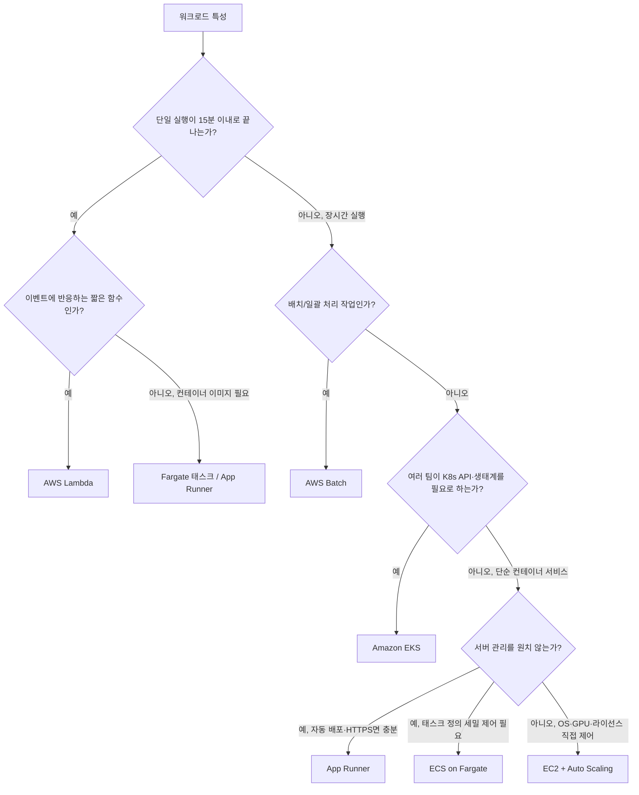
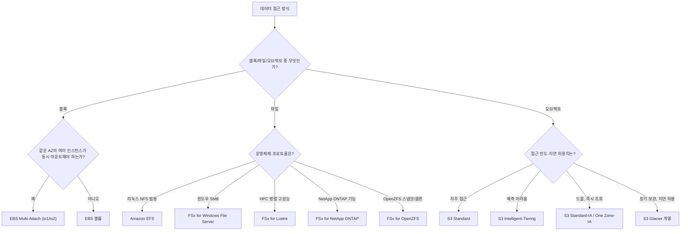
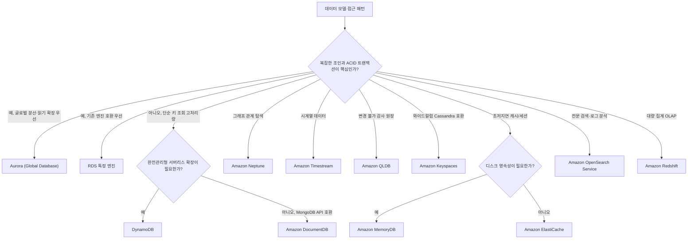
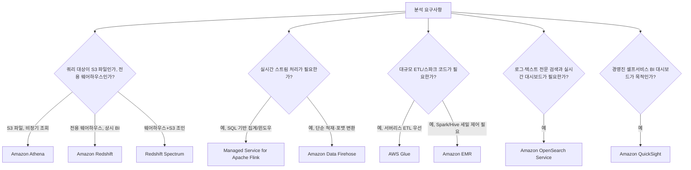
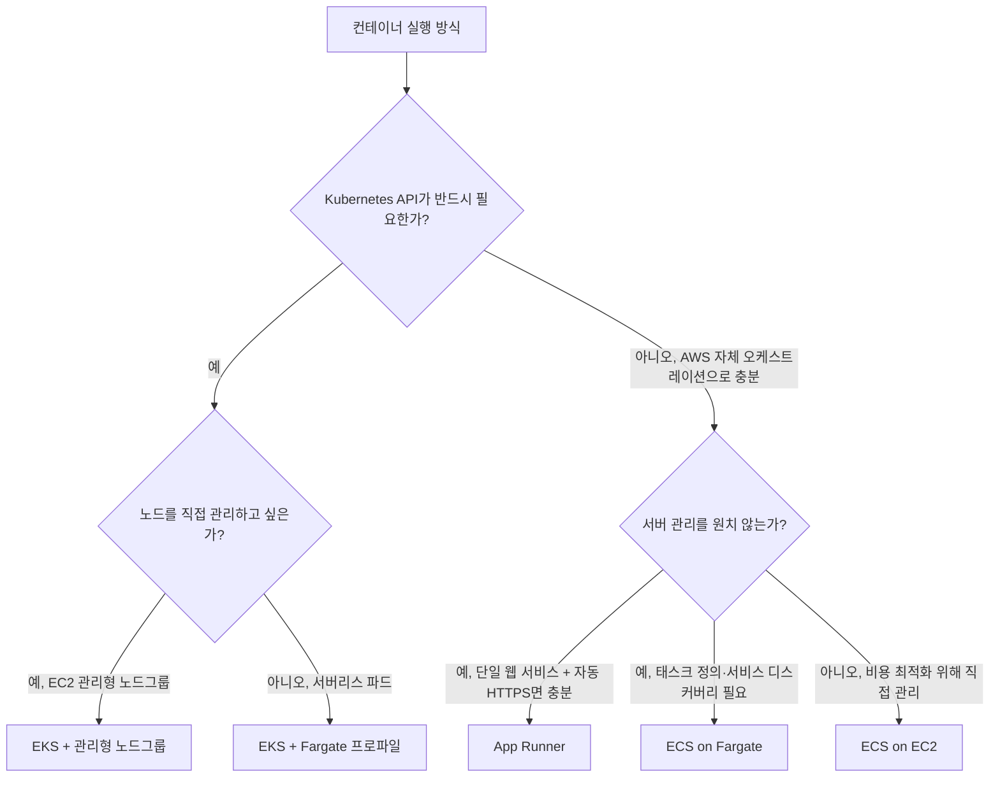
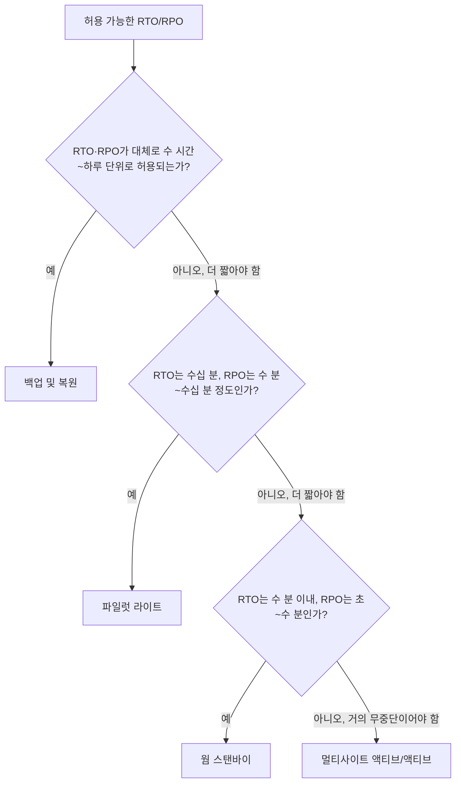
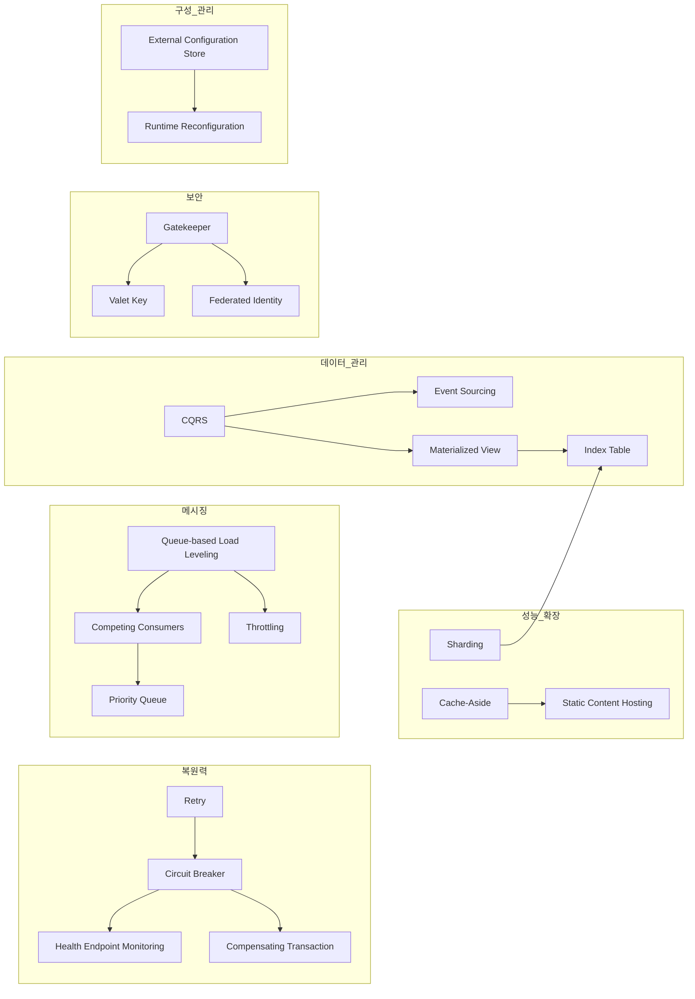

# 부록

## 부록 A. 서비스 선택 결정 트리 모음

이 부록은 본문(Part III~X)에서 다룬 서비스를 실무에서 빠르게 고르기 위한 참조 자료다. 각 영역마다 실제 판단 축(상태 유무·실행 시간·처리량·일관성·지연·예산·팀 역량)으로 구성된 결정 트리와 후보 비교표를 붙였다. 트리는 "가장 흔한 판단 순서"를 나타낼 뿐이며, 실제 설계에서는 여러 축이 동시에 작용하므로 최종 선택 전 부록 B의 한도와 6장의 Well-Architected 트레이드오프를 함께 확인한다.

### A.1 컴퓨트 선택



| 서비스 | 실행 단위 | 콜드 스타트 | 과금 축 | 최대 실행시간 | 운영 부담 | 적합 사례 |
|---|---|---|---|---|---|---|
| EC2 + ASG | VM 인스턴스 | 없음(항상 구동) | 인스턴스 시간 | 제한 없음 | 높음(OS 패치 포함) | 특수 라이선스, GPU, 커스텀 커널 |
| ECS on EC2 | 컨테이너 태스크 | 낮음 | 인스턴스 시간 | 제한 없음 | 중간(클러스터 관리) | 밀도 높은 컨테이너, 비용 최적화 |
| ECS/EKS on Fargate | 컨테이너 태스크/파드 | 중간 | vCPU·메모리 시간 | 제한 없음 | 낮음 | 서버 관리 없는 컨테이너 운영 |
| Amazon EKS | 파드 | 노드 방식에 따름 | 클러스터 시간 + 노드 비용 | 제한 없음 | 높음(K8s 운영) | 멀티클라우드 이식성, 기존 K8s 자산 |
| AWS Lambda | 함수 호출 | 낮음~중간 | 호출 수 + GB-초 | 15분 | 매우 낮음 | 이벤트 기반, 간헐적 트래픽 |
| App Runner | 컨테이너/소스 | 중간 | vCPU·메모리 시간 | 제한 없음(요청 처리 단위) | 매우 낮음 | 단일 웹 서비스, 빠른 배포 |
| AWS Batch | 배치 잡 | 중간 | 기반 컴퓨트(EC2/Fargate) 비용 | 제한 없음 | 낮음 | 대량 일괄 계산, 야간 배치 |

**한 줄 결정 기준**: 실행시간 15분 초과 여부로 서버리스/서버 기반을 먼저 가르고, 컨테이너 오케스트레이션이 필요한지, 서버 관리를 얼마나 덜고 싶은지로 나머지를 좁힌다(→ 18장, 19장, 20장 참조).

### A.2 스토리지 선택



| 유형 | AZ 종속 | 내구성 | 성능 특성 | 최소 보관 기간 | 적합 사례 |
|---|---|---|---|---|---|
| EBS | 종속(단일 AZ) | 볼륨 타입별 상이 | 볼륨 타입별 IOPS/처리량 상이 | 없음 | DB, 부팅 볼륨 |
| 인스턴스 스토어 | 종속 + 휘발성 | 인스턴스 중지·종료 시 소실 | 매우 높은 로컬 I/O | 없음 | 임시 캐시, 스크래치 공간 |
| Amazon EFS | AZ 무관(리전 서비스) | 다중 AZ 복제 | 범용/최대 I/O 처리량 모드 선택 | 없음 | 다중 인스턴스 공유 파일 |
| FSx for Lustre | 배포 방식에 따름 | 배포 방식별 상이 | 초고성능 병렬 처리 | 없음 | HPC, ML 학습 데이터셋 |
| FSx Windows/ONTAP/OpenZFS | 배포 방식에 따름 | 배포 방식별 상이 | 엔진별 특화 기능 | 없음 | 엔터프라이즈 파일 워크로드 이전 |
| S3 Standard | 리전 서비스 | 매우 높음(다중 AZ) | 즉시 조회 | 없음 | 활성 데이터 |
| S3 Standard-IA | 리전 서비스 | 매우 높음 | 즉시 조회 | 대체로 30일 | 자주 조회하지 않는 활성 데이터 |
| S3 One Zone-IA | 단일 AZ | 단일 AZ 손실에 취약 | 즉시 조회 | 대체로 30일 | 재생 가능한 IA 데이터 |
| S3 Glacier 계열 | 리전 서비스 | 매우 높음 | 등급별 수 분~수 시간 지연 | 등급별 90~180일 | 아카이브, 규정 보존 |

**한 줄 결정 기준**: 여러 서버가 동시에 파일을 공유해야 하면 EFS/FSx, 그렇지 않고 블록 성능이 필요하면 EBS, 접근 빈도가 낮아질수록 S3 클래스를 아래로 내린다(→ 21장, 22장 참조). 최소 보관 기간 이전 삭제·전환 시 조기 삭제 요금이 발생할 수 있으므로 실제 값은 최신 문서로 확인한다.

### A.3 데이터베이스 선택



| 서비스 | 데이터 모델 | 일관성 모델 | 확장 방식 | 적합 사례 |
|---|---|---|---|---|
| RDS | 관계형 | 강한 일관성(단일 쓰기 노드) | 수직 확장 + 리드 리플리카 | 기존 RDBMS 자산 이전 |
| Aurora | 관계형(MySQL/PostgreSQL 호환) | 강한 일관성, 6중 복제 스토리지 | 최대 15개 리드 리플리카, Global DB | 고가용 OLTP, 글로벌 읽기 확장 |
| DynamoDB | 키-값/문서 | 기본 최종적 일관성(옵션: 강한 일관성 읽기) | 자동 파티션 분산 | 대규모 저지연 키 조회 |
| DocumentDB | 문서(MongoDB 호환) | 강한 일관성(쓰기 노드) | 리드 리플리카 최대 15개 | MongoDB API 자산 이전 |
| ElastiCache | 인메모리 키-값 | 엔진별 상이 | 클러스터 샤딩 | 캐시, 세션 저장소 |
| MemoryDB | 인메모리 + 영속 로그 | 강한 일관성(다중 AZ 트랜잭션 로그) | 클러스터 샤딩 | 영속성 필요한 초저지연 주 데이터스토어 |
| Neptune | 그래프(속성 그래프/RDF) | 강한 일관성 | 리드 리플리카 | 추천, 사기 탐지, 지식 그래프 |
| Timestream | 시계열 | 최종적 일관성 | 자동 스케일 | IoT/운영 지표 시계열 |
| QLDB | 원장(불변 이력) | 강한 일관성, 추가 전용(append-only) | 서버리스 | 감사 추적, 변경 불가 이력 |
| Keyspaces | 와이드 컬럼(Cassandra 호환) | 조정 가능한 일관성 수준 | 서버리스/프로비저닝 | 기존 Cassandra 워크로드 |
| OpenSearch Service | 역인덱스 검색/로그 | 최종적 일관성 | 클러스터 샤드 확장 | 전문 검색, 로그 분석, 관측성 |
| Redshift | 컬럼형 웨어하우스 | 배치 적재 후 일관성 | 노드/RA3 스토리지 분리 확장 | BI, 대량 집계 분석 |

**한 줄 결정 기준**: 트랜잭션·조인이 핵심이면 관계형(RDS/Aurora), 액세스 패턴이 고정된 고처리량 키 조회면 DynamoDB, 그 외에는 데이터 모델(그래프/시계열/원장/검색/분석)에 맞춘 특수 목적 DB를 우선 검토한다(→ 24장, 25장, 26장 참조).

### A.4 메시징·통합 선택

```mermaid
flowchart TD
    S["통신 요구사항"] --> Q1{"동기 요청-응답이 필요한가?"}
    Q1 -->|예, 실시간 구독/유연한 쿼리| AppSync["AWS AppSync (GraphQL)"]
    Q1 -->|예, REST/HTTP| APIGW["Amazon API Gateway"]
    Q1 -->|아니오, 비동기| Q2{"수신자가 하나의 작업 처리군인가?"}
    Q2 -->|예| SQS["Amazon SQS"]
    Q2 -->|아니오, 다수 구독자 팬아웃| Q3{"다양한 소스·SaaS 이벤트를 규칙 기반 라우팅해야 하는가?"}
    Q3 -->|예| EventBridge["Amazon EventBridge"]
    Q3 -->|아니오, 단순 팬아웃| SNS["Amazon SNS"]
    Q1 -->|순서 보장 + 재처리(replay) 스트림| Q4{"카프카 API/기존 생태계 호환이 필요한가?"}
    Q4 -->|예| MSK["Amazon MSK"]
    Q4 -->|아니오, 완전관리형 처리량 자동조정| Kinesis["Kinesis Data Streams"]
    Q1 -->|여러 단계의 상태 전이 오케스트레이션| StepFunctions["AWS Step Functions"]
```

| 서비스 | 통신 패턴 | 순서 보장 | 재처리(Replay) | 과금 축 | 적합 사례 |
|---|---|---|---|---|---|
| API Gateway | 동기 REST/HTTP/WebSocket | 해당 없음 | 해당 없음 | 요청 수 + 전송량 | 외부 공개 API, BFF |
| AppSync | 동기 GraphQL + 실시간 구독 | 해당 없음 | 해당 없음 | 쿼리/구독 수 | 클라이언트 맞춤 데이터 조회 |
| SQS | 비동기 큐(1:1 작업 분배) | 표준 큐는 미보장, FIFO 큐는 보장 | 재구동 가능(가시성 타임아웃) | 요청 수 | 작업 큐, 부하 평준화 |
| SNS | 발행/구독 팬아웃 | 미보장(FIFO 토픽 제외) | 없음(구독자가 직접 재처리) | 발행 + 전달 수 | 알림, 다수 구독자 브로드캐스트 |
| EventBridge | 이벤트 버스 + 규칙 라우팅 | 미보장 | 아카이브/재생 기능으로 가능 | 이벤트 수 | SaaS 연동, 이벤트 기반 아키텍처 허브 |
| Kinesis Data Streams | 순서 있는 스트림(샤드 내) | 샤드 내 보장 | 보존 기간 내 재생 가능 | 샤드 시간 + 처리량 | 클릭스트림, 실시간 집계 |
| MSK | 카프카 파티션 스트림 | 파티션 내 보장 | 보존 기간 내 재생 가능 | 브로커/스토리지 | 카프카 자산 이전, 복잡한 컨슈머 그룹 |
| Step Functions | 워크플로 오케스트레이션 | 상태 머신 정의 순서 | 실행 이력 조회 가능 | 상태 전이 수 | 다단계 승인/보상 트랜잭션 흐름 |

**한 줄 결정 기준**: 동기/비동기를 먼저 가르고, 비동기라면 수신자 수(1개 vs 다수)와 재처리·순서 보장 필요 여부로 SQS/SNS/EventBridge/Kinesis/MSK를 좁힌다(→ 45장 참조).

### A.5 분석 서비스 선택



| 서비스 | 처리 방식 | 스키마 요구 시점 | 과금 축 | 적합 사례 |
|---|---|---|---|---|
| Athena | 대화형 SQL(서버리스) | 쿼리 시점(스키마 온 리드) | 스캔한 데이터량 | S3 데이터 임시 조회 |
| Redshift | 상시 웨어하우스 | 적재 시점(스키마 온 라이트) | 노드 시간 또는 RPU(서버리스) | 반복적 BI 쿼리 |
| Redshift Spectrum | 웨어하우스+S3 확장 조회 | 혼합 | 스캔량 + 웨어하우스 비용 | 웨어하우스·데이터레이크 조인 |
| EMR | 배치/스트림 클러스터(Spark/Hive 등) | 프레임워크 자유 | 인스턴스 시간 | 대규모 커스텀 빅데이터 처리 |
| Glue | 서버리스 ETL/카탈로그 | 카탈로그 등록 | DPU-시간 | ETL 자동화, 데이터 카탈로그 |
| Amazon Data Firehose | 스트림 적재·변환 | 대상 스키마에 맞춤 | 처리한 데이터량 | 스트림을 S3/OpenSearch 등으로 적재 |
| Managed Service for Apache Flink | 실시간 스트림 SQL/API | 스트림 스키마 | 처리 용량(KPU 등) | 실시간 집계·이상 탐지 |
| OpenSearch Service | 역인덱스 검색·집계 | 인덱스 매핑 | 클러스터 인스턴스 시간 | 로그 분석, 전문 검색 |
| QuickSight | 시각화/BI | 데이터셋 정의 | 사용자/세션 기반 | 대시보드, 셀프서비스 리포팅 |

**한 줄 결정 기준**: 데이터가 이미 정형화되어 상시 조회된다면 Redshift, 비정기 임시 조회면 Athena, 실시간 처리라면 처리 목적(단순 적재 vs SQL 집계)으로 Firehose와 Managed Flink를 가른다(→ 49장, 50장, 51장 참조).

### A.6 컨테이너 실행 환경



| 실행 환경 | 노드 관리 주체 | 오케스트레이터 | 과금 단위 | 적합 사례 |
|---|---|---|---|---|
| ECS on EC2 | 사용자(ASG 연동) | AWS 자체(ECS) | EC2 인스턴스 시간 | 밀도·비용 최적화, AWS 전용 환경 |
| ECS on Fargate | AWS | AWS 자체(ECS) | 태스크 vCPU·메모리 시간 | 서버 관리 없는 표준 컨테이너 서비스 |
| EKS + 관리형 노드그룹 | 사용자(ASG 연동) | Kubernetes | EC2 인스턴스 시간 + 클러스터 시간 | K8s 생태계 자산, 멀티클라우드 이식성 |
| EKS + Fargate 프로파일 | AWS | Kubernetes | 파드 vCPU·메모리 시간 + 클러스터 시간 | K8s API는 필요하지만 노드 운영 최소화 |
| App Runner | AWS | AWS 자체(단순화) | vCPU·메모리 시간(요청 기반 스케일) | 빠른 배포, 단일 서비스 |

**한 줄 결정 기준**: Kubernetes API 자체가 요구사항인지(이식성·기존 매니페스트 자산)로 EKS/ECS를 먼저 가르고, 그다음 노드 운영 부담을 얼마나 줄이고 싶은지로 Fargate 적용 여부를 정한다(→ 19장 참조).

### A.7 DR 패턴 선택 (RTO/RPO 입력 기준)



| 패턴 | 대략적 RTO | 대략적 RPO | 상시 운영 비용 | 복잡도 | 비고 |
|---|---|---|---|---|---|
| 백업 및 복원 | 수 시간~하루 | 마지막 백업 시점까지 | 매우 낮음 | 낮음 | 스토리지 비용만 상시 발생 |
| 파일럿 라이트 | 수십 분 | 수 분~수십 분 | 낮음(핵심 DB만 상시 구동) | 중간 | 최소 구성만 대기, 나머지는 필요 시 기동 |
| 웜 스탠바이 | 수 분 | 초~수 분 | 중간(축소된 전체 스택 상시 구동) | 높음 | 트래픽 전환만으로 확장 |
| 멀티사이트 액티브/액티브 | 거의 0에 가까움 | 거의 0에 가까움 | 높음(양쪽 풀 스케일 상시 구동) | 매우 높음 | 데이터 충돌 해결 전략 필수 |

**한 줄 결정 기준**: RTO/RPO 목표치를 숫자로 먼저 확정한 뒤 표에서 가장 가까운 패턴을 선택하고, 그 비용이 사업적으로 감당 가능한지 역으로 검증한다(→ 7장, 8장, 23장 참조).

---

## 부록 B. 한도·제약 치트시트

> 아래 모든 표의 수치는 **일반적으로 통용되는 기본값을 정리한 참고치**이며, 실제 값은 계정·리전·시점에 따라 다를 수 있고 일부는 Service Quotas 콘솔이나 지원 티켓으로 조정 가능하다. 설계·용량 산정 전 반드시 **Service Quotas 콘솔·공식 문서**로 현재 값을 확인해야 한다. "Soft"는 요청으로 상향 가능, "Hard"는 구조적으로 고정된 한도를 뜻한다.

### B.1 계정·리전 수준

> 값은 변경될 수 있으므로 Service Quotas 콘솔·공식 문서로 재확인한다.

| 항목 | 기본값(대체로) | Soft/Hard | 비고 |
|---|---|---|---|
| 리전당 VPC 수 | 5 | Soft | 대부분 계정에서 상향 요청 가능 |
| 리전당 Elastic IP 수 | 5 | Soft | 미사용 EIP는 요금 발생(→ 부록 E.3) |
| 계정당 IAM 역할 수 | 1,000 | Soft | 대규모 조직은 사전 상향 권장 |
| Organizations 계정 수 | 소수(기본값 낮음) | Soft | 지원 요청으로 상향 |
| 리전당 활성 CloudFormation 스택 수 | 상당히 큼 | Soft | 문서 확인 필요 |

### B.2 VPC (서브넷·SG·규칙·라우트)

> 값은 변경될 수 있으므로 Service Quotas 콘솔·공식 문서로 재확인한다.

| 항목 | 기본값(대체로) | Soft/Hard | 비고 |
|---|---|---|---|
| VPC당 CIDR 블록 수 | 5 | Soft | 보조 CIDR 추가로 확장 |
| VPC당 서브넷 수 | 200 | Soft | |
| VPC당 라우트 테이블 수 | 200 | Soft | |
| 라우트 테이블당 라우트 수 | 50 | Soft | 정적 라우트 기준 |
| ENI당 보안 그룹 수 | 5 | Soft | |
| 보안 그룹당 인바운드/아웃바운드 규칙 수 | 각 60 | Soft | 규칙 폭증 시 SG 재설계 검토 |
| VPC당 보안 그룹 수 | 2,500 | Soft | |
| NACL당 규칙 수(권장 상한) | 20 | Soft | 과도한 규칙은 평가 순서 관리 어려움 |

### B.3 EC2 / Auto Scaling Group

> 값은 변경될 수 있으므로 Service Quotas 콘솔·공식 문서로 재확인한다.

| 항목 | 기본값(대체로) | Soft/Hard | 비고 |
|---|---|---|---|
| 리전당 온디맨드 vCPU (인스턴스 패밀리군별) | 패밀리군별 vCPU 쿼터 | Soft | 패밀리군 단위로 별도 관리 |
| 리전당 Auto Scaling Group 수 | 수백 단위 | Soft | 정확한 값은 문서 확인 |
| 리전당 시작 템플릿 수 | 큼 | Soft | |
| ASG당 최대 인스턴스 수 | 설정값(기본 상한 존재) | Soft | 실제로는 하위 EC2 쿼터에 종속 |

### B.4 ELB (ALB/NLB/GWLB)

> 값은 변경될 수 있으므로 Service Quotas 콘솔·공식 문서로 재확인한다.

| 항목 | 기본값(대체로) | Soft/Hard | 비고 |
|---|---|---|---|
| 리전당 ALB/NLB 수 | 50 | Soft | |
| ALB당 리스너 수 | 50 | Soft | |
| ALB당 리스너 규칙 수 | 100 | Soft | |
| 대상 그룹당 등록 대상 수 | 1,000 | Soft | 인스턴스/IP/Lambda 대상 |

### B.5 Lambda(동시성·페이로드·타임아웃·패키지·/tmp)

> 값은 변경될 수 있으므로 Service Quotas 콘솔·공식 문서로 재확인한다.

| 항목 | 기본값(대체로) | Soft/Hard | 비고 |
|---|---|---|---|
| 리전당 동시 실행 수 | 1,000 | Soft | 예약/프로비저닝된 동시성과 별개로 관리 |
| 함수 메모리 | 128MB~10,240MB | Hard(범위 내 자유 설정) | 메모리에 비례해 vCPU 배분 |
| 최대 타임아웃 | 15분(900초) | Hard | 장시간 작업은 Step Functions/Batch로 분할 |
| 동기 호출 페이로드 | 6MB | Hard | 초과 시 비동기·S3 경유 설계 필요 |
| 비동기 호출 페이로드 | 256KB | Hard | |
| 배포 패키지(zip, 직접 업로드) | 50MB | Hard | 콘솔 편집기는 더 작음 |
| 배포 패키지(압축 해제 후) | 250MB | Hard | 레이어 포함 |
| 컨테이너 이미지 크기 | 10GB | Hard | |
| /tmp 스토리지 | 최대 10,240MB(기본 512MB) | Hard(설정 범위 내) | 임시 파일 용도, 재사용 인스턴스 간 잔존 가능성 주의 |
| 함수당 레이어 수 | 5 | Hard | |

### B.6 API Gateway(타임아웃·페이로드)

> 값은 변경될 수 있으므로 Service Quotas 콘솔·공식 문서로 재확인한다.

| 항목 | 기본값(대체로) | Soft/Hard | 비고 |
|---|---|---|---|
| 통합 타임아웃 최대값 | 29초 | Hard | 장시간 처리는 비동기 패턴으로 전환 |
| 페이로드 크기 | 10MB | Hard | |
| 리전당 REST/HTTP API 수 | 600 | Soft | |

### B.7 S3(객체 크기·멀티파트·버킷 수)

> 값은 변경될 수 있으므로 Service Quotas 콘솔·공식 문서로 재확인한다.

| 항목 | 기본값(대체로) | Soft/Hard | 비고 |
|---|---|---|---|
| 객체 최대 크기 | 5TB | Hard | |
| 단일 PUT 최대 크기 | 5GB | Hard | 초과 시 멀티파트 업로드 필수 |
| 멀티파트 업로드 최대 파트 수 | 10,000 | Hard | |
| 멀티파트 파트 크기 범위 | 5MB~5GB(마지막 파트 예외) | Hard | |
| 계정당 버킷 수 | 100 | Soft | 상향 요청 가능 |
| 미완료 멀티파트 업로드 | 자동 만료 규칙 없으면 계속 과금 | 해당 없음 | 라이프사이클 정책으로 자동 중단 권장(→ 부록 E.3) |

### B.8 DynamoDB(아이템 크기·트랜잭션·GSI·파티션 처리량)

> 값은 변경될 수 있으므로 Service Quotas 콘솔·공식 문서로 재확인한다.

| 항목 | 기본값(대체로) | Soft/Hard | 비고 |
|---|---|---|---|
| 아이템 최대 크기 | 400KB | Hard | 대형 속성은 S3 참조 패턴 고려 |
| 테이블당 GSI 수 | 20 | Soft | |
| 테이블당 LSI 수 | 5 | Hard(테이블 생성 시 고정) | 생성 후 추가 불가 |
| 트랜잭션당 항목 수 | 대체로 수십~100 수준 | Hard | 정확한 값은 문서 확인 필요 |
| BatchWriteItem 항목 수 | 25 | Hard | |
| BatchGetItem 항목 수 | 100 | Hard | |
| 파티션별 물리적 처리량 상한 | 일반적으로 존재(문서 확인) | Hard(물리적 제약) | 핫파티션 설계 시 반드시 고려(→ 26장) |

### B.9 RDS/Aurora

> 값은 변경될 수 있으므로 Service Quotas 콘솔·공식 문서로 재확인한다.

| 항목 | 기본값(대체로) | Soft/Hard | 비고 |
|---|---|---|---|
| 계정당 DB 인스턴스 수 | 40 | Soft | |
| RDS(일반 엔진) 리드 리플리카 수 | 엔진별 상이(대체로 5 내외) | Soft/Hard 혼재 | 엔진 문서 확인 |
| Aurora 리드 리플리카 수 | 최대 15 | Hard | |
| RDS 스토리지 최대 용량 | 엔진별 상이(수십 TiB) | Hard(엔진별) | |
| Aurora 스토리지 자동 확장 상한 | 매우 큼(수백 TiB 규모) | Hard | 정확한 값은 문서 확인 |
| 최대 커넥션 수 | 인스턴스 클래스·파라미터 그룹에 종속 | 해당 없음 | RDS Proxy로 커넥션 풀링 고려(→ 25장) |

### B.10 Kinesis(샤드)

> 값은 변경될 수 있으므로 Service Quotas 콘솔·공식 문서로 재확인한다.

| 항목 | 기본값(대체로) | Soft/Hard | 비고 |
|---|---|---|---|
| 샤드당 쓰기 처리량(프로비저닝 모드) | 1MB/초 또는 1,000 레코드/초 | Hard | 온디맨드 모드는 자동 조정 |
| 샤드당 읽기 처리량(고전 컨슈머) | 2MB/초 | Hard | 향상된 팬아웃 컨슈머는 별도 |
| 레코드 최대 크기 | 1MB | Hard | |
| 기본 보존 기간 | 24시간(최대 365일까지 연장 가능) | Soft(연장) | 장기 보존은 비용 증가 |

### B.11 SQS/SNS(메시지 크기·보존)

> 값은 변경될 수 있으므로 Service Quotas 콘솔·공식 문서로 재확인한다.

| 항목 | 기본값(대체로) | Soft/Hard | 비고 |
|---|---|---|---|
| SQS 메시지 최대 크기 | 256KB | Hard | 대형 페이로드는 S3 참조(확장 클라이언트) 패턴 |
| SQS 메시지 보존 기간 | 기본 4일(최대 14일) | Soft(범위 내 설정) | |
| 표준 큐 인플라이트 메시지 수 상한 | 매우 큼(문서 확인) | Hard | FIFO 큐는 더 낮음 |
| SNS 메시지 최대 크기 | 256KB | Hard | |
| 토픽당 구독자 수 | 매우 큼 | Soft | |

### B.12 CloudFormation(리소스 수·템플릿 크기)

> 값은 변경될 수 있으므로 Service Quotas 콘솔·공식 문서로 재확인한다.

| 항목 | 기본값(대체로) | Soft/Hard | 비고 |
|---|---|---|---|
| 스택당 리소스 수 | 500 | Hard(대체로 조정 어려움) | 초과 시 중첩 스택으로 분해(→ 35장) |
| 템플릿 본문 크기(API 직접 전달) | 약 51,200바이트 | Hard | S3 경유 시 더 큰 템플릿 허용 |
| 템플릿 본문 크기(S3 경유) | 약 1MB | Hard | |
| 계정당 스택 수 | 큼(문서 확인) | Soft | |

### B.13 IAM(정책 크기·역할 수)

> 값은 변경될 수 있으므로 Service Quotas 콘솔·공식 문서로 재확인한다.

| 항목 | 기본값(대체로) | Soft/Hard | 비고 |
|---|---|---|---|
| 관리형 정책 최대 크기 | 6,144자 | Hard | |
| 인라인 정책 최대 크기(사용자/역할/그룹별 상이) | 수천 자 수준 | Hard | 정확한 값은 문서 확인 |
| 역할당 부착 가능 관리형 정책 수 | 10 | Soft | |
| 계정당 역할 수 | 1,000 | Soft | |
| 관리형 정책당 버전 수 | 5 | Hard | 오래된 버전 정리 필요 |

### B.14 EKS/ECS

> 값은 변경될 수 있으므로 Service Quotas 콘솔·공식 문서로 재확인한다.

| 항목 | 기본값(대체로) | Soft/Hard | 비고 |
|---|---|---|---|
| 리전당 EKS 클러스터 수 | 100 | Soft | |
| 노드당 파드 수 | 인스턴스 타입의 ENI/보조 IP 수에 종속 | Hard(구조적) | VPC CNI IP 고갈 문제(→ 19.8) |
| 계정당 ECS 클러스터 수 | 매우 큼 | Soft | |
| ECS 서비스당 태스크 수 | 큼 | Soft | |

### B.15 한도 증설 요청 절차와 사전 점검

1. Service Quotas 콘솔에서 서비스·리전별 현재 값과 적용 값(applied value)을 확인한다.
2. Service Quotas에 등록된 항목은 콘솔/CLI로 즉시 증설 요청(`request-service-quota-increase`)한다.
3. Service Quotas에 없는 일부 항목(예: 일부 CloudFormation·IAM 구조적 한도)은 AWS Support 케이스로 문의한다.
4. 증설은 즉시 반영되지 않을 수 있으므로 트래픽 급증 이벤트(런칭, 세일) 전 최소 2주 여유를 두고 요청한다.

```bash
# 사전 점검: 현재 계정의 주요 서비스 한도를 리전별로 나열
# (계정 ID 123456789012, 서울 리전 예시. 값은 시점에 따라 다르므로 결과를 그대로 신뢰하지 말고 재확인한다)
aws service-quotas list-service-quotas \
  --service-code ec2 \
  --region ap-northeast-2 \
  --query 'Quotas[].[QuotaName,Value]' \
  --output table

aws service-quotas list-service-quotas \
  --service-code lambda \
  --region ap-northeast-2 \
  --query 'Quotas[].[QuotaName,Value]' \
  --output table

# 특정 한도 상향 요청 (예: Lambda 동시 실행 수)
aws service-quotas request-service-quota-increase \
  --service-code lambda \
  --quota-code L-B99A9384 \
  --desired-value 3000 \
  --region ap-northeast-2
```

---

## 부록 C. Well-Architected 리뷰 체크리스트

이 체크리스트는 6장에서 다룬 프레임워크 설명을 반복하지 않고, 실제 리뷰 자리에서 그대로 물을 수 있는 **실행 가능한 질문 형태**로만 구성했다. 각 항목은 체크박스로 표시하고, 답이 "아니오"이거나 근거가 부족하면 미충족으로 기록한다.

### C.1 보안(Security)

- [ ] 루트 계정에 MFA가 적용되어 있고 일상 작업에 사용되지 않는가? (→ 4장)
- [ ] IAM 사용자 장기 자격 증명 대신 역할·임시 자격 증명을 우선 사용하는가? (→ 29장)
- [ ] IAM Access Analyzer로 과도한 권한을 주기적으로 점검하는가? (→ 29장)
- [ ] 멀티 계정 구조에서 SCP로 조직 차원의 가드레일을 강제하는가? (→ 30장)
- [ ] 보안 그룹 규칙이 필요한 포트·소스로만 최소화되어 있는가? (→ 10장)
- [ ] 인터넷 노출 서브넷에 NACL로 2차 방어선을 두었는가? (→ 10장)
- [ ] 저장 데이터가 KMS로, 전송 데이터가 TLS로 암호화되는가? (→ 31장)
- [ ] 자격 증명이 코드에 하드코딩되지 않고 Secrets Manager/Parameter Store에 있는가? (→ 31장)
- [ ] CloudTrail이 모든 리전에서 활성화되고 로그가 별도 보안 계정에 보존되는가? (→ 32장, 30장)
- [ ] GuardDuty·Security Hub로 위협 탐지가 상시 가동되는가? (→ 32장)
- [ ] 퍼블릭 접점에 WAF·Shield가 적용되어 있는가? (→ 33장)
- [ ] 사고 대응 런북과 자동화된 격리 절차가 준비되어 있는가? (→ 32장)
- [ ] 규정 준수 요구사항에 따른 데이터 주권·리전 제약을 검토했는가? (→ 34장)
- [ ] 애플리케이션 인증이 OAuth2/OIDC 표준을 따르는가? (→ 33장)

### C.2 안정성(Reliability)

- [ ] RTO/RPO가 숫자로 정의되고 아키텍처 설계에 실제로 반영되는가? (→ 7장)
- [ ] 아키텍처에 단일 장애점(SPOF)이 남아있지 않은가? (→ 8장)
- [ ] 핵심 계층이 Multi-AZ로 배포되어 있는가? (→ 8장, 25장)
- [ ] 자동 확장 정책이 실제 부하 급증 시나리오로 테스트됐는가? (→ 16장)
- [ ] DR 패턴(백업/파일럿라이트/웜스탠바이/멀티사이트)이 RTO/RPO에 맞게 선택됐는가? (→ 23장, 부록 A.7)
- [ ] 백업이 정기적으로 실제 복원 테스트를 거치는가? (→ 23장)
- [ ] 서비스 간 통신에 재시도·서킷 브레이커·타임아웃 전파가 구현됐는가? (→ 46장)
- [ ] 큐 기반 부하 평준화로 다운스트림 과부하를 방지하는가? (→ 46장)
- [ ] 배포가 블루/그린 또는 카나리로 즉시 롤백 가능하게 설계됐는가? (→ 37장)
- [ ] 카오스 엔지니어링/게임데이로 장애를 정기적으로 검증하는가? (→ 8장)
- [ ] 로드밸런서 수준의 헬스체크와 자동 장애 조치가 동작하는가? (→ 16장)
- [ ] 용량 산정이 백오브엔벨로프 계산으로 문서화됐는가? (→ 7장)
- [ ] 데이터베이스 페일오버 시간이 SLA 요구치를 만족하는가? (→ 25장)
- [ ] 다중 리전 구성 시 데이터 동기화 지연·충돌 해결 전략이 있는가? (→ 8장)

### C.3 성능 효율성(Performance Efficiency)

- [ ] 워크로드 특성에 맞는 컴퓨트(EC2/컨테이너/서버리스)를 선택했는가? (→ 부록 A.1, 18장)
- [ ] Graviton 등 최신 프로세서 세대로의 전환을 검토했는가? (→ 15장)
- [ ] 캐시 계층(CDN/ElastiCache/DAX)으로 지연을 줄이고 있는가? (→ 13장, 26장, 47장)
- [ ] 스토리지 성능 축(IOPS/처리량/지연)이 워크로드에 맞게 선택됐는가? (→ 21장)
- [ ] 데이터베이스 읽기 부하가 리드 리플리카로 분산되는가? (→ 25장)
- [ ] 파티션 키 설계가 핫파티션을 방지하는가? (→ 26장)
- [ ] 정적 콘텐츠가 CloudFront로 오프로드되는가? (→ 13장)
- [ ] 글로벌 사용자 지연을 CloudFront/Global Accelerator로 최소화했는가? (→ 13장)
- [ ] 배포 전 정기적으로 부하·스트레스 테스트를 수행하는가? (→ 47장)
- [ ] 분석 쿼리가 파티셔닝·압축·포맷 최적화로 스캔량을 줄이는가? (→ 51장, 52장)
- [ ] 스트리밍 처리량 대비 샤드/파티션 수를 주기적으로 재검토하는가? (→ 50장)
- [ ] 예측·스케줄 스케일링으로 트래픽 패턴에 선제 대응하는가? (→ 16장, 47장)
- [ ] 신규 리전·서비스 출시 시 아키텍처 재검토 프로세스가 있는가? (→ 6장)

### C.4 비용 최적화(Cost Optimization)

- [ ] 워크로드 특성에 맞춰 온디맨드/RI/Savings Plans/스팟을 조합했는가? (→ 17장)
- [ ] Compute Optimizer로 라이트사이징을 주기적으로 점검하는가? (→ 15장)
- [ ] S3 라이프사이클 정책으로 오래된 데이터가 저비용 클래스로 전환되는가? (→ 22장)
- [ ] 미사용 EBS 볼륨, 미연결 EIP, 오래된 스냅샷을 정기적으로 정리하는가? (→ 부록 E.3)
- [ ] 비용 이상 탐지와 예산 알림이 설정되어 있는가? (→ 4장, 40장)
- [ ] 태그 기반으로 팀·프로젝트별 비용을 배분하고 있는가? (→ 40장)
- [ ] Athena/Redshift Spectrum 쿼리가 스캔량 기준으로 비용 통제되는가? (→ 51장)
- [ ] 서버리스 프로비저닝된 동시성이 실제 트래픽에 맞게 조정되는가? (→ 18장)
- [ ] 데이터 전송 비용(리전 간, NAT, 아웃바운드)을 설계 단계에서 고려했는가? (→ 부록 E.3)
- [ ] FinOps 리듬(가시성-평가-통제)이 조직에 정착되어 있는가? (→ 40장)
- [ ] 예약 용량과 실제 사용률의 커버리지 갭을 주기적으로 검토하는가? (→ 17장)
- [ ] 로그·메트릭 보존 기간이 비용 대비 실제 필요와 맞는가? (→ 38장, 부록 E.3)
- [ ] 신규 설계 시 비용 추정 워크시트를 작성하는가? (→ 부록 E)

### C.5 운영 우수성(Operational Excellence)

- [ ] 모든 인프라가 IaC로 코드화되어 있는가? (→ 35장)
- [ ] 배포 파이프라인이 자동 테스트와 승인 절차를 포함하는가? (→ 36장)
- [ ] 배포 실패 시 자동 롤백 조건이 명확히 정의되어 있는가? (→ 37장)
- [ ] 관측성 3요소(메트릭·로그·트레이스)가 모두 수집되는가? (→ 38장)
- [ ] 알람이 실행 가능한 임계치로 설계되어 알람 피로가 없는가? (→ 38장)
- [ ] 런북·플레이북이 최신 상태로 문서화되어 있는가? (→ 39장)
- [ ] 사고 후 포스트모템이 비난 없는(blameless) 방식으로 진행되는가? (→ 39장, 65장)
- [ ] 주요 아키텍처 결정이 ADR로 기록되는가? (→ 9장)
- [ ] 정기적인 게임데이로 온콜 대응력을 검증하는가? (→ 8장, 65장)
- [ ] 변경 관리가 One-way/Two-way door 판단 기준을 따르는가? (→ 9장)
- [ ] 서비스 한도 초과 위험을 사전에 모니터링하는가? (→ 부록 B)
- [ ] 온콜·에러 예산 운영이 SRE 원칙에 따라 이뤄지는가? (→ 65장)
- [ ] Well-Architected 리뷰를 주기적으로(예: 반기별) 재실행하는가? (→ 6장)

### C.6 지속가능성(Sustainability)

- [ ] 실제 사용률에 맞게 인스턴스·스토리지가 라이트사이징되어 있는가? (→ 15장, 40장)
- [ ] 비프로덕션 환경을 야간·주말에 자동 중지하는가? (→ 39장)
- [ ] Graviton 등 에너지 효율이 높은 프로세서 사용을 검토했는가? (→ 15장)
- [ ] 데이터 보존 정책이 필요 이상으로 데이터를 오래 저장하지 않는가? (→ 22장)
- [ ] 리전 선택 시 지속가능성 관련 고려사항을 반영했는가? (→ 3장)
- [ ] 서버리스·관리형 서비스로 전환해 유휴 인프라를 줄였는가? (→ 18장)
- [ ] 배치 작업 실행 시점·리전이 효율을 고려해 결정되는가? (→ 20장)
- [ ] 인프라 확장보다 소프트웨어 효율(알고리즘, 캐싱) 개선을 우선 검토하는가? (→ 47장)
- [ ] 불필요한 데이터 전송을 줄이도록 아키텍처가 설계됐는가? (→ 13장)
- [ ] 지속가능성 지표가 비용 최적화 지표와 함께 추적되는가? (→ 40장)
- [ ] 컨테이너·서버리스 워크로드 밀도가 최적화되어 자원 낭비가 적은가? (→ 19장)
- [ ] 조직 차원의 지속가능성 목표가 아키텍처 리뷰에 반영되는가? (→ 6장)

### C.7 리뷰 진행 방법과 점수화

1. 리뷰 대상 워크로드와 범위를 먼저 문서화한다(아키텍처 다이어그램, 담당자, 이해관계자).
2. 6개 기둥을 순서대로 진행하며 각 질문에 충족/부분충족/미충족으로 답하고 근거를 기록한다.
3. 미충족 항목 중 리스크(발생 확률 × 영향도)가 높은 항목을 우선순위 상위로 배치한다.
4. 개선 항목별 담당자와 기한을 정해 액션 아이템으로 전환한다.
5. 다음 리뷰 주기(대체로 6~12개월) 전에 이전 미충족 항목의 해소 여부를 재확인한다.

| 기둥 | 충족(항목 수) | 부분충족 | 미충족 | 우선순위 메모 |
|---|---|---|---|---|
| 보안 | | | | |
| 안정성 | | | | |
| 성능 효율성 | | | | |
| 비용 최적화 | | | | |
| 운영 우수성 | | | | |
| 지속가능성 | | | | |

점수화 기준: 충족 = 2점, 부분충족 = 1점, 미충족 = 0점으로 계산해 기둥별 총점을 비교하면 상대적으로 취약한 기둥을 빠르게 식별할 수 있다.

---

## 부록 D. 자격증 시험 범위 매핑

> 아래 도메인 비중과 장 매핑은 참고용이다. **AWS 인증 시험의 범위와 비중은 주기적으로 개정**되므로 응시 신청 전 반드시 해당 시험의 공식 시험 가이드(Exam Guide)를 확인해야 한다.

### D.1 AWS Certified Cloud Practitioner

| 도메인 | 비중(대체로) | 이 책의 대응 장 |
|---|---|---|
| Cloud Concepts | 약 24% | 2장, 3장 |
| Security and Compliance | 약 30% | 4장, 28장, 29장, 31장, 32장, 34장 |
| Cloud Technology and Services | 약 34% | 5장, 15장, 18장, 19장, 21장, 22장, 25장, 26장, 45장 |
| Billing, Pricing, and Support | 약 12% | 4장, 17장, 40장 |

### D.2 AWS Certified Solutions Architect – Associate

| 도메인 | 비중(대체로) | 이 책의 대응 장 |
|---|---|---|
| Design Secure Architectures | 약 30% | 10장, 11장, 29장, 31장, 32장, 33장 |
| Design Resilient Architectures | 약 26% | 7장, 8장, 16장, 23장, 25장, 45장, 46장 |
| Design High-Performing Architectures | 약 24% | 13장, 15장, 18장, 19장, 21장, 22장, 26장, 47장, 50장, 51장 |
| Design Cost-Optimized Architectures | 약 20% | 17장, 22장, 40장 |

### D.3 AWS Certified Solutions Architect – Professional

| 도메인 | 비중(대체로) | 이 책의 대응 장 |
|---|---|---|
| Design for Organizational Complexity | 약 26% | 30장, 63장, 64장, 65장, 66장 |
| Design for New Solutions | 약 29% | 10~14장, 24~27장, 41~48장 |
| Continuous Improvement for Existing Solutions | 약 25% | 6장, 38장, 39장, 40장 |
| Accelerate Workload Migration and Modernization | 약 20% | 27장, 63장, 64장 |

### D.4 학습 전략

**핵심 원칙**
- **하나의 클라우드에 집중한다**: 여러 클라우드 자격증을 동시에 준비하기보다 AWS 한 곳에 집중해 깊이를 확보하는 편이 취업·실무 전환 모두에 유리하다.
- **어소시에이트부터 시작한다**: Professional 문제는 Associate 수준의 서비스 지식을 전제로 시나리오를 조합하므로, Cloud Practitioner를 건너뛰더라도 Associate는 반드시 먼저 취득한다.
- **가능한 곳에서 실제 경험을 쌓는다**: 실습 계정에서 직접 리소스를 만들고 부수는 경험이 암기보다 오래 남고, 시나리오형 문제에서 특히 유리하다.

**준비 기간 가이드(대체로, 배경 지식에 따라 편차가 큼)**

| 자격증 | 준비 기간(실무 경험 없음) | 준비 기간(관련 실무 경험 있음) |
|---|---|---|
| Cloud Practitioner | 3~4주 | 1~2주 |
| Solutions Architect Associate | 8~12주 | 4~6주 |
| Solutions Architect Professional | 12~16주 | 6~10주(Associate 보유 전제) |

**실전 문제 활용법**: 공식 practice exam으로 먼저 취약 도메인을 파악하고, 오답을 도메인별로 분류해 해당 장을 재학습한다. 시험 1~2주 전에는 실전과 같은 제한 시간으로 모의고사를 최소 2회 이상 풀어 시간 감각을 맞춘다.

**시험 당일 팁**: 확신 없는 문제는 플래그하고 넘어간 뒤 나중에 재검토한다. 지문에서 "가장 비용 효율적", "운영 부담 최소화" 같은 판단 축 키워드를 먼저 표시하고 보기를 소거법으로 좁힌다. 극단적인 표현("항상", "절대")이 들어간 보기는 오답일 가능성이 높다.

**추가 시험 시간 요청 제도**: 영어가 모국어가 아니거나 장애가 있는 응시자는 시험 사업자(Pearson VUE/PSI)를 통해 사전에 추가 시간 등 편의 제공을 신청할 수 있다. 신청 절차와 자격 요건은 시점에 따라 달라지므로 응시 예정일 훨씬 전에 공식 인증 포털에서 확인하고 신청해야 한다.

---

## 부록 E. 비용 추정 워크시트와 계산 예제

### E.1 워크시트 구조

비용 추정은 아래 6개 열로 구성된 표를 워크로드별로 채우는 방식으로 진행한다.

| 열 | 설명 |
|---|---|
| 워크로드 | 추정 대상 시스템/기능 단위 |
| 구성 요소 | 워크로드를 구성하는 개별 AWS 리소스 |
| 단위 | 과금되는 최소 단위(요청 수, GB, 시간, DPU-시간 등) |
| 수량 | 예상 사용량(월간 트래픽·데이터량 기반 추정치) |
| 단가 축 | 무엇에 과금되는지(예: 요청 수 × 평균 처리시간, 스캔한 데이터량) |
| 월 비용 | 수량 × 단가(실제 단가는 Pricing Calculator로 조회) |

행 단위로 리소스를 나열하고, 마지막에 합계 행을 두어 워크로드 전체 월 비용을 산출한다.

### E.2 계산 예제 3건

> 아래 단가는 **설명을 위한 예시 값**이며 실제 청구 금액이 아니다. 최신 단가는 반드시 AWS Pricing Calculator와 실제 청구서(Cost Explorer)로 검증한다.

**예제 1: 서버리스 이벤트 기반 API (67장 캡스톤 연계)**

| 구성 요소 | 단위 | 예시 수량(월) | 단가 축 | 비고 |
|---|---|---|---|---|
| API Gateway | 백만 요청 | 10 | 요청 수 | REST/HTTP API 유형에 따라 단가 상이 |
| Lambda | GB-초 | 요청 수 × 평균 실행시간 × 메모리(GB) | 호출 수 + GB-초 | 콜드 스타트 완화를 위한 프로비저닝된 동시성은 별도 과금 |
| DynamoDB | RCU/WCU 또는 온디맨드 요청 | 트래픽 패턴에 따라 결정 | 처리량 또는 요청 수 | 온디맨드는 예측 어려운 트래픽에 유리 |
| EventBridge/SQS | 백만 이벤트/메시지 | 트래픽 규모에 비례 | 이벤트·메시지 수 | |
| CloudWatch Logs | GB | 로그량에 비례 | 수집량 + 보존 기간 | 보존 기간 최소화로 절감(→ E.3) |

**예제 2: 컨테이너 3-tier 플랫폼 (68장 캡스톤 연계)**

| 구성 요소 | 단위 | 예시 수량(월) | 단가 축 | 비고 |
|---|---|---|---|---|
| ALB | 시간 + LCU | 상시 구동 | 가동 시간 + 처리 용량(LCU) | |
| EKS 클러스터 | 시간 | 상시 구동 | 클러스터 관리 비용(시간당) | 노드 비용은 별도 |
| Fargate/EC2 노드 | vCPU·메모리 시간 또는 인스턴스 시간 | 워크로드 규모에 비례 | 컴퓨트 사용량 | 커밋 할인 적용 가능(→ E.5) |
| Aurora | 인스턴스 시간 + 스토리지 | 상시 구동 | 인스턴스 클래스 + I/O | Multi-AZ 시 비용 2배 근사 |
| 데이터 전송 | GB | AZ 간·인터넷 아웃바운드 | 전송량 | 같은 AZ 내 통신으로 최소화 가능(→ E.3) |

**예제 3: 데이터 레이크 + 실시간 분석 (69장 캡스톤 연계)**

| 구성 요소 | 단위 | 예시 수량(월) | 단가 축 | 비고 |
|---|---|---|---|---|
| S3(Standard + IA) | GB | 저장량 증가 추세 | 저장 용량 + 클래스 | 라이프사이클로 자동 전환(→ 22장) |
| Kinesis/Firehose | GB 처리량 | 스트림 유입량에 비례 | 처리한 데이터량 | |
| Glue ETL | DPU-시간 | 배치 주기에 비례 | 작업 실행 시간 × DPU 수 | Job bookmark로 중복 처리 방지 |
| Athena | TB 스캔 | 쿼리 빈도·범위에 비례 | 스캔한 데이터량 | 파티셔닝·컬럼형 포맷으로 대폭 절감(→ 51장) |
| QuickSight | 사용자/세션 | 대시보드 이용자 수 | 사용자 기반 또는 세션 기반 | |

### E.3 자주 놓치는 비용 항목 체크리스트

- [ ] **데이터 전송(Data Transfer)**: 리전 간, AZ 간, 인터넷 아웃바운드 전송은 종종 과소평가된다.
- [ ] **NAT Gateway**: 시간당 요금과 처리 데이터량 요금이 동시에 부과되며, 트래픽이 많은 프라이빗 서브넷에서 예상보다 커질 수 있다.
- [ ] **로그 보존(CloudWatch Logs)**: 기본 보존 기간을 무기한으로 두면 로그 저장 비용이 계속 누적된다.
- [ ] **스냅샷(EBS/RDS)**: 자동 스냅샷이 정리되지 않고 계속 쌓이면 스토리지 비용이 증가한다.
- [ ] **미연결 Elastic IP**: 인스턴스에 연결되지 않은 EIP는 별도 요금이 부과된다.
- [ ] **KMS API 요청**: 대량의 암복호화 요청(특히 봉투 암호화 패턴)은 요청 건수 기준 비용이 누적될 수 있다.
- [ ] **Athena 스캔량**: 파티셔닝·포맷 최적화 없이 전체 테이블을 반복 스캔하면 비용이 급증한다.
- [ ] **CloudWatch 커스텀 메트릭**: 세분화된 커스텀 메트릭을 과도하게 게시하면 메트릭 수 기준 비용이 누적된다.
- [ ] **미완료 멀티파트 업로드(S3)**: 실패한 업로드가 정리되지 않으면 저장 공간을 계속 차지한다.
- [ ] **프로비저닝된 동시성(Lambda)**: 실제 트래픽보다 과도하게 설정하면 유휴 용량에 대해서도 요금이 발생한다.

### E.4 단가 검증 원칙

이 부록의 모든 단가·계산 예제는 **리전과 시점에 따라 달라지므로 절대 금액으로 인용하지 않는다.** 실제 견적은 AWS Pricing Calculator로 산출하고, 운영 중인 워크로드는 Cost Explorer의 실측 데이터로 정기적으로 재검증한다. 계약 기반 할인(엔터프라이즈 협약 등)은 공개 단가와 다를 수 있으므로 재무·구매 담당과 별도로 확인한다.

### E.5 절감 시뮬레이션(적용 전후 비교)

> 아래 절감 폭은 사례에 따라 편차가 크므로 "일반적으로/대체로"로 이해하고, 실제 절감액은 워크로드별로 재측정한다.

| 적용 항목 | 적용 전 | 적용 후 | 절감 축 | 비고 |
|---|---|---|---|---|
| 컴퓨트 커밋(Savings Plans/RI) | 전량 온디맨드 | 기저 부하는 커밋, 피크만 온디맨드/스팟 | 시간당 단가 할인 | 커버리지가 낮으면 효과 제한적(→ 17장) |
| Graviton 전환 | x86 인스턴스 | Graviton 인스턴스 | 인스턴스 시간당 단가 + 처리 효율 | 애플리케이션 호환성 사전 검증 필요(→ 15장) |
| S3 스토리지 클래스 전환 | 전량 Standard | 접근 빈도별 IA/Glacier 계층화 | 저장 단가 + 조회 빈도 | 최소 보관 기간·조회 요금 트레이드오프 확인(→ 22장, 부록 A.2) |
| Athena 파티셔닝·컬럼형 포맷 | 비정형 전체 스캔 | 파티션 프루닝 + Parquet | 스캔한 데이터량 | 스키마 설계 초기 투자 필요(→ 51장) |
| 프로비저닝된 동시성 최적화 | 고정 과다 설정 | 트래픽 패턴 기반 스케줄 조정 | 유휴 용량 최소화 | Application Auto Scaling과 연동(→ 18장) |

## 부록 F. 클라우드 디자인 패턴 24선 요약 카드

*Cloud Design Patterns*(Microsoft patterns & practices, 2014)의 24개 패턴을 카드로 요약한다. 원서는 Windows Azure 기준이지만 패턴 원리는 클라우드에 종속되지 않으므로 AWS 구현으로 치환했다. 각 카드는 정의·문제·구조·고려사항·AWS 구현·상세 절·함께 쓰는 패턴 7항목이며, 상세 논의는 Part VIII(41~47장)에 있다.

### F.1 Cache-Aside (캐시 어사이드)
**정의**: 애플리케이션이 캐시를 먼저 조회하고 미스일 때만 원본을 조회해 캐시를 채우는 지연 로딩 패턴.
**해결하는 문제**: 자주 읽지만 자주 안 바뀌는 데이터를 매번 DB에서 읽으면 지연·비용이 커진다.
**구조 요약**: 조회 → 캐시 확인 → 미스 시 DB 조회 후 캐시 저장(TTL) → 쓰기는 DB 갱신 후 캐시 무효화.
**주요 고려사항**: 1) 캐시-DB 간 일시적 불일치 허용 범위를 정의한다. 2) 콜드 캐시에 요청이 몰리는 캐시 스탬피드를 대비한다.
**AWS 구현**: ElastiCache(Redis/Memcached)로 직접 구현하거나, DynamoDB는 DAX로 투명하게 적용한다.
**이 책의 상세 절**: 47.1, 47.2, 26.6
**함께 쓰는 패턴**: Materialized View, Static Content Hosting, Throttling

### F.2 Circuit Breaker (서킷 브레이커)
**정의**: 반복 실패하는 원격 호출을 일정 시간 즉시 차단해 호출자와 대상 서비스를 함께 보호하는 패턴.
**해결하는 문제**: 죽어가는 서비스에 재시도를 계속 쏟으면 커넥션이 고갈되고 연쇄 장애로 번진다.
**구조 요약**: Closed(정상, 실패율 집계) → 임계 초과 시 Open(즉시 실패) → 대기 후 Half-Open(시험 호출) → 성공 시 Closed 복귀.
**주요 고려사항**: 1) 임계값·Open 유지 시간을 서비스 특성에 맞게 튜닝한다. 2) Open 상태의 폴백 응답(캐시값·기본값)을 설계한다.
**AWS 구현**: 애플리케이션 SDK 재시도 라이브러리나 App Mesh의 아웃라이어 감지로 구현한다.
**이 책의 상세 절**: 46.3, 46.1
**함께 쓰는 패턴**: Retry, Health Endpoint Monitoring, Queue-based Load Leveling

### F.3 Compensating Transaction (보상 트랜잭션)
**정의**: 다단계 작업 중 일부 실패 시 이미 완료된 단계를 되돌리는 보상 작업을 실행해 일관성을 회복하는 패턴.
**해결하는 문제**: 분산 트랜잭션에는 강한 원자성을 적용하기 어렵지만, 중간 실패 상태를 방치하면 데이터가 불일치한다.
**구조 요약**: 순차 실행 → 각 단계에 보상 동작 정의 → 실패 시 완료 단계를 역순으로 보상 실행.
**주요 고려사항**: 1) 보상 동작 자체의 실패에 대비한 재시도·수동 개입 경로가 필요하다. 2) 완전한 원상복구가 아닌 "업무적 상쇄"일 수 있다.
**AWS 구현**: Step Functions로 각 단계와 Catch 상태에 보상 태스크를 명시적으로 모델링한다.
**이 책의 상세 절**: 46.9, 44.3
**함께 쓰는 패턴**: Retry, Scheduler Agent Supervisor

### F.4 Competing Consumers (경쟁 소비자)
**정의**: 하나의 큐를 여러 소비자가 동시에 구독해 메시지를 병렬로 나눠 처리하는 패턴.
**해결하는 문제**: 단일 소비자는 처리량이 유입량을 못 따라가거나 장애 시 처리가 멈춘다.
**구조 요약**: 생산자가 큐에 적재 → 다수 소비자가 폴링 → 큐가 각 메시지를 한 소비자에게만 배분(가시성 타임아웃) → 완료 후 삭제, 실패 시 DLQ.
**주요 고려사항**: 1) 순서 보장이 필요하면 FIFO 큐나 파티션 키 설계가 필요하다. 2) 반복 실패 메시지(poison message)를 격리할 DLQ가 필요하다.
**AWS 구현**: SQS 표준 큐에 다수의 Lambda(이벤트 소스 매핑)나 ECS 워커를 붙여 병렬 소비를 구성한다.
**이 책의 상세 절**: 46.8, 45.6
**함께 쓰는 패턴**: Queue-based Load Leveling, Priority Queue, Throttling

### F.5 Compute Resource Consolidation (컴퓨트 리소스 통합)
**정의**: 여러 작은 작업·서비스를 하나의 컴퓨트 유닛에 통합 배치해 유휴 자원을 줄이는 패턴.
**해결하는 문제**: 워크로드를 너무 잘게 나눠 배치하면 개별 사용률은 낮은데 전체 비용·관리 부담은 커진다.
**구조 요약**: 자원 요구·수명주기가 유사한 워크로드를 식별 → 같은 클러스터에 배치 → 컨테이너/프로세스 단위로 격리 → 사용률 모니터링 후 재조정.
**주요 고려사항**: 1) 통합하면 장애 격리가 약해지므로 quota·cgroup으로 제한해야 한다. 2) 배포 주기가 다른 워크로드를 억지로 묶으면 배포 위험이 커진다.
**AWS 구현**: ECS/EKS에서 여러 서비스 태스크를 한 클러스터에 배치하고 CPU/메모리 예약으로 격리한다.
**이 책의 상세 절**: 47.5, 19.4
**함께 쓰는 패턴**: Compute Partitioning Guidance, Throttling

### F.6 CQRS (명령·조회 책임 분리)
**정의**: 상태를 바꾸는 명령 경로와 읽는 조회 경로를 별도의 모델·저장소로 분리하는 패턴.
**해결하는 문제**: 단일 모델로 복잡한 읽기·쓰기를 모두 감당하면 모델이 비대해지고 부하 특성이 달라 최적화가 어렵다.
**구조 요약**: 명령은 쓰기 모델로 → 상태 변경 이벤트 발행 → 구독자가 읽기 전용 뷰를 비동기 갱신 → 조회는 항상 읽기 모델에서 처리.
**주요 고려사항**: 1) 읽기 모델은 결과적 일관성을 가지므로 UX에서 감안해야 한다. 2) 단순 CRUD에는 과한 설계이며 복잡도가 늘어난다.
**AWS 구현**: 쓰기는 Aurora/RDS, 전파는 DynamoDB Streams/EventBridge, 읽기 모델은 DynamoDB나 OpenSearch로 구성한다.
**이 책의 상세 절**: 44.4, 44.8
**함께 쓰는 패턴**: Event Sourcing, Materialized View, Index Table

### F.7 Event Sourcing (이벤트 소싱)
**정의**: 현재 상태 대신 상태를 바꾼 모든 이벤트를 append-only로 기록하고 필요 시 재생해 상태를 재구성하는 패턴.
**해결하는 문제**: 상태만 저장하면 변경 이력이 사라져 감사 추적·시점 복원·다중 파생 뷰 생성이 어렵다.
**구조 요약**: 명령 처리 → 도메인 이벤트 생성 → 이벤트 스토어에 순서대로 append → 구독자가 소비해 읽기 모델·스냅샷 구축.
**주요 고려사항**: 1) 이벤트 스키마는 사실상 불변이므로 버저닝 전략이 필요하다. 2) 재생 비용 증가를 막기 위한 주기적 스냅샷이 필요하다.
**AWS 구현**: DynamoDB(또는 Aurora)를 이벤트 스토어로, DynamoDB Streams/Kinesis로 구독자에게 전파한다.
**이 책의 상세 절**: 44.5, 44.6
**함께 쓰는 패턴**: CQRS, Materialized View, Compensating Transaction

### F.8 External Configuration Store (외부 구성 저장소)
**정의**: 설정값을 코드·이미지에 굽지 않고 별도의 중앙 저장소에서 조회하는 패턴.
**해결하는 문제**: 설정이 코드에 하드코딩되면 환경별 배포마다 재빌드가 필요하고 설정 드리프트가 발생한다.
**구조 요약**: 애플리케이션이 시작 시/주기적으로 외부 저장소에서 설정 조회 → 환경별 네임스페이스로 구분 저장 → 변경은 저장소에서만 수행.
**주요 고려사항**: 1) 저장소 장애에 대비해 로컬 캐시와 기본값을 둬야 한다. 2) 민감 값은 일반 설정과 분리해 암호화 저장소에 둔다.
**AWS 구현**: 비밀 값은 Secrets Manager, 일반 설정은 Systems Manager Parameter Store를 표준으로 쓴다.
**이 책의 상세 절**: 47.10, 31.6
**함께 쓰는 패턴**: Runtime Reconfiguration

### F.9 Federated Identity (페더레이티드 아이덴티티)
**정의**: 자체 사용자 저장소 없이 외부 아이덴티티 공급자(IdP)의 인증 결과를 토큰으로 위임받아 사용하는 패턴.
**해결하는 문제**: 서비스마다 계정을 따로 관리하면 UX가 나빠지고 보안 사고 표면이 늘어난다.
**구조 요약**: 사용자 접근 시도 → IdP로 리다이렉트 → 인증 → IdP가 서명된 토큰(SAML/OIDC) 발급 → 애플리케이션이 토큰 검증 후 세션 수립.
**주요 고려사항**: 1) 토큰 만료·리프레시 흐름을 설계해야 세션이 끊기지 않는다. 2) 클레임 신뢰 전 서명·발급자를 반드시 검증한다.
**AWS 구현**: Cognito가 사용자 풀·자격 증명 풀로 지원하며, 기업 SSO는 IAM Identity Center로 구현한다.
**이 책의 상세 절**: 33.1, 33.6, 30.5
**함께 쓰는 패턴**: Gatekeeper, Valet Key

### F.10 Gatekeeper (게이트키퍼)
**정의**: 외부 요청을 내부 리소스에 직접 노출하지 않고 검증 전담 중개 컴포넌트를 앞단에 두는 패턴.
**해결하는 문제**: 클라이언트 요청이 내부 서비스에 바로 도달하면 입력 검증·인가 로직이 분산돼 취약점이 늘어난다.
**구조 요약**: 클라이언트 → 게이트키퍼(경량, 최소 권한, 입력 검증) → 검증 통과 요청만 내부 신뢰 서비스로 전달.
**주요 고려사항**: 1) 게이트키퍼가 병목·단일 장애점이 되지 않게 수평 확장 가능해야 한다. 2) 게이트키퍼-내부 서비스 간 네트워크도 별도로 격리한다.
**AWS 구현**: API Gateway + WAF를 앞단에 두고 내부 서비스는 프라이빗 서브넷의 ALB/NLB 뒤에 배치한다.
**이 책의 상세 절**: 47.9, 33.6, 33.3
**함께 쓰는 패턴**: Valet Key, Federated Identity, Throttling

### F.11 Health Endpoint Monitoring (상태 확인 엔드포인트 모니터링)
**정의**: 애플리케이션이 자신의 건강 상태를 노출하는 전용 엔드포인트를 제공해 조기에 장애를 감지하는 패턴.
**해결하는 문제**: 프로세스가 살아 있어도 의존 리소스가 죽으면 실질적으로 요청을 처리할 수 없다.
**구조 요약**: `/health` 엔드포인트 노출 → 핵심 의존성 상태 점검 → 로드밸런서/오케스트레이터가 주기 호출 → 비정상 시 트래픽 제외.
**주요 고려사항**: 1) 헬스체크가 너무 무거우면 그 자체가 부하이므로 얕은/깊은 체크를 분리한다. 2) 실패 임계값과 회복 기준을 명확히 해 플래핑을 막는다.
**AWS 구현**: ALB/NLB 대상 그룹 헬스체크, ECS/EKS 컨테이너 헬스체크, Route 53 상태 확인 기반 DNS 페일오버.
**이 책의 상세 절**: 38.7, 46.12, 13.1
**함께 쓰는 패턴**: Circuit Breaker, Leader Election

### F.12 Index Table (인덱스 테이블)
**정의**: 기본 키가 아닌 속성으로 자주 조회할 때 그 속성을 키로 하는 보조 인덱스 구조를 별도로 유지하는 패턴.
**해결하는 문제**: NoSQL·샤딩된 저장소는 기본 키 조회는 빠르지만 다른 속성 조회는 전체 스캔이 필요해 느리다.
**구조 요약**: 원본 쓰기 시 보조 인덱스에도 참조·사본 기록 → 조회는 보조 인덱스로 키를 찾은 뒤 원본에서 상세 조회.
**주요 고려사항**: 1) 인덱스가 늘수록 쓰기 증폭과 저장 비용이 커진다. 2) 원본-인덱스 갱신이 원자적이지 않으면 일시적 불일치가 생긴다.
**AWS 구현**: DynamoDB의 GSI가 이 패턴을 관리형으로 제공하며 최종적 일관성을 가진다.
**이 책의 상세 절**: 44.7, 26.3
**함께 쓰는 패턴**: Materialized View, Sharding

### F.13 Leader Election (리더 선출)
**정의**: 동일 역할의 여러 인스턴스 중 정확히 하나를 조율 작업의 리더로 선출해 중복 실행을 막는 패턴.
**해결하는 문제**: 여러 인스턴스가 독립적으로 조율 작업을 하면 충돌하고, 단일 인스턴스만 두면 단일 장애점이 된다.
**구조 요약**: 후보들이 공유 저장소에 리더 임대 획득 시도 → 성공한 하나가 리더로 동작(주기 갱신) → 장애 시 임대 만료 후 재선출.
**주요 고려사항**: 1) 임대 만료 시간이 짧으면 자주 교체되고 길면 장애 감지가 늦어진다. 2) 스플릿 브레인을 막을 조건부 쓰기가 필요하다.
**AWS 구현**: DynamoDB 조건부 쓰기(ConditionExpression)로 임대 락을 구현한다.
**이 책의 상세 절**: 46.10
**함께 쓰는 패턴**: Scheduler Agent Supervisor, Health Endpoint Monitoring

### F.14 Materialized View (구체화 뷰)
**정의**: 조회 시점마다 조인·집계하지 않고 조회에 최적화된 형태로 미리 계산해 별도 저장하는 패턴.
**해결하는 문제**: 정규화된 스키마는 쓰기엔 효율적이지만 복잡한 조인 조회는 매번 비용이 크다.
**구조 요약**: 원본 변경 이벤트 발생 → 뷰 생성 로직이 구독 → 비정규화 스키마로 변환해 별도 저장 → 조회는 항상 뷰를 대상으로 수행.
**주요 고려사항**: 1) 뷰는 결과적 일관성을 가져 실시간성이 중요한 조회엔 부적합할 수 있다. 2) 뷰 재구축 절차를 미리 마련해야 스키마 변경에 대응한다.
**AWS 구현**: DynamoDB Streams/Kinesis + Lambda로 변경을 구독해 OpenSearch나 별도 DynamoDB 테이블에 뷰를 구성한다.
**이 책의 상세 절**: 44.8, 44.4
**함께 쓰는 패턴**: CQRS, Event Sourcing, Index Table

### F.15 Pipes and Filters (파이프와 필터)
**정의**: 처리 로직을 독립적인 필터 여러 개로 분해하고 파이프로 순서대로 연결하는 패턴.
**해결하는 문제**: 하나의 거대한 함수에 검증·변환·보강 등을 모두 넣으면 재사용·테스트·독립 확장이 어렵다.
**구조 요약**: 입력 → 필터1(검증) → 필터2(변환) → 필터3(보강) → 출력. 각 필터는 입출력 형식만 맞으면 독립 교체·확장이 가능하다.
**주요 고려사항**: 1) 필터가 늘수록 지연이 누적되므로 단계별 지연을 관측한다. 2) 필터 간 데이터 형식 계약을 명확히 문서화한다.
**AWS 구현**: Step Functions로 각 단계를 상태로 모델링하거나 SQS/SNS/EventBridge로 필터 간 파이프를 구성한다.
**이 책의 상세 절**: 47.11, 41.4
**함께 쓰는 패턴**: Competing Consumers, Queue-based Load Leveling

### F.16 Priority Queue (우선순위 큐)
**정의**: 모든 요청을 같은 순서로 처리하지 않고 우선순위에 따라 먼저 처리할 요청을 구분하는 패턴.
**해결하는 문제**: 중요도가 다른 작업을 같은 큐에 섞으면 중요한 작업이 밀릴 수 있다.
**구조 요약**: 요청에 우선순위 부여 → 우선순위별 큐로 라우팅 → 소비자가 높은 우선순위 큐를 먼저 폴링, 낮은 큐도 일정 비율 처리.
**주요 고려사항**: 1) 낮은 우선순위 작업이 영구히 밀리는 기아를 막을 최소 처리 보장이 필요하다. 2) 우선순위 기준을 명확히 정의해야 한다.
**AWS 구현**: 우선순위별 SQS 큐를 두거나 EventBridge 규칙으로 우선순위별 타깃을 분리한다.
**이 책의 상세 절**: 46.8
**함께 쓰는 패턴**: Competing Consumers, Queue-based Load Leveling, Throttling

### F.17 Queue-based Load Leveling (큐 기반 부하 평준화)
**정의**: 생산자·소비자 사이에 큐를 두어 유입 속도와 처리 속도를 분리해 부하 폭증을 흡수하는 패턴.
**해결하는 문제**: 요청 폭증 시 소비자를 즉시 확장할 수 없으면 요청 유실이나 과부하로 장애가 난다.
**구조 요약**: 생산자가 큐에 적재(즉시 응답) → 큐가 스파이크를 평탄화 → 소비자가 처리 능력만큼 꺼내 처리 → 큐 길이로 소비자 오토스케일링.
**주요 고려사항**: 1) 큐가 무한정 쌓이면 지연이 누적되므로 길이·나이 기반 알람이 필요하다. 2) 동기 응답 흐름에는 비동기 응답 설계를 병행해야 한다.
**AWS 구현**: SQS를 프런트엔드·워커 사이에 배치하고 큐 지표 기반으로 Auto Scaling을 조절한다.
**이 책의 상세 절**: 46.7
**함께 쓰는 패턴**: Competing Consumers, Throttling, Circuit Breaker

### F.18 Retry (재시도)
**정의**: 일시적 장애로 실패한 원격 호출을 정해진 전략에 따라 자동으로 재시도하는 패턴.
**해결하는 문제**: 네트워크 순단·짧은 재시작 같은 일시적 오류를 즉시 사용자 오류로 노출하면 가용성이 불필요하게 떨어진다.
**구조 요약**: 실패 감지 → 재시도 가능 오류인지 판별 → 지수 백오프+지터로 대기 후 재시도 → 최대 횟수 초과 시 실패 확정.
**주요 고려사항**: 1) 멱등하지 않은 쓰기의 재시도는 중복 처리를 낳으므로 멱등성 키가 선행돼야 한다. 2) 무분별한 재시도는 재시도 폭풍을 만든다.
**AWS 구현**: AWS SDK는 기본 지수 백오프 재시도를 내장하며, Step Functions의 Retry 필드도 관리형 구현이다.
**이 책의 상세 절**: 46.2, 46.13
**함께 쓰는 패턴**: Circuit Breaker, Compensating Transaction

### F.19 Runtime Reconfiguration (런타임 재구성)
**정의**: 재시작·재배포 없이 실행 중 동작 방식(기능 플래그, 임계값)을 바꿀 수 있게 하는 패턴.
**해결하는 문제**: 설정 변경마다 재배포가 필요하면 리드타임이 길어져 장애 대응 같은 즉시 조치가 느려진다.
**구조 요약**: 애플리케이션이 외부 구성 저장소를 폴링/구독 → 변경 감지 시 메모리에 반영 → 즉시 동작 변경, 변경 이력은 감사 로그로 남김.
**주요 고려사항**: 1) 잘못된 설정이 즉시 전체에 반영되면 광범위한 장애가 되므로 단계적 롤아웃이 바람직하다. 2) 반영 전 설정값 검증이 필요하다.
**AWS 구현**: Parameter Store/AppConfig로 배포하며, AppConfig는 단계적 배포와 알람 연동 자동 롤백을 지원한다.
**이 책의 상세 절**: 47.10, 37.9
**함께 쓰는 패턴**: External Configuration Store

### F.20 Scheduler Agent Supervisor (스케줄러 에이전트 슈퍼바이저)
**정의**: 다단계 분산 작업을 스케줄러가 조율하고 에이전트가 실행하며 슈퍼바이저가 실패를 감지해 복구하는 패턴.
**해결하는 문제**: 다단계 워크플로에서 특정 단계가 멈추면 전체 상태를 추적·복구할 중앙 조정 로직이 없으면 미궁에 빠진다.
**구조 요약**: 스케줄러가 단계별 위임 → 에이전트가 원격 호출 수행 → 슈퍼바이저가 상태를 감시하며 타임아웃·실패 시 재시도나 보상 트리거.
**주요 고려사항**: 1) 작업 상태를 지속 저장소에 기록해야 재시작돼도 복구할 수 있다. 2) 멱등성 있는 에이전트 작업 설계가 재시도 안전성의 전제다.
**AWS 구현**: Step Functions가 스케줄러+슈퍼바이저 역할을 상태 머신으로 통합 제공하며 각 상태가 에이전트(Lambda 등)를 호출한다.
**이 책의 상세 절**: 46.11
**함께 쓰는 패턴**: Compensating Transaction, Retry, Leader Election

### F.21 Sharding (샤딩)
**정의**: 하나의 저장소로 감당 못하는 데이터·트래픽을 파티션 키 기준으로 여러 독립 저장소(샤드)에 분산하는 패턴.
**해결하는 문제**: 단일 DB 인스턴스는 용량·처리량에 물리적 한계가 있어 수직 확장만으로는 한계에 부딪힌다.
**구조 요약**: 샤드 키 선정 → 해시/범위에 따라 데이터를 여러 샤드에 분산 저장 → 라우팅 계층이 키를 보고 올바른 샤드로 전달.
**주요 고려사항**: 1) 샤드 키가 잘못되면 특정 샤드에 트래픽이 몰리는 핫 파티션이 생긴다. 2) 재분할(resharding)은 운영상 비용이 크므로 여유 있는 키 설계가 필요하다.
**AWS 구현**: DynamoDB는 파티션 키 기반 샤딩을 완전관리형으로 내장한다. Aurora/RDS는 애플리케이션 레벨 샤딩을 검토한다.
**이 책의 상세 절**: 47.4, 8.4, 55.10
**함께 쓰는 패턴**: Index Table, Compute Partitioning Guidance, Data Partitioning Guidance

### F.22 Static Content Hosting (정적 콘텐츠 호스팅)
**정의**: 변경되지 않는 정적 자산을 애플리케이션 서버가 아닌 별도의 정적 호스팅·CDN 계층에서 직접 제공하는 패턴.
**해결하는 문제**: 정적 자산까지 서버가 처리하면 정적 요청이 동적 처리 용량을 잠식하고 원거리 오리진 응답으로 지연이 커진다.
**구조 요약**: 정적 자산을 객체 스토리지에 업로드 → CDN이 엣지에 캐시 → 오리진은 캐시 미스일 때만 호출 → 서버는 동적 요청만 처리.
**주요 고려사항**: 1) 캐시 무효화 전략(버전 파일명 vs invalidation)을 정해야 한다. 2) 오리진 직접 접근을 막고 CDN 경유만 허용해야 한다.
**AWS 구현**: S3에 자산을 저장하고 CloudFront를 앞단에 둔다. S3는 퍼블릭 접근을 막고 CloudFront OAC로만 접근을 허용한다.
**이 책의 상세 절**: 13.7, 47.3
**함께 쓰는 패턴**: Cache-Aside, Throttling

### F.23 Throttling (스로틀링)
**정의**: 호출자·테넌트가 쓸 수 있는 자원·요청량에 상한을 두고 초과 요청을 지연·거부하는 패턴.
**해결하는 문제**: 특정 호출자가 자원을 과도 점유하면 다른 사용자에게 영향을 주고(노이지 네이버), 트래픽 폭주가 전체를 무너뜨릴 수 있다.
**구조 요약**: 요청 유입 시 사용량 카운터 확인 → 한도 이내면 통과, 초과 시 429 거부 또는 대기열 지연 → 한도는 요금제별 차등 적용 가능.
**주요 고려사항**: 1) 하드 리밋과 소프트 스로틀링 중 상황에 맞는 방식을 선택한다. 2) 클라이언트가 재시도 백오프로 반응하도록 API 계약을 문서화한다.
**AWS 구현**: API Gateway 사용량 계획·스로틀링, Lambda 예약/프로비저닝된 동시성, WAF 레이트 기반 규칙으로 구현한다.
**이 책의 상세 절**: 46.6, 18.3
**함께 쓰는 패턴**: Queue-based Load Leveling, Priority Queue, Gatekeeper

### F.24 Valet Key (발레 키)
**정의**: 클라이언트가 특정 저장소 리소스에 제한된 권한·기간으로 직접 접근할 임시 토큰을 발급하는 패턴.
**해결하는 문제**: 대용량 파일 업/다운로드를 서버가 중계하면 서버 대역폭·컴퓨트가 불필요하게 소모되고 병목이 된다.
**구조 요약**: 클라이언트가 애플리케이션에 요청 → 인가 판단 후 특정 리소스·동작·기간 한정 임시 자격 증명 발급 → 클라이언트가 저장소에 직접 접근.
**주요 고려사항**: 1) 유효 기간을 필요한 만큼만 짧게 잡아 유출 피해를 줄인다. 2) 발급 키의 권한 범위를 최소한으로 제한한다.
**AWS 구현**: S3 사전 서명 URL, CloudFront 서명된 URL/쿠키, IAM 임시 자격 증명(STS AssumeRole)이 대표 구현이다.
**이 책의 상세 절**: 47.8, 33.6
**함께 쓰는 패턴**: Gatekeeper, Federated Identity

### F.25 패턴 분류 표

원서는 24개 패턴을 8개 범주로 묶으며, 한 패턴이 여러 범주에 속할 수 있다.

| 범주 | 해당 패턴 |
|---|---|
| 가용성 | Health Endpoint Monitoring |
| 데이터 관리 | Cache-Aside, CQRS, Event Sourcing, Index Table, Materialized View, Sharding, Static Content Hosting, Valet Key |
| 설계·구현 | Compute Resource Consolidation, Gatekeeper, Leader Election, Pipes and Filters |
| 메시징 | Competing Consumers, Pipes and Filters, Priority Queue, Queue-based Load Leveling, Scheduler Agent Supervisor |
| 성능·확장성 | Cache-Aside, Sharding, Static Content Hosting, Throttling |
| 복원력 | Circuit Breaker, Compensating Transaction, Leader Election, Retry, Scheduler Agent Supervisor |
| 관리·모니터링 | External Configuration Store, Runtime Reconfiguration, Health Endpoint Monitoring |
| 보안 | Federated Identity, Gatekeeper, Valet Key |

패턴 간 관계: 복원력 패턴은 서로 방어선을 이루고(Retry가 못 막은 실패를 Circuit Breaker가 차단), 메시징 패턴은 큐를 축으로 협력하며, 데이터 관리 패턴은 CQRS를 중심으로 이벤트 소싱·구체화 뷰·인덱스 테이블이 파생된다.



---

## 부록 G. 가이던스 10선 요약

*Cloud Design Patterns*는 24개 패턴 외에, 여러 패턴을 아우르는 설계 원칙 모음 "가이던스" 10개를 제공한다. 패턴이 국소적 해법이라면 가이던스는 하나의 관심사를 전체적으로 사고하는 원칙 모음이다.

### G.1 비동기 메시징 프라이머 (Asynchronous Messaging Primer)
**다루는 주제**: 서비스 간 통신을 동기 대신 메시지 기반 비동기로 설계할 때의 기본 개념 — 큐, 토픽, 발행/구독, 순서·전달 보장을 정리한다.
**핵심 원칙**:
- 동기 호출은 결합을 강하게 만드므로 결합을 낮추려면 메시지 매개 비동기 통신을 우선 검토한다.
- 메시지는 "명령"(특정 수신자에게 동작 지시)과 "이벤트"(발생 사실 알림, 수신자 불특정)로 구분한다.
- 전달 보장 수준(최소 한 번이 기본)은 비즈니스 요구가 먼저 결정하며, 소비자가 멱등성을 책임져야 한다.
- 순서가 필요한 도메인과 아닌 도메인을 구분해 큐 종류를 달리 선택한다.
- 메시지 크기 제한과 페이로드 vs 참조 전달 트레이드오프를 초기에 정한다.
**결정 시 확인할 질문**: 1) 수신자가 하나인가 여럿인가(큐 vs 토픽)? 2) 순서가 비즈니스적으로 중요한가? 3) 처리 실패 메시지는 어디로 보내는가? 4) 소비자가 멱등한가? 5) 재처리(replay) 요구가 있는가?
**AWS 적용**: 명령은 SQS, 발행/구독은 SNS나 EventBridge, 순서 있는 대용량 스트림은 Kinesis/MSK를 선택한다. 선택 기준은 수신자 수·순서 필요성·보존 기간·처리량의 조합이다.
**이 책의 상세 절**: 45.5, 45.10

### G.2 오토스케일링 가이던스 (Autoscaling Guidance)
**다루는 주제**: 부하 변화에 따라 컴퓨트·데이터 계층 용량을 자동으로 늘리고 줄이는 원칙 — 트리거, 비대칭성, 예측 스케일링.
**핵심 원칙**:
- 반응형 스케일링은 임계값 초과 후 확장하므로 지연이 있어, 예측 가능한 트래픽에는 예측 스케일링을 병행한다.
- 스케일 아웃은 공격적으로, 스케일 인은 보수적으로 하는 비대칭 정책이 안전하다.
- CPU 같은 인프라 지표보다 큐 길이·요청 지연처럼 체감과 가까운 지표가 더 정확한 신호를 준다.
- 상태를 가진 컴포넌트는 스케일 인 시 세션 유실 위험이 있어 세션 외부화가 전제 조건이다.
- 워밍업이 긴 인스턴스는 스케일 아웃 직후 바로 100% 트래픽을 받지 않도록 준비 시간을 감안한다.
**결정 시 확인할 질문**: 1) 어떤 지표가 병목을 가장 잘 반영하는가? 2) 최소/최대 용량을 어디로 정할 것인가? 3) 예측 가능한 트래픽 패턴이 있는가? 4) 인스턴스가 트래픽을 받기까지 걸리는 시간은? 5) 스케일 인 시 진행 중 요청을 어떻게 마무리하는가?
**AWS 적용**: EC2 Auto Scaling Group의 대상 추적/단계별 정책, Application Auto Scaling, 예측 스케일링을 조합한다. Lambda는 예약/프로비저닝된 동시성으로 콜드 스타트를 관리한다.
**이 책의 상세 절**: 16.8, 47.7

### G.3 캐싱 가이던스 (Caching Guidance)
**다루는 주제**: 무엇을 어디에 얼마나 오래 캐시할지에 대한 원칙 — 캐시 계층 위치, 무효화 전략, 일관성 수준.
**핵심 원칙**:
- 캐싱은 읽기 대 쓰기 비율이 높은 데이터에서 효과가 크며, 쓰기가 잦으면 무효화 오버헤드가 이득을 상쇄한다.
- 캐시 무효화는 가장 어려운 문제다. TTL 기반(단순, 최대 TTL만큼 오래됨 허용)과 이벤트 기반(정확, 복잡도 증가) 중 데이터 특성에 맞게 선택한다.
- 캐시는 클라이언트·CDN·애플리케이션·분산 캐시 등 여러 층으로 겹쳐 쌓을 수 있으며 상위로 갈수록 TTL을 짧게 잡는다.
- 캐시 워밍 없이는 배포·장애 복구 직후 캐시 미스가 몰려 원본에 부하가 집중되는 썬더링 허드가 발생할 수 있다.
- 캐시는 항상 재생성 가능한 파생 데이터여야 하며, 신뢰의 원천으로 착각하면 안 된다.
**결정 시 확인할 질문**: 1) 이 데이터의 신선도 허용 범위는? 2) 캐시 미스 시 원본이 스파이크를 견디는가? 3) 무효화를 이벤트로 할 것인가 TTL로 할 것인가? 4) 축출 정책은 적절한가? 5) 캐시 노드 장애 시 서비스가 정상 동작하는가?
**AWS 적용**: ElastiCache를 범용 분산 캐시로, DAX를 DynamoDB 전용 캐시로, CloudFront를 엣지 캐시로 계층화한다.
**이 책의 상세 절**: 47.2, 47.1, 55.5

### G.4 컴퓨트 파티셔닝 가이던스 (Compute Partitioning Guidance)
**다루는 주제**: 애플리케이션 컴퓨트 워크로드를 어떤 기준으로 나눠 별도 서비스·프로세스로 배치할지에 대한 원칙.
**핵심 원칙**:
- 기능적 응집도(같은 이유로 함께 변경되는 코드)를 기준으로 나누는 것이 임의의 물리적 배치보다 우선한다.
- 자원 프로파일이 다른 워크로드(CPU 집약 vs 메모리 집약)를 같은 인스턴스에 두면 한쪽이 다른 쪽 자원을 잠식한다.
- 배포 주기와 변경 위험이 다른 컴포넌트는 분리해야 잦은 변경이 안정적인 부분을 흔들지 않는다.
- 상태 있는 컴포넌트와 무상태 컴포넌트를 분리하면 무상태 부분을 자유롭게 확장할 수 있다.
- 지나친 세분화는 네트워크 호출 증가와 운영 복잡도라는 새 비용을 만든다.
**결정 시 확인할 질문**: 1) 나누면 독립 배포·확장의 실익이 있는가? 2) 나눈 뒤 동기 호출 체인이 깊어지지 않는가? 3) 각 파티션 장애가 다른 파티션에 어떤 영향을 주는가? 4) 파티션 간 일관성을 어떻게 유지하는가? 5) 팀 조직과 파티션 경계가 맞는가?
**AWS 적용**: ECS/EKS의 서비스 단위 분리, Lambda 함수 단위 분리, 자원 프로파일별 인스턴스 패밀리 매칭으로 구현한다.
**이 책의 상세 절**: 47.6, 42.4

### G.5 데이터 일관성 프라이머 (Data Consistency Primer)
**다루는 주제**: 분산 환경에서 데이터가 여러 노드에 걸쳐 있을 때 "일관성"이 의미하는 스펙트럼(강한 일관성~결과적 일관성)을 정리한다.
**핵심 원칙**:
- 강한 일관성은 지연·가용성을 대가로 얻는다. CAP 정리상 분할 상황에서는 일관성과 가용성 중 하나를 선택해야 한다.
- 결과적 일관성은 "언젠가 수렴한다"는 약속이며, 불일치 창을 애플리케이션이 감당할 수 있는지가 채택 기준이다.
- 같은 시스템 안에서도 모든 데이터가 같은 일관성 수준을 요구하지는 않는다.
- 세션 일관성(자신이 쓴 값은 자신에게 바로 보임)은 강한 일관성과 결과적 일관성의 절충안으로 자주 쓰인다.
- 일관성 모델을 API 계약과 문서에 명시해야 잘못된 가정으로 인한 버그를 막을 수 있다.
**결정 시 확인할 질문**: 1) 불일치가 노출되면 실제 어떤 피해가 생기는가? 2) 불일치 창은 몇 초까지 허용되는가? 3) 자신이 쓴 값을 바로 읽어야 하는 시나리오가 있는가? 4) 강한 일관성 읽기가 필요한 경로를 구분했는가? 5) 장애 시 일관성·가용성 중 무엇을 우선하는가?
**AWS 적용**: DynamoDB는 최종적/강한 일관성 읽기를 선택할 수 있다. Aurora 라이터는 강한 일관성을, 리드 리플리카 조회는 복제 지연만큼의 결과적 일관성을 가진다.
**이 책의 상세 절**: 44.9, 24.2, 24.3

### G.6 데이터 파티셔닝 가이던스 (Data Partitioning Guidance)
**다루는 주제**: 데이터를 어떤 기준(수평/수직/기능적)으로 나눌지, 파티션 키를 어떻게 선정할지에 대한 원칙.
**핵심 원칙**:
- 파티셔닝 목표(처리량 분산, 데이터 주권, 장애 격리)에 따라 최적 파티션 키가 달라진다.
- 좋은 파티션 키는 트래픽을 균등 분산시키는 높은 카디널리티를 가지면서도 함께 조회되는 데이터를 같은 파티션에 묶어야 한다.
- 수평 파티셔닝(행 단위 분산)과 수직 파티셔닝(컬럼/기능 단위 분산)은 다른 문제를 풀며 함께 쓰이기도 한다.
- 파티션 경계는 트래픽 변화에 따라 재조정이 필요할 수 있으므로 재파티셔닝 가능성을 설계에 반영한다.
- 원자적이어야 하는 연산은 같은 파티션 안에 두도록 키를 설계한다.
**결정 시 확인할 질문**: 1) 무엇을 균등하게 분산시키고 싶은가? 2) 함께 조회·갱신되는 데이터가 같은 파티션에 있는가? 3) 특정 키 값에 트래픽이 쏠릴 가능성은 없는가? 4) 나중에 재분할할 절차가 있는가? 5) 특정 데이터가 특정 리전을 벗어나면 안 되는 제약이 있는가?
**AWS 적용**: DynamoDB 파티션 키 설계, Aurora/RDS 애플리케이션 레벨 샤딩, S3 프리픽스 설계(순차 키 핫스팟 회피)가 대표적이다.
**이 책의 상세 절**: 44.10, 47.4, 26.2

### G.7 데이터 복제와 동기화 가이던스 (Data Replication and Synchronization Guidance)
**다루는 주제**: 동일 데이터의 복사본을 여러 위치에 유지할 때의 복제 방식(동기/비동기)과 충돌 해소 원칙.
**핵심 원칙**:
- 동기 복제는 모든 복사본 반영 후 성공을 반환해 강한 일관성을 주지만, 가장 느린 복제본의 지연이 전체 지연이 된다.
- 비동기 복제는 쓰기 지연이 낮지만 원본 장애 시 미복제 데이터가 유실될 수 있어(RPO > 0) 이 트레이드오프를 명시해야 한다.
- 다중 리더 복제는 지연에 유리하지만 동시 쓰기 충돌 해소 로직(LWW, 벡터 시계 등)이 필수다.
- 복제 지연은 항상 존재한다고 가정하고, 지연이 커졌을 때의 모니터링·조치를 마련한다.
- DR 목적 복제와 확장 목적 복제는 목적이 다르므로 토폴로지와 모니터링 기준도 다르게 설계한다.
**결정 시 확인할 질문**: 1) 이 데이터의 RPO는 얼마인가? 2) 쓰기 지연이 늘어도 강한 일관성이 필요한가? 3) 여러 지점 동시 쓰기가 발생하는 구조인가? 4) 복제 지연을 실시간 관측하는가? 5) 복제 대상이 DR용인지 읽기 확장용인지 분명한가?
**AWS 적용**: Aurora는 3개 AZ에 6개 복사본을 동기 유지해 스토리지 내구성을 확보하고, 리드 리플리카는 별도 비동기 복제로 확장을 담당한다. DynamoDB 글로벌 테이블은 다중 리전 다중 리더와 최종적 일관성 기반 충돌 해소를 제공한다.
**이 책의 상세 절**: 44.11, 25.4, 26.6, 22.5

### G.8 계측과 텔레메트리 가이던스 (Instrumentation and Telemetry Guidance)
**다루는 주제**: 시스템 내부 상태를 외부에서 관찰 가능하게 만드는 원칙 — 무엇을 얼마나 세밀하게 기록·측정·추적할지.
**핵심 원칙**:
- 관측성의 세 기둥(로그, 메트릭, 트레이스)은 각각 "무엇이", "왜", "어디서" 문제인지에 답한다.
- 계측은 설계 단계부터 포함해야 하며, 상관관계 ID를 모든 로그·트레이스에 전파하는 것이 근본이다.
- 모든 것을 로깅하면 소음이 되므로, 오류는 100% 정상 요청은 일부만 샘플링하는 전략으로 신호 대 잡음비를 관리한다.
- 알람은 원인이 아니라 사용자 체감 증상에 걸어야 알람 피로를 막는다.
- 계측 데이터의 보존 기간·접근 권한도 설계 대상이며 민감 정보는 마스킹해야 한다.
**결정 시 확인할 질문**: 1) 이 지표로 어떤 의사결정을 하는가? 2) 요청 하나를 여러 서비스에 걸쳐 추적할 상관관계 체계가 있는가? 3) 샘플링 비율이 적절한가? 4) 알람이 실제 사용자 영향과 연결되는가? 5) 민감정보가 로그에 남지 않는가?
**AWS 적용**: CloudWatch(메트릭·로그·알람), X-Ray/ADOT로 분산 트레이스를 구성하고 Logs Insights로 로그를 쿼리한다.
**이 책의 상세 절**: 38.8, 38.6, 38.9

### G.9 다중 데이터센터 배포 가이던스 (Multiple Datacenter Deployment Guidance)
**다루는 주제**: 하나의 물리적 위치를 넘어 여러 위치에 배포할 때의 목적별 전략(가용성 vs 지연 vs 규제 준수).
**핵심 원칙**:
- "왜 여러 곳에 배포하는가"를 먼저 답해야 한다. DR인지, 지리적 지연 단축인지, 데이터 주권 준수인지에 따라 아키텍처가 달라진다.
- 액티브/패시브와 액티브/액티브는 복잡도·비용이 크게 다르며, 액티브/액티브는 데이터 충돌 해소를 동반한다.
- 위치 간 동기화 방식(동기/비동기)이 RTO/RPO를 결정하므로 복제 전략과 함께 설계해야 한다.
- 트래픽 라우팅과 페일오버 메커니즘을 별도로 설계해야 하며, 자동화 수준이 실제 RTO를 좌우한다.
- 다중 위치 운영은 평시에도 이중의 운영 부담을 지우므로 이 비용이 요구 가용성에 맞는지 검증한다.
**결정 시 확인할 질문**: 1) 다중 위치 배포의 1차 목적은 무엇인가? 2) 액티브/패시브로 충분한가, 액티브/액티브가 필요한가? 3) 위치 간 동기화 지연을 감당할 수 있는가? 4) 페일오버는 자동인가 수동 승인이 필요한가? 5) 정기적으로 페일오버를 훈련하는가?
**AWS 적용**: 리전 내 Multi-AZ는 가용성 확보, 여러 리전 배포는 Route 53 상태 확인 기반 페일오버, Aurora Global Database, DynamoDB 글로벌 테이블, S3 CRR로 구현한다.
**이 책의 상세 절**: 55.7, 8.6, 23.4

### G.10 서비스 미터링 가이던스 (Service Metering Guidance)
**다루는 주제**: 멀티테넌트 또는 사용량 기반 과금 서비스에서 테넌트별 자원 사용량을 측정해 과금·티어링에 반영하는 원칙.
**핵심 원칙**:
- 미터링은 과금뿐 아니라 용량 계획과 노이지 네이버 탐지에도 쓰이므로 처음부터 테넌트 단위로 집계 가능하게 설계한다.
- 측정 시점과 청구 시점 사이의 지연(정산 배치 주기)을 명확히 정의해야 예측 가능한 청구서를 제공할 수 있다.
- 사용량 데이터는 손실되면 매출 손실로 이어지므로 일반 로그보다 높은 내구성 요구를 가진다.
- 티어별 한도를 적용하려면 스로틀링과 미터링이 같은 테넌트 식별자를 공유해야 한다.
- 정산 분쟁에 대비해 원시 사용량 로그를 보존하고 재계산 가능하게 해야 한다.
**결정 시 확인할 질문**: 1) 무엇을 사용량 단위로 삼을 것인가? 2) 측정과 청구 사이 지연을 얼마나 허용하는가? 3) 사용량 데이터 유실 시 비즈니스 영향은? 4) 한도 초과 시 어떤 정책을 적용하는가? 5) 정산 분쟁 시 원시 데이터로 재계산이 가능한가?
**AWS 적용**: CloudWatch 커스텀 지표나 DynamoDB/Kinesis 기반 사용량 집계 파이프라인을 구축한다. 태그 기반 비용 배분은 내부 부서 단위 미터링에도 활용된다.
**이 책의 상세 절**: 66.3, 46.6

---

## 부록 H. 용어집 (한/영 대조)

이 책 전체에서 쓰인 핵심 용어를 주제별로 묶어 정리한다. "관련 장" 열은 용어가 본격적으로 다뤄지는 대표 장이다.

### H.1 클라우드 일반

| 한국어 | English | 약어 | 한 줄 설명 | 관련 장 |
|---|---|---|---|---|
| 가용성 | Availability | - | 요청 시점에 정상 응답하는 능력 | 2장 |
| 내구성 | Durability | - | 데이터가 유실 없이 보존되는 능력 | 2장 |
| 탄력성 | Elasticity | - | 수요에 맞춰 자원을 자동 증감하는 능력 | 2장 |
| 확장성 | Scalability | - | 부하 증가에 비례해 처리 능력을 늘리는 능력 | 2장 |
| 온디맨드 | On-Demand | - | 사용한 만큼만 지불하는 소비 모델 | 2장 |
| 관리형 서비스 | Managed Service | - | 운영 책임 일부를 제공자가 대신하는 서비스 | 5장 |
| 서버리스 | Serverless | - | 서버 프로비저닝 없이 실행되는 모델 | 18장 |
| 공동 책임 모델 | Shared Responsibility Model | - | 보안 책임을 제공자·고객이 나누는 원칙 | 28장 |
| 온프레미스 | On-Premises | - | 자체 데이터센터 운영 인프라 | 2장 |
| 하이브리드 클라우드 | Hybrid Cloud | - | 온프레미스·클라우드 연계 구성 | 2장 |
| 멀티클라우드 | Multi-Cloud | - | 둘 이상 제공자를 함께 쓰는 전략 | 2장 |
| 리전 | Region | - | 지리적으로 분리된 독립 인프라 단위 | 3장 |
| 가용 영역 | Availability Zone | AZ | 리전 내 물리적 격리 장애 도메인 | 3장 |
| 엣지 로케이션 | Edge Location | - | CDN 캐싱용 전 세계 배치 지점 | 3장 |
| 로컬 존 | Local Zone | - | 대도시권 초저지연 확장 인프라 | 3장 |
| 서비스 수준 협약 | Service Level Agreement | SLA | 계약상 보장 가용성 수치 | 3장 |
| 자본 지출 | Capital Expenditure | CapEx | 선투자형 비용 구조 | 2장 |
| 운영 지출 | Operating Expenditure | OpEx | 사용 기반 비용 구조 | 2장 |
| 총소유비용 | Total Cost of Ownership | TCO | 전 기간 총비용 | 40장 |
| 랜딩 존 | Landing Zone | - | 다중 계정의 표준화된 초기 기반 | 30장 |
| 태깅 | Tagging | - | 리소스에 메타데이터를 부여하는 관리 기법 | 4장 |
| 다중 계정 전략 | Multi-Account Strategy | - | 워크로드·환경을 계정 단위로 분리하는 전략 | 4장 |
| 서비스 카탈로그 지도 | Service Map | - | 200여 개 서비스를 범주별로 분류한 지도 | 5장 |
| 규모의 경제 | Economies of Scale | - | 대규모 인프라 공유로 단가를 낮추는 원리 | 2장 |
| 애자일 인프라 | Agile Infrastructure | - | 신속한 프로비저닝·해제가 가능한 인프라 | 2장 |

### H.2 네트워킹

| 한국어 | English | 약어 | 한 줄 설명 | 관련 장 |
|---|---|---|---|---|
| 가상 사설 클라우드 | Virtual Private Cloud | VPC | 논리적으로 격리된 전용 네트워크 | 10장 |
| 서브넷 | Subnet | - | VPC를 나눈 IP 대역 단위 | 10장 |
| CIDR 표기 | Classless Inter-Domain Routing | CIDR | IP 주소 범위 표기 방식 | 10장 |
| 인터넷 게이트웨이 | Internet Gateway | IGW | VPC-인터넷 연결 관문 | 10장 |
| NAT 게이트웨이 | NAT Gateway | - | 프라이빗 서브넷의 아웃바운드 중계 | 10장 |
| 보안 그룹 | Security Group | SG | 인스턴스 단위 상태 유지형 방화벽 | 10장 |
| 네트워크 ACL | Network ACL | NACL | 서브넷 단위 상태 비유지형 방화벽 | 10장 |
| VPC 피어링 | VPC Peering | - | 두 VPC 1:1 직접 연결 | 11장 |
| 전송 게이트웨이 | Transit Gateway | TGW | 다수 VPC를 허브로 연결 | 11장 |
| VPC 엔드포인트 | VPC Endpoint | - | VPC에서 AWS 서비스로의 프라이빗 경로 | 11장 |
| 프라이빗링크 | PrivateLink | - | 인터페이스 엔드포인트 기반 서비스 비공개 노출 | 11장 |
| Direct Connect | Direct Connect | DX | AWS 전용선 연결 | 12장 |
| 사이트 간 VPN | Site-to-Site VPN | - | 인터넷 구간 암호화 터널 | 12장 |
| Route 53 | Route 53 | - | DNS 및 트래픽 라우팅 서비스 | 13장 |
| CloudFront | CloudFront | - | AWS의 CDN | 13장 |
| Global Accelerator | Global Accelerator | GA | 애니캐스트 IP 기반 트래픽 가속 | 13장 |
| 애플리케이션 로드밸런서 | Application Load Balancer | ALB | 계층 7 로드밸런서 | 16장 |
| 네트워크 로드밸런서 | Network Load Balancer | NLB | 계층 4 초고성능 로드밸런서 | 16장 |
| 게이트웨이 로드밸런서 | Gateway Load Balancer | GWLB | 서드파티 어플라이언스 체이닝용 | 14장 |
| IPv6 | IPv6 | - | 128비트 차세대 IP 체계 | 10장 |
| 최대 전송 단위 | Maximum Transmission Unit | MTU | 프레임 최대 전달 크기 | 12장 |
| 라우팅 테이블 | Route Table | - | 서브넷의 트래픽 전달 경로 규칙 집합 | 10장 |
| VPC 흐름 로그 | VPC Flow Logs | - | VPC 내 트래픽 메타데이터 기록 기능 | 10장 |
| Resource Access Manager | Resource Access Manager | RAM | 계정 간 리소스 공유 서비스 | 11장 |
| DX 게이트웨이 | Direct Connect Gateway | DXGW | 여러 리전의 VPC와 DX를 연결하는 관문 | 12장 |
| 애니캐스트 | Anycast | - | 여러 위치에 같은 IP를 광고해 가장 가까운 곳으로 라우팅 | 13장 |

### H.3 컴퓨트

| 한국어 | English | 약어 | 한 줄 설명 | 관련 장 |
|---|---|---|---|---|
| 일래스틱 컴퓨트 클라우드 | Elastic Compute Cloud | EC2 | AWS 가상 서버 서비스 | 15장 |
| 인스턴스 패밀리 | Instance Family | - | 용도별 인스턴스 분류 | 15장 |
| 아마존 머신 이미지 | Amazon Machine Image | AMI | 인스턴스 실행용 골든 이미지 | 15장 |
| 오토 스케일링 그룹 | Auto Scaling Group | ASG | 인스턴스 수 자동 조절 그룹 | 16장 |
| 람다 | Lambda | - | 이벤트 기반 서버리스 함수 실행 | 18장 |
| 콜드 스타트 | Cold Start | - | 함수 최초 실행 초기화 지연 | 18장 |
| Fargate | Fargate | - | 서버 관리 없는 컨테이너 서버리스 컴퓨트 | 18장 |
| 일래스틱 컨테이너 서비스 | Elastic Container Service | ECS | AWS 자체 컨테이너 오케스트레이션 | 19장 |
| 일래스틱 쿠버네티스 서비스 | Elastic Kubernetes Service | EKS | AWS 관리형 쿠버네티스 | 19장 |
| 컨테이너 | Container | - | 격리된 프로세스 실행 환경 | 19장 |
| 오케스트레이션 | Orchestration | - | 컨테이너 배치·확장·복구 자동화 | 19장 |
| 스팟 인스턴스 | Spot Instance | - | 잉여 용량 할인 인스턴스 | 17장 |
| 예약 인스턴스 | Reserved Instance | RI | 장기 약정 할인 인스턴스 | 17장 |
| Savings Plans | Savings Plans | SP | 사용량 약정 기반 할인 | 17장 |
| 고성능 컴퓨팅 | High Performance Computing | HPC | 대규모 병렬 연산 구성 | 20장 |
| 그래비톤 | Graviton | - | AWS 자체 설계 Arm 프로세서 | 15장 |
| 배치 그룹 | Placement Group | - | 인스턴스 간 네트워크 근접성을 제어하는 배치 규칙 | 15장 |
| IMDSv2 | Instance Metadata Service v2 | IMDSv2 | 토큰 기반으로 강화된 인스턴스 메타데이터 접근 방식 | 15장 |
| App Runner | App Runner | - | 코드·컨테이너를 바로 배포하는 완전관리형 애플리케이션 서비스 | 18장 |
| Compute Optimizer | Compute Optimizer | - | 워크로드 사용 패턴 기반 인스턴스 라이트사이징 권고 서비스 | 15장 |

### H.4 스토리지

| 한국어 | English | 약어 | 한 줄 설명 | 관련 장 |
|---|---|---|---|---|
| 일래스틱 블록 스토어 | Elastic Block Store | EBS | AZ 종속형 네트워크 블록 스토리지 | 21장 |
| 일래스틱 파일 시스템 | Elastic File System | EFS | 다중 AZ 공유 관리형 파일 스토리지 | 21장 |
| FSx | FSx | - | Lustre/Windows/NetApp 등 관리형 파일 시스템 계열 | 21장 |
| 심플 스토리지 서비스 | Simple Storage Service | S3 | 객체 스토리지 서비스 | 22장 |
| 객체 스토리지 | Object Storage | - | 키-값 형태 파일 저장 모델 | 21장 |
| 블록 스토리지 | Block Storage | - | 디스크 블록 단위 접근 모델 | 21장 |
| 스토리지 클래스 | Storage Class | - | 접근 빈도별 S3 요금·성능 등급 | 22장 |
| 라이프사이클 정책 | Lifecycle Policy | - | 객체를 자동 전환·삭제하는 규칙 | 22장 |
| 버저닝 | Versioning | - | 객체의 이전 버전 보존 기능 | 22장 |
| 스냅샷 | Snapshot | - | 특정 시점 볼륨/DB 복사본 | 21장 |
| Storage Gateway | Storage Gateway | - | 온프레미스-AWS 스토리지 연결 게이트웨이 | 23장 |
| DataSync | DataSync | - | 대용량 데이터 이전 자동화 | 23장 |
| Snow 패밀리 | Snow Family | - | 오프라인 대용량 데이터 이송 장비 | 23장 |
| 인스턴스 스토어 | Instance Store | - | 인스턴스 부착형 휘발성 임시 스토리지 | 15장 |
| Object Lock | S3 Object Lock | - | 규정 준수를 위한 객체 삭제·수정 방지 기능 | 22장 |
| Storage Lens | S3 Storage Lens | - | 조직 전체 S3 사용량·활동 지표 분석 도구 | 22장 |
| 프리픽스 | Prefix | - | S3 객체 키의 경로 형태 접두어 | 22장 |
| 빠른 스냅샷 복원 | Fast Snapshot Restore | FSR | EBS 스냅샷을 즉시 사용 가능하게 초기화하는 기능 | 21장 |

### H.5 데이터베이스

| 한국어 | English | 약어 | 한 줄 설명 | 관련 장 |
|---|---|---|---|---|
| 관계형 데이터베이스 서비스 | Relational Database Service | RDS | 관리형 관계형 DB | 25장 |
| Aurora | Aurora | - | 클라우드 네이티브 관계형 DB | 25장 |
| 다중 AZ 배포 | Multi-AZ Deployment | - | 동기 대기 복제 기반 가용성 구성 | 25장 |
| 리드 리플리카 | Read Replica | - | 읽기 확장용 비동기 복제본 | 25장 |
| DynamoDB | DynamoDB | - | 완전관리형 키-값/문서 NoSQL | 26장 |
| 글로벌 보조 인덱스 | Global Secondary Index | GSI | 파티션 키가 다른 별도 인덱스 | 26장 |
| 로컬 보조 인덱스 | Local Secondary Index | LSI | 같은 파티션 키, 다른 정렬 키 인덱스 | 26장 |
| DynamoDB 가속기 | DynamoDB Accelerator | DAX | DynamoDB 전용 인메모리 캐시 | 26장 |
| ElastiCache | ElastiCache | - | 관리형 Redis/Memcached 캐시 | 26장 |
| DocumentDB | DocumentDB | - | MongoDB 호환 관리형 문서 DB | 26장 |
| Neptune | Neptune | - | 관리형 그래프 데이터베이스 | 26장 |
| Timestream | Timestream | - | 관리형 시계열 데이터베이스 | 26장 |
| QLDB | Quantum Ledger Database | QLDB | 불변 원장 데이터베이스 | 26장 |
| 온라인 트랜잭션 처리 | Online Transaction Processing | OLTP | 소규모 트랜잭션 다건 처리 | 24장 |
| 온라인 분석 처리 | Online Analytical Processing | OLAP | 대규모 집계·분석 워크로드 | 24장 |
| ACID | Atomicity Consistency Isolation Durability | ACID | 강한 트랜잭션 보장 모델 | 24장 |
| BASE | Basically Available Soft-state Eventually consistent | BASE | 느슨한 일관성 모델 | 24장 |
| CAP 정리 | CAP Theorem | - | 분할 내성 하 일관성·가용성 동시 보장 불가 | 24장 |
| 정규화 | Normalization | - | 중복을 줄이는 관계형 스키마 설계 | 24장 |
| RDS Proxy | RDS Proxy | - | DB 커넥션 풀링·재사용 관리형 프록시 | 25장 |
| Aurora Serverless | Aurora Serverless | - | 부하에 따라 용량이 자동 증감하는 Aurora 배포 모드 | 25장 |
| 단일 테이블 설계 | Single-Table Design | - | 여러 엔티티를 한 DynamoDB 테이블에 모델링하는 기법 | 26장 |
| Keyspaces | Amazon Keyspaces | - | 관리형 Apache Cassandra 호환 와이드 컬럼 DB | 26장 |
| PACELC | PACELC | - | CAP를 확장해 평상시 지연·일관성 트레이드오프까지 다루는 모델 | 24장 |

### H.6 보안·아이덴티티

| 한국어 | English | 약어 | 한 줄 설명 | 관련 장 |
|---|---|---|---|---|
| 자격 증명 및 접근 관리 | Identity and Access Management | IAM | 사용자·권한 관리 서비스 | 29장 |
| 역할 | Role | - | 신뢰 주체가 위임받는 임시 권한 단위 | 29장 |
| 정책 | Policy | - | 허용/거부 권한 정의 JSON 문서 | 29장 |
| 다중 인증 | Multi-Factor Authentication | MFA | 추가 인증 요소 요구 | 29장 |
| 태그 기반 접근 제어 | Attribute-Based Access Control | ABAC | 태그 속성 기준 권한 부여 | 29장 |
| 서비스 제어 정책 | Service Control Policy | SCP | Organizations 계층 권한 상한 제어 | 30장 |
| 키 관리 서비스 | Key Management Service | KMS | 암호화 키 생성·관리 | 31장 |
| 고객 마스터 키 | Customer Master Key | CMK | KMS 최상위 암호화 키 | 31장 |
| 인증서 관리자 | Certificate Manager | ACM | TLS 인증서 발급·관리 | 31장 |
| Secrets Manager | Secrets Manager | - | 비밀 값 저장·자동 교체 | 31장 |
| Cognito | Cognito | - | 사용자 인증·연동 관리 | 33장 |
| OAuth 2.0 | OAuth 2.0 | - | 위임된 접근 권한 부여 표준 | 33장 |
| OpenID Connect | OpenID Connect | OIDC | OAuth 위 신원 인증 계층 | 33장 |
| JSON 웹 토큰 | JSON Web Token | JWT | 서명된 클레임 토큰 포맷 | 33장 |
| 웹 애플리케이션 방화벽 | Web Application Firewall | WAF | HTTP 계층 공격 차단 | 33장 |
| GuardDuty | GuardDuty | - | 위협 탐지 관리형 서비스 | 32장 |
| Security Hub | Security Hub | - | 보안 발견사항 통합 관리 | 32장 |
| 제로 트러스트 | Zero Trust | - | 암묵적 신뢰 없이 매 요청 검증 | 28장 |
| 최소 권한 원칙 | Principle of Least Privilege | - | 필요 최소 권한만 부여 | 29장 |
| CloudTrail | CloudTrail | - | API 호출 이력을 기록하는 감사 로그 서비스 | 32장 |
| AWS Config | AWS Config | - | 리소스 구성 변경 이력·규정 준수 평가 서비스 | 32장 |
| Macie | Amazon Macie | - | S3의 민감 데이터를 자동 탐지하는 서비스 | 31장 |
| Control Tower | AWS Control Tower | - | 랜딩 존을 가드레일과 함께 자동 구성하는 서비스 | 30장 |
| STS AssumeRole | Security Token Service AssumeRole | STS | 임시 자격 증명을 발급해 역할을 위임받는 API | 29장 |

### H.7 운영·관측

| 한국어 | English | 약어 | 한 줄 설명 | 관련 장 |
|---|---|---|---|---|
| CloudWatch | CloudWatch | - | 메트릭·로그·알람 통합 모니터링 | 38장 |
| X-Ray | X-Ray | - | 분산 요청 추적 서비스 | 38장 |
| 관측성 | Observability | - | 외부 신호로 내부 상태를 추론 가능한 성질 | 38장 |
| 서비스 수준 지표 | Service Level Indicator | SLI | 서비스 품질 실측 지표 | 7장 |
| 서비스 수준 목표 | Service Level Objective | SLO | SLI의 내부 목표치 | 7장 |
| 에러 예산 | Error Budget | - | SLO 미달 허용 여유분 | 7장 |
| 코드형 인프라 | Infrastructure as Code | IaC | 코드로 인프라를 정의·관리 | 35장 |
| 지속적 통합 | Continuous Integration | CI | 코드 변경을 자주 통합·검증 | 36장 |
| 지속적 배포 | Continuous Delivery/Deployment | CD | 검증된 변경을 자동 배포 | 36장 |
| 블루/그린 배포 | Blue/Green Deployment | - | 신구 환경을 통째로 전환 | 37장 |
| 카나리 배포 | Canary Deployment | - | 신버전을 일부 트래픽에 점진 노출 | 37장 |
| 목표 복구 시간 | Recovery Time Objective | RTO | 장애 후 복구까지 허용 시간 | 7장 |
| 목표 복구 시점 | Recovery Point Objective | RPO | 허용 가능한 데이터 손실 범위 | 7장 |
| 게임데이 | GameDay | - | 실제 장애 상황 모의 훈련 | 8장 |
| 포스트모템 | Postmortem | - | 장애 이후 원인·교훈 정리 문서 | 39장 |
| 런북 | Runbook | - | 대응 절차를 문서화한 지침서 | 39장 |
| CodePipeline | AWS CodePipeline | - | 빌드·테스트·배포를 잇는 관리형 CI/CD 파이프라인 | 36장 |
| CodeDeploy | AWS CodeDeploy | - | 다양한 컴퓨트 대상에 배포를 자동화하는 서비스 | 37장 |
| 피처 플래그 | Feature Flag | - | 배포와 기능 노출을 분리하는 런타임 스위치 | 37장 |
| Systems Manager | AWS Systems Manager | SSM | 운영 자동화·패치·파라미터 관리 통합 서비스 | 39장 |
| 알람 피로 | Alert Fatigue | - | 과도한 알람으로 중요한 신호를 놓치게 되는 현상 | 38장 |

### H.8 아키텍처 패턴

| 한국어 | English | 약어 | 한 줄 설명 | 관련 장 |
|---|---|---|---|---|
| 마이크로서비스 | Microservices | - | 독립 배포 가능한 작은 서비스 아키텍처 | 42장 |
| 모놀리스 | Monolith | - | 단일 배포 단위 아키텍처 | 42장 |
| 도메인 주도 설계 | Domain-Driven Design | DDD | 도메인 모델 중심 설계 방법론 | 43장 |
| 바운디드 컨텍스트 | Bounded Context | - | 모델이 일관되게 적용되는 경계 | 43장 |
| 명령·조회 책임 분리 | CQRS | CQRS | 쓰기·읽기 모델 분리 패턴 | 44장 |
| 이벤트 소싱 | Event Sourcing | - | 상태 대신 이벤트 이력 저장 | 44장 |
| Saga 패턴 | Saga Pattern | - | 분산 트랜잭션을 보상 가능 단계로 분해 | 44장 |
| 서킷 브레이커 | Circuit Breaker | - | 반복 실패 호출 차단 패턴 | 46장 |
| 재시도 | Retry | - | 일시적 실패 자동 재시도 | 46장 |
| 벌크헤드 | Bulkhead | - | 자원 격리로 장애 전파 차단 | 46장 |
| 스로틀링 | Throttling | - | 요청량 상한 제한 | 46장 |
| 멱등성 | Idempotency | - | 여러 번 처리해도 결과가 같은 성질 | 46장 |
| 캐시 어사이드 | Cache-Aside | - | 미스 시에만 원본 조회해 채우는 패턴 | 47장 |
| 샤딩 | Sharding | - | 파티션 키로 데이터 분산 | 47장 |
| 이벤트 기반 아키텍처 | Event-Driven Architecture | EDA | 이벤트 발생·구독 축 아키텍처 | 48장 |
| 서비스 메시 | Service Mesh | - | 서비스 간 통신 인프라 레벨 제어 | 45장 |
| API 게이트웨이 | API Gateway | - | API 요청 진입점 겸 관리 계층 | 45장 |
| BFF | Backend for Frontend | BFF | 클라이언트 유형별 전용 백엔드 | 45장 |
| 트랜잭셔널 아웃박스 | Transactional Outbox | - | DB 갱신과 이벤트 발행을 원자적으로 묶는 패턴 | 44장 |
| 셀 기반 아키텍처 | Cell-based Architecture | - | 장애 영향 범위를 셀 단위로 격리하는 아키텍처 | 8장 |
| 분산 모놀리스 | Distributed Monolith | - | 여러 서비스로 나눴지만 강하게 결합된 안티패턴 | 42장 |
| 이벤트 스토밍 | Event Storming | - | 이벤트 중심으로 도메인을 발견하는 워크숍 기법 | 43장 |
| 레이어드 아키텍처 | Layered Architecture | - | 계층별로 책임을 나눈 전통적 아키텍처 스타일 | 41장 |
| 스페이스 기반 아키텍처 | Space-based Architecture | - | 공유 메모리 그리드로 확장성을 극대화하는 스타일 | 41장 |

### H.9 데이터·분석

| 한국어 | English | 약어 | 한 줄 설명 | 관련 장 |
|---|---|---|---|---|
| 데이터 레이크 | Data Lake | - | 원본 형태 대량 저장소 | 49장 |
| 데이터 웨어하우스 | Data Warehouse | - | 분석 최적화 정형 저장소 | 49장 |
| ETL | Extract Transform Load | ETL | 변환 후 적재하는 처리 방식 | 50장 |
| ELT | Extract Load Transform | ELT | 먼저 적재 후 변환하는 처리 방식 | 50장 |
| Glue | Glue | - | 관리형 데이터 통합·ETL 서비스 | 50장 |
| Athena | Athena | - | S3 데이터를 SQL로 조회하는 서버리스 쿼리 | 50장 |
| Redshift | Redshift | - | 관리형 데이터 웨어하우스 | 51장 |
| EMR | Elastic MapReduce | EMR | 관리형 빅데이터 처리(Spark/Hadoop) | 51장 |
| Kinesis | Kinesis | - | 실시간 스트리밍 데이터 처리 계열 | 52장 |
| MSK | Managed Streaming for Apache Kafka | MSK | 관리형 Kafka | 52장 |
| 배치 처리 | Batch Processing | - | 데이터를 모아 일괄 처리 | 50장 |
| 스트림 처리 | Stream Processing | - | 데이터를 실시간 연속 처리 | 52장 |
| 데이터 카탈로그 | Data Catalog | - | 데이터 자산 메타데이터 저장소 | 50장 |
| QuickSight | Amazon QuickSight | - | 관리형 비즈니스 인텔리전스·시각화 서비스 | 53장 |
| SageMaker | Amazon SageMaker | - | 머신러닝 모델 구축·훈련·배포 통합 플랫폼 | 53장 |
| Bedrock | Amazon Bedrock | - | 파운데이션 모델 기반 생성형 AI 관리형 서비스 | 53장 |
| Lake Formation | AWS Lake Formation | - | 데이터 레이크 권한·거버넌스 관리 서비스 | 49장 |

### H.10 조직·프로세스

| 한국어 | English | 약어 | 한 줄 설명 | 관련 장 |
|---|---|---|---|---|
| 마이그레이션 7R | Migration 7 R's | 7R | 재호스팅~폐기 7가지 이전 전략 | 63장 |
| 클라우드 도입 프레임워크 | Cloud Adoption Framework | CAF | 클라우드 도입을 6관점으로 정리 | 64장 |
| 팀 토폴로지 | Team Topologies | - | 팀 유형·상호작용으로 조직 설계 | 65장 |
| 두 피자 팀 | Two-Pizza Team | - | 소규모 자율 팀 원칙 | 65장 |
| 콘웨이의 법칙 | Conway's Law | - | 조직 구조가 시스템 구조를 결정 | 65장 |
| 사이트 신뢰성 엔지니어링 | Site Reliability Engineering | SRE | 운영을 공학적으로 다루는 접근 | 65장 |
| 온콜 | On-Call | - | 장애 대응 당번 근무 체계 | 65장 |
| 클라우드 우수 센터 | Center of Excellence | CoE | 클라우드 표준·거버넌스 총괄 조직 | 65장 |
| FinOps | Financial Operations | FinOps | 비용을 재무·엔지니어링 협업으로 관리 | 40장 |
| 멀티테넌시 | Multi-Tenancy | - | 한 시스템에서 여러 고객을 격리 서비스 | 66장 |
| 노이지 네이버 | Noisy Neighbor | - | 한 테넌트의 과다 사용이 다른 테넌트에 영향 | 66장 |
| 마이그레이션 팩토리 | Migration Factory | - | 다수 워크로드를 표준화된 절차로 이전하는 체계 | 63장 |
| 원-웨이 도어 | One-way Door Decision | - | 되돌리기 어려운 신중한 의사결정 | 9장 |
| 투-웨이 도어 | Two-way Door Decision | - | 되돌리기 쉬운 빠른 의사결정 | 9장 |
| ADR | Architecture Decision Record | ADR | 아키텍처 의사결정과 근거를 기록한 문서 | 9장 |

### H.11 자주 혼동되는 용어 20쌍

| 용어 A | 용어 B | 핵심 차이 |
|---|---|---|
| 가용성 | 내구성 | 가용성은 "지금 응답하는가", 내구성은 "데이터가 살아있는가"다. |
| 확장성 | 탄력성 | 확장성은 처리 능력을 늘릴 수 있는 잠재력, 탄력성은 수요에 맞춰 자동으로 늘리고 줄이는 실제 동작이다. |
| Multi-AZ 배포 | 리드 리플리카 | Multi-AZ는 동기 대기로 가용성이 목적, 리드 리플리카는 비동기 복제로 읽기 확장이 목적이다. |
| 인증 | 인가 | 인증은 신원 확인, 인가는 확인된 사용자의 권한 판단이라는 별개 단계다. |
| SLI / SLO / SLA | - | SLI는 실측 지표, SLO는 내부 목표치, SLA는 위반 시 보상 의무가 따르는 고객 계약이다. |
| RTO | RPO | RTO는 복구까지 걸리는 시간, RPO는 복구 시점의 허용 데이터 손실 범위다. |
| 블루/그린 배포 | 카나리 배포 | 블루/그린은 전체 트래픽을 한 번에 전환, 카나리는 일부부터 점진적으로 늘려간다. |
| 큐 | 토픽/스트림 | 큐는 1:1 소비 후 소멸, 토픽은 1:다 발행/구독, 스트림은 순서 있는 로그로 재생 가능하다. |
| 수직 확장 | 수평 확장 | 수직 확장은 한 대의 사양을 키우고, 수평 확장은 대수를 늘리며 후자가 가용성 면에서 유리하다. |
| 보안 그룹(SG) | 네트워크 ACL(NACL) | SG는 상태 유지형·인스턴스 단위, NACL은 상태 비유지형·서브넷 단위다. |
| Gateway 엔드포인트 | Interface 엔드포인트 | Gateway는 S3·DynamoDB 전용, 무료, 라우팅 테이블 항목이다. Interface는 대부분 서비스 지원, ENI·시간당 요금이 발생한다. |
| ALB | NLB | ALB는 계층 7, 경로·호스트 기반 라우팅. NLB는 계층 4, 초저지연 대량 연결 처리에 적합하다. |
| CRR | SRR | 둘 다 S3 복제이며 CRR은 리전 간, SRR은 같은 리전 내 복제다. |
| GSI | LSI | GSI는 원본과 다른 파티션 키를 가지고, LSI는 같은 파티션 키에 정렬 키만 다르며 테이블 생성 시에만 정의 가능하다. |
| 스냅샷 | 백업 | 스냅샷은 특정 시점 이미지 자체, 백업은 보존 정책·복구 절차를 포함한 운영 개념이다. |
| 모니터링 | 관측성 | 모니터링은 정의된 지표 감시, 관측성은 예상 못 한 질문에도 원시 데이터로 답할 수 있는 속성이다. |
| IaaS | PaaS/SaaS | IaaS는 인프라까지, PaaS는 런타임까지, SaaS는 완성 애플리케이션 자체를 제공해 고객 책임 범위가 좁아진다. |
| 프라이빗 서브넷 | 격리 서브넷 | 프라이빗은 NAT로 아웃바운드 인터넷 가능, 격리는 아웃바운드조차 차단된 DB 계층용이다. |
| Savings Plans | 예약 인스턴스(RI) | Savings Plans는 시간당 금액 약정으로 유연하고, RI는 특정 인스턴스 속성에 묶여 유연성이 낮다. |
| 동기 통신 | 비동기 통신 | 동기는 호출자가 응답을 기다려 시간적으로 결합되고, 비동기는 메시지로 결합을 낮춰 장애 전파를 줄인다. |

---

## 부록 I. 참고 문헌 및 원서 매핑

### I.1 이 책의 기반 원서 5권

이 책은 아래 5권의 핵심 내용을 재구성·통합하고 AWS 최신 서비스명으로 갱신했다.

**1) *AWS for Solutions Architects*, Packt, 2023**
서지: SA 관점에서 AWS 핵심 서비스와 설계 원칙을 폭넓게 다루는 실무서. 다루는 범위: 기반 서비스부터 보안·CI/CD·마이그레이션·조직 전환까지. 매핑: Part I~V(1·4~7·13장), Part VI(8장), Part VII(9장), Part VIII 일부(14장), Part IX(10~12·15장), Part XI(2~3장), Part XII(16장). 추천 장: 8장(보안), 16장(캡스톤 사례).

**2) *Building and Delivering Microservices on AWS*, Packt, 2023**
서지: 마이크로서비스의 설계·구현·전달을 AWS에 특화해 다루는 책. 다루는 범위: 모놀리스 분해, 서비스 경계, 배포 파이프라인, 운영 자동화. 매핑: Part VII(3~14장), Part VIII 서두(1~2장), Part XII(부록). 추천 장: 서비스 경계 설정 초반 장, 배포 파이프라인 중반 장.

**3) *Cloud Design Patterns*, Microsoft patterns & practices, 2014**
서지: Azure 기준 24개 패턴·10개 가이던스 모음. 벤더 서비스명은 오래됐지만 원리는 유효하다. 다루는 범위: 가용성·데이터 관리·설계 구현·메시징·성능 확장성·복원력·관리 모니터링·보안 8범주. 매핑: Part VIII 전체(41~48장), 이 책 부록 F·G가 직접 계승. 추천 장: 패턴 카탈로그와 가이던스 부분을 부록 F·G와 대조하며 읽는다.

**4) *System Design Interview: An Insider's Guide, Vol.1*, 2020**
서지: 설계 인터뷰용 사례 중심서. 다루는 범위: 레이트 리미터, 일관된 해싱, 키-값 저장소 등 분산 시스템 기본 벽돌과 소셜 서비스 사례. 매핑: Part X(55~62장), 특히 57~58장. 추천 장: 레이트 리미터·일관된 해싱 장(다른 설계의 기초).

**5) *System Design Interview: An Insider's Guide, Vol.2*, 2022**
서지: Vol.1 후속작, 더 복잡한 도메인 특화 시스템. 다루는 범위: 위치 기반 서비스, 인프라 컴포넌트, 금융·트랜잭션 시스템. 매핑: Part X 55~62장 중 59~61장. 추천 장: 결제 시스템, 증권 거래소 장(강한 일관성 훈련 사례).

### I.2 AWS 공식 자료 활용 가이드

원서 5권을 기반으로 하지만 서비스의 정확한 현재 사양은 항상 공식 자료로 최종 확인해야 한다.

| 자료 | 언제 쓰는가 |
|---|---|
| Well-Architected Framework와 렌즈 | 아키텍처 리뷰 기준 축이 필요할 때. 렌즈는 서버리스·SaaS·ML 등 도메인 특화 질문을 추가 제공한다. |
| AWS Prescriptive Guidance | 검증된 표준 해법과 단계별 절차가 필요할 때. |
| Amazon Builders' Library | AWS 내부 팀의 대규모 운영 경험을 원리 중심으로 이해하고 싶을 때. |
| AWS Architecture Center | 참조 아키텍처 다이어그램과 도메인별 모범 사례가 필요할 때. |
| AWS Solutions Library | 배포 가능한 참조 구현(IaC 템플릿 포함)이 필요할 때. |
| AWS What's New | 새 서비스·기능이 이 책의 설명을 갱신해야 하는지 확인할 때. |
| Service Quotas 문서 | 이 책의 구체적 수치를 실제 설계 전 최종 검증할 때 — 한도는 계정·리전별로 다르다. |
| 각 서비스 개발자 안내서 | API 파라미터·세부 동작 등 상세 레퍼런스가 필요할 때. |

### I.3 추가 학습 자료 분류

특정 도서를 단정적으로 나열하기보다 주제와 찾는 방법을 안내한다.

- **분산 시스템 이론**: 합의 알고리즘(Paxos/Raft), 벡터 시계, 분산 트랜잭션 등 이론적 기반은 대학 분산 시스템 강의 자료나 관련 논문을 "distributed systems consensus" 같은 키워드로 검색해 찾는다.
- **데이터 집약적 애플리케이션 설계**: 저장·복제·파티셔닝·트랜잭션·배치/스트림 처리를 하나의 틀로 다루는 서적이 있으며 "data-intensive applications design" 키워드로 검색하면 스터디 그룹에서 널리 쓰이는 표준 교재를 찾을 수 있다.
- **SRE**: 에러 예산·온콜·포스트모템 문화의 원조 자료가 온라인에 무료 공개돼 있어 "site reliability engineering book" 검색으로 원문을 확인하는 것이 정확하다.
- **도메인 주도 설계(DDD)**: 원조 개념서와 실무 접목 후속서가 있으며 "domain-driven design" 키워드와 함께 요약본부터 접근하면 진입장벽이 낮다.
- **팀 토폴로지**: 콘웨이의 법칙을 조직 설계에 적용한 프레임워크가 있으며 "team topologies" 키워드로 원서와 저자 공식 요약 자료를 함께 찾을 수 있다.
- **FinOps**: FinOps Foundation의 공개 프레임워크 문서가 상용 서적보다 최신성이 높은 경우가 많으므로 공식 웹사이트를 우선 참고한다.

### I.4 이 책의 한계와 갱신 안내

이 책은 2026년 상반기 기준 AWS 서비스 상태로 집필됐다. AWS는 연간 수천 건의 업데이트를 발표하므로 다음은 반드시 공식 문서로 재확인해야 한다.

- **서비스 한도·할당량**: Lambda 동시성, DynamoDB 아이템 크기, API Gateway 페이로드 크기 등은 계정·리전별로 다르고 상향 조정도 가능하다. 이 책의 수치는 감각용으로만 참고하고 Service Quotas 콘솔에서 최종 확인한다.
- **서비스명과 신규 서비스**: 집필 시점 최신 명칭을 썼지만 이후 개명되거나 신규 서비스가 출시될 수 있다.
- **가격 체계**: 절대 금액을 단정하지 않고 상대 비교·과금 축만 설명했다. 실제 견적은 AWS Pricing Calculator와 공식 가격표로 산출한다.
- **자격증 시험 범위**: 부록 D의 매핑은 집필 시점 기준이며 AWS는 시험 가이드를 주기적으로 개정하므로 응시 전 공식 페이지를 확인한다.
- **특히 갱신이 잦은 영역**: 생성형 AI·머신러닝 서비스의 모델 지원 범위, 서버리스 컴퓨트 한도, 컨테이너 오케스트레이션의 관리형 기능, 데이터 분석 서비스의 신규 커넥터·엔진 지원은 변화 속도가 빨라 실무 적용 직전 재확인이 필요하다.
