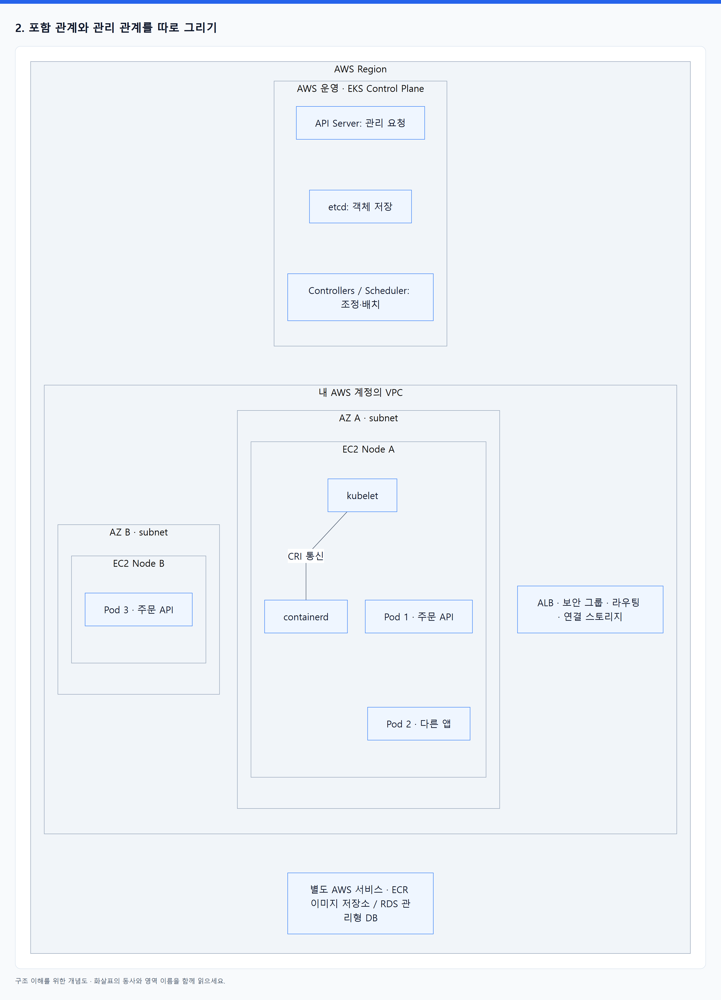
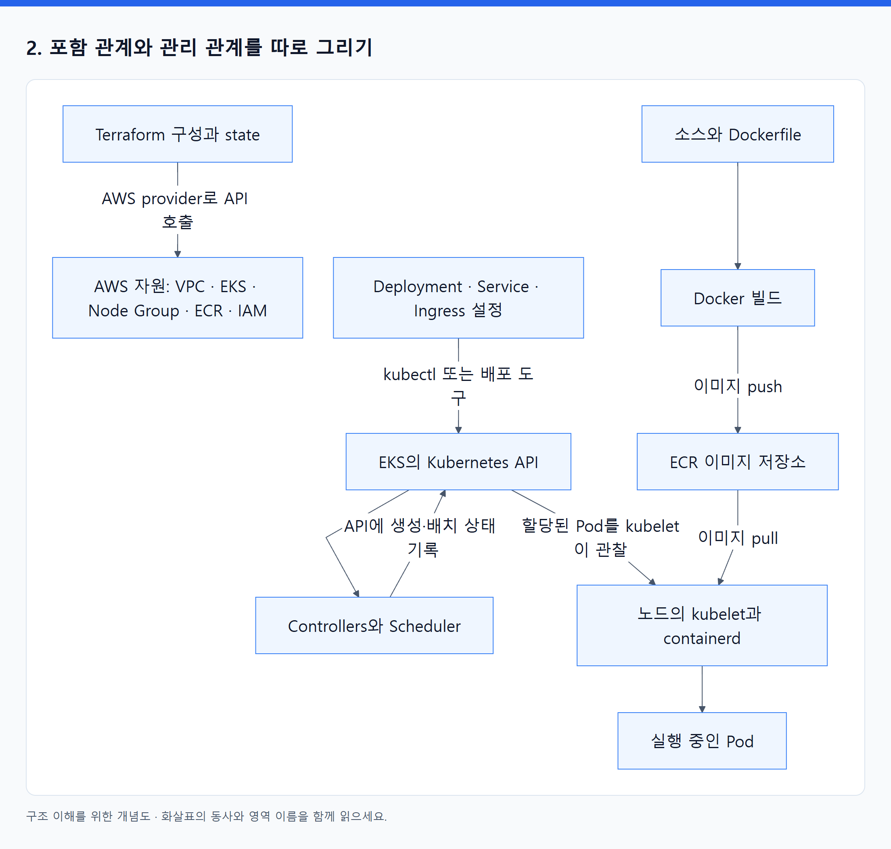
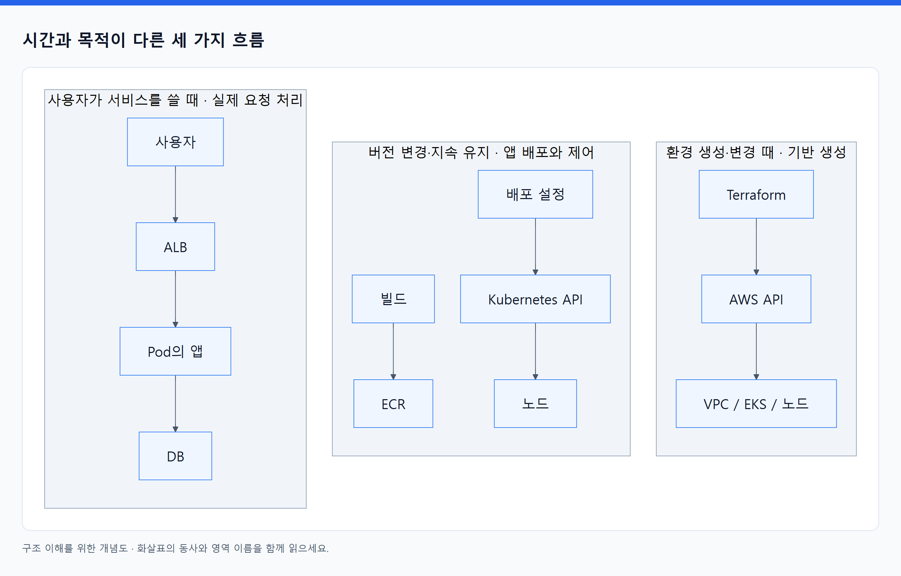

# 01. 큰 그림: 네 가지는 서로 다른 문제를 푼다

> 전체 학습 01/35 · 기초
> [전체 목차](../README.md) · [다음: 02. Docker·Terraform·Kubernetes·EKS는 각각 무엇을 맡는가?](02_네_도구의_역할과_관리_경계.md)
> 본문을 위에서 아래로 읽고 마지막의 다음 장으로 이동한다. 본문 속 다른 장·출처 링크는 선택 참고용이다.

## 1. 웹 서비스 하나에 필요한 네 가지 약속

사용자가 주문 API를 호출한다고 하자. 개발자는 단지 프로그램 실행만 원하지 않는다. 같은 버전이 어디서나 비슷한 환경으로 실행되고, 복사본 여러 개가 요청을 나눠 받고, 장애가 나면 복구되며, 개발·운영 환경을 반복해서 만들 수 있어야 한다.

| 해결할 문제 | 담당 | 입력 | 결과 | 책임의 경계 |
|---|---|---|---|---|
| 앱과 실행에 필요한 파일을 어떻게 묶을까? | Docker 도구 | 소스, 의존성, Dockerfile | 컨테이너 이미지 | 클라우드나 Kubernetes가 없어도 사용 가능 |
| 여러 머신에서 앱을 어떻게 배치·유지할까? | Kubernetes | Deployment 등 API 객체 | Pod 배치, 복제, 교체, 서비스 연결 | 실행할 머신·네트워크·런타임이 필요 |
| Kubernetes 기반을 누가 운영할까? | Amazon EKS | 클러스터 및 컴퓨팅 설정 | AWS 관리형 Kubernetes 환경 | 맡기는 범위는 컴퓨팅 방식에 따라 다름 |
| 이 기반을 어떻게 반복해서 만들고 변경할까? | Terraform | HCL 구성, provider, state | API를 통한 자원 생성·변경·삭제 | 보통 실행 시점에 변경을 적용 |

여기서 **이미지**는 저장된 실행 재료이고, **컨테이너**는 그 재료를 사용해 실제로 실행하는 프로세스 환경이다. **클러스터**는 Kubernetes 제어부와 그 관리 아래에서 앱을 실행하는 노드들의 집합이다.

자료 근거: KUR 37–60쪽, KIA 24–29쪽, EKS 31–39쪽, TF 40–41·376–409쪽. 약어와 파일 연결은 [독서 지도](../04_참고자료/01_원문_분석과_독서지도.md)에 있다. Terraform의 자원 관리는 [공식 개요](https://developer.hashicorp.com/terraform/intro)와 대조했다.

## 2. 포함 관계와 관리 관계를 따로 그리기

그림을 읽기 전에 이름의 종류를 구분한다. **Node는 머신**, **kubelet·containerd는 그 머신에서 따로 실행되는 프로그램**, **Pod·Deployment·Service는 Kubernetes가 다루는 객체**, **OCI·CRI는 규격·인터페이스**다. 같은 그림에 등장한다고 하나가 다른 하나 안에 내장된다는 뜻은 아니다. Pod 객체가 나타내는 실행 환경은 노드에서 만들어진다.

아래는 **포함 관계**다. Terraform과 Docker 빌드 도구를 노드 안에 반드시 넣지 않는 것이 핵심이다.

<!-- diagram:01-01-block-1 -->


[크게 보기](../assets/diagrams/01-01-block-1.png) · [SVG](../assets/diagrams/01-01-block-1.svg)

<details>
<summary>그림의 원문 설명 펼치기</summary>

```text
AWS Region
├─ AWS가 운영하는 EKS Control Plane
│  ├─ API Server: 관리 요청의 입구
│  ├─ etcd: Kubernetes 객체 저장
│  └─ Controllers / Scheduler: 상태 조정과 배치 결정
│
└─ 내 AWS 계정의 VPC: 네트워크 경계
   ├─ AZ A의 subnet → EC2 Node A
   │                  ├─ kubelet 프로세스
   │                  ├─ containerd 프로세스: kubelet과 CRI로 통신
   │                  ├─ Pod 1 → 주문 API 컨테이너
   │                  └─ Pod 2 → 다른 앱 컨테이너
   ├─ AZ B의 subnet → EC2 Node B
   │                  └─ Pod 3 → 주문 API 컨테이너
   └─ ALB, 보안 그룹, 라우팅 및 연결된 스토리지 자원

별도 AWS 서비스: ECR(이미지 저장소), RDS(관리형 DB) 등
```

</details>
<!-- /diagram:01-01-block-1 -->

VPC는 논리적 네트워크 공간이다. Subnet은 VPC 주소 범위를 나눈 네트워크이며 각각 하나의 AZ에 속한다. AZ는 장애를 분산할 때 사용하는 가용 영역이다. EC2는 가상 머신이고, 이 예시에서는 Kubernetes 노드로 사용한다.

EKS Control Plane은 AWS가 운영하는 별도 영역에 있고 내 VPC와 연결된다. 내 노드와 같은 EC2 목록에 보이는 서버라고 이해하면 안 된다. EKS와 Kubernetes도 서로 쌓인 두 개의 스케줄러가 아니다. **EKS가 제공하는 Kubernetes의 제어부가 그 일을 한다.**

이제 **관리 관계**를 그리면 다음과 같다. 아래 화살표는 사용자 트래픽이 아니라 자원을 만들거나 상태를 바꾸는 행위다.

<!-- diagram:01-01-block-2 -->


[크게 보기](../assets/diagrams/01-01-block-2.png) · [SVG](../assets/diagrams/01-01-block-2.svg)

<details>
<summary>그림의 원문 설명 펼치기</summary>

```text
flowchart TD
    TF[Terraform 구성과 state] -->|AWS provider로 API 호출| AWS[AWS 자원: VPC · EKS · Node Group · ECR · IAM]
    CODE[소스와 Dockerfile] --> BUILD[Docker 빌드]
    BUILD -->|이미지 push| ECR[ECR 이미지 저장소]
    YAML[Deployment · Service · Ingress 설정] -->|kubectl 또는 배포 도구| API[EKS의 Kubernetes API]
    API --> CTRL[Controllers와 Scheduler]
    CTRL -->|API에 생성·배치 상태 기록| API
    API -->|할당된 Pod를 kubelet이 관찰| NODE[노드의 kubelet과 containerd]
    ECR -->|이미지 pull| NODE
    NODE --> POD[실행 중인 Pod]
```

</details>
<!-- /diagram:01-01-block-2 -->

이 도표에서 ECR은 위 AWS 자원 중 하나를 따로 확대해 표시했다. Terraform으로 저장소를 만드는 것과 Docker 빌드 도구로 이미지를 올리는 것은 다른 작업이다.

근거: EKS 37–39, 645–648쪽; KIA 24–29쪽. 운영 범위는 [EKS 공식 설명](https://docs.aws.amazon.com/eks/latest/userguide/what-is-eks.html)과 대조했다.

## 3. 반드시 분리할 세 가지 흐름

<!-- diagram:01-01-comparison-3 -->


[크게 보기](../assets/diagrams/01-01-comparison-3.png) · [SVG](../assets/diagrams/01-01-comparison-3.svg)

<details>
<summary>그림의 원문 설명 펼치기</summary>

| 흐름 | 대표 경로 | 언제 일어나는가? |
|---|---|---|
| 기반 생성 | Terraform → AWS API → VPC·EKS·노드 | 환경을 만들거나 바꿀 때 |
| 앱 배포·제어 | 빌드 → ECR, 배포 설정 → Kubernetes API → 노드 | 버전 변경 및 지속적인 상태 유지 |
| 실제 요청 처리 | 사용자 → ALB → Pod의 앱 → DB | 사용자가 서비스를 쓸 때 |

</details>
<!-- /diagram:01-01-comparison-3 -->

ALB IP target 예시에서는 사용자 요청이 Terraform, ECR, Kubernetes API Server, AWS Load Balancer Controller를 차례로 지나지 않는다. 이들은 요청이 흐를 환경을 **구성**하는 주체다. ECR은 새 컨테이너를 시작할 때 이미지가 필요하면 접근하는 저장소다.

따라서 `Terraform → Docker → Kubernetes → EKS → 사용자` 같은 단일 화살표는 네 도구의 관계를 설명하기에 부적절하다.

주소도 역할로 구분한다. **Kubernetes API endpoint는 ‘앱을 3개 실행하도록 설정해 줘’라는 관리 요청**, **앱 도메인은 ‘주문을 접수해 줘’라는 업무 요청**을 받는다. 서로 다른 프로그램이 처리하므로 목적과 접근 권한이 다르다. VPC CNI가 달라서 생긴 구분이 아니다.

## 4. 함께 쓰면 왜 좋은가?

장점은 추상적인 ‘자동화’보다 다음 원인과 결과로 이해하는 것이 좋다.

| 결합 | 작동 원리 | 얻는 효과 | 효과가 성립하는 조건 |
|---|---|---|---|
| Docker 이미지 + Kubernetes | 실행 재료를 식별 가능한 이미지로 전달 | 어느 노드에서 실행할지 앱 배포자가 일일이 지정하지 않아도 됨 | CPU 아키텍처·OS·필요 커널 기능 등이 호환되어야 함 |
| Kubernetes + EKS | 공통 Kubernetes API와 AWS 관리형 제어부 결합 | API Server·etcd 운영 부담 감소 | 앱, 권한, 용량, 업그레이드 계획은 여전히 설계해야 함 |
| Terraform + AWS/EKS | 구성·참조 관계를 API 변경으로 변환 | 환경 재생성, 변경 검토, 팀 협업이 쉬워짐 | state 관리와 권한, 버전·입력 관리 필요 |
| 모든 요소 + CI/CD | 기반 구성·이미지·배포 설정을 연결 | 어떤 환경에서 어떤 앱 버전을 실행하는지 추적 가능 | 이미지 식별자와 Git 변경 이력을 연결해야 함 |

CI는 소스 변경을 테스트하고 이미지를 만드는 과정이다. CD는 검증한 버전을 배포하는 과정이다. 이 네 도구만 설치한다고 CI/CD가 자동으로 생기지는 않는다.

예를 들어 이미지 digest `A`를 개발 환경에서 검증한 뒤 운영에도 같은 `A`로 배포하면 실행 파일의 차이를 줄일 수 있다. 환경별 DB 주소와 권한은 따로 주입한다. 반면 운영에서 이미지를 다시 빌드하면 의존성이 달라져 ‘같은 소스인데 다른 결과’가 생길 수 있다.

근거: KUR 15–36, 39–60, 474–498쪽; SEC 89–103, 143–149쪽; TF 39–41, 535–548쪽. 위 효과와 조건은 자료를 결합한 설계 해석이다.

## 5. 항상 네 가지를 모두 써야 하는가?

아니다. 단일 앱을 작은 서버에서 운영할 때 Kubernetes의 제어부, 네트워크, 권한, 업그레이드 부담이 얻는 효과보다 클 수 있다. Docker는 로컬 개발에만 쓸 수 있고, Terraform은 Kubernetes 없이도 AWS 자원을 관리하며, Kubernetes는 EKS 없이도 동작한다.

이 조합은 여러 앱·팀, 잦은 배포, 복수 노드, 일관된 운영 API가 필요한 상황에서 검토할 가치가 있다. 선택할 때는 **반복 작업 절감량과 새로 생기는 운영 복잡도**를 함께 본다. 표준 API를 쓴다고 완전히 클라우드 독립적인 것도 아니다. AWS IAM, VPC CNI, ALB annotation, EBS 사용 부분은 다른 환경에서 바뀐다.

## 6. 1분 복습

**Terraform은 기반 자원을 관리한다. Docker는 실행 재료를 만든다. Kubernetes는 앱의 실행 상태를 유지한다. EKS는 Kubernetes 운영을 AWS 서비스로 제공한다. 사용자 요청은 그 결과로 만들어진 네트워크를 통해 앱으로 간다.**

---

[전체 목차](../README.md) · [다음: 02. Docker·Terraform·Kubernetes·EKS는 각각 무엇을 맡는가?](02_네_도구의_역할과_관리_경계.md)
