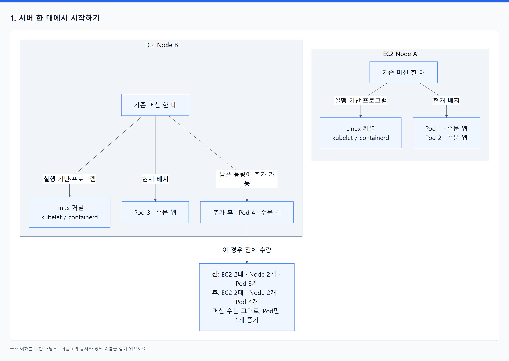
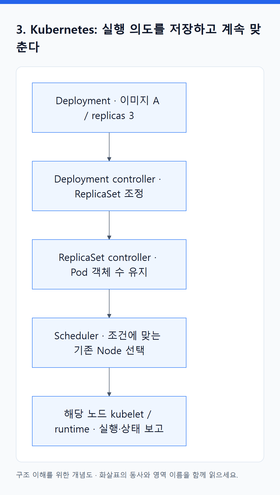

# 02. Docker·Terraform·Kubernetes·EKS는 각각 무엇을 맡는가?

> 전체 학습 02/35 · 기초
> [이전: 01. 큰 그림: 네 가지는 서로 다른 문제를 푼다](01_큰_그림.md) · [전체 목차](../README.md) · [다음: 03. Docker로 만들었는데 Docker Engine 없이 실행되는 이유](03_Docker_이미지에서_실행까지.md)
> 본문을 위에서 아래로 읽고 마지막의 다음 장으로 이동한다. 본문 속 다른 장·출처 링크는 선택 참고용이다.

이 장은 **일반 EKS + EC2 Managed Node Group**을 기준으로 한다. 먼저 머신, 실행 단위, 관리 프로그램을 구별한 뒤 네 도구가 협력하는 이유를 읽는다.

## 1. 서버 한 대에서 시작하기

주문 API는 결국 CPU와 메모리를 사용하는 프로그램이다. AWS에서 EC2를 만들면 이 프로그램을 실행할 가상 머신을 얻는다. EC2 안에 Linux를 실행하고 앱 파일·라이브러리를 준비한 뒤 프로세스를 시작할 수 있다.

이 머신을 Kubernetes 클러스터에 연결해 앱 실행에 사용하면 **worker Node**로 부른다. 이 예시에서는 EC2 한 대가 worker Node 하나에 대응한다. Kubernetes API에 보이는 **Node 객체**는 그 머신의 주소·용량·상태를 나타내는 기록이다. Node YAML을 등록하는 것만으로 실제 EC2가 만들어지는 것은 아니다.

**Pod**는 Kubernetes가 같은 노드에 함께 배치할 컨테이너를 묶는 단위다. 처음에는 Pod 하나에 주문 앱 컨테이너 하나가 있다고 생각하면 된다. 한 EC2 Node에 여러 Pod를 실행할 수 있고, 한 Pod가 여러 EC2에 나뉘어 실행되지는 않는다. Node는 실행 장소, Pod는 배치 단위, 컨테이너 안의 앱은 실제 프로세스다. [Kubernetes Nodes](https://kubernetes.io/docs/concepts/architecture/nodes/), [Pods](https://kubernetes.io/docs/concepts/workloads/pods/).

<!-- diagram:01-02-block-1 -->


[크게 보기](../assets/diagrams/01-02-block-1.png) · [SVG](../assets/diagrams/01-02-block-1.svg)

<details>
<summary>그림의 원문 설명 펼치기</summary>

```text
EC2 Node A                       EC2 Node B
├─ Linux 커널                    ├─ Linux 커널
├─ kubelet / containerd          ├─ kubelet / containerd
├─ Pod 1 → 주문 앱 컨테이너       ├─ Pod 3 → 주문 앱 컨테이너
└─ Pod 2 → 주문 앱 컨테이너       └─ 추가 Pod를 실행할 여유

현재: EC2 2대 / worker Node 2개 / 주문 Pod 3개
Pod 4를 Node B에 추가: EC2 2대 / worker Node 2개 / 주문 Pod 4개
```

</details>
<!-- /diagram:01-02-block-1 -->

Pod IP가 하나 더 생겨도 EC2가 한 대 더 생긴 것은 아니다. IP는 네트워크 주소이고 EC2는 머신이다. 반대로 EC2를 만들었더라도 kubelet의 클러스터 등록과 실행 준비가 끝나지 않으면 사용할 수 있는 Ready Node가 아니다.

## 2. Docker: 앱 실행 재료를 만들고 로컬에서 실행한다

개발자는 소스와 Dockerfile을 준비한다. Docker의 빌드 도구는 앱 파일, 의존 라이브러리, 기본 시작 명령 등을 **이미지**로 만든다. 이미지는 실행 중인 서버가 아니라 다시 실행할 수 있도록 저장한 산출물이다. 로컬에서는 Docker Engine으로 그 이미지의 컨테이너를 시작해 동작을 확인할 수 있다.

빌드한 이미지를 ECR에 push하면 배포 환경이 가져갈 수 있다. ECR은 이미지 저장소이고 EKS는 Kubernetes 서비스다. 이름이 비슷해도 저장과 실행 관리라는 목적이 다르다. EKS 노드의 containerd는 호환 이미지를 pull해 컨테이너 실행을 준비한다. 이미지마다 Docker Engine을 함께 넣거나 노드에서 Dockerfile을 다시 빌드할 필요는 없다. [Docker 개요](https://docs.docker.com/get-started/docker-overview/), [컨테이너 런타임](https://kubernetes.io/docs/setup/production-environment/container-runtimes/).

예를 들어 이미지 A로 Pod 3개를 운영하다가 6개로 늘려도 같은 A를 사용할 수 있다. **복제본 증가에는 앱 재빌드가 필요하지 않다.** 각 Pod는 별도 실행 환경과 프로세스를 가지며, 기존 Pod의 메모리를 그대로 복사받지 않는다. 앱 소스나 이미지에 넣는 의존성이 바뀔 때 새 이미지를 빌드한다.

## 3. Kubernetes: 실행 의도를 저장하고 계속 맞춘다

운영자는 Deployment에 ‘이미지 A의 주문 앱을 3개 유지하라’고 적는다. Deployment는 설정을 저장하는 객체이며 직접 행동하는 프로그램이 아니다. Deployment controller가 ReplicaSet을 조정하고, ReplicaSet controller가 필요한 Pod 객체를 만든다. Scheduler는 실행할 Node를 고르고, 해당 Node의 kubelet은 runtime에 실행을 요청한다.

배포 요청이 끝난 후에도 이 프로그램들이 계속 상태를 확인한다. 관리하던 Pod가 삭제되면 새 Pod를 만들 수 있고, 같은 Pod 안에서 컨테이너만 종료되면 kubelet/runtime이 재시작할 수 있다. 이는 서로 다른 복구다. [Controllers](https://kubernetes.io/docs/concepts/architecture/controller/).

<!-- diagram:01-02-block-2 -->


[크게 보기](../assets/diagrams/01-02-block-2.png) · [SVG](../assets/diagrams/01-02-block-2.svg)

<details>
<summary>그림의 원문 설명 펼치기</summary>

```text
Deployment: 이미지 A, replicas 3
  → Deployment controller: ReplicaSet 조정
  → ReplicaSet controller: Pod 객체 수 유지
  → Scheduler: 기존 Node 중 조건에 맞는 장소 선택
  → 해당 Node의 kubelet / runtime: 컨테이너 실행과 상태 보고
```

</details>
<!-- /diagram:01-02-block-2 -->

기본 scheduler는 EC2 생성 도구가 아니다. Pod를 배치할 곳이 없으면 배치가 진행되지 않는다. 필요한 노드를 공급하는 기능은 별도로 구성한다. **앱 개수 조정과 머신 공급은 연결할 수 있는 별개의 일**이다.

## 4. EKS: AWS가 제공하는 Kubernetes 운영 기반

직접 Kubernetes를 운영하려면 API Server, controller, scheduler, 상태 저장소인 etcd 등 제어부를 구성하고 관리해야 한다. EKS는 AWS가 관리하는 Kubernetes 제어부를 제공한다. 따라서 ‘Kubernetes가 결정한 것을 또 EKS 스케줄러가 결정한다’는 구조가 아니다. EKS가 제공하는 Kubernetes의 scheduler가 배치를 담당한다.

일반 EC2 기반 구성에서는 앱이 사용자 계정의 worker Node에서 실행된다. **Managed Node Group**은 노드들을 묶어 생성·교체·업데이트를 관리하는 기능을 제공하며 EC2 Auto Scaling Group과 연결된다. Auto Scaling Group은 설정된 목표 머신 수를 유지한다. 하지만 이 구성만으로 Pod 수요에 맞춘 노드 확장 판단까지 자동으로 준비되는 것은 아니다. [EKS 소개](https://docs.aws.amazon.com/eks/latest/userguide/what-is-eks.html), [Managed Node Groups](https://docs.aws.amazon.com/eks/latest/userguide/managed-node-groups.html).

EKS Auto Mode는 컴퓨팅 자동 확장을 포함해 AWS의 관리 범위를 넓힌 선택지다. Fargate에서는 사용자가 개별 EC2 worker Node를 직접 관리하는 모델과 달라진다. 그러므로 ‘EKS의 모든 Pod는 내가 관리하는 EC2에 있다’고 일반화하지 않는다. 본문의 수량 예시는 일반 EC2 노드에 한정한다. [EKS Auto Mode](https://docs.aws.amazon.com/eks/latest/userguide/automode.html), [EKS Fargate](https://docs.aws.amazon.com/eks/latest/userguide/fargate.html).

어떤 방식에서도 앱 코드, 필요한 용량 정책, 접근 권한, 업무 데이터와 복구 기준은 팀이 설계해야 한다. 플랫폼이 정상이라고 주문 계산까지 올바른 것은 아니다.

## 5. Terraform: 어떤 자원과 정책을 둘지 코드로 관리한다

Terraform은 HCL 구성으로 VPC, subnet, EKS cluster, Node Group, IAM, ECR 등의 원하는 구성을 선언하고 provider를 통해 API를 호출한다. Provider는 AWS나 Kubernetes 같은 대상 API와 연결하는 플러그인이다. `plan`으로 변경 계획을 보고 `apply`로 반영한다. 일반 CLI 실행은 끝나면 종료되며 Pod가 늘어나는 순간마다 자동으로 다시 실행되지 않는다.

State는 Terraform 구성 주소와 실제 관리 자원을 연결하는 기록이다. 예를 들어 `aws_eks_node_group.workers`를 관리한다고 그 그룹이 만든 EC2를 전부 별개의 `aws_instance`로 선언해야 하는 것은 아니다. **그룹과 공급 정책을 관리하는 수준**과 **개별 인스턴스를 직접 관리하는 수준**이 다르다. [Terraform workflow](https://developer.hashicorp.com/terraform/intro/core-workflow), [State의 목적](https://developer.hashicorp.com/terraform/language/state/purpose).

Terraform은 Kubernetes provider나 Helm provider로 앱·controller 설정도 전달할 수 있다. ‘Terraform은 AWS만, Kubernetes는 Pod만’이라는 기능 제한이 있는 것이 아니다. 이 책에서는 이해하기 쉽게 **기반 구성은 Terraform, 앱 배포 설정은 배포 도구, 실행 중 수량은 해당 controller**로 나눈다. 실제 팀에서는 어떤 도구가 어떤 자원과 필드를 관리할지 정한다.

## 6. 실행 위치·입력·결과를 한 표로 연결하기

| 주체 | 주로 실행되는 곳 | 입력 | 직접 바꾸는 것 | 작업 이후 남는 것 |
|---|---|---|---|---|
| Docker 빌드 도구 | 개발 머신 또는 CI runner | 소스, Dockerfile | 이미지 산출물 | 레지스트리의 이미지 |
| Terraform | 운영자 머신 또는 인프라 CI runner | HCL, state, provider | 담당 API의 자원·설정 | AWS 자원, 적용한 정책, state |
| Kubernetes 제어부 | EKS에서는 AWS 관리 영역 | API에 저장된 실행 의도 | Pod 등 객체, 배치·상태 | 지속적인 제어 루프 |
| kubelet / containerd | 각 worker Node | 배정된 Pod, 이미지 | 로컬 실행 환경과 프로세스 | 실행 중 컨테이너와 상태 보고 |
| EKS / EC2 Auto Scaling | AWS 관리 서비스 | 클러스터·그룹 구성 | 관리형 제어부·노드 수명주기 | 설정에 따른 플랫폼 운영 |

운영자 머신의 Terraform이 종료돼도 EKS 제어부와 노드의 프로그램은 계속 실행된다. 빌드 머신을 꺼도 ECR의 이미지가 사라지지 않는다. 프로그램이 어디서 실행되는지 알면 수명이 서로 독립적이라는 점을 이해할 수 있다.

## 7. 같은 ‘apply’와 ‘늘린다’를 구분하기

| 표현 | 의미 | 의미하지 않는 것 |
|---|---|---|
| `terraform apply` | Terraform이 관리하는 자원·설정 변경 반영 | 모든 Pod가 준비됐다는 보장 |
| `kubectl apply` | Kubernetes API에 객체 생성·변경 요청 | EC2를 반드시 새로 생성 |
| Pod replicas 증가 | 실행할 앱 복제본 수요 증가 | Pod 수만큼 EC2 증가 |
| Node 수 증가 | 앱을 배치할 머신 공급 증가 | 앱 replicas도 자동 증가 |
| Node Group max 증가 | 확장을 허용하는 상한 변경 | 지금 즉시 그 수까지 머신 생성 |

이 장의 판단 문장은 **‘어디에서 실행되는가’와 ‘누가 그 설정을 관리하는가’는 다른 질문**이다. Pod가 EC2 위에서 실행된다는 사실만으로 Terraform 수정 여부를 결정하지 않는다. 이후 배포 흐름을 배우고, 기초 07장에서 Pod·Node 확장과 Terraform 적용 여부를 사례별로 판단한다.

**확인:** EC2 2대에 Pod 4개가 있고 Pod 2개를 더 넣을 여유가 있다. 같은 이미지로 6개를 실행하려면 앱 복제 수를 변경하면 된다. Docker 재빌드나 EC2 추가는 필요하지 않다. 복제 수를 전달하는 도구가 Terraform인 팀이라면 그 앱 설정 변경에 Terraform을 사용할 수 있지만, 이유는 EC2 증설이 아니라 설정의 관리 도구 선택이다.

공식 문서 확인일: 2026-09-07. 예시 수량은 원리 설명을 위한 가정이다.

---

[이전: 01. 큰 그림: 네 가지는 서로 다른 문제를 푼다](01_큰_그림.md) · [전체 목차](../README.md) · [다음: 03. Docker로 만들었는데 Docker Engine 없이 실행되는 이유](03_Docker_이미지에서_실행까지.md)
