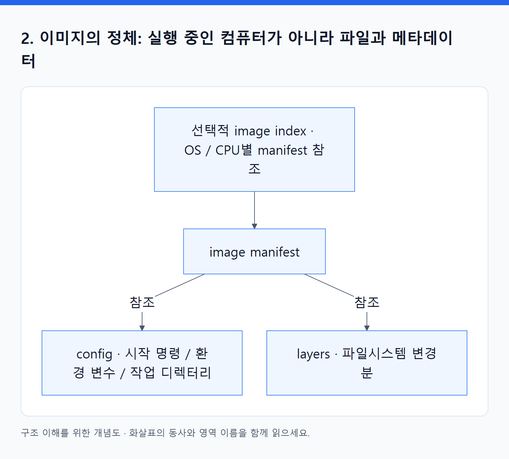
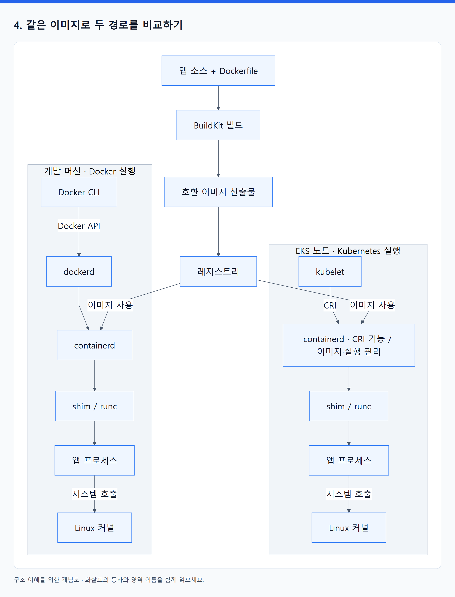
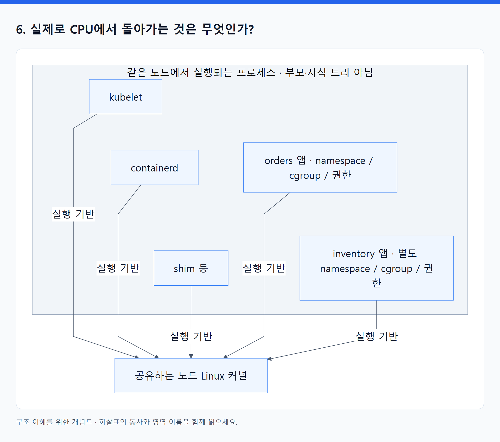
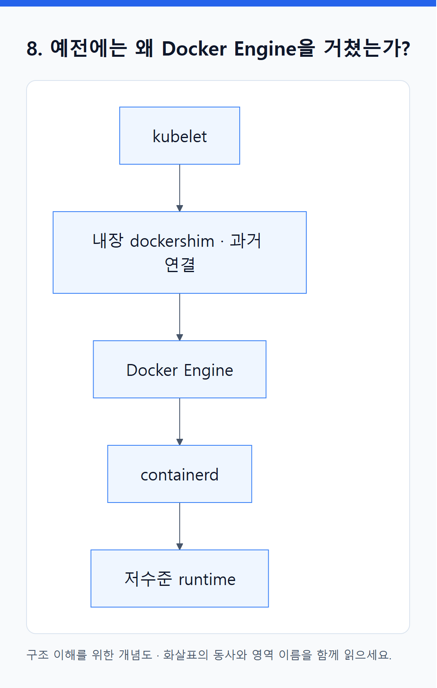
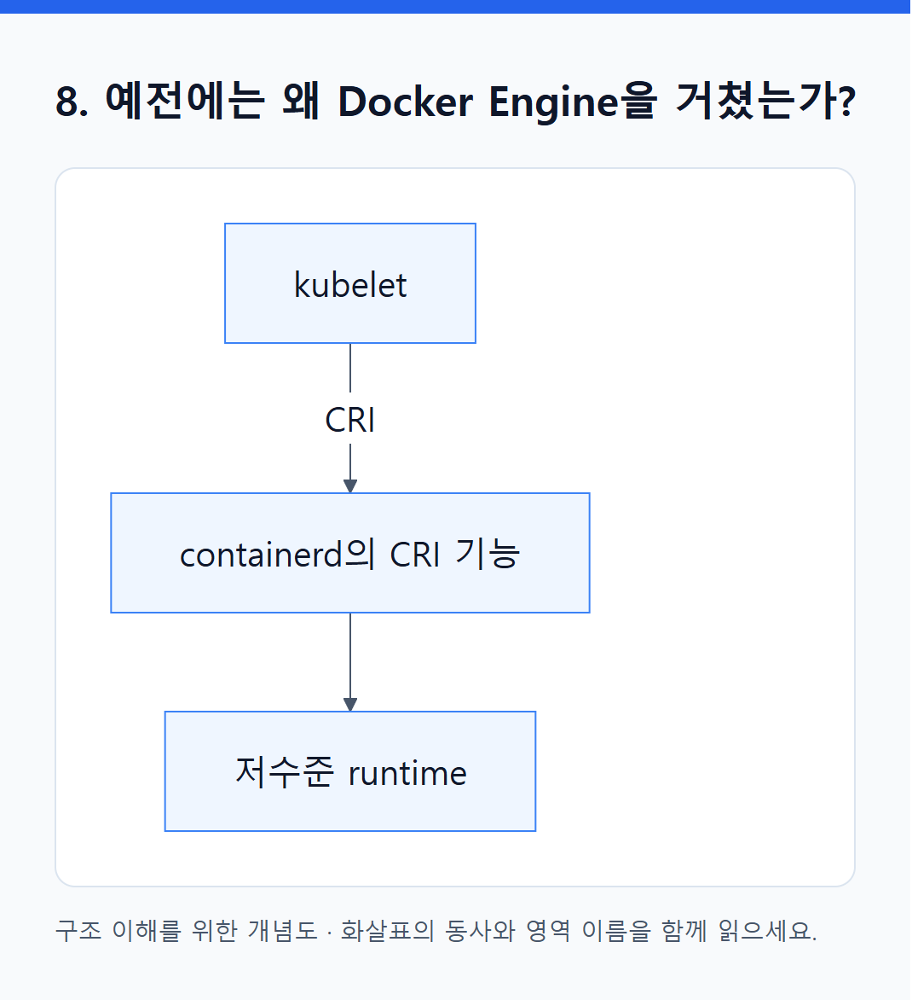

# 03. Docker로 만들었는데 Docker Engine 없이 실행되는 이유

> 전체 학습 03/35 · 기초
> [이전: 02. Docker·Terraform·Kubernetes·EKS는 각각 무엇을 맡는가?](02_네_도구의_역할과_관리_경계.md) · [전체 목차](../README.md) · [다음: 04. 내부 원리: 선언이 어떻게 실제 실행으로 바뀌는가](04_내부_원리.md)
> 본문을 위에서 아래로 읽고 마지막의 다음 장으로 이동한다. 본문 속 다른 장·출처 링크는 선택 참고용이다.

> 핵심: **빌드 도구는 실행할 파일과 설정을 만든다. 런타임은 그 결과물을 읽고 프로세스를 실행한다. 두 도구는 호환 규격으로 연결되므로 같을 필요가 없다.**

이 장은 Linux 컨테이너, containerd와 runc 계열 실행 경로를 기준으로 설명한다. containerd 플러그인 구성과 정확한 실행 순서는 버전에 따라 달라질 수 있다. 1–5절에서 이미지와 실행 경로를 배우고, 6–8절에서 프로세스·shim·커널과 과거 실행 방식을 더 자세히 읽는다. 이어 9–10절에서 호환 조건과 설명 능력을 확인한다.

## 1. ‘Docker’라는 말 안에 여러 역할이 들어 있다

`docker build`와 `docker run`이 같은 명령어로 시작해서 ‘Docker라는 한 프로그램이 만들어서 끝까지 실행한다’고 이해하기 쉽다. 실제로는 여러 구성 요소가 협력한다.

| 이름 | 무엇인가? | 이 장에서의 역할 |
|---|---|---|
| Docker CLI | 사용자가 호출하는 클라이언트 | `docker build`, `docker run` 등 요청 전달 |
| Buildx / BuildKit | 빌드 클라이언트·빌드 엔진 | Dockerfile과 소스로 이미지 생성 |
| Docker Engine / dockerd | Docker API와 실행 관리 기능을 제공하는 엔진·daemon | Docker 방식으로 컨테이너·네트워크 등을 관리 |
| ECR | AWS의 이미지 레지스트리 | 이미지를 저장하고 제공 |
| kubelet | Kubernetes의 노드 에이전트 | 자기 노드의 Pod 실행을 runtime에 요청 |
| containerd | 컨테이너 runtime daemon | 이미지와 컨테이너 수명 관리 |
| runc | OCI Runtime Specification 구현체 | 준비된 환경에서 Linux 컨테이너 프로세스 시작 |

빌드는 BuildKit이 맡고, 일반적인 Docker Engine 실행 경로는 containerd·runc 등을 사용한다. Kubernetes는 Docker CLI와 dockerd의 사용자용 기능을 반드시 거치지 않아도 된다. [Docker 빌드 구성](https://docs.docker.com/build/concepts/overview/), [Docker 전체 구성](https://docs.docker.com/get-started/docker-overview/).

## 2. 이미지의 정체: 실행 중인 컴퓨터가 아니라 파일과 메타데이터

Python 주문 API를 예로 들자. 아래는 파일의 역할을 읽는 개념 예시이며 완성된 프로젝트나 실행 검증한 이미지가 아니다.

```dockerfile
FROM python:3.12-slim
WORKDIR /app
COPY app.py /app/app.py
CMD ["python", "/app/app.py"]
```

빌드 결과에는 Python 실행 파일과 라이브러리, 앱 파일, 시작 명령 등의 정보가 들어갈 수 있다. 여기서 `CMD`는 빌드 때 운영 서버를 계속 실행시키라는 뜻이 아니라, 나중에 컨테이너를 시작할 때 쓸 기본 명령을 기록하는 것이다. `RUN`은 빌드 중 명령을 실행하며 결과 파일 변경을 이미지 구성에 반영할 수 있다.

<!-- diagram:01-03-block-2 -->


[크게 보기](../assets/diagrams/01-03-block-2.png) · [SVG](../assets/diagrams/01-03-block-2.svg)

<details>
<summary>그림의 원문 설명 펼치기</summary>

```text
레지스트리의 이미지 표현을 단순화하면

선택적 image index: OS / CPU 아키텍처별 이미지 manifest 참조
  └─ image manifest
      ├─ config 참조: 기본 실행 명령, 환경 변수, 작업 디렉터리 등
      └─ layer 참조들: 파일시스템 변경분
```

</details>
<!-- /diagram:01-03-block-2 -->

Manifest는 필요한 구성 조각이 무엇인지 나타내는 목록이다. Layer는 파일 추가·수정·삭제 같은 파일시스템 변경을 표현한다. 이것은 이해를 위한 논리 구조이며 레지스트리에 꼭 위와 같은 폴더가 있다는 뜻은 아니다.

**앱 이미지를 읽기 위해 Dockerfile을 다시 실행할 필요는 없다.** Dockerfile은 빌드의 입력이고, runtime은 이미 만들어진 이미지와 배포 설정을 사용한다. 이미지가 표준적인 구조를 갖기 때문에 containerd도 필요한 파일과 실행 정보를 해석할 수 있다.

일반적인 앱 이미지에 Docker Engine이나 kubelet이 들어 있어야 하는 것도 아니다. 그 프로그램들은 이미지를 실행할 **노드 쪽 도구**다. 또한 이미지에 Debian·Ubuntu 계열 파일이 들어 있다고 독립된 게스트 Linux 커널을 부팅하는 것은 아니다.

근거: SEC 89–103쪽, KIA 39–85쪽. [OCI Image Manifest](https://github.com/opencontainers/image-spec/blob/main/manifest.md).

## 3. OCI, CRI, CNI를 ‘프로그램 이름’으로 읽지 않기

| 이름 | 어떤 약속인가? | 누가 구현·사용하는가? |
|---|---|---|
| OCI Image Specification | 이미지를 어떤 구조로 표현할 것인가 | 빌드·이미지 처리 도구 |
| OCI Distribution Specification | 레지스트리에서 콘텐츠를 어떻게 배포할 것인가 | 레지스트리와 push/pull 클라이언트 |
| OCI Runtime Specification | 준비된 파일시스템과 설정으로 실행 환경을 어떻게 정의할 것인가 | runc 같은 저수준 runtime |
| CRI | kubelet이 runtime에 무엇을 요청하고 어떤 응답을 받을 것인가 | kubelet과 containerd의 CRI 기능 등 |
| CNI | 컨테이너 네트워크를 어떻게 설정·정리할 것인가 | runtime의 네트워크 구성과 CNI 플러그인 |

OCI는 프로젝트 및 그 규격 묶음이다. ‘OCI가 containerd 안에서 실행된다’보다 **containerd와 runc가 관련 규격을 구현한다**고 말해야 한다.

HTTP가 웹 서버 안에 들어 있는 작은 서버가 아니라 통신 규칙인 것과 같은 구분이다. CRI도 kubelet 안에 containerd를 집어넣는 기술이 아니다. 서로 분리된 프로그램이 주고받는 API를 정한다.

이미지 규격과 runtime 규격도 다르다. runc가 ECR 주소만 받고 이미지를 다운로드하는 것은 아니다. 상위 도구가 이미지 내용을 준비하고, runtime용 설정과 루트 파일시스템을 구성해야 저수준 runtime이 실행할 수 있다.

공식 근거: [OCI 규격의 범위](https://opencontainers.org/about/overview/), [CRI](https://kubernetes.io/docs/concepts/containers/cri/), [runc](https://github.com/opencontainers/runc).

## 4. 같은 이미지로 두 경로를 비교하기

상자와 화살표로 나란히 보는 도식은 [08의 3번 그림](08_그림으로_연결하기.md)에 있다. 아래는 같은 관계를 실행 경로별로 비교한 이미지다.

<!-- diagram:01-03-block-3 -->


[크게 보기](../assets/diagrams/01-03-block-3.png) · [SVG](../assets/diagrams/01-03-block-3.svg)

<details>
<summary>그림의 원문 설명 펼치기</summary>

```text
                   앱 소스 + Dockerfile
                           │
                       BuildKit 빌드
                           │
                 호환 가능한 이미지 산출물
                           │
                       레지스트리
                      /          \
               이미지 사용      이미지 사용
                  /                  \
개발 머신의 Docker 실행             EKS 노드의 Kubernetes 실행

Docker CLI                          kubelet
   │ Docker API                        │ CRI
dockerd                             containerd의 CRI 기능
   │                                   │
containerd                          containerd의 이미지·실행 관리
   │                                   │
shim / runc                         shim / runc
   │                                   │
앱 프로세스                         앱 프로세스
   │                                   │
해당 머신의 Linux 커널              해당 노드의 Linux 커널
```

</details>
<!-- /diagram:01-03-block-3 -->

이 도표는 구성 요소 간 **기능 호출 관계**를 단순화한 것이며 프로세스 부모·자식 관계를 정확히 그린 것은 아니다. BuildKit builder의 위치·driver도 구성에 따라 다를 수 있다.

EKS 쪽에서 빠진 것은 Docker CLI·dockerd를 거치는 경로다. 컨테이너를 실행하는 기능 전체가 빠진 것이 아니다. 이미 containerd와 저수준 runtime이 실행을 담당하고, kubelet이 Kubernetes의 의도를 전달한다.

**같은 이미지를 쓴다**는 말도 실행 중인 컨테이너의 메모리 상태가 복사된다는 뜻은 아니다. 각 머신이 이미지의 파일·설정으로 **새 프로세스**를 시작한다. 이미지 안의 파일이 같아도 외부 설정·마운트·커널·권한·네트워크가 다르면 앱의 결과가 달라질 수 있다.

## 5. EKS에서 새 Pod를 실행하는 중간 과정

이미지가 ECR에 있고, Deployment가 그 이미지를 참조하며, Pod가 노드 A에 배정됐다고 하자. 노드 A에는 kubelet과 containerd가 별도로 실행 중이다.

### ① kubelet이 배정된 Pod의 명세를 읽는다

API Server를 통해 ‘노드 A에서 이 이미지와 이 설정으로 Pod를 실행해야 한다’는 사실을 안다. kubelet은 Dockerfile로 이미지를 빌드하지 않는다.

### ② kubelet이 CRI로 containerd에 요청한다

CRI에는 이미지 관련 서비스와 runtime 관련 서비스가 있다. 필요한 이미지 확인·가져오기와 Pod sandbox·컨테이너 생성·시작 등에 해당하는 요청을 한다. Linux에서는 보통 로컬 Unix domain socket을 통해 gRPC로 통신한다. 같은 노드에 있지만 **함수 하나 안에 포함된 프로그램이 아니라 통신하는 별도 프로세스**다.

### ③ containerd가 이미지 내용을 준비한다

이미지 참조와 pull policy, 로컬 보유 상태에 따라 레지스트리에서 필요한 manifest·config·layer를 가져오거나 캐시를 활용한다. 플랫폼에 맞는 이미지를 선택하고 필요한 파일시스템 내용을 준비한다. 이미지 pull 권한과 레지스트리 접근 경로도 있어야 한다.

### ④ Pod가 쓸 네트워크와 실행 환경을 준비한다

containerd의 CRI 구현은 Pod sandbox를 준비하는 과정에서 CNI와 연동해 네트워크를 구성한다. 이 교재의 일반 VPC CNI 구성에서는 Pod에 VPC private IP를 할당하고 필요한 연결을 설정한다.

일반적인 Linux Pod sandbox에는 네트워크 namespace의 수명을 유지하는 작은 infra/pause 컨테이너가 사용될 수 있다. 앱 컨테이너들은 그 네트워크 namespace에 참여한다. 그래서 같은 Pod의 앱들이 IP·포트 공간을 공유하고 `localhost`로 통신할 수 있다. 모든 namespace를 전부 공유하는 것은 아니다.

### ⑤ 이미지 기본값과 Pod 설정을 조합해 runtime 설정을 만든다

이미지가 ‘기본적으로 Python 앱을 실행하라’고 하고 Pod 명세가 환경 변수·실행 명령·메모리 제한·마운트를 지정할 수 있다. 실제 실행에는 둘을 반영한 설정이 필요하다. 이미지 하나만으로 모든 운영 설정이 확정되지 않는 이유다.

이때 이미지의 config와 저수준 runtime에 넘기는 실행 설정은 구분한다. 후자는 실행할 프로세스, 환경 변수, 루트 파일시스템, 격리 관련 설정 등을 표현한다. [OCI runtime 설정](https://github.com/opencontainers/runtime-spec/blob/main/config.md).

### ⑥ 저수준 runtime을 통해 앱을 시작한다

containerd는 shim과 runc 같은 구성 요소를 이용해 실제 프로세스를 시작한다. runc는 준비된 루트 파일시스템과 OCI runtime 설정을 바탕으로 격리·권한·자원 설정을 적용하는 데 참여하고 앱 프로그램을 실행한다.

흔한 runc v2 경로를 더 정확히 쓰면 **containerd → shim → runc**다. [containerd runtime v2 설계](https://github.com/containerd/containerd/blob/main/docs/runtime-v2.md).

### ⑦ 상태를 보고하고 계속 관찰한다

runtime의 실행 상태가 kubelet에 전달되고, kubelet은 컨테이너 상태·probe 결과 등을 관리하고 API에 보고한다. Kubernetes controller들은 필요한 상태 조정을 계속한다. 이 과정은 Terraform 프로세스가 살아 있는지와 별개다.

위 단계는 역할을 이해하기 위한 순서다. 이미지 준비와 sandbox 준비 등의 세부 선후·병행 관계는 구현에 따라 달라질 수 있다. CRI 기능의 내부 플러그인 분할도 containerd 버전에 따라 다르므로 특정 소스 코드 구조로 고정해 외우지 않는다. [containerd CRI 아키텍처](https://containerd.io/docs/main/cri/architecture/).

## 6. 실제로 CPU에서 돌아가는 것은 무엇인가?

최종적으로 Linux가 실행하는 것은 Python, Java, Go 바이너리 같은 **앱 프로세스**다. 컨테이너는 그 프로세스에 격리된 환경과 제약을 적용한 실행 방식이다.

<!-- diagram:01-03-block-4 -->


[크게 보기](../assets/diagrams/01-03-block-4.png) · [SVG](../assets/diagrams/01-03-block-4.svg)

<details>
<summary>그림의 원문 설명 펼치기</summary>

```text
같은 노드의 Linux 커널
├─ kubelet 프로세스
├─ containerd 프로세스
├─ shim 프로세스 등
├─ orders 앱 프로세스: 정해진 namespace / cgroup / 권한
└─ inventory 앱 프로세스: 다른 namespace / cgroup / 권한
```

</details>
<!-- /diagram:01-03-block-4 -->

위 목록 역시 부모·자식 트리가 아니라 같은 커널 위에 존재하는 프로세스 예시다.

| 커널 기능 | 컨테이너에 주는 효과 |
|---|---|
| PID namespace | 프로세스가 보는 PID 범위를 분리; 안과 밖에서 PID가 다를 수 있음 |
| Network namespace | 인터페이스·IP·포트 공간 등을 분리 |
| Mount namespace 등 | 보이는 파일시스템 구성을 분리 |
| cgroups | CPU·메모리 등의 사용을 측정·제한 |
| capabilities·seccomp 등 | 허용할 특권·시스템 호출 범위 제한 |

컨테이너 안에서는 자기 파일시스템과 PID 공간 때문에 독립된 작은 컴퓨터처럼 보인다. 하지만 일반적인 Linux 컨테이너는 별도 커널을 부팅하지 않는다. 앱의 시스템 호출은 호스트 커널이 처리한다.

따라서 `앱 → containerd → runc → 커널`을 모든 CPU 연산이나 HTTP 패킷이 통과하는 경로로 읽으면 안 된다. **실행을 준비하는 제어 경로**와 **실행된 앱의 시스템 호출·네트워크 경로**는 다르다.

근거: SEC 45–88쪽, 특히 74–76쪽의 호스트 관점; KIA 39–50쪽.

## 7. containerd, shim, runc는 왜 나누는가?

각 구성 요소가 처리하는 문제의 범위와 수명이 다르기 때문이다.

| 구성 요소 | 중심 책임 | 이해할 점 |
|---|---|---|
| containerd | 이미지, 실행 작업, lifecycle 관리 | 상위 제어를 담당하는 daemon |
| shim | runtime과 실행 프로세스 사이의 관리 연결 | 표준 입출력·종료 상태 처리 등, 구체 동작은 구현에 따라 다름 |
| runc | OCI 규격에 따른 생성·시작 등 저수준 작업 | 장기간 모든 요청을 중계하는 앱 서버가 아님 |
| Linux 커널 | 스케줄링·메모리·시스템 호출·네트워킹 | 실제 실행 기반 |

runc는 컨테이너를 시작한 뒤 해당 호출을 마치고 종료할 수 있다. 실행된 앱이 계속 돌아가는 동안 shim이 프로세스 관리에 남는 구조다. 이 분리는 상위 daemon 수명과 실행 프로세스를 분리하는 데도 도움이 된다. 다만 특정 daemon이 멈춰도 모든 기능이 정상이라는 보장으로 일반화하지 않는다.

‘컨테이너 런타임’이라는 단어는 넓은 의미의 containerd와 좁은 의미의 runc 양쪽에 쓰인다. 문맥을 보며 **이미지·수명 관리까지 맡는가, 저수준 실행을 맡는가**를 구분하면 된다. [runc 설명](https://github.com/opencontainers/runc).

Shim의 API와 runtime 호출 관계는 [containerd runtime v2 문서](https://github.com/containerd/containerd/blob/main/docs/runtime-v2.md)를 참고했다. Shim 하나가 반드시 컨테이너 하나와만 대응하는 것은 아니며, 구체적인 그룹화는 구현에 따라 달라진다.

## 8. 예전에는 왜 Docker Engine을 거쳤는가?

과거 Kubernetes의 Docker Engine 연결 경로를 단순화하면 다음과 같다.

<!-- diagram:01-03-block-5 -->


[크게 보기](../assets/diagrams/01-03-block-5.png) · [SVG](../assets/diagrams/01-03-block-5.svg)

<details>
<summary>그림의 원문 설명 펼치기</summary>

```text
kubelet → 내장 dockershim → Docker Engine → containerd → 저수준 runtime
```

</details>
<!-- /diagram:01-03-block-5 -->

Docker Engine이 Kubernetes의 CRI를 직접 구현하지 않았기 때문에, dockershim이 중간 변환을 맡았다. Kubernetes 1.24에서 **내장 dockershim**이 제거됐다.

containerd의 CRI 지원을 사용하는 경로는 다음과 같다.

<!-- diagram:01-03-block-6 -->


[크게 보기](../assets/diagrams/01-03-block-6.png) · [SVG](../assets/diagrams/01-03-block-6.svg)

<details>
<summary>그림의 원문 설명 펼치기</summary>

```text
kubelet → containerd의 CRI 기능 → 저수준 runtime
```

</details>
<!-- /diagram:01-03-block-6 -->

변한 것은 **kubelet이 실행 도구에 요청하는 연결 방식**이다. Docker로 빌드한 이미지의 파일 내용이 갑자기 무효가 된 것이 아니다. 별도 `cri-dockerd` 같은 어댑터를 사용하는 방식도 존재하므로 Docker Engine을 연결할 방법이 전혀 없다는 뜻도 아니다. [현재 Kubernetes 런타임 안내](https://kubernetes.io/docs/setup/production-environment/container-runtimes/).

## 9. 호환된다고 모든 환경에서 무조건 실행되는가?

아니다. 적어도 다음 질문을 분리해야 한다.

| 조건 | 예 |
|---|---|
| 이미지 형식을 읽을 수 있는가? | runtime이 manifest와 layer 형식을 지원하는가 |
| 실행 파일의 플랫폼이 맞는가? | Linux/amd64 이미지와 Linux/arm64 노드 차이 |
| 필요한 커널 기능이 있는가? | syscall·기능·권한이 앱 요구와 맞는가 |
| 실행 설정이 맞는가? | 환경 변수·볼륨·시작 명령·파일 권한 |
| 외부 의존성에 접근 가능한가? | DB 연결, DNS, 인증 정보, 네트워크 정책 |

여러 아키텍처용 이미지는 index에서 플랫폼에 맞는 manifest를 선택할 수 있게 한다. 그래도 모든 플랫폼용 바이너리가 자동 생성되거나, 맞지 않는 아키텍처를 containerd가 자동 번역한다는 뜻은 아니다.

`ImagePullBackOff`라면 우선 가져오기 문제를 보고, 이미지를 받은 뒤 `exec format error` 등이 발생하면 실행 파일 플랫폼 문제를 의심할 수 있다. 문제마다 먼저 볼 경계가 다르다.

## 10. 이제 자기 말로 답하기

**한 문장:** Docker는 호환 가능한 이미지를 만들고, EKS 노드의 containerd와 runc는 그 이미지를 이용해 실행하므로 Docker Engine이 필수는 아니다.

**조금 더 정확히:** kubelet과 containerd는 별도 프로세스이고 CRI로 통신한다. containerd가 이미지와 실행 환경을 준비하고 runc 같은 OCI runtime을 사용한다. OCI는 이 프로그램들이 따르는 규격이며, 실제 앱은 노드의 Linux 커널 위에서 실행된다.

**점검:** `OCI`, `CRI`, `Node`, `kubelet`, `containerd`, `image`, `runc`를 각각 ‘규격·인터페이스 / 장소 / 프로그램 / 산출물’로 분류하고, 다음 세 화살표의 의미를 설명한다.

1. Dockerfile → 이미지: 빌드.
2. kubelet → containerd: CRI API 요청.
3. 실행된 앱 → Linux 커널: 시스템 호출 등 실행 시 상호작용.

이 세 화살표를 모두 ‘포함되어 있다’로 읽지 않으면, 이번 질문에서 가장 중요한 혼동이 해결된 것이다.

---

[이전: 02. Docker·Terraform·Kubernetes·EKS는 각각 무엇을 맡는가?](02_네_도구의_역할과_관리_경계.md) · [전체 목차](../README.md) · [다음: 04. 내부 원리: 선언이 어떻게 실제 실행으로 바뀌는가](04_내부_원리.md)
