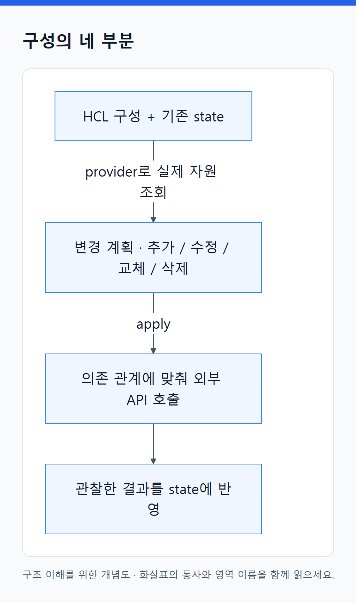
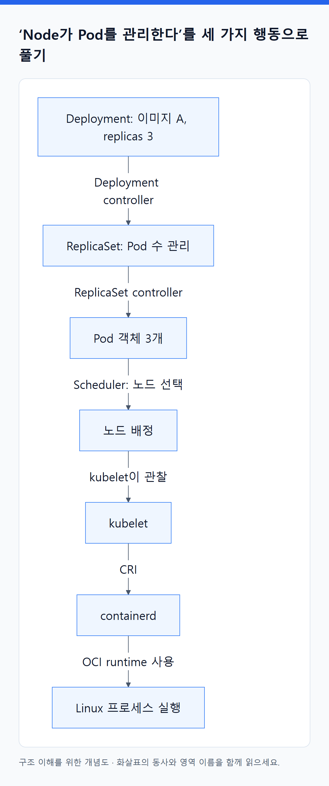
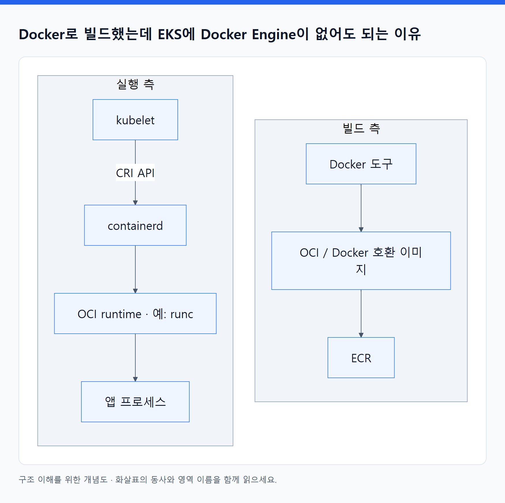
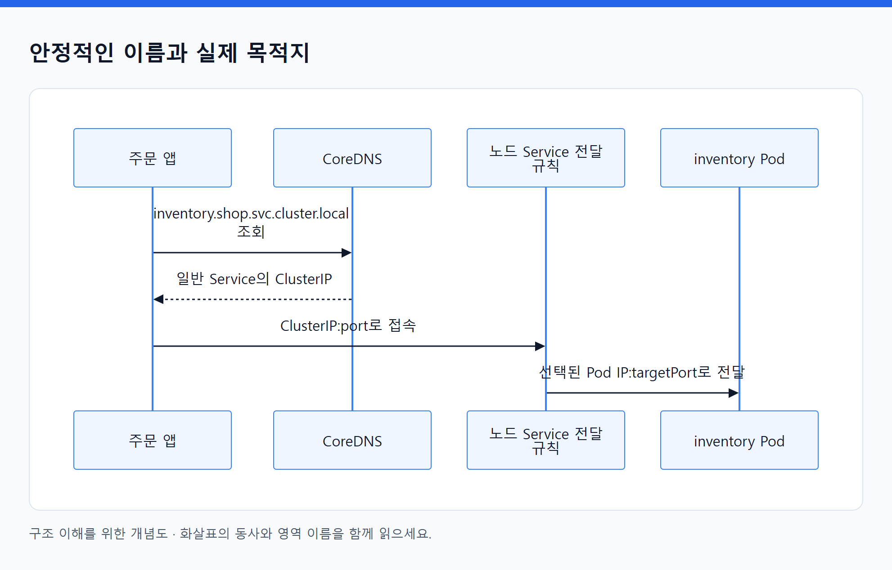
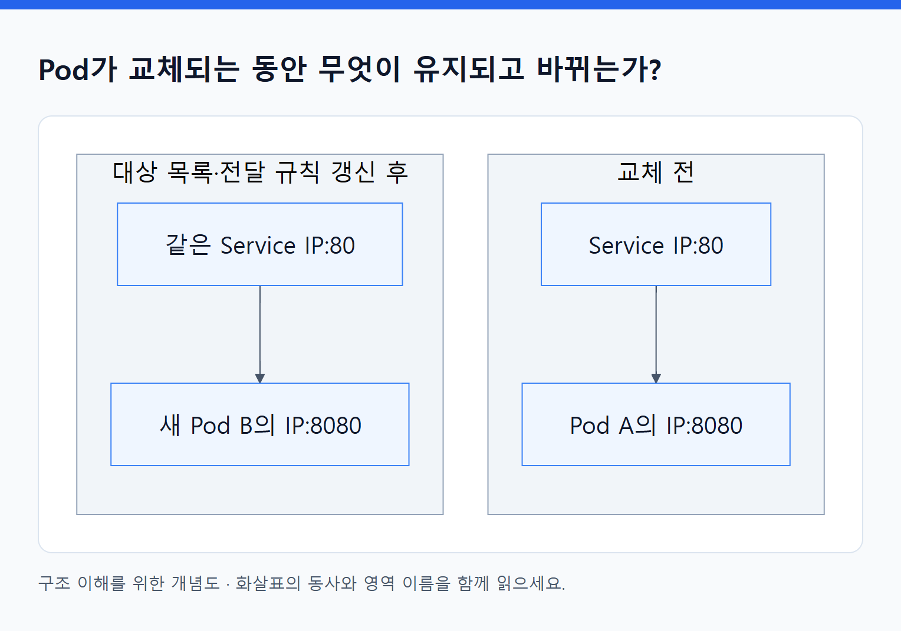

# 04. 내부 원리: 선언이 어떻게 실제 실행으로 바뀌는가

> 전체 학습 04/35 · 기초
> [이전: 03. Docker로 만들었는데 Docker Engine 없이 실행되는 이유](03_Docker_이미지에서_실행까지.md) · [전체 목차](../README.md) · [다음: 05. 하나의 웹 서비스가 만들어지고 요청을 처리하기까지](05_서비스의_일생.md)
> 본문을 위에서 아래로 읽고 마지막의 다음 장으로 이동한다. 본문 속 다른 장·출처 링크는 선택 참고용이다.

앞 장의 역할·이미지 설명을 바탕으로 읽는다. 답변 교정은 기초 학습 끝의 선택 복습 자료이며, [내 답변 교정](10_내_답변_교정과_개념_연결.md)에서 다시 확인할 수 있다. 아래에서 화살표는 별도 표시가 없다면 ‘안에 포함’이 아니라 **요청하거나 상태를 전달하는 관계**다.

## 1. 공통 원리: 의도를 기록하고 실제 상태와 맞춘다

‘서버를 하나 만들어라’라는 일회성 절차보다 ‘이런 서버가 하나 있어야 한다’는 목표를 기록하면, 도구가 현재 상태와 비교해 필요한 작업을 계산할 수 있다. 이를 **선언적 관리**라고 한다.

다만 Terraform CLI와 Kubernetes controller의 시간 축은 다르다.

| 구분 | Terraform | Kubernetes |
|---|---|---|
| 원하는 상태 | HCL 구성 | API 객체의 `spec` |
| 기록 | 구성 주소와 실제 자원을 연결하는 state | etcd에 저장된 Kubernetes 객체 |
| 실제 상태 확인 | provider를 통한 조회·refresh 등 | kubelet의 상태 보고, controller의 API 관찰 등 |
| 변경 실행 | 보통 `plan` 후 `apply`를 실행할 때 | controllers가 계속 반복해서 조정 |
| 종료 후 | CLI는 상시 복구 프로세스로 남지 않음 | 제어 루프는 계속 실행 |

Terraform을 사용해 만든 Node Group의 AWS Auto Scaling 기능은 Terraform이 종료된 뒤에도 작동할 수 있다. 그 복구 주체는 AWS 서비스다. Kubernetes도 앱 코드의 오류를 이해해 고치는 것은 아니다. 설정한 목표와 관찰 가능한 신호를 기준으로 조정한다.

근거: KUR 188–204쪽, KIA 133–161쪽; Terraform은 [실행 흐름](https://developer.hashicorp.com/terraform/intro/core-workflow)과 [state 설명](https://developer.hashicorp.com/terraform/language/state).

## 2. Terraform: API 호출을 조직하는 구조

### 구성의 네 부분

| 요소 | 의미 | 예 |
|---|---|---|
| Resource | 관리할 자원에 대한 선언 | VPC, EKS cluster, IAM role |
| Provider | 외부 API를 다루는 플러그인 | AWS provider, Kubernetes provider |
| Module | 관련 구성을 재사용하는 단위 | VPC 구성 묶음, 클러스터 구성 묶음 |
| State | 구성상의 이름과 실제 자원 ID 등의 연결 기록 | `aws_vpc.main` ↔ `vpc-...` |

예를 들어 subnet이 `aws_vpc.main.id`를 참조하면 VPC가 먼저 필요하다는 의존성이 생긴다. Terraform은 이러한 관계로 그래프를 만들고 가능한 작업들을 처리한다. 소스 파일의 위에서 아래로 단순 실행하는 셸 스크립트가 아니다.

<!-- diagram:01-04-block-1 -->


[크게 보기](../assets/diagrams/01-04-block-1.png) · [SVG](../assets/diagrams/01-04-block-1.svg)

<details>
<summary>그림의 원문 설명 펼치기</summary>

```text
HCL 구성 + 기존 state
        ↓ provider로 실제 자원 조회
변경 계획: 추가 / 수정 / 교체 / 삭제
        ↓ apply
의존 관계에 맞춰 외부 API 호출
        ↓
관찰한 결과를 state에 반영
```

</details>
<!-- /diagram:01-04-block-1 -->

`plan`은 앞으로 할 일을 보여주며, `apply`가 실제 변경한다. 일부 속성 변경은 제자리 수정 대신 자원 교체를 요구한다. 실패 시 모든 변경을 자동으로 되돌리는 하나의 DB 트랜잭션이라고 생각하면 안 된다. 일부 자원만 바뀐 상태에서 다시 확인해야 할 수 있다.

State는 클라우드 전체의 실시간 복제본도, 앱 데이터 백업도 아니다. State가 사라졌다고 실제 서버가 바로 사라지지는 않지만, 어느 자원을 관리하던 것인지 연결을 복구해야 한다. 협업에서는 공유 backend, 접근 제어, 잠금 지원과 버전 복구를 설계한다. 잠금은 지원하는 backend에서 동시 state 변경을 조정하는 것이며 모든 사람이 AWS 콘솔을 만지는 행위까지 막는 것은 아니다.

Terraform으로 Kubernetes 객체도 관리할 수 있다. 이 교재에서는 수명 주기와 장애 범위를 이해하기 위해 **기반 자원은 Terraform, 앱 배포는 Kubernetes 배포 도구**로 역할을 나눈다. 기능상의 절대 제한이 아니라 선택한 운영 경계다. 같은 자원의 같은 설정을 Terraform과 다른 controller가 동시에 소유하면 변경을 서로 되돌리는 문제가 생길 수 있다.

TF 7장에는 이 결합이 직접 나온다. **AWS provider가 EKS와 Node Group을 만들고, Kubernetes provider가 해당 클러스터 API에 Deployment·Service를 등록한다.** 도구가 하나여도 호출하는 API와 관리하는 객체는 두 종류다. API에 객체를 등록한 뒤 실제 Pod를 유지하는 주체는 여전히 Kubernetes다. 이번 교재의 `kubectl` 배포 경로는 이 두 번째 API 입력 방식을 바꾼 예시다.

근거: TF 40–41, 123–171, 173–206, 376–409쪽. 공식 대조: [Providers](https://developer.hashicorp.com/terraform/language/providers), [State locking](https://developer.hashicorp.com/terraform/language/state/locking), [Terraform workflow](https://developer.hashicorp.com/terraform/cli/run).

## 3. EKS: 어디까지 AWS가 맡는가?

먼저 **Control Plane**과 **노드에서 앱을 실행하는 영역**을 구분한다. API Server는 관리 요청을 받고, controller는 상태를 조정하며, scheduler는 Pod를 배치할 노드를 정한다. 앱 프로세스는 노드에서 실행된다.

| 영역 | 일반 EKS + Managed Node Group 예시 |
|---|---|
| API Server·etcd 등 제어부의 기반 운영 | AWS가 운영 |
| 노드 생성·교체·업데이트 실행 기능 | EKS Managed Node Group이 지원 |
| 노드 종류·수량 범위·업데이트 시점과 워크로드 영향 | 사용자가 설계·관리 |
| VPC 주소 계획·접속 범위·IAM·클러스터 권한 | 사용자 설정이 필요 |
| 앱 이미지·취약점·요청 처리·DB·백업·관측 | 사용자 책임이 남음 |
| CNI·DNS·스토리지·LB 연결 | 방식에 맞는 구성과 버전 관리 필요 |

**Managed Node Group의 ‘managed’가 앱까지 자동 운영한다는 뜻은 아니다.** AWS가 제공하는 노드 수명 주기 기능과, 사용자가 결정해야 하는 용량·업데이트·가용성 정책이 함께 있다.

EKS Auto Mode는 노드와 네트워킹·로드밸런싱·스토리지 등의 운영 자동화 범위를 더 넓힌다. Fargate 같은 다른 실행 방식도 있다. 그러나 앱이 언제 준비됐는지, 데이터 손실을 어떻게 막을지, 누구에게 어떤 권한을 줄지는 서비스 설계에 남는다. 이 교재의 일반 EKS용 add-on 설치 설명을 Auto Mode에 그대로 적용하지 않는다.

왜 책임이 남을까? API Server가 잘 실행되는지와 주문 앱이 할인액을 올바르게 계산하는지는 다른 문제다. AWS는 우리 앱의 업무 규칙을 알 수 없고, Kubernetes는 주어진 상태·probe만으로 판단한다. 백업도 허용할 데이터 손실량·복구 시점·보존 기간을 서비스 팀이 정해야 한다. 자동 백업 서비스를 사용할 수 있으므로 ‘사람이 매번 수동 작업’이라는 뜻은 아니다. **정책을 정하고 자동화를 구성하고 복구를 검증하는 책임**이 남는다는 뜻이다.

### 관리 API와 앱 API는 서로 다른 입구다

| 호출자와 목적 | 요청을 받는 프로그램 | 예시 요청 |
|---|---|---|
| 운영자·배포 도구가 클러스터를 관리 | EKS의 Kubernetes API Server | Deployment 조회·변경 |
| 사용자가 주문 서비스를 사용 | ALB 뒤의 주문 앱 | `/orders`에 주문 생성 |

같은 HTTPS와 443을 사용하더라도 목적지 프로그램과 요청 의미가 다르다. CNI는 Pod의 네트워크를 구성하고, 이 두 API의 목적을 나누는 주체가 아니다. 관리 API를 private으로 두면서 사용자 ALB는 public으로 둘 수도 있다. [EKS API endpoint](https://docs.aws.amazon.com/eks/latest/userguide/cluster-endpoint.html).

근거: EKS 31–39, 107–114, 639–648쪽; [EKS 보안 책임](https://docs.aws.amazon.com/eks/latest/userguide/security.html).

## 4. Kubernetes: 객체 저장소와 계속 움직이는 제어 루프

### 객체와 그것을 처리하는 프로그램은 다르다

Deployment라는 API 객체는 ‘이미지 A의 Pod를 3개 유지하고 이런 방식으로 업데이트하라’는 기록이다. Deployment controller는 이 기록을 읽고 행동하는 프로그램이다. YAML 파일 자체가 컨테이너를 실행하지 않는다.

| 구성 요소 | 내부 역할 |
|---|---|
| API Server | 인증·인가·검증 등 관리 요청 처리, 객체 읽기·쓰기·watch 제공 |
| etcd | Kubernetes 객체를 지속적으로 저장 |
| Deployment controller | 버전별 ReplicaSet 생성·조정으로 업데이트 관리 |
| ReplicaSet controller | 원하는 수의 Pod 객체가 있도록 생성·정리 |
| Scheduler | 아직 노드가 정해지지 않은 Pod의 배치 노드 결정 |
| kubelet | 자기 노드에 할당된 Pod의 실행·상태 보고 관리 |
| container runtime | 이미지를 준비하고 컨테이너 실행·종료 등 수행 |

Controller와 scheduler는 보통 API Server를 통해 상태를 읽고 쓴다. etcd를 각자 직접 조작하는 방식으로 배우면 안 된다. `kubectl apply`의 성공은 객체 반영 성공이며, 앱 준비 완료를 뜻하지 않는다.

### ‘Node가 Pod를 관리한다’를 세 가지 행동으로 풀기

Node는 머신이고, 실제 일을 하는 것은 프로그램이다. **ReplicaSet 소속 Pod 하나가 삭제되면** controller가 부족한 수를 보고 새 Pod 객체를 만든다. **새 Pod의 노드가 미정이면** scheduler가 노드를 정한다. **노드가 정해지면** 해당 노드의 kubelet이 runtime에 실행을 요청한다.

반면 **Pod 안의 컨테이너 프로세스만 종료됐다면**, restart policy에 따라 kubelet/runtime이 같은 Pod 안에서 컨테이너를 다시 시작할 수 있다. 이 두 복구를 구분해야 한다. 직접 만든 독립 Pod를 삭제했다고 ReplicaSet이 자동으로 대신 만들어 주지는 않는다. 어떤 controller가 소유하는지도 중요하다.

<!-- diagram:01-04-block-2 -->


[크게 보기](../assets/diagrams/01-04-block-2.png) · [SVG](../assets/diagrams/01-04-block-2.svg)

<details>
<summary>그림의 원문 설명 펼치기</summary>

```text
flowchart TD
    D[Deployment: 이미지 A, replicas 3] -->|Deployment controller| R[ReplicaSet: Pod 수 관리]
    R -->|ReplicaSet controller| P[Pod 객체 3개]
    P -->|Scheduler: 노드 선택| B[노드 배정]
    B -->|kubelet이 관찰| K[kubelet]
    K -->|CRI| C[containerd]
    C -->|OCI runtime 사용| L[Linux 프로세스 실행]
```

</details>
<!-- /diagram:01-04-block-2 -->

이 그림은 논리적 처리 순서다. 객체 생성·배정 등 관리 상태 전달은 API Server를 매개로 한다.

근거: KIA 24–29, 133–161, 587–663쪽; KUR 188–234쪽; [Kubernetes 아키텍처](https://kubernetes.io/docs/concepts/architecture/).

### 왜 컨테이너를 직접 배치하지 않고 Pod를 배치하는가?

Pod는 함께 실행되어야 하는 컨테이너를 묶는 Kubernetes의 기본 배치 단위다. 한 Pod의 컨테이너는 같은 노드에서 실행되며 네트워크 namespace와 IP·포트 공간을 공유한다. 서로 `localhost`로 통신할 수 있다. 볼륨은 선언하고 각각 마운트해서 공유할 수 있지만 모든 컨테이너의 파일시스템이 자동으로 하나가 되는 것은 아니다.

처음에는 **Pod 하나에 앱 컨테이너 하나**로 이해해도 된다. 앱의 프록시 같은 밀접한 보조 컨테이너가 필요할 때 같은 Pod에 넣는다. 독립적으로 확장·업데이트해야 하는 웹 서버와 DB는 대개 별도 워크로드로 분리한다.

Pod 세 개를 만든다고 자동으로 서로 다른 세 노드나 AZ에 배치되는 것은 아니다. 고가용성을 원하면 분산 배치 조건과 여유 용량도 필요하다.

### 최소 객체 사전

| 객체 | 남기는 의도 | 혼동하지 말 것 |
|---|---|---|
| Deployment | 복제된 앱의 버전·수·교체 전략 | 트래픽 입구가 아님 |
| Pod | 함께 실행할 컨테이너와 설정 | 영구적인 서버 주소가 아님 |
| Service | 앱을 찾는 안정적인 연결 지점과 대상 선택 | 컨테이너를 실행하지 않음 |
| Ingress | HTTP host/path를 어떤 backend에 연결할지 | 처리할 controller가 필요 |
| ConfigMap / Secret | 앱 코드와 분리한 설정·민감 값 | Secret의 base64는 암호화가 아님 |
| PVC | 필요한 지속 스토리지에 대한 요청 | 데이터 복제·백업 보장이 아님 |
| Namespace | API 객체의 이름·관리 범위 구분 | Linux namespace나 완전한 보안 경계와 다름 |

근거: KUR 91–138, 272–308, 318–348쪽; SEC 74, 219–228쪽.

## 5. Docker와 컨테이너: 결국 실행되는 것은 프로세스다

이미지에는 앱 실행 파일·라이브러리·루트 파일시스템을 구성하는 레이어와 실행 설정 등이 들어 있다. 컨테이너는 이미지를 바탕으로 런타임 설정·쓰기 공간·마운트 등을 조합해 실행한다. 이미지를 컨테이너에 통째로 설치한 독립 OS로 생각하면 원리가 흐려진다.

Linux 컨테이너의 핵심은 다음과 같다.

| 원리 | 바꾸는 것 | 의미 |
|---|---|---|
| Linux namespaces | 프로세스가 보는 PID·네트워크·마운트 등 | 격리된 환경처럼 보이게 함 |
| cgroups | 프로세스 묶음의 CPU·메모리 등 사용 | 자원 사용량 측정·제한 |
| 이미지 레이어와 쓰기 계층 | 실행할 파일들과 변경분 | 이미지 재사용, 변경 분리 |
| capabilities·seccomp 등 | 허용할 특권·시스템 호출 | 격리를 추가로 강화 |

VM은 별도 게스트 커널을 실행한다. 일반적인 Linux 컨테이너들은 호스트 커널을 공유한다. 그래서 가볍게 실행하기 좋지만 VM과 같은 격리 경계라고 볼 수 없다. Linux 컨테이너를 Windows/macOS 개발 환경에서 실행할 때는 보통 Linux VM 계층이 필요하다.

이미지는 변하지 않는 산출물로 다루되 `latest` 같은 tag는 다른 이미지를 가리키도록 바뀔 수 있다. Digest는 이미지 내용을 식별한다. 새 버전 배포는 실행 중인 컨테이너 안에서 파일을 수동 수정하는 대신 새 이미지를 만들어 교체하는 방식이 추적하기 쉽다.

### Docker로 빌드했는데 EKS에 Docker Engine이 없어도 되는 이유

첫째, **Dockerfile은 빌드 입력이고 이미지는 빌드 결과**다. 빌더는 앱 실행 파일·의존성·실행 기본값 등을 이미지로 만든다. EKS 노드는 Dockerfile을 다시 실행하는 대신 이미지를 읽는다.

둘째, **이미지를 만드는 도구와 읽는 도구는 달라도 된다.** 이미지에 파일시스템 레이어, 실행 기본값을 담은 config, 이 조각을 참조하는 manifest가 있으며 containerd가 이해하는 호환 형식을 사용할 수 있기 때문이다.

셋째, **kubelet과 containerd는 별도 프로세스**다. kubelet은 CRI로 이미지·컨테이너 관련 요청을 보내고, containerd는 이를 처리한다. OCI는 프로그램이 아니라 이미지·배포·runtime 등의 규격을 가리킨다.

<!-- diagram:01-04-block-3 -->


[크게 보기](../assets/diagrams/01-04-block-3.png) · [SVG](../assets/diagrams/01-04-block-3.svg)

<details>
<summary>그림의 원문 설명 펼치기</summary>

```text
빌드 측: Docker 도구 → OCI/Docker 호환 이미지 → ECR
실행 측: kubelet → CRI → containerd → OCI runtime(예: runc) → 프로세스
```

</details>
<!-- /diagram:01-04-block-3 -->

위에서 CRI는 프로그램 상자가 아니라 kubelet과 containerd 사이의 API 약속이다. runc는 OCI runtime 규격의 구현체다. 실제 실행에는 containerd의 shim 등이 참여하며, 최종적으로 Linux 커널이 앱 프로세스를 실행한다. 이 화살표를 앱의 HTTP 요청이 매번 지나는 경로로 읽어서는 안 된다.

OCI는 이미지·런타임 등의 표준을 제공하고, CRI는 Kubernetes와 컨테이너 런타임의 통신 인터페이스다. CNI는 별도로 컨테이너 네트워크 구성을 연결하는 인터페이스다. **표준화된 이미지가 빌드 도구와 실행 런타임을 분리한다.**

예를 들어 이미지 안에 Python과 `app.py`가 있으면 노드는 그것으로 새 Python 프로세스를 시작한다. 이미지를 빌드하던 Docker 프로세스가 EKS로 이동하는 것이 아니다. 런타임의 이미지 형식 지원과 CPU 아키텍처·OS·커널 기능·앱 설정이 맞아야 실제 실행에 성공한다.

더 깊은 실행 순서, Docker Engine 경로와 비교, shim·runc·커널의 역할은 [03. Docker 이미지에서 실행까지](03_Docker_이미지에서_실행까지.md)에 정리했다.

Kubernetes 1.24에서 내장 dockershim이 제거된 것은 Docker로 만든 이미지 지원을 없앴다는 뜻이 아니다. 모든 노드에 Docker Engine을 설치해야 한다고 배우지 않는다. [현재 런타임 설명](https://kubernetes.io/docs/setup/production-environment/container-runtimes/).

근거: SEC 45–103쪽, KIA 39–85쪽, KUR 37–60쪽. Docker 구성은 [Docker 개요](https://docs.docker.com/get-started/docker-overview/)와 대조했다.

## 6. 네트워크: 주소를 만드는 일과 요청을 전달하는 일을 분리한다

### Pod의 네트워크

Pod가 생성될 때 런타임의 네트워크 구성 과정에서 CNI가 인터페이스·IP·경로 등을 설정한다. 구현 방식은 여러 가지다. Linux veth, bridge, routing, overlay는 가능한 구현 재료이며 모든 클러스터가 Docker의 기본 bridge를 그대로 쓰는 것은 아니다.

이 교재의 Amazon VPC CNI 예시에서는 Pod에 VPC의 private IP를 할당한다. ENI와 subnet 주소 공간 등 AWS 네트워크 자원을 이용하므로 **CPU가 남아도 IP나 ENI 관련 한계 때문에 Pod를 더 실행하지 못할 수 있다.** 모든 Kubernetes 클러스터가 overlay를 쓴다고 생각하지 않는다.

`replicas`를 늘리는 것은 **수요를 늘리는 설정**이다. 노드 CPU·메모리와 IP를 동시에 공급하는 동작이 아니다. 예를 들어 앱용 CPU 여유가 2개이고 Pod마다 0.5개를 요청한다면 CPU만 보면 추가 4개까지지만, 쓸 수 있는 Pod IP가 2개라면 별도의 네트워크 병목이 생긴다. 이는 원리 설명용 가정이며 실제 EKS 한도 공식은 아니다. HPA의 Pod 확장, 별도 노드 확장, subnet 주소 계획을 구분한다.

### 안정적인 이름과 실제 목적지

Pod는 교체되며 IP가 달라질 수 있다. Service가 label selector로 대상 집합을 지정하고, selector가 있는 일반적인 Service에서는 controller가 EndpointSlice에 대상 주소·포트·상태를 반영한다. CoreDNS는 일반 ClusterIP Service의 이름을 Service IP로 해석해 준다. headless Service 등은 다른 동작을 한다.

<!-- diagram:01-04-block-4 -->


[크게 보기](../assets/diagrams/01-04-block-4.png) · [SVG](../assets/diagrams/01-04-block-4.svg)

<details>
<summary>그림의 원문 설명 펼치기</summary>

```text
주문 앱 → inventory.shop.svc.cluster.local 이름 조회
       ← CoreDNS가 일반 Service의 ClusterIP 응답
주문 앱 → ClusterIP:port
       → 노드에 구성된 Service 전달 규칙
       → 선택된 inventory Pod IP:targetPort
```

</details>
<!-- /diagram:01-04-block-4 -->

Service는 별도의 서버 프로세스 하나라고 생각하면 안 된다. 일반적으로 kube-proxy가 API 정보를 관찰해 노드의 패킷 처리 규칙을 구성한다. 실제 패킷은 커널의 규칙을 따라 전달될 수 있다. eBPF 기반 대체 구현도 있어 kube-proxy가 항상 필수라는 뜻은 아니다. DNS는 이름을 주소로 바꾸며 HTTP 요청을 대신 전달하지 않는다.

### Pod가 교체되는 동안 무엇이 유지되고 바뀌는가?

일반적인 selector 기반 ClusterIP Service를 가정한다. Service 객체가 유지되는 동안 호출자는 같은 이름·ClusterIP를 사용한다. 뒤의 Pod A가 삭제되고 같은 label의 Pod B가 준비되면 **EndpointSlice controller가 대상 목록을 갱신하고, kube-proxy 등이 새 목록에 맞게 전달 규칙을 갱신**한다.

<!-- diagram:01-04-block-5 -->


[크게 보기](../assets/diagrams/01-04-block-5.png) · [SVG](../assets/diagrams/01-04-block-5.svg)

<details>
<summary>그림의 원문 설명 펼치기</summary>

```text
교체 전: Service IP:80 → Pod A의 IP:8080
교체 후: 같은 Service IP:80 → 새 Pod B의 IP:8080
```

</details>
<!-- /diagram:01-04-block-5 -->

`80 → 8080`은 포트 연결이다. **IP 변경에 대응하는 이유는 대상 주소의 갱신**이다. 포트만 설정해서는 새 Pod 주소를 알아낼 수 없다. 변화 반영에 시간이 걸리며, 이미 죽은 Pod의 TCP 연결이 새 Pod로 자동 이전되는 것도 아니다.

### 외부에서 들어오는 요청

Ingress는 HTTP 라우팅 의도다. AWS Load Balancer Controller가 해당 Ingress 등을 관찰하고 AWS API로 ALB와 target group 등을 구성한다. 이 controller 프로세스가 사용자 HTTP를 직접 프록시하는 구성으로 오해하면 안 된다.

ALB **IP target**이면 요청은 ALB에서 Pod IP로 간다. Ingress가 참조하는 Service는 대상 발견과 포트 설정에 쓰이지만 실제 패킷이 반드시 Service ClusterIP를 지나는 것은 아니다. **Instance target**이면 ALB에서 노드의 NodePort를 거쳐 Pod로 전달되는 방식이다.

Pod IP가 바뀌면 IP target 구성에서 AWS Load Balancer Controller가 대상 정보를 관찰해 **target group의 등록·해제를 갱신**한다. ALB는 갱신된 target과 health check 상태에 따라 트래픽을 전달한다. ‘controller가 설정을 바꾼다’와 ‘ALB가 요청을 보낸다’를 나눈다. ALB 없이도 앞의 내부 ClusterIP Service 방식은 동작한다.

근거: NET 142–174, 183–241, 247–292, 310–352쪽; EKS 1326, 1454–1471, 1520–1540쪽. [AWS target 방식 비교](https://docs.aws.amazon.com/eks/latest/best-practices/load-balancing.html), [Kubernetes Service](https://kubernetes.io/docs/concepts/services-networking/service/).

## 7. 스토리지와 권한도 별도의 연결이 필요하다

이미지와 컨테이너 쓰기 계층은 주문 DB의 영속성을 해결하지 않는다. 외부 관리형 DB를 쓰거나, PVC → StorageClass와 CSI driver → 실제 볼륨의 연결을 구성한다. EBS 같은 스토리지에는 AZ 및 연결 제약이 있어 Pod의 배치와 데이터 위치를 함께 봐야 한다. StatefulSet은 안정적인 식별·스토리지 연결을 돕지만 DB 복제·일관성·백업을 자동 완성하지 않는다.

권한은 세 질문으로 분리한다.

| 질문 | 제어하는 영역 |
|---|---|
| Terraform이나 controller가 AWS 자원을 바꿀 수 있는가? | AWS IAM |
| 개발자나 서비스 계정이 Kubernetes 객체를 바꿀 수 있는가? | Kubernetes API 인증·인가; EKS access entry, RBAC 등의 설정 |
| Pod의 앱이 S3 같은 AWS API를 호출할 수 있는가? | EKS Pod Identity 또는 IRSA 등으로 연결한 IAM 권한 |

ServiceAccount를 만들기만 해서는 S3 권한이 생기지 않는다. 네트워크가 열려 있어도 IAM이 거절할 수 있고, IAM이 허용해도 네트워크 경로가 막혀 있으면 호출할 수 없다. 사설 노드가 이미지를 받거나 AWS API를 쓰려면 목적지에 맞는 NAT 또는 VPC endpoint 등의 경로도 필요하다.

근거: KIA 266–428쪽, KUR 294–348쪽, EKS 485–638, 1222–1303쪽.

---

[이전: 03. Docker로 만들었는데 Docker Engine 없이 실행되는 이유](03_Docker_이미지에서_실행까지.md) · [전체 목차](../README.md) · [다음: 05. 하나의 웹 서비스가 만들어지고 요청을 처리하기까지](05_서비스의_일생.md)
