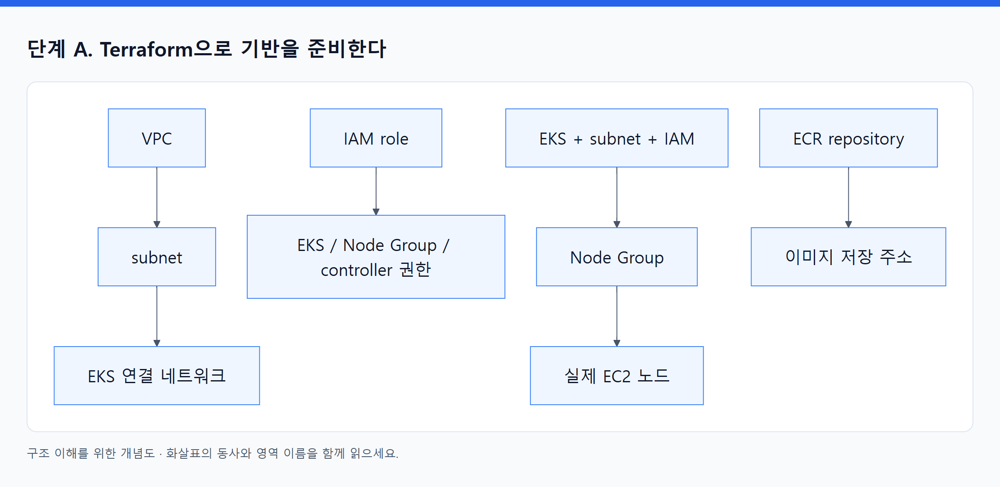
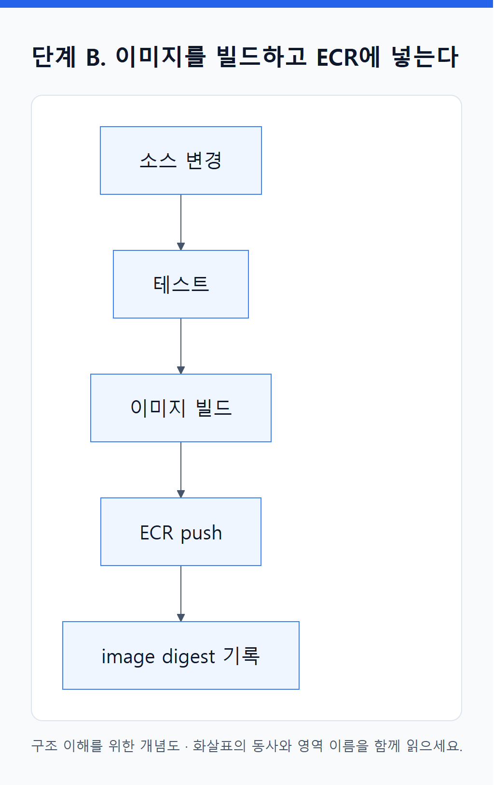
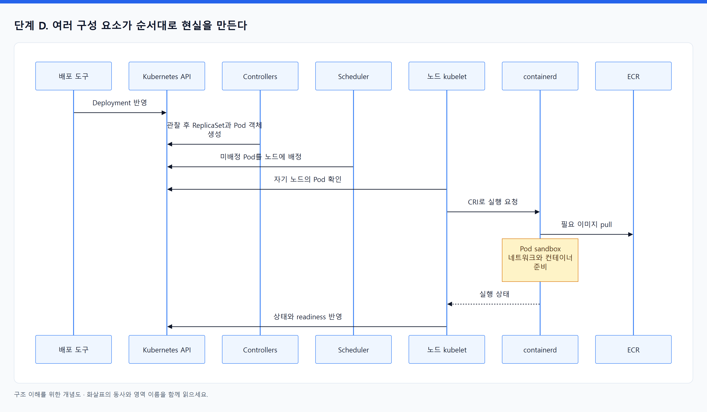
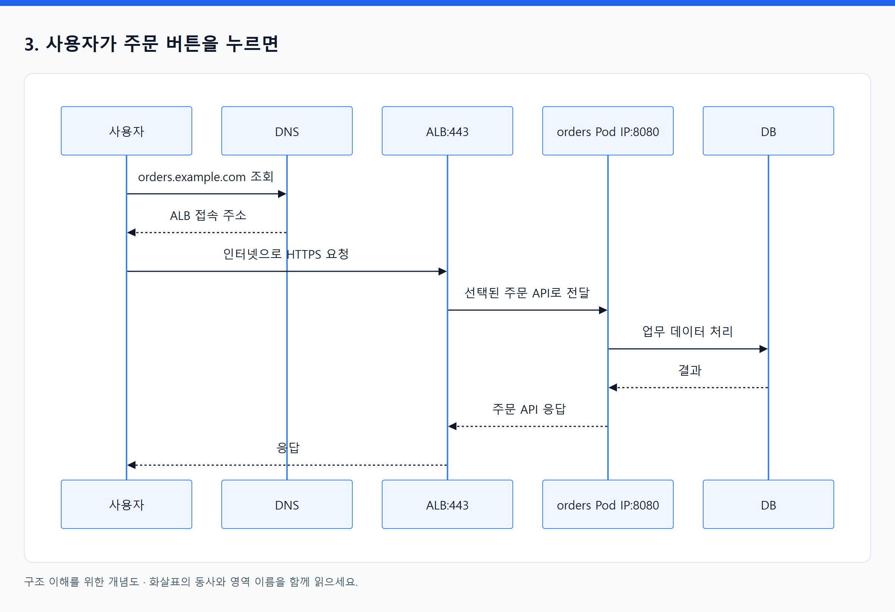
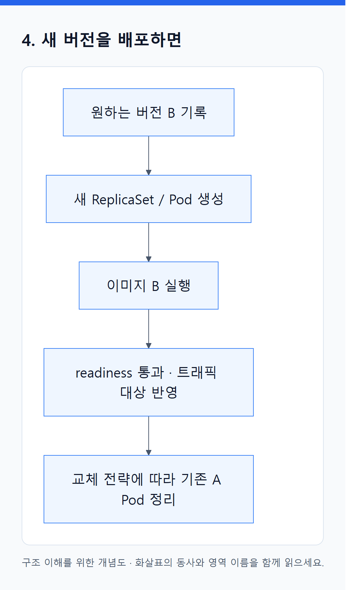

# 05. 하나의 웹 서비스가 만들어지고 요청을 처리하기까지

> 전체 학습 05/35 · 기초
> [이전: 04. 내부 원리: 선언이 어떻게 실제 실행으로 바뀌는가](04_내부_원리.md) · [전체 목차](../README.md) · [다음: 06. 앱 개발 → Git → Docker 빌드 → EKS 실행: 전체 배포 흐름](06_Git에서_EKS까지_전체_배포_흐름.md)
> 본문을 위에서 아래로 읽고 마지막의 다음 장으로 이동한다. 본문 속 다른 장·출처 링크는 선택 참고용이다.

## 1. 공통 예시

주문 API `orders`를 Pod 3개로 실행하고 사용자는 ALB를 통해 접속한다. 영속 데이터는 외부 DB에 저장한다. 일반 EKS, EC2 Managed Node Group, VPC CNI, AWS Load Balancer Controller, ALB IP target 구성을 가정한다.

**학습용 가정:** 앱은 `0.0.0.0:8080`에서 HTTP를 받고 `/ready`가 준비 상태를 반환한다. 이미지는 ECR에 올린다. 아래 설정 조각은 완성된 배포 파일이 아니며 AWS에 적용하거나 실행 검증하지 않았다.

## 2. 빈 환경에서 서비스가 생기는 순서

### 단계 A. Terraform으로 기반을 준비한다

Terraform 구성에서 VPC·subnet·보안 그룹·IAM·EKS cluster·Node Group·ECR 등을 선언한다. Provider가 AWS API를 호출하며 실제 자원을 만든다. 연결 관계의 예는 다음과 같다.

<!-- diagram:01-05-block-1 -->


[크게 보기](../assets/diagrams/01-05-block-1.png) · [SVG](../assets/diagrams/01-05-block-1.svg)

<details>
<summary>그림의 원문 설명 펼치기</summary>

```text
VPC → subnet → EKS에 연결할 네트워크
IAM role ─────→ EKS / Node Group / 필요한 controller 권한
EKS + subnet + IAM → Node Group → 실제 EC2 노드
ECR repository → 이미지를 저장할 주소
```

</details>
<!-- /diagram:01-05-block-1 -->

이는 의존 관계 설명이며 모든 자원이 반드시 한 줄로 생성된다는 뜻은 아니다. 독립적인 작업은 병행될 수 있다. EKS cluster 생성과 실행 가능한 노드 준비, add-on 준비는 구분해서 확인한다.

**완료 판단:** 관리 API 접근이 가능하고, 노드가 Ready이며, 필요한 네트워킹·DNS·로드밸런서 연동이 준비되어 있어야 한다. `terraform apply` 성공만으로 주문 API가 배포되지는 않는다.

### 단계 B. 이미지를 빌드하고 ECR에 넣는다

빌드 과정에서 앱과 필요한 실행 파일을 이미지로 묶는다. 이미지 push는 ECR에 파일·메타데이터를 저장하는 동작이다. ECR에 이미지가 있다고 자동으로 Pod가 만들어지지는 않는다.

<!-- diagram:01-05-block-2 -->


[크게 보기](../assets/diagrams/01-05-block-2.png) · [SVG](../assets/diagrams/01-05-block-2.svg)

<details>
<summary>그림의 원문 설명 펼치기</summary>

```text
소스 변경 → 테스트 → 이미지 빌드 → ECR push → image digest 기록
```

</details>
<!-- /diagram:01-05-block-2 -->

Digest와 소스 커밋을 연결하면 ‘현재 실행 중인 앱은 어떤 변경에서 나왔는가?’를 추적할 수 있다. AWS 자격 증명 같은 비밀은 이미지에 구워 넣지 않고 실행 환경에서 별도로 제공한다.

### 단계 C. 실행 의도를 Kubernetes API에 보낸다

Deployment의 핵심 부분을 읽어 보자.

```yaml
# 구조 설명용 조각. 실제 배포 전 namespace, 이미지, 앱 동작 등 구성이 필요하다.
apiVersion: apps/v1
kind: Deployment
metadata:
  name: orders
spec:
  replicas: 3
  selector:
    matchLabels:
      app: orders
  template:
    metadata:
      labels:
        app: orders
    spec:
      containers:
        - name: orders
          image: <ECR_REPOSITORY>@sha256:<IMAGE_DIGEST>
          ports:
            - containerPort: 8080
          resources:
            requests:
              cpu: 250m
              memory: 256Mi
            limits:
              memory: 512Mi
          readinessProbe:
            httpGet:
              path: /ready
              port: 8080
```

여기서 읽어야 할 내용은 다섯 가지다.

1. `replicas: 3`: 원하는 Pod 수다. 이미 실행에 성공했다는 보고가 아니다.
2. `template`: 새 Pod를 만들 때 쓸 설계다. Node Group의 서버 설계와는 별개다.
3. `image`: 노드가 실행할 산출물의 식별자다. Dockerfile 경로가 아니다.
4. `requests`: scheduler가 배치 가능성을 계산하는 자원 요구량이다. `250m`는 CPU 0.25개에 해당한다.
5. `readinessProbe`: 이 Pod가 요청을 받을 준비가 됐는지를 판단하는 신호다.

`containerPort`를 적는다고 앱이 포트를 열거나 외부 공개가 자동으로 되는 것은 아니다. 실제 프로세스가 그 포트에서 listen해야 한다.

### 단계 D. 여러 구성 요소가 순서대로 현실을 만든다

<!-- diagram:01-05-block-4 -->


[크게 보기](../assets/diagrams/01-05-block-4.png) · [SVG](../assets/diagrams/01-05-block-4.svg)

<details>
<summary>그림의 원문 설명 펼치기</summary>

```text
sequenceDiagram
    participant CD as 배포 도구
    participant API as Kubernetes API
    participant CT as Controllers
    participant SC as Scheduler
    participant KL as 노드 kubelet
    participant RT as containerd
    participant REG as ECR
    CD->>API: Deployment 반영
    CT->>API: 관찰 후 ReplicaSet과 Pod 객체 생성
    SC->>API: 미배정 Pod를 노드에 배정
    KL->>API: 자기 노드의 Pod 확인
    KL->>RT: CRI로 실행 요청
    RT->>REG: 필요 이미지 pull
    Note over RT: Pod sandbox 네트워크와 컨테이너 준비
    RT-->>KL: 실행 상태
    KL->>API: 상태와 readiness 반영
```

</details>
<!-- /diagram:01-05-block-4 -->

세부 준비 작업의 선후 관계는 런타임 구현에 따라 달라질 수 있다. 핵심은 **scheduler가 직접 이미지를 실행하지 않고, 노드의 kubelet과 runtime이 실행을 맡는다**는 점이다.

### 단계 E. 접근 경로를 만든다

Service는 `app: orders` label의 Pod를 대상으로 삼는다. `port: 80`을 `targetPort: 8080`에 연결하면 클라이언트는 Service의 80으로 접근하고 실제 앱은 8080으로 받는다. 일반적인 selector 기반 Service에서는 EndpointSlice가 대상 주소와 준비 상태를 나타낸다.

포트 연결과 IP 교체 대응은 별개다. Pod A가 Pod B로 교체되면 **EndpointSlice controller가 대상 정보를 갱신**하고, 이를 사용하는 전달 구현들이 반영한다. 내부 ClusterIP 경로에서는 kube-proxy 등이 규칙을 바꾸고, 다음의 ALB IP target 경로에서는 AWS Load Balancer Controller가 target 등록을 바꾼다. 이름·입구를 유지한 채 뒤의 목적지를 바꾸는 구조다.

Ingress는 `orders.example.com`의 `/` 요청을 이 Service의 80 포트에 연결하는 의도를 기록한다. 이 예시에서는 `ingressClassName: alb` 및 ALB IP target에 해당하는 설정을 사용하고, AWS Load Balancer Controller가 AWS API로 실제 ALB 설정을 만든다고 가정한다. Controller 설치·IAM·subnet 발견·보안 그룹·인증서·DNS 연결도 필요하다.

이 구조에서 **Terraform은 기반**, **Kubernetes 설정은 앱과 라우팅 의도**, **Load Balancer Controller는 그 의도를 AWS 자원으로 연결**하는 역할을 맡는다. ALB는 controller가 관리하도록 정했으므로 같은 ALB의 설정을 Terraform이 동시에 소유하지 않는다.

TF 376–409쪽은 AWS와 Kubernetes provider를 함께 사용하는 또 다른 구현을 보여 준다. 그 예제는 Service의 `LoadBalancer` 타입으로 노출한다. 이번 교재는 HTTP 라우팅 의도와 실제 전달 경로까지 설명하기 위해 Ingress + ALB IP target으로 확장했다. 책의 예제가 곧 이 교재와 동일한 ALB 경로라는 뜻은 아니다.

근거: TF 376–409쪽; KUR 95–119, 139–234쪽; KIA 478–663쪽; EKS 1454–1471, 1530–1540쪽. [ALB 공식 연결 조건](https://docs.aws.amazon.com/eks/latest/userguide/alb-ingress.html).

## 3. 사용자가 주문 버튼을 누르면

다음은 위 환경의 **실제 데이터 경로**다. DNS 조회와 HTTP 요청은 별개다.

<!-- diagram:01-05-block-5 -->


[크게 보기](../assets/diagrams/01-05-block-5.png) · [SVG](../assets/diagrams/01-05-block-5.svg)

<details>
<summary>그림의 원문 설명 펼치기</summary>

```text
① DNS 조회: orders.example.com → ALB로 접속할 주소 해석

② HTTPS 연결과 요청
사용자 → 인터넷 → ALB:443 → 선택된 orders Pod IP:8080
                               ↓
                         주문 API 프로세스 → DB
                               ↓
사용자 ← 응답 ← ALB ← 주문 API 응답
```

</details>
<!-- /diagram:01-05-block-5 -->

여기서는 ALB에서 TLS를 종료하고 Pod로 HTTP를 전달하는 예시다. Pod까지 HTTPS를 사용하는 구성도 가능하다. 라우팅·보안 그룹과 앱 포트, ALB target 상태가 모두 맞아야 한다.

**설정상 관계**는 `Ingress → Service → Pod 집합`이다. **IP target의 패킷 경로**는 `ALB → Pod IP`다. Service는 계속 중요한 API 객체지만 이 경로에서 반드시 거쳐야 하는 물리적인 서버가 아니다.

| 달라지는 구성 | 대표 요청 경로 |
|---|---|
| ALB IP target | 사용자 → ALB → Pod IP |
| ALB Instance target | 사용자 → ALB → Node IP:NodePort → Service 전달 규칙 → Pod |
| 클러스터 내부 일반 ClusterIP 접근 | 호출 Pod → Service IP → 전달 규칙 → 대상 Pod |

AWS Load Balancer Controller는 ALB의 설정을 갱신하는 관리자다. 사용자 요청마다 controller를 거치지 않는다. Kubernetes API Server 역시 일반적인 앱 요청의 중간 프록시가 아니다. 단, `kubectl port-forward` 같은 관리·디버깅 경로는 다르다.

근거: NET 247–292쪽; [AWS IP/Instance target 설명](https://docs.aws.amazon.com/eks/latest/best-practices/load-balancing.html).

## 4. 새 버전을 배포하면

이미지 `A`에서 `B`로 Deployment의 Pod template을 변경한다. Deployment controller는 새 ReplicaSet을 만들고 설정한 rolling update 전략에 맞춰 새 Pod를 늘리며 기존 Pod를 줄인다. 기존 컨테이너 안의 파일을 덮어쓰는 방식이 아니다.

<!-- diagram:01-05-block-6 -->


[크게 보기](../assets/diagrams/01-05-block-6.png) · [SVG](../assets/diagrams/01-05-block-6.svg)

<details>
<summary>그림의 원문 설명 펼치기</summary>

```text
원하는 버전 B 기록
  → 새 ReplicaSet / Pod 생성
  → 이미지 B 실행
  → readiness 통과와 트래픽 대상 반영
  → 설정한 교체 전략에 따라 기존 A Pod 정리
```

</details>
<!-- /diagram:01-05-block-6 -->

Kubernetes readiness, ALB target health, 등록·해제 반영에는 각각 시간이 있다. 무중단은 replica 수만 늘린다고 보장되지 않는다. 여유 자원, 분산 배치, 올바른 probe, 연결 종료 처리, ALB 등록·해제 타이밍, DB 스키마 호환성이 함께 맞아야 한다. EKS의 Pod readiness gate 연동은 이런 조율을 돕는 옵션이다.

Readiness 실패는 보통 신규 트래픽 대상으로 사용하지 않도록 만드는 신호다. Liveness 실패는 설정한 기준에 따라 컨테이너 재시작을 유도한다. Startup probe는 느린 초기화 동안 다른 probe가 너무 일찍 실패하지 않도록 돕는다. 외부 DB의 짧은 장애를 liveness 실패로 연결하면 많은 앱을 불필요하게 재시작시킬 수 있다.

롤백도 구별해야 한다. Deployment를 이전 이미지로 돌릴 수 있어도 이미 변경한 DB 데이터와 스키마가 자동 복구되는 것은 아니다. Kubernetes가 배포 실패를 감지했다고 기본적으로 모든 변경을 자동 롤백하는 것도 아니다.

근거: KUR 105–110, 205–234쪽; KIA 209–265, 616–663쪽; [Deployment 공식 동작](https://kubernetes.io/docs/concepts/workloads/controllers/deployment/).

## 5. 장애가 나면 누가 고치는가?

| 사건 | 주로 반응하는 주체 | 한계 또는 추가 확인 |
|---|---|---|
| Pod 안의 앱 프로세스 종료 | kubelet/runtime, restart policy | 같은 오류가 반복되면 CrashLoopBackOff; 앱 수정 필요 |
| ReplicaSet 소속 Pod 삭제 | ReplicaSet controller가 새 Pod 생성 | 원래 Pod가 되살아나는 것이 아님 |
| 노드 장애 | 상태 감지·퇴거 과정과 workload controller가 대체 Pod 생성, scheduler가 배치 | 감지 지연, 여유 노드, 볼륨·네트워크 제약 영향 |
| EC2 인스턴스 교체 필요 | 설정된 AWS Node Group/Auto Scaling 등의 기능 | Pod 복제와는 별도 계층 |
| CPU 수요 증가 | 구성한 HPA가 Pod 수 조정 | 노드를 직접 생성하지 않음 |
| Pod가 들어갈 노드 부족 | 구성한 Cluster Autoscaler·Karpenter 등 | 설치·권한·정책·할당량과 용량 조건 필요 |
| 수동 AWS 설정 변경 | 다음 Terraform 조회·plan에서 차이 확인 가능 | CLI가 상시 자동 교정하는 것은 아님 |

HPA는 측정값과 목표치를 바탕으로 복제 수를 바꾸는 제어기다. 지표를 제공할 구성도 필요하다. Pod 수 증가와 노드 수 증가를 분리해 이해해야 한다. [HPA 공식 원리](https://kubernetes.io/docs/concepts/workloads/autoscaling/horizontal-pod-autoscale/).

‘복구된다’는 말은 보통 **설정한 목표에 도달하도록 다시 시도한다**는 의미다. 용량·IP·권한·이미지·스토리지 문제가 남으면 원하는 상태에 도달하지 못한다.

## 6. 상태를 보고 어느 계층을 볼지 결정하기

| 관찰한 현상 | 우선 분리할 질문 | 확인 대상 |
|---|---|---|
| `kubectl`이 연결되지 않음 | 앱 장애인가, 관리 API 접근 문제인가? | kubeconfig, 인증·인가, EKS endpoint 경로 |
| Pod가 Pending | 노드가 정해졌는가? | Pod Events, requests, taints, affinity, 노드 용량, PVC |
| 노드 배정 후 ContainerCreating에서 멈춤 | 실행 준비 중 무엇이 실패했는가? | CNI/IP, 볼륨 마운트, sandbox 관련 Events |
| ImagePullBackOff | 이미지가 존재하고 가져올 수 있는가? | 경로·digest, 레지스트리 권한, DNS·네트워크 |
| CrashLoopBackOff | 왜 프로세스가 종료되는가? | 이전 컨테이너 로그, 종료 코드, 설정, OOMKilled |
| Running이지만 Ready 아님 | 실제 요청을 받을 준비가 됐는가? | readiness 응답, 포트, 의존 서비스 |
| 앱은 Ready인데 외부 요청 실패 | ALB까지와 ALB 이후 중 어디인가? | DNS, listener/rule, target health, SG, 대상 포트 |
| 내부 Service 연결 실패 | 대상 발견과 전달 중 어디인가? | selector, EndpointSlice, DNS, CNI, 전달 규칙, NetworkPolicy |

예를 들어 `Pending`만 보고 무조건 노드를 늘리지 않는다. Pod가 이미 노드에 배정되었는지와 Events를 먼저 본다. 마찬가지로 외부 HTTP 오류만 보고 Terraform을 다시 실행하면 원인이 다른 계층에 있을 수 있다.

---

[이전: 04. 내부 원리: 선언이 어떻게 실제 실행으로 바뀌는가](04_내부_원리.md) · [전체 목차](../README.md) · [다음: 06. 앱 개발 → Git → Docker 빌드 → EKS 실행: 전체 배포 흐름](06_Git에서_EKS까지_전체_배포_흐름.md)
