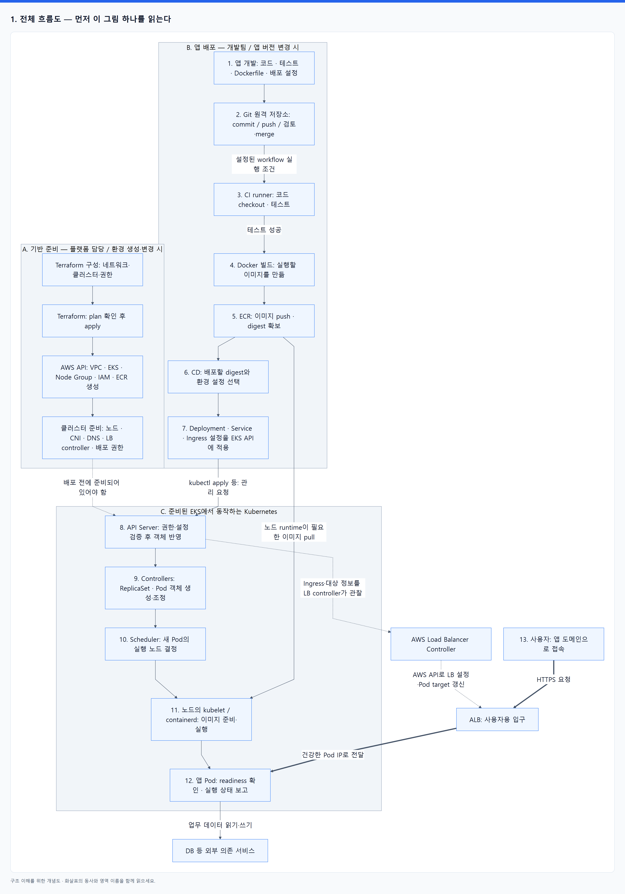
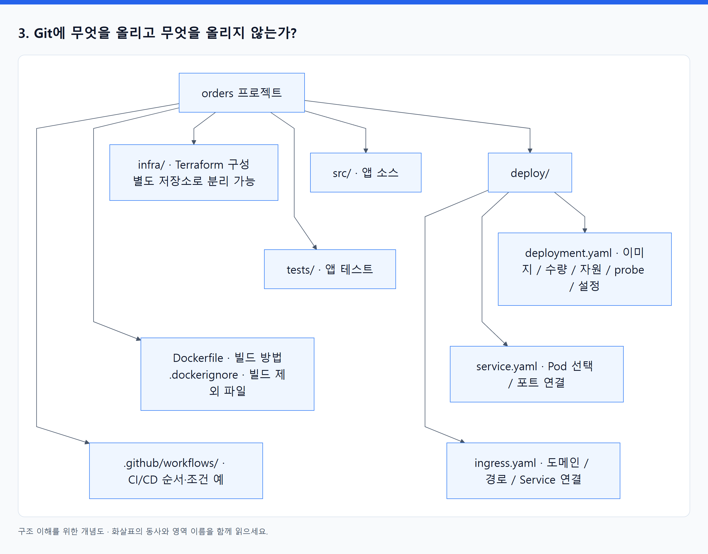
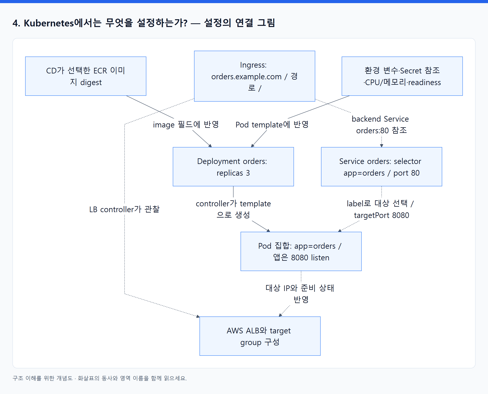
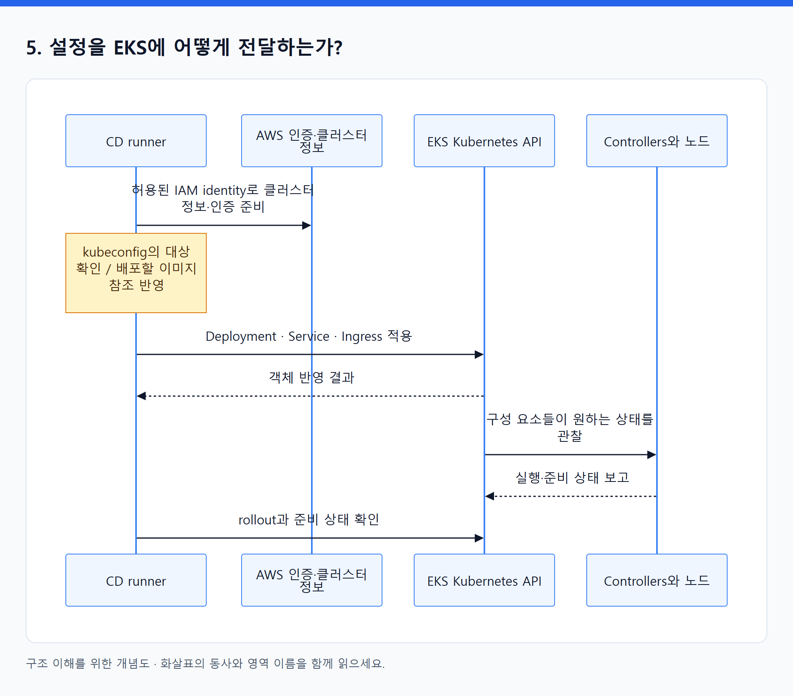
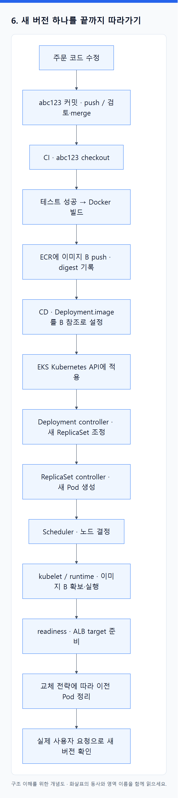

# 06. 앱 개발 → Git → Docker 빌드 → EKS 실행: 전체 배포 흐름

> 전체 학습 06/35 · 기초
> [이전: 05. 하나의 웹 서비스가 만들어지고 요청을 처리하기까지](05_서비스의_일생.md) · [전체 목차](../README.md) · [다음: 07. Pod와 Node가 늘어나면 Terraform apply가 필요한가?](07_Pod_Node_확장과_Terraform_apply_판단.md)
> 본문을 위에서 아래로 읽고 마지막의 다음 장으로 이동한다. 본문 속 다른 장·출처 링크는 선택 참고용이다.

> 목표: ‘내 코드가 어디로 가고, 각 단계에서 누가 무엇을 만들며, 무엇을 설정해야 하는가’를 한 흐름으로 설명한다.

**EKS는 Kubernetes가 실행되는 AWS 관리형 환경이다.** 먼저 로컬 Kubernetes에 앱을 넣고 그것을 EKS로 운반해야 하는 것은 아니다. 여기서는 배포 도구가 **EKS 클러스터의 Kubernetes API에 직접 설정을 전달**한다. 로컬 Kubernetes 테스트는 선택적으로 추가할 수 있다.

이 예시는 일반 EKS + EC2 Managed Node Group, VPC CNI, AWS Load Balancer Controller, ALB IP target 구성이다. CI/CD 도구는 예를 들어 GitHub Actions를 사용할 수 있다. 도구를 설치하거나 AWS 자원을 생성한 실습 결과가 아니라, 역할을 이해하는 설계 예시다.

## 1. 전체 흐름도 — 먼저 이 그림 하나를 읽는다

위에서 아래로 읽는다. **기반 준비는 환경을 처음 만들거나 변경할 때**, **앱 배포는 버전이 바뀔 때** 수행한다. 두 흐름은 준비된 EKS 클러스터에서 만난다.

<!-- diagram:01-06-block-1 -->


[크게 보기](../assets/diagrams/01-06-block-1.png) · [SVG](../assets/diagrams/01-06-block-1.svg)

<details>
<summary>그림의 원문 설명 펼치기</summary>

```text
flowchart TB
    subgraph INFRA["A. 기반 준비 — 플랫폼 담당 / 환경 생성·변경 시"]
        HCL["Terraform 구성: 네트워크·클러스터·권한"]
        TF["Terraform: plan 확인 후 apply"]
        BASE["AWS API: VPC · EKS · Node Group · IAM · ECR 생성"]
        READY["클러스터 준비: 노드 · CNI · DNS · LB controller · 배포 권한"]
        HCL --> TF --> BASE --> READY
    end

    subgraph RELEASE["B. 앱 배포 — 개발팀 / 앱 버전 변경 시"]
        DEV["1. 앱 개발: 코드 · 테스트 · Dockerfile · 배포 설정"]
        GIT["2. Git 원격 저장소: commit / push / 검토·merge"]
        CI["3. CI runner: 코드 checkout · 테스트"]
        BUILD["4. Docker 빌드: 실행할 이미지를 만듦"]
        ECR["5. ECR: 이미지 push · digest 확보"]
        CD["6. CD: 배포할 digest와 환경 설정 선택"]
        MANIFEST["7. Deployment · Service · Ingress 설정을 EKS API에 적용"]
        DEV --> GIT
        GIT -->|"설정된 workflow 실행 조건"| CI
        CI -->|"테스트 성공"| BUILD
        BUILD --> ECR --> CD --> MANIFEST
    end

    subgraph EKS["C. 준비된 EKS에서 동작하는 Kubernetes"]
        API["8. API Server: 권한·설정 검증 후 객체 반영"]
        CTRL["9. Controllers: ReplicaSet · Pod 객체 생성·조정"]
        SCH["10. Scheduler: 새 Pod의 실행 노드 결정"]
        NODE["11. 노드의 kubelet / containerd: 이미지 준비·실행"]
        POD["12. 앱 Pod: readiness 확인 · 실행 상태 보고"]
        API --> CTRL --> SCH --> NODE --> POD
    end

    READY -.->|"배포 전에 준비되어 있어야 함"| API
    MANIFEST -->|"kubectl apply 등: 관리 요청"| API
    ECR -->|"노드 runtime이 필요한 이미지 pull"| NODE
    API -.->|"Ingress·대상 정보를 LB controller가 관찰"| LBC["AWS Load Balancer Controller"]
    LBC -.->|"AWS API로 LB 설정·Pod target 갱신"| ALB["ALB: 사용자용 입구"]
    USER["13. 사용자: 앱 도메인으로 접속"] ==>|"HTTPS 요청"| ALB
    ALB ==>|"건강한 Pod IP로 전달"| POD
    POD -->|"업무 데이터 읽기·쓰기"| DB["DB 등 외부 의존 서비스"]
```

</details>
<!-- /diagram:01-06-block-1 -->

**선 읽는 법:** 일반 화살표는 작업 순서·전달 관계, 점선은 준비 조건·설정 관리, 굵은 화살표는 사용자 트래픽이다. 제어부 내부의 8–11번은 이해를 위한 논리 순서이며, 실제 controllers·scheduler·kubelet의 상태 교환은 API Server를 통해 이뤄진다. 네트워크 준비·이미지 준비 등의 세부 선후 관계는 구현에 따라 달라질 수 있다.

**중요한 갈림길:** Git에는 소스와 설정이 들어가고, ECR에는 빌드한 이미지가 들어간다. 배포 도구는 **이미지 파일 자체를 Kubernetes API에 업로드하지 않고 이미지 주소를 설정에 넣는다.** 노드 runtime이 그 주소를 사용해 ECR에서 이미지를 가져온다.

## 2. 구간마다 누구의 책임인가?

사람의 책임 구분은 팀 구성에 따라 달라질 수 있다. 아래는 개발팀·플랫폼 담당을 나눈 예시이며, 작은 팀에서는 같은 사람이 둘 다 맡을 수 있다.

| 구간 | 사람의 책임 | 실제 작업 도구 | 입력 → 결과 | 다음 단계에 넘기는 것 |
|---|---|---|---|---|
| A. 기반 준비 | 플랫폼 담당: 주소·권한·용량·운영 정책 | Terraform, AWS API, add-on 설치·관리 도구 | 인프라 구성 → 사용 가능한 환경 | EKS endpoint, ECR 주소, 접속·실행 권한 |
| 1. 앱 개발 | 개발팀: 업무 기능·테스트·시작/종료·health endpoint | 편집기, 언어 도구 | 요구사항 → 소스·테스트 | Git에 기록할 파일 |
| 2. Git | 개발팀: 변경 검토와 버전 이력 | Git, 원격 저장소 | commit/push/merge → 식별 가능한 변경 | 커밋과 workflow 이벤트 |
| 3. CI | 개발팀: 어떤 검증을 통과시킬지 | CI runner | 지정 커밋 → 테스트 결과 | 검증한 소스 |
| 4. 빌드 | 개발팀: 의존성·기본 이미지·실행 명령 | Docker 빌드 도구 / BuildKit | Dockerfile + 빌드 context → 이미지 | 실행 파일과 기본값이 담긴 산출물 |
| 5. 이미지 보관 | 개발팀·플랫폼 담당: 저장소 권한·보존 정책 | 레지스트리 클라이언트, ECR | 이미지 push → 저장된 이미지 | repository 주소와 digest |
| 6–7. 배포 | 개발팀: 버전·설정·교체 전략, 플랫폼 담당: 배포 권한 | CD runner, kubectl 또는 Helm 등 | 이미지 참조 + 배포 설정 → API 변경 요청 | Kubernetes 객체의 원하는 상태 |
| 8–10. 제어 | 팀이 준 명세에 따라 자동 조정 | EKS의 Kubernetes 구성 요소 | 객체 → Pod 생성·노드 배정 | 노드별 실행할 Pod 명세 |
| 11–12. 실행 | 플랫폼 담당: 노드 실행 환경, 개발팀: 앱 동작 | kubelet, containerd, 저수준 runtime | 이미지 + Pod 명세 → 앱 프로세스 | 실행·준비 상태 |
| 13. 공개 | 플랫폼·개발팀: 라우팅·TLS·health·DNS 설정 | LB controller, ALB, DNS 서비스 | 라우팅 의도 → 앱으로 가는 접속 경로 | 사용자에게 제공할 앱 주소 |

Git에 push한다고 이 전부가 기본으로 실행되지는 않는다. 어떤 branch의 push나 merge가 workflow를 시작할지, 테스트 실패 시 어디서 중단할지, 운영 배포 전에 검토할지 등을 **CI/CD 설정으로 연결해야 한다.** CI/CD는 이 단계들을 묶어 실행하는 역할이며, Docker나 Kubernetes를 대신하는 또 다른 실행 환경이라는 뜻은 아니다.

## 3. Git에 무엇을 올리고 무엇을 올리지 않는가?

하나의 예시 저장소를 펼쳐 보면 다음과 같다. 모든 팀이 이렇게 한 저장소에 모아야 한다는 뜻은 아니다.

<!-- diagram:01-06-block-2 -->


[크게 보기](../assets/diagrams/01-06-block-2.png) · [SVG](../assets/diagrams/01-06-block-2.svg)

<details>
<summary>그림의 원문 설명 펼치기</summary>

```text
orders 프로젝트
├─ src/                         앱 소스
├─ tests/                       앱 테스트
├─ Dockerfile                   이미지 빌드 방법
├─ .dockerignore                빌드에 포함하지 않을 파일
├─ .github/workflows/           CI/CD 실행 순서와 조건의 예
├─ deploy/
│  ├─ deployment.yaml           이미지·Pod 수·자원·probe·앱 설정
│  ├─ service.yaml              어떤 Pod 집합을 어떤 포트로 연결할지
│  └─ ingress.yaml              도메인·경로를 어느 Service에 연결할지
└─ infra/                       Terraform 구성, 별도 저장소로 분리 가능
```

</details>
<!-- /diagram:01-06-block-2 -->

Git은 소스·구성·변경 이력을 관리한다. 빌드한 컨테이너 이미지는 ECR 같은 레지스트리에 보관한다. 비밀 값은 접근 제어가 있는 별도 저장소·주입 경로로 관리하며, 일반적인 Git 소스에 실제 비밀번호·장기 자격 증명을 넣지 않는다. Terraform state도 일반 소스 파일과 달리 별도 backend에서 관리한다.

여기서 파일은 서로 다른 질문에 답한다.

- **Dockerfile:** 이미지 안에 어떤 실행 파일을 넣고 기본적으로 무엇을 실행할까?
- **Deployment:** 그 이미지를 어느 버전으로 몇 개 실행하고 어떤 자원을 줄까?
- **Service:** 실행 중인 어느 Pod 집합을 안정된 이름과 포트로 찾을까?
- **Ingress:** 외부 HTTP 요청을 어느 Service에 연결할까?
- **Terraform 구성:** 이 일을 할 AWS 환경과 권한을 어떻게 만들까?
- **Workflow 설정:** 위 작업들을 언제, 어떤 순서와 조건으로 실행할까?

## 4. Kubernetes에서는 무엇을 설정하는가? — 설정의 연결 그림

앱이 `0.0.0.0:8080`에서 요청을 받고 `/ready`로 준비 상태를 알린다고 가정한다. 아래 값은 학습용이며 그대로 적용할 완성된 배포 설정이 아니다.

<!-- diagram:01-06-block-3 -->


[크게 보기](../assets/diagrams/01-06-block-3.png) · [SVG](../assets/diagrams/01-06-block-3.svg)

<details>
<summary>그림의 원문 설명 펼치기</summary>

```text
flowchart TB
    DIGEST["CD가 선택한 ECR 이미지 digest"] -->|"image 필드에 반영"| DEP["Deployment orders: replicas 3"]
    CONFIG["환경 변수·Secret 참조·CPU/메모리·readiness"] -->|"Pod template에 반영"| DEP
    DEP -->|"controller가 template으로 생성"| PODS["Pod 집합: app=orders / 앱은 8080 listen"]
    SVC["Service orders: selector app=orders / port 80"] -.->|"label로 대상 선택 / targetPort 8080"| PODS
    ING["Ingress: orders.example.com / 경로 / "] -.->|"backend Service orders:80 참조"| SVC
    ING -.->|"LB controller가 관찰"| LB["AWS ALB와 target group 구성"]
    PODS -.->|"대상 IP와 준비 상태 반영"| LB
```

</details>
<!-- /diagram:01-06-block-3 -->

이 그림은 **설정 참조 관계**다. 사용자 패킷이 Deployment를 지나거나, ALB IP target에서 Service ClusterIP를 반드시 지난다는 뜻이 아니다.

| 설정 위치 | 예시 | 필요한 이유 |
|---|---|---|
| Deployment의 `image` | `<ECR 저장소>@sha256:<digest>` | 빌드한 이미지와 실제 배포 버전을 연결 |
| Deployment의 `replicas` | `3` | 원하는 Pod 수를 선언 |
| Pod template의 label | `app: orders` | Service가 이 앱의 Pod를 찾도록 연결 |
| `resources.requests/limits` | 앱에 맞는 CPU·메모리 값 | 배치와 자원 사용 관리 |
| `readinessProbe` | `/ready`, port `8080` | 실제 요청을 받을 준비 상태 확인 |
| ConfigMap·Secret 등의 참조 | DB 주소·인증 정보 참조 | 코드·이미지와 환경 설정을 분리 |
| Service의 selector | `app: orders` | 어떤 Pod 집합을 연결할지 지정 |
| Service의 포트 | `port: 80`, `targetPort: 8080` | 접속 포트와 앱 포트 연결 |
| Ingress의 backend | `orders` Service의 port `80` | 도메인·경로와 앱의 논리적 연결 |
| Ingress class와 ALB 설정 | `alb`, IP target 구성 | 해당 controller와 AWS 구현 선택 |

`containerPort: 8080`을 적는 것만으로 프로세스가 실행되거나 포트가 열리지는 않는다. 앱 자체가 그 포트에서 listen해야 한다. 또한 Ingress를 적용하기 전에 알맞은 class/controller, AWS 권한, subnet 발견 조건 등이 준비되어 있어야 한다. 외부 공개에는 DNS, TLS 인증서, 보안 그룹 등도 맞아야 한다.

## 5. 설정을 EKS에 어떻게 전달하는가?

먼저 배포 도구가 **어떤 클러스터 API로 요청할지와 어떤 권한으로 접근할지** 알아야 한다. `kubeconfig`는 그 접속 정보를 담는다. EKS에서는 AWS CLI로 kubeconfig를 구성하는 흐름을 사용할 수 있지만, 이 파일을 만든다고 클러스터 권한이 자동으로 생기는 것은 아니다.

<!-- diagram:01-06-block-4 -->


[크게 보기](../assets/diagrams/01-06-block-4.png) · [SVG](../assets/diagrams/01-06-block-4.svg)

<details>
<summary>그림의 원문 설명 펼치기</summary>

```text
sequenceDiagram
    participant CD as CD runner
    participant AWS as AWS 인증·클러스터 정보
    participant API as EKS Kubernetes API
    participant K8S as Controllers와 노드
    CD->>AWS: 허용된 IAM identity로 클러스터 정보·인증 준비
    Note over CD: kubeconfig의 대상 확인 / 배포할 이미지 참조 반영
    CD->>API: Deployment · Service · Ingress 적용
    API-->>CD: 객체 반영 결과
    API->>K8S: 구성 요소들이 원하는 상태를 관찰
    K8S-->>API: 실행·준비 상태 보고
    CD->>API: rollout과 준비 상태 확인
```

</details>
<!-- /diagram:01-06-block-4 -->

예시 명령의 위치는 다음과 같다. **구조 설명용으로만 제시하며 이번 작업에서 실행하지 않았다.**

```text
aws eks update-kubeconfig --region <region> --name <cluster>
kubectl apply -f <이미지 참조와 환경 설정을 반영한 디렉터리>
kubectl rollout status deployment/orders -n <namespace>
```

실제 배포에는 클러스터 접속 경로, EKS 접근 설정·Kubernetes 인가, 올바른 context와 namespace가 필요하다. Private endpoint라면 runner가 해당 네트워크로 접속할 수 있어야 한다.

`apply` 성공은 객체가 반영되었다는 뜻이다. `rollout`과 Pod readiness 확인, ALB target health 확인, 실제 앱 요청 확인까지 해야 배포 결과를 판단할 수 있다. 앱 배포 명세·controller 종류에 따라 확인 방식은 달라진다.

## 6. 새 버전 하나를 끝까지 따라가기

설명용 커밋을 `abc123`, 빌드된 이미지 digest를 `sha256:...B`라고 하자.

<!-- diagram:01-06-block-6 -->


[크게 보기](../assets/diagrams/01-06-block-6.png) · [SVG](../assets/diagrams/01-06-block-6.svg)

<details>
<summary>그림의 원문 설명 펼치기</summary>

```text
개발자가 주문 코드 수정
  → abc123 커밋을 원격 Git에 push / 검토 후 merge
  → 설정한 CI workflow가 abc123을 checkout
  → 테스트 성공 후 Docker 빌드
  → 이미지 B를 ECR에 push하고 digest 기록
  → CD가 Deployment.image를 ECR의 B 참조로 설정
  → EKS Kubernetes API에 적용
  → Deployment controller가 새 ReplicaSet 조정
  → ReplicaSet controller가 새 Pod 객체 생성
  → scheduler가 노드 결정
  → 노드의 kubelet/runtime이 이미지 B를 가져와 실행
  → readiness 및 ALB target 상태가 준비됨
  → 설정한 교체 전략에 따라 이전 Pod 정리
  → 실제 사용자 요청이 새 버전으로 처리되는지 확인
```

</details>
<!-- /diagram:01-06-block-6 -->

다음 버전 `def456`에서는 보통 같은 EKS 환경을 재사용하고 새 이미지·배포 설정을 반영한다. 앱 코드 변경마다 VPC·EKS를 다시 만들 필요는 없다. 인프라 요구가 바뀌면 별도의 Terraform 변경도 함께 필요할 수 있다.

**Git 커밋 → 이미지 digest → Deployment의 image → 실제 Pod**가 연결되면 ‘지금 운영에서 어떤 소스 버전을 실행하는가?’를 추적할 수 있다. 이것이 코드 관리·이미지 관리·실행 관리가 함께 필요한 이유다.

## 7. 그림에서 빠뜨리지 말아야 할 권한 세 가지

| 누가 접근하는가? | 필요한 권한·경로 |
|---|---|
| CI가 ECR에 이미지 push | ECR 쓰기 권한과 레지스트리 접근 |
| CD가 EKS API에 배포 | 클러스터 인증·인가와 API endpoint 네트워크 접근 |
| 노드 runtime이 ECR에서 이미지 pull | 이 EC2 노드 구성에 맞는 이미지 읽기 권한과 네트워크 접근 |

Pod의 앱이 S3 같은 AWS API를 사용하는 권한은 또 별개다. 이 경우 Pod Identity·IRSA 같은 워크로드 권한 구성을 연결한다. ‘CI에 AWS 권한을 줬으니 앱도 AWS에 접근할 수 있다’고 생각하지 않는다.

## 8. 다른 팀의 그림이 달라도 읽는 방법

여기서는 CD가 `kubectl` 등으로 API에 적용하는 **직접 배포 방식**을 선택했다. Helm은 배포 설정의 생성·관리 방식에 들어갈 수 있고, GitOps 방식에서는 배포 설정을 Git에 반영하면 별도 controller가 이를 관찰해 클러스터에 적용한다. 처음에는 직접 배포 흐름을 이해하고 나중에 ‘누가 API에 최종 의도를 전달하는가’를 바꿔 읽으면 된다.

어떤 방식이든 역할은 이어진다. **Git은 변경 이력, CI는 검증·빌드, ECR은 이미지 보관, CD는 배포 버전·설정 전달, Kubernetes는 실행 상태 유지, EKS는 관리형 기반, Terraform은 기반 자원의 코드 관리**를 맡는다.

## 근거와 다음 읽기

원문 연결: TF 376–409·535–548·577–585쪽, KUR 95–119·139–234쪽, EKS의 클러스터 접근·노드·LB 구간. 약어는 [원문 독서 지도](../04_참고자료/01_원문_분석과_독서지도.md)를 참고한다.

Workflow·runner와 kubeconfig 연결은 [GitHub Actions 개념](https://docs.github.com/en/actions/get-started/understand-github-actions), [EKS kubeconfig 안내](https://docs.aws.amazon.com/eks/latest/userguide/create-kubeconfig.html)로 확인했다. 이미지 실행 내부는 [03](03_Docker_이미지에서_실행까지.md), 요청·IP 교체·복구 도식은 [08](08_그림으로_연결하기.md)로 이어진다.

---

[이전: 05. 하나의 웹 서비스가 만들어지고 요청을 처리하기까지](05_서비스의_일생.md) · [전체 목차](../README.md) · [다음: 07. Pod와 Node가 늘어나면 Terraform apply가 필요한가?](07_Pod_Node_확장과_Terraform_apply_판단.md)
