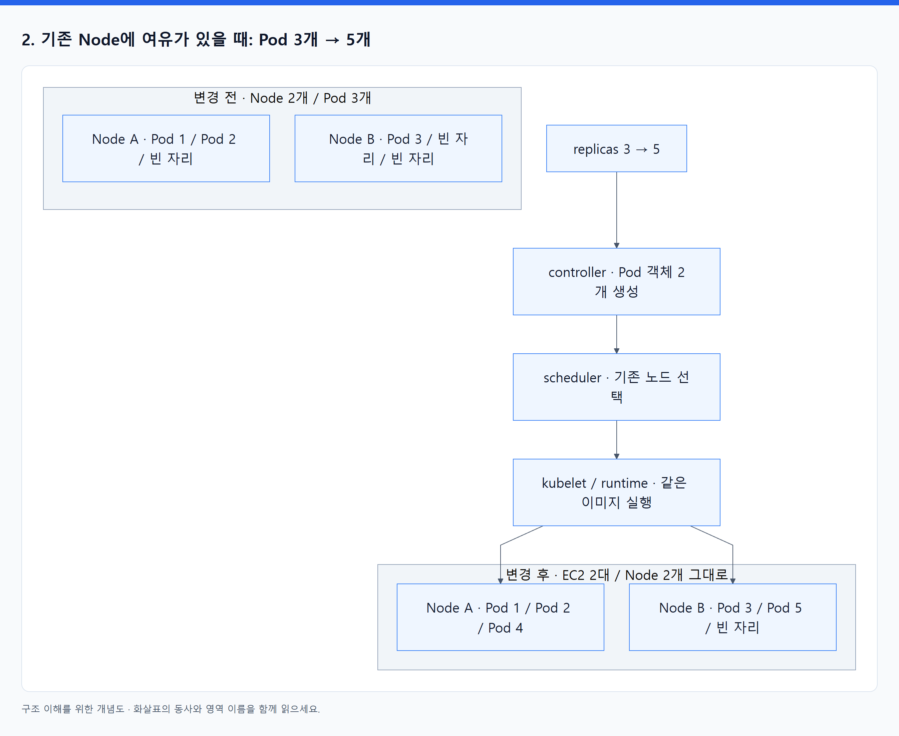
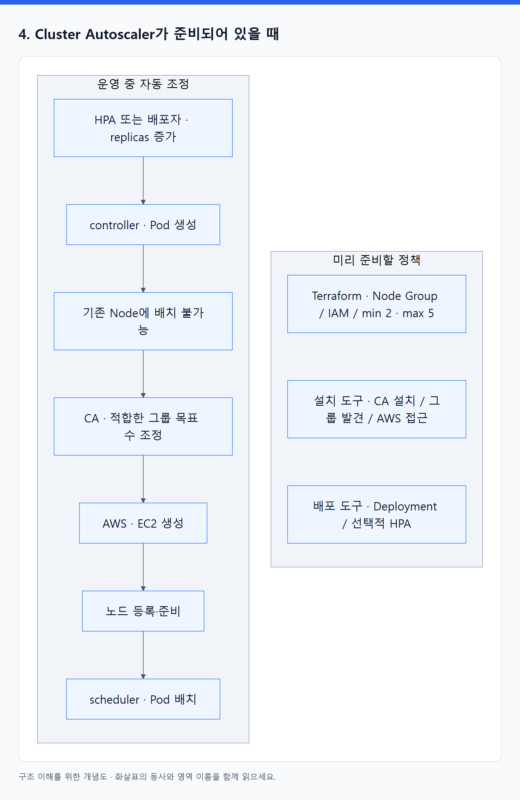
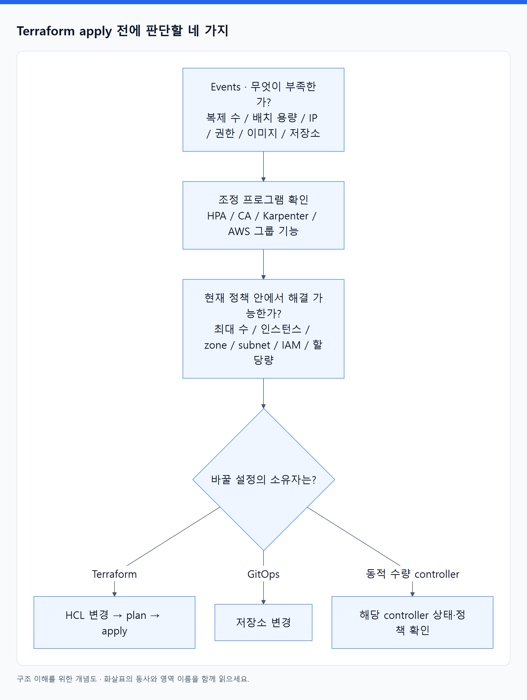

# 07. Pod와 Node가 늘어나면 Terraform apply가 필요한가?

> 전체 학습 07/35 · 기초
> [이전: 06. 앱 개발 → Git → Docker 빌드 → EKS 실행: 전체 배포 흐름](06_Git에서_EKS까지_전체_배포_흐름.md) · [전체 목차](../README.md) · [다음: 08. 그림으로 연결하는 Terraform · Docker · Kubernetes · EKS](08_그림으로_연결하기.md)
> 본문을 위에서 아래로 읽고 마지막의 다음 장으로 이동한다. 본문 속 다른 장·출처 링크는 선택 참고용이다.

**Pod 증가 자체에는 EC2 추가가 필수가 아니다. Node 자동 확장이 준비되어 있으면 EC2가 추가돼도 매번 Terraform을 실행하지 않는다. Terraform이 관리하는 용량·권한·네트워크 정책을 바꿀 때 Terraform 변경이 필요하다.** 이 차이를 아래에서 수량, 동작 주체, 설정 소유자로 나누어 확인한다.

## 1. 먼저 세 숫자를 분리한다

| 숫자 | 예시 | 그 숫자를 읽는 주체 |
|---|---|---|
| 앱의 원하는 Pod 수 | Deployment replicas = 6 | Deployment / ReplicaSet controller |
| 노드 그룹의 목표 머신 수 | desired_size = 2 | EC2 Auto Scaling 등 그룹 관리 기능 |
| 노드 그룹의 허용 범위 | min_size = 2, max_size = 5 | 그룹 관리 기능과 Cluster Autoscaler |

Pod 6개와 Node 2개는 양립할 수 있다. `max_size = 5`는 5대까지 늘릴 수 있다는 상한이지 5대를 당장 만들라는 명령이 아니다. 또한 이 숫자들은 설정 의도이므로 실제 Ready Pod·Ready Node 수와 일시적으로 다를 수 있다. [EKS scaling configuration](https://docs.aws.amazon.com/eks/latest/APIReference/API_NodegroupScalingConfig.html).

## 2. 기존 Node에 여유가 있을 때: Pod 3개 → 5개

가상 환경에서 Node A와 B가 각각 주문 Pod 3개를 수용한다고 가정한다. 시스템 자원과 IP·메모리·배치 제약까지 검토한 뒤의 앱 수용량이다. 실제 EC2 제품의 고정 한도표가 아니다.

<!-- diagram:01-07-block-1 -->


[크게 보기](../assets/diagrams/01-07-block-1.png) · [SVG](../assets/diagrams/01-07-block-1.svg)

<details>
<summary>그림의 원문 설명 펼치기</summary>

```text
변경 전: Node A [Pod 1][Pod 2][빈 자리]
         Node B [Pod 3][빈 자리][빈 자리]

앱 replicas: 3 → 5
  → controller가 새 Pod 객체 2개 생성
  → scheduler가 기존 노드의 자리를 선택
  → kubelet / runtime이 같은 이미지로 실행

변경 후: Node A [Pod 1][Pod 2][Pod 4]
         Node B [Pod 3][Pod 5][빈 자리]

EC2: 2대 그대로 / worker Node: 2개 그대로 / 주문 Pod: 5개
```

</details>
<!-- /diagram:01-07-block-1 -->

일반적인 앱 배포 도구가 replicas를 관리한다면 **인프라 Terraform 변경은 없다.** HPA가 replicas를 바꾸는 구성이라면 이 판단도 HPA가 수행한다. HPA는 메트릭을 보고 워크로드의 복제 수를 조정하는 controller이고, EC2를 직접 만드는 프로그램은 아니다. [Horizontal Pod Autoscaling](https://kubernetes.io/docs/concepts/workloads/autoscaling/horizontal-pod-autoscale/).

## 3. Node 용량이 부족하고 자동 확장이 없을 때: Pod 6개 → 8개

앞의 두 노드가 이미 Pod 6개를 실행하고 있으면 새 Pod 2개를 놓을 자리가 없다. Kubernetes는 원하는 상태 8개를 기록할 수 있지만 그 사실만으로 EC2를 만들어 주지 않는다. 배치하지 못한 Pod는 Pending으로 남을 수 있다.

Node Group 수량을 Terraform이 관리하는 팀에서는 다음 흐름으로 용량을 늘릴 수 있다.

1. Pod Events에서 `FailedScheduling`과 requests·배치 조건을 확인한다. 노드 배정 후 IP 준비 실패라면 다른 문제다.
2. 적합한 노드를 추가하면 해결되는지 확인한다.
3. HCL의 그룹 목표 수를 2에서 3으로 변경한다. 기존 max가 2라면 상한도 3 이상으로 변경해야 한다.
4. `terraform plan`에서 해당 변경과 교체 여부를 검토하고 `apply`한다.
5. 그룹 관리 기능이 EC2를 추가한다. 부팅·클러스터 등록·CNI 등 준비를 거쳐 Node가 사용 가능해지면 scheduler가 Pod를 배치한다.

**그룹 수량을 바꾸는 것이므로 보통 `aws_instance` 블록을 EC2 한 대마다 새로 쓰지 않는다.** 반대로 독립 `aws_instance`들의 수와 노드 구성을 직접 관리하는 설계라면 해당 리소스의 `for_each`·`count` 또는 개별 선언과 클러스터 참여 구성을 변경해야 한다. 어느 수준을 Terraform이 관리하고 있는지 먼저 확인한다.

같은 HCL로 `apply`만 다시 실행한다고 필요한 노드 수를 추론해 증설해 주지는 않는다. 변경 계획에 무엇이 들어 있는지가 중요하다.

## 4. Cluster Autoscaler가 준비되어 있을 때

Cluster Autoscaler(CA)는 Kubernetes의 배치 불가능한 Pod와 노드 그룹 조건 등을 보고 적합한 그룹의 규모를 조정한다. 실제 EC2 공급은 AWS의 그룹 기능이 수행한다. 일반 Managed Node Group을 만들었다고 CA의 설치·권한·그룹 발견 설정이 모두 완료되는 것은 아니다. [EKS 노드 자동 확장](https://docs.aws.amazon.com/eks/latest/userguide/autoscaling.html).

<!-- diagram:01-07-block-2 -->


[크게 보기](../assets/diagrams/01-07-block-2.png) · [SVG](../assets/diagrams/01-07-block-2.svg)

<details>
<summary>그림의 원문 설명 펼치기</summary>

```text
미리 준비할 정책
  Terraform: Node Group, IAM, min=2 / max=5, 필요한 기반 설정
  선택한 설치 도구: CA 설치와 그룹 발견·AWS 접근 설정
  앱 배포 도구: Deployment와 선택적인 HPA 설정

운영 중 자동 조정
  HPA 또는 앱 배포자가 replicas 증가
  → controller가 Pod 객체 생성
  → 기존 Node로 배치할 수 없는 Pod 발생
  → CA가 적합한 그룹을 확장하도록 목표 수 조정
  → AWS가 EC2 생성
  → 노드 등록과 실행 준비
  → scheduler가 Pod 배치
```

</details>
<!-- /diagram:01-07-block-2 -->

이 자동 확장마다 사람이 HCL을 수정하거나 `terraform apply`를 실행하지 않는다. Node Group은 Terraform이 만들었어도 **운영 중 목표 수 조정은 CA에 맡길 수 있기 때문**이다. 원하는 상태를 선언한다는 것은 모든 중간 결과를 사람이 파일에 나열한다는 뜻이 아니다.

CA도 모든 Pending을 해결하지 않는다. 새 노드를 만들어도 충족할 수 없는 affinity, 잘못된 PVC 조건, 그룹 상한, EC2 공급·할당량·IAM·IP 부족 등으로 확장이 멈출 수 있다. 단순 현재 CPU 사용률만 보고 노드를 늘리는 구조로 이해하지 않는다. [Node Autoscaling](https://kubernetes.io/docs/concepts/cluster-administration/node-autoscaling/).

## 5. Karpenter 또는 EKS Auto Mode를 쓸 때

| 방식 | 사람이 미리 정하는 것 | 운영 중 노드 공급 | 매번 Terraform 적용? |
|---|---|---|---|
| Managed Node Group + CA | 그룹·허용 범위·권한·CA 설정 | CA가 그룹 규모 조정, AWS가 EC2 공급 | 정상적인 범위 내 확장에는 불필요 |
| 직접 운영하는 Karpenter | controller·권한·NodePool·EC2NodeClass | Karpenter가 NodeClaim과 EC2 공급을 조정 | 자동 생성 노드마다 불필요 |
| EKS Auto Mode | 활성화·권한·컴퓨팅 정책 등 | AWS 관리 기능이 노드 공급·정리를 수행 | 자동 생성 노드마다 불필요 |
| 자동 확장 없는 고정 그룹 | 그룹의 목표 노드 수 | 운영자가 수량 변경, 그룹이 공급 | 그 수량을 Terraform이 관리한다면 필요 |

Karpenter는 CA처럼 반드시 기존 Managed Node Group의 desired 수를 올리는 방식이 아니다. 직접 운영하는 Karpenter의 NodePool은 허용 노드 조건과 정책을, EC2NodeClass는 AWS 실행 구성을 나타낸다. NodeClaim은 개별 공급 요청과 노드 수명주기를 나타낸다. 이 결과로 생긴 EC2들을 Terraform에 하나씩 import하는 작업은 일반적인 운영 흐름이 아니다. [Karpenter NodeClaims](https://karpenter.sh/docs/concepts/nodeclaims/).

Auto Mode는 Karpenter 기반의 노드 자동 확장을 AWS가 운영하는 방식이다. 일반 Karpenter의 EC2NodeClass와 Auto Mode의 NodeClass는 API가 다르므로 예제를 서로 그대로 적용하지 않는다. 자동 확장이 있어도 허용 조건과 공급 제약 안에서 동작한다. [EKS Auto Mode](https://docs.aws.amazon.com/eks/latest/userguide/automode.html).

NodePool 같은 정책을 Terraform의 Kubernetes provider가 관리하면 정책 변경에 Terraform을 쓰고, GitOps가 관리하면 GitOps 경로로 변경한다. **AWS 자원에 영향을 준다는 사실만으로 모든 설정 변경이 Terraform 작업이 되지는 않는다.**

## 6. 언제 Terraform을 수정하는가: 상황별 판단표

이 표는 기반 자원은 Terraform이, 앱 명세는 별도 배포 도구가 관리한다고 가정한다.

| 상황 | 주로 수정·작동하는 대상 | Terraform 변경 / apply 판단 |
|---|---|---|
| 앱 코드만 새 버전으로 배포 | Docker 빌드·이미지 push·Deployment image | 기존 기반을 쓰면 보통 불필요 |
| 기존 노드에 들어가는 Pod 수 증가 | replicas 또는 HPA | 인프라 변경 불필요 |
| HPA가 부하에 따라 replicas 변경 | HPA와 workload controller | 매 확장마다 불필요 |
| CA가 허용 범위 안에서 노드 추가 | 그룹 목표 수·AWS EC2 공급 | CA에 수량을 위임했다면 불필요 |
| Karpenter가 정책 안에서 EC2 추가 | NodeClaim·EC2·Node | 개별 EC2 선언·import 불필요 |
| 자동 확장이 없고 노드가 부족 | Terraform 소유 그룹 목표 수 | HCL 변경 → plan → apply |
| max=5인데 더 많은 용량이 필요 | 허용 상한과 용량 정책 | Terraform 소유 max라면 변경 필요 |
| 다른 GPU 노드 그룹을 새로 추가 | 그룹·실행 구성·권한 등 | Terraform 소유 기반이라면 필요 |
| subnet 주소 공급 범위를 확장할 필요 | 주소 계획·연결된 subnet/CNI 구성 | Terraform 소유 네트워크는 변경 필요; subnet 생성만으로 연결 완료는 아님 |
| Pod 삭제 후 새 Pod 생성 | ReplicaSet controller | 복구를 위해 불필요 |
| 그룹 내 장애 인스턴스 자동 교체 | 설정된 AWS 복구 기능 | 같은 정책 안의 교체마다 불필요 |
| Ingress에 따라 ALB 생성·target 갱신 | AWS Load Balancer Controller | controller에 맡긴 ALB마다 별도 선언 불필요 |
| PVC에 따라 EBS 동적 생성 | CSI controller / driver | 동적 디스크마다 별도 선언 불필요 |
| controller의 AWS 권한 부족 | IAM 정책·역할 연결 | 해당 IAM을 Terraform이 관리하면 필요 |

Terraform이 Deployment까지 관리하는 예외도 있다. 이때 **사용자가 replicas 의도 자체를 바꾸려면** 해당 Terraform 구성과 apply를 사용할 수 있다. 그러나 적용 뒤 Pod 하나가 죽을 때마다 Terraform을 실행하지는 않는다. Kubernetes controller가 복구한다. HPA를 함께 쓰면 replicas 필드의 관리 책임을 별도로 나눈다.

## 7. 자동 확장 후 Terraform이 노드 수를 되돌리지 않게 하려면

가령 HCL에 `desired_size = 2`를 유지한 상태에서 CA가 4로 늘렸다고 하자. Terraform이 여전히 그 필드를 관리하면 다음 plan에서 4를 2로 되돌리는 변경이 나타날 수 있다. AWS도 CA 사용 시 desiredSize를 직접 변경해 수량 조정을 충돌시키지 않도록 설명한다. [EKS desiredSize 주의사항](https://docs.aws.amazon.com/eks/latest/APIReference/API_NodegroupScalingConfig.html).

하나의 방법은 **생성 시 초기 수는 Terraform이 주고, 이후 desired 수는 CA가 관리하도록 해당 속성의 변경을 무시하는 것**이다. 다음은 완성된 리소스가 아니라 기존 `aws_eks_node_group` 리소스 내부에 들어갈 읽기용 조각이다. cluster_name, node_role_arn, subnet_ids 등 필수 필드와 실제 provider 버전 확인이 별도로 필요하다.

```hcl
# 기존 aws_eks_node_group 리소스 내부의 일부
scaling_config {
  desired_size = 2
  min_size     = 2
  max_size     = 5
}

lifecycle {
  ignore_changes = [scaling_config[0].desired_size]
}
```

이 설정에서 `desired_size`는 생성 때 사용되며, 이후 업데이트 계획에서는 그 속성 변경을 무시한다. 따라서 HCL의 desired 숫자만 바꿔도 기존 그룹 크기를 강제로 바꾸는 효과를 기대하면 안 된다. `min_size`, `max_size`는 여기서 무시하지 않았으므로 Terraform이 계속 관리한다. 모듈을 사용한다면 실제 리소스와 해당 모듈의 수량 관리 옵션을 확인해야 한다. [Terraform ignore_changes](https://developer.hashicorp.com/terraform/language/meta-arguments/lifecycle), [AWS provider EKS Node Group](https://registry.terraform.io/providers/hashicorp/aws/latest/docs/resources/eks_node_group).

`ignore_changes = all`로 모든 차이를 숨기는 방식으로 이해하지 않는다. 자동 조정에 맡긴 필드만 구분한다. desired를 다시 Terraform이 소유하게 바꾸려면 현재 수량·CA 동작과 계획을 확인하고 책임을 전환한다. 목표 수를 줄이는 것은 실제 노드 종료로 이어질 수 있다.

| 설정 | 기준을 저장하는 곳 | 운영 중 변경 주체 |
|---|---|---|
| Node Group 허용 min/max | Terraform 구성 | 검토된 Terraform 적용 |
| Node Group desired | AWS 현재 상태; 초기값은 Terraform | 위임된 CA |
| 앱 image·환경 설정 | 앱 배포 저장소 | CD / GitOps |
| 앱 replicas | HPA 정책과 관측값 또는 고정 앱 명세 | HPA 또는 지정된 배포 도구 |

## 8. Terraform state에 새 EC2가 없으면 관리 누락인가?

**EC2가 존재한다는 것과 Terraform이 개별 EC2 리소스를 직접 소유한다는 것은 다르다.** 그룹을 선언하면 Terraform state에는 그룹을 관리하는 연결이 생기고, 그룹 내부 인스턴스 수명은 AWS 기능이 관리한다. Karpenter나 CSI가 생성한 자원도 해당 controller의 소유·정리 경로가 있다.

자동 생성 자원을 모두 import하면 기존 controller와 Terraform이 같은 실제 자원을 서로 다른 의도로 관리할 수 있다. import는 관리 책임을 실제로 이전하는 별도의 작업일 때 검토한다. 필요한 것은 모든 자원을 Terraform에 나열하는 것이 아니라 **어떤 자원을 누가 생성·변경·삭제하고, 어떤 정책으로 통제하는지 설명할 수 있는 상태**다. [Terraform state의 연결 모델](https://developer.hashicorp.com/terraform/language/state/purpose).

## 9. Terraform을 실행하기 전의 네 질문

<!-- diagram:01-07-concept-3 -->


[크게 보기](../assets/diagrams/01-07-concept-3.png) · [SVG](../assets/diagrams/01-07-concept-3.svg)

<details>
<summary>그림의 원문 설명 펼치기</summary>

1. **무엇이 부족한가?** 앱 복제 수, 배치 용량, Pod IP, 권한, 이미지, 저장소 중 Events가 가리키는 것을 확인한다.
2. **그것을 조정할 프로그램이 있는가?** HPA, CA, Karpenter, AWS 그룹 기능 등 실제 담당자를 확인한다.
3. **현재 정책 안에서 해결 가능한가?** 최대 수, 허용 인스턴스, zone, subnet, IAM, 할당량을 확인한다.
4. **바꿀 설정의 소유자는 누구인가?** Terraform이면 HCL·plan·apply, GitOps이면 저장소 변경, controller에 맡긴 동적 수량이면 해당 controller의 상태·정책을 확인한다.

</details>
<!-- /diagram:01-07-concept-3 -->

이미 배정된 Pod가 `ImagePullBackOff`라면 우선 이미지·pull 권한·네트워크 문제다. Pending이라는 표시만 보고 노드를 늘리거나 Terraform을 재실행하지 않는다.

## 10. 판단 연습과 해설

먼저 각 상황에서 ‘바뀌는 것 / 담당자 / Terraform 필요 여부’를 적는다.

1. Node 2개가 Pod 6개를 수용할 수 있고 현재 Pod는 3개다. replicas를 5로 바꾼다.
2. Node 2개가 가득 찼다. CA가 정상이며 max=5다. 새 Pod 2개가 배치되지 않는다.
3. 이미 Node 5개이고 max=5다. 적합한 추가 노드가 필요하다. 상한은 Terraform이 관리한다.
4. CA가 desired를 4로 바꿨는데 다음 Terraform plan에 4 → 2가 보인다.
5. Pod 한 개가 삭제됐다. Deployment가 남아 있고 기존 Node에 여유가 있다.
6. Terraform의 Kubernetes provider로 Deployment를 관리한다. HPA는 없다. 사람이 replicas를 3 → 4로 바꾸려고 한다.

**해설:** ① 기존 노드에 새 Pod 실행, 인프라 변경 없음. ② 조건을 충족하면 CA·AWS가 노드를 공급하며 매번 apply하지 않음. ③ 상한 변경을 검토해 Terraform으로 적용하되 실제 공급 조건도 확인. ④ desired 필드 소유권 충돌이므로 계획을 그대로 반영하기 전에 위임 설정과 현재 정책 확인. ⑤ ReplicaSet controller가 대체 Pod를 만들고 노드 프로그램이 실행하므로 Terraform 불필요. ⑥ 해당 앱 설정을 관리하는 경로가 Terraform이므로 HCL 변경과 apply를 사용하지만, 이것은 EC2 증가 때문이 아니다.

공식 문서 확인일: 2026-09-07. 수량 예제와 판단표는 위 공식 동작을 연결한 설명이며 실제 계정의 구성·용량을 조회한 결과가 아니다.

---

[이전: 06. 앱 개발 → Git → Docker 빌드 → EKS 실행: 전체 배포 흐름](06_Git에서_EKS까지_전체_배포_흐름.md) · [전체 목차](../README.md) · [다음: 08. 그림으로 연결하는 Terraform · Docker · Kubernetes · EKS](08_그림으로_연결하기.md)
