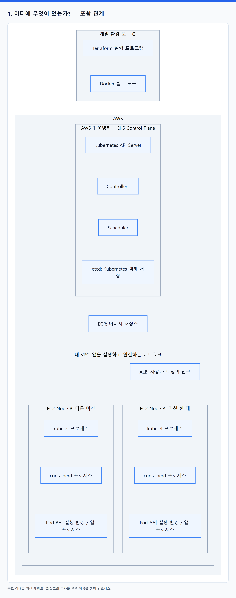
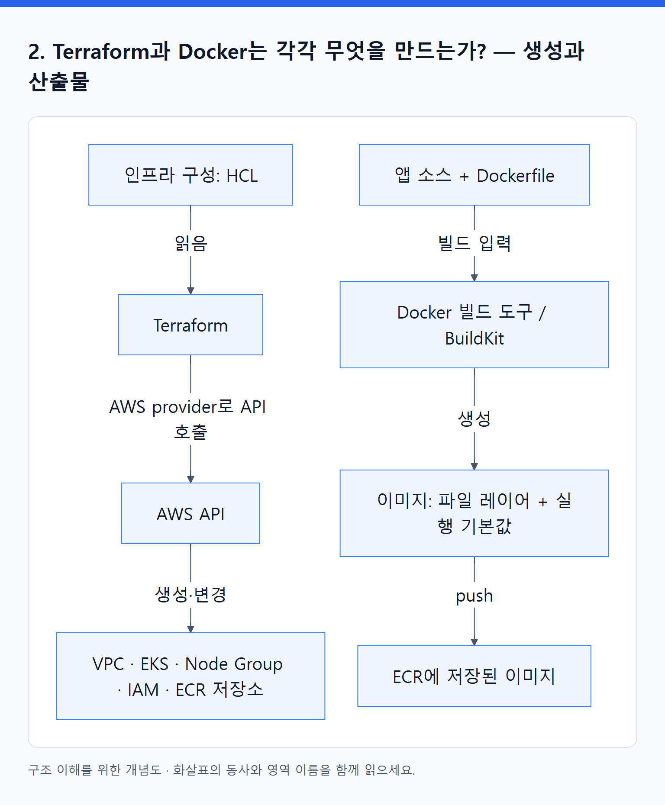
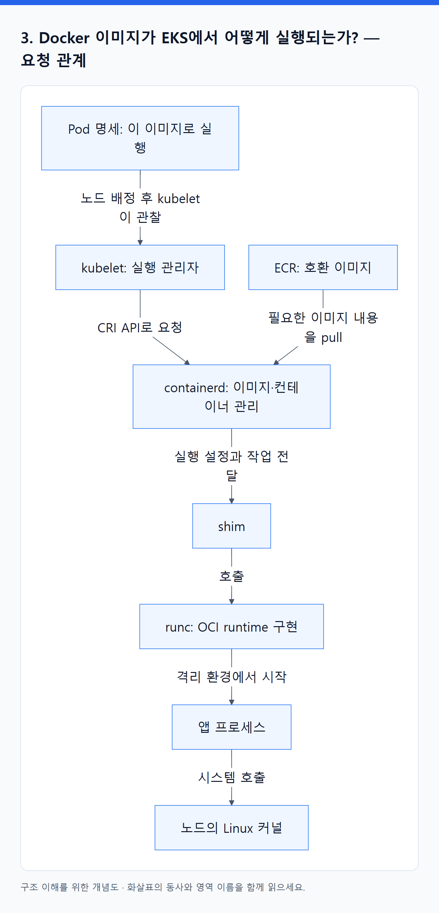
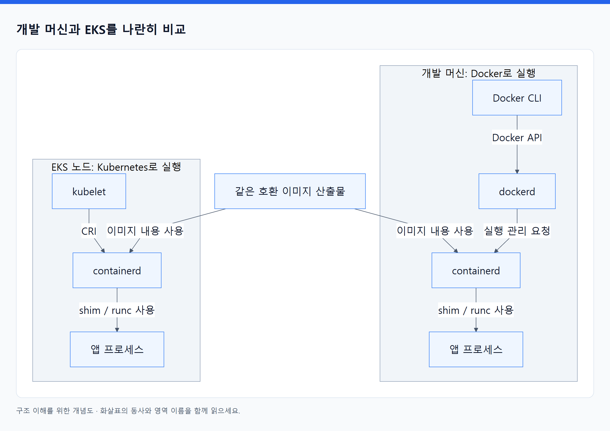
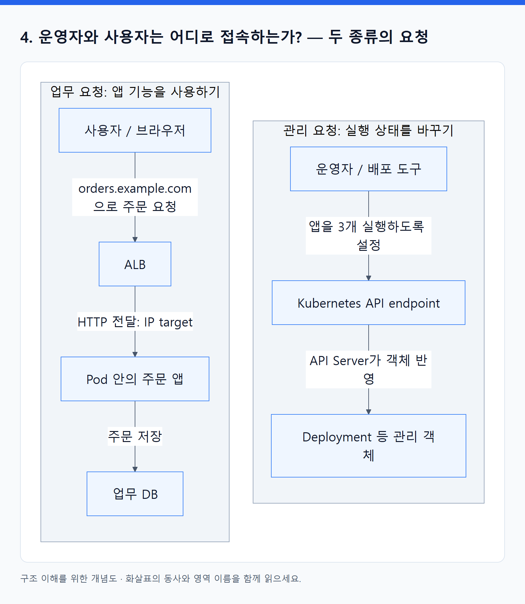
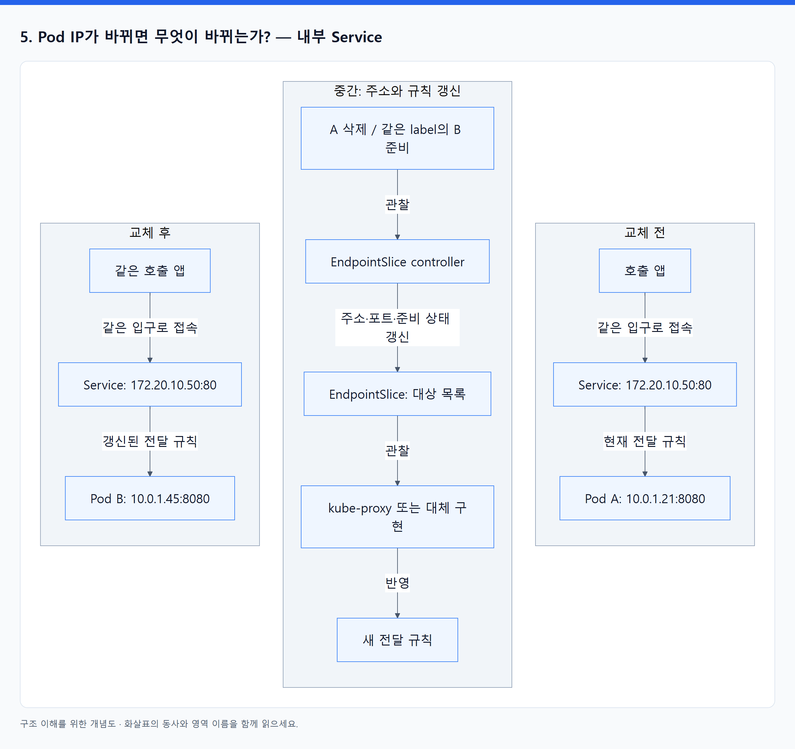
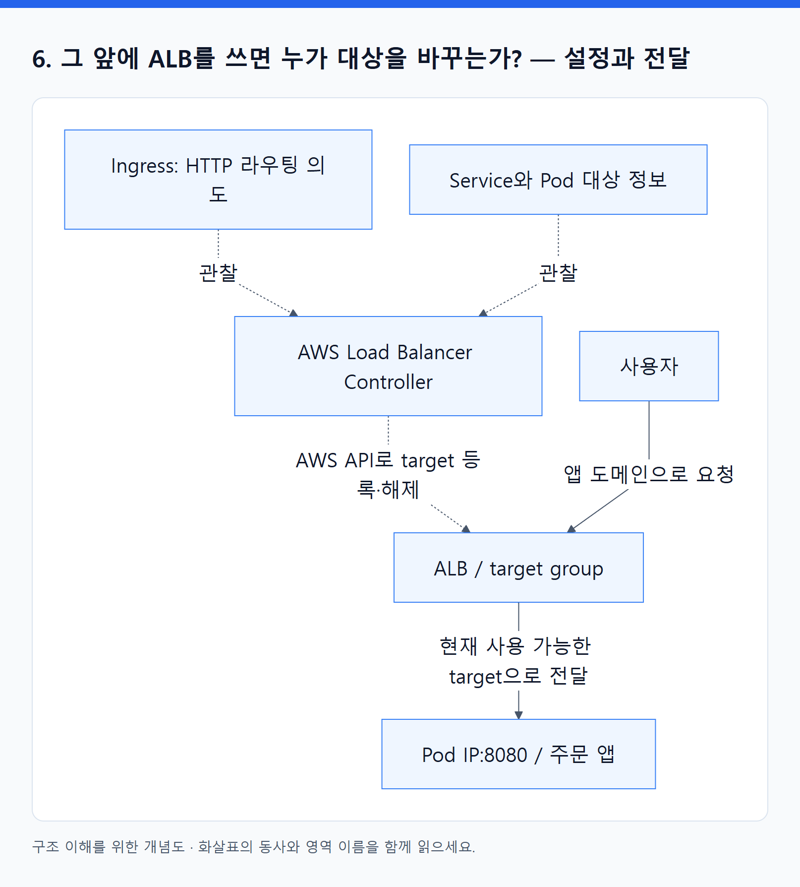
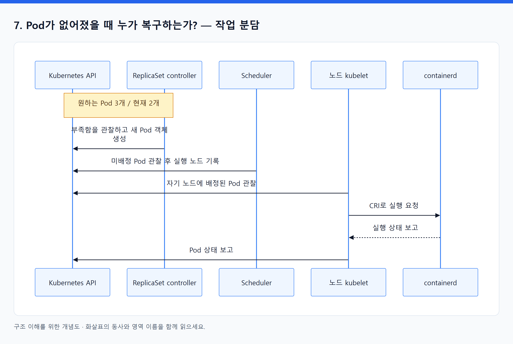
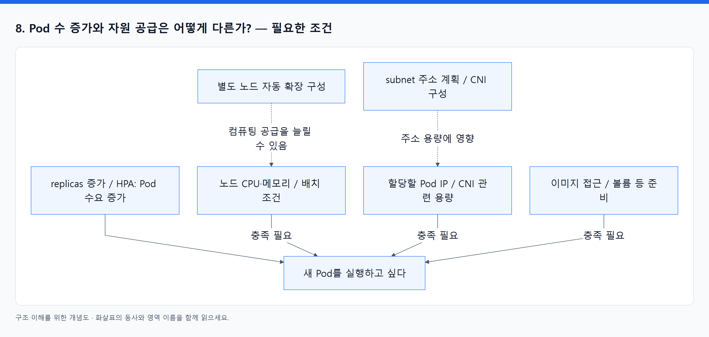
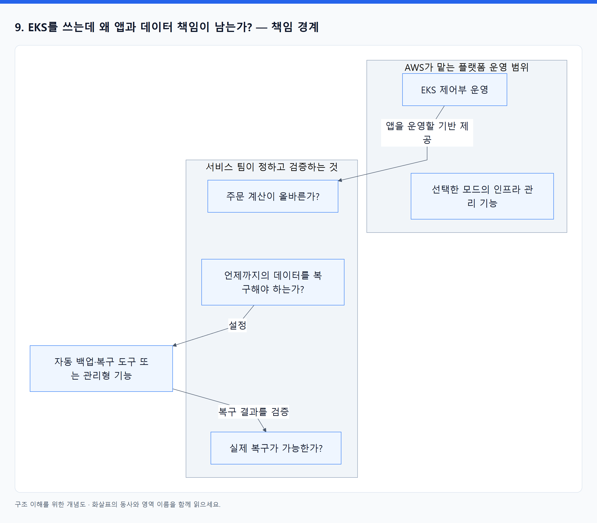

# 08. 그림으로 연결하는 Terraform · Docker · Kubernetes · EKS

> 전체 학습 08/35 · 기초
> [이전: 07. Pod와 Node가 늘어나면 Terraform apply가 필요한가?](07_Pod_Node_확장과_Terraform_apply_판단.md) · [전체 목차](../README.md) · [다음: 09. 외우지 않고 구조를 설명하는 연습](09_이해도_점검.md)
> 본문을 위에서 아래로 읽고 마지막의 다음 장으로 이동한다. 본문 속 다른 장·출처 링크는 선택 참고용이다.

**Git push부터 EKS 배포까지 하나로 이어지는 큰 흐름**은 [06. 전체 배포 흐름](06_Git에서_EKS까지_전체_배포_흐름.md)에 있다. 이 장은 그 안의 개별 연결을 확대해서 보는 도식이다.

> 그림은 1 → 2 → 3 → 4 순서로 먼저 읽는다. 그다음 IP 교체와 복구 그림을 본다.

이전 교재와 동일하게 **일반 EKS + EC2 노드 + containerd + VPC CNI + ALB IP target**을 예로 든다. 색보다 **상자의 이름·바깥 테두리·화살표의 동사**를 읽는다. 아래 도식은 기존 교재의 개념을 재구성한 것이며, 실제 AWS 자원을 조회한 구성도가 아니다.

## 1. 어디에 무엇이 있는가? — 포함 관계

**큰 테두리는 실행 영역, 그 안의 상자는 구성 요소**다. kubelet 안에 containerd가 들어 있지 않다는 점부터 확인한다.

<!-- diagram:01-08-block-1 -->


[크게 보기](../assets/diagrams/01-08-block-1.png) · [SVG](../assets/diagrams/01-08-block-1.svg)

<details>
<summary>그림의 원문 설명 펼치기</summary>

```text
flowchart TB
    subgraph DEV["개발 환경 또는 CI"]
        TF["Terraform 실행 프로그램"]
        BUILD["Docker 빌드 도구"]
    end
    subgraph CLOUD["AWS"]
        subgraph CP["AWS가 운영하는 EKS Control Plane"]
            API["Kubernetes API Server"]
            CT["Controllers"]
            SC["Scheduler"]
            DB["etcd: Kubernetes 객체 저장"]
        end
        REG["ECR: 이미지 저장소"]
        subgraph VPC["내 VPC: 앱을 실행하고 연결하는 네트워크"]
            ALB["ALB: 사용자 요청의 입구"]
            subgraph NA["EC2 Node A: 머신 한 대"]
                KA["kubelet 프로세스"]
                CA["containerd 프로세스"]
                PA["Pod A의 실행 환경 / 앱 프로세스"]
            end
            subgraph NB["EC2 Node B: 다른 머신"]
                KB["kubelet 프로세스"]
                CB["containerd 프로세스"]
                PB["Pod B의 실행 환경 / 앱 프로세스"]
            end
        end
    end
```

</details>
<!-- /diagram:01-08-block-1 -->

이 그림에는 동작 화살표를 일부러 넣지 않았다. 먼저 **프로그램이 어디서 실행되는지**만 읽는다. EKS는 Kubernetes 뒤에 추가로 붙은 실행 엔진이 아니라 AWS가 제공하는 Kubernetes 서비스다. 제어부와 노드들이 함께 클러스터를 이룬다. VPC·AZ·subnet의 상세 구성은 생략했다.

**그림을 보고 답하기:** Node A에서 kubelet과 containerd는 형제 위치인가, 포함 관계인가? 둘은 같은 머신에서 따로 실행되는 프로그램이다.

## 2. Terraform과 Docker는 각각 무엇을 만드는가? — 생성과 산출물

<!-- diagram:01-08-block-2 -->


[크게 보기](../assets/diagrams/01-08-block-2.png) · [SVG](../assets/diagrams/01-08-block-2.svg)

<details>
<summary>그림의 원문 설명 펼치기</summary>

```text
flowchart TB
    HCL["인프라 구성: HCL"] -->|"읽음"| TF["Terraform"]
    TF -->|"AWS provider로 API 호출"| AWSAPI["AWS API"]
    AWSAPI -->|"생성·변경"| INFRA["VPC · EKS · Node Group · IAM · ECR 저장소"]
    CODE["앱 소스 + Dockerfile"] -->|"빌드 입력"| BUILD["Docker 빌드 도구 / BuildKit"]
    BUILD -->|"생성"| IMAGE["이미지: 파일 레이어 + 실행 기본값"]
    IMAGE -->|"push"| ECR["ECR에 저장된 이미지"]
```

</details>
<!-- /diagram:01-08-block-2 -->

**Terraform이 ECR 저장소를 만드는 것과 빌더가 그 안에 이미지를 올리는 것은 다르다.** 저장소만 있으면 실행할 앱 파일이 없을 수 있고, 이미지만 있으면 실행할 노드나 Pod 설정이 없을 수 있다.

이 화살표는 사용자 주문 요청의 경로가 아니다. Terraform이 종료돼도 AWS 자원은 남고, 빌드가 끝나도 이미지 산출물은 남는다.

## 3. Docker 이미지가 EKS에서 어떻게 실행되는가? — 요청 관계

<!-- diagram:01-08-block-3 -->


[크게 보기](../assets/diagrams/01-08-block-3.png) · [SVG](../assets/diagrams/01-08-block-3.svg)

<details>
<summary>그림의 원문 설명 펼치기</summary>

```text
flowchart TB
    SPEC["Pod 명세: 이 이미지로 실행"] -->|"노드 배정 후 kubelet이 관찰"| K["kubelet: 실행 관리자"]
    K -->|"CRI API로 요청"| C["containerd: 이미지·컨테이너 관리"]
    ECR["ECR: 호환 이미지"] -->|"필요한 이미지 내용을 pull"| C
    C -->|"실행 설정과 작업 전달"| SHIM["shim"]
    SHIM -->|"호출"| R["runc: OCI runtime 구현"]
    R -->|"격리 환경에서 시작"| APP["앱 프로세스"]
    APP -->|"시스템 호출"| KERNEL["노드의 Linux 커널"]
```

</details>
<!-- /diagram:01-08-block-3 -->

**CRI는 화살표 위의 API 약속이고, OCI는 runc 등이 구현하는 규격이다.** 둘을 노드 안에서 실행되는 별도 서버로 그리지 않는다. containerd의 CRI 기능·플러그인 상세와 네트워크 준비 순서는 단순화했다.

그림 위쪽은 실행을 준비하는 제어 요청, 마지막 화살표는 실행된 앱과 커널의 상호작용이다. 사용자 HTTP가 매번 kubelet → containerd → runc를 통과한다는 뜻이 아니다.

### 개발 머신과 EKS를 나란히 비교

<!-- diagram:01-08-block-4 -->


[크게 보기](../assets/diagrams/01-08-block-4.png) · [SVG](../assets/diagrams/01-08-block-4.svg)

<details>
<summary>그림의 원문 설명 펼치기</summary>

```text
flowchart TB
    I["같은 호환 이미지 산출물"]
    subgraph LOCAL["개발 머신: Docker로 실행"]
        DCLI["Docker CLI"] -->|"Docker API"| DD["dockerd"]
        DD -->|"실행 관리 요청"| DC["containerd"]
        DC -->|"shim / runc 사용"| DA["앱 프로세스"]
    end
    subgraph EKSNODE["EKS 노드: Kubernetes로 실행"]
        K["kubelet"] -->|"CRI"| KC["containerd"]
        KC -->|"shim / runc 사용"| KA["앱 프로세스"]
    end
    I -->|"이미지 내용 사용"| DC
    I -->|"이미지 내용 사용"| KC
```

</details>
<!-- /diagram:01-08-block-4 -->

두 실행 경로는 상위 요청 도구가 다르지만 이미지를 해석하고 실행할 수 있다. 그래서 **EKS 노드에 Docker Engine이 필수는 아니다.** 단, 이미지 형식 지원 외에 OS·CPU 아키텍처·앱 설정 등의 조건도 맞아야 한다. 상세 설명은 [Docker 심화](03_Docker_이미지에서_실행까지.md)를 읽는다.

## 4. 운영자와 사용자는 어디로 접속하는가? — 두 종류의 요청

<!-- diagram:01-08-block-5 -->


[크게 보기](../assets/diagrams/01-08-block-5.png) · [SVG](../assets/diagrams/01-08-block-5.svg)

<details>
<summary>그림의 원문 설명 펼치기</summary>

```text
flowchart TB
    subgraph MGMT["관리 요청: 실행 상태를 바꾸기"]
        OP["운영자 / 배포 도구"] -->|"앱을 3개 실행하도록 설정"| API["Kubernetes API endpoint"]
        API -->|"API Server가 객체 반영"| SPEC["Deployment 등 관리 객체"]
    end
    subgraph DATA["업무 요청: 앱 기능을 사용하기"]
        USER["사용자 / 브라우저"] -->|"orders.example.com으로 주문 요청"| LB["ALB"]
        LB -->|"HTTP 전달: IP target"| APP["Pod 안의 주문 앱"]
        APP -->|"주문 저장"| DB["업무 DB"]
    end
```

</details>
<!-- /diagram:01-08-block-5 -->

**받는 프로그램과 하는 일이 다르므로 주소도 구분된다.** ‘관리 요청’ 영역은 클러스터 관리 API, ‘업무 요청’ 영역은 앱의 업무 API다. VPC CNI가 다르기 때문에 생긴 구분이 아니다. DNS 조회·TLS 처리·응답 경로는 그림에서 생략했다.

**그림을 보고 답하기:** 주문 앱이 오류를 반환해도 Kubernetes API는 정상일 수 있는가? 그렇다. 다른 프로그램과 요청 경로다.

## 5. Pod IP가 바뀌면 무엇이 바뀌는가? — 내부 Service

아래 IP는 설명용이다. **Service 객체를 유지하고 뒤의 Pod만 교체**하는 상황이다.

<!-- diagram:01-08-block-6 -->


[크게 보기](../assets/diagrams/01-08-block-6.png) · [SVG](../assets/diagrams/01-08-block-6.svg)

<details>
<summary>그림의 원문 설명 펼치기</summary>

```text
flowchart TB
    subgraph BEFORE["교체 전"]
        CLIENT1["호출 앱"] -->|"같은 입구로 접속"| S1["Service: 172.20.10.50:80"]
        S1 -->|"현재 전달 규칙"| A["Pod A: 10.0.1.21:8080"]
    end
    subgraph CHANGE["중간: 주소와 규칙 갱신"]
        EVENT["A 삭제 / 같은 label의 B 준비"] -->|"관찰"| EC["EndpointSlice controller"]
        EC -->|"주소·포트·준비 상태 갱신"| ES["EndpointSlice: 대상 목록"]
        ES -->|"관찰"| KP["kube-proxy 또는 대체 구현"]
        KP -->|"반영"| RULE["새 전달 규칙"]
    end
    subgraph AFTER["교체 후"]
        CLIENT2["같은 호출 앱"] -->|"같은 입구로 접속"| S2["Service: 172.20.10.50:80"]
        S2 -->|"갱신된 전달 규칙"| B["Pod B: 10.0.1.45:8080"]
    end
```

</details>
<!-- /diagram:01-08-block-6 -->

Service 상자는 **논리적인 접속 지점**을 나타내며, Service라는 서버 프로세스가 별도로 떠 있다는 뜻이 아니다. 실제 전달 규칙은 노드의 네트워크 구현이 처리한다.

`80 → 8080`은 목적지 포트를 연결한다. **IP 교체를 해결하는 것은 중간 그림의 대상 목록·규칙 갱신**이다. 업데이트 반영에는 시간이 걸리고, 기존 TCP 연결을 새 Pod에 그대로 이전하는 것은 아니다.

## 6. 그 앞에 ALB를 쓰면 누가 대상을 바꾸는가? — 설정과 전달

ALB **IP target** 기준이다. 실선은 사용자 트래픽이고, 점선은 설정·관찰 관계다.

<!-- diagram:01-08-block-7 -->


[크게 보기](../assets/diagrams/01-08-block-7.png) · [SVG](../assets/diagrams/01-08-block-7.svg)

<details>
<summary>그림의 원문 설명 펼치기</summary>

```text
flowchart TB
    ING["Ingress: HTTP 라우팅 의도"] -.->|"관찰"| CT["AWS Load Balancer Controller"]
    INFO["Service와 Pod 대상 정보"] -.->|"관찰"| CT
    CT -.->|"AWS API로 target 등록·해제"| LB["ALB / target group"]
    USER["사용자"] -->|"앱 도메인으로 요청"| LB
    LB -->|"현재 사용 가능한 target으로 전달"| POD["Pod IP:8080 / 주문 앱"]
```

</details>
<!-- /diagram:01-08-block-7 -->

**Controller는 설정을 바꾸고, ALB는 요청을 전달한다.** IP target에서 실제 패킷이 Service ClusterIP를 반드시 지나는 것은 아니다. 반면 5번의 클러스터 내부 Service 경로는 ALB 없이도 사용할 수 있다.

## 7. Pod가 없어졌을 때 누가 복구하는가? — 작업 분담

ReplicaSet이 관리하는 Pod 객체 하나가 삭제된 예시다. API를 매개로 하는 관찰·기록 과정을 시간 순서로 표시했다.

<!-- diagram:01-08-block-8 -->


[크게 보기](../assets/diagrams/01-08-block-8.png) · [SVG](../assets/diagrams/01-08-block-8.svg)

<details>
<summary>그림의 원문 설명 펼치기</summary>

```text
sequenceDiagram
    participant API as Kubernetes API
    participant RS as ReplicaSet controller
    participant SC as Scheduler
    participant KL as 노드 kubelet
    participant RT as containerd
    Note over API,RS: 원하는 Pod 3개 / 현재 2개
    RS->>API: 부족함을 관찰하고 새 Pod 객체 생성
    SC->>API: 미배정 Pod 관찰 후 실행 노드 기록
    KL->>API: 자기 노드에 배정된 Pod 관찰
    KL->>RT: CRI로 실행 요청
    RT-->>KL: 실행 상태 보고
    KL->>API: Pod 상태 보고
```

</details>
<!-- /diagram:01-08-block-8 -->

Terraform이 이 흐름에 없다는 점을 확인한다. 새 Pod를 만드는 controller는 클러스터 제어부에서, kubelet과 runtime은 선택된 노드에서 일한다. Pod 안의 **컨테이너만 종료**된 경우에는 같은 Pod에서 kubelet/runtime이 재시작할 수 있어 이 전체 과정을 매번 거치지는 않는다.

## 8. Pod 수 증가와 자원 공급은 어떻게 다른가? — 필요한 조건

여기서는 화살표를 **실행 전에 충족해야 하는 조건**으로 읽는다.

<!-- diagram:01-08-block-9 -->


[크게 보기](../assets/diagrams/01-08-block-9.png) · [SVG](../assets/diagrams/01-08-block-9.svg)

<details>
<summary>그림의 원문 설명 펼치기</summary>

```text
flowchart TB
    W["replicas 증가 / HPA: Pod 수요 증가"] --> P["새 Pod를 실행하고 싶다"]
    CPU["노드 CPU·메모리 / 배치 조건"] -->|"충족 필요"| P
    IP["할당할 Pod IP / CNI 관련 용량"] -->|"충족 필요"| P
    IMG["이미지 접근 / 볼륨 등 준비"] -->|"충족 필요"| P
    SCALE["별도 노드 자동 확장 구성"] -.->|"컴퓨팅 공급을 늘릴 수 있음"| CPU
    PLAN["subnet 주소 계획 / CNI 구성"] -.->|"주소 용량에 영향"| IP
```

</details>
<!-- /diagram:01-08-block-9 -->

**수요를 늘렸다고 공급이 동시에 늘어나는 것은 아니다.** HPA는 Pod 수를 조정한다. 노드 확장은 별도이고, 노드가 늘어도 subnet IP가 부족하면 다른 병목이 남을 수 있다.

## 9. EKS를 쓰는데 왜 앱과 데이터 책임이 남는가? — 책임 경계

<!-- diagram:01-08-block-10 -->


[크게 보기](../assets/diagrams/01-08-block-10.png) · [SVG](../assets/diagrams/01-08-block-10.svg)

<details>
<summary>그림의 원문 설명 펼치기</summary>

```text
flowchart TB
    subgraph AWS["AWS가 맡는 플랫폼 운영 범위"]
        CP["EKS 제어부 운영"]
        INFRA["선택한 모드의 인프라 관리 기능"]
    end
    subgraph TEAM["서비스 팀이 정하고 검증하는 것"]
        APP["주문 계산이 올바른가?"]
        POLICY["언제까지의 데이터를 복구해야 하는가?"]
        TEST["실제 복구가 가능한가?"]
    end
    CP -->|"앱을 운영할 기반 제공"| APP
    POLICY -->|"설정"| AUTO["자동 백업·복구 도구 또는 관리형 기능"]
    AUTO -->|"복구 결과를 검증"| TEST
```

</details>
<!-- /diagram:01-08-block-10 -->

AWS가 제어부를 정상 운영하는 것과 주문의 사업 규칙을 검증하는 것은 다르다. 팀의 책임이 남는다고 매번 수동 백업해야 한다는 뜻은 아니다. **실행은 자동화해도 기준 설정과 검증은 필요**하다. AWS가 맡는 구체 범위는 EKS 모드와 사용하는 서비스에 따라 달라진다.

## 그림을 덮고 한 번 연결하기

1. ‘안에 있다’는 관계는 1번 그림의 테두리로 설명한다.
2. ‘누가 요청한다’는 관계는 2·3·7번 그림의 동사로 설명한다.
3. ‘사용자 요청이 흐른다’는 관계는 4·6번의 트래픽 화살표로 설명한다.
4. ‘IP가 바뀌어도 연결된다’는 원리는 5번의 중간 갱신 과정으로 설명한다.

설명·출처 연결: [답변 교정](10_내_답변_교정과_개념_연결.md), [Docker 심화](03_Docker_이미지에서_실행까지.md), [원문 독서 지도](../04_참고자료/01_원문_분석과_독서지도.md).

---

[이전: 07. Pod와 Node가 늘어나면 Terraform apply가 필요한가?](07_Pod_Node_확장과_Terraform_apply_판단.md) · [전체 목차](../README.md) · [다음: 09. 외우지 않고 구조를 설명하는 연습](09_이해도_점검.md)
