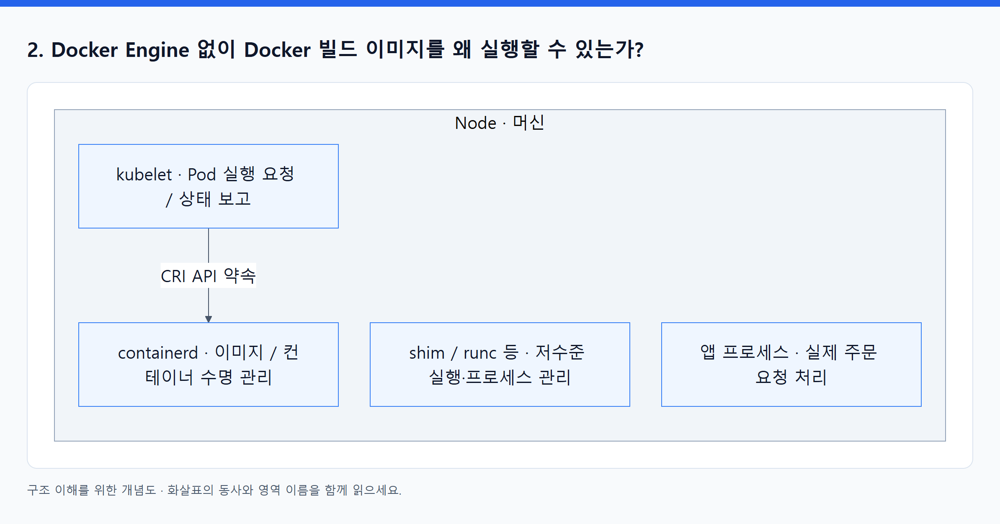
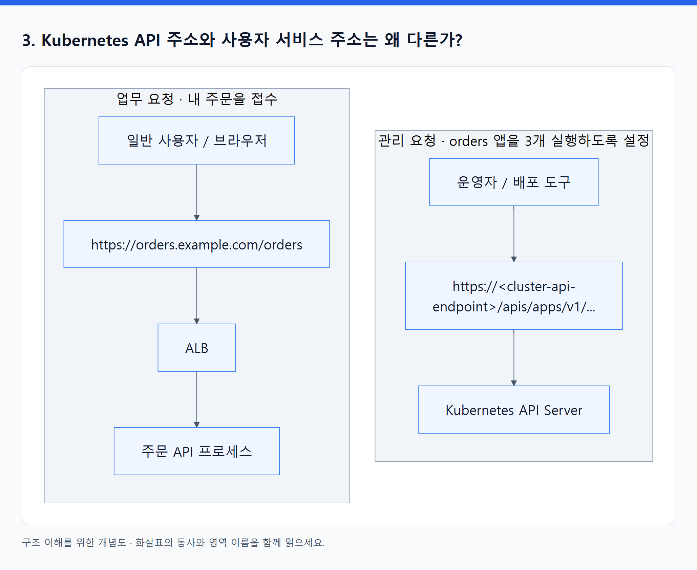
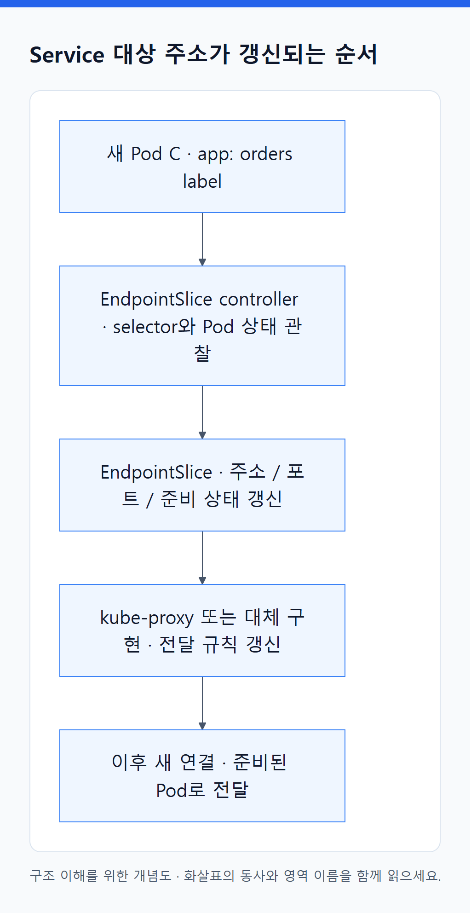
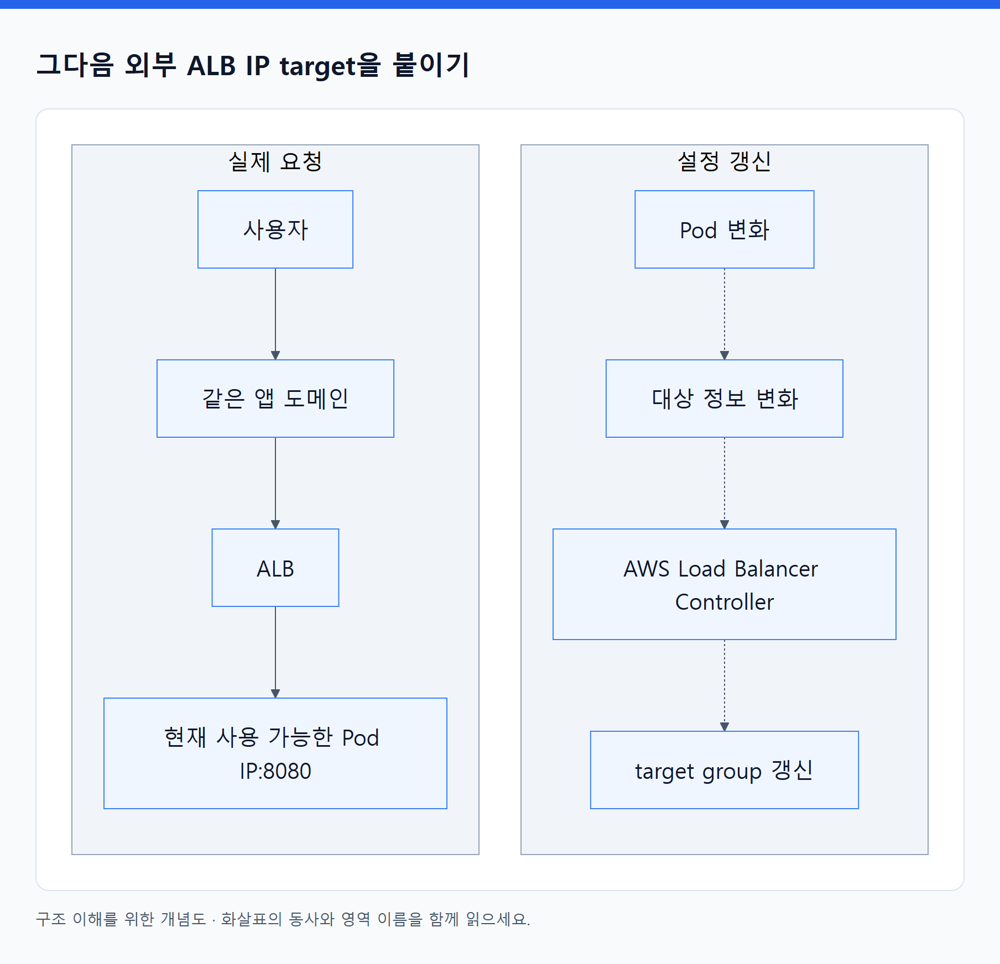

# 10. 내 답변에서 출발해 구조 다시 연결하기

> 전체 학습 10/35 · 기초
> [이전: 09. 외우지 않고 구조를 설명하는 연습](09_이해도_점검.md) · [전체 목차](../README.md) · [다음: 01. Kubernetes는 의도를 저장하고 여러 프로그램이 협력하는 시스템이다](../02_심화/01_API와_제어_루프.md)
> 본문을 위에서 아래로 읽고 마지막의 다음 장으로 이동한다. 본문 속 다른 장·출처 링크는 선택 참고용이다.

그림을 함께 보려면 [08. 그림으로 연결하기](08_그림으로_연결하기.md)를 연다. 1번은 포함 관계, 3번은 런타임, 4번은 API 주소, 5–6번은 IP 교체, 7번은 Pod 복구, 8–9번은 용량·책임에 대응한다.

## 먼저: 지금 무엇이 섞였는가?

답변에서 Kubernetes가 앱을 관리하고, Service가 label로 Pod를 고르며, VPC의 IP가 부족할 수 있다는 점은 짚었다. 다만 이름을 알고 있는 것과 **누가 무엇을 보고 어떤 행동을 하는지 설명하는 것** 사이에 간격이 있다. 기존 교재도 화살표의 중간 과정을 짧게 압축했다. 이번에는 그 과정을 풀어 쓴다.

세 가지 분류를 먼저 고정하자.

| 분류 | 여기에 속하는 것 | 읽는 방법 |
|---|---|---|
| 실행 장소 | Node, EC2 머신 | ‘어디에서 실행되는가?’ |
| 행동하는 프로그램 | kubelet, containerd, controller, scheduler | ‘누가 읽고, 생성하고, 실행하는가?’ |
| 기록·약속 | Deployment·Service 객체, OCI 규격, CRI 인터페이스 | ‘무엇을 원하는가? 어떤 형식으로 주고받는가?’ |

Kubernetes는 이러한 프로그램·API·객체 모델로 이루어진 시스템 이름이다. Node라는 머신 한 대가 Kubernetes 전체인 것은 아니다. Kubernetes의 Node 객체는 그 머신을 API에서 표현한 기록이라는 뜻으로도 사용된다.

## 1. Terraform이 끝난 뒤 Pod를 누가 관리하는가?

**내 답:** Kubernetes가 관리한다? 정확히는 Node가?

**판정: 첫 문장은 맞다. ‘정확히는 Node’ 대신 작업별 프로그램 이름이 필요하다.**

여기서 ‘관리’라는 단어가 여러 행동을 한꺼번에 가리킨다. `orders` Deployment가 원하는 Pod 수를 3개로 설정했다고 하자.

| 일어난 일 | 행동하는 주체 | 실제로 하는 일 |
|---|---|---|
| 한 Pod 안의 앱 프로세스가 종료됨 | 그 노드의 kubelet과 runtime | restart policy에 따라 컨테이너를 다시 실행 |
| ReplicaSet이 관리하던 Pod 객체 하나가 삭제됨 | ReplicaSet controller | Pod 수가 부족함을 관찰하고 새 Pod 객체 생성 |
| 새 Pod에 아직 실행 노드가 없음 | Scheduler | 자원·배치 조건에 맞는 노드를 골라 API에 배정 기록 |
| 새 Pod가 어떤 노드에 배정됨 | 해당 노드의 kubelet | 그 Pod를 실행하도록 runtime에 요청 |
| 새 앱 버전을 적용함 | Deployment controller | 새 ReplicaSet과 이전 ReplicaSet의 규모 조정 |

Node는 이 중 kubelet과 runtime, 앱이 실행되는 **장소**다. Node 자체가 클러스터 전체의 복제 수를 판단하는 controller라는 뜻은 아니다. 노드가 완전히 고장 나면 그 안의 kubelet도 일을 못 하므로, 살아 있는 클러스터 제어부와 다른 노드가 필요하다.

Terraform은 이들이 실행될 기반을 만들거나 API에 설정을 전달한 뒤 종료할 수 있다. 위 프로그램들은 Terraform 프로세스의 자식으로 수명 전체가 묶여 있는 것이 아니다.

**다시 쓸 답:** Kubernetes의 여러 구성 요소가 나눠 관리한다. ReplicaSet controller는 Pod 수를 유지하고, scheduler는 새 Pod의 노드를 정하며, 각 노드의 kubelet과 runtime은 컨테이너 실행을 관리한다. Terraform은 계속 실행 중일 필요가 없다.

**확인 질문:** Pod 없이 컨테이너 프로세스만 재시작한 경우와, 새 Pod를 만든 경우에 Pod의 정체성은 같은가? 전자는 같은 Pod 안의 컨테이너 재시작일 수 있고, 후자는 새 UID를 가진 다른 Pod다. Deployment 없이 직접 만든 Pod를 삭제하면 ReplicaSet이 자동으로 새 Pod를 만들어 주지 않는다.

근거: KIA 24–29·587–663쪽, KUR 188–234쪽. [Kubernetes 구성](https://kubernetes.io/docs/concepts/architecture/).

## 2. Docker Engine 없이 Docker 빌드 이미지를 왜 실행할 수 있는가?

**내 답:** kubelet 안에 내장된 containerd에 OCI가 내장되어 있기 때문?

**판정: containerd가 관련 있다는 점은 맞지만, 포함 관계와 표준의 의미를 바꿔야 한다.**

<!-- diagram:01-10-block-1 -->


[크게 보기](../assets/diagrams/01-10-block-1.png) · [SVG](../assets/diagrams/01-10-block-1.svg)

<details>
<summary>그림의 원문 설명 펼치기</summary>

```text
Node라는 머신
├─ kubelet 프로세스: 자기 노드의 Pod 실행을 요청하고 상태를 보고
├─ containerd 프로세스: 그 요청을 받아 이미지·컨테이너 수명 관리
├─ shim / runc 등: 저수준 실행과 실행 프로세스 관리에 참여
└─ 앱 프로세스: 실제 주문 요청 처리

kubelet ── CRI라는 API 약속으로 통신 ──> containerd
```

</details>
<!-- /diagram:01-10-block-1 -->

containerd는 kubelet 내부의 기능 이름이 아니다. 별도 프로그램이며, kubelet이 정해진 인터페이스로 요청한다. OCI도 실행 파일 이름이 아니다. 이미지 구조나 컨테이너 실행 환경 등을 서로 호환되게 정한 규격을 만드는 프로젝트이며, 문맥에 따라 그 규격을 가리킨다.

문서를 만든 편집기와 문서를 읽는 프로그램이 달라도 파일 형식을 이해하면 읽을 수 있는 것처럼, **이미지를 만든 도구와 실행할 런타임은 달라도 된다.** 다만 컨테이너에서는 파일 형식뿐 아니라 OS·CPU 아키텍처·커널 기능 등도 맞아야 한다.

**다시 쓸 답:** Docker가 만든 이미지가 containerd도 이해하는 호환 형식이기 때문이다. kubelet은 CRI로 별도 실행 중인 containerd에 요청하고, containerd는 이미지와 실행 설정을 준비해 runc 같은 OCI runtime을 이용한다. 실제 앱은 노드의 Linux 커널 위에서 실행된다.

깊은 설명은 [03. Docker 이미지가 EKS에서 실행되기까지](03_Docker_이미지에서_실행까지.md)에서 이미 배운 내용을 복습할 수 있다. [CRI 공식 설명](https://kubernetes.io/docs/concepts/containers/cri/), [OCI 개요](https://opencontainers.org/about/overview/).

## 3. Kubernetes API 주소와 사용자 서비스 주소는 왜 다른가?

**내 답:** CNI가 IP·경로를 설정하지만 VPC CNI 생성 경로가 별도이기 때문?

**판정: 서로 다른 네트워크 구성 요소에 주목했지만, 주소가 다른 핵심 이유는 요청의 목적과 받는 프로그램이 다르기 때문이다.**

두 요청을 나란히 보자. 아래 주소는 형식을 이해하기 위한 가상의 예다.

<!-- diagram:01-10-block-2 -->


[크게 보기](../assets/diagrams/01-10-block-2.png) · [SVG](../assets/diagrams/01-10-block-2.svg)

<details>
<summary>그림의 원문 설명 펼치기</summary>

```text
운영자 / 배포 도구
  → https://<cluster-api-endpoint>/apis/apps/v1/...
  → Kubernetes API Server
  → ‘orders 앱을 3개 실행하도록 설정해 줘’

일반 사용자 / 브라우저
  → https://orders.example.com/orders
  → ALB → 주문 API 프로세스
  → ‘내 주문을 접수해 줘’
```

</details>
<!-- /diagram:01-10-block-2 -->

위쪽 서버는 **클러스터 객체를 관리하는 프로그램**, 아래쪽 서버는 **업무를 처리하는 앱**이다. 둘 다 HTTPS를 사용할 수 있지만 서로 다른 요청 형식과 권한을 다룬다. 같은 443 포트를 쓴다는 사실도 같은 서버라는 의미는 아니다.

이 구분은 AWS VPC CNI를 쓰지 않는 Kubernetes에도 있다. CNI는 Pod에 네트워크를 연결하는 구현에 관여하며, 관리 API와 업무 API가 나뉘는 이유 자체는 아니다.

EKS에서는 관리 API endpoint를 private으로 두면서 사용자용 ALB를 public으로 공개할 수도 있다. ‘일반 사용자에게 앱을 공개한다’와 ‘클러스터 관리 API를 어디서 접근하게 한다’는 독립적인 결정이다.

**다시 쓸 답:** Kubernetes API 주소는 운영자가 클러스터를 관리하는 API Server의 입구이고, 서비스 주소는 사용자가 앱 기능을 호출하는 입구이기 때문이다. 받는 프로그램·요청 목적·권한이 다르며, 일반 앱 요청은 Kubernetes API Server를 거치지 않는다.

**확인 질문:** 주문 API 버그로 500 응답이 발생해도 `kubectl get pods`는 성공할 수 있을까? 그렇다. 서로 다른 프로그램과 경로를 확인하는 요청이다.

근거: EKS 37–39쪽, NET 310–352쪽 및 교재 05의 요청 경로. [EKS API endpoint의 접근 범위](https://docs.aws.amazon.com/eks/latest/userguide/cluster-endpoint.html).

## 4. Pod IP가 바뀌어도 서비스에 접속할 수 있는 이유는?

**내 답:** label로 Pod를 고르고, 80을 8080에 연결한다. 앞의 ALB가 뭔가 해 준다?

**판정: label 선택과 포트 설명은 맞다. 그러나 포트 변환만으로 바뀐 IP를 찾아낼 수는 없다. 핵심은 ‘안정된 입구 뒤의 대상 목록을 계속 갱신한다’는 것이다.**

### 먼저 ALB가 없는 클러스터 내부에서 이해하기

일반적인 ClusterIP Service `orders`가 존재하고 selector가 `app: orders`라고 하자. 아래 IP는 설명용이다.

| 상태 | Service IP | 현재 대상 Pod IP |
|---|---|---|
| 교체 전 | `172.20.10.50:80` | A=`10.0.1.21:8080`, B=`10.0.2.34:8080` |
| A 삭제·C 준비 후 | `172.20.10.50:80` | C=`10.0.1.45:8080`, B=`10.0.2.34:8080` |

호출자는 계속 같은 Service 이름/IP를 사용한다. 뒤에서는 다음 일이 일어난다.

<!-- diagram:01-10-concept-4 -->


[크게 보기](../assets/diagrams/01-10-concept-4.png) · [SVG](../assets/diagrams/01-10-concept-4.svg)

<details>
<summary>그림의 원문 설명 펼치기</summary>

1. 새 Pod C에 `app: orders` label이 있다.
2. EndpointSlice controller가 Service selector와 Pod 상태를 관찰한다.
3. EndpointSlice의 대상 주소·포트·준비 상태를 갱신한다.
4. kube-proxy 또는 그 대체 구현이 이를 보고 전달 규칙을 갱신한다.
5. 이후 새 연결은 갱신된 규칙에 따라 준비된 대상 Pod로 전달된다.

</details>
<!-- /diagram:01-10-concept-4 -->

Service **객체**가 혼자 생각해서 IP를 찾는 것이 아니다. 객체의 selector를 읽는 controller와 전달 규칙을 구현하는 프로그램이 그 일을 한다. EndpointSlice는 이들이 참고하는 대상 목록에 해당한다.

`80 → 8080`은 **목적지 포트가 무엇인지**를 설명한다. EndpointSlice와 규칙 갱신은 **지금 그 포트로 요청을 받을 Pod IP가 무엇인지**를 해결한다. 이것이 두 설명의 차이다.

### 그다음 외부 ALB IP target을 붙이기

AWS Load Balancer Controller는 Ingress·Service 및 대상 정보를 관찰해 AWS target group에 Pod IP:port를 등록·해제한다. **ALB**는 이렇게 구성된 target group과 health check 결과를 사용해 요청을 전달한다.

<!-- diagram:01-10-block-3 -->


[크게 보기](../assets/diagrams/01-10-block-3.png) · [SVG](../assets/diagrams/01-10-block-3.svg)

<details>
<summary>그림의 원문 설명 펼치기</summary>

```text
설정 갱신: Pod 변화 → 대상 정보 변화 → AWS Load Balancer Controller → target group 갱신
실제 요청: 사용자 → 같은 앱 도메인 → ALB → 현재 사용 가능한 Pod IP:8080
```

</details>
<!-- /diagram:01-10-block-3 -->

따라서 “ALB가 뭔가 한다”를 **controller가 대상 등록을 바꾸고, ALB가 요청을 전달한다**로 나누면 정확해진다. 이 IP target 경로는 ClusterIP 경로와 다른 데이터 경로이며, ALB가 있어야만 Service의 IP 교체 대응이 가능한 것은 아니다.

갱신은 즉시·원자적으로 일어나지 않는다. 죽은 Pod와 맺었던 기존 TCP 연결을 새 Pod로 그대로 옮겨 주지도 않는다. 가용성에는 복제본, 준비 상태, 연결 종료 처리, 재시도 등이 필요하다. Service 자체를 삭제 후 재생성하면 ClusterIP가 달라질 수도 있다.

**다시 쓸 답:** 호출자는 안정된 Service 또는 ALB 주소를 사용하고, controller들이 바뀐 Pod 주소를 대상 목록과 전달 규칙에 반영하기 때문이다. 포트 매핑은 별도의 문제다.

근거: NET 212–215·247–283쪽, KIA 478–586쪽. [EndpointSlices](https://kubernetes.io/docs/concepts/services-networking/endpoint-slices/), [AWS target 방식](https://docs.aws.amazon.com/eks/latest/best-practices/load-balancing.html).

## 5. Pod를 늘렸는데 노드나 IP가 부족할 수 있는 이유는?

**내 답:** ENI와 subnet의 주소 공간 한계 때문에 CPU가 남아도 실행 못 할 수 있다?

**판정: IP 부족에 대한 설명은 맞다. 여기에 ‘Pod 수 변경은 자원 공급이 아니라 수요 증가’라는 연결을 더하면 된다.**

`replicas: 3`을 `10`으로 바꾸면 Kubernetes에 10개를 유지하라고 요구한다. CPU, 메모리, IP, 디스크, 실제 서버가 그 명령만으로 무제한 공급되는 것은 아니다.

다음은 실제 AWS 한도표가 아니라 서로 다른 병목을 구분하기 위한 가상 계산이다.

| 경우 | 가정 | 결과 |
|---|---|---|
| 노드 자원 부족 | 앱용 CPU 여유 2개, Pod당 request 0.5개 | CPU 기준으로 추가 4개까지; 더 요구하면 배치 불가 가능 |
| 주소 공간 부족 | CPU는 충분하지만 할당 가능한 Pod IP가 2개 | 새 Pod 네트워크 준비가 부족해질 수 있음 |
| 노드별 제약 | subnet IP는 남지만 노드의 Pod/IP 관련 용량이 한계 | 다른 노드나 네트워크 구성 조정 필요 |

HPA는 필요에 따라 Pod 수를 바꾼다. 노드 수는 별도로 구성한 Cluster Autoscaler·Karpenter 또는 Auto Mode 등의 컴퓨팅 관리가 다룬다. 노드를 더 만들더라도 subnet 주소가 부족하면 해결되지 않을 수 있다. 실제 용량은 인스턴스 유형·CNI 모드·prefix delegation·시스템 Pod 등에도 좌우되므로 ‘ENI 하나당 Pod 하나’ 같은 고정 공식으로 외우지 않는다.

**다시 쓸 답:** Pod 수를 늘리는 것은 실행 수요를 늘리는 것이다. 실제 실행에는 노드의 CPU·메모리뿐 아니라 VPC CNI가 할당할 IP와 노드별 용량도 필요하다. 각각 한도가 있고 자동 확장도 별도 구성과 공급 조건이 있어야 한다.

근거: EKS 639–648·1326–1345쪽, KUR 110–115쪽.

## 6. AWS가 관리해도 앱 장애와 백업이 내 책임인 이유는?

**내 답:** EKS에서 자동으로 안 해 주므로 상황에 따라 작업자가 해야 한다?

**판정: 책임이 남는다는 결론은 맞다. 왜 남는지와 ‘반드시 수동’은 아니라는 점을 보완해야 한다.**

AWS는 제어부가 동작하는지 관리할 수 있지만, 주문 API가 계산한 할인액이 사업 규칙에 맞는지까지 판단할 수는 없다. Kubernetes도 프로세스나 probe 상태를 볼 수 있지만, ‘200을 반환했으나 잘못된 주문을 저장했다’는 의미를 설정 없이 알아내지는 못한다.

백업도 단순 파일 복사 이상이다. 우리 서비스는 데이터 5분치를 잃어도 되는가, 어제 밤 상태면 충분한가, 잘못된 주문 1건만 되돌릴 것인가, 다른 시스템과 시점이 일치해야 하는가? 이런 기준은 업무 요구에 따라 다르다.

| 제공받는 기능 | 팀이 정할 내용 |
|---|---|
| EKS 제어부 운영 | 앱의 올바른 동작과 배포 기준 |
| 컨테이너 재시작 | 어떤 실패 신호를 어떻게 처리할지 |
| 별도 DB·백업 서비스의 자동화 기능 | 보존 기간·복구 시점·접근 권한·복구 검증 |

RDS 같은 서비스의 자동 백업이나 다른 백업 도구를 사용할 수 있다. 따라서 ‘사람이 매번 직접 해야 한다’가 아니라 **팀이 요구와 정책을 정하고, 적절한 자동화를 구성하고, 실제 복구되는지 검증할 책임이 있다**는 뜻이다. EKS Auto Mode로 기반 자동화 범위가 늘어도 이 구분은 남는다.

**다시 쓸 답:** AWS가 맡는 것은 계약된 플랫폼 운영 범위이고, 앱의 업무상 정상 상태와 데이터 복구 요구는 우리 서비스가 결정해야 하기 때문이다. 관리형 기능으로 실행을 자동화할 수 있어도 설정·검증 책임이 없어지는 것은 아니다.

근거: EKS 110–114쪽; [EKS 공동 책임](https://docs.aws.amazon.com/eks/latest/userguide/security.html).

## 마지막 연습: 명사 대신 동사로 설명하기

각 문장을 빈칸 없이 말할 수 있으면 이번 보완 내용을 이해한 것이다.

1. ReplicaSet controller는 **현재 Pod 수**를 관찰하고, 부족하면 **새 Pod 객체를 생성**한다.
2. kubelet은 **API의 노드 배정**을 보고, **CRI로 runtime에 실행을 요청**한다.
3. containerd는 **호환 이미지와 실행 설정**을 준비하고, **저수준 runtime으로 프로세스를 시작**한다.
4. EndpointSlice controller는 **selector와 Pod 상태**를 보고, **대상 주소 목록을 갱신**한다.
5. AWS Load Balancer Controller는 **라우팅·대상 정보**를 보고, **AWS의 LB 설정을 갱신**한다.
6. ALB는 **구성된 rule과 target 상태**를 이용해, **사용자 요청을 앱에 전달**한다.

---

[이전: 09. 외우지 않고 구조를 설명하는 연습](09_이해도_점검.md) · [전체 목차](../README.md) · [다음: 01. Kubernetes는 의도를 저장하고 여러 프로그램이 협력하는 시스템이다](../02_심화/01_API와_제어_루프.md)
