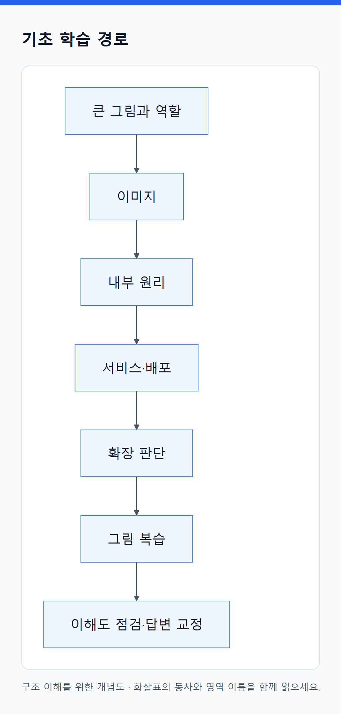

# 기초 학습 순서

<!-- diagram:01-RE-concept-1 -->

[크게 보기](../assets/diagrams/01-RE-concept-1.png) · [SVG](../assets/diagrams/01-RE-concept-1.svg)

그림의 원문 설명 펼치기

큰 그림과 역할 → 이미지 → 내부 원리 → 서비스·배포 → 확장 판단 → 그림 복습 → 이해도 점검·답변 교정

<!-- /diagram:01-RE-concept-1 -->

[전체 목차](../README.md)

| 순서 | 장 |
|---|---|
| 01 | [01. 큰 그림: 네 가지는 서로 다른 문제를 푼다](01_큰_그림.md) |
| 02 | [02. Docker·Terraform·Kubernetes·EKS는 각각 무엇을 맡는가?](02_네_도구의_역할과_관리_경계.md) |
| 03 | [03. Docker로 만들었는데 Docker Engine 없이 실행되는 이유](03_Docker_이미지에서_실행까지.md) |
| 04 | [04. 내부 원리: 선언이 어떻게 실제 실행으로 바뀌는가](04_내부_원리.md) |
| 05 | [05. 하나의 웹 서비스가 만들어지고 요청을 처리하기까지](05_서비스의_일생.md) |
| 06 | [06. 앱 개발 → Git → Docker 빌드 → EKS 실행: 전체 배포 흐름](06_Git에서_EKS까지_전체_배포_흐름.md) |
| 07 | [07. Pod와 Node가 늘어나면 Terraform apply가 필요한가?](07_Pod_Node_확장과_Terraform_apply_판단.md) |
| 08 | [08. 그림으로 연결하는 Terraform · Docker · Kubernetes · EKS](08_그림으로_연결하기.md) |
| 09 | [09. 외우지 않고 구조를 설명하는 연습](09_이해도_점검.md) |
| 10 | [10. 내 답변에서 출발해 구조 다시 연결하기](10_내_답변_교정과_개념_연결.md) |
