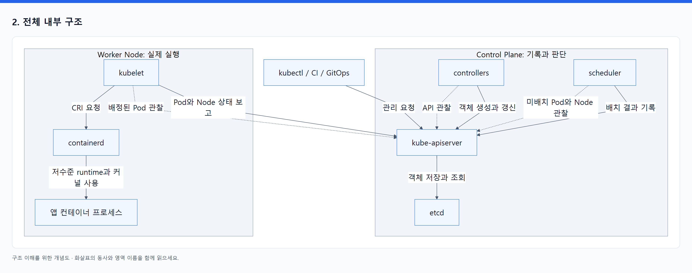
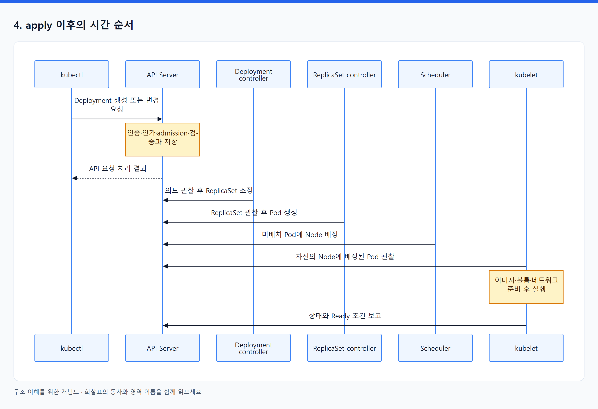
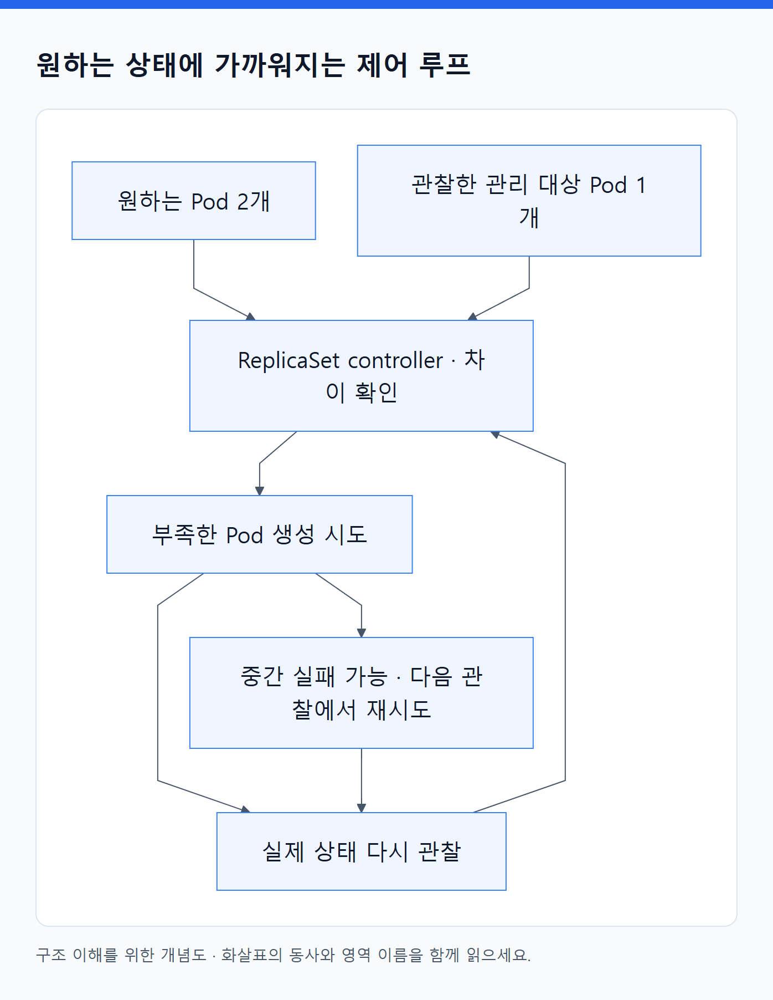

# 01. Kubernetes는 의도를 저장하고 여러 프로그램이 협력하는 시스템이다

> 전체 학습 11/35 · 심화
> [이전: 10. 내 답변에서 출발해 구조 다시 연결하기](../01_기초/10_내_답변_교정과_개념_연결.md) · [전체 목차](../README.md) · [다음: 02. 오브젝트의 공통 구조](02_오브젝트의_공통_구조.md)
> 본문을 위에서 아래로 읽고 마지막의 다음 장으로 이동한다. 본문 속 다른 장·출처 링크는 선택 참고용이다.

> 이 장의 질문: `kubectl apply` 한 번이 어떻게 계속 살아 있는 서비스가 되는가?

## 1. 처음에 반드시 구분할 세 종류

“Deployment가 Pod를 만든다”는 표현은 편리하지만 주어가 생략되어 있다. **Deployment는 API에 저장된 객체이고, Deployment controller라는 프로그램이 그 객체를 읽고 작업한다.** 이 차이를 이해하면 “설정은 맞는데 아무것도 안 생긴다”는 상황도 설명할 수 있다.

| 종류 | 예 | 실제 의미 |
|---|---|---|
| API 오브젝트 | Deployment, Pod, Service, Node | 클러스터가 저장하고 조회하는 구조화된 기록 |
| 동작하는 프로그램 | API Server, scheduler, kubelet, controller | 객체를 읽고 판단하거나 실제 실행을 요청하는 프로세스 |
| 실제 자원 | Linux 프로세스, EC2, IP, 디스크, ALB | 실행·통신·저장이 일어나는 대상 |

특히 **Node 객체는 EC2 그 자체가 아니다.** 특정 실행 노드의 주소·용량·상태 등을 나타내는 API 기록이다. 물리적인 노드가 멈춰도 Node 객체는 남을 수 있다. Pod 객체도 실제 컨테이너가 시작되기 전에 존재할 수 있다.

## 2. 전체 내부 구조

<!-- diagram:02-01-block-1 -->


[크게 보기](../assets/diagrams/02-01-block-1.png) · [SVG](../assets/diagrams/02-01-block-1.svg)

<details>
<summary>그림의 원문 설명 펼치기</summary>

```text
flowchart TB
  U["kubectl / CI / GitOps"] -->|관리 요청| API["kube-apiserver"]
  subgraph CP["Control Plane: 기록과 판단"]
    API -->|객체 저장과 조회| DB["etcd"]
    CTRL["controllers"] -.->|API 관찰| API
    CTRL -->|객체 생성과 갱신| API
    SCH["scheduler"] -.->|미배치 Pod와 Node 관찰| API
    SCH -->|배치 결과 기록| API
  end
  subgraph N["Worker Node: 실제 실행"]
    K["kubelet"] -->|CRI 요청| R["containerd"]
    R -->|저수준 runtime과 커널 사용| P["앱 컨테이너 프로세스"]
  end
  K -.->|배정된 Pod 관찰| API
  K -->|Pod와 Node 상태 보고| API
```

</details>
<!-- /diagram:02-01-block-1 -->

API Server는 공통 출입구다. scheduler와 controller가 etcd를 직접 고쳐서 협력하는 구조로 외우지 않는다. etcd에는 Kubernetes 상태가 저장되며, 컨테이너 이미지의 전체 바이트나 앱 DB 데이터가 자동 저장되지는 않는다.

Control Plane을 한 프로그램으로 생각하면 장애를 잘못 해석한다. API Server가 응답하더라도 특정 controller가 멈춰 있으면 그 controller가 맡은 조정만 진행되지 않을 수 있다. 반대로 관리 API에 잠시 접근할 수 없어도 이미 실행 중인 컨테이너와 기존 네트워크 규칙은 당장 사라지지 않는다. 다만 새로운 배포·배치·대상 갱신 등은 영향을 받는다. [구성요소 공식 설명](https://kubernetes.io/docs/concepts/overview/components/).

## 3. YAML은 요청의 표현이고 객체는 저장된 상태다

다음은 실습용 전체 파일이 아닌 읽기 예제다.

```yaml
apiVersion: apps/v1
kind: Deployment
metadata:
  name: orders
  namespace: study
  labels:
    app: orders
spec:
  replicas: 2
  selector:
    matchLabels:
      app: orders
  template:
    metadata:
      labels:
        app: orders
    spec:
      containers:
        - name: api
          image: orders-lab:v1
```

`apiVersion`과 `kind`는 객체의 종류와 사용하는 API 형식을 정한다. `metadata`는 이름·Namespace·label 등 식별 정보를 담는다. `spec`은 원하는 상태다. 실행 뒤 조회할 때 나타나는 `status`는 controller 등의 관측 결과다. 모든 종류가 동일한 `spec/status` 모양을 갖는 것은 아니다. ConfigMap은 `data`, Secret은 `data/stringData`를 중심으로 읽는다.

서버가 기본값과 UID 등을 추가하므로 로컬 YAML과 조회 결과는 동일하지 않을 수 있다. 이름이 같은 Pod를 다시 만들어도 UID가 달라지면 다른 객체다. 변경 추적에는 객체의 `resourceVersion`, 의도 변경에는 `generation`, 이를 처리한 controller의 진도에는 지원되는 객체의 `status.observedGeneration`이 유용하다. `resourceVersion`은 클라이언트가 임의로 계산하는 시간값으로 취급하지 않는다. [객체 모델](https://kubernetes.io/docs/concepts/overview/working-with-objects/).

## 4. apply 이후의 시간 순서

<!-- diagram:02-01-block-3 -->


[크게 보기](../assets/diagrams/02-01-block-3.png) · [SVG](../assets/diagrams/02-01-block-3.svg)

<details>
<summary>그림의 원문 설명 펼치기</summary>

```text
sequenceDiagram
  participant C as kubectl
  participant A as API Server
  participant D as Deployment controller
  participant R as ReplicaSet controller
  participant S as Scheduler
  participant K as kubelet
  C->>A: Deployment 생성 또는 변경 요청
  Note over A: 인증·인가·admission·검증과 저장
  A-->>C: API 요청 처리 결과
  D->>A: 의도 관찰 후 ReplicaSet 조정
  R->>A: ReplicaSet 관찰 후 Pod 생성
  S->>A: 미배치 Pod에 Node 배정
  K->>A: 자신의 Node에 배정된 Pod 관찰
  Note over K: 이미지·볼륨·네트워크 준비 후 실행
  K->>A: 상태와 Ready 조건 보고
```

</details>
<!-- /diagram:02-01-block-3 -->

이 그림은 이해를 위한 논리 순서다. 실제로는 여러 루프가 비동기로 반복된다. `apply`가 성공했다는 것은 앱이 정상 응답한다는 뜻이 아니다. 객체가 수락된 뒤에도 이미지 다운로드, IP 할당, 볼륨 연결, 앱 초기화가 실패할 수 있다.

API 요청에서는 먼저 신원을 확인하고, 요청한 작업 권한을 판단한다. admission 단계는 들어오는 객체에 기본값을 넣거나 정책에 따라 거절할 수 있다. 저장된 후 controller가 후속 작업을 시작한다. admission webhook이 응답하지 않는 경우도 새로운 배포가 막히는 원인이 된다. [API 접근 제어](https://kubernetes.io/docs/concepts/security/controlling-access/).

## 5. Reconciliation: 차이를 줄이는 반복

<!-- diagram:02-01-concept-3 -->


[크게 보기](../assets/diagrams/02-01-concept-3.png) · [SVG](../assets/diagrams/02-01-concept-3.svg)

<details>
<summary>그림의 원문 설명 펼치기</summary>

원하는 수가 2인데 실제 관리 대상 Pod가 1개라면 ReplicaSet controller가 부족한 Pod를 생성한다. 첫 시도에 실패하면 이후 관찰과 재시도에서 다시 조정한다. 이때 “한 번만 실행되는 완벽한 배포 스크립트”보다 “중간 실패를 만나도 목표에 접근하는 루프”가 적절한 모델이다.

</details>
<!-- /diagram:02-01-concept-3 -->

controller 구현은 보통 API의 list/watch, 로컬 캐시, 작업 큐를 사용한다. 변경 알림을 계기로 관련 객체를 다시 확인한다. 캐시·전파 지연 때문에 두 관측 순간의 상태가 다를 수 있고, watch 재연결도 필요하다. 따라서 같은 작업을 재시도해도 자원이 중복 생성되지 않도록 설계하는 **멱등성**이 중요하다. API 객체 하나의 저장과 앱 배포 전체의 성공은 다른 범위다. [Controllers](https://kubernetes.io/docs/concepts/architecture/controller/), [API 개념](https://kubernetes.io/docs/reference/using-api/api-concepts/).

## 6. 연결에는 소유·선택·참조가 있다

| 관계 | 예 | 변경 시 생기는 일 |
|---|---|---|
| 소유 | Deployment → ReplicaSet → Pod의 ownerReferences | 삭제 전파 정책에 따라 종속 객체 정리 |
| 선택 | Service selector → label이 일치하는 Pod | 대상 목록을 다시 계산; Pod 소유권을 얻는 것은 아님 |
| 참조 | Pod → PVC, ConfigMap, ServiceAccount | 지정한 객체를 사용; 참조했다고 함께 삭제되는 것은 아님 |

Pod를 지워도 소유 ReplicaSet이 남으면 다시 만들어진다. Service를 지워도 앱 Pod가 보통 함께 지워지지 않는 이유는 소유 관계가 아니기 때문이다.

`finalizers`는 삭제 전에 외부 정리 작업을 완료하도록 붙이는 장치다. 삭제 요청 후 `deletionTimestamp`가 생겼는데 finalizer가 남아 있으면 객체가 계속 보일 수 있다. 예를 들어 외부 LB 삭제 담당 controller가 고장 나면 정리가 멈춘다. 원인을 확인하지 않고 finalizer부터 제거하면 외부 자원이 남을 수 있다. [소유 관계](https://kubernetes.io/docs/concepts/overview/working-with-objects/owners-dependents/), [Finalizers](https://kubernetes.io/docs/concepts/overview/working-with-objects/finalizers/).

## 7. 여러 도구가 같은 필드를 바꿀 때

GitOps가 replicas를 2로 되돌리고 HPA가 5로 바꾸면 의도가 충돌할 수 있다. Server-Side Apply의 field manager와 `managedFields`는 어떤 주체가 필드를 관리하는지 추적하지만, 운영 정책의 충돌을 대신 해결하지 않는다. 앱 설정의 기준 저장소와 HPA가 소유할 필드를 정해야 한다. [Server-Side Apply](https://kubernetes.io/docs/reference/using-api/server-side-apply/).

**스스로 설명하기:** Service 객체가 존재하는데 접속이 실패할 수 있는 이유 세 가지를 “설정 → 담당 프로그램 → 실제 자원”으로 설명하라. 한 가지 답은 selector가 틀려 대상 Pod가 없는 경우다. 다른 예로는 전달 규칙이 갱신되지 않은 경우와 NetworkPolicy가 통신을 차단하는 경우가 있다. 각각 뒤의 네트워크 장에서 동작을 더 자세히 배운다.

---

[이전: 10. 내 답변에서 출발해 구조 다시 연결하기](../01_기초/10_내_답변_교정과_개념_연결.md) · [전체 목차](../README.md) · [다음: 02. 오브젝트의 공통 구조](02_오브젝트의_공통_구조.md)
