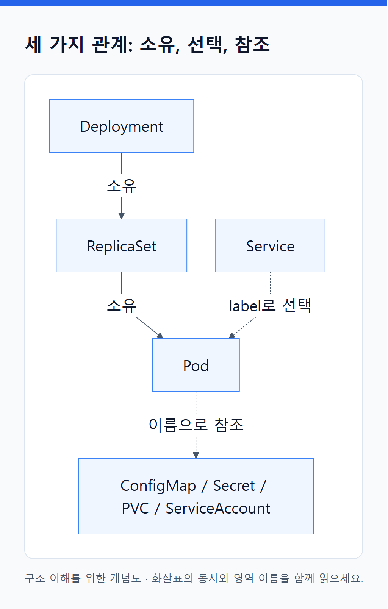
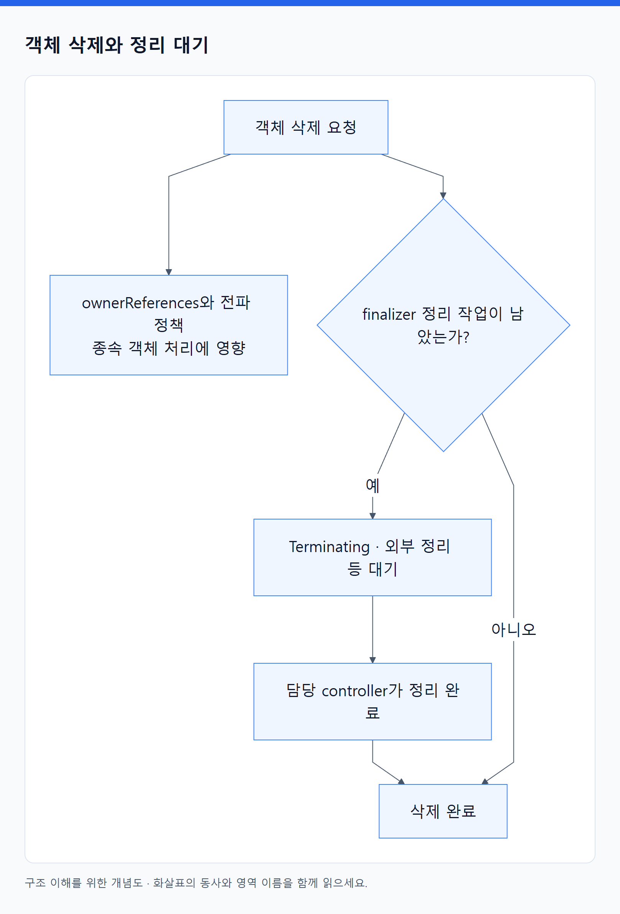

# 02. 오브젝트의 공통 구조

> 전체 학습 12/35 · 심화
> [이전: 01. Kubernetes는 의도를 저장하고 여러 프로그램이 협력하는 시스템이다](01_API와_제어_루프.md) · [전체 목차](../README.md) · [다음: 03. 앱의 실행 방식에 따라 워크로드 오브젝트를 고른다](03_워크로드_오브젝트.md)
> 본문을 위에서 아래로 읽고 마지막의 다음 장으로 이동한다. 본문 속 다른 장·출처 링크는 선택 참고용이다.

## 오브젝트는 무엇인가?

“orders 서버 두 개를 유지하라”는 의도를 기록한 Deployment가 있고, “그중 실행할 하나의 묶음”을 기록한 Pod가 있다. Kubernetes는 이런 기록을 API로 읽고 바꿀 수 있게 한다. YAML 파일은 기록을 요청하기 위한 표현이고, 클러스터에 저장된 오브젝트는 서버가 부여한 UID·기본값·관측 상태까지 포함할 수 있다.

**리소스 종류**는 `deployments`처럼 API가 제공하는 대상 종류, **kind**는 `Deployment`처럼 객체의 종류 이름, **오브젝트 인스턴스**는 `study/orders`라는 특정 Deployment다. 실제 사용에서는 resource와 object를 섞어 말하기도 하지만, 종류와 개체를 구분하면 명령을 읽기 쉽다.

## 공통 필드

```yaml
apiVersion: apps/v1
kind: Deployment
metadata:
  name: orders
  namespace: study
  labels:
    app: orders
  annotations:
    description: "주문 API 배포"
spec:
  replicas: 2
  selector:
    matchLabels:
      app: orders
  template:
    metadata:
      labels:
        app: orders
    spec:
      containers:
        - name: api
          image: registry.example.com/orders:v1
```

| 필드 | 읽는 질문 | 주의점 |
|---|---|---|
| apiVersion | 어느 API group/version 형식인가? | `v1`과 `apps/v1`은 다른 API 그룹 |
| kind | 무엇을 표현하는 객체인가? | 동일한 `name`도 kind가 다르면 다른 대상 |
| metadata.name | 이 객체의 이름은? | 이름을 바꾸는 일은 일반적인 rename 갱신이 아님 |
| metadata.namespace | 어느 논리적 범위에 속하는가? | C 객체에는 Namespace 범위를 적용하지 않음 |
| metadata.labels | 어떤 대상으로 분류·선택할까? | selector와 연결되는 값은 의미를 맞춰야 함 |
| metadata.annotations | 도구·구현이 참고할 부가 정보는? | annotation이 자동으로 실행 코드를 의미하지는 않음 |
| spec | 원하는 상태는? | 종류마다 구조가 다름 |
| status | 관측된 상태는? | 일반 배포 YAML에서 임의로 정상 값을 써 넣지 않음 |

ConfigMap은 `data`, Secret은 `data/stringData`, Role은 `rules`가 중요하다. 모든 객체가 동일하게 spec/status를 갖는다는 공식으로 읽지 않는다. [객체 모델](https://kubernetes.io/docs/concepts/overview/working-with-objects/).

## 사용자가 쓰는 값과 서버가 관리하는 값

| 서버가 주로 관리하는 정보 | 의미 | 읽을 때 얻는 것 |
|---|---|---|
| uid | 객체 생애 동안의 고유 ID | 같은 이름으로 다시 만든 객체를 구분 |
| resourceVersion | 객체 변경·동시성 제어에 쓰는 불투명 값 | 오래된 상태를 바탕으로 한 갱신 충돌 등을 이해 |
| generation | 해당 종류에서 의도 변경을 추적하는 세대 | 원하는 설정이 바뀌었는지 확인 |
| creationTimestamp | 생성 시각 | 객체가 언제 생겼는지 확인 |
| deletionTimestamp | 삭제 요청이 시작된 시각 | 삭제 절차가 진행 중인지 확인 |
| managedFields | API 필드 관리 주체 정보 | 어떤 도구가 필드를 관리하는지 조사 |

지원되는 객체의 `status.observedGeneration`은 controller가 어느 generation을 처리했는지 판단하는 단서다. 값의 존재만으로 앱의 업무 결과가 정상이라는 뜻은 아니다. `conditions`도 종류별 의미가 다르다. Pod의 Ready와 Job의 Complete를 같은 성공 신호로 취급하지 않는다. [ObjectMeta](https://kubernetes.io/docs/reference/kubernetes-api/definitions/object-meta-v1-meta/).

## 세 가지 관계: 소유, 선택, 참조

<!-- diagram:02-02-block-2 -->


[크게 보기](../assets/diagrams/02-02-block-2.png) · [SVG](../assets/diagrams/02-02-block-2.svg)

<details>
<summary>그림의 원문 설명 펼치기</summary>

```text
flowchart TD
  D["Deployment"] -->|소유| R["ReplicaSet"]
  R -->|소유| P["Pod"]
  S["Service"] -.->|label로 선택| P
  P -.->|이름으로 참조| C["ConfigMap / Secret / PVC / ServiceAccount"]
```

</details>
<!-- /diagram:02-02-block-2 -->

**소유**는 `ownerReferences`로 표현한다. 삭제 전파와 controller 관리 범위에 영향을 준다. **선택**은 label 조건으로 대상을 찾는 것이다. Service가 Pod를 선택한다고 Pod를 소유하는 것은 아니다. **참조**는 이름 등의 정보로 다른 객체를 사용하는 관계다. Pod를 지웠다고 참조한 ConfigMap까지 함께 삭제되지는 않는다.

label은 여러 개 붙일 수 있다. `app=orders`는 앱, `tier=backend`는 계층처럼 분류한다. 여러 selector 조건을 동시에 지정하면 보통 조건을 함께 만족해야 한다. 배열의 여러 규칙을 어떻게 결합하는지는 해당 API에서 확인한다. 특히 NetworkPolicy의 AND/OR 관계는 별도 항목에서 설명한다.

## 생성·변경·삭제가 실제로 반영되는 과정

객체를 만들면 API가 인증·인가·admission·검증을 거쳐 저장한다. 이후 담당 controller나 노드 프로그램이 변경을 관찰해 작업한다. 객체 저장 성공과 실제 실행 성공 사이에는 시간이 있다.

변경 가능한 필드도 종류마다 다르다. Deployment의 Pod template을 바꾸는 방식으로 Pod를 교체할 수 있지만, 실행 중 Pod의 모든 설정을 직접 바꿀 수 있는 것은 아니다. selector처럼 생성 후 변경이 제한되는 필드도 있다.

<!-- diagram:02-02-concept-2 -->


[크게 보기](../assets/diagrams/02-02-concept-2.png) · [SVG](../assets/diagrams/02-02-concept-2.svg)

<details>
<summary>그림의 원문 설명 펼치기</summary>

삭제에서는 ownerReferences와 전파 정책이 종속 객체 처리에 영향을 주고, `finalizers`는 외부 정리 등의 선행 작업이 완료될 때까지 삭제를 지연시킬 수 있다. Terminating이 보이면 “삭제 API가 무조건 실패했다”고 판단하지 말고 어느 정리 작업이 남았는지 확인한다. [소유 관계](https://kubernetes.io/docs/concepts/overview/working-with-objects/owners-dependents/), [Finalizers](https://kubernetes.io/docs/concepts/overview/working-with-objects/finalizers/).

</details>
<!-- /diagram:02-02-concept-2 -->

## 어떤 객체든 읽을 때 사용할 명령

```text
kubectl api-resources
kubectl explain deployment.spec.template
kubectl get deployment orders -n study -o yaml
kubectl describe deployment orders -n study
```

`api-resources`는 설치된 종류와 범위, `explain`은 필드 구조, `get -o yaml`은 저장된 값, `describe`는 상태와 관련 Events를 읽는 데 쓴다. `kubectl get all`이 Namespace의 모든 오브젝트를 빠짐없이 나열하는 명령은 아니다.

[목차](오브젝트_색인.md) · [실행 오브젝트](04_실행_오브젝트.md)

---

[이전: 01. Kubernetes는 의도를 저장하고 여러 프로그램이 협력하는 시스템이다](01_API와_제어_루프.md) · [전체 목차](../README.md) · [다음: 03. 앱의 실행 방식에 따라 워크로드 오브젝트를 고른다](03_워크로드_오브젝트.md)
