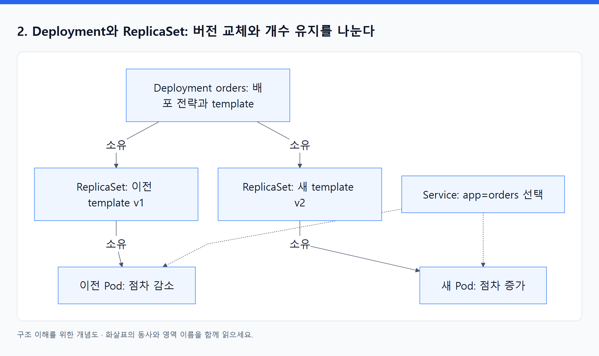
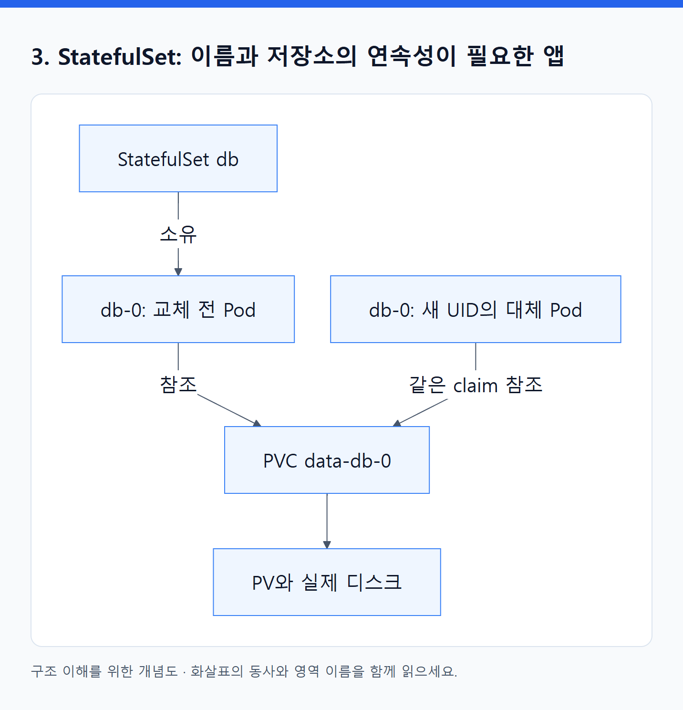
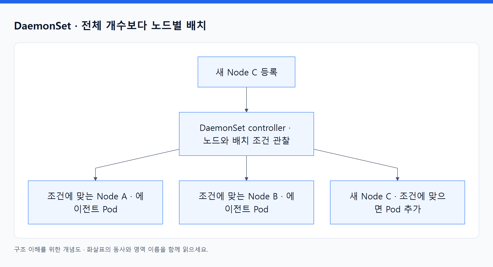
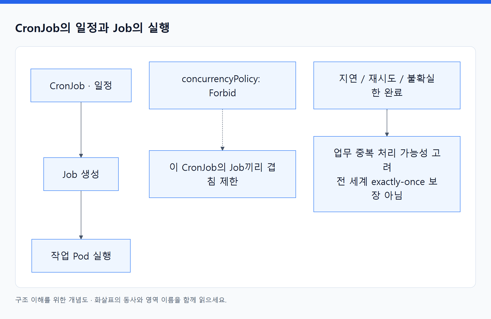
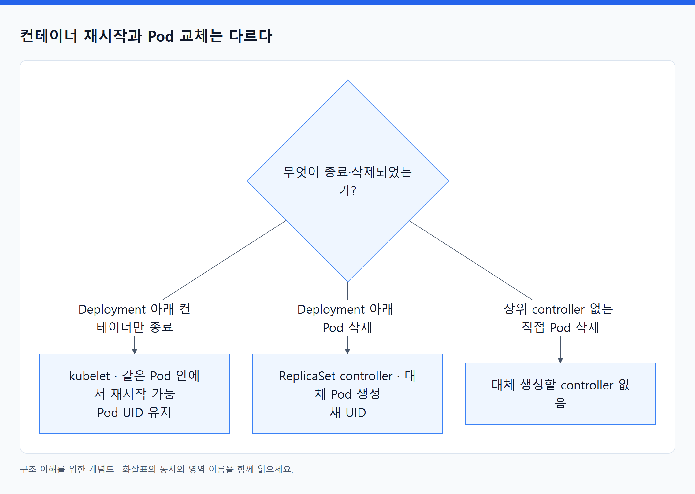

# 03. 앱의 실행 방식에 따라 워크로드 오브젝트를 고른다

> 전체 학습 13/35 · 심화
> [이전: 02. 오브젝트의 공통 구조](02_오브젝트의_공통_구조.md) · [전체 목차](../README.md) · [다음: 04. 실행 오브젝트](04_실행_오브젝트.md)
> 본문을 위에서 아래로 읽고 마지막의 다음 장으로 이동한다. 본문 속 다른 장·출처 링크는 선택 참고용이다.

> 이 장의 질문: 결국 모두 Pod인데 Deployment·StatefulSet·Job은 왜 따로 필요한가?

## 1. Pod: 함께 배치하고 실행하는 최소 단위

Pod는 하나 이상의 컨테이너를 묶는다. 같은 Pod의 컨테이너는 같은 노드에 배치되고 네트워크 네임스페이스를 공유해 `localhost`로 통신할 수 있다. 일반적으로 Pod IP 하나와 포트 공간을 공유하므로 두 컨테이너가 동시에 같은 주소의 8080을 사용할 수는 없다.

볼륨은 Pod에 정의한 뒤 각 컨테이너에 마운트한다. **모든 컨테이너의 루트 파일시스템이 자동으로 공유되는 것은 아니다.** 프로세스 PID 네임스페이스 공유도 별도 설정 문제다. 주문 API와 결제 API가 자주 통신한다는 이유만으로 하나의 Pod로 묶지 않는다. 독립적으로 확장·배포해야 한다면 별도 Pod가 자연스럽다.

| 컨테이너 형태 | 사용 이유 | 주의할 동작 |
|---|---|---|
| 앱 컨테이너 | 실제 요청 처리 | 종료 시 restartPolicy에 따른 재시작 판단 |
| 일반 init container | 앱 시작 전에 파일 준비·초기 조건 확인 | 앞선 init이 성공해야 다음 단계로 진행 |
| sidecar | 프록시 등 앱 수명 동안 보조 역할 | 앱과 자원·종료 순서가 연결됨; 네이티브 sidecar 방식은 클러스터 지원 확인 |
| ephemeral container | 실행 중 Pod의 문제 조사 | 평상시 앱 배포용 컨테이너가 아님 |

초기화 작업이 외부 DB를 무한 대기하면 Pod가 실행 전 단계에 머문다. 애플리케이션 자체의 재시도 정책과 init의 역할을 함께 설계한다. [Pods](https://kubernetes.io/docs/concepts/workloads/pods/), [Init containers](https://kubernetes.io/docs/concepts/workloads/pods/init-containers/), [Sidecar](https://kubernetes.io/docs/concepts/workloads/pods/sidecar-containers/).

## 2. Deployment와 ReplicaSet: 버전 교체와 개수 유지를 나눈다

`orders:v1`을 두 개 실행하다가 `v2`로 바꾼다고 생각하자. 단순히 수량만 유지하면 어느 버전을 언제 줄이고 늘릴지가 빠진다. Deployment는 배포 전략과 Pod template의 변경을 관리하고, 각 ReplicaSet은 해당 template의 복제본 수를 유지한다.

<!-- diagram:02-03-block-1 -->


[크게 보기](../assets/diagrams/02-03-block-1.png) · [SVG](../assets/diagrams/02-03-block-1.svg)

<details>
<summary>그림의 원문 설명 펼치기</summary>

```text
flowchart TB
  D["Deployment orders: 배포 전략과 template"] -->|소유| R1["ReplicaSet: 이전 template v1"]
  D -->|소유| R2["ReplicaSet: 새 template v2"]
  R1 -->|소유| P1["이전 Pod: 점차 감소"]
  R2 -->|소유| P2["새 Pod: 점차 증가"]
  S["Service: app=orders 선택"] -.-> P1
  S -.-> P2
```

</details>
<!-- /diagram:02-03-block-1 -->

화살표는 소유·선택 관계다. 객체를 실제로 생성·조정하는 프로그램은 각 controller이고, 통신은 API를 통해 이루어진다. Service는 배포 버전보다는 안정적인 앱 label을 선택하므로 교체 중 두 버전의 Ready Pod가 함께 트래픽을 받을 수 있다.

Pod template이 바뀌면 새 배포 revision이 만들어진다. replicas만 바꾸는 것은 동일 template의 규모 변경이다. Deployment의 `metadata.labels`와 Pod template의 labels도 위치가 다르다. Service가 선택하는 것은 일반적인 구성에서 **Pod의 label**이다.

RollingUpdate의 `maxSurge`는 목표 개수 위에 추가로 허용할 수량, `maxUnavailable`은 업데이트 중 허용할 가용 복제본 부족량이다. replicas 2, surge 1, unavailable 0이면 새 Ready 복제본을 확보하며 기존 것을 줄이는 진행을 기대할 수 있다. 하지만 종료 중 Pod 때문에 실제 순간 자원 사용은 단순한 2+1 계산보다 커질 수도 있다. 새 이미지가 계속 실패하면 진행이 멈출 수 있으며, Deployment가 자동으로 안전한 비즈니스 버전을 판별해 롤백하지는 않는다. [Deployment](https://kubernetes.io/docs/concepts/workloads/controllers/deployment/), [ReplicaSet](https://kubernetes.io/docs/concepts/workloads/controllers/replicaset/).

## 3. StatefulSet: 이름과 저장소의 연속성이 필요한 앱

교체 가능한 웹 서버와 달리, 일부 분산 시스템은 `db-0`, `db-1`처럼 안정적인 구성원 식별자가 필요하다. StatefulSet은 Pod의 ordinal과 안정적 이름, 관련 저장소의 연결을 다루며 기본 정책에서는 순서 있는 생성·종료를 제공한다. Headless Service를 함께 구성해 구성원 DNS를 제공한다.

<!-- diagram:02-03-block-2 -->


[크게 보기](../assets/diagrams/02-03-block-2.png) · [SVG](../assets/diagrams/02-03-block-2.svg)

<details>
<summary>그림의 원문 설명 펼치기</summary>

```text
flowchart LR
  ST["StatefulSet db"] -->|소유| P["db-0: 교체 전 Pod"]
  P -->|참조| C["PVC data-db-0"]
  NEW["db-0: 새 UID의 대체 Pod"] -->|같은 claim 참조| C
  C --> V["PV와 실제 디스크"]
```

</details>
<!-- /diagram:02-03-block-2 -->

이름과 claim을 이어 받는 것과 프로세스 메모리를 이어 받는 것은 다르다. 새 Pod는 애플리케이션을 다시 시작한다. StatefulSet만으로 DB 복제·리더 선출·트랜잭션 복구가 구현되지 않는다. 그 일은 DB 자체나 전용 Operator가 처리한다. PVC 보존·삭제는 StatefulSet의 retention 정책과 실제 PV reclaim 정책을 함께 확인한다. [StatefulSet](https://kubernetes.io/docs/concepts/workloads/controllers/statefulset/).

**선택 예:** 주문 API는 세션과 주문 상태를 외부 DB에 두고 Deployment로 실행한다. DB를 클러스터 안에 운영할 경우 StatefulSet과 DB 운영 체계가 필요하다. RDS를 쓰는 선택도 가능하며, 이 경우 앱 Pod가 DB 서버 Pod를 소유하지 않는다.

## 4. DaemonSet: 필요한 각 노드에 기능을 배포한다

<!-- diagram:02-03-concept-3 -->


[크게 보기](../assets/diagrams/02-03-concept-3.png) · [SVG](../assets/diagrams/02-03-concept-3.svg)

<details>
<summary>그림의 원문 설명 펼치기</summary>

노드 로그 수집기나 네트워크 에이전트는 “전체 두 개”보다 “해당 조건의 노드마다 한 개”가 중요하다. DaemonSet controller는 노드와 배치 조건에 맞춰 Pod를 유지한다. 새 노드가 들어오면 그 노드에도 대상 Pod가 필요해진다.

</details>
<!-- /diagram:02-03-concept-3 -->

모든 DaemonSet이 무조건 모든 노드에 뜨는 것은 아니다. node selector, affinity, taint와 toleration 등의 조건이 적용된다. 앱 확장을 위해 추가한 노드도 시스템 DaemonSet 자원을 먼저 소비한다는 점을 용량 계산에 반영한다. [DaemonSet](https://kubernetes.io/docs/concepts/workloads/controllers/daemonset/).

## 5. Job과 CronJob: 종료가 성공인 작업

Deployment 앱은 계속 살아 있어야 하지만, 매출 집계는 완료 후 종료하는 것이 정상이다. Job controller는 설정한 완료 조건을 달성하도록 Pod를 실행·재시도한다. `completions`는 목표 완료 수, `parallelism`은 동시에 실행할 범위, `backoffLimit`은 실패 재시도 제한을 정하는 주요 필드다.

<!-- diagram:02-03-concept-4 -->


[크게 보기](../assets/diagrams/02-03-concept-4.png) · [SVG](../assets/diagrams/02-03-concept-4.svg)

<details>
<summary>그림의 원문 설명 펼치기</summary>

CronJob은 일정에 따라 Job을 만든다. `concurrencyPolicy: Forbid`는 그 CronJob이 생성한 작업끼리 겹치는 것을 제한하지만 전 세계에서 같은 업무가 한 번만 실행된다는 보장은 아니다. 스케줄 지연·재시도·불확실한 완료 때문에 중복 처리를 고려해야 한다.

</details>
<!-- /diagram:02-03-concept-4 -->

결제 재처리 Job을 작성한다면 주문 ID를 기준으로 중복 실행을 거절하는 등의 앱 설계가 필요하다. Kubernetes의 작업 재시도와 업무의 exactly-once 처리는 다른 문제다. [Job](https://kubernetes.io/docs/concepts/workloads/controllers/job/), [CronJob](https://kubernetes.io/docs/concepts/workloads/controllers/cron-jobs/).

## 6. 선택표와 흔한 실수

| 요구 | 먼저 검토할 객체 | 이 객체만으로 해결하지 않는 것 |
|---|---|---|
| 교체 가능한 상시 API 서버 | Deployment | DB 정합성, 무중단의 모든 조건 |
| 안정적인 구성원 이름·개별 저장소 | StatefulSet | 데이터 복제와 백업 |
| 대상 노드마다 에이전트 | DaemonSet | 노드 생성 자체 |
| 완료해야 하는 일회성 작업 | Job | 업무 중복 방지 |
| 시간표에 따른 작업 | CronJob | 절대적인 실행 시각·정확히 한 번 실행 |
| 짧은 관찰·실험 | 직접 Pod | 노드 장애 뒤 다른 노드에 자동 대체 생성 |

<!-- diagram:02-03-concept-5 -->


[크게 보기](../assets/diagrams/02-03-concept-5.png) · [SVG](../assets/diagrams/02-03-concept-5.svg)

<details>
<summary>그림의 원문 설명 펼치기</summary>

직접 만든 Pod를 삭제하면 유지할 상위 controller가 없으므로 돌아오지 않는다. 반면 Deployment 아래 Pod의 컨테이너만 죽으면 kubelet이 같은 Pod 안에서 재시작할 수 있고, Pod 자체가 없어지면 ReplicaSet controller가 대체 객체를 만든다. 두 복구는 주체도 UID 변화도 다르다.

</details>
<!-- /diagram:02-03-concept-5 -->

**스스로 설명하기:** 로그 수집기를 Deployment replicas 3으로 띄우는 것과 DaemonSet으로 띄우는 것은 노드가 3개에서 5개로 늘 때 어떻게 달라지는가? 정답에는 “노드별 배치”와 “전체 복제본 수”가 들어가야 한다.

---

[이전: 02. 오브젝트의 공통 구조](02_오브젝트의_공통_구조.md) · [전체 목차](../README.md) · [다음: 04. 실행 오브젝트](04_실행_오브젝트.md)
