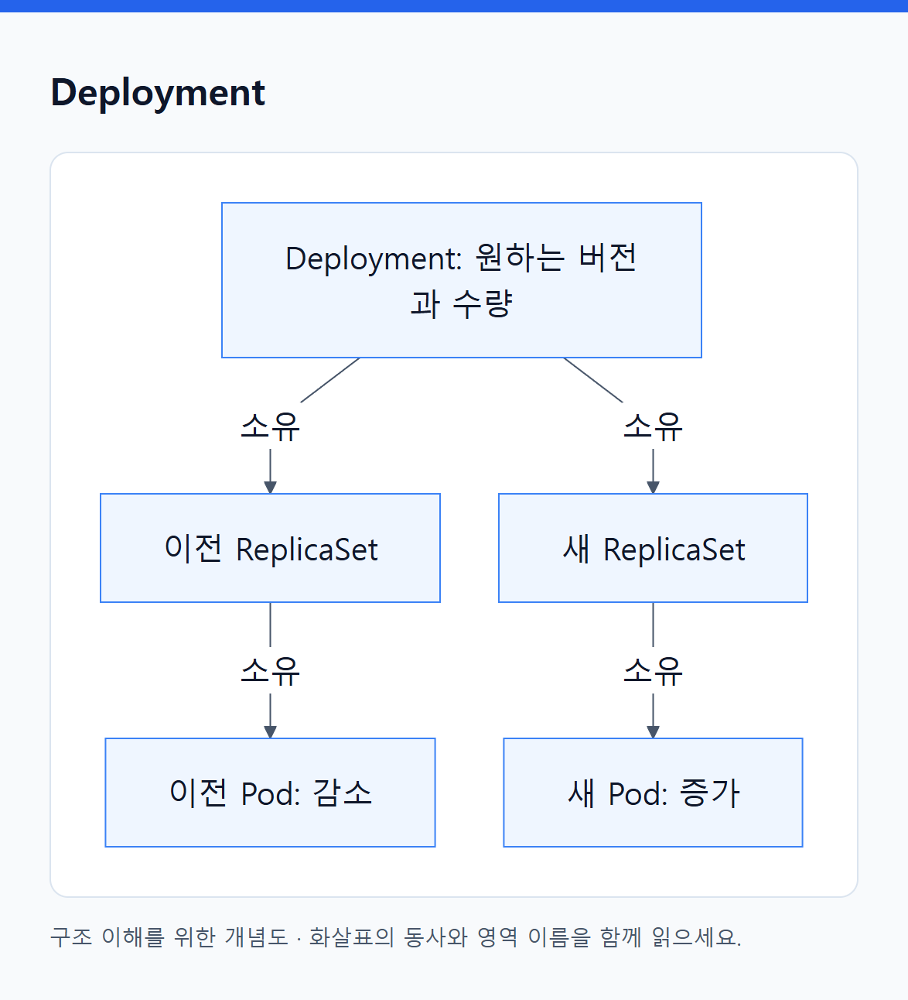

# 04. 실행 오브젝트

> 전체 학습 14/35 · 심화
> [이전: 03. 앱의 실행 방식에 따라 워크로드 오브젝트를 고른다](03_워크로드_오브젝트.md) · [전체 목차](../README.md) · [다음: 05. Pod가 실행되기까지: 배치·준비·시작·종료](05_스케줄링과_Pod_생명주기.md)
> 본문을 위에서 아래로 읽고 마지막의 다음 장으로 이동한다. 본문 속 다른 장·출처 링크는 선택 참고용이다.

이 파일의 N 객체는 모두 Namespace에 속한다. 그림의 소유 화살표는 API 객체의 관계이고, 실제 생성·수정은 해당 controller가 API를 통해 수행한다.

## Pod

**API: `v1` · 범위: N · 핵심: 함께 배치하고 실행할 컨테이너의 묶음.**

Pod는 실행 단위를 기록한다. 같은 Pod의 컨테이너는 같은 노드에 배치되고 일반적으로 네트워크 네임스페이스를 공유한다. 서로 `localhost`로 연결할 수 있고 포트 공간도 공유한다. 볼륨을 함께 마운트할 수 있지만 각 컨테이너의 루트 파일시스템까지 자동 공유되지는 않는다.

**필드를 읽는 순서**는 이미지 → 실행 명령 → 입력 설정 → 자원 → 건강 확인 → 연결할 volume → 배치 조건이다.

| 주요 필드 | 의미 |
|---|---|
| containers[].image | 실행할 이미지 참조; 가능하면 검증한 digest로 버전 식별 |
| command / args | 이미지 기본 실행 명령·인수를 덮어쓰는 설정 |
| env / envFrom | 환경 변수로 전달할 값이나 ConfigMap·Secret 참조 |
| ports | 이름과 컨테이너 포트 정보; 앱을 listen하게 만드는 기능은 아님 |
| resources.requests / limits | 필요한 배치 자원과 실행 제한 |
| startupProbe / readinessProbe / livenessProbe | 시작 완료·요청 준비·재시작 필요 판단 |
| volumes / volumeMounts | Pod 수준 저장소 정의 / 컨테이너 내부 마운트 위치 |
| initContainers | 앱 시작 전 초기화 등; 네이티브 sidecar 설정은 버전 확인 |
| serviceAccountName | 사용할 워크로드 신원 |
| restartPolicy | 컨테이너 종료 후 재시작 정책 |
| affinity / tolerations / topologySpreadConstraints | 배치 선호·허용·분산 조건 |
| terminationGracePeriodSeconds | 종료 정리를 허용할 시간 |

```yaml
apiVersion: v1
kind: Pod
metadata:
  name: orders-one
  namespace: study
  labels:
    app: orders
spec:
  containers:
    - name: api
      image: registry.example.com/orders:v1
      ports:
        - name: http
          containerPort: 8080
      resources:
        requests:
          cpu: 100m
          memory: 128Mi
        limits:
          cpu: 500m
          memory: 256Mi
      readinessProbe:
        httpGet:
          path: /ready
          port: http
```

**동작:** API에 생성 → scheduler가 Node 배정 → kubelet이 runtime·네트워크·저장소 준비를 조정 → 컨테이너 시작 → 상태 보고. readiness는 앱이 실제 `/ready`를 제공해야 한다. 실패 시 일반적인 Service의 준비된 대상에서 제외되지만 readiness 실패만으로 컨테이너가 재시작되지는 않는다.

**조회:** `kubectl describe pod orders-one -n study`. `status.phase`와 함께 conditions, containerStatuses의 `state/lastState/restartCount`, Events를 본다. Running은 Ready와 다르다.

**변경·삭제:** 같은 Pod 안의 컨테이너 재시작은 UID가 유지될 수 있다. Pod를 삭제하고 다시 만들면 새 UID다. 직접 만든 Pod는 상위 유지 controller가 없으므로 삭제 후 자동 대체 생성을 기대하지 않는다. 실제 서비스는 대개 Deployment 등의 template에 Pod 설정을 적는다. [Pod](https://kubernetes.io/docs/concepts/workloads/pods/), [생명주기](https://kubernetes.io/docs/concepts/workloads/pods/pod-lifecycle/).

## ReplicaSet

**API: `apps/v1` · 범위: N · 핵심: 특정 Pod template의 복제본 수 유지.**

Pod 하나를 직접 만들어서는 “항상 두 개”라는 요구가 유지되지 않는다. ReplicaSet은 `replicas`, 대상 식별 `selector`, 새 Pod를 만드는 `template`으로 이 요구를 표현한다.

```yaml
apiVersion: apps/v1
kind: ReplicaSet
metadata:
  name: orders-rs
  namespace: study
spec:
  replicas: 2
  selector:
    matchLabels:
      app: orders-rs
  template:
    metadata:
      labels:
        app: orders-rs
    spec:
      containers:
        - name: api
          image: registry.example.com/orders:v1
```

**동작:** ReplicaSet controller가 자신이 관리하는 Pod를 확인하고 목표보다 부족하면 생성, 많으면 감소시킨다. selector와 일치하는 주인 없는 Pod를 인수할 수도 있으므로 의도 없이 selector를 겹치게 하지 않는다. 위 예제는 설명용으로 `orders-rs` label을 분리했다.

**관찰:** `status.replicas`, `readyReplicas`, `availableReplicas`와 Pod의 ownerReferences를 비교한다. 목표 수가 있어도 quota나 admission이 Pod 생성을 거절할 수 있다.

**주의:** template의 이미지를 바꾸는 것만으로 기존 Pod를 순차 교체하는 배포 전략이 생기지 않는다. 버전 교체까지 관리하려면 Deployment를 사용한다. Deployment 아래 ReplicaSet을 직접 수정하면 상위 controller의 의도와 충돌할 수 있다. [ReplicaSet](https://kubernetes.io/docs/concepts/workloads/controllers/replicaset/).

## Deployment

**API: `apps/v1` · 범위: N · 핵심: 복제본 수와 Pod template의 버전 교체 관리.**

Deployment는 ReplicaSet들을 통해 앱 버전을 교체한다. Pod template이 바뀌면 새 ReplicaSet을 만들거나 해당 revision을 이용해 이전 것과 새 것의 개수를 조정한다. 단순 replicas 변경은 같은 template의 규모 변경이다.

<!-- diagram:02-04-block-3 -->


[크게 보기](../assets/diagrams/02-04-block-3.png) · [SVG](../assets/diagrams/02-04-block-3.svg)

<details>
<summary>그림의 원문 설명 펼치기</summary>

```text
flowchart TD
  D["Deployment: 원하는 버전과 수량"] -->|소유| OLD["이전 ReplicaSet"]
  D -->|소유| NEW["새 ReplicaSet"]
  OLD -->|소유| P1["이전 Pod: 감소"]
  NEW -->|소유| P2["새 Pod: 증가"]
```

</details>
<!-- /diagram:02-04-block-3 -->

| 주요 필드 | 의미 |
|---|---|
| replicas | 목표 복제본 수 |
| selector.matchLabels | 관리 대상 Pod를 식별; template label과 일치 필요 |
| template | 새 Pod에 사용할 설정 |
| strategy.type | RollingUpdate 또는 Recreate |
| rollingUpdate.maxSurge | 업데이트 중 목표 위에 추가 허용할 수 |
| rollingUpdate.maxUnavailable | 업데이트 중 허용할 가용 수 부족 |
| minReadySeconds | Ready 상태가 유지되어야 Available로 간주할 최소 시간 |
| progressDeadlineSeconds | 진행이 멈춘 상태를 보고할 기준; 자동 rollback 명령 아님 |
| revisionHistoryLimit | 보존할 이전 ReplicaSet 이력의 수 |

```yaml
apiVersion: apps/v1
kind: Deployment
metadata:
  name: orders
  namespace: study
spec:
  replicas: 2
  minReadySeconds: 5
  strategy:
    type: RollingUpdate
    rollingUpdate:
      maxSurge: 1
      maxUnavailable: 0
  selector:
    matchLabels:
      app: orders
  template:
    metadata:
      labels:
        app: orders
    spec:
      containers:
        - name: api
          image: registry.example.com/orders:v1
          ports:
            - name: http
              containerPort: 8080
          readinessProbe:
            httpGet:
              path: /ready
              port: http
```

새 Pod가 준비되어야 기존 것을 줄이도록 의도를 표현한 예다. surge를 실행할 용량이나 정상 readiness가 없으면 진행이 멈출 수 있다. 종료 중인 Pod 때문에 실제 순간 자원 사용이 단순 목표+surge 계산보다 클 수도 있다.

**관찰:** `kubectl rollout status deployment/orders -n study`, `get deployment -o yaml`의 updatedReplicas·availableReplicas·conditions를 본다. 앱 오류를 판단해 스스로 이전 비즈니스 버전으로 되돌리는 기능은 아니다. selector는 생성 후 변경이 제한되며, API가 수락한 template 변경도 실제 실행 성공을 보장하지 않는다. [Deployment](https://kubernetes.io/docs/concepts/workloads/controllers/deployment/).

## StatefulSet

**API: `apps/v1` · 범위: N · 핵심: 안정적인 구성원 이름과 개별 저장소 연결.**

교체 가능한 API 복제본과 달리 `db-0`, `db-1`처럼 구성원 식별을 이어가야 할 때 사용한다. 새 Pod로 교체되어 UID와 IP가 달라져도 ordinal·이름과 연결된 claim은 정책에 따라 이어갈 수 있다.

| 주요 필드 | 의미 |
|---|---|
| serviceName | 구성원 네트워크 이름을 위한 governing Service |
| replicas / selector / template | 구성원 수와 Pod 정의 |
| volumeClaimTemplates | 구성원별로 필요한 PVC의 template |
| podManagementPolicy | 기본 OrderedReady 또는 Parallel 방식의 생성·규모 조정 |
| updateStrategy | RollingUpdate 또는 OnDelete 등 버전 교체 방식 |
| persistentVolumeClaimRetentionPolicy | 지원 환경에서 삭제·축소 시 PVC 유지 정책 |

```yaml
apiVersion: apps/v1
kind: StatefulSet
metadata:
  name: records
  namespace: study
spec:
  serviceName: records-headless
  replicas: 2
  selector:
    matchLabels:
      app: records
  template:
    metadata:
      labels:
        app: records
    spec:
      containers:
        - name: store
          image: registry.example.com/record-store:v1
          volumeMounts:
            - name: data
              mountPath: /data
  volumeClaimTemplates:
    - metadata:
        name: data
      spec:
        storageClassName: demo-storage
        accessModes: [ReadWriteOnce]
        resources:
          requests:
            storage: 5Gi
```

Headless Service `records-headless`와 실제 StorageClass가 별도로 필요하다. `data-records-0` 같은 PVC가 구성원과 연결된다. `OnDelete`에서는 template을 바꿔도 기존 Pod가 자동으로 모두 교체되지 않는다. `Parallel`이 모든 업데이트의 순서 규칙까지 없앤다고 일반화하지 않는다.

**관찰:** currentRevision·updateRevision·readyReplicas, 구성원 Pod 이름, PVC 바인딩. **주의:** StatefulSet은 DB의 복제·리더 선출·백업을 구현하지 않는다. Pod 삭제, StatefulSet 삭제, PVC 삭제, 실제 저장소 삭제의 정책을 따로 읽는다. [StatefulSet](https://kubernetes.io/docs/concepts/workloads/controllers/statefulset/).

## DaemonSet

**API: `apps/v1` · 범위: N · 핵심: 대상 노드마다 에이전트 실행.**

로그 수집기처럼 “전체 세 개”보다 “조건에 맞는 각 노드에 하나”가 중요한 경우에 쓴다. 노드가 늘면 DaemonSet controller가 새 노드에도 필요한 Pod를 만들고, 노드가 빠지면 관련 실행이 정리된다.

주요 필드는 `selector`, `template`, `updateStrategy`, `minReadySeconds`다. 노드 선택은 template의 nodeSelector·affinity·tolerations와 연결된다. 모든 노드에 무조건 실행된다고 가정하지 않는다.

```yaml
apiVersion: apps/v1
kind: DaemonSet
metadata:
  name: node-agent
  namespace: study
spec:
  selector:
    matchLabels:
      app: node-agent
  template:
    metadata:
      labels:
        app: node-agent
    spec:
      containers:
        - name: agent
          image: registry.example.com/node-agent:v1
```

이는 배치 관계만 보여 준다. 실제 로그 수집에 필요한 마운트·권한은 에이전트 구현에 맞게 추가해야 한다. `desiredNumberScheduled`, `currentNumberScheduled`, `numberReady`, `numberUnavailable`를 보면 대상 노드 수와 실행 준비 수를 구분할 수 있다. DaemonSet은 노드를 생성하는 객체가 아니다. [DaemonSet](https://kubernetes.io/docs/concepts/workloads/controllers/daemonset/).

## Job

**API: `batch/v1` · 범위: N · 핵심: 성공적으로 완료해야 하는 작업.**

계속 실행되는 서버와 달리 집계·변환 작업은 종료가 정상이다. Job controller는 성공 조건에 도달하도록 Pod를 생성·재시도한다.

| 주요 필드 | 의미 |
|---|---|
| completions | 필요한 성공 완료 수 |
| parallelism | 동시에 실행하려는 Pod 수의 범위 |
| backoffLimit | 실패에 대한 재시도 한계 |
| activeDeadlineSeconds | Job의 활동 시간을 제한 |
| ttlSecondsAfterFinished | 완료 후 객체 정리까지의 시간 |
| template.spec.restartPolicy | Job에서는 Never 또는 OnFailure |
| completionMode | NonIndexed 또는 작업 인덱스를 사용하는 Indexed |

```yaml
apiVersion: batch/v1
kind: Job
metadata:
  name: daily-summary-once
  namespace: study
spec:
  completions: 1
  parallelism: 1
  backoffLimit: 2
  activeDeadlineSeconds: 300
  template:
    spec:
      restartPolicy: Never
      containers:
        - name: worker
          image: registry.example.com/summary-worker:v1
```

`Never`는 같은 컨테이너를 kubelet이 재시작하지 않는 정책이지, Job controller가 실패 후 새 Pod를 만들지 않는다는 뜻이 아니다. `status.active/succeeded/failed`와 conditions, 각 Pod의 종료 코드로 결과를 본다. 완료된 Job의 이미지 template을 바꿔 재실행하는 대신 새 실행 객체를 만드는 방식으로 다룬다. 재시도로 업무가 중복될 수 있으므로 중복 처리는 앱이 설계해야 한다. [Job](https://kubernetes.io/docs/concepts/workloads/controllers/job/).

## CronJob

**API: `batch/v1` · 범위: N · 핵심: 일정에 따라 Job 생성.**

```yaml
apiVersion: batch/v1
kind: CronJob
metadata:
  name: daily-summary
  namespace: study
spec:
  schedule: "0 2 * * *"
  timeZone: Asia/Seoul
  concurrencyPolicy: Forbid
  startingDeadlineSeconds: 600
  successfulJobsHistoryLimit: 2
  failedJobsHistoryLimit: 2
  jobTemplate:
    spec:
      template:
        spec:
          restartPolicy: Never
          containers:
            - name: worker
              image: registry.example.com/summary-worker:v1
```

지원되는 클러스터에서 서울 시간 매일 02시에 Job을 만들도록 한 예다. `schedule`은 일정, `timeZone`은 해석할 시간대, `jobTemplate`은 생성할 Job의 설계다. `concurrencyPolicy`의 Allow·Forbid·Replace는 **이 CronJob이 생성한 Job들**의 겹침을 제어한다. `startingDeadlineSeconds`는 예정 시각을 놓친 실행의 시작 허용 범위다.

`suspend: true`는 이후 일정 실행을 중단하는 데 쓰며 이미 시작된 모든 Job을 자동 종료하는 뜻은 아니다. CronJob 변경은 보통 이후 새 Job에 적용된다. `status.lastScheduleTime`, `lastSuccessfulTime`, `active`와 실제 Job을 함께 본다. 정확히 한 번·정확한 시각의 업무 실행을 보장하는 분산 트랜잭션 시스템은 아니다. [CronJob](https://kubernetes.io/docs/concepts/workloads/controllers/cron-jobs/).

## ControllerRevision

**API: `apps/v1` · 범위: N · 핵심: controller가 사용하는 버전 이력 데이터.**

StatefulSet·DaemonSet 등에서 과거 설정을 추적하기 위해 쓰인다. `revision`은 이력 번호, `data`는 해당 이력을 표현하는 직렬화된 데이터다. metadata의 ownerReferences로 관련 워크로드를 확인한다.

일반 앱 개발자는 직접 YAML을 작성하기보다 `kubectl get controllerrevisions -n study`로 이력과 소유자를 조사한다. 현재 실행 중 Pod 목록이나 DB 데이터 백업이 아니다. Deployment가 이전 ReplicaSet을 사용하는 모델과도 구분한다. 이력 수를 관리하는 상위 객체 정책을 먼저 확인하고 임의로 이력 데이터를 수정하지 않는다. [ControllerRevision API](https://kubernetes.io/docs/reference/kubernetes-api/apps/controller-revision-v1/).

[목차](오브젝트_색인.md) · [통신 오브젝트](07_통신_오브젝트.md)

---

[이전: 03. 앱의 실행 방식에 따라 워크로드 오브젝트를 고른다](03_워크로드_오브젝트.md) · [전체 목차](../README.md) · [다음: 05. Pod가 실행되기까지: 배치·준비·시작·종료](05_스케줄링과_Pod_생명주기.md)
