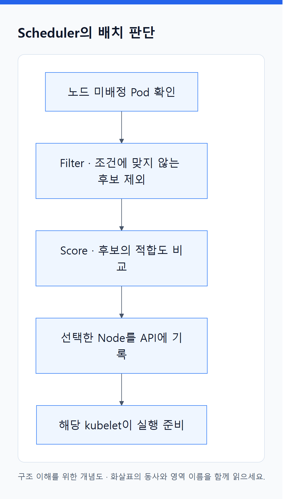
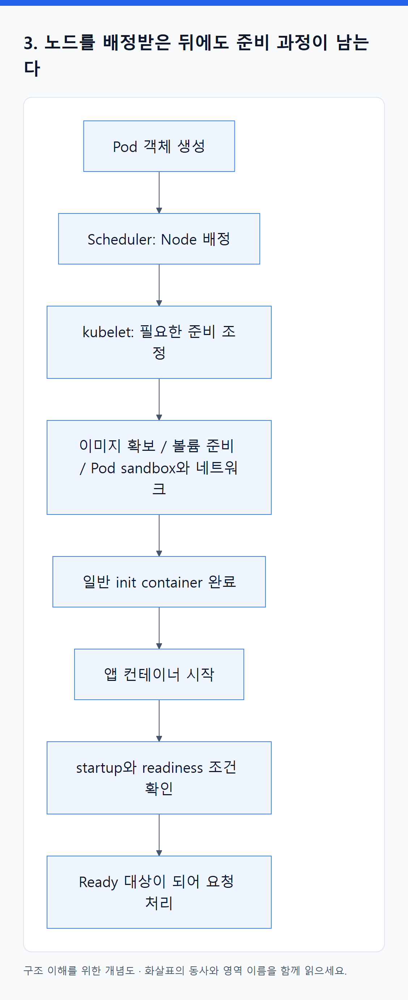
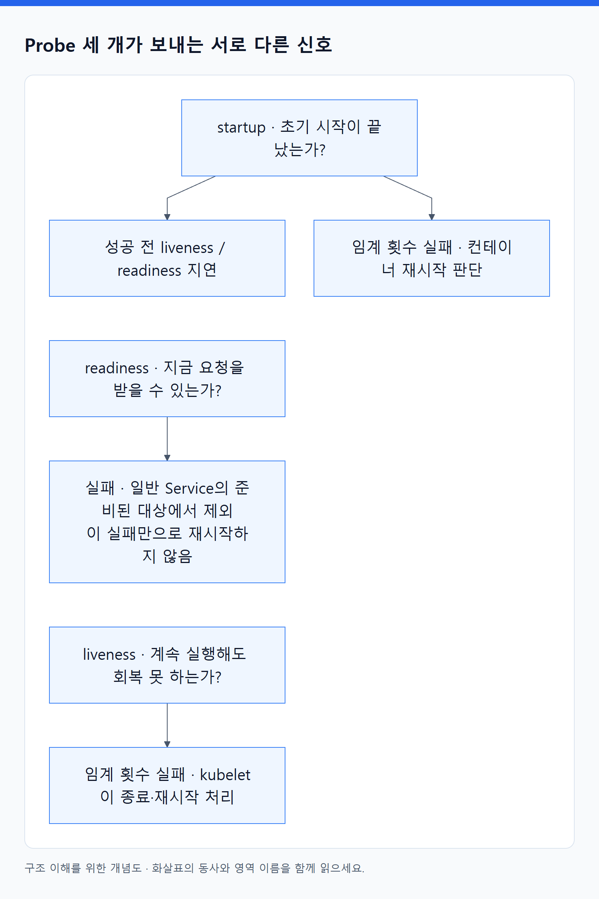
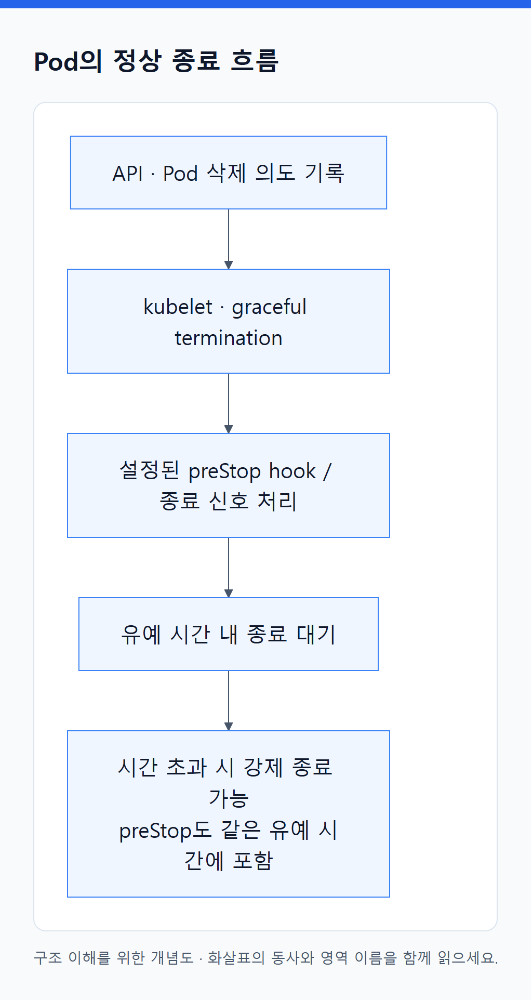

# 05. Pod가 실행되기까지: 배치·준비·시작·종료

> 전체 학습 15/35 · 심화
> [이전: 04. 실행 오브젝트](04_실행_오브젝트.md) · [전체 목차](../README.md) · [다음: 06. 통신은 주소·발견·전달·진입을 나누어 이해한다](06_네트워크와_서비스_노출.md)
> 본문을 위에서 아래로 읽고 마지막의 다음 장으로 이동한다. 본문 속 다른 장·출처 링크는 선택 참고용이다.

> 이 장의 질문: Pod가 만들어졌는데 왜 실행되지 않는가? 죽었을 때 무엇이 다시 시작되는가?

## 1. Scheduler는 실행할 장소를 고른다

<!-- diagram:02-05-concept-2 -->


[크게 보기](../assets/diagrams/02-05-concept-2.png) · [SVG](../assets/diagrams/02-05-concept-2.svg)

<details>
<summary>그림의 원문 설명 펼치기</summary>

기본 scheduler는 아직 노드가 배정되지 않은 Pod를 보고 후보 노드를 거른 뒤 점수를 매겨 배치한다. 거르는 단계가 **filter**, 적합도를 비교하는 단계가 **score**다. 배치 결과가 API에 기록되면 해당 kubelet이 실행을 준비한다. scheduler가 직접 이미지를 다운로드하거나 EC2를 생성하지는 않는다.

</details>
<!-- /diagram:02-05-concept-2 -->

예를 들어 Pod에 CPU request `500m`, 메모리 request `512Mi`가 있다면, 노드의 남은 **예약 가능량**이 이 요청을 수용해야 한다. 현재 CPU 사용률이 낮아도 다른 Pod의 requests가 이미 용량을 차지하면 새 Pod는 들어가지 못한다. 노드가 4 vCPU라고 해서 앱에 4 vCPU 전부 예약 가능한 것도 아니다. 운영체제와 시스템용 예약 등을 뺀 `allocatable`을 본다. [Scheduler](https://kubernetes.io/docs/concepts/scheduling-eviction/kube-scheduler/).

| 배치 조건 | 의미 | 잘못 해석하기 쉬운 점 |
|---|---|---|
| nodeSelector / nodeAffinity | 어떤 노드 속성이 필요한가 | required 조건을 만족하는 노드가 없으면 계속 Pending |
| podAffinity / antiAffinity | 다른 Pod와 가깝게 또는 떨어지게 배치 | 강한 규칙은 복구할 자리를 줄일 수 있음 |
| taint / toleration | 특정 노드가 일반 Pod를 거절하고 예외를 허용 | toleration은 그 노드로 가라는 지시가 아님 |
| topologySpreadConstraints | zone·hostname 등의 분산 정도 | topology label과 실제 가용 용량이 필요 |
| PriorityClass | 경쟁 시 우선순위 | 우선순위가 물리 용량을 새로 만들지는 않음 |
| 볼륨 topology | 디스크를 사용할 수 있는 위치 | EBS의 AZ 제약과 배치가 충돌할 수 있음 |

`NoSchedule` taint는 새 배치를 제한하고, `NoExecute`는 조건에 따라 이미 배치된 Pod의 퇴거에도 영향을 준다. 자원 부족 시 preemption으로 낮은 우선순위 Pod를 제거할 수 있지만, 서로 다른 AZ나 맞지 않는 노드 종류 문제까지 해결하지는 못한다. [노드 배치](https://kubernetes.io/docs/concepts/scheduling-eviction/assign-pod-node/), [Taints](https://kubernetes.io/docs/concepts/scheduling-eviction/taint-and-toleration/).

## 2. Requests와 limits는 서로 다른 질문에 답한다

`requests`는 주로 “배치할 때 얼마를 필요하다고 볼까?”, `limits`는 “실행 중 어느 선까지 허용할까?”다. CPU `1000m`은 CPU 1개에 해당하는 시간 용량이다. CPU limit에 도달하면 보통 throttling으로 느려지고, 메모리 limit을 넘는 할당은 OOM 종료로 이어질 수 있다. 두 자원은 초과 시 동작이 다르다.

CPU 사용률 20%라는 값만 보고 request를 낮추면 안 된다. 짧은 피크, 지연 시간, 시작 비용을 함께 측정한다. 반대로 request를 과도하게 잡으면 앱이 거의 쉬어도 배치상 여유가 없어져 노드 비용이 늘 수 있다. QoS인 Guaranteed·Burstable·BestEffort는 requests/limits 구성에서 정해지며 자원 압박 시 판단에 영향을 준다. 특정 QoS가 모든 종료를 막아 주는 것은 아니다. [자원 관리](https://kubernetes.io/docs/concepts/configuration/manage-resources-containers/), [QoS](https://kubernetes.io/docs/concepts/workloads/pods/pod-qos/).

## 3. 노드를 배정받은 뒤에도 준비 과정이 남는다

<!-- diagram:02-05-block-1 -->


[크게 보기](../assets/diagrams/02-05-block-1.png) · [SVG](../assets/diagrams/02-05-block-1.svg)

<details>
<summary>그림의 원문 설명 펼치기</summary>

```text
flowchart TD
  A["Pod 객체 생성"] --> B["Scheduler: Node 배정"]
  B --> C["kubelet: 필요한 준비 조정"]
  C --> D["이미지 확보 / 볼륨 준비 / Pod sandbox와 네트워크"]
  D --> E["일반 init container 완료"]
  E --> F["앱 컨테이너 시작"]
  F --> G["startup와 readiness 조건 확인"]
  G --> H["Ready 대상이 되어 요청 처리"]
```

</details>
<!-- /diagram:02-05-block-1 -->

준비 작업은 구현에 따라 병렬 또는 다른 순서로 진행될 수 있다. 핵심은 **배치 완료와 앱 준비 완료 사이에 별도 실패 지점이 여러 개 있다는 것**이다. containerd는 kubelet과 별도 프로그램이며 CRI로 요청을 받는다. CNI와 CSI는 각각 네트워크·스토리지 연결에 관여한다. 컨테이너 실행 세부는 기존 [Docker 심화](../01_기초/03_Docker_이미지에서_실행까지.md)를 참조한다.

## 4. 상태 표시는 요약이지 원인 전체가 아니다

| 관찰 값 | 읽는 방법 | 다음 증거 |
|---|---|---|
| Pending | 실행 준비가 완료되지 않음; 미배치만 뜻하지 않음 | `describe pod`의 Events와 nodeName |
| Running | 적어도 하나의 컨테이너가 실행 중이거나 시작·재시작 중인 단계 | Ready 조건, 개별 containerStatuses |
| Succeeded / Failed | Pod 실행 결과의 종료 단계 | exit code, Job 상태 |
| ImagePullBackOff | 이미지 확보 실패 후 재시도 간격 증가 | 이미지 주소·인증·노드 외부 통신 |
| CrashLoopBackOff | 반복 종료 후 재시작 대기 | 이전 컨테이너 로그, 종료 원인 |
| Terminating | kubectl이 삭제 진행 중임을 표시 | finalizer, 종료 유예, 볼륨, 노드 연결 |

`CrashLoopBackOff`와 `Terminating`은 Pod의 공식 phase 이름이 아니다. `Running`이 HTTP 정상 응답을 보장하지도 않는다. 출력 한 칸에서 멈추지 말고 conditions, reason, message, Events를 읽는다. [Pod lifecycle](https://kubernetes.io/docs/concepts/workloads/pods/pod-lifecycle/).

## 5. Probe 세 개는 서로 다른 신호다

<!-- diagram:02-05-comparison-4 -->


[크게 보기](../assets/diagrams/02-05-comparison-4.png) · [SVG](../assets/diagrams/02-05-comparison-4.svg)

<details>
<summary>그림의 원문 설명 펼치기</summary>

| Probe | 질문 | 실패했을 때의 대표 동작 |
|---|---|---|
| startup | 초기 시작이 끝났는가? | 임계 횟수 실패 시 컨테이너 재시작 판단; 성공 전 liveness/readiness 지연 |
| readiness | 지금 새 요청을 받을 준비가 되었는가? | 일반 Service의 준비된 대상에서 제외; 이 실패만으로 재시작하지 않음 |
| liveness | 계속 실행시켜도 회복하지 못하는 상태인가? | 임계 횟수 실패 시 kubelet이 컨테이너 종료·재시작 처리 |

</details>
<!-- /diagram:02-05-comparison-4 -->

DB가 일시 중단됐다고 모든 API 컨테이너의 liveness를 실패시키면, 앱이 대량 재시작되며 장애가 커질 수 있다. 외부 의존성 장애가 프로세스 재시작으로 해결되는지 먼저 판단한다. readiness에도 모든 의존성을 무조건 넣으면 전체 대상이 동시에 빠질 수 있다. 서비스가 부분 응답·캐시 응답을 제공할 수 있는지에 따라 기준을 설계한다. [Probe 동작](https://kubernetes.io/docs/concepts/configuration/liveness-readiness-startup-probes/).

## 6. 종료도 프로토콜이다

<!-- diagram:02-05-concept-3 -->


[크게 보기](../assets/diagrams/02-05-concept-3.png) · [SVG](../assets/diagrams/02-05-concept-3.svg)

<details>
<summary>그림의 원문 설명 펼치기</summary>

Pod 삭제 시 API에 삭제 의도가 기록되고 kubelet이 graceful termination을 진행한다. 보통 설정한 preStop hook과 종료 신호 처리를 거쳐 유예 시간이 끝나면 강제 종료가 일어날 수 있다. preStop 실행도 종료 유예 시간 예산 안에 포함된다.

</details>
<!-- /diagram:02-05-concept-3 -->

동시에 EndpointSlice와 외부 LB도 대상 종료를 반영하지만 전파는 즉시 일어나지 않는다. 따라서 앱은 종료 신호를 받아 새 작업을 제한하고 진행 중 요청을 정리해야 한다. 장시간 연결, ALB의 deregistration delay, terminationGracePeriodSeconds를 함께 고려한다. 종료 중 endpoint는 일반 트래픽 대상으로 쓰이지 않도록 readiness가 조정되며, 구현에 따라 serving/terminating 조건을 활용할 수 있다. “Pod 삭제 즉시 모든 요청이 다른 Pod로 순간 이동한다”는 모델은 틀리다.

노드 장애에서는 해당 kubelet이 정상 종료 절차를 수행할 수 없을 수도 있다. 감지와 eviction, 대체 Pod 생성, 새 노드 준비까지 시간이 걸린다. Stateful 앱은 이전 실행자가 살아 있는지 불확실한 상태에서 중복 쓰기를 방지하는 DB·스토리지 설계도 필요하다.

**스스로 설명하기:** 같은 Pod의 restart count 증가와 새 UID의 Pod 출현은 무엇이 다른가? 전자는 주로 kubelet의 컨테이너 재시작, 후자는 상위 controller의 대체 객체 생성이다.

---

[이전: 04. 실행 오브젝트](04_실행_오브젝트.md) · [전체 목차](../README.md) · [다음: 06. 통신은 주소·발견·전달·진입을 나누어 이해한다](06_네트워크와_서비스_노출.md)
