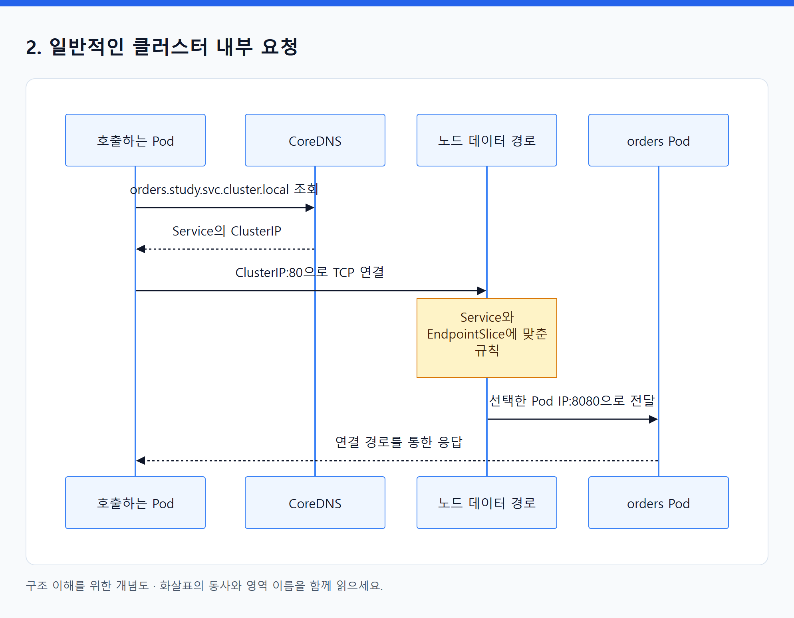
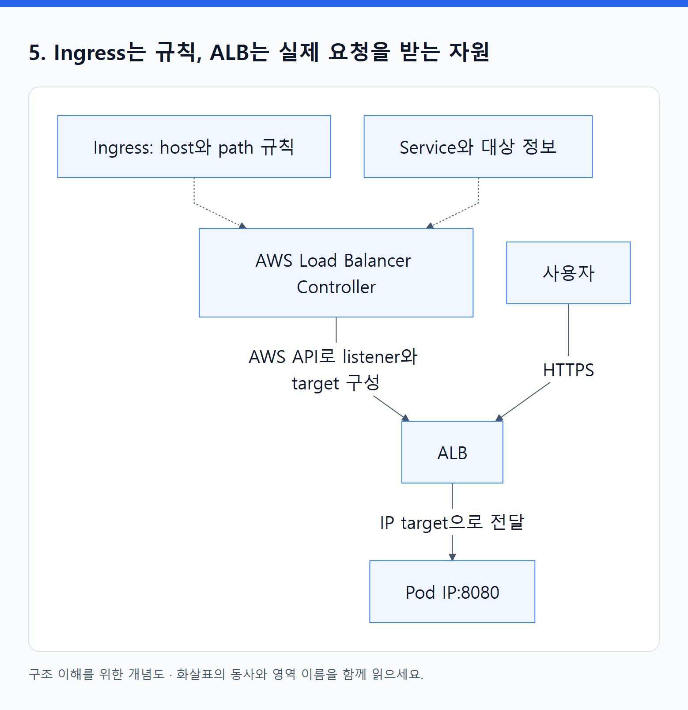
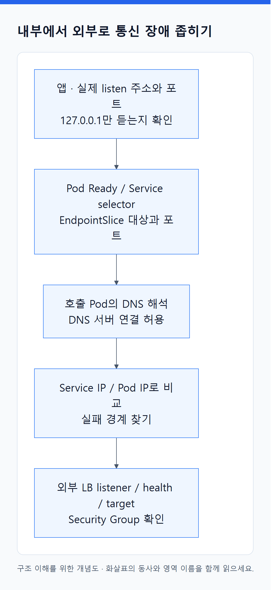

# 06. 통신은 주소·발견·전달·진입을 나누어 이해한다

> 전체 학습 16/35 · 심화
> [이전: 05. Pod가 실행되기까지: 배치·준비·시작·종료](05_스케줄링과_Pod_생명주기.md) · [전체 목차](../README.md) · [다음: 07. 통신 오브젝트](07_통신_오브젝트.md)
> 본문을 위에서 아래로 읽고 마지막의 다음 장으로 이동한다. 본문 속 다른 장·출처 링크는 선택 참고용이다.

> 이 장의 질문: 사용자의 요청이 어느 주소를 지나 어느 프로그램에 도착하는가?

## 1. 서로 다른 네 가지 문제

| 문제 | 의도 또는 대상 | 실제 구현 주체 |
|---|---|---|
| Pod가 통신할 인터페이스와 IP 필요 | Pod 네트워크 | CNI 플러그인과 노드 네트워크 구성 |
| 교체되는 Pod를 안정적인 이름으로 찾기 | Service와 DNS 이름 | CoreDNS와 API 대상 정보 |
| Service 주소로 들어온 패킷을 Pod로 보내기 | Service, EndpointSlice | kube-proxy 또는 대체 데이터 경로 구현 |
| 외부 HTTP를 앱으로 연결하기 | Ingress 또는 Gateway API | 해당 controller와 실제 LB·프록시 |

이 네 문제를 “Kubernetes 네트워크가 알아서 한다”로 합치면 원인 추적이 어려워진다. DNS 응답이 맞아도 Pod까지 패킷이 못 갈 수 있고, Pod IP로 접속돼도 Service selector가 틀릴 수 있다.

## 2. 일반적인 클러스터 내부 요청

<!-- diagram:02-06-block-1 -->


[크게 보기](../assets/diagrams/02-06-block-1.png) · [SVG](../assets/diagrams/02-06-block-1.svg)

<details>
<summary>그림의 원문 설명 펼치기</summary>

```text
sequenceDiagram
  participant C as 호출하는 Pod
  participant D as CoreDNS
  participant N as 노드 데이터 경로
  participant P as orders Pod
  C->>D: orders.study.svc.cluster.local 조회
  D-->>C: Service의 ClusterIP
  C->>N: ClusterIP:80으로 TCP 연결
  Note over N: Service와 EndpointSlice에 맞춘 규칙
  N->>P: 선택한 Pod IP:8080으로 전달
  P-->>C: 연결 경로를 통한 응답
```

</details>
<!-- /diagram:02-06-block-1 -->

클러스터 DNS domain을 기본값으로 둔 예다. 같은 Namespace에서는 `orders`, 다른 Namespace에서는 `orders.study`처럼 짧은 이름도 쓸 수 있다. DNS는 보통 **이름을 주소로 해석**하며, 매 HTTP 패킷을 전달하는 중계 서버가 아니다. [클러스터 DNS](https://kubernetes.io/docs/concepts/services-networking/dns-pod-service/).

ClusterIP는 안정적인 가상 서비스 주소다. 해당 주소에 항상 별도의 서버 프로세스가 떠 있는 것으로 생각하지 않는다. 일반 kube-proxy는 API 객체를 관찰해 노드의 iptables·nftables 등 선택한 구현에 맞는 전달 규칙을 구성한다. 모든 패킷이 kube-proxy 사용자 공간 프로세스를 통과하는 것도 아니다. eBPF 기반 대체 구현에서는 담당 구성요소가 달라질 수 있다. [가상 IP와 Service proxy](https://kubernetes.io/docs/reference/networking/virtual-ips/).

## 3. Service와 EndpointSlice가 나누는 역할

Service에 `selector: {app: orders}`, `port: 80`, `targetPort: 8080`이 있다면 “이 label의 앱을 80이라는 서비스 포트로 제공하라”는 의도다. EndpointSlice controller는 selector와 Pod 상태 등을 보고 구체적인 대상 IP·포트·준비 상태를 기록한다. kube-proxy 등은 그 기록을 전달 경로에 반영한다.

Pod A가 없어지고 Pod B가 생기면 B의 IP는 달라도 된다. **대상 목록이 갱신되고, 전달 규칙이 따라 바뀌기 때문에** 새 연결은 B로 갈 수 있다. Service의 포트 매핑만으로 주소 변경이 처리되는 것은 아니다. 기존 TCP 연결이 새 프로세스로 자동 이식되는 것도 아니므로 클라이언트의 재연결·재시도가 필요할 수 있다. [Service](https://kubernetes.io/docs/concepts/services-networking/service/), [EndpointSlice](https://kubernetes.io/docs/concepts/services-networking/endpoint-slices/).

`targetPort`는 컨테이너가 실제로 듣는 포트와 맞아야 한다. `containerPort` 필드를 써 놓는 행위가 앱 서버를 실행하거나 방화벽을 여는 것은 아니다. 이름 기반 targetPort를 쓰면 Pod의 이름 붙인 포트와 연결된다. selector 없는 Service도 존재하지만, 그 경우 일반적인 selector 기반 대상 자동 관리와 구분해야 한다.

## 4. Service 종류는 접근 방식을 바꾼다

| 방식 | 하는 일 | 적합한 질문 |
|---|---|---|
| ClusterIP | 클러스터 내부 가상 주소 제공 | 다른 앱이 이 서비스를 어떻게 찾는가? |
| NodePort | 노드의 지정 포트로 Service 진입 지원 | 노드 주소로 어떻게 접근하는가? |
| LoadBalancer | 외부 LB 연동 구현에 프로비저닝 요청 | 클라우드 LB를 누가 만드는가? |
| ExternalName | DNS 이름 별칭 | 외부 DNS 이름을 내부 이름으로 연결할까? |
| Headless: clusterIP None | 가상 IP 없이 endpoint 발견 지원 | 각 구성원 주소를 직접 찾아야 하는가? |

Headless는 별도의 `type` 값이 아니다. 외부 LB 종류는 Service 한 줄만으로 모든 환경에서 동일하지 않다. 사용 중인 controller, class와 환경에 따라 결정된다. ExternalName 역시 Pod로 트래픽을 프록시하는 기능이 아니며, HTTP Host·TLS 이름은 별도로 맞아야 한다.

## 5. Ingress는 규칙, ALB는 실제 요청을 받는 자원

<!-- diagram:02-06-block-2 -->


[크게 보기](../assets/diagrams/02-06-block-2.png) · [SVG](../assets/diagrams/02-06-block-2.svg)

<details>
<summary>그림의 원문 설명 펼치기</summary>

```text
flowchart TB
  I["Ingress: host와 path 규칙"] -.-> L["AWS Load Balancer Controller"]
  S["Service와 대상 정보"] -.-> L
  L -->|AWS API로 listener와 target 구성| A["ALB"]
  U["사용자"] -->|HTTPS| A
  A -->|IP target으로 전달| P["Pod IP:8080"]
```

</details>
<!-- /diagram:02-06-block-2 -->

IP target 방식에서는 Service가 **설정상의 backend 연결**에 쓰여도 실제 패킷이 반드시 ClusterIP나 NodePort를 경유하지 않는다. Instance target 방식에서는 ALB → 노드의 NodePort → Pod 경로가 된다. controller는 LB 설정을 유지하는 역할이며 사용자 요청마다 controller가 중간에서 처리하지 않는다. [AWS ALB 연결](https://docs.aws.amazon.com/eks/latest/userguide/alb-ingress.html).

IngressClass는 어떤 구현이 이 Ingress를 처리할지 연결한다. Ingress만 만들고 controller를 설치하지 않았거나 올바른 class가 없으면 기대한 LB가 생기지 않는다. 일반적인 Ingress는 HTTP/HTTPS 라우팅이고 모든 프로토콜의 공통 라우터로 보지 않는다.

Gateway API는 역할을 더 나눠 표현한다. `GatewayClass`는 구현 선택, `Gateway`는 listener 등 진입점, `HTTPRoute`는 요청의 앱별 전달 규칙이다. 다른 Namespace 참조에는 `ReferenceGrant` 등 명시적 허용 모델이 관여할 수 있다. CRD와 지원 controller가 필요하며, EKS에서 어떤 기능이 지원되는지는 선택한 구현의 버전을 확인한다. [Gateway API 개요](https://gateway-api.sigs.k8s.io/docs/concepts/api-overview/), [Ingress](https://kubernetes.io/docs/concepts/services-networking/ingress/).

## 6. 통신 장애를 계층별로 자른다

<!-- diagram:02-06-concept-3 -->


[크게 보기](../assets/diagrams/02-06-concept-3.png) · [SVG](../assets/diagrams/02-06-concept-3.svg)

<details>
<summary>그림의 원문 설명 펼치기</summary>

1. 앱이 Pod 안에서 실제 주소와 포트에 listen하는가? `127.0.0.1`만 들으면 Pod IP 접근은 실패할 수 있다.
2. Pod Ready와 Service selector가 맞는가? EndpointSlice에 대상과 포트가 있는가?
3. 호출 Pod에서 DNS가 해석되는가? DNS 서버까지의 연결은 허용됐는가?
4. DNS 대신 Service IP 또는 대상 Pod IP로 시험했을 때 어느 경계에서 달라지는가?
5. 외부 경로에서 LB listener·health check·target·Security Group이 맞는가?

</details>
<!-- /diagram:02-06-concept-3 -->

각 단계는 서로 다른 경로를 검사한다. `kubectl port-forward` 성공은 앱 응답을 좁혀 보는 증거지만 일반 Service 데이터 경로나 ALB 경로 전체를 검증하지 않는다. 내부 요청이 성공해도 외부 경로는 실패할 수 있다.

**스스로 설명하기:** Pod는 두 개 모두 Ready인데 EndpointSlice 대상이 0개라면, 첫 가설은 무엇인가? Service selector와 실제 Pod labels, Namespace를 비교한다. CPU부터 늘리는 것은 이 증거와 연결되지 않는다.

---

[이전: 05. Pod가 실행되기까지: 배치·준비·시작·종료](05_스케줄링과_Pod_생명주기.md) · [전체 목차](../README.md) · [다음: 07. 통신 오브젝트](07_통신_오브젝트.md)
