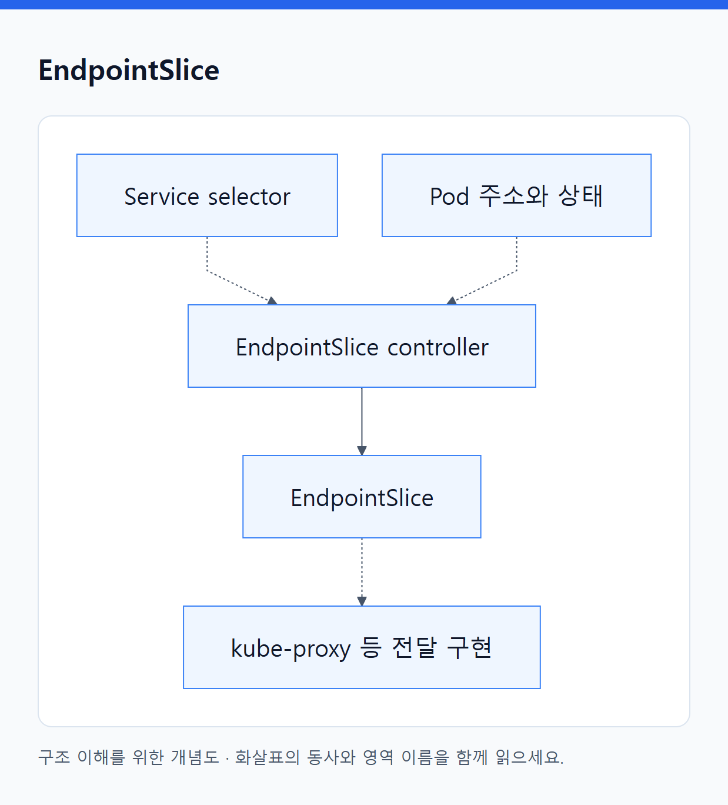
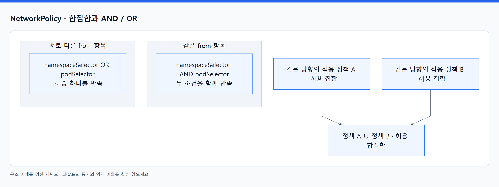

# 07. 통신 오브젝트

> 전체 학습 17/35 · 심화
> [이전: 06. 통신은 주소·발견·전달·진입을 나누어 이해한다](06_네트워크와_서비스_노출.md) · [전체 목차](../README.md) · [다음: 08. 코드·설정·영속 데이터는 수명이 다르다](08_설정과_영속_데이터.md)
> 본문을 위에서 아래로 읽고 마지막의 다음 장으로 이동한다. 본문 속 다른 장·출처 링크는 선택 참고용이다.

통신 객체는 “주소와 대상의 의도”를 담는다. 객체 자체가 모두 패킷을 받는 프로세스인 것은 아니다. 설정 관계와 실제 트래픽 경로를 나눠 읽는다.

## Service

**API: `v1` · 범위: N · 핵심: 교체되는 실행 대상 앞에 안정적인 접속점을 제공.**

Pod는 재생성되면 IP가 달라질 수 있다. 호출자가 모든 변경을 추적하도록 하지 않고 `orders`라는 서비스 이름과 주소를 사용하도록 한다. 일반적인 selector 기반 Service는 같은 Namespace의 Pod label을 선택한다.

```yaml
apiVersion: v1
kind: Service
metadata:
  name: orders
  namespace: study
spec:
  type: ClusterIP
  selector:
    app: orders
  ports:
    - name: http
      port: 80
      targetPort: http
```

`targetPort: http`는 대상 Pod의 이름 붙인 container port를 참조한다. [실행 오브젝트](04_실행_오브젝트.md)의 Deployment 예제에서는 `http → 8080`이다. 호출자는 Service의 80에 연결하고 앱은 8080에서 요청을 받는다.

| 주요 필드 | 의미 |
|---|---|
| selector | 어떤 Pod를 대상으로 삼을지 결정 |
| ports[].port | Service가 제공할 포트 |
| ports[].targetPort | 대상의 실제 포트 번호 또는 이름 |
| ports[].protocol | TCP·UDP 등 전달 프로토콜 |
| type | ClusterIP·NodePort·LoadBalancer·ExternalName |
| clusterIP | 보통 할당받는 가상 주소; `None`이면 Headless |
| externalTrafficPolicy / internalTrafficPolicy | 지원 경로에서 외부·내부 트래픽의 노드별 처리 정책 |
| sessionAffinity | ClientIP 등의 연결 친화성; 앱 세션 저장 기능은 아님 |
| publishNotReadyAddresses | 지원 경로에서 준비되지 않은 대상도 게시하도록 하는 예외 설정 |

**동작:** EndpointSlice controller가 selector에 맞는 대상 정보를 기록하고, kube-proxy 또는 대체 구현이 전달 규칙을 구성한다. DNS 구현은 Service 이름을 해석한다. Pod가 교체되면 목록과 규칙이 갱신된다. 기존 TCP 연결이 새 Pod로 그대로 이동하는 것은 아니다.

| 종류·형태 | 달라지는 것 |
|---|---|
| ClusterIP | 내부 가상 주소 제공 |
| NodePort | 노드 포트로 진입하는 경로 추가 |
| LoadBalancer | 해당 구현에 외부 LB 연동을 요청 |
| ExternalName | DNS 별칭 제공; 일반 Pod 프록시 기능과 다름 |
| Headless | `clusterIP: None`으로 가상 IP 없이 구성원 주소 발견 지원 |

**관찰:** `get service orders -o yaml`, 관련 EndpointSlice와 Pod labels를 비교한다. Service에 외부 주소가 없다는 사실이 ClusterIP Service의 오류는 아니다. selector를 바꾸면 Pod 자체를 바꾸지 않고 선택 대상이 바뀐다. Service를 지워도 선택했던 Pod를 보통 함께 지우지 않는다. [Service](https://kubernetes.io/docs/concepts/services-networking/service/), [가상 IP 구현](https://kubernetes.io/docs/reference/networking/virtual-ips/).

## EndpointSlice

**API: `discovery.k8s.io/v1` · 범위: N · 핵심: 실제 연결할 endpoint의 주소·포트·상태 목록.**

Service가 “app=orders를 연결”이라는 의도라면 EndpointSlice는 “현재 이 주소들이 대상”이라는 구체 정보다. 일반 selector 기반 Service에서는 자동 생성되므로 대개 직접 작성하지 않고 조회한다.

<!-- diagram:02-07-block-2 -->


[크게 보기](../assets/diagrams/02-07-block-2.png) · [SVG](../assets/diagrams/02-07-block-2.svg)

<details>
<summary>그림의 원문 설명 펼치기</summary>

```text
flowchart LR
  S["Service selector"] -.-> C["EndpointSlice controller"]
  P["Pod 주소와 상태"] -.-> C
  C --> E["EndpointSlice"]
  E -.-> K["kube-proxy 등 전달 구현"]
```

</details>
<!-- /diagram:02-07-block-2 -->

| 주요 필드 | 해석 |
|---|---|
| metadata.labels.kubernetes.io/service-name | 어느 Service의 대상 정보인가? |
| addressType | IPv4·IPv6 등 주소 종류 |
| ports | 대상 포트 정보 |
| endpoints[].addresses | 구체적인 대상 주소 |
| endpoints[].conditions | ready·serving·terminating 등의 상태 |
| endpoints[].targetRef | 관련 Pod 등 원래 대상 참조 |
| nodeName / zone | 대상의 위치 정보 |

하나의 Service에 여러 Slice가 연결될 수 있다. 일부 Slice 하나만 읽고 모든 대상이라고 가정하지 않는다. `ready: false`인 주소가 목록에 남아 있을 수 있으므로 “주소가 보인다”와 “일반 요청 대상으로 준비됐다”는 다르다.

**조회:** `kubectl get endpointslices -n study -l kubernetes.io/service-name=orders -o yaml`. Service selector가 틀리면 앱이 Ready여도 대상이 없을 수 있다. selector 없는 Service 등 특별한 경우에 수동으로 관리할 수 있지만, 자동 관리 중인 Slice를 직접 수정하면 controller가 되돌릴 수 있다. [EndpointSlice](https://kubernetes.io/docs/concepts/services-networking/endpoint-slices/).

## Ingress

**API: `networking.k8s.io/v1` · 범위: N · 핵심: HTTP/HTTPS의 host·path를 Service backend에 연결하는 규칙.**

Service가 앱 하나의 접속점을 만들었다면 Ingress는 `orders.example.com/api` 같은 요청을 어느 backend로 보낼지 표현한다. 실제 프록시·LB를 구성하는 Ingress controller가 별도로 필요하다.

```yaml
apiVersion: networking.k8s.io/v1
kind: Ingress
metadata:
  name: orders
  namespace: study
spec:
  ingressClassName: demo
  rules:
    - host: orders.example.com
      http:
        paths:
          - path: /api
            pathType: Prefix
            backend:
              service:
                name: orders
                port:
                  number: 80
```

`ingressClassName`은 처리할 구현을 연결하고, `rules[].host`와 `paths`는 요청 매칭 조건, `backend.service`는 같은 Namespace의 Service와 포트를 가리킨다. `/api`와 `/api/orders` 등의 경로 요소 기반 매칭을 하는 Prefix와 정확한 경로를 요구하는 Exact를 구분한다. `ImplementationSpecific`은 구현의 규칙을 확인해야 한다.

`tls`는 TLS host와 Secret 참조를 표현할 수 있지만, 실제 인증서·TLS 처리는 구현별 방식도 함께 확인한다. 위 예제에는 TLS가 없다. path prefix를 매칭한다고 backend에 전달하는 경로를 자동으로 제거하는 것은 아니다. rewrite는 구현별 추가 기능일 수 있다.

**동작·관찰:** controller가 Ingress와 backend를 관찰해 실제 진입점을 구성한다. `status.loadBalancer`, Events, controller 상태를 보되 모든 구현의 status 표현이 동일하다고 가정하지 않는다. Ingress API는 기능 확장이 동결된 상태로, 추가 기능은 Gateway API도 확인한다. 객체만 생성하고 controller·class·DNS를 준비하지 않으면 접속까지 완성되지 않는다. [Ingress](https://kubernetes.io/docs/concepts/services-networking/ingress/).

## IngressClass

**API: `networking.k8s.io/v1` · 범위: C · 핵심: Ingress를 처리하는 controller 구현과 연결.**

```yaml
apiVersion: networking.k8s.io/v1
kind: IngressClass
metadata:
  name: demo
spec:
  controller: example.com/ingress-controller
```

`spec.controller`는 구현이 사용하는 식별자다. 예시 문자열만 넣는다고 그 controller가 설치되지 않는다. 실제 구현이 요구하는 식별자와 설치 상태가 맞아야 한다. `spec.parameters`는 지원되는 구현에서 추가 구성 객체를 참조한다.

`ingressclass.kubernetes.io/is-default-class` annotation으로 기본 class를 지정할 수 있다. 여러 default가 있거나 class를 생략한 Ingress의 처리 방식은 admission과 구현의 동작을 확인한다. 기존 annotation 기반 선택 방식과 `ingressClassName`을 혼동하지 않는다.

**조회:** `kubectl get ingressclasses -o yaml`. IngressClass를 삭제하는 것이 모든 실제 LB를 즉시 정리한다는 뜻은 아니다. 처리하던 Ingress와 controller의 수명주기를 함께 읽는다. [Ingress class](https://kubernetes.io/docs/concepts/services-networking/ingress/#ingress-class).

## NetworkPolicy

**API: `networking.k8s.io/v1` · 범위: N · 핵심: 선택된 Pod의 허용 통신 규칙.**

Pod 간 연결은 Namespace를 나눴다는 이유만으로 자동 차단되지 않는다. NetworkPolicy는 대상 Pod, 통신 방향, 허용하는 출발·도착 대상과 포트를 표현한다. 실제 차단에는 이를 집행하는 네트워크 구현이 필요하다.

```yaml
apiVersion: networking.k8s.io/v1
kind: NetworkPolicy
metadata:
  name: orders-from-frontend
  namespace: study
spec:
  podSelector:
    matchLabels:
      app: orders
  policyTypes: [Ingress]
  ingress:
    - from:
        - podSelector:
            matchLabels:
              app: frontend
      ports:
        - protocol: TCP
          port: 8080
```

**해석:** `study`의 orders Pod가 같은 Namespace의 frontend Pod로부터 TCP 8080 연결을 받도록 허용한다. 이 정책은 orders의 egress를 제한하는 규칙이 아니다. 다른 적용 정책과 기반 네트워크 조건도 함께 작용한다.

| 주요 필드 | 의미 |
|---|---|
| podSelector | 이 정책이 보호할 Pod; 빈 selector는 해당 Namespace 전체 |
| policyTypes | Ingress·Egress 중 제어할 방향 |
| ingress[].from / egress[].to | 허용할 상대 |
| podSelector / namespaceSelector | label 기준으로 상대 Pod·Namespace 선택 |
| ipBlock | IP CIDR 범위 기준; NAT와 실제 경로의 영향 확인 |
| ports | 허용 프로토콜·포트 |

<!-- diagram:02-07-concept-2 -->


[크게 보기](../assets/diagrams/02-07-concept-2.png) · [SVG](../assets/diagrams/02-07-concept-2.svg)

<details>
<summary>그림의 원문 설명 펼치기</summary>

같은 방향의 여러 적용 정책은 허용 규칙이 합쳐진다. 정책 사이에 일반 방화벽처럼 첫 번째 규칙 우선순위가 있는 것으로 생각하지 않는다. 두 selector가 같은 `from` 항목에 있으면 함께 만족할 조건, 별도 항목이면 둘 중 하나를 허용하는 형태가 된다.

</details>
<!-- /diagram:02-07-concept-2 -->

대상 Pod를 선택해 `policyTypes: [Ingress]`, `ingress: []`로 두면 해당 방향의 기본 차단을 표현할 수 있다. 하지만 다른 정책이 허용한 트래픽까지 부정하지는 않는다. **조회:** `describe networkpolicy`, 실제 Pod-to-Pod 연결을 함께 확인한다. YAML 존재는 집행 성공의 증거가 아니고, 일반 NetworkPolicy는 HTTP `/admin` 같은 경로 정책이 아니다. [NetworkPolicy](https://kubernetes.io/docs/concepts/services-networking/network-policies/).

[목차](오브젝트_색인.md) · [설정과 저장소](09_설정과_저장소_오브젝트.md)

---

[이전: 06. 통신은 주소·발견·전달·진입을 나누어 이해한다](06_네트워크와_서비스_노출.md) · [전체 목차](../README.md) · [다음: 08. 코드·설정·영속 데이터는 수명이 다르다](08_설정과_영속_데이터.md)
