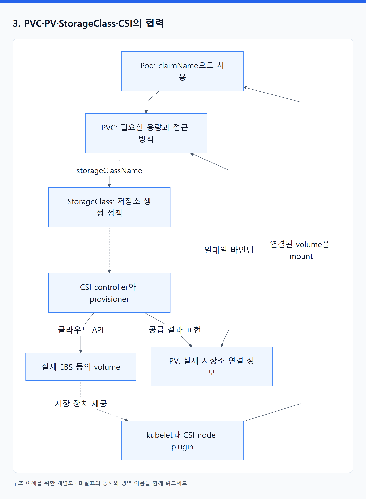
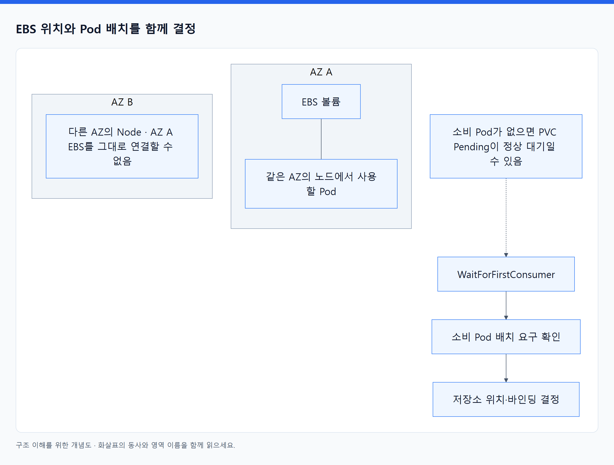
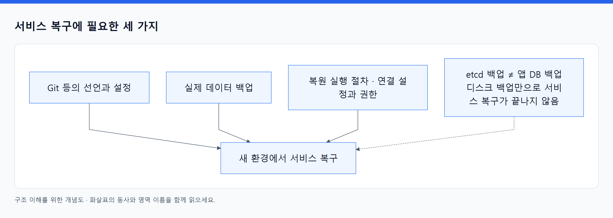

# 08. 코드·설정·영속 데이터는 수명이 다르다

> 전체 학습 18/35 · 심화
> [이전: 07. 통신 오브젝트](07_통신_오브젝트.md) · [전체 목차](../README.md) · [다음: 09. 설정과 저장소 오브젝트](09_설정과_저장소_오브젝트.md)
> 본문을 위에서 아래로 읽고 마지막의 다음 장으로 이동한다. 본문 속 다른 장·출처 링크는 선택 참고용이다.

> 이 장의 질문: 앱 버전을 바꿔도 설정과 데이터는 어떻게 이어지는가?

## 1. ConfigMap과 Secret은 실행에 필요한 값을 제공한다

이미지는 앱 코드와 실행 의존성을 담는다. 환경마다 다른 로그 레벨·외부 서비스 주소는 ConfigMap 등으로 분리한다. 비밀번호·토큰 같은 민감한 값은 Secret 또는 별도 비밀 관리 시스템과 연결한다. 동일한 이미지를 개발·운영 환경에 배포해도 실행 설정이 달라질 수 있다.

| 전달 방식 | 컨테이너에서 보이는 형태 | 값 변경 후 필요한 일 |
|---|---|---|
| env / envFrom | 프로세스 환경 변수 | 이미 실행된 프로세스에는 자동 반영되지 않으므로 재시작 등 필요 |
| ConfigMap·Secret volume | 파일 | 일반 마운트는 갱신이 지연 반영될 수 있으며 앱이 다시 읽어야 함 |
| subPath로 특정 파일 마운트 | 지정 위치 파일 | 해당 방식은 자동 갱신이 되지 않는 점에 주의 |
| 외부 비밀 관리 연동 | 파일 또는 동기화된 Secret 등 | 선택한 드라이버·controller와 앱의 reload 방식 확인 |

ConfigMap 내용만 바뀌었다고 Deployment의 Pod template이 자동으로 바뀌지는 않는다. 운영에서는 버전 붙인 ConfigMap 이름, template annotation의 checksum, 명시적 rollout 같은 변경 전파 방식을 선택한다. [ConfigMap](https://kubernetes.io/docs/concepts/configuration/configmap/), [Secret](https://kubernetes.io/docs/concepts/configuration/secret/).

Secret의 base64 표현은 암호화가 아니다. API 접근 권한, 저장 시 암호화, 실행 중 노출, Git 저장 여부를 별도로 다룬다. 앱을 생성할 권한이 있으면 그 앱에 Secret을 마운트해 읽을 수 있는 경로도 생길 수 있으므로, 단순히 `get secrets`만 막았다고 모든 접근이 차단됐다고 판단하지 않는다.

## 2. 어디에 쓴 파일인가?

| 저장 위치 | 컨테이너 재시작 | Pod 교체 | 대표 용도 |
|---|---|---|---|
| 컨테이너 writable layer | 새 컨테이너에 보존 기대 불가 | 보존 기대 불가 | 일시적인 실행 파일 변경 |
| emptyDir | 같은 Pod의 컨테이너 재시작 동안 유지 | Pod 수명이 끝나면 삭제 | 임시 파일·같은 Pod 간 파일 공유 |
| PVC로 연결한 영속 volume | 일반적으로 유지 | 정책·저장소 조건에 따라 다시 연결 | 재사용해야 할 데이터 |
| 외부 DB / object storage | 앱 수명과 분리 | 앱 수명과 분리 | 주문 기록·업로드 파일 등 |

메모리 기반 emptyDir는 사용 메모리에도 영향을 준다. `hostPath`는 해당 노드의 경로를 연결하므로 다른 노드로 이동하면 동일 데이터가 보장되지 않고 보안 영향도 크다. “볼륨을 썼다”만으로 영속성과 이동성을 판단할 수 없다. [Volumes](https://kubernetes.io/docs/concepts/storage/volumes/).

## 3. PVC·PV·StorageClass·CSI의 협력

<!-- diagram:02-08-block-1 -->


[크게 보기](../assets/diagrams/02-08-block-1.png) · [SVG](../assets/diagrams/02-08-block-1.svg)

<details>
<summary>그림의 원문 설명 펼치기</summary>

```text
flowchart TD
  P["Pod: claimName으로 사용"] --> C["PVC: 필요한 용량과 접근 방식"]
  C -->|storageClassName| S["StorageClass: 저장소 생성 정책"]
  S -.-> X["CSI controller와 provisioner"]
  X -->|클라우드 API| D["실제 EBS 등의 volume"]
  X -->|공급 결과 표현| V["PV: 실제 저장소 연결 정보"]
  C <-->|일대일 바인딩| V
  N["kubelet과 CSI node plugin"] -->|연결된 volume을 mount| P
  D -.->|저장 장치 제공| N
```

</details>
<!-- /diagram:02-08-block-1 -->

PVC는 소비자의 요구, PV는 공급된 저장소의 Kubernetes 표현이다. StorageClass는 어떤 provisioner와 정책으로 만들지 정한다. **CSI는 표준 인터페이스이고 CSI driver는 구현 프로그램이다.** EBS라는 실제 디스크와 PV라는 API 객체도 구분한다.

동적 프로비저닝은 claim을 보고 새 저장소를 만든다. 정적 방식에서는 이미 준비한 PV와 바인딩할 수도 있다. driver가 없거나 권한이 없으면 PVC 객체는 존재해도 실제 디스크가 생기지 않는다. 바인딩이 끝나도 노드 연결·파일시스템 mount에서 실패할 수 있다. [Persistent Volumes](https://kubernetes.io/docs/concepts/storage/persistent-volumes/), [StorageClass](https://kubernetes.io/docs/concepts/storage/storage-classes/).

## 4. 디스크의 위치가 Pod의 위치를 제한한다

<!-- diagram:02-08-concept-2 -->


[크게 보기](../assets/diagrams/02-08-concept-2.png) · [SVG](../assets/diagrams/02-08-concept-2.svg)

<details>
<summary>그림의 원문 설명 펼치기</summary>

EBS 볼륨은 AZ에 속한다. AZ A의 EBS를 사용해야 하는 Pod를 AZ B의 노드에 아무렇게나 배치할 수 없다. `volumeBindingMode: WaitForFirstConsumer`는 소비 Pod의 배치 요구와 함께 저장소 위치를 결정하도록 바인딩·프로비저닝을 늦춘다. 이 정책에서는 아직 소비 Pod가 없는 PVC의 Pending이 정상 대기일 수 있다.

</details>
<!-- /diagram:02-08-concept-2 -->

접근 모드 `ReadWriteOnce`는 일반적으로 단일 **노드**의 읽기·쓰기 마운트를 뜻한다. 항상 단일 Pod라는 뜻은 아니다. 단일 Pod 제한을 표현하는 `ReadWriteOncePod`는 CSI 및 버전 지원을 확인해 사용한다. 여러 노드에서 공유할 필요가 있다면 저장소 구현이 `ReadWriteMany` 같은 요구를 지원해야 한다. EFS와 EBS는 이 부분의 특성이 다르다.

## 5. 삭제와 백업을 별도로 설계한다

PVC를 지운 뒤 실제 저장소를 삭제할지 남길지는 PV의 reclaim 정책과 driver 동작에 달려 있다. `Delete`이면 외부 저장소도 정리될 수 있고, `Retain`이면 후속 수동 정리가 필요할 수 있다. StatefulSet을 삭제할 때의 PVC 보존 정책까지 함께 읽는다.

`VolumeSnapshot`은 CSI snapshot 체계의 객체이며 CRD·snapshot controller·driver 지원이 필요하다. 스냅샷 시점의 데이터가 DB 관점에서 일관적인지는 별도 문제다. 앱의 쓰기 중단·DB 네이티브 백업·로그 복구 절차가 필요할 수 있다. [Volume snapshots](https://kubernetes.io/docs/concepts/storage/volume-snapshots/).

<!-- diagram:02-08-concept-3 -->


[크게 보기](../assets/diagrams/02-08-concept-3.png) · [SVG](../assets/diagrams/02-08-concept-3.svg)

<details>
<summary>그림의 원문 설명 펼치기</summary>

복구 계획은 세 가지를 따로 갖는다. Git 등의 **선언과 설정**, 실제 **데이터 백업**, 이를 새 환경에 복원할 **실행 절차**다. etcd 백업은 앱 DB 백업을 대신하지 않고, 디스크 백업만 있어도 연결에 필요한 설정과 권한이 없으면 서비스 복구는 끝나지 않는다. EKS의 제어부 복구와 고객 데이터의 복원 절차 역시 구분한다.

</details>
<!-- /diagram:02-08-concept-3 -->

**스스로 설명하기:** ConfigMap을 수정했는데 앱의 환경 변수가 바뀌지 않은 것은 왜 정상일 수 있는가? 또 PVC가 Bound인데 Pod가 ContainerCreating이면 다음으로 무엇을 보는가? 각각 값 주입 시점, attach/mount Events를 확인한다.

---

[이전: 07. 통신 오브젝트](07_통신_오브젝트.md) · [전체 목차](../README.md) · [다음: 09. 설정과 저장소 오브젝트](09_설정과_저장소_오브젝트.md)
