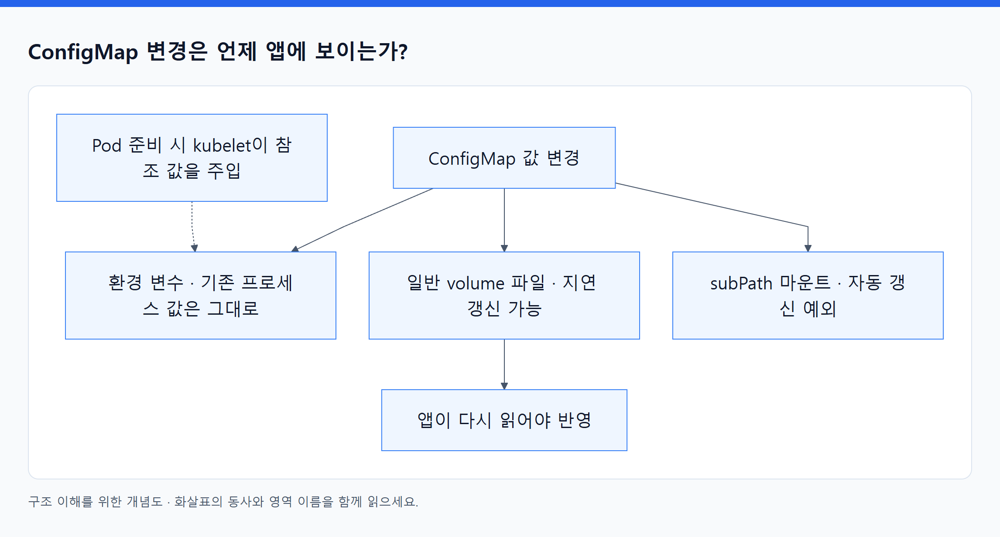
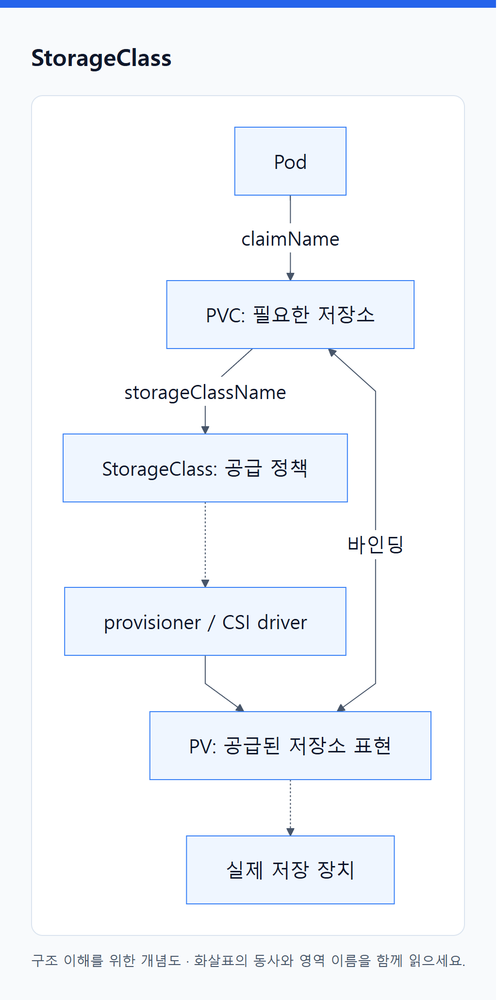

# 09. 설정과 저장소 오브젝트

> 전체 학습 19/35 · 심화
> [이전: 08. 코드·설정·영속 데이터는 수명이 다르다](08_설정과_영속_데이터.md) · [전체 목차](../README.md) · [다음: 10. 누가 무엇을 할 수 있는가, 새로운 기능은 어떻게 붙는가](10_보안과_확장_구조.md)
> 본문을 위에서 아래로 읽고 마지막의 다음 장으로 이동한다. 본문 속 다른 장·출처 링크는 선택 참고용이다.

설정 값, 데이터 요구, 실제 저장 장치의 표현은 서로 다른 오브젝트다. 특히 **Pod 내부의 `volumes` 설정과 독립 API 객체인 PV를 구분**한다.

## ConfigMap

**API: `v1` · 범위: N · 핵심: 일반 설정을 이미지와 분리해서 저장.**

```yaml
apiVersion: v1
kind: ConfigMap
metadata:
  name: orders-config
  namespace: study
data:
  LOG_LEVEL: info
  app.properties: |
    page.size=20
    locale=ko-KR
```

`data`에는 문자열, `binaryData`에는 base64로 표현한 바이너리 값을 저장한다. `immutable: true`는 내용의 변경을 제한하는 선택이다. 큰 파일 저장소 용도가 아니며 ConfigMap의 데이터 크기는 제한된다.

**연결:** Pod가 `env[].valueFrom.configMapKeyRef`로 특정 키, `envFrom.configMapRef`로 여러 키, `volumes[].configMap`으로 파일을 참조할 수 있다. 기본적으로 같은 Namespace의 값을 사용한다. 아래는 **Pod spec의 일부**다.

```yaml
containers:
  - name: api
    image: registry.example.com/orders:v1
    env:
      - name: LOG_LEVEL
        valueFrom:
          configMapKeyRef:
            name: orders-config
            key: LOG_LEVEL
```

<!-- diagram:02-09-concept-2 -->


[크게 보기](../assets/diagrams/02-09-concept-2.png) · [SVG](../assets/diagrams/02-09-concept-2.svg)

<details>
<summary>그림의 원문 설명 펼치기</summary>

**동작:** kubelet이 Pod 준비 과정에서 참조 값을 주입한다. 이미 실행된 프로세스의 환경 변수는 ConfigMap 변경만으로 바뀌지 않는다. 일반 volume 파일은 지연 갱신될 수 있지만 앱이 다시 읽어야 하고 subPath 마운트는 자동 갱신 예외다.

</details>
<!-- /diagram:02-09-concept-2 -->

**조회·오해:** `get configmap orders-config -o yaml`과 Pod의 참조 키를 비교한다. 값이 없는 필수 참조는 실행 준비를 막을 수 있다. ConfigMap 삭제는 이미 주입한 값을 즉시 회수하는 작업이 아니지만 이후 시작·재생성에 영향을 줄 수 있다. 비밀번호를 넣는다고 비밀로 보호되지 않는다. [ConfigMap](https://kubernetes.io/docs/concepts/configuration/configmap/).

## Secret

**API: `v1` · 범위: N · 핵심: 민감한 값과 용도별 자격 정보를 표현.**

```yaml
apiVersion: v1
kind: Secret
metadata:
  name: orders-credentials
  namespace: study
type: Opaque
stringData:
  username: example-user
  password: EXAMPLE_ONLY_NOT_A_REAL_PASSWORD
```

예제의 값은 가짜다. `stringData`는 입력 시 평문 문자열을 사용할 수 있는 쓰기 편의 필드이며 저장·조회에서는 `data`의 base64 표현을 보게 된다. base64는 암호화가 아니다. API 접근권한, 저장 시 암호화, 앱 노출 경로가 별도로 중요하다.

| 주요 필드·타입 | 의미 |
|---|---|
| data / stringData | 저장 데이터 표현 / 쓰기 편의 입력 |
| type: Opaque | 일반 사용자 정의 민감 데이터 |
| kubernetes.io/tls | 인증서·개인 키 용도; 정해진 키 사용 |
| kubernetes.io/dockerconfigjson | 이미지 레지스트리 인증 용도 |
| immutable | 데이터 변경을 제한하는 선택 |

Pod의 `secretKeyRef`, `envFrom.secretRef`, Secret volume으로 연결하며 레지스트리 인증은 `imagePullSecrets`로 참조할 수 있다. 환경 변수와 volume 갱신 차이는 ConfigMap과 비슷하다. ServiceAccount 토큰을 항상 장기 Secret으로 수동 생성해야 하는 구조로 외우지 않는다.

**관찰:** Secret type·키 존재·Pod 참조를 확인한다. 조회는 권한 있는 사용자에게 실제 비밀을 보여줄 수 있다. Secret을 읽는 권한뿐 아니라 이를 마운트할 Pod를 만들 수 있는 권한도 고려한다. Secret은 자체적으로 외부 DB에 사용자를 생성하거나 주기적으로 비밀번호를 교체하지 않는다. [Secret](https://kubernetes.io/docs/concepts/configuration/secret/).

## PersistentVolumeClaim

**API: `v1` · 범위: N · 약어: PVC · 핵심: 앱이 필요한 저장소를 요청하고 사용할 연결을 확보.**

```yaml
apiVersion: v1
kind: PersistentVolumeClaim
metadata:
  name: orders-data
  namespace: study
spec:
  storageClassName: demo-storage
  accessModes: [ReadWriteOnce]
  volumeMode: Filesystem
  resources:
    requests:
      storage: 5Gi
```

`storageClassName`은 어떤 저장소 정책으로 공급받을지, `resources.requests.storage`는 요청 용량, `accessModes`는 필요한 접근 형태, `volumeMode`는 Filesystem 또는 Block을 표현한다. `volumeName`은 특정 PV와의 연결을 지정할 때 등장한다. 생성 뒤 바인딩되면 실제 연결된 PV를 조회할 수 있다.

**동작:** 조건에 맞는 기존 PV에 바인딩하거나 StorageClass에 따라 동적으로 공급된 PV와 바인딩한다. Pod는 `volumes[].persistentVolumeClaim.claimName`으로 PVC를 참조한다. 요청 객체가 있으나 아직 공급되지 않은 Pending과 연결이 결정된 Bound를 구분한다.

`ReadWriteOnce`는 일반적으로 단일 **노드** 읽기·쓰기다. “Pod 하나만”을 뜻하는 `ReadWriteOncePod`와 다르며 후자는 CSI·버전 지원을 확인한다. `ReadWriteMany`도 실제 저장소가 지원해야 한다.

**관찰:** `describe pvc orders-data -n study`의 Events·phase·volume을 본다. `WaitForFirstConsumer`에서는 소비 Pod가 생길 때까지 Pending일 수 있다. PVC Bound는 앱의 파일 쓰기·백업 성공까지 의미하지 않는다. PVC 삭제가 실제 저장소 삭제로 연결될 수 있으므로 PV reclaim 정책과 함께 읽는다. [PVC와 PV](https://kubernetes.io/docs/concepts/storage/persistent-volumes/).

## PersistentVolume

**API: `v1` · 범위: C · 약어: PV · 핵심: 실제 저장소를 Kubernetes에서 표현.**

PVC가 소비자의 요구라면 PV는 공급된 저장소의 용량·접근 방식·실제 연결 정보를 기록한다. 동적 프로비저닝에서는 controller가 만들므로 보통 직접 작성하지 않고 조회한다.

```yaml
apiVersion: v1
kind: PersistentVolume
metadata:
  name: sample-existing-volume
spec:
  capacity:
    storage: 5Gi
  accessModes: [ReadWriteOnce]
  persistentVolumeReclaimPolicy: Retain
  storageClassName: demo-storage
  volumeMode: Filesystem
  csi:
    driver: driver.example.com
    volumeHandle: existing-volume-id
```

이는 기존 volume을 표현하는 **정적 연결의 모양**이다. 실제 driver·volume ID가 준비되어야 한다. 선언만으로 어떤 이름의 디스크든 생기는 예제가 아니다.

`claimRef`는 연결된 PVC, `nodeAffinity`는 저장소를 사용할 수 있는 노드 위치 제약, `persistentVolumeReclaimPolicy`는 claim 해제 후 처리에 관계한다. Available·Bound·Released·Failed 등의 phase를 관찰한다. Released가 모든 외부 데이터 정리까지 끝났다는 의미는 아니다.

`Retain`은 해제 후 저장소를 남기는 쪽, `Delete`는 지원 구현에서 외부 저장소까지 정리하는 쪽이다. PV 객체의 수명과 데이터의 수명을 함께 봐야 한다. 같은 Namespace에 속하지 않는 C 객체이므로 PVC와 범위가 다르다. [PV](https://kubernetes.io/docs/concepts/storage/persistent-volumes/).

## StorageClass

**API: `storage.k8s.io/v1` · 범위: C · 핵심: 저장소의 생성 방식과 정책.**

```yaml
apiVersion: storage.k8s.io/v1
kind: StorageClass
metadata:
  name: demo-storage
provisioner: driver.example.com
reclaimPolicy: Retain
volumeBindingMode: WaitForFirstConsumer
allowVolumeExpansion: true
```

`provisioner`는 처리 구현, `parameters`는 그 구현이 해석할 생성 설정, `reclaimPolicy`는 새로 공급하는 PV의 회수 정책이다. StorageClass에 실제 저장 파일이 들어 있는 것은 아니다. 예시 driver는 설치된 실제 구현으로 대체해야 한다.

`Immediate`는 일반적으로 claim 생성 때 바인딩·공급을 시작하고, `WaitForFirstConsumer`는 소비 Pod의 배치 요구와 함께 결정하도록 늦춘다. 위치 제약이 있는 저장소에서 중요하다. `allowVolumeExpansion`은 확장 요청 허용이며 실제 확장에는 driver 지원과 추가 조건이 따른다. 축소까지 허용하는 값은 아니다.

**연결:** PVC가 class 이름을 참조 → provisioner가 실제 volume 공급 → PV에 표현 → PVC와 바인딩. class를 수정했다고 기존 PV의 모든 속성이 따라 바뀌는 것은 아니다. class 삭제가 이미 만들어진 모든 저장소의 즉각 삭제 명령도 아니다. [StorageClass](https://kubernetes.io/docs/concepts/storage/storage-classes/).

<!-- diagram:02-09-block-7 -->


[크게 보기](../assets/diagrams/02-09-block-7.png) · [SVG](../assets/diagrams/02-09-block-7.svg)

<details>
<summary>그림의 원문 설명 펼치기</summary>

```text
flowchart LR
  P["Pod"] -->|claimName| C["PVC: 필요한 저장소"]
  C -->|storageClassName| S["StorageClass: 공급 정책"]
  S -.-> X["provisioner / CSI driver"]
  X --> V["PV: 공급된 저장소 표현"]
  C <-->|바인딩| V
  V -.-> D["실제 저장 장치"]
```

</details>
<!-- /diagram:02-09-block-7 -->

## VolumeAttachment

**API: `storage.k8s.io/v1` · 범위: C · 핵심: volume을 특정 노드에 연결하려는 의도와 결과.**

Pod가 PVC를 참조하고 바인딩이 끝나도 저장 장치를 사용할 노드에 연결해야 할 수 있다. 이 연결을 지원하는 CSI 체계에서 VolumeAttachment가 나타난다. 일반적으로 attach/detach controller와 CSI external-attacher 등이 관리한다.

`spec.attacher`는 담당 driver, `source.persistentVolumeName`은 PV, `nodeName`은 연결 대상 노드다. `status.attached`, `attachError`, `detachError`가 실패 지점을 보여 준다.

**조회:** `kubectl get volumeattachments -o yaml`. attached가 true여도 컨테이너에 파일시스템을 mount하는 후속 단계가 실패할 수 있다. 모든 driver가 attach 단계를 요구하지 않으므로 이 객체가 없다고 무조건 장애는 아니다. 직접 삭제해 연결 상태를 강제로 맞추기 전에 driver와 실제 저장소 상태를 비교한다. [VolumeAttachment API](https://kubernetes.io/docs/reference/kubernetes-api/storage/volume-attachment-v1/).

## CSIDriver

**API: `storage.k8s.io/v1` · 범위: C · 핵심: CSI driver의 기능·동작 조건을 클러스터에 알림.**

`metadata.name`은 driver 식별자다. `spec.attachRequired`는 별도 attach가 필요한지, `podInfoOnMount`는 Pod 정보를 전달할지, `volumeLifecycleModes`는 지원 수명주기 모드, `fsGroupPolicy`는 파일 소유권 처리와 관련된다. 기능별 필드는 driver와 클러스터 버전에 따라 해석한다.

**동작:** kubelet 등 저장소 구성요소가 이 선언을 참고한다. `kind: CSIDriver`를 만들었다고 노드에 driver 실행 파일이나 controller Pod가 설치되는 것은 아니다. 설치 패키지가 객체와 실제 프로그램을 함께 제공하는 경우가 많다.

**조회:** `kubectl get csidrivers -o yaml`. StorageClass의 provisioner 이름, 실제 driver 이름과 지원 기능을 연결해서 읽는다. [CSIDriver 객체](https://kubernetes-csi.github.io/docs/csi-driver-object.html).

## CSINode

**API: `storage.k8s.io/v1` · 범위: C · 핵심: 특정 노드에 등록된 CSI driver 정보.**

`spec.drivers[].name`은 driver, `nodeID`는 저장소 구현이 사용하는 노드 식별자, `topologyKeys`는 위치 식별 키, `allocatable.count`는 제공되는 경우 volume 개수 제약 정보다. 주로 노드 측 driver 등록과 kubelet을 통해 관리되므로 사용자가 임의로 노드 능력을 적어 넣는 파일로 다루지 않는다.

**조회:** `kubectl get csinode <node-name> -o yaml`. CSIDriver가 클러스터 수준의 기능 설명이라면 CSINode는 노드별 등록 정보다. 둘 다 PV·PVC처럼 앱의 실제 파일을 저장하지 않는다. [CSINode 객체](https://kubernetes-csi.github.io/docs/csi-node-object.html).

[목차](오브젝트_색인.md) · [신원과 권한](11_신원과_권한_오브젝트.md)

---

[이전: 08. 코드·설정·영속 데이터는 수명이 다르다](08_설정과_영속_데이터.md) · [전체 목차](../README.md) · [다음: 10. 누가 무엇을 할 수 있는가, 새로운 기능은 어떻게 붙는가](10_보안과_확장_구조.md)
