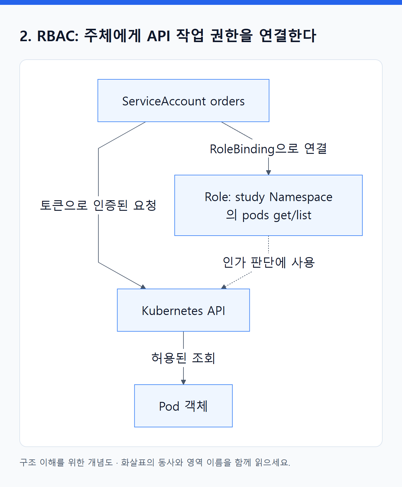
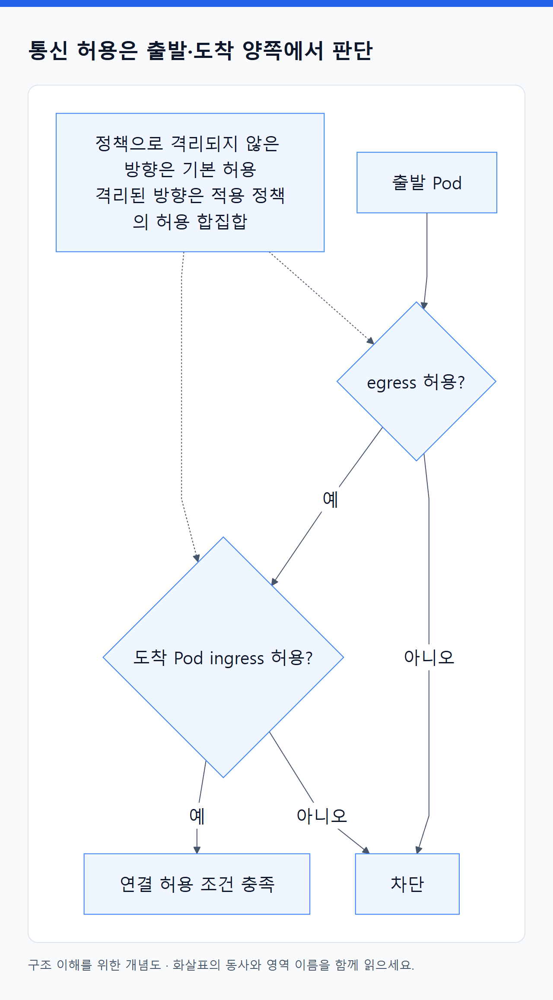
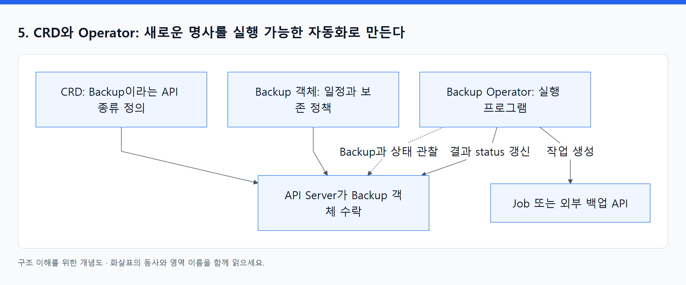

# 10. 누가 무엇을 할 수 있는가, 새로운 기능은 어떻게 붙는가

> 전체 학습 20/35 · 심화
> [이전: 09. 설정과 저장소 오브젝트](09_설정과_저장소_오브젝트.md) · [전체 목차](../README.md) · [다음: 11. 신원과 권한 오브젝트](11_신원과_권한_오브젝트.md)
> 본문을 위에서 아래로 읽고 마지막의 다음 장으로 이동한다. 본문 속 다른 장·출처 링크는 선택 참고용이다.

> 이 장의 질문: 앱의 권한·네트워크·실행 보안을 각각 어디서 통제하는가?

## 1. 보안에는 다른 경계들이 있다

| 경계 | 질문 | 관련 기능 |
|---|---|---|
| API 접근 | 누가 Pod를 만들고 Secret을 읽을 수 있는가? | 인증, RBAC, admission |
| 컨테이너 실행 | 앱 프로세스가 노드에 얼마나 접근하는가? | securityContext, Pod Security Admission |
| 네트워크 | 어느 Pod가 어느 대상에 연결할 수 있는가? | NetworkPolicy와 구현체, AWS Security Group |
| AWS 서비스 | 이 앱이 어느 S3 bucket에 접근하는가? | IAM, Pod Identity 또는 IRSA |
| 소프트웨어 공급 | 어떤 코드를 실행하는가? | 이미지 검증·취약점 관리·배포 정책 |

Namespace는 이름과 정책 적용 범위를 나누는 기본 단위다. Namespace 두 개를 만들었다고 네트워크나 커널이 완전히 격리되지는 않는다. 각 경계의 정책을 실제로 구성해야 한다.

## 2. RBAC: 주체에게 API 작업 권한을 연결한다

<!-- diagram:02-10-block-1 -->


[크게 보기](../assets/diagrams/02-10-block-1.png) · [SVG](../assets/diagrams/02-10-block-1.svg)

<details>
<summary>그림의 원문 설명 펼치기</summary>

```text
flowchart LR
  SA["ServiceAccount orders"] -->|RoleBinding으로 연결| ROLE["Role: study Namespace의 pods get/list"]
  SA -->|토큰으로 인증된 요청| API["Kubernetes API"]
  ROLE -.->|인가 판단에 사용| API
  API -->|허용된 조회| OBJ["Pod 객체"]
```

</details>
<!-- /diagram:02-10-block-1 -->

Role은 Namespace 범위의 권한 규칙, ClusterRole은 클러스터 범위 또는 여러 곳에서 재사용할 권한 규칙이다. RoleBinding은 한 Namespace 안에서 권한을 연결하며 ClusterRole을 참조할 수도 있다. ClusterRoleBinding은 클러스터 전반에 권한을 연결한다. ServiceAccount는 Namespace에 속하는 워크로드 신원이다.

`get`, `list`, `watch`, `create`, `patch`, `delete`는 서로 다른 verb다. RBAC는 허용 규칙을 더하는 모델이므로 한 RoleBinding을 지웠어도 다른 binding이 같은 권한을 주고 있으면 접근이 유지된다. `pods` 조회와 `pods/log`, `pods/exec` 같은 subresource 접근도 구분한다. [RBAC](https://kubernetes.io/docs/reference/access-authn-authz/rbac/).

일반 앱은 Kubernetes API를 호출하지 않을 수도 있다. 이때 `automountServiceAccountToken: false`를 사용해 불필요한 기본 API 토큰 마운트를 줄일 수 있다. API 호출이 필요한 controller는 별도 ServiceAccount와 필요한 최소 권한을 갖게 한다. 토큰의 사용처와 audience를 구분해야 하며, 이 필드를 껐다는 사실만으로 모든 외부 신원 기능을 설명할 수는 없다. [ServiceAccount](https://kubernetes.io/docs/concepts/security/service-accounts/).

## 3. 실행 권한은 RBAC와 다르다

RBAC가 “Pod를 만들 수 있는가?”를 다룬다면, `securityContext`는 그 Pod의 프로세스를 어떤 조건으로 실행할지 정한다. 주요 설정은 다음과 같다.

| 설정 | 의도 |
|---|---|
| runAsNonRoot / runAsUser | 앱을 비특권 사용자로 실행 |
| allowPrivilegeEscalation: false | 실행 과정의 권한 상승 제한 |
| capabilities.drop | 필요 없는 Linux capability 제거 |
| readOnlyRootFilesystem | 컨테이너 루트 파일시스템 쓰기 제한 |
| seccompProfile: RuntimeDefault | 런타임 기본 syscall 제한 적용 |

읽기 전용 루트에서는 앱이 쓰는 임시 경로에 별도 volume이 필요할 수 있다. 보안 필드만 복사하고 앱의 파일 쓰기 동작을 확인하지 않으면 정상 실행이 깨질 수 있다. `privileged`, host network, hostPath는 노드와의 경계를 크게 바꾸므로 실제 필요한 기능과 연결해 판단한다. [Security context](https://kubernetes.io/docs/tasks/configure-pod-container/security-context/).

Pod Security Admission은 Namespace label 등에 따라 Pod Security Standards를 enforce·audit·warn하는 기능이다. RBAC로 생성 권한이 있어도 실행 정책에 맞지 않는 Pod는 거절될 수 있다. 오래된 책의 PodSecurityPolicy 예제를 그대로 적용하지 않는다. [Pod Security Admission](https://kubernetes.io/docs/concepts/security/pod-security-admission/).

## 4. NetworkPolicy: 선택된 Pod의 허용 통신을 정의한다

<!-- diagram:02-10-concept-3 -->


[크게 보기](../assets/diagrams/02-10-concept-3.png) · [SVG](../assets/diagrams/02-10-concept-3.svg)

<details>
<summary>그림의 원문 설명 펼치기</summary>

기본적인 모델에서 정책으로 격리되지 않은 방향의 Pod 트래픽은 허용된다. 특정 Pod를 선택하는 ingress 정책이 생기면 그 Pod의 ingress는 적용되는 정책들이 허용한 합집합으로 제한된다. egress도 별도로 판단한다. 출발 Pod의 egress와 도착 Pod의 ingress 양쪽이 해당 연결을 허용해야 한다.

</details>
<!-- /diagram:02-10-concept-3 -->

NetworkPolicy 객체를 생성해도 구현체가 이를 지원·집행하지 않으면 기대한 차단이 이루어지지 않는다. Amazon VPC CNI에서는 선택한 환경의 NetworkPolicy 지원과 활성화 조건을 확인한다. 일반 NetworkPolicy는 주로 L3/L4를 다루므로 “HTTP의 /admin만 차단” 같은 앱 경로 규칙으로 생각하지 않는다.

전체 egress를 제한한 뒤 앱이 외부 서비스에 연결하지 못한다면 DNS의 UDP/TCP 53 허용 누락도 확인한다. Namespace selector와 Pod selector를 **같은 항목에 함께 두는 것**과 별도 항목으로 나누는 것은 AND와 OR의 차이를 만들 수 있다. [NetworkPolicy](https://kubernetes.io/docs/concepts/services-networking/network-policies/).

## 5. CRD와 Operator: 새로운 명사를 실행 가능한 자동화로 만든다

<!-- diagram:02-10-block-2 -->


[크게 보기](../assets/diagrams/02-10-block-2.png) · [SVG](../assets/diagrams/02-10-block-2.svg)

<details>
<summary>그림의 원문 설명 펼치기</summary>

```text
flowchart TD
  DEF["CRD: Backup이라는 API 종류 정의"] --> API["API Server가 Backup 객체 수락"]
  USER["Backup 객체: 일정과 보존 정책"] --> API
  OP["Backup Operator: 실행 프로그램"] -.->|Backup과 상태 관찰| API
  OP -->|작업 생성| JOB["Job 또는 외부 백업 API"]
  OP -->|결과 status 갱신| API
```

</details>
<!-- /diagram:02-10-block-2 -->

CRD는 API의 종류와 스키마를 추가한다. **CRD만 설치하면 새로운 객체를 저장할 수 있지만 백업 작업이 자동 실행되는 것은 아니다.** 해당 객체를 관찰하고 행동하는 controller가 필요하다. Operator는 도메인 지식을 제어 루프로 구현하는 패턴이다. 예를 들어 DB Operator가 업그레이드 순서, 복구 조건, 백업 작업을 자동화할 수 있다.

사용자 정의 controller도 API 권한·외부 권한·재시도·관측이 필요하다. Operator가 멈추면 새 의도를 실현하지 못하거나 정리가 지연될 수 있다. 객체의 status/conditions와 controller 로그를 같이 본다. [Custom resources](https://kubernetes.io/docs/concepts/extend-kubernetes/api-extension/custom-resources/), [Operator](https://kubernetes.io/docs/concepts/extend-kubernetes/operator/).

Helm은 chart로 여러 객체를 묶어 생성·관리하는 배포 도구다. Kustomize는 공통 YAML에 환경별 변형을 적용한다. 둘 다 정의를 만들 수 있지만, 그 이름만으로 앱 상태를 계속 조정하는 상시 GitOps controller가 되는 것은 아니다. GitOps controller는 Git 등의 목표 상태와 클러스터를 지속 비교한다. 어떤 도구가 어떤 필드를 관리하는지는 01장의 소유권 문제로 돌아간다. [Helm charts](https://helm.sh/docs/topics/charts/), [Kustomize](https://kubernetes.io/docs/tasks/manage-kubernetes-objects/kustomization/).

**스스로 설명하기:** ServiceAccount를 만들었는데 S3 접근이 거절되는 이유는 무엇인가? Kubernetes 신원과 AWS IAM 권한은 별도 체계이며, 연결과 대상 정책이 추가로 필요하기 때문이다. 15장에서 실제 연결을 배운다.

---

[이전: 09. 설정과 저장소 오브젝트](09_설정과_저장소_오브젝트.md) · [전체 목차](../README.md) · [다음: 11. 신원과 권한 오브젝트](11_신원과_권한_오브젝트.md)
