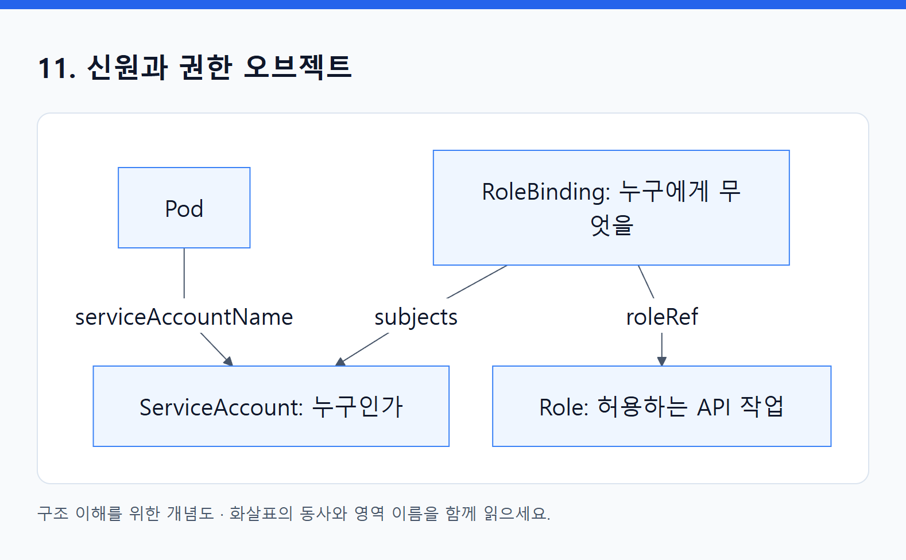

# 11. 신원과 권한 오브젝트

> 전체 학습 21/35 · 심화
> [이전: 10. 누가 무엇을 할 수 있는가, 새로운 기능은 어떻게 붙는가](10_보안과_확장_구조.md) · [전체 목차](../README.md) · [다음: 12. 클러스터와 확장 오브젝트](12_클러스터와_확장_오브젝트.md)
> 본문을 위에서 아래로 읽고 마지막의 다음 장으로 이동한다. 본문 속 다른 장·출처 링크는 선택 참고용이다.

이 객체들은 **Kubernetes API에 어떤 작업을 허용할지** 연결한다. 앱의 일반 HTTP 로그인, 파일시스템 사용자, 외부 클라우드 권한은 별도 경계다.

<!-- diagram:02-11-block-1 -->


[크게 보기](../assets/diagrams/02-11-block-1.png) · [SVG](../assets/diagrams/02-11-block-1.svg)

<details>
<summary>그림의 원문 설명 펼치기</summary>

```text
flowchart LR
  P["Pod"] -->|serviceAccountName| SA["ServiceAccount: 누구인가"]
  B["RoleBinding: 누구에게 무엇을"] -->|subjects| SA
  B -->|roleRef| R["Role: 허용하는 API 작업"]
```

</details>
<!-- /diagram:02-11-block-1 -->

화살표는 참조 관계다. RoleBinding이 ServiceAccount나 Role을 소유·생성하는 것은 아니다.

## ServiceAccount

**API: `v1` · 범위: N · 핵심: 워크로드가 사용할 Kubernetes 신원.**

사람이 아닌 앱·controller도 API를 호출할 때 신원이 필요하다. ServiceAccount는 이를 표현한다. Pod는 `serviceAccountName`으로 선택하며 생략 시 해당 Namespace의 default ServiceAccount를 사용한다.

```yaml
apiVersion: v1
kind: ServiceAccount
metadata:
  name: orders
  namespace: study
automountServiceAccountToken: false
```

주요 필드는 자동 API 토큰 마운트 여부인 `automountServiceAccountToken`, 이미지 pull에 사용할 Secret 참조인 `imagePullSecrets` 등이다. Pod에서도 automount 설정을 지정할 수 있으며 Pod 쪽 값이 우선한다.

일반적인 현대 구성에서는 제한된 수명의 projected token을 통해 API 신원을 전달할 수 있다. ServiceAccount를 만들 때마다 영구 토큰 Secret이 반드시 생기는 것으로 외우지 않는다. 위 예제는 앱이 Kubernetes API를 사용하지 않는 경우의 불필요한 기본 토큰 마운트를 줄인다.

**동작·조회:** 인증 체계는 토큰 등을 검증해 `system:serviceaccount:study:orders` 같은 신원을 식별하고, 인가 체계가 RoleBinding 등의 권한을 판단한다. `get serviceaccount orders -n study -o yaml`과 Pod의 serviceAccountName을 비교한다. ServiceAccount만 생성하면 모든 API 권한을 얻는 것은 아니다. [ServiceAccount](https://kubernetes.io/docs/concepts/security/service-accounts/).

## Role

**API: `rbac.authorization.k8s.io/v1` · 범위: N · 핵심: 한 Namespace에서 허용할 API 작업 규칙.**

```yaml
apiVersion: rbac.authorization.k8s.io/v1
kind: Role
metadata:
  name: pod-reader
  namespace: study
rules:
  - apiGroups: [""]
    resources: [pods]
    verbs: [get, list, watch]
```

이 Role은 `study`의 Pod 조회를 허용할 **규칙**이다. 아직 누구에게도 연결하지 않았으므로 Role만으로 특정 사용자에게 권한이 추가되지는 않는다.

| rules 내부 필드 | 의미 |
|---|---|
| apiGroups | 대상 API 그룹; core의 v1 객체는 빈 문자열 |
| resources | API 리소스 이름; 보통 복수형 `pods`, `deployments` |
| verbs | get·list·watch·create·update·patch·delete 등의 작업 |
| resourceNames | 지원되는 작업에서 대상 이름을 제한 |

`apiGroups: ["apps"]`와 `resources: ["deployments"]`를 쓰는 자리를 `apps/v1`, `Deployment`로 쓰지 않는다. Pod 조회와 `pods/log`, `pods/exec` subresource 접근도 다른 규칙이다. resourceNames는 모든 종류의 create·목록 작업에 같은 방식으로 적용되는 일반 필터가 아니므로 해당 API의 제약을 확인한다.

**조회:** `kubectl get role pod-reader -n study -o yaml`. Role 수정은 연결된 주체들의 이후 인가 판단에 영향을 준다. Role은 deny 규칙을 나열하는 모델이 아니라 허용 규칙의 묶음이다. [RBAC](https://kubernetes.io/docs/reference/access-authn-authz/rbac/).

## RoleBinding

**API: `rbac.authorization.k8s.io/v1` · 범위: N · 핵심: 주체에게 Namespace 범위의 권한을 연결.**

```yaml
apiVersion: rbac.authorization.k8s.io/v1
kind: RoleBinding
metadata:
  name: orders-read-pods
  namespace: study
subjects:
  - kind: ServiceAccount
    name: orders
    namespace: study
roleRef:
  apiGroup: rbac.authorization.k8s.io
  kind: Role
  name: pod-reader
```

`subjects`는 사용자·그룹·ServiceAccount 등 권한을 받을 주체, `roleRef`는 권한 규칙을 참조한다. Role을 참조할 때는 같은 Namespace의 Role이다. ClusterRole도 참조할 수 있지만 이 경우에도 RoleBinding이 부여하는 권한은 해당 Namespace 범위다.

같은 이름의 `orders` ServiceAccount가 다른 Namespace에 있으면 다른 신원이다. `subjects[].namespace`는 그래서 중요하다. RoleBinding 자신의 Namespace와 주체 ServiceAccount의 Namespace가 항상 같아야 하는 것은 아니지만, 어디의 권한을 누구에게 주는지 정확히 읽어야 한다.

**변경·조회:** roleRef는 생성 후 변경할 수 없으므로 다른 Role로 바꾸려면 binding 재생성을 고려한다. subjects는 변경할 수 있다. binding을 지워도 다른 binding이 권한을 주고 있으면 접근은 유지된다. `get rolebinding -o yaml`로 연결을 확인한다. [RoleBinding](https://kubernetes.io/docs/reference/access-authn-authz/rbac/#rolebinding-and-clusterrolebinding).

## ClusterRole

**API: `rbac.authorization.k8s.io/v1` · 범위: C · 핵심: 클러스터 수준 또는 재사용할 권한 규칙.**

```yaml
apiVersion: rbac.authorization.k8s.io/v1
kind: ClusterRole
metadata:
  name: node-reader
rules:
  - apiGroups: [""]
    resources: [nodes]
    verbs: [get, list, watch]
```

Node처럼 Namespace에 속하지 않는 자원에 대한 규칙을 표현할 수 있다. Namespace 범위의 자원 권한을 여러 Namespace에서 재사용하기 위해 ClusterRole에 정의하는 경우도 있다. 실제 권한 범위는 어떤 binding으로 연결하는지까지 봐야 한다.

Role과 유사한 rules 외에 non-resource URL 접근 규칙이나 `aggregationRule`이 등장할 수 있다. aggregationRule을 사용하는 ClusterRole의 rules는 선택된 다른 ClusterRole들에서 controller가 합성할 수 있으므로 단순 수동 규칙과 구분한다.

**관찰:** `get clusterrole node-reader -o yaml`. 위 Node 규칙을 RoleBinding으로 연결한다고 Namespace 범위를 넘어 Node 조회 권한이 생기는 것은 아니다. C 자원을 허용하려면 적절한 ClusterRoleBinding 등의 클러스터 인가 연결이 필요하다. [ClusterRole](https://kubernetes.io/docs/reference/access-authn-authz/rbac/#role-and-clusterrole).

## ClusterRoleBinding

**API: `rbac.authorization.k8s.io/v1` · 범위: C · 핵심: ClusterRole 권한을 클러스터 범위로 주체에 연결.**

```yaml
apiVersion: rbac.authorization.k8s.io/v1
kind: ClusterRoleBinding
metadata:
  name: observer-read-nodes
subjects:
  - kind: ServiceAccount
    name: observer
    namespace: study
roleRef:
  apiGroup: rbac.authorization.k8s.io
  kind: ClusterRole
  name: node-reader
```

예제에서는 별도로 만든 `study/observer` ServiceAccount가 필요하다. ClusterRoleBinding은 Role을 참조하지 않고 ClusterRole을 참조한다. `subjects[].namespace: study`는 주체의 소속을 식별할 뿐 허용 권한을 study Namespace 안으로 축소하는 설정이 아니다.

**비교:** Pod 조회 ClusterRole을 RoleBinding으로 연결하면 특정 Namespace의 조회를 부여할 수 있고, ClusterRoleBinding으로 연결하면 여러 Namespace 전반에 적용될 수 있다. Node 조회처럼 C 자원을 포함하면 그 클러스터 자원에도 권한이 연결된다.

**관찰:** `get clusterrolebindings -o yaml`로 간접적인 권한 부여까지 추적한다. roleRef는 불변이며, 삭제 후에도 다른 binding과 인가 방식의 권한이 남을 수 있다. [ClusterRoleBinding](https://kubernetes.io/docs/reference/access-authn-authz/rbac/#rolebinding-and-clusterrolebinding).

## 함께 읽으면 혼동이 줄어드는 것

사용자 계정은 일반 Kubernetes에서 반드시 `kind: User`라는 API 객체로 저장되는 것이 아니다. 인증된 이름을 RBAC subject가 참조할 수 있다. 또한 `securityContext`는 컨테이너의 Linux 실행 권한을 설정하는 Pod 필드이므로 위 RBAC 객체와 역할이 다르다.

현재 신원에 허용된 작업은 `kubectl auth can-i get pods -n study`로 확인할 수 있다. `--as`로 다른 신원을 시험하려면 그 신원을 impersonate할 권한도 필요하다. Role을 만들었다는 사실과 실제 호출자의 인가 결과를 구분한다.

[목차](오브젝트_색인.md) · [자원과 가용성](14_자원과_가용성_오브젝트.md)

---

[이전: 10. 누가 무엇을 할 수 있는가, 새로운 기능은 어떻게 붙는가](10_보안과_확장_구조.md) · [전체 목차](../README.md) · [다음: 12. 클러스터와 확장 오브젝트](12_클러스터와_확장_오브젝트.md)
