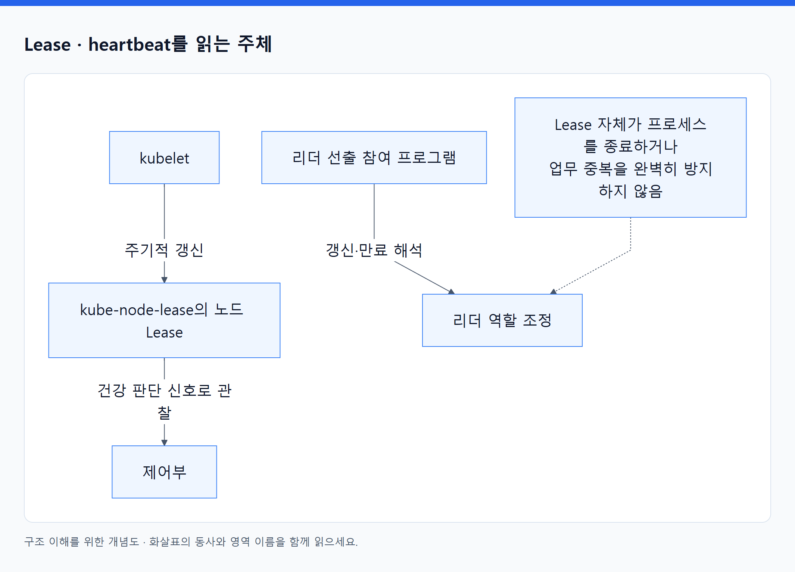
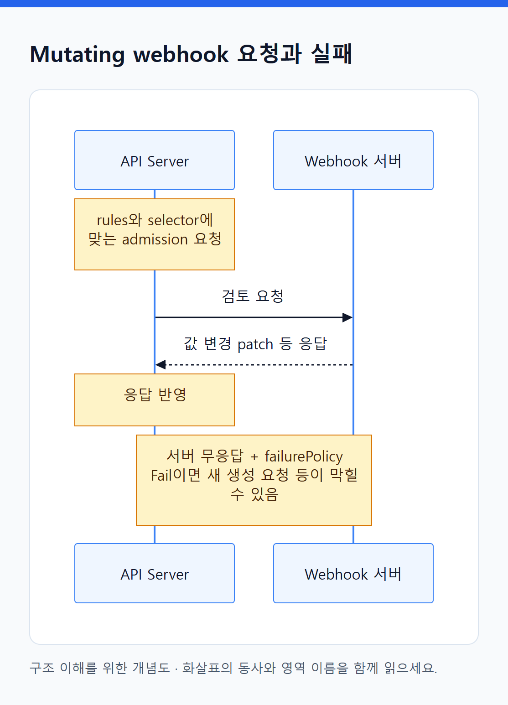

# 12. 클러스터와 확장 오브젝트

> 전체 학습 22/35 · 심화
> [이전: 11. 신원과 권한 오브젝트](11_신원과_권한_오브젝트.md) · [전체 목차](../README.md) · [다음: 13. 자동 확장은 수요·공급·복구 정책의 협력이다](13_확장과_가용성.md)
> 본문을 위에서 아래로 읽고 마지막의 다음 장으로 이동한다. 본문 속 다른 장·출처 링크는 선택 참고용이다.

이 객체들은 실행 환경의 범위·상태를 표현하거나 API 자체의 종류와 정책을 확장한다. 일부는 관리자가 작성하고 일부는 시스템이 자동 갱신한다.

## Namespace

**API: `v1` · 범위: C · 핵심: 이름과 정책을 적용할 논리적 영역.**

```yaml
apiVersion: v1
kind: Namespace
metadata:
  name: study
  labels:
    team: learning
```

`metadata.name`이 다른 N 객체의 `metadata.namespace`에 쓰인다. `study/orders`와 `prod/orders`는 서로 다른 Deployment가 될 수 있다. Namespace 자체는 클러스터 범위의 객체다.

labels는 NetworkPolicy의 namespaceSelector나 admission 등의 정책 대상 선택에 쓰일 수 있다. ResourceQuota·LimitRange·RoleBinding은 각 Namespace 안에서 해당 범위에 영향을 준다. 기본 Namespace인 default, 시스템 객체가 주로 있는 kube-system, 노드 Lease를 관리하는 kube-node-lease 등의 용도도 구분한다.

**동작·삭제:** namespace controller가 삭제 대상 Namespace에 남은 객체를 정리한다. 남은 객체·finalizer·API 조회 문제 때문에 Terminating이 지속될 수 있다. Namespace 삭제는 그 안의 여러 객체 삭제를 수반하므로 단순 이름표 제거가 아니다.

**조회:** `get namespace study -o yaml`의 phase와 삭제 진행 시 conditions, 남은 객체를 본다. Namespace를 나눈 것만으로 네트워크·노드·커널이 모두 격리되는 것은 아니다. [Namespace](https://kubernetes.io/docs/concepts/overview/working-with-objects/namespaces/).

## Node

**API: `v1` · 범위: C · 핵심: 실행 노드의 등록 정보·용량·상태.**

실제 노드가 서버라면 Node 객체는 Kubernetes에서 그 서버를 나타내는 기록이다. kubelet 등의 등록·보고와 controller의 관찰로 갱신된다. 일반 앱 개발자가 `kind: Node` YAML만 작성해서 서버를 생성하는 객체가 아니다.

| 주요 필드 | 읽는 의미 |
|---|---|
| metadata.labels | OS·아키텍처·zone·hostname 등 배치에 쓰는 속성 |
| spec.taints | 기본적으로 거절할 Pod와 toleration 관계 |
| spec.unschedulable | 일반적인 새 배치를 막는 상태; cordon과 연결 |
| spec.providerID | 지원 환경에서 외부 기반 자원과 연결하는 ID |
| spec.podCIDR / podCIDRs | 해당 네트워크 구현에서 노드에 할당한 Pod 주소 범위 |
| status.capacity | 노드 자원의 전체 용량 표현 |
| status.allocatable | Pod에 배치 가능하다고 제공하는 용량 |
| status.conditions | Ready·MemoryPressure·DiskPressure 등의 신호 |
| status.addresses | 노드 통신 주소 |
| status.nodeInfo | OS·커널·kubelet·runtime 버전 등의 정보 |

**동작:** scheduler가 Node의 용량과 조건을 보고 Pod 배치를 판단한다. kubelet은 상태와 heartbeat를 보고한다. 서버 장애와 Node 객체 삭제는 다른 사건이다. 실제 서버가 멈춰도 API 객체가 잠시 또는 더 오래 남을 수 있다.

**조회:** `kubectl describe node <name>`. CPU 실제 사용률과 allocatable 대비 requests의 예약 상태를 나눠 본다. `unschedulable: true`가 기존 Pod를 전부 옮기는 것은 아니다. Node의 labels를 임의로 바꿔 실제 하드웨어 능력이 생기는 것도 아니다. [Nodes](https://kubernetes.io/docs/concepts/architecture/nodes/).

## Lease

**API: `coordination.k8s.io/v1` · 범위: N · 핵심: 주기적인 갱신과 리더 조정을 위한 작은 기록.**

노드가 살아 있음을 알리는 heartbeat, 여러 controller 인스턴스 중 활성 리더를 정하는 용도로 쓰인다. 이름이 같아도 Namespace와 사용 목적에 따라 다른 Lease다.

| 주요 필드 | 의미 |
|---|---|
| spec.holderIdentity | 현재 보유자로 기록된 식별자 |
| leaseDurationSeconds | 보유 판단에 사용하는 기간 |
| acquireTime / renewTime | 획득·갱신 시각 |
| leaseTransitions | 보유자 전환 추적 |

<!-- diagram:02-12-concept-1 -->


[크게 보기](../assets/diagrams/02-12-concept-1.png) · [SVG](../assets/diagrams/02-12-concept-1.svg)

<details>
<summary>그림의 원문 설명 펼치기</summary>

예를 들어 kubelet은 `kube-node-lease`의 노드 관련 Lease를 갱신하고, 제어부는 이 신호 등을 노드 건강 판단에 사용한다. 리더 선출에서는 참여 프로그램이 갱신과 만료를 해석해 행동한다. Lease 객체가 스스로 프로세스를 종료하거나 업무 중복을 완벽히 막는 실행 장치는 아니다.

</details>
<!-- /diagram:02-12-concept-1 -->

**조회:** `kubectl get leases -n kube-node-lease -o yaml`. 누가 갱신하며 어떤 기준으로 사용하는 Lease인지부터 확인한다. 소유자 ID·renewTime을 임의로 편집하면 정상적인 조정과 충돌할 수 있으므로 일반적으로 관찰 대상으로 다룬다. [Leases](https://kubernetes.io/docs/concepts/architecture/leases/).

## Event

**API: `events.k8s.io/v1` 또는 core `v1` 표현 · 범위: N · 핵심: 객체와 관련된 상태 변화·처리 사건.**

Pod가 스케줄링되지 않거나 이미지 다운로드가 실패하면 담당 프로그램이 Event를 기록할 수 있다. Event는 원하는 실행 상태를 선언하는 것보다 **무슨 일이 있었는지 관찰하는 객체**다.

`events.k8s.io/v1`의 `regarding`은 관련 객체, `reason`은 이유 분류, `note`는 상세 문맥, `type`은 Normal·Warning 등, `reportingController`는 기록 주체, `eventTime/series`는 시각과 반복 정보다. core v1 표현에서는 `involvedObject`, `message`, `count` 등 이름이 달라질 수 있다.

**조회:** `kubectl get events -n study --sort-by=.metadata.creationTimestamp`, `describe pod`의 Events를 본다. 반복된 사건이 집계되고 보존 기간이 제한될 수 있으므로 이 목록이 모든 실행 이력의 완전한 순서나 장기 감사 로그는 아니다.

Event가 Warning이라고 앱이 지금도 반드시 실패 중인 것은 아니다. 과거 실패 후 복구되었을 수 있다. 현재 객체 status와 시각을 함께 본다. Event를 삭제하는 것은 원인을 수정하는 작업이 아니다. [Event API](https://kubernetes.io/docs/reference/kubernetes-api/cluster-resources/event-v1/).

## CustomResourceDefinition

**API: `apiextensions.k8s.io/v1` · 범위: C · 약어: CRD · 핵심: 새로운 API 오브젝트 종류를 정의.**

```yaml
apiVersion: apiextensions.k8s.io/v1
kind: CustomResourceDefinition
metadata:
  name: backups.study.example.com
spec:
  group: study.example.com
  scope: Namespaced
  names:
    plural: backups
    singular: backup
    kind: Backup
  versions:
    - name: v1
      served: true
      storage: true
      schema:
        openAPIV3Schema:
          type: object
          properties:
            spec:
              type: object
              required: [retentionDays]
              properties:
                retentionDays:
                  type: integer
                  minimum: 1
```

`group`과 versions는 새 API 주소 체계, `names`는 kind와 명령에 쓰는 자원 이름, `scope`는 생성될 인스턴스의 범위, schema는 수락할 데이터 구조다. 여러 version을 제공할 수 있지만 저장 version은 하나로 지정해야 하며, 버전 간 변환이 필요하면 conversion 설계가 추가된다. CRD 자신은 C이고, 예제 Backup 인스턴스는 N이다.

CRD가 준비되면 다음 **Custom Resource 인스턴스**를 저장할 수 있다.

```yaml
apiVersion: study.example.com/v1
kind: Backup
metadata:
  name: orders
  namespace: study
spec:
  retentionDays: 7
```

**동작:** API가 schema에 맞는 새 종류를 수락하게 된다. 이것만으로 실제 백업 작업은 실행되지 않는다. Backup을 관찰해 작업하고 status를 갱신할 controller가 별도로 필요하다. 위 CRD에는 status subresource·백업 실행 구현을 넣지 않았다.

**조회:** `kubectl get crd backups.study.example.com -o yaml`의 Established 등 conditions와 `kubectl get backups -n study`. CRD 삭제는 해당 종류의 인스턴스 삭제도 수반할 수 있으므로 controller 삭제와 CRD 삭제를 다른 범위로 본다. [CRD와 Custom Resource](https://kubernetes.io/docs/concepts/extend-kubernetes/api-extension/custom-resources/).

## MutatingWebhookConfiguration

**API: `admissionregistration.k8s.io/v1` · 범위: C · 핵심: API 요청에 값을 주입·변경하는 webhook 연결.**

예를 들어 특정 Pod에 필요한 보조 설정을 자동 주입할 때 사용한다. `webhooks[]`에 어떤 요청을 보낼지와 어느 서버에 물어볼지를 적는다. 객체는 webhook 서버 프로그램 그 자체가 아니다.

| 주요 필드 | 의미 |
|---|---|
| webhooks[].rules | CREATE·UPDATE 등 작업과 API group/version/resource 매칭 |
| clientConfig | Service 또는 URL, TLS 신뢰 정보 |
| namespaceSelector / objectSelector | 요청을 보낼 대상 필터 |
| failurePolicy | 호출 실패 시 Fail 또는 Ignore 처리 |
| timeoutSeconds | 호출 응답 대기 제한 |
| admissionReviewVersions / sideEffects | 요청 형식과 dry-run 등의 처리 조건 |
| reinvocationPolicy | 필요한 경우 다시 호출할지의 정책 |

<!-- diagram:02-12-concept-2 -->


[크게 보기](../assets/diagrams/02-12-concept-2.png) · [SVG](../assets/diagrams/02-12-concept-2.svg)

<details>
<summary>그림의 원문 설명 펼치기</summary>

**동작:** API Server가 조건에 맞는 admission 요청을 webhook 서버에 보내고 응답의 patch 등을 반영한다. 일반적인 앱 패킷을 매번 이 webhook으로 보내는 구조가 아니다. 서버가 응답하지 않고 failurePolicy가 Fail이면 새 Pod 생성 같은 요청이 막힐 수 있다.

</details>
<!-- /diagram:02-12-concept-2 -->

**조회:** configuration의 rules·Service 참조·인증서와 실제 webhook 서버 상태를 비교한다. 삭제는 주입·검증 경로를 바꾸지만 기존 Pod에 주입된 값을 모두 회수하는 명령은 아니다. [Dynamic admission](https://kubernetes.io/docs/reference/access-authn-authz/extensible-admission-controllers/).

## ValidatingWebhookConfiguration

**API: `admissionregistration.k8s.io/v1` · 범위: C · 핵심: API 객체를 허용할지 외부 webhook에 검증 요청.**

Mutating과 유사하게 rules·clientConfig·selector·failurePolicy·timeout을 연결한다. 차이는 “값을 바꿔 주입”하는 것이 아니라 **최종적으로 이 요청을 허용할지 판단**하는 역할이다. mutating 전용 reinvocationPolicy를 같은 의미로 복사하지 않는다.

승인된 레지스트리의 이미지만 사용하도록 하거나 조직의 구조 규칙을 검증하는 데 사용할 수 있다. RBAC상 Pod 생성 권한이 있어도 검증 정책에 어긋나면 거절된다.

**관찰:** API 오류의 webhook 이름, 설정의 매칭 조건, 서버 응답을 연결한다. 이 configuration이 존재한다고 이미지 취약점 탐지 코드까지 자동 구현되는 것은 아니다. 검증 내용은 연결한 서버가 제공한다. [Validating webhook](https://kubernetes.io/docs/reference/access-authn-authz/extensible-admission-controllers/).

## ValidatingAdmissionPolicy

**API: `admissionregistration.k8s.io/v1` · 범위: C · 핵심: API Server 안에서 평가하는 선언형 검증 정책.**

CEL 표현식으로 객체 조건을 검증한다. `spec.matchConstraints`는 대상 요청, `validations[].expression`은 검증 조건, `message`는 실패 설명, `paramKind`는 선택적인 정책 파라미터 종류다. `failurePolicy`는 평가 실패 처리에 관여한다.

외부 webhook 서버를 호출하는 방식과 다른 구현이다. 다만 정책 정의만 읽고 어느 범위에서 어떻게 적용되는지까지 단정하지 않는다. 실제 적용은 다음 Binding과 함께 봐야 한다. status의 typeChecking·conditions 등 제공되는 진단 정보를 확인한다. [ValidatingAdmissionPolicy](https://kubernetes.io/docs/reference/access-authn-authz/validating-admission-policy/).

## ValidatingAdmissionPolicyBinding

**API: `admissionregistration.k8s.io/v1` · 범위: C · 핵심: 정책의 적용 대상과 처리 방식을 연결.**

`spec.policyName`이 정책을 가리키고, `matchResources`가 적용 범위를 제한하며, `paramRef`가 파라미터를 연결할 수 있다. `validationActions`는 Deny·Warn·Audit 등의 처리 방식을 정한다. 허용되는 조합은 API 규칙을 따른다.

예를 들어 같은 검증 정책을 특정 Namespace에는 경고로, 다른 범위에는 거절로 적용할 수 있다. Policy가 “검증 규칙”이라면 Binding은 “어디에 어떤 방식으로”다. 지원 버전과 policy/binding 양쪽을 조회해야 한다. 삭제는 해당 binding의 적용을 없애는 것이며 다른 binding이나 webhook 정책이 남을 수 있다. [정책과 Binding](https://kubernetes.io/docs/reference/access-authn-authz/validating-admission-policy/#what-is-validating-admission-policy).

[목차](오브젝트_색인.md) · [추가 설치하는 오브젝트](17_추가_설치하는_오브젝트.md)

---

[이전: 11. 신원과 권한 오브젝트](11_신원과_권한_오브젝트.md) · [전체 목차](../README.md) · [다음: 13. 자동 확장은 수요·공급·복구 정책의 협력이다](13_확장과_가용성.md)
