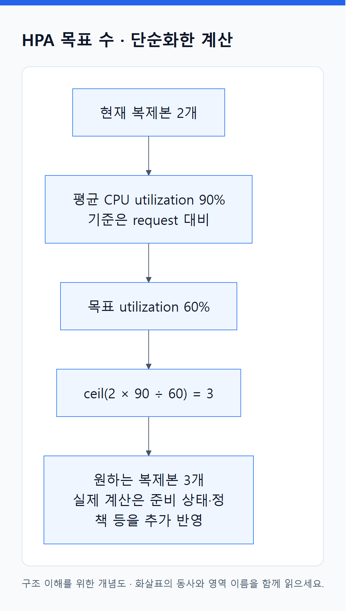
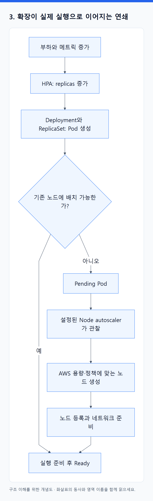
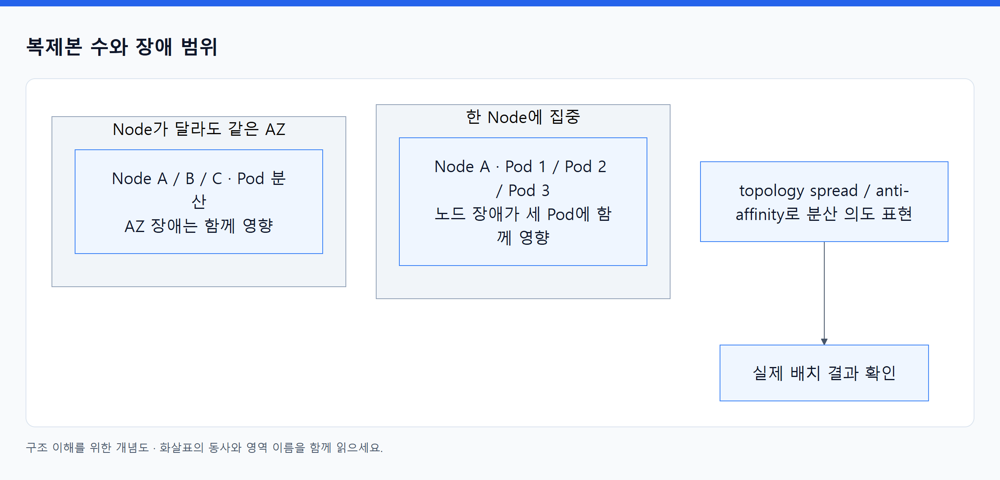

# 13. 자동 확장은 수요·공급·복구 정책의 협력이다

> 전체 학습 23/35 · 심화
> [이전: 12. 클러스터와 확장 오브젝트](12_클러스터와_확장_오브젝트.md) · [전체 목차](../README.md) · [다음: 14. 자원과 가용성 오브젝트](14_자원과_가용성_오브젝트.md)
> 본문을 위에서 아래로 읽고 마지막의 다음 장으로 이동한다. 본문 속 다른 장·출처 링크는 선택 참고용이다.

> 이 장의 질문: replicas를 늘리면 왜 용량과 가용성이 자동으로 해결되지 않는가?

## 1. 네 가지 조정 대상을 구분한다

| 기능 | 주로 바꾸는 것 | 필요한 입력 |
|---|---|---|
| HPA | Deployment 등의 복제본 수 | 리소스·커스텀·외부 메트릭, 목표 값 |
| VPA | Pod의 자원 요청량 등 | 자원 사용 이력, 적용 정책 |
| Node autoscaler | 노드 수 또는 종류 | 배치 불가능한 Pod, 용량 정책, 공급 조건 |
| ResourceQuota / LimitRange | 허용 예산·기본값·범위 | Namespace 정책 |

HPA는 기본 Kubernetes API의 오브젝트지만 CPU/메모리 활용에는 보통 Metrics Server 같은 메트릭 제공 체계가 필요하다. VPA는 별도 설치하는 구성요소이며 적용 방식과 지원 버전에 따라 재생성·제자리 변경 가능성이 달라진다. Quota는 용량을 공급하지 않고, 요청을 거절할 수 있는 경계다. [VPA 공식 프로젝트](https://github.com/kubernetes/autoscaler/tree/master/vertical-pod-autoscaler).

## 2. HPA의 숫자를 읽어 보자

<!-- diagram:02-13-concept-2 -->


[크게 보기](../assets/diagrams/02-13-concept-2.png) · [SVG](../assets/diagrams/02-13-concept-2.svg)

<details>
<summary>그림의 원문 설명 펼치기</summary>

설명을 단순화하면 목표 복제본 수는 `ceil(현재 복제본 수 × 현재 지표 / 목표 지표)` 형태로 이해할 수 있다. CPU request 대비 utilization을 사용할 때 Pod 두 개의 평균 utilization이 90%, 목표가 60%라면 `ceil(2 × 90 / 60) = 3`이다.

</details>
<!-- /diagram:02-13-concept-2 -->

이는 원리를 보기 위한 계산이다. 실제 controller는 준비되지 않은 Pod·누락된 메트릭·오차 허용·확장 정책·안정화 구간·최소/최대 수를 반영한다. 요청량을 설정하지 않은 컨테이너가 있으면 CPU utilization 계산이 성립하지 않는 경우도 있다. `90%`가 CPU limit의 90%인지 request 대비 90%인지 꼭 구분한다. [HPA 알고리즘](https://kubernetes.io/docs/tasks/run-application/horizontal-pod-autoscale/).

응답 지연이 높아졌다고 CPU 기반 HPA가 항상 늘지는 않는다. DB 대기·외부 API 지연 때문에 CPU가 낮은 장애도 있다. 큐 작업이라면 큐 길이 같은 외부 지표가 더 직접적일 수 있으며 이를 제공하는 adapter나 별도 autoscaler가 필요하다.

## 3. 확장이 실제 실행으로 이어지는 연쇄

<!-- diagram:02-13-block-1 -->


[크게 보기](../assets/diagrams/02-13-block-1.png) · [SVG](../assets/diagrams/02-13-block-1.svg)

<details>
<summary>그림의 원문 설명 펼치기</summary>

```text
flowchart TD
  M["부하와 메트릭 증가"] --> H["HPA: replicas 증가"]
  H --> D["Deployment와 ReplicaSet: Pod 생성"]
  D --> S{"기존 노드에 배치 가능한가?"}
  S -->|예| R["실행 준비 후 Ready"]
  S -->|아니오| P["Pending Pod"]
  P --> A["설정된 Node autoscaler가 관찰"]
  A --> C["AWS 용량·정책에 맞는 노드 생성"]
  C --> N["노드 등록과 네트워크 준비"]
  N --> R
```

</details>
<!-- /diagram:02-13-block-1 -->

Node autoscaler가 없거나 최대 노드 수에 도달했거나 EC2 공급이 부족하면 연쇄가 중간에서 멈춘다. 추가 노드가 있어도 subnet IP가 부족하면 실행 준비가 실패할 수 있다. HPA가 늘린 값은 수요이고, EC2·IP·스토리지는 공급이다.

VPA가 CPU requests를 변경하면 같은 사용량의 HPA utilization도 달라질 수 있다. 두 autoscaler가 같은 자원 지표를 서로 조정할 때는 충돌을 검토한다. 설정을 많이 넣는 것보다 각 루프의 입력과 출력이 맞물리는지 확인하는 것이 중요하다.

## 4. 가용성은 복제본 수뿐 아니라 배치와 실패 범위다

<!-- diagram:02-13-concept-3 -->


[크게 보기](../assets/diagrams/02-13-concept-3.png) · [SVG](../assets/diagrams/02-13-concept-3.svg)

<details>
<summary>그림의 원문 설명 펼치기</summary>

Pod 세 개가 모두 한 노드에 있으면 그 노드 하나의 장애로 모두 사라진다. 서로 다른 노드에 있어도 모두 한 AZ에 있으면 AZ 장애에 함께 영향을 받을 수 있다. topology spread나 anti-affinity를 통해 분산 의도를 표현하고 실제 배치 결과를 확인한다.

</details>
<!-- /diagram:02-13-concept-3 -->

분산 규칙을 너무 엄격하게 만들면 장애 시 남은 위치에 배치할 수 없을 수 있다. “세 AZ에 균등 배치”와 “AZ 하나가 없어져도 남은 곳에 실행” 사이의 동작을 직접 예측해야 한다. hard 조건과 soft 선호의 선택은 서비스 요구에 달려 있다. [Topology spread](https://kubernetes.io/docs/concepts/scheduling-eviction/topology-spread-constraints/).

가용성 계산에는 의존 서비스도 포함한다. API Pod를 늘려도 단일 DB, 고갈된 연결 풀, 한 AZ에만 있는 저장소가 전체 성공률을 제한할 수 있다. 가용한 Pod 수와 사용자가 성공한 요청 비율은 다른 지표다.

## 5. PDB는 어떤 중단을 제한하는가?

PodDisruptionBudget에 `minAvailable: 2`를 두고 대상 Pod가 세 개라면, 정상적인 eviction 경로에서 한 번에 줄일 수 있는 여유를 표현한다. 노드 drain 등 자발적 중단이 주요 사용처다. 직접 Pod 삭제, 노드의 갑작스러운 고장, 모든 종류의 자원 압박을 막는 방패가 아니다. 비자발적 중단은 가용 수 계산에 영향을 주지만 PDB가 그 사고를 예방하지 않는다.

Deployment rollout의 가용성은 기본적으로 Deployment의 업데이트 전략이 통제한다. PDB가 rollout을 항상 제한할 것이라고 기대하지 않는다. Pod 두 개에 minAvailable 2인데 추가 배치할 공간도 없다면 drain이 진행되지 않을 수 있다. 보호 정책과 유지보수 여유 용량을 함께 설계해야 한다. [Disruptions와 PDB](https://kubernetes.io/docs/concepts/workloads/pods/disruptions/).

`cordon`은 노드를 새 일반 Pod의 배치 대상에서 제외하고, 기존 Pod를 옮기지는 않는다. `drain`은 유지보수를 위해 eviction 등을 진행한다. DaemonSet·로컬 데이터·퇴거 불가능한 Pod 등 조건에 따라 처리가 달라진다. 운영 노드에서 의미를 모른 채 drain을 연습하지 않는다.

## 6. 배포 전략과 되돌리기

Rolling update는 점진 교체, Recreate는 기존 것을 내려 새 버전을 올리는 방식이다. Blue/green이나 canary는 별도 Deployment·라우팅·진행 제어 등을 조합해 구현하며, 기본 Deployment 하나가 사용자 비율 기반 canary 분석을 모두 제공하지는 않는다.

새 앱이 DB 스키마를 파괴적으로 변경했다면 이미지 rollback만으로 원상복구되지 않을 수 있다. 구버전과 신버전이 잠시 함께 동작할 수 있는 스키마 변경, 데이터 마이그레이션, 기능 flag를 함께 설계한다. 플랫폼이 관리하는 Pod 상태와 업무의 호환성은 구분한다.

**스스로 설명하기:** HPA가 10을 원하지만 Ready가 4일 때 어디부터 볼 것인가? HPA 상태 → Deployment/ReplicaSet 상태 → Pending 또는 준비 실패 Pod Events → 노드·IP·볼륨·Quota를 따라가며 수요와 실행 사이의 끊긴 지점을 찾는다.

---

[이전: 12. 클러스터와 확장 오브젝트](12_클러스터와_확장_오브젝트.md) · [전체 목차](../README.md) · [다음: 14. 자원과 가용성 오브젝트](14_자원과_가용성_오브젝트.md)
