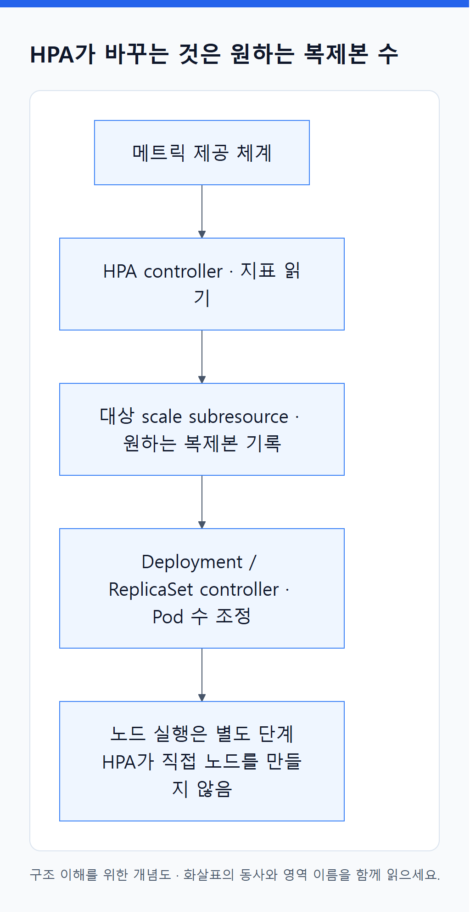
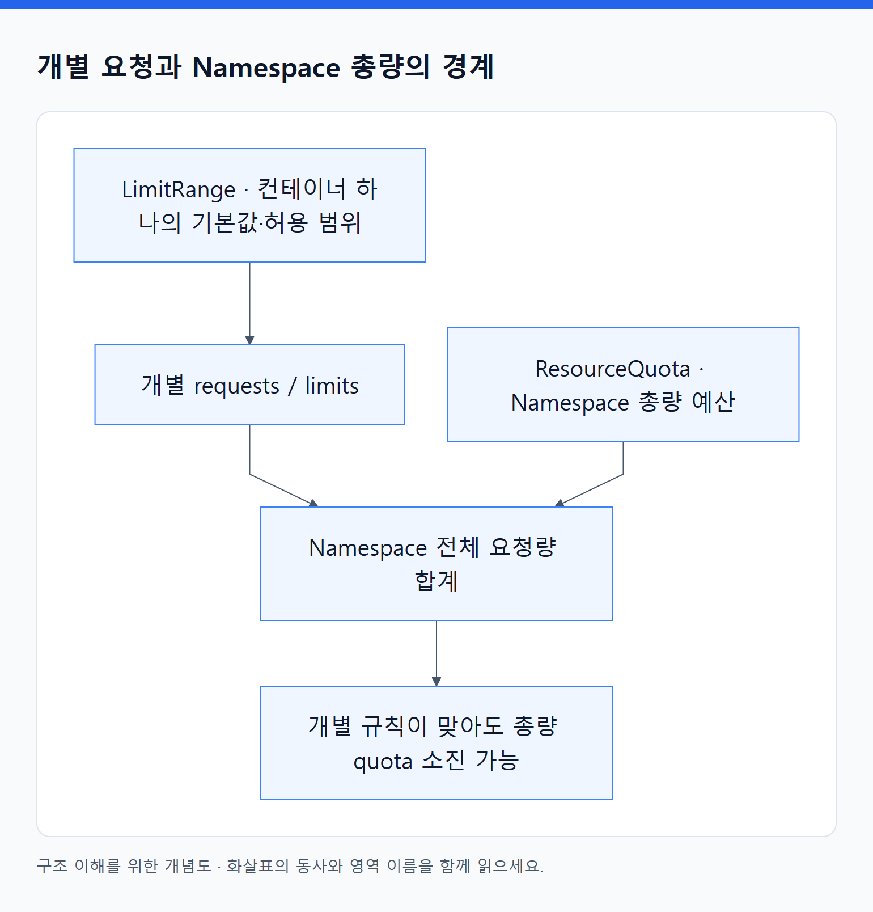

# 14. 자원과 가용성 오브젝트

> 전체 학습 24/35 · 심화
> [이전: 13. 자동 확장은 수요·공급·복구 정책의 협력이다](13_확장과_가용성.md) · [전체 목차](../README.md) · [다음: 15. EKS는 Kubernetes와 AWS 자원 사이의 운영 경계를 정한다](15_EKS_내부_구조와_접근.md)
> 본문을 위에서 아래로 읽고 마지막의 다음 장으로 이동한다. 본문 속 다른 장·출처 링크는 선택 참고용이다.

이 객체들은 “복제본을 몇 개로 할까?”, “얼마까지 요청할 수 있을까?”, “어떤 중단을 허용할까?”처럼 서로 다른 질문을 다룬다. 모두 용량을 새로 만드는 기능으로 합쳐 생각하지 않는다.

## HorizontalPodAutoscaler

**API: `autoscaling/v2` · 범위: N · 약어: HPA · 핵심: 지표에 따라 대상 워크로드의 복제본 수 조정.**

```yaml
apiVersion: autoscaling/v2
kind: HorizontalPodAutoscaler
metadata:
  name: orders
  namespace: study
spec:
  scaleTargetRef:
    apiVersion: apps/v1
    kind: Deployment
    name: orders
  minReplicas: 2
  maxReplicas: 6
  metrics:
    - type: Resource
      resource:
        name: cpu
        target:
          type: Utilization
          averageUtilization: 60
```

`scaleTargetRef`는 같은 Namespace의 확장할 대상, min/max는 복제본 범위, `metrics`는 측정 대상과 목표다. `behavior`로 증가·감소 속도와 안정화 정책을 지정할 수 있다. Resource 외에 Pods·Object·External·ContainerResource 등 지표 방식은 필요한 메트릭 공급 체계와 함께 검토한다.

<!-- diagram:02-14-concept-1 -->


[크게 보기](../assets/diagrams/02-14-concept-1.png) · [SVG](../assets/diagrams/02-14-concept-1.svg)

<details>
<summary>그림의 원문 설명 펼치기</summary>

**동작:** HPA controller가 지표를 읽고 대상의 scale subresource에 원하는 복제본 수를 반영한다. Deployment·ReplicaSet controller가 실제 Pod 수를 따라 조정한다. HPA는 Pod를 직접 실행하거나 노드를 생성하지 않는다.

</details>
<!-- /diagram:02-14-concept-1 -->

CPU utilization의 기준은 해당 계산에 필요한 **requests 대비 사용량**이다. 두 Pod 평균이 90%, 목표가 60%이면 단순 모델의 목표는 `ceil(2 × 90 / 60) = 3`이다. 실제 계산에는 누락 메트릭·준비 상태·정책·허용 오차 등이 반영된다.

**관찰:** `currentMetrics`, `currentReplicas`, `desiredReplicas`, conditions와 `describe hpa`의 Events를 본다. 메트릭 제공자가 없거나 requests가 계산 조건을 만족하지 않으면 조정이 안 될 수 있다. HPA 삭제는 대상 Deployment까지 삭제하는 것이 아니며, 삭제 후 복제본을 누가 관리할지 정해야 한다. [HPA](https://kubernetes.io/docs/tasks/run-application/horizontal-pod-autoscale/).

## PodDisruptionBudget

**API: `policy/v1` · 범위: N · 약어: PDB · 핵심: 대상 Pod의 자발적 중단 예산.**

```yaml
apiVersion: policy/v1
kind: PodDisruptionBudget
metadata:
  name: orders
  namespace: study
spec:
  minAvailable: 2
  selector:
    matchLabels:
      app: orders
```

Pod 세 개가 모두 healthy라면 정상적인 eviction 처리에서 하나의 여유가 있다는 의도를 표현한다. `minAvailable`과 `maxUnavailable`은 대안이며 둘을 함께 지정하지 않는다. 정수 또는 비율을 사용할 때 반올림과 원하는 복제본 수에 따른 계산을 확인한다.

**동작:** disruption controller가 대상 건강 상태와 예산을 계산하고 eviction API가 이를 참조한다. `status.currentHealthy`, `desiredHealthy`, `expectedPods`, `disruptionsAllowed`로 계산을 읽는다. unhealthy Pod의 eviction 처리는 `unhealthyPodEvictionPolicy` 등 지원 필드와 연결된다.

**주의:** 노드 사고를 예방하거나 직접 Pod 삭제를 모두 막는 기능은 아니다. Deployment rollout의 가용성은 해당 전략이 통제하며, PDB가 rollout의 모든 삭제를 제한한다고 기대하지 않는다. minAvailable을 현재 총수와 같게 잡으면 여유가 없어 유지보수가 멈출 수 있다. PDB는 Pod를 소유하거나 복제본을 공급하지 않는다. [PDB](https://kubernetes.io/docs/concepts/workloads/pods/disruptions/).

## ResourceQuota

**API: `v1` · 범위: N · 핵심: Namespace 전체의 자원·객체 사용 예산.**

```yaml
apiVersion: v1
kind: ResourceQuota
metadata:
  name: study-budget
  namespace: study
spec:
  hard:
    requests.cpu: "2"
    requests.memory: 2Gi
    limits.cpu: "4"
    limits.memory: 4Gi
    pods: "10"
    persistentvolumeclaims: "5"
```

`hard`는 허용할 총량이다. `scopes`와 `scopeSelector`로 적용되는 자원의 조건을 더 구체화할 수 있다. 실시간 CPU 사용률이 아니라 선언된 requests·limits와 객체 수 등 해당 자원 유형의 사용량을 제한한다.

**동작:** quota 체계가 사용량을 추적하고 admission이 새 요청이 예산을 넘는지 판단한다. Deployment는 생성됐지만 ReplicaSet이 새 Pod를 만들 때 quota에 막힐 수 있다. 그러면 “Deployment가 있으니 Pod도 반드시 생긴다”는 예상이 틀린다.

`status.hard`와 `status.used`, `describe resourcequota`를 본다. 예산을 줄였다고 기존 Pod를 자동으로 원하는 수까지 종료하는 기능은 아니다. 새 요청이 제한될 수 있다. CPU 예산을 2로 줬다고 실제 노드에서 CPU 2개를 공급·격리해 주는 것도 아니다. [ResourceQuota](https://kubernetes.io/docs/concepts/policy/resource-quotas/).

## LimitRange

**API: `v1` · 범위: N · 핵심: 개별 자원 요청의 기본값과 허용 범위.**

```yaml
apiVersion: v1
kind: LimitRange
metadata:
  name: container-defaults
  namespace: study
spec:
  limits:
    - type: Container
      defaultRequest:
        cpu: 100m
        memory: 64Mi
      default:
        cpu: 500m
        memory: 256Mi
      min:
        cpu: 50m
        memory: 32Mi
      max:
        cpu: "1"
        memory: 1Gi
```

`defaultRequest`는 생략한 requests의 기본값, `default`는 limits의 기본값, min/max는 허용 범위다. `maxLimitRequestRatio`는 지원되는 자원에서 limit/request 비율을 제한한다. type에 따라 Pod·Container·PersistentVolumeClaim 등에 적용할 규칙을 구분한다.

**동작:** admission에서 생성 요청에 기본값을 넣거나 범위를 벗어난 요청을 거절한다. 저장된 Pod에 작성하지 않은 requests가 나타나면 LimitRange 등 기본값 부여를 조사한다. 기존 실행 Pod가 LimitRange 변경만으로 모두 다시 설정되는 것은 아니다.

<!-- diagram:02-14-concept-2 -->


[크게 보기](../assets/diagrams/02-14-concept-2.png) · [SVG](../assets/diagrams/02-14-concept-2.svg)

<details>
<summary>그림의 원문 설명 펼치기</summary>

**ResourceQuota와 비교:** LimitRange는 “컨테이너 하나를 어떻게 요청할까?”, ResourceQuota는 “이 Namespace 전체에서 얼마나 요청했나?”다. 기본값이 너무 크면 개별 규칙은 맞아도 총량 quota를 빠르게 소진할 수 있다. [LimitRange](https://kubernetes.io/docs/concepts/policy/limit-range/).

</details>
<!-- /diagram:02-14-concept-2 -->

## PriorityClass

**API: `scheduling.k8s.io/v1` · 범위: C · 핵심: Pod의 상대적 우선순위.**

```yaml
apiVersion: scheduling.k8s.io/v1
kind: PriorityClass
metadata:
  name: important-api
value: 1000
globalDefault: false
preemptionPolicy: PreemptLowerPriority
description: "일반 배치 작업보다 우선하는 API"
```

`value`는 높은 쪽이 더 높은 우선순위, `globalDefault`는 별도 class를 고르지 않은 Pod의 기본 적용 여부, `preemptionPolicy`는 낮은 우선순위 Pod를 선점할 수 있는 정책이다. 이 필드들은 **spec 아래가 아닌 최상위**에 있다.

Pod가 `spec.priorityClassName: important-api`로 참조하면 admission과 scheduler가 해당 우선순위를 사용한다. `Never` 정책에서는 높은 우선순위의 대기열 처리를 활용하면서도 다른 Pod를 선점하지 않도록 할 수 있다.

**관찰:** Pod의 priority·priorityClassName, Pending Events, 해당되는 경우 nominatedNodeName 등을 읽는다. 높은 우선순위도 맞는 노드·스토리지·자원이 전혀 없으면 실행을 보장하지 못한다. class 수정·삭제가 기존 Pod의 기록된 priority를 모두 즉시 재계산하는 것으로 생각하지 않는다. [PriorityClass](https://kubernetes.io/docs/concepts/scheduling-eviction/pod-priority-preemption/).

## RuntimeClass

**API: `node.k8s.io/v1` · 범위: C · 핵심: 사용할 컨테이너 runtime 설정 연결.**

```yaml
apiVersion: node.k8s.io/v1
kind: RuntimeClass
metadata:
  name: isolated
handler: isolated-handler
scheduling:
  nodeSelector:
    runtime-ready: isolated
overhead:
  podFixed:
    cpu: 50m
    memory: 64Mi
```

`handler`는 노드 runtime에 미리 구성된 실행 handler 이름이다. `scheduling`은 대응 가능한 노드 선택·toleration과 관련되고, `overhead.podFixed`는 실행 방식에 추가로 필요한 자원을 반영한다. 이 객체도 **spec 없이 최상위 필드**를 사용한다.

Pod는 `runtimeClassName: isolated`로 참조한다. admission·scheduler·kubelet/runtime이 설정을 해석하지만, RuntimeClass 객체 자체가 runtime을 설치하지 않는다. 예제의 handler와 노드 label이 실제로 준비되지 않으면 동작하지 않는다.

**관찰:** RuntimeClass의 handler와 노드 지원, Pod Events를 비교한다. 다른 RuntimeClass를 선언했다고 어떤 이미지든 OS·CPU 아키텍처 제약을 무시하고 실행되는 것은 아니다. [RuntimeClass](https://kubernetes.io/docs/concepts/containers/runtime-class/).

[목차](오브젝트_색인.md) · [클러스터와 확장](12_클러스터와_확장_오브젝트.md)

---

[이전: 13. 자동 확장은 수요·공급·복구 정책의 협력이다](13_확장과_가용성.md) · [전체 목차](../README.md) · [다음: 15. EKS는 Kubernetes와 AWS 자원 사이의 운영 경계를 정한다](15_EKS_내부_구조와_접근.md)
