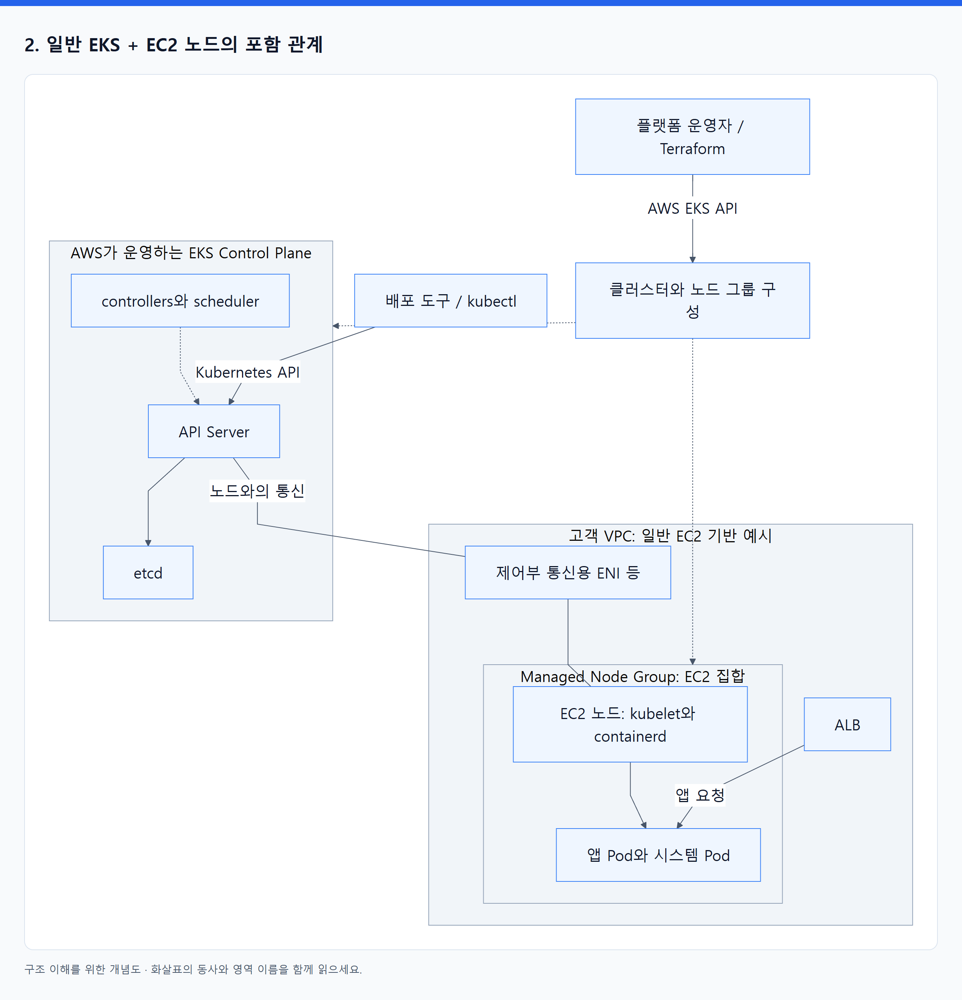
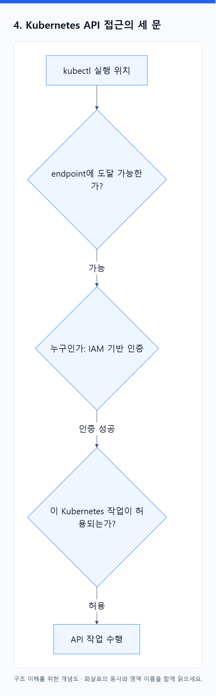
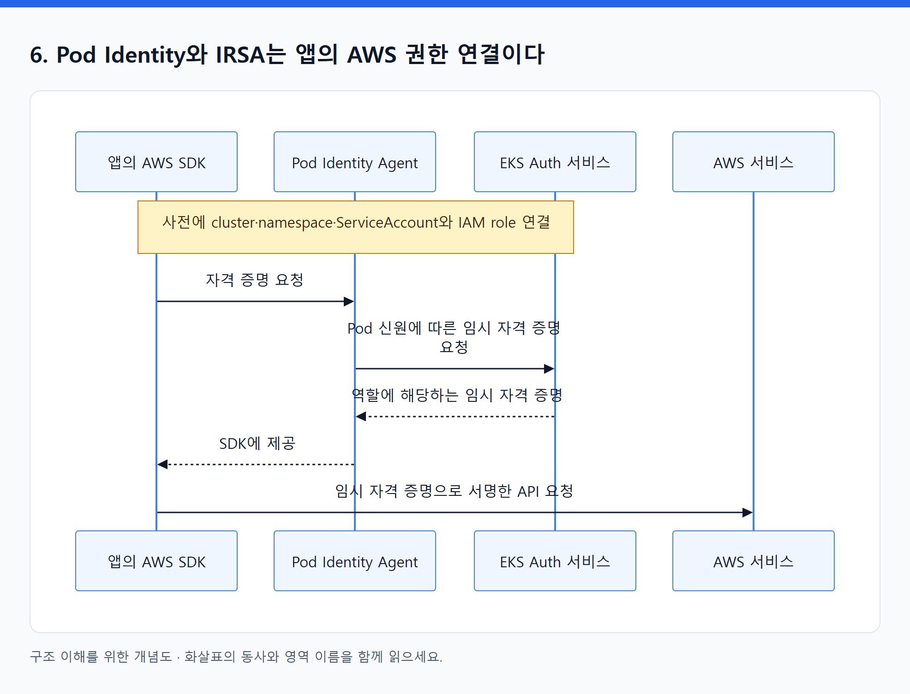

# 15. EKS는 Kubernetes와 AWS 자원 사이의 운영 경계를 정한다

> 전체 학습 25/35 · 심화
> [이전: 14. 자원과 가용성 오브젝트](14_자원과_가용성_오브젝트.md) · [전체 목차](../README.md) · [다음: 16. Kubernetes 의도가 AWS 자원으로 바뀌는 네 가지 연결](16_EKS의_네트워크_스토리지_확장.md)
> 본문을 위에서 아래로 읽고 마지막의 다음 장으로 이동한다. 본문 속 다른 장·출처 링크는 선택 참고용이다.

> 이 장의 질문: EKS를 만든다는 것은 무엇을 만드는 일이며, 접근 권한은 어디서 정해지는가?

## 1. Kubernetes API와 AWS EKS API는 다른 API다

| 호출 | 대상 API | 바뀌는 대상 |
|---|---|---|
| Terraform AWS provider로 EKS cluster 생성 | AWS EKS API 등 | 클러스터 기반과 AWS 구성 |
| AWS CLI로 Node Group 조회 | AWS EKS API | AWS 노드 그룹의 상태 조회 |
| kubectl로 Deployment apply | 해당 클러스터의 Kubernetes API | Kubernetes Deployment 객체 |
| 앱이 S3 객체 읽기 | AWS S3 API | 앱의 외부 데이터 접근 |
| 사용자가 주문 조회 | ALB 뒤 앱 HTTP API | 실제 업무 요청 |

`aws eks describe-cluster`가 성공해도 `kubectl get pods`가 성공한다고 단정할 수 없다. 두 API의 권한과 네트워크 경로가 다르기 때문이다. 앱의 서비스 주소도 이 관리 API들과 별개다.

## 2. 일반 EKS + EC2 노드의 포함 관계

<!-- diagram:02-15-block-1 -->


[크게 보기](../assets/diagrams/02-15-block-1.png) · [SVG](../assets/diagrams/02-15-block-1.svg)

<details>
<summary>그림의 원문 설명 펼치기</summary>

```text
flowchart TB
  ADMIN["플랫폼 운영자 / Terraform"] -->|AWS EKS API| E["클러스터와 노드 그룹 구성"]
  CD["배포 도구 / kubectl"] -->|Kubernetes API| API["API Server"]
  subgraph AWSCP["AWS가 운영하는 EKS Control Plane"]
    API
    CTRL["controllers와 scheduler"]
    ETCD["etcd"]
    API --> ETCD
    CTRL -.-> API
  end
  subgraph VPC["고객 VPC: 일반 EC2 기반 예시"]
    ENI["제어부 통신용 ENI 등"]
    subgraph NG["Managed Node Group: EC2 집합"]
      NODE["EC2 노드: kubelet와 containerd"]
      POD["앱 Pod와 시스템 Pod"]
      NODE --> POD
    end
    ALB["ALB"] -->|앱 요청| POD
  end
  API ---|노드와의 통신| ENI
  ENI --- NODE
  E -.-> AWSCP
  E -.-> NG
```

</details>
<!-- /diagram:02-15-block-1 -->

이 그림의 VPC 상자는 논리적인 위치 설명이다. EKS Control Plane 전체가 고객의 일반 EC2 목록에 나타나는 서버 집합은 아니다. AWS가 제어부의 가용성과 기반 운영을 담당하며, 고객 VPC와의 통신에 필요한 인터페이스 등으로 연결된다. Node Group은 Kubernetes의 Deployment와 다른 종류의 AWS 자원이다. [EKS 개요](https://docs.aws.amazon.com/eks/latest/userguide/what-is-eks.html).

## 3. 실행 방식을 고르면 책임 범위도 달라진다

| 방식 | AWS가 제공하는 주요 운영 범위 | 사용자가 여전히 설계할 것 |
|---|---|---|
| Self-managed EC2 nodes | EKS Control Plane | 노드 수명주기·OS·업데이트·확장과 앱 운영 |
| Managed Node Group | EC2 노드 그룹 생성·교체·업데이트 절차 지원 | 노드 구성·용량·업데이트 결정과 워크로드 영향 |
| EKS Auto Mode | 컴퓨팅·네트워크·스토리지·로드밸런싱의 관리 범위 확장 | 앱·데이터·접근 정책·요구 용량 제약·비용과 운영 목표 |
| Fargate | 선택된 Pod 실행에 필요한 기반 컴퓨팅 관리 | 적합한 워크로드 선택·프로파일·앱 권한과 연결 |

Managed Node Group의 min/max/desired는 기반 용량 설정이다. Pod 수요에 반응하는 Cluster Autoscaler 같은 연동 없이 이 값만으로 모든 Pending이 자동 해결되는 것은 아니다. 업데이트 기능을 제공받아도 PDB·여유 용량·앱 종료 동작을 설계해야 한다. [Managed Node Group](https://docs.aws.amazon.com/eks/latest/userguide/managed-node-groups.html).

Auto Mode는 단순히 Managed Node Group의 이름을 바꾼 것이 아니다. AWS가 맡는 기반 기능과 사용하는 설정·운영 인터페이스가 달라진다. 일반 EC2 노드에 직접 설치하던 일부 기능이 Auto Mode에는 내장되므로, 기존 add-on 설치법과 CRD 예제를 그대로 혼용하지 않는다. [Auto Mode](https://docs.aws.amazon.com/eks/latest/userguide/automode.html), [책임 경계](https://docs.aws.amazon.com/eks/latest/userguide/auto-security.html).

Fargate는 사용자에게 일반 노드 운영을 노출하는 방식과 다르다. DaemonSet, privileged 컨테이너, 일부 스토리지·네트워크 요구 등 제약 때문에 모든 워크로드를 그대로 옮길 수는 없다. 선택하는 Namespace·label과 Fargate profile 조건도 배치를 결정한다. “서버를 관리하지 않는다”와 “제약이 없다”는 다른 말이다. [Fargate](https://docs.aws.amazon.com/eks/latest/userguide/fargate.html).

## 4. Kubernetes API 접근의 세 문

<!-- diagram:02-15-block-2 -->


[크게 보기](../assets/diagrams/02-15-block-2.png) · [SVG](../assets/diagrams/02-15-block-2.svg)

<details>
<summary>그림의 원문 설명 펼치기</summary>

```text
flowchart LR
  C["kubectl 실행 위치"] --> N{"endpoint에 도달 가능한가?"}
  N -->|가능| I{"누구인가: IAM 기반 인증"}
  I -->|인증 성공| A{"이 Kubernetes 작업이 허용되는가?"}
  A -->|허용| K["API 작업 수행"]
```

</details>
<!-- /diagram:02-15-block-2 -->

첫째는 네트워크다. private endpoint만 사용하는 클러스터라면 VPC 또는 연결된 네트워크에서 도달해야 한다. public endpoint도 허용 CIDR 등을 제한할 수 있다. endpoint를 public으로 두었다고 익명 관리 권한이 생기는 것은 아니다. [Endpoint 접근](https://docs.aws.amazon.com/eks/latest/userguide/cluster-endpoint.html).

둘째는 신원이다. kubeconfig는 클러스터 주소·인증서 정보·사용할 인증 방식 등을 연결한다. 일반 AWS CLI 구성에서는 토큰을 얻는 과정에 IAM 신원이 사용된다. `update-kubeconfig`는 연결 설정을 만드는 작업이며, 그 자체가 필요한 모든 Kubernetes 권한을 부여하지 않는다. [kubeconfig 연결](https://docs.aws.amazon.com/eks/latest/userguide/create-kubeconfig.html).

셋째는 인가다. EKS access entry로 IAM principal을 클러스터 접근에 연결하고, EKS access policy 또는 Kubernetes group과 RBAC 등을 통해 허용 작업을 정한다. EKS access policy는 일반 IAM policy와 다른 권한 체계다. 기존 `aws-auth` ConfigMap을 쓰던 환경은 authentication mode와 이전 권한의 이관 범위를 확인한다. access entries를 켰다고 모든 기존 매핑이 자동 이관되는 것으로 가정하지 않는다. [Access entries](https://docs.aws.amazon.com/eks/latest/userguide/access-entries.html).

## 5. 최소 네 가지 신원을 나누어 생각한다

| 신원 | 하는 일 | 다른 신원과 구분할 이유 |
|---|---|---|
| 인프라 생성자 / CI build 역할 | AWS 기반 생성 또는 ECR 이미지 push | 클러스터 내부 앱 실행 권한과 목적이 다름 |
| 배포 도구의 역할 | Kubernetes API에 배포 객체 적용 | 이미지 push 성공과 배포 성공은 별개 |
| 노드 역할 / 실행 기반 신원 | 노드 동작과 이미지 pull 등 | 앱에 노드의 넓은 권한을 공유시키지 않도록 설계 |
| 앱 워크로드 역할 | 앱이 S3·SQS 등 사용 | 앱마다 필요한 자원과 작업이 다름 |

EKS service에 위임하는 cluster IAM role과 각 controller의 IAM 역할도 있다. 역할은 용도에 따라 더 분리될 수 있다. “IAM 권한 있다”는 말 대신 **어느 신원이 어느 API의 어떤 작업을 하는가**를 적는다.

## 6. Pod Identity와 IRSA는 앱의 AWS 권한 연결이다

<!-- diagram:02-15-block-3 -->


[크게 보기](../assets/diagrams/02-15-block-3.png) · [SVG](../assets/diagrams/02-15-block-3.svg)

<details>
<summary>그림의 원문 설명 펼치기</summary>

```text
sequenceDiagram
  participant P as 앱의 AWS SDK
  participant A as Pod Identity Agent
  participant E as EKS Auth 서비스
  participant W as AWS 서비스
  Note over P,E: 사전에 cluster·namespace·ServiceAccount와 IAM role 연결
  P->>A: 자격 증명 요청
  A->>E: Pod 신원에 따른 임시 자격 증명 요청
  E-->>A: 역할에 해당하는 임시 자격 증명
  A-->>P: SDK에 제공
  P->>W: 임시 자격 증명으로 서명한 API 요청
```

</details>
<!-- /diagram:02-15-block-3 -->

Pod Identity는 EKS의 association과 Agent, 지원되는 AWS SDK의 credential chain을 통해 연결된다. 앱이 S3를 호출할 때마다 모든 데이터가 Agent를 경유하는 프록시 모델이 아니다. Agent는 자격 증명 전달 경로에 있다. 모드별 Agent 제공 방식과 SDK 지원을 확인한다. [Pod Identity](https://docs.aws.amazon.com/eks/latest/userguide/pod-identities.html), [동작 과정](https://docs.aws.amazon.com/eks/latest/userguide/pod-id-how-it-works.html).

IRSA는 Kubernetes ServiceAccount의 OIDC 토큰과 IAM trust 관계를 사용해 STS에서 역할 자격 증명을 얻는 방식이다. 두 방식 모두 앱의 AWS 권한을 노드 전체 권한과 분리하는 데 쓰이지만 설정과 지원 환경이 다르다. ServiceAccount의 Kubernetes RBAC 권한만으로 S3 읽기가 허용되는 것은 아니다. [IRSA](https://docs.aws.amazon.com/eks/latest/userguide/iam-roles-for-service-accounts.html).

**스스로 설명하기:** ECR push는 성공했는데 Pod가 ImagePullBackOff라면 CI의 push 권한을 먼저 늘리는 것이 왜 근거가 약한가? 노드 쪽 pull 신원·이미지 주소·네트워크가 별도의 경로이기 때문이다.

---

[이전: 14. 자원과 가용성 오브젝트](14_자원과_가용성_오브젝트.md) · [전체 목차](../README.md) · [다음: 16. Kubernetes 의도가 AWS 자원으로 바뀌는 네 가지 연결](16_EKS의_네트워크_스토리지_확장.md)
