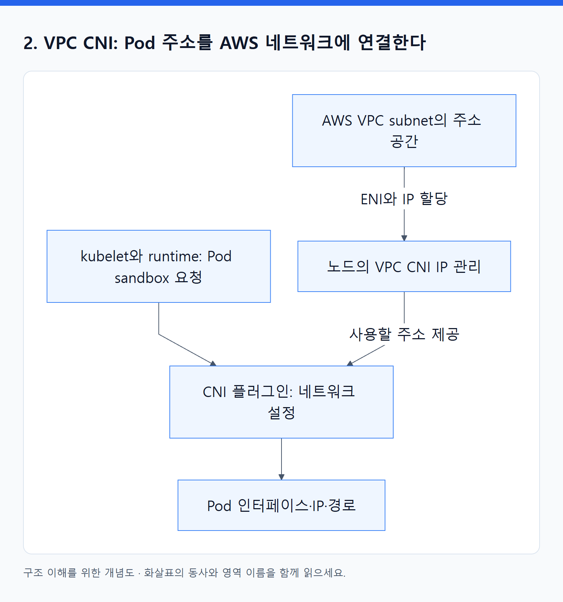
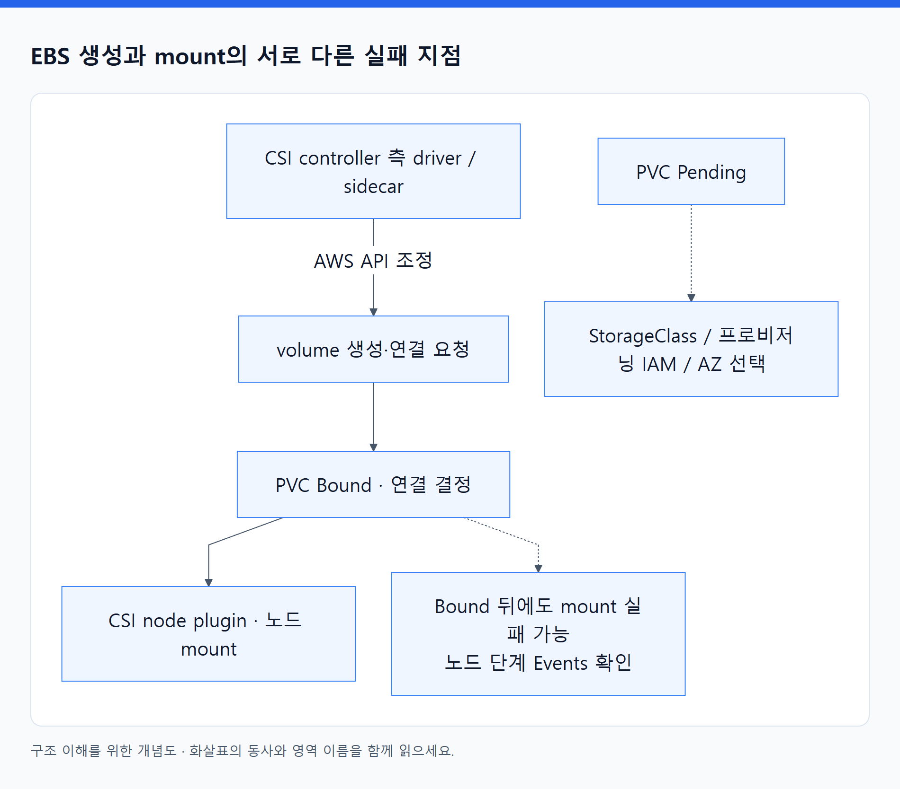
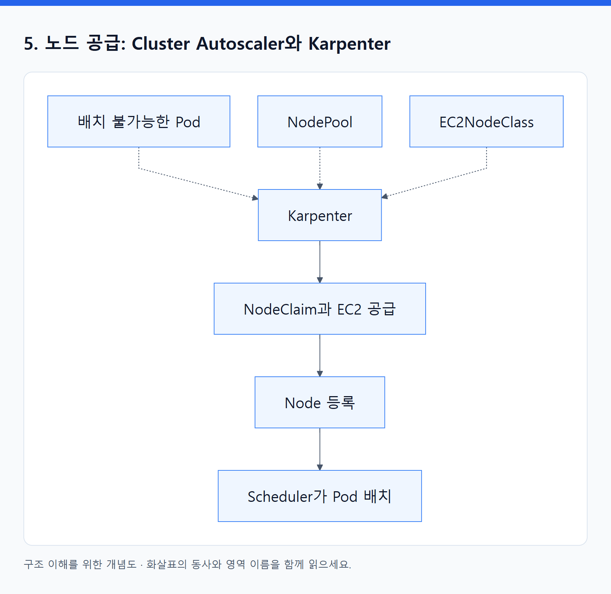
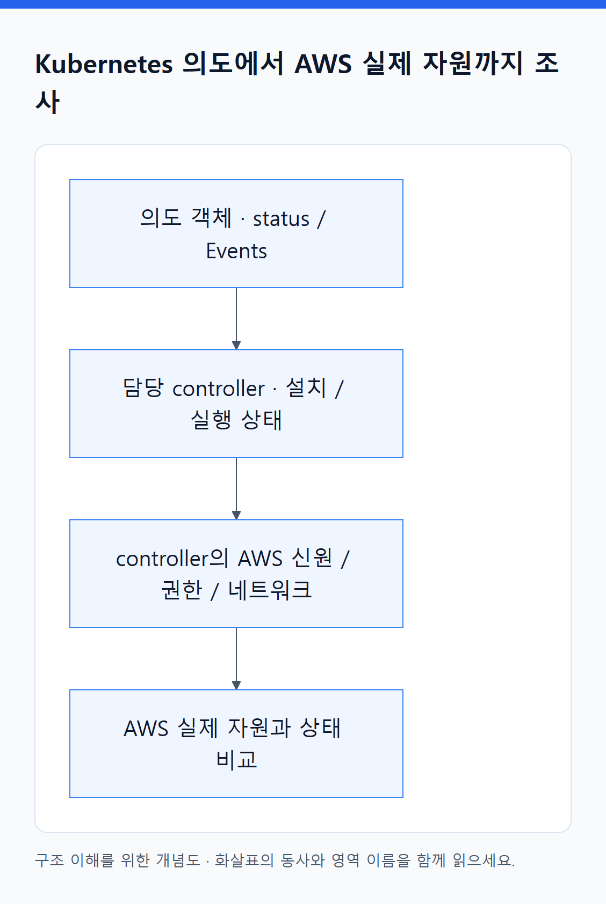

# 16. Kubernetes 의도가 AWS 자원으로 바뀌는 네 가지 연결

> 전체 학습 26/35 · 심화
> [이전: 15. EKS는 Kubernetes와 AWS 자원 사이의 운영 경계를 정한다](15_EKS_내부_구조와_접근.md) · [전체 목차](../README.md) · [다음: 17. 추가 설치하는 오브젝트](17_추가_설치하는_오브젝트.md)
> 본문을 위에서 아래로 읽고 마지막의 다음 장으로 이동한다. 본문 속 다른 장·출처 링크는 선택 참고용이다.

> 이 장의 질문: 누가 IP를 마련하고, 누가 ALB·EBS·EC2를 만드는가?

## 1. Add-on이라는 이름보다 실제 담당 프로그램을 본다

일반 EC2 기반 EKS에서는 `aws-node`, CoreDNS, kube-proxy, CSI driver 등 시스템 구성요소도 Kubernetes 위에서 동작한다. 일부는 DaemonSet으로 각 노드에, 일부는 Deployment로 정해진 복제본 수만큼 실행된다. EKS add-on 관리 기능은 지원 구성요소의 설치·버전·설정을 관리하는 경로를 제공한다. 모든 외부 controller가 항상 기본 설치된다는 뜻은 아니다.

AWS 관리 add-on이라도 실행 위치의 노드 용량, 필요한 IAM 권한, 설정 충돌, 호환 버전, 건강 상태를 확인해야 한다. self-managed로 설치한 구성요소와 소유권이 겹치면 설정 변경 충돌이 생길 수 있다. Auto Mode는 일부 기반 기능을 별도로 제공하므로 일반 노드의 시스템 Pod 목록과 같다고 가정하지 않는다. [EKS add-ons](https://docs.aws.amazon.com/eks/latest/userguide/eks-add-ons.html).

## 2. VPC CNI: Pod 주소를 AWS 네트워크에 연결한다

기본 IPv4 secondary-IP 방식의 이해 모델은 다음과 같다. 노드의 Amazon VPC CNI 구성요소가 EC2 ENI와 IP 풀을 관리하고, Pod sandbox 네트워크 설정 과정에서 CNI 플러그인이 사용할 IP와 인터페이스·경로를 구성한다. `aws-node` 안의 IPAM 구성요소가 IP 공급을 관리하는 역할과, Pod에 실제 네트워크를 붙이는 작업을 구분한다.

<!-- diagram:02-16-block-1 -->


[크게 보기](../assets/diagrams/02-16-block-1.png) · [SVG](../assets/diagrams/02-16-block-1.svg)

<details>
<summary>그림의 원문 설명 펼치기</summary>

```text
flowchart TD
  AWS["AWS VPC subnet의 주소 공간"] -->|ENI와 IP 할당| IPAM["노드의 VPC CNI IP 관리"]
  K["kubelet와 runtime: Pod sandbox 요청"] --> CNI["CNI 플러그인: 네트워크 설정"]
  IPAM -->|사용할 주소 제공| CNI
  CNI --> P["Pod 인터페이스·IP·경로"]
```

</details>
<!-- /diagram:02-16-block-1 -->

모든 Pod가 반드시 ENI 하나를 독점하는 것은 아니다. 일반 구성에서는 하나의 ENI에 여러 주소가 붙고 여러 Pod에 쓰일 수 있다. Security Groups for Pods, custom networking, prefix delegation, IPv6 등은 세부 모델을 바꾸므로 별도 조건으로 읽는다. [VPC CNI](https://docs.aws.amazon.com/eks/latest/userguide/managing-vpc-cni.html).

Pod 수를 제한하는 조건은 CPU·메모리 외에도 노드의 Pod 수 설정, 인스턴스의 ENI/IP 한계, subnet 가용 주소, IP 확보 정책이다. Prefix delegation은 주소를 prefix 단위로 공급해 효율을 높일 수 있지만 subnet 주소를 무한히 만드는 것은 아니다. 사용 가능한 연속 주소 공간 등 조건도 고려한다. 고정된 “노드당 최대 Pod 숫자” 하나를 모든 인스턴스에 적용하지 않는다. [Prefix delegation](https://docs.aws.amazon.com/eks/latest/userguide/cni-increase-ip-addresses.html).

IPv4 사설 노드의 이미지 pull과 AWS API 접근도 경로가 필요하다. NAT 또는 필요한 VPC endpoint와 DNS·endpoint policy 등을 설계한다. ECR은 인증·레지스트리·이미지 layer 다운로드 경로를 함께 확인해야 하며, 보통 ECR API/DKR와 S3 접근을 고려한다. EKS의 private Kubernetes endpoint 하나로 모든 AWS 서비스 접근이 해결되지 않는다. [Private cluster 요구](https://docs.aws.amazon.com/eks/latest/userguide/private-clusters.html).

## 3. ALB: 두 종류의 건강 신호를 본다

AWS Load Balancer Controller는 Ingress·Service·대상 상태를 관찰하고 AWS API로 ALB listener, rule, target group과 target 등록 등을 조정한다. 일반 IP target 구성에서는 target이 Pod IP가 된다. controller의 IAM 권한 부족·subnet 검색 실패·class 불일치라면 ALB 생성 단계가 막힐 수 있다.

Pod readiness는 Kubernetes의 신호이고, ALB health check는 ALB가 실제 대상에 요청해서 판단하는 별도 신호다. Kubernetes Ready여도 ALB가 검사하는 path·port·성공 코드 또는 Security Group이 맞지 않으면 ALB target은 unhealthy일 수 있다. [로드밸런싱 원리](https://docs.aws.amazon.com/eks/latest/best-practices/load-balancing.html).

Pod readiness gate는 기본 컨테이너 readiness 외에 추가 조건을 Pod Ready 판단에 넣는 기능이다. AWS Load Balancer Controller의 지원 기능을 구성하면 target health가 준비되기 전에 rollout이 너무 빨리 진행되는 문제를 줄일 수 있다. 자동으로 모든 Pod에 적용된다고 가정하지 않고 Namespace label과 생성 시점 등의 요구를 확인한다. [Pod readiness gate](https://kubernetes-sigs.github.io/aws-load-balancer-controller/latest/deploy/pod_readiness_gate/).

TLS 종료 위치도 구분한다. ALB에서 HTTPS를 종료하고 내부 HTTP로 보낼 수도, backend까지 TLS를 사용할 수도 있다. 인증서·도메인·보안 규칙은 이 선택에 맞춰 연결한다. 앱의 health endpoint가 인증을 요구하면 LB의 검사 설정과 충돌할 수 있다.

## 4. EBS CSI: 디스크 생성과 노드 마운트는 다른 단계다

<!-- diagram:02-16-concept-3 -->


[크게 보기](../assets/diagrams/02-16-concept-3.png) · [SVG](../assets/diagrams/02-16-concept-3.svg)

<details>
<summary>그림의 원문 설명 펼치기</summary>

일반 EBS CSI 구성에서 controller 측 driver와 sidecar들이 volume 생성·연결 요청 등을 AWS API와 조정하고, node 측 plugin이 노드에서 mount를 수행한다. PVC Pending은 StorageClass·프로비저닝 권한·AZ 선택 문제일 수 있고, Bound 뒤의 mount 실패는 다른 단계의 문제일 수 있다.

</details>
<!-- /diagram:02-16-concept-3 -->

EBS는 블록 저장소이고 AZ 제약이 있다. EFS는 여러 실행자가 파일시스템을 공유하는 요구에 사용할 수 있지만 mount target·네트워크·권한·성능 특성을 별도로 이해해야 한다. 같은 PVC 인터페이스를 사용해도 실제 저장소의 성능·공유·장애 특성은 사라지지 않는다. [EBS CSI](https://docs.aws.amazon.com/eks/latest/userguide/ebs-csi.html), [EFS CSI](https://docs.aws.amazon.com/eks/latest/userguide/efs-csi.html).

일반 EBS CSI StorageClass의 provisioner는 `ebs.csi.aws.com`, Auto Mode의 block storage는 `ebs.csi.eks.amazonaws.com`을 사용한다. 두 방식을 동일한 드라이버로 취급하거나 기존 volume을 설정 한 줄만 바꿔 그대로 넘길 수 있다고 가정하지 않는다. 이전은 공식 절차와 snapshot 등의 경로를 검토한다.

## 5. 노드 공급: Cluster Autoscaler와 Karpenter

Cluster Autoscaler는 배치 불가능한 Pod 등의 상태를 보고 구성된 노드 그룹을 조정하는 접근이다. EKS Managed Node Group을 쓴다고 이 수요 판단이 자동으로 모두 포함되는 것은 아니다. [Node autoscaling](https://docs.aws.amazon.com/eks/latest/userguide/autoscaling.html).

Karpenter는 Pod 요구와 허용 조건을 바탕으로 적절한 노드 공급을 조정한다. 다음은 **직접 운영하는 Karpenter AWS provider**의 주요 모델이다. Auto Mode의 NodeClass는 별도 API이므로 이름이 비슷해도 그대로 복사하지 않는다.

| 객체 | 역할 | 확인할 것 |
|---|---|---|
| NodePool | 허용 인스턴스·zone·capacity type·제약·중단 정책 등 | 앱을 수용할 범위가 너무 좁지 않은가? |
| EC2NodeClass | AMI·subnet·Security Group·노드 IAM 등 AWS 실행 구성 | 실제 공급 가능한 AWS 설정인가? |
| NodeClaim | 공급 요청과 노드 수명주기를 표현 | 생성·등록·초기화 중 어디서 막혔는가? |
| Node | 등록된 Kubernetes 실행 노드 | Ready·allocatable·taint는 어떤가? |

<!-- diagram:02-16-block-2 -->


[크게 보기](../assets/diagrams/02-16-block-2.png) · [SVG](../assets/diagrams/02-16-block-2.svg)

<details>
<summary>그림의 원문 설명 펼치기</summary>

```text
flowchart LR
  P["배치 불가능한 Pod"] -.-> K["Karpenter"]
  NP["NodePool"] -.-> K
  NC["EC2NodeClass"] -.-> K
  K --> C["NodeClaim과 EC2 공급"]
  C --> N["Node 등록"]
  N --> S["Scheduler가 Pod 배치"]
```

</details>
<!-- /diagram:02-16-block-2 -->

Karpenter는 EC2 공급 부족, IAM 오류, subnet IP 부족을 무시하고 용량을 만들 수 없다. consolidation이나 노드 교체는 비용과 운영 효율을 높일 수 있지만 워크로드 중단 조건과 함께 제어해야 한다. Spot 중단 대응도 “Pod가 절대 끊기지 않는다”는 보장이 아니다. [Karpenter 운영](https://docs.aws.amazon.com/eks/latest/best-practices/karpenter.html), [NodePool](https://karpenter.sh/docs/concepts/nodepools/), [NodeClass](https://karpenter.sh/docs/concepts/nodeclasses/), [NodeClaim](https://karpenter.sh/docs/concepts/nodeclaims/).

기초에서 배운 관리 경계를 적용하면, CA·Karpenter가 정책 안에서 노드를 늘릴 때마다 Terraform을 재실행하지 않는다. Terraform이 소유하는 그룹 상한·IAM·subnet 등의 기반 정책을 변경할 때 해당 HCL과 plan·apply가 필요하다. 동적으로 생성된 EC2를 모두 개별 Terraform 리소스로 등록하는 것은 별도의 관리 책임 이전 없이 수행하는 기본 절차가 아니다.

## 6. AWS 연결 장애의 공통 조사 틀

<!-- diagram:02-16-concept-4 -->


[크게 보기](../assets/diagrams/02-16-concept-4.png) · [SVG](../assets/diagrams/02-16-concept-4.svg)

<details>
<summary>그림의 원문 설명 펼치기</summary>

먼저 Kubernetes의 의도 객체와 status/Events를 본다. 다음으로 담당 controller가 설치되고 정상 실행되는지 본다. 이어 그 controller의 AWS 신원·권한·네트워크를 확인한다. 마지막으로 AWS에 생성된 실제 자원과 상태를 비교한다.

</details>
<!-- /diagram:02-16-concept-4 -->

**예:** Ingress는 있고 ALB가 없다 → controller와 class → reconcile 로그 → IAM·subnet 조건 → AWS 자원. ALB는 있고 503이다 → listener와 target group → target 등록·health → Pod 준비 상태와 포트. 같은 “접속 실패”지만 시작점이 다르다.

---

[이전: 15. EKS는 Kubernetes와 AWS 자원 사이의 운영 경계를 정한다](15_EKS_내부_구조와_접근.md) · [전체 목차](../README.md) · [다음: 17. 추가 설치하는 오브젝트](17_추가_설치하는_오브젝트.md)
