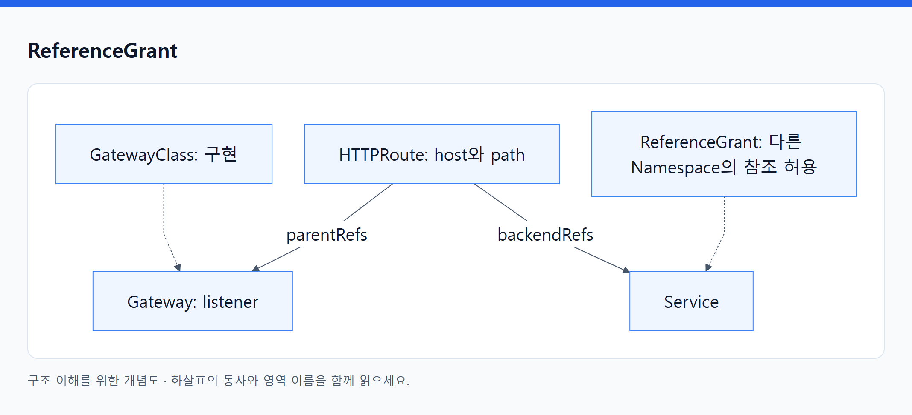
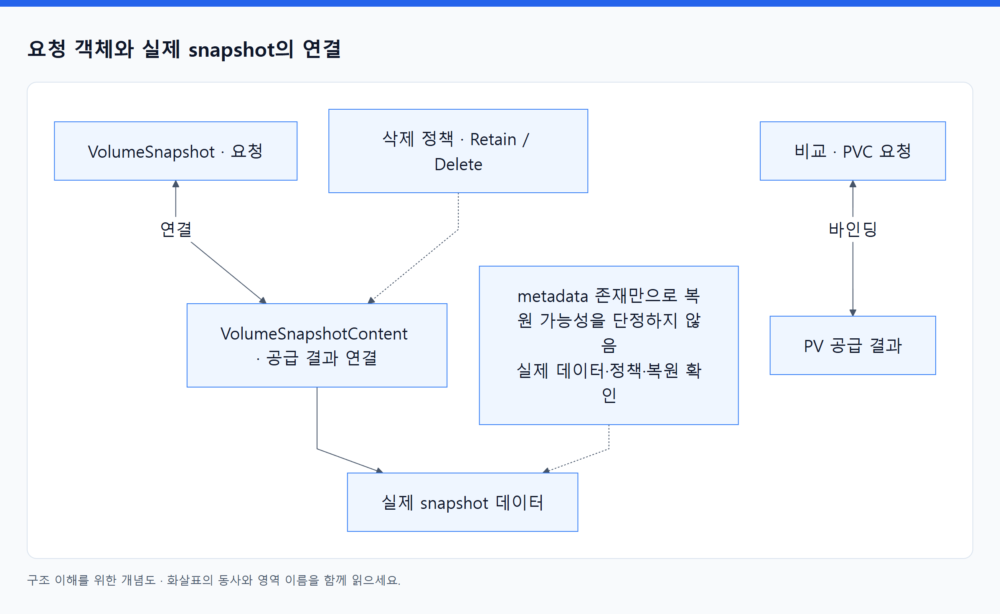

# 17. 추가 설치하는 오브젝트

> 전체 학습 27/35 · 심화
> [이전: 16. Kubernetes 의도가 AWS 자원으로 바뀌는 네 가지 연결](16_EKS의_네트워크_스토리지_확장.md) · [전체 목차](../README.md) · [다음: 18. 운영은 증상에서 증거를 따라가는 작업이다](18_관측_장애진단_업그레이드.md)
> 본문을 위에서 아래로 읽고 마지막의 다음 장으로 이동한다. 본문 속 다른 장·출처 링크는 선택 참고용이다.

아래 종류는 널리 쓰이지만 모든 Kubernetes 클러스터의 기본 API에 자동으로 존재한다고 가정하지 않는다. CRD·지원 controller와 해당 버전을 준비해야 한다. API 수락과 실제 동작을 구분하는 원리는 동일하다.

## GatewayClass

**예제 API: `gateway.networking.k8s.io/v1` · 범위: C · 핵심: Gateway 구현 선택.**

```yaml
apiVersion: gateway.networking.k8s.io/v1
kind: GatewayClass
metadata:
  name: demo-gateway
spec:
  controllerName: example.com/gateway-controller
```

`controllerName`은 구현 식별자이며 실제 설치한 controller가 인식하는 값을 사용한다. `parametersRef`로 추가 구성 객체를 연결할 수 있다. 이 객체를 만드는 행위가 controller 프로그램을 설치하는 것은 아니다.

controller는 자신에게 연결된 class를 확인하고 지원 가능한지 status의 Accepted 같은 condition으로 보고한다. `GatewayClass`는 대체로 플랫폼 쪽에서 공통 구현을 정하고 여러 Gateway가 참조하게 하는 역할이다. 특정 HTTP 경로 규칙은 여기 적지 않는다. [Gateway API 개요](https://gateway-api.sigs.k8s.io/docs/concepts/api-overview/).

## Gateway

**예제 API: `gateway.networking.k8s.io/v1` · 범위: N · 핵심: 요청을 받는 listener와 진입점.**

```yaml
apiVersion: gateway.networking.k8s.io/v1
kind: Gateway
metadata:
  name: public-entry
  namespace: study
spec:
  gatewayClassName: demo-gateway
  listeners:
    - name: http
      protocol: HTTP
      port: 80
      allowedRoutes:
        namespaces:
          from: Same
```

`gatewayClassName`은 구현 선택, `listeners`는 포트·프로토콜·hostname·TLS 등의 진입 조건, `allowedRoutes`는 어떤 Route가 붙을 수 있는지 정한다. 이름은 public-entry이지만 이 이름 자체가 인터넷 공개 방식을 보장하지 않는다. 실제 주소와 노출 방식은 구현·설정에 달려 있다.

controller가 실제 프록시·LB 구성을 반영하고 `status.addresses`, Accepted·Programmed와 listener별 conditions를 보고할 수 있다. Gateway가 준비돼도 Route가 붙지 않았거나 backend가 없으면 원하는 앱으로 전달되지 않는다. [Gateway](https://gateway-api.sigs.k8s.io/reference/api-types/gateway/).

## HTTPRoute

**예제 API: `gateway.networking.k8s.io/v1` · 범위: N · 핵심: HTTP 요청의 조건과 backend 연결.**

```yaml
apiVersion: gateway.networking.k8s.io/v1
kind: HTTPRoute
metadata:
  name: orders
  namespace: study
spec:
  parentRefs:
    - name: public-entry
      sectionName: http
  hostnames: [orders.example.com]
  rules:
    - matches:
        - path:
            type: PathPrefix
            value: /api
      backendRefs:
        - name: orders
          port: 80
```

`parentRefs`는 붙일 Gateway·listener, `hostnames`와 `matches`는 요청 조건, `backendRefs`는 Service 등 대상이다. `filters`는 지원하는 요청·응답 처리, backend의 `weight`는 구현이 지원하는 분배에 사용한다. Ingress의 `backend.service`와 필드 모양이 다르다.

**동작:** Gateway의 Route 허용 조건과 Route의 부모 참조가 맞아야 연결된다. `status.parents[].conditions`에서 Accepted와 ResolvedRefs 등을 본다. 객체가 저장됐지만 참조가 해결되지 않은 상태일 수 있다. 구현별 지원 필터와 프로토콜 기능을 확인한다. [HTTPRoute](https://gateway-api.sigs.k8s.io/reference/api-types/httproute/).

## ReferenceGrant

**확인한 최신 문서의 API: `gateway.networking.k8s.io/v1` · 범위: N · 핵심: 교차 Namespace 참조를 대상 쪽에서 허용.**

설치한 Gateway API CRD가 제공하는 version을 확인한다. 이전 설치에서는 `v1beta1`을 사용하는 경우가 있다. 아래는 v1을 제공하는 환경의 예다.

```yaml
apiVersion: gateway.networking.k8s.io/v1
kind: ReferenceGrant
metadata:
  name: orders-from-study
  namespace: shared
spec:
  from:
    - group: gateway.networking.k8s.io
      kind: HTTPRoute
      namespace: study
  to:
    - group: ""
      kind: Service
      name: orders
```

`study`의 HTTPRoute가 `shared/orders` Service를 backend로 참조하는 상황을 위한 예다. 앞의 HTTPRoute는 같은 Namespace 참조이므로 이 grant가 필요하지 않다. 교차 참조하려면 backendRefs에 `namespace: shared`를 별도로 지정해야 한다.

`from`은 신뢰할 참조 주체의 그룹·종류·Namespace, `to`는 이 grant의 Namespace에 있는 대상이다. grant를 호출자 쪽에만 만들면 대상 Namespace의 허용이 되지 않는다. 일반 Pod 네트워크를 허용하는 NetworkPolicy나 API 조회를 허용하는 RBAC와도 다르다.

Route → Gateway의 교차 Namespace 연결은 Gateway의 allowedRoutes 등을 사용하는 별도 허용 모델이다. 모든 종류의 교차 참조를 ReferenceGrant 하나로 해결한다고 일반화하지 않는다. [ReferenceGrant](https://gateway-api.sigs.k8s.io/reference/api-types/referencegrant/).

<!-- diagram:02-17-block-5 -->


[크게 보기](../assets/diagrams/02-17-block-5.png) · [SVG](../assets/diagrams/02-17-block-5.svg)

<details>
<summary>그림의 원문 설명 펼치기</summary>

```text
flowchart LR
  C["GatewayClass: 구현"] -.-> G["Gateway: listener"]
  R["HTTPRoute: host와 path"] -->|parentRefs| G
  R -->|backendRefs| S["Service"]
  X["ReferenceGrant: 다른 Namespace의 참조 허용"] -.-> S
```

</details>
<!-- /diagram:02-17-block-5 -->

이는 객체 참조 관계다. 실제 요청은 선택한 구현의 진입점에서 backend로 흐르며 HTTPRoute 객체 안을 패킷이 통과하지 않는다.

## VolumeSnapshot

**API: `snapshot.storage.k8s.io/v1` · 범위: N · 핵심: 특정 volume의 snapshot 요청.**

```yaml
apiVersion: snapshot.storage.k8s.io/v1
kind: VolumeSnapshot
metadata:
  name: orders-data-copy
  namespace: study
spec:
  volumeSnapshotClassName: demo-snapshot
  source:
    persistentVolumeClaimName: orders-data
```

`source`는 원본 PVC 또는 지원하는 사전 생성 snapshot content 참조, `volumeSnapshotClassName`은 구현과 정책 선택이다. snapshot controller와 지원 CSI driver가 외부 저장소의 snapshot을 만들고 VolumeSnapshotContent로 연결한다.

`status.readyToUse`, `boundVolumeSnapshotContentName`, `creationTime`, `restoreSize`, `error` 등으로 결과를 확인한다. API에 객체가 생긴 시각이 실제 snapshot 완료 시각과 같지는 않다. DB의 트랜잭션 일관성까지 이 객체만으로 보장되지는 않는다. [Volume snapshots](https://kubernetes.io/docs/concepts/storage/volume-snapshots/).

## VolumeSnapshotClass

**API: `snapshot.storage.k8s.io/v1` · 범위: C · 핵심: snapshot 생성 구현과 삭제 정책.**

```yaml
apiVersion: snapshot.storage.k8s.io/v1
kind: VolumeSnapshotClass
metadata:
  name: demo-snapshot
driver: driver.example.com
deletionPolicy: Retain
```

`driver`는 CSI driver, `parameters`는 구현별 설정, `deletionPolicy`는 연결된 snapshot content의 삭제 시 외부 snapshot 처리에 관계한다. StorageClass가 volume 공급 정책이라면 이 객체는 snapshot 공급 정책이다.

Retain이면 정리 과정에서 실제 snapshot이 남을 수 있고 Delete는 외부 snapshot 정리로 이어질 수 있다. 실제 controller·driver 지원이 필요하다. `driver` 등은 spec 아래가 아닌 최상위다. [VolumeSnapshotClass](https://kubernetes.io/docs/concepts/storage/volume-snapshot-classes/).

## VolumeSnapshotContent

**API: `snapshot.storage.k8s.io/v1` · 범위: C · 핵심: 실제 snapshot과 요청 객체 사이의 연결.**

대부분 동적 snapshot 과정에서 자동 생성된다. `spec.volumeSnapshotRef`는 연결된 N 범위 Snapshot, `driver`는 구현, `source`는 원래 volume handle 또는 사전 생성 snapshot handle 등, `deletionPolicy`는 삭제 처리 정책이다. status에 snapshot handle과 readyToUse 등 결과가 기록될 수 있다.

<!-- diagram:02-17-concept-2 -->


[크게 보기](../assets/diagrams/02-17-concept-2.png) · [SVG](../assets/diagrams/02-17-concept-2.svg)

<details>
<summary>그림의 원문 설명 펼치기</summary>

**비교:** PVC ↔ PV 관계처럼 VolumeSnapshot ↔ VolumeSnapshotContent가 요청과 공급 결과를 연결한다. 사용자에게 보이는 Snapshot만 삭제했는지, content와 실제 snapshot이 어떤 정책으로 남았는지 함께 확인한다. metadata만 있다고 복원 가능한 실제 백업 데이터가 존재한다고 단정하지 않는다. [Snapshot content](https://kubernetes.io/docs/concepts/storage/volume-snapshots/#volume-snapshot-contents).

</details>
<!-- /diagram:02-17-concept-2 -->

## VerticalPodAutoscaler

**일반적인 API: `autoscaling.k8s.io/v1` · 범위: N · 약어: VPA · 핵심: 워크로드의 자원 요청량 권고·조정.**

```yaml
apiVersion: autoscaling.k8s.io/v1
kind: VerticalPodAutoscaler
metadata:
  name: orders
  namespace: study
spec:
  targetRef:
    apiVersion: apps/v1
    kind: Deployment
    name: orders
  updatePolicy:
    updateMode: "Off"
  resourcePolicy:
    containerPolicies:
      - containerName: api
        minAllowed:
          cpu: 100m
          memory: 128Mi
        maxAllowed:
          cpu: "2"
          memory: 2Gi
```

`targetRef`는 대상, updatePolicy는 적용 방식, resourcePolicy는 컨테이너별 허용 범위다. 여기서는 Off로 권고를 관찰하고 자동 변경은 하지 않는 의도를 표현했다. 실제 동작에는 VPA CRD·recommender 등 설치가 필요하다.

`status.recommendation.containerRecommendations`의 target·lowerBound·upperBound 등 제공되는 값을 본다. 어떤 모드에서 Pod 재생성이나 제자리 변경이 이루어지는지는 설치한 VPA와 Kubernetes 버전의 지원을 확인한다. HPA는 개수, VPA는 자원 크기를 주로 다루며 같은 CPU utilization에 둘을 무작정 연결하면 requests 변경이 HPA 계산에도 영향을 준다. [VPA 공식 프로젝트](https://github.com/kubernetes/autoscaler/tree/master/vertical-pod-autoscaler).

[목차](오브젝트_색인.md)

---

[이전: 16. Kubernetes 의도가 AWS 자원으로 바뀌는 네 가지 연결](16_EKS의_네트워크_스토리지_확장.md) · [전체 목차](../README.md) · [다음: 18. 운영은 증상에서 증거를 따라가는 작업이다](18_관측_장애진단_업그레이드.md)
