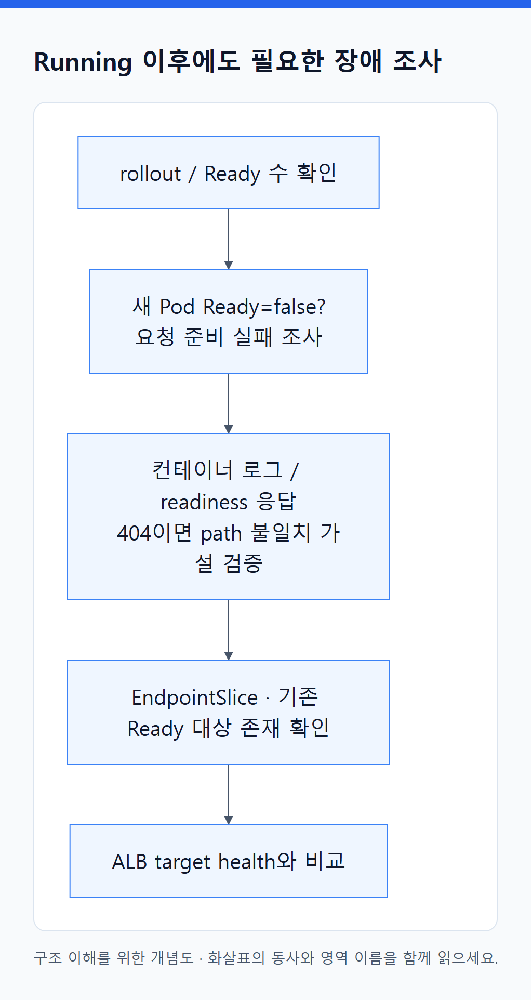
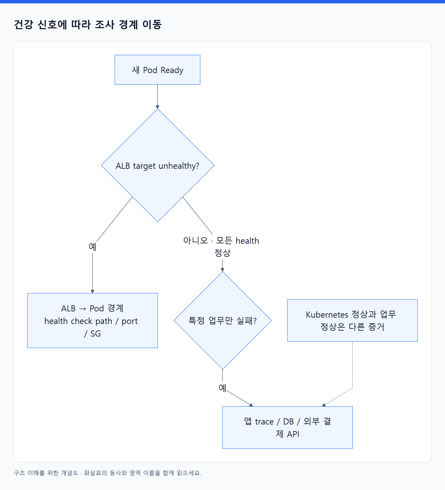

# 18. 운영은 증상에서 증거를 따라가는 작업이다

> 전체 학습 28/35 · 심화
> [이전: 17. 추가 설치하는 오브젝트](17_추가_설치하는_오브젝트.md) · [전체 목차](../README.md) · [다음: 19. 실행 전에 예측하고, 실행 후 증거로 설명한다](19_예측하며_배우는_실습.md)
> 본문을 위에서 아래로 읽고 마지막의 다음 장으로 이동한다. 본문 속 다른 장·출처 링크는 선택 참고용이다.

> 이 장의 질문: 장애 때 무엇을 먼저 보고, 어떤 순서로 가설을 좁히는가?

## 1. 세 종류의 증거와 한 가지 목표

목표는 사용자의 요청이 성공하는지 확인하는 것이다. CPU나 Ready Pod 수는 그 원인을 설명하는 보조 지표다. **Metrics**는 지연·오류율·포화도를, **Logs**는 특정 사건의 맥락을, **Traces**는 여러 서비스에 걸친 한 요청의 경로를 보여 준다. Kubernetes Events는 스케줄링·이미지·마운트 등의 변화 원인을 찾는 데 유용하지만 장기 감사 기록이나 모든 앱 로그를 대신하지 않는다.

Metrics Server의 `kubectl top`은 최근 자원 측정에 유용하고, 장기 모니터링·알림 전체를 제공하는 시스템은 아니다. CloudWatch, Prometheus 계열, OpenTelemetry 등을 사용할 때에도 무엇을 수집하고 얼마나 보존하며 누가 대응할지 설정한다. [관측 개요](https://kubernetes.io/docs/concepts/cluster-administration/observability/), [Logging architecture](https://kubernetes.io/docs/concepts/cluster-administration/logging/).

## 2. 가장 먼저 확인할 운영 맥락

아래 조회 명령은 클러스터 자원을 변경하지 않는다. `<pod>` 등의 값은 실제 이름으로 바꾼다.

```powershell
kubectl config current-context
kubectl get nodes -o wide
kubectl get deploy,rs,pods,svc,endpointslices -n study -o wide
kubectl get events -n study --sort-by=.metadata.creationTimestamp
kubectl describe pod <pod> -n study
kubectl logs <pod> -n study -c api --tail=100
kubectl logs <pod> -n study -c api --previous --tail=100
```

`--previous`는 직전 종료 컨테이너 로그가 남아 있을 때 유용하다. Pod 객체 자체가 없어졌거나 로그가 수거된 뒤까지 항상 조회되는 것은 아니므로 중앙 수집이 필요하다. Events의 시간순 목록 역시 장기적인 완전한 시간선으로 해석하지 않는다.

“어느 cluster·Namespace·앱 버전·시간대인가?”를 먼저 고정한다. 잘못된 context에서 정상인 앱을 조사하거나, 새 버전 문제에 이전 Pod 로그를 읽는 실수를 줄인다. 최근 배포 digest와 Git commit을 함께 기록한다.

## 3. 증상별 분기표

| 증상 | 먼저 세울 가설 | 확인할 증거 | 바로 하면 안 맞을 수 있는 대응 |
|---|---|---|---|
| Pod가 생성되지 않음 | ReplicaSet 생성 실패·Quota·admission | Deployment/RS Events, quota | 노드 추가만 하기 |
| Pending, nodeName 없음 | requests·taint·affinity·volume 조건 | FailedScheduling message, Node allocatable | 이미지 다시 빌드하기 |
| FailedCreatePodSandBox | CNI/IP 공급 문제 | Pod Events, aws-node 상태·로그 | replicas를 더 늘리기 |
| ImagePullBackOff | 이미지·pull 권한·외부 연결 | 정확한 image ref, node 신원·경로 | CI push 역할만 수정하기 |
| CrashLoopBackOff | 앱 종료·설정 누락·probe | 이전 로그, exit code, probe Events | 무조건 limit 늘리기 |
| OOMKilled | 메모리 한계·사용 패턴 | lastState, limit, 메모리 추이 | liveness만 느슨하게 하기 |
| Running, Ready 아님 | readiness·추가 gate·의존성 | conditions, probe 응답, target health | phase만 보고 정상 선언 |
| 내부 Service 실패 | selector·포트·DNS·정책 | EndpointSlice, 호출 위치별 테스트 | ALB부터 다시 만들기 |
| 외부만 실패 | LB·DNS·TLS·SG | listener, target 등록·health | 앱 replicas만 늘리기 |
| PVC Pending | class·driver·권한·바인딩 대기 | PVC Events, 소비 Pod, StorageClass | 데이터 손상으로 단정 |
| API 403 Forbidden | 허용 작업 부족 | 현재 신원, access entry, RBAC | 네트워크를 public으로 열기 |
| API timeout | endpoint 도달 경로 | DNS·route·SG·접속 위치 | cluster-admin만 부여하기 |

표는 시작 가설이지 확정 진단이 아니다. 예를 들어 exit code 137만으로 항상 메모리 limit 초과라고 단정하지 않는다. 종료 reason, 커널·노드 상태와 함께 판단한다. 401 계열 인증 실패와 403 인가 실패도 구분하되 중간 시스템의 응답 여부를 확인한다.

## 4. 예제로 따라가는 장애 조사

**상황:** 새 버전 배포 뒤 사용자 오류가 늘었지만 Pod 상태는 Running이다.

<!-- diagram:02-18-concept-1 -->


[크게 보기](../assets/diagrams/02-18-concept-1.png) · [SVG](../assets/diagrams/02-18-concept-1.svg)

<details>
<summary>그림의 원문 설명 펼치기</summary>

첫째, rollout과 Ready 수를 본다. 새 Pod의 Ready가 false라면 새 버전이 요청을 받을 준비를 못 한 것이다. 둘째, 컨테이너 로그와 readiness 응답을 본다. `/ready`가 404이면 앱 경로와 probe 설정 불일치 가설을 검증한다. 셋째, EndpointSlice에 기존 Ready 대상이 남아 있는지 보고, ALB target health도 비교한다.

</details>
<!-- /diagram:02-18-concept-1 -->

<!-- diagram:02-18-concept-2 -->


[크게 보기](../assets/diagrams/02-18-concept-2.png) · [SVG](../assets/diagrams/02-18-concept-2.svg)

<details>
<summary>그림의 원문 설명 펼치기</summary>

새 Pod가 Ready인데 ALB만 unhealthy라면 조사 경계를 ALB → Pod로 옮긴다. health check path·port와 SG를 확인한다. 모든 health가 정상인데 결제만 실패한다면 앱 trace·DB·외부 결제 API로 이동한다. “Kubernetes 정상”과 “업무 정상”을 다른 증거로 평가하는 것이다.

</details>
<!-- /diagram:02-18-concept-2 -->

복구 조치는 증거에 따라 이전 이미지로 되돌리거나 잘못된 설정을 수정하는 방식으로 선택한다. DB 변경이 포함됐으면 이미지 rollback만으로 충분한지 먼저 판단한다. 장애 중 변경을 여러 개 한꺼번에 하면 원인과 효과를 분리하기 어려워진다.

## 5. EKS에서 관측할 계층

| 계층 | 대표 증거 |
|---|---|
| Control Plane | API·audit·authenticator·controllerManager·scheduler 로그 등 |
| 노드·시스템 | Node conditions, kubelet/runtime, CNI·CSI·DNS·LB controller 상태 |
| 워크로드 | Pod logs, Events, readiness, rollout 상태 |
| AWS 자원 | EC2 공급 상태, subnet IP, ALB target health, EBS 연결, IAM·CloudTrail |
| 사용자 경험 | 요청 성공률·지연·추적, 실제 업무 결과 |

EKS Control Plane 로그는 CloudWatch Logs로 보내도록 구성할 수 있으며 원하는 로그 종류와 보존 정책을 정한다. 이것만으로 앱 stdout 전체가 자동으로 수집되는 것은 아니다. AWS API 감사와 Kubernetes API 감사도 구분한다. [EKS Control Plane logs](https://docs.aws.amazon.com/eks/latest/userguide/control-plane-logs.html).

## 6. 업그레이드는 호환성 프로젝트다

일반 EKS에서 Control Plane 버전을 올리는 작업과 노드·add-on·controller·client의 버전 변경을 나눠 계획한다. 각 버전의 skew 및 EKS 지원 조건을 확인한다. API 제거·변경, CRD와 webhook, CSI/CNI, 노드 AMI와 아키텍처, 앱 테스트가 연결된다.

실행 전에는 현재 버전과 health, 사용 중인 API, EKS upgrade insights, add-on 호환성을 조사한다. 실습·검증 환경에서 확인한 뒤 해당 버전의 공식 순서에 따라 진행한다. 일반적인 흐름은 사전 조건 충족 → 다음 minor Control Plane → 노드 → 필요한 추가 앱·add-on·client 조정이지만, 특정 구성요소는 사전 업데이트가 필요할 수 있으므로 고정 순서만 외우지 않는다.

Control Plane 업그레이드는 일반적인 앱 rollout undo처럼 버전을 쉽게 내려 복구하는 작업이 아니다. 실패 대응은 기능 호환, 데이터 복구, 필요 시 새 클러스터로의 전환까지 포함해 설계한다. Auto Mode의 자동 관리 범위도 앱과 데이터 호환성 검증을 대신하지 않는다. [EKS 업그레이드](https://docs.aws.amazon.com/eks/latest/userguide/update-cluster.html), [버전 skew 정책](https://kubernetes.io/releases/version-skew-policy/).

## 7. 복구 목표와 비용도 구조에 속한다

RTO는 허용 가능한 복구 시간, RPO는 허용 가능한 데이터 손실 시간 범위다. “매일 백업”과 “최근 5분 이내로 복구”는 같은 요구가 아니다. 백업 주기뿐 아니라 새 환경 준비, IAM·DNS·인증서, 데이터 복원과 검증에 걸리는 시간을 측정한다.

비용은 EC2 개수 외에도 EKS 실행 방식, 디스크·스냅샷, LB, NAT·데이터 전송, 로그 수집·보존 등에서 발생한다. 요청량·여유 용량·장애 대응 목표가 비용을 결정한다. 지나치게 낮은 requests로 과밀 배치하거나 로그를 끄는 일은 같은 품질의 최적화가 아닐 수 있다. 이 교재는 가격을 고정하지 않고 비용을 만드는 자원의 연결을 학습한다.

**스스로 설명하기:** “증상 → 가설 → 확인할 증거 → 변경 → 재검증”을 최근 실습 실패 하나에 적용해 다섯 문장으로 기록한다. 단순한 재시작 성공보다 그 실패의 위치를 설명하는 기록이 더 오래 남는다.

---

[이전: 17. 추가 설치하는 오브젝트](17_추가_설치하는_오브젝트.md) · [전체 목차](../README.md) · [다음: 19. 실행 전에 예측하고, 실행 후 증거로 설명한다](19_예측하며_배우는_실습.md)
