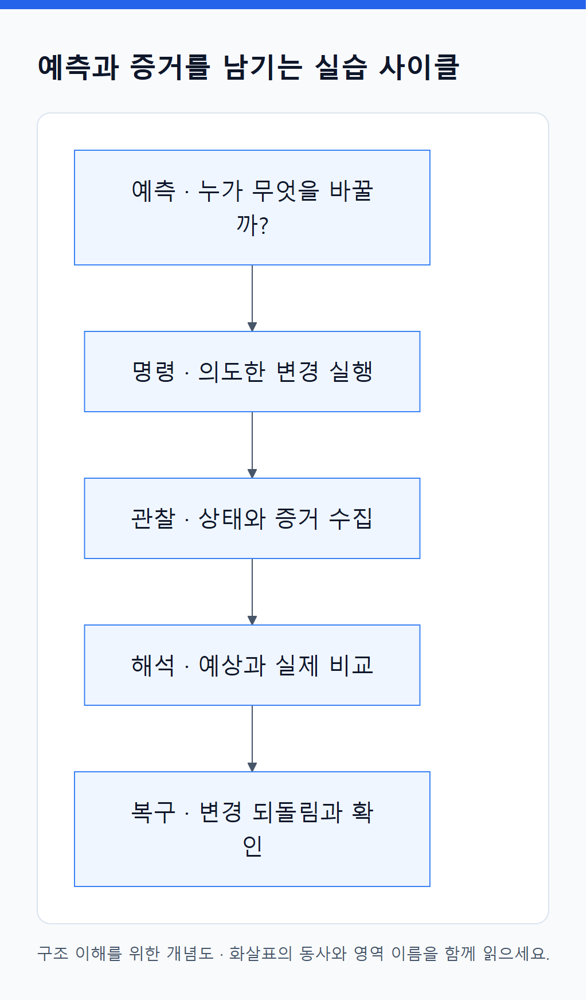

# 19. 실행 전에 예측하고, 실행 후 증거로 설명한다

> 전체 학습 29/35 · 심화
> [이전: 18. 운영은 증상에서 증거를 따라가는 작업이다](18_관측_장애진단_업그레이드.md) · [전체 목차](../README.md) · [다음: 20. 요구사항을 구조로 바꾸고 실패를 예측한다](20_종합_설계와_해설.md)
> 본문을 위에서 아래로 읽고 마지막의 다음 장으로 이동한다. 본문 속 다른 장·출처 링크는 선택 참고용이다.

<!-- diagram:02-19-concept-1 -->


[크게 보기](../assets/diagrams/02-19-concept-1.png) · [SVG](../assets/diagrams/02-19-concept-1.svg)

<details>
<summary>그림의 원문 설명 펼치기</summary>

각 실습에서 **예측 → 명령 → 관찰 → 해석 → 복구**를 기록한다. 성공 화면을 얻는 것이 아니라 내부에서 누가 무엇을 바꾸었는지 확인하는 것이 목적이다.

</details>
<!-- /diagram:02-19-concept-1 -->

## 0. 실습 환경 준비

이 장은 별도의 로컬 kind 클러스터 `devops-study`를 사용한다. Docker의 Linux 컨테이너 환경, kind, kubectl을 먼저 설치·실행한다. 설치 절차와 버전은 [kind 공식 안내](https://kind.sigs.k8s.io/docs/user/quick-start/)에서 자신의 환경에 맞게 확인한다. 이미 같은 이름의 학습 클러스터가 있다면 용도를 확인하고 재사용한다.

집필 환경에는 Docker·kind·kubectl이 PATH에 없어 클러스터 실습을 실행하지 않았다. 아래 예상 결과는 메커니즘에 따른 관찰 기준이며 캡처한 실측 결과가 아니다. Docker 이미지는 CPU 아키텍처·Linux 환경이 맞아야 한다.

PowerShell에서 다음 폴더로 이동한 뒤 실행한다.

```powershell
# 저장소 최상위 폴더에서 실행
Set-Location './02_심화/실습'
docker build -t orders-lab:v1 --build-arg APP_VERSION=v1 ./app
kind create cluster --name devops-study --wait 120s
kind load docker-image orders-lab:v1 --name devops-study
kubectl --context kind-devops-study get nodes
```

`docker build`는 이미지 제작, `kind load`는 로컬 노드의 이미지 저장소로 전달하는 단계다. EKS에서는 대신 레지스트리 push/pull 경로를 사용한다. 이 로컬 실습에서 Docker가 kind 노드를 구동하는 역할까지 맡더라도, 노드 안의 Kubernetes 실행 인터페이스와 Docker 이미지 호환 원리는 구분한다. 기반 Python tag는 수정될 수 있으므로 엄격한 재현이 필요하면 검증한 base image digest까지 기록한다.

## 1. Deployment·Pod·Service의 연결 보기

**예측:** YAML을 적용하면 Deployment 1개, ReplicaSet 1개, 앱 Pod 2개가 만들어질 것이다. Service는 Pod 이름이 아니라 label로 대상을 고른다.

```powershell
kubectl --context kind-devops-study apply -f base/00-namespace.yaml
kubectl --context kind-devops-study apply --dry-run=server -f base/10-orders.yaml
kubectl --context kind-devops-study apply -f base/10-orders.yaml
kubectl --context kind-devops-study rollout status deployment/orders -n study --timeout=120s
kubectl --context kind-devops-study get deploy,rs,pods,svc,endpointslices -n study -o wide
kubectl --context kind-devops-study get pods -n study -l app=orders -o yaml
```

server dry-run은 API 검증·admission 등을 거치되 저장하지 않는 검사다. 실제 이미지 다운로드와 실행 성공까지 검증하지 않는다. rollout이 제한 시간 안에 끝나지 않으면 18장 분기표로 원인을 찾는다.

`ownerReferences`, `uid`, `labels`, `nodeName`, `conditions`를 표시해 보라. EndpointSlice의 주소와 Pod IP가 연결되는지 확인한다. 별도 터미널에서 아래 명령을 유지한 뒤 브라우저로 `http://localhost:18080`에 접속한다.

```powershell
kubectl --context kind-devops-study port-forward service/orders 18080:80 -n study
```

응답의 `version`, `pod`, `greeting`을 기록한다. 이 명령은 선택한 Pod로 전달하므로 새로고침마다 두 Pod가 번갈아 나와야 하는 실험은 아니다. 일반 Service 전달 경로 전체를 검증하는 것도 아니다. 종료는 Ctrl+C다.

## 2. Pod 삭제와 컨테이너 재시작 구분

**예측:** Deployment 아래 Pod 하나를 지우면 새 이름·UID의 Pod가 생긴다. 지운 Pod가 같은 객체로 되살아나지 않는다.

먼저 `get pods`로 찾은 **study의 orders Pod 하나**를 `<pod-name>` 자리에 넣는다. 다른 터미널에서 `get pods -w`로 변화를 관찰할 수 있다.

```powershell
kubectl --context kind-devops-study get pods -n study -l app=orders -o wide
kubectl --context kind-devops-study delete pod <pod-name> -n study
kubectl --context kind-devops-study get pods -n study -l app=orders -w
```

새 Pod의 ownerReferences와 UID를 비교한다. ReplicaSet의 목표 수를 만족하려는 controller가 대체 객체를 생성한 것이다. `-w` 종료는 Ctrl+C다. 기존 port-forward가 끊기면 다시 연결한다. 상위 Deployment가 남아 있으므로 별도 재생성 명령이 없어도 수량 복구를 기대할 수 있다.

## 3. 이미지 변경과 새 ReplicaSet

**예측:** Pod template의 image가 달라져 새 ReplicaSet이 생긴다. Service 이름과 ClusterIP는 그대로 유지된다.

```powershell
docker build -t orders-lab:v2 --build-arg APP_VERSION=v2 ./app
kind load docker-image orders-lab:v2 --name devops-study
kubectl --context kind-devops-study set image deployment/orders api=orders-lab:v2 -n study
kubectl --context kind-devops-study rollout status deployment/orders -n study --timeout=120s
kubectl --context kind-devops-study get rs,pods,svc -n study -o wide
kubectl --context kind-devops-study rollout history deployment/orders -n study
```

이전 ReplicaSet이 0개로 남고 새 ReplicaSet이 앱을 소유하는지 확인한다. 기존 port-forward를 끊고 다시 연결해 `version: v2`를 확인한다. 다음 실습 전에 아래처럼 v1로 되돌리고 rollout 완료를 확인한다.

```powershell
kubectl --context kind-devops-study set image deployment/orders api=orders-lab:v1 -n study
kubectl --context kind-devops-study rollout status deployment/orders -n study --timeout=120s
```

## 4. readiness 실패와 안전하게 멈춘 rollout

**예측:** `READY=false`인 새 Pod는 Running이어도 Ready가 되지 않는다. `/health`는 성공하므로 readiness 실패만으로 restart count가 계속 늘지는 않는다. `maxUnavailable: 0` 덕분에 기존 Ready Pod를 유지하며 새 rollout이 멈출 수 있다.

```powershell
kubectl --context kind-devops-study set env deployment/orders READY=false -n study
kubectl --context kind-devops-study get pods -n study -l app=orders -w
```

잠시 관찰하고 Ctrl+C 후 새 Pod를 조사한다.

```powershell
kubectl --context kind-devops-study describe pod <new-pod-name> -n study
kubectl --context kind-devops-study get endpointslices -n study -l kubernetes.io/service-name=orders -o yaml
kubectl --context kind-devops-study get deployment orders -n study -o yaml
```

EndpointSlice에 주소가 표시되는 것과 그 endpoint의 `ready: true`는 구분한다. 모든 endpoint가 무조건 목록에서 완전히 사라져야 하는 것은 아니다. 복구는 다음과 같다.

```powershell
kubectl --context kind-devops-study set env deployment/orders READY=true -n study
kubectl --context kind-devops-study rollout status deployment/orders -n study --timeout=120s
```

## 5. 앱은 정상인데 Service 대상이 사라지는 실패

**예측:** Service selector만 틀리게 바꾸면 Pod는 그대로 Ready지만 해당 Service의 대상 연결이 끊긴다.

```powershell
kubectl --context kind-devops-study set selector service/orders app=orders-typo -n study
kubectl --context kind-devops-study get pods -n study -l app=orders
kubectl --context kind-devops-study get endpointslices -n study -l kubernetes.io/service-name=orders -o yaml
```

대상 목록이 갱신될 때까지 약간의 시간이 걸릴 수 있다. 기존 port-forward 연결이 남았다는 사실을 Service 정상 증거로 쓰지 않는다. 내부 요청을 확인하려면 다음 단발 client를 만든다. 이 client는 기본 Service 경로를 사용한다.

```powershell
kubectl --context kind-devops-study run client-check -n study --image=orders-lab:v1 --image-pull-policy=Never --restart=Never --command -- python -c "import urllib.request; print(urllib.request.urlopen('http://orders', timeout=5).read().decode())"
kubectl --context kind-devops-study logs client-check -n study
```

로그 조회 때 아직 생성 중이면 Pod 상태를 확인하고 다시 조회한다. 정상 HTTP 응답이 아닌 연결 오류 등을 예상한다. 복구 후 client를 다시 실행해 성공 여부를 비교한다.

```powershell
kubectl --context kind-devops-study set selector service/orders app=orders -n study
kubectl --context kind-devops-study delete pod client-check -n study
```

위의 `run`·`logs`를 다시 실행해 JSON 응답을 확인한 후 `client-check`를 삭제한다. 두 결과의 차이는 앱 재빌드가 아니라 대상 선택 규칙이다.

## 6. ConfigMap 갱신과 프로세스 환경 변수

**예측:** ConfigMap을 바꿔도 기존 앱의 환경 변수는 바로 바뀌지 않는다.

```powershell
kubectl --context kind-devops-study create configmap orders-config -n study --from-literal=GREETING=hello-v2 --dry-run=client -o yaml | kubectl --context kind-devops-study apply -f -
kubectl --context kind-devops-study get configmap orders-config -n study -o yaml
```

기존 Pod의 앱 응답과 비교한다. 새 값은 ConfigMap에 있지만 실행 중 환경에는 이전 값이 남아 있어야 한다. 다음으로 새 Pod를 만들어 비교한다.

```powershell
kubectl --context kind-devops-study rollout restart deployment/orders -n study
kubectl --context kind-devops-study rollout status deployment/orders -n study --timeout=120s
```

port-forward를 새로 연결해 `hello-v2`를 확인한다. 복구는 기본 파일을 다시 적용하고 restart한다. 이는 원래 ConfigMap 값과 v1 template을 기준으로 되돌리는 단계다.

```powershell
kubectl --context kind-devops-study apply -f base/10-orders.yaml
kubectl --context kind-devops-study rollout restart deployment/orders -n study
kubectl --context kind-devops-study rollout status deployment/orders -n study --timeout=120s
```

## 7. API 권한과 앱 권한 구분

로컬 kind 관리자 context의 impersonation 권한으로 ServiceAccount의 인가 결과를 확인한다. 앱 자체가 토큰으로 API를 호출하는 실험은 아니다.

```powershell
kubectl --context kind-devops-study apply -f optional/rbac.yaml
kubectl --context kind-devops-study auth can-i list pods -n study --as=system:serviceaccount:study:orders
kubectl --context kind-devops-study auth can-i delete pods -n study --as=system:serviceaccount:study:orders
kubectl --context kind-devops-study delete -f optional/rbac.yaml
```

다른 권한 부여가 없는 기본 환경에서는 각각 yes와 no를 예상한다. AWS API 호출 권한에 대한 검사가 아님을 설명하라. Role을 만들었다고 실제 앱이 API를 호출하기 시작하거나 토큰 마운트가 자동 켜지는 것도 아니다.

## 8. 선택 실험: 추가 구현이 필요한 기능

| 실험 | 적용과 관찰 | 예상과 복구 |
|---|---|---|
| PDB | `optional/pdb.yaml` 적용 후 `get pdb -n study -o yaml` | Ready 2개일 때 currentHealthy·desiredHealthy·disruptionsAllowed 관계 확인; 파일로 delete |
| HPA | 메트릭 제공 체계 준비 후 `optional/hpa.yaml` 적용, `describe hpa orders -n study` | 메트릭 없으면 원인 condition 확인; 간단한 앱에 CPU 부하가 없으면 확장은 기대하지 않음; HPA 삭제 후 기본 manifest 적용 |
| NetworkPolicy | 지원·집행하는 CNI에서 `optional/network-policy.yaml` 적용 | study Namespace의 `access=allowed` client만 orders:8080 ingress 허용; 파일로 delete |
| 배치 부족 | 로컬 노드 allocatable보다 큰 requests와 그 이상 limits를 학습용 template에 설정 | 새 Pod의 FailedScheduling 확인; 기본 manifest로 복구 |

기본 kind 네트워크에서는 NetworkPolicy 집행이 제공된다고 가정하지 않는다. 정책을 만들었는데 연결이 계속 되는 결과는 YAML의 의미보다 **집행 구현의 부재**를 먼저 확인하게 한다. 정책 실험은 일반 Pod-to-Service 경로로 하고 port-forward를 차단 증거로 사용하지 않는다.

선택 파일도 `kubectl --context kind-devops-study apply -f <파일>`과 `delete -f <파일>`로 대상을 명시한다. 두 개 이상의 실패 실험을 동시에 켜지 않는다. HPA가 남으면 수동 replicas 실험의 결과를 바꿀 수 있다.

## 9. EKS로 연결하는 설계 과제

로컬의 image load를 ECR push로 바꾸고 Deployment image를 접근 가능한 주소·digest로 바꾼다. 아키텍처가 맞는지, 노드 pull 신원과 네트워크가 준비됐는지 확인한다. 배포자는 올바른 EKS context와 access entry/RBAC 권한을 사용한다.

그다음 [Ingress 예제](실습/aws/ingress.yaml.example)의 controller·class·IAM·subnet 전제와 Service backend를 읽고, [스토리지 예제](실습/aws/storage.yaml.example)의 class·claim·소비 Pod·AZ 관계를 종이에 그린다. 두 파일은 이 단계에서 AWS에 적용하지 않고 먼저 전체 생성 자원과 정리 경로를 설명하는 과제다. internal ALB는 인터넷에서 직접 접속하는 예제가 아니다. storage 예제는 Retain이므로 claim을 지워도 외부 디스크 정리가 별도로 필요할 수 있다.

**학습자가 별도 AWS 실습 환경을 구성할 때의 추가 완료 기준:** 실제 target health와 앱 응답 비교, Pod 교체 후 target 갱신, 앱 AWS 신원 확인, EBS 생성·mount와 데이터 복원 확인. 로컬 실습 성공은 이 AWS 연결을 검증한 결과가 아니다.

## 10. 실습 종료와 기록

위에서 만든 **전용 로컬 클러스터**가 더 필요 없을 때만 다음 명령으로 정리한다. 다른 클러스터 이름으로 바꾸지 않는다.

```powershell
kind delete cluster --name devops-study
```

로컬 Docker 이미지와 빌드 cache는 별도로 남을 수 있다. 마지막으로 “변경한 객체 / 담당 프로그램 / 관찰한 증거 / 복구 방법” 네 칸을 채운다. 이 기록을 보고 같은 증상을 다시 진단할 수 있으면 실습을 마친 것이다.

---

[이전: 18. 운영은 증상에서 증거를 따라가는 작업이다](18_관측_장애진단_업그레이드.md) · [전체 목차](../README.md) · [다음: 20. 요구사항을 구조로 바꾸고 실패를 예측한다](20_종합_설계와_해설.md)
