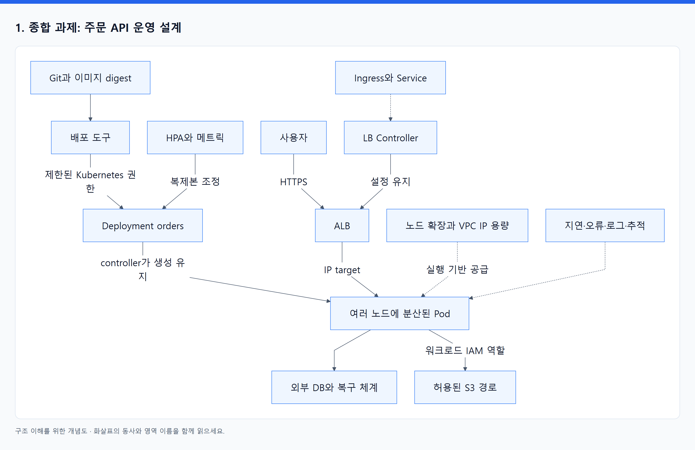

# 20. 요구사항을 구조로 바꾸고 실패를 예측한다

> 전체 학습 30/35 · 심화
> [이전: 19. 실행 전에 예측하고, 실행 후 증거로 설명한다](19_예측하며_배우는_실습.md) · [전체 목차](../README.md) · [다음: 21. 오브젝트 사전과 원문으로 돌아가는 지도](21_오브젝트_사전과_원문_지도.md)
> 본문을 위에서 아래로 읽고 마지막의 다음 장으로 이동한다. 본문 속 다른 장·출처 링크는 선택 참고용이다.

## 1. 종합 과제: 주문 API 운영 설계

다음은 정답 하나를 외우는 문제가 아니다. 선택한 설정이 어떤 요구를 만족하며 어떤 한계를 갖는지 설명하는 과제다.

**요구사항:** 주문 API는 외부 HTTPS로 접근한다. 앱 버전을 교체하는 동안 요청을 계속 처리해야 한다. 평상시 Pod 세 개를 사용하고 증가한 부하에 대응한다. 노드 한 개의 장애를 견뎌야 하며 주문 데이터는 앱 Pod와 분리한다. 앱은 특정 S3 경로의 파일만 읽는다. 배포 도구는 앱 Namespace의 배포 작업을 수행한다. 최근 데이터를 복원하고 새 환경에서 서비스할 수 있어야 한다.

먼저 도구 이름 없이 다음을 적어라. “필요한 실행 단위, 안정적인 접속점, 공유 상태의 위치, 권한 경계, 확장 조건, 실패 범위, 복구 목표.” 그다음 오브젝트와 AWS 자원을 붙인다.

<!-- diagram:02-20-block-1 -->


[크게 보기](../assets/diagrams/02-20-block-1.png) · [SVG](../assets/diagrams/02-20-block-1.svg)

<details>
<summary>그림의 원문 설명 펼치기</summary>

```text
flowchart TB
  G["Git과 이미지 digest"] --> CD["배포 도구"]
  CD -->|제한된 Kubernetes 권한| D["Deployment orders"]
  H["HPA와 메트릭"] -->|복제본 조정| D
  D -->|controller가 생성 유지| P["여러 노드에 분산된 Pod"]
  U["사용자"] -->|HTTPS| A["ALB"]
  I["Ingress와 Service"] -.-> L["LB Controller"]
  L -->|설정 유지| A
  A -->|IP target| P
  P --> DB["외부 DB와 복구 체계"]
  P -->|워크로드 IAM 역할| S3["허용된 S3 경로"]
  N["노드 확장과 VPC IP 용량"] -.->|실행 기반 공급| P
  OBS["지연·오류·로그·추적"] -.-> P
```

</details>
<!-- /diagram:02-20-block-1 -->

그림의 생성·참조·데이터 전달을 말로 구분하라. 이 구성은 한 가지 예이며 외부 DB 선택이나 ALB 방식은 요구에 맞춰 달라질 수 있다.

## 2. 설계 해설

| 요구 | 가능한 설계 | 반드시 함께 검토할 조건 |
|---|---|---|
| 상시 API 세 개 | Deployment replicas 3 | requests·Ready 조건·이미지 재현성 |
| 노드 하나 장애 대응 | 노드 분산·복수 Ready 대상 | 남은 노드 용량·복구 시간·공통 의존성 |
| 외부 HTTPS | Ingress와 ALB controller, DNS·인증서 | target health·네트워크·TLS 종료 위치 |
| 배포 중 요청 유지 | RollingUpdate·graceful shutdown | surge 공간·신구 버전 호환·연결 종료 |
| 부하 대응 | HPA와 노드 공급 체계 | 지표 적합성·최대값·IP·EC2·DB 용량 |
| 앱과 데이터 수명 분리 | 외부 DB 등 | 백업·RPO/RTO·복구 시험 |
| 특정 S3 접근 | 앱 전용 ServiceAccount와 IAM 역할 연결 | trust·permission·SDK·대상 정책 |
| 제한된 배포 권한 | 배포 IAM 신원과 EKS 접근·RBAC | rollout에 필요한 조회·변경 범위; 과도한 Secret·권한 위임 제한 |

PDB 하나로 요구사항 전체를 만족했다고 결론 내리지 않는다. 노드 장애는 비자발적 중단이고, PDB는 주로 자발적 eviction의 예산이다. 복제본이 실제 서로 다른 노드에 배치됐는지도 확인한다.

“S3 경로만 읽기”도 앱에 `s3:*`를 주는 것으로 끝내지 않는다. 실제 필요한 action과 bucket/object 자원 범위, 필요한 경우 목록 조건 등을 설계한다. 정확한 정책은 앱이 호출하는 AWS API와 함께 검증한다.

## 3. 이해도 점검: 책을 덮고 답하기

| 번호 | 질문 | 답에 반드시 들어갈 연결 |
|---|---|---|
| 1 | Deployment와 Deployment controller는 무엇이 다른가? | 저장된 의도와 실행 프로그램 |
| 2 | API가 잠시 불통인데 기존 HTTP 요청이 처리될 수 있는가? | 기존 프로세스·규칙 유지와 새로운 조정의 제약 |
| 3 | Pod의 이름은 같은데 UID가 바뀌면 같은 실행자인가? | 객체 재생성; 프로세스 메모리 연속성 없음 |
| 4 | Service를 지우면 Pod가 보통 남는 이유는? | 선택과 소유의 차이 |
| 5 | replicas 변경과 image 변경은 ReplicaSet에 어떤 차이를 만드는가? | 수량 조정과 template 변경 |
| 6 | CPU 사용률이 낮은데 FailedScheduling이 생기는 이유는? | requests·allocatable·다른 배치 제약 |
| 7 | toleration이 있는데 원하는 노드로 안 가는 이유는? | 허용 조건일 뿐 배치 강제가 아님 |
| 8 | readiness 실패와 liveness 실패는 어떻게 다른가? | 트래픽 대상과 컨테이너 재시작 |
| 9 | Pod IP 변경 후 Service가 유지하는 것은 무엇인가? | 안정적 진입점과 갱신된 대상; 기존 연결 이식 아님 |
| 10 | ALB IP target에서 Service는 왜 여전히 필요한가? | backend 선택의 설정 관계; 패킷 필수 경유지는 아님 |
| 11 | StatefulSet이 DB 백업을 대신하지 못하는 이유는? | 실행자 정체성과 데이터 의미의 차이 |
| 12 | PVC Bound인데 실행이 막히는 이유는? | 바인딩 이후 attach·mount·노드 단계 |
| 13 | ConfigMap을 수정했는데 프로세스 env가 그대로인 이유는? | 시작 시 주입과 변경 전파 방식 |
| 14 | NetworkPolicy가 있는데 차단되지 않는 이유는? | 적용 대상·정책 합집합·집행 구현 |
| 15 | HPA가 10인데 실제 Pod가 4라면 어떤 계층을 볼까? | controller 생성·Quota·배치·실행 준비·기반 공급 |
| 16 | PDB가 있는데 노드 사고로 서비스가 중단된 이유는? | 보호하는 중단 종류와 실제 분산·용량 |
| 17 | kubectl 권한과 S3 권한이 왜 다른가? | Kubernetes API 인가와 IAM 인가 |
| 18 | ECR push 성공과 pull 실패가 공존하는 이유는? | 실행 주체·권한·네트워크 경로의 분리 |
| 19 | CRD만 설치하면 기능이 실행되는가? | API 종류 정의와 controller 실행의 분리 |
| 20 | 클러스터 upgrade와 앱 rollout undo가 왜 다른가? | 지원 버전·제어부 수명주기·복구 전략 |

정답 키워드를 읽은 뒤에는 반드시 주어와 동사를 넣어 세 문장으로 다시 답한다. “CNI 때문” 대신 “runtime의 네트워크 준비 과정에서 CNI가 IP를 받아 인터페이스를 구성하려 했지만, 공급 가능한 주소가 없어 실패했다. Pod Events와 aws-node 로그를 확인한다”처럼 설명한다.

## 4. 장애 사례 세 개: 가설과 반증까지

**사례 A — 새 버전 Pod가 Pending이고 이전 버전은 정상이다.**

첫 가설은 surge에 필요한 여유 용량 부족이다. FailedScheduling에 Insufficient cpu가 있는지, requests 합과 allocatable을 비교한다. 반대로 nodeName이 이미 있고 ImagePullBackOff라면 배치 부족 가설은 맞지 않는다. 이미지 경로로 조사 대상을 바꾼다. 모든 Pending을 같은 원인으로 취급하지 않는 것이 핵심이다.

**사례 B — ALB는 존재하지만 새 버전 배포 직후 간헐 오류가 생긴다.**

Kubernetes Ready와 ALB target health의 시간차, 종료 중 기존 연결, 앱의 종료 처리 등을 후보로 둔다. target 등록·health 전환 시간과 rollout 시간, 앱 로그를 비교한다. 모든 신호가 정상이면서 특정 업무만 실패한다면 DB schema 호환성과 업무 trace로 이동한다. readiness gate가 모든 비즈니스 오류의 해답은 아니다.

**사례 C — 노드는 새로 늘었는데 Pod sandbox 생성이 실패한다.**

새 EC2가 존재한다는 것은 공급 연쇄의 한 단계만 끝났다는 뜻이다. aws-node 상태와 IPAM 로그, subnet 가용 주소, ENI/IP 또는 prefix 조건을 확인한다. 이미지 pull 실패라면 필요한 AWS endpoint와 DNS 경로를 조사한다. 노드 수, Pod 배치, 컨테이너 실행 준비를 각각 관측한다.

## 5. 숙련도를 확인하는 산출물

| 단계 | 남길 결과 | 통과 기준 |
|---|---|---|
| 구조 설명 | API·controller·노드·AWS 자원을 표시한 그림 | 화살표마다 생성·관찰·전달·참조를 말할 수 있음 |
| 설정 해석 | Deployment·Service·Ingress YAML에 주석 | 필드가 바뀌면 어느 주체가 반응하는지 예측 |
| 장애 진단 | 세 번의 실패·복구 기록 | 가설과 증거, 반증으로 조사 경로를 수정 |
| 운영 설계 | 용량·권한·배포·관측·백업 설계 | 평상시뿐 아니라 노드·AZ·의존성 실패도 설명 |
| 변경 검증 | 학습 환경 업그레이드·복원 보고서 | 실제 복구 시간과 누락 조건을 측정 |

마지막 단계 이후 더 깊게 들어갈 분야는 controller 구현과 workqueue, scheduler plugin, CNI/eBPF 데이터 경로, CSI와 DB 일관성, 멀티클러스터·멀티테넌시다. 현재 문제에 필요한 분야부터 선택한다. 기본 원리를 이해하면 새로운 기능도 “어떤 의도를 어디에 기록하고 누가 무엇을 바꾸는가?”로 읽을 수 있다.

[목차](README.md) · [찾아보기](21_오브젝트_사전과_원문_지도.md)

---

[이전: 19. 실행 전에 예측하고, 실행 후 증거로 설명한다](19_예측하며_배우는_실습.md) · [전체 목차](../README.md) · [다음: 21. 오브젝트 사전과 원문으로 돌아가는 지도](21_오브젝트_사전과_원문_지도.md)
