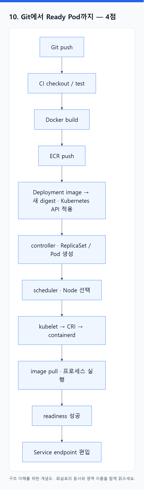

# 03. 최종 이해도 문제집 — 정답과 해설

> 전체 학습 34/35 · 최종 점검
> [이전: 02. 최종 이해도 문제 답안지](02_답안지.md) · [전체 목차](../README.md) · [다음: 04. 문항별 근거 지도](04_문항별_근거_지도.md)

`02_답안지.md`를 먼저 작성한 뒤 채점한다. 표현이 달라도 **주체 → 입력 → 행동 → 결과/증거**가 맞으면 인정한다. 핵심어만 나열하면 해당 점수의 절반 이하만 준다.

각 답의 교재 위치와 공식 1차 문서는 [문항별 근거 지도](04_문항별_근거_지도.md)에서 확인한다.

## 1부. 개념과 책임 경계 — 20점

### 1. Terraform 실행 뒤 Pod 관리 — 2점

Terraform은 AWS 인프라를 만들고 state에 대응 관계를 기록한다. 이후 Deployment/ReplicaSet controller가 Pod 수를 조정하고, 각 Node의 kubelet이 배정된 Pod의 실제 실행 상태를 맞춘다. Terraform 1점, controller와 kubelet 구분 1점. `Node가 관리한다`만 쓰면 0.5점이다.

### 2. 세 상태 저장소 — 3점

- Terraform state: Terraform 리소스와 실제 클라우드 리소스의 대응 관계
- etcd: Kubernetes API 오브젝트의 원하는 상태와 관찰된 상태
- 애플리케이션 DB: 주문·사용자 같은 업무 데이터

각 1점. 어느 것도 다른 저장소의 백업을 대신하지 않는다.

### 3. 이미지와 컨테이너 — 2점

이미지는 파일시스템 레이어, 실행 명령과 메타데이터를 담은 실행 템플릿이다. 컨테이너는 런타임이 이미지에서 만든 격리된 프로세스와 쓰기 가능한 상태를 가진 실행 인스턴스다. 각 1점.

### 4. Docker Engine 없이 실행 — 3점

Docker 빌드 결과는 OCI Image Specification과 호환되는 레이어·설정·manifest로 레지스트리에 저장된다. kubelet은 CRI를 통해 별도 프로세스인 containerd에 실행을 요청한다. containerd는 이미지를 pull하고 OCI 실행 구성을 만들며, 보통 `runc`가 Linux namespace와 cgroup을 이용해 프로세스를 시작한다.

- OCI 호환 이미지 형식: 1점
- kubelet → CRI → containerd: 1점
- containerd/저수준 런타임 → Linux 격리 → 프로세스: 1점

`kubelet에 containerd가 내장됐다`는 설명은 틀리다. OCI도 제품이 아니라 이미지와 런타임 사이의 표준 규격이다.

### 5. Kubernetes와 EKS — 2점

Kubernetes는 컨테이너 워크로드의 원하는 상태를 유지하는 오케스트레이션 시스템이다. EKS는 AWS가 Kubernetes control plane의 가용성·패치와 AWS 연동 기반을 관리하는 서비스다. 워크로드, 데이터, 권한과 관측 책임은 사용자에게 남는다. 각 1점.

### 6. API 주소와 서비스 주소 — 2점

Kubernetes API endpoint는 `kubectl`과 controller가 오브젝트를 읽고 바꾸는 관리 경로다. ALB 주소는 사용자의 HTTP 요청을 앱으로 보내는 데이터 경로다. 각 1점.

### 7. Deployment와 controller — 2점

Deployment 오브젝트는 API 서버에 저장된 원하는 상태 데이터다. Deployment controller는 이를 감시하고 필요한 ReplicaSet을 만드는 실행 중인 제어 루프다. 각 1점.

### 8. Node, kubelet, containerd — 2점

Node는 컴퓨팅 자원을 제공하는 머신, kubelet은 배정된 PodSpec을 실제 상태로 만드는 노드 에이전트, containerd는 CRI 요청을 받아 이미지·컨테이너 수명주기를 처리하는 런타임이다. 세 역할을 구분하면 2점.

### 9. ServiceAccount와 IAM — 2점

ServiceAccount는 Pod의 Kubernetes 신원이며 Kubernetes API 권한은 RBAC이 결정한다. AWS API 권한은 IAM이 결정하고, EKS Pod Identity 또는 IRSA가 ServiceAccount와 IAM role을 연결한다. 구분 1점, 연결 1점.

## 2부. 전체 흐름 추적 — 20점

### 10. Git에서 Ready Pod까지 — 4점

<!-- diagram:03-03-block-1 -->


[크게 보기](../assets/diagrams/03-03-block-1.png) · [SVG](../assets/diagrams/03-03-block-1.svg)

<details>
<summary>그림의 원문 설명 펼치기</summary>

```text
Git push → CI checkout/test → Docker build → ECR push
→ Deployment image를 새 digest로 변경해 Kubernetes API에 적용
→ controller가 ReplicaSet/Pod 생성 → scheduler가 Node 선택
→ kubelet이 CRI로 containerd에 요청 → image pull·프로세스 실행
→ readiness 성공 → Service endpoint 편입
```

</details>
<!-- /diagram:03-03-block-1 -->

build/ECR, API/controller, scheduler/runtime, readiness/Service에 각 1점.

### 11. Terraform 흐름 — 3점

HCL이 원하는 AWS 자원을 선언하고 provider가 설정·state와 비교해 AWS API를 호출한다. AWS가 VPC/EKS/노드 그룹 등을 만들면 Terraform이 ID와 속성을 state에 기록한다. HCL/provider/API 2점, state 1점.

### 12. Deployment 적용부터 Ready까지 — 4점

API server가 저장 → Deployment controller가 ReplicaSet 생성 → ReplicaSet controller가 Pod 생성 → scheduler가 Node에 binding → kubelet이 CRI로 containerd에 실행 요청 → CNI/CSI가 네트워크·볼륨 준비 → readiness 성공 → endpoint 편입. API/controller, scheduler, kubelet/runtime/CNI·CSI, readiness에 각 1점.

### 13. ECR은 v2, Pod는 v1 — 2점

push만으로 Deployment의 image가 바뀌지 않는다. manifest가 v1이거나 같은 가변 tag와 캐시/`imagePullPolicy` 영향이 있거나 rollout이 실패했을 수 있다. Deployment·ReplicaSet·Pod의 `image`, 실제 `imageID`, rollout Events를 확인하고 digest 고정을 권장한다. push와 배포의 분리 1점, 원인과 확인 증거 1점.

### 14. ALB에서 Pod까지 — 4점

IP target 모드 데이터 경로는 `사용자 → DNS → ALB listener/rule → target group의 Ready Pod IP:targetPort → 앱`이다. AWS Load Balancer Controller는 Ingress·Service·EndpointSlice를 감시해 AWS API로 ALB와 target group을 구성하는 제어 경로에 있으며 요청마다 통과하지 않는다. Service는 선택·포트 정보를 제공하지만 패킷이 반드시 ClusterIP를 거치지는 않는다. 외부 데이터 경로 2점, controller의 제어 경로 1점, Service와 endpoint 관계 1점.

### 15. Pod IP 변경과 Service — 3점

Service는 안정된 DNS/가상 IP를 제공한다. selector에 맞고 Ready인 Pod 집합이 EndpointSlice에 갱신되며 kube-proxy 또는 데이터플레인이 새 backend로 전달한다. ALB를 쓰면 Load Balancer Controller도 target group을 동기화한다. 안정 주소, endpoint 추적, 전달 갱신에 각 1점.

## 3부. Kubernetes 오브젝트 — 20점

### 16. Deployment → ReplicaSet → Pod — 3점

Deployment는 rollout과 상위 원하는 상태, ReplicaSet은 지정 수의 Pod 유지, Pod는 컨테이너가 실행되는 최소 배포 단위다. ownerReference 관계와 역할마다 1점.

### 17. selector와 ownerReference — 2점

selector는 label로 대상을 선택하는 조건이다. ownerReference는 생명주기 소유 관계이며 garbage collection에도 쓰인다. 선택과 소유는 별개다. 각 1점.

### 18. 워크로드 선택 — 4점

무상태 API는 Deployment, 안정된 이름·스토리지는 StatefulSet, 노드마다 에이전트는 DaemonSet, 완료형 배치는 Job(주기 실행은 CronJob)이다. 각 1점.

### 19. probe — 3점

startup은 느린 시작 동안 나머지 probe 판단을 유예한다. readiness는 트래픽 수신 가능 여부이며 실패하면 endpoint에서 제외한다. liveness는 멈춘 컨테이너의 재시작 판단이다. 각 1점.

### 20. ConfigMap 환경 변수 — 2점

환경 변수는 컨테이너 시작 때 주입되므로 ConfigMap 변경만으로 기존 프로세스에 반영되지 않는다. rollout restart나 checksum annotation으로 새 Pod를 만든다. 각 1점.

### 21. PVC에서 AWS 디스크까지 — 3점

Pod가 PVC로 요청하고 StorageClass가 프로비저닝 방식을 정한다. CSI provisioner가 AWS API로 EBS 등을 만들고 PV가 이를 표현해 PVC와 bind된다. Node의 CSI 구성 요소가 attach/mount한다. 요청/정책, 생성/bind, attach/mount에 각 1점.

### 22. RBAC — 3점

Role은 namespace 범위, ClusterRole은 클러스터 범위 또는 재사용할 권한 규칙이다. RoleBinding은 namespace 안에서 Role/ClusterRole을, ClusterRoleBinding은 전역으로 ClusterRole을 주체에 연결한다. 권한, binding, 주체 연결에 각 1점.

## 4부. 장애 진단과 확장 — 20점

### 23. Pending과 낮은 CPU 사용률 — 3점

scheduler는 현재 사용률보다 requests와 allocatable, taint/toleration, affinity, topology, 볼륨 제약을 본다. `describe pod`의 `FailedScheduling` Events와 Node 예약량을 먼저 확인한다. 사용률과 예약량 구분 1점, 가능한 원인 두 가지 1점, Events 등 확인 증거 1점.

### 24. `ImagePullBackOff` — 3점

이미지 이름·digest와 ECR 존재 여부, ECR 인증 권한, 네트워크와 Events의 실제 pull 오류를 확인한다. 조사 영역 세 가지에 각 1점.

### 25. `FailedCreatePodSandBox`와 IP — 2점

Amazon VPC CNI가 Pod용 ENI/IP를 준비하지 못한 상황이다. subnet 가용 IP, 인스턴스별 ENI/IP 한계, `aws-node` 상태·로그, prefix delegation과 warm pool을 확인한다. 원인과 증거에 각 1점.

### 26. Running이지만 Ready 아님 — 3점

프로세스는 실행됐지만 readiness가 실패했다. Ready가 아니므로 EndpointSlice 대상에서 빠진다. Pod condition/Events → readiness probe의 path·port → 앱 로그와 의존성 → Service selector/EndpointSlice 순서로 확인한다. 상태 원리 1점, 조사 순서와 증거 2점.

### 27. 내부 정상, ALB 503 — 3점

Ingress annotation/rule, target 등록과 health check path·port·status, security group, Load Balancer Controller 로그·이벤트를 확인한다. 내부가 정상이므로 ALB 이후 구간으로 범위를 좁힌 근거 1점, 점검 항목 2개 이상 2점.

### 28. HPA desired 10, Ready 4 — 3점

HPA는 replica 수만 바꾼다. Pending이면 requests/allocatable, scheduling 제약, subnet IP/ENI와 quota를 본다. Running이지만 Ready가 아니면 probe와 앱을 본다. HPA 책임, 상태 구분, 증거에 각 1점.

### 29. HPA와 Cluster Autoscaler — 2점

HPA는 metrics를 보고 workload replicas를 바꾼다. Cluster Autoscaler는 미배치 Pod와 Node group 활용 상태를 보고 ASG/관리형 노드 그룹의 desired capacity를 바꾼다. `HPA → Pod 증가 → Pending → CA → Node 증가 → 재스케줄`로 연결된다. 그룹 최대치, EC2 용량/quota, subnet IP나 권한 때문에 Node가 생기지 않을 수 있다. 두 입력·출력 1점, 연결과 실패 이유 1점.

### 30. PDB의 한계 — 1점

PDB는 drain·업그레이드 같은 자발적 eviction에서 동시 감소 수를 제한한다. 전원 장애 같은 비자발적 중단을 막지는 못하므로 모순이 아니다. 다중 AZ replicas와 topology spread 등이 별도로 필요하다. 자발적·비자발적 중단의 경계를 설명하면 1점.

## 5부. 종합 설계 — 20점

### 31. 코드에서 운영까지 — 6점

Terraform은 VPC/subnet/IAM/EKS/Node group/ECR을 만든다. CI/CD는 test → OCI image build → ECR push → digest를 manifest에 반영해 배포한다. Kubernetes는 controller → scheduler → kubelet/CRI/containerd → CNI/CSI 순서로 실행 상태를 만든다. readiness 뒤 Service/Ingress/ALB로 HTTPS 트래픽을 제공한다. Terraform 1점, CI/CD 1점, Kubernetes 조정 2점, 사용자 트래픽 1점, 세 책임 영역의 명시적 구분 1점.

### 32. 앱 오브젝트 설계 — 4점

Deployment, Service, Ingress, ConfigMap/Secret, ServiceAccount와 RBAC, HPA, PDB, NetworkPolicy, 필요 시 PVC를 조합한다. Deployment에는 requests/limits, probe, rolling update, topology spread를 둔다. 이름만 8개 쓰면 최대 2점이며 실행·노출, 설정·권한, 가용성·확장, 자원·저장의 요구와 연결하면 각 1점.

### 33. Pod와 Node 용량 — 3점

HPA가 replicas를 바꾸고 requests가 scheduler의 용량 기준이 된다. 미배치 Pod가 생기면 Cluster Autoscaler 또는 Karpenter가 Node를 공급한다. 여러 AZ/subnet IP, EC2 quota·용량과 최대 Node 수를 고려하고 축소 때 PDB를 지킨다. HPA/requests 1점, 선택한 Node autoscaler의 입력·출력 1점, 실패 조건 1점.

### 34. 권한 — 3점

사람/CI의 IAM 인증을 EKS access entry 등으로 연결하고 RBAC이 Kubernetes API 권한을 결정한다. Pod는 ServiceAccount를 쓰며 Kubernetes 권한은 RBAC, AWS 권한은 Pod Identity/IRSA와 IAM role이 결정한다. Node IAM role은 kubelet·CNI·이미지 pull 등 노드 기능에 필요한 권한만 갖는다. 앱, 배포자, Node의 권한 분리에 각 1점.

### 35. 배포·관측·데이터 — 4점

고유 digest, rolling update와 readiness로 배포하고 rollout 상태와 이전 ReplicaSet으로 복구한다. 로그·metrics·traces·Events와 SLO/경보를 둔다. DB/PV를 백업하고 restore를 실제 검증한다. EKS가 control plane을 관리해도 앱 설정, 데이터와 복구 목표는 사용자 책임이다. 배포, 관측, 복구 검증, 책임 경계에 각 1점.

## 보너스 — 최대 6점

### 36. 선언 시스템이 여러 개인 이유 — 2점

Terraform은 장수명 클라우드 인프라, Kubernetes는 빠르게 변하는 워크로드, 앱은 업무 데이터를 서로 다른 API와 주기로 관리한다. 경계를 나누면 변경 주기와 장애 범위가 결합되지 않는다.

### 37. 두 desired state — 2점

Terraform은 주로 plan/apply 때 state와 AWS를 비교한다. Kubernetes controller는 계속 watch하고 현재 상태를 원하는 상태로 되돌린다. 선언형이라는 공통점은 있지만 조정 빈도와 대상이 다르다.

### 38. 장애 증거 순서 — 2점

예: 사용자 실패 → ALB target/access log → Ingress/Service/EndpointSlice → Pod Ready/Events → 앱 로그/metrics → Node/kubelet/CNI → AWS subnet·ENI·IAM. 각 결과로 다음 조사 범위를 줄인다고 설명해야 한다.

## 오답별 복습 경로

| 문제 | 복습 자료 |
|---|---|
| 1–9 | [전체 구조](../README.md), [내부 원리](../01_기초/04_내부_원리.md) |
| 4, 10, 12–13 | [Git에서 EKS까지](../01_기초/06_Git에서_EKS까지_전체_배포_흐름.md), [Docker 실행 원리](../01_기초/03_Docker_이미지에서_실행까지.md) |
| 6, 14–15, 25, 27 | [연결 구조 그림](../01_기초/08_그림으로_연결하기.md), [EKS 네트워크·스토리지](../02_심화/16_EKS의_네트워크_스토리지_확장.md) |
| 16–22, 32 | [Kubernetes 오브젝트 상세](../02_심화/오브젝트_색인.md) |
| 23–30, 33 | [확장과 가용성](../02_심화/13_확장과_가용성.md), [관측과 장애 진단](../02_심화/18_관측_장애진단_업그레이드.md) |
| 31, 34–35 | [종합 설계](../02_심화/20_종합_설계와_해설.md), [서비스의 일생](../01_기초/05_서비스의_일생.md) |

오답은 정답 암기 대신 다음 네 문장으로 다시 쓴다: 원하는 상태는 어디에 있는가, 누가 감시하는가, 누가 실제 변경을 실행하는가, 어떤 상태·이벤트·로그로 증명하는가.

---

[이전: 02. 최종 이해도 문제 답안지](02_답안지.md) · [전체 목차](../README.md) · [다음: 04. 문항별 근거 지도](04_문항별_근거_지도.md)
